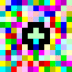

<div align="center">

# 🌍 Polyglot Hello World Collection

### A museum of real “Hello World” programs — **6,651** exhibits, one per language.

Every exhibit is a genuine artifact from a documented language:<br>
no invented placeholders, no stub `print("Hello World")` for languages that never existed.

<br>


<br>

**[⭐ Featured](#-featured-exhibits)** · **[🏛 Full Catalog](lists/all.md)** · **[🗂 Halls A–Z](#-browse-the-halls)** · **[🖼 Media Wing](#-the-media-wing)** · **[🤝 Contribute](#-contributing)**

</div>

---

## 🎫 Admission Policy

|  | Rule |
|:--:|------|
| ✅ | **Keep** — documented languages with a real interpreter, compiler or specification, and a genuine Hello World artifact. |
| ❌ | **Skip** — invented placeholders, duplicate names without distinct code, and secret-scanner-hostile formats (e.g. Power Fx `.pfx`). |

---

## 🚪 Choose Your Entrance

|  | Wing | What is inside |
|:--:|------|----------------|
| ⭐ | [**Featured Exhibits**](#-featured-exhibits) | Industry standards and signature esolangs |
| 🏛 | [**Full Catalog**](lists/all.md) | All 6,651 exhibits in a single hall |
| 🚀 | [Modern Languages](lists/modern.md) | Contemporary, actively evolving languages |
| 🏺 | [Legacy Languages](lists/legacy.md) | Historic and retired languages |
| 🌀 | [Esoteric Languages](lists/esoteric.md) | Deliberately strange by design |
| 🔬 | [Research Languages](lists/research.md) | Academic and experimental designs |
| 🔣 | [Symbols & Numerals](lists/symbols.md) | Languages named with symbols or digits |
| 🈶 | [Non-English Names](lists/nonenglish.md) | Names written in non-Latin scripts |

<sub>The four thematic wings — modern, legacy, esoteric and research — are still being curated; for now they point back at the full catalog.</sub>

---

## 🗂 Browse the Halls

Every language is filed by its first letter. Each hall is split into wings so that no single page grows unreadable.

<details>
<summary><b>Open the floor plan — 26 halls, A to Z</b></summary>

<br>

| Hall | Wings | | Hall | Wings |
|:----:|-------|:-:|:----:|-------|
| **A** | [A1](lists/A1.md) · [A2](lists/A2.md) · [A3](lists/A3.md) · [A4](lists/A4.md) | | **N** | [N1](lists/N1.md) · [N2](lists/N2.md) · [N3](lists/N3.md) · [N4](lists/N4.md) |
| **B** | [B1](lists/B1.md) · [B2](lists/B2.md) · [B3](lists/B3.md) · [B4](lists/B4.md) | | **O** | [O1](lists/O1.md) · [O2](lists/O2.md) · [O3](lists/O3.md) · [O4](lists/O4.md) |
| **C** | [C1](lists/C1.md) · [C2](lists/C2.md) · [C3](lists/C3.md) · [C4](lists/C4.md) | | **P** | [P1](lists/P1.md) · [P2](lists/P2.md) · [P3](lists/P3.md) · [P4](lists/P4.md) |
| **D** | [D1](lists/D1.md) · [D2](lists/D2.md) · [D3](lists/D3.md) · [D4](lists/D4.md) | | **Q** | [Q1](lists/Q1.md) · [Q2](lists/Q2.md) · [Q4](lists/Q4.md) |
| **E** | [E1](lists/E1.md) · [E2](lists/E2.md) · [E3](lists/E3.md) · [E4](lists/E4.md) | | **R** | [R1](lists/R1.md) · [R2](lists/R2.md) · [R3](lists/R3.md) · [R4](lists/R4.md) |
| **F** | [F1](lists/F1.md) · [F2](lists/F2.md) · [F3](lists/F3.md) · [F4](lists/F4.md) | | **S** | [S1](lists/S1.md) · [S2](lists/S2.md) · [S3](lists/S3.md) · [S4](lists/S4.md) |
| **G** | [G1](lists/G1.md) · [G2](lists/G2.md) · [G3](lists/G3.md) · [G4](lists/G4.md) | | **T** | [T1](lists/T1.md) · [T2](lists/T2.md) · [T3](lists/T3.md) · [T4](lists/T4.md) |
| **H** | [H1](lists/H1.md) · [H2](lists/H2.md) · [H3](lists/H3.md) · [H4](lists/H4.md) | | **U** | [U1](lists/U1.md) · [U2](lists/U2.md) · [U3](lists/U3.md) · [U4](lists/U4.md) |
| **I** | [I1](lists/I1.md) · [I2](lists/I2.md) · [I3](lists/I3.md) · [I4](lists/I4.md) | | **V** | [V1](lists/V1.md) · [V2](lists/V2.md) · [V3](lists/V3.md) · [V4](lists/V4.md) |
| **J** | [J1](lists/J1.md) · [J2](lists/J2.md) · [J3](lists/J3.md) · [J4](lists/J4.md) | | **W** | [W1](lists/W1.md) · [W2](lists/W2.md) · [W3](lists/W3.md) · [W4](lists/W4.md) |
| **K** | [K1](lists/K1.md) · [K2](lists/K2.md) · [K3](lists/K3.md) · [K4](lists/K4.md) | | **X** | [X1](lists/X1.md) · [X2](lists/X2.md) · [X3](lists/X3.md) · [X4](lists/X4.md) |
| **L** | [L1](lists/L1.md) · [L2](lists/L2.md) · [L3](lists/L3.md) · [L4](lists/L4.md) | | **Y** | [Y1](lists/Y1.md) · [Y2](lists/Y2.md) |
| **M** | [M1](lists/M1.md) · [M2](lists/M2.md) · [M3](lists/M3.md) · [M4](lists/M4.md) | | **Z** | [Z1](lists/Z1.md) · [Z2](lists/Z2.md) · [Z3](lists/Z3.md) · [Z4](lists/Z4.md) |

</details>

---

## 🖼 The Media Wing

Not every Hello World is text. **82** exhibits are images, sound, archives or raw binaries, and each one is rendered in place rather than left as an unopenable blob.

| Kind | How it is displayed |
|------|---------------------|
| 🖼 Images — Piet, Brainloller, SVG, … | Embedded picture preview |
| 🎵 MIDI / sound — Velato, … | Engraved score + piano roll + MP3 / WAV / MIDI |
| 🧩 Block-based — Scratch, Catrobat, App Inventor, Playgrounds | Extracted costume or screenshot + source summary |
| 🗜 Archives — ZIP, gzip | Preview when present + extracted text |
| 💾 Binaries — PE, ELF, opaque | Hex dump + strings summary, never a raw dump |

---

## ⭐ Featured Exhibits

The signature gallery: the languages most people arrive looking for, plus a few that have to be seen to be believed.

### Python

```python
print("Hello World")
```

<sub>📄 [`libraries/p/P-2/Python 3.py`](libraries/p/P-2/Python%203.py)</sub>

### C

```c
#include <stdio.h>

int main(void) {
    printf("Hello World\n");
    return 0;
}
```

<sub>📄 [`libraries/c/C-1/c.c`](libraries/c/C-1/c.c)</sub>

### C++

```cpp
#include <iostream>

int main() {
    std::cout << "Hello World" << std::endl;
    return 0;
}
```

<sub>📄 [`libraries/c/C-1/C++.cpp`](libraries/c/C-1/C++.cpp)</sub>

### C#

```csharp
using System;

class Program {
    static void Main() {
        Console.WriteLine("Hello World");
    }
}
```

<sub>📄 [`libraries/c/C-1/C#.cs`](libraries/c/C-1/C%23.cs)</sub>

### Java

```java
public class HelloWorld {
    public static void main(String[] args) {
        System.out.println("Hello World");
    }
}
```

<sub>📄 [`libraries/j/J-1/Java.java`](libraries/j/J-1/Java.java)</sub>

### JavaScript

```javascript
console.log("Hello World");
```

<sub>📄 [`libraries/j/J-1/JavaScript.js`](libraries/j/J-1/JavaScript.js)</sub>

### TypeScript

```typescript
console.log("Hello World");
```

<sub>📄 [`libraries/t/T-2/TypeScript.ts`](libraries/t/T-2/TypeScript.ts)</sub>

### Go

```go
package main

import "fmt"

func main() {
    fmt.Println("Hello World")
}
```

<sub>📄 [`libraries/g/G-2/Go.go`](libraries/g/G-2/Go.go)</sub>

### Rust

```rust
fn main() {
    println!("Hello World");
}
```

<sub>📄 [`libraries/r/R-2/Rust.rs`](libraries/r/R-2/Rust.rs)</sub>

### Ruby

```ruby
puts "Hello World"
```

<sub>📄 [`libraries/r/R-2/Ruby.rb`](libraries/r/R-2/Ruby.rb)</sub>

### PHP

```php
<?php
echo "Hello World";
```

<sub>📄 [`libraries/p/P-1/PHP.php`](libraries/p/P-1/PHP.php)</sub>

### Swift

```swift
print("Hello World")
```

<sub>📄 [`libraries/s/S-4/Swift.swift`](libraries/s/S-4/Swift.swift)</sub>

### Kotlin

```kotlin
fun main() {
    println("Hello World")
}
```

<sub>📄 [`libraries/k/K-2/Kotlin.kt`](libraries/k/K-2/Kotlin.kt)</sub>

### Haskell

```haskell
module Main where

main = putStrLn "Hello World"
```

<sub>📄 [`libraries/h/H-1/Haskell.hs`](libraries/h/H-1/Haskell.hs)</sub>

### Lua

```lua
print("Hello World")
```

<sub>📄 [`libraries/l/L-2/Lua.lua`](libraries/l/L-2/Lua.lua)</sub>

### R

```r
cat("Hello World")
```

<sub>📄 [`libraries/r/R-1/R.R`](libraries/r/R-1/R.R)</sub>

### Perl

```perl
   #!/usr/local/bin/perl -w
   use CGI;                             # load CGI routines
   $q = CGI->new;                        # create new CGI object
   print $q->header,                    # create the HTTP header
         $q->start_html('Hello World'), # start the HTML
         $q->h1('Hello World'),         # level 1 header
         $q->end_html;                  # end the HTML

 # http://perldoc.perl.org/CGI.html
```

<sub>📄 [`libraries/p/P-1/Perl.cgi`](libraries/p/P-1/Perl.cgi)</sub>

### Scala

```scala
object HelloWorld extends App {
  println("Hello World")
}
```

<sub>📄 [`libraries/s/S-1/Scala.scala`](libraries/s/S-1/Scala.scala)</sub>

### Elixir

```elixir
IO.puts("Hello World")
```

<sub>📄 [`libraries/e/E-1/Elixir.exs`](libraries/e/E-1/Elixir.exs)</sub>

### Julia

```julia
println("Hello World")
```

<sub>📄 [`libraries/j/J-2/Julia.jl`](libraries/j/J-2/Julia.jl)</sub>

### Zig

```zig
const std = @import("std");

pub fn main() void {
    std.debug.print("Hello World\n", .{});
}
```

<sub>📄 [`libraries/z/Z-1/Zig.zig`](libraries/z/Z-1/Zig.zig)</sub>

### Nim

```nim
echo "Hello World"
```

<sub>📄 [`libraries/n/N-1/Nim.nim`](libraries/n/N-1/Nim.nim)</sub>

### Dart

```dart
void main() {
  print("Hello World");
}
```

<sub>📄 [`libraries/d/D-1/dart.dart`](libraries/d/D-1/dart.dart)</sub>

### Bash

```bash
#!/bin/bash

echo "Hello World"
```

<sub>📄 [`libraries/b/B-1/Bash.bash`](libraries/b/B-1/Bash.bash)</sub>

### SQL

```sql
SELECT 'Hello World';
```

<sub>📄 [`libraries/s/S-3/SQL.sql`](libraries/s/S-3/SQL.sql)</sub>

### Piet

*🖼️ Image-based language · GIF · 7287 bytes*

<div align="center">



</div>

<sub>📄 [`libraries/p/P-2/Piet.gif`](libraries/p/P-2/Piet.gif)</sub>

### Velato

*🎵 Music-based language · MIDI*

**Score**


**Piano roll**


**Audio:** [MP3](libraries/v/V-1/Velato.mp3) · [WAV](libraries/v/V-1/Velato.wav) · [MIDI](libraries/v/V-1/Velato.mid) · [LilyPond](libraries/v/V-1/Velato.ly)

<audio controls preload="none" src="libraries/v/V-1/Velato.mp3">Your browser does not support the audio element — use the MP3 link above.</audio>

<sub>📄 [`libraries/v/V-1/Velato.mid`](libraries/v/V-1/Velato.mid)</sub>

### Brainfuck

```brainfuck
-[------->+<]>-.-[->+++++<]>++.+++++++..+++.[--->+<]>-----.---[->+++<]>.-[--->+<]>---.+++.------.--------.
```

<sub>📄 [`libraries/b/B-3/brainfuck.bf`](libraries/b/B-3/brainfuck.bf)</sub>

### Whitespace

```text
Hello #World #in #Whitespace	* # #	* # # #
+	*[Space]
+ #is #marked #with"#" # #[tab]	#with"*"	*line-feed #with #"+"	* #	*so
+it	#would
+be #easier #to #write #again... #All	*the	*non-whitespace-characters #are	*ignored...	* # #
+	*
+ # # # # #	*	* #	*	* # #
+	*
+ # # # # #	*	* #	*	*	*	*
+	*
+ # # # # #	* # # # # #
+	*
+ # # # # #	* #	* #	*	*	*
+	*
+ # # # # #	*	* #	*	*	*	*
+	*
+ # # # # #	*	*	* # #	* #
+	*
+ # # # # #	*	* #	*	* # #
+	*
+ # # # # #	*	* # #	* # #
+	*
+ # # # # #	* # # # #	*
+	*
+ # # # # #	* #	* #
+	*
+ # #
+
+
+
```

<sub>📄 [`libraries/w/W-2/Whitespace`](libraries/w/W-2/Whitespace)</sub>

---

## 🏗 Repository Structure

```text
libraries/                 # the exhibits themselves — 6,651 catalogued artifacts
  a/ … z/                  # letter buckets, each split into A-1 … A-4 subdivisions
  nonenglish/              # non-ASCII language names
  symbols/                 # symbolic and numeric language names
lists/                     # generated browsable catalog (name → code → source link)
source_of_truth_leachim6/  # vendored leachim6/hello-world snapshot (plain files, not a submodule)
tio_languages.json         # TIO language catalog + Hello World payloads used for verification
README.md
LICENSE.md
```

### Entry format

Every catalog entry follows the same three-part plaque:

1. **Language display name** as a heading
2. **Fenced code block** — or a media preview and descriptor for non-textual artifacts
3. **Source link** into `libraries/…`

---

## 🤝 Contributing

Pull requests are welcome. Please bring a **real** Hello World with a cited source — a language specification, TIO, Rosetta Code, esolangs.org, or the upstream repository.

> Do not add placeholder `print("Hello World")` stubs for languages that do not exist.

---

## 📜 License

See [`LICENSE.md`](LICENSE.md). Individual samples remain subject to their upstream licenses, displayed here as fair use for educational museum purposes.

<div align="center">
<br>

**[⬆ Back to the entrance](#-polyglot-hello-world-collection)**

</div>
