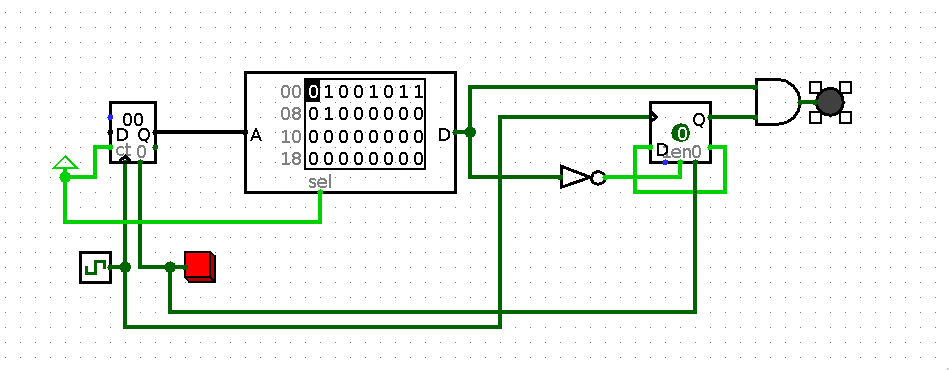

# B3

92 entries.

##### 1BNWL
```text
> - >>
< - <<
* - >+<[->-<]>[<+>-]<
[ - [
] - ]
```
[Source File](../libraries/b/B-3/1BNWL)

##### 4BOD
```text
   0000 -           Do nothing.
   0001 arg1 -      Sets the accumulator to the value stored at the address arg1. 
   0010 arg1 -      Writes the accumulator to the address arg1. 
   0011 arg1 -      Sets the accumulator to arg1. 
   0100 -           Sets the accumulator to the states of the arrow keys in the order D|U|R|L.
   0101 -           Increments the accumulator, overflowing if it goes above 15. 
   0110 -           Clears the screen. (setting all VRAM to 0)
   0111 -           Shifts the accumulator left.
   1000 -           Shifts the accumulator right.  
   1001 arg1 arg2 - Sets the accumulator to the state of the pixel at the X and Y coordinates of the values at addresses arg1 and arg2,
                    respectively.  
   1010 arg1 arg2 - Flips the state of the pixel at the X and Y coordinates of the values at addresses arg1 and arg2, respectively.   
   1011 arg1 -      Creates a flag named arg1. 
   1100 arg1 -      Jumps to the flag named after the value stored at the address arg1. (If 2 flags have the same ID the one later in the code
                    is the one jumped to)
   1101 arg1 -      Only perform next instruction if the value at address arg1 is equal to the accumulator.
   1110 arg1 -      Only perform next instruction if the value at address arg1 is greater than the accumulator.
   1111 arg1 -      Only perform next instruction if the value at address arg1 is less than the accumulator.
```
[Source File](../libraries/b/B-3/4BOD)

##### B  _None1
```text
++++++++++++++++++++++++++++++++++++++++++++++++++++++++++++++++++++++++.>+++++++++++++++++++++++++++++++++++++++++++++++++++++++++++++++++++++++++++++++++++++++++++++++++++++.>++++++++++++++++++++++++++++++++++++++++++++++++++++++++++++++++++++++++++++++++++++++++++++++++++++++++++++.>++++++++++++++++++++++++++++++++++++++++++++++++++++++++++++++++++++++++++++++++++++++++++++++++++++++++++++.>+++++++++++++++++++++++++++++++++++++++++++++++++++++++++++++++++++++++++++++++++++++++++++++++++++++++++++++++.>++++++++++++++++++++++++++++++++++++++++++++.>++++++++++++++++++++++++++++++++.>+++++++++++++++++++++++++++++++++++++++++++++++++++++++++++++++++++++++++++++++++++++++.>+++++++++++++++++++++++++++++++++++++++++++++++++++++++++++++++++++++++++++++++++++++++++++++++++++++++++++++++.>++++++++++++++++++++++++++++++++++++++++++++++++++++++++++++++++++++++++++++++++++++++++++++++++++++++++++++++++++.>++++++++++++++++++++++++++++++++++++++++++++++++++++++++++++++++++++++++++++++++++++++++++++++++++++++++++++.>++++++++++++++++++++++++++++++++++++++++++++++++++++++++++++++++++++++++++++++++++++++++++++++++++++.>+++++++++++++++++++++++++++++++++.
```
[Source File](../libraries/b/B-3/B%20%20_None1)

##### Blablafuck
```text
 >5--------.7-----------.+++++++..+++.<2.5+++++++.>.+++.------.--------.2+.
```
[Source File](../libraries/b/B-3/Blablafuck)

##### Black
```text
           # #  

                 #
       #         

              #


     #    #    # 
                
           #    
              7
              2
              N
              1
              0
              1
              N
              1
              0
              8
              N
              1
              0
              8
              N
              1
              1
              1
              N
              4
              4
              N
              3
              2
              N
              1
              1
              9
              N
              1
              1
              1
              N
              1
              1
              4
              N
              1
              0
              8
              N
              1
              0
              0
              N
              3
              3
              N
              1
              0
              N
              ##
```
[Source File](../libraries/b/B-3/Black)

##### Black  _blak
```text
> Hello, World!
```
[Source File](../libraries/b/B-3/Black%20%20_blak)

##### Black Pentagon


*画像プログラム（PNG / 42066 bytes）*

[Source File](../libraries/b/B-3/Black%20Pentagon.png)

##### Blade
```text
echo 'Hello world!'
```
[Source File](../libraries/b/B-3/Blade)

##### Blah
```text
^^^^^^^^^^^^^^^^^^^^
```
[Source File](../libraries/b/B-3/Blah)

##### Blank
```text
[n]
```
[Source File](../libraries/b/B-3/Blank)

##### Blast
```text
# This will display a goodbye message on the terminal screen
.begin
display "Hello world!"
return
# This is the end of the script.
```
[Source File](../libraries/b/B-3/Blast)

##### Blender
```text
# Hello World as a 3D object in Blender

import Blender
from Blender import Scene, Text3d

txt = Text3d.New("Text")
txt.setText('Hello, world!')
Scene.GetCurrent().objects.new(txt)
Blender.Redraw()
```
[Source File](../libraries/b/B-3/Blender)

##### Bleph!
```text
^++++++++++++++++++++++++++++++++++
:~[-]
+++++
:~[-]
++++++++++++
:~:~[-]
+++++++++++++++
:~[-]
:~[-]
+++++++++++++++++++++++
:~[-]
+++++++++++++++
:~[-]
++++++++++++++++++
:~[-]
++++++++++++
:~[-]
++++
:~[-]+++++++++++++++++++++++++++++++++++++++++++++++++++++
:~[-]
```
[Source File](../libraries/b/B-3/Bleph!)

##### Blind
```text
.1..........1
1.1.........1
.1..........1

..*..
..x.x
*x*x.
..x.x
..*..

.x*.
x*x*
.x*.
```
[Source File](../libraries/b/B-3/Blind)

##### Blip
```text
t12Hello World!
```
[Source File](../libraries/b/B-3/Blip)

##### BLISS
```text
MODULE HELLO (MAIN=START)=
BEGIN
  EXTERNAL ROUTINE WRITE;
  START: WRITE(1, %ASCIC "Hello World");
END
ELUDOM
```
[Source File](../libraries/b/B-3/BLISS)

##### BlitzBasic
```text
Print "Hello World"
WaitKey
End
```
[Source File](../libraries/b/B-3/BlitzBasic)

##### BlitzMax
```text
' Hello World for BlitzMax

Graphics 640,480,16
While Not KeyHit(KEY_ESCAPE)
    Cls
    DrawText "Hello World",0,0
    Flip
EndWhile
```
[Source File](../libraries/b/B-3/BlitzMax)

##### BlitzPlus
```text
; Hello World in Blitz Plus (graphical mode)

Graphics 800,600,0,1
Text 790, 600, "Hello World"
WaitKey
```
[Source File](../libraries/b/B-3/BlitzPlus)

##### Blo
```text
 import func putByte(b byte)
 
 type byte { 1, 2, 4, 8, 10, 20, 40, 80 }
 
 func main() {
     var b byte
     set b.40
     set b.8
     putByte(b) // H = 48
     clear b.8
     set b.20
     set b.4
     set b.1
     putByte(b) // e = 65
     clear b.1
     set b.8
     putByte(b) // l = 6c
     putByte(b)
     set b.1
     set b.2
     putByte(b) // o = 6f
     var c byte
     set c.20
     putByte(c) // SPC = 20
     set b.10
     clear b.8
     putByte(b) // w = 77
     clear b.10
     set b.8
     putByte(b) // o = 6f
     set b.10
     clear b.8
     clear b.4
     clear b.1
     putByte(b) // r = 72
     clear b.10
     clear b.2
     set b.8
     set b.4
     putByte(b) // l = 6c
     clear b.8
     putByte(b) // d = 64
     set c.1
     putByte(c) // ! = 21
     clear c.20
     clear c.1
     set c.8
     set c.2
     putByte(c) // \n = 0a
 }
```
[Source File](../libraries/b/B-3/Blo)

##### Blockfunge
```text
     @stdlib
       v
       /\
       \/

        add[2]
         v
       /-----\
       |  +  |   Silly minimal function, simply adds its arguments
       \-----/

                           #type[1]
                              v
       main               /--------------------\
         v                | var1=    var2  v   |
    /-----------\         |         3rav   <   |
    |1 2 v      |         |--------------------|
    |    > add( |         | getVar1    meth2   |
    |           |         |    v         v     |
    |           |         | /-----\   /-------\|
    |           |         | |var1 |   |       ||
    \-----------/         | \-----/   |       ||
                          |           \-------/|
                          \--------------------/
```
[Source File](../libraries/b/B-3/Blockfunge)

##### Blockly
```text
// Blockly is visual; generated JS:
console.log("Hello World");
```
[Source File](../libraries/b/B-3/Blockly)

##### Blood
```text
<a grid of 0 cells>
[0,0]
<set tape to 'HELLO WORLD' with ASCII values in binary (reversed)>
T: 00100010B00110010B01001010B11110010B11101010B000001B11110010B00110010B00110010B10100010B0001001
<note that if the tape input is interrupted by a newline in this source, the newline should be ignored>
{
C()
}
```
[Source File](../libraries/b/B-3/Blood)

##### Blood32
```text
<a grid of 0 cells>
[0,0]
<set tape to 'HELLO WORLD' with ASCII values in binary (reversed)>
T: 00100010B00110010B01001010B11110010B11101010B000001B11110010B00110010B00110010B10100010B0001001
<note that if the tape input is interrupted by a newline in this source, the newline should be ignored>
{
C()
}
```
[Source File](../libraries/b/B-3/Blood32)

##### BlooP and FlooP
```text
DEFINE PROCEDURE 'HELLO' [N]:
BLOCK 0: BEGIN
  PRINT['Hello World'];
BLOCK 0: END.
```
[Source File](../libraries/b/B-3/BlooP%20and%20FlooP)

##### Blub
```text
blub. blub? blub. blub. blub. blub. blub. blub. blub. blub. blub. blub. blub. blub. blub. blub. blub. blub. blub. blub. blub! blub?
blub? blub. blub. blub. blub. blub. blub. blub. blub. blub. blub. blub. blub. blub. blub. blub. blub. blub. blub. blub? blub! blub!
blub? blub! blub? blub. blub! blub. blub. blub? blub. blub. blub. blub. blub. blub. blub. blub. blub. blub. blub. blub. blub. blub.
blub! blub? blub? blub. blub. blub. blub. blub. blub. blub. blub. blub. blub. blub? blub! blub! blub? blub! blub? blub. blub. blub.
blub! blub. blub. blub. blub. blub. blub. blub. blub. blub. blub. blub. blub. blub. blub. blub. blub! blub. blub! blub. blub. blub.
blub. blub. blub. blub. blub! blub. blub. blub? blub. blub? blub. blub? blub. blub. blub. blub. blub. blub. blub. blub. blub. blub.
blub. blub. blub. blub. blub. blub. blub! blub? blub? blub. blub. blub. blub. blub. blub. blub. blub. blub. blub. blub? blub! blub!
blub? blub! blub? blub. blub! blub. blub. blub? blub. blub? blub. blub? blub. blub. blub. blub. blub. blub. blub. blub. blub. blub.
blub. blub. blub. blub. blub. blub. blub. blub. blub. blub. blub! blub? blub? blub. blub. blub. blub. blub. blub. blub. blub. blub.
blub. blub. blub. blub. blub. blub. blub. blub. blub. blub. blub. blub? blub! blub! blub? blub! blub? blub. blub! blub! blub! blub!
blub! blub! blub! blub. blub? blub. blub? blub. blub? blub. blub? blub. blub! blub. blub. blub. blub. blub. blub. blub. blub! blub.
blub! blub! blub! blub! blub! blub! blub! blub! blub! blub! blub! blub! blub! blub. blub! blub! blub! blub! blub! blub! blub! blub!
blub! blub! blub! blub! blub! blub! blub! blub! blub! blub. blub. blub? blub. blub? blub. blub. blub! blub.
```
[Source File](../libraries/b/B-3/Blub)

##### Blue
```text
global _start

: syscall ( num:eax -- result:eax ) syscall ;

: exit ( status:edi -- noret ) 60 syscall ;
: bye ( -- noret ) 0 exit ;

1 const stdout

: write ( buf:esi len:edx fd:edi -- ) 1 syscall drop ;
: print ( buf len -- ) stdout write ;

: greet ( -- ) s" Hello world!\n" print ;

: _start ( -- noret ) greet bye ;
```
[Source File](../libraries/b/B-3/Blue)

##### Blue Hens
```text
blue blue blue blue blue blue blue blue blue blue
blue blue blue blue blue blue blue hens hens hens hens hens hens hens hens hens hens hens hens hens hens hens hens hens hens hens hens hens hens hens hens hens hens
blue blue blue blue blue blue blue blue hens
blue hens hens hens hens hens hens
blue blue blue blue hens hens hens hens hens hens
blue blue blue blue hens hens
blue blue blue blue blue blue blue blue blue hens
blue blue blue blue blue blue blue blue blue blue
blue blue blue blue blue blue blue hens hens
blue blue blue blue blue blue blue hens hens hens hens hens hens hens hens hens hens hens hens hens hens hens hens hens hens hens
blue blue blue hens hens hens
blue blue blue blue blue blue blue blue blue hens
blue blue blue blue blue blue blue blue blue blue
blue blue blue blue blue blue blue hens hens
blue blue blue blue blue blue blue hens hens hens hens hens hens hens hens hens hens hens hens hens hens hens hens hens
blue blue hens hens hens hens hens hens hens
blue blue blue blue blue blue blue blue blue hens
blue blue blue blue blue blue blue blue blue blue
blue blue blue blue blue blue blue hens hens
blue blue blue blue blue blue blue hens hens hens hens hens hens hens hens hens hens hens hens hens hens hens
blue blue blue blue blue blue blue blue blue hens
blue blue blue blue blue blue blue blue blue blue
blue blue blue blue blue blue blue hens hens
blue blue blue blue blue blue blue hens hens hens hens hens hens hens hens hens hens hens hens hens hens
blue blue hens hens hens
blue blue blue blue blue blue blue blue blue hens
blue blue blue blue blue blue blue hens hens hens hens hens hens hens hens hens hens hens hens hens hens
blue blue blue blue blue blue blue hens hens hens hens hens hens hens hens hens hens hens hens hens hens hens hens hens hens hens
blue blue blue blue blue blue blue blue blue blue blue
blue blue blue blue blue blue blue blue hens hens
blue blue blue blue blue hens hens hens hens
blue blue blue blue blue blue blue blue blue blue blue
blue blue blue blue blue blue blue blue hens hens hens
blue blue blue blue blue hens hens hens hens
blue blue blue blue blue blue blue blue blue blue blue
blue blue blue blue blue blue blue blue hens hens hens hens
blue blue blue blue blue hens hens hens hens
blue blue blue blue blue blue blue blue blue blue blue
blue blue blue blue blue blue blue blue hens hens hens hens hens
blue blue blue blue blue hens hens hens hens
blue blue blue blue blue blue blue blue blue blue blue
blue hens hens hens hens
blue blue blue blue hens hens hens hens
blue blue blue blue hens hens
blue blue blue blue blue blue blue blue blue blue blue
blue blue blue blue blue blue blue blue hens
blue hens hens hens hens hens hens hens hens hens hens hens
blue blue blue blue hens hens hens hens hens hens hens hens
blue blue blue hens
blue blue blue blue blue blue blue blue blue hens
blue blue blue blue blue blue blue blue blue blue
blue blue blue blue blue blue blue hens hens
blue blue blue blue blue blue blue hens hens hens hens hens hens hens hens hens hens hens hens hens hens hens hens hens hens hens hens hens
blue blue blue hens hens hens hens hens hens hens hens
blue blue blue blue blue blue blue blue blue hens
blue blue blue blue blue blue blue blue blue blue
blue blue blue blue blue blue blue hens hens
blue blue blue blue blue blue blue hens hens hens hens hens hens hens hens hens hens hens hens hens hens hens hens hens hens hens
blue blue hens hens hens
blue blue blue blue blue blue blue blue blue hens
blue blue blue blue blue blue blue blue blue blue
blue blue blue blue blue blue blue hens hens
blue blue blue blue blue blue blue hens hens hens hens hens hens hens hens hens hens hens hens hens hens hens hens hens
blue blue blue hens hens hens hens hens hens
blue blue blue blue blue blue blue blue blue hens
blue blue blue blue blue blue blue blue blue blue
blue blue blue blue blue blue blue hens hens
blue blue blue blue blue blue blue hens hens hens hens hens hens hens hens hens hens hens hens hens hens hens
blue blue blue hens hens hens hens hens hens hens hens
blue blue blue blue blue blue blue blue blue hens
blue blue blue blue blue blue blue blue blue blue
blue blue blue blue blue blue blue hens hens
blue blue blue blue blue blue blue hens hens hens hens hens hens hens hens hens hens hens hens hens
blue blue blue blue blue blue blue blue blue blue blue
blue blue blue blue blue blue blue blue hens hens
blue blue blue blue blue hens hens
blue blue blue blue blue blue blue blue blue blue blue
blue blue blue blue blue blue blue blue hens hens hens
blue blue blue blue blue hens hens
blue blue blue blue blue blue blue blue blue blue blue
blue blue blue blue blue blue blue blue hens hens hens hens
blue blue blue blue blue hens hens
blue blue blue blue blue blue blue blue blue blue blue
blue blue blue blue blue blue blue blue hens hens hens hens hens
blue blue blue blue blue hens hens
blue blue blue blue blue blue blue blue blue blue blue
```
[Source File](../libraries/b/B-3/Blue%20Hens)

##### Blues machine
```text
++*a; *b *= *c; *d /= *e; if(*f) goto (g ? h : *h);
```
[Source File](../libraries/b/B-3/Blues%20machine)

##### Blues++
```text
movq %rax, $1
movq %rbx, $2
movq %rcx, $8
addq %rcx, $2
multq %rcx, $4
multq %rcx, $2
syscall  
movq %rax, $1
movq %rdi, $3
negq %rdi
// 8
addq %rax, %rdi
syscall
addq %rcx, $7
movq %rax, $1
syscall
movq %rax, $1
syscall
addq %rcx, $3
movq %rax, $1
syscall
movq %rax, $1
movq %rcx, $8
multq %rcx, $4
syscall
movq %rax, $1
multq %rcx, $3
addq %rcx, $10
addq %rcx, $10
addq %rcx, $3
syscall
movq %rax, $1
multq %multq, $3
addq %rcx, %rdi
addq %rcx, $1
movq %rax, $1
addq %rcx, $3
syscall
movq %rax, $1
addq %rcx, %rdi
addq %rcx, %rdi
syscall
movq %rax, $1
addq %rcx, %rdi
addq %rcx, $2
syscall
movq %rax, $10
multq %rax, $6
movq %rbx, $0
syscall
```
[Source File](../libraries/b/B-3/Blues++)

##### Bluespec
```text
package Hello;
(* synthesize *)
module mkHello(Empty);
  rule say;
    $display("Hello World");
    $finish;
  endrule
endmodule
endpackage
```
[Source File](../libraries/b/B-3/Bluespec)

##### Bluespec BH
```text
package Hello where
-- Hello World
```
[Source File](../libraries/b/B-3/Bluespec%20BH)

##### Bluespec SystemVerilog
```text
package Hello;
(* synthesize *)
module mkHello(Empty);
  rule say;
    $display("Hello World");
    $finish;
  endrule
endmodule
endpackage
```
[Source File](../libraries/b/B-3/Bluespec%20SystemVerilog)

##### Blur
```text
int blur() {
    print("Hello, World!");
    return 0;
}
```
[Source File](../libraries/b/B-3/Blur)

##### blz
```text
print("Hello world!")
```
[Source File](../libraries/b/B-3/blz)

##### BML
```text
display "Hello world!"
```
[Source File](../libraries/b/B-3/BML)

##### bnohtypFuck variation
```text
bbbbbbbbbbbbbbbbbbbbbbbbbbbbbbbbbbbbbbbbbbbbbbbbbbbbbbbbbbbbbbbbbbbbbbbbbbbbbbbbbbbbbbbbbbbbbbbbbbbbbbbbbbbbbbbb
bbbbbbbbbbbbbbbbbbbbbbbbbbbbbbbbbbbbbbbbbbbbbbbbbbbbbbbbbbbbbbbbbbbbbbbbbbbbbbbbbbbbbbbbbbbbbbbbbbbbbbbbbbbbbbbbbb
bbbbbbbbbbbbbbbbbbbbbbbbbbbbbbbbbbbbbbbbbbbbbbbbbbbbbbbbbbbbbbbbbbbbbbbbbbbbbbbbbbbbbbbbbbbbbbbbbbbbbbbbb
bbbbbbbbbbbbbbbbbbbbbbbbbbbbbbbbbbbbbbbbbbbbbbbbbbbbbbbbbbbbbbbbbbbbbbbbbbbbbbbbbbbbbbbbbbbbbbbbbbbbbbbbbbbbbb
bbbbbbbbbbbbbbbbbbbbbbbbbbbbbbbbbbbbbbbbbbbbbbbbbbbbbbbbbbbbbbbbbbbbbbbbbbbbbbbbbbbbbbbbbbbbbbbbbbbbbbbbbbbbbbbbbbbb
bbbbbbbbbbbbbbbbbbbbbbbbbbbbbbbbbbbbbbbb
bbbbbbbbbbbbbbbbbbbbbbbbbbbbbbbbbb
bbbbbbbbbbbbbbbbbbbbbbbbbbbbbbbbbbbbbbbbbbbbbbbbbbbbbbbbbbbbbbbbbbbbbbbb
bbbbbbbbbbbbbbbbbbbbbbbbbbbbbbbbbbbbbbbbbbbbbbbbbbbbbbbbbbbbbbbbbbbbbbbbbbbbbbbbbbbbbbbbbbbbbbbbbbbbb
bbbbbbbbbbbbbbbbbbbbbbbbbbbbbbbbbbbbbbbbbbbbbbbbbbbbbbbbbbbbbbbbbbbbbbbbbbbbbbbbbbbbbbbbbbbbbbbbbbbbbbbbbbbb
bbbbbbbbbbbbbbbbbbbbbbbbbbbbbbbbbbbbbbbbbbbbbbbbbbbbbbbbbbbbbbbbbbbbbbbbbbbbbbbbbbbbbbbbbbbbbbbbbbbbbbbbbbbb
bbbbbbbbbbbbbbbbbbbbbbbbbbbbbbbbbbbbbbbbbbbbbbbbbbbbbbbbbbbbbbbbbbbbbbbbbbbbbbbbbbbbbbbbbbbbbbbbbbbbbbbbbbbbbbb
bbbbbbbbbbbbbbbbbbbbbbbbbbbbbbbbbbbbbbbbbbbb
bbbbbbbbbbbbbbbbbbbbbbbbbbbbbbbb
bbbbbbbbbbbbbbbbbbbbbbbbbbbbbbbbbbbbbbbbbbbbbbbbbbbbbbbbbbbbbbbbbbbbbbbbbbbbbbbbbbbbbbb
bbbbbbbbbbbbbbbbbbbbbbbbbbbbbbbbbbbbbbbbbbbbbbbbbbbbbbbbbbbbbbbbbbbbbbbbbbbbbbbbbbbbbbbbbbbbbbbbbbbbbbbbbbbbbbb
bbbbbbbbbbbbbbbbbbbbbbbbbbbbbbbbbbbbbbbbbbbbbbbbbbbbbbbbbbbbbbbbbbbbbbbbbbbbbbbbbbbbbbbbbbbbbbbbbbbbbbbbbbbbbbbbbb
bbbbbbbbbbbbbbbbbbbbbbbbbbbbbbbbbbbbbbbbbbbbbbbbbbbbbbbbbbbbbbbbbbbbbbbbbbbbbbbbbbbbbbbbbbbbbbbbbbbbbbbbbbbb
bbbbbbbbbbbbbbbbbbbbbbbbbbbbbbbbbbbbbbbbbbbbbbbbbbbbbbbbbbbbbbbbbbbbbbbbbbbbbbbbbbbbbbbbbbbbbbbbbbbb
bbbbbbbbbbbbbbbbbbbbbbbbbbbbbbbbb
bbbbbbbbbbbbbbbbbbbbbbbbbbbbbbbbbb
bbbbbbbbbbbbbbbbbbbbbbbbbbbbbbbbbbbbbbbbb
```
[Source File](../libraries/b/B-3/bnohtypFuck%20variation)

##### Bobr Kurwa
```text
BobrBbrKrwHello WorldKrwBob
```
[Source File](../libraries/b/B-3/Bobr%20Kurwa)

##### Bogus
```text
; ( n -- gcd(n,R) )
f(Rd~!(yRd~)oos-?(s)oo-!(oo-!(d>-<oo-)soo-)y)

; Repeating 30 times was sufficient in my 150000000 tests on 32-bit random numbers.
; 50 times should be an overkill, but adding even more will increase accuracy.

1(ffffffffffffffffffffffffffffffffffffffffffffffffff)
```
[Source File](../libraries/b/B-3/Bogus)

##### BogusForth
```text
"Hello, world!"i
```
[Source File](../libraries/b/B-3/BogusForth)

##### Bolaga
```text
>72>101>108=>111>32>87>111>114>108>100>33$:@;
```
[Source File](../libraries/b/B-3/Bolaga)

##### Bolgefuck
```brainfuck
wimpmodesHpsepslpslpsops psWpsopsrpslpsdpH     //hello world without moving pointers in wimpmode
```
[Source File](../libraries/b/B-3/Bolgefuck.bf)

##### Bolic
```text
♪⑦×⑩＋②  ♪⑩×⑩＋①  ♪⑩×⑩＋⑧  ♪⑩×⑩＋⑧ 
♪⑩×⑩＋⑩＋① ♪④×⑩＋④  ♪③×⑩＋②  ♪⑩×⑩＋⑩＋⑨ 
♪⑩×⑩＋⑩＋①  ♪⑩×⑩＋⑩＋④ ♪⑩×⑩＋⑧  ♪⑩×⑩ 
♪③×⑩＋③
```
[Source File](../libraries/b/B-3/Bolic)

##### Boner++
```text
shit('Hello, World!')
```
[Source File](../libraries/b/B-3/Boner++)

##### Boo
```text
# Hello World in Boo
print "Hello World"
```
[Source File](../libraries/b/B-3/Boo)

##### Boo _2
```text
# Hello World in Boo
print "Hello World"
```
[Source File](../libraries/b/B-3/Boo%20_2)

##### Boo
```text
print "Hello World"
```
[Source File](../libraries/b/B-3/Boo.boo)

##### Boobeans
```text
print Hello World
```
[Source File](../libraries/b/B-3/Boobeans)

##### Boogie
```text
procedure main() {
  // Hello World
}
```
[Source File](../libraries/b/B-3/Boogie)

##### BooleanFunge
```text
<v<
  >vv <
 v ^vv ^v<
 >>^> >^v^>vv <
     >>  ^^vv ^v<
        >>^> >^v^v<  >@
            > > ^v^v<&
               >> ^v^
                 >> ^^
                   >>^
```
[Source File](../libraries/b/B-3/BooleanFunge)

##### Boolet
```text
(Hello World)
```
[Source File](../libraries/b/B-3/Boolet)

##### Boolfish



*画像プログラム（PNG / 7616 bytes）*

[Source File](../libraries/b/B-3/Boolfish.png)

##### Boolfuck
```text
;;;+;+;;+;+;
+;+;+;+;;+;;+;
;;+;;+;+;;+;
;;+;;+;+;;+;
+;;;;+;+;;+;
;;+;;+;+;+;;
;;;;;+;+;;
+;;;+;+;;;+;
+;;;;+;+;;+;
;+;+;;+;;;+;
;;+;;+;+;;+;
;;+;+;;+;;+;
+;+;;;;+;+;;
;+;+;+;
```
[Source File](../libraries/b/B-3/Boolfuck)

##### BoolX
```text
_+_+_+^+_+_+^]=
^+_+^+_+_+^+^]=
_+_+^+^+_+^+^]]=
^+^+^+^+_+^+^]=
_+_+^+^+_+^+_]=
_+_+_+_+_+^+_]=
^+^+^+_+^+^+^]=
^+^+^+^+_+^+^]=
_+^+_+_+^+^+^]=
_+_+^+^+_+^+^]=
_+_+^+_+_+^+^]=
^+_+_+_+_+^+_]=
_+^+_+^+*]
```
[Source File](../libraries/b/B-3/BoolX)

##### bootBASIC
```text
10 print "Hello world!"
```
[Source File](../libraries/b/B-3/bootBASIC)

##### Bored
```text
printLn "Hello, world!"
```
[Source File](../libraries/b/B-3/Bored)

##### BOREDOM
```text
<ACTV>
STAMP        
Hello, World!
```
[Source File](../libraries/b/B-3/BOREDOM)

##### Boring and Idiotic milk supper
```text
chug chug chug drink fart scream fart fart fart scream drink sip scream scream sip sip sip scream
diarrhea diarrhea diarrhea drink drink drink sip sip scream toilet toilet toilet fart fart chug
chug chug drink sip sip scream toilet fart fart scream sip sip sip scream toilet scream toilet
fart fart scream overdose
```
[Source File](../libraries/b/B-3/Boring%20and%20Idiotic%20milk%20supper)

##### Boringscript
```text
import time
print("boringscript interpreter")
for c in input(">>>"):
    if c=="'":pass
    if c=='"':time.sleep(1); pass
    if c=="z":time.sleep(1)
    if c=="n":print("\n")
```
[Source File](../libraries/b/B-3/Boringscript)

##### borth
```text
S:
Hello, world
print
E:
```
[Source File](../libraries/b/B-3/borth)

##### bosh
```text
echo Hello, World!
```
[Source File](../libraries/b/B-3/bosh.bosh)

##### Bosque
```text
namespace NSMain;

entrypoint function main(): String {  
    return "Hello World";
}
```
[Source File](../libraries/b/B-3/Bosque.bsq)

##### Bot Engine
```text
vHello, World!
>eeeeeeeeeeeeeP
```
[Source File](../libraries/b/B-3/Bot%20Engine.bot)

##### Bottle
```python
from bottle import route, run

@route('/')
def hello():
    return "Hello World"

run()
```
[Source File](../libraries/b/B-3/Bottle.py)

##### Bouncy
```text
         @$..3#...8S9*P..TS*S1+P..8+PP/
        .                              S
       .                                .
      P                                  3
     *                                    +
    3                                      P
   S                                        4
  +                                          S
 1                                            \
\                                            8
 P                                          *
  *                                        P
   S                                      4
    T                                    S
     P                                  3
      *                                *
       9                              S
        S                            7
         /+2STP+3S.P+1S+TS*ST..P+3S*|
```
[Source File](../libraries/b/B-3/Bouncy)

##### Bouncy Counters
```text
# Enter via: A1- or B1-
# Exits via: C1+

# counter 1 must be 0, for the entry to work
1 = 0
# but counter 2 and 3 can have any value
2 = 0
3 = 0

A1+ C2-
C2- A1+
B1+ C3-
C3- B1+
C2+ C3+
C3+ C1-
C1- C2+
```
[Source File](../libraries/b/B-3/Bouncy%20Counters)

##### Bout
```text
R $
J 0
```
[Source File](../libraries/b/B-3/Bout)

##### BOX-256
```text
PIX 000 0A7 -00
ADD @01 001 @01
JMP @00 000 000
```
[Source File](../libraries/b/B-3/BOX-256)

##### BoxedLANG
```text
say hello,~world!
ask what~is~your~name
say hello~$name
```
[Source File](../libraries/b/B-3/BoxedLANG)

##### Boxes
```text
/- Main ----------------\
| print "Hello, World!" |
| exit                  |
\-----------------------/
```
[Source File](../libraries/b/B-3/Boxes)

##### Brachylog v1
```text
"Hello, World!"w
```
[Source File](../libraries/b/B-3/Brachylog%20v1.brachylog)

##### Brachylog
```text
"Hello, World!"w
```
[Source File](../libraries/b/B-3/Brachylog.brachylog2)

##### Bracmat
```text
put$"Hello, World!"
```
[Source File](../libraries/b/B-3/Bracmat.bracmat)

##### Braille
```text
⠆⠄⡒⡆⡘⠀⠊⠦⢦⠗⢾⠽⠂⢢⢾⢦⢦⠮⢄
```
[Source File](../libraries/b/B-3/Braille.braille)

##### Brain-Flak _BrainHack
```text
(((((((((((()()()()){}){}){}()))){}{}())[][][][])[][])[[]]())[[][][][][]]())([([]([])[][]{})]()()()([[]](([()()()]([([][][])](((({}()){}))){}{})))))
```
[Source File](../libraries/b/B-3/Brain-Flak%20_BrainHack.brainhack)

##### Brainbash
```text
--->->->>+>+>>+[++++[>+++[>++++>-->+++<<<-]<-]<+++]>>>.>-->-.>..+>++++>+++.+>-->[>-.<<]
```
[Source File](../libraries/b/B-3/Brainbash.brainbash)

##### brainbool
```text
.+.+..+.+....+..+..+.+.+.+.+..+.+..+...+..+.+..+...+..+.+....+..+.+.+..+....+.+......+.+.+.+.+...+.+..+.+....+.+...+..+.+..+..+.+..+...+..+..+.+....+.+....+.
```
[Source File](../libraries/b/B-3/brainbool.brainbool)

##### BrainFlump
```text
++++++++++++++++++++++++++++++++++++++++++++++++++++++++++++++++++++++++.+++++++++++++++++++++++++++++.+++++++:..+++.-------------------------------------------------------------------.------------.+++++++++++++++++++++++++++++++++++++++++++++++++++++++.++++++++++++++++++++++++.+++.;.--------.-------------------------------------------------------------------.
```
[Source File](../libraries/b/B-3/BrainFlump.brainflump)

##### Brainfuck 2D
```text
*
 *                                          *0**************
  *                                        *                *
   *                                      *                  *
    *9*******************                *          *         *7***************
                        *               *          **                         *
                        *              *          * *                         *
                        *             *          *  *                         *
                        *            *          *   *                         *
                        *           **********0*    *                         *
                       *                            **********                *
                      *                                     *                 *
                     *                                     *                  *
                    *44****************************       *                   *
                                                   *     *                    *
                                                    *   *                     *
      ***********0*                                  * 0                      *
     *            *                          *3***    *                       *
    *             *                         *     0                           *
   *              *                        2       *                          *
  *               *           *7***********         *                        *
 *               *           *                       *                      *
 0              *           *                         *                    *4***********
 *             *           *                           *                                *
 *            *           *                             *             *0****             *
 *           0           *                               *           *     *              *
 *          ********************************************************************************
 *                     *                                   *       *       *
 **********************                                     *     *        *
                                                       *     *0***         *
                                                       **                  *
                                                       * *                 *
                                                       *  *                *
                              *                        *********************
                             * *                            *
                            *   *                            *
                           *     *                            *8****************
                          *       *26****                                      *
                         *              *                                      *
                        *               *              *0******                *
                       *      *         *             *        *              *
                      *      **         *            *     *    *            *
                     *      * *         *           *     **     *          *4*******
                    *      *  *         *          *     * *      *                  *
                   *      *   *         *         *     *  *       *                  *
                  *      *    *         *        *****0*   *****************************
                 *      *     *         *                            *
                *      *      *        *                              *
               ******0*       *       *                                *
                              *      *                                  *92***********
                              *     *3******                                         *
                              *             *                                        *
                              *          *   *                                       *
                              *         **    *                                      *
                              *        * *     *        *0*****                     *
                              *       *  *      *      *     0                     *
                              *      *   *********    *     *                     *5****
                              *     *                *     *                            *
                              *     0      *3********     *                              *
                              *     *     *              *                                *
                              **************************************************************
                                    *   *              *
                                    *  *    *****8*   *
                                    * *     0    *   *    *
                                    **      *   *   *    **
                                    *       *  ***6*    * *                                  *
                     *                      *          *  *                                 *
                     **                     *0*********   *                                *
                     * *                                  *                               *
                     *  *                                 *                              *
                     *   *                                *                               *
                     *    *                               *                                *
                     **************************************                                 *
                            *                                                                0
                             *                                                 *91*************
                              *2222*****************************               *
                                                               *               *
                                                               *               *
                                                  *0**************************************   *
                                                  *            *               *        *   **
                                                  *            *               *       *   * *
                                                  *           *                *      *   *  *
                                                  *          *                 *     *   *   *
                                                  *         *                  *    *****    *
                                                  *        *31*******          *             *
                                                  *                  *         *             *
                                                  *                   *        ***************
                                                  *                    *
                                                  ***********************

/* the new BrainFuckTwoD Code
      "Hello World!"
     (c) DuNe & oCaS          */

```
[Source File](../libraries/b/B-3/Brainfuck%202D.bf2d)

##### Brainfuck
```brainfuck
-[------->+<]>-.-[->+++++<]>++.+++++++..+++.[--->+<]>-----.---[->+++<]>.-[--->+<]>---.+++.------.--------.
```
[Source File](../libraries/b/B-3/Brainfuck.bf)

##### Braingolf
```text
"Hello, World!"&@
```
[Source File](../libraries/b/B-3/Braingolf.braingolf)

##### Brainlove
```text
--<-<<+[+[<+>--->->->-<<<]>]<<--.<++++++.<<-..<<.<+.>>.>>.<<<.+++.>>.>>-.<<<+.
```
[Source File](../libraries/b/B-3/Brainlove.brainlove)

##### Brainrot
```text
skibidi main {
    yapping("Hello, World!");
    bussin 0;
}
```
[Source File](../libraries/b/B-3/Brainrot.brainrot)

##### BrainSpace
```text
v ** Hello World Test -- If your BS1 interpreter is standard, it will output exactly "Hello World!" Because it uses every operators(except input).
>++++++++++++++++++++++++++++++++++++++++++   V H
V        }o  ++++++++++++++++++++++++++++++   <
>+++++++++++++++++++++++++++++++++++++++++++++++++P++++++    V E
V  }    < o ppppp ++++++++++++++++++++++++++++++++++++++++   <
>+++++++++++++++++++++++++++++++++++++++++++++++++++++P++++++++++++++++++++++++++++++++++++++++++++++++++++++o}v L
V++++++++++++++++++++++++++++++++++++m+++++++++++++++++++++                                                    <
>++++++++++++++++++++++++++++++++++++++++++++++++++++o}\ L
V++++++++++++++++++++++++++++++++++++++++++++++++++++++<
>+++++++++++++++++++++++++++++++++++++++++++++++++++++++++o}V O
V                                                           <
>*%++++++++++++++++++++++++++++++++O}V
V++++++++++++++++++++++++++++++++++  <
>+++++++++++++++++++++++++++++++++++++++ppppppPpPp+++++*+++++++++++++++++++++++++++++++o}V W
V++++++++++++++++++++++++++++++++++++++++++++++++++++++++++++++                          <
>+++++++++++++++++++++++++++++++++++++++++++++++++0}V O
V    -  P        P                  M               <
>?++++++++++++++++++++++++++++++++++++++++++++++++++++++++      V R
V}  o ++++++++++++++++++++++++++++++++++++++++++++++++++++++++++<
>++++++++++++++++++++++++++++++++++++++++++++++++++++++++++++++++++++++++++++++++++++++++++++++++++++++++++++o}\ L
V                                                                                                              /
>+++++++++++++++++++++++++++++++++++++++++++++++++++++++++++++++++++++++++++++++*+-+++++++++++++++++++++oV D
V                                                    LR                                           }lr    <
>+++++++++++++++++++++++++++++++++oV !
V           ?                  R   <
x
```
[Source File](../libraries/b/B-3/BrainSpace.brainspace)

##### Brat
```text
p "Hello, World!"
```
[Source File](../libraries/b/B-3/Brat.brat)

##### Brian and Chuck
```text
_#Jgnnq."Yqtnf#_{?
#{<{>-?>--.>?
```
[Source File](../libraries/b/B-3/Brian%20and%20Chuck.brian)

##### Broccoli
```text
(out "Hello World" crlf)
```
[Source File](../libraries/b/B-3/Broccoli.brocc)

##### BRZRK
```text
$"Hello World"
```
[Source File](../libraries/b/B-3/BRZRK.brzrk)

##### Bubblegum
```text
0000000: 15 27 4d 50 62 a9 9a 29 6b 6d e2                 .'MPb..)km.
```
[Source File](../libraries/b/B-3/Bubblegum.bubblegum)

##### BuddyScript
```text
=AnythingPerfect

  - Hello World
```
[Source File](../libraries/b/B-3/BuddyScript)

##### Burlesque
```text
"Hello World"Q
```
[Source File](../libraries/b/B-3/Burlesque.burlesque)

##### BuzzFizz
```text
print "Hello, World!" 
```
[Source File](../libraries/b/B-3/BuzzFizz.buzzfizz)

