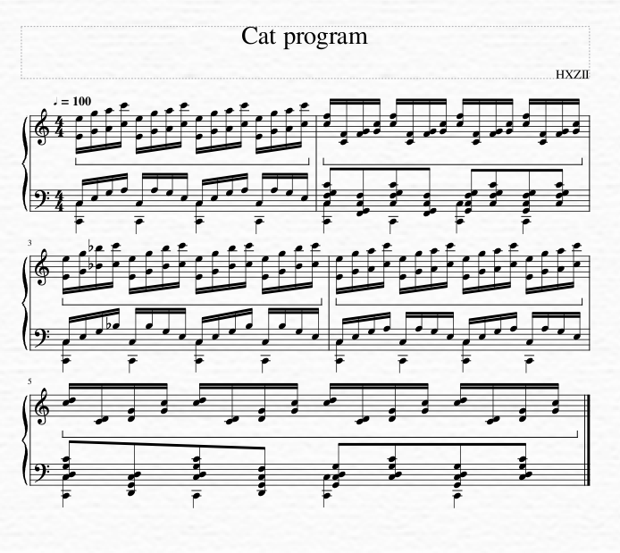

# C2

100 entries.

##### 2char
```text
from random import randint, choice
mode=0
n=0
modes=["N","H","X","R","A", "V"]
for c in input():
	if c=="N":mode="N"
	elif c=="H":mode="H"
	elif c=="X":mode="X"
	elif c=="R":mode="R"
	elif c=="A":mode="A"
	elif c=="V":mode="V"
	elif c=="r":
		if mode=="H":
			print("Hello, World!")
		elif mode=="N":
			n-=1; print(n); n+=1; print(">", n); n+=1; print(n)
		elif mode=="0":
			print("choose mode first")
		elif mode=="X":
			break
		elif mode=="R":
			print(randint(0,n))
		elif mode=="A":
			print("A B C D E F G H I J K L M N O P Q R S T U V W X Y Z")
		elif mode=="V":
			while n!=0:
				print(n)
				n-=1
		else:
			print(mode)
	elif c=="+":n+=1
	elif c=="-":n-=1
	elif c=="=":print(n)
	elif c=="?":mode=str(choice(modes))
```
[Source File](../libraries/c/C-2/2char)

##### C  _gcc
```text
#include <stdio.h>
int main() {
	puts("Hello, World!");
}
```
[Source File](../libraries/c/C-2/C%20%20_gcc)

##### C Flat
```text
Set Eb4 to 8*9 (72)
Print Eb4 (H)
Set Eb4 to 5*20 + 1 (101)
Print Eb4 (e)
Set Eb4 to 12*9 (108)
Print Eb4 (l)
Print Eb4 (l)
Set Eb5 to 12*9 + 3 (111)
Print Eb5 (o)
Set A4 to 4*11 (44)
Print A4 (,)
Set A4 to 4*8 (32)
Print Eb5 (space)
Set A4 to 12*7 + 3 (87)
Print Eb5 (W)
Print Eb5 (o)
Set Eb5 to 19*6 (114)
Print Eb5 (r)
Print Eb4 (l)
Set Eb4 to 5*20 (100)
Print Eb4 (d)
Set Eb4 to 3*11 (33)
Print Eb4 (!)
```
[Source File](../libraries/c/C-2/C%20Flat)

##### C++  _gcc
```text
#include <iostream>
int main() {
	std::cout << "Hello, World!" << std::endl;
}
```
[Source File](../libraries/c/C-2/C++%20%20_gcc)

##### C-Hex
```text
{tape_length: 0xFF}
<main>
    [00 00]; (print current cell as hex)
    [00 01]; (print current cell as a letter using ascii)
    [00 02]; (print current cell as a number)
    [01 XX]; (set current cell to the value of XX)
    [03]; (get input, if input is "EEEE" then cells 0, 1, 2 and 3 will all get set to the ascii code of "E")
    [0A]; (get number, luckily the user does not have to use hex values, but will be converted to hex later)
    (also puts the input into the cell which the pointer is pointing to)
<end>
```
[Source File](../libraries/c/C-2/C-Hex)

##### C-INTERCAL
```text
        PLEASE NOTE THIS PROGRAM RECOGNIZES "HELLO, WORLD" USING COME FROM
        DON'T TYPE IN ANYTHING ELSE, OR YOU'LL GET AN ERROR!
 
        PLEASE NOTE: COMPILE WITH ick -m FOR THIS TO WORK.
        
        DO ,1 <- #12
 (1)    DO WRITE IN ,1
        DO GIVE UP
 
        PLEASE NOTE THIS CHECKS EACH CHARACTER IN TURN
        DO COME FROM '#255~'"?',1SUB#1'$#72"~"#0$#255"''~#1
        PLEASE START WITH AN H NEXT TIME
 
        DO COME FROM '#255~'"?',1SUB#2'$#253"~"#0$#255"''~#1
        DO (2) NEXT
        DO REMEMBER THAT E COMES SECOND
 
        DO COME FROM '#255~'"?',1SUB#3'$#7"~"#0$#255"''~#1
        DO (4) NEXT 
        PLEASE USE L THIRD NEXT TIME
 
        DO COME FROM '#255~'"?',1SUB#4'$#0"~"#0$#255"''~#1
        PLEASE DO (2) NEXT DO (4) NEXT
        DO USE TWO LS, NOT A SINGLE L
 
        DO COME FROM '#255~'"?',1SUB#5'$#3"~"#0$#255"''~#1
        DO (8) NEXT
        PLEASE END 'HELLO' WITH 'O'
 
        DO COME FROM '#255~'"?',1SUB#6'$#221"~"#0$#255"''~#1
        DO (8) NEXT PLEASE DO (2) NEXT
        DO USE COMMAS TO SEPARATE WORDS
 
        DO COME FROM '#255~'"?',1SUB#7'$#244"~"#0$#255"''~#1
        DO (8) NEXT PLEASE DO (4) NEXT
        PLEASE USE SPACES AFTER PUNCTUATION
 
        DO COME FROM '#255~'"?',1SUB#8'$#55"~"#0$#255"''~#1
        DO (8) NEXT DO (4) NEXT PLEASE DO (2) NEXT
        DO START 'WORLD' WITH A 'W'
 
        DO COME FROM '#255~'"?',1SUB#9'$#248"~"#0$#255"''~#1
        DO (16) NEXT
        PLEASE PLACE AN O IN THE NINTH POSITION
 
        DO COME FROM '#255~'"?',1SUB#10'$#3"~"#0$#255"''~#1
        DO (16) NEXT DO (2) NEXT
        DO USE AN R IN THE MIDDLE OF WORLD
 
        DO COME FROM '#255~'"?',1SUB#11'$#250"~"#0$#255"''~#1
        DO (16) NEXT DO (4) NEXT
        PLEASE LET AN L BE PENULTIMATE
 
        DO COME FROM '#255~'"?',1SUB#12'$#248"~"#0$#255"''~#1
        DO (16) NEXT PLEASE DO (4) NEXT DO (2) NEXT
        DO END WITH A D
 
 (2)    PLEASE RESUME #1
 (4)    DO (2) NEXT DO (2) NEXT DO RESUME #1
 (8)    DO (4) NEXT DO (4) NEXT PLEASE RESUME #1
 (16)   DO (8) NEXT DO (8) NEXT PLEASE RESUME #1
```
[Source File](../libraries/c/C-2/C-INTERCAL)

##### C2hs Haskell
```text
module Main where
main = putStrLn "Hello World"
```
[Source File](../libraries/c/C-2/C2hs%20Haskell)

##### Cf
```text
name:Hello World Cake with Chocolate sauce

type:chocolate_cake

ingredients:
33 g chocolate chips(1)
100 g butter(2)
54 ml double cream(3)
2 pinches baking powder(4)
114 g sugar(5)
111 ml beaten eggs(6)
119 g flour(7)
32 g cocoa powder(8)
0 g cake mixture(9)

cook:25min
pheat:180C

method:
put_in:1 2 5 6 7 4 8
stir:1min
comb:3
stir:4min
liquefy:all
pour
bake:9
wait
serve:chocolate_sauce

type:chocolate_sauce

ingredients:
111 g sugar(1)
108 ml hot water(2)
108 ml heated double cream(3)
101 g dark chocolate(4)
72 g milk chocolate(5)

method:
clean
put_in:1 2 3
dissolve:1
agitate:1
liquify:4
put_in:4
liquify:5
put_in:5
liquify:all
pour
fridge:1h
```
[Source File](../libraries/c/C-2/Cf)

##### CFCK
```text
PUSH, 1;
COND;
  POP;
  IN;
  OUT;
  PUSH, 33;
  SUB;
ENDWHILE;
```
[Source File](../libraries/c/C-2/CFCK)

##### CFEngine
```text
#!/usr/bin/env cf-agent
# without --no-lock option to cf-agent
# this output will only occur once per minute
# this is by design.
bundle agent main
{
  reports:
    "Hello world!";
}
```
[Source File](../libraries/c/C-2/CFEngine)

##### CFRS
```text
[[[[[[[[[[[[[[[FF]]]]]]]RRF[RRR]]]]]]C]]]
```
[Source File](../libraries/c/C-2/CFRS)

##### Cg
```text
float4 main() : COLOR {
  return float4(1,1,1,1); // Hello World
}
```
[Source File](../libraries/c/C-2/Cg)

##### Ch  _computer programming
```text
printf("Hello World\n");
```
[Source File](../libraries/c/C-2/Ch%20%20_computer%20programming)

##### Chain
```text
Hello, World!
```
[Source File](../libraries/c/C-2/Chain.chain)

##### Chaincode
```text
,#<-call the line below
a#<-Adds the input to the current input.
```
[Source File](../libraries/c/C-2/Chaincode)

##### Chaingate
```text
package Chaingate;

require Exporter;
our @ISA = qw(Exporter);

our @EXPORT_OK = qw/chaingate chaingate_free_f/;

=head2 $Debug

Set C<$Chaingate::Debug> to a truthy value in order to get debug output to
stdout (specifically, the state of the program every step).

=cut

our $Debug = 0;

=head2 chaingate 

Implements Chaingate with a given function and program. The function is the
first argument; all other arguments specify the program.

This implementation assumes that program elements can be compared via C<eq>, and
that their stringifications will not contain the value of C<$;>. This will often
be the case, but you should probably avoid references in the program (unless
they have an overloaded stringifier), as you probably meant to compare the
I<contents> of the references, rather than the I<values> like this function
does.

=cut

sub chaingate {
    my $function = shift;
    my @program = @_;
    my $ip = 0;
    my %seen = ();

    local $" = $;;

    while (!exists $seen{"$ip @program"}) {
        if ($Debug) {
            print+($_ == $ip ? "[".$program[$_]."] " : $program[$_]." ")
                for 0..$#program;
            print "\n";
        }
        $seen{"$ip @program"} = undef;
        $program[$ip] = $function->($program[$ip]);
        my @ips = grep {$program[$_] eq $program[$ip]} 0..$#program;
        if (2 == scalar @ips) {
            $ip = $ips[$ips[0] == $ip ? 1 : 0];
        }
        $ip++;
        $ip %= scalar @program;
    }
}

=head2 chaingate_free_f

An implementation of the I<f> from Free Chaingate. (As such, calling
C<chaingate> with C<\&chaingate_free_f> as its first argument produces a Free
Chaingate interpreter.) Can also be used for Freer Chaingate.

The argument format is C<"m/n">, i.e. arguments are strings with I<m> and I<n>
separated by a slash.

=cut

sub chaingate_free_f {
    $_[0] =~ m=/=p or die "No / in Free Chaingate element '$_[0]'";
    (${^PREMATCH} + 1 >= ${^POSTMATCH}) ?
        (((${^PREMATCH} + 1) - ${^POSTMATCH}) . "/" . ${^POSTMATCH}) :
        ((${^PREMATCH} + 1) . "/" . ${^POSTMATCH});
}

1;
```
[Source File](../libraries/c/C-2/Chaingate)

##### ChaiScript
```text
// Hello world in ChaiScript

#include <chaiscript/chaiscript.hpp>

std::string helloWorld(const std::string &t_name) {
  return "Hello " + t_name + "!";
}

int main() {
  chaiscript::ChaiScript chai;
  chai.add(chaiscript::fun(&helloWorld), "helloWorld");

  chai.eval(R"(
    puts(helloWorld("World"));
  )");
}
```
[Source File](../libraries/c/C-2/ChaiScript)

##### ChakraCore
```text
console.log("Hello World");
```
[Source File](../libraries/c/C-2/ChakraCore)

##### Chance
```text
++++++++++++++++++++++++++++++++++++++++++++++++++++++++++++++++++++++++!>+++++++++++++++++++++++++++++++++++++++++++++++++++++++++++++++++++++++++++++++++++++++++++++++++++++!>++++++++++++++++++++++++++++++++++++++++++++++++++++++++++++++++++++++++++++++++++++++++++++++++++++++++++++!>+++++++++++++++++++++++++++++++++++++++++++++++++++++++++++++++++++++++++++++++++++++++++++++++++++++++++++++++!>++++++++++++++++++++++++++++++++++++++++++++!>++++++++++++++++++++++++++++++++!>+++++++++++++++++++++++++++++++++++++++++++++++++++++++++++++++++++++++++++++++++++++++++++++++++++++++++++++++++++++++!>+++++++++++++++++++++++++++++++++++++++++++++++++++++++++++++++++++++++++++++++++++++++++++++++++++++++++++++++!>++++++++++++++++++++++++++++++++++++++++++++++++++++++++++++++++++++++++++++++++++++++++++++++++++++++++++++++++++!>++++++++++++++++++++++++++++++++++++++++++++++++++++++++++++++++++++++++++++++++++++++++++++++++++++++++++++!>++++++++++++++++++++++++++++++++++++++++++++++++++++++++++++++++++++++++++++++++++++++++++++++++++++!>+++++++++++++++++++++++++++++++++
```
[Source File](../libraries/c/C-2/Chance)

##### Changeling
```text
"IpQ:AQ..
""2(-znK]
"" "Tr4r[
"")$dNcA.
"" #!&...
.........
.........
.........
.........
```
[Source File](../libraries/c/C-2/Changeling.changeling)

##### Channeler
```text
cc.                                  # Put . into RC
c1HT c1eT c1lT c1lT c1oT             # Put first word into R1 sequentially and transmit each
c1 T                                 # Put space into R1 and transmit
c1WT c1oT c1rT c1lT c1dT c1!T        # Put second word into R1 sequentially and transmit each
```
[Source File](../libraries/c/C-2/Channeler)

##### Chaos
```text
print "Hello World"
```
[Source File](../libraries/c/C-2/Chaos.kaos)

##### Chapel
```text
writeln("Hello world!");
```
[Source File](../libraries/c/C-2/Chapel)

##### Chapel
```text
writeln("Hello World");
```
[Source File](../libraries/c/C-2/Chapel.chpl)

##### Charcoal
```text
Hello, world!
```
[Source File](../libraries/c/C-2/Charcoal)

##### Charcoal verbose mode
```text
Print("Hello World");
```
[Source File](../libraries/c/C-2/Charcoal%20verbose%20mode.cl)

##### Charcoal
```text
Hello World
```
[Source File](../libraries/c/C-2/Charcoal.cl)

##### CharCode
```text
+^<**----^!+<<+!+<<*--!+<<*--!+<<*+!+++++<****---!+<<*+!+<<*++++!+<<*--!+<<!***+++!
```
[Source File](../libraries/c/C-2/CharCode)

##### Charly
```text
print("Hello World")
```
[Source File](../libraries/c/C-2/Charly.ch)

##### Charm
```text
" Hello, World! " pstring
```
[Source File](../libraries/c/C-2/Charm.charm)

##### Charred
```text
++++++++++++++++++++++++++++++++++.
-----------------------------.
+++++++..
+++.
---------------.
+++++++++++++++++++++++++++++++++++++++++++++++++.
----------------------------------.
+++.
------.
--------.
```
[Source File](../libraries/c/C-2/Charred)

##### ChaScript
```text
দেখাও(”Hello World”)
```
[Source File](../libraries/c/C-2/ChaScript)

##### ChavaScript
```text
בקרה.תעד("Hello World")
```
[Source File](../libraries/c/C-2/ChavaScript.chs)

##### Cheat
```text
function cheat(program,input){
    if(program.length==0){return "Hello World!";}
    var stack=[];
    var matches={};
    var ip=0;
    var tape=[];
    var p=0;
    var output='';
    for(let i=0;i<1000000;i++){
        tape.push(0);
    }
    for(var i=0;i<program.length;i++){
        if(program[i]=='['){
            stack.push(i);
        }
        if(program[i]==']'){
            if(stack.length==0){
                throw new Error('Right bracket does not match left bracket');
            }
            var mt=stack.pop();
            matches[mt]=i;
            matches[i]=mt;
        }
    }
    if(stack.length!=0){
        throw new Error('Left bracket does not match right bracket');
    }
    while(ip<program.length){
        if(program[ip]=='+'){
            tape[p]=tape[p]+1;
            if(tape[p]==256) tape[p]=0;
            ip=ip+1;
        }
        if(program[ip]=='-'){
            tape[p]=tape[p]-1;
            if(tape[p]==-1) tape[p]=255;
            ip=ip+1;
        }
        if(program[ip]=='>'){
            p=p+1;
            if(p>=1000000){
                throw new Error('Pointer overflow');
            }
            ip=ip+1;
        }
        if(program[ip]=='<'){
            p=p-1;
            if(p<0){
                throw new Error('Pointer underflow');
            }
            ip=ip+1;
        }
        if(program[ip]==','){
            if(input==''){
                tape[p]=0;
            }else{
                tape[p]=input.charCodeAt(0)%256;
                input=input.slice(1);
            }
            ip=ip+1;
        }
        if(program[ip]=='.'){
            output+=String.fromCharCode(tape[p]);
            ip=ip+1;
        }
        if(program[ip]=='['){
            if(tape[p]==0){
                ip=matches[ip];
            }else{
                ip=ip+1;
            }
        }
        if(program[ip]==']'){
            if(tape[p]!=0){
                ip=matches[ip];
            }else{
                ip=ip+1;
            }
        }
        if(!('+-,.[]<>'.includes(program[ip]))){
            ip=ip+1;
        }
    }
    return output;
}
```
[Source File](../libraries/c/C-2/Cheat)

##### Check
```text
"Hello, World!"o
```
[Source File](../libraries/c/C-2/Check.check)

##### Checked C
```text
#include <stdio_checked.h>
#include <stdchecked.h>

#pragma CHECKED_SCOPE ON

int main(int argc, nt_array_ptr<char> argv checked[] : count(argc)) {
  puts("Hello, World!");
  return 0;
}
```
[Source File](../libraries/c/C-2/Checked%20C.checkedc)

##### Cheddar
```text
print ("Hello, World!")
```
[Source File](../libraries/c/C-2/Cheddar)

##### Cheddar
```text
print "Hello World"
```
[Source File](../libraries/c/C-2/Cheddar.cheddar)

##### Cheerio
```text
console.log("Hello World");
```
[Source File](../libraries/c/C-2/Cheerio)

##### Cheers
```text
prepare drink Hennchata 1%
prepare drink El-Presidente 1%
prepare drink Double-Lorraine 2%
prepare drink Old-Spanish 1%
prepare drink White-Lady 1%
prepare drink Whiskey-Sour 1%
prepare drink Rossini 1%
prepare drink Lorraine 1%
prepare drink Daiquiri 1%
prepare drink Wow 1%

pour 33 ml of Wow
cheers
pour 100 ml of Daiquiri
cheers
pour 108 ml of Lorraine
cheers
pour 114 ml of Rossini
cheers
pour 111 ml of Old-Spanish
cheers
pour 119 ml of Whiskey-Sour
cheers

pour 32 ml of White-Lady
cheers
pour 111 ml of Old-Spanish
cheers
pour 108 ml of Double-Lorraine
cheers
pour 101 ml of El-Presidente
cheers
pour 72 ml of Hennchata
cheers

throw up
```
[Source File](../libraries/c/C-2/Cheers)

##### Cheese++
```text
Cheese
    Wensleydale(SwissHello WorldSwiss)Brie
NoCheese
```
[Source File](../libraries/c/C-2/Cheese++.cheese)

##### Cheesecake
```text
cheese cheesecake cakeeeeeeee
cheese cheesecake cakeeeeeeeeeee
cheese cheese cheese
cheese cheesecake cakeee
cheese cheese
cheese cake
cake cake cake
cheese cheesecake cakeeee
cheese cheesecake cakeeeeeeeeeee
cheese cheese cheese
cheese cheese
cheese cheesecake cakee
cake cake
cheese cake
cake cake cake
cheese cheesecake cakeeeeeeee
cheese cheese
cheese cake
cake cake cake
cheese cake
cake cake cake
cheese cheesecake cakeeee
cheese cheese
cheese cake
cake cake cake
cheese cheesecake cakeeeee
cheese cheesecake cakeeeeeeeeeeee
cheese cheese cheese
cheese cake
cake cake cake
cheese cheesecake cakeeeeeeeeeeeee
cake cake
cake cake cake
cheese cheesecake cakeeeeeeeee
cheese cheese
cheese cake
cake cake cake
cheese cheesecake cakeeeeeeeee
cake cake
cheese cake
cake cake cake
cheese cheesecake cakeeee
cheese cheese
cheese cake
cake cake cake
cheese cheesecake cakeeeeeee
cake cake
cheese cake
cake cake cake
cheese cheesecake cakeeeeeeeee
cake cake
cake cake cake
cheese cheesecake cakeeeeeeeeeeee
cheese cheesecake cakeeee
cheese cheese cheese
cake cake cake
```
[Source File](../libraries/c/C-2/Cheesecake)

##### Chef
```text
Hello World Cake with Chocolate sauce.

This prints hello world, while being tastier than Hello World Souffle. The main
chef makes a " world!" cake, which he puts in the baking dish. When he gets the
sous chef to make the "Hello" chocolate sauce, it gets put into the baking dish
and then the whole thing is printed when he refrigerates the sauce. When
actually cooking, I'm interpreting the chocolate sauce baking dish to be
separate from the cake one and Liquify to mean either melt or blend depending on
context.

Ingredients.
33 g chocolate chips
100 g butter
54 ml double cream
2 pinches baking powder
114 g sugar
111 ml beaten eggs
119 g flour
32 g cocoa powder
0 g cake mixture

Cooking time: 25 minutes.

Pre-heat oven to 180 degrees Celsius.

Method.
Put chocolate chips into the mixing bowl.
Put butter into the mixing bowl.
Put sugar into the mixing bowl.
Put beaten eggs into the mixing bowl.
Put flour into the mixing bowl.
Put baking powder into the mixing bowl.
Put cocoa  powder into the mixing bowl.
Stir the mixing bowl for 1 minute.
Combine double cream into the mixing bowl.
Stir the mixing bowl for 4 minutes.
Liquify the contents of the mixing bowl.
Pour contents of the mixing bowl into the baking dish.
bake the cake mixture.
Wait until baked.
Serve with chocolate sauce.

chocolate sauce.

Ingredients.
111 g sugar
108 ml hot water
108 ml heated double cream
101 g dark chocolate
72 g milk chocolate

Method.
Clean the mixing bowl.
Put sugar into the mixing bowl.
Put hot water into the mixing bowl.
Put heated double cream into the mixing bowl.
dissolve the sugar.
agitate the sugar until dissolved.
Liquify the dark chocolate.
Put dark chocolate into the mixing bowl.
Liquify the milk chocolate.
Put milk chocolate into the mixing bowl.
Liquify contents of the mixing bowl.
Pour contents of the mixing bowl into the baking dish.
Refrigerate for 1 hour.
```
[Source File](../libraries/c/C-2/Chef)

##### Chef
```text
Hello World Cake with Chocolate sauce.

This prints hello world, while being tastier than Hello World Souffle. The main
chef makes a " world!" cake, which he puts in the baking dish. When he gets the
sous chef to make the "Hello" chocolate sauce, it gets put into the baking dish
and then the whole thing is printed when he refrigerates the sauce. When
actually cooking, I'm interpreting the chocolate sauce baking dish to be
separate from the cake one and Liquefy to mean either melt or blend depending on
context.

Ingredients.
33 g chocolate chips
100 g butter
54 ml double cream
2 pinches baking powder
114 g sugar
111 ml beaten eggs
119 g flour
32 g cocoa powder
0 g cake mixture

Cooking time: 25 minutes.

Pre-heat oven to 180 degrees Celsius.

Method.
Put chocolate chips into the mixing bowl.
Put butter into the mixing bowl.
Put sugar into the mixing bowl.
Put beaten eggs into the mixing bowl.
Put flour into the mixing bowl.
Put baking powder into the mixing bowl.
Put cocoa  powder into the mixing bowl.
Stir the mixing bowl for 1 minute.
Combine double cream into the mixing bowl.
Stir the mixing bowl for 4 minutes.
Liquefy the contents of the mixing bowl.
Pour contents of the mixing bowl into the baking dish.
bake the cake mixture.
Wait until baked.
Serve with chocolate sauce.

chocolate sauce.

Ingredients.
111 g sugar
108 ml hot water
108 ml heated double cream
101 g dark chocolate
72 g milk chocolate

Method.
Clean the mixing bowl.
Put sugar into the mixing bowl.
Put hot water into the mixing bowl.
Put heated double cream into the mixing bowl.
dissolve the sugar.
agitate the sugar until dissolved.
Liquefy the dark chocolate.
Put dark chocolate into the mixing bowl.
Liquefy the milk chocolate.
Put milk chocolate into the mixing bowl.
Liquefy contents of the mixing bowl.
Pour contents of the mixing bowl into the baking dish.
Refrigerate for 1 hour.
```
[Source File](../libraries/c/C-2/Chef.ch)

##### Chem
```text
Chemicals needed:
72 g Ca
101 g Cl
Check to confirm you have the required chemicals before proceeding.
Chemicals are to be added to a small beaker.
Add the Ca.
Add the Cl.
Now find the following chemicals and mix together in a separate beaker:
108 ml water
108 g calcium
111 g sulfur
32 g carbon
87 ml mercury
111 g salt
114 g zinc
108 g tin
100 ml bromine
Going back to the original beaker,
Dump the contents of beaker 1 into this beaker.
Record your findings.
```
[Source File](../libraries/c/C-2/Chem)

##### CherryPy
```python
import cherrypy

class HelloWorld(object):
    @cherrypy.expose
    def index(self):
        return "Hello World"

cherrypy.quickstart(HelloWorld())
```
[Source File](../libraries/c/C-2/CherryPy.py)

##### Chespirito
```text
chipote chilindrina chapulin chanfle chiquitolina chillon
```
[Source File](../libraries/c/C-2/Chespirito)

##### Chess Code
```text
| Inputs
a1#
a2#

| Processing
Ba2
1/2 1/2
a1+
a3+
a3=B+

| Output
a1
O-O
a1
```
[Source File](../libraries/c/C-2/Chess%20Code)

##### Chessoteric
```text
1. e3 e6 2. h4 Qxh4 3. Qg4 Qe7 4. Qxg7 Nf6 5. Qg8! Nd5 6. Rxh7 Qf6 7. Rxh8! Ke7 8. Nf3 Kd6 9. Qxf8+ Ne7 10. Rg8 Qh8! 
11. Qh6 Nbc6 12. Qf4+! Ne5! 13. Qh6 Qf6 14. Qh8? N5c6 15. Re8 Ng8 16. Ne5 Qg7 17. Re7 Kc5 18. Nxd7+ Kd6 19. Qh7? Qe5 20. Qh8 f6 
21. Nf8 Qd5 22. Bd3 b6 23. Bh7 a5 24. g4 f5 25. gxf5 Ba6 26. f6 Bc8 27. f7? Ne5 28. Qf6 Ng6 29. Re8 Nh8 30. Qg7 Ra6? 
31. Nc3? Ng6 32. fxg8=Q Ne7 33. Q7h8 Qc6 34. Ne4+ Kd5 35. b3 a4 36. Bb2 b5 37. Bg7 Bb7 38. Ng5 Bc8 39. Nf7? e5 40. Ng5+ Qe6 
41. Qf7 Rd6 42. Qf3+ Kc5 43. Bd3 Ng6 44. Qh7 Nh8 45. Nh3 Qg8? 46. Ng6 Rd8 47. Nh4 Kd6 48. Re6+ Kd7 49. Rf6 Ke8 50. Rf4 c6 
51. bxa4? Qd5 52. Rf8+ Kd7 53. Qg8 Ng6 54. Bh8 Kc7 55. Nf5 Rd6 56. Ne7 Kb6 57. Qff7 Nf4 58. Bg6 Ne6 59. Ng5 Ka6 60. Nh7? Kb6 
61. Qe8? Rd8 62. Bd3 Nc5 63. Qg4 Qg8 64. Bg7 Ka6 65. Qf7? Rxf8 66. Qe8 Bb7 67. Nc8 Ba8 68. Qgd7? Nb7 69. Nd6 Nd8 70. Ne4? Ka5 
71. Qh5 Kb6 72. Bh8 Ka6 73. Qh4? Bb7 74. Bg7 Kb6 75. Bxf8? 1/2-1/2
```
[Source File](../libraries/c/C-2/Chessoteric)

##### Chevron
```text
<
```
[Source File](../libraries/c/C-2/Chevron)

##### Chez Scheme
```text
(display "Hello, World!")
```
[Source File](../libraries/c/C-2/Chez%20Scheme.scheme)

##### Chicken
```text
chicken chicken chicken chicken chicken chicken chicken chicken chicken chicken chicken chicken chicken chicken chicken chicken chicken chicken chicken chicken
chicken chicken chicken chicken chicken chicken chicken chicken chicken chicken chicken chicken chicken chicken chicken chicken chicken chicken chicken chicken
chicken chicken chicken chicken
chicken chicken chicken chicken chicken chicken chicken chicken chicken
chicken chicken chicken chicken chicken chicken chicken chicken chicken chicken chicken
chicken chicken chicken chicken chicken chicken chicken
chicken chicken chicken chicken chicken chicken chicken chicken chicken chicken
chicken chicken chicken chicken chicken chicken chicken chicken chicken chicken chicken chicken chicken chicken chicken chicken
chicken chicken chicken chicken chicken chicken chicken chicken chicken chicken chicken chicken chicken chicken chicken chicken
chicken chicken chicken chicken
chicken chicken chicken
chicken chicken chicken chicken chicken chicken chicken chicken chicken chicken
chicken chicken chicken chicken chicken chicken chicken chicken chicken chicken chicken chicken chicken chicken chicken chicken chicken
chicken chicken chicken
chicken chicken chicken chicken chicken chicken chicken chicken chicken chicken
chicken chicken chicken chicken chicken chicken chicken chicken chicken chicken
chicken chicken chicken chicken chicken chicken chicken chicken chicken chicken chicken chicken chicken
chicken chicken chicken chicken chicken chicken chicken chicken chicken chicken chicken
chicken chicken chicken chicken chicken chicken chicken chicken chicken chicken chicken chicken
chicken chicken chicken chicken chicken chicken

chicken chicken chicken
chicken chicken chicken chicken chicken chicken chicken chicken chicken chicken chicken chicken chicken chicken
chicken chicken chicken chicken
chicken chicken chicken chicken chicken chicken chicken chicken chicken chicken chicken chicken chicken chicken chicken chicken chicken chicken chicken chicken chicken
chicken chicken chicken chicken chicken chicken chicken chicken chicken chicken chicken chicken chicken
chicken chicken chicken chicken chicken chicken chicken chicken chicken chicken chicken chicken chicken chicken chicken chicken
chicken chicken chicken chicken chicken chicken chicken chicken chicken chicken
chicken chicken chicken chicken chicken chicken chicken chicken chicken chicken chicken chicken chicken chicken chicken
chicken chicken chicken chicken chicken chicken chicken chicken chicken chicken chicken chicken chicken
chicken chicken chicken chicken chicken chicken

chicken chicken chicken chicken
chicken chicken chicken chicken chicken chicken chicken chicken chicken chicken chicken chicken chicken chicken chicken chicken chicken chicken
chicken chicken
chicken chicken
chicken chicken chicken chicken chicken chicken chicken chicken chicken
chicken chicken chicken chicken chicken chicken chicken chicken chicken chicken chicken
chicken chicken chicken chicken chicken chicken

chicken chicken
chicken chicken chicken chicken chicken chicken chicken chicken chicken chicken chicken
chicken chicken chicken chicken chicken chicken chicken
chicken chicken chicken chicken chicken chicken chicken chicken chicken chicken chicken chicken
chicken chicken chicken chicken chicken chicken

chicken chicken chicken chicken chicken chicken chicken chicken chicken chicken chicken chicken
chicken chicken chicken
chicken chicken chicken chicken chicken chicken chicken chicken chicken chicken chicken chicken
chicken chicken chicken chicken chicken chicken chicken
chicken chicken chicken chicken chicken chicken chicken chicken chicken chicken chicken chicken
chicken chicken chicken chicken chicken chicken

chicken chicken chicken chicken chicken chicken chicken chicken chicken chicken
chicken chicken chicken chicken chicken chicken chicken chicken chicken chicken chicken chicken chicken chicken chicken chicken chicken chicken chicken chicken chicken chicken chicken chicken chicken chicken chicken chicken chicken chicken chicken chicken chicken chicken chicken chicken chicken chicken chicken
chicken chicken chicken
chicken chicken chicken chicken chicken chicken chicken chicken
chicken chicken chicken chicken chicken chicken chicken chicken chicken chicken chicken
chicken chicken chicken chicken chicken chicken
```
[Source File](../libraries/c/C-2/Chicken)

##### Chicken  _Scheme implementation
```text
(print "Hello World")
```
[Source File](../libraries/c/C-2/Chicken%20%20_Scheme%20implementation)

##### Chicken chicken chicken: chicken chicken
```text
chicken chicken chicken: "chicken chicken chicken chicken chicken chicken chicken chicken chicken chicken chicken chicken chicken chicken chicken chicken chicken chicken chicken chicken chicken chicken chicken chicken chicken chicken chicken chicken chicken chicken chicken chicken chicken chicken chicken chicken chicken chicken chicken chicken chicken chicken chicken chicken chicken chicken chicken chicken chicken chicken chicken chicken chicken chicken chicken chicken chicken chicken chicken chicken chicken chicken chicken chicken chicken chicken chicken chicken chicken chicken chicken chicken". chicken chicken chicken: "chicken chicken chicken chicken chicken chicken chicken chicken chicken chicken chicken chicken chicken chicken chicken chicken chicken chicken chicken chicken chicken chicken chicken chicken chicken chicken chicken chicken chicken chicken chicken chicken chicken chicken chicken chicken chicken chicken chicken chicken chicken chicken chicken chicken chicken chicken chicken chicken chicken chicken chicken chicken chicken chicken chicken chicken chicken chicken chicken chicken chicken chicken chicken chicken chicken chicken chicken chicken chicken chicken chicken chicken chicken chicken chicken chicken chicken chicken chicken chicken chicken chicken chicken chicken chicken chicken chicken chicken chicken chicken chicken chicken chicken chicken chicken chicken chicken chicken chicken chicken chicken". chicken chicken chicken: "chicken chicken chicken chicken chicken chicken chicken chicken chicken chicken chicken chicken chicken chicken chicken chicken chicken chicken chicken chicken chicken chicken chicken chicken chicken chicken chicken chicken chicken chicken chicken chicken chicken chicken chicken chicken chicken chicken chicken chicken chicken chicken chicken chicken chicken chicken chicken chicken chicken chicken chicken chicken chicken chicken chicken chicken chicken chicken chicken chicken chicken chicken chicken chicken chicken chicken chicken chicken chicken chicken chicken chicken chicken chicken chicken chicken chicken chicken chicken chicken chicken chicken chicken chicken chicken chicken chicken chicken chicken chicken chicken chicken chicken chicken chicken chicken chicken chicken chicken chicken chicken chicken chicken chicken chicken chicken chicken chicken". chicken chicken chicken: "chicken chicken chicken chicken chicken chicken chicken chicken chicken chicken chicken chicken chicken chicken chicken chicken chicken chicken chicken chicken chicken chicken chicken chicken chicken chicken chicken chicken chicken chicken chicken chicken chicken chicken chicken chicken chicken chicken chicken chicken chicken chicken chicken chicken chicken chicken chicken chicken chicken chicken chicken chicken chicken chicken chicken chicken chicken chicken chicken chicken chicken chicken chicken chicken chicken chicken chicken chicken chicken chicken chicken chicken chicken chicken chicken chicken chicken chicken chicken chicken chicken chicken chicken chicken chicken chicken chicken chicken chicken chicken chicken chicken chicken chicken chicken chicken chicken chicken chicken chicken chicken chicken chicken chicken chicken chicken chicken chicken". chicken chicken chicken: "chicken chicken chicken chicken chicken chicken chicken chicken chicken chicken chicken chicken chicken chicken chicken chicken chicken chicken chicken chicken chicken chicken chicken chicken chicken chicken chicken chicken chicken chicken chicken chicken chicken chicken chicken chicken chicken chicken chicken chicken chicken chicken chicken chicken chicken chicken chicken chicken chicken chicken chicken chicken chicken chicken chicken chicken chicken chicken chicken chicken chicken chicken chicken chicken chicken chicken chicken chicken chicken chicken chicken chicken chicken chicken chicken chicken chicken chicken chicken chicken chicken chicken chicken chicken chicken chicken chicken chicken chicken chicken chicken chicken chicken chicken chicken chicken chicken chicken chicken chicken chicken chicken chicken chicken chicken chicken chicken chicken chicken chicken chicken". chicken chicken chicken: "chicken chicken chicken chicken chicken chicken chicken chicken chicken chicken chicken chicken chicken chicken chicken chicken chicken chicken chicken chicken chicken chicken chicken chicken chicken chicken chicken chicken chicken chicken chicken chicken chicken chicken chicken chicken chicken chicken chicken chicken chicken chicken chicken chicken". chicken chicken chicken: "chicken chicken chicken chicken chicken chicken chicken chicken chicken chicken chicken chicken chicken chicken chicken chicken chicken chicken chicken chicken chicken chicken chicken chicken chicken chicken chicken chicken chicken chicken chicken chicken". chicken chicken chicken: "chicken chicken chicken chicken chicken chicken chicken chicken chicken chicken chicken chicken chicken chicken chicken chicken chicken chicken chicken chicken chicken chicken chicken chicken chicken chicken chicken chicken chicken chicken chicken chicken chicken chicken chicken chicken chicken chicken chicken chicken chicken chicken chicken chicken chicken chicken chicken chicken chicken chicken chicken chicken chicken chicken chicken chicken chicken chicken chicken chicken chicken chicken chicken chicken chicken chicken chicken chicken chicken chicken chicken chicken chicken chicken chicken chicken chicken chicken chicken chicken chicken chicken chicken chicken chicken chicken chicken". chicken chicken chicken: "chicken chicken chicken chicken chicken chicken chicken chicken chicken chicken chicken chicken chicken chicken chicken chicken chicken chicken chicken chicken chicken chicken chicken chicken chicken chicken chicken chicken chicken chicken chicken chicken chicken chicken chicken chicken chicken chicken chicken chicken chicken chicken chicken chicken chicken chicken chicken chicken chicken chicken chicken chicken chicken chicken chicken chicken chicken chicken chicken chicken chicken chicken chicken chicken chicken chicken chicken chicken chicken chicken chicken chicken chicken chicken chicken chicken chicken chicken chicken chicken chicken chicken chicken chicken chicken chicken chicken chicken chicken chicken chicken chicken chicken chicken chicken chicken chicken chicken chicken chicken chicken chicken chicken chicken chicken chicken chicken chicken chicken chicken chicken". chicken chicken chicken: "chicken chicken chicken chicken chicken chicken chicken chicken chicken chicken chicken chicken chicken chicken chicken chicken chicken chicken chicken chicken chicken chicken chicken chicken chicken chicken chicken chicken chicken chicken chicken chicken chicken chicken chicken chicken chicken chicken chicken chicken chicken chicken chicken chicken chicken chicken chicken chicken chicken chicken chicken chicken chicken chicken chicken chicken chicken chicken chicken chicken chicken chicken chicken chicken chicken chicken chicken chicken chicken chicken chicken chicken chicken chicken chicken chicken chicken chicken chicken chicken chicken chicken chicken chicken chicken chicken chicken chicken chicken chicken chicken chicken chicken chicken chicken chicken chicken chicken chicken chicken chicken chicken chicken chicken chicken chicken chicken chicken chicken chicken chicken chicken chicken chicken". chicken chicken chicken: "chicken chicken chicken chicken chicken chicken chicken chicken chicken chicken chicken chicken chicken chicken chicken chicken chicken chicken chicken chicken chicken chicken chicken chicken chicken chicken chicken chicken chicken chicken chicken chicken chicken chicken chicken chicken chicken chicken chicken chicken chicken chicken chicken chicken chicken chicken chicken chicken chicken chicken chicken chicken chicken chicken chicken chicken chicken chicken chicken chicken chicken chicken chicken chicken chicken chicken chicken chicken chicken chicken chicken chicken chicken chicke
…
```
[Source File](../libraries/c/C-2/Chicken%20chicken%20chicken:%20chicken%20chicken)

##### CHICKEN Scheme
```text
(display "Hello, World!")
```
[Source File](../libraries/c/C-2/CHICKEN%20Scheme.scheme)

##### Chicken you too beautiful
```text
chicken chicken chicken chicken chicken chicken chicken chicken rap beautiful chicken chicken chicken chicken rap beautiful chicken chicken beautiful chicken chicken chicken beautiful chicken chicken chicken beautiful chicken too too too too you basketball beautiful chicken beautiful chicken beautiful you beautiful beautiful chicken rap too basketball too you basketball beautiful beautiful dance beautiful you you you dance chicken chicken chicken chicken chicken chicken chicken dance dance chicken chicken chicken dance beautiful beautiful dance too you dance too dance chicken chicken chicken dance you you you you you you dance you you you you you you you you dance beautiful beautiful chicken dance beautiful chicken chicken dance
```
[Source File](../libraries/c/C-2/Chicken%20you%20too%20beautiful)

##### Chickenfoot
```text
      ⠮
⠿⠈⠈⠈⠈⠠⠮⠫
     ⠰⠹   ⠮
      ⠈⠈⠈⠠⠮⠫
         ⠰⠹     ⠮
          ⠈⠈⠈⠈⠈⠠⠮⠫
               ⠰⠹     ⠮
                ⠈⠈⠈⠈⠈⠠⠮⠫
                     ⠰⠹      ⠮
                      ⠈⠈⠈⠈⠈⠈⠠⠮⠫
                            ⠰⠹     ⠮
                            ⠈⠈⠈⠈⠈⠈⠠⠮⠫
                                  ⠰⠹⠮
 ⠮⠯⠯⠯⠯⠯⠯⠯⠯⠯⠯⠯⠯⠯⠯⠯⠯⠯⠯⠯⠯⠯⠯⠯⠯⠯⠯⠯⠯⠯⠯⠯⠯⠯⠯
⠬        ⠮
⠈⠈⠈⠈⠈⠈⠈⠈⠠⠮⠫
        ⠰⠹      ⠮
         ⠈⠈⠈⠈⠈⠈⠠⠮⠫
               ⠰⠹       ⠮
                ⠈⠈⠈⠈⠈⠈⠈⠠⠮⠫
                       ⠰⠹     ⠮
                        ⠈⠈⠈⠈⠈⠠⠮⠫
                             ⠰⠹
                              ⠈⠈⠠⠮⠫
                                ⠰⠹
```
[Source File](../libraries/c/C-2/Chickenfoot)

##### Child Script
```text
X <COLOR>
```
[Source File](../libraries/c/C-2/Child%20Script)

##### CHILL
```text
hello: MODULE
  WRITES("Hello World");
END hello;
```
[Source File](../libraries/c/C-2/CHILL)

##### ChinesePython
```python
寫 "Hello World"
```
[Source File](../libraries/c/C-2/ChinesePython.py)

##### CHIP-8
```text
; CHIP-8 "Hello World" typically draws sprites; stub program
00E0
```
[Source File](../libraries/c/C-2/CHIP-8)

##### Chip
```text
!ZZZZZZZZZZZZt
xxxxxxxxxxxxxh
)))))xx)))))xg
x))))))x)))))f
xxxxxxx)x)xxxe
)x))))xx)x)xxd
x)))))x))x))xc
xxxx)xx)))xxxb
x)xx)xx))xxx)a
```
[Source File](../libraries/c/C-2/Chip.chip)

##### Chipmunk Basic
```text
10 print "Hello world!"
```
[Source File](../libraries/c/C-2/Chipmunk%20Basic)

##### CHIQRSX9+
```text
 H
```
[Source File](../libraries/c/C-2/CHIQRSX9+)

##### Chisel
```text
println("Hello World")
```
[Source File](../libraries/c/C-2/Chisel)

##### Cholc
```text
Hello, world!
```
[Source File](../libraries/c/C-2/Cholc)

##### Choon
```text
AGb-A#A#+A+%A#DF-AC#
```
[Source File](../libraries/c/C-2/Choon)

##### Chordfuck



*画像プログラム（PNG / 162028 bytes）*

[Source File](../libraries/c/C-2/Chordfuck.png)

##### CHR
```text
reflexivity  @ implies(X, X) <=> true.
antisymmetry @ implies(X, Y),  implies(Y, X) <=> X = Y.
transitivity @ implies(X, Y),  implies(Y, Z) ==> implies(X, Z).
idempotence  @ implies(X, Y) \ implies(X, Y) <=> true.
```
[Source File](../libraries/c/C-2/CHR)

##### ChromaCode


*画像プログラム（PNG / 311 bytes）*

[Source File](../libraries/c/C-2/ChromaCode.png)

##### Chronos
```text
>               v
v"Hello World!"0<
>:?v,v
^    <
   @
```
[Source File](../libraries/c/C-2/Chronos)

##### ChucK
```text
<<< "Hello world!">>>;
```
[Source File](../libraries/c/C-2/ChucK)

##### ChuckScript
```text
[0]{9582516168086304533950061199088375933762201813077804024987245718616842}
```
[Source File](../libraries/c/C-2/ChuckScript)

##### Churro
```text
{o}=====}
```
[Source File](../libraries/c/C-2/Churro)

##### CICS-COBOL
```text
-- Hello World in CICS COBOL

000100        IDENTIFICATION DIVISION.                           
000200        PROGRAM-ID. HELLO.                                 
000300       * HELLO WORLD IN CICS COBOL.                        
000400        AUTHOR. ROBERT GOSLING.                            
000500        ENVIRONMENT DIVISION.                              
000600        DATA DIVISION.                                     
000700        WORKING-STORAGE SECTION.                           
000800        01 WS-DATA-AREA PIC X(80) VALUE "HELLO WORLD!".    
000900        PROCEDURE DIVISION.                                
001000            EXEC CICS SEND FROM (WS-DATA-AREA) END-EXEC.   
001100            EXEC CICS RETURN END-EXEC.
```
[Source File](../libraries/c/C-2/CICS-COBOL)

##### CIL  _Mono IL assembler
```text
.assembly Program {}
.assembly extern mscorlib {}

.method static void Main()
{
     .entrypoint
     .maxstack 1
     ldstr "Hello, World!"
     call void [mscorlib]System.Console::WriteLine(string)
     ret
}
```
[Source File](../libraries/c/C-2/CIL%20%20_Mono%20IL%20assembler)

##### Cil
```text
// ilasm cil.il
.assembly HelloWorld {}
.method public static void Main() cil managed
{
     .entrypoint
     .maxstack 1
     ldstr "Hello World"
     call void [mscorlib]System.Console::WriteLine(string)
     ret
}
```
[Source File](../libraries/c/C-2/Cil.il)

##### Cilk
```text
#include <stdio.h>
int main(){ printf("Hello World\n"); return 0; }
```
[Source File](../libraries/c/C-2/Cilk)

##### Cind
```text
execute() {
    host.println("Hello world!");
}
```
[Source File](../libraries/c/C-2/Cind)

##### Cinnamon Gum
```text
00000000: 2201 1d92 93bd 33f1 a12f 2a4e 940b 32    ".....3../*N..2
```
[Source File](../libraries/c/C-2/Cinnamon%20Gum.cinnamon)

##### CIOL
```text
 rHello, World!;
```
[Source File](../libraries/c/C-2/CIOL)

##### Cipher
```text
188893822
```
[Source File](../libraries/c/C-2/Cipher)

##### Circlefuck
```text
Hello\ World!\n\0[.>]@
```
[Source File](../libraries/c/C-2/Circlefuck)

##### Circom
```text
pragma circom 2.0.0;
template Hello() {}
component main = Hello();
```
[Source File](../libraries/c/C-2/Circom)

##### CircuitPython
```text
print("Hello World")
```
[Source File](../libraries/c/C-2/CircuitPython)

##### Circute
```text
*==     ==*
  =     =
  ===N===
     =
     =
   =====
   =   =
   =#N#=
     =
```
[Source File](../libraries/c/C-2/Circute)

##### Cirru
```text
echo "Hello World"
```
[Source File](../libraries/c/C-2/Cirru)

##### cixl
```text
use: cx;

'Hello, World!' say
```
[Source File](../libraries/c/C-2/cixl.cixl)

##### CJam
```text
"Hello, world!
"
```
[Source File](../libraries/c/C-2/CJam)

##### CJam-Flavored Underload
```text
"\"\"\"+\"""\\_~_o+`\\~`\\;\\+\\_\"/\"o~"_~
```
[Source File](../libraries/c/C-2/CJam-Flavored%20Underload)

##### CJam
```text
"Hello, World!"
```
[Source File](../libraries/c/C-2/CJam.cjam)

##### Clam
```text
p+[[ua+ua,]"!"]
```
[Source File](../libraries/c/C-2/Clam.clam)

##### Clean
```text
module hello
Start :: {#Char}
Start = "Hello World"
```
[Source File](../libraries/c/C-2/Clean.icl)

##### Clio
```text
export fn main argv:
  "Hello World" -> console.log
```
[Source File](../libraries/c/C-2/Clio.clio)

##### Clipper
```text
? "Hello World"
```
[Source File](../libraries/c/C-2/Clipper.prg)

##### CLIPS
```text
(defrule hw
    (f ?x)
=>
    (printout t ?x crlf))

(assert (f "Hello World"))

(run)
```
[Source File](../libraries/c/C-2/CLIPS.clips)

##### CLISP
```text
(write-line "Hello World")
```
[Source File](../libraries/c/C-2/CLISP.lisp)

##### Clojure
```text
(println "Hello World")
```
[Source File](../libraries/c/C-2/Clojure.clj)

##### CLU
```text
start_up = proc ()
    po: stream := stream$primary_output ()
    stream$putl (po, "Hello World")
    end start_up
```
[Source File](../libraries/c/C-2/CLU.clu)

##### CMake
```text
message("Hello World")
```
[Source File](../libraries/c/C-2/CMake.cmake)

