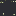

# C3

164 entries.

##### 11CORTLANG
```text
0100001
01100100
01101100
01110010
01101111
01010111
0100000
0101100
01101111
01101100
01101100
01100101
01001000
1101
100
```
[Source File](../libraries/c/C-3/11CORTLANG)

##### 1cnis
```text
[initial]
l0 o0 x0 v0 v0 r0
```
[Source File](../libraries/c/C-3/1cnis)

##### 5command
```text
Program: ^*
Output: 1
```
[Source File](../libraries/c/C-3/5command)

##### C#  _
```text
using System;
class Program {
	static void Main(string[] args) {
		Console.WriteLine("Hello, World!");
	}
}
```
[Source File](../libraries/c/C-3/C#%20%20_.NET%20Core)

##### C#  _Mono C# compiler
```text
using System;
class Program {
	static void Main(string[] args) {
		Console.WriteLine("Hello, World!");
	}
}
```
[Source File](../libraries/c/C-3/C#%20%20_Mono%20C#%20compiler)

##### C#  _Mono C# Shell
```text
Console.WriteLine("Hello, World!")
```
[Source File](../libraries/c/C-3/C#%20%20_Mono%20C#%20Shell)

##### CLAG
```text
оօ օoօoօо oо оо   + 72 . > (Displays 'H')
оօ օoοоοo oо оо   + 101 . > (Displays 'e')
оօ օoοoοо oо оо   + 108 . > (Displays 'l')
оօ օoοoοо oо оо   + 108 . > (Displays 'l')
оօ օoοoοο oо оо   + 111 . > (Displays the letter after n)
оօ οоօо oо оо     + 32 . > (Displays ' ')
оօ օoօօοο oо оо   + 87 . > (Displays 'W')
оօ օoοoοο oо оо   + 111 . > (Displays the letter after n)
оօ օoοօօօ oо оо   + 114 . > (Displays 'r')
оօ օoοoοо oо оо   + 108 . > (Displays 'l')
оօ օoοоοо oо оо   + 100 . > (Displays 'd')
оօ οоօo oо        + 33 . (Displays '!')
```
[Source File](../libraries/c/C-3/CLAG)

##### Claire
```text
printf("Hello World~I", "\n")
```
[Source File](../libraries/c/C-3/Claire)

##### Clarion
```text
!Hello World in Clarion 
 
  PROGRAM
 
 MAP
 END
 
 CODE
 
 MESSAGE('Hello World!')
 
 RETURN
```
[Source File](../libraries/c/C-3/Clarion)

##### Clarity
```text
(print "Hello World")
```
[Source File](../libraries/c/C-3/Clarity)

##### Clart
```text
< n;
? [n=1]:
 ^loop
E
> 0;
Q
:loop
> 1;
^loop
```
[Source File](../libraries/c/C-3/Clart)

##### Clash
```text
module Hello where
import Clash.Prelude
topEntity = "Hello World"
```
[Source File](../libraries/c/C-3/Clash)

##### Classic ASP
```text
<%
Response.Write("Hello World")
%>
```
[Source File](../libraries/c/C-3/Classic%20ASP)

##### Clay
```text
main() {
    println("Hello world!");
}
```
[Source File](../libraries/c/C-3/Clay)

##### CLC-INTERCAL
```text
	PLEASE ;1 <- #12
(1)	PLEASE WRITE IN ;1
	PLEASE GIVE UP

	PLEASE PLEASE PLEASE (PRETTY PLEASE)
	DO NOT ASK ME TO READ THE REST OF THIS PROGRAM

	DO COME FROM '".1/'"'¥#29¢"';1SUB#1'~#65535"'~'#0¢#65535'"~
		     "'¥#29¢"';1SUB#1'~#65535"'~'#0¢#65535'"'~#1"~#0'¢.1
	ERROR: THE FIRST CHARACTER IS NOT "H"

	DO COME FROM '".2/'"'¥#1356¢"';1SUB#2'~#65535"'~'#0¢#65535'"~
		     "'¥#1356¢"';1SUB#2'~#65535"'~'#0¢#65535'"'~#1"~#0'¢
		     '.2~"'¥#1¢.1'~#1"'
	ERROR: THE SECOND CHARACTER IS NOT "E"

	DO COME FROM '".3/'"'¥#377¢"';1SUB#3'~#65535"'~'#0¢#65535'"~
		     "'¥#377¢"';1SUB#3'~#65535"'~'#0¢#65535'"'~#1"~#0'¢
		     '".22/'"V.1¢.2"~#1'"~#0'¢'.3~"'¥#1¢.22'~#1"'
	ERROR: THE THIRD CHARACTER IS NOT "L"

	DO COME FROM '".4/'"'¥#383¢"';1SUB#4'~#65535"'~'#0¢#65535'"~
		     "'¥#383¢"';1SUB#4'~#65535"'~'#0¢#65535'"'~#1"~#0'¢
		     '".23/'"V.22¢.3"~#1'"~#0'¢'.4~"'¥#1¢.23'~#1"'
	ERROR: THE FOURTH CHARACTER IS NOT "L"

	DO COME FROM '".5/'"'¥#378¢"';1SUB#5'~#65535"'~'#0¢#65535'"~
		     "'¥#378¢"';1SUB#5'~#65535"'~'#0¢#65535'"'~#1"~#0'¢
		     '".24/'"V.23¢.4"~#1'"~#0'¢'.5~"'¥#1¢.24'~#1"'
	ERROR: THE FIFTH CHARACTER IS NOT "O"

	DO COME FROM '".6/'"'¥#177¢"';1SUB#6'~#65535"'~'#0¢#65535'"~
		     "'¥#177¢"';1SUB#6'~#65535"'~'#0¢#65535'"'~#1"~#0'¢
		     '".25/'"V.24¢.5"~#1'"~#0'¢'.6~"'¥#1¢.25'~#1"'
	ERROR: THE SIXTH CHARACTER IS NOT COMMA

	DO COME FROM '".7/'"'¥#373¢"';1SUB#7'~#65535"'~'#0¢#65535'"~
		     "'¥#373¢"';1SUB#7'~#65535"'~'#0¢#65535'"'~#1"~#0'¢
		     '".26/'"V.25¢.6"~#1'"~#0'¢'.7~"'¥#1¢.26'~#1"'
	ERROR: THE SEVENTH CHARACTER IS NOT SPACE

	DO COME FROM '".8/'"'¥#4160¢"';1SUB#8'~#65535"'~'#0¢#65535'"~
		     "'¥#4160¢"';1SUB#8'~#65535"'~'#0¢#65535'"'~#1"~#0'¢
		     '".27/'"V.26¢.7"~#1'"~#0'¢'.8~"'¥#1¢.27'~#1"'
	ERROR: THE EIGHTH CHARACTER IS NOT "W"

	DO COME FROM '".9/'"'¥#574¢"';1SUB#9'~#65535"'~'#0¢#65535'"~
		     "'¥#574¢"';1SUB#9'~#65535"'~'#0¢#65535'"'~#1"~#0'¢
		     '".28/'"V.27¢.8"~#1'"~#0'¢'.9~"'¥#1¢.28'~#1"'
	ERROR: THE NINTH CHARACTER IS NOT "O"

	DO COME FROM '".10/'"'¥#540¢"';1SUB#10'~#65535"'~'#0¢#65535'"~
		     "'¥#540¢"';1SUB#10'~#65535"'~'#0¢#65535'"'~#1"~#0'¢
		     '".29/'"V.28¢.9"~#1'"~#0'¢'.10~"'¥#1¢.29'~#1"'
	ERROR: THE TENTH CHARACTER IS NOT "R"

	DO COME FROM '".11/'"'¥#353¢"';1SUB#11'~#65535"'~'#0¢#65535'"~
		     "'¥#353¢"';1SUB#11'~#65535"'~'#0¢#65535'"'~#1"~#0'¢
		     '".30/'"V.29¢.10"~#1'"~#0'¢'.11~"'¥#1¢.30'~#1"'
	ERROR: THE ELEVENTH CHARACTER IS NOT "L"

	DO COME FROM '".12/'"'¥#375¢"';1SUB#12'~#65535"'~'#0¢#65535'"~
		     "'¥#375¢"';1SUB#12'~#65535"'~'#0¢#65535'"'~#1"~#0'¢
		     '".31/'"V.30¢.11"~#1'"~#0'¢'.12~"'¥#1¢.31'~#1"'
	ERROR: THE TWELFTH AND LAST CHARACTER IS NOT "D"
```
[Source File](../libraries/c/C-3/CLC-INTERCAL)

##### CLCLC-INTERCAL
```text
PLEASE ;1 <- #2
DO ;1 SUB #1 <- #17947$#20775
DO ;1 SUB #2 <- #5204$#21386
DO READ OUT ;1
PLEASE GIVE UP
```
[Source File](../libraries/c/C-3/CLCLC-INTERCAL)

##### CLE
```text
R FF0000 -> # -> 7F0000
```
[Source File](../libraries/c/C-3/CLE)

##### Clean
```text
// Hello World in Clean

module hello

Start :: String
Start = "Hello World!\n"
```
[Source File](../libraries/c/C-3/Clean)

##### ClearBF
```text
% Arithmetic Sequence 1 +2 +3 +4
start
 mvto b;
 mvto a;
 while 4 do begin
  incr;
  mvto b;
  add a;
 end
finish
```
[Source File](../libraries/c/C-3/ClearBF)

##### Clickclang
```text
[val]=[val2] Equality, represents if values are the same.
[val]>[val2] Represents if one value is bigger than another.
[val]<[val2] Represents if one value is smaller than another.
leftclicked Returns true if left mouse button went down.
rightclicked Returns true if right mouse button went down.
arrowkey.[up/down/left/right] Returns if an arrow key is currently down.
spacekey Return true when the space bar first goes down.
```
[Source File](../libraries/c/C-3/Clickclang)

##### Clip
```text
?xx]"empty"]
```
[Source File](../libraries/c/C-3/Clip)

##### Clipper
```text
? "Hello world!"
```
[Source File](../libraries/c/C-3/Clipper)

##### Clipper _2
```text
? "Hello world!"
```
[Source File](../libraries/c/C-3/Clipper%20_2)

##### CLIST
```text
WRITE Hello World
```
[Source File](../libraries/c/C-3/CLIST)

##### Clockwise
```text
+;-;;+;-;;;+;;-;;+;-;+;;;-;+;;-;;R
                                 +
                                 ;
                                 ;
                                 -
                                 ;
                                 +
                                 ;
                                 ;
                                 -
;                                ;
;                                ;
-                                +
;                                ;
+                                ;
;                                -
;                                ;
-                                +
;                                ;
;                                ;
+                                ;
;                                ;
;                                -
-                                ;
;                                +
;                                ;
+                                -
;                                ;
-                                ;
;                                ;
;                                ;
+                                ;
R ;-;+;;-;;;;;;;+;-;;;;;+;-;+;-;+R
```
[Source File](../libraries/c/C-3/Clockwise)

##### Clojure
```text
(println "Hello world!")
```
[Source File](../libraries/c/C-3/Clojure)

##### Clojure _2
```text
; Hello world in Clojure

(defn hello []
  (println "Hello world!"))

(hello)
```
[Source File](../libraries/c/C-3/Clojure%20_2)

##### ClojureScript
```text
(js/console.log "Hello World")
```
[Source File](../libraries/c/C-3/ClojureScript)

##### Closuretalk
```text
'Vector' import.

Square :=
  [at: origin WithSize: size
    corner := origin + (Vector makeX: size Y: size).
    [contains: point
      point >= origin and: point < corner
    |origin  origin
    |corner  corner]].

Circle :=
  [at: centre WithRadius: radius
    [contains: point  (point - centre) size < radius
    |origin  Vector makeX: centre x - radius Y: centre y - radius
    |corner  Vector makeX: centre x + radius Y: centre y + radius]].

Union :=
  [of: shapeA And: shapeB
    [contains: point  shapeA contains: point or: (shapeB contains: point)
    |origin  shapeA origin origin: shapeB origin
    |corner  shapeA corner corner: shapeB corner]].

Intersection :=
  [of: shapeA And: shapeB
    [contains: point  shapeA contains: point and: (shapeB contains: point)
    |origin  shapeA origin corner: shapeB origin
    |corner  shapeA corner origin: shapeB corner]].
```
[Source File](../libraries/c/C-3/Closuretalk)

##### CloudFormation
```text
AWSTemplateFormatVersion: "2010-09-09"
Description: Hello World
```
[Source File](../libraries/c/C-3/CloudFormation)

##### CLP
```text
/* Hello World in CLP for the IBM AS/400 */
PGM
SNDPGMMSG  MSG('Hello World !') MSGTYPE(*COMP)
 
ENDPGM
```
[Source File](../libraries/c/C-3/CLP)

##### Clue
```text
print("Hello World")
```
[Source File](../libraries/c/C-3/Clue)

##### Clue  _Keymaker
```text
1x 1 0 (1 and 0 is NANDed, the resulting 1 is placed in the beginning)
1x 1 1 0 (1 NAND 1, 0 added in the beginning)
0 1 1 1 0x (the last character is removed, thus the 0 removes itself)
0x 1 1 1 (the last character, 1, is removed)
0 1x 1 (1 NAND 0, 1 is added in the beginning -- and so forth...)
```
[Source File](../libraries/c/C-3/Clue%20%20_Keymaker)

##### Clue  _oklopol
```text
:. inputs -> output
 : subinputs 1 -> suboutput 1
 ...
 : subinputs k -> suboutput k
```
[Source File](../libraries/c/C-3/Clue%20%20_oklopol)

##### Clunk
```text
@a-b-c-d-e-f-g-h-i-j-k-l-m#
~~~~~~~~~~~~~~~~~~~~~~~~~~~

  H    O   R
  a    e   j  ,
     L   O    f
  E  d   i
  b       L
      W   k
  L   h      .
  c        D m
           l
```
[Source File](../libraries/c/C-3/Clunk)

##### Clusterfuck
```text
   #include <stdio.h>
   #include 
   #define MAXCODESIZE 65536
   #define COLS 65536
   #define ROWS 256
   #define CP  ( cp + ( COLS * rp ) )
   
   int data[ROWS * COLS], cp, rp;
   char code[MAXCODESIZE]; int codep, codelength;
   int jmp_t[MAXCODESIZE]; // [ ] { }
   int mem_t[256]; // (
   int ret_t[256], retp; // )
   
   void loadprogram(char *filename)
   {    
       FILE *prog;
       if(!(prog = fopen(filename, "r"))) fprintf(stderr,"Can't open the file %s.\n", filename),exit(1);
       codelength = fread(code, 1, MAXCODESIZE, prog);
       fclose(prog);
   }
   
   void matchbrackets()
   {
       int stack[MAXCODESIZE];
       int stackp = 0;
       
       for(codep=0; codep<codelength; codep++)
       {
           switch( code[codep] ){
               case '{':
               case '[':
                   stack[stackp++]=codep; break;
               case '}':
               case ']': 
                   if(stackp==0) fprintf(stderr,"Unmatched ']' at byte %d.", codep), exit(1);
                   else
                   {
                       --stackp;
                       jmp_t[codep]         = stack[stackp];
                       jmp_t[stack[stackp]] = codep;
                   }
           }
       }
       if(stackp>0) fprintf(stderr,"Unmatched '[' at byte %d.", stack[--stackp]), exit(1);
   }
   void execute()
   {
       int c;
       for(codep=0;codep<codelength;codep++)
       {
            switch(code[codep])
            {
               case '+': data[CP]++; break;
               case '-': data[CP]--; break;
               
               case '<': cp--; break;
               case '>': cp++; break;
               case 'v': rp++; break;
               case '^': rp--; break;
               
               case ',': if((c=getchar())!=EOF) data[CP]= (c=='\n'?10:c); break;
               case '.': putchar(data[CP]==10?'\n':data[CP]); break;
               
               case '[': if(!data[CP]) codep = jmp_t[codep]; break;
               case ']': if( data[CP]) codep = jmp_t[codep]; break;
               
               case '{': if( data[CP]) codep = jmp_t[codep]; break;
               case '}': if(!data[CP]) codep = jmp_t[codep]; break;
               
               /*
               // This little bit still doesnt quite work right... dunno why, recursion most likely.
               case '(':
                   mem_t[ data[CP] ] = codep + 1;
                   while( code[codep] != ')' ) codep++;
                   break;
               case ')':
                   codep = ret_t[ retp-- ];
                   break;
               case '&':
                   ret_t[ retp++ ] = codep;
                   codep = mem_t[ data[CP] ];
                   break;
               */
           }
       }
   }
   int main(int argc, char **argv)
   {
       if (argc > 2) fprintf(stderr, "Too many arguments.\n"), exit(1);
       if (argc < 2) fprintf(stderr, "I need a program filename.\n"), exit(1);
       loadprogram(argv[1]);
       matchbrackets();
       execute();
       exit(0);
   }
```
[Source File](../libraries/c/C-3/Clusterfuck)

##### CMake
```text
message(STATUS "Hello world!")
```
[Source File](../libraries/c/C-3/CMake)

##### CMS EXEC
```text
&TYPE Hello World
```
[Source File](../libraries/c/C-3/CMS%20EXEC)

##### COBOL
```text
       * Hello World in COBOL

*****************************
IDENTIFICATION DIVISION.
PROGRAM-ID. HELLO.
ENVIRONMENT DIVISION.
DATA DIVISION.
PROCEDURE DIVISION.
MAIN SECTION.
DISPLAY "Hello World!"
STOP RUN.
****************************
```
[Source File](../libraries/c/C-3/COBOL)

##### COBOL  _GNU
```text
PROGRAM-ID.H.PROCEDURE
DIVISION.DISPLAY "Hello, World!".
```
[Source File](../libraries/c/C-3/COBOL%20%20_GNU)

##### COBOL
```text
       identification division.
       program-id. cobol.
       procedure division.
       main.
           display 'Hello World.' end-display.
           stop run.
```
[Source File](../libraries/c/C-3/COBOL.cbl)

##### COBOLD
```text
.yip
```
[Source File](../libraries/c/C-3/COBOLD)

##### CobolScript
```text
DISPLAY `Content-type: text/html `.
DISPLAY LINEFEED.
DISPLAY `<HTML><BODY>`.
DISPLAY `<CENTER>Hello World</CENTER>`.
DISPLAY `</BODY></HTML>`.
GOBACK.
```
[Source File](../libraries/c/C-3/CobolScript.cbl)

##### Cobra
```text
"""Hello world in Cobra"""

class Hello

    def main
        print 'Hello, world.'
```
[Source File](../libraries/c/C-3/Cobra)

##### Cobra
```text
class Hello

    def main
        print 'Hello World'
```
[Source File](../libraries/c/C-3/Cobra.cobra)

##### Cocoa
```text
// Hello World in Cocoa Obj-C (OS X)

#import <Foundation/Foundation.h>

int main (int argc, const char * argv[]) {
    NSAutoreleasePool * pool = [[NSAutoreleasePool alloc] init];

    NSLog(@"Hello, World!");
    [pool release];
    return 0;
}
```
[Source File](../libraries/c/C-3/Cocoa)

##### Coconut
```text
# Hello world in Coconut

"hello, world!" |> print
```
[Source File](../libraries/c/C-3/Coconut)

##### Coconut _2
```text
# Hello world in Coconut

"hello, world!" |> print
```
[Source File](../libraries/c/C-3/Coconut%20_2)

##### Coconut
```text
"Hello World" |> print
```
[Source File](../libraries/c/C-3/Coconut.coco)

##### Codan
```text
Α ← 0        # Α points to memory location 0
Β ← 1        # Β points to memory location 1
β ← 1        # The value at Β is 1
α ← Λ        # Prompt user and store input at Α
«            # Loop
    α ≠ 100  # Assert that α does not equal 100
    + → α    # Add α and β and store result at Α
»
α → Λ        # Output α
```
[Source File](../libraries/c/C-3/Codan)

##### Codd
```text
λrx.r[r[r[r[r[r[r[r[r[r[r[r[r[r[r[r[r[r[r[r[r[r[r[r[r[r[r[r[r[r[r[r[r[r[r[r[r[r[r[r[r[r[r[r[r[r[r[r[r[r[r[r[r[r[r[r[r[r[r[r[r[r[r[r[r[r[r[r[r[r[r[r[x]]]]]]]]]]]]]]]]]]]]]]]]]]]]]]]]]]]]]]]]]]]]]]]]]]]]]]]]]]]]]]]]]]]]]]]] 

λqw.q[q[q[q[q[q[q[q[q[q[q[q[q[q[q[q[q[q[q[q[q[q[q[q[q[q[q[q[q[q[q[q[q[q[q[q[q[q[q[q[q[q[q[q[q[q[q[q[q[q[q[q[q[q[q[q[q[q[q[q[q[q[q[q[q[q[q[q[q[q[q[q[q[q[q[q[q[q[q[q[q[q[q[q[q[q[q[q[q[q[q[q[q[q[q[q[q[q[q[q[q[w]]]]]]]]]]]]]]]]]]]]]]]]]]]]]]]]]]]]]]]]]]]]]]]]]]]]]]]]]]]]]]]]]]]]]]]]]]]]]]]]]]]]]]]]]]]]]]]]]]]]]

λvu.v[v[v[v[v[v[v[v[v[v[v[v[v[v[v[v[v[v[v[v[v[v[v[v[v[v[v[v[v[v[v[v[v[v[v[v[v[v[v[v[v[v[v[v[v[v[v[v[v[v[v[v[v[v[v[v[v[v[v[v[v[v[v[v[v[v[v[v[v[v[v[v[v[v[v[v[v[v[v[v[v[v[v[v[v[v[v[v[v[v[v[v[v[v[v[v[v[v[v[v[v[v[v[v[v[v[v[v[u]]]]]]]]]]]]]]]]]]]]]]]]]]]]]]]]]]]]]]]]]]]]]]]]]]]]]]]]]]]]]]]]]]]]]]]]]]]]]]]]]]]]]]]]]]]]]]]]]]]]]]]]]]]] 

λdf.d[d[d[d[d[d[d[d[d[d[d[d[d[d[d[d[d[d[d[d[d[d[d[d[d[d[d[d[d[d[d[d[d[d[d[d[d[d[d[d[d[d[d[d[d[d[d[d[d[d[d[d[d[d[d[d[d[d[d[d[d[d[d[d[d[d[d[d[d[d[d[d[d[d[d[d[d[d[d[d[d[d[d[d[d[d[d[d[d[d[d[d[d[d[d[d[d[d[d[d[d[d[d[d[d[d[d[d[d[d[d[f]]]]]]]]]]]]]]]]]]]]]]]]]]]]]]]]]]]]]]]]]]]]]]]]]]]]]]]]]]]]]]]]]]]]]]]]]]]]]]]]]]]]]]]]]]]]]]]]]]]]]]]]]]]]]]]

λeg.e[e[e[e[e[e[e[e[e[e[e[e[e[e[e[e[e[e[e[e[e[e[e[e[e[e[e[e[e[e[e[e[e[e[e[e[e[e[e[e[e[e[e[e[g]]]]]]]]]]]]]]]]]]]]]]]]]]]]]]]]]]]]]]]]]]]]

λez.e[e[e[e[e[e[e[e[e[e[e[e[e[e[e[e[e[e[e[e[e[e[e[e[e[e[e[e[e[e[e[e[z]]]]]]]]]]]]]]]]]]]]]]]]]]]]]]]]

λpo.p[p[p[p[p[p[p[p[p[p[p[p[p[p[p[p[p[p[p[p[p[p[p[p[p[p[p[p[p[p[p[p[p[p[p[p[p[p[p[p[p[p[p[p[p[p[p[p[p[p[p[p[p[p[p[p[p[p[p[p[p[p[p[p[p[p[p[p[p[p[p[p[p[p[p[p[p[p[p[p[p[p[p[p[p[p[p[p[p[p[p[p[p[p[p[p[p[p[p[p[p[p[p[p[p[p[p[p[p[p[p[p[p[p[p[p[p[p[p[o]]]]]]]]]]]]]]]]]]]]]]]]]]]]]]]]]]]]]]]]]]]]]]]]]]]]]]]]]]]]]]]]]]]]]]]]]]]]]]]]]]]]]]]]]]]]]]]]]]]]]]]]]]]]]]]]]]]]]]]

λmn.m[m[m[m[m[m[m[m[m[m[m[m[m[m[m[m[m[m[m[m[m[m[m[m[m[m[m[m[m[m[m[m[m[m[m[m[m[m[m[m[m[m[m[m[m[m[m[m[m[m[m[m[m[m[m[m[m[m[m[m[m[m[m[m[m[m[m[m[m[m[m[m[m[m[m[m[m[m[m[m[m[m[m[m[m[m[m[m[m[m[m[m[m[m[m[m[m[m[m[m[m[m[m[m[m[m[m[m[m[m[m[m[m[m[n]]]]]]]]]]]]]]]]]]]]]]]]]]]]]]]]]]]]]]]]]]]]]]]]]]]]]]]]]]]]]]]]]]]]]]]]]]]]]]]]]]]]]]]]]]]]]]]]]]]]]]]]]]]]]]]]]]

λzx.z[z[z[z[z[z[z[z[z[z[z[z[z[z[z[z[z[z[z[z[z[z[z[z[z[z[z[z[z[z[z[z[z[z[z[z[z[z[z[z[z[z[z[z[z[z[z[z[z[z[z[z[z[z[z[z[z[z[z[z[z[z[z[z[z[z[z[z[z[z[z[z[z[z[z[z[z[z[z[z[z[z[z[z[z[z[z[z[z[z[z[z[z[z[z[z[z[z[z[z[x]]]]]]]]]]]]]]]]]]]]]]]]]]]]]]]]]]]]]]]]]]]]]]]]]]]]]]]]]]]]]]]]]]]]]]]]]]]]]]]]]]]]]]]]]]]]]]]]]]]]

λjk.j[j[j[j[j[j[j[j[j[j[j[j[j[j[j[j[j[j[j[j[j[j[j[j[j[j[j[j[j[j[j[j[j[j[j[j[j[j[j[j[j[j[j[j[j[j[j[j[j[j[j[j[j[j[j[j[j[j[j[j[j[j[j[j[j[j[j[j[j[j[j[j[j[j[j[j[j[j[j[j[j[j[j[j[j[j[j[j[j[j[j[j[j[j[j[j[j[j[j[j[j[j[j[j[j[j[j[j[j[j[j[j[j[j[j[j[j[j[k]]]]]]]]]]]]]]]]]]]]]]]]]]]]]]]]]]]]]]]]]]]]]]]]]]]]]]]]]]]]]]]]]]]]]]]]]]]]]]]]]]]]]]]]]]]]]]]]]]]]]]]]]]]]]]]]]]]]]]

`2`4`6`6`8`10`12`14`8`16`6`18`20
```
[Source File](../libraries/c/C-3/Codd)

##### Codelen
```text
code = input(">>>")
for character in code:
	if character in ["l", "L"]:
		codelen = len(code)
	if character == "+":
		codelen += codelen
	if character == "-":
		codelen -= codelen
	if character == "*":
		codelen *= codelen
	if character == "/":
		codelen /= 2
	if character in ["P", "p"]:
		print(codelen)
	if character == "0":
		codelen = 0
	if character == "1":
		codelen = 1
	if character == "2":
		codelen = 2
	if character == "3":
		codelen = 3
	if character == "4":
		codelen = 4
	if character == "5":
		codelen = 5
	if character == "6":
		codelen = 6
	if character == "7":
		codelen = 7
	if character == "8":
		codelen = 8
	if character == "9":
		codelen = 9
```
[Source File](../libraries/c/C-3/Codelen)

##### CodeQL
```text
import java
from File f
select "Hello World"
```
[Source File](../libraries/c/C-3/CodeQL)

##### Codon
```text
AUG
CAA GAU AUG
AUU        #H
CAA CAA CGU
AUU        #He
CAA CAA CAU
AUU AUU    #Hell
CAA CAA AAA
AUU        #Hello
CAA AAU UGU
AUU        #Hello,
CAA CGU AUG
AUU        #Hello,(0x20)
CAA UGU GGU
AUU        #Hello, W
CAA CAA AAA
AUU        #Hello, Wo
CAA CAA CCU
AUU        #Hello, Wor
CAA CAA CAU
AUU        #Hello, Worl
CAA CAA GCU
AUU        #Hello, World
CAA CGU UUU
AUU        #Hello, World!
UAA
```
[Source File](../libraries/c/C-3/Codon)

##### CoDScript
```text
// Hello world in CoDScript

main(){
     iPrintLnBold("Hello World!");
}
```
[Source File](../libraries/c/C-3/CoDScript)

##### Coeus
```text
hA[AB][][aA]aA
```
[Source File](../libraries/c/C-3/Coeus)

##### CoffeeScript
```text
// Hello world in CoffeeScript

alert "Hello, World!"
```
[Source File](../libraries/c/C-3/CoffeeScript)

##### CoffeeScript 1
```text
console.log("Hello, World!")
```
[Source File](../libraries/c/C-3/CoffeeScript%201.coffeescri)

##### CoffeeScript 2
```text
console.log("Hello, World!")
```
[Source File](../libraries/c/C-3/CoffeeScript%202.coffeescri)

##### CoffeeScript
```text
alert "Hello World"
```
[Source File](../libraries/c/C-3/CoffeeScript.coffee)

##### Cogc
```text
create inp
create _cp
create _check
gotvar _check
  add 1
comvar _check
gotvar inp
  input
  print
  sub :ord('0'):
  while
    comvar inp
    gotvar _check
      sub 1
    comvar _check
    gotvar inp
      while
        comvar inp
        gotvar _cp
          add 1
        comvar _cp
        gotvar inp
      end
  end
comvar inp
gotvar _check
  while
    comvar _check
    gotvar _cp
      print
    comvar _cp
    gotvar _check
  end
```
[Source File](../libraries/c/C-3/Cogc)

##### Cognate
```text
Print "Hello World!"
```
[Source File](../libraries/c/C-3/Cognate)

##### Coin
```text
_=C|C|C|C|C|C|C|C|C|C|C|C|C|C|C|C|C|C|C|C|C|C|C|C|C|C|C|C|C|C|C|C|C|C|C|C|C|C|C|C|C|C|C|C|C|C|C|C|C|C|C|C|C|C|C|C|C|C|C|C|C|C|C|C|C|C|C|C|C|C|C|C|C|C|C|C|C|C|C|C|C|C|C|C|C|C|C|C|C|C|C|C|C|C|C|C|C|C|C|C|C|C|C|C|C|C|C|C|C|C|C|C|C|C|C|C|C|C|C|C|C|C|C|C|C|C|C|C|C|C|C|C|C|C|C|C|C|C|C|C|C|C|C|C|C|C|C|C|C|C|C|C|C|C|C|C|C|C|C|C|C|C|C|C|C|C|C|C|C|C|C|C|C|C|C|C|C|C|C|C|C|C|C|C|C|C|C|C|C|C|C|C|C|C|C|C|C|C|C|C|C|C|C|C|C|C|C|C|C|C|C|C|C|C|C|C|C|C|C|C|C|C|C|C|C|C|C|C|C|C|C|C|C|C|C|C|C|C|C|C|C|C|C|C|C|C|C|C|C|C|C|C|C|C|C|C|C|C|C|C|C|C|C|C|C|C|C|C|C|C|C|C|C|C|C|C|C|C|C|C|C|C|C|C|C|C|C|C|C|C|C|C|C|C|C|C|C|C|C|C|C|C|C|C|C|C|C|C|C|C|C|C|C|C|C|C|C|C|C|C|C|C|C|C|C|C|C|C|C|C|C|C|C|C|C|C|C|C|C|C|C|C|C|C|C|C|C|C|C|C|C|C|C|C|C|C|C|C|C|C|C|C|C|C|C|C|C|C|C|C|C|C|C|C|C|C|C|C|C|C|C|C|C|C|C|C|C|C|C|C|C|C|C|C|C|C|C|C|C|C|C|C|C|C|C|C|C|C|C|C|C|C|C|C|C|C|C|C|C|C
_72=_+_+_+_+_+_+_+_+_+_+_+_+_+_+_+_+_+_+_+_+_+_+_+_+_+_+_+_+_+_+_+_+_+_+_+_+_+_+_+_+_+_+_+_+_+_+_+_+_+_+_+_+_+_+_+_+_+_+_+_+_+_+_+_+_+_+_+_+_+_+_+_
_72>>
_101=_+_+_+_+_+_+_+_+_+_+_+_+_+_+_+_+_+_+_+_+_+_+_+_+_+_+_+_+_+_+_+_+_+_+_+_+_+_+_+_+_+_+_+_+_+_+_+_+_+_+_+_+_+_+_+_+_+_+_+_+_+_+_+_+_+_+_+_+_+_+_+_+_+_+_+_+_+_+_+_+_+_+_+_+_+_+_+_+_+_+_+_+_+_+_+_+_+_+_+_+_
_101>>
_108=_+_+_+_+_+_+_+_+_+_+_+_+_+_+_+_+_+_+_+_+_+_+_+_+_+_+_+_+_+_+_+_+_+_+_+_+_+_+_+_+_+_+_+_+_+_+_+_+_+_+_+_+_+_+_+_+_+_+_+_+_+_+_+_+_+_+_+_+_+_+_+_+_+_+_+_+_+_+_+_+_+_+_+_+_+_+_+_+_+_+_+_+_+_+_+_+_+_+_+_+_+_+_+_+_+_+_+_
_108>>
_108=_+_+_+_+_+_+_+_+_+_+_+_+_+_+_+_+_+_+_+_+_+_+_+_+_+_+_+_+_+_+_+_+_+_+_+_+_+_+_+_+_+_+_+_+_+_+_+_+_+_+_+_+_+_+_+_+_+_+_+_+_+_+_+_+_+_+_+_+_+_+_+_+_+_+_+_+_+_+_+_+_+_+_+_+_+_+_+_+_+_+_+_+_+_+_+_+_+_+_+_+_+_+_+_+_+_+_+_
_108>>
_111=_+_+_+_+_+_+_+_+_+_+_+_+_+_+_+_+_+_+_+_+_+_+_+_+_+_+_+_+_+_+_+_+_+_+_+_+_+_+_+_+_+_+_+_+_+_+_+_+_+_+_+_+_+_+_+_+_+_+_+_+_+_+_+_+_+_+_+_+_+_+_+_+_+_+_+_+_+_+_+_+_+_+_+_+_+_+_+_+_+_+_+_+_+_+_+_+_+_+_+_+_+_+_+_+_+_+_+_+_+_+_
_111>>
_44=_+_+_+_+_+_+_+_+_+_+_+_+_+_+_+_+_+_+_+_+_+_+_+_+_+_+_+_+_+_+_+_+_+_+_+_+_+_+_+_+_+_+_+_
_44>>
_32=_+_+_+_+_+_+_+_+_+_+_+_+_+_+_+_+_+_+_+_+_+_+_+_+_+_+_+_+_+_+_+_
_32>>
_119=_+_+_+_+_+_+_+_+_+_+_+_+_+_+_+_+_+_+_+_+_+_+_+_+_+_+_+_+_+_+_+_+_+_+_+_+_+_+_+_+_+_+_+_+_+_+_+_+_+_+_+_+_+_+_+_+_+_+_+_+_+_+_+_+_+_+_+_+_+_+_+_+_+_+_+_+_+_+_+_+_+_+_+_+_+_+_+_+_+_+_+_+_+_+_+_+_+_+_+_+_+_+_+_+_+_+_+_+_+_+_+_+_+_+_+_+_+_+_
_119>>
_111=_+_+_+_+_+_+_+_+_+_+_+_+_+_+_+_+_+_+_+_+_+_+_+_+_+_+_+_+_+_+_+_+_+_+_+_+_+_+_+_+_+_+_+_+_+_+_+_+_+_+_+_+_+_+_+_+_+_+_+_+_+_+_+_+_+_+_+_+_+_+_+_+_+_+_+_+_+_+_+_+_+_+_+_+_+_+_+_+_+_+_+_+_+_+_+_+_+_+_+_+_+_+_+_+_+_+_+_+_+_+_
_111>>
_114=_+_+_+_+_+_+_+_+_+_+_+_+_+_+_+_+_+_+_+_+_+_+_+_+_+_+_+_+_+_+_+_+_+_+_+_+_+_+_+_+_+_+_+_+_+_+_+_+_+_+_+_+_+_+_+_+_+_+_+_+_+_+_+_+_+_+_+_+_+_+_+_+_+_+_+_+_+_+_+_+_+_+_+_+_+_+_+_+_+_+_+_+_+_+_+_+_+_+_+_+_+_+_+_+_+_+_+_+_+_+_+_+_+_
_114>>
_108=_+_+_+_+_+_+_+_+_+_+_+_+_+_+_+_+_+_+_+_+_+_+_+_+_+_+_+_+_+_+_+_+_+_+_+_+_+_+_+_+_+_+_+_+_+_+_+_+_+_+_+_+_+_+_+_+_+_+_+_+_+_+_+_+_+_+_+_+_+_+_+_+_+_+_+_+_+_+_+_+_+_+_+_+_+_+_+_+_+_+_+_+_+_+_+_+_+_+_+_+_+_+_+_+_+_+_+_
_108>>
_100=_+_+_+_+_+_+_+_+_+_+_+_+_+_+_+_+_+_+_+_+_+_+_+_+_+_+_+_+_+_+_+_+_+_+_+_+_+_+_+_+_+_+_+_+_+_+_+_+_+_+_+_+_+_+_+_+_+_+_+_+_+_+_+_+_+_+_+_+_+_+_+_+_+_+_+_+_+_+_+_+_+_+_+_+_+_+_+_+_+_+_+_+_+_+_+_+_+_+_+_
_100>>
_33=_+_+_+_+_+_+_+_+_+_+_+_+_+_+_+_+_+_+_+_+_+_+_+_+_+_+_+_+_+_+_+_+_
_33>>
```
[Source File](../libraries/c/C-3/Coin)

##### ColdFusion
```text
<!---Hello world in ColdFusion--->

<cfset message = "Hello World">
<cfoutput> #message#</cfoutput>
```
[Source File](../libraries/c/C-3/ColdFusion)

##### ColdFusion CFC
```text
component {
  function hello() { return "Hello World"; }
}
```
[Source File](../libraries/c/C-3/ColdFusion%20CFC)

##### ColdFusion
```text
<cfset message = "Hello World">
<cfoutput> #message#</cfoutput>
```
[Source File](../libraries/c/C-3/ColdFusion.cfm)

##### Colonoscopy
```text
;;};;;};;;};;;};;;};;;};;;};;;};{{;;};;;};;;};;;};;;};{{;;};;;};;;};;};;;};;;};;;};;};;;};;;};;;};;};;;};;{;;{;;{;;{;;;{;}};;};;;};;};;;};;};;;{;;};;};;;};{{;;{;}};;{;;;{;}};;};;};;;;};;};;;{;;;{;;;{;;;;};;;};;;};;;};;;};;;};;;};;;};;;;};;;;};;;};;;};;;};;;;};;};;};;;;};;{;;;{;;;;};;{;;;;};;;};;;};;;};;;;};;;{;;;{;;;{;;;{;;;{;;;{;;;;};;;{;;;{;;;{;;;{;;;{;;;{;;;{;;;{;;;;};;};;};;;};;;;};;};;;};;;};;;;};
```
[Source File](../libraries/c/C-3/Colonoscopy)

##### Color Dialog
```text
㢀You must㶀뼢 construc㸀㞀
㢀t addition㶀뼢al pylons 꽱b㸀㞀
㢀efore the㶀뼢 swarm arriv㸀㞀
㢀es at the㶀뼢 northern ou㸀㞀
㢀tpost, comm㶀뼢ander, and꽱 㸀㞀
㢀hold㶀뼢 that ridge㸀㞀
㢀 unt㶀뼢il the f㸀㞀
㢀leet has 㶀뼢landed on 쩢the㸀㞀
㢀 plateau be㶀뼢yond the r꽱u㸀㞀
㢀ined colony㶀뼢 gates at 꽱dawn㸀㞀
㢀 today, o㶀뼢r every last㸀㞀
㢀 marine th㶀뼢ere is los㸀㞀
㢀t t㶀뼢o the tides㸀㞀
```
[Source File](../libraries/c/C-3/Color%20Dialog)

##### Color Scheme


*画像プログラム（PNG / 11435 bytes）*

[Source File](../libraries/c/C-3/Color%20Scheme.png)

##### Colours



*画像プログラム（PNG / 189 bytes）*

[Source File](../libraries/c/C-3/Colours.png)

##### Comal
```text
PRINT "Hello world!"
```
[Source File](../libraries/c/C-3/Comal)

##### Come Here
```text
TELL "Hello World"
```
[Source File](../libraries/c/C-3/Come%20Here)

##### ComeFrom
```text
 	cfl('
 		 10 print 11 (
 		 20 Hello 30 + 40 world. 
 		')
```
[Source File](../libraries/c/C-3/ComeFrom)

##### Comefrom0x10
```text
'Hello world!'
```
[Source File](../libraries/c/C-3/Comefrom0x10)

##### Comefrom0x10 _2
```text
'Hello world!'
```
[Source File](../libraries/c/C-3/Comefrom0x10%20_2)

##### ComeFrom2
```text
 0 !99 Bottles v1.0.0
 10 #99
 19 nul
 20 comefromif 205
 21 drop
 30 dup
 40 str
 45 dup
 50 + 
 60 $ bottles of beer on the wall,,
 70 println
 80 +
 90 $ bottles of beer.\nTake one down,, pass it around,,
 100 println
 120 -
 130 #1
 140 dup
 145 swap
 150 str
 155 +
 160 $ bottles of beer on the wall.\n
 170 println
 180 dup
 190 >
 200 #2
 215 $1 bottle of beer on the wall,,\n1 bottle of beer.
 214 $Take one down,, pass it around,,\nno more bottles of beer on the wall.\n
 213 $No more bottles of beer on the wall,,\nno more bottles of beer.
 212 $Go to the store,, buy some more,,
 211 $99 bottles of beer on the wall.\n
 210 $... oh fine I'll stop now.
 218 !loop until we've printed the entire stack we just filled
 219 comefromif 220
 220 println
```
[Source File](../libraries/c/C-3/ComeFrom2)

##### COMIT
```text
* HELLO WORLD
```
[Source File](../libraries/c/C-3/COMIT)

##### CommandScript
```text
#Hello World in Command Script 3.1
#Meta.Name: "Hello World"

#Block(Main).Start
    echo "Hello World!"
#Block(Main).End
```
[Source File](../libraries/c/C-3/CommandScript)

##### Commentator
```text
                                                                        /*#                                                                                                     /*#                                                                                                            /*#                                                                                                            /*#                                                                                                               /*#                                            /*#                                /*#                                                                                       /*#                                                                                                               /*#                                                                                                                  /*#                                                                                                            /*#                                                                                                    /*#                                 /*#
```
[Source File](../libraries/c/C-3/Commentator.commentato)

##### Commercial
```text
"Hello, world!" - Satisfied Consumer of Hello
Hello has been selling out worldwide!
```
[Source File](../libraries/c/C-3/Commercial)

##### Commercial
```text
"Hello, World!" - Satisfied Consumer of Hello
Hello has been selling out worldwide!
```
[Source File](../libraries/c/C-3/Commercial.commercial)

##### Commlang
```text
[:{2}${1}~=[{2}$_{2}`@!@:^]@[]@`^]:^!!![:{2}${0}=[{1}~$"{1}~`^]@[]@`^]:^
```
[Source File](../libraries/c/C-3/Commlang)

##### Commodore BASIC
```text
10 print chr$(147);chr$(14);:REM 147=clear screen, 14=switch to lowercase mode
20 print "Hello world!"
30 end
```
[Source File](../libraries/c/C-3/Commodore%20BASIC)

##### Common Lisp
```text
;;; Hello world in Common Lisp

(print "Hello World")
```
[Source File](../libraries/c/C-3/Common%20Lisp)

##### Common Lisp
```text
(print "Hello World")
```
[Source File](../libraries/c/C-3/Common%20Lisp.lisp)

##### Common Workflow Language
```text
cwlVersion: v1.0
class: CommandLineTool
baseCommand: echo
arguments: ["Hello World"]
```
[Source File](../libraries/c/C-3/Common%20Workflow%20Language)

##### Common-S3C
```text
!Hello, world!;
```
[Source File](../libraries/c/C-3/Common-S3C)

##### Complack
```text
use hello
  push 72
  push 101
  push 108
  push 108
  push 111
  push 44
  push 32
  push 87
  push 111
  push 114
  push 108
  push 100
  push 33
  push 0
prints c
```
[Source File](../libraries/c/C-3/Complack)

##### Complode
```text
.dup(
 0 -1 0 0 0 -1 -1 /
 0 1 0 0 1 0 /
 1 0 0 0 0 1 /
 1 0 0 0 0 1 /
 0 -1 0 0 0 0 0 /
)
.discard( 0 0 0 0 0 0 / )
.swap(
 0 -1 0 0 0 -2 -1 / ; stash var(1) and var(2)
 0 1 0 0 1 0 / ; store to var(1)
 0 1 0 0 2 0 / ; store to var(2)
 1 0 0 0 0 1 / ; get from var(1)
 1 0 0 0 0 2 / ; get from var(2)
 0 -1 0 0 0 0 0 / ; unstash var(1) and var(2)
)
.setvar(
 0 -1 0 0 0 -1 -1 / 0 1 0 0 1 0 /
 0 1 0 0 1 0 0 0 0 1 / 0 0 -1 0 0 0 0 0 / /
)
```
[Source File](../libraries/c/C-3/Complode)

##### Component Model WIT
```text
package hello:world;
world hello {
  export greet: func() -> string;
}
```
[Source File](../libraries/c/C-3/Component%20Model%20WIT)

##### Component Pascal
```text
MODULE Hello;
	IMPORT Out;
	
	PROCEDURE Do*;
	BEGIN
		Out.String("Hello world!"); Out.Ln
	END Do;
END Hello.
```
[Source File](../libraries/c/C-3/Component%20Pascal)

##### Component Pascal language
```text
MODULE Hello;
IMPORT Out;
BEGIN
  Out.String("Hello World"); Out.Ln
END Hello.
```
[Source File](../libraries/c/C-3/Component%20Pascal%20language)

##### Composite
```text
53 2 2 359
53 2 3 367
67 2
67 3
```
[Source File](../libraries/c/C-3/Composite)

##### CompressedBF
```text
>+8O+9šĵ+4O+7šĖ+7A#ƭ+6O+7šĒx-99z+6O+9šĖk+3x-5x-7ƭo+3O+8šĖ
```
[Source File](../libraries/c/C-3/CompressedBF)

##### CompressedFuck
```text
�3������=��le���I��������I��I1���
```
[Source File](../libraries/c/C-3/CompressedFuck)

##### Compute
```text
Hello World
```
[Source File](../libraries/c/C-3/Compute)

##### Comun
```text
0 10 "Hello, World!" -->
```
[Source File](../libraries/c/C-3/Comun)

##### Concurnas
```text
System.out.println("Hello World")
```
[Source File](../libraries/c/C-3/Concurnas.conc)

##### Concurrent Clean
```text
module hello
import StdEnv
Start = "Hello World"
```
[Source File](../libraries/c/C-3/Concurrent%20Clean)

##### Concurrent Pascal
```text
program Hello;
begin
  write("Hello World")
end.
```
[Source File](../libraries/c/C-3/Concurrent%20Pascal)

##### Condit
```text
when H=""then set H="Hello, World!"put H
```
[Source File](../libraries/c/C-3/Condit.condit)

##### Cone
```text
import stdio::*

fn main():
  print <- "Hello World"
```
[Source File](../libraries/c/C-3/Cone.cone)

##### Confusion
```text
->(0, 108, 151.5, 162, 166.5);
->(8, 130.5, 171, 150, 48);
o(0);
o(3);
o(4);
o(4);
o(9);
o(21); 
o(8);
o(9);
o(15);
o(4);
o(12);
16=(49.5);
o(16);
```
[Source File](../libraries/c/C-3/Confusion)

##### Conglument
```text
~
  ~
    %10
    .1
  ~
    %10
    ~
      +0
      .1
```
[Source File](../libraries/c/C-3/Conglument)

##### Connery
```text
(print "Hello World!")
```
[Source File](../libraries/c/C-3/Connery)

##### Consequential
```text
<,>.<[<,>.<]
```
[Source File](../libraries/c/C-3/Consequential)

##### Constantinople
```text
replace m with n  replaces whatever's at m with n
repeat n          starts a repeat block, which repeats the commands to the corresponding end command while n evaluates to 0
end               ends a repeat block
in n              replaces n with a bit from input
out n             outputs the bit n.
head n            returns the first element of n
tail n            returns everything but the first element of n
nand m with n     returns m NAND n. m and n
```
[Source File](../libraries/c/C-3/Constantinople)

##### ConstantLanguage
```text
ConstantLanguage("Hello, world!")
```
[Source File](../libraries/c/C-3/ConstantLanguage)

##### Constraint Handling Rules
```text
:- chr_constraint hello/0.
hello <=> writeln('Hello World').
```
[Source File](../libraries/c/C-3/Constraint%20Handling%20Rules)

##### Constructible
```text
halt = 2 - input
input = √input
output = output + 1
```
[Source File](../libraries/c/C-3/Constructible)

##### CONTAIN
```text
[]"Hello, World!">(?/&>)
```
[Source File](../libraries/c/C-3/CONTAIN)

##### Container
```text
A:
+1 EXIT>=1

PRINT:
+1 PRINT<=0
-1 PRINT>=1

OUT:
+72 A>=0
-115 A>=2
+93 A>=4
-100 A>=6
+103 A>=8
-173 A>=10
+114 A>=11
+0 A>=12
+99 A>=14
-194 A>=16
+205 A>=18
-214 A>=20
+106 A>=21
+0 A>=22
-59 A>=24

EXIT=1:
-1 A>=24
```
[Source File](../libraries/c/C-3/Container)

##### ConTeXt
```text
% Hello world in ConTeXt

\starttext
Hello World!
\stoptext
```
[Source File](../libraries/c/C-3/ConTeXt)

##### Conti
```text
id = \a cb, cb a

0 = \a b, b id
1 = \a b, a id

ite = \b x y cb, b (\_, cb x) (\_, cb y)
not = \b cb, ite b 0 1 cb

pair = \a b cb, cb \c, c a b
nil = \c, c 0 id
cons = \a b cb, pair a b \p, pair 1 p cb

caseList = \xs cbNil cbCons,
  xs \k d, k (\_, d cbCons) \_, cbNil id

foldl = \z f xs cb,
  caseList xs (\_, cb z) \x xs,
  f z x \z, foldl z f xs cb

foldr = \z f xs cb,
  caseList xs (\_, cb z) \x xs,
  foldr z f xs \z, f x z cb

reverse = \xs cb,
  foldl nil (\xs x cb, cons x xs cb) xs cb

map = \f xs cb,
  foldr nil (\x xs cb, f x \x, cons x xs cb) xs cb

invert = \bs cb,
  map not bs cb

readBits = \inp cb,
  inp \neof, not neof \eof,
  eof (\_, cb nil) \_, inp \b,
  readBits inp \bs, cons b bs cb

writeBits = \out bs cb,
  foldl id (\_ b cb, out 1 \_, out b cb) bs cb

ioRun = \f inp out,
  readBits inp \bs, f bs \bs,
  writeBits out bs \_, out 0 id

main = \inp out,
  ioRun main1 inp out

main1 = \bs cb,
  reverse bs \bs, invert bs cb
```
[Source File](../libraries/c/C-3/Conti)

##### ContinuesEquation
```text
0 0 o'H'e'l'l'o' 'W'o'r'l'd
```
[Source File](../libraries/c/C-3/ContinuesEquation.ce)

##### ContinuousEquation
```text
0 0 o'H'e'l'l'o',' 'w'o'r'l'd'!
```
[Source File](../libraries/c/C-3/ContinuousEquation)

##### Control Language
```text
SNDPGMMSG MSG("Hello World")
```
[Source File](../libraries/c/C-3/Control%20Language.cllc)

##### Convalescent
```text
1 inc A 2
2 inc A 3
3 inc B 4
4 inc B 5
5 dec A 4 6
6 halt
```
[Source File](../libraries/c/C-3/Convalescent)

##### Convex
```text
"Hello, World!
```
[Source File](../libraries/c/C-3/Convex.convex)

##### Conveyer
```text
 |_|              
 |ᵥ|      _______ 
 |_|     >_|s|||~ 
 |6|     |_|‾‾‾‾‾ 
 |_|_____|_|      
 >||6|6|||^|      
 ‾‾‾‾‾‾‾‾‾‾‾
```
[Source File](../libraries/c/C-3/Conveyer)

##### Cood
```text
I want 72 of this.
I'm very hungry.
I want 101 of this.
I'm very hungry.
I want 108 of this.
I'm very hungry.
I'm very hungry.
I want 111 of this.
I'm very hungry.
I want 44 of this.
I'm very hungry.
I want 32 of this.
I'm very hungry.
I want 87 of this.
I'm very hungry.
I want 111 of this.
I'm very hungry.
I want 114 of this.
I'm very hungry.
I want 108 of this.
I'm very hungry.
I want 100 of this.
I'm very hungry.
I want 33 of this.
I'm very hungry.
```
[Source File](../libraries/c/C-3/Cood.cood)

##### Cool
```text
-- Hello World in Cool

class Main inherits IO{
    main():Object{
    out_string("Hello, world!\n")
    };
};
```
[Source File](../libraries/c/C-3/Cool)

##### Cool Cell
```text
tHello, World!;
```
[Source File](../libraries/c/C-3/Cool%20Cell)

##### Cool
```text
class Main inherits IO {
   main(): Object {
	out_string("Hello World.\n")
   };
};
```
[Source File](../libraries/c/C-3/Cool.cl)

##### CoolBasic
```text
' Hello World in CoolBasic

print "hello world"
wait key
```
[Source File](../libraries/c/C-3/CoolBasic)

##### COPY WITH @
```text
?{!}!
```
[Source File](../libraries/c/C-3/COPY%20WITH%20@)

##### CopyPasta Language
```text
Copy
Hello, World!
Pasta!
```
[Source File](../libraries/c/C-3/CopyPasta%20Language)

##### Coq Vernacular
```text
Compute "Hello World".
```
[Source File](../libraries/c/C-3/Coq%20Vernacular)

##### Coq
```text
Require Import Coq.Lists.List.
Require Import Io.All.
Require Import Io.System.All.
Require Import ListString.All.

Import ListNotations.
Import C.Notations.

(** The classic Hello World program. *)
Definition hello_world (argv : list LString.t) : C.t System.effect unit :=
  System.log (LString.s "Hello World").
```
[Source File](../libraries/c/C-3/Coq.v)

##### Cor
```text
func main() console.log("Hello World")
```
[Source File](../libraries/c/C-3/Cor.cor)

##### CORAL
```text
'BEGIN'
  'WRITE' ("Hello World");
'END'
```
[Source File](../libraries/c/C-3/CORAL)

##### Coral  _zyBooks
```text
// Comments must be on their own line
// Variables are always initialized to 0
// Initial values cannot be assigned on declaration
// signed integer
integer var
// floating point value
float var
// Arrays
type array(length) var
// Unspecified array size
type array(?) var
// Must later be set to a valid size, done with
var.size = expr
// Arrays cannot be resized once a size is assigned
```
[Source File](../libraries/c/C-3/Coral%20%20_zyBooks)

##### Coral 66
```text
'external' (
   'procedure' write (
      'value''integer', 'byte''array', 'value''integer');
)

'begin'
   'byte''array' Buf [1:12] := "Hello World", 10;

   write (1, Buf, 12);
'end'
```
[Source File](../libraries/c/C-3/Coral%2066.cor)

##### Corea
```text
Hello, World!
```
[Source File](../libraries/c/C-3/Corea.corea)

##### Corescript
```text
print Hello world!
```
[Source File](../libraries/c/C-3/Corescript)

##### Cork
```text
,!0>+<
```
[Source File](../libraries/c/C-3/Cork)

##### Cornucopia
```text
main(a) := a
```
[Source File](../libraries/c/C-3/Cornucopia)

##### COSOL26
```text
"stdin" _ $$ take input
"stdout" . $$ print it to stdout
```
[Source File](../libraries/c/C-3/COSOL26)

##### Cotowali
```text
fn helloworld(): string {
  return "Hello World"
}

helloworld()
```
[Source File](../libraries/c/C-3/Cotowali.li)

##### Countable
```text
1+2         // This will be used to track the current accumulator.
1*1<        // Outer loop to act as a breaking mechanism
  2*∞<      // Actual read-write loop
    a1@     // Store input into the current accumulator
    *aa1<   // If that input isn't zero...
      %aa1  // Print it
      1+1   // Update the pointer to point to the next empty accumulator
      2&    // Skip the break
    >
    1&      // If the input is zero, break
  >
>
```
[Source File](../libraries/c/C-3/Countable)

##### Countdown
```text
global stack
stack = [0 , 0, 0]
print("Hello! This is the countdown translator!!")
print("countdown is easy to learn: it has 6 functions. It is unknown programming language.")
print("This countdown is reacheable through python shell")
def LTTS(di):
    global stack
    stack = di
def pop():
    print(stack)
def h():
    print("Hello World!")
def P21_23(args):
    print(args)
def MullBull(first, second):
    print(first * second)
def TPT():
    print(2+2)
```
[Source File](../libraries/c/C-3/Countdown)

##### Counterfish
```text
:Hello_World_in_13_prime_encoded_virtual_registers
:with_counterfish_macro_expansion

ii
repeat(72)  { :H0 sd_H1 sii_H0 }
:H72
repeat(101) { :E0 sd_E1 siii_E0 }
:E101
repeat(108) { :L0 sd_L1 s repeat(1085) { i } _L0 }
:L108
repeat(111) { :O0 sd_O1 s repeat(253) { i } _O0 }
:O111
repeat(44)  { :COMMA0 sd_COMMA1 siiiiiiiiiiiii_COMMA0 }
:COMMA44
repeat(32)  { :SPACE0 sd_SPACE1 siiiiiiiiiiiiiiiii_SPACE0 }
:SPACE32
repeat(87)  { :W0 sd_W1 siiiiiiiiiiiiiiiiiii_W0 }
:W87
repeat(114) { :R0 sd_R1 repeat(29) { i } _R0 }
:R114
repeat(100) { :D0 sd_D1 repeat(37) { i } _D0 }
:D100
repeat(33)  { :EXCLAIM0 sd_EXCLAIM1 repeat(43) { i } _EXCLAIM0 }
:EXCLAIM33
:DONE o
```
[Source File](../libraries/c/C-3/Counterfish)

##### Counterlang
```text
count a #make a a counter initialized as 0
a1 #add 1 to counter of a
a-2 #add -2 to counter of a
a2 #add 2 to counter of a
aa #add a to counter of a (double)
aa #double
aa #double a is 16 now
a- #reset a to 0
```
[Source File](../libraries/c/C-3/Counterlang)

##### CounterScript
```text
while A {A--; B++;}
```
[Source File](../libraries/c/C-3/CounterScript)

##### Countertrue
```text
i22 :: -i21 +i23 +A
```
[Source File](../libraries/c/C-3/Countertrue)

##### Counting
```text
when 1
    out "Hello, World!"
    halt
```
[Source File](../libraries/c/C-3/Counting)

##### COW
```text
MoO MoO MoO MoO MoO MoO MoO MoO MoO MoO MoO MoO MoO MoO MoO MoO MoO MoO MoO MoO MoO MoO MoO MoO MoO MoO MoO MoO MoO MoO MoO MoO MoO MoO MoO
MoO MoO MoO MoO MoO MoO MoO MoO MoO MoO MoO MoO MoO MoO MoO MoO MoO MoO MoO MoO MoO MoO MoO MoO MoO MoO MoO MoO MoO MoO MoO MoO MoO MoO MoO
MoO MoO Moo MoO MoO MoO MoO MoO MoO MoO MoO MoO MoO MoO MoO MoO MoO MoO MoO MoO MoO MoO MoO MoO MoO MoO MoO MoO MoO MoO MoO MoO Moo MoO MoO
MoO MoO MoO MoO MoO Moo Moo MoO MoO MoO Moo OOO MoO MoO MoO MoO MoO MoO MoO MoO MoO MoO MoO MoO MoO MoO MoO MoO MoO MoO MoO MoO MoO MoO MoO
MoO MoO MoO MoO MoO MoO MoO MoO MoO MoO MoO MoO MoO MoO MoO MoO MoO MoO MoO MoO MoO Moo MoO MoO MoO MoO MoO MoO MoO MoO MoO MoO MoO MoO MoO
MoO MoO MoO MoO MoO MoO MoO MoO MoO MoO MoO MoO MoO MoO MoO MoO MoO MoO MoO MoO MoO MoO MoO MoO MoO MoO MoO MoO MoO MoO MoO MoO MoO MoO MoO
MoO MoO MoO MoO MoO MoO MoO MoO MoO MoO MoO MoO MoO MoO MoO MoO MoO MoO MoO MoO MoO MoO MoO MoO MoO MoO MoO MoO MoO MoO MoO MoO MoO MoO MoO
MoO MoO MoO MoO MoO MoO MoO MoO MoO MoO MoO MoO MoO MoO MoO MoO MoO MoO MoO MoO MoO MoO MoO MoO MoO MoO MoO MoO MoO MoO MoO MoO MoO Moo MOo
MOo MOo MOo MOo MOo MOo MOo MOo MOo MOo MOo MOo MOo MOo MOo MOo MOo MOo MOo MOo MOo MOo MOo MOo MOo MOo MOo MOo MOo MOo MOo MOo MOo MOo MOo
MOo MOo MOo MOo MOo Moo MOo MOo MOo MOo MOo MOo MOo MOo Moo MoO MoO MoO Moo MOo MOo MOo MOo MOo MOo Moo MOo MOo MOo MOo MOo MOo MOo MOo Moo
OOO MoO MoO MoO MoO MoO MoO MoO MoO MoO MoO MoO MoO MoO MoO MoO MoO MoO MoO MoO MoO MoO MoO MoO MoO MoO MoO MoO MoO MoO MoO MoO MoO MoO Moo 
```
[Source File](../libraries/c/C-3/COW)

##### COW
```text
MoO MoO MoO MoO MoO MoO MoO MoO MoO MoO MoO MoO MoO MoO MoO MoO MoO MoO MoO MoO MoO MoO MoO MoO MoO MoO MoO MoO MoO MoO MoO MoO MoO MoO MoO
MoO MoO MoO MoO MoO MoO MoO MoO MoO MoO MoO MoO MoO MoO MoO MoO MoO MoO MoO MoO MoO MoO MoO MoO MoO MoO MoO MoO MoO MoO MoO MoO MoO MoO MoO
MoO MoO Moo MoO MoO MoO MoO MoO MoO MoO MoO MoO MoO MoO MoO MoO MoO MoO MoO MoO MoO MoO MoO MoO MoO MoO MoO MoO MoO MoO MoO MoO Moo MoO MoO
MoO MoO MoO MoO MoO Moo Moo MoO MoO MoO Moo OOO MoO MoO MoO MoO MoO MoO MoO MoO MoO MoO MoO MoO MoO MoO MoO MoO MoO MoO MoO MoO MoO MoO MoO
MoO MoO MoO MoO MoO MoO MoO MoO MoO MoO MoO MoO MoO MoO MoO MoO MoO MoO MoO MoO MoO Moo MoO MoO MoO MoO MoO MoO MoO MoO MoO MoO MoO MoO MoO
MoO MoO MoO MoO MoO MoO MoO MoO MoO MoO MoO MoO MoO MoO MoO MoO MoO MoO MoO MoO MoO MoO MoO MoO MoO MoO MoO MoO MoO MoO MoO MoO MoO MoO MoO
MoO MoO MoO MoO MoO MoO MoO MoO MoO MoO MoO MoO MoO MoO MoO MoO MoO MoO MoO MoO MoO MoO MoO MoO MoO MoO MoO MoO MoO MoO MoO MoO MoO MoO MoO
MoO MoO MoO MoO MoO MoO MoO MoO MoO MoO MoO MoO MoO MoO MoO MoO MoO MoO MoO MoO MoO MoO MoO MoO MoO MoO MoO MoO MoO MoO MoO MoO MoO Moo MOo
MOo MOo MOo MOo MOo MOo MOo MOo MOo MOo MOo MOo MOo MOo MOo MOo MOo MOo MOo MOo MOo MOo MOo MOo MOo MOo MOo MOo MOo MOo MOo MOo MOo MOo MOo
MOo MOo MOo MOo MOo Moo MOo MOo MOo MOo MOo MOo MOo MOo Moo MoO MoO MoO Moo MOo MOo MOo MOo MOo MOo Moo MOo MOo MOo MOo MOo MOo MOo MOo Moo
OOO MoO MoO MoO MoO MoO MoO MoO MoO MoO MoO MoO MoO MoO MoO MoO MoO MoO MoO MoO MoO MoO MoO MoO MoO MoO MoO MoO MoO MoO MoO MoO MoO MoO Moo 
```
[Source File](../libraries/c/C-3/COW.cow)

##### Cowgol
```text
include "cowgol.coh";
print("Hello world!");
print_nl();
```
[Source File](../libraries/c/C-3/Cowgol)

##### Cowlang
```text
def fib(i) 
 def resultNotAssigned < 0
 if i 
   result < 0 
   resultNotAssigned < 1 
 end
 if 1-i 
   result < 1 
   resultNotAssigned < 1 
 end
 if resultNotAssigned
   result < fib(i-1) + fib(i-2) 
 end
end
print(intToStr(fib(0)))
print(intToStr(fib(1)))
print(intToStr(fib(6)))
print(intToStr(fib(20)))
```
[Source File](../libraries/c/C-3/Cowlang)

##### CPY
```text
#include <iostream>
main()
  ! "Hello, World!"
```
[Source File](../libraries/c/C-3/CPY.cpy)

##### cQuents
```text
Hello, World!?0
```
[Source File](../libraries/c/C-3/cQuents.cquents)

##### Crayon
```text
"Hello, World!"q
```
[Source File](../libraries/c/C-3/Crayon.crayon)

##### Cryptol
```text
:set ascii=on
"Hello World"
```
[Source File](../libraries/c/C-3/Cryptol)

##### Crystal
```text
puts "Hello World"
```
[Source File](../libraries/c/C-3/Crystal.cr)

##### CSL
```text
p&1*+1*+++1+++1p_~+++++++1pD_~+++++1pD&++1pD&*+++1+++++1pD&*++1++++1pp&&D+++++1D*+1*D+++1|p&++1pDpD&++++++1pD&+++1&*++++1++++1DDpD*+1*D+++++1E!
```
[Source File](../libraries/c/C-3/CSL.csl)

##### CSON
```text
{'Hello': 'World'}
```
[Source File](../libraries/c/C-3/CSON.cson)

##### CSS
```css
body::before {
    content: "Hello World";
}
```
[Source File](../libraries/c/C-3/CSS.css)

##### Cubically
```text
+53@6+1F2L2+0@6L2F2U3R3F1L1+2@66L3F3R1U1B3+0@6:4U1R1+00@6-000@6+50000@6+000000@6+2-000000@6-5+4000@6-00@6/0+00@6:0+0/0+00@6
```
[Source File](../libraries/c/C-3/Cubically.cubically)

##### Cubix
```text
./v.o;@?/."dlroW"S..u/"Hello"
```
[Source File](../libraries/c/C-3/Cubix)

##### Cuda
```text
#include <stdio.h>

__global__ void hello_world(){
    printf("Hello World\n");
}

int main() {
    hello_world<<<1,1>>>();
    return 0;
}
```
[Source File](../libraries/c/C-3/Cuda.cu)

##### Cuneiform
```text
def greet() -> <out : Str>
in Bash *{
  out="Hello World"
}*

( greet()|out );
```
[Source File](../libraries/c/C-3/Cuneiform.cfl)

##### Curlyfrick
```text
{}{}.{}	(({}+{}+{}+{})^({}+{}+{}))+(({}+{})^({}+{}+{}))
{}{}.{}	(((({}+{})^({}+{}+{}))+{}+{})^({}+{}))+{}
{}{}.{}	(((({}+{})^({}+{}+{}))+{}+{})^({}+{}))+(({}+{})^({}+{}+{}))
{}{}.{}	(((({}+{})^({}+{}+{}))+{}+{})^({}+{}))+(({}+{})^({}+{}+{}))
{}{}.{}	(((({}+{})^({}+{}+{}))+{}+{})^({}+{}))+(({}+{})^({}+{}+{}))+{}+{}+{}
{}{}.{}	(((({}+{})*({}+{}))^({}+{}))*({}+{}+{}))-({}+{}+{}+{})
{}{}.{}	(({}+{})^({}+{}+{}))*({}+{}+{}+{})
{}{}.{}	({}+{}+{})*((({}+{}+{}+{}+{})^({}+{}))+{}+{}+{}+{})
{}{}.{}	(((({}+{})^({}+{}+{}))*({}+{}+{}+{}))+{}+{}+{}+{}+{})*({}+{}+{})
{}{}.{}	((((({}+{})^({}+{}+{}))*({}+{}+{}+{}))+{}+{}+{}+{}+{})*({}+{}+{}))+{}+{}+{}
{}{}.{}	(((({}+{})^({}+{}+{}))+{}+{})^({}+{}))+(({}+{})^({}+{}+{}))
{}{}.{}	((({}+{})^({}+{}+{}))+{}+{})^({}+{})
{}{}.{}	((({}+{})^({}+{}+{}))*({}+{}+{}+{})) + {}
```
[Source File](../libraries/c/C-3/Curlyfrick.curlyfrick)

##### Curry
```text
-- "Hello World" demo for the Tcl/Tk library

import Tk

main = runWidget "Hello"
          (TkCol [] [TkLabel [TkText "Hello World"],
                     TkButton tkExit [TkText "Stop"]])
```
[Source File](../libraries/c/C-3/Curry.curry)

