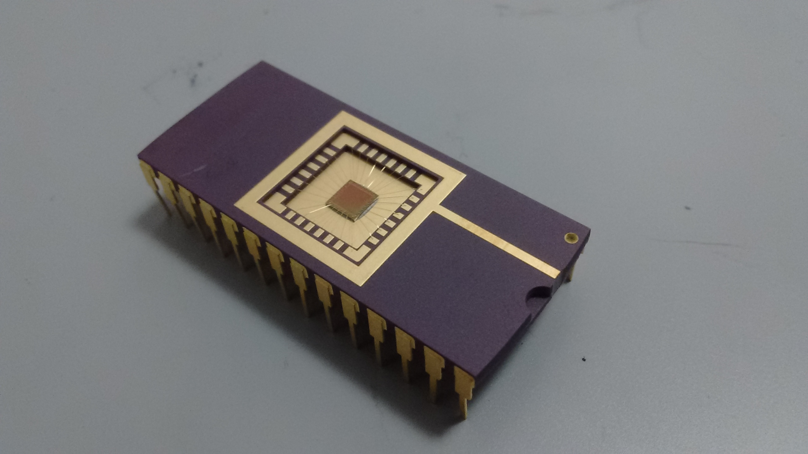

# C4

67 entries.

##### C  _tcc
```text
#include <stdio.h>
int main() {
	puts("Hello, World!");
	return 0;
}
```
[Source File](../libraries/c/C-4/C%20%20_tcc)

##### C Shell
```text
#!/bin/csh -f
echo "Hello world!\!"
```
[Source File](../libraries/c/C-4/C%20Shell)

##### C#  _Visual C# Compiler
```text
using System;
class Program {
	static void Main(string[] args) {
		Console.WriteLine("Hello, World!");
	}
}
```
[Source File](../libraries/c/C-4/C#%20%20_Visual%20C#%20Compiler)

##### C#  _Visual C# Interactive Compiler
```text
WriteLine("Hello, World!");
```
[Source File](../libraries/c/C-4/C#%20%20_Visual%20C#%20Interactive%20Compiler)

##### C-Shop
```text
Welcome to C-Shop
The big C costs $16
The small c costs $1
Person 1 buys 4 big C's and 8 small c's
Person 1 will pay for his order
Person 2 buys 6 big C's and 5 small c's
Person 2 will pay for his order
Person 3 buys 6 big C's and 12 small c's
Person 3 will pay for his order
Person 3 will pay for his order
Person 4 buys 6 big C's and 15 small c's
Person 4 will pay for his order
Person 5 buys 2 big C's and 0 small c's
Person 5 will pay for his order
Person 6 buys 5 big C's and 7 small c's
Person 6 will pay for his order
Person 4 will pay for his order
Person 7 buys 7 big C's and 2 small c's
Person 7 will pay for his order
Person 3 will pay for his order
Person 8 buys 6 big C's and 4 small c's
Person 8 will pay for his order
Person 9 buys 2 big C's and 1 small c's
Person 9 will pay for his order
```
[Source File](../libraries/c/C-4/C-Shop)

##### C1R
```text
Hello_world/Text
```
[Source File](../libraries/c/C-4/C1R)

##### CPF
```text
# Common Power Format stub: Hello World
```
[Source File](../libraries/c/C-4/CPF)

##### cpl
```text
title 'Hello world in cpl on a Warrex Centurion'
system zhelloworld      (main,exp=d)
;
file crt:sysipt,class=0,seq
;
define m00:'hello world'
format f00:c132
;
entrypoint crt
;
entry
;
open io crt
;
write (crt, f00) m00
stop 0
;
end
```
[Source File](../libraries/c/C-4/cpl)

##### CPython
```text
print("Hello World")
```
[Source File](../libraries/c/C-4/CPython)

##### CQL
```text
SELECT "Hello World";
```
[Source File](../libraries/c/C-4/CQL)

##### Crack
```text
import crack.io cout;
cout `Hello world!\n`;
```
[Source File](../libraries/c/C-4/Crack)

##### Craft Basic
```text
print "Hello world!"
```
[Source File](../libraries/c/C-4/Craft%20Basic)

##### CraftyFunge
```text
.nbt
```
[Source File](../libraries/c/C-4/CraftyFunge)

##### Crainfuck
```text
#include <ncurses.h>
#include <stdlib.h>

int main() {
   initscr();
   printw("Hello World!");
   refresh();
   getch();
   endwin();
   exit(0);
}
```
[Source File](../libraries/c/C-4/Crainfuck)

##### CRalphabet
```text
\n\n\n\n\n\n\n\n
\n\n\n\n\n
\n\n\n\n\n\n\n\n\n\n\n\n
\n\n\n\n\n\n\n\n\n\n\n\n
\n\n\n\n\n\n\n\n\n\n\n\n\n\n\n
SPACE
\n\n\n\n\n\n\n\n\n\n\n\n\n\n\n\n\n\n\n\n\n\n\n
\n\n\n\n\n\n\n\n\n\n\n\n\n\n\n
\n\n\n\n\n\n\n\n\n\n\n\n\n\n\n\n\n\n
\n\n\n\n\n\n\n\n\n\n\n\n
\n\n\n\n
```
[Source File](../libraries/c/C-4/CRalphabet)

##### CRATE
```text
   1 
   vv
0?!=!
>  >^
```
[Source File](../libraries/c/C-4/CRATE)

##### Cratefuck
```text
*[>*<*>>*<<*>>>*<<<*>>>>*<<<<*] Make 4 stacks of 64 in rooms 1, 2, 3, & 4; (0, 64, 64, 64, 64
>>>>*<*>*<*>*<*>*<*>*<*>*<*>*<*>*<*. Manually move 8 crates from room 4 to room 3 and print "H"; (0, 64, 64, 72, 56
>*[>*<*>>*<<*] Split the remaining 56 crates in room 4 into 2 stacks of 28 in rooms 5 & 6; (0, 64, 64, 72, 0, 28, 28
>>*[<<<*>>>*] Move all 28 crates from room 6 into room 3; (0, 64, 64, 100, 0, 28, 0
<*<<*. Move 1 crate from room 5 to room 3 and print "e"; (0, 64, 64, 101, 0, 27, 0
<*>*<*>*<*>*<*>*<*>*<*>*<*>*.. Move 7 crates from room 2 to room 3 and print "ll"; (0, 64, 57, 108, 0, 27, 0
<*>*<*>*<*>*. Move 3 more crates from room 2 to room 3 and print "o"; (0, 64, 54, 111, 0, 27, 0
<*<*>*<*>*<*>*<*>*<*>*<*>*<*>*<*>*<*>*<*>. Move 10 crates from room 2 to room 1 and print ","; (0, 74, 44, 111, 0, 27, 0
>*>>*<<*>>*<<*>>*<<*>>*<<*>>*. Move 5 crates from room 3 to room 5 and print " "; (0, 74, 44, 106, 0, 32, 0
<<<<*[>*<*]>>*<*. Move 74 crates from room 1 and 1 crate from room 3 to room 2 and print "w"; (0, 0, 119, 105, 0, 32, 0
*>*<*>*<*>*<*>*<*>*<*>*. Move 6 crates from room 2 to room 3 and print "o"; (0, 0, 113, 111, 0, 32, 0
*<*. Move 1 crate from room 3 to room 2 and print "r"; (0, 0, 114, 110, 0, 32, 0
>*<*>*<*>. Move 2 crates from room 3 to room 2 and print "l"; (0, 0, 116, 108, 0, 32, 0
*<*>*<*>*<*>*<*>*<*>*<*>*<*>*. Move 7 crates from room 3 to room 2, grab an 8th crate from room 3, and print "d"; (0, 0, 123, 100, 0, 32, 0
>>*. Move the 8th crate to room 5 and print "!"; (0, 0, 123, 100, 0, 33, 0
```
[Source File](../libraries/c/C-4/Cratefuck)

##### Crazy
```text
 kirmg(s + v + o + o + l + xln + yoz + d + l + i + o + w + vcx)
```
[Source File](../libraries/c/C-4/Crazy)

##### Crazy J
```text
[-.[-.+<,->[-.][,-][-.+<,->.[,-][-.+<,-->++<->+[-[--][,-]]]<.->[-.[-.+<,->.[,-]][-[-.],[-.[<.-->+[,-].]<,,][-.]<.-]][,.].][-[-.[-[-[-.]][.+][-,][-.+<,>+<,->[--++][-,-]][<.-->,[-.[<.-->+[,-].]<,,][-.][-[.+<,-]+[-[--++]+]-[-[-[-.+<,-]++]+[<--->[,-]]]]]]][<.-->.[,[,[<.-->,[-.[<.-->+[,-].]<,,>][-.][-.+<,->.[,-]<.->[-.<-->[.+][-,]][-[--[-.]+]+,<-->++-+].]<.-,>[-[-.[-[-.+<,-->++]+[<--->[,-]]]][<.-->,[<.-->[<.--->[.+][-,]]-[<.-->,[-.[<.-->+[,-].]<,,][-.]<.-]<,][-.]][-.+<,->.[,-]]+]<,>[-[-[-.+<,-]++]+[-[--][,-]]]][<.-->,[-.[<.-->+[,-].]<,,][-.]]][-.[-.+<,->.[,-]]<->[-.+<,-->++<->+[-[--][,-]]<.-][<.-->,[-.[<.-->+[,-].]<,,][-.]][-.][-[-.<-][.+][-,]][<.-->[-.[-.[-.<-.->.<->+-][,,]]][-.,[-.<-,]][<.-->,[<.-,,,][-.]]]++[-.[<.-->+[,-].][-.[-.+<,>+<,->[--++][-,-]<.->++.]<,]][-.+<,->.[,-]<.->[<.-->,[-.[<.-->+[,-].]<,,][-.]<.][-[-.+<,-->++]+[<--->[,-]]]+][-.+<,->.[,-]<.->[<.--->[.+][-,]][--[-.]+<->+,<-->++-+][<.-->,[-.[<.-->+[,-].]<,,][-.]<,]][-[.[<.-->,[-.[<.-->+[,-].]<,,][-.]]],[-.+<,->.[,-][-.+<,-->++<->+[-[--][,-]]]]+[-.+<,->.[,-]]][-.+<,->.[,-][-[-.+<,-->++]+[-[--][,-]]]<.->[-.[-.+<,->.[,-]][<.-->,[-.[<.-->+[,-].]<,,][-.]<.-]][,.].]]][-.+<,-->++<->+[-[--][,-]]<.->[-.[-.+<,->.[,-]][-.[<.-->,[-.[<.-->+[,-].]<,,][-.]]<->+<,]][-.].]][,-][-.[-.]]][<.-->,[-.[<.-->+[,-].]<,,][-.]<.->[-.+<,->.[,-]][-.+<,->.[,-]<.->,[-[-.+<,-->++]+[<--->[,-]]]+].][<.-->,[-.[<.-->+[,-].]<,,][-.][-.[-.+<,->.[,-]]<->[-.+<,-<->++<->+[-[--][,-]]<.-][<.--->[.+][-,]],.]]<,][,,]]+[+++++[>++++++[->++>+++>+++>+<<<<]>>-<<<-]>>.[--------<+++++>]>-.>..+++.<<<-.>>>>----.<++++++++.--------.+++.------.<-.<<<+++++[>--<<++>-]>-.<<.>]
```
[Source File](../libraries/c/C-4/Crazy%20J)

##### Crazy J + Brainfuck polyglot
```text
[-.[-.+<,->[-.][,-][-.+<,->.[,-][-.+<,-->++<->+[-[--][,-]]]<.->[-.[-.+<,->.[,-]][-[-.],[-.[<.-->+[,-].]<,,][-.]<.-]][,.].][-[-.[-[-[-.]][.+][-,][-.+<,>+<,->[--++][-,-]][<.-->,[-.[<.-->+[,-].]<,,][-.][-[.+<,-]+[-[--++]+]-[-[-[-.+<,-]++]+[<--->[,-]]]]]]][<.-->.[,[,[<.-->,[-.[<.-->+[,-].]<,,>][-.][-.+<,->.[,-]<.->[-.<-->[.+][-,]][-[--[-.]+]+,<-->++-+].]<.-,>[-[-.[-[-.+<,-->++]+[<--->[,-]]]][<.-->,[<.-->[<.--->[.+][-,]]-[<.-->,[-.[<.-->+[,-].]<,,][-.]<.-]<,][-.]][-.+<,->.[,-]]+]<,>[-[-[-.+<,-]++]+[-[--][,-]]]][<.-->,[-.[<.-->+[,-].]<,,][-.]]][-.[-.+<,->.[,-]]<->[-.+<,-->++<->+[-[--][,-]]<.-][<.-->,[-.[<.-->+[,-].]<,,][-.]][-.][-[-.<-][.+][-,]][<.-->[-.[-.[-.<-.->.<->+-][,,]]][-.,[-.<-,]][<.-->,[<.-,,,][-.]]]++[-.[<.-->+[,-].][-.[-.+<,>+<,->[--++][-,-]<.->++.]<,]][-.+<,->.[,-]<.->[<.-->,[-.[<.-->+[,-].]<,,][-.]<.][-[-.+<,-->++]+[<--->[,-]]]+][-.+<,->.[,-]<.->[<.--->[.+][-,]][--[-.]+<->+,<-->++-+][<.-->,[-.[<.-->+[,-].]<,,][-.]<,]][-[.[<.-->,[-.[<.-->+[,-].]<,,][-.]]],[-.+<,->.[,-][-.+<,-->++<->+[-[--][,-]]]]+[-.+<,->.[,-]]][-.+<,->.[,-][-[-.+<,-->++]+[-[--][,-]]]<.->[-.[-.+<,->.[,-]][<.-->,[-.[<.-->+[,-].]<,,][-.]<.-]][,.].]]][-.+<,-->++<->+[-[--][,-]]<.->[-.[-.+<,->.[,-]][-.[<.-->,[-.[<.-->+[,-].]<,,][-.]]<->+<,]][-.].]][,-][-.[-.]]][<.-->,[-.[<.-->+[,-].]<,,][-.]<.->[-.+<,->.[,-]][-.+<,->.[,-]<.->,[-[-.+<,-->++]+[<--->[,-]]]+].][<.-->,[-.[<.-->+[,-].]<,,][-.][-.[-.+<,->.[,-]]<->[-.+<,-<->++<->+[-[--][,-]]<.-][<.--->[.+][-,]],.]]<,][,,]]+[+++++[>++++++[->++>+++>+++>+<<<<]>>-<<<-]>>.[--------<+++++>]>-.>..+++.<<<-.>>>>----.<++++++++.--------.+++.------.<-.<<<+++++[>--<<++>-]>-.<<.>]
```
[Source File](../libraries/c/C-4/Crazy%20J%20+%20Brainfuck%20polyglot)

##### Creative Basic
```text
OPENCONSOLE

PRINT"Hello world!"

'This line could be left out.
PRINT:PRINT:PRINT"Press any key to end."

'Keep the console from closing right away so the text can be read.
DO:UNTIL INKEY$<>""

CLOSECONSOLE

END
```
[Source File](../libraries/c/C-4/Creative%20Basic)

##### CreativeASM
```text
put rax "Hello, world!"
int rax 01h
```
[Source File](../libraries/c/C-4/CreativeASM)

##### CreativeScript
```text
say! Hello, world!
```
[Source File](../libraries/c/C-4/CreativeScript)

##### Crest
```text
left 90

forever [
    ; Fetch the input pixel
    setpos 599 399
    setpencolor pixel
    
    ; Completely fill the screen
    repeat 600 [
        forward 599
        setpos 599 minus ycor 1
    ]
    
    nextframe
]
```
[Source File](../libraries/c/C-4/Crest)

##### Crochet
```text
# Crochet demo

origin
    spawn
        _ -> 20 fib
    pop
        _ -> @ ! 0

fib
    spawn
        0 -> 0
        1 -> 1
        _ -> @ -1 fib -1 fib 0
    pop
        _ -> +@
```
[Source File](../libraries/c/C-4/Crochet)

##### Crochetable Cyclic Tag
```text
# Simple decreasing triangle swatch
1. Any sequence of sc / dc stitched onto an appropriately sized foundation chain.
2. std
3. dec-ss
4. std
Repeat from Row 3.
```
[Source File](../libraries/c/C-4/Crochetable%20Cyclic%20Tag)

##### CRuby
```text
puts "Hello World"
```
[Source File](../libraries/c/C-4/CRuby)

##### Crypten
```text
ë
00eb
```
[Source File](../libraries/c/C-4/Crypten)

##### Cryptol
```text
:set ascii=on
"Hello, World!"
```
[Source File](../libraries/c/C-4/Cryptol)

##### Cryptoleq



*画像プログラム（JPG / 922215 bytes）*

[Source File](../libraries/c/C-4/Cryptoleq.jpg)

##### Crystal
```text
# Hello world in Crystal

puts "Hello World"
```
[Source File](../libraries/c/C-4/Crystal)

##### Crystal _2
```text
# Hello world in Crystal

puts "Hello World"
```
[Source File](../libraries/c/C-4/Crystal%20_2)

##### Crystal language
```text
puts "Hello World"
```
[Source File](../libraries/c/C-4/Crystal%20language)

##### Cscalls
```text
One at Hello World!
PEEK
```
[Source File](../libraries/c/C-4/Cscalls)

##### csh
```text
echo "Hello World"
```
[Source File](../libraries/c/C-4/csh)

##### Csound
```text
prints "Hello World\n"
```
[Source File](../libraries/c/C-4/Csound)

##### CSP Spec
```text
params | dim | pair pnat
def n | mulv dim
clues grid | grid_squares n n | fin n
def f \(v p) div p dim
[rows, cols, group f].all \f (f grid).all neqv
grid.render_group f \(v p g) [bg white, text v.inc <g black blue>]
grid.input_int [1, n] dec
```
[Source File](../libraries/c/C-4/CSP%20Spec)

##### CSS
```text
/* Hello World in CSS */
body:before {
    content: "Hello World";
}
```
[Source File](../libraries/c/C-4/CSS)

##### Css script
```text
fill black
rect 100 100 50 10
```
[Source File](../libraries/c/C-4/Css%20script)

##### Csub
```text
int main()
{
    write("Hello, world!\n");
}
```
[Source File](../libraries/c/C-4/Csub)

##### CTBASIC
```text
REM Hello, World! output example.
PRINT "Hello, World!"
```
[Source File](../libraries/c/C-4/CTBASIC)

##### CTFuck
```text
0...$1.$0..$1.$0.
$1.$0.$1.$0..$1..$0.
..$1..$0.$1..$0.
..$1..$0.$1..$0.
$1....$0.$1..$0.
..$1..$0.$1.$0..
.....$1.$0..
$1...$0.$1...$0.
$1....$0.$1..$0.
.$1.$0..$1...$0.
..$1..$0.$1..$0.
..$1.$0..$1..$0.
$1.$0....$1.$0..
.$1.$0.$1.$0....
```
[Source File](../libraries/c/C-4/CTFuck)

##### Cthulhu
```text
0A [0A
```
[Source File](../libraries/c/C-4/Cthulhu)

##### Cube
```text
2  ....
   .  .
   .);.
..........
.( .v .1 .
.  .  .1 .
..........
   .>a.
   .  .
   ....
   .  .
   .  .
   ....
```
[Source File](../libraries/c/C-4/Cube)

##### Cubed
```text
 |r|r|”|7|2|”|d|
 |D|”|1|0|1|”|l|
```
[Source File](../libraries/c/C-4/Cubed)

##### Cuboid
```text
    +--------+
   /        /|
  /        / |
 /        /  |
+--------+   +
|        |  /
|        | /
|        |/
+--------+
  +-----------------------------------------------------------------------------------------------------+
 /                                                                                                     /|
+-----------------------------------------------------------------------------------------------------+ +
|                                                                                                     |/
+-----------------------------------------------------------------------------------------------------+
     +---------+      +---------+
    /         /|     /         /|
   /         / |    /         / |
  /         /  |   /         /  |  +-------------------------------------+    +-----------+
 /         /   +  /         /   + /                                     /|   /           /|
+---------+   /  +---------+   / +-------------------------------------+ |  /           / |
|         |  /   |         |  /  |                                     | | +-----------+  +
|         | /    |         | /   |                                     | + |           | /
|         |/     |         |/    |                                     |/  |           |/
+---------+      +---------+     +-------------------------------------+   +-----------+
   +----+
  /    /|
 /    / |   +-----------------------------+   +-------------------------------------+
+----+  |  /                             /|  /                                     /|
|    |  | +-----------------------------+ | +-------------------------------------+ |
|    |  + |                             | | |                                     | |
|    | /  |                             | + |                                     | +
|    |/   |                             |/  |                                     |/
+----+    +-----------------------------+   +-------------------------------------+
    +-------------------+      +---------+      +-----+   +-----------+
   /                   /|     /         /|     /     /|  /           /|
  /                   / |    /         / |    /     / | +-----------+ |
 /                   /  +   /         /  |   /     /  | |           | |
+-------------------+  /   /         /   +  /     /   | |           | +
|                   | /   +---------+   /  +-----+    | |           |/
|                   |/    |         |  /   |     |    + +-----------+
+-------------------+     |         | /    |     |   /
                          |         |/     |     |  /
                          +---------+      |     | /
                                           |     |/
                                           +-----+
```
[Source File](../libraries/c/C-4/Cuboid)

##### CUDA
```text
// Hello world in CUDA

#include <stdio.h>
 
const int N = 16; 
const int blocksize = 16; 
 
__global__ 
void hello(char *a, int *b) 
{
	a[threadIdx.x] += b[threadIdx.x];
}
 
int main()
{
	char a[N] = "Hello \0\0\0\0\0\0";
	int b[N] = {15, 10, 6, 0, -11, 1, 0, 0, 0, 0, 0, 0, 0, 0, 0, 0};
 
	char *ad;
	int *bd;
	const int csize = N*sizeof(char);
	const int isize = N*sizeof(int);
 
	printf("%s", a);
 
	cudaMalloc( (void**)&ad, csize ); 
	cudaMalloc( (void**)&bd, isize ); 
	cudaMemcpy( ad, a, csize, cudaMemcpyHostToDevice ); 
	cudaMemcpy( bd, b, isize, cudaMemcpyHostToDevice ); 
	
	dim3 dimBlock( blocksize, 1 );
	dim3 dimGrid( 1, 1 );
	hello<<<dimGrid, dimBlock>>>(ad, bd);
	cudaMemcpy( a, ad, csize, cudaMemcpyDeviceToHost ); 
	cudaFree( ad );
	cudaFree( bd );
	
	printf("%s\n", a);
	return EXIT_SUCCESS;
}
```
[Source File](../libraries/c/C-4/CUDA)

##### CUE
```text
hello: "Hello World"
```
[Source File](../libraries/c/C-4/CUE)

##### CUE language
```text
hello: "Hello World"
```
[Source File](../libraries/c/C-4/CUE%20language)

##### Cufrab
```text
:PRINT[-]~\.;
"Hello, World!\n"PRINT
```
[Source File](../libraries/c/C-4/Cufrab)

##### Cupid
```text
>>  input a byte to current cell
<<  output the current cell as character
->  move memory pointer one right
<-  move memory pointer one left
><  increase the current cell
<>  decrease the current cell
-<  if the current cell is zero, jump to the corresponding >-, otherwise continue
>-  jump back to the corresponding -<
--  output the current state of the storage tape
```
[Source File](../libraries/c/C-4/Cupid)

##### Curry  _PAKCS
```text
main = putStr "Hello, World!"
```
[Source File](../libraries/c/C-4/Curry%20%20_PAKCS)

##### Curry  _Sloth
```text
import IO

main = putStr "Hello, World!"
```
[Source File](../libraries/c/C-4/Curry%20%20_Sloth)

##### CurSorn2
```text
0
```
[Source File](../libraries/c/C-4/CurSorn2)

##### Curto
```text
." Hola, mundo!"
```
[Source File](../libraries/c/C-4/Curto)

##### Cut
```text
++-+
```
[Source File](../libraries/c/C-4/Cut)

##### Cutw
```text
j - Move pointer right.
i - Move pointer left.
w - Puts input at cell at pointer.
t - Outputs cell at pointer as ASCII.
u - Branflake's [.
c - Branflake's ].
n - Increments cell at pointer.
m - Decrements cell at pointer.
```
[Source File](../libraries/c/C-4/Cutw)

##### CV _N _C
```text
cicidigæducədəcədəcədəcədəcəfodigiducificiʔiciʔicidifufiʡiʡifocədəgəduqəʔəcədəgəfoduʡəʡəʡəcəfodogiducidigædəbəfodubifiditifoducədəfogæfodufoboʔidiʡuʔiʔicif
```
[Source File](../libraries/c/C-4/CV%20_N%20_C)

##### CWEB
```text
\def\title{<a href="/showArticle.jhtml?documentID=cuj9505wittenbe&pgno=1">Listing 1</a>}

@*A Simple Example.
This is a trivial example of a \.{CWEB} program.
It is, of course, the classic "hello, world"
program we all know and love:

@c
@<Header files needed by the program@>@;
@#
main(void)
{
   @<Print the message |"hello, world"|@>@;
}

@ Naturally, we use |printf| to do the dirty work:

@<Print the message |"hello, world"|@>=
printf("hello, world\n");

@ The prototype for |printf| is in the standard
header, \.{<stdio.h>}.

@<Header files needed by the program@>=
#include <stdio.h>

@*Index.
```
[Source File](../libraries/c/C-4/CWEB)

##### Cy
```text
"Hello, World!" :<
```
[Source File](../libraries/c/C-4/Cy.cy)

##### CYBOL
```text
<!-- Hello World in Cybernetics Oriented Language (CYBOL) -->
<model>
    <part name="send_message" channel="inline" abstraction="operation" model="send">
        <property name="channel" channel="inline" abstraction="character" model="shell"/>
        <property name="message" channel="inline" abstraction="character" model="Hello, World!"/>
    </part>
    <part name="exit_application" channel="inline" abstraction="operation" model="exit"/>
</model>
```
[Source File](../libraries/c/C-4/CYBOL)

##### Cyclone
```text
#include <stdio.h>
int main() {
 printf("Hello World\n");
 return 0;
}
```
[Source File](../libraries/c/C-4/Cyclone.cyc)

##### Cycript
```text
console.log("Hello World")
```
[Source File](../libraries/c/C-4/Cycript)

##### Cypher
```text
RETURN "Hello World" AS greeting
```
[Source File](../libraries/c/C-4/Cypher)

##### CypherNeo4j
```text
CREATE (Hello:Word { val: 'Hello' }), (World:Word { val: 'World' }),
(Hello)-[:SPACE]->(World)
RETURN Hello,World
```
[Source File](../libraries/c/C-4/CypherNeo4j.cypher)

##### Cythan
```text
'start # We start with the instruction pointor at the 'start cell
0 # We use this element to test the or

'0:0 # Some constant pointors to 0 or 1
'1:1

no_op = (0 0) # An empty operation

stop {~+2 0 ~-2} # Do an infinite loop
jump { ~+2 0 self.0 } # Jump to cell self.0

or {
    # self.0 => jump if self.1 or self.2 is '1
    # self.1 => can be '0 or '1
    # self.2 => can be '0 or '1
    self.0 1 self.1 ~+1 0 0 self.2 ~+1 no_op
}

'start:or('good '0 '0) # start of the program
stop() # if result is 0
'good:stop() # if result is 1, will jump to good
```
[Source File](../libraries/c/C-4/Cythan)

##### Cython
```text
print("Hello World")
```
[Source File](../libraries/c/C-4/Cython)

