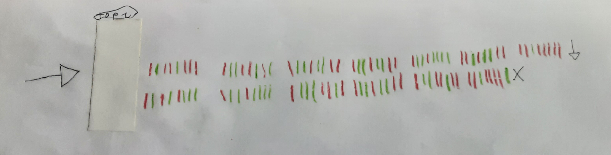

# D1

117 entries.

##### 2DChanger
```text
 }<}}}<}}<}}}<}}<}}<}    }<+
+}}<}}}<}}<}}}}<}        <}+
+}<}}}}<}}}}<}}<}        }<+
+}<}}<}}}}<}}}}<}        <}+
+}<}}}}<}}}}}            }<+
+}<}}<}}}}<}}}<}}<}      <}+
+}<}}<}}}<}}<}}<}}<}}<}  }<+
+}}}}<}}}<}}}<}          <}+
+}<}}}}<}}}}}            }<+
+}<}}}<}}<}}}}}<}        <}+
+}<}}}}<}}}}<}}<}        }<+
+}<}}<}}}<}}<}}}}<}      <}+
+}<}}<}}}<}}<}}<}}<}}
```
[Source File](../libraries/d/D-1/2DChanger)

##### 2Deadfish
```text
 i
si
 ds
si
 do
```
[Source File](../libraries/d/D-1/2Deadfish)

##### 3D
```text
OUTPUT  "Hello world    END     prints "Hello World" on screen
```
[Source File](../libraries/d/D-1/3D)

##### 4D
```text
// Hello world in 4D, formerly known as 4th Dimension

ALERT("Hello World!")
```
[Source File](../libraries/d/D-1/4D)

##### 4DChess
```text
++++++++[@++++[@++@+++@+++@+????-]@+@+@-@@+[?]?-]@@.@---.+++++++..+++.@@.?-.?.+++.------.--------.@@+.@++.
```
[Source File](../libraries/d/D-1/4DChess)

##### 5D Brainfuck With Multiverse Time Travel
```text
++++[>++++++++<-]>[>+++>+<<-]>+++++(+++(++++(+++(+++(+++++.)@-+-+.).>.<-+-+-+.)..@.).)-+-+-+.-@.
```
[Source File](../libraries/d/D-1/5D%20Brainfuck%20With%20Multiverse%20Time%20Travel)

##### D
```text
// Hello World in D

import std.stdio;

void main()
{
   writefln("Hello World!");
}
```
[Source File](../libraries/d/D-1/D)

##### D
```text
import std.stdio;

void main()
{
	   writeln("Hello World");
}
```
[Source File](../libraries/d/D-1/D.d)

##### D.E.A.T
```text
(opcode, A-mode, A-interval, B-mode, B-interval, decoration)
```
[Source File](../libraries/d/D-1/D.E.A.T.H)

##### D2
```text
"r8$.s$o;Hello, World!
```
[Source File](../libraries/d/D-1/D2.d2)

##### D4
```text
// Hello World as a relation-variable in D4

select row { "Hello World" AMessage }
```
[Source File](../libraries/d/D-1/D4)

##### DAEANAAACP



*画像プログラム（IMAGE / 327403 bytes）*

[Source File](../libraries/d/D-1/DAEANAAACP.jpg)

##### Dafny
```text
method Main() {
  print "hello, world!\n";
  assert 10 < 2;
}
```
[Source File](../libraries/d/D-1/Dafny)

##### Dafny
```text
method Main() {
	print "Hello, World!";
}
```
[Source File](../libraries/d/D-1/Dafny.dafny)

##### DALIS
```text
LOOP e= 1.1,d = 0, h = 0
  LOOP b=-2
     n = 0, h = 127
     LOOP r=0
        r = r*r-n*n+b
        n = 2*d*n+e
     REPEAT d = r, h=h-1 IF ((r*r)+(n*n) < 4) AND (h > 32)
     WRITE (h)
  REPEAT b = b+ 0.04 IF b < 1
  WRITE EOL
REPEAT e = e - 0.1 IF e > -1.2
```
[Source File](../libraries/d/D-1/DALIS)

##### DAMN COVID-19
```text
1 // The tape has 1 cell (single bit)
?!@{ // Repeat until all cities are infected
  ?.( // If the current bit on the tape is 1
    // If can go to the right, go right, otherwise flip the bit on the tape
    ?>(>):(!)
  ):(
    // If can go to the left, go left, otherwise flip the bit on the tape
    ?<(<):(!)
  )
}
// Now all cities are infected (since we are outside of the loop)
?<{<} // Go to the leftmost city
?#{@>} // Delete all cities
```
[Source File](../libraries/d/D-1/DAMN%20COVID-19)

##### Dango
```text
eat (')(Hello, world!)----
```
[Source File](../libraries/d/D-1/Dango)

##### Dao
```text
io.writeln( 'Hello world!' )
```
[Source File](../libraries/d/D-1/Dao)

##### Daoyu
```text
$$$
(([]!)/([])):
((/[])/([]!/[]!)):
(/[])::
[/([]!/[])]!:
[[[]]!]:
[([]!)/[/[]!]!]:
[/([]!/[])]!:
[([]!)/(/[])]:
((/[])/[]):
(/([]!)):
([[]]!/[[]!]!):
[[[]/[]]]!:
```
[Source File](../libraries/d/D-1/Daoyu)

##### Dark
```text
+helloworld hell
helloworld$twist stalker io
helloworld$twist sign string
io$stalk
io$personal
string$scrawl " Hello World
string$read ~
io$echo
helloworld$consume io
helloworld$consume string
helloworld$empty
helloworld$apocalypse
```
[Source File](../libraries/d/D-1/Dark)

##### dark
```text
+helloworld hell
helloworld$twist stalker io
helloworld$twist sign string
io$stalk
io$personal
string$scrawl " Hello World
string$read ~
io$echo
helloworld$consume io
helloworld$consume string
helloworld$empty
helloworld$apocalypse
```
[Source File](../libraries/d/D-1/dark.txt)

##### Darkbasic
```text
` Hello World in Darkbasic

print "Hello World!"
wait key
```
[Source File](../libraries/d/D-1/Darkbasic)

##### Dart
```text
main() {
    var bye = 'Hello world!';
    print("$bye");
}
```
[Source File](../libraries/d/D-1/Dart)

##### Dart
```text
void main() {
  print("Hello World");
}
```
[Source File](../libraries/d/D-1/Dart.dart)

##### Darwin
```text
printf("Hello World")
```
[Source File](../libraries/d/D-1/Darwin.drw)

##### daScript
```text
[export]
def main
	print("Hello World\n")
```
[Source File](../libraries/d/D-1/daScript.das)

##### Dash-end
```text
ø10 ¡a #--
ø30 ? ¢a 0 50
ø30 ? ¢a 1 35

ø32 -þ
ø35 --# ¢a
ø40 ¤35

ø50 --# ¢a
ø60 -þ
```
[Source File](../libraries/d/D-1/Dash-end)

##### Dash
```text
echo Hello, World!
```
[Source File](../libraries/d/D-1/Dash.dash)

##### Dashes
```text
‐⸺-⁃—⸻–-⁃―⸻‑‒-—⸻–⎯―‐⸺-⁃—⸻–-⁃―⸻‑‒-—⸻–⎯⎯
```
[Source File](../libraries/d/D-1/Dashes)

##### Data Parallel Haskell
```text
main = putStrLn "Hello World"
```
[Source File](../libraries/d/D-1/Data%20Parallel%20Haskell)

##### Databasic
```text
PROGRAM HELLO.B
# Hello World in Databasic
CRT "HELLOW WORLD"
END
```
[Source File](../libraries/d/D-1/Databasic)

##### DataFlex
```text
// Hello World in Dataflex Procedural

/tela

Hello world

/*

clearscreen

page tela
```
[Source File](../libraries/d/D-1/DataFlex)

##### Dataflex _2
```text
// Hello World in Dataflex Procedural

/tela

Hello world

/*

clearscreen

page tela
```
[Source File](../libraries/d/D-1/Dataflex%20_2)

##### Datalog
```text
hello("Hello World").
```
[Source File](../libraries/d/D-1/Datalog)

##### DataWeave
```text
"Hello world!"
```
[Source File](../libraries/d/D-1/DataWeave)

##### DateFuck
```text
DateFuck is a programming language designed for writing text-based dating sims.
It is not useful for much else.

Syntax:

There is one internal variable, initially set to one. Each non-indented line
is a line of dialogue/info. Labels are numbers representing the state necessary
to go to that piece of dialogue, followed immediately by a colon. It is in
hexadecimal. Indented lines are options, preceeded with labels which are xor'd
with the internal state variable if that option is chosen. The list of options
terminates at the next non-indented label.

Example:

1:What do you want to say?
        2:Hello World!
        5:Hello Sailor!
        1:Exit
3:Hello World!
        3:Exit
4:Hello Sailor!
        4:Exit
```
[Source File](../libraries/d/D-1/DateFuck)

##### Dathanna


*画像プログラム（IMAGE / 2047 bytes）*

[Source File](../libraries/d/D-1/Dathanna.png)

##### Datums
```text
# message 14
(10 : message) = 10 33 100 108 114 111 119 32 44 111 108 108 101 72;
(24 : char) = 23;

! (24 : char)
>>>>>>>>>
(2 : long) = 00 00 00 00 00 00 00 30;
>>>>>>>>>>>>>>
(1 : char) = [24 : char];
(24 : char) -= 1;
(2 : long) = 00 00 00 00 00 00 00 2;
```
[Source File](../libraries/d/D-1/Datums)

##### Dawg
```text
$ ./dawg example.dawg
SUP?
```
[Source File](../libraries/d/D-1/Dawg)

##### Daydream
```text
i = id
k = const
(#) = flip
infixr 9 #
infixr 9 !
f g = g (f g)
(!) a b c = a c (b c)
t a b c = if a then b else c

main=getLine>>=(putStrLn.unwords.map show.f(((take.fromIntegral)#).
  ((map.(((#).((!)(t.(>0)).(((!).((#)((.).((sum.).filter.((>0).).
  (mod#)))))#i)))#1))#[0..]))).(read::String->Integer)
```
[Source File](../libraries/d/D-1/Daydream)

##### Db2
```sql
VALUES('Hello World')
```
[Source File](../libraries/d/D-1/Db2.sql)

##### dBase
```text
* Hello World in dBase IV

? "Hello World!"
```
[Source File](../libraries/d/D-1/dBase)

##### dBase
```text
? "Hello World"
```
[Source File](../libraries/d/D-1/dBase.dbf)

##### DBFV!
```text
Z<9Z+A<Z.YA:[A-*YZ].AB<7C<2~1A<1B<0C<1~1A<1B<0C<8~1A<1B<0C<8~1A<1B<1C<1~1.AB<4C<4~1.AB<3C<2~1A<1B<1C<9~1A<1B<1C<1~1A<1B<1C<4~1A<1B<0C<8~1A<1B<0C<0~1.AB<3C<3~1$0
D<CB:[B-*CZ]A:[A-*CY]C>^
```
[Source File](../libraries/d/D-1/DBFV!)

##### DBL
```text
;
;       Hello world for DBL version 4 by Dario B.
;
                                PROC
;------------------------------------------------------------------
        XCALL FLAGS (0007000000,1)           ;Suppress STOP message

        OPEN (1,O,'TT:')
        WRITES (1,"Hello world")

        DISPLAY (1,"Hello world",10)
        DISPLAY (1,$SCR_MOV(-1,12),"again",10)  ;move up, right and print

        CLOSE 1
END
```
[Source File](../libraries/d/D-1/DBL)

##### Dbondb
```text
psHello, World!;pa10;e;
```
[Source File](../libraries/d/D-1/Dbondb)

##### DBR


*画像プログラム（IMAGE / 197 bytes）*

[Source File](../libraries/d/D-1/DBR.png)

##### dc
```text
#!/usr/bin/dc
# Hello world! in dc (Unix desk calculator)
[Hello world!]p
```
[Source File](../libraries/d/D-1/dc)

##### dc _2
```text
#!/usr/bin/dc
# Hello world! in dc (Unix desk calculator)
[Hello world!]p
```
[Source File](../libraries/d/D-1/dc%20_2)

##### Dc
```text
[Hello World
]n
```
[Source File](../libraries/d/D-1/Dc.dc)

##### DCL
```text
$! Hello world in Digital/Compaq/HP DCL (Digital Command Language)
$ write sys$output "Hello World"
```
[Source File](../libraries/d/D-1/DCL)

##### DCL _2
```text
$! Hello world in Digital/Compaq/HP DCL (Digital Command Language)
$ write sys$output "Hello World"
```
[Source File](../libraries/d/D-1/DCL%20_2)

##### DCPU
```text
  set i, 0xf615
  set j, 0x7349
  hwn z
  sub z, 1

:device_detect_loop
  hwq z

  ife a, i
    ife b, j
      set pc, device_detect_ret

  sub z, 1
  ifa z, 0xffff
    set pc, device_detect_loop

:device_detect_ret
  set a, 0
  set b, [vidmem]
  hwi z

  set i, [vidmem]
  set j, string
  set c, 0xc

:memcpy_loop
  bor [j], 0xf000 ; OR with font style.
  sti [i], [j]
  sub c, 1
  ife c, 0
    sub pc, 1
  set pc, memcpy_loop

:display dat 0
:vidmem dat 0x8000
:string dat "Hello World!"
```
[Source File](../libraries/d/D-1/DCPU.dasm)

##### DD DD
```text
<!Hello\ World\0A;
```
[Source File](../libraries/d/D-1/DD%20DD.dd)

##### dd-dd
```text
<!Hello,\ World!\0A;
```
[Source File](../libraries/d/D-1/dd-dd)

##### DDNC
```text
0 111 10
0 15 11
0 15 12
0 31 13
0 47 14
0 59 15
0 125 16
0 3 17
0 0 18
0 63 19
0 15 20
0 12 21
0 36 22
0 31 23
0 17 24

0 500 3
0 10 2
0 15 5

60 4
2 2 1
80 1
72 3
30 2
31 5
62 5
61 4
64
```
[Source File](../libraries/d/D-1/DDNC)

##### DDR
```text
<v^>
<  >
 v
<
 v^
<  >
 v^
 v >
 v^
<  >
 v^
<v
 v^
 v^
   >
<  >
 v^
<v^>
 v^
   >
<  >
  ^
<v
 v^
<  >
  ^

 v^
<  >
 v^>
 v^>
 v^
<
 v^
<  >
 v^>
  ^
 v^
<
 v^
<  >
 v^
 v
 v^
<  >
  ^
   >
 v^
```
[Source File](../libraries/d/D-1/DDR)

##### Dead
```text
apapapap
```
[Source File](../libraries/d/D-1/Dead)

##### Deadbird
```text
iiisdsiiiiiiiiciiiiiiiiiiiiiiiiiiiiiiiiiiiiiciiiiiiicciiicdddddddddddddddddddddddddddddddddddddddddddddddddddddddddddddddddddcddddddddddddcdddddddddddddddddddddsddcddddddddciiicddddddcddddddddcdddddddddddddddddddddddddddddddddddddddddddddddddddddddddddddddddddc
```
[Source File](../libraries/d/D-1/Deadbird)

##### Deadchicken
```text
chicken chicken chicken chicken chicken
chicken
chicken
chicken
chicken chicken chicken
chicken chicken
chicken chicken chicken
chicken
chicken
chicken
chicken
chicken
chicken
chicken
chicken
chicken chicken chicken chicken
chicken
chicken
chicken
chicken
chicken
chicken
chicken
chicken
chicken
chicken
chicken
chicken
chicken
chicken
chicken
chicken
chicken
chicken
chicken
chicken
chicken
chicken
chicken
chicken
chicken
chicken
chicken
chicken
chicken
chicken chicken chicken chicken
chicken
chicken
chicken
chicken
chicken
chicken
chicken
chicken chicken chicken chicken
chicken chicken chicken chicken
chicken
chicken
chicken
chicken chicken chicken chicken
chicken chicken
chicken chicken
chicken chicken
chicken chicken
chicken chicken
chicken chicken
chicken chicken
chicken chicken
chicken chicken
chicken chicken
chicken chicken
chicken chicken
chicken chicken
chicken chicken
chicken chicken
chicken chicken
chicken chicken
chicken chicken
chicken chicken
chicken chicken
chicken chicken
chicken chicken
chicken chicken
chicken chicken
chicken chicken
chicken chicken
chicken chicken
chicken chicken
chicken chicken
chicken chicken
chicken chicken
chicken chicken
chicken chicken
chicken chicken
chicken chicken
chicken chicken
chicken chicken
chicken chicken
chicken chicken
chicken chicken
chicken chicken
chicken chicken
chicken chicken
chicken chicken
chicken chicken
chicken chicken
chicken chicken
chicken chicken
chicken chicken
chicken chicken
chicken chicken
chicken chicken
chicken chicken
chicken chicken
chicken chicken
chicken chicken
chicken chicken
chicken chicken
chicken chicken
chicken chicken
chicken chicken
chicken chicken
chicken chicken
chicken chicken
chicken chicken
chicken chicken
chicken chicken
chicken chicken chicken chicken
chicken chicken
chicken chicken
chicken chicken
chicken chicken
chicken chicken
chicken chicken
chicken chicken
chicken chicken
chicken chicken
chicken chicken
chicken chicken
chicken chicken
chicken chicken chicken chicken
chicken chicken
chicken chicken
chicken chicken
chicken chicken
chicken chicken
chicken chicken
chicken chicken
chicken chicken
chicken chicken
chicken chicken
chicken chicken
chicken chicken
chicken chicken
chicken chicken
chicken chicken
chicken chicken
chicken chicken
chicken chicken
chicken chicken
chicken chicken
chicken chicken
chicken chicken chicken
chicken chicken
chicken chicken
chicken chicken chicken chicken
chicken chicken
chicken chicken
chicken chicken
chicken chicken
chicken chicken
chicken chicken
chicken chicken
chicken chicken
chicken chicken chicken chicken
chicken
chicken
chicken
chicken chicken chicken chicken
chicken chicken
chicken chicken
chicken chicken
chicken chicken
chicken chicken
chicken chicken
chicken chicken chicken chicken
chicken chicken
chicken chicken
chicken chicken
chicken chicken
chicken chicken
chicken chicken
chicken chicken
chicken chicken
chicken chicken chicken chicken
chicken chicken
chicken chicken
chicken chicken
chicken chicken
chicken chicken
chicken chicken
chicken chicken
chicken chicken
chicken chicken
chicken chicken
chicken chicken
chicken chicken
chicken chicken
chicken chicken
chicken chicken
chicken chicken
chicken chicken
chicken chicken
chicken chicken
chicken chicken
chicken chicken
chicken chicken
chicken chicken
chicken chicken
chicken chicken
chicken chicken
chicken chicken
chicken chicken
chicken chicken
chicken chicken
chicken chicken
chicken chicken
chicken chicken
chicken chicken
chicken chicken
chicken chicken
chicken chicken
chicken chicken
chicken chicken
chicken chicken
chicken chicken
chicken chicken
chicken chicken
chicken chicken
chicken chicken
chicken chicken
chicken chicken
chicken chicken
chicken chicken
chicken chicken
chicken chicken
chicken chicken
chicken chicken
chicken chicken
chicken chicken
chicken chicken
chicken chicken
chicken chicken
chicken chicken
chicken chicken
chicken chicken
chicken chicken
chicken chicken
chicken chicken
chicken chicken
chicken chicken
chicken chicken
chicken chicken chicken chicken
```
[Source File](../libraries/d/D-1/Deadchicken)

##### Deadfish
```text
iiisdsiiiiiiiioiiiiiiiiiiiiiiiiiiiiiiiiiiiiioiiiiiiiooiiio
dddddddddddddddddddddddddddddddddddddddddddddddddddddddddddddddddddoddddddddddddo
dddddddddddddddddddddsddoddddddddoiiioddddddoddddddddo
dddddddddddddddddddddddddddddddddddddddddddddddddddddddddddddddddddo
```
[Source File](../libraries/d/D-1/Deadfish)

##### Deadfish "self-interpreter"
```text
a:i:d:s:oj
```
[Source File](../libraries/d/D-1/Deadfish%20"self-interpreter")

##### Deadfish 2
```text
iisiiiisiiiiiiiiciiiiiiiiiiiiiiiiiiiiiiiiiiiiiciiiiiiicciiicdddddddddddddddddddddddddddddddddddddddddddddddddddddddddddddddddddddddddddddddcdddddddddddddddddddddsddcddddddddciiicddddddcddddddddch
```
[Source File](../libraries/d/D-1/Deadfish%202)

##### Deadfish 3
```text
iisiiiisiiiiiiiiciiiiiiiiiiiiiiiiiiiiiiiiiiiiiciiiiiiicciiicdddddddddddddddddddddddddddddddddddddddddddddddddddddddddddddddddddddddddddddddcdddddddddddddddddddddsddcddddddddciiicddddddcddddddddch
```
[Source File](../libraries/d/D-1/Deadfish%203)

##### Deadfish but in english
```text
Increment the accumulator 10 times, and then output the accumulator, 
and then decrement the accumulator, and then output the accumulator, 
and then decrement the accumulator, and then output the accumulator, 
and then decrement the accumulator, and then output the accumulator, 
and then decrement the accumulator, and then output the accumulator, 
and then decrement the accumulator, and then output the accumulator, 
and then decrement the accumulator, and then output the accumulator, 
and then decrement the accumulator, and then output the accumulator, 
and then decrement the accumulator, and then output the accumulator, 
and then decrement the accumulator, and then output the accumulator, 
and then decrement the accumulator, and then halt.
```
[Source File](../libraries/d/D-1/Deadfish%20but%20in%20english)

##### Deadfish i
```text
0<+.
```
[Source File](../libraries/d/D-1/Deadfish%20i)

##### Deadfish Joust
```text
ababababababab
```
[Source File](../libraries/d/D-1/Deadfish%20Joust)

##### Deadfish PDA
```text
s# 1 ! 0
```
[Source File](../libraries/d/D-1/Deadfish%20PDA)

##### Deadfish TM
```text
# ! L 1
0 !
iiiiiiiisiiiiiiiia ! L 0
72 !
iiiiiiiiiiiiiiiiiiiiiiiiiiiiia ! L 0
101 !
iiiiiiia ! L 0
108 !
ai ! L 0
109 !
iia ! L 0
111 !
ddddddddddddddddddddddddddddddddddddddddddddddddddddddddddddddddddddddddddddddda ! L 0
32 !
ddddddddddddddddddddddsiiiiiiiiiiiiiiiiiiia ! L 0
119 !
ddddddddai ! L 0
112 !
iia ! L 0
114 !
ddddddaii ! L 0
110 !
dddddddddda ! L 0
100 !
ddddddddddddddddddddddddddddddddddddddddddddddddddddddddddddddddddda ! L 1
```
[Source File](../libraries/d/D-1/Deadfish%20TM)

##### Deadfish with gotos and input
```text
iiisdsiiiiiiiiciiiiiiiiiiiiiiiiiiiiiiiiiiiiiciiiiiiicciiicdddddddddddddddddddddddddddddddddddddddddddddddddddddddddddddddddddcddddddddddddcdddddddddddddddddddddsddcddddddddciiicddddddcddddddddc
```
[Source File](../libraries/d/D-1/Deadfish%20with%20gotos%20and%20input)

##### Deadfish x
```text
xxcxxxxcxxxxxxxxKDxxcxxxxxxcxKxxxxxxxKKxxxKDxxxxxxxcdddddKDxxxxxxcddddKDxxxcxxcddKddddddddKxxxKddddddKddddddddKDxxxxxxcdddK
```
[Source File](../libraries/d/D-1/Deadfish%20x)

##### Deadfish+
```text
iiiiiiiiiiiiiiiiiiiiiiiiiiiiiiiiiiiiiiiiiiiiiiiiiiiiiiiiiiiiiiiiiiiiiiiiopiiiiiiiiiiiiiiiiiiiiiiiiiiiiiopiiiiiiiotppiiiopdddddddddddddddddddddddddddddddddddddddddddddddddddddddddddddddddddopddddddddddddopiiiiiiiiiiiiiiiiiiiiiiiiiiiiiiiiiiiiiiiiiiiiiiiiiiiiiiiopiiiiiiiiiiiiiiiiiiiiiiiiopiiiopddddddopddddddddopdddddddddddddddddddddddddddddddddddddddddddddddddddddddddddddddddddop
```
[Source File](../libraries/d/D-1/Deadfish+)

##### Deadfuck
```text
iiiiiiiiiiiiiiiiiiiiiiiiiiiiiiiiiiiiiiiiiiiiiiiiiiiiiiiiiiiiiiiiiiiiiiiis
iiiiiiiiiiiiiiiiiiiiiiiiiiiiiiiiiiiiiiiiiiiiiiiiiiiiiiiiiiiiiiiiiiiiiiiiiiiiiii
iiiiiiiiiiiiiiiiiiiiiiiiiiiiiiiiiiiiiiiiiiiiiiiiiiiiiiiiiiiiiiiiiiiiiii
iiiiiiiiiiiiiiiiiiiiiiiiiiiiiiiiiiiiiiiiiiiiiiiiiiiiiiiiiiiiiiiiiiiiiiii
iiiiiiiiiiiiiiiiiiiiiiiiiiiiiiiiiiiiiiiiiiiiiiiiiiiiiiiiiiiiiiisiiiii
iiiiiiiiiiiiiiiiiiiiiiiiiiiiiiiiiiiiiiiiiiiiiiiiiiiiiiiiiiiiiiiiiiiiii
iiiiiiiiiiiiiiiiiiiiiiiiiiiiiiiiiiiiiiiiiiiiiiiiiiiiiiiiiiiiiiiiiiii
iiiiiiiiiiiiiiiiiiiiiiiiiiiiiiiiiiiiiiiiiiiiiiiiiiiiiiiiiiiiiiiiiiiii
iiiiiiiiiiiiiiiiiiiiiiiiiiiiiiiiiiiiiiiiiiiiiiiiiiisiiiiiiiiiiiiiiiii
iiiiiiiiiiiiiiiiiiiiiiiiiiiiiiiiiiiiiiiiiiiiiiiiiiiiiiiiiiiiiiiiiiii
iiiiiiiiiiiiiiiiiiiiiiiiiiiiiiiiiiiiiiiiiiiiiiiiiiiiiiiiiiiiiiiiiii
iiiiiiiiiiiiiiiiiiiiiiiiiiiiiiiiiiiiiiiiiiiiiiiiiiiiiiiiiiiiiiiiii
iiiiiiiiiiiiiiiiiiiiiiiiiiiiiiiiiiiiiisiiiiiiiiiiiiiiiiiiiiiiiiiiii
iiiiiiiiiiiiiiiiiiiiiiiiiiiiiiiiiiiiiiiiiiiiiiiiiiiiiiiiiiiiiiiii
iiiiiiiiiiiiiiiiiiiiiiiiiiiiiiiiiiiiiiiiiiiiiiiiiiiiiiiiiiiiii
iiiiiiiiiiiiiiiiiiiiiiiiiiiiiiiiiiiiiiiiiiiiiiiiiiiiiiiiiiiiiiiiiii
iiiiiiiiiiiiiiiiiiiiiiiiiiiiiiiiiiiiisiiiiiiiiiiiiiiiiiiiiiiiiiiiii
iiiiiiiiiiiiiiiiiiiiiiiiiiiiiiiiiiiiiiiiiiiiiiiiiiiiiiiiiiiiiiiiiiii
iiiiiiiiiiiiiiiiiiiiiiiiiiiiiiiiiiiiiiiiiiiiiiiiiiiiiiiiiiiiiiiiiii
iiiiiiiiiiiiisiiiiiiiiiiiiiiiiiiiiiiiiiiiiiiiiiiiiiiiiiiiiiiiiiii
iiiiiiiiiiiiiiiiiiiiiiiiiiiiiiiiiiiiiiiiiiiiiiiiiiiiiiiiiiiiiiiiii
iiiiiiiiiiiiiiiiiiiiiiiiiiiiiiiiiiiiiiiiiiiiiiiiiiiiiiiiiiiiiiiiii
iiiiiiiiiiiiiiiiiiiiiiiiiiiiiiiiiiiiiiiiiiiiiiiiiiiiiiiiiiiiii
iiiiiiiiiiiiiiiiiiiiiiiiiiiiiiiiiiiiiiiiiiiiiiiiiiiiiiiiiiiii
iiiiisiiiiiiiiiiiiiiiiiiiiiiiiiiiiiiiiiiiiiiiiiiiiiiiiiiiiiiiii
iiiiiiiiiiiiiiiiiiiiiiiiiiiiiiiiiiiiiiiiiiiiiiiiiiiiiiiiiiiiiiiii
iiiiiiiiiiiiiiiiiiiiiiiiiiiiiiiiiiiiiiiiiiiiiiiiiiiiiiiiiiiii
iiiiiiiiiiiiiiiiiiiiiiiiiiiiiiiiiiiiiiiiiiiiiiiiiiiiiiiiiiiiiiii
iiiiiiiiiiiiiiiiiiiiiiiiiiiiiiiiisiiiiiiiiiiiiiiiiiiiiiiiiiiiiiii
iiiiiiiiiiiiiiiiiiiiiiiiiiiiiiiiiiiiiiiiiiiiiiiiiiiiiiiiiiiiiiiii
iiiiiiiiiiiiiiiiiiiiiiiiiiiiiiiiiiiiiiiiiiiiiiiiiiiiiiiiiiiii
iiiiiiiiiiiiiiiiiiiiiiiiiiiiiiiiiiiiiiiiiiiiiiiiiiiiiiiiiiii
iiiiiiiiiiiiiiiiiiiiiiiiiiiiiiiiiiiiiiiiiisiiiiiiiiiiiiiiiiii
iiiiiiiiiiiiiiiiiiiiiiiiiiiiiiiiiiiiiiiiiiiiiiiiiiiiiiiiiii
iiiiiiiiiiiiiiiiiiiiiiiiiiiiiiiiiiiiiiiiiiiiiiiiiiiiiiiiii
iiiiiiiiiiiiiiiiiiiiiiiiiiiiiiiiiiiiiiiiiiiiiiiiiiiiiiiiii
iiiiiiiiiiiiiiiiiiiiiiiiiiiiiiiiiiiiiiiiiiiiiiiiiiiiiiiiis
iiiiiiiiiiiiiiiiiiiiiiiiiiiiiiiiiiiiiiiiiiiiiiiiiiiiiiiiiii
iiiiiiiiiiiiiiiiiiiiiiiiiiiiiiiiiiiiiiiiiiiiiiiiiiiiiiiiiiiiii
iiiiiiiiiiiiiiiiiiiiiiiiiiiiiiiiiiiiiiiiiiiiiiiiiiiiiiiiiiiiiiiiiiiiiiiii
iiiiiiiiiiiiiiiiiiiiiiiiiiiiiiiiiiiiiiiiiiiiiiiiiiiiiisiiiiiiiiiiiiiiiiii
iiiiiiiiiiiiiiiiiiiiiiiiiiiiiiiiiiiiiiiiiiiiiiiiiiiiiiiiiiiiiiiiiiiiiii
iiiiiiiiiiiiiiiiiiiiiiiiiiiiiiiiiiiiiiiiiiiiiiiiiiiiiiiiiiiiiiiiiiiiiiiii
iiiiiiiiiiiiiiiiiiiiiiiiiiisiiiiiiiiiiiiiiiiiiiiiiiiiiiiiiiiiiiiiiiiiii
iiiiiiiiiiiiiiiiiiiiiiiiiiiiiiiiiiiiiiiiiiiiiiiiiiiiiiiiiiiiiiiiiiiiiiiiii
iiiiiiiiiiiiiiiiiiiiiiiiiiiiiiiiiiiiiiiiiiiiiiiiiiiiiiiiiiiiiiiiiiiiiii
iiiiiiiiiiiiiiiiiiiiiiiiiiiiiiiiiii
```
[Source File](../libraries/d/D-1/Deadfuck)

##### Deadman
```text
•○Hello○, wor○ld!..♦
```
[Source File](../libraries/d/D-1/Deadman)

##### DeadPig
```text
Your PIG has unfortunately died. Please try again.
```
[Source File](../libraries/d/D-1/DeadPig)

##### Deadshark
```text
0/1i0/eo9i0s9dwo8i5i5i5i5i5iwo
```
[Source File](../libraries/d/D-1/Deadshark)

##### DeadSimple
```text
++++++++++++++++++++++++++++++++++++++++++++++++++++++++++++++++++++++++S # H
+++++++++++++++++++++++++++++S # e
+++++++SS # ll
+++S # o
_
++++++++++++++++++++++++++++++++++++++++++++S # ,
------------S # space
+++++++++++++++++++++++++++++++++++++++++++++++++++++++++++++++++++++++++++++++++++++++S # w
--------S # o
+++S # r
------S # l
--------S # d
_
+++++++++++++++++++++++++++++++++S # !
_
++++++++++S # newline
```
[Source File](../libraries/d/D-1/DeadSimple)

##### Deadsnail
```text
iiisdsiiiiiiiioiiiiiiiiiiiiiiiiiiiiiiiiiiiiioiiiiiiiooiiio
dddddddddddddddddddddddddddddddddddddddddddddddddddddddddddddddddddoddddddddddddo
dddddddddddddddddddddsddoddddddddoiiioddddddoddddddddo
dddddddddddddddddddddddddddddddddddddddddddddddddddddddddddddddddddo
```
[Source File](../libraries/d/D-1/Deadsnail)

##### DeafPig
```text
;
```
[Source File](../libraries/d/D-1/DeafPig)

##### DeathScript
```text
output Hello, World!
```
[Source File](../libraries/d/D-1/DeathScript)

##### Decimal
```text
13072069076076079044032087079082076068033010D 301
```
[Source File](../libraries/d/D-1/Decimal)

##### Decimal
```text
 13072101108108111044032087111114108100033010D301
 ;13                                               push string
 ;  072                                            'H'
 ;     101                                         'e'
 ;        108                                      'l'
 ;           108                                   'l'
 ;              111                                'o'
 ;                 044                             ','
 ;                    032                          ' '
 ;                       087                       'W'
 ;                          111                    'o'
 ;                             114                 'r'
 ;                                108              'l'
 ;                                   100           'd'
 ;                                      033        '!'
 ;                                         010     '\n'
 ;                                            D    end string
 ;                                             301 print
```
[Source File](../libraries/d/D-1/Decimal.dec)

##### DeepLang
```text
Write hello world in python.
```
[Source File](../libraries/d/D-1/DeepLang)

##### DEF
```text
VERSION 5.8 ;
DESIGN Hello ;
END DESIGN
```
[Source File](../libraries/d/D-1/DEF)

##### Definitely unusable
```text
function interpret(code) {
    if(code=='\n') {}
    else {
        console.log('Syntax Error:')
        // Uhhh...
        // How to print the contents of a variable?
        eval(code)
        // is that how you do it?
    }
}
```
[Source File](../libraries/d/D-1/Definitely%20unusable)

##### DefLang
```text
0 = [-]
A = ++++++++[>++++++++<-]>
~ = ++++[>++++++++<-]>
! = ~+
C = ~++++++++++++
a = ++++++++[>++++++++++++<-]>
_________
A++++++++.0<0a+++++.0<0a++++++++++++..+++.0<0C0<0~0<0
A+++++++++++++++++++++++.0<0a+++++++++++++++.+++.------.--------.0<0!.0<0
```
[Source File](../libraries/d/D-1/DefLang)

##### Defunc
```text
4a++++a
Ba44444444a
LBBB4440
.+4444444.BB440
..L
.+++L
.+++44444BB.B0
.+++.+++L
.L
.BBB40
.+B0
```
[Source File](../libraries/d/D-1/Defunc)

##### Degration
```text
 V+V+V+V+V+V+V+V+V+[V-0]!
```
[Source File](../libraries/d/D-1/Degration)

##### Del-m-t
```text
=#:#Hello, World!#/##3#=#?#9#"
```
[Source File](../libraries/d/D-1/Del-m-t.delimit)

##### Delphi language
```text
program Hello;
begin
  Writeln('Hello World');
end.
```
[Source File](../libraries/d/D-1/Delphi%20language)

##### Delphi
```text
// Hello World in Delphi
Program Hello_World;

($APPTYPE CONSOLE)

Begin
  WriteLn('Hello World');
End.
```
[Source File](../libraries/d/D-1/Delphi.delphi)

##### Delphi
```text
program HelloWorld;
{$APPTYPE CONSOLE}

begin
	WriteLn('Hello World');
end.
```
[Source File](../libraries/d/D-1/Delphi.pas)

##### Delvs
```text
:
```
[Source File](../libraries/d/D-1/Delvs)

##### Deno
```typescript
console.log("Hello World");
```
[Source File](../libraries/d/D-1/Deno.ts)

##### Denver-Augusta-Harrisburg
```text
 program = routine-definition*
 
 routine-definition = routine-identifier variable-identifier* body
 body = '{' statement* '}'
 
 statement = guard* (assignment-statement | break-statement |
                     continue-statement | loop-statement | message-statement)
 assignment-statement = variable-identifier '<' (expression | spawn)
 break-statement = loop-identifier? 'break'
 continue-statement = loop-identifier? 'continue'
 loop-statement = loop-identifier? body
 message-statement = '[' message-statement-arm* ']'
 
 expression = variable-identifier | 'null' | 'self'
 guard = expression? ('=' | '!') expression
 spawn = '[' routine-identifier expression* ']'
 
 message-statement-arm = guard* (receive | send) body
 receive = variable-identifier variable-identifier '<' expression*
 send = expression '<' expression
 
 loop-identifier = identifier
 routine-identifier = identifier
 variable-identifier = identifier
```
[Source File](../libraries/d/D-1/Denver-Augusta-Harrisburg)

##### Deorst
```text
'Hello, World!'O
```
[Source File](../libraries/d/D-1/Deorst.deorst)

##### Depend
```text
1->2
2->1
```
[Source File](../libraries/d/D-1/Depend)

##### Dependently Typed Binary Lambda Calculus
```text
0100110011001001100100110010100100101110010111011110111001001100001110100100110010011001010010010111001011101111011001001100101001000011101100001110111001001100101001000011101100100110010100100101111100101110111100000101111100000001111011101101001001100100001110100100001110110000111011100100110010000111010010000111011001001100101001001011111001011101111000000011111011100000001111011101101010
```
[Source File](../libraries/d/D-1/Dependently%20Typed%20Binary%20Lambda%20Calculus)

##### Derive
```text
PRINT("Hello World")
```
[Source File](../libraries/d/D-1/Derive)

##### Derpcode
```text
herp
```
[Source File](../libraries/d/D-1/Derpcode)

##### Derplang
```text
ou:Hello World!:
```
[Source File](../libraries/d/D-1/Derplang)

##### Derpodce
```text
preh
```
[Source File](../libraries/d/D-1/Derpodce)

##### DerpScrp
```text
&Hello&
```
[Source File](../libraries/d/D-1/DerpScrp)

##### Design coder
```text
+be'cellheight'#s{[cellheight=50]}
+be'cellwidth'#s{[cellwidth=50]}

+fi'clear'#a{$}
+im'image'#s{>>>3_>>>>>>>>v%
>3l3_>3l>3l3_>>3l>>3l>3g>3p>>v%
>3l>3l>3l3_>>3l3_>>3l3_>3t>3Q>>v%
v%
>3l>3l>3l>>3l3D>>3l>>3l3p>>v%
>3V>3V>3O>>3l3K>>3l3_>>3l3Q>>v%
v%
}
```
[Source File](../libraries/d/D-1/Design%20coder)

##### Deskin
```text
1 72 101 108 108 111 44 32 119 111 114 108 100 33 0
```
[Source File](../libraries/d/D-1/Deskin)

##### Desmos
```text
x=0{0<y<4}
x^2+y^2=4{0<x}{0<y}
(x-3.5)^2+(y-1)^2=1^2{1<y}
(x-3.5)^2+(y-1)^2=1^2{0<y<1}{2.5<x<3.5}
y=1{2.5<x<4.5}
x=5{0<y<4}
x=5.5{0<y<4}
(x-7)^2+(y-1)^2=1^2
x=-0.25y+11{0<y<2}
x=0.5y+11{0<y<1}
x=-0.5y+12{0<y<1}
x=0.25y+12{0<y<2}
(x-14)^2+(y-1)^2=1^2
(x-17.5)^2+(y)^2=2^2{0<y}{x<17.5}
x=18{0<y<4}
(x-20.5)^2+(y)^2=2^2{0<y}{x<20.5}
x=20.5{0<y<4}
```
[Source File](../libraries/d/D-1/Desmos.desmos)

##### Desrever
```text
{
  ;("Hello, world!")print
} ()main func
```
[Source File](../libraries/d/D-1/Desrever)

##### DetailedFuck
```text
INCREMENT THE CELL UNDER THE MEMORY POINTER BY ONE
INCREMENT THE CELL UNDER THE MEMORY POINTER BY ONE
INCREMENT THE CELL UNDER THE MEMORY POINTER BY ONE
INCREMENT THE CELL UNDER THE MEMORY POINTER BY ONE
INCREMENT THE CELL UNDER THE MEMORY POINTER BY ONE
INCREMENT THE CELL UNDER THE MEMORY POINTER BY ONE
INCREMENT THE CELL UNDER THE MEMORY POINTER BY ONE
INCREMENT THE CELL UNDER THE MEMORY POINTER BY ONE
IF THE CELL UNDER THE MEMORY POINTER'S VALUE IS ZERO INSTEAD OF READING THE NEXT COMMAND IN THE PROGRAM JUMP TO THE CORRESPONDING COMMAND EQUIVALENT TO THE ] COMMAND IN BRAINFUCK
MOVE THE MEMORY POINTER ONE CELL TO THE RIGHT
INCREMENT THE CELL UNDER THE MEMORY POINTER BY ONE
INCREMENT THE CELL UNDER THE MEMORY POINTER BY ONE
INCREMENT THE CELL UNDER THE MEMORY POINTER BY ONE
INCREMENT THE CELL UNDER THE MEMORY POINTER BY ONE
IF THE CELL UNDER THE MEMORY POINTER'S VALUE IS ZERO INSTEAD OF READING THE NEXT COMMAND IN THE PROGRAM JUMP TO THE CORRESPONDING COMMAND EQUIVALENT TO THE ] COMMAND IN BRAINFUCK
MOVE THE MEMORY POINTER ONE CELL TO THE RIGHT
INCREMENT THE CELL UNDER THE MEMORY POINTER BY ONE
INCREMENT THE CELL UNDER THE MEMORY POINTER BY ONE
MOVE THE MEMORY POINTER ONE CELL TO THE RIGHT
INCREMENT THE CELL UNDER THE MEMORY POINTER BY ONE
INCREMENT THE CELL UNDER THE MEMORY POINTER BY ONE
INCREMENT THE CELL UNDER THE MEMORY POINTER BY ONE
MOVE THE MEMORY POINTER ONE CELL TO THE RIGHT
INCREMENT THE CELL UNDER THE MEMORY POINTER BY ONE
INCREMENT THE CELL UNDER THE MEMORY POINTER BY ONE
INCREMENT THE CELL UNDER THE MEMORY POINTER BY ONE
MOVE THE MEMORY POINTER ONE CELL TO THE RIGHT
INCREMENT THE CELL UNDER THE MEMORY POINTER BY ONE
MOVE THE MEMORY POINTER ONE CELL TO THE LEFT
MOVE THE MEMORY POINTER ONE CELL TO THE LEFT
MOVE THE MEMORY POINTER ONE CELL TO THE LEFT
MOVE THE MEMORY POINTER ONE CELL TO THE LEFT
DECREMENT THE CELL UNDER THE MEMORY POINTER BY ONE
IF THE CELL UNDER THE MEMORY POINTER'S VALUE IS NOT ZERO INSTEAD OF READING THE NEXT COMMAND IN THE PROGRAM JUMP TO THE CORRESPONDING COMMAND EQUIVALENT TO THE [ COMMAND IN BRAINFUCK
MOVE THE MEMORY POINTER ONE CELL TO THE RIGHT
INCREMENT THE CELL UNDER THE MEMORY POINTER BY ONE
MOVE THE MEMORY POINTER ONE CELL TO THE RIGHT
INCREMENT THE CELL UNDER THE MEMORY POINTER BY ONE
MOVE THE MEMORY POINTER ONE CELL TO THE RIGHT
DECREMENT THE CELL UNDER THE MEMORY POINTER BY ONE
MOVE THE MEMORY POINTER ONE CELL TO THE RIGHT
MOVE THE MEMORY POINTER ONE CELL TO THE RIGHT
INCREMENT THE CELL UNDER THE MEMORY POINTER BY ONE
IF THE CELL UNDER THE MEMORY POINTER'S VALUE IS ZERO INSTEAD OF READING THE NEXT COMMAND IN THE PROGRAM JUMP TO THE CORRESPONDING COMMAND EQUIVALENT TO THE ] COMMAND IN BRAINFUCK
MOVE THE MEMORY POINTER ONE CELL TO THE LEFT
IF THE CELL UNDER THE MEMORY POINTER'S VALUE IS NOT ZERO INSTEAD OF READING THE NEXT COMMAND IN THE PROGRAM JUMP TO THE CORRESPONDING COMMAND EQUIVALENT TO THE [ COMMAND IN BRAINFUCK
MOVE THE MEMORY POINTER ONE CELL TO THE LEFT
DECREMENT THE CELL UNDER THE MEMORY POINTER BY ONE
IF THE CELL UNDER THE MEMORY POINTER'S VALUE IS NOT ZERO INSTEAD OF READING THE NEXT COMMAND IN THE PROGRAM JUMP TO THE CORRESPONDING COMMAND EQUIVALENT TO THE [ COMMAND IN BRAINFUCK
MOVE THE MEMORY POINTER ONE CELL TO THE RIGHT
MOVE THE MEMORY POINTER ONE CELL TO THE RIGHT
PRINT THE CELL UNDER THE MEMORY POINTER'S VALUE AS AN ASCII CHARACTER
MOVE THE MEMORY POINTER ONE CELL TO THE RIGHT
DECREMENT THE CELL UNDER THE MEMORY POINTER BY ONE
DECREMENT THE CELL UNDER THE MEMORY POINTER BY ONE
DECREMENT THE CELL UNDER THE MEMORY POINTER BY ONE
PRINT THE CELL UNDER THE MEMORY POINTER'S VALUE AS AN ASCII CHARACTER
INCREMENT THE CELL UNDER THE MEMORY POINTER BY ONE
INCREMENT THE CELL UNDER THE MEMORY POINTER BY ONE
INCREMENT THE CELL UNDER THE MEMORY POINTER BY ONE
INCREMENT THE CELL UNDER THE MEMORY POINTER BY ONE
INCREMENT THE CELL UNDER THE MEMORY POINTER BY ONE
INCREMENT THE CELL UNDER THE MEMORY POINTER BY ONE
INCREMENT THE CELL UNDER THE MEMORY POINTER BY ONE
PRINT THE CELL UNDER THE MEMORY POINTER'S VALUE AS AN ASCII CHARACTER
PRINT THE CELL UNDER THE MEMORY POINTER'S VALUE AS AN ASCII CHARACTER
INCREMENT THE CELL UNDER THE MEMORY POINTER BY ONE
INCREMENT THE CELL UNDER THE MEMORY POINTER BY ONE
INCREMENT THE CELL UNDER THE MEMORY POINTER BY ONE
PRINT THE CELL UNDER THE MEMORY POINTER'S VALUE AS AN ASCII CHARACTER
MOVE THE MEMORY POINTER ONE CELL TO THE RIGHT
MOVE THE MEMORY POINTER ONE CELL TO THE RIGHT
PRINT THE CELL UNDER THE MEMORY POINTER'S VALUE AS AN ASCII CHARACTER
MOVE THE MEMORY POINTER ONE CELL TO THE LEFT
DECREMENT THE CELL UNDER THE MEMORY POINTER BY ONE
PRINT THE CELL UNDER THE MEMORY POINTER'S VALUE AS AN ASCII CHARACTER
MOVE THE MEMORY POINTER ONE CELL TO THE LEFT
PRINT THE CELL UNDER THE MEMORY POINTER'S VALUE AS AN ASCII CHARACTER
INCREMENT THE CELL UNDER THE MEMORY POINTER BY ONE
INCREMENT THE CELL UNDER THE MEMORY POINTER BY ONE
INCREMENT THE CELL UNDER THE MEMORY POINTER BY ONE
PRINT THE CELL UNDER THE MEMORY POINTER'S VALUE AS AN ASCII CHARACTER
DECREMENT THE CELL UNDER THE MEMORY POINTER BY ONE
DECREMENT THE CELL UNDER THE MEMORY POINTER BY ONE
DECREMENT THE CELL UNDER THE MEMORY POINTER BY ONE
DECREMENT THE CELL UNDER THE MEMORY POINTER BY ONE
DECREMENT THE CELL UNDER THE MEMORY POINTER BY ONE
DECREMENT THE CELL UNDER THE MEMORY POINTER BY ONE
PRINT THE CELL UNDER THE MEMORY POINTER'S VALUE AS AN ASCII CHARACTER
DECREMENT THE CELL UNDER THE MEMORY POINTER BY ONE
DECREMENT THE CELL UNDER THE MEMORY POINTER BY ONE
DECREMENT THE CELL UNDER THE MEMORY POINTER BY ONE
DECREMENT THE CELL UNDER THE MEMORY POINTER BY ONE
DECREMENT THE CELL UNDER THE MEMORY POINTER BY ONE
DECREMENT THE CELL UNDER THE MEMORY POINTER BY ONE
DECREMENT THE CELL UNDER THE MEMORY POINTER BY ONE
DECREMENT THE CELL UNDER THE MEMORY POINTER BY ONE
PRINT THE CELL UNDER THE MEMORY POINTER'S VALUE AS AN ASCII CHARACTER
MOVE THE MEMORY POINTER ONE CELL TO THE RIGHT
MOVE THE MEMORY POINTER ONE CELL TO THE RIGHT
INCREMENT THE CELL UNDER THE MEMORY POINTER BY ONE
PRINT THE CELL UNDER THE MEMORY POINTER'S VALUE AS AN ASCII CHARACTER
MOVE THE MEMORY POINTER ONE CELL TO THE RIGHT
INCREMENT THE CELL UNDER THE MEMORY POINTER BY ONE
INCREMENT THE CELL UNDER THE MEMORY POINTER BY ONE
PRINT THE CELL UNDER THE MEMORY POINTER'S VALUE AS AN ASCII CHARACTER
```
[Source File](../libraries/d/D-1/DetailedFuck)

##### Detour
```text
`u
@"Hello, World!"
```
[Source File](../libraries/d/D-1/Detour.detour)

##### Detrovert
```text
(
  MyClass(
    myAttribute TypeOfTheAttribute
    someOtherAttribute SomeOtherType
  )

  TypeOfTheAttribute ~ MyClass(
    recursiveAttribute MyClass
    myString .String
  )

  SomeOtherType ~ MyClass(
    // No attributes
  )
)
```
[Source File](../libraries/d/D-1/Detrovert)

##### Deviating Percolator
```text
HELLO WORLD!
```
[Source File](../libraries/d/D-1/Deviating%20Percolator)

##### DeviousYarn
```text
o:"Hello world!
```
[Source File](../libraries/d/D-1/DeviousYarn)

##### Dewey
```text
# print “hello world”
900.006 # multiline statement
010.000 # print
700.000 # (
217.85 llo # "hello "
401.000 # +
261.23 orld # "world"
800.000 # )
```
[Source File](../libraries/d/D-1/Dewey)

##### dg
```text
print "Hello World"
```
[Source File](../libraries/d/D-1/dg.dg)

##### Dictu
```text
print("Hello World");
```
[Source File](../libraries/d/D-1/Dictu.du)

##### Dirty
```text
'Hello, World!'‼
```
[Source File](../libraries/d/D-1/Dirty.dirty)

##### D♭♭
```text
#include <stdio.h>
int main() {
   printf("Hello World");
   return 0;
}
```
[Source File](../libraries/d/D-1/D♭♭)

