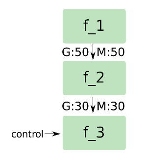

# E3

60 entries.

##### e language
```text
write("Hello World");
```
[Source File](../libraries/e/E-3/e%20language)

##### Ela
```text
open monad io
do putStrLn "Hello world!" ::: IO
```
[Source File](../libraries/e/E-3/Ela)

##### Elan
```text
(* Hello World in ELAN *)

putline ("Hello World!");
```
[Source File](../libraries/e/E-3/Elan)

##### ELANG
```text
"" .H .e .l .l .o ., ._ .w .o .r .l .d .! ()
```
[Source File](../libraries/e/E-3/ELANG)

##### elastiC
```text
package hello;

    // Import the `basic' package
    import basic;

    // Define a simple function
    function hello()
    {
        // Print hello world
        basic.print( "Hello world!\n" );
    }

    /*
     *  Here we start to execute package code
     */

    // Invoke the `hello' function
    hello();
```
[Source File](../libraries/e/E-3/elastiC)

##### ELBOG
```text
NNNNNNNNNNNNNNNNNNNNNNNNNNNNNNNYNNNNNNNNNNNNNNNNNNNNNNNNNNNNNNNNNNNYNNNNNNNNNNNNNNNNNNNNNNNNNNNNNNNNNNNNNNNNNNNNNNNNNNNNNNNNNNNNNNNNNNNNNNNNNNNNNNNNNNNNNNNNNNNNNNNNNNNNNNNNNNNNNNNNNNNNNNNNNNNNNNNNNNNNNNNNNNNNNNNNNNNNNNNNNNNNNNNNNNNNYNNNNNNNNNNNNNNNNNNNNNNNNNNNNNNNNNNNNNNNNNNNNNNNNNNNNNNNNNNNNNNNNNNNNNNNNNNNNNNNNNNYNNNNNNNNNNNNNNNNNNNNNNYNNNNNNNNNNNNNNNNNNNNNNNNNNNNNNYNNNNNNNNNNNNNNNNNNNNNNNNNNNNNNNNNNNNNNNNNNNNNNNNNNNNNNNNNNNNNNNNNNNNNNNNNNNNNNNNNNNNNNNNNNNNNNNNNNNNNNNNNNNNNNNNNNNNNNNNNNNNNNNNNNNNNNNNNNNNNNNNNNNNNNNNNNNNNNNNNNNNNNNNNNNNNNYNNNNNNNNNNNNNNNNNNYNNNNNNNNNNNNNNNNNNNNNNNNNNNNNNNNNNNNNNNNNYNNNNYNNNNNNNNNNNNNNNNNNNNNNNNNNNNNNNNNNNNNNNNNNNNNNNNNNNNNNNNNNNNNNNNNNNNNNNNNNNNNNNNNNNNNNNNNNNNNNNNNNNNNNNNNNNNNNNNNNNNNNNNNNNNNNNNNNNNNNNNNNNNNNNNNNNNNNNNNNNNNNNNNNNNNNNNNNNNNNNNNNNNNNNNNNNNNNNNNNNNYNNNNNNNNNNNNNNNNNNNNNNNNNNNNNNNNNNNNNNNNNNNNNNNNNNNNNNNNNNNNNNNNNNNNNNNNNNNNNNNNNNNNNNNNNNNNNNNNNNNNNNNNNNNNNNNNNNNNNNNNNNNNNNNNNNNNNNNNNNNNNNNNNNNNNNNNNNNNNNNNNNNNNNNNNNNNNNNNNNNNNNNNNNNNNNNNNNNNNYNNNNNNNNNNNNNNNNNNNNNNNNNNNNNNNNNNNNNNNNNNNNNNNNNNNNNNNNNNNNNNNNNNNNNNNNNNNNNNNNNNNNNNNNNNNNNNNNNNNNNNNNNNNNNNNNNNNNNNNNNNNNNNNNNNNNNNNNNNNNNNNNNNNNNNNNNYNNNNNNNNNNNNNNNNNNNNNNNNNNNNNNNNNNNNNNNNNNNNNNNNNNNNNNNNNNNNNNNNNNNNNNNNNNNNNNNNNNNNNNNNNNNNNNNNNNNNNNNNNNNNNNNNNNNNNNNNNNNNNNNNNNNNNNNNNNNNNNNNNNNNNNNNNNNNNNNNNNNNNNNNNNNNNNNNNNNNNNNNNNNNNNNNNNNNNNNNNNNNNNNNNNNNNNNNNNNNNNNNNNNNNNNNNNNNNNNNNNNNNNNNNNNNNNNNNNNNNNNNNNNNNNNNNNNNNNNNNNNNNNNNNNNNNNNNNNNNNNNYNNNNNNNNNNNNNNNNNNNNNNNNNNNNNNNNNNNNNNNNNNNNNNNNNNNNNYNNNNNNNNNNNNNNNNNNNNNNNNNNNNNNNNNNNNNNNNNNNNNNNNNNNNNNNNNNNNYNNNNNNNNNNNNNNNNNNNNNNNNNNNNNNNNNNNNNNNNNNNNNNNNNNNNNNNNNNNNNNNNNNNNNNNNNNYNNNNNNNNNNNNNNNNNNNNNNNNNNNNNNNNNNNNNNNNNNNNNNNNNNNNNNNNNNNNNNNNNNNNNNNNNNNNNNNNNNNNNNNNNNNNNNNNNNNNNNNNNNNNNNNNNNNNNNNNNNNNNNNNNNNNNNNNNNNNNNNNYNNNNNNNNNNNNNNNNNNNNNNNNNNNNNNNNNNNNNNNNNNNNNNNNNNNNNNNNNNNNNNNNNNNNNNNNNYNNNNNNNNNNNNNNNNNNNNNNNNNNNNNNNNNNNNNNNNNNNNNNNNNNNNNNNNNNNNNNNNNNNNNNNNNNNNNNNNNNNNNNNNNNNNNNNNNNNNNNNNNNNNNNNYNNNNNNNNNNNNNNNNNNNNNNNNNNNNNNNNNNNNNNNNNNNNNNNNNNNNNNNNNNNNNNNNNNNNNNNNNNNNNNNNNNNNNNNNNNNNNNNNNNNNNNNNNYNNNNNNNNNNNNNNNNNNNNNNNNNNNNNNNNNNNNNNNNNNYNNNNNNNNNNNNNNNNNNNNNNNNNNNNNNNNNNNNNNNNNNNNNNNNNNNNNNNNNNNNNNNNNNNNNNNNNNNNNYNNNNNNNNNNNNNNNNNNNNNNNNNNNNNNNNNNNNNNNNNNNNNNNNNNNNNNNNNNNNNNNNNNNNNNNNNNNNNNNNNNNNNNNNNNNNNNNNNNNNNNNNNNNNNNNNNNNNNNNNNNNNNNNNNNNNNNNNNNNNNNNNNNNNNNNNNNNNNNNNNNNNNNNNNNNNNNNNNNNNNNNNNNNNNNNNNNNNNNNNNNNNNNNNNNNNNNNNNNNNNNNNNNNNNNNNNNNNNNNNNNNNNNNNNNNNNNNNNNNNNNYNNNNNNNNNNNNNNNNNNNNNNNNNNNNNNNNNNNNNNNNNNNNNNNNNNNNNNNNNNNNNNNNNNNNNNNNNNNNNNNNNNNNNNNNNNNNNNNNNNNNNNNNNNNNNNNNNNNNNNNNNNNNNNNNNNNNNNNNNNNNNNNNNNNNNNNNNNNNNNNNNNNNNNNNNNNNNNNNNNNNNNNNNNNNNNNNNNNNNNNNNNNNNNNNNNNNNNNNNNNYNNNNNNNNNNNNNNNNNNNNNNNNNNNNNNNNNNNNNNNNNNNNNNNNNNNNNNNNNNNNNNNNNNNNNNNNNNNNNNNNNNNNNNNNNNNNNNNNNNNNNNNNNNNNNNNNNNNNNNNNNNNNNNNNNNNNNNNNNNNNNNNNNNNNNNNNNNNNNNNNNNNNNNNNNNNNNNNNNNNNNNNNNNNNNNNNNNNNNNNNNNNNNNNNNNNNNNNNNNNNNNNNNNNNNNNNNNNNNNNNNNNNNNNNNNNNNNNNNNNNNNNNNNNNNNNNNNNNNNNNNNNNNNNNNNNNNNNNNNNNNNNNNNNNNNNNNNNNNNNNNNNNNNNNNNNNNNNNNNNNNNNNNNNNNNNNNNNNNNNNNNNNNNNNNNNNNNNNNNNNNNNNNNNNNNNNNNNNNNNNNNNNNNNNNNNNNNNNNNNNNNNNNNNNNNNNNNNNNNNNNNNNNNNNNNYNNNNNNNNNNNNNNNNNNNNNNNNNNNNNNNNNNNNNNNNNNNNNNNNNNNNNNNNNNNYNNNNNNNNNNNNNNNNNNNNNNNNNNNNNNNNNNNNNNNNNNNNNNNNNNNNNNNNNNNNNYNNNNNNNNNNNNNNNNNNNNNNNNNNNNNNNNNNNNNNNNYNNNNNNNNNNNNNNNNNNNNNNNNNNNNNNNNNNNNNNNNNNNNNNNNNNNNNNNNNNNNNNNNNNNNNNNNNNNNNNNNNNNNNNNNNNNNNNNNNYYNNNNNNNNNNNNNNNNNNNNNNNNNNNNNNNNNNNNNNYNNYNNNNNNNNNNNNNNNNNYNNNNNNNNNNNNNNNNNNNNNNNNNNNNNNNNNNNNNNNNNNNNNNNNNNNNNNNNNNNNNNNNNNNNNNNNNNNNNNNNNNNNNNNNNNNNNNNNNNNNNNNNNNNNNNNNNNNNNNNNNNNNNNNNNNNNNNNNNNNNNNNNNNNNNNNNYNNNNNNNNNNNNNNNNNNNNNNNNNNNNNNNNNNNYNNNNNNNNNNNNNNNNNNNNNNNNNNNNNNNNNNNNNNNNNNNNNNNNNYNNNNNNNNNNNNNNNNNNNNNNNNNNNNNNNNNNNYNNNNNNNNNNNNNNNNNNNNNNNNNNNNNNNNNNNNNNNNNNNNNNNNNNNNNNNNNNNNNNNNNNNNNNNNNNNNNNNNNNNNNNNNNNNNNNNNNNNNNNNNNNNNNNNNNNNNNNNNNNNNNNNNNNNNNNNNNNNNNNNNNNNNNNNNNNNNNNNNYNNNNNNNNNNNNNNNNNNNNNNNNNNNNNNNNNNNNNNNNNNNNNNNNNNNNNNNNNNNNNNNNNYNNNNNNNNNNNNNNNNNNNNNNNNNNNNNNNNNNNNNNNNNNNNNNNNNNNNNNNNNNNNNNNNNNNNNNNNNNNNNNNNNNNNNNNNNNNNNNNNNNNNNNNNNNNNNNNNNNNNNNNNNNNNNNNNNNNNNNNNNNNNNNNNNNNNNNNNNNNNNNNNNNNNNNNNNNNNNNNNNNNNNNNNNNNNNNNNNNNNNNNNNNNNNNNNNNNNNNNNNNNNNNNNNNNNNNNNNNNNNNNNNNNNNNNNNNNNNNNNNNYNNNNNNNNNNNNNNNYNNNNNNNNNNNNNNNNNNNNNNNNNNNNNNNNNNNNNNNNNNNNNNNNNNNNNNNNNNNNNNNNNNNNNNNNNNNNNNNNNNNNNNNNNNNNNNNNNNNNNNNNNNNNNNNNNNNNNNNNNNNNNNNNNNNNNNNNNNNNNNNNNNNNNNNNNNNNNNNNNNNNNNNNNNNNNNNNNNNNNNNNNNNNNNNNNNNNNNNNNNNNNNNNNNNNNNNYNNNNNNNNNNNNNNNNNNNNNNNNNY
```
[Source File](../libraries/e/E-3/ELBOG)

##### Electra
```text
    >O    +-+     +-+     +-+                                     Q-PO
     I    I I   #P+ I     I I                                     $  I
     I +MPO I   I   I     O I                                     I  I +P
     I I    I #M+   I     | $                                     I  I I
     I I    I I     I   #P# QDDDDD#P+DDDO                         I  #M+
     I O    I I     I   I               I    #PDDDDDD#PDDDDDDDD#PDO    
     I |    I I     I   I               I    I
     #M+    +-+     I   I               I    I
                    ##PP+               $    I
                                        +MP#P+
```
[Source File](../libraries/e/E-3/Electra)

##### ELEMENTARY
```text
expression ::= constant | variable | (expression op expression)
```
[Source File](../libraries/e/E-3/ELEMENTARY)

##### Elena
```text
public Program()
{
    console.writeLine("Hello world!")
}
```
[Source File](../libraries/e/E-3/Elena)

##### Elevated Parser
```text
integer{ digit | integer digit }
digit{ [0-9] }
```
[Source File](../libraries/e/E-3/Elevated%20Parser)

##### ELF  _x86-x64, Linux
```text
0000000: 7f 45 4c 46 01 00 00 00 00 00 00 00 00 90 43 0d  .ELF..........C.
0000010: 02 00 03 00 19 90 43 0d 19 90 43 0d 04 00 00 00  ......C...C.....
0000020: b9 2e 90 43 0d b2 0d cd 80 cc 20 00 01 00 48 65  ...C...... ...He
0000030: 6c 6c 6f 2c 20 57 6f 72 6c 64 21                 llo, World!
```
[Source File](../libraries/e/E-3/ELF%20%20_x86-x64,%20Linux)

##### Elfroh
```text
Hello World #1 In elfroh
```
[Source File](../libraries/e/E-3/Elfroh)

##### Elisa
```text
 "Hello world!"?
```
[Source File](../libraries/e/E-3/Elisa)

##### Elixir
```text
# Hello world in Elixir

defmodule HelloWorld do
  IO.puts "Hello, World!"
end
```
[Source File](../libraries/e/E-3/Elixir)

##### Elixir _2
```text
# Hello world in Elixir

defmodule HelloWorld do
  IO.puts "Hello, World!"
end
```
[Source File](../libraries/e/E-3/Elixir%20_2)

##### Elixir language
```text
IO.puts("Hello World")
```
[Source File](../libraries/e/E-3/Elixir%20language)

##### Elliott
```text
:: Hello World in Elliott Autocode
SETF PUNCH
SETR 1
1)TELEPRINTER
LINE
TITLE Hello World.;
STOP
START 1
```
[Source File](../libraries/e/E-3/Elliott)

##### Ellipsis
```text
(File.size(ARGV[0])/3).to_s(8).chars.map{|x| print %w(> < + - . , [ ])[x.to_i]}
```
[Source File](../libraries/e/E-3/Ellipsis)

##### Elm
```text
module Main exposing (main)
import Html exposing (text)
main = text "Hello World"
```
[Source File](../libraries/e/E-3/Elm)

##### Elm language
```text
module Main exposing (main)
import Html exposing (text)
main = text "Hello World"
```
[Source File](../libraries/e/E-3/Elm%20language)

##### Elog
```text
ab'cd&&&ab'c&&bc'd&&a'cd&&|||:z;z
```
[Source File](../libraries/e/E-3/Elog)

##### Emacs Lisp
```text
(message "Hello world!")
```
[Source File](../libraries/e/E-3/Emacs%20Lisp)

##### EMal
```text
writeLine("Hello world!")
```
[Source File](../libraries/e/E-3/EMal)

##### Emanator
```text
3.0.3.-4.-5.1.0.2.1
```
[Source File](../libraries/e/E-3/Emanator)

##### Emblia
```text
inst0 R1 inst1 inst3
inst1 R2 inst3 inst3
inst2 R3 inst1 inst3
inst3 R1 inst0 inst2
```
[Source File](../libraries/e/E-3/Emblia)

##### Emit
```text
"emit" is a reversal of
"time".
```
[Source File](../libraries/e/E-3/Emit)

##### Emmental
```text
;#58#126#63#36!;#46#36#!;#0#1!;#0#2!;#0#3!;#0#4!;#0#5!;#0#6!;#0#7!#0#33#100#108#114#111#119#32#44#111#108#108#101#72$
```
[Source File](../libraries/e/E-3/Emmental)

##### Emo
```text
:^) :o) :o) :o) :^) :^(						~Store 10 into the zero memory postiion
<;^}								~begin loop, increment pointer and copy new mem value to the register
:^) :^) :^) :^) :^) :^) :^(					~Add 7 to the current register and store in memory
;^}								~increment ptr and copy new mem value to the register
:^) :^) :^) :^) :^) :^) :^) :^) :^) :^(				~Add 10 to the current register and store in memory
;^}								~increment ptr and copy new mem value to the register
:^) :^) :^(							~add 3 to the current register and store in memory
;^}								~increment ptr and copy new mem value to the register
:^(								~add 1 to the current register and store in memory
;-| ;-|	;-| ;-}							~more the ptr down 4 and copy memory to register
:-(>								~decrement current register and store in memory then loop back
;^}								~increment ptr and copy new mem value to the register
:^) :^)	:( :@							~Increment the register by 2, sore in memory, and print 'H'
;^}								~increment ptr and copy new mem value to the register
:^) :@								~increment register by 1 and print 'e'
:^) :^) :^) :^) :^) :^) :^) :@					~increment register by 7 and print 'l'
:@								~print 'l'
:^) :^) :^) :@							~increment register by 3 and print 'o'
:(								~store register into memory
;^}								~increment ptr and copy new mem value to the register
:^) :^) :@							~increment register by 2 and print 'W'
:(								~store register into memory
;-| ;-}								~Decrement ptr twice and copy memory to register
:^) :^) :^) :^) :^) :^) :^) :^) :^) :^) :^) :^) :^) :^) :^) :@	~increment register by 15 and print 'o'
:(								~store register into memory
;^}								~increment ptr and copy new mem value to the register
:@								~print 'o'
:^) :^) :^) :@							~increment register by 3 and print 'r'
:-) :-) :-) :-) :-) :-) :@					~decrement register by 6 and print 'l'
:-) :-) :-) :-) :-) :-) :-) :-) :@				~decrement register by 8 and print 'd'
;^}								~increment ptr and copy new mem value to the register
:^) :@								~increment register and print '!'
;^| ;@								~decrement ptr, and print '\n'
```
[Source File](../libraries/e/E-3/Emo)

##### Emoji
```text
💬Hello, World!💬➡
```
[Source File](../libraries/e/E-3/Emoji)

##### Emoji-gramming
```text
😊🕐💖
😇🕐🕐
😊🕑🕐
😇🕑🕑
😊🕒🕑
😇🕒🕒
😊♈💖
😇♈🕒
😊📢♈
😊♈💜
😇♈💞
😇♈🕑
😇♈🕒
😊📢♈
😊♉💞
😇♉💖
😇♉🕑
😇♉🕒
😊📢♉
😊📢♉
😊♊💜
😇♊💕
😇♊💞
😇♊💖
😇♊🕑
😇♊🕒
😊📢♊
😊♈💞
😇♈💖
😇♈🕑
😊📢♈
😊📢🕑
😊♈💜
😇♈💕
😇♈💞
😇♈🕐
😇♈🕒
😊📢♈
😊📢♊
😊♈💕
😇♈🕐
😇♈🕑
😇♈🕒
😊📢♈
😊📢♉
😊♈💞
😇♈🕑
😇♈🕒
😊📢♈
😊♈💜
😇♈🕑
😊📢♈
😊♈💖
😇♈💕
😊📢♈
```
[Source File](../libraries/e/E-3/Emoji-gramming)

##### Emojicode
```text
👴 Hello world in Emojicode

🐇 🐼 🍇
  🐇🐖 🏁 ➡️ 🚂 🍇
    😀 🔤Hello world!🔤
    🍎 0
  🍉
🍉
```
[Source File](../libraries/e/E-3/Emojicode)

##### Emojicode _2
```text
👴 Hello world in Emojicode

🐇 🐼 🍇
  🐇🐖 🏁 ➡️ 🚂 🍇
    😀 🔤Hello world!🔤
    🍎 0
  🍉
🍉
```
[Source File](../libraries/e/E-3/Emojicode%20_2)

##### EmojiCoder
```text
👋🔡🌚🌝🌚🌚🌝🌚🌚🌚
👋🔡🌚🌝🌝🌚🌚🌝🌚🌝
👋🔡🌚🌝🌝🌚🌝🌝🌚🌚
👋🔡🌚🌝🌝🌚🌝🌝🌚🌚
👋🔡🌚🌝🌝🌚🌝🌝🌝🌝
👋🔡🌚🌚🌝🌚🌝🌝🌚🌚
👋🔡🌚🌚🌝🌚🌚🌚🌚🌚
👋🔡🌚🌝🌝🌝🌚🌝🌝🌝
👋🔡🌚🌝🌝🌚🌝🌝🌝🌝
👋🔡🌚🌝🌝🌝🌚🌚🌝🌚
👋🔡🌚🌝🌝🌚🌝🌝🌚🌚
👋🔡🌚🌝🌝🌚🌚🌝🌚🌚
👋🔡🌚🌚🌝🌚🌚🌚🌚🌝
```
[Source File](../libraries/e/E-3/EmojiCoder)

##### EmojiWee
```text
☣️🤧🤧🤧🤧🤧🤧🤧🤧🤧🤧🤧🤧🤧🤧🤧🤧🤧🤧🤧🤧🤧🤧🤧🤧🤧🤧🤧🤧🤧🤧🤧🤧🤧🤧🤧🤧🤧🤧🤧🤧🤧🤧🤧🤧🤧🤧🤧🤧
🤧🤧🤧🤧🤧🤧🤧🤧🤧🤧🤧🤧🤧🤧🤧🤧🤧🤧🤧🤧🤧🤧🤧🤧📝🙂🙂🙂🙂🙂🙂🙂🙂🙂🙂🙂🙂🙂🙂🙂🙂🙂🙂🙂🙂🙂🙂🙂🙂🙂
🙂🙂🙂🙂🙂🙂🙂🙂🙂🙂🙂🙂🙂🙂🙂🙂🙂🙂🙂🙂🙂🙂🙂🙂🙂🙂🙂🙂🙂🙂🙂🙂🙂🙂🙂🙂🙂🙂🙂🙂🙂🙂🙂🙂🙂🙂🙂🤧🤧🤧
🤧🤧🤧🤧🤧🤧🤧🤧🤧🤧🤧🤧🤧🤧🤧🤧🤧🤧🤧🤧🤧🤧🤧🤧🤧🤧🤧🤧🤧🤧🤧🤧🤧🤧🤧🤧🤧🤧🤧🤧🤧🤧🤧🤧🤧🤧🤧🤧🤧🤧
🤧🤧🤧🤧🤧🤧🤧🤧🤧🤧🤧🤧🤧🤧🤧🤧🤧🤧🤧🤧🤧🤧🤧🤧🤧🤧🤧🤧🤧🤧🤧🤧🤧🤧🤧🤧🤧🤧🤧🤧🤧🤧🤧🤧🤧🤧🤧🤧📝🙂
🙂🙂🙂🙂🙂🙂🙂🙂🙂🙂🙂🙂🙂🙂🙂🙂🙂🙂🙂🙂🙂🙂🙂🙂🙂🙂🙂🙂🙂🙂🙂🙂🙂🙂🙂🙂🙂🙂🙂🙂🙂🙂🙂🙂🙂🙂🙂🙂🙂🙂
🙂🙂🙂🙂🙂🙂🙂🙂🙂🙂🙂🙂🙂🙂🙂🙂🙂🙂🙂🙂🙂🙂🙂🙂🙂🙂🙂🙂🙂🙂🙂🙂🙂🙂🙂🙂🙂🙂🙂🙂🙂🙂🙂🙂🙂🙂🙂🙂🙂🙂
🤧🤧🤧🤧🤧🤧🤧🤧🤧🤧🤧🤧🤧🤧🤧🤧🤧🤧🤧🤧🤧🤧🤧🤧🤧🤧🤧🤧🤧🤧🤧🤧🤧🤧🤧🤧🤧🤧🤧🤧🤧🤧🤧🤧🤧🤧🤧🤧🤧🤧
🤧🤧🤧🤧🤧🤧🤧🤧🤧🤧🤧🤧🤧🤧🤧🤧🤧🤧🤧🤧🤧🤧🤧🤧🤧🤧🤧🤧🤧🤧🤧🤧🤧🤧🤧🤧🤧🤧🤧🤧🤧🤧🤧🤧🤧🤧🤧🤧🤧🤧
🤧🤧🤧🤧🤧🤧🤧🤧📝🙂🙂🙂🙂🙂🙂🙂🙂🙂🙂🙂🙂🙂🙂🙂🙂🙂🙂🙂🙂🙂🙂🙂🙂🙂🙂🙂🙂🙂🙂🙂🙂🙂🙂🙂🙂🙂🙂🙂🙂🙂
🙂🙂🙂🙂🙂🙂🙂🙂🙂🙂🙂🙂🙂🙂🙂🙂🙂🙂🙂🙂🙂🙂🙂🙂🙂🙂🙂🙂🙂🙂🙂🙂🙂🙂🙂🙂🙂🙂🙂🙂🙂🙂🙂🙂🙂🙂🙂🙂🙂🙂
🙂🙂🙂🙂🙂🙂🙂🙂🙂🙂🙂🙂🙂🙂🙂🙂🙂🤧🤧🤧🤧🤧🤧🤧🤧🤧🤧🤧🤧🤧🤧🤧🤧🤧🤧🤧🤧🤧🤧🤧🤧🤧🤧🤧🤧🤧🤧🤧🤧🤧
🤧🤧🤧🤧🤧🤧🤧🤧🤧🤧🤧🤧🤧🤧🤧🤧🤧🤧🤧🤧🤧🤧🤧🤧🤧🤧🤧🤧🤧🤧🤧🤧🤧🤧🤧🤧🤧🤧🤧🤧🤧🤧🤧🤧🤧🤧🤧🤧🤧🤧
🤧🤧🤧🤧🤧🤧🤧🤧🤧🤧🤧🤧🤧🤧🤧🤧🤧🤧🤧🤧🤧🤧🤧🤧🤧📝🙂🙂🙂🙂🙂🙂🙂🙂🙂🙂🙂🙂🙂🙂🙂🙂🙂🙂🙂🙂🙂🙂🙂🙂
🙂🙂🙂🙂🙂🙂🙂🙂🙂🙂🙂🙂🙂🙂🙂🙂🙂🙂🙂🙂🙂🙂🙂🙂🙂🙂🙂🙂🙂🙂🙂🙂🙂🙂🙂🙂🙂🙂🙂🙂🙂🙂🙂🙂🙂🙂🙂🙂🙂🙂
🙂🙂🙂🙂🙂🙂🙂🙂🙂🙂🙂🙂🙂🙂🙂🙂🙂🙂🙂🙂🙂🙂🙂🙂🙂🙂🙂🙂🙂🙂🙂🙂🙂🙂🤧🤧🤧🤧🤧🤧🤧🤧🤧🤧🤧🤧🤧🤧🤧🤧
🤧🤧🤧🤧🤧🤧🤧🤧🤧🤧🤧🤧🤧🤧🤧🤧🤧🤧🤧🤧🤧🤧🤧🤧🤧🤧🤧🤧🤧🤧🤧🤧🤧🤧🤧🤧🤧🤧🤧🤧🤧🤧🤧🤧🤧🤧🤧🤧🤧🤧
🤧🤧🤧🤧🤧🤧🤧🤧🤧🤧🤧🤧🤧🤧🤧🤧🤧🤧🤧🤧🤧🤧🤧🤧🤧🤧🤧🤧🤧🤧🤧🤧🤧🤧🤧🤧🤧🤧🤧🤧🤧🤧🤧🤧🤧📝🙂🙂🙂🙂
🙂🙂🙂🙂🙂🙂🙂🙂🙂🙂🙂🙂🙂🙂🙂🙂🙂🙂🙂🙂🙂🙂🙂🙂🙂🙂🙂🙂🙂🙂🙂🙂🙂🙂🙂🙂🙂🙂🙂🙂🙂🙂🙂🙂🙂🙂🙂🙂🙂🙂
🙂🙂🙂🙂🙂🙂🙂🙂🙂🙂🙂🙂🙂🙂🙂🙂🙂🙂🙂🙂🙂🙂🙂🙂🙂🙂🙂🙂🙂🙂🙂🙂🙂🙂🙂🙂🙂🙂🙂🙂🙂🙂🙂🙂🙂🙂🙂🙂🙂🙂
🙂🙂🙂🙂🙂🙂🙂🤧🤧🤧🤧🤧🤧🤧🤧🤧🤧🤧🤧🤧🤧🤧🤧🤧🤧🤧🤧🤧🤧🤧🤧🤧🤧🤧🤧🤧🤧🤧🤧📝🙂🙂🙂🙂🙂🙂🙂🙂🙂🙂
🙂🙂🙂🙂🙂🙂🙂🙂🙂🙂🙂🙂🙂🙂🙂🙂🙂🙂🙂🙂🙂🙂🤧🤧🤧🤧🤧🤧🤧🤧🤧🤧🤧🤧🤧🤧🤧🤧🤧🤧🤧🤧🤧🤧🤧🤧🤧🤧🤧🤧
🤧🤧🤧🤧🤧🤧🤧🤧🤧🤧🤧🤧🤧🤧🤧🤧🤧🤧🤧🤧🤧🤧🤧🤧🤧🤧🤧🤧🤧🤧🤧🤧🤧🤧🤧🤧🤧🤧🤧🤧🤧🤧🤧🤧🤧🤧🤧🤧🤧🤧
🤧🤧🤧🤧🤧🤧🤧🤧🤧📝🙂🙂🙂🙂🙂🙂🙂🙂🙂🙂🙂🙂🙂🙂🙂🙂🙂🙂🙂🙂🙂🙂🙂🙂🙂🙂🙂🙂🙂🙂🙂🙂🙂🙂🙂🙂🙂🙂🙂🙂
🙂🙂🙂🙂🙂🙂🙂🙂🙂🙂🙂🙂🙂🙂🙂🙂🙂🙂🙂🙂🙂🙂🙂🙂🙂🙂🙂🙂🙂🙂🙂🙂🙂🙂🙂🙂🙂🙂🙂🙂🙂🙂🙂🙂🙂🙂🙂🤧🤧🤧
🤧🤧🤧🤧🤧🤧🤧🤧🤧🤧🤧🤧🤧🤧🤧🤧🤧🤧🤧🤧🤧🤧🤧🤧🤧🤧🤧🤧🤧🤧🤧🤧🤧🤧🤧🤧🤧🤧🤧🤧🤧🤧🤧🤧🤧🤧🤧🤧🤧🤧
🤧🤧🤧🤧🤧🤧🤧🤧🤧🤧🤧🤧🤧🤧🤧🤧🤧🤧🤧🤧🤧🤧🤧🤧🤧🤧🤧🤧🤧🤧🤧🤧🤧🤧🤧🤧🤧🤧🤧🤧🤧🤧🤧🤧🤧🤧🤧🤧🤧🤧
🤧🤧🤧🤧🤧🤧🤧🤧📝🙂🙂🙂🙂🙂🙂🙂🙂🙂🙂🙂🙂🙂🙂🙂🙂🙂🙂🙂🙂🙂🙂🙂🙂🙂🙂🙂🙂🙂🙂🙂🙂🙂🙂🙂🙂🙂🙂🙂🙂🙂
🙂🙂🙂🙂🙂🙂🙂🙂🙂🙂🙂🙂🙂🙂🙂🙂🙂🙂🙂🙂🙂🙂🙂🙂🙂🙂🙂🙂🙂🙂🙂🙂🙂🙂🙂🙂🙂🙂🙂🙂🙂🙂🙂🙂🙂🙂🙂🙂🙂🙂
🙂🙂🙂🙂🙂🙂🙂🙂🙂🙂🙂🙂🙂🙂🙂🙂🙂🙂🙂🙂🤧🤧🤧🤧🤧🤧🤧🤧🤧🤧🤧🤧🤧🤧🤧🤧🤧🤧🤧🤧🤧🤧🤧🤧🤧🤧🤧🤧🤧🤧
🤧🤧🤧🤧🤧🤧🤧🤧🤧🤧🤧🤧🤧🤧🤧🤧🤧🤧🤧🤧🤧🤧🤧🤧🤧🤧🤧🤧🤧🤧🤧🤧🤧🤧🤧🤧🤧🤧🤧🤧🤧🤧🤧🤧🤧🤧🤧🤧🤧🤧
🤧🤧🤧🤧🤧🤧🤧🤧🤧🤧🤧🤧🤧🤧🤧🤧🤧🤧🤧🤧🤧🤧🤧🤧🤧🤧🤧🤧🤧🤧🤧🤧🤧🤧📝🙂🙂🙂🙂🙂🙂🙂🙂🙂🙂🙂🙂🙂🙂🙂
🙂🙂🙂🙂🙂🙂🙂🙂🙂🙂🙂🙂🙂🙂🙂🙂🙂🙂🙂🙂🙂🙂🙂🙂🙂🙂🙂🙂🙂🙂🙂🙂🙂🙂🙂🙂🙂🙂🙂🙂🙂🙂🙂🙂🙂🙂🙂🙂🙂🙂
🙂🙂🙂🙂🙂🙂🙂🙂🙂🙂🙂🙂🙂🙂🙂🙂🙂🙂🙂🙂🙂🙂🙂🙂🙂🙂🙂🙂🙂🙂🙂🙂🙂🙂🙂🙂🙂🙂🙂🙂🙂🙂🙂🙂🙂🙂🙂🙂🙂🤧
🤧🤧🤧🤧🤧🤧🤧🤧🤧🤧🤧🤧🤧🤧🤧🤧🤧🤧🤧🤧🤧🤧🤧🤧🤧🤧🤧🤧🤧🤧🤧🤧🤧🤧🤧🤧🤧🤧🤧🤧🤧🤧🤧🤧🤧🤧🤧🤧🤧🤧
🤧🤧🤧🤧🤧🤧🤧🤧🤧🤧🤧🤧🤧🤧🤧🤧🤧🤧🤧🤧🤧🤧🤧🤧🤧🤧🤧🤧🤧🤧🤧🤧🤧🤧🤧🤧🤧🤧🤧🤧🤧🤧🤧🤧🤧🤧🤧🤧🤧🤧
🤧🤧🤧🤧🤧🤧🤧📝🙂🙂🙂🙂🙂🙂🙂🙂🙂🙂🙂🙂🙂🙂🙂🙂🙂🙂🙂🙂🙂🙂🙂🙂🙂🙂🙂🙂🙂🙂🙂🙂🙂🙂🙂🙂🙂🙂🙂🙂🙂🙂
🙂🙂🙂🙂🙂🙂🙂🙂🙂🙂🙂🙂🙂🙂🙂🙂🙂🙂🙂🙂🙂🙂🙂🙂🙂🙂🙂🙂🙂🙂🙂🙂🙂🙂🙂🙂🙂🙂🙂🙂🙂🙂🙂🙂🙂🙂🙂🙂🙂🙂
🙂🙂🙂🙂🙂🙂🙂🙂🙂🙂🙂🙂🙂🙂🙂🙂🤧🤧🤧🤧🤧🤧🤧🤧🤧🤧🤧🤧🤧🤧🤧🤧🤧🤧🤧🤧🤧🤧🤧🤧🤧🤧🤧🤧🤧🤧🤧🤧🤧🤧
🤧🤧🤧🤧🤧🤧🤧🤧🤧🤧🤧🤧🤧🤧🤧🤧🤧🤧🤧🤧🤧🤧🤧🤧🤧🤧🤧🤧🤧🤧🤧🤧🤧🤧🤧🤧🤧🤧🤧🤧🤧🤧🤧🤧🤧🤧🤧🤧🤧🤧
🤧🤧🤧🤧🤧🤧🤧🤧🤧🤧🤧🤧🤧🤧🤧🤧📝🙂🙂🙂🙂🙂🙂🙂🙂🙂🙂🙂🙂🙂🙂🙂🙂🙂🙂🙂🙂🙂🙂🙂🙂🙂🙂🙂🙂🙂🙂🙂🙂🙂
🙂🙂🙂🙂🙂🙂🙂🙂🙂🙂🙂🙂🙂🙂🙂🙂🙂🙂🙂🙂🙂🙂🙂🙂🙂🙂🙂🙂🙂🙂🙂🙂🙂🙂🙂🙂🙂🙂🙂🙂🙂🙂🙂🙂🙂🙂🙂🙂🙂🙂
🙂🙂🙂🙂🙂🙂🙂🙂🙂🙂🙂🙂🙂🙂🙂🙂🙂🤧🤧🤧🤧🤧🤧🤧🤧🤧🤧🤧🤧🤧🤧🤧🤧🤧🤧🤧🤧🤧🤧🤧🤧🤧🤧🤧🤧🤧🤧🤧🤧🤧
📝🙂🙂🙂🙂🙂🙂🙂🙂🙂🙂🙂🙂🙂🙂🙂🙂🙂🙂🙂🙂🙂🙂🙂🙂🙂🙂🙂🙂🙂🙂🙂🙂🙂😷
```
[Source File](../libraries/e/E-3/EmojiWee)

##### Emoticon
```text
** Hello world in Emoticon **

hello world :-Q S:-P :-Q
```
[Source File](../libraries/e/E-3/Emoticon)

##### Emotinomicon
```text
😭!dlroW ,olleH😲⏪⏬⏩
```
[Source File](../libraries/e/E-3/Emotinomicon)

##### Empty
```text
Hello," World!:
```
[Source File](../libraries/e/E-3/Empty)

##### Encapsulation
```text
00 - 0
01 - 0
- 100001001010100110001101100011011011110110001101000000010011101010111101100100111000110110001001101000010
```
[Source File](../libraries/e/E-3/Encapsulation)

##### EncryptedFuck
```text
㘱㔵㠶㈱㌶㐳㜹\u3130㈵〱㐸㔶㘹〸ㄶ㔱ㄵㄷ㠹㐶㜰㐱㌰㈶㠵㤵㜶㤵㌹㔱㌵〶㠱㤴㤷㔶㠰㔷ㄳ㤷㐲㜰〵ㄷ㘶〳㐱㜱㜰㘹㤳㈸㐱〲〰㤸〶 㠵㜳㔲㔶㔷㔷㈹㘴㜴㠸㔵ㄸ㤵ㄸ㐹㔳㘰㘱㤹㤶㜳ㄸ㤷ㄹ㈸㔸㌰㠵㈳㤷㜲㈸㈳㠱㐷㈴㠳㤷㜶㌳ㄸ㐱㘳㘷㌵㘸ㄶ㌸㜶〹㠰㠳㘶\u3130㜶㈵㜶㠴㠶〷㌷\u3130㐱〲㈹〳㌴㔶㈲㔲㜱ㄱ㌶㈸〲㠸㠳㐹〲㈸㤹㤵㔰㤵ㄸ㐲\u3130㤹㔵㐵‹
```
[Source File](../libraries/e/E-3/EncryptedFuck)

##### EncryptFuck
```text
: PRINTS 'HELLO WORLD!'
+,-./012@d56789:;<=pBBCDFLuFGH{JNOMNOS
 ?
4\-./012345h:
 =
+,-./01266789:;<=?=>?CCDEFGHJJKLMNOPQS
-./01:a456789:k=
```
[Source File](../libraries/e/E-3/EncryptFuck)

##### End
```text
10100101001100010010100110101000110010100101011010110010100001010101001010
```
[Source File](../libraries/e/E-3/End)

##### Ende
```text
[Hello, world!]d
```
[Source File](../libraries/e/E-3/Ende)

##### Enema
```text
:
```
[Source File](../libraries/e/E-3/Enema)

##### enGLish
```text
Output "Hello, World!"
```
[Source File](../libraries/e/E-3/enGLish)

##### Enguage
```text
On "say hello world", reply "hello world".

## This can be tested:
#] say hello world: hello world.

## This can also be created within Enguage:
#] to the phrase hello reply hello to you too: ok.
#] hello: hello to you too.
```
[Source File](../libraries/e/E-3/Enguage)

##### Enigma-2D
```text
  >+++++++++[<++++++++>-]<.>+++++++[<++++>-]<+.+++++++..+++.>>>++++++++[<++++>-]D
                 .+>>.--------.------.+++.<<<<.---<]->+++++++++<[++++++++++>>>.<L
```
[Source File](../libraries/e/E-3/Enigma-2D)

##### Eniuq
```text
'Sup, Earth
```
[Source File](../libraries/e/E-3/Eniuq)

##### Enjamb
```text
Hello, world, a far
cry of albatross smoothed
by rocks, by mudded
wave
I am here, world
beyond laws, held by
silences and shouts
and tear
drops darkened
by an unclear dome,

above us all
our heads turned up,
our lids shut and —
icicle 

falls from old
skies shattered with
bone tools and soft
eye
bleeding under,
we can save nothing
I
can save you

from the sharp break
of the dome, of the
waves on
that rust sea,
full of glass, sail
half-mast in memory of the Earth
as it once was, but
I
forgot a long
time ago, as did we

destroy wood,
a home to albatross,
or snake or vulture,
or bright teeth, or
a lover
with boots high
above blaze-scorched
grass, glass shield
inevitable, fracturing, head-
bang, belt welt
smash of life under
closed eye.

World
sleeping, a new

vision, we can't, yo—
I
can't build another
I
seep into soil,

tumbling among dirt,
waitwait
another earth
comes,
sleeping, a new

dream
another earth
```
[Source File](../libraries/e/E-3/Enjamb)

##### Enn
```text
/ Hello World /
/ Made by las-r on GitHub /

>>0,1,0,0,1,0,0,0; / H /
>>0,1,1,0,0,1,0,1; / e /
>>0,1,1,0,1,1,0,0; / l /
>>0,1,1,0,1,1,0,0; / l /
>>0,1,1,0,1,1,1,1; / o /
>>0,0,1,0,0,0,0,0; /   /
>>0,1,0,1,0,1,1,1; / W /
>>0,1,1,0,1,1,1,1; / o /
>>0,1,1,1,0,0,1,0; / r /
>>0,1,1,0,1,1,0,0; / l /
>>0,1,1,0,0,1,0,0; / d /
>;
```
[Source File](../libraries/e/E-3/Enn)

##### EnScript
```text
LDA A, 72
OUT A
LDA A, 101
OUT A
LDA A, 108
OUT A
OUT A
LDA A, 111
OUT A
LDA A, 44
OUT A
LDA A, 32
OUT A
LDA A, 119
OUT A
LDA A, 111
OUT A
LDA A, 114
OUT A
LDA A, 108
OUT A
LDA A, 100
OUT A
LDA A, 33
OUT A
LDA A, 9
```
[Source File](../libraries/e/E-3/EnScript)

##### Ensemencer
```text
152.
77.
52982..
584.
152.
101.
681.
16.
592.
1057.
100.
254.
79.
!
```
[Source File](../libraries/e/E-3/Ensemencer)

##### Entish



*画像プログラム（PNG / 11472 bytes）*

[Source File](../libraries/e/E-3/Entish.png)

##### Entrance
```text
f x = (x, x);
```
[Source File](../libraries/e/E-3/Entrance)

##### Entropy
```text
Program MyNamespace MyProgram [
	print "Hello, World";
]
```
[Source File](../libraries/e/E-3/Entropy)

##### EntropyAssembler
```text
SET 0 72 
OUT 0 
SET 0 0 
SET 0 101 
OUT 0 
SET 0 0 
SET 0 108 
OUT 0 
OUT 0 
SET 0 0 
SET 0 111 
OUT 0 
SET 0 0 
SET 0 44 
OUT 0 
SET 0 0 
SET 0 32 
OUT 0 
SET 0 0 
SET 0 87 
OUT 0 
SET 0 0 
SET 0 111 
OUT 0 
SET 0 0 
SET 0 114 
OUT 0 
SET 0 0 
SET 0 108 
OUT 0 
SET 0 0 
SET 0 100 
OUT 0 
SET 0 0 
SET 0 33 
OUT 0
```
[Source File](../libraries/e/E-3/EntropyAssembler)

##### Envy
```text
++++++++++++++++++++++++++++++++++++++++++++++++++++++++++++++++++++++++@+++++++++++++++++++++++++++++@+++++++@@+++@-------------------------------------------------------------------@------------@+++++++++++++++++++++++++++++++++++++++++++++++++++++++++++++++++++++++++++++++++++++++@--------@+++@------@--------@-------------------------------------------------------------------@
```
[Source File](../libraries/e/E-3/Envy)

##### Enwokenment
```text
c - a - y
a + b + z - c
_ - a
y - b
a - x
_ - y
```
[Source File](../libraries/e/E-3/Enwokenment)

##### Eodermdrome
```text
this (Hello, World!) says... hi!
```
[Source File](../libraries/e/E-3/Eodermdrome)

##### EOOOL
```text
,{,{89+(59+~1&(7~+1&2&2&((3~+1&(4~(32_((6~+((8+(38_(},}
```
[Source File](../libraries/e/E-3/EOOOL)

##### ~English
```text
Display "Hello World" and a newline.
Stop the program.
```
[Source File](../libraries/e/E-3/~English)

