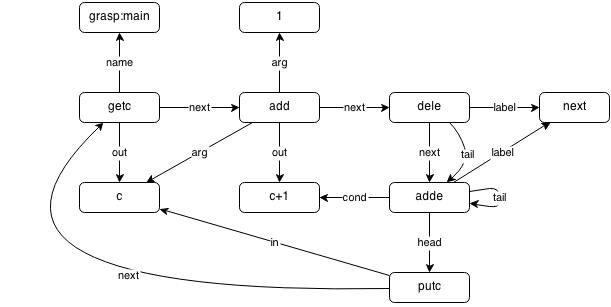

<div align="center">

# 🗂 Hall G · Wing 4

Languages whose names begin with **G**.

**55 exhibits** in this wing

[⬅ Museum entrance](../README.md) · [🏛 Full catalog](all.md)

</div>

---

## GP

```text
8=====D " has the value of 5. "
8D      " has the value of 0. "
```
<sub>📄 [Source File](../libraries/g/G-4/GP)</sub>

## GpH

```text
main = putStrLn "Hello World"
```
<sub>📄 [Source File](../libraries/g/G-4/GpH)</sub>

## GPNS

```text
##
.#
```
<sub>📄 [Source File](../libraries/g/G-4/GPNS)</sub>

## GPRX 3000

```text
72p101p108pp111p44p32p119p111p114p108p100p33p10p51g
```
<sub>📄 [Source File](../libraries/g/G-4/GPRX%203000)</sub>

## GPSS

```text
GENERATE 1
TERMINATE 1
* Hello World simulation stub
```
<sub>📄 [Source File](../libraries/g/G-4/GPSS)</sub>

## GraalJS

```text
console.log("Hello World");
```
<sub>📄 [Source File](../libraries/g/G-4/GraalJS)</sub>

## GraalPython

```text
print("Hello World")
```
<sub>📄 [Source File](../libraries/g/G-4/GraalPython)</sub>

## Grace

```text
print "Hello World"
```
<sub>📄 [Source File](../libraries/g/G-4/Grace)</sub>

## Gradle

```text
task hello { doLast { println "Hello World" } }
```
<sub>📄 [Source File](../libraries/g/G-4/Gradle)</sub>

## Grain

```text
print("Hello world!")
```
<sub>📄 [Source File](../libraries/g/G-4/Grain)</sub>

## Grain language

```text
print("Hello World")
```
<sub>📄 [Source File](../libraries/g/G-4/Grain%20language)</sub>

## Grammatical Framework

```text
concrete HelloEng of Hello = {
  lin Greeting = "Hello World";
}
```
<sub>📄 [Source File](../libraries/g/G-4/Grammatical%20Framework)</sub>

## GRAMophone

```text
//Hello World in GRAMophone

composition "Hello, World!" of "Composer"
{
 %
 player player1 {
    grammar lindenmayer
    %
    axiom->print("Hello, World!");
 }

 player player2 {
    grammar chomsky
    %
       @composition->print("Hello, World!");
 }
}
```
<sub>📄 [Source File](../libraries/g/G-4/GRAMophone)</sub>

## Graph Oriented Fictional Computer

```text
SET_STRING A Hello, world!
GET_STRING A
```
<sub>📄 [Source File](../libraries/g/G-4/Graph%20Oriented%20Fictional%20Computer)</sub>

## Graphical Brainfuck

```text
+[[--.>+]@>>>@+]
```
<sub>📄 [Source File](../libraries/g/G-4/Graphical%20Brainfuck)</sub>

## Graphopytha

```text
#this is the parser (pars.py)
#it should parse text like this:
#0, 0, r
#node 0 r, node 1 l
#or:
#test 0 1 r l
#so those will be the first examples to try using the function
def readexception(i, code, end, errorchr, error="Unexpected char: "):
    output = ""
    while i < len(code) and code[i] not in end:
        if code[i] in errorchr:
            raise SyntaxError(error)
        output += code[i]
        i += 1
    return (i, output)
def readexceptstop(i, code, end, specifics=None):
    if specifics == None:
        specifics = ["nothing"]
    output = ""
    while i < len(code) and code[i] not in end:
        output += code[i]
        i += 1
        if output in specifics: break
    return (i, output)
def read(i, code, end):
    output = ""
    while i < len(code) and code[i] not in end:
        output += code[i]
        i += 1
    return (i, output)
def skip(i, code, things):
    while i < len(code) and code[i] in things: #skip extra comma and space
        i += 1
    return i
def parse(code):
    #we should go in a loop
    output = []
    i = len(code.split("
")[0])+1 #skip first line so we can loop
    #first, we need start inputs:
    topline = code.split("
")[0].split(", ")
    output.append(int(topline[0]))
    output.append(int(topline[1]))
    output.append(topline[2])
    output.append([])
    #then lets go get the rest
    while i < len(code):
        #look for a command name first
        i, name = readexceptstop(i, code, " ")
        if name != "nothing":
            i = skip(i, code, " ")
        else:
            i = skip(i, code, ", ")
        #ok now we got our name, now we need to figure out how many args, (workers, dirs)
        argdict = {
            "node": (1, 1),
            "walk": (1, 1),
            "nothing": (0, 0),
            "link": (2, 1),
            "unlink": (2, 1),
            "test": (2, 2),
            "join": (2, 1)
        }
        if name not in argdict:
            raise NameError(f"{name} is not a thing, use something else")
        args = argdict[name] #get the args for name
        #now we need to loop for first the workers, but first, is args even a tuple
        workers = [None, None]
        dirs = [None, None]
        for j in range(args[0]):
            #yay time to parse numbers
            de = " 
" #alway
            i, workers[j] = readexception(i, code, de, ",", f"Thats not enough for {name}'s inputs, {j+1} instead of {args[0]+args[1]}")
            i = skip(i, code, " ")
        for j in range(args[1]):
            #yay time to parse strings
            if j == args[1]-1: #last
                de = (",
", ", ")
                i, dirs[j] = read(i, code, de[0])
            else: #not last
                de = (" 
", " ")
                i, dirs[j] = readexception(i, code, de[0], ",", f"Thats not enough for {name}'s inputs, {j+args[0]+1} instead of {args[0]+args[1]}")
            i = skip(i, code, de[1])
        #then we just need to switch halt into None
        workers = [(int(wk) if wk != None else None) for wk in workers]
        dirs = [(di if di != "halt" else None) for di in dirs]
        output[-1].append([name, workers[0], workers[1], dirs[0], dirs[1]])
        #ok now finally we just need to look for a new thing
        if i < len(code) and code[i] == "
":
            output.append([])
            i+=1
    return output
print(parse("""0, 0, r
node 0 r, node 1 d
node 3 u, node 2 l"""))
```
<sub>📄 [Source File](../libraries/g/G-4/Graphopytha)</sub>

## GraphQL

```text
{ hello }
# schema: type Query { hello: String }
```
<sub>📄 [Source File](../libraries/g/G-4/GraphQL)</sub>

## Graphviz DOT

```text
digraph { a [label="Hello World"] }
```
<sub>📄 [Source File](../libraries/g/G-4/Graphviz%20DOT)</sub>

## Grasp



*🖼️ Image artifact · IMAGE · 20,528 bytes*

<sub>📄 [Source File](../libraries/g/G-4/Grasp.png)</sub>

## Grass

```text
wv
wwWWwWWWwv
Wwwww
WWw
WWWw
WWWWw
WWWWWw
WWWWWWw
WWWWWWWw 
Wwwwwwwwwwwww
WWWWw
WWWWWWWw
WWWWWWWWWWWWWWw
WWWWWWWWWWWww
WWWWWWWWWWww
WWWWWWWWWWWWw
WWWWWWWWWWww
WWWWWWWWWWwwwwwww
WWWWWWWWWWWWWWw
WWWWWWWWWWWWWWWWw
WWWWWWWWWWWWWWWWWWWWWWw
WWWWWWWWWWWWWWWWWWWww
WWWWWWWWWWWWWWWWWWww
WWWWWWWWWWWWWWWWWWwwwww
WWWWWWWWWWWWWWWWWWWWWww
WWWWWWWWWWWWWWWWWWWWWWWw
WWWWWWWWWWWWWWWWWWWWWWWWWWwwwwwwwwwwwwwwwwwwwwwwwwwww
Wwwwwwwwwwww
WWwwwwwww
WWWwwwwwww
WWWWw
WWWWWwwwwwwww
WWWWWWwwwwwwwwwwwwwwwww
WWWWWWWwwwwwwwwwwwwwwwwwwwww
WWWWWWWWwwwwwwwwwwwwwwwww
WWWWWWWWWwwww
WWWWWWWWWWwwwwwwwwwww
WWWWWWWWWWWwwwwwww
WWWWWWWWWWWWwwwwwwwwwwwwwwwwww
WWWWWWWWWWWWWwwwwwwwwwwwwwwwwwwwwwwwwww
```
<sub>📄 [Source File](../libraries/g/G-4/Grass)</sub>

## Grasshopper

```text
// Grasshopper visual; panel: Hello World
```
<sub>📄 [Source File](../libraries/g/G-4/Grasshopper)</sub>

## Grasshopper 3D

```text
// Grasshopper panel: Hello World
```
<sub>📄 [Source File](../libraries/g/G-4/Grasshopper%203D)</sub>

## Gravbox

```text
 ‘
 @92+3*dlroW84*92+4*olleH...............~
```
<sub>📄 [Source File](../libraries/g/G-4/Gravbox)</sub>

## Gravity

```text
(0,0) : 2

(1,1,1,1, 2) ->  3 :  72
(1,1,1,1, 3) ->  4 : 101
(1,1,1,1, 4) ->  5 : 108
(1,1,1,1, 5) ->  6 : 108
(1,1,1,1, 6) ->  7 : 111
(1,1,1,1, 7) ->  8 :  32
(1,1,1,1, 8) ->  9 : 119
(1,1,1,1, 9) -> 10 : 111
(1,1,1,1,10) -> 11 : 114
(1,1,1,1,11) -> 12 : 108
(1,1,1,1,12) ->  # : 100
```
<sub>📄 [Source File](../libraries/g/G-4/Gravity)</sub>

## Gravity _2

```text
(0,0) : 2

(1,1,1,1, 2) ->  3 :  72
(1,1,1,1, 3) ->  4 : 101
(1,1,1,1, 4) ->  5 : 108
(1,1,1,1, 5) ->  6 : 108
(1,1,1,1, 6) ->  7 : 111
(1,1,1,1, 7) ->  8 :  32
(1,1,1,1, 8) ->  9 : 119
(1,1,1,1, 9) -> 10 : 111
(1,1,1,1,10) -> 11 : 114
(1,1,1,1,11) -> 12 : 108
(1,1,1,1,12) ->  # : 100
```
<sub>📄 [Source File](../libraries/g/G-4/Gravity%20_2)</sub>

## Grawlix

```text
+|||+|||.>+++|||+||+.+++++++..+++.>+|||
||.>+|||+++|||-.<<.+++.------.--------.
>+.>>+||+|.
```
<sub>📄 [Source File](../libraries/g/G-4/Grawlix)</sub>

## Gray Snail

```text
OUTPUT "Hello World"
```
<sub>📄 [Source File](../libraries/g/G-4/Gray%20Snail)</sub>

## Greed

```text
>*>>>*>>>>>*>*>>>*>>*>>*>*>>*>*>>>>*>*>>*>*>>>>*>*>>*>*>*>*>>>*>>*>*>>>>>*>>>>>>>*>*>*>>*>*>*>>*>*>>*>*>*>*>>*>*>*>>>*>>>*>*>>*>*>>>>*>*>>>*>>>>>*>>>>>*>
```
<sub>📄 [Source File](../libraries/g/G-4/Greed)</sub>

## GreenBerry

```text
var x = 1
class Man : power = 10 action walk : print walking...
```
<sub>📄 [Source File](../libraries/g/G-4/GreenBerry)</sub>

## Gremlin

```text
g.inject("Hello World")
```
<sub>📄 [Source File](../libraries/g/G-4/Gremlin)</sub>

## Gri

```text
# Hello World in Gri
show "hello world"
```
<sub>📄 [Source File](../libraries/g/G-4/Gri)</sub>

## Grid

```text
I?^>        // If there is a void, go up, otherwise go right
D?()W~      // If there is bottom line, do nothing, otherwise toggle the white circle
L?(<B)(Bv)  // If there is left line, go left and toggle black circle, otherwise toggle black circle and go down
W?U?>v<     // If there is not a white circle, go left, otherwise if there is top line, go right, otherwise go down
X?,()       // No effects
```
<sub>📄 [Source File](../libraries/g/G-4/Grid)</sub>

## Grid logic


*🖼️ Image artifact · IMAGE · 3,498 bytes*

<sub>📄 [Source File](../libraries/g/G-4/Grid%20logic.png)</sub>

## GridScript

```text
#HELLO WORLD.

@width 3
@height 1

(1,1):START
(3,1):PRINT 'Hello World'
```
<sub>📄 [Source File](../libraries/g/G-4/GridScript)</sub>

## Grill Tag

```text
[10] 1110  1110   110110
 10 [1110] 1110   101100
 10  1110 [1110]  01100010
[10] 1110  1110   1100010
 10 [1110] 1110   1000100
 10  1110 [1110]  000100010
[10] 1110  1110   00100010
 10 [1110] 1110   0100010
 10  1110 [1110]  100010
[10] 1110  1110   00010010
 10 [1110] 1110   0010010
 10  1110 [1110]  010010
[10] 1110  1110   10010
 10 [1110] 1110   00100
 10  1110 [1110]  0100
[10] 1110  1110   100
 10 [1110] 1110   000
 10  1110 [1110]  00
[10] 1110  1110   0
```
<sub>📄 [Source File](../libraries/g/G-4/Grill%20Tag)</sub>

## Grime

```text
.+
Hello, World!
```
<sub>📄 [Source File](../libraries/g/G-4/Grime)</sub>

## Grin

```text
(Hello, world!)
```
<sub>📄 [Source File](../libraries/g/G-4/Grin)</sub>

## Grits

```text
%s.'Hello, World!'
```
<sub>📄 [Source File](../libraries/g/G-4/Grits)</sub>

## Grocery List

```text
Cat Groceryplace

ice cream 
lettuce
popcorn
imported bisque
eggs
tunafish
```
<sub>📄 [Source File](../libraries/g/G-4/Grocery%20List)</sub>

## Groovy

```text
// Hello World in Groovy

println "Hello World"
```
<sub>📄 [Source File](../libraries/g/G-4/Groovy)</sub>

## Groovy Server Pages

```text
<%= "Hello World" %>
```
<sub>📄 [Source File](../libraries/g/G-4/Groovy%20Server%20Pages)</sub>

## Grounded

```text
make plushie movie series // 8:30AM Friday
uninstall app on tablet // 9:30AM Friday
uninstall app on tablet // 10:30AM Friday
make book // 11:30AM Friday
uninstall app on tablet // 12:30PM Friday
uninstall app on tablet // 1:30PM Friday
uninstall app on tablet // 2:30PM Friday
make book // 3:30PM Friday
watch steven universe // 4:30PM Friday
make plushie movie series // 5:30PM Friday
make plushie movie // 6:30PM Friday
make plushie movie /// 7:30PM Friday
make book // 8:30PM Friday
make book // 9:30PM Friday
sleep // 7:30AM Saturday
watch steven universe // 8:30AM Saturday
make plushie movie series // 9:30AM Saturday
make plushie movie series // 10:30AM Saturday
uninstall app on tablet // 11:30AM Saturday
uninstall app on tablet // 12:30PM Saturday
uninstall app on tablet //  1:30PM Saturday
uninstall app on tablet // 2:30PM Saturday
uninstall app on tablet // 3:30PM Saturday
make book // 4:30PM Saturday
watch steven universe // 5:30PM Saturday
make plushie movie series // 6:30PM Saturday
make plushie movie series // 7:30PM Saturday
make plushie movie // 8:30PM Saturday
make plushie movie // 9:30PM Saturday
sleep // 7:30AM Sunday
make plushie movie // 8:30AM Sunday
make book // 9:30AM Sunday
watch adventure time // 10:30AM Sunday
make book // 11:30AM Sunday
make plushie movie // 12:30PM Sunday
make plushie movie // 1:30PM Sunday
make plushie movie // 2:30PM Sunday
make book // 3:30PM Sunday
uninstall app on tablet // 4:30PM Sunday
uninstall app on tablet // 5:30PM Sunday
uninstall app on tablet // 6:30PM Sunday
uninstall app on tablet // 7:30PM Sunday
uninstall app on tablet // 8:30PM Sunday
bother parents // 9:30PM Sunday
sleep // 7:30AM Monday
uninstall app on tablet // 8:30PM Monday
make book // 9:30AM Monday
watch steven universe // 10:30AM Monday
watch steven universe // 11:30AM Monday
make plushie movie // 12:30AM Monday
make plushie movie // 1:30PM Monday
make plushie movie // 2:30PM Monday
make plushie movie // 3:30PM Monday
make book          // 4:30 PM Monday
wait               // 5:30 PM Monday
wait               // 6:30PM Monday
daydream           // 7:30PM Monday
daydream           // 8:30PM Monday
daydream           // 9:30PM Monday
sleep
```
<sub>📄 [Source File](../libraries/g/G-4/Grounded)</sub>

## GRPE

```text
x - 195 => xx
y - 70 ^ 2 => yy
xx ^ 2 + yy ^ .5 => oone

x - 80 => xx
y - 120 ^ 2 => yy
xx ^ 2 + yy ^ .5 => otwo

x - 185 => xx
y - 120 ^ 2 => yy
xx ^ 2 + yy ^ .5 => othree

x - 115 => xx
y - 112 ^ 2 => yy
xx ^ 2 + yy ^ .5 => rcircle

y / 3 + x => lslant
y / 3 - x => rslant

#000000

(x,10>(x,15< (y,50>(y,90< #ffffff
(x,10>(x,40< (y,65>(y,70< #ffffff
(x,35>(x,40< (y,50>(y,90< #ffffff

(x,55>(x,60< (y,50>(y,90< #ffffff
(x,55>(x,80< (y,50>(y,55< #ffffff
(x,55>(x,80< (y,85>(y,90< #ffffff
(x,55>(x,80< (y,65>(y,70< #ffffff

(x,95>(x,100< (y,50>(y,90< #ffffff
(x,95>(x,125< (y,85>(y,90< #ffffff

(x,135>(x,140< (y,50>(y,90< #ffffff
(x,135>(x,165< (y,85>(y,90< #ffffff

(oone,20<(oone,15> #ffffff

(lslant,250>(lslant,255< (y,75>(y,90< #ffffff

(rslant,17>(rslant,22< (y,100>(y,140< #ffffff
(lslant,70>(lslant,75< (y,115>(y,140< #ffffff
(rslant,0>(rslant,5< (y,115>(y,140< #ffffff
(lslant,87>(lslant,92< (y,100>(y,140< #ffffff

(otwo,20<(otwo,15> #ffffff

(rcircle,12<(rcircle,7>(x,109> #ffffff
(x,105>(x,110< (y,100>(y,140< #ffffff
(rslant,-80>(rslant,-75< (y,120>(y,140< #ffffff

(x,135>(x,140< (y,100>(y,140< #ffffff
(x,135>(x,165< (y,135>(y,140< #ffffff

(othree,20<(othree,15>(x,179> #ffffff
(x,175>(x,180< (y,100>(y,140< #ffffff

(x,215>(x,220< (y,100>(y,130< #ffffff
(x,215>(x,220< (y,135>(y,140< #ffffff
```
<sub>📄 [Source File](../libraries/g/G-4/GRPE)</sub>

## GS2

```text
↕h
```
<sub>📄 [Source File](../libraries/g/G-4/GS2)</sub>

## GSC

```text
print("Hello World");
```
<sub>📄 [Source File](../libraries/g/G-4/GSC)</sub>

## Gtltem

```text
>>>>>>>>>>>>>>>>>>>>>>>>>>>>>>>>>>>>>>>>!>>>>>>>>>>>>>>>>>>>>>>>>>>>>>!>>>>>>>!!>>>!<<<<<<<<<<<<<<<<<<<<<<<<<<<<<<<<<<<<<<<<<<<<<<<<<<<<<<<<<<<<<<<<<<<!<<<<<<<<<<<<!>>>>>>>>>>>>>>>>>>>>>>>>>>>>>>>>>>>>>>>>>>>>>>>>>>>>>>>!>>>>>>>>>>>>>>>>>>>>>>>>!>>>!<<<<<<!<<<<<<<<!<<<<<<<<<<<<<<<<<<<<<<<<<<<<<<<<<<<<<<<<<<<<<<<<<<<<<<<<<<<<<<<<<<<!
```
<sub>📄 [Source File](../libraries/g/G-4/Gtltem)</sub>

## guh

```text
guh d l r o W _ o l l e H

guhguhguhguhguh
guhguh
11
```
<sub>📄 [Source File](../libraries/g/G-4/guh)</sub>

## Guile

```text
; Hello world in Guile

(define do-hello (lambda () (display "Hello world.") (newline)))
```
<sub>📄 [Source File](../libraries/g/G-4/Guile)</sub>

## GuLang

```text
:H":e":l":l":o":,": ":W":o":r":l":d":!"
```
<sub>📄 [Source File](../libraries/g/G-4/GuLang)</sub>

## Gulp

```text
'Hello, world!
```
<sub>📄 [Source File](../libraries/g/G-4/Gulp)</sub>

## Gummy Bear

```text
101.11.0.10 // First rule
101.10.1.11 // Second rule
```
<sub>📄 [Source File](../libraries/g/G-4/Gummy%20Bear)</sub>

## gur yvsr

```text
#72U   `H`
#101U  `e`
#108uU `ll`
#111U  `o`
#32U   ` `
#87U   `W`
#111U  `o`
#114U  `r`
#108U  `l`
#100U  `d`
#0k    `go to cell 0`
sssssssssss. `print out characters`
```
<sub>📄 [Source File](../libraries/g/G-4/gur%20yvsr)</sub>

## Gurling

```text
include io; io.prn("Hello, World!");
```
<sub>📄 [Source File](../libraries/g/G-4/Gurling)</sub>

## GW-BASIC

```text
10 PRINT "Hello world!"
```
<sub>📄 [Source File](../libraries/g/G-4/GW-BASIC)</sub>

## GynkoSoft

```text
; Hello World in GynkoSoft
; Simple version
0.00 Protocol "Hello, World!"


; Hello World in GynkoSoft
; Dialog box output
0.00 Message "Hello, World!"
```
<sub>📄 [Source File](../libraries/g/G-4/GynkoSoft)</sub>

---

<div align="center">

[⬅ Museum entrance](../README.md) · [🏛 Full catalog](all.md) · [⬆ Top](#)

</div>
