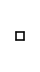

<div align="center">

# 🗂 Hall K · Wing 1

Languages whose names begin with **K**.

**35 exhibits** in this wing

[⬅ Museum entrance](../README.md) · [🏛 Full catalog](all.md)

</div>

---

## K

```text
/ Hello world in K

"Hello world!"
```
<sub>📄 [Source File](../libraries/k/K-1/K)</sub>

## K

```text
"Hello World\n"
```
<sub>📄 [Source File](../libraries/k/K-1/K.k)</sub>

## K3

```text
/ Hello World in K3

`0:"Hello World!\n
```
<sub>📄 [Source File](../libraries/k/K-1/K3)</sub>

## K4

```text
/ Hello World in K4/Q/KDB

1"Hello World\n"
```
<sub>📄 [Source File](../libraries/k/K-1/K4)</sub>

## K5

```text
/ Hello World in K5

1'"Hello World\n"
```
<sub>📄 [Source File](../libraries/k/K-1/K5)</sub>

## Kabap

```text
return = "Hello world!";
```
<sub>📄 [Source File](../libraries/k/K-1/Kabap)</sub>

## Kaitai Struct

```text
meta:
  id: hello
  title: Hello World
```
<sub>📄 [Source File](../libraries/k/K-1/Kaitai%20Struct)</sub>

## Kak

```text
!!<!!<!!!<!!<!!<!!<!!!!<!!<!!!<!!!<!!!!<!!!!<!!<!!<!!!!<!!!!<!!<!!<!!!!<!!!!!!<!!<!!!<!!!!<!!<!!<!!<!!!<!!<!!<!!<!!<!!<!!!<!!!<!!!!!<!!!!<!!!!!!<!!!!!<!!<!!!<!!<!!!!<!!!!<!!<!!<!!!!<!!<!!!<!!<!!<!!<!!!<!!<!!<!!<!!!<!
```
<sub>📄 [Source File](../libraries/k/K-1/Kak)</sub>

## KakouneScript

```text
echo Hello World
```
<sub>📄 [Source File](../libraries/k/K-1/KakouneScript)</sub>

## Kaleidoscope

```text
; Kaleidoscope LLVM tutorial language
; extern putchard(x);
```
<sub>📄 [Source File](../libraries/k/K-1/Kaleidoscope)</sub>

## Kangaroo

```text
foo: skip bar
bar: skip foo, foo
```
<sub>📄 [Source File](../libraries/k/K-1/Kangaroo)</sub>

## Kantate

```text
% TRANSLATION oz oosz
6.-54. 48.--
48.--
48.-48. --48.
--48.---48.-48.--48.-----48.---48.-48.--48.--------48.---
0.--
57.45.105.
9.45.105.
0.1.66. 0.1.2. 66.1.75. 2.1.77. 0.1.0.
0.1.81. 0.1.2. 81.1.90. 2.1.92. 0.1.0.
3.1.0.
0.1.99. 0.1.2.
```
<sub>📄 [Source File](../libraries/k/K-1/Kantate)</sub>

## Kap

```text
⎕←'Hello World'
```
<sub>📄 [Source File](../libraries/k/K-1/Kap)</sub>

## Kardz

```text
.krdz
```
<sub>📄 [Source File](../libraries/k/K-1/Kardz)</sub>

## Karel

```text
PROGRAM hello_world
BEGIN
  WRITE("Hello World", CR)
END hello_world
```
<sub>📄 [Source File](../libraries/k/K-1/Karel.kl)</sub>

## Karma

```text
Example:
, This line will be ignored
12+;
The last line will end and therefore so will the program, this is never executed.
```
<sub>📄 [Source File](../libraries/k/K-1/Karma)</sub>

## kavod

```text
72#101#108#108#111#44#32#87#111#114#108#100#33#
```
<sub>📄 [Source File](../libraries/k/K-1/kavod.kavod)</sub>

## Kawa



*🖼️ Image artifact · IMAGE · 136 bytes*

<sub>📄 [Source File](../libraries/k/K-1/Kawa.png)</sub>

## Kaya

```text
program hello;
 
Void main() {
    // My first program!
    putStrLn("Hello world!");
}
```
<sub>📄 [Source File](../libraries/k/K-1/Kaya)</sub>

## KCL

```text
hello = "Hello World"
```
<sub>📄 [Source File](../libraries/k/K-1/KCL)</sub>

## Kdf9 Usercode

```text
 

V2; W0;
RESTART; J999; J999;
PROGRAM;                   (main program);
   V0 = Q0/AV1/AV2;
   V1 = B0750064554545700; ("Hello" in Flexowriter code);
   V2 = B0767065762544477; ("World" in Flexowriter code);
   V0; =Q9; POAQ9;         (write "Hello World" to Flexowriter);
999;  OUT;
   FINISH;
```
<sub>📄 [Source File](../libraries/k/K-1/Kdf9%20Usercode)</sub>

## Ked

```text
saysI 'Hello World' like
```
<sub>📄 [Source File](../libraries/k/K-1/Ked.ked)</sub>

## Keg

```text
Hello\, World\!
```
<sub>📄 [Source File](../libraries/k/K-1/Keg)</sub>

## KEMURI

```text
`|
```
<sub>📄 [Source File](../libraries/k/K-1/KEMURI)</sub>

## Kent Recursive Calculator

```text
hello = "Hello World";
```
<sub>📄 [Source File](../libraries/k/K-1/Kent%20Recursive%20Calculator)</sub>

## KerboScript

```text
print "Hello World".
```
<sub>📄 [Source File](../libraries/k/K-1/KerboScript)</sub>

## KeyF

```text
>v>v,<^<^<^<.v>v>v>v>v>v>v..<.^^<^^.<<<,v>v>v>v>v>v>v>.^<^<^<^<^<.v>v>v>v>v>v.<^<^<^<^<^<^.<^<^<<,vvv>v>v>v>v>v>v>
```
<sub>📄 [Source File](../libraries/k/K-1/KeyF)</sub>

## Keys

```text
\_/--\_/--
\_/--\_/--
```
<sub>📄 [Source File](../libraries/k/K-1/Keys)</sub>

## KeyVM

```text
memcreate
alloc(0,2)
memwrite(0,0,fork())
memwrite(0,1,fork())
transferkey(1, random(0, numkeys()))
transferkey(2, random(0, numkeys()))
recurse(mempush(2,0), div(mempush(0,2), 3), div(mempush(0,3), 3))
recurse(mempush(2,1), div(mempush(0,2), 2), div(mempush(0,3), 2))
```
<sub>📄 [Source File](../libraries/k/K-1/KeyVM)</sub>

## KimL

```text
io.out "Hello World"
```
<sub>📄 [Source File](../libraries/k/K-1/KimL.kiml)</sub>

## Kinx

```text
System.println("Hello World");
```
<sub>📄 [Source File](../libraries/k/K-1/Kinx.kx)</sub>

## Kitanai

```text
print "Hello World"
```
<sub>📄 [Source File](../libraries/k/K-1/Kitanai.ktn)</sub>

## Kitten

```text
"Hello World" say
```
<sub>📄 [Source File](../libraries/k/K-1/Kitten.ktn)</sub>

## Kivy

```python
import kivy
kivy.require('1.0.6')

from kivy.app import App
from kivy.uix.label import Label


class MyApp(App):
    def build(self):
        return Label(text='Hello World')

if __name__ == '__main__':
    MyApp().run()
```
<sub>📄 [Source File](../libraries/k/K-1/Kivy.py)</sub>

## Klein

```text
"Hello, World!"@
```
<sub>📄 [Source File](../libraries/k/K-1/Klein.klein)</sub>

---

<div align="center">

[⬅ Museum entrance](../README.md) · [🏛 Full catalog](all.md) · [⬆ Top](#)

</div>
