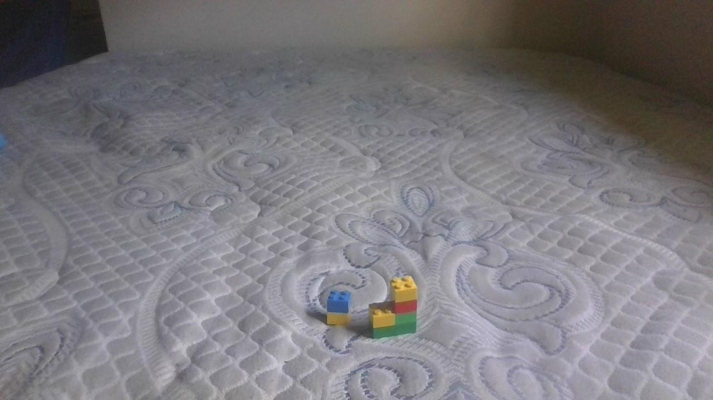
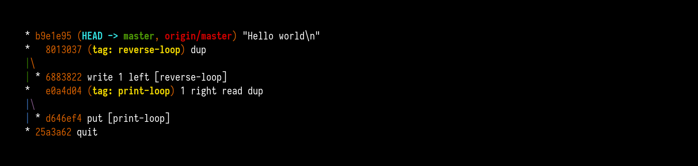

# L1

105 entries.

##### *lang
```text
new *_;


new * ;
new *!;


new *,;


new *H;


new *d;
new *e;


new *l;


new *o;


new *r;


new *w;
out H;
out e;
out l;
out l;
out o;
out ,;
out  ;
out w;
out o;
out r;
out l;
out d;
out !;
```
[Source File](../libraries/l/L-1/*lang)

##### 11l
```text
print(‘Hello world!’)
```
[Source File](../libraries/l/L-1/11l)

##### 2L
```text
 *+ 2L "Hello, World!" program by poiuy_qwert   +
+                                                   +
 *                                             +*
 *     +                                        *+
    + **                                     +    *
      +*                                           +
     *  +                                                               *+
     +                                        +                         *
   +******************************************* *************************
                                                 +                      +
                                                     +
                                                 *+
    +                                          *+*
      +                                        *+  *
     *                                          +  *+
     +                                           + *  +
   +********                                       *      +
                                                   + +*
    +                                             *   *+
      +                                           *+    *
     *                                             +    *+
     +                                              +   *    +
   +******                                              **+
                                                        +*
                                                        +  *
                                                           *+ +
    +                                                *   +        +
     ***+                                            *     * +*
   +                                                       *  *+
       *                                              +    +    *
    +  +                                                  *   *+ +
     ************************+                            * + * +
   +                                                          *     +
                            *                              +  + *+
                            +                                  +*
                                                              +   *
    +                                                        *  *  +
     *******************************************************+* +  *   +
   +                                                              *       +
                                                           *  +   +  +*
    +                                                      +     *    *+
      +                                                          *+     *
     *                                                            + *    +
     +                                                             + *  *
   +************                                                        *    +
     +                                                               *  +         +
    *                                                                 +      * +
    +                                                                  *+   +** 
  +******************************************************************* *
                                                                       +   +    *       +
                                                                             *   +         +
   +                                                                        +          +*
    ***+                                                              *         *       *+
  +                                                                             * 
                                                                      *         +   +    *    +
      *                                                                +              *   +        +
   +  +                                                                              +        *+
    *******+                                                                   *         *   +*
  +                                                                                      *
                                                                               *         +  +    *
          *                                                                     +             *   +
   +      +                                                                                  +
    *****************************+                                                     *         *
  +                                                                                              *
                                                                                       *         +
                                *                                                       +
                                +
  ************************************************************************+                    *
 +                                                                       *                     *
                                                                                                +
                                                                         +
```
[Source File](../libraries/l/L-1/2L)

##### 3LEB
```text
/ PRIME NUMBERS /
JAO 2
PEB [X] 3
:LY [X] VEA 100
    PEB [A] [X]
    PLE [X] 2
    PEB [H] [X]
    PEB [X] [A]
    PEB [Y] 2
    :LY [Y] VEA [H]
        PEB [A] [X]
        ROV [X] [Y]
        PEB [B] [X]
        PEB [X] [A]
        .IK [B] AOS 0
            PEB [Y] [H]
        ,
        GUN [Y] 1
    ;
    .IK [Y] AOS [H]
        JAO [X]
    ,
    GUN [X] 2
;
DAK
```
[Source File](../libraries/l/L-1/3LEB)

##### L
```text
// Hello World in L

namespace Hello is
    class Main is
        void init is()
            IO.Std.out.println("Hello World!");
        end
    end
end
```
[Source File](../libraries/l/L-1/L)

##### l33t
```text
// "Hello World" by Stephen McGreal.
// Note that the views expressed in this source code do not necessarily coincide with those of the author :o)

Gr34t l33tN3$$? 
M3h...
iT 41n't s0 7rIckY.

l33t sP33k is U8er keWl 4nD eA5y wehn u 7hink 1t tHr0uGh.
1f u w4nn4be UB3R-l33t u d3f1n1t3lY w4nt in 0n a b4d4sS h4xX0r1ng s1tE!!! ;p
w4r3Z c0ll3cT10n2 r 7eh l3Et3r!

Qu4k3 cL4nS r 7eh bE5t tH1ng 1n teh 3nTIr3 w0rlD!!!
g4m3s wh3r3 u g3t to 5h00t ppl r 70tAl1_y w1cK1d!!
I'M teh fr4GM4stEr aN I'lL t0t41_1Ly wIpE teh phr34k1ng fL00r ***j3d1 5tYlE*** wItH y0uR h1dE!!!! L0L0L0L!
t3lEphR4gG1nG l4m3rs wit mY m8tes r34lLy k1kK$ A$$

l33t hAxX0r$ CrE4t3 u8er- k3wL 5tUff lIkE n34t pR0gR4mm1nG lAnguidGe$...
s0m3tIm3$ teh l4nGu4gES l00k jUst l1k3 rE41_ 0neS 7o mAkE ppl Th1nk th3y'r3 ju$t n0rMal lEE7 5pEEk but th3y're 5ecRetLy c0dE!!!!
n080DY unDer5tAnD$ l33t SpEaK 4p4rT fr0m j3d1!!!!!
50mE kId 0n A me$$4gEb04rD m1ghT 8E a r0xX0r1nG hAxX0r wH0 w4nT2 t0 bR34k 5tuFf, 0r mAyb3 ju5t sh0w 7eh wAy5 l33t ppl cAn 8E m0re lIkE y0d4!!! hE i5 teh u8ER!!!!
1t m1ght 8E 5omE v1rus 0r a Pl4ySt4tI0n ch34t c0dE.
1t 3v3n MiTe jUs7 s4y "H3LL0 W0RLD!!!" u ju5t cAn'T gu3s5.
tH3r3's n3v3r anY p0iNt l00KiNg sC3pT1c4l c0s th4t, be1_1Ev3 iT 0r n0t, 1s whAt th1s 1s!!!!!

5uxX0r5!!!L0L0L0L0L!!!!!!!
```
[Source File](../libraries/l/L-1/l33t.l33t)

##### LabVIEW
```text
// G / LabVIEW is graphical; VI front panel string constant: Hello World
```
[Source File](../libraries/l/L-1/LabVIEW)

##### Labyrinth
```text
33_100_108:}_114_111:}_87_32_44{{:_101_72.......
@
```
[Source File](../libraries/l/L-1/Labyrinth)

##### Labyrinth
```text
33_100_108:}_114_111:}_87_32_44{{:_101_72.......
@
```
[Source File](../libraries/l/L-1/Labyrinth.labyrinth)

##### Lack
```text
=remember_72 §remember .
=remember_101 §remember .
=remember_108 §remember .
=remember_108 §remember .
=remember_111 §remember .
=remember_44 §remember .
=remember_32 §remember .
=remember_87 §remember .
=remember_111 §remember .
=remember_114 §remember .
=remember_108 §remember .
=remember_100 §remember .
=remember_33 §remember .
```
[Source File](../libraries/l/L-1/Lack)

##### Ladder Logic
```text
// PLC ladder: coil energize message Hello World
```
[Source File](../libraries/l/L-1/Ladder%20Logic)

##### Laddermaker
```text
+--+
```
[Source File](../libraries/l/L-1/Laddermaker)

##### Lag
```text
a;b;c;d
```
[Source File](../libraries/l/L-1/Lag)

##### Lagoona
```text
print("Hello World");
```
[Source File](../libraries/l/L-1/Lagoona)

##### LAIN
```text
line integer string;
line 3 "Hello, world!";
```
[Source File](../libraries/l/L-1/LAIN)

##### Laiyes
```text
"Hello, World!"
```
[Source File](../libraries/l/L-1/Laiyes)

##### Lakshayati
```text
variable "hello world"
```
[Source File](../libraries/l/L-1/Lakshayati)

##### Lamb
```text
   "Hello World"
```
[Source File](../libraries/l/L-1/Lamb)

##### Lambda Prolog
```text
hello :- print "Hello World", nl.
```
[Source File](../libraries/l/L-1/Lambda%20Prolog)

##### Lambdapi
```text
symbol hello : TYPE;
// Hello World
```
[Source File](../libraries/l/L-1/Lambdapi)

##### Lambdastack
```text
?              (a,b,x)->(a/b)          Pop a, b and x. Then execute If (x) { Push a } Else { Push b }
0-F            ()->(n)                 Push hexadecimal digit to stack
(00)-(FF)      ()->(n)                 Push a byte to stack
('c)           ()->(n)                 Push ascii value of char c
(var), var     ()->(a)                 Push content of variable var to stack. If var is not defined it pushes nothing.
[vars:code]    ()->(f)                 Define lambda with input
[code]         ()->(f)                 Define lambda with no input
'              (f)->(),(n)->()         Pop and execute lambda f or Pop number and use it as bitwise operator (with lambdas "' has the same effect as ')
"              (f)->(f), (n)->(f)      Convert lambda with input or number to lambda with no input (5[x;0Fx?]"->[0F5?]) (5"->[5]). If it is used with lambda with no input it does nothing.
`var           (a)->()                 Pop a and store it to global variable var
I              ()->(n)                 Input a byte
O              (n)->()                 Pop and output a byte
```
[Source File](../libraries/l/L-1/Lambdastack)

##### Lambdatalk
```text
Hello world!
{h1 Hello world!}
_h1 Hello world!\n
```
[Source File](../libraries/l/L-1/Lambdatalk)

##### Lambdir
```text
 I = S K K                          -- I x = x
 B = S (K S) K                      -- B f g x = f (g x)
 V = B (S I) K                      -- V x f = f x 
 
 -- [a, b] -> [b, a+b]
 step = S                           -- "Distributes" [a,b] over the arguments
         (B (T 2) (V (K I)))        -- [a, b] -> T 2 b
         (S (B + (V K)) (V (K I)))  -- [a, b] -> a + b
 
 -- n -> fib n
 fib = S
     (V step)                       -- n -> n step
     (K (T 2 0 1))                  -- n -> [0,1]
 
 ! ($ fib) K                        -- Read input & pass it to fib
```
[Source File](../libraries/l/L-1/Lambdir)

##### Lambdus


*画像プログラム（IMAGE / 313 bytes）*

[Source File](../libraries/l/L-1/Lambdus.png)

##### Lamp
```text
lamp example on
```
[Source File](../libraries/l/L-1/Lamp)

##### LAMPA
```text
as main.
-- DECLARATION
module stop where.
hiding -1.
module cr where.
let lf 10.
type as lf.
rec proc.
-- END DECLARATION

-- MAIN MODULE
module main where.
let H 72.
type as H.
let e 101.
type as e.
let l 108.
type as l.type as l.
let o 111.
type as o.
let comma 44.
type as comma.
let space 32.
type as space.
let W 87.
type as W.
type as o.
let r 114.
type as r.
type as l.
let d 100.
type as d.
let ! 33.
type as !.
as cr.
as stop.
-- END MAIN MODULE
```
[Source File](../libraries/l/L-1/LAMPA)

##### Lang
```text
fn.println(Hello world!)
```
[Source File](../libraries/l/L-1/Lang)

##### Lang5
```text
"Hello world!\n" .
```
[Source File](../libraries/l/L-1/Lang5)

##### Langton's ant
```text
1v
1
```
[Source File](../libraries/l/L-1/Langton's%20ant)

##### Language H
```text
PRINT "Hello World"
```
[Source File](../libraries/l/L-1/Language%20H)

##### langur
```text
writeln "Hello world!"
```
[Source File](../libraries/l/L-1/langur)

##### LANSA
```text
DISPLAY 'Hello World'
```
[Source File](../libraries/l/L-1/LANSA)

##### LargeFish
```text
i x - increment x
d x - decrement x
s x - square x
o - output x
e x y - set x to y
loop x - loop x times
endloop - end loop
```
[Source File](../libraries/l/L-1/LargeFish)

##### Lark
```text
start: "Hello World"
```
[Source File](../libraries/l/L-1/Lark)

##### Laser
```text
  / \/ \/ \`@\
  +l +  +r   +!
  +e +o +o   +d
  @H +l +W   +l
~ / \/ \/ \  /
```
[Source File](../libraries/l/L-1/Laser)

##### LaserFuck
```text
ÿ}>+++++++>++++++++++>++++++++++>++++++++++>+++++++++++>++++>+++>++++++++v
 ^             {  {v+++>++++++++++>++++++++++>+++++++++++>+++++++++++>+++{
                                                        x++>+>+>>++>+>+>++>++>+>++>{
 }}++++++++++v       }  }<#/)>-#/)+++v }  }>>>++>++>>+>>+++>>+>++>>+v }  }<#/)>-#/)^
|o^          }#^)#^             /    }#^)#^                                      /
 _                 }#^)#^  /                                        }#^)#^  /
```
[Source File](../libraries/l/L-1/LaserFuck)

##### Lasm
```text
; constant indexes in constants pool
#const __PyGbl_print = 0
#const __Py_hello_world = 1

jmp_uchar main

main:
 push_g __PyGbl_print $KK
 movk_a __Py_hello_world $KK
 fastcall 1 $KK
```
[Source File](../libraries/l/L-1/Lasm)

##### Lasso
```text
// Hello world in Lasso

Hello world!
```
[Source File](../libraries/l/L-1/Lasso)

##### LassoScript
```text
<?LassoScript
	Variable: 'ScreenText' = 'Hello World';
	$ScreenText;
?>
```
[Source File](../libraries/l/L-1/LassoScript.lasso)

##### LAST
```text
Term = "L" Term / "A" Term Term / "S" Term / "T"
```
[Source File](../libraries/l/L-1/LAST)

##### LaTeX
```text
\documentclass{minimal}
\begin{document}
Hello World!
\end{document}
```
[Source File](../libraries/l/L-1/LaTeX)

##### LaTeX
```text
\documentclass{article}
\begin{document}
Hello World
\end{document}
```
[Source File](../libraries/l/L-1/LaTeX.tex)

##### Latino
```text
# Hello world in Latino

escribir("Hello World!")
```
[Source File](../libraries/l/L-1/Latino)

##### Latino
```text
escribir("Hello World")
```
[Source File](../libraries/l/L-1/Latino.lat)

##### Latitude
```text
putln "Hello world!".
```
[Source File](../libraries/l/L-1/Latitude)

##### Latte
```text
{$hello = "Hello World"}{$hello}
```
[Source File](../libraries/l/L-1/Latte)

##### Lava
```text
print("Hello World");
```
[Source File](../libraries/l/L-1/Lava)

##### LayerASM
```text
00101100
00101101
10001000 11111110
```
[Source File](../libraries/l/L-1/LayerASM)

##### Lazarus
```text
program Hello;
begin
  writeln('Hello World');
end.
```
[Source File](../libraries/l/L-1/Lazarus)

##### Lazy Bird
``````````````text
`````````````.h.e.l.l.o.,. .w.o.r.l.d.!i
``````````````
[Source File](../libraries/l/L-1/Lazy%20Bird)

##### Lazy K
`````text
`k``s``si`k``s`k```sii``s``s`kski``s``s`ksk``s``s`ksk```s``siii``s``s`kski`k``s``si`k``s``s`ksk```s``s`ksk
i``s`k``s``s`kski``s``s`ksk```sii``s``s`kski`k``s``si`k``s`k```sii``s``s`kski```sii``s``s`ksk``s``s`kski`k
``s``si`k``s`k```sii``s``s`kski```sii``s``s`ksk``s``s`kski`k``s``si`k``s``s`ksk``s`k``s``s`kski``s``s`ksk`
`s`k``s``s`kski```sii``s``s`ksk``s``s`kski`k``s``si`k````s``s`ksk```s``siii``s``s`kski`s``s`ksk```sii``s``
s`ksk``s``s`kski`k``s``si`k``s`k``s``s`kski```s``siii``s``s`kski`k``s``si`k``s`k``s``s`ksk``s`k``s``s`kski
``s``s`ksk``s``s`kski``s``s`ksk```s``siii``s``s`kski`k``s``si`k``s``s`ksk``s`k``s``s`kski``s``s`ksk``s`k``
s``s`kski```sii``s``s`ksk``s``s`kski`k``s``si`k``s`k``s``s`kski``s``s`ksk``s`k``s``s`kski``s``s`ksk```sii`
`s``s`ksk``s``s`kski`k``s``si`k``s`k```sii``s``s`kski```sii``s``s`ksk``s``s`kski`k``s``si`k```s``s`kski``s
`k``s``s`kski``s``s`ksk```sii``s``s`kski`k``s``si`k``s``s`ksk``s`k``s``s`kski```s``siii``s``s`kski`k``s``s
i`k``s`k``s``s`kski``s``s`ksk```sii``s``s`kski`k``s``si`k```sii```sii``s``s`kski`k```sii```sii``s``s`kski
`````
[Source File](../libraries/l/L-1/Lazy%20K)

##### Lbj



*画像プログラム（IMAGE / 75269 bytes）*

[Source File](../libraries/l/L-1/Lbj.jpg)

##### LBL
```text
INCA
INCA
INCA
INCA
INCA
INCA
INCA
INCA
INCA
INCA
INCA
INCA
INCA
INCA
INCA
INCA
INCA
INCA
INCA
INCA
INCA
INCA
INCA
INCA
INCA
INCA
INCA
INCA
INCA
INCA
INCA
INCA
INCA
INCA
INCA
INCA
INCA
INCA
INCA
INCA
INCA
INCA
INCA
INCA
INCA
INCA
INCA
INCA
INCA
INCA
INCA
INCA
INCA
INCA
INCA
INCA
INCA
INCA
INCA
INCA
INCA
INCA
INCA
INCA
INCA
INCA
INCA
INCA
INCA
INCA
INCA
INCA
DICA
INCB
INCB
INCB
INCB
INCB
INCB
INCB
INCB
INCB
INCB
INCB
INCB
INCB
INCB
INCB
INCB
INCB
INCB
INCB
INCB
INCB
INCB
INCB
INCB
INCB
INCB
INCB
INCB
INCB
INCB
INCB
INCB
INCB
INCB
INCB
INCB
INCB
INCB
INCB
INCB
INCB
INCB
INCB
INCB
INCB
INCB
INCB
INCB
INCB
INCB
INCB
INCB
INCB
INCB
INCB
INCB
INCB
INCB
INCB
INCB
INCB
INCB
INCB
INCB
INCB
INCB
INCB
INCB
INCB
DICB
INCC
INCC
INCC
INCC
INCC
INCC
INCC
INCC
INCC
INCC
INCC
INCC
INCC
INCC
INCC
INCC
INCC
INCC
INCC
INCC
INCC
INCC
INCC
INCC
INCC
INCC
INCC
INCC
INCC
INCC
INCC
INCC
INCC
INCC
INCC
INCC
INCC
INCC
INCC
INCC
INCC
INCC
INCC
INCC
INCC
INCC
INCC
INCC
INCC
INCC
INCC
INCC
INCC
INCC
INCC
INCC
INCC
INCC
INCC
INCC
INCC
INCC
INCC
INCC
INCC
INCC
INCC
INCC
INCC
INCC
INCC
INCC
INCC
INCC
INCC
INCC
DICC
DICC
INCE
INCE
INCE
INCE
INCE
INCE
INCE
INCE
INCE
INCE
INCE
INCE
INCE
INCE
INCE
INCE
INCE
INCE
INCE
INCE
INCE
INCE
INCE
INCE
INCE
INCE
INCE
INCE
INCE
INCE
INCE
INCE
INCE
INCE
INCE
INCE
INCE
INCE
INCE
INCE
INCE
INCE
INCE
INCE
INCE
INCE
INCE
INCE
INCE
INCE
INCE
INCE
INCE
INCE
INCE
INCE
INCE
INCE
INCE
INCE
INCE
INCE
INCE
INCE
INCE
INCE
INCE
INCE
INCE
INCE
INCE
INCE
INCE
INCE
INCE
INCE
INCE
INCE
INCE
DICE
INCF
INCF
INCF
INCF
INCF
INCF
INCF
INCF
INCF
INCF
INCF
INCF
INCF
INCF
INCF
INCF
INCF
INCF
INCF
INCF
INCF
INCF
INCF
INCF
INCF
INCF
INCF
INCF
INCF
INCF
INCF
INCF
DICF
CLSA
CLSB
CLSD
INCA
INCA
INCA
INCA
INCA
INCA
INCA
INCA
INCA
INCA
INCA
INCA
INCA
INCA
INCA
INCA
INCA
INCA
INCA
INCA
INCA
INCA
INCA
INCA
INCA
INCA
INCA
INCA
INCA
INCA
INCA
INCA
INCA
INCA
INCA
INCA
INCA
INCA
INCA
INCA
INCA
INCA
INCA
INCA
INCA
INCA
INCA
INCA
INCA
INCA
INCA
INCA
INCA
INCA
INCA
INCA
INCA
INCA
INCA
INCA
INCA
INCA
INCA
INCA
INCA
INCA
INCA
INCA
INCA
INCA
INCA
INCA
INCA
INCA
INCA
INCA
INCA
INCA
INCA
INCA
INCA
INCA
INCA
INCA
INCA
INCA
INCA
DICA
DICE
CLSE
INCB
INCB
INCB
INCB
INCB
INCB
INCB
INCB
INCB
INCB
INCB
INCB
INCB
INCB
INCB
INCB
INCB
INCB
INCB
INCB
INCB
INCB
INCB
INCB
INCB
INCB
INCB
INCB
INCB
INCB
INCB
INCB
INCB
INCB
INCB
INCB
INCB
INCB
INCB
INCB
INCB
INCB
INCB
INCB
INCB
INCB
INCB
INCB
INCB
INCB
INCB
INCB
INCB
INCB
INCB
INCB
INCB
INCB
INCB
INCB
INCB
INCB
INCB
INCB
INCB
INCB
INCB
INCB
INCB
INCB
INCB
INCB
INCB
INCB
INCB
INCB
INCB
INCB
INCB
INCB
INCB
INCB
DICB
DICC
CLSC
INCC
INCC
INCC
INCC
INCC
INCC
INCC
INCC
INCC
INCC
INCC
INCC
INCC
INCC
INCC
INCC
INCC
INCC
INCC
INCC
INCC
INCC
INCC
INCC
INCC
INCC
INCC
INCC
INCC
INCC
INCC
INCC
INCC
INCC
INCC
INCC
INCC
INCC
INCC
INCC
INCC
INCC
INCC
INCC
INCC
INCC
INCC
INCC
INCC
INCC
INCC
INCC
INCC
INCC
INCC
INCC
INCC
INCC
INCC
INCC
INCC
INCC
INCC
INCC
INCC
INCC
INCC
INCC
DICC
```
[Source File](../libraries/l/L-1/LBL.lbl)

##### LC3 Assembly
```text
.orig x3000
LEA R0, hello    ; R0 = &hello
TRAP x22         ; PUTS (print char array at addr in R0)
HALT
hello .stringz "Hello World!"
.end
```
[Source File](../libraries/l/L-1/LC3%20Assembly)

##### LCCBED
```text
p(72)ofp(101)ofp(108)ofp(108)ofp(111)ofp(44)ofp(32)ofp(87)ofp(111)ofp(114)ofp(108)ofp(100)ofp(33)o
```
[Source File](../libraries/l/L-1/LCCBED)

##### LCode
```text
CPR
```
[Source File](../libraries/l/L-1/LCode)

##### LCoffee
```text
print "Hello World"
```
[Source File](../libraries/l/L-1/LCoffee.lcoff)

##### LDPL
```text
procedure:
display "Hello World!" crlf
```
[Source File](../libraries/l/L-1/LDPL)

##### Leafuck
```text
Hello world!
```
[Source File](../libraries/l/L-1/Leafuck)

##### Lean
```text
def main : IO Unit := IO.println "Hello World"
```
[Source File](../libraries/l/L-1/Lean)

##### Lean  _proof assistant
```text
def main : IO Unit := IO.println "Hello World"
```
[Source File](../libraries/l/L-1/Lean%20%20_proof%20assistant)

##### Lean 3
```text
def main : io unit := io.put_str_ln "Hello World"
```
[Source File](../libraries/l/L-1/Lean%203)

##### Lean 4
```text
def main : IO Unit := IO.println "Hello World"
```
[Source File](../libraries/l/L-1/Lean%204)

##### Lean Mean Bean Machine
```text
OOOOOOOOOOOOO
"""""""""""""
Hello, World!
UUUUUUUUUUUUU
```
[Source File](../libraries/l/L-1/Lean%20Mean%20Bean%20Machine.lmbm)

##### Lean
```text
#print "Hello World"
```
[Source File](../libraries/l/L-1/Lean.lean)

##### LECHEI
```text
inp a
```
[Source File](../libraries/l/L-1/LECHEI)

##### LEF
```text
VERSION 5.8 ;
# Hello World LEF stub
END LIBRARY
```
[Source File](../libraries/l/L-1/LEF)

##### Left Curly Brace Symbol
```text
a{1}}}}}}}}}}}}}}}}}}}}}}}}}}}}}}}}}}}}}}}}}}}}}}}}}}}}}}}}}}}}}}}}}}}}}}}5}1}5}9}
```
[Source File](../libraries/l/L-1/Left%20Curly%20Brace%20Symbol)

##### Left-or-right
```text
<
```
[Source File](../libraries/l/L-1/Left-or-right)

##### Left-Right March
```text
c09p00c32p00c39p00p00c42p00c88p00c01p00c50p00c42p00c45p00c39p00c31p00c64p00
```
[Source File](../libraries/l/L-1/Left-Right%20March)

##### Leftbracket
```text
When source code is [, destroy the universe.
```
[Source File](../libraries/l/L-1/Leftbracket)

##### Legasm
```text
legendes-980904/legasm.c
```
[Source File](../libraries/l/L-1/Legasm)

##### Legend
```text
(5/73)(3/103)(1/71)(7/73)(2/139)(4/79)(8/139)(6/107)(10/23)(9/7)(13/167)(12/127)(14/173)(11/29)(15/29)(16/199)(18/59)(17/79)(19/179)(20/17)(22/43)(23/127)(21/61)(25/13)(24/17)(27/103)(28/193)(26/173)(29/97)(30/47)(31/79)(32/109)(35/181)(37/163)(33/163)(39/173)(38/47)(34/53)(42/83)(36/173)(43/31)(41/79)(40/103)(44/67)(45/149)(46/71)(51/97)(49/3)(47/41)(48/79)(52/181)(50/181)(54/89)(53/23)(57/181)(55/67)(56/97)(59/157)(58/191)(62/137)(60/103)(61/181)(63/191)(64/53)(66/7)(67/131)(68/157)(65/3)(69/103)(70/157)(72/29)(71/157)(73/167)(75/41)(74/17)(77/197)(76/113)(82/89)(79/97)(78/181)(84/139)(81/67)(80/137)(87/37)(83/59)(85/59)(86/101)(92/89)(89/137)(88/157)(90/41)(91/193)(93/13)(95/163)(94/103)(97/139)(98/199)(96/31)(99/101)(100/181)(101/191)(103/53)(102/127)(107/193)(106/23)(109/59)(113/7)(104/139)(105/163)(110/53)(111/13)(115/83)(108/107)(112/89)(114/61)(119/11)(116/61)(117/163)(118/139)(122/13)(123/71)(120/109)(121/139)(124/47)(125/103)(127/107)(128/73)(126/83)(131/137)(129/83)(133/157)(134/97)(130/59)(132/191)(135/107)(136/113)(137/131)(138/59)(139/7)(140/83)(142/97)(141/139)(143/7)(145/79)(144/103)(149/157)(150/107)(147/89)(146/7)(152/107)(148/107)(151/191)(155/191)(156/31)(153/113)(154/89)(157/61)(158/73)(160/11)(159/191)(165/101)(162/197)(168/103)(161/67)(164/97)(166/131)(163/109)(167/199)(170/173)(172/107)(169/199)(171/193)(173/59)(256/7)(257/127)(174/19)(258/61)(262/139)(175/151)(176/197)(259/113)(260/67)(261/193)(264/181)(263/37)(266/193)(177/41)(178/53)(179/127)(267/199)(180/97)(181/101)(265/97)(182/17)(183/43)(268/61)(184/151)(269/199)(272/37)(185/29)(270/131)(273/11)(271/97)(274/61)(276/31)(186/151)(187/13)(188/197)(277/5)(278/7)(275/139)(189/13)(279/29)(282/5)(281/59)(190/167)
```
[Source File](../libraries/l/L-1/Legend)

##### Legit



*画像プログラム（IMAGE / 39686 bytes）*

[Source File](../libraries/l/L-1/Legit.png)

##### Lengthwise
```text
.lhwi
```
[Source File](../libraries/l/L-1/Lengthwise)

##### Lenguage
```text
Print the 1st character of the text in input
```
[Source File](../libraries/l/L-1/Lenguage)

##### Lenta
```text
$ "H'"e'"l' '"o'" '"W'"o'"r'"l'"d'"!' #
```
[Source File](../libraries/l/L-1/Lenta)

##### Lenum
```text
v0s9v2s9d2i0ifv2exb5v2s9d2i0ifv2exb5v2s9d2i0ifv2exb5v2s9d2i0ifv2exb5v2s9d2i0ifv2exb5v2s9d2i0ifv2exb5v2s9d2i0ifv2exb5v0ocv2s9d2i0ifv2exb5v2s9d2i0ifv2exb5v2s9d2i0ifv2exb5i0i0v0oci0i0i0i0i0i0i0
v0ocv0oci0i0i0v0ocv1s9v2s9d2i1ifv2exb5v2s9d2i1ifv2exb5v2s9d2i1ifv2exb5i1i1i1i1i1i1i1i1v1ocv2s9d2d1ifv2exb5d1d1d1v1ocv2s9d2d0ifv2exb5v2s9d2d0ifv2exb5d0d0d0d0d0d0v0ocv2s9d2i0ifv2exb5v2s9d2i0ifv2
exb5i0i0i0i0i0i0v0oci0i0i0v0ocd0d0d0d0d0d0v0ocd0d0d0d0d0d0d0d0v0oci1v1oc
```
[Source File](../libraries/l/L-1/Lenum)

##### Leo
```text
// Leo outlinescript: Hello World
```
[Source File](../libraries/l/L-1/Leo)

##### Less
```text
/* Hello World */
body::before { content: "Hello World"; }
```
[Source File](../libraries/l/L-1/Less)

##### Less
```text
body::before {
    content: "Hello World"
}
```
[Source File](../libraries/l/L-1/Less.less)

##### Leszek
```text
\O\C\.1.Hello World!
```
[Source File](../libraries/l/L-1/Leszek)

##### Leszek
```text
\O\C\.1.Hello World
```
[Source File](../libraries/l/L-1/Leszek.leszek)

##### Letlang
```text
"1" = Exit Program and Output
"2" = Add 1 to the character value
"3" = Subtract 1 from the character value
"4" = Loop the amount of times shown in the next character, cancels out the effect of 1s. 
"5" = Print "Hello, world!"
"6" = Squares the character value (value * value)
```
[Source File](../libraries/l/L-1/Letlang)

##### LETTER
```text
Dear, Reader
I would like to hear from you!
Well, that's that.
So hello!
I would like to hear from you!
Well, that's that.
Let's move on parhaps?
Love, Programer
```
[Source File](../libraries/l/L-1/LETTER)

##### Letterfuck
```text
out(char), "Hello World!"
end
```
[Source File](../libraries/l/L-1/Letterfuck)

##### Lex
```text
%%
%%
int main(){ printf("Hello World\n"); }
```
[Source File](../libraries/l/L-1/Lex)

##### Lezy
```text
lezy
```
[Source File](../libraries/l/L-1/Lezy)

##### libavg
```python
from libavg import avg

player = avg.Player.get()
canvas = player.createMainCanvas(size=(640,480))
rootNode = canvas.getRootNode()
avg.WordsNode(pos=(10,10), font="arial", 
        text="Hello World", parent=rootNode)
player.play()
```
[Source File](../libraries/l/L-1/libavg.py)

##### LibreOffice Basic
```text
REM  *****  BASIC  *****

Sub Main
 msgbox "Hello World"
End Sub
```
[Source File](../libraries/l/L-1/LibreOffice%20Basic.bas)

##### Like, Python
```text
#!usr/bin/python

yo just print like "Hello World" bro
```
[Source File](../libraries/l/L-1/Like,%20Python.lp)

##### Lily
```text
print("Hello, World!")
```
[Source File](../libraries/l/L-1/Lily.lily)

##### LilyPond
```lilypond
\markup { Hello World }
```
[Source File](../libraries/l/L-1/LilyPond.ly)

##### Limbo
```text
implement Hello;

include "sys.m";
	sys: Sys;
include "draw.m";

Hello: module
{
	init:	fn(ctxt: ref Draw->Context, argv: list of string);
};

init(ctxt: ref Draw->Context, argv: list of string)
{
	sys = load Sys Sys->PATH;
	sys->print("Hello World\n");
}
```
[Source File](../libraries/l/L-1/Limbo.b)

##### Lingo
```text
on startmovie
  alert "Hello World"
end
```
[Source File](../libraries/l/L-1/Lingo.lg4)

##### Lisaac
```text
// Hello World in Lisaac

Section Header
	+ name		:= HELLO_WORLD;

Section Inherit

	- parent_object:OBJECT := OBJECT;

Section Public

	- main <-
	(
		"Hello World !\n".print;
	);
```
[Source File](../libraries/l/L-1/Lisaac.li)

##### Lisp
```text
; LISP
(DEFUN hello ()
  (PRINT (LIST 'HELLO 'WORLD))
)

(hello)
```
[Source File](../libraries/l/L-1/Lisp.lsp)

##### ListLang
```text
0dlroW391+*2+491+*4+olleH["],
```
[Source File](../libraries/l/L-1/ListLang)

##### Literate Haskell
```text
> main = putStr "Hello, World!"
```
[Source File](../libraries/l/L-1/Literate%20Haskell.haskell)

##### LiveCode
```text
answer "Hello World!" 
```
[Source File](../libraries/l/L-1/LiveCode)

##### LiveScript
```text
console.log "Hello World"
```
[Source File](../libraries/l/L-1/LiveScript.ls)

##### llrl
```text
(println! "Hello World")
```
[Source File](../libraries/l/L-1/llrl.llrl)

##### LLVM IR
```text
@str = internal constant [14 x i8] c"Hello, World!\00"
declare i32 @puts(i8*)
define i32 @main()
{
  call i32 @puts( i8* getelementptr ([14 x i8], [14 x i8]* @str, i32 0,i32 0))
  ret i32 0
}
```
[Source File](../libraries/l/L-1/LLVM%20IR.llvm)

##### LLVM
```text
target datalayout = "e-p:32:32:32-i1:8:8-i8:8:8-i16:16:16-i32:32:32-i64:32:64-f32:32:32-f64:32:64-v64:64:64-v128:128:128-a0:0:64-f80:128:128"
@.str = internal constant [12 x i8] c"Hello World\00"

; puts from libc
declare i32 @puts(i8*)

define i32 @main(...) {
	call i32 @puts(i8* getelementptr([12 x i8]* @.str, i32 0, i32 0))
	ret i32 0
}
```
[Source File](../libraries/l/L-1/LLVM.ll)

##### Lost
```text
%"Hello World"@
```
[Source File](../libraries/l/L-1/Lost.？？？)

