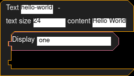

<div align="center">

# 🗂 Hall M · Wing 3

Languages whose names begin with **M**.

**63 exhibits** in this wing

[⬅ Museum entrance](../README.md) · [🏛 Full catalog](all.md)

</div>

---

## ML

```text
print "Hello World\n";
```
<sub>📄 [Source File](../libraries/m/M-3/ML)</sub>

## ML-I

```text
Hello world!
```
<sub>📄 [Source File](../libraries/m/M-3/ML-I)</sub>

## MLang  _Mihai Popa

```text
print "Hello, world!"
```
<sub>📄 [Source File](../libraries/m/M-3/MLang%20%20_Mihai%20Popa)</sub>

## Mlatu

```text
for start in 0..length(expression) // index terms at the uppermost layer, left to right
    for end in length(expression)..start // try the longest subsequence first
        redex = expression.slice(start, end)
        if redex in patterns:
            return reduce(expression, patterns[redex], start, end)
        if redex is combinator expression:
            return reduce(expression, combinators[redex], start, end)
return FINISHED
```
<sub>📄 [Source File](../libraries/m/M-3/Mlatu)</sub>

## MLIR

```text
module {
  // Hello World MLIR stub
}
```
<sub>📄 [Source File](../libraries/m/M-3/MLIR)</sub>

## MLton

```text
print "Hello World\n";
```
<sub>📄 [Source File](../libraries/m/M-3/MLton)</sub>

## MM1char

```text
+ - increment register 1
- - decrement register 1
* - increment register 2
/ - decrement register 2
[abc] - declare label abc
(abc) - goto label abc
~ - if register 1 is zero skip next command
` - if register 2 is zero skip next command
```
<sub>📄 [Source File](../libraries/m/M-3/MM1char)</sub>

## MML-AXE10

```text
! Hello world program in MML for Ericsson's AXE10 telephone exchange
IOTXP:Hello World;
```
<sub>📄 [Source File](../libraries/m/M-3/MML-AXE10)</sub>

## Mmmm

```text
Mmm=m[m.m()].m(m.m());
Mmmm=m[mm].m();
mmm.m();mmm.m();mmm.m();mmm.m();
mmm.m();Mmmmm=mmm.m();
mmm.m();mmm.m();mmm.m();mmm.m();
mmm.m();mmm.m();mmm.m();mmm.m();
mmm.m();mmm.m();mmm.m();mmm.m();
mmm.m();mmm.m();mmm.m();mmm.m();
mmm.m();mmm.m();mmm.m();mmm.m();
mmm.m();mmm.m();mmm.m();mmm.m();
mmm.m();mmm.m();mmm.m();mmm.m();
mmm.m();mmm.m();mmm.m();mmm.m();
mmm.m();mmm.m();mmm.m();mmm.m();
mmm.m();mmm.m();mmm.m();mmm.m();
mmm.m();mmm.m();mmm.m();mmm.m();
mmm.m();mmm.m();mmm.m();mmm.m();
mmm.m();mmm.m();mmm.m();mmm.m();
mmm.m();mmm.m();mmm.m();mmm.m();
mmm.m();mmm.m();mmm.m();mmm.m();
mmm.m();mmm.m();mmm.m();mmm.m();
mmm.m();m[mmmm].m(mmm.m());
mmm.m();mmm.m();mmm.m();mmm.m();
mmm.m();mmm.m();mmm.m();mmm.m();
mmm.m();mmm.m();mmm.m();mmm.m();
mmm.m();mmm.m();Mmmmmm=mmm.m();
mmm.m();mmm.m();mmm.m();mmm.m();
mmm.m();mmm.m();mmm.m();mmm.m();
mmm.m();mmm.m();mmm.m();mmm.m();
Mmmmmmmmm=mmm.m();
m[mmmm].m(mmm.m());
mmm.m();mmm.m();mmm.m();mmm.m();
mmm.m();mmm.m();Mmmmmmm=mmm.m();
m[mmmm].m(mmmmmm);m[mmmm].m(mmmmmm);
mmm.m();mmm.m();
Mmmmmmmm=mmm.m();
m[mmmm].m(mmmmmmm);
mmm.m();mmm.m();
Mmmmmmmmmm=mmm.m();
Mmmm=m[mm].m();
mmm.m();mmm.m();mmm.m();mmm.m();
mmm.m();mmm.m();mmm.m();mmm.m();
mmm.m();mmm.m();mmm.m();mmm.m();
mmm.m();mmm.m();mmm.m();mmm.m();
mmm.m();mmm.m();mmm.m();mmm.m();
mmm.m();mmm.m();mmm.m();mmm.m();
mmm.m();mmm.m();mmm.m();mmm.m();
mmm.m();mmm.m();mmm.m();
Mmmmmmmmmmm=mmm.m();
Mmmmmmmmmmmm=mmm.m();
mmm.m();mmm.m();mmm.m();mmm.m();
mmm.m();mmm.m();mmm.m();mmm.m();
mmm.m();mmm.m();
m[mmmm].m(mmm.m());
m[mmmm].m(mmmmmmmmmm);
m[mmmm].m(mmmmm);
m[mmmm].m(mmmmmmm);
m[mmmm].m(mmmmmmmmm);
m[mmmm].m(mmmmmm);
m[mmmm].m(mmmmmmmm);
m[mmmm].m(mmmmmmmmmmm);
```
<sub>📄 [Source File](../libraries/m/M-3/Mmmm.mmmm)</sub>

## MNNBFSL

```text
[<"++++++++[>++++<-"]>"++++"[>+<-"]>>"<">[>+<-"]">]<".>"---.++++".".+++".>".<"++++++++."."+++.---".--------.
```
<sub>📄 [Source File](../libraries/m/M-3/MNNBFSL)</sub>

## Moaiscript

```text
🗿🗿🗿🗿🗿🗿🗿🗿🗿🗿🗿🗿🗿🗿🗿🗿🗿
🗿🗿🗿🗿🗿🗿🗿🗿🗿🗿🗿🗿🗿🗿🗿🗿🗿🗿🗿🗿
🗿🗿🗿🗿🗿🗿🗿
🗿🗿🗿🗿🗿🗿🗿🗿🗿🗿🗿🗿
🗿🗿🗿🗿🗿🗿
🗿🗿
🗿🗿🗿🗿🗿🗿🗿🗿🗿🗿🗿🗿🗿🗿
🗿🗿🗿🗿🗿🗿🗿🗿🗿🗿🗿🗿🗿🗿🗿🗿🗿
🗿🗿🗿🗿🗿🗿🗿
🗿🗿🗿🗿🗿🗿
🗿🗿🗿🗿🗿🗿🗿🗿🗿🗿🗿
🗿🗿🗿🗿🗿🗿
🗿🗿
🗿🗿🗿🗿🗿🗿🗿🗿🗿🗿🗿🗿🗿🗿🗿🗿🗿
🗿🗿🗿🗿🗿🗿
🗿🗿
🗿🗿
🗿🗿🗿🗿🗿🗿🗿🗿🗿🗿🗿🗿🗿
🗿🗿🗿🗿🗿🗿
🗿🗿
🗿🗿🗿🗿🗿🗿🗿🗿🗿🗿🗿🗿🗿🗿🗿🗿
🗿🗿🗿🗿🗿🗿🗿🗿🗿🗿🗿🗿🗿🗿🗿🗿🗿🗿🗿🗿🗿
🗿🗿🗿🗿🗿🗿🗿
🗿🗿🗿🗿🗿
🗿🗿🗿🗿🗿🗿🗿🗿🗿🗿🗿
🗿🗿🗿🗿🗿
🗿🗿
🗿🗿🗿🗿🗿🗿🗿🗿🗿🗿🗿🗿🗿🗿🗿🗿🗿🗿🗿🗿🗿🗿
🗿🗿🗿🗿🗿
🗿🗿
🗿🗿🗿🗿🗿🗿🗿🗿🗿🗿🗿🗿🗿
🗿🗿🗿🗿🗿🗿🗿
🗿🗿🗿🗿🗿🗿🗿🗿🗿🗿🗿🗿🗿🗿🗿🗿🗿🗿🗿
🗿🗿🗿🗿🗿
🗿🗿
🗿🗿🗿🗿🗿🗿🗿🗿🗿🗿🗿🗿🗿🗿🗿🗿
🗿🗿🗿🗿🗿🗿🗿🗿🗿🗿🗿🗿🗿🗿
🗿🗿🗿🗿🗿🗿🗿
🗿🗿🗿🗿🗿🗿
🗿🗿
🗿🗿🗿🗿🗿🗿🗿🗿🗿🗿🗿🗿🗿
🗿🗿🗿🗿🗿🗿
🗿🗿
🗿🗿🗿🗿🗿🗿🗿🗿🗿🗿🗿🗿🗿🗿🗿🗿
🗿🗿🗿🗿🗿
🗿🗿
🗿🗿🗿🗿🗿🗿🗿🗿🗿🗿🗿🗿🗿🗿🗿🗿🗿🗿
🗿🗿🗿🗿🗿
🗿🗿
🗿🗿🗿🗿🗿🗿🗿🗿🗿🗿🗿🗿🗿🗿🗿🗿🗿🗿🗿🗿🗿
🗿🗿🗿🗿🗿🗿🗿🗿🗿🗿🗿🗿🗿
🗿🗿🗿🗿🗿🗿🗿
🗿🗿
```
<sub>📄 [Source File](../libraries/m/M-3/Moaiscript)</sub>

## Moanfuck

```text
+ AH
- OH
> YES
< FUCK
, MORE
. YEAH
[ AHH
] OOH
# BABY (debug breakpoint)
```
<sub>📄 [Source File](../libraries/m/M-3/Moanfuck)</sub>

## Moddable XS

```text
trace("Hello World\n");
```
<sub>📄 [Source File](../libraries/m/M-3/Moddable%20XS)</sub>

## Model 204

```text
PRINT 'Hello World'
```
<sub>📄 [Source File](../libraries/m/M-3/Model%20204)</sub>

## Modelica

```text
model Hello
  annotation(experiment(StopTime=0));
equation
  // Hello World
end Hello;
```
<sub>📄 [Source File](../libraries/m/M-3/Modelica)</sub>

## Moditape

```text
H]e]l]l]o],] ]W]o]r]l]d]!
```
<sub>📄 [Source File](../libraries/m/M-3/Moditape)</sub>

## Modula

```text
MODULE Hello;
BEGIN
  WriteString("Hello World")
END Hello.
```
<sub>📄 [Source File](../libraries/m/M-3/Modula)</sub>

## Modula-2

```text
(* Hello World in Modula-2 *)

MODULE HelloWorld;
FROM InOut IMPORT WriteString,WriteLn;
BEGIN
  WriteString("Hello World!");
  WriteLn;
END HelloWorld.
```
<sub>📄 [Source File](../libraries/m/M-3/Modula-2)</sub>

## Modula-2 language

```text
MODULE Hello;
FROM InOut IMPORT WriteString, WriteLn;
BEGIN
  WriteString("Hello World"); WriteLn
END Hello.
```
<sub>📄 [Source File](../libraries/m/M-3/Modula-2%20language)</sub>

## Modula-3

```text
(* Hello World in Modula-3 *)

MODULE Hello EXPORTS Main;

IMPORT IO;

BEGIN
 IO.Put("Hello World!\n");
END Hello.
```
<sub>📄 [Source File](../libraries/m/M-3/Modula-3)</sub>

## Modula-3 language

```text
MODULE Hello EXPORTS Main;
IMPORT IO;
BEGIN
  IO.Put("Hello World\n")
END Hello.
```
<sub>📄 [Source File](../libraries/m/M-3/Modula-3%20language)</sub>

## Module Management System

```text
* Hello World
```
<sub>📄 [Source File](../libraries/m/M-3/Module%20Management%20System)</sub>

## Modulous

```text
[PSH STR “Hello, World!”][PRT STR][JMP B 1 IF NOT 0]
```
<sub>📄 [Source File](../libraries/m/M-3/Modulous)</sub>

## Moed

```text
{...}
```
<sub>📄 [Source File](../libraries/m/M-3/Moed)</sub>

## Mogus

```text
mmommomomomomomomomomomomomomomomomomomomomomomomomomomomomomomomomomomomomomomomomomomomomomomomomomomomomomomomomomomomomomomomomomomomomomomomomomoou
mmommomomomomomomomomomomomomomomomomomomomomomomomomomomomomomomomomomomomomomomomomomomomomomomomomomomomomomomomomomomomomomomomomomomomomomomomomomomomomomomomomomomomomomomomomomomomomomomomomomomomomomoou
mmommomomomomomomomomomomomomomomomomomomomomomomomomomomomomomomomomomomomomomomomomomomomomomomomomomomomomomomomomomomomomomomomomomomomomomomomomomomomomomomomomomomomomomomomomomomomomomomomomomomomomomomomomomomomomoou
mmommomomomomomomomomomomomomomomomomomomomomomomomomomomomomomomomomomomomomomomomomomomomomomomomomomomomomomomomomomomomomomomomomomomomomomomomomomomomomomomomomomomomomomomomomomomomomomomomomomomomomomomomomomomomomoou
mmommomomomomomomomomomomomomomomomomomomomomomomomomomomomomomomomomomomomomomomomomomomomomomomomomomomomomomomomomomomomomomomomomomomomomomomomomomomomomomomomomomomomomomomomomomomomomomomomomomomomomomomomomomomomomomomomoou
mmommomomomomomomomomomomomomomomomomomomomomomomomomomomomomomomomomomomomomomomomomomomomomoou
mmommomomomomomomomomomomomomomomomomomomomomomomomomomomomomomomomomoou
mmommomomomomomomomomomomomomomomomomomomomomomomomomomomomomomomomomomomomomomomomomomomomomomomomomomomomomomomomomomomomomomomomomomomomomomomomomomomomomomomomomomomomomomomomomomomomomomomomomomomomomomomomomomomomomomomomomomomomomomomomoou
mmommomomomomomomomomomomomomomomomomomomomomomomomomomomomomomomomomomomomomomomomomomomomomomomomomomomomomomomomomomomomomomomomomomomomomomomomomomomomomomomomomomomomomomomomomomomomomomomomomomomomomomomomomomomomomomomomoou
mmommomomomomomomomomomomomomomomomomomomomomomomomomomomomomomomomomomomomomomomomomomomomomomomomomomomomomomomomomomomomomomomomomomomomomomomomomomomomomomomomomomomomomomomomomomomomomomomomomomomomomomomomomomomomomomomomomomomoou
mmommomomomomomomomomomomomomomomomomomomomomomomomomomomomomomomomomomomomomomomomomomomomomomomomomomomomomomomomomomomomomomomomomomomomomomomomomomomomomomomomomomomomomomomomomomomomomomomomomomomomomomomomomomomomomoou
mmommomomomomomomomomomomomomomomomomomomomomomomomomomomomomomomomomomomomomomomomomomomomomomomomomomomomomomomomomomomomomomomomomomomomomomomomomomomomomomomomomomomomomomomomomomomomomomomomomomomomomoou
mmommomomomomomomomomomomomomomomomomomomomomomomomomomomomomomomomomomoou
mmommomomomomomomomomomomoou
```
<sub>📄 [Source File](../libraries/m/M-3/Mogus)</sub>

## MoHAA-Script

```text
// Hello World in the Medal of Honor Allied Assault scripting language

iprintln "Hello World!"
```
<sub>📄 [Source File](../libraries/m/M-3/MoHAA-Script)</sub>

## Mohol

```text
print("Hello World")
```
<sub>📄 [Source File](../libraries/m/M-3/Mohol)</sub>

## Mojo

```text
fn main():
    print("Hello World")
```
<sub>📄 [Source File](../libraries/m/M-3/Mojo)</sub>

## MongoDB Query

```text
db.hello.insert({msg: "Hello World"})
```
<sub>📄 [Source File](../libraries/m/M-3/MongoDB%20Query)</sub>

## Monkey

```text
Function Main()
  Print "Hello World"
End
```
<sub>📄 [Source File](../libraries/m/M-3/Monkey)</sub>

## Monkey C

```text
using Toybox.System;
class Hello {
  function initialize() { System.println("Hello World"); }
}
```
<sub>📄 [Source File](../libraries/m/M-3/Monkey%20C)</sub>

## Monkey X

```text
Function Main()
  Print "Hello World"
End
```
<sub>📄 [Source File](../libraries/m/M-3/Monkey%20X)</sub>

## Monkeys

```text
1 RIGHT
1 RIGHT
1 RIGHT
1 RIGHT
1 RIGHT
1 RIGHT
1 DOWN
1 DOWN
1 LEFT
1 LEFT
2 LEFT
2 UP
2 RIGHT
2 LEFT
2 DOWN
2 UP
2 RIGHT
2 LEFT
2 DOWN
2 RIGHT
2 BOND
1 YELL
1 LEFT
1 LEFT
1 UP
1 UP
1 LEFT
1 LEFT
1 UP
1 UP
1 LEFT
1 DOWN
1 DOWN
1 LEFT
1 UP
1 UP
1 LEFT
1 DOWN
1 DOWN
1 RIGHT
1 DOWN
1 LEFT
1 TEACH
1 DOWN
1 RIGHT
1 UP
1 UP
1 UP
1 RIGHT
1 DOWN
1 DOWN
1 DOWN
1 DOWN
1 UP
1 RIGHT
1 RIGHT
1 DOWN
1 DOWN
1 TEACH
4 YELL
1 RIGHT
1 RIGHT
1 DOWN
1 DOWN
1 DOWN
1 LEFT
1 YELL
1 YELL
1 LEFT
1 LEFT
1 LEFT
2 LEFT
2 DOWN
2 RIGHT
2 UP
2 UP
2 LEFT
2 LEFT
2 LEFT
2 DOWN
2 DOWN
2 DOWN
2 RIGHT
2 RIGHT
2 RIGHT
2 RIGHT
2 UP 
2 UP
2 UP
2 LEFT
2 LEFT
2 DOWN
2 RIGHT
2 YELL
3 YELL
1 YELL
1 RIGHT
1 RIGHT
1 RIGHT
1 YELL
4 DOWN
4 TEACH
4 DOWN
4 DOWN
4 DOWN
4 DOWN
4 DOWN
2 RIGHT
6 LEFT
6 DOWN
6 RIGHT
6 UP
6 UP
6 LEFT
6 DOWN
6 RIGHT
6 YELL
4 YELL
2 YELL
```
<sub>📄 [Source File](../libraries/m/M-3/Monkeys)</sub>

## Monky

```text
"hellorld" [ % , ! ]
```
<sub>📄 [Source File](../libraries/m/M-3/Monky)</sub>

## MONOD

```text
pthag@pthag-desktop:~/python/monod$ python monod.py -x bettergenome.dna kadmon.rna -e -s
      __  __  ___  _   _  ___  ____  
     |  \/  |/ _ \| \ | |/ _ \|  _ \ 
     | |\/| | | | |  \| | | | | | | |
     | |  | | |_| | |\  | |_| | |_| |
     |_|  |_|\___/|_| \_|\___/|____/ 
     robert harry nicodemus williams~

                Hello.

Priming with KadA (Kadmon)! ['TRAN', 'BIND', '*tatgag', 'BEND', 'BACK', 'NULL', 'LYSE']
Starting to execute KadA (Kadmon)
   KadA finds 4 "*tatgag" in genome.
   New Protein XhiA! ['PHOS', 'PHOS', 'PHOS', 'META', 21, 'FOOO', 'LYSE'] (genome offset 5)
   New Protein XagA! ['PHOS', 'META', 13, 'DEPH', 'JESU', 21, 'JESU', 2, 'BACK', 'BIND', '*catgat', 'BEND', 'PHOS', 'PHOS', 'PHOS', 'PHOS', 'JESU', 21, 'BACK', 'LYSE'] (genome offset 18)
   New Protein DjtA! ['BIND', '*catgat', 'BEND', 'PHOS', 'PHOS', 'PHOS', 'PHOS', 'PHOS', 'META', 8, 'LYSE'] (genome offset 46)
   New Protein CvjA! ['PHOS', 'PHOS', 'META', 52, 'NULL', 'BIND', '*', 'BEND', 'FOOO', 'FOOO', 'BEND', 'DEPH', 'LYSE'] (genome offset 63)
   KadA does nothing (BEND)
   KadA unbinds CvjA!
   KadA does nothing (NULL)
   KadA lyses itself.
Finished executing KadA (Kadmon)
Starting to execute XhiA.
   XhiA increased phosphorylation to 1
   XhiA increased phosphorylation to 2
   XhiA increased phosphorylation to 3
   XhiA increased register 21 by 3.
   XhiA does nothing (FOOO)
   XhiA lyses itself.
Finished executing XhiA.
Starting to execute XagA.
   XagA increased phosphorylation to 1
   XagA increased register 13 by 1.
   XagA decreased phosphorylation to 0
   XagA phosphor-sets register 0 to 21
   XagA phosphor-sets register 0 to 2
   XagA unbound nothing (BACK)
   XagA activates binding site *catgat
   XagA binds DjtA through *catgat
   XagA increases phosphorylation of DjtA to 1
   XagA increases phosphorylation of DjtA to 2
   XagA increases phosphorylation of DjtA to 3
   XagA increases phosphorylation of DjtA to 4
   XagA phosphor-sets register 4 by 21 to DjtA
   XagA unbinds DjtA!
   XagA lyses itself.
Finished executing XagA.
Starting to execute DjtA.
   DjtA does nothing (BIND)
   DjtA does nothing (BEND)
   DjtA increased phosphorylation to 5
   DjtA increased phosphorylation to 6
   DjtA increased phosphorylation to 7
   DjtA increased phosphorylation to 8
   DjtA increased phosphorylation to 9
   DjtA increased register 8 by 9.
   DjtA lyses itself.
Finished executing DjtA.
Starting to execute CvjA.
   CvjA increased phosphorylation to 1
   CvjA increased phosphorylation to 2
   CvjA increased register 52 by 2.
   CvjA does nothing (NULL)
   CvjA does nothing (BIND)
   CvjA does nothing (BEND)
   CvjA does nothing (FOOO)
   CvjA does nothing (FOOO)
   CvjA does nothing (BEND)
   CvjA decreased phosphorylation to 1
   CvjA lyses itself.
Finished executing CvjA.
Protein array empty. Stopping.
```
<sub>📄 [Source File](../libraries/m/M-3/MONOD)</sub>

## Monolog

```text
* <- (outln) <- "Hello, World!"
```
<sub>📄 [Source File](../libraries/m/M-3/Monolog)</sub>

## Monotonic Boolfuck

```text
1
>;;;<;>;;<;;;  H
<;>;<;>;;<;;;; e
;;<;;>;<;;;;   l
;;<;;>;<;;;;   l
<;;;;>;<;;;;   o
;;<;;>;<;;;
;;;;;<;;;
<;;;>;<;;;;;   W
<;;;;>;<;;;;   o
;<;>;;<;;;;;   r
;;<;;>;<;;;;   l
;;<;>;;<;;;;   d
<;>;;;;<;;;
```
<sub>📄 [Source File](../libraries/m/M-3/Monotonic%20Boolfuck)</sub>

## MontiLang

```text
|Hello, World!| PRINT .
```
<sub>📄 [Source File](../libraries/m/M-3/MontiLang)</sub>

## MOO

```text
"Hello World in MOO";

player.location:announce_all("Hello, world!");
```
<sub>📄 [Source File](../libraries/m/M-3/MOO)</sub>

## Moocode

```text
player:tell("Hello World");
```
<sub>📄 [Source File](../libraries/m/M-3/Moocode)</sub>

## MoonBit

```text
///|
fn main {
  println("Hello world!")
}
```
<sub>📄 [Source File](../libraries/m/M-3/MoonBit)</sub>

## MOONBlock



*🖼️ Image artifact · IMAGE · 13,554 bytes*

<sub>📄 [Source File](../libraries/m/M-3/MOONBlock.png)</sub>

## Moonli

```text
format(t, "Hello world!~%")
```
<sub>📄 [Source File](../libraries/m/M-3/Moonli)</sub>

## Moonscript

```text
print "Hello, World!"
```
<sub>📄 [Source File](../libraries/m/M-3/Moonscript)</sub>

## MoonScript language

```text
print "Hello World"
```
<sub>📄 [Source File](../libraries/m/M-3/MoonScript%20language)</sub>

## MoreMathRPN

```text
outputS "Hello, world!"
```
<sub>📄 [Source File](../libraries/m/M-3/MoreMathRPN)</sub>

## Morfa

```text
import morfa.io.print;
func main(): void
{
    println("Hello world!");
}
```
<sub>📄 [Source File](../libraries/m/M-3/Morfa)</sub>

## Morsefuck

```text
> .-- W
< --. G
+ ..- U
- -.. D
. -.- K
, .-. R
[ --- O
] ... S
```
<sub>📄 [Source File](../libraries/m/M-3/Morsefuck)</sub>

## Morte

```text
.mt
```
<sub>📄 [Source File](../libraries/m/M-3/Morte)</sub>

## Mortran

```text
PRINT *, 'Hello World'
```
<sub>📄 [Source File](../libraries/m/M-3/Mortran)</sub>

## Mosaic

```text
proc main =
    println "Hello, world"
end
```
<sub>📄 [Source File](../libraries/m/M-3/Mosaic)</sub>

## Moscow ML

```text
print "Hello World\n";
```
<sub>📄 [Source File](../libraries/m/M-3/Moscow%20ML)</sub>

## Motherf

```text
npx @pvoronin/motherf -h
echo "#0#0#0" > code.motherf
npx @pvoronin/motherf code.motherf -i 123
```
<sub>📄 [Source File](../libraries/m/M-3/Motherf)</sub>

## Motoko

```text
actor {
  public query func hello() : async Text { "Hello World" }
}
```
<sub>📄 [Source File](../libraries/m/M-3/Motoko)</sub>

## Motorola 68K Assembly

```text
        move.l  #msg,-(sp)
        ; Hello World
msg:    dc.b    "Hello World",0
```
<sub>📄 [Source File](../libraries/m/M-3/Motorola%2068K%20Assembly)</sub>

## Motorway

```text
Initialize stack to [2,4,8,16,32,64] (<-top):
    M6 M1 M45 M1 (M25) M40 M25 M40 (M42) M40 (M25) (M4) M48 (M4) (M25) M40
    (M42) M40 (M25) (M4) M48 (M4) (M25) M40 (M25) (M4) M48 (M4) (M25) M26

Print "H":
    (M25) (M1) M62 M60 M56 (M6) (M5) (M4) M48 (M4) (M25) (M1) M62 M60 M56
    (M6) (M42) M40 (M25) (M1) M62 M60 M56 (M6) (M42) M40 (M25) (M1) M62 M60
    M56 (M6) (M5) M49 M4

Print "e":
    (M5) M42 (M5) (M4) M48 (M4) (M5) M6 M1 (M25) (M4) M49 (M5) M42 (M6) M56 M60
    M62 (M1) (M25) M40 (M42) M40 (M25) (M4) M48 (M4) M48 (M4) (M5) M42 M40 (M25)
    (M1) M62 M60 M56 (M6) (M5) (M4) M48 (M4) (M5) M42 M40 (M25) M40 (M25) (M4)
    M48 (M4) (M5) (M6) M56 M60 M62 (M1) (M25) M40 (M42) (M6) M56 M60 M61 (M6)
    (M5) (M4) M48 (M4) (M25) M40 (M42) M6 M1 M45 M1 A1M M1 M621 M1 (M25) M40
    (M25) (M4) M48 (M4) M49 (M5) (M6) M1 (M25) M4

Print "llo, W":
    (M25) M40 (M42) M40 (M25) M4 M32 M4 (M5) M6 M1 M18 M1 M45 M1 (M6) M42 M40
    (M25) (M1) M62 M60 M56 (M6) (M5) (M4) M48 M4 (M5) M42 (M5) M4 (M5) M42 M40
    (M25) M4 (M25) M1 M62 M60 M56 (M6) (M5) M4

Print "orld!\n":
    (M5) M42 (M6) M56 M60 M62 M1 (M6) M42 M40 (M25) (M1) M62 M60 M56 (M6) (M5)
    (M4) M48 (M4) (M25) M40 (M25) M4 (M25) M1 M45 M1 A1M M1 (M25) M4 (M25) M40
    (M25) M4 (M5) M6 M1 M18 M1 M69 M1 M621 M1 (M25) M40 (M25) (M4) M48 (M4) (M25)
    M40 (M42) (M6) M56 M60 M67 M60 M56 (M6) (M5) M49 M4 (M5) M42 (M5) M4 (M25)
    M1 M45 M1 (M25) M4
```
<sub>📄 [Source File](../libraries/m/M-3/Motorway)</sub>

## Mountain

```text
ʌʍʍʍʍʌʌʍʍʍʌʍʌʍʌʍʌʍʌʍʌʍʌʌʍ
```
<sub>📄 [Source File](../libraries/m/M-3/Mountain)</sub>

## Mouse

```text
~ Hello World in Mouse

"HELLO, WORLD."
$
```
<sub>📄 [Source File](../libraries/m/M-3/Mouse)</sub>

## Mov

```text
  mov [x], 0
  mov [y], 1
  mov result, [x]
```
<sub>📄 [Source File](../libraries/m/M-3/Mov)</sub>

## Move

```text
module hello::world {
  use std::debug;
  fun main() { debug::print(&b"Hello World"); }
}
```
<sub>📄 [Source File](../libraries/m/M-3/Move)</sub>

## Movesum

```text
0=72 1=101 2=108 3=111 4=32 5=87 6=114 7=100 8=1 9=2
move 0 -1
move 8 10
move 1 -1
move 9 10
move 2 -1
move 8 10
move 2 -1
move 9 10
move 3 -1
move 8 10
move 4 -1
move 9 10
move 5 -1
move 8 10
move 3 -1
move 9 10
move 6 -1
move 8 10
move 2 -1
move 9 10
move 7 -1
move 0 0
```
<sub>📄 [Source File](../libraries/m/M-3/Movesum)</sub>

## Moving donut

```text
  ######
  #dlro#
######w#
#Ohello#
########
```
<sub>📄 [Source File](../libraries/m/M-3/Moving%20donut)</sub>

## MovLang

```text
// hello.txt
Hello World

// program.movl
#embed C[0] "hello.txt"
// will be converted to
C[0+0] 'H'
C[0+1] 'e'
C[0+2] 'l'
C[0+3] 'l'
C[0+4] 'o'
C[0+5] ' '
C[0+6] 'W'
C[0+7] 'o'
C[0+8] 'r'
C[0+9] 'l'
C[0+A] 'd'
```
<sub>📄 [Source File](../libraries/m/M-3/MovLang)</sub>

---

<div align="center">

[⬅ Museum entrance](../README.md) · [🏛 Full catalog](all.md) · [⬆ Top](#)

</div>
