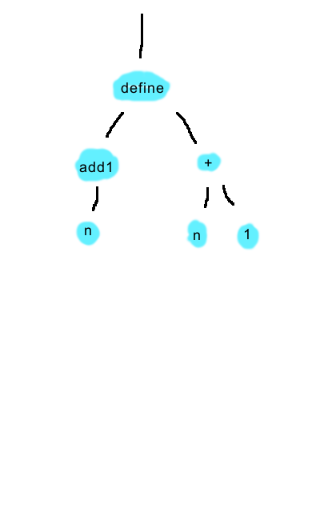
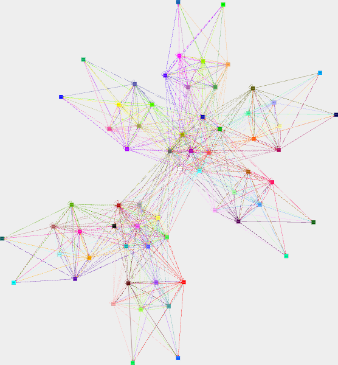

<div align="center">

# 🗂 Hall S · Wing 3

Languages whose names begin with **S**.

**135 exhibits** in this wing

[⬅ Museum entrance](../README.md) · [🏛 Full catalog](all.md)

</div>

---

## Skastic



*🖼️ Image artifact · IMAGE · 12,661 bytes*

<sub>📄 [Source File](../libraries/s/S-3/Skastic.png)</sub>

## Skew

```text
@entry
def main {
  dynamic.console.log("Hello world!")
}
```
<sub>📄 [Source File](../libraries/s/S-3/Skew)</sub>

## Skibidi Toilet

```text
Toilet "Hello, world!"
```
<sub>📄 [Source File](../libraries/s/S-3/Skibidi%20Toilet)</sub>

## SkibLang

```text
skibidi map(values, fn) {
   newValues = []
   ohio "
       for i, v in ipairs(values) do 
           newValues[#newValues+1] = fn(v)
       end
   "
   lowtaperfade newValues
}
skibidi fizzBuzz(n) {
   sus (n % 3 == 0 && n % 5 == 0) lowtaperfade "fizzbuzz"
   sus (n % 5 == 0) lowtaperfade "buzz"
   sus (n % 3 == 0 ) lowtaperfade "fizz"
   lowtaperfade n
}
[1,2,3,4,5] :3 map(fizzBuzz) :3 map(skibidi _(n) {print(n)})
```
<sub>📄 [Source File](../libraries/s/S-3/SkibLang)</sub>

## SKILL

```text
println("Hello World")
```
<sub>📄 [Source File](../libraries/s/S-3/SKILL)</sub>

## Skim machine

```text
program            := [ linebreaks ]
                   ,  [ programLine ]
                   ,  { linebreaks , programLine }
                   ,  [ linebreaks ]
                   ;
programLine        := emptyLine | commandLine ;
commandLine        := optionalSpaces
                   ,  ( incInstruction | jzdecInstruction )
                   ,  optionalSpaces
                   ;
emptyLine          := optionalSpaces ;
incInstruction     := "INC" , mandatorySpaces , accumulatorName ;
jzdecInstruction   := "JZDEC"
                   ,  mandatorySpaces
                   ,  accumulatorName
                   ,  argumentSeparator
                   ,  integer
                   ;
accumulatorName    := nameCharacter , { nameCharacter } ;
nameCharacter      := letter | digit | "_" ;
letter             := "a" | ... | "z" | "A" | ... | "Z" ;
integer            := [ "+" | "-" ] , digit , { digit } ;
digit              := "0" | "1" | "2" | "3" | "4"
                   |  "5" | "6" | "7" | "8" | "9"
                   ;
linebreaks         := linebreak , { linebreak } ;
linebreak          := "\n" ;
argumentSeparator  := optionalSpaces , "," , optionalSpaces ;
optionalSpaces     := { space } ;
mandatorySpaces    := space , { space } ;
space              := " " | "\t" ;
```
<sub>📄 [Source File](../libraries/s/S-3/Skim%20machine)</sub>

## Skinny pig

```text
drink drink drink drink drink eat scratch scratch scratch eat eat eat eat eat
```
<sub>📄 [Source File](../libraries/s/S-3/Skinny%20pig)</sub>

## Skip

```text
// Hello world in Skip

fun main(): void {
  print_raw("Hello world!")
}
```
<sub>📄 [Source File](../libraries/s/S-3/Skip)</sub>

## SKM Calculus

```text
.txt
```
<sub>📄 [Source File](../libraries/s/S-3/SKM%20Calculus)</sub>

## SkookumScript

```text
print("Hello world!")
```
<sub>📄 [Source File](../libraries/s/S-3/SkookumScript)</sub>

## Skound

```text
0#++++++++++++++++++++++++++++++++++++++++++++++++++++++++++++++++++++++++O0+++
+++++++++++++++++++++++++++++++++++++++++++++++++++++++++++++++++++++++++++++++
+++++++++++++++++++O0++++++++++++++++++++++++++++++++++++++++++++++++++++++++++
++++++++++++++++++++++++++++++++++++++++++++++++++O0+++++++++++++++++++++++++++
+++++++++++++++++++++++++++++++++++++++++++++++++++++++++++++++++++++++++++++++
++O0+++++++++++++++++++++++++++++++++++++++++++++++++++++++++++++++++++++++++++
++++++++++++++++++++++++++++++++++++O0+++++++++++++++++++++++++++++++++++++++++
+++O0++++++++++++++++++++++++++++++++O0++++++++++++++++++++++++++++++++++++++++
+++++++++++++++++++++++++++++++++++++++++++++++O0++++++++++++++++++++++++++++++
+++++++++++++++++++++++++++++++++++++++++++++++++++++++++++++++++++++++++++++++
++O0+++++++++++++++++++++++++++++++++++++++++++++++++++++++++++++++++++++++++++
+++++++++++++++++++++++++++++++++++++++O0++++++++++++++++++++++++++++++++++++++
++++++++++++++++++++++++++++++++++++++++++++++++++++++++++++++++++++++O0+++++++
+++++++++++++++++++++++++++++++++++++++++++++++++++++++++++++++++++++++++++++++
++++++++++++++O0+++++++++++++++++++++++++++++++++O0#^#
```
<sub>📄 [Source File](../libraries/s/S-3/Skound)</sub>

## SKR

```text
fn' = B S # B2 S # S (B C # B2 B nat_ge) # C2' (B C2' nat_ge) K R
fn = C fn' # C2' (B C2' nat_ge) S R
main = B (S (S (B fn # CI is_K) # CI is_S) # CI is_R) # C cnt
```
<sub>📄 [Source File](../libraries/s/S-3/SKR)</sub>

## Skull

```text
:ASC:     // set mode to ASCII (without this code the program would just output every cell as a number)
{0[+72]}   // set cell 0 to the ASCII value 72 (H)
{1[+101]}  // set cell 1 to the ASCII value 101(e)
{2[+108]}  // set cell 2 to the ASCII value 108(l)
{3[+111]}  // set cell 3 to the ASCII value 111(o)
{4[+32]}   // set cell 4 to the ASCII value 32 (space)
{5[+87]}   // set cell 5 to the ASCII value 87 (W)
{6[+114]}  // set cell 6 to the ASCII value 114(r)
{7[+100]}  // set cell 7 to the ASCII value 100(d)
{8[+33]}   // set cell 8 to the ASCII value 33 (!)
{9[+10]}   // set cell 9 to the ASCII value 10 (newline)
|0|       // H
|1|       // e
|2|       // l
|2|       // l
|3|       // o
|4|       // 
|5|       // W
|3|       // o
|6|       // r
|2|       // l
|7|       // d
|8|       // !
|9|       // newline
```
<sub>📄 [Source File](../libraries/s/S-3/Skull)</sub>

## Skull+

```text
 :ASC:     // set mode to ASCII (without this code the program would just output every cell as a number)
 {0[72]}   // set cell 0 to the ASCII value 72 (H)
 {1[101]}  // set cell 1 to the ASCII value 101(e)
 {2[108]}  // set cell 2 to the ASCII value 108(l)
 {3[111]}  // set cell 3 to the ASCII value 111(o)
 {4[32]}   // set cell 4 to the ASCII value 32 (space)
 {5[87]}   // set cell 5 to the ASCII value 87 (W)
 {6[114]}  // set cell 6 to the ASCII value 114(r)
 {7[100]}  // set cell 7 to the ASCII value 100(d)
 {8[33]}   // set cell 8 to the ASCII value 33 (!)
 {9[10]}   // set cell 9 to the ASCII value 10 (newline)
 <0>       // H
 <1>       // e
 <2>       // l
 <2>       // l
 <3>       // o
 <4>       // 
 <5>       // W
 <3>       // o
 <6>       // r
 <2>       // l
 <7>       // d
 <8>       // !
 <9>       // newline
```
<sub>📄 [Source File](../libraries/s/S-3/Skull+)</sub>

## Skulpt

```text
print("Hello World")
```
<sub>📄 [Source File](../libraries/s/S-3/Skulpt)</sub>

## Skylark

```text
print("Hello World")
```
<sub>📄 [Source File](../libraries/s/S-3/Skylark)</sub>

## Slam

```text
Hi hi hi hi hi
Give me the key
Bye bye bye
Hi hi hi hi hi
The big world
Good morning
Bye bye
Hi hi hi hi hi
Hi good morning
Good morning
Bye bye bye
Hi hi hi hi
Bye bye
Bye bye bye
Bye bye bye
Hi hi hi hi hi
Hi hi bye bye bye
Bye bye bye
Bye bye bye
Good morning
Look
Hi hi hi hi hi
Hello HelloWorld!
Good morning
Hello world
Hi hi hi hi
Bye bye bye
Hello world
Bye bye bye
Good morning
Good morning
Hi hi hi hi hi
Hi hi HelloWorld!
Bye bye bye
Hi hi hi hi hi
Hi hi hi hi hi
Bye bye bye
Hi hi hi hi hi
HelloWorldProgram Morning
Bye bye bye
Hello world!
Good morning
Bye bye bye
Hi hi hi hi hi
Hello! HelloWorldProgram!!
Bye bye bye
Hello world!
Look
Bye bye bye
Hi hi hi hi hi
Hi hi hello world
Bye bye bye
Hi hi hi hi hi
Bye HelloWorld!
Bye bye bye
Hi hi hi hi hi
Hi again
Bye bye bye
```
<sub>📄 [Source File](../libraries/s/S-3/Slam)</sub>

## SLang

```text
<_>.MAIN.
>_>.1.
>.1.
>_>.1.
>.5.
>_<.MAIN.1.
>_<.MAIN.2.
```
<sub>📄 [Source File](../libraries/s/S-3/SLang)</sub>

## Slash

```text
<% print "Hello World\n"; print%>
```
<sub>📄 [Source File](../libraries/s/S-3/Slash)</sub>

## Slate

```text
inform: 'Hello world!'.
```
<sub>📄 [Source File](../libraries/s/S-3/Slate)</sub>

## SLet

```text
list print text "Hello, world!" all
```
<sub>📄 [Source File](../libraries/s/S-3/SLet)</sub>

## SLet 2

```text
#t,"Hello, World\!\n!,*t,c,[:>c!
```
<sub>📄 [Source File](../libraries/s/S-3/SLet%202)</sub>

## SLet 3

```text
for "Hello, world!" i do put-char latter i all
```
<sub>📄 [Source File](../libraries/s/S-3/SLet%203)</sub>

## SletScript

```text
.+(Hello, world!)[\@n]
```
<sub>📄 [Source File](../libraries/s/S-3/SletScript)</sub>

## Slice

```text
module Hello {
  const string World = "Hello World";
};
```
<sub>📄 [Source File](../libraries/s/S-3/Slice)</sub>

## Slim

```text
0^@^@^^@^@^^^
^@^^@^^@^@^@^
@^@^^@^@^^@^^
^@^^@^@^^@^^
^@^^@^@^^^^
@^^@^@^^^^^
^@^@^@^@^@^^^
@^@^^@^@^^^^
@^@^^^@^^@^@^
^@^^@^@^^@^^
^@^^@^^@^@^^
^^@^@^^^^@^
@^^^^@^@^@^@^
```
<sub>📄 [Source File](../libraries/s/S-3/Slim)</sub>

## Slint

```text
export component Hello inherits Window { Text { text: "Hello World"; } }
```
<sub>📄 [Source File](../libraries/s/S-3/Slint)</sub>

## SLIP

```text
print("Hello World")
```
<sub>📄 [Source File](../libraries/s/S-3/SLIP)</sub>

## Slope

```text
(write "Hello, world!")
```
<sub>📄 [Source File](../libraries/s/S-3/Slope)</sub>

## Slot-Machine

```text
| R R R |
| e e e | o
||e|e|e||/
| l l l |
| 1 2 3 |
```
<sub>📄 [Source File](../libraries/s/S-3/Slot-Machine)</sub>

## SLOW ACV MAMMALIAN

```text
######### H #########
SEED
SPRINT
SPRINT
SPRINT
SEED
SEED
SEED
SEED
SEED
SEED
SEED
SEED
DIGEST
PRONOUNCE

######### e #########
EXCRETE
CONFLAGRATE
SPRINT
SPRINT
SPRINT
SPRINT
SEED
SEED
SEED
SEED
DIGEST
PRONOUNCE

######### ll #########
EXCRETE
SPRINT
SPRINT
SPRINT
SPRINT
SPRINT
SPRINT
SEED
SEED
SEED
SEED
SEED
DIGEST
PRONOUNCE
PRONOUNCE

######### o #########
SEED
FISSION
DIGEST
FISSION
DIGEST
PRONOUNCE

######### , #########
CONFLAGRATE
FISSION
DIGEST
CONFLAGRATE
DIGEST
PRONOUNCE

######### [ ] #########
CONFLAGRATE
FISSION
FISSION
CONFLAGRATE
CONSUME
PRONOUNCE

######### w #########
SEED
CONFLAGRATE
DIGEST
FISSION
CONFLAGRATE
DIGEST
PRONOUNCE

######### o #########
FISSION
EXCRETE
SPRINT
FISSION
CONSUME
PRONOUNCE

######### r #########
SEED
CONFLAGRATE
SEED
CONFLAGRATE
CONSUME
PRONOUNCE

######### l #########
EXCRETE
FISSION
CONFLAGRATE
DIGEST
PRONOUNCE

######### d #########
CONFLAGRATE
DIGEST
CONFLAGRATE
CONFLAGRATE
DIGEST
PRONOUNCE

######### ! #########
CONSUME
FISSION
CONFLAGRATE
CONSUME
PRONOUNCE

######### \n #########
SEED
EXCRETE
CONSUME
SEED
DIGEST
PRONOUNCE
```
<sub>📄 [Source File](../libraries/s/S-3/SLOW%20ACV%20MAMMALIAN)</sub>

## Smalc

```text
(((1400 * 1000000) / 1) - 16) + 4000000
```
<sub>📄 [Source File](../libraries/s/S-3/Smalc)</sub>

## SMALL

```text
print("Hello World")
```
<sub>📄 [Source File](../libraries/s/S-3/SMALL)</sub>

## small s.c.r.i.p

```text
 Hello\, world
```
<sub>📄 [Source File](../libraries/s/S-3/small%20s.c.r.i.p.t)</sub>

## SmallBASIC

```text
PRINT "Hello world!"
```
<sub>📄 [Source File](../libraries/s/S-3/SmallBASIC)</sub>

## Smaller

```text
a;b;
```
<sub>📄 [Source File](../libraries/s/S-3/Smaller)</sub>

## Smallfuck

```text
> Move pointer right
< Move pointer left
* Flip current cell
[ Jump past matching ] if cell under pointer is 0
] Jump back to matching [
```
<sub>📄 [Source File](../libraries/s/S-3/Smallfuck)</sub>

## Smalllang

```text
code = ""
l = len(code)
i = 0

memory = [0, 0]
ptr = 0

while i < l:
    c = code[i]
    
    if c == ".":
        try:
            memory[ptr] = 1
        except:
            break
        
    elif c == ">":
        ptr = 1
    
    elif c == "*":
        try:
            print(memory[ptr])
            memory.remove(memory[ptr])
        except:
            break
        
    elif c == "?":
        try:
            if memory[ptr]:
                i = -1
            memory.remove(memory[ptr])
        except:
            break

    i += 1
```
<sub>📄 [Source File](../libraries/s/S-3/Smalllang)</sub>

## Smalltalk

```text
Transcript show: 'Hello world!'; cr.
```
<sub>📄 [Source File](../libraries/s/S-3/Smalltalk)</sub>

## smart BASIC

```text
PRINT "Hello world!"
```
<sub>📄 [Source File](../libraries/s/S-3/smart%20BASIC)</sub>

## Smarty

```text
{$hello="Hello World"}{$hello}
```
<sub>📄 [Source File](../libraries/s/S-3/Smarty)</sub>

## SMATINY

```text
1. Swap 1 with 71.
10. Output this block's position.
11. Swap 11 with 150.
32. Output this block's position.
34. Swap 33 with 32.
35. Swap 35 with 118.
36. Swap 36 with 9.
72. Output this block's position.
101. Output this block's position.
102. Swap 101 with 100.
103. Swap 103 with 107.
104. Swap 104 with 32.
108. Output this block's position.
109. Swap 109 with 107.
111. Output this block's position.
112. Swap 112 with 31.
114. Output this block's position.
115. Swap 110 with 117.
116. Swap 116 with 107.
117. Swap 110 with 99.
119. Output this block's position.
120. Swap 120 with 110.
```
<sub>📄 [Source File](../libraries/s/S-3/SMATINY)</sub>

## SMETANA

```text
Step 1. Go to step 4.
Step 2. Swap step 3 with step 5.
Step 3. Go to step 6.
Step 4. Swap step 1 with step 6.
Step 5. Go to step 2.
Step 6. Swap step 1 with step 2.
```
<sub>📄 [Source File](../libraries/s/S-3/SMETANA)</sub>

## SMETANA To Infinity!

```text
Step n. Go to step 3n + 1.
Step 2n. Go to step n.
Step 1. Go to step 7.
Step 4. Stop.
```
<sub>📄 [Source File](../libraries/s/S-3/SMETANA%20To%20Infinity!)</sub>

## SMIL

```text
<!-- Hello World in SMIL -->
<smil>
 <head>
  <layout>
   <root-layout width="300" height="160" background-color="white"/>
   <region id="text_region" left="115" top="60"/>
  </layout>
 </head>
 <body>
  <text src="data:,Hello%20World!" region="text_region">
   <param name="fontFace" value="Arial"/>
  </text>
 </body>
</smil>
```
<sub>📄 [Source File](../libraries/s/S-3/SMIL)</sub>

## SmileBASIC

```text
PRINT "Hello world!"
```
<sub>📄 [Source File](../libraries/s/S-3/SmileBASIC)</sub>

## Smileyface

```text
:) :> :P :) :] :) :O ; H
:) :> :P :] :P :P :O ; e
:) :> :P :] :D :) :O ; l
:) :> :P :] :D :) :O ; l
:) :> :P :] :D :D :O ; o
:) :> :] :D :) :O    ; ,
:) :> :] :) :) :O    ; [space]
:) :> :P :P :P :D :O ; W
:) :> :P :] :D :D :O ; o
:) :> :P :D :) :] :O ; r
:) :> :P :] :D :) :O ; l
:) :> :P :] :P :) :O ; d
:) :> :] :) :P :O    ; !
```
<sub>📄 [Source File](../libraries/s/S-3/Smileyface)</sub>

## SMITH

```text
COR
```
<sub>📄 [Source File](../libraries/s/S-3/SMITH)</sub>

## SMITH#

```text
; SMITH# Hello World! program written by zzo38
; This code uses 33 cells. The number 8 command takes the cell
; number as the parameter and output it. Number 0 command stops
; the program. The first cell is cell zero. Even since cell 32 is
; referenced in the data section, I can reference the reference to cell
; 32 for space rather than adding the space into the data section.
8 25 8 26 8 27 8 27 8 28 8 23 8 29 8 28 8 30 8 27 8 31 8 32 0 72 101 108 111 87 114 100 33
```
<sub>📄 [Source File](../libraries/s/S-3/SMITH%23)</sub>

## SMITHb

```text
12(0 *) * *
"!" "d" "l" "r" "o" "W" 32 "o" "l" "l" "e" "H"
```
<sub>📄 [Source File](../libraries/s/S-3/SMITHb)</sub>

## Smithy

```text
namespace hello
// Hello World
```
<sub>📄 [Source File](../libraries/s/S-3/Smithy)</sub>

## SML

```text
(* Hello World in SML *)

fun hello() = output(std_out, "Hello World!");
```
<sub>📄 [Source File](../libraries/s/S-3/SML)</sub>

## Smolder



*🖼️ Image artifact · IMAGE · 126,047 bytes*

<sub>📄 [Source File](../libraries/s/S-3/Smolder.png)</sub>

## Smotslang

```text
   reload
   crumble 'H retry
   crumble 'e retry
   crumble 'l retry
   crumble 'l retry
   crumble 'o retry
   crumble ', retry
   crumble ^32 retry
   crumble 'W retry
   crumble 'o retry
   crumble 'r retry
   crumble 'l retry
   crumble 'd retry
   crumble '! retry
```
<sub>📄 [Source File](../libraries/s/S-3/Smotslang)</sub>

## SmPL

```text
@@
@@
// Hello World coccinelle
```
<sub>📄 [Source File](../libraries/s/S-3/SmPL)</sub>

## SMT

```text
(echo "Hello World")
```
<sub>📄 [Source File](../libraries/s/S-3/SMT)</sub>

## Smurf

```text
"Hello, world!"o
```
<sub>📄 [Source File](../libraries/s/S-3/Smurf)</sub>

## Snack

```text
grave
get
get
eat
sleep
```
<sub>📄 [Source File](../libraries/s/S-3/Snack)</sub>

## Snack+

```text
S+S+S+S+S+S+S+S+S+S+S+S+
```
<sub>📄 [Source File](../libraries/s/S-3/Snack+)</sub>

## Snackfish

```text
(declaim (type (simple-array simple-string (11)) +SNACBIT-STATES+))

(defparameter +SNACBIT-STATES+
  (make-array 11
    :element-type 'string
    :initial-contents
      '("Peanut butter cracker"
        "Cosmic brownie"
        "Cheezit"
        "Cheeto"
        "Dorito"
        "Tortilla chip"
        "Cheese cracker"
        "Potato chip"
        "Applesauce"
        "Peanut butter cup"
        "Pickle")))

(defun normalize-state-number (state-number)
  (declare (type integer state-number))
  (the (integer 1 11)
    (+ 1 (mod (- state-number 1) 11))))

(defun interpret-Snackfish (&optional (initial-code "" initial-code-supplied-p))
  "Launches the Snackfish interpreter, contingently processing the INITIAL-CODE, if supplied, and repeatedly querying the user for a command sequence until a completely empty line is issued, consequently returning NIL."
  (declare (type string initial-code))
  (declare (type T      initial-code-supplied-p))
  (loop
    with state-number of-type (integer 1 11) = 1
    for  first-cycle-p of-type boolean = T then NIL
    for  commands of-type string
      = (if (and first-cycle-p initial-code-supplied-p)
          initial-code
          (progn
            (format T "~&>> ")
            (read-line *standard-input* NIL "")))
    while (plusp (length commands))
    do
      (loop for token of-type character across commands do
        (case token
          (#\i       (setf state-number (normalize-state-number (1+ state-number))))
          (#\d       (setf state-number (normalize-state-number (1- state-number))))
          (#\s       (setf state-number (normalize-state-number (* state-number state-number))))
          (#\o       (print (aref +SNACBIT-STATES+ (1- state-number))))
          (otherwise (terpri))))))
```
<sub>📄 [Source File](../libraries/s/S-3/Snackfish)</sub>

## Snails

```text
\p|\P)z(\a|\A)z{\n|\N)z{\a|\A}z(\m|\M)z(\a|\A
EmYPhNuy
AaaKVsjL
onlGviCw
DdOgFrRn
ISeHZmqc
zMUkBGJQ
```
<sub>📄 [Source File](../libraries/s/S-3/Snails)</sub>

## Snak

```text
 +++
 +++
 >++
```
<sub>📄 [Source File](../libraries/s/S-3/Snak)</sub>

## Snake Script

```text
'Hello, world!\n'.
```
<sub>📄 [Source File](../libraries/s/S-3/Snake%20Script)</sub>

## Snake Shit

```text
$>#H#e#l#l#o# #W#o#r#l#d#!#\n
```
<sub>📄 [Source File](../libraries/s/S-3/Snake%20Shit)</sub>

## Snakel

```text
("Hello World!"sPvG
```
<sub>📄 [Source File](../libraries/s/S-3/Snakel)</sub>

## Snakemake

```text
rule all:
    shell: "echo Hello World"
```
<sub>📄 [Source File](../libraries/s/S-3/Snakemake)</sub>

## Snigl

```text
   func: fib-rec (0) _
   func: fib-rec (1) _
   func: fib-rec (Int) (-- dup fib-rec swap -- fib-rec +)
   20 fib-rec
   
 [6765]
```
<sub>📄 [Source File](../libraries/s/S-3/Snigl)</sub>

## Snobol

```text
* Hello World in Snobol

        OUTPUT = "Hello World!"
```
<sub>📄 [Source File](../libraries/s/S-3/Snobol)</sub>

## SNOBOL4

```text
    OUTPUT = "Hello world!"
END
```
<sub>📄 [Source File](../libraries/s/S-3/SNOBOL4)</sub>

## SNOBOL4  _CSNOBOL4

```text
BEGIN
	OUTPUT = 'Hello, World!'
END
```
<sub>📄 [Source File](../libraries/s/S-3/SNOBOL4%20%20_CSNOBOL4)</sub>

## Snowball

```text
stringdef hello 'Hello World'
```
<sub>📄 [Source File](../libraries/s/S-3/Snowball)</sub>

## Snowball programming language

```text
stringdef hello 'Hello World'
```
<sub>📄 [Source File](../libraries/s/S-3/Snowball%20programming%20language)</sub>

## Snowman

```text
("Hello World!"sPvG
```
<sub>📄 [Source File](../libraries/s/S-3/Snowman)</sub>

## SNUSP

```text
   /e+++++++++++++++++++++++++++++.\  
   ./\/\/\  /+++\!>.+++o.l.+++++++l/                  #/?\  
$H!\++++++\ +   \comma.------------ .<w++++++++.\ /?\<!\-/
   /++++++/ +/\                      /.--------o/ \-/!.++++++++++/?\n
 /=\++++++\ +\\!=++++++\             \r+++.l------.d--------.>+.!\-/
 \!\/\/\/\/ \++++++++++/
```
<sub>📄 [Source File](../libraries/s/S-3/SNUSP)</sub>

## SNUSP  _Bloated

```text
      /@@@@++++#               #+++@@\
$@\H.@/e.+++++++l.l.+++o.>>++++.< .<@/--------------------------------w.++++++++++++++++++++++++++++++++@\o.+++r.++@\l.@\d.>+.@/.#
  \@@@@=>++++>+++++<<@+++++#                                                                       #---@@/!=========/!==/
```
<sub>📄 [Source File](../libraries/s/S-3/SNUSP%20%20_Bloated)</sub>

## SNUSP  _Modular

```text
      /@@@@++++#               #+++@@\
$@\H.@/e.+++++++l.l.+++o.>>++++.< .<@/--------------------------------w.++++++++++++++++++++++++++++++++@\o.+++r.++@\l.@\d.>+.@/.#
  \@@@@=>++++>+++++<<@+++++#                                                                       #---@@/!=========/!==/
```
<sub>📄 [Source File](../libraries/s/S-3/SNUSP%20%20_Modular)</sub>

## SNUSP  _Snuspi

```text
72+.29+.7+..3+.67-.12-.55+.24+.3+.6-.8-.67-.#
```
<sub>📄 [Source File](../libraries/s/S-3/SNUSP%20%20_Snuspi)</sub>

## So is your face

```text
Hello World!
So is your face.
```
<sub>📄 [Source File](../libraries/s/S-3/So%20is%20your%20face)</sub>

## So simple dollar

```text
$
$$$
$$$$$$$$$$$
$$$$$$$$
$$$$$$$$$$$$$$$
$$$$$$$$$$$$$$$
$$$$$$$$$$$$$$$$$$
$$$$$$$$$$$$$$$$$$$$$$$$$$
$$$$$$$$$$$$$$$$$$
$$$$$$$$$$$$$$$$$$$$$
$$$$$$$$$$$$$$$
$$$$$$$
$$$$$$$$$$$$$$$$$$$$$$$$$$$$$$
$$
```
<sub>📄 [Source File](../libraries/s/S-3/So%20simple%20dollar)</sub>

## Soallang

```text
"Hello, world!"o
```
<sub>📄 [Source File](../libraries/s/S-3/Soallang)</sub>

## SOAP

```text
"H"e"l"l"o"," "W"o"r"l"d"!
```
<sub>📄 [Source File](../libraries/s/S-3/SOAP)</sub>

## Soda

```text
class Main

  main (arguments : Array [String] ) : Unit =
    println ("Hello world!")

end
```
<sub>📄 [Source File](../libraries/s/S-3/Soda)</sub>

## Sokolang

```text
 ###    
##*##
#@H*#
#####

---

h:10,13,72,101,108,108,111,44,32,119,111,114,108,100,33

---
rwu
```
<sub>📄 [Source File](../libraries/s/S-3/Sokolang)</sub>

## SOL

```text
SELECT 'Hello World' FROM DUAL;
```
<sub>📄 [Source File](../libraries/s/S-3/SOL)</sub>

## Solbofuck

```text
ROCK SOLBO
BWEEEE BWEEEE BWEEEE BWEEEE BWEEEE BWEEEE BWEEEE BWEEEE BWEEEEEEEE BWEE BWEEEE BWEEEE BWEEEE BWEEEE  BWEEEEEEEE BWEE BWEEEE BWEEEE BWEE BWEEEE BWEEEE BWEEEE BWEE BWEEEE BWEEEE BWEEEE BWEE BWEEEE BWEEE BWEEE  BWEEE BWEEE BWEEEEE BWEEEEEEEEE BWEE BWEEEE BWEE BWEEEE BWEE BWEEEEE BWEE BWEE BWEEEE BWEEEEEEEE BWEEE  BWEEEEEEEEE BWEEE BWEEEEE BWEEEEEEEEE BWEE BWEE BWEEEEEE BWEE BWEEEEE BWEEEEE BWEEEEE BWEEEEEE BWEEEE BWEEEE  BWEEEE BWEEEE BWEEEE BWEEEE BWEEEE BWEEEEEE BWEEEEEE BWEEEE BWEEEE BWEEEE BWEEEEEE BWEE BWEE  BWEEEEEE BWEEE BWEEEEE BWEEEEEE BWEEE BWEEEEEE BWEEEE BWEEEE BWEEEE BWEEEEEE BWEEEEE BWEEEEE BWEEEEE BWEEEEE  BWEEEEE BWEEEEE BWEEEEEE BWEEEEE BWEEEEE BWEEEEE BWEEEEE BWEEEEE BWEEEEE BWEEEEE BWEEEEE BWEEEEEE  BWEE BWEE BWEEEE BWEEEEEE BWEE BWEEEE BWEEEE BWEEEEEE
```
<sub>📄 [Source File](../libraries/s/S-3/Solbofuck)</sub>

## SolboScript

```text
ROCK SOLBO
BWEEEE BWEE BWEEEEEEEEE
BWEEEE BWEEE BWEEEEEE
BWEEEE BWEEEE BWEEEEEEEEEEEEE
BWEEEE BWEEEEE BWEEEEEEEEEEEEEEEE
BWEEE BWEE BWEEE BWEEE BWEEE BWEEEE BWEEE BWEEEE BWEEE BWEEEEE
```
<sub>📄 [Source File](../libraries/s/S-3/SolboScript)</sub>

## Solidity

```text
// SPDX-License-Identifier: MIT
pragma solidity ^0.8.0;
contract Hello {
  function greet() public pure returns (string memory) {
    return "Hello World";
  }
}
```
<sub>📄 [Source File](../libraries/s/S-3/Solidity)</sub>

## Solidity

```text
pragma solidity ^0.8.9;

contract HelloWorld {
    function render () public pure returns (string memory) {
        return 'Hello World';
    }
}
```
<sub>📄 [Source File](../libraries/s/S-3/Solidity.sol)</sub>

## Sollux

```text
name = `\\a.\\a*`

greeting (name n) {
	'print(\"Hello, ' n '!\")'
}
greeting_list (greeting g) {
	g
}
greeting_list (greeting_list l, greeting g) {
	l
	g
}
hello_lang (greeting_list, over) {
	'#!/usr/bin/lua\n'
	greeting_list
}
```
<sub>📄 [Source File](../libraries/s/S-3/Sollux)</sub>

## Solo

```text
solo
```
<sub>📄 [Source File](../libraries/s/S-3/Solo)</sub>

## Something

```text
ADD 72
CHR 
ZER
ADD 69
CHR 
ZER
ADD 76
CHR 
ZER
ADD 76
CHR 
ZER
ADD 79
CHR 
ZER
ADD 32
CHR 
ZER
ADD 87
CHR 
ZER
ADD 79
CHR 
ZER
ADD 82
CHR 
ZER
ADD 76
CHR 
ZER
ADD 68
CHR 
ZER
```
<sub>📄 [Source File](../libraries/s/S-3/Something)</sub>

## Something?Oops!

```text
Statement: "<identifier> <identifier>?Oops<variable>"
Identifier: A nonnegative integer or a variable
Variable: "!" or "?" or "." or ","
```
<sub>📄 [Source File](../libraries/s/S-3/Something?Oops!)</sub>

## Somme

```text
8s+vi:7+::J:^B4*25p9s6+v:J:6-:8-25pim,
```
<sub>📄 [Source File](../libraries/s/S-3/Somme.somme)</sub>

## SON-OF-UNBABTIZED

```text
QUICKSORT IS A FUNCTION OF 3 PARAMETERS THAT IMPLEMENTS IDispatch.
IT USES 10 LOCAL VARIABLES.
THE STATEMENT CALLING QUICKSORT NOT 5 NOT 1 NOT 0 IS 
LABELED ACID. THE STATEMENT CALLING QUICKSORT NOT 2 
NOT 4 NOT 0 IS LABELED JUNKIES.
THE STATEMENT IGNORE IS NOT NOT 0 IS LABELED PHUTURE.
THE STATEMENT IGNORE IS + NOT 4 IS LABELED WILL.
THE STATEMENT NOT 3 IS NOT NOTHING IS LABELED STAY.
THE STATEMENT NOTHING IS <= NOT 3 IS LABELED ALIVE.
THE STATEMENT NOT 9 IS NOT NOTHING IS LABELED RICHIE.
THE STATEMENT IGNORE IS / 2 IS LABELED KEN.
THE STATEMENT NOT 4 IS <= NOT 5 IS LABELED ISHII.
THE STATEMENT NOT 4 IS NOT NOT 1 IS LABELED FRANKIE.
THE STATEMENT NOT 1 IS >= NOT 5 IS LABELED KNUCKLES.
THE STATEMENT NOT 4 IS >= NOT 2 IS LABELED JUAN.
THE STATEMENT NOTHING IS NOT NOT 6 IS LABELED ATKINS.
THE STATEMENT NOTHING IS >= NOT 3 IS LABELED HAWTIN.
THE STATEMENT NOT 5 IS NOT NOT 2 IS LABELED LFO.
THE STATEMENT IGNORE IS + NOT 5 IS LABELED KEVIN.
THE STATEMENT IGNORE IS + NOT 2 IS LABELED SAUNDERSON.
THE STATEMENT NOT 4 IS > NOT 5 IS LABELED DAVE.
THE STATEMENT NOT 6 IS NOT NOTHING IS LABELED CLARKE.
THE STATEMENT NOTHING IS NOT NOT 9 IS LABELED AUX88.
THE STATEMENT IGNORE IS + NOT 0 IS LABELED BLAKE.
THE STATEMENT IGNORE IS NOT NOT 1 IS LABELED BAXTER.
THE STATEMENT THAT RETURNS IGNORE IS LABELED DETROIT.
THE STATEMENT THAT RETURNS 0 IS LABELED HOUSE.
THE STATEMENT THAT RETURNS 1 IS LABELED TECHNO.
THE STATEMENT IGNORE IS NOT NOT 4 IS LABELED PHOTEK.
THE STATEMENT IGNORE IS + 1 IS LABELED MORALES.
THE STATEMENT NOT 4 IS NOT IGNORED IS LABELED RANDOMXS.
THE STATEMENT IGNORE IS NOT NOT 5 IS LABELED TODDTERRY.
THE STATEMENT IGNORE IS - 1 IS LABELED CJBOLLAND.
THE STATEMENT NOT 5 IS NOT IGNORED IS LABELED DARRENEMERSON.
THE STATEMENT STATING HOUSE,STAY,BLAKE,KEN,SAUNDERSON,
BAXTER,LFO,FRANKIE IS LABELED ANDYC.
THE STATEMENT STATING DETROIT,HAWTIN,WILL,PHUTURE IS 
LABELED GROOVERIDER. THE STATEMENT STATING TECHNO,
RANDOMXS,MORALES,PHOTEK IS LABELED TECHNICAL.
THE STATEMENT STATING DETROIT,ALIVE,KEVIN,PHUTURE IS
LABELED ITCH. THE STATEMENT STATING TECHNO,
DARRENEMERSON,CJBOLLAND,TODDTERRY IS LABELED DANNY.
THE STATEMENT STATING DETROIT,DAVE IS LABELED BREAKS.
THE STATEMENT STATING HOUSE,DARRENEMERSON,CJBOLLAND,
TODDTERRY,RANDOMXS,MORALES,
PHOTEK,ATKINS,KEVIN,PHUTURE,AUX88,WILL,PHUTURE,RICHIE,
KEVIN,PHUTURE,CLARKE,WILL,PHUTURE IS LABELED HARDCORE.
THE STATEMENT STATING DETROIT,ISHII IS LABELED JUNGLE.
THE STATEMENT STATING DETROIT,KNUCKLES IS LABELED DMXKREW.
THE STATEMENT STATING HOUSE,ACID IS LABELED SPICELAB.
THE STATEMENT STATING DETROIT,JUAN IS LABELED HUMATE.
THE STATEMENT STATING TECHNO,JUNKIES IS LABELED HARDFLOOR.
THE STATEMENT STATING HOUSE IS LABELED FORCEINC.
THE STATEMENT GOING FROM ANDYC TO 12 IS LABELED JOHN.
THE STATEMENT GOING FROM GROOVERIDER TO 3 IS LABELED DIGWEED.
THE STATEMENT GOING FROM TECHNICAL TO 1 IS LABELED MRC.
THE STATEMENT GOING FROM ITCH TO 5 IS LABELED METALHEADZ.
THE STATEMENT GOING FROM DANNY TO 3 IS LABELED GOLDIE.
THE STATEMENT GOING FROM BREAKS TO 7 IS LABELED SPEEDFREAK.
THE STATEMENT GOING FROM HARDCORE TO 12 IS LABELED SVENVAETH.
THE STATEMENT GOING FROM JUNGLE TO 1 IS LABELED MODELL500.
THE STATEMENT GOING FROM DMXKREW TO 10 IS LABELED DJUNGLEFEVER.
THE STATEMENT GOING FROM SPICELAB TO 12 IS LABELED ALEC.
THE STATEMENT GOING FROM HUMATE TO 12 IS LABELED EMPIRE.
THE STATEMENT GOING FROM HARDFLOOR TO 12 IS LABELED A1PEOPLE.
THE STATEMENT GOING FROM FORCEINC TO 12 IS LABELED KLUBRADIO.
THE STATEMENT COMING FROM KLUBRADIO,A1PEOPLE,EMPIRE,
ALEC,DJUNGLEFEVER,MODELL500, SVENVAETH,SPEEDFREAK,GOLDIE,
METALHEADZ,MRC,DIGWEED,JOHN IS LABELED IDispatch.
MAIN IS A FUNCTION OF NO PARAMETERS THAT IMPLEMENTS IUnknown.
IT USES 1 LOCAL VARIABLE.
THE STATEMENT NOT 0 IS NOT 0 IS LABELED DERRICKMAY.
THE STATEMENT IGNORE IS NOT NOT 0 IS LABELED STACEY.
THE STATEMENT NOTHING IS NOT ANYTHING IS LABELED YOUNG.
THE STATEMENT NOT 0 IS NOT IGNORED IS LABELED ACID.
THE STATEMENT SAYING NOTHING IS LABELED MILLS.
THE STATEMENT SAYING "BEFORE QUICKSORT:" IS LABELED DJRUSH.
THE STATEMENT SAYING "AFTER QUICKSORT:" IS LABELED CLAUDE.
THE STATEMENT IGNORE IS < 100 IS LABELED PULLEN.
THE STATEMENT IGNORE IS + 1 IS LABELED JEFF.
THE STATEMENT IGNORE IS NOT 0 IS LABELED WARRIOR.
THE STATEMENT CALLING QUICKSORT 99 0 0 IS LABELED BELTRAM.
THE STATEMENT SAYING 13 AS CHAR IS LABELED JOEY.
THE STATEMENT THAT RETURNS IGNORE IS LABELED UNDERGROUND.
THE STATEMENT THAT RETURNS 0 IS LABELED RESISTANCE.
THE STATEMENT STATING RESISTANCE,DERRICKMAY IS LABELED ANDYC.
THE STATEMENT STATING UNDERGROUND,PULLEN,ACID,JEFF,YOUNG,
STACEY IS LABELED GROOVERIDER. THE STATEMENT STATING RESISTANCE,
ACID,WARRIOR,DJRUSH IS LABELED TECHNICAL. THE STATEMENT STATING
UNDERGROUND,PULLEN,ACID,JEFF,MILLS,STACEY IS LABELED ITCH. THE 
STATEMENT STATING RESISTANCE,DERRICKMAY,CLAUDE,BELTRAM,
JOEY IS LABELED DANNY. THE STATEMENT STATING UNDERGROUND,
PULLEN,ACID,JEFF,MILLS,STACEY IS LABELED BREAKS.
THE STATEMENT STATING RESISTANCE,JOEY IS LABELED HARDCORE.
THE STATEMENT GOING FROM ANDYC TO 0 IS LABELED JOHN.
THE STATEMENT GOING FROM GROOVERIDER TO 1 IS LABELED DIGWEED.
THE STATEMENT GOING FROM TECHNICAL TO 0 IS LABELED MRC.
THE STATEMENT GOING FROM ITCH TO 3 IS LABELED METALHEADZ.
THE STATEMENT GOING FROM DANNY TO 0 IS LABELED GOLDIE.
THE STATEMENT GOING FROM BREAKS TO 5 IS LABELED SPEEDFREAK.
THE STATEMENT GOING FROM HARDCORE TO 0 IS LABELED SVENVAETH.
THE STATEMENT COMING FROM SVENVAETH,SPEEDFREAK,GOLDIE,METALHEADZ,
MRC,DIGWEED,JOHN IS LABELED IUnknown.
```
<sub>📄 [Source File](../libraries/s/S-3/SON-OF-UNBABTIZED)</sub>

## Sona

```text
ijo VariableName li [Expression]
```
<sub>📄 [Source File](../libraries/s/S-3/Sona)</sub>

## SoneKing Assembly

```text
extern print

dv Msg Goodbye,World!

mov eax Msg
push
call print
pop
```
<sub>📄 [Source File](../libraries/s/S-3/SoneKing%20Assembly)</sub>

## Sophie

```text
#H,#e,#l,,#o,#,,# ,#W,#o,#r,#l,#d,#!,&
```
<sub>📄 [Source File](../libraries/s/S-3/Sophie)</sub>

## Sorry, Marvin!

```text
!>!>!>!!>!>!>!!>!>!>!!>!>!>!!>!>!>!>>>>>>>!>!>!>>>>>>>>>>>>>>>>>>>>>>>>>>>>>>>>>
>>>>>>>>>>>>>>>>>>>>>>>>>>>>>>>>>>>>>>>>>>>>>>>>>>>>>>>>>>>>>>>>>>>>>>>>>>>>>>>>
>>>>>>>>>>>>>>>>>>>>>>>>>>>>>>>>>>>>>>>>>>>>>>>>>>>>>>>>>>>>>>>>>>>>>>>>>>>>>>>>
>>>>>>>>>>>>>>>>>>>>>>>>>>>>>>>>>>>>>>>>>>>>>>>>>>>>>>>>>>>>>>>>>>>>>>>>>>>>>>>>
>>>>>>>>>>>>>>>>>>>>>>>>>>>>>>>>>>>>>>>>>>>>>>>>>>>>>>>>>>>>>>>>>>>>>>>>>>>>>>>>
>>>>>>>>>>>>>>>>>>>>>>>>>>>>>>>>>>>>>>>>>>>>>>>>>>>>>>>>>>>>>>>>>>>>>>>>>>>>>>>>
>>>>>>>>>>>>>>>>>>>>>>>>>>>>>>>>>>>>>>>>>>>>>>>>>>>>>>>>>>>>>>>>>>>>>>>>>>>>>>>>
!>!>!>!!>!>!>!!>!>!>!!>!>!>!>>>>>>>!>!>!>>>>>>>>>>>>>>>>>>>>>>>>>>>>>>>>>>>>>>>>
>>>>>>>>>>>>>>>>>>>>>>>>>>>>>>>>>>>>>>>>>>>>>>>>>>>>>>>>>>>>>>>>>>>>>>>>>>>>>>>>
>>>>>>>>>>>>>>>>>>>>>>>>>>>>>>>>>>>>>>>>>>>>>>>>>>>>>>>>>>>>>>>>>>>>>>>>>>>>>>>>
>>>>>>>>>>>>>>>>>>>>>>>>>>>>>>>>>>>>>>>>>>>>>>>>>>>>>>>>>>>>>>>>>>>>>>>>>>>>>>>>
>>>>>>>>>>>>>>>>>>>>>>>>>>>>>>>>>>>>>>>>>>>>>>>>>>>>>>>>>>>>>>>>>>>>>>>>>>>>>>>>
>>>>>>>>>>>>>>>>>>>>>>>>>>>>>>>>>>>>>>>>>>>>>>>>>>>>>>>>>>>>>>>>>>>>>>>>>>>>>>>>
>>>>>>>>>>>>>>>>>>>>>>>>>>>>>>>>>>>>>>>>>>>>>>>>>>>>>>>>>>>>>>>>>>>>>>>>>!>!>!>!
!>!>!>!!>!>!>!!>!>!>!!>!>!>!!>!>!>!>>>>>>>!>!>!>>>>>>>>>>>>>>>>>>>>>>>>>>>>>>>>>
>>>>>>>>>>>>>>>>>>>>>>>>>>>>>>>>>>>>>>>>>>>>>>>>>>>>>>>>>>>>>>>>>>>>>>>>>>>>>>>>
>>>>>>>>>>>>>>>>>>>>>>>>>>>>>>>>>>>>>>>>>>>>>>>>>>>>>>>>>>>>>>>>>>>>>>>>>>>>>>>>
>>>>>>>>>>>>>>>>>>>>>>>>>>>>>>>>>>>>>>>>>>>>>>>>>>>>>>>>>>>>>>>>>>>>>>>>>>>>>>>>
>>>>>>>>>>>>>>>>>>>>>>>>>>>>>>>>>>>>>>>>>>>>>>>>>>>>>>>>>>>>>>>>>>>>>>>>>>>>>>>>
>>>>>>>>>>>>>>>>>>>>>>>>>>>>>>>>>>>>>>>>>>>>>>>>>>>>>>>>>>>>>>>>>>>>>>>>>>>>>>>>
>>>>>>>>>>>>>>>>>>>>>>>>>>>>>>>>>>>>>>>>>>>>>>>>>>>>>>>>>>>>>>>>>>>>>>>>>>>>>>>>
!>!>!>!!>!>!>!!>!>!>!!>!>!>!!>!>!>!!>!>!>!>>>>>>>!>!>!>>>>>>>>>>>>>>>>>>>>>>>>>>
>>>>>>>>>>>>>>>>>>>>>>>>>>>>>>>>>>>>>>>>>>>>>>>>>>>>>>>>>>>>>>>>>>>>>>>>>>>>>>>>
>>>>>>>>>>>>>>>>>>>>>>>>>>>>>>>>>>>>>>>>>>>>>>>>>>>>>>>>>>>>>>>>>>>>>>>>>>>>>>>>
>>>>>>>>>>>>>>>>>>>>>>>>>>>>>>>>>>>>>>>>>>>>>>>>>>>>>>>>>>>>>>>>>>>>>>>>>>>>>>>>
>>>>>>>>>>>>>>>>>>>>>>>>>>>>>>>>>>>>>>>>>>>>>>>>>>>>>>>>>>>>>>>>>>>>>>>>>>>>>>>>
>>>>>>>>>>>>>>>>>>>>>>>>>>>>>>>>>>>>>>>>>>>>>>>>>>>>>>>>>>>>>>>>>>>>>>>>>>>>>>>>
>>>>>>>>>>>>>>>>>>>>>>>>>>>>>>>>>>>>>>>>>>>>>>>>>>>>>>>>>>>>>>>>>>>>>>>>>>>>>>>>
>>>>>>>!>!>!>!!>!>!>!!>!>!>!!>!>!>!!>!>!>!!>!>!>!!>!>!>!>>>>>>>!>!>!>>>>>>>>>>>>
>>>>>>>>>>>>>>>>>>>>>>>>>>>>>>>>>>>>>>>>>>>>>>>>>>>>>>>>>>>>>>>>>>>>>>>>>>>>>>>>
>>>>>>>>>>>>>>>>>>>>>>>>>>>>>>>>>>>>>>>>>>>>>>>>>>>>>>>>>>>>>>>>>>>>>>>>>>>>>>>>
>>>>>>>>>>>>>>>>>>>>>>>>>>>>>>>>>>>>>>>>>>>>>>>>>>>>>>>>>>>>>>>>>>>>>>>>>>>>>>>>
>>>>>>>>>>>>>>>>>>>>>>>>>>>>>>>>>>>>>>>>>>>>>>>>>>>>>>>>>>>>>>>>>>>>>>>>>>>>>>>>
>>>>>>>>>>>>>>>>>>>>>>>>>>>>>>>>>>>>>>>>>>>>>>>>>>>>>>>>>>>>>>>>>>>>>>>>>>>>>>>>
>>>>>>>>>>>>>>>>>>>>>>>>>>>>>>>>>>>>>>>>>>>>>>>>>>>>>>>>>>>>>>>>>>>>>>>>>>>>>>>>
>>>>>>>>>>>>>>>>>>>>>!>!>!>!!>!>!>!>>>>>>>!>!>!>>>>>>>>>>>>>>>>>>>>>>>>>>>>>>>>>
>>>>>>>>>>>>>>>>>>>>>>>>>>>>>>>>>>>>>>>>>>>>>>>>>>>>>>>>>>>>>>>>>>>>>>>>>>>>>>>>
>>>>>>>>>>>>>>>>>>>>>>>>>>>>>>>>>>>>>>>>>>>>>>>>>>>>>>>>>>>>>>>>>>>>>>>>>>>>>>>>
>>>>>>>>>>>>>>>>>>>>>>>>>>>>>>>>>>>>>>>>>>>>>>>>>>>>>>>>>>>>>>>>>>>>>>>>>>>>>>>>
>>>>>>>>>>>>>>>>>>>>>>>>>>>>>>>>>>>>>>>>>>>>>>>>>>>>>>>>>>>>>>>>>>>>>>>>>>>>>>>>
>>>>>>>>>>>>>>>>>>>>>>>>>>>>>>>>>>>>>>>>>>>>>>>>>>>>>>>>>>>>>>>>>>>>>>>>>>>>>>>>
>>>>>>>>>>>>>>>>>>>>>>>>>>>>>>>>>>>>>>>>>>>>>>>>>>>>>>>>>>>>>>>>>>>>>>>>>>>>>>>>
!>!>!>!!>!>!>!!>!>!>!!>!>!>!!>!>!>!!>!>!>!!>!>!>!!>!>!>!!>!>!>!>>>>>>>!>!>!>>>>>
>>>>>>>>>>>>>>>>>>>>>>>>>>>>>>>>>>>>>>>>>>>>>>>>>>>>>>>>>>>>>>>>>>>>>>>>>>>>>>>>
>>>>>>>>>>>>>>>>>>>>>>>>>>>>>>>>>>>>>>>>>>>>>>>>>>>>>>>>>>>>>>>>>>>>>>>>>>>>>>>>
>>>>>>>>>>>>>>>>>>>>>>>>>>>>>>>>>>>>>>>>>>>>>>>>>>>>>>>>>>>>>>>>>>>>>>>>>>>>>>>>
>>>>>>>>>>>>>>>>>>>>>>>>>>>>>>>>>>>>>>>>>>>>>>>>>>>>>>>>>>>>>>>>>>>>>>>>>>>>>>>>
>>>>>>>>>>>>>>>>>>>>>>>>>>>>>>>>>>>>>>>>>>>>>>>>>>>>>>>>>>>>>>>>>>>>>>>>>>>>>>>>
>>>>>>>>>>>>>>>>>>>>>>>>>>>>>>>>>>>>>>>>>>>>>>>>>>>>>>>>>>>>>>>>>>>>>>>>>>>>>>>>
>>>>>>>>>>>>>>>>>>>>>>>>>>>>!>!>!>!!>!>!>!!>!>!>!!>!>!>!!>!>!>!!>!>!>!!>!>!>!>>>
>>>>!>!>!>>>>>>>>>>>>>>>>>>>>>>>>>>>>>>>>>>>>>>>>>>>>>>>>>>>>>>>>>>>>>>>>>>>>>>>
>>>>>>>>>>>>>>>>>>>>>>>>>>>>>>>>>>>>>>>>>>>>>>>>>>>>>>>>>>>>>>>>>>>>>>>>>>>>>>>>
>>>>>>>>>>>>>>>>>>>>>>>>>>>>>>>>>>>>>>>>>>>>>>>>>>>>>>>>>>>>>>>>>>>>>>>>>>>>>>>>
>>>>>>>>>>>>>>>>>>>>>>>>>>>>>>>>>>>>>>>>>>>>>>>>>>>>>>>>>>>>>>>>>>>>>>>>>>>>>>>>
>>>>>>>>>>>>>>>>>>>>>>>>>>>>>>>>>>>>>>>>>>>>>>>>>>>>>>>>>>>>>>>>>>>>>>>>>>>>>>>>
>>>>>>>>>>>>>>>>>>>>>>>>>>>>>>>>>>>>>>>>>>>>>>>>>>>>>>>>>>>>>>>>>>>>>>>>>>>>>>>>
>>>>>>>>>>>>>>>>>>>>>>>>>>>>>>>>>>>>>>>>>>!>!>!>!!>!>!>!!>!>!>!!>!>!>!!>!>!>!!>!
>!>!!>!>!>!!>!>!>!>>>>>>>!>!>!>>>>>>>>>>>>>>>>>>>>>>>>>>>>>>>>>>>>>>>>>>>>>>>>>>
>>>>>>>>>>>>>>>>>>>>>>>>>>>>>>>>>>>>>>>>>>>>>>>>>>>>>>>>>>>>>>>>>>>>>>>>>>>>>>>>
>>>>>>>>>>>>>>>>>>>>>>>>>>>>>>>>>>>>>>>>>>>>>>>>>>>>>>>>>>>>>>>>>>>>>>>>>>>>>>>>
>>>>>>>>>>>>>>>>>>>>>>>>>>>>>>>>>>>>>>>>>>>>>>>>>>>>>>>>>>>>>>>>>>>>>>>>>>>>>>>>
>>>>>>>>>>>>>>>>>>>>>>>>>>>>>>>>>>>>>>>>>>>>>>>>>>>>>>>>>>>>>>>>>>>>>>>>>>>>>>>>
>>>>>>>>>>>>>>>>>>>>>>>>>>>>>>>>>>>>>>>>>>>>>>>>>>>>>>>>>>>>>>>>>>>>>>>>>>>>>>>>
>>>>>>>>>>>>>>>>>>>>>>>>>>>>>>>>>>>>>>>>>>>>>>>>>>>>>>>>>>>>>>>!>!>!>!!>!>!>!!>!
>!>!!>!>!>!!>!>!>!!>!>!>!>>>>>>>!>!>!>>>>>>>>>>>>>>>>>>>>>>>>>>>>>>>>>>>>>>>>>>>
>>>>>>>>>>>>>>>>>>>>>>>>>>>>>>>>>>>>>>>>>>>>>>>>>>>>>>>>>>>>>>>>>>>>>>>>>>>>>>>>
>>>>>>>>>>>>>>>>>>>>>>>>>>>>>>>>>>>>>>>>>>>>>>>>>>>>>>>>>>>>>>>>>>>>>>>>>>>>>>>>
>>>>>>>>>>>>>>>>>>>>>>>>>>>>>>>>>>>>>>>>>>>>>>>>>>>>>>>>>>>>>>>>>>>>>>>>>>>>>>>>
>>>>>>>>>>>>>>>>>>>>>>>>>>>>>>>>>>>>>>>>>>>>>>>>>>>>>>>>>>>>>>>>>>>>>>>>>>>>>>>>
>>>>>>>>>>>>>>>>>>>>>>>>>>>>>>>>>>>>>>>>>>>>>>>>>>>>>>>>>>>>>>>>>>>>>>>>>>>>>>>>
>>>>>>>>>>>>>>>>>>>>>>>>>>>>>>>>>>>>>>>>>>>>>>>>>>>>>>>>>>>>>>>>>>>>>>!>!>!>!!>!
>!>!!>!>!>!>>>>>>>!>!>!>>>>>>>>>>>>>>>>>>>>>>>>>>>>>>>>>>>>>>>>>>>>>>>>>>>>>>>>>
>>>>>>>>>>>>>>>>>>>>>>>>>>>>>>>>>>>>>>>>>>>>>>>>>>>>>>>>>>>>>>>>>>>>>>>>>>>>>>>>
>>>>>>>>>>>>>>>>>>>>>>>>>>>>>>>>>>>>>>>>>>>>>>>>>>>>>>>>>>>>>>>>>>>>>>>>>>>>>>>>
>>>>>>>>>>>>>>>>>>>>>>>>>>>>>>>>>>>>>>>>>>>>>>>>>>>>>>>>>>>>>>>>>>>>>>>>>>>>>>>>
>>>>>>>>>>>>>>>>>>>>>>>>>>>>>>>>>>>>>>>>>>>>>>>>>>>>>>>>>>>>>>>>>>>>>>>>>>>>>>>>
>>>>>>>>>>>>>>>>>>>>>>>>>>>>>>>>>>>>>>>>>>>>>>>>>>>>>>>>>>>>>>>>>>>>>>>>>>>>>>>>
>>>>>>>>>>>>>>>>>>>>>>>>>>>>>>>>>>>>>>>>>>>>>>>>>>>>>>>>!>
```
<sub>📄 [Source File](../libraries/s/S-3/Sorry,%20Marvin!)</sub>

## Sortle

```text
hello := "hello, " ".!" "" ? ~
world := "(.....),.!" "" ? ", world" ~
```
<sub>📄 [Source File](../libraries/s/S-3/Sortle)</sub>

## SOS

```text
!+!-!!+!-!!!!+!!-!!+!-!+!-!+!!-!+!!-!!!+!!-!+!!-!!!+!!-!+!!!!-!!+!-!!!!!!+!!!-!+!!!-!+!!-!+!!!!-!+!!!-!!+!-!!+!!-!+!!-!!!+!!-!!+!-!!+!-!+!-!
```
<sub>📄 [Source File](../libraries/s/S-3/SOS)</sub>

## Soul

```text
   "hello" print "world" print
```
<sub>📄 [Source File](../libraries/s/S-3/Soul)</sub>

## Sound

```text
UEsDBBQAAAAIADVIglfc01GuvwAAANMFAAAKAAAAaGVsbG8ubWlkafMNyUhhYGBgY2BkYGR84BtSlM3AwLqX4X8gM/tCBYYJNvXNCQ02DhQz3EAMNyDDCcRwcqCeya4ghiuQYQti2AIZ7iCGO5DhDGI4U9EuRxDDkWKT8YUP1U0mKQztQAw75DAkL77gAUWtACfGQAcQwwGHmwcy9bqAGC5YkyhJBsI9CI8muIFwEUwGphq4CCYDUzvcUngigXsHk4Hq5gFjYOZTOIOkhERS0MEZcCtIigLMkMc0EJ5aMJMNTM1/fQYAUEsBAh8AFAAAAAgANUiCV9zTUa6/AAAA0wUAAAoAJAAAAAAAAAAgAAAAAAAAAGhlbGxvLm1pZGkKACAAAAAAAAEAGABtNMZn7STaARtmpU/tJNoBG2alT+0k2gFQSwUGAAAAAAEAAQBcAAAA5wAAAAAA
```
<sub>📄 [Source File](../libraries/s/S-3/Sound)</sub>

## SoupScript

```text
PrintLn Hello World

Break
```
<sub>📄 [Source File](../libraries/s/S-3/SoupScript.script)</sub>

## SourcePawn

```text
public void OnPluginStart() {
  PrintToServer("Hello World");
}
```
<sub>📄 [Source File](../libraries/s/S-3/SourcePawn)</sub>

## SovietCode

```text
 "In Soviet Russia,"
   "'Teddy Bear'" prints YOU!!!
```
<sub>📄 [Source File](../libraries/s/S-3/SovietCode)</sub>

## Spaced

```text
(q="Helo, Wrd!")[1]+q[3]+q[5]+q[5]+q[7]+q[9]+q[9+2]+q[9+4]+q[7]+q[9+6]+q[5]+q[9+8]+q[9+9+1]
```
<sub>📄 [Source File](../libraries/s/S-3/Spaced.spaced)</sub>

## SparQL

```text
SELECT ?h WHERE { 
  VALUES ?h { "Hello World" } 
}
```
<sub>📄 [Source File](../libraries/s/S-3/SparQL.sparql)</sub>

## Spoon

```text
11111111110010001011111110101111111111010111010101101101101100000110101100101001010010101111111001010001010111001010010110010100110111111111111111110010100100010101110010100000000000000000000010100000000000000000000000000010100101001010010001010
```
<sub>📄 [Source File](../libraries/s/S-3/Spoon.spoon)</sub>

## SPSS

```text
BEGIN PROGRAM.
print "Hello World"
END PROGRAM.
```
<sub>📄 [Source File](../libraries/s/S-3/SPSS.spss)</sub>

## SPWN

```text
$.print("Hello World")
```
<sub>📄 [Source File](../libraries/s/S-3/SPWN.spwn)</sub>

## SQL

```sql
SELECT 'Hello World';
```
<sub>📄 [Source File](../libraries/s/S-3/SQL.sql)</sub>

## SQLite

```text
select 'Hello, World!';
```
<sub>📄 [Source File](../libraries/s/S-3/SQLite.sqlite)</sub>

## Squirrel

```text
print("Hello World");
```
<sub>📄 [Source File](../libraries/s/S-3/Squirrel.nut)</sub>

## Stack Cats

```text
-*(:^-_-_:-_:-_:-_:-_-_:[:^]]:^!-*!->[!_>[!_>[{]>[^-_-_:]]<<<}>[!-:^[[\\>]:^[[>:[>:^[<<]]\\>[*>+:^:-_]:^[[-_*[>>>[-_[/<]>+^[>[<<]]*>[)
```
<sub>📄 [Source File](../libraries/s/S-3/Stack%20Cats.stackcats)</sub>

## Stacked

```text
'Hello, World!' out
```
<sub>📄 [Source File](../libraries/s/S-3/Stacked.stacked)</sub>

## Standard ML _MLton

```text
print "Hello, World!";
```
<sub>📄 [Source File](../libraries/s/S-3/Standard%20ML%20_MLton.sml)</sub>

## Standard ML

```text
fun hello() = print("Hello World\n");

hello()
```
<sub>📄 [Source File](../libraries/s/S-3/Standard%20ML.sml)</sub>

## Stanza

```text
println("Hello World")

```
<sub>📄 [Source File](../libraries/s/S-3/Stanza.stanza)</sub>

## Starlark

```text
print("Hello World")
```
<sub>📄 [Source File](../libraries/s/S-3/Starlark.star)</sub>

## Starry

```text
        + + +* +  * + + +* + .* +         + +* * +      +* .  + + . + . +        + +   +* + . +          +   * +* + .         + +  * +* . +*      + * . + .* . . .  + * .
```
<sub>📄 [Source File](../libraries/s/S-3/Starry.starry)</sub>

## Stax

```text
èï┬▀↨╩4G
```
<sub>📄 [Source File](../libraries/s/S-3/Stax.stax)</sub>

## Stone

```text
"Hello World"
```
<sub>📄 [Source File](../libraries/s/S-3/Stone.stone)</sub>

## Stones

```text
red down three
red up three
yellow up
blue left
red down two
green down
yellow down
green down
yellow up
green down
green down
red down one
yellow down
blue left
red up three
yellow down
green down
green down
green down
blue left
blue left
red right one
yellow down
blue left
red up three
red up two
yellow up
green down
green down
red left two
red left two
yellow down
yellow down
blue left
blue left
red down three
red down three
yellow up
red left two
yellow down
blue left
blue right
green down
red right one
yellow down
green down
blue left
red right one
yellow down
blue left
blue left
red down one
yellow down
blue right
blue left
blue left
```
<sub>📄 [Source File](../libraries/s/S-3/Stones.stones)</sub>

## str

```text
`Hello, World!`o;
```
<sub>📄 [Source File](../libraries/s/S-3/str.str)</sub>

## Streem

```text
["Hello World"] | stdout
```
<sub>📄 [Source File](../libraries/s/S-3/Streem.strm)</sub>

## Stuck

```text
"Hello World"
```
<sub>📄 [Source File](../libraries/s/S-3/Stuck.stuck)</sub>

## Stylus

```text
body::before
	content: "Hello World" 
```
<sub>📄 [Source File](../libraries/s/S-3/Stylus.styl)</sub>

## SubleQ

```text
loop:       hello (-1)
            minusOne loop
            minusOne checkEnd+1
checkEnd:   Z hello (-1) 
            Z Z loop
				
. minusOne: -1
. hello: "Hello World\n" Z: 0
```
<sub>📄 [Source File](../libraries/s/S-3/SubleQ.sq)</sub>

## Subskin

```text
2
48
17
a
1
2
4
2
a
6
0
100
21
64
6c
72
6f
57
20
2c
6f
6c
6c
65
```
<sub>📄 [Source File](../libraries/s/S-3/Subskin.subskin)</sub>

## Sumerian

```text
𒁺("Hello, World!")
```
<sub>📄 [Source File](../libraries/s/S-3/Sumerian.sumerian)</sub>

## Super Stack!

```text
0 33 100 108 114 111 87 32 44 111 108 108 101 72
if outputascii fi
```
<sub>📄 [Source File](../libraries/s/S-3/Super%20Stack!.superstack)</sub>

## SuperCollider

```text
"Hello World".postln;
```
<sub>📄 [Source File](../libraries/s/S-3/SuperCollider.sc)</sub>

## SuperMarioLang

```text
+>+>)+)+)+++)++++((((-[!)>->.
+"+"===================#+".")
+++!((+++++++++)++++++)<.---+
++=#===================")---.
++((.-(.)).+++..+++++++.<---
 !+======================---
=#>++++++++++++++.).+++.-!>!
  =======================#=#
```
<sub>📄 [Source File](../libraries/s/S-3/SuperMarioLang.supermario)</sub>

## Surface

```text
++++++++(-v        .     o]v    
   -      e++++v   !     ^ v    
   -           e+++++++++^ x    
   -     e+++++++++o   v-(e.    
   -     e+++++++++o   +  ^o    
   -               +v]ev        
   e----------o    +- ^+        
   e----------o    +- ^o        
+++.v              +e-.+++++++..
-.^!+              +e-----------
  oo+              +.e+.@       
.--o+              .+v .--------
   -+              ++           
   -+              ++           
   -+              ++           
   -+              .+
```
<sub>📄 [Source File](../libraries/s/S-3/Surface.surface)</sub>

## Sus

```text
-------------------------|>++++|>+++++++++++||>++++++++++++++|>-----------------------------------------------------------------|>++++++++++++++++++++++|<<|>>>+++++++++++++++++|<<<<|>>>>>+++|>----------------------------------------------------------------|
```
<sub>📄 [Source File](../libraries/s/S-3/Sus.sus)</sub>

---

<div align="center">

[⬅ Museum entrance](../README.md) · [🏛 Full catalog](all.md) · [⬆ Top](#)

</div>
