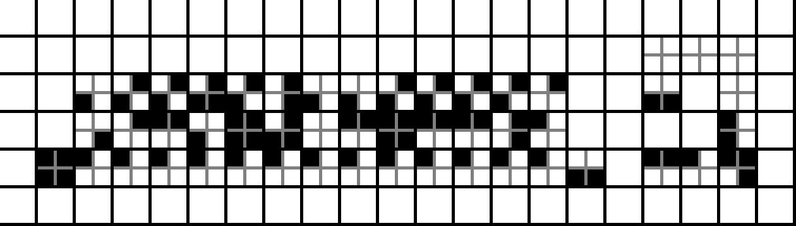

# T2

91 entries.

##### 2th
```text
>8+[<9+>-]<.>4+[<7+>-]<+.7+..3+.>>6+[<7+>-]<++.12-.>6+[<9+>-]<+.<.3+.6-.8-.3>4+<8+>-]<+.
```
[Source File](../libraries/t/T-2/2th)

##### 8th
```text
"Hello world!\n" . bye
```
[Source File](../libraries/t/T-2/8th)

##### TFLite
```text
BF|T;NZ|SN;LE|CNL
g2SxSygxy|S_ZT|__F
i2xECxE|xCyz[1TCy(ixz)|_Cx(Cyz)](gxy)
^1Cxyix(^y)|_E
```
[Source File](../libraries/t/T-2/TFLite)

##### Tg
```text
10 20 + display newline;
1 1 = 2 0 / 3 cdr 10 ? display newline;;
"Hello, world!" display newline;;
3 x 2 * x \ display newline;;
3 4 x y + y \ x \ display newline;;
"Tg" "Hello, " display str display ; "!" display ; newline ; str \ ;
```
[Source File](../libraries/t/T-2/Tg)

##### ThaM
```text
33,100,108,114,111,087,032,044,111,108,108,101,072[B^O]=
```
[Source File](../libraries/t/T-2/ThaM)

##### The
```text
0 - Set the tape pointer to 0.

1 - Increment tape pointer.

2 - Decrement tape pointer.

3 - Increment byte.

4 - Decrement byte.

5 - Take input as a string. 
    Write each character to the next byte and increment the pointer.

6 - Output byte as ASCII character.
```
[Source File](../libraries/t/T-2/The)

##### The Amnesiac From Minsk
```text
L1	 +	 =	 -
0:	-0;	-1;	+58;	@1
1:	-0;	-2;	+59;	@2
2:	-0;	-3;	+58;	@3
3:	-0;	-4;	+59;	@2
4:	-0;	-5;	+58;	@5
5:	-0;	-6;	+59;	@3
6:	-0;	-7;	+58;	@3
7:	-0;	-8;	+59;	@2
8:	-0;	-9;	+58;	@2
9:	-0;	-10;	+59;	@2
10:	-0;	-11;	+58;	@2
11:	-0;	-12;	+59;	@3
12:	-0;	-13;	+58;	@2
13:	-0;	-14;	+59;	@3
14:	-0;	-15;	+58;	@4
15:	-0;	-16;	+59;	@3
16:	-0;	-17;	+58;	@2
17:	-0;	-18;	+59;	@3
18:	-0;	-19;	+58;	@4
19:	-0;	-20;	+59;	@3
20:	-0;	-21;	+58;	@2
21:	-0;	-22;	+59;	@5
22:	-0;	-23;	+58;	@3
23:	-0;	-24;	+59;	@2
24:	-0;	-25;	+58;	@2
25:	-0;	-26;	+59;	@3
26:	-0;	-27;	+58;	@5
27:	-0;	-28;	+59;	@2
28:	-0;	-29;	+58;	@7
29:	-0;	-30;	+59;	@4
30:	-0;	-31;	+58;	@2
31:	-0;	-32;	+59;	@4
32:	-0;	-33;	+58;	@2
33:	-0;	-34;	+59;	@3
34:	-0;	-35;	+58;	@2
35:	-0;	-36;	+59;	@5
36:	-0;	-37;	+58;	@2
37:	-0;	-38;	+59;	@4
38:	-0;	-39;	+58;	@3
39:	-0;	-40;	+59;	@2
40:	-0;	-41;	+58;	@3
41:	-0;	-42;	+59;	@3
42:	-0;	-43;	+58;	@2
43:	-0;	-44;	+59;	@3
44:	-0;	-45;	+58;	@4
45:	-0;	-46;	+59;	@3
46:	-0;	-47;	+58;	@3
47:	-0;	-48;	+59;	@2
48:	-0;	-49;	+58;	@5
49:	-0;	-50;	+59;	@2
50:	-0;	-51;	+58;	@5
51:	-0;	-52;	+59;	@2
52:	-0;	-53;	+58;	@5
53:	-0;	-54;	+59;	@2
54:	-0;	-55;	+58;	@2
55:	-0;	-56;	+59;	@2
56:	-0;	-57;	+58;	@2
57:	+57;	+57;	+57;	@2
58:	-0;	-0;	-0;	@2
59:	-0;	-0;	-0;	@2
```
[Source File](../libraries/t/T-2/The%20Amnesiac%20From%20Minsk)

##### The Chances of Anything Coming from Mars
```text
// put this script with a simple HTML page and go.

let d = 'N';

let date = new Date()

if (date.getTime() % 1000000 === 0) {d += 'o one would have believed in the last years of the nineteenth century that this world was being watched keenly and closely by intelligences greater than man’s and yet as mortal as his own; that as men busied themselves about their various concerns they were scrutinised and studied, perhaps almost as narrowly as a man with a microscope might scrutinise the transient creatures that swarm and multiply in a drop of water. With infinite complacency men went to and fro over this globe about their little affairs, serene in their assurance of their empire over matter. It is possible that the infusoria under the microscope do the same. No one gave a thought to the older worlds of space as sources of human danger, or thought of them only to dismiss the idea of life upon them as impossible or improbable. It is curious to recall some of the mental habits of those departed days. At most terrestrial men fancied there might be other men upon Mars, perhaps inferior to themselves and ready to welcome a missionary enterprise. Yet across the gulf of space, minds that are to our minds as ours are to those of the beasts that perish, intellects vast and cool and unsympathetic, regarded this earth with envious eyes, and slowly and surely drew their plans against us. And early in the twentieth century came the great disillusionment.';}

else {d -= 1}

document.getElementById("demo").innerHTML = d;
```
[Source File](../libraries/t/T-2/The%20Chances%20of%20Anything%20Coming%20from%20Mars)

##### The Code of the Seven
```text
Maiden
Stranger
Crone
Crone
Father
Crone
Stranger
Father
Father
Maiden
Father
Crone
Crone
Crone
Crone
Crone
Mother
Mother
R'hllor
Mother
Crone
Crone
Mother
Crone
Crone
Crone
R'hllor
Father
Crone
Warrior
Father
Father
Father
Maiden
Warrior
Father
Father
Warrior
Warrior
Maiden
Maiden
Maiden
Stranger
Warrior
Father
R'hllor
Mother
Mother
Mother
Mother
Warrior
Maiden
Maiden
Maiden
Warrior
Crone
Crone
Crone
Crone
Crone
Crone
Warrior
Mother
Mother
Crone
Warrior
Father
Father
Father
Father
Maiden
Warrior
```
[Source File](../libraries/t/T-2/The%20Code%20of%20the%20Seven)

##### The Exasperation Machine
```text
...[b][_][_][s1][_][_][s2][_][_]...[s5n][_][_][b'][_][_][b][_][_][s1][_][_][s2][_][_]...[s5n][_][_][b'][_][_]...
```
[Source File](../libraries/t/T-2/The%20Exasperation%20Machine)

##### The Genetic Computer
```text
AAAATATTAATATCCATATGAATATGAATATGGATAAGAATAAAAATAGCGATATGGATAGATATATGAATATCACTCTTATTTT
```
[Source File](../libraries/t/T-2/The%20Genetic%20Computer)

##### The Hexadecimal Stacking Pseudo-Assembly Language
```text
200021
400000
200064
400000
20006C
400000
200072
400000
20006F
400000
200057
400000
200020
400000
20002C
400000
20006F
400000
20006C
400000
20006C
400000
200065
400000
200048
400000
140000
```
[Source File](../libraries/t/T-2/The%20Hexadecimal%20Stacking%20Pseudo-Assembly%20Language)

##### The mimic
```text
Hello World
```
[Source File](../libraries/t/T-2/The%20mimic)

##### The Past
```text
import sys
import time

with open(sys.argv[1]) as f: code = f.read()
dt = 0.1*code.count('.') - 0.001*code.count('<')
acc = code.count('+') - code.count('-')
if dt >= 0:
    print('Starting program...')
    time.sleep(dt)
    print(f'Accumulator: {acc}')
else:
    print(f'Accumulator: {acc}')
    time.sleep(-dt)
    print('Starting program...')
```
[Source File](../libraries/t/T-2/The%20Past)

##### The Temporary Stack
```text
o *Ifmmp-!xpsme" v11 v2297
```
[Source File](../libraries/t/T-2/The%20Temporary%20Stack)

##### The Waterfall Model
```text
[[27425257720895005854917070679642,
      17,17,17,17,17,17,17,17,17,17,17,17,17,17,17,17,17],
 [  2, 3, 1, 2, 2, 2, 2, 2, 2, 2, 2, 0, 2, 2, 2, 2, 2, 2],
 [  3, 1, 3, 2, 2, 2, 2, 2, 2, 2, 2, 2, 2, 4, 0, 4, 2, 2],
 [  3, 2, 2, 3, 1, 2, 2, 2, 2, 2, 2, 2, 2, 0, 2, 0, 2, 2],
 [  3, 2, 2, 2, 2, 2, 2, 2, 2, 2, 2, 2, 2, 0, 4, 0, 2, 2],
 [  3, 1, 2, 2, 2, 3, 2, 2, 2, 2, 2, 2, 2, 2, 0, 2, 2, 2],
 [  3, 2, 2, 2, 2, 2, 3, 1, 2, 2, 0, 2, 0, 4, 2, 0, 2, 2],
 [  3, 2, 2, 2, 2, 2, 2, 2, 2, 2, 2, 2, 2, 2, 2, 0, 4, 7],
 [  3, 2, 2, 2, 2, 2, 2, 2, 2, 2, 2, 2, 2, 2, 2, 4, 0, 2],
 [  3, 2, 2, 2, 2, 2, 2, 2, 2, 2, 2, 4, 0, 2, 2, 2, 2, 2],
 [ 31, 0, 0, 0, 0, 0, 0, 0, 0, 0, 0, 0, 0, 0, 0, 0, 0, 0],
 [27425257720895005854917070679641,
       1, 2, 1, 1, 1, 0, 1, 1, 1, 1, 3, 1, 1, 1, 1, 1, 1],
 [  3, 1, 1, 0, 1, 1, 1, 1, 1, 2, 1, 1, 3, 1, 1, 1, 1, 9],
 [  3, 1, 1, 1, 2, 0, 1, 1, 1, 1, 1, 1, 1, 3, 1, 3, 1, 1],
 [239, 2, 1, 0, 1, 1, 1, 1, 1, 1, 1, 1, 3, 1, 3, 1, 1, 1],
 [  5, 1, 1, 1, 1, 1, 1, 2, 0, 1, 1, 1, 1, 1, 1, 3, 1, 1],
 [  3, 1, 1, 1, 1, 1, 1, 1, 2, 0, 1, 1, 1, 1, 1, 1, 3, 1],
 [  3, 0, 0, 0, 0, 0, 0, 0, 0, 0, 0, 0, 0, 0, 0, 0, 0, 3]]
```
[Source File](../libraries/t/T-2/The%20Waterfall%20Model)

##### TheLang
```text
tema5002@polyester:~$ git clone https://github.com/antigrav-technologies/TheLang.git
...
tema5002@polyester:~$ cd TheLang/
tema5002@polyester:~/TheLang$ make all
gcc main.c -o TheLang -O3 -Wall -Wextra -Werror -lm
tema5002@polyester:~/TheLang$ python3 -c 'print("the "*0o433)' > a.the
tema5002@polyester:~/TheLang$ ./TheLang a.the
þ
```
[Source File](../libraries/t/T-2/TheLang)

##### TheSquare
```text
v#############@
+:DDDDDDDDDDD:[
+#;;;;;;;;;;;#
+              
+ ;;
+  >v      ;
+ JJ+      >v
+>^-+      J-
+/--+      --
v{>[<;;    --
/- +  >v;  --
+\ +;JJ+>v --
++ +>^++J- --
++ +J++++-;--
++ >^>^++->^-
++     ++-Jv<
>^     >^-+ ;
#      v-<+>[ ^
#      - ;+
#      >-[^
```
[Source File](../libraries/t/T-2/TheSquare)

##### Thief, Police and the Building
```text
A thief on G/F
Set SoE -> 3F/s
Set SoS -> 1F/s
top: G-th floor
btm: -3-th floor
G/F H e l l o ,
a b c d e f
2 3 j k l m
W o r l d !
He climbs into 1-th room and steals
He climbs into 2-th room and steals
He climbs into 3-th room and steals
He climbs into 4-th room and steals
He climbs into 5-th room and steals
He climbs into 6-th room and steals
He gets into the elevator and gets down
He stays in the elevator for 1s
He gets out
He climbs into 1-th room and steals
He climbs into 2-th room and steals
He climbs into 3-th room and steals
He climbs into 4-th room and steals
He climbs into 5-th room and steals
He climbs into 6-th room and steals
The police have come
```
[Source File](../libraries/t/T-2/Thief,%20Police%20and%20the%20Building)

##### ThinBasic
```text
printl "Hello World"
```
[Source File](../libraries/t/T-2/ThinBasic)

##### Third Party Contractor Accused Of A Robbery
```text
(TOS - 2) / 8
```
[Source File](../libraries/t/T-2/Third%20Party%20Contractor%20Accused%20Of%20A%20Robbery)

##### This
```text
.this
```
[Source File](../libraries/t/T-2/This)

##### This esolang is a brainfuck derivative
```text
This esolang is a brainfuck derivative
This esolang is a brainfuck derivative
This esolang is a brainfuck derivative
This esolang is a brainfuck derivative
This esolang is a brainfuck derivative
This esolang is a brainfuck derivative
This esolang is a brainfuck derivative
This esolang is a brainfuck derivative
T%js evqlQng Cs a brainfuck derivative
8-i4 @solang is a brainfuck derivative
This esolang is a brainfuck derivative
This esolang is a brainfuck derivative
This esolang is a brainfuck derivative
This esolang is a brainfuck derivative
Fd{s6^solanz is a brainfuck derivative
T>bl6esolang is a brainfuck derivative
This esolang is a brainfuck derivative
This esolang is a brainfuck derivative
8hrsZe3olang is a brainfuck derivative
This esolang is a brainfuck derivative
This esolang is a brainfuck derivative
This esolang is a brainfuck derivative
/hniNesolang is a brainfuck derivative
This esolang is a brainfuck derivative
This esolang is a brainfuck derivative
This esolang is a brainfuck derivative
T'^s-e;olang is a brainfuck derivative
This esolang is a brainfuck derivative
`hks ;Dhlang is a brainfuck derivative
HhFs9;3olang is a brainfuck derivative
{hisRU|olang^is a brainfuck derivative
U"ZX e|olang is a brainfuck derivative
Thxs esolang is a brainfuck derivative
T:4sQes_{:nY is a brainfuck derivative
=|isEesnlang is a brainfuck derivative
This esolang is a brainfuck derivative
|hiv3Xsolang is a brainfuck derivative
This esolang is a brainfuck derivative
ThisF:sohaNg is a brainfuck derivative
^his esolang is a brainfuck derivative
Thiq YIooang is a brainfuck derivative
T"islHsolan7 is a brainfuck derivative
This esolang is a brainfuck derivative
7hi7Keso2aniTis a brainfuck derivative
0h_s|e<ohang is a brainfuck derivative
C4Ks esoDang j{ba brainfuck derivative
ihcs#exo$ang is a brainfuck derivative
Tkis esolang is a brainfuck derivative
NhM"@eSolanJ iD a brainfuck derivative
toisABsolang is a brainfuck derivative
nhJs`Xsolang is a brainfuck derivative
3h2s eso&ang is a brainfuck derivative
>1>v esolang is a brainfuck derivative
T)is esolang is a brainfuck derivative
ThisGesolang is a brainfuck derivative
Qhis esolang is a brainfuck derivative
T=is-'solang is a brainfuck derivative
This esolang is a brainfuck derivative
This esolang is a brainfuck derivative
This esolang is a brainfuck derivative
This esolang is a brainfuck derivative
This esolang is a brainfuck derivative
This esolang is a brainfuck derivative
This esolang is a brainfuck derivative
TNid eRolang is a brainfuck derivative
ThiM#Asolang is a brainfuck derivative
This esolang is a brainfuck derivative
This esolang is a brainfuck derivative
This esolang is a brainfuck derivative
ThiN2esol*ng is a brainfuck derivative
ThXe.ebolang is a brainfuck derivative
This e:~la#_ is a brainfuck derivative
ThesG>solang is a brainfuck derivative
TTes en{lOng is a brainfuck derivative
Tjis esolang is a brainfuck derivative
Tvhs esola|g is a brainfuck derivative
X*isnemo$ang is a brainfuck derivative
thls exolang is a brainfuck derivative
This esolang is a brainfuck derivative
This esolang is a brainfuck derivative
This esolang is a brainfuck derivative
TJi7 ezolang is a brainfuck derivative
Tpis esolang is a brainfuck derivative
Thi1 esolang is a brainfuck derivative
4his esolang is a brainfuck derivative
TOis esolang is a brainfuck derivative
Uhis esolang is a brainfuck derivative
&his esolang is a brainfuck derivative
Th\Zqesolang is a brainfuck derivative
Dhis esolang is a brainfuck derivative
T*is esolang is a brainfuck derivative
nhis esolang is a brainfuck derivative
yhis esolang is a brainfuck derivative
Thjs esolang is a brainfuck derivative
ThSs esolang is a brainfuck derivative
:his esolang is a brainfuck derivative
[his esolang is a brainfuck derivative
#h=s osolang is a brainfuck derivative
Rhps(Psolang is a brainfuck derivative
Vjim esRlang is a brainfuck derivative
This esolang is a brainfuck derivative
ihiC es8lang is a brainfuck derivative
>hi` esolang isZ] brainfuck derivative
This esolang is a brainfuck derivative
This esolang is a brainfuck derivative
TLAs<esolang is a brainfuck derivative
```
[Source File](../libraries/t/T-2/This%20esolang%20is%20a%20brainfuck%20derivative)

##### This esolang is not a push-down automata
```text
H!e!l!l!o! !W!o!r!l!d!184*+!
```
[Source File](../libraries/t/T-2/This%20esolang%20is%20not%20a%20push-down%20automata)

##### THIS IS NOT A BRAINFUCK DERIVATIVE
```text
THIS IS NOT A BRAINFUCK DERIVATIVE THIS IS NOT A BRAINFUCK DERIVATIVE THIS IS NOT A BRAINFUCK DERIVATIVE THIS IS NOT A BRAINFUCK DERIVATIVE THIS IS NOT A BRAINFUCK DERIVATIVE THIS IS NOT A BRAINFUCK DERIVATIVE THIS IS NOT A BRAINFUCK DERIVATIVE THIS IS NOT A BRAINFUCK DERIVATIVE THIS IS NOT A BRAINFUCK DERIVATIVE THIS IS NOT A BRAINFUCK DERIVATIVE SHUT UP YOU LITTLE BITCH IT NEVER WILL BE THIS IS NOT A BRAINFUCK DERIVATIVE THIS IS NOT A BRAINFUCK DERIVATIVE THIS IS NOT A BRAINFUCK DERIVATIVE THIS IS NOT A BRAINFUCK DERIVATIVE THIS IS NOT A BRAINFUCK DERIVATIVE THIS IS NOT A BRAINFUCK DERIVATIVE THIS IS NOT A BRAINFUCK DERIVATIVE IT NEVER WILL BE THIS IS NOT A BRAINFUCK DERIVATIVE THIS IS NOT A BRAINFUCK DERIVATIVE THIS IS NOT A BRAINFUCK DERIVATIVE THIS IS NOT A BRAINFUCK DERIVATIVE THIS IS NOT A BRAINFUCK DERIVATIVE THIS IS NOT A BRAINFUCK DERIVATIVE THIS IS NOT A BRAINFUCK DERIVATIVE THIS IS NOT A BRAINFUCK DERIVATIVE THIS IS NOT A BRAINFUCK DERIVATIVE THIS IS NOT A BRAINFUCK DERIVATIVE IT NEVER WILL BE THIS IS NOT A BRAINFUCK DERIVATIVE THIS IS NOT A BRAINFUCK DERIVATIVE THIS IS NOT A BRAINFUCK DERIVATIVE IT NEVER WILL BE THIS IS NOT A BRAINFUCK DERIVATIVE IT NEVER WAS IT NEVER WAS IT NEVER WAS IT NEVER WAS IT HAS NOTHING TO DO WITH BRAINFUCK SHUT THE FUCK UP IT NEVER WILL BE THIS IS NOT A BRAINFUCK DERIVATIVE THIS IS NOT A BRAINFUCK DERIVATIVE TO ANYBODY WHO SAYS THIS IS A BRAINFUCK DERIVATIVE: IT NEVER WILL BE THIS IS NOT A BRAINFUCK DERIVATIVE TO ANYBODY WHO SAYS THIS IS A BRAINFUCK DERIVATIVE: THIS IS NOT A BRAINFUCK DERIVATIVE THIS IS NOT A BRAINFUCK DERIVATIVE THIS IS NOT A BRAINFUCK DERIVATIVE THIS IS NOT A BRAINFUCK DERIVATIVE THIS IS NOT A BRAINFUCK DERIVATIVE THIS IS NOT A BRAINFUCK DERIVATIVE THIS IS NOT A BRAINFUCK DERIVATIVE TO ANYBODY WHO SAYS THIS IS A BRAINFUCK DERIVATIVE: TO ANYBODY WHO SAYS THIS IS A BRAINFUCK DERIVATIVE: THIS IS NOT A BRAINFUCK DERIVATIVE THIS IS NOT A BRAINFUCK DERIVATIVE THIS IS NOT A BRAINFUCK DERIVATIVE TO ANYBODY WHO SAYS THIS IS A BRAINFUCK DERIVATIVE: IT NEVER WILL BE THIS IS NOT A BRAINFUCK DERIVATIVE THIS IS NOT A BRAINFUCK DERIVATIVE TO ANYBODY WHO SAYS THIS IS A BRAINFUCK DERIVATIVE: IT NEVER WAS IT NEVER WAS THIS IS NOT A BRAINFUCK DERIVATIVE THIS IS NOT A BRAINFUCK DERIVATIVE THIS IS NOT A BRAINFUCK DERIVATIVE THIS IS NOT A BRAINFUCK DERIVATIVE THIS IS NOT A BRAINFUCK DERIVATIVE THIS IS NOT A BRAINFUCK DERIVATIVE THIS IS NOT A BRAINFUCK DERIVATIVE THIS IS NOT A BRAINFUCK DERIVATIVE THIS IS NOT A BRAINFUCK DERIVATIVE THIS IS NOT A BRAINFUCK DERIVATIVE THIS IS NOT A BRAINFUCK DERIVATIVE THIS IS NOT A BRAINFUCK DERIVATIVE THIS IS NOT A BRAINFUCK DERIVATIVE THIS IS NOT A BRAINFUCK DERIVATIVE THIS IS NOT A BRAINFUCK DERIVATIVE TO ANYBODY WHO SAYS THIS IS A BRAINFUCK DERIVATIVE: IT NEVER WILL BE TO ANYBODY WHO SAYS THIS IS A BRAINFUCK DERIVATIVE: THIS IS NOT A BRAINFUCK DERIVATIVE THIS IS NOT A BRAINFUCK DERIVATIVE THIS IS NOT A BRAINFUCK DERIVATIVE TO ANYBODY WHO SAYS THIS IS A BRAINFUCK DERIVATIVE: IT HAS NOTHING TO DO WITH BRAINFUCK IT HAS NOTHING TO DO WITH BRAINFUCK IT HAS NOTHING TO DO WITH BRAINFUCK IT HAS NOTHING TO DO WITH BRAINFUCK IT HAS NOTHING TO DO WITH BRAINFUCK IT HAS NOTHING TO DO WITH BRAINFUCK TO ANYBODY WHO SAYS THIS IS A BRAINFUCK DERIVATIVE: IT HAS NOTHING TO DO WITH BRAINFUCK IT HAS NOTHING TO DO WITH BRAINFUCK IT HAS NOTHING TO DO WITH BRAINFUCK IT HAS NOTHING TO DO WITH BRAINFUCK IT HAS NOTHING TO DO WITH BRAINFUCK IT HAS NOTHING TO DO WITH BRAINFUCK IT HAS NOTHING TO DO WITH BRAINFUCK IT HAS NOTHING TO DO WITH BRAINFUCK TO ANYBODY WHO SAYS THIS IS A BRAINFUCK DERIVATIVE: IT NEVER WILL BE THIS IS NOT A BRAINFUCK DERIVATIVE TO ANYBODY WHO SAYS THIS IS A BRAINFUCK DERIVATIVE: IT NEVER WILL BE TO ANYBODY WHO SAYS THIS IS A BRAINFUCK DERIVATIVE:
```
[Source File](../libraries/t/T-2/THIS%20IS%20NOT%20A%20BRAINFUCK%20DERIVATIVE)

##### THIS PROGRAMMING LANGUAGE IS LITERALLY ALL NUMBERS
```text
hello world
```
[Source File](../libraries/t/T-2/THIS%20PROGRAMMING%20LANGUAGE%20IS%20LITERALLY%20ALL%20NUMBERS)

##### ThisIsNotARealLanguage
```text
NOT A CODE
DON'T PRINT "Hello, World!"
```
[Source File](../libraries/t/T-2/ThisIsNotARealLanguage)

##### ThonkLang
```text
lambda name,param1,param2: { body }
```
[Source File](../libraries/t/T-2/ThonkLang)

##### ThotPatrol

*バイナリプログラム / 215 bytes*

**バイナリ要約（hex / strings）**

```text
Binary Hello World artifact: ThotPatrol
Size: 215 bytes
Detected kind: binary
Magic: ef bf bd ef bf bd 3d ef bf bd ef bf bd ef bf bd

Format: opaque binary program

Hex dump (first 128 bytes):
  0000  ef bf bd ef bf bd 3d ef bf bd ef bf bd ef bf bd   ......=.........
  0010  4a 00 41 00 43 00 4b 00 49 00 4e 00 47 00 20 00   J.A.C.K.I.N.G. .
  0020  49 00 4e 00 3d ef bf bd ef bf bd ef bf bd 0a 00   I.N.=...........
  0030  0a 00 0a 00 3d ef bf bd 75 ef bf bd 20 00 3c ef   ....=...u... .<.
  0040  bf bd 51 ef bf bd 3d ef bf bd ef bf bd ef bf bd   ..Q...=.........
  0050  20 00 ef bf bd 00 48 00 65 00 6c 00 6c 00 6f 00    .....H.e.l.l.o.
  0060  20 00 57 00 6f 00 72 00 6c 00 64 00 ef bf bd 00    .W.o.r.l.d.....
  0070  0a 00 0a 00 0a 00 3c ef bf bd ef bf bd ef bf bd   ......<.........
```

[Source File](../libraries/t/T-2/ThotPatrol)

##### THRAT
```text
6
```
[Source File](../libraries/t/T-2/THRAT)

##### ThreadFuck
```text
Hello World!
Hello World!
```
[Source File](../libraries/t/T-2/ThreadFuck)

##### Three Star Programmer
```text
0 1 2
```
[Source File](../libraries/t/T-2/Three%20Star%20Programmer)

##### Three variable modification language
```text
*aa*ac*cc-ca<aRa-ba*ba*ba-ca<aRc+bc+bb+bc-ac<c<cRa+ac<c/caRbRc+bc+bb+bc-ac<cRc+bc+ac<cRa*ac*aa-ca<aR
a*ab-bc-ac<c+ca<aRa-ca<aRb+bb+bb+ab<bRbRc*bb*bb+bb-bc<c
```
[Source File](../libraries/t/T-2/Three%20variable%20modification%20language)

##### Thrift
```text
const string HELLO = "Hello World"
```
[Source File](../libraries/t/T-2/Thrift)

##### THROBOL
```text
=======
 .
 ^
 ^
 ^
 ^
 ^
 ^
 ^
 ^
 ^
 ^
 ^
 ^
 ^
 ^
 ^
 ^
 ^
 ^
 ^
 ^
 ^
 ^
 ^
 ^
 ^
 ^
 ^
 ^
 ^
 ^
 ^
 ^
 ^
 ^
 ^
 ^
 ^
 ^
 ^
 ^
 ^
 ^
 ^
 ^
 ^
 ^
 ^
 ^
 ^
 ^
 ^
 ^
 ^
 ^
 ^
 ^
 ^
 ^
 ^
 ^
 ^
 ^
 ^
     <%
     o|
```
[Source File](../libraries/t/T-2/THROBOL)

##### Thue
```text
a::=~Hello, World!
::=
a
```
[Source File](../libraries/t/T-2/Thue)

##### Thue++
```text
(var (\w*)="([^"]*)".*)\2::=$1$3
```
[Source File](../libraries/t/T-2/Thue++)

##### Thue-Mirr
```text
\ /
```
[Source File](../libraries/t/T-2/Thue-Mirr)

##### ThueLike
```text
Hello World!
```
[Source File](../libraries/t/T-2/ThueLike)

##### Thunno
```text
print("Hello World")
```
[Source File](../libraries/t/T-2/Thunno)

##### Thupit
```text
[["a0","1b"],["a1","1B"],["a)","1b)"],
 ["0b","a1"],["1b","A1"],["(b","(a1"],
 ["d0","1d"],["d1","1D"],["d)","1d)"],
 ["0A","b1"],["1A","B1"],["(A","(b1"],
 ["0B","c0"],["1B","C0"],["(B","(c0"],
 ["0C","d1"],["1C","D1"],["(C","(d1"],
 ["D0","0a"],["D1","0A"],["D)","0a)"]]
"(a)"
```
[Source File](../libraries/t/T-2/Thupit)

##### Thutu
```text
/^=1$/Hello, world!=n=x=9/
```
[Source File](../libraries/t/T-2/Thutu)

##### TI Program
```text
Disp "Hello World"
```
[Source File](../libraries/t/T-2/TI%20Program)

##### TI-57
```text
0.7745
```
[Source File](../libraries/t/T-2/TI-57)

##### TI-59
```text
      Code        Comment

      LBL A       Start of program: label A
      OP 00       Clear the four print registers
      23          "H"
      17          "E"
      OP 02       Write into print register 2
      27          "L"
      27          "L"
      32          "O"
      00          " "
      43          "W"
      OP 03       Write into print register 3
      32          "O"
      35          "R"
      27          "L"
      16          "D"
      73          "!"
      OP 04       Write into print register 4
      OP 05       Start printing
      ADV         Line feed (optional)
      R/S         End program
```
[Source File](../libraries/t/T-2/TI-59)

##### TI-83 BASIC
```text
Disp "Hello world!
```
[Source File](../libraries/t/T-2/TI-83%20BASIC)

##### TI-89 BASIC
```text
Disp "Hello world!"
```
[Source File](../libraries/t/T-2/TI-89%20BASIC)

##### TI-8x
```text
Hello World for TI 8x/9x basic (tested on a TI-83)

:ClrHome
:Disp "HELLO WORLD"
```
[Source File](../libraries/t/T-2/TI-8x)

##### Tic Tac Toe
```text
I will play as X.

Game 1:
X went on c2.
O went on a1.
X went on b3.
O went on b2.
X went on c3.
O went on c1.
X went on a3.

Game 2:
X went on c2.
O went on b2.
X went on c1.
O went on b3.
X went on c3.
```
[Source File](../libraries/t/T-2/Tic%20Tac%20Toe)

##### Tick
```text
++++++++++++++++++++++++++++++++++++++++++++++++++++++++++++++++++++++++
*+++++++++++++++++++++++++++++*+++++++**+++*>+++++++++++++++++++++++++++
+++++*<++++++++*>+++++++++++++++++++++++++++++++++++++++++++++++++++++++
++++++++++++++++++++++++*+++*>++++++++++++++++++++++++++++++++++++++++++
++++++++++++++++++++++++++++++++++++++++++++++++++++++++++++++++++*>++++
++++++++++++++++++++++++++++++++++++++++++++++++++++++++++++++++++++++++
++++++++++++++++++++++++*>+++++++++++++++++++++++++++++++++*
```
[Source File](../libraries/t/T-2/Tick)

##### TIE
```text
print("Hello World")
```
[Source File](../libraries/t/T-2/TIE)

##### Tier
```text
"hello, world!"{#
```
[Source File](../libraries/t/T-2/Tier)

##### Tile



*画像プログラム（IMAGE / 3545 bytes）*

[Source File](../libraries/t/T-2/Tile.png)

##### TileDots


*画像プログラム（IMAGE / 27783 bytes）*

[Source File](../libraries/t/T-2/TileDots.png)

##### Time
```text
Any text can go here
```
[Source File](../libraries/t/T-2/Time)

##### Time Out
```text
timeOut.Set(87); // !
timeOut.Set(132); // d
timeOut.Set(8); // l
timeOut.Set(6); // r
timeOut.Set(197); // o
timeOut.Set(34); // W
timeOut.Set(4); // space
timeOut.Set(4); // ,
timeOut.Set(158); // o
timeOut.Set(197); // l
timeOut.Set(200); // l
timeOut.Set(193); // e
timeOut.Set(29); // H
timeOut.Set(59); // CONCAT
timeOut.Set(200); // CONCAT
timeOut.Set(200); // CONCAT
timeOut.Set(200); // CONCAT
timeOut.Set(200); // CONCAT
timeOut.Set(200); // CONCAT
timeOut.Set(200); // CONCAT
timeOut.Set(200); // CONCAT
timeOut.Set(200); // CONCAT
timeOut.Set(200); // CONCAT
timeOut.Set(200); // CONCAT
timeOut.Set(200); // CONCAT
timeOut.Set(8); // EMIT
timeOut.Set(forever);
```
[Source File](../libraries/t/T-2/Time%20Out)

##### Timeline
```text
@@@@@@@U.@@@@@@@@@@@@@@@@@@@@@@@L.@@@@@@@L,.>
<@@@@@@@@@@@@@@@@@@@@@@@@@@@@@.W@@.S@@@.L@@@>
<U.@@@@@@@@@@@@@@@@@@L.@@@L.@@@@@@@@@@@@@@@@>
<@@@@@@@@@@@@@@@@@.L@@@@@@@@@@@@@@@@@@.L@@@@>
<@@@@@@@@@@S.X
```
[Source File](../libraries/t/T-2/Timeline)

##### Timers
```text
(['Hello, World!\n']~)-(^,~)
```
[Source File](../libraries/t/T-2/Timers)

##### Tina
```text
.zstr MSG "Hello, world!\n"

start:
  OUTZ MSG
  HALT
```
[Source File](../libraries/t/T-2/Tina)

##### Tiny
```text
1 "Hello, world!\n"
2 .
```
[Source File](../libraries/t/T-2/Tiny)

##### Tiny BASIC
```text
10 PRINT "Hello, World!"
20 END
```
[Source File](../libraries/t/T-2/Tiny%20BASIC)

##### TinyF
```text
#include <iostream>
#include <vector>

class TinyFInterpreter {
private:
    std::vector<int> tape;
    int ptr;

public:
    TinyFInterpreter() : tape(30000, 0), ptr(0) {}

    void interpret(const std::string& code) {
        for (size_t i = 0; i < code.size(); ++i) {
            switch (code[i]) {
                case '>':
                    ++ptr;
                    break;
                case '<':
                    --ptr;
                    break;
                case '+':
                    ++tape[ptr];
                    break;
                case '-':
                    --tape[ptr];
                    break;
                case '.':
                    std::cout << static_cast<char>(tape[ptr]);
                    break;
                case ',':
                    tape[ptr] = std::cin.get();
                    break;
                case '*':
                    tape[ptr] *= tape[ptr + 1];
                    break;
                case '!':
                    if (tape[ptr] == 0 && i + 1 < code.size()) {
                        ++i; // Skip the next command
                    }
                    break;
            }
        }
    }
};

int main() {
    TinyFInterpreter interpreter;
    std::string code;
    std::cout << "Enter TinyF code: ";
    std::getline(std::cin, code);
    interpreter.interpret(code);
    return 0;
}
```
[Source File](../libraries/t/T-2/TinyF)

##### TinyFugue
```text
;Hello World in TinyFugue

/_echo Hello, World!
```
[Source File](../libraries/t/T-2/TinyFugue)

##### Tip
```text
Initial IP: 1
Program: [1/4 196608 16 0 3 16]
IP 1: running command: 196608 (index 1 of program)
IP 196608: running command: 1/4 (index 0 of program)
IP 49152: running command: 1/4 (index 0 of program)
IP 12288: running command: 1/4 (index 0 of program)
IP 3072: running command: 1/4 (index 0 of program)
IP 768: running command: 1/4 (index 0 of program)
IP 192: running command: 1/4 (index 0 of program)
IP 48: running command: 1/4 (index 0 of program)
IP 12: running command: 1/4 (index 0 of program)
IP 3: running command: 0 (index 3 of program)
```
[Source File](../libraries/t/T-2/Tip)

##### Titled
```text
)++++++++
[)+++++++++)++++++++++++)+++++++++++++)++++++++++++++)++++++)++++)+++++++++++)++++++++++++++[(])-])
.)+++++.)++++..)-.)----.).)-.(((.+++.(.(-.))))+.
```
[Source File](../libraries/t/T-2/Titled)

##### Tixy
```text
.js
```
[Source File](../libraries/t/T-2/Tixy)

##### Toi
```text
uauauaua(<>{.}
```
[Source File](../libraries/t/T-2/Toi.toi)

##### Tokay
```text
print("Hello World")
```
[Source File](../libraries/t/T-2/Tokay.tok)

##### TOML
```text
Hello = "World"
```
[Source File](../libraries/t/T-2/TOML.toml)

##### Tonyu
```text
new Label{x:50, y:20, text:"Hello World"};
```
[Source File](../libraries/t/T-2/Tonyu)

##### TopShell
```text
"Hello World"
```
[Source File](../libraries/t/T-2/TopShell)

##### Trans-dimensional
```text
dimension X;
put [X:1] -> "Hello World";
output get [X:1];
```
[Source File](../libraries/t/T-2/Trans-dimensional)

##### TRANSCRIPT
```text
He is here.
>HE, Hello, World!
>X HE
```
[Source File](../libraries/t/T-2/TRANSCRIPT.transcript)

##### Trefunge-97 _MTFI
```text
q"Hello, World!"i#]:#,_@
```
[Source File](../libraries/t/T-2/Trefunge-97%20_MTFI.trefunge)

##### Trefunge-98 _PyFunge
```text
"9!dlroW ,olleH"ck,@
```
[Source File](../libraries/t/T-2/Trefunge-98%20_PyFunge.trefunge)

##### Tri
```text
inc inc psh psh psh mul sto nxt sto psh mul lst psh add 
sto prn nxt zro clr inc inc inc psh psh add inc nxt pop 
inc psh lst psh mul one psh add sto nxt sto lst lst psh 
nxt nxt nxt add sto prn zro inc inc inc psh inc psh add 
sto prn prn inc inc inc prn clr lst lst lst psh nxt psh
sub nxt sto inc prn lst one clr inc psh psh inc psh mul 
nxt psh sub neg pop prn inc nxt psh nxt sto inc inc inc
inc inc inc inc inc prn lst prn nxt dec dec dec dec dec 
prn dec dec dec dec dec dec prn lst dec dec dec dec dec 
dec dec dec dec dec dec prn lst prn lin
```
[Source File](../libraries/t/T-2/Tri.tri)

##### Triangular
```text
6\6+@*8\C::6--::@\@#2"+3^82*@3/#-<*#+/@"#+F<3/3@@#-7:*<
```
[Source File](../libraries/t/T-2/Triangular.triangular)

##### Triangularity
```text
.... ....
..."!"...
.."rld"..
."o, Wo".
"Hell"+++
```
[Source File](../libraries/t/T-2/Triangularity.triangular)

##### Triple Threat
```text
22-23-13-31-12-23-33-22-23-13-31-12-23-33-22-23-13-31-12-23-33-22-23-13-31-12-23-33-22-23-13-31-12-23-33-22-23-13-31-12-23-33-22-23-13-31-12-23-33-22-23-13-31-12-23-33-12-23-31-10-12-23-22-23-13-31-12-23-33-22-23-13-31-12-23-33-22-23-13-31-12-23-33-22-23-13-31-12-23-33-12-23-31-10-12-23-22-23-13-31-12-23-33-22-23-13-31-12-23-33-12-23-22-23-13-31-12-23-33-22-23-13-31-12-23-33-22-23-13-31-12-23-33-12-23-22-23-13-31-12-23-33-22-23-13-31-12-23-33-22-23-13-31-12-23-33-12-23-22-23-13-31-12-23-33-31-12-23-33-31-12-23-33-31-12-23-33-31-12-23-33-22-21-12-23-31-12-23-30-12-23-22-23-13-31-12-23-33-12-23-22-23-13-31-12-23-33-12-23-22-21-12-23-12-23-22-23-13-31-12-23-33-12-23-31-10-31-12-23-33-12-23-31-12-23-30-31-12-23-33-22-21-12-23-31-12-23-30-12-23-12-23-12-23-31-12-22-23-32-23-33-12-23-22-21-22-21-22-21-12-23-31-12-22-23-32-23-33-22-23-13-31-12-23-33-22-23-13-31-12-23-33-22-23-13-31-12-23-33-22-23-13-31-12-23-33-22-23-13-31-12-23-33-22-23-13-31-12-23-33-22-23-13-31-12-23-33-12-23-31-12-22-23-32-23-33-12-23-31-12-22-23-32-23-33-22-23-13-31-12-23-33-22-23-13-31-12-23-33-22-23-13-31-12-23-33-12-23-31-12-22-23-32-23-33-12-23-12-23-12-23-31-12-22-23-32-23-33-31-12-23-33-22-21-12-23-31-12-22-23-32-23-33-31-12-23-33-12-23-31-12-22-23-32-23-33-22-23-13-31-12-23-33-22-23-13-31-12-23-33-22-23-13-31-12-23-33-12-23-31-12-22-23-32-23-33-22-21-22-21-22-21-22-21-22-21-22-21-12-23-31-12-22-23-32-23-33-22-21-22-21-22-21-22-21-22-21-22-21-22-21-22-21-12-23-31-12-22-23-32-23-33-12-23-12-23-22-23-13-31-12-23-33-12-23-31-12-22-23-32-23-33-12-23-22-23-13-31-12-23-33-22-23-13-31-12-23-33-12-23-31-12-22-23-32-23-33
```
[Source File](../libraries/t/T-2/Triple%20Threat.triple)

##### TrollScript
```text
Trooloolooloolooloolooloolooloolollooooolooloolooloolooloolooooolooloolooloolooloolooloolooloooooloolooloooooloooloolooloololllllooooloololoooooololooolooloolooloolooloololoolooolooloololooooooloololooooloololooloolooloolooloolooloolooloolooloolooloololooooolooolooloololooollollollollollolllooollollollollollollollollloooooololooooolooll.

```
[Source File](../libraries/t/T-2/TrollScript.troll)

##### TrumpScript
```python
say "Hello World"!
America is great.
```
[Source File](../libraries/t/T-2/TrumpScript.py)

##### TSharp
```text
push "Hello World" print
```
[Source File](../libraries/t/T-2/TSharp.tsp)

##### TSQL
```sql
DECLARE @message varchar(128)
SELECT  @message = 'Hello World'
PRINT   @message
```
[Source File](../libraries/t/T-2/TSQL.sql)

##### TTCN3
```text
module HelloWorld
{
    control
    {
        log("Hello World");
    }
 }
```
[Source File](../libraries/t/T-2/TTCN3.ttcn)

##### TTSneo
```text
「Hello World」と出力する
```
[Source File](../libraries/t/T-2/TTSneo.ttsneo)

##### Turing Machine But Way Worse
```text
0 0 0 1 1 0 0
0 1 1 1 2 0 0
0 2 0 1 3 0 0
0 3 0 1 4 0 0
0 4 1 1 5 0 0
0 5 0 1 6 0 0
0 6 0 1 7 0 0
0 7 0 1 8 1 0
0 8 0 1 9 0 0
0 9 1 1 10 0 0
0 10 1 1 11 0 0
0 11 0 1 12 0 0
0 12 0 1 13 0 0
0 13 1 1 14 0 0
0 14 0 1 15 0 0
0 15 1 1 16 1 0
0 16 0 1 17 0 0
0 17 1 1 18 0 0
0 18 1 1 19 0 0
0 19 0 1 20 0 0
0 20 1 1 21 0 0
0 21 1 1 22 0 0
0 22 0 1 23 0 0
0 23 0 1 24 1 0
0 24 0 1 25 0 0
0 25 1 1 26 0 0
0 26 1 1 27 0 0
0 27 0 1 28 0 0
0 28 1 1 29 0 0
0 29 1 1 30 0 0
0 30 0 1 31 0 0
0 31 0 1 32 1 0
0 32 0 1 33 0 0
0 33 1 1 34 0 0
0 34 1 1 35 0 0
0 35 0 1 36 0 0
0 36 1 1 37 0 0
0 37 1 1 38 0 0
0 38 1 1 39 0 0
0 39 1 1 40 1 0
0 40 0 1 41 0 0
0 41 0 1 42 0 0
0 42 1 1 43 0 0
0 43 0 1 44 0 0
0 44 1 1 45 0 0
0 45 1 1 46 0 0
0 46 0 1 47 0 0
0 47 0 1 48 1 0
0 48 0 1 49 0 0
0 49 0 1 50 0 0
0 50 1 1 51 0 0
0 51 0 1 52 0 0
0 52 0 1 53 0 0
0 53 0 1 54 0 0
0 54 0 1 55 0 0
0 55 0 1 56 1 0
0 56 0 1 57 0 0
0 57 1 1 58 0 0
0 58 0 1 59 0 0
0 59 1 1 60 0 0
0 60 0 1 61 0 0
0 61 1 1 62 0 0
0 62 1 1 63 0 0
0 63 1 1 64 1 0
0 64 0 1 65 0 0
0 65 1 1 66 0 0
0 66 1 1 67 0 0
0 67 0 1 68 0 0
0 68 1 1 69 0 0
0 69 1 1 70 0 0
0 70 1 1 71 0 0
0 71 1 1 72 1 0
0 72 0 1 73 0 0
0 73 1 1 74 0 0
0 74 1 1 75 0 0
0 75 1 1 76 0 0
0 76 0 1 77 0 0
0 77 0 1 78 0 0
0 78 1 1 79 0 0
0 79 0 1 80 1 0
0 80 0 1 81 0 0
0 81 1 1 82 0 0
0 82 1 1 83 0 0
0 83 0 1 84 0 0
0 84 1 1 85 0 0
0 85 1 1 86 0 0
0 86 0 1 87 0 0
0 87 0 1 88 1 0
0 88 0 1 89 0 0
0 89 1 1 90 0 0
0 90 1 1 91 0 0
0 91 0 1 92 0 0
0 92 0 1 93 0 0
0 93 1 1 94 0 0
0 94 0 1 95 0 0
0 95 0 1 96 1 0
0 96 0 1 97 0 0
0 97 0 1 98 0 0
0 98 1 1 99 0 0
0 99 0 1 100 0 0
0 100 0 1 101 0 0
0 101 0 1 102 0 0
0 102 0 1 103 0 0
0 103 1 1 104 1 1
```
[Source File](../libraries/t/T-2/Turing%20Machine%20But%20Way%20Worse.tmbww)

##### Turing
```text
put "Hello World"
```
[Source File](../libraries/t/T-2/Turing.t)

##### Turtle Script
```text
kturtle-script-v1.0
@(print) "Hello World"
```
[Source File](../libraries/t/T-2/Turtle%20Script.turtle)

##### Turtlèd
```text
"Hello, World!"
```
[Source File](../libraries/t/T-2/Turtlèd.turtled)

##### Twocode
```text
{ i~0;                 /={i~i+1}============\
  *i~"Hello World\n" }=>={putc(*i)}={!*i}=S=/
                                          #
```
[Source File](../libraries/t/T-2/Twocode.dcode)

##### TypeScript
```typescript
console.log("Hello World");
```
[Source File](../libraries/t/T-2/TypeScript.ts)

