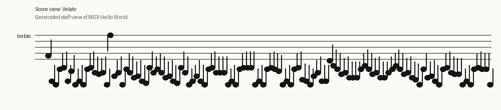
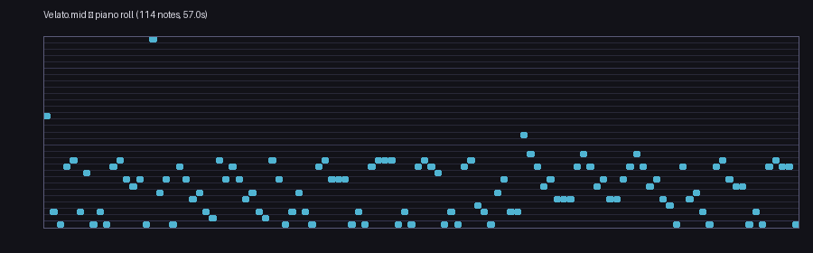

# V1

71 entries.

##### 2 variable trickery
```text
IX
X
Y+
T
E
```
[Source File](../libraries/v/V-1/2%20variable%20trickery)

##### 91v
```text
2191919v}1vo9"};1vo9"}:
```
[Source File](../libraries/v/V-1/91v)

##### V
```text
"Hello world!" puts
```
[Source File](../libraries/v/V-1/V)

##### V _vlang.io
```text
fn main() {
	print('Hello, World!')
}
```
[Source File](../libraries/v/V-1/V%20_vlang.io.v)

##### V++
```text
function main ()
command (0x0005,"Hello world!",null)
command (0x0006,null)
exit
end function
```
[Source File](../libraries/v/V-1/V++)

##### V--
```text
= Hello,World!
```
[Source File](../libraries/v/V-1/V--)

##### Vafix
```text
+++++
```
[Source File](../libraries/v/V-1/Vafix)

##### Vague
```text
=0!
```
[Source File](../libraries/v/V-1/Vague)

##### VAL
```text
print("Hello World")
```
[Source File](../libraries/v/V-1/VAL)

##### Vala
```text
// Hello World in Vala

using GLib;

int main(string[] args) {
   stdout.printf("Hello world!\n");
   return 0;
}
```
[Source File](../libraries/v/V-1/Vala)

##### Vala _2
```text
// Hello World in Vala

using GLib;

int main(string[] args) {
   stdout.printf("Hello world!\n");
   return 0;
}
```
[Source File](../libraries/v/V-1/Vala%20_2)

##### Vala
```text
static void main (string[] args)
{
	stdout.printf ("Hello World\n");
}

```
[Source File](../libraries/v/V-1/Vala.vala)

##### Vale
```text
import stdlib.*;

exported func main() {
  println("Hello World");
}
```
[Source File](../libraries/v/V-1/Vale.vale)

##### Valence
```text
[𐆋]𐆉[[𐅻]𐆉[[𐅻[𐅻[𐆇𐆇]]]𐅶[𐅻[𐆇𐆇]]]]
[𐅶]𐆉[𐅾𐆋]
[𐆋]𐅶[[𐅻[𐆇𐆋]]𐅶[𐆇𐅻]]
[𐅶]𐅻[𐅾𐆋]
[𐆋]𐅶[𐆇𐆁]
[𐅶]𐅻[𐅾𐆋]
[𐅶]𐅻[𐅾𐆋]
[𐆋]𐅶[𐆇𐆋]
[𐅶]𐅻[𐅾𐆋]
[𐅾𐆉]𐆉[𐅻[𐆇𐆉]]
[𐅶]𐅶[𐅾𐆉]
[𐆁]𐆉[[[𐅻[𐅻[𐆇𐆇]]]𐅶[𐅻[𐆇𐅾]]]𐅶[𐆇𐆁]]
[𐅶]𐅻[𐅾𐆁]
[𐅶]𐅻[𐅾𐆋]
[𐆋]𐅶[𐆇𐆋]
[𐅶]𐅻[𐅾𐆋]
[𐆋]𐅶[𐅶[𐆇[𐆊]]]
```
[Source File](../libraries/v/V-1/Valence)

##### VALGOL
```text
14 LIKE, Y$KNOW (I MEAN) START
%% IF
PI A =LIKE BITCHEN AND
01 B =LIKE TUBULAR AND
9  C =LIKE GRODY**MAX
4K (FERSURE)**2
18 THEN
4I FOR I=LIKE 1 TO OH MAYBE 100
86 DO WAH + (DITTY**2)
9  BARF(I) =TOTALLY GROSS(OUT)
-17 SURE
1F LIKE BAG THIS PROGRAM
?  REALLY
$$ LIKE TOTALLY (Y*KNOW)
```
[Source File](../libraries/v/V-1/VALGOL)

##### Valve
```text
"Hello"
{
  "World" "Hello World"
}
```
[Source File](../libraries/v/V-1/Valve)

##### var'aq
```text
(* Hello world in var'aq *)

"Hello, world!" cha'
```
[Source File](../libraries/v/V-1/var'aq)

##### VAR
```text
OUT "Hello, World!"
```
[Source File](../libraries/v/V-1/VAR.var)

##### Var=Bar
```text
infiniteLoop = 1 == 1
input = 1N
input = 0UT
infiniteLoop = STOP
```
[Source File](../libraries/v/V-1/Var=Bar)

##### Varigen
```text
Solve the Halting Problem For the file <file> In <language>
Print <value> [Without a Newline]?
Stop Running the Program
Create [Qubit|String|Fixed Point at <integer>|Bit] <var>
Access Qubit From <var> into <var>
Push <val> To the [Top|Bottom] of the Deque
Pop From the [Top|Bottom] of the Deque [Into <var>]?
Push <val> To the Stack
Pop From the Stack [Into <var>]?
Write <val> To the Tape
Read From the Tape into <var>
Move the Tape Head [Left|Right]
Evaluate [<string>|<var>] [As <language>]? In [A New|The Current] Context [Asynchronously]? [And Put the Result Into <var>]?
Run File <file> In [A New|the Current] Context [Synchronously|In a new Thread]
Read [a [Line|Character] from the|the Entire] File <file> into <var>
Empty the File <file>
Write <value> to the File <file>
Execute the Math Expression [<var>|<string>|<mathexpr>] and Put the Result into <var>
Print the Exact Age of The Universe In Milliseconds
Redirect the Output of The Last Executed Command into <var>
Create a New Class into <var>
Add a new Property Of Type [String|Qubit|Bit|Fixed Point at <integer>] That Is called <var> to the Class <var>
Begin a Method That Returns [Nada|String|Qubit|Bit|Fixed Point at <integer>] for Class <var>
Return from the Method Early [with Value <value>]?
End the Method and add it to the Aforementioned Class
Create a new Object <var> of Class <var>
Access the Property <var> Of Object <var> and Put its Value into <var>
Set the Property <var> Of Object <var> To <value>
Call The Method <var> Of Object <var> [Asynchronously]? [And put the Result Into <var>]?
Rewrite the String [<var>|<string>] [Using Regex]? [Replacing <string> With <string>]* into <var>
Set a List of Writeover Possibilities Denoted by the String [<string>|<var>] Seperated By [<var>|<string>] into <var>
Begin If for <value> [[Equals|Not Equals] <value>]?
End the Aforementioned If
Begin While for <value> [[Equals|Not Equals] <value>]?
End the Aforementioned While
Set the Variable <var> to The [Equality|Inequality] of <value> And <value>
Change [Character|Line] [<var>|<integer>] To Be [<var>|<string>]
Cast <var> To a String [In Place|and Put the Result into <var>]
Copy <var> into <var>
```
[Source File](../libraries/v/V-1/Varigen)

##### Varnand
```text
P!!%44%44!88
P!!%64%64!55
=lPP!!%64%64!CC
=mP!!%64%64!FF
P!!%24%24!CC
P%24
P!!%74%74!77
Pm
P!!%74%74!22
Pl
P!!%64%64!44
P!!%24%24!11
```
[Source File](../libraries/v/V-1/Varnand)

##### Varsig
```text
!72)!101)!108:))!111)!44)!32)!87)!111)!114)!108)!100)!33)#
```
[Source File](../libraries/v/V-1/Varsig)

##### VarStack
```text
hello;"Hello, World!;halt
```
[Source File](../libraries/v/V-1/VarStack)

##### VAST
```text
~~     ____       --- - - -     ____    -- - - -    -- -  - ^^^--- =
```
[Source File](../libraries/v/V-1/VAST)

##### Vatical
```text
+ Hello world in Vatical

LITURGY:
	PRAY "Hello World!"
AMEN.
```
[Source File](../libraries/v/V-1/Vatical)

##### VAX Assembly
```text
desc:  .ascid "Hello World!"      ;descriptor (len+addr) and text
.entry hello, ^m<>                ;register save mask
       pushaq desc                ;address of descriptor
       calls #1, g^lib$put_output ;call with one argument on stack
       ret                        ;restore registers, clean stack & return
.end hello                        ;transfer address for linker
```
[Source File](../libraries/v/V-1/VAX%20Assembly)

##### VB.NET
```text
Module HelloWorld
    Sub Main()
        System.Console.WriteLine("Hello World")
    End Sub
End Module
```
[Source File](../libraries/v/V-1/VB.NET.vb)

##### VBA
```text
Public Sub hello_world_text
    Debug.Print "Hello World!"
End Sub
```
[Source File](../libraries/v/V-1/VBA)

##### VBF
```text
,[.,]
```
[Source File](../libraries/v/V-1/VBF)

##### VBScript
```text
' Hello World in VBScript (Windows Scripting Host)
msgbox "Hello, World!"
```
[Source File](../libraries/v/V-1/VBScript)

##### VCL
```text
Sub FormCreate(Sender: TObject);
begin
  ShowMessage('Hello World');
end;
```
[Source File](../libraries/v/V-1/VCL)

##### VD3
```text
variable<-X^Y^Z
```
[Source File](../libraries/v/V-1/VD3)

##### Vector
```text
B c D
```
[Source File](../libraries/v/V-1/Vector)

##### Vedit macro language
```text
Message("Hello world!")
```
[Source File](../libraries/v/V-1/Vedit%20macro%20language)

##### Vein
```text
i1 . + . a . i2
i2 . + . a . i3
i3 . + . . . i3n . + . i4
i3n . + . + n b1 i3s i4
i3s . d . i4
i4 . + n a1 i4e i6
i4e . c . i5
i5 . + . b . i4
i6 . + . i6
n + +
e + + n
.
a . a . + . +
b . b . + . + . +
a1 n a2 n + + n
a2 n e n + n a1 a1 n + + n
c . . c c + +
b1 n b2 n + + n
b2 n b3 n + + n
b3 n e n + n b1 b1 n + + n
d . . . . d d + +
```
[Source File](../libraries/v/V-1/Vein)

##### Velato
```text
PUT THE NUMBER LXXII ONTO THE TOP OF THE PROGRAM STACK
GET THE TOP ELEMENT OF THE STACK AND CONVERT IT TO AN ASCII CHARACTER AND OUTPUT IT FOR THE CURRENT PERSON USING THIS PROGRAM TO SEE
PUT THE NUMBER CI ONTO THE TOP OF THE PROGRAM STACK
GET THE TOP ELEMENT OF THE STACK AND CONVERT IT TO AN ASCII CHARACTER AND OUTPUT IT FOR THE CURRENT PERSON USING THIS PROGRAM TO SEE
PUT THE NUMBER CVIII ONTO THE TOP OF THE PROGRAM STACK
GET THE TOP ELEMENT OF THE STACK AND CONVERT IT TO AN ASCII CHARACTER AND OUTPUT IT FOR THE CURRENT PERSON USING THIS PROGRAM TO SEE
GET THE TOP ELEMENT OF THE STACK AND CONVERT IT TO AN ASCII CHARACTER AND OUTPUT IT FOR THE CURRENT PERSON USING THIS PROGRAM TO SEE
PUT THE NUMBER CXI ONTO THE TOP OF THE PROGRAM STACK
GET THE TOP ELEMENT OF THE STACK AND CONVERT IT TO AN ASCII CHARACTER AND OUTPUT IT FOR THE CURRENT PERSON USING THIS PROGRAM TO SEE
PUT THE NUMBER XLIV ONTO THE TOP OF THE PROGRAM STACK
GET THE TOP ELEMENT OF THE STACK AND CONVERT IT TO AN ASCII CHARACTER AND OUTPUT IT FOR THE CURRENT PERSON USING THIS PROGRAM TO SEE
PUT THE NUMBER XXXII ONTO THE TOP OF THE PROGRAM STACK
GET THE TOP ELEMENT OF THE STACK AND CONVERT IT TO AN ASCII CHARACTER AND OUTPUT IT FOR THE CURRENT PERSON USING THIS PROGRAM TO SEE
PUT THE NUMBER CXIX ONTO THE TOP OF THE PROGRAM STACK
GET THE TOP ELEMENT OF THE STACK AND CONVERT IT TO AN ASCII CHARACTER AND OUTPUT IT FOR THE CURRENT PERSON USING THIS PROGRAM TO SEE
PUT THE NUMBER CXI ONTO THE TOP OF THE PROGRAM STACK
GET THE TOP ELEMENT OF THE STACK AND CONVERT IT TO AN ASCII CHARACTER AND OUTPUT IT FOR THE CURRENT PERSON USING THIS PROGRAM TO SEE
PUT THE NUMBER CXIV ONTO THE TOP OF THE PROGRAM STACK
GET THE TOP ELEMENT OF THE STACK AND CONVERT IT TO AN ASCII CHARACTER AND OUTPUT IT FOR THE CURRENT PERSON USING THIS PROGRAM TO SEE
PUT THE NUMBER CVIII ONTO THE TOP OF THE PROGRAM STACK
GET THE TOP ELEMENT OF THE STACK AND CONVERT IT TO AN ASCII CHARACTER AND OUTPUT IT FOR THE CURRENT PERSON USING THIS PROGRAM TO SEE
PUT THE NUMBER C ONTO THE TOP OF THE PROGRAM STACK
GET THE TOP ELEMENT OF THE STACK AND CONVERT IT TO AN ASCII CHARACTER AND OUTPUT IT FOR THE CURRENT PERSON USING THIS PROGRAM TO SEE
PUT THE NUMBER XXXIII ONTO THE TOP OF THE PROGRAM STACK
GET THE TOP ELEMENT OF THE STACK AND CONVERT IT TO AN ASCII CHARACTER AND OUTPUT IT FOR THE CURRENT PERSON USING THIS PROGRAM TO SEE
```
[Source File](../libraries/v/V-1/Velato)

##### Velato _hi

**譜面**


**ピアノロール**


**音源:** [MP3](../libraries/v/V-1/Velato%20_hi.mp3) · [WAV](../libraries/v/V-1/Velato%20_hi.wav) · [MIDI](../libraries/v/V-1/Velato%20_hi.mid)

<audio controls preload="none" src="../libraries/v/V-1/Velato%20_hi.mp3">MP3 リンクを利用してください。</audio>

[Source File](../libraries/v/V-1/Velato%20_hi.mid)

##### Velato
```lilypond
\version "2.16.0"  % necessary for upgrading to future LilyPond versions.

\header{
  title = "Hello, World! (With Root Note Changes)"
  subtitle = "A test program for Velato"
}

mus = { 

	f'4 % sets root note
	d c % print
	a bes % value -> char
	d gis c % 'H': digits 7 and 2 (for Unicode value 72) ending with a perfect 5th
	    
	d c a bes % print
	g fis g c % 'e'

	f''

	f g c % change key to c

	a g e f d cis ais g % l

	a g e f d cis ais g % l

	c d f

	d c a bes g g g c % o

	d c a bes ais ais c % ,

	d c a bes a gis c % space

	d c a bes dis d c % W

	f g d % change key to d

	d d'

	b a fis g e e e a % o

	b a fis g e e g a % r

	b a fis g e dis c a % l

	e f

	d c a bes g fis fis c % d

	d c a bes a a c % !

} % same sequence but for the 'e' (101)

\score { 
        \new Staff \with { \remove Time_signature_engraver } { \clef bass  \mus } 
        \layout { } 
        \midi { } 
} 

```
[Source File](../libraries/v/V-1/Velato.ly)

##### Velato

**譜面**



**ピアノロール**



**音源:** [MP3](../libraries/v/V-1/Velato.mp3) · [WAV](../libraries/v/V-1/Velato.wav) · [MIDI](../libraries/v/V-1/Velato.mid) · [LilyPond](../libraries/v/V-1/Velato.ly)

<audio controls preload="none" src="../libraries/v/V-1/Velato.mp3">MP3 リンクを利用してください。</audio>

[Source File](../libraries/v/V-1/Velato.mid)

##### Velocity
```text
Hello World
```
[Source File](../libraries/v/V-1/Velocity)

##### VenetianScript


*画像プログラム（IMAGE / 2558 bytes）*

[Source File](../libraries/v/V-1/VenetianScript.png)

##### Verbexx
```text
@SAY "Hello world!";
```
[Source File](../libraries/v/V-1/Verbexx)

##### Verbose
```text
PUT THE NUMBER LXXII ONTO THE TOP OF THE PROGRAM STACK
GET THE TOP ELEMENT OF THE STACK AND CONVERT IT TO AN ASCII CHARACTER AND OUTPUT IT FOR THE CURRENT PERSON USING THIS PROGRAM TO SEE
PUT THE NUMBER CI ONTO THE TOP OF THE PROGRAM STACK
GET THE TOP ELEMENT OF THE STACK AND CONVERT IT TO AN ASCII CHARACTER AND OUTPUT IT FOR THE CURRENT PERSON USING THIS PROGRAM TO SEE
PUT THE NUMBER CVIII ONTO THE TOP OF THE PROGRAM STACK
GET THE TOP ELEMENT OF THE STACK AND CONVERT IT TO AN ASCII CHARACTER AND OUTPUT IT FOR THE CURRENT PERSON USING THIS PROGRAM TO SEE
GET THE TOP ELEMENT OF THE STACK AND CONVERT IT TO AN ASCII CHARACTER AND OUTPUT IT FOR THE CURRENT PERSON USING THIS PROGRAM TO SEE
PUT THE NUMBER CXI ONTO THE TOP OF THE PROGRAM STACK
GET THE TOP ELEMENT OF THE STACK AND CONVERT IT TO AN ASCII CHARACTER AND OUTPUT IT FOR THE CURRENT PERSON USING THIS PROGRAM TO SEE
PUT THE NUMBER XLIV ONTO THE TOP OF THE PROGRAM STACK
GET THE TOP ELEMENT OF THE STACK AND CONVERT IT TO AN ASCII CHARACTER AND OUTPUT IT FOR THE CURRENT PERSON USING THIS PROGRAM TO SEE
PUT THE NUMBER XXXII ONTO THE TOP OF THE PROGRAM STACK
GET THE TOP ELEMENT OF THE STACK AND CONVERT IT TO AN ASCII CHARACTER AND OUTPUT IT FOR THE CURRENT PERSON USING THIS PROGRAM TO SEE
PUT THE NUMBER CXIX ONTO THE TOP OF THE PROGRAM STACK
GET THE TOP ELEMENT OF THE STACK AND CONVERT IT TO AN ASCII CHARACTER AND OUTPUT IT FOR THE CURRENT PERSON USING THIS PROGRAM TO SEE
PUT THE NUMBER CXI ONTO THE TOP OF THE PROGRAM STACK
GET THE TOP ELEMENT OF THE STACK AND CONVERT IT TO AN ASCII CHARACTER AND OUTPUT IT FOR THE CURRENT PERSON USING THIS PROGRAM TO SEE
PUT THE NUMBER CXIV ONTO THE TOP OF THE PROGRAM STACK
GET THE TOP ELEMENT OF THE STACK AND CONVERT IT TO AN ASCII CHARACTER AND OUTPUT IT FOR THE CURRENT PERSON USING THIS PROGRAM TO SEE
PUT THE NUMBER CVIII ONTO THE TOP OF THE PROGRAM STACK
GET THE TOP ELEMENT OF THE STACK AND CONVERT IT TO AN ASCII CHARACTER AND OUTPUT IT FOR THE CURRENT PERSON USING THIS PROGRAM TO SEE
PUT THE NUMBER C ONTO THE TOP OF THE PROGRAM STACK
GET THE TOP ELEMENT OF THE STACK AND CONVERT IT TO AN ASCII CHARACTER AND OUTPUT IT FOR THE CURRENT PERSON USING THIS PROGRAM TO SEE
PUT THE NUMBER XXXIII ONTO THE TOP OF THE PROGRAM STACK
GET THE TOP ELEMENT OF THE STACK AND CONVERT IT TO AN ASCII CHARACTER AND OUTPUT IT FOR THE CURRENT PERSON USING THIS PROGRAM TO SEE
```
[Source File](../libraries/v/V-1/Verbose)

##### VerboseFuck
```text
~!comment!~MANDITORY~!uncomment!~
program.initialize();
math.equation(program.errors.handler.activated = boolean(false));
program.console.standardinput.openstream();
program.console.standardoutput.openstream();
define(defines.variable, variable(pointer));
implanttype(pointer, types.pointer(to:types.byte));
math.equation(pointer = void(0));
program.memory.allocate(pointer, void(math.infinity), program.memory.memorytype.bidirectional);
~!comment!~MANDITORY~!uncomment!~
math.equation(pointer = pointer + void(1));
math.equation(deref(pointer) = (deref(pointer) + byte(1)):binaryand:byte(255));
math.equation(deref(pointer) = (deref(pointer) + byte(1)):binaryand:byte(255));
math.equation(deref(pointer) = (deref(pointer) + byte(1)):binaryand:byte(255));
~!comment!~MANDITORY~!uncomment!~
math.equation(deref(pointer) = (deref(pointer) + byte(1)):binaryand:byte(255));
math.equation(deref(pointer) = (deref(pointer) + byte(1)):binaryand:byte(255));
math.equation(deref(pointer) = (deref(pointer) + byte(1)):binaryand:byte(255));
math.equation(deref(pointer) = (deref(pointer) + byte(1)):binaryand:byte(255));
~!comment!~MANDITORY~!uncomment!~
math.equation(deref(pointer) = (deref(pointer) + byte(1)):binaryand:byte(255));
math.equation(deref(pointer) = (deref(pointer) + byte(1)):binaryand:byte(255));
define(defines.label, defines.label.createnew());
conditional(block.if, boolean.inequality(deref(pointer), byte(0))) { 
	math.equation(pointer = pointer - void(1));
	~!comment!~MANDITORY~!uncomment!~
	math.equation(deref(pointer) = (deref(pointer) + byte(1)):binaryand:byte(255));
	math.equation(deref(pointer) = (deref(pointer) + byte(1)):binaryand:byte(255));
	math.equation(deref(pointer) = (deref(pointer) + byte(1)):binaryand:byte(255));
	math.equation(deref(pointer) = (deref(pointer) + byte(1)):binaryand:byte(255));
	~!comment!~MANDITORY~!uncomment!~
	math.equation(deref(pointer) = (deref(pointer) + byte(1)):binaryand:byte(255));
	math.equation(deref(pointer) = (deref(pointer) + byte(1)):binaryand:byte(255));
	math.equation(deref(pointer) = (deref(pointer) + byte(1)):binaryand:byte(255));
	math.equation(deref(pointer) = (deref(pointer) + byte(1)):binaryand:byte(255));
	~!comment!~MANDITORY~!uncomment!~
	math.equation(pointer = pointer + void(1));
	math.equation(deref(pointer) = (deref(pointer) - byte(1)):binaryand:byte(255));
};
conditional(block.if, boolean.inequality(deref(pointer), byte(0))) { 
	program.flow.labeledjump(defines.label.last());
};
undefine(defines.label, defines.label.last());
math.equation(pointer = pointer - void(1));
~!comment!~MANDITORY~!uncomment!~
program.console.standardoutput.stream.writeunbufferedchars(array.create(1, conversion.changedatatype(deref(pointer), types.character, conversion.method.binary)), 0, 1);
math.equation(pointer = pointer + void(1));
math.equation(deref(pointer) = (deref(pointer) + byte(1)):binaryand:byte(255));
math.equation(deref(pointer) = (deref(pointer) + byte(1)):binaryand:byte(255));
~!comment!~MANDITORY~!uncomment!~
math.equation(deref(pointer) = (deref(pointer) + byte(1)):binaryand:byte(255));
math.equation(deref(pointer) = (deref(pointer) + byte(1)):binaryand:byte(255));
math.equation(deref(pointer) = (deref(pointer) + byte(1)):binaryand:byte(255));
math.equation(deref(pointer) = (deref(pointer) + byte(1)):binaryand:byte(255));
~!comment!~MANDITORY~!uncomment!~
math.equation(deref(pointer) = (deref(pointer) + byte(1)):binaryand:byte(255));
define(defines.label, defines.label.createnew());
conditional(block.if, boolean.inequality(deref(pointer), byte(0))) { 
	math.equation(pointer = pointer - void(1));
	math.equation(deref(pointer) = (deref(pointer) + byte(1)):binaryand:byte(255));
	~!comment!~MANDITORY~!uncomment!~
	math.equation(deref(pointer) = (deref(pointer) + byte(1)):binaryand:byte(255));
	math.equation(deref(pointer) = (deref(pointer) + byte(1)):binaryand:byte(255));
	math.equation(deref(pointer) = (deref(pointer) + byte(1)):binaryand:byte(255));
	math.equation(pointer = pointer + void(1));
	~!comment!~MANDITORY~!uncomment!~
	math.equation(deref(pointer) = (deref(pointer) - byte(1)):binaryand:byte(255));
};
conditional(block.if, boolean.inequality(deref(pointer), byte(0))) { 
	program.flow.labeledjump(defines.label.last());
};
undefine(defines.label, defines.label.last());
math.equation(pointer = pointer - void(1));
math.equation(deref(pointer) = (deref(pointer) + byte(1)):binaryand:byte(255));
~!comment!~MANDITORY~!uncomment!~
program.console.standardoutput.stream.writeunbufferedchars(array.create(1, conversion.changedatatype(deref(pointer), types.character, conversion.method.binary)), 0, 1);
math.equation(deref(pointer) = (deref(pointer) + byte(1)):binaryand:byte(255));
math.equation(deref(pointer) = (deref(pointer) + byte(1)):binaryand:byte(255));
math.equation(deref(pointer) = (deref(pointer) + byte(1)):binaryand:byte(255));
~!comment!~MANDITORY~!uncomment!~
math.equation(deref(pointer) = (deref(pointer) + byte(1)):binaryand:byte(255));
math.equation(deref(pointer) = (deref(pointer) + byte(1)):binaryand:byte(255));
math.equation(deref(pointer) = (deref(pointer) + byte(1)):binaryand:byte(255));
math.equation(deref(pointer) = (deref(pointer) + byte(1)):binaryand:byte(255));
~!comment!~MANDITORY~!uncomment!~
program.console.standardoutput.stream.writeunbufferedchars(array.create(1, conversion.changedatatype(deref(pointer), types.character, conversion.method.binary)), 0, 1);
program.console.standardoutput.stream.writeunbufferedchars(array.create(1, conversion.changedatatype(deref(pointer), types.character, conversion.method.binary)), 0, 1);
math.equation(deref(pointer) = (deref(pointer) + byte(1)):binaryand:byte(255));
math.equation(deref(pointer) = (deref(pointer) + byte(1)):binaryand:byte(255));
~!comment!~MANDITORY~!uncomment!~
math.equation(deref(pointer) = (deref(pointer) + byte(1)):binaryand:byte(255));
program.console.standardoutput.stream.writeunbufferedchars(array.create(1, conversion.changedatatype(deref(pointer), types.character, conversion.method.binary)), 0, 1);
math.equation(pointer = pointer + void(1));
math.equation(pointer = pointer + void(1));
~!comment!~MANDITORY~!uncomment!~
math.equation(pointer = pointer + void(1));
math.equation(deref(pointer) = (deref(pointer) + byte(1)):binaryand:byte(255));
math.equation(deref(pointer) = (deref(pointer) + byte(1)):binaryand:byte(255));
math.equation(deref(pointer) = (deref(pointer) + byte(1)):binaryand:byte(255));
~!comment!~MANDITORY~!uncomment!~
math.equation(deref(pointer) = (deref(pointer) + byte(1)):binaryand:byte(255));
math.equation(deref(pointer) = (deref(pointer) + byte(1)):binaryand:byte(255));
math.equation(deref(pointer) = (deref(pointer) + byte(1)):binaryand:byte(255));
math.equation(deref(pointer) = (deref(pointer) + byte(1)):binaryand:byte(255));
~!comment!~MANDITORY~!uncomment!~
math.equation(deref(pointer) = (deref(pointer) + byte(1)):binaryand:byte(255));
define(defines.label, defines.label.createnew());
conditional(block.if, boolean.inequality(deref(pointer), byte(0))) { 
	math.equation(pointer = pointer - void(1));
	math.equation(deref(pointer) = (deref(pointer) + byte(1)):binaryand:byte(255));
	~!comment!~MANDITORY~!uncomment!~
	math.equation(deref(pointer) = (deref(pointer) + byte(1)):binaryand:byte(255));
	math.equation(deref(pointer) = (deref(pointer) + byte(1)):binaryand:byte(255));
	math.equation(deref(pointer) = (deref(pointer) + byte(1)):binaryand:byte(255));
	math.equation(pointer = pointer + void(1));
	~!comment!~MANDITORY~!uncomment!~
	math.equation(deref(pointer) = (deref(pointer) - byte(1)):binaryand:byte(255));
};
conditional(block.if, boolean.inequality(deref(pointer), byte(0))) { 
	program.flow.labeledjump(defines.label.last());
};
undefine(defines.label, defines.label.last());
math.equation(pointer = pointer - void(1));
program.console.standardoutput.stream.writeunbufferedchars(array.create(1, conversion.changedatatype(deref(pointer), types.character, conversion.method.binary)), 0, 1);
~!comment!~MANDITORY~!un
…
```
[Source File](../libraries/v/V-1/VerboseFuck)

##### VerboseFuck
```text
~!comment!~VerboseFuck, a BrainFuck derivative focussing on verbosity. see more at <http://esolangs.org/wiki/VerboseFuck>~!uncomment!~
program.initialize();
math.equation(program.errors.handler.activated = boolean(false));
program.console.standardinput.openstream();
program.console.standardoutput.openstream();
define(defines.variable, variable(pointer));
implanttype(pointer, types.pointer(to:types.byte));
math.equation(pointer = void(0));
program.memory.allocate(pointer, void(math.infinity), program.memory.memorytype.bidirectional);
~!comment!~MANDATORY~!uncomment!~
math.equation(deref(pointer) = (deref(pointer) + byte(1)):binaryand:byte(255));
math.equation(deref(pointer) = (deref(pointer) + byte(1)):binaryand:byte(255));
math.equation(deref(pointer) = (deref(pointer) + byte(1)):binaryand:byte(255));
math.equation(deref(pointer) = (deref(pointer) + byte(1)):binaryand:byte(255));
~!comment!~MANDATORY~!uncomment!~
math.equation(deref(pointer) = (deref(pointer) + byte(1)):binaryand:byte(255));
math.equation(deref(pointer) = (deref(pointer) + byte(1)):binaryand:byte(255));
math.equation(deref(pointer) = (deref(pointer) + byte(1)):binaryand:byte(255));
math.equation(deref(pointer) = (deref(pointer) + byte(1)):binaryand:byte(255));
~!comment!~MANDATORY~!uncomment!~
math.equation(deref(pointer) = (deref(pointer) + byte(1)):binaryand:byte(255));
math.equation(deref(pointer) = (deref(pointer) + byte(1)):binaryand:byte(255));
define(defines.label, defines.label.createnew());
conditional(block.if, boolean.inequality(deref(pointer), byte(0))) { 
	math.equation(pointer = pointer + void(1));
	~!comment!~MANDATORY~!uncomment!~
	math.equation(deref(pointer) = (deref(pointer) + byte(1)):binaryand:byte(255));
	math.equation(deref(pointer) = (deref(pointer) + byte(1)):binaryand:byte(255));
	math.equation(deref(pointer) = (deref(pointer) + byte(1)):binaryand:byte(255));
	math.equation(deref(pointer) = (deref(pointer) + byte(1)):binaryand:byte(255));
	~!comment!~MANDATORY~!uncomment!~
	math.equation(deref(pointer) = (deref(pointer) + byte(1)):binaryand:byte(255));
	math.equation(deref(pointer) = (deref(pointer) + byte(1)):binaryand:byte(255));
	math.equation(deref(pointer) = (deref(pointer) + byte(1)):binaryand:byte(255));
	math.equation(pointer = pointer + void(1));
	~!comment!~MANDATORY~!uncomment!~
	math.equation(deref(pointer) = (deref(pointer) + byte(1)):binaryand:byte(255));
	math.equation(deref(pointer) = (deref(pointer) + byte(1)):binaryand:byte(255));
	math.equation(deref(pointer) = (deref(pointer) + byte(1)):binaryand:byte(255));
	math.equation(deref(pointer) = (deref(pointer) + byte(1)):binaryand:byte(255));
	~!comment!~MANDATORY~!uncomment!~
	math.equation(deref(pointer) = (deref(pointer) + byte(1)):binaryand:byte(255));
	math.equation(deref(pointer) = (deref(pointer) + byte(1)):binaryand:byte(255));
	math.equation(deref(pointer) = (deref(pointer) + byte(1)):binaryand:byte(255));
	math.equation(deref(pointer) = (deref(pointer) + byte(1)):binaryand:byte(255));
	~!comment!~MANDATORY~!uncomment!~
	math.equation(deref(pointer) = (deref(pointer) + byte(1)):binaryand:byte(255));
	math.equation(deref(pointer) = (deref(pointer) + byte(1)):binaryand:byte(255));
	math.equation(pointer = pointer + void(1));
	math.equation(deref(pointer) = (deref(pointer) + byte(1)):binaryand:byte(255));
	~!comment!~MANDATORY~!uncomment!~
	math.equation(deref(pointer) = (deref(pointer) + byte(1)):binaryand:byte(255));
	math.equation(deref(pointer) = (deref(pointer) + byte(1)):binaryand:byte(255));
	math.equation(pointer = pointer + void(1));
	math.equation(deref(pointer) = (deref(pointer) + byte(1)):binaryand:byte(255));
	~!comment!~MANDATORY~!uncomment!~
	math.equation(pointer = pointer - void(1));
	math.equation(pointer = pointer - void(1));
	math.equation(pointer = pointer - void(1));
	math.equation(pointer = pointer - void(1));
	~!comment!~MANDATORY~!uncomment!~
	math.equation(deref(pointer) = (deref(pointer) - byte(1)):binaryand:byte(255));
};
conditional(block.if, boolean.inequality(deref(pointer), byte(0))) { 
	program.flow.labeledjump(defines.label.last());
};
undefine(defines.label, defines.label.last());
math.equation(pointer = pointer + void(1));
math.equation(deref(pointer) = (deref(pointer) + byte(1)):binaryand:byte(255));
~!comment!~MANDATORY~!uncomment!~
math.equation(deref(pointer) = (deref(pointer) + byte(1)):binaryand:byte(255));
program.console.standardoutput.stream.writeunbufferedchars(array.create(1, conversion.changedatatype(deref(pointer), types.character, conversion.method.binary)), 0, 1);
math.equation(pointer = pointer + void(1));
math.equation(deref(pointer) = (deref(pointer) + byte(1)):binaryand:byte(255));
~!comment!~MANDATORY~!uncomment!~
program.console.standardoutput.stream.writeunbufferedchars(array.create(1, conversion.changedatatype(deref(pointer), types.character, conversion.method.binary)), 0, 1);
math.equation(deref(pointer) = (deref(pointer) + byte(1)):binaryand:byte(255));
math.equation(deref(pointer) = (deref(pointer) + byte(1)):binaryand:byte(255));
math.equation(deref(pointer) = (deref(pointer) + byte(1)):binaryand:byte(255));
~!comment!~MANDATORY~!uncomment!~
math.equation(deref(pointer) = (deref(pointer) + byte(1)):binaryand:byte(255));
math.equation(deref(pointer) = (deref(pointer) + byte(1)):binaryand:byte(255));
math.equation(deref(pointer) = (deref(pointer) + byte(1)):binaryand:byte(255));
math.equation(deref(pointer) = (deref(pointer) + byte(1)):binaryand:byte(255));
~!comment!~MANDATORY~!uncomment!~
program.console.standardoutput.stream.writeunbufferedchars(array.create(1, conversion.changedatatype(deref(pointer), types.character, conversion.method.binary)), 0, 1);
program.console.standardoutput.stream.writeunbufferedchars(array.create(1, conversion.changedatatype(deref(pointer), types.character, conversion.method.binary)), 0, 1);
math.equation(deref(pointer) = (deref(pointer) + byte(1)):binaryand:byte(255));
math.equation(deref(pointer) = (deref(pointer) + byte(1)):binaryand:byte(255));
~!comment!~MANDATORY~!uncomment!~
math.equation(deref(pointer) = (deref(pointer) + byte(1)):binaryand:byte(255));
program.console.standardoutput.stream.writeunbufferedchars(array.create(1, conversion.changedatatype(deref(pointer), types.character, conversion.method.binary)), 0, 1);
math.equation(pointer = pointer + void(1));
math.equation(deref(pointer) = (deref(pointer) + byte(1)):binaryand:byte(255));
~!comment!~MANDATORY~!uncomment!~
math.equation(deref(pointer) = (deref(pointer) + byte(1)):binaryand:byte(255));
program.console.standardoutput.stream.writeunbufferedchars(array.create(1, conversion.changedatatype(deref(pointer), types.character, conversion.method.binary)), 0, 1);
math.equation(pointer = pointer - void(1));
math.equation(pointer = pointer - void(1));
~!comment!~MANDATORY~!uncomment!~
math.equation(deref(pointer) = (deref(pointer) + byte(1)):binaryand:byte(255));
math.equation(deref(pointer) = (deref(pointer) + byte(1)):binaryand:byte(255));
math.equation(deref(pointer) = (deref(pointer) + byte(1)):binaryand:byte(255));
math.equation(deref(pointer) = (deref(pointer) + byte(1)):binaryand:byte(255));
~!comment!~MANDATORY~!uncomment!~
math.equation(deref(pointer) = (deref(pointer) + byte(1)):binaryand:byte(255));
math.equation(deref(pointer) = (deref(pointer) + byte(1)):binaryand:byte(255));
math.equation(deref(pointer) = (deref(pointer) + byte(1)):binaryand:byte(255));
math.equation(deref(pointer) = (deref(pointer) + byte(1)):binaryand:byte(255));
~!comment!~MANDATORY~!uncomment!~
math.equation(deref(pointer) = (deref(pointer) + byte(1)):binaryand:byte(255));
math.equation(deref(pointer) = (deref(pointer) + byte(1)):binaryand:byte(255));
math.equation(deref(pointer) = (deref(pointer) + byte(1)):binaryand:byte(255));
math.equation(deref(pointer) = (deref(pointer) + byte(1)):binaryand:byte(255));
~!comment!~MANDATORY~!uncomment!~
math.equation(deref(pointer) = (deref(pointer) + byte(1)):binaryand:byte(255));
math.equation(deref(pointer) = 
…
```
[Source File](../libraries/v/V-1/VerboseFuck.vbfk)

##### Verbosity v2
```text
IncludeTypePackage<OutputSystem>
IncludeTypePackage<StringArray>

output = OutputSystem:NewOutput<DEFAULT>

OutputSystem:DisplayAsText<output; "Hello, World!">
```
[Source File](../libraries/v/V-1/Verbosity%20v2.verbosity2)

##### Verbosity
```text
Include<Integer>
Include<MetaFunctions>
Include<Output>
Include<String>

Integer:DefineVariable<IntegerOne; 1>
Output:DefineVariable<STDOUTfile; 0>
String:DefineVariable<OutputString; "Hello, World!">

String:RedefineVariable<OutputString; String:RemoveCharactersFromStart<OutputString; IntegerOne>>
String:RedefineVariable<OutputString; String:TakeFirstCharacters<OutputString; IntegerOne>>

Output:DisplayAsText<STDOUTfile; OutputString>

DefineMain<> [
    MetaFunctions:ExecuteScript<MetaFunctions@FILE>
]
```
[Source File](../libraries/v/V-1/Verbosity.verbosity)

##### Verilog
```text
/* Hello World in Verilog. */

module main;

 initial
   begin
     $display("Hello, World");
     $finish ;
   end

 endmodule
```
[Source File](../libraries/v/V-1/Verilog)

##### Verilog language
```text
module hello;
  initial $display("Hello World");
endmodule
```
[Source File](../libraries/v/V-1/Verilog%20language)

##### Verilog
```text
module main;
  initial
    begin
      $display("Hello World");
      $finish;
    end
endmodule
```
[Source File](../libraries/v/V-1/Verilog.v)

##### Versert
```text
6~6*}2*~.{+7-~.~7+~..~3+~.~{8+~.~{4-~.~4*9-~.~8-~.~3+~.~6-~.~8-~.~{3-~.~2~5*~.@
```
[Source File](../libraries/v/V-1/Versert.versert)

##### Vertical
```text
11111 11111l)
1111 1111l)
/
    1111
    ]
\
1l)TI

11111 11111l)
/
    11111 11111
    ]
\
lTI
1111 1111l
111 111l
|||l
||||||||||||||||||||||||l)
1111 1111l)
/
    1111
    ]
\
l)TI
11111 11111l)
/
    11111 11111
    ]
\
11111111111lTI
|||ll
|||||||l
|||||||||||||||||||||||||||||l)

!I!I!I!I!I!I!I!I!I!I!I!I!
```
[Source File](../libraries/v/V-1/Vertical)

##### Verve
```text
print("Hello World")
```
[Source File](../libraries/v/V-1/Verve.vrv)

##### VES++
```text
taispeain
	72 fin
	101 fin
	108 fin
	108 fin
	111 fin
	32 fin
	87 fin
	111 fin
	114 fin
	108 fin
	100 fin
#
```
[Source File](../libraries/v/V-1/VES++)

##### VEX
```text
printf("Hello World\n");
```
[Source File](../libraries/v/V-1/VEX)

##### Vexi
```text
<!-- Hello World in Vexi. -->

<vexi xmlns:ui="vexi://ui">
    <ui:box framewidth="200" frameheight="100">
        <ui:box text="Hello World!" />
        vexi.ui.frame = thisbox;
    </ui:box>
</vexi>
/<
```
[Source File](../libraries/v/V-1/Vexi)

##### VHDL
```text
use std.textio.all;

entity hello_world is
end hello_world;

architecture behaviour of hello_world is
begin
	process
    begin
       write (output, String'("Hello World"));
       wait;
    end process;
end behaviour;
```
[Source File](../libraries/v/V-1/VHDL.vhdl)

##### Vi
```text
The following tab indented lines will cause a true vi with modelines
activated to infinitely loop putting "Hello World" in the buffer. Hit
 to abort the loop and see the output. None of the vi clones
support modelines this powerful, and modelines are disabled by default.
Set the environment variable EXINIT to "set ml" to activate modelines.

	vi: $  y a :
	vi: $-1y b :
	vi: @b :
	put a |@b
	Hello World

Whitespace is largely insignificant, but these must be the last five
lines in the file to work properly. Unless it is in "vi: ... :" or
"ex: ... :" format, any preceeding text will be ignored.
```
[Source File](../libraries/v/V-1/Vi)

##### VimScript
```text
echo "Hello World"
```
[Source File](../libraries/v/V-1/VimScript.vim)

##### Virgil
```text
 def main() {
        System.puts("Hello World\n");
 }
```
[Source File](../libraries/v/V-1/Virgil.v3)

##### Visual Basic .NET _.NET Core
```text
Module Hello
	Sub Main()
		Console.WriteLine("Hello, World!")
	End Sub
End Module
```
[Source File](../libraries/v/V-1/Visual%20Basic%20.NET%20_.NET%20Core.vb)

##### Visual Basic .NET _Mono
```text
Module Hello
	Sub Main()
		Console.WriteLine("Hello, World!")
	End Sub
End Module
```
[Source File](../libraries/v/V-1/Visual%20Basic%20.NET%20_Mono.visual)

##### Visual Basic .NET _VBC
```text
Module Hello
	Sub Main()
		Console.WriteLine("Hello, World!")
	End Sub
End Module
```
[Source File](../libraries/v/V-1/Visual%20Basic%20.NET%20_VBC.visual)

##### Visual Basic for Applications
```text
Sub HelloWorld()
    Call MsgBox("Hello World")
End Sub
```
[Source File](../libraries/v/V-1/Visual%20Basic%20for%20Applications.vba)

##### Visual Basic Script
```text
MsgBox "Hello World"
```
[Source File](../libraries/v/V-1/Visual%20Basic%20Script.vbs)

##### Visual Basic
```text
Module HelloWorld
    Sub Main()
        MsgBox("Hello World")
    End Sub
End Module
```
[Source File](../libraries/v/V-1/Visual%20Basic.vb)

##### VisualFoxPro
```text
MESSAGEBOX("Hello World")

? "Hello World"

loForm = CREATEOBJECT("HiForm")
loForm.Show(1)

DEFINE CLASS HiForm AS Form
	AutoCenter	= .T.
	Caption		= "Hello World"
	
	ADD OBJECT lblHi as Label ;
		WITH Caption = "Hello World"
ENDDEFINE
```
[Source File](../libraries/v/V-1/VisualFoxPro.prg)

##### VisuAlg
```text
Algoritmo " "
Inicio
escreva("Hello World")
Fimalgoritmo
```
[Source File](../libraries/v/V-1/VisuAlg.alg)

##### Vitsy
```text
"!dlroW ,olleH"Z
```
[Source File](../libraries/v/V-1/Vitsy.vitsy)

##### VJass
```text
struct HelloWorld extends array
    private static method onInit takes nothing returns nothing
        call DisplayTimedTextToPlayer(GetLocalPlayer(), 0, 0, 0, "Hello World")
    endmethod
endstruct
```
[Source File](../libraries/v/V-1/VJass.j)

##### VMS
```text
$top:
$write sys$output "Hello World"
$wait 00:00:10
$goto top
```
[Source File](../libraries/v/V-1/VMS.vms)

