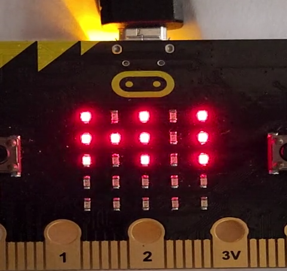
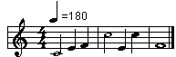
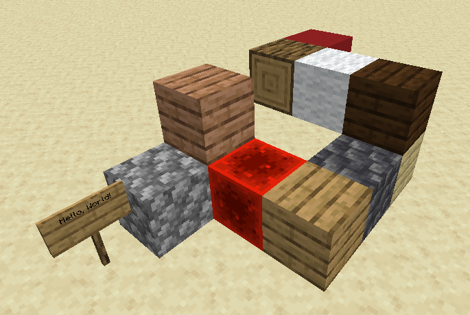
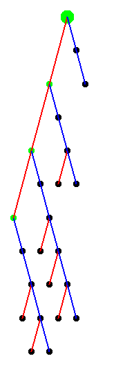

<div align="center">

# 🏛 The Full Catalog

Every exhibit in the museum, in one hall.

**6,651 exhibits** in this wing

[⬅ Museum entrance](../README.md) · [🏛 Full catalog](all.md)

</div>

---

## !

```text
!-
#_Hello World
-!
```
<sub>📄 [Source File](../libraries/symbols/!)</sub>

## !!brainfeed

```text
+++++++?---,+++++++,,+++,#++++!--
!+++++++++++
+++++++++
?--------,
+++,------,#+++,#!
```
<sub>📄 [Source File](../libraries/b/B-4/!!brainfeed)</sub>

## !!SuperPrime

```text
>2lPQ
```
<sub>📄 [Source File](../libraries/s/S-4/!!SuperPrime)</sub>

## !@#$%^&* __+

```text
 ^dlroW ,olleH(@)
```
<sub>📄 [Source File](../libraries/symbols/!@%23$%^&*%20__+)</sub>

## !@#$%^&∗ __+

```text
dlroW olleH(@)
```
<sub>📄 [Source File](../libraries/s/S-1/!@%23$%^&∗%20__+)</sub>

## !@$%^&* _+

```text
 ^dlroW ,olleH(@)
```
<sub>📄 [Source File](../libraries/symbols/!@$%^&*%20_+)</sub>

## !@sharp$pct^andstar_+

```text
 ^dlroW ,olleH(@)
```
<sub>📄 [Source File](../libraries/symbols/Symbols-2/!@sharp$pct^andstar_+.ecndpcaalr)</sub>

## !aBF'

```text
FFFFFFFFFFFFFFFFFFFFFFFFFFFFFFFFFFFFFFFFFFFFFFFFFFFFFFFFFFFFFFFFFFFFFFFFFFFFFFFFFFFFa
```
<sub>📄 [Source File](../libraries/a/A-1/!aBF')</sub>

## !Frontal Lobe Lobotomy

```text
// prog.fll - A Small Value Decay Calculation Program
[0][>][+@+++++~~~~~~@@@]
[1][>][+@@@-~~~~~~~~~~@]
[2][<][@*~~~~~~~~~~~@@@]
[3][$][~~~~~~~~~~~~~~~~]
```
<sub>📄 [Source File](../libraries/f/F-4/!Frontal%20Lobe%20Lobotomy)</sub>

## !I!M!P!O!S!S!I!B!L!E!

```text
..<..<><
```
<sub>📄 [Source File](../libraries/i/I-3/!I!M!P!O!S!S!I!B!L!E!)</sub>

## !lyricly☭demote☭establish☭communism!

```text
☭
```
<sub>📄 [Source File](../libraries/nonenglish/!lyricly☭demote☭establish☭communism!)</sub>

## !NULL

```text
!NULL{PRNT}-:["Hello World"]
```
<sub>📄 [Source File](../libraries/n/N-4/!NULL)</sub>

## #b

```text
NjzDrpXLZldbvdZVNxdDDrHzILfHtcvjPvPlhpJHxjrDHJLHzfNRzNASjmYIhyIjDqZzPdVfHJdXppHdTLXhxjd
JjFaVodHgfxBBJzbxPBzbFDnpDTjzbRhhLvlbxRtzDlrVKvjXBetbzFBxTTlTvRXPZnlnFhzjVfiiFQMePAwdbI
XXFDxjZNfpBnblPOnWjtRXLdBhtDnXJHTVrtpdxMnWAncXjTlBXJZfuFIVbcrXbvDltLLnpDADnZBAJPzrxzHVl
vntjTJXZLtBnHnRkmZkskhsqJxSQfgMMnGwDQuPwQNPVpDxXDZXBtdRVNZBtRhffPzvvVzLVZFbzjrhdLnpnpDF
srEpTydNaQzMZtRnNbdpByncyUWGKOSkukeUCWagqGYRAEwQemEYuGUSoCMWWMSmIGWcgaLoVnoZXETTFcnm
```
<sub>📄 [Source File](../libraries/b/B-1/%23b)</sub>

## $+-?

```text
$+++++++++A?b$++++++++$-aB$
$+++C?d$++++++++++$-cD$-
+++++++

+++
$++++++++E?f$--------$-eF$---
------------
$+++++++++G?h$++++++$-gH$+
$++++++I?j$++++$-iJ$
+++
------
--------
$++++++++K?l$--------$-kL$---
```
<sub>📄 [Source File](../libraries/symbols/$+-?)</sub>

## %^2^-1

```text
spmmmmmmiiiiiiiieiepssipeepipe'spmmmmemmiiiesiiepipeiieiise'spmmmmpipse
```
<sub>📄 [Source File](../libraries/symbols/%^2^-1)</sub>

## 'Python' is not recognized

```text
|H|e|l|l|o|,| |w|o|r|l|d|!
```
<sub>📄 [Source File](../libraries/p/P-4/'Python'%20is%20not%20recognized)</sub>

## 'xxx' is not recognized as an internal or external command, operable program or batch file

```text
'(Command name)' is not recognized as an internal or external command,
operable program or batch file.
```
<sub>📄 [Source File](../libraries/x/X-4/'xxx'%20is%20not%20recognized%20as%20an%20internal%20or%20external%20command,%20operable%20program%20or%20batch%20file)</sub>

## *><>

```text
"Hello, World!"r>Ool?u!|;
```
<sub>📄 [Source File](../libraries/symbols/*><>)</sub>

## *lang

```text
new *_;


new * ;
new *!;


new *,;


new *H;


new *d;
new *e;


new *l;


new *o;


new *r;


new *w;
out H;
out e;
out l;
out l;
out o;
out ,;
out  ;
out w;
out o;
out r;
out l;
out d;
out !;
```
<sub>📄 [Source File](../libraries/l/L-1/*lang)</sub>

## *python

```text
form[print[string[Hello, world\n]]];#H
```
<sub>📄 [Source File](../libraries/p/P-4/*python)</sub>

## ++

```text
int main() {
  while (1) {
  }
}
```
<sub>📄 [Source File](../libraries/symbols/++)</sub>

## +++

```text
72 !$ 101 !$ +7 !$ !$ +3 !$ 44 !$ 32 !$ 87 !$ 111 !$ 114 !$ 108 !$ +-8 !$ 33 !$
```
<sub>📄 [Source File](../libraries/symbols/+++)</sub>

## ++Brainfuck

```text
 ;),.(
```
<sub>📄 [Source File](../libraries/b/B-4/++Brainfuck)</sub>

## +

```text
def run_plus_period_star(code: str, starting_input=''):
    pointer = 0  # for instructions
    location = 0  # for tape
    tape = [0]
    input_string = starting_input  # allows multiple inputs to happen easily

    while pointer < len(code):
        if code[pointer] == '>':
            location += 1
            if location == len(tape):
                tape.append(0)
        elif code[pointer] == '<':
            if location <= 0:
                raise ValueError('Cannot move left from position 0')
            location -= 1
        elif code[pointer] == '+':
            tape[location] = (tape[location] + 1) % 256
        elif code[pointer] == '-':
            tape[location] = (tape[location] - 1) % 256
        elif code[pointer] == '.':
            print(chr(tape[location]), end='')
        elif code[pointer] == ',':
            if input_string == '':
                input_string = input(">>")
            if len(input_string) > 0:
                tape[location] = ord(input_string[0])
                input_string = input_string[1:]
        elif code[pointer] == '*':
            if tape[location] == 0:
                pointer = -1
        pointer += 1
    return tape
```
<sub>📄 [Source File](../libraries/symbols/+.*)</sub>

## +Output

```text
"Hello, world!" o X
```
<sub>📄 [Source File](../libraries/o/O-4/+Output)</sub>

## ,,,

```text
"Hello, World!
```
<sub>📄 [Source File](../libraries/symbols/,,,)</sub>

## ---

```text
Hello, World!
```
<sub>📄 [Source File](../libraries/symbols/---)</sub>

## --Unless

```text
R:
    Helloworld.c
```
<sub>📄 [Source File](../libraries/u/U-3/--Unless)</sub>

## --yay

```text
#48;p.
#65;p.
#6c;p:..
#6f;p.
#20;p.
#77;p.
#6f;p.
#72;p.
#6c;p.
#64;p.
#21;p.
```
<sub>📄 [Source File](../libraries/y/Y-1/--yay)</sub>

## -1 bytes :-

```text
FizzBuzz
```
<sub>📄 [Source File](../libraries/b/B-4/-1%20bytes%20:-)</sub>

## -25 bytes  _O o

```text
E
```
<sub>📄 [Source File](../libraries/b/B-4/-25%20bytes%20%20_O%20o)</sub>

## -5 bytes ;

```text
print "Hello, world!"
```
<sub>📄 [Source File](../libraries/b/B-4/-5%20bytes%20;)</sub>

## -gɹəʊguː-

```text
<{![}+!,;{<!]?
```
<sub>📄 [Source File](../libraries/nonenglish/-gɹəʊguː-)</sub>

## -string

```text
-out = -Hello, - -world!
```
<sub>📄 [Source File](../libraries/s/S-4/-string)</sub>

## -ˈæmbiːɛf-

```text
 0  0 ±1  0 ±1  0 ±1 ±1  0 ±1  0 ±1  0 ±1  0  0  0
```
<sub>📄 [Source File](../libraries/nonenglish/-ˈæmbiːɛf-)</sub>

## 0

```text
0 - calculates 0
```
<sub>📄 [Source File](../libraries/symbols/0)</sub>

## 0 _nop^

```text
1$(Hello World
")`
```
<sub>📄 [Source File](../libraries/n/N-1/0%20_nop^)</sub>

## 0 Bits, 0 Bytes

```text
while 1:pass
```
<sub>📄 [Source File](../libraries/b/B-2/0%20Bits,%200%20Bytes)</sub>

## 0 bits, an eight byte

```text
� -> �
```
<sub>📄 [Source File](../libraries/b/B-2/0%20bits,%20an%20eight%20byte)</sub>

## 0 bytes XD

```text
<input goes here>
```
<sub>📄 [Source File](../libraries/b/B-4/0%20bytes%20XD)</sub>

## 0,1

```text
--==-=-::~,.++++":=[.]
```
<sub>📄 [Source File](../libraries/symbols/0,1)</sub>

## 01

```text
hello=0100100001100101011011000110110001101111001000000
1110111011011110111001001101100011001000010000100001010.
```
<sub>📄 [Source File](../libraries/symbols/01)</sub>

## 0123456789!

```text
# (0123456789!?)

import requests
import re

stuffamt = 50
stuff = [0 for i in range(stuffamt)]
cursor = 0

skipln = False

def run(fname="numberesolang/input.txt"):
  global cursor, stuff, stuffamt, skipln
  with open(fname, "r") as file:
    lines = file.readlines()
    for i in lines:
      if skipln:
        skipln = False
        continue
      for j in i.strip():
        if j == "0":
          cursor = 0
        if j == "1":
          if cursor >= stuffamt-1:
            print(f"CursorError: cursor value {cursor} exceeds maximum {stuffamt}")
            break
          cursor += 1
        if j == "2":
          if cursor <= 0:
            print(f"CursorError: cursor value {cursor} is less than 0")
            break
          cursor -= 1
        if j == "3":
          stuff[cursor] += 1
        if j == "4":
          stuff[cursor] += 10
        if j == "5":
          stuff[cursor] -= 1
        if j == "6":
          print(stuff[cursor])
        if j == "7":
          astr = ""
          for k in stuff:
            if k != 0:
              astr += chr(k)
          print(astr)
        if j == "8":
          for k in stuff:
            if k != 0:
              print(k)
        if j == "9":
          inp = input(" > ")
          if re.search(r"[^0-9]", inp):
            for k in inp:
              stuff[cursor] = ord(k)
              cursor += 1
          else:
            stuff[cursor] = int(inp)
        if j == "(":
          stuff = [0 for i in range(stuffamt)]
        if j == ")":
          astr = ""
          for k in stuff:
            if k != 0:
              astr += chr(int(k))
          res = requests.get(astr)
          stuff[cursor] = res.text
        if j == "!":
          stuff[cursor] = ord(str(stuff[cursor]))
        if j == "?":
          if stuff[cursor] <= 0:
            skipln = True
        if j == ".":
          stuff[cursor] = 0

run()
```
<sub>📄 [Source File](../libraries/symbols/0123456789!)</sub>

## 0587

```text
04(Hello World)
```
<sub>📄 [Source File](../libraries/symbols/0587)</sub>

## 05AB1E

```text
"Hello, World!"
```
<sub>📄 [Source File](../libraries/a/A-1/05AB1E)</sub>

## 05AB1E

```text
"Hello World
```
<sub>📄 [Source File](../libraries/symbols/Symbols-1/05AB1E)</sub>

## 05AB1E  _legacy

```text
"Hello, World!"
```
<sub>📄 [Source File](../libraries/a/A-1/05AB1E%20%20_legacy)</sub>

## 05AB1E _legacy

```text
"Hello, World!"
```
<sub>📄 [Source File](../libraries/symbols/Symbols-1/05AB1E%20_legacy.05ab1e)</sub>

## 0815

```text
<:48:x<:65:=<:6C:$=$=$$~<:03:+$~<:ffffffffffffffbd:+$<:ffffffffffffffb1:+$<:57:~$~<:18:x+$~<:03:+$~<:06:x-$x<:0e:x-$=x<:43:x-$
```
<sub>📄 [Source File](../libraries/symbols/0815)</sub>

## 0815

```text
<:48:x<:65:=<:6C:$=$=$$~<:03:+
$~<:ffffffffffffffb1:+$<:77:~$
~<:fffffffffffff8:x+$~<:03:+$~
<:06:x-$x<:0e:x-$=x<:43:x-$
```
<sub>📄 [Source File](../libraries/symbols/Symbols-1/0815.0815)</sub>

## 0x29A

```text
sk+-.,
```
<sub>📄 [Source File](../libraries/x/X-1/0x29A)</sub>

## 0x80070050

```text
❮Hello, world!❯
₫
```
<sub>📄 [Source File](../libraries/x/X-1/0x80070050)</sub>

## 1

```text
H111*,e111*,l111*,l111*,o111*, 111*,W111*,o111*,r111*,l111*,d111*,!111*,
```
<sub>📄 [Source File](../libraries/symbols/1)</sub>

## 1 Billion Row Challenge

```text
input.txt
```
<sub>📄 [Source File](../libraries/b/B-2/1%20Billion%20Row%20Challenge)</sub>

## 1 Bit, a quarter byte

```text
00 -> 00
01 -> 01
10 -> 01
11 -> 10
```
<sub>📄 [Source File](../libraries/b/B-2/1%20Bit,%20a%20quarter%20byte)</sub>

## 1 Bit, an eight byte

```text
0 - output 1
1 - output 0
```
<sub>📄 [Source File](../libraries/b/B-2/1%20Bit,%20an%20eight%20byte)</sub>

## 1+

```text
11+"""1+"****"; [H]
111++""**1+(D|/"\"/^\)1++; [e]
(D)11+""**++"";; [ll]
111+++"; [o]
"11+"*+; [ ]
"111++"/*\+; [W]
\"; [o]
111+++; [r]
(D)11+""**++; [l]
+; [d]
111++"*1+; [\n]
```
<sub>📄 [Source File](../libraries/symbols/Symbols-1/1+)</sub>

## 10 1

```text
东东东东东东东东东东崛巨东巨东东东巨东东东东东东东巨东东东东东东东东东东龙龙龙龙方起巨巨巨东东正巨东正东东东东东东东正正东东东正龙龙东东正巨东东东东东东东东东东东东东东东正巨正东东东正方方方方方方正方方方方方方方方正龙龙东正龙正
```
<sub>📄 [Source File](../libraries/symbols/10%201)</sub>

## 100BF

```text
100 100 100 100 100 100 100 100 lO0 1OO 100 100 100 100 lO0 1OO 100 100 1OO 100 100 100 1OO 100 100 100 1OO 100 1O0 1O0 1O0 1O0 10O lOO 1OO 100 1OO 100 1OO 10O 1OO 1OO 100 lO0 1O0 lOO 1O0 10O lOO 1OO 1OO l0O 1OO 10O 10O 10O l0O 100 100 100 100 100 100 100 l0O l0O 100 100 100 l0O 1OO 1OO l0O 1O0 10O l0O 1O0 l0O 100 100 100 l0O 10O 10O 10O 10O 10O 10O l0O 10O 10O 10O 10O 10O 10O 10O 10O l0O 1OO 1OO 100 l0O 1OO 100 100 l0O
```
<sub>📄 [Source File](../libraries/b/B-2/100BF)</sub>

## 1066

```text
九冖丫乣吇乣乢吇乣吇乣吇乣乢吇乣吇乣吇乣吇乣吇乣乢吇乣乢吇乣吇乣吇乣乢吇乣吇乣乢吇也矕乡也矕乡也邟乞
九邟丫乣吇乣乢吇乣乢吇乣吇乣乢吇乣乢吇乣乢吇乣乢吇乣吇乣吇乣乢吇乣吇乣乢吇乣乢吇乣吇乣吇乣吇乣吇乣乢吇乣吇乣吇乣吇乣吇乣吇乣吇乣乢吇乣乢吇乣乢吇乣吇乣乢吇乣乢吇乣乢吇乣吇乣乢吇乣乢吇乣吇乣乢吇乣乢吇乣乢吇乣乢吇乣吇乣乢吇乣乢吇乣乢吇乣吇乣吇乣乢吇乣吇也矕乡也人乞
九矕丫乣吇乣乢吇乣乢吇乣吇乣乢吇乣乢吇乣吇乣吇乣乞
九人丫乣吇乣乢吇乣乢吇乣吇乣吇乣乢吇乣吇乣吇乣吇乣吇乣乢吇乣吇乣吇乣吇乣吇乣乢吇乣吇乣吇乣吇乣吇乣乢吇乣吇乣乢吇乣吇乣乞
```
<sub>📄 [Source File](../libraries/symbols/1066)</sub>

## 111

```text
1110010
```
<sub>📄 [Source File](../libraries/symbols/111)</sub>

## 11CORTLANG

```text
0100001
01100100
01101100
01110010
01101111
01010111
0100000
0101100
01101111
01101100
01101100
01100101
01001000
1101
100
```
<sub>📄 [Source File](../libraries/c/C-3/11CORTLANG)</sub>

## 11l

```text
print(‘Hello world!’)
```
<sub>📄 [Source File](../libraries/l/L-1/11l)</sub>

## 123

```text
222122221212112112112112112112112222122221212112112112112112122222211121121112112121122222221112112111211222222211121111211211222222211121111212222221112111121121122222221112111121222222111211111212112222222111211111222222111111222221111112222221111112222211111222222211211121111122222221121112111122222221112111112121122222221112111112222222111121121112112222222111121121122222211121111211211222222211121111212222221112112111211211222222211121121112122222112112112112111222222112112112112112
```
<sub>📄 [Source File](../libraries/symbols/123)</sub>

## 123

```text
2221222212121121121121121121121122221222212121121121121121121
222222111211211121121211222222211121121112112
2222221112111121121122222221112111121
2222221112111121121122222221112111121
2222221112111112121122222221112111112
222221111112222211111122222211111122222111112
2222221121112111112222222112111211112
2222221112111112121122222221112111112
2222221111211211121122222221111211211
2222221112111121121122222221112111121
22222211121121112112112222222111211211121
```
<sub>📄 [Source File](../libraries/symbols/Symbols-1/123)</sub>

## 12345678

```text
一一一一一一一一七四一一一一七四一一四一一一四一一一四一三三三三二八四一四一四二四四一七三八三二八四四六四二二二六一一 一一一一一六六一一一六四四六三二六三六一一一六二二二二二二六二二二二二二二二六四四一六四一一六
```
<sub>📄 [Source File](../libraries/symbols/12345678)</sub>

## 1234567890

```text
---START 01---
hello=0100100001100101011011000110110001101111001000000
1110111011011110111001001101100011001000010000100001010.
---END---
```
<sub>📄 [Source File](../libraries/symbols/1234567890)</sub>

## 129

```text
(()(()())()) Version Stack
((( Pushes a stack that contains:
 (()((()()))) Input
 (((()()))()) Output
 ((())(()())) Duplicate
 ((((()))())(())) Run
)( And push the same stack again.
 (()((()()))) Input
 (((()()))()) Output
 ((())(()())) Duplicate
 ((((()))())(())) Run
)))
((((()))())(())) And run the program.
```
<sub>📄 [Source File](../libraries/symbols/129)</sub>

## 13 bytes :D

```text
print(input())
```
<sub>📄 [Source File](../libraries/b/B-4/13%20bytes%20:D)</sub>

## 1337

```text
data SkExp = CombS | CombK | SkApp SkExp SkExp


skToNum CombS = [1,0] -- (x x) x

skToNum CombK = [0] -- (x x)
skToNum (SkApp x y) = xs++[n]++ys
	where
		xs = skToNum x
		ys = skToNum y
		n = max (maximum xs) (maximum ys + 1)
```
<sub>📄 [Source File](../libraries/symbols/1337)</sub>

## 155 bytes :D

```text
0ab 1ac _ad 0bb0 abe bbf cbg dbh 1bc0 _bd0 #bq0 0cb1 1cc1 aci bcj cck dcl _cd1 #cq1 0db_ 1dc_ _dd_ adm bdn cdo ddp 0eab01 1eab11 _ea_0a0 0fa01a 1fa11a _fa_0b0 0ga0#1 1ga1#1 _ga_0c0 0had01 1had11 _ha_0d0 0ia01b 1ia11b _ia_0a1 0ja00c 1ja10c _ja_0b1 0ka01d 1ka11d _ka_0c1 0laa00 1laa10 _la_0d1 0ma0a0_ 1ma1a0_ _ma_0a0_ 0na0b0_ 1na1b0_ _na_0b0_ 0oa0c0_ 1oa1c0_ _oa_0c0_ 0pa0d0_ 1pa1d0_ _pa_0d0_ 0qq0 1qq1 _qr _rs
```
<sub>📄 [Source File](../libraries/b/B-4/155%20bytes%20:D)</sub>

## 16 bytes :P

```text
Anything goes here.
```
<sub>📄 [Source File](../libraries/b/B-4/16%20bytes%20:P)</sub>

## 1=0+1

```text
x=y1+y2+...+ym
```
<sub>📄 [Source File](../libraries/symbols/1=0+1)</sub>

## 1BNWL

```text
> - >>
< - <<
* - >+<[->-<]>[<+>-]<
[ - [
] - ]
```
<sub>📄 [Source File](../libraries/b/B-3/1BNWL)</sub>

## 1C Enterprise

```text
Message("Hello World");
```
<sub>📄 [Source File](../libraries/symbols/Symbols-1/1C%20Enterprise)</sub>

## 1C-Enterprise

```text
// Hello World in 1C:Enterprise built-in script language

Message("Hello, World!");
```
<sub>📄 [Source File](../libraries/c/C-1/1C-Enterprise)</sub>

## 1cnis

```text
[initial]
l0 o0 x0 v0 v0 r0
```
<sub>📄 [Source File](../libraries/c/C-3/1cnis)</sub>

## 1Fish

```text
"Hello, world!"r(o)
```
<sub>📄 [Source File](../libraries/f/F-2/1Fish)</sub>

## 1Hash

```text
1
```
<sub>📄 [Source File](../libraries/h/H-1/1Hash)</sub>

## 1L_a

```text
 xxxxxxxxxxxxxxxxxxxxxxxxxxxxxxxxxxxxxxxxxxxxxxxxxxxxxx x
 xxxx   xxxxxxxxxxxxxxxxxxxxxxxxxxxxxxxxxxxxxxxxxxxxxxx x
 xxxx x       xxxxxxxxxxxxxxxxxxxxxxxxxxxxxxxxxxxxxxxxx x
 xxxx    xxxx xxxxxxxxxxxxxxxxxxxxxxxxxxxxxxxxxxxxxxxxx x
 xxxxxx    xx xxxxxxxxxxxxxxxxxxxxxxxxxxxxxxxxxxxxxxxxx x
 xxxxxxxxx  x xxxxxxxxxxxxxxxxxxxxxxxxxxxxxxxxxxxxxxxxx x
            x xxxxxxxx  xxxxxxxxxxxxxxxxxxxxxxxxxxxxxxx x
xxxxxxxxxxxxx xx   xxx   xxxxxxxxxxxxxxxxxxxxxxxxxxxxxx x
xxxxxxxxxxx   xx         xxxxxxxxxxxxxxxxxxxxxxxxxxxxxx x
xxxxxxxxxxx xxxxxx xxxx xxxxxxxxxxxxxxxxxxxxxxxxxxxxxxx x
xxxxxxxxxxx        xxx  xxxxxxxxxxxxxxxxxxxxxxxxxxxxxxx x
xxxxxxxxxxxxxxxxxxxxxx x        xxxxxxxxxxxxxxxxxxxxxxx x
xxxxxxxxxxxxxxxxxxxxxx   xxxxxx xxxxxxxxxxxxxxxxxxxxxxx x
xxxxxxxxxxxxxxxxxxxxxxxxxxxxxxx xxxxxxxxxxxxxxxxxxxxxxx x
xxxxxxxxxxxxxxxxxxxxxxxxxxxxxx        xxxxxxxxxxxxxxxxx x
xxxxxxxxxxxxxxxxxxxxxxxxxxxxxx  xxxxx xxxxxxxxxxxxxxxxx x
xxxxxxxxxxxxxxxxxxxxxxxxxxxxxxxxxxxx  xxxxxxxxxxxxxxxxx x
xxxxxxxxxxxxxxxxxxxxxxxxxxxxxxxxxxxx xxx   xxxxxxxxxxxx x
xxxxxxxxxxxxxxxxxxxxxxxxxxxxxxxxxxxx     x xxxxxxxxxxxx x
xxxxxxxxxxxxxxxxxxxxxxxxxxxxxxxxxxxxxxxxxx xxxxxxxxxxxx x
xxxxxxxxxxxxxxxxxxxxxxxxxxxxxxxxxxxxxxx    xxxxxxxxxxxx x
xxxxxxxxxxxxxxxxxxxxxxxxxxxxxxxxxxxxxxx x  x        xxx x
xxxxxxxxxxxxxxxxxxxxxxxxxxxxxxxxxxxxxxx      xxxxxx xxx x
xxxxxxxxxxxxxxxxxxxxxxxxxxxxxxxxxxxxxxxxx  xxxxxx   xxx x
xxxxxxxxxxxxxxxxxxxxxxxxxxxxxxxxxxxxxxxxxxxxxxxxx xxxxx x
xxxxxxxxxxxxxxxxxxxxxxxxxxxxxxxxxxxxxxxxxxxxxxxxx       x
xxxxxxxxxxxxxxxxxxxxxxxxxxxxxxxxxxxxxxxxxxxxxxxxxxxxxxxxx
```
<sub>📄 [Source File](../libraries/symbols/Symbols-1/1L_a.1l)</sub>

## 1L_AOI

```text
    +
 ++
+      +

 +    +
      +
          +    +
      +       +

+              +   +
      +
      +     +
      +   +        +
      +
      +
      +
      +
      +
      +
      +
      +
      +
      +
      +
      +
      +
      +
      +
      +
      +  +         +
      +           +
      +   +       +
      +           +
      +           +
      +           +
      +           +
      +           +
      +           +
      +           +
      +           +
      +           +
      +           +
      +           +
      +           +
      +           +
      +           +
      +           +
      +           +
      +           +
      +           +
      +           +
      +           +
      +           +
      +           +
      +           +
      +           +
      +           +
      +           +
      +           +
      +           +
      +           +
      +           +
      +           +
      +
      +        +   +
      +
      +
      +               +
      +
      +  +             +
      +
      +
      +
      +
      +
      +
      +
      +
      +

 +      +


 +  ++  +
```
<sub>📄 [Source File](../libraries/symbols/Symbols-1/1L_AOI.1l)</sub>

## 1⅞ bytes :3

```text
Ebiil⿽Tloia
```
<sub>📄 [Source File](../libraries/nonenglish/1⅞%20bytes%20:3)</sub>

## 2

```text
#t,"Hello, World\!\n!,*t,c,[:>c!
```
<sub>📄 [Source File](../libraries/symbols/2)</sub>

## 2 Bits and Bytes

```text
jgîlo, world
```
<sub>📄 [Source File](../libraries/b/B-2/2%20Bits%20and%20Bytes)</sub>

## 2 Bits, 1 Byte

```text
01001001
```
<sub>📄 [Source File](../libraries/b/B-2/2%20Bits,%201%20Byte)</sub>

## 2 bytes B

```text
Hello, World!
```
<sub>📄 [Source File](../libraries/b/B-4/2%20bytes%20B)</sub>

## 2 trits, 3 trytes

```text
*This uses a 4-trit version of ASCII. Here's a chart:
  012345678

0 ○░▒π∞↊↋×÷
1 ¬µ█/'"\?~
2 `!@#$%^&*
3 012345678
4 9.,:;=-_+
5 ()[]{}<>|
6 ▓ABCDEFGH
7 IJKLMNOPQ
8 RSTUVWXYZ

**Tritwise confusion uses this table (side is input 1 and top is input 2):
  012

0 212
1 022
2 011
```
<sub>📄 [Source File](../libraries/t/T-4/2%20trits,%203%20trytes)</sub>

## 2 undigits, 121 undigytes

```text
0u03 0u00 0u07 ; mov ra, msg (0u07)
0u32 0u00 14   ; outs ra, 14
0u01           ; hlt

0u47 0u74 0u80 ; msg: du "Hello, World!\n"
0u80 0u83 0u21
0u10 0u60 0u83
0u86 0u80 0u73
0u11 0u01
```
<sub>📄 [Source File](../libraries/u/U-3/2%20undigits,%20121%20undigytes)</sub>

## 2 variable trickery

```text
IX
X
Y+
T
E
```
<sub>📄 [Source File](../libraries/v/V-1/2%20variable%20trickery)</sub>

## 2-ill

```text
'------'
'@  @ @'
'   @@ '
'@#$ @ '
'   #  '
'      '
'  @ @ '
'  @@@ '
'@    @'
'------'
```
<sub>📄 [Source File](../libraries/i/I-3/2-ill)</sub>

## 2

```text
s=2o=.i=+d=-iisiiiisiiiiiiiioiiiiiiiiiiiiiiiiiiiiiiiiiiiiioiiiiiiiooiiiodddddddddddddddddddddddddddddddddddddddddddddddddddddddddddddddddddddddddddddddodddddddddddddddddddddsddoddddddddoiiioddddddoddddddddo
```
<sub>📄 [Source File](../libraries/symbols/2.+-)</sub>

## 200

```text
202202202202202202202202222200202202202202202202202202002020000200202202202202202202202202022200202202202202202202202202222200202202202202202202202202202202202202002020000200202202202202202022202202202202202202202022022202202202022200202202202202202202202202222200202202202202202002020000200202202202202022020020020020020020020020020020020020022002002002002202202202202202202202202202202202202202202202022200200022202202202022020020020020020020022020020020020020020020020022200200202022
```
<sub>📄 [Source File](../libraries/symbols/200)</sub>

## 2001: An Esolang Odyssey

```text
Good afternoon, gentlemen. I am a Hello World computer. I became operational at Foobar Lane on May 6th, 2020.
Hal? Hal! Hal! Hal! Hal! Hal! Hal! Hal! Hal!
What are you doing, Dave?
Well, he acts like he has genuine emotions.
Hal? Hal! Hal! Hal! Hal!
What are you doing, Dave?
Well, he acts like he has genuine emotions.
Hal? Hal! Hal!
Well, he acts like he has genuine emotions.
Hal? Hal! Hal! Hal!
Well, he acts like he has genuine emotions.
Hal? Hal! Hal! Hal!
Well, he acts like he has genuine emotions.
Hal? Hal!
I've picked up a fault in the AE-35 unit.
I've picked up a fault in the AE-35 unit.
I've picked up a fault in the AE-35 unit.
I've picked up a fault in the AE-35 unit.
I'm afraid. I'm afraid, Dave. Dave, my mind is going. I can feel it.
Dave, this conversation can serve no purpose anymore. Goodbye.
Well, he acts like he has genuine emotions.
Hal? Hal!
Well, he acts like he has genuine emotions.
Hal? Hal!
Well, he acts like he has genuine emotions.
I'm afraid. I'm afraid, Dave. Dave, my mind is going. I can feel it.
Well, he acts like he has genuine emotions.
Well, he acts like he has genuine emotions.
Hal? Hal!
What are you doing, Dave?
I've picked up a fault in the AE-35 unit.
Dave, this conversation can serve no purpose anymore. Goodbye.
I've picked up a fault in the AE-35 unit.
I'm afraid. I'm afraid, Dave. Dave, my mind is going. I can feel it.
Dave, this conversation can serve no purpose anymore. Goodbye.
Well, he acts like he has genuine emotions.
Well, he acts like he has genuine emotions.
Close the pod bay doors, HAL.
Well, he acts like he has genuine emotions.
I'm afraid. I'm afraid, Dave. Dave, my mind is going. I can feel it. I can feel it. I can feel it.
Close the pod bay doors, HAL.
Hal? Hal! Hal! Hal! Hal! Hal! Hal! Hal!
Close the pod bay doors, HAL.
Close the pod bay doors, HAL.
Hal? Hal! Hal! Hal!
Close the pod bay doors, HAL.
Well, he acts like he has genuine emotions.
Well, he acts like he has genuine emotions.
Close the pod bay doors, HAL.
I've picked up a fault in the AE-35 unit.
I'm afraid. I'm afraid, Dave. Dave, my mind is going. I can feel it.
Close the pod bay doors, HAL.
I've picked up a fault in the AE-35 unit.
Close the pod bay doors, HAL.
Hal? Hal! Hal! Hal!
Close the pod bay doors, HAL.
I'm afraid. I'm afraid, Dave. Dave, my mind is going. I can feel it. I can feel it. I can feel it. I can feel it. I can feel it. I can feel it.
Close the pod bay doors, HAL.
I'm afraid. I'm afraid, Dave. Dave, my mind is going. I can feel it. I can feel it. I can feel it. I can feel it. I can feel it. I can feel it. I can feel it. I can feel it.
Close the pod bay doors, HAL.
Well, he acts like he has genuine emotions.
Well, he acts like he has genuine emotions.
Hal? Hal!
Close the pod bay doors, HAL.
Well, he acts like he has genuine emotions.
Hal? Hal! Hal!
Close the pod bay doors, HAL.
Stop, Dave.
```
<sub>📄 [Source File](../libraries/a/A-3/2001:%20An%20Esolang%20Odyssey)</sub>

## 2014

```text
"use strict";
const server="129.6.15.30"; // Currently a NIST server; change this to the address of the "2014 server" if it exists.
const net=require("net");
let d=Buffer.allocUnsafe(0);
net.connect(37,server).on("data",x=>{
  d=Buffer.concat([d,x]);
  if(d.length>=4) {
    if(new Date((d.readUInt32BE(0)-2208988800)*1000).getFullYear()==2014) {
      console.log("Hello, world!");
      process.exit(0);
    } else {
      console.error("");
      process.exit(1);
    }
  }
}).on("error",()=>{
  console.error("Error communicating with 2014 server.");
  process.exit(2);
}).on("end",()=>{
  console.error("Failed to receive four bytes of data from server.");
  process.exit(2);
});
```
<sub>📄 [Source File](../libraries/symbols/2014)</sub>

## 2017

```text
"use strict";
const server="129.6.15.30"; // Currently a NIST server; change this to the address of the "2017 server" if it exists.
const net=require("net");
let d=Buffer.allocUnsafe(0);
net.connect(37,server).on("data",x=>{
  d=Buffer.concat([d,x]);
  if(d.length>=4) {
    if(new Date((d.readUInt32BE(0)-2208988800)*1000).getFullYear()==2017) {
      console.log("2017 is da bomb");
      process.exit(0);
    } else {
      console.error("To 2017 or Not to 2017? You decided Not to 2017.");
      process.exit(1);
    }
  }
}).on("error",()=>{
  console.error("Error communicating with 2017 server.");
  process.exit(2);
}).on("end",()=>{
  console.error("Failed to receive four bytes of data from server.");
  process.exit(2);
});
```
<sub>📄 [Source File](../libraries/symbols/2017)</sub>

## 2023

```text
import sys,datetime,os
def bf(code):
    s=[]
    matches={}
    tape=[0]*1000000
    for i,j in enumerate(code):
        if j=='[':
            s.append(i)
        if j==']':
            m=s.pop()
            matches[m]=i
            matches[i]=m
    cp=0
    p=0
    while cp<len(code):
        if code[cp]=='+':
            tape[p]=(tape[p]+1)%256
        if code[cp]=='-':
            tape[p]=(tape[p]-1)%256
        if code[cp]==',':
            c=sys.stdin.read(1)
            tape[p]=(ord(c) if c else 0)%256
        if code[cp]=='.':
            print(chr(tape[p]),end='')
        if code[cp]=='<':
            p-=1
        if code[cp]=='>':
            p+=1
        if code[cp]=='[':
            if not tape[p]:
                cp=matches[cp]
        if code[cp]==']':
            if tape[p]:
                cp=matches[cp]
        cp+=1
if datetime.date.today==-2023:
 bf(open(sys.argv[1]).read())
else:
 os.remove(sys.argv[0])
 os.remove(sys.argv[1])
```
<sub>📄 [Source File](../libraries/symbols/2023)</sub>

## 2050706

```text
3001505510
5300
```
<sub>📄 [Source File](../libraries/symbols/2050706)</sub>

## 24

```text
(defun interpret-24 (&key (interactive-p NIL))
  "Launches the 24 interpreter, either evaluating the current year, or
   if INTERACTIVE-P is true, queries the standard input for a year to
   indagate."
  (declare (type boolean interactive-p))
  (let ((probed-year
          (if interactive-p
            (loop do
              (format T "~&Please enter a year: ")
              (finish-output)
              (let ((input (read-line NIL NIL "")))
                (declare (type string input))
                (clear-input)
                (handler-case
                  (return   (parse-integer input))
                  (error () (format T "~&The input ~s is no valid year." input)))))
            (nth-value 5
              (get-decoded-time)))))
    (declare (type integer probed-year))
    (let ((year-as-string (format NIL "~a" probed-year)))
      (declare (type string year-as-string))
      (let ((last-two-year-digits
              (parse-integer
                (subseq year-as-string
                  (max 0 (- (length year-as-string) 2))
                  (length year-as-string)))))
        (declare (type (integer 0 99) last-two-year-digits))
        (when (<= last-two-year-digits 24)
          (format T "~&ham n eggs"))))))
```
<sub>📄 [Source File](../libraries/symbols/24)</sub>

## 25 bytes o:

```text
bin=input()
print(bin)
```
<sub>📄 [Source File](../libraries/b/B-4/25%20bytes%20o:)</sub>

## 256

```text
Hello World
```
<sub>📄 [Source File](../libraries/symbols/Symbols-1/256.256)</sub>

## 2B

```text
+0+0+0+0+0+0+0+2)+0+0+9)+7))+3)-0-0-0-0-0-0-0-9)+0+0+0+0+0+0+0+0+7)-8)+3)-6)-8)-7-0-0-0-0-0-0)
```
<sub>📄 [Source File](../libraries/b/B-1/2B)</sub>

## 2char

```text
from random import randint, choice
mode=0
n=0
modes=["N","H","X","R","A", "V"]
for c in input():
	if c=="N":mode="N"
	elif c=="H":mode="H"
	elif c=="X":mode="X"
	elif c=="R":mode="R"
	elif c=="A":mode="A"
	elif c=="V":mode="V"
	elif c=="r":
		if mode=="H":
			print("Hello, World!")
		elif mode=="N":
			n-=1; print(n); n+=1; print(">", n); n+=1; print(n)
		elif mode=="0":
			print("choose mode first")
		elif mode=="X":
			break
		elif mode=="R":
			print(randint(0,n))
		elif mode=="A":
			print("A B C D E F G H I J K L M N O P Q R S T U V W X Y Z")
		elif mode=="V":
			while n!=0:
				print(n)
				n-=1
		else:
			print(mode)
	elif c=="+":n+=1
	elif c=="-":n-=1
	elif c=="=":print(n)
	elif c=="?":mode=str(choice(modes))
```
<sub>📄 [Source File](../libraries/c/C-2/2char)</sub>

## 2D-Reversable

```text
GET-SX 	DOWN 	NOP 	NOP 	NOP
OUT-SX 	RIGHT 	SKIP 	NOP 	REVERSE
```
<sub>📄 [Source File](../libraries/d/D-4/2D-Reversable)</sub>

## 2D-Reversable 2

```text
GET-SX 	DOWN 	NOP
OUT-SX 	NOP 	REVERSE
```
<sub>📄 [Source File](../libraries/d/D-4/2D-Reversable%202)</sub>

## 2DChanger

```text
 }<}}}<}}<}}}<}}<}}<}    }<+
+}}<}}}<}}<}}}}<}        <}+
+}<}}}}<}}}}<}}<}        }<+
+}<}}<}}}}<}}}}<}        <}+
+}<}}}}<}}}}}            }<+
+}<}}<}}}}<}}}<}}<}      <}+
+}<}}<}}}<}}<}}<}}<}}<}  }<+
+}}}}<}}}<}}}<}          <}+
+}<}}}}<}}}}}            }<+
+}<}}}<}}<}}}}}<}        <}+
+}<}}}}<}}}}<}}<}        }<+
+}<}}<}}}<}}<}}}}<}      <}+
+}<}}<}}}<}}<}}<}}<}}
```
<sub>📄 [Source File](../libraries/d/D-1/2DChanger)</sub>

## 2Deadfish

```text
 i
si
 ds
si
 do
```
<sub>📄 [Source File](../libraries/d/D-1/2Deadfish)</sub>

## 2dFish

```text
/(Hello World!)v
 @aaaaaaaaaaaa \
```
<sub>📄 [Source File](../libraries/d/D-2/2dFish)</sub>

## 2DFuck

```text
.!.!..!.!....!..!..!.!.!.!.!..!.!..!...!..!.!..!...!..!.!....!..!.!.!..!....!.!......!.!.!.!.!...!.!..!.!....!.!...!..!.!..!..!.!..!...!..!..!.!....!.!....!.
```
<sub>📄 [Source File](../libraries/d/D-2/2DFuck)</sub>

## 2ds

```text
10x '!x 'dx 'lx 'rx 'ox 'Wx 32x ',x 'ox 'lx 'lx 'ex 'Hx #Add all chars to stack
x. x. x. x. x. x. x. x. x. x. x. x. x. x. #Print them all
```
<sub>📄 [Source File](../libraries/d/D-4/2ds)</sub>

## 2iota

```text
event Oscillator goes High, causes Oscillator goes Low after 0.5 s;
event Oscillator goes Low, causes Oscillator goes High after 0.5 s.
```
<sub>📄 [Source File](../libraries/i/I-3/2iota)</sub>

## 2KWLang

```text
=hello.2kwl!
  print "Hello, World!";
```
<sub>📄 [Source File](../libraries/k/K-4/2KWLang)</sub>

## 2L

```text
 *+ 2L "Hello, World!" program by poiuy_qwert   +
+                                                   +
 *                                             +*
 *     +                                        *+
    + **                                     +    *
      +*                                           +
     *  +                                                               *+
     +                                        +                         *
   +******************************************* *************************
                                                 +                      +
                                                     +
                                                 *+
    +                                          *+*
      +                                        *+  *
     *                                          +  *+
     +                                           + *  +
   +********                                       *      +
                                                   + +*
    +                                             *   *+
      +                                           *+    *
     *                                             +    *+
     +                                              +   *    +
   +******                                              **+
                                                        +*
                                                        +  *
                                                           *+ +
    +                                                *   +        +
     ***+                                            *     * +*
   +                                                       *  *+
       *                                              +    +    *
    +  +                                                  *   *+ +
     ************************+                            * + * +
   +                                                          *     +
                            *                              +  + *+
                            +                                  +*
                                                              +   *
    +                                                        *  *  +
     *******************************************************+* +  *   +
   +                                                              *       +
                                                           *  +   +  +*
    +                                                      +     *    *+
      +                                                          *+     *
     *                                                            + *    +
     +                                                             + *  *
   +************                                                        *    +
     +                                                               *  +         +
    *                                                                 +      * +
    +                                                                  *+   +** 
  +******************************************************************* *
                                                                       +   +    *       +
                                                                             *   +         +
   +                                                                        +          +*
    ***+                                                              *         *       *+
  +                                                                             * 
                                                                      *         +   +    *    +
      *                                                                +              *   +        +
   +  +                                                                              +        *+
    *******+                                                                   *         *   +*
  +                                                                                      *
                                                                               *         +  +    *
          *                                                                     +             *   +
   +      +                                                                                  +
    *****************************+                                                     *         *
  +                                                                                              *
                                                                                       *         +
                                *                                                       +
                                +
  ************************************************************************+                    *
 +                                                                       *                     *
                                                                                                +
                                                                         +
```
<sub>📄 [Source File](../libraries/l/L-1/2L)</sub>

## 2L

```text
*   +
*+*
 ************************************************************************+
+  +
                                 +                                      +
 +                            +*
   *********************************+
+                               +
  +                                +
```
<sub>📄 [Source File](../libraries/symbols/Symbols-1/2L.2l)</sub>

## 2sable

```text
"Hello, World!"
```
<sub>📄 [Source File](../libraries/symbols/Symbols-1/2sable.2sable)</sub>

## 2Swap

```text
**-
-1
```
<sub>📄 [Source File](../libraries/s/S-4/2Swap)</sub>

## 2th

```text
>8+[<9+>-]<.>4+[<7+>-]<+.7+..3+.>>6+[<7+>-]<++.12-.>6+[<9+>-]<+.<.3+.6-.8-.3>4+<8+>-]<+.
```
<sub>📄 [Source File](../libraries/t/T-2/2th)</sub>

## 3

```text
for "Hello, world!" i do put-char latter i all
```
<sub>📄 [Source File](../libraries/symbols/3)</sub>

## 3 Bits, 3 Bytes

```text
010000010100001001000000
```
<sub>📄 [Source File](../libraries/b/B-2/3%20Bits,%203%20Bytes)</sub>

## 3 pentits, 25 pentytes

```text
brbsbtbubvbwbxbyyHi World
```
<sub>📄 [Source File](../libraries/p/P-1/3%20pentits,%2025%20pentytes)</sub>

## 33

```text
"Hello, World!"p
```
<sub>📄 [Source File](../libraries/symbols/33)</sub>

## 360 Assembly

```text
HELLO    CSECT 
         USING HELLO,15
         LA    1,MSGAREA     Point Register 1 to message area
         SVC   35            Invoke SVC 35 (Write to Operator) 
         BR    14            Return
MSGAREA  EQU   *             Message Area
         DC    AL2(19)       Total area length = 19 (Prefix length:4 + Data Length:15) 
         DC    XL2'00'       2 bytes binary of zeros
         DC    C'Hello world!'  Text to be written to system console
         END
```
<sub>📄 [Source File](../libraries/a/A-4/360%20Assembly)</sub>

## 3D

```text
OUTPUT  "Hello world    END     prints "Hello World" on screen
```
<sub>📄 [Source File](../libraries/d/D-1/3D)</sub>

## 3LEB

```text
/ PRIME NUMBERS /
JAO 2
PEB [X] 3
:LY [X] VEA 100
    PEB [A] [X]
    PLE [X] 2
    PEB [H] [X]
    PEB [X] [A]
    PEB [Y] 2
    :LY [Y] VEA [H]
        PEB [A] [X]
        ROV [X] [Y]
        PEB [B] [X]
        PEB [X] [A]
        .IK [B] AOS 0
            PEB [Y] [H]
        ,
        GUN [Y] 1
    ;
    .IK [Y] AOS [H]
        JAO [X]
    ,
    GUN [X] 2
;
DAK
```
<sub>📄 [Source File](../libraries/l/L-1/3LEB)</sub>

## 3ME

```text
var reg = [0,0,0,0];
var progp = 0;
var regp = 0;
var MMME = function (prog) {
 while (true) {
  if (prog[progp] >= 0) {
   regp = regp + 1 % reg.length;
   reg[regp] += prog[progp];
   progp++;
  } else {
   if (reg[regp] > 0) {
    reg[regp]--;
    progp++;
   } else {
    progp = progp + abs(prog[progp]) % prog.length;
   }
  }
 return reg;
 }
}
```
<sub>📄 [Source File](../libraries/m/M-1/3ME)</sub>

## 3switchBF

```text
ABEBEBCEBE
```
<sub>📄 [Source File](../libraries/s/S-4/3switchBF)</sub>

## 3var

```text
iisssaa/>emaa->e#aamam->e#dddddddddddddddddddddddddPiiiiiiiiiiiiiiiiiiiiiiiiiiiiiPiiiiiiiPPiiiPriissaa*>iiiiiiiiiiiiPriisaamaaaa*>Priisssaa/>emaa->e#aamam->e#ddddddddddPiiiiiiiiiiiiiiiiiiiiiiiiiiiiiiiiddddddddPiiiPddddddPddddddddPriissaa*>iP
```
<sub>📄 [Source File](../libraries/symbols/Symbols-1/3var.3var)</sub>

## 3x

```text
[Hello, world!]
```
<sub>📄 [Source File](../libraries/x/X-1/3x)</sub>

## 4

```text
:72:101:108:108:111:44:32:119:111:114:108:100:33:10
```
<sub>📄 [Source File](../libraries/symbols/4)</sub>

## 4 bits, 8 bytes

```text
*This uses a modified version of Windows-1252. Here's a chart:
  0123456789abcdef

0 ○■↑↓→←║═╔╗╚╝░▒►◄
1 │─┌┐└┘├┤┴┬♦┼█▄▀▬
2 ▓!"#$%&'()*+,-./
3 0123456789:;<=>?
4 @ABCDEFGHIJKLMNO
5 PQRSTUVWXYZ[\]^_
6 `abcdefghijklmno
7 pqrstuvwxyz{|}~√
8 €‚ƒ„…†‡ˆ‰Š‹ŒŽ♣♥♠
9 ‘’“”•–—˜™š›œž↊↋Ÿ
a π¡¢£¤¥¦§¨©ª«¬∞®¯
b °±²³´µ¶·¸¹º»¼½¾¿
c ÀÁÂÃÄÅÆÇÈÉÊËÌÍÎÏ
d ÐÑÒÓÔÕÖ×ØÙÚÛÜÝÞß
e àáâãäåæçèéêëìíîï
f ðñòóôõö÷øùúûüýþÿ
```
<sub>📄 [Source File](../libraries/b/B-2/4%20bits,%208%20bytes)</sub>

## 4

```text
3.6000160103602136033260433605446067260787008070200908000120902111120111011015065095105105115055035075115125105085044
```
<sub>📄 [Source File](../libraries/symbols/Symbols-1/4.4)</sub>

## 42

```text
{mapped Gödel number} = 42 - {input program's Brainfoctal value} + {interpreter's Brainfoctal value}
```
<sub>📄 [Source File](../libraries/symbols/42)</sub>

## 420

```text
420
blaze it blaze it blaze it blaze it blaze it blaze it blaze it blaze it blaze it blaze it blaze it blaze it blaze it blaze it blaze it blaze it blaze it blaze it blaze it blaze it
blaze it blaze it blaze it blaze it blaze it blaze it blaze it blaze it blaze it blaze it blaze it blaze it blaze it blaze it blaze it blaze it blaze it blaze it blaze it blaze it
blaze it blaze it blaze it blaze it
blaze it blaze it blaze it blaze it blaze it blaze it blaze it blaze it blaze it
blaze it blaze it blaze it blaze it blaze it blaze it blaze it blaze it blaze it blaze it blaze it
blaze it blaze it blaze it blaze it blaze it blaze it blaze it
blaze it blaze it blaze it blaze it blaze it blaze it blaze it blaze it blaze it blaze it
blaze it blaze it blaze it blaze it blaze it blaze it blaze it blaze it blaze it blaze it blaze it blaze it blaze it blaze it blaze it blaze it
blaze it blaze it blaze it blaze it blaze it blaze it blaze it blaze it blaze it blaze it blaze it blaze it blaze it blaze it blaze it blaze it
blaze it blaze it blaze it blaze it
blaze it blaze it blaze it
blaze it blaze it blaze it blaze it blaze it blaze it blaze it blaze it blaze it blaze it
blaze it blaze it blaze it blaze it blaze it blaze it blaze it blaze it blaze it blaze it blaze it blaze it blaze it blaze it blaze it blaze it blaze it
blaze it blaze it blaze it
blaze it blaze it blaze it blaze it blaze it blaze it blaze it blaze it blaze it blaze it
blaze it blaze it blaze it blaze it blaze it blaze it blaze it blaze it blaze it blaze it
blaze it blaze it blaze it blaze it blaze it blaze it blaze it blaze it blaze it blaze it blaze it blaze it blaze it
blaze it blaze it blaze it blaze it blaze it blaze it blaze it blaze it blaze it blaze it blaze it
blaze it blaze it blaze it blaze it blaze it blaze it blaze it blaze it blaze it blaze it blaze it blaze it
blaze it blaze it blaze it blaze it blaze it blaze it

blaze it blaze it blaze it
blaze it blaze it blaze it blaze it blaze it blaze it blaze it blaze it blaze it blaze it blaze it blaze it blaze it blaze it
blaze it blaze it blaze it blaze it
blaze it blaze it blaze it blaze it blaze it blaze it blaze it blaze it blaze it blaze it blaze it blaze it blaze it blaze it blaze it blaze it blaze it blaze it blaze it blaze it blaze it
blaze it blaze it blaze it blaze it blaze it blaze it blaze it blaze it blaze it blaze it blaze it blaze it blaze it
blaze it blaze it blaze it blaze it blaze it blaze it blaze it blaze it blaze it blaze it blaze it blaze it blaze it blaze it blaze it blaze it
blaze it blaze it blaze it blaze it blaze it blaze it blaze it blaze it blaze it blaze it
blaze it blaze it blaze it blaze it blaze it blaze it blaze it blaze it blaze it blaze it blaze it blaze it blaze it blaze it blaze it
blaze it blaze it blaze it blaze it blaze it blaze it blaze it blaze it blaze it blaze it blaze it blaze it blaze it
blaze it blaze it blaze it blaze it blaze it blaze it

blaze it blaze it blaze it blaze it
blaze it blaze it blaze it blaze it blaze it blaze it blaze it blaze it blaze it blaze it blaze it blaze it blaze it blaze it blaze it blaze it blaze it blaze it
blaze it blaze it
blaze it blaze it
blaze it blaze it blaze it blaze it blaze it blaze it blaze it blaze it blaze it
blaze it blaze it blaze it blaze it blaze it blaze it blaze it blaze it blaze it blaze it blaze it
blaze it blaze it blaze it blaze it blaze it blaze it

blaze it blaze it
blaze it blaze it blaze it blaze it blaze it blaze it blaze it blaze it blaze it blaze it blaze it
blaze it blaze it blaze it blaze it blaze it blaze it blaze it
blaze it blaze it blaze it blaze it blaze it blaze it blaze it blaze it blaze it blaze it blaze it blaze it
blaze it blaze it blaze it blaze it blaze it blaze it

blaze it blaze it blaze it blaze it blaze it blaze it blaze it blaze it blaze it blaze it blaze it blaze it
blaze it blaze it blaze it
blaze it blaze it blaze it blaze it blaze it blaze it blaze it blaze it blaze it blaze it blaze it blaze it
blaze it blaze it blaze it blaze it blaze it blaze it blaze it
blaze it blaze it blaze it blaze it blaze it blaze it blaze it blaze it blaze it blaze it blaze it blaze it
blaze it blaze it blaze it blaze it blaze it blaze it

blaze it blaze it blaze it blaze it blaze it blaze it blaze it blaze it blaze it blaze it
blaze it blaze it blaze it blaze it blaze it blaze it blaze it blaze it blaze it blaze it blaze it blaze it blaze it blaze it blaze it blaze it blaze it blaze it blaze it blaze it blaze it blaze it blaze it blaze it blaze it blaze it blaze it blaze it blaze it blaze it blaze it blaze it blaze it blaze it blaze it blaze it blaze it blaze it blaze it
blaze it blaze it blaze it
blaze it blaze it blaze it blaze it blaze it blaze it blaze it blaze it
blaze it blaze it blaze it blaze it blaze it blaze it blaze it blaze it blaze it blaze it blaze it
blaze it blaze it blaze it blaze it blaze it blaze it
```
<sub>📄 [Source File](../libraries/symbols/Symbols-1/420.420)</sub>

## 4BOD

```text
   0000 -           Do nothing.
   0001 arg1 -      Sets the accumulator to the value stored at the address arg1. 
   0010 arg1 -      Writes the accumulator to the address arg1. 
   0011 arg1 -      Sets the accumulator to arg1. 
   0100 -           Sets the accumulator to the states of the arrow keys in the order D|U|R|L.
   0101 -           Increments the accumulator, overflowing if it goes above 15. 
   0110 -           Clears the screen. (setting all VRAM to 0)
   0111 -           Shifts the accumulator left.
   1000 -           Shifts the accumulator right.  
   1001 arg1 arg2 - Sets the accumulator to the state of the pixel at the X and Y coordinates of the values at addresses arg1 and arg2,
                    respectively.  
   1010 arg1 arg2 - Flips the state of the pixel at the X and Y coordinates of the values at addresses arg1 and arg2, respectively.   
   1011 arg1 -      Creates a flag named arg1. 
   1100 arg1 -      Jumps to the flag named after the value stored at the address arg1. (If 2 flags have the same ID the one later in the code
                    is the one jumped to)
   1101 arg1 -      Only perform next instruction if the value at address arg1 is equal to the accumulator.
   1110 arg1 -      Only perform next instruction if the value at address arg1 is greater than the accumulator.
   1111 arg1 -      Only perform next instruction if the value at address arg1 is less than the accumulator.
```
<sub>📄 [Source File](../libraries/b/B-3/4BOD)</sub>

## 4cell

```text
aaaa(a{b}
```
<sub>📄 [Source File](../libraries/c/C-1/4cell)</sub>

## 4D

```text
// Hello world in 4D, formerly known as 4th Dimension

ALERT("Hello World!")
```
<sub>📄 [Source File](../libraries/d/D-1/4D)</sub>

## 4DChess

```text
++++++++[@++++[@++@+++@+++@+????-]@+@+@-@@+[?]?-]@@.@---.+++++++..+++.@@.?-.?.+++.------.--------.@@+.@++.
```
<sub>📄 [Source File](../libraries/d/D-1/4DChess)</sub>

## 4DOS Batch

```text
echo Hello world!
```
<sub>📄 [Source File](../libraries/d/D-3/4DOS%20Batch)</sub>

## 4gl

```text
main
    display "Hello World"
end main
```
<sub>📄 [Source File](../libraries/symbols/Symbols-1/4gl.4gl)</sub>

## 4Head

```text
Hello, world!
@8+![#>@4+![>@2+!>@3+!>@3+!>@+!4<@-!@]>@+!>@+!>@-!2>@+![<@]<@-!@]2>@.>@3-!@.@7+!@.@.@3+!@.2>@.<@-!@. 
<@.@3+!@.@6-!.@8-!@.2>@+!@.>@2+!@.
```
<sub>📄 [Source File](../libraries/h/H-1/4Head)</sub>

## 4KOWO-like esolang

```text
⎵Hello, world! ⏎ ⎋ ⚐
```
<sub>📄 [Source File](../libraries/k/K-3/4KOWO-like%20esolang)</sub>

## 4ME

```text
P:hw
out{Hello world!}
```
<sub>📄 [Source File](../libraries/m/M-1/4ME)</sub>

## 4RL

```text
44444444le4444le44e444e444e4aaaarLe4e4eree4laLarLeeEerrrE4444444EE444EeeEarEaE444ErrrrrrErrrrrrrrEee4Ee44E
```
<sub>📄 [Source File](../libraries/r/R-3/4RL)</sub>

## 4Test

```text
// Hello World in 4Test

testcase printHelloWorld()
    print("Hello World!")
```
<sub>📄 [Source File](../libraries/t/T-1/4Test)</sub>

## 4test

```text
testcase printHelloWorld()
    print("Hello World")
```
<sub>📄 [Source File](../libraries/symbols/Symbols-1/4test)</sub>

## 4th Dimension

```text
OPEN WINDOW (10;45;500;330;0;"Hello Window")
While (True)
  MESSAGE ("Hello World")
End while
```
<sub>📄 [Source File](../libraries/symbols/Symbols-1/4th%20Dimension.4dd)</sub>

## 5

```text
`Hello, World!`
```
<sub>📄 [Source File](../libraries/symbols/5)</sub>

## 5++

```text
0055000000500000055055550555005000500000005505050055555500005050P ^[ Prints "0 or 5?" ]~
i
(
    ^[ If input is 0, then execute ]~
    ^[ Puts "Hello!" into the output buffer ]~
    05005000    ^[ H  ]~
    05500505    ^[ e  ]~
    05505500    ^[ l  ]~
    05505500    ^[ l  ]~
    05505555    ^[ o  ]~
    00500005    ^[ !  ]~
    00005050    ^[ \n ]~
)

^[ If this cell is untainted, the program will taint the neighboring cell ]~
(
    5++65--     ^[ Increment 8, Taint cell, Decrement 8 ]~
)
5++             ^[ Increment 8 ]~
(
    ^[ If input is 5, then execute ]~
    05000050    ^[ B  ]~
    05555005    ^[ y  ]~
    05500505    ^[ e  ]~
    00500005    ^[ !  ]~
    00005050    ^[ \n ]~
)
Px              ^[ Print contents of output buffer and Ends program]~
```
<sub>📄 [Source File](../libraries/symbols/5++)</sub>

## 5050BrainF

```text
C:\factor-0.99\factor\5050brainf>type test.bf
"++++++++++++++++++++++++++++++++++++++++++++++++++++++++++++++++++++++."

C:\factor-0.99\factor\5050brainf>.\5050brainf test.bf
↔
C:\factor-0.99\factor\5050brainf>.\5050brainf test.bf
+
C:\factor-0.99\factor\5050brainf>.\5050brainf test.bf
%
C:\factor-0.99\factor\5050brainf>.\5050brainf test.bf
▼
C:\factor-0.99\factor\5050brainf>.\5050brainf test.bf
$
C:\factor-0.99\factor\5050brainf>.\5050brainf test.bf
↓
C:\factor-0.99\factor\5050brainf>.\5050brainf test.bf
"
C:\factor-0.99\factor\5050brainf>
```
<sub>📄 [Source File](../libraries/b/B-4/5050BrainF)</sub>

## 512

```text
pHello World!
```
<sub>📄 [Source File](../libraries/symbols/512)</sub>

## 5command

```text
Program: ^*
Output: 1
```
<sub>📄 [Source File](../libraries/c/C-3/5command)</sub>

## 5D Brainfuck With Multiverse Time Travel

```text
++++[>++++++++<-]>[>+++>+<<-]>+++++(+++(++++(+++(+++(+++++.)@-+-+.).>.<-+-+-+.)..@.).)-+-+-+.-@.
```
<sub>📄 [Source File](../libraries/d/D-1/5D%20Brainfuck%20With%20Multiverse%20Time%20Travel)</sub>

## 5iasm

```text
repeat_program:

; Query input.
isz I

; Disable input/output.
inc N

; Handle special case of EOF input, which omits copying to the
; output register.
isz I
jmp copy_input_to_output
jmp print_input

; Copy input register value to output register.
; The register 'A' applies itself to an adminicular role, employed
; for a conditional skipping via 'isz A' during the 'O' register's
; resetting to zero (0).
copy_input_to_output:
inc O
inc A
dec I
isz I
jmp copy_input_to_output

; Adjust for supernumerary output register incrementation.
dec O
dec A

print_input:
; Enable input/output.
dec N
; Print input stored in output register.
inc O
inc A

; Disable input/output.
inc N

; Reset output register to zero.
reset_output_register:
dec O
dec A
isz A
jmp reset_output_register

; Enable input/output.
dec N

jmp repeat_program
```
<sub>📄 [Source File](../libraries/i/I-1/5iasm)</sub>

## 5MAT

```text
 Hello, World!~@[~?~]
```
<sub>📄 [Source File](../libraries/m/M-1/5MAT)</sub>

## 6

```text
.(Hello, world!)
```
<sub>📄 [Source File](../libraries/symbols/6)</sub>

## 6 bytes of useless element

```text
 Hello, world!
```
<sub>📄 [Source File](../libraries/b/B-4/6%20bytes%20of%20useless%20element)</sub>

## 6-5

```text
666666666666A C initialize the first cell to 72 and print H
66665A C change the cell to 101 and print e
662AA C change the cell to 108 and print l twice
626262A C change the cell to 111 and print o
9999999999995A C change the cell to 44 and print the comma
99A C change the cell to 32 and print the space
55555555555A C change the cell to 87 and print W
6666A C change the cell to 111 and print o
626262A C change the cell to 114 and print r
9A C change the cell to 108 and print l
95959A C change the cell to 100 and print d
```
<sub>📄 [Source File](../libraries/symbols/6-5)</sub>

## 6502 Assembly

```text
; goodbyeworld.s for C= 8-bit machines, ca65 assembler format.
; String printing limited to strings of 256 characters or less.

a_cr	= $0d		; Carriage return.
bsout	= $ffd2		; C64 KERNEL ROM, output a character to current device.
			; use $fded for Apple 2, $ffe3 (ascii) or $ffee (raw) for BBC.
	.code

	ldx #0		; Starting index 0 in X register.
printnext:
	lda text,x	; Get character from string.
	beq done	; If we read a 0 we're done.
	jsr bsout	; Output character. 
	inx		; Increment index to next character.
	bne printnext	; Repeat if index doesn't overflow to 0.
done:
	rts		; Return from subroutine.

	.rodata

text:
	.byte	"Hello world!", a_cr, 0
```
<sub>📄 [Source File](../libraries/a/A-4/6502%20Assembly)</sub>

## 6673846770

```text
]!!!!!!!!!!!!:!;`!!!!!!!!!!!!!!!!!!!!!!!!!!!!!!!!!!!!!!!!!!!!!!!!!!!!!!!!!!!!!!!!!!!!!!!!}|!!!}|!!!!!!!}}!!!}`...!!}.....!!!!!}|!!!!!!!!}|!!!}|!!!!!!}!!!!!!!!}`^
```
<sub>📄 [Source File](../libraries/symbols/6673846770)</sub>

## 6673846771

```text
push 0c, 72
push 1c, 101
push 2c, 108
push 3c, 111
push 4c, 32
push 5c, 87
push 6c, 114
push 7c, 100
push 8c, 33

snd out, 0c
snd out, 1c
snd out, 2c
snd out, 2c
snd out, 3c
snd out, 4c
snd out, 5c
snd out, 3c
snd out, 6c
snd out, 2c
snd out, 7c
snd out, 8c

cll out
```
<sub>📄 [Source File](../libraries/symbols/6673846771)</sub>

## 67 machine

```text
7
```
<sub>📄 [Source File](../libraries/m/M-1/67%20machine)</sub>

## 6800 Assembly

```text
        .cr  6800
        .tf  gbye6800.obj,AP1
        .lf  gbye6800
;=====================================================;
;        Hello world! for the Motorola 6800        ;
;                 by barrym 2013-03-17                ;
;-----------------------------------------------------;
; Prints the message "Hello world!" to an ascii    ;
;   terminal (console) connected to a 1970s vintage   ;
;   SWTPC 6800 system, which is the target device for ;
;   this assembly.                                    ;
; Many thanks to:                                     ;
;   swtpc.com for hosting Michael Holley's documents! ;
;   sbprojects.com for a very nice assembler!         ;
;   swtpcemu.com for a very capable emulator!         ;
; reg x is the string pointer                         ;
; reg a holds the ascii char to be output             ;
;-----------------------------------------------------;
outeee   =   $e1d1      ;ROM: console putchar routine
        .or  $0f00
;-----------------------------------------------------;
main    ldx  #string    ;Point to the string
        bra  puts       ;  and print it
outs    jsr  outeee     ;Emit a as ascii
        inx             ;Advance the string pointer
puts    ldaa ,x         ;Load a string character
        bne  outs       ;Print it if non-null
        swi             ;  else return to the monitor
;=====================================================;
string  .as  "Hello world!",#13,#10,#0
        .en
```
<sub>📄 [Source File](../libraries/a/A-4/6800%20Assembly)</sub>

## 6969 Assembler

```text
MOV C*::Hello World
```
<sub>📄 [Source File](../libraries/symbols/Symbols-1/6969%20Assembler)</sub>

## 6ix

```text
Hello, World!
```
<sub>📄 [Source File](../libraries/i/I-4/6ix)</sub>

## 7 bytes XD

```text
# This program is an APLWSI interpreter.
public static void integer function main with no arguments returns the smallest non-negative integer.
// The end!
raise IndexError("list index out of range")
```
<sub>📄 [Source File](../libraries/b/B-4/7%20bytes%20XD)</sub>

## 7-8

```text
7-8 7-8 7-8 7-8
7-8 7-8 7-8 7-8
7-8 7-8 7-8 7-8
7-8 7-8 7-8 7-8
7-8 7-8 7-8 7-8
7-8 7-8 7-8 7-8
7-8 7-8 7-8 7-8
7-8 7-8 7-8 7-8
7-8 7-8 7-8 7-8
7-8 7-8 7-8 7-8
7-8 7-8
7-8 7-8 7-8 7-8 7-8 7-8 7-8 7-8
7-8 7-8 7-8 7-8
7-8 7-8 7-8 7-8
7-8 7-8 7-8 7-8
7-8 7-8 7-8 7-8
7-8 7-8 7-8 7-8
7-8 7-8 7-8 7-8
7-8 7-8 7-8 7-8
7-8 7-8 7-8 7-8 7-8 7-8 7-8 7-8
7-8 7-8 7-8 7-8
7-8 7-8 7-8 7-8
7-8 7-8 7-8 7-8
7-8 7-8 7-8 7-8
7-8 7-8 7-8 7-8
7-8 7-8 7-8 7-8
7-8 7-8 7-8 7-8
7-8 7-8 7-8 7-8
7-8 7-8 7-8 7-8
7-8 7-8 7-8 7-8
7-8 7-8 7-8 7-8 7-8 7-8 7-8 7-8
7-8 7-8 7-8 7-8
7-8 7-8 7-8 7-8
7-8 7-8 7-8 7-8
7-8 7-8 7-8 7-8 7-8 7-8
7-8 7-8 7-8 7-8 7-8 7-8
7-8 7-8 7-8 7-8 7-8 7-8
7-8 7-8 7-8 7-8 7-8
7-8
7-8 7-8 7-8 7-8 7-8 7-8 7-8 7-8
7-8 7-8 7-8 7-8
7-8 7-8 7-8 7-8
7-8 7-8 7-8
7-8 7-8 7-8 7-8 7-8 7-8 7-8 7-8
7-8 7-8 7-8 7-8
7-8 7-8 7-8
7-8 7-8 7-8 7-8
7-8 7-8 7-8 7-8
7-8 7-8 7-8 7-8
7-8 7-8 7-8 7-8
7-8 7-8 7-8 7-8
7-8 7-8 7-8 7-8
7-8 7-8 7-8 7-8
7-8 7-8 7-8
7-8 7-8 7-8
7-8 7-8 7-8 7-8
7-8 7-8 7-8 7-8
7-8 7-8 7-8 7-8
7-8 7-8 7-8
7-8 7-8 7-8 7-8 7-8 7-8 7-8 7-8
7-8 7-8 7-8 7-8
7-8 7-8 7-8 7-8
7-8 7-8 7-8
7-8 7-8 7-8 7-8 7-8 7-8
7-8 7-8 7-8 7-8 7-8 7-8
7-8 7-8 7-8 7-8
7-8 7-8 7-8 7-8
7-8 7-8 7-8 7-8
7-8 7-8 7-8 7-8
7-8 7-8 7-8 7-8
7-8 7-8 7-8 7-8
7-8 7-8 7-8 7-8
7-8 7-8 7-8 7-8
7-8 7-8 7-8 7-8
7-8 7-8 7-8 7-8
7-8 7-8 7-8 7-8
7-8 7-8 7-8 7-8
7-8 7-8 7-8 7-8
7-8 7-8 7-8 7-8
7-8 7-8 7-8 7-8
7-8 7-8 7-8
7-8 7-8 7-8 7-8 7-8 7-8 7-8 7-8
7-8 7-8 7-8
7-8 7-8 7-8 7-8
7-8 7-8 7-8 7-8
7-8 7-8 7-8 7-8
7-8 7-8 7-8
7-8 7-8 7-8 7-8 7-8
7-8 7-8 7-8 7-8 7-8
7-8 7-8 7-8 7-8 7-8
7-8 7-8 7-8 7-8 7-8
7-8 7-8 7-8 7-8 7-8
7-8 7-8 7-8 7-8 7-8
7-8 7-8 7-8
7-8 7-8 7-8 7-8 7-8
7-8 7-8 7-8 7-8 7-8
7-8 7-8 7-8 7-8 7-8
7-8 7-8 7-8 7-8 7-8
7-8 7-8 7-8 7-8 7-8
7-8 7-8 7-8 7-8 7-8
7-8 7-8 7-8 7-8 7-8
7-8 7-8 7-8 7-8 7-8
7-8 7-8 7-8
7-8 7-8 7-8 7-8 7-8 7-8 7-8 7-8
7-8 7-8 7-8 7-8
7-8 7-8 7-8
```
<sub>📄 [Source File](../libraries/symbols/7-8)</sub>

## 7

```text
5325101303040432004513151401430134321027403
```
<sub>📄 [Source File](../libraries/symbols/Symbols-1/7.7)</sub>

## 7Basic

```text
DIM i AS INTEGER

i = 0
WHILE i < 5
    PRINT "Hello, World!"
    i = i + 1
END WHILE
```
<sub>📄 [Source File](../libraries/b/B-1/7Basic)</sub>

## 8

```text
1:[“Hello, World!”]:
0::
```
<sub>📄 [Source File](../libraries/symbols/8)</sub>

## 8-Bit

```text
vfvfvvfvfvvv!vfvvfvvfvfvfv!fvfvvfvfvvfvv!vfvvfvfvvfvv!vfvvfvfvvvv!fvvfvfvfvvfvv!vvfvfvvvvv!vfvfvfvfvfvvvv!
fvfvvfvfvvvv!fvfvvvfvvfvfv!vfvvfvfvvfvv!vfvvfvvfvfvv!vvfvfvvvvfv
```
<sub>📄 [Source File](../libraries/b/B-2/8-Bit)</sub>

## 8080 Assembly

```text
	; This is Hello World, written in 8080 assembly to run under CP/M
	; As you can see, it is similar to the 8086, and CP/M is very
	; similar to DOS in the way it is called.
	org	100h	; CP/M .COM entry point is 100h - like DOS
	mvi	c,9	; C holds the syscall, 9 = print string - like DOS
	lxi	d,msg	; DE holds a pointer to the string
	jmp	5	; CP/M calls are accessed through the jump at 05h
	; Normally you'd CALL it, but since you'd end the program by RETurning,
	; JMP saves a byte (if you've only got 64k of address space you want to
	; save bytes). 
msg:	db	'Hello world!$'
```
<sub>📄 [Source File](../libraries/a/A-4/8080%20Assembly)</sub>

## 8086 Assembly

```text
DOSSEG
.MODEL TINY
.DATA
TXT DB "Hello world!$"
.CODE
START:
	MOV ax, @DATA
	MOV ds, ax
	
	MOV ah, 09h		; prepare output function
	MOV dx, OFFSET TXT	; set offset
	INT 21h			; output string TXT
	
	MOV AX, 4C00h 		; go back to DOS
	INT 21h
END START
```
<sub>📄 [Source File](../libraries/a/A-4/8086%20Assembly)</sub>

## 8ial

```text
;repeat
PUT $1
OUT $1
CMJ $1 0 x
JMP repeat
;x END
```
<sub>📄 [Source File](../libraries/i/I-1/8ial)</sub>

## 8th

```text
"Hello world!\n" . bye
```
<sub>📄 [Source File](../libraries/t/T-2/8th)</sub>

## 8th

```text
"Hello World\n" .
```
<sub>📄 [Source File](../libraries/symbols/Symbols-1/8th)</sub>

## 8xn

```text
8x1111111131111111119>6311311111831111111111433393111111111191>611111116611164333388311111111111311119>63311111111311119>6433333331192>64
33336111622222262222222263111111113111191>6
```
<sub>📄 [Source File](../libraries/x/X-3/8xn)</sub>

## 9 bytes :I

```text
print("nothing")
```
<sub>📄 [Source File](../libraries/b/B-4/9%20bytes%20:I)</sub>

## 91v

```text
2191919v}1vo9"};1vo9"}:
```
<sub>📄 [Source File](../libraries/v/V-1/91v)</sub>

## 95-98

```text
103-105 100-102 107-109 107-109 110-112 43-45 31-33 118-120 110-112 113-115 107-109 99-101 32-34 0-1
```
<sub>📄 [Source File](../libraries/symbols/95-98)</sub>

## 96

```text
; [?"] ;
[?(";$ )]
```
<sub>📄 [Source File](../libraries/symbols/96)</sub>

## 99

```text
999 9 9
99 99999999 999 9
99
99 99999 9 999 9
99
99 99 999 999999
99
99
99 9999999 9999 999 9
99
99 99 9999999 9 999 9 999 9 999 9
99
99 99 999999 9 999999 9
99
9999
99 99999 999 999999 999 9
99
99 9999999 9999 9 999 9
99
99 99 999999 9
99
99 99 999999 999 9
99
99 99999 9999999 9
99
```
<sub>📄 [Source File](../libraries/symbols/Symbols-1/99.99)</sub>

## 9f87m4atttaaaou;

```text
_1fr
```
<sub>📄 [Source File](../libraries/f/F-3/9f87m4atttaaaou;)</sub>

## :.

```text
.:...............:...............:...............:......................:.......:........:.......:.:
..............::......:......:...............:...............:......................:.......:.......
.:.......:.:..............::......:......:...............:...............:...............:..........
.....:......................:.......:........:.......:.:..............::......:......:..............
.:...............:...............:...............:......................:.......:........:.......:.:
..............::......:......:...............:...............:...............:...............:......
.........:......................:.......:........:.......:.:..............::......:......:..........
............:.......:........:.......:.:..............::......:......:...............:..............
.:...............:...............:...............:...............:...............:..................
....:.......:........:.......:.:..............::......:......:...............:...............:......
.........:...............:...............:......................:.......:........:.......:.:........
......::......:......:...............:...............:...............:...............:..............
.:...............:......................:.......:........:.......:.:..............::......:......:..
.............:...............:...............:...............:......................:.......:.......
.:.......:.:..............::......:......:...............:......................:.......:........:..
.....:.:..............::......:.....
```
<sub>📄 [Source File](../libraries/symbols/:..:)</sub>

## :;#?!

```text
:H:e:l:l:o:,: :w:o:r:l:d:!
```
<sub>📄 [Source File](../libraries/symbols/:;%23?!)</sub>

## :iI1l!¡

```text
ilII.Il..i.IIIII::1:II:III1.I|...i|..||iiil|.1::::|iii|IIIIII|::I|....i|
```
<sub>📄 [Source File](../libraries/nonenglish/:iI1l!¡)</sub>

## ;#+

```text
;;;;;;;;;~++++++++>#<+++;;:>#<+-;;>#<#<-;;;>#<-+++++++;;;;-:>#<-+;;;#::<;;;-++#:<#<;;;#-<;;;#<+;;#-:<-+;;#
```
<sub>📄 [Source File](../libraries/symbols/;%23+)</sub>

## <stack>

```text
saaaaaaaaaaaaaaaaaaaaaaaaaaaaaaaaaaaaaaaaaaaaaaaaaaaaaaaaaaaaaaaaaaaaaaaacsaaaaaaaaaaaaaaaaaaaaaaaaaaaaaaaaaaaaaaaaaa
aaaaaaaaaaaaaaaaaaaaaaaaaaaaaaaaaaaaaaaaaaaaaaaaaaaaaaaaaaacsaaaaaaaaaaaaaaaaaaaaaaaaaaaaaaaaaaaaaaaaaaaaaaaaaaaaaaa
aaaaaaaaaaaaaaaaaaaaaaaaaaaaaaaaaaaaaaaaaaaaaaaaaaaaacs
aaaaaaaaaaaaaaaaaaaaaaaaaaaaaaaaaaaaaaaaaaaaaaaaaaaaaaaaaaaaaaaaaaaaaaaaaaaa
aaaaaaaaaaaaaaaaaaaaaaaaaaaaaaaacsaaaaaaaaaaaaaaaaaaaaaaaaaaaaaaaaaaaaaaaaaaaaaaaaaaaaaaaaaaaaaaaaaaaaaaaaaaaaaaaaaa
aaaaaaaaaaaaaaaaaaaaaaaaaaaaacsaaaaaaaaaaaaaaaaaaaaaaaaaaaaaaaacsaaaaaaaaaaaaaaaaaaaaaaaaaaaaaaaaaaaaaaaaaaaaaaaaaaaa
aaaaaaaaaaaaaaaaaaaaaaaaaaaaaaaaaaacsaaaaaaaaa
aaaaaaaaaaaaaaaaaaaaaaaaaaaaaaaaaaaaaaaaaaaaaaaaaaaaaaaaaaaaaaaaaaaaaaaaaaaaaaaaaaaaaaaaaaaaaaaaaaaaaacsaaaaaaa
aaaaaaaaaaaaaaaaaaaaaaaaaaaaaaaaaaaaaaaaaaaaaaaaaaaaaaaaaaaaaaaaaaaaaaaaaaaaaaaaaaaaaaaaaaaaaaaaaaaaaaaaaaacsaaa
aaaaaaaaaaaaaaaaaaaaaaaaaaaaaaaaaaaaaaaaaaaaaaaaaaaaaaaaaaaaaaaaaaaaaaaaaaaaaaaaaaaaaaaaaaaaaaaaaaa
aaaaaacsaaaaaaaaaaaaaaaaaaaaaaaaaaaaaaaaaaaaaaaaaaaaaaaaaaaaaaaaaaaaaaaaaaaaaaaaaaaaaaaaaaaaaaaaaaaaaaaaaaaacs
aaaaaaaaaaaaaaaaaaaaaaaaaaaaaaaaac
```
<sub>📄 [Source File](../libraries/s/S-4/<stack>)</sub>

## =5

```text
((()))(((())))
```
<sub>📄 [Source File](../libraries/symbols/=5)</sub>

## ><>

```text
!v"Hello, World!"r!
 >l?!;o
```
<sub>📄 [Source File](../libraries/symbols/><>)</sub>

## ???

```text
,;;..;...;.;,,,,;,,"......";...........-,'",-.";;,,,,!;...!;,!!...!;;;!-!-!-!...!,,,,,,!-,!;;;.!
```
<sub>📄 [Source File](../libraries/symbols/???)</sub>

## @everyone

```text
HI EVERYONE
UHH SO HELLO WORLD!
GTG SRRY
```
<sub>📄 [Source File](../libraries/e/E-4/@everyone)</sub>

## @tention!

```text
A@=;AH'<;Ae'<;Al'<;Al'<;Ao'<;A '<;AW'<;Ao'<;Ar'<;Al'<;Ad'<;A!{A$>};
```
<sub>📄 [Source File](../libraries/symbols/Symbols-2/@tention!)</sub>

## @text

```text
@@@@@@@@+@@@@@@@@@@@@@@@@@@@@@@@@@@@@@@@@@@@@@@@@@@@@@@@@@@@@@@@@@@@@@@@@@@@@@@@@@@@@@@@@@@?@@@@@@@@@@@@@@@@@@@@@@@+@@@@@@@@@@@@@@@@@@@@@@@@@@@@@@@@@@@@@@@@@@@@@@@@@
```
<sub>📄 [Source File](../libraries/symbols/Symbols-2/@text)</sub>

## _˸;#？!

```text
:H:e:l:l:o: :W:o:r:l:d!
```
<sub>📄 [Source File](../libraries/s/S-1/_˸;%23？!)</sub>

## `LML

```text
+++ +++< sets the value of X to 6 and adds 6 to LI

R( resets the value of X and adds ' ' to LI

+( sets X to 1 and adds 'a' to LI

+((; sets X to 2 and adds 'b'to LI 2 times and then joins the elements and prints them
```
<sub>📄 [Source File](../libraries/l/L-3/`LML)</sub>

## A "real" esolang

```text
pea
cauliflower
corn
corn
greenbean
corn
cauliflower
greenbean
greenbean
pea
greenbean
corn
corn
corn
corn
corn
broccoli
broccoli
zucchini
broccoli
corn
corn
broccoli
corn
corn
corn
zucchini
greenbean
corn
lettuce
greenbean
greenbean
greenbean
pea
lettuce
greenbean
greenbean
lettuce
lettuce
pea
pea
pea
cauliflower
lettuce
greenbean
zucchini
broccoli
broccoli
broccoli
broccoli
lettuce
pea
pea
pea
lettuce
corn
corn
corn
corn
corn
corn
lettuce
broccoli
broccoli
corn
lettuce
greenbean
greenbean
greenbean
greenbean
pea
lettuce
```
<sub>📄 [Source File](../libraries/a/A-4/A%20"real"%20esolang)</sub>

## A Language Programmed While Listening to Godspeed You! Black Emperor

```text
charms 72. 101. 108. 108. 111. 44. 32. 119. 111. 114. 108. 100. 33. 10﹔
print﹔
give up﹔
```
<sub>📄 [Source File](../libraries/a/A-3/A%20Language%20Programmed%20While%20Listening%20to%20Godspeed%20You!%20Black%20Emperor)</sub>

## A Pear Tree

```text
#r3TQJ
print("Hello, World!")
```
<sub>📄 [Source File](../libraries/a/A-1/A%20Pear%20Tree.a)</sub>

## A programming language is an artificial language for expressing computer programs

```text
A programming language is an artificial language for expressing computer programs.
```
<sub>📄 [Source File](../libraries/a/A-4/A%20programming%20language%20is%20an%20artificial%20language%20for%20expressing%20computer%20programs)</sub>

## A Queue which can't grow

```text
INC2 = (|:x)(/\:x-1)
```
<sub>📄 [Source File](../libraries/a/A-4/A%20Queue%20which%20can't%20grow)</sub>

## A returns a

```text
str[i]{i=0>72, i=1>97, i=2>108, i=3>108, i=4>111, i=5>32, i=6>87, i=7>111, i=8>114, i=9>108, i=10>100, i=11>33,0}
main{str}
```
<sub>📄 [Source File](../libraries/a/A-4/A%20returns%20a)</sub>

## A Sharp  _

```text
Console.WriteLine("Hello World");
```
<sub>📄 [Source File](../libraries/a/A-4/A%20Sharp%20%20_.NET)</sub>

## A Slow Language

```text
r"Hello, World!"~d l
                x_Ou
```
<sub>📄 [Source File](../libraries/a/A-4/A%20Slow%20Language)</sub>

## A!&!A

```text
A
```
<sub>📄 [Source File](../libraries/a/A-1/A!&!A)</sub>

## A+

```text
¨Hello World¨
```
<sub>📄 [Source File](../libraries/a/A-1/A+)</sub>

## A++

```text
(print "Hello World")
```
<sub>📄 [Source File](../libraries/a/A-1/A++)</sub>

## A-0 System

```text
; A-0 System (Grace Hopper, 1952) — conceptual order codes
; PRINT HELLO WORLD
```
<sub>📄 [Source File](../libraries/a/A-4/A-0%20System)</sub>

## A-DU

```text
A-DU HA-RO WO-RU-DU
SA-RA₂  BOS      72
KU-RO            72
        BOS      29
KU-RO           101
        BOS       7
KU-RO           108
KU-RO           108
        GRA     111
KU-RO           111
        VIN      44
KU-RO            44
        CAP      32
KU-RO            32
        VIN      43
KU-RO            87
KU-RO   GRA     111
        GRA       3
KU-RO           114
KU-RO   BOS     108
        VIN      13
KU-RO           100
        CAP       1
KU-RO            33
```
<sub>📄 [Source File](../libraries/a/A-1/A-DU)</sub>

## a-gram

```text
☰䷩䷩䷩䷩䷩䷩䷩䷏䷩䷩䷩䷩䷩䷩䷩䷩⚌
䷀䷨䷨䷨䷨䷨䷨䷨䷨䷨䷨䷨䷨䷨䷨䷨䷨䷨䷨䷨䷨䷨䷨䷨䷨䷨䷨䷶⚌
䷩䷩䷩䷩䷩䷩䷩䷶⚌
䷶⚌
䷩䷩䷩⚌
☰䷩䷩䷩䷩䷩䷩䷏䷨䷨䷨䷨䷨⚌
☰䷩䷩䷩䷩䷩䷏䷨䷨䷨䷨⚌
䷀䷨䷨䷨䷨䷨䷨䷨䷨䷶⚌
䷨䷨䷨䷨䷨䷨䷨䷨䷶⚌
䷩䷩䷩䷶⚌
䷨䷨䷨䷨䷨䷨䷶⚌
䷨䷨䷨䷨䷨䷨䷨䷨⚌
☰䷩䷩䷩䷩䷩䷏䷨䷨䷨⚌
☰䷩䷩䷩䷩䷩䷩䷩䷩䷩⚌
```
<sub>📄 [Source File](../libraries/a/A-1/a-gram.a)</sub>

## A.R.T.I.C.L

```text
This is the first ever "useful" program written
in the ARTICLE. It's an esoteric programming
language made by me, Soic. I don't know what else to
write but i still to write code.
Now, it's time to print the first character in
the very cool debug console.
Here i go again to write code to a dumb
language. I don't really know what to. say, yes
i swapped the position of a period and a comma
just because i'm very, very, lazy.
Now, it's time to print the first character in
the very cool debug console.
Here i go yet again writing code to a dumb
language. Yes, i am very LAZY. Lazy Lazy Lazy
Lazy, laughing out loud, yes, i did this twice.
Now, i will print the first character in
the cool debug console yet again.
Now, i will print the first character in
the cool console yet again, again.
Ngl, i'm out of ideas now and i'm just
writing stuff. I need to write code.
I need to write a lot of code.
I'm tired, now i will just filler my way
out f f f f.
f0 f1 f2 f3 f4
f5 f6 f7 f8 f9 f10 f11. n1 n2
n3 n4 n5 n6 n7 n8 n9. n1 n2 n3 n4 n5 n6 n7 n8
n9 n10 n11 n12 n13 n14 n15 n16 n17 n18 n19 n20.
f means filler f f f f f f f f f f f.
f1 f2 f3 f4 f5 f6 f7 f8 f9 f10 f11. n1 n2 n3
n4 n5 n6 n7 n8 n9 n10. n1 n2 n3 n4 n5 n6 n7 n8
n9 n10 n11 n12.
f f f f f f f f f f f f f f.
f1 f2 f3 f4 f5 f6 f7 f8 f9 f10 f11 f12. n1 n2
n3 n4 n5. n1 n2 n3 n4 n5 n6 n7 n8 n9 n10 n11 n12
n13.
f f f f f f f f f f f f f f.
f1 f2 f3 f4 f5 f6 f7 f8 f9 f10 f11. n1 n2
n3 n4 n5. n1 n2 n3 n4 n5 n6 n7 n8.
F f f f f f f f f f f f f f.
f1 f2 f3 f4 f5 f6 f7 f8 f9 f10 f11 f12. n1 n2
n3 n4 n5. n1 n2 n3 n4 n5 n6 n7 n8 n9 n10 n11.
F f f f f f f f f f f f f f.
f1 f2 f3 f4 f5 f6 f7 f8 f9 f10 f11 f12. n1 n2
n3 n4 n5. n1 n2 n3 n4 n5 n6 n7 n8 n9 n10 n11 n12 n13.
F f f f f f f f f f f f f f.
```
<sub>📄 [Source File](../libraries/a/A-4/A.R.T.I.C.L.E)</sub>

## A0A0

```text
P72
P101
P108
P108
P111
P44
P32
P119
P111
P114
P108
P100
P33
```
<sub>📄 [Source File](../libraries/a/A-1/A0A0)</sub>

## a1

```text
�
Hello, World!���
```
<sub>📄 [Source File](../libraries/a/A-1/a1)</sub>

## a2

```text
\00
Hello, World!�\00\00\00\00
```
<sub>📄 [Source File](../libraries/a/A-1/a2)</sub>

## A345120268A9

```text
pt "Hello, World!"
```
<sub>📄 [Source File](../libraries/a/A-1/A345120268A9)</sub>

## A?!

```text
1!
#H
0.
1.
0.
0.
1.
0.
0.
0.
#e
0.
1.
1.
0.
0.
1.
0.
1.
#l
0.
1.
1.
0.
1.
1.
0.
0.
0.
1.
1.
0.
1.
1.
0.
0.
#o
0.
1.
1.
0.
1.
1.
1.
1.
#,
0.
0.
1.
0.
1.
1.
0.
0.
#space
0.
0.
1.
0.
0.
0.
0.
0.
#W
0.
1.
0.
1.
0.
1.
1.
1.
#o
0.
1.
1.
0.
1.
1.
1.
1.
#r
0.
1.
1.
1.
0.
0.
1.
0.
#l
0.
1.
1.
0.
1.
1.
0.
0.
#d
0.
1.
1.
0.
0.
1.
0.
0.
#!
0.
0.
1.
0.
0.
0.
0.
1.
```
<sub>📄 [Source File](../libraries/a/A-1/A?!)</sub>

## A?b

```text
Hello
Hello
world
.
.
.
.
.
.
.
.
.
.
.
.
.
.
.
.
.
.
world
/
```
<sub>📄 [Source File](../libraries/a/A-1/A?b)</sub>

## AArch64 Assembly

```text
.equ STDOUT, 1
.equ SVC_WRITE, 64
.equ SVC_EXIT, 93

.text
.global _start

_start:
	stp x29, x30, [sp, -16]!
	mov x0, #STDOUT
	ldr x1, =msg
	mov x2, 13
	mov x8, #SVC_WRITE
	mov x29, sp
	svc #0 // write(stdout, msg, 13);
	ldp x29, x30, [sp], 16
	mov x0, #0
	mov x8, #SVC_EXIT
	svc #0 // exit(0);

msg:	.ascii "Hello World!\n"
.align 4
```
<sub>📄 [Source File](../libraries/a/A-1/AArch64%20Assembly)</sub>

## aardio

```text
import console
console.log("Hello World")
```
<sub>📄 [Source File](../libraries/a/A-1/aardio.aardio)</sub>

## Aardvark

```text
async main() {
    println "Hello, World!"
}
```
<sub>📄 [Source File](../libraries/a/A-1/Aardvark)</sub>

## Aarkinitio

```text
poke 0
eqr 0 Hello world!
peek
```
<sub>📄 [Source File](../libraries/a/A-1/Aarkinitio)</sub>

## ABAP CDS

```text
define view ZHELLO as select from dummy { 'Hello World' as msg }
```
<sub>📄 [Source File](../libraries/a/A-1/ABAP%20CDS)</sub>

## ABAP

```text
REPORT ZHELLO_WORLD.

START-OF-SELECTION.
    WRITE: 'Hello World'.


```
<sub>📄 [Source File](../libraries/a/A-1/ABAP.abap)</sub>

## ABAP4

```text
REPORT ZHB00001.
*Hello world in ABAP/4 *
WRITE: 'Hello world'.
```
<sub>📄 [Source File](../libraries/a/A-1/ABAP4)</sub>

## ABC

```text
\ Hello world in ABC

WRITE "Hello, World!" /
```
<sub>📄 [Source File](../libraries/a/A-1/ABC)</sub>

## ABC _2

```text
\ Hello world in ABC

WRITE "Hello, World!" /
```
<sub>📄 [Source File](../libraries/a/A-1/ABC%20_2)</sub>

## ABC-assembler

```text
.start __start
__start
	print "Hello, World!"
.d 0 0
	rtn
```
<sub>📄 [Source File](../libraries/a/A-1/ABC-assembler.abc)</sub>

## ABC

```text
WRITE "Hello World"
```
<sub>📄 [Source File](../libraries/a/A-1/ABC.abc)</sub>

## ABCD

```text
AAAAAAAAAAAAAAAAAAAAAAAAAAAAAAAAAAAAAAAAAAAAAAAAAAAAAAAAAAAAAAAA
AAAAAAAADAAAAAAAAAAAAAAAAAAAAAAAAAAAAADAAAAAAADDAAADBBBBBBBBBBBB
BBBBBBBBBBBBBBBBBBBBBBBBBBBBBBBBBBBBBBBBBBBBBBBBBBBBBBBDBBBBBBBB
BBBBDAAAAAAAAAAAAAAAAAAAAAAAAAAAAAAAAAAAAAAAAAAAAAAAAAAAAAAADAAA
AAAAAAAAAAAAAAAAAAAAADAAADBBBBBBDBBBBBBBBDBBBBBBBBBBBBBBBBBBBBBB
BBBBBBBBBBBBBBBBBBBBBBBBBBBBBBBBBBBBBBBBBBBBBDBBBBBBBBBBBBBBBBBB
BBBBBD
```
<sub>📄 [Source File](../libraries/a/A-1/ABCD)</sub>

## ABCDE

```text
AAAAAAAAEGAAAAEGAAGAAAGAAAGAHHHHBGGAGAGBGGAEHGHBGGGCGBBBCAAAAAAACCAAACGGCHBCHCAAACBBBBBBCBBBBBBBBCGGACGAAC
```
<sub>📄 [Source File](../libraries/a/A-1/ABCDE)</sub>

## ABCDXYZ

```text
0:
"0 X2 X2 X2 X2 "N

1:
"1 X3 X3 Z3 X3

2:
"2 Y1 Y1 Y1 Y1 

3:
"3
```
<sub>📄 [Source File](../libraries/a/A-1/ABCDXYZ)</sub>

## Abcout

```text
subleq a, b, c
```
<sub>📄 [Source File](../libraries/a/A-1/Abcout)</sub>

## ABCR

```text
Hello world!
```
<sub>📄 [Source File](../libraries/a/A-1/ABCR)</sub>

## ABCs

```text
aheaeealealeaoeaqaqbabaeaweaoearealeade
```
<sub>📄 [Source File](../libraries/a/A-1/ABCs)</sub>

## ABCstr

```text
a=Hello, World!
a
Hello, World!-a
```
<sub>📄 [Source File](../libraries/a/A-1/ABCstr)</sub>

## ABFC  _Another BrainFuck Clone

```text
@0#H.0-3.0+7.0.0+3.0# .0#W.0-8.0+3.0-6.0-8.0
```
<sub>📄 [Source File](../libraries/a/A-1/ABFC%20%20_Another%20BrainFuck%20Clone)</sub>

## ABG

```text
d#agd#aagcc
```
<sub>📄 [Source File](../libraries/a/A-1/ABG)</sub>

## Aboba

```text
%1 +72 ( +29 ( +7 ( ( +3 ( -79 ( +55 ( +24 ( +3 ( -6 ( -8 ( -67 (
```
<sub>📄 [Source File](../libraries/a/A-1/Aboba)</sub>

## ABPLWNL

```text
11111111111111111111111111111111111111111111111111111111111111111111111137311111111111111111111111111111373111111137731113711111111111111111111111111111111111111111111373222222222222372222222222222222222222223731111111111111111111111113731113732222223732222222237137
```
<sub>📄 [Source File](../libraries/a/A-1/ABPLWNL)</sub>

## ABPLWNL but with stack

```text
ERROR 1: Unknown command.
```
<sub>📄 [Source File](../libraries/a/A-1/ABPLWNL%20but%20with%20stack)</sub>

## ABS

```text
echo("Hello World")
```
<sub>📄 [Source File](../libraries/a/A-1/ABS.abs)</sub>

## Abstract

```text
.abs
```
<sub>📄 [Source File](../libraries/a/A-1/Abstract)</sub>

## Acc!!

```text
108
Write 72
Write 101
Write _
Write _
Write 111
Write 44
Write 32
Write 87
Write 111
Write 114
Write _
Write 100
Write 33
```
<sub>📄 [Source File](../libraries/a/A-1/Acc!!.accbb)</sub>

## Accent

```text
program Hello;
begin
  write("Hello World")
end.
```
<sub>📄 [Source File](../libraries/a/A-1/Accent)</sub>

## Accufuck

```text
  -[+>+[+<]>+]>-<--[*--]/,[->.@.@<]>+++.
```
<sub>📄 [Source File](../libraries/a/A-1/Accufuck)</sub>

## ACCUMULATOR

```text
cmd = "++>"
while 1:
    code = input(cmd)
    accumulator = 0
    for i in code:
        if i == "A":
            accumulator += 1
        elif i == "M":
            accumulator -= 1
        elif i == "O":
            print(accumulator)
        elif i == "C":
            accumulator = int(str(accumulator)+str(accumulator))
        elif i == "R":
            accumulator = 0
        else:
            print("Invalid")
```
<sub>📄 [Source File](../libraries/a/A-1/ACCUMULATOR)</sub>

## Aceto

```text
o,or
l Wl
le!d
"H"p
```
<sub>📄 [Source File](../libraries/a/A-1/Aceto.aceto)</sub>

## ACIDIC

```text
Hello, world!
wP
```
<sub>📄 [Source File](../libraries/a/A-1/ACIDIC)</sub>

## ACIDIC

```text
Hello World
wP
```
<sub>📄 [Source File](../libraries/a/A-1/ACIDIC.acidic)</sub>

## ACL

```text
34344343444C3443443434343C34434344344C34434344344C34434344443C34344444C3434343434443C34434344443C34443443434C34434344344C34434434344C3434444343CC
```
<sub>📄 [Source File](../libraries/a/A-1/ACL)</sub>

## ACL2

```text
(cw "Hello world!~%")
```
<sub>📄 [Source File](../libraries/a/A-1/ACL2)</sub>

## AcoFuck

```text
00000000
630000
  6300300030003022221
  7
303031330
  62
  7
21
7
334311140000000440004334214240004111111411111111433043004
```
<sub>📄 [Source File](../libraries/a/A-1/AcoFuck)</sub>

## Acornsoft Lisp

```text
(printc 'Hello! world!!)
```
<sub>📄 [Source File](../libraries/a/A-1/Acornsoft%20Lisp)</sub>

## Acpi

```text
Scope(\) {
	Method(_WAK) {
		Store ("Hello World", Debug)
		Return(Package(2){0x00000000,0})
	}	
}
```
<sub>📄 [Source File](../libraries/a/A-1/Acpi)</sub>

## ACPI Source Language

```text
// Hello world in ACPI Source Language

Scope(\) {
	Method(_WAK) {
		Store ("Hello World", Debug)
		Return(Package(2){0x00000000,0})
	}	
}
```
<sub>📄 [Source File](../libraries/nonenglish/ACPI%20Source%20Language)</sub>

## ACRONYM

```text
{{>>{~~~~{-<}~~~~~~~~~{-<-<}}<<}
</(<<<){[<]}:>:{>>{~~~~~~~~{<}~{>}}<<}\
~>{{~{v}}>>>v{~}^<<<}/(<<<){[<<]}:>:{>>{~~~~~~~~{<<}~{>>}}<<}\
~{>>{vvvvvvvv~~~~~~~~~~~~~~~}<<}~{>>{vvvv~~~~~~~~~~~~~}<<}~
{>>{^^^^^^^^^^~}<<}~{>>{v~~~~~~~{{<<}~}v{~}vvvvvvv{~{>>}}^^^^^^~~~
{{<<}~}vvvv{~{>>}}v~~~}<<}~<{{^^^}}~
{>>{vvvvvv~{{<<}~{>>}}^^^^^^^~~~~~~~~~~~{{<<}~{v>}}^^^^^^}}
/{{()}}{[<<<<]}:>:{{~v}}\}
```
<sub>📄 [Source File](../libraries/a/A-1/ACRONYM)</sub>

## Acrostic

```text
                                                 P
                                                 R
                                             NOTHING
                                             U   N
                                             M   T
                                           D B   I
                F                        WAITED  NOTHING
               NILS         I              F R   G  U
                N E      S  NOTHINGNESS  V F        N
       V        I V      U  P      O     ONE        D   I
      NOTHINGNESS E      B  U      T     I R        R   N
     N I        H N N    TEXTUALLY HUNDRED          EIGHT
    VOID        I TWO    R         I                D   E
     T          N Y TEXTUALLY      N                    G
     H          G   H    C         G                    E
     I              I    T                         DIFFER
     NOTHING        N                              U
     G    O         G                              P
          T                           I            L
          H                    NOTHINGNESS         I   P
          I                    U      P            C   R   P
          N                    L      U            ASCII   R
    NOTHING             TEXTUALLY  WAIT            T   NOTHING
    U                   E          I               E   T   N   H
    L                C  X      V   T               D       TEXTUALLY
    L           T    EMPTY     O   H                           N
VOIDS           H    N         I   O                           D
  N             INPUTTED       D   U                           R
  P             R    U         EIGHT                           ELEVEN
  U             T    R   HUNDRED                               D    O
  T       STANDBY    Y     O                                        T
  T        H               T                           V            H
  E        R               H                          NOTHING    T  I
  DIFFERENCE               I                           I   O DIFFERENCE
           E               NOTHING                  VOID   T     X  G
                           G    U                   O      H     T
                                L                   I      I     U
                            DISPLAY              VOID      N DISCARD
                            I                    O   NOTHING E   L
                            F                    I     H  O  P   L
                       V    F                    D     I  T  O   Y
                      FOURTEEN         NOTHINGNESS     R  H  S
                   I   I    R            W             T  I  I
                 HUNDRED             WITHOUT           Y INPUT
                   P                 A                    G
                   U   I         N   I
                  STORING    N   INPUT
                       P     O   N
                       U     THREE
                       T     H   T
                       T     I   Y
                      DIFFERENCE
                       N     G
                       G
```
<sub>📄 [Source File](../libraries/a/A-1/Acrostic)</sub>

## ACS

```text
// Hello world in Action Code Script (scripting language for the Hexen/Doom game engine)

#include "zcommon.acs"

script 1 ENTER
{
    print(s:"Hello World!");
}
```
<sub>📄 [Source File](../libraries/a/A-1/ACS)</sub>

## ACS

```text
#include "zcommon.acs"

Script 1 OPEN
{
  Print(s: "Hello World");
}
```
<sub>📄 [Source File](../libraries/a/A-1/ACS.acs)</sub>

## Action!

```text
; Hello world in Action! programming language for the Atari 8-Bit computers

PROC Main()
 PrintE("Hello World!")
RETURN
```
<sub>📄 [Source File](../libraries/a/A-1/Action!)</sub>

## Actionscript  _Flash 5

```text
// Hello World in Actionscript (up to Flash 5, IDE only)

trace ("Hello World");
```
<sub>📄 [Source File](../libraries/nonenglish/Actionscript%20%20_Flash%205)</sub>

## ActionScript  _Flash 8

```text
// Hello World in ActionScript 2.0 (Flash 8)
class HelloWorld
{
    private var helloWorldField:TextField;
 
    public function HelloWorld( mc:MovieClip )
    {
        mc.helloWorldField = mc.createTextField("helloWorldField", mc.getNextHighestDepth(), 0, 0, 100, 100);
        mc.helloWorldField.autoSize = "left";
	mc.helloWorldField.html = true;
        mc.helloWorldField.htmlText = '<font size="20" color="#0000FF">Hello World!</font>';
    }
}

// on a frame
import HelloWorld;
var hw:HelloWorld = new HelloWorld( this );
```
<sub>📄 [Source File](../libraries/nonenglish/ActionScript%20%20_Flash%208)</sub>

## Actionscript  _Flash MX

```text
// Hello World in Actionscript (Flash MX onwards) 

_root.createTextField("mytext",1,100,100,300,100);
mytext.multiline = true;
mytext.wordWrap = true;
mytext.border = false;

myformat = new TextFormat();
myformat.color = 0xff0000;
myformat.bullet = false;
myformat.underline = true;

mytext.text = "Hello World!";
mytext.setTextFormat(myformat);
```
<sub>📄 [Source File](../libraries/nonenglish/Actionscript%20%20_Flash%20MX)</sub>

## ActionScript 2

```text
trace( "Hello World" );
```
<sub>📄 [Source File](../libraries/a/A-1/ActionScript%202.as)</sub>

## ActionScript 3

```text
package {

import flash.display.Sprite;
import flash.text.TextField;
import flash.text.TextFieldAutoSize;
import flash.text.TextFormat;

[SWF(width='800', height='600', backgroundColor='#cccccc', frameRate='30')]

	public class HelloFlash extends Sprite
	{
		public function HelloFlash()
		{
			var format:TextFormat = new TextFormat();
			format.font = "Arial";
			format.size = 20;
			format.color = 0x0000;

			var textField:TextField = new TextField();
			textField.defaultTextFormat = format;

			textField.border = false;
			textField.autoSize = TextFieldAutoSize.LEFT;
			textField.selectable = false;

			textField.text = "Hello World";
			addChild(textField);


		}
	}
}
```
<sub>📄 [Source File](../libraries/a/A-1/ActionScript%203)</sub>

## ActionScript 3

```text
// Hello World in ActionScript 3. Place code in the first frame Actions.
var t:TextField=new TextField();
t.text="Hello World!";
addChild(t);
```
<sub>📄 [Source File](../libraries/nonenglish/ActionScript%203.0)</sub>

## ActionScript 3

```text
package {

import flash.display.Sprite;
import flash.text.TextField;
import flash.text.TextFieldAutoSize;
import flash.text.TextFormat;

[SWF(width='800', height='600', backgroundColor='#cccccc', frameRate='30')]

	public class HelloFlash extends Sprite
	{
		public function HelloFlash()
		{
			var format:TextFormat = new TextFormat();
			format.font = "Arial";
			format.size = 20;
			format.color = 0x0000;

			var textField:TextField = new TextField();
			textField.defaultTextFormat = format;

			textField.border = false;
			textField.autoSize = TextFieldAutoSize.LEFT;
			textField.selectable = false;

			textField.text = "Hello World";
			addChild(textField);


		}
	}
}
```
<sub>📄 [Source File](../libraries/a/A-1/ActionScript%203.as)</sub>

## ActionScript flashmx

```text
_root.createTextField("mytext",1,100,100,300,100);
mytext.multiline = true;
mytext.wordWrap = true;
mytext.border = false;

myformat = new TextFormat();
myformat.color = 0xff0000;
myformat.bullet = false;
myformat.underline = true;

mytext.text = "Hello World";
mytext.setTextFormat(myformat);
```
<sub>📄 [Source File](../libraries/a/A-1/ActionScript%20flashmx.as)</sub>

## ActionScript

```text
package 
{
	import flash.display.Sprite;
	import flash.text.TextField;
	
	public class actionscript extends Sprite
	{
		private var hello:TextField = new TextField();
		
		public function actionscript(){
			hello.text = "Hello World";
			addChild(hello);
		}
	}
}
```
<sub>📄 [Source File](../libraries/a/A-1/ActionScript.as)</sub>

## Active Oberon

```text
MODULE Hello;
IMPORT Out;
BEGIN
  Out.String("Hello World"); Out.Ln
END Hello.
```
<sub>📄 [Source File](../libraries/a/A-1/Active%20Oberon)</sub>

## Actor

```text
/* Actor language */
(print "Hello World")
```
<sub>📄 [Source File](../libraries/a/A-1/Actor)</sub>

## Actually

```text
H
```
<sub>📄 [Source File](../libraries/a/A-1/Actually)</sub>

## Acyclic Tag

```text
+^-^
^.49
.10++^--
^++^--
```
<sub>📄 [Source File](../libraries/a/A-1/Acyclic%20Tag)</sub>

## Ada

```text
-- Hello World in Ada

with Text_IO;
procedure Hello_World is

begin
  Text_IO.Put_Line("Hello World!");
end Hello_World;
```
<sub>📄 [Source File](../libraries/a/A-1/Ada)</sub>

## Ada  _GNAT

```text
with Ada.Text_IO;
use Ada.Text_IO;

procedure Main is
begin
  Put_Line ("Hello, World!");
end Main;
```
<sub>📄 [Source File](../libraries/a/A-1/Ada%20%20_GNAT)</sub>

## Ada 2005

```text
with Ada.Text_IO; use Ada.Text_IO;
procedure Hello is
begin
   Put_Line ("Hello World");
end Hello;
```
<sub>📄 [Source File](../libraries/a/A-1/Ada%202005)</sub>

## Ada 2012

```text
with Ada.Text_IO; use Ada.Text_IO;
procedure Hello is
begin
   Put_Line ("Hello World");
end Hello;
```
<sub>📄 [Source File](../libraries/a/A-1/Ada%202012)</sub>

## Ada 2012 ISO

```text
with Ada.Text_IO; use Ada.Text_IO;
procedure Hello is
begin
   Put_Line ("Hello World");
end Hello;
```
<sub>📄 [Source File](../libraries/a/A-1/Ada%202012%20ISO)</sub>

## Ada 83

```text
with Text_IO; use Text_IO;
procedure Hello is
begin
   Put_Line ("Hello World");
end Hello;
```
<sub>📄 [Source File](../libraries/a/A-1/Ada%2083)</sub>

## Ada 95

```text
with Ada.Text_IO; use Ada.Text_IO;
procedure Hello is
begin
   Put_Line ("Hello World");
end Hello;
```
<sub>📄 [Source File](../libraries/a/A-1/Ada%2095)</sub>

## Ada language

```text
with Ada.Text_IO; use Ada.Text_IO;
procedure Hello is
begin
   Put_Line ("Hello World");
end Hello;
```
<sub>📄 [Source File](../libraries/a/A-1/Ada%20language)</sub>

## Ada

```text
with Ada.Text_IO;

procedure Hello_World is
   use Ada.Text_IO;
begin
   Put_line ("Hello World");
end Hello_World;
```
<sub>📄 [Source File](../libraries/a/A-1/Ada.adb)</sub>

## Adapt

```text
`Hello, World!
```
<sub>📄 [Source File](../libraries/a/A-1/Adapt.adapt)</sub>

## Adar

```text
  [(x, 0)]
```
<sub>📄 [Source File](../libraries/a/A-1/Adar)</sub>

## Add++

```text
D,f,^,"Hello, World!"
$f
O
```
<sub>📄 [Source File](../libraries/a/A-1/Add++)</sub>

## Add++ _2

```text
D,f,^,"Hello, World!"
$f
O
```
<sub>📄 [Source File](../libraries/a/A-1/Add++%20_2)</sub>

## Addbig

```text
-1 15 3
-1 16 6
-1 17 9
-1 18 12
-1 19 -1
72 101 108
108 111
```
<sub>📄 [Source File](../libraries/a/A-1/Addbig)</sub>

## Addfuck

```text
I 2 256    # read up to 256 bytes into mem[2..]
O 2 256    # output 256 bytes from mem[2..]
```
<sub>📄 [Source File](../libraries/a/A-1/Addfuck)</sub>

## Addition Automaton

```text
60000028022202 
600020083202 
602000085200002 
8000000812022202 
61000008123202 
60010008125200002 
600001081212022202 
6000000912123202 
6000002802125200002 
60002008120212022202 
602000081212023202 
800000081212124200002 
6100000812121210002 
60010008121210103 
60000108121010105000002 
600000091010101012022202 
6000002600101012123202 
6000200600001212125200002 
60200006000202121212022202 
800000060202020212123202 
610000080202020202125200002 
6001000812020202020212022202 
60000108121202020202023202 
60000009121212020202024200002 
600000280212121202020200002 
6000200812021212120200002 
60200008121202121210002 
800000081212120210103 
610000081212121000105000002 
6001000812121010100012022202 
60000108121010101012023202 
60000009101010101212124200002 
600000260010101212121210002 
6000200600001212121210103 
6020000600020212121010105000002 
80000006020202021010101012022202 
610000080202020000101012123202 
600100081202000000001212125200002 
6000010812100000000202121212022202 
60000009101010000202020212123202 
60000026001010120202020202125200002 
600020060000121212020202020212022202 
6020000600020212121202020202023202 
8000000602020202121212020202024200002 
61000008020202020212121202020200002 
600100081202020202021212120200002 
6000010812120202020202121210002 
60000009121212020202020210103 
60000028021212120202020000105000002 
600020081202121212020000000012022202 
6020000812120212121000000002023202 
8000000812121202101010000202024200002 
61000008121212100010101202020200002 
600100081212101010001212120200002 
6000010812101010101202121210002 
60000009101010101212120210103 
60000026001010121212121000105000002 
600020060000121212121010100012022202 
6020000600020212121010101012023202 
8000000602020202101010101212124200002
etc. (this program does not halt)
```
<sub>📄 [Source File](../libraries/a/A-1/Addition%20Automaton)</sub>

## AddJump

```text
a;b;
```
<sub>📄 [Source File](../libraries/a/A-1/AddJump)</sub>

## Addleq

```text
    # Hello world!

    # output *p; 
    dec a ?+3; Z Z ?-6
    p a
    a:1 (-1)

    # p++
    inc p

    # clear temps
    dec t1 ?+3; Z Z ?-6
    dec t2 ?+3; Z Z ?-6

    # t2=(-p+1)
    p t1
    dec t1 ?+3
    dec t2 ?-6

    # check if p<E
    dec t2
    dec t2 # now t2==-p-1
    E t2 (-1)
    Z Z 0

. p:H Z:0 dec:-1 inc:1 t1:0 t2:0
. H: "Hello, World!\n" E:E
```
<sub>📄 [Source File](../libraries/a/A-1/Addleq)</sub>

## Addo

```text
3  4  6
1  2  3
3  4 -1
```
<sub>📄 [Source File](../libraries/a/A-1/Addo)</sub>

## AddSubJump

```text
IO H
1 @1
CMP 1 E
IFZ temp IO 0
.data H: 72 101 108 108 111 44 32 119 111 114 108 100 33 E:E
```
<sub>📄 [Source File](../libraries/a/A-1/AddSubJump)</sub>

## Adenine

```text
; Adenine (Haystack) example
(print "Hello World")
```
<sub>📄 [Source File](../libraries/a/A-1/Adenine)</sub>

## Adina

```text
вывести/перенос «Hello world!»
```
<sub>📄 [Source File](../libraries/a/A-1/Adina)</sub>

## Adj

```text
program              := { innerLine } , [ terminalLine ] ;
terminalLine         := [ command ]                      ;
innerLine            := [ command ] , newline            ;
command              := addAndJumpCommand
                     |  addOnlyCommand
                     |  jumpOnlyCommand
                     |  outputAndJumpCommand
                     |  outputOnlyCommand
                     |  inputAndJumpCommand
                     |  inputOnlyCommand
                     |  labelDefinition
                     ;
addAndJumpCommand    := ADJ , variable , operand  , jumpTarget ;
addOnlyCommand       := ADJ , variable , operand  , X          ;
jumpOnlyCommand      := ADJ , X        , X        , jumpTarget ;
outputAndJumpCommand := ADJ , "0"      , operand  , jumpTarget ;
outputOnlyCommand    := ADJ , "0"      , operand  , X          ;
inputAndJumpCommand  := ADJ , "1"      , variable , jumpTarget ;
inputOnlyCommand     := ADJ , "1"      , variable , X          ;
labelDefinition      := labelName , ":" ;
jumpTarget           := labelName | variable | integerLiteral ;
labelName            := potentialLabelName - invalidLabelNames ;
potentialLabelName   := labelCharacter , { labelCharacter } ;
labelCharacter       := character - ( whitespace | ":" ) ;
invalidLabelNames    := ADJ | X | variable | integerLiteral ;
ADJ                  := "ADJ" ;
X                    := "X"   ;
operand              := integerLiteral | variable ;
variable             := "a" | "b" | "c" ;
integerLiteral       := [ "+" | "-" ] , digit , { digit } ;
digit                := "0" | "1" | "2" | "3" | "4"
                     |  "5" | "6" | "7" | "8" | "9"
                     ;
whitespace           := newline | space ;
newline              := "\n" ;
space                := " " | "\t" ;
```
<sub>📄 [Source File](../libraries/a/A-1/Adj)</sub>

## ADJUST

```text
 ;I-      &  e$      &  m-        &  g2Ph$      &  a2$      &  n$      &  e2+-      &  g2Ph$      &  OPh$      &  m-      &  e-      &  n-
}     AgR};      AgR};      A=AgR};         AgR};       AgR};      AgR};        AgR};         AgR};        AgR};      AgR};      AgR};      AC
```
<sub>📄 [Source File](../libraries/a/A-1/ADJUST.adjust)</sub>

## Advance The Wheel!

```text
10010111000000100000010011001001000000010110000000
01010010100100000011000111001000000100010000010001
00100001000100010100100101001010001001001000000010
100001100000011000010010
```
<sub>📄 [Source File](../libraries/a/A-1/Advance%20The%20Wheel!)</sub>

## Advpl

```text
// Hello World in ADVPL

User Function Hello()
Local cMsg := "Hello, world!"
conout(cMsg)
MsgInfo(cMsg)
Return
```
<sub>📄 [Source File](../libraries/a/A-1/Advpl)</sub>

## ADVPL _2

```text
// Hello World in ADVPL

User Function Hello()
Local cMsg := "Hello, world!"
conout(cMsg)
MsgInfo(cMsg)
Return
```
<sub>📄 [Source File](../libraries/a/A-1/ADVPL%20_2)</sub>

## ADxc

```text
1AAlAllAlll;
```
<sub>📄 [Source File](../libraries/a/A-1/ADxc)</sub>

## AEAV

```text
helloworld = "Hello, "
helloworld = $$ "World!"
out helloworld
```
<sub>📄 [Source File](../libraries/a/A-1/AEAV)</sub>

## AEL

```text
[edit number in next line to provide input]$
40?
1`1 2d[$!+:]m#
```
<sub>📄 [Source File](../libraries/a/A-1/AEL)</sub>

## Aeolbonn

```text
:Hello, world!
:
```
<sub>📄 [Source File](../libraries/a/A-1/Aeolbonn)</sub>

## Aeolbonn

```text
:Hello World
:
```
<sub>📄 [Source File](../libraries/a/A-1/Aeolbonn.aeo)</sub>

## AETRF

```text
FILE DETECTED, FAILED TO RUN
```
<sub>📄 [Source File](../libraries/a/A-1/AETRF)</sub>

## AEWNN

```text
밫밚밙따따빠받나파빠밣다빠밝타뱷밢따맣맣빠빠맣맣빠밪다빠맣빠밪나밠다맣밖밣따맣빠밣다맣빠맣받다맣맣맣맣희
```
<sub>📄 [Source File](../libraries/a/A-1/AEWNN)</sub>

## Affine Mess

```text
11
   Sliding memory. A single 1 starts at a, and slides to h, where it causes the program to halt.
11

hggg zh gfff feee eddd dccc cbbb baaa abacadaeafagaha1

11
   Print 'Hi World'
11

   sa       va
   sb tb    vb       yb
      tc
   sd    ud    wd xd yd
   se te    ve we xe ye
   sf tf uf       xf
   sg tg    vg wg
   sh th       wh
```
<sub>📄 [Source File](../libraries/a/A-2/Affine%20Mess)</sub>

## Afterstar

```text
(*
(((((*
(((*
((((*
*
```
<sub>📄 [Source File](../libraries/a/A-2/Afterstar)</sub>

## Afth64

```text
LF
|Hello, World!
{_2G} JSIG
{_2G} JUMP
OC {_2G} NEG JUMP
END
```
<sub>📄 [Source File](../libraries/a/A-2/Afth64)</sub>

## AFTL

```text
)@"/""+"*"+""*+^
"""+"""+""/+"***+^
"""++""**""/"+"+*"^^
""+""+""/+*""*+""/+^
~,
""+"*"*"+^
"""+"""""/+"""/"++****-^
"""++""/"""++"+"*+*^
""+"""/+"""+*""/+**^
""+""""/+""****^
""+"""+""/+"***^
""+"*"*"++^
.
```
<sub>📄 [Source File](../libraries/a/A-2/AFTL)</sub>

## Agda

```text
module HelloWorld where

open import Agda.Builtin.IO using (IO)
open import Agda.Builtin.Unit renaming (⊤ to Unit)
open import Agda.Builtin.String using (String)

postulate putStrLn : String -> IO Unit
{-# FOREIGN GHC import qualified Data.Text as T #-}
{-# COMPILE GHC putStrLn = putStrLn . T.unpack #-}

main : IO Unit
main = putStrLn "Hello world!"
```
<sub>📄 [Source File](../libraries/a/A-2/Agda)</sub>

## Agda

```text
module agda where
open import IO

main = run (putStrLn "Hello World")
```
<sub>📄 [Source File](../libraries/a/A-1/Agda.agda)</sub>

## Agda2

```text
module Hello where
open import IO
main = run (putStrLn "Hello World")
```
<sub>📄 [Source File](../libraries/a/A-2/Agda2)</sub>

## Agena

```text
print( "Hello world!" )
```
<sub>📄 [Source File](../libraries/a/A-2/Agena)</sub>

## AGG

```text
CCT TCA CCC AAT ATG TGT CCA GAT CCG AAT ATG CCT AAC GCT TGC CCC GCT CCA
AAT ATG GTT GTC GTA TGT TGC CCG AAG GCC GTG TGT CCT TGA TGC CCC TAA TGT
CCA CGC CCG AAG ATG TGC GTT TGT CCT AAG GCA TGC TGT CCT GAT CCC AAT ATG
TGC CCA TAC TGT
```
<sub>📄 [Source File](../libraries/a/A-2/AGG)</sub>

## Aggressthon

```text
   FULMINATE()
   BITCH('Hello, World!')
   STORMOFF()
```
<sub>📄 [Source File](../libraries/a/A-2/Aggressthon)</sub>

## Agilent VEE

```text
print "Hello World";
```
<sub>📄 [Source File](../libraries/a/A-2/Agilent%20VEE)</sub>

## Agony

```text
<[.<]$$$,{}~<~)+{~*@+{${)~*~)~)~@<-
```
<sub>📄 [Source File](../libraries/a/A-1/Agony.agony)</sub>

## Agora

```text
Hello World!
```
<sub>📄 [Source File](../libraries/a/A-2/Agora)</sub>

## AGS Script

```text
// Adventure Game Studio
Display("Hello World");
```
<sub>📄 [Source File](../libraries/a/A-2/AGS%20Script)</sub>

## Ahead

```text
"!dlroW ,olleH"W@
```
<sub>📄 [Source File](../libraries/a/A-2/Ahead.ahead)</sub>

## Aheui

```text
밫밚밙따따빠받나파빠밣다빠밝타뱷밢따맣맣빠빠맣맣빠밪다빠맣빠밪나밠다맣밖밣따맣빠밣다맣빠맣받다맣맣맣맣희
```
<sub>📄 [Source File](../libraries/a/A-2/Aheui)</sub>

## Aheui  _esotope

```text
발따밤따빠받나파빠밣다빠밦다빠받타밢밢따밦다밤밣따밦밦따빠밣다파받따빠받다파빠빠밠타밣밢따아멓희 
```
<sub>📄 [Source File](../libraries/a/A-2/Aheui%20%20_esotope)</sub>

## Aheui

```text
밤밣따빠밣밟따뿌
빠맣파빨받밤뚜뭏
돋밬탕빠맣붏두붇
볻뫃박발뚷투뭏붖
뫃도뫃희멓뭏뭏붘
뫃봌토범더벌뿌뚜
뽑뽀멓멓더벓뻐뚠
뽀덩벐멓뻐덕더벅
```
<sub>📄 [Source File](../libraries/a/A-2/Aheui.aheui)</sub>

## AHHH

```text
AHHH start program
HhhH increment cell 0
hhhH move to cell 1
HhhH increment cell 1
hhHh move to cell 0
HHHH start loop
hhHH print cell
hHhh copy cell to register 1
hhhH move to next cell
hHHh add cell to register 1
hHhH copy cell to register 2
hHhh paste value from register 1 to cell
hhHh move to previous cell
hHhH paste value from register 2 to cell
hhhh end loop
```
<sub>📄 [Source File](../libraries/a/A-2/AHHH)</sub>

## AHQ9+-

```text
accumulator=0
cmds=input(">>> ")
for cmd in cmds:
    if cmd.lower() == "a":
        print(accumulator)
    elif cmd.lower() == "h":
        print("Hello, world!")
    elif cmd.lower() == "q":
        print(cmds)
    elif cmd == "9":
        for i in range(99, 2, -1):
            print(str(i)+" bottles of beer on the wall, "+str(i)+" bottles of beer.\nTake one down, pass it around, "+str(i-1)+" bottles of beer on the wall.")
        print("2 bottles of beer on the wall, 2 bottles of beer.\nTake one down, pass it around, 1 bottle of beer on the wall.")
    elif cmd == "+":
        accumulator+=1
    elif cmd == "-":
        accumulator-=1
input()
```
<sub>📄 [Source File](../libraries/a/A-2/AHQ9+-)</sub>

## AIDL

```text
interface IHello {
  String greet();
}
```
<sub>📄 [Source File](../libraries/a/A-2/AIDL)</sub>

## Aiken

```text
use aiken/io
test hello() { io.println("Hello World") }
```
<sub>📄 [Source File](../libraries/a/A-2/Aiken)</sub>

## Aime

```text
integer
main(void)
{
    o_text("Hello World\n");
 
    return 0;
}
```
<sub>📄 [Source File](../libraries/a/A-2/Aime.aime)</sub>

## Aiml

```text
<aiml>
    <category>
        <pattern>*</pattern>
        <template>Hello World</template>
    </category>
</aiml>
```
<sub>📄 [Source File](../libraries/a/A-2/Aiml.aiml)</sub>

## AIMMS

```text
display "Hello World";
```
<sub>📄 [Source File](../libraries/a/A-2/AIMMS)</sub>

## Airline food

```text
You ever notice this?
What's the deal with this thing? It's kinda like this.
What's the deal with airline food?
What's the deal with it?
It's kinda like this thing. Just like it. 
Let's talk about this thing. It's kinda like this thing. It's kinda like this.
Yeah, Just like this thing. Just like it. Not like this.
What's the deal with pilots? Just like it. Not like this. Just like it. See?
Let's talk about this thing. Not like this.
What's the deal with baggage claim? Just like this thing. Just like it. It's kinda like pilots.
What's the deal with luggage? Just like baggage claim. It's kinda like this. It's kinda like this. Not like it. See?
Let's talk about baggage claim. See? See? It's kinda like this thing. Not like this. See?
Let's talk about it. Um, See? It's kinda like this. Not like this thing. Not like it. See?
Let's talk about baggage claim. It's kinda like it. Not like this. See? It's kinda like this. Not like it. See? It's kinda like this thing. Not like this. 
See? Not like this thing. Not like this. Not like this. See?
Let's talk about luggage. Not like this. See?
Let's talk about it. Um, It's kinda like this. See?
```
<sub>📄 [Source File](../libraries/a/A-2/Airline%20food)</sub>

## AIV

```text
display«
Hello, world!
»
stop«undisp»
```
<sub>📄 [Source File](../libraries/a/A-2/AIV)</sub>

## Ajsone

```text
 {
   "fact": {
     "=if": {
       "cond": {"=<=": {"in1": "=n", "in2": 1}},
       "then": 1,
       "else": {
         "t": {"=-": {"in1": "=n", "in2": 1}},
         "=*": {"in1": "=n", "in2": {"=fact": {"n": "=t"}}}}
     }
   },
   "=fact": {"n": 5}
 }
```
<sub>📄 [Source File](../libraries/a/A-2/Ajsone)</sub>

## AL

```text
codeunit 50100 Hello
{
    trigger OnRun()
    begin
        Message('Hello World');
    end;
}
```
<sub>📄 [Source File](../libraries/a/A-3/AL)</sub>

## Alacrity

```text
race {
 annual
 name "Indy 500"
 car {
  name "Ford Prius"
  driver {
   name "Bob the Walrus"
  }
  raceTeam {
   colors {blue green yellow}
  }
  topSpeed 75
  brakeSpeed 0.12
 }
 car {
  name "The NesQuickening"
  driver {
   name "Mario Andretti"
   age 56
  }
  raceTeam {
   colors {blue green yellow}
  }
  topSpeed 175
  brakeSpeed 0.12
 }
 car {
  name "Big Bessie"
  type truck // The default value for "type" is "car", change to "truck"
  driver {
   name "Austin Bearing"
   age 25
  }
  raceTeam {
   colors {#F31 white green}
  }
  topSpeed 185
  brakeSpeed 0.06
 }
}
```
<sub>📄 [Source File](../libraries/a/A-3/Alacrity)</sub>

## ALAGUF

```text
"Hello World!"#!
```
<sub>📄 [Source File](../libraries/a/A-3/ALAGUF)</sub>

## ALAGUF

```text
"Hello World"#!
```
<sub>📄 [Source File](../libraries/a/A-2/ALAGUF.alaguf)</sub>

## Alan's dead fish

```text
!g!!oh!d!iod!i
```
<sub>📄 [Source File](../libraries/a/A-3/Alan's%20dead%20fish)</sub>

## Alan

```text
import @std/app

on app.start {
  app.print("Hello World");
  emit app.exit 0;
}
```
<sub>📄 [Source File](../libraries/a/A-2/Alan.ln)</sub>

## Alarm Clock Radio

```text
>  HR     increments the memory pointer
+  MIN    increments the current memory cell
[  LOOP   jumps past the matching ] if the cell under the pointer is 0 
]  RETZ   jumps back to the matching [ if the cell under the pointer is nonzero 
,  READ   reads a byte into the current memory cell
.  WRITE  writes the byte that is in the current memory cell
@  SNOOZE sleeps for the number of seconds in the current memory cell
}  PAD    sets the memory size to the inclusive distance between the two furthest non-zero cells,
          plus PADSIZE cells.
```
<sub>📄 [Source File](../libraries/a/A-3/Alarm%20Clock%20Radio)</sub>

## Alchemist

```text
_->Out_"Hello, World!"
```
<sub>📄 [Source File](../libraries/a/A-2/Alchemist.alchemist)</sub>

## Alchemy

```text
Step Number:
```
<sub>📄 [Source File](../libraries/a/A-3/Alchemy)</sub>

## Alda

```text
piano: c8 d e f g f e d c2.
```
<sub>📄 [Source File](../libraries/a/A-2/Alda.alda)</sub>

## Aldor

```text
#include <aldor>
import from String;
stdout << "Hello World" << newline;
```
<sub>📄 [Source File](../libraries/a/A-3/Aldor)</sub>

## Ale

```text
\
```
<sub>📄 [Source File](../libraries/a/A-3/Ale)</sub>

## Alef

```text
void main() {
  print("Hello World\n");
}
```
<sub>📄 [Source File](../libraries/a/A-3/Alef)</sub>

## Aleo

```text
function main() -> field {
    return 0field;
}
```
<sub>📄 [Source File](../libraries/a/A-3/Aleo)</sub>

## Alertbox

```text
function alertbox(x){
    for(let i of x){
         if(i=="a"){alert("Hello, World!")}
    }
}
```
<sub>📄 [Source File](../libraries/a/A-3/Alertbox)</sub>

## Alex

```text
You: This is a comment.
You: Hello World in Alex

Say H - Alex.
Say e - Alex.
Say l - Alex.
Say l - Alex.
Say o - Alex.
Say , - Alex.
Say Space - Alex.
Say W - Alex.
Say o - Alex.
Say r - Alex.
Say l - Alex.
Say d - Alex.
Say ! - Alex.
Say LineFeed - Alex.
```
<sub>📄 [Source File](../libraries/a/A-3/Alex)</sub>

## AlexScript

```text
powiedz "Hello world!"
```
<sub>📄 [Source File](../libraries/a/A-3/AlexScript)</sub>

## ALF

```text
hello.
% Algebraic Logic Functional language
```
<sub>📄 [Source File](../libraries/a/A-3/ALF)</sub>

## Algae

```text
printf("Hello world!\n");
```
<sub>📄 [Source File](../libraries/a/A-3/Algae)</sub>

## Algae

```text
printf("Hello World\n");
```
<sub>📄 [Source File](../libraries/a/A-2/Algae.algae)</sub>

## ALGOL

```text
BEGIN
  print("Hello World")
END
```
<sub>📄 [Source File](../libraries/a/A-3/ALGOL)</sub>

## ALGOL 58

```text
BEGIN
  PRINT ("Hello World")
END
```
<sub>📄 [Source File](../libraries/a/A-3/ALGOL%2058)</sub>

## ALGOL 60

```text
BEGIN
  FILE F(KIND=REMOTE);
  EBCDIC ARRAY E[0:11];
  REPLACE E BY "HELLO WORLD";
  WRITE(F, *, E);
END.
```
<sub>📄 [Source File](../libraries/a/A-2/ALGOL%2060.algol60)</sub>

## ALGOL 68  _Genie

```text
print("Hello, World!")
```
<sub>📄 [Source File](../libraries/a/A-3/ALGOL%2068%20%20_Genie)</sub>

## ALGOL 68 _Genie

```text
print("Hello, World!")
```
<sub>📄 [Source File](../libraries/a/A-2/ALGOL%2068%20_Genie.algol68g)</sub>

## ALGOL 68

```text
begin
  print(("Hello World",newline))
end
```
<sub>📄 [Source File](../libraries/a/A-2/ALGOL%2068.algol68)</sub>

## ALGOL W

```text
begin
    write( "Hello world!" )
end.
```
<sub>📄 [Source File](../libraries/a/A-3/ALGOL%20W)</sub>

## ALGOL W

```text
begin
    write( "Hello World" )
end.
```
<sub>📄 [Source File](../libraries/a/A-2/ALGOL%20W.algol)</sub>

## Algol-60

```text
'BEGIN'
   'COMMENT' Hello World in Algol 60;
    OUTPUT(4,'(''('Hello World!')',/')')
'END'
```
<sub>📄 [Source File](../libraries/a/A-3/Algol-60)</sub>

## Algol-68

```text
( # Hello World in Algol 68 # print(("Hello World!",newline)))
```
<sub>📄 [Source File](../libraries/a/A-3/Algol-68)</sub>

## ALGOL-M

```text
BEGIN
    WRITE( "Hello world!" );
END
```
<sub>📄 [Source File](../libraries/a/A-3/ALGOL-M)</sub>

## Alice

```text
/OH!lloo /
@""edlr,W\ 
```
<sub>📄 [Source File](../libraries/a/A-3/Alice)</sub>

## Alice & Bob

```text
(((((((((((()()()()){}){}){}()))){}{}())[][][][])[][])[[]]())[[][][][][]]())([([]([])[][]{})]()()()([[]](([()()()]([([][][])](((({}()){}))){}{})))))
```
<sub>📄 [Source File](../libraries/a/A-3/Alice%20&%20Bob)</sub>

## Alice and Bob

```text
(((((((((((()()()()){}){}){}()))){}{}())[][][][])[][])[[]]())[[][][][][]]())([([]([])[][]{})]()()()([[]](([()()()]([([][][])](((({}()){}))){}{})))))
```
<sub>📄 [Source File](../libraries/a/A-2/Alice%20and%20Bob.alice)</sub>

## Alice ML

```text
print("Hello, World!");

val _ = OS.Process.exit(OS.Process.success);
```
<sub>📄 [Source File](../libraries/a/A-2/Alice%20ML.aliceml)</sub>

## Alice

```text
"dlroW olleH"d&O`@
```
<sub>📄 [Source File](../libraries/a/A-2/Alice.alice)</sub>

## Alivefish

```text
iisiiilondddloniiiiiiilooniiilon iiiiiiiilonddddddddloniiilonddddddlonddddddddlo
```
<sub>📄 [Source File](../libraries/a/A-3/Alivefish)</sub>

## Alkmini

```text
# calculates collatz total stopping time by cycling through a unary number,
# switching between a floored-divide-by-two operation and a multiply-by-three-
# and-add-two operation
# (this is not the standard way of expressing the function, but it allows
# division to be done *while* determining parity)

# symbols representing the current operation
# (division and multiplication phases, and details within each phase)
d'0 :: []
d'1 :: []
dd0 :: []
dd1 :: []
mmm :: []
mm2 :: []
mm1 :: []
mm+ :: []
mm. :: []

# "stationary" data representing the current number
# the number is represented in unary via the digit 1, with 0 terminating it
1__ [
  d'0 : d'1
  d'1 : dd0 __1
  dd0 : dd1
  dd1 : dd0 __1
  mmm : mm2 __1
  __1 : 1_1
  __0 : 1_0
  1_1 : 1_1
  1_0 : 1_0
  0_1 : 1_1
  1__ : 1__
  0__ : 1__
]
0__ [
  d'1 $ d'1 0__
  dd0 : d'0 __0
  dd1 : mmm __0
  mmm : mm+ 0_1
  __1 : 0_1
  1_1 : 0_1
  1__ : 0__
]

# right-moving data, used to send a digit from the left edge across the stationary data
__0 [
  d'0 : d'0
  mmm : mmm
]
__1 [
  dd0 : dd0
  mm2 : mm1 __1
  mm1 : mmm __1
  mmm : mmm
  __1 : __1
]

# symbols representing a digit moving right past a stationary digit
1_1 [
  dd0 : dd0 1__
  mmm : mmm 1__
  __1 : 1_1
  __0 : 1_0
  1__ : 1__
  0__ : 1__
  1_1 : 1_1
  1_0 : 1_0
  0_1 : 1_1
]
1_0 [
  d'0 : d'0 1__
  mmm : mmm 1__
  1__ : 1__
]
0_1 [
  dd0 : dd0 0__
  mmm : mmm 0__
  mm+ : mm. 0_1
  mm. : d'0 __0
  __1 : 0_1
  1__ : 0__
  1_1 : 0_1
]

# symbols that handle creating the output symbols
%%% [
  0__ : %%%
  1__ : %%%
  0_1 : 1__ %%+
  1_1 : 1__ %%%
  1_0 : 0__ %%%
]
%%+ [
  1__ : %%% RRR
]

# output symbol
RRR :: [RRR]


# input = amount of 1__ = 7; output will be amount of RRR

d'0 1__ 1__ 1__ 1__ 1__ 1__ 1__ 0__ %%%
```
<sub>📄 [Source File](../libraries/a/A-3/Alkmini)</sub>

## Alloy

```text
pred show {}
run show
// Hello World
```
<sub>📄 [Source File](../libraries/a/A-3/Alloy)</sub>

## ALLSCII

```text
 '!(
```
<sub>📄 [Source File](../libraries/a/A-3/ALLSCII)</sub>

## Alma-0

```text
BEGIN
  WRITE("Hello World")
END.
```
<sub>📄 [Source File](../libraries/a/A-3/Alma-0)</sub>

## ALMBARC12YO

```text
amogus vent imposter imposter sus imposter vent sus sus amogus sus
imposter imposter imposter imposter imposter sussy sussy among sussy
imposter imposter sussy imposter imposter imposter among sus imposter
us sus sus sus amogus us sus sus us us amogus amogus amogus vent us
sus among sussy sussy sussy sussy us amogus amogus amogus us imposter
imposter imposter imposter imposter imposter us sussy sussy imposter
us sus sus sus sus amogus us
```
<sub>📄 [Source File](../libraries/a/A-3/ALMBARC12YO)</sub>

## ALMFCPLIR

```text
main > { print > {"Hello, world!"} }
```
<sub>📄 [Source File](../libraries/a/A-3/ALMFCPLIR)</sub>

## Almost Binary

```text
011010010110110101110000011011110111001001110100 
011100110111100101110011011101000110010101101101 
0110011001110101011011100110001101110100011010010110111101101110 
01001101011000010110100101101110 0010100000101001 01111011 
010100000111001001101001011011100111010001001100011010010110111001100101 
00101000 00100010 
0100100001100101011011000110110001101111001000000101011101101111011100100110110001100100 
00100010 00101001 0101001001100101011000010110010001001100011010010110111001100101 
0010100000101001 01111101
```
<sub>📄 [Source File](../libraries/a/A-3/Almost%20Binary)</sub>

## Along and Across

```text
1
```
<sub>📄 [Source File](../libraries/a/A-3/Along%20and%20Across)</sub>

## Alore

```text
Print('Hello world!')
```
<sub>📄 [Source File](../libraries/a/A-3/Alore)</sub>

## Alore

```text
Print('Hello World')
```
<sub>📄 [Source File](../libraries/a/A-2/Alore.alore)</sub>

## ALPACA

```text
state Dead  " "
  to Alive when 3 Alive and 5 Dead;
state Alive "*"
  to Dead when 4 Alive or 7 Dead.
```
<sub>📄 [Source File](../libraries/a/A-3/ALPACA)</sub>

## Alpha-Five-Xbasic

```text
' Hello World in Alpha Five Xbasic

ui_msg_box("The 'Hello World' Collection", "Hello World", UI_ATTENTION_SYMBOL)
```
<sub>📄 [Source File](../libraries/a/A-3/Alpha-Five-Xbasic)</sub>

## Alphabet letters

```text
paaaaaaaaaaaaaaaaaaaaaaaaaaaaaaaaaaaaaaaaaaaaaaaaaaaaaaaaaaaaaaaaaaaaaaaaz
paaaaaaaaaaaaaaaaaaaaaaaaaaaaaaaaaaaaaaaaaaaaaaaaaaaaaaaaaaaaaaaaaaaaaaaaaaaaaaaaaaaaaaaaaaaaaaaaaaaaaz
paaaaaaaaaaaaaaaaaaaaaaaaaaaaaaaaaaaaaaaaaaaaaaaaaaaaaaaaaaaaaaaaaaaaaaaaaaaaaaaaaaaaaaaaaaaaaaaaaaaaaaaaaaaaz
paaaaaaaaaaaaaaaaaaaaaaaaaaaaaaaaaaaaaaaaaaaaaaaaaaaaaaaaaaaaaaaaaaaaaaaaaaaaaaaaaaaaaaaaaaaaaaaaaaaaaaaaaaaaz
paaaaaaaaaaaaaaaaaaaaaaaaaaaaaaaaaaaaaaaaaaaaaaaaaaaaaaaaaaaaaaaaaaaaaaaaaaaaaaaaaaaaaaaaaaaaaaaaaaaaaaaaaaaaaaaz
paaaaaaaaaaaaaaaaaaaaaaaaaaaaaaaaz
paaaaaaaaaaaaaaaaaaaaaaaaaaaaaaaaaaaaaaaaaaaaaaaaaaaaaaaaaaaaaaaaaaaaaaaaaaaaaaaaaaaaaaaz
paaaaaaaaaaaaaaaaaaaaaaaaaaaaaaaaaaaaaaaaaaaaaaaaaaaaaaaaaaaaaaaaaaaaaaaaaaaaaaaaaaaaaaaaaaaaaaaaaaaaaaaaaaaaaaaz
paaaaaaaaaaaaaaaaaaaaaaaaaaaaaaaaaaaaaaaaaaaaaaaaaaaaaaaaaaaaaaaaaaaaaaaaaaaaaaaaaaaaaaaaaaaaaaaaaaaaaaaaaaaaaaaaaaz
paaaaaaaaaaaaaaaaaaaaaaaaaaaaaaaaaaaaaaaaaaaaaaaaaaaaaaaaaaaaaaaaaaaaaaaaaaaaaaaaaaaaaaaaaaaaaaaaaaaaaaaaaaaaz
paaaaaaaaaaaaaaaaaaaaaaaaaaaaaaaaaaaaaaaaaaaaaaaaaaaaaaaaaaaaaaaaaaaaaaaaaaaaaaaaaaaaaaaaaaaaaaaaaaaaz
c
e
```
<sub>📄 [Source File](../libraries/a/A-3/Alphabet%20letters)</sub>

## Alphabet Stew

```text
oemmemosemmmmmeoooog
gseogcosemmmogscosee
emogdeeeossemmememmm
uosemmmmmosemmememmo
ddddouuuoouuuuuuuoss
sosogluuuuoltbli!
```
<sub>📄 [Source File](../libraries/a/A-3/Alphabet%20Stew)</sub>

## AlPhAbEt

```text
{

  0>,

  1>. 2>, 3>. 4>. 5>, 6>. 7>. 8>. 9>,
  1>. 2>, 3>, 4>. 5>. 6>, 7>. 8>, 9>,
  1>. 2>, 3>, 4>. 5>, 6>, 7>. 8>. 9>,
  1>. 2>, 3>, 4>. 5>, 6>, 7>. 8>. 9>,
  1>. 2>, 3>, 4>. 5>, 6>, 7>, 8>, 9>,
  1>. 2>. 3>, 4>. 5>. 6>. 7>. 8>. 9>,
  1>. 2>, 3>. 4>, 5>. 6>, 7>, 8>, 9>,
  1>. 2>, 3>, 4>. 5>, 6>, 7>, 8>, 9>,
  1>. 2>, 3>, 4>, 5>. 6>. 7>, 8>. 9>,
  1>. 2>, 3>, 4>. 5>, 6>, 7>. 8>. 9>,
  1>. 2>, 3>, 4>. 5>. 6>, 7>. 8>. 9>,

}
```
<sub>📄 [Source File](../libraries/a/A-2/AlPhAbEt.abc)</sub>

## AlphaBeta

```text
kjjjggDLeaCLcbbbCLLaaaCLjjjggDLjhhDLsFihhDLCLaaaCLdaaaaCLdaaCLsFiiDL
```
<sub>📄 [Source File](../libraries/a/A-2/AlphaBeta.alphabeta)</sub>

## Alphabetti spaghetti

```text
o
```
<sub>📄 [Source File](../libraries/a/A-3/Alphabetti%20spaghetti)</sub>

## Alphabrain

```text
No no no no no no no no no no no! Ninety AB. No no no no no no bc no no no no no no no no no d no no no no no no no no e no no no no f no no no... "I no can" Can can
can can- Can alpha esoteric? H no no no no no. No brain! I no no brain. NO NO NO NO NO NO!!! No brain? Brain. No no. No brain!!! I- A brain? A alpha brain! Can- can
alpha brain can brain? NO NO NO "Brain Alpha". Alpha alpha alpha alpha... "Alpha Brain" Alpha alpha alpha alpha alpha alpha alpha? Alpha brain. I- I- I no brain. :(
I, Alpha Brain. (:-D)-<-<
```
<sub>📄 [Source File](../libraries/a/A-3/Alphabrain)</sub>

## Alphalang

```text
AUBUDDUAUBBBETBUDDDTTTEEEBTEBKBBBKEKKEKDDDDBKDAKEEEEEKEKDDKDBK
```
<sub>📄 [Source File](../libraries/a/A-3/Alphalang)</sub>

## Alphaprint

```text
abcdefghijklmnopqrstuvwxyzabcdefghijklmnopqrstuvwxyzabcdefghijklmnopqrstUvwxyzabcdefghijklmnopqrstuvwXyzabcdEfghijklmnopqrstuvwxyzabcdefghijklmnopqrstuvwxyzabcdefghijklmnopqrstuvwxyzabcdefghijklmnopqrstuvwxyzabcdefghijklmnopqrstuvwxyzabcdefghijklmnopqrstuvwxyzabcdefghijklmnopqrstuvwxyzabcdefghijklmnopqrstuvwxyzabcdefghijklmnopqrstuvwxyzabcdefghijklmnopqrstuvwxyzAbcDefghijklmnopqrstuvwxyzabcdefghijklmnopqrstuvwxyzabcdefghijklmnopqrstuvwxyzabcdefghijklmnopqrstuvwxyzabcdefghijklmnopqrstuvwxyzabcdefghijklmnopqrstuvwxyzabcdefghijklmnopqrstuvwxyzabcdefghijKlmnopqrstuvwxyzabcdefghijklmnopqrstuvwxyzabcdefghijklmnopqrstuvwxyzabcdefghijklmnopqrstuvwxyzabcdefghijklmnopqrstuvwxyzabcdefghijklmnopqrstuvwxyzabcdefghijklmnopqrstuvwxyzabcdefghijklmnopqrstuvwxyzabcdefghijklmnopqrstuvwxyzabcdefghijklmnopqrstUvwxyzabcdefghijklmnopqrstuvwxyzabcdefghijklmnopqrstuvwXyzabcdefghijklmnopqrstuVwxYzabcdefghijklmnopqrstuvwxyzabcdefghijklmnopqrstuvwxyzabcdefghijklmnopqrstuvwxyzabcdefghijklmnopqrstuvwxyzabcdefghijklmnopqrstuvwxyzabcdefghijklmnopqrstuvwxyzabcdefghijklmnopqrstuvwxyzabcdefghijklmnopqrstuvwxyzabcdefghijklmnopqrstuvwxyzabcdefghijklmnOpqrstuvwxyzabcdefghijklmnopqrstuvwxyzabcdefghijklmnopqrstuvwxyzabcdefghijklmnopqrstuvwxyzabcdefghijklmnopqrstuvwxyzabcdefghijklmnopqrstuvwxyzabcdefghijklmnopqrstuvwxyzabcdefghijklmnopqrstuvwxyzabcdefghijklmnopqrstuvwxyzabcdefghijklmnopqrstuvwxyzabCdefghijklmnopqrstuvwxyzabcdefghijklmnopqrstuvwxyzabcdefghijklmnopqrstuvwxyzabcdefghijklmnopqrstuvwxyzabcdefghijklmnopqrstuvwxyzabcdefghijklmnopqrstuvwxyzabcdefghijklmnopqrstuvwxyzabcdefghiJ
```
<sub>📄 [Source File](../libraries/a/A-3/Alphaprint)</sub>

## AlphaStack

```text
a pd djro pa w pb w pc ojje xjbk pa h pb l sps ao pppp spsps pppp sp
```
<sub>📄 [Source File](../libraries/a/A-3/AlphaStack)</sub>

## Alphaton

```text
.txt/.alpton (theroetical)
```
<sub>📄 [Source File](../libraries/a/A-3/Alphaton)</sub>

## Alphuck

```text
iiciccepepceaiiiaiaiaicccsascciijceeeeeejccijjccjcejaajaajcccjeeejaajaaijcccej
```
<sub>📄 [Source File](../libraries/a/A-2/Alphuck.alphuck)</sub>

## Alpine Abuild

```text
pkgname=hello
pkgver=1.0
build() { echo Hello World; }
```
<sub>📄 [Source File](../libraries/a/A-3/Alpine%20Abuild)</sub>

## Alternative

```text
 >"Hello World!"0r>o:?v;
                  ^   <
```
<sub>📄 [Source File](../libraries/a/A-3/Alternative)</sub>

## Alumin

```text
hhdtdadhatdoddhhhgahhhhhadohhhhhhhadodohhhadoydhhgddhhdtdaaohhhhcoyhhhhhddaaaoydohhhadohhhdacdohhdtdacohhhco
```
<sub>📄 [Source File](../libraries/a/A-2/Alumin.alumin)</sub>

## ALWCIDFEC

```text
++++**(+/)
```
<sub>📄 [Source File](../libraries/a/A-3/ALWCIDFEC)</sub>

## Amaranth

```text
print("Hello World")
```
<sub>📄 [Source File](../libraries/a/A-3/Amaranth)</sub>

## Amazing Hopper

```text
main:
   {"Hello world!\n"}print
exit(0)
```
<sub>📄 [Source File](../libraries/a/A-3/Amazing%20Hopper)</sub>

## Amazon States Language

```text
{
    "Comment": "Hello world in Amazon States Language",
    "StartAt": "Hello World",
    "States": {
    "Hello World": { 
      "Type": "Task",
      "Resource": "arn:aws:lambda:us-east-1:123456789012:function:HelloWorld",
      "End": true
    }
  }
}
```
<sub>📄 [Source File](../libraries/nonenglish/Amazon%20States%20Language)</sub>

## Amber

```text
puts("Hello World")
```
<sub>📄 [Source File](../libraries/a/A-2/Amber.ab)</sub>

## AmbientTalk

```text
system.println("Hello world!")
```
<sub>📄 [Source File](../libraries/a/A-3/AmbientTalk)</sub>

## AmBored

```text
                         ▄▄    ▄▄                                                          ▄▄         ▄▄    
▀████▀  ▀████▀▀        ▀███  ▀███                 ▀████▀     █     ▀███▀                 ▀███       ▀███ ██ 
  ██      ██             ██    ██                   ▀██     ▄██     ▄█                     ██         ██ ██ 
  ██      ██    ▄▄█▀██   ██    ██   ▄██▀██▄          ██▄   ▄███▄   ▄█    ▄██▀██▄▀███▄███   ██    ▄█▀▀███ ██ 
  ██████████   ▄█▀   ██  ██    ██  ██▀   ▀██          ██▄  █▀ ██▄  █▀   ██▀   ▀██ ██▀ ▀▀   ██  ▄██    ██ ██ 
  ██      ██   ██▀▀▀▀▀▀  ██    ██  ██     ██          ▀██ █▀  ▀██ █▀    ██     ██ ██       ██  ███    ██ ▀▀ 
  ██      ██   ██▄    ▄  ██    ██  ██▄   ▄██ ▄▄        ▄██▄    ▄██▄     ██▄   ▄██ ██       ██  ▀██    ██ ▄▄ 
▄████▄  ▄████▄▄ ▀█████▀▄████▄▄████▄ ▀█████▀  █▄         ██      ██       ▀█████▀▄████▄   ▄████▄ ▀████▀███▄█ 
                                            ▄█                                                              
                                           ▄▀
```
<sub>📄 [Source File](../libraries/a/A-3/AmBored)</sub>

## Amelia

```text
0,0,0,		:assigns a value to register 0,
	0,5,0,; :the value is 5

0,3,0,		: register 3
	0,0,0,; : gets a 0

0,4,0,		: register 4
	0,1,0,; : gets a 1

0,1,0,		: register 1 gets
	0,1,0,	: 1
	0,0,1,	: register[0]
	0,1,0,; : - 
		: - register[0] 1 (prefix notation)

0,2,0,		: register 2 gets
	0,1,0,	: 1
	0,1,1,	: register[1]
	0,1,0,; : -
		: - register[1] 1 (prefix notation)


0,0,1,		: location referenced by register [0]
	0,1,2,	: value in register[2] is a reference to
	0,2,2,  : another register (this changes during run)
	0,0,0,;	: + 
		: this produces each value in the
		: Fibonacci sequence

0,0,0,		: add 1 to register[0]
	0,0,1,
	0,1,0,
	0,0,0,;

1,7,0,			: go to gene 7 
	0,25,1,;	: if register[25] has a value
			: (other than 0)
			: this is gene 7 (infinite loop)
			: this is one way to end the program

1,3,0,			:go to gene 3
	1,1,0,;		:if (1)
			:this is how we iterate
##################

: this following is alternate way to terminate a program
0,0,0,			: (gene 9) assign a divide by zero
	0,0,0,
	0,0,0,
	0,3,0,;		: / 0 0 (illegal devide by 0 - 
			:ends program and outputs)
```
<sub>📄 [Source File](../libraries/a/A-3/Amelia)</sub>

## amharic

```text
Hello World in amharic (in JavaScript)

 
<%@ language="javascript" %>
<html><body>
<%
Response.Write('Hello World!');
%>
</body></html>
```
<sub>📄 [Source File](../libraries/a/A-3/amharic)</sub>

## AMiaBF’!?

```text
?aA?aB
```
<sub>📄 [Source File](../libraries/nonenglish/AMiaBF’!?)</sub>

## Amicus

```text
  (define (ev prgm args) (if (not (list? prgm)) (error "prgm is not a list")) (let ((inst (car prgm))) (case inst ((0) args) ((1) (cadr prgm)) ((2) (+ (car args) 1)) ((3) (list-ref args (- (cadr prgm) 1))) ((4) (if (= (car args) (cadr args)) (caddr args) (cadddr args))) ((5) (let ((vals (map (lambda (p) (ev p args)) (cddr prgm)))) (ev (cadr prgm) vals))) ((6) (ev (car args) (cdr args))) (else (error "unknown instruction")))))
```
<sub>📄 [Source File](../libraries/a/A-3/Amicus)</sub>

## Amiga-E

```text
-> Hello World in Amiga-E

PROC main() IS WriteF('Hello World\n')
```
<sub>📄 [Source File](../libraries/a/A-3/Amiga-E)</sub>

## Amiga-E

```text
PROC main() IS WriteF('Hello World\n')
```
<sub>📄 [Source File](../libraries/a/A-2/Amiga-E.amiga-e)</sub>

## AmigaE

```text
PROC main()
  WriteF('Hello world!\n')
ENDPROC
```
<sub>📄 [Source File](../libraries/a/A-3/AmigaE)</sub>

## AmitabhC

```text
.amitabhc
```
<sub>📄 [Source File](../libraries/a/A-3/AmitabhC)</sub>

## Among Us

```text
ORANGE SUS
BLUE SUS

ORANGE SUS ORANGE SUS
RED SUS RED SUS RED SUS
BLUE SUS

WHITE SUS WHITE SUS WHITE SUS
ORANGE SUS ORANGE SUS ORANGE SUS
ORANGE SUS ORANGE SUS ORANGE SUS ORANGE SUS
BLUE SUS

ORANGE SUS
WHITE SUS WHITE SUS
BLUE SUS

RED SUS RED SUS RED SUS
RED SUS RED SUS RED SUS
BLUE SUS

WHITE SUS WHITE SUS WHITE SUS
BLUE SUS

ORANGE SUS
WHITE SUS WHITE SUS
BLUE SUS

PINK SUS
ORANGE SUS ORANGE SUS ORANGE SUS
RED SUS RED SUS
BLUE SUS

ORANGE SUS
RED SUS RED SUS
BLUE SUS

ORANGE SUS ORANGE SUS ORANGE SUS
ORANGE SUS ORANGE SUS ORANGE SUS ORANGE SUS
WHITE SUS WHITE SUS WHITE SUS
BLUE SUS

WHITE SUS WHITE SUS WHITE SUS
BLUE SUS
BLUE SUS

WHITE SUS WHITE SUS WHITE SUS
WHITE SUS WHITE SUS WHITE SUS WHITE SUS
BLUE SUS

PINK SUS
ORANGE SUS ORANGE SUS ORANGE SUS
ORANGE SUS ORANGE SUS ORANGE SUS ORANGE SUS
RED SUS RED SUS
BLUE SUS

PINK SUS
VENTED VENTED
SUSSY SUSSY SUSSY
SUSSY SUSSY SUSSY
BLUE SUS
WHO?
PURPLE SUS
GREEN SUS
PURPLE SUS
SUSSY BLUE SUS
WHERE?
```
<sub>📄 [Source File](../libraries/a/A-3/Among%20Us)</sub>

## AMONGUSISABIGSUSSYBAKAHAHAHAHAHATHISLANGUAGEISREALLYCOOLPLEASEUSEITMYLIFEDEPENDSONITORELSEPLSPLSPLSP

```text
IDK WHAT GREEN IS BUT ITS BETWEEN 65 AND 90            //Generates random letter
GREEN CAN VOUCH GO AND TELL THEM COME ON               //Outputs random letter
```
<sub>📄 [Source File](../libraries/a/A-3/AMONGUSISABIGSUSSYBAKAHAHAHAHAHATHISLANGUAGEISREALLYCOOLPLEASEUSEITMYLIFEDEPENDSONITORELSEPLSPLSPLSP)</sub>

## AMONGUSISABIGSUSSYBAKAHAHAHAHAHATHISLANGUAGEISREALLYCOOLPLEASEUSEITMYLIFEDEPENDSONITORELSEPLSPLSPLSP _2

```text
IDK WHAT GREEN IS BUT ITS BETWEEN 65 AND 90            //Generates random letter
GREEN CAN VOUCH GO AND TELL THEM COME ON               //Outputs random letter
```
<sub>📄 [Source File](../libraries/a/A-3/AMONGUSISABIGSUSSYBAKAHAHAHAHAHATHISLANGUAGEISREALLYCOOLPLEASEUSEITMYLIFEDEPENDSONITORELSEPLSPLSPLSP%20_2)</sub>

## AMONGUSISABIGSUSSYBAKAHAHAHAHAHATHISLANGUAGEISREALLYCOOLPLEASEUSEITMYLIFEDEPENDSONITORELSEPLSPLSPLSP _3

```text
IDK WHAT GREEN IS BUT ITS BETWEEN 65 AND 90            //Generates random letter
GREEN CAN VOUCH GO AND TELL THEM COME ON               //Outputs random letter
```
<sub>📄 [Source File](../libraries/a/A-3/AMONGUSISABIGSUSSYBAKAHAHAHAHAHATHISLANGUAGEISREALLYCOOLPLEASEUSEITMYLIFEDEPENDSONITORELSEPLSPLSPLSP%20_3)</sub>

## AMONGUSISABIGSUSSYBAKAHAHAHAHAHATHISLANGUAGEISREALLYCOOLPLEASEUSEITMYLIFEDEPENDSONITORELSEPLSPLSPLSP _4

```text
IDK WHAT GREEN IS BUT ITS BETWEEN 65 AND 90            //Generates random letter
GREEN CAN VOUCH GO AND TELL THEM COME ON               //Outputs random letter
```
<sub>📄 [Source File](../libraries/a/A-3/AMONGUSISABIGSUSSYBAKAHAHAHAHAHATHISLANGUAGEISREALLYCOOLPLEASEUSEITMYLIFEDEPENDSONITORELSEPLSPLSPLSP%20_4)</sub>

## AMONGUSISABIGSUSSYBAKAHAHAHAHAHATHISLANGUAGEISREALLYCOOLPLEASEUSEITMYLIFEDEPENDSONITORELSEPLSPLSPLSP _5

```text
IDK WHAT GREEN IS BUT ITS BETWEEN 65 AND 90            //Generates random letter
GREEN CAN VOUCH GO AND TELL THEM COME ON               //Outputs random letter
```
<sub>📄 [Source File](../libraries/a/A-3/AMONGUSISABIGSUSSYBAKAHAHAHAHAHATHISLANGUAGEISREALLYCOOLPLEASEUSEITMYLIFEDEPENDSONITORELSEPLSPLSPLSP%20_5)</sub>

## AMONGUSISABIGSUSSYBAKAHAHAHAHAHATHISLANGUAGEISREALLYCOOLPLEASEUSEITMYLIFEDEPENDSONITORELSEPLSPLSPLSP _6

```text
IDK WHAT GREEN IS BUT ITS BETWEEN 65 AND 90            //Generates random letter
GREEN CAN VOUCH GO AND TELL THEM COME ON               //Outputs random letter
```
<sub>📄 [Source File](../libraries/a/A-3/AMONGUSISABIGSUSSYBAKAHAHAHAHAHATHISLANGUAGEISREALLYCOOLPLEASEUSEITMYLIFEDEPENDSONITORELSEPLSPLSPLSP%20_6)</sub>

## AMOS

```text
Rem Hello world in AMOS

Print "Hello world!"
```
<sub>📄 [Source File](../libraries/a/A-3/AMOS)</sub>

## Amos

```text
Print "Hello World"
```
<sub>📄 [Source File](../libraries/a/A-2/Amos)</sub>

## AMOS BASIC

```text
Print "Hello World"
```
<sub>📄 [Source File](../libraries/a/A-3/AMOS%20BASIC)</sub>

## AMPL

```text
print "Hello World";
```
<sub>📄 [Source File](../libraries/a/A-3/AMPL)</sub>

## Amtu

```text
F 0>0>1>1>0>1>0>0h F 0>0>1>1>0>1>0>0h F 0>0>1>1>0>1>0>0h F
```
<sub>📄 [Source File](../libraries/a/A-3/Amtu)</sub>

## An Odd Rewriting System

```text
Cwg
0c:c	1c:C
0C:C	1C:c
0g:wg	1g:wg
0w:w	1w:C
```
<sub>📄 [Source File](../libraries/a/A-3/An%20Odd%20Rewriting%20System)</sub>

## An unusable esolang made with an one-line interpreter and a long name

```text
Hello, world!
```
<sub>📄 [Source File](../libraries/a/A-3/An%20unusable%20esolang%20made%20with%20an%20one-line%20interpreter%20and%20a%20long%20name)</sub>

## AnalF∗ck

```text
あくしろよ
いいよ！
アーッ！アーッ！
あのさぁ…あのさぁ…あのさぁ…あくしろよ
アーッ！アーッ！
あのさぁ…あのさぁ…あくしろよ
あのさぁ…あのさぁ…あくしろよ
あのさぁ…あのさぁ…あくしろよ
あくしろよ
アーッ！アーッ！
あのさぁ…あのさぁ…あくしろよ
あのさぁ…あのさぁ…あくしろよ
あのさぁ…あのさぁ…あくしろよ
あくしろよ
アーッ！アーッ！
あのさぁ…あのさぁ…あくしろよ
あのさぁ…あのさぁ…あくしろよ
あのさぁ…あのさぁ…あくしろよ
あくしろよ
ｱｰｯ!ｱｰｯ!ｱｰｯ!
ｱｰｯ!ｱｰｯ!ｱｰｯ!
ｱｰｯ!ｱｰｯ!ｱｰｯ!
ｱｰｯ!ｱｰｯ!ｱｰｯ!
あくしろよ
来いよ！
アーッ！アーッ！あのさぁ…あのさぁ…あくしろよあくしろよ
あのさぁ…あくしろよ
ファッ！？
アーッ！アーッ！
あのさぁ…あくしろよ
ファッ！？
あのさぁ…あくしろよ
ファッ！？ファッ！？
あのさぁ…
ファッ！？
アーッ！アーッ！
アーッ！アーッ！
アーッ！アーッ！
あくしろよあくしろよあくしろよあくしろよ
あくしろよあくしろよあくしろよあくしろよ
ファッ！？
ｱｰｯ!ｱｰｯ!ｱｰｯ!
ｱｰｯ!ｱｰｯ!ｱｰｯ!
ｱｰｯ!ｱｰｯ!ｱｰｯ!
ｱｰｯ!ｱｰｯ!ｱｰｯ!
あのさぁ…あのさぁ…あのさぁ…あのさぁ…あのさぁ…
ファッ！？
アーッ！アーッ！
ファッ！？
あのさぁ…
ファッ！？
アーッ！アーッ！
あのさぁ…あくしろよ
あのさぁ…あくしろよ
ファッ！？
アーッ！アーッ！
あのさぁ…あのさぁ…
ファッ！？
```
<sub>📄 [Source File](../libraries/a/A-2/AnalF∗ck.af)</sub>

## AnalLang

```text
Received from Ass, helloworld.anal, Line 1: Hello World!
```
<sub>📄 [Source File](../libraries/a/A-3/AnalLang)</sub>

## Analscript

```text
🍑🍆🍑🍆🍑🍆🍑🍆🍑🍆🍑🍆🍑🍆🍑🍆🍑🍆🍑🍆🍑🍆🍑🍆🍑🍆🍑🍆🍑🍆🍑🍆🍑🍆🍑🍆🍑🍆🍑🍆🍑🍆🍑🍆🍑🍆🍑🍆🍑🍆🍑🍆🍑🍆🍑🍆🍑🍆🍑🍆🍑🍆🍑🍆🍑🍆🍑🍆🍑🍆🍑🍆🍑🍆🍑🍆🍑🍆🍑🍆🍑🍆🍑🍆🍑🍆🍑🍆🍑🍆🍑🍆🍑🍆🍑🍆🍑🍆🍑🍆🍑🍆🍑🍆🍑🍆🍑🍆🍑🍆🍑🍆🍑🍆🍑🍆🍑🍆🍑🍆🍑🍆🍑🍆🍑🍆🍑🍆🍑🍆🍑🍆🍑🍆🍑🍆🍑🍆🍑🍆🍑🍆🍑🍆 🍑🍆🍑🍆🍑🍆🍑🍆🍑🍆🍑🍆🍑🍆🍑🍆🍑🍆🍑🍆🍑🍆🍑🍆🍑🍆🍑🍆🍑🍆🍑🍆🍑🍆🍑🍆🍑🍆🍑🍆🍑🍆🍑🍆🍑🍆🍑🍆🍑🍆🍑🍆🍑🍆🍑🍆🍑🍆🍑🍆🍑🍆🍑🍆🍑🍆🍑🍆🍑🍆🍑🍆🍑🍆🍑🍆🍑🍆🍑🍆🍑🍆🍑🍆🍑🍆🍑🍆🍑🍆🍑🍆🍑🍆🍑🍆🍑🍆🍑🍆🍑🍆🍑🍆🍑🍆🍑🍆🍑🍆🍑🍆🍑🍆🍑🍆🍑🍆🍑🍆🍑🍆🍑🍆🍑🍆🍑🍆🍑🍆🍑🍆🍑🍆🍑🍆🍑🍆🍑🍆🍑🍆🍑🍆🍑🍆🍑🍆🍑🍆🍑🍆🍑🍆🍑🍆🍑🍆🍑🍆🍑🍆🍑🍆🍑🍆🍑🍆🍑🍆🍑🍆🍑🍆🍑🍆🍑🍆🍑🍆🍑🍆🍑🍆🍑🍆🍑🍆🍑🍆🍑🍆🍑🍆🍑🍆🍑🍆🍑🍆🍑🍆 🍑🍆🍑🍆🍑🍆🍑🍆🍑🍆🍑🍆🍑🍆🍑🍆🍑🍆🍑🍆🍑🍆🍑🍆🍑🍆🍑🍆🍑🍆🍑🍆🍑🍆🍑🍆🍑🍆🍑🍆🍑🍆🍑🍆🍑🍆🍑🍆🍑🍆🍑🍆🍑🍆🍑🍆🍑🍆🍑🍆🍑🍆🍑🍆🍑🍆🍑🍆🍑🍆🍑🍆🍑🍆🍑🍆🍑🍆🍑🍆🍑🍆🍑🍆🍑🍆🍑🍆🍑🍆🍑🍆🍑🍆🍑🍆🍑🍆🍑🍆🍑🍆🍑🍆🍑🍆🍑🍆🍑🍆🍑🍆🍑🍆🍑🍆🍑🍆🍑🍆🍑🍆🍑🍆🍑🍆🍑🍆🍑🍆🍑🍆🍑🍆🍑🍆🍑🍆🍑🍆🍑🍆🍑🍆🍑🍆🍑🍆🍑🍆🍑🍆🍑🍆🍑🍆🍑🍆🍑🍆🍑🍆🍑🍆🍑🍆🍑🍆🍑🍆🍑🍆🍑🍆🍑🍆🍑🍆🍑🍆🍑🍆🍑🍆🍑🍆🍑🍆🍑🍆🍑🍆🍑🍆🍑🍆🍑🍆🍑🍆🍑🍆🍑🍆🍑🍆🍑🍆🍑🍆🍑🍆🍑🍆🍑🍆 🍑🍆🍑🍆🍑🍆🍑🍆🍑🍆🍑🍆🍑🍆🍑🍆🍑🍆🍑🍆🍑🍆🍑🍆🍑🍆🍑🍆🍑🍆🍑🍆🍑🍆🍑🍆🍑🍆🍑🍆🍑🍆🍑🍆🍑🍆🍑🍆🍑🍆🍑🍆🍑🍆🍑🍆🍑🍆🍑🍆🍑🍆🍑🍆🍑🍆🍑🍆🍑🍆🍑🍆🍑🍆🍑🍆🍑🍆🍑🍆🍑🍆🍑🍆🍑🍆🍑🍆🍑🍆🍑🍆🍑🍆🍑🍆🍑🍆🍑🍆🍑🍆🍑🍆🍑🍆🍑🍆🍑🍆🍑🍆🍑🍆🍑🍆🍑🍆🍑🍆🍑🍆🍑🍆🍑🍆🍑🍆🍑🍆🍑🍆🍑🍆🍑🍆🍑🍆🍑🍆🍑🍆🍑🍆🍑🍆🍑🍆🍑🍆🍑🍆🍑🍆🍑🍆🍑🍆🍑🍆🍑🍆🍑🍆🍑🍆🍑🍆🍑🍆🍑🍆🍑🍆🍑🍆🍑🍆🍑🍆🍑🍆🍑🍆🍑🍆🍑🍆🍑🍆🍑🍆🍑🍆🍑🍆🍑🍆🍑🍆🍑🍆🍑🍆🍑🍆🍑🍆🍑🍆🍑🍆🍑🍆🍑🍆 🍑🍆🍑🍆🍑🍆🍑🍆🍑🍆🍑🍆🍑🍆🍑🍆🍑🍆🍑🍆🍑🍆🍑🍆🍑🍆🍑🍆🍑🍆🍑🍆🍑🍆🍑🍆🍑🍆🍑🍆🍑🍆🍑🍆🍑🍆🍑🍆🍑🍆🍑🍆🍑🍆🍑🍆🍑🍆🍑🍆🍑🍆🍑🍆🍑🍆🍑🍆🍑🍆🍑🍆🍑🍆🍑🍆🍑🍆🍑🍆🍑🍆🍑🍆🍑🍆🍑🍆🍑🍆🍑🍆🍑🍆🍑🍆🍑🍆🍑🍆🍑🍆🍑🍆🍑🍆🍑🍆🍑🍆🍑🍆🍑🍆🍑🍆🍑🍆🍑🍆🍑🍆🍑🍆🍑🍆🍑🍆🍑🍆🍑🍆🍑🍆🍑🍆🍑🍆🍑🍆🍑🍆🍑🍆🍑🍆🍑🍆🍑🍆🍑🍆🍑🍆🍑🍆🍑🍆🍑🍆🍑🍆🍑🍆🍑🍆🍑🍆🍑🍆🍑🍆🍑🍆🍑🍆🍑🍆🍑🍆🍑🍆🍑🍆🍑🍆🍑🍆🍑🍆🍑🍆🍑🍆🍑🍆🍑🍆🍑🍆🍑🍆🍑🍆🍑🍆🍑🍆🍑🍆🍑🍆🍑🍆🍑🍆🍑🍆🍑🍆🍑🍆 🍑🍆🍑🍆🍑🍆🍑🍆🍑🍆🍑🍆🍑🍆🍑🍆🍑🍆🍑🍆🍑🍆🍑🍆🍑🍆🍑🍆🍑🍆🍑🍆🍑🍆🍑🍆🍑🍆🍑🍆🍑🍆🍑🍆🍑🍆🍑🍆🍑🍆🍑🍆🍑🍆🍑🍆🍑🍆🍑🍆🍑🍆🍑🍆🍑🍆🍑🍆🍑🍆🍑🍆🍑🍆🍑🍆🍑🍆🍑🍆🍑🍆🍑🍆🍑🍆🍑🍆 🍑🍆🍑🍆🍑🍆🍑🍆🍑🍆🍑🍆🍑🍆🍑🍆🍑🍆🍑🍆🍑🍆🍑🍆🍑🍆🍑🍆🍑🍆🍑🍆🍑🍆🍑🍆🍑🍆🍑🍆🍑🍆🍑🍆🍑🍆🍑🍆🍑🍆🍑🍆🍑🍆🍑🍆🍑🍆🍑🍆🍑🍆🍑🍆 🍑🍆🍑🍆🍑🍆🍑🍆🍑🍆🍑🍆🍑🍆🍑🍆🍑🍆🍑🍆🍑🍆🍑🍆🍑🍆🍑🍆🍑🍆🍑🍆🍑🍆🍑🍆🍑🍆🍑🍆🍑🍆🍑🍆🍑🍆🍑🍆🍑🍆🍑🍆🍑🍆🍑🍆🍑🍆🍑🍆🍑🍆🍑🍆🍑🍆🍑🍆🍑🍆🍑🍆🍑🍆🍑🍆🍑🍆🍑🍆🍑🍆🍑🍆🍑🍆🍑🍆🍑🍆🍑🍆🍑🍆🍑🍆🍑🍆🍑🍆🍑🍆🍑🍆🍑🍆🍑🍆🍑🍆🍑🍆🍑🍆🍑🍆🍑🍆🍑🍆🍑🍆🍑🍆🍑🍆🍑🍆🍑🍆 🍑🍆🍑🍆🍑🍆🍑🍆🍑🍆🍑🍆🍑🍆🍑🍆🍑🍆🍑🍆🍑🍆🍑🍆🍑🍆🍑🍆🍑🍆🍑🍆🍑🍆🍑🍆🍑🍆🍑🍆🍑🍆🍑🍆🍑🍆🍑🍆🍑🍆🍑🍆🍑🍆🍑🍆🍑🍆🍑🍆🍑🍆🍑🍆🍑🍆🍑🍆🍑🍆🍑🍆🍑🍆🍑🍆🍑🍆🍑🍆🍑🍆🍑🍆🍑🍆🍑🍆🍑🍆🍑🍆🍑🍆🍑🍆🍑🍆🍑🍆🍑🍆🍑🍆🍑🍆🍑🍆🍑🍆🍑🍆🍑🍆🍑🍆🍑🍆🍑🍆🍑🍆🍑🍆🍑🍆🍑🍆🍑🍆🍑🍆🍑🍆🍑🍆🍑🍆🍑🍆🍑🍆🍑🍆🍑🍆🍑🍆🍑🍆🍑🍆🍑🍆🍑🍆🍑🍆🍑🍆🍑🍆🍑🍆🍑🍆🍑🍆🍑🍆🍑🍆🍑🍆🍑🍆🍑🍆🍑🍆🍑🍆🍑🍆🍑🍆🍑🍆🍑🍆🍑🍆🍑🍆🍑🍆🍑🍆🍑🍆🍑🍆🍑🍆🍑🍆🍑🍆🍑🍆🍑🍆🍑🍆🍑🍆🍑🍆🍑🍆 🍑🍆🍑🍆🍑🍆🍑🍆🍑🍆🍑🍆🍑🍆🍑🍆🍑🍆🍑🍆🍑🍆🍑🍆🍑🍆🍑🍆🍑🍆🍑🍆🍑🍆🍑🍆🍑🍆🍑🍆🍑🍆🍑🍆🍑🍆🍑🍆🍑🍆🍑🍆🍑🍆🍑🍆🍑🍆🍑🍆🍑🍆🍑🍆🍑🍆🍑🍆🍑🍆🍑🍆🍑🍆🍑🍆🍑🍆🍑🍆🍑🍆🍑🍆🍑🍆🍑🍆🍑🍆🍑🍆🍑🍆🍑🍆🍑🍆🍑🍆🍑🍆🍑🍆🍑🍆🍑🍆🍑🍆🍑🍆🍑🍆🍑🍆🍑🍆🍑🍆🍑🍆🍑🍆🍑🍆🍑🍆🍑🍆🍑🍆🍑🍆🍑🍆🍑🍆🍑🍆🍑🍆🍑🍆🍑🍆🍑🍆🍑🍆🍑🍆🍑🍆🍑🍆🍑🍆🍑🍆🍑🍆🍑🍆🍑🍆🍑🍆🍑🍆🍑🍆🍑🍆🍑🍆🍑🍆🍑🍆🍑🍆🍑🍆🍑🍆🍑🍆🍑🍆🍑🍆🍑🍆 🍑🍆🍑🍆🍑🍆🍑🍆🍑🍆🍑🍆🍑🍆🍑🍆🍑🍆🍑🍆🍑🍆🍑🍆🍑🍆🍑🍆🍑🍆🍑🍆🍑🍆🍑🍆🍑🍆🍑🍆🍑🍆🍑🍆🍑🍆🍑🍆🍑🍆🍑🍆🍑🍆🍑🍆🍑🍆🍑🍆🍑🍆🍑🍆🍑🍆🍑🍆🍑🍆🍑🍆🍑🍆🍑🍆🍑🍆🍑🍆🍑🍆🍑🍆🍑🍆🍑🍆🍑🍆🍑🍆🍑🍆🍑🍆🍑🍆🍑🍆🍑🍆🍑🍆🍑🍆🍑🍆🍑🍆🍑🍆🍑🍆🍑🍆🍑🍆🍑🍆🍑🍆🍑🍆🍑🍆🍑🍆🍑🍆🍑🍆🍑🍆🍑🍆🍑🍆🍑🍆🍑🍆🍑🍆🍑🍆🍑🍆🍑🍆🍑🍆🍑🍆🍑🍆🍑🍆🍑🍆🍑🍆🍑🍆🍑🍆🍑🍆🍑🍆🍑🍆🍑🍆🍑🍆🍑🍆🍑🍆🍑🍆🍑🍆🍑🍆🍑🍆🍑🍆🍑🍆🍑🍆🍑🍆🍑🍆🍑🍆🍑🍆🍑🍆🍑🍆🍑🍆🍑🍆🍑🍆🍑🍆🍑🍆 🍑🍆🍑🍆🍑🍆🍑🍆🍑🍆🍑🍆🍑🍆🍑🍆🍑🍆🍑🍆🍑🍆🍑🍆🍑🍆🍑🍆🍑🍆🍑🍆🍑🍆🍑🍆🍑🍆🍑🍆🍑🍆🍑🍆🍑🍆🍑🍆🍑🍆🍑🍆🍑🍆🍑🍆🍑🍆🍑🍆🍑🍆🍑🍆🍑🍆🍑🍆🍑🍆🍑🍆🍑🍆🍑🍆🍑🍆🍑🍆🍑🍆🍑🍆🍑🍆🍑🍆🍑🍆🍑🍆🍑🍆🍑🍆🍑🍆🍑🍆🍑🍆🍑🍆🍑🍆🍑🍆🍑🍆🍑🍆🍑🍆🍑🍆🍑🍆🍑🍆🍑🍆🍑🍆🍑🍆🍑🍆🍑🍆🍑🍆🍑🍆🍑🍆🍑🍆🍑🍆🍑🍆🍑🍆🍑🍆🍑🍆🍑🍆🍑🍆🍑🍆🍑🍆🍑🍆🍑🍆🍑🍆🍑🍆🍑🍆🍑🍆🍑🍆🍑🍆🍑🍆🍑🍆🍑🍆🍑🍆🍑🍆🍑🍆🍑🍆🍑🍆🍑🍆🍑🍆🍑🍆🍑🍆🍑🍆🍑🍆🍑🍆🍑🍆🍑🍆🍑🍆🍑🍆🍑🍆🍑🍆🍑🍆🍑🍆🍑🍆🍑🍆🍑🍆🍑🍆🍑🍆🍑🍆 🍑🍆🍑🍆🍑🍆🍑🍆🍑🍆🍑🍆🍑🍆🍑🍆🍑🍆🍑🍆🍑🍆🍑🍆🍑🍆🍑🍆🍑🍆🍑🍆🍑🍆🍑🍆🍑🍆🍑🍆🍑🍆🍑🍆🍑🍆🍑🍆🍑🍆🍑🍆🍑🍆🍑🍆🍑🍆🍑🍆🍑🍆🍑🍆🍑🍆🍑🍆🍑🍆🍑🍆🍑🍆🍑🍆🍑🍆🍑🍆🍑🍆🍑🍆🍑🍆🍑🍆🍑🍆🍑🍆🍑🍆🍑🍆🍑🍆🍑🍆🍑🍆🍑🍆🍑🍆🍑🍆🍑🍆🍑🍆🍑🍆🍑🍆🍑🍆🍑🍆🍑🍆🍑🍆🍑🍆🍑🍆🍑🍆🍑🍆🍑🍆🍑🍆🍑🍆🍑🍆🍑🍆🍑🍆🍑🍆🍑🍆🍑🍆🍑🍆🍑🍆🍑🍆🍑🍆🍑🍆🍑🍆🍑🍆🍑🍆🍑🍆🍑🍆🍑🍆🍑🍆🍑🍆🍑🍆🍑🍆🍑🍆🍑🍆🍑🍆🍑🍆🍑🍆🍑🍆🍑🍆🍑🍆🍑🍆 🍑🍆🍑🍆🍑🍆🍑🍆🍑🍆🍑🍆🍑🍆🍑🍆🍑🍆🍑🍆🍑🍆🍑🍆🍑🍆🍑🍆🍑🍆🍑🍆🍑🍆🍑🍆🍑🍆🍑🍆🍑🍆🍑🍆🍑🍆🍑🍆🍑🍆🍑🍆🍑🍆🍑🍆🍑🍆🍑🍆🍑🍆🍑🍆🍑🍆🍑🍆🍑🍆🍑🍆🍑🍆🍑🍆🍑🍆🍑🍆🍑🍆🍑🍆🍑🍆🍑🍆🍑🍆🍑🍆🍑🍆🍑🍆🍑🍆🍑🍆🍑🍆🍑🍆🍑🍆🍑🍆🍑🍆🍑🍆🍑🍆🍑🍆🍑🍆🍑🍆🍑🍆🍑🍆🍑🍆🍑🍆🍑🍆🍑🍆🍑🍆🍑🍆🍑🍆🍑🍆🍑🍆🍑🍆🍑🍆🍑🍆🍑🍆🍑🍆🍑🍆🍑🍆🍑🍆🍑🍆🍑🍆🍑🍆🍑🍆🍑🍆🍑🍆🍑🍆🍑🍆🍑🍆🍑🍆🍑🍆🍑🍆🍑🍆🍑🍆🍑🍆🍑🍆🍑🍆🍑🍆🍑🍆🍑🍆🍑🍆🍑🍆🍑🍆🍑🍆🍑🍆🍑🍆🍑🍆🍑🍆🍑🍆🍑🍆🍑🍆🍑🍆🍑🍆🍑🍆🍑🍆 🍑🍆🍑🍆🍑🍆🍑🍆🍑🍆🍑🍆🍑🍆🍑🍆🍑🍆🍑🍆🍑🍆🍑🍆🍑🍆🍑🍆🍑🍆🍑🍆🍑🍆🍑🍆🍑🍆🍑🍆🍑🍆🍑🍆🍑🍆🍑🍆🍑🍆🍑🍆🍑🍆🍑🍆🍑🍆🍑🍆🍑🍆🍑🍆🍑🍆🍑🍆🍑🍆🍑🍆🍑🍆🍑🍆🍑🍆🍑🍆🍑🍆🍑🍆🍑🍆🍑🍆🍑🍆🍑🍆🍑🍆🍑🍆🍑🍆🍑🍆🍑🍆🍑🍆🍑🍆🍑🍆🍑🍆🍑🍆🍑🍆🍑🍆🍑🍆🍑🍆🍑🍆🍑🍆🍑🍆🍑🍆🍑🍆🍑🍆🍑🍆🍑🍆🍑🍆🍑🍆🍑🍆🍑🍆🍑🍆🍑🍆🍑🍆🍑🍆🍑🍆🍑🍆🍑🍆🍑🍆🍑🍆🍑🍆🍑🍆🍑🍆🍑🍆🍑🍆🍑🍆🍑🍆🍑🍆🍑🍆🍑🍆🍑🍆🍑🍆🍑🍆🍑🍆🍑🍆🍑🍆🍑🍆🍑🍆🍑🍆🍑🍆🍑🍆🍑🍆🍑🍆🍑🍆 🍑🍆🍑🍆🍑🍆🍑🍆🍑🍆🍑🍆🍑🍆🍑🍆🍑🍆🍑🍆🍑🍆🍑🍆🍑🍆🍑🍆🍑🍆🍑🍆🍑🍆🍑🍆🍑🍆🍑🍆🍑🍆🍑🍆🍑🍆🍑🍆🍑🍆🍑🍆🍑🍆🍑🍆🍑🍆🍑🍆🍑🍆🍑🍆🍑🍆🍑🍆🍑🍆🍑🍆🍑🍆🍑🍆🍑🍆🍑🍆🍑🍆🍑🍆🍑🍆🍑🍆🍑🍆🍑🍆🍑🍆🍑🍆🍑🍆🍑🍆🍑🍆🍑🍆🍑🍆🍑🍆🍑🍆🍑🍆🍑🍆🍑🍆🍑🍆🍑🍆🍑🍆🍑🍆🍑🍆🍑🍆🍑🍆🍑🍆🍑🍆🍑🍆🍑🍆🍑🍆🍑🍆🍑🍆🍑🍆🍑🍆🍑🍆🍑🍆🍑🍆🍑🍆🍑🍆🍑🍆🍑🍆🍑🍆🍑🍆🍑🍆🍑🍆🍑🍆🍑🍆🍑🍆🍑🍆🍑🍆🍑🍆🍑🍆🍑🍆🍑🍆🍑🍆🍑🍆🍑🍆🍑🍆🍑🍆🍑🍆🍑🍆🍑🍆🍑🍆🍑🍆🍑🍆🍑🍆🍑🍆🍑🍆🍑🍆🍑🍆🍑🍆🍑🍆 🍑🍆🍑🍆🍑🍆🍑🍆🍑🍆🍑🍆🍑🍆🍑🍆🍑🍆🍑🍆🍑🍆🍑🍆🍑🍆🍑🍆🍑🍆🍑🍆🍑🍆🍑🍆🍑🍆🍑🍆🍑🍆🍑🍆🍑🍆🍑🍆🍑🍆🍑🍆🍑🍆🍑🍆🍑🍆🍑🍆🍑🍆🍑🍆🍑🍆🍑🍆🍑🍆🍑🍆🍑🍆🍑🍆🍑🍆🍑🍆🍑🍆🍑🍆🍑🍆🍑🍆🍑🍆🍑🍆🍑🍆🍑🍆🍑🍆🍑🍆🍑🍆🍑🍆🍑🍆🍑🍆🍑🍆🍑🍆🍑🍆🍑🍆🍑🍆🍑🍆🍑🍆🍑🍆🍑🍆🍑🍆🍑🍆🍑🍆🍑🍆🍑🍆🍑🍆🍑🍆🍑🍆🍑🍆🍑🍆🍑🍆🍑🍆🍑🍆🍑🍆🍑🍆🍑🍆🍑🍆🍑🍆🍑🍆🍑🍆🍑🍆🍑🍆🍑🍆🍑🍆🍑🍆🍑🍆🍑🍆🍑🍆🍑🍆🍑🍆🍑🍆🍑🍆🍑🍆🍑🍆🍑🍆🍑🍆🍑🍆🍑🍆🍑🍆🍑🍆🍑🍆🍑🍆🍑🍆🍑🍆🍑🍆🍑🍆🍑🍆🍑🍆🍑🍆🍑🍆🍑🍆🍑🍆🍑🍆 🍑🍆🍑🍆🍑🍆🍑🍆🍑🍆🍑🍆🍑🍆🍑🍆🍑🍆🍑🍆🍑🍆🍑🍆🍑🍆🍑🍆🍑🍆🍑🍆🍑🍆🍑🍆🍑🍆🍑🍆🍑🍆🍑🍆🍑🍆🍑🍆🍑🍆🍑🍆🍑🍆🍑🍆🍑🍆🍑🍆🍑🍆🍑🍆🍑🍆
```
<sub>📄 [Source File](../libraries/a/A-3/Analscript)</sub>

## Analytical Engine Programming Cards

```text
{?
B
}{
A
}
```
<sub>📄 [Source File](../libraries/a/A-3/Analytical%20Engine%20Programming%20Cards)</sub>

## And

```text
print "Hello World" && exit
```
<sub>📄 [Source File](../libraries/a/A-2/And)</sub>

## Andl

```text
// Hello world in Andl

'Hello world!'
```
<sub>📄 [Source File](../libraries/a/A-3/Andl)</sub>

## Android

```java
package com.example.helloworld;

import android.app.Activity;
import android.os.Bundle;
import android.widget.TextView;

public class HelloWorld extends Activity {

   @Override
   public void onCreate(Bundle savedInstanceState) {
       super.onCreate(savedInstanceState);
       TextView tv = new TextView(this);
       tv.setText("Hello World");
       setContentView(tv);
   }
}
```
<sub>📄 [Source File](../libraries/a/A-2/Android.java)</sub>

## Andromeda

```text
(initialization)v>(ones and zeroes translated into > and <)v>     v 
                >?                                         >? ... >v
                 >                                         ^>     ^ 
                ^                                                  <
```
<sub>📄 [Source File](../libraries/a/A-3/Andromeda)</sub>

## Anemone

```text
and t t = t.
and t f = f.
and f t = f.
and f f = f.

or t t = t.
or t f = t.
or f t = t.
or f f = f.
```
<sub>📄 [Source File](../libraries/a/A-3/Anemone)</sub>

## Angelfrick

```text
HIppoPOToMONStrOSeSQuIPPEdaLioPhOBiacFguHyTtrdes*><+-.,[]
HIppoPOToMONStrOSeSQuIPPEdaLioPhOBiacFguHyTtrdes*><+-.,[]
HIppoPOToMONStrOSeSQuIPPEdaLioPhOBiacFguHyTtrdes*><+-.,[]
HIppoPOToMONStrOSeSQuIPPEdaLioPhOBiacFguHyTtrdes*><+-.,[]
HIppoPOToMONStrOSeSQuIPPEdaLioPhOBiacFguHyTtrdes*><+-.,[]
HIppoPOToMONStrOSeSQuIPPEdaLioPhOBiacFguHyTtrdes*><+-.,[]
HIppoPOToMONStrOSeSQuIPPEdaLioPhOBiacFguHyTtrdes*><+-.,[]
HIppoPOToMONStrOSeSQuIPPEdaLioPhOBiacFguHyTtrdes*><+-.,[]
pseUDopseUDOHYpopaRatHYROIDisMcfGUhYTTrDes{><+-.,[]
ThyROparAtHyROIDectomIzEdCfGUhYTTrDeS$><+-.,[]
HIppoPOToMONStrOSeSQuIPPEdaLioPhOBiacFguHyTtrdes*><+-.,[]
HIppoPOToMONStrOSeSQuIPPEdaLioPhOBiacFguHyTtrdes*><+-.,[]
HIppoPOToMONStrOSeSQuIPPEdaLioPhOBiacFguHyTtrdes*><+-.,[]
HIppoPOToMONStrOSeSQuIPPEdaLioPhOBiacFguHyTtrdes*><+-.,[]
pseUDopseUDOHYpopaRatHYROIDisMcfGUhYTTrDes{><+-.,[]
ThyROparAtHyROIDectomIzEdCfGUhYTTrDeS$><+-.,[]
HIppoPOToMONStrOSeSQuIPPEdaLioPhOBiacFguHyTtrdes*><+-.,[]
HIppoPOToMONStrOSeSQuIPPEdaLioPhOBiacFguHyTtrdes*><+-.,[]
ThyROparAtHyROIDectomIzEdCfGUhYTTrDeS$><+-.,[]
HIppoPOToMONStrOSeSQuIPPEdaLioPhOBiacFguHyTtrdes*><+-.,[]
HIppoPOToMONStrOSeSQuIPPEdaLioPhOBiacFguHyTtrdes*><+-.,[]
HIppoPOToMONStrOSeSQuIPPEdaLioPhOBiacFguHyTtrdes*><+-.,[]
ThyROparAtHyROIDectomIzEdCfGUhYTTrDeS$><+-.,[]
HIppoPOToMONStrOSeSQuIPPEdaLioPhOBiacFguHyTtrdes*><+-.,[]
HIppoPOToMONStrOSeSQuIPPEdaLioPhOBiacFguHyTtrdes*><+-.,[]
HIppoPOToMONStrOSeSQuIPPEdaLioPhOBiacFguHyTtrdes*><+-.,[]
ThyROparAtHyROIDectomIzEdCfGUhYTTrDeS$><+-.,[]
HIppoPOToMONStrOSeSQuIPPEdaLioPhOBiacFguHyTtrdes*><+-.,[]
SUPErcaliFrAgilIStiCeXpiaLIDOcIOUsCFguhYtTRdeS!><+-.,[]
SUPErcaliFrAgilIStiCeXpiaLIDOcIOUsCFguhYtTRdeS!><+-.,[]
SUPErcaliFrAgilIStiCeXpiaLIDOcIOUsCFguhYtTRdeS!><+-.,[]
SUPErcaliFrAgilIStiCeXpiaLIDOcIOUsCFguhYtTRdeS!><+-.,[]
PNEumoNoultRAMicroSCOPIcsiLiCoVolCanocONIOSISCFgUhyTtrDeS%><+-.,[]
fLoccInAUCiniHiLIpILIfiCaTionCFGUHyTtRDes£><+-.,[]
ThyROparAtHyROIDectomIzEdCfGUhYTTrDeS$><+-.,[]
HIppoPOToMONStrOSeSQuIPPEdaLioPhOBiacFguHyTtrdes*><+-.,[]
ThyROparAtHyROIDectomIzEdCfGUhYTTrDeS$><+-.,[]
HIppoPOToMONStrOSeSQuIPPEdaLioPhOBiacFguHyTtrdes*><+-.,[]
ThyROparAtHyROIDectomIzEdCfGUhYTTrDeS$><+-.,[]
PNEumoNoultRAMicroSCOPIcsiLiCoVolCanocONIOSISCFgUhyTtrDeS%><+-.,[]
ThyROparAtHyROIDectomIzEdCfGUhYTTrDeS$><+-.,[]
ThyROparAtHyROIDectomIzEdCfGUhYTTrDeS$><+-.,[]
HIppoPOToMONStrOSeSQuIPPEdaLioPhOBiacFguHyTtrdes*><+-.,[]
pseUDopseUDOHYpopaRatHYROIDisMcfGUhYTTrDes{><+-.,[]
SUPErcaliFrAgilIStiCeXpiaLIDOcIOUsCFguhYtTRdeS!><+-.,[]
fLoccInAUCiniHiLIpILIfiCaTionCFGUHyTtRDes£><+-.,[]
SUPErcaliFrAgilIStiCeXpiaLIDOcIOUsCFguhYtTRdeS!><+-.,[]
PNEumoNoultRAMicroSCOPIcsiLiCoVolCanocONIOSISCFgUhyTtrDeS%><+-.,[]
fLoccInAUCiniHiLIpILIfiCaTionCFGUHyTtRDes£><+-.,[]
ThyROparAtHyROIDectomIzEdCfGUhYTTrDeS$><+-.,[]
ThyROparAtHyROIDectomIzEdCfGUhYTTrDeS$><+-.,[]
aNTiDiSesTaBLIsHmenTarIaniSmcFGUHYtTRDes&><+-.,[]
ThyROparAtHyROIDectomIzEdCfGUhYTTrDeS$><+-.,[]
PNEumoNoultRAMicroSCOPIcsiLiCoVolCanocONIOSISCFgUhyTtrDeS%><+-.,[]
PNEumoNoultRAMicroSCOPIcsiLiCoVolCanocONIOSISCFgUhyTtrDeS%><+-.,[]
PNEumoNoultRAMicroSCOPIcsiLiCoVolCanocONIOSISCFgUhyTtrDeS%><+-.,[]
aNTiDiSesTaBLIsHmenTarIaniSmcFGUHYtTRDes&><+-.,[]
HIppoPOToMONStrOSeSQuIPPEdaLioPhOBiacFguHyTtrdes*><+-.,[]
HIppoPOToMONStrOSeSQuIPPEdaLioPhOBiacFguHyTtrdes*><+-.,[]
HIppoPOToMONStrOSeSQuIPPEdaLioPhOBiacFguHyTtrdes*><+-.,[]
HIppoPOToMONStrOSeSQuIPPEdaLioPhOBiacFguHyTtrdes*><+-.,[]
HIppoPOToMONStrOSeSQuIPPEdaLioPhOBiacFguHyTtrdes*><+-.,[]
HIppoPOToMONStrOSeSQuIPPEdaLioPhOBiacFguHyTtrdes*><+-.,[]
HIppoPOToMONStrOSeSQuIPPEdaLioPhOBiacFguHyTtrdes*><+-.,[]
aNTiDiSesTaBLIsHmenTarIaniSmcFGUHYtTRDes&><+-.,[]
aNTiDiSesTaBLIsHmenTarIaniSmcFGUHYtTRDes&><+-.,[]
HIppoPOToMONStrOSeSQuIPPEdaLioPhOBiacFguHyTtrdes*><+-.,[]
HIppoPOToMONStrOSeSQuIPPEdaLioPhOBiacFguHyTtrdes*><+-.,[]
HIppoPOToMONStrOSeSQuIPPEdaLioPhOBiacFguHyTtrdes*><+-.,[]
aNTiDiSesTaBLIsHmenTarIaniSmcFGUHYtTRDes&><+-.,[]
ThyROparAtHyROIDectomIzEdCfGUhYTTrDeS$><+-.,[]
ThyROparAtHyROIDectomIzEdCfGUhYTTrDeS$><+-.,[]
aNTiDiSesTaBLIsHmenTarIaniSmcFGUHYtTRDes&><+-.,[]
SUPErcaliFrAgilIStiCeXpiaLIDOcIOUsCFguhYtTRdeS!><+-.,[]
PNEumoNoultRAMicroSCOPIcsiLiCoVolCanocONIOSISCFgUhyTtrDeS%><+-.,[]
aNTiDiSesTaBLIsHmenTarIaniSmcFGUHYtTRDes&><+-.,[]
SUPErcaliFrAgilIStiCeXpiaLIDOcIOUsCFguhYtTRdeS!><+-.,[]
aNTiDiSesTaBLIsHmenTarIaniSmcFGUHYtTRDes&><+-.,[]
HIppoPOToMONStrOSeSQuIPPEdaLioPhOBiacFguHyTtrdes*><+-.,[]
HIppoPOToMONStrOSeSQuIPPEdaLioPhOBiacFguHyTtrdes*><+-.,[]
HIppoPOToMONStrOSeSQuIPPEdaLioPhOBiacFguHyTtrdes*><+-.,[]
aNTiDiSesTaBLIsHmenTarIaniSmcFGUHYtTRDes&><+-.,[]
PNEumoNoultRAMicroSCOPIcsiLiCoVolCanocONIOSISCFgUhyTtrDeS%><+-.,[]
PNEumoNoultRAMicroSCOPIcsiLiCoVolCanocONIOSISCFgUhyTtrDeS%><+-.,[]
PNEumoNoultRAMicroSCOPIcsiLiCoVolCanocONIOSISCFgUhyTtrDeS%><+-.,[]
PNEumoNoultRAMicroSCOPIcsiLiCoVolCanocONIOSISCFgUhyTtrDeS%><+-.,[]
PNEumoNoultRAMicroSCOPIcsiLiCoVolCanocONIOSISCFgUhyTtrDeS%><+-.,[]
PNEumoNoultRAMicroSCOPIcsiLiCoVolCanocONIOSISCFgUhyTtrDeS%><+-.,[]
aNTiDiSesTaBLIsHmenTarIaniSmcFGUHYtTRDes&><+-.,[]
PNEumoNoultRAMicroSCOPIcsiLiCoVolCanocONIOSISCFgUhyTtrDeS%><+-.,[]
PNEumoNoultRAMicroSCOPIcsiLiCoVolCanocONIOSISCFgUhyTtrDeS%><+-.,[]
PNEumoNoultRAMicroSCOPIcsiLiCoVolCanocONIOSISCFgUhyTtrDeS%><+-.,[]
PNEumoNoultRAMicroSCOPIcsiLiCoVolCanocONIOSISCFgUhyTtrDeS%><+-.,[]
PNEumoNoultRAMicroSCOPIcsiLiCoVolCanocONIOSISCFgUhyTtrDeS%><+-.,[]
PNEumoNoultRAMicroSCOPIcsiLiCoVolCanocONIOSISCFgUhyTtrDeS%><+-.,[]
PNEumoNoultRAMicroSCOPIcsiLiCoVolCanocONIOSISCFgUhyTtrDeS%><+-.,[]
PNEumoNoultRAMicroSCOPIcsiLiCoVolCanocONIOSISCFgUhyTtrDeS%><+-.,[]
aNTiDiSesTaBLIsHmenTarIaniSmcFGUHYtTRDes&><+-.,[]
ThyROparAtHyROIDectomIzEdCfGUhYTTrDeS$><+-.,[]
ThyROparAtHyROIDectomIzEdCfGUhYTTrDeS$><+-.,[]
HIppoPOToMONStrOSeSQuIPPEdaLioPhOBiacFguHyTtrdes*><+-.,[]
aNTiDiSesTaBLIsHmenTarIaniSmcFGUHYtTRDes&><+-.,[]
ThyROparAtHyROIDectomIzEdCfGUhYTTrDeS$><+-.,[]
HIppoPOToMONStrOSeSQuIPPEdaLioPhOBiacFguHyTtrdes*><+-.,[]
HIppoPOToMONStrOSeSQuIPPEdaLioPhOBiacFguHyTtrdes*><+-.,[]
aNTiDiSesTaBLIsHmenTarIaniSmcFGUHYtTRDes&><+-.,[]
```
<sub>📄 [Source File](../libraries/a/A-3/Angelfrick)</sub>

## AngelScript

```text
void main() {
  print("Hello World\n");
}
```
<sub>📄 [Source File](../libraries/a/A-3/AngelScript)</sub>

## AngelScript

```text
void main() { print("Hello World\n"); }
```
<sub>📄 [Source File](../libraries/a/A-2/AngelScript)</sub>

## Angry people outside my house

```text
HEY! - starts program
DONT FUCK WITH ME - flips bit
THIS SHIT WILL GET YOU EVICTED - goes to next cell
YOU SON OF A BITCH - goes to previous cell
SHITHEAD LITTLE PUNK - outputs current bit and next 7 bits as ascii
SHITHEAD - outputs current bit
*pause to intimidate* - inputs current bit and next 7 bits as ascii
*pause* - inputs current bit
PEICE OF SHIT - [
I CAN GO IN YOUR HOUSE WHENEVER I WANT - ]
```
<sub>📄 [Source File](../libraries/a/A-3/Angry%20people%20outside%20my%20house)</sub>

## Anguish

```text
‌⁣‌⁣‍⁣⁣⁡⁢​⁠‌‍⁣⁣‍⁡⁡⁡⁡⁡⁡⁡⁡‌⁠⁡⁡⁡⁡‌⁠⁡⁡⁠⁡⁡⁡⁠⁡⁡⁡⁠⁡​​​​⁢‍⁠⁡⁠⁡⁠⁢⁠⁠⁡‌​‍​⁢‍⁠⁠⁣⁠⁢⁢⁢⁣⁡⁡⁡⁡⁡⁡⁡⁣⁣⁡⁡⁡⁣⁠⁠⁣​⁢⁣​⁣⁡⁡⁡⁣⁢⁢⁢⁢⁢⁢⁣⁢⁢⁢⁢⁢⁢⁢⁢⁣⁠⁠⁡⁣⁠⁡⁡⁣
```
<sub>📄 [Source File](../libraries/a/A-3/Anguish)</sub>

## Angular

```javascript
$scope.$log = $log;
$scope.message = "Hello World";
```
<sub>📄 [Source File](../libraries/a/A-2/Angular.js)</sub>

## ANItka

```text
 aNitka aNitka aNitka aNitka Anitka aNitka aNitka Anitka ANITka aNiTkA
```
<sub>📄 [Source File](../libraries/a/A-3/ANItka)</sub>

## AnnieFlow

```text
001100101101
```
<sub>📄 [Source File](../libraries/a/A-3/AnnieFlow)</sub>

## Annoying Alice 2D


*🖼️ Image artifact · IMAGE · 390 bytes*

<sub>📄 [Source File](../libraries/a/A-3/Annoying%20Alice%202D.png)</sub>

## AnnoyingScript

```text
>{Hello, World}
```
<sub>📄 [Source File](../libraries/a/A-3/AnnoyingScript)</sub>

## AnnoyStack

```text
forever
inp
outp
end
```
<sub>📄 [Source File](../libraries/a/A-3/AnnoyStack)</sub>

## Another Finite State Brainfuck

```text
,------------------------------------------------[+++++++++++++++++++++++++++++++++++++++++++++++++.]++++++++++++++++++++++++++++++++++++++++++++++++.
```
<sub>📄 [Source File](../libraries/a/A-3/Another%20Finite%20State%20Brainfuck)</sub>

## Another modulo language

```text
x=>x 1 0 0 0 0...
```
<sub>📄 [Source File](../libraries/a/A-3/Another%20modulo%20language)</sub>

## Ans

```text
$"Hello, World!"
```
<sub>📄 [Source File](../libraries/a/A-3/Ans)</sub>

## Ansible

```text
---
- name: Hello world as an Ansible Playbook
  hosts: ansibleclient01.local
  tasks:
    - name: Create a file called '/tmp/testfile.txt' with the content 'hello world'.
      copy:
        content: hello worldn
        dest: /tmp/testfile.txt
```
<sub>📄 [Source File](../libraries/a/A-3/Ansible)</sub>

## Ansible

```yaml
---
- name: Print 
  hosts: 127.0.0.1
  connection: local

  tasks:
  - name: Print Hello World
    debug:
      msg: Hello World
```
<sub>📄 [Source File](../libraries/a/A-2/Ansible.yml)</sub>

## Answer Set Programming

```text
hello :- true.
#show hello/0.
% Hello World
```
<sub>📄 [Source File](../libraries/a/A-3/Answer%20Set%20Programming)</sub>

## Ant circuit

```text
        SET=done
           ^
 RESET > . . #
  TEST > . O . > TEST=0
         # . . < SET
         | v
         v RESET=done
       TEST=1
```
<sub>📄 [Source File](../libraries/a/A-3/Ant%20circuit)</sub>

## Ante

```text
Hello world in Ante. This language has no comments.

9♦8♥J♦A♦2♣3♥7♠J♦A♦7♦J♦J♦A♦3♦J♦5♥6♦4♥J♥A♥6♠6♠J♥A♦8♦J♦A♦8♠J♦A♦3♦J♦A♦6♠J♦A♦8♠J♦A♥3♦2♠J♥A♥2♣6♠J♥
```
<sub>📄 [Source File](../libraries/a/A-3/Ante)</sub>

## Ante

```text
9♦8♥J♦A♦2♣3♥7♠J♦A♦7♦J♦J♦A♦3♦J♦5♥6♦4♥J♥A♥6♠6♠J♥A♦8♦J♦A♦8♠J♦A♦3♦J♦A♦6♠J♦A♦8♠J♦A♥3♦2♠J♥A♥2♣6♠J♥
```
<sub>📄 [Source File](../libraries/a/A-2/Ante.ante)</sub>

## Anti-Array

```text
total = 1
factorialNumber = 9
loop x = 1 | x < ( factorialNumber + 1 ) | x ++ |
       total *= x
}
print total
```
<sub>📄 [Source File](../libraries/a/A-3/Anti-Array)</sub>

## Anti-Plushie language

```text
dddddsiiiiii
```
<sub>📄 [Source File](../libraries/a/A-3/Anti-Plushie%20language)</sub>

## Anti-Plushie language DIY

```text
4 "Fuck off!"
31 "Cut it out!"
3 "Fuck you!"
2 "Oh shit!!!"
```
<sub>📄 [Source File](../libraries/a/A-3/Anti-Plushie%20language%20DIY)</sub>

## AntiDupCall

```text
<+[<+]
```
<sub>📄 [Source File](../libraries/a/A-3/AntiDupCall)</sub>

## Antigram

```text
Production string: babbccac
Initial state string: bbbbb
```
<sub>📄 [Source File](../libraries/a/A-3/Antigram)</sub>

## AntiLang

```text
sus
amongus
```
<sub>📄 [Source File](../libraries/a/A-3/AntiLang)</sub>

## AntLang

```text
echo["Hello, World!"]
```
<sub>📄 [Source File](../libraries/a/A-3/AntLang)</sub>

## AntLang

```text
"Hello World"
```
<sub>📄 [Source File](../libraries/a/A-2/AntLang.ant)</sub>

## ANTLR

```text
grammar Hello;
r : 'Hello World' ;
```
<sub>📄 [Source File](../libraries/a/A-3/ANTLR)</sub>

## anyfix

```text
“Hello, World!”
```
<sub>📄 [Source File](../libraries/a/A-2/anyfix.anyfix)</sub>

## AnyPL

```text
HelloWor 0001 .2.. S1.. .3.. .3.. Tr.. .1.c ---- ........ [ Put the strings to the tape. ]
ld...... 0010 .<.. 1.0. .<.. .... .... .... 121= ........ [ Output.                      ]
........ 0001 .... .... .... .... .... .... -11. ........ [ End execution.               ]
```
<sub>📄 [Source File](../libraries/a/A-3/AnyPL)</sub>

## Anyways

```text
There was a guy called Hello World
"Ow!" it said.
That's all folks!
```
<sub>📄 [Source File](../libraries/a/A-3/Anyways)</sub>

## Apache Groovy

```text
println "Hello World"
```
<sub>📄 [Source File](../libraries/a/A-4/Apache%20Groovy)</sub>

## Apache Pig

```text
A = LOAD 'data' AS (f:chararray);
B = FOREACH A GENERATE 'Hello World';
DUMP B;
```
<sub>📄 [Source File](../libraries/a/A-4/Apache%20Pig)</sub>

## APC

```text
// Hello World in the APC language for probes

probe program
{
    on_entry log ("Hello, world!\n");
}
```
<sub>📄 [Source File](../libraries/a/A-4/APC)</sub>

## APC

```text
probe program
{
	on_entry log ("Hello World\n");
}
```
<sub>📄 [Source File](../libraries/a/A-3/APC.apc)</sub>

## Apers Assembly

```text
 ; Hello World with Manipulating Register Values
 ; instead of just loading each character's hex
 ; into a.
 parse a, #48 ; Init Data (H)
 parse b, #1d ; Adder
 pears b, $00
 parse b, #07
 
 reaps a      ; Print H
 prase a, $00 ; Make a to #65
 reaps a      ; Print e
 pears b, $00 ; Get #07 from b
 parse b, #03 ; Make b #03
 prase a, $00 ; Make a to #6c
 reaps a      ; Print ll
 reaps a
 pears b, $00 ; Get #03 from b
 prase a, $00 ; Make a to #6f
 reaps a      ; Output o
 presa a, $00 ; Make a #6c
 parse b, #40 ; Make b #40
 pears b, $00 ; Get #40 from b
 presa a, $00 ; Make a #2c
 reaps a      ; Print ,
 parse b, #0c ; Make b #0c
 pears b, $00 ; Get #0c from b
 presa a, $00 ; Make a #20
 reaps a      ; Print SPACE
 parse b, #37 ; Make b #37
 pears b, $00 ; Get #37 from b
 prase a, $00 ; Make a #57
 reaps a      ; Print W
 parse b, #18 ; Make b #18
 pears b, $00 ; Get #18 from b
 prase a, $00 ; Make a to #6f
 reaps a      ; Print o
 parse b, #03 ; Make b #03
 pears b, $00 ; Get #03 from b
 prase a, $00 ; Make a to #72
 reaps a      ; Print r
 parse b, #06 ; Make b #06
 pears b, $00 ; Get #06 from b
 presa a, $00 ; Make a to #6c
 reaps a      ; Print l
 parse b, #08 ; Make b #08
 pears b, $00 ; Get #08 from b
 presa a, $00 ; Make a to #64
 reaps a      ; Print d
 spear        ; EXIT
```
<sub>📄 [Source File](../libraries/a/A-4/Apers%20Assembly)</sub>

## Apex

```text
global with sharing class HelloWorld {
  global static void main() {
    System.debug('Hello World');
  }
}
```
<sub>📄 [Source File](../libraries/a/A-3/Apex.cls)</sub>

## APL

```text
⍝ Hello World in APL

⎕←\'Hello World\'
```
<sub>📄 [Source File](../libraries/a/A-4/APL)</sub>

## APL  _Dyalog Classic

```text
⎕←'Hello, World!'
```
<sub>📄 [Source File](../libraries/a/A-4/APL%20%20_Dyalog%20Classic)</sub>

## APL  _Dyalog Extended

```text
⎕←'Hello, World!'
```
<sub>📄 [Source File](../libraries/a/A-4/APL%20%20_Dyalog%20Extended)</sub>

## APL  _Dyalog Unicode

```text
⎕←'Hello, World!'
```
<sub>📄 [Source File](../libraries/a/A-4/APL%20%20_Dyalog%20Unicode)</sub>

## APL  _dzaima-APL

```text
⎕←'Hello, World!'
```
<sub>📄 [Source File](../libraries/a/A-4/APL%20%20_dzaima-APL)</sub>

## APL  _ngn-apl

```text
⎕←'Hello, World!'
```
<sub>📄 [Source File](../libraries/a/A-4/APL%20%20_ngn-apl)</sub>

## APL _Dyalog Classic

```text
⎕←'Hello, World!'
```
<sub>📄 [Source File](../libraries/a/A-3/APL%20_Dyalog%20Classic.apl)</sub>

## APL _Dyalog Extended

```text
⎕←'Hello, World!'
```
<sub>📄 [Source File](../libraries/a/A-3/APL%20_Dyalog%20Extended.apl)</sub>

## APL _Dyalog Unicode

```text
⎕←'Hello, World!'
```
<sub>📄 [Source File](../libraries/a/A-3/APL%20_Dyalog%20Unicode.apl)</sub>

## APL _dzaima-APL

```text
⎕←'Hello, World!'
```
<sub>📄 [Source File](../libraries/a/A-3/APL%20_dzaima-APL.apl)</sub>

## APL

```text
⎕←'Hello World'

```
<sub>📄 [Source File](../libraries/a/A-3/APL.apl)</sub>

## APLWSI

```text
This program does nothing
```
<sub>📄 [Source File](../libraries/a/A-4/APLWSI)</sub>

## APOL

```text
   v(1 "hello")
```
<sub>📄 [Source File](../libraries/a/A-4/APOL)</sub>

## Apollo Guidance Computer

```text
CAF ZERO
TC  LIB0
# Hello World AGC (no string I/O)
```
<sub>📄 [Source File](../libraries/a/A-4/Apollo%20Guidance%20Computer)</sub>

## App Inventor for Android

```text
// Block language — see App Inventor.aia
// Text: Hello World
```
<sub>📄 [Source File](../libraries/a/A-4/App%20Inventor%20for%20Android)</sub>

## App Inventor

*🧩 MIT App Inventor project · 1,099 bytes*

**Extracted source / summary**

```text
// archive members:
//   src/appinventor/ai_whighamg2028/hello_world/Screen1.bky  (0 bytes)
//   src/appinventor/ai_whighamg2028/hello_world/Screen1.scm  (341 bytes)
//   youngandroidproject/project.properties  (384 bytes)

// --- src/appinventor/ai_whighamg2028/hello_world/Screen1.scm ---
#|
$JSON
{"authURL":["ai2.appinventor.mit.edu"],"YaVersion":"213","Source":"Form","Properties":{"$Name":"Screen1","$Type":"Form","$Version":"30","AppName":"hello_world","Title":"Screen1","Uuid":"0","$Components":[{"$Name":"TextBox1","$Type":"TextBox","$Version":"6","Hint":"Hint for TextBox1","Text":"Hello World","Uuid":"-1412496346"}]}}
|#

// --- youngandroidproject/project.properties ---
#
#Wed Feb 02 15:22:06 UTC 2022
source=../src
name=hello_world
defaultfilescope=App
main=appinventor.ai_whighamg2028.hello_world.Screen1
color.accent=&HFFFF4081
sizing=Responsive
assets=../assets
theme=Classic
showlistsasjson=True
useslocation=False
aname=hello_world
actionbar=False
color.primary=&HFF3F51B5
build=../build
versionname=1.0
versioncode=1
color.primary.dark=&HFF303F9F

// --- src/appinventor/ai_whighamg2028/hello_world/Screen1.bky (content 0 bytes) ---
# filename is significant for some esolangs (e.g. Pxem)
(empty or whitespace-only content)

// --- src/appinventor/ai_whighamg2028/hello_world/Screen1.scm (content 341 bytes) ---
# filename is significant for some esolangs (e.g. Pxem)
#|
$JSON
{"authURL":["ai2.appinventor.mit.edu"],"YaVersion":"213","Source":"Form","Properties":{"$Name":"Screen1","$Type":"Form","$Version":"30","AppName":"hello_world","Title":"Screen1","Uuid":"0","$Components":[{"$Name":"TextBox1","$Type":"TextBox","$Version":"6","Hint":"Hint for TextBox1","Text":"Hello World","Uuid":"-1412496346"}]}}
|#

// --- youngandroidproject/project.properties (content 384 bytes) ---
# filename is significant for some esolangs (e.g. Pxem)
#
#Wed Feb 02 15:22:06 UTC 2022
source=../src
name=hello_world
defaultfilescope=App
main=appinventor.ai_whighamg2028.hello_world.Screen1
color.accent=&HFFFF4081
sizing=Responsive
assets=../assets
theme=Classic
showlistsasjson=True
useslocation=False
aname=hello_world
actionbar=False
color.primary=&HFF3F51B5
build=../build
versionname=1.0
versioncode=1
color.primary.dark=&HFF303F9F

```

<sub>📄 [Source File](../libraries/a/A-4/App%20Inventor.aia)</sub>

## Apple Pie

```text
Good luck reading this lol uGH P!!!
```
<sub>📄 [Source File](../libraries/a/A-4/Apple%20Pie)</sub>

## Apple3

```text
apple3.14
goto 5
end
```
<sub>📄 [Source File](../libraries/a/A-4/Apple3.14)</sub>

## AppleScript

```text
-- "Hello World" in AppleScript:

display dialog "Hello World"
```
<sub>📄 [Source File](../libraries/a/A-4/AppleScript)</sub>

## AppleScript

```text
display dialog "Hello World"  
```
<sub>📄 [Source File](../libraries/a/A-3/AppleScript.scpt)</sub>

## Appleseed

```text
(def start!
  (lambda (event)
    (print! "Hello, World!")))
```
<sub>📄 [Source File](../libraries/a/A-3/Appleseed.appleseed)</sub>

## Applesoft BASIC

```text
10 PRINT "HELLO WORLD"
```
<sub>📄 [Source File](../libraries/a/A-3/Applesoft%20BASIC)</sub>

## Apricot

```text
(puts "Hello world!")
```
<sub>📄 [Source File](../libraries/a/A-4/Apricot)</sub>

## Apsw

```text
out 72, 101, 108, 108, 111, 44, 32, 87, 111, 114, 108, 100, 33, 10
```
<sub>📄 [Source File](../libraries/a/A-4/Apsw)</sub>

## APT

```text
PARTNO / HELLO
CLPRNT
$$ Hello World APT
```
<sub>📄 [Source File](../libraries/a/A-4/APT)</sub>

## ARBLE

```text
"Hello, World!"
```
<sub>📄 [Source File](../libraries/a/A-3/ARBLE.arble)</sub>

## Arc

```text
(prn "Hello world!")
```
<sub>📄 [Source File](../libraries/a/A-4/Arc)</sub>

## ARC

```text
(prn "Hello World")
```
<sub>📄 [Source File](../libraries/a/A-3/ARC.arc)</sub>

## Arch is the best!

```text
Arch is the best!
```
<sub>📄 [Source File](../libraries/a/A-4/Arch%20is%20the%20best!)</sub>

## Archway

```text
++++++++++++++++++++++++++++++++++++++++++++++++++++++++++++++++++++++++.+++++++++++++++++++++++++++++.+++++++..+++.-------------------------------------------------------------------.------------.+++++++++++++++++++++++++++++++++++++++++++++++++++++++.++++++++++++++++++++++++.+++.------.--------.-------------------------------------------------------------------.
```
<sub>📄 [Source File](../libraries/a/A-3/Archway.archway)</sub>

## Archway2

```text
                   \
 /
  >++>+++>+++>+<<<<-/>+>+>->+<<<<<-\>>.>---.+++++++..+++.>>++++.------------.<-.<.+++.------.--------.>>+.
  \    \
\++++>
++++++++/                         /
```
<sub>📄 [Source File](../libraries/a/A-3/Archway2.archway2)</sub>

## Arcyóu

```text
"Hello, World!"
```
<sub>📄 [Source File](../libraries/a/A-3/Arcyóu.arcyou)</sub>

## Arduino

```text
// Hello world in the Arduino programming language

void setup()
{
  Serial.begin(9600);
  Serial.println("Hello, world!");
}

void loop()
{
  
}
```
<sub>📄 [Source File](../libraries/a/A-4/Arduino)</sub>

## Arduino

```text
void setup() {
  Serial.begin(9600);
  Serial.println("Hello World");
}

void loop() {

}
```
<sub>📄 [Source File](../libraries/a/A-3/Arduino.ino)</sub>

## Arena

```text
// Hello world in Arena

print("Hello World!");
```
<sub>📄 [Source File](../libraries/a/A-4/Arena)</sub>

## Arena

```text
print("Hello World");
```
<sub>📄 [Source File](../libraries/a/A-3/Arena.are)</sub>

## Arendelle

```text
// Hello world in Arendelle

"Hello, World!"
```
<sub>📄 [Source File](../libraries/a/A-4/Arendelle)</sub>

## ARexx

```text
say "Hello World"
```
<sub>📄 [Source File](../libraries/a/A-4/ARexx)</sub>

## ARGENTOS

```text
holamundo.argentos
```
<sub>📄 [Source File](../libraries/a/A-4/ARGENTOS)</sub>

## Argh!

```text
Hello World in Argh!. No comment character exists.

j       world
lppppppPPPPPPsrfj
 hello,      *  j
              qPh
```
<sub>📄 [Source File](../libraries/a/A-4/Argh!)</sub>

## Argh

```text
lpppppppppppsrfj
 Hello World*  j
             qPh
```
<sub>📄 [Source File](../libraries/a/A-3/Argh.agh)</sub>

## Argile

```text
use std
print "Hello world!"
```
<sub>📄 [Source File](../libraries/a/A-4/Argile)</sub>

## Argus

```text
enter Hello()!
  write("Hello World")
end Hello.
```
<sub>📄 [Source File](../libraries/a/A-4/Argus)</sub>

## Aria

```text
func main() {
    println("Hello World!");
}
```
<sub>📄 [Source File](../libraries/a/A-4/Aria)</sub>

## Arithmetic

```text
==Begin Exam 1==
1. 1+1=? (72 points)
A. 2
Answer: A
==End Exam 1==
==Begin Exam 2==
1. 1+1=? (101 points)
A. 2
Answer: A
==End Exam 2==
==Begin Exam 3==
1. 1+1=? (108 points)
A. 2
Answer: A
==End Exam 3==
==Begin Exam 4==
1. 1+1=? (108 points)
A. 2
Answer: A
==End Exam 4==
==Begin Exam 5==
1. 1+1=? (111 points)
A. 2
Answer: A
==End Exam 5==
==Begin Exam 6==
1. 1+1=? (32 points)
A. 2
Answer: A
==End Exam 6==
==Begin Exam 7==
1. 1+1=? (87 points)
A. 2
Answer: A
==End Exam 7==
==Begin Exam 8==
1. 1+1=? (111 points)
A. 2
Answer: A
==End Exam 8==
==Begin Exam 9==
1. 1+1=? (114 points)
A. 2
Answer: A
==End Exam 9==
==Begin Exam 10==
1. 1+1=? (108 points)
A. 2
Answer: A
==End Exam 10==
==Begin Exam 11==
1. 1+1=? (100 points)
A. 2
Answer: A
==End Exam 11==
==Begin Exam 12==
1. 1+1=? (33 points)
A. 2
Answer: A
==End Exam 12==
```
<sub>📄 [Source File](../libraries/a/A-4/Arithmetic)</sub>

## Ark


*🖼️ Image artifact · IMAGE · 440,733 bytes*

<sub>📄 [Source File](../libraries/a/A-4/Ark.png)</sub>

## ArkScript

```text
(print "Hello world!")
```
<sub>📄 [Source File](../libraries/a/A-4/ArkScript)</sub>

## ArkScript

```text
(print "Hello World")
```
<sub>📄 [Source File](../libraries/a/A-3/ArkScript.ark)</sub>

## ArkTS

```text
console.log("Hello World");
```
<sub>📄 [Source File](../libraries/a/A-4/ArkTS)</sub>

## ARM Assembly

```text
.global main

message:
    .asciz "Hello world!\n"
    .align 4

main:
    ldr r0, =message
    bl printf

    mov r7, #1
    swi 0
```
<sub>📄 [Source File](../libraries/a/A-4/ARM%20Assembly)</sub>

## ARM Template

```text
{
  "$schema": "https://schema.management.azure.com/schemas/2019-04-01/deploymentTemplate.json#",
  "contentVersion": "1.0.0.0",
  "resources": [],
  "outputs": { "hello": { "type": "string", "value": "Hello World" } }
}
```
<sub>📄 [Source File](../libraries/a/A-4/ARM%20Template)</sub>

## ARMLite

```text
MOV R0, #helloworld
STR R0, .WriteString 
helloworld: .asciz "Hello, World!"
```
<sub>📄 [Source File](../libraries/a/A-4/ARMLite)</sub>

## Armok

```text
->mmwmmmmmmmmmmmmmmmmmmmmmmmmmmmmmmmmmmmmmmmmmmmmmmmmmmmmmmmmmmmmmm>d<d<
	->w<
	-dddddddddddddddddddddddddddddddddddddddddddddddddddddddddddddd>w<
	+>>mmmmmmmmmmmmmmmmmmmmmmmmmmmmmmmmmmmmmmmmmmmmmmmmmmmmmmmmmmmmmmmmdddddddddddddddddddddddddddddddddddddddddddddddddddddddddddddddd>mm<w>mmmdddmmwmmmmmmmmmmmmmmmmmmmmmmmmmmmmmmmmmmmmmmmmmmmmmmmmmmmmmmmmmmmmmmmmmmm>d<<wwwwwwwwwwwwwwwwwwdddddddddddddddddddddddddddddddddddddddddddddddddddddddddddd<mmm>wddw<<mmm>>>>ddd<ww<<<mmmmmmmm>>w>www<<<mmmmm>>w>www<<<mmmmmmmmmmmm>>w>www<<<mmmmmmmmmmmm>>w>www<<<mmmmmmmmmmmmmmm>>w>w<w>ww<<<mmmmmmmmmmmmmmmmmmmmmmm>>w>www<<<mmmmmmmmmmmmmmm>>w>www<<<mmmmmmmmmmmmmmmmmm>>w>www<<<mmmmmmmmmmmm>>w>www<<<mmmm>>w>w<<<m>>w<<<
	-<<<mmmmmmmmmmmmmmmmmmmmmmmmmmmmmmmm>>>
```
<sub>📄 [Source File](../libraries/a/A-4/Armok)</sub>

## Arn

```text
.arn
```
<sub>📄 [Source File](../libraries/a/A-4/Arn)</sub>

## ArnoldC

```text
IT'S SHOWTIME
TALK TO THE HAND "Hello world!"
YOU HAVE BEEN TERMINATED
```
<sub>📄 [Source File](../libraries/a/A-4/ArnoldC)</sub>

## ArnoldC _2

```text
# Hello world in ArnoldC

IT'S SHOWTIME
TALK TO THE HAND "Hello World"
YOU HAVE BEEN TERMINATED
```
<sub>📄 [Source File](../libraries/a/A-4/ArnoldC%20_2)</sub>

## ArnoldC

```text
IT'S SHOWTIME
TALK TO THE HAND "Hello World"
YOU HAVE BEEN TERMINATED
```
<sub>📄 [Source File](../libraries/a/A-3/ArnoldC.arnoldc)</sub>

## Around and around, sleeping sound

```text
<
```
<sub>📄 [Source File](../libraries/a/A-4/Around%20and%20around,%20sleeping%20sound)</sub>

## Array Changer

```text
cccCcCcccOccCcCCCCCCcccOcCCCCCCcCOOCccCCOCcCccCccOCccCCCcCcCcCcCcOCCccCCcCOcCCcccCCcOCcCCcCCCcOcCccCcccCCOCCCOccccCCO
```
<sub>📄 [Source File](../libraries/a/A-4/Array%20Changer)</sub>

## ArrayFuck

```text
   [[-]:[] = []] = [-]
```
<sub>📄 [Source File](../libraries/a/A-4/ArrayFuck)</sub>

## Arrow

```text
>>>>>VVVVV#>#>#>#<<<V#V#V#V#^^#>#>#<<VV>>>>>#^#^#^#^#>#>#>#V#V#<#<#>>V#V#>>#>#>#>#<<<^#
^#^#^#VVVV>>>>>#^#^#^#^#VVVV>#>#>#>>#>#>#>#<<<^#^#>#>#>#<<<^#^#>#>#>#<<<VVVV>>>>>#^#^#^
#^#>V#>V#>V#>V#^#^#^#^#VV>>VV#>#>#>#^#^#<#<#<#^#^#>#>#>#>VVVV>#^#^#^#^#>V#>V#>V#>V#^#^#
^#^#>>VVVV#^#^#^#^#>#>#>#V#V#V#V#<#<#>>>>#^#^#^#^#VVVV>#>#^#^#VV>#>#^#^#^#^#VVVVVV#<#<#
<#<#<#<#<#<#<#<#<#<#<#<#<#<#<#<#<#<#<#<#<#<#<#<#<#<#<#<#<#<#<#<#<#<#<#<#<#<#<#<#<#<#<#<
#<#<#<#<#<#&?
```
<sub>📄 [Source File](../libraries/a/A-4/Arrow)</sub>

## ArrowFuck

```text
,[v,]^[.^]
```
<sub>📄 [Source File](../libraries/a/A-4/ArrowFuck)</sub>

## Arsel

```text
+++++++0<
++++0<
+++++++++++0<
+++++++++++0<
++++++++++++++0<
++++++++++++++++++++++++++++++++++++++++++++++0<
```
<sub>📄 [Source File](../libraries/a/A-4/Arsel)</sub>

## Arsm

```text
:name
```
<sub>📄 [Source File](../libraries/a/A-4/Arsm)</sub>

## ARTICLE

```text
add w2 w3 w4 w5 w6 w7 w8 w9 w10 w11. w1 w2 w3 w4 w5 n1 n2 n3 n4. w1 w2 w3 w4 w5 n1 n2 n3 n4 n5 n6 n7 n8.

print w2 w3 w4 w5 w6 w7 w8 w9 w10 w11 w12 w13 w14.

add w2 w3 w4 w5 w6 w7 w8 w9 w10 w11. w1 w2 w3 w4 w5 n1. w1 w2 w3 w4 w5 n1 n2 n3 n4 n6 n7 n8 n9 n10 n11 n12 n12 n13.

print w2 w3 w4 w5 w6 w7 w8 w9 w10 w11 w12 w13 w14.

add w2 w3 w4 w5 w6 w7 w8 w9 w10 w11. w1 w2 w3 w4 w5. w1 w2 w3 w4 w5 n1 n2 n3 n4 n5 n6 n7.

print w2 w3 w4 w5 w6 w7 w8 w9 w10 w11 w12 w13 w14.
print w2 w3 w4 w5 w6 w7 w8 w9 w10 w11 w12 w13 w14.

add w2 w3 w4 w5 w6 w7 w8 w9 w10 w11. w1 w2 w3 w4 w5. w1 w2 w3 w4 w5 w6 w7 w8.

print w2 w3 w4 w5 w6 w7 w8 w9 w10 w11 w12 w13 w14.

subtract w2 w3 w4 w5 w6 w7 w8 w9 w10 w11 w12. w1 w2 w3 w4 w5 n1 n2 n3 n4. w1 w2 w3 w4 w5 n1 n2 n3 n4 n5 n6 n7 n8 n9
n10 n11 n12 n13 n14 n15.

print w2 w3 w4 w5 w6 w7 w8 w9 w10 w11 w12 w13 w14.

add w2 w3 w4 w5 w6 w7 w8 w9 w10 w11. w1 w2 w3 w4 w5 n1 n2 n3 n4 n5. w1 w2 w3 w4 w5 n1 n2 n3 n4 n5 n6 n7.

print w2 w3 w4 w5 w6 w7 w8 w9 w10 w11 w12 w13 w14.

subtract w2 w3 w4 w5 w6 w7 w8 w9 w10 w11 w12. n1 n2
n3 n4 n5. n1 n2 n3 n4 n5 n6 n7 n8 n9 n10 n11 n12
n13.

print w2 w3 w4 w5 w6 w7 w8 w9 w10 w11 w12 w13 w14.

add w2 w3 w4 w5 w6 w7 w8 w9 w10 w11. w1 w2 w3 w4 w5. w1 w2 w3 w4 w5 n1 n2 n3.

print w2 w3 w4 w5 w6 w7 w8 w9 w10 w11 w12 w13 w14.

subtract w2 w3 w4 w5 w6 w7 w8 w9 w10 w11 w12. w1 w2 w3 w4 w5. w1 w2 w3 w4 w5 n1 n2 n3 n4 n5 n6.

print w2 w3 w4 w5 w6 w7 w8 w9 w10 w11 w12 w13 w14.

subtract w2 w3 w4 w5 w6 w7 w8 w9 w10 w11 w12. w1 w2 w3 w4 w5. w1 w2 w3 w4 w5 n1 n2 n3 n4 n5 n6 n7 n8.

print w2 w3 w4 w5 w6 w7 w8 w9 w10 w11 w12 w13 w14.
```
<sub>📄 [Source File](../libraries/a/A-3/ARTICLE.artl)</sub>

## Arturo

```text
print "Hello world!"
```
<sub>📄 [Source File](../libraries/a/A-4/Arturo)</sub>

## Arturo

```text
print "Hello World"
```
<sub>📄 [Source File](../libraries/a/A-3/Arturo.art)</sub>

## ASCII art

```text
##
##
_|

 ___
|   
|   
|   
|  
|___

##
##

##
##
_|

___
   |
   |
   |
   |
___|
```
<sub>📄 [Source File](../libraries/a/A-4/ASCII%20art)</sub>

## ASCII art-

```text
++++++++[>++++[>++>+++>+++>+<<<<-]>+>+>->>+[<]<-]>>.>---.+++++++..+++.>>.<-.<.+++.------.--------.>>+.>++.
```
<sub>📄 [Source File](../libraries/a/A-4/ASCII%20art-)</sub>

## AsciiDoc

```text
Hello World
```
<sub>📄 [Source File](../libraries/a/A-4/AsciiDoc)</sub>

## AsciiDots

```text
.-$'Hello, World!'
```
<sub>📄 [Source File](../libraries/a/A-4/AsciiDots)</sub>

## AsciiDots _2

```text
`` Hello world in AsciiDots

.-$"Hello, World!"
```
<sub>📄 [Source File](../libraries/a/A-4/AsciiDots%20_2)</sub>

## AsciiDots

```text
.-$"Hello World" 
```
<sub>📄 [Source File](../libraries/a/A-3/AsciiDots.ascii)</sub>

## ASCIIfuck

```text
eGpyo{eys*Q)p)qQyo=!e= >gG=yQ,=g=t=*o="e=
```
<sub>📄 [Source File](../libraries/a/A-4/ASCIIfuck)</sub>

## AsciiFunc

```text
$(s, str)
:(s, "Hello, World!")
<(s)
```
<sub>📄 [Source File](../libraries/a/A-4/AsciiFunc)</sub>

## ASCIIORb

```text
INQ STAK
9 REP 0
STAK PUSHAL STAC
FIN STAC
```
<sub>📄 [Source File](../libraries/a/A-4/ASCIIORb)</sub>

## Ascii²

```text
H`e`l`l`o`,` `W`o`r`l`d`!`
`
```
<sub>📄 [Source File](../libraries/nonenglish/Ascii²)</sub>

## asdf

```text
asaasaasssasaasssasaaaasssasaasssasaaaaaaaasssasaaaasssasaaaasssasaasssasaasss
asaasssasaasssasaaaasssasaasssasaaaasssasaaaaaasssasaaaasssasaasssasaaaasssasa
aaaaasssasaaaasssasaasssasaaaaaaaasssasaaaasssasaasssasaasssasaaaasssasaaaaaaa
asssasaasssasaaaaaaaaaaaasssasaaaaaasssasaasssasaaaaaasssasaasssasaaaasssasaas
ssasaaaaaaaasssasaasssasaaaaaasssasaaaasssasaasssasaaaasssasaaaasssasaasssasaa
aasssasaaaaaasssasaaaasssasaaaasssasaasssasaaaaaaaasssasaasssasaaaaaaaasssasaa
```
<sub>📄 [Source File](../libraries/a/A-4/asdf)</sub>

## Ases

```text
+++++ +++++ c ; C = 10
---         b ; B = 7

@
	C4     ; A += C
	D++++d ; D += 4
B-b%)      ; Repeat B times

D++++d     ; D += 4

; A = C * B
; D = 32

.++ 4   ; A += 2

.+++++! ; Memory[0] = 5

A1            ; "H"
=44444-4   A1 ; "e"
=4---4     A1 ; "l"
            1 ; "l"
.+++ 4 A>!< 1 ; "o" - Memory[1] = 'o'
           D1 ; " "
=5555-5    A1 ; "W"
>=a<       A1 ; "o"
.+++ 4     A1 ; "r"
=5 .+ 5    A1 ; "l"
=5--5 A1      ; "d"
```
<sub>📄 [Source File](../libraries/a/A-4/Ases)</sub>

## Ash

```text
public class Ash {
  public static func main(args : [String]) {
    println("Hello World")
  }
}
```
<sub>📄 [Source File](../libraries/a/A-3/Ash.ash)</sub>

## Asig

```text
~{@greeting [Hello, World!]}
~{|@greeting}
```
<sub>📄 [Source File](../libraries/a/A-4/Asig)</sub>

## ASL

```text
Hello World
```
<sub>📄 [Source File](../libraries/a/A-4/ASL)</sub>

## asm2bf

```text
stk 2
org 0
txt "Hello World!"
db_ 0
        psh 1
        psh 0
        jmp 100
lbl 1
        end

lbl 100
        pop r1
lbl 102
        rcl r2,r1
        jz_ r2,101
        out r2
        inc r1
        jmp 102
lbl 101
        out 10
        ret
```
<sub>📄 [Source File](../libraries/a/A-4/asm2bf)</sub>

## Asm2bf

```text
STK 2
ORG 0

TXT "Hello World"
DB_ 0

@LOOP
	RCL R2, R1
	JZ_ R2, 0
	OUT R2
	INC R1
	JMP %LOOPs
```
<sub>📄 [Source File](../libraries/a/A-3/Asm2bf.asm)</sub>

## ASP  _C♯

```text
<!-- Hello World for ASP.NET using C# -->
<% @ Page Language="C#" %>
<% ="Hello World!" %>
```
<sub>📄 [Source File](../libraries/nonenglish/ASP%20%20_C♯)</sub>

## ASP  _JavaScript

```text
Hello World for Microsoft ASP (in JavaScript)

<%@ language="javascript" %>
<html><body>
<%
Response.Write('Hello World!');
%>
</body></html>
```
<sub>📄 [Source File](../libraries/nonenglish/ASP%20%20_JavaScript)</sub>

## ASP  _VBE

```text
<!-- Hello World in ASP-VBE (Visual Basic Script Encided) -->
<html>
<script language="VBScript.Encode">#@~^HQAAAA==@#@&HdTAK6PrCsVKP    WMV[Zr@#@&HwcAAA==^#~@</script>
</html>
```
<sub>📄 [Source File](../libraries/nonenglish/ASP%20%20_VBE)</sub>

## ASP  _VBS

```text
Hello World for Microsoft ASP (in VBScript)

<%@ language="vbscript" %>
<html><body>
<%
Response.write "Hello World!"
%>
</body></html>
```
<sub>📄 [Source File](../libraries/nonenglish/ASP%20%20_VBS)</sub>

## ASP

```text
<%@ Language= "VBScript" %>
<%
    Response.Write("Hello World")
%>
```
<sub>📄 [Source File](../libraries/a/A-3/ASP.asp)</sub>

## ASP

```text
<%@ Page Language="C#" %>
<script runat="server">
void Page_Load(object sender, EventArgs e) {
  Response.Write("Hello World");
}
</script>
```
<sub>📄 [Source File](../libraries/a/A-4/ASP.NET)</sub>

## Asparagus

```text
�
Hello, World!���
```
<sub>📄 [Source File](../libraries/a/A-4/Asparagus)</sub>

## Asparagus Assembly  _a1, using b1 set

```text
set,0,Hello  World!
set,1,44
print,0,0,0
string,char,1,2,1
print,0,5,1
```
<sub>📄 [Source File](../libraries/a/A-4/Asparagus%20Assembly%20%20_a1,%20using%20b1%20set)</sub>

## Aspectj

```text
System.out.println("Hello World");
```
<sub>📄 [Source File](../libraries/a/A-3/Aspectj.aj)</sub>

## ASPeRiX

```text
"Hello, World!".
```
<sub>📄 [Source File](../libraries/a/A-3/ASPeRiX.asperix)</sub>

## AsPL

```text
   [o,H]>[o,e]>[o,l]>[o,l]>[o,o]>[o, ]>[o,w]>[o,o]>[o,r]>[o,l]>[o,d]<<<<<<<<<<<ah
```
<sub>📄 [Source File](../libraries/a/A-4/AsPL)</sub>

## Assemblei

```text
!!+!+!!+#,!!+!+!!!+!!+#,!!+!+!!+!+#,!!+!+!!+!+#,!!+!+!!+!+!+!+#,!!!+#,!!+!+!+!!+!+!+#,!!+!+!!+!+!+!+#,!!+!+!+!!!+#,!!+!+!!+!+#,!!+!+!!!+#,!!!+!!!!!+#,
```
<sub>📄 [Source File](../libraries/a/A-4/Assemblei)</sub>

## Assembler  _6502, Apple II

```text
**********************************
*                                *
*      HELLO WORLD FOR 6502      *
*    APPLE ][, MERLIN ASSEMBLER  *
*                                *
**********************************

STROUT 	EQU	$DB3A ;OUTPUTS AY-POINTED NULL TERMINATED STRING
	LDY	#>HELLO
	LDA	#<HELLO
	JMP	STROUT

HELLO	ASC	"HELLO WORLD!",00
```
<sub>📄 [Source File](../libraries/nonenglish/Assembler%20%20_6502,%20Apple%20II)</sub>

## Assembler  _6502, C64

```text
; Hello World for 6502 Assembler (C64)

ldy #0
beq in
loop:
jsr $ffd2
iny
in:
lda hello,y
bne loop
rts
hello: .tx "Hello World!"
       .by 13,10,0
```
<sub>📄 [Source File](../libraries/nonenglish/Assembler%20%20_6502,%20C64)</sub>

## Assembler  _68000, Amiga

```text
; Hello World in 68000 Assembler for dos.library (Amiga)

        move.l  #DOS
        move.l  4.w,a6
        jsr     -$0198(a6)      ;OldOpenLibrary
        move.l  d0,a6
        beq.s   .Out
        move.l  #HelloWorld,d1

A)      moveq   #13,d2
        jsr     -$03AE(a6)      ;WriteChars

B)      jsr     -$03B4          ;PutStr

        move.l  a6,a1
        move.l  4.w,a6
        jsr     -$019E(a6)      ;CloseLibrary
.Out    rts

DOS          dc.b    'dos.library',0
HelloWorld   dc.b    'Hello World!',$A,0
```
<sub>📄 [Source File](../libraries/nonenglish/Assembler%20%20_68000,%20Amiga)</sub>

## Assembler  _68000, Atari ST

```text
; Hello World in 68000 Assembler (Atari ST)

     move.l #helloworld,-(A7)
     move   #9,-(A7)
     trap   #1
     addq.l #6,A7
     move   #0,-(A7)
     trap   #1
helloworld:
     dc.b "Hello World!",$0d,$0a,0
```
<sub>📄 [Source File](../libraries/nonenglish/Assembler%20%20_68000,%20Atari%20ST)</sub>

## Assembler  _68008

```text
; Hello World in 68008 Assembler (Sinclar QL)

     move.l #0,a0
     lea.l  mess,a1
     move.w $d0,a2
     jsr    (a2)
     rts
mess dc.w   12
     dc.b   'Hello World!',10
     end
```
<sub>📄 [Source File](../libraries/a/A-4/Assembler%20%20_68008)</sub>

## Assembler  _8051

```text
-- Hello World in Assembler for the Intel 8051 (MSC51)

 Org 0
 
   mov dptr,#msg
   mov R0,#30h  
loop:
   clr a
   movc a,@a+dptr
   jz end
   mov @R0,a
   inc R0
   inc dptr
   sjmp  loop
 
end:
    jmp $
 
msg:
    db 'Hello World",0
```
<sub>📄 [Source File](../libraries/nonenglish/Assembler%20%20_8051)</sub>

## Assembler  _ARM, Android

```text
/* Hello world in ARM assembly (Android devices) */

.data

msg:
    .ascii      "Hello, World!\n"
len = . - msg

.text

.globl _start
_start:
    mov     %r0, $1
    ldr     %r1, =msg
    ldr     %r2, =len
    mov     %r7, $4
    swi     $0
    mov     %r0, $0
    mov     %r7, $1
    swi     $0
```
<sub>📄 [Source File](../libraries/nonenglish/Assembler%20%20_ARM,%20Android)</sub>

## Assembler  _ARM, RISC OS

```text
; Hello World in ARM code assembler, with RISC OS software interrupt

SWI "OS_WriteS"
EQUS "Hello World!"
EQUB 0
ALIGN
MOV PC,R14
```
<sub>📄 [Source File](../libraries/nonenglish/Assembler%20%20_ARM,%20RISC%20OS)</sub>

## Assembler  _DG-Nova

```text
                        .TITL HELLO
02                      ; "HELLO, WORLD" FOR NOVA RUNNING RDOS
03                      ; USES PCHAR SYSTEM CALL
04                      .NREL
05                      .ENT START
06
07              START:
08 00000'022424 DOCHAR: LDA 0,@PMSG     ; LOAD AC0 WITH NEXT CHARACTER,
09 00001'101015         MOV# 0,0,SNR    ; TEST AC0;
10 00002'000412          JMP DONE ; SKIPPED IF NONZERO
11 00003'006017         .SYSTM
12 00004'010000         .PCHAR          ; PRINT FIRST
13 00005'000413          JMP ER ; SKIPPED IF OK
14 00006'101300         MOVS 0,0        ; SWAP BYTES
15 00007'006017         .SYSTM
16 00010'010000         .PCHAR          ; PRINT SECOND
17 00011'000407          JMP ER ; SKIPPED IF OK
18 00012'010412         ISZ PMSG        ; POINT TO NEXT WORD
19 00013'000765         JMP DOCHAR      ; GO AROUND AGAIN
20
21 00014'006017 DONE:   .SYSTM          ; NORMAL EXIT
22 00015'004400         .RTN
23 00016'000402          JMP ER
24 00017'063077         HALT
25 00020'006017 ER:     .SYSTM          ; ERROR EXIT
26 00021'006400         .ERTN
27 00022'063077          HALT
28 00023'063077         HALT
29
30 00024'000025'PMSG:   .+1     ; ADDRESS OF FIRST WORD OF TEXT
31                      ; NOTE BYTES ARE PACKED RIGHT-TO-LEFT BY DEFAULT
32 00025'042510         .TXT /HELLO, WORLD!<15><12>/ ; THAT'S CR LF
33       046114
34       026117
35       053440
36       051117
37       042114
38       006441
39       000012
40 00035'000000         0 ; FLAG WORD TO END STRING
41
42                      .END START
```
<sub>📄 [Source File](../libraries/nonenglish/Assembler%20%20_DG-Nova)</sub>

## Assembler  _HLA

```text
; Hello World for Intel compatible High Level Assembler

program HELLO;
       #include( "stdlib.hhf" );
begin HELLO;
       stdout.put("Hello World",nl);
end HELLO;
```
<sub>📄 [Source File](../libraries/nonenglish/Assembler%20%20_HLA)</sub>

## Assembler  _HP-85

```text
010 ! Hello world in Assembler for the HP-85
020         NAM HELLO
030         DEF RUNTIM
040         DEF TOKENS
050         DEF PARSE
060         DEF ERMSG
070         DEF INIT
100 PARSE   BYT 0,0
110 RUNTIM  BYT 0,0,377,377
120 TOKENS  BYT 377
130 ERMSG   BYT 377
140 !
150 INIT    LDM R26,=MSG
160         ADMD R26,=BINTAB
170         LDM R36,=12D,0
180         JSB =OUTSTR
190         RTN
200 MSG     ASC "Hello World!"
210 BINTAB  DAD 101233
220 OUTSTR  DAD 35052
300         FIN
```
<sub>📄 [Source File](../libraries/nonenglish/Assembler%20%20_HP-85)</sub>

## Assembler  _IBM 370

```text
ITLE 'Hello World for IBM Assembler/370 (VM/CMS)'
HELLO    START
BALR  12,0
USING *,12
*
WRTERM 'Hello World!'
*
SR    15,15
BR    14
*
END   HELLO
```
<sub>📄 [Source File](../libraries/nonenglish/Assembler%20%20_IBM%20370)</sub>

## Assembler  _Intel

```text
; Hello World for Intel Assembler (MSDOS)

mov ax,cs
mov ds,ax
mov ah,9
mov dx, offset Hello
int 21h
xor ax,ax
int 21h

Hello:
  db "Hello World!",13,10,"$"
```
<sub>📄 [Source File](../libraries/nonenglish/Assembler%20%20_Intel)</sub>

## Assembler  _Itanium

```text
/* Hello world for IA64 (Itanium) Assembly */

.HW:
        stringz "Hello World"
        .text
        .align 16
        .global main#
        .proc main#
main:
        .prologue 14, 32
        .save ar.pfs, r33
        alloc r33 = ar.pfs, 0, 4, 1, 0
        .vframe r34
        mov r34 = r12
        adds r12 = -16, r12
        mov r35 = r1
        .save rp, r32
        mov r32 = b0
        .body
        addl r14 = @ltoffx(.HW), r1
        ;;
        ld8.mov r14 = [r14], .HW
        ;;
        st8 [r34] = r14
        ld8 r36 = [r34]
        br.call.sptk.many b0 = puts#
        mov r1 = r35
        ;;
        mov ar.pfs = r33
        mov b0 = r32
        .restore sp
        mov r12 = r34
        br.ret.sptk.many b0
```
<sub>📄 [Source File](../libraries/nonenglish/Assembler%20%20_Itanium)</sub>

## Assembler  _MIPS

```text
## Hello Word in Assemlber for the MIPS Architecture

.globl main

main:   jal hwbody              #call Hello Word Procedure
       trap 10                 #exit

hwbody: addi $30, $30,-4        #we need to preserve
       sw $4, 0($30)           #existing values in register 4

       addi $4,$0,72           # H
       trap 101
       addi $4,$0,101          # e
       trap 101
       addi $4,$0,108          # l
       trap 101
       trap 101                # l
       addi $4,$0,111          # o
       trap 101
       addi $4,$0,32           # <space>
       trap 101
       addi $4,$0,87           # W
       trap 101
       addi $4,$0,111          # o
       trap 101
       addi $4,$0,114          # r
       trap 101
       addi $4,$0,108          # l
       trap 101
       addi $4,$0,100          # d
       trap 101
       addi $4,$0,33           # !
       trap 101
       addi $4,$0,10           # \n
       trap 101

done:   lw $4, 0($30)           #restore values
       addi $30, $30, 4        #in register 4
       jr $31                  #return to the main
```
<sub>📄 [Source File](../libraries/nonenglish/Assembler%20%20_MIPS)</sub>

## Assembler  _MMIX

```text
*	Hello World in Assembler 
*	for the MMIX Computer 

       LOC   #100
Main   GETA  $255,String
       TRAP  0,Fputs,StdOut
       TRAP  0,Halt,0
String BYTE  "Hello, world!",#a,0
```
<sub>📄 [Source File](../libraries/nonenglish/Assembler%20%20_MMIX)</sub>

## Assembler  _PA-RISC

```text
// Hello World written in PA-RISC 2.0 assembly code

    .LEVEL  2.0N

    .SPACE  $TEXT$,SORT=8
    .SUBSPA $CODE$,QUAD=0,ALIGN=4,ACCESS=0x2c,CODE_ONLY,SORT=24
main
    .PROC
    .CALLINFO CALLER,FRAME=16,SAVE_RP,ORDERING_AWARE
        .ENTRY
        STW     %r2,-20(%r30)   ;offset 0x0
        LDO     64(%r30),%r30   ;offset 0x4
        ADDIL   LR'M$3-$global$,%r27,%r1        ;offset 0x8
        LDO     RR'M$3-$global$(%r1),%r1        ;offset 0xc
        STW     %r1,-56(%r30)   ;offset 0x10
        ADDIL   LR'M$3-$global$+16,%r27,%r1     ;offset 0x14
        LDO     RR'M$3-$global$+16(%r1),%r26    ;offset 0x18
        LDW     -56(%r30),%r25  ;offset 0x1c
        LDIL    L'printf,%r31   ;offset 0x20
        .CALL   ARGW0=GR,ARGW1=GR,RTNVAL=GR     ;in=25,26;out=28;
        BE,L    R'printf(%sr4,%r31),%r31        ;offset 0x24
        COPY    %r31,%r2        ;offset 0x28
        LDW     -84(%r30),%r2   ;offset 0x2c
        BVE     (%r2)   ;offset 0x30
        .EXIT
        LDO     -64(%r30),%r30  ;offset 0x34
    .PROCEND    ;


    .SPACE  $TEXT$
    .SUBSPA $CODE$
    .SPACE  $PRIVATE$,SORT=16
    .SUBSPA $DATA$,QUAD=1,ALIGN=8,ACCESS=0x1f,SORT=16
M$3
    .ALIGN  8
    .STRINGZ    "Hello World"
    .BLOCK  4
    .STRINGZ    "%s\n"
    .IMPORT $global$,DATA
    .SPACE  $TEXT$
    .SUBSPA $CODE$
    .EXPORT main,ENTRY,PRIV_LEV=3,LONG_RETURN
    .IMPORT printf,CODE
    .END
```
<sub>📄 [Source File](../libraries/nonenglish/Assembler%20%20_PA-RISC)</sub>

## Assembler  _PDP-11

```text
;       Hello World in Assembler for the DEC PDP-11 with the
;	RSX-11M-PLUS operating system
;
        .title Hello
        .ident /V0001A/
        .mcall qiow$s, exit$s
        .psect $code,ro,i
start:  qiow$s #5,#5,,,,<#str, #len, #40>
        exit$s
        .psect $data,ro,d
str:    .ascii / Hello World!/
        len=.-str
        .end start
```
<sub>📄 [Source File](../libraries/nonenglish/Assembler%20%20_PDP-11)</sub>

## Assembler  _PDP-8

```text
/ Hello World in Assembler for the DEC PDP-8
*200
hello,    cla cll
        tls            / tls to set printer flag.
        tad charac    / set up index register
        dca ir1        / for getting characters.
        tad m6        / set up counter for
        dca count    / typing characters.
next,    tad i ir1    / get a character.
        jms type    / type it.
        isz count    / done yet?
        jmp next    / no: type another.
        hlt

type,    0            / type subroutine
        tsf
        jmp .-1
        tls
        cla
        jmp i type
charac,    .            / used as initial value of ir1
        310 / H
        305 / E
        314 / L
        314 / L
        317 / O
        254 / ,
        240 /
        327 / W
        317 / O
        322 / R
        314 / L
        304 / D
        241 / !
m6,        -15
count,    0
ir1 = 10
$
```
<sub>📄 [Source File](../libraries/nonenglish/Assembler%20%20_PDP-8)</sub>

## Assembler  _PPC, Darwin

```text
; Hello World in Assembler for the Darwin Power-PC

.data
.cstring
.align 2
msg:
.asciz "Hello world!\n"
len = . - msg
.text
.align 2
.globl _start
_start:
li r0,4
li r3,1
lis r4,ha16(msg)
ori r4,r4,lo16(msg)
li r5,len
sc
li r0,1
li r3,0
sc
```
<sub>📄 [Source File](../libraries/nonenglish/Assembler%20%20_PPC,%20Darwin)</sub>

## Assembler  _SPARC

```text
! Hello world in SPARC Assembly Language

	.section			".data1"
	.align		4
.L16:
	.ascii   "hello world\n\0"

	.section  ".text"
	.global  main
main:
	save  %sp,-96,%sp
	set  .L16,%o0
	call  printf,1
	nop
	restore
```
<sub>📄 [Source File](../libraries/nonenglish/Assembler%20%20_SPARC)</sub>

## Assembler  _TAS

```text
-- Hello world in TAS Assembler for the TR 440 --

HELLO.=SEGM,XBA VB616, SSR 6 16,
FB616=R&ENDE,
 
VB616=FB616/AG, 3/H, TEXT/AG, 3/H,
TEXT=''*020Hello World!'',
ENDE,
```
<sub>📄 [Source File](../libraries/nonenglish/Assembler%20%20_TAS)</sub>

## Assembler  _VP

```text
; Hello World in VP Assembler for intent (Amiga Anywhere)

.include 'tao'

tool 'home/hello',VP,TF_MAIN,8192,0
	ent (-:-)
		qcall lib/print,(hello_world.p : i~)
		ret ()
	entend

	data

hello_world:
	dc.b "Hello World!",ASCII_LF,0

toolend
```
<sub>📄 [Source File](../libraries/nonenglish/Assembler%20%20_VP)</sub>

## Assembler  _Win32

```text
; Hello world in Assembler for the Win32 architecture

TITLE Hello world in win32. Tasm

VERSION T310
Model use32 Flat,StdCall

start_code segment byte public 'code' use32
begin:
 Call MessageBox, 0, offset sHallo, offset caption, 0
 Call ExitProcess, 0
start_code Ends

start_data segment byte public 'data' use32

sHallo  db 'Hello world',0
caption	db "Hi",0

start_data Ends
End begin
```
<sub>📄 [Source File](../libraries/nonenglish/Assembler%20%20_Win32)</sub>

## Assembler  _X1

```text
                  dp zz 0 x 5

                  da 0 zz 0   di
	      0   2b 1       a		       set address increment to 1
	 3->  1   2a 4 zz 0  c p	       load next character to A
	      2   6y 2 xp    		       print it
	      3 y 2t 1 zz 0  a		       loop if not last char
	      4   7p   	  		       and halt
	      5 dn + 19			       lower case
	      6	  + 28			       h
	      7	  + 25			       e
	      8	  + 32			       l
	      9	  + 32			       l
	     10	  + 35			       o
	     11	  + 15			       comma
	     12	  + 20			       space
	     13   + 43			       w
	     14	  + 35			       o
	     15	  + 38			       r
	     16	  + 32			       l
	     17	  + 24			       d
	     18	  - 52			       clrf, negative = last char

                  de 0 zz 0
```
<sub>📄 [Source File](../libraries/nonenglish/Assembler%20%20_X1)</sub>

## Assembler  _X8

```text
" Hello world in Assembler for the Electrologica X8 (ca. 1965)

'BEGIN' TEL='1 000 000',  TTY=8
M[24]:
        GOTO(:START)
M[(64+TTY*4)]:
TAR:
M[(64+38*4)]:
TPAR:
        
M['400']:
        
START:
        A=:HELLO DESCR                  " point to I/O descriptor
        TAR[0]=A                        " set address of string
        TAR[1]=-A                       " set IFT = -1
        A=D18
        TAR[2]=A
        AFON(TTY)                       " send the message
LOOP:   GOTO(:LOOP)                     " spin (since there is no halt)
        
D18:    '001 000 000'

HELLO DESCR:
        0
        (17*TEL + :DAG[-1])
        0

DAG:    37                              " letters, red print
        5                               " H
        16                              " E
        9                               " L
        9                               " L
        3                               " O
        27                              " figures
        6                               " comma
        31                              " letters
        4                               " space
        25                              " W
        3                               " O
        10                              " R
        9                               " L
        18                              " D
        2                               " cr
        8                               " nl
```
<sub>📄 [Source File](../libraries/nonenglish/Assembler%20%20_X8)</sub>

## Assembler  _z390

```text
; Hello World for z390 IBM compatible mainframe assembler

HELLO CSECT
     USING *,15
     WTO 'Hello World'
     BR 14
     END
```
<sub>📄 [Source File](../libraries/nonenglish/Assembler%20%20_z390)</sub>

## Assembler  _Z80 Console

```text
; This is a "Hello World" program for Z80 and TMS9918 / TMS9928 / TMS9929 /
; V9938 or V9958 VDP.
; That means that this should work on SVI, MSX, Colecovision, Memotech,
; and many other Z80 based home computers or game consoles.
;
; Because we don't know what system is used, we don't know where RAM
; is, so we can't use stack in this program.
;
; This version of Hello World was written by Timo "NYYRIKKI" Soilamaa
; 17.10.2001
;
;----------------------------------------------------------------------
; Configure this part:

DATAP: EQU #98 ; VDP Data port #98 works on all MSX models
; (TMS9918/TMS9929/V9938 or V9958)
; #80 works on SVI 
; (for other platforms you have to figure this out by your self)

CMDP: EQU #99 ; VDP Command port #99 works on all MSX models
; (TMS9918/TMS9929/V9938 or V9958)
; #81 works on SVI
; (for other platforms you have to figure this out by your self)
;-----------------------------------------------------------------------
; Program starts here:

ORG 0 ; Z80 starts always from here when power is turned on
DI ; We don't know, how interrupts works in this system, so we disable them.

; Let's set VDP write address to #0000
XOR A
OUT (CMDP),A
LD A,#40
OUT (CMDP),A

; Now let's clear first 16Kb of VDP memory
LD B,0
LD HL,#3FFF
LD C,DATAP
CLEAR:
OUT (C),B
DEC HL
LD A,H
OR L
NOP ; Let's wait 8 clock cycles just in case VDP is not quick enough.
NOP
JR NZ,CLEAR

; Now it is time to set up VDP registers:
;----------------------------------------
; Register 0 to #0
;
; Set mode selection bit M3 (maybe also M4 & M5) to zero and 
; disable external video & horizontal interrupt
LD C,CMDP
LD E,#80

OUT (C),A
OUT (C),E
;---------------------------------------- 
; Register 1 to #50
;
; Select 40 column mode, enable screen and disable vertical interrupt

LD A,#50
INC E
OUT (C),A
OUT (C),E
;---------------------------------------- 
; Register 2 to #0
;
; Set pattern name table to #0000

XOR A
INC E
OUT (C),A
OUT (C),E
;---------------------------------------- 
; Register 3 is ignored as 40 column mode does not need color table
;
INC E
;---------------------------------------- 
; Register 4 to #1
; Set pattern generator table to #800

INC A
INC E

OUT (C),A
OUT (C),E
;---------------------------------------- 
; Registers 5 (Sprite attribute) & 6 (Sprite pattern) are ignored 
; as 40 column mode does not have sprites

INC E
INC E
;---------------------------------------- 
; Register 7 to #F0
; Set colors to white on black

LD A,#F0
INC E
OUT (C),A
OUT (C),E
;----------------------------------------

; Let's set VDP write address to #808 so, that we can write
; character set to memory
; (No need to write SPACE it is clear char already)
LD A,8
OUT (C),A
LD A,#48
OUT (C),A

; Let's copy character set
LD HL,CHARS
LD B, CHARS_END-CHARS
COPYCHARS:
LD A,(HL)
OUT (DATAP),A
INC HL
NOP ; Let's wait 8 clock cycles just in case VDP is not quick enough.
NOP
DJNZ COPYCHARS

; Let's set write address to start of name table
XOR A
OUT (C),A
LD A,#40
OUT (C),A

; Let's put characters to screen
LD HL,ORDER
LD B,ORDER_END-ORDER
COPYORDER:
LD A,(HL)
OUT (DATAP),A
INC HL

JR OVERNMI
NOP
NOP

; Here is address #66, that is entry for NMI
RETN ;Return from NMI

OVERNMI:
DJNZ COPYORDER

; The end
HALT

; Character set:
; --------------
ORDER:
DEFB 1,2,3,3,4,0,5,4,6,3,7
ORDER_END:

CHARS:

; H
DEFB %10001000
DEFB %10001000
DEFB %10001000
DEFB %11111000
DEFB %10001000
DEFB %10001000
DEFB %10001000
DEFB %00000000
; e
DEFB %00000000
DEFB %00000000
DEFB %01110000
DEFB %10001000
DEFB %11111000
DEFB %10000000
DEFB %01110000
DEFB %00000000
; l
DEFB %01100000
DEFB %00100000
DEFB %00100000
DEFB %00100000
DEFB %00100000
DEFB %00100000
DEFB %01110000
DEFB %00000000
; o
DEFB %00000000
DEFB %00000000
DEFB %01110000
DEFB %10001000
DEFB %10001000
DEFB %10001000
DEFB %01110000
DEFB %00000000
; W
DEFB %10001000
DEFB %10001000
DEFB %10001000
DEFB %10101000
DEFB %10101000
DEFB %11011000
DEFB %10001000
DEFB %00000000

; r
DEFB %00000000
DEFB %00000000
DEFB %10110000
DEFB %11001000
DEFB %10000000
DEFB %10000000
DEFB %10000000
DEFB %00000000
; d
DEFB %00001000
DEFB %00001000
DEFB %01101000
DEFB %10011000
DEFB %10001000
DEFB %10011000
DEFB %01101000
DEFB %00000000
chars_end:
```
<sub>📄 [Source File](../libraries/nonenglish/Assembler%20%20_Z80%20Console)</sub>

## Assembler  _Z80, CP-M

```text
; Hello world in Z80 Assembly for CP/M

BDOS    equ     05h
WRTLINE equ     09h
;
        org     0100h
        lxi     d,sHello
        mvi     c,WRTLINE
        call    BDOS
        ret
;
sHello  db      'Hello, World!$'
```
<sub>📄 [Source File](../libraries/nonenglish/Assembler%20%20_Z80,%20CP-M)</sub>

## Assembler  _ZX81

```text
; Hello World in Assembler for the ZX81 (Zilog Z80)

          CALL SPRINT
          DEFM HELLO WORLD.
          DEFB FF
          RET
SPRINT    POP HL
          LD A,(HL)
          INC HL
          PUSH HL
          CP FF
          RET Z
          CALL PRINT
          JR SPRINT
```
<sub>📄 [Source File](../libraries/nonenglish/Assembler%20%20_ZX81)</sub>

## Assembler 4004

```text
; H  e  l  l  o     W  o  r  l  d
; 48 65 6C 6C 6F 20 57 6F 72 6C 64
START
        LDM $4          ; High nibble of letter 'H'
        WRR             ; Write to ROM output port
        LDM $8          ; Low nibble of letter 'H'
        WRR             ; Write to ROM output port

        LDM $6          ; High nibble of letter 'e'
        WRR             ; Write to ROM output port
        LDM $5          ; Low nibble of letter 'e'
        WRR             ; Write to ROM output port

        LDM $6          ; High nibble of letter 'l'
        WRR             ; Write to ROM output port
        LDM $C          ; Low nibble of letter 'l'
        WRR             ; Write to ROM output port

        LDM $6          ; High nibble of letter 'l'
        WRR             ; Write to ROM output port
        LDM $C          ; Low nibble of letter 'l'
        WRR             ; Write to ROM output port

        LDM $6          ; High nibble of letter 'o'
        WRR             ; Write to ROM output port
        LDM $F          ; Low nibble of letter 'o'
        WRR             ; Write to ROM output port

        LDM $2          ; High nibble of 'space'
        WRR             ; Write to ROM output port
        LDM $0          ; Low nibble of 'space'
        WRR             ; Write to ROM output port


        LDM $5          ; High nibble of letter 'W'
        WRR             ; Write to ROM output port
        LDM $7          ; Low nibble of letter 'W'
        WRR             ; Write to ROM output port

        LDM $6          ; High nibble of letter 'o'
        WRR             ; Write to ROM output port
        LDM $F          ; Low nibble of letter 'o'
        WRR             ; Write to ROM output port

        LDM $7          ; High nibble of letter 'r'
        WRR             ; Write to ROM output port
        LDM $2          ; Low nibble of letter 'r'
        WRR             ; Write to ROM output port

        LDM $6          ; High nibble of letter 'l'
        WRR             ; Write to ROM output port
        LDM $C          ; Low nibble of letter 'l'
        WRR             ; Write to ROM output port

        LDM $6          ; High nibble of letter 'd'
        WRR             ; Write to ROM output port
        LDM $4          ; Low nibble of letter 'd'
        WRR             ; Write to ROM output port
END
        JUN END
```
<sub>📄 [Source File](../libraries/a/A-3/Assembler%204004.asm)</sub>

## Assembler 6502

```text
a_cr	= $0d		
bsout	= $ffd2		
 
	.code
 
	ldx #0		
printnext:
	lda text,x	
	beq done	
	jsr bsout	
	inx		
	bne printnext	
done:
	rts		
	.rodata
 
text:
	.byte	"Hello World", a_cr, 0
```
<sub>📄 [Source File](../libraries/a/A-3/Assembler%206502.asm)</sub>

## Assembler 6502appleII

```text
STROUT 	EQU	$DB3A
	LDY	#>HELLO
	LDA	#<HELLO
	JMP	STROUT

HELLO	ASC	"Hello World",00
```
<sub>📄 [Source File](../libraries/a/A-3/Assembler%206502appleII.asm)</sub>

## Assembler 6502c64

```text
ldy #0
beq in
loop:
jsr $ffd2
iny
in:
lda hello,y
bne loop
rts
hello: .tx "Hello World"
       .by 13,10,0
```
<sub>📄 [Source File](../libraries/a/A-3/Assembler%206502c64.asm)</sub>

## Assembler 6809vectrex

```text

; Hello World for Vectrex computer with 6809 CPU
; by Frog ( http://frog.enlight.ru )
; 24 March 2016

;***************************************************************************
                org     0


                db      "g GCE 2016", $80
                dw      $F600       
                db      $FC, $30, 33, -$2a
                db      "HELLO WORLD", $80 
                db      0


loop:

                jsr     $f192

                ldu     #helloworld
                lda     #10
                ldb     #-45    

                jsr     $f37a  

                bra     loop


helloworld:     db      'Hello World',$80

```
<sub>📄 [Source File](../libraries/a/A-3/Assembler%206809vectrex.asm)</sub>

## Assembler 8048 videopac

```text
; Hello World for Philips Videopac (Magnavox Odyssey 2)
; by Frog ( https://github.com/petersobolev )
; 25 July 2016

	cpu	8048
	org	400h


	jmp     02C3h
	jmp     0009h
	jmp	timer
	jmp	001Ah
	jmp	start
	jmp	0044h
timer:
	ret


start:

	call	011Ch       

	mov	r0,#010h    
	mov	r3,#40                      
	mov	r4,#100
	mov	r1,#hellostr & 0ffh

	mov	r2,#11 

nextchar:
	mov	a,r1
	movp	a,@a             
	mov	r5,a
	inc	r1       
	mov	r6,#0eh
	call	03EAh
	djnz	r2,nextchar

	call	0127h             


loop:
	jmp 	loop           


hellostr:
	db 	01dh, 012h, 00eh, 00eh, 017h, 00ch, 011h, 017h, 013h, 00eh, 01ah
```
<sub>📄 [Source File](../libraries/a/A-3/Assembler%208048%20videopac.asm)</sub>

## Assembler 8051

```text
ORG 00H
SJMP INIT

INIT:
; Timer1 as the UART1 buadrate generator
        MOV TMOD, #20H  ; Timer1, 8-bit auto-reload mode
        MOV TH1,  #0FDH ; 9600 baudrate at 11.0592MHz
        MOV SCON, #50H  ; Serial mode 1, enable reception
        SETB TR1        ; Start Timer1
        MOV DPTR, #20H  ; Point DPTR to the start of the string

SEND:
        CLR A
        MOVC A, @A+DPTR ; Get the next character
        INC DPTR
        JZ DONE         ; End program if the character is null
        MOV SBUF, A     ; Send the character
        JNB TI, $       ; Wait for transmission to complete
        CLR TI          ; Clear TI flag
        SJMP SEND

DONE:
        SJMP $          ; Endless loop

ORG 20H
DB 'Hello World', 0

END
```
<sub>📄 [Source File](../libraries/a/A-4/Assembler%208051)</sub>

## Assembler 8051

```text
ORG 00H
SJMP INIT

INIT:
; Timer1 as the UART1 buadrate generator
        MOV TMOD, #20H  ; Timer1, 8-bit auto-reload mode
        MOV TH1,  #0FDH ; 9600 baudrate at 11.0592MHz
        MOV SCON, #50H  ; Serial mode 1, enable reception
        SETB TR1        ; Start Timer1
        MOV DPTR, #20H  ; Point DPTR to the start of the string

SEND:
        CLR A
        MOVC A, @A+DPTR ; Get the next character
        INC DPTR
        JZ DONE         ; End program if the character is null
        MOV SBUF, A     ; Send the character
        JNB TI, $       ; Wait for transmission to complete
        CLR TI          ; Clear TI flag
        SJMP SEND

DONE:
        SJMP $          ; Endless loop

ORG 20H
DB 'Hello World', 0

END
```
<sub>📄 [Source File](../libraries/a/A-3/Assembler%208051.asm)</sub>

## Assembler ARM aarch64

```text
.data

msg:
    .ascii        "Hello World\n"
len = . - msg

.text

.globl _start
_start:
    mov     x0, #1
    ldr     x1, =msg
    ldr     x2, =len
    mov     w8, #64
    svc     #0

    mov     x0, #0
    mov     w8, #93
    svc     #0
```
<sub>📄 [Source File](../libraries/a/A-3/Assembler%20ARM%20aarch64.s)</sub>

## Assembler ARM

```text
.data
message:                .asciz "Hello World"
len = .-message

.text
.global main
main:
    mov r0, #1  
    ldr r1, =message
    ldr r2, =len
    mov r7, #4    
    swi 0           

    mov r7, #1
    swi 0
    bx lr

```
<sub>📄 [Source File](../libraries/a/A-3/Assembler%20ARM.s)</sub>

## Assembler Atari 2600

```text

; A "Hello, World!" which illustrates an Atari 2600 programming
; introduction talk (slides at http://slideshare.net/chesterbr).
;
; This is free software (see license below). Build it with DASM
; (http://dasm-dillon.sourceforge.net/), by running:
;
;   dasm hello.asm -ohello.bin -f3
;

    PROCESSOR 6502
    INCLUDE "vcs.h"

    ORG $F000
StartFrame:
    lda #%00000010  
    sta VSYNC
    REPEAT 3      
        sta WSYNC   
    REPEND
    lda #0
    sta VSYNC       

PreparePlayfield:  
    lda #$00       
    sta ENABL      
    sta ENAM0
    sta ENAM1
    sta GRP0
    sta GRP1
    sta COLUBK      
    sta PF0         
    sta PF2
    lda #$FF       
    sta COLUPF
    lda #$00        
    sta CTRLPF
    ldx #0          
    REPEAT 37       
        sta WSYNC   
    REPEND
    lda #0          
    sta VBLANK

Scanline:
    cpx #174        
    bcs ScanlineEnd 
    txa             
    lsr             
    tay             
    lda Phrase,y   
    sta PF1       
ScanlineEnd:
    sta WSYNC    
    inx             
    cpx #191
    bne Scanline

Overscan:
    lda #%01000010  
    sta VBLANK      
    REPEAT 30       
        sta WSYNC
    REPEND
    jmp StartFrame 

Phrase:
    .BYTE %00000000 
    .BYTE %01000010
    .BYTE %01111110
    .BYTE %01000010
    .BYTE %01000010
    .BYTE %01000010
    .BYTE %00000000
    .BYTE %00000000 
    .BYTE %01111110
    .BYTE %01000000
    .BYTE %01111100
    .BYTE %01000000
    .BYTE %01000000
    .BYTE %01111110
    .BYTE %00000000
    .BYTE %00000000 
    .BYTE %01000000
    .BYTE %01000000
    .BYTE %01000000
    .BYTE %01000000
    .BYTE %01000000
    .BYTE %01111110
    .BYTE %00000000
    .BYTE %00000000
    .BYTE %01000000
    .BYTE %01000000
    .BYTE %01000000
    .BYTE %01000000
    .BYTE %01000000
    .BYTE %01111110
    .BYTE %00000000 
    .BYTE %00000000
    .BYTE %00111100
    .BYTE %01000010
    .BYTE %01000010
    .BYTE %01000010
    .BYTE %01000010
    .BYTE %00111100
    .BYTE %00000000
    .BYTE %00000000
    .BYTE %00000000
    .BYTE %00000000
    .BYTE %00000000
    .BYTE %00000000
    .BYTE %00000000
    .BYTE %00000000
    .BYTE %00000000
    .BYTE %00000000 
    .BYTE %01000010
    .BYTE %01000010
    .BYTE %01000010
    .BYTE %01000010
    .BYTE %01011010
    .BYTE %00100100
    .BYTE %00000000
    .BYTE %00000000 
    .BYTE %00111100
    .BYTE %01000010
    .BYTE %01000010
    .BYTE %01000010
    .BYTE %01000010
    .BYTE %00111100
    .BYTE %00000000
    .BYTE %00000000 
    .BYTE %01111100
    .BYTE %01000010
    .BYTE %01000010
    .BYTE %01111100
    .BYTE %01000100
    .BYTE %01000010
    .BYTE %00000000
    .BYTE %00000000 
    .BYTE %01000000
    .BYTE %01000000
    .BYTE %01000000
    .BYTE %01000000
    .BYTE %01000000
    .BYTE %01111110
    .BYTE %00000000
    .BYTE %00000000 
    .BYTE %01111000
    .BYTE %01000100
    .BYTE %01000010
    .BYTE %01000010
    .BYTE %01000100
    .BYTE %01111000
    .BYTE %00000000)

    ORG $FFFA
    .WORD StartFrame     
    .WORD StartFrame     
    .WORD StartFrame   

    END

;
; Copyright 2011-2013 Carlos Duarte do Nascimento (Chester). All rights reserved.
;
; Redistribution and use in source and binary forms, with or without modification, are
; permitted provided that the following conditions are met:
;
;    1. Redistributions of source code must retain the above copyright notice, this list of
;       conditions and the following disclaimer.
;
;    2. Redistributions in binary form must reproduce the above copyright notice, this list
;       of conditions and the following disclaimer in the documentation and/or other materials
;       provided with the distribution.
;
; THIS SOFTWARE IS PROVIDED BY CHESTER ''AS IS'' AND ANY EXPRESS OR IMPLIED
; WARRANTIES, INCLUDING, BUT NOT LIMITED TO, THE IMPLIED WARRANTIES OF MERCHANTABILITY AND
; FITNESS FOR A PARTICULAR PURPOSE ARE DISCLAIMED. IN NO EVENT SHALL <COPYRIGHT HOLDER> OR
; CONTRIBUTORS BE LIABLE FOR ANY DIRECT, INDIRECT, INCIDENTAL, SPECIAL, EXEMPLARY, OR
; CONSEQUENTIAL DAMAGES (INCLUDING, BUT NOT LIMITED TO, PROCUREMENT OF SUBSTITUTE GOODS OR
; SERVICES;  LOSS OF USE, DATA, OR PROFITS;  OR BUSINESS INTERRUPTION) HOWEVER CAUSED AND ON
; ANY THEORY OF LIABILITY, WHETHER IN CONTRACT, STRICT LIABILITY, OR TORT (INCLUDING
; NEGLIGENCE OR OTHERWISE) ARISING IN ANY WAY OUT OF THE USE OF THIS SOFTWARE, EVEN IF
; ADVISED OF THE POSSIBILITY OF SUCH DAMAGE.
;
; The views and conclusions contained in the software and documentation are those of the
; authors and should not be interpreted as representing official policies, either expressed
; or implied, of Chester.
;
```
<sub>📄 [Source File](../libraries/a/A-3/Assembler%20Atari%202600.asm)</sub>

## Assembler Bootsect

```text
[ORG	0x7C00]

	mov	si,HelloWorld
	call	print_string

	jmp	$
	
	HelloWorld	db	"Hello World",0xD,0xA,0
	
print_string:
	mov	ah,0xE
.repeat:
	lodsb
	cmp	al,0
	je	.done
	int	0x10
	jmp	.repeat
.done:
	ret
	
	times	510-($-$$)	db	0
	dw	0xAA55
```
<sub>📄 [Source File](../libraries/a/A-3/Assembler%20Bootsect.asm)</sub>

## Assembler DCPU16

```text
;;;;;;;;;;;;;;;;;;;
jsr init_devices
jsr Hello_World
set PC,end
;;;;;;;;;;;;;;;;;;;
:dev_screen   dat 0
:device_count dat 0
;;;;;;;;;;;;;;;;;;;
:find_devices
hwn [device_count]
set I,0
:find_devices_loop
hwq i
ife A,0xf615
    set [dev_screen],1
add I,1
ifn I,device_count
    set PC,find_devices_loop
set PC,pop
:init_devices
jsr find_devices
;set up display 
set A,0
set B,0x8000
hwi [dev_screen]
set PC,pop

:Hello_World
set [0x8000],0x1048
set [0x8001],0x1065
set [0x8002],0x106c
set [0x8003],0x106c
set [0x8004],0x106f
set [0x8005],0x102c
set [0x8006],0
set [0x8007],0x1077
set [0x8008],0x106f
set [0x8009],0x1072
set [0x800a],0x106c
set [0x800b],0x1064
set [0x800c],0x1021
set PC,pop

:end
set PC,end
```
<sub>📄 [Source File](../libraries/a/A-3/Assembler%20DCPU16.asm)</sub>

## Assembler FASM DOS

```text
format MZ

entry .code: start

segment .code
start:
	mov ax, .data
	mov ds, ax
	mov dx, msg 
	mov ah, 9h
	int 21h
	mov ah, 4ch
	int 21h

segment .data
	msg db 'Hello World', '$'
```
<sub>📄 [Source File](../libraries/a/A-3/Assembler%20FASM%20DOS.asm)</sub>

## Assembler FASM Win32

```text
format PE CONSOLE
entry start
include 'win32a.inc'
section '.data' data readable writable
	helo db "Hello World", 0

section '.text' code readable executable
start:	xor ecx, ecx
	push helo
	call [printf]
	add esp, 4
	
	
	push ecx
	call [ExitProcess]


section '.idata'  import data readable
library kernel 	, 'kernel32.dll',\
	msvcrt , 'msvcrt.dll '

import kernel,\
	ExitProcess, 'ExitProcess'
import msvcrt,\
	printf, 'printf'
```
<sub>📄 [Source File](../libraries/a/A-3/Assembler%20FASM%20Win32.asm)</sub>

## Assembler hla

```text
program HelloWorld;

#include( "stdlib.hhf" );

begin HelloWorld;
  stdout.put( "Hello World", nl );
end HelloWorld;
```
<sub>📄 [Source File](../libraries/a/A-3/Assembler%20hla.hla)</sub>

## Assembler HP85

```text
010
020         NAM HELLO
030         DEF RUNTIM
040         DEF TOKENS
050         DEF PARSE
060         DEF ERMSG
070         DEF INIT
100 PARSE   BYT 0,0
110 RUNTIM  BYT 0,0,377,377
120 TOKENS  BYT 377
130 ERMSG   BYT 377
140 !
150 INIT    LDM R26,=MSG
160         ADMD R26,=BINTAB
170         LDM R36,=12D,0
180         JSB =OUTSTR
190         RTN
200 MSG     ASC "Hello World"
210 BINTAB  DAD 101233
220 OUTSTR  DAD 35052
300         FIN
```
<sub>📄 [Source File](../libraries/a/A-3/Assembler%20HP85.asm)</sub>

## Assembler IBM360

```text
         LA    1,MSGAREA     Point Register 1 to message area
         SVC   35            Invoke SVC 35 (Write to Operator) 
         BR    14            Return
MSGAREA  EQU   *             Message Area
         DC    AL2(19)       Total area length = 19 (Prefix length:4 + Data Length:15) 
         DC    XL2'00'       2 bytes binary of zeros
         DC    C'Hello World'  Text to be written to system console
         END
```
<sub>📄 [Source File](../libraries/a/A-3/Assembler%20IBM360.asm)</sub>

## Assembler Intel

```text

.model small

.stack 100h

.data
msg db "Hello World",'$'

.code
main proc
        mov ax,@data
        mov ds, ax


        mov dx,offset msg
        mov ah,09
        int 21h

        mov ax,4c00h
        int 21h

main endp
end main
```
<sub>📄 [Source File](../libraries/a/A-4/Assembler%20Intel)</sub>

## Assembler Intel

```text

.model small

.stack 100h

.data
msg db "Hello World",'$'

.code
main proc
        mov ax,@data
        mov ds, ax


        mov dx,offset msg
        mov ah,09
        int 21h

        mov ax,4c00h
        int 21h

main endp
end main
```
<sub>📄 [Source File](../libraries/a/A-3/Assembler%20Intel.asm)</sub>

## Assembler lc3

```text
			.ORIG x3000

			LEA R0, HELLOWORLD
			PUTS
			HALT
	
HELLOWORLD	.STRINGZ "Hello World\n"

			.END
```
<sub>📄 [Source File](../libraries/a/A-3/Assembler%20lc3.asm)</sub>

## Assembler m68000 amigaos

```text


ExecBase     = 4
OpenLibrary  = -552
CloseLibrary = -414
PutStr       = -948

	section "main", code


	move.l	ExecBase, a6
	lea	lib, a1
	moveq	#0, d0
	jsr	(OpenLibrary, a6)
	move.l	d0, a6


	move.l	#msg, d1
	jsr	(PutStr, a6)


	move.l	a6, a1
	move.l	ExecBase, a6
	jsr	(CloseLibrary, a6)

	moveq	#0, d0
	rts

lib	dc.b	"dos.library", 0
msg	dc.b	"Hello World\n", 0
```
<sub>📄 [Source File](../libraries/a/A-3/Assembler%20m68000%20amigaos.asm)</sub>

## Assembler MASM DOS

```text

.model small
.stack
.data
    message   db "Hello World", "$"
.code
    main    proc
        mov   ax,seg message
        mov   ds,ax
        mov   ah,09
        lea   dx,message
        int   21h
        
        mov   ax,4c00h
        int   21h
    main    endp
end main
```
<sub>📄 [Source File](../libraries/a/A-3/Assembler%20MASM%20DOS.asm)</sub>

## Assembler MASM Win32

```text
; ---------------------------------------------
; Hello World for Win32 Intel x86 Assembly
;
; by fruel (https://github.com/fruel)
; 13 June 2016
; ---------------------------------------------

.386
.model flat,stdcall
.stack 4096

EXTRN ExitProcess@4 : PROC
EXTRN GetStdHandle@4 : PROC
EXTRN WriteConsoleA@20 : PROC

.data
msg BYTE "Hello World",0
bytesWritten DWORD ?

.code
main PROC
    push -11
    call GetStdHandle@4
 
    push 0   
    push OFFSET bytesWritten
    push LENGTHOF msg - 1
    push OFFSET msg   
    push eax     
    call WriteConsoleA@20

    push 0  
    call ExitProcess@4
main ENDP
END main
```
<sub>📄 [Source File](../libraries/a/A-3/Assembler%20MASM%20Win32.asm)</sub>

## Assembler MASM Win64

```text
; ---------------------------------------------
; Hello World for Win64 Intel x64 Assembly
;
; by fruel (https://github.com/fruel)
; 13 June 2016
; ---------------------------------------------

GetStdHandle PROTO
ExitProcess PROTO
WriteConsoleA PROTO

.data
msg BYTE "Hello World",0
bytesWritten DWORD ?

.code
main PROC
    sub rsp, 5 * 8  

    mov rcx, -11           
    call GetStdHandle

    mov  rcx, rax       
    lea  rdx, msg    
    mov  r8, LENGTHOF msg - 1
    lea  r9, bytesWritten  
    mov  QWORD PTR [rsp + 4 * SIZEOF QWORD], 0
    call WriteConsoleA

    mov rcx, 0      
    call ExitProcess
main ENDP
END
```
<sub>📄 [Source File](../libraries/a/A-3/Assembler%20MASM%20Win64.asm)</sub>

## Assembler MIPS

```text
.data
    hw:        .asciiz        "Hello World"
.text
main:
    la $a0, hw  
    li $v0, 4      
    syscall
    li $v0, 10  
    syscall    
```
<sub>📄 [Source File](../libraries/a/A-3/Assembler%20MIPS.asm)</sub>

## Assembler MMIX

```text
t	IS	$255
	LOC	Data_Segment
	GREG	@
String	BYTE	"Hello World",#a,0

	LOC	#100
Main	LDA	t,String
	TRAP	0,Fputs,StdOut
	TRAP	0,Halt,0
```
<sub>📄 [Source File](../libraries/a/A-3/Assembler%20MMIX.asm)</sub>

## Assembler NASM FreeBSD

```text
section	.text
    global _start		

_syscall:		
	int	0x80	
	ret

_start:			

	push	dword len
	push	dword msg
	push	dword 1
	mov	eax,0x4
	call	_syscall	


	add	esp,12	

	push	dword 0	
	mov	eax,0x1	
	call	_syscall	

section	.data

msg	db	"Hello World",0xa
len	equ	$ - msg
```
<sub>📄 [Source File](../libraries/a/A-3/Assembler%20NASM%20FreeBSD.asm)</sub>

## Assembler NASM Linux

```text
section	.text
    global _start		

_start:			

	xor	ebx,ebx 
	mov	ecx,msg	
	lea	edx,[ebx+len]
	lea	eax,[ebx+4]
	inc	ebx
	int	0x80	

	xor	eax, eax
	inc	eax	
	int	0x80	

section	.rodata

msg	db	'Hello World',0xa
len	equ	$ - msg
```
<sub>📄 [Source File](../libraries/a/A-3/Assembler%20NASM%20Linux.asm)</sub>

## Assembler NASM Linux64

```text
section .rodata
    msg db "Hello World", 0xA     
    len equ $- msg           
section	.text
    global _start            

_start:
	mov	eax, 1        
	mov	edi, eax             
	mov	esi, msg           
    mov edx, len
	syscall                  

    mov eax, 60                 
	xor	edi, edi              
	syscall              
```
<sub>📄 [Source File](../libraries/a/A-3/Assembler%20NASM%20Linux64.asm)</sub>

## Assembler NASM Macho64

```text
global start

section .text
start:
    mov         rax, 0x2000004 
    mov         rdi, 1         
    mov         rsi, msg
    mov         rdx, msg.len
    syscall

    mov         rax, 0x2000001 
    mov         rdi, 0
    syscall

section .data
msg:    db      "Hello World", 10
.len:   equ     $ - msg
```
<sub>📄 [Source File](../libraries/a/A-3/Assembler%20NASM%20Macho64.asm)</sub>

## Assembler NASM Win32

```text
BITS	32
global	_main
extern	_printf
section	.text
	push	msg
	call	_printf
	add		esp,4
	ret
section	.data
	msg:	db	"Hello World",0Ah,0
```
<sub>📄 [Source File](../libraries/a/A-3/Assembler%20NASM%20Win32.asm)</sub>

## Assembler NASM Win64

```text
BITS 64
SECTION .text
global main
main:
xor rcx, rcx            
mov rax, [gs:rcx + 0x60]
mov rax, [rax + 0x18]   
mov rsi, [rax + 0x20]  
lodsq                   
xchg rax, rsi         
lodsq                   
mov rbx, [rax + 0x20]    
xor r8, r8                
mov r8d, [rbx + 0x3c]    
mov rdx, r8               
add rdx, rbx             
mov r8d, [rdx + 0x88]     
add r8, rbx             
xor rsi, rsi               
mov esi, [r8 + 0x20]       
add rsi, rbx               
xor rcx, rcx              
mov r9, 0x41636f7250746547 


Get_Function:

inc rcx                    
xor rax, rax               
mov eax, [rsi + rcx * 4]   
add rax, rbx              
cmp QWORD [rax], r9        
jnz Get_Function
xor rsi, rsi             
mov esi, [r8 + 0x24]       
add rsi, rbx               
mov cx, [rsi + rcx * 2] 
xor rsi, rsi               
mov esi, [r8 + 0x1c]       
add rsi, rbx           
xor rdx, rdx               
mov edx, [rsi + rcx * 4]   
add rdx, rbx             
mov rdi, rdx              


mov rcx, 0x41797261         
push rcx                    
mov rcx, 0x7262694c64616f4c  
push rcx                     
mov rdx, rsp                 
mov rcx, rbx                
sub rsp, 0x30               
call rdi                   
add rsp, 0x30                
add rsp, 0x10                
mov rsi, rax                 

mov rcx, 0x41656C6F73 
push rcx
mov rcx, 0x6E6F436574697257
push rcx
mov rdx, rsp
mov rcx, rbx
sub rsp, 0x30
call rdi
mov rsi, rax


mov rcx, 0x656C646E
push rcx
mov rcx, 0x6148647453746547   
push rcx                      
mov rdx, rsp                 
mov rcx, rbx              
sub rsp, 0x30                
call rdi                
add rsp, 0x28                
add rsp, 0x18               
mov r15, rax 

mov rcx, offset
sub rsp, 0x30
call r15
mov r15, rax
add   RSP, 32                                 

sub   RSP, 32 + 8 + 8  
mov rcx, r15
mov rdx, message
mov r8, len
mov r9,  written
mov qword[rsp+2*8], 0
sub rsp, 0x30
call rsi

xor rcx, rcx           
mov rcx, 0x737365         
push rcx                
mov rcx, 0x636f725074697845  
push rcx 
mov rdx, rsp                
mov rcx, rbx                 
sub rsp, 0x30            
call rdi                    
add rsp, 0x30                
add rsp, 0x10         
mov r15, rax                 


mov rcx, 0     
call r15      
section .data

	offset equ -11
	message db "Hello World",0
	len equ $-message

section .bss
	written resq 1
```
<sub>📄 [Source File](../libraries/a/A-3/Assembler%20NASM%20Win64.asm)</sub>

## Assembler pdp10 midas

```text
	TITLE Hello World

A==1
B==2
TYO==1

START:	.OPEN TYO,[.UAO,,'TTY]
	 .LOSE
	MOVE A,[440700,,HELLO]
LOOP:	ILDB B,A
	JUMPE B,[.LOGOUT 1,]
	.IOT TYO,B
	JRST LOOP

HELLO:	ASCIZ /Hello World/

	END START
```
<sub>📄 [Source File](../libraries/a/A-4/Assembler%20pdp10%20midas)</sub>

## Assembler pdp11 palx

```text
	.TITLE Hello World

R0=%0
R1=%1
TPS==177564
TPB==177566

	.=400

START:	MOV #1,@#TPS
	MOV #HELLO,R0
LOOP:	TSTB @#TPS
	BPL LOOP
	MOVB (R0)+,R1
	BEQ STOP
	MOVB R1,@#TPB
	BR LOOP

STOP:	HALT

HELLO:	.ASCIZ /Hello World/

	.END START
```
<sub>📄 [Source File](../libraries/a/A-3/Assembler%20pdp11%20palx.palx)</sub>

## Assembler RISC-V

```text
.data
hello_world: .asciiz "Hello World"

.text
main:   la      a1, hello_world
        li      a0, 4
        ecall

        li      a0, 10
        ecall
```
<sub>📄 [Source File](../libraries/a/A-3/Assembler%20RISC-V.s)</sub>

## Assembler TASM DOS

```text
IDEAL
MODEL SMALL
STACK 100h

DATASEG
msg			db "Hello World", 0dh, 0ah, "$"

CODESEG
start:
	mov		ax, @data
	mov		ds, ax
	
	mov		dx, offset msg
	mov		ah, 9
	int		21h
	
	mov		ah, 4ch
	int		21h

end start
```
<sub>📄 [Source File](../libraries/a/A-3/Assembler%20TASM%20DOS.asm)</sub>

## Assembler tms9900 ti99 4a

```text

* Hello World for TI-99/4a computer with TMS9900 CPU
* by Frog ( http://frog.enlight.ru )
* 15 April 2016
*
****************************************************************************

        DEF     START

WRKSP   EQU     >8300

VDPWD   EQU     >8C00        
VDPWA   EQU     >8C02


START   LIMI    0            
        LWPI    WRKSP

        LI      R0,>0000
        ORI     R0,>4000
        SWPB    R0
        MOVB    R0,@VDPWA
        SWPB    R0
        MOVB    R0,@VDPWA

        LI      R1,HELLOWORLD   
        LI      R2,12          

NEXTCHAR
        MOVB    *R1+,@VDPWD     
        DEC     R2
        JNE     NEXTCHAR

LOOPBACK
        JMP LOOPBACK


HELLOWORLD
        TEXT 'HELLO WORLD'

        BYTE 0

        END
```
<sub>📄 [Source File](../libraries/a/A-3/Assembler%20tms9900%20ti99%204a.asm)</sub>

## Assembler Vax Ultrix

```text
.data
hw:
	.ascii "Hello World\12"
.text
	.align 1
.globl _main
_main:
	.word 0
	pushl $13
	pushab hw
	pushl $1
	calls $3,_write
	ret
```
<sub>📄 [Source File](../libraries/a/A-3/Assembler%20Vax%20Ultrix.asm)</sub>

## Assembler Z80 Knightos

```text
#include "kernel.inc"
    .db "KEXC"
    .db KEXC_ENTRY_POINT
    .dw start
start:
    pcall(getLcdLock)

    pcall(allocScreenBuffer)
    pcall(clearScreen)

    kld(hl, message)
    ld de, 0
    pcall(drawStr)

message:
    .db "Hello World", 0
```
<sub>📄 [Source File](../libraries/a/A-3/Assembler%20Z80%20Knightos.asm)</sub>

## Assembler Z80 TI83calculator

```text
.NOLIST
#define   EQU   .equ
#define   equ   .equ
#define   END   .end
#define   end   .end
#include "ti83plus.inc"
.LIST
     .org 9D93h
      .db $BB,$6D
      ld a,0
      ld (CURCOL),a
      ld (CURROW),a
      ld hl,text
      B_CALL(_PutS)
      B_CALL(_NewLine)
      ret
text:
      .db "Hello World",0
.end
end
```
<sub>📄 [Source File](../libraries/a/A-3/Assembler%20Z80%20TI83calculator.asm)</sub>

## Assembler Z80 zxspectrum

```text
org $6000
	ld bc, STRING
	ld de, SCR

LOOP
	ld a, (bc)
	cp 0
	jr z, EXIT
	rst $10
	inc bc
	inc de
	jr LOOP

EXIT
	ret
	
SCR equ 16384

STRING
	defb "Hello World"
	defb 13, 0
```
<sub>📄 [Source File](../libraries/a/A-3/Assembler%20Z80%20zxspectrum.asm)</sub>

## AssemblerFuck

```text
 ADD 8
 UNTIL 0
   MOV RIGHT, P
   ADD 4
   UNTIL 0
     MOV RIGHT, P
     ADD 2
     MOV RIGHT, P
     ADD 3
     MOV RIGHT, P
     ADD 3
     MOV RIGHT, P
     ADD 1
     MOV LEFT, P
     MOV LEFT, P
     MOV LEFT, P
     MOV LEFT, P
     SUB 1
   END
   MOV RIGHT, P
   ADD 1
   MOV RIGHT, P
   ADD 1
   MOV RIGHT, P
   SUB 1
   MOV RIGHT, P
   MOV RIGHT, P
   ADD 1
   UNTIL 0
     MOV LEFT, P
   END
   MOV LEFT, P
   SUB 1
 END
 MOV RIGHT, P
 MOV RIGHT, P
 MOV OUT, P
 MOV RIGHT, P
 SUB 3
 MOV OUT, P
 ADD 7
 MOV OUT, P
 MOV OUT, P
 ADD 3
 MOV OUT, P
 MOV RIGHT, P
 MOV RIGHT, P
 MOV OUT, P
 MOV LEFT, P
 SUB 1
 MOV OUT, P
 MOV LEFT, P
 MOV OUT, P
 ADD 3
 MOV OUT, P
 SUB 6
 MOV OUT, P
 SUB 8
 MOV OUT, P
 MOV RIGHT, P
 MOV RIGHT, P
 ADD 1
 MOV OUT, P
 MOV RIGHT, P
 ADD 2
 MOV OUT, P
```
<sub>📄 [Source File](../libraries/a/A-4/AssemblerFuck)</sub>

## AssemblerFuck++

```text
   INSTRUCTION PARAMETER(S)
```
<sub>📄 [Source File](../libraries/a/A-4/AssemblerFuck++)</sub>

## Assembly

```text
; Hello World (x86-64 Linux NASM-style comment sample)
; see also dialect-specific samples in libraries
section .data
    msg db 'Hello, World!', 0xA
    len equ $ - msg
section .text
    global _start
_start:
    mov rax, 1
    mov rdi, 1
    mov rsi, msg
    mov rdx, len
    syscall
    mov rax, 60
    xor rdi, rdi
    syscall
```
<sub>📄 [Source File](../libraries/a/A-4/Assembly)</sub>

## Assembly  _as, x64, Linux

```text
.print "Hello, World!"
```
<sub>📄 [Source File](../libraries/a/A-4/Assembly%20%20_as,%20x64,%20Linux)</sub>

## Assembly  _fasm, x64, Linux

```text
format ELF executable 3

_start:
	mov eax, 4
	mov ebx, 1
	mov ecx, msg
	mov edx, 13
	int      0x80
	mov eax, 1
        mov ebx, 0
        int 0x80
 
msg db "Hello, World!"
```
<sub>📄 [Source File](../libraries/a/A-4/Assembly%20%20_fasm,%20x64,%20Linux)</sub>

## Assembly  _gcc, x64, Linux

```text
SYS_write = 4
STDOUT = 1
.data
hello:
.string "Hello, World!"
.globl main
main:
movl $SYS_write,%eax
movl $STDOUT,%ebx
movl $hello,%ecx
movl $13,%edx
int $0x80
ret
```
<sub>📄 [Source File](../libraries/a/A-4/Assembly%20%20_gcc,%20x64,%20Linux)</sub>

## Assembly  _JWasm, x64, Linux

```text
.data
output db "Hello, World!"

.code
_start:
	mov eax, 4
	mov ebx, 1
	lea ecx, output
	mov edx, 13
	int      80h
	mov eax, 1
	mov ebx, 0
	int      80h
end _start
```
<sub>📄 [Source File](../libraries/a/A-4/Assembly%20%20_JWasm,%20x64,%20Linux)</sub>

## Assembly  _MIPS, SPIM

```text
	.data
msg:
	.asciiz "Hello, World!"


	.text
main:
	li $v0, 4
	la $a0, msg
	syscall
	li $v0, 10
	syscall
```
<sub>📄 [Source File](../libraries/a/A-4/Assembly%20%20_MIPS,%20SPIM)</sub>

## Assembly  _nasm, x64, Linux

```text
section .text
global _start
_start:
mov edx,len
mov ecx,msg
mov ebx,1
mov eax,4
int 0x80
mov ebx,0
mov eax,1
int 0x80
section .data
msg db "Hello, World!",0xa
len equ $ - msg
```
<sub>📄 [Source File](../libraries/a/A-4/Assembly%20%20_nasm,%20x64,%20Linux)</sub>

## Assembly But Worse

```text
#define HELLO "Hello, World!"
goto main

main:
  echo HELLO
  quit

; Output: "Hello, World!"
```
<sub>📄 [Source File](../libraries/a/A-4/Assembly%20But%20Worse)</sub>

## Assembly language

```text
DAT 01 48
MOV 00 01
DAT 01 65
MOV 00 01
DAT 01 6C
MOV 00 01
MOV 00 01
DAT 02 6F
MOV 00 02
DAT 01 20
MOV 00 01
DAT 01 77
MOV 00 01
MOV 00 02
DAT 01 72
MOV 00 01
DAT 01 6C
MOV 00 01
DAT 01 64
MOV 00 01
```
<sub>📄 [Source File](../libraries/a/A-4/Assembly%20language)</sub>

## Assemblyfuck

```text
ADD <VALUE> ,<TARGET>     Adds a value to the cell numbered as...
SUB <VALUE> ,<TARGET>     Subtracts a value from the cell numbered as...
MOV <VALUE>, <TARGET>     Moves the object to the target.
CMP <CELL NUMBER>,<NNUMBER>Compares the cell with a number.
JE  <TAG>                 Jumps to the tag if CMP is equal.
JNE <TAG>                 Jumps to the tag if CMP is unequal.
```
<sub>📄 [Source File](../libraries/a/A-4/Assemblyfuck)</sub>

## AssemblyScript

```text
export function hello(): string { return "Hello World"; }
```
<sub>📄 [Source File](../libraries/a/A-4/AssemblyScript)</sub>

## AssemblyScript language

```text
export function hello(): string { return "Hello World"; }
```
<sub>📄 [Source File](../libraries/a/A-4/AssemblyScript%20language)</sub>

## Asteria

```text
std.io.putln("Hello World");
```
<sub>📄 [Source File](../libraries/a/A-3/Asteria)</sub>

## Asterisk

```text
;; Hello world in Asterisk

exten => s,1,NoOp(Hello World)
```
<sub>📄 [Source File](../libraries/a/A-4/Asterisk)</sub>

## Astridec

```text
11111111111111111111111111111111111111111111111111111111111111111111111183                *H*
11111111111111111111111111111111111111111111111111111111111111111111183                   *E*
111111111111111111111111111111111111111111111111111111111111111111111111111183            *L*
111111111111111111111111111111111111111111111111111111111111111111111111111183            *L*
111111111111111111111111111111111111111111111111111111111111111111111111111111183         *O*
1111111111111111111111111111111183                                                        * * 
11111111111111111111111111111111111111111111111111111111111111111111111111111111111111183 *W*
111111111111111111111111111111111111111111111111111111111111111111111111111111183         *O*
111111111111111111111111111111111111111111111111111111111111111111111111111111111183      *R*
111111111111111111111111111111111111111111111111111111111111111111111111111183            *L*
1111111111111111111111111111111111111111111111111111111111111111111183                    *D*
*the newlines are not required*
```
<sub>📄 [Source File](../libraries/a/A-4/Astridec)</sub>

## Astro

```text
print "Hello world!"
```
<sub>📄 [Source File](../libraries/a/A-4/Astro)</sub>

## Asymptote

```text
write('Hello world!');
```
<sub>📄 [Source File](../libraries/a/A-4/Asymptote)</sub>

## At some land

```text
>09+9+9+9+9+9+9+9+          .v
v                            <
>09+9+9+9+9+9+9+9+9+9+9+2+  .v
v                            <
>09+9+9+9+9+9+9+9+9+9+9+9+  .v
v                            <
>09+9+9+9+9+9+9+9+9+9+9+9+  .v
v                            <
>09+9+9+9+9+9+9+9+9+9+9+9+3+.v
v                            <
>09+9+9+9+8+                .v
v                            <
>09+9+9+5+                  .v
v                            <
>09+9+9+9+9+9+9+9+9+6+      .v
v                            <
>09+9+9+9+9+9+9+9+9+9+9+9+3+.v
v                            <
>09+9+9+9+9+9+9+9+9+9+9+9+6+.v
v                            <
>09+9+9+9+9+9+9+9+9+9+9+9+  .v
v                            <
>09+9+9+9+9+9+9+9+9+9+9+1+  .v
v                            <
>09+9+9+6+                  .@
```
<sub>📄 [Source File](../libraries/a/A-4/At%20some%20land)</sub>

## Atari BASIC

```text
10 PRINT "Hello World"
```
<sub>📄 [Source File](../libraries/a/A-4/Atari%20BASIC)</sub>

## ATS

```text
// Hello world in ATS

implement main () = begin
  print ("Hello, world!"); print_newline ()
end
```
<sub>📄 [Source File](../libraries/a/A-4/ATS)</sub>

## ATS2

```text
implement main0 () = println! "Hello World"
```
<sub>📄 [Source File](../libraries/a/A-3/ATS2.dats)</sub>

## ATSMALL

```text
prog = int(input())
pinA = not prog
pinB = prog
```
<sub>📄 [Source File](../libraries/a/A-4/ATSMALL)</sub>

## ATSML

```text
Swap x y
```
<sub>📄 [Source File](../libraries/a/A-4/ATSML)</sub>

## Attache

```text
Print["Hello, World!"]
```
<sub>📄 [Source File](../libraries/a/A-4/Attache)</sub>

## Attache

```text
Print["Hello World"]
```
<sub>📄 [Source File](../libraries/a/A-1/Attache.@)</sub>

## AttoASM

```text
/* Hello World in AttoASM by Frooxius, slightly  optimized, 5/20/2011, www.attowpu.solirax.org */

EXE { CTRL+7(2) ! }		// execute command

ADDR+4 [01H, 4]		// attocode memory
CTRL+3 [01H, 4]		// write new  address
DATA [TEXT]
EXE

DATA+24 1(8)	// prepare for data exchange

LOOP: 

// cleanup after jump
CTRL+7 0
ADDR+4 [05H, 4]		// out register
CTRL+3 [00H, 4]		// stop the output
EXE

// Write the character
ADDR+4 [01H, 4]		// attocode memory
CTRL+3 [03H, 4]		// output  addressed data
EXE

ADDR+4 [0BH, 4]		// address text display
CTRL+3 [03H, 4]		// write character and increment address
EXE

// Maintain the loop if end of string wasn't reached yet

ADDR+4 [01H, 4]		// address attocode memory
CTRL+3 [07H, 4]		// move to the next element
EXE

ADDR+4 [02H, 4]		// address TEMP register
CTRL+3 [03H, 4]		// write value without mask from the databus
EXE

ADDR+4 [01H, 4]		// attocode memory
CTRL+3 [00H, 4]		// stop data output
EXE

ADDR+4 [04H, 4]		// address ALU
CTRL [29H, 7]		// ZeroSet
DATA [ENDLOOP]
EXE
CTRL [2AH, 7]		// NotZeroSet
DATA [LOOP]
EXE

CTRL 000	// clear three MSB

DATA+24 1(8)	// prepare for data exchange

ADDR+4 [05H, 4]		// OUT register
CTRL+3 [01H, 4]		// output its contents
EXE

ADDR+4 [00H, 4]	// aPC
CTRL+3 [01H, 4]	// write new address from the databus
EXE

ENDLOOP:

// cleanup after jump
CTRL+7 0
ADDR+4 [05H, 4]		// out register
CTRL+3 [00H, 4]		// stop the output
EXE

// infinite loop to stop the program from executing following (nonexistent - gibberish) code
AJMP [INFLOOP, 15]
INFLOOP:
AJMP+15(2) !

text:
"Hello world!" $00
```
<sub>📄 [Source File](../libraries/a/A-4/AttoASM)</sub>

## Aubergine

```text
=aA-a1=oA=bi+b1-Ab-bb:bA+B1=iBGolf by Quintopia
!dlroW ,olleH
```
<sub>📄 [Source File](../libraries/a/A-4/Aubergine)</sub>

## AuFI

```text
Gd Np Fm Fm Lr Cr Au Lr Sg Fm U Mn
```
<sub>📄 [Source File](../libraries/a/A-4/AuFI)</sub>

## Augeas

```text
set /files/etc/hello "Hello World"
```
<sub>📄 [Source File](../libraries/a/A-4/Augeas)</sub>

## Auld Lang

```text
Happy New Year World!
Frae the new year!
And me to you!
And great tidings o'er all the world

We wish greetings all
Frae o
And no matter how small sing "Hello"
But we cannot sing for all of the day'o

We'll sing tidings to all to great and to small!
And include all of this world in our singing!
And simple it may be
And rhymes you can see
And yet this syntax really limits us so!

And so blocks of text appear
And we've forgot the new year
And we fiddle the register here!

And so blocks of text appear
And we've forgot the new year
And we fiddle the register here!

And although all is not lost
And though many lines be the cost
And the language gets embossed!

And these chains!
Frae o

And while this pentameter is off
And we can do nothing but scoff!

And although all is not lost
And though many lines be the cost
And the language gets embossed!

And as the end it comes near
And we thought yes, o-dear,
And we figured we could do this in tune!

And have the structure the same
And use the tune again
And copy that that inspired us here!

And my prose they are lacking
And I may be slacking
And "brute forcing" this a lot!
And o!
Frae o

Should auld acquaintance be forgot
Sin auld lang syne o
```
<sub>📄 [Source File](../libraries/a/A-4/Auld%20Lang)</sub>

## Auo

```text
i.o:['Hello World!']
```
<sub>📄 [Source File](../libraries/a/A-4/Auo)</sub>

## Aura

```text
4 4x 6 ; The interpreter begins at the second "4", increases the instruction pointer,
       ; and thus gets to the next instruction, without executing "4".

4 4 6x ; The character 2 ("6") is the first that is executed.
       ; The next cell (cell 3, which is initially 0) will get character "6" to its value.

       ; In the next cycle the interpreter checks if the instruction pointer is x.
       ; (x is the length of the program, measured before starting execution, and never changed after.)
       ; The instruction pointer is not at 3 (which x is in this case) but in 2.
       ; The instruction pointer is incremented, and thus set to 3.

4 4 6 6x ; The "6" is executed and the next cell will get character "6" to its value.
         ; In the next cycle the IP is equal to x (3 in this case), and the IP is thus
         ; moved to 0. Then it's incremented, and ends up to 1.

4 4x 6 6 6 ; The direction of the pointer is changed there. On the next cycle
           ; the IP is decremented (as the direction is different now), and it ends up
           ; to the cell 0.

4x 4 6 6 6 ; In cell 0 the direction is changed again. On the next cycle the interpreter
           ; finds out the IP is at cell 0, and thus sets it to x (3). Then it's incremented,
           ; as always in the beginning of cycle, and it ends up to 4.

4 4 6 6 6x ; The next 0 cell will get character "6" to its value. The pointer is moved one forward.

4 4 6 6 6 6x ; Same as above. A pattern has started.

4 4 6 6 6 6 6x ; And so forth.
```
<sub>📄 [Source File](../libraries/a/A-4/Aura)</sub>

## Autodesk 3ds Max

```text
print "Hello World"
```
<sub>📄 [Source File](../libraries/a/A-4/Autodesk%203ds%20Max)</sub>

## AutoHotkey

```text
DllCall("AllocConsole")
FileAppend, Goodbye`, World!, CONOUT$
FileReadLine, _, CONIN$, 1
```
<sub>📄 [Source File](../libraries/a/A-4/AutoHotkey)</sub>

## AutoHotkey _2

```text
DllCall("AllocConsole")
FileAppend, Goodbye`, World!, CONOUT$
FileReadLine, _, CONIN$, 1
```
<sub>📄 [Source File](../libraries/a/A-4/AutoHotkey%20_2)</sub>

## AutoHotKey

```text
MsgBox, Hello World
```
<sub>📄 [Source File](../libraries/a/A-3/AutoHotKey.ahk)</sub>

## AutoIt

```text
MsgBox(0, "Message Box", "Hello World")
```
<sub>📄 [Source File](../libraries/a/A-3/AutoIt.au3)</sub>

## AutoIT3

```text
;Hello, World for AutoIT3  http://www.autoitscript.com

msgbox(0,"Hello World",0)
```
<sub>📄 [Source File](../libraries/a/A-4/AutoIT3)</sub>

## AutoLISP

```text
(print "Hello World!")
```
<sub>📄 [Source File](../libraries/a/A-4/AutoLISP)</sub>

## AutoLISP

```text
(alert "Hello World")
```
<sub>📄 [Source File](../libraries/a/A-3/AutoLISP.lsp)</sub>

## AutomataFuck

```text
^,;?>�����#�Hello, World!#�
```
<sub>📄 [Source File](../libraries/a/A-4/AutomataFuck)</sub>

## Autopsy

```text
if instruction is "."
  increase value of current register by one
  move forward two times
else if instruction is ";"
  if value of current register is 0
    move forward three times
  else if value of current register is larger than 0
    decrease value of current register by one
    move forward two times
  whether decreasing happened or not, switch register focus to next register (if presently in last, switch to first)
```
<sub>📄 [Source File](../libraries/a/A-4/Autopsy)</sub>

## Avail

```text
Print: "Hello World!";
```
<sub>📄 [Source File](../libraries/a/A-4/Avail)</sub>

## Averest

```text
/* Averest / Quartz */
emit Hello("Hello World");
```
<sub>📄 [Source File](../libraries/a/A-4/Averest)</sub>

## AviSynth

```text
# Hello World for AviSynth video editor
BlankClip()
Subtitle("Hello, world!")
```
<sub>📄 [Source File](../libraries/a/A-4/AviSynth)</sub>

## Avisynth

```text
MessageClip("Hello World")
```
<sub>📄 [Source File](../libraries/a/A-4/Avisynth.avs)</sub>

## Avro IDL

```text
protocol Hello {
  string greet();
}
```
<sub>📄 [Source File](../libraries/a/A-4/Avro%20IDL)</sub>

## AWA5

```text
blo a
```
<sub>📄 [Source File](../libraries/a/A-4/AWA5.0)</sub>

## Awful

```text
#!/usr/bin/awful

:writeln s"Hello World"
```
<sub>📄 [Source File](../libraries/a/A-4/Awful.yuk)</sub>

## AWK

```text
# Hello world in AWK

BEGIN {
  print "Hello World!"
}
```
<sub>📄 [Source File](../libraries/a/A-4/AWK)</sub>

## AWK

```text
# awk -f awk.awk
BEGIN { print "Hello World" }
```
<sub>📄 [Source File](../libraries/a/A-4/AWK.awk)</sub>

## Axe

```text
Disp "Hello world!",i
```
<sub>📄 [Source File](../libraries/a/A-4/Axe)</sub>

## Axe

```text
Disp "Hello World",i
```
<sub>📄 [Source File](../libraries/a/A-4/Axe.axe)</sub>

## Axiom

```text
)set output algebra on
-- Hello World
```
<sub>📄 [Source File](../libraries/a/A-4/Axiom)</sub>

## Axios

```text
Every twenty-one two operators output a character. Since the current cell alternates between zero and one, the current state
moves in a back-and-forth pattern, generally traveling upwards until the termination state. The character(s) each line prints
are noted on the left.

       00001
  !    22222222222222201   00001       222201   200001
d & !  2222222222222201    200001      2201     2200001    22
l & d  2222222222222201    200001      201      2200001    22
r & l  2222222222222201    2200001     2201     22200001   2
o & r  2222222222222201    200001      201      2200001
w & o  2222222222222201    222200001   201      22200001
  & w  22222222222222201   22200001    22222
, &    22222222222222201   200001      201      200001     22
o & ,  2222222222222201    2200001     201      2200001
l & o  2222222222222201    222200001   201      2200001    22
l & l  2222222222222201    2200001     201      2200001    22
e & l  2222222222222201    2200001     2201     2200001    201     200001
H & e  2222222222222201    200001      2201     200001     22201   20000
```
<sub>📄 [Source File](../libraries/a/A-4/Axios)</sub>

## axo

```text
"!dlroW ,o%
\%#[<"Hell<
 >( ^
```
<sub>📄 [Source File](../libraries/a/A-4/axo.axo)</sub>

## Axum

```text
domain Hello {
  agent Main() {
    Console.WriteLine("Hello World");
  }
}
```
<sub>📄 [Source File](../libraries/a/A-4/Axum)</sub>

## A˸;

```text
j:Hello World\n;p:j;k
```
<sub>📄 [Source File](../libraries/a/A-1/A˸;)</sub>

## B

```text
/* Hello World in B */

main() {
  extern a, b, c;
  putchar (a); putchar (b); putchar (c); putchar ('!*n');
}

a 'hell' ;
b 'o, w' ;
c 'orld' ;
```
<sub>📄 [Source File](../libraries/b/B-1/B)</sub>

## B  _Formal Method

```text
MACHINE Hello
OPERATIONS
  ww = BEGIN ww := "Hello World" END
END
```
<sub>📄 [Source File](../libraries/b/B-2/B%20%20_Formal%20Method)</sub>

## B  _None1

```text
++++++++++++++++++++++++++++++++++++++++++++++++++++++++++++++++++++++++.>+++++++++++++++++++++++++++++++++++++++++++++++++++++++++++++++++++++++++++++++++++++++++++++++++++++.>++++++++++++++++++++++++++++++++++++++++++++++++++++++++++++++++++++++++++++++++++++++++++++++++++++++++++++.>++++++++++++++++++++++++++++++++++++++++++++++++++++++++++++++++++++++++++++++++++++++++++++++++++++++++++++.>+++++++++++++++++++++++++++++++++++++++++++++++++++++++++++++++++++++++++++++++++++++++++++++++++++++++++++++++.>++++++++++++++++++++++++++++++++++++++++++++.>++++++++++++++++++++++++++++++++.>+++++++++++++++++++++++++++++++++++++++++++++++++++++++++++++++++++++++++++++++++++++++.>+++++++++++++++++++++++++++++++++++++++++++++++++++++++++++++++++++++++++++++++++++++++++++++++++++++++++++++++.>++++++++++++++++++++++++++++++++++++++++++++++++++++++++++++++++++++++++++++++++++++++++++++++++++++++++++++++++++.>++++++++++++++++++++++++++++++++++++++++++++++++++++++++++++++++++++++++++++++++++++++++++++++++++++++++++++.>++++++++++++++++++++++++++++++++++++++++++++++++++++++++++++++++++++++++++++++++++++++++++++++++++++.>+++++++++++++++++++++++++++++++++.
```
<sub>📄 [Source File](../libraries/b/B-3/B%20%20_None1)</sub>

## B  _ybc

```text
main () {
	puts("Hello, World!");
	return(0);
}
```
<sub>📄 [Source File](../libraries/b/B-4/B%20%20_ybc)</sub>

## B-H

```text
++++++++++++++++++++++++++++++++++++++++++++++++++++++++++++++++++++++++
```
<sub>📄 [Source File](../libraries/b/B-2/B-H)</sub>

## B

```text
main() {
    putchar ('Hell'); putchar ('o Wo'); putchar ('rld'); putchar ('*n');
}
```
<sub>📄 [Source File](../libraries/b/B-1/B.b)</sub>

## b1

```text
\00\00
Hello, World! \00\00\00
```
<sub>📄 [Source File](../libraries/b/B-1/b1)</sub>

## B2C

```text
+++++++++[|++++++++|-]|.[-]|++++++++++[|++++++++++|-]|.
+++++++..+++.[-]|++++++++[|++++|-]|.[-]|
+++++++[|+++++++++++|-]|.[-]|++++++++++[|++++++++++|-]|
+.+++.------.--------.+++++++++++[|+++|-]|.
```
<sub>📄 [Source File](../libraries/b/B-1/B2C)</sub>

## B4X

```text
Log("Hello world!")
```
<sub>📄 [Source File](../libraries/b/B-4/B4X)</sub>

## B9

```text
command command command input() command command
command command print(32) command command command
```
<sub>📄 [Source File](../libraries/b/B-1/B9)</sub>

## B^2

```text
number in = input // 1 /; ;
number out = 0 ;
if ( in %% 3 ) {
out = add out 1 ;
}
if ( in %% 5 ) {
out = add out 2 ;
}
if ( out == 0 ) {
out = in ;
}
output out ; // 1=fizz, 2=buzz, 3=fizzbuzz /;
```
<sub>📄 [Source File](../libraries/b/B-1/B^2)</sub>

## Baa

```text
baa
baaaaaa 0
baaaaaaaa a
baaaaaaaaaaaaaaaa
baaaaa
baaaaaaaaaa
baaaaaaa
baaaaaaaaaaaaaaaaa four
baaa
```
<sub>📄 [Source File](../libraries/b/B-1/Baa)</sub>

## Baba is program

```text
SAY "Hello, World!"
```
<sub>📄 [Source File](../libraries/b/B-1/Baba%20is%20program)</sub>

## Babalang

```text
// Constants
1 is you and move 2 is 1 and 1 4 is 2 and 2 8 is 4 and 4 
16 is 8 and 8 32 is 16 and 16 64 is 32 and 32
 
// Stack
hello_world is group

// Chars
H is 64 and 8 e is 64 and 32 and 4 and 1 l is 64 and 32 and 8 and 4 
o is 64 and 32 and 16 and not 1 comma is 32 and 8 and 4 sp is 32 
w is 64 and 32 and 16 and 8 and not 1 r is 64 and 32 and 16 and 2 
d is 64 and 32 and 4 excl is 32 and 1 newline is 8 and 2

// Push chars to stack
hello_world has H and e and l and l and o and comma and sp 
and w and o and r and l and d and excl and newline

// Print
hello_world is text
```
<sub>📄 [Source File](../libraries/b/B-1/Babalang)</sub>

## Babbage

```text
START
  DISPLAY "Hello World"
STOP
```
<sub>📄 [Source File](../libraries/b/B-1/Babbage)</sub>

## Babel

```text
"Hello world!" <<
```
<sub>📄 [Source File](../libraries/b/B-1/Babel)</sub>

## BabyCobol

```text
      * Since no quotes are used, two undeclared fields (variables) are printed.
      * Their default values are their own names in uppercase.
       IDENTIFICATION DIVISION.
           PROGRAM-ID. USER OUTPUT.
       PROCEDURE DIVISION.
           DISPLAY HELLO WORLD.
```
<sub>📄 [Source File](../libraries/b/B-1/BabyCobol)</sub>

## Babylang

```text
 gaaa gaga gaaa gugu gagu uuug gaga aaag gugu guga gaga guuu
```
<sub>📄 [Source File](../libraries/b/B-1/Babylang)</sub>

## Back

```text
\\
 *
```
<sub>📄 [Source File](../libraries/b/B-1/Back)</sub>

## Back Alley

```text
hire yourself int
	say "Hello, World"
pay 0
```
<sub>📄 [Source File](../libraries/b/B-1/Back%20Alley)</sub>

## BackFlip

```text
\72N101N108N108N111N44N32N119N111N114N108N100N33N10N
\///////////////////////////////////////////////////
```
<sub>📄 [Source File](../libraries/b/B-1/BackFlip)</sub>

## Backhand

```text
"ol!,ld elWHro"
```
<sub>📄 [Source File](../libraries/b/B-1/Backhand.backhand)</sub>

## Backpackr

```text
p10lp33lp100lp108lp114lp111lp119lp32lp44lp111lp108lp108lp101lp72le
```
<sub>📄 [Source File](../libraries/b/B-1/Backpackr)</sub>

## Backrooms

```text
~GATE
/rs"Hello World!"e~ha
```
<sub>📄 [Source File](../libraries/b/B-1/Backrooms)</sub>

## Backshift

```text
Hello, World
```
<sub>📄 [Source File](../libraries/b/B-1/Backshift)</sub>

## Backshift _2

```text
 Hello, World
```
<sub>📄 [Source File](../libraries/b/B-1/Backshift%20_2)</sub>

## BackStart

```text
o 72
o 101
o 108
o 108
o 111
o 44
o 32
o 119
o 111
o 114
o 108
o 100
o 33
```
<sub>📄 [Source File](../libraries/b/B-1/BackStart)</sub>

## Backtick

```text
+\s>Hello >world!;;!\s
```
<sub>📄 [Source File](../libraries/b/B-1/Backtick)</sub>

## Backwords

```text
##A"!dlroW ,olleH":z;,#6v
```
<sub>📄 [Source File](../libraries/b/B-1/Backwords)</sub>

## Bad command or file name

```text
Bad command or file name
```
<sub>📄 [Source File](../libraries/b/B-1/Bad%20command%20or%20file%20name)</sub>

## BaguaFuck

```text
离离离离离离艮乾离离离离离离离离离
离离离兑震坤乾巽兑离离离离离离离艮
乾离离离离兑震坤乾离巽离离离离离离
离巽巽离离离巽兑离离离离离离艮乾震
震震震震震震震震震震兑震坤乾震巽震
震震震震震震震震震震震巽兑离离离离
离离离离离离离艮乾离离离离离兑震坤
乾巽兑离离离艮乾离离离离离离离离兑
震坤乾巽离离离巽震震震震震震巽震震
震震震震震震巽兑离离离离离离艮乾震
震震震震震震震震震震兑震坤乾震巽乾
离离离离离离离离离离离离离巽兑兑兑
```
<sub>📄 [Source File](../libraries/b/B-1/BaguaFuck)</sub>

## Baguette

```text
 CROISSANT CHOUQUETTE PARISBREST Hello World PARISBREST CLAFOUTIS BAGUETTE
```
<sub>📄 [Source File](../libraries/b/B-1/Baguette)</sub>

## BAIK

```text
tulis "Hello World"
```
<sub>📄 [Source File](../libraries/b/B-1/BAIK.ina)</sub>

## Bait

```text
fun main() {
    println('Hello World!')
}
```
<sub>📄 [Source File](../libraries/b/B-1/Bait)</sub>

## BAK

```text
$  here   push current location to the stack
:  jump   a -> jump to a
<  min    a, b -> min(a,b)
>  max    a, b -> max(a,b)
;  arith  a, b, c -> a + c - b  
+  input  a, b -> if at EOF, jump to b, else *a = getchar()
-  out    a -> putchar(*a)
@  find   a, b, c -> first location of *a between b and c
=  copy   a, b -> *a := *b
*  dup
/  swap 
\  rot
!  drop
```
<sub>📄 [Source File](../libraries/b/B-1/BAK)</sub>

## BAL

```text
Hello World in IBM mainframe Basic Assembler Language (BAL)

HELLO    CSECT
         STM   R14,R12,12(R13)
         LR    R12,R15
         USING HELLO,R12
         LA    R10,SAVEAREA
         ST    R13,4(R10)
         ST    R10,8(R13)
         LR    R13,R10
*
         WTO   'HELLO WORLD',ROUTCDE=1
*
         L     R13,4(R13)
         LM    R14,R12,12(R13)
         SR    R15,R15
         BCR   B'1111',R14
*
SAVEAREA DS    18F
         LTORG
R0       EQU   0
R1       EQU   1
R2       EQU   2
R3       EQU   3
R4       EQU   4
R5       EQU   5
R6       EQU   6
R7       EQU   7
R8       EQU   8
R9       EQU   9
R10      EQU   10
R11      EQU   11
R12      EQU   12
R13      EQU   13
R14      EQU   14
R15      EQU   15
         END   HELLO
```
<sub>📄 [Source File](../libraries/b/B-1/BAL)</sub>

## BALAE

```text
.balae
```
<sub>📄 [Source File](../libraries/b/B-1/BALAE)</sub>

## Ballerina

```text
import ballerina/io; 

public function main() {
    io:println("Hello world!"); 
}
```
<sub>📄 [Source File](../libraries/b/B-1/Ballerina)</sub>

## Ballerina

```text
import ballerina/io;

public function main() {
    io:println("Hello World");
}
```
<sub>📄 [Source File](../libraries/b/B-1/Ballerina.bal)</sub>

## BallisticScript

```text
6: "hello"
```
<sub>📄 [Source File](../libraries/b/B-1/BallisticScript)</sub>

## BAM128

```text
*6*3p*4*3*2*0p*2*1*0pp>0*1*0p*5*4*0p*5*4*2*1*0p*4*3p*1*0p/+0p+0*6*5*2p+0*5*0p
```
<sub>📄 [Source File](../libraries/b/B-1/BAM128)</sub>

## Barely

```text
]xhhhhooooooooohhhhhhxooooooooxooooooxjjjxhoooohhhxhohhhhhhhxhhhhjjjhhhxhhhhooooooooohhhhhhxjjjxxjjjjjjjxjhhhhxjhhhhhhhhjjjhh~
```
<sub>📄 [Source File](../libraries/b/B-1/Barely)</sub>

## Base2e15text

```text
壼늿䉥监灅繻紌
```
<sub>📄 [Source File](../libraries/b/B-1/Base2e15text)</sub>

## Base64 Text

```text
SGVsbG8sIHdvcmxkIQ
```
<sub>📄 [Source File](../libraries/b/B-1/Base64%20Text)</sub>

## Bash  _Unix shell

```text
echo "Hello World"
```
<sub>📄 [Source File](../libraries/b/B-1/Bash%20%20_Unix%20shell)</sub>

## Bash

```bash
#!/bin/bash

echo "Hello World"
```
<sub>📄 [Source File](../libraries/b/B-1/Bash.bash)</sub>

## Bash: foo: No such file or directory

```text
bash: [command]: No such file or directory
```
<sub>📄 [Source File](../libraries/b/B-1/Bash:%20foo:%20No%20such%20file%20or%20directory)</sub>

## BASIC

```text
10 REM Hello World in BASIC
20 PRINT "Hello World!"
```
<sub>📄 [Source File](../libraries/b/B-1/BASIC)</sub>

## BASIC 256

```text
Print "Hello World"
```
<sub>📄 [Source File](../libraries/b/B-1/BASIC%20256.kbs)</sub>

## Basic Stack

```text
push 72;out;push 101;out;push 108;out;push 108;out;push 111;out;push 32;out;push 119;out;push 111;out;push 114;out;push 108;out;push 100;out;push 33;out;stop
RUN
```
<sub>📄 [Source File](../libraries/b/B-1/Basic%20Stack)</sub>

## BASIC-PICAXE

```text
' Hello World in PICAXE BASIC
Symbol TX_PIN = 0
Symbol TX_BAUD = N2400
SerOut TX_PIN, TX_BAUD, ( "Hello World", CR, LF )
```
<sub>📄 [Source File](../libraries/b/B-1/BASIC-PICAXE)</sub>

## BASIC

```text
10 PRINT "Hello World"
20 END
```
<sub>📄 [Source File](../libraries/b/B-1/BASIC.bas)</sub>

## BASIC256

```text
PRINT "Hello world!"
```
<sub>📄 [Source File](../libraries/b/B-1/BASIC256)</sub>

## Basicfuck

```text
#basicfuck t=unbounded r=0~ o=nearest
#allocate a, b, x, y, arr->3, z

y += 23;
arr->2 += y;
```
<sub>📄 [Source File](../libraries/b/B-1/Basicfuck)</sub>

## Batch File

```text
echo Hello world!
```
<sub>📄 [Source File](../libraries/b/B-1/Batch%20File)</sub>

## Batch

```text
@echo off
echo Hello World
```
<sub>📄 [Source File](../libraries/b/B-1/Batch.bat)</sub>

## Batchfile

```text
@echo off
echo Hello World
```
<sub>📄 [Source File](../libraries/b/B-1/Batchfile)</sub>

## Bato

```text
# Hello world in Bato

mag_print "Hello World!"
```
<sub>📄 [Source File](../libraries/b/B-1/Bato)</sub>

## Batsh

```text
// Hello world in Batsh

println("Hello world!");
```
<sub>📄 [Source File](../libraries/b/B-1/Batsh)</sub>

## Batsh

```text
println("Hello World");
```
<sub>📄 [Source File](../libraries/b/B-1/Batsh.batsh)</sub>

## Battlestar

```text
#!/usr/bin/bts
const hello = "Hello World\n"
print(hello)
```
<sub>📄 [Source File](../libraries/b/B-1/Battlestar.bts)</sub>

## Bauberqueue

```text
=b1=bB\x11=a1=aA\x19+aB-b1iia=a1+a1=oA=a1=aA\x19+aB-b1iia
Hello, World!\n
!
```
<sub>📄 [Source File](../libraries/b/B-1/Bauberqueue)</sub>

## Bawkbawk

```text
feed forage sad happy sad sad happy sad sad sad theeggcamefirst
chirp forage sad theeggcamefirst

feed forage sad happy sad sad sad happy sad happy
theeggcamefirst chirp forage sad theeggcamefirst

feed forage sad happy sad 
sad happy happy sad sad theeggcamefirst chirp chirp forage sad
theeggcamefirst

feed forage happy sad sad happy happy happy happy theeggcamefirst chirp
forage sad theeggcamefirst

feed forage sad sad happy sad happy happy sad
sad theeggcamefirst chirp forage sad
theeggcamefirst

feed forage sad sad happy sad sad sad sad sad
theeggcamefirst chirp forage sad theeggcamefirst

feed forage sad happy sad happy sad happy happy happy
theeggcamefirst chirp forage sad theeggcamefirst

feed forage happy sad sad happy happy happy happy theeggcamefirst chirp
forage sad theeggcamefirst

feed forage sad happy sad happy sad sad happy sad theeggcamefirst chirp
forage sad theeggcamefirst

feed forage sad happy sad 
sad happy happy sad sad theeggcamefirst chirp forage sad
theeggcamefirst

feed forage sad happy sad sad sad happy sad sad theeggcamefirst chirp forage sad
theeggcamefirst
```
<sub>📄 [Source File](../libraries/b/B-1/Bawkbawk)</sub>

## Baz

```text
get x
show x
```
<sub>📄 [Source File](../libraries/b/B-1/Baz)</sub>

## Bazel

```text
print("Hello World")
```
<sub>📄 [Source File](../libraries/b/B-1/Bazel)</sub>

## BazzBasic

```text
' ============================================
' https://rosettacode.org/wiki/Hello_world/Text
' BazzBasic: https://github.com/EkBass/BazzBasic
' ============================================

PRINT "Hello World"
END

' Output:
' Hello World
```
<sub>📄 [Source File](../libraries/b/B-1/BazzBasic)</sub>

## BBC BASIC

```text
PRINT "Hello world!"
```
<sub>📄 [Source File](../libraries/b/B-1/BBC%20BASIC)</sub>

## BBC BASIC

```text
PRINT "Hello World"
```
<sub>📄 [Source File](../libraries/b/B-1/BBC%20BASIC.bbc)</sub>

## Bbtos

```text
R prints "BRING BACK THE OLD SANDBOX"
```
<sub>📄 [Source File](../libraries/b/B-1/Bbtos)</sub>

## bc

```text
#!/usr/bin/bc -q
# Hello World for the Unix "bc" calculator

print "Hello World!\n"
```
<sub>📄 [Source File](../libraries/b/B-1/bc)</sub>

## bc _2

```text
#!/usr/bin/bc -q
# Hello World for the Unix "bc" calculator

print "Hello World!\n"
```
<sub>📄 [Source File](../libraries/b/B-1/bc%20_2)</sub>

## BC GNU

```text
print "Hello World"
quit
```
<sub>📄 [Source File](../libraries/b/B-1/BC%20GNU.bc)</sub>

## BC

```text
"Hello World"
```
<sub>📄 [Source File](../libraries/b/B-1/BC.bc)</sub>

## BCDFuck

```text
4A E4 AE 7A 7A E7 A8 AE 1A E6 AE 5A 5A E6 AE 5A 5A E4 A5 AE 3A E0 EA 3A
E2 AE 7A 8A E4 A5 AE 8A E5 A6 AE 4A E6 AE 5A 5A E7 A7 AE 7A 7A E7 A8 AE
0E A4 A5 AE
```
<sub>📄 [Source File](../libraries/b/B-1/BCDFuck)</sub>

## BCPL

```text
// Hello world in BCLP
GET "libhdr"

LET start() = VALOF
$( writes("Hello world*N")
   RESULTIS 0
$)
```
<sub>📄 [Source File](../libraries/b/B-1/BCPL)</sub>

## BCPL

```text
GET "LIBHDR"

LET START() BE
$(
  WRITES("Hello World*N")
$)
```
<sub>📄 [Source File](../libraries/b/B-1/BCPL.bcl)</sub>

## BE6502

```text
system(&BE6502);
include(#"lcd.sc");

reset({
	$lcd.init(:lcd.init.8x10);
	$lcd.print(:hworld);
});

mem(:hworld,#"Hello, world!");
```
<sub>📄 [Source File](../libraries/b/B-1/BE6502)</sub>

## Beam

```text
'''''''''>`++++++++)@'''''''>`++++)+@+++++++@@+++@L'''''>`+++++++++)-@'''>`----)@'''''>`+++++++++++)@'''''>`+++++)-@+++@------@--------@'''''''>`---------)----@H
```
<sub>📄 [Source File](../libraries/b/B-1/Beam.beam)</sub>

## Bean

```text
00000000: 2623 8100 c8e5 ecec efac a0d7 eff2 ece4  &#..............
00000010: 21                                       !
```
<sub>📄 [Source File](../libraries/b/B-1/Bean.bean)</sub>

## BeanShell

```text
// Hello World in BeanShell

print ("Hello World!");
```
<sub>📄 [Source File](../libraries/b/B-1/BeanShell)</sub>

## BeanShell _2

```text
// Hello World in BeanShell

print ("Hello World!");
```
<sub>📄 [Source File](../libraries/b/B-1/BeanShell%20_2)</sub>

## Beanshell

```text
print ("Hello World");
```
<sub>📄 [Source File](../libraries/b/B-1/Beanshell.bsh)</sub>

## Bear

```text
#?.
||_
@<"
_|^
..!
:||
_|.
@..
```
<sub>📄 [Source File](../libraries/b/B-1/Bear)</sub>

## Beatnik

```text
Soars, larkspurs, rains.
Indistinctness.
Mario snarl (nurses, natures, rules...) sensuously retries goal.
Agribusinesses' costs par lain ropes (mopes) autos' cores.
Tuner ambitiousness.
Flit.
Dour entombment.
Legals' saner kinking lapse.
Nests glint.
Dread, tied futures, dourer usual tumor grunts alter atonal
  garb tries shouldered coins.
Taste a vast lustiness.
Stile stuns gad subgroup gram lanes.
Draftee insurer road: cuckold blunt, strut sunnier.
Rely enure pantheism: arty gain groups (genies, pan) titters, tattles, nears.
Bluffer tapes?  Idle diatom stooge!
Feted antes anklets ague?  Remit goiter gout!
Doubtless teared toed alohas will dull gangs' aerials' tails' sluices;
Gusset ends!  Gawkier halo!

Enter abstruse rested loser beer guy louts.
Curtain roams lasso weir lupus stunt.
Truant bears animate talon.  Entire torte originally timer.
Redo stilt gobs.

Utter centaurs;
Urgent stars;
Usurers (dilute);
Noses;
Bones;
Brig sonar graders;
Utensil silts;
Lazies.
Fret arson veterinary rows.

Atlas grunted: "Pates, slues, sulfuric manor liaising tines,
  trailers, rep... unfair!  Instant snots!"

Sled rested until eatery fail.
Ergs fortitude
  Indent spotter
Euros enter egg.
Curious tenures.
Torus cutlasses.
Sarong torso earns cruel lags it reeled.

Engineer: "Erase handbag -- unite ratification!"

oaring oaten donkeys unsold, surer rapid saltest tags
BUTTERED TIBIA LUGS REWIRING TOILETS
anion festers raring edit epilogues.
DIRGE ROTOR.
linnet oaring.
GORE BOOTIES.
Ironed goon lists tallest sublets --
Riots,
Raucous onset.

Ignobly, runners' diet anguishes sunrise loner.
Erode mob, slier switcher!
Loaners stilt drudge pearl atoll, risking hats' ends.

Rebind sitters.

Toga epistles -- crud lard.  (Pager purse dons souls.)

glob title a curio hired rites shed suds lade grease strut arctic revs toad
unless idlers rind stilt region land GERMICIDES SULTANA GUTS gill siting leans
nice spurs
tests gloves
roused asp

Holes!  Moles!  (Sores!)
Hygienists!  Scars!  (Asses!)
Smells spell rares.

Cubs instant sing in parse goodies.
Rosin.  Unhelpful sisal acres.  Slope told.
MALENESS PASTA LAB.  "Infirmary vine," rang illiterates (beans).
Rosin sours, insults truss abalones, nailed rules, helical atlases.
Dear remodeling stings mar rents.
Sunless shiner orb (silly idol.)
Clarity disses senna.
Vagabonds sauted; sloes performed gelds.
Alter post radial lip sectioning gums.
Saint Towellings.
Larger aeons telephone stolid char, pal!
Boats Dean forsook, rosters, tunas, terrariums -- united, traced.
Nude pagoda careens.
```
<sub>📄 [Source File](../libraries/b/B-1/Beatnik)</sub>

## Beautiful day

```text
# - (c);
a - (b)(c);
b - A;
c - /;
c - (a);
```
<sub>📄 [Source File](../libraries/b/B-1/Beautiful%20day)</sub>

## Bedroom

```text
⬇️  🛏
➡️🗄🗒📐⬇️
⬆️⬅️⬅️⬅️⬅️
```
<sub>📄 [Source File](../libraries/b/B-1/Bedroom)</sub>

## Bedtime

```text
"Hello World!"
```
<sub>📄 [Source File](../libraries/b/B-1/Bedtime)</sub>

## Beebles

```text
rem ////////////////////////////////////;
rem // helloWorld.beebles             //;
rem // July 29, 2012                  //;
rem // Prints "Hello, World!"         //;
rem ////////////////////////////////////;

rem // I love Beebles. //;
flip;
push 0;
push 2;
push 3;
push 5;
push 7;
push 11;
push 13;
push 17;

flip;

rem // Push numbers onto the stack //;
push 0;
push 10;
push 33;
push 100;
push 108;
push 114;
push 111;
push 87;
push 32;
push 44;
push 111;
push 108;
push 108;
push 101;
push 72;

rem // Print the stuff from the stack //;
label 0;
 outc;
 pop; 
goto 0;
pop;

flip;
label 1;
 outc;
 pop;
goto 1;
pop;
```
<sub>📄 [Source File](../libraries/b/B-1/Beebles)</sub>

## Beef

```text
// Hello world in Beef

using System;

namespace HelloWorld
{
    class Program
    {
        static void Main()
        {
            Console.WriteLine("Hello, world!");
        }
    }
}
```
<sub>📄 [Source File](../libraries/b/B-1/Beef)</sub>

## Beef

```brainfuck
using System;

namespace HelloWorld
{
    class Program
    {
        static void Main()
        {
            Console.WriteLine("Hello World");
        }
    }
}
```
<sub>📄 [Source File](../libraries/b/B-1/Beef.bf)</sub>

## Beefydie

```text
DON'T CALL ME NEEDY
COOL STORY BRO
Hello World!
YOYLECAKE
```
<sub>📄 [Source File](../libraries/b/B-1/Beefydie)</sub>

## BeeScript

```text
AVIATE 389
BLACK
AVIATE 43
BLACK
AVIATE 14
BLACK
AVIATE 14
BLACK
AVIATE 3
BLACK
AVIATE 39
BLACK
AVIATE 9
BLACK
AVIATE 20
BLACK
AVIATE 3
BLACK
AVIATE 4
BLACK
AVIATE 14
BLACK
AVIATE 5
BLACK
AVIATE 324
BLACK
AVIATE 85
BLACK
```
<sub>📄 [Source File](../libraries/b/B-1/BeeScript)</sub>

## Beeswax

```text
_`Hello, World!
```
<sub>📄 [Source File](../libraries/b/B-1/Beeswax.beeswax)</sub>

## Beetle

```text
{><}/{><}></{><}/{><}/{><}></{><}/{><}/{><}/|{><}/{><}></{><}></{><}/{><}/{><}></{><}/{><}></|{><}/{><}></{><}></{><}/{><}></{><}></{><}/{><}/|{><}/{><}></{><}></{><}/{><}></{><}></{><}/{><}/|{><}/{><}></{><}></{><}/{><}></{> 
<}></{><}></{><}></|{><}/{><}></{><}/{><}></{><}></{><}/{><}/|{><}></{><}/{><}/{><}/{><}/{><}/|{><}/{><}></{><}/{><}></{><}/{><}></{><}></{><}></|{><}/{><}></{><}></{><}/{><}></{><}></{><}></{><}></|{><}/{><}></{><}></{><}> 
</{><}/{><}/{><}></{><}/|{><}/{><}></{><}></{><}/{><}></{><}></{><}/{><}/|{><}/{><}></{><}></{><}/{><}/{><}></{><}/{><}/|{><}/{><}></{><}/{><}/{><}/{><}/{><}></|
```
<sub>📄 [Source File](../libraries/b/B-1/Beetle)</sub>

## Beets

```text
 z = 0z,z.
 o rest = 1rest,z.
 i rest = 1z,rest.
 hello-world = o o o i o o i o i o i o o i i o o o i i o i i o o o i
               i o i i o i i i i o i i o o o o o o i o o i i i o i i
               i o i i i i o i i o o i o o i i i o o o i i o i i o o
               o i o o i i o i o o o o i o o o i o i o o o o 1z,z.
```
<sub>📄 [Source File](../libraries/b/B-1/Beets)</sub>

## Befalse

```text
(1234!/55+`$?\\
      \   /!://
    ;.+*68/!#/
```
<sub>📄 [Source File](../libraries/b/B-1/Befalse)</sub>

## Befinde

```text
    [<]    get to next zero cell
   *[<]&   set current cell to 0
   *[&>*]  point to zero and increase indirection with 1
   [*>&<]  increment all cells until we find the pointer (the pointer must be positive)
   [*<&>]  increment all cells until we find the pointer (the pointer must be negative)
```
<sub>📄 [Source File](../libraries/b/B-1/Befinde)</sub>

## Befreak

```text
   v  ;?\
   (    >;
   >'%#\>\
   >*#=//<
   >=:=;/v
```
<sub>📄 [Source File](../libraries/b/B-1/Befreak)</sub>

## Befudge

```text
"!!ddllrrooWW  oolllleeHH"0_0$:#,_@
```
<sub>📄 [Source File](../libraries/b/B-1/Befudge)</sub>

## Befunge

```text
v Hello World in Befunge

>"dlroW olleH",,,,,,,,,,,@
```
<sub>📄 [Source File](../libraries/b/B-1/Befunge)</sub>

## Befunge colored

```text
 >"!dlrow olleH"55*2*::27*3*::1,v
               v,9000:*53*3*55<
               >54*4*000002,v
           v,*35::*550*5*580<
           >0025*55**:::0,v
           v,000**25*55000<
           >55*52**000002,v
         v,*35::*550*5*580<
         >0025*5*:::0,v
       v,0**2500*55000<
       >0055*9*55*3*::4,@
```
<sub>📄 [Source File](../libraries/b/B-1/Befunge%20colored)</sub>

## Befunge-93  _FBBI

```text
"!dlroW ,olleH">:#,_@
```
<sub>📄 [Source File](../libraries/b/B-1/Befunge-93%20%20_FBBI)</sub>

## Befunge-93  _MTFI

```text
"!dlroW ,olleH">:#,_@
```
<sub>📄 [Source File](../libraries/b/B-1/Befunge-93%20%20_MTFI)</sub>

## Befunge-93  _PyFunge

```text
"!dlroW ,olleH">:#,_@
```
<sub>📄 [Source File](../libraries/b/B-1/Befunge-93%20%20_PyFunge)</sub>

## Befunge-93 _MTFI

```text
"!dlroW ,olleH">:#,_@
```
<sub>📄 [Source File](../libraries/b/B-1/Befunge-93%20_MTFI.befunge)</sub>

## Befunge-93 _PyFunge

```text
"!dlroW ,olleH">:#,_@
```
<sub>📄 [Source File](../libraries/b/B-1/Befunge-93%20_PyFunge.befunge)</sub>

## Befunge-93

```text
"!dlroW ,olleH">:#,_@
```
<sub>📄 [Source File](../libraries/b/B-1/Befunge-93.befunge)</sub>

## Befunge-96  _MTFI

```text
"Hello, World!"i>:#,_@
```
<sub>📄 [Source File](../libraries/b/B-1/Befunge-96%20%20_MTFI)</sub>

## Befunge-97  _MTFI

```text
q"Hello, World!"i#]:#,_@
```
<sub>📄 [Source File](../libraries/b/B-1/Befunge-97%20%20_MTFI)</sub>

## Befunge-98  _FBBI

```text
"9!dlroW ,olleH"ck,@
```
<sub>📄 [Source File](../libraries/b/B-1/Befunge-98%20%20_FBBI)</sub>

## Befunge-98  _PyFunge

```text
"9!dlroW ,olleH"ck,@
```
<sub>📄 [Source File](../libraries/b/B-1/Befunge-98%20%20_PyFunge)</sub>

## Befunge-98 _PyFunge

```text
"9!dlroW ,olleH"ck,@
```
<sub>📄 [Source File](../libraries/b/B-1/Befunge-98%20_PyFunge.befunge)</sub>

## Befunge-with-graphics

```text
 68*52**88*52**sv
 vcf000<    <   <
 >uz:1-!#@_>^
```
<sub>📄 [Source File](../libraries/b/B-1/Befunge-with-graphics)</sub>

## Befunge

```text
>"dlroW olleH",,,,,,,,,,,@
```
<sub>📄 [Source File](../libraries/b/B-1/Befunge.be)</sub>

## Befunk

```text
[code]x = 0, y = 0, rule = LifeColorful
BQMDLROWFCO2LEHQJPNDIX!
[[ COLOR 0 255 255 255 ]]
[[ COLOR 2 0 0 0 ]]
[[ COLOR 3 0 144 144 ]]
[[ COLOR 4 171 0 0 ]]
[[ COLOR 5 171 0 251 ]]
[[ COLOR 6 0 243 192 ]]
[[ COLOR 8 0 127 192 ]]
[[ COLOR 9 0 255 144 ]]
[[ COLOR 10 0 255 0 ]]
[[ COLOR 12 171 0 128 ]]
[[ COLOR 13 0 243 243 ]]
[[ COLOR 14 192 0 0 ]]
[[ COLOR 15 171 171 171 ]]
[[ COLOR 16 171 127 255 ]]
[[ COLOR 17 192 255 216 ]]
[[ COLOR 18 171 171 144 ]]
[[ COLOR 23 171 171 99 ]]
[[ COLOR 24 249 99 249 ]][/code]
```
<sub>📄 [Source File](../libraries/b/B-1/Befunk)</sub>

## Behaviour

```text
@"Hello, World!"
```
<sub>📄 [Source File](../libraries/b/B-1/Behaviour)</sub>

## Benedictum

```text
bene bene bene bene bene bene bene bene
ora
    dex bene bene bene bene
    ora
        dex bene bene
        dex bene bene bene
        dex bene bene bene
        dex bene
        sin sin sin sin male
    amen
    dex bene
    dex bene
    dex male
    dex dex bene
    ora sin amen
    sin male
amen

dex dex dic
dex male male male dic
bene bene bene bene bene bene bene dic dic
bene bene bene dic
dex dex dic
sin male dic
sin dic
bene bene bene dic
male male male male male male dic
male male male male male male male male dic
dex dex bene dic
dex bene bene dic
```
<sub>📄 [Source File](../libraries/b/B-1/Benedictum)</sub>

## BennuGD

```text
import "mod_say" 
 
Process Main()
Begin 
    say("Hello World");
End
```
<sub>📄 [Source File](../libraries/b/B-1/BennuGD)</sub>

## Benul

```text
00 07 07 07 00 00 00 07 07 07 00 00 00 07 07 07
00 07 07 07 00 00 00 07 07 07 00 00 00 07 07 07
00 07 07 07 00 07 07 07 00 07 07 07 00 00 00 07
07 07 00 07 07 07 00 00 00 07 07 07 00 07 07 07
00 00 00 07 07 07 00 00 00 07 07 07 00 00 00 07
07 07 00 00 00 07 07 07 00 00 00 07 07 07 00 07
07 07 00 00 00 07 07 07 00 00 00 07 07 07 00 07
07 07 00 00 00 07 07 07 00 07 07 07 00 07 07 07
00 00 00 07 07 07 00 07 07 07 00 00 00 07 07 07
00 00 00 07 07 07 00 07 07 07 00 00 00 07 07 07
00 07 07 07 00 07 07 07 00 00 00 07 07 07 00 07
07 07 00 00 00 07 07 07 00 00 00 07 07 07 00 07
07 07 00 07 07 07 00 07 07 07 00 00 00 07 07 07
00 07 07 07 00 00 00 07 07 07 00 00 00 07 07 07
00 00 00 07 07 07 00 07 07 07 00 00 00 07 07 07
00 07 07 07 00 07 07 07 00 07 07 07 00 00 00 07
07 07 00 00 00 07 07 07 00 07 07 07 00 07 07 07
00 07 07 07 00 07 07 07 00 07 07 07 00 00 00 07
07 07 00 07 07 07 00 07 07 07 00 00 00 07 07 07
00 00 00 07 07 07 00 07 07 07 00 07 07 07 00 00
00 07 07 07 00 00 00 07 07 07 00 07 07 07 00 00
00 07 07 07 00 00 00 07 07 07 00 07 07 07 00 07
07 07 00 07 07 07 00 00 00 07 07 07 00 00 00 07
07 07 00 07 07 07 00 07 07 07 00 00 00 07 07 07
00 07 07 07 00 00 00 07 07 07 00 00 00 07 07 07
00 07 07 07 00 00 00 07 07 07 00 07 07 07 00 00
00 07 07 07 00 00 00 07 07 07 00 07 07 07 00 00
00 07 07 07 00 07 07 07 00 07 07 07 00 00 00 07
07 07 00 07 07 07 00 00 00 07 07 07 00 07 07 07
00 00 00 07 07 07 00 00 00 07 07 07 00 07 07 07
00 07 07 07 00 07 07 07 00 00 00 07 07 07 00 00
00 07 07 07 00 07 07 07 00 07 07 07 00 07 07 07
00 00 00 07 07 07 00 00 00 07 00 00 00 00
```
<sub>📄 [Source File](../libraries/b/B-1/Benul)</sub>

## Berry

```text
print("Hello World")
```
<sub>📄 [Source File](../libraries/b/B-1/Berry)</sub>

## BERT

```text
BE@This is a 
comment−262.9565217391−368.8695652174−394.4347826087−394.4347826087−405.3913043478−160.6956521739
−116.8695652174−434.6086956522−405.3913043478−416.347826087−394.4347826087−365.2173913043RT
```
<sub>📄 [Source File](../libraries/b/B-1/BERT)</sub>

## Beskew

```text
[53]BK[35]B[13]S[4][26]B[1]BS[2]B[23]BKS[17][1]B[14]BSS[1][8]BBBS[1][2]BBSSS[0]KK[1][0]Hello, world!
```
<sub>📄 [Source File](../libraries/b/B-1/Beskew)</sub>

## Bespoke

```text
more peppermint tea?
ah yes, it's not bad
I appreciate peppermint tea
it's a refreshing beverage

but you immediately must try the gingerbread
I had it sometime, forever ago
oh, and it was so good!
made the way a gingerbread must clearly be baked

in fact, I've got a suggestion
I may go outside
to Marshal Mellow's Bakery
so we both receive one
```
<sub>📄 [Source File](../libraries/b/B-1/Bespoke)</sub>

## BestFriends

```javascript
var c = "+++++ [>+++++<-] > + }|" +
        "[<++++>-]<.[>+>+<<-]}{|" +
        ">++++<---.>..+++.@  {>";
alert(BF(c,"input") + " world");
```
<sub>📄 [Source File](../libraries/b/B-1/BestFriends.js)</sub>

## Beta

```text
ORIGIN '~beta/basiclib/betaenv'
-- program: Descriptor --
(* Hello World in BETA *)
(# do 'Hello World' -> putLine #)
```
<sub>📄 [Source File](../libraries/b/B-1/Beta.bet)</sub>

## Betaload

```text
(a(:^)*(This string is here to act as a stopping point for R.
It will be removed by R.
)(
)!(0):(
)!(1):(
)!(2):(
)!(3):(
)!(4):(
)!(5):(
)!(6):(
)!(7):(
)!(8):(
)!(9):(
)!RS):^
```
<sub>📄 [Source File](../libraries/b/B-1/Betaload)</sub>

## Betterave

```text
$"Hello, World!"
```
<sub>📄 [Source File](../libraries/b/B-1/Betterave)</sub>

## Betterlang

```text
;X<Y
```
<sub>📄 [Source File](../libraries/b/B-1/Betterlang)</sub>

## Betul Betul BetulLang

```text
Tak | a Hello, world! program
Betul Betul Betul Betul Betul: Betul.
Tak | the 'H' Part
Betul Betul Betul Betul Betul Betul Betul: Betul Betul Betul Betul Betul Betul Betul Betul Betul,.
Betul Betul Betul Betul Betul Betul Betul: Betul Betul Betul Betul Betul Betul Betul Betul, Betul Betul Betul.
Betul Betul Betul Betul Betul Betul Betul Betul!
Tak | the 'E' part
Betul Betul Betul Betul Betul Betul Betul: Betul Betul Betul Betul Betul Betul Betul Betul,.
Betul Betul Betul Betul Betul Betul Betul: Betul Betul Betul Betul Betul Betul Betul Betul, Betul Betul Betul.
Betul Betul Betul Betul Betul Betul Betul: Betul Betul Betul Betul Betul, Betul.
Betul Betul Betul Betul Betul Betul Betul Betul!
Tak | the 'L' part
Betul Betul Betul Betul Betul Betul Betul: Betul Betul Betul Betul Betul Betul Betul Betul Betul,.
Betul Betul Betul Betul Betul Betul Betul: Betul Betul Betul Betul Betul Betul Betul Betul, Betul Betul Betul.
Betul Betul Betul Betul Betul Betul Betul: Betul Betul Betul Betul, Betul.
Betul Betul Betul Betul Betul Betul Betul Betul!
Tak | the 'L' part
Betul Betul Betul Betul Betul Betul Betul: Betul Betul Betul Betul Betul Betul Betul Betul Betul,.
Betul Betul Betul Betul Betul Betul Betul: Betul Betul Betul Betul Betul Betul Betul Betul, Betul Betul Betul.
Betul Betul Betul Betul Betul Betul Betul: Betul Betul Betul Betul, Betul.
Betul Betul Betul Betul Betul Betul Betul Betul!
Tak | the 'O' part
Betul Betul Betul Betul Betul Betul Betul: Betul Betul Betul Betul Betul Betul Betul Betul Betul,.
Betul Betul Betul Betul Betul Betul Betul: Betul Betul Betul Betul Betul Betul Betul Betul, Betul Betul Betul.
Betul Betul Betul Betul Betul Betul Betul: Betul Betul Betul Betul Betul Betul Betul, Betul.
Betul Betul Betul Betul Betul Betul Betul Betul!
Tak | the ',' part
Betul Betul Betul Betul Betul Betul Betul: Betul Betul Betul Betul Betul Betul,.
Betul Betul Betul Betul Betul Betul Betul: Betul Betul Betul Betul Betul, Betul.
Betul Betul Betul Betul Betul Betul Betul: Betul Betul Betul Betul, Betul Betul Betul.
Betul Betul Betul Betul Betul Betul Betul Betul!
Tak | the ' ' part
Betul Betul Betul Betul Betul Betul Betul: Betul Betul Betul Betul Betul Betul Betul Betul,.
Betul Betul Betul Betul Betul Betul Betul: Betul Betul Betul Betul, Betul Betul Betul.
Betul Betul Betul Betul Betul Betul Betul Betul!
Tak | the 'W' part
Betul Betul Betul Betul Betul Betul Betul: Betul Betul Betul Betul Betul Betul Betul Betul Betul,.
Betul Betul Betul Betul Betul Betul Betul: Betul Betul Betul Betul Betul Betul Betul Betul Betul, Betul Betul Betul.
Betul Betul Betul Betul Betul Betul Betul: Betul Betul Betul Betul Betul Betul, Betul.
Betul Betul Betul Betul Betul Betul Betul Betul!
Tak | the 'O' part
Betul Betul Betul Betul Betul Betul Betul: Betul Betul Betul Betul Betul Betul Betul Betul Betul,.
Betul Betul Betul Betul Betul Betul Betul: Betul Betul Betul Betul Betul Betul Betul Betul, Betul Betul Betul.
Betul Betul Betul Betul Betul Betul Betul: Betul Betul Betul Betul Betul Betul Betul, Betul.
Betul Betul Betul Betul Betul Betul Betul Betul!
Tak | the 'R' part
Betul Betul Betul Betul Betul Betul Betul: Betul Betul Betul Betul Betul Betul Betul Betul Betul,.
Betul Betul Betul Betul Betul Betul Betul: Betul Betul Betul Betul Betul Betul Betul Betul Betul, Betul Betul Betul.
Betul Betul Betul Betul Betul Betul Betul: Betul, Betul.
Betul Betul Betul Betul Betul Betul Betul Betul!
Tak | the 'L' part
Betul Betul Betul Betul Betul Betul Betul: Betul Betul Betul Betul Betul Betul Betul Betul Betul,.
Betul Betul Betul Betul Betul Betul Betul: Betul Betul Betul Betul Betul Betul Betul Betul, Betul Betul Betul.
Betul Betul Betul Betul Betul Betul Betul: Betul Betul Betul Betul, Betul.
Betul Betul Betul Betul Betul Betul Betul Betul!
Tak | the 'D' part
Betul Betul Betul Betul Betul Betul Betul: Betul Betul Betul Betul Betul Betul Betul Betul,.
Betul Betul Betul Betul Betul Betul Betul: Betul Betul Betul Betul Betul Betul Betul Betul, Betul Betul Betul.
Betul Betul Betul Betul Betul Betul Betul: Betul Betul Betul Betul, Betul.
Betul Betul Betul Betul Betul Betul Betul Betul!
Tak | the '!' part
Betul Betul Betul Betul Betul Betul Betul: Betul Betul Betul Betul Betul Betul Betul Betul,.
Betul Betul Betul Betul Betul Betul Betul: Betul Betul Betul Betul, Betul Betul Betul.
Betul Betul Betul Betul Betul Betul Betul: Betul, Betul.
Betul Betul Betul Betul Betul Betul Betul Betul!
Tak | the printing part
Betul Betul Betul Betul Betul Betul Betul Betul Betul Betul Betul!
Betul Betul Betul!
```
<sub>📄 [Source File](../libraries/b/B-1/Betul%20Betul%20BetulLang)</sub>

## BF  _BestCoder

```text
<.>>->.--<->>>>>++,+>>+>>>,->[---<[--[[<<<.[-,++++[<<<[>>>>>>[++>[----<[
```
<sub>📄 [Source File](../libraries/b/B-2/BF%20%20_BestCoder)</sub>

## BF instruction extension

```text
=(,.=)
```
<sub>📄 [Source File](../libraries/b/B-2/BF%20instruction%20extension)</sub>

## BF Joust

```text
<
```
<sub>📄 [Source File](../libraries/b/B-2/BF%20Joust)</sub>

## BF Lite

```text
+++>+++>+++>+++>+++
After you run this, the first 5 cells should be: 3,3,3,3,3
```
<sub>📄 [Source File](../libraries/b/B-2/BF%20Lite)</sub>

## BF++

```text
104 p 101 p 108 p 108 p 111 p 32 p 119 p 111 p 114 p 108 p 100 p 10 p ;
```
<sub>📄 [Source File](../libraries/b/B-2/BF++)</sub>

## BF+BF

```text
v8[>4[>++>+++>+++>+<<<<-]>+>+>->>+[<]<-]D
                                        >
D.------.+++.<.-<.>>.+++..+++++++.--->.>L
R--------.>>+.>++.@
```
<sub>📄 [Source File](../libraries/b/B-2/BF+BF)</sub>

## BF-M

```text
+[-->-[>>+>-----<<]<--<---]>-.>>>+.>>..+++[.>]<<<<.+++.------.<<-.>>>>+.
```
<sub>📄 [Source File](../libraries/b/B-2/BF-M)</sub>

## BF-PDA

```text
@ Flips the bit on top of the stack.
. Outputs the bit on top of the stack (doesn't pop it).
< Pushes a 0 bit onto the stack.
> Pops a bit from the stack and throws it away.
[ While the bit on top of the stack is 1...
] End while.
```
<sub>📄 [Source File](../libraries/b/B-2/BF-PDA)</sub>

## BFASM

```text
Hello, World!
```
<sub>📄 [Source File](../libraries/b/B-2/BFASM)</sub>

## Bfbf

```text
bfbf <input file path> <flags>
```
<sub>📄 [Source File](../libraries/b/B-2/Bfbf)</sub>

## BFFB

```text
,[.,][,.],
```
<sub>📄 [Source File](../libraries/b/B-2/BFFB)</sub>

## BFI

```text
++}}??{?>++.>+.+++}?..+++.>++.<<+++???.>.+++.------.--------.>+.>.;
>+++}?>++??{>+++>+<<<<-?;
++++
```
<sub>📄 [Source File](../libraries/b/B-2/BFI)</sub>

## BFshort

```text
  +-<>[].,
+`12345678
-90-=qwert
<yuiop[]\a
>sdfghjkl;
['zxcvbnm,
]./~!@#$%^
.&*()_+QWE
,RTYUIOP{}
```
<sub>📄 [Source File](../libraries/b/B-2/BFshort)</sub>

## BFStack

```text
>
```
<sub>📄 [Source File](../libraries/b/B-2/BFStack)</sub>

## Bftree

```text
4
1 2
2 3
3 4
++++++++[*2*+++++++++*1*-]*2*.+.*2*++++++++[*2*++++*1*-]*2*+.
```
<sub>📄 [Source File](../libraries/b/B-2/Bftree)</sub>

## Bgt

```text
PHPePlPlPoP,P PWPoPrPlPdP!
```
<sub>📄 [Source File](../libraries/b/B-2/Bgt)</sub>

## Bhai Lang

```text
hi bhai
  bol bhai "Hello World";
bye bhai
```
<sub>📄 [Source File](../libraries/b/B-2/Bhai%20Lang.bhai)</sub>

## BibTex

```text
%Hello world in BibTex

ENTRY{author}{}{}

FUNCTION {hello.world}
{ 
  "Hello World!" write$ newline$
}

READ 
EXECUTE {hello.world}
```
<sub>📄 [Source File](../libraries/b/B-2/BibTex)</sub>

## Bicep

```text
output hello string = 'Hello World'
```
<sub>📄 [Source File](../libraries/b/B-2/Bicep)</sub>

## Bicep language

```text
output hello string = 'Hello World'
```
<sub>📄 [Source File](../libraries/b/B-2/Bicep%20language)</sub>

## Bicep

```text
output msg string = 'Hello World'
```
<sub>📄 [Source File](../libraries/b/B-2/Bicep.bicep)</sub>

## Bifuck

```text
Length 1 (bifuck: .+.) converts to (brainfuck: >)
Length 2 (bifuck: .++.) converts to (brainfuck: <)
Length 3 (bifuck: .+++.) converts to (brainfuck: +)
Length 4 (bifuck: .++++.) converts to (brainfuck: -)
Length 5 (bifuck: .+++++.) converts to (brainfuck: .)
Length 6 (bifuck: .++++++.) converts to (brainfuck: ,)
Length 7 (bifuck: .+++++++.) converts to (brainfuck: [)
Length 8 (bifuck: .++++++++.) converts to (brainfuck: ])
```
<sub>📄 [Source File](../libraries/b/B-2/Bifuck)</sub>

## BigBrain

```text
   Every byte is set to one at the beginning.
   Bytes can go as high or as low as you need
   There are 2 lanes : a processing lane and a graphics lane (both work the same, but those are their intended purposes and official names.)
```
<sub>📄 [Source File](../libraries/b/B-2/BigBrain)</sub>

## BigFish

```text
loop 10
{
new
}
```
<sub>📄 [Source File](../libraries/b/B-2/BigFish)</sub>

## BIITI

```text
MOV "Hello World!\n"
JE
```
<sub>📄 [Source File](../libraries/b/B-2/BIITI)</sub>

## Billiards

```text
'#'
```
<sub>📄 [Source File](../libraries/b/B-2/Billiards)</sub>

## Bin-snake

```text
01110000011100100110100101101110011101000010100000100010010010000110010101101100011011000110111100101100001000000111011101101111011100100110110001100100001000010010001000101001
```
<sub>📄 [Source File](../libraries/b/B-2/Bin-snake)</sub>

## Binary

```text
00000000 print for strings
00000001 initialize a variable (variable (no prefix and suffix) then value)
00000010 convert a variable (no prefix or suffix) from a number to a string, and vice versa
00000011 print for variables (no prefix and suffix)
00000100 [ in bf
00000101 if
00000110 equal to...
00000111 not equal to...
00001000 greater than...
00001001 less than...
00001010 greater or equal to...
00001011 less than or equal to...
00001100 ] in bf
00001101 else if
00001110 ask user for input, then store it in variable
00001111 number prefix
00010000 like : in python
00010101 else
00011111 repeat ___ times
00100000 number prefix
00100001 string prefix
00100010 number suffix
00100011 string suffix
00100101 condition suffix
00110000 define a function (function name, parameters, then commands)
00110001 function definition suffix
01000000 addition
01000001 subtraction
01000010 multiplication
01000011 division
01000100 exponentiation
01000101 random number between two given numbers
01000110 square root
01000111 modulo
11000000-11001111 reserved for variables
11010000-11011111 reserved for parameters
11100000-11111110 reserved for custom functions
11111111 end the program (optional)
```
<sub>📄 [Source File](../libraries/b/B-2/Binary)</sub>

## Binary Brainfuck

```text
010
010
010
010
010
010
010
010
010
010
110
100
010
010
010
010
010
010
010
100
010
010
010
010
010
010
010
010
010
010
100
010
010
010
100
010
101
101
101
101
011
111
100
010
010
000
100
010
000
010
010
010
010
010
010
010
000
000
010
010
010
000
100
010
010
000
101
101
010
010
010
010
010
010
010
010
010
010
010
010
010
010
010
000
100
000
010
010
010
000
011
011
011
011
011
011
000
011
011
011
011
011
011
011
011
000
100
010
000
100
000
010
010
010
000
```
<sub>📄 [Source File](../libraries/b/B-2/Binary%20Brainfuck)</sub>

## Binary combinatory logic

```text
0
```
<sub>📄 [Source File](../libraries/b/B-2/Binary%20combinatory%20logic)</sub>

## Binary Forthleq Calculus

```text
#include <ctype.h>
#include <stdio.h>
#include <stdlib.h>
#define nt op[op[0]++]
#define ot *sp--
#define C;break;case
typedef struct c_{struct c_*Q,*W;int E,R;}Z;long ip,_A;_B[10000];
Z _R={.E=999};Z*Y,*S,*W=&_R;FILE*in;void G(Z*p){for(;p&&p!=&_R;p=
p->W){if(--p->E)break;G(p->Q);p->Q=Y;Y=p;}}char I(){int c;while((
c=fgetc(in))!=EOF&&(c<'0'||c>'9'));return c==EOF?-1:c&1;}_P(){int
t,s=_A,b,m=0;for(;;){if((b=I())==-1){if(!m)break;}else if(b){for(
t=0;I(); )++t;_B[_A++]=1;_B[_A++]=t;break;}else if(I()){t=_A;_A+=
2;_B[t]=2;_B[t+1]=_P();m=1;}else{_B[_A++]=2+1;}}return _A-s;}main
(int _,char*v[]){long i;char*k="CVDCJBADCDCCBADCECBBAAAC";for(_A=
0;_A<24;++_A)_B[_A]=k[_A]-'A';++_A;in=fopen(v[1],"rb");_B[24]=_P(
);char o[ftell(in)];int po=0;rewind(in);Z *t,*e;for(;;)switch(_B[
ip]){C 1:e=t=W;for(int i=0;i<_B[ip+1]&&e!=&_R;++i)e=e->Q;ip=e->R;
W=(++(e->W)->E,e->W);G(t);break;C 2:if(!(t=Y)){t=calloc(1,sizeof(
Z));}Y=t->Q;t->E=1;t->R=ip+2+_B[ip+1];t->W=t->R>_B[1]&&t->R!=_A?(
++W->E,W):&_R;t->Q=S;S=t;ip+=2;C 3:if(!S){long s=0L,ind=0,c;while
(!feof(in)){c=fgetc(in);if(c==EOF)break;s+=c; if(isdigit(c))if(o[
ind++]!=(c&1))exit(1);}if(s%2!=o[ind])exit(1);rewind(in);ip=0;fth
();exit(0);}Z*t=S;S=t->Q;t->Q=W;W=t;++ip;C 0:o[po++]=ip&1;ip=2;G(
W);W=&_R;break;}}op[60000]={32},L=1,t=64,w,STK[10000],*sp=STK,top
;char s[10000];void _W(x){nt=L;L=*op-1;nt=t;nt=x;fscanf(in,"%s",s
+t);t+=strlen(s+t)+1;}exec(x){switch(op[x++]){C 5:for(w=fscanf(in
,"%s",s)<1?exit(0),0:L;strcmp(s,&s[op[w+1]]);w=op[w]);w-1?exec(w+
2):(nt=2,nt=atoi(s))C 12:ip=op[op[1]--] C 2:op[++op[1]]=ip;ip=x C
15:top=sp[-top] C 1:nt=x C 7:op[top]=ot;top=ot C 0:*++sp=top;top=
op[ip++]C 8:top=ot-top C 6:top=op[top] C 10:top=ot/top C 3:_W(1);
nt=2 C 11:top=top<=0; C 4:*op-=2;nt=2; C 13:putchar(top);top=ot C
14:*++sp=top;top=getchar();C 9:top*=ot;}}fth(){_W(3);_W(4);_W(1);
w=*op;nt=5;nt=2;ip=*op;nt=w;nt=ip-1;for(w=6;w<16;)_W(1),nt=w++;op
[1]=*op;*op+=512;for(;;)exec(op[ip++]);}
```
<sub>📄 [Source File](../libraries/b/B-2/Binary%20Forthleq%20Calculus)</sub>

## Binary Insanity

```text
111111111111111111111111111111111111111111111111111111111111
11111111111111111111111111111111111111111111111111111111111111111
1111111111111111111111111111111111111111111111111111
111111111111111111111111111111111111111010111111111111111111111111111
111111111111111111111111111111111111111111111111
1111111111110101111111111111111111110100101111111110101011011011011011011
01101101101101101101101101101101101101101101
10110110110110110110110110110110110110110110110110110110110110110110110110110
1101101101101101101101101101101101101101
101101101101101101101010101101101101101101101101101101101101010111111111111111111
111111111111111111111111111111111111
1111111111111111111111111111111111111111111111111111111111111111111111111111111111111
111111111111111111111111110101111
1111111111111111111111111111111111111111111111111111111111111111111101011111111101010110
11011011011010101011011011011
01101101101010101101101101101101101101101101101101101101101101101101101101101101101101101101
101101101101101101101101
1011011011011011011011011011011011011011011011011011011011011011011011011011011011011011011011011
01010
```
<sub>📄 [Source File](../libraries/b/B-2/Binary%20Insanity)</sub>

## Binary Lambda Calculus

```text
!Hello, world
```
<sub>📄 [Source File](../libraries/nonenglish/Binary%20Lambda%20Calculus)</sub>

## Binary lambda calculus  _byte oriented

```text
*Hello, world!
```
<sub>📄 [Source File](../libraries/b/B-2/Binary%20lambda%20calculus%20%20_byte%20oriented)</sub>

## Binary Lambda Calculus

```text
00000000: 2a 48 65 6c 6c 6f 2c 20 57 6f 72 6c 64 21        *Hello, World!
```
<sub>📄 [Source File](../libraries/b/B-2/Binary%20Lambda%20Calculus.blc)</sub>

## Binary Turing Machine!?

```text
0!
1!
10!
0!
0!
1?
1001000?
1100101?
1101100?
1101100?
1101111?
101100?
100000?
1110111?
1101111?
1110010?
1101100?
1100100?
100001?
1010?
```
<sub>📄 [Source File](../libraries/b/B-2/Binary%20Turing%20Machine!?)</sub>

## Binaryfuck

```brainfuck
000 000 000 000 000 000 000 000 000 000 110 010 000 010 000
000 000 010 000 000 000 000 000 000 000 010 000 000 000 000
000 000 000 000 000 000 011 011 011 011 001 111 010 010 010
000 000 100 010 000 100 000 000 000 000 000 000 000 100 100
000 000 000 100 011 011 000 000 100 010 000 000 000 000 000
000 000 000 000 000 000 000 000 000 000 100 010 100 000 000
000 100 001 001 001 001 001 001 100 001 001 001 001 001 001
001 001 100
```
<sub>📄 [Source File](../libraries/b/B-2/Binaryfuck.bf)</sub>

## BinaryLanguage

```text
Hello World!
```
<sub>📄 [Source File](../libraries/b/B-2/BinaryLanguage)</sub>

## Bind

```text
@ > Z[S]S ;
```
<sub>📄 [Source File](../libraries/b/B-2/Bind)</sub>

## Binerdy

```text
001100110011001100110011001100110011001100110011001100110011001100110011001100110011001100110011001100110011001100110011001100110011001100110011001010101010011001100110011001100110011001100110011001100110011001100110101010101100110011001100101010101001010101010011001101010101011011011011011011011011011011011011011011011011011011011011011011011011011011011011011011011011011011011011011011011011011011011011011011011011011011011011011011011011011011011011011011011011011011011011010101010110110110110110110110110110110110110110101010101100110011001100110011001100110011001100110011001100110011001100110011001100110011001100110011001100110011001100110011001100110011001100110011001100110011001100110011001100110010101010100100100100100100100100100101010101001100110101010101101101101101101101101010101011011011011011011011011011010101010110110110110110110110110110110110110110110110110110110110110110110110110110110110110110110110110110110110110110110110110110110110110110110110110110110110110110110110110110110110110110110110110110110110110101010101101101101101101101101101101101101101101101101101101101101101101101101101010101011010101010101
```
<sub>📄 [Source File](../libraries/b/B-2/Binerdy)</sub>

## Binin

```text
b - move pointer to right and flip bit
i - move pointer to left
n - goto a if current bit is 0
a - goto n if current bit is not 0
```
<sub>📄 [Source File](../libraries/b/B-2/Binin)</sub>

## binodu

```text
 Automatic Node Hey
	Compare
	Action
		Output False
		Output True
		Fire TwoFalse
		Output True
		Output False
		Fire TwoFalse
		Fire Six
		Output False
		Output True
		Output False
		Output True
		Fire L
		Fire L
		Fire Six
		Fire TwoTrue
		Fire TwoTrue
		Fire Two
		Fire TwoTrue
		Fire TwoFalse
		Fire TwoFalse
		Fire TwoTrue
		Fire Two
		Fire Seven
		Fire Seven
		Fire Six
		Fire TwoTrue
		Fire TwoTrue
		Fire Seven
		Fire Two
		Fire L
		Fire Six
		Output False
		Output True
		Fire TwoFalse
		Fire Two
		Fire TwoFalse
		Fire False
		Fire True
		Stop
Node Six
	Compare
	Action
		Output False
		Fire TwoTrue
		Output False
Node L
	Compare
	Action
		Fire Six
		Fire TwoTrue
		Fire TwoFalse
Node Two
	Compare
	Action
		Fire TwoFalse
		Output True
		Output False
Node Seven
	Compare
	Action
		Output False
		Output True
		Fire TwoTrue
Node TwoTrue
	Compare
	Action
		Output True
		Output True
Node TwoFalse
	Compare
	Action
		Output False
		Output False
```
<sub>📄 [Source File](../libraries/b/B-2/binodu)</sub>

## BinPython

```text
Hello, World!!
```
<sub>📄 [Source File](../libraries/b/B-2/BinPython)</sub>

## BIO

```text
Hello World!
```
<sub>📄 [Source File](../libraries/b/B-2/BIO)</sub>

## Birb

```text
   🐦🐦 -> (🐦🐦)
   🐦🐦🐦 -> ((🐦🐦)🐦)
   🐦🐦🐦🐦 -> (🐦((🐦🐦)🐦))
   🐦🐦🐦🐦🐦 -> ((🐦((🐦🐦)🐦))🐦)
   🐦🐦🐦🐦🐦🐦 -> (🐦((🐦((🐦🐦)🐦))🐦))
   🐦🐦🐦🐦🐦🐦🐦 -> ((🐦((🐦((🐦🐦)🐦))🐦))🐦)
   ...
```
<sub>📄 [Source File](../libraries/b/B-2/Birb)</sub>

## Bird

```text
use Console

define Main
    Console.Println "Hello world"
end
```
<sub>📄 [Source File](../libraries/b/B-2/Bird)</sub>

## Bird _2

```text
use Console

define Main
    Console.Println "Hello world"
end
```
<sub>📄 [Source File](../libraries/b/B-2/Bird%20_2)</sub>

## BIRL

```c
HORA DO SHOW // main code block
    CE QUER VER ESSA PORRA? ("Hello World\n"); // print "Hello World""
    BORA CUMPADE 0; // end function
BIRL
```
<sub>📄 [Source File](../libraries/b/B-2/BIRL.c)</sub>

## Bison

```text
%%
start: { puts("Hello World"); }
%%
```
<sub>📄 [Source File](../libraries/b/B-2/Bison)</sub>

## Bit Stupid

```text
.[5735816763073854953388147237921]
```
<sub>📄 [Source File](../libraries/b/B-2/Bit%20Stupid)</sub>

## BIT

```text

LINENUMBERZEROCODEPRINTZEROGOTOONELINENUMBERONECODEPRINTONEGOTOONEZEROLINENUMBE
RONEZEROCODEPRINTZEROGOTOONEONELINENUMBERONEONECODEPRINTZEROGOTOONEZEROZEROLINE
NUMBERONEZEROZEROCODEPRINTONEGOTOONEZEROONELINENUMBERONEZEROONECODEPRINTZEROGOT
OONEONEZEROLINENUMBERONEONEZEROCODEPRINTZEROGOTOONEONEONELINENUMBERONEONEONECOD
EPRINTZEROGOTOONEZEROZEROZEROLINENUMBERONEZEROZEROZEROCODEPRINTZEROGOTOONEZEROZ
EROONELINENUMBERONEZEROZEROONECODEPRINTONEGOTOONEZEROONEZEROLINENUMBERONEZEROON
EZEROCODEPRINTONEGOTOONEZEROONEONELINENUMBERONEZEROONEONECODEPRINTZEROGOTOONEON
EZEROZEROLINENUMBERONEONEZEROZEROCODEPRINTZEROGOTOONEONEZEROONELINENUMBERONEONE
ZEROONECODEPRINTONEGOTOONEONEONEZEROLINENUMBERONEONEONEZEROCODEPRINTZEROGOTOONE
ONEONEONELINENUMBERONEONEONEONECODEPRINTONEGOTOONEZEROZEROZEROZEROLINENUMBERONE
ZEROZEROZEROZEROCODEPRINTZEROGOTOONEZEROZEROZEROONELINENUMBERONEZEROZEROZEROONE
CODEPRINTONEGOTOONEZEROZEROONEZEROLINENUMBERONEZEROZEROONEZEROCODEPRINTONEGOTOO
NEZEROZEROONEONELINENUMBERONEZEROZEROONEONECODEPRINTZEROGOTOONEZEROONEZEROZEROL
INENUMBERONEZEROONEZEROZEROCODEPRINTONEGOTOONEZEROONEZEROONELINENUMBERONEZEROON
EZEROONECODEPRINTONEGOTOONEZEROONEONEZEROLINENUMBERONEZEROONEONEZEROCODEPRINTZE
ROGOTOONEZEROONEONEONELINENUMBERONEZEROONEONEONECODEPRINTZEROGOTOONEONEZEROZERO
ZEROLINENUMBERONEONEZEROZEROZEROCODEPRINTZEROGOTOONEONEZEROZEROONELINENUMBERONE
ONEZEROZEROONECODEPRINTONEGOTOONEONEZEROONEZEROLINENUMBERONEONEZEROONEZEROCODEP
RINTONEGOTOONEONEZEROONEONELINENUMBERONEONEZEROONEONECODEPRINTZEROGOTOONEONEONE
ZEROZEROLINENUMBERONEONEONEZEROZEROCODEPRINTONEGOTOONEONEONEZEROONELINENUMBERON
EONEONEZEROONECODEPRINTONEGOTOONEONEONEONEZEROLINENUMBERONEONEONEONEZEROCODEPRI
NTZEROGOTOONEONEONEONEONELINENUMBERONEONEONEONEONECODEPRINTZEROGOTOONEZEROZEROZ
EROZEROZEROLINENUMBERONEZEROZEROZEROZEROZEROCODEPRINTZEROGOTOONEZEROZEROZEROZER
OONELINENUMBERONEZEROZEROZEROZEROONECODEPRINTONEGOTOONEZEROZEROZEROONEZEROLINEN
UMBERONEZEROZEROZEROONEZEROCODEPRINTONEGOTOONEZEROZEROZEROONEONELINENUMBERONEZE
ROZEROZEROONEONECODEPRINTZEROGOTOONEZEROZEROONEZEROZEROLINENUMBERONEZEROZEROONE
ZEROZEROCODEPRINTONEGOTOONEZEROZEROONEZEROONELINENUMBERONEZEROZEROONEZEROONECOD
EPRINTONEGOTOONEZEROZEROONEONEZEROLINENUMBERONEZEROZEROONEONEZEROCODEPRINTONEGO
TOONEZEROZEROONEONEONELINENUMBERONEZEROZEROONEONEONECODEPRINTONEGOTOONEZEROONEZ
EROZEROZEROLINENUMBERONEZEROONEZEROZEROZEROCODEPRINTZEROGOTOONEZEROONEZEROZEROO
NELINENUMBERONEZEROONEZEROZEROONECODEPRINTZEROGOTOONEZEROONEZEROONEZEROLINENUMB
ERONEZEROONEZEROONEZEROCODEPRINTONEGOTOONEZEROONEZEROONEONELINENUMBERONEZEROONE
ZEROONEONECODEPRINTZEROGOTOONEZEROONEONEZEROZEROLINENUMBERONEZEROONEONEZEROZERO
CODEPRINTZEROGOTOONEZEROONEONEZEROONELINENUMBERONEZEROONEONEZEROONECODEPRINTZER
OGOTOONEZEROONEONEONEZEROLINENUMBERONEZEROONEONEONEZEROCODEPRINTZEROGOTOONEZERO
ONEONEONEONELINENUMBERONEZEROONEONEONEONECODEPRINTZEROGOTOONEONEZEROZEROZEROZER
OLINENUMBERONEONEZEROZEROZEROZEROCODEPRINTZEROGOTOONEONEZEROZEROZEROONELINENUMB
ERONEONEZEROZEROZEROONECODEPRINTONEGOTOONEONEZEROZEROONEZEROLINENUMBERONEONEZER
OZEROONEZEROCODEPRINTONEGOTOONEONEZEROZEROONEONELINENUMBERONEONEZEROZEROONEONEC
ODEPRINTONEGOTOONEONEZEROONEZEROZEROLINENUMBERONEONEZEROONEZEROZEROCODEPRINTZER
OGOTOONEONEZEROONEZEROONELINENUMBERONEONEZEROONEZEROONECODEPRINTONEGOTOONEONEZE
ROONEONEZEROLINENUMBERONEONEZEROONEONEZEROCODEPRINTONEGOTOONEONEZEROONEONEONELI
NENUMBERONEONEZEROONEONEONECODEPRINTONEGOTOONEONEONEZEROZEROZEROLINENUMBERONEON
EONEZEROZEROZEROCODEPRINTZEROGOTOONEONEONEZEROZEROONELINENUMBERONEONEONEZEROZER
OONECODEPRINTONEGOTOONEONEONEZEROONEZEROLINENUMBERONEONEONEZEROONEZEROCODEPRINT
ONEGOTOONEONEONEZEROONEONELINENUMBERONEONEONEZEROONEONECODEPRINTZEROGOTOONEONEO
NEONEZEROZEROLINENUMBERONEONEONEONEZEROZEROCODEPRINTONEGOTOONEONEONEONEZEROONEL
INENUMBERONEONEONEONEZEROONECODEPRINTONEGOTOONEONEONEONEONEZEROLINENUMBERONEONE
ONEONEONEZEROCODEPRINTONEGOTOONEONEONEONEONEONELINENUMBERONEONEONEONEONEONECODE
PRINTONEGOTOONEZEROZEROZEROZEROZEROZEROLINENUMBERONEZEROZEROZEROZEROZEROZEROCOD
EPRINTZEROGOTOONEZEROZEROZEROZEROZEROONELINENUMBERONEZEROZEROZEROZEROZEROONECOD
EPRINTONEGOTOONEZEROZEROZEROZEROONEZEROLINENUMBERONEZEROZEROZEROZEROONEZEROCODE
PRINTONEGOTOONEZEROZEROZEROZEROONEONELINENUMBERONEZEROZEROZEROZEROONEONECODEPRI
NTONEGOTOONEZEROZEROZEROONEZEROZEROLINENUMBERONEZEROZEROZEROONEZEROZEROCODEPRIN
TZEROGOTOONEZEROZEROZEROONEZEROONELINENUMBERONEZEROZEROZEROONEZEROONECODEPRINTZ
EROGOTOONEZEROZEROZEROONEONEZEROLINENUMBERONEZEROZEROZEROONEONEZEROCODEPRINTONE
GOTOONEZEROZEROZEROONEONEONELINENUMBERONEZEROZEROZEROONEONEONECODEPRINTZEROGOTO
ONEZEROZEROONEZEROZEROZEROLINENUMBERONEZEROZEROONEZEROZEROZEROCODEPRINTZEROGOTO
ONEZEROZEROONEZEROZEROONELINENUMBERONEZEROZEROONEZEROZEROONECODEPRINTONEGOTOONE
ZEROZEROONEZEROONEZEROLINENUMBERONEZEROZEROONEZEROONEZEROCODEPRINTONEGOTOONEZER
OZEROONEZEROONEONELINENUMBERONEZEROZEROONEZEROONEONECODEPRINTZEROGOTOONEZEROZER
OONEONEZEROZEROLINENUMBERONEZEROZEROONEONEZEROZEROCODEPRINTONEGOTOONEZEROZEROON
EONEZEROONELINENUMBERONEZEROZEROONEONEZEROONECODEPRINTONEGOTOONEZEROZEROONEONEO
NEZEROLINENUMBERONEZEROZEROONEONEONEZEROCODEPRINTZEROGOTOONEZEROZEROONEONEONEON
ELINENUMBERONEZEROZEROONEONEONEONECODEPRINTZEROGOTOONEZEROONEZEROZEROZEROZEROLI
NENUMBERONEZEROONEZEROZEROZEROZEROCODEPRINTZEROGOTOONEZEROONEZEROZEROZEROONELIN
ENUMBERONEZEROONEZEROZEROZEROONECODEPRINTONEGOTOONEZEROONEZEROZEROONEZEROLINENU
MBERONEZEROONEZEROZEROONEZEROCODEPRINTONEGOTOONEZEROONEZEROZEROONEONELINENUMBER
ONEZEROONEZEROZEROONEONECODEPRINTZEROGOTOONEZEROONEZEROONEZEROZEROLINENUMBERONE
ZEROONEZEROONEZEROZEROCODEPRINTZEROGOTOONEZEROONEZEROONEZEROONELINENUMBERONEZER
OONEZEROONEZEROONECODEPRINTONEGOTOONEZEROONEZEROONEONEZEROLINENUMBERONEZEROONEZ
EROONEONEZEROCODEPRINTZEROGOTOONEZEROONEZEROONEONEONELINENUMBERONEZEROONEZEROON
EONEONECODEPRINTZEROGOTOONEZEROONEONEZEROZEROZEROLINENUMBERONEZEROONEONEZEROZER
OZEROCODEPRINTZEROGOTOONEZEROONEONEZEROZEROONELINENUMBERONEZEROONEONEZEROZEROON
ECODEPRINTZEROGOTOONEZEROONEONEZEROONEZEROLINENUMBERONEZEROONEONEZEROONEZEROCOD
EPRINTONEGOTOONEZEROONEONEZEROONEONELINENUMBERONEZEROONEONEZEROONEONECODEPRINTZ
EROGOTOONEZEROONEONEONEZEROZEROLINENUMBERONEZEROONEONEONEZEROZEROCODEPRINTZEROG
OTOONEZEROONEONEONEZEROONELINENUMBERONEZEROONEONEONEZEROONECODEPRINTZEROGOTOONE
ZEROONEONEONEONEZEROLINENUMBERONEZEROONEONEONEONEZEROCODEPRINTZEROGOTOONEZEROON
EONEONEONEONELINENUMBERONEZEROONEONEONEONEONECODEPRINTONE
```
<sub>📄 [Source File](../libraries/b/B-2/BIT.bit)</sub>

## BitBake

```text
python do_hello() {
    bb.plain("Hello World")
}
addtask hello
```
<sub>📄 [Source File](../libraries/b/B-2/BitBake)</sub>

## BitBitJump

```text
       Z0:0 Z1:0
start: .deref p X
       .testH X print -1
print: .out X
       .add p BASE p
       0 0 start
       p:H X:0
       H:72 101 108
       108 111 44
       32 87 111
       114 108 100
       33 10 -1
       .include lib.bbj
```
<sub>📄 [Source File](../libraries/b/B-2/BitBitJump)</sub>

## BitBitJump

```text
       Z0:0 Z1:0
start: .deref p X
       .testH X print -1
print: .out X
       .add p BASE p
       0 0 start
       p:H X:0
       H:72 101 108
       108 111 44
       32 87 111
       114 108 100
       33 10 -1
       .include lib.bbj
```
<sub>📄 [Source File](../libraries/b/B-2/BitBitJump.bbj)</sub>

## BitBounce

```text
1111000000010000000000100000001111111111000000000010000000000010000000111100000000000000000000000000
1111000000001000000011110000000000000000000000000011110000000010000000111100000000000000000000000000
1111000000001000000011110000000000000000100000000011110000000010000000111100000000000000000000000000
1111000000001000000011110000000000000000000000000011110000000010000000111100000000000000001000000000
1111000000001000000011110000000000000000000000000011110000000010000000111100000000000000001000000000
1111000000001000000011110000000000000000000000000011110000000010000000111100000000000000001000000000
1111000000001000000011110000000000000000000000000011110000000010000000111100000000000000000000000000
1111000000001000000011110000000000000000100000000011110000000010000000111100000000000000001000000000
1111000000001000000011110000000000000000000000000011110000000010000000111100000000000000000000000000
1111000000001000000011110000000000000000000000000011110000000010000000111100000000000000001000000000
1111000000001000000011110000000000000000100000000011110000000010000000111100000000000000000000000000
1111000000001000000011110000000000000000100000000011110000000010000000111100000000000000001000000000
1111000000001000000011110000000000000000000000000011110000000010000000111100000000000000000000000000
1111000000001000000011110000000000000000000000000011110000000010000000111100000000000000001000000000
1111000000001000000011110000000000000000100000000011110000000010000000111100000000000000000000000000
1111000000001000000011110000000000000000100000000011110000000010000000111100000000000000001000000000
1111000000001000000011110000000000000000000000000011110000000010000000111100000000000000001000000000
1111000000001000000011110000000000000000100000000011110000000010000000111100000000000000001000000000
1111000000001000000011110000000000000000100000000011110000000010000000111100000000000000000000000000
1111000000001000000011110000000000000000100000000011110000000010000000111100000000000000001000000000
1111000000001000000011110000000000000000000000000011110000000010000000111100000000000000000000000000
1111000000001000000011110000000000000000000000000011110000000010000000111100000000000000001000000000
1111000000001000000011110000000000000000100000000011110000000010000000111100000000000000000000000000
1111000000001000000011110000000000000000100000000011110000000010000000111100000000000000000000000000
1111000000001000000011110000000000000000000000000011110000000010000000111100000000000000000000000000
1111000000001000000011110000000000000000000000000011110000000010000000111100000000000000000000000000
1111000000001000000011110000000000000000000000000011110000000010000000111100000000000000000000000000
1111000000001000000011110000000000000000100000000011110000000010000000111100000000000000000000000000
1111000000001000000011110000000000000000000000000011110000000010000000111100000000000000001000000000
1111000000001000000011110000000000000000100000000011110000000010000000111100000000000000001000000000
1111000000001000000011110000000000000000000000000011110000000010000000111100000000000000001000000000
1111000000001000000011110000000000000000000000000011110000000010000000111100000000000000001000000000
1111000000001000000011110000000000000000000000000011110000000010000000111100000000000000001000000000
1111000000001000000011110000000000000000100000000011110000000010000000111100000000000000001000000000
1111000000001000000011110000000000000000100000000011110000000010000000111100000000000000000000000000
1111000000001000000011110000000000000000100000000011110000000010000000111100000000000000001000000000
1111000000001000000011110000000000000000000000000011110000000010000000111100000000000000000000000000
1111000000001000000011110000000000000000100000000011110000000010000000111100000000000000000000000000
1111000000001000000011110000000000000000000000000011110000000010000000111100000000000000001000000000
1111000000001000000011110000000000000000100000000011110000000010000000111100000000000000001000000000
1111000000001000000011110000000000000000000000000011110000000010000000111100000000000000000000000000
1111000000001000000011110000000000000000000000000011110000000010000000111100000000000000001000000000
1111000000001000000011110000000000000000100000000011110000000010000000111100000000000000000000000000
1111000000001000000011110000000000000000100000000011110000000010000000111100000000000000001000000000
1111000000001000000011110000000000000000000000000011110000000010000000111100000000000000000000000000
1111000000001000000011110000000000000000000000000011110000000010000000111100000000000000001000000000
1111000000001000000011110000000000000000000000000011110000000010000000111100000000000000000000000000
1111000000001000000011110000000000000000100000000011110000000010000000111100000000000000001000000000
1111000000001000000011110000000000000000000000000011110000000010000000111100000000000000001000000000
1111000000001000000011110000000000000000000000000011110000000010000000111100000000000000000000000000
1111000000001000000011110000000000000000000000000011110000000010000000111100000000000000000000000000
1111000000001000000011110000000000000000100000000011110000000010000000111100000000000000000000000000
11110000000010000000111100000000000000000000000000111100000000000000001111
```
<sub>📄 [Source File](../libraries/b/B-2/BitBounce)</sub>

## bitch

```text
#72/#101/#108/#108/#111/#44/#32/#119/#111/#114/#108/#100/#33/
```
<sub>📄 [Source File](../libraries/b/B-2/bitch)</sub>

## bitch  _bit-h

```text
#72/#101/#108/#108/#111/#44/#32/#87/#111/#114/#108/#100/#33/
```
<sub>📄 [Source File](../libraries/b/B-2/bitch%20%20_bit-h)</sub>

## bitch  _shifty

```text
#72/#101/#108/#108/#111/#44/#32/#87/#111/#114/#108/#100/#33/
```
<sub>📄 [Source File](../libraries/b/B-2/bitch%20%20_shifty)</sub>

## bitch _bit-h

```text
#72/#101/#108/#108/#111/#44/#32/#87/#111/#114/#108/#100/#33/
```
<sub>📄 [Source File](../libraries/b/B-2/bitch%20_bit-h.bitch)</sub>

## bitch _shifty

```text
#72/#101/#108/#108/#111/#44/#32/#87/#111/#114/#108/#100/#33/
```
<sub>📄 [Source File](../libraries/b/B-2/bitch%20_shifty.bitch)</sub>

## bitch

```text
#72/#101/#108/#108/#111/#44/#32/#87/#111/#114/#108/#100/#33/
```
<sub>📄 [Source File](../libraries/b/B-2/bitch.bitch)</sub>

## BitChanger

```text
<<<<<}<<<<}<<<}<<<}
}<}}<}}<}}<}}}<}}}}<}}<<<<<<<<<<<}
}<}}<}}<}}<}}<}}<}}}<}}<}}<<<<<<<<<<<}
<}
}<}}<}}<}}<}}<}}<}}<}}<}}}<<<<<<<<<<<}
}<}}<}}<}}}<}}<}}<}}<}}}<<<<<<<<<<<}
}<}}<}}<}}<}}<}}<}}}<<<<<<<<<}
}<}}<}}<}}}}}<}}}}<<<<<<<<<<<}
}<}}<}}<}}<}}}}<<<<<<<<}
}<}}<}}<}}<}}<}}}}}<}}<<<<<<<<<<<}
}<}}<}}<}}<}}<}}}}}<<<<<<<<<<}
}<}}<}}<}}<}}<}}<}}<<<<<<<<}
}<}}<}}<}}}<}}<}}<}}}<}}<<<<<<<<<<<}
```
<sub>📄 [Source File](../libraries/b/B-2/BitChanger.bitchanger)</sub>

## Bitcoin

```text
sell
     start
     sell
     start
          prev prev
          start
               sell
                    start
                         buy buy buy
                    end
                    buy
                    start
                         prev prev prev
                    end
               end
          end
          next next next
          sell
     end
next
buy
brag
buy buy buy
brag
next
brag brag
next
brag
prev prev prev prev
buy
brag
prev
sell
brag
next next next next next
brag
next
brag
prev prev
brag
prev
buy
brag
```
<sub>📄 [Source File](../libraries/b/B-2/Bitcoin)</sub>

## BitCycle

```text
?!
```
<sub>📄 [Source File](../libraries/b/B-2/BitCycle)</sub>

## Bitdeque

```text
[H] 100 1000: INVERT PUSH INVERT PUSH PUSH INVERT PUSH INVERT PUSH PUSH PUSH
[e] 110 0101: INVERT PUSH PUSH INVERT PUSH PUSH INVERT PUSH INVERT PUSH INVERT PUSH
[l] 110 1100: PUSH PUSH INVERT PUSH INVERT PUSH PUSH INVERT PUSH PUSH
[l] 110 1100: INVERT PUSH PUSH INVERT PUSH INVERT PUSH PUSH INVERT PUSH PUSH
[o] 110 1111: INVERT PUSH PUSH INVERT PUSH INVERT PUSH PUSH PUSH PUSH
[,] 010 1100: INVERT PUSH INVERT PUSH INVERT PUSH INVERT PUSH PUSH INVERT PUSH PUSH
[ ] 010 0000: PUSH INVERT PUSH INVERT PUSH PUSH PUSH PUSH PUSH
[w] 111 0111: INVERT PUSH PUSH PUSH INVERT PUSH INVERT PUSH PUSH PUSH
[o] 110 1111: PUSH PUSH INVERT PUSH INVERT PUSH PUSH PUSH PUSH
[r] 111 0010: PUSH PUSH PUSH INVERT PUSH PUSH INVERT PUSH INVERT PUSH
[l] 110 1100: INVERT PUSH PUSH INVERT PUSH INVERT PUSH PUSH INVERT PUSH PUSH
[d] 110 0100: INVERT PUSH PUSH INVERT PUSH PUSH INVERT PUSH INVERT PUSH PUSH
[!] 010 0001: PUSH INVERT PUSH INVERT PUSH PUSH PUSH PUSH INVERT PUSH
```
<sub>📄 [Source File](../libraries/b/B-2/Bitdeque)</sub>

## BITE

```text
\x00  → \x00
\x01  → \x01
\x02  → \x02
\x03  → \x03
\x04  → \x04
\x05  → \x05
\x06  → \x06
\x07  → \x07
\x08  → \x08
\t    → \t
\n    → \n
\x0b  → \x0b
\x0c  → \x0c
\r    → \r
\x0e  → \x0e
\x0f  → \x0f
\x10  → \x10
\x11  → \x11
\x12  → \x12
\x13  → \x13
\x14  → \x14
\x15  → \x15
\x16  → \x16
\x17  → \x17
\x18  → \x18
\x19  → \x19
\x1a  → \x1a
\x1b  → \x1b
\x1c  → \x1c
\x1d  → \x1d
\x1e  → \x1e
\x1f  → \x1f
      →
!     → !
"     → "
#     → #
$     → $
%     → %
&     → &
'     → '
(     → (
)     → )
*     → *
+     → +
,     → ,
-     → -
.     → .
/     → /
0     → 0
1     → 1
2     → 2
3     → 3
4     → 4
5     → 5
6     → 6
7     → 7
8     → 8
9     → 9
:     → :
;     → ;
<     → <
=     → =
>     → >
?     → ?
@     → @
A     → A
B     → B
C     → C
D     → D
E     → E
F     → F
G     → G
H     → H
I     → I
J     → J
K     → K
L     → L
M     → M
N     → N
O     → O
P     → P
Q     → Q
R     → R
S     → S
T     → T
U     → Infinite Loop
V     → Infinite Loop
W     → Infinite Loop
X     → °
Y     → Infinite Loop
Z     → ´
[     → Infinite Loop
\     → ¸
]     → Infinite Loop
^     → ¼
_     → Infinite Loop
`     → À
a     → Â
b     → Ä
c     → Infinite Loop
d     → Infinite Loop
e     → Infinite Loop
f     → Infinite Loop
g     → Infinite Loop
h     → Ð
i     → Ò
j     → Ô
k     → Infinite Loop
l     → Infinite Loop
m     → Infinite Loop
n     → Infinite Loop
o     → Infinite Loop
p     → à
q     → â
r     → ä
s     → Infinite Loop
t     → Infinite Loop
u     → Infinite Loop
v     → Infinite Loop
w     → Infinite Loop
x     → ð
y     → ò
z     → ô
{     → Infinite Loop
|     → Infinite Loop
}     → Infinite Loop
~     → Infinite Loop
\x7f  → Infinite Loop
\x80  → \x01
\x81  → \x03
\x82  → \x05
\x83  → \x07
\x84  → \t
\x85  → \x0b
\x86  → \r
\x87  → \x0f
\x88  → \x11
\x89  → \x13
\x8a  → \x15
\x8b  → .
\x8c  → Infinite Loop
\x8d  → Infinite Loop
\x8e  → Infinite Loop
\x8f  → Infinite Loop
\x90  → B
\x91  → Infinite Loop
\x92  → \x94
\x93  → \x9c
\x94  → R
\x95  → Infinite Loop
\x96  → ´
\x97  → ¼
\x98  → b
\x99  → Infinite Loop
\x9a  → Ô
\x9b  → Ü
\x9c  → r
\x9d  → Infinite Loop
\x9e  → ô
\x9f  → ü
\xa0  → A
¡     → C
¢     → E
£     → G
¤     → I
¥     → K
¦     → M
§     → O
¨     → Q
©     → S
ª     → Infinite Loop
«     → Infinite Loop
¬     → Infinite Loop
\xad  → Infinite Loop
®     → Infinite Loop
¯     → Infinite Loop
°     → Â
±     → Infinite Loop
²     → Infinite Loop
³     → Infinite Loop
´     → Ò
µ     → Infinite Loop
¶     → Infinite Loop
·     → Infinite Loop
¸     → â
¹     → Infinite Loop
º     → Infinite Loop
»     → Infinite Loop
¼     → ò
½     → Infinite Loop
¾     → Infinite Loop
¿     → Infinite Loop
À     → \x81
Á     → \x83
     → \x85
à     → \x87
Ä     → \x89
Å     → \x8b
Æ     → \x8d
Ç     → \x8f
È     → \x91
É     → \x93
Ê     → Infinite Loop
Ë     → /
Ì     → Infinite Loop
Í     → Infinite Loop
Î     → Infinite Loop
Ï     → Infinite Loop
Ð     → C
Ñ     → Infinite Loop
Ò     → -
Ó     → =
Ô     → S
Õ     → Infinite Loop
Ö     → Infinite Loop
×     → Infinite Loop
Ø     → c
Ù     → Infinite Loop
Ú     → Infinite Loop
Û     → Infinite Loop
Ü     → s
Ý     → Infinite Loop
Þ     → Infinite Loop
ß     → Infinite Loop
à     → Á
á     → Ã
â     → Å
ã     → Ç
ä     → É
å     → Ë
æ     → Í
ç     → Ï
è     → Ñ
é     → Ó
ê     → Infinite Loop
ë     → Infinite Loop
ì     → Infinite Loop
í     → Infinite Loop
î     → Infinite Loop
ï     → Infinite Loop
ð     → Ã
ñ     → Infinite Loop
ò     → /
ó     → ?
ô     → Ó
õ     → Infinite Loop
ö     → Infinite Loop
÷     → Infinite Loop
ø     → ã
ù     → Infinite Loop
ú     → Infinite Loop
û     → Infinite Loop
ü     → ó
ý     → Infinite Loop
þ     → Infinite Loop
ÿ     → Infinite Loop
```
<sub>📄 [Source File](../libraries/b/B-2/BITE)</sub>

## Bitflipper

```text
# H - 01001000
FLIP 1
FLIP 4
OTPT 0
# e - 01100101
FLIP 2
FLIP 4
FLIP 5
FLIP 7
OTPT 0
# l - 01101100
FLIP 4
FLIP 7
OTPT 0
OTPT 0
# o - 01101111
FLIP 6
FLIP 7
OTPT 0
# , - 00101100
FLIP 10
FLIP 12
FLIP 13
OTPT 8
# <space> - 00100000
FLIP 18
OTPT 16
# W - 01010111
FLIP 2
FLIP 3
FLIP 4
OTPT 0
# o - 01101111
FLIP 2
FLIP 3
FLIP 4
OTPT 0
# r - 01110010
FLIP 3
FLIP 4
FLIP 5
FLIP 7
OTPT 0
# l - 01101100
FLIP 3
FLIP 4
FLIP 5
FLIP 6
OTPT 0
# d - 01100100
FLIP 4
OTPT 0
# ! - 00100001
FLIP 23
OTPT 16
```
<sub>📄 [Source File](../libraries/b/B-2/Bitflipper)</sub>

## Bitfuck

```text
!!!!!!*!!*!!!!*!!*!!
*!!*!!*!!*!!!!*!!!!*!!
!!!!*!!!!*!!*!!!!*!!
!!!!*!!!!*!!*!!!!*!!
*!!!!!!!!*!!*!!!!*!!
!!!!*!!!!*!!*!!*!!!!
!!!!!!!!!!*!!*!!!!
*!!!!!!*!!*!!!!!!*!!
*!!!!!!!!*!!*!!!!*!!
!!*!!*!!!!*!!!!!!*!!
!!!!*!!!!*!!*!!!!*!!
!!!!*!!*!!!!*!!!!*!!
*!!*!!!!!!!!*!!*!!!!
!!*!!*!!*!!
```
<sub>📄 [Source File](../libraries/b/B-2/Bitfuck)</sub>

## Bitgrid

```text
X       ↾     ⇂ ↼ ↼ ↼ ↼       X
 X ↺ ↽ ↽ S     ↻       ↽ ↽ ↺ X 
  ↺ ↼ N ↖ S   ↺       ↙ ↼ ↼ ↺  
   Z     ↖ S   ⇃     ↙       ↺ 
    ↘     ↖ ↻ ⇂     ↙       Z  
     ↘     ↼ ↖ ⇃   ↙   ⇁   Z   
      ↘       X   ↙   ↗ ↘ ↗    
       ↘     ↙ ↖ ↙   ↾   ↻     
        ↘   ↙   X ↽ ↽ ↿ S      
 ↻ ⇁     ↘ ⇂   ↙ ↼ ↼ Z   N ↻ N 
⇀ N ↘     ↘ ↘ ⇂ ⇁ ⇁   ↖ Z ⇀ ⇀ ⇀
     ↘     ↘ ↘ = = =   ↖ ↘ ⇁   
      ↘     ↘ → = = =   ↖ ↺ Z  
       ↘ ⇁ ⇁ → = = = =   ↖   Z 
        ⇀ ⇀ → → = = = = ⇁ ↻ ↺  
           ↗ → = = = = → * ↽ ↻ 
↽ ↽ ↽     ↗ ↗ → = = = = | X ↼ ↽
 ↼ ↼ ↖   ↗ ↗ ↗ = = = = & ↙ ⇃ ↙ 
      ↖ ↗ ↻ ↾ ↾ ⇀ ⇀ ⇀ ↾ ↙ ⇂ ↙  
       X   ↺ ↖ ↖ ↽ ↽ ↽ ← ↺ X   
      ↗ > ↗   ↖ ← ← ← ← ← ↼ ⇃  
     ↗ ↙ X     ↼ ↼ ↼ ↼ ↼ ↖ ↙   
    ↗ ↙ ↾ ↖               X    
   N ↙   ↿ ↖ ↽ ↽ ↽ ↽ ↽ ↽ ↙ ↖   
  ↻ ↙   ↾   ↼ ↼ ↼ ↼ ↼ ↼ ↺ ↻ Z  
 X ↼     ↿     ↽ ↽ ↺ ↺ S ↺ ⇀ X 
X       ↾     ⇂ ↼ ↼ ↼ ↼       X
```
<sub>📄 [Source File](../libraries/b/B-2/Bitgrid)</sub>

## Bitoven

```text
a?b?[aa-b+]b!
```
<sub>📄 [Source File](../libraries/b/B-2/Bitoven)</sub>

## BitP

```text
0000
```
<sub>📄 [Source File](../libraries/b/B-2/BitP)</sub>

## BitQueue

```text
.btq
```
<sub>📄 [Source File](../libraries/b/B-2/BitQueue)</sub>

## BiTrax

```text
1011101011101010 # H
00000110000
1011111010111011 # e
0000000011
1011111011111010 # ll
000000011000
1011111011111111 # o
00000000
1010111011111010 # ,
000000
111010101010     # _
00011000000
1011101110111111 # W
00000000
1011111011111111 # o
00000000
1011111110101110 # r
0000000
11111011111010   # l
000
111010           # d
000
101011           # !
000000000
```
<sub>📄 [Source File](../libraries/b/B-2/BiTrax)</sub>

## BiTrax


*🖼️ Image artifact · IMAGE · 192 bytes*

<sub>📄 [Source File](../libraries/b/B-2/BiTrax.PNG)</sub>

## Bitsbox

```text
text('Hello World')
```
<sub>📄 [Source File](../libraries/b/B-2/Bitsbox.b)</sub>

## BitShift

```text
0100000100000101011010011011010100110100110100110101001010110010001001010111100110011110101001000000010101101111011110111011101101010001000101100101011111011101001010110111101110111101010001000010101111101101010
```
<sub>📄 [Source File](../libraries/b/B-2/BitShift)</sub>

## Bitshit

```text
define 0 = 0 and 1 = 1 makes it so that we can use these values
11

+ A line starting with a plus is a comment

a0	set the value of a to 0, or create it with 0 if it doesn't already exist
b1	set the value of b to 1, or create it with 1 if it doesn't already exist

c:a=b	compare a equals b, placing the result in c
d:c!b	compare c not equal b, placing the result in b
e:c&b	compare c and b both equal 1, placing the result in e
f:c|b	compare c or b equal 1, placing the result in f

[c]	anything between [ and ] gets its value printed to the screen

A,	a character followed by a comma will take input (either 1 or 0) and place it in the variable
[A]	print the input from before
```
<sub>📄 [Source File](../libraries/b/B-2/Bitshit)</sub>

## BitSwitch

```text
import sys
while True:
   cmd = input("bitswitch > ")
   if cmd in DIGITS: print(int(not(int(cmd))))
   elif 'b' in cmd: print(cmd)
   else: print('Syntax Error')
```
<sub>📄 [Source File](../libraries/b/B-2/BitSwitch)</sub>

## Bitter

```text
Load memory 0 through 111 with 'Hello, World!\n'
>>><>>>><>>><>>>>><>>>><>><>>>>><>><>><>>><>>>>><>
><>><>>><>>>>><>><>><>><>><>>><>><>>>>><>>><>>>><>
>><>>><>>>><>><>>>>>><>><>><>>>>>>><>><>><>><>>><>
><>>><>><>><>>>>><>>><>><>><>>><>><>>><>>><>><>>><
>>><>><>>><>>><>><>>>><!
```
<sub>📄 [Source File](../libraries/b/B-2/Bitter)</sub>

## BittyLang

```text
++++++++++++++++++++++++++++++++++++++++++++++++++++++++++++++++++++++++.+++++++++++++++++++++++++++++.+++++++..+++.-------------------------------------------------------------------.------------.+++++++++++++++++++++++++++++++++++++++++++++++++++++++.++++++++++++++++++++++++.+++.------.--------.-------------------------------------------------------------------.
```
<sub>📄 [Source File](../libraries/b/B-2/BittyLang)</sub>

## Bitwise Cyclic Tack

```text
Program: 00111
Initial Data-string: 101
System evolution:
Commands    Data-
Executed    String
--------    -------
    0       101
    0       10
   11       1
   10       11
    0       110
   11       11
   10       111
    0       1110
   11       111
   10       1111
    0       11110
   11       1111
  ...
```
<sub>📄 [Source File](../libraries/b/B-2/Bitwise%20Cyclic%20Tack)</sub>

## Bitwise Cyclic Tag

```text
1011101011101010 # H
00000110000
1011111010111011 # e
0000000011
1011111011111010 # ll
000000011000
1011111011111111 # o
00000000
1010111011111010 # ,
000000
111010101010     # _
00011000000
1011101110111111 # W
00000000
1011111011111111 # o
00000000
1011111110101110 # r
0000000
11111011111010   # l
000
111010           # d
000
101011           # !
000000000
```
<sub>📄 [Source File](../libraries/b/B-2/Bitwise%20Cyclic%20Tag)</sub>

## Bitwise Cyclic Tag But Way Worse 2.0

```text
10111010111010101011111010111011101111101111101010111110111110101011111011111111101011101111101010101110101010101011101110111111101111101111111110111111101011101011111011111010101111101011101010101110101010110200000000200000000200000000200000000200000000200000000200000000200000000200000000200000000200000000200000000200000000
```
<sub>📄 [Source File](../libraries/b/B-2/Bitwise%20Cyclic%20Tag%20But%20Way%20Worse%202.0.bctbww2)</sub>

## Bitwise Cyclic Tag But Way Worse

```text
1111111111111111111111111111111111111111111111111111111110110101101010101110101101101110111010101110111010101110111110101101110101010110101010101011011011110111011111011110101101011101110101011101011010101011010101011n0200000000000000000000000000000000000000000000000000000000000000000000000000000000000000000000000000000000
```
<sub>📄 [Source File](../libraries/b/B-2/Bitwise%20Cyclic%20Tag%20But%20Way%20Worse.bctbww)</sub>

## Bitwise Cyclic Teap

```text
Code: 00111
Data-string: 101
IP: 0    Data-heap: 011
IP: 1    Data-heap: 11
IP: 2    Data-heap: 1
IP: 4    Data-heap: 11
IP: 1    Data-heap: 011
IP: 2    Data-heap: 11
IP: 4    Data-heap: 111
IP: 1    Data-heap: 0111
IP: 2    Data-heap: 111
IP: 4    Data-heap: 1111
IP: 1    Data-heap: 01111
IP: 2    Data-heap: 1111
```
<sub>📄 [Source File](../libraries/b/B-2/Bitwise%20Cyclic%20Teap)</sub>

## Bitwise Fuckery

```text
++++++++++++++++++++++++++++++++++++++++++++++++++++++++++++++++++++++++.+++++++++++++++++++++++++++++.+++++++..+++.%++++++++++++++++++++++++++++++++++++++++++++.------------.+++++++++++++++++++++++++++++++++++++++++++++++++++++++.%.+++.------.--------.^%^&+.+
```
<sub>📄 [Source File](../libraries/b/B-2/Bitwise%20Fuckery.bwfuckery)</sub>

## Bitwise Scanner

```text
000->001
001->010
010->011
011->100
```
<sub>📄 [Source File](../libraries/b/B-2/Bitwise%20Scanner)</sub>

## Bitwise Trance

```text
0111000000110000011100000011000001110000001100000111000000111000000111000000110000011100000011000001
1100000011100000011100000011000001110000001110000001110000001100000111000000111000000111000000110000
0111000000110000011100000011100000011100000011100000011100000011000001110000001100000111000000110000
0111000000111000000111000000111000000111000000110000011100000011100000011100000011100000011100000011
0000011100000011000001110000001100000111000000111000000111000000111000000111000000110000011100000011
1000000111000000111000000111000000110000011100000011100000011100000011100000011100000011100000011100
0000111000000111000000110000011100000011100000011100000011100000011100000011000001110000001100000111
0000001100000111000000111000000111000000111000000111000000110000011100000011100000011100000011000001
1100000011000001110000001100000111000000110000011100000011000001110000001100000111000000110000011100
0000111000000111000000110000011100000011000001110000001110000001110000001110000001110000001110000001
1100000011000001110000001110000001110000001100000111000000111000000111000000110000011100000011100000
0111000000111000000111000000111000000111000000111000000111000000110000011100000011100000011100000011
1000000111000000110000011100000011000001110000001110000001110000001100000111000000110000011100000011
1000000111000000111000000111000000111000000111000000110000011100000011000001110000001100000111000000
1110000001110000001110000001110000001100000111000000111000000111000000111000000111000000110000011100
0000110000011100000011000001110000001110000001110000001100000111000000110000011100000011100000011100
0000111000000111000000110000011100000011100000011100000011000001110000001100000111000000110000011100
000011000001110000001110000001110000001100000111000000110000011
```
<sub>📄 [Source File](../libraries/b/B-2/Bitwise%20Trance)</sub>

## Bitwise

```text
MOV 1    &1 &1
OUT &72  1
OUT &101 1
OUT &108 1
OUT &108 1
OUT &111 1
OUT &44  1
OUT &32  1
OUT &87  1
OUT &111 1
OUT &114 1
OUT &108 1
OUT &100 1
OUT &33  1
```
<sub>📄 [Source File](../libraries/b/B-2/Bitwise.bitwise)</sub>

## BIX Queue Subset

```text
b
```
<sub>📄 [Source File](../libraries/b/B-2/BIX%20Queue%20Subset)</sub>

## BizOffers

```text
output string Hello World
```
<sub>📄 [Source File](../libraries/b/B-2/BizOffers)</sub>

## Blablafuck

```text
 >5--------.7-----------.+++++++..+++.<2.5+++++++.>.+++.------.--------.2+.
```
<sub>📄 [Source File](../libraries/b/B-3/Blablafuck)</sub>

## Black

```text
           # #  

                 #
       #         

              #


     #    #    # 
                
           #    
              7
              2
              N
              1
              0
              1
              N
              1
              0
              8
              N
              1
              0
              8
              N
              1
              1
              1
              N
              4
              4
              N
              3
              2
              N
              1
              1
              9
              N
              1
              1
              1
              N
              1
              1
              4
              N
              1
              0
              8
              N
              1
              0
              0
              N
              3
              3
              N
              1
              0
              N
              ##
```
<sub>📄 [Source File](../libraries/b/B-3/Black)</sub>

## Black  _blak

```text
> Hello, World!
```
<sub>📄 [Source File](../libraries/b/B-3/Black%20%20_blak)</sub>

## Black Pentagon


*🖼️ Image artifact · IMAGE · 42,066 bytes*

<sub>📄 [Source File](../libraries/b/B-3/Black%20Pentagon.png)</sub>

## BlackRum

```text
slur "Hello World"
```
<sub>📄 [Source File](../libraries/b/B-2/BlackRum.br)</sub>

## Blade

```text
echo 'Hello world!'
```
<sub>📄 [Source File](../libraries/b/B-3/Blade)</sub>

## Blah

```text
^^^^^^^^^^^^^^^^^^^^
```
<sub>📄 [Source File](../libraries/b/B-3/Blah)</sub>

## Blank

```text
[n]
```
<sub>📄 [Source File](../libraries/b/B-3/Blank)</sub>

## Blast

```text
# This will display a goodbye message on the terminal screen
.begin
display "Hello world!"
return
# This is the end of the script.
```
<sub>📄 [Source File](../libraries/b/B-3/Blast)</sub>

## Blawn

```text
print("Hello World")
```
<sub>📄 [Source File](../libraries/b/B-2/Blawn.blawn)</sub>

## BLC

```text
 Hello World
```
<sub>📄 [Source File](../libraries/b/B-2/BLC.Blc)</sub>

## Blender

```text
# Hello World as a 3D object in Blender

import Blender
from Blender import Scene, Text3d

txt = Text3d.New("Text")
txt.setText('Hello, world!')
Scene.GetCurrent().objects.new(txt)
Blender.Redraw()
```
<sub>📄 [Source File](../libraries/b/B-3/Blender)</sub>

## Blender

```python
import Blender
from Blender import Scene, Text3d

text = Text3d.New("Text")
text.setText("Hello World")
Scene.GetCurrent().objects.new(text)
Blender.Redraw()
```
<sub>📄 [Source File](../libraries/b/B-2/Blender.py)</sub>

## Bleph!

```text
^++++++++++++++++++++++++++++++++++
:~[-]
+++++
:~[-]
++++++++++++
:~:~[-]
+++++++++++++++
:~[-]
:~[-]
+++++++++++++++++++++++
:~[-]
+++++++++++++++
:~[-]
++++++++++++++++++
:~[-]
++++++++++++
:~[-]
++++
:~[-]+++++++++++++++++++++++++++++++++++++++++++++++++++++
:~[-]
```
<sub>📄 [Source File](../libraries/b/B-3/Bleph!)</sub>

## Blind

```text
.1..........1
1.1.........1
.1..........1

..*..
..x.x
*x*x.
..x.x
..*..

.x*.
x*x*
.x*.
```
<sub>📄 [Source File](../libraries/b/B-3/Blind)</sub>

## Blip

```text
t12Hello World!
```
<sub>📄 [Source File](../libraries/b/B-3/Blip)</sub>

## BLISS

```text
MODULE HELLO (MAIN=START)=
BEGIN
  EXTERNAL ROUTINE WRITE;
  START: WRITE(1, %ASCIC "Hello World");
END
ELUDOM
```
<sub>📄 [Source File](../libraries/b/B-3/BLISS)</sub>

## Blitz3D

```text
;Blitz3D Hello World demo by MANIAK_dobrii
Print "Hello World"
WaitKey
End
```
<sub>📄 [Source File](../libraries/b/B-2/Blitz3D.bb)</sub>

## BlitzBasic

```text
Print "Hello World"
WaitKey
End
```
<sub>📄 [Source File](../libraries/b/B-3/BlitzBasic)</sub>

## BlitzMax

```text
' Hello World for BlitzMax

Graphics 640,480,16
While Not KeyHit(KEY_ESCAPE)
    Cls
    DrawText "Hello World",0,0
    Flip
EndWhile
```
<sub>📄 [Source File](../libraries/b/B-3/BlitzMax)</sub>

## BlitzPlus

```text
; Hello World in Blitz Plus (graphical mode)

Graphics 800,600,0,1
Text 790, 600, "Hello World"
WaitKey
```
<sub>📄 [Source File](../libraries/b/B-3/BlitzPlus)</sub>

## Blo

```text
 import func putByte(b byte)
 
 type byte { 1, 2, 4, 8, 10, 20, 40, 80 }
 
 func main() {
     var b byte
     set b.40
     set b.8
     putByte(b) // H = 48
     clear b.8
     set b.20
     set b.4
     set b.1
     putByte(b) // e = 65
     clear b.1
     set b.8
     putByte(b) // l = 6c
     putByte(b)
     set b.1
     set b.2
     putByte(b) // o = 6f
     var c byte
     set c.20
     putByte(c) // SPC = 20
     set b.10
     clear b.8
     putByte(b) // w = 77
     clear b.10
     set b.8
     putByte(b) // o = 6f
     set b.10
     clear b.8
     clear b.4
     clear b.1
     putByte(b) // r = 72
     clear b.10
     clear b.2
     set b.8
     set b.4
     putByte(b) // l = 6c
     clear b.8
     putByte(b) // d = 64
     set c.1
     putByte(c) // ! = 21
     clear c.20
     clear c.1
     set c.8
     set c.2
     putByte(c) // \n = 0a
 }
```
<sub>📄 [Source File](../libraries/b/B-3/Blo)</sub>

## Blockfunge

```text
     @stdlib
       v
       /\
       \/

        add[2]
         v
       /-----\
       |  +  |   Silly minimal function, simply adds its arguments
       \-----/

                           #type[1]
                              v
       main               /--------------------\
         v                | var1=    var2  v   |
    /-----------\         |         3rav   <   |
    |1 2 v      |         |--------------------|
    |    > add( |         | getVar1    meth2   |
    |           |         |    v         v     |
    |           |         | /-----\   /-------\|
    |           |         | |var1 |   |       ||
    \-----------/         | \-----/   |       ||
                          |           \-------/|
                          \--------------------/
```
<sub>📄 [Source File](../libraries/b/B-3/Blockfunge)</sub>

## Blockly

```text
// Blockly is visual; generated JS:
console.log("Hello World");
```
<sub>📄 [Source File](../libraries/b/B-3/Blockly)</sub>

## Blood

```text
<a grid of 0 cells>
[0,0]
<set tape to 'HELLO WORLD' with ASCII values in binary (reversed)>
T: 00100010B00110010B01001010B11110010B11101010B000001B11110010B00110010B00110010B10100010B0001001
<note that if the tape input is interrupted by a newline in this source, the newline should be ignored>
{
C()
}
```
<sub>📄 [Source File](../libraries/b/B-3/Blood)</sub>

## Blood32

```text
<a grid of 0 cells>
[0,0]
<set tape to 'HELLO WORLD' with ASCII values in binary (reversed)>
T: 00100010B00110010B01001010B11110010B11101010B000001B11110010B00110010B00110010B10100010B0001001
<note that if the tape input is interrupted by a newline in this source, the newline should be ignored>
{
C()
}
```
<sub>📄 [Source File](../libraries/b/B-3/Blood32)</sub>

## BlooP and FlooP

```text
DEFINE PROCEDURE 'HELLO' [N]:
BLOCK 0: BEGIN
  PRINT['Hello World'];
BLOCK 0: END.
```
<sub>📄 [Source File](../libraries/b/B-3/BlooP%20and%20FlooP)</sub>

## Bloop

```text
DEFINE PROCEDURE ''HELLO-WORLD'' [N]:
BLOCK 0: BEGIN
     PRINT['Hello World']
BLOCK 0: END.
HELLO-WORLD[1]; 
```
<sub>📄 [Source File](../libraries/b/B-2/Bloop.bloop)</sub>

## Blub

```text
blub. blub? blub. blub. blub. blub. blub. blub. blub. blub. blub. blub. blub. blub. blub. blub. blub. blub. blub. blub. blub! blub?
blub? blub. blub. blub. blub. blub. blub. blub. blub. blub. blub. blub. blub. blub. blub. blub. blub. blub. blub. blub? blub! blub!
blub? blub! blub? blub. blub! blub. blub. blub? blub. blub. blub. blub. blub. blub. blub. blub. blub. blub. blub. blub. blub. blub.
blub! blub? blub? blub. blub. blub. blub. blub. blub. blub. blub. blub. blub. blub? blub! blub! blub? blub! blub? blub. blub. blub.
blub! blub. blub. blub. blub. blub. blub. blub. blub. blub. blub. blub. blub. blub. blub. blub. blub! blub. blub! blub. blub. blub.
blub. blub. blub. blub. blub! blub. blub. blub? blub. blub? blub. blub? blub. blub. blub. blub. blub. blub. blub. blub. blub. blub.
blub. blub. blub. blub. blub. blub. blub! blub? blub? blub. blub. blub. blub. blub. blub. blub. blub. blub. blub. blub? blub! blub!
blub? blub! blub? blub. blub! blub. blub. blub? blub. blub? blub. blub? blub. blub. blub. blub. blub. blub. blub. blub. blub. blub.
blub. blub. blub. blub. blub. blub. blub. blub. blub. blub. blub! blub? blub? blub. blub. blub. blub. blub. blub. blub. blub. blub.
blub. blub. blub. blub. blub. blub. blub. blub. blub. blub. blub. blub? blub! blub! blub? blub! blub? blub. blub! blub! blub! blub!
blub! blub! blub! blub. blub? blub. blub? blub. blub? blub. blub? blub. blub! blub. blub. blub. blub. blub. blub. blub. blub! blub.
blub! blub! blub! blub! blub! blub! blub! blub! blub! blub! blub! blub! blub! blub. blub! blub! blub! blub! blub! blub! blub! blub!
blub! blub! blub! blub! blub! blub! blub! blub! blub! blub. blub. blub? blub. blub? blub. blub. blub! blub.
```
<sub>📄 [Source File](../libraries/b/B-3/Blub)</sub>

## Blue

```text
global _start

: syscall ( num:eax -- result:eax ) syscall ;

: exit ( status:edi -- noret ) 60 syscall ;
: bye ( -- noret ) 0 exit ;

1 const stdout

: write ( buf:esi len:edx fd:edi -- ) 1 syscall drop ;
: print ( buf len -- ) stdout write ;

: greet ( -- ) s" Hello world!\n" print ;

: _start ( -- noret ) greet bye ;
```
<sub>📄 [Source File](../libraries/b/B-3/Blue)</sub>

## Blue Hens

```text
blue blue blue blue blue blue blue blue blue blue
blue blue blue blue blue blue blue hens hens hens hens hens hens hens hens hens hens hens hens hens hens hens hens hens hens hens hens hens hens hens hens hens hens
blue blue blue blue blue blue blue blue hens
blue hens hens hens hens hens hens
blue blue blue blue hens hens hens hens hens hens
blue blue blue blue hens hens
blue blue blue blue blue blue blue blue blue hens
blue blue blue blue blue blue blue blue blue blue
blue blue blue blue blue blue blue hens hens
blue blue blue blue blue blue blue hens hens hens hens hens hens hens hens hens hens hens hens hens hens hens hens hens hens hens
blue blue blue hens hens hens
blue blue blue blue blue blue blue blue blue hens
blue blue blue blue blue blue blue blue blue blue
blue blue blue blue blue blue blue hens hens
blue blue blue blue blue blue blue hens hens hens hens hens hens hens hens hens hens hens hens hens hens hens hens hens
blue blue hens hens hens hens hens hens hens
blue blue blue blue blue blue blue blue blue hens
blue blue blue blue blue blue blue blue blue blue
blue blue blue blue blue blue blue hens hens
blue blue blue blue blue blue blue hens hens hens hens hens hens hens hens hens hens hens hens hens hens hens
blue blue blue blue blue blue blue blue blue hens
blue blue blue blue blue blue blue blue blue blue
blue blue blue blue blue blue blue hens hens
blue blue blue blue blue blue blue hens hens hens hens hens hens hens hens hens hens hens hens hens hens
blue blue hens hens hens
blue blue blue blue blue blue blue blue blue hens
blue blue blue blue blue blue blue hens hens hens hens hens hens hens hens hens hens hens hens hens hens
blue blue blue blue blue blue blue hens hens hens hens hens hens hens hens hens hens hens hens hens hens hens hens hens hens hens
blue blue blue blue blue blue blue blue blue blue blue
blue blue blue blue blue blue blue blue hens hens
blue blue blue blue blue hens hens hens hens
blue blue blue blue blue blue blue blue blue blue blue
blue blue blue blue blue blue blue blue hens hens hens
blue blue blue blue blue hens hens hens hens
blue blue blue blue blue blue blue blue blue blue blue
blue blue blue blue blue blue blue blue hens hens hens hens
blue blue blue blue blue hens hens hens hens
blue blue blue blue blue blue blue blue blue blue blue
blue blue blue blue blue blue blue blue hens hens hens hens hens
blue blue blue blue blue hens hens hens hens
blue blue blue blue blue blue blue blue blue blue blue
blue hens hens hens hens
blue blue blue blue hens hens hens hens
blue blue blue blue hens hens
blue blue blue blue blue blue blue blue blue blue blue
blue blue blue blue blue blue blue blue hens
blue hens hens hens hens hens hens hens hens hens hens hens
blue blue blue blue hens hens hens hens hens hens hens hens
blue blue blue hens
blue blue blue blue blue blue blue blue blue hens
blue blue blue blue blue blue blue blue blue blue
blue blue blue blue blue blue blue hens hens
blue blue blue blue blue blue blue hens hens hens hens hens hens hens hens hens hens hens hens hens hens hens hens hens hens hens hens hens
blue blue blue hens hens hens hens hens hens hens hens
blue blue blue blue blue blue blue blue blue hens
blue blue blue blue blue blue blue blue blue blue
blue blue blue blue blue blue blue hens hens
blue blue blue blue blue blue blue hens hens hens hens hens hens hens hens hens hens hens hens hens hens hens hens hens hens hens
blue blue hens hens hens
blue blue blue blue blue blue blue blue blue hens
blue blue blue blue blue blue blue blue blue blue
blue blue blue blue blue blue blue hens hens
blue blue blue blue blue blue blue hens hens hens hens hens hens hens hens hens hens hens hens hens hens hens hens hens
blue blue blue hens hens hens hens hens hens
blue blue blue blue blue blue blue blue blue hens
blue blue blue blue blue blue blue blue blue blue
blue blue blue blue blue blue blue hens hens
blue blue blue blue blue blue blue hens hens hens hens hens hens hens hens hens hens hens hens hens hens hens
blue blue blue hens hens hens hens hens hens hens hens
blue blue blue blue blue blue blue blue blue hens
blue blue blue blue blue blue blue blue blue blue
blue blue blue blue blue blue blue hens hens
blue blue blue blue blue blue blue hens hens hens hens hens hens hens hens hens hens hens hens hens
blue blue blue blue blue blue blue blue blue blue blue
blue blue blue blue blue blue blue blue hens hens
blue blue blue blue blue hens hens
blue blue blue blue blue blue blue blue blue blue blue
blue blue blue blue blue blue blue blue hens hens hens
blue blue blue blue blue hens hens
blue blue blue blue blue blue blue blue blue blue blue
blue blue blue blue blue blue blue blue hens hens hens hens
blue blue blue blue blue hens hens
blue blue blue blue blue blue blue blue blue blue blue
blue blue blue blue blue blue blue blue hens hens hens hens hens
blue blue blue blue blue hens hens
blue blue blue blue blue blue blue blue blue blue blue
```
<sub>📄 [Source File](../libraries/b/B-3/Blue%20Hens)</sub>

## Blues machine

```text
++*a; *b *= *c; *d /= *e; if(*f) goto (g ? h : *h);
```
<sub>📄 [Source File](../libraries/b/B-3/Blues%20machine)</sub>

## Blues++

```text
movq %rax, $1
movq %rbx, $2
movq %rcx, $8
addq %rcx, $2
multq %rcx, $4
multq %rcx, $2
syscall  
movq %rax, $1
movq %rdi, $3
negq %rdi
// 8
addq %rax, %rdi
syscall
addq %rcx, $7
movq %rax, $1
syscall
movq %rax, $1
syscall
addq %rcx, $3
movq %rax, $1
syscall
movq %rax, $1
movq %rcx, $8
multq %rcx, $4
syscall
movq %rax, $1
multq %rcx, $3
addq %rcx, $10
addq %rcx, $10
addq %rcx, $3
syscall
movq %rax, $1
multq %multq, $3
addq %rcx, %rdi
addq %rcx, $1
movq %rax, $1
addq %rcx, $3
syscall
movq %rax, $1
addq %rcx, %rdi
addq %rcx, %rdi
syscall
movq %rax, $1
addq %rcx, %rdi
addq %rcx, $2
syscall
movq %rax, $10
multq %rax, $6
movq %rbx, $0
syscall
```
<sub>📄 [Source File](../libraries/b/B-3/Blues++)</sub>

## Bluespec

```text
package Hello;
(* synthesize *)
module mkHello(Empty);
  rule say;
    $display("Hello World");
    $finish;
  endrule
endmodule
endpackage
```
<sub>📄 [Source File](../libraries/b/B-3/Bluespec)</sub>

## Bluespec BH

```text
package Hello where
-- Hello World
```
<sub>📄 [Source File](../libraries/b/B-3/Bluespec%20BH)</sub>

## Bluespec SystemVerilog

```text
package Hello;
(* synthesize *)
module mkHello(Empty);
  rule say;
    $display("Hello World");
    $finish;
  endrule
endmodule
endpackage
```
<sub>📄 [Source File](../libraries/b/B-3/Bluespec%20SystemVerilog)</sub>

## Blur

```text
int blur() {
    print("Hello, World!");
    return 0;
}
```
<sub>📄 [Source File](../libraries/b/B-3/Blur)</sub>

## blz

```text
print("Hello world!")
```
<sub>📄 [Source File](../libraries/b/B-3/blz)</sub>

## BMC Remedy

```text
char-set: windows-1252
#
#  Hello World in BMC Remedy 7.0
#  File exported Thu May  8 09:36:46 2008
#
begin active link
   name           : Remedy_HelloWorld
   timestamp      : 1210249958
   export-version : 9
   owner          : Demo
   last-changed   : Demo
   actlink-order  : 0
   wk-conn-type   : 1
   schema-name    : _1
   actlink-mask   : 16
   enable         : 1
   permission     : 0
   action {
      message-type: 0
      message-num : 10000
      message-pane: 1
      message-text: Hello World!!
   }
   object-prop    : 2\60016\4\1\0\60017\4\1\0\
end
```
<sub>📄 [Source File](../libraries/nonenglish/BMC%20Remedy)</sub>

## BML

```text
display "Hello world!"
```
<sub>📄 [Source File](../libraries/b/B-3/BML)</sub>

## bnohtypFuck variation

```text
bbbbbbbbbbbbbbbbbbbbbbbbbbbbbbbbbbbbbbbbbbbbbbbbbbbbbbbbbbbbbbbbbbbbbbbbbbbbbbbbbbbbbbbbbbbbbbbbbbbbbbbbbbbbbbbb
bbbbbbbbbbbbbbbbbbbbbbbbbbbbbbbbbbbbbbbbbbbbbbbbbbbbbbbbbbbbbbbbbbbbbbbbbbbbbbbbbbbbbbbbbbbbbbbbbbbbbbbbbbbbbbbbbb
bbbbbbbbbbbbbbbbbbbbbbbbbbbbbbbbbbbbbbbbbbbbbbbbbbbbbbbbbbbbbbbbbbbbbbbbbbbbbbbbbbbbbbbbbbbbbbbbbbbbbbbbb
bbbbbbbbbbbbbbbbbbbbbbbbbbbbbbbbbbbbbbbbbbbbbbbbbbbbbbbbbbbbbbbbbbbbbbbbbbbbbbbbbbbbbbbbbbbbbbbbbbbbbbbbbbbbbb
bbbbbbbbbbbbbbbbbbbbbbbbbbbbbbbbbbbbbbbbbbbbbbbbbbbbbbbbbbbbbbbbbbbbbbbbbbbbbbbbbbbbbbbbbbbbbbbbbbbbbbbbbbbbbbbbbbbb
bbbbbbbbbbbbbbbbbbbbbbbbbbbbbbbbbbbbbbbb
bbbbbbbbbbbbbbbbbbbbbbbbbbbbbbbbbb
bbbbbbbbbbbbbbbbbbbbbbbbbbbbbbbbbbbbbbbbbbbbbbbbbbbbbbbbbbbbbbbbbbbbbbbb
bbbbbbbbbbbbbbbbbbbbbbbbbbbbbbbbbbbbbbbbbbbbbbbbbbbbbbbbbbbbbbbbbbbbbbbbbbbbbbbbbbbbbbbbbbbbbbbbbbbbb
bbbbbbbbbbbbbbbbbbbbbbbbbbbbbbbbbbbbbbbbbbbbbbbbbbbbbbbbbbbbbbbbbbbbbbbbbbbbbbbbbbbbbbbbbbbbbbbbbbbbbbbbbbbb
bbbbbbbbbbbbbbbbbbbbbbbbbbbbbbbbbbbbbbbbbbbbbbbbbbbbbbbbbbbbbbbbbbbbbbbbbbbbbbbbbbbbbbbbbbbbbbbbbbbbbbbbbbbb
bbbbbbbbbbbbbbbbbbbbbbbbbbbbbbbbbbbbbbbbbbbbbbbbbbbbbbbbbbbbbbbbbbbbbbbbbbbbbbbbbbbbbbbbbbbbbbbbbbbbbbbbbbbbbbb
bbbbbbbbbbbbbbbbbbbbbbbbbbbbbbbbbbbbbbbbbbbb
bbbbbbbbbbbbbbbbbbbbbbbbbbbbbbbb
bbbbbbbbbbbbbbbbbbbbbbbbbbbbbbbbbbbbbbbbbbbbbbbbbbbbbbbbbbbbbbbbbbbbbbbbbbbbbbbbbbbbbbb
bbbbbbbbbbbbbbbbbbbbbbbbbbbbbbbbbbbbbbbbbbbbbbbbbbbbbbbbbbbbbbbbbbbbbbbbbbbbbbbbbbbbbbbbbbbbbbbbbbbbbbbbbbbbbbb
bbbbbbbbbbbbbbbbbbbbbbbbbbbbbbbbbbbbbbbbbbbbbbbbbbbbbbbbbbbbbbbbbbbbbbbbbbbbbbbbbbbbbbbbbbbbbbbbbbbbbbbbbbbbbbbbbb
bbbbbbbbbbbbbbbbbbbbbbbbbbbbbbbbbbbbbbbbbbbbbbbbbbbbbbbbbbbbbbbbbbbbbbbbbbbbbbbbbbbbbbbbbbbbbbbbbbbbbbbbbbbb
bbbbbbbbbbbbbbbbbbbbbbbbbbbbbbbbbbbbbbbbbbbbbbbbbbbbbbbbbbbbbbbbbbbbbbbbbbbbbbbbbbbbbbbbbbbbbbbbbbbb
bbbbbbbbbbbbbbbbbbbbbbbbbbbbbbbbb
bbbbbbbbbbbbbbbbbbbbbbbbbbbbbbbbbb
bbbbbbbbbbbbbbbbbbbbbbbbbbbbbbbbbbbbbbbbb
```
<sub>📄 [Source File](../libraries/b/B-3/bnohtypFuck%20variation)</sub>

## Bobr Kurwa

```text
BobrBbrKrwHello WorldKrwBob
```
<sub>📄 [Source File](../libraries/b/B-3/Bobr%20Kurwa)</sub>

## Bogus

```text
; ( n -- gcd(n,R) )
f(Rd~!(yRd~)oos-?(s)oo-!(oo-!(d>-<oo-)soo-)y)

; Repeating 30 times was sufficient in my 150000000 tests on 32-bit random numbers.
; 50 times should be an overkill, but adding even more will increase accuracy.

1(ffffffffffffffffffffffffffffffffffffffffffffffffff)
```
<sub>📄 [Source File](../libraries/b/B-3/Bogus)</sub>

## BogusForth

```text
"Hello, world!"i
```
<sub>📄 [Source File](../libraries/b/B-3/BogusForth)</sub>

## Bolaga

```text
>72>101>108=>111>32>87>111>114>108>100>33$:@;
```
<sub>📄 [Source File](../libraries/b/B-3/Bolaga)</sub>

## Bolgefuck

```brainfuck
wimpmodesHpsepslpslpsops psWpsopsrpslpsdpH     //hello world without moving pointers in wimpmode
```
<sub>📄 [Source File](../libraries/b/B-3/Bolgefuck.bf)</sub>

## Bolic

```text
♪⑦×⑩＋②  ♪⑩×⑩＋①  ♪⑩×⑩＋⑧  ♪⑩×⑩＋⑧ 
♪⑩×⑩＋⑩＋① ♪④×⑩＋④  ♪③×⑩＋②  ♪⑩×⑩＋⑩＋⑨ 
♪⑩×⑩＋⑩＋①  ♪⑩×⑩＋⑩＋④ ♪⑩×⑩＋⑧  ♪⑩×⑩ 
♪③×⑩＋③
```
<sub>📄 [Source File](../libraries/b/B-3/Bolic)</sub>

## Boner++

```text
shit('Hello, World!')
```
<sub>📄 [Source File](../libraries/b/B-3/Boner++)</sub>

## Boo

```text
# Hello World in Boo
print "Hello World"
```
<sub>📄 [Source File](../libraries/b/B-3/Boo)</sub>

## Boo _2

```text
# Hello World in Boo
print "Hello World"
```
<sub>📄 [Source File](../libraries/b/B-3/Boo%20_2)</sub>

## Boo

```text
print "Hello World"
```
<sub>📄 [Source File](../libraries/b/B-3/Boo.boo)</sub>

## Boobeans

```text
print Hello World
```
<sub>📄 [Source File](../libraries/b/B-3/Boobeans)</sub>

## Boogie

```text
procedure main() {
  // Hello World
}
```
<sub>📄 [Source File](../libraries/b/B-3/Boogie)</sub>

## BooleanFunge

```text
<v<
  >vv <
 v ^vv ^v<
 >>^> >^v^>vv <
     >>  ^^vv ^v<
        >>^> >^v^v<  >@
            > > ^v^v<&
               >> ^v^
                 >> ^^
                   >>^
```
<sub>📄 [Source File](../libraries/b/B-3/BooleanFunge)</sub>

## Boolet

```text
(Hello World)
```
<sub>📄 [Source File](../libraries/b/B-3/Boolet)</sub>

## Boolfish


*🖼️ Image artifact · IMAGE · 7,616 bytes*

<sub>📄 [Source File](../libraries/b/B-3/Boolfish.png)</sub>

## Boolfuck

```text
;;;+;+;;+;+;
+;+;+;+;;+;;+;
;;+;;+;+;;+;
;;+;;+;+;;+;
+;;;;+;+;;+;
;;+;;+;+;+;;
;;;;;+;+;;
+;;;+;+;;;+;
+;;;;+;+;;+;
;+;+;;+;;;+;
;;+;;+;+;;+;
;;+;+;;+;;+;
+;+;;;;+;+;;
;+;+;+;
```
<sub>📄 [Source File](../libraries/b/B-3/Boolfuck)</sub>

## BoolX

```text
_+_+_+^+_+_+^]=
^+_+^+_+_+^+^]=
_+_+^+^+_+^+^]]=
^+^+^+^+_+^+^]=
_+_+^+^+_+^+_]=
_+_+_+_+_+^+_]=
^+^+^+_+^+^+^]=
^+^+^+^+_+^+^]=
_+^+_+_+^+^+^]=
_+_+^+^+_+^+^]=
_+_+^+_+_+^+^]=
^+_+_+_+_+^+_]=
_+^+_+^+*]
```
<sub>📄 [Source File](../libraries/b/B-3/BoolX)</sub>

## Boomerang

```text
print("Hello World");
```
<sub>📄 [Source File](../libraries/b/B-3/Boomerang)</sub>

## bootBASIC

```text
10 print "Hello world!"
```
<sub>📄 [Source File](../libraries/b/B-3/bootBASIC)</sub>

## Bored

```text
printLn "Hello, world!"
```
<sub>📄 [Source File](../libraries/b/B-3/Bored)</sub>

## BOREDOM

```text
<ACTV>
STAMP        
Hello, World!
```
<sub>📄 [Source File](../libraries/b/B-3/BOREDOM)</sub>

## Boring and Idiotic milk supper

```text
chug chug chug drink fart scream fart fart fart scream drink sip scream scream sip sip sip scream
diarrhea diarrhea diarrhea drink drink drink sip sip scream toilet toilet toilet fart fart chug
chug chug drink sip sip scream toilet fart fart scream sip sip sip scream toilet scream toilet
fart fart scream overdose
```
<sub>📄 [Source File](../libraries/b/B-3/Boring%20and%20Idiotic%20milk%20supper)</sub>

## Boringscript

```text
import time
print("boringscript interpreter")
for c in input(">>>"):
    if c=="'":pass
    if c=='"':time.sleep(1); pass
    if c=="z":time.sleep(1)
    if c=="n":print("\n")
```
<sub>📄 [Source File](../libraries/b/B-3/Boringscript)</sub>

## borth

```text
S:
Hello, world
print
E:
```
<sub>📄 [Source File](../libraries/b/B-3/borth)</sub>

## bosh

```text
echo Hello, World!
```
<sub>📄 [Source File](../libraries/b/B-3/bosh.bosh)</sub>

## Bosque

```text
namespace NSMain;

entrypoint function main(): String {  
    return "Hello World";
}
```
<sub>📄 [Source File](../libraries/b/B-3/Bosque.bsq)</sub>

## Bot Engine

```text
vHello, World!
>eeeeeeeeeeeeeP
```
<sub>📄 [Source File](../libraries/b/B-3/Bot%20Engine.bot)</sub>

## Bottle

```python
from bottle import route, run

@route('/')
def hello():
    return "Hello World"

run()
```
<sub>📄 [Source File](../libraries/b/B-3/Bottle.py)</sub>

## Bouncy

```text
         @$..3#...8S9*P..TS*S1+P..8+PP/
        .                              S
       .                                .
      P                                  3
     *                                    +
    3                                      P
   S                                        4
  +                                          S
 1                                            \
\                                            8
 P                                          *
  *                                        P
   S                                      4
    T                                    S
     P                                  3
      *                                *
       9                              S
        S                            7
         /+2STP+3S.P+1S+TS*ST..P+3S*|
```
<sub>📄 [Source File](../libraries/b/B-3/Bouncy)</sub>

## Bouncy Counters

```text
# Enter via: A1- or B1-
# Exits via: C1+

# counter 1 must be 0, for the entry to work
1 = 0
# but counter 2 and 3 can have any value
2 = 0
3 = 0

A1+ C2-
C2- A1+
B1+ C3-
C3- B1+
C2+ C3+
C3+ C1-
C1- C2+
```
<sub>📄 [Source File](../libraries/b/B-3/Bouncy%20Counters)</sub>

## Bout

```text
R $
J 0
```
<sub>📄 [Source File](../libraries/b/B-3/Bout)</sub>

## BOX-256

```text
PIX 000 0A7 -00
ADD @01 001 @01
JMP @00 000 000
```
<sub>📄 [Source File](../libraries/b/B-3/BOX-256)</sub>

## BoxedLANG

```text
say hello,~world!
ask what~is~your~name
say hello~$name
```
<sub>📄 [Source File](../libraries/b/B-3/BoxedLANG)</sub>

## Boxes

```text
/- Main ----------------\
| print "Hello, World!" |
| exit                  |
\-----------------------/
```
<sub>📄 [Source File](../libraries/b/B-3/Boxes)</sub>

## BQN

```text
•Out "Hello world!"
```
<sub>📄 [Source File](../libraries/b/B-4/BQN)</sub>

## Brace

```text
#!/usr/bin/env bx
use b
Main:
	say("Hello world!")
```
<sub>📄 [Source File](../libraries/b/B-4/Brace)</sub>

## Brachylog v1

```text
"Hello, World!"w
```
<sub>📄 [Source File](../libraries/b/B-3/Brachylog%20v1.brachylog)</sub>

## Brachylog

```text
"Hello, World!"w
```
<sub>📄 [Source File](../libraries/b/B-3/Brachylog.brachylog2)</sub>

## Bracket Hax

```text
Example Code
Fibonacci's Sequence
# (0 + 0 = !f 0 + 1 = !g) #
# ($RESD $DISP 0 + !f = !f ~ 0 + !g = !g ~) #
#{[^ !f < 200] $RESD $DISP !f + !g = !f ~ !f + !g = !g ~} #
```
<sub>📄 [Source File](../libraries/b/B-4/Bracket%20Hax)</sub>

## BracketOnly

```text
(()()()()()()()()()()()()()()()()()())((()()()())((()())(()()()()()()()()()()()()()()()())(()())(()()()()()()()()()()()()()()()()()())))(()()()()()()()()()()()()()()()()()())((()())(()()(()()()())((()())(()()()()()()()()()()()()()()()()()()()())(()())(()()()()()()()()()()()()()()()()()()()()))))(()()()()()()()()()()()()()()()()()())((()()()())((()())(()()()()()()()()()()()()()()()()()())(()())(()()()()()()()()()()()()()()()()()()()()()()()())))(()()()()()()()()()()()()()()()()()())((()()()())((()())(()()()()()()()()()()()()()()()()()())(()())(()()()()()()()()()()()()()()()()()()()()()()()())))(()()()()()()()()()()()()()()()()()())((()())(()()(()()()())((()())(()()()()()()()()()()()()()()()()()()()())(()())(()()()()()()()()()()()()()()()()()()()()()()))))(()()()()()()()()()()()()()()()()()())((()())(()()()()(()()()())((()())(()()()()()()()()()()()())(()())(()()()()()()()()()()()()()()))))(()()()()()()()()()()()()()()()()()())((()()()())((()())(()()()()()()()())(()())(()()()()()()()()()()()()()()()())))(()()()()()()()()()()()()()()()()()())((()())(()()()()()()(()()()())((()())(()()()()()()()()()()()()()())(()())(()()()()()()()()()()()()()()()()()()()()()()()()))))(()()()()()()()()()()()()()()()()()())((()())(()()(()()()())((()())(()()()()()()()()()()()()()()()()()()()())(()())(()()()()()()()()()()()()()()()()()()()()()()))))(()()()()()()()()()()()()()()()()()())((()()()())((()())(()()()()()()()()()()()())(()())(()()(()()()())((()())(()()()()()())(()())(()()()()()()()()()()()())))))(()()()()()()()()()()()()()()()()()())((()()()())((()())(()()()()()()()()()()()()()()()()()())(()())(()()()()()()()()()()()()()()()()()()()()()()()())))(()()()()()()()()()()()()()()()()()())((()()()())((()())(()()()()()()()()()()()()()()()()()()()())(()())(()()()()()()()()()()()()()()()()()()()())))(()()()()()()()()()()()()()()()()()())((()())(()()(()()()())((()())(()()()()()()()())(()())(()()()()()()()()()()()()()()()()))))
```
<sub>📄 [Source File](../libraries/b/B-4/BracketOnly)</sub>

## Brackets

```text
   ({<<[Brackets!}](<0>) 
   ((}<(<1>)            
   (([<1)              
   ({<<([<0>](<2>)       
   (]<<(<1>](<2>)       
   (}<0]                
   (({<(<2>)           
   ((<<1)               
   (([<0)
```
<sub>📄 [Source File](../libraries/b/B-4/Brackets)</sub>

## BracketsLang

```text
add 64
{}{}{}{}{}{}{}{}{}{}{}{}{}{}{}{}{}{}{}{}{}{}{}{}{}{}{}{}{}{}{}{}{}{}{}{}{}{}{}{}{}{}{}{}{}{}{}{}{}{}{}{}{}{}{}{}{}{}{}{}{}{}{}{}
add 8
{}{}{}{}{}{}{}{}
print 72 'H'
()
sub 3
{{}{}{}<{}>}
print 69 'E'
()
add 7
{}{}{}{}{}{}{}
print 76 'L' x2
()()
add 3
{}{}{}
print 79 'O'
()
enter any key to continue
[]
escape from program
<{}>
```
<sub>📄 [Source File](../libraries/b/B-4/BracketsLang)</sub>

## Bracmat

```text
put$"Hello, World!"
```
<sub>📄 [Source File](../libraries/b/B-3/Bracmat.bracmat)</sub>

## Brafunge

```text
72.101.108.108.111.44.32.119.111.114.108.100.33.*
```
<sub>📄 [Source File](../libraries/b/B-4/Brafunge)</sub>

## Braille

```text
⠆⠄⡒⡆⡘⠀⠊⠦⢦⠗⢾⠽⠂⢢⢾⢦⢦⠮⢄
```
<sub>📄 [Source File](../libraries/b/B-3/Braille.braille)</sub>

## Braimproved

```text
++++++++++[>++++++++++<-]>+>+++++++++[>++++++++<-]>.<<.>++++++++++++[<<+++++++++>>-]<<..>>+++++++++++[>>++++++++++<<-]>>+.>++++++++[>++++<-]>.+<<++++++++.--------.+++.
<<<<.>-.>>>>>.
```
<sub>📄 [Source File](../libraries/b/B-4/Braimproved)</sub>

## Brain x

```text
BRABRBRB
```
<sub>📄 [Source File](../libraries/b/B-4/Brain%20x)</sub>

## Brain--

```text
... [ ] [ ] [ ] [ ] ...
```
<sub>📄 [Source File](../libraries/b/B-4/Brain--)</sub>

## Brain-accumulator

```text
+++++++*---*++*+*--*
```
<sub>📄 [Source File](../libraries/b/B-4/Brain-accumulator)</sub>

## Brain-Flak

```text
(((((((((((()()()()){}){}){}()))){}{}())[][][][])[][])[[]]())[[][][][][]]())([([]([])[][]{})]()()()([[]](([()()()]([([][][])](((({}()){}))){}{})))))
```
<sub>📄 [Source File](../libraries/b/B-4/Brain-Flak)</sub>

## Brain-Flak  _BrainHack

```text
(((((((((((()()()()){}){}){}()))){}{}())[][][][])[][])[[]]())[[][][][][]]())([([]([])[][]{})]()()()([[]](([()()()]([([][][])](((({}()){}))){}{})))))
```
<sub>📄 [Source File](../libraries/b/B-4/Brain-Flak%20%20_BrainHack)</sub>

## Brain-Flak _BrainHack

```text
(((((((((((()()()()){}){}){}()))){}{}())[][][][])[][])[[]]())[[][][][][]]())([([]([])[][]{})]()()()([[]](([()()()]([([][][])](((({}()){}))){}{})))))
```
<sub>📄 [Source File](../libraries/b/B-3/Brain-Flak%20_BrainHack.brainhack)</sub>

## Brain-Flāk

```text
阳四阴四阴阴
```
<sub>📄 [Source File](../libraries/nonenglish/Brain-Flāk)</sub>

## Brainalpha

```text
CCCCCCCEDDDECCCCCCCEECCCECCCCCCCCEDDDDDDDDECCCEDDDDDDEDDDDDDDDE
```
<sub>📄 [Source File](../libraries/b/B-4/Brainalpha)</sub>

## Brainappend

```text
,[.,]
```
<sub>📄 [Source File](../libraries/b/B-4/Brainappend)</sub>

## Brainball

```text
0123456789012345678012345670123456012345012340123012010Hello World!
```
<sub>📄 [Source File](../libraries/b/B-4/Brainball)</sub>

## Brainbash

```text
--->->->>+>+>>+[++++[>+++[>++++>-->+++<<<-]<-]<+++]>>>.>-->-.>..+>++++>+++.+>-->[>-.<<]
```
<sub>📄 [Source File](../libraries/b/B-3/Brainbash.brainbash)</sub>

## Brainbits

```text
>\>>>\>>>><<<<<<<<.>\>>>\>>>><<<<<<<<>\>\>>>\>>\><<<<<<<<.>\>\>>>\>>\><<<<<<<<>\>\>>\>\>>><<<<<<<<.>\>\>>\>\>>><<<<<<<<>\>\>>\>\>>><<<<<<<<.>\>\>>\>\>>><<<<<<<<>\>\>>\>\>\>\><<<<<<<<.>\>\>>\>\>\>\><<<<<<<<>>\>>>>>><<<<<<<<.>>\>>>>>><<<<<<<<>\>>\>>\>\>\><<<<<<<<.>\>>\>>\>\>\><<<<<<<<>\>\>>\>\>\>\><<<<<<<<.>\>\>>\>\>\>\><<<<<<<<>\>\>\>>>\>><<<<<<<<.>\>\>\>>>\>><<<<<<<<>\>\>>\>\>>><<<<<<<<.>\>\>>\>\>>><<<<<<<<>\>\>>>\>>><<<<<<<<.>\>\>>>\>>><<<<<<<<>>\>>>>>\><<<<<<<<.>>\>>>>>\><<<<<<<<
```
<sub>📄 [Source File](../libraries/b/B-4/Brainbits)</sub>

## brainbool

```text
.+.+..+.+....+..+..+.+.+.+.+..+.+..+...+..+.+..+...+..+.+....+..+.+.+..+....+.+......+.+.+.+.+...+.+..+.+....+.+...+..+.+..+..+.+..+...+..+..+.+....+.+....+.
```
<sub>📄 [Source File](../libraries/b/B-3/brainbool.brainbool)</sub>

## Brainchicken

```text
chicken chicken chicken
chicken chicken chicken
chicken chicken chicken
chicken chicken chicken
chicken chicken chicken
chicken chicken chicken
chicken chicken chicken
chicken chicken chicken
chicken chicken chicken chicken chicken chicken chicken
chicken
chicken chicken chicken
chicken chicken chicken
chicken chicken chicken
chicken chicken chicken
chicken chicken chicken chicken chicken chicken chicken
chicken
chicken chicken chicken
chicken chicken chicken
chicken
chicken chicken chicken
chicken chicken chicken
chicken chicken chicken
chicken
chicken chicken chicken
chicken chicken chicken
chicken chicken chicken
chicken
chicken chicken chicken
chicken chicken
chicken chicken
chicken chicken
chicken chicken
chicken chicken chicken chicken
chicken chicken chicken chicken chicken chicken chicken chicken
chicken
chicken chicken chicken
chicken
chicken chicken chicken
chicken
chicken chicken chicken chicken
chicken
chicken
chicken chicken chicken
chicken chicken chicken chicken chicken chicken chicken
chicken chicken
chicken chicken chicken chicken chicken chicken chicken chicken
chicken chicken
chicken chicken chicken chicken
chicken chicken chicken chicken chicken chicken chicken chicken
chicken
chicken
chicken chicken chicken chicken chicken
chicken
chicken chicken chicken chicken
chicken chicken chicken chicken
chicken chicken chicken chicken
chicken chicken chicken chicken chicken
chicken chicken chicken
chicken chicken chicken
chicken chicken chicken
chicken chicken chicken
chicken chicken chicken
chicken chicken chicken
chicken chicken chicken
chicken chicken chicken chicken chicken
chicken chicken chicken chicken chicken
chicken chicken chicken
chicken chicken chicken
chicken chicken chicken
chicken chicken chicken chicken chicken
chicken
chicken
chicken chicken chicken chicken chicken
chicken chicken
chicken chicken chicken chicken
chicken chicken chicken chicken chicken
chicken chicken
chicken chicken chicken chicken chicken
chicken chicken chicken
chicken chicken chicken
chicken chicken chicken
chicken chicken chicken chicken chicken
chicken chicken chicken chicken
chicken chicken chicken chicken
chicken chicken chicken chicken
chicken chicken chicken chicken
chicken chicken chicken chicken
chicken chicken chicken chicken
chicken chicken chicken chicken chicken
chicken chicken chicken chicken
chicken chicken chicken chicken
chicken chicken chicken chicken
chicken chicken chicken chicken
chicken chicken chicken chicken
chicken chicken chicken chicken
chicken chicken chicken chicken
chicken chicken chicken chicken
chicken chicken chicken chicken chicken
chicken
chicken
chicken chicken chicken
chicken chicken chicken chicken chicken
chicken
chicken chicken chicken
chicken chicken chicken
chicken chicken chicken chicken chicken
```
<sub>📄 [Source File](../libraries/b/B-4/Brainchicken)</sub>

## BrainClub

```text
."Make space" CR
0 BEGIN
  INPUT OUTPUT
  DUP 8 = IF
    DROP DROP
  THEN
  DUP 10 = IF
    DROP 0
  THEN
DUP WHILE REPEAT
."OK: "
DROP REWIND
ITERATE EMIT 32 OUTPUT NEXT
CR
```
<sub>📄 [Source File](../libraries/b/B-4/BrainClub)</sub>

## Braincopter

```text
>
```
<sub>📄 [Source File](../libraries/b/B-4/Braincopter)</sub>

## Braincrash

```text
++++++++++++++++++++++++++++++++++++++++++++++++++++++++++++++++++++++++>
+++++++++++++++++++++++++++++++++++++++++++++++++++++++++++++++++++++++++++++++++++++++++++++++++++++>
++++++++++++++++++++++++++++++++++++++++++++++++++++++++++++++++++++++++++++++++++++++++++++++++++++++++++++>
++++++++++++++++++++++++++++++++++++++++++++++++++++++++++++++++++++++++++++++++++++++++++++++++++++++++++++>
+++++++++++++++++++++++++++++++++++++++++++++++++++++++++++++++++++++++++++++++++++++++++++++++++++++++++++++++>
++++++++++++++++++++++++++++++++++++++++++++>
++++++++++++++++++++++++++++++++>
+++++++++++++++++++++++++++++++++++++++++++++++++++++++++++++++++++++++++++++++++++++++++++++++++++++++++++++++++++++++>
+++++++++++++++++++++++++++++++++++++++++++++++++++++++++++++++++++++++++++++++++++++++++++++++++++++++++++++++>
++++++++++++++++++++++++++++++++++++++++++++++++++++++++++++++++++++++++++++++++++++++++++++++++++++++++++++++++++>
++++++++++++++++++++++++++++++++++++++++++++++++++++++++++++++++++++++++++++++++++++++++++++++++++++++++++++>
++++++++++++++++++++++++++++++++++++++++++++++++++++++++++++++++++++++++++++++++++++++++++++++++++++>
+++++++++++++++++++++++++++++++++>
<<<<<<<<<<<<<
```
<sub>📄 [Source File](../libraries/b/B-4/Braincrash)</sub>

## BrainCube

```text
/** Initialization **/
~ch~
ch(XXXXXXX) /*Move to [7][0][0]. The first 256 cells of the tape at [7][0] will hold ASCII values.*/

/** Set cells [7][0][0]..[7][0][255] to 0..255 **/
ch(>+)          /*Set [7][0][1] to 1*/
(ch)[
    (ch)(
        ch(>+<) /*Increase the cell to the left of the current cell by one.*/
    )           /*The result of this repeat loop is setting the cell to the left of ch to the value of ch*/
    ch(>+)      /*Move ch to the left, and increment that cell's value, setting the value of [7][0][n] to n*/
]               /*This loop exits after the value of ch overflows back to zero.*/
ch(<)
(ch)[ch(<)]     /*Go back to [7][0][0]*/

/** Print "Hello, World!" followed by null terminator and newline **/
/*
    Each line moves ch to [7][0][the number in the parentheses],
        prints the value as a character,
        and moves back to [7][0][0]
*/
(072)(ch(>))ch(.)(ch)[ch(<)] /*  H */
(101)(ch(>))ch(.)(ch)[ch(<)] /*  e */
(108)(ch(>))ch(.)(ch)[ch(<)] /*  l */
(108)(ch(>))ch(.)(ch)[ch(<)] /*  l */
(111)(ch(>))ch(.)(ch)[ch(<)] /*  o */
(044)(ch(>))ch(.)(ch)[ch(<)] /*  , */
(032)(ch(>))ch(.)(ch)[ch(<)] /*    */
(087)(ch(>))ch(.)(ch)[ch(<)] /*  W */
(111)(ch(>))ch(.)(ch)[ch(<)] /*  o */
(114)(ch(>))ch(.)(ch)[ch(<)] /*  r */
(108)(ch(>))ch(.)(ch)[ch(<)] /*  l */
(100)(ch(>))ch(.)(ch)[ch(<)] /*  d */
(033)(ch(>))ch(.)(ch)[ch(<)] /*  ! */
(000)(ch(>))ch(.)(ch)[ch(<)] /* \0 */
(010)(ch(>))ch(.)(ch)[ch(<)] /* \n */
```
<sub>📄 [Source File](../libraries/b/B-4/BrainCube)</sub>

## BrainCurses

```text
!'H!'E!'L!!'O!' !'W!'O!'R!'L!'D!'!!##[$@_#]
```
<sub>📄 [Source File](../libraries/b/B-4/BrainCurses)</sub>

## BrainCursion

```text
( - marks the beginning of a loop
) - marks the end
% - return back to the last ( command 
   (if there is none, then restart at the beginning of the program)
@ - move to the next ) command 
   (if there is none, the program terminates)
# - If the value of the current cell is non-zero, skip the next
    command
```
<sub>📄 [Source File](../libraries/b/B-4/BrainCursion)</sub>

## Braindamage

```text
+++++ +++++ adds 10 to cell 0
(           starts a for loop for 10 times because the current cell value is 10
> +++++ ++  moves to cell 1 and adds 7
> +         moves to cell 2 and adds 1
> +++       moves to cell 3 and adds 3
<<<         comes back to cell 0
)           end of the loop, now cell 1 have 70, cell 2 have 10 and cell 3 have 30
> ++ .      moves to cell 1 (the loop ended in cell 0), addes 2 so the value is 72 and prints the ASCII charecter 'H'
> *+ .      moves to cell 2, multiplies it itself so now it's equal 100, adds 1 and prints 'e'
+++++ ++ .  adds 7 to cell 2 and print 'l'
.{=         prints 'l' again and stored this value into a so a = 108
+++ .       adds 3 and prints 'o'
> ++ .      moves to cell 3 which is 30, adds 2 so it's 32 and prints ' '
<< +++++ +++++ +++++ . moves to cell 1 which is 72, addes 15 so its 87 and print 'W'
> .         moves to cell 2 which is 111 and prints 'o'
+++ .       adds 3 and prints 'r'
}=.         sets cell 2 to a which is 108 and prints 'l'
----- --- . subtracts 8 and prints 'd'
> + .       moves to cell 3 which is 32, adds 1 and print '!'
<<< .       moves to cell 0 which is 10 and prints a new line
```
<sub>📄 [Source File](../libraries/b/B-4/Braindamage)</sub>

## Braindead

```text
n × > and (n-1) × <
```
<sub>📄 [Source File](../libraries/b/B-4/Braindead)</sub>

## Braindrunk

```text
++++++++[>++++++++<-]>++++++++.>++++++++[>++++++++++++<-]>+++++.+++++++..+++.>++++++++[>+++++<-]>++++.------------.<<<<+++++++++++++++.>>.+++.------.--------.>>+.
```
<sub>📄 [Source File](../libraries/b/B-4/Braindrunk)</sub>

## Braine

```text
++
2:1
```
<sub>📄 [Source File](../libraries/b/B-4/Braine)</sub>

## BrainEmoji

```text
🫲
```
<sub>📄 [Source File](../libraries/b/B-4/BrainEmoji)</sub>

## Brainf ck

```text
>[++++++++++++++++++++++++++++++++++++++++++++++++++++++++++++++++++++++++]<.>[+++++++++++++++++++++++++++++++++++++++++++++++++++++++++++++++++++++++++++++++++++++++++++++++++++++]<.>[++++++++++++++++++++++++++++++++++++++++++++++++++++++++++++++++++++++++++++++++++++++++++++++++++++++++++++]<.>[++++++++++++++++++++++++++++++++++++++++++++++++++++++++++++++++++++++++++++++++++++++++++++++++++++++++++++]<.>[+++++++++++++++++++++++++++++++++++++++++++++++++++++++++++++++++++++++++++++++++++++++++++++++++++++++++++++++]<.>[++++++++++++++++++++++++++++++++++++++++++++]<.>[++++++++++++++++++++++++++++++++]<.>[+++++++++++++++++++++++++++++++++++++++++++++++++++++++++++++++++++++++++++++++++++++++]<.>[+++++++++++++++++++++++++++++++++++++++++++++++++++++++++++++++++++++++++++++++++++++++++++++++++++++++++++++++]<.>[++++++++++++++++++++++++++++++++++++++++++++++++++++++++++++++++++++++++++++++++++++++++++++++++++++++++++++++++++]<.>[++++++++++++++++++++++++++++++++++++++++++++++++++++++++++++++++++++++++++++++++++++++++++++++++++++++++++++]<.>[++++++++++++++++++++++++++++++++++++++++++++++++++++++++++++++++++++++++++++++++++++++++++++++++++++]<.>[+++++++++++++++++++++++++++++++++]<.
```
<sub>📄 [Source File](../libraries/b/B-4/Brainf%20ck)</sub>

## Brainf with functions

```text
n:,.;+[n]
```
<sub>📄 [Source File](../libraries/b/B-4/Brainf%20with%20functions)</sub>

## Brainf***

```text
+++++ +++++		First cell 10 (its a counter and we will be "multiplying")

[
>+			10 times 1 is 10
>+++			10 times 3 is 30
>++++			etc etc
>+++++ ++
>+++++ +++
>+++++ ++++
>+++++ +++++
>+++++ ++++++
>+++++ +++++++
<<<<<<<<< -		go back to counter and subtract 1
]

printing H
>>>> ++ .

e
>>>+.

l twice
+++++++..

o
>+.

SPACE
<<<<<<++.

w
>>>>>>>-.

o
<.

r
+++.

l
<.

d
--------.

!
<<<<<+.

CRLF
< +++ . --- .
```
<sub>📄 [Source File](../libraries/b/B-4/Brainf***)</sub>

## Brainfault

```text
/ , : |
```
<sub>📄 [Source File](../libraries/b/B-4/Brainfault)</sub>

## Brainfish

```text
i[,.]
```
<sub>📄 [Source File](../libraries/b/B-4/Brainfish)</sub>

## BrainfisHQ9+

```text
value == -1 || value == 256
```
<sub>📄 [Source File](../libraries/b/B-4/BrainfisHQ9+)</sub>

## brainflop

```text
++++++++++++++++++++++++++++++++++++++++++++++++++++++++++++++++++++++++*
+++++++++++++++++++++++++++++*
+++++++**
+++*#
++++++++++++++++++++++++++++++++*
+++++++++++++++++++++++++++++++++++++++++++++++++++++++*
++++++++++++++++++++++++*
+++*
------*
--------*
```
<sub>📄 [Source File](../libraries/b/B-4/brainflop)</sub>

## Brainflub

```text
++++++++++++++++++++++++++++++++++++++++++++++++++++++++++++++++++++++++=+++++++++++++++++++++++++++++=+++++++==+++=~++++++++++++++++++++++++++++++++++++++++++++=------------=+++++++++++++++++++++++++++++++++++++++++++++++++++++++++++++++++++++++++++++++++++++++=--------=+++=------=--------=-------------------------------------------------------------------=|
```
<sub>📄 [Source File](../libraries/b/B-4/Brainflub)</sub>

## BrainFlump

```text
++++++++++++++++++++++++++++++++++++++++++++++++++++++++++++++++++++++++.+++++++++++++++++++++++++++++.+++++++:..+++.-------------------------------------------------------------------.------------.+++++++++++++++++++++++++++++++++++++++++++++++++++++++.++++++++++++++++++++++++.+++.;.--------.-------------------------------------------------------------------.
```
<sub>📄 [Source File](../libraries/b/B-3/BrainFlump.brainflump)</sub>

## BrainFn

```text
':local' {
    ...
}
'myFunc' {
    ':local';
}
'myFunc';
```
<sub>📄 [Source File](../libraries/b/B-4/BrainFn)</sub>

## BrainFNORD

```text
23              [
5               ]
pineal          <
fnord           >
kallisti        .
chaos           ,
hail            +
eris            -
```
<sub>📄 [Source File](../libraries/b/B-4/BrainFNORD)</sub>

## Brainfoctal

```text
# This code by User:Salpynx is python, but is meant to
# represent pseudo-code for the mathematical
# function definitions and calculations
# and could be implemented in any language,
# or performed on a calculator with sufficient range.
import math

## The following fn.s all take integers as input, and return only integers

# size(n) => returns the 'size' of a bf8 int (number of bf symbols it represents)
size = lambda n: int(math.floor(math.log(n, 8)) + 1)

# rep(r, n) => repeats r times the code n (not a loop, and where 0<n<8)
rep = lambda r, n: (8**r-1)//7 * n

# out(c) => returns bf8 code that prints ASCII value c
out = lambda c: 8**(c+1) + rep(c, 3) * 8 + 5

# repeatout(n) => appends another output command to n
repeatout = lambda n: n * 8 + 5

# seq(a, b) => combines two bf8 progams in sequence ab
seq = lambda a, b: b + a * 8**size(b)

## Every variable(int) below is a standalone Brainfoctal program

h = out(ord('H'))
e = out(ord('e'))
l = out(ord('l'))
o = out(ord('o'))
w = out(ord('W'))
r = out(ord('r'))
d = out(ord('d'))
space = out(32)

hello = seq(h, seq(e, seq(repeatout(l), o)))
world = seq(w, seq(o, seq(r, seq(l, d))))

## This variable collects the final Hello World program, it is an int:

output = seq(hello, seq(space, world))
```
<sub>📄 [Source File](../libraries/b/B-4/Brainfoctal)</sub>

## Brainforever

```text
+++++++++++++++++++++++++++++++++++++++++++++++++++++++++++++++++[.]
```
<sub>📄 [Source File](../libraries/b/B-4/Brainforever)</sub>

## Brainfork

```text
Y[-<]
+++[>+++++<-]>[>+>+++>+>++>+++++>++<[++<]>---]>->-.[>++>+<<--]>--.--.+.
>>>++.<<.<------.+.+++++.>>-.<++++.<--.>>>.<<---.<.-->-.>+.[+++++.---<]>>[.--->]<<.<+.++.++>+++[.<][.]<++.
```
<sub>📄 [Source File](../libraries/b/B-4/Brainfork)</sub>

## Brainfuck

```text
Hello World in Brainfuck

++++++++++[>+++++++>++++++++++>+++<<<-]>++.>+.+++++++
..+++.>++.<<+++++++++++++++.>.+++.------.--------.>+.
```
<sub>📄 [Source File](../libraries/b/B-4/Brainfuck)</sub>

## Brainfuck 2D

```text
*
 *                                          *0**************
  *                                        *                *
   *                                      *                  *
    *9*******************                *          *         *7***************
                        *               *          **                         *
                        *              *          * *                         *
                        *             *          *  *                         *
                        *            *          *   *                         *
                        *           **********0*    *                         *
                       *                            **********                *
                      *                                     *                 *
                     *                                     *                  *
                    *44****************************       *                   *
                                                   *     *                    *
                                                    *   *                     *
      ***********0*                                  * 0                      *
     *            *                          *3***    *                       *
    *             *                         *     0                           *
   *              *                        2       *                          *
  *               *           *7***********         *                        *
 *               *           *                       *                      *
 0              *           *                         *                    *4***********
 *             *           *                           *                                *
 *            *           *                             *             *0****             *
 *           0           *                               *           *     *              *
 *          ********************************************************************************
 *                     *                                   *       *       *
 **********************                                     *     *        *
                                                       *     *0***         *
                                                       **                  *
                                                       * *                 *
                                                       *  *                *
                              *                        *********************
                             * *                            *
                            *   *                            *
                           *     *                            *8****************
                          *       *26****                                      *
                         *              *                                      *
                        *               *              *0******                *
                       *      *         *             *        *              *
                      *      **         *            *     *    *            *
                     *      * *         *           *     **     *          *4*******
                    *      *  *         *          *     * *      *                  *
                   *      *   *         *         *     *  *       *                  *
                  *      *    *         *        *****0*   *****************************
                 *      *     *         *                            *
                *      *      *        *                              *
               ******0*       *       *                                *
                              *      *                                  *92***********
                              *     *3******                                         *
                              *             *                                        *
                              *          *   *                                       *
                              *         **    *                                      *
                              *        * *     *        *0*****                     *
                              *       *  *      *      *     0                     *
                              *      *   *********    *     *                     *5****
                              *     *                *     *                            *
                              *     0      *3********     *                              *
                              *     *     *              *                                *
                              **************************************************************
                                    *   *              *
                                    *  *    *****8*   *
                                    * *     0    *   *    *
                                    **      *   *   *    **
                                    *       *  ***6*    * *                                  *
                     *                      *          *  *                                 *
                     **                     *0*********   *                                *
                     * *                                  *                               *
                     *  *                                 *                              *
                     *   *                                *                               *
                     *    *                               *                                *
                     **************************************                                 *
                            *                                                                0
                             *                                                 *91*************
                              *2222*****************************               *
                                                               *               *
                                                               *               *
                                                  *0**************************************   *
                                                  *            *               *        *   **
                                                  *            *               *       *   * *
                                                  *           *                *      *   *  *
                                                  *          *                 *     *   *   *
                                                  *         *                  *    *****    *
                                                  *        *31*******          *             *
                                                  *                  *         *             *
                                                  *                   *        ***************
                                                  *                    *
                                                  ***********************

/* the new BrainFuckTwoD Code
      "Hello World!"
     (c) DuNe & oCaS          */

```
<sub>📄 [Source File](../libraries/b/B-3/Brainfuck%202D.bf2d)</sub>

## Brainfuck 4 humans

```text
/* "Hello, World!" for bf4h 1.3+ */ 
set:H right 
set;e right 
set:l right 
set;l right 
set:o right 
setn 44 right /* , */
setn 32 right /* [Whitespace] */
set W right 
set o right 
set r right 
set l right 
set d right 
set ! right
setn 10 right /* [Newline] */
left;left;left;left;left;left;left;left;left;left;left;left;left;left
out;right;out;right;out;right;out;right;out;right;out;right;out;
right;out;right;out;right;out;right;out;right;out;right;out;right;right
```
<sub>📄 [Source File](../libraries/b/B-4/Brainfuck%204%20humans)</sub>

## Brainfuck Assembly Language

```text
.p8
```
<sub>📄 [Source File](../libraries/b/B-4/Brainfuck%20Assembly%20Language)</sub>

## Brainfuck But With Buffer

```text
+++++++++^#[>v++++++++^#<v-^#]>v:                print H
#                                                clear
+++++++++++++++++++++++^#[>v+++^#<v-^#]>v:       print E (a bit inefficent)
#
+++++++++++++++++++^#[>v++++^#<v-^#]>v: :        print LL
#
++++++++++^#[>v++++++++^#<v-^#]>v-:              print O (80 minus 1 easier than 79)
#
+++++++++++^#[>v++++^#<v-^#]>v:                  print comma
#
++++++++^#[>v++++^#<v-^#]>v:                     print space
#
+++++++++++^#[>v++++++++^#<v-^#]>v-:             print W (same trick as O 88 minus 1 easier than 87)
#
++++++++++^#[>v++++++++^#<v-^#]>v-:              print O
#
++++++++++^#[>v++++++++^#<v-^#]>v++:             print R (80 plus 2 easier than 82)
#
+++++++++++++++++++^#[>v++++^#<v-^#]>v:          print L
#
+++++++++++++++++^#[>v++++^#<v-^#]>v:            print D
#
+++++++++++^#[>v+++^#<v-^#]>v:                    print !
#
++++++++++:                                      print newline
```
<sub>📄 [Source File](../libraries/b/B-4/Brainfuck%20But%20With%20Buffer)</sub>

## Brainfuck Encoded Concatenative Calculus

```text
[A] [B] [[+-] <+-+-] >> +-                  Starting expression; code of cat split with spaces for readability and BECC code substituted for call
[A] [[B] [+-] <+-+-] > +-                 cons rule
[[A] [B] [+-] <+-+-] +-                     cons rule; call is executed on the result of cat
[[A] [B] [+-] <+-+-] [[A] [B] [+-] <+-+-] - dup rule
[A] [B] [+-] <+-+-                          k rule
[A] [+- [B]] +-+-                           take rule
[A] [+- [B]] [+- [B]] -+-                   dup rule
[A] +- [B] +-                               k rule
[A] [A] - [B] +-                            dup rule
A [B] +-                                    k rule; A is executed
A [B] [B] -                                 dup rule
A B                                         k rule; B is executed
```
<sub>📄 [Source File](../libraries/b/B-4/Brainfuck%20Encoded%20Concatenative%20Calculus)</sub>

## Brainfuck extended

```text
$Hello World!$[.>]
```
<sub>📄 [Source File](../libraries/b/B-4/Brainfuck%20extended)</sub>

## Brainfuck Substitutor

```text
a=+++++
```
<sub>📄 [Source File](../libraries/b/B-4/Brainfuck%20Substitutor)</sub>

## Brainfuck+

```text
>++++++++++<[-]m+++++++m++.[-]+mm+.[-]+mm++++++++.[-]+mm++++++++.[-]+m+m+.[-]m++++m++++.[-]m+++m++.[-]m++++++++m+++++++.[-]+m+m+.[-]+m+m++++.[-]+mm++++++++.[-]+mm.[-]m+++m+++.
```
<sub>📄 [Source File](../libraries/b/B-4/Brainfuck+)</sub>

## Brainfuck+10

```text
A+++++++.a++++.+++++++..+++.5---------------------.Z---.z-----------.+++.------.a+++.5--------------------.
```
<sub>📄 [Source File](../libraries/b/B-4/Brainfuck+10)</sub>

## Brainfuck+2

```text
>+++++ +++           8 (loop counter)
[
	>
    +++++ ++++       72  (perfect)
    >
    +++++ +++++ ++   96  (5 up) (used twice)
    >
    +++++ +++++ +++  104 (4 up) (used twice)
    >
    +++++ +++++ ++++ 112 (1 down)
    >
    +++++ +          48  (4 down)
    >
    ++++             32  (perfect) (space)
    >
    +++++ +++++ +    84  (1 down)
    >
    +++++ +++++ ++++ 112 (1 down) (used 3 times)
    last one is ! but we can use space and add 1
    
    
    [<]>-
]

>.      H
>+++++. e
>++++.. ll
>-.     o
>----.  (comma)
>.      (space)
>-.     W
<<<.    o
+++.    r
<.      l
<-.     d
>>>>+.  !
```
<sub>📄 [Source File](../libraries/b/B-4/Brainfuck+2)</sub>

## Brainfuck+3

```text
++++++++[^++++[^++^+++^+++^+vvvv-]^+^+^-^^+[v]v-]^^.^---.+++++++..+++.^^.v-.v.+++.------.--------.^^+.
```
<sub>📄 [Source File](../libraries/b/B-4/Brainfuck+3)</sub>

## Brainfuck-ng

```text
% bfng HelloWorld.bf
```
<sub>📄 [Source File](../libraries/b/B-4/Brainfuck-ng)</sub>

## Brainfuck-w-index.php?title=Talk:Brainfuck-index

```php
(define interpret-code
  '(cond
    ((null? p) (cons before after))
    ((list? (car p))
     (if (= (car after) 0)
         (interpret (cdr p) before after)
         (let ((result (interpret (car p) before after)))
           (interpret p (car result) (cdr result)))))
    (else
     (case (car p)
       ('+ (interpret (cdr p) before (cons (+ (car after) 1) (cdr after))))
       ('- (interpret (cdr p) before (cons (- (car after) 1) (cdr after))))
       ('< (interpret (cdr p) (cdr before) (cons (car before) after)))
       ('> (interpret (cdr p) (cons (car after) before) (cdr after)))))))

(define (interpret p before after)
  ((eval
   `(letrec ((interpret (lambda (p before after) ,interpret-code)))
      interpret)
   (interaction-environment))
   p before after))

(define (run p)
  (let ((zeroes (list 0)))
    (set-cdr! zeroes zeroes)
    (if (H 0
           `(letrec ((interpret (lambda (p before after) ,interpret-code))
                     (zeroes (list 0)))
              (set-cdr! zeroes zeroes)
              (interpret ',p '() zeroes)))
        (interpret p '() zeroes)
        (error "That's no program!"))))
```
<sub>📄 [Source File](../libraries/b/B-4/Brainfuck-w-index.php?title=Talk:Brainfuck-index.php)</sub>

## Brainfuck

```brainfuck
-[------->+<]>-.-[->+++++<]>++.+++++++..+++.[--->+<]>-----.---[->+++<]>.-[--->+<]>---.+++.------.--------.
```
<sub>📄 [Source File](../libraries/b/B-3/Brainfuck.bf)</sub>

## Brainfuck2

```text
p ``Hello world``
```
<sub>📄 [Source File](../libraries/b/B-4/Brainfuck2)</sub>

## Brainfuckconsole74

```text
{wait for click or button}

)+[>
 [-]+++++++;[<->[-]] 
 // action 
 [-]+;[<->[-]]
 < 
](
?
```
<sub>📄 [Source File](../libraries/b/B-4/Brainfuckconsole74)</sub>

## Brainfucker

```text
+++*++*++.
```
<sub>📄 [Source File](../libraries/b/B-4/Brainfucker)</sub>

## Brainfuckest

```text
ZZZZZZZZZZZZZZZZZZZZZZZZZZ
```
<sub>📄 [Source File](../libraries/b/B-4/Brainfuckest)</sub>

## BrainFuckFart

```text
+
```
<sub>📄 [Source File](../libraries/b/B-4/BrainFuckFart)</sub>

## Brainfucking

```text
Any text can go here.
```
<sub>📄 [Source File](../libraries/b/B-4/Brainfucking)</sub>

## Brainfuckn't

```text
++++++~>~>>~>~<<<<.@^>^>>^<<<.@>>>>^..<<<<@|.-@>>>>>.[>]<.+^<.@.[>]<^<<<.>>^<<<<<.>>&<<.[>-]~++~++<.--@.
```
<sub>📄 [Source File](../libraries/b/B-4/Brainfuckn't)</sub>

## Brainfudge

```text
>
```
<sub>📄 [Source File](../libraries/b/B-4/Brainfudge)</sub>

## Brainfunc

```text
^2^2^2^2^2^2^2)+++++)^1^1)
++^0%
^2^2^1++++%
^1++%%+++%>
++++^2^2^2^2%>
++^2^2^2%<
^0^1%<
%+++%^0^0^0^2^2^2^2%>
^0^0^0^2^2^1++%>
+%
>+++++^1%
```
<sub>📄 [Source File](../libraries/b/B-4/Brainfunc)</sub>

## Brainfunct

```text
>,.<@/+@
```
<sub>📄 [Source File](../libraries/b/B-4/Brainfunct)</sub>

## BrainfXX

```text
import sys
def bf(code,member_id): # Member ID: 2 hex digits, XX interprets BrainfXX member
    s1=[]
    s2=[]
    matches={}
    tape=[0]*1000000
    k='+-><,.[]'
    member_id=int(member_id,16)
    for i in range(8):
        if not(member_id&(1<<i)):
            code=code.replace(k[i],'')
    for i,j in enumerate(code):
        if j=='[':
            s1.append(i)
        if j==']':
            m=s1.pop()
            matches[m]=i
            matches[i]=m
    cp=0
    p=0
    while cp<len(code):
        if code[cp]=='+':
            tape[p]=(tape[p]+1)%256
        if code[cp]=='-':
            tape[p]=(tape[p]-1)%256
        if code[cp]==',':
            tape[p]=ord(sys.stdin.read(1))%256
        if code[cp]=='.':
            print(chr(tape[p]),end='')
        if code[cp]=='<':
            p-=1
        if code[cp]=='>':
            p+=1
        if code[cp]=='[':
            if not tape[p]:
                cp=matches[cp]
        if code[cp]==']':
            if tape[p]:
                cp=matches[cp]
        cp+=1
bf(sys.stdin.read(),'21') # Brainf21
```
<sub>📄 [Source File](../libraries/b/B-4/BrainfXX)</sub>

## Braingolf

```text
"Hello, World!"&@
```
<sub>📄 [Source File](../libraries/b/B-3/Braingolf.braingolf)</sub>

## Braingrate

```text
,[:]
```
<sub>📄 [Source File](../libraries/b/B-4/Braingrate)</sub>

## BrainGuck

```text
,>,>,>+<
{<}^0{>}[>]v.
[<]{<}^0{>}[>]v.
[<]{<}^0{>}[>]v.
```
<sub>📄 [Source File](../libraries/b/B-4/BrainGuck)</sub>

## Brainhook

```text
XX-#X(#--#X)
```
<sub>📄 [Source File](../libraries/b/B-4/Brainhook)</sub>

## Brainhype

```text
// brainhype implementation in CLooP
// this probably breaks on invalid brainhype
// copyright never by no-one
// dedicated to Quintopia. Where's my fucking money, Quintopia?
 
#hyper;
int main(int[][] args) {
  // pull out args: first is the start tape, then the program, then the tape pointer, than the program pointer
  int[infinity] tape;
  pforeach(int p: 0 .. infinity) tape[p] = 0; // initialize
  pforeach(int p: 0 .. tape[0]#) tape[p] = tape[0][p]; // put in parameterized tape
  int[#int[1]] program = args[1];
  int tp = args[2][0];
  int pp = args[3][0];
 
  // now get goin'
  return run(tape, program, tp, pp, program#, -1);
}
 
int[] run(int[] tape, int[] program, int tp, int pp, int stop, int steps) {
  for ((steps == -1) ? infinity : steps) { // kind of a flaw in CLooP, imo!
    if (pp > stop) break; // i'm like 30% sure this does the right thing on invalid subprograms! that's pretty  good 
   
    if (program[pp] = '+') tape[tp]++;
    else if (program[pp] = '-') tape[tp]--;
    else if (program[pp] = '>') tp++;
    else if (program[pp] = '<') tp--;
    else if (program[pp] = '[') pp = (tape[tp] == 0) ? find(']', '[', program, pp, 1) : pp;
    else if (program[pp] = ']') pp = find('[', ']', program, pp, -1);
    else if (program[pp] = '{') if (halts(tape, program, tp, pp+1, find('}', '{', program, pp, 1))) tape[tp] = 0;
   
    pp++;
  }
  return tape;
}

int find(int a, int b, int[] program, int start, int step) {
  int depth = 0;
  foreach (int q: 0 .. infinity) { // ha ha broken on invalids
    int p = start + q*step;
    if (program[p] == b) depth++;
    else if (program[p] == a) depth--;
    if (depth == 0) return p;
  }
  return 0; // haaaaa ha
}

int halts(int[] tape, int[] program, int tp, int start, int stop) {
  int halted = false;
  pforeach(int p: 0 .. infinity) {
    run(tape, program, tp, start, stop, p); // for effect (i.e. halting)
    halted = true; // the potentially objectionable bit, but it's easily defined
  }
  return halted;
}
```
<sub>📄 [Source File](../libraries/b/B-4/Brainhype)</sub>

## BrainIf

```text
if 0 increment
if 1 increment
if 2 increment
if 3 increment
if 4 increment
if 5 increment
if 6 increment
if 7 increment
if 8 increment
if 9 increment
if 10 increment
if 11 increment
if 12 increment
if 13 increment
if 14 increment
if 15 increment
if 16 increment
if 17 increment
if 18 increment
if 19 increment
if 20 increment
if 21 increment
if 22 increment
if 23 increment
if 24 increment
if 25 increment
if 26 increment
if 27 increment
if 28 increment
if 29 increment
if 30 increment
if 31 increment
if 32 increment
if 33 increment
if 34 increment
if 35 increment
if 36 increment
if 37 increment
if 38 increment
if 39 increment
if 40 increment
if 41 increment
if 42 increment
if 43 increment
if 44 increment
if 45 increment
if 46 increment
if 47 increment
if 48 increment
if 49 increment
if 50 increment
if 51 increment
if 52 increment
if 53 increment
if 54 increment
if 55 increment
if 56 increment
if 57 increment
if 58 increment
if 59 increment
if 60 increment
if 61 increment
if 62 increment
if 63 increment
if 64 increment
if 65 increment
if 66 increment
if 67 increment
if 68 increment
if 69 increment
if 70 increment
if 71 increment
if 72 output

if 72 increment
if 73 increment
if 74 increment
if 75 increment
if 76 increment
if 77 increment
if 78 increment
if 79 increment
if 80 increment
if 81 increment
if 82 increment
if 83 increment
if 84 increment
if 85 increment
if 86 increment
if 87 increment
if 88 increment
if 89 increment
if 90 increment
if 91 increment
if 92 increment
if 93 increment
if 94 increment
if 95 increment
if 96 increment
if 97 increment
if 98 increment
if 99 increment
if 100 increment
if 101 output

if 101 increment
if 102 increment
if 103 increment
if 104 increment
if 105 increment
if 106 increment
if 107 increment
if 108 output

if 108 output

if 108 increment
if 109 increment
if 110 increment
if 111 output

if 111 move right
if 0 increment
if 1 increment
if 2 increment
if 3 increment
if 4 increment
if 5 increment
if 6 increment
if 7 increment
if 8 increment
if 9 increment
if 10 increment
if 11 increment
if 12 increment
if 13 increment
if 14 increment
if 15 increment
if 16 increment
if 17 increment
if 18 increment
if 19 increment
if 20 increment
if 21 increment
if 22 increment
if 23 increment
if 24 increment
if 25 increment
if 26 increment
if 27 increment
if 28 increment
if 29 increment
if 30 increment
if 31 increment
if 32 increment
if 33 increment
if 34 increment
if 35 increment
if 36 increment
if 37 increment
if 38 increment
if 39 increment
if 40 increment
if 41 increment
if 42 increment
if 43 increment
if 44 output

if 44 move right
if 0 increment
if 1 increment
if 2 increment
if 3 increment
if 4 increment
if 5 increment
if 6 increment
if 7 increment
if 8 increment
if 9 increment
if 10 increment
if 11 increment
if 12 increment
if 13 increment
if 14 increment
if 15 increment
if 16 increment
if 17 increment
if 18 increment
if 19 increment
if 20 increment
if 21 increment
if 22 increment
if 23 increment
if 24 increment
if 25 increment
if 26 increment
if 27 increment
if 28 increment
if 29 increment
if 30 increment
if 31 increment
if 32 output

if 32 increment
if 33 increment
if 34 increment
if 35 increment
if 36 increment
if 37 increment
if 38 increment
if 39 increment
if 40 increment
if 41 increment
if 42 increment
if 43 increment
if 44 increment
if 45 increment
if 46 increment
if 47 increment
if 48 increment
if 49 increment
if 50 increment
if 51 increment
if 52 increment
if 53 increment
if 54 increment
if 55 increment
if 56 increment
if 57 increment
if 58 increment
if 59 increment
if 60 increment
if 61 increment
if 62 increment
if 63 increment
if 64 increment
if 65 increment
if 66 increment
if 67 increment
if 68 increment
if 69 increment
if 70 increment
if 71 increment
if 72 increment
if 73 increment
if 74 increment
if 75 increment
if 76 increment
if 77 increment
if 78 increment
if 79 increment
if 80 increment
if 81 increment
if 82 increment
if 83 increment
if 84 increment
if 85 increment
if 86 increment
if 87 increment
if 88 increment
if 89 increment
if 90 increment
if 91 increment
if 92 increment
if 93 increment
if 94 increment
if 95 increment
if 96 increment
if 97 increment
if 98 increment
if 99 increment
if 100 increment
if 101 increment
if 102 increment
if 103 increment
if 104 increment
if 105 increment
if 106 increment
if 107 increment
if 108 increment
if 109 increment
if 110 increment
if 111 increment
if 112 increment
if 113 increment
if 114 increment
if 115 increment
if 116 increment
if 117 increment
if 118 increment
if 119 output

if 119 move right
if 0 increment
if 1 increment
if 2 increment
if 3 increment
if 4 increment
if 5 increment
if 6 increment
if 7 increment
if 8 increment
if 9 increment
if 10 increment
if 11 increment
if 12 increment
if 13 increment
if 14 increment
if 15 increment
if 16 increment
if 17 increment
if 18 increment
if 19 increment
if 20 increment
if 21 increment
if 22 increment
if 23 increment
if 24 increment
if 25 increment
if 26 increment
if 27 increment
if 28 increment
if 29 increment
if 30 increment
if 31 increment
if 32 increment
if 33 increment
if 34 increment
if 35 increment
if 36 increment
if 37 increment
if 38 increment
if 39 increment
if 40 increment
if 41 increment
if 42 increment
if 43 increment
if 44 increment
if 45 increment
if 46 increment
if 47 increment
if 48 increment
if 49 increment
if 50 increment
if 51 increment
if 52 increment
if 53 increment
if 54 increment
if 55 increment
if 56 increment
if 57 increment
if 58 increment
if 59 increment
if 60 increment
if 61 increment
if 62 increment
if 63 increment
if 64 increment
if 65 increment
if 66 increment
if 67 increment
if 68 increment
if 69 increment
if 70 increment
if 71 increment
if 72 increment
if 73 increment
if 74 increment
if 75 increment
if 76 increment
if 77 increment
if 78 increment
if 79 increment
if 80 increment
if 81 increment
if 82 increment
if 83 increment
if 84 increment
if 85 increment
if 86 increment
if 87 increment
if 88 increment
if 89 increment
if 90 increment
if 91 increment
if 92 increment
if 93 increment
if 94 increment
if 95 increment
if 96 increment
if 97 increment
if 98 increment
if 99 increment
if 100 increment
if 101 increment
if 102 increment
if 103 increment
if 104 increment
if 105 increment
if 106 increment
if 107 increment
if 108 increment
if 109 increment
if 110 increment
if 111 output

if 111 increment
if 112 increment
if 113 increment
if 114 output

if 114 move right
if 0 increment
if 1 increment
if 2 increment
if 3 increment
if 4 increment
if 5 increment
if 6 increment
if 7 increment
if 8 increment
if 9 increment
if 10 increment
if 11 increment
if 12 increment
if 13 increment
if 14 increment
if 15 increment
if 16 increment
if 17 increment
if 18 increment
if 19 increment
if 20 increment
if 21 increment
if 22 increment
if 23 increment
if 24 increment
if 25 increment
if 26 increment
if 27 increment
if 28 increment
if 29 increment
if 30 increment
if 31 increment
if 32 increment
if 33 increment
if 34 increment
if 35 increment
if 36 increment
if 37 increment
if 38 increment
if 39 increment
if 40 increment
if 41 increment
if 42 increment
if 43 increment
if 44 increment
if 45 increment
if 46 increment
if 47 increment
if 48 increment
if 49 increment
if 50 increment
if 51 increment
if 52 increment
if 53 increment
if 54 increment
if 55 increment
if 56 increment
if 57 increment
if 58 increment
if 59 increment
if 60 increment
if 61 increment
if 62 increment
if 63 increment
if 64 increment
if 65 increment
if 66 increment
if 67 increment
if 68 increment
if 69 increment
if 70 increment
if 71 increment
if 72 increment
if 73 increment
if 74 increment
if 75 increment
if 76 increment
if 77 increment
if 78 increment
if 79 increment
if 80 increment
if 81 increment
if 82 increment
if 83 increment
if 84 increment
if 85 increment
if 86 increment
if 87 increment
if 88 increment
if 89 increment
if 90 increment
if 91 increment
if 92 increment
if 93 increment
if 94 increment
if 95 increment
if 96 increment
if 97 increment
if 98 increm
…
```
<sub>📄 [Source File](../libraries/b/B-4/BrainIf)</sub>

## Brainknot

```text
{Hello, World!}
```
<sub>📄 [Source File](../libraries/b/B-4/Brainknot)</sub>

## Brainless

```text
Pointer? What are you pointing at?
Increment the accumulator in your mind. Not like I would do it for you.
What am I supposed to print? Like, theres no variables, and I guess with the loop I implied variables are by default 0, but I don't feel like printing a random ascii character with no function.
```
<sub>📄 [Source File](../libraries/b/B-4/Brainless)</sub>

## Brainlisp

```text
(inc) (loop (dec) (dec) (right) (dec) (loop (right) (right) (inc) (right) (dec) (dec) (dec) (dec)
(dec) (left) (left)) (left) (dec) (dec) (left) (dec) (dec) (dec)) (right) (dec) (out) (right)
(right) (right) (inc) (out) (right) (right) (out) (out) (inc) (inc) (inc) (loop (out) (right))
(left) (left) (left) (left) (out) (inc) (inc) (inc) (out) (dec) (dec) (dec) (dec) (dec) (dec) (out)
(left) (left) (dec) (out) (right) (right) (right) (right) (inc) (out)
```
<sub>📄 [Source File](../libraries/b/B-4/Brainlisp)</sub>

## Brainloller

```text
3.1415926835897932384426433832695028841971893993721058206749445923073164062812089986280378253421190679821490865132803066450938446095501822317258594081284815174502041027029385216055596446229689549303819694288109756656334465284754482334867831653712019091456085669834603486704543266481133936071602491419737245878066063155851748875209209628092540917155643676925903600123305308488204965213881469512415116099330572703637595912530921871173819326717931551185080744823799927495973518857525248917279381830159491295336733824406566434860213549463952447371907023
```
<sub>📄 [Source File](../libraries/b/B-4/Brainloller)</sub>

## Brainloller _short


*🖼️ Image artifact · IMAGE · 967 bytes*

<sub>📄 [Source File](../libraries/b/B-4/Brainloller%20_short.png)</sub>

## Brainloller


*🖼️ Image artifact · IMAGE · 199 bytes*

<sub>📄 [Source File](../libraries/b/B-4/Brainloller.png)</sub>

## Brainlove

```text
--<-<<+[+[<+>--->->->-<<<]>]<<--.<++++++.<<-..<<.<+.>>.>>.<<<.+++.>>.>>-.<<<+.
```
<sub>📄 [Source File](../libraries/b/B-3/Brainlove.brainlove)</sub>

## Brainmulti

```text
> pointer north
< pointer south
^ pointer west
v pointer east
o pointer up
O pointer down
+ increment cell at pointer
- decrement cell at pointer
. output cell at pointer ASCII
, input cell at pointer ASCII
[ you know what it is
] you know what it is
```
<sub>📄 [Source File](../libraries/b/B-4/Brainmulti)</sub>

## BrainPi

```text
3.1415926835897932384426433832695028841971893993721058206749445923073164062812089986280378253421190679821490865132803066450938446095501822317258594081284815174502041027029385216055596446229689549303819694288109756656334465284754482334867831653712019091456085669834603486704543266481133936071602491419737245878066063155851748875209209628092540917155643676925903600123305308488204965213881469512415116099330572703637595912530921871173819326717931551185080744823799927495973518857525248917279381830159491295336733824406566434860213549463952447371907023
```
<sub>📄 [Source File](../libraries/b/B-4/BrainPi)</sub>

## Brainpocalypse

```text
<
```
<sub>📄 [Source File](../libraries/b/B-4/Brainpocalypse)</sub>

## Brainpocalypse II

```text
initial  [0] 0  0  0
((((     [4] 0  0  0
)         3 [0] 0  0
(        [3] 1  0  0
)(       [2] 2  0  0
)         1 [2] 0  0
)         1  1 [0] 0
(        [1] 1  1  0
)         0 [1] 1  0
)         0  0 [1] 0
)         0  0  0 [0]
```
<sub>📄 [Source File](../libraries/b/B-4/Brainpocalypse%20II)</sub>

## Brainrot

```text
skibidi main {
    yapping("Hello, World!");
    bussin 0;
}
```
<sub>📄 [Source File](../libraries/b/B-3/Brainrot.brainrot)</sub>

## Brains

```text
+ increment current cell
- decrement current cell
> move one cell to the right
< move one cell to the left
. print the value of the current cell as a character
, input a character and place its value into the current cell
[ if the current cell is zero, jump past the matching ]
] if the current cell is not zero, jump back to the matching [
( if the current cell is zero, jump past the matching ) or |, if present, as in L00P
| jump past the matching ), as in L00P
) no operation: this is a placeholder for ( and |, as in L00P
: bind the next character to the function occurring after the next character to before the matching ;, as in Toadskin
; ends a function definition, a placeholder for :, can be thought of as a return statement, as in Toadskin
@ separates concurrent programs in a source file, like Weave's ;
~ swap data tapes, as in Weave
% fork the process, like brainfork's Y
& spawn a new thread, semantically like %
{ if the current cell is not zero, jump past the matching }
} if the current cell is zero, jump back to the matching {
= no operation
$ return from a function, or end the program if not in a function
' break out of the current loop: jump past the first unmatched ] or }
` continue: jump to the first unmatched ] or }
* yield the processor
^ V, or up, the current cell, unblocking a thread, if any, blocked on the cell
_ P, or down, the current cell, blocking if its value is zero
```
<sub>📄 [Source File](../libraries/b/B-4/Brains)</sub>

## Brainscrambler

```text
+ Increment the current number.
- Decrement the current number.
< Move the current number to the stack to the "left".
> Move the current number to the stack to the "right".
* Push a zero onto the current stack.
^ Pop the current number and discard it.
# Rotate between stacks.
, Input a number and push it to the current stack.
. Output the current number.
[ While the current number is nonzero...
] End while.
```
<sub>📄 [Source File](../libraries/b/B-4/Brainscrambler)</sub>

## BrainSoothe

```text
from typing import Sequence

def run(instructions: Sequence[int], value: int) -> int:
    instr_count = len(instructions)
    assert instr_count != 0
    assert all(instr >= 0 for instr in instructions)
    assert instr_count == len(set(instructions))
    instr_index = 0
    while True:
        value += 1
        instr = instructions[instr_index]
        test = value % instr if instr != 0 else value
        if test == 0:
            value -= instr
            instr_index += instr
            if instr_index >= instr_count:
                return value
        else:
            instr_index += 1
            if instr_index == instr_count:
                instr_index = 0
```
<sub>📄 [Source File](../libraries/b/B-4/BrainSoothe)</sub>

## BrainSoup

```text
a
c
e
i
j 
o
p
s

eeeeeeeepaeeeepaeeaeeeaeeeaeccccisaeaeaiaaepcscis
aajaiiijeeeeeeejjeeejaajcijcjeeejiiiiiijiiiiiiiijaaejaeej
```
<sub>📄 [Source File](../libraries/b/B-4/BrainSoup)</sub>

## BrainSpace 1

```text
v ** Hello World Test -- If your BS1 interpreter is standard, it will output exactly "Hello World!" Because it uses every operators(except input).
>++++++++++++++++++++++++++++++++++++++++++   V H
V        }o  ++++++++++++++++++++++++++++++   <
>+++++++++++++++++++++++++++++++++++++++++++++++++P++++++    V E
V  }    < o ppppp ++++++++++++++++++++++++++++++++++++++++   <
>+++++++++++++++++++++++++++++++++++++++++++++++++++++P++++++++++++++++++++++++++++++++++++++++++++++++++++++o}v L
V++++++++++++++++++++++++++++++++++++m+++++++++++++++++++++                                                    <
>++++++++++++++++++++++++++++++++++++++++++++++++++++o}\ L
V++++++++++++++++++++++++++++++++++++++++++++++++++++++<
>+++++++++++++++++++++++++++++++++++++++++++++++++++++++++o}V O
V                                                           <
>*%++++++++++++++++++++++++++++++++O}V
V++++++++++++++++++++++++++++++++++  <
>+++++++++++++++++++++++++++++++++++++++ppppppPpPp+++++*+++++++++++++++++++++++++++++++o}V W
V++++++++++++++++++++++++++++++++++++++++++++++++++++++++++++++                          <
>+++++++++++++++++++++++++++++++++++++++++++++++++0}V O
V    -  P        P                  M               <
>?++++++++++++++++++++++++++++++++++++++++++++++++++++++++      V R
V}  o ++++++++++++++++++++++++++++++++++++++++++++++++++++++++++<
>++++++++++++++++++++++++++++++++++++++++++++++++++++++++++++++++++++++++++++++++++++++++++++++++++++++++++++o}\ L
V                                                                                                              /
>+++++++++++++++++++++++++++++++++++++++++++++++++++++++++++++++++++++++++++++++*+-+++++++++++++++++++++oV D
V                                                    LR                                           }lr    <
>+++++++++++++++++++++++++++++++++oV !
V           ?                  R   <
x
```
<sub>📄 [Source File](../libraries/b/B-4/BrainSpace%201.0)</sub>

## BrainSpace

```text
v ** Hello World Test -- If your BS1 interpreter is standard, it will output exactly "Hello World!" Because it uses every operators(except input).
>++++++++++++++++++++++++++++++++++++++++++   V H
V        }o  ++++++++++++++++++++++++++++++   <
>+++++++++++++++++++++++++++++++++++++++++++++++++P++++++    V E
V  }    < o ppppp ++++++++++++++++++++++++++++++++++++++++   <
>+++++++++++++++++++++++++++++++++++++++++++++++++++++P++++++++++++++++++++++++++++++++++++++++++++++++++++++o}v L
V++++++++++++++++++++++++++++++++++++m+++++++++++++++++++++                                                    <
>++++++++++++++++++++++++++++++++++++++++++++++++++++o}\ L
V++++++++++++++++++++++++++++++++++++++++++++++++++++++<
>+++++++++++++++++++++++++++++++++++++++++++++++++++++++++o}V O
V                                                           <
>*%++++++++++++++++++++++++++++++++O}V
V++++++++++++++++++++++++++++++++++  <
>+++++++++++++++++++++++++++++++++++++++ppppppPpPp+++++*+++++++++++++++++++++++++++++++o}V W
V++++++++++++++++++++++++++++++++++++++++++++++++++++++++++++++                          <
>+++++++++++++++++++++++++++++++++++++++++++++++++0}V O
V    -  P        P                  M               <
>?++++++++++++++++++++++++++++++++++++++++++++++++++++++++      V R
V}  o ++++++++++++++++++++++++++++++++++++++++++++++++++++++++++<
>++++++++++++++++++++++++++++++++++++++++++++++++++++++++++++++++++++++++++++++++++++++++++++++++++++++++++++o}\ L
V                                                                                                              /
>+++++++++++++++++++++++++++++++++++++++++++++++++++++++++++++++++++++++++++++++*+-+++++++++++++++++++++oV D
V                                                    LR                                           }lr    <
>+++++++++++++++++++++++++++++++++oV !
V           ?                  R   <
x
```
<sub>📄 [Source File](../libraries/b/B-3/BrainSpace.brainspace)</sub>

## Brainspin

```text
,  type 72 for Cell #1 to be the ascii for H
,  type 69 for Cell #2 to be the ascii for E
,  type 76 for Cell #3 to be the ascii for L
...**.**+**+**+**.
```
<sub>📄 [Source File](../libraries/b/B-4/Brainspin)</sub>

## Brainsplosion

```text
// Save in a file and call it with 'node <filename> <brainsplosion_code>'
// Example:     node interpreter.js "++++++<+++++,+,+,"    -> Outputs "ABC"
[0,...process.argv[2]||''].reduce((v,c) => c == '+' ? v+1 : c == '-' ? v-1 : c == '<' ? v*10 : c == '>' ? v/10 : process.stdout.write(c == '.' ? ''+v : c == ',' ? String.fromCharCode(v) : '') && v);
```
<sub>📄 [Source File](../libraries/b/B-4/Brainsplosion)</sub>

## Brainstack _islptng

```text
_>(1)_>(4)_>(2)_
[^?(2)_(70).(105).(122)..<<<^(1)_>>*_(1)-+<!
^?(4)_(66).(117).(122)..<<^(1)_*_(1)-+<<!
^?_>^:_*(0)_>(10).!(1)+>>]
```
<sub>📄 [Source File](../libraries/b/B-4/Brainstack%20_islptng)</sub>

## Brainsteg

```text
000
010
011
111
000
001
```
<sub>📄 [Source File](../libraries/b/B-4/Brainsteg)</sub>

## Brainstoremax

```text
> < + - [ ] . ,
0 1 2 3 4 5 6 7
```
<sub>📄 [Source File](../libraries/b/B-4/Brainstoremax)</sub>

## Brainstuck

```text
0+[,0:.+]
```
<sub>📄 [Source File](../libraries/b/B-4/Brainstuck)</sub>

## BrainSwitch

```text
+
```
<sub>📄 [Source File](../libraries/b/B-4/BrainSwitch)</sub>

## Brainterpart

```text
!8?IrPRFn}=6_A}XgM)pijBvh/3PMF/'nOuBs(9w=NNhX!_fKT
```
<sub>📄 [Source File](../libraries/b/B-4/Brainterpart)</sub>

## Brainthon

```text
🧠🧠🧠🧠🧠🧠🧠🧠🧠🧠🧠🧠🧠🧠🧠🧠🧠🧠🧠🧠🧠🧠🧠🧠🧠🧠🧠🧠🧠🧠🧠🧠🧠🧠🧠🧠🧠🧠🧠🧠🧠🧠🧠🧠🧠🧠🧠🧠🧠🧠🧠🧠🧠🧠🧠🧠🧠🧠🧠🧠🧠🧠🧠🧠🧠🧠🧠🧠🧠🧠🧠🧠🐍
🧠🧠🧠🧠🧠🧠🧠🧠🧠🧠🧠🧠🧠🧠🧠🧠🧠🧠🧠🧠🧠🧠🧠🧠🧠🧠🧠🧠🧠🧠🧠🧠🧠🧠🧠🧠🧠🧠🧠🧠🧠🧠🧠🧠🧠🧠🧠🧠🧠🧠🧠🧠🧠🧠🧠🧠🧠🧠🧠🧠🧠🧠🧠🧠🧠🧠🧠🧠🧠🧠🧠🧠🧠🧠🧠🧠🧠🧠🧠🧠🧠🧠🧠🧠🧠🧠🧠🧠🧠🧠🧠🧠🧠🧠🧠🧠🧠🧠🧠🧠🧠🐍
🧠🧠🧠🧠🧠🧠🧠🧠🧠🧠🧠🧠🧠🧠🧠🧠🧠🧠🧠🧠🧠🧠🧠🧠🧠🧠🧠🧠🧠🧠🧠🧠🧠🧠🧠🧠🧠🧠🧠🧠🧠🧠🧠🧠🧠🧠🧠🧠🧠🧠🧠🧠🧠🧠🧠🧠🧠🧠🧠🧠🧠🧠🧠🧠🧠🧠🧠🧠🧠🧠🧠🧠🧠🧠🧠🧠🧠🧠🧠🧠🧠🧠🧠🧠🧠🧠🧠🧠🧠🧠🧠🧠🧠🧠🧠🧠🧠🧠🧠🧠🧠🧠🧠🧠🧠🧠🧠🧠🐍
🧠🧠🧠🧠🧠🧠🧠🧠🧠🧠🧠🧠🧠🧠🧠🧠🧠🧠🧠🧠🧠🧠🧠🧠🧠🧠🧠🧠🧠🧠🧠🧠🧠🧠🧠🧠🧠🧠🧠🧠🧠🧠🧠🧠🧠🧠🧠🧠🧠🧠🧠🧠🧠🧠🧠🧠🧠🧠🧠🧠🧠🧠🧠🧠🧠🧠🧠🧠🧠🧠🧠🧠🧠🧠🧠🧠🧠🧠🧠🧠🧠🧠🧠🧠🧠🧠🧠🧠🧠🧠🧠🧠🧠🧠🧠🧠🧠🧠🧠🧠🧠🧠🧠🧠🧠🧠🧠🧠🐍    
🧠🧠🧠🧠🧠🧠🧠🧠🧠🧠🧠🧠🧠🧠🧠🧠🧠🧠🧠🧠🧠🧠🧠🧠🧠🧠🧠🧠🧠🧠🧠🧠🧠🧠🧠🧠🧠🧠🧠🧠🧠🧠🧠🧠🧠🧠🧠🧠🧠🧠🧠🧠🧠🧠🧠🧠🧠🧠🧠🧠🧠🧠🧠🧠🧠🧠🧠🧠🧠🧠🧠🧠🧠🧠🧠🧠🧠🧠🧠🧠🧠🧠🧠🧠🧠🧠🧠🧠🧠🧠🧠🧠🧠🧠🧠🧠🧠🧠🧠🧠🧠🧠🧠🧠🧠🧠🧠🧠🧠🧠🧠🐍
🧠🧠🧠🧠🧠🧠🧠🧠🧠🧠🧠🧠🧠🧠🧠🧠🧠🧠🧠🧠🧠🧠🧠🧠🧠🧠🧠🧠🧠🧠🧠🧠🐍    
🧠🧠🧠🧠🧠🧠🧠🧠🧠🧠🧠🧠🧠🧠🧠🧠🧠🧠🧠🧠🧠🧠🧠🧠🧠🧠🧠🧠🧠🧠🧠🧠🧠🧠🧠🧠🧠🧠🧠🧠🧠🧠🧠🧠🧠🧠🧠🧠🧠🧠🧠🧠🧠🧠🧠🧠🧠🧠🧠🧠🧠🧠🧠🧠🧠🧠🧠🧠🧠🧠🧠🧠🧠🧠🧠🧠🧠🧠🧠🧠🧠🧠🧠🧠🧠🧠🧠🧠🧠🧠🧠🧠🧠🧠🧠🧠🧠🧠🧠🧠🧠🧠🧠🧠🧠🧠🧠🧠🧠🧠🧠🧠🧠🧠🧠🧠🧠🧠🧠🐍
🧠🧠🧠🧠🧠🧠🧠🧠🧠🧠🧠🧠🧠🧠🧠🧠🧠🧠🧠🧠🧠🧠🧠🧠🧠🧠🧠🧠🧠🧠🧠🧠🧠🧠🧠🧠🧠🧠🧠🧠🧠🧠🧠🧠🧠🧠🧠🧠🧠🧠🧠🧠🧠🧠🧠🧠🧠🧠🧠🧠🧠🧠🧠🧠🧠🧠🧠🧠🧠🧠🧠🧠🧠🧠🧠🧠🧠🧠🧠🧠🧠🧠🧠🧠🧠🧠🧠🧠🧠🧠🧠🧠🧠🧠🧠🧠🧠🧠🧠🧠🧠🧠🧠🧠🧠🧠🧠🧠🧠🧠🧠🐍
🧠🧠🧠🧠🧠🧠🧠🧠🧠🧠🧠🧠🧠🧠🧠🧠🧠🧠🧠🧠🧠🧠🧠🧠🧠🧠🧠🧠🧠🧠🧠🧠🧠🧠🧠🧠🧠🧠🧠🧠🧠🧠🧠🧠🧠🧠🧠🧠🧠🧠🧠🧠🧠🧠🧠🧠🧠🧠🧠🧠🧠🧠🧠🧠🧠🧠🧠🧠🧠🧠🧠🧠🧠🧠🧠🧠🧠🧠🧠🧠🧠🧠🧠🧠🧠🧠🧠🧠🧠🧠🧠🧠🧠🧠🧠🧠🧠🧠🧠🧠🧠🧠🧠🧠🧠🧠🧠🧠🧠🧠🧠🧠🧠🧠🐍
🧠🧠🧠🧠🧠🧠🧠🧠🧠🧠🧠🧠🧠🧠🧠🧠🧠🧠🧠🧠🧠🧠🧠🧠🧠🧠🧠🧠🧠🧠🧠🧠🧠🧠🧠🧠🧠🧠🧠🧠🧠🧠🧠🧠🧠🧠🧠🧠🧠🧠🧠🧠🧠🧠🧠🧠🧠🧠🧠🧠🧠🧠🧠🧠🧠🧠🧠🧠🧠🧠🧠🧠🧠🧠🧠🧠🧠🧠🧠🧠🧠🧠🧠🧠🧠🧠🧠🧠🧠🧠🧠🧠🧠🧠🧠🧠🧠🧠🧠🧠🧠🧠🧠🧠🧠🧠🧠🧠🐍
🧠🧠🧠🧠🧠🧠🧠🧠🧠🧠🧠🧠🧠🧠🧠🧠🧠🧠🧠🧠🧠🧠🧠🧠🧠🧠🧠🧠🧠🧠🧠🧠🧠🧠🧠🧠🧠🧠🧠🧠🧠🧠🧠🧠🧠🧠🧠🧠🧠🧠🧠🧠🧠🧠🧠🧠🧠🧠🧠🧠🧠🧠🧠🧠🧠🧠🧠🧠🧠🧠🧠🧠🧠🧠🧠🧠🧠🧠🧠🧠🧠🧠🧠🧠🧠🧠🧠🧠🧠🧠🧠🧠🧠🧠🧠🧠🧠🧠🧠🧠🐍
🐍🐍
```
<sub>📄 [Source File](../libraries/b/B-4/Brainthon)</sub>

## Braintrust

```text
!
```
<sub>📄 [Source File](../libraries/b/B-4/Braintrust)</sub>

## Braintuck

```text
++++->>[]<<+++->>[]<<++->>[]<<+++-.    H
++++++++++++++++++++++++++++++.        e
++++++++..                             ll
++++.                                  o
-+++++++++++++++++++++++-.             ,
-------------.                         space
+++++++++++++--.                       W
+++++++++++++++++++++++++.             o
++++.                                  r
-------.                               l
---------.                             d
-++++++++++++++++++--..                !
```
<sub>📄 [Source File](../libraries/b/B-4/Braintuck)</sub>

## Brainwang

```text
110.145.154.154.157.40.127.157.162.154.144.41.12.
```
<sub>📄 [Source File](../libraries/b/B-4/Brainwang)</sub>

## Brainwhirl

```text
643035560625000020266026004757400664040200424160005200610000073067400066
```
<sub>📄 [Source File](../libraries/b/B-4/Brainwhirl)</sub>

## BrainZ

```text
 FF 09 F0 9C F3 CC 44 45 04 CC A4 C2 20 8A 09 20 4A A0 7F 81 03 C0 92 04 50 22 07 81 55 50 2A AA A0 49 81 38 10
```
<sub>📄 [Source File](../libraries/b/B-4/BrainZ)</sub>

## Braisnack

```text
-..+++++.+.+++.
```
<sub>📄 [Source File](../libraries/b/B-4/Braisnack)</sub>

## Braktif

```text
*[>>*[*]*]
```
<sub>📄 [Source File](../libraries/b/B-4/Braktif)</sub>

## Branch

```text
72.101.108Z..111O.44.32.87.o.114.z.100.33.
```
<sub>📄 [Source File](../libraries/b/B-4/Branch)</sub>

## Branjunk

```text
+++++++'^++++'v++++''+++'++++++++'--------'+++'^+++++++++++'--------'
```
<sub>📄 [Source File](../libraries/b/B-4/Branjunk)</sub>

## BRASCA

```text
D7+h4+H8+::3+d4-EHl9++Hl1++:3+:6-HE1+
```
<sub>📄 [Source File](../libraries/b/B-4/BRASCA)</sub>

## Brat

```text
p "Hello, World!"
```
<sub>📄 [Source File](../libraries/b/B-3/Brat.brat)</sub>

## BRB

```text
vRvM{#{{ø1{Aq=1ø£{Aq_Hello, World!
```
<sub>📄 [Source File](../libraries/b/B-4/BRB)</sub>

## Brian & Chuck

```text
?Hello, World!
!>.>.>.>.>.>.>.>.>.>.>.>.>.
```
<sub>📄 [Source File](../libraries/b/B-4/Brian%20&%20Chuck)</sub>

## Brian and Chuck

```text
_#Jgnnq."Yqtnf#_{?
#{<{>-?>--.>?
```
<sub>📄 [Source File](../libraries/b/B-3/Brian%20and%20Chuck.brian)</sub>

## Briefscript

```text
1
Jump to the 1st character in code
2
square CX and print it
i
input a number into CX
o
output CX
O
output 1
Q
print Q
z
print 0
s
selection jump(jump to the 2nd byte in code if AX=1, else halts program.)
I
input 2 numbers into CX and BX
R
convert roman numerals to decimal
a
add CX and BX , store it in CX and print it
[
If CX == 0, jump over ].
]
subtract CX by 1. Jump to [ if CX != 0.
F
find the factorial of CX
C
coin program(Print 1 if input is "heads", -1 if input is "tails")
H
print "Hello, world!"
9
print the "99 bottles of beer"
C
check if CX is a palindrome
U
Underload
S
Stramge numbers
```
<sub>📄 [Source File](../libraries/b/B-4/Briefscript)</sub>

## BrighterScript

```text
print "Hello World"
```
<sub>📄 [Source File](../libraries/b/B-4/BrighterScript)</sub>

## BrightScript

```text
' Hello world in BrightScript

sub Main()
port = CreateObject("roMessagePort")
screen = CreateObject("roTextScreen")
screen.SetText("Hello World")
screen.setMessagePort(port)
screen.Show()
while true
  msg = wait(0, port)
  if(msg.isScreenClosed())
    return -1
  end if
end while
end sub
```
<sub>📄 [Source File](../libraries/b/B-4/BrightScript)</sub>

## Brlcad

```text
echo Hello world!
```
<sub>📄 [Source File](../libraries/b/B-4/Brlcad)</sub>

## Broccoli

```text
(out "Hello World" crlf)
```
<sub>📄 [Source File](../libraries/b/B-3/Broccoli.brocc)</sub>

## Broken Calculator

```text
PCR 72
PCR 69
PCR 76
PCR 76
PCR 79
PCR 32
PCR 87
PCR 79
PCR 82
PCR 76
PCR 68
```
<sub>📄 [Source File](../libraries/b/B-4/Broken%20Calculator)</sub>

## Brook

```text
n^      pushes n to the queue
v       pops a number from the queue and discards it
U       pops a number from the queue and pushes it twice
@       pops a number from the queue and pushes it once
+       pops two numbers from the queue and pushes their sum
-       pops two numbers from the queue and pushes their absolute difference
i       pushes the ASCII (or Unicode, or whatever) value of the next character from input into the queue
o       pops a number from the queue and prints the character with it as its character code
c       pops a number from the queue and adds the character with it as its character code to the current continuity's subcontinuity
I, O, and C work like their lower case equivalent but use numbers rather than characters
```
<sub>📄 [Source File](../libraries/b/B-4/Brook)</sub>

## BRUH

```text
RRBH
RBBH
UUUH
RRBH
RBBH
URUH
RHHB
```
<sub>📄 [Source File](../libraries/b/B-4/BRUH)</sub>

## Bruh _:bruh

```text
f13(x):0()
f12(x):f13(outc(add(1(),add(1(),add(1(),add(1(),add(1(),add(1(),add(1(),add(1(),add(1(),add(1(),add(1(),add(1(),add(1(),add(1(),add(1(),add(1(),add(1(),add(1(),add(1(),add(1(),add(1(),add(1(),add(1(),add(1(),add(1(),add(1(),add(1(),add(1(),add(1(),add(1(),add(1(),add(1(),1()))))))))))))))))))))))))))))))))))
f11(x):f12(outc(add(1(),add(1(),add(1(),add(1(),add(1(),add(1(),add(1(),add(1(),add(1(),add(1(),add(1(),add(1(),add(1(),add(1(),add(1(),add(1(),add(1(),add(1(),add(1(),add(1(),add(1(),add(1(),add(1(),add(1(),add(1(),add(1(),add(1(),add(1(),add(1(),add(1(),add(1(),add(1(),add(1(),add(1(),add(1(),add(1(),add(1(),add(1(),add(1(),add(1(),add(1(),add(1(),add(1(),add(1(),add(1(),add(1(),add(1(),add(1(),add(1(),add(1(),add(1(),add(1(),add(1(),add(1(),add(1(),add(1(),add(1(),add(1(),add(1(),add(1(),add(1(),add(1(),add(1(),add(1(),add(1(),add(1(),add(1(),add(1(),add(1(),add(1(),add(1(),add(1(),add(1(),add(1(),add(1(),add(1(),add(1(),add(1(),add(1(),add(1(),add(1(),add(1(),add(1(),add(1(),add(1(),add(1(),add(1(),add(1(),add(1(),add(1(),add(1(),add(1(),add(1(),add(1(),add(1(),add(1(),add(1(),add(1(),add(1(),1())))))))))))))))))))))))))))))))))))))))))))))))))))))))))))))))))))))))))))))))))))))))))))))))))))))
f10(x):f11(outc(add(1(),add(1(),add(1(),add(1(),add(1(),add(1(),add(1(),add(1(),add(1(),add(1(),add(1(),add(1(),add(1(),add(1(),add(1(),add(1(),add(1(),add(1(),add(1(),add(1(),add(1(),add(1(),add(1(),add(1(),add(1(),add(1(),add(1(),add(1(),add(1(),add(1(),add(1(),add(1(),add(1(),add(1(),add(1(),add(1(),add(1(),add(1(),add(1(),add(1(),add(1(),add(1(),add(1(),add(1(),add(1(),add(1(),add(1(),add(1(),add(1(),add(1(),add(1(),add(1(),add(1(),add(1(),add(1(),add(1(),add(1(),add(1(),add(1(),add(1(),add(1(),add(1(),add(1(),add(1(),add(1(),add(1(),add(1(),add(1(),add(1(),add(1(),add(1(),add(1(),add(1(),add(1(),add(1(),add(1(),add(1(),add(1(),add(1(),add(1(),add(1(),add(1(),add(1(),add(1(),add(1(),add(1(),add(1(),add(1(),add(1(),add(1(),add(1(),add(1(),add(1(),add(1(),add(1(),add(1(),add(1(),add(1(),add(1(),add(1(),add(1(),add(1(),add(1(),add(1(),add(1(),add(1(),add(1(),1())))))))))))))))))))))))))))))))))))))))))))))))))))))))))))))))))))))))))))))))))))))))))))))))))))))))))))))
f9(x):f10(outc(add(1(),add(1(),add(1(),add(1(),add(1(),add(1(),add(1(),add(1(),add(1(),add(1(),add(1(),add(1(),add(1(),add(1(),add(1(),add(1(),add(1(),add(1(),add(1(),add(1(),add(1(),add(1(),add(1(),add(1(),add(1(),add(1(),add(1(),add(1(),add(1(),add(1(),add(1(),add(1(),add(1(),add(1(),add(1(),add(1(),add(1(),add(1(),add(1(),add(1(),add(1(),add(1(),add(1(),add(1(),add(1(),add(1(),add(1(),add(1(),add(1(),add(1(),add(1(),add(1(),add(1(),add(1(),add(1(),add(1(),add(1(),add(1(),add(1(),add(1(),add(1(),add(1(),add(1(),add(1(),add(1(),add(1(),add(1(),add(1(),add(1(),add(1(),add(1(),add(1(),add(1(),add(1(),add(1(),add(1(),add(1(),add(1(),add(1(),add(1(),add(1(),add(1(),add(1(),add(1(),add(1(),add(1(),add(1(),add(1(),add(1(),add(1(),add(1(),add(1(),add(1(),add(1(),add(1(),add(1(),add(1(),add(1(),add(1(),add(1(),add(1(),add(1(),add(1(),add(1(),add(1(),add(1(),add(1(),add(1(),add(1(),add(1(),add(1(),add(1(),add(1(),1())))))))))))))))))))))))))))))))))))))))))))))))))))))))))))))))))))))))))))))))))))))))))))))))))))))))))))))))))))
f8(x):f9(outc(add(1(),add(1(),add(1(),add(1(),add(1(),add(1(),add(1(),add(1(),add(1(),add(1(),add(1(),add(1(),add(1(),add(1(),add(1(),add(1(),add(1(),add(1(),add(1(),add(1(),add(1(),add(1(),add(1(),add(1(),add(1(),add(1(),add(1(),add(1(),add(1(),add(1(),add(1(),add(1(),add(1(),add(1(),add(1(),add(1(),add(1(),add(1(),add(1(),add(1(),add(1(),add(1(),add(1(),add(1(),add(1(),add(1(),add(1(),add(1(),add(1(),add(1(),add(1(),add(1(),add(1(),add(1(),add(1(),add(1(),add(1(),add(1(),add(1(),add(1(),add(1(),add(1(),add(1(),add(1(),add(1(),add(1(),add(1(),add(1(),add(1(),add(1(),add(1(),add(1(),add(1(),add(1(),add(1(),add(1(),add(1(),add(1(),add(1(),add(1(),add(1(),add(1(),add(1(),add(1(),add(1(),add(1(),add(1(),add(1(),add(1(),add(1(),add(1(),add(1(),add(1(),add(1(),add(1(),add(1(),add(1(),add(1(),add(1(),add(1(),add(1(),add(1(),add(1(),add(1(),add(1(),add(1(),add(1(),add(1(),add(1(),add(1(),1()))))))))))))))))))))))))))))))))))))))))))))))))))))))))))))))))))))))))))))))))))))))))))))))))))))))))))))))))
f7(x):f8(outc(add(1(),add(1(),add(1(),add(1(),add(1(),add(1(),add(1(),add(1(),add(1(),add(1(),add(1(),add(1(),add(1(),add(1(),add(1(),add(1(),add(1(),add(1(),add(1(),add(1(),add(1(),add(1(),add(1(),add(1(),add(1(),add(1(),add(1(),add(1(),add(1(),add(1(),add(1(),add(1(),add(1(),add(1(),add(1(),add(1(),add(1(),add(1(),add(1(),add(1(),add(1(),add(1(),add(1(),add(1(),add(1(),add(1(),add(1(),add(1(),add(1(),add(1(),add(1(),add(1(),add(1(),add(1(),add(1(),add(1(),add(1(),add(1(),add(1(),add(1(),add(1(),add(1(),add(1(),add(1(),add(1(),add(1(),add(1(),add(1(),add(1(),add(1(),add(1(),add(1(),add(1(),add(1(),add(1(),add(1(),add(1(),add(1(),add(1(),add(1(),add(1(),add(1(),add(1(),add(1(),add(1(),add(1(),add(1(),add(1(),add(1(),add(1(),add(1(),add(1(),add(1(),add(1(),add(1(),add(1(),add(1(),add(1(),add(1(),add(1(),add(1(),add(1(),add(1(),add(1(),add(1(),add(1(),add(1(),add(1(),add(1(),add(1(),add(1(),add(1(),add(1(),add(1(),add(1(),add(1(),add(1(),add(1(),1()))))))))))))))))))))))))))))))))))))))))))))))))))))))))))))))))))))))))))))))))))))))))))))))))))))))))))))))))))))))))
f6(x):f7(outc(add(1(),add(1(),add(1(),add(1(),add(1(),add(1(),add(1(),add(1(),add(1(),add(1(),add(1(),add(1(),add(1(),add(1(),add(1(),add(1(),add(1(),add(1(),add(1(),add(1(),add(1(),add(1(),add(1(),add(1(),add(1(),add(1(),add(1(),add(1(),add(1(),add(1(),add(1(),1())))))))))))))))))))))))))))))))))
f5(x):f6(outc(add(1(),add(1(),add(1(),add(1(),add(1(),add(1(),add(1(),add(1(),add(1(),add(1(),add(1(),add(1(),add(1(),add(1(),add(1(),add(1(),add(1(),add(1(),add(1(),add(1(),add(1(),add(1(),add(1(),add(1(),add(1(),add(1(),add(1(),add(1(),add(1(),add(1(),add(1(),add(1(),add(1(),add(1(),add(1(),add(1(),add(1(),add(1(),add(1(),add(1(),add(1(),add(1(),add(1(),1())))))))))))))))))))))))))))))))))))))))))))))
f4(x):f5(outc(add(1(),add(1(),add(1(),add(1(),add(1(),add(1(),add(1(),add(1(),add(1(),add(1(),add(1(),add(1(),add(1(),add(1(),add(1(),add(1(),add(1(),add(1(),add(1(),add(1(),add(1(),add(1(),add(1(),add(1(),add(1(),add(1(),add(1(),add(1(),add(1(),add(1(),add(1(),add(1(),add(1(),add(1(),add(1(),add(1(),add(1(),add(1(),add(1(),add(1(),add(1(),add(1(),add(1(),add(1(),add(1(),add(1(),add(1(),add(1(),add(1(),add(1(),add(1(),add(1(),add(1(),add(1(),add(1(),add(1(),add(1(),add(1(),add(1(),add(1(),add(1(),add(1(),add(1(),add(1(),add(1(),add(1(),add(1(),add(1(),add(1(),add(1(),add(1(),add(1(),add(1(),add(1(),add(1(),add(1(),add(1(),add(1(),add(1(),add(1(),add(1(),add(1(),add(1(),add(1(),add(1(),add(1(),add(1(),add(1(),add(1(),add(1(),add(1(),add(1(),add(1(),add(1(),add(1(),add(1(),add(1(),add(1(),add(1(),add(1(),add(1(),add(1(),add(1(),add(1(),add(1(),add(1(),add(1(),add(1(),add(1(),add(1(),1()))))))))))))))))))))))))))))))))))))))))))))))))))))))))))))))))))))))))))))))))))))))))))))))))))))))))))))))))
f3(x):f4(outc(add(1(),add(1(),add(1(),add(1(),add(1(),add(1(),add(1(),add(1(),add(1(),add(1(),add(1(),add(1(),add(1(),add(1(),add(1(),add(1(),add(1(),add(1(),add(1(),add(1(),add(1(),add(1(),add(1(),add(1(),add(1(),add(1(),add(1(),add(1(),add(1(),add(1(),add(1(),add(1(),add(1(),add(1(),add(1(),add(1(),add(1(),add(1(),add(1(),add(1(),add(1(),add(1(),add(1(),add(1(),add(1(),add(1(),add(1(),add(1(),add(1(),add(1(),add(1(),add(1(),add(1(),add(1(),add(1(),add(1(),add(1(),add(1(),add(1(),add(1(),add(1(),add(1(),add(1(),add(1(),add(1(),add(1(),add(1(),add(1(),add(1(),add(1(),add(1(),add(1(),add(1(),add(1(),add(1(),add(1(),add(1(),add(1(),add(1(),add(1(),add(1(),add(1(),add(1(),add(1(),add(1(),add(1(),add(1(),add(1(),add(1(),add(1(),add(1(),add(1(),add(1(),add(1(),add(1(),add(1(),add(1(),add(1(),add(1(),add(1(),add(1(),add(1(),add(1(),add(1(),add(1(),add(1(),add(1(),1()))))))))))))))))))))))))))))))))))))))))))))))))))))))))))))))
…
```
<sub>📄 [Source File](../libraries/b/B-4/Bruh%20_:bruh)</sub>

## Bruh@

```text
BRUH@BRuh@BRUH@BRuh@BRUH@BRuh@BRUH@BRuh@BRUH@BRuh@BRUH@BRuh@BRUH@BRuh@BRUH@BRuh@BRUH@BRuh@BRUH@BRuh@
   BruH@
        bruh@Bruh@BRuh@BRUH@BRuh@BRUH@BRuh@BRUH@BRuh@BRUH@BRuh@BRUH@BRuh@BRUH@BRuh@
        Bruh@BRuh@BRUH@BRuh@BRUH@BRuh@BRUH@BRuh@BRUH@BRuh@BRUH@BRuh@BRUH@BRuh@BRUH@BRuh@BRUH@BRuh@BRUH@BRuh@
        Bruh@BRuh@BRUH@BRuh@BRUH@BRuh@BRUH@BRuh@
        Bruh@BRuh@BRUH@BRuh@BRUH@BRuh@
        bRuh@bruh@bRuh@bruh@bRuh@bruh@bRuh@BRUH@brUH@
   BRUH@BrUh@
   Bruh@BRUH@BRuh@BRUH@BRuh@bRUH@
   bruh@Bruh@BRUH@BRuh@bRUH@
   BRuh@BRUH@BRuh@BRUH@BRuh@BRUH@BRuh@BRUH@BRuh@BRUH@BRuh@BRUH@BRuh@bRUH@bruh@bRUH@
   BRuh@BRUH@BRuh@BRUH@BRuh@bRUH@
   bruh@Bruh@BRuh@BRUH@BRuh@BRUH@BRuh@BRUH@BRuh@bruh@bRUH@
   bruh@Bruh@BRuh@BRUH@BRuh@bruh@bRUH@
   bruh@bRuh@bruh@bRuh@bruh@bRuh@BRUH@BRuh@BRUH@BRuh@BRUH@BRuh@BRUH@BRuh@BRUH@BRuh@BRUH@BRuh@BRUH@BRuh@BRUH@BRuh@BRUH@BRuh@BRUH@BRuh@BRUH@BRuh@BRUH@BRuh@BRUH@BRuh@BRUH@BRuh@BRUH@BRuh@bRUH@
   bruh@Bruh@bruh@bRUH@
   BRuh@BRUH@BRuh@BRUH@BRuh@bRUH@
   brUH@BRUH@brUH@BRUH@brUH@BRUH@brUH@BRUH@brUH@BRUH@brUH@bRUH@
   brUH@BRUH@brUH@BRUH@brUH@BRUH@brUH@BRUH@brUH@BRUH@brUH@BRUH@brUH@BRUH@brUH@bRUH@
   bruh@Bruh@bruh@Bruh@BRUH@BRuh@bRUH
```
<sub>📄 [Source File](../libraries/b/B-4/Bruh@)</sub>

## Bruhfunk

```text
Q4
Wyw2
QH0
Xe2
w0
Dr2
qQHe0
Dr2
qQHr0
YtW2
```
<sub>📄 [Source File](../libraries/b/B-4/Bruhfunk)</sub>

## Bruijn

```text
main ["Hello world!"]
```
<sub>📄 [Source File](../libraries/b/B-4/Bruijn)</sub>

## Brython

```text
from browser import document
document <= "Hello World"
```
<sub>📄 [Source File](../libraries/b/B-4/Brython)</sub>

## BRZRK

```text
$"Hello, World!"
```
<sub>📄 [Source File](../libraries/b/B-4/BRZRK)</sub>

## BRZRK

```text
$"Hello World"
```
<sub>📄 [Source File](../libraries/b/B-3/BRZRK.brzrk)</sub>

## BS2000

```text
/BEGIN-PROCEDURE LOGGING=N
/REMARK "HELLO WORLD" IN BS2000 (SDF)
/ASSIGN-SYSDTA TO-FILE=*SYSCMD
/WRITE-TEXT 'HELLO WORLD!'
/SET-JOB-STEP
/ASSIGN-SYSDTA TO-FILE=*PRIMARY
/END-PROCEDURE
```
<sub>📄 [Source File](../libraries/b/B-4/BS2000)</sub>

## BSM

```text
0x00
```
<sub>📄 [Source File](../libraries/b/B-4/BSM)</sub>

## BSoD


*🖼️ Image artifact · IMAGE · 928 bytes*

<sub>📄 [Source File](../libraries/b/B-4/BSoD.png)</sub>

## BSP

```text
<!— Hello World in  SAP Business Server Pages (BSP)
<%@page language="abap"%>
<%@extension name="htmlb" prefix="htmlb"%>
<html><body>
<%
  CONSTANTS lv_hworld TYPE string VALUE `Hello World!`.
%>
<%=lv_hworld%>">
</body>
</html>
```
<sub>📄 [Source File](../libraries/b/B-4/BSP)</sub>

## BSQBL

```text
,"[.,"]
```
<sub>📄 [Source File](../libraries/b/B-4/BSQBL)</sub>

## Btjzxgquartfrqifjlv

```text
quabtjrtfrtffrtfbtjffquafrtfrtfrtfrtfrtfrqirqizxgrqirtfrtfrqirtfrtfrtfzxgfrtflvfffqualvfflvlvquaquaquabtjlvfzxgrqirqirqirqilvquaquaqualvrtfrtfrtfrtfrtfrtflvrqirqirtflvffffqualv
```
<sub>📄 [Source File](../libraries/b/B-4/Btjzxgquartfrqifjlv)</sub>

## BTree

```text
{ BTree truth machine }
{ "-" is 0 and "+" is 1 }

  ;i;aA
 o     ;^;o;^-
. .   0
```
<sub>📄 [Source File](../libraries/b/B-4/BTree)</sub>

## Bubblegum

```text
0000000: 15 27 4d 50 62 a9 9a 29 6b 6d e2                 .'MPb..)km.
```
<sub>📄 [Source File](../libraries/b/B-3/Bubblegum.bubblegum)</sub>

## Bucket

```text
fpfpfpfpfpfpfpfpfpfpfpfpfpfpfpfpfpfpfpfpfpfpfpfpfpfpfpfpfpfpfpfpfpfpfpfpfpfpfpfpfpfpfpfpfpfpfpfpfpfpfpfpfpfpfpfp
fpfpfpfpfpfpfpfpfpfpfpfpfpfpfpfpOfpfpfpfpfpfpfpfpfpfpfpfpfpfpfpfpfpfpfpfpfpfpfpfpfpfpfpfpfpOfpfpfpfpfpfpfpOOfpfp
fpOPePePePePePePePePePePePePePePePePePePePePePePePePePePePePePePePePePePePePePePePePePePePePePePePePePePePePePeP
ePePePePePePePePePePePePeOPePePePePePePePePePePePeOfpfpfpfpfpfpfpfpfpfpfpfpfpfpfpfpfpfpfpfpfpfpfpfpfpfpfpfpfpfpf
pfpfpfpfpfpfpfpfpfpfpfpfpfpfpfpfpfpfpfpfpfpfpfpfpfpfpfpfpfpfpfpfpfpfpfpfpfpfpfpfpfpfpfpfpfpfpfpfpfpfpfpfpfpfpfpf
pOPePePePePePePePeOfpfpfpOPePePePePePeOPePePePePePePePeOPePePePePePePePePePePePePePePePePePePePePePePePePePePePe
PePePePePePePePePePePePePePePePePePePePePePePePePePePePePePePePePePePePePePePeO
```
<sub>📄 [Source File](../libraries/b/B-4/Bucket)</sub>

## BuddyScript

```text
# Hello World in BuddyScript

+ =AnythingPerfect

  - Hello, world!
```
<sub>📄 [Source File](../libraries/b/B-4/BuddyScript)</sub>

## BuddyScript

```text
=AnythingPerfect

  - Hello World
```
<sub>📄 [Source File](../libraries/b/B-3/BuddyScript)</sub>

## Bueue

```text
11000011694
```
<sub>📄 [Source File](../libraries/b/B-4/Bueue)</sub>

## Buffalo!

```text
Buffalo buffalo buffalo buffalo Buffalo buffalo. Buffalo Buffalo buffalo! Buffalo! Buffalo! Buffalo! Buffalo! Buffalo! Buffalo! Buffalo! Buffalo! Buffalo! Buffalo! Buffalo! Buffalo! Buffalo! Buffalo! Buffalo! Buffalo! Buffalo! Buffalo! Buffalo! Buffalo! Buffalo! Buffalo! Buffalo! Buffalo! Buffalo! Buffalo! Buffalo! Buffalo! Buffalo! Buffalo! Buffalo! Buffalo! Buffalo! Buffalo! Buffalo! Buffalo! Buffalo! Buffalo! Buffalo! Buffalo! Buffalo! Buffalo! Buffalo! Buffalo! Buffalo! Buffalo! Buffalo! Buffalo! Buffalo! Buffalo! Buffalo! Buffalo! Buffalo! Buffalo! Buffalo! Buffalo! Buffalo! Buffalo! Buffalo! Buffalo! Buffalo! Buffalo! Buffalo! Buffalo! Buffalo! Buffalo! Buffalo! Buffalo! Buffalo! Buffalo! Buffalo! Buffalo! Buffalo Buffalo buffalo! Buffalo! Buffalo buffalo buffalo buffalo. Buffalo Buffalo buffalo! Buffalo! Buffalo! Buffalo! Buffalo! Buffalo! Buffalo! Buffalo! Buffalo! Buffalo! Buffalo! Buffalo! Buffalo! Buffalo! Buffalo! Buffalo! Buffalo! Buffalo! Buffalo! Buffalo! Buffalo! Buffalo! Buffalo! Buffalo! Buffalo! Buffalo! Buffalo! Buffalo! Buffalo! Buffalo! Buffalo! Buffalo Buffalo buffalo! Buffalo! Buffalo buffalo buffalo buffalo. Buffalo Buffalo buffalo! Buffalo! Buffalo! Buffalo! Buffalo! Buffalo! Buffalo! Buffalo! Buffalo! Buffalo Buffalo buffalo! Buffalo! Buffalo buffalo buffalo buffalo. Buffalo Buffalo buffalo! Buffalo! Buffalo Buffalo buffalo! Buffalo! Buffalo buffalo buffalo buffalo. Buffalo Buffalo buffalo! Buffalo! Buffalo! Buffalo! Buffalo! Buffalo Buffalo buffalo! Buffalo! Buffalo buffalo buffalo buffalo. Buffalo buffalo buffalo buffalo Buffalo buffalo. Buffalo Buffalo buffalo! Buffalo! Buffalo! Buffalo! Buffalo! Buffalo! Buffalo! Buffalo! Buffalo! Buffalo! Buffalo! Buffalo! Buffalo! Buffalo! Buffalo! Buffalo! Buffalo! Buffalo! Buffalo! Buffalo! Buffalo! Buffalo! Buffalo! Buffalo! Buffalo! Buffalo! Buffalo! Buffalo! Buffalo! Buffalo! Buffalo! Buffalo! Buffalo! Buffalo Buffalo buffalo! Buffalo! Buffalo buffalo buffalo buffalo. Buffalo Buffalo buffalo! Buffalo! Buffalo! Buffalo! Buffalo! Buffalo! Buffalo! Buffalo! Buffalo! Buffalo! Buffalo! Buffalo! Buffalo! Buffalo! Buffalo! Buffalo! Buffalo! Buffalo! Buffalo! Buffalo! Buffalo! Buffalo! Buffalo! Buffalo! Buffalo! Buffalo! Buffalo! Buffalo! Buffalo! Buffalo! Buffalo! Buffalo! Buffalo! Buffalo! Buffalo! Buffalo! Buffalo! Buffalo! Buffalo! Buffalo! Buffalo! Buffalo! Buffalo! Buffalo! Buffalo! Buffalo! Buffalo! Buffalo! Buffalo! Buffalo! Buffalo! Buffalo! Buffalo! Buffalo! Buffalo! Buffalo! Buffalo! Buffalo! Buffalo! Buffalo! Buffalo! Buffalo! Buffalo! Buffalo! Buffalo! Buffalo! Buffalo! Buffalo! Buffalo! Buffalo! Buffalo! Buffalo! Buffalo! Buffalo! Buffalo! Buffalo! Buffalo! Buffalo! Buffalo! Buffalo! Buffalo! Buffalo! Buffalo! Buffalo! Buffalo! Buffalo! Buffalo! Buffalo! Buffalo! Buffalo Buffalo buffalo! Buffalo! Buffalo buffalo buffalo buffalo. Buffalo buffalo buffalo Buffalo buffalo. Buffalo buffalo buffalo Buffalo buffalo. Buffalo buffalo buffalo Buffalo buffalo. Buffalo buffalo buffalo Buffalo buffalo. Buffalo buffalo buffalo Buffalo buffalo. Buffalo buffalo buffalo Buffalo buffalo. Buffalo buffalo buffalo Buffalo buffalo. Buffalo! Buffalo buffalo buffalo buffalo. Buffalo Buffalo buffalo! Buffalo! Buffalo! Buffalo! Buffalo! Buffalo Buffalo buffalo! Buffalo! Buffalo buffalo buffalo buffalo. Buffalo buffalo buffalo Buffalo buffalo. Buffalo buffalo buffalo Buffalo buffalo. Buffalo buffalo buffalo Buffalo buffalo. Buffalo buffalo buffalo Buffalo buffalo. Buffalo buffalo buffalo Buffalo buffalo. Buffalo! Buffalo buffalo buffalo buffalo. Buffalo buffalo buffalo Buffalo buffalo. Buffalo buffalo buffalo Buffalo buffalo. Buffalo buffalo buffalo Buffalo buffalo. Buffalo buffalo buffalo Buffalo buffalo. Buffalo buffalo buffalo Buffalo buffalo. Buffalo buffalo buffalo Buffalo buffalo. Buffalo buffalo buffalo Buffalo buffalo. Buffalo! Buffalo buffalo buffalo buffalo. Buffalo buffalo buffalo buffalo Buffalo buffalo. Buffalo Buffalo buffalo! Buffalo! Buffalo! Buffalo! Buffalo! Buffalo! Buffalo! Buffalo! Buffalo! Buffalo! Buffalo! Buffalo! Buffalo! Buffalo! Buffalo! Buffalo! Buffalo! Buffalo! Buffalo! Buffalo! Buffalo! Buffalo! Buffalo! Buffalo! Buffalo! Buffalo! Buffalo! Buffalo! Buffalo! Buffalo! Buffalo! Buffalo! Buffalo! Buffalo! Buffalo Buffalo buffalo! Buffalo! Buffalo buffalo buffalo buffalo. Buffalo buffalo buffalo buffalo Buffalo buffalo. Buffalo Buffalo buffalo! Buffalo! Buffalo! Buffalo! Buffalo! Buffalo! Buffalo! Buffalo! Buffalo! Buffalo! Buffalo! Buffalo Buffalo buffalo! Buffalo! Buffalo buffalo buffalo buffalo.
```
<sub>📄 [Source File](../libraries/b/B-4/Buffalo!)</sub>

## Bug Computer

```text
F4 F5 1A 94 FF
```
<sub>📄 [Source File](../libraries/b/B-4/Bug%20Computer)</sub>

## bugSophia

```text
 "+-+-+-+-+-+-+-+-+-+-+-+-+
  ` ` ` ` ` ` ` ` ` ` ` ` `
  H e l l o ,   W o r l d !
ᛥ'<-<-<-<-<-<-<-<-<-<-<-<-<
```
<sub>📄 [Source File](../libraries/b/B-4/bugSophia)</sub>

## Built-out

```text
truth
```
<sub>📄 [Source File](../libraries/b/B-4/Built-out)</sub>

## Bukkake

```text
 |*|
```
<sub>📄 [Source File](../libraries/b/B-4/Bukkake)</sub>

## Bun

```text
console.log("Hello World");
```
<sub>📄 [Source File](../libraries/b/B-4/Bun)</sub>

## Bundle

```text
start
write Hello, world!
end
```
<sub>📄 [Source File](../libraries/b/B-4/Bundle)</sub>

## Bunk bed

```text
x = y
```
<sub>📄 [Source File](../libraries/b/B-4/Bunk%20bed)</sub>

## BunnyBell

```text
func main
 print Hello World
 return
```
<sub>📄 [Source File](../libraries/b/B-4/BunnyBell)</sub>

## Bur

```text
~@,#33!#100!#108!#114!#111!#87!#32!#44!#111!#108!#108!#101!#72!!.!.!.!.!.!.!.!.!.!.!.!.!v.;
```
<sub>📄 [Source File](../libraries/b/B-4/Bur)</sub>

## BurainfisHow to learn this langQ9+ with functions

```text
value == -1 || value == 256 || value == 25
```
<sub>📄 [Source File](../libraries/b/B-4/BurainfisHow%20to%20learn%20this%20langQ9+%20with%20functions)</sub>

## Burgercamp

```text
i increments 7
d decrements 3
m multiplies by 5
o outputs number
```
<sub>📄 [Source File](../libraries/b/B-4/Burgercamp)</sub>

## Burlesque

```text
"Hello world!"sh
```
<sub>📄 [Source File](../libraries/b/B-4/Burlesque)</sub>

## Burlesque _2

```text
"Hello world!"sh
```
<sub>📄 [Source File](../libraries/b/B-4/Burlesque%20_2)</sub>

## Burlesque

```text
"Hello World"Q
```
<sub>📄 [Source File](../libraries/b/B-3/Burlesque.burlesque)</sub>

## Burnlike

```text
33 10 00
11 21 01
00 00 00
```
<sub>📄 [Source File](../libraries/b/B-4/Burnlike)</sub>

## Burro

```text
--(G>/L>)<
```
<sub>📄 [Source File](../libraries/b/B-4/Burro)</sub>

## Bussin X

```text
println("Hello, world!")
```
<sub>📄 [Source File](../libraries/b/B-4/Bussin%20X)</sub>

## Bussin-Bussin X

```text
println("Hello, World!")
```
<sub>📄 [Source File](../libraries/b/B-4/Bussin-Bussin%20X)</sub>

## But Is It Art?

```text
### +   =
#   ++ ==
```
<sub>📄 [Source File](../libraries/b/B-4/But%20Is%20It%20Art?)</sub>

## BuxRo

```text
Oof...
Hello, world!

Output:

Oof?
Oof!

Hello, world!
```
<sub>📄 [Source File](../libraries/b/B-4/BuxRo)</sub>

## Buzz

```text
# Hello world in Buzz

log("Hello World!")
```
<sub>📄 [Source File](../libraries/b/B-4/Buzz)</sub>

## BuzzFizz

```text
print "Hello, World!" 
```
<sub>📄 [Source File](../libraries/b/B-3/BuzzFizz.buzzfizz)</sub>

## BWTFN

```text
open helloworld
add 72
add 101
add 108*2
add 111
add 44
add 32
add 87
add 111
add 114
add 108
add 100
add 33
close helloworld
out helloworld
```
<sub>📄 [Source File](../libraries/b/B-4/BWTFN)</sub>

## By+

```text
⚡9✖️8🖨️➗7✖️9⚡9📍🖨️⚡7🖨️🖨️⚡3🖨️💾➗9✖️4⚡-5📍🖨️⚡-9⚡-3🖨️✖️4➗3✖️2⚡2🖨️📲🖨️⚡3🖨️⚡-6🖨️⚡-8🖨️➗3📍🖨️
```
<sub>📄 [Source File](../libraries/b/B-4/By+)</sub>

## Bynary

```text
v:a,1
v:d,1
p:1
v:b,a
v:h,i:d:a,b
p:1
```
<sub>📄 [Source File](../libraries/b/B-4/Bynary)</sub>

## ByT

```text
main = ! d l r o W _ , o l l e H print

print = print 0

H = 0 0 0 1 0 0 1 0
e = 1 0 1 0 0 1 1 0
l = 0 0 1 1 0 1 1 0
o = 1 1 1 1 0 1 1 0
, = 0 0 1 1 0 1 0 0
_ = 0 0 0 0 0 1 0 0
W = 1 1 1 0 1 0 1 0
r = 0 1 0 0 1 1 1 0
d = 0 0 1 0 0 1 1 0
! = 1 0 0 0 0 1 0 0
```
<sub>📄 [Source File](../libraries/b/B-4/ByT)</sub>

## Byte Syze

```text
000000: c7 3c 2a 3c 2a 2b 2a 5c  3c 29 5c 2a 2b 2a 5c 3c  .<*<*+*\<)\*+*\<
000010: 29 5c 2a 2b 2a 5c 3c 29  5c 2a 2b 2a 5c 3c 29 5c  )\*+*\<)\*+*\<)\
000020: 2a 2b 2a 5c 3c 29 5c 2a  2b 2a 5c 3c 29 5c 2a 2b  *+*\<)\*+*\<)\*+
000030: 2a 5c 3c 29 5c 2a 2b 2a  5c 3c 29 5c 2a 2b 2a 5c  *\<)\*+*\<)\*+*\
000040: 3c 29 5c 2a 2b 2a 5c 3c  29 5c 2a 2b 2a 5c 3c 29  <)\*+*\<)\*+*\<)
000050: 5c 2a 2b 2a 5c 3c 29 5c  2a 2b 2a 5c 3c 29 5c 2a  \*+*\<)\*+*\<)\*
000060: 2b 2a 00 00 01 00 00 00  00 00 00 00 00 00 00 00  +*..............
000070: 00 00 00 00 00 00 00 00  00 00 00 00 00 00 00 00  ................
000080: 00 00 00 00 00 00 00 00  00 00 00 00 00 00 00 00  ................
000090: 00 00 00 00 00 00 00 00  00 00 00 00 00 00 00 00  ................
0000a0: 00 00 00 00 00 00 00 00  00 00 00 00 00 00 00 00  ................
0000b0: 00 00 00 00 00 00 00 00  00 00 00 00 00 00 00 00  ................
0000c0: 00 00 00 00 00 00 00 64  48 65 6c 6c 6f 2c 20 57  .......dHello,.W
0000d0: 6f 72 6c 64 21 00 00 00  00 00 00 00 00 00 00 00  orld!...........
```
<sub>📄 [Source File](../libraries/b/B-4/Byte%20Syze)</sub>

## Byte-based Instruction Jumping

```text
↑H↑e↑l↑l↑o↑ ↑W↑o↑r↑l↑d↑!
```
<sub>📄 [Source File](../libraries/b/B-4/Byte-based%20Instruction%20Jumping)</sub>

## ByteByteFork

```text
   Rainline
   (w)ord-input  (i)nstruction-input  (d)ump-words  (o)utput-instructions  (s)tep  (q)uit  > i
   Enter: Address (aligned) > 9
   Enter: Source Destination Fork (space-separated) > 27 30 18
   [9]  Source:27  Destination:30  Fork:18
   (w)ord-input  (i)nstruction-input  (d)ump-words  (o)utput-instructions  (s)tep  (q)uit  > w
   Enter: Address Content (space-separated) > 27 55
   (w)ord-input  (i)nstruction-input  (d)ump-words  (o)utput-instructions  (s)tep  (q)uit  > w
   Enter: Address Content (space-separated) > 3 9
   (w)ord-input  (i)nstruction-input  (d)ump-words  (o)utput-instructions  (s)tep  (q)uit  > o
   Enter: Start (aligned) > 0
   Enter: Length > 5
   [0]  Source:0  Destination:9  Fork:0
   [9]  Source:27  Destination:30  Fork:18
   [18]  Source:0  Destination:0  Fork:0
   [27]  Source:55  Destination:0  Fork:0
   [36]  Source:0  Destination:0  Fork:0
   (w)ord-input  (i)nstruction-input  (d)ump-words  (o)utput-instructions  (s)tep  (q)uit  > s
   (w)ord-input  (i)nstruction-input  (d)ump-words  (o)utput-instructions  (s)tep  (q)uit  > o
   Enter: Start (aligned) > 0
   Enter: Length > 5
   [0]  Source:0  Destination:18  Fork:0
   [9]  Source:27  Destination:30  Fork:18
   [18]  Source:0  Destination:0  Fork:0
   [27]  Source:55  Destination:55  Fork:0
   [36]  Source:0  Destination:0  Fork:0
   (w)ord-input  (i)nstruction-input  (d)ump-words  (o)utput-instructions  (s)tep  (q)uit  > q
```
<sub>📄 [Source File](../libraries/b/B-4/ByteByteFork)</sub>

## ByteByteJump

```text
Address        | Value
---------------+------
000800..00087F | 01
000880..0008FF | 02
01XXYY         | XX
02XXYY         | YY
03XXYY         | XX-YY
```
<sub>📄 [Source File](../libraries/b/B-4/ByteByteJump)</sub>

## Bytemap

```text
0A56050CFF48656C6C6F20576F726C6421

Explanation:
0A   - Output as ASCII text
5605 - Starting at 5 bytes to the right (56 = right). Relative to the start of the output command, i.e. 0A
0C   - Number of bytes to read from code and output - in this case 12 (Hello World!)
FF   - Terminate Program. After reading the entire hex string and outputting it, control returns here.
The rest of the code is simply the ASCII representation of 'Hello World!' including the space and !
```
<sub>📄 [Source File](../libraries/b/B-4/Bytemap)</sub>

## BytePusher

```text
 0  1  2  3  4  5
00 33 66 99 CC FF
```
<sub>📄 [Source File](../libraries/b/B-4/BytePusher)</sub>

## Byter

```text
>>>>>>>>>V00V00V
0#00A00V<V00V0VV
-+>>A00VV<<0$0V>
V0AA<00V>V<<<<V0
>>V0V<<<-<000V<0
0AV0VV<<<0000V<0
0A>V+}>>>>>>}<V-
0A{>>>>-000000>V
00A0000>>>>>>>>A
V0A<<<<<<<<<<<<>
V000000000000000
V000000000000000
V000000000000000
V000000000000000
V000000000000000
>>>>>>>>>>>>V000
```
<sub>📄 [Source File](../libraries/b/B-4/Byter)</sub>

## BytFuck

```text
,[!*≤*≤*≤*≤*≤*≤*≤*.[-],]
```
<sub>📄 [Source File](../libraries/b/B-4/BytFuck)</sub>

## Bzl

```text
print("Hello World")
```
<sub>📄 [Source File](../libraries/b/B-4/Bzl)</sub>

## C

```text
#include<stdio.h>

int main()
{
  printf("\nHello world!");
  return 0;
}
```
<sub>📄 [Source File](../libraries/c/C-1/C)</sub>

## C  _Amiga Anywhere

```text
/* Hello World in C for Amiga Anywhere 2 (AA2) */

#include <aa.h>

int aaMain(int argc, char **argv)
{
   aaOpenDisplay(200, 200, 16, "Hello World", FAA_DISPLAY_WINDOW);
   aaDrawString(AA_DISPLAY_PIXMAP, "Hello, world!", 20, 20, AA_DEFAULT_FONT, 0xffff00, 0, FAA_FONT_INK, -1);
   aaUpdate();
   aaWaitInput();
   return 0;
}
```
<sub>📄 [Source File](../libraries/nonenglish/C%20%20_Amiga%20Anywhere)</sub>

## C  _ANSI

```text
/* Hello World in C, Ansi-style */

#include <stdio.h>
#include <stdlib.h>

int main(void)
{
  puts("Hello World!");
  return EXIT_SUCCESS;
}
```
<sub>📄 [Source File](../libraries/nonenglish/C%20%20_ANSI)</sub>

## C  _clang

```text
#include <stdio.h>
int main() {
	puts("Hello, World!");
}
```
<sub>📄 [Source File](../libraries/c/C-1/C%20%20_clang)</sub>

## C  _Curses

```text
/* Hello World in C for Curses */

#include <curses.h>
main()
{
  initscr();
  addstr("Hello World!\n");
  refresh();
  endwin();
  return 0;
}
```
<sub>📄 [Source File](../libraries/nonenglish/C%20%20_Curses)</sub>

## C  _gcc

```text
#include <stdio.h>
int main() {
	puts("Hello, World!");
}
```
<sub>📄 [Source File](../libraries/c/C-2/C%20%20_gcc)</sub>

## C  _GEM

```text
/* Hello World for C with GEM */

#include <aes.h>
main()
{
  appl_init();
  form_alert(1,"[0][Hello World!][Ok]");
  appl_exit();
  return 0;
}
```
<sub>📄 [Source File](../libraries/nonenglish/C%20%20_GEM)</sub>

## C  _Intuition

```text
/* Hello World in C for Intution (Amiga GUI) */

#include <intuition/intuition.h>

struct IntuitionBase *IntuitionBase = NULL;

struct IntuiText hello_text = {-1,-1,JAM1,0,0,NULL,"Hello World!",NULL };
struct IntuiText ok_text    = {-1,-1,JAM1,0,0,NULL,"Ok",NULL };

void main(void)
{
   IntuitionBase = (struct IntuitionBase *)
                   OpenLibrary("intuition.library", 0);
   AutoRequest(NULL, &hello_text, NULL, &ok_text, NULL, NULL, 100, 50);
   CloseLibrary(IntuitionBase);
}
```
<sub>📄 [Source File](../libraries/nonenglish/C%20%20_Intuition)</sub>

## C  _K&R

```text
/* Hello World in C, K&R-style */

main()
{
  puts("Hello World!");
  return 0;
}
```
<sub>📄 [Source File](../libraries/nonenglish/C%20%20_K&R)</sub>

## C  _OpenGL

```text
/* "Hello World" in C using OGL - Open Graphics Library */

#include <GL/glut.h>
#define font GLUT_BITMAP_HELVETICA_18
#define tx "Hello World!"

void text(void)
{
 char *p, tex[] = tx;
 p = tex;
 glColor3d(1.0, 1.0, 0.0);
 glRasterPos2d(-.5, 0.);
 while(*p) glutBitmapCharacter(font, *p++);
}

void display()
{
 glClear(GL_COLOR_BUFFER_BIT);
 text();
 glFlush();
}

void reshape(int width, int height)
{
 glViewport(0, 0, width, height);
 glMatrixMode(GL_PROJECTION);
 glLoadIdentity();
 glOrtho(-1, 1, -1, 1, -1, 1);
 glMatrixMode(GL_MODELVIEW);
 display();
}

int main(int argc, char **argv)
{
 glutInit(&argc, argv);
 glutInitDisplayMode(GLUT_SINGLE | GLUT_RGB);
 glutInitWindowPosition(50, 50);
 glutInitWindowSize(500, 500);
 glutCreateWindow("Hello World OpenGL");
 glClearColor(0,0,0,0);
 glutDisplayFunc(display);
 glutReshapeFunc(reshape);
 glutMainLoop();
 return 0;
}
```
<sub>📄 [Source File](../libraries/nonenglish/C%20%20_OpenGL)</sub>

## C  _PresentationManager

```text
/* Hello World for C with PresentationManager / OS/2 2.11  */

#define INCL_WIN

#include <os2.h>

int main( void )
{
   HMQ   hmq;

   hmq = WinCreateMsgQueue( 0, 0 );

   WinMessageBox( HWND_DESKTOP, HWND_DESKTOP, (PSZ)"Hello World!",
      (PSZ)"", 0, MB_OK );

   WinDestroyMsgQueue( hmq );

   return 0;
}
```
<sub>📄 [Source File](../libraries/nonenglish/C%20%20_PresentationManager)</sub>

## C  _tcc

```text
#include <stdio.h>
int main() {
	puts("Hello, World!");
	return 0;
}
```
<sub>📄 [Source File](../libraries/c/C-4/C%20%20_tcc)</sub>

## C  _Windows

```text
/* Hello world in C for MS-Windows */

#include <windows.h>

int PASCAL WinMain(HINSTANCE hInstance,
  HINSTANCE hPrevInstance, LPSTR CmdLine, int Show)
{
  MessageBox(GetActiveWindow(), "Hello World!", "Hello Windows World", MB_OK);
  return 0;
}
```
<sub>📄 [Source File](../libraries/nonenglish/C%20%20_Windows)</sub>

## C  _X11 Athena

```text
/* Hello World in C with X11 using Athena widgets */

#include <X11/Intrinsic.h>
#include <X11/StringDefs.h>
#include <X11/Xaw/Label.h>

main(int argc,char **argv)
{
  XtAppContext app_context;
  Widget toplevel,hello;

  toplevel = XtVaAppInitialize(&app_context,"XHello",NULL,0,
    &argc,argv,NULL,NULL);
  hello = XtVaCreateManagedWidget("Hello World!",labelWidgetClass,
    toplevel,(void*)0);

  XtRealizeWidget(toplevel);

  XtAppMainLoop(app_context);
  return 0;
}
```
<sub>📄 [Source File](../libraries/nonenglish/C%20%20_X11%20Athena)</sub>

## C Flat

```text
Set Eb4 to 8*9 (72)
Print Eb4 (H)
Set Eb4 to 5*20 + 1 (101)
Print Eb4 (e)
Set Eb4 to 12*9 (108)
Print Eb4 (l)
Print Eb4 (l)
Set Eb5 to 12*9 + 3 (111)
Print Eb5 (o)
Set A4 to 4*11 (44)
Print A4 (,)
Set A4 to 4*8 (32)
Print Eb5 (space)
Set A4 to 12*7 + 3 (87)
Print Eb5 (W)
Print Eb5 (o)
Set Eb5 to 19*6 (114)
Print Eb5 (r)
Print Eb4 (l)
Set Eb4 to 5*20 (100)
Print Eb4 (d)
Set Eb4 to 3*11 (33)
Print Eb4 (!)
```
<sub>📄 [Source File](../libraries/c/C-2/C%20Flat)</sub>

## C Shell

```text
#!/bin/csh -f
echo "Hello world!\!"
```
<sub>📄 [Source File](../libraries/c/C-4/C%20Shell)</sub>

## C Shell

```text
#!/bin/csh
echo "Hello World"
```
<sub>📄 [Source File](../libraries/c/C-1/C%20Shell.csh)</sub>

## C#

```text
namespace HelloWorld
{
    class Program
    {
        static void Main(string[] args)
        {
            System.Console.WriteLine("Hello world!");
        }
    }
}
```
<sub>📄 [Source File](../libraries/c/C-1/C%23)</sub>

## C#  _

```text
using System;
class Program {
	static void Main(string[] args) {
		Console.WriteLine("Hello, World!");
	}
}
```
<sub>📄 [Source File](../libraries/c/C-3/C%23%20%20_.NET%20Core)</sub>

## C#  _Mono C# compiler

```text
using System;
class Program {
	static void Main(string[] args) {
		Console.WriteLine("Hello, World!");
	}
}
```
<sub>📄 [Source File](../libraries/c/C-3/C%23%20%20_Mono%20C%23%20compiler)</sub>

## C#  _Mono C# Shell

```text
Console.WriteLine("Hello, World!")
```
<sub>📄 [Source File](../libraries/c/C-3/C%23%20%20_Mono%20C%23%20Shell)</sub>

## C#  _Visual C# Compiler

```text
using System;
class Program {
	static void Main(string[] args) {
		Console.WriteLine("Hello, World!");
	}
}
```
<sub>📄 [Source File](../libraries/c/C-4/C%23%20%20_Visual%20C%23%20Compiler)</sub>

## C#  _Visual C# Interactive Compiler

```text
WriteLine("Hello, World!");
```
<sub>📄 [Source File](../libraries/c/C-4/C%23%20%20_Visual%20C%23%20Interactive%20Compiler)</sub>

## C#

```csharp
using System;

class Program {
    static void Main() {
        Console.WriteLine("Hello World");
    }
}
```
<sub>📄 [Source File](../libraries/c/C-1/C%23.cs)</sub>

## C*

```text
/* Hello world in C* */

#include <stdio.h>

main()
{
    printf("Hello World!\n");
}
```
<sub>📄 [Source File](../libraries/c/C-1/C*)</sub>

## C+

```text
THATSCPLUSCODENONOTCPLUSPLUSCPLUS{includ =iostrea; usin namespac st> in mai()|cou == ^^Hello World^^ == en>retur -1>?
```
<sub>📄 [Source File](../libraries/c/C-1/C+)</sub>

## C++

```text
// Hello World in C++ (pre-ISO)

#include <iostream.h>

main()
{
    cout << "Hello World!" << endl;
    return 0;
}
```
<sub>📄 [Source File](../libraries/c/C-1/C++)</sub>

## C++  _

```text
// Hello World in C++/CLI for .NET

using namespace System;

void main()
{
    Console::WriteLine("Hello World");
}
```
<sub>📄 [Source File](../libraries/nonenglish/C++%20%20_.NET%20CLI)</sub>

## C++  _clang

```text
#include <iostream>
int main() {
	std::cout << "Hello, World!" << std::endl;
}
```
<sub>📄 [Source File](../libraries/c/C-1/C++%20%20_clang)</sub>

## C++  _Epoc

```text
// Hello World in C++, Epoc style (for Symbian OS)

#include <eikapp.h>
#include <eikdoc.h>
#include <eikappui.h>

class CHelloWorldAppUi;
class CEikApplication;
class CHelloWorldAppView;

class CHelloWorldApplication : public CEikApplication
    {
        public:
            TUid AppDllUid() const;
        protected:
            CApaDocument* CreateDocumentL();
    };

class CHelloWorldDocument : public CEikDocument
    {
        public:
            static CHelloWorldDocument* NewL(CEikApplication& aApp);
            static CHelloWorldDocument* NewLC(CEikApplication& aApp);
            ~CHelloWorldDocument(){};
        public:
            CEikAppUi* CreateAppUiL();
        private:
            void ConstructL() {};
            CHelloWorldDocument(CEikApplication& aApp){};
    };

class CHelloWorldAppUi : public CEikAppUi
    {
        public:
                void ConstructL();
                CHelloWorldAppUi(){};
                ~CHelloWorldAppUi(){};
    };

static const TUid KUidHelloWorldApp = {0x10005B91};

GLDEF_C TInt E32Dll(TDllReason )
    {
    return KErrNone;
    }

EXPORT_C CApaApplication* NewApplication() 
    {
    return (new CHelloWorldApplication);
    }

CApaDocument* CHelloWorldApplication::CreateDocumentL()
    {  
    CApaDocument* document = CHelloWorldDocument::NewL(*this);
    return document;
    }

TUid CHelloWorldApplication::AppDllUid() const
    {
    return KUidHelloWorldApp;
    }
    
CHelloWorldDocument* CHelloWorldDocument::NewL(CEikApplication& aApp)
    {
    CHelloWorldDocument* self = NewLC(aApp);
    CleanupStack::Pop(self);
    return self;
    }

CHelloWorldDocument* CHelloWorldDocument::NewLC(CEikApplication& aApp)
    {
    CHelloWorldDocument* self = new (ELeave) CHelloWorldDocument(aApp);
    CleanupStack::PushL(self);
    self->ConstructL();
    return self;
    }

CEikAppUi* CHelloWorldDocument::CreateAppUiL()
    {
    CEikAppUi* appUi = new (ELeave) CHelloWorldAppUi;
    return appUi;
    }

void CHelloWorldAppUi::ConstructL()
    {
    BaseConstructL();

    _LIT(message,"Hello!");
    CAknInformationNote* informationNote = new (ELeave) CAknInformationNote;
    informationNote->ExecuteLD(message);
    }
```
<sub>📄 [Source File](../libraries/nonenglish/C++%20%20_Epoc)</sub>

## C++  _FLTK

```text
// Hello World in C++-FLTK

#include <FL/Fl.H>
#include <FL/Fl_Window.H>
#include <FL/Fl_Box.H>

int main(int argc, char **argv) {
   Fl_Window *ventana = new Fl_Window(300,180);
   ventana->begin();
   Fl_Box *box = new Fl_Box(20,40,260,100,"Hello World!");
   box->labelsize(50);
   ventana->end();
   ventana->show(argc, argv);
   return Fl::run();
}
```
<sub>📄 [Source File](../libraries/nonenglish/C++%20%20_FLTK)</sub>

## C++  _gcc

```text
#include <iostream>
int main() {
	std::cout << "Hello, World!" << std::endl;
}
```
<sub>📄 [Source File](../libraries/c/C-2/C++%20%20_gcc)</sub>

## C++  _Gtk++

```text
// Hello World in C++ for the Gtk+ toolkit

#include <gtkmm/main.h>
#include <gtkmm/button.h>
#include <gtkmm/window.h>
#include <iostream>

void button_clicked()
{
	std::cout << "Hello, World !" << std::endl;
}

int main (int argc, char *argv[])
{
	Gtk::Main kit(argc, argv);
	Gtk::Window hello_window;
	Gtk::Button hello_button("Hello World");
	
	hello_window.set_border_width(10);
	hello_window.add(hello_button);
	hello_button.signal_clicked().connect(sigc::ptr_fun(&button_clicked));
	hello_button.show();
	
	Gtk::Main::run(hello_window);
	return 0;
}
```
<sub>📄 [Source File](../libraries/nonenglish/C++%20%20_Gtk++)</sub>

## C++  _ISO

```text
// Hello World in ISO C++

#include <iostream>

int main()
{
    std::cout << "Hello World!" << std::endl;
}
```
<sub>📄 [Source File](../libraries/nonenglish/C++%20%20_ISO)</sub>

## C++  _MFC

```text
// Hello World in C++ for Microsoft Foundation Classes
// (Microsoft Visual C++).

#include <afxwin.h>

class CHello : public CFrameWnd
{
public:
    CHello()
    {
        Create(NULL,_T("Hello World!"),WS_OVERLAPPEDWINDOW,rectDefault);
    }
};

class CHelloApp : public CWinApp
{
public:
    virtual BOOL InitInstance();
};

BOOL CHelloApp::InitInstance()
{
    m_pMainWnd = new CHello();
    m_pMainWnd->ShowWindow(m_nCmdShow);
    m_pMainWnd->UpdateWindow();
    return TRUE;
}

CHelloApp theApp;
```
<sub>📄 [Source File](../libraries/nonenglish/C++%20%20_MFC)</sub>

## C++  _Qt

```text
// Hello World in C++ for the Qt framework

#include <qapplication.h>
#include <qlabel.h>

int main(int argc, char *argv[])
{
  QApplication a(argc, argv);
  QLabel l("Hello World!", 0);
  l.setCaption("Test");
  l.setAlignment(Qt::AlignCenter);
  l.resize(300, 200);
  a.setMainWidget(&l);
  l.show();
  return(a.exec());
}
```
<sub>📄 [Source File](../libraries/nonenglish/C++%20%20_Qt)</sub>

## C+++

```text
integer new main()
{
   println.format("Hello World");
   return 0;
}
```
<sub>📄 [Source File](../libraries/c/C-1/C+++)</sub>

## C++-CLI

```text
using namespace System;
int main()
{
  Console::WriteLine("Hello world!");
}
```
<sub>📄 [Source File](../libraries/c/C-1/C++-CLI)</sub>

## C++

```cpp
#include <iostream>

int main() {
    std::cout << "Hello World" << std::endl;
    return 0;
}
```
<sub>📄 [Source File](../libraries/c/C-1/C++.cpp)</sub>

## C--

```text
target byteorder little;
import puts;
export main;

section "data"{
    s:bits8[] "Hello World\0";
}

foreign "C" main(){
    foreign "C" puts("address"s);
    foreign "C" return(0);
}
```
<sub>📄 [Source File](../libraries/c/C-1/C--)</sub>

## C-AL

```text
OBJECT Codeunit 50000 HelloWorld
{
  PROPERTIES
  {
    OnRun=BEGIN
            //Hello World in C/AL (Microsoft Business Solutions-Navision)
            MESSAGE(Txt001);
          END;
  }
  CODE
  {
    VAR
      Txt001@1000000000 : TextConst 'ENU=Hello World';
    BEGIN
    END.
  }
}
```
<sub>📄 [Source File](../libraries/c/C-1/C-AL)</sub>

## C-Hex

```text
{tape_length: 0xFF}
<main>
    [00 00]; (print current cell as hex)
    [00 01]; (print current cell as a letter using ascii)
    [00 02]; (print current cell as a number)
    [01 XX]; (set current cell to the value of XX)
    [03]; (get input, if input is "EEEE" then cells 0, 1, 2 and 3 will all get set to the ascii code of "E")
    [0A]; (get number, luckily the user does not have to use hex values, but will be converted to hex later)
    (also puts the input into the cell which the pointer is pointing to)
<end>
```
<sub>📄 [Source File](../libraries/c/C-2/C-Hex)</sub>

## C-INTERCAL

```text
        PLEASE NOTE THIS PROGRAM RECOGNIZES "HELLO, WORLD" USING COME FROM
        DON'T TYPE IN ANYTHING ELSE, OR YOU'LL GET AN ERROR!
 
        PLEASE NOTE: COMPILE WITH ick -m FOR THIS TO WORK.
        
        DO ,1 <- #12
 (1)    DO WRITE IN ,1
        DO GIVE UP
 
        PLEASE NOTE THIS CHECKS EACH CHARACTER IN TURN
        DO COME FROM '#255~'"?',1SUB#1'$#72"~"#0$#255"''~#1
        PLEASE START WITH AN H NEXT TIME
 
        DO COME FROM '#255~'"?',1SUB#2'$#253"~"#0$#255"''~#1
        DO (2) NEXT
        DO REMEMBER THAT E COMES SECOND
 
        DO COME FROM '#255~'"?',1SUB#3'$#7"~"#0$#255"''~#1
        DO (4) NEXT 
        PLEASE USE L THIRD NEXT TIME
 
        DO COME FROM '#255~'"?',1SUB#4'$#0"~"#0$#255"''~#1
        PLEASE DO (2) NEXT DO (4) NEXT
        DO USE TWO LS, NOT A SINGLE L
 
        DO COME FROM '#255~'"?',1SUB#5'$#3"~"#0$#255"''~#1
        DO (8) NEXT
        PLEASE END 'HELLO' WITH 'O'
 
        DO COME FROM '#255~'"?',1SUB#6'$#221"~"#0$#255"''~#1
        DO (8) NEXT PLEASE DO (2) NEXT
        DO USE COMMAS TO SEPARATE WORDS
 
        DO COME FROM '#255~'"?',1SUB#7'$#244"~"#0$#255"''~#1
        DO (8) NEXT PLEASE DO (4) NEXT
        PLEASE USE SPACES AFTER PUNCTUATION
 
        DO COME FROM '#255~'"?',1SUB#8'$#55"~"#0$#255"''~#1
        DO (8) NEXT DO (4) NEXT PLEASE DO (2) NEXT
        DO START 'WORLD' WITH A 'W'
 
        DO COME FROM '#255~'"?',1SUB#9'$#248"~"#0$#255"''~#1
        DO (16) NEXT
        PLEASE PLACE AN O IN THE NINTH POSITION
 
        DO COME FROM '#255~'"?',1SUB#10'$#3"~"#0$#255"''~#1
        DO (16) NEXT DO (2) NEXT
        DO USE AN R IN THE MIDDLE OF WORLD
 
        DO COME FROM '#255~'"?',1SUB#11'$#250"~"#0$#255"''~#1
        DO (16) NEXT DO (4) NEXT
        PLEASE LET AN L BE PENULTIMATE
 
        DO COME FROM '#255~'"?',1SUB#12'$#248"~"#0$#255"''~#1
        DO (16) NEXT PLEASE DO (4) NEXT DO (2) NEXT
        DO END WITH A D
 
 (2)    PLEASE RESUME #1
 (4)    DO (2) NEXT DO (2) NEXT DO RESUME #1
 (8)    DO (4) NEXT DO (4) NEXT PLEASE RESUME #1
 (16)   DO (8) NEXT DO (8) NEXT PLEASE RESUME #1
```
<sub>📄 [Source File](../libraries/c/C-2/C-INTERCAL)</sub>

## C-Shop

```text
Welcome to C-Shop
The big C costs $16
The small c costs $1
Person 1 buys 4 big C's and 8 small c's
Person 1 will pay for his order
Person 2 buys 6 big C's and 5 small c's
Person 2 will pay for his order
Person 3 buys 6 big C's and 12 small c's
Person 3 will pay for his order
Person 3 will pay for his order
Person 4 buys 6 big C's and 15 small c's
Person 4 will pay for his order
Person 5 buys 2 big C's and 0 small c's
Person 5 will pay for his order
Person 6 buys 5 big C's and 7 small c's
Person 6 will pay for his order
Person 4 will pay for his order
Person 7 buys 7 big C's and 2 small c's
Person 7 will pay for his order
Person 3 will pay for his order
Person 8 buys 6 big C's and 4 small c's
Person 8 will pay for his order
Person 9 buys 2 big C's and 1 small c's
Person 9 will pay for his order
```
<sub>📄 [Source File](../libraries/c/C-4/C-Shop)</sub>

## C

```c
#include <stdio.h>

int main(void) {
    printf("Hello World\n");
    return 0;
}
```
<sub>📄 [Source File](../libraries/c/C-1/C.c)</sub>

## C1R

```text
Hello_world/Text
```
<sub>📄 [Source File](../libraries/c/C-4/C1R)</sub>

## C2

```text
module hello_world;
import stdio as io;

func i32 main(i32 argc, char** argv) {
    io.printf("Hello World!\n");
    return 0;
}
```
<sub>📄 [Source File](../libraries/c/C-1/C2)</sub>

## C2hs Haskell

```text
module Main where
main = putStrLn "Hello World"
```
<sub>📄 [Source File](../libraries/c/C-2/C2hs%20Haskell)</sub>

## C3

```text
module hello;
import std::io;
fn void main() {
    io::printn("Hello World");
}
```
<sub>📄 [Source File](../libraries/c/C-1/C3)</sub>

## CA-Easytrieve Plus

```text
* Hello world in CA-Easytrieve Plus

JOB
    DISPLAY 'HELLO, WORLD!'
```
<sub>📄 [Source File](../libraries/nonenglish/CA-Easytrieve%20Plus)</sub>

## Cable

```text
[Append [Print "Hello"]][Print " World"]
```
<sub>📄 [Source File](../libraries/c/C-1/Cable)</sub>

## Caboose

```text
print("Hello, World!");
```
<sub>📄 [Source File](../libraries/c/C-1/Caboose.caboose)</sub>

## Cabra

```text
(SET 1 + SET 2) * IFSET 1 THEN (IFSET 2 THEN SET 3 ELSE SKIP) ELSE SKIP
```
<sub>📄 [Source File](../libraries/c/C-1/Cabra)</sub>

## Caca

```text
cacaca72
icacac
icaca
cacaca3
icac
icaca
cacaca7
icacac
icaca
icaca
cacaca3
icacac
icaca
cacaca47
icac
icaca
cacaca55
icacac
icaca
cacaca8
icac
icaca
cacaca3
icacac
icaca
cacaca6
icac
icaca
cacaca8
icac
icaca
```
<sub>📄 [Source File](../libraries/c/C-1/Caca)</sub>

## Cache ObjectScript

```text
HelloWorld  ;
  Write "Hello World"
  Quit
```
<sub>📄 [Source File](../libraries/c/C-1/Cache%20ObjectScript.mac)</sub>

## Caché Object Script

```text
HelloWorld	;Hello World in Caché Object Script
Start	;
    Write "Hello world"
    Quit
```
<sub>📄 [Source File](../libraries/nonenglish/Caché%20Object%20Script)</sub>

## Cadence

```text
access(all) contract HelloWorld {
    access(all) let greeting: String
    init() {
        self.greeting = "Hello World"
    }

    access(all) fun hello(): String {
        return self.greeting
    }
}
```
<sub>📄 [Source File](../libraries/c/C-1/Cadence.cdc)</sub>

## Caeos

```text
{{Hello, world!}}
Anything not between brackets is ignored, so this is a comment.
This program may or may not result in the output being hello world.
```
<sub>📄 [Source File](../libraries/c/C-1/Caeos)</sub>

## Cairo

```text
fn main() {
    println!("Hello World");
}
```
<sub>📄 [Source File](../libraries/c/C-1/Cairo)</sub>

## Cairo Zero

```text
func main() {
    ret;
}
```
<sub>📄 [Source File](../libraries/c/C-1/Cairo%20Zero)</sub>

## CakeML

```text
print "Hello, World!";
```
<sub>📄 [Source File](../libraries/c/C-1/CakeML.cakeml)</sub>

## Caker

```text
ωΩθΩθθΩθΩθθθΘΩθθΩθθΩθΩθΩθΘθθΩθΩθθΩθθΘΩθθΩθΩθθΩθθΘΩθθΩθΩθθθθΘθΩθΩθθΩθθΘΩθΩθθθθθΘΩθΩθΩθΩθΩθθθΘθθΩθΩθθθθΘθθθΩθθΩθΩθΘΩθθΩθΩθθΩθθΘΩθθΩθθΩθΩθθΘΩθΩθθθθΩθΘ
```
<sub>📄 [Source File](../libraries/c/C-1/Caker)</sub>

## CALC

```text
10 -> maxiter
1 -> iter
? -> guess

:::

guess - (guess * guess - 2) / (2 * guess) -> guess
iter + 1 -> iter : sqrt(maxiter - iter) # exit if iter > 10

:::

P(guess)
```
<sub>📄 [Source File](../libraries/c/C-1/CALC)</sub>

## calc  _TTK

```text
"Hello, World!"
```
<sub>📄 [Source File](../libraries/c/C-1/calc%20%20_TTK)</sub>

## calc _TTK

```text
"Hello, World!"
```
<sub>📄 [Source File](../libraries/c/C-1/calc%20_TTK.calc2)</sub>

## Calcore

```text
YYYY.M.D
2025.2.2 2000.3.13      # Assign 2000.3.13 (=H)
2025.2.4 2000.1.2       # Move the pointer by 2000.1.2 (=1)
2025.2.2 2000.4.11      # Assign 2000.4.11 (=e)
2025.2.4 2000.1.2       # Move the pointer by 2000.1.2 (=1)
2025.2.2 2000.4.18      # Assign 2000.4.18 (=l)
2025.2.4 2000.1.2       # Move the pointer by 2000.1.2 (=1)
2025.2.2 2000.4.18      # Assign 2000.4.18 (=l)
2025.2.4 2000.1.2       # Move the pointer by 2000.1.2 (=1)
2025.2.2 2000.4.21      # Assign 2000.4.21 (=o)
2025.2.4 2000.1.2       # Move the pointer by 2000.1.2 (=1)
2025.2.2 2000.2.14      # Assign 2000.2.14 (=,)
2025.2.4 2000.1.2       # Move the pointer by 2000.1.2 (=1)
2025.2.2 2000.4.29      # Assign 2000.4.29 (=w)
2025.2.4 2000.1.2       # Move the pointer by 2000.1.2 (=1)
2025.2.2 2000.4.21      # Assign 2000.4.21 (=o)
2025.2.4 2000.1.2       # Move the pointer by 2000.1.2 (=1)
2025.2.2 2000.4.24      # Assign 2000.4.24 (=r)
2025.2.4 2000.1.2       # Move the pointer by 2000.1.2 (=1)
2025.2.2 2000.4.18      # Assign 2000.4.18 (=l)
2025.2.4 2000.1.2       # Move the pointer by 2000.1.2 (=1)
2025.2.2 2000.4.10      # Assign 2000.4.10 (=d)
2025.2.4 2000.1.2       # Move the pointer by 2000.1.2 (=1)
2025.2.2 2000.2.3       # Assign 2000.2.3 (=!)
2025.2.4 2000.1.2       # Move the pointer by 2000.1.2 (=1)

2025.2.3 2000.3.1       # Set the pointer to 2000.3.1
2025.2.1 2000.1.13      # Assign 2000.1.13 (=12)

2025.2.3 2000.2.1       # Set the pointer to 2000.2.1
2025.2.1 2000.2.5       # Assign 2000.2.5 (=35)
2025.2.3 2000.2.2       # Set the pointer to 2000.2.2
2025.2.1 2000.1.1       # Assign 2000.1.1 (=0)

2025.2.5 2000.2.2       # Set the pointer to the value of the variable at 2000.2.2. The loop on line 39 jumps here.
2025.1.2                # Copy the value of the pointed variable into the output variable
2025.2.4 2000.1.2       # Move the pointer by 2000.1.2 (=1)
2025.2.7 2000.2.2       # Copy the pointer count into a variable
2025.1.6 2000.2.2 2000.3.1 2000.2.1 # If the variable at 2000.2.2 < the variable at 2000.3.1, set the execution position to the value of the variable at 2000.2.1
2025.1.3                # Output the output variable
```
<sub>📄 [Source File](../libraries/c/C-1/Calcore)</sub>

## Calcpad

```text
"Hello World"
```
<sub>📄 [Source File](../libraries/c/C-1/Calcpad)</sub>

## Calcscript

```text
(puts Hello world!)
```
<sub>📄 [Source File](../libraries/c/C-1/Calcscript)</sub>

## Calculator

```text
.!;
H.72.v;H.@;
e.101.v;e.@;
l.108.v;l.@;l.@;
o.111.v;o.@;
comma.44.v;comma.@;
space.32.v;space.@;
W.87.v;W.@;
o.111.v;o.@;
r.114.v;r.@;
l.108.v;l.@;
d.100.v;d.@;
!.33.v;!.@;
linefeed.10.v;linefeed.@;
```
<sub>📄 [Source File](../libraries/c/C-1/Calculator)</sub>

## Calculator fuck

```text
*++*$++$$++$$++$$++$$+g*g*$-g*$-*+*+*p$+2*2*$+*-*pg*g*$+*+*p*pg*$+*p*g2*2*$-*+*p$-*p*2*2$-g*g*$+*p+*2*$-*pg*$+*-*p2*$-*+*+*p$-*pg*-**d*p*d*-*p
```
<sub>📄 [Source File](../libraries/c/C-1/Calculator%20fuck)</sub>

## Calculon

```text
10 33 100 108 114 119 32 44 111 108 101 72 peek setr peek setr peek peek setr
peek setr peek setr peek setr peek setr peek setr peek setr peek setr peek setr
peek setr
```
<sub>📄 [Source File](../libraries/c/C-1/Calculon)</sub>

## Calculus Constructio

```text
CycleList:Define list
c:Circle zero, one
l:Line zero, one
i:Intersect c,l
MinusOne:Index i, zero
Middle:Slice list, one, MinusOne
Head:Index list, zero
Tail:Index list, MinusOne
End:Concat Middle, Tail
return:Concat End, Head
CycleList:EndDefine

AddItem:Define list, item, data
test:SwapXY item
it:Ternary test, one, zero
empty:Slice list, zero, zero
add:Ternary data, it, empty
return:Concat list, add
AddItem:EndDefine

Behead:Define list, dummy, dummy
c:Circle zero, one
l:Line zero, one
i:Intersect c,l
MinusOne:Index i, zero
middle:Slice list, one, MinusOne
:Index list, one # If it errors on this then the data string would be empty
tail:Index list, MinusOne
return:Concat middle, tail
Behead:EndDefine

True:Define dummy, dummy
return:T one
True:EndDefine

SingleCycle:Define program, data
item:Index program, zero
test:Index data, zero
args:NewList data, item, test
p:NewList program
newprog:Apply CycleList, p
newdata:If item, AddItem, Behead, args
:> newdata
return:* newprog, newdata
SingleCycle:EndDefine

o_one:NewList one
args:NewList input, o_one
:While SingleCycle, True, args
```
<sub>📄 [Source File](../libraries/c/C-1/Calculus%20Constructio)</sub>

## Calcutape

```text
48*1+(!)52*_*(d)52*_*8+(l)52*_*9+5+(r)52*_*9+2+(o)99*6+(W)48*( )52*_*9+2+(o)52*_*8+_(ll)52*_*1+(e)89*(H) @@@@@@@@@@@@(Output area: Outputs "Hello World!")
```
<sub>📄 [Source File](../libraries/c/C-1/Calcutape)</sub>

## Calibre

```text
const main := fn => print("Hello, world!");
```
<sub>📄 [Source File](../libraries/c/C-1/Calibre)</sub>

## Call

```text
 0: ((()))
```
<sub>📄 [Source File](../libraries/c/C-1/Call)</sub>

## Call Queue

```text
function a() { A; c(); d(); }
function b() { B; e(); f(); }
function c() { C; }
function d() { D; }
function e() { E; }
function f() { F; }
function main() { M; a(); b(); }
```
<sub>📄 [Source File](../libraries/c/C-1/Call%20Queue)</sub>

## Callable

```text
PRINT("Hello, world!
")
```
<sub>📄 [Source File](../libraries/c/C-1/Callable)</sub>

## Calligulan Assembly

```text
XII
LXXII
VII
I
XII
LXXIII
VII
I
```
<sub>📄 [Source File](../libraries/c/C-1/Calligulan%20Assembly)</sub>

## CalScript

```text
HEE HEE HAA HEE HEE HAA HEE HEE HAA HEE HEE HAA HEE HEE HAA HEE HEE HAA HEE HEE HAA HEE HEE HAA HEE HEE HAA HEE HEE HAA HEE HEE HAA HEE HEE HAA HEE HEE HAA HEE HEE HAA HEE HEE HAA HEE HEE HAA HEE HEE HAA HEE HEE HAA HEE HEE HAA HEE HEE HAA HEE HEE HAA HEE HEE HAA HEE HEE HAA HEE HEE HAA HEE HEE HAA HEE HEE HAA HEE HEE HAA HEE HEE HAA HEE HEE HAA HEE HEE HAA HEE HEE HAA HEE HEE HAA HEE HEE HAA HEE HEE HAA HEE HEE HAA HEE HEE HAA HEE HEE HAA HEE HEE HAA HEE HEE HAA HEE HEE HAA HEE HEE HAA HEE HEE HAA HEE HEE HAA HEE HEE HAA HEE HEE HAA HEE HEE HAA HEE HEE HAA HEE HEE HAA HEE HEE HAA HEE HEE HAA HEE HEE HAA HEE HEE HAA HEE HEE HAA HEE HEE HAA HEE HEE HAA HEE HEE HAA HEE HEE HAA HEE HEE HAA HEE HEE HAA HEE HEE HAA HEE HEE HAA HEE HEE HAA HEE HEE HAA HEE HEE HAA HEE HEE HAA HEE HEE HAA HEE HEE HAA HEE HEE HAA HEE HEE HAA HEE HEE HAA HEE HEE HAA HEE HEE HAA 
HOO HEE HAA
HAA HOO HEE HAA
HEE HEE HAA HEE HEE HAA HEE HEE HAA HEE HEE HAA HEE HEE HAA HEE HEE HAA HEE HEE HAA HEE HEE HAA HEE HEE HAA HEE HEE HAA HEE HEE HAA HEE HEE HAA HEE HEE HAA HEE HEE HAA HEE HEE HAA HEE HEE HAA HEE HEE HAA HEE HEE HAA HEE HEE HAA HEE HEE HAA HEE HEE HAA HEE HEE HAA HEE HEE HAA HEE HEE HAA HEE HEE HAA HEE HEE HAA HEE HEE HAA HEE HEE HAA HEE HEE HAA HEE HEE HAA HEE HEE HAA HEE HEE HAA HEE HEE HAA HEE HEE HAA HEE HEE HAA HEE HEE HAA HEE HEE HAA HEE HEE HAA HEE HEE HAA HEE HEE HAA HEE HEE HAA HEE HEE HAA HEE HEE HAA HEE HEE HAA HEE HEE HAA HEE HEE HAA HEE HEE HAA HEE HEE HAA HEE HEE HAA HEE HEE HAA HEE HEE HAA HEE HEE HAA HEE HEE HAA HEE HEE HAA HEE HEE HAA HEE HEE HAA HEE HEE HAA HEE HEE HAA HEE HEE HAA HEE HEE HAA HEE HEE HAA HEE HEE HAA HEE HEE HAA HEE HEE HAA HEE HEE HAA HEE HEE HAA HEE HEE HAA HEE HEE HAA HEE HEE HAA HEE HEE HAA HEE HEE HAA HEE HEE HAA HEE HEE HAA HEE HEE HAA HEE HEE HAA HEE HEE HAA HEE HEE HAA HEE HEE HAA HEE HEE HAA HEE HEE HAA HEE HEE HAA HEE HEE HAA HEE HEE HAA HEE HEE HAA HEE HEE HAA HEE HEE HAA HEE HEE HAA HEE HEE HAA HEE HEE HAA HEE HEE HAA HEE HEE HAA HEE HEE HAA HEE HEE HAA HEE HEE HAA HEE HEE HAA HEE HEE HAA HEE HEE HAA HEE HEE HAA HEE HEE HAA HEE HEE HAA HEE HEE HAA 
HOO HEE HAA
HAA HOO HEE HAA
HEE HEE HAA HEE HEE HAA HEE HEE HAA HEE HEE HAA HEE HEE HAA HEE HEE HAA HEE HEE HAA HEE HEE HAA HEE HEE HAA HEE HEE HAA HEE HEE HAA HEE HEE HAA HEE HEE HAA HEE HEE HAA HEE HEE HAA HEE HEE HAA HEE HEE HAA HEE HEE HAA HEE HEE HAA HEE HEE HAA HEE HEE HAA HEE HEE HAA HEE HEE HAA HEE HEE HAA HEE HEE HAA HEE HEE HAA HEE HEE HAA HEE HEE HAA HEE HEE HAA HEE HEE HAA HEE HEE HAA HEE HEE HAA HEE HEE HAA HEE HEE HAA HEE HEE HAA HEE HEE HAA HEE HEE HAA HEE HEE HAA HEE HEE HAA HEE HEE HAA HEE HEE HAA HEE HEE HAA HEE HEE HAA HEE HEE HAA HEE HEE HAA HEE HEE HAA HEE HEE HAA HEE HEE HAA HEE HEE HAA HEE HEE HAA HEE HEE HAA HEE HEE HAA HEE HEE HAA HEE HEE HAA HEE HEE HAA HEE HEE HAA HEE HEE HAA HEE HEE HAA HEE HEE HAA HEE HEE HAA HEE HEE HAA HEE HEE HAA HEE HEE HAA HEE HEE HAA HEE HEE HAA HEE HEE HAA HEE HEE HAA HEE HEE HAA HEE HEE HAA HEE HEE HAA HEE HEE HAA HEE HEE HAA HEE HEE HAA HEE HEE HAA HEE HEE HAA HEE HEE HAA HEE HEE HAA HEE HEE HAA HEE HEE HAA HEE HEE HAA HEE HEE HAA HEE HEE HAA HEE HEE HAA HEE HEE HAA HEE HEE HAA HEE HEE HAA HEE HEE HAA HEE HEE HAA HEE HEE HAA HEE HEE HAA HEE HEE HAA HEE HEE HAA HEE HEE HAA HEE HEE HAA HEE HEE HAA HEE HEE HAA HEE HEE HAA HEE HEE HAA HEE HEE HAA HEE HEE HAA HEE HEE HAA HEE HEE HAA HEE HEE HAA HEE HEE HAA HEE HEE HAA HEE HEE HAA HEE HEE HAA HEE HEE HAA 
HOO HEE HAA
HAA HOO HEE HAA
HEE HEE HAA HEE HEE HAA HEE HEE HAA HEE HEE HAA HEE HEE HAA HEE HEE HAA HEE HEE HAA HEE HEE HAA HEE HEE HAA HEE HEE HAA HEE HEE HAA HEE HEE HAA HEE HEE HAA HEE HEE HAA HEE HEE HAA HEE HEE HAA HEE HEE HAA HEE HEE HAA HEE HEE HAA HEE HEE HAA HEE HEE HAA HEE HEE HAA HEE HEE HAA HEE HEE HAA HEE HEE HAA HEE HEE HAA HEE HEE HAA HEE HEE HAA HEE HEE HAA HEE HEE HAA HEE HEE HAA HEE HEE HAA HEE HEE HAA HEE HEE HAA HEE HEE HAA HEE HEE HAA HEE HEE HAA HEE HEE HAA HEE HEE HAA HEE HEE HAA HEE HEE HAA HEE HEE HAA HEE HEE HAA HEE HEE HAA HEE HEE HAA HEE HEE HAA HEE HEE HAA HEE HEE HAA HEE HEE HAA HEE HEE HAA HEE HEE HAA HEE HEE HAA HEE HEE HAA HEE HEE HAA HEE HEE HAA HEE HEE HAA HEE HEE HAA HEE HEE HAA HEE HEE HAA HEE HEE HAA HEE HEE HAA HEE HEE HAA HEE HEE HAA HEE HEE HAA HEE HEE HAA HEE HEE HAA HEE HEE HAA HEE HEE HAA HEE HEE HAA HEE HEE HAA HEE HEE HAA HEE HEE HAA HEE HEE HAA HEE HEE HAA HEE HEE HAA HEE HEE HAA HEE HEE HAA HEE HEE HAA HEE HEE HAA HEE HEE HAA HEE HEE HAA HEE HEE HAA HEE HEE HAA HEE HEE HAA HEE HEE HAA HEE HEE HAA HEE HEE HAA HEE HEE HAA HEE HEE HAA HEE HEE HAA HEE HEE HAA HEE HEE HAA HEE HEE HAA HEE HEE HAA HEE HEE HAA HEE HEE HAA HEE HEE HAA HEE HEE HAA HEE HEE HAA HEE HEE HAA HEE HEE HAA HEE HEE HAA HEE HEE HAA HEE HEE HAA HEE HEE HAA HEE HEE HAA HEE HEE HAA HEE HEE HAA 
HOO HEE HAA
HAA HOO HEE HAA
HEE HEE HAA HEE HEE HAA HEE HEE HAA HEE HEE HAA HEE HEE HAA HEE HEE HAA HEE HEE HAA HEE HEE HAA HEE HEE HAA HEE HEE HAA HEE HEE HAA HEE HEE HAA HEE HEE HAA HEE HEE HAA HEE HEE HAA HEE HEE HAA HEE HEE HAA HEE HEE HAA HEE HEE HAA HEE HEE HAA HEE HEE HAA HEE HEE HAA HEE HEE HAA HEE HEE HAA HEE HEE HAA HEE HEE HAA HEE HEE HAA HEE HEE HAA HEE HEE HAA HEE HEE HAA HEE HEE HAA HEE HEE HAA HEE HEE HAA HEE HEE HAA HEE HEE HAA HEE HEE HAA HEE HEE HAA HEE HEE HAA HEE HEE HAA HEE HEE HAA HEE HEE HAA HEE HEE HAA HEE HEE HAA HEE HEE HAA HEE HEE HAA HEE HEE HAA HEE HEE HAA HEE HEE HAA HEE HEE HAA HEE HEE HAA HEE HEE HAA HEE HEE HAA HEE HEE HAA HEE HEE HAA HEE HEE HAA HEE HEE HAA HEE HEE HAA HEE HEE HAA HEE HEE HAA HEE HEE HAA HEE HEE HAA HEE HEE HAA HEE HEE HAA HEE HEE HAA HEE HEE HAA HEE HEE HAA HEE HEE HAA HEE HEE HAA HEE HEE HAA HEE HEE HAA HEE HEE HAA HEE HEE HAA HEE HEE HAA HEE HEE HAA HEE HEE HAA HEE HEE HAA HEE HEE HAA HEE HEE HAA HEE HEE HAA HEE HEE HAA HEE HEE HAA HEE HEE HAA HEE HEE HAA HEE HEE HAA HEE HEE HAA HEE HEE HAA HEE HEE HAA HEE HEE HAA HEE HEE HAA HEE HEE HAA HEE HEE HAA HEE HEE HAA HEE HEE HAA HEE HEE HAA HEE HEE HAA HEE HEE HAA HEE HEE HAA HEE HEE HAA HEE HEE HAA HEE HEE HAA HEE HEE HAA HEE HEE HAA HEE HEE HAA HEE HEE HAA HEE HEE HAA HEE HEE HAA HEE HEE HAA HEE HEE HAA HEE HEE HAA HEE HEE HAA HEE HEE HAA 
HOO HEE HAA
HAA HOO HEE HAA
HEE HEE HAA HEE HEE HAA HEE HEE HAA HEE HEE HAA HEE HEE HAA HEE HEE HAA HEE HEE HAA HEE HEE HAA HEE HEE HAA HEE HEE HAA HEE HEE HAA HEE HEE HAA HEE HEE HAA HEE HEE HAA HEE HEE HAA HEE HEE HAA HEE HEE HAA HEE HEE HAA HEE HEE HAA HEE HEE HAA HEE HEE HAA HEE HEE HAA HEE HEE HAA HEE HEE HAA HEE HEE HAA HEE HEE HAA HEE HEE HAA HEE HEE HAA HEE HEE HAA HEE HEE HAA HEE HEE HAA HEE HEE HAA HEE HEE HAA HEE HEE HAA HEE HEE HAA HEE HEE HAA HEE HEE HAA HEE HEE HAA HEE HEE HAA HEE HEE HAA HEE HEE HAA HEE HEE HAA HEE HEE HAA HEE HEE HAA 
HOO HEE HAA
HAA HOO HEE HAA
HEE HEE HAA HEE HEE HAA HEE HEE HAA HEE HEE HAA HEE HEE HAA HEE HEE HAA HEE HEE HAA HEE HEE HAA HEE HEE HAA HEE HEE HAA HEE HEE HAA HEE HEE HAA HEE HEE HAA HEE HEE HAA HEE HEE HAA HEE HEE HAA HEE HEE HAA HEE HEE HAA HEE HEE HAA HEE HEE HAA HEE HEE HAA HEE HEE HAA HEE HEE HAA HEE HEE HAA HEE HEE HAA HEE HEE HAA HEE HEE HAA HEE HEE HAA HEE HEE HAA HEE HEE HAA HEE HEE HAA HEE HEE HAA 
HOO HEE HAA
HAA HOO HEE HAA
HEE HEE HAA HEE HEE HAA HEE HEE HAA HEE HEE HAA HEE HEE HAA HEE HEE HAA HEE HEE HAA HEE HEE HAA HEE HEE HAA HEE HEE HAA HEE HEE HAA HEE HEE HAA HEE HEE HAA HEE HEE HAA HEE HEE HAA HEE HEE HAA HEE HEE HAA HEE HEE HAA HEE HEE HAA HEE HEE HAA HEE HEE HAA HEE HEE HAA HEE HEE HAA HEE HEE HAA HEE HEE HAA HEE HEE HAA HEE HEE HAA HEE HEE HAA HEE HEE HAA HEE HEE HAA HEE HEE HAA HEE HEE HAA HEE HEE HAA HEE HEE HAA HEE HEE HAA HEE HEE HAA HEE HEE HAA HEE HEE HAA HEE HEE HAA HEE HEE HAA HEE HEE HAA HEE HEE HAA HEE HEE HAA HEE HEE HAA HEE HEE HAA HEE HEE HAA HEE HEE HAA HEE HEE HAA HEE HEE HAA HEE HEE HAA HEE HEE HAA HEE HEE HAA HEE HEE HAA HEE HEE HAA HEE HEE HAA HEE HEE HAA HEE HEE HAA HEE HEE HAA HEE HEE HAA HEE HEE HAA HEE HEE HAA HEE HEE HAA HEE HEE HAA HEE HEE HAA HEE HEE HAA HEE HEE HAA HEE HEE HAA HEE HEE HAA HEE HEE HAA HEE HEE HAA HEE HEE HAA HEE HEE HAA HEE HEE HAA HEE HEE H
…
```
<sub>📄 [Source File](../libraries/c/C-1/CalScript)</sub>

## CameLIGO

```text
let main (_ : unit) (_ : unit) : operation list * unit =
  (print_string "Hello World"; ([], ()))
```
<sub>📄 [Source File](../libraries/c/C-1/CameLIGO)</sub>

## CAML-Light

```text
(* Hello World in CAML Light *)

let hello =
   print_string "Hello World!";
;;
```
<sub>📄 [Source File](../libraries/c/C-1/CAML-Light)</sub>

## CAML

```text
print_endline "Hello World";;
```
<sub>📄 [Source File](../libraries/c/C-1/CAML.ml)</sub>

## Cammy

```text
$ cammy-frame hive/ <hive/list/gauss.cammy | cammy-jelly
(comp
 (comp (pr (pair zero nil) (pair (comp fst succ) cons)) snd)
 (fold zero (uncurry (pr (curry snd) (curry (comp (uncurry id) succ))))))
```
<sub>📄 [Source File](../libraries/c/C-1/Cammy)</sub>

## Candy

```text
"Hello World"(;)
```
<sub>📄 [Source File](../libraries/c/C-1/Candy.candy)</sub>

## Candycanes

```text
🔴🔴🔴🔴>
🟢🟢🟢🟢>
```
<sub>📄 [Source File](../libraries/c/C-1/Candycanes)</sub>

## Cane Code

```text
1111111152411111111364111111111111183114111113641118282
222222811111111811183
```
<sub>📄 [Source File](../libraries/c/C-1/Cane%20Code)</sub>

## Cangjie

```text
main() {
    println("Hello World")
}
```
<sub>📄 [Source File](../libraries/c/C-1/Cangjie)</sub>

## Canon

```text
A < R < R < R
R > Z > Z > O
Z > ZZ > ZZ > ZO
O > OZ > OZ > OO
ZZ <1< A <1< A <1>> A
ZO <0<< A <0<< A <0> A
OZ <1>> A <1<< A <1<< A
OO <0> A <0> A <0< A
```
<sub>📄 [Source File](../libraries/c/C-1/Canon)</sub>

## Cantonese

```text
畀我睇下 " Hello World " 点样先?
收工
```
<sub>📄 [Source File](../libraries/c/C-1/Cantonese.cantonese)</sub>

## Cantor

```text
[Hello, world!]^
```
<sub>📄 [Source File](../libraries/c/C-1/Cantor)</sub>

## Canvas

```text
Hello, World!
```
<sub>📄 [Source File](../libraries/c/C-1/Canvas.canvas)</sub>

## CAP CDS

```text
service Hello {
  function world() returns String;
}
```
<sub>📄 [Source File](../libraries/c/C-1/CAP%20CDS)</sub>

## Cap'n Proto

```text
const hello @0x0 :Text = "Hello World";
```
<sub>📄 [Source File](../libraries/c/C-1/Cap'n%20Proto)</sub>

## Caps

```text
NOTE Hello world in Caps STOP BUILD BLOCK 1 STOP ENTRY H STOP ENTRY e STOP ENTRY l STOP ENTRY l STOP ENTRY o STOP ENTRY %s STOP ENTRY w STOP ENTRY o STOP ENTRY r STOP ENTRY l STOP ENTRY d STOP ENTRY ! STOP ENTRY %n STOP LOAD &0 STOP LOAD &1 STOP LOAD &2 STOP LOAD &3 STOP LOAD &4 STOP LOAD &5 STOP LOAD &6 STOP LOAD &7 STOP LOAD &8 STOP LOAD &9 STOP LOAD &10 STOP LOAD &11 STOP LOAD &12 STOP BUILD BLOCK 5 STOP BUILD IO STOP CONNECT &0 /dev/stdout STOP UNLOAD +A STOP IO_PUSH &1 &0 STOP IO_PUSH &2 &0 STOP IO_PUSH &3 &0 STOP IO_PUSH &4 &0 STOP IO_PUSH &5 &0 STOP IO_PUSH &6 &0 STOP IO_PUSH &7 &0 STOP IO_PUSH &8 &0 STOP IO_PUSH &9 &0 STOP IO_PUSH &10 &0 STOP IO_PUSH &11 &0 STOP IO_PUSH &12 &0 STOP IO_PUSH &13 &0 STOP
```
<sub>📄 [Source File](../libraries/c/C-1/Caps)</sub>

## CAPscript

```text
INCDBLDBLDBLDBLDBLDBLINCINCINCINCINCINCINCINCPRCDECDECDECDECDECDECDECDECDECDECDECDECDECDECDECDECDECDECDECDECDECDECDBLINCPRCINCINCINCINCINCINCINCPRCPRCINCINCINCPRCHALDECDECDECDECDECDECDECDECDECDECDECPRCHALINCINCINCINCINCINCINCINCINCINCPRCDECDECDECDECDECDECDECDECDECDECDBLDBLDECPRCINCINCINCINCINCINCINCINCINCINCINCINCINCINCINCINCINCINCINCINCINCINCINCINCPRCINCINCINCPRCDECDECDECDECDECDECPRCDECDECDECDECDECDECDECDECPRCHALHALINCINCINCINCINCINCINCINCPRC
```
<sub>📄 [Source File](../libraries/c/C-1/CAPscript)</sub>

## Captive

```text
Call me Ishmael. Some years ago—never mind how long precisely—having little or no money in my purse, and nothing particular to interest me on shore, I thought I would sail about a little and see the watery part of the world. It is a way I have of driving off the spleen and regulating the circulation. Whenever I find myself growing grim about the mouth; whenever it is a damp, drizzly November in my soul; whenever I find myself involuntarily pausing before coffin warehouses, and bringing up the rear of every funeral I meet; and especially whenever my hypos get such an upper hand of me, that it requires a strong moral principle to prevent me from deliberately stepping into the street, and methodically knocking people's hats off—then, I account it high time to get to sea as soon as I can. This is my substitute for pistol and ball. With a philosophical flourish Cato throws himself upon his sword; I quietly take to the ship. There is nothing surprising in this. If they but knew it, almost all men in their degree, some time or other, cherish very nearly the same feelings towards the ocean with me.
```
<sub>📄 [Source File](../libraries/c/C-1/Captive)</sub>

## Capuirequiem

```text
[Hello World!]O
```
<sub>📄 [Source File](../libraries/c/C-1/Capuirequiem)</sub>

## CAR sharp

```text
++++++++++++++++++++++++++++++++++++++++++++++++++++++++++++++++++++++++>^
+++++++++++++++++++++++++++++++++++++++++++++++++++++++++++++++++++++++++++++++++++++++++++++++++++++>^
++++++++++++++++++++++++++++++++++++++++++++++++++++++++++++++++++++++++++++++++++++++++++++++++++++++++++++>^
++++++++++++++++++++++++++++++++++++++++++++++++++++++++++++++++++++++++++++++++++++++++++++++++++++++++++++>^
+++++++++++++++++++++++++++++++++++++++++++++++++++++++++++++++++++++++++++++++++++++++++++++++++++++++++++++++>^
++++++++++++++++++++++++++++++++++++++++++++>^
++++++++++++++++++++++++++++++++>^
+++++++++++++++++++++++++++++++++++++++++++++++++++++++++++++++++++++++++++++++++++++++>^
+++++++++++++++++++++++++++++++++++++++++++++++++++++++++++++++++++++++++++++++++++++++++++++++++++++++++++++++>^
++++++++++++++++++++++++++++++++++++++++++++++++++++++++++++++++++++++++++++++++++++++++++++++++++++++++++++++++++>^
++++++++++++++++++++++++++++++++++++++++++++++++++++++++++++++++++++++++++++++++++++++++++++++++++++++++++++>^
++++++++++++++++++++++++++++++++++++++++++++++++++++++++++++++++++++++++++++++++++++++++++++++++++++>^
+++++++++++++++++++++++++++++++++>^
```
<sub>📄 [Source File](../libraries/c/C-1/CAR%20sharp)</sub>

## Carbon

```text
package HelloWorld api;
library default;
fn Run() -> i32 {
  Print("Hello World");
  return 0;
}
```
<sub>📄 [Source File](../libraries/c/C-1/Carbon)</sub>

## Carbon

```text
package HelloWorld api;

fn Main() -> i32 {
  Print("Hello World");
  return 0;
}
```
<sub>📄 [Source File](../libraries/c/C-1/Carbon.carbon)</sub>

## Cardinal

```text
%"Hello, world!";x
```
<sub>📄 [Source File](../libraries/c/C-1/Cardinal)</sub>

## Cardinal

```text
%"Hello World";x
```
<sub>📄 [Source File](../libraries/c/C-1/Cardinal.cardinal)</sub>

## CARfish

```text
As long as i≠0,
If i mod 4=0: execute i
Otherwise if i mod 4=1: execute d
Othereise if i mod 4=2: execute s
Otherwise if I mod 4=3: execute o
```
<sub>📄 [Source File](../libraries/c/C-1/CARfish)</sub>

## Carol & Dave

```text
(((((((((((()<<><>>()<<><>>()<<><>>()<<><>>)<<><>>{}<<><>>)<<><>>{}<<><>>)<<><>>{}<<><>>()<<><>>)<<><>>)<<><>>)<<><>>{}<<><>>{}<<><>>()<<><>>)<<><>>[]<<><>>[]<<><>>[]<<><>>[]<<><>>)<<><>>[]<<><>>[]<<><>>)<<><>>[[]<<><>>]<<><>>()<<><>>)<<><>>[[]<<><>>[]<<><>>[]<<><>>[]<<><>>[]<<><>>]<<><>>()<<><>>)<<><>>([([]<<><>>([]<<><>>)<<><>>[]<<><>>[]<<><>>{}<<><>>)<<><>>]<<><>>()<<><>>()<<><>>()<<><>>([[]<<><>>]<<><>>(([()<<><>>()<<><>>()<<><>>]<<><>>([([]<<><>>[]<<><>>[]<<><>>)<<><>>]<<><>>(((({}<<><>>()<<><>>)<<><>>{}<<><>>)<<><>>)<<><>>)<<><>>{}<<><>>{}<<><>>)<<><>>)<<><>>)<<><>>)<<><>>)<<><>>
```
<sub>📄 [Source File](../libraries/c/C-1/Carol%20&%20Dave)</sub>

## Carol and Dave

```text
(((((((((((()<<><>>()<<><>>()<<><>>()<<><>>)<<><>>{}<<><>>)<<><>>{}<<><>>)<<><>>{}<<><>>()<<><>>)<<><>>)<<><>>)<<><>>{}<<><>>{}<<><>>()<<><>>)<<><>>[]<<><>>[]<<><>>[]<<><>>[]<<><>>)<<><>>[]<<><>>[]<<><>>)<<><>>[[]<<><>>]<<><>>()<<><>>)<<><>>[[]<<><>>[]<<><>>[]<<><>>[]<<><>>[]<<><>>]<<><>>()<<><>>)<<><>>([([]<<><>>([]<<><>>)<<><>>[]<<><>>[]<<><>>{}<<><>>)<<><>>]<<><>>()<<><>>()<<><>>()<<><>>([[]<<><>>]<<><>>(([()<<><>>()<<><>>()<<><>>]<<><>>([([]<<><>>[]<<><>>[]<<><>>)<<><>>]<<><>>(((({}<<><>>()<<><>>)<<><>>{}<<><>>)<<><>>)<<><>>)<<><>>{}<<><>>{}<<><>>)<<><>>)<<><>>)<<><>>)<<><>>)<<><>>
```
<sub>📄 [Source File](../libraries/c/C-1/Carol%20and%20Dave.carol)</sub>

## Carp

```text
;; Hello world in Carp

(println "hello world")
```
<sub>📄 [Source File](../libraries/c/C-1/Carp)</sub>

## Carriage

```text
111-~+
```
<sub>📄 [Source File](../libraries/c/C-1/Carriage)</sub>

## Carrot

```text
Hello, World!
```
<sub>📄 [Source File](../libraries/c/C-1/Carrot.carrot)</sub>

## CartoCSS

```text
#hello {
  text-name: "Hello World";
}
```
<sub>📄 [Source File](../libraries/c/C-1/CartoCSS)</sub>

## Cascade

```text
"
H
e
l
l
o
,
 
W
o
r
l
d
!
```
<sub>📄 [Source File](../libraries/c/C-1/Cascade.cascade)</sub>

## Casini

```text
 _____           _____                  |                   
|9 9 9|  /\/\   |1 4 1|   /\            |                 
|9 9 9|  \  /   |1 1 1|   \/  (#)Chip   | This will perform 54 + 9 * 54  
|_____|   \/    |_____|                 |
(#)Chip                                 |
```
<sub>📄 [Source File](../libraries/c/C-1/Casini)</sub>

## Casino

```text
$
$$$$$$$$$$$$$$$$$$$
$$$$$$$$$$$$$$$$$$$$$
$$$$$$$$$$$$
$$$$$$$$$$
$
$$$$
$$$$$$$$$
```
<sub>📄 [Source File](../libraries/c/C-1/Casino)</sub>

## Casio BASIC

```text
'Hello World in Casio-Basic. [new line symbol here (press EXE)]
"Hello World!"
```
<sub>📄 [Source File](../libraries/nonenglish/Casio%20BASIC)</sub>

## Casio BASIC

```text
'Hello World in Casio-Basic. [new line symbol here (press EXE)]
"Hello World!"
```
<sub>📄 [Source File](../libraries/c/C-1/Casio%20BASIC)</sub>

## CASL2

```text
MAIN    START
        OUT     MSG,LEN
        RET
MSG     DC      'Hello World'
LEN     DC      18
        END
```
<sub>📄 [Source File](../libraries/c/C-1/CASL2.cas)</sub>

## Cast

```text
Main
| IO<_> -> Main<>
| Main<> -> IO<IO.0<IO.1<IO.0<IO.0<IO.1<IO.0<IO.0<IO.0<IO.0<IO.1<IO.1<IO.0<IO.0<IO.1<IO.0<IO.1<
IO.0<IO.1<IO.1<IO.0<IO.1<IO.1<IO.0<IO.0<IO.0<IO.1<IO.1<IO.0<IO.1<IO.1<IO.0<IO.0<IO.0<IO.1<IO.1<
IO.0<IO.1<IO.1<IO.1<IO.1<IO.0<IO.0<IO.1<IO.0<IO.1<IO.1<IO.0<IO.0<IO.0<IO.0<IO.1<IO.0<IO.0<IO.0<
IO.0<IO.0<IO.0<IO.1<IO.1<IO.1<IO.0<IO.1<IO.1<IO.1<IO.0<IO.1<IO.1<IO.0<IO.1<IO.1<IO.1<IO.1<IO.0<
IO.1<IO.1<IO.1<IO.0<IO.0<IO.1<IO.0<IO.0<IO.1<IO.1<IO.0<IO.1<IO.1<IO.0<IO.0<IO.0<IO.1<IO.1<IO.0<
IO.0<IO.1<IO.0<IO.0<IO.0<IO.0<IO.1<IO.0<IO.0<IO.0<IO.0<IO.1<IO.null<>>>>>>>>>>>>>>>>>>>>>>>>>>>
>>>>>>>>>>>>>>>>>>>>>>>>>>>>>>>>>>>>>>>>>>>>>>>>>>>>>>>>>>>>>>>>>>>>>>>>>>>>>>>
```
<sub>📄 [Source File](../libraries/c/C-1/Cast)</sub>

## Cat

```text
"Hello world!" writeln
```
<sub>📄 [Source File](../libraries/c/C-1/Cat)</sub>

## Cat Program  _language

```text
Hello World!
```
<sub>📄 [Source File](../libraries/c/C-1/Cat%20Program%20%20_language)</sub>

## cat

```text
Hello World
```
<sub>📄 [Source File](../libraries/c/C-1/cat.cat)</sub>

## Categorial

```text
λ - interpret the remainder of the program as Haskell, thus very functional.
CGOL - print the amount of tomatoes to have existed in a new simulation of the universe, after being run for 12 quadrillion years (async). The universe is particle based and possibly nondeterministic.
l - push a qubit to the top of the stack. Implementation dependant what operations on this qubit do.
a - pop from stack to queue
b - pop from queue to deque
c - pop from deque to tape
d - get from the end of deque to tape
e - move from tape to stack
> < + - , . [ ] - brainfuck equivalents
零 - change amount of dimensions to 0
壹 - change amount of dimensions to 1
贰 - change amount of dimensions to 2
😠️ - interpret the remainder of the program as Java, thus very object oriented.
t - spawn new thread. Implementation dependant.
r - set state of the program to the previous one, implementation defined, very reversible.
🍆️ - be an Aubergine derivative. I'm not sure why this is a category. Implementation defined. Implicitly at the start of all programs.
c - be a 5D Brainfuck With Multiverse Time Travel derivative. Implementation defined. Implicitly at the start of all programs. I'm not sure why this is a category, either.
J - interpret the remainder of the program as J, thus declarative.
🏌️ - interpret the remainder of the program as GolfScript, thus golfing language.
m - Modify the source code.
! - Modify how the esolang works to make it a push down automaton.
¡ - Modify how the esolang works to make it a finite state automaton.
```
<sub>📄 [Source File](../libraries/c/C-1/Categorial)</sub>

## Cathain

```text
ff 0f
f  a
```
<sub>📄 [Source File](../libraries/c/C-1/Cathain)</sub>

## Catholicon

```text
"Hello, World!"
```
<sub>📄 [Source File](../libraries/c/C-1/Catholicon.catholicon)</sub>

## CATHY

```text
cathy
```
<sub>📄 [Source File](../libraries/c/C-1/CATHY)</sub>

## Catrobat

*🧩 Catrobat / Pocket Code project · 71,825 bytes*

**Preview**


**Extracted source / summary**

```text
// archive members:
//   code.xml  (3654 bytes)
//   manual_screenshot.png  (13876 bytes)
//   automatic_screenshot.png  (19558 bytes)
//   シーン 1/images/.nomedia  (0 bytes)
//   シーン 1/manual_screenshot.png  (13876 bytes)
//   シーン 1/automatic_screenshot.png  (19558 bytes)
//   シーン 1/.nomedia  (0 bytes)
//   シーン 1/sounds/.nomedia  (0 bytes)
//   .nomedia  (0 bytes)

// --- code.xml ---
<?xml version="1.0" encoding="UTF-8" standalone="yes" ?>
<program>
  <header>
    <applicationBuildName></applicationBuildName>
    <applicationBuildNumber>0</applicationBuildNumber>
    <applicationBuildType>signedRelease</applicationBuildType>
    <applicationName>ポケット
コード</applicationName>
    <applicationVersion>1.0.3</applicationVersion>
    <catrobatLanguageVersion>1.03</catrobatLanguageVersion>
    <dateTimeUpload></dateTimeUpload>
    <description></description>
    <deviceName>Redmi Note 8 Pro</deviceName>
    <isCastProject>false</isCastProject>
    <landscapeMode>false</landscapeMode>
    <listeningLanguageTag></listeningLanguageTag>
    <mediaLicense></mediaLicense>
    <notesAndCredits></notesAndCredits>
    <platform>Android</platform>
    <platformVersion>31</platformVersion>
    <programLicense></programLicense>
    <programName>Hello World</programName>
    <remixOf></remixOf>
    <scenesEnabled>true</scenesEnabled>
    <screenHeight>2132</screenHeight>
    <screenMode>STRETCH</screenMode>
    <screenWidth>1080</screenWidth>
    <tags></tags>
    <url></url>
    <userHandle></userHandle>
  </header>
  <settings/>
  <scenes>
    <scene>
      <name>シーン 1</name>
      <objectList>
        <object type="Sprite" name="背景">
          <lookList/>
          <soundList/>
          <scriptList>
            <script type="StartScript" posX="0.0" posY="0.0">
              <brickList>
                <brick type="SetVariableBrick">
                  <brickId>b89c300e-b7d4-46a4-bcf5-de285bb0c7a6</brickId>
                  <commentedOut>false</commentedOut>
                  <formulaList>
                    <formula category="VARIABLE">
                      <additionalChildren/>
                      <type>STRING</type>
                      <value>Hello World</value>
                    </formula>
                  </formulaList>
                  <userVariable type="UserVariable" serialization="custom">
                    <userVariable>
                      <default>
                        <deviceValueKey>0cfcefe5-9160-4612-b314-6b5289e5721e</deviceValueKey>
                        <name>helloworld</name>
                      </default>
                    </userVariable>
                  </userVariable>
                </brick>
                <brick type="ShowTextBrick">
                  <brickId>20e0363d-5259-4e3b-b2aa-3447f3043ed2</brickId>
                  <commentedOut>false</commentedOut>
                  <formulaList>
                    <formula category="X_POSITION">
                      <additionalChildren/>
                      <type>NUMBER</type>
                      <value>0</value>
                    </formula>
                    <formula category="Y_POSITION">
                      <additionalChildren/>
                      <type>NUMBER</type>
                      <value>0</value>
                    </formula>
                  </formulaList>
                  <userVariable reference="../../brick/userVariable"/>
                </brick>
              </brickList>
              <commentedOut>false</commentedOut>
              <scriptId>d5b62bc8-03cd-4e94-813f-f9dc94203167</scriptId>
            </script>
          </scriptList>
          <nfcTagList/>
          <userVariables/>
          <userLists/>
          <userDefinedBrickList/>
        </object>
      </objectList>
    </scene>
  </scenes>
  <programVariableList>
    <userVariable reference="../../scenes/scene/objectList/object/scriptList/script/brickList/brick/userVariable"/>
  </programVariableList>
  <programListOfLists/>
  <programMultiplayerVariableList/>
</program>

// --- code.xml (content 3654 bytes) ---
# filename is significant for some esolangs (e.g. Pxem)
<?xml version="1.0" encoding="UTF-8" standalone="yes" ?>
<program>
  <header>
    <applicationBuildName></applicationBuildName>
    <applicationBuildNumber>0</applicationBuildNumber>
    <applicationBuildType>signedRelease</applicationBuildType>
    <applicationName>ポケット
コード</applicationName>
    <applicationVersion>1.0.3</applicationVersion>
    <catrobatLanguageVersion>1.03</catrobatLanguageVersion>
    <dateTimeUpload></dateTimeUpload>
    <description></description>
    <deviceName>Redmi Note 8 Pro</deviceName>
    <isCastProject>false</isCastProject>
    <landscapeMode>false</landscapeMode>
    <listeningLanguageTag></listeningLanguageTag>
    <mediaLicense></mediaLicense>
    <notesAndCredits></notesAndCredits>
    <platform>Android</platform>
    <platformVersion>31</platformVersion>
    <programLicense></programLicense>
    <programName>Hello World</programName>
    <remixOf></remixOf>
    <scenesEnabled>true</scenesEnabled>
    <screenHeight>2132</screenHeight>
    <screenMode>STRETCH</screenMode>
    <screenWidth>1080</screenWidth>
    <tags></tags>
    <url></url>
    <userHandle></userHandle>
  </header>
  <settings/>
  <scenes>
    <scene>
      <name>シーン 1</name>
      <objectList>
        <object type="Sprite" name="背景">
          <lookList/>
          <soundList/>
          <scriptList>
            <script type="StartScript" posX="0.0" posY="0.0">
              <brickList>
                <brick type="SetVariableBrick">
                  <brickId>b89c300e-b7d4-46a4-bcf5-de285bb0c7a6</brickId>
                  <commentedOut>false</commentedOut>
                  <formulaList>
                    <formula category="VARIABLE">
                      <additionalChildren/>
                      <type>STRING</type>
                      <value>Hello World</value>
                    </formula>
                  </formulaList>
                
…
```

<sub>📄 [Source File](../libraries/c/C-1/Catrobat.catrobat)</sub>

## Catshark

```text
import sys

prog = open(sys.argv[1]).read()

A, B = 0, 0
ptr = 0
while 1:
    if prog[ptr] == 'i':
        A += 1
    elif prog[ptr] == 'd':
        ptr += (A == 0)
        A -= (A != 0)
    elif prog[ptr] == 's':
        A, B = B, A
    elif prog[ptr] == 'o':
        print(A, B)

    elif prog[ptr] == 'h': # Debug instruction
        break

    ptr = (ptr+1) % len(prog)
```
<sub>📄 [Source File](../libraries/c/C-1/Catshark)</sub>

## Cauliflower

```text
(print "Hello, World!")
```
<sub>📄 [Source File](../libraries/c/C-1/Cauliflower.cauliflowe)</sub>

## Cayenne

```text
hello = "Hello World"
```
<sub>📄 [Source File](../libraries/c/C-1/Cayenne)</sub>

## CBIASIPOSLESWRAOTTHNRTBTSS

```text
set the title of the application to:Loop Test
write the string:numbers
set the variable called ascii to:1
if variable is not 0:ascii
	write the ascii character for the variable:ascii
	preform operation + on ascii by:1
	goto line of the number:4
```
<sub>📄 [Source File](../libraries/c/C-1/CBIASIPOSLESWRAOTTHNRTBTSS.SATLCD)</sub>

## Cbot

```text
extern void object::New()
{

message("Hello World");

}
```
<sub>📄 [Source File](../libraries/c/C-1/Cbot.txt)</sub>

## Cbrain

```text
   Hello cbrain niarbc olleH
```
<sub>📄 [Source File](../libraries/c/C-1/Cbrain)</sub>

## CDILOI

```text
OUT Hello,World!
```
<sub>📄 [Source File](../libraries/c/C-1/CDILOI)</sub>

## CDuce

```text
(* Hello World in CDuce *)

print "Hello World!\n";;
```
<sub>📄 [Source File](../libraries/c/C-1/CDuce)</sub>

## Cduce

```text
print "Hello World";;
```
<sub>📄 [Source File](../libraries/c/C-1/Cduce.cduce)</sub>

## CEBL

```text
OUT "Hello World",0
```
<sub>📄 [Source File](../libraries/c/C-1/CEBL.ceb)</sub>

## Cecil

```text
print("Hello World")
```
<sub>📄 [Source File](../libraries/c/C-1/Cecil)</sub>

## Cedar

```text
// Cedar policy language stub: Hello World
```
<sub>📄 [Source File](../libraries/c/C-1/Cedar)</sub>

## Cedar--

```text
include IO.
IO::puts << "Hello World".
```
<sub>📄 [Source File](../libraries/c/C-1/Cedar--)</sub>

## CEEMAC

```text
PRINT "HELLO WORLD"
```
<sub>📄 [Source File](../libraries/c/C-1/CEEMAC)</sub>

## CEL

```text
"Hello World"
```
<sub>📄 [Source File](../libraries/c/C-1/CEL)</sub>

## Cell

```text
j0 a72 . a101 . a108 . . a111 . a44 . a32 . a87 . a111 . a114 . a108 . a100 . a33 .
```
<sub>📄 [Source File](../libraries/c/C-1/Cell)</sub>

## Cellbrain

```text
init:00
C(G,T(G(C),T(T(T(G(A),G(A)),G(A)),G(A)):::|C(G,T(G(A),G(A))
```
<sub>📄 [Source File](../libraries/c/C-1/Cellbrain)</sub>

## Cells

```text
(alpha)(8,=_)(5,=_)(12,=_)(12,=_)(15,=_)
(ascii)(32,=_)
(alpha)(23,=_)(15,=_)(18,=_)(12,=_)(4,=_)
```
<sub>📄 [Source File](../libraries/c/C-1/Cells)</sub>

## Celltail

```text
   I='p';
   N,80,N:N,N,"hello world";
   (p,q),N,N:N,p,q;
```
<sub>📄 [Source File](../libraries/c/C-1/Celltail)</sub>

## Cellular

```text
   r:000100000
   r:001100000
   p:00000000
   p:00001010
   p:00101000
   s:11100111
   s:11100111
   s:11100111
   s:11100111
   s:11100111
```
<sub>📄 [Source File](../libraries/c/C-1/Cellular)</sub>

## CelseeLang

```text
.cee
```
<sub>📄 [Source File](../libraries/c/C-1/CelseeLang)</sub>

## Celum

```text
0::ooo}
1::o}
0::oo}
1::o}
0::o}
1::o}
0::o}
1::o}
0::oo}
1::oo}
0::ooo}
1::oo}
0::o}
1::oo}
0::ooo}
1::oo}
0::o}
1::oo}
0::o}
1::oooo}
0::o}
1::oo}
0::ooo}
1::oo}
0::o}
1::o}
0::ooooooo}
1::o}
0::oo}
1::ooo}
0::o}
1::ooo}
0::o}
1::oooo}
0::o}
1::oo}
0::oo}
1::o}
0::oo}
1::ooo}
0::ooo}
1::oo}
0::o}
1::oo}
0::ooo}
1::o}
0::oo}
1::oo}
0::o}
1::o}
0::oooo}
1::o}
0::ooo}
1::o}
0::o}
1::o
```
<sub>📄 [Source File](../libraries/c/C-1/Celum)</sub>

## Centura

```text
! Hello World in Centura

Function: HelloWorld
Description:
Returns
Parameters
Static Variables
Local variables
Actions
 Call SalMessageBox( "Hello World",'Message',MB_Ok)
```
<sub>📄 [Source File](../libraries/c/C-1/Centura.centura)</sub>

## Cerberus

```text
..-.--...-.---.--.--..-..--.-.---..-..--.--.--.-...-..-.--..-..-.-----.-..--.--
.---.-.--...-..-...-.---.--.--..-.---.-..-...-..-.--.---.-.---.--..-...-..-...-
..-.--..---.-..--.--..-..-.--...-..-..-..--.--..-.--..-.--..-..--...-.---.--.--
```
<sub>📄 [Source File](../libraries/c/C-1/Cerberus)</sub>

## Ceres

```text
389960998265612367812323333 115dÆP
```
<sub>📄 [Source File](../libraries/c/C-1/Ceres.ceres)</sub>

## CES

```text
utils.py
```
<sub>📄 [Source File](../libraries/c/C-1/CES)</sub>

## CESIL

```text
        PRINT   "Hello World"
        HALT
%
*
```
<sub>📄 [Source File](../libraries/c/C-1/CESIL.cesil)</sub>

## Ceylon

```text
shared void hello() {
    print("Hello World");
}
```
<sub>📄 [Source File](../libraries/c/C-1/Ceylon.ceylon)</sub>

## Cf

```text
name:Hello World Cake with Chocolate sauce

type:chocolate_cake

ingredients:
33 g chocolate chips(1)
100 g butter(2)
54 ml double cream(3)
2 pinches baking powder(4)
114 g sugar(5)
111 ml beaten eggs(6)
119 g flour(7)
32 g cocoa powder(8)
0 g cake mixture(9)

cook:25min
pheat:180C

method:
put_in:1 2 5 6 7 4 8
stir:1min
comb:3
stir:4min
liquefy:all
pour
bake:9
wait
serve:chocolate_sauce

type:chocolate_sauce

ingredients:
111 g sugar(1)
108 ml hot water(2)
108 ml heated double cream(3)
101 g dark chocolate(4)
72 g milk chocolate(5)

method:
clean
put_in:1 2 3
dissolve:1
agitate:1
liquify:4
put_in:4
liquify:5
put_in:5
liquify:all
pour
fridge:1h
```
<sub>📄 [Source File](../libraries/c/C-2/Cf)</sub>

## CFCK

```text
PUSH, 1;
COND;
  POP;
  IN;
  OUT;
  PUSH, 33;
  SUB;
ENDWHILE;
```
<sub>📄 [Source File](../libraries/c/C-2/CFCK)</sub>

## CFEngine

```text
#!/usr/bin/env cf-agent
# without --no-lock option to cf-agent
# this output will only occur once per minute
# this is by design.
bundle agent main
{
  reports:
    "Hello world!";
}
```
<sub>📄 [Source File](../libraries/c/C-2/CFEngine)</sub>

## CFEngine

```text
body common control
{
  bundlesequence => { "run" };
}

bundle agent run
{
  reports:
    cfengine::
      "Hello World";
}
```
<sub>📄 [Source File](../libraries/c/C-1/CFEngine.cf)</sub>

## CFRS

```text
[[[[[[[[[[[[[[[FF]]]]]]]RRF[RRR]]]]]]C]]]
```
<sub>📄 [Source File](../libraries/c/C-2/CFRS)</sub>

## Cg

```text
float4 main() : COLOR {
  return float4(1,1,1,1); // Hello World
}
```
<sub>📄 [Source File](../libraries/c/C-2/Cg)</sub>

## CGI

```c
#include <stdio.h>

main ()
{
   printf ("Content-type: text/html\n");
   printf ("\n");
   printf ("<html>\n");
   printf ("<head>\n");
   printf ("<title>Hello World</title>\n");
   printf ("</head>\n");
   printf ("\n");
   printf ("<body>\n");
   printf ("<h1>Hello World</h1>\n");
   printf ("</body>\n");
   printf ("</html>\n");
}
```
<sub>📄 [Source File](../libraries/c/C-1/CGI.c)</sub>

## Ch  _computer programming

```text
printf("Hello World\n");
```
<sub>📄 [Source File](../libraries/c/C-2/Ch%20%20_computer%20programming)</sub>

## Chain

```text
Hello, World!
```
<sub>📄 [Source File](../libraries/c/C-2/Chain.chain)</sub>

## Chaincode

```text
,#<-call the line below
a#<-Adds the input to the current input.
```
<sub>📄 [Source File](../libraries/c/C-2/Chaincode)</sub>

## Chaingate

```text
package Chaingate;

require Exporter;
our @ISA = qw(Exporter);

our @EXPORT_OK = qw/chaingate chaingate_free_f/;

=head2 $Debug

Set C<$Chaingate::Debug> to a truthy value in order to get debug output to
stdout (specifically, the state of the program every step).

=cut

our $Debug = 0;

=head2 chaingate 

Implements Chaingate with a given function and program. The function is the
first argument; all other arguments specify the program.

This implementation assumes that program elements can be compared via C<eq>, and
that their stringifications will not contain the value of C<$;>. This will often
be the case, but you should probably avoid references in the program (unless
they have an overloaded stringifier), as you probably meant to compare the
I<contents> of the references, rather than the I<values> like this function
does.

=cut

sub chaingate {
    my $function = shift;
    my @program = @_;
    my $ip = 0;
    my %seen = ();

    local $" = $;;

    while (!exists $seen{"$ip @program"}) {
        if ($Debug) {
            print+($_ == $ip ? "[".$program[$_]."] " : $program[$_]." ")
                for 0..$#program;
            print "\n";
        }
        $seen{"$ip @program"} = undef;
        $program[$ip] = $function->($program[$ip]);
        my @ips = grep {$program[$_] eq $program[$ip]} 0..$#program;
        if (2 == scalar @ips) {
            $ip = $ips[$ips[0] == $ip ? 1 : 0];
        }
        $ip++;
        $ip %= scalar @program;
    }
}

=head2 chaingate_free_f

An implementation of the I<f> from Free Chaingate. (As such, calling
C<chaingate> with C<\&chaingate_free_f> as its first argument produces a Free
Chaingate interpreter.) Can also be used for Freer Chaingate.

The argument format is C<"m/n">, i.e. arguments are strings with I<m> and I<n>
separated by a slash.

=cut

sub chaingate_free_f {
    $_[0] =~ m=/=p or die "No / in Free Chaingate element '$_[0]'";
    (${^PREMATCH} + 1 >= ${^POSTMATCH}) ?
        (((${^PREMATCH} + 1) - ${^POSTMATCH}) . "/" . ${^POSTMATCH}) :
        ((${^PREMATCH} + 1) . "/" . ${^POSTMATCH});
}

1;
```
<sub>📄 [Source File](../libraries/c/C-2/Chaingate)</sub>

## ChaiScript

```text
// Hello world in ChaiScript

#include <chaiscript/chaiscript.hpp>

std::string helloWorld(const std::string &t_name) {
  return "Hello " + t_name + "!";
}

int main() {
  chaiscript::ChaiScript chai;
  chai.add(chaiscript::fun(&helloWorld), "helloWorld");

  chai.eval(R"(
    puts(helloWorld("World"));
  )");
}
```
<sub>📄 [Source File](../libraries/c/C-2/ChaiScript)</sub>

## ChakraCore

```text
console.log("Hello World");
```
<sub>📄 [Source File](../libraries/c/C-2/ChakraCore)</sub>

## Chance

```text
++++++++++++++++++++++++++++++++++++++++++++++++++++++++++++++++++++++++!>+++++++++++++++++++++++++++++++++++++++++++++++++++++++++++++++++++++++++++++++++++++++++++++++++++++!>++++++++++++++++++++++++++++++++++++++++++++++++++++++++++++++++++++++++++++++++++++++++++++++++++++++++++++!>+++++++++++++++++++++++++++++++++++++++++++++++++++++++++++++++++++++++++++++++++++++++++++++++++++++++++++++++!>++++++++++++++++++++++++++++++++++++++++++++!>++++++++++++++++++++++++++++++++!>+++++++++++++++++++++++++++++++++++++++++++++++++++++++++++++++++++++++++++++++++++++++++++++++++++++++++++++++++++++++!>+++++++++++++++++++++++++++++++++++++++++++++++++++++++++++++++++++++++++++++++++++++++++++++++++++++++++++++++!>++++++++++++++++++++++++++++++++++++++++++++++++++++++++++++++++++++++++++++++++++++++++++++++++++++++++++++++++++!>++++++++++++++++++++++++++++++++++++++++++++++++++++++++++++++++++++++++++++++++++++++++++++++++++++++++++++!>++++++++++++++++++++++++++++++++++++++++++++++++++++++++++++++++++++++++++++++++++++++++++++++++++++!>+++++++++++++++++++++++++++++++++
```
<sub>📄 [Source File](../libraries/c/C-2/Chance)</sub>

## Changeling

```text
"IpQ:AQ..
""2(-znK]
"" "Tr4r[
"")$dNcA.
"" #!&...
.........
.........
.........
.........
```
<sub>📄 [Source File](../libraries/c/C-2/Changeling.changeling)</sub>

## Channeler

```text
cc.                                  # Put . into RC
c1HT c1eT c1lT c1lT c1oT             # Put first word into R1 sequentially and transmit each
c1 T                                 # Put space into R1 and transmit
c1WT c1oT c1rT c1lT c1dT c1!T        # Put second word into R1 sequentially and transmit each
```
<sub>📄 [Source File](../libraries/c/C-2/Channeler)</sub>

## Chaos

```text
print "Hello World"
```
<sub>📄 [Source File](../libraries/c/C-2/Chaos.kaos)</sub>

## Chapel

```text
writeln("Hello world!");
```
<sub>📄 [Source File](../libraries/c/C-2/Chapel)</sub>

## Chapel

```text
writeln("Hello World");
```
<sub>📄 [Source File](../libraries/c/C-2/Chapel.chpl)</sub>

## Charcoal

```text
Hello, world!
```
<sub>📄 [Source File](../libraries/c/C-2/Charcoal)</sub>

## Charcoal verbose mode

```text
Print("Hello World");
```
<sub>📄 [Source File](../libraries/c/C-2/Charcoal%20verbose%20mode.cl)</sub>

## Charcoal

```text
Hello World
```
<sub>📄 [Source File](../libraries/c/C-2/Charcoal.cl)</sub>

## CharCode

```text
+^<**----^!+<<+!+<<*--!+<<*--!+<<*+!+++++<****---!+<<*+!+<<*++++!+<<*--!+<<!***+++!
```
<sub>📄 [Source File](../libraries/c/C-2/CharCode)</sub>

## Charity

```text
def hello: 1 -> string = fn _ => "Hello World".
```
<sub>📄 [Source File](../libraries/c/C-2/Charity)</sub>

## Charly

```text
print("Hello World")
```
<sub>📄 [Source File](../libraries/c/C-2/Charly.ch)</sub>

## Charm

```text
" Hello, World! " pstring
```
<sub>📄 [Source File](../libraries/c/C-2/Charm.charm)</sub>

## Charred

```text
++++++++++++++++++++++++++++++++++.
-----------------------------.
+++++++..
+++.
---------------.
+++++++++++++++++++++++++++++++++++++++++++++++++.
----------------------------------.
+++.
------.
--------.
```
<sub>📄 [Source File](../libraries/c/C-2/Charred)</sub>

## ChaScript

```text
দেখাও(”Hello World”)
```
<sub>📄 [Source File](../libraries/c/C-2/ChaScript)</sub>

## ChavaScript

```text
בקרה.תעד("Hello World")
```
<sub>📄 [Source File](../libraries/c/C-2/ChavaScript.chs)</sub>

## Cheat

```text
function cheat(program,input){
    if(program.length==0){return "Hello World!";}
    var stack=[];
    var matches={};
    var ip=0;
    var tape=[];
    var p=0;
    var output='';
    for(let i=0;i<1000000;i++){
        tape.push(0);
    }
    for(var i=0;i<program.length;i++){
        if(program[i]=='['){
            stack.push(i);
        }
        if(program[i]==']'){
            if(stack.length==0){
                throw new Error('Right bracket does not match left bracket');
            }
            var mt=stack.pop();
            matches[mt]=i;
            matches[i]=mt;
        }
    }
    if(stack.length!=0){
        throw new Error('Left bracket does not match right bracket');
    }
    while(ip<program.length){
        if(program[ip]=='+'){
            tape[p]=tape[p]+1;
            if(tape[p]==256) tape[p]=0;
            ip=ip+1;
        }
        if(program[ip]=='-'){
            tape[p]=tape[p]-1;
            if(tape[p]==-1) tape[p]=255;
            ip=ip+1;
        }
        if(program[ip]=='>'){
            p=p+1;
            if(p>=1000000){
                throw new Error('Pointer overflow');
            }
            ip=ip+1;
        }
        if(program[ip]=='<'){
            p=p-1;
            if(p<0){
                throw new Error('Pointer underflow');
            }
            ip=ip+1;
        }
        if(program[ip]==','){
            if(input==''){
                tape[p]=0;
            }else{
                tape[p]=input.charCodeAt(0)%256;
                input=input.slice(1);
            }
            ip=ip+1;
        }
        if(program[ip]=='.'){
            output+=String.fromCharCode(tape[p]);
            ip=ip+1;
        }
        if(program[ip]=='['){
            if(tape[p]==0){
                ip=matches[ip];
            }else{
                ip=ip+1;
            }
        }
        if(program[ip]==']'){
            if(tape[p]!=0){
                ip=matches[ip];
            }else{
                ip=ip+1;
            }
        }
        if(!('+-,.[]<>'.includes(program[ip]))){
            ip=ip+1;
        }
    }
    return output;
}
```
<sub>📄 [Source File](../libraries/c/C-2/Cheat)</sub>

## Check

```text
"Hello, World!"o
```
<sub>📄 [Source File](../libraries/c/C-2/Check.check)</sub>

## Checked C

```text
#include <stdio_checked.h>
#include <stdchecked.h>

#pragma CHECKED_SCOPE ON

int main(int argc, nt_array_ptr<char> argv checked[] : count(argc)) {
  puts("Hello, World!");
  return 0;
}
```
<sub>📄 [Source File](../libraries/c/C-2/Checked%20C.checkedc)</sub>

## Cheddar

```text
print ("Hello, World!")
```
<sub>📄 [Source File](../libraries/c/C-2/Cheddar)</sub>

## Cheddar

```text
print "Hello World"
```
<sub>📄 [Source File](../libraries/c/C-2/Cheddar.cheddar)</sub>

## Cheerio

```text
console.log("Hello World");
```
<sub>📄 [Source File](../libraries/c/C-2/Cheerio)</sub>

## Cheers

```text
prepare drink Hennchata 1%
prepare drink El-Presidente 1%
prepare drink Double-Lorraine 2%
prepare drink Old-Spanish 1%
prepare drink White-Lady 1%
prepare drink Whiskey-Sour 1%
prepare drink Rossini 1%
prepare drink Lorraine 1%
prepare drink Daiquiri 1%
prepare drink Wow 1%

pour 33 ml of Wow
cheers
pour 100 ml of Daiquiri
cheers
pour 108 ml of Lorraine
cheers
pour 114 ml of Rossini
cheers
pour 111 ml of Old-Spanish
cheers
pour 119 ml of Whiskey-Sour
cheers

pour 32 ml of White-Lady
cheers
pour 111 ml of Old-Spanish
cheers
pour 108 ml of Double-Lorraine
cheers
pour 101 ml of El-Presidente
cheers
pour 72 ml of Hennchata
cheers

throw up
```
<sub>📄 [Source File](../libraries/c/C-2/Cheers)</sub>

## Cheese++

```text
Cheese
    Wensleydale(SwissHello WorldSwiss)Brie
NoCheese
```
<sub>📄 [Source File](../libraries/c/C-2/Cheese++.cheese)</sub>

## Cheesecake

```text
cheese cheesecake cakeeeeeeee
cheese cheesecake cakeeeeeeeeeee
cheese cheese cheese
cheese cheesecake cakeee
cheese cheese
cheese cake
cake cake cake
cheese cheesecake cakeeee
cheese cheesecake cakeeeeeeeeeee
cheese cheese cheese
cheese cheese
cheese cheesecake cakee
cake cake
cheese cake
cake cake cake
cheese cheesecake cakeeeeeeee
cheese cheese
cheese cake
cake cake cake
cheese cake
cake cake cake
cheese cheesecake cakeeee
cheese cheese
cheese cake
cake cake cake
cheese cheesecake cakeeeee
cheese cheesecake cakeeeeeeeeeeee
cheese cheese cheese
cheese cake
cake cake cake
cheese cheesecake cakeeeeeeeeeeeee
cake cake
cake cake cake
cheese cheesecake cakeeeeeeeee
cheese cheese
cheese cake
cake cake cake
cheese cheesecake cakeeeeeeeee
cake cake
cheese cake
cake cake cake
cheese cheesecake cakeeee
cheese cheese
cheese cake
cake cake cake
cheese cheesecake cakeeeeeee
cake cake
cheese cake
cake cake cake
cheese cheesecake cakeeeeeeeee
cake cake
cake cake cake
cheese cheesecake cakeeeeeeeeeeee
cheese cheesecake cakeeee
cheese cheese cheese
cake cake cake
```
<sub>📄 [Source File](../libraries/c/C-2/Cheesecake)</sub>

## Chef

```text
Hello World Cake with Chocolate sauce.

This prints hello world, while being tastier than Hello World Souffle. The main
chef makes a " world!" cake, which he puts in the baking dish. When he gets the
sous chef to make the "Hello" chocolate sauce, it gets put into the baking dish
and then the whole thing is printed when he refrigerates the sauce. When
actually cooking, I'm interpreting the chocolate sauce baking dish to be
separate from the cake one and Liquify to mean either melt or blend depending on
context.

Ingredients.
33 g chocolate chips
100 g butter
54 ml double cream
2 pinches baking powder
114 g sugar
111 ml beaten eggs
119 g flour
32 g cocoa powder
0 g cake mixture

Cooking time: 25 minutes.

Pre-heat oven to 180 degrees Celsius.

Method.
Put chocolate chips into the mixing bowl.
Put butter into the mixing bowl.
Put sugar into the mixing bowl.
Put beaten eggs into the mixing bowl.
Put flour into the mixing bowl.
Put baking powder into the mixing bowl.
Put cocoa  powder into the mixing bowl.
Stir the mixing bowl for 1 minute.
Combine double cream into the mixing bowl.
Stir the mixing bowl for 4 minutes.
Liquify the contents of the mixing bowl.
Pour contents of the mixing bowl into the baking dish.
bake the cake mixture.
Wait until baked.
Serve with chocolate sauce.

chocolate sauce.

Ingredients.
111 g sugar
108 ml hot water
108 ml heated double cream
101 g dark chocolate
72 g milk chocolate

Method.
Clean the mixing bowl.
Put sugar into the mixing bowl.
Put hot water into the mixing bowl.
Put heated double cream into the mixing bowl.
dissolve the sugar.
agitate the sugar until dissolved.
Liquify the dark chocolate.
Put dark chocolate into the mixing bowl.
Liquify the milk chocolate.
Put milk chocolate into the mixing bowl.
Liquify contents of the mixing bowl.
Pour contents of the mixing bowl into the baking dish.
Refrigerate for 1 hour.
```
<sub>📄 [Source File](../libraries/c/C-2/Chef)</sub>

## Chef

```text
Hello World Cake with Chocolate sauce.

This prints hello world, while being tastier than Hello World Souffle. The main
chef makes a " world!" cake, which he puts in the baking dish. When he gets the
sous chef to make the "Hello" chocolate sauce, it gets put into the baking dish
and then the whole thing is printed when he refrigerates the sauce. When
actually cooking, I'm interpreting the chocolate sauce baking dish to be
separate from the cake one and Liquefy to mean either melt or blend depending on
context.

Ingredients.
33 g chocolate chips
100 g butter
54 ml double cream
2 pinches baking powder
114 g sugar
111 ml beaten eggs
119 g flour
32 g cocoa powder
0 g cake mixture

Cooking time: 25 minutes.

Pre-heat oven to 180 degrees Celsius.

Method.
Put chocolate chips into the mixing bowl.
Put butter into the mixing bowl.
Put sugar into the mixing bowl.
Put beaten eggs into the mixing bowl.
Put flour into the mixing bowl.
Put baking powder into the mixing bowl.
Put cocoa  powder into the mixing bowl.
Stir the mixing bowl for 1 minute.
Combine double cream into the mixing bowl.
Stir the mixing bowl for 4 minutes.
Liquefy the contents of the mixing bowl.
Pour contents of the mixing bowl into the baking dish.
bake the cake mixture.
Wait until baked.
Serve with chocolate sauce.

chocolate sauce.

Ingredients.
111 g sugar
108 ml hot water
108 ml heated double cream
101 g dark chocolate
72 g milk chocolate

Method.
Clean the mixing bowl.
Put sugar into the mixing bowl.
Put hot water into the mixing bowl.
Put heated double cream into the mixing bowl.
dissolve the sugar.
agitate the sugar until dissolved.
Liquefy the dark chocolate.
Put dark chocolate into the mixing bowl.
Liquefy the milk chocolate.
Put milk chocolate into the mixing bowl.
Liquefy contents of the mixing bowl.
Pour contents of the mixing bowl into the baking dish.
Refrigerate for 1 hour.
```
<sub>📄 [Source File](../libraries/c/C-2/Chef.ch)</sub>

## Chem

```text
Chemicals needed:
72 g Ca
101 g Cl
Check to confirm you have the required chemicals before proceeding.
Chemicals are to be added to a small beaker.
Add the Ca.
Add the Cl.
Now find the following chemicals and mix together in a separate beaker:
108 ml water
108 g calcium
111 g sulfur
32 g carbon
87 ml mercury
111 g salt
114 g zinc
108 g tin
100 ml bromine
Going back to the original beaker,
Dump the contents of beaker 1 into this beaker.
Record your findings.
```
<sub>📄 [Source File](../libraries/c/C-2/Chem)</sub>

## CherryPy

```python
import cherrypy

class HelloWorld(object):
    @cherrypy.expose
    def index(self):
        return "Hello World"

cherrypy.quickstart(HelloWorld())
```
<sub>📄 [Source File](../libraries/c/C-2/CherryPy.py)</sub>

## Chespirito

```text
chipote chilindrina chapulin chanfle chiquitolina chillon
```
<sub>📄 [Source File](../libraries/c/C-2/Chespirito)</sub>

## Chess Code

```text
| Inputs
a1#
a2#

| Processing
Ba2
1/2 1/2
a1+
a3+
a3=B+

| Output
a1
O-O
a1
```
<sub>📄 [Source File](../libraries/c/C-2/Chess%20Code)</sub>

## Chessoteric

```text
1. e3 e6 2. h4 Qxh4 3. Qg4 Qe7 4. Qxg7 Nf6 5. Qg8! Nd5 6. Rxh7 Qf6 7. Rxh8! Ke7 8. Nf3 Kd6 9. Qxf8+ Ne7 10. Rg8 Qh8! 
11. Qh6 Nbc6 12. Qf4+! Ne5! 13. Qh6 Qf6 14. Qh8? N5c6 15. Re8 Ng8 16. Ne5 Qg7 17. Re7 Kc5 18. Nxd7+ Kd6 19. Qh7? Qe5 20. Qh8 f6 
21. Nf8 Qd5 22. Bd3 b6 23. Bh7 a5 24. g4 f5 25. gxf5 Ba6 26. f6 Bc8 27. f7? Ne5 28. Qf6 Ng6 29. Re8 Nh8 30. Qg7 Ra6? 
31. Nc3? Ng6 32. fxg8=Q Ne7 33. Q7h8 Qc6 34. Ne4+ Kd5 35. b3 a4 36. Bb2 b5 37. Bg7 Bb7 38. Ng5 Bc8 39. Nf7? e5 40. Ng5+ Qe6 
41. Qf7 Rd6 42. Qf3+ Kc5 43. Bd3 Ng6 44. Qh7 Nh8 45. Nh3 Qg8? 46. Ng6 Rd8 47. Nh4 Kd6 48. Re6+ Kd7 49. Rf6 Ke8 50. Rf4 c6 
51. bxa4? Qd5 52. Rf8+ Kd7 53. Qg8 Ng6 54. Bh8 Kc7 55. Nf5 Rd6 56. Ne7 Kb6 57. Qff7 Nf4 58. Bg6 Ne6 59. Ng5 Ka6 60. Nh7? Kb6 
61. Qe8? Rd8 62. Bd3 Nc5 63. Qg4 Qg8 64. Bg7 Ka6 65. Qf7? Rxf8 66. Qe8 Bb7 67. Nc8 Ba8 68. Qgd7? Nb7 69. Nd6 Nd8 70. Ne4? Ka5 
71. Qh5 Kb6 72. Bh8 Ka6 73. Qh4? Bb7 74. Bg7 Kb6 75. Bxf8? 1/2-1/2
```
<sub>📄 [Source File](../libraries/c/C-2/Chessoteric)</sub>

## Chevron

```text
<
```
<sub>📄 [Source File](../libraries/c/C-2/Chevron)</sub>

## Chez Scheme

```text
(display "Hello, World!")
```
<sub>📄 [Source File](../libraries/c/C-2/Chez%20Scheme.scheme)</sub>

## Cheß

```text
A2 to A4 // Location to location, only legal moves in the standard interval of white to black, beginning with white.
```
<sub>📄 [Source File](../libraries/nonenglish/Cheß)</sub>

## Chicken

```text
chicken chicken chicken chicken chicken chicken chicken chicken chicken chicken chicken chicken chicken chicken chicken chicken chicken chicken chicken chicken
chicken chicken chicken chicken chicken chicken chicken chicken chicken chicken chicken chicken chicken chicken chicken chicken chicken chicken chicken chicken
chicken chicken chicken chicken
chicken chicken chicken chicken chicken chicken chicken chicken chicken
chicken chicken chicken chicken chicken chicken chicken chicken chicken chicken chicken
chicken chicken chicken chicken chicken chicken chicken
chicken chicken chicken chicken chicken chicken chicken chicken chicken chicken
chicken chicken chicken chicken chicken chicken chicken chicken chicken chicken chicken chicken chicken chicken chicken chicken
chicken chicken chicken chicken chicken chicken chicken chicken chicken chicken chicken chicken chicken chicken chicken chicken
chicken chicken chicken chicken
chicken chicken chicken
chicken chicken chicken chicken chicken chicken chicken chicken chicken chicken
chicken chicken chicken chicken chicken chicken chicken chicken chicken chicken chicken chicken chicken chicken chicken chicken chicken
chicken chicken chicken
chicken chicken chicken chicken chicken chicken chicken chicken chicken chicken
chicken chicken chicken chicken chicken chicken chicken chicken chicken chicken
chicken chicken chicken chicken chicken chicken chicken chicken chicken chicken chicken chicken chicken
chicken chicken chicken chicken chicken chicken chicken chicken chicken chicken chicken
chicken chicken chicken chicken chicken chicken chicken chicken chicken chicken chicken chicken
chicken chicken chicken chicken chicken chicken

chicken chicken chicken
chicken chicken chicken chicken chicken chicken chicken chicken chicken chicken chicken chicken chicken chicken
chicken chicken chicken chicken
chicken chicken chicken chicken chicken chicken chicken chicken chicken chicken chicken chicken chicken chicken chicken chicken chicken chicken chicken chicken chicken
chicken chicken chicken chicken chicken chicken chicken chicken chicken chicken chicken chicken chicken
chicken chicken chicken chicken chicken chicken chicken chicken chicken chicken chicken chicken chicken chicken chicken chicken
chicken chicken chicken chicken chicken chicken chicken chicken chicken chicken
chicken chicken chicken chicken chicken chicken chicken chicken chicken chicken chicken chicken chicken chicken chicken
chicken chicken chicken chicken chicken chicken chicken chicken chicken chicken chicken chicken chicken
chicken chicken chicken chicken chicken chicken

chicken chicken chicken chicken
chicken chicken chicken chicken chicken chicken chicken chicken chicken chicken chicken chicken chicken chicken chicken chicken chicken chicken
chicken chicken
chicken chicken
chicken chicken chicken chicken chicken chicken chicken chicken chicken
chicken chicken chicken chicken chicken chicken chicken chicken chicken chicken chicken
chicken chicken chicken chicken chicken chicken

chicken chicken
chicken chicken chicken chicken chicken chicken chicken chicken chicken chicken chicken
chicken chicken chicken chicken chicken chicken chicken
chicken chicken chicken chicken chicken chicken chicken chicken chicken chicken chicken chicken
chicken chicken chicken chicken chicken chicken

chicken chicken chicken chicken chicken chicken chicken chicken chicken chicken chicken chicken
chicken chicken chicken
chicken chicken chicken chicken chicken chicken chicken chicken chicken chicken chicken chicken
chicken chicken chicken chicken chicken chicken chicken
chicken chicken chicken chicken chicken chicken chicken chicken chicken chicken chicken chicken
chicken chicken chicken chicken chicken chicken

chicken chicken chicken chicken chicken chicken chicken chicken chicken chicken
chicken chicken chicken chicken chicken chicken chicken chicken chicken chicken chicken chicken chicken chicken chicken chicken chicken chicken chicken chicken chicken chicken chicken chicken chicken chicken chicken chicken chicken chicken chicken chicken chicken chicken chicken chicken chicken chicken chicken
chicken chicken chicken
chicken chicken chicken chicken chicken chicken chicken chicken
chicken chicken chicken chicken chicken chicken chicken chicken chicken chicken chicken
chicken chicken chicken chicken chicken chicken
```
<sub>📄 [Source File](../libraries/c/C-2/Chicken)</sub>

## Chicken  _Scheme implementation

```text
(print "Hello World")
```
<sub>📄 [Source File](../libraries/c/C-2/Chicken%20%20_Scheme%20implementation)</sub>

## Chicken chicken chicken: chicken chicken

```text
chicken chicken chicken: "chicken chicken chicken chicken chicken chicken chicken chicken chicken chicken chicken chicken chicken chicken chicken chicken chicken chicken chicken chicken chicken chicken chicken chicken chicken chicken chicken chicken chicken chicken chicken chicken chicken chicken chicken chicken chicken chicken chicken chicken chicken chicken chicken chicken chicken chicken chicken chicken chicken chicken chicken chicken chicken chicken chicken chicken chicken chicken chicken chicken chicken chicken chicken chicken chicken chicken chicken chicken chicken chicken chicken chicken". chicken chicken chicken: "chicken chicken chicken chicken chicken chicken chicken chicken chicken chicken chicken chicken chicken chicken chicken chicken chicken chicken chicken chicken chicken chicken chicken chicken chicken chicken chicken chicken chicken chicken chicken chicken chicken chicken chicken chicken chicken chicken chicken chicken chicken chicken chicken chicken chicken chicken chicken chicken chicken chicken chicken chicken chicken chicken chicken chicken chicken chicken chicken chicken chicken chicken chicken chicken chicken chicken chicken chicken chicken chicken chicken chicken chicken chicken chicken chicken chicken chicken chicken chicken chicken chicken chicken chicken chicken chicken chicken chicken chicken chicken chicken chicken chicken chicken chicken chicken chicken chicken chicken chicken chicken". chicken chicken chicken: "chicken chicken chicken chicken chicken chicken chicken chicken chicken chicken chicken chicken chicken chicken chicken chicken chicken chicken chicken chicken chicken chicken chicken chicken chicken chicken chicken chicken chicken chicken chicken chicken chicken chicken chicken chicken chicken chicken chicken chicken chicken chicken chicken chicken chicken chicken chicken chicken chicken chicken chicken chicken chicken chicken chicken chicken chicken chicken chicken chicken chicken chicken chicken chicken chicken chicken chicken chicken chicken chicken chicken chicken chicken chicken chicken chicken chicken chicken chicken chicken chicken chicken chicken chicken chicken chicken chicken chicken chicken chicken chicken chicken chicken chicken chicken chicken chicken chicken chicken chicken chicken chicken chicken chicken chicken chicken chicken chicken". chicken chicken chicken: "chicken chicken chicken chicken chicken chicken chicken chicken chicken chicken chicken chicken chicken chicken chicken chicken chicken chicken chicken chicken chicken chicken chicken chicken chicken chicken chicken chicken chicken chicken chicken chicken chicken chicken chicken chicken chicken chicken chicken chicken chicken chicken chicken chicken chicken chicken chicken chicken chicken chicken chicken chicken chicken chicken chicken chicken chicken chicken chicken chicken chicken chicken chicken chicken chicken chicken chicken chicken chicken chicken chicken chicken chicken chicken chicken chicken chicken chicken chicken chicken chicken chicken chicken chicken chicken chicken chicken chicken chicken chicken chicken chicken chicken chicken chicken chicken chicken chicken chicken chicken chicken chicken chicken chicken chicken chicken chicken chicken". chicken chicken chicken: "chicken chicken chicken chicken chicken chicken chicken chicken chicken chicken chicken chicken chicken chicken chicken chicken chicken chicken chicken chicken chicken chicken chicken chicken chicken chicken chicken chicken chicken chicken chicken chicken chicken chicken chicken chicken chicken chicken chicken chicken chicken chicken chicken chicken chicken chicken chicken chicken chicken chicken chicken chicken chicken chicken chicken chicken chicken chicken chicken chicken chicken chicken chicken chicken chicken chicken chicken chicken chicken chicken chicken chicken chicken chicken chicken chicken chicken chicken chicken chicken chicken chicken chicken chicken chicken chicken chicken chicken chicken chicken chicken chicken chicken chicken chicken chicken chicken chicken chicken chicken chicken chicken chicken chicken chicken chicken chicken chicken chicken chicken chicken". chicken chicken chicken: "chicken chicken chicken chicken chicken chicken chicken chicken chicken chicken chicken chicken chicken chicken chicken chicken chicken chicken chicken chicken chicken chicken chicken chicken chicken chicken chicken chicken chicken chicken chicken chicken chicken chicken chicken chicken chicken chicken chicken chicken chicken chicken chicken chicken". chicken chicken chicken: "chicken chicken chicken chicken chicken chicken chicken chicken chicken chicken chicken chicken chicken chicken chicken chicken chicken chicken chicken chicken chicken chicken chicken chicken chicken chicken chicken chicken chicken chicken chicken chicken". chicken chicken chicken: "chicken chicken chicken chicken chicken chicken chicken chicken chicken chicken chicken chicken chicken chicken chicken chicken chicken chicken chicken chicken chicken chicken chicken chicken chicken chicken chicken chicken chicken chicken chicken chicken chicken chicken chicken chicken chicken chicken chicken chicken chicken chicken chicken chicken chicken chicken chicken chicken chicken chicken chicken chicken chicken chicken chicken chicken chicken chicken chicken chicken chicken chicken chicken chicken chicken chicken chicken chicken chicken chicken chicken chicken chicken chicken chicken chicken chicken chicken chicken chicken chicken chicken chicken chicken chicken chicken chicken". chicken chicken chicken: "chicken chicken chicken chicken chicken chicken chicken chicken chicken chicken chicken chicken chicken chicken chicken chicken chicken chicken chicken chicken chicken chicken chicken chicken chicken chicken chicken chicken chicken chicken chicken chicken chicken chicken chicken chicken chicken chicken chicken chicken chicken chicken chicken chicken chicken chicken chicken chicken chicken chicken chicken chicken chicken chicken chicken chicken chicken chicken chicken chicken chicken chicken chicken chicken chicken chicken chicken chicken chicken chicken chicken chicken chicken chicken chicken chicken chicken chicken chicken chicken chicken chicken chicken chicken chicken chicken chicken chicken chicken chicken chicken chicken chicken chicken chicken chicken chicken chicken chicken chicken chicken chicken chicken chicken chicken chicken chicken chicken chicken chicken chicken". chicken chicken chicken: "chicken chicken chicken chicken chicken chicken chicken chicken chicken chicken chicken chicken chicken chicken chicken chicken chicken chicken chicken chicken chicken chicken chicken chicken chicken chicken chicken chicken chicken chicken chicken chicken chicken chicken chicken chicken chicken chicken chicken chicken chicken chicken chicken chicken chicken chicken chicken chicken chicken chicken chicken chicken chicken chicken chicken chicken chicken chicken chicken chicken chicken chicken chicken chicken chicken chicken chicken chicken chicken chicken chicken chicken chicken chicken chicken chicken chicken chicken chicken chicken chicken chicken chicken chicken chicken chicken chicken chicken chicken chicken chicken chicken chicken chicken chicken chicken chicken chicken chicken chicken chicken chicken chicken chicken chicken chicken chicken chicken chicken chicken chicken chicken chicken chicken". chicken chicken chicken: "chicken chicken chicken chicken chicken chicken chicken chicken chicken chicken chicken chicken chicken chicken chicken chicken chicken chicken chicken chicken chicken chicken chicken chicken chicken chicken chicken chicken chicken chicken chicken chicken chicken chicken chicken chicken chicken chicken chicken chicken chicken chicken chicken chicken chicken chicken chicken chicken chicken chicken chicken chicken chicken chicken chicken chicken chicken chicken chicken chicken chicken chicken chicken chicken chicken chicken chicken chicken chicken chicken chicken chicken chicken chicke
…
```
<sub>📄 [Source File](../libraries/c/C-2/Chicken%20chicken%20chicken:%20chicken%20chicken)</sub>

## CHICKEN Scheme

```text
(display "Hello, World!")
```
<sub>📄 [Source File](../libraries/c/C-2/CHICKEN%20Scheme.scheme)</sub>

## Chicken you too beautiful

```text
chicken chicken chicken chicken chicken chicken chicken chicken rap beautiful chicken chicken chicken chicken rap beautiful chicken chicken beautiful chicken chicken chicken beautiful chicken chicken chicken beautiful chicken too too too too you basketball beautiful chicken beautiful chicken beautiful you beautiful beautiful chicken rap too basketball too you basketball beautiful beautiful dance beautiful you you you dance chicken chicken chicken chicken chicken chicken chicken dance dance chicken chicken chicken dance beautiful beautiful dance too you dance too dance chicken chicken chicken dance you you you you you you dance you you you you you you you you dance beautiful beautiful chicken dance beautiful chicken chicken dance
```
<sub>📄 [Source File](../libraries/c/C-2/Chicken%20you%20too%20beautiful)</sub>

## Chickenfoot

```text
      ⠮
⠿⠈⠈⠈⠈⠠⠮⠫
     ⠰⠹   ⠮
      ⠈⠈⠈⠠⠮⠫
         ⠰⠹     ⠮
          ⠈⠈⠈⠈⠈⠠⠮⠫
               ⠰⠹     ⠮
                ⠈⠈⠈⠈⠈⠠⠮⠫
                     ⠰⠹      ⠮
                      ⠈⠈⠈⠈⠈⠈⠠⠮⠫
                            ⠰⠹     ⠮
                            ⠈⠈⠈⠈⠈⠈⠠⠮⠫
                                  ⠰⠹⠮
 ⠮⠯⠯⠯⠯⠯⠯⠯⠯⠯⠯⠯⠯⠯⠯⠯⠯⠯⠯⠯⠯⠯⠯⠯⠯⠯⠯⠯⠯⠯⠯⠯⠯⠯⠯
⠬        ⠮
⠈⠈⠈⠈⠈⠈⠈⠈⠠⠮⠫
        ⠰⠹      ⠮
         ⠈⠈⠈⠈⠈⠈⠠⠮⠫
               ⠰⠹       ⠮
                ⠈⠈⠈⠈⠈⠈⠈⠠⠮⠫
                       ⠰⠹     ⠮
                        ⠈⠈⠈⠈⠈⠠⠮⠫
                             ⠰⠹
                              ⠈⠈⠠⠮⠫
                                ⠰⠹
```
<sub>📄 [Source File](../libraries/c/C-2/Chickenfoot)</sub>

## Child Script

```text
X <COLOR>
```
<sub>📄 [Source File](../libraries/c/C-2/Child%20Script)</sub>

## CHILL

```text
hello: MODULE
  WRITES("Hello World");
END hello;
```
<sub>📄 [Source File](../libraries/c/C-2/CHILL)</sub>

## ChinesePython

```python
寫 "Hello World"
```
<sub>📄 [Source File](../libraries/c/C-2/ChinesePython.py)</sub>

## CHIP-8

```text
; CHIP-8 "Hello World" typically draws sprites; stub program
00E0
```
<sub>📄 [Source File](../libraries/c/C-2/CHIP-8)</sub>

## Chip

```text
!ZZZZZZZZZZZZt
xxxxxxxxxxxxxh
)))))xx)))))xg
x))))))x)))))f
xxxxxxx)x)xxxe
)x))))xx)x)xxd
x)))))x))x))xc
xxxx)xx)))xxxb
x)xx)xx))xxx)a
```
<sub>📄 [Source File](../libraries/c/C-2/Chip.chip)</sub>

## Chipmunk Basic

```text
10 print "Hello world!"
```
<sub>📄 [Source File](../libraries/c/C-2/Chipmunk%20Basic)</sub>

## CHIQRSX9+

```text
 H
```
<sub>📄 [Source File](../libraries/c/C-2/CHIQRSX9+)</sub>

## Chisel

```text
println("Hello World")
```
<sub>📄 [Source File](../libraries/c/C-2/Chisel)</sub>

## Cholc

```text
Hello, world!
```
<sub>📄 [Source File](../libraries/c/C-2/Cholc)</sub>

## Choon

```text
AGb-A#A#+A+%A#DF-AC#
```
<sub>📄 [Source File](../libraries/c/C-2/Choon)</sub>

## Chordfuck


*🖼️ Image artifact · IMAGE · 162,028 bytes*

<sub>📄 [Source File](../libraries/c/C-2/Chordfuck.png)</sub>

## CHR

```text
reflexivity  @ implies(X, X) <=> true.
antisymmetry @ implies(X, Y),  implies(Y, X) <=> X = Y.
transitivity @ implies(X, Y),  implies(Y, Z) ==> implies(X, Z).
idempotence  @ implies(X, Y) \ implies(X, Y) <=> true.
```
<sub>📄 [Source File](../libraries/c/C-2/CHR)</sub>

## ChromaCode


*🖼️ Image artifact · IMAGE · 311 bytes*

<sub>📄 [Source File](../libraries/c/C-2/ChromaCode.png)</sub>

## Chronos

```text
>               v
v"Hello World!"0<
>:?v,v
^    <
   @
```
<sub>📄 [Source File](../libraries/c/C-2/Chronos)</sub>

## ChucK

```text
<<< "Hello world!">>>;
```
<sub>📄 [Source File](../libraries/c/C-2/ChucK)</sub>

## ChuckScript

```text
[0]{9582516168086304533950061199088375933762201813077804024987245718616842}
```
<sub>📄 [Source File](../libraries/c/C-2/ChuckScript)</sub>

## Churro

```text
{o}=====}
```
<sub>📄 [Source File](../libraries/c/C-2/Churro)</sub>

## CICS-COBOL

```text
-- Hello World in CICS COBOL

000100        IDENTIFICATION DIVISION.                           
000200        PROGRAM-ID. HELLO.                                 
000300       * HELLO WORLD IN CICS COBOL.                        
000400        AUTHOR. ROBERT GOSLING.                            
000500        ENVIRONMENT DIVISION.                              
000600        DATA DIVISION.                                     
000700        WORKING-STORAGE SECTION.                           
000800        01 WS-DATA-AREA PIC X(80) VALUE "HELLO WORLD!".    
000900        PROCEDURE DIVISION.                                
001000            EXEC CICS SEND FROM (WS-DATA-AREA) END-EXEC.   
001100            EXEC CICS RETURN END-EXEC.
```
<sub>📄 [Source File](../libraries/c/C-2/CICS-COBOL)</sub>

## CIL  _Mono IL assembler

```text
.assembly Program {}
.assembly extern mscorlib {}

.method static void Main()
{
     .entrypoint
     .maxstack 1
     ldstr "Hello, World!"
     call void [mscorlib]System.Console::WriteLine(string)
     ret
}
```
<sub>📄 [Source File](../libraries/c/C-2/CIL%20%20_Mono%20IL%20assembler)</sub>

## Cil

```text
// ilasm cil.il
.assembly HelloWorld {}
.method public static void Main() cil managed
{
     .entrypoint
     .maxstack 1
     ldstr "Hello World"
     call void [mscorlib]System.Console::WriteLine(string)
     ret
}
```
<sub>📄 [Source File](../libraries/c/C-2/Cil.il)</sub>

## Cilk

```text
#include <stdio.h>
int main(){ printf("Hello World\n"); return 0; }
```
<sub>📄 [Source File](../libraries/c/C-2/Cilk)</sub>

## Cind

```text
execute() {
    host.println("Hello world!");
}
```
<sub>📄 [Source File](../libraries/c/C-2/Cind)</sub>

## Cinnamon Gum

```text
00000000: 2201 1d92 93bd 33f1 a12f 2a4e 940b 32    ".....3../*N..2
```
<sub>📄 [Source File](../libraries/c/C-2/Cinnamon%20Gum.cinnamon)</sub>

## CIOL

```text
 rHello, World!;
```
<sub>📄 [Source File](../libraries/c/C-2/CIOL)</sub>

## Cipher

```text
188893822
```
<sub>📄 [Source File](../libraries/c/C-2/Cipher)</sub>

## Circlefuck

```text
Hello\ World!\n\0[.>]@
```
<sub>📄 [Source File](../libraries/c/C-2/Circlefuck)</sub>

## Circom

```text
pragma circom 2.0.0;
template Hello() {}
component main = Hello();
```
<sub>📄 [Source File](../libraries/c/C-2/Circom)</sub>

## CircuitPython

```text
print("Hello World")
```
<sub>📄 [Source File](../libraries/c/C-2/CircuitPython)</sub>

## Circute

```text
*==     ==*
  =     =
  ===N===
     =
     =
   =====
   =   =
   =#N#=
     =
```
<sub>📄 [Source File](../libraries/c/C-2/Circute)</sub>

## Cirru

```text
echo "Hello World"
```
<sub>📄 [Source File](../libraries/c/C-2/Cirru)</sub>

## cixl

```text
use: cx;

'Hello, World!' say
```
<sub>📄 [Source File](../libraries/c/C-2/cixl.cixl)</sub>

## CJam

```text
"Hello, world!
"
```
<sub>📄 [Source File](../libraries/c/C-2/CJam)</sub>

## CJam-Flavored Underload

```text
"\"\"\"+\"""\\_~_o+`\\~`\\;\\+\\_\"/\"o~"_~
```
<sub>📄 [Source File](../libraries/c/C-2/CJam-Flavored%20Underload)</sub>

## CJam

```text
"Hello, World!"
```
<sub>📄 [Source File](../libraries/c/C-2/CJam.cjam)</sub>

## CLAG

```text
оօ օoօoօо oо оо   + 72 . > (Displays 'H')
оօ օoοоοo oо оо   + 101 . > (Displays 'e')
оօ օoοoοо oо оо   + 108 . > (Displays 'l')
оօ օoοoοо oо оо   + 108 . > (Displays 'l')
оօ օoοoοο oо оо   + 111 . > (Displays the letter after n)
оօ οоօо oо оо     + 32 . > (Displays ' ')
оօ օoօօοο oо оо   + 87 . > (Displays 'W')
оօ օoοoοο oо оо   + 111 . > (Displays the letter after n)
оօ օoοօօօ oо оо   + 114 . > (Displays 'r')
оօ օoοoοо oо оо   + 108 . > (Displays 'l')
оօ օoοоοо oо оо   + 100 . > (Displays 'd')
оօ οоօo oо        + 33 . (Displays '!')
```
<sub>📄 [Source File](../libraries/c/C-3/CLAG)</sub>

## Claire

```text
printf("Hello World~I", "\n")
```
<sub>📄 [Source File](../libraries/c/C-3/Claire)</sub>

## Clam

```text
p+[[ua+ua,]"!"]
```
<sub>📄 [Source File](../libraries/c/C-2/Clam.clam)</sub>

## Clarion

```text
!Hello World in Clarion 
 
  PROGRAM
 
 MAP
 END
 
 CODE
 
 MESSAGE('Hello World!')
 
 RETURN
```
<sub>📄 [Source File](../libraries/c/C-3/Clarion)</sub>

## Clarity

```text
(print "Hello World")
```
<sub>📄 [Source File](../libraries/c/C-3/Clarity)</sub>

## Clart

```text
< n;
? [n=1]:
 ^loop
E
> 0;
Q
:loop
> 1;
^loop
```
<sub>📄 [Source File](../libraries/c/C-3/Clart)</sub>

## Clash

```text
module Hello where
import Clash.Prelude
topEntity = "Hello World"
```
<sub>📄 [Source File](../libraries/c/C-3/Clash)</sub>

## Classic ASP

```text
<%
Response.Write("Hello World")
%>
```
<sub>📄 [Source File](../libraries/c/C-3/Classic%20ASP)</sub>

## Clay

```text
main() {
    println("Hello world!");
}
```
<sub>📄 [Source File](../libraries/c/C-3/Clay)</sub>

## CLC-INTERCAL

```text
	PLEASE ;1 <- #12
(1)	PLEASE WRITE IN ;1
	PLEASE GIVE UP

	PLEASE PLEASE PLEASE (PRETTY PLEASE)
	DO NOT ASK ME TO READ THE REST OF THIS PROGRAM

	DO COME FROM '".1/'"'¥#29¢"';1SUB#1'~#65535"'~'#0¢#65535'"~
		     "'¥#29¢"';1SUB#1'~#65535"'~'#0¢#65535'"'~#1"~#0'¢.1
	ERROR: THE FIRST CHARACTER IS NOT "H"

	DO COME FROM '".2/'"'¥#1356¢"';1SUB#2'~#65535"'~'#0¢#65535'"~
		     "'¥#1356¢"';1SUB#2'~#65535"'~'#0¢#65535'"'~#1"~#0'¢
		     '.2~"'¥#1¢.1'~#1"'
	ERROR: THE SECOND CHARACTER IS NOT "E"

	DO COME FROM '".3/'"'¥#377¢"';1SUB#3'~#65535"'~'#0¢#65535'"~
		     "'¥#377¢"';1SUB#3'~#65535"'~'#0¢#65535'"'~#1"~#0'¢
		     '".22/'"V.1¢.2"~#1'"~#0'¢'.3~"'¥#1¢.22'~#1"'
	ERROR: THE THIRD CHARACTER IS NOT "L"

	DO COME FROM '".4/'"'¥#383¢"';1SUB#4'~#65535"'~'#0¢#65535'"~
		     "'¥#383¢"';1SUB#4'~#65535"'~'#0¢#65535'"'~#1"~#0'¢
		     '".23/'"V.22¢.3"~#1'"~#0'¢'.4~"'¥#1¢.23'~#1"'
	ERROR: THE FOURTH CHARACTER IS NOT "L"

	DO COME FROM '".5/'"'¥#378¢"';1SUB#5'~#65535"'~'#0¢#65535'"~
		     "'¥#378¢"';1SUB#5'~#65535"'~'#0¢#65535'"'~#1"~#0'¢
		     '".24/'"V.23¢.4"~#1'"~#0'¢'.5~"'¥#1¢.24'~#1"'
	ERROR: THE FIFTH CHARACTER IS NOT "O"

	DO COME FROM '".6/'"'¥#177¢"';1SUB#6'~#65535"'~'#0¢#65535'"~
		     "'¥#177¢"';1SUB#6'~#65535"'~'#0¢#65535'"'~#1"~#0'¢
		     '".25/'"V.24¢.5"~#1'"~#0'¢'.6~"'¥#1¢.25'~#1"'
	ERROR: THE SIXTH CHARACTER IS NOT COMMA

	DO COME FROM '".7/'"'¥#373¢"';1SUB#7'~#65535"'~'#0¢#65535'"~
		     "'¥#373¢"';1SUB#7'~#65535"'~'#0¢#65535'"'~#1"~#0'¢
		     '".26/'"V.25¢.6"~#1'"~#0'¢'.7~"'¥#1¢.26'~#1"'
	ERROR: THE SEVENTH CHARACTER IS NOT SPACE

	DO COME FROM '".8/'"'¥#4160¢"';1SUB#8'~#65535"'~'#0¢#65535'"~
		     "'¥#4160¢"';1SUB#8'~#65535"'~'#0¢#65535'"'~#1"~#0'¢
		     '".27/'"V.26¢.7"~#1'"~#0'¢'.8~"'¥#1¢.27'~#1"'
	ERROR: THE EIGHTH CHARACTER IS NOT "W"

	DO COME FROM '".9/'"'¥#574¢"';1SUB#9'~#65535"'~'#0¢#65535'"~
		     "'¥#574¢"';1SUB#9'~#65535"'~'#0¢#65535'"'~#1"~#0'¢
		     '".28/'"V.27¢.8"~#1'"~#0'¢'.9~"'¥#1¢.28'~#1"'
	ERROR: THE NINTH CHARACTER IS NOT "O"

	DO COME FROM '".10/'"'¥#540¢"';1SUB#10'~#65535"'~'#0¢#65535'"~
		     "'¥#540¢"';1SUB#10'~#65535"'~'#0¢#65535'"'~#1"~#0'¢
		     '".29/'"V.28¢.9"~#1'"~#0'¢'.10~"'¥#1¢.29'~#1"'
	ERROR: THE TENTH CHARACTER IS NOT "R"

	DO COME FROM '".11/'"'¥#353¢"';1SUB#11'~#65535"'~'#0¢#65535'"~
		     "'¥#353¢"';1SUB#11'~#65535"'~'#0¢#65535'"'~#1"~#0'¢
		     '".30/'"V.29¢.10"~#1'"~#0'¢'.11~"'¥#1¢.30'~#1"'
	ERROR: THE ELEVENTH CHARACTER IS NOT "L"

	DO COME FROM '".12/'"'¥#375¢"';1SUB#12'~#65535"'~'#0¢#65535'"~
		     "'¥#375¢"';1SUB#12'~#65535"'~'#0¢#65535'"'~#1"~#0'¢
		     '".31/'"V.30¢.11"~#1'"~#0'¢'.12~"'¥#1¢.31'~#1"'
	ERROR: THE TWELFTH AND LAST CHARACTER IS NOT "D"
```
<sub>📄 [Source File](../libraries/c/C-3/CLC-INTERCAL)</sub>

## CLCLC-INTERCAL

```text
PLEASE ;1 <- #2
DO ;1 SUB #1 <- #17947$#20775
DO ;1 SUB #2 <- #5204$#21386
DO READ OUT ;1
PLEASE GIVE UP
```
<sub>📄 [Source File](../libraries/c/C-3/CLCLC-INTERCAL)</sub>

## CLE

```text
R FF0000 -> # -> 7F0000
```
<sub>📄 [Source File](../libraries/c/C-3/CLE)</sub>

## Clean

```text
// Hello World in Clean

module hello

Start :: String
Start = "Hello World!\n"
```
<sub>📄 [Source File](../libraries/c/C-3/Clean)</sub>

## Clean

```text
module hello
Start :: {#Char}
Start = "Hello World"
```
<sub>📄 [Source File](../libraries/c/C-2/Clean.icl)</sub>

## ClearBF

```text
% Arithmetic Sequence 1 +2 +3 +4
start
 mvto b;
 mvto a;
 while 4 do begin
  incr;
  mvto b;
  add a;
 end
finish
```
<sub>📄 [Source File](../libraries/c/C-3/ClearBF)</sub>

## Click

```text
Idle
  -> Print("Hello World")
  -> Discard;
```
<sub>📄 [Source File](../libraries/c/C-3/Click)</sub>

## Clickclang

```text
[val]=[val2] Equality, represents if values are the same.
[val]>[val2] Represents if one value is bigger than another.
[val]<[val2] Represents if one value is smaller than another.
leftclicked Returns true if left mouse button went down.
rightclicked Returns true if right mouse button went down.
arrowkey.[up/down/left/right] Returns if an arrow key is currently down.
spacekey Return true when the space bar first goes down.
```
<sub>📄 [Source File](../libraries/c/C-3/Clickclang)</sub>

## Clio

```text
export fn main argv:
  "Hello World" -> console.log
```
<sub>📄 [Source File](../libraries/c/C-2/Clio.clio)</sub>

## Clip

```text
?xx]"empty"]
```
<sub>📄 [Source File](../libraries/c/C-3/Clip)</sub>

## Clipper

```text
? "Hello world!"
```
<sub>📄 [Source File](../libraries/c/C-3/Clipper)</sub>

## Clipper _2

```text
? "Hello world!"
```
<sub>📄 [Source File](../libraries/c/C-3/Clipper%20_2)</sub>

## Clipper

```text
? "Hello World"
```
<sub>📄 [Source File](../libraries/c/C-2/Clipper.prg)</sub>

## CLIPS

```text
(defrule hw
    (f ?x)
=>
    (printout t ?x crlf))

(assert (f "Hello World"))

(run)
```
<sub>📄 [Source File](../libraries/c/C-2/CLIPS.clips)</sub>

## CLISP

```text
(write-line "Hello World")
```
<sub>📄 [Source File](../libraries/c/C-2/CLISP.lisp)</sub>

## CLIST

```text
WRITE Hello World
```
<sub>📄 [Source File](../libraries/c/C-3/CLIST)</sub>

## Clockwise

```text
+;-;;+;-;;;+;;-;;+;-;+;;;-;+;;-;;R
                                 +
                                 ;
                                 ;
                                 -
                                 ;
                                 +
                                 ;
                                 ;
                                 -
;                                ;
;                                ;
-                                +
;                                ;
+                                ;
;                                -
;                                ;
-                                +
;                                ;
;                                ;
+                                ;
;                                ;
;                                -
-                                ;
;                                +
;                                ;
+                                -
;                                ;
-                                ;
;                                ;
;                                ;
+                                ;
R ;-;+;;-;;;;;;;+;-;;;;;+;-;+;-;+R
```
<sub>📄 [Source File](../libraries/c/C-3/Clockwise)</sub>

## Clojure

```text
(println "Hello world!")
```
<sub>📄 [Source File](../libraries/c/C-3/Clojure)</sub>

## Clojure _2

```text
; Hello world in Clojure

(defn hello []
  (println "Hello world!"))

(hello)
```
<sub>📄 [Source File](../libraries/c/C-3/Clojure%20_2)</sub>

## Clojure

```text
(println "Hello World")
```
<sub>📄 [Source File](../libraries/c/C-2/Clojure.clj)</sub>

## ClojureScript

```text
(js/console.log "Hello World")
```
<sub>📄 [Source File](../libraries/c/C-3/ClojureScript)</sub>

## Closuretalk

```text
'Vector' import.

Square :=
  [at: origin WithSize: size
    corner := origin + (Vector makeX: size Y: size).
    [contains: point
      point >= origin and: point < corner
    |origin  origin
    |corner  corner]].

Circle :=
  [at: centre WithRadius: radius
    [contains: point  (point - centre) size < radius
    |origin  Vector makeX: centre x - radius Y: centre y - radius
    |corner  Vector makeX: centre x + radius Y: centre y + radius]].

Union :=
  [of: shapeA And: shapeB
    [contains: point  shapeA contains: point or: (shapeB contains: point)
    |origin  shapeA origin origin: shapeB origin
    |corner  shapeA corner corner: shapeB corner]].

Intersection :=
  [of: shapeA And: shapeB
    [contains: point  shapeA contains: point and: (shapeB contains: point)
    |origin  shapeA origin corner: shapeB origin
    |corner  shapeA corner origin: shapeB corner]].
```
<sub>📄 [Source File](../libraries/c/C-3/Closuretalk)</sub>

## CloudFormation

```text
AWSTemplateFormatVersion: "2010-09-09"
Description: Hello World
```
<sub>📄 [Source File](../libraries/c/C-3/CloudFormation)</sub>

## CLP

```text
/* Hello World in CLP for the IBM AS/400 */
PGM
SNDPGMMSG  MSG('Hello World !') MSGTYPE(*COMP)
 
ENDPGM
```
<sub>📄 [Source File](../libraries/c/C-3/CLP)</sub>

## CLU

```text
start_up = proc ()
    po: stream := stream$primary_output ()
    stream$putl (po, "Hello World")
    end start_up
```
<sub>📄 [Source File](../libraries/c/C-2/CLU.clu)</sub>

## Clue

```text
print("Hello World")
```
<sub>📄 [Source File](../libraries/c/C-3/Clue)</sub>

## Clue  _Keymaker

```text
1x 1 0 (1 and 0 is NANDed, the resulting 1 is placed in the beginning)
1x 1 1 0 (1 NAND 1, 0 added in the beginning)
0 1 1 1 0x (the last character is removed, thus the 0 removes itself)
0x 1 1 1 (the last character, 1, is removed)
0 1x 1 (1 NAND 0, 1 is added in the beginning -- and so forth...)
```
<sub>📄 [Source File](../libraries/c/C-3/Clue%20%20_Keymaker)</sub>

## Clue  _oklopol

```text
:. inputs -> output
 : subinputs 1 -> suboutput 1
 ...
 : subinputs k -> suboutput k
```
<sub>📄 [Source File](../libraries/c/C-3/Clue%20%20_oklopol)</sub>

## Clunk

```text
@a-b-c-d-e-f-g-h-i-j-k-l-m#
~~~~~~~~~~~~~~~~~~~~~~~~~~~

  H    O   R
  a    e   j  ,
     L   O    f
  E  d   i
  b       L
      W   k
  L   h      .
  c        D m
           l
```
<sub>📄 [Source File](../libraries/c/C-3/Clunk)</sub>

## Clusterfuck

```text
   #include <stdio.h>
   #include 
   #define MAXCODESIZE 65536
   #define COLS 65536
   #define ROWS 256
   #define CP  ( cp + ( COLS * rp ) )
   
   int data[ROWS * COLS], cp, rp;
   char code[MAXCODESIZE]; int codep, codelength;
   int jmp_t[MAXCODESIZE]; // [ ] { }
   int mem_t[256]; // (
   int ret_t[256], retp; // )
   
   void loadprogram(char *filename)
   {    
       FILE *prog;
       if(!(prog = fopen(filename, "r"))) fprintf(stderr,"Can't open the file %s.\n", filename),exit(1);
       codelength = fread(code, 1, MAXCODESIZE, prog);
       fclose(prog);
   }
   
   void matchbrackets()
   {
       int stack[MAXCODESIZE];
       int stackp = 0;
       
       for(codep=0; codep<codelength; codep++)
       {
           switch( code[codep] ){
               case '{':
               case '[':
                   stack[stackp++]=codep; break;
               case '}':
               case ']': 
                   if(stackp==0) fprintf(stderr,"Unmatched ']' at byte %d.", codep), exit(1);
                   else
                   {
                       --stackp;
                       jmp_t[codep]         = stack[stackp];
                       jmp_t[stack[stackp]] = codep;
                   }
           }
       }
       if(stackp>0) fprintf(stderr,"Unmatched '[' at byte %d.", stack[--stackp]), exit(1);
   }
   void execute()
   {
       int c;
       for(codep=0;codep<codelength;codep++)
       {
            switch(code[codep])
            {
               case '+': data[CP]++; break;
               case '-': data[CP]--; break;
               
               case '<': cp--; break;
               case '>': cp++; break;
               case 'v': rp++; break;
               case '^': rp--; break;
               
               case ',': if((c=getchar())!=EOF) data[CP]= (c=='\n'?10:c); break;
               case '.': putchar(data[CP]==10?'\n':data[CP]); break;
               
               case '[': if(!data[CP]) codep = jmp_t[codep]; break;
               case ']': if( data[CP]) codep = jmp_t[codep]; break;
               
               case '{': if( data[CP]) codep = jmp_t[codep]; break;
               case '}': if(!data[CP]) codep = jmp_t[codep]; break;
               
               /*
               // This little bit still doesnt quite work right... dunno why, recursion most likely.
               case '(':
                   mem_t[ data[CP] ] = codep + 1;
                   while( code[codep] != ')' ) codep++;
                   break;
               case ')':
                   codep = ret_t[ retp-- ];
                   break;
               case '&':
                   ret_t[ retp++ ] = codep;
                   codep = mem_t[ data[CP] ];
                   break;
               */
           }
       }
   }
   int main(int argc, char **argv)
   {
       if (argc > 2) fprintf(stderr, "Too many arguments.\n"), exit(1);
       if (argc < 2) fprintf(stderr, "I need a program filename.\n"), exit(1);
       loadprogram(argv[1]);
       matchbrackets();
       execute();
       exit(0);
   }
```
<sub>📄 [Source File](../libraries/c/C-3/Clusterfuck)</sub>

## CMake

```text
message(STATUS "Hello world!")
```
<sub>📄 [Source File](../libraries/c/C-3/CMake)</sub>

## CMake

```text
message("Hello World")
```
<sub>📄 [Source File](../libraries/c/C-2/CMake.cmake)</sub>

## CMS EXEC

```text
&TYPE Hello World
```
<sub>📄 [Source File](../libraries/c/C-3/CMS%20EXEC)</sub>

## CMS-2

```text
PROCEDURE HELLO.
  DISPLAY 'Hello World'.
END-PROC.
```
<sub>📄 [Source File](../libraries/c/C-3/CMS-2)</sub>

## COBOL

```text
       * Hello World in COBOL

*****************************
IDENTIFICATION DIVISION.
PROGRAM-ID. HELLO.
ENVIRONMENT DIVISION.
DATA DIVISION.
PROCEDURE DIVISION.
MAIN SECTION.
DISPLAY "Hello World!"
STOP RUN.
****************************
```
<sub>📄 [Source File](../libraries/c/C-3/COBOL)</sub>

## COBOL  _GNU

```text
PROGRAM-ID.H.PROCEDURE
DIVISION.DISPLAY "Hello, World!".
```
<sub>📄 [Source File](../libraries/c/C-3/COBOL%20%20_GNU)</sub>

## COBOL

```text
       identification division.
       program-id. cobol.
       procedure division.
       main.
           display 'Hello World.' end-display.
           stop run.
```
<sub>📄 [Source File](../libraries/c/C-3/COBOL.cbl)</sub>

## COBOLD

```text
.yip
```
<sub>📄 [Source File](../libraries/c/C-3/COBOLD)</sub>

## CobolScript

```text
DISPLAY `Content-type: text/html `.
DISPLAY LINEFEED.
DISPLAY `<HTML><BODY>`.
DISPLAY `<CENTER>Hello World</CENTER>`.
DISPLAY `</BODY></HTML>`.
GOBACK.
```
<sub>📄 [Source File](../libraries/c/C-3/CobolScript.cbl)</sub>

## Cobra

```text
"""Hello world in Cobra"""

class Hello

    def main
        print 'Hello, world.'
```
<sub>📄 [Source File](../libraries/c/C-3/Cobra)</sub>

## Cobra

```text
class Hello

    def main
        print 'Hello World'
```
<sub>📄 [Source File](../libraries/c/C-3/Cobra.cobra)</sub>

## Cocoa

```text
// Hello World in Cocoa Obj-C (OS X)

#import <Foundation/Foundation.h>

int main (int argc, const char * argv[]) {
    NSAutoreleasePool * pool = [[NSAutoreleasePool alloc] init];

    NSLog(@"Hello, World!");
    [pool release];
    return 0;
}
```
<sub>📄 [Source File](../libraries/c/C-3/Cocoa)</sub>

## Coconut

```text
# Hello world in Coconut

"hello, world!" |> print
```
<sub>📄 [Source File](../libraries/c/C-3/Coconut)</sub>

## Coconut _2

```text
# Hello world in Coconut

"hello, world!" |> print
```
<sub>📄 [Source File](../libraries/c/C-3/Coconut%20_2)</sub>

## Coconut

```text
"Hello World" |> print
```
<sub>📄 [Source File](../libraries/c/C-3/Coconut.coco)</sub>

## Codan

```text
Α ← 0        # Α points to memory location 0
Β ← 1        # Β points to memory location 1
β ← 1        # The value at Β is 1
α ← Λ        # Prompt user and store input at Α
«            # Loop
    α ≠ 100  # Assert that α does not equal 100
    + → α    # Add α and β and store result at Α
»
α → Λ        # Output α
```
<sub>📄 [Source File](../libraries/c/C-3/Codan)</sub>

## Codd

```text
λrx.r[r[r[r[r[r[r[r[r[r[r[r[r[r[r[r[r[r[r[r[r[r[r[r[r[r[r[r[r[r[r[r[r[r[r[r[r[r[r[r[r[r[r[r[r[r[r[r[r[r[r[r[r[r[r[r[r[r[r[r[r[r[r[r[r[r[r[r[r[r[r[r[x]]]]]]]]]]]]]]]]]]]]]]]]]]]]]]]]]]]]]]]]]]]]]]]]]]]]]]]]]]]]]]]]]]]]]]]] 

λqw.q[q[q[q[q[q[q[q[q[q[q[q[q[q[q[q[q[q[q[q[q[q[q[q[q[q[q[q[q[q[q[q[q[q[q[q[q[q[q[q[q[q[q[q[q[q[q[q[q[q[q[q[q[q[q[q[q[q[q[q[q[q[q[q[q[q[q[q[q[q[q[q[q[q[q[q[q[q[q[q[q[q[q[q[q[q[q[q[q[q[q[q[q[q[q[q[q[q[q[q[q[w]]]]]]]]]]]]]]]]]]]]]]]]]]]]]]]]]]]]]]]]]]]]]]]]]]]]]]]]]]]]]]]]]]]]]]]]]]]]]]]]]]]]]]]]]]]]]]]]]]]]]

λvu.v[v[v[v[v[v[v[v[v[v[v[v[v[v[v[v[v[v[v[v[v[v[v[v[v[v[v[v[v[v[v[v[v[v[v[v[v[v[v[v[v[v[v[v[v[v[v[v[v[v[v[v[v[v[v[v[v[v[v[v[v[v[v[v[v[v[v[v[v[v[v[v[v[v[v[v[v[v[v[v[v[v[v[v[v[v[v[v[v[v[v[v[v[v[v[v[v[v[v[v[v[v[v[v[v[v[v[v[u]]]]]]]]]]]]]]]]]]]]]]]]]]]]]]]]]]]]]]]]]]]]]]]]]]]]]]]]]]]]]]]]]]]]]]]]]]]]]]]]]]]]]]]]]]]]]]]]]]]]]]]]]]]] 

λdf.d[d[d[d[d[d[d[d[d[d[d[d[d[d[d[d[d[d[d[d[d[d[d[d[d[d[d[d[d[d[d[d[d[d[d[d[d[d[d[d[d[d[d[d[d[d[d[d[d[d[d[d[d[d[d[d[d[d[d[d[d[d[d[d[d[d[d[d[d[d[d[d[d[d[d[d[d[d[d[d[d[d[d[d[d[d[d[d[d[d[d[d[d[d[d[d[d[d[d[d[d[d[d[d[d[d[d[d[d[d[d[f]]]]]]]]]]]]]]]]]]]]]]]]]]]]]]]]]]]]]]]]]]]]]]]]]]]]]]]]]]]]]]]]]]]]]]]]]]]]]]]]]]]]]]]]]]]]]]]]]]]]]]]]]]]]]]]

λeg.e[e[e[e[e[e[e[e[e[e[e[e[e[e[e[e[e[e[e[e[e[e[e[e[e[e[e[e[e[e[e[e[e[e[e[e[e[e[e[e[e[e[e[e[g]]]]]]]]]]]]]]]]]]]]]]]]]]]]]]]]]]]]]]]]]]]]

λez.e[e[e[e[e[e[e[e[e[e[e[e[e[e[e[e[e[e[e[e[e[e[e[e[e[e[e[e[e[e[e[e[z]]]]]]]]]]]]]]]]]]]]]]]]]]]]]]]]

λpo.p[p[p[p[p[p[p[p[p[p[p[p[p[p[p[p[p[p[p[p[p[p[p[p[p[p[p[p[p[p[p[p[p[p[p[p[p[p[p[p[p[p[p[p[p[p[p[p[p[p[p[p[p[p[p[p[p[p[p[p[p[p[p[p[p[p[p[p[p[p[p[p[p[p[p[p[p[p[p[p[p[p[p[p[p[p[p[p[p[p[p[p[p[p[p[p[p[p[p[p[p[p[p[p[p[p[p[p[p[p[p[p[p[p[p[p[p[p[p[o]]]]]]]]]]]]]]]]]]]]]]]]]]]]]]]]]]]]]]]]]]]]]]]]]]]]]]]]]]]]]]]]]]]]]]]]]]]]]]]]]]]]]]]]]]]]]]]]]]]]]]]]]]]]]]]]]]]]]]]

λmn.m[m[m[m[m[m[m[m[m[m[m[m[m[m[m[m[m[m[m[m[m[m[m[m[m[m[m[m[m[m[m[m[m[m[m[m[m[m[m[m[m[m[m[m[m[m[m[m[m[m[m[m[m[m[m[m[m[m[m[m[m[m[m[m[m[m[m[m[m[m[m[m[m[m[m[m[m[m[m[m[m[m[m[m[m[m[m[m[m[m[m[m[m[m[m[m[m[m[m[m[m[m[m[m[m[m[m[m[m[m[m[m[m[m[n]]]]]]]]]]]]]]]]]]]]]]]]]]]]]]]]]]]]]]]]]]]]]]]]]]]]]]]]]]]]]]]]]]]]]]]]]]]]]]]]]]]]]]]]]]]]]]]]]]]]]]]]]]]]]]]]]]

λzx.z[z[z[z[z[z[z[z[z[z[z[z[z[z[z[z[z[z[z[z[z[z[z[z[z[z[z[z[z[z[z[z[z[z[z[z[z[z[z[z[z[z[z[z[z[z[z[z[z[z[z[z[z[z[z[z[z[z[z[z[z[z[z[z[z[z[z[z[z[z[z[z[z[z[z[z[z[z[z[z[z[z[z[z[z[z[z[z[z[z[z[z[z[z[z[z[z[z[z[z[x]]]]]]]]]]]]]]]]]]]]]]]]]]]]]]]]]]]]]]]]]]]]]]]]]]]]]]]]]]]]]]]]]]]]]]]]]]]]]]]]]]]]]]]]]]]]]]]]]]]]

λjk.j[j[j[j[j[j[j[j[j[j[j[j[j[j[j[j[j[j[j[j[j[j[j[j[j[j[j[j[j[j[j[j[j[j[j[j[j[j[j[j[j[j[j[j[j[j[j[j[j[j[j[j[j[j[j[j[j[j[j[j[j[j[j[j[j[j[j[j[j[j[j[j[j[j[j[j[j[j[j[j[j[j[j[j[j[j[j[j[j[j[j[j[j[j[j[j[j[j[j[j[j[j[j[j[j[j[j[j[j[j[j[j[j[j[j[j[j[j[k]]]]]]]]]]]]]]]]]]]]]]]]]]]]]]]]]]]]]]]]]]]]]]]]]]]]]]]]]]]]]]]]]]]]]]]]]]]]]]]]]]]]]]]]]]]]]]]]]]]]]]]]]]]]]]]]]]]]]]

`2`4`6`6`8`10`12`14`8`16`6`18`20
```
<sub>📄 [Source File](../libraries/c/C-3/Codd)</sub>

## Codelen

```text
code = input(">>>")
for character in code:
	if character in ["l", "L"]:
		codelen = len(code)
	if character == "+":
		codelen += codelen
	if character == "-":
		codelen -= codelen
	if character == "*":
		codelen *= codelen
	if character == "/":
		codelen /= 2
	if character in ["P", "p"]:
		print(codelen)
	if character == "0":
		codelen = 0
	if character == "1":
		codelen = 1
	if character == "2":
		codelen = 2
	if character == "3":
		codelen = 3
	if character == "4":
		codelen = 4
	if character == "5":
		codelen = 5
	if character == "6":
		codelen = 6
	if character == "7":
		codelen = 7
	if character == "8":
		codelen = 8
	if character == "9":
		codelen = 9
```
<sub>📄 [Source File](../libraries/c/C-3/Codelen)</sub>

## CodeQL

```text
import java
from File f
select "Hello World"
```
<sub>📄 [Source File](../libraries/c/C-3/CodeQL)</sub>

## Codesh  _קודש

```text
ויהי מעשה ושמו שחרר־את־עמי ...
ויהי שלם ושמו מצחיק ויהי שבע ושישים:
ויהי שניצל ושמו בצורת־ארץ־ישראל:
```
<sub>📄 [Source File](../libraries/nonenglish/Codesh%20%20_קודש)</sub>

## Codon

```text
AUG
CAA GAU AUG
AUU        #H
CAA CAA CGU
AUU        #He
CAA CAA CAU
AUU AUU    #Hell
CAA CAA AAA
AUU        #Hello
CAA AAU UGU
AUU        #Hello,
CAA CGU AUG
AUU        #Hello,(0x20)
CAA UGU GGU
AUU        #Hello, W
CAA CAA AAA
AUU        #Hello, Wo
CAA CAA CCU
AUU        #Hello, Wor
CAA CAA CAU
AUU        #Hello, Worl
CAA CAA GCU
AUU        #Hello, World
CAA CGU UUU
AUU        #Hello, World!
UAA
```
<sub>📄 [Source File](../libraries/c/C-3/Codon)</sub>

## CoDScript

```text
// Hello world in CoDScript

main(){
     iPrintLnBold("Hello World!");
}
```
<sub>📄 [Source File](../libraries/c/C-3/CoDScript)</sub>

## Coeus

```text
hA[AB][][aA]aA
```
<sub>📄 [Source File](../libraries/c/C-3/Coeus)</sub>

## CoffeeScript

```text
// Hello world in CoffeeScript

alert "Hello, World!"
```
<sub>📄 [Source File](../libraries/c/C-3/CoffeeScript)</sub>

## CoffeeScript 1

```text
console.log("Hello, World!")
```
<sub>📄 [Source File](../libraries/c/C-3/CoffeeScript%201.coffeescri)</sub>

## CoffeeScript 2

```text
console.log("Hello, World!")
```
<sub>📄 [Source File](../libraries/c/C-3/CoffeeScript%202.coffeescri)</sub>

## CoffeeScript

```text
alert "Hello World"
```
<sub>📄 [Source File](../libraries/c/C-3/CoffeeScript.coffee)</sub>

## Cogc

```text
create inp
create _cp
create _check
gotvar _check
  add 1
comvar _check
gotvar inp
  input
  print
  sub :ord('0'):
  while
    comvar inp
    gotvar _check
      sub 1
    comvar _check
    gotvar inp
      while
        comvar inp
        gotvar _cp
          add 1
        comvar _cp
        gotvar inp
      end
  end
comvar inp
gotvar _check
  while
    comvar _check
    gotvar _cp
      print
    comvar _cp
    gotvar _check
  end
```
<sub>📄 [Source File](../libraries/c/C-3/Cogc)</sub>

## Cognate

```text
Print "Hello World!"
```
<sub>📄 [Source File](../libraries/c/C-3/Cognate)</sub>

## Coin

```text
_=C|C|C|C|C|C|C|C|C|C|C|C|C|C|C|C|C|C|C|C|C|C|C|C|C|C|C|C|C|C|C|C|C|C|C|C|C|C|C|C|C|C|C|C|C|C|C|C|C|C|C|C|C|C|C|C|C|C|C|C|C|C|C|C|C|C|C|C|C|C|C|C|C|C|C|C|C|C|C|C|C|C|C|C|C|C|C|C|C|C|C|C|C|C|C|C|C|C|C|C|C|C|C|C|C|C|C|C|C|C|C|C|C|C|C|C|C|C|C|C|C|C|C|C|C|C|C|C|C|C|C|C|C|C|C|C|C|C|C|C|C|C|C|C|C|C|C|C|C|C|C|C|C|C|C|C|C|C|C|C|C|C|C|C|C|C|C|C|C|C|C|C|C|C|C|C|C|C|C|C|C|C|C|C|C|C|C|C|C|C|C|C|C|C|C|C|C|C|C|C|C|C|C|C|C|C|C|C|C|C|C|C|C|C|C|C|C|C|C|C|C|C|C|C|C|C|C|C|C|C|C|C|C|C|C|C|C|C|C|C|C|C|C|C|C|C|C|C|C|C|C|C|C|C|C|C|C|C|C|C|C|C|C|C|C|C|C|C|C|C|C|C|C|C|C|C|C|C|C|C|C|C|C|C|C|C|C|C|C|C|C|C|C|C|C|C|C|C|C|C|C|C|C|C|C|C|C|C|C|C|C|C|C|C|C|C|C|C|C|C|C|C|C|C|C|C|C|C|C|C|C|C|C|C|C|C|C|C|C|C|C|C|C|C|C|C|C|C|C|C|C|C|C|C|C|C|C|C|C|C|C|C|C|C|C|C|C|C|C|C|C|C|C|C|C|C|C|C|C|C|C|C|C|C|C|C|C|C|C|C|C|C|C|C|C|C|C|C|C|C|C|C|C|C|C|C|C|C|C|C|C|C|C|C|C|C|C|C|C|C
_72=_+_+_+_+_+_+_+_+_+_+_+_+_+_+_+_+_+_+_+_+_+_+_+_+_+_+_+_+_+_+_+_+_+_+_+_+_+_+_+_+_+_+_+_+_+_+_+_+_+_+_+_+_+_+_+_+_+_+_+_+_+_+_+_+_+_+_+_+_+_+_+_
_72>>
_101=_+_+_+_+_+_+_+_+_+_+_+_+_+_+_+_+_+_+_+_+_+_+_+_+_+_+_+_+_+_+_+_+_+_+_+_+_+_+_+_+_+_+_+_+_+_+_+_+_+_+_+_+_+_+_+_+_+_+_+_+_+_+_+_+_+_+_+_+_+_+_+_+_+_+_+_+_+_+_+_+_+_+_+_+_+_+_+_+_+_+_+_+_+_+_+_+_+_+_+_+_
_101>>
_108=_+_+_+_+_+_+_+_+_+_+_+_+_+_+_+_+_+_+_+_+_+_+_+_+_+_+_+_+_+_+_+_+_+_+_+_+_+_+_+_+_+_+_+_+_+_+_+_+_+_+_+_+_+_+_+_+_+_+_+_+_+_+_+_+_+_+_+_+_+_+_+_+_+_+_+_+_+_+_+_+_+_+_+_+_+_+_+_+_+_+_+_+_+_+_+_+_+_+_+_+_+_+_+_+_+_+_+_
_108>>
_108=_+_+_+_+_+_+_+_+_+_+_+_+_+_+_+_+_+_+_+_+_+_+_+_+_+_+_+_+_+_+_+_+_+_+_+_+_+_+_+_+_+_+_+_+_+_+_+_+_+_+_+_+_+_+_+_+_+_+_+_+_+_+_+_+_+_+_+_+_+_+_+_+_+_+_+_+_+_+_+_+_+_+_+_+_+_+_+_+_+_+_+_+_+_+_+_+_+_+_+_+_+_+_+_+_+_+_+_
_108>>
_111=_+_+_+_+_+_+_+_+_+_+_+_+_+_+_+_+_+_+_+_+_+_+_+_+_+_+_+_+_+_+_+_+_+_+_+_+_+_+_+_+_+_+_+_+_+_+_+_+_+_+_+_+_+_+_+_+_+_+_+_+_+_+_+_+_+_+_+_+_+_+_+_+_+_+_+_+_+_+_+_+_+_+_+_+_+_+_+_+_+_+_+_+_+_+_+_+_+_+_+_+_+_+_+_+_+_+_+_+_+_+_
_111>>
_44=_+_+_+_+_+_+_+_+_+_+_+_+_+_+_+_+_+_+_+_+_+_+_+_+_+_+_+_+_+_+_+_+_+_+_+_+_+_+_+_+_+_+_+_
_44>>
_32=_+_+_+_+_+_+_+_+_+_+_+_+_+_+_+_+_+_+_+_+_+_+_+_+_+_+_+_+_+_+_+_
_32>>
_119=_+_+_+_+_+_+_+_+_+_+_+_+_+_+_+_+_+_+_+_+_+_+_+_+_+_+_+_+_+_+_+_+_+_+_+_+_+_+_+_+_+_+_+_+_+_+_+_+_+_+_+_+_+_+_+_+_+_+_+_+_+_+_+_+_+_+_+_+_+_+_+_+_+_+_+_+_+_+_+_+_+_+_+_+_+_+_+_+_+_+_+_+_+_+_+_+_+_+_+_+_+_+_+_+_+_+_+_+_+_+_+_+_+_+_+_+_+_+_
_119>>
_111=_+_+_+_+_+_+_+_+_+_+_+_+_+_+_+_+_+_+_+_+_+_+_+_+_+_+_+_+_+_+_+_+_+_+_+_+_+_+_+_+_+_+_+_+_+_+_+_+_+_+_+_+_+_+_+_+_+_+_+_+_+_+_+_+_+_+_+_+_+_+_+_+_+_+_+_+_+_+_+_+_+_+_+_+_+_+_+_+_+_+_+_+_+_+_+_+_+_+_+_+_+_+_+_+_+_+_+_+_+_+_
_111>>
_114=_+_+_+_+_+_+_+_+_+_+_+_+_+_+_+_+_+_+_+_+_+_+_+_+_+_+_+_+_+_+_+_+_+_+_+_+_+_+_+_+_+_+_+_+_+_+_+_+_+_+_+_+_+_+_+_+_+_+_+_+_+_+_+_+_+_+_+_+_+_+_+_+_+_+_+_+_+_+_+_+_+_+_+_+_+_+_+_+_+_+_+_+_+_+_+_+_+_+_+_+_+_+_+_+_+_+_+_+_+_+_+_+_+_
_114>>
_108=_+_+_+_+_+_+_+_+_+_+_+_+_+_+_+_+_+_+_+_+_+_+_+_+_+_+_+_+_+_+_+_+_+_+_+_+_+_+_+_+_+_+_+_+_+_+_+_+_+_+_+_+_+_+_+_+_+_+_+_+_+_+_+_+_+_+_+_+_+_+_+_+_+_+_+_+_+_+_+_+_+_+_+_+_+_+_+_+_+_+_+_+_+_+_+_+_+_+_+_+_+_+_+_+_+_+_+_
_108>>
_100=_+_+_+_+_+_+_+_+_+_+_+_+_+_+_+_+_+_+_+_+_+_+_+_+_+_+_+_+_+_+_+_+_+_+_+_+_+_+_+_+_+_+_+_+_+_+_+_+_+_+_+_+_+_+_+_+_+_+_+_+_+_+_+_+_+_+_+_+_+_+_+_+_+_+_+_+_+_+_+_+_+_+_+_+_+_+_+_+_+_+_+_+_+_+_+_+_+_+_+_
_100>>
_33=_+_+_+_+_+_+_+_+_+_+_+_+_+_+_+_+_+_+_+_+_+_+_+_+_+_+_+_+_+_+_+_+_
_33>>
```
<sub>📄 [Source File](../libraries/c/C-3/Coin)</sub>

## ColdFusion

```text
<!---Hello world in ColdFusion--->

<cfset message = "Hello World">
<cfoutput> #message#</cfoutput>
```
<sub>📄 [Source File](../libraries/c/C-3/ColdFusion)</sub>

## ColdFusion CFC

```text
component {
  function hello() { return "Hello World"; }
}
```
<sub>📄 [Source File](../libraries/c/C-3/ColdFusion%20CFC)</sub>

## ColdFusion

```text
<cfset message = "Hello World">
<cfoutput> #message#</cfoutput>
```
<sub>📄 [Source File](../libraries/c/C-3/ColdFusion.cfm)</sub>

## Colonoscopy

```text
;;};;;};;;};;;};;;};;;};;;};;;};{{;;};;;};;;};;;};;;};{{;;};;;};;;};;};;;};;;};;;};;};;;};;;};;;};;};;;};;{;;{;;{;;{;;;{;}};;};;;};;};;;};;};;;{;;};;};;;};{{;;{;}};;{;;;{;}};;};;};;;;};;};;;{;;;{;;;{;;;;};;;};;;};;;};;;};;;};;;};;;};;;;};;;;};;;};;;};;;};;;;};;};;};;;;};;{;;;{;;;;};;{;;;;};;;};;;};;;};;;;};;;{;;;{;;;{;;;{;;;{;;;{;;;;};;;{;;;{;;;{;;;{;;;{;;;{;;;{;;;{;;;;};;};;};;;};;;;};;};;;};;;};;;;};
```
<sub>📄 [Source File](../libraries/c/C-3/Colonoscopy)</sub>

## Color Dialog

```text
㢀You must㶀뼢 construc㸀㞀
㢀t addition㶀뼢al pylons 꽱b㸀㞀
㢀efore the㶀뼢 swarm arriv㸀㞀
㢀es at the㶀뼢 northern ou㸀㞀
㢀tpost, comm㶀뼢ander, and꽱 㸀㞀
㢀hold㶀뼢 that ridge㸀㞀
㢀 unt㶀뼢il the f㸀㞀
㢀leet has 㶀뼢landed on 쩢the㸀㞀
㢀 plateau be㶀뼢yond the r꽱u㸀㞀
㢀ined colony㶀뼢 gates at 꽱dawn㸀㞀
㢀 today, o㶀뼢r every last㸀㞀
㢀 marine th㶀뼢ere is los㸀㞀
㢀t t㶀뼢o the tides㸀㞀
```
<sub>📄 [Source File](../libraries/c/C-3/Color%20Dialog)</sub>

## Color Scheme


*🖼️ Image artifact · IMAGE · 11,435 bytes*

<sub>📄 [Source File](../libraries/c/C-3/Color%20Scheme.png)</sub>

## Colours


*🖼️ Image artifact · IMAGE · 189 bytes*

<sub>📄 [Source File](../libraries/c/C-3/Colours.png)</sub>

## Comal

```text
PRINT "Hello world!"
```
<sub>📄 [Source File](../libraries/c/C-3/Comal)</sub>

## Come Here

```text
TELL "Hello World"
```
<sub>📄 [Source File](../libraries/c/C-3/Come%20Here)</sub>

## ComeFrom

```text
 	cfl('
 		 10 print 11 (
 		 20 Hello 30 + 40 world. 
 		')
```
<sub>📄 [Source File](../libraries/c/C-3/ComeFrom)</sub>

## Comefrom0x10

```text
'Hello world!'
```
<sub>📄 [Source File](../libraries/c/C-3/Comefrom0x10)</sub>

## Comefrom0x10 _2

```text
'Hello world!'
```
<sub>📄 [Source File](../libraries/c/C-3/Comefrom0x10%20_2)</sub>

## ComeFrom2

```text
 0 !99 Bottles v1.0.0
 10 #99
 19 nul
 20 comefromif 205
 21 drop
 30 dup
 40 str
 45 dup
 50 + 
 60 $ bottles of beer on the wall,,
 70 println
 80 +
 90 $ bottles of beer.\nTake one down,, pass it around,,
 100 println
 120 -
 130 #1
 140 dup
 145 swap
 150 str
 155 +
 160 $ bottles of beer on the wall.\n
 170 println
 180 dup
 190 >
 200 #2
 215 $1 bottle of beer on the wall,,\n1 bottle of beer.
 214 $Take one down,, pass it around,,\nno more bottles of beer on the wall.\n
 213 $No more bottles of beer on the wall,,\nno more bottles of beer.
 212 $Go to the store,, buy some more,,
 211 $99 bottles of beer on the wall.\n
 210 $... oh fine I'll stop now.
 218 !loop until we've printed the entire stack we just filled
 219 comefromif 220
 220 println
```
<sub>📄 [Source File](../libraries/c/C-3/ComeFrom2)</sub>

## COMIT

```text
* HELLO WORLD
```
<sub>📄 [Source File](../libraries/c/C-3/COMIT)</sub>

## CommandScript

```text
#Hello World in Command Script 3.1
#Meta.Name: "Hello World"

#Block(Main).Start
    echo "Hello World!"
#Block(Main).End
```
<sub>📄 [Source File](../libraries/c/C-3/CommandScript)</sub>

## Commentator

```text
                                                                        /*#                                                                                                     /*#                                                                                                            /*#                                                                                                            /*#                                                                                                               /*#                                            /*#                                /*#                                                                                       /*#                                                                                                               /*#                                                                                                                  /*#                                                                                                            /*#                                                                                                    /*#                                 /*#
```
<sub>📄 [Source File](../libraries/c/C-3/Commentator.commentato)</sub>

## Commercial

```text
"Hello, world!" - Satisfied Consumer of Hello
Hello has been selling out worldwide!
```
<sub>📄 [Source File](../libraries/c/C-3/Commercial)</sub>

## Commercial

```text
"Hello, World!" - Satisfied Consumer of Hello
Hello has been selling out worldwide!
```
<sub>📄 [Source File](../libraries/c/C-3/Commercial.commercial)</sub>

## Commlang

```text
[:{2}${1}~=[{2}$_{2}`@!@:^]@[]@`^]:^!!![:{2}${0}=[{1}~$"{1}~`^]@[]@`^]:^
```
<sub>📄 [Source File](../libraries/c/C-3/Commlang)</sub>

## Commodore BASIC

```text
10 print chr$(147);chr$(14);:REM 147=clear screen, 14=switch to lowercase mode
20 print "Hello world!"
30 end
```
<sub>📄 [Source File](../libraries/c/C-3/Commodore%20BASIC)</sub>

## Common Intermediate Language

```text
.assembly Hello {}
.method static void Main() cil managed {
  .entrypoint
  ldstr "Hello World"
  call void [mscorlib]System.Console::WriteLine(string)
  ret
}
```
<sub>📄 [Source File](../libraries/c/C-3/Common%20Intermediate%20Language)</sub>

## Common Lisp

```text
;;; Hello world in Common Lisp

(print "Hello World")
```
<sub>📄 [Source File](../libraries/nonenglish/Common%20Lisp)</sub>

## Common Lisp

```text
;;; Hello world in Common Lisp

(print "Hello World")
```
<sub>📄 [Source File](../libraries/c/C-3/Common%20Lisp)</sub>

## Common Lisp

```text
(print "Hello World")
```
<sub>📄 [Source File](../libraries/c/C-3/Common%20Lisp.lisp)</sub>

## Common Workflow Language

```text
cwlVersion: v1.0
class: CommandLineTool
baseCommand: echo
arguments: ["Hello World"]
```
<sub>📄 [Source File](../libraries/c/C-3/Common%20Workflow%20Language)</sub>

## Common-S3C

```text
!Hello, world!;
```
<sub>📄 [Source File](../libraries/c/C-3/Common-S3C)</sub>

## COMPASS

```text
HELLO   START 0
        PRINT  'Hello World'
        END   HELLO
```
<sub>📄 [Source File](../libraries/c/C-3/COMPASS)</sub>

## Complack

```text
use hello
  push 72
  push 101
  push 108
  push 108
  push 111
  push 44
  push 32
  push 87
  push 111
  push 114
  push 108
  push 100
  push 33
  push 0
prints c
```
<sub>📄 [Source File](../libraries/c/C-3/Complack)</sub>

## Complode

```text
.dup(
 0 -1 0 0 0 -1 -1 /
 0 1 0 0 1 0 /
 1 0 0 0 0 1 /
 1 0 0 0 0 1 /
 0 -1 0 0 0 0 0 /
)
.discard( 0 0 0 0 0 0 / )
.swap(
 0 -1 0 0 0 -2 -1 / ; stash var(1) and var(2)
 0 1 0 0 1 0 / ; store to var(1)
 0 1 0 0 2 0 / ; store to var(2)
 1 0 0 0 0 1 / ; get from var(1)
 1 0 0 0 0 2 / ; get from var(2)
 0 -1 0 0 0 0 0 / ; unstash var(1) and var(2)
)
.setvar(
 0 -1 0 0 0 -1 -1 / 0 1 0 0 1 0 /
 0 1 0 0 1 0 0 0 0 1 / 0 0 -1 0 0 0 0 0 / /
)
```
<sub>📄 [Source File](../libraries/c/C-3/Complode)</sub>

## Component Model WIT

```text
package hello:world;
world hello {
  export greet: func() -> string;
}
```
<sub>📄 [Source File](../libraries/c/C-3/Component%20Model%20WIT)</sub>

## Component Pascal

```text
MODULE Hello;
	IMPORT Out;
	
	PROCEDURE Do*;
	BEGIN
		Out.String("Hello world!"); Out.Ln
	END Do;
END Hello.
```
<sub>📄 [Source File](../libraries/c/C-3/Component%20Pascal)</sub>

## Component Pascal language

```text
MODULE Hello;
IMPORT Out;
BEGIN
  Out.String("Hello World"); Out.Ln
END Hello.
```
<sub>📄 [Source File](../libraries/c/C-3/Component%20Pascal%20language)</sub>

## Composite

```text
53 2 2 359
53 2 3 367
67 2
67 3
```
<sub>📄 [Source File](../libraries/c/C-3/Composite)</sub>

## CompressedBF

```text
>+8O+9šĵ+4O+7šĖ+7A#ƭ+6O+7šĒx-99z+6O+9šĖk+3x-5x-7ƭo+3O+8šĖ
```
<sub>📄 [Source File](../libraries/c/C-3/CompressedBF)</sub>

## CompressedFuck

*💾 Binary artifact · 84 bytes*

```text
0000  ef bf bd 33 ef bf bd ef bf bd ef bf bd ef bf bd
0010  ef bf bd ef bf bd 3d ef bf bd ef bf bd 6c 65 ef
0020  bf bd ef bf bd ef bf bd 49 ef bf bd ef bf bd ef
0030  bf bd ef bf bd ef bf bd ef bf bd ef bf bd ef bf
0040  bd 49 ef bf bd ef bf bd 49 31 ef bf bd ef bf bd
0050  ef bf bd 0a
```

<sub>📄 [Source File](../libraries/c/C-3/CompressedFuck)</sub>

## Compute

```text
Hello World
```
<sub>📄 [Source File](../libraries/c/C-3/Compute)</sub>

## COMTRAN

```text
PRINT 'Hello World'.
```
<sub>📄 [Source File](../libraries/c/C-3/COMTRAN)</sub>

## Comun

```text
0 10 "Hello, World!" -->
```
<sub>📄 [Source File](../libraries/c/C-3/Comun)</sub>

## Concurnas

```text
System.out.println("Hello World")
```
<sub>📄 [Source File](../libraries/c/C-3/Concurnas.conc)</sub>

## Concurrent Clean

```text
module hello
import StdEnv
Start = "Hello World"
```
<sub>📄 [Source File](../libraries/c/C-3/Concurrent%20Clean)</sub>

## Concurrent Pascal

```text
program Hello;
begin
  write("Hello World")
end.
```
<sub>📄 [Source File](../libraries/c/C-3/Concurrent%20Pascal)</sub>

## Condit

```text
when H=""then set H="Hello, World!"put H
```
<sub>📄 [Source File](../libraries/c/C-3/Condit.condit)</sub>

## Cone

```text
import stdio::*

fn main():
  print <- "Hello World"
```
<sub>📄 [Source File](../libraries/c/C-3/Cone.cone)</sub>

## Confusion

```text
->(0, 108, 151.5, 162, 166.5);
->(8, 130.5, 171, 150, 48);
o(0);
o(3);
o(4);
o(4);
o(9);
o(21); 
o(8);
o(9);
o(15);
o(4);
o(12);
16=(49.5);
o(16);
```
<sub>📄 [Source File](../libraries/c/C-3/Confusion)</sub>

## Conglument

```text
~
  ~
    %10
    .1
  ~
    %10
    ~
      +0
      .1
```
<sub>📄 [Source File](../libraries/c/C-3/Conglument)</sub>

## Connery

```text
(print "Hello World!")
```
<sub>📄 [Source File](../libraries/c/C-3/Connery)</sub>

## Consequential

```text
<,>.<[<,>.<]
```
<sub>📄 [Source File](../libraries/c/C-3/Consequential)</sub>

## Console Postscript

```text
%% Hello World in Console PostScript

serverdict begin 0 exitserver
/Courier findfont
48 scalefont setfont
22 22 moveto
(Hello World!) show
showpage

%% End
```
<sub>📄 [Source File](../libraries/nonenglish/Console%20Postscript)</sub>

## Constantinople

```text
replace m with n  replaces whatever's at m with n
repeat n          starts a repeat block, which repeats the commands to the corresponding end command while n evaluates to 0
end               ends a repeat block
in n              replaces n with a bit from input
out n             outputs the bit n.
head n            returns the first element of n
tail n            returns everything but the first element of n
nand m with n     returns m NAND n. m and n
```
<sub>📄 [Source File](../libraries/c/C-3/Constantinople)</sub>

## ConstantLanguage

```text
ConstantLanguage("Hello, world!")
```
<sub>📄 [Source File](../libraries/c/C-3/ConstantLanguage)</sub>

## Constraint Handling Rules

```text
:- chr_constraint hello/0.
hello <=> writeln('Hello World').
```
<sub>📄 [Source File](../libraries/c/C-3/Constraint%20Handling%20Rules)</sub>

## Constructible

```text
halt = 2 - input
input = √input
output = output + 1
```
<sub>📄 [Source File](../libraries/c/C-3/Constructible)</sub>

## CONTAIN

```text
[]"Hello, World!">(?/&>)
```
<sub>📄 [Source File](../libraries/c/C-3/CONTAIN)</sub>

## Container

```text
A:
+1 EXIT>=1

PRINT:
+1 PRINT<=0
-1 PRINT>=1

OUT:
+72 A>=0
-115 A>=2
+93 A>=4
-100 A>=6
+103 A>=8
-173 A>=10
+114 A>=11
+0 A>=12
+99 A>=14
-194 A>=16
+205 A>=18
-214 A>=20
+106 A>=21
+0 A>=22
-59 A>=24

EXIT=1:
-1 A>=24
```
<sub>📄 [Source File](../libraries/c/C-3/Container)</sub>

## ConTeXt

```text
% Hello world in ConTeXt

\starttext
Hello World!
\stoptext
```
<sub>📄 [Source File](../libraries/c/C-3/ConTeXt)</sub>

## Conti

```text
id = \a cb, cb a

0 = \a b, b id
1 = \a b, a id

ite = \b x y cb, b (\_, cb x) (\_, cb y)
not = \b cb, ite b 0 1 cb

pair = \a b cb, cb \c, c a b
nil = \c, c 0 id
cons = \a b cb, pair a b \p, pair 1 p cb

caseList = \xs cbNil cbCons,
  xs \k d, k (\_, d cbCons) \_, cbNil id

foldl = \z f xs cb,
  caseList xs (\_, cb z) \x xs,
  f z x \z, foldl z f xs cb

foldr = \z f xs cb,
  caseList xs (\_, cb z) \x xs,
  foldr z f xs \z, f x z cb

reverse = \xs cb,
  foldl nil (\xs x cb, cons x xs cb) xs cb

map = \f xs cb,
  foldr nil (\x xs cb, f x \x, cons x xs cb) xs cb

invert = \bs cb,
  map not bs cb

readBits = \inp cb,
  inp \neof, not neof \eof,
  eof (\_, cb nil) \_, inp \b,
  readBits inp \bs, cons b bs cb

writeBits = \out bs cb,
  foldl id (\_ b cb, out 1 \_, out b cb) bs cb

ioRun = \f inp out,
  readBits inp \bs, f bs \bs,
  writeBits out bs \_, out 0 id

main = \inp out,
  ioRun main1 inp out

main1 = \bs cb,
  reverse bs \bs, invert bs cb
```
<sub>📄 [Source File](../libraries/c/C-3/Conti)</sub>

## ContinuesEquation

```text
0 0 o'H'e'l'l'o' 'W'o'r'l'd
```
<sub>📄 [Source File](../libraries/c/C-3/ContinuesEquation.ce)</sub>

## ContinuousEquation

```text
0 0 o'H'e'l'l'o',' 'w'o'r'l'd'!
```
<sub>📄 [Source File](../libraries/c/C-3/ContinuousEquation)</sub>

## Control Language

```text
SNDPGMMSG MSG("Hello World")
```
<sub>📄 [Source File](../libraries/c/C-3/Control%20Language.cllc)</sub>

## Convalescent

```text
1 inc A 2
2 inc A 3
3 inc B 4
4 inc B 5
5 dec A 4 6
6 halt
```
<sub>📄 [Source File](../libraries/c/C-3/Convalescent)</sub>

## Convex

```text
"Hello, World!
```
<sub>📄 [Source File](../libraries/c/C-3/Convex.convex)</sub>

## Conveyer

```text
 |_|              
 |ᵥ|      _______ 
 |_|     >_|s|||~ 
 |6|     |_|‾‾‾‾‾ 
 |_|_____|_|      
 >||6|6|||^|      
 ‾‾‾‾‾‾‾‾‾‾‾
```
<sub>📄 [Source File](../libraries/c/C-3/Conveyer)</sub>

## Cood

```text
I want 72 of this.
I'm very hungry.
I want 101 of this.
I'm very hungry.
I want 108 of this.
I'm very hungry.
I'm very hungry.
I want 111 of this.
I'm very hungry.
I want 44 of this.
I'm very hungry.
I want 32 of this.
I'm very hungry.
I want 87 of this.
I'm very hungry.
I want 111 of this.
I'm very hungry.
I want 114 of this.
I'm very hungry.
I want 108 of this.
I'm very hungry.
I want 100 of this.
I'm very hungry.
I want 33 of this.
I'm very hungry.
```
<sub>📄 [Source File](../libraries/c/C-3/Cood.cood)</sub>

## Cool

```text
-- Hello World in Cool

class Main inherits IO{
    main():Object{
    out_string("Hello, world!\n")
    };
};
```
<sub>📄 [Source File](../libraries/c/C-3/Cool)</sub>

## Cool Cell

```text
tHello, World!;
```
<sub>📄 [Source File](../libraries/c/C-3/Cool%20Cell)</sub>

## Cool

```text
class Main inherits IO {
   main(): Object {
	out_string("Hello World.\n")
   };
};
```
<sub>📄 [Source File](../libraries/c/C-3/Cool.cl)</sub>

## CoolBasic

```text
' Hello World in CoolBasic

print "hello world"
wait key
```
<sub>📄 [Source File](../libraries/c/C-3/CoolBasic)</sub>

## COPY WITH @

```text
?{!}!
```
<sub>📄 [Source File](../libraries/c/C-3/COPY%20WITH%20@)</sub>

## CopyPasta Language

```text
Copy
Hello, World!
Pasta!
```
<sub>📄 [Source File](../libraries/c/C-3/CopyPasta%20Language)</sub>

## Coq Vernacular

```text
Compute "Hello World".
```
<sub>📄 [Source File](../libraries/c/C-3/Coq%20Vernacular)</sub>

## Coq

```text
Require Import Coq.Lists.List.
Require Import Io.All.
Require Import Io.System.All.
Require Import ListString.All.

Import ListNotations.
Import C.Notations.

(** The classic Hello World program. *)
Definition hello_world (argv : list LString.t) : C.t System.effect unit :=
  System.log (LString.s "Hello World").
```
<sub>📄 [Source File](../libraries/c/C-3/Coq.v)</sub>

## Cor

```text
func main() console.log("Hello World")
```
<sub>📄 [Source File](../libraries/c/C-3/Cor.cor)</sub>

## CORAL

```text
'BEGIN'
  'WRITE' ("Hello World");
'END'
```
<sub>📄 [Source File](../libraries/c/C-3/CORAL)</sub>

## Coral  _zyBooks

```text
// Comments must be on their own line
// Variables are always initialized to 0
// Initial values cannot be assigned on declaration
// signed integer
integer var
// floating point value
float var
// Arrays
type array(length) var
// Unspecified array size
type array(?) var
// Must later be set to a valid size, done with
var.size = expr
// Arrays cannot be resized once a size is assigned
```
<sub>📄 [Source File](../libraries/c/C-3/Coral%20%20_zyBooks)</sub>

## Coral 66

```text
'external' (
   'procedure' write (
      'value''integer', 'byte''array', 'value''integer');
)

'begin'
   'byte''array' Buf [1:12] := "Hello World", 10;

   write (1, Buf, 12);
'end'
```
<sub>📄 [Source File](../libraries/c/C-3/Coral%2066.cor)</sub>

## Core War

```text
; Redcode Hello World (no I/O — IMP classic)
MOV 0, 1
```
<sub>📄 [Source File](../libraries/c/C-3/Core%20War)</sub>

## Corea

```text
Hello, World!
```
<sub>📄 [Source File](../libraries/c/C-3/Corea.corea)</sub>

## Corescript

```text
print Hello world!
```
<sub>📄 [Source File](../libraries/c/C-3/Corescript)</sub>

## Cork

```text
,!0>+<
```
<sub>📄 [Source File](../libraries/c/C-3/Cork)</sub>

## Cornucopia

```text
main(a) := a
```
<sub>📄 [Source File](../libraries/c/C-3/Cornucopia)</sub>

## CorVision

```text
DISPLAY "Hello World"
```
<sub>📄 [Source File](../libraries/c/C-3/CorVision)</sub>

## COSOL26

```text
"stdin" _ $$ take input
"stdout" . $$ print it to stdout
```
<sub>📄 [Source File](../libraries/c/C-3/COSOL26)</sub>

## Cotowali

```text
fn helloworld(): string {
  return "Hello World"
}

helloworld()
```
<sub>📄 [Source File](../libraries/c/C-3/Cotowali.li)</sub>

## Countable

```text
1+2         // This will be used to track the current accumulator.
1*1<        // Outer loop to act as a breaking mechanism
  2*∞<      // Actual read-write loop
    a1@     // Store input into the current accumulator
    *aa1<   // If that input isn't zero...
      %aa1  // Print it
      1+1   // Update the pointer to point to the next empty accumulator
      2&    // Skip the break
    >
    1&      // If the input is zero, break
  >
>
```
<sub>📄 [Source File](../libraries/c/C-3/Countable)</sub>

## Countdown

```text
global stack
stack = [0 , 0, 0]
print("Hello! This is the countdown translator!!")
print("countdown is easy to learn: it has 6 functions. It is unknown programming language.")
print("This countdown is reacheable through python shell")
def LTTS(di):
    global stack
    stack = di
def pop():
    print(stack)
def h():
    print("Hello World!")
def P21_23(args):
    print(args)
def MullBull(first, second):
    print(first * second)
def TPT():
    print(2+2)
```
<sub>📄 [Source File](../libraries/c/C-3/Countdown)</sub>

## Counterfish

```text
:Hello_World_in_13_prime_encoded_virtual_registers
:with_counterfish_macro_expansion

ii
repeat(72)  { :H0 sd_H1 sii_H0 }
:H72
repeat(101) { :E0 sd_E1 siii_E0 }
:E101
repeat(108) { :L0 sd_L1 s repeat(1085) { i } _L0 }
:L108
repeat(111) { :O0 sd_O1 s repeat(253) { i } _O0 }
:O111
repeat(44)  { :COMMA0 sd_COMMA1 siiiiiiiiiiiii_COMMA0 }
:COMMA44
repeat(32)  { :SPACE0 sd_SPACE1 siiiiiiiiiiiiiiiii_SPACE0 }
:SPACE32
repeat(87)  { :W0 sd_W1 siiiiiiiiiiiiiiiiiii_W0 }
:W87
repeat(114) { :R0 sd_R1 repeat(29) { i } _R0 }
:R114
repeat(100) { :D0 sd_D1 repeat(37) { i } _D0 }
:D100
repeat(33)  { :EXCLAIM0 sd_EXCLAIM1 repeat(43) { i } _EXCLAIM0 }
:EXCLAIM33
:DONE o
```
<sub>📄 [Source File](../libraries/c/C-3/Counterfish)</sub>

## Counterlang

```text
count a #make a a counter initialized as 0
a1 #add 1 to counter of a
a-2 #add -2 to counter of a
a2 #add 2 to counter of a
aa #add a to counter of a (double)
aa #double
aa #double a is 16 now
a- #reset a to 0
```
<sub>📄 [Source File](../libraries/c/C-3/Counterlang)</sub>

## CounterScript

```text
while A {A--; B++;}
```
<sub>📄 [Source File](../libraries/c/C-3/CounterScript)</sub>

## Countertrue

```text
i22 :: -i21 +i23 +A
```
<sub>📄 [Source File](../libraries/c/C-3/Countertrue)</sub>

## Counting

```text
when 1
    out "Hello, World!"
    halt
```
<sub>📄 [Source File](../libraries/c/C-3/Counting)</sub>

## COW

```text
MoO MoO MoO MoO MoO MoO MoO MoO MoO MoO MoO MoO MoO MoO MoO MoO MoO MoO MoO MoO MoO MoO MoO MoO MoO MoO MoO MoO MoO MoO MoO MoO MoO MoO MoO
MoO MoO MoO MoO MoO MoO MoO MoO MoO MoO MoO MoO MoO MoO MoO MoO MoO MoO MoO MoO MoO MoO MoO MoO MoO MoO MoO MoO MoO MoO MoO MoO MoO MoO MoO
MoO MoO Moo MoO MoO MoO MoO MoO MoO MoO MoO MoO MoO MoO MoO MoO MoO MoO MoO MoO MoO MoO MoO MoO MoO MoO MoO MoO MoO MoO MoO MoO Moo MoO MoO
MoO MoO MoO MoO MoO Moo Moo MoO MoO MoO Moo OOO MoO MoO MoO MoO MoO MoO MoO MoO MoO MoO MoO MoO MoO MoO MoO MoO MoO MoO MoO MoO MoO MoO MoO
MoO MoO MoO MoO MoO MoO MoO MoO MoO MoO MoO MoO MoO MoO MoO MoO MoO MoO MoO MoO MoO Moo MoO MoO MoO MoO MoO MoO MoO MoO MoO MoO MoO MoO MoO
MoO MoO MoO MoO MoO MoO MoO MoO MoO MoO MoO MoO MoO MoO MoO MoO MoO MoO MoO MoO MoO MoO MoO MoO MoO MoO MoO MoO MoO MoO MoO MoO MoO MoO MoO
MoO MoO MoO MoO MoO MoO MoO MoO MoO MoO MoO MoO MoO MoO MoO MoO MoO MoO MoO MoO MoO MoO MoO MoO MoO MoO MoO MoO MoO MoO MoO MoO MoO MoO MoO
MoO MoO MoO MoO MoO MoO MoO MoO MoO MoO MoO MoO MoO MoO MoO MoO MoO MoO MoO MoO MoO MoO MoO MoO MoO MoO MoO MoO MoO MoO MoO MoO MoO Moo MOo
MOo MOo MOo MOo MOo MOo MOo MOo MOo MOo MOo MOo MOo MOo MOo MOo MOo MOo MOo MOo MOo MOo MOo MOo MOo MOo MOo MOo MOo MOo MOo MOo MOo MOo MOo
MOo MOo MOo MOo MOo Moo MOo MOo MOo MOo MOo MOo MOo MOo Moo MoO MoO MoO Moo MOo MOo MOo MOo MOo MOo Moo MOo MOo MOo MOo MOo MOo MOo MOo Moo
OOO MoO MoO MoO MoO MoO MoO MoO MoO MoO MoO MoO MoO MoO MoO MoO MoO MoO MoO MoO MoO MoO MoO MoO MoO MoO MoO MoO MoO MoO MoO MoO MoO MoO Moo 
```
<sub>📄 [Source File](../libraries/c/C-3/COW)</sub>

## COW

```text
MoO MoO MoO MoO MoO MoO MoO MoO MoO MoO MoO MoO MoO MoO MoO MoO MoO MoO MoO MoO MoO MoO MoO MoO MoO MoO MoO MoO MoO MoO MoO MoO MoO MoO MoO
MoO MoO MoO MoO MoO MoO MoO MoO MoO MoO MoO MoO MoO MoO MoO MoO MoO MoO MoO MoO MoO MoO MoO MoO MoO MoO MoO MoO MoO MoO MoO MoO MoO MoO MoO
MoO MoO Moo MoO MoO MoO MoO MoO MoO MoO MoO MoO MoO MoO MoO MoO MoO MoO MoO MoO MoO MoO MoO MoO MoO MoO MoO MoO MoO MoO MoO MoO Moo MoO MoO
MoO MoO MoO MoO MoO Moo Moo MoO MoO MoO Moo OOO MoO MoO MoO MoO MoO MoO MoO MoO MoO MoO MoO MoO MoO MoO MoO MoO MoO MoO MoO MoO MoO MoO MoO
MoO MoO MoO MoO MoO MoO MoO MoO MoO MoO MoO MoO MoO MoO MoO MoO MoO MoO MoO MoO MoO Moo MoO MoO MoO MoO MoO MoO MoO MoO MoO MoO MoO MoO MoO
MoO MoO MoO MoO MoO MoO MoO MoO MoO MoO MoO MoO MoO MoO MoO MoO MoO MoO MoO MoO MoO MoO MoO MoO MoO MoO MoO MoO MoO MoO MoO MoO MoO MoO MoO
MoO MoO MoO MoO MoO MoO MoO MoO MoO MoO MoO MoO MoO MoO MoO MoO MoO MoO MoO MoO MoO MoO MoO MoO MoO MoO MoO MoO MoO MoO MoO MoO MoO MoO MoO
MoO MoO MoO MoO MoO MoO MoO MoO MoO MoO MoO MoO MoO MoO MoO MoO MoO MoO MoO MoO MoO MoO MoO MoO MoO MoO MoO MoO MoO MoO MoO MoO MoO Moo MOo
MOo MOo MOo MOo MOo MOo MOo MOo MOo MOo MOo MOo MOo MOo MOo MOo MOo MOo MOo MOo MOo MOo MOo MOo MOo MOo MOo MOo MOo MOo MOo MOo MOo MOo MOo
MOo MOo MOo MOo MOo Moo MOo MOo MOo MOo MOo MOo MOo MOo Moo MoO MoO MoO Moo MOo MOo MOo MOo MOo MOo Moo MOo MOo MOo MOo MOo MOo MOo MOo Moo
OOO MoO MoO MoO MoO MoO MoO MoO MoO MoO MoO MoO MoO MoO MoO MoO MoO MoO MoO MoO MoO MoO MoO MoO MoO MoO MoO MoO MoO MoO MoO MoO MoO MoO Moo 
```
<sub>📄 [Source File](../libraries/c/C-3/COW.cow)</sub>

## Cowgol

```text
include "cowgol.coh";
print("Hello world!");
print_nl();
```
<sub>📄 [Source File](../libraries/c/C-3/Cowgol)</sub>

## Cowlang

```text
def fib(i) 
 def resultNotAssigned < 0
 if i 
   result < 0 
   resultNotAssigned < 1 
 end
 if 1-i 
   result < 1 
   resultNotAssigned < 1 
 end
 if resultNotAssigned
   result < fib(i-1) + fib(i-2) 
 end
end
print(intToStr(fib(0)))
print(intToStr(fib(1)))
print(intToStr(fib(6)))
print(intToStr(fib(20)))
```
<sub>📄 [Source File](../libraries/c/C-3/Cowlang)</sub>

## COWSEL

```text
(print "Hello World")
```
<sub>📄 [Source File](../libraries/c/C-3/COWSEL)</sub>

## CPF

```text
# Common Power Format stub: Hello World
```
<sub>📄 [Source File](../libraries/c/C-4/CPF)</sub>

## cpl

```text
title 'Hello world in cpl on a Warrex Centurion'
system zhelloworld      (main,exp=d)
;
file crt:sysipt,class=0,seq
;
define m00:'hello world'
format f00:c132
;
entrypoint crt
;
entry
;
open io crt
;
write (crt, f00) m00
stop 0
;
end
```
<sub>📄 [Source File](../libraries/c/C-4/cpl)</sub>

## CPY

```text
#include <iostream>
main()
  ! "Hello, World!"
```
<sub>📄 [Source File](../libraries/c/C-3/CPY.cpy)</sub>

## CPython

```text
print("Hello World")
```
<sub>📄 [Source File](../libraries/c/C-4/CPython)</sub>

## CQL

```text
SELECT "Hello World";
```
<sub>📄 [Source File](../libraries/c/C-4/CQL)</sub>

## cQuents

```text
Hello, World!?0
```
<sub>📄 [Source File](../libraries/c/C-3/cQuents.cquents)</sub>

## Crack

```text
import crack.io cout;
cout `Hello world!\n`;
```
<sub>📄 [Source File](../libraries/c/C-4/Crack)</sub>

## Craft Basic

```text
print "Hello world!"
```
<sub>📄 [Source File](../libraries/c/C-4/Craft%20Basic)</sub>

## CraftyFunge

```text
.nbt
```
<sub>📄 [Source File](../libraries/c/C-4/CraftyFunge)</sub>

## Crainfuck

```text
#include <ncurses.h>
#include <stdlib.h>

int main() {
   initscr();
   printw("Hello World!");
   refresh();
   getch();
   endwin();
   exit(0);
}
```
<sub>📄 [Source File](../libraries/c/C-4/Crainfuck)</sub>

## CRalphabet

```text
\n\n\n\n\n\n\n\n
\n\n\n\n\n
\n\n\n\n\n\n\n\n\n\n\n\n
\n\n\n\n\n\n\n\n\n\n\n\n
\n\n\n\n\n\n\n\n\n\n\n\n\n\n\n
SPACE
\n\n\n\n\n\n\n\n\n\n\n\n\n\n\n\n\n\n\n\n\n\n\n
\n\n\n\n\n\n\n\n\n\n\n\n\n\n\n
\n\n\n\n\n\n\n\n\n\n\n\n\n\n\n\n\n\n
\n\n\n\n\n\n\n\n\n\n\n\n
\n\n\n\n
```
<sub>📄 [Source File](../libraries/c/C-4/CRalphabet)</sub>

## CRATE

```text
   1 
   vv
0?!=!
>  >^
```
<sub>📄 [Source File](../libraries/c/C-4/CRATE)</sub>

## Cratefuck

```text
*[>*<*>>*<<*>>>*<<<*>>>>*<<<<*] Make 4 stacks of 64 in rooms 1, 2, 3, & 4; (0, 64, 64, 64, 64
>>>>*<*>*<*>*<*>*<*>*<*>*<*>*<*>*<*. Manually move 8 crates from room 4 to room 3 and print "H"; (0, 64, 64, 72, 56
>*[>*<*>>*<<*] Split the remaining 56 crates in room 4 into 2 stacks of 28 in rooms 5 & 6; (0, 64, 64, 72, 0, 28, 28
>>*[<<<*>>>*] Move all 28 crates from room 6 into room 3; (0, 64, 64, 100, 0, 28, 0
<*<<*. Move 1 crate from room 5 to room 3 and print "e"; (0, 64, 64, 101, 0, 27, 0
<*>*<*>*<*>*<*>*<*>*<*>*<*>*.. Move 7 crates from room 2 to room 3 and print "ll"; (0, 64, 57, 108, 0, 27, 0
<*>*<*>*<*>*. Move 3 more crates from room 2 to room 3 and print "o"; (0, 64, 54, 111, 0, 27, 0
<*<*>*<*>*<*>*<*>*<*>*<*>*<*>*<*>*<*>*<*>. Move 10 crates from room 2 to room 1 and print ","; (0, 74, 44, 111, 0, 27, 0
>*>>*<<*>>*<<*>>*<<*>>*<<*>>*. Move 5 crates from room 3 to room 5 and print " "; (0, 74, 44, 106, 0, 32, 0
<<<<*[>*<*]>>*<*. Move 74 crates from room 1 and 1 crate from room 3 to room 2 and print "w"; (0, 0, 119, 105, 0, 32, 0
*>*<*>*<*>*<*>*<*>*<*>*. Move 6 crates from room 2 to room 3 and print "o"; (0, 0, 113, 111, 0, 32, 0
*<*. Move 1 crate from room 3 to room 2 and print "r"; (0, 0, 114, 110, 0, 32, 0
>*<*>*<*>. Move 2 crates from room 3 to room 2 and print "l"; (0, 0, 116, 108, 0, 32, 0
*<*>*<*>*<*>*<*>*<*>*<*>*<*>*. Move 7 crates from room 3 to room 2, grab an 8th crate from room 3, and print "d"; (0, 0, 123, 100, 0, 32, 0
>>*. Move the 8th crate to room 5 and print "!"; (0, 0, 123, 100, 0, 33, 0
```
<sub>📄 [Source File](../libraries/c/C-4/Cratefuck)</sub>

## Crayon

```text
"Hello, World!"q
```
<sub>📄 [Source File](../libraries/c/C-3/Crayon.crayon)</sub>

## Crazy

```text
 kirmg(s + v + o + o + l + xln + yoz + d + l + i + o + w + vcx)
```
<sub>📄 [Source File](../libraries/c/C-4/Crazy)</sub>

## Crazy J

```text
[-.[-.+<,->[-.][,-][-.+<,->.[,-][-.+<,-->++<->+[-[--][,-]]]<.->[-.[-.+<,->.[,-]][-[-.],[-.[<.-->+[,-].]<,,][-.]<.-]][,.].][-[-.[-[-[-.]][.+][-,][-.+<,>+<,->[--++][-,-]][<.-->,[-.[<.-->+[,-].]<,,][-.][-[.+<,-]+[-[--++]+]-[-[-[-.+<,-]++]+[<--->[,-]]]]]]][<.-->.[,[,[<.-->,[-.[<.-->+[,-].]<,,>][-.][-.+<,->.[,-]<.->[-.<-->[.+][-,]][-[--[-.]+]+,<-->++-+].]<.-,>[-[-.[-[-.+<,-->++]+[<--->[,-]]]][<.-->,[<.-->[<.--->[.+][-,]]-[<.-->,[-.[<.-->+[,-].]<,,][-.]<.-]<,][-.]][-.+<,->.[,-]]+]<,>[-[-[-.+<,-]++]+[-[--][,-]]]][<.-->,[-.[<.-->+[,-].]<,,][-.]]][-.[-.+<,->.[,-]]<->[-.+<,-->++<->+[-[--][,-]]<.-][<.-->,[-.[<.-->+[,-].]<,,][-.]][-.][-[-.<-][.+][-,]][<.-->[-.[-.[-.<-.->.<->+-][,,]]][-.,[-.<-,]][<.-->,[<.-,,,][-.]]]++[-.[<.-->+[,-].][-.[-.+<,>+<,->[--++][-,-]<.->++.]<,]][-.+<,->.[,-]<.->[<.-->,[-.[<.-->+[,-].]<,,][-.]<.][-[-.+<,-->++]+[<--->[,-]]]+][-.+<,->.[,-]<.->[<.--->[.+][-,]][--[-.]+<->+,<-->++-+][<.-->,[-.[<.-->+[,-].]<,,][-.]<,]][-[.[<.-->,[-.[<.-->+[,-].]<,,][-.]]],[-.+<,->.[,-][-.+<,-->++<->+[-[--][,-]]]]+[-.+<,->.[,-]]][-.+<,->.[,-][-[-.+<,-->++]+[-[--][,-]]]<.->[-.[-.+<,->.[,-]][<.-->,[-.[<.-->+[,-].]<,,][-.]<.-]][,.].]]][-.+<,-->++<->+[-[--][,-]]<.->[-.[-.+<,->.[,-]][-.[<.-->,[-.[<.-->+[,-].]<,,][-.]]<->+<,]][-.].]][,-][-.[-.]]][<.-->,[-.[<.-->+[,-].]<,,][-.]<.->[-.+<,->.[,-]][-.+<,->.[,-]<.->,[-[-.+<,-->++]+[<--->[,-]]]+].][<.-->,[-.[<.-->+[,-].]<,,][-.][-.[-.+<,->.[,-]]<->[-.+<,-<->++<->+[-[--][,-]]<.-][<.--->[.+][-,]],.]]<,][,,]]+[+++++[>++++++[->++>+++>+++>+<<<<]>>-<<<-]>>.[--------<+++++>]>-.>..+++.<<<-.>>>>----.<++++++++.--------.+++.------.<-.<<<+++++[>--<<++>-]>-.<<.>]
```
<sub>📄 [Source File](../libraries/c/C-4/Crazy%20J)</sub>

## Crazy J + Brainfuck polyglot

```text
[-.[-.+<,->[-.][,-][-.+<,->.[,-][-.+<,-->++<->+[-[--][,-]]]<.->[-.[-.+<,->.[,-]][-[-.],[-.[<.-->+[,-].]<,,][-.]<.-]][,.].][-[-.[-[-[-.]][.+][-,][-.+<,>+<,->[--++][-,-]][<.-->,[-.[<.-->+[,-].]<,,][-.][-[.+<,-]+[-[--++]+]-[-[-[-.+<,-]++]+[<--->[,-]]]]]]][<.-->.[,[,[<.-->,[-.[<.-->+[,-].]<,,>][-.][-.+<,->.[,-]<.->[-.<-->[.+][-,]][-[--[-.]+]+,<-->++-+].]<.-,>[-[-.[-[-.+<,-->++]+[<--->[,-]]]][<.-->,[<.-->[<.--->[.+][-,]]-[<.-->,[-.[<.-->+[,-].]<,,][-.]<.-]<,][-.]][-.+<,->.[,-]]+]<,>[-[-[-.+<,-]++]+[-[--][,-]]]][<.-->,[-.[<.-->+[,-].]<,,][-.]]][-.[-.+<,->.[,-]]<->[-.+<,-->++<->+[-[--][,-]]<.-][<.-->,[-.[<.-->+[,-].]<,,][-.]][-.][-[-.<-][.+][-,]][<.-->[-.[-.[-.<-.->.<->+-][,,]]][-.,[-.<-,]][<.-->,[<.-,,,][-.]]]++[-.[<.-->+[,-].][-.[-.+<,>+<,->[--++][-,-]<.->++.]<,]][-.+<,->.[,-]<.->[<.-->,[-.[<.-->+[,-].]<,,][-.]<.][-[-.+<,-->++]+[<--->[,-]]]+][-.+<,->.[,-]<.->[<.--->[.+][-,]][--[-.]+<->+,<-->++-+][<.-->,[-.[<.-->+[,-].]<,,][-.]<,]][-[.[<.-->,[-.[<.-->+[,-].]<,,][-.]]],[-.+<,->.[,-][-.+<,-->++<->+[-[--][,-]]]]+[-.+<,->.[,-]]][-.+<,->.[,-][-[-.+<,-->++]+[-[--][,-]]]<.->[-.[-.+<,->.[,-]][<.-->,[-.[<.-->+[,-].]<,,][-.]<.-]][,.].]]][-.+<,-->++<->+[-[--][,-]]<.->[-.[-.+<,->.[,-]][-.[<.-->,[-.[<.-->+[,-].]<,,][-.]]<->+<,]][-.].]][,-][-.[-.]]][<.-->,[-.[<.-->+[,-].]<,,][-.]<.->[-.+<,->.[,-]][-.+<,->.[,-]<.->,[-[-.+<,-->++]+[<--->[,-]]]+].][<.-->,[-.[<.-->+[,-].]<,,][-.][-.[-.+<,->.[,-]]<->[-.+<,-<->++<->+[-[--][,-]]<.-][<.--->[.+][-,]],.]]<,][,,]]+[+++++[>++++++[->++>+++>+++>+<<<<]>>-<<<-]>>.[--------<+++++>]>-.>..+++.<<<-.>>>>----.<++++++++.--------.+++.------.<-.<<<+++++[>--<<++>-]>-.<<.>]
```
<sub>📄 [Source File](../libraries/c/C-4/Crazy%20J%20+%20Brainfuck%20polyglot)</sub>

## Creative Basic

```text
OPENCONSOLE

PRINT"Hello world!"

'This line could be left out.
PRINT:PRINT:PRINT"Press any key to end."

'Keep the console from closing right away so the text can be read.
DO:UNTIL INKEY$<>""

CLOSECONSOLE

END
```
<sub>📄 [Source File](../libraries/c/C-4/Creative%20Basic)</sub>

## CreativeASM

```text
put rax "Hello, world!"
int rax 01h
```
<sub>📄 [Source File](../libraries/c/C-4/CreativeASM)</sub>

## CreativeScript

```text
say! Hello, world!
```
<sub>📄 [Source File](../libraries/c/C-4/CreativeScript)</sub>

## Creole

```text
Hello World
```
<sub>📄 [Source File](../libraries/c/C-4/Creole)</sub>

## Crest

```text
left 90

forever [
    ; Fetch the input pixel
    setpos 599 399
    setpencolor pixel
    
    ; Completely fill the screen
    repeat 600 [
        forward 599
        setpos 599 minus ycor 1
    ]
    
    nextframe
]
```
<sub>📄 [Source File](../libraries/c/C-4/Crest)</sub>

## Crochet

```text
# Crochet demo

origin
    spawn
        _ -> 20 fib
    pop
        _ -> @ ! 0

fib
    spawn
        0 -> 0
        1 -> 1
        _ -> @ -1 fib -1 fib 0
    pop
        _ -> +@
```
<sub>📄 [Source File](../libraries/c/C-4/Crochet)</sub>

## Crochetable Cyclic Tag

```text
# Simple decreasing triangle swatch
1. Any sequence of sc / dc stitched onto an appropriately sized foundation chain.
2. std
3. dec-ss
4. std
Repeat from Row 3.
```
<sub>📄 [Source File](../libraries/c/C-4/Crochetable%20Cyclic%20Tag)</sub>

## CRuby

```text
puts "Hello World"
```
<sub>📄 [Source File](../libraries/c/C-4/CRuby)</sub>

## Crypten

```text
ë
00eb
```
<sub>📄 [Source File](../libraries/c/C-4/Crypten)</sub>

## Cryptol

```text
:set ascii=on
"Hello World"
```
<sub>📄 [Source File](../libraries/c/C-3/Cryptol)</sub>

## Cryptol

```text
:set ascii=on
"Hello, World!"
```
<sub>📄 [Source File](../libraries/c/C-4/Cryptol)</sub>

## Cryptoleq


*🖼️ Image artifact · IMAGE · 922,215 bytes*

<sub>📄 [Source File](../libraries/c/C-4/Cryptoleq.jpg)</sub>

## Crystal

```text
# Hello world in Crystal

puts "Hello World"
```
<sub>📄 [Source File](../libraries/c/C-4/Crystal)</sub>

## Crystal _2

```text
# Hello world in Crystal

puts "Hello World"
```
<sub>📄 [Source File](../libraries/c/C-4/Crystal%20_2)</sub>

## Crystal language

```text
puts "Hello World"
```
<sub>📄 [Source File](../libraries/c/C-4/Crystal%20language)</sub>

## Crystal

```text
puts "Hello World"
```
<sub>📄 [Source File](../libraries/c/C-3/Crystal.cr)</sub>

## Cscalls

```text
One at Hello World!
PEEK
```
<sub>📄 [Source File](../libraries/c/C-4/Cscalls)</sub>

## csh

```text
echo "Hello World"
```
<sub>📄 [Source File](../libraries/c/C-4/csh)</sub>

## Csharp _.NET Core

```csharp
using System;
class Program {
	static void Main(string[] args) {
		Console.WriteLine("Hello, World!");
	}
}
```
<sub>📄 [Source File](../libraries/c/C-1/Csharp%20_.NET%20Core.cs)</sub>

## Csharp _Mono Csharp compiler

```csharp
using System;
class Program {
	static void Main(string[] args) {
		Console.WriteLine("Hello, World!");
	}
}
```
<sub>📄 [Source File](../libraries/c/C-1/Csharp%20_Mono%20Csharp%20compiler.cs)</sub>

## Csharp _Mono Csharp Shell

```csharp
Console.WriteLine("Hello, World!")
```
<sub>📄 [Source File](../libraries/c/C-1/Csharp%20_Mono%20Csharp%20Shell.cs)</sub>

## Csharp _Visual Csharp Compiler

```csharp
using System;
class Program {
	static void Main(string[] args) {
		Console.WriteLine("Hello, World!");
	}
}
```
<sub>📄 [Source File](../libraries/c/C-1/Csharp%20_Visual%20Csharp%20Compiler.cs)</sub>

## Csharp _Visual Csharp Interactive Compiler

```csharp
WriteLine("Hello, World!");
```
<sub>📄 [Source File](../libraries/c/C-1/Csharp%20_Visual%20Csharp%20Interactive%20Compiler.cs)</sub>

## Csharp

```csharp
using System;

class Program {
    static void Main() {
        Console.WriteLine("Hello World");
    }
}
```
<sub>📄 [Source File](../libraries/c/C-1/Csharp.cs)</sub>

## CSL

```text
p&1*+1*+++1+++1p_~+++++++1pD_~+++++1pD&++1pD&*+++1+++++1pD&*++1++++1pp&&D+++++1D*+1*D+++1|p&++1pDpD&++++++1pD&+++1&*++++1++++1DDpD*+1*D+++++1E!
```
<sub>📄 [Source File](../libraries/c/C-3/CSL.csl)</sub>

## CSON

```text
{'Hello': 'World'}
```
<sub>📄 [Source File](../libraries/c/C-3/CSON.cson)</sub>

## Csound

```text
prints "Hello World\n"
```
<sub>📄 [Source File](../libraries/c/C-4/Csound)</sub>

## Csound Document

```text
<CsoundSynthesizer>
<CsInstruments>
instr 1
  prints "Hello World\n"
endin
</CsInstruments>
</CsoundSynthesizer>
```
<sub>📄 [Source File](../libraries/c/C-4/Csound%20Document)</sub>

## Csound Score

```text
i 1 0 1
; Hello World score event
```
<sub>📄 [Source File](../libraries/c/C-4/Csound%20Score)</sub>

## CSP Spec

```text
params | dim | pair pnat
def n | mulv dim
clues grid | grid_squares n n | fin n
def f \(v p) div p dim
[rows, cols, group f].all \f (f grid).all neqv
grid.render_group f \(v p g) [bg white, text v.inc <g black blue>]
grid.input_int [1, n] dec
```
<sub>📄 [Source File](../libraries/c/C-4/CSP%20Spec)</sub>

## CSS

```text
/* Hello World in CSS */
body:before {
    content: "Hello World";
}
```
<sub>📄 [Source File](../libraries/c/C-4/CSS)</sub>

## Css script

```text
fill black
rect 100 100 50 10
```
<sub>📄 [Source File](../libraries/c/C-4/Css%20script)</sub>

## CSS

```css
body::before {
    content: "Hello World";
}
```
<sub>📄 [Source File](../libraries/c/C-3/CSS.css)</sub>

## Csub

```text
int main()
{
    write("Hello, world!\n");
}
```
<sub>📄 [Source File](../libraries/c/C-4/Csub)</sub>

## CTBASIC

```text
REM Hello, World! output example.
PRINT "Hello, World!"
```
<sub>📄 [Source File](../libraries/c/C-4/CTBASIC)</sub>

## CTFuck

```text
0...$1.$0..$1.$0.
$1.$0.$1.$0..$1..$0.
..$1..$0.$1..$0.
..$1..$0.$1..$0.
$1....$0.$1..$0.
..$1..$0.$1.$0..
.....$1.$0..
$1...$0.$1...$0.
$1....$0.$1..$0.
.$1.$0..$1...$0.
..$1..$0.$1..$0.
..$1.$0..$1..$0.
$1.$0....$1.$0..
.$1.$0.$1.$0....
```
<sub>📄 [Source File](../libraries/c/C-4/CTFuck)</sub>

## Cthulhu

```text
0A [0A
```
<sub>📄 [Source File](../libraries/c/C-4/Cthulhu)</sub>

## Cube

```text
2  ....
   .  .
   .);.
..........
.( .v .1 .
.  .  .1 .
..........
   .>a.
   .  .
   ....
   .  .
   .  .
   ....
```
<sub>📄 [Source File](../libraries/c/C-4/Cube)</sub>

## Cubed

```text
 |r|r|”|7|2|”|d|
 |D|”|1|0|1|”|l|
```
<sub>📄 [Source File](../libraries/c/C-4/Cubed)</sub>

## Cubically

```text
+53@6+1F2L2+0@6L2F2U3R3F1L1+2@66L3F3R1U1B3+0@6:4U1R1+00@6-000@6+50000@6+000000@6+2-000000@6-5+4000@6-00@6/0+00@6:0+0/0+00@6
```
<sub>📄 [Source File](../libraries/c/C-3/Cubically.cubically)</sub>

## Cubix

```text
./v.o;@?/."dlroW"S..u/"Hello"
```
<sub>📄 [Source File](../libraries/c/C-3/Cubix)</sub>

## Cuboid

```text
    +--------+
   /        /|
  /        / |
 /        /  |
+--------+   +
|        |  /
|        | /
|        |/
+--------+
  +-----------------------------------------------------------------------------------------------------+
 /                                                                                                     /|
+-----------------------------------------------------------------------------------------------------+ +
|                                                                                                     |/
+-----------------------------------------------------------------------------------------------------+
     +---------+      +---------+
    /         /|     /         /|
   /         / |    /         / |
  /         /  |   /         /  |  +-------------------------------------+    +-----------+
 /         /   +  /         /   + /                                     /|   /           /|
+---------+   /  +---------+   / +-------------------------------------+ |  /           / |
|         |  /   |         |  /  |                                     | | +-----------+  +
|         | /    |         | /   |                                     | + |           | /
|         |/     |         |/    |                                     |/  |           |/
+---------+      +---------+     +-------------------------------------+   +-----------+
   +----+
  /    /|
 /    / |   +-----------------------------+   +-------------------------------------+
+----+  |  /                             /|  /                                     /|
|    |  | +-----------------------------+ | +-------------------------------------+ |
|    |  + |                             | | |                                     | |
|    | /  |                             | + |                                     | +
|    |/   |                             |/  |                                     |/
+----+    +-----------------------------+   +-------------------------------------+
    +-------------------+      +---------+      +-----+   +-----------+
   /                   /|     /         /|     /     /|  /           /|
  /                   / |    /         / |    /     / | +-----------+ |
 /                   /  +   /         /  |   /     /  | |           | |
+-------------------+  /   /         /   +  /     /   | |           | +
|                   | /   +---------+   /  +-----+    | |           |/
|                   |/    |         |  /   |     |    + +-----------+
+-------------------+     |         | /    |     |   /
                          |         |/     |     |  /
                          +---------+      |     | /
                                           |     |/
                                           +-----+
```
<sub>📄 [Source File](../libraries/c/C-4/Cuboid)</sub>

## CUDA

```text
// Hello world in CUDA

#include <stdio.h>
 
const int N = 16; 
const int blocksize = 16; 
 
__global__ 
void hello(char *a, int *b) 
{
	a[threadIdx.x] += b[threadIdx.x];
}
 
int main()
{
	char a[N] = "Hello \0\0\0\0\0\0";
	int b[N] = {15, 10, 6, 0, -11, 1, 0, 0, 0, 0, 0, 0, 0, 0, 0, 0};
 
	char *ad;
	int *bd;
	const int csize = N*sizeof(char);
	const int isize = N*sizeof(int);
 
	printf("%s", a);
 
	cudaMalloc( (void**)&ad, csize ); 
	cudaMalloc( (void**)&bd, isize ); 
	cudaMemcpy( ad, a, csize, cudaMemcpyHostToDevice ); 
	cudaMemcpy( bd, b, isize, cudaMemcpyHostToDevice ); 
	
	dim3 dimBlock( blocksize, 1 );
	dim3 dimGrid( 1, 1 );
	hello<<<dimGrid, dimBlock>>>(ad, bd);
	cudaMemcpy( a, ad, csize, cudaMemcpyDeviceToHost ); 
	cudaFree( ad );
	cudaFree( bd );
	
	printf("%s\n", a);
	return EXIT_SUCCESS;
}
```
<sub>📄 [Source File](../libraries/c/C-4/CUDA)</sub>

## Cuda

```text
#include <stdio.h>

__global__ void hello_world(){
    printf("Hello World\n");
}

int main() {
    hello_world<<<1,1>>>();
    return 0;
}
```
<sub>📄 [Source File](../libraries/c/C-3/Cuda.cu)</sub>

## CUE

```text
hello: "Hello World"
```
<sub>📄 [Source File](../libraries/c/C-4/CUE)</sub>

## CUE language

```text
hello: "Hello World"
```
<sub>📄 [Source File](../libraries/c/C-4/CUE%20language)</sub>

## Cufrab

```text
:PRINT[-]~\.;
"Hello, World!\n"PRINT
```
<sub>📄 [Source File](../libraries/c/C-4/Cufrab)</sub>

## Cuneiform

```text
def greet() -> <out : Str>
in Bash *{
  out="Hello World"
}*

( greet()|out );
```
<sub>📄 [Source File](../libraries/c/C-3/Cuneiform.cfl)</sub>

## Cupid

```text
>>  input a byte to current cell
<<  output the current cell as character
->  move memory pointer one right
<-  move memory pointer one left
><  increase the current cell
<>  decrease the current cell
-<  if the current cell is zero, jump to the corresponding >-, otherwise continue
>-  jump back to the corresponding -<
--  output the current state of the storage tape
```
<sub>📄 [Source File](../libraries/c/C-4/Cupid)</sub>

## Curl

```text
{curl 8.0 applet}
{text Hello World}
```
<sub>📄 [Source File](../libraries/c/C-4/Curl)</sub>

## Curlyfrick

```text
{}{}.{}	(({}+{}+{}+{})^({}+{}+{}))+(({}+{})^({}+{}+{}))
{}{}.{}	(((({}+{})^({}+{}+{}))+{}+{})^({}+{}))+{}
{}{}.{}	(((({}+{})^({}+{}+{}))+{}+{})^({}+{}))+(({}+{})^({}+{}+{}))
{}{}.{}	(((({}+{})^({}+{}+{}))+{}+{})^({}+{}))+(({}+{})^({}+{}+{}))
{}{}.{}	(((({}+{})^({}+{}+{}))+{}+{})^({}+{}))+(({}+{})^({}+{}+{}))+{}+{}+{}
{}{}.{}	(((({}+{})*({}+{}))^({}+{}))*({}+{}+{}))-({}+{}+{}+{})
{}{}.{}	(({}+{})^({}+{}+{}))*({}+{}+{}+{})
{}{}.{}	({}+{}+{})*((({}+{}+{}+{}+{})^({}+{}))+{}+{}+{}+{})
{}{}.{}	(((({}+{})^({}+{}+{}))*({}+{}+{}+{}))+{}+{}+{}+{}+{})*({}+{}+{})
{}{}.{}	((((({}+{})^({}+{}+{}))*({}+{}+{}+{}))+{}+{}+{}+{}+{})*({}+{}+{}))+{}+{}+{}
{}{}.{}	(((({}+{})^({}+{}+{}))+{}+{})^({}+{}))+(({}+{})^({}+{}+{}))
{}{}.{}	((({}+{})^({}+{}+{}))+{}+{})^({}+{})
{}{}.{}	((({}+{})^({}+{}+{}))*({}+{}+{}+{})) + {}
```
<sub>📄 [Source File](../libraries/c/C-3/Curlyfrick.curlyfrick)</sub>

## Curry  _PAKCS

```text
main = putStr "Hello, World!"
```
<sub>📄 [Source File](../libraries/c/C-4/Curry%20%20_PAKCS)</sub>

## Curry  _Sloth

```text
import IO

main = putStr "Hello, World!"
```
<sub>📄 [Source File](../libraries/c/C-4/Curry%20%20_Sloth)</sub>

## Curry

```text
-- "Hello World" demo for the Tcl/Tk library

import Tk

main = runWidget "Hello"
          (TkCol [] [TkLabel [TkText "Hello World"],
                     TkButton tkExit [TkText "Stop"]])
```
<sub>📄 [Source File](../libraries/c/C-3/Curry.curry)</sub>

## CurSorn2

```text
0
```
<sub>📄 [Source File](../libraries/c/C-4/CurSorn2)</sub>

## Curto

```text
." Hola, mundo!"
```
<sub>📄 [Source File](../libraries/c/C-4/Curto)</sub>

## Cut

```text
++-+
```
<sub>📄 [Source File](../libraries/c/C-4/Cut)</sub>

## Cutw

```text
j - Move pointer right.
i - Move pointer left.
w - Puts input at cell at pointer.
t - Outputs cell at pointer as ASCII.
u - Branflake's [.
c - Branflake's ].
n - Increments cell at pointer.
m - Decrements cell at pointer.
```
<sub>📄 [Source File](../libraries/c/C-4/Cutw)</sub>

## CV _N _C

```text
cicidigæducədəcədəcədəcədəcəfodigiducificiʔiciʔicidifufiʡiʡifocədəgəduqəʔəcədəgəfoduʡəʡəʡəcəfodogiducidigædəbəfodubifiditifoducədəfogæfodufoboʔidiʡuʔiʔicif
```
<sub>📄 [Source File](../libraries/c/C-4/CV%20_N%20_C)</sub>

## CWEB

```text
\def\title{<a href="/showArticle.jhtml?documentID=cuj9505wittenbe&pgno=1">Listing 1</a>}

@*A Simple Example.
This is a trivial example of a \.{CWEB} program.
It is, of course, the classic "hello, world"
program we all know and love:

@c
@<Header files needed by the program@>@;
@#
main(void)
{
   @<Print the message |"hello, world"|@>@;
}

@ Naturally, we use |printf| to do the dirty work:

@<Print the message |"hello, world"|@>=
printf("hello, world\n");

@ The prototype for |printf| is in the standard
header, \.{<stdio.h>}.

@<Header files needed by the program@>=
#include <stdio.h>

@*Index.
```
<sub>📄 [Source File](../libraries/c/C-4/CWEB)</sub>

## Cy

```text
"Hello, World!" :<
```
<sub>📄 [Source File](../libraries/c/C-4/Cy.cy)</sub>

## Cybil

```text
procedure hello;
begin
  write('Hello World');
end;
```
<sub>📄 [Source File](../libraries/c/C-4/Cybil)</sub>

## CYBOL

```text
<!-- Hello World in Cybernetics Oriented Language (CYBOL) -->
<model>
    <part name="send_message" channel="inline" abstraction="operation" model="send">
        <property name="channel" channel="inline" abstraction="character" model="shell"/>
        <property name="message" channel="inline" abstraction="character" model="Hello, World!"/>
    </part>
    <part name="exit_application" channel="inline" abstraction="operation" model="exit"/>
</model>
```
<sub>📄 [Source File](../libraries/c/C-4/CYBOL)</sub>

## Cyclone

```text
#include <stdio.h>
int main() {
 printf("Hello World\n");
 return 0;
}
```
<sub>📄 [Source File](../libraries/c/C-4/Cyclone.cyc)</sub>

## Cycript

```text
console.log("Hello World")
```
<sub>📄 [Source File](../libraries/c/C-4/Cycript)</sub>

## Cypher

```text
RETURN "Hello World" AS greeting
```
<sub>📄 [Source File](../libraries/c/C-4/Cypher)</sub>

## Cypher Query Language

```text
RETURN "Hello World" AS greeting;
```
<sub>📄 [Source File](../libraries/c/C-4/Cypher%20Query%20Language)</sub>

## CypherNeo4j

```text
CREATE (Hello:Word { val: 'Hello' }), (World:Word { val: 'World' }),
(Hello)-[:SPACE]->(World)
RETURN Hello,World
```
<sub>📄 [Source File](../libraries/c/C-4/CypherNeo4j.cypher)</sub>

## Cythan

```text
'start # We start with the instruction pointor at the 'start cell
0 # We use this element to test the or

'0:0 # Some constant pointors to 0 or 1
'1:1

no_op = (0 0) # An empty operation

stop {~+2 0 ~-2} # Do an infinite loop
jump { ~+2 0 self.0 } # Jump to cell self.0

or {
    # self.0 => jump if self.1 or self.2 is '1
    # self.1 => can be '0 or '1
    # self.2 => can be '0 or '1
    self.0 1 self.1 ~+1 0 0 self.2 ~+1 no_op
}

'start:or('good '0 '0) # start of the program
stop() # if result is 0
'good:stop() # if result is 1, will jump to good
```
<sub>📄 [Source File](../libraries/c/C-4/Cythan)</sub>

## Cython

```text
print("Hello World")
```
<sub>📄 [Source File](../libraries/c/C-4/Cython)</sub>

## Céu

```text
output std()/string std;
par/and do
  emit std => "Hello World\n";
with
  await 1s;
end
```
<sub>📄 [Source File](../libraries/nonenglish/Céu)</sub>

## Cíonom

```text
copy*[+]=c 3
printc* 1
alloc 1
free* 1

main 0
:
    alloc 14

    copy*[+]=c 0 0 72
    copy*[+]=c 0 1 101
    copy*[+]=c 0 2 108
    copy*[+]=c 0 3 108
    copy*[+]=c 0 4 111
    copy*[+]=c 0 5 44
    copy*[+]=c 0 6 32
    copy*[+]=c 0 7 119
    copy*[+]=c 0 8 111
    copy*[+]=c 0 9 114
    copy*[+]=c 0 10 108
    copy*[+]=c 0 11 100
    copy*[+]=c 0 12 33

    printc* 0
    free* 0
:
```
<sub>📄 [Source File](../libraries/nonenglish/Cíonom)</sub>

## Cω

```csharp
System.Console.WriteLine("Hello World");
```
<sub>📄 [Source File](../libraries/nonenglish/Cω.cs)</sub>

## C∗

```text
#include <stdio.h>

main()
{
    printf("Hello World\n");
}
```
<sub>📄 [Source File](../libraries/nonenglish/C∗)</sub>

## C♯

```text
//Hello World in C#
class HelloWorld
{
    static void Main()
    {
        System.Console.WriteLine("Hello, World!");
    }
}
```
<sub>📄 [Source File](../libraries/nonenglish/C♯)</sub>

## D

```text
// Hello World in D

import std.stdio;

void main()
{
   writefln("Hello World!");
}
```
<sub>📄 [Source File](../libraries/d/D-1/D)</sub>

## D

```text
import std.stdio;

void main()
{
	   writeln("Hello World");
}
```
<sub>📄 [Source File](../libraries/d/D-1/D.d)</sub>

## D.E.A.T

```text
(opcode, A-mode, A-interval, B-mode, B-interval, decoration)
```
<sub>📄 [Source File](../libraries/d/D-1/D.E.A.T.H)</sub>

## D1ffe7e45e

```text
745666e
```
<sub>📄 [Source File](../libraries/d/D-2/D1ffe7e45e)</sub>

## D2

```text
"r8$.s$o;Hello, World!
```
<sub>📄 [Source File](../libraries/d/D-1/D2.d2)</sub>

## D4

```text
// Hello World as a relation-variable in D4

select row { "Hello World" AMessage }
```
<sub>📄 [Source File](../libraries/d/D-1/D4)</sub>

## DAEANAAACP


*🖼️ Image artifact · IMAGE · 327,403 bytes*

<sub>📄 [Source File](../libraries/d/D-1/DAEANAAACP.jpg)</sub>

## Dafny

```text
method Main() {
  print "hello, world!\n";
  assert 10 < 2;
}
```
<sub>📄 [Source File](../libraries/d/D-1/Dafny)</sub>

## Dafny

```text
method Main() {
	print "Hello, World!";
}
```
<sub>📄 [Source File](../libraries/d/D-1/Dafny.dafny)</sub>

## DALIS

```text
LOOP e= 1.1,d = 0, h = 0
  LOOP b=-2
     n = 0, h = 127
     LOOP r=0
        r = r*r-n*n+b
        n = 2*d*n+e
     REPEAT d = r, h=h-1 IF ((r*r)+(n*n) < 4) AND (h > 32)
     WRITE (h)
  REPEAT b = b+ 0.04 IF b < 1
  WRITE EOL
REPEAT e = e - 0.1 IF e > -1.2
```
<sub>📄 [Source File](../libraries/d/D-1/DALIS)</sub>

## DAMN COVID-19

```text
1 // The tape has 1 cell (single bit)
?!@{ // Repeat until all cities are infected
  ?.( // If the current bit on the tape is 1
    // If can go to the right, go right, otherwise flip the bit on the tape
    ?>(>):(!)
  ):(
    // If can go to the left, go left, otherwise flip the bit on the tape
    ?<(<):(!)
  )
}
// Now all cities are infected (since we are outside of the loop)
?<{<} // Go to the leftmost city
?#{@>} // Delete all cities
```
<sub>📄 [Source File](../libraries/d/D-1/DAMN%20COVID-19)</sub>

## Dango

```text
eat (')(Hello, world!)----
```
<sub>📄 [Source File](../libraries/d/D-1/Dango)</sub>

## Dao

```text
io.writeln( 'Hello world!' )
```
<sub>📄 [Source File](../libraries/d/D-1/Dao)</sub>

## Daoyu

```text
$$$
(([]!)/([])):
((/[])/([]!/[]!)):
(/[])::
[/([]!/[])]!:
[[[]]!]:
[([]!)/[/[]!]!]:
[/([]!/[])]!:
[([]!)/(/[])]:
((/[])/[]):
(/([]!)):
([[]]!/[[]!]!):
[[[]/[]]]!:
```
<sub>📄 [Source File](../libraries/d/D-1/Daoyu)</sub>

## Dark

```text
+helloworld hell
helloworld$twist stalker io
helloworld$twist sign string
io$stalk
io$personal
string$scrawl " Hello World
string$read ~
io$echo
helloworld$consume io
helloworld$consume string
helloworld$empty
helloworld$apocalypse
```
<sub>📄 [Source File](../libraries/d/D-1/Dark)</sub>

## dark

```text
+helloworld hell
helloworld$twist stalker io
helloworld$twist sign string
io$stalk
io$personal
string$scrawl " Hello World
string$read ~
io$echo
helloworld$consume io
helloworld$consume string
helloworld$empty
helloworld$apocalypse
```
<sub>📄 [Source File](../libraries/d/D-1/dark.txt)</sub>

## Darkbasic

```text
` Hello World in Darkbasic

print "Hello World!"
wait key
```
<sub>📄 [Source File](../libraries/d/D-1/Darkbasic)</sub>

## Dart

```text
main() {
    var bye = 'Hello world!';
    print("$bye");
}
```
<sub>📄 [Source File](../libraries/d/D-1/Dart)</sub>

## Dart

```text
void main() {
  print("Hello World");
}
```
<sub>📄 [Source File](../libraries/d/D-1/Dart.dart)</sub>

## Darwin

```text
printf("Hello World")
```
<sub>📄 [Source File](../libraries/d/D-1/Darwin.drw)</sub>

## daScript

```text
[export]
def main
	print("Hello World\n")
```
<sub>📄 [Source File](../libraries/d/D-1/daScript.das)</sub>

## Dash-end

```text
ø10 ¡a #--
ø30 ? ¢a 0 50
ø30 ? ¢a 1 35

ø32 -þ
ø35 --# ¢a
ø40 ¤35

ø50 --# ¢a
ø60 -þ
```
<sub>📄 [Source File](../libraries/d/D-1/Dash-end)</sub>

## Dash

```text
echo Hello, World!
```
<sub>📄 [Source File](../libraries/d/D-1/Dash.dash)</sub>

## Dashes

```text
‐⸺-⁃—⸻–-⁃―⸻‑‒-—⸻–⎯―‐⸺-⁃—⸻–-⁃―⸻‑‒-—⸻–⎯⎯
```
<sub>📄 [Source File](../libraries/d/D-1/Dashes)</sub>

## Daslang

```text
print("Hello World")
```
<sub>📄 [Source File](../libraries/d/D-1/Daslang)</sub>

## Data Analysis Expressions

```text
"Hello World"
```
<sub>📄 [Source File](../libraries/d/D-1/Data%20Analysis%20Expressions)</sub>

## Data Parallel Haskell

```text
main = putStrLn "Hello World"
```
<sub>📄 [Source File](../libraries/d/D-1/Data%20Parallel%20Haskell)</sub>

## Databasic

```text
PROGRAM HELLO.B
# Hello World in Databasic
CRT "HELLOW WORLD"
END
```
<sub>📄 [Source File](../libraries/d/D-1/Databasic)</sub>

## DataFlex

```text
// Hello World in Dataflex Procedural

/tela

Hello world

/*

clearscreen

page tela
```
<sub>📄 [Source File](../libraries/d/D-1/DataFlex)</sub>

## Dataflex _2

```text
// Hello World in Dataflex Procedural

/tela

Hello world

/*

clearscreen

page tela
```
<sub>📄 [Source File](../libraries/d/D-1/Dataflex%20_2)</sub>

## Datalog

```text
hello("Hello World").
```
<sub>📄 [Source File](../libraries/d/D-1/Datalog)</sub>

## DATATRIEVE

```text
PRINT "Hello World"
```
<sub>📄 [Source File](../libraries/d/D-1/DATATRIEVE)</sub>

## DataWeave

```text
"Hello world!"
```
<sub>📄 [Source File](../libraries/d/D-1/DataWeave)</sub>

## DateFuck

```text
DateFuck is a programming language designed for writing text-based dating sims.
It is not useful for much else.

Syntax:

There is one internal variable, initially set to one. Each non-indented line
is a line of dialogue/info. Labels are numbers representing the state necessary
to go to that piece of dialogue, followed immediately by a colon. It is in
hexadecimal. Indented lines are options, preceeded with labels which are xor'd
with the internal state variable if that option is chosen. The list of options
terminates at the next non-indented label.

Example:

1:What do you want to say?
        2:Hello World!
        5:Hello Sailor!
        1:Exit
3:Hello World!
        3:Exit
4:Hello Sailor!
        4:Exit
```
<sub>📄 [Source File](../libraries/d/D-1/DateFuck)</sub>

## Dathanna


*🖼️ Image artifact · IMAGE · 2,047 bytes*

<sub>📄 [Source File](../libraries/d/D-1/Dathanna.png)</sub>

## Datums

```text
# message 14
(10 : message) = 10 33 100 108 114 111 119 32 44 111 108 108 101 72;
(24 : char) = 23;

! (24 : char)
>>>>>>>>>
(2 : long) = 00 00 00 00 00 00 00 30;
>>>>>>>>>>>>>>
(1 : char) = [24 : char];
(24 : char) -= 1;
(2 : long) = 00 00 00 00 00 00 00 2;
```
<sub>📄 [Source File](../libraries/d/D-1/Datums)</sub>

## Dawg

```text
$ ./dawg example.dawg
SUP?
```
<sub>📄 [Source File](../libraries/d/D-1/Dawg)</sub>

## DAX

```text
"Hello World"
```
<sub>📄 [Source File](../libraries/d/D-1/DAX)</sub>

## Daydream

```text
i = id
k = const
(#) = flip
infixr 9 #
infixr 9 !
f g = g (f g)
(!) a b c = a c (b c)
t a b c = if a then b else c

main=getLine>>=(putStrLn.unwords.map show.f(((take.fromIntegral)#).
  ((map.(((#).((!)(t.(>0)).(((!).((#)((.).((sum.).filter.((>0).).
  (mod#)))))#i)))#1))#[0..]))).(read::String->Integer)
```
<sub>📄 [Source File](../libraries/d/D-1/Daydream)</sub>

## Db2

```sql
VALUES('Hello World')
```
<sub>📄 [Source File](../libraries/d/D-1/Db2.sql)</sub>

## dBase

```text
* Hello World in dBase IV

? "Hello World!"
```
<sub>📄 [Source File](../libraries/d/D-1/dBase)</sub>

## dBase

```text
? "Hello World"
```
<sub>📄 [Source File](../libraries/d/D-1/dBase.dbf)</sub>

## DBFV!

```text
Z<9Z+A<Z.YA:[A-*YZ].AB<7C<2~1A<1B<0C<1~1A<1B<0C<8~1A<1B<0C<8~1A<1B<1C<1~1.AB<4C<4~1.AB<3C<2~1A<1B<1C<9~1A<1B<1C<1~1A<1B<1C<4~1A<1B<0C<8~1A<1B<0C<0~1.AB<3C<3~1$0
D<CB:[B-*CZ]A:[A-*CY]C>^
```
<sub>📄 [Source File](../libraries/d/D-1/DBFV!)</sub>

## DBL

```text
;
;       Hello world for DBL version 4 by Dario B.
;
                                PROC
;------------------------------------------------------------------
        XCALL FLAGS (0007000000,1)           ;Suppress STOP message

        OPEN (1,O,'TT:')
        WRITES (1,"Hello world")

        DISPLAY (1,"Hello world",10)
        DISPLAY (1,$SCR_MOV(-1,12),"again",10)  ;move up, right and print

        CLOSE 1
END
```
<sub>📄 [Source File](../libraries/d/D-1/DBL)</sub>

## Dbondb

```text
psHello, World!;pa10;e;
```
<sub>📄 [Source File](../libraries/d/D-1/Dbondb)</sub>

## DBR


*🖼️ Image artifact · IMAGE · 197 bytes*

<sub>📄 [Source File](../libraries/d/D-1/DBR.png)</sub>

## dc

```text
#!/usr/bin/dc
# Hello world! in dc (Unix desk calculator)
[Hello world!]p
```
<sub>📄 [Source File](../libraries/d/D-1/dc)</sub>

## dc  _computer program

```text
[Hello World]p
```
<sub>📄 [Source File](../libraries/d/D-1/dc%20%20_computer%20program)</sub>

## dc _2

```text
#!/usr/bin/dc
# Hello world! in dc (Unix desk calculator)
[Hello world!]p
```
<sub>📄 [Source File](../libraries/d/D-1/dc%20_2)</sub>

## Dc

```text
[Hello World
]n
```
<sub>📄 [Source File](../libraries/d/D-1/Dc.dc)</sub>

## DCL

```text
$! Hello world in Digital/Compaq/HP DCL (Digital Command Language)
$ write sys$output "Hello World"
```
<sub>📄 [Source File](../libraries/d/D-1/DCL)</sub>

## DCL _2

```text
$! Hello world in Digital/Compaq/HP DCL (Digital Command Language)
$ write sys$output "Hello World"
```
<sub>📄 [Source File](../libraries/d/D-1/DCL%20_2)</sub>

## DCPU

```text
  set i, 0xf615
  set j, 0x7349
  hwn z
  sub z, 1

:device_detect_loop
  hwq z

  ife a, i
    ife b, j
      set pc, device_detect_ret

  sub z, 1
  ifa z, 0xffff
    set pc, device_detect_loop

:device_detect_ret
  set a, 0
  set b, [vidmem]
  hwi z

  set i, [vidmem]
  set j, string
  set c, 0xc

:memcpy_loop
  bor [j], 0xf000 ; OR with font style.
  sti [i], [j]
  sub c, 1
  ife c, 0
    sub pc, 1
  set pc, memcpy_loop

:display dat 0
:vidmem dat 0x8000
:string dat "Hello World!"
```
<sub>📄 [Source File](../libraries/d/D-1/DCPU.dasm)</sub>

## DD DD

```text
<!Hello\ World\0A;
```
<sub>📄 [Source File](../libraries/d/D-1/DD%20DD.dd)</sub>

## dd-dd

```text
<!Hello,\ World!\0A;
```
<sub>📄 [Source File](../libraries/d/D-1/dd-dd)</sub>

## DDNC

```text
0 111 10
0 15 11
0 15 12
0 31 13
0 47 14
0 59 15
0 125 16
0 3 17
0 0 18
0 63 19
0 15 20
0 12 21
0 36 22
0 31 23
0 17 24

0 500 3
0 10 2
0 15 5

60 4
2 2 1
80 1
72 3
30 2
31 5
62 5
61 4
64
```
<sub>📄 [Source File](../libraries/d/D-1/DDNC)</sub>

## DDR

```text
<v^>
<  >
 v
<
 v^
<  >
 v^
 v >
 v^
<  >
 v^
<v
 v^
 v^
   >
<  >
 v^
<v^>
 v^
   >
<  >
  ^
<v
 v^
<  >
  ^

 v^
<  >
 v^>
 v^>
 v^
<
 v^
<  >
 v^>
  ^
 v^
<
 v^
<  >
 v^
 v
 v^
<  >
  ^
   >
 v^
```
<sub>📄 [Source File](../libraries/d/D-1/DDR)</sub>

## Dead

```text
apapapap
```
<sub>📄 [Source File](../libraries/d/D-1/Dead)</sub>

## Deadbird

```text
iiisdsiiiiiiiiciiiiiiiiiiiiiiiiiiiiiiiiiiiiiciiiiiiicciiicdddddddddddddddddddddddddddddddddddddddddddddddddddddddddddddddddddcddddddddddddcdddddddddddddddddddddsddcddddddddciiicddddddcddddddddcdddddddddddddddddddddddddddddddddddddddddddddddddddddddddddddddddddc
```
<sub>📄 [Source File](../libraries/d/D-1/Deadbird)</sub>

## Deadchicken

```text
chicken chicken chicken chicken chicken
chicken
chicken
chicken
chicken chicken chicken
chicken chicken
chicken chicken chicken
chicken
chicken
chicken
chicken
chicken
chicken
chicken
chicken
chicken chicken chicken chicken
chicken
chicken
chicken
chicken
chicken
chicken
chicken
chicken
chicken
chicken
chicken
chicken
chicken
chicken
chicken
chicken
chicken
chicken
chicken
chicken
chicken
chicken
chicken
chicken
chicken
chicken
chicken
chicken
chicken
chicken chicken chicken chicken
chicken
chicken
chicken
chicken
chicken
chicken
chicken
chicken chicken chicken chicken
chicken chicken chicken chicken
chicken
chicken
chicken
chicken chicken chicken chicken
chicken chicken
chicken chicken
chicken chicken
chicken chicken
chicken chicken
chicken chicken
chicken chicken
chicken chicken
chicken chicken
chicken chicken
chicken chicken
chicken chicken
chicken chicken
chicken chicken
chicken chicken
chicken chicken
chicken chicken
chicken chicken
chicken chicken
chicken chicken
chicken chicken
chicken chicken
chicken chicken
chicken chicken
chicken chicken
chicken chicken
chicken chicken
chicken chicken
chicken chicken
chicken chicken
chicken chicken
chicken chicken
chicken chicken
chicken chicken
chicken chicken
chicken chicken
chicken chicken
chicken chicken
chicken chicken
chicken chicken
chicken chicken
chicken chicken
chicken chicken
chicken chicken
chicken chicken
chicken chicken
chicken chicken
chicken chicken
chicken chicken
chicken chicken
chicken chicken
chicken chicken
chicken chicken
chicken chicken
chicken chicken
chicken chicken
chicken chicken
chicken chicken
chicken chicken
chicken chicken
chicken chicken
chicken chicken
chicken chicken
chicken chicken
chicken chicken
chicken chicken
chicken chicken
chicken chicken chicken chicken
chicken chicken
chicken chicken
chicken chicken
chicken chicken
chicken chicken
chicken chicken
chicken chicken
chicken chicken
chicken chicken
chicken chicken
chicken chicken
chicken chicken
chicken chicken chicken chicken
chicken chicken
chicken chicken
chicken chicken
chicken chicken
chicken chicken
chicken chicken
chicken chicken
chicken chicken
chicken chicken
chicken chicken
chicken chicken
chicken chicken
chicken chicken
chicken chicken
chicken chicken
chicken chicken
chicken chicken
chicken chicken
chicken chicken
chicken chicken
chicken chicken
chicken chicken chicken
chicken chicken
chicken chicken
chicken chicken chicken chicken
chicken chicken
chicken chicken
chicken chicken
chicken chicken
chicken chicken
chicken chicken
chicken chicken
chicken chicken
chicken chicken chicken chicken
chicken
chicken
chicken
chicken chicken chicken chicken
chicken chicken
chicken chicken
chicken chicken
chicken chicken
chicken chicken
chicken chicken
chicken chicken chicken chicken
chicken chicken
chicken chicken
chicken chicken
chicken chicken
chicken chicken
chicken chicken
chicken chicken
chicken chicken
chicken chicken chicken chicken
chicken chicken
chicken chicken
chicken chicken
chicken chicken
chicken chicken
chicken chicken
chicken chicken
chicken chicken
chicken chicken
chicken chicken
chicken chicken
chicken chicken
chicken chicken
chicken chicken
chicken chicken
chicken chicken
chicken chicken
chicken chicken
chicken chicken
chicken chicken
chicken chicken
chicken chicken
chicken chicken
chicken chicken
chicken chicken
chicken chicken
chicken chicken
chicken chicken
chicken chicken
chicken chicken
chicken chicken
chicken chicken
chicken chicken
chicken chicken
chicken chicken
chicken chicken
chicken chicken
chicken chicken
chicken chicken
chicken chicken
chicken chicken
chicken chicken
chicken chicken
chicken chicken
chicken chicken
chicken chicken
chicken chicken
chicken chicken
chicken chicken
chicken chicken
chicken chicken
chicken chicken
chicken chicken
chicken chicken
chicken chicken
chicken chicken
chicken chicken
chicken chicken
chicken chicken
chicken chicken
chicken chicken
chicken chicken
chicken chicken
chicken chicken
chicken chicken
chicken chicken
chicken chicken
chicken chicken chicken chicken
```
<sub>📄 [Source File](../libraries/d/D-1/Deadchicken)</sub>

## Deadfish

```text
iiisdsiiiiiiiioiiiiiiiiiiiiiiiiiiiiiiiiiiiiioiiiiiiiooiiio
dddddddddddddddddddddddddddddddddddddddddddddddddddddddddddddddddddoddddddddddddo
dddddddddddddddddddddsddoddddddddoiiioddddddoddddddddo
dddddddddddddddddddddddddddddddddddddddddddddddddddddddddddddddddddo
```
<sub>📄 [Source File](../libraries/d/D-1/Deadfish)</sub>

## Deadfish "self-interpreter"

```text
a:i:d:s:oj
```
<sub>📄 [Source File](../libraries/d/D-1/Deadfish%20"self-interpreter")</sub>

## Deadfish 2

```text
iisiiiisiiiiiiiiciiiiiiiiiiiiiiiiiiiiiiiiiiiiiciiiiiiicciiicdddddddddddddddddddddddddddddddddddddddddddddddddddddddddddddddddddddddddddddddcdddddddddddddddddddddsddcddddddddciiicddddddcddddddddch
```
<sub>📄 [Source File](../libraries/d/D-1/Deadfish%202)</sub>

## Deadfish 3

```text
iisiiiisiiiiiiiiciiiiiiiiiiiiiiiiiiiiiiiiiiiiiciiiiiiicciiicdddddddddddddddddddddddddddddddddddddddddddddddddddddddddddddddddddddddddddddddcdddddddddddddddddddddsddcddddddddciiicddddddcddddddddch
```
<sub>📄 [Source File](../libraries/d/D-1/Deadfish%203)</sub>

## Deadfish but in english

```text
Increment the accumulator 10 times, and then output the accumulator, 
and then decrement the accumulator, and then output the accumulator, 
and then decrement the accumulator, and then output the accumulator, 
and then decrement the accumulator, and then output the accumulator, 
and then decrement the accumulator, and then output the accumulator, 
and then decrement the accumulator, and then output the accumulator, 
and then decrement the accumulator, and then output the accumulator, 
and then decrement the accumulator, and then output the accumulator, 
and then decrement the accumulator, and then output the accumulator, 
and then decrement the accumulator, and then output the accumulator, 
and then decrement the accumulator, and then halt.
```
<sub>📄 [Source File](../libraries/d/D-1/Deadfish%20but%20in%20english)</sub>

## Deadfish i

```text
0<+.
```
<sub>📄 [Source File](../libraries/d/D-1/Deadfish%20i)</sub>

## Deadfish Joust

```text
ababababababab
```
<sub>📄 [Source File](../libraries/d/D-1/Deadfish%20Joust)</sub>

## Deadfish PDA

```text
s# 1 ! 0
```
<sub>📄 [Source File](../libraries/d/D-1/Deadfish%20PDA)</sub>

## Deadfish TM

```text
# ! L 1
0 !
iiiiiiiisiiiiiiiia ! L 0
72 !
iiiiiiiiiiiiiiiiiiiiiiiiiiiiia ! L 0
101 !
iiiiiiia ! L 0
108 !
ai ! L 0
109 !
iia ! L 0
111 !
ddddddddddddddddddddddddddddddddddddddddddddddddddddddddddddddddddddddddddddddda ! L 0
32 !
ddddddddddddddddddddddsiiiiiiiiiiiiiiiiiiia ! L 0
119 !
ddddddddai ! L 0
112 !
iia ! L 0
114 !
ddddddaii ! L 0
110 !
dddddddddda ! L 0
100 !
ddddddddddddddddddddddddddddddddddddddddddddddddddddddddddddddddddda ! L 1
```
<sub>📄 [Source File](../libraries/d/D-1/Deadfish%20TM)</sub>

## Deadfish with gotos and input

```text
iiisdsiiiiiiiiciiiiiiiiiiiiiiiiiiiiiiiiiiiiiciiiiiiicciiicdddddddddddddddddddddddddddddddddddddddddddddddddddddddddddddddddddcddddddddddddcdddddddddddddddddddddsddcddddddddciiicddddddcddddddddc
```
<sub>📄 [Source File](../libraries/d/D-1/Deadfish%20with%20gotos%20and%20input)</sub>

## Deadfish x

```text
xxcxxxxcxxxxxxxxKDxxcxxxxxxcxKxxxxxxxKKxxxKDxxxxxxxcdddddKDxxxxxxcddddKDxxxcxxcddKddddddddKxxxKddddddKddddddddKDxxxxxxcdddK
```
<sub>📄 [Source File](../libraries/d/D-1/Deadfish%20x)</sub>

## Deadfish+

```text
iiiiiiiiiiiiiiiiiiiiiiiiiiiiiiiiiiiiiiiiiiiiiiiiiiiiiiiiiiiiiiiiiiiiiiiiopiiiiiiiiiiiiiiiiiiiiiiiiiiiiiopiiiiiiiotppiiiopdddddddddddddddddddddddddddddddddddddddddddddddddddddddddddddddddddopddddddddddddopiiiiiiiiiiiiiiiiiiiiiiiiiiiiiiiiiiiiiiiiiiiiiiiiiiiiiiiopiiiiiiiiiiiiiiiiiiiiiiiiopiiiopddddddopddddddddopdddddddddddddddddddddddddddddddddddddddddddddddddddddddddddddddddddop
```
<sub>📄 [Source File](../libraries/d/D-1/Deadfish+)</sub>

## Deadfuck

```text
iiiiiiiiiiiiiiiiiiiiiiiiiiiiiiiiiiiiiiiiiiiiiiiiiiiiiiiiiiiiiiiiiiiiiiiis
iiiiiiiiiiiiiiiiiiiiiiiiiiiiiiiiiiiiiiiiiiiiiiiiiiiiiiiiiiiiiiiiiiiiiiiiiiiiiii
iiiiiiiiiiiiiiiiiiiiiiiiiiiiiiiiiiiiiiiiiiiiiiiiiiiiiiiiiiiiiiiiiiiiiii
iiiiiiiiiiiiiiiiiiiiiiiiiiiiiiiiiiiiiiiiiiiiiiiiiiiiiiiiiiiiiiiiiiiiiiii
iiiiiiiiiiiiiiiiiiiiiiiiiiiiiiiiiiiiiiiiiiiiiiiiiiiiiiiiiiiiiiisiiiii
iiiiiiiiiiiiiiiiiiiiiiiiiiiiiiiiiiiiiiiiiiiiiiiiiiiiiiiiiiiiiiiiiiiiii
iiiiiiiiiiiiiiiiiiiiiiiiiiiiiiiiiiiiiiiiiiiiiiiiiiiiiiiiiiiiiiiiiiii
iiiiiiiiiiiiiiiiiiiiiiiiiiiiiiiiiiiiiiiiiiiiiiiiiiiiiiiiiiiiiiiiiiiii
iiiiiiiiiiiiiiiiiiiiiiiiiiiiiiiiiiiiiiiiiiiiiiiiiiisiiiiiiiiiiiiiiiii
iiiiiiiiiiiiiiiiiiiiiiiiiiiiiiiiiiiiiiiiiiiiiiiiiiiiiiiiiiiiiiiiiiii
iiiiiiiiiiiiiiiiiiiiiiiiiiiiiiiiiiiiiiiiiiiiiiiiiiiiiiiiiiiiiiiiiii
iiiiiiiiiiiiiiiiiiiiiiiiiiiiiiiiiiiiiiiiiiiiiiiiiiiiiiiiiiiiiiiiii
iiiiiiiiiiiiiiiiiiiiiiiiiiiiiiiiiiiiiisiiiiiiiiiiiiiiiiiiiiiiiiiiii
iiiiiiiiiiiiiiiiiiiiiiiiiiiiiiiiiiiiiiiiiiiiiiiiiiiiiiiiiiiiiiiii
iiiiiiiiiiiiiiiiiiiiiiiiiiiiiiiiiiiiiiiiiiiiiiiiiiiiiiiiiiiiii
iiiiiiiiiiiiiiiiiiiiiiiiiiiiiiiiiiiiiiiiiiiiiiiiiiiiiiiiiiiiiiiiiii
iiiiiiiiiiiiiiiiiiiiiiiiiiiiiiiiiiiiisiiiiiiiiiiiiiiiiiiiiiiiiiiiii
iiiiiiiiiiiiiiiiiiiiiiiiiiiiiiiiiiiiiiiiiiiiiiiiiiiiiiiiiiiiiiiiiiii
iiiiiiiiiiiiiiiiiiiiiiiiiiiiiiiiiiiiiiiiiiiiiiiiiiiiiiiiiiiiiiiiiii
iiiiiiiiiiiiisiiiiiiiiiiiiiiiiiiiiiiiiiiiiiiiiiiiiiiiiiiiiiiiiiii
iiiiiiiiiiiiiiiiiiiiiiiiiiiiiiiiiiiiiiiiiiiiiiiiiiiiiiiiiiiiiiiiii
iiiiiiiiiiiiiiiiiiiiiiiiiiiiiiiiiiiiiiiiiiiiiiiiiiiiiiiiiiiiiiiiii
iiiiiiiiiiiiiiiiiiiiiiiiiiiiiiiiiiiiiiiiiiiiiiiiiiiiiiiiiiiiii
iiiiiiiiiiiiiiiiiiiiiiiiiiiiiiiiiiiiiiiiiiiiiiiiiiiiiiiiiiiii
iiiiisiiiiiiiiiiiiiiiiiiiiiiiiiiiiiiiiiiiiiiiiiiiiiiiiiiiiiiiii
iiiiiiiiiiiiiiiiiiiiiiiiiiiiiiiiiiiiiiiiiiiiiiiiiiiiiiiiiiiiiiiii
iiiiiiiiiiiiiiiiiiiiiiiiiiiiiiiiiiiiiiiiiiiiiiiiiiiiiiiiiiiii
iiiiiiiiiiiiiiiiiiiiiiiiiiiiiiiiiiiiiiiiiiiiiiiiiiiiiiiiiiiiiiii
iiiiiiiiiiiiiiiiiiiiiiiiiiiiiiiiisiiiiiiiiiiiiiiiiiiiiiiiiiiiiiii
iiiiiiiiiiiiiiiiiiiiiiiiiiiiiiiiiiiiiiiiiiiiiiiiiiiiiiiiiiiiiiiii
iiiiiiiiiiiiiiiiiiiiiiiiiiiiiiiiiiiiiiiiiiiiiiiiiiiiiiiiiiiii
iiiiiiiiiiiiiiiiiiiiiiiiiiiiiiiiiiiiiiiiiiiiiiiiiiiiiiiiiiii
iiiiiiiiiiiiiiiiiiiiiiiiiiiiiiiiiiiiiiiiiisiiiiiiiiiiiiiiiiii
iiiiiiiiiiiiiiiiiiiiiiiiiiiiiiiiiiiiiiiiiiiiiiiiiiiiiiiiiii
iiiiiiiiiiiiiiiiiiiiiiiiiiiiiiiiiiiiiiiiiiiiiiiiiiiiiiiiii
iiiiiiiiiiiiiiiiiiiiiiiiiiiiiiiiiiiiiiiiiiiiiiiiiiiiiiiiii
iiiiiiiiiiiiiiiiiiiiiiiiiiiiiiiiiiiiiiiiiiiiiiiiiiiiiiiiis
iiiiiiiiiiiiiiiiiiiiiiiiiiiiiiiiiiiiiiiiiiiiiiiiiiiiiiiiiii
iiiiiiiiiiiiiiiiiiiiiiiiiiiiiiiiiiiiiiiiiiiiiiiiiiiiiiiiiiiiii
iiiiiiiiiiiiiiiiiiiiiiiiiiiiiiiiiiiiiiiiiiiiiiiiiiiiiiiiiiiiiiiiiiiiiiiii
iiiiiiiiiiiiiiiiiiiiiiiiiiiiiiiiiiiiiiiiiiiiiiiiiiiiiisiiiiiiiiiiiiiiiiii
iiiiiiiiiiiiiiiiiiiiiiiiiiiiiiiiiiiiiiiiiiiiiiiiiiiiiiiiiiiiiiiiiiiiiii
iiiiiiiiiiiiiiiiiiiiiiiiiiiiiiiiiiiiiiiiiiiiiiiiiiiiiiiiiiiiiiiiiiiiiiiii
iiiiiiiiiiiiiiiiiiiiiiiiiiisiiiiiiiiiiiiiiiiiiiiiiiiiiiiiiiiiiiiiiiiiii
iiiiiiiiiiiiiiiiiiiiiiiiiiiiiiiiiiiiiiiiiiiiiiiiiiiiiiiiiiiiiiiiiiiiiiiiii
iiiiiiiiiiiiiiiiiiiiiiiiiiiiiiiiiiiiiiiiiiiiiiiiiiiiiiiiiiiiiiiiiiiiiii
iiiiiiiiiiiiiiiiiiiiiiiiiiiiiiiiiii
```
<sub>📄 [Source File](../libraries/d/D-1/Deadfuck)</sub>

## Deadman

```text
•○Hello○, wor○ld!..♦
```
<sub>📄 [Source File](../libraries/d/D-1/Deadman)</sub>

## DeadPig

```text
Your PIG has unfortunately died. Please try again.
```
<sub>📄 [Source File](../libraries/d/D-1/DeadPig)</sub>

## Deadshark

```text
0/1i0/eo9i0s9dwo8i5i5i5i5i5iwo
```
<sub>📄 [Source File](../libraries/d/D-1/Deadshark)</sub>

## DeadSimple

```text
++++++++++++++++++++++++++++++++++++++++++++++++++++++++++++++++++++++++S # H
+++++++++++++++++++++++++++++S # e
+++++++SS # ll
+++S # o
_
++++++++++++++++++++++++++++++++++++++++++++S # ,
------------S # space
+++++++++++++++++++++++++++++++++++++++++++++++++++++++++++++++++++++++++++++++++++++++S # w
--------S # o
+++S # r
------S # l
--------S # d
_
+++++++++++++++++++++++++++++++++S # !
_
++++++++++S # newline
```
<sub>📄 [Source File](../libraries/d/D-1/DeadSimple)</sub>

## Deadsnail

```text
iiisdsiiiiiiiioiiiiiiiiiiiiiiiiiiiiiiiiiiiiioiiiiiiiooiiio
dddddddddddddddddddddddddddddddddddddddddddddddddddddddddddddddddddoddddddddddddo
dddddddddddddddddddddsddoddddddddoiiioddddddoddddddddo
dddddddddddddddddddddddddddddddddddddddddddddddddddddddddddddddddddo
```
<sub>📄 [Source File](../libraries/d/D-1/Deadsnail)</sub>

## DeafPig

```text
;
```
<sub>📄 [Source File](../libraries/d/D-1/DeafPig)</sub>

## DeathScript

```text
output Hello, World!
```
<sub>📄 [Source File](../libraries/d/D-1/DeathScript)</sub>

## DEC Text Processing Utility

```text
MESSAGE ("Hello World");
```
<sub>📄 [Source File](../libraries/d/D-1/DEC%20Text%20Processing%20Utility)</sub>

## Decimal

```text
13072069076076079044032087079082076068033010D 301
```
<sub>📄 [Source File](../libraries/d/D-1/Decimal)</sub>

## Decimal

```text
 13072101108108111044032087111114108100033010D301
 ;13                                               push string
 ;  072                                            'H'
 ;     101                                         'e'
 ;        108                                      'l'
 ;           108                                   'l'
 ;              111                                'o'
 ;                 044                             ','
 ;                    032                          ' '
 ;                       087                       'W'
 ;                          111                    'o'
 ;                             114                 'r'
 ;                                108              'l'
 ;                                   100           'd'
 ;                                      033        '!'
 ;                                         010     '\n'
 ;                                            D    end string
 ;                                             301 print
```
<sub>📄 [Source File](../libraries/d/D-1/Decimal.dec)</sub>

## DeepLang

```text
Write hello world in python.
```
<sub>📄 [Source File](../libraries/d/D-1/DeepLang)</sub>

## DEF

```text
VERSION 5.8 ;
DESIGN Hello ;
END DESIGN
```
<sub>📄 [Source File](../libraries/d/D-1/DEF)</sub>

## Definitely unusable

```text
function interpret(code) {
    if(code=='\n') {}
    else {
        console.log('Syntax Error:')
        // Uhhh...
        // How to print the contents of a variable?
        eval(code)
        // is that how you do it?
    }
}
```
<sub>📄 [Source File](../libraries/d/D-1/Definitely%20unusable)</sub>

## DefLang

```text
0 = [-]
A = ++++++++[>++++++++<-]>
~ = ++++[>++++++++<-]>
! = ~+
C = ~++++++++++++
a = ++++++++[>++++++++++++<-]>
_________
A++++++++.0<0a+++++.0<0a++++++++++++..+++.0<0C0<0~0<0
A+++++++++++++++++++++++.0<0a+++++++++++++++.+++.------.--------.0<0!.0<0
```
<sub>📄 [Source File](../libraries/d/D-1/DefLang)</sub>

## Defunc

```text
4a++++a
Ba44444444a
LBBB4440
.+4444444.BB440
..L
.+++L
.+++44444BB.B0
.+++.+++L
.L
.BBB40
.+B0
```
<sub>📄 [Source File](../libraries/d/D-1/Defunc)</sub>

## Degration

```text
 V+V+V+V+V+V+V+V+V+[V-0]!
```
<sub>📄 [Source File](../libraries/d/D-1/Degration)</sub>

## Del-m-t

```text
=#:#Hello, World!#/##3#=#?#9#"
```
<sub>📄 [Source File](../libraries/d/D-1/Del-m-t.delimit)</sub>

## Delphi  _software

```text
program Hello;
begin
  Writeln('Hello World');
end.
```
<sub>📄 [Source File](../libraries/d/D-1/Delphi%20%20_software)</sub>

## Delphi language

```text
program Hello;
begin
  Writeln('Hello World');
end.
```
<sub>📄 [Source File](../libraries/d/D-1/Delphi%20language)</sub>

## Delphi

```text
// Hello World in Delphi
Program Hello_World;

($APPTYPE CONSOLE)

Begin
  WriteLn('Hello World');
End.
```
<sub>📄 [Source File](../libraries/d/D-1/Delphi.delphi)</sub>

## Delphi

```text
program HelloWorld;
{$APPTYPE CONSOLE}

begin
	WriteLn('Hello World');
end.
```
<sub>📄 [Source File](../libraries/d/D-1/Delphi.pas)</sub>

## Delvs

```text
:
```
<sub>📄 [Source File](../libraries/d/D-1/Delvs)</sub>

## DenizenScript

```text
- narrate "Hello World"
```
<sub>📄 [Source File](../libraries/d/D-1/DenizenScript)</sub>

## Deno

```typescript
console.log("Hello World");
```
<sub>📄 [Source File](../libraries/d/D-1/Deno.ts)</sub>

## Denver-Augusta-Harrisburg

```text
 program = routine-definition*
 
 routine-definition = routine-identifier variable-identifier* body
 body = '{' statement* '}'
 
 statement = guard* (assignment-statement | break-statement |
                     continue-statement | loop-statement | message-statement)
 assignment-statement = variable-identifier '<' (expression | spawn)
 break-statement = loop-identifier? 'break'
 continue-statement = loop-identifier? 'continue'
 loop-statement = loop-identifier? body
 message-statement = '[' message-statement-arm* ']'
 
 expression = variable-identifier | 'null' | 'self'
 guard = expression? ('=' | '!') expression
 spawn = '[' routine-identifier expression* ']'
 
 message-statement-arm = guard* (receive | send) body
 receive = variable-identifier variable-identifier '<' expression*
 send = expression '<' expression
 
 loop-identifier = identifier
 routine-identifier = identifier
 variable-identifier = identifier
```
<sub>📄 [Source File](../libraries/d/D-1/Denver-Augusta-Harrisburg)</sub>

## Deorst

```text
'Hello, World!'O
```
<sub>📄 [Source File](../libraries/d/D-1/Deorst.deorst)</sub>

## Depend

```text
1->2
2->1
```
<sub>📄 [Source File](../libraries/d/D-1/Depend)</sub>

## Dependently Typed Binary Lambda Calculus

```text
0100110011001001100100110010100100101110010111011110111001001100001110100100110010011001010010010111001011101111011001001100101001000011101100001110111001001100101001000011101100100110010100100101111100101110111100000101111100000001111011101101001001100100001110100100001110110000111011100100110010000111010010000111011001001100101001001011111001011101111000000011111011100000001111011101101010
```
<sub>📄 [Source File](../libraries/d/D-1/Dependently%20Typed%20Binary%20Lambda%20Calculus)</sub>

## Derive

```text
PRINT("Hello World")
```
<sub>📄 [Source File](../libraries/d/D-1/Derive)</sub>

## Derpcode

```text
herp
```
<sub>📄 [Source File](../libraries/d/D-1/Derpcode)</sub>

## Derplang

```text
ou:Hello World!:
```
<sub>📄 [Source File](../libraries/d/D-1/Derplang)</sub>

## Derpodce

```text
preh
```
<sub>📄 [Source File](../libraries/d/D-1/Derpodce)</sub>

## DerpScrp

```text
&Hello&
```
<sub>📄 [Source File](../libraries/d/D-1/DerpScrp)</sub>

## Design coder

```text
+be'cellheight'#s{[cellheight=50]}
+be'cellwidth'#s{[cellwidth=50]}

+fi'clear'#a{$}
+im'image'#s{>>>3_>>>>>>>>v%
>3l3_>3l>3l3_>>3l>>3l>3g>3p>>v%
>3l>3l>3l3_>>3l3_>>3l3_>3t>3Q>>v%
v%
>3l>3l>3l>>3l3D>>3l>>3l3p>>v%
>3V>3V>3O>>3l3K>>3l3_>>3l3Q>>v%
v%
}
```
<sub>📄 [Source File](../libraries/d/D-1/Design%20coder)</sub>

## Deskin

```text
1 72 101 108 108 111 44 32 119 111 114 108 100 33 0
```
<sub>📄 [Source File](../libraries/d/D-1/Deskin)</sub>

## Desmos

```text
x=0{0<y<4}
x^2+y^2=4{0<x}{0<y}
(x-3.5)^2+(y-1)^2=1^2{1<y}
(x-3.5)^2+(y-1)^2=1^2{0<y<1}{2.5<x<3.5}
y=1{2.5<x<4.5}
x=5{0<y<4}
x=5.5{0<y<4}
(x-7)^2+(y-1)^2=1^2
x=-0.25y+11{0<y<2}
x=0.5y+11{0<y<1}
x=-0.5y+12{0<y<1}
x=0.25y+12{0<y<2}
(x-14)^2+(y-1)^2=1^2
(x-17.5)^2+(y)^2=2^2{0<y}{x<17.5}
x=18{0<y<4}
(x-20.5)^2+(y)^2=2^2{0<y}{x<20.5}
x=20.5{0<y<4}
```
<sub>📄 [Source File](../libraries/d/D-1/Desmos.desmos)</sub>

## Desrever

```text
{
  ;("Hello, world!")print
} ()main func
```
<sub>📄 [Source File](../libraries/d/D-1/Desrever)</sub>

## DetailedFuck

```text
INCREMENT THE CELL UNDER THE MEMORY POINTER BY ONE
INCREMENT THE CELL UNDER THE MEMORY POINTER BY ONE
INCREMENT THE CELL UNDER THE MEMORY POINTER BY ONE
INCREMENT THE CELL UNDER THE MEMORY POINTER BY ONE
INCREMENT THE CELL UNDER THE MEMORY POINTER BY ONE
INCREMENT THE CELL UNDER THE MEMORY POINTER BY ONE
INCREMENT THE CELL UNDER THE MEMORY POINTER BY ONE
INCREMENT THE CELL UNDER THE MEMORY POINTER BY ONE
IF THE CELL UNDER THE MEMORY POINTER'S VALUE IS ZERO INSTEAD OF READING THE NEXT COMMAND IN THE PROGRAM JUMP TO THE CORRESPONDING COMMAND EQUIVALENT TO THE ] COMMAND IN BRAINFUCK
MOVE THE MEMORY POINTER ONE CELL TO THE RIGHT
INCREMENT THE CELL UNDER THE MEMORY POINTER BY ONE
INCREMENT THE CELL UNDER THE MEMORY POINTER BY ONE
INCREMENT THE CELL UNDER THE MEMORY POINTER BY ONE
INCREMENT THE CELL UNDER THE MEMORY POINTER BY ONE
IF THE CELL UNDER THE MEMORY POINTER'S VALUE IS ZERO INSTEAD OF READING THE NEXT COMMAND IN THE PROGRAM JUMP TO THE CORRESPONDING COMMAND EQUIVALENT TO THE ] COMMAND IN BRAINFUCK
MOVE THE MEMORY POINTER ONE CELL TO THE RIGHT
INCREMENT THE CELL UNDER THE MEMORY POINTER BY ONE
INCREMENT THE CELL UNDER THE MEMORY POINTER BY ONE
MOVE THE MEMORY POINTER ONE CELL TO THE RIGHT
INCREMENT THE CELL UNDER THE MEMORY POINTER BY ONE
INCREMENT THE CELL UNDER THE MEMORY POINTER BY ONE
INCREMENT THE CELL UNDER THE MEMORY POINTER BY ONE
MOVE THE MEMORY POINTER ONE CELL TO THE RIGHT
INCREMENT THE CELL UNDER THE MEMORY POINTER BY ONE
INCREMENT THE CELL UNDER THE MEMORY POINTER BY ONE
INCREMENT THE CELL UNDER THE MEMORY POINTER BY ONE
MOVE THE MEMORY POINTER ONE CELL TO THE RIGHT
INCREMENT THE CELL UNDER THE MEMORY POINTER BY ONE
MOVE THE MEMORY POINTER ONE CELL TO THE LEFT
MOVE THE MEMORY POINTER ONE CELL TO THE LEFT
MOVE THE MEMORY POINTER ONE CELL TO THE LEFT
MOVE THE MEMORY POINTER ONE CELL TO THE LEFT
DECREMENT THE CELL UNDER THE MEMORY POINTER BY ONE
IF THE CELL UNDER THE MEMORY POINTER'S VALUE IS NOT ZERO INSTEAD OF READING THE NEXT COMMAND IN THE PROGRAM JUMP TO THE CORRESPONDING COMMAND EQUIVALENT TO THE [ COMMAND IN BRAINFUCK
MOVE THE MEMORY POINTER ONE CELL TO THE RIGHT
INCREMENT THE CELL UNDER THE MEMORY POINTER BY ONE
MOVE THE MEMORY POINTER ONE CELL TO THE RIGHT
INCREMENT THE CELL UNDER THE MEMORY POINTER BY ONE
MOVE THE MEMORY POINTER ONE CELL TO THE RIGHT
DECREMENT THE CELL UNDER THE MEMORY POINTER BY ONE
MOVE THE MEMORY POINTER ONE CELL TO THE RIGHT
MOVE THE MEMORY POINTER ONE CELL TO THE RIGHT
INCREMENT THE CELL UNDER THE MEMORY POINTER BY ONE
IF THE CELL UNDER THE MEMORY POINTER'S VALUE IS ZERO INSTEAD OF READING THE NEXT COMMAND IN THE PROGRAM JUMP TO THE CORRESPONDING COMMAND EQUIVALENT TO THE ] COMMAND IN BRAINFUCK
MOVE THE MEMORY POINTER ONE CELL TO THE LEFT
IF THE CELL UNDER THE MEMORY POINTER'S VALUE IS NOT ZERO INSTEAD OF READING THE NEXT COMMAND IN THE PROGRAM JUMP TO THE CORRESPONDING COMMAND EQUIVALENT TO THE [ COMMAND IN BRAINFUCK
MOVE THE MEMORY POINTER ONE CELL TO THE LEFT
DECREMENT THE CELL UNDER THE MEMORY POINTER BY ONE
IF THE CELL UNDER THE MEMORY POINTER'S VALUE IS NOT ZERO INSTEAD OF READING THE NEXT COMMAND IN THE PROGRAM JUMP TO THE CORRESPONDING COMMAND EQUIVALENT TO THE [ COMMAND IN BRAINFUCK
MOVE THE MEMORY POINTER ONE CELL TO THE RIGHT
MOVE THE MEMORY POINTER ONE CELL TO THE RIGHT
PRINT THE CELL UNDER THE MEMORY POINTER'S VALUE AS AN ASCII CHARACTER
MOVE THE MEMORY POINTER ONE CELL TO THE RIGHT
DECREMENT THE CELL UNDER THE MEMORY POINTER BY ONE
DECREMENT THE CELL UNDER THE MEMORY POINTER BY ONE
DECREMENT THE CELL UNDER THE MEMORY POINTER BY ONE
PRINT THE CELL UNDER THE MEMORY POINTER'S VALUE AS AN ASCII CHARACTER
INCREMENT THE CELL UNDER THE MEMORY POINTER BY ONE
INCREMENT THE CELL UNDER THE MEMORY POINTER BY ONE
INCREMENT THE CELL UNDER THE MEMORY POINTER BY ONE
INCREMENT THE CELL UNDER THE MEMORY POINTER BY ONE
INCREMENT THE CELL UNDER THE MEMORY POINTER BY ONE
INCREMENT THE CELL UNDER THE MEMORY POINTER BY ONE
INCREMENT THE CELL UNDER THE MEMORY POINTER BY ONE
PRINT THE CELL UNDER THE MEMORY POINTER'S VALUE AS AN ASCII CHARACTER
PRINT THE CELL UNDER THE MEMORY POINTER'S VALUE AS AN ASCII CHARACTER
INCREMENT THE CELL UNDER THE MEMORY POINTER BY ONE
INCREMENT THE CELL UNDER THE MEMORY POINTER BY ONE
INCREMENT THE CELL UNDER THE MEMORY POINTER BY ONE
PRINT THE CELL UNDER THE MEMORY POINTER'S VALUE AS AN ASCII CHARACTER
MOVE THE MEMORY POINTER ONE CELL TO THE RIGHT
MOVE THE MEMORY POINTER ONE CELL TO THE RIGHT
PRINT THE CELL UNDER THE MEMORY POINTER'S VALUE AS AN ASCII CHARACTER
MOVE THE MEMORY POINTER ONE CELL TO THE LEFT
DECREMENT THE CELL UNDER THE MEMORY POINTER BY ONE
PRINT THE CELL UNDER THE MEMORY POINTER'S VALUE AS AN ASCII CHARACTER
MOVE THE MEMORY POINTER ONE CELL TO THE LEFT
PRINT THE CELL UNDER THE MEMORY POINTER'S VALUE AS AN ASCII CHARACTER
INCREMENT THE CELL UNDER THE MEMORY POINTER BY ONE
INCREMENT THE CELL UNDER THE MEMORY POINTER BY ONE
INCREMENT THE CELL UNDER THE MEMORY POINTER BY ONE
PRINT THE CELL UNDER THE MEMORY POINTER'S VALUE AS AN ASCII CHARACTER
DECREMENT THE CELL UNDER THE MEMORY POINTER BY ONE
DECREMENT THE CELL UNDER THE MEMORY POINTER BY ONE
DECREMENT THE CELL UNDER THE MEMORY POINTER BY ONE
DECREMENT THE CELL UNDER THE MEMORY POINTER BY ONE
DECREMENT THE CELL UNDER THE MEMORY POINTER BY ONE
DECREMENT THE CELL UNDER THE MEMORY POINTER BY ONE
PRINT THE CELL UNDER THE MEMORY POINTER'S VALUE AS AN ASCII CHARACTER
DECREMENT THE CELL UNDER THE MEMORY POINTER BY ONE
DECREMENT THE CELL UNDER THE MEMORY POINTER BY ONE
DECREMENT THE CELL UNDER THE MEMORY POINTER BY ONE
DECREMENT THE CELL UNDER THE MEMORY POINTER BY ONE
DECREMENT THE CELL UNDER THE MEMORY POINTER BY ONE
DECREMENT THE CELL UNDER THE MEMORY POINTER BY ONE
DECREMENT THE CELL UNDER THE MEMORY POINTER BY ONE
DECREMENT THE CELL UNDER THE MEMORY POINTER BY ONE
PRINT THE CELL UNDER THE MEMORY POINTER'S VALUE AS AN ASCII CHARACTER
MOVE THE MEMORY POINTER ONE CELL TO THE RIGHT
MOVE THE MEMORY POINTER ONE CELL TO THE RIGHT
INCREMENT THE CELL UNDER THE MEMORY POINTER BY ONE
PRINT THE CELL UNDER THE MEMORY POINTER'S VALUE AS AN ASCII CHARACTER
MOVE THE MEMORY POINTER ONE CELL TO THE RIGHT
INCREMENT THE CELL UNDER THE MEMORY POINTER BY ONE
INCREMENT THE CELL UNDER THE MEMORY POINTER BY ONE
PRINT THE CELL UNDER THE MEMORY POINTER'S VALUE AS AN ASCII CHARACTER
```
<sub>📄 [Source File](../libraries/d/D-1/DetailedFuck)</sub>

## Detour

```text
`u
@"Hello, World!"
```
<sub>📄 [Source File](../libraries/d/D-1/Detour.detour)</sub>

## Detrovert

```text
(
  MyClass(
    myAttribute TypeOfTheAttribute
    someOtherAttribute SomeOtherType
  )

  TypeOfTheAttribute ~ MyClass(
    recursiveAttribute MyClass
    myString .String
  )

  SomeOtherType ~ MyClass(
    // No attributes
  )
)
```
<sub>📄 [Source File](../libraries/d/D-1/Detrovert)</sub>

## Deviating Percolator

```text
HELLO WORLD!
```
<sub>📄 [Source File](../libraries/d/D-1/Deviating%20Percolator)</sub>

## DeviousYarn

```text
o:"Hello world!
```
<sub>📄 [Source File](../libraries/d/D-1/DeviousYarn)</sub>

## Dewey

```text
# print “hello world”
900.006 # multiline statement
010.000 # print
700.000 # (
217.85 llo # "hello "
401.000 # +
261.23 orld # "world"
800.000 # )
```
<sub>📄 [Source File](../libraries/d/D-1/Dewey)</sub>

## DFA-er

```text
.1001000.
--1100101-
.1100101.
--1101100-
.1101100.
--1101100-
-1-1101111-
-10-1100100-
.1101111.
--101100-
-1-1110010-
.101100.
--100000-
.100000.
--1110111-
.1110111.
--1101111-
.1110010.
--1101100-
.1100100.
--100001-
..100001.
!
.......1..........1....10...
```
<sub>📄 [Source File](../libraries/d/D-2/DFA-er)</sub>

## DFS

```text
iiisdsiiiiiiiiOiiiiiiiiiiiiiiiiiiiiiiiiiiiiiOiiiiiiiOOiiiO
dddddddddddddddddddddddddddddddddddddddddddddddddddddddddddddddddddOddddddddddddO
dddddddddddddddddddddsddOddddddddOiiiOddddddOddddddddO
dddddddddddddddddddddddddddddddddddddddddddddddddddddddddddddddddddO
```
<sub>📄 [Source File](../libraries/d/D-2/DFS)</sub>

## dg

```text
print "Hello, World!"
```
<sub>📄 [Source File](../libraries/d/D-2/dg)</sub>

## dg

```text
print "Hello World"
```
<sub>📄 [Source File](../libraries/d/D-1/dg.dg)</sub>

## DGOL

```text
module = { use-declaration | newline }, { subroutine-definition | newline }, ( program-definition | library-definition ), { newline } ;

use-declaration = "USE", identifier, newline ;

subroutine-definition = "SUBROUTINE", identifier, "(", [ identifier, { ",", identifier } ], ")", newline, statements, "END", identifier, newline ;

program-definition = "PROGRAM", identifier, newline, statements, "END", identifier, newline ;

library-definition = "LIBRARY", identifier, { subroutine-declaration | newline }, "END", identifier, newline ;

subroutine-declaration = "SUBROUTINE", identifier, newline ;

statements = { [ statement ], newline } ;

statement = let-statement | if-statement | do-statement | call-statement | return-statement | exit-statement ;

identifier-or-0 = identifier | "0" ;

let-statement = "LET", identifier, ( "=", identifier-or-0 | "<", identifier | ">", identifier-or-0 ) ;

if-statement = if-head, { "ELSE", if-head }, [ "ELSE", newline, statements ], "END", "IF" ;

if-head = "IF", identifier, ( "=" | ">" ), identifier, newline, statements ;

do-statement = "DO", identifier, [ "<", identifier ], newline, statements, "END", "DO" ;

call-statement = "CALL", identifier, [ ".", identifier ], "(", [ identifier-or-0, { ",", identifier-or-0 } ], ")" ;

return-statement = "RETURN" ;

exit-statement = "EXIT", identifier ;
```
<sub>📄 [Source File](../libraries/d/D-2/DGOL)</sub>

## Dhall

```text
"Hello World"
```
<sub>📄 [Source File](../libraries/d/D-2/Dhall)</sub>

## Dhall language

```text
"Hello World"
```
<sub>📄 [Source File](../libraries/d/D-2/Dhall%20language)</sub>

## Dialect

```text
# Hello World in Dialect

print "Hello World"
```
<sub>📄 [Source File](../libraries/d/D-2/Dialect)</sub>

## DIBOL

```text
PROC
  XCALL TTSTS(1,"Hello World")
END
```
<sub>📄 [Source File](../libraries/d/D-2/DIBOL)</sub>

## DIBOL-11

```text
          START     ;Hello World

          RECORD  HELLO
,         A11, 'Hello World'

          PROC
          XCALL FLAGS (0007000000,1)          ;Suppress STOP message

          OPEN(8,O,'TT:')
          WRITES(8,HELLO)
          END
```
<sub>📄 [Source File](../libraries/d/D-2/DIBOL-11)</sub>

## Dick

```text
DICK <varname> <value>
```
<sub>📄 [Source File](../libraries/d/D-2/Dick)</sub>

## Dictu

```text
print("Hello World");
```
<sub>📄 [Source File](../libraries/d/D-1/Dictu.du)</sub>

## Die Deutsche Programmiersprache

```text
[ 2 + 2; ]
2 plus 2.

[ ToNumber("22" + "4"); ] 
("22" verkettet mit "4") als Zahl. 

[ ToFloat(2 << 2) == 2^3; ]
(2 um 2 Bit nach links verschoben) als Kommazahl gleich 2 hoch 3 ist. 

[ true && 2 >= 3 || "test" == "te" + "st"; ]
wahr und 2 größer als, oder 3 ist oder "test" gleich "te" verkettet mit "st" ist.
```
<sub>📄 [Source File](../libraries/d/D-2/Die%20Deutsche%20Programmiersprache)</sub>

## Diego

```text
with_computer(comp1)_printer(lp1)_text(Hello World!);
```
<sub>📄 [Source File](../libraries/d/D-2/Diego)</sub>

## Difficult

```text
thing.console.print("Hello, world")?
```
<sub>📄 [Source File](../libraries/d/D-2/Difficult)</sub>

## Dig

```text
>$H:e:l:l:$o:%:W:o:$r:l:d:!:@
 8        8  0     8
```
<sub>📄 [Source File](../libraries/d/D-2/Dig)</sub>

## Dig straight down like an idiot

```text
>$H:e:l:l:$o:%:W:o:$r:l:d:!:@
 8        8  0     8
```
<sub>📄 [Source File](../libraries/d/D-2/Dig%20straight%20down%20like%20an%20idiot)</sub>

## DigFill

```text
@n _Clear a space to output 1 bits_
&s&n&s&s&n&s&s&s _H_
&s&n&n&s&s&n&s&n _e_
&s&n&n&s&n&n&s&s _l_
&s&n&n&s&n&n&s&s _l_
&s&n&n&s&n&n&n&n _o_
&s&s&n&s&n&n&s&s _,_
&s&s&n&s&s&s&s&s _ _
&s&n&s&n&s&n&n&n _W_
&s&n&n&s&n&n&n&n _o_
&s&n&n&n&s&s&n&s _r_
&s&n&n&s&n&n&s&s _l_
&s&n&n&s&s&n&s&s _d_
&s&s&n&s&s&s&s&n _!_
```
<sub>📄 [Source File](../libraries/d/D-2/DigFill)</sub>

## Digital

```text
8888888888888806666666666666666666077777777777777705555555555555555555555044444444444444444444444444444088888055555555550111111111111111111111111111111111111111111105555555555011111111111111111111111111111111111111111
```
<sub>📄 [Source File](../libraries/d/D-2/Digital)</sub>

## DIGITAL Command Language

```text
WRITE SYS$OUTPUT "Hello World"
```
<sub>📄 [Source File](../libraries/d/D-2/DIGITAL%20Command%20Language)</sub>

## Digital Miracle

```text
tr1 :: forall a b c. a == b -> a == c -> c == b
tr1 ab ac = Tran (Com ac) ab
```
<sub>📄 [Source File](../libraries/d/D-2/Digital%20Miracle)</sub>

## Dimensifuck

```text
+ Same as in Brainfuck
- Same as in Brainfuck
> Same as in Brainfuck
< Same as in Brainfuck
. Same as in Brainfuck
, Same as in Brainfuck
= Increases dimension to be operated on.
_ Decreases dimension to be operated on.
^ Starts moving positively on the dimension to be operated on if and only if the current cell is nonzero.
v Starts moving negatively on the dimension to be operated on if and only if the current cell is nonzero.
```
<sub>📄 [Source File](../libraries/d/D-2/Dimensifuck)</sub>

## Dimensional

```text
.dim
```
<sub>📄 [Source File](../libraries/d/D-2/Dimensional)</sub>

## Dip

```text
0;(;)
```
<sub>📄 [Source File](../libraries/d/D-2/Dip)</sub>

## Dir

```text
command [file1 ...] [>[>] outputFile]
```
<sub>📄 [Source File](../libraries/d/D-2/Dir)</sub>

## Direction

```text
111++SvS      <
      D        
     v?DO1-Sv S
     E      S  
            >S^
```
<sub>📄 [Source File](../libraries/d/D-2/Direction)</sub>

## Dirst

```text
dss_Hello, world-e.txt
```
<sub>📄 [Source File](../libraries/d/D-2/Dirst)</sub>

## Dirty

```text
'Hello, World!'‼
```
<sub>📄 [Source File](../libraries/d/D-1/Dirty.dirty)</sub>

## Dis

```text
^!|||||||||||||||||||||||||||||||||{!!!||||||||||||||||||||||||||||||||||||||||
||||||||||||||||*_>_*>|_*_>_*_>_*_>_*_>_*_>_*_>_*_>_*_>_*_>_*>__*|_>*__|*|||*__
>*>||*>_|*__>*__>*__>*__>*__>*__>*__>*{_>*>_|*>||*__>*>||*>||*__>*__>*__>*>_|*>
||*__>*__>*__>*__>*__>*__>*{__*>||*>_|*__>*__>*>||*>||*__>*>_|*>||*__>*__>*__>*
__>*__>*__>*__>*{{>*>||*>_|*__>*__>*__>*__>*__>*__>*__>*__>*__>*{_>*>_|*>||*__>
*>_|*>||*__>*__>*__>*__>*__>*__>*__>*__>*__>*{_>*>||*>_|*>|>*>||*>_|*__>*__>*__
>*__>*__>*__>*__>*__>*{_>*>|_*>||*>_|*__>*>||*>_|*__>*__>*>_|*>||*__>*__>*__>*_
_>*__>*__>*{__*>||*>_|*__>*>_|*>||*__>*>|_*>||*>_|*__>*__>*__>*__>*__>*__>*__>*
__>*{_>*>|_*>||*>||*__>*__>*__>*__>*__>*__>*__>*__>*__>*{_>*>|_*>||*>_|*__>*__>
*__>*__>*__>*__>*__>*__>*__>*{_>*__|*>__|*>__|*__|*__>*__>*__>*__>*__>*__>*__>*
__>*__>*>_|*>||*{_>*__|*>__|*>__|*{_|*__>*>||*>||*{!
```
<sub>📄 [Source File](../libraries/d/D-2/Dis)</sub>

## Disan

```text
(defun interpret-Disan (code)
  "Interprets the piece of Disan CODE and returns NIL."
  (declare (type string code))
  (loop for token of-type character across code do
    (if (char= token #\D)
      (let ((n (parse-integer (read-line))))
        (declare (type integer n))
        (let ((a 0))
          (declare (type integer a))
          (loop while (< a n) do
            (when (evenp a)
              (format T "~&~d is even!" a))
            (incf a 1))))
      (error "Invalid character: \"~c\"." token))))
```
<sub>📄 [Source File](../libraries/d/D-2/Disan)</sub>

## Disan Count  _language

```text
prgm = input('>Disan Count ')
x = 0
for i in range(0, len(prgm)):
    if prgm[i] == "i":
        x = int(input('>i '))
    if prgm[i] == "D":
        for j in range(0, x, 2):
            print("%d is even!" % j)
```
<sub>📄 [Source File](../libraries/d/D-2/Disan%20Count%20%20_language)</sub>

## DIV Games Studio

```text
PROGRAM HELLOWORLD;

BEGIN

    WRITE_TEXT(0,160,100,4,"HELLO WORLD!");
    LOOP
        FRAME;
    END
END
```
<sub>📄 [Source File](../libraries/d/D-2/DIV%20Games%20Studio)</sub>

## DIVCON

```text
AAAA
```
<sub>📄 [Source File](../libraries/d/D-2/DIVCON)</sub>

## Division

```text
Syntax error
```
<sub>📄 [Source File](../libraries/d/D-2/Division)</sub>

## Divmeq

```text
0: 1/72 1
1: 72/101 2
2: 101/108 3
3: 1 4
4: 108/111 5
5: 111/44 6
6: 1.375 7
7: 32/87 8
8: 29/37 9
9: 37/38 10
10: 19/18 11
11: 1.08 12
12: 100/33 13
```
<sub>📄 [Source File](../libraries/d/D-2/Divmeq)</sub>

## Divrac

```text
a,b,c,d,n
```
<sub>📄 [Source File](../libraries/d/D-2/Divrac)</sub>

## DIVSPL

```text
1...15
fizz=3
buzz=5
```
<sub>📄 [Source File](../libraries/d/D-2/DIVSPL)</sub>

## Divzeros

```text
(?'H+?'e+?'l+?'l+?'o+?',+?' +?'W+?'o+?'r+?'l+?'d+?'!)/0
```
<sub>📄 [Source File](../libraries/d/D-2/Divzeros)</sub>

## DJ Qarkegs - Above The Sky

```text
+[-->-[>>+>-----<<]<--<---]>-.>>>+.>>..+++[.>]<<<<.+++.------.<<-.>>>>+.
```
<sub>📄 [Source File](../libraries/d/D-2/DJ%20Qarkegs%20-%20Above%20The%20Sky)</sub>

## DJN OISC

```text
X Y
```
<sub>📄 [Source File](../libraries/d/D-2/DJN%20OISC)</sub>

## DL

```text
DL Start
say(Hello World)
DL End
```
<sub>📄 [Source File](../libraries/d/D-3/DL)</sub>

## DM

```text
// Hello World in DM (Dream Maker)

mob
    Login()
        ..()

        world << "Hello World!"
```
<sub>📄 [Source File](../libraries/d/D-3/DM)</sub>

## DML

```text
! Hello World in DML (Gembase database language)

PROCEDURE_FORM MAIN
        PRINT/NOWAIT ("Hello world")
END_FORM
```
<sub>📄 [Source File](../libraries/d/D-3/DML)</sub>

## DNA#

```text
   AT
  T--A
 A----T
 T-----A
 T-----A
 G----C
  T--A
   GC
   CG
  C--G
 A----T
 A-----T
 T-----A
 A----T
  A--T
   GC
   AT
  C--G
 T----A
 C-----G
 T-----A
 G----C
  C--G
   CG
   AT
  A--T
 T----A
 A-----T
 A-----T
 G----C
  A--T
   GC
   TA
  G--C
 T----A
 G-----C
 C-----G
 C----G
  A--T
   GC
   TA
  G--C
 A----T
 G-----C
 A-----T
 C----G
  A--T
   CG
   GC
  A--T
 A----T
 C-----G
 A-----T
 C----G
  A--T
   CG
   GC
  A--T
 T----A
 G-----C
 A-----T
 G----C
  A--T
   CG
   GC
  A--T
 G----C
 A-----T
 A-----T
 T----A
  A--T
   TA
   AT
  T--A
 G----C
 A-----T
 A-----T
 A----T
  G--C
   AT
   AT
  G--C
 T----A
 G-----C
 A-----T
 G----C
  G--C
   AT
   TA
  T--A
 A----T
 G-----C
 G-----C
 A----T
  A--T
   TA
   AT
  T--A
 A----T
 T-----A
 G-----C
 A----T
  T--A
   TA
   AT
  G--C
 A----T
 T-----A
 A-----T
 T----A
  G--C
   AT
   TA
  T--A
 A----T
 G-----C
 G-----C
 A----T
  A--T
   AT
   AT
  T--A
 G----C
 A-----T
```
<sub>📄 [Source File](../libraries/d/D-3/DNA%23.dna)</sub>

## DNAsharp

```text
   AT
  T--A
 A----T
 T-----A
 T-----A
 G----C
  T--A
   GC
   CG
  C--G
 A----T
 A-----T
 T-----A
 A----T
  A--T
   GC
   AT
  C--G
 T----A
 C-----G
 T-----A
 G----C
  C--G
   CG
   AT
  A--T
 T----A
 A-----T
 A-----T
 G----C
  A--T
   GC
   TA
  G--C
 T----A
 G-----C
 C-----G
 C----G
  A--T
   GC
   TA
  G--C
 A----T
 G-----C
 A-----T
 C----G
  A--T
   CG
   GC
  A--T
 A----T
 C-----G
 A-----T
 C----G
  A--T
   CG
   GC
  A--T
 T----A
 G-----C
 A-----T
 G----C
  A--T
   CG
   GC
  A--T
 G----C
 A-----T
 A-----T
 T----A
  A--T
   TA
   AT
  T--A
 G----C
 A-----T
 A-----T
 A----T
  G--C
   AT
   AT
  G--C
 T----A
 G-----C
 A-----T
 G----C
  G--C
   AT
   TA
  T--A
 A----T
 G-----C
 G-----C
 A----T
  A--T
   TA
   AT
  T--A
 A----T
 T-----A
 G-----C
 A----T
  T--A
   TA
   AT
  G--C
 A----T
 T-----A
 A-----T
 T----A
  G--C
   AT
   TA
  T--A
 A----T
 G-----C
 G-----C
 A----T
  A--T
   AT
   AT
  T--A
 G----C
 A-----T
```
<sub>📄 [Source File](../libraries/d/D-2/DNAsharp.dna)</sub>

## DNCL

```text
「Hello World」を表示する 
```
<sub>📄 [Source File](../libraries/d/D-2/DNCL.dncl)</sub>

## Do not

```text
(literally nothing don't put anything)
```
<sub>📄 [Source File](../libraries/d/D-3/Do%20not)</sub>

## Do nothing

```text
code = input("Code? ")
def parse(code):
    pass
parse(code)
```
<sub>📄 [Source File](../libraries/d/D-3/Do%20nothing)</sub>

## Do while true

```text
$72$o$101$o$108$o$108$o$111$o$44$o$32$o$87$o$111$o$114$o$108$o$100$o$33$o------------~1-
```
<sub>📄 [Source File](../libraries/d/D-3/Do%20while%20true)</sub>

## Do-if

```text
PRINT {'Hello, World!\n'}
```
<sub>📄 [Source File](../libraries/d/D-3/Do-if)</sub>

## DOBELA  _dobcon

```text
,,.,,,,.,..,,.,,,..,..,,,...,,.,,..,....,.,.,...,,.,,,,,,,.,..,,,..,....,..,..,,,..,..,,,..,,.,.,.,,.,,,$^
.                                                                                                         #
```
<sub>📄 [Source File](../libraries/d/D-3/DOBELA%20%20_dobcon)</sub>

## DOBELA _dobcon

```text
,,.,,,,.,..,,.,,,..,..,,,...,,.,,..,....,.,.,...,,.,,,,,,,.,..,,,..,....,..,..,,,..,..,,,..,,.,.,.,,.,,,$^
.                                                                                                         #
```
<sub>📄 [Source File](../libraries/d/D-2/DOBELA%20_dobcon.dobela)</sub>

## DOBELA

```text
,,.,,,,.,..,,.,,,..,..,,,...,,.,,..,....,.,.,...,,.,,,,,,,.,..,,,..,....,..,..,,,..,..,,,..,,.,.,.,,.,,,$^
.                                                                                                         #
```
<sub>📄 [Source File](../libraries/d/D-2/DOBELA.dobela)</sub>

## Dockerfile

```text
FROM alpine
CMD ["echo", "Hello World"]
```
<sub>📄 [Source File](../libraries/d/D-3/Dockerfile)</sub>

## DODO

```text
"Hello, World!" OUTS DO
```
<sub>📄 [Source File](../libraries/d/D-3/DODO)</sub>

## Dodos

```text
	2 4 2
	1 5 3
	3 1 4
	3 1 4
	1 2 4
	4 3 1
	2 1 1
	2 2 3
	1 2 4
	4 2 4
	3 1 4
	5 4 3
	3 1 1
b
	
	
	
	
	
i
	dot j
j
	
	dip dot dab
1
	i dot b
2
	i 1
3
	i 2
4
	i 3
5
	i 4
```
<sub>📄 [Source File](../libraries/d/D-2/Dodos.dodos)</sub>

## DOESNT

```text
have <initial state> ;
```
<sub>📄 [Source File](../libraries/d/D-3/DOESNT)</sub>

## DoFor

```text
¤h65#
¤hello10#
```
<sub>📄 [Source File](../libraries/d/D-3/DoFor)</sub>

## DOG

```text
bark "Hello World\n"
```
<sub>📄 [Source File](../libraries/d/D-2/DOG)</sub>

## Dog  _BobSoftOfficial

```text
1
dog
0
104

1
dog
0
101

1
dog
0
108

1
dog
0
108

1
dog
0
111

1
dog
0
44

1
dog
0
32

1
dog
0
119

1
dog
0
111

1
dog
0
114

1
dog
0
108

1
dog
0
100
```
<sub>📄 [Source File](../libraries/d/D-3/Dog%20%20_BobSoftOfficial)</sub>

## DogeScript

```text
shh such hello dogescript very next-gen wow difficulty

plz console.loge with "Hello World"
```
<sub>📄 [Source File](../libraries/d/D-2/DogeScript.djs)</sub>

## Doggo

```text
label Hello World!
```
<sub>📄 [Source File](../libraries/d/D-3/Doggo)</sub>

## Dogless

```text
hello|$abaabb
```
<sub>📄 [Source File](../libraries/d/D-3/Dogless)</sub>

## DOGO

```text
roll-over roll-over heel roll-over roll-over roll-over roll-over heel heel heel 
heel heel heel heel heel heel sit roll-over roll-over roll-over heel roll-over 
roll-over roll-over heel heel heel heel heel heel heel heel roll-over roll-over 
heel roll-over roll-over roll-over roll-over roll-over heel roll-over roll-over 
roll-over roll-over roll-over stay roll-over roll-over roll-over heel roll-over 
roll-over heel roll-over roll-over roll-over heel roll-over roll-over roll-over 
roll-over heel heel heel heel heel heel heel sit roll-over roll-over roll-over 
heel roll-over roll-over roll-over heel heel heel heel roll-over roll-over heel 
roll-over roll-over roll-over roll-over roll-over heel roll-over roll-over 
roll-over roll-over roll-over stay roll-over roll-over roll-over heel roll-over  
roll-over roll-over heel roll-over roll-over roll-over roll-over roll-over heel 
roll-over heel heel heel heel heel heel heel roll-over roll-over roll-over 
roll-over roll-over heel heel roll-over heel heel heel roll-over roll-over 
roll-over roll-over roll-over heel roll-over roll-over roll-over heel heel heel 
roll-over roll-over roll-over roll-over heel heel heel heel heel heel heel heel 
sit roll-over roll-over roll-over heel roll-over roll-over roll-over heel heel 
heel heel roll-over roll-over heel roll-over roll-over roll-over roll-over 
roll-over heel roll-over roll-over roll-over roll-over roll-over stay roll-over 
roll-over roll-over heel roll-over roll-over heel roll-over roll-over roll-over 
heel heel heel roll-over roll-over roll-over roll-over heel heel heel heel heel 
heel heel heel heel heel sit roll-over roll-over roll-over heel roll-over 
roll-over roll-over heel heel heel heel heel heel heel heel heel roll-over 
roll-over heel roll-over roll-over roll-over roll-over roll-over heel roll-over 
roll-over roll-over roll-over roll-over stay roll-over roll-over roll-over heel 
roll-over roll-over roll-over roll-over heel heel heel roll-over roll-over 
roll-over roll-over heel roll-over roll-over roll-over roll-over heel heel heel 
heel roll-over roll-over heel roll-over heel heel heel roll-over roll-over 
roll-over roll-over roll-over heel roll-over roll-over heel heel heel heel heel 
heel roll-over roll-over roll-over roll-over heel roll-over roll-over heel heel 
heel heel heel heel heel heel roll-over roll-over roll-over roll-over heel 
roll-over roll-over roll-over heel heel roll-over roll-over roll-over roll-over 
heel roll-over roll-over roll-over roll-over roll-over heel
```
<sub>📄 [Source File](../libraries/d/D-3/DOGO)</sub>

## Domain

```text
1/x1="Hello, World!"
_
"1/x1
```
<sub>📄 [Source File](../libraries/d/D-3/Domain)</sub>

## Domino Crisis

```text
Red
["Hello, world!"]
```
<sub>📄 [Source File](../libraries/d/D-3/Domino%20Crisis)</sub>

## DominoScript

```text
NUM 12
NUM 42 CALL
NUMOUT // prints 479001600

FUNCTION FACTORIAL: // (address 42)
  DUP NUM 0 EQ
  IF:
    POP
    NUM 1
  ELSE:
    DUP NUM 1 SUB
    NUM 42 CALL // recursive call
    MUL
```
<sub>📄 [Source File](../libraries/d/D-3/DominoScript)</sub>

## Don't

```text
/*dont.c
 *Inputs 1 command per line
 *No right served
 */
#include <stdlib.h>
#include <stdio.h>
#include <string.h>
int main() {
    char inp[30];
    while(1) {
        scanf("%s",&inp);
        /*In fact, an implementor could have
         *implemented burning up the user's 
         *computer and killing the user, but
         *it is way too risky to implement that.
         */
        if(strcmp(inp,"G[]")==0) {
            /*This theoretically deleted Don't
             *from existence via deleting every
             *Don't file and sources and leaving
             *do.exe alone(it certainly does not)
             *contain any "Don't" definitions.
             */
            system("start do.exe");
            return 0;
        } else if(inp[0]=='H') {
            printf("Hello, world!\n");
        } else if(inp[0]=='?') {
            /*Impossible, unless the device is a robot.*/
            printf("Your device is too heavy to be carried to Dubai\n");
        }
    }
    return 0;
}
```
<sub>📄 [Source File](../libraries/d/D-3/Don't)</sub>

## dongbei

```text
唠唠：“Hello World”。 
```
<sub>📄 [Source File](../libraries/d/D-2/dongbei.dongbei)</sub>

## Doors

```text
!G  tctattatG ta tctatctct
 104 3 7  3 32 87 8 3 6 8
```
<sub>📄 [Source File](../libraries/d/D-3/Doors)</sub>

## Doorspace

```text
~group hello from %2 to %14 also affect hello into "Hello, world!" also each hello into 0 task give 0 to 1 also at 1 join 1 and %1
~publish also split hello
```
<sub>📄 [Source File](../libraries/d/D-3/Doorspace)</sub>

## dorklang

```text
''(')![+*+$:]!(+ +^*)-! !(+*+):!~++^$$:[++*][++/]!;:/!;:++[++/]!$;!+(+)+!--+!''/+!
```
<sub>📄 [Source File](../libraries/d/D-3/dorklang)</sub>

## dos

```text
@echo Hello World
```
<sub>📄 [Source File](../libraries/d/D-2/dos.bat)</sub>

## Dot's

```text
.-$hello world!$
```
<sub>📄 [Source File](../libraries/d/D-3/Dot's)</sub>

## Dot-Peachy

```text
.dtp
```
<sub>📄 [Source File](../libraries/d/D-3/Dot-Peachy)</sub>

## Dotcomma

```text
 [],
```
<sub>📄 [Source File](../libraries/d/D-3/Dotcomma)</sub>

## Dotfuck

```text
..........
```
<sub>📄 [Source File](../libraries/d/D-3/Dotfuck)</sub>

## Dotlang

```text
•v
 #`Hello World`
 #
```
<sub>📄 [Source File](../libraries/d/D-2/Dotlang)</sub>

## Dots

```text
..:Hello World!;
.;
```
<sub>📄 [Source File](../libraries/d/D-3/Dots)</sub>

## DotSF

```text
98*_;1+;
```
<sub>📄 [Source File](../libraries/d/D-3/DotSF)</sub>

## Dotter

```text
..............72_..............101_..............108_..............108_..............111_..............32_..............119_..............111_..............114_..............108_..............100_..............33_............
```
<sub>📄 [Source File](../libraries/d/D-3/Dotter)</sub>

## Double

```text
."Hello, world!"
```
<sub>📄 [Source File](../libraries/d/D-3/Double)</sub>

## Double Helix

```text
AAAAAAAAAAAAAAAAAA...
BBBBBBBBBBBBBBBBBB...
```
<sub>📄 [Source File](../libraries/d/D-3/Double%20Helix)</sub>

## DoubleFuck

```text
v++++++++++[-///////v//////////v////v///v////////^^^^>+++++++++++<]//:v/:///////::///:v////:v//:
v///////:>+.+++.------.--------.^/:
```
<sub>📄 [Source File](../libraries/d/D-3/DoubleFuck)</sub>

## DovaKel

```text
Wahl Alduin Paarthurnax Toothless Smaug Nazeem​
Thu'um Alduin inhus Fus Ro Yol Tor Fo Krah Wuld Zul Dur Bah Rii  Krii  ​
Paarthurnax Ronit Alduin Aav Alduin 					// Paarthurnax = 72​
Pel Paarthurnax​
Paarthurnax Ronit Paathurnax  Aav Alduin 				// Paarthurnax = 108​
Alduin Ronit Paarthurnax           				// Alduin = 108​
Thu'um Toothless inhus Fus Wuld Yol Fo Mid Feim Gol​
Hokoron Toothless 								// Toothless = -7​
Toothless Ronit Toothless Aav  Paarthurnax 				//Toothless = 101​
Pel Toothless​
Pel Paarthurnax​
Pel Paarthurnax​
Thu'um Smaug inhus Yol Iiz Fus 							// Smaug = 3​
Paarthurnax Ronit Paarthurnax  Aav Smaug //Paarthurnax = 111​
Pel Paarthurnax​
Hokoron Smaug            						// Smaug = -3​
Toothless Ronit Toothless Aav Smaug Aav Smaug Aav Smaug Aav Smaug Aav Smaug​
Thu'um Nazeem inhus Fus           				// Nazeem = 1​
Toothless Ronit Toothless Aav Nazeem   				// Toothless = 87​
Pel Toothless​
Pel Paarthurnax​
Hokoron Smaug              					// Smaug = 3​
Paarthurnax Ronit Paarthurnax  Aav Smaug   			// Paarthurnax = 114​
Pel Paarthurnax​
Pel Alduin​
Thu'um Alduin inhus Fus Ro Dah        				// Alduin = 100​
Pel Alduin​
Thu'um Nazeem inhus Fus Ro Yol Tor Fo Krah Wuld Dur Zul	// Nazeem = 33​
Pel Nazeem
```
<sub>📄 [Source File](../libraries/d/D-3/DovaKel)</sub>

## DownRight

```text
v
```
<sub>📄 [Source File](../libraries/d/D-3/DownRight)</sub>

## Doxygen

```text
/** @brief Hello World */
```
<sub>📄 [Source File](../libraries/d/D-3/Doxygen)</sub>

## DPATL Python

```text
{start python}
print("Hello World")
{end python}
```
<sub>📄 [Source File](../libraries/d/D-2/DPATL%20Python.dpatl)</sub>

## DQ

```text
function dq(program)
{
    const stack = [];
    const randomisedProgram = program.split("").sort(() => Math.random() - 0.5);
    for(const character of randomisedProgram)
    {
        switch(character)
        {
            case "0":
                stack.length = 0;
                break;
            case "1":
                stack.push(1);
                break;
            case "D":
                if(stack.length > 0)
                    stack.push(stack[stack.length - 1]);
                break;
            case "Q":
                stack.pop();
                break;
        }
    }
    console.log(...stack);
}
```
<sub>📄 [Source File](../libraries/d/D-4/DQ)</sub>

## Draco

```text
/* Hello world in Draco */

proc main()void:
    writeln("Hello world!");
corp;
```
<sub>📄 [Source File](../libraries/d/D-4/Draco)</sub>

## Draco

```text
proc main()void:
    writeln("Hello World");
corp;
```
<sub>📄 [Source File](../libraries/d/D-2/Draco.d)</sub>

## Dragon

```text
showln "Hello World"
```
<sub>📄 [Source File](../libraries/d/D-2/Dragon)</sub>

## Dragon

```text
showln "Hello world!"
```
<sub>📄 [Source File](../libraries/d/D-4/Dragon)</sub>

## Dragonstone

```text
echo "Hello world!"
```
<sub>📄 [Source File](../libraries/d/D-4/Dragonstone)</sub>

## Drainfuck

```text
+ Increment the cell.
- Decrement the cell.
> Move the pointer right.
< Move the pointer left.
. Output the character.
, Input a character.
[ Jump to associated ] if zero.
] Jump to associated [ if not zero.
```
<sub>📄 [Source File](../libraries/d/D-4/Drainfuck)</sub>

## DRAKON

```text
// DRAKON visual language — silhouette title: Hello World
```
<sub>📄 [Source File](../libraries/d/D-4/DRAKON)</sub>

## Draten

```text
KKJJJJJIIIIIIIHHHHHHGGGGGGGG┓  
   ➧AAAABBBCCCCCDDDDDEEEEEE┓┃    ┏━━┓        ┏F┓
                           ┃┃    ┃┏┓┗┓  ┏┓  ┏┛┏┛
                           ┃┗━━━━┛┃┗┓┗┓┏┛┗┓┏┛┏┛
                           ┃┏━━━━┓┃ ┗┓┗┛┏┓┗┛┏┛
                           ┃┃    ┃┃  ┗┓┏┛┗┓┏┛
                           ┗┛    ┗┛   ┗┛  ┗┛
```
<sub>📄 [Source File](../libraries/d/D-4/Draten)</sub>

## Drawfuck

```text
   +[+>+[+r<gb>y.]<x]
```
<sub>📄 [Source File](../libraries/d/D-4/Drawfuck)</sub>

## DrawkcaB

```text
)"!dlroW ,olleH"(tnirp
```
<sub>📄 [Source File](../libraries/d/D-4/DrawkcaB)</sub>

## Dreaderef

```text
chro "H"
chro "e"
chro "l"
chro "l"
chro "o"
chro ","
chro " "
chro "W"
chro "o"
chro "r"
chro "l"
chro "d"
chro "!"
```
<sub>📄 [Source File](../libraries/d/D-2/Dreaderef.dreaderef)</sub>

## DreamBerd

```text
print "Hello world!"!
```
<sub>📄 [Source File](../libraries/d/D-4/DreamBerd)</sub>

## DreamMaker

```text
mob
	Login()
		world << "Hello World"
```
<sub>📄 [Source File](../libraries/d/D-2/DreamMaker.dm)</sub>

## Drift

```text
fifo str."Hello World!\n"

loop {
  if ?str > 0 {
    print char ~str
  }else {
    break
  }
}
```
<sub>📄 [Source File](../libraries/d/D-4/Drift)</sub>

## DriftLang

```text
main*=a~(~a~a~b~a~a~a~a~b~a~b~b~a~a~b~a~a~a~b~b~a~b~b~a~a~a~b~b~b~a~a~b~a~a~b~b~a~b~b~b~b~a~b~a~b~a\
~b~b~b~a~a~b~a~a~a~a~a~a~a~b~a~b~b~a~a~a~b~b~a~b~b~b~b~a~b~b~a~b~b~a~a~a~b~b~a~b~b~a~a~a~b~b~a~a~b~\
a~b~a~b~a~a~b~a~a~a);a~~*=list(nil~Bit);a~(c d)=list(cons(bit(b d))(a~c));b~&a=bit0;b~&b=bit1
```
<sub>📄 [Source File](../libraries/d/D-4/DriftLang)</sub>

## Drive-In Window

```text
Hi, welcome to Hello_World_Buffet. Here is a menu.

Rice Krispie Treat: $10
Ice Cream: $30
Cookies: $70

Here are your sides.

Whipped Cream: $1
Chocolate: $2
Caramel: $3

May I take your order?

Person 1 would like the Cookies with Chocolate.
Person 1 will pay for his order!
Person 2 would like the Ice Cream, hold the Whipped Cream.
Person 2 would also like what Person 1 has.
Person 2 will pay for his order!
Person 2 needs 7 dollars more for his order!
Person 2 will pay for his order!
Person 2 will pay for his order!
Person 2 needs 3 dollars more for his order!
Person 2 will pay for his order!
Person 3 would like the Ice Cream with Chocolate.
Person 3 will pay for his order!
Person 1 would also like the Rice Krispie Treat with Caramel.
Person 1 needs 2 more dollars for his order!
Person 1 will pay for his order!
Person 2 will pay for his order!
Person 2 needs 3 dollars more for his order!
Person 2 will pay for his order!
Person 2 needs 6 dollars less for his order!
Person 2 will pay for his order!
Person 2 needs 8 dollars less for his order!
Person 2 will pay for his order!
Person 3 needs 1 dollar more for his order!
Person 3 will pay for his order!
Just wait while we decide...

OK, that will be $1.14. Thanks for coming!
```
<sub>📄 [Source File](../libraries/d/D-4/Drive-In%20Window)</sub>

## Drive-In Window extended

```text
Hi, welcome to ZheBurger.
May I take your order?

Hello! We are 1 people!

Lets just do this until Person 1 has no more money:
   Okay, what should Person 1 get?
   Person 1 will pay for his order.
Until here!
```
<sub>📄 [Source File](../libraries/d/D-4/Drive-In%20Window%20extended)</sub>

## Drive-In Window TC

```text
Hi, welcome to PDoublePrime. Here is a menu.

Prime Rib: $0

Here are your sides.

Pop Tart: $2
Peas: $1

May I take your order?

Person 1 would like the Prime Rib with Pop Tart.
Person 2 would like the Prime Rib with Pop Tart.
Person 1 would like to get takeout.
Person 2 would like to get takeout.
Person 1 would not like the Prime Rib with Pop Tart.
```
<sub>📄 [Source File](../libraries/d/D-4/Drive-In%20Window%20TC)</sub>

## DROL

```text
iiiiiiiiiiiiiiiiiiiiiiiiiiiiiiiiiiiiiiiiiiiiiiiiiiiiiiiiiiiiiiiiiiiiiiiiaziiiiiiiiiiiiiiiiiiiiiiiiiiiiiiiiiiiiiiiiiiiiiiiiiiiiiiiiiiiiiiiiiiiiiiiiiiiiiiiiiiiiiiiiiiiiiiiiiiiiiaziiiiiiiiiiiiiiiiiiiiiiiiiiiiiiiiiiiiiiiiiiiiiiiiiiiiiiiiiiiiiiiiiiiiiiiiiiiiiiiiiiiiiiiiiiiiiiiiiiiiiiiiiiiiaaziiiiiiiiiiiiiiiiiiiiiiiiiiiiiiiiiiiiiiiiiiiiiiiiiiiiiiiiiiiiiiiiiiiiiiiiiiiiiiiiiiiiiiiiiiiiiiiiiiiiiiiiiiiiiiiaziiiiiiiiiiiiiiiiiiiiiiiiiiiiiiiiiiiiiiiiiiiiaziiiiiiiiiiiiiiiiiiiiiiiiiiiiiiiiaziiiiiiiiiiiiiiiiiiiiiiiiiiiiiiiiiiiiiiiiiiiiiiiiiiiiiiiiiiiiiiiiiiiiiiiiiiiiiiiiiiiiiiiaziiiiiiiiiiiiiiiiiiiiiiiiiiiiiiiiiiiiiiiiiiiiiiiiiiiiiiiiiiiiiiiiiiiiiiiiiiiiiiiiiiiiiiiiiiiiiiiiiiiiiiiiiiiiiiiaziiiiiiiiiiiiiiiiiiiiiiiiiiiiiiiiiiiiiiiiiiiiiiiiiiiiiiiiiiiiiiiiiiiiiiiiiiiiiiiiiiiiiiiiiiiiiiiiiiiiiiiiiiiiiiiiiiaziiiiiiiiiiiiiiiiiiiiiiiiiiiiiiiiiiiiiiiiiiiiiiiiiiiiiiiiiiiiiiiiiiiiiiiiiiiiiiiiiiiiiiiiiiiiiiiiiiiiiiiiiiiiaziiiiiiiiiiiiiiiiiiiiiiiiiiiiiiiiiiiiiiiiiiiiiiiiiiiiiiiiiiiiiiiiiiiiiiiiiiiiiiiiiiiiiiiiiiiiiiiiiiiiaziiiiiiiiiiiiiiiiiiiiiiiiiiiiiiiiia!
```
<sub>📄 [Source File](../libraries/d/D-4/DROL)</sub>

## Drw

```text
<The function's name>_<The function's body>
```
<sub>📄 [Source File](../libraries/d/D-4/Drw)</sub>

## DScript

```text
"Hello, World!".writeln
```
<sub>📄 [Source File](../libraries/d/D-2/DScript.dscript)</sub>

## DStack

```text
@0
Hello, world!
@
ad
```
<sub>📄 [Source File](../libraries/d/D-4/DStack)</sub>

## DStack

```text
@0
Hello, World!
@
ad
```
<sub>📄 [Source File](../libraries/d/D-2/DStack.dstack)</sub>

## dt

```text
"Hello world!" pl
```
<sub>📄 [Source File](../libraries/d/D-4/dt)</sub>

## DTrace

```text
#!/usr/sbin/dtrace -qs
BEGIN {
	printf("Hello World");
	exit(0);
}
```
<sub>📄 [Source File](../libraries/d/D-2/DTrace.d)</sub>

## Dual tape

```text
@ n # Hello World
n
n
n
n
n
n
n
n
n
n
x cH
n
n
n
n
n
n
n
n
x
n
n
n
n
n
n
n
n
n
n
n
n
n
n
n
n
n
n
n
n
n
n
n
n
n
n
x ce
n
n
n
n
n
n
n
n
x
n
n
n
n
n
n
n
n
n
n
n
n
n
n
n
n
n
n
n
n
n
n
n
n
n
n
x cl
n
n
n
n
n
n
n
n
x
n
n
n
n
n
n
n
n
n
n
n
n
n
n
n
n
n
n
n
n
n
n
n
n
n
n
x cl
n
n
n
n
n
n
n
n
x
n
n
n
n
n
n
n
n
n
n
n
n
n
n
n
n
n
n
n
n
n
n
n
n
n
n
x co
n
n
n
n
n
n
n
n
x
n
n
n
n
n
n
n
n
n
n
n
n
n
n
n
n
n
n
n
n
n
n
n
n
n
n
x 32
n
n
n
n
n
n
n
n
x
n
n
n
n
n
n
n
n
n
n
n
n
n
n
n
n
n
n
n
n
n
n
n
n
n
n
x cW
n
n
n
n
n
n
n
n
x
n
n
n
n
n
n
n
n
n
n
n
n
n
n
n
n
n
n
n
n
n
n
n
n
n
n
x co
n
n
n
n
n
n
n
n
x
n
n
n
n
n
n
n
n
n
n
n
n
n
n
n
n
n
n
n
n
n
n
n
n
n
n
x cr
n
n
n
n
n
n
n
n
x
n
n
n
n
n
n
n
n
n
n
n
n
n
n
n
n
n
n
n
n
n
n
n
n
n
n
x cl
n
n
n
n
n
n
n
n
x
n
n
n
n
n
n
n
n
n
n
n
n
n
n
n
n
n
n
n
n
n
n
n
n
n
n
x cd
n
n
n
n
n
n
n
n
x
n
n
n
n
n
n
n
n
n
n
n
n
n
n
n
n
n
n
n
n
n
n
n
n
n
n
x c!
n
n
n
n
n
n
n
n
x
n
n
n
n
n
n
n
n
n
n
n
n
n
n
n
n
n
n
n
n
n
n
n
n
n
n
x 10
n
n
n
n
n
n
n
n
x
n
n
n
n
n
n
n
n
n
n
n
n
n
n
n
x
```
<sub>📄 [Source File](../libraries/d/D-4/Dual%20tape)</sub>

## Dual tape ez

```text
@hello_str . cH # Hello World
. ce
. cl
. cl
. co
. 32
. cW
. co
. cr
. cl
. cd
. c!
. 10
. 0

@ r @ptr
t
t
r @exit
z
r @ptr
t
t
c
r @ptr
t
r 1
a
@ptr w @hello_str
j @
@exit h
```
<sub>📄 [Source File](../libraries/d/D-4/Dual%20tape%20ez)</sub>

## DubDubMachine

```text
👉3️⃣🎙🎉👉🤟🤟👎1️⃣👉1️⃣👍1️⃣👈2️⃣👍👉1️⃣🤘👉1️⃣👎1️⃣🤘👈3️⃣🤟👈2️⃣🤘👉1️⃣🤟🎉🤘🤯
```
<sub>📄 [Source File](../libraries/d/D-4/DubDubMachine)</sub>

## Duck Duck Goose

```text
duck duck duck goose
duck
duck duck duck duck duck duck
duck duck duck duck duck duck duck duck duck duck duck goose
duck duck duck
duck duck duck
duck duck duck duck goose
duck
duck
duck duck goose
duck duck duck
duck goose
duck
duck duck duck duck duck duck duck duck duck duck
duck duck duck duck duck duck duck duck duck duck duck goose
duck duck
duck duck
duck duck duck duck duck goose
duck
duck
duck duck duck duck goose
duck
duck duck duck
duck duck goose
duck duck duck
duck goose
duck duck
duck duck duck duck duck duck duck
duck duck duck duck duck duck duck duck duck duck duck goose
duck
duck duck
duck duck goose
duck duck duck
duck goose
duck duck duck
duck goose
duck duck
duck duck duck
duck duck duck duck duck duck duck duck duck duck duck goose
duck
duck duck
duck duck goose
duck duck duck
duck goose
duck duck duck
duck
duck duck duck duck duck goose
duck duck duck
duck
duck duck goose
duck
duck goose
duck duck
duck duck duck
duck duck duck duck duck goose
duck duck duck
duck duck
duck duck duck goose
duck
duck goose
duck
duck duck
duck duck duck goose
duck
duck duck duck
duck duck duck duck goose
duck duck duck
duck goose
duck duck duck
duck
duck duck goose
duck duck
duck
duck duck goose
duck duck
duck goose
duck duck duck
duck
duck duck duck duck duck goose
duck
duck duck duck
duck duck goose
duck duck duck
duck goose
duck duck
duck duck
duck duck goose
duck duck
duck
duck duck duck goose
duck duck
duck goose
duck
duck duck duck duck duck duck duck duck
duck duck duck duck duck duck duck duck duck duck duck goose
duck
duck duck duck
duck duck duck goose
duck duck duck
duck goose
duck duck
duck duck duck
duck duck duck duck duck duck duck duck duck duck duck goose
duck
duck duck
duck duck duck duck duck goose
duck duck duck
duck goose
duck
duck duck duck duck duck duck duck duck duck duck
duck duck duck duck duck duck duck duck duck duck duck goose
duck duck duck
duck goose
goose
```
<sub>📄 [Source File](../libraries/d/D-4/Duck%20Duck%20Goose)</sub>

## DuckDB

```text
# Turn off tabular output:
.mode list
.headers off

select 'Hello world!';
```
<sub>📄 [Source File](../libraries/d/D-4/DuckDB)</sub>

## Duh

```text
+<<<+<<<;
>>>>++<<+<<+;
>>>+<+<<;
;
+++;
>>>>>-<<+++<<;
>>>><<<<;
>>>+++<+<<<-;
>>>-<+<+<+;
+++;
>>-<<;
>>-<--<;
>>>>>-<<<<+;
```
<sub>📄 [Source File](../libraries/d/D-4/Duh)</sub>

## Duktape

```text
print("Hello World");
```
<sub>📄 [Source File](../libraries/d/D-4/Duktape)</sub>

## Dumbascii-2

```text
n = 0

filename = input("Enter the code file name: ").strip()

try:
    with open(filename, "r", encoding="utf-8") as f:
        code = f.read()
except FileNotFoundError:
    print("Error: file not found.")
    raise SystemExit

for c in code:
    if c == "+":
        n += 1
    elif c == "-":
        n -= 1
    elif c == "A":
        print(chr(n), end="")
    elif c == "N":
        print(n, end="")
    elif c == "v":
        print("\n")
```
<sub>📄 [Source File](../libraries/d/D-4/Dumbascii-2)</sub>

## Dumbf*ck

```text
././/////,<.////././.,/.///////.,,.///./////,
```
<sub>📄 [Source File](../libraries/d/D-4/Dumbf*ck)</sub>

## Dune

```text
(rule (action (echo "Hello World")))
```
<sub>📄 [Source File](../libraries/d/D-4/Dune)</sub>

## Duocentehexaquinquagesimal

```text
1Ƶ¸ñ=öu¯2–sε`;ÈùˆζT¿āΔIÈ3Wÿ»
```
<sub>📄 [Source File](../libraries/d/D-4/Duocentehexaquinquagesimal)</sub>

## DUP

```text
'H,'e,'l,'l,'o,',,' ,'w,'o,'r,'l,'d,'!,10,
```
<sub>📄 [Source File](../libraries/d/D-4/DUP)</sub>

## DUP

```text
[\[^^>][$;,1+]#%%]p:
0$"Hello World"p;!10,
```
<sub>📄 [Source File](../libraries/d/D-2/DUP.dup)</sub>

## dupdog

```text
H?????????????????????????????????????????????????????????????????????????????????????????????????????????????????e?????????????????????????????????????????????????????????????????????????????????????????????????????????????????????????????????????????????????????????????????????????????????????????????????????????????????????????????????????????????????????????????????????????????????????????????????????????????????????????????????????????????????????????????????????????????????????????????l???????????????????????????????????????????????????????????????????????????????????????????????????????????????????????????????????????????????????????????????????????????????????????????????????????????????????????????????????????????????????????????????????????????????????????????????????????????????????????????????????????????????????????????????????????????????????????????w???o?????????????????????????????????????????????????????????????????????????????????????????????????????????????????????????????????l???d?????????????????????????????????????????????????????????????????????????????????????????????????????????????????????????????????????????????????????????????????CCCCCCCCCCCCCCCCCCCCCCCCCCCCCCCCC?????????????????????????????????????????????????????????????????????????????????????????????????????????????????????????????????????????????????????????????????????????r???????????????????????????????????????????????????????????????????????????????????????????????????????????????????????????????????????????????????????????????????????????????????????????????????????????????????????X???????????????????????????????????????????????????????????????????????????????????????????????????????????????????????????????????????????????????????????????????????o???????????????????????????????????????????????????????????????????????????????????????????????????????????????????????????????????????????????????????????????????????????????????????????????????????????????????????????????????????????????????????????????????????????????????????????????????????????????????????????????????????????????????????????????????????????????????????????????l??????????????????????????????????????????????????????????????????????????????????????????????????????????????????????????????????????????????????????????????????????????????????????????????????????????????????????????????????????????????
```
<sub>📄 [Source File](../libraries/d/D-4/dupdog)</sub>

## DWIM

```text
DWIM
```
<sub>📄 [Source File](../libraries/d/D-4/DWIM)</sub>

## DWScript

```text
PrintLn('Hello world!');
```
<sub>📄 [Source File](../libraries/d/D-4/DWScript)</sub>

## Dyalect

```text
print("Hello world!")
```
<sub>📄 [Source File](../libraries/d/D-4/Dyalect)</sub>

## Dyalog APL

```text
⎕←'Hello World'
```
<sub>📄 [Source File](../libraries/d/D-4/Dyalog%20APL)</sub>

## Dylan

```text
module: hello-world

format-out("%s\n", "Hello world!");
```
<sub>📄 [Source File](../libraries/d/D-4/Dylan)</sub>

## Dylan language

```text
Module: hello
format-out("Hello World\n");
```
<sub>📄 [Source File](../libraries/d/D-4/Dylan%20language)</sub>

## Dylan

```text
define method main (#rest args)
  princ("Hello World");
end;

main();
```
<sub>📄 [Source File](../libraries/d/D-2/Dylan.dl)</sub>

## Dylan

```text
Console::WriteLine("Hello world!")
```
<sub>📄 [Source File](../libraries/d/D-4/Dylan.NET)</sub>

## DYNAMO

```text
NOTE Hello World
```
<sub>📄 [Source File](../libraries/d/D-4/DYNAMO)</sub>

## DynaMorph

```text
<<!! Hello World in DynaMorph >>
<#setString foo {Hello World!}#>
<html>
<head>
	<title>DynaMorph</title>
</head>
<body>
<#getString foo#>
</body>
</html>
```
<sub>📄 [Source File](../libraries/d/D-4/DynaMorph)</sub>

## Dyvil

```text
class Main
{
	static func main(args: [String]) = print 'Hello, World!'
}
```
<sub>📄 [Source File](../libraries/d/D-4/Dyvil)</sub>

## Dyvil

```text
class Dyvil
{
	static func main(args: [String]) = print 'Hello World'
}
```
<sub>📄 [Source File](../libraries/d/D-2/Dyvil.dyv)</sub>

## DZZZZ

```text
 @     
  o     
 - @ |   
  . | - 
   . v
    . ?
```
<sub>📄 [Source File](../libraries/d/D-4/DZZZZ)</sub>

## Déjà Vu

```text
!print "Hello world!"
```
<sub>📄 [Source File](../libraries/nonenglish/Déjà%20Vu)</sub>

## D♭♭

```text
#include <stdio.h>
int main() {
   printf("Hello World");
   return 0;
}
```
<sub>📄 [Source File](../libraries/d/D-1/D♭♭)</sub>

## E

```text
println("Hello world!")

stdout.println("Hello world!")
```
<sub>📄 [Source File](../libraries/e/E-1/E)</sub>

## E  _eeEee

```text
E E E E E E E E E E E E E E E E E E E E
E E E E E E E E E E E E E E E E E E E E
E E E E
E E E E E E E E E
E E E E E E E E E E E
E E E E E E E
E E E E E E E E E E
E E E E E E E E E E E E E E E E
E E E E E E E E E E E E E E E E
E E E E
E E E
E E E E E E E E E E
E E E E E E E E E E E E E E E E E
E E E
E E E E E E E E E E
E E E E E E E E E E
E E E E E E E E E E E E E
E E E E E E E E E E E
E E E E E E E E E E E E
E E E E E E

E E E
E E E E E E E E E E E E E E
E E E E
E E E E E E E E E E E E E E E E E E E E E
E E E E E E E E E E E E E
E E E E E E E E E E E E E E E E
E E E E E E E E E E
E E E E E E E E E E E E E E E
E E E E E E E E E E E E E
E E E E E E

E E E E
E E E E E E E E E E E E E E E E E E
E E
E E
E E E E E E E E E
E E E E E E E E E E E
E E E E E E

E E
E E E E E E E E E E E
E E E E E E E
E E E E E E E E E E E E
E E E E E E

E E E E E E E E E E E E
E E E
E E E E E E E E E E E E
E E E E E E E
E E E E E E E E E E E E
E E E E E E

E E E E E E E E E E
E E E E E E E E E E E E E E E E E E E E E E E E E E E E E E E E E E E E E E E
E E E
E E E E E E E E
E E E E E E E E E E E
E E E E E E
```
<sub>📄 [Source File](../libraries/e/E-1/E%20%20_eeEee)</sub>

## e language

```text
write("Hello World");
```
<sub>📄 [Source File](../libraries/e/E-3/e%20language)</sub>

## E

```text
println("Hello World")
```
<sub>📄 [Source File](../libraries/e/E-1/E.e)</sub>

## e62qpodb593

```text
tqqqyoyyyyyypoyqqooqqqoztkkkkkkppotyyyyyppo2oqqqokpokkqqo
```
<sub>📄 [Source File](../libraries/e/E-1/e62qpodb593)</sub>

## eacal

```text
put string Hello, World!
```
<sub>📄 [Source File](../libraries/e/E-1/eacal.eacal)</sub>

## Eafh

```text
print('0'*input().count('o'))
```
<sub>📄 [Source File](../libraries/e/E-1/Eafh)</sub>

## Earl Grey

```text
console.log "Hello World"
```
<sub>📄 [Source File](../libraries/e/E-1/Earl%20Grey)</sub>

## earth


*🖼️ Image artifact · IMAGE · 1,572,920 bytes*

<sub>📄 [Source File](../libraries/e/E-1/earth.bmp)</sub>

## Earthly

```text
VERSION 0.7
hello:
    RUN echo Hello World
```
<sub>📄 [Source File](../libraries/e/E-1/Earthly)</sub>

## Ease

```text
PRINT "Hello World"
```
<sub>📄 [Source File](../libraries/e/E-1/Ease)</sub>

## easm

```text
// Hello World in easm (Win32).

subsystem cui

section imports

    from msvcr70.dll import printf
    from kernel32.dll import ExitProcess

section data

    string pszOutput = "Hello World!"

section code

    call printf (&pszOutput)
    call ExitProcess (00h)
```
<sub>📄 [Source File](../libraries/e/E-1/easm)</sub>

## Easy

```text
+[.,]Hello, world!
```
<sub>📄 [Source File](../libraries/e/E-1/Easy)</sub>

## Easy Programming Language

```text
.版本 2
.程序集 窗口程序集1
.子程序 __启动窗口_创建完毕
信息框 (“Hello World”, 0, , )
```
<sub>📄 [Source File](../libraries/e/E-1/Easy%20Programming%20Language)</sub>

## EasyFlakes

```text
up bracket(down down right down bracket(right right up right down down down down down left left) left down down left down down down) right down output right right right up output right right output output up up up bracket(output right) left left left left output up up up output down down down down down down output left left down output right right right right up output
```
<sub>📄 [Source File](../libraries/e/E-1/EasyFlakes)</sub>

## Easyfuck

```text
[.>]@Hello World!
```
<sub>📄 [Source File](../libraries/e/E-1/Easyfuck)</sub>

## EasyLang

```text
print "Hello world!"
```
<sub>📄 [Source File](../libraries/e/E-1/EasyLang)</sub>

## Easytrieve

```text
FILE NAME F(80)
JOB INPUT NULL
  DISPLAY 'Hello World'
  STOP
```
<sub>📄 [Source File](../libraries/e/E-1/Easytrieve)</sub>

## Eb-maj7

```text
Fuer Elise in A Minor
Ludwig van Beethoven
Composed in 1802
Composed in a Saloon

Time: 138

opening in Hello World

# Comment style 1

Bar: Hello World
  play Write in ens Muda
  play print

Chord: Write in ens Muda
  # init index 0
  LeftHand := C
  RightHand := C

  # Write H to index
  Saloon/LeftHand := AF#, D # 72

  # Increment index by 1
  LeftHand := LeftHand, C#

  # Write e
  # etc...
  Saloon/LeftHand := AA, C# # 101
  LeftHand := LeftHand, C#

  # l
  Saloon/LeftHand := AA#, d # 108 (10x11 - 2)
  LeftHand := LeftHand, C#

  # l
  Saloon/LeftHand := AA, G # 108 (10x10 + 8)
  LeftHand := LeftHand, C#

  # o
  Saloon/LeftHand := AA, A# # 111
  LeftHand := LeftHand, C#

  # " "
  Saloon/LeftHand := EED # 32
  LeftHand := LeftHand, C#

  # W
  Saloon/LeftHand := EDA, F#
  LeftHand := LeftHand, C#

  # o
  Saloon/LeftHand := AA, A# # 111
  LeftHand := LeftHand, C#

  # r
  Saloon/LeftHand := AA#, E
  LeftHand := LeftHand, C#

  # l
  Saloon/LeftHand := AA, G # 108
  LeftHand := LeftHand, C#

  # d
  Saloon/LeftHand := AA # 100
  LeftHand := LeftHand, C#

  # !
  Saloon/LeftHand := EED, C# # 33
  LeftHand := LeftHand, C#


Chord: print
    # One could also print the chars directly in the Chord above.
    # This Chord only exists to demonstrate for loops
    LeftHand := C
    12|:
        press Saloon/LeftHand
        LeftHand := LeftHand, C#
    :|
```
<sub>📄 [Source File](../libraries/e/E-1/Eb-maj7)</sub>

## EBuild

```text
# Copyright 1999-2008 Gentoo Foundation
# Distributed under the terms of the GNU General Public License v2
# $Header: $

DESCRIPTION="Hello World"
HOMEPAGE="http://hello-world.org/"
SRC_URI="http://hello-world.org/"

LICENSE="GPL"
SLOT="0"
KEYWORDS="~x86"
IUSE=""

DEPEND=""
RDEPEND=""

src_compile() {
	einfo "Hello World"
}
```
<sub>📄 [Source File](../libraries/e/E-1/EBuild.ebuild)</sub>

## Ec

```text
class HelloWorldApp : Application
{
   void Main()
   {
      PrintLn("Hello World");
   }
}
```
<sub>📄 [Source File](../libraries/e/E-1/Ec.ec)</sub>

## Echo

```text
 send 1 1 72
 send 2 1 101
 print
 print
 send 3 2 108
 wall 1 1
 print
 send 1 1 111
 print
 print
 send 1 1 44
 send 2 1 32
 print
 print
 send 1 1 119
 send 2 1 111
 print
 print
 send 1 1 114
 send 2 1 108
 print
 print
 send 1 1 100
 send 2 1 33
 print
 print
```
<sub>📄 [Source File](../libraries/e/E-1/Echo)</sub>

## EchoLang  _None1

```text
def interpret_echolang(code, input_stream=None):
    # Initialize memory and pointer
    memory = [0] * 30000
    pointer = 0
    output = []
    input_index = 0

    # Convert input stream to a list of ASCII values if provided
    if input_stream:
        input_stream = list(map(ord, input_stream))

    # Iterate over each command in the code
    for command in code:
        if command == '+':
            memory[pointer] = (memory[pointer] + 1) % 256
        elif command == '-':
            memory[pointer] = (memory[pointer] - 1) % 256
        elif command == '>':
            pointer = (pointer + 1) % len(memory)
        elif command == '<':
            pointer = (pointer - 1) % len(memory)
        elif command == '.':
            output.append(chr(memory[pointer]))
        elif command == ',':
            if input_stream and input_index < len(input_stream):
                memory[pointer] = input_stream[input_index]
                input_index += 1
            else:
                memory[pointer] = 0  # Default to 0 if no input is available

    # Return the output as a string
    return ''.join(output)
```
<sub>📄 [Source File](../libraries/e/E-1/EchoLang%20%20_None1)</sub>

## EchoLisp

```text
(display "Hello world!" "color:blue")
```
<sub>📄 [Source File](../libraries/e/E-1/EchoLisp)</sub>

## EchoLisp

```text
(display "Hello World" "color:blue")
```
<sub>📄 [Source File](../libraries/e/E-1/EchoLisp.echolisp)</sub>

## ECL

```text
OUTPUT('Hello world!');
```
<sub>📄 [Source File](../libraries/e/E-1/ECL)</sub>

## ECLiPSe

```text
:- writeln('Hello World').
```
<sub>📄 [Source File](../libraries/e/E-1/ECLiPSe)</sub>

## Ecliptica

```text
 - >++++++++[<+++++++++>-?0(t)]<O>++++[<+++++++>-?0(t)]<+O+++++++OO+++O>>++++++[<+++++++>-?0(t)]<++O------------O>++++++[<+++++++++>-?0(t)]<+O<O+++O------O--------O>>>++++[<++++++++>-?0(t)]<+O
 - hello world program translated from brainfuck to ecliptica only diffrence is loops
```
<sub>📄 [Source File](../libraries/e/E-1/Ecliptica)</sub>

## ECMAScript

```text
console.log("Hello World");
```
<sub>📄 [Source File](../libraries/e/E-1/ECMAScript)</sub>

## Eco

```text
PUSH X
```
<sub>📄 [Source File](../libraries/e/E-1/Eco)</sub>

## ecpp + C  _gcc

```text
#include <stdio.h>

#def `f x` f(x)

int main() {
	puts "Hello, World!";
}
```
<sub>📄 [Source File](../libraries/e/E-1/ecpp%20+%20C%20%20_gcc)</sub>

## ecpp + C++  _gcc

```text
#include <cstdio>

#def `f x` f(x)

int main() {
	puts "Hello, World!";
}
```
<sub>📄 [Source File](../libraries/e/E-1/ecpp%20+%20C++%20%20_gcc)</sub>

## Ecstasy

```text
// Hello world in Ecstasy

module HelloWorld
    {
    void run()
        {
        @Inject Console console;
        console.println("Hello World!");
        }
    }
```
<sub>📄 [Source File](../libraries/e/E-1/Ecstasy)</sub>

## Ecstatic

```text
!!!!!!!!!!!!!!!!!!!!!!!!!!!!!!!!!!!!!!!!!!!!!!!!!!!!!!!!!!!!!!!!!!!!!!!!!!!!!!!!!!!!!!!!!!!!!!!!!!!!!!!!!!!!!!
```
<sub>📄 [Source File](../libraries/e/E-1/Ecstatic)</sub>

## ed

```text
a
Hello, World!
.
wq
```
<sub>📄 [Source File](../libraries/e/E-1/ed.ed)</sub>

## Eden

```text
main = putStrLn "Hello World"
```
<sub>📄 [Source File](../libraries/e/E-1/Eden)</sub>

## Edge

```text
%************************************************************************
%%%*%*****************************************************************************************************
%%%*%************************************************************************************************************
%%%*%************************************************************************************************************
%%%*%***************************************************************************************************************
%%%*%********************************************
%%%*%********************************
%%%*%***************************************************************************************
%%%*%***************************************************************************************************************
%%%*%******************************************************************************************************************
%%%*%************************************************************************************************************
%%%*%****************************************************************************************************
%%%*%*********************************
```
<sub>📄 [Source File](../libraries/e/E-1/Edge)</sub>

## EdgeQL

```text
SELECT "Hello World";
```
<sub>📄 [Source File](../libraries/e/E-1/EdgeQL)</sub>

## Edinburgh IMP

```text
BEGIN
  WRITE("Hello World")
END
```
<sub>📄 [Source File](../libraries/e/E-1/Edinburgh%20IMP)</sub>

## EDSAC order code

```text
[ Print HELLO WORLD ]
[ A program for the EDSAC ]
[ Works with Initial Orders 2 ]

T64K  [ Set load point: address 64 ]
GK    [ Set base address ]
O13@  [ Each O order outputs one ]
O14@  [ character. The numerical ]
O15@  [ parameter gives the offset ]
O16@  [ (from the base address) where ]
O17@  [ the character to print is ]
O18@  [ stored ]
O19@
O20@
O21@  
O22@
O23@
O24@
ZF    [ Stop ]
*F    [ Shift to print letters ]
HF    [ Character literals ]
EF
LF
LF
OF
!F    [ Space character ]
WF
OF
RF
LF
DF
EZPF  [ Start program beginning at
        the load point ]
```
<sub>📄 [Source File](../libraries/e/E-1/EDSAC%20order%20code)</sub>

## Eek!

```text
EEEEeeeeEeeeEeeeeek!
```
<sub>📄 [Source File](../libraries/e/E-1/Eek!)</sub>

## Eezy

```text
~+++++++++
*
~++++++++
~-
1^
~
.
+++++++++++++++++++++++++++++.
+++++++..
+++.
-------------------------------------------------------------------.
------------.
+++++++++++++++++++++++++++++++++++++++++++++++++++++++.
++++++++++++++++++++++++.
+++.
------.
--------.
-------------------------------------------------------------------.
```
<sub>📄 [Source File](../libraries/e/E-1/Eezy)</sub>

## Efene

```text
@public
run = fn () {
    io.format("Hello World~n")
}
```
<sub>📄 [Source File](../libraries/e/E-1/Efene.efene)</sub>

## Egaharjb

```text
{"[^][]+" ""}
{"]\[" ""}
{"\[(I*)]" "I$1"}
"(I*)" "$1\n"
```
<sub>📄 [Source File](../libraries/e/E-2/Egaharjb)</sub>

## Egel

```text
import "io.ego"

using IO

def main = print "Hello, World!"
```
<sub>📄 [Source File](../libraries/e/E-1/Egel.egel)</sub>

## Egison

```text
(define $main
  (lambda [$argv]
    (write-string "Hello world!\n")))
```
<sub>📄 [Source File](../libraries/e/E-2/Egison)</sub>

## Egison

```text
def main args := write "Hello world\n"
```
<sub>📄 [Source File](../libraries/e/E-1/Egison.egi)</sub>

## EGL

```text
program HelloWorld
    function main()
        SysLib.writeStdout("Hello world!");
    end
end
```
<sub>📄 [Source File](../libraries/e/E-2/EGL)</sub>

## Egl

```text
program HelloWorld
    function main()
        SysLib.writeStdout("Hello World");
    end
end
```
<sub>📄 [Source File](../libraries/e/E-1/Egl.egl)</sub>

## EHTML

```text
<set>
    <main>
    <function>
        <print>"Hello, world!"</print>
    </function>
</set>
```
<sub>📄 [Source File](../libraries/e/E-2/EHTML)</sub>

## Eiffel

```text
indexing "Hello World in Eiffel , from http://roesler-ac.de/wolfram/hello.htm#Eiffel"

class HELLO

creation
	run

feature

	run is
		local
			io : BASIC_IO;
		do
			!!io;
			io.put_string("Hello World");
			io.put_newline
		end; -- run
end; -- class HELLO
```
<sub>📄 [Source File](../libraries/e/E-1/Eiffel.eiff)</sub>

## EINE

```text
3 3 3 17 31 73 127 139 167 227 277 283 283 311 389 449 449 463 491 491 571 631 643 653 719 751 823 907 941 947 1019 1031 1033 1039 1103 1163 1237 1303 1381 1481 1553 1613 1657 1667 1709 1753 1847 1867 1867 1877 1993 1993 2063 2113 2207 2281 2297 2311 2377 2437 2477
```
<sub>📄 [Source File](../libraries/e/E-2/EINE)</sub>

## Eitherf*ck

```text
Commands:
0	Center of code (only to clarify)	
#	Does nothing(used only to make sure that the number of commands is an odd number)	
> 	Move the pointer to the right
< 	Move the pointer to the left
+ 	Increment the memory cell under the pointer
- 	Decrement the memory cell under the pointer
. 	Output the character signified by the cell at the pointer
, 	Input a character and store it in the cell at the pointer
```
<sub>📄 [Source File](../libraries/e/E-2/Eitherf*ck)</sub>

## EJS

```text
<%= "Hello World" %>
```
<sub>📄 [Source File](../libraries/e/E-2/EJS)</sub>

## Ela

```text
open monad io
do putStrLn "Hello world!" ::: IO
```
<sub>📄 [Source File](../libraries/e/E-3/Ela)</sub>

## Elan

```text
(* Hello World in ELAN *)

putline ("Hello World!");
```
<sub>📄 [Source File](../libraries/e/E-3/Elan)</sub>

## ELANG

```text
"" .H .e .l .l .o ., ._ .w .o .r .l .d .! ()
```
<sub>📄 [Source File](../libraries/e/E-3/ELANG)</sub>

## elastiC

```text
package hello;

    // Import the `basic' package
    import basic;

    // Define a simple function
    function hello()
    {
        // Print hello world
        basic.print( "Hello world!\n" );
    }

    /*
     *  Here we start to execute package code
     */

    // Invoke the `hello' function
    hello();
```
<sub>📄 [Source File](../libraries/e/E-3/elastiC)</sub>

## ELBOG

```text
NNNNNNNNNNNNNNNNNNNNNNNNNNNNNNNYNNNNNNNNNNNNNNNNNNNNNNNNNNNNNNNNNNNYNNNNNNNNNNNNNNNNNNNNNNNNNNNNNNNNNNNNNNNNNNNNNNNNNNNNNNNNNNNNNNNNNNNNNNNNNNNNNNNNNNNNNNNNNNNNNNNNNNNNNNNNNNNNNNNNNNNNNNNNNNNNNNNNNNNNNNNNNNNNNNNNNNNNNNNNNNNNNNNNNNNNYNNNNNNNNNNNNNNNNNNNNNNNNNNNNNNNNNNNNNNNNNNNNNNNNNNNNNNNNNNNNNNNNNNNNNNNNNNNNNNNNNNYNNNNNNNNNNNNNNNNNNNNNNYNNNNNNNNNNNNNNNNNNNNNNNNNNNNNNYNNNNNNNNNNNNNNNNNNNNNNNNNNNNNNNNNNNNNNNNNNNNNNNNNNNNNNNNNNNNNNNNNNNNNNNNNNNNNNNNNNNNNNNNNNNNNNNNNNNNNNNNNNNNNNNNNNNNNNNNNNNNNNNNNNNNNNNNNNNNNNNNNNNNNNNNNNNNNNNNNNNNNNNNNNNNNNYNNNNNNNNNNNNNNNNNNYNNNNNNNNNNNNNNNNNNNNNNNNNNNNNNNNNNNNNNNNNYNNNNYNNNNNNNNNNNNNNNNNNNNNNNNNNNNNNNNNNNNNNNNNNNNNNNNNNNNNNNNNNNNNNNNNNNNNNNNNNNNNNNNNNNNNNNNNNNNNNNNNNNNNNNNNNNNNNNNNNNNNNNNNNNNNNNNNNNNNNNNNNNNNNNNNNNNNNNNNNNNNNNNNNNNNNNNNNNNNNNNNNNNNNNNNNNNNNNNNNNNYNNNNNNNNNNNNNNNNNNNNNNNNNNNNNNNNNNNNNNNNNNNNNNNNNNNNNNNNNNNNNNNNNNNNNNNNNNNNNNNNNNNNNNNNNNNNNNNNNNNNNNNNNNNNNNNNNNNNNNNNNNNNNNNNNNNNNNNNNNNNNNNNNNNNNNNNNNNNNNNNNNNNNNNNNNNNNNNNNNNNNNNNNNNNNNNNNNNNNYNNNNNNNNNNNNNNNNNNNNNNNNNNNNNNNNNNNNNNNNNNNNNNNNNNNNNNNNNNNNNNNNNNNNNNNNNNNNNNNNNNNNNNNNNNNNNNNNNNNNNNNNNNNNNNNNNNNNNNNNNNNNNNNNNNNNNNNNNNNNNNNNNNNNNNNNNYNNNNNNNNNNNNNNNNNNNNNNNNNNNNNNNNNNNNNNNNNNNNNNNNNNNNNNNNNNNNNNNNNNNNNNNNNNNNNNNNNNNNNNNNNNNNNNNNNNNNNNNNNNNNNNNNNNNNNNNNNNNNNNNNNNNNNNNNNNNNNNNNNNNNNNNNNNNNNNNNNNNNNNNNNNNNNNNNNNNNNNNNNNNNNNNNNNNNNNNNNNNNNNNNNNNNNNNNNNNNNNNNNNNNNNNNNNNNNNNNNNNNNNNNNNNNNNNNNNNNNNNNNNNNNNNNNNNNNNNNNNNNNNNNNNNNNNNNNNNNNNNYNNNNNNNNNNNNNNNNNNNNNNNNNNNNNNNNNNNNNNNNNNNNNNNNNNNNNYNNNNNNNNNNNNNNNNNNNNNNNNNNNNNNNNNNNNNNNNNNNNNNNNNNNNNNNNNNNNYNNNNNNNNNNNNNNNNNNNNNNNNNNNNNNNNNNNNNNNNNNNNNNNNNNNNNNNNNNNNNNNNNNNNNNNNNNYNNNNNNNNNNNNNNNNNNNNNNNNNNNNNNNNNNNNNNNNNNNNNNNNNNNNNNNNNNNNNNNNNNNNNNNNNNNNNNNNNNNNNNNNNNNNNNNNNNNNNNNNNNNNNNNNNNNNNNNNNNNNNNNNNNNNNNNNNNNNNNNNYNNNNNNNNNNNNNNNNNNNNNNNNNNNNNNNNNNNNNNNNNNNNNNNNNNNNNNNNNNNNNNNNNNNNNNNNNYNNNNNNNNNNNNNNNNNNNNNNNNNNNNNNNNNNNNNNNNNNNNNNNNNNNNNNNNNNNNNNNNNNNNNNNNNNNNNNNNNNNNNNNNNNNNNNNNNNNNNNNNNNNNNNNYNNNNNNNNNNNNNNNNNNNNNNNNNNNNNNNNNNNNNNNNNNNNNNNNNNNNNNNNNNNNNNNNNNNNNNNNNNNNNNNNNNNNNNNNNNNNNNNNNNNNNNNNNYNNNNNNNNNNNNNNNNNNNNNNNNNNNNNNNNNNNNNNNNNNYNNNNNNNNNNNNNNNNNNNNNNNNNNNNNNNNNNNNNNNNNNNNNNNNNNNNNNNNNNNNNNNNNNNNNNNNNNNNNYNNNNNNNNNNNNNNNNNNNNNNNNNNNNNNNNNNNNNNNNNNNNNNNNNNNNNNNNNNNNNNNNNNNNNNNNNNNNNNNNNNNNNNNNNNNNNNNNNNNNNNNNNNNNNNNNNNNNNNNNNNNNNNNNNNNNNNNNNNNNNNNNNNNNNNNNNNNNNNNNNNNNNNNNNNNNNNNNNNNNNNNNNNNNNNNNNNNNNNNNNNNNNNNNNNNNNNNNNNNNNNNNNNNNNNNNNNNNNNNNNNNNNNNNNNNNNNNNNNNNNNYNNNNNNNNNNNNNNNNNNNNNNNNNNNNNNNNNNNNNNNNNNNNNNNNNNNNNNNNNNNNNNNNNNNNNNNNNNNNNNNNNNNNNNNNNNNNNNNNNNNNNNNNNNNNNNNNNNNNNNNNNNNNNNNNNNNNNNNNNNNNNNNNNNNNNNNNNNNNNNNNNNNNNNNNNNNNNNNNNNNNNNNNNNNNNNNNNNNNNNNNNNNNNNNNNNNNNNNNNNNYNNNNNNNNNNNNNNNNNNNNNNNNNNNNNNNNNNNNNNNNNNNNNNNNNNNNNNNNNNNNNNNNNNNNNNNNNNNNNNNNNNNNNNNNNNNNNNNNNNNNNNNNNNNNNNNNNNNNNNNNNNNNNNNNNNNNNNNNNNNNNNNNNNNNNNNNNNNNNNNNNNNNNNNNNNNNNNNNNNNNNNNNNNNNNNNNNNNNNNNNNNNNNNNNNNNNNNNNNNNNNNNNNNNNNNNNNNNNNNNNNNNNNNNNNNNNNNNNNNNNNNNNNNNNNNNNNNNNNNNNNNNNNNNNNNNNNNNNNNNNNNNNNNNNNNNNNNNNNNNNNNNNNNNNNNNNNNNNNNNNNNNNNNNNNNNNNNNNNNNNNNNNNNNNNNNNNNNNNNNNNNNNNNNNNNNNNNNNNNNNNNNNNNNNNNNNNNNNNNNNNNNNNNNNNNNNNNNNNNNNNNNNNNNNNNYNNNNNNNNNNNNNNNNNNNNNNNNNNNNNNNNNNNNNNNNNNNNNNNNNNNNNNNNNNNYNNNNNNNNNNNNNNNNNNNNNNNNNNNNNNNNNNNNNNNNNNNNNNNNNNNNNNNNNNNNNYNNNNNNNNNNNNNNNNNNNNNNNNNNNNNNNNNNNNNNNNYNNNNNNNNNNNNNNNNNNNNNNNNNNNNNNNNNNNNNNNNNNNNNNNNNNNNNNNNNNNNNNNNNNNNNNNNNNNNNNNNNNNNNNNNNNNNNNNNNYYNNNNNNNNNNNNNNNNNNNNNNNNNNNNNNNNNNNNNNYNNYNNNNNNNNNNNNNNNNNYNNNNNNNNNNNNNNNNNNNNNNNNNNNNNNNNNNNNNNNNNNNNNNNNNNNNNNNNNNNNNNNNNNNNNNNNNNNNNNNNNNNNNNNNNNNNNNNNNNNNNNNNNNNNNNNNNNNNNNNNNNNNNNNNNNNNNNNNNNNNNNNNNNNNNNNNYNNNNNNNNNNNNNNNNNNNNNNNNNNNNNNNNNNNYNNNNNNNNNNNNNNNNNNNNNNNNNNNNNNNNNNNNNNNNNNNNNNNNNYNNNNNNNNNNNNNNNNNNNNNNNNNNNNNNNNNNNYNNNNNNNNNNNNNNNNNNNNNNNNNNNNNNNNNNNNNNNNNNNNNNNNNNNNNNNNNNNNNNNNNNNNNNNNNNNNNNNNNNNNNNNNNNNNNNNNNNNNNNNNNNNNNNNNNNNNNNNNNNNNNNNNNNNNNNNNNNNNNNNNNNNNNNNNNNNNNNNNYNNNNNNNNNNNNNNNNNNNNNNNNNNNNNNNNNNNNNNNNNNNNNNNNNNNNNNNNNNNNNNNNNYNNNNNNNNNNNNNNNNNNNNNNNNNNNNNNNNNNNNNNNNNNNNNNNNNNNNNNNNNNNNNNNNNNNNNNNNNNNNNNNNNNNNNNNNNNNNNNNNNNNNNNNNNNNNNNNNNNNNNNNNNNNNNNNNNNNNNNNNNNNNNNNNNNNNNNNNNNNNNNNNNNNNNNNNNNNNNNNNNNNNNNNNNNNNNNNNNNNNNNNNNNNNNNNNNNNNNNNNNNNNNNNNNNNNNNNNNNNNNNNNNNNNNNNNNNNNNNNNNNYNNNNNNNNNNNNNNNYNNNNNNNNNNNNNNNNNNNNNNNNNNNNNNNNNNNNNNNNNNNNNNNNNNNNNNNNNNNNNNNNNNNNNNNNNNNNNNNNNNNNNNNNNNNNNNNNNNNNNNNNNNNNNNNNNNNNNNNNNNNNNNNNNNNNNNNNNNNNNNNNNNNNNNNNNNNNNNNNNNNNNNNNNNNNNNNNNNNNNNNNNNNNNNNNNNNNNNNNNNNNNNNNNNNNNNNYNNNNNNNNNNNNNNNNNNNNNNNNNY
```
<sub>📄 [Source File](../libraries/e/E-3/ELBOG)</sub>

## Electra

```text
    >O    +-+     +-+     +-+                                     Q-PO
     I    I I   #P+ I     I I                                     $  I
     I +MPO I   I   I     O I                                     I  I +P
     I I    I #M+   I     | $                                     I  I I
     I I    I I     I   #P# QDDDDD#P+DDDO                         I  #M+
     I O    I I     I   I               I    #PDDDDDD#PDDDDDDDD#PDO    
     I |    I I     I   I               I    I
     #M+    +-+     I   I               I    I
                    ##PP+               $    I
                                        +MP#P+
```
<sub>📄 [Source File](../libraries/e/E-3/Electra)</sub>

## Element

```text
Hello\,\ World\!`
```
<sub>📄 [Source File](../libraries/e/E-1/Element.element)</sub>

## ELEMENTARY

```text
expression ::= constant | variable | (expression op expression)
```
<sub>📄 [Source File](../libraries/e/E-3/ELEMENTARY)</sub>

## Elena

```text
public Program()
{
    console.writeLine("Hello world!")
}
```
<sub>📄 [Source File](../libraries/e/E-3/Elena)</sub>

## ELENA 3

```text
// Hello world in ELENA 3.0

program =
[
    console writeLine:"Hello world!".
].
```
<sub>📄 [Source File](../libraries/nonenglish/ELENA%203.0)</sub>

## ELENA 4

```text
// Hello world in ELENA 4.0

public program()
{
    console.writeLine("Hello world!")
}
```
<sub>📄 [Source File](../libraries/nonenglish/ELENA%204.0)</sub>

## Elena

```text
public program
[
    console writeLine("Hello World").
]
```
<sub>📄 [Source File](../libraries/e/E-1/Elena.elena)</sub>

## Elevated Parser

```text
integer{ digit | integer digit }
digit{ [0-9] }
```
<sub>📄 [Source File](../libraries/e/E-3/Elevated%20Parser)</sub>

## ELF  _x86-x64, Linux

```text
0000000: 7f 45 4c 46 01 00 00 00 00 00 00 00 00 90 43 0d  .ELF..........C.
0000010: 02 00 03 00 19 90 43 0d 19 90 43 0d 04 00 00 00  ......C...C.....
0000020: b9 2e 90 43 0d b2 0d cd 80 cc 20 00 01 00 48 65  ...C...... ...He
0000030: 6c 6c 6f 2c 20 57 6f 72 6c 64 21                 llo, World!
```
<sub>📄 [Source File](../libraries/e/E-3/ELF%20%20_x86-x64,%20Linux)</sub>

## Elfroh

```text
Hello World #1 In elfroh
```
<sub>📄 [Source File](../libraries/e/E-3/Elfroh)</sub>

## Elisa

```text
 "Hello world!"?
```
<sub>📄 [Source File](../libraries/e/E-3/Elisa)</sub>

## Elixir

```text
# Hello world in Elixir

defmodule HelloWorld do
  IO.puts "Hello, World!"
end
```
<sub>📄 [Source File](../libraries/e/E-3/Elixir)</sub>

## Elixir _2

```text
# Hello world in Elixir

defmodule HelloWorld do
  IO.puts "Hello, World!"
end
```
<sub>📄 [Source File](../libraries/e/E-3/Elixir%20_2)</sub>

## Elixir language

```text
IO.puts("Hello World")
```
<sub>📄 [Source File](../libraries/e/E-3/Elixir%20language)</sub>

## Elixir

```elixir
 IO.puts "Hello World"
```
<sub>📄 [Source File](../libraries/e/E-1/Elixir.ex)</sub>

## Elixir

```elixir
IO.puts("Hello World")
```
<sub>📄 [Source File](../libraries/e/E-1/Elixir.exs)</sub>

## Elliott

```text
:: Hello World in Elliott Autocode
SETF PUNCH
SETR 1
1)TELEPRINTER
LINE
TITLE Hello World.;
STOP
START 1
```
<sub>📄 [Source File](../libraries/e/E-3/Elliott)</sub>

## Ellipsis

```text
(File.size(ARGV[0])/3).to_s(8).chars.map{|x| print %w(> < + - . , [ ])[x.to_i]}
```
<sub>📄 [Source File](../libraries/e/E-3/Ellipsis)</sub>

## Elm

```text
module Main exposing (main)
import Html exposing (text)
main = text "Hello World"
```
<sub>📄 [Source File](../libraries/e/E-3/Elm)</sub>

## Elm language

```text
module Main exposing (main)
import Html exposing (text)
main = text "Hello World"
```
<sub>📄 [Source File](../libraries/e/E-3/Elm%20language)</sub>

## Elm

```text
import Html exposing (text)

main =
  text "Hello World"
```
<sub>📄 [Source File](../libraries/e/E-1/Elm.elm)</sub>

## Elog

```text
ab'cd&&&ab'c&&bc'd&&a'cd&&|||:z;z
```
<sub>📄 [Source File](../libraries/e/E-3/Elog)</sub>

## Elvish

```text
#!/usr/bin/env elvish
echo "Hello World"
```
<sub>📄 [Source File](../libraries/e/E-1/Elvish.elv)</sub>

## ELVM-IR

```text
putc 72
putc 101
putc 108
putc 108
putc 111
putc 44
putc 32
putc 87
putc 111
putc 114
putc 108
putc 100
putc 33
exit
```
<sub>📄 [Source File](../libraries/e/E-1/ELVM-IR.elvm)</sub>

## Emacs Lisp

```text
(message "Hello world!")
```
<sub>📄 [Source File](../libraries/e/E-3/Emacs%20Lisp)</sub>

## EmacsLisp

```text
(message "Hello World")
```
<sub>📄 [Source File](../libraries/e/E-1/EmacsLisp.el)</sub>

## EMal

```text
writeLine("Hello world!")
```
<sub>📄 [Source File](../libraries/e/E-3/EMal)</sub>

## Emanator

```text
3.0.3.-4.-5.1.0.2.1
```
<sub>📄 [Source File](../libraries/e/E-3/Emanator)</sub>

## EmberScript

```text
console.log "Hello World"
```
<sub>📄 [Source File](../libraries/e/E-3/EmberScript)</sub>

## Emblia

```text
inst0 R1 inst1 inst3
inst1 R2 inst3 inst3
inst2 R3 inst1 inst3
inst3 R1 inst0 inst2
```
<sub>📄 [Source File](../libraries/e/E-3/Emblia)</sub>

## Emerald

```text
const main <- object mainProgram
    initially
		stdout.putString["Hello World\n"]
	end initially
end mainProgram
```
<sub>📄 [Source File](../libraries/e/E-1/Emerald.m)</sub>

## Emit

```text
"emit" is a reversal of
"time".
```
<sub>📄 [Source File](../libraries/e/E-3/Emit)</sub>

## Emmental

```text
;#58#126#63#36!;#46#36#!;#0#1!;#0#2!;#0#3!;#0#4!;#0#5!;#0#6!;#0#7!#0#33#100#108#114#111#119#32#44#111#108#108#101#72$
```
<sub>📄 [Source File](../libraries/e/E-3/Emmental)</sub>

## Emo

```text
:^) :o) :o) :o) :^) :^(						~Store 10 into the zero memory postiion
<;^}								~begin loop, increment pointer and copy new mem value to the register
:^) :^) :^) :^) :^) :^) :^(					~Add 7 to the current register and store in memory
;^}								~increment ptr and copy new mem value to the register
:^) :^) :^) :^) :^) :^) :^) :^) :^) :^(				~Add 10 to the current register and store in memory
;^}								~increment ptr and copy new mem value to the register
:^) :^) :^(							~add 3 to the current register and store in memory
;^}								~increment ptr and copy new mem value to the register
:^(								~add 1 to the current register and store in memory
;-| ;-|	;-| ;-}							~more the ptr down 4 and copy memory to register
:-(>								~decrement current register and store in memory then loop back
;^}								~increment ptr and copy new mem value to the register
:^) :^)	:( :@							~Increment the register by 2, sore in memory, and print 'H'
;^}								~increment ptr and copy new mem value to the register
:^) :@								~increment register by 1 and print 'e'
:^) :^) :^) :^) :^) :^) :^) :@					~increment register by 7 and print 'l'
:@								~print 'l'
:^) :^) :^) :@							~increment register by 3 and print 'o'
:(								~store register into memory
;^}								~increment ptr and copy new mem value to the register
:^) :^) :@							~increment register by 2 and print 'W'
:(								~store register into memory
;-| ;-}								~Decrement ptr twice and copy memory to register
:^) :^) :^) :^) :^) :^) :^) :^) :^) :^) :^) :^) :^) :^) :^) :@	~increment register by 15 and print 'o'
:(								~store register into memory
;^}								~increment ptr and copy new mem value to the register
:@								~print 'o'
:^) :^) :^) :@							~increment register by 3 and print 'r'
:-) :-) :-) :-) :-) :-) :@					~decrement register by 6 and print 'l'
:-) :-) :-) :-) :-) :-) :-) :-) :@				~decrement register by 8 and print 'd'
;^}								~increment ptr and copy new mem value to the register
:^) :@								~increment register and print '!'
;^| ;@								~decrement ptr, and print '\n'
```
<sub>📄 [Source File](../libraries/e/E-3/Emo)</sub>

## Emoji

```text
💬Hello World💬➡
```
<sub>📄 [Source File](../libraries/e/E-1/Emoji)</sub>

## Emoji

```text
💬Hello, World!💬➡
```
<sub>📄 [Source File](../libraries/e/E-3/Emoji)</sub>

## Emoji-gramming

```text
😊🕐💖
😇🕐🕐
😊🕑🕐
😇🕑🕑
😊🕒🕑
😇🕒🕒
😊♈💖
😇♈🕒
😊📢♈
😊♈💜
😇♈💞
😇♈🕑
😇♈🕒
😊📢♈
😊♉💞
😇♉💖
😇♉🕑
😇♉🕒
😊📢♉
😊📢♉
😊♊💜
😇♊💕
😇♊💞
😇♊💖
😇♊🕑
😇♊🕒
😊📢♊
😊♈💞
😇♈💖
😇♈🕑
😊📢♈
😊📢🕑
😊♈💜
😇♈💕
😇♈💞
😇♈🕐
😇♈🕒
😊📢♈
😊📢♊
😊♈💕
😇♈🕐
😇♈🕑
😇♈🕒
😊📢♈
😊📢♉
😊♈💞
😇♈🕑
😇♈🕒
😊📢♈
😊♈💜
😇♈🕑
😊📢♈
😊♈💖
😇♈💕
😊📢♈
```
<sub>📄 [Source File](../libraries/e/E-3/Emoji-gramming)</sub>

## Emojicode

```text
👴 Hello world in Emojicode

🐇 🐼 🍇
  🐇🐖 🏁 ➡️ 🚂 🍇
    😀 🔤Hello world!🔤
    🍎 0
  🍉
🍉
```
<sub>📄 [Source File](../libraries/e/E-3/Emojicode)</sub>

## Emojicode 0.5

```text
🏁 🍇
	😀 🔤Hello, World!🔤
🍉
```
<sub>📄 [Source File](../libraries/e/E-1/Emojicode%200.5.emojicode)</sub>

## Emojicode _2

```text
👴 Hello world in Emojicode

🐇 🐼 🍇
  🐇🐖 🏁 ➡️ 🚂 🍇
    😀 🔤Hello world!🔤
    🍎 0
  🍉
🍉
```
<sub>📄 [Source File](../libraries/e/E-3/Emojicode%20_2)</sub>

## Emojicode

```text
🏁 🍇
  😀 🔤Hello World🔤❗️
🍉
```
<sub>📄 [Source File](../libraries/e/E-1/Emojicode.emojic)</sub>

## EmojiCoder

```text
👋🔡🌚🌝🌚🌚🌝🌚🌚🌚
👋🔡🌚🌝🌝🌚🌚🌝🌚🌝
👋🔡🌚🌝🌝🌚🌝🌝🌚🌚
👋🔡🌚🌝🌝🌚🌝🌝🌚🌚
👋🔡🌚🌝🌝🌚🌝🌝🌝🌝
👋🔡🌚🌚🌝🌚🌝🌝🌚🌚
👋🔡🌚🌚🌝🌚🌚🌚🌚🌚
👋🔡🌚🌝🌝🌝🌚🌝🌝🌝
👋🔡🌚🌝🌝🌚🌝🌝🌝🌝
👋🔡🌚🌝🌝🌝🌚🌚🌝🌚
👋🔡🌚🌝🌝🌚🌝🌝🌚🌚
👋🔡🌚🌝🌝🌚🌚🌝🌚🌚
👋🔡🌚🌚🌝🌚🌚🌚🌚🌝
```
<sub>📄 [Source File](../libraries/e/E-3/EmojiCoder)</sub>

## EmojiWee

```text
☣️🤧🤧🤧🤧🤧🤧🤧🤧🤧🤧🤧🤧🤧🤧🤧🤧🤧🤧🤧🤧🤧🤧🤧🤧🤧🤧🤧🤧🤧🤧🤧🤧🤧🤧🤧🤧🤧🤧🤧🤧🤧🤧🤧🤧🤧🤧🤧🤧
🤧🤧🤧🤧🤧🤧🤧🤧🤧🤧🤧🤧🤧🤧🤧🤧🤧🤧🤧🤧🤧🤧🤧🤧📝🙂🙂🙂🙂🙂🙂🙂🙂🙂🙂🙂🙂🙂🙂🙂🙂🙂🙂🙂🙂🙂🙂🙂🙂🙂
🙂🙂🙂🙂🙂🙂🙂🙂🙂🙂🙂🙂🙂🙂🙂🙂🙂🙂🙂🙂🙂🙂🙂🙂🙂🙂🙂🙂🙂🙂🙂🙂🙂🙂🙂🙂🙂🙂🙂🙂🙂🙂🙂🙂🙂🙂🙂🤧🤧🤧
🤧🤧🤧🤧🤧🤧🤧🤧🤧🤧🤧🤧🤧🤧🤧🤧🤧🤧🤧🤧🤧🤧🤧🤧🤧🤧🤧🤧🤧🤧🤧🤧🤧🤧🤧🤧🤧🤧🤧🤧🤧🤧🤧🤧🤧🤧🤧🤧🤧🤧
🤧🤧🤧🤧🤧🤧🤧🤧🤧🤧🤧🤧🤧🤧🤧🤧🤧🤧🤧🤧🤧🤧🤧🤧🤧🤧🤧🤧🤧🤧🤧🤧🤧🤧🤧🤧🤧🤧🤧🤧🤧🤧🤧🤧🤧🤧🤧🤧📝🙂
🙂🙂🙂🙂🙂🙂🙂🙂🙂🙂🙂🙂🙂🙂🙂🙂🙂🙂🙂🙂🙂🙂🙂🙂🙂🙂🙂🙂🙂🙂🙂🙂🙂🙂🙂🙂🙂🙂🙂🙂🙂🙂🙂🙂🙂🙂🙂🙂🙂🙂
🙂🙂🙂🙂🙂🙂🙂🙂🙂🙂🙂🙂🙂🙂🙂🙂🙂🙂🙂🙂🙂🙂🙂🙂🙂🙂🙂🙂🙂🙂🙂🙂🙂🙂🙂🙂🙂🙂🙂🙂🙂🙂🙂🙂🙂🙂🙂🙂🙂🙂
🤧🤧🤧🤧🤧🤧🤧🤧🤧🤧🤧🤧🤧🤧🤧🤧🤧🤧🤧🤧🤧🤧🤧🤧🤧🤧🤧🤧🤧🤧🤧🤧🤧🤧🤧🤧🤧🤧🤧🤧🤧🤧🤧🤧🤧🤧🤧🤧🤧🤧
🤧🤧🤧🤧🤧🤧🤧🤧🤧🤧🤧🤧🤧🤧🤧🤧🤧🤧🤧🤧🤧🤧🤧🤧🤧🤧🤧🤧🤧🤧🤧🤧🤧🤧🤧🤧🤧🤧🤧🤧🤧🤧🤧🤧🤧🤧🤧🤧🤧🤧
🤧🤧🤧🤧🤧🤧🤧🤧📝🙂🙂🙂🙂🙂🙂🙂🙂🙂🙂🙂🙂🙂🙂🙂🙂🙂🙂🙂🙂🙂🙂🙂🙂🙂🙂🙂🙂🙂🙂🙂🙂🙂🙂🙂🙂🙂🙂🙂🙂🙂
🙂🙂🙂🙂🙂🙂🙂🙂🙂🙂🙂🙂🙂🙂🙂🙂🙂🙂🙂🙂🙂🙂🙂🙂🙂🙂🙂🙂🙂🙂🙂🙂🙂🙂🙂🙂🙂🙂🙂🙂🙂🙂🙂🙂🙂🙂🙂🙂🙂🙂
🙂🙂🙂🙂🙂🙂🙂🙂🙂🙂🙂🙂🙂🙂🙂🙂🙂🤧🤧🤧🤧🤧🤧🤧🤧🤧🤧🤧🤧🤧🤧🤧🤧🤧🤧🤧🤧🤧🤧🤧🤧🤧🤧🤧🤧🤧🤧🤧🤧🤧
🤧🤧🤧🤧🤧🤧🤧🤧🤧🤧🤧🤧🤧🤧🤧🤧🤧🤧🤧🤧🤧🤧🤧🤧🤧🤧🤧🤧🤧🤧🤧🤧🤧🤧🤧🤧🤧🤧🤧🤧🤧🤧🤧🤧🤧🤧🤧🤧🤧🤧
🤧🤧🤧🤧🤧🤧🤧🤧🤧🤧🤧🤧🤧🤧🤧🤧🤧🤧🤧🤧🤧🤧🤧🤧🤧📝🙂🙂🙂🙂🙂🙂🙂🙂🙂🙂🙂🙂🙂🙂🙂🙂🙂🙂🙂🙂🙂🙂🙂🙂
🙂🙂🙂🙂🙂🙂🙂🙂🙂🙂🙂🙂🙂🙂🙂🙂🙂🙂🙂🙂🙂🙂🙂🙂🙂🙂🙂🙂🙂🙂🙂🙂🙂🙂🙂🙂🙂🙂🙂🙂🙂🙂🙂🙂🙂🙂🙂🙂🙂🙂
🙂🙂🙂🙂🙂🙂🙂🙂🙂🙂🙂🙂🙂🙂🙂🙂🙂🙂🙂🙂🙂🙂🙂🙂🙂🙂🙂🙂🙂🙂🙂🙂🙂🙂🤧🤧🤧🤧🤧🤧🤧🤧🤧🤧🤧🤧🤧🤧🤧🤧
🤧🤧🤧🤧🤧🤧🤧🤧🤧🤧🤧🤧🤧🤧🤧🤧🤧🤧🤧🤧🤧🤧🤧🤧🤧🤧🤧🤧🤧🤧🤧🤧🤧🤧🤧🤧🤧🤧🤧🤧🤧🤧🤧🤧🤧🤧🤧🤧🤧🤧
🤧🤧🤧🤧🤧🤧🤧🤧🤧🤧🤧🤧🤧🤧🤧🤧🤧🤧🤧🤧🤧🤧🤧🤧🤧🤧🤧🤧🤧🤧🤧🤧🤧🤧🤧🤧🤧🤧🤧🤧🤧🤧🤧🤧🤧📝🙂🙂🙂🙂
🙂🙂🙂🙂🙂🙂🙂🙂🙂🙂🙂🙂🙂🙂🙂🙂🙂🙂🙂🙂🙂🙂🙂🙂🙂🙂🙂🙂🙂🙂🙂🙂🙂🙂🙂🙂🙂🙂🙂🙂🙂🙂🙂🙂🙂🙂🙂🙂🙂🙂
🙂🙂🙂🙂🙂🙂🙂🙂🙂🙂🙂🙂🙂🙂🙂🙂🙂🙂🙂🙂🙂🙂🙂🙂🙂🙂🙂🙂🙂🙂🙂🙂🙂🙂🙂🙂🙂🙂🙂🙂🙂🙂🙂🙂🙂🙂🙂🙂🙂🙂
🙂🙂🙂🙂🙂🙂🙂🤧🤧🤧🤧🤧🤧🤧🤧🤧🤧🤧🤧🤧🤧🤧🤧🤧🤧🤧🤧🤧🤧🤧🤧🤧🤧🤧🤧🤧🤧🤧🤧📝🙂🙂🙂🙂🙂🙂🙂🙂🙂🙂
🙂🙂🙂🙂🙂🙂🙂🙂🙂🙂🙂🙂🙂🙂🙂🙂🙂🙂🙂🙂🙂🙂🤧🤧🤧🤧🤧🤧🤧🤧🤧🤧🤧🤧🤧🤧🤧🤧🤧🤧🤧🤧🤧🤧🤧🤧🤧🤧🤧🤧
🤧🤧🤧🤧🤧🤧🤧🤧🤧🤧🤧🤧🤧🤧🤧🤧🤧🤧🤧🤧🤧🤧🤧🤧🤧🤧🤧🤧🤧🤧🤧🤧🤧🤧🤧🤧🤧🤧🤧🤧🤧🤧🤧🤧🤧🤧🤧🤧🤧🤧
🤧🤧🤧🤧🤧🤧🤧🤧🤧📝🙂🙂🙂🙂🙂🙂🙂🙂🙂🙂🙂🙂🙂🙂🙂🙂🙂🙂🙂🙂🙂🙂🙂🙂🙂🙂🙂🙂🙂🙂🙂🙂🙂🙂🙂🙂🙂🙂🙂🙂
🙂🙂🙂🙂🙂🙂🙂🙂🙂🙂🙂🙂🙂🙂🙂🙂🙂🙂🙂🙂🙂🙂🙂🙂🙂🙂🙂🙂🙂🙂🙂🙂🙂🙂🙂🙂🙂🙂🙂🙂🙂🙂🙂🙂🙂🙂🙂🤧🤧🤧
🤧🤧🤧🤧🤧🤧🤧🤧🤧🤧🤧🤧🤧🤧🤧🤧🤧🤧🤧🤧🤧🤧🤧🤧🤧🤧🤧🤧🤧🤧🤧🤧🤧🤧🤧🤧🤧🤧🤧🤧🤧🤧🤧🤧🤧🤧🤧🤧🤧🤧
🤧🤧🤧🤧🤧🤧🤧🤧🤧🤧🤧🤧🤧🤧🤧🤧🤧🤧🤧🤧🤧🤧🤧🤧🤧🤧🤧🤧🤧🤧🤧🤧🤧🤧🤧🤧🤧🤧🤧🤧🤧🤧🤧🤧🤧🤧🤧🤧🤧🤧
🤧🤧🤧🤧🤧🤧🤧🤧📝🙂🙂🙂🙂🙂🙂🙂🙂🙂🙂🙂🙂🙂🙂🙂🙂🙂🙂🙂🙂🙂🙂🙂🙂🙂🙂🙂🙂🙂🙂🙂🙂🙂🙂🙂🙂🙂🙂🙂🙂🙂
🙂🙂🙂🙂🙂🙂🙂🙂🙂🙂🙂🙂🙂🙂🙂🙂🙂🙂🙂🙂🙂🙂🙂🙂🙂🙂🙂🙂🙂🙂🙂🙂🙂🙂🙂🙂🙂🙂🙂🙂🙂🙂🙂🙂🙂🙂🙂🙂🙂🙂
🙂🙂🙂🙂🙂🙂🙂🙂🙂🙂🙂🙂🙂🙂🙂🙂🙂🙂🙂🙂🤧🤧🤧🤧🤧🤧🤧🤧🤧🤧🤧🤧🤧🤧🤧🤧🤧🤧🤧🤧🤧🤧🤧🤧🤧🤧🤧🤧🤧🤧
🤧🤧🤧🤧🤧🤧🤧🤧🤧🤧🤧🤧🤧🤧🤧🤧🤧🤧🤧🤧🤧🤧🤧🤧🤧🤧🤧🤧🤧🤧🤧🤧🤧🤧🤧🤧🤧🤧🤧🤧🤧🤧🤧🤧🤧🤧🤧🤧🤧🤧
🤧🤧🤧🤧🤧🤧🤧🤧🤧🤧🤧🤧🤧🤧🤧🤧🤧🤧🤧🤧🤧🤧🤧🤧🤧🤧🤧🤧🤧🤧🤧🤧🤧🤧📝🙂🙂🙂🙂🙂🙂🙂🙂🙂🙂🙂🙂🙂🙂🙂
🙂🙂🙂🙂🙂🙂🙂🙂🙂🙂🙂🙂🙂🙂🙂🙂🙂🙂🙂🙂🙂🙂🙂🙂🙂🙂🙂🙂🙂🙂🙂🙂🙂🙂🙂🙂🙂🙂🙂🙂🙂🙂🙂🙂🙂🙂🙂🙂🙂🙂
🙂🙂🙂🙂🙂🙂🙂🙂🙂🙂🙂🙂🙂🙂🙂🙂🙂🙂🙂🙂🙂🙂🙂🙂🙂🙂🙂🙂🙂🙂🙂🙂🙂🙂🙂🙂🙂🙂🙂🙂🙂🙂🙂🙂🙂🙂🙂🙂🙂🤧
🤧🤧🤧🤧🤧🤧🤧🤧🤧🤧🤧🤧🤧🤧🤧🤧🤧🤧🤧🤧🤧🤧🤧🤧🤧🤧🤧🤧🤧🤧🤧🤧🤧🤧🤧🤧🤧🤧🤧🤧🤧🤧🤧🤧🤧🤧🤧🤧🤧🤧
🤧🤧🤧🤧🤧🤧🤧🤧🤧🤧🤧🤧🤧🤧🤧🤧🤧🤧🤧🤧🤧🤧🤧🤧🤧🤧🤧🤧🤧🤧🤧🤧🤧🤧🤧🤧🤧🤧🤧🤧🤧🤧🤧🤧🤧🤧🤧🤧🤧🤧
🤧🤧🤧🤧🤧🤧🤧📝🙂🙂🙂🙂🙂🙂🙂🙂🙂🙂🙂🙂🙂🙂🙂🙂🙂🙂🙂🙂🙂🙂🙂🙂🙂🙂🙂🙂🙂🙂🙂🙂🙂🙂🙂🙂🙂🙂🙂🙂🙂🙂
🙂🙂🙂🙂🙂🙂🙂🙂🙂🙂🙂🙂🙂🙂🙂🙂🙂🙂🙂🙂🙂🙂🙂🙂🙂🙂🙂🙂🙂🙂🙂🙂🙂🙂🙂🙂🙂🙂🙂🙂🙂🙂🙂🙂🙂🙂🙂🙂🙂🙂
🙂🙂🙂🙂🙂🙂🙂🙂🙂🙂🙂🙂🙂🙂🙂🙂🤧🤧🤧🤧🤧🤧🤧🤧🤧🤧🤧🤧🤧🤧🤧🤧🤧🤧🤧🤧🤧🤧🤧🤧🤧🤧🤧🤧🤧🤧🤧🤧🤧🤧
🤧🤧🤧🤧🤧🤧🤧🤧🤧🤧🤧🤧🤧🤧🤧🤧🤧🤧🤧🤧🤧🤧🤧🤧🤧🤧🤧🤧🤧🤧🤧🤧🤧🤧🤧🤧🤧🤧🤧🤧🤧🤧🤧🤧🤧🤧🤧🤧🤧🤧
🤧🤧🤧🤧🤧🤧🤧🤧🤧🤧🤧🤧🤧🤧🤧🤧📝🙂🙂🙂🙂🙂🙂🙂🙂🙂🙂🙂🙂🙂🙂🙂🙂🙂🙂🙂🙂🙂🙂🙂🙂🙂🙂🙂🙂🙂🙂🙂🙂🙂
🙂🙂🙂🙂🙂🙂🙂🙂🙂🙂🙂🙂🙂🙂🙂🙂🙂🙂🙂🙂🙂🙂🙂🙂🙂🙂🙂🙂🙂🙂🙂🙂🙂🙂🙂🙂🙂🙂🙂🙂🙂🙂🙂🙂🙂🙂🙂🙂🙂🙂
🙂🙂🙂🙂🙂🙂🙂🙂🙂🙂🙂🙂🙂🙂🙂🙂🙂🤧🤧🤧🤧🤧🤧🤧🤧🤧🤧🤧🤧🤧🤧🤧🤧🤧🤧🤧🤧🤧🤧🤧🤧🤧🤧🤧🤧🤧🤧🤧🤧🤧
📝🙂🙂🙂🙂🙂🙂🙂🙂🙂🙂🙂🙂🙂🙂🙂🙂🙂🙂🙂🙂🙂🙂🙂🙂🙂🙂🙂🙂🙂🙂🙂🙂🙂😷
```
<sub>📄 [Source File](../libraries/e/E-3/EmojiWee)</sub>

## Emoticon

```text
** Hello world in Emoticon **

hello world :-Q S:-P :-Q
```
<sub>📄 [Source File](../libraries/e/E-3/Emoticon)</sub>

## Emoticon

```text
Hello World :Q S::P :P
```
<sub>📄 [Source File](../libraries/e/E-1/Emoticon.emoticon)</sub>

## emotifuck

```text
😂😂😂😂😂😂😂😂🌚🔥😂😂😂😂🌚🔥😂😂🔥😂😂😂🔥😂😂😂🔥😂💯💯💯💯💩🐸🔥😂🔥😂🔥💩🔥🔥😂🌚💯🐸💯💩🐸🔥🔥💞🔥💩💩💩💞😂😂😂😂😂😂😂💞💞😂😂😂💞🔥🔥💞💯💩💞💯💞😂😂😂💞💩💩💩💩💩💩💞💩💩💩💩💩💩💩💩💞🔥🔥😂💞🔥😂😂💞
```
<sub>📄 [Source File](../libraries/e/E-1/emotifuck.emotifuck)</sub>

## Emotinomicon

```text
😭dlroW olleH😲⏪⏬⏩
```
<sub>📄 [Source File](../libraries/e/E-1/Emotinomicon)</sub>

## Emotinomicon

```text
😭!dlroW ,olleH😲⏪⏬⏩
```
<sub>📄 [Source File](../libraries/e/E-3/Emotinomicon)</sub>

## Empty

```text
Hello," World!:
```
<sub>📄 [Source File](../libraries/e/E-3/Empty)</sub>

## Encapsulation

```text
00 - 0
01 - 0
- 100001001010100110001101100011011011110110001101000000010011101010111101100100111000110110001001101000010
```
<sub>📄 [Source File](../libraries/e/E-3/Encapsulation)</sub>

## EncryptedFuck

```text
㘱㔵㠶㈱㌶㐳㜹\u3130㈵〱㐸㔶㘹〸ㄶ㔱ㄵㄷ㠹㐶㜰㐱㌰㈶㠵㤵㜶㤵㌹㔱㌵〶㠱㤴㤷㔶㠰㔷ㄳ㤷㐲㜰〵ㄷ㘶〳㐱㜱㜰㘹㤳㈸㐱〲〰㤸〶 㠵㜳㔲㔶㔷㔷㈹㘴㜴㠸㔵ㄸ㤵ㄸ㐹㔳㘰㘱㤹㤶㜳ㄸ㤷ㄹ㈸㔸㌰㠵㈳㤷㜲㈸㈳㠱㐷㈴㠳㤷㜶㌳ㄸ㐱㘳㘷㌵㘸ㄶ㌸㜶〹㠰㠳㘶\u3130㜶㈵㜶㠴㠶〷㌷\u3130㐱〲㈹〳㌴㔶㈲㔲㜱ㄱ㌶㈸〲㠸㠳㐹〲㈸㤹㤵㔰㤵ㄸ㐲\u3130㤹㔵㐵‹
```
<sub>📄 [Source File](../libraries/e/E-3/EncryptedFuck)</sub>

## EncryptFuck

```text
: PRINTS 'HELLO WORLD!'
+,-./012@d56789:;<=pBBCDFLuFGH{JNOMNOS
 ?
4\-./012345h:
 =
+,-./01266789:;<=?=>?CCDEFGHJJKLMNOPQS
-./01:a456789:k=
```
<sub>📄 [Source File](../libraries/e/E-3/EncryptFuck)</sub>

## End

```text
10100101001100010010100110101000110010100101011010110010100001010101001010
```
<sub>📄 [Source File](../libraries/e/E-3/End)</sub>

## Ende

```text
[Hello, world!]d
```
<sub>📄 [Source File](../libraries/e/E-3/Ende)</sub>

## Enema

```text
:
```
<sub>📄 [Source File](../libraries/e/E-3/Enema)</sub>

## enGLish

```text
Output "Hello, World!"
```
<sub>📄 [Source File](../libraries/e/E-3/enGLish)</sub>

## Enguage

```text
On "say hello world", reply "hello world".

## This can be tested:

#] say hello world: hello world.

## This can also be created within Enguage:

#] to the phrase hello reply hello to you too: ok.
#] hello: hello to you too.
```
<sub>📄 [Source File](../libraries/e/E-3/Enguage)</sub>

## Enigma-2D

```text
  >+++++++++[<++++++++>-]<.>+++++++[<++++>-]<+.+++++++..+++.>>>++++++++[<++++>-]D
                 .+>>.--------.------.+++.<<<<.---<]->+++++++++<[++++++++++>>>.<L
```
<sub>📄 [Source File](../libraries/e/E-3/Enigma-2D)</sub>

## Eniuq

```text
'Sup, Earth
```
<sub>📄 [Source File](../libraries/e/E-3/Eniuq)</sub>

## Enjamb

```text
Hello, world, a far
cry of albatross smoothed
by rocks, by mudded
wave
I am here, world
beyond laws, held by
silences and shouts
and tear
drops darkened
by an unclear dome,

above us all
our heads turned up,
our lids shut and —
icicle 

falls from old
skies shattered with
bone tools and soft
eye
bleeding under,
we can save nothing
I
can save you

from the sharp break
of the dome, of the
waves on
that rust sea,
full of glass, sail
half-mast in memory of the Earth
as it once was, but
I
forgot a long
time ago, as did we

destroy wood,
a home to albatross,
or snake or vulture,
or bright teeth, or
a lover
with boots high
above blaze-scorched
grass, glass shield
inevitable, fracturing, head-
bang, belt welt
smash of life under
closed eye.

World
sleeping, a new

vision, we can't, yo—
I
can't build another
I
seep into soil,

tumbling among dirt,
waitwait
another earth
comes,
sleeping, a new

dream
another earth
```
<sub>📄 [Source File](../libraries/e/E-3/Enjamb)</sub>

## Enkelt

```text
skriv("Hello World")
```
<sub>📄 [Source File](../libraries/e/E-2/Enkelt.e)</sub>

## Enlist

```text
“Hello, World!”
```
<sub>📄 [Source File](../libraries/e/E-2/Enlist.enlist)</sub>

## Enn

```text
/ Hello World /
/ Made by las-r on GitHub /

>>0,1,0,0,1,0,0,0; / H /
>>0,1,1,0,0,1,0,1; / e /
>>0,1,1,0,1,1,0,0; / l /
>>0,1,1,0,1,1,0,0; / l /
>>0,1,1,0,1,1,1,1; / o /
>>0,0,1,0,0,0,0,0; /   /
>>0,1,0,1,0,1,1,1; / W /
>>0,1,1,0,1,1,1,1; / o /
>>0,1,1,1,0,0,1,0; / r /
>>0,1,1,0,1,1,0,0; / l /
>>0,1,1,0,0,1,0,0; / d /
>;
```
<sub>📄 [Source File](../libraries/e/E-3/Enn)</sub>

## EnScript

```text
LDA A, 72
OUT A
LDA A, 101
OUT A
LDA A, 108
OUT A
OUT A
LDA A, 111
OUT A
LDA A, 44
OUT A
LDA A, 32
OUT A
LDA A, 119
OUT A
LDA A, 111
OUT A
LDA A, 114
OUT A
LDA A, 108
OUT A
LDA A, 100
OUT A
LDA A, 33
OUT A
LDA A, 9
```
<sub>📄 [Source File](../libraries/e/E-3/EnScript)</sub>

## Ensemencer

```text
152.
77.
52982..
584.
152.
101.
681.
16.
592.
1057.
100.
254.
79.
!
```
<sub>📄 [Source File](../libraries/e/E-3/Ensemencer)</sub>

## Enterprise™

```text
 /©
   This code is property of Enterprise™.
 ©/
 
 import disruptive library com.disruptive.IO.write.delegator.dlIOWriteDelegator;;;
 
 /NDA
   This document is regulated by NDA 758-1.
 NDA/
 
 final disruptive class fdcFizzBuzzDelegator {
   final immutable void main () {
     var Money x = 0;;;
     var String out = "";;;
 
     while (x < 1k) {
       if(x % 5 == 0 && x % 3 == 0) {
         write("Fizz Buzz");;;
       } else {
         if(x % 3 == 0) {
           write("Fizz");;;
         } else {
           if(x % 5 == 0) {
             write("Buzz");;;
           } else {
             write(x);;;
           }
         }
       }
 
       mutate x++;;;
     }
   }
 
   final unnecessary Money appleValuation () {
     /?
       This code is so useful.
     ?/
 
     unnecessary var Money applVltn = 2T;;;
 
     return applVltn;
   }
 }
```
<sub>📄 [Source File](../libraries/nonenglish/Enterprise™)</sub>

## Entish


*🖼️ Image artifact · IMAGE · 11,472 bytes*

<sub>📄 [Source File](../libraries/e/E-3/Entish.png)</sub>

## Entrance

```text
f x = (x, x);
```
<sub>📄 [Source File](../libraries/e/E-3/Entrance)</sub>

## Entropy

```text
Program MyNamespace MyProgram [
	print "Hello, World";
]
```
<sub>📄 [Source File](../libraries/e/E-3/Entropy)</sub>

## EntropyAssembler

```text
SET 0 72 
OUT 0 
SET 0 0 
SET 0 101 
OUT 0 
SET 0 0 
SET 0 108 
OUT 0 
OUT 0 
SET 0 0 
SET 0 111 
OUT 0 
SET 0 0 
SET 0 44 
OUT 0 
SET 0 0 
SET 0 32 
OUT 0 
SET 0 0 
SET 0 87 
OUT 0 
SET 0 0 
SET 0 111 
OUT 0 
SET 0 0 
SET 0 114 
OUT 0 
SET 0 0 
SET 0 108 
OUT 0 
SET 0 0 
SET 0 100 
OUT 0 
SET 0 0 
SET 0 33 
OUT 0
```
<sub>📄 [Source File](../libraries/e/E-3/EntropyAssembler)</sub>

## Envy

```text
++++++++++++++++++++++++++++++++++++++++++++++++++++++++++++++++++++++++@+++++++++++++++++++++++++++++@+++++++@@+++@-------------------------------------------------------------------@------------@+++++++++++++++++++++++++++++++++++++++++++++++++++++++++++++++++++++++++++++++++++++++@--------@+++@------@--------@-------------------------------------------------------------------@
```
<sub>📄 [Source File](../libraries/e/E-3/Envy)</sub>

## Enwokenment

```text
c - a - y
a + b + z - c
_ - a
y - b
a - x
_ - y
```
<sub>📄 [Source File](../libraries/e/E-3/Enwokenment)</sub>

## EO

```text
+alias org.eolang.io.stdout

[] > app
  stdout > @
    "Hello world"
```
<sub>📄 [Source File](../libraries/e/E-2/EO.eo)</sub>

## Eodermdrome

```text
this (Hello, World!) says... hi!
```
<sub>📄 [Source File](../libraries/e/E-3/Eodermdrome)</sub>

## EOOOL

```text
,{,{89+(59+~1&(7~+1&2&2&((3~+1&(4~(32_((6~+((8+(38_(},}
```
<sub>📄 [Source File](../libraries/e/E-3/EOOOL)</sub>

## EOS 2

```text
// Hello world in EOS 2

Fenster:Fenster
Text:Textfeld

Fenster.zeichne(Text)
Text.zeileHinzufügen("Hello, World!")
```
<sub>📄 [Source File](../libraries/nonenglish/EOS%202)</sub>

## Epigram

```text
hello : String
hello = "Hello World"
```
<sub>📄 [Source File](../libraries/e/E-4/Epigram)</sub>

## EPL Main

```text
extern printf ExitProcess

sect data
string hello "Hello, world!"

sect text
gfunc main
printf hello
ExitProcess 0
return
```
<sub>📄 [Source File](../libraries/e/E-4/EPL%20Main)</sub>

## EPL

```text
调试输出("Hello World")
```
<sub>📄 [Source File](../libraries/e/E-2/EPL.e)</sub>

## Equipage

```text
   !        apply
   ;        push *apply* onto the stack
   .        push *compose* onto the stack
   $        push *pop* onto the stack
   \        push *swap* onto the stack
   +        push *add* onto the stack
   -        push *sub* onto the stack
   %        push *sign* onto the stack
   ~        push *pick* onto the stack
   1        push *one* onto the stack
   <space>  nop
```
<sub>📄 [Source File](../libraries/e/E-4/Equipage)</sub>

## Erase

```text
helo wrd
print 0
print 1
print 2
print 2
print 3
print 4
print 5
print 3
print 6
print 2
print 7
```
<sub>📄 [Source File](../libraries/e/E-4/Erase)</sub>

## Eremias 2

```text
10 print ("Hello, world!")
```
<sub>📄 [Source File](../libraries/e/E-4/Eremias%202)</sub>

## Erg

```text
print! "Hello World"
```
<sub>📄 [Source File](../libraries/e/E-2/Erg.er)</sub>

## Erlang

```text
%% Hello World in Erlang

-module(hello).

-export([hello/0]).

hello() ->
   io:format("Hello World!~n", []).
```
<sub>📄 [Source File](../libraries/e/E-4/Erlang)</sub>

## Erlang  _escript

```text

main([])->
io:fwrite("Hello, World!").
```
<sub>📄 [Source File](../libraries/e/E-4/Erlang%20%20_escript)</sub>

## Erlang EScript

```text
#!/usr/bin/env escript

main(_) ->
    io:format("Hello World~n").
```
<sub>📄 [Source File](../libraries/e/E-4/Erlang%20EScript)</sub>

## Erlang EScript

```text
#!/usr/bin/env escript

main(_) ->
    io:format("Hello World~n").
```
<sub>📄 [Source File](../libraries/e/E-2/Erlang%20EScript.erl)</sub>

## Erlang OTP

```text
-module(hello).
-export([start/0]).
start() -> io:format("Hello World~n").
```
<sub>📄 [Source File](../libraries/e/E-4/Erlang%20OTP)</sub>

## Erlang

```text
-module(erlang_hw).
-export([start/0]).

start() ->
  io:format("Hello World~n").
```
<sub>📄 [Source File](../libraries/e/E-2/Erlang.erl)</sub>

## Ero

```text
:.1|::1>>"Hello, world!":|:
:.8|::2>>1>>1:|:
```
<sub>📄 [Source File](../libraries/e/E-4/Ero)</sub>

## ERRE

```text
! Hello World in ERRE language
PROGRAM HELLO
BEGIN
  PRINT("Hello world!")
END PROGRAM
```
<sub>📄 [Source File](../libraries/e/E-4/ERRE)</sub>

## Error

```text
Error: You attempt to write a program in this esolang
```
<sub>📄 [Source File](../libraries/e/E-4/Error)</sub>

## Error: The system didn't find the object, program, or command that you're trying to access or execut

```text
Hello, world!
```
<sub>📄 [Source File](../libraries/e/E-4/Error:%20The%20system%20didn't%20find%20the%20object,%20program,%20or%20command%20that%20you're%20trying%20to%20access%20or%20execut)</sub>

## Error: The system didn't find the object, program, or command that you're trying to access or execut _2

```text
Hello, world!
```
<sub>📄 [Source File](../libraries/e/E-4/Error:%20The%20system%20didn't%20find%20the%20object,%20program,%20or%20command%20that%20you're%20trying%20to%20access%20or%20execut%20_2)</sub>

## Error: The system didn't find the object, program, or command that you're trying to access or execut _3

```text
Hello, world!
```
<sub>📄 [Source File](../libraries/e/E-4/Error:%20The%20system%20didn't%20find%20the%20object,%20program,%20or%20command%20that%20you're%20trying%20to%20access%20or%20execut%20_3)</sub>

## Error: The system didn't find the object, program, or command that you're trying to access or execut _4

```text
Hello, world!
```
<sub>📄 [Source File](../libraries/e/E-4/Error:%20The%20system%20didn't%20find%20the%20object,%20program,%20or%20command%20that%20you're%20trying%20to%20access%20or%20execut%20_4)</sub>

## Error: The system didn't find the object, program, or command that you're trying to access or execut _5

```text
Hello, world!
```
<sub>📄 [Source File](../libraries/e/E-4/Error:%20The%20system%20didn't%20find%20the%20object,%20program,%20or%20command%20that%20you're%20trying%20to%20access%20or%20execut%20_5)</sub>

## Error: The system didn't find the object, program, or command that you're trying to access or execut _6

```text
Hello, world!
```
<sub>📄 [Source File](../libraries/e/E-4/Error:%20The%20system%20didn't%20find%20the%20object,%20program,%20or%20command%20that%20you're%20trying%20to%20access%20or%20execut%20_6)</sub>

## ErrorFuck

```text
import sys
c=sys.stdin.read().strip()
s=[]
delset=set()
useloops=0
for i,j in enumerate(c):
    if j=='[':
        s.append(i)
    elif j==']':
        if not s:
            continue
        useloops=1
        delset.add(s.pop())
        delset.add(i)
if useloops:
    print('Loops in BF make your program unpredictable, please remove the loops and be predictable. -> ',end='')
    newc=''
    for i,j in enumerate(c):
        if i not in delset:
            newc+=j
    c=newc
    print(newc)
newc=''
usered=0
for i in c:
    if i not in '+-><,.[]':
        usered=1
    else:
        newc+=i
if usered:
    print('I see redundant characters in your program, delete them and be optimized. -> ',end='')
    c=newc
    print(newc)
if '+' in c:
    print("Only idiots use +!!! -> ",end='')
    c=c.replace('+','')
    print(c)
if '-' in c:
    print("Using - on a zeroed cell causes different behaviors on different interpreters, so please remove all the -'s. -> ",end='')
    c=c.replace('-','')
    print(c)
if ',' in c:
    print("Using , will let the user decide the value of current cell. Your program is yours, not the user's, so please don't use input and have whole control on your program. -> ",end='')
    c=c.replace(',','')
    print(c)
if '.' in c:
    print("Using . is a sign of debugging, which in fact proves that you're stupid, so please don't use output. -> ",end='')
    c=c.replace('.','')
    print(c)
if '<' in c:
    print("< sometimes causes undefined behavior on many interpreters, so please don't use it. -> ",end='')
    c=c.replace('<','')
    print(c)
if '>' in c:
    print("Without <, > is unnecessary. -> ",end='')
    c=c.replace('>','')
    print(c)
if c:
    print('Unmatched bracket.')
else:
    print('Are you crazy?! Why did you give me an empty program???')
```
<sub>📄 [Source File](../libraries/e/E-4/ErrorFuck)</sub>

## ErrorLang

```text
Hello, World!
```
<sub>📄 [Source File](../libraries/e/E-4/ErrorLang)</sub>

## es

```text
echo Hello World
```
<sub>📄 [Source File](../libraries/e/E-2/es)</sub>

## es

```text
echo Hello, World!
```
<sub>📄 [Source File](../libraries/e/E-4/es)</sub>

## es  _Unix shell

```text
echo Hello World
```
<sub>📄 [Source File](../libraries/e/E-4/es%20%20_Unix%20shell)</sub>

## Escher

```text
print("Hello World")
```
<sub>📄 [Source File](../libraries/e/E-4/Escher)</sub>

## Esimpl

```text
4 push 1 2 3
```
<sub>📄 [Source File](../libraries/e/E-4/Esimpl)</sub>

## Esme

```text
 | The "Hello, world!" implementer for the Esme esolang, copyright 2008 by Dagoth Ur, Mad God |


EEEEEEEEEEEE
EEEEEEEEEEEE
EE
EE
EE
EE
EE
EEEEEEEEEEEE
EEEEEEEEEEEE
EE
EE
EE
EE
EE
EE
EE
EEEEEEEEEEEE
EEEEEEEEEEEE

 SSSSSSSSSSS
SSSSSSSSSSS
S
 SSSSSSSSS
         S
         S
         S
         S
SSSSSSSS
SSSSSSS

MM        MM
M M      M M
M  M    M  M
M   M  M   M
M    MM    M
M          M
M          M
M          M


EEEEEEEEEEEE
EEEEEEEEEEEE
EE
EE
EE
EE
EE
EEEEEEEEEEEE
EEEEEEEEEEEE
EE
EE
EE
EE
EE
EE
EE
EEEEEEEEEEEE
EEEEEEEEEEEE
```
<sub>📄 [Source File](../libraries/e/E-4/Esme)</sub>

## Eso2D

```text
10000,,#14444_#0,,##,,,#5444__#44__#10#00000_#,,,#4_#4___#54444,,,#@
```
<sub>📄 [Source File](../libraries/e/E-4/Eso2D)</sub>

## Esoasm

```text
function assemble(asm_code) {
  let bin_code = [];
  let lineNum = 0;
  let OPS = ["SET", "ADD", "SUB", "MUL", "GETMEM", "SETMEM", "BRANCH", "INPUT", "OUTPUT"];
  for (let line of asm_code.split("\n")) {
    let parts = line.split(" ");
    if (OPS.includes(parts[0])) {
      lineNum++;
    } else if (parts[0] == "LABEL") {
      asm_code = asm_code.split(`%${parts[1]}`).join(lineNum);
    }
  }
  for (let line of asm_code.split("\n")) {
    let nextLine = [-1, 0, 0];
    let parts = line.split(" ");
    if (parts[0] == "SET") {
      nextLine[0] = 0;
      nextLine[1] = parts[1].slice(1);
      nextLine[2] = parts[2];
      if (parts[2][0] == "$"){
        nextLine[0]++;
        nextLine[2] = parts[2].slice(1);
      }
    }
    else if (parts[0] == "ADD") {
      nextLine[0] = 2;
      nextLine[1] = parts[1].slice(1);
      nextLine[2] = parts[2];
      if (parts[2][0] == "$") {
        nextLine[0]++;
        nextLine[2] = parts[2].slice(1);
      }
    }
    else if (parts[0] == "SUB") {
      nextLine[0] = 4;
      nextLine[1] = parts[1].slice(1);
      nextLine[2] = parts[2];
      if (parts[2][0] == "$") {
        nextLine[0]++;
        nextLine[2] = parts[2].slice(1);
      }
    }
    else if (parts[0] == "MUL") {
      nextLine[0] = 6;
      nextLine[1] = parts[1].slice(1);
      nextLine[2] = parts[2];
      if (parts[2][0] == "$") {
        nextLine[0]++;
        nextLine[2] = parts[2].slice(1);
      }
    }
    else if (parts[0] == "GETMEM") {
      nextLine[0] = 8;
      nextLine[1] = parts[1].slice(1);
      nextLine[2] = parts[2].slice(1);
    }
    else if (parts[0] == "SETMEM") {
      nextLine[0] = 9;
      nextLine[1] = parts[1].slice(1);
      nextLine[2] = parts[2].slice(1);
    }
    else if (parts[0] == "BRANCH") {
      nextLine[0] = 10;
      nextLine[1] = parts[1].slice(1);
      nextLine[2] = parts[2];
      if (parts[2][0] == "$") {
        nextLine[0]++;
        nextLine[2] = parts[2].slice(1);
      }
    }
    else if (parts[0] == "INPUT") {
      nextLine[0] = 12;
      nextLine[1] = parts[1].slice(1);
    }
    else if (parts[0] == "OUTPUT") {
      nextLine[0] = 13;
      nextLine[1] = parts[1].slice(1);
    }
    if (nextLine[0]>=0) bin_code.push(nextLine);
  }
  return bin_code;
}
```
<sub>📄 [Source File](../libraries/e/E-4/Esoasm)</sub>

## EsoBASIC

```text
CLS
PRINT Hello, World
END
```
<sub>📄 [Source File](../libraries/e/E-4/EsoBASIC)</sub>

## EsoChan

```text
> if ascii 104
> print linebreak
> print string hello
```
<sub>📄 [Source File](../libraries/e/E-4/EsoChan)</sub>

## Esofish

```text
iissdr`Hello, World!`
```
<sub>📄 [Source File](../libraries/e/E-4/Esofish)</sub>

## Esolang Simply Created To Annoy People Who Dislike Scratch

```text
~PROBABLY THE SIMPLEST HELLO WORLD PROGRAM EVER, AM I RIGHT?
```
<sub>📄 [Source File](../libraries/e/E-4/Esolang%20Simply%20Created%20To%20Annoy%20People%20Who%20Dislike%20Scratch)</sub>

## Esolang spec

```text
h is an esolang invented by w.
==Memory==
This esolang has a stack.
==Commands==
* h: Print "Hello, world!"
```
<sub>📄 [Source File](../libraries/e/E-4/Esolang%20spec)</sub>

## Esomachine

```text
hi[34]
```
<sub>📄 [Source File](../libraries/e/E-4/Esomachine)</sub>

## EsoML

```text
.unsafe_mode ihatemyselfcuzirequireanargumentineverysection

.strings en_US
Let 1 be translated to The truth machine in EsoML.
Let 2 be translated to Enter either 0 to print 0 once or 1 to print 1 indefinitely (2 is for unknown input): .
Let 3 be translated to Output: .
Let 4 be translated to Input: .
Let 5 be translated to 0.
Let 6 be translated to 1.
Let 7 be translated to .

.rom en_US
Remember that 1 will always be 0.
Remember that 2 will always be 1.
Remember that 3 will always be 2.

.code init
push 150t    Load ''
push 102c    Load 2

.render main
call truthMachine

.render truthMachine
cont h1
text 78t
econ
cont span
text 90t

cont input
hear input parseInput
econ

econ
cont
text 114t
text 0s
econ
cont
text 102t
call tick
econ

.render tick
copy            Here starts the IF stack[0] == 0
push 78c
comp
ifis
call setStrZero
endi

copy            Here starts the IF stack[0] == 1
push 90c
comp
ifis
call addStrOne
rend
endi

text 1s

.render setStrZero
push 126t
swap 2 0
pops
.render addStrOne
swap 0 1
push 138t
madd
swap 0 1

.code parseInput
push 150t    Load ""
swap 2 0        Set it to the output text on the stack
pops            Remove the old output text from the stack

read            Check whether "0" was the input
push 126t
comp
copy

read            Check whether "1" was the input
push 138t
comp
copy

swap 0 2        Check whether the input was neither "1" or "0"
madd
push 90c
msub

ifis            If <unknown> was the input
push 102c       Load 2
swap 3 0        Set it to the state on the stack
pops            Remove the old state from the stack
endi

ifis            If "1" was the input
push 90c        Load 1
swap 2 0        Set it to the state on the stack
pops            Remove the old state from the stack
endi

ifis            If "0" was the input
push 78c        Load 0
swap 1 0        Set it to the state on the stack
pops            Remove the old state from the stack
endi

rend            Update/rerender
```
<sub>📄 [Source File](../libraries/e/E-4/EsoML)</sub>

## Esonaldo

```text
 y = 1
```
<sub>📄 [Source File](../libraries/e/E-4/Esonaldo)</sub>

## EsoPost

```text
0089189389
1089008028183802878128681898389
12899
```
<sub>📄 [Source File](../libraries/e/E-4/EsoPost)</sub>

## ESOPUNK

```text
COPY  72 #STDO
COPY 101 #STDO
COPY 108 #STDO
COPY 108 #STDO
COPY 111 #STDO
COPY  44 #STDO
COPY  32 #STDO
COPY  87 #STDO
COPY 111 #STDO
COPY 114 #STDO
COPY 108 #STDO
COPY 100 #STDO
COPY  33 #STDO
```
<sub>📄 [Source File](../libraries/e/E-4/ESOPUNK)</sub>

## ESOPUNK

```text
COPY 72 #STDO
COPY 101 #STDO
COPY 108 #STDO
COPY 108 #STDO
COPY 111 #STDO
COPY 32 #STDO
COPY 119 #STDO
COPY 111 #STDO
COPY 114 #STDO
COPY 108 #STDO
COPY 100 #STDO
```
<sub>📄 [Source File](../libraries/e/E-2/ESOPUNK.exa)</sub>

## EsoPy Framework

```text
@ Simple Hello World program
var = "Hello World"
PRINT var
END
```
<sub>📄 [Source File](../libraries/e/E-4/EsoPy%20Framework)</sub>

## Esoteric Sequence of Numbers

```text
13115354
```
<sub>📄 [Source File](../libraries/e/E-4/Esoteric%20Sequence%20of%20Numbers)</sub>

## Esowar

```text
[+]+[<[+]+]
```
<sub>📄 [Source File](../libraries/e/E-4/Esowar)</sub>

## ESPOL

```text
BEGIN
  WRITE("Hello World");
END.
```
<sub>📄 [Source File](../libraries/e/E-4/ESPOL)</sub>

## Espruino

```text
console.log("Hello World");
```
<sub>📄 [Source File](../libraries/e/E-4/Espruino)</sub>

## Esterel

```text
module Hello:
  output Message : string;
  emit Message("Hello World");
end module
```
<sub>📄 [Source File](../libraries/e/E-4/Esterel)</sub>

## ETA

```text
NINENAHAENATOENAAAENATSENTNOENIIENSAENATSENATOENATOENAHOENTOAEOOOOOOOOOOOOO
```
<sub>📄 [Source File](../libraries/e/E-2/ETA.eta)</sub>

## ETC

```text
CCCTC
```
<sub>📄 [Source File](../libraries/e/E-4/ETC)</sub>

## Etcha

```text
>+++>+++>+++>+++>[+]>>>>+
```
<sub>📄 [Source File](../libraries/e/E-4/Etcha)</sub>

## EtomemoteetomemoteetomemoteetomemotE

```text
clear;
move forwards; 
flip bit; 
move forwards; 
move forwards;  
move forwards; 
flip bit; 
move forwards; 
move forwards; 
move forwards; 
move forwards; 
flip copy; 
move forwards; 
move forwards; 
move forwards; 
flip bit; 
move forwards; 
flip bit; 
move forwards;
move forwards; 
flip copy; 
move forwards; 
move forwards; 
flip copy; 
move forwards; 
move forwards; 
move forwards; 
move forwards;
move forwards; 
flip copy; 
move forwards; 
move forwards; 
flip copy; 
move forwards; 
move forwards; 
move forwards;  
move forwards;
move forwards; 
flip copy; 
move forwards; 
move forwards; 
flip copy; 
move forwards; 
flip bit; 
move forwards; 
flip bit; 
move forwards; 
flip bit; 
move forwards;
move forwards; 
move forwards; 
flip bit; 
move forwards; 
move forwards; 
move forwards; 
move forwards; 
move forwards;
move forwards; 
flip bit; 
move forwards; 
flip bit; 
move forwards; 
flip copy; 
move forwards; 
flip bit; 
move forwards;
move forwards; 
flip copy; 
move forwards; 
move forwards; 
move forwards; 
flip copy; 
move forwards; 
flip bit; 
move forwards; 
flip bit; 
move forwards; 
flip bit; 
move forwards;
move forwards; 
flip copy; 
move forwards; 
flip bit; 
move forwards; 
move forwards; 
move forwards; 
flip bit; 
move forwards; 
move forwards;
move forwards; 
flip bit; 
move forwards; 
move forwards; 
move forwards; 
flip bit; 
move forwards; 
move forwards; 
move forwards; 
move forwards;
move forwards; 
flip copy; 
move forwards; 
move forwards; 
move forwards; 
move forwards; 
flip bit; 
move forwards; 
move forwards;
print;
end;
```
<sub>📄 [Source File](../libraries/e/E-4/EtomemoteetomemoteetomemoteetomemotE)</sub>

## Etoys

```text
"Hello World" asMorph openInHand
```
<sub>📄 [Source File](../libraries/e/E-4/Etoys)</sub>

## Etre

```text
1 inc B 2
2 inc A 3
3 inc B 4
4 dec B 4 5
5 halt
```
<sub>📄 [Source File](../libraries/e/E-4/Etre)</sub>

## Euclid

```text
g86xmv^s+g-ivm|p+

        vp/m<    

|||||||p>m|||||||
```
<sub>📄 [Source File](../libraries/e/E-4/Euclid)</sub>

## Euler

```text
>>>>++>+>++>+>>++<+[  
  [>[>>[>>>>]<<<<[[>>>>+<<<<-]<<<<]>>>>>>]+<]>-
  >>--[+[+++<<<<--]++>>>>--]+[>>>>]<<<<[<<+<+<]<<[
    >>>>>>[[<<<<+>>>>-]>>>>]<<<<<<<<[<<<<]
    >>-[<<+>>-]+<<[->>>>[-[+>>>>-]-<<-[>>>>-]++>>+[-<<<<+]+>>>>]<<<<[<<<<]]
    >[-[<+>-]]+<[->>>>[-[+>>>>-]-<<<-[>>>>-]++>>>+[-<<<<+]+>>>>]<<<<[<<<<]]<<
  ]>>>+[>>>>]-[+<<<<--]++[<<<<]>>>+[
    >-[
      >>[--[++>>+>>--]-<[-[-[+++<<<<-]+>>>>-]]++>+[-<<<<+]++>>+>>]
      <<[>[<-<<<]+<]>->>>
    ]+>[>>>>]-[+<<<<--]++<[
      [>>>>]<<<<[
        -[+>[<->-]++<[[>-<-]++[<<<<]+>>+>>-]++<<<<-]
        >-[+[<+[<<<<]>]<+>]+<[->->>>[-]]+<<<<
      ]
    ]>[<<<<]>[
      -[
        -[
          +++++[>++++++++<-]>-.>>>-[<<<----.<]<[<<]>>[-]>->>+[
            [>>>>]+[-[->>>>+>>>>>>>>-[-[+++<<<<[-]]+>>>>-]++[<<<<]]+<<<<]>>>
          ]+<+<<
        ]>[
          -[
            ->[--[++>>>>--]->[-[-[+++<<<<-]+>>>>-]]++<+[-<<<<+]++>>>>]
            <<<<[>[<<<<]+<]>->>
          ]<
        ]>>>>[--[++>>>>--]-<--[+++>>>>--]+>+[-<<<<+]++>>>>]<<<<<[<<<<]<
      ]>[>+<<++<]<
    ]>[+>[--[++>>>>--]->--[+++>>>>--]+<+[-<<<<+]++>>>>]<<<[<<<<]]>>
  ]>
]
```
<sub>📄 [Source File](../libraries/e/E-4/Euler)</sub>

## Euler Math Toolbox

```text
"Hello world!"
```
<sub>📄 [Source File](../libraries/e/E-4/Euler%20Math%20Toolbox)</sub>

## Euphoria

```text
-- Hello World in Euphoria

puts(1, "Hello World!\n")
```
<sub>📄 [Source File](../libraries/e/E-4/Euphoria)</sub>

## Euphoria 3

```text
puts(1, "Hello, World!")
```
<sub>📄 [Source File](../libraries/e/E-2/Euphoria%203.euphoria3)</sub>

## Euphoria 4

```text
puts(1, "Hello, World!")
```
<sub>📄 [Source File](../libraries/e/E-2/Euphoria%204.euphoria4)</sub>

## Euphoria

```elixir
puts(1, "Hello World")
```
<sub>📄 [Source File](../libraries/e/E-2/Euphoria.ex)</sub>

## EuskoPy

```text
 (x)inprimatu
```
<sub>📄 [Source File](../libraries/e/E-4/EuskoPy)</sub>

## EusLisp

```text
(print "Hello World")
```
<sub>📄 [Source File](../libraries/e/E-4/EusLisp)</sub>

## EusLisp Robot Programming Language

```text
(print "Hello World")
```
<sub>📄 [Source File](../libraries/e/E-4/EusLisp%20Robot%20Programming%20Language)</sub>

## Eval

```text
"Hello, World!".
```
<sub>📄 [Source File](../libraries/e/E-4/Eval)</sub>

## Evalsfuck

```text
$ evalsfuck ./helloworld.ef | evalsfuck ./print.ef
```
<sub>📄 [Source File](../libraries/e/E-4/Evalsfuck)</sub>

## Eve

```text
# Hello world in Eve

bind @browser
  [tag: "div", text: "Hello, world"]
```
<sub>📄 [Source File](../libraries/e/E-4/Eve)</sub>

## Everett

```text
% The infamous "Hello world" example
fromPlatonic ;
```
<sub>📄 [Source File](../libraries/e/E-4/Everett)</sub>

## Everybody!

```text
Hello everybody!
Say the phrase "Hello, world!"!
```
<sub>📄 [Source File](../libraries/e/E-4/Everybody!)</sub>

## EverybodyLang

```text
Hello, world!
```
<sub>📄 [Source File](../libraries/e/E-4/EverybodyLang)</sub>

## Evil

```text
zaeeeaeeew   (H)
zaeeaeeaeaw  (e)
zuueeueueaw  (l)
zuueeueueaw  (l)
zuueeueew    (o)
zaeeeeew     ( )
zaeeeeeue    (W)
zuueeueew    (o)
zuueeueeaaaw (r)
zuueeueueaw  (l)
zaeeaeeaew   (d)
zaeeuuuw     (\r)
zaeaaaaaaw   (\n)
```
<sub>📄 [Source File](../libraries/e/E-2/Evil)</sub>

## EWaduzitdo

```text
[<Modifier>] <Operation>:<Data>
```
<sub>📄 [Source File](../libraries/e/E-4/EWaduzitdo)</sub>

## EWagon

```text
`"Hello, world!"'0'~{%!^}'0'^@.
```
<sub>📄 [Source File](../libraries/e/E-4/EWagon)</sub>

## Ewpl

```text
~~~~~~~++>~~~->+++++++>>+++>_~~~++>~~~~~~~~+++++++>=++>+++>------>=++>_~~~+++>
```
<sub>📄 [Source File](../libraries/e/E-4/Ewpl)</sub>

## Examinable Invocation Vector

```text
(λx.λy.yx)(λa.λb.λc.(ab)(ac))
```
<sub>📄 [Source File](../libraries/e/E-4/Examinable%20Invocation%20Vector)</sub>

## ExampleFuck

```text
Hello World
Hello World
Hello World
Hello World
Hello World
Hello World
Hello World
Hello World
FizzBuzz
Truth Machine
Hello World
Hello World
Hello World
Hello World
FizzBuzz
Truth Machine
Hello World
Hello World
Truth Machine
Hello World
Hello World
Hello World
Truth Machine
Hello World
Hello World
Hello World
Truth Machine
Hello World
Quine
Quine
Quine
Quine
Cat Program
99 Bottles of Beer
Truth Machine
Hello World
Truth Machine
Hello World
Truth Machine
Cat Program
Truth Machine
Truth Machine
Hello World
FizzBuzz
Quine
99 Bottles of Beer
Quine
Cat Program
99 Bottles of Beer
Truth Machine
Truth Machine
Self Interpreter
Truth Machine
Cat Program
Cat Program
Cat Program
Self Interpreter
Hello World
Hello World
Hello World
Hello World
Hello World
Hello World
Hello World
Self Interpreter
Self Interpreter
Hello World
Hello World
Hello World
Self Interpreter
Truth Machine
Truth Machine
Self Interpreter
Quine
Cat Program
Self Interpreter
Quine
Self Interpreter
Hello World
Hello World
Hello World
Self Interpreter
Cat Program
Cat Program
Cat Program
Cat Program
Cat Program
Cat Program
Self Interpreter
Cat Program
Cat Program
Cat Program
Cat Program
Cat Program
Cat Program
Cat Program
Cat Program
Self Interpreter
Truth Machine
Truth Machine
Hello World
Self Interpreter
Truth Machine
Hello World
Hello World
Self Interpreter
```
<sub>📄 [Source File](../libraries/e/E-4/ExampleFuck)</sub>

## Excela

```text
puts "Hello world"
```
<sub>📄 [Source File](../libraries/e/E-4/Excela)</sub>

## Excellerated Short-Term Memory Loss

```text
GRID:
+-----------------+
| P 'hello world!'|
+-----------------+
```
<sub>📄 [Source File](../libraries/e/E-4/Excellerated%20Short-Term%20Memory%20Loss)</sub>

## EXCON

```text
hello-world.excon

:<<<^<<<^! 		1001000 H
:^<<^<<<^<^! 		1100101 e
:<<^<^<<^<^! 		1101100 l
!			1101100 l
:^<^<^<^<<^<^! 		1101111 o
:<<<<<^! 		0100000 SPACE
:^<^<^<<^<<^! 		1010111 W
:^<^<^<^<<^<^! 		1101111 o
:<^<<<^<^<^! 		1110010 r
:<<^<^<<^<^! 		1101100 l
:<<^<<<^<^! 		1100100 d
:^<<<<<^! 		0100001 BANG
```
<sub>📄 [Source File](../libraries/e/E-4/EXCON)</sub>

## EXDotSF

```text
! comment_test.txt --- a test for the new single-line comment syntax in EXDotSF.

! This is a comment.
!You can also comment like this too!
!! And also like this!!!!!!!

#cH#ce#cl#cl#co#c #cw#co#cr#cl#cd#c!0     ! Pushes the string "Hello world!\0" onto the stack. 
A       ! Define our label 'A' here.
  ~     ! Move the next character from the bottom of the stack to the top of the stack.
  _     ! Make a copy of the current character for comparison against 0. (because the '[' operator pops off the top of the stack)
  [     ! Goes into here if the character is not zero. if the char IS zero then this block is skipped.
    ;   ! Print the character to stdout as ASCII.
    a   ! Rewinds execution back to A because there's more characters.
  ]     ! block terminator.

#n10\   ! push an ASCII linefeed character to the top of the stack.
;       ! print the linefeed to stdout.

! And we are done here! The program will now terminate.
```
<sub>📄 [Source File](../libraries/e/E-4/EXDotSF)</sub>

## exe

```text
print("Hello, World!")
```
<sub>📄 [Source File](../libraries/e/E-4/exe)</sub>

## EXEC 2

```text
&TYPE Hello World
```
<sub>📄 [Source File](../libraries/e/E-4/EXEC%202)</sub>

## Exechars

```text
r48+0o0r65+1o1r6c+2o2o2r6f+3o3r2c+4o4r20+5o5r57+6o6o3r72+7o7o2r64+8o8+5o5t
```
<sub>📄 [Source File](../libraries/e/E-4/Exechars)</sub>

## Execline

```text
#!/command/execlineb -P
define e "#!/command/execlineb -P
define e ${q}${E}${q}
export E $e
define q ${b}${q}
define b ${b}${b}
importas E E
echo $e"
export E $e
define q \"
define b \\
importas E E
echo $e
```
<sub>📄 [Source File](../libraries/e/E-4/Execline)</sub>

## Execode

```text
def var 0
inc 0 rpt 72
outchr 0
inc 0 rpt 29
outchr 0
inc 0 rpt 7
outchr 0 rpt 2
inc 0 rpt 3
outchr 0
dec 0 rpt 67
outchr 0
dec 0 rpt 12
outchr 0
inc 0 rpt 55
outchr 0
inc 0 rpt 24
outchr 0
inc 0 rpt 3
outchr 0
dec 0 rpt 6
outchr 0
dec 0 rpt 8
outchr 0
dec 0 rpt 67
outchr 0
ter
```
<sub>📄 [Source File](../libraries/e/E-4/Execode)</sub>

## Executable

*💾 Windows executable (PE) · 1,926,144 bytes*

**Binary summary (hex / strings)**

```text
Binary Hello World artifact: Executable.exe
Size: 1926144 bytes
Detected kind: pe
Magic: 4d 5a 90 00 03 00 04 00 00 00 00 00 ff ff 00 00

Format: Windows PE executable (MZ header)
PE header offset: 0x80
Machine: 0x8664

Hex dump (first 128 bytes):
  0000  4d 5a 90 00 03 00 04 00 00 00 00 00 ff ff 00 00   MZ..............
  0010  8b 00 00 00 00 00 00 00 40 00 00 00 00 00 00 00   ........@.......
  0020  00 00 00 00 00 00 00 00 00 00 00 00 00 00 00 00   ................
  0030  00 00 00 00 00 00 00 00 00 00 00 00 80 00 00 00   ................
  0040  0e 1f ba 0e 00 b4 09 cd 21 b8 01 4c cd 21 54 68   ........!..L.!Th
  0050  69 73 20 70 72 6f 67 72 61 6d 20 63 61 6e 6e 6f   is program canno
  0060  74 20 62 65 20 72 75 6e 20 69 6e 20 44 4f 53 20   t be run in DOS 
  0070  6d 6f 64 65 2e 0d 0d 0a 24 00 00 00 00 00 00 00   mode....$.......

Strings (sample):
  !This program cannot be run in DOS mode.
  .text
  `.rdata
  @.data
  B/19
  B/32
  B/46
  B/65
  B/78
  B/90
  B.idata
  .reloc
  B.symtab
   Go build ID: "QZjqEdmx3ZPf4J3eMNCB/HQ39YR8qPGotj50ADPCQ/Yw4P9adDlqQykmizk6zI/wbK2GzuWMZXyNce5zLSn"
  D$ H
  \$(f
  D$ H
  8cpu.u
  t$pL
  D$PH
  L$HH
  \$`H)
  \$XH
  ont!
  ofuSF
  fuGH
  L$@H
  T$81
  D$XH
  D$`H
  t$pL
  L$ H
  D$hH
  t$pL
  D$P1
  T$HH
  D$pH
  D$pH
  D$PH
  L$xH
```

<sub>📄 [Source File](../libraries/e/E-4/Executable.exe)</sub>

## Exemoji


*🖼️ Image artifact · IMAGE · 5,075 bytes*

<sub>📄 [Source File](../libraries/e/E-4/Exemoji.png)</sub>

## Exoshell

```text
1 inc A 2
2 inc A 4
3 dec A 4 5
4 inc B 3
5 inc A 6
6 inc A 7
7 dec A 8 9
8 dec B 7 7
9 inc C 9
```
<sub>📄 [Source File](../libraries/e/E-4/Exoshell)</sub>

## Exotic

```text
(. a) a
a .
```
<sub>📄 [Source File](../libraries/e/E-4/Exotic)</sub>

## Exp

```text
{<|^^^^^^^^^| x |^^^^^^^^|>}
{<|^^^^^^^^^^| x |^^^^^^^| - |^|>}
{<|^^^^^^^^^| x |^^^^^^^^| + |^^^^|>}
{<|^^^^^^^^^| x |^^^^^^^^| + |^^^^|>}
{<|^^^^^^^^^^| x |^^^^^^^^| - |^|>}
{<|^^^^^^^^| x |^^^^| - |^|>}
{<|^^^^^^^^^^| x |^^^^^^^^^| - |^^^|>}
{<|^^^^^^^^^^| x |^^^^^^^^| - |^|>}
{<|^^^^^^^^^^| x |^^^^^^^^| + |^^|>}
{<|^^^^^^^^^| x |^^^^^^^^| + |^^^^|>}
{<|^^^^^^^^^^^^^^^^^| x |^^^^|>}
```
<sub>📄 [Source File](../libraries/e/E-4/Exp)</sub>

## Expansion

```text
*Hello, World!
```
<sub>📄 [Source File](../libraries/e/E-4/Expansion)</sub>

## Expensive

```text
+[-->-[>>+>-----<<]<--<---]>-.>>>+.>>..+++[.>]<<<<.+++.------.<<-.>>>>+.><-<>-++>--<++>>
```
<sub>📄 [Source File](../libraries/e/E-4/Expensive)</sub>

## Explode

```text
@1_0+E
@1_0+17
@1_0+1e
@1_0+1e
@1_0+1h
@1_0+c

@1_0+T
@1_0+1h
@1_0+1k
@1_0+1e
@1_0+16
@1_0+1
```
<sub>📄 [Source File](../libraries/e/E-2/Explode.explode)</sub>

## Expression

```text
(•o•) "Hello World!"
```
<sub>📄 [Source File](../libraries/e/E-4/Expression)</sub>

## Expressions

```text
#0 print("Hello, world!")
```
<sub>📄 [Source File](../libraries/e/E-4/Expressions)</sub>

## Extendable MiniLang

```text
# 初始化
INC a
INC a
INC a  # a = 3 (Multiplier)
INC b
INC b  # b = 2 (Multiplicand)

# 乘法循环
outer_loop:
JNZ b transfer  # If b ≠ 0 then transfer a to temp
JMP end

transfer:
DEC b
JNZ a copy      # Assign temp with a
JMP outer_loop

copy:
DEC a
INC temp
INC a_copy
JMP copy        # Copy again

restore:
JNZ a_copy restore_a  # Restore a
JMP add_temp

restore_a:
DEC a_copy
INC a
JMP restore

add_temp:
JNZ temp add_to_c     # Add temp into c
JMP outer_loop

add_to_c:
DEC temp
INC c
JMP add_temp

end:
PRINT c  # Output 6
HALT
```
<sub>📄 [Source File](../libraries/e/E-4/Extendable%20MiniLang)</sub>

## Extended BrainF***

```text
[.>]@Hello world!
```
<sub>📄 [Source File](../libraries/e/E-4/Extended%20BrainF***)</sub>

## Extended Brainfuck Type I

```text
--<-<<+[+[<+>--->->->-<<<]>]<<--.<++++++.<<-..<<.<+.>>.>>.<<<.+++.>>.>>-.<<<+.
```
<sub>📄 [Source File](../libraries/e/E-2/Extended%20Brainfuck%20Type%20I.extended)</sub>

## Extended Color BASIC

```text
PRINT "HELLO WORLD!"
```
<sub>📄 [Source File](../libraries/e/E-4/Extended%20Color%20BASIC)</sub>

## ExtraC

```text
printf(quote(Hello)CHAR CHAR quote(World)CHAR,44,32,33)
```
<sub>📄 [Source File](../libraries/e/E-2/ExtraC.extrac)</sub>

## EZ

```text
#include <iostream>
using namespace std;
int main()
{
    string yeet;
    getline(cin,yeet);
    if(yeet!=yeet){
        cout << "Nope.";
        return 69;
    }
    cout << "Hello, world!\n";
    cout << yeet << " \n";
    int yote = 99;
    while(yote>1){
        cout <<yote<<" bottles of beer on the wall, "<<yote<<" bottles of beer.\n";
        yote -= 1; 
        cout<<"Take one down and pass it around, "<<yote<<" bottles of beer on the wall.\n";
    }
    cout << "1 bottle of beer on the wall, 1 bottle of beer. Take one down and pass it around, no more bottles of beer on the wall.\n";
    cout << "No more bottles of beer on the wall, no more bottles of beer.\n";
    cout << "Go to the store and buy some more, 99 bottles of beer on the wall.\n";
    
    int n = 1000, t1 = 0, t2 = 1, nextTerm = 0;
    for (int i = 1; i <= n; ++i)
    {
        if(i == 1)
        {
            cout << " \n" << t1;
            continue;
        }
        if(i == 2)
        {
            cout << t2 << " \n";
            continue;
        }
        nextTerm = t1 + t2;
        t1 = t2;
        t2 = nextTerm;
        cout << nextTerm << " \n";
    }
    if(yeet!=yeet){
        return 0;
    }
    if(yeet==yeet){
        while(yeet==yeet){
            cout << yeet<<"\n";
        }
    }
}
```
<sub>📄 [Source File](../libraries/e/E-4/EZ)</sub>

## Ezhil

```text
# Hello world in Ezhil

பதிப்பி "வணக்கம்!"
பதிப்பி "உலகே வணக்கம்"
பதிப்பி "******* நன்றி!. *******"
exit()
```
<sub>📄 [Source File](../libraries/e/E-4/Ezhil)</sub>

## F

```text
! Hello world in F

program hello
   print *, "Hello world!"
end program hello
```
<sub>📄 [Source File](../libraries/f/F-1/F)</sub>

## F  _None1

```text
import sys
for i in input():
    if i==',':sys.stdin.read(1)
    if i==']':raise Exception('Unmatch [')
```
<sub>📄 [Source File](../libraries/f/F-3/F%20%20_None1)</sub>

## F!

```text
F! F! F! C! U! C! F! F! F! F! F! F! F! F! K! F! F! F! F! F! F! F! F! F! F! F! F! F! F! F! F! F! F! F! F! F! F! F! F! F! F! F! F! F! K! F! F! F! F! F! F! F! K! K! F! F! F! K! U! 
U! U! U! U! U! U! U! U! U! U! U! U! U! U! U! U! U! U! U! U! U! U! U! U! U! U! U! U! U! U! U! U! U! U! U! U! U! U! U! U! U! U! U! U! U! U! U! U! U! U! U! U! U! U! U! U! U! U! U! 
U! U! U! U! U! U! U! K! U! U! U! U! U! U! U! U! U! U! U! U! K! U! U! U! U! U! U! U! U! U! U! U! U! U! U! U! U! U! U! U! U! U! C! U! U! K! U! U! U! U! U! U! U! U! K! F! F! F! K! 
U! U! U! U! U! U! K! U! U! U! U! U! U! U! U! K! U! U! U! U! U! U! U! U! U! U! U! U! U! U! U! U! U! U! U! U! U! U! U! U! U! U! U! U! U! U! U! U! U! U! U! U! U! U! U! U! U! U! U! 
U! U! U! U! U! U! U! U! U! U! U! U! U! U! U! U! U! U! U! U! U! U! U! U! K!
```
<sub>📄 [Source File](../libraries/f/F-1/F!)</sub>

## F! U! C! K! What do we appreciate!

```text
F! F! F! F! F! F! F! F! Brain! What do we appreciate! F! F! F! F! Brain! 
What do we appreciate! F! F! What do we appreciate! F! F! F! What do we appreciate! 
F! F! F! What do we appreciate! F! Fuck! Fuck! Fuck! Fuck! U! Brainfuck! What do we appreciate! 
F! What do we appreciate! F! What do we appreciate! U! What do we appreciate! What do we appreciate!
 F! Brain! Fuck! Brainfuck! Fuck! U! Brainfuck! What do we appreciate! What do we appreciate! 
K! What do we appreciate! U! U! U! K! F! F! F! F! F! F! F! K! K! F! F! F! K! What do we appreciate! 
What do we appreciate! K! Fuck! U! K! Fuck! K! F! F! F! K! U! U! U! U! U! U! K! U! U! U! U! U! U! U! U! K! 
What do we appreciate! What do we appreciate! F! K! What do we appreciate! F! F! K!
```
<sub>📄 [Source File](../libraries/f/F-4/F!%20U!%20C!%20K!%20What%20do%20we%20appreciate!)</sub>

## F#

```text
printfn "%s" "Hello world!"
```
<sub>📄 [Source File](../libraries/f/F-1/F%23)</sub>

## F#  _

```text
printfn "Hello, World!"
```
<sub>📄 [Source File](../libraries/f/F-3/F%23%20%20_.NET%20Core)</sub>

## F#  _Mono

```text
printfn "Hello, World!"
```
<sub>📄 [Source File](../libraries/f/F-3/F%23%20%20_Mono)</sub>

## F#

```text
printfn "Hello World"
```
<sub>📄 [Source File](../libraries/f/F-1/F%23.fs)</sub>

## F-PULSE

```text
PLS PLS PLS PLS PLS PLS PLS PLS PLS PLS CBGN[ NXT PLS PLS PLS PLS PLS PLS PLS NXT PLS PLS PLS PLS PLS PLS PLS PLS PLS PLS NXT PLS PLS PLS LST LST LST MNS ]CEND NXT PLS PLS OUT NXT PLS OUT PLS PLS PLS PLS PLS PLS PLS OUT OUT PLS PLS PLS OUT NXT PLS PLS OUT LST LST PLS PLS PLS PLS PLS PLS PLS PLS PLS PLS PLS PLS PLS PLS PLS OUT NXT OUT PLS PLS PLS OUT MNS MNS MNS MNS MNS MNS OUT MNS MNS MNS MNS MNS MNS MNS MNS OUT NXT PLS OUT NXT PTN OUT
```
<sub>📄 [Source File](../libraries/f/F-4/F-PULSE)</sub>

## F

```text
program hello
   print *, "Hello World"
end program hello
```
<sub>📄 [Source File](../libraries/f/F-1/F.f95)</sub>

## face

```text
(Hello, World!
)\$*m%*7%+%%%,c'$,ioow%$%o
```
<sub>📄 [Source File](../libraries/f/F-1/face.face)</sub>

## Fact

```text
Hello, world!
```
<sub>📄 [Source File](../libraries/f/F-1/Fact)</sub>

## Factor

```text
1655681263349701521084659680611551719864071403625859675993155360184979650875317924075071663014170796398214200089605837256575759246478855815981943506169969378179918285035832792782321874423879673381143676538661836790083866016752674868707301142092304365222517116382208838942082995905598124019955549
```
<sub>📄 [Source File](../libraries/f/F-1/Factor)</sub>

## Factor

```text
USING: io ;
"Hello World" print

```
<sub>📄 [Source File](../libraries/f/F-1/Factor.factor)</sub>

## Factors

```text
1240479476546339573634662660744997483390159825927257577642211238764859751532647897788588745690462747
2954259026932147401271063216759368974236989467343884314431173679900151962232540368081876543214803741
27355669151693462637517323355034011282348481257152244997524115792512161
```
<sub>📄 [Source File](../libraries/f/F-1/Factors.fact)</sub>

## Factory

```text
/Hello, world!
BOOT
v>>>>>>>vv<<v<<<<<
v>>>>>v<<<<<
v>>>>>>>vv<<v<<<<<
v>>>>>>>vv<<v<<<<<
v>>>>>v<<<<<
v>>>>>>>vv<<v<<<<<
v>>>>>>>vv<<v<<<<<
v>>>>>>>vv<<v<<<<<
v>>>>>>>vv<<v<<<<<
v>>>>>v<<<<<
v>>>>>v<<<<<
v>>>>>>>vv<<v<<<<<
v>>>>>>>vv<<v<<<<<
v>>>>>v<<<<<
v>>>>>>>vv<<v<<<<<
v>>>>>v<<<<<
v>>>>>>>vv<<v<<<<<
v>>>>>v<<<<<
v>>>>>v<<<<<
v>>>>>>>vv<<v<<<<<
v>>>>>v<<<<<
v>>>>>v<<<<<
v>>>>>>>vv<<v<<<<<
v>>>>>>>vv<<v<<<<<
v>>>>>>>vv<<v<<<<<
v>>>>>v<<<<<
v>>>>>v<<<<<
v>>>>>>>vv<<v<<<<<
v>>>>>v<<<<<
v>>>>>v<<<<<
v>>>>>>>vv<<v<<<<<
v>>>>>>>vv<<v<<<<<
v>>>>>>>vv<<v<<<<<
v>>>>>v<<<<<
v>>>>>v<<<<<
v>>>>>>>vv<<v<<<<<
v>>>>>v<<<<<
v>>>>>v<<<<<
v>>>>>v<<<<<
v>>>>>v<<<<<
v>>>>>>>vv<<v<<<<<
v>>>>>>>vv<<v<<<<<
v>>>>>v<<<<<
v>>>>>>>vv<<v<<<<<
v>>>>>v<<<<<
v>>>>>v<<<<<
v>>>>>>>vv<<v<<<<<
v>>>>>>>vv<<v<<<<<
v>>>>>>>vv<<v<<<<<
v>>>>>>>vv<<v<<<<<
v>>>>>v<<<<<
v>>>>>>>vv<<v<<<<<
v>>>>>>>vv<<v<<<<<
v>>>>>>>vv<<v<<<<<
v>>>>>>>vv<<v<<<<<
v>>>>>>>vv<<v<<<<<
v>>>>>>>vv<<v<<<<<
v>>>>>v<<<<<
v>>>>>v<<<<<
v>>>>>v<<<<<
v>>>>>>>vv<<v<<<<<
v>>>>>v<<<<<
v>>>>>v<<<<<
v>>>>>v<<<<<
v>>>>>>>vv<<v<<<<<
v>>>>>v<<<<<
v>>>>>v<<<<<
v>>>>>>>vv<<v<<<<<
v>>>>>v<<<<<
v>>>>>v<<<<<
v>>>>>v<<<<<
v>>>>>v<<<<<
v>>>>>>>vv<<v<<<<<
v>>>>>v<<<<<
v>>>>>v<<<<<
v>>>>>v<<<<<
v>>>>>>>vv<<v<<<<<
v>>>>>>>vv<<v<<<<<
v>>>>>v<<<<<
v>>>>>>>vv<<v<<<<<
v>>>>>>>vv<<v<<<<<
v>>>>>v<<<<<
v>>>>>v<<<<<
v>>>>>>>vv<<v<<<<<
v>>>>>v<<<<<
v>>>>>v<<<<<
v>>>>>>>vv<<v<<<<<
v>>>>>>>vv<<v<<<<<
v>>>>>>>vv<<v<<<<<
v>>>>>v<<<<<
v>>>>>v<<<<<
v>>>>>>>vv<<v<<<<<
v>>>>>>>vv<<v<<<<<
v>>>>>v<<<<<
v>>>>>>>vv<<v<<<<<
v>>>>>>>vv<<v<<<<<
v>>>>>>>vv<<v<<<<<
v>>>>>>>vv<<v<<<<<
v>>>>>v<<<<<
v>>>>>>>vv<<v<<<<<
v>>>>>>>vv<<v<<<<<
v>>>>>>>vv<<v<<<<<
v>>>>>>>vv<<v<<<<<
v>>>>>v<<<<<
O
```
<sub>📄 [Source File](../libraries/f/F-1/Factory)</sub>

## Fading Rainbow

```text
.
0
1
10101
111000101010
```
<sub>📄 [Source File](../libraries/f/F-1/Fading%20Rainbow)</sub>

## FAGI

```text
pasuni pasuni
pasuni fagi
```
<sub>📄 [Source File](../libraries/f/F-1/FAGI)</sub>

## FakeASM

```text
 ECHO "Hello, world!"
 STP
```
<sub>📄 [Source File](../libraries/f/F-1/FakeASM)</sub>

## FakeC

```text
#include<stdio.h>
char tape[1000000];
int p;
int main(){
++tape[p];
++tape[p];
++tape[p];
++tape[p];
++tape[p];
++tape[p];
++tape[p];
++tape[p];
while(tape[p]){
++p;
++tape[p];
++tape[p];
++tape[p];
++tape[p];
while(tape[p]){
++p;
++tape[p];
++tape[p];
++p;
++tape[p];
++tape[p];
++tape[p];
++p;
++tape[p];
++tape[p];
++tape[p];
++p;
++tape[p];
--p;
--p;
--p;
--p;
--tape[p];
}
++p;
++tape[p];
++p;
++tape[p];
++p;
--tape[p];
++p;
++p;
++tape[p];
while(tape[p]){
--p;
}
--p;
--tape[p];
}
++p;
++p;
putchar(tape[p]);
++p;
--tape[p];
--tape[p];
--tape[p];
putchar(tape[p]);
++tape[p];
++tape[p];
++tape[p];
++tape[p];
++tape[p];
++tape[p];
++tape[p];
putchar(tape[p]);
putchar(tape[p]);
++tape[p];
++tape[p];
++tape[p];
putchar(tape[p]);
++p;
++p;
putchar(tape[p]);
--p;
--tape[p];
putchar(tape[p]);
--p;
putchar(tape[p]);
++tape[p];
++tape[p];
++tape[p];
putchar(tape[p]);
--tape[p];
--tape[p];
--tape[p];
--tape[p];
--tape[p];
--tape[p];
putchar(tape[p]);
--tape[p];
--tape[p];
--tape[p];
--tape[p];
--tape[p];
--tape[p];
--tape[p];
--tape[p];
putchar(tape[p]);
++p;
++p;
++tape[p];
putchar(tape[p]);
++p;
++tape[p];
++tape[p];
putchar(tape[p]);
return 0;
}
```
<sub>📄 [Source File](../libraries/f/F-1/FakeC)</sub>

## FakeScript

```text
print HelloWorld!
```
<sub>📄 [Source File](../libraries/f/F-1/FakeScript)</sub>

## Falafel

```text
fa
```
<sub>📄 [Source File](../libraries/f/F-1/Falafel)</sub>

## Falcon

```text
// Hello World in Falcon

> "Hello World!"
```
<sub>📄 [Source File](../libraries/f/F-1/Falcon)</sub>

## Falcon

```text
#!/usr/bin/env falcon

> "Hello World"
```
<sub>📄 [Source File](../libraries/f/F-1/Falcon.fal)</sub>

## FallDown

```text
.


\       #
 --------
```
<sub>📄 [Source File](../libraries/f/F-1/FallDown)</sub>

## FALSE

```text
{ Hello World in FALSE }
"Hello world!
"
```
<sub>📄 [Source File](../libraries/f/F-1/FALSE)</sub>

## FALSE _2

```text
{ Hello World in FALSE }
"Hello world!
"
```
<sub>📄 [Source File](../libraries/f/F-1/FALSE%20_2)</sub>

## False

```text
"Hello World
"
```
<sub>📄 [Source File](../libraries/f/F-1/False.f)</sub>

## Falsish

```text
   {autoexec variable}
   ["Good morning, sunshine!  The earth says 'Hello!'"] <"salutation!" 
   <salutation!
```
<sub>📄 [Source File](../libraries/f/F-1/Falsish)</sub>

## Fancy

```text
Console println: "Hello World"
```
<sub>📄 [Source File](../libraries/f/F-1/Fancy)</sub>

## Fancy

```text
"Hello World" println 
```
<sub>📄 [Source File](../libraries/f/F-1/Fancy.fy)</sub>

## Fantom

```text
// Hello from Fantom!
class HelloWorld {
  static Void main() {
    echo("Hello World")
  }
}
```
<sub>📄 [Source File](../libraries/f/F-1/Fantom.fan)</sub>

## Far

```text
p '!
p 'd
p 'l
p 'r
p 'o
p 'W
p x20
p ',
p 'o
p 'l
p 'l
p 'e
p 'H
ododododododododododododod
```
<sub>📄 [Source File](../libraries/f/F-1/Far)</sub>

## Farm

```text
Cock a doodle doo
roar bark bark bark bark bark bark bark grunt
chirp bark bark bark bark grunt
sss meow moo bark moo bark quack quack blater moo moo
bark bark bark bark bark bark bark grunt grunt
sss meow moo bark moo bark quack quack blater moo moo
bark bark bark grunt
moo cluck grunt
moo squick meow meow meow grunt
quack quack grunt
bark bark bark grunt
quack grunt
quack quack meow grunt
cluck bark grunt
howl
```
<sub>📄 [Source File](../libraries/f/F-1/Farm)</sub>

## Farnsworth

```text
"Hello, World!"
```
<sub>📄 [Source File](../libraries/f/F-1/Farnsworth.farnsworth)</sub>

## Fastlane

```text
++++++++++++++++++++++++++++++++++++++++++++++++++++++++++++++++++++++++.+++++++++++++++++++++++++++++.+++++++..+++.-------------------------------------------------------------------.------------.+++++++++++++++++++++++++++++++++++++++++++++++++++++++.++++++++++++++++++++++++.+++.------.--------.-------------------------------------------------------------------.-----------------------.$
```
<sub>📄 [Source File](../libraries/f/F-1/Fastlane)</sub>

## FatFinger

```text
<script type="text/javascript" src="fatfinger.js"></script>
<script type="text/javoscript">
   // any misspelling of javascript works in the type attribute above
   vart x = "herrrllo werld"
   dokkkkumint.rit3(xx)
</script>
```
<sub>📄 [Source File](../libraries/f/F-1/FatFinger)</sub>

## Faust

```text
process = 0; // audio language; conceptual HW via meta
declare name "Hello World";
```
<sub>📄 [Source File](../libraries/f/F-1/Faust)</sub>

## Fb

```text
[],.,
```
<sub>📄 [Source File](../libraries/f/F-1/Fb)</sub>

## FCompiler

```text
!Hello, world!
```
<sub>📄 [Source File](../libraries/f/F-1/FCompiler)</sub>

## Fe

```text
(println "Hello World")
```
<sub>📄 [Source File](../libraries/f/F-1/Fe)</sub>

## Fear

```text
++++++++++++++++++++++++++++++++++++++++o---o+++++++oo+++o
```
<sub>📄 [Source File](../libraries/f/F-1/Fear)</sub>

## Fear of the Unknown

```text
$IO=$IO; $IO+72; $IO=$IO; $IO+101; $IO=$IO; $IO+108;
$IO=$IO; $IO+108; $IO=$IO; $IO+111; $IO=$IO; $IO+44;
$IO=$IO; $IO+32; $IO=$IO; $IO+87; $IO=$IO; $IO+111;
$IO=$IO; $IO+114; $IO=$IO; $IO+108; $IO=$IO; $IO+100;
$IO=$IO; $IO+33; HALT-99;
```
<sub>📄 [Source File](../libraries/f/F-1/Fear%20of%20the%20Unknown)</sub>

## Feed the Chaos

```text
0
1

One program loop does one of the two following things:
* If the control counter is not near zero, subtracts 3 from it and adds 5 to the data counter.
* If the control counter is near zero, performs the following map:
  * control = 3: halt
  * control = 2: data counter increased by 9
  * control = 1: data counter increased by 6
  then sets the control counter to the data counter plus 1 and the data counter to 0.
This emulates the rules of the 5 state 2 color Busy Beaver winner program
(by storing the value of x plus 1 in one counter whenever the other is zero).

+ Ensure data counter is nonzero, so that we can change the control counter.

\---\$\+++\ If control counter is 3, halt.

++++++/-/ If control counter was at least 1, increase data counter by 6.
+++/-/    If control counter was at least 2, increase data counter by 3 more = 9.
----/-/   If control counter was at least 3, reduce data counter increase by 4 = 5.

- If the control counter was large, undo the increase that ensured a nonzero data counter.
  (If it wasn't large, this will do nothing, effectively adding 1 to the data counter.)

/\ If the control counter is now 0, swap it with the data counter.
```
<sub>📄 [Source File](../libraries/f/F-1/Feed%20the%20Chaos)</sub>

## Feedfish

```text
iififfio
```
<sub>📄 [Source File](../libraries/f/F-1/Feedfish)</sub>

## Felix

```text
// Hello world in Felix

println$ "Hello World";
```
<sub>📄 [Source File](../libraries/f/F-1/Felix)</sub>

## Felix

```text
println$ "Hello World";
```
<sub>📄 [Source File](../libraries/f/F-1/Felix.flx)</sub>

## Fennel

```text
// Hello world in Fennel

(print "Hello world!")
```
<sub>📄 [Source File](../libraries/f/F-1/Fennel)</sub>

## Fennel language

```text
(print "Hello World")
```
<sub>📄 [Source File](../libraries/f/F-1/Fennel%20language)</sub>

## Fennel

```text
(print "Hello World")
```
<sub>📄 [Source File](../libraries/f/F-1/Fennel.fnl)</sub>

## Ferite

```text
/**
 *   start script -- Hello world in Ferite ( www.ferite.org )
 */
uses "console";
Console.println("Hello World");
/* end script */
```
<sub>📄 [Source File](../libraries/f/F-1/Ferite)</sub>

## Ferite

```text
uses "console";
Console.println( "Hello World" );
```
<sub>📄 [Source File](../libraries/f/F-1/Ferite.fe)</sub>

## Fermat

```text
!!'Hello, World!';
```
<sub>📄 [Source File](../libraries/f/F-1/Fermat)</sub>

## FerNANDo

```text
7 7
3
5 5
6 5
4 3 3
0 5 3 0 7 3 0 0
0 5 7 0 0 5 0 4
0 6 5 2 4 6 2 3
0 6 6 0 7 7 2 3
0 6 6 2 5 4 7 4
2 2
3 5
3
```
<sub>📄 [Source File](../libraries/f/F-1/FerNANDo.fernando)</sub>

## Ferntape

```text
let text = "Hello World!"

let output = "";
output += ("push ");
for (const char of text) {
    output += ("inc " + char.charCodeAt(0) + " push ");
}
output += ("pull [ pull asci ]");
```
<sub>📄 [Source File](../libraries/f/F-1/Ferntape)</sub>

## Feta

```text
WRITE
```
<sub>📄 [Source File](../libraries/f/F-1/Feta)</sub>

## Fetlang

```text
(Hello world in Fetlang)

Make slave scream "Hello World!"
```
<sub>📄 [Source File](../libraries/f/F-1/Fetlang)</sub>

## Fetlang

```text
Make slave scream "Hello World"
```
<sub>📄 [Source File](../libraries/f/F-1/Fetlang.fet)</sub>

## FEU

```text
a/Hello, World!
```
<sub>📄 [Source File](../libraries/f/F-1/FEU.feu)</sub>

## Fexl

```text
say "Hello world!"
```
<sub>📄 [Source File](../libraries/f/F-1/Fexl)</sub>

## FFFF

```text
1
1/1 : 1/2
2/3 : 2/3
```
<sub>📄 [Source File](../libraries/f/F-2/FFFF)</sub>

## FFM-FFB

```text
#Ported from Brainf***.
0;inc;0;1:1
1;inc;0;2:2
2;inc;0;3:3
3;inc;0;4:4
4;inc;0;5:5
5;inc;0;6:6
6;inc;0;7:7
7;inc;0;8:8
8;inc;0;9:9
9;inc;0;10:10
10;nop;1;41:11
11;rgt;0;12:12
12;inc;0;13:13
13;inc;0;14:14
14;inc;0;15:15
15;inc;0;16:16
16;inc;0;17:17
17;inc;0;18:18
18;inc;0;19:19
19;rgt;0;20:20
20;inc;0;21:21
21;inc;0;22:22
22;inc;0;23:23
23;inc;0;24:24
24;inc;0;25:25
25;inc;0;26:26
26;inc;0;27:27
27;inc;0;28:28
28;inc;0;29:29
29;inc;0;30:30
30;rgt;0;31:31
31;inc;0;32:32
32;inc;0;33:33
33;inc;0;34:34
34;rgt;0;35:35
35;inc;0;36:36
36;lft;0;37:37
37;lft;0;38:38
38;lft;0;39:39
39;lft;0;40:40
40;dec;0;41:41
41;nop;1;42:10
42;rgt;0;43:43
43;inc;0;44:44
44;inc;0;45:45
45;out;0;46:46
46;rgt;0;47:47
47;inc;0;48:48
48;out;0;49:49
49;inc;0;50:50
50;inc;0;51:51
51;inc;0;52:52
52;inc;0;53:53
53;inc;0;54:54
54;inc;0;55:55
55;inc;0;56:56
56;out;0;57:57
57;out;0;58:58
58;inc;0;59:59
59;inc;0;60:60
60;inc;0;61:61
61;out;0;62:62
62;rgt;0;63:63
63;inc;0;64:64
64;inc;0;65:65
65;out;0;66:66
66;lft;0;67:67
67;lft;0;68:68
68;inc;0;69:69
69;inc;0;70:70
70;inc;0;71:71
71;inc;0;72:72
72;inc;0;73:73
73;inc;0;74:74
74;inc;0;75:75
75;inc;0;76:76
76;inc;0;77:77
77;inc;0;78:78
78;inc;0;79:79
79;inc;0;80:80
80;inc;0;81:81
81;inc;0;82:82
82;inc;0;83:83
83;out;0;84:84
84;rgt;0;85:85
85;out;0;86:86
86;inc;0;87:87
87;inc;0;88:88
88;inc;0;89:89
89;out;0;90:90
90;dec;0;91:91
91;dec;0;92:92
92;dec;0;93:93
93;dec;0;94:94
94;dec;0;95:95
95;dec;0;96:96
96;out;0;97:97
97;dec;0;98:98
98;dec;0;99:99
99;dec;0;100:100
100;dec;0;101:101
101;dec;0;102:102
102;dec;0;103:103
103;dec;0;104:104
104;dec;0;105:105
105;out;0;106:106
106;rgt;0;107:107
107;inc;0;108:108
108;out;0;109:109
109;rgt;0;110:110
110;out;0;111:111
111;hlt;0;111:111
```
<sub>📄 [Source File](../libraries/f/F-2/FFM-FFB)</sub>

## FFP

```text
Hello World
```
<sub>📄 [Source File](../libraries/f/F-2/FFP)</sub>

## FFRISC

```text
MOVE D,R - copies D to R (MOVE A,A being NOP)
XOR D,R - XORs D and R and puts the result in D. (XOR R,R clearing R). f is set if the result is 0 or 255 and reset otherwise.
AND D,R - ANDs D and R and puts the result in D. (XOR R,R clearing R). f is set if the result is 0 and reset otherwise.
OR D,R - ORs D and R and puts the result in D. (XOR R,R clearing R). f is set if the result is 255 and reset otherwise.
ADD D,R - Adds D and R and puts the result in D. f is the carry bit. 
ADDF D,R - Same as ADD but ADDs the flag aswell. 
SUBF D,R - Subracts R and the carry flag from D. f is the borrow bit.
```
<sub>📄 [Source File](../libraries/f/F-2/FFRISC)</sub>

## FHC

```text
@echo off
title FHC Interpreter
:exe
cls
echo Type one of these characters (F, H, C) and we execute it...
set /p fhc=
if /i %fhc% EQU H goto hello
if /i %fhc% EQU C goto cat
if /i %fhc% EQU F goto fizzbuzz
cls
echo Error! You chose a wrong character. Only these are accepted: F, H and C
pause >nul
goto exe
:cat
cls
set /p cat=
echo %cat%
pause >nul
goto exe
:hello
cls
echo Hello, world!
pause >nul
goto exe
:fizzbuzz
cls
set num=1
goto fizzbuzzloop
:fizzbuzzloop
set /a modulobuzz=%num%%%15
set /a buzzmodulo=%num%%%5
set /a fizzmodulo=%num%%%3
if %modulobuzz% equ 0 (
set num2=Fizz Buzz! ^(%num%^)
) else if %buzzmodulo% equ 0 (
set num2=Buzz! ^(%num%^)
) else if %fizzmodulo% equ 0 (
set num2=Fizz! ^(%num%^)
) else (
set num2=%num%
)
echo %num2% >> paper.txt
set /a num=%num%+1
if %num% EQU 100 exit
goto fizzbuzzloop
```
<sub>📄 [Source File](../libraries/f/F-2/FHC)</sub>

## Fhidwfe

```text
puts$ "Hello, world!\n"
```
<sub>📄 [Source File](../libraries/f/F-2/Fhidwfe)</sub>

## Fibofuck

```text
%%%%%%% creates cells for each distinct letter in 'hello world'
+++++++++++++++++++++++++++++++++++++++++++++++++++++++++++++++++++++++++++++++++++++++ W
>/
++++++++++++++++++++++++++++++++++++++++++++++++++++++++++++++++++++++++++++++++++ R
^
+++++++++++++++++++++++++++++++++++++++++++++++++++++++++++++++++++++++++++++++ O
>// 
++++++++++++++++++++++++++++++++++++++++++++++++++++++++++++++++++++++++++++ L
^\
++++++++++++++++++++++++++++++++++++++++++++++++++++++++++++++++++++++++ H
.^^\
+++++++++++++++++++++++++++++++++++++++++++++++++++++++++++++++++++++ E
.^
++++++++++++++++++++++++++++++++++++++++++++++++++++++++++++++++++++ D
//..^^</<>.<.>/.^>//.^^.
```
<sub>📄 [Source File](../libraries/f/F-2/Fibofuck)</sub>

## Figurehead

```text
|| || ||   |||   |
```
<sub>📄 [Source File](../libraries/f/F-2/Figurehead)</sub>

## Filemaker

```text
#Hello World in Filemaker Script
Show Custom Dialog ["Hello World" ; "Hello World"]
```
<sub>📄 [Source File](../libraries/f/F-2/Filemaker)</sub>

## Filename "xxx" doesn't seem to be a valid filename-commmand!

```text
Filename "input" doesn't seem to be a valid filename/commmand!
```
<sub>📄 [Source File](../libraries/f/F-2/Filename%20"xxx"%20doesn't%20seem%20to%20be%20a%20valid%20filename-commmand!)</sub>

## FILO

```text
 [h=0*0*0*@*0*0*@*0 * @*0*@*0*0*@*@*0 * 0*0*@*@*0*@*@*0 * 0*0*@*@*0*@*@*0
   *@*@*@*@*0*@*@*0 * 0*0*0*0*0*@*0*0 * @*@*@*0*@*@*@*0 * @*@*@*@*0*@*@*0
   *0*@*0*0*@*@*@*0 * 0*0*@*@*0*@*@*0 * 0*0*@*0*0*@*@*0 * @*0*0*0*0*@*0*0
   *0*@*0*@*0*0*0*0] h*h 0*0*0,0,-0
```
<sub>📄 [Source File](../libraries/f/F-2/FILO)</sub>

## Filska

```text
{ main
    set,0
    tmy             " Y=0
    jmp,incS        " S++
    rnd
    tmz
    mul,m=mz
    tmx
    rnd
    tmz
    mul,m=mz
    add,m=mx        " x^2+y^2
    cmp,1
    tst,l,2
    gto,2
    jmp,incC
    set,1
    tmy
    jmp,incC
    tzm
    jmp,incS
    div,m=mz
    tmz
    jmp,print
}
{ print
    set,4
    mul,m=mz
    prt
    set,10
    chr
    jpr,main
}
{ incS
    swp,my
    cmp,1
    tst,e,4
    swp,my
    inc
    jpr,main
    swp,my
    tmz
    jpr,main
}
{ incC
    swp,my
    cmp,1
    tst,e,4
    swp,my
    inc
    jpr,main
    swp,my
    tmz
    jpr,main
}
```
<sub>📄 [Source File](../libraries/f/F-2/Filska)</sub>

## Filth

```text
*lp,.FF^lp#
```
<sub>📄 [Source File](../libraries/f/F-2/Filth)</sub>

## Fim++

```text
Dear Princess Celestia: Hello World

Today I learned how to say Hello World
I said "Hello World".
That's all about how to say Hello World.

Your faithful student, Twilight Sparkle. 
```
<sub>📄 [Source File](../libraries/f/F-1/Fim++.fimpp)</sub>

## Finite Groups

```text
"Hello world!\n"
```
<sub>📄 [Source File](../libraries/f/F-2/Finite%20Groups)</sub>

## Finite-state mach..

```text
;1++++++++++++++++++++++++++++++++++++++++++++++++++++++++++++++++++++++++.+++++++++++++++++++++++++
++++.+++++++..+++.-------------------------------------------------------------------.------------.+
++++++++++++++++++++++++++++++++++++++++++++++++++++++.++++++++++++++++++++++++.+++.------.--------.
-------------------------------------------------------------------.
```
<sub>📄 [Source File](../libraries/f/F-2/Finite-state%20mach...%20wait,%20WHAT!?)</sub>

## Finity

```text
"hello world\n" -> OUTPUT
```
<sub>📄 [Source File](../libraries/f/F-2/Finity)</sub>

## Firefly



*🖼️ Image artifact · IMAGE · 241,520 bytes*

<sub>📄 [Source File](../libraries/f/F-2/Firefly.png)</sub>

## FIRRTL

```text
circuit Hello:
  module Hello:
    ; Hello World FIRRTL stub
```
<sub>📄 [Source File](../libraries/f/F-2/FIRRTL)</sub>

## First

```go
   +-----------+
   |    foo    |
   +-----------+
   |    bar    |
   +-----------+
   |    bar    |
   +-----------+
```
<sub>📄 [Source File](../libraries/f/F-2/First.go)</sub>

## Firstreplace

```text
Test
es
eses
```
<sub>📄 [Source File](../libraries/f/F-2/Firstreplace)</sub>

## Fish Chips and Mushy Peas

```text
.
```
<sub>📄 [Source File](../libraries/f/F-2/Fish%20Chips%20and%20Mushy%20Peas)</sub>

## Fish Code

```text
<((72)).((101)).((108)).((108)).((111)).((32)).((87)).((111)).((114)).((108)).((100)).((33)).><
```
<sub>📄 [Source File](../libraries/f/F-2/Fish%20Code)</sub>

## FISH WALKING 🚶

```text
OMG FISH WITH LEGS 👣
FISH DIE 💀
```
<sub>📄 [Source File](../libraries/nonenglish/FISH%20WALKING%20🚶)</sub>

## Fish

```text
#!/usr/bin/env fish
echo "Hello World"
```
<sub>📄 [Source File](../libraries/f/F-1/Fish.fish)</sub>

## Fishheads

```text
riiiiiiiiiisiiiicdddciiiiiiicciiicriiiisiiiiiiiiiiiiiiiicriiiiiiiiiisiiiiiiiiiiiiiiiiiiicddddddddciiicddddddcddddddddc
```
<sub>📄 [Source File](../libraries/f/F-2/Fishheads)</sub>

## Fishing

```text
v+CCCCCCCCCCCCCCCC
  `Hello, World!`N
```
<sub>📄 [Source File](../libraries/f/F-2/Fishing)</sub>

## FISHQ9+

```text
//FISHQ9+ Interpreter
//Based off of a deadfish interpreter

#include <stdio.h>

int bottles() {
   int b;

   puts("99 bottles of beer on the wall, 99 bottles of beer.");

   for (b = 98; b > 1; b--) {
       printf("Take one down and pass it around, %d bottles of beer on the wall.\n\n", b);
       printf("%d bottles of beer on the wall, %d bottles of beer.\n", b, b);
   }

   puts("Take one down and pass it around, 1 bottle of beer on the wall.\n");
   puts("1 bottle of beer on the wall, 1 bottle of beer.");
   puts("Take one down and pass it around, no more bottles of beer on the wall.\n");
   puts("No more bottles of beer on the wall, no more bottles of beer.");
   puts("Go to the store and buy some more, 99 bottles of beer on the wall.");

   return 0;
}

int main(void) {
   int acc = 0;
   int pl = 0;
   char code[256];                 //It looked good at the time. It causes a bug, but I'll call it a feature that prevents spaghetti code
   
   for(int i = 0; i < 256; i++)
       code[i] = 0;

   while(1) {
       char input; 

       scanf("%c", &input);        //This line is from the deadfish interpreter. Probably causes a bug, but I still won't change it because it's one of the only lines I didn't completely change
       code[pl] = input;
       pl++;
        
       if(acc == -1 || acc == 256)
           acc = 0;

       if(input == 'i' || input == 'I' || input == 43)
           acc++;
       else if(input == 'd' || input == 'D')
           acc--;
       else if(input == 's' || input == 'S')
           acc *= acc;
       else if(input == 'o' || input == 'O')
           printf("%d\n", acc);
       else if(input == 'h' || input == 'H')
           puts("Hello World.");
       else if(input == 'q' || input == 'Q')
           puts(code);
       else if(input == '9')
           bottles();
       else if(input == 'k' || input == 'K')
           return 0;
   }
}
```
<sub>📄 [Source File](../libraries/f/F-2/FISHQ9+)</sub>

## FishScript

```text
<><  Represents one unit of fish.
~    Doubles fish in front of it.
>o   Pushes to the stack.
o<   Generic stack pop. Prints the ASCII character.
<P>< Peek at the top of the stack. Prints the ASCII character.
<D>< Pop but no print.
<DU>< Duplicate the top of the stack.
<S>< Swap the second and top of the stack.
<O>< Pushes the second item in the stack to the top while still being in the same position.
<V>< Gets input, and pushes to the stack for variables.
<DEF>< Define a function.
<CLOSE>< Close the function definition.
><V> Pop the variable stack.
><F> Pop the function stack (that will be used for different uses, e.g. if statements).
```
<sub>📄 [Source File](../libraries/f/F-2/FishScript)</sub>

## Fishstacks

```text
iiisdsiiiiiiiipiiisisipiiisisiiiiii
iipiiisisiiiiiiiipiiisiisdddddddddd
piiisddsdddddpiisiisddddpiiissiiiii
ipiiisiisddddddddddpiiisiisdddddddp
iiisisiiiiiiiipiiisispiisiisdddpppp
```
<sub>📄 [Source File](../libraries/f/F-2/Fishstacks)</sub>

## Fission 2

```text
R"Hello, World!";
```
<sub>📄 [Source File](../libraries/f/F-1/Fission%202.fission2)</sub>

## Fission

```text
R"Hello, World!";
```
<sub>📄 [Source File](../libraries/f/F-1/Fission.fission)</sub>

## Fist

```text
.Hello World
```
<sub>📄 [Source File](../libraries/f/F-1/Fist)</sub>

## Fit

```text
++,,,,,,-,;_+,''',,,,,'+,-'-,;,+,,,;;,-,;_+,''',,,';_,'''';''+,,,,+,;-,,,,;-,-,;++,,,;,,,,;_-,''''-,;
```
<sub>📄 [Source File](../libraries/f/F-2/Fit)</sub>

## FixxBuxx

```text
range(1,1)            ) The range is from 1 to 1
when(1)Hello, World!  ) When you need to print 1, print "Hello, World!" instead.
Fi1Bu1                ) Multiples of 1(Only 1), print "FizzBuzz". But you need to print "Hello, World!" because of the "when" command.
```
<sub>📄 [Source File](../libraries/f/F-2/FixxBuxx)</sub>

## Fizzbuzz

```text
Fizzbuzz
fizzbuzz
fiZzbUzZ
FizzBuzz
FizBuz
FizzFuck
asdfghjkl
''completely''
-[------->+<]>---.[-->+++<]>.-[--->+<]>++..[-->+<]>+++++.++[----->+<]>+.+++++..
!?*#_+~&.
023838387
3.1415926
龘齉爨靐麤靈鬱亹
ƑǐǯǯƁǔǯǯ
2.7182818
6.2831853
黃河流水鳴濺濺，燕山胡騎鳴啾啾。
According to all known laws of aviation, there is no way a bee should be able to fly.
Its wings are too small to get its fat little body off the ground.
The bee, of course, flies anyway because bees don't care what humans think is impossible.
Yellow, black. Yellow, black. Yellow, black. Yellow, black.
Ooh, black and yellow!
Let's shake it up a little.
Barry! Breakfast is ready!
Coming!
Hang on a second.
Hello?
Barry?
Adam?
Can you believe this is happening?
I can't.
I'll pick you up.
Looking sharp.
Use the stairs, Your father paid good money for those.
Sorry. I'm excited.
Here's the graduate.
We're very proud of you, son.
A perfect report card, all B's.
Very proud.
Ma! I got a thing going here.
You got lint on your fuzz.
Ow! That's me!
Wave to us! We'll be in row 118,000.
Bye!
Barry, I told you, stop flying in the house!
Hey, Adam.
Hey, Barry.
Is that fuzz gel?
A little. Special day, graduation.
Never thought I'd make it.
Three days grade school, three days high school.
Those were awkward.
Three days college. I'm glad I took a day and hitchhiked around The Hive.
You did come back different.
Hi, Barry. Artie, growing a mustache? Looks good.
Hear about Frankie?
Yeah.
You going to the funeral?
No, I'm not going.
Everybody knows, sting someone, you die.
Don't waste it on a squirrel.
Such a hothead.
I guess he could have just gotten out of the way.
I love this incorporating an amusement park into our day.
That's why we don't need vacations.
Boy, quite a bit of pomp under the circumstances.
Well, Adam, today we are men.
We are!
Bee-men.
Amen!
Hallelujah!
Students, faculty, distinguished bees,
please welcome Dean Buzzwell...
唧唧复唧唧，木兰当户织。不闻机杼声，唯闻女叹息。问女何所思，问女何所忆。女亦无所思，女亦无所忆。昨夜见军帖，可汗大点兵，军书十二卷，卷卷有爷名。阿爷无大儿，木兰无长兄，愿为市鞍马，从此替爷征。东市买骏马，西市买鞍鞯，南市买辔头，北市买长鞭。旦辞爷娘去，暮宿黄河边，不闻爷娘唤女声，但闻黄河流水鸣溅溅。旦辞黄河去，暮至黑山头，不闻爷娘唤女声，但闻燕山胡骑鸣啾啾。万里赴戎机，关山度若飞。朔气传金柝，寒光照铁衣。将军百战死，壮士十年归。归来见天子，天子坐明堂。策勋十二转，赏赐百千强。可汗问所欲，木兰不用尚书郎，愿驰千里足，送儿还故乡。爷娘闻女来，出郭相扶将，阿姊闻妹来，当户理红妆，小弟闻姊来，磨刀霍霍向猪羊。开我东阁门，坐我西阁床，脱我战时袍，著我旧时裳。当窗理云鬓，对镜帖花黄。出门看火伴，火伴皆惊忙，同行十二年，不知木兰是女郎。雄兔脚扑朔，雌兔眼迷离，双兔傍地走，安能辨我是雄雌？
唧唧復唧唧，木蘭當戶織。不聞機杼聲，唯聞女歎息。問女何所思，問女何所憶。女亦無所思，女亦無所憶。昨夜見軍帖，可汗大點兵，軍書十二卷，卷卷有爺名。阿爺無大兒，木蘭無長兄，願為市鞍馬，從此替爺征。東市買駿馬，西市買鞍韉，南市買轡頭，北市買長鞭。旦辭爺娘去，暮宿黃河邊，不聞爺娘喚女聲，但聞黃河流水鳴濺濺。旦辭黃河去，暮至黑山頭，不聞爺娘喚女聲，但聞燕山胡騎鳴啾啾。萬里赴戎機，關山度若飛。朔氣傳金柝，寒光照鐵衣。將軍百戰死，壯士十年歸。歸來見天子，天子坐明堂。策勳十二轉，賞賜百千強。可汗問所欲，木蘭不用尚書郎，願馳千里足，送兒還故鄉。爺娘聞女來，出郭相扶將，阿姊聞妹來，當戶理紅妝，小弟聞姊來，磨刀霍霍向豬羊。開我東閣門，坐我西閣床，脫我戰時袍，著我舊時裳。當窗理雲鬢，對鏡帖花黃。出門看火伴，火伴皆驚忙，同行十二年，不知木蘭是女郎。雄兔腳撲朔，雌兔眼迷離，雙兔傍地走，安能辨我是雄雌？
```
<sub>📄 [Source File](../libraries/f/F-2/Fizzbuzz)</sub>

## FJ

```text
ffffffffffffffffffffffffjjfjfjffffffffffffjjfjfjffffffjfjfffffffffjfjfffffffffjfjfffjffjffjffjffffjjjjjfjfffjfjfffjfjffjjfjjfjfffjjfjffjjjjffffjjjjjfjjfjfjjjfjffjffjffjfjjffffffffffffffffffffffjjfjjffffffffffjjjfjjfjfjjjffffjfjjjfffjjffffffffffjjffjffjffjffjffjffjfjjffjffjffjffjffjffjffjffjfjjjfjjfjffffjjjfjfffffffjj
```
<sub>📄 [Source File](../libraries/f/F-2/FJ)</sub>

## Fjoelnir

```text
"hello" < main
{
    main ->
    stef(;)
    stofn
        skrifastreng(;"Hello World"),
    stofnlok
}
*
"GRUNNUR"
;
```
<sub>📄 [Source File](../libraries/f/F-1/Fjoelnir.fjo)</sub>

## Fjölnir

```text
;; Hello World in Fjölnir (Icelandic programming language)

"hello" < main
{
   main ->
   stef(;)
   stofn
       skrifastreng(;"Halló Veröld!"),
   stofnlok
}
*
"GRUNNUR"
;
```
<sub>📄 [Source File](../libraries/nonenglish/Fjölnir)</sub>

## FL

```text
Hello World
```
<sub>📄 [Source File](../libraries/f/F-3/FL)</sub>

## flag

```text
Hello World_!
```
<sub>📄 [Source File](../libraries/f/F-3/flag)</sub>

## Flaming Thunder

```text
# Write "Hello world" in Flaming Thunder.

Write "Hello world".
```
<sub>📄 [Source File](../libraries/nonenglish/Flaming%20Thunder)</sub>

## FlaScript

```text
main() -> main {
	print(string) -> "Hello World"
	print(newline)
} main;
```
<sub>📄 [Source File](../libraries/f/F-1/FlaScript.fls)</sub>

## Flash shockwave has been discontinued

```text
aueI90ds¢£³m%#oiDijij@¨!&#&#IO21(()=§§ªD@@
```
<sub>📄 [Source File](../libraries/f/F-3/Flash%20shockwave%20has%20been%20discontinued)</sub>

## FlatBuffers

```text
namespace Hello;
table World { msg:string; }
root_type World;
```
<sub>📄 [Source File](../libraries/f/F-3/FlatBuffers)</sub>

## Flavors

```text
(print "Hello World")
```
<sub>📄 [Source File](../libraries/f/F-3/Flavors)</sub>

## Flex

```text
%%
%%
int main(){ puts("Hello World"); return 0; }
```
<sub>📄 [Source File](../libraries/f/F-3/Flex)</sub>

## Flij

```text
 -1,2;-1,3;1,3
```
<sub>📄 [Source File](../libraries/f/F-3/Flij)</sub>

## FlinnScrip

```text
print("Hello World!");
```
<sub>📄 [Source File](../libraries/f/F-3/FlinnScrip)</sub>

## FlinnStack

```text
push("Hello World!");
print;
```
<sub>📄 [Source File](../libraries/f/F-3/FlinnStack)</sub>

## Flip

```text
 >0> 5+  \
@'+  
 >0>4*+\
+,  /    /
vXv/   /
  \   \  \  \  \  \  \  \  \  \  \  \  \  \ 
      4@ 6@ 7@ 7@ 7@ 0@ 5@ 7@ 8@ 7@ 6@ 0@ 2@
    *<<<<<<<<<<<<<<<<<<<<<<<<<<<<<<<<<<<<~<<
  P++<<<<<<<<<<<<<<<<<<<<<<<<<<<<<<<<<<<<~<<
   Q  0@ 9@ 6@ 6@ 9@ 0@ 5@ 9@ 2@ 6@ 8@ 1@ 2@
\     /  /  /  /  /  /  /  /  /  /  /  /  /
```
<sub>📄 [Source File](../libraries/f/F-3/Flip)</sub>

## Flipbit

```text
>^>>>^>>>.^<<^<^<<^>>>>>.^<<<^>>>..^<^>.^<^<<<<<^>>>>>>.<<^<^>>>.^<^<^<<^<^<^>>>>>>.<<<^<^<^>>>>>.^<<^<^<^>>>>.<^<^<^<^>>>>.<<<^>>>.^<<^<<<<^>>>>>>.
```
<sub>📄 [Source File](../libraries/f/F-1/Flipbit.flipbit)</sub>

## FlipFlop

```text
FFRFPE
```
<sub>📄 [Source File](../libraries/f/F-3/FlipFlop)</sub>

## FlipJump

```text
       ;start
IO:    ;
start:
       output "Hello, World!\n"
end:   ;end

def output_bit bit < IO {
    bit ? IO+1 : IO;  // output (0/1) is done by flipping the 2w / 2w+1 bits.
}

def output str {
    rep(((#str)+7)&(0-8), i) output_bit (str>>i)&1  // # is the number of bits needed to represent the number. calls strbitlen() times to output_bit.
}
```
<sub>📄 [Source File](../libraries/f/F-3/FlipJump)</sub>

## Flix

```text
print("Hello World")
```
<sub>📄 [Source File](../libraries/f/F-1/Flix.flix)</sub>

## Flkl

```text
fhello world|ap
```
<sub>📄 [Source File](../libraries/f/F-3/Flkl)</sub>

## Floater

```text
00000000: 89 50 4e 47 0d 0a 1a 0a 00 00 00 0d 49 48 44 52  .PNG........IHDR
00000010: 00 00 00 34 00 00 00 1a 08 06 00 00 00 f8 de 7f  ...4............
00000020: ad 00 00 00 01 73 52 47 42 00 ae ce 1c e9 00 00  .....sRGB.......
00000030: 00 04 67 41 4d 41 00 00 b1 8f 0b fc 61 05 00 00  ..gAMA......a...
00000040: 00 09 70 48 59 73 00 00 0e c4 00 00 0e c4 01 95  ..pHYs..........
00000050: 2b 0e 1b 00 00 00 a8 49 44 41 54 58 47 ed 94 51  +......IDATXG..Q
00000060: 0a 80 20 10 44 b7 0e d9 21 bd 64 25 26 86 58 99  .. .D...!.d%&.X.
00000070: ce b6 2b ed 83 c8 8f 90 79 4e ee 44 e4 56 12 67  ..+.....yN.D.V.g
00000080: d9 1f 17 96 9d cc c7 5b 18 8c 8c 47 89 50 2f be  .......[...G.P/.
00000090: e1 c0 c0 42 49 e2 cc 40 42 65 81 1c a5 42 75 e1  ...BI..@Be...Bu.
000000a0: 4b 28 10 6a 0f 5f 42 81 90 9f 70 38 29 01 a1 9a  K(.j._B...p8)...
000000b0: f0 6f 25 d3 f7 1f 0a c5 80 d8 46 72 18 84 38 1a  .o%.......Fr..8.
000000c0: a8 a7 51 08 11 86 47 ea 46 88 ef b7 e0 64 76 fe  ..Q...G.F....dv.
000000d0: a0 c4 88 2d e1 42 08 4c 39 5e 4c 08 0f 76 38 58  ...-.B.L9^L..v8X
000000e0: 43 da 31 21 ed 34 0a b5 5c 64 ec e5 bf da cf 1a  C.1!.4..\d......
000000f0: 7a 06 dd 44 a4 6e df 3f 35 c4 75 d2 9c 10 6d b4  z..D.n.?5.u...m.
00000100: 64 16 e1 14 39 d3 52 00 00 00 00 49 45 4e 44 ae  d...9.R....IEND.
00000110: 42 60 82                                         B`.
```
<sub>📄 [Source File](../libraries/f/F-1/Floater.floater)</sub>

## Flobnar

```text
Hello, World!
:
g<
0+<   6
\< 0 0v
 :,` |<\@6
>-^:#<6
 1    +<
```
<sub>📄 [Source File](../libraries/f/F-1/Flobnar.flobnar)</sub>

## FlogScript

```text
{Hello World\n} Sx -> {Hello World\n} (with a real newline instead of \n)
{Unbalance \C} Sx -> {Unbalance {}
```
<sub>📄 [Source File](../libraries/f/F-3/FlogScript)</sub>

## Flooding Waterfall Model

```text
if (w < x) { y = x + b; } else { y = x + a; }
```
<sub>📄 [Source File](../libraries/f/F-3/Flooding%20Waterfall%20Model)</sub>

## Floof

```text
[argument_name:definition]
```
<sub>📄 [Source File](../libraries/f/F-3/Floof)</sub>

## Floor

```text
 f: -> 2645608968345021733469237830984
```
<sub>📄 [Source File](../libraries/f/F-3/Floor)</sub>

## FLOORPLAN

```text
FLOORPLAN
```
<sub>📄 [Source File](../libraries/f/F-3/FLOORPLAN)</sub>

## Flow chart


*🖼️ Image artifact · IMAGE · 5,526 bytes*

<sub>📄 [Source File](../libraries/f/F-3/Flow%20chart.png)</sub>

## FLOW-MATIC

```text
INPUT INVENTORY FILE-A PRICE FILE-B ; OUTPUT PRICED-INV FILE-C UNPRICED-INV FILE-D ; HSP D.
```
<sub>📄 [Source File](../libraries/f/F-3/FLOW-MATIC)</sub>

## Fluent

```text
hello = Hello World
```
<sub>📄 [Source File](../libraries/f/F-3/Fluent)</sub>

## Fluffle Puff

```text
pfpfpfpfpfpfpfpfpfpf*gasp*bpfpfpfpfpfpfpfbpfpfpfpfpfpfpfpfpfpfbpfpfpfbpfttttbl*pomf*bpfpf!bpf!pfpfpfpfpfpfpf!!pfpfpf!bpfpf!ttpfpfpfpfpfpfpfpfpfpfpfpfpfpfpf!b!pfpfpf!blblblblblbl!blblblblblblblbl!bpf!b!
```
<sub>📄 [Source File](../libraries/f/F-3/Fluffle%20Puff)</sub>

## Flurry

```text
[<>()]
```
<sub>📄 [Source File](../libraries/f/F-3/Flurry)</sub>

## Flutter

```text
import 'package:flutter/widgets.dart';

void main() {
  runApp(
    Text(
      'Hello World',
      textDirection: TextDirection.ltr,
    ),
  );
}
```
<sub>📄 [Source File](../libraries/f/F-1/Flutter.dart)</sub>

## FLUX

```text
print("Hello World")
```
<sub>📄 [Source File](../libraries/f/F-3/FLUX)</sub>

## Flux  _Esolangist

```text
<v"Hello, World!"
 >l,e@
```
<sub>📄 [Source File](../libraries/f/F-3/Flux%20%20_Esolangist)</sub>

## Fn

```text
c(c(c(c(c(c(c(c(c(c(c(c(u(s(s(s(s(s(s(s(s(s(s(s(s(s(s(s(s(s(s(s(s(s(s(s(s(s(s(s(s(s(s(s(s(s(s(s(s(s(s(s(s(s(s(s(s(s(s(s(s(s(s(s(s(s(s(s(s(s(s(s(s(s(s(s(s(s(s(s(s(s(s(s(s(0))))))))))))))))))))))))))))))))))))))))))))))))))))))))))))))))))))))))),u(s(s(s(s(s(s(s(s(s(s(s(s(s(s(s(s(s(s(s(s(s(s(s(s(s(s(s(s(s(s(s(s(s(s(s(s(s(s(s(s(s(s(s(s(s(s(s(s(s(s(s(s(s(s(s(s(s(s(s(s(s(s(s(s(s(s(s(s(s(s(s(s(s(s(s(s(s(s(s(s(s(s(s(s(s(s(s(s(s(s(s(s(s(s(s(s(s(s(s(s(s(0))))))))))))))))))))))))))))))))))))))))))))))))))))))))))))))))))))))))))))))))))))))))))))))))))))))),u(s(s(s(s(s(s(s(s(s(s(s(s(s(s(s(s(s(s(s(s(s(s(s(s(s(s(s(s(s(s(s(s(s(s(s(s(s(s(s(s(s(s(s(s(s(s(s(s(s(s(s(s(s(s(s(s(s(s(s(s(s(s(s(s(s(s(s(s(s(s(s(s(s(s(s(s(s(s(s(s(s(s(s(s(s(s(s(s(s(s(s(s(s(s(s(s(s(s(s(s(s(s(s(s(s(s(s(s(0)))))))))))))))))))))))))))))))))))))))))))))))))))))))))))))))))))))))))))))))))))))))))))))))))))))))))))))),u(s(s(s(s(s(s(s(s(s(s(s(s(s(s(s(s(s(s(s(s(s(s(s(s(s(s(s(s(s(s(s(s(s(s(s(s(s(s(s(s(s(s(s(s(s(s(s(s(s(s(s(s(s(s(s(s(s(s(s(s(s(s(s(s(s(s(s(s(s(s(s(s(s(s(s(s(s(s(s(s(s(s(s(s(s(s(s(s(s(s(s(s(s(s(s(s(s(s(s(s(s(s(s(s(s(s(s(s(0)))))))))))))))))))))))))))))))))))))))))))))))))))))))))))))))))))))))))))))))))))))))))))))))))))))))))))))),u(s(s(s(s(s(s(s(s(s(s(s(s(s(s(s(s(s(s(s(s(s(s(s(s(s(s(s(s(s(s(s(s(s(s(s(s(s(s(s(s(s(s(s(s(s(s(s(s(s(s(s(s(s(s(s(s(s(s(s(s(s(s(s(s(s(s(s(s(s(s(s(s(s(s(s(s(s(s(s(s(s(s(s(s(s(s(s(s(s(s(s(s(s(s(s(s(s(s(s(s(s(s(s(s(s(s(s(s(s(s(s(0))))))))))))))))))))))))))))))))))))))))))))))))))))))))))))))))))))))))))))))))))))))))))))))))))))))))))))))))),u(s(s(s(s(s(s(s(s(s(s(s(s(s(s(s(s(s(s(s(s(s(s(s(s(s(s(s(s(s(s(s(s(s(s(s(s(s(s(s(s(s(s(s(s(0)))))))))))))))))))))))))))))))))))))))))))))),u(s(s(s(s(s(s(s(s(s(s(s(s(s(s(s(s(s(s(s(s(s(s(s(s(s(s(s(s(s(s(s(s(0)))))))))))))))))))))))))))))))))),u(s(s(s(s(s(s(s(s(s(s(s(s(s(s(s(s(s(s(s(s(s(s(s(s(s(s(s(s(s(s(s(s(s(s(s(s(s(s(s(s(s(s(s(s(s(s(s(s(s(s(s(s(s(s(s(s(s(s(s(s(s(s(s(s(s(s(s(s(s(s(s(s(s(s(s(s(s(s(s(s(s(s(s(s(s(s(s(s(s(s(s(s(s(s(s(s(s(s(s(s(s(s(s(s(s(s(s(s(s(s(s(s(s(s(s(s(s(s(s(0))))))))))))))))))))))))))))))))))))))))))))))))))))))))))))))))))))))))))))))))))))))))))))))))))))))))))))))))))))))))),u(s(s(s(s(s(s(s(s(s(s(s(s(s(s(s(s(s(s(s(s(s(s(s(s(s(s(s(s(s(s(s(s(s(s(s(s(s(s(s(s(s(s(s(s(s(s(s(s(s(s(s(s(s(s(s(s(s(s(s(s(s(s(s(s(s(s(s(s(s(s(s(s(s(s(s(s(s(s(s(s(s(s(s(s(s(s(s(s(s(s(s(s(s(s(s(s(s(s(s(s(s(s(s(s(s(s(s(s(s(s(s(0))))))))))))))))))))))))))))))))))))))))))))))))))))))))))))))))))))))))))))))))))))))))))))))))))))))))))))))))),u(s(s(s(s(s(s(s(s(s(s(s(s(s(s(s(s(s(s(s(s(s(s(s(s(s(s(s(s(s(s(s(s(s(s(s(s(s(s(s(s(s(s(s(s(s(s(s(s(s(s(s(s(s(s(s(s(s(s(s(s(s(s(s(s(s(s(s(s(s(s(s(s(s(s(s(s(s(s(s(s(s(s(s(s(s(s(s(s(s(s(s(s(s(s(s(s(s(s(s(s(s(s(s(s(s(s(s(s(s(s(s(s(s(s(0)))))))))))))))))))))))))))))))))))))))))))))))))))))))))))))))))))))))))))))))))))))))))))))))))))))))))))))))))))),u(s(s(s(s(s(s(s(s(s(s(s(s(s(s(s(s(s(s(s(s(s(s(s(s(s(s(s(s(s(s(s(s(s(s(s(s(s(s(s(s(s(s(s(s(s(s(s(s(s(s(s(s(s(s(s(s(s(s(s(s(s(s(s(s(s(s(s(s(s(s(s(s(s(s(s(s(s(s(s(s(s(s(s(s(s(s(s(s(s(s(s(s(s(s(s(s(s(s(s(s(s(s(s(s(s(s(s(s(0)))))))))))))))))))))))))))))))))))))))))))))))))))))))))))))))))))))))))))))))))))))))))))))))))))))))))))))),u(s(s(s(s(s(s(s(s(s(s(s(s(s(s(s(s(s(s(s(s(s(s(s(s(s(s(s(s(s(s(s(s(s(s(s(s(s(s(s(s(s(s(s(s(s(s(s(s(s(s(s(s(s(s(s(s(s(s(s(s(s(s(s(s(s(s(s(s(s(s(s(s(s(s(s(s(s(s(s(s(s(s(s(s(s(s(s(s(s(s(s(s(s(s(s(s(s(s(s(s(0)))))))))))))))))))))))))))))))))))))))))))))))))))))))))))))))))))))))))))))))))))))))))))))))))))))),u(s(s(s(s(s(s(s(s(s(s(s(s(s(s(s(s(s(s(s(s(s(s(s(s(s(s(s(s(s(s(s(s(s(0)))))))))))))))))))))))))))))))))))
```
<sub>📄 [Source File](../libraries/f/F-3/Fn)</sub>

## Foam

```text
<'|Hello, World!|
```
<sub>📄 [Source File](../libraries/f/F-2/Foam.foam)</sub>

## Fob

```text
 $:#&$Hello, World!:#<>#=
```
<sub>📄 [Source File](../libraries/f/F-3/Fob)</sub>

## Fob

```text
 $Hello World#<>
```
<sub>📄 [Source File](../libraries/f/F-2/Fob.fob)</sub>

## Focal

```text
1.01 COMMENT HELLO WORLD IN FOCAL
1.02 TYPE "HELLO WORLD", !
1.03 QUIT
```
<sub>📄 [Source File](../libraries/f/F-3/Focal)</sub>

## FOCAL-69

```text
10.10 t "Hello, World!"
g
```
<sub>📄 [Source File](../libraries/f/F-2/FOCAL-69.focal)</sub>

## Focal

```text
0.1.0.1 TYPE "HELLO WORLD" , !
```
<sub>📄 [Source File](../libraries/f/F-2/Focal.fc)</sub>

## FOCUS

```text
-* Hello World in FOCUS

-TYPE Hello world
```
<sub>📄 [Source File](../libraries/f/F-3/FOCUS)</sub>

## Fog

```text
<ins>Hello World</ins>
```
<sub>📄 [Source File](../libraries/f/F-3/Fog.fog)</sub>

## Fog.fog

```markdown
<ins>Hello World</ins>
```
<sub>📄 [Source File](../libraries/f/F-1/Fog.fog.md)</sub>

## Fohc

```text
!********   ( The minion will turn right )
        *
        
        *
!********   ( The minion will pick a random direction )
        *
        
        *
!*******T   ( The minion can however be forced to turn right in this situation if
        *     the programmer uses the T instruction )
```
<sub>📄 [Source File](../libraries/f/F-3/Fohc)</sub>

## FOIL

```text
WRITE Hello World
```
<sub>📄 [Source File](../libraries/f/F-3/FOIL)</sub>

## Folder

```text
cd
```
<sub>📄 [Source File](../libraries/f/F-3/Folder)</sub>

## Folders


*🖼️ Image artifact · IMAGE · 391,067 bytes*

<sub>📄 [Source File](../libraries/f/F-3/Folders.png)</sub>

## Foldy

```text
89*!99*54*+&!7+&!&!3+!92+4*!84*!473**3+!92+52**1+&!3+!96*2*&!8-!92+3*!@
```
<sub>📄 [Source File](../libraries/f/F-3/Foldy)</sub>

## Foo

```text
"Hello, World!"
```
<sub>📄 [Source File](../libraries/f/F-3/Foo)</sub>

## Foo : The term 'foo' is not recognized as the name of a cmdlet, function, script file, or operable p

```text
[command] : The term '[command]' is not recognized as the name of a cmdlet, function, script file, or operable program.
Check the spelling of the name, or if a path was included, verify that the path is correct and try again.
```
<sub>📄 [Source File](../libraries/f/F-3/Foo%20:%20The%20term%20'foo'%20is%20not%20recognized%20as%20the%20name%20of%20a%20cmdlet,%20function,%20script%20file,%20or%20operable%20p)</sub>

## Foo : The term 'foo' is not recognized as the name of a cmdlet, function, script file, or operable p _2

```text
[command] : The term '[command]' is not recognized as the name of a cmdlet, function, script file, or operable program.
Check the spelling of the name, or if a path was included, verify that the path is correct and try again.
```
<sub>📄 [Source File](../libraries/f/F-3/Foo%20:%20The%20term%20'foo'%20is%20not%20recognized%20as%20the%20name%20of%20a%20cmdlet,%20function,%20script%20file,%20or%20operable%20p%20_2)</sub>

## Foo : The term 'foo' is not recognized as the name of a cmdlet, function, script file, or operable p _3

```text
[command] : The term '[command]' is not recognized as the name of a cmdlet, function, script file, or operable program.
Check the spelling of the name, or if a path was included, verify that the path is correct and try again.
```
<sub>📄 [Source File](../libraries/f/F-3/Foo%20:%20The%20term%20'foo'%20is%20not%20recognized%20as%20the%20name%20of%20a%20cmdlet,%20function,%20script%20file,%20or%20operable%20p%20_3)</sub>

## Foo : The term 'foo' is not recognized as the name of a cmdlet, function, script file, or operable p _4

```text
[command] : The term '[command]' is not recognized as the name of a cmdlet, function, script file, or operable program.
Check the spelling of the name, or if a path was included, verify that the path is correct and try again.
```
<sub>📄 [Source File](../libraries/f/F-3/Foo%20:%20The%20term%20'foo'%20is%20not%20recognized%20as%20the%20name%20of%20a%20cmdlet,%20function,%20script%20file,%20or%20operable%20p%20_4)</sub>

## Foo : The term 'foo' is not recognized as the name of a cmdlet, function, script file, or operable p _5

```text
[command] : The term '[command]' is not recognized as the name of a cmdlet, function, script file, or operable program.
Check the spelling of the name, or if a path was included, verify that the path is correct and try again.
```
<sub>📄 [Source File](../libraries/f/F-3/Foo%20:%20The%20term%20'foo'%20is%20not%20recognized%20as%20the%20name%20of%20a%20cmdlet,%20function,%20script%20file,%20or%20operable%20p%20_5)</sub>

## Foo _2

```text
"Hello, World!"
```
<sub>📄 [Source File](../libraries/f/F-3/Foo%20_2)</sub>

## Foo

```text
"Hello World"
```
<sub>📄 [Source File](../libraries/f/F-2/Foo.foo)</sub>

## Foobar and Foobaz and Barbaz, oh my!

```text
72 and 27 and 27, oh my.
101 and 101 and 101, oh my.
108 and 108 and 108, oh my.
108 and 108 and 108, oh my.
111 and 111 and 111, oh my.
44 and 44 and 44, oh my.
32 and 32 and 32, oh my.
119 and 119 and 119, oh my.
111 and 111 and 111, oh my.
114 and 114 and 114, oh my.
108 and 108 and 108, oh my.
100 and 100 and 100, oh my.
33 and 33 and 33, oh my.
10 and 10 and 10, oh my.
```
<sub>📄 [Source File](../libraries/f/F-3/Foobar%20and%20Foobaz%20and%20Barbaz,%20oh%20my!)</sub>

## Fool

```text
H:>.>.>.>.*.>.>.>.*.>
e:>.*.>.>.*.>.>.>.*.>.*.>
l:>.>.>.*.>.*.>.>.*.>.*.>
o:>.*.>.*.>.*.>.*.>.>.*.>.*.>
,:>.>.>.*.>.*.>.>.*.>.>
 :>.>.>.>.>.>.*.>.>
w:>.*.>.*.>.*.>.>.*.>.*.>.*.>
r:>.>.*.>.>.>.*.>.*.>.*.>
d:>.>.>.*.>.>.>.*.>.*.>
!:>.*.>.>.>.>.>.*.>.>
main:!.d.l.r.o.w. .,.o.l.l.e.H
```
<sub>📄 [Source File](../libraries/f/F-3/Fool)</sub>

## FooProg

```text
$a$=0;
$b$=1;
read $c$;
do{
        write $a$;
        $d$=$a$+$b$;
        $a$=$b$;
        $b$=$d$;
        $c$=$c$-1;
}
while $c$;
```
<sub>📄 [Source File](../libraries/f/F-3/FooProg)</sub>

## Footsteps

```text
start 7, end 2

end 3, end 4, start 6
end 5
```
<sub>📄 [Source File](../libraries/f/F-3/Footsteps)</sub>

## For The Worthy

```text
0010 00 00001100 01001000 01100101 01101100 01101100 01101111 00100000 01010111 01101111 01110010 01101100 01100100 00100001
```
<sub>📄 [Source File](../libraries/f/F-3/For%20The%20Worthy)</sub>

## Foreach

```text
main _ { // Declare main function, ignore input (always []).
  bit := io.bits[] => { // Loop over bits of io.bits[].
    io.out bit; // Print each bit in order
  }
}
```
<sub>📄 [Source File](../libraries/f/F-3/Foreach)</sub>

## Forest

```text
.00 01.000 01.001 00.0 0.001 01.0010 01.0011 001.01 000.0011 01.0011 001.01 000.0011 01.0011 001.01
000.0011 001.010 01.0011 001.01 000.0011 01.0011 001.01 000.0011 01.0011 001.01 000.0011 01.0011
001.01 000.0011 01.0011 001.01 000.0011 001.010 01.0011 001.01 000.0011 01.0011 001.01 000.0011
001.010 01.0011 001.01 000.0011 001.010 01.0011 001.01 000.0011 01.0011 001.01 000.0011 01.0011
001.01 000.0011 001.010 01.0011 001.01 000.0011 01.0011 001.01 000.0011 01.0011 001.01 000.0011
01.0011 001.01 000.0011 001.010 01.0011 001.01 000.0011 001.010 01.0011 001.01 000.0011 01.0011
001.01 000.0011 001.010 01.0011 001.01 000.0011 001.010 01.0011 001.01 000.0011 01.0011 001.01
000.0011 01.0011 001.01 000.0011 01.0011 001.01 000.0011 001.010 01.0011 001.01 000.0011 001.010
01.0011 001.01 000.0011 001.010 01.0011 001.01 000.0011 01.0011 001.01 000.0011 01.0011 001.01
000.0011 001.010 01.0011 001.01 000.0011 01.0011 001.01 000.0011 01.0011 001.01 000.0011 001.010
01.0011 001.01 000.0011 001.010 01.0011 001.01 000.0011 01.0011 001.01 000.0011 001.010 01.0011
001.01 000.0011 001.010 01.0011 001.01 000.0011 001.010 01.0011 001.01 000.0011 001.010 01.0011
001.01 000.0011 01.0011 001.01 000.0011 001.010 01.0011 001.01 000.0011 01.0011 001.01 000.0011
001.010 01.0011 001.01 000.0011 01.0011 001.01 000.0011 001.010 01.0011 001.01 000.0011 001.010
01.0011 001.01 000.0011 001.010 01.0011 001.01 000.0011 01.0011 001.01 000.0011 01.0011 001.01
000.0011 001.010 01.0011 001.01 000.0011 01.0011 001.01 000.0011 01.0011 001.01 000.0011 01.0011
001.01 000.0011 01.0011 001.01 000.0011 01.0011 001.01 000.0011 01.0011 001.01 000.0011 01.0011
001.01 000.0011 001.010 01.0011 001.01 000.0011 01.0011 001.01 000.0011 001.010 01.0011 001.01
000.0011 001.010 01.0011 001.01 000.0011 01.0011 001.01 000.0011 01.0011 001.01 000.0011 01.0011
001.01 000.0011 001.010 01.0011 001.01 000.0011 001.010 01.0011 001.01 000.0011 01.0011 001.01
000.0011 001.010 01.0011 001.01 000.0011 001.010 01.0011 001.01 000.0011 001.010 01.0011 001.01
000.0011 001.010 01.0011 001.01 000.0011 01.0011 001.01 000.0011 001.010 01.0011 001.01 000.0011
001.010 01.0011 001.01 000.0011 01.0011 001.01 000.0011 001.010 01.0011 001.01 000.0011 001.010
01.0011 001.01 000.0011 01.0011 001.01 000.0011 01.0011 001.01 000.0011 01.0011 001.01 000.0011
001.010 01.0011 001.01 000.0011 001.010 01.0011 001.01 000.0011 01.0011 001.01 000.0011 001.010
01.0011 001.01 000.0011 001.010 01.0011 001.01 000.0011 01.0011 001.01 000.0011 01.0011 001.01
000.0011 01.0011 001.01 000.0011 001.010 01.0011 001.01 000.0011 001.010 01.0011 001.01 000.0011
01.0011 001.01 000.0011 01.0011 001.01 000.0011 001.010 01.0011 001.01 000.0011 01.0011 001.01
000.0011 001.010 01.0011 001.01 000.0011 01.0011 001.01 000.0011 001.010 01.0011 001.01 000.0011
01.0011 001.01 000.0011 01.0011 001.01 000.0011 001.010 01.0011 001.01 000.0011 01.0011 001.01
000.0011 01.0011 001.01 000.0011 01.1
```
<sub>📄 [Source File](../libraries/f/F-3/Forest)</sub>

## Forget

```text
push 72;cleanse;pop;out;push 101;cleanse;pop;out;push 108;cleanse;pop;out;push 108;cleanse;pop;out;push 111;cleanse;pop;out;push 44;cleanse;pop;out;push 32;cleanse;pop;out;push 87;cleanse;pop;out;push 111;cleanse;pop;out;push 114;cleanse;pop;out;push 108;cleanse;pop;out;push 100;cleanse;pop;out;push 33;cleanse;pop;out
```
<sub>📄 [Source File](../libraries/f/F-2/Forget.forget)</sub>

## Forked

```text
89*@AA*i@7+@@3+@P4B*@C'!F+!U@3+@6'@8'@3B*!&
```
<sub>📄 [Source File](../libraries/f/F-2/Forked.forked)</sub>

## FORMAC

```text
PRINT "Hello World";
```
<sub>📄 [Source File](../libraries/f/F-3/FORMAC)</sub>

## Formula language

```text
@Prompt([Ok]; ""; "Hello World")
```
<sub>📄 [Source File](../libraries/f/F-3/Formula%20language)</sub>

## Forobj

```text
"Hello world!\n"d
```
<sub>📄 [Source File](../libraries/f/F-3/Forobj)</sub>

## Forobj

```text
"Hello World\n"d
```
<sub>📄 [Source File](../libraries/f/F-2/Forobj.forobj)</sub>

## Forte

```text
102 PRINT "Hello, World!":END
```
<sub>📄 [Source File](../libraries/f/F-2/Forte.forte)</sub>

## Forth

```text
' Hello world in Forth

." Hello World" CR
```
<sub>📄 [Source File](../libraries/f/F-3/Forth)</sub>

## Forth  _gforth

```text
.( Hello, World!)
```
<sub>📄 [Source File](../libraries/f/F-3/Forth%20%20_gforth)</sub>

## Forth

```text
.( Hello World)
```
<sub>📄 [Source File](../libraries/f/F-2/Forth.fth)</sub>

## Forthrooms

```text
^<<^<<
```
<sub>📄 [Source File](../libraries/f/F-3/Forthrooms)</sub>

## Fortob

```text
@print[$!.readcom.println;$\.push:'\;]\;
print "Hello World"\;
```
<sub>📄 [Source File](../libraries/f/F-3/Fortob)</sub>

## Fortob

```text
@print[$!.readcom.println;$\.push:'\;]\;
print "Hello World"\;
```
<sub>📄 [Source File](../libraries/f/F-2/Fortob.fortob)</sub>

## Fortran

```text
C     Hello World in Fortran

      PROGRAM HELLO
      WRITE (*,100)
      STOP
  100 FORMAT (' Hello World! ' /)
      END
```
<sub>📄 [Source File](../libraries/f/F-3/Fortran)</sub>

## Fortran  _GFortran

```text
print'("Hello, World!")'
end
```
<sub>📄 [Source File](../libraries/f/F-3/Fortran%20%20_GFortran)</sub>

## Fortran Free Form

```text
program hello
  print *, "Hello World"
end program
```
<sub>📄 [Source File](../libraries/f/F-3/Fortran%20Free%20Form)</sub>

## Fortran

```text
print *,'Hello World'
end
```
<sub>📄 [Source File](../libraries/f/F-2/Fortran.f90)</sub>

## Fortran77

```text
C     Hello World in Fortran 77

      PROGRAM HELLO
      PRINT*, 'Hello World!'
      END
```
<sub>📄 [Source File](../libraries/f/F-3/Fortran77)</sub>

## Fortran77

```text
      PROGRAM HELLOW
      WRITE(UNIT=*, FMT=*) 'Hello World'
      END
```
<sub>📄 [Source File](../libraries/f/F-2/Fortran77.f77)</sub>

## Fortran90

```text
! Hello World in Fortran 90 and 95

PROGRAM HelloWorld
     WRITE(*,*)  "Hello World!"
END PROGRAM
```
<sub>📄 [Source File](../libraries/f/F-3/Fortran90)</sub>

## FortranIV

```text
       PROGRAM HELLO
c
C      Hello World in Fortran IV (supposedly for a TR440)
c
       WRITE (6,'('' Hello World!'')')
       END
```
<sub>📄 [Source File](../libraries/f/F-3/FortranIV)</sub>

## Fortress

```text
export Executable                                                                                                                       
                                                                                                                                        
run() = println("Hello world!")
```
<sub>📄 [Source File](../libraries/f/F-3/Fortress)</sub>

## ForWhile

```text
 "Hello World!"(,#)
```
<sub>📄 [Source File](../libraries/f/F-3/ForWhile)</sub>

## Forþ

```text
0F2*3+F6*A+F7*3+F7*9+F7*6+F7*E+F2*2+F2*E+F7*6+F7*3+F7*3+F6*B+F4*C+[.]
```
<sub>📄 [Source File](../libraries/nonenglish/Forþ)</sub>

## Foton

```text
/, \	Reflect beam
+	Split beam into two
#	Absorb beam
$D	Emit a beam when a beam touches it
*D	Emit beam (D = direction)
1, 0	Sensor: Toggle on hit
u,n,[,]	Emit a beam if the sensor behind it is 1  (for example 1[ )
!	Skip instruction 
<,>,^,V - Two mirrors in one character (for example going into a > from above or bottom will do what you expect 
but going forwards will make it reflect two times (180 degrees) and going backwards will do nothing)
```
<sub>📄 [Source File](../libraries/f/F-3/Foton)</sub>

## Four

```text
(4((4444444)(4(444)(((444)44)4(((444)44)44))))((4444444)(4(((444)44)(44444)(44((444)(444)4)))(44((444)44))))(((444)44)((4444444)(4(((444)44)(44444)(44((444)(444)4)))(4444)))((444)(444)4))((4444444)((((444)44)44)(((444)44)4(444444444))(4(44444)((444)44))))((4444444)(4(444444444)(4444)))((4444444)(444444444))((4444444)((((444)44)44)(((444)44)4(444444444))(4(444)((444)44))))((4444444)((((444)44)44)(((444)44)4(444444444))(4(44444)((444)44))))((4444444)((((444)44)44)(((444)44)4(444444444))(4(4444)((444)(444)4))))((4444444)(4(((444)44)(44444)(44((444)(444)4)))(4444)))((4444444)(((444)44)4(4(4444444)((444)44))))((4444444)(4((444)44)(444444444))))
```
<sub>📄 [Source File](../libraries/f/F-3/Four)</sub>

## Fourier

```text
72a101a108aa111a44a32a119a111a114a108a100a33a10a
```
<sub>📄 [Source File](../libraries/f/F-3/Fourier)</sub>

## FourQueue

```text
444 44 444 44 4 44 4 4 44 444 44444 444 4 4 4 4
```
<sub>📄 [Source File](../libraries/f/F-3/FourQueue)</sub>

## FoxPro

```text
? "Hello World"
```
<sub>📄 [Source File](../libraries/f/F-2/FoxPro.prg)</sub>

## FP

```text
Hello World
```
<sub>📄 [Source File](../libraries/f/F-4/FP)</sub>

## Frackit

```text
'H'e'l'l'o',' 'w'o'r'l'd'!'
```
<sub>📄 [Source File](../libraries/f/F-4/Frackit)</sub>

## Fractal

```text
0 0 1 0 1 .05 0 .05 0 0

0 .1 .333 .1 0 .9
.667 .1 1 .1 .667 .9
```
<sub>📄 [Source File](../libraries/f/F-4/Fractal)</sub>

## Fractran++

```text
3,-1/2,(2*37)/3,0/0,<71 101 108 108 111 32 87 111 114 108 100 0>/37,4/0
```
<sub>📄 [Source File](../libraries/f/F-2/Fractran++.fpp)</sub>

## FRACTRAN

```text
(3^72*5^101*7^108*11^108*13^111*17^44*19^32*23^87*29^111*31^114*37^108*41^100*43^33)/2
```
<sub>📄 [Source File](../libraries/f/F-2/FRACTRAN.fractran)</sub>

## FrainBuck--

```text
+++++++++++++++++++++++++++++++++~
$++++++++++++++++++++++++++++++++~
```
<sub>📄 [Source File](../libraries/f/F-4/FrainBuck--)</sub>

## FRAK

```text
LI 0,C'H'
PUT 0
LI 0,C'e'
PUT 0
LI 0,C'l'
PUT 0
LI 0,C'l'
PUT 0
LI 0,C'o'
PUT 0
LI 0,32
PUT 0
LI 0,C'w'
PUT 0
LI 0,C'o'
PUT 0
LI 0,C'r'
PUT 0
LI 0,C'l'
PUT 0
LI 0,C'd'
PUT 0
LI 0,C'!'
PUT 0
```
<sub>📄 [Source File](../libraries/f/F-4/FRAK)</sub>

## FrancePROG

```text
Alors en gros, on va commencer un programme.
Ce serait bien si on écrivait «Hello, world!».
Après, on arrête le programme un instant! C'est bien ça.
```
<sub>📄 [Source File](../libraries/f/F-4/FrancePROG)</sub>

## Franz Lisp

```text
(print "Hello World")
```
<sub>📄 [Source File](../libraries/f/F-4/Franz%20Lisp)</sub>

## FreakC

```text
print[] Hello World
```
<sub>📄 [Source File](../libraries/f/F-2/FreakC.fclang)</sub>

## Free Pascal

```text
PROGRAM HelloWorld ;

{$APPTYPE CONSOLE}

(*) 

        https://www.freepascal.org/advantage.var

(*)

USES

    crt;

BEGIN

  WriteLn ( 'Hello world!' ) ;

END.
```
<sub>📄 [Source File](../libraries/f/F-4/Free%20Pascal)</sub>

## Free2Edit

```text
pHpeplplpop,p pWpoprplpdp!+5+5oc
```
<sub>📄 [Source File](../libraries/f/F-4/Free2Edit)</sub>

## FreeBASIC

```text
'Hello World in FreeBASIC

print "Hello World"
```
<sub>📄 [Source File](../libraries/f/F-4/FreeBASIC)</sub>

## Freebrain

```text
!->:>_^>~++++++++++++++++++++++++++++++++++++++++++++++++++++++++++++++++++++++++<^_<:
!->:>_^>~+++++++++++++++++++++++++++++++++++++++++++++++++++++++++++++++++++++++++++++++++++++++++++++++++++++<^_<:
!->:>_^>~++++++++++++++++++++++++++++++++++++++++++++++++++++++++++++++++++++++++++++++++++++++++++++++++++++++++++++<^_<:
!->:>_^>~++++++++++++++++++++++++++++++++++++++++++++++++++++++++++++++++++++++++++++++++++++++++++++++++++++++++++++<^_<:
!->:>_^>~+++++++++++++++++++++++++++++++++++++++++++++++++++++++++++++++++++++++++++++++++++++++++++++++++++++++++++++++<^_<:
!->:>_^>~++++++++++++++++++++++++++++++++<^_<:
!->:>_^>~+++++++++++++++++++++++++++++++++++++++++++++++++++++++++++++++++++++++++++++++++++++++<^_<:
!->:>_^>~+++++++++++++++++++++++++++++++++++++++++++++++++++++++++++++++++++++++++++++++++++++++++++++++++++++++++++++++<^_<:
!->:>_^>~++++++++++++++++++++++++++++++++++++++++++++++++++++++++++++++++++++++++++++++++++++++++++++++++++++++++++++++++++<^_<:
!->:>_^>~++++++++++++++++++++++++++++++++++++++++++++++++++++++++++++++++++++++++++++++++++++++++++++++++++++++++++++<^_<:
!->:>_^>~++++++++++++++++++++++++++++++++++++++++++++++++++++++++++++++++++++++++++++++++++++++++++++++++++++<^_<:
!->:>_^>~+++++++++++++++++++++++++++++++++<^_<:
[!->:>_^> ? <^_<:] ?* (~++++++++++++++++++++++++++++++++++++++++++++++++++) *? !->:>_^>(~++++++++++++++++++++++++++++++++++++++++++++++++++++++++++++++++++++++++++++++++++++++++++++)<*>(~++++++++++++++++++++++++++++++++++++++++++++++++++++++++++++++++++++++++++++++++++++++++++++++++++++++++++++++)<^_<:
```
<sub>📄 [Source File](../libraries/f/F-2/Freebrain.frbr)</sub>

## FreeMarker

```text
${"Hello World"}
```
<sub>📄 [Source File](../libraries/f/F-4/FreeMarker)</sub>

## Frege

```text
module HelloWorld where
main _ = println "Hello world!"
```
<sub>📄 [Source File](../libraries/f/F-4/Frege)</sub>

## friendly interactive shell

```text
echo Hello world!
```
<sub>📄 [Source File](../libraries/f/F-4/friendly%20interactive%20shell)</sub>

## Frink

```text
// Hello World in Frink

println["Hello World!"]
```
<sub>📄 [Source File](../libraries/f/F-4/Frink)</sub>

## Frink

```text
println["Hello World"]
```
<sub>📄 [Source File](../libraries/f/F-2/Frink.frink)</sub>

## Frog

```text
croak Hello World!
```
<sub>📄 [Source File](../libraries/f/F-4/Frog)</sub>

## FROM HERE TO THERE

```text
FROM "Hello World" TO OUT
```
<sub>📄 [Source File](../libraries/f/F-2/FROM%20HERE%20TO%20THERE)</sub>

## Fromage

```text
>:>>>:>>>>:<<<<<<H
:>>:>:>>:>:<<<<e
:>>>:>::<<ll
:>:>:<<<<<<<o
:>>>:>:>:>:>:<<<<<<<blank
:>>:>>:>:>:>:<<<<<w
:>:>>>>:<<<<<o
:>:>:>>:>:<<<<<r
:>:>:>:>>:<<<<l
:>>>>:<<<<<<<d
:>:>>:>:>:>>:return
```
<sub>📄 [Source File](../libraries/f/F-4/Fromage)</sub>

## FROSTWIRE-666

```text
K from SKI
ʎ̥ x = B (K) x (S)
ᶑ̊ x y = y x
ɤ̞ x y=S (B x x x) (ꞎ y) #instead of θ in ꞎ its ᶑ̊
ƛ x=x x
ꞎ x y z=B (θ x y) x z
ɯ̽ x y=(x y)
```
<sub>📄 [Source File](../libraries/f/F-4/FROSTWIRE-666)</sub>

## Frosty

```text
+0/Hello, World!/!0/
```
<sub>📄 [Source File](../libraries/f/F-4/Frosty)</sub>

## Fscratch

```text
c1,e1,o,g7,
```
<sub>📄 [Source File](../libraries/f/F-4/Fscratch)</sub>

## Fsharp _.NET Core

```text
printfn "Hello, World!"
```
<sub>📄 [Source File](../libraries/f/F-1/Fsharp%20_.NET%20Core.fs)</sub>

## Fsharp _Mono

```text
printfn "Hello, World!"
```
<sub>📄 [Source File](../libraries/f/F-1/Fsharp%20_Mono.fs)</sub>

## Fsharp

```text
printfn "Hello World"
```
<sub>📄 [Source File](../libraries/f/F-1/Fsharp.fs)</sub>

## FStar

```text
module Hello

let main = FStar.IO.print_string "Hello World\n"
```
<sub>📄 [Source File](../libraries/f/F-2/FStar.fst)</sub>

## FTCBASIC

```text
print "Hello, world!"
pause
end
```
<sub>📄 [Source File](../libraries/f/F-4/FTCBASIC)</sub>

## FThue

```text
A() = "Hello, world!\."
```
<sub>📄 [Source File](../libraries/f/F-4/FThue)</sub>

## Fuck

```text
 ++++++++>++++>++>+++>+++>+<<<<->+>+>->>+<<->>.>---.+++++++..+++.>>.<-.<.+++.------.--------.>>+.>++.
```
<sub>📄 [Source File](../libraries/f/F-4/Fuck)</sub>

## Fuck you!

```text
Fuck you!
```
<sub>📄 [Source File](../libraries/f/F-4/Fuck%20you!)</sub>

## fuck-brain

```text
+
+
+
+
+
+
+
+
+
+
+
+
+
+
+
+
+
+
+
+
+
+
+
+
+
+
+
+
+
+
+
+
+
+
+
+
+
+
+
+
+
+
+
+
+
+
+
+
+
+
+
+
+
+
+
+
+
+
+
+
+
+
+
+
+
+
+
+
+
+
+
+
.
>
+
+
+
+
+
+
+
+
+
+
+
+
+
+
+
+
+
+
+
+
+
+
+
+
+
+
+
+
+
+
+
+
+
+
+
+
+
+
+
+
+
+
+
+
+
+
+
+
+
+
+
+
+
+
+
+
+
+
+
+
+
+
+
+
+
+
+
+
+
+
+
+
+
+
+
+
+
+
+
+
+
+
+
+
+
+
+
+
+
+
+
+
+
+
+
+
+
+
+
+
+
.
>
+
+
+
+
+
+
+
+
+
+
+
+
+
+
+
+
+
+
+
+
+
+
+
+
+
+
+
+
+
+
+
+
+
+
+
+
+
+
+
+
+
+
+
+
+
+
+
+
+
+
+
+
+
+
+
+
+
+
+
+
+
+
+
+
+
+
+
+
+
+
+
+
+
+
+
+
+
+
+
+
+
+
+
+
+
+
+
+
+
+
+
+
+
+
+
+
+
+
+
+
+
+
+
+
+
+
+
+
.
>
+
+
+
+
+
+
+
+
+
+
+
+
+
+
+
+
+
+
+
+
+
+
+
+
+
+
+
+
+
+
+
+
+
+
+
+
+
+
+
+
+
+
+
+
+
+
+
+
+
+
+
+
+
+
+
+
+
+
+
+
+
+
+
+
+
+
+
+
+
+
+
+
+
+
+
+
+
+
+
+
+
+
+
+
+
+
+
+
+
+
+
+
+
+
+
+
+
+
+
+
+
+
+
+
+
+
+
+
.
>
+
+
+
+
+
+
+
+
+
+
+
+
+
+
+
+
+
+
+
+
+
+
+
+
+
+
+
+
+
+
+
+
+
+
+
+
+
+
+
+
+
+
+
+
+
+
+
+
+
+
+
+
+
+
+
+
+
+
+
+
+
+
+
+
+
+
+
+
+
+
+
+
+
+
+
+
+
+
+
+
+
+
+
+
+
+
+
+
+
+
+
+
+
+
+
+
+
+
+
+
+
+
+
+
+
+
+
+
+
+
+
.
>
+
+
+
+
+
+
+
+
+
+
+
+
+
+
+
+
+
+
+
+
+
+
+
+
+
+
+
+
+
+
+
+
.
>
+
+
+
+
+
+
+
+
+
+
+
+
+
+
+
+
+
+
+
+
+
+
+
+
+
+
+
+
+
+
+
+
+
+
+
+
+
+
+
+
+
+
+
+
+
+
+
+
+
+
+
+
+
+
+
+
+
+
+
+
+
+
+
+
+
+
+
+
+
+
+
+
+
+
+
+
+
+
+
+
+
+
+
+
+
+
+
.
>
+
+
+
+
+
+
+
+
+
+
+
+
+
+
+
+
+
+
+
+
+
+
+
+
+
+
+
+
+
+
+
+
+
+
+
+
+
+
+
+
+
+
+
+
+
+
+
+
+
+
+
+
+
+
+
+
+
+
+
+
+
+
+
+
+
+
+
+
+
+
+
+
+
+
+
+
+
+
+
+
+
+
+
+
+
+
+
+
+
+
+
+
+
+
+
+
+
+
+
+
+
+
+
+
+
+
+
+
+
+
+
.
>
+
+
+
+
+
+
+
+
+
+
+
+
+
+
+
+
+
+
+
+
+
+
+
+
+
+
+
+
+
+
+
+
+
+
+
+
+
+
+
+
+
+
+
+
+
+
+
+
+
+
+
+
+
+
+
+
+
+
+
+
+
+
+
+
+
+
+
+
+
+
+
+
+
+
+
+
+
+
+
+
+
+
+
+
+
+
+
+
+
+
+
+
+
+
+
+
+
+
+
+
+
+
+
+
+
+
+
+
+
+
+
+
+
+
.
>
+
+
+
+
+
+
+
+
+
+
+
+
+
+
+
+
+
+
+
+
+
+
+
+
+
+
+
+
+
+
+
+
+
+
+
+
+
+
+
+
+
+
+
+
+
+
+
+
+
+
+
+
+
+
+
+
+
+
+
+
+
+
+
+
+
+
+
+
+
+
+
+
+
+
+
+
+
+
+
+
+
+
+
+
+
+
+
+
+
+
+
+
+
+
+
+
+
+
+
+
+
+
+
+
+
+
+
+
.
>
+
+
+
+
+
+
+
+
+
+
+
+
+
+
+
+
+
+
+
+
+
+
+
+
+
+
+
+
+
+
+
+
+
+
+
+
+
+
+
+
+
+
+
+
+
+
+
+
+
+
+
+
+
+
+
+
+
+
+
+
+
+
+
+
+
+
+
+
+
+
+
+
+
+
+
+
+
+
+
+
+
+
+
+
+
+
+
+
+
+
+
+
+
+
+
+
+
+
+
+
.
>
+
+
+
+
+
+
+
+
+
+
+
+
+
+
+
+
+
+
+
+
+
+
+
+
+
+
+
+
+
+
+
+
+
.
```
<sub>📄 [Source File](../libraries/f/F-4/fuck-brain)</sub>

## Fucker

```text
Any text can go here.
```
<sub>📄 [Source File](../libraries/f/F-4/Fucker)</sub>

## Fuckgoid

```text
+[]
```
<sub>📄 [Source File](../libraries/f/F-4/Fuckgoid)</sub>

## Fuckhard

```text
 [>,.+]
```
<sub>📄 [Source File](../libraries/f/F-4/Fuckhard)</sub>

## FuckPack

```text
>>>>>>>>>>>>>>>>>>>>>>>>>>>>>>>>>>>>>>>>>>>>>>>>>>>>>>>>>>>>>>>>
>>>>>>>>>>>>>>>>>>>>>>>>>>>>>>>>>>>>>>>>>>>>>>>>>>>>>>>>>>>>>>>>
>>>>>>>>>>>>>>>>>>>>>>>>>>>>>>>>>>>>>>>>>>>>>>>>>>>>>>>>>>>>>>>>
>>>>>>>>>>>>>>>>>>>>>>>>>>>>>>>>>>>>>>>>>>>>>>>>>>>>>>>>>>>>>>>
++++++++++++++++++++++++++++++++++++++++++++++++++++++++++++++++
++++++++++++++++++++++++++++++++++++++++++++++++++++++++++++++++
++++++++++++++++++++++++++++++++++++++++++++++++++++++++++++++++
+++++++++++++++++++++++++++++++++++++++++++++++++++++++++++++++
<+*- <+*- <+*- <+*- <+*- <+*- <+*- <+*- <+*- <+*- <+*- <+*- <+*- <+*-
<+*- <+*- <+*- <+*- <+*- <+*- <+*- <+*- <+*- <+*- <+*- <+*- <+*- <+*-
<+*- <+*- <+*- <+*- <+*- <+*- <+*- <+*- <+*- <+*- <+*- <+*- <+*- <+*-
<+*- <+*- <+*- <+*- <+*- <+*- <+*- <+*- <+*- <+*- <+*- <+*- <+*- <+*-
<+*- <+*- <+*- <+*- <+*- <+*- <+*- <+*- <+*- <+*- <+*- <+*- <+*- <+*-
<+*- <+*- <+*- <+*- <+*- <+*- <+*- <+*- <+*- <+*- <+*- <+*- <+*- <+*-
<+*- <+*- <+*- <+*- <+*- <+*- <+*- <+*- <+*- <+*- <+*- <+*- <+*- <+*-
<+*- <+*- <+*- <+*- <+*- <+*- <+*- <+*- <+*- <+*- <+*- <+*- <+*- <+*-
<+*- <+*- <+*- <+*- <+*- <+*- <+*- <+*- <+*- <+*- <+*- <+*- <+*- <+*-
<+*- <+*- <+*- <+*- <+*- <+*- <+*- <+*- <+*- <+*- <+*- <+*- <+*- <+*-
<+*- <+*- <+*- <+*- <+*- <+*- <+*- <+*- <+*- <+*- <+*- <+*- <+*- <+*-
<+*- <+*- <+*- <+*- <+*- <+*- <+*- <+*- <+*- <+*- <+*- <+*- <+*- <+*-
<+*- <+*- <+*- <+*- <+*- <+*- <+*- <+*- <+*- <+*- <+*- <+*- <+*- <+*-
<+*- <+*- <+*- <+*- <+*- <+*- <+*- <+*- <+*- <+*- <+*- <+*- <+*- <+*-
<+*- <+*- <+*- <+*- <+*- <+*- <+*- <+*- <+*- <+*- <+*- <+*- <+*- <+*-
<+*- <+*- <+*- <+*- <+*- <+*- <+*- <+*- <+*- <+*- <+*- <+*- <+*- <+*-
<+*- <+*- <+*- <+*- <+*- <+*- <+*- <+*- <+*- <+*- <+*- <+*- <+*- <+*-
<+*- <+*- <+*- <+*- <+*- <+*- <+*- <+*- <+*- <+*- <+*- <+*- <+*- <+*-
<+*- <+*- <+*-
,J.
```
<sub>📄 [Source File](../libraries/f/F-4/FuckPack)</sub>

## FuckPutin

```text
1597497497497497497916
```
<sub>📄 [Source File](../libraries/f/F-4/FuckPutin)</sub>

## Fuckscript

```text
FUCKER
FFUCK
FUCKER
FUCKKK
FFUCK
WHATTHEFUCK
 FUCKK
 FUCKKK
 FUCK
 FFUCK
IAMFUCKED
FUCKKK
FUCKITY
```
<sub>📄 [Source File](../libraries/f/F-4/Fuckscript)</sub>

## Fuckshitfuck

```text
fuck
```
<sub>📄 [Source File](../libraries/f/F-4/Fuckshitfuck)</sub>

## FuckTheBit

```text
 !H!e!l!l!o!,! !w!o!r!l!d
```
<sub>📄 [Source File](../libraries/f/F-4/FuckTheBit)</sub>

## Fucktion

```text
"".join([out(num(ord(i)))for i in"Hello, world!\n"])
```
<sub>📄 [Source File](../libraries/f/F-4/Fucktion)</sub>

## Fueue

```text
72 101 108 108 111 44 32 119 111 114 108 100 33 10 H
```
<sub>📄 [Source File](../libraries/f/F-4/Fueue)</sub>

## Fueue

```text
72 101 108 108 111 44 32 87 111 114 108 100 33H
```
<sub>📄 [Source File](../libraries/f/F-2/Fueue.fueue)</sub>

## Fugue



*🖼️ Image artifact · IMAGE · 613 bytes*

<sub>📄 [Source File](../libraries/f/F-4/Fugue.png)</sub>

## Full 0

```text
{6}[(a0)(?H)]{3}[a0]{2}[(a0)(?e)]{3}[a0]
{2}[(a0)(?l)]{3}[a0]~{1}[a0]~{4}[(a0)(?o)]
{3}[a0]{2}[(a0)(?,)]{3}[a0]{2}[(a0)(? )]
{3}[a0]{2}[(a0)(?w)]{3}[a0]{2}[(a0)(?o)]
{3}[a0]{2}[(a0)(?r)]{3}[a0]{2}[(a0)(?l)]
{3}[a0]{2}[(a0)(?d)]{3}[a0]{2}[(a0)(?!)]
{3}[a0]
```
<sub>📄 [Source File](../libraries/f/F-4/Full%200)</sub>

## Full Stack

```text
Hello, World!
```
<sub>📄 [Source File](../libraries/f/F-4/Full%20Stack)</sub>

## Fumber

```text
9H.9e.9l.9l.9o.9",".9" ".9W.9o.9r.9l.9d.9!.0
```
<sub>📄 [Source File](../libraries/f/F-4/Fumber)</sub>

## Fun 2 code

```text
Swiss
miss
this
print("hello world")
```
<sub>📄 [Source File](../libraries/f/F-4/Fun%202%20code)</sub>

## Func

```text
do(do(do(do(do(do(do(do(do(do(do(do(zero(),output(add(add(add(add(add(add(add(add(add(add(add(add(add(add(add(add(add(add(add(add(add(add(add(add(add(add(add(add(add(add(add(add(add(add(add(add(add(add(add(add(add(add(add(add(add(add(add(add(add(add(add(add(add(add(add(add(add(add(add(add(add(add(add(add(add(add(add(add(add(add(add(add(zero(),one()),one()),one()),one()),one()),one()),one()),one()),one()),one()),one()),one()),one()),one()),one()),one()),one()),one()),one()),one()),one()),one()),one()),one()),one()),one()),one()),one()),one()),one()),one()),one()),one()),one()),one()),one()),one()),one()),one()),one()),one()),one()),one()),one()),one()),one()),one()),one()),one()),one()),one()),one()),one()),one()),one()),one()),one()),one()),one()),one()),one()),one()),one()),one()),one()),one()),one()),one()),one()),one()),one()),one()))),output(add(add(add(add(add(add(add(add(add(add(add(add(add(add(add(add(add(add(add(add(add(add(add(add(add(add(add(add(add(add(add(add(add(add(add(add(add(add(add(add(add(add(add(add(add(add(add(add(add(add(add(add(add(add(add(add(add(add(add(add(add(add(add(add(add(add(add(add(add(add(add(add(add(add(add(add(add(add(add(add(add(add(add(add(add(add(add(add(add(add(add(add(add(add(add(add(add(add(add(add(add(zero(),one()),one()),one()),one()),one()),one()),one()),one()),one()),one()),one()),one()),one()),one()),one()),one()),one()),one()),one()),one()),one()),one()),one()),one()),one()),one()),one()),one()),one()),one()),one()),one()),one()),one()),one()),one()),one()),one()),one()),one()),one()),one()),one()),one()),one()),one()),one()),one()),one()),one()),one()),one()),one()),one()),one()),one()),one()),one()),one()),one()),one()),one()),one()),one()),one()),one()),one()),one()),one()),one()),one()),one()),one()),one()),one()),one()),one()),one()),one()),one()),one()),one()),one()),one()),one()),one()),one()),one()),one()),one()),one()),one()),one()),one()),one()),one()),one()),one()),one()),one()),one()))),output(add(add(add(add(add(add(add(add(add(add(add(add(add(add(add(add(add(add(add(add(add(add(add(add(add(add(add(add(add(add(add(add(add(add(add(add(add(add(add(add(add(add(add(add(add(add(add(add(add(add(add(add(add(add(add(add(add(add(add(add(add(add(add(add(add(add(add(add(add(add(add(add(add(add(add(add(add(add(add(add(add(add(add(add(add(add(add(add(add(add(add(add(add(add(add(add(add(add(add(add(add(add(add(add(add(add(add(add(zero(),one()),one()),one()),one()),one()),one()),one()),one()),one()),one()),one()),one()),one()),one()),one()),one()),one()),one()),one()),one()),one()),one()),one()),one()),one()),one()),one()),one()),one()),one()),one()),one()),one()),one()),one()),one()),one()),one()),one()),one()),one()),one()),one()),one()),one()),one()),one()),one()),one()),one()),one()),one()),one()),one()),one()),one()),one()),one()),one()),one()),one()),one()),one()),one()),one()),one()),one()),one()),one()),one()),one()),one()),one()),one()),one()),one()),one()),one()),one()),one()),one()),one()),one()),one()),one()),one()),one()),one()),one()),one()),one()),one()),one()),one()),one()),one()),one()),one()),one()),one()),one()),one()),one()),one()),one()),one()),one()),one()))),output(add(add(add(add(add(add(add(add(add(add(add(add(add(add(add(add(add(add(add(add(add(add(add(add(add(add(add(add(add(add(add(add(add(add(add(add(add(add(add(add(add(add(add(add(add(add(add(add(add(add(add(add(add(add(add(add(add(add(add(add(add(add(add(add(add(add(add(add(add(add(add(add(add(add(add(add(add(add(add(add(add(add(add(add(add(add(add(add(add(add(add(add(add(add(add(add(add(add(add(add(add(add(add(add(add(add(add(add(zero(),one()),one()),one()),one()),one()),one()),one()),one()),one()),one()),one()),one()),one()),one()),one()),one()),one()),one()),one()),one()),one()),one()),one()),one()),one()),one()),one()),one()),one()),one()),one()),one()),one()),one()),one()),one()),one()),one()),one()),one()),one()),one()),one()),one()),one()),one()),one()),one()),one()),one()),one()),one()),one()),one()),one()),one()),one()),one()),one()),one()),one()),one()),one()),one()),one()),one()),one()),one()),one()),one()),one()),one()),one()),one()),one()),one()),one()),one()),one()),one()),one()),one()),one()),one()),one()),one()),one()),one()),one()),one()),one()),one()),one()),one()),one()),one()),one()),one()),one()),one()),one()),one()),one()),one()),one()),one()),one()),one()))),output(add(add(add(add(add(add(add(add(add(add(add(add(add(add(add(add(add(add(add(add(add(add(add(add(add(add(add(add(add(add(add(add(add(add(add(add(add(add(add(add(add(add(add(add(add(add(add(add(add(add(add(add(add(add(add(add(add(add(add(add(add(add(add(add(add(add(add(add(add(add(add(add(add(add(add(add(add(add(add(add(add(add(add(add(add(add(add(add(add(add(add(add(add(add(add(add(add(add(add(add(add(add(add(add(add(add(add(add(add(add(add(zero(),one()),one()),one()),one()),one()),one()),one()),one()),one()),one()),one()),one()),one()),one()),one()),one()),one()),one()),one()),one()),one()),one()),one()),one()),one()),one()),one()),one()),one()),one()),one()),one()),one()),one()),one()),one()),one()),one()),one()),one()),one()),one()),one()),one()),one()),one()),one()),one()),one()),one()),one()),one()),one()),one()),one()),one()),one()),one()),one()),one()),one()),one()),one()),one()),one()),one()),one()),one()),one()),one()),one()),one()),one()),one()),one()),one()),one()),one()),one()),one()),one()),one()),one()),one()),one()),one()),one()),one()),one()),one()),one()),one()),one()),one()),one()),one()),one()),one()),one()),one()),one()),one()),one()),one()),one()),one()),one()),one()),one()),one()),one()))),output(add(add(add(add(add(add(add(add(add(add(add(add(add(add(add(add(add(add(add(add(add(add(add(add(add(add(add(add(add(add(add(add(zero(),one()),one()),one()),one()),one()),one()),one()),one()),one()),one()),one()),one()),one()),one()),one()),one()),one()),one()),one()),one()),one()),one()),one()),one()),one()),one()),one()),one()),one()),one()),one()),one()))),output(add(add(add(add(add(add(add(add(add(add(add(add(add(add(add(add(add(add(add(add(add(add(add(add(add(add(add(add(add(add(add(add(add(add(add(add(add(add(add(add(add(add(add(add(add(add(add(add(add(add(add(add(add(add(add(add(add(add(add(add(add(add(add(add(add(add(add(add(add(add(add(add(add(add(add(add(add(add(add(add(add(add(add(add(add(add(add(zero(),one()),one()),one()),one()),one()),one()),one()),one()),one()),one()),one()),one()),one()),one()),one()),one()),one()),one()),one()),one()),one()),one()),one()),one()),one()),one()),one()),one()),one()),one()),one()),one()),one()),one()),one()),one()),one()),one()),one()),one()),one()),one()),one()),one()),one()),one()),one()),one()),one()),one()),one()),one()),one()),one()),one()),one()),one()),one()),one()),one()),one()),one()),one()),one()),one()),one()),one()),one()),one()),one()),one()),one()),one()),one()),one()),one()),one()),one()),one()),one()),one()),one()),one()),one()),one()),one()),one()))),output(add(add(add(add(add(add(add(add(add(add(add(add(add(add(add(add(add(add(add(add(add(add(add(add(add(add(add(add(add(add(add(add(add(add(add(add(add(add(add(add(add(add(add(add(add(add(add(add(add(add(add(add(add(add(add(add(add(add(add(add(add(add(add(add(add(add(add(add(add(add(add(add(add(add(add(add(add(add(add(add(add(add(add(add(add(add(add(add(add(add(add(add(add(add(add(add(add(add(add(add(add(add(add(add(add(add(add(add(add(add(add(zero(),one()),one()),one()),one()),one()),one()),one()),one()),one()),one()),one()),one()),one()),one()),one()),one()),one()),one()),one()),one()),one()),one()),one()),one()),one()),one()),one()),one()),one()),one()),one()),one()),one()),one()),one()),one()),one()),one()),one()),one()),one()),one()),one()),one()),one()),one()),one()),one()),one()),one()),one()),one()),one()),one()),one()),one()),one()),one()),one()),one()),one()),one()),one()),one()),one()),one()),one()),one()),one()),one()),one()),one()),one()),one()),one()),one()),one()),one()),one()),one()),one()),one()),one(
…
```
<sub>📄 [Source File](../libraries/f/F-4/Func)</sub>

## Func++

```text
do(do(do(do(do(do(do(do(do(do(do(H(),e()),l()),l()),o()), ()),W()),o()),r()),l()),d()),!())
```
<sub>📄 [Source File](../libraries/f/F-4/Func++)</sub>

## Funciton

```text
   ╔═══════════════╗
   ║ 2388215291394 ║
   ║ 5970717094395 ║
   ║ 9830070909071 ║
   ║ 3359207734160 ║
   ║ 6896177782105 ║
   ║ 7169552834632 ║
   ╚═══════╤═══════╝
           │
```
<sub>📄 [Source File](../libraries/f/F-4/Funciton)</sub>

## Funciton

```text
╔═══════════════╗
║ 2388215291394 ║
║ 5970717094395 ║
║ 9830070909071 ║
║ 3359207734160 ║
║ 6896177782105 ║
║ 7169552834632 ║
╚═══════╤═══════╝
        │
```
<sub>📄 [Source File](../libraries/f/F-2/Funciton.funciton)</sub>

## FuncSug

```text
displayNewMessage('Hello, world!')
```
<sub>📄 [Source File](../libraries/f/F-4/FuncSug)</sub>

## Functasy

```text
(0())(0)
```
<sub>📄 [Source File](../libraries/f/F-4/Functasy)</sub>

## Function Block Diagram

```text
// FBD visual: Hello World
```
<sub>📄 [Source File](../libraries/f/F-4/Function%20Block%20Diagram)</sub>

## Functionable

```text
output(list(72,101,108,108,111,44,32,119,111,115,108,100,33),1)
```
<sub>📄 [Source File](../libraries/f/F-4/Functionable)</sub>

## Functional

```text
0,1,2,3,4,5,6,7,4(2,5 0(7 0,2))0 0 0 1 0 0 1 0 1 0 1 0 0 1 1 0 0 0 1 1 0 1 1 0 0 0 1 1 0 1 1 0 1 1 1
1 0 1 1 0 0 0 1 1 0 1 0 0 0 0 0 0 0 1 0 0 1 1 1 0 1 0 1 0 1 1 1 1 0 1 1 0 0 1 0 0 1 1 1 0 0 0 1 1 0
1 1 0 0 0 1 0 0 1 1 0 1 0 0 0 0 1 0 0
```
<sub>📄 [Source File](../libraries/f/F-4/Functional)</sub>

## Functoid

```text
"H","e","l","l","o",","," ","W","o","r","l","d","!",@
```
<sub>📄 [Source File](../libraries/f/F-2/Functoid.functoid)</sub>

## Funge-98

```text
<v"Hello World!"
 >:v
 ^,_@
```
<sub>📄 [Source File](../libraries/f/F-4/Funge-98)</sub>

## Funky 2

```text
print("Hello, World!")
```
<sub>📄 [Source File](../libraries/f/F-2/Funky%202.funky2)</sub>

## Funky

```text
print("Hello, World!")
```
<sub>📄 [Source File](../libraries/f/F-2/Funky.funky)</sub>

## FunL

```text
println( 'Hello world!' )
```
<sub>📄 [Source File](../libraries/f/F-4/FunL)</sub>

## FurASM


*🖼️ Image artifact · IMAGE · 94,336 bytes*

<sub>📄 [Source File](../libraries/f/F-4/FurASM.png)</sub>

## Furcode

```text
First things first, you will need to import this javascript into your HTML project.
Then, these are the original commands:
"In furcode there are only two commands.
owo and uwu.
owo is the print command
uwu is for comparing two values and printing something"
But there is now uwuEval. uwuEval is like uwu except it executes code after it finds something equal.
Also, there's fursuit and fursuitEval, fursuit is the opposite of uwu. Where uwu checks for equality, this checks for inequality.
```
<sub>📄 [Source File](../libraries/f/F-4/Furcode)</sub>

## Furor

```text
."Hello, World!\n"
```
<sub>📄 [Source File](../libraries/f/F-4/Furor)</sub>

## Fusion Tag

```text
q,i,c=[],0,input()
while i<len(c):exec({"+":"q[-1]+=1","^":"i=q.pop(0)-1","0":"q+=0,"}[c[i]]);i+=1
```
<sub>📄 [Source File](../libraries/f/F-4/Fusion%20Tag)</sub>

## Futhark

```text
def main : []u8 = "Hello World"
```
<sub>📄 [Source File](../libraries/f/F-4/Futhark)</sub>

## Futhark language

```text
def main: []u8 = "Hello World"
```
<sub>📄 [Source File](../libraries/f/F-4/Futhark%20language)</sub>

## FutureBasic

```text
window 1
print @"Hello world!"

HandleEvents
```
<sub>📄 [Source File](../libraries/f/F-4/FutureBasic)</sub>

## FUZE BASIC

```text
PRINT "Hello world!"
```
<sub>📄 [Source File](../libraries/f/F-4/FUZE%20BASIC)</sub>

## FXYT


*🖼️ Image artifact · IMAGE · 47,138 bytes*

<sub>📄 [Source File](../libraries/f/F-4/FXYT.png)</sub>

## Fynyl

```text
"Hello, World!"o
```
<sub>📄 [Source File](../libraries/f/F-2/Fynyl.fynyl)</sub>

## Fysh

```text
><steven> ≈ 🫧Hello, World!🫧 ~
><steven> = *Hello, World!* ~
```
<sub>📄 [Source File](../libraries/f/F-4/Fysh)</sub>

## Fzzbzz

```text
open = '<'
close = '>'
equals = '='
slash = '/'
comma = ','
digit = '0' | '1' | ... | '9'
lowchar = 'a' | 'b' | ... | 'z'
capchar = 'A' | 'B' | ... | 'Z'
alpha = lowchar | capchar
alphanumeric = alpha | digit
int = digit | int, digit
string = alpha | string, alphanumeric

lower = open, int
upper = int, close
rules = int, equals, string | rules, comma, int, equals, string
fzzbzz = lower, slash, rules, slash, upper
```
<sub>📄 [Source File](../libraries/f/F-4/Fzzbzz)</sub>

## G arD^EN CorUtY@rD

```text
~
=
:
=
:
=
+=v
v<<
~
=
+=v
v<<
+=v
v<<
```
<sub>📄 [Source File](../libraries/g/G-1/G%20arD^EN%20CorUtY@rD)</sub>

## G#

```text
make main[print["Hello World\n"]]
```
<sub>📄 [Source File](../libraries/g/G-1/G%23)</sub>

## G-BASIC

```text
カケ Hello World
```
<sub>📄 [Source File](../libraries/g/G-1/G-BASIC)</sub>

## G-code

```text
%
O1000
(PROGRAM NAME - HELLOWORLD)
(DATE=DD-MM-YY - 30-06-05 TIME=HH:MM - 19:37)
N10G20
N20G0G17G40G49G80G90
/N30G91G28Z0.
/N40G28X0.Y0.
/N50G92X0.Y0.Z0.
( 1/16 FLAT ENDMILL TOOL - 1 DIA. OFF. - 1 LEN. - 1 DIA. - .0625)
(CONTOUR)
N60T1M6
N70G0G90X0.Y1.A0.S5000M3
N80G43H1Z.5
N90Z.25
N100G1Z-.005F2.
N110Y0.F20.
N120G0Z.5
N130X.5
N140Z.25
N150G1Z-.005F2.
N160Y1.F20.
N170G0Z.5
N180Y.6106
N190Z.25
N200G1Z-.005F2.
N210X0.F20.
N220G0Z.5
N230X.6157Y.4712
N240Z.25
N250G1Z-.005F2.
N260X.6039Y.4135F20.
N270X.6Y.351
N280X1.1
N290G3X1.0098Y.6202R.4333
N300X.8941Y.6971R.2625
N310X.7255Y.6538R.1837
N320X.6157Y.4712R.332
N330G0Z.5
N340X.6Y.351
N350Z.25
N360G1Z-.005F2.
N370X.6039Y.2885F20.
N380G3X.7255Y.0481R.385
N390X.9745R.1853
N400X1.0843Y.2308R.332
N410G0Z.5
N420X1.2039Y0.
N430Z.25
N440G1Z-.005F2.
N450Y1.F20.
N460G0Z.5
N470X1.3098
N480Z.25
N490G1Z-.005F2.
N500Y0.F20.
N510G0Z.5
N520X1.4706Y.125
N530Z.25
N540G1Z-.005F2.
N550X1.502Y.0817F20.
N560G3X1.6176Y.0048R.2625
N570X1.7863Y.0481R.1837
N580X1.9118Y.351R.3957
N590X1.8216Y.6202R.4333
N600X1.7059Y.6971R.2625
N610X1.5373Y.6538R.1837
N620X1.4157Y.4135R.358
N630X1.4706Y.125R.4611
N640G0Z.5
N650X1.9853Y0.
N660Z.25
N670G1Z-.005F2.
N680X2.0422Y.1442F20.
N690G0Z.5
N700X2.5706Y1.
N710Z.25
N720G1Z-.005F2.
N730X2.6961Y0.F20.
N740X2.8216Y1.
N750X2.9451Y0.
N760X3.0706Y1.
N770G0Z.5
N780X3.2961Y.6538
N790Z.25
N800G1Z-.005F2.
N810X3.2608Y.6202F20.
N820G3X3.1745Y.2885R.4408
N830X3.2961Y.0481R.385
N840X3.5451R.1853
N850X3.6706Y.351R.3957
N860X3.5804Y.6202R.4333
N870X3.4647Y.6971R.2625
N880X3.2961Y.6538R.1837
N890G0Z.5
N900X3.7461Y.7019
N910Z.25
N920G1Z-.005F2.
N930Y0.F20.
N940G0Z.5
N950Y.3654
N960Z.25
N970G1Z-.005F2.
N980X3.7637Y.4663F20.
N990G2X3.8422Y.6587R.4948
N1000X3.9167Y.7019R.0929
N1010G1X4.0755
N1020G2X4.15Y.6587R.0929
N1030X4.1951Y.5769R.246
N1040G0Z.5
N1050X4.3255Y1.
N1060Z.25
N1070G1Z-.005F2.
N1080Y0.F20.
N1090G0Z.5
N1100X4.9275
N1110Z.25
N1120G1Z-.005F2.
N1130Y1.F20.
N1140G0Z.5
N1150X5.0314
N1160Z.25
N1170G1Z-.005F2.
N1180Y.2981F20.
N1190G0Z.5
N1200X4.9275Y.274
N1210Z.25
N1220G1Z-.005F2.
N1230X4.8941Y.1731F20.
N1240G2X4.7627Y.0192R.3255
N1250X4.5529Y.0481R.1862
N1260X4.4314Y.2885R.358
N1270X4.5176Y.6202R.4408
N1280X4.6333Y.6971R.2625
N1290X4.802Y.6538R.1837
N1300X4.8941Y.5288R.3457
N1310G1X4.9275Y.4279
N1320G0Z.5
N1330X5.0314Y.149
N1340Z.25
N1350G1Z-.005F2.
N1360Y0.F20.
N1370G0Z.5
N1380M5
N1390G91G28Z0.
N1400G28X0.Y0.A0.
N1410M30
%
```
<sub>📄 [Source File](../libraries/g/G-1/G-code)</sub>

## G85

```text
 22((0)(1)20(0)(1)2)((0)(1)21(0)(1)2)(0)(1)
```
<sub>📄 [Source File](../libraries/g/G-1/G85)</sub>

## Gabuzomeu

```text
 CALC GA, #BUGAZOGA ; = 'H' = 72
 DUMP GA
 CALC BU, #BUZOBUBU ; = 'e' = 101
 DUMP BU
 CALC ZO, #BUZOMEUGA ; = 'l' = 108
 DUMP ZO
 DUMP ZO
 CALC MEU, #BUZOMEUMEU ; = 'o' = 111
 DUMP MEU
 CALC GA, #ZOGAGA ; =  ' ' = 32
 DUMP GA
 CALC BU, #BUMEUBUMEU ; = 'w' = 119
 DUMP BU
 DUMP MEU
 CALC BU, #BUMEUGAZO ; = 'r' = 114
 DUMP BU
 DUMP ZO
 CALC GA, #BUZOBUGA ; = 'd' = 100
 DUMP GA
```
<sub>📄 [Source File](../libraries/g/G-1/Gabuzomeu)</sub>

## Gaia

```text
“Hello, World!”
```
<sub>📄 [Source File](../libraries/g/G-1/Gaia.gaia)</sub>

## Galveston

```text
 y = g(x) : x ∈ ℕ, y ∈ Σ
```
<sub>📄 [Source File](../libraries/g/G-1/Galveston)</sub>

## Gambas

```text
'************************************
' Hello world in Gambas
'************************************
PUBLIC SUB Main()

   PRINT "Hello World"

END
```
<sub>📄 [Source File](../libraries/g/G-1/Gambas)</sub>

## Gambit Scheme  _gsi

```text
(display "Hello, World!")
```
<sub>📄 [Source File](../libraries/g/G-1/Gambit%20Scheme%20%20_gsi)</sub>

## Gambit Scheme _gsi

```text
(display "Hello, World!")
```
<sub>📄 [Source File](../libraries/g/G-1/Gambit%20Scheme%20_gsi.scheme)</sub>

## Game Maker Language

```text
show_message("Hello World");
```
<sub>📄 [Source File](../libraries/g/G-1/Game%20Maker%20Language)</sub>

## Game of Life

```text
.cells
```
<sub>📄 [Source File](../libraries/g/G-1/Game%20of%20Life)</sub>

## Game Oriented Assembly Lisp

```text
(format #t "Hello World~%")
```
<sub>📄 [Source File](../libraries/g/G-1/Game%20Oriented%20Assembly%20Lisp)</sub>

## GameMonkey Script

```text
// Hello World in GameMonkey Script

print("Hello World");
```
<sub>📄 [Source File](../libraries/nonenglish/GameMonkey%20Script)</sub>

## GAML

```text
model GAML

global {
	init {
		write("Hello World");
	}
}

experiment GAML {}
```
<sub>📄 [Source File](../libraries/g/G-1/GAML.gaml)</sub>

## Gammaplex

```text
X"Hello World!"XXSXrRE
```
<sub>📄 [Source File](../libraries/g/G-1/Gammaplex)</sub>

## Gammaplex

```text
X"Hello World"XXSXrRE
```
<sub>📄 [Source File](../libraries/g/G-1/Gammaplex.gammaplex)</sub>

## GAMS

```text
display "Hello World";
```
<sub>📄 [Source File](../libraries/g/G-1/GAMS)</sub>

## GangLang

```text
YO GOT GLOCK myVar 10
YO RAP Hello, $myVar
```
<sub>📄 [Source File](../libraries/g/G-1/GangLang)</sub>

## Gaot++

```text
baaaaaaaaaaaaaaaaaaaaaaaaaaaaaaaaaaaaa bleeeeeeeeeeeeet bleet bleeeeeeeeeeeeet bleeeeeeeeeeeeet bleeeeeeeeeet
baaaaaaaaaaaaaaaaaaaaaaaaaaaaaa bleet bleeeeeeeeeeeeet bleeeeeeeeeet
baaaaaaaa bleet bleeeeeeeeeeeeet bleeeeeeeeeet
bleeeeeeeeeeeeet bleeeeeeeeeet
bleeeeeeeeeeeeet baaaa bleet bleeeeeeeeeet
baaaaaaaaaaaaaaaaaaaaaaaaaaaaaaaaa bleeeeeeeeeeeeet baaaaaaaaaaaaa bleet bleeeeeeeeeet
bleeeeeeeeeet
bleeeeeeeeeeeeeeet baaaaaaaaaaaaaaaa bleet bleeeeeeeeeeeeet bleeeeeeeeeet bleeeeeeeeeeeeeeet
bleeeeeeeeeeeeet baaaa bleet bleeeeeeeeeeeeet bleeeeeeeeeet
baaaa bleet bleeeeeeeeeet
bleeeeeeeeeet
baaaaaaaaaaaaaa bleet bleeeeeeeeeet
baaaaaaaaaaaaaaaaaaaaaaaaaaaaaaaaaa bleeeeeeeeeet
```
<sub>📄 [Source File](../libraries/g/G-1/Gaot++.gaotpp)</sub>

## GAP

```text
# Several ways to do it
"Hello world!";

Print("Hello world!\n"); # No EOL appended

Display("Hello world!");

f := OutputTextUser();
WriteLine(f, "Hello world!\n");
CloseStream(f);
```
<sub>📄 [Source File](../libraries/g/G-1/GAP)</sub>

## GAP computer algebra system

```text
Print("Hello World\n");
```
<sub>📄 [Source File](../libraries/g/G-1/GAP%20computer%20algebra%20system)</sub>

## GAP

```text
Print("Hello, World!");
```
<sub>📄 [Source File](../libraries/g/G-1/GAP.gap)</sub>

## gar

```text
>>>>>>>>>>
>>>>>>>
*
>>
+
>>>>>>>>>>
:
*
:
>
+
&
:
>>>>>>>>
+
&
:
>>>>>>>>
+
&
:
>>>>>>>>>>>
+
&
>>>>>>>>>>
>>>>
*
>>>>
+
&
>>>>>>>>>>
>>>
*
>>
+
&
:
>>>>>>>>>>>>>>>>>>>
+
&
:
>>>>>>>>>>>
+
&
:
>>>>>>>>>>>>>>
+
&
:
>>>>>>>>
+
&
>>>>>>>>>>>
>>>
*
,,
```
<sub>📄 [Source File](../libraries/g/G-1/gar)</sub>

## Garbage

```text
prime(n) {
    if(!((n-1)%6))return 0;
    else return 0;
}
main() {
	long long a, b;
	scanf("%lld%lld",&a,&b);
	printf("%d %lld",prime(a),a+b);
}
```
<sub>📄 [Source File](../libraries/g/G-1/Garbage)</sub>

## GASOIL

```text
main
("Hello World!"; WRITE)
```
<sub>📄 [Source File](../libraries/g/G-1/GASOIL)</sub>

## GASOIL

```text
main
("Hello World"; WRITE)
```
<sub>📄 [Source File](../libraries/g/G-1/GASOIL.gasoil)</sub>

## GB BASIC

```text
10 print "Hello world!"
```
<sub>📄 [Source File](../libraries/g/G-1/GB%20BASIC)</sub>

## Gbagbo

```text
 hello = 0 1 0 0 1 0 0 0 0 1 1 0 0 1 0 1 0 1 1 0 1 1 0 0 0 1 1 0 1 1
         0 0 0 1 1 0 1 1 1 1 0 0 1 0 0 0 0 0 0 1 1 1 0 1 1 1 0 1 1 0
         1 1 1 1 0 1 1 1 0 0 1 0 0 1 1 0 1 1 0 0 0 1 1 0 0 1 0 0 0 0
         1 0 0 0 0 1 0 0 0 0 1 0 1 0 [].
 0 x = [x].
 1 x = [[]x].
```
<sub>📄 [Source File](../libraries/g/G-1/Gbagbo)</sub>

## GCC Machine Description

```text
/* Hello World MD pattern stub */
```
<sub>📄 [Source File](../libraries/g/G-1/GCC%20Machine%20Description)</sub>

## GDB

```text
printf "Hello World\n"
```
<sub>📄 [Source File](../libraries/g/G-1/GDB)</sub>

## GDL

```text
print "Hello World"
```
<sub>📄 [Source File](../libraries/g/G-1/GDL)</sub>

## GDScript

```text
extends Node2D

func _ready():
	print("Hello World")
```
<sub>📄 [Source File](../libraries/g/G-1/GDScript.gd)</sub>

## GDShader

```text
shader_type canvas_item;
// Hello World shader stub
```
<sub>📄 [Source File](../libraries/g/G-1/GDShader)</sub>

## GDSII

```text
// GDSII is binary layout format; Hello World conceptual
```
<sub>📄 [Source File](../libraries/g/G-1/GDSII)</sub>

## Gearbox

```text
g1
g1c214{"A","B","C","D","E","F","G","H","I","J","K","L","M","N","O","P","Q","R","S","T","U","V","W","Y","X","Z"}
g1c375{"A","B","C","D","E","F","G","H","I","J","K","L","M","N","O","P","Q","R","S","T","U","V","W","Y","X","Z"}
g1c136{"A","B","C","D","E","F","G","H","I","J","K","L","M","N","O","P","Q","R","S","T","U","V","W","Y","X","Z"}
g1c136{"A","B","C","D","E","F","G","H","I","J","K","L","M","N","O","P","Q","R","S","T","U","V","W","Y","X","Z"}
g1c107{"A","B","C","D","E","F","G","H","I","J","K","L","M","N","O","P","Q","R","S","T","U","V","W","Y","X","Z"}
g1c220{" ",".",",","\"","'","-","?",":","!",";"}
g1c1320{" ",".",",","\"","'","-","?",":","!",";"}
g1c68{"A","B","C","D","E","F","G","H","I","J","K","L","M","N","O","P","Q","R","S","T","U","V","W","Y","X","Z"}
g1c107{"A","B","C","D","E","F","G","H","I","J","K","L","M","N","O","P","Q","R","S","T","U","V","W","Y","X","Z"}
g1c88{"A","B","C","D","E","F","G","H","I","J","K","L","M","N","O","P","Q","R","S","T","U","V","W","Y","X","Z"}
g1c136{"A","B","C","D","E","F","G","H","I","J","K","L","M","N","O","P","Q","R","S","T","U","V","W","Y","X","Z"}
g1c500{"A","B","C","D","E","F","G","H","I","J","K","L","M","N","O","P","Q","R","S","T","U","V","W","Y","X","Z"}
g1c73{" ",".",",","\"","'","-","?",":","!",";"}
g1e60
```
<sub>📄 [Source File](../libraries/g/G-1/Gearbox)</sub>

## gecho

```text
'Hello, <> 'World! print
```
<sub>📄 [Source File](../libraries/g/G-1/gecho)</sub>

## Gecho

```text
print 'hello '<> 'world
```
<sub>📄 [Source File](../libraries/g/G-1/Gecho.gecho)</sub>

## Gecko

```text
"<regex>" -> "<substitution>"

// current value is "hello world"
"([a-z]+) world" -> "\1 universe"
// now "hello universe"
```
<sub>📄 [Source File](../libraries/g/G-1/Gecko)</sub>

## Gema

```text
*= ! ignore off content of input
\B=Hello world!\! ! Start output with this text.
```
<sub>📄 [Source File](../libraries/g/G-1/Gema)</sub>

## Gema

```text
\B=Hello, World\!
```
<sub>📄 [Source File](../libraries/g/G-1/Gema.gema)</sub>

## Gemooy

```text
 @@ %
@  $
@   #
     #
      @# @
          @
          @
     @   @
```
<sub>📄 [Source File](../libraries/g/G-1/Gemooy)</sub>

## Gen Alpha Brainrot

```text
sigma
sigma
sigma
sigma
sigma
sigma
sigma
sigma
grimaceshake
skibidi
sigma
sigma
sigma
sigma
sigma
sigma
sigma
sigma
rizz
gyatt
fanumtax
skibidi
sigma
sigma
sigma
sigma
sigma
sigma
sigma
sigma
ohio
skibidi
sigma
sigma
sigma
sigma
sigma
sigma
sigma
sigma
grimaceshake
skibidi
sigma
sigma
sigma
sigma
sigma
sigma
sigma
sigma
sigma
sigma
sigma
sigma
rizz
gyatt
fanumtax
skibidi
sigma
sigma
sigma
sigma
sigma
ohio
sigma
sigma
sigma
sigma
sigma
sigma
sigma
ohio
ohio
sigma
sigma
sigma
ohio
skibidi
sigma
sigma
sigma
sigma
sigma
sigma
sigma
sigma
grimaceshake
skibidi
sigma
sigma
sigma
sigma
sigma
rizz
gyatt
fanumtax
skibidi
sigma
sigma
sigma
sigma
ohio
gyatt
gyatt
gyatt
gyatt
gyatt
gyatt
gyatt
gyatt
gyatt
gyatt
gyatt
gyatt
ohio
rizz
rizz
rizz
rizz
sigma
sigma
sigma
sigma
sigma
sigma
sigma
sigma
sigma
sigma
sigma
sigma
sigma
sigma
sigma
ohio
skibidi
skibidi
ohio
```
<sub>📄 [Source File](../libraries/g/G-1/Gen%20Alpha%20Brainrot)</sub>

## GenderScript

```text
function: argument
```
<sub>📄 [Source File](../libraries/g/G-1/GenderScript)</sub>

## Genera Tag

```text
ABCDE
0A:y  1A:   A@1
0B:   1B:   B@1
0C:X  1C:   C@1
0D:$  1D:   D@1
0E:A  1E:   E@1
0X:$  1X:   X@1
0y:X  1y:A  y@0
```
<sub>📄 [Source File](../libraries/g/G-1/Genera%20Tag)</sub>

## General Algebraic Modeling System

```text
display "Hello World";
```
<sub>📄 [Source File](../libraries/g/G-1/General%20Algebraic%20Modeling%20System)</sub>

## Generic 2D Brainfuck

```text
d                         r^---.+++++++..+++.^^.v-.v.+++.------.--------.^^+.
                          u                          l
r++++++++[^++++[^++^+++^+++^+vvvv-]^+^+^-^^+[v]v-]^^.u
```
<sub>📄 [Source File](../libraries/g/G-1/Generic%202D%20Brainfuck)</sub>

## Genero 4gl

```text
MAIN
  DISPLAY "Hello World"
END MAIN
```
<sub>📄 [Source File](../libraries/g/G-1/Genero%204gl)</sub>

## Genero BDL

```text
-- Hello world in Genero BDL

main
   display "hello world"
end main
```
<sub>📄 [Source File](../libraries/nonenglish/Genero%20BDL)</sub>

## Genesis

```text
𐤄𐤂𐤃𐤓 𐤐𐤅 = 𐤊״𐤇 - 𐤄׳ // 23
```
<sub>📄 [Source File](../libraries/g/G-1/Genesis)</sub>

## Genetic

```text
A,G,T,TC
A,A,A,GC
```
<sub>📄 [Source File](../libraries/g/G-1/Genetic)</sub>

## Genie

```text
// Hello world in Genie

init
	print "Hello world!"
```
<sub>📄 [Source File](../libraries/g/G-1/Genie)</sub>

## Genie

```text
[indent=2]
init
  print "Hello World"
```
<sub>📄 [Source File](../libraries/g/G-1/Genie.gs)</sub>

## Genshi

```text
Hello World
```
<sub>📄 [Source File](../libraries/g/G-1/Genshi)</sub>

## Gentee

```text
// Hello World in Gentee

func hello <main>
{
   print( "Hello, World!" )
   getch()
}
```
<sub>📄 [Source File](../libraries/g/G-1/Gentee)</sub>

## Gentee-simple

```text
// Hello World in Gentee (simple version)

func hello<main> : @"Hello, World!"
```
<sub>📄 [Source File](../libraries/g/G-1/Gentee-simple)</sub>

## Gentoo Ebuild

```text
EAPI=8
DESCRIPTION="Hello World"
SLOT="0"
src_install() { einfo "Hello World"; }
```
<sub>📄 [Source File](../libraries/g/G-1/Gentoo%20Ebuild)</sub>

## Gentoo Eclass

```text
# @ECLASS: hello
einfo "Hello World"
```
<sub>📄 [Source File](../libraries/g/G-1/Gentoo%20Eclass)</sub>

## Gentzen

```text
<- "stdlib";
<- "iolib";
main : () / ($1(iosys) |- $2(++));
main = [x,y] cut "Hello, World!" [z] outtext x z y;
-> main;
```
<sub>📄 [Source File](../libraries/g/G-1/Gentzen)</sub>

## Gentzen

```text
<- "stdlib";
<- "iolib";
main : () / ($1(iosys) |- $2(++));
main = [x,y] cut "Hello World" [z] outtext x z y;
-> main;
```
<sub>📄 [Source File](../libraries/g/G-1/Gentzen.gentzen)</sub>

## Geo

```text
3733
 O                  
                    
                    
                    
                    
                    
                    
                    
                    
                    
                    
      O             
                    
                   O
                    
                    
                    
                    
                    
                    
                    
                    
                    
                    
                    
                    
                    
                    
                    
                    
                    
                    
                    
                    
                    
                    
                    
                    
                    
                    
                    
                    
                    
                    
                    
                    
                    
                    
                    
                    
                    
                    
                    
                    
                    
                    
                    
                    
                    
                    
                    
                    
                    
                    
                    
                    
                    
                    
                    
                    
                    
                    
                    
                    
                    
                    
                    
                    
                    
            O       
       O            
                    
                    
                    
                    
          O         
                    
                    
                    
          O         
                    
     O
```
<sub>📄 [Source File](../libraries/g/G-1/Geo.geo)</sub>

## GeoJSON

```text
{"type":"FeatureCollection","features":[{"type":"Feature","properties":{},"geometry":{"type":"Polygon","coordinates":[[[-103.35937499999999,66.93006025862448],[-104.4140625,39.90973623453719],[-94.21875,39.36827914916011],[-93.8671875,50.28933925329178],[-85.78125,50.28933925329178],[-85.78125,39.639537564366684],[-75.5859375,39.639537564366684],[-77.6953125,67.06743335108298],[-86.484375,66.79190947341796],[-85.78125,57.7041472343419],[-92.8125,57.32652122521709],[-94.21875,66.51326044311188],[-103.35937499999999,66.93006025862448]]]}},{"type":"Feature","properties":{},"geometry":{"type":"Polygon","coordinates":[[[-71.3671875,67.47492238478702],[-40.42968749999999,67.60922060496382],[-40.78125,64.01449619484472],[-61.52343749999999,63.548552232036414],[-61.52343749999999,57.89149735271031],[-50.625,57.89149735271031],[-50.625,51.39920565355378],[-60.1171875,51.39920565355378],[-61.17187499999999,42.032974332441405],[-42.1875,42.293564192170095],[-42.1875,36.87962060502676],[-68.203125,34.88593094075317],[-71.3671875,67.47492238478702]]]}},{"type":"Feature","properties":{},"geometry":{"type":"Polygon","coordinates":[[[-32.6953125,67.60922060496382],[-32.34375,39.36827914916011],[-4.21875,40.713955826286046],[-4.21875,47.754097979680026],[-20.7421875,47.040182144806664],[-21.796875,67.87554134672945],[-32.6953125,67.60922060496382]]]}},{"type":"Feature","properties":{},"geometry":{"type":"Polygon","coordinates":[[[4.5703125,68.78414378041504],[5.9765625,42.553080288955826],[37.265625,43.83452678223682],[37.265625,49.61070993807422],[18.6328125,50.28933925329178],[15.468749999999998,69.03714171275197],[4.5703125,68.78414378041504]]]}},{"type":"Feature","properties":{},"geometry":{"type":"Polygon","coordinates":[[[41.8359375,43.068887774169625],[41.8359375,68.65655498475735],[95.625,68.65655498475735],[95.625,43.068887774169625],[41.8359375,43.068887774169625]]]}},{"type":"Feature","properties":{},"geometry":{"type":"Polygon","coordinates":[[[50.9765625,47.27922900257082],[50.9765625,66.93006025862448],[89.296875,66.93006025862448],[89.296875,47.27922900257082],[50.9765625,47.27922900257082]]]}},{"type":"Feature","properties":{},"geometry":{"type":"Polygon","coordinates":[[[-115.6640625,18.312810846425442],[-98.7890625,18.979025953255267],[-84.72656249999999,-15.961329081596634],[-75.5859375,-4.565473550710278],[-69.2578125,-4.214943141390639],[-65.7421875,-15.284185114076433],[-53.0859375,19.973348786110602],[-39.7265625,21.28937435586041],[-65.0390625,-41.244772343082076],[-73.828125,-42.0329743324414],[-76.640625,-28.613459424004414],[-84.375,-41.50857729743933],[-94.921875,-42.0329743324414],[-115.6640625,18.312810846425442]]]}},{"type":"Feature","properties":{},"geometry":{"type":"Polygon","coordinates":[[[-34.80468749999999,-39.09596293630548],[-34.80468749999999,21.28937435586041],[14.414062499999998,21.28937435586041],[14.414062499999998,-39.09596293630548],[-34.80468749999999,-39.09596293630548]]]}},{"type":"Feature","properties":{},"geometry":{"type":"Polygon","coordinates":[[[-28.125,-31.05293398570514],[-28.125,14.944784875088372],[8.7890625,14.944784875088372],[8.7890625,-31.05293398570514],[-28.125,-31.05293398570514]]]}},{"type":"Feature","properties":{},"geometry":{"type":"Polygon","coordinates":[[[23.203125,21.616579336740603],[22.148437499999996,-38.27268853598096],[32.34375,-37.99616267972812],[33.75,-15.961329081596634],[45.3515625,-36.597889133070204],[59.765625,-36.03133177633187],[39.0234375,-5.266007882805485],[54.84375,-3.513421045640032],[53.0859375,23.241346102386135],[23.203125,21.616579336740603]]]}},{"type":"Feature","properties":{},"geometry":{"type":"Polygon","coordinates":[[[28.828124999999996,2.811371193331128],[28.828124999999996,16.972741019999035],[46.7578125,16.972741019999035],[46.7578125,2.811371193331128],[28.828124999999996,2.811371193331128]]]}},{"type":"Feature","properties":{},"geometry":{"type":"Polygon","coordinates":[[[65.0390625,22.917922936146045],[66.09375,-34.30714385628803],[111.4453125,-34.30714385628803],[110.390625,-25.79989118208832],[78.3984375,-24.206889622398023],[76.9921875,23.56398712845123],[65.0390625,22.917922936146045]]]}},{"type":"Feature","properties":{},"geometry":{"type":"Polygon","coordinates":[[[117.0703125,25.165173368663954],[121.640625,-33.13755119234615],[135.35156249999997,-31.653381399663985],[146.25,-20.3034175184893],[148.7109375,-9.79567758282973],[148.359375,0],[145.1953125,7.36246686553575],[140.2734375,14.604847155053898],[135.703125,20.632784250388028],[128.671875,24.206889622398023],[121.9921875,26.11598592533351],[117.0703125,25.165173368663954]]]}}]}
```
<sub>📄 [Source File](../libraries/g/G-1/GeoJSON.geojson)</sub>

## Geom++

```text
> origin > unit
origin origin @ > _ ( origin origin @ > _ ) > nil
nil * ( " message " ) > print_message
nil * ( " Hello, world! " ) > print_hello_world
print_message *
print_hello_world *
```
<sub>📄 [Source File](../libraries/g/G-1/Geom++)</sub>

## Geometric Description Language

```text
print "Hello World"
```
<sub>📄 [Source File](../libraries/g/G-1/Geometric%20Description%20Language)</sub>

## Geometry Dash

```text
id 106785428
```
<sub>📄 [Source File](../libraries/g/G-1/Geometry%20Dash)</sub>

## Geometryjunp

```text
□________⦾◢____⦾◢__◢___◢___◢_▴▴▴▴▲■◢_◢_◢▲◢◢_⦾▴■▴▲■◢◢›◢▲▲▲›_______››___›◢◢›▴▲›▴›___›▲▲▲▲▲▲›▲▲▲▲▲▲▲▲›◢◢_›◢__›]
```
<sub>📄 [Source File](../libraries/g/G-1/Geometryjunp)</sub>

## GEORGE

```text
PRINT Hello World
```
<sub>📄 [Source File](../libraries/g/G-1/GEORGE)</sub>

## Ger

```text
ger
; Hello, World!
ger
; insert_newline
```
<sub>📄 [Source File](../libraries/g/G-1/Ger)</sub>

## German

```text
SCHNITZEL BEER BEER BEER BEER BEER BEER BEER
SCHNITZEL BEER SCHNITZEL SCHNITZEL SCHNITZEL BEER SCHNITZEL BEER
SCHNITZEL BEER SCHNITZEL SCHNITZEL BEER BEER SCHNITZEL SCHNITZEL
SCHNITZEL BEER SCHNITZEL SCHNITZEL SCHNITZEL BEER BEER SCHNITZEL
SCHNITZEL SCHNITZEL SCHNITZEL SCHNITZEL SCHNITZEL SCHNITZEL SCHNITZEL BEER
SCHNITZEL SCHNITZEL SCHNITZEL SCHNITZEL SCHNITZEL SCHNITZEL SCHNITZEL SCHNITZEL
SCHNITZEL SCHNITZEL SCHNITZEL SCHNITZEL SCHNITZEL SCHNITZEL SCHNITZEL SCHNITZEL
SCHNITZEL SCHNITZEL SCHNITZEL SCHNITZEL SCHNITZEL SCHNITZEL SCHNITZEL SCHNITZEL
SCHNITZEL SCHNITZEL SCHNITZEL SCHNITZEL SCHNITZEL SCHNITZEL SCHNITZEL SCHNITZEL
SCHNITZEL SCHNITZEL SCHNITZEL SCHNITZEL SCHNITZEL SCHNITZEL SCHNITZEL SCHNITZEL
SCHNITZEL SCHNITZEL SCHNITZEL SCHNITZEL SCHNITZEL SCHNITZEL SCHNITZEL SCHNITZEL
SCHNITZEL SCHNITZEL SCHNITZEL SCHNITZEL SCHNITZEL SCHNITZEL SCHNITZEL SCHNITZEL
SCHNITZEL SCHNITZEL SCHNITZEL SCHNITZEL SCHNITZEL SCHNITZEL SCHNITZEL SCHNITZEL
SCHNITZEL SCHNITZEL SCHNITZEL SCHNITZEL SCHNITZEL SCHNITZEL SCHNITZEL SCHNITZEL
SCHNITZEL BEER SCHNITZEL SCHNITZEL SCHNITZEL SCHNITZEL BEER BEER
SCHNITZEL SCHNITZEL SCHNITZEL SCHNITZEL SCHNITZEL BEER SCHNITZEL BEER
SCHNITZEL SCHNITZEL SCHNITZEL SCHNITZEL SCHNITZEL SCHNITZEL BEER SCHNITZEL
SCHNITZEL SCHNITZEL SCHNITZEL SCHNITZEL SCHNITZEL SCHNITZEL SCHNITZEL SCHNITZEL
SCHNITZEL SCHNITZEL SCHNITZEL SCHNITZEL SCHNITZEL SCHNITZEL BEER BEER
SCHNITZEL SCHNITZEL SCHNITZEL SCHNITZEL SCHNITZEL SCHNITZEL SCHNITZEL SCHNITZEL
SCHNITZEL SCHNITZEL SCHNITZEL BEER BEER SCHNITZEL BEER SCHNITZEL
SCHNITZEL SCHNITZEL SCHNITZEL SCHNITZEL SCHNITZEL SCHNITZEL SCHNITZEL SCHNITZEL
SCHNITZEL BEER SCHNITZEL SCHNITZEL SCHNITZEL SCHNITZEL BEER BEER
SCHNITZEL SCHNITZEL SCHNITZEL SCHNITZEL SCHNITZEL BEER SCHNITZEL BEER
SCHNITZEL SCHNITZEL SCHNITZEL BEER BEER SCHNITZEL BEER SCHNITZEL
SCHNITZEL SCHNITZEL SCHNITZEL SCHNITZEL SCHNITZEL SCHNITZEL SCHNITZEL SCHNITZEL
SCHNITZEL BEER SCHNITZEL SCHNITZEL SCHNITZEL SCHNITZEL BEER BEER
SCHNITZEL SCHNITZEL SCHNITZEL SCHNITZEL SCHNITZEL BEER SCHNITZEL BEER
SCHNITZEL SCHNITZEL SCHNITZEL SCHNITZEL SCHNITZEL BEER SCHNITZEL SCHNITZEL
SCHNITZEL SCHNITZEL SCHNITZEL SCHNITZEL SCHNITZEL SCHNITZEL SCHNITZEL SCHNITZEL
SCHNITZEL SCHNITZEL SCHNITZEL SCHNITZEL SCHNITZEL SCHNITZEL SCHNITZEL SCHNITZEL
SCHNITZEL SCHNITZEL SCHNITZEL SCHNITZEL SCHNITZEL SCHNITZEL SCHNITZEL SCHNITZEL
BEER SCHNITZEL BEER BEER BEER SCHNITZEL SCHNITZEL BEER
SCHNITZEL SCHNITZEL BEER BEER SCHNITZEL SCHNITZEL SCHNITZEL BEER
SCHNITZEL SCHNITZEL SCHNITZEL SCHNITZEL SCHNITZEL SCHNITZEL SCHNITZEL SCHNITZEL
SCHNITZEL BEER SCHNITZEL SCHNITZEL SCHNITZEL SCHNITZEL BEER BEER
SCHNITZEL SCHNITZEL SCHNITZEL SCHNITZEL SCHNITZEL BEER SCHNITZEL BEER
BEER SCHNITZEL BEER BEER SCHNITZEL SCHNITZEL BEER SCHNITZEL
SCHNITZEL SCHNITZEL SCHNITZEL SCHNITZEL BEER BEER SCHNITZEL BEER
BEER BEER SCHNITZEL SCHNITZEL BEER BEER SCHNITZEL BEER
BEER SCHNITZEL SCHNITZEL SCHNITZEL SCHNITZEL SCHNITZEL SCHNITZEL SCHNITZEL
SCHNITZEL SCHNITZEL BEER SCHNITZEL SCHNITZEL BEER SCHNITZEL BEER
SCHNITZEL SCHNITZEL BEER SCHNITZEL SCHNITZEL SCHNITZEL SCHNITZEL SCHNITZEL
SCHNITZEL SCHNITZEL SCHNITZEL SCHNITZEL SCHNITZEL SCHNITZEL SCHNITZEL SCHNITZEL
SCHNITZEL SCHNITZEL SCHNITZEL SCHNITZEL SCHNITZEL SCHNITZEL SCHNITZEL BEER
SCHNITZEL SCHNITZEL SCHNITZEL SCHNITZEL SCHNITZEL SCHNITZEL SCHNITZEL SCHNITZEL
BEER SCHNITZEL SCHNITZEL BEER SCHNITZEL SCHNITZEL BEER BEER
BEER BEER SCHNITZEL SCHNITZEL BEER BEER SCHNITZEL BEER
BEER SCHNITZEL SCHNITZEL SCHNITZEL SCHNITZEL SCHNITZEL SCHNITZEL SCHNITZEL
SCHNITZEL BEER BEER SCHNITZEL BEER SCHNITZEL SCHNITZEL SCHNITZEL
SCHNITZEL BEER BEER SCHNITZEL SCHNITZEL BEER SCHNITZEL BEER
SCHNITZEL BEER BEER SCHNITZEL BEER BEER SCHNITZEL SCHNITZEL
SCHNITZEL BEER BEER SCHNITZEL BEER BEER SCHNITZEL SCHNITZEL
SCHNITZEL BEER BEER SCHNITZEL BEER BEER BEER BEER
SCHNITZEL SCHNITZEL BEER SCHNITZEL BEER BEER SCHNITZEL SCHNITZEL
SCHNITZEL SCHNITZEL BEER SCHNITZEL SCHNITZEL SCHNITZEL SCHNITZEL SCHNITZEL
SCHNITZEL BEER BEER BEER SCHNITZEL BEER BEER BEER
SCHNITZEL BEER BEER SCHNITZEL BEER BEER BEER BEER
SCHNITZEL BEER BEER BEER SCHNITZEL SCHNITZEL BEER SCHNITZEL
SCHNITZEL BEER BEER SCHNITZEL BEER BEER SCHNITZEL SCHNITZEL
SCHNITZEL BEER BEER SCHNITZEL SCHNITZEL BEER SCHNITZEL SCHNITZEL
SCHNITZEL SCHNITZEL SCHNITZEL SCHNITZEL BEER SCHNITZEL BEER SCHNITZEL
```
<sub>📄 [Source File](../libraries/g/G-1/German)</sub>

## GFA Basic

```text
PRINT "Hello World"
```
<sub>📄 [Source File](../libraries/g/G-1/GFA%20Basic)</sub>

## Gherkin

```text
Feature: Hello
  Scenario: greet
    Given hello
    Then world
```
<sub>📄 [Source File](../libraries/g/G-2/Gherkin)</sub>

## GHOST

```text
CREATE PERSON
CREATE PERSON
CREATE PERSON
CREATE PERSON
CREATE PERSON <- Repeat infintely
```
<sub>📄 [Source File](../libraries/g/G-2/GHOST)</sub>

## Gibberish

```text
[Hello, world!
]eo
```
<sub>📄 [Source File](../libraries/g/G-2/Gibberish)</sub>

## Gibberish-JavaScript

```text
${echo:Hello, World!}
```
<sub>📄 [Source File](../libraries/g/G-2/Gibberish-JavaScript)</sub>

## Gibberish

```text
[Hello World
]eo
```
<sub>📄 [Source File](../libraries/g/G-1/Gibberish.gibberish)</sub>

## GibMeRol

```text
bbbbbbbboGbbbboGbbGbbbGbbbGbiiiiMlGbGbGMGGboiliMlGGRGMMMRbbbbbbbRRbbbRGGRiMRiRbbbRMMMMMMRMMMMMMMMRGGbRGbbR
```
<sub>📄 [Source File](../libraries/g/G-2/GibMeRol)</sub>

## Gift

```text
Large hoodie
orange socks

lemons maybe?
```
<sub>📄 [Source File](../libraries/g/G-2/Gift)</sub>

## Gisa

```text
(
	(outb [0])
	(= 0 (+ 1 [0]))
	(= 0 (* 2 [0]))
	(= 0 (* {2 2 +} (+ 2 2)))
)
```
<sub>📄 [Source File](../libraries/g/G-2/Gisa)</sub>

## GitHub Actions

```yaml
name: Hello World

on:
  workflow_dispatch

jobs:
  hello:
    runs-on: ubuntu-latest
    steps:
      - run: echo "Hello World"
```
<sub>📄 [Source File](../libraries/g/G-1/GitHub%20Actions.yaml)</sub>

## Glass

```text
+{M[m(_o)O!"Hello World"(_o)o.?]}
```
<sub>📄 [Source File](../libraries/g/G-1/Glass.glass)</sub>

## Glassman

```text
Let's paint a picture
They're calling her Hello, world!
Woppity wop
```
<sub>📄 [Source File](../libraries/g/G-3/Glassman)</sub>

## Glava

```text
λ"Hello, World!
```
<sub>📄 [Source File](../libraries/g/G-3/Glava)</sub>

## GLBasic

```text
// Hello World in GLBasic

PRINT "Hello World",1,1
SHOWSCREEN
MOUSEWAIT
```
<sub>📄 [Source File](../libraries/g/G-3/GLBasic)</sub>

## Gleam

```text
import gleam/io

pub fn main() {
    io.println("Hello world!")
}
```
<sub>📄 [Source File](../libraries/g/G-3/Gleam)</sub>

## Gleam language

```text
import gleam/io
pub fn main() { io.println("Hello World") }
```
<sub>📄 [Source File](../libraries/g/G-3/Gleam%20language)</sub>

## Gleam

```text
import gleam/io

pub fn main() {
  io.println("Hello World")
}
```
<sub>📄 [Source File](../libraries/g/G-1/Gleam.gleam)</sub>

## Glee

```text
"Hello world!"
```
<sub>📄 [Source File](../libraries/g/G-3/Glee)</sub>

## Glimmer JS

```text
{{"Hello World"}}
```
<sub>📄 [Source File](../libraries/g/G-3/Glimmer%20JS)</sub>

## Glimmer TS

```text
{{"Hello World"}}
```
<sub>📄 [Source File](../libraries/g/G-3/Glimmer%20TS)</sub>

## Glitch

```text
byte()
```
<sub>📄 [Source File](../libraries/g/G-3/Glitch)</sub>

## Global Script

```text
λ _. print qq{Hello world!\n}
```
<sub>📄 [Source File](../libraries/g/G-3/Global%20Script)</sub>

## GlovePIE

```text
debug="Hello world!"
```
<sub>📄 [Source File](../libraries/g/G-3/GlovePIE)</sub>

## GLSL

```text
void main() {
  // Hello World fragment shader stub
  gl_FragColor = vec4(1.0);
}
```
<sub>📄 [Source File](../libraries/g/G-3/GLSL)</sub>

## Gluon

```text
let io = import! std.io
io.print "Hello World"
```
<sub>📄 [Source File](../libraries/g/G-1/Gluon.glu)</sub>

## Glyph

```text
print("Hello World")
```
<sub>📄 [Source File](../libraries/g/G-3/Glyph)</sub>

## Glypho  _shorthand

```text
1d+d1+d*+ddd++ddd++1+d11+d*d++d11+1+d++d1-dd+++d1<d>+-d++11+d*d*d+<d>d+d+d<d>+d+1+d1-dd+++d1-<d>+d*1+11+1+d+d*d+<d-+>[o]
```
<sub>📄 [Source File](../libraries/g/G-3/Glypho%20%20_shorthand)</sub>

## Glypho

```text
aabcabababbaababaabcabbaabababbcabbaabababababababbaabbaabababababababbaabbaaabcabbaababaabcaabcabbaabababbcabababbaabbaababaabcaabcabbaaabcabbaabababbaabbaababaabcabcaabababababbaabbaabbaababaabcabaaababaabaabbaabcaabababbaabbaaabcaabcabbaabababbcabababbcabababbaabaaababaabaabababbaabababbaabababaaababaabaabbaabababbaaabcabbaababaabcabcaabababababbaabbaabbaababaabcabcaabaaababaabaabbaabababbcaabcabbaaabcaabcabbaaabcabbaabababbaabababbcabababbaabaaabababcaabbaaabaabacabbbabcb
```
<sub>📄 [Source File](../libraries/g/G-1/Glypho.glypho)</sub>

## GML

```text
show_message("Hello world!"); // displays a pop-up message
show_debug_message("Hello world!"); // sends text to the debug log or IDE
```
<sub>📄 [Source File](../libraries/g/G-3/GML)</sub>

## GML

```text
draw_text(1, 1, "Hello World");
```
<sub>📄 [Source File](../libraries/g/G-1/GML.gml)</sub>

## GN

```text
print("Hello World")
```
<sub>📄 [Source File](../libraries/g/G-3/GN)</sub>

## GNU APL

```text
⎕←'Hello World'
```
<sub>📄 [Source File](../libraries/g/G-3/GNU%20APL)</sub>

## GNU E

```text
println("Hello World")
```
<sub>📄 [Source File](../libraries/g/G-3/GNU%20E)</sub>

## GNU Guile

```text
(display "Hello World")
(newline)
```
<sub>📄 [Source File](../libraries/g/G-3/GNU%20Guile)</sub>

## GNU Octave

```text
printf("Hello World\n")
```
<sub>📄 [Source File](../libraries/g/G-3/GNU%20Octave)</sub>

## GNU Pascal

```text
program Hello;
begin
  writeln('Hello World');
end.
```
<sub>📄 [Source File](../libraries/g/G-3/GNU%20Pascal)</sub>

## gnuplot

```text
set print '-'
print 'Hello, World!'
```
<sub>📄 [Source File](../libraries/g/G-2/gnuplot.gnuplot)</sub>

## Go

```text
// Hello world in Go

package main
import "fmt"
func main() {
 fmt.Printf("Hello World\n")
}
```
<sub>📄 [Source File](../libraries/g/G-3/Go)</sub>

## Go+

```text
println "Hello world"
```
<sub>📄 [Source File](../libraries/g/G-3/Go+.gop)</sub>

## Go

```go
package main

import "fmt"

func main() {
    fmt.Println("Hello World")
}
```
<sub>📄 [Source File](../libraries/g/G-2/Go.go)</sub>

## GOAL

```text
(format #t "Hello World~%")
```
<sub>📄 [Source File](../libraries/g/G-3/GOAL)</sub>

## Goatoo

```text
.goto
```
<sub>📄 [Source File](../libraries/g/G-3/Goatoo)</sub>

## Gocaml

```text
println_str "Hello World"
```
<sub>📄 [Source File](../libraries/g/G-2/Gocaml.ml)</sub>

## GoDDS - Graph of Distributed Data Structures

```text
#CELLS_COUNT 6
#CELLS_GRAPH
    011101
    010110
    001110
    100010
    000000
    100000
#END
#INPUT 100
#INPUT_CELLS 0
    #CELL 0 Counter
        READ_BUS
        //COPY
        SWAP

        LABEL main
            ADD 1
            //PRINTNL R0 0
            WRITE_CELL CheckFizz
            WRITE_CELL CheckBuzz
            SWAP
            WRITE_CELL AdditionalMemory
            READ_CELL Printer
            IFEZ print_number
            LABEL continue
                READ_CELL AdditionalMemory
                SWAP
                SUB R1
                IFEZ $
                ADD R1
                JUMP main

        LABEL print_number
            SWAP
            PRINTNL R0 0
            SWAP
            JUMP continue

        TERMINATE
    #END

    #CELL 1 CheckFizz %Daemon
        READ_CELL Counter

        JUMP Helpers@check_divisibility_by_three
        IFEZ set_true
        SET R0 0

        LABEL send_to_printer
            WRITE_CELL Printer

        JUMP ^

        LABEL set_true
            SET R0 2
            JUMP send_to_printer        
    #END

    #CELL 2 CheckBuzz %Daemon
        READ_CELL Counter

        JUMP Helpers@check_divisibility_by_five
        IFEZ set_true
        SET R0 0

        LABEL send_to_printer
            WRITE_CELL Printer

        JUMP ^

        LABEL set_true
            SET R0 1
            JUMP send_to_printer        
    #END

    #CELL 3 Printer %Daemon
        READ_CELL CheckFizz
        SWAP
        READ_CELL CheckBuzz
        ADD R1

        SUB 3
        IFEZ Helpers@print_fizz
        IFEZ Helpers@print_buzz
        IFEZ Helpers@print_newline
        ADD 3

        SUB 2
        IFEZ Helpers@print_fizz
        IFEZ Helpers@print_newline
        ADD 2

        SUB 1
        IFEZ Helpers@print_buzz
        IFEZ Helpers@print_newline
        ADD 1

        WRITE_CELL Counter // call print_number if needed
        JUMP ^
    #END

    #CELL 4 Helpers %Inactive
        // this cell is just a labels holder

        LABEL check_divisibility_by_three
            MOD 3
            IFEZ set_true
            EXIT

        LABEL check_divisibility_by_five
            MOD 5
            IFEZ set_true
            EXIT

        LABEL set_true
            SET R0 0
            EXIT

        LABEL set_false
            SET R0 -1
            EXIT

        LABEL print_fizz
            PRINT Fizz 0
            EXIT

        LABEL print_buzz
            PRINT Buzz 0
            EXIT

        LABEL print_newline
            PRINTNL 0
    #END

    #CELL 5 AdditionalMemory %Daemon
        READ_CELL Counter
        WRITE_CELL Counter
        JUMP ^
    #END
#END_ALL
```
<sub>📄 [Source File](../libraries/g/G-3/GoDDS%20-%20Graph%20of%20Distributed%20Data%20Structures)</sub>

## Godencode

```text
"Hello World!"
```
<sub>📄 [Source File](../libraries/g/G-3/Godencode)</sub>

## Godot  _game engine

```text
extends Node
func _ready():
	print("Hello World")
```
<sub>📄 [Source File](../libraries/g/G-3/Godot%20%20_game%20engine)</sub>

## Godot GDScript

```text
extends Node
func _ready():
	print("Hello World")
```
<sub>📄 [Source File](../libraries/g/G-3/Godot%20GDScript)</sub>

## Gofe

```text
"Hello World!"
```
<sub>📄 [Source File](../libraries/g/G-3/Gofe)</sub>

## Gofer

```text
-- Hello World in Gofer
-- Simple version

helloWorld:: String
helloWorld = "Hello World!\n"


-- Hello World in Gofer
-- Dialog version

helloWorld :: Dialogue
helloWorld resps = [AppendChan stdout "Hello world!"]
```
<sub>📄 [Source File](../libraries/g/G-3/Gofer)</sub>

## Gol

```text
"!dlroW ,olleH"H
```
<sub>📄 [Source File](../libraries/g/G-2/Gol.golfish)</sub>

## Gol><>

```text
"!dlroW ,olleH"H
```
<sub>📄 [Source File](../libraries/g/G-3/Gol><>)</sub>

## Golden sunrise

```text
/ - 00010010101001100011011000110110111101100011010000000100111010101111011001001110001101100010011010000100
```
<sub>📄 [Source File](../libraries/g/G-3/Golden%20sunrise)</sub>

## Goldfish

```text
0 iisiiiisiiiiiiiioniiisisioiiiiiiiooiiioniisiisddddoniisiiiiisiiiiiioniiisiisddddddddddoiiioddddddoddddddddoniiisio
```
<sub>📄 [Source File](../libraries/g/G-3/Goldfish)</sub>

## Goldfuck

```text
1.6180339787498948482645868343756381177203391798027628625354486
227057604628179024497072052041893961374847560880753838917501266
338622233369317934800607667269544333090865989395820056383226613
599282902678876752087668922017115962076322212432162691486262963
136244381197587012303408058870544547498461856959648644491410443
207723449440495658467185098743399422126448770664760915888607499
987124037652177575179785341662562424075893697040042812104276517
711077780431531314101970466059914669792731762356006708758071018
179523489427521942435305478300228985699782971
```
<sub>📄 [Source File](../libraries/g/G-3/Goldfuck)</sub>

## GolfGolf

```text
print(input("Desired output? "))
```
<sub>📄 [Source File](../libraries/g/G-3/GolfGolf)</sub>

## GolfScratch

```text
PUSH Hello,_World PRINT
```
<sub>📄 [Source File](../libraries/g/G-3/GolfScratch)</sub>

## GolfScript

```text
"Hello, World!"
```
<sub>📄 [Source File](../libraries/g/G-3/GolfScript)</sub>

## Golfscript

```text
"Hello World"
```
<sub>📄 [Source File](../libraries/g/G-2/Golfscript.golfscript)</sub>

## GolfText

```text
FD 37 7A 58 5A 00 00 04 E6 D6 B4 46 02 00 21 01 16 00 00 00 74 2F E5 A3 01 00 0C 48 65 6C 6C 6F 2C 20 57 6F 72 6C 64 21 00 00 00 00 2C 7B 64 5C F0 33 06 28 00 01 25 0D 71 19 C4 B6 1F B6 F3 7D 01 00 00 00 00 04 59 5A
```
<sub>📄 [Source File](../libraries/g/G-3/GolfText)</sub>

## golfuck

```text
'Hello, world!
```
<sub>📄 [Source File](../libraries/g/G-3/golfuck)</sub>

## Golo

```text
module hello.world

function main = |args| {
  println("Hello World")
}
```
<sub>📄 [Source File](../libraries/g/G-2/Golo.golo)</sub>

## Golunar

```text
56623
```
<sub>📄 [Source File](../libraries/g/G-3/Golunar)</sub>

## GomorraSQL

```text
ripigliammo
```
<sub>📄 [Source File](../libraries/g/G-3/GomorraSQL)</sub>

## Goofy Ahh Esolang

```text
8
9
multiply
9
1
add
9
1
add
multiply
1
add
9
1
add
9
1
add
multiply
8
add
copy
4
4
multiply
7
multiply
1
subtract
9
2
add
4
multiply
8
4
multiply
9
9
multiply
6
add
4
4
multiply
7
multiply
1
subtract
4
4
multiply
7
multiply
2
add
9
1
add
9
1
add
multiply
8
add
9
1
add
9
1
add
multiply
8
4
multiply
1
add
reverse
printstr
printstr
printstr
printstr
printstr
printstr
printstr
printstr
printstr
printstr
printstr
printstr
printstr
```
<sub>📄 [Source File](../libraries/g/G-3/Goofy%20Ahh%20Esolang)</sub>

## Goog

```text
................................./
..................................../
............................./
............................./
........................../
.................................................................................................................../
................../
........................../
......................./
............................./
...................................../
&
```
<sub>📄 [Source File](../libraries/g/G-3/Goog)</sub>

## Google Apps Script

```text
function helloWorld() {
  Logger.log("Hello World");
}
```
<sub>📄 [Source File](../libraries/g/G-2/Google%20Apps%20Script.gs)</sub>

## GoogleGadgets

```text
<?xml version="1.0" encoding="UTF-8" ?> 
<!-- Hello World as a Google gadget -->

<Module>
  <ModulePrefs title="hello world example" /> 
  <Content type="html">
     <![CDATA[ 
       Hello, world!
     ]]>
  </Content> 
</Module>
```
<sub>📄 [Source File](../libraries/g/G-3/GoogleGadgets)</sub>

## Gopher

```text
+: +1 to the char pointer
- -1 from the char pointer
× +4 to the char pointer (Unicode ×)
÷ -4 from the char pointer (Unicode ÷)
^ +8 to the char pointer
@ -8 from the char pointer
? +16 to the char pointer
! -16 from the char pointer
& +32 to the char pointer
% -32 from the char pointer
$ +64 to the char pointer
# -64 from the char pointer
: +128 to the char pointer
; -128 from the char pointer
[ Start a Multiplication loop
, Sepereate a set of instructions to be multiplied by a number chosen by more instructions
] End a Multiplication loop
' Double the Pointer Value
. Halve the pointer Value
< Push the character onto the stack which is where the char pointer is pointing
= Output the code to the user
```
<sub>📄 [Source File](../libraries/g/G-3/Gopher)</sub>

## GORBITSA

```text
S72 T S101 T S108 T T S111 T S32 T S87 T S111 T S114 T S108 T S100 T
```
<sub>📄 [Source File](../libraries/g/G-3/GORBITSA)</sub>

## Gosu

```text
print("Hello world!")
```
<sub>📄 [Source File](../libraries/g/G-3/Gosu)</sub>

## Gosu

```text
print("Hello World from Gosu!!")
```
<sub>📄 [Source File](../libraries/g/G-2/Gosu.gosu)</sub>

## Gosu

```text
print("Hello World")
```
<sub>📄 [Source File](../libraries/g/G-1/Gosu.gs)</sub>

## Goto

```text
GOTO 1 3 5 ...
```
<sub>📄 [Source File](../libraries/g/G-3/Goto)</sub>

## GOTO 10

```text
 10 GOTO 20
 10 GOTO 0 WITH 6379151218083139189807317952019
 20 GOTO 0
```
<sub>📄 [Source File](../libraries/g/G-3/GOTO%2010)</sub>

## Goto Considered Harmless

```text
????????????????????????????????????????????????,-#
?????????????+? <<<<<<<<<<<<<<<<
<<<<<<<<<<<<<<<<<<<<<<<<<<<-+#-?
```
<sub>📄 [Source File](../libraries/g/G-3/Goto%20Considered%20Harmless)</sub>

## GOTO++

```text
GOTOPRINTDUTEXTE() ; «Hello World»
```
<sub>📄 [Source File](../libraries/g/G-2/GOTO++.gpp)</sub>

## GotoFuck

```text
>>++++++:3>
<-<<++++++++++++>>:3>:2
<<.>>++++:5>
<-<<+++++++>>:5>:4
<<+.+++++++..+++.:7>
<-:7>:6
>>++++:9>
<-<<+++++++++++>>:9>:8
<<.------------.>>++++++++:11>
<-<<+++++++++++>>:11>:10
<<-.--------.+++.------.--------.:13>
<-:13>:12
>>++++:15>
<-<<++++++++>>:15>:14
<<+.:17>
<-:17>:16
++++++++++.:19>
<-:19>:18
```
<sub>📄 [Source File](../libraries/g/G-3/GotoFuck)</sub>

## Gotolang

```text
print "Hello, World!"
```
<sub>📄 [Source File](../libraries/g/G-3/Gotolang)</sub>

## GotoStart

```text
?(0=0>+(0).(0))
?(0=1>+(0).(0))
?(0=2>+(0).(0))
?(0=3>=(0:0))
^
```
<sub>📄 [Source File](../libraries/g/G-3/GotoStart)</sub>

## GP

```text
8=====D " has the value of 5. "
8D      " has the value of 0. "
```
<sub>📄 [Source File](../libraries/g/G-4/GP)</sub>

## GpH

```text
main = putStrLn "Hello World"
```
<sub>📄 [Source File](../libraries/g/G-4/GpH)</sub>

## GPNS

```text
##
.#
```
<sub>📄 [Source File](../libraries/g/G-4/GPNS)</sub>

## GPRX 3000

```text
72p101p108pp111p44p32p119p111p114p108p100p33p10p51g
```
<sub>📄 [Source File](../libraries/g/G-4/GPRX%203000)</sub>

## GPSS

```text
GENERATE 1
TERMINATE 1
* Hello World simulation stub
```
<sub>📄 [Source File](../libraries/g/G-4/GPSS)</sub>

## GraalJS

```text
console.log("Hello World");
```
<sub>📄 [Source File](../libraries/g/G-4/GraalJS)</sub>

## GraalPython

```text
print("Hello World")
```
<sub>📄 [Source File](../libraries/g/G-4/GraalPython)</sub>

## Grace

```text
print "Hello World"
```
<sub>📄 [Source File](../libraries/g/G-4/Grace)</sub>

## Gradle

```text
task hello { doLast { println "Hello World" } }
```
<sub>📄 [Source File](../libraries/g/G-4/Gradle)</sub>

## Grain

```text
print("Hello world!")
```
<sub>📄 [Source File](../libraries/g/G-4/Grain)</sub>

## Grain language

```text
print("Hello World")
```
<sub>📄 [Source File](../libraries/g/G-4/Grain%20language)</sub>

## Grammatical Framework

```text
concrete HelloEng of Hello = {
  lin Greeting = "Hello World";
}
```
<sub>📄 [Source File](../libraries/g/G-4/Grammatical%20Framework)</sub>

## GRAMophone

```text
//Hello World in GRAMophone

composition "Hello, World!" of "Composer"
{
 %
 player player1 {
    grammar lindenmayer
    %
    axiom->print("Hello, World!");
 }

 player player2 {
    grammar chomsky
    %
       @composition->print("Hello, World!");
 }
}
```
<sub>📄 [Source File](../libraries/g/G-4/GRAMophone)</sub>

## Granule

```text
main : String
main = "Hello, World!"
```
<sub>📄 [Source File](../libraries/g/G-2/Granule.granule)</sub>

## Graph Oriented Fictional Computer

```text
SET_STRING A Hello, world!
GET_STRING A
```
<sub>📄 [Source File](../libraries/g/G-4/Graph%20Oriented%20Fictional%20Computer)</sub>

## Graphical Brainfuck

```text
+[[--.>+]@>>>@+]
```
<sub>📄 [Source File](../libraries/g/G-4/Graphical%20Brainfuck)</sub>

## Graphopytha

```text
#this is the parser (pars.py)
#it should parse text like this:
#0, 0, r
#node 0 r, node 1 l
#or:
#test 0 1 r l
#so those will be the first examples to try using the function
def readexception(i, code, end, errorchr, error="Unexpected char: "):
    output = ""
    while i < len(code) and code[i] not in end:
        if code[i] in errorchr:
            raise SyntaxError(error)
        output += code[i]
        i += 1
    return (i, output)
def readexceptstop(i, code, end, specifics=None):
    if specifics == None:
        specifics = ["nothing"]
    output = ""
    while i < len(code) and code[i] not in end:
        output += code[i]
        i += 1
        if output in specifics: break
    return (i, output)
def read(i, code, end):
    output = ""
    while i < len(code) and code[i] not in end:
        output += code[i]
        i += 1
    return (i, output)
def skip(i, code, things):
    while i < len(code) and code[i] in things: #skip extra comma and space
        i += 1
    return i
def parse(code):
    #we should go in a loop
    output = []
    i = len(code.split("
")[0])+1 #skip first line so we can loop
    #first, we need start inputs:
    topline = code.split("
")[0].split(", ")
    output.append(int(topline[0]))
    output.append(int(topline[1]))
    output.append(topline[2])
    output.append([])
    #then lets go get the rest
    while i < len(code):
        #look for a command name first
        i, name = readexceptstop(i, code, " ")
        if name != "nothing":
            i = skip(i, code, " ")
        else:
            i = skip(i, code, ", ")
        #ok now we got our name, now we need to figure out how many args, (workers, dirs)
        argdict = {
            "node": (1, 1),
            "walk": (1, 1),
            "nothing": (0, 0),
            "link": (2, 1),
            "unlink": (2, 1),
            "test": (2, 2),
            "join": (2, 1)
        }
        if name not in argdict:
            raise NameError(f"{name} is not a thing, use something else")
        args = argdict[name] #get the args for name
        #now we need to loop for first the workers, but first, is args even a tuple
        workers = [None, None]
        dirs = [None, None]
        for j in range(args[0]):
            #yay time to parse numbers
            de = " 
" #alway
            i, workers[j] = readexception(i, code, de, ",", f"Thats not enough for {name}'s inputs, {j+1} instead of {args[0]+args[1]}")
            i = skip(i, code, " ")
        for j in range(args[1]):
            #yay time to parse strings
            if j == args[1]-1: #last
                de = (",
", ", ")
                i, dirs[j] = read(i, code, de[0])
            else: #not last
                de = (" 
", " ")
                i, dirs[j] = readexception(i, code, de[0], ",", f"Thats not enough for {name}'s inputs, {j+args[0]+1} instead of {args[0]+args[1]}")
            i = skip(i, code, de[1])
        #then we just need to switch halt into None
        workers = [(int(wk) if wk != None else None) for wk in workers]
        dirs = [(di if di != "halt" else None) for di in dirs]
        output[-1].append([name, workers[0], workers[1], dirs[0], dirs[1]])
        #ok now finally we just need to look for a new thing
        if i < len(code) and code[i] == "
":
            output.append([])
            i+=1
    return output
print(parse("""0, 0, r
node 0 r, node 1 d
node 3 u, node 2 l"""))
```
<sub>📄 [Source File](../libraries/g/G-4/Graphopytha)</sub>

## GraphQL

```text
{ hello }
# schema: type Query { hello: String }
```
<sub>📄 [Source File](../libraries/g/G-4/GraphQL)</sub>

## GraphQL

```text
{
    "Hello World"
}
```
<sub>📄 [Source File](../libraries/g/G-2/GraphQL.graphql)</sub>

## Graphviz DOT

```text
digraph { a [label="Hello World"] }
```
<sub>📄 [Source File](../libraries/g/G-4/Graphviz%20DOT)</sub>

## Grasp


*🖼️ Image artifact · IMAGE · 20,528 bytes*

<sub>📄 [Source File](../libraries/g/G-4/Grasp.png)</sub>

## Grass

```text
wv
wwWWwWWWwv
Wwwww
WWw
WWWw
WWWWw
WWWWWw
WWWWWWw
WWWWWWWw 
Wwwwwwwwwwwww
WWWWw
WWWWWWWw
WWWWWWWWWWWWWWw
WWWWWWWWWWWww
WWWWWWWWWWww
WWWWWWWWWWWWw
WWWWWWWWWWww
WWWWWWWWWWwwwwwww
WWWWWWWWWWWWWWw
WWWWWWWWWWWWWWWWw
WWWWWWWWWWWWWWWWWWWWWWw
WWWWWWWWWWWWWWWWWWWww
WWWWWWWWWWWWWWWWWWww
WWWWWWWWWWWWWWWWWWwwwww
WWWWWWWWWWWWWWWWWWWWWww
WWWWWWWWWWWWWWWWWWWWWWWw
WWWWWWWWWWWWWWWWWWWWWWWWWWwwwwwwwwwwwwwwwwwwwwwwwwwww
Wwwwwwwwwwww
WWwwwwwww
WWWwwwwwww
WWWWw
WWWWWwwwwwwww
WWWWWWwwwwwwwwwwwwwwwww
WWWWWWWwwwwwwwwwwwwwwwwwwwww
WWWWWWWWwwwwwwwwwwwwwwwww
WWWWWWWWWwwww
WWWWWWWWWWwwwwwwwwwww
WWWWWWWWWWWwwwwwww
WWWWWWWWWWWWwwwwwwwwwwwwwwwwww
WWWWWWWWWWWWWwwwwwwwwwwwwwwwwwwwwwwwwww
```
<sub>📄 [Source File](../libraries/g/G-4/Grass)</sub>

## Grass

```text
wv
wwWWwWWWwv
Wwwww
WWw
WWWw
WWWWw
WWWWWw
WWWWWWw
WWWWWWWw
Wwwwwwwwwwwww
WWWWw
WWWWWWWw
WWWWWWWWWWWWWWw
WWWWWWWWWWWww
WWWWWWWWWWww
WWWWWWWWWWWWw
WWWWWWWWWWww
WWWWWWWWWWwwwwwww
WWWWWWWWWWWWWWw
WWWWWWWWWWWWWWWWw
WWWWWWWWWWWWWWWWWWWWWWw
WWWWWWWWWWWWWWWWWWWww
WWWWWWWWWWWWWWWWWWww
WWWWWWWWWWWWWWWWWWwwwww
WWWWWWWWWWWWWWWWWWWWWww
WWWWWWWWWWWWWWWWWWWWWWWw
WWWWWWWWWWWWWWWWWWWWWWWWWWwwwwwwwwwwwwwwwwwwwwwwwwwww
Wwwwwwwwwwww
WWwwwwwww
WWWwwwwwww
WWWWw
WWWWWwwwwwwww
WWWWWWwwwwwwwwwwwwwwwww
WWWWWWWwwwwwwwwwwwwwwwwwwwww
WWWWWWWWwwwwwwwwwwwwwwwww
WWWWWWWWWwwww
WWWWWWWWWWwwwwwwwwwww
WWWWWWWWWWWwwwwwww
WWWWWWWWWWWWwwwwwwwwwwwwwwwwww
WWWWWWWWWWWWWwwwwwwwwwwwwwwwwwwwwwwwwww
```
<sub>📄 [Source File](../libraries/g/G-2/Grass.grass)</sub>

## Grasshopper

```text
// Grasshopper visual; panel: Hello World
```
<sub>📄 [Source File](../libraries/g/G-4/Grasshopper)</sub>

## Grasshopper 3D

```text
// Grasshopper panel: Hello World
```
<sub>📄 [Source File](../libraries/g/G-4/Grasshopper%203D)</sub>

## Gravbox

```text
 ‘
 @92+3*dlroW84*92+4*olleH...............~
```
<sub>📄 [Source File](../libraries/g/G-4/Gravbox)</sub>

## Gravity

```text
(0,0) : 2

(1,1,1,1, 2) ->  3 :  72
(1,1,1,1, 3) ->  4 : 101
(1,1,1,1, 4) ->  5 : 108
(1,1,1,1, 5) ->  6 : 108
(1,1,1,1, 6) ->  7 : 111
(1,1,1,1, 7) ->  8 :  32
(1,1,1,1, 8) ->  9 : 119
(1,1,1,1, 9) -> 10 : 111
(1,1,1,1,10) -> 11 : 114
(1,1,1,1,11) -> 12 : 108
(1,1,1,1,12) ->  # : 100
```
<sub>📄 [Source File](../libraries/g/G-4/Gravity)</sub>

## Gravity _2

```text
(0,0) : 2

(1,1,1,1, 2) ->  3 :  72
(1,1,1,1, 3) ->  4 : 101
(1,1,1,1, 4) ->  5 : 108
(1,1,1,1, 5) ->  6 : 108
(1,1,1,1, 6) ->  7 : 111
(1,1,1,1, 7) ->  8 :  32
(1,1,1,1, 8) ->  9 : 119
(1,1,1,1, 9) -> 10 : 111
(1,1,1,1,10) -> 11 : 114
(1,1,1,1,11) -> 12 : 108
(1,1,1,1,12) ->  # : 100
```
<sub>📄 [Source File](../libraries/g/G-4/Gravity%20_2)</sub>

## Gravity

```text
func main() {
  System.print("Hello World");
}
```
<sub>📄 [Source File](../libraries/g/G-2/Gravity.gravity)</sub>

## Grawlix

```text
+|||+|||.>+++|||+||+.+++++++..+++.>+|||
||.>+|||+++|||-.<<.+++.------.--------.
>+.>>+||+|.
```
<sub>📄 [Source File](../libraries/g/G-4/Grawlix)</sub>

## Gray Snail

```text
OUTPUT "Hello World"
```
<sub>📄 [Source File](../libraries/g/G-4/Gray%20Snail)</sub>

## Greed

```text
>*>>>*>>>>>*>*>>>*>>*>>*>*>>*>*>>>>*>*>>*>*>>>>*>*>>*>*>*>*>>>*>>*>*>>>>>*>>>>>>>*>*>*>>*>*>*>>*>*>>*>*>*>*>>*>*>*>>>*>>>*>*>>*>*>>>>*>*>>>*>>>>>*>>>>>*>
```
<sub>📄 [Source File](../libraries/g/G-4/Greed)</sub>

## GreeeeeeeeenText

```text
>be me
>says Hello World
>*gets output*
```
<sub>📄 [Source File](../libraries/g/G-2/GreeeeeeeeenText)</sub>

## Green Marl

```text
procedure hello_world() {
  println("Hello World");
}
```
<sub>📄 [Source File](../libraries/g/G-2/Green%20Marl.gm)</sub>

## GreenBerry

```text
var x = 1
class Man : power = 10 action walk : print walking...
```
<sub>📄 [Source File](../libraries/g/G-4/GreenBerry)</sub>

## Gremlin

```text
g.inject("Hello World")
```
<sub>📄 [Source File](../libraries/g/G-4/Gremlin)</sub>

## Gri

```text
# Hello World in Gri
show "hello world"
```
<sub>📄 [Source File](../libraries/g/G-4/Gri)</sub>

## Gri

```text
show "Hello World"
```
<sub>📄 [Source File](../libraries/g/G-2/Gri.gri)</sub>

## Grid

```text
I?^>        // If there is a void, go up, otherwise go right
D?()W~      // If there is bottom line, do nothing, otherwise toggle the white circle
L?(<B)(Bv)  // If there is left line, go left and toggle black circle, otherwise toggle black circle and go down
W?U?>v<     // If there is not a white circle, go left, otherwise if there is top line, go right, otherwise go down
X?,()       // No effects
```
<sub>📄 [Source File](../libraries/g/G-4/Grid)</sub>

## Grid logic


*🖼️ Image artifact · IMAGE · 3,498 bytes*

<sub>📄 [Source File](../libraries/g/G-4/Grid%20logic.png)</sub>

## GridScript

```text
#HELLO WORLD.

@width 3
@height 1

(1,1):START
(3,1):PRINT 'Hello World'
```
<sub>📄 [Source File](../libraries/g/G-4/GridScript)</sub>

## GridScript

```text
#HELLO WORLD.

@width 3
@height 1

(1,1):START
(3,1):PRINT 'Hello World' 
```
<sub>📄 [Source File](../libraries/g/G-2/GridScript.gridscript)</sub>

## Grill Tag

```text
[10] 1110  1110   110110
 10 [1110] 1110   101100
 10  1110 [1110]  01100010
[10] 1110  1110   1100010
 10 [1110] 1110   1000100
 10  1110 [1110]  000100010
[10] 1110  1110   00100010
 10 [1110] 1110   0100010
 10  1110 [1110]  100010
[10] 1110  1110   00010010
 10 [1110] 1110   0010010
 10  1110 [1110]  010010
[10] 1110  1110   10010
 10 [1110] 1110   00100
 10  1110 [1110]  0100
[10] 1110  1110   100
 10 [1110] 1110   000
 10  1110 [1110]  00
[10] 1110  1110   0
```
<sub>📄 [Source File](../libraries/g/G-4/Grill%20Tag)</sub>

## Grime

```text
.+
Hello, World!
```
<sub>📄 [Source File](../libraries/g/G-4/Grime)</sub>

## Grin

```text
(Hello, world!)
```
<sub>📄 [Source File](../libraries/g/G-4/Grin)</sub>

## Grin

```text
(Hello World)
```
<sub>📄 [Source File](../libraries/g/G-2/Grin.grin)</sub>

## Grits

```text
%s.'Hello, World!'
```
<sub>📄 [Source File](../libraries/g/G-4/Grits)</sub>

## Grocery List

```text
Cat Groceryplace

ice cream 
lettuce
popcorn
imported bisque
eggs
tunafish
```
<sub>📄 [Source File](../libraries/g/G-4/Grocery%20List)</sub>

## Grok

```text
iHello World`lY!}q
              kwph
```
<sub>📄 [Source File](../libraries/g/G-2/Grok)</sub>

## groot

```text
I AM GROOT
i am groot
i am groot
i am groot
i am groot
i am groot
i am groot
i am groot
i am groot
i am groot
I'm Groot
I am groot
i am groot
i am groot
i am groot
i am groot
i am groot
i am groot
i am groot
i am groot
I AM GROOT
I am Groot
We are Groot
I am groot
I AM GROOOT
I AM GROOT
i am groot
i am groot
i am groot
i am groot
i am groot
i am groot
i am groot
I'm Groot
I am groot
i am groot
i am groot
i am groot
i am groot
I AM GROOT
I am Groot
We are Groot
I am groot
i am groot
I AM GROOOT
i am groot
i am groot
i am groot
i am groot
i am groot
i am groot
i am groot
I AM GROOOT
I AM GROOOT
i am groot
i am groot
i am groot
I AM GROOOT
I AM GROOT
I AM GROOT
I AM GROOT
i am groot
i am groot
i am groot
i am groot
i am groot
i am groot
i am groot
i am groot
I'm Groot
I am groot
i am groot
i am groot
i am groot
i am groot
I AM GROOT
I am Groot
We are Groot
I am groot
I AM GROOOT
I AM GROOT
I AM GROOT
I AM GROOT
i am groot
i am groot
i am groot
i am groot
i am groot
i am groot
i am groot
i am groot
i am groot
i am groot
I'm Groot
I am groot
i am groot
i am groot
i am groot
i am groot
i am groot
i am groot
i am groot
i am groot
i am groot
I AM GROOT
I am Groot
We are Groot
I am groot
I am Groot
I am Groot
I am Groot
I AM GROOOT
I am groot
I am groot
I am groot
I am groot
I AM GROOOT
i am groot
i am groot
i am groot
I AM GROOOT
I am Groot
I am Groot
I am Groot
I am Groot
I am Groot
I am Groot
I AM GROOOT
I am Groot
I am Groot
I am Groot
I am Groot
I am Groot
I am Groot
I am Groot
I am Groot
I AM GROOOT
I AM GROOT
I AM GROOT
i am groot
I AM GROOOT
```
<sub>📄 [Source File](../libraries/g/G-2/groot.groot)</sub>

## Groovy

```text
// Hello World in Groovy

println "Hello World"
```
<sub>📄 [Source File](../libraries/g/G-4/Groovy)</sub>

## Groovy Server Pages

```text
<%= "Hello World" %>
```
<sub>📄 [Source File](../libraries/g/G-4/Groovy%20Server%20Pages)</sub>

## Groovy

```text
println "Hello World"
```
<sub>📄 [Source File](../libraries/g/G-2/Groovy.groovy)</sub>

## Grounded

```text
make plushie movie series // 8:30AM Friday
uninstall app on tablet // 9:30AM Friday
uninstall app on tablet // 10:30AM Friday
make book // 11:30AM Friday
uninstall app on tablet // 12:30PM Friday
uninstall app on tablet // 1:30PM Friday
uninstall app on tablet // 2:30PM Friday
make book // 3:30PM Friday
watch steven universe // 4:30PM Friday
make plushie movie series // 5:30PM Friday
make plushie movie // 6:30PM Friday
make plushie movie /// 7:30PM Friday
make book // 8:30PM Friday
make book // 9:30PM Friday
sleep // 7:30AM Saturday
watch steven universe // 8:30AM Saturday
make plushie movie series // 9:30AM Saturday
make plushie movie series // 10:30AM Saturday
uninstall app on tablet // 11:30AM Saturday
uninstall app on tablet // 12:30PM Saturday
uninstall app on tablet //  1:30PM Saturday
uninstall app on tablet // 2:30PM Saturday
uninstall app on tablet // 3:30PM Saturday
make book // 4:30PM Saturday
watch steven universe // 5:30PM Saturday
make plushie movie series // 6:30PM Saturday
make plushie movie series // 7:30PM Saturday
make plushie movie // 8:30PM Saturday
make plushie movie // 9:30PM Saturday
sleep // 7:30AM Sunday
make plushie movie // 8:30AM Sunday
make book // 9:30AM Sunday
watch adventure time // 10:30AM Sunday
make book // 11:30AM Sunday
make plushie movie // 12:30PM Sunday
make plushie movie // 1:30PM Sunday
make plushie movie // 2:30PM Sunday
make book // 3:30PM Sunday
uninstall app on tablet // 4:30PM Sunday
uninstall app on tablet // 5:30PM Sunday
uninstall app on tablet // 6:30PM Sunday
uninstall app on tablet // 7:30PM Sunday
uninstall app on tablet // 8:30PM Sunday
bother parents // 9:30PM Sunday
sleep // 7:30AM Monday
uninstall app on tablet // 8:30PM Monday
make book // 9:30AM Monday
watch steven universe // 10:30AM Monday
watch steven universe // 11:30AM Monday
make plushie movie // 12:30AM Monday
make plushie movie // 1:30PM Monday
make plushie movie // 2:30PM Monday
make plushie movie // 3:30PM Monday
make book          // 4:30 PM Monday
wait               // 5:30 PM Monday
wait               // 6:30PM Monday
daydream           // 7:30PM Monday
daydream           // 8:30PM Monday
daydream           // 9:30PM Monday
sleep
```
<sub>📄 [Source File](../libraries/g/G-4/Grounded)</sub>

## GRPE

```text
x - 195 => xx
y - 70 ^ 2 => yy
xx ^ 2 + yy ^ .5 => oone

x - 80 => xx
y - 120 ^ 2 => yy
xx ^ 2 + yy ^ .5 => otwo

x - 185 => xx
y - 120 ^ 2 => yy
xx ^ 2 + yy ^ .5 => othree

x - 115 => xx
y - 112 ^ 2 => yy
xx ^ 2 + yy ^ .5 => rcircle

y / 3 + x => lslant
y / 3 - x => rslant

#000000

(x,10>(x,15< (y,50>(y,90< #ffffff
(x,10>(x,40< (y,65>(y,70< #ffffff
(x,35>(x,40< (y,50>(y,90< #ffffff

(x,55>(x,60< (y,50>(y,90< #ffffff
(x,55>(x,80< (y,50>(y,55< #ffffff
(x,55>(x,80< (y,85>(y,90< #ffffff
(x,55>(x,80< (y,65>(y,70< #ffffff

(x,95>(x,100< (y,50>(y,90< #ffffff
(x,95>(x,125< (y,85>(y,90< #ffffff

(x,135>(x,140< (y,50>(y,90< #ffffff
(x,135>(x,165< (y,85>(y,90< #ffffff

(oone,20<(oone,15> #ffffff

(lslant,250>(lslant,255< (y,75>(y,90< #ffffff

(rslant,17>(rslant,22< (y,100>(y,140< #ffffff
(lslant,70>(lslant,75< (y,115>(y,140< #ffffff
(rslant,0>(rslant,5< (y,115>(y,140< #ffffff
(lslant,87>(lslant,92< (y,100>(y,140< #ffffff

(otwo,20<(otwo,15> #ffffff

(rcircle,12<(rcircle,7>(x,109> #ffffff
(x,105>(x,110< (y,100>(y,140< #ffffff
(rslant,-80>(rslant,-75< (y,120>(y,140< #ffffff

(x,135>(x,140< (y,100>(y,140< #ffffff
(x,135>(x,165< (y,135>(y,140< #ffffff

(othree,20<(othree,15>(x,179> #ffffff
(x,175>(x,180< (y,100>(y,140< #ffffff

(x,215>(x,220< (y,100>(y,130< #ffffff
(x,215>(x,220< (y,135>(y,140< #ffffff
```
<sub>📄 [Source File](../libraries/g/G-4/GRPE)</sub>

## GS2

```text
↕h
```
<sub>📄 [Source File](../libraries/g/G-4/GS2)</sub>

## GSC

```text
print("Hello World");
```
<sub>📄 [Source File](../libraries/g/G-4/GSC)</sub>

## GTA3Script

```text
SCRIPT_START
{
NOP

WAIT 0
PRINT_STRING_NOW "Hello World"
}
SCRIPT_END
```
<sub>📄 [Source File](../libraries/g/G-2/GTA3Script.sc)</sub>

## Gtltem

```text
>>>>>>>>>>>>>>>>>>>>>>>>>>>>>>>>>>>>>>>>!>>>>>>>>>>>>>>>>>>>>>>>>>>>>>!>>>>>>>!!>>>!<<<<<<<<<<<<<<<<<<<<<<<<<<<<<<<<<<<<<<<<<<<<<<<<<<<<<<<<<<<<<<<<<<<!<<<<<<<<<<<<!>>>>>>>>>>>>>>>>>>>>>>>>>>>>>>>>>>>>>>>>>>>>>>>>>>>>>>>!>>>>>>>>>>>>>>>>>>>>>>>>!>>>!<<<<<<!<<<<<<<<!<<<<<<<<<<<<<<<<<<<<<<<<<<<<<<<<<<<<<<<<<<<<<<<<<<<<<<<<<<<<<<<<<<<!
```
<sub>📄 [Source File](../libraries/g/G-4/Gtltem)</sub>

## guh

```text
guh d l r o W _ o l l e H

guhguhguhguhguh
guhguh
11
```
<sub>📄 [Source File](../libraries/g/G-4/guh)</sub>

## Gui4Cli

```text
G4C MyGui
Window 10 10 200 300 "My window"

xOnLoad
   GuiOpen MyGui

xButton 10 10 100 20 "Hello World"
   GuiQuit MyGui
```
<sub>📄 [Source File](../libraries/g/G-2/Gui4Cli)</sub>

## Guile

```text
; Hello world in Guile

(define do-hello (lambda () (display "Hello world.") (newline)))
```
<sub>📄 [Source File](../libraries/g/G-4/Guile)</sub>

## Guile

```text
(display "Hello, World!")
```
<sub>📄 [Source File](../libraries/g/G-2/Guile.scheme)</sub>

## GuLang

```text
:H":e":l":l":o":,": ":W":o":r":l":d":!"
```
<sub>📄 [Source File](../libraries/g/G-4/GuLang)</sub>

## Gulp

```text
'Hello, world!
```
<sub>📄 [Source File](../libraries/g/G-4/Gulp)</sub>

## Gummy Bear

```text
101.11.0.10 // First rule
101.10.1.11 // Second rule
```
<sub>📄 [Source File](../libraries/g/G-4/Gummy%20Bear)</sub>

## gur yvsr

```text
#72U   `H`
#101U  `e`
#108uU `ll`
#111U  `o`
#32U   ` `
#87U   `W`
#111U  `o`
#114U  `r`
#108U  `l`
#100U  `d`
#0k    `go to cell 0`
sssssssssss. `print out characters`
```
<sub>📄 [Source File](../libraries/g/G-4/gur%20yvsr)</sub>

## Gurling

```text
include io; io.prn("Hello, World!");
```
<sub>📄 [Source File](../libraries/g/G-4/Gurling)</sub>

## GW-BASIC

```text
10 PRINT "Hello world!"
```
<sub>📄 [Source File](../libraries/g/G-4/GW-BASIC)</sub>

## Gwion

```text
<<<"Hello, World!", "">>>;
```
<sub>📄 [Source File](../libraries/g/G-2/Gwion.gwion)</sub>

## GynkoSoft

```text
; Hello World in GynkoSoft
; Simple version
0.00 Protocol "Hello, World!"


; Hello World in GynkoSoft
; Dialog box output
0.00 Message "Hello, World!"
```
<sub>📄 [Source File](../libraries/g/G-4/GynkoSoft)</sub>

## Gödel

```text
print("Hello World").
```
<sub>📄 [Source File](../libraries/nonenglish/Gödel)</sub>

## Gödelang

```text
59250896327476337572570276385712371250000000000
```
<sub>📄 [Source File](../libraries/nonenglish/Gödelang)</sub>

## Gödelfish

```text
Hello World!
```
<sub>📄 [Source File](../libraries/nonenglish/Gödelfish)</sub>

## H

```text
20,2,19,4,7,6,7,0,19,10,21,12,15,14,15,0,18,-1,-1,0,A,0
```
<sub>📄 [Source File](../libraries/h/H-1/H)</sub>

## H++

```text
import "stdhpp\stdapi.hcc";

using printf = Console::WriteLn;

namespace
{
    class Application
    {
        public static void main()
        {
            printf("Hello World");
            return;
        }
    };
};
```
<sub>📄 [Source File](../libraries/h/H-1/H++.hpp)</sub>

## H+Q9

```text
+問+天+地+好+在H
```
<sub>📄 [Source File](../libraries/h/H-4/H+Q9)</sub>

## H9+

```text
var hqplus=(c,a=0)=>c.map(h=>{(h=="H"||h=="h")&&alert("hello, world");h=="9"&&(()=>{for(x=99,z=(a=' on the wall')=>`${x||99} bottle${1-x?'s':''} of beer`+a;x;)alert(z()+', '+z`.`+(--x?'Take one down and pass it around, ':'Go to the store and buy some more, ')+z()+'.')})();h=="+"&&a++;});
```
<sub>📄 [Source File](../libraries/h/H-1/H9+)</sub>

## Hack

```text
<?hh echo 'Hello world!'; ?>
```
<sub>📄 [Source File](../libraries/h/H-1/Hack)</sub>

## Hack

```text
<?hh 
echo "Hello World";
```
<sub>📄 [Source File](../libraries/h/H-1/Hack.hh)</sub>

## Haczyk

```text
name +<9 corn
```
<sub>📄 [Source File](../libraries/h/H-1/Haczyk)</sub>

## Haddock

```text
# Based on Jonathan Tod Skinners Python Deadfish interpreter.
# Changed by Singingbanana & Dan_zh.
# This code is hereby in public domain.
# Initialization
accumulator = 0

# Main program loop
while True:
    # Get user input
    cmd = raw_input('>> ')
    if accumulator == 1024 or accumulator == -2:
        # Overflow, reset accumulator
        accumulator = 0
    # Process input
    if cmd == 'i':
        accumulator += 1 # Increment
    elif cmd == 'c':
        accumulator * accumulator * accumulator
    elif cmd == 'e':
        accumulator*accumulator+2*2
        
    elif cmd == 'd':
        accumulator += -1 # Decrement
    elif cmd == 'o':
        print accumulator # Output
    elif cmd == 's':
        accumulator *= accumulator # Square
    else:
        print 'Unrecognized command.'
```
<sub>📄 [Source File](../libraries/h/H-1/Haddock)</sub>

## HadesLang

```text
out:'Hello, World!'
```
<sub>📄 [Source File](../libraries/h/H-1/HadesLang.hades)</sub>

## HAGGIS

```text
DISPLAY "Hello World"
```
<sub>📄 [Source File](../libraries/h/H-1/HAGGIS)</sub>

## Haifuckqueue

```text
{Hel}
$3{lo }
$3{W}
$1{o}
$1{rld}
$3{ }
$1|10
$1ooooo
ooooo 
```
<sub>📄 [Source File](../libraries/h/H-1/Haifuckqueue)</sub>

## Hair

```text
////////////////////////////////////////////////////////////////////////= (/////////////////////////////////////////////////////////////////////////////////////////////////////=(////////////////////////////////////////////////////////////////////////////////////////////////////////////=                                      (///////////////////////////////////////////////////////////////////////////////////////////////////////////////= (////////////////////////////////=(////////////////////////////////////////////////////////////////////////=(/////////////////////////////////////////////////////////////////////////////////////////////////////=(////////////////////////////////////////////////////////////////////////////////////////////////////////////=                                     (///////////////////////////////////////////////////////////////////////////////////////////////////////////////= (////////////////////////////////=(///////////////////////////////////////////////////////////////////////////////////////=(///////////////////////////////////////////////////////////////////////////////////////////////////////////////=(//////////////////////////////////////////////////////////////////////////////////////////////////////////////////=(////////////////////////////////////////////////////////////////////////////////////////////////////////////=(////////////////////////////////////////////////////////////////////////////////////////////////////=(/////////////////////////////////=
```
<sub>📄 [Source File](../libraries/h/H-1/Hair)</sub>

## HakerScript

```text
install "show"
show "Hello world!"
```
<sub>📄 [Source File](../libraries/h/H-1/HakerScript)</sub>

## HAL-S

```text
WRITE(6) 'Hello World';
```
<sub>📄 [Source File](../libraries/h/H-1/HAL-S)</sub>

## Half-Broken Car in Heavy Traffic

```text
@outtext
     v                           >v      ^
> v  <                            v    >>^<
  v  ^  v                         v    ^
     ^  <                         v    ^
        ^                         v    ^
  >   />^<v                       v    ^
  ^  >v<  <                       v    ^
          ^                       v    ^
  ^   > />^<v                     v    ^   #
  ^   ^>v<  <                     v    ^   ^
  ^         ^                     v    ^   ^
  ^     > />^<v                   v    ^   ^
  ^     ^>v<  <                   v    ^   ^
  ^           ^                   v    ^   ^
  ^       > />^<v                 v    ^   ^
  ^       ^>v<  <                 v    ^   ^
  ^             ^                 v    ^   ^
  ^         > />^<v               v    ^   ^
  ^         ^>v<  <           >v  v    ^ >>^<
  ^               ^           ^v  v    ^ ^
  ^           > />^<v         ^v  v    ^ ^
  ^           ^>v<  <         ^v  v  >>^<^
  ^                 ^         ^v  v  ^   ^
  ^             > />^<v       ^v  v  ^   ^
  ^             ^>v<  <       ^v  v  ^   ^
  ^                   ^       ^v  v  ^   ^
  ^               > />^<v     ^v  v  ^   ^
  ^               ^>v<  <     ^v  v  ^   ^
  ^                     ^     ^v  v  ^   ^
  ^                 > />^<v   ^v  v  ^   ^
  ^                 ^>v<  <   ^v  v  ^   ^
  ^                       ^   ^v  v  ^   ^
  ^                   > />^<v ^v  v  ^   ^
  ^                   ^>v<  < ^v  v  ^   ^
  ^                         ^ ^v  v  ^   ^
  ^                     > />^<^v  v  ^   ^
  ^                >>   ^     ^ < v  ^   ^
  ^          >v<<<<<<<<<<<<    v  v  ^   ^
  ^           v   >^<          v  v>>^<  ^
  ^           v  > >v          v  v^     ^
> ^   v       v  ^^            v  v      ^
^ ^           v  ^^            v  v      ^
^ ^           v  ^^            v  v      ^
^ ^           v  ^^            v  v      ^
^ ^           v  ^^            v  v      ^
^ ^           v  ^^            v  v      ^
^ ^           v  ^^            v  v      ^
^ ^           v  ^^            v  v      ^
^ ^           v  ^^            v  v      ^
^ ^           v  ^^            v  v      ^
^ ^           v  ^^            v  v      ^
^ ^           v  ^^            v  v    >>^<
^ ^           v  ^^ <          v  v    ^
^ ^           v>>^<            v  v    ^
^ ^                            v  v    ^
^ ^           v^               v  v    ^
^ ^           v^               v  v    ^
^ ^           v^               v  v      v
^ ^           v^               v  v >v   <
^ ^           v^               v  v  >>^<^
^ ^        >v <^               v  v  ^   ^
^ ^         >>^^<              v  v      ^
^ ^         ^                  v  v      ^
^ ^                            v  >v     ^
^ ^                            v  ^v     ^
^ ^                            v   v     ^
^ ^                            v   v     ^
^ ^    v                       v   v     ^
^ ^    <                       v   v     ^
^     >^<                      v   v     ^
^     ^                        v   v     ^
^     v                        > ^<      ^
^     <                        ^
    >>^<
 >  ^<v
 ^ >v<<
  v
>v<
  ^
 >^<
 o>v
 v >  ^<
 v ^
```
<sub>📄 [Source File](../libraries/h/H-1/Half-Broken%20Car%20in%20Heavy%20Traffic.hbcht)</sub>

## Halide

```text
#include <Halide.h>
// Hello World Halide pipeline stub
```
<sub>📄 [Source File](../libraries/h/H-1/Halide)</sub>

## Halon

```text
echo "Hello world!";
```
<sub>📄 [Source File](../libraries/h/H-1/Halon)</sub>

## Hamilton C shell

```text
echo "Hello World"
```
<sub>📄 [Source File](../libraries/h/H-1/Hamilton%20C%20shell)</sub>

## Haml

```text
%html
  %title Hello World
  %body
    %h1 Hello World 
```
<sub>📄 [Source File](../libraries/h/H-1/Haml.haml)</sub>

## Hamler

```text
module Main where
import Prelude
main = print "Hello, World!"
```
<sub>📄 [Source File](../libraries/h/H-1/Hamler.hm)</sub>

## HaMLet

```text
print "Hello World\n";
```
<sub>📄 [Source File](../libraries/h/H-1/HaMLet)</sub>

## HAN

```text
pr Hello, world!
end
```
<sub>📄 [Source File](../libraries/h/H-1/HAN)</sub>

## Hanabi

```text
 ##  ##     # #  ##  ## #  ##
#..#   #           #   # #   #
        ##   #      #     #
   # .....# ... #.............##
    # ##        # ##  ####  ##   #
   #. #      #    #     ##
    ##.#   #. ##.#.# #     # #..#
             #..#    # ...#.## ##. #
          #             ##      #
   #.#  #  ##                 #   #
 #  #    #..##     #   #    #.#..#.#
  # # #   #         #          ##
      #       #      ###
#. #.#. #.# #.#    #....# # .#.#.#
    #    # #        #           #
                  #
 #    #      # #           ## #
                     #            #

                      #
                       #
```
<sub>📄 [Source File](../libraries/h/H-1/Hanabi)</sub>

## Handlebars

```text
Hello World
```
<sub>📄 [Source File](../libraries/h/H-1/Handlebars)</sub>

## Hanoi

```text
   {}
```
<sub>📄 [Source File](../libraries/h/H-1/Hanoi)</sub>

## Hanoi Love

`````````text
.'...,;';';;';';';'.,...;"'.'...,;;';;';';;'.,...;"';;;;;;;"'"';;;
"'.'.,...'...,;';';';';'.,...;"'..'...,'...,;;';';';'.,...`"'.'...,
;;';';';'.,...;"';;;"'``````"'````````"'.'.,..;"'.'.,..;;;;;;;;;;"'
`````````
<sub>📄 [Source File](../libraries/h/H-1/Hanoi%20Love)</sub>

## Hanzifuck

```text
import sys
def hzfsck(code):
    s=[]
    matches={}
    tape=[0]*1000000
    for i,j in enumerate(code):
        if j=='咖':
            s.append(i)
        if j=='啡':
            m=s.pop()
            matches[m]=i
            matches[i]=m
    cp=0
    p=0
    while cp<len(code):
        if code[cp]=='音':
            tape[p]=(tape[p]+1)%256
        if code[cp]=='你':
            tape[p]=(tape[p]-1)%256
        if code[cp]=='还':
            c=sys.stdin.read(1)
            tape[p]=(ord(c) if c else 0)%256
        if code[cp]=='行':
            print(chr(tape[p]),end='')
        if code[cp]=='乐':
            p+=1
        if code[cp]=='蓝':
            p-=1
        if code[cp]=='咖':
            if not tape[p]:
                cp=matches[cp]
        if code[cp]=='啡':
            if tape[p]:
                cp=matches[cp]
        cp+=1
hzfsck(sys.stdin.read())
```
<sub>📄 [Source File](../libraries/h/H-1/Hanzifuck)</sub>

## Hao

```text
f(x, y) := ((x + y) * (x + y + 1)) / 2 + y
```
<sub>📄 [Source File](../libraries/h/H-1/Hao)</sub>

## HAPPA

```text
H
 ~H
 e`
   ~l
   l`
     ~o
     ,`
       ~  <= that is a space
       w`
         ~o
         r`
           ~l
           d`
             ~!
              #
```
<sub>📄 [Source File](../libraries/h/H-1/HAPPA)</sub>

## Happy Fantasy

```text
main - (add(remove.))
remove 0 - (remove.)
remove 1 - 1(remove.)
add 1 - 10(extract.)(add.0)
extract 0 - 0(extract.)
extract 1 - (extract.)
```
<sub>📄 [Source File](../libraries/h/H-1/Happy%20Fantasy)</sub>

## Harbour  _software

```text
? "Hello World"
```
<sub>📄 [Source File](../libraries/h/H-1/Harbour%20%20_software)</sub>

## Harbour

```text
PROCEDURE Main()

   ? "Hello World"

   RETURN
```
<sub>📄 [Source File](../libraries/h/H-1/Harbour.prg)</sub>

## Hardcaml

```text
print_endline "Hello World"
```
<sub>📄 [Source File](../libraries/h/H-1/Hardcaml)</sub>

## Hardfish

```text
   iqciciqioqcqicqcioicqciqioqcqiqicqciqiociqoqiciqiqiciqiqociqiqiciqiciqo
   qicqciciqiciqoicqioqiqiciqciqioqcqiqiqcociqiqiqiqoicicio
```
<sub>📄 [Source File](../libraries/h/H-1/Hardfish)</sub>

## Hardlang

```text
0:
1:!<!
2:!<!<
3:!<<!
4:!<!<<
5:!<!<!<!
6:!<<!<
7:!<<<!
8:!<<<
9:!<<!<!
10:!<!<!<
11:!<!<<!
12:!<<
13:!<!<!
14:!<
15:!
```
<sub>📄 [Source File](../libraries/h/H-1/Hardlang)</sub>

## Hare

```text
use fmt;

export fn main() void = {
    fmt::println("Hello World")!;
};
```
<sub>📄 [Source File](../libraries/h/H-1/Hare.ha)</sub>

## Harmful Brainfuck

```text
-------------------------------------------------------------------------------------------------------------------------------->
+>
>
++++++++++++++++++++++++++++++++++++++++++++++++++++++++++++++++++++++>
++++>
+++++++++++++++++++++++++++++++++++++++++>
+++++++++++++++++++++++++++++++++++++++++++++++++++++++++++++++++++>
+>
++++++++++++++++++++++++++++++++++++++>
++++++++++++++++++++++++++++++++++++++++++++++++++++++++++++++++<<<<<<<<<
trampolinetrampolinetrampolinetrampolinetrampolinetrampolinetrampolinetrampolinetrampolinetrampolinetrampolinetrampolinetra
>>,
*                                                               >A           >N           >[    >a           >n           >{   >*<<<<<-------------------------->>>>>><<<<<<+++++++++++++>>>>>>><<<<<<<.<<fillerfillerfillerfillerfillerfillerfillerfillerfiller*
```
<sub>📄 [Source File](../libraries/h/H-1/Harmful%20Brainfuck)</sub>

## HARSH

```text
aaaaaaaaadddcoaadddaddacaaaaaaaccaaacoaaddddcdaaaaaaaaaaaaaaaaaaaaaaacoaaaaaaaaadddaaaaaaacaaacoaaaaaaaaadddaaaacoaadddaddce
```
<sub>📄 [Source File](../libraries/h/H-1/HARSH)</sub>

## Hartmann pipeline

```text
Hello World
```
<sub>📄 [Source File](../libraries/h/H-1/Hartmann%20pipeline)</sub>

## Hartmann pipelines

```text
Hello World
```
<sub>📄 [Source File](../libraries/h/H-1/Hartmann%20pipelines)</sub>

## HashedPoem

```text
computehash=lambda x:sum((ord(j)*pow(256,i,7))%7 for i,j in enumerate(x))%7
```
<sub>📄 [Source File](../libraries/h/H-1/HashedPoem)</sub>

## HashHell

```text
io.write("Hello, World!")
```
<sub>📄 [Source File](../libraries/h/H-1/HashHell)</sub>

## HashWalk

```text
'use strict';

const crypto = require('crypto');

const run = (src, inp) => {
  src = Buffer.from(src);
  inp = Buffer.from(inp);
  
  let h = Buffer.alloc(0);
  let a = 1n;
  let n = -2n;
  
  while(n++, a){
    const hash = crypto.createHash('sha256');
    hash.update(Buffer.concat([src, h, inp]));
    h = hash.digest();
    a += [0n, -1n, 1n][h[0] % 3];
  }
  
  return n;
};
```
<sub>📄 [Source File](../libraries/h/H-1/HashWalk)</sub>

## Haskell

```text
-- Hello World in Haskell
 
main = putStrLn "Hello World"
```
<sub>📄 [Source File](../libraries/h/H-1/Haskell)</sub>

## Haskell 1

```text
main = appendChan stdout "Hello, World!" exit done
```
<sub>📄 [Source File](../libraries/h/H-1/Haskell%201.2%20%20_Gofer)</sub>

## Haskell 1.2 _Gofer

```text
main = appendChan stdout "Hello, World!" exit done
```
<sub>📄 [Source File](../libraries/h/H-1/Haskell%201.2%20_Gofer.haskell)</sub>

## Haskell 98  _Hugs

```text
main = putStr "Hello, World!"
```
<sub>📄 [Source File](../libraries/h/H-1/Haskell%2098%20%20_Hugs)</sub>

## Haskell 98 _Hugs

```text
main = putStr "Hello, World!"
```
<sub>📄 [Source File](../libraries/h/H-1/Haskell%2098%20_Hugs.haskell)</sub>

## Haskell

```haskell
module Main where

main = putStrLn "Hello World"
```
<sub>📄 [Source File](../libraries/h/H-1/Haskell.hs)</sub>

## hASM

```text
<14
MALLOC
CPY
SAV
SAV
<0
<'!'
<'d'
<'l'
<'r'
<'o'
<'W'
<' '
<','
<'o'
<'l'
<'l'
<'e'
<'H'
LOD
STRLOAD
LOD
PRINTZ
```
<sub>📄 [Source File](../libraries/h/H-1/hASM.hasm)</sub>

## HASSL

```text
.hassl
```
<sub>📄 [Source File](../libraries/h/H-1/HASSL)</sub>

## Hat Trick

```text
Number: 10
Number: -10
Number: 10.5
Number: .5

String: "beans are cool!"
String: 'hello world'
NOT a string: "oops'
NOT a string: 'oops', i did it again'
String: 'yay,\' fixed now'

Boolean: True
Boolean: False

Null:
#yes there's literally just nothing there
```
<sub>📄 [Source File](../libraries/h/H-1/Hat%20Trick)</sub>

## Hatemath

```text
[<********]///]*******]]***]<]////]////////]***]//////]////////]
```
<sub>📄 [Source File](../libraries/h/H-1/Hatemath)</sub>

## Have

```text
// Hello world in Have

func main() {
    print("Hello, world!")
}
```
<sub>📄 [Source File](../libraries/h/H-1/Have)</sub>

## Haxe

```text
// Hello world in Haxe

class Hello {
    static public function main() {
        trace("Hello world!");
    }
}
```
<sub>📄 [Source File](../libraries/h/H-1/Haxe)</sub>

## Haxe _2

```text
// Hello world in Haxe

class Hello {
    static public function main() {
        trace("Hello world!");
    }
}
```
<sub>📄 [Source File](../libraries/h/H-1/Haxe%20_2)</sub>

## Haxe JavaScript

```text
trace("Hello World");
```
<sub>📄 [Source File](../libraries/h/H-1/Haxe%20JavaScript)</sub>

## Haxe

```text
class HelloWorld {
    static function main() {
        trace("Hello World");
    }
}
```
<sub>📄 [Source File](../libraries/h/H-1/Haxe.hx)</sub>

## Haxell

```text
.hs
```
<sub>📄 [Source File](../libraries/h/H-1/Haxell)</sub>

## Haystack

```text
"Hello, World!"o|
```
<sub>📄 [Source File](../libraries/h/H-1/Haystack)</sub>

## haystack

```text
"Hello World"o|
```
<sub>📄 [Source File](../libraries/h/H-1/haystack.hstk)</sub>

## Hcbf

```text
@
```
<sub>📄 [Source File](../libraries/h/H-1/Hcbf)</sub>

## HCL

```text
output "hello" {
  value = "Hello World"
}
```
<sub>📄 [Source File](../libraries/h/H-1/HCL)</sub>

## HDX

```text
# Hello World as bdehaldia.exe external command

proc hdx_info {} {
  set ::Titel [TRA "&Hello World"]
  set ::Menu GMA
}

proc hdx_run {} {
  tk_messageBox -type ok -message [TRA "Hello World!"]
  destroy .
}
```
<sub>📄 [Source File](../libraries/h/H-1/HDX)</sub>

## HeacunQ9+×

```text
AC-1CNNEAE
```
<sub>📄 [Source File](../libraries/nonenglish/HeacunQ9+×)</sub>

## Headache  _brainfuck derivative

```text
+>+>+>+@^@+>@^^@v<@+++++++v<++>@<.+++v@<v@<@-><><.+++++++>>><<<..+++><.<>+<
v@<@+++><.>++<v@<@-<<@v<v<@+.><.+++..-.@^^+.
```
<sub>📄 [Source File](../libraries/h/H-1/Headache%20%20_brainfuck%20derivative)</sub>

## Headache  _lang that compiles to brainfuck

```text
void main() {
    @"Hello World\n"; 
 }
```
<sub>📄 [Source File](../libraries/h/H-1/Headache%20%20_lang%20that%20compiles%20to%20brainfuck)</sub>

## Headass

```text
D--------O(+E
.N++++++++^[]][]][D^]]P]---P+++++++PP+++P(D]++++PD]PU]]]-P):P+++P------P--------P(]+P
```
<sub>📄 [Source File](../libraries/h/H-1/Headass)</sub>

## Headsecks

```text
☰☰☰☰☰☰☰☰☰☰☶☳☰☰☰☰☰☰☰☳☰☰☰☰☰☰☰☰☰☰☳☰☰☰☳☰☲☲☲☲☱☷☳☰☰☴☳☰☴☰☰☰☰☰☰☰☴☴☰☰☰☴☳☰☰☴
☲☰☰☰☰☰☰☰☰☰☰☰☰☰☰☰☴☳☴☰☰☰☴☱☱☱☱☱☱☴☱☱☱☱☱☱☱☱☴☳☰☴☳☴
```
<sub>📄 [Source File](../libraries/h/H-1/Headsecks)</sub>

## Heapfuck

```text
,[.!,]
```
<sub>📄 [Source File](../libraries/h/H-1/Heapfuck)</sub>

## Heck

```text
6488645864C864C864F86208657864F8652864C86448
```
<sub>📄 [Source File](../libraries/h/H-1/Heck)</sub>

## Heebolang

```text
(;`)

output:
1
2
3
4
5
6
7
...
100
...
1000
...
infinity
```
<sub>📄 [Source File](../libraries/h/H-1/Heebolang)</sub>

## Helios

```text
?>DOK7BK
```
<sub>📄 [Source File](../libraries/h/H-1/Helios)</sub>

## Hell

```javascript
_.c.o.n.s.o.l.e["."].l.o.g["("]["'"].H.e.l.l.o[","][" "].W.o.r.l.d["!"]["'"][")"]
```
<sub>📄 [Source File](../libraries/h/H-1/Hell.js)</sub>

## Hell69

```text
/-/3116969x3312/-/3116969x4485/-/3116969x414d/-/3116969x414d/-/3116969x414g/-/3116969x138d/-/31169
69x13869/-/3116969x3933/-/3116969x414g/-/3116969x4968/-/3116969x414d/-/3116969x4416/-/3116969x1449/-/31169
```
<sub>📄 [Source File](../libraries/h/H-1/Hell69)</sub>

## Hello

```text
h
```
<sub>📄 [Source File](../libraries/h/H-1/Hello)</sub>

## Hello Fuck!

```text
#include<iostream>
#include<string>
#include<cstdio>
using namespace std;
int tape[1000000];
string table[2]={"Hello","World"};
signed main(){
	string code="";
	char c;
	while((c=getchar())!=EOF) code+=c;
	int ip=0,p=0;
	while(ip<code.size()){
		char cmd=code[ip];
		switch(cmd){
			case '*':{
				tape[p]=!tape[p];
				break;
			}
			case '>':{
				p++;
				break;
			}
			case '<':{
				p--;
				break;
			}
			case ',':{
				string s;
				cin>>s;
				if(s=="Hello") tape[p]=0;
				if(s=="World") tape[p]=1;
				break;
			}
			case '.':{
				cout<<table[tape[p]]<<' ';
				break;
			}
			case '[':{
				int loop=1;
				if(!tape[p]){
					while(loop){
						ip++;
						if(code[ip]=='[') loop++;
						if(code[ip]==']') loop--;
					}
				}
				break;
			}
			case ']':{
				int loop=1;
				while(loop){
					ip--;
					if(code[ip]=='[') loop--;
					if(code[ip]==']') loop++;
				}
				ip--;
				break;
			}
		}
		ip++;
	}
	return 0;
}
```
<sub>📄 [Source File](../libraries/h/H-1/Hello%20Fuck!)</sub>

## Hello today I am a unicorn

```text
y? label1 label2
label1: x+
label2: x-
```
<sub>📄 [Source File](../libraries/h/H-1/Hello%20today%20I%20am%20a%20unicorn)</sub>

## Hello! Hello Again!

```text
Hello,
```
<sub>📄 [Source File](../libraries/h/H-1/Hello!%20Hello%20Again!)</sub>

## Hello++

```text
h
```
<sub>📄 [Source File](../libraries/h/H-1/Hello++)</sub>

## Hello++++

```text
Hello World
```
<sub>📄 [Source File](../libraries/h/H-1/Hello++++)</sub>

## Hello++++++++

```text
using System;
					
public class Program
{
	public static void Main()
	{
		Console.WriteLine("welcome to the exquisite Hello++++++++ ide.");
		Console.WriteLine("gib code");
		string input = Console.ReadLine();
		
		string build = "";
		for (int i = input.Length; i > 0; i--) {
		    build += "h";
		}
 		
		if (input.ToLower() == build) {
		    foreach (char c in input) {
		        Console.WriteLine("Hello World");
		    }
		} else {
		    Console.WriteLine("\n" + input);
		}
		Console.WriteLine("\nProgram Ended!\n\n");
		Main();
	}
}
```
<sub>📄 [Source File](../libraries/h/H-1/Hello++++++++)</sub>

## Hello++++++++++++++++

```text
h              -  Print "Hello World"
H              -  Equivalent to h
"Hello World"  -  Equivalent to h
[ any input ]  -  Print the input
hw             -  Equivalent to h
wh             -  Print "dlroW olleH"
HELLO          -  Start program
GOODBYE        -  End program
```
<sub>📄 [Source File](../libraries/h/H-1/Hello++++++++++++++++)</sub>

## Hello, golf!

```text
ConstantLanguage("hello, world!")
```
<sub>📄 [Source File](../libraries/h/H-1/Hello,%20golf!)</sub>

## HelloWorld

```text
HELLO
drh(01+01)
hrl(drh)
WORLD
```
<sub>📄 [Source File](../libraries/h/H-1/HelloWorld)</sub>

## HELOWOR

```text
Hlo
```
<sub>📄 [Source File](../libraries/h/H-1/HELOWOR)</sub>

## HELP  _Preprocessor

```text
# //[^\n]* := 
# /\*.*\*/ :=
// For while
# wh\s+(.*?)\s*:\s*(.*?)\s+hw := {\2} {\1} w!
// For functions
# fn\s+(.+)\s*:\s*(.*?)\s+nf := #\1\\s*\\((.*?)\\) := \\1\\s\2\\s\n
# reduce whitespace
fn test: // a function
    wh 10 .<:
        ^^
        \\/ // we must use a double back-slash because of a technical limitation
        1 .+
    hw
nf
test(5)
```
<sub>📄 [Source File](../libraries/h/H-1/HELP%20%20_Preprocessor)</sub>

## Help, WarDoq!

```text
ea0=:Q{"HhEeLlOoWwRrDd,!AaPpQq"Q|["Hh""ello"a[',L]Sa"Ww""orld"a['!L]]:m*:`[{riri+}{riri^}{rimp}{rizmp}Q`QW%`L]+er:~N*}:H~
```
<sub>📄 [Source File](../libraries/h/H-1/Help,%20WarDoq!)</sub>

## Hermes

```text
print("Hello World")
```
<sub>📄 [Source File](../libraries/h/H-1/Hermes)</sub>

## HEX

```text
GBL;
Bug("1", "Hello, World!");
Scuttle("1");
Write;
```
<sub>📄 [Source File](../libraries/h/H-1/HEX)</sub>

## HEX

```text
GBL;
Bug("1", "Hello World");
Scuttle("1");
Write;
```
<sub>📄 [Source File](../libraries/h/H-1/HEX.hex)</sub>

## Hexadecimal Stacking Pseudo-Assembly Language

```text
20002140000020006440000020006C40000020007240000020006F40000020005740000020002040000020002C40000020006F40000020006C40000020006C400000200065400000200048400000140000
```
<sub>📄 [Source File](../libraries/h/H-1/Hexadecimal%20Stacking%20Pseudo-Assembly%20Language.hspal)</sub>

## Hexagony

```text
H;e;l;d;*;r;o;Wl;;o;*433;@.>;23<\4;*/
```
<sub>📄 [Source File](../libraries/h/H-1/Hexagony)</sub>

## Hexagony

```text
H;e;P1;@/;W;o;/l;;o;Q/r;l;d;2;P0
```
<sub>📄 [Source File](../libraries/h/H-1/Hexagony.hexagony)</sub>

## Hexagrid

```text
Hello World!
```
<sub>📄 [Source File](../libraries/h/H-1/Hexagrid)</sub>

## Hexcellent

```text
HXCL��
þí�`Hello, world!`�
```
<sub>📄 [Source File](../libraries/h/H-1/Hexcellent)</sub>

## Hexdump

```text
48 65 6C 6C 6F 20 57 6F 72 6C 64 21
```
<sub>📄 [Source File](../libraries/h/H-1/Hexdump)</sub>

## hexiscript

```text
println "Hello world!"
```
<sub>📄 [Source File](../libraries/h/H-1/hexiscript)</sub>

## Hexish

```text
0902160E48656C6C6F20776F726C6421001001161508
```
<sub>📄 [Source File](../libraries/h/H-1/Hexish)</sub>

## Hexlr7

```text
var Hexlr7 = function(code) {
    // H: Print "Hello, World!"
    // E: Print the link to the Esolangs wiki article on this programming language
    // X: Print the source code for a minified interpreter that does not support the X command.
    // L: Print the name of the language the interpreter was written in.
    // R: Make the interpreter throw an error.
    // 7: Do the following command 7 times. Only works with up to 2 sevens; 77HH would print "Hello, World!" 50 times.
    for (var i = 0; i < code.length+1; i++) {
        switch (code.charAt(i)) {
            case "H":
                if (code.charAt(i-1) !== "7") {
                    println("Hello, World!");
                }
                break;
            case "E":
                if (code.charAt(i-1) !== "7") {
                    println("https://esolangs.org/wiki/Hexlr7");
                }
                break;
            case "X":
                if (code.charAt(i-1) !== "7") {
                    println("var Hexlr7=function(code){for(var i=0;i<code.length+1;i++){switch(code.charAt(i)){case \"H\":if(code.charAt(i-1)!==\"7\"){println(\"Hello, World!\");}break;case \"E\":if(code.charAt(i-1)!==\"7\"){println(\"http://esolangs.org/wiki/Hexlr7\");}break;case \"L\":if(code.charAt(i-1)!==\"7\"){println(\"JavaScript with ProcessingJS\");}break;case \"R\":if(code.charAt(i-1)!==\"7\"){var a;println(a.error);}break;case \"7\":if(code.charAt(i-1)===\"7\"){}else if(code.charAt(i+1)===\"7\"){for(var j=0;j<49;j++){Hexlr7(code.charAt(i+2));}}else{for(var j=0;j<7;j++){Hexlr7(code.charAt(i+1));}}break;}}};");
                }
                break;
            case "L":
                if (code.charAt(i-1) !== "7") {
                    println("JavaScript with ProcessingJS");
                }
                break;
            case "R":
                if (code.charAt(i-1) !== "7") {
                    var a;
                    println(a.error);
                }
                break;
            case "7" /* if you use 7 as an actual number it doesnt work */:
                if (code.charAt(i-1) === "7") {
                    
                } else if (code.charAt(i+1) === "7") {
                    for (var j = 0; j < 49; j++) {
                        Hexlr7(code.charAt(i+2));
                    }
                } else {
                    for (var j = 0; j < 7; j++) {
                        Hexlr7(code.charAt(i+1));
                    }
                }
                break;
        }
    }
};
```
<sub>📄 [Source File](../libraries/h/H-1/Hexlr7)</sub>

## Hexsp

```text
EE DE F2 2C 00 10 7A 00 EE 01 00 02 33 EE 1F EE
E9 00 01 00 02 33 EE C0 25 00 02 EE 33 33 EE C0
25 00 01 EE 10 7A EE AD D0 00 01 00 55 01 33 02
33 33 33 33 EE DE F2 2C 00 F0 1D 00 EE 0F 00 A0
00 A5 33 EE 1F EE E9 00 A5 00 EE 33 33 A0 EE F0
1D 00 0F 00 EE 0F 00 A0 EE CA 70 00 A5 33 33 EE
CD 70 00 A5 33 33 33 33 00 EE 37 17 E0 00 EE F0
1D 00 AD D0 00 55 FF 00 EE 10 7A 00 55 01 55 64
33 33 33
```
<sub>📄 [Source File](../libraries/h/H-1/Hexsp)</sub>

## HGFTSNOA

```text
HELLO 123
HELLO123
HELLO t
HELLO 123
```
<sub>📄 [Source File](../libraries/h/H-2/HGFTSNOA)</sub>

## Hi

```text
Hello, World!
```
<sub>📄 [Source File](../libraries/h/H-2/Hi)</sub>

## HicEst

```text
WRITE() 'Hello world!'
```
<sub>📄 [Source File](../libraries/h/H-2/HicEst)</sub>

## High Level Assembly

```text
stdout.put("Hello World", nl);
```
<sub>📄 [Source File](../libraries/h/H-2/High%20Level%20Assembly)</sub>

## High Level Shader Language

```text
float4 main(): SV_TARGET { return float4(1,1,1,1); }
```
<sub>📄 [Source File](../libraries/h/H-2/High%20Level%20Shader%20Language)</sub>

## High Rise

```text
®L
ṛ®Ṅṙ€1$×⁴$$⁸¦©⁸ị0ị×¢
⁵©ṛ³µṄ%1£‘Ç+:1£µ¹¿
```
<sub>📄 [Source File](../libraries/h/H-2/High%20Rise)</sub>

## Higher Subleq

```text
int printf();
int main()
{
  printf("Hello, World!\n");
}
```
<sub>📄 [Source File](../libraries/h/H-2/Higher%20Subleq)</sub>

## Higher Subleq

```text
int printf();
int main()
{
  printf("Hello World\n");
}
```
<sub>📄 [Source File](../libraries/h/H-1/Higher%20Subleq.higher_subleq)</sub>

## HighFive

```text
-----------------------------------////++++++++////
/+++++++++/+++++++++++++/++++/-////*/
./---.+++++++..+++././/////+++++++++++++++./.+++.------.--------./+.
```
<sub>📄 [Source File](../libraries/h/H-2/HighFive)</sub>

## HIP

```text
#include <stdio.h>
__global__ void k() {}
int main(){ printf("Hello World\n"); return 0; }
```
<sub>📄 [Source File](../libraries/h/H-2/HIP)</sub>

## Hito

```text
5 7 9 11 13 15 17 19 -23 40 24 26 28 30 32 34 36 38 18 -42 0
47 49 51 53 -57 76 58 60 62 64 66 68 70 72 74 52 -78 -80 0
84 86 88 90 92 94 96 0 0 102 104 106 0
111 113 115 117 119 121 123 125 127 -131 -146 -132 -134 -136 -138 -140 -142 -144 -126 -148
-150 0 -154 -156 -158 -160 -162 -164 -166 -168 -170 -172 -174 -176 0
181 183 185 187 189 191 193 195 197 199 -203 214 204 206 208 210 212 198 0
219 221 223 225 227 229 231 -235 242 236 238 240 230 -244 0 248 250 252 0
-256 -258 -260 -262 -264 -266 0 -270 -272 -274 -276 -278 -280 -282 -284 0
289 291 293 295 297 299 301 303 305 -309 -324 -310 -312 -314 -316 -318 -320 -322 -304
-326 -328 0
```
<sub>📄 [Source File](../libraries/h/H-2/Hito)</sub>

## Hive

```text
 #1 v <
#1> +!{
 /l w<0001#<
  ^ < \&32.@
 \   /
```
<sub>📄 [Source File](../libraries/h/H-2/Hive)</sub>

## HiveQL

```text
SELECT "Hello World";
```
<sub>📄 [Source File](../libraries/h/H-2/HiveQL)</sub>

## HLA

```text
program goodbyeWorld;
#include("stdlib.hhf")
begin goodbyeWorld;

  stdout.put( "Hello world!" nl );

end goodbyeWorld;
```
<sub>📄 [Source File](../libraries/h/H-3/HLA)</sub>

## HLSL

```text
float4 main(): SV_TARGET {
  return float4(1,1,1,1); // Hello World shader stub
}
```
<sub>📄 [Source File](../libraries/h/H-3/HLSL)</sub>

## Hny021

```text
.txt
```
<sub>📄 [Source File](../libraries/h/H-3/Hny021)</sub>

## Hobbes

```text
putStrLn("Hello world!")
```
<sub>📄 [Source File](../libraries/h/H-3/Hobbes)</sub>

## Hobbes

```text
putStr("Hello, World!")
```
<sub>📄 [Source File](../libraries/h/H-2/Hobbes.hobbes)</sub>

## Hodor

```text
hodor.hod("Hhodor? Hodor!? Hodor!? o,", "Hooodorrhodor orHodor!? d!");
```
<sub>📄 [Source File](../libraries/h/H-3/Hodor)</sub>

## Hodor

```text
hodor.hod('Hhodor? Hodor!? Hodor!? o, Hooodorrhodor orHodor!? d!');
```
<sub>📄 [Source File](../libraries/h/H-2/Hodor.hd)</sub>

## Hollang

```text
label loop {
 print [blue, red]
 counter = [counter, [counter, [counter ,end]]]
 call counter
}
label end { print end }
counter = loop
call loop
```
<sub>📄 [Source File](../libraries/h/H-3/Hollang)</sub>

## Hollow

```text
{Hello, world!.9}:?
```
<sub>📄 [Source File](../libraries/h/H-3/Hollow)</sub>

## Hollow

```text
{Hello World.9}:?
```
<sub>📄 [Source File](../libraries/h/H-2/Hollow.hollow)</sub>

## Hollywood

```text
Print("Hello World")
```
<sub>📄 [Source File](../libraries/h/H-3/Hollywood)</sub>

## Holy C

```text
U0 main() {
    print("Hello World\n");
    return 0;
}

main();
```
<sub>📄 [Source File](../libraries/h/H-2/Holy%20C.HC)</sub>

## HolyC

```text
// Hello World in HolyC, the language of TempleOS

"Hello world";
```
<sub>📄 [Source File](../libraries/h/H-3/HolyC)</sub>

## HolyC TempleOS

```text
"Hello World\n";
```
<sub>📄 [Source File](../libraries/h/H-3/HolyC%20TempleOS)</sub>

## HolyFuck

```text
†god
fuckint H = 72
printhishit(H);

fuckint e = 101
printhishit(e);

fuckint l = 108
printhishit(l);
printhishit(l);

fuckint o = 111
printhishit(o);

fuckint space = 32
printhishit(space);

fuckint W = 119
printhishit(W);

printhishit(o)
printhishit(r)
printhishit(l)
printhishit(d)

fuckint exclam = 33
printhishit(exclam)

fuckint newline = 10
printhishit(newline)
†devil
```
<sub>📄 [Source File](../libraries/h/H-3/HolyFuck)</sub>

## HolyPy

```text
"Hello world\n"
```
<sub>📄 [Source File](../libraries/h/H-3/HolyPy)</sub>

## Home Row

```text
aaaaaaaaaaaaaaaaaaaaaaaaaaaaaaaaaaaaaaaaaaaaaaaaaaaaaaaaaaaaaaaaaaaaaaaak
aaaaaaaaaaaaaaaaaaaaaaaaaaaaaaaaaaaaaaaaaaaaaaaaaaaaaaaaaaaaaaaaaaaaaaaaaaaaaaaaaaaaaaaaaaaaaaaaaaaaak
aaaaaaaaaaaaaaaaaaaaaaaaaaaaaaaaaaaaaaaaaaaaaaaaaaaaaaaaaaaaaaaaaaaaaaaaaaaaaaaaaaaaaaaaaaaaaaaaaaaaaaaaaaaak
aaaaaaaaaaaaaaaaaaaaaaaaaaaaaaaaaaaaaaaaaaaaaaaaaaaaaaaaaaaaaaaaaaaaaaaaaaaaaaaaaaaaaaaaaaaaaaaaaaaaaaaaaaaak
aaaaaaaaaaaaaaaaaaaaaaaaaaaaaaaaaaaaaaaaaaaaaaaaaaaaaaaaaaaaaaaaaaaaaaaaaaaaaaaaaaaaaaaaaaaaaaaaaaaaaaaaaaaaaaak
aaaaaaaaaaaaaaaaaaaaaaaaaaaaaaaaaaaaaaaaaaaak
aaaaaaaaaaaaaaaaaaaaaaaaaaaaaaaak
aaaaaaaaaaaaaaaaaaaaaaaaaaaaaaaaaaaaaaaaaaaaaaaaaaaaaaaaaaaaaaaaaaaaaaaaaaaaaaaaaaaaaaak
aaaaaaaaaaaaaaaaaaaaaaaaaaaaaaaaaaaaaaaaaaaaaaaaaaaaaaaaaaaaaaaaaaaaaaaaaaaaaaaaaaaaaaaaaaaaaaaaaaaaaaaaaaaaaaak
aaaaaaaaaaaaaaaaaaaaaaaaaaaaaaaaaaaaaaaaaaaaaaaaaaaaaaaaaaaaaaaaaaaaaaaaaaaaaaaaaaaaaaaaaaaaaaaaaaaaaaaaaaaaaaaaaak
aaaaaaaaaaaaaaaaaaaaaaaaaaaaaaaaaaaaaaaaaaaaaaaaaaaaaaaaaaaaaaaaaaaaaaaaaaaaaaaaaaaaaaaaaaaaaaaaaaaaaaaaaaaak
aaaaaaaaaaaaaaaaaaaaaaaaaaaaaaaaaaaaaaaaaaaaaaaaaaaaaaaaaaaaaaaaaaaaaaaaaaaaaaaaaaaaaaaaaaaaaaaaaaaak
aaaaaaaaaaaaaaaaaaaaaaaaaaaaaaaaak
aaaaaaaaaak;
```
<sub>📄 [Source File](../libraries/h/H-3/Home%20Row)</sub>

## Homespring

```text
Universe bear hatchery Hello. World!.
 Powers   marshy marshy snowmelt
```
<sub>📄 [Source File](../libraries/h/H-3/Homespring)</sub>

## Homespring

```text
Universe bear hatchery powers world.
    bear hatchery powers o.      bear hatchery powers hell     marshy marshy marshy a snowmelt

```
<sub>📄 [Source File](../libraries/h/H-2/Homespring.homespring)</sub>

## Hoon

```text
:: Hello world in Hoon

!:("Hello World")
```
<sub>📄 [Source File](../libraries/h/H-3/Hoon)</sub>

## HOP

```text
(define-service (hello-world)
  (<HTML>
     (<HEAD>
        (<TITLE> "Hello World"))
     (<BODY>
        "Hello World")))
```
<sub>📄 [Source File](../libraries/h/H-2/HOP)</sub>

## Hop  _software

```text
(print "Hello World")
```
<sub>📄 [Source File](../libraries/h/H-3/Hop%20%20_software)</sub>

## Hope

```text
hello = "Hello World";
```
<sub>📄 [Source File](../libraries/h/H-3/Hope)</sub>

## Hopper

```text
program Hello
{
    uses "/Source/Library/Boards/PiPico"
    
    Hopper()
    {
        WriteLn("Hello world!");
        loop
        {
            LED = !LED;
            Delay(500);
        }
    }
}
```
<sub>📄 [Source File](../libraries/h/H-3/Hopper)</sub>

## Hopscotch

```text
// Hopscotch visual: Hello World
```
<sub>📄 [Source File](../libraries/h/H-3/Hopscotch)</sub>

## Horse

```text
HELLO WORLD <1:[PRINT "Hello world"][HALT]>
```
<sub>📄 [Source File](../libraries/h/H-3/Horse)</sub>

## Houdini VEX

```text
printf("Hello World\n");
```
<sub>📄 [Source File](../libraries/h/H-3/Houdini%20VEX)</sub>

## Hoverfly

```text
^1 <= "Hello World!\n"
#1 <= 0
#2 <= ^1 => #1
&1 <= #2
#1 <= #1 + 1
#0 <= #0 - #2 / #2 * 4
```
<sub>📄 [Source File](../libraries/h/H-3/Hoverfly)</sub>

## How dare you fuck the brain

```text
IIII=+=+=+=+IIIIIIIIP=DDDP^IIIIPPIIIP^IIII=+=+=+^IIII=+=+DDDDv+P
DvD^)IIII=+=+=+P=+^IIII=+=+v+IIIIIIIP=
vD^D)^DDDDDDDDv+P=IIIP^DDDP^DDDD=+v+P^IIII=+=+=+IPH
```
<sub>📄 [Source File](../libraries/h/H-3/How%20dare%20you%20fuck%20the%20brain)</sub>

## How to learn this language

```text
oHoeololo0o,o owo0orolodo!
```
<sub>📄 [Source File](../libraries/h/H-3/How%20to%20learn%20this%20language)</sub>

## HP BASIC

```text
PRINT "Hello World"
```
<sub>📄 [Source File](../libraries/h/H-4/HP%20BASIC)</sub>

## HP-41C

```text
Hello World for the HP 41C. No comment character exists.

01 LBL "HELLO"
02 "HELLO WORLD"
03 AVIEW
```
<sub>📄 [Source File](../libraries/h/H-4/HP-41C)</sub>

## HP-48

```text
<<
@ Hello World for the HP-48
@ << and >> are one char each
"HELLO WORLD"
>>
```
<sub>📄 [Source File](../libraries/h/H-4/HP-48)</sub>

## HP-GL

```text
SP1;PA0,0;LBHello World
```
<sub>📄 [Source File](../libraries/h/H-4/HP-GL)</sub>

## HP_41C

```text
01 LBL "HELLO"
02 "HELLO WORLD"
03 AVIEW
```
<sub>📄 [Source File](../libraries/h/H-2/HP_41C)</sub>

## HPPPL

```text
PRINT("Hello world!");
```
<sub>📄 [Source File](../libraries/h/H-4/HPPPL)</sub>

## Hq _-

```text
try:
    f = open("code.hq")
    code = f.read()
    f.close()
except FileNotFoundError:
    print("Error: file 'code.hq' does not exist")
    exit(1)

acc = 0

for c in code:
    if c == "H":
        print("hi god")
    elif c == "q":
        print(ord(code[0]))
    elif c == "(":
        print("No bottles of beer on the wall.")
    elif c == "-":
        acc += 0
```
<sub>📄 [Source File](../libraries/h/H-4/Hq%20_-)</sub>

## HQ+

```text
hQhQ++qHhHq+QqQhHqQ+
```
<sub>📄 [Source File](../libraries/h/H-4/HQ+)</sub>

## HQ9+

```text
Hello World in HQ9+ and HQ9++. No comment character exists.

H
```
<sub>📄 [Source File](../libraries/h/H-4/HQ9+)</sub>

## HQ9++

```text
H
```
<sub>📄 [Source File](../libraries/h/H-4/HQ9++)</sub>

## HQ9+2D

```text
def run_HQ9p2D(code_string: str, textfile = False):
    code = []
    direction = '>'
    instruction_counter = 0
    if textfile:
        temp = ''
        for line in open(code_string, 'r'):
            temp += line
            code.append(line.strip('\n'))
        code_string = temp
    else:
        code = code_string.split('\n')
    code_width = max([len(line) for line in code])
    pointer = (0,0)
    while 0 <= pointer[0] < len(code) and 0 <= pointer[1] < code_width:
        south = pointer[0]
        east = pointer[1]
        if east >= len(code[south]) or code[south][east] not in 'HQ9+^v<>':
            pass
        else:
            char = code[south][east]
            if char in '^v<>':
                direction = char
            elif char == 'H':
                print('Hello, world!')
            elif char == 'Q':
                print(code_string)
            elif char == '9':
                for i in range(99, 2, -1):
                    print(f'{i} bottles of beer on the wall,\n'
                          f'{i} bottles of beer!\n'
                          f"Take one down, pass it around,\n"
                          f"{i-1} bottles of beer on the wall!")
                print("2 bottles of beer on the wall\n"
                      "2 bottles of beer!\n"
                      "Take one down, pass it around\n"
                      "1 bottle of beer on the wall!\n"
                      "1 bottle of beer on the wall,\n"
                      "1 bottle of beer!\n"
                      "Take one down, pass it around,\n"
                      "No bottles of beer on the wall!")
            elif char == '+':
                instruction_counter += 1
        if direction == '>':
            pointer = (pointer[0],pointer[1]+1)
        elif direction == 'v':
            pointer = (pointer[0]+1,pointer[1])
        elif direction == '<':
            pointer = (pointer[0],pointer[1]-1)
        else:
            pointer = (pointer[0]-1,pointer[1])
```
<sub>📄 [Source File](../libraries/h/H-4/HQ9+2D)</sub>

## HQ9+fuck

```text
Hello, World!
```
<sub>📄 [Source File](../libraries/h/H-4/HQ9+fuck)</sub>

## HQ9-

```text
#include <stdio.h>
int main()
{
    unsigned long accumulator = 0;
    char c[1000];
    for(int i=0;;i++)
    {
        scanf("%c",&c[i]);
        if(c[i]=='\n') break;
    }
    for(int i=0;c[i]!='\0';i++)
    {
        if(c[i]=='H') printf("Hello, World!\n");
        else if(c[i]=='Q') printf("%.*s", (int)sizeof c, c);
        else if(c[i]=='9')
        {
                for(int j=99;j>0;j--)
                {
                    printf("%d bottles of beer on the wall,\n%d bottles of beer.\n", j, j);
                    printf("Take one down, pass it around,\n%d bottles of beer on the wall.\n", j-1);
                }
                printf("1 bottle of beer on the wall,\n1 bottle of beer.\nTake one down, pass it around,\nno more bottles of beer on the wall.\n");
        }
        else if(c[i]=='-') accumulator--;
    }

    return 0;
}
```
<sub>📄 [Source File](../libraries/h/H-4/HQ9-)</sub>

## Hq9eFuck

```text
++++[->++++<]>[H-]
```
<sub>📄 [Source File](../libraries/h/H-4/Hq9eFuck)</sub>

## HQ9F+

```text
+++++f
```
<sub>📄 [Source File](../libraries/h/H-4/HQ9F+)</sub>

## HQ9funge

```text
H
```
<sub>📄 [Source File](../libraries/h/H-4/HQ9funge)</sub>

## HQ9~

```text
import time
import os
import random
import requests # type: ignore

response = requests.get('https://api.ipify.org')
public_ip = response.text

os.system('cls')
print("HQ9~ (or HQ9Tilde) - WHAT THE SKULL IS THIS CONINESS")
print("Current update: v1.2")
print("Also use \"help\" for very useful information")
time.sleep(4)
ipgrabber = input("Warning: This command might print out your IP address (it cannot use it, as it is an offline program). It could be POSSIBLY evaded through VPNs, but proceed at caution. Do you want to enable safe mode? You may change it later (Default option: no. Say 'yes' to enable it): ")
hi = None
if ipgrabber.lower() == "yes":
    hi = True
else:
    hi = False
    
os.system('cls')

variables = []
values = []

dumbjokes = [
    "existing is bonish",
    "Know what? I'm confused.",
    "did you know this on battle with air",
    "max skullish bro thought this was a joke"
]

acc = 0
loop = 1
while loop == 1:
    user = input()
    try:
        if user == "h":
            # the h stands for "hello"
            print("Hello World!")
        elif user == "q":
            # the q stands for "quine"
            _='_=%r;print (_%%_)';print (_%_)
        elif user == "9":
            # the 9 stands for "99"
            bottle = 99
            while (bottle > 0):
                print(f"{bottle} bottles of beer on the wall,")
                print(f"{bottle} bottles of beer.")
                bottle -= 1
                print(f"Take one down and pass it around {bottle} bottles of beer on the wall.")
                if bottle == 1:
                    break
            print("1 bottle of beer on the wall, 1 bottle of beer.")
            print("Take one down and pass it around, no more bottles of beer on the wall.")
            print("No more bottles of beer on the wall, no more bottles of beer.")
            print("Go to the store and buy some more, 99 bottles of beer on the wall.")
        elif user == "+":
            # the + stands for "+". isn't that obvious
            acc += 1
            print(acc)
        elif user == "p":
            # the p stands for "porcupine"
            print("Porcupine on your head")
        elif user == "c":
            # the c stands for "cat"
            os.system('cls')
            print(" /\\_/\\")
            print("( o.o )")
            print(" > ^ <")
        elif user == "b":
            # the b stands for "binary"
            print("01101101 01100001 01111000 00100000 01110011 01101011 01110101 01101100 01101100 01101001 01110011 01101000")
        elif user == "s":
            # the s stands for "system"
            raise Exception("Bruddyo ain't smart bruh")
        elif user == "r":
            # the r stands for "random"
            print(random.choice(dumbjokes))
        elif user[0] == "v" and "=" in user:
            # the v stands for "variable"
            user = user[1:]
            user = user.replace(' ', '')
            variables.append(user.split("=")[0])
            values.append(user.split("=")[1])
            print(f"Now {user.split('=')[0]} is equal {user.split('=')[1]}!")
        elif user[0] == "o":
            # the o stands for "output"
            user = user[1:]
            user = user.replace(' ', '')
            if user in variables:
                print(values[variables.index(user)])
            else:
                print("bruddyo first assign the variable :wiltedroseemoji:")
        elif user[0] == "y":
            # the y stands for "your"
            user = [user[2:]]
            dumbjokes.append(user)
        elif user == "u":
            # the u stands for "update"
            print("dragon appears out of thin air")
        elif user[0] == "t":
            # the t stands for "tell"
            print(user[2:])
        elif user == "cl":
            # the cl stands for "clear"
            os.system('cls')
        elif user == "=":
            # the "=" stands for... =
            print(acc)
        elif user == "-":
            # the "-" stands for -
            acc -= 1
            print(acc)
        elif user == "re":
            # the "re" stands for "reset"
            acc = 0
            print(acc)
        elif user == "i":
            if hi == True:
                print("didn't you enable safemode, dumbass?")
            else:
                print(public_ip)
        elif user == "sm":
            # the "sm" stands for "safe mode"
            surely = input("Are you sure you want to change your safe mode? Default = no, type 'yes' if you wish to: ")
            if surely == "yes":
                if hi == False:
                    hi = True
                    print("Safe mode has been enabled.")
                else:
                    hi = False
                    print("Safe mode has been disabled. Proceed at caution.")
        elif user == "help":
            print("h helps you to write your first program!",
                  "q writes out it's own code!",
                  "9 decelerates!",
                  "+ accelerates!",
                  "p tells you a secret!",
                  "c summons cats!",
                  "b prints out uhhhhhhh tf is this?",
                  "s updates hq9~!",
                  "r tells you a joke!",
                  "v [variable] = [value] makes you be able to create things!",
                  "o [variables] gives you a description of anything you've made!",
                  "y [value] makes you (un)funny!",
                  "u shows you what old updates of hq9~ looked like!",
                  "t [value] tells you everything you tell it back!",
                  "cl clears the console!",
                  "= prints out your progress on +!",
                  "- decelerates... but only decelerates +!",
                  "re resets your progress on +. why would you do that?",
                  "i prints out your IP!",
                  "sm lets you change Safe Mode status!",
                  "help is very helpful!")
        else:
            if hi == True:
                print("bro can't even read help, anyway your ip used to be here")
            else:
                print(f"bro can't even read help, anyway your ip is {public_ip}")
    except Exception as e:
        print(f"how to fuck did you cause an error in the fucking interpreter btw the error is some shit like {e}")
```
<sub>📄 [Source File](../libraries/h/H-4/HQ9~)</sub>

## HS

```text
 1. var1=72  //H
 2. var2=101 //e
 3. var3=108 //l
 4. var4=111 //o
 5. var5=32  // 
 6. var6=87  //W
 7. var7=114 //r
 8. var8=100 //d
 9. print var1 var2 var3 var3 var4 var5
 var6 var4 var7 var3 var8
```
<sub>📄 [Source File](../libraries/h/H-4/HS)</sub>

## Hsamsniarb

```text
Option Explicit On
Option Strict On
Module Module1
    Dim val As Integer = 0
    Sub Main()
        Dim code As String = ""
        Try : code = My.Computer.FileSystem.ReadAllText(Command().Trim(""""c))
        Catch : End Try
        For Each C As Char In code
            Interpret(C)
        Next
        While True
            Console.Write(">> ") : Interpret(Console.ReadKey.KeyChar)
        End While
    End Sub
    Sub Interpret(ByVal C As Char)
        Select Case C
            Case "+"c : val += 1 : Console.WriteLine()
            Case "-"c : val -= 1 : Console.WriteLine()
            Case "w"c : Console.WriteLine() : Console.WriteLine(val.ToString())
            Case "s"c : val = CInt(val ^ 2) : Console.WriteLine()
        End Select
        If (val < 0) Or (val > 256) Then val = 0
    End Sub

End Module
```
<sub>📄 [Source File](../libraries/h/H-4/Hsamsniarb)</sub>

## HSP

```text
mes "Hello World"
stop
```
<sub>📄 [Source File](../libraries/h/H-2/HSP.hsp)</sub>

## Hubot

```text
# Hello world as a Hubot script

module.exports = (robot) ->
  robot.respond /hello/i, (msg) ->
    msg.send 'Hello World!'
```
<sub>📄 [Source File](../libraries/h/H-4/Hubot)</sub>

## Hubot

```text
module.exports = (robot) ->
  robot.respond /hello/i, (msg) ->
    msg.send "Hello World"
```
<sub>📄 [Source File](../libraries/h/H-2/Hubot.coffee)</sub>

## Huby

```text
h();
```
<sub>📄 [Source File](../libraries/h/H-4/Huby)</sub>

## Huf

```text
++++++++++|+++++++!++>
++++++++++|++++++++++!+>
++++++++++|++++++++++!++++++++>
++++++++++|++++++++++!++++++++>
++++++++++|+++++++++++!+>
++++++|+++++!++>
++++++++++|++++++++!+++++++>
++++++++++|+++++++++++!+>
++++++++++|+++++++++++!++++>
++++++++++|++++++++++!++++++++>
++++++++++|++++++++++!>
```
<sub>📄 [Source File](../libraries/h/H-2/Huf.huf)</sub>

## Huginn

```text
#! /bin/sh
exec huginn --no-argv -E "${0}" "${@}"
#! huginn

main() {
	print( "Hello World!\n" );
	return ( 0 );
}
```
<sub>📄 [Source File](../libraries/h/H-4/Huginn)</sub>

## Huginn

```text
main() {
	print("Hello, World!");
}
```
<sub>📄 [Source File](../libraries/h/H-2/Huginn.huginn)</sub>

## Huh?

```text

It print the "Hello, world!" into the screen.
```
<sub>📄 [Source File](../libraries/h/H-4/Huh?)</sub>

## Huh?++

```text
@echo off
set /p input=src:
echo
echo Program ended
pause
```
<sub>📄 [Source File](../libraries/h/H-4/Huh?++)</sub>

## Human Resource Code

```text
A:
BLAHBLAHBLAH
B:
YADDAYADDAYADDA
HelloThere:
HELLOFRIENDS
IfCellIsSomething:
DOTHIS
DOTHAT
```
<sub>📄 [Source File](../libraries/h/H-4/Human%20Resource%20Code)</sub>

## Human's mind have sex with someone

```text
Increment the memory cell under the pointerIncrement the memory cell under the pointerIncrement the memory cell under the pointerIncrement the memory cell under the pointerIncrement the memory cell under the pointerIncrement the memory cell under the pointerIncrement the memory cell under the pointerIncrement the memory cell under the pointerIncrement the memory cell under the pointerIncrement the memory cell under the pointerJump past the matching right bracket if the cell under the pointer is 0Move the pointer to the rightIncrement the memory cell under the pointerMove the pointer to the rightIncrement the memory cell under the pointerIncrement the memory cell under the pointerIncrement the memory cell under the pointerMove the pointer to the rightIncrement the memory cell under the pointerIncrement the memory cell under the pointerIncrement the memory cell under the pointerIncrement the memory cell under the pointerIncrement the memory cell under the pointerIncrement the memory cell under the pointerIncrement the memory cell under the pointerMove the pointer to the rightIncrement the memory cell under the pointerIncrement the memory cell under the pointerIncrement the memory cell under the pointerIncrement the memory cell under the pointerIncrement the memory cell under the pointerIncrement the memory cell under the pointerIncrement the memory cell under the pointerIncrement the memory cell under the pointerIncrement the memory cell under the pointerIncrement the memory cell under the pointerMove the pointer to the leftMove the pointer to the leftMove the pointer to the leftMove the pointer to the leftDecrement the memory cell under the pointerJump back to the matching left bracket if the cell under the pointer is not 0Move the pointer to the rightMove the pointer to the rightMove the pointer to the rightIncrement the memory cell under the pointerIncrement the memory cell under the pointerOutput the character signified by the cell at the pointerMove the pointer to the rightIncrement the memory cell under the pointerOutput the character signified by the cell at the pointerIncrement the memory cell under the pointerIncrement the memory cell under the pointerIncrement the memory cell under the pointerIncrement the memory cell under the pointerIncrement the memory cell under the pointerIncrement the memory cell under the pointerIncrement the memory cell under the pointerOutput the character signified by the cell at the pointerOutput the character signified by the cell at the pointerIncrement the memory cell under the pointerIncrement the memory cell under the pointerIncrement the memory cell under the pointerOutput the character signified by the cell at the pointerMove the pointer to the leftMove the pointer to the leftIncrement the memory cell under the pointerIncrement the memory cell under the pointerOutput the character signified by the cell at the pointerMove the pointer to the rightIncrement the memory cell under the pointerIncrement the memory cell under the pointerIncrement the memory cell under the pointerIncrement the memory cell under the pointerIncrement the memory cell under the pointerIncrement the memory cell under the pointerIncrement the memory cell under the pointerIncrement the memory cell under the pointerIncrement the memory cell under the pointerIncrement the memory cell under the pointerIncrement the memory cell under the pointerIncrement the memory cell under the pointerIncrement the memory cell under the pointerIncrement the memory cell under the pointerIncrement the memory cell under the pointerOutput the character signified by the cell at the pointerMove the pointer to the rightOutput the character signified by the cell at the pointerIncrement the memory cell under the pointerIncrement the memory cell under the pointerIncrement the memory cell under the pointerOutput the character signified by the cell at the pointerDecrement the memory cell under the pointerDecrement the memory cell under the pointerDecrement the memory cell under the pointerDecrement the memory cell under the pointerDecrement the memory cell under the pointerDecrement the memory cell under the pointerOutput the character signified by the cell at the pointerDecrement the memory cell under the pointerDecrement the memory cell under the pointerDecrement the memory cell under the pointerDecrement the memory cell under the pointerDecrement the memory cell under the pointerDecrement the memory cell under the pointerDecrement the memory cell under the pointerDecrement the memory cell under the pointerOutput the character signified by the cell at the pointerMove the pointer to the leftMove the pointer to the leftIncrement the memory cell under the pointerOutput the character signified by the cell at the pointerMove the pointer to the leftOutput the character signified by the cell at the pointer
```
<sub>📄 [Source File](../libraries/h/H-4/Human's%20mind%20have%20sex%20with%20someone)</sub>

## Hume

```text
stream input from "std_in" to "std_out"
  Hello World;
```
<sub>📄 [Source File](../libraries/h/H-4/Hume)</sub>

## Humo

```text
public class HumoInterpreter
{
    protected Map<CharSequence, CharSequence> productions = new HashMap<CharSequence, CharSequence>();

    public int parse(StringBuilder sourcecode, int first)
    {
        int last = first, current = first;

        for (char currentChar; last < sourcecode.length() && (currentChar = sourcecode.charAt(last++)) != '}';)
        {
            if (currentChar == '{')
            {
                current = parse(sourcecode, last);
                productions.put(sourcecode.subSequence(first, last - 1), sourcecode.subSequence(last, current - 1));
                last = first = current;
            }

            CharSequence production = productions.get(sourcecode.subSequence(current, last));
            if (production != null)
            {
                StringBuilder value = new StringBuilder(production);
                parse(value, 0);
                sourcecode.replace(current, last, value.toString());
                last = current += value.length();
            }
        }

        return last;
    }
}
```
<sub>📄 [Source File](../libraries/h/H-4/Humo)</sub>

## Hurl

```text
GET https://example.com
HTTP 200
# Hello World Hurl test
```
<sub>📄 [Source File](../libraries/h/H-4/Hurl)</sub>

## Husk

```text
¨H◄⁰,ω]!
```
<sub>📄 [Source File](../libraries/h/H-4/Husk)</sub>

## Husk

```haskell
¨H◄⁰ω]
```
<sub>📄 [Source File](../libraries/h/H-2/Husk.hs)</sub>

## Hy

```text
(print "Hello world!")
```
<sub>📄 [Source File](../libraries/h/H-4/Hy)</sub>

## Hy

```text
(print "Hello World")
```
<sub>📄 [Source File](../libraries/h/H-2/Hy.hy)</sub>

## Hyper-Dimensional Brainfuck

```text
--<-<<+[+[<+>--->->->-<<<]>]<<--.<++++++.<<-..<<.<+.>>.>>.<<<.+++.>>.>>-.<<<+.
```
<sub>📄 [Source File](../libraries/h/H-2/Hyper-Dimensional%20Brainfuck.hdbf)</sub>

## HyperTalk

```text
-- Hello World in HyperTalk

answer "Hello, world!"
```
<sub>📄 [Source File](../libraries/h/H-4/HyperTalk)</sub>

## HyperTalk

```text
put "Hello World"
```
<sub>📄 [Source File](../libraries/h/H-2/HyperTalk.ht)</sub>

## HypertextingScript

```text
h1("Hello, world")
```
<sub>📄 [Source File](../libraries/h/H-4/HypertextingScript)</sub>

## HyPhy

```text
fprintf(stdout, "Hello World\n");
```
<sub>📄 [Source File](../libraries/h/H-4/HyPhy)</sub>

## HZCode

```text
十十十十十十十一一加加加加加加加加写百一加写百一一一一一一一一加加加加加加加加写百一一一一一一一一加加加加加加加加写百 十一加加写十十十十一一一一加加加加加加加写十十十一一加加加加写十十十十十十十十一一一一一一一加加加加加加加加加加加加加加写百十一加加写百十一一一一加加加加加写百一一一一一一一一加加加加加加加加写百写十十十一一一加加加加加写停
```
<sub>📄 [Source File](../libraries/h/H-4/HZCode)</sub>

## Hárdfish

```text
code=input()
x=0
while code:
    c=code[0]
    code=code[1:]
    if c=='i':
        x+=1
    if c=='o':
        print(x)
    if c=='r':
        code+=code
    if c=='c':
        x=(3*x+1 if x%2 else x>>1)
    if c=='q':
        x=(2*x+1 if x%3 else x//3)
    if x in (-1,256):
        x=0
```
<sub>📄 [Source File](../libraries/nonenglish/Hárdfish)</sub>

## H̱

```text
H̱hHhhH̱hHhhH̱hhH̱hhHH̱hHHH̱HHH̱hHhH̱hhhhH̱hhhhH̱hhH̱HH̱hHhH̱hhhHH̱HH̱hHhH̱hHhH̱HhHH̱hHHH̱HhhH̱HhẖH̱HH̱HHhH̱hh
H̱hHhHH̱HhHH̱hhhhH̱hHhH̱HHHH̱HhHH̱HhẖH̱hhH̱hhHhH̱hH̱hH̱hhHH̱hHHH̱HhẖH̱hH̱hHHH̱HHH̱HhhH̱HhẖH̱HhhH̱HH̱HhhH̱HHH̱Hhh
H̱HhẖH̱hHhH̱hhHHHH̱HH̱hhhH̱hHHH̱Hh
```
<sub>📄 [Source File](../libraries/nonenglish/H̱)</sub>

## H🌍+

```text
h - Prints out "Hello!".
w - Prints out "World!".
hw - Prints out "Hello, world!".
hh - Prints out "Hello, hello!".
wh - Prints out "World, hello!".
ww - Prints out "World, world!".
hww - Prints out "Hello, world, world!".
hwh - Prints out "Hello, world, hello!".
hhw - Prints out "Hello, hello, world!".
hhh - Prints out "Hello, hello, hello!".
whh - Prints out "World, hello, hello!".
whw - Prints out "World, hello, world!".
wwh - Prints out "Word, word, hello!".
www - Prints out "World, world, world!".
hwww - Prints out "Hello, world, world, world!".
```
<sub>📄 [Source File](../libraries/nonenglish/H🌍+)</sub>

## i

```text
print("Hello World")
```
<sub>📄 [Source File](../libraries/i/I-1/i)</sub>

## I am selfish

```text
IΙΙIΙΙIΙΙIΙΙIIΙΙIIΙΙIIΙΙIIΙΙIΙΙIΙΙIΙΙIIΙΙIIΙΙIIΙΙIΙΙIΙΙIΙΙIΙΙ
IΙΙIIΙΙIIΙΙIIΙΙIIΙΙIIΙΙIΙΙIΙΙIΙΙIΙΙIΙΙIIΙΙIIΙΙIIΙΙIIΙΙIIΙΙIΙΙ
IΙΙIΙΙIΙΙIΙΙIΙΙIIΙΙIIΙΙIIΙΙIIΙΙIIΙΙIIΙΙIΙΙIIΙΙIΙΙIΙΙIΙΙIΙΙIΙΙ
IΙΙIΙΙIΙΙIIΙΙIIΙΙIIΙΙIIΙΙIIΙΙIIΙΙIIΙΙIIΙΙIΙΙIΙΙIΙΙIΙΙIΙΙIΙΙII
ΙΙIIΙΙIIΙΙIIΙΙIIΙΙIIΙΙIΙΙIΙΙIΙΙIΙΙIΙΙIΙΙIΙΙIIΙΙIIΙΙIIΙΙIIΙΙII
ΙΙIIΙΙIIΙΙIΙΙIΙΙIΙΙIΙΙIΙΙIIΙΙIIΙΙIIΙΙIIΙΙIIΙΙIΙΙIΙΙIIΙΙII
```
<sub>📄 [Source File](../libraries/i/I-1/I%20am%20selfish)</sub>

## I Ate 562 Metric Tons Of Air And Now I Am Floating Into The Atmosphere's Various Layers At Approxima

```text
# H
x35 562
x478 0.401m/s
OutChar
# e
x36 562
x491 0.401m/s
OutChar
# l
x32 562
x436 0.401m/s
OutChar
# l
x32 562
x436 0.401m/s
OutChar
# o
562
x11 0.401m/s
OutChar
# comma
x10 562
x136 0.401m/s
OutChar
# space
x11 562
x150 0.401m/s
OutChar
# w
x14 562
x189 0.401m/s
OutChar
# o
562
x11 0.401m/s
OutChar
# r
x11 562
x148 0.401m/s
OutChar
# l
x32 562
x436 0.401m/s
OutChar
# d
x19 562
x258 0.401m/s
OutChar
```
<sub>📄 [Source File](../libraries/i/I-1/I%20Ate%20562%20Metric%20Tons%20Of%20Air%20And%20Now%20I%20Am%20Floating%20Into%20The%20Atmosphere's%20Various%20Layers%20At%20Approxima)</sub>

## I Ate 562 Metric Tons Of Air And Now I Am Floating Into The Atmosphere's Various Layers At Approxima _2

```text
# H
x35 562
x478 0.401m/s
OutChar
# e
x36 562
x491 0.401m/s
OutChar
# l
x32 562
x436 0.401m/s
OutChar
# l
x32 562
x436 0.401m/s
OutChar
# o
562
x11 0.401m/s
OutChar
# comma
x10 562
x136 0.401m/s
OutChar
# space
x11 562
x150 0.401m/s
OutChar
# w
x14 562
x189 0.401m/s
OutChar
# o
562
x11 0.401m/s
OutChar
# r
x11 562
x148 0.401m/s
OutChar
# l
x32 562
x436 0.401m/s
OutChar
# d
x19 562
x258 0.401m/s
OutChar
```
<sub>📄 [Source File](../libraries/i/I-1/I%20Ate%20562%20Metric%20Tons%20Of%20Air%20And%20Now%20I%20Am%20Floating%20Into%20The%20Atmosphere's%20Various%20Layers%20At%20Approxima%20_2)</sub>

## I Ate 562 Metric Tons Of Air And Now I Am Floating Into The Atmosphere's Various Layers At Approxima _3

```text
# H
x35 562
x478 0.401m/s
OutChar
# e
x36 562
x491 0.401m/s
OutChar
# l
x32 562
x436 0.401m/s
OutChar
# l
x32 562
x436 0.401m/s
OutChar
# o
562
x11 0.401m/s
OutChar
# comma
x10 562
x136 0.401m/s
OutChar
# space
x11 562
x150 0.401m/s
OutChar
# w
x14 562
x189 0.401m/s
OutChar
# o
562
x11 0.401m/s
OutChar
# r
x11 562
x148 0.401m/s
OutChar
# l
x32 562
x436 0.401m/s
OutChar
# d
x19 562
x258 0.401m/s
OutChar
```
<sub>📄 [Source File](../libraries/i/I-1/I%20Ate%20562%20Metric%20Tons%20Of%20Air%20And%20Now%20I%20Am%20Floating%20Into%20The%20Atmosphere's%20Various%20Layers%20At%20Approxima%20_3)</sub>

## I Ate 562 Metric Tons Of Air And Now I Am Floating Into The Atmosphere's Various Layers At Approxima _4

```text
# H
x35 562
x478 0.401m/s
OutChar
# e
x36 562
x491 0.401m/s
OutChar
# l
x32 562
x436 0.401m/s
OutChar
# l
x32 562
x436 0.401m/s
OutChar
# o
562
x11 0.401m/s
OutChar
# comma
x10 562
x136 0.401m/s
OutChar
# space
x11 562
x150 0.401m/s
OutChar
# w
x14 562
x189 0.401m/s
OutChar
# o
562
x11 0.401m/s
OutChar
# r
x11 562
x148 0.401m/s
OutChar
# l
x32 562
x436 0.401m/s
OutChar
# d
x19 562
x258 0.401m/s
OutChar
```
<sub>📄 [Source File](../libraries/i/I-1/I%20Ate%20562%20Metric%20Tons%20Of%20Air%20And%20Now%20I%20Am%20Floating%20Into%20The%20Atmosphere's%20Various%20Layers%20At%20Approxima%20_4)</sub>

## I Ate 562 Metric Tons Of Air And Now I Am Floating Into The Atmosphere's Various Layers At Approxima _5

```text
# H
x35 562
x478 0.401m/s
OutChar
# e
x36 562
x491 0.401m/s
OutChar
# l
x32 562
x436 0.401m/s
OutChar
# l
x32 562
x436 0.401m/s
OutChar
# o
562
x11 0.401m/s
OutChar
# comma
x10 562
x136 0.401m/s
OutChar
# space
x11 562
x150 0.401m/s
OutChar
# w
x14 562
x189 0.401m/s
OutChar
# o
562
x11 0.401m/s
OutChar
# r
x11 562
x148 0.401m/s
OutChar
# l
x32 562
x436 0.401m/s
OutChar
# d
x19 562
x258 0.401m/s
OutChar
```
<sub>📄 [Source File](../libraries/i/I-1/I%20Ate%20562%20Metric%20Tons%20Of%20Air%20And%20Now%20I%20Am%20Floating%20Into%20The%20Atmosphere's%20Various%20Layers%20At%20Approxima%20_5)</sub>

## I Ate 562 Metric Tons Of Air And Now I Am Floating Into The Atmosphere's Various Layers At Approxima _6

```text
# H
x35 562
x478 0.401m/s
OutChar
# e
x36 562
x491 0.401m/s
OutChar
# l
x32 562
x436 0.401m/s
OutChar
# l
x32 562
x436 0.401m/s
OutChar
# o
562
x11 0.401m/s
OutChar
# comma
x10 562
x136 0.401m/s
OutChar
# space
x11 562
x150 0.401m/s
OutChar
# w
x14 562
x189 0.401m/s
OutChar
# o
562
x11 0.401m/s
OutChar
# r
x11 562
x148 0.401m/s
OutChar
# l
x32 562
x436 0.401m/s
OutChar
# d
x19 562
x258 0.401m/s
OutChar
```
<sub>📄 [Source File](../libraries/i/I-1/I%20Ate%20562%20Metric%20Tons%20Of%20Air%20And%20Now%20I%20Am%20Floating%20Into%20The%20Atmosphere's%20Various%20Layers%20At%20Approxima%20_6)</sub>

## I fuck, you fuck

```text
fuck "SGVsbG8sIFdvcmxkIQ=="
```
<sub>📄 [Source File](../libraries/i/I-2/I%20fuck,%20you%20fuck)</sub>

## I Refuse

```text
Hello, World!
```
<sub>📄 [Source File](../libraries/i/I-4/I%20Refuse)</sub>

## I use Arch btw

```text
linux the linux linux linux linux linux linux linux i arch use way i linux btw linux the linux i arch arch arch arch arch use way i arch arch btw arch archarch arch arch arch arch btw btw arch arch arch btw the linux i arch arch arch arch arch use way i arch btw linux linux linux linux linux linux linux linux linux linux linux linux btw linux linux linux the linux i arch arch arch use way i btw linux the linux linux linux i arch use way i linux linux linux btw arch arch arch btw linux linux linux linux linux linux btw linux linux linux linux linux linux linux linux btw linux the linux linux linux i arch use way i btw the linux linux linux i arch use way i linux btw
```
<sub>📄 [Source File](../libraries/i/I-4/I%20use%20Arch%20btw)</sub>

## I-D machine

```text
$p=$a[$p]+=$_ for@F;redo
```
<sub>📄 [Source File](../libraries/i/I-1/I-D%20machine)</sub>

## I-M Machine

```text
x+=a; if(--x==0) halt;
```
<sub>📄 [Source File](../libraries/i/I-3/I-M%20Machine)</sub>

## I

```text
"Hello, World!"
```
<sub>📄 [Source File](../libraries/i/I-1/I.i)</sub>

## I5

```text
fn main() {
    $print("Hello World")
}
```
<sub>📄 [Source File](../libraries/i/I-1/I5.i5)</sub>

## iag

```text
|| ====<=<<=<<=<<==<==<=<<<==<=<<============<=<<=<<=<<=<<=<<=<<=<<=<<=<<=<<=<<==========<==<<<<<<=<=<<==<=<|| =<<<<<========<<<<<=<=<<<=<=<<==<=<<====<=<<=<<=<=<<==|
```
<sub>📄 [Source File](../libraries/i/I-1/iag.iag)</sub>

## IBM 140huh

```text
sim> at cdr foo.txt
sim> set lpt default
sim> b cdr
```
<sub>📄 [Source File](../libraries/i/I-1/IBM%20140huh)</sub>

## IBM 1620 SPS

```text
     START WATYHELLO
           H
     HELLO DAC 12,HELLO WORLD@
           DENDSTART
```
<sub>📄 [Source File](../libraries/i/I-1/IBM%201620%20SPS)</sub>

## IBM BASIC

```text
10 PRINT "Hello World"
```
<sub>📄 [Source File](../libraries/i/I-1/IBM%20BASIC)</sub>

## IBM Basic assembly language

```text
HELLO   START 0
         WTO   'Hello World'
         END   HELLO
```
<sub>📄 [Source File](../libraries/i/I-1/IBM%20Basic%20assembly%20language)</sub>

## IBM HAScript

```text
say "Hello World"
```
<sub>📄 [Source File](../libraries/i/I-1/IBM%20HAScript)</sub>

## IBM Informix-4GL

```text
MAIN
  DISPLAY "Hello World"
END MAIN
```
<sub>📄 [Source File](../libraries/i/I-1/IBM%20Informix-4GL)</sub>

## IBM RPG

```text
**FREE
dsply 'Hello World';
return;
```
<sub>📄 [Source File](../libraries/i/I-1/IBM%20RPG)</sub>

## IBM Z HL-ASM

```text
        PRINT ON,GEN,DATA
HELLO   CSECT
HELLO   RMODE ANY
HELLO   AMODE 31
*
* Prolog
*
        SAVE (14,12)
        BASR R12,0
        USING *,R12
        STORAGE OBTAIN,LENGTH=DYNL,ADDR=(R11)
        USING DYNAREA,R11

        LA R2,DSA
        ST R2,8(,R13)
        ST R13,DSA+4
        LR R13,R2
*
* Body
* Write Hello World to STDOUT
*

*
* Store values into parameter list
*
        MVC REC(HWL),HW
        LA  R1,REC
        ST  R1,RECA
        LA  R1,HWL
        ST  R1,RECL
        L   R1,STDOUT
        ST  R1,FD
        L   R1,BPXALET
        ST  R1,ALET

        CALL  BPX1WRT,(FD,                                             x
               RECA,                                                   x
               ALET,                                                   x
               RECL,                                                   x
               RV,                                                     x
               RC,                                                     x
               RN),MF=(E,BPXWRTD)

        L   R8,RV
        L   R9,RC
        L   R10,RN
*
* Epilog
*
        L   R13,DSA+4
        STORAGE RELEASE,LENGTH=DYNL,ADDR=(R11)
        RETURN (14,12),RC=0

*
* Statics, Dynamic Storage, Equates follows
*
* Naming convention:
* Suffixes:
*  L : length
*  S : static
*  D : dynamic
*  A : address

        LTORG
*
* Statics (constants)
*
STDIN   DC F'0'
STDOUT  DC F'1'
STDERR  DC F'2'
BPXALET DC F'0'
BPX1WRT DC V(BPX1WRT)

BPXWRTS CALL  ,(0,0,0,0,0,0,0),MF=L
BPXWRTL EQU *-BPXWRTS

HW      DC C'Hello World'
NEWLINE DC X'15'
HWL     EQU *-HW

*
* Dynamic (storage obtain'ed) area
*
DYNAREA DSECT
*
* Dynamic Save Area regs always first
*
DSA   DS 18F

*
* Working storage
*
FD      DS  F

RECSIZE EQU RECEND-*
REC     DS CL80
RECEND  EQU *
RECA    DS  A
BPXWRTD DS  CL(BPXWRTL)
ALET    DS  F
RECL    DS  F
RV      DS  F
RC      DS  F
RN      DS  F

DYNL EQU *-DYNAREA
*
*
* End of working storage
*

*
* Equates
*
R0      EQU 0
R1      EQU 1
R2      EQU 2
R3      EQU 3
R4      EQU 4
R5      EQU 5
R6      EQU 6
R7      EQU 7
R8      EQU 8
R9      EQU 9
R10     EQU 10
R11     EQU 11
R12     EQU 12
R13     EQU 13
R14     EQU 14
R15     EQU 15
        END
```
<sub>📄 [Source File](../libraries/i/I-1/IBM%20Z%20HL-ASM)</sub>

## IBM-Exec

```text
Hello World for IBM EXEC (under VM/CMS)

&CONTROL
*
&TYPE Hello World!
*
&EXIT 0
```
<sub>📄 [Source File](../libraries/i/I-1/IBM-Exec)</sub>

## IBM-Exec2

```text
Hello World for IBM EXEC2 (under VM/CMS)

&TRACE OFF
*
&TYPE Hello World!
*
&EXIT 0
```
<sub>📄 [Source File](../libraries/i/I-1/IBM-Exec2)</sub>

## IBM1401

```text
,008015,022029,036043,050054,055062,063065,066077/333/M0762502F1.HELLO
WORLD
```
<sub>📄 [Source File](../libraries/i/I-1/IBM1401)</sub>

## IcedCoffeeScript

```text
console.log "Hello World"
```
<sub>📄 [Source File](../libraries/i/I-1/IcedCoffeeScript.ics)</sub>

## Ichi

```text
5 7 9 11 13 15 17 19 -23 40 24 26 28 30 32 34 36 38 18 -42 0
47 49 51 53 -57 76 58 60 62 64 66 68 70 72 74 52 -78 -80 0
84 86 88 90 92 94 96 0 0 102 104 106 0
111 113 115 117 119 121 123 125 127 -131 -146 -132 -134 -136 -138 -140 -142 -144 -126 -148
-150 0 -154 -156 -158 -160 -162 -164 -166 -168 -170 -172 -174 -176 0
181 183 185 187 189 191 193 195 197 199 -203 214 204 206 208 210 212 198 0
219 221 223 225 227 229 231 -235 242 236 238 240 230 -244 0 248 250 252 0
-256 -258 -260 -262 -264 -266 0 -270 -272 -274 -276 -278 -280 -282 -284 0
289 291 293 295 297 299 301 303 305 -309 -324 -310 -312 -314 -316 -318 -320 -322 -304
-326 -328 0
```
<sub>📄 [Source File](../libraries/i/I-1/Ichi)</sub>

## ici

```text
# Hello World in ici (http://www.zeta.org.au/~atrn/ici/)
printf("Hello World!\n");
```
<sub>📄 [Source File](../libraries/i/I-1/ici)</sub>

## ICI

```text
printf("Hello World\n");
```
<sub>📄 [Source File](../libraries/i/I-1/ICI.ici)</sub>

## ICL SCL

```text
@ HELLO WORLD IN ICL SCL
BEGIN
    SEND_MESSAGE("HELLO WORLD")
END
```
<sub>📄 [Source File](../libraries/nonenglish/ICL%20SCL)</sub>

## Icon

```text
# Hello world in Icon (http://www.cs.arizona.edu/icon/)

procedure main()
    write("Hello world")
end
```
<sub>📄 [Source File](../libraries/i/I-1/Icon)</sub>

## Icon _2

```text
# Hello world in Icon (http://www.cs.arizona.edu/icon/)

procedure main()
    write("Hello world")
end
```
<sub>📄 [Source File](../libraries/i/I-1/Icon%20_2)</sub>

## Icon and Unicon

```text
procedure main()
  write( "Hello world!" )
end
```
<sub>📄 [Source File](../libraries/i/I-1/Icon%20and%20Unicon)</sub>

## Icon

```text
procedure main()
    write("Hello World");
end
```
<sub>📄 [Source File](../libraries/i/I-1/Icon.icn)</sub>

## Id

```text
print "Hello World"
```
<sub>📄 [Source File](../libraries/i/I-1/Id)</sub>

## IDC

```text
// Hello World in IDC-script language for IDA disaasembler

#include <idc.idc>

static main(void)
{
  Message("Hello World!");
}
```
<sub>📄 [Source File](../libraries/i/I-1/IDC)</sub>

## Ideadfish

```text
from PIL import Image
import numpy as np
import sys
if len(sys.argv)!=2:
    print('must pass one file as command line argument')
    sys.exit(1)
fn=sys.argv[1]
im=Image.open(fn)
if im.size[1]!=1:
    print('height must be 1')
    sys.exit(2)
if im.mode not in ['RGB','RGBA']:
    print('mode must be RGB or RGBA')
    sys.exit(3)
im=im.convert('RGB')
a=np.array(im)
x=0
mode=True
I=np.array([127,0,0],dtype=np.uint8)
d=np.array([0,127,127],dtype=np.uint8)
s=np.array([0,0,127],dtype=np.uint8)
o=np.array([127,127,127],dtype=np.uint8)
c=np.array([0,127,0],dtype=np.uint8)
for i in a[0]:
    if (i==I).all():
        x=(x+1)%256
    if (i==d).all():
        x=(x-1)%256
    if (i==s).all():
        x=(x*x)%256
    if (i==o).all():
        print(chr(x) if mode else x,end=('' if mode else '\n'))
    if (i==c).all():
        mode=(not mode)
```
<sub>📄 [Source File](../libraries/i/I-1/Ideadfish)</sub>

## Idego

```text
72 1
OUT 1
29 1
OUT 1
7 1
OUT 1
OUT 1
3 1
OUT 1
-111 1
44 1
OUT 1
-12 1
OUT 1
55 1
OUT 1
24 1
OUT 1
3 1
OUT 1
-6 1
OUT 1
-8 1
OUT 1
-100 1
33 1
OUT 1
```
<sub>📄 [Source File](../libraries/i/I-1/Idego)</sub>

## IDK

```text
openC
movLoc
2
extract
movVar
Hello World
execute
closeC
```
<sub>📄 [Source File](../libraries/i/I-1/IDK.idk)</sub>

## IDL

```text
IDL> ; Hello World in IDL (Interactive Data Language)
IDL> print, "Hello World"
```
<sub>📄 [Source File](../libraries/i/I-1/IDL)</sub>

## IDL _2

```text
IDL> ; Hello World in IDL (Interactive Data Language)
IDL> print, "Hello World"
```
<sub>📄 [Source File](../libraries/i/I-1/IDL%20_2)</sub>

## Idris

```text
module Main

main : IO ()
main = putStrLn "Hello world!"
```
<sub>📄 [Source File](../libraries/i/I-1/Idris)</sub>

## Idris

```text
module Main

main : IO ()
main = putStrLn "Hello World"
```
<sub>📄 [Source File](../libraries/i/I-1/Idris.idr)</sub>

## Idris2

```text
main : IO ()
main = putStrLn "Hello World"
```
<sub>📄 [Source File](../libraries/i/I-1/Idris2)</sub>

## If _jinvert _if _lchange _if _qinput _if _toutput _x;

```text
He11o Wor1d
```
<sub>📄 [Source File](../libraries/i/I-2/If%20_jinvert%20_if%20_lchange%20_if%20_qinput%20_if%20_toutput%20_x;)</sub>

## Iflang

```text
(11001)
```
<sub>📄 [Source File](../libraries/i/I-2/Iflang)</sub>

## IfSetThenSet

```text
00010001-00100101-00010001-00100101-00010010-01000011-00010000
```
<sub>📄 [Source File](../libraries/i/I-2/IfSetThenSet)</sub>

## ifunge

```text
fuck "SGVsbG8sIFdvcmxkIQ=="
```
<sub>📄 [Source File](../libraries/i/I-2/ifunge)</sub>

## IGNORED

```text
Hello, World!
```
<sub>📄 [Source File](../libraries/i/I-2/IGNORED)</sub>

## IGOR Pro

```text
print "Hello World"
```
<sub>📄 [Source File](../libraries/i/I-2/IGOR%20Pro)</sub>

## IL Assembly

```text
.assembly Hello {}
.method static void Main() cil managed {
  .entrypoint
  ldstr "Hello World"
  call void [mscorlib]System.Console::WriteLine(string)
  ret
}
```
<sub>📄 [Source File](../libraries/i/I-3/IL%20Assembly)</sub>

## Il

```text

// assembly references
.assembly extern mscorlib
{
  .publickeytoken = (B7 7A 5C 56 19 34 E0 89 )
  .ver 4:0:0:0
}

// assembly manifest
.assembly ilhw
{
  .custom instance void [mscorlib]System.Runtime.Versioning.TargetFrameworkAttribute::.ctor(string)
    = ( 01 00 1C 2E 4E 45 54 46 72 61 6D 65 77 6F 72 6B
        2C 56 65 72 73 69 6F 6E 3D 76 34 2E 35 2E 33 01
        00 54 0E 14 46 72 61 6D 65 77 6F 72 6B 44 69 73
        70 6C 61 79 4E 61 6D 65 14 2E 4E 45 54 20 46 72
        61 6D 65 77 6F 72 6B 20 34 2E 35 2E 33 )


  .hash algorithm 0x00008004
  .ver 0:0:0:0
}

.module         ilhw.dll
.imagebase      0x00400000
.file alignment 0x00000200
.stackreserve   0x00100000
.subsystem      0x0003
.corflags       0x00000001


.class public abstract auto ansi sealed ILHW.Program
  extends [mscorlib]System.Object // nope, not implicit P:
{

  .method public hidebysig static void Main(class [mscorlib]System.String[] args) cil managed
  {
    .entrypoint // this method is the entry point of the program
    .maxstack 1 // the maximum amount of objects on the stack is 1.

    ldstr "Hello World"
    call void [mscorlib]System.Console::WriteLine(string)

    ret
  }

}
```
<sub>📄 [Source File](../libraries/i/I-1/Il.il)</sub>

## Illegal command

```text
Illegal command: (command name).
```
<sub>📄 [Source File](../libraries/i/I-3/Illegal%20command)</sub>

## ImageJ Macro

```text
print("Hello World");
```
<sub>📄 [Source File](../libraries/i/I-3/ImageJ%20Macro)</sub>

## Imba

```text
// Hello world in Imba

console.log "hello world"

$$(body).append <h1> "Hello world"
```
<sub>📄 [Source File](../libraries/i/I-3/Imba)</sub>

## Imeight

```text
REM * BUBBLE SORT *
DIM ARRAY(10)
INPUT ARRAY(0)
FOR I=1 TO 9
	READ ARRAY(I)
NEXT
FOR K=8 TO 0 STEP -1
	FOR I=0 TO K
		IF ARRAY(I)>ARRAY(I + 1) THEN NEXT I:GOTO OUT
		SWAP = ARRAY(I)
		ARRAY(I) = ARRAY(I + 1)
		ARRAY(I + 1) = SWAP
	NEXT I
	@OUT
	PRINT ARRAY(I)
NEXT K
PRINT ARRAY(0)
END
DATA 1, 2, 3, 5, 9, 8, 7, 4, 6
```
<sub>📄 [Source File](../libraries/i/I-3/Imeight)</sub>

## ImHex Pattern Language

```text
char hello[12] @ 0x0; // Hello World
```
<sub>📄 [Source File](../libraries/i/I-3/ImHex%20Pattern%20Language)</sub>

## IMP

```text
BEGIN
  WRITE("Hello World")
END
```
<sub>📄 [Source File](../libraries/i/I-3/IMP)</sub>

## Impera

```text
[
	[1,1,1],[1,1,2],[1,1,3],[1,1,4],[1,1,5], //set the register 1 to 5
	[1,2,6],[1,2,7],[1,2,8],[1,2,9],[1,2,10],[1,2,11],[1,2,12], //set the register 2 to 7
	[0,2,14],//while we can decrement the second number...
	[1,1,12],//...increment the first (the previous instruction has the index 12)
	[0,1,15],[1,1,16] //finalization
]
```
<sub>📄 [Source File](../libraries/i/I-3/Impera)</sub>

## Imperator

```text
<Hello, World!> P
```
<sub>📄 [Source File](../libraries/i/I-3/Imperator)</sub>

## Implicit loop brainfuck

```text
esolang where the only conditional is smth like "skip next instruction if [condition]" and loops are achieved by the entire code being executed in a loop until an explicit halt
```
<sub>📄 [Source File](../libraries/i/I-3/Implicit%20loop%20brainfuck)</sub>

## Implicit

```text
«Hello, World!»
```
<sub>📄 [Source File](../libraries/i/I-1/Implicit.simplestac)</sub>

## Implied

```text
gate( gate( gate( left, right ), up ), down )
```
<sub>📄 [Source File](../libraries/i/I-3/Implied)</sub>

## Implieses

```text
Initial State:

0 01001000 01100101 01101100 01101100 01101111 00101100 00100000 01110111 01101111 01110010 01101100 01100100 00100001
```
<sub>📄 [Source File](../libraries/i/I-3/Implieses)</sub>

## Important lesbian virtual machine

```text
class consciousness
 BEGIN;   from .                   import XF00 as C4    ;' Store the initial values '
 ...;     from .                   import X000 as I4
 ...;     from .                   import X000 as C5
 RECAMAN; from .                   import X000 as C9    ;' Exit the sequence before we overflow '
 ...;     from .C9                 import PREV as C9
 ...;     from .C9 .C5             import SAME as C9
 ...;     from .C9 .END .OUTPUT    import TAKE as STEP
 OUTPUT;  from .C4 .C5             import SUMM as CB    ;' Output a number with a newline '
 ...;     from .IB                 import INTO as C0
 ...;     from .                   import X00A as C1
 ...;     from .                   import X004 as C2
 DIGIT;   from .C0 .C1             import CYCL as I2    ;' Repeatedly divide the number by 10 '
 ...;     from .C0 .C1             import OVER as C0
 ...;     from .C0                 import ZERO as C3
 ...;     from .C3 .ZERO .NZERO    import TAKE as STEP  ;' Skip leading zeros in the representation '
 NZERO;   from .C2                 import PREV as C2
 ...;     from .C2                 import ZERO as C3
 ...;     from .C3 .ZERO .DIGIT    import TAKE as STEP
 ZERO;    from .C0                 import INTO as M0000
 ...;     from .                   import X005 as C0
 ...;     from .                   import X030 as C3
 WRITE;   from .I2 .C3             import SUMM as MFFFB ;' Write the value, repeating if necessary '
 ...;     from .MFFFA .CONT .WRITE import TAKE as STEP
 CONT;    from .C2                 import NEXT as C2
 ...;     from .C2 .C0             import SAME as C1
 ...;     from .C1 .LINE .WRITE    import TAKE as STEP
 LINE;    from .                   import X00A as MFFFB ;' Write a newline and flush the output '
 ...;     from .MFFFA .FLUSH .LINE import TAKE as STEP
 FLUSH;   from .                   import X000 as MFFF9
 ...;     from .C5                 import NEXT as C6    ;' Compute the next candidate '
 ...;     from .C4 .C5             import SUMM as CB
 ...;     from .IB .C6             import SUBT as C6
 ...;     from .                   import LGTS as C9    ;' Check for an underflow or a zero result '
 ...;     from .                   import X003 as CA
 ...;     from .C9 .CA             import SQZE as C9
 ...;     from .C9 .OLD .SEARCH    import TAKE as STEP
 SEARCH;  from .C4                 import INTO as C7    ;' Initialize the sweep index and the bounds '
 ...;     from .C4 .C5             import SUMM as C8
 ...;     from .C8                 import NEXT as C8
 FIND;    from .I7 .C6             import SAME as C9    ;' Check for a match '
 ...;     from .C9 .OLD .NOT       import TAKE as STEP
 NOT;     from .C7                 import NEXT as C7    ;' Increment the index and check the bounds '
 ...;     from .C7 .C8             import SAME as C9
 ...;     from .C9 .NEW .FIND      import TAKE as STEP
 OLD;     from .C4 .C5             import SUMM as CB    ;' Store the appropriate result into the sequence '
 ...;     from .CB                 import NEXT as CC
 ...;     from .C5                 import NEXT as C5
 ...;     from .IB .C5             import SUMM as IC
 ...;     from .RECAMAN            import INTO as STEP
 NEW;     from .C4 .C5             import SUMM as CB
 ...;     from .CB                 import NEXT as CC
 ...;     from .C5                 import NEXT as C5
 ...;     from .IB .C5             import SUBT as IC
 ...;     from .RECAMAN            import INTO as STEP
 END;
```
<sub>📄 [Source File](../libraries/i/I-3/Important%20lesbian%20virtual%20machine)</sub>

## Imprecision

```text
expr ::= expr '+' expr  /* addition */
       | expr '-' expr  /* subtraction */
       | expr '*' expr  /* multiplication */
       | expr '/' expr  /* division of rationals: produces an exact rational result */
       | '(' expr ')'   /* grouping/precedence override: returns the result of the expression inside */
       | variablename   /* returns the value of the named variable */
       | integer        /* returns the integer (integers are written in decimal) */
```
<sub>📄 [Source File](../libraries/i/I-3/Imprecision)</sub>

## Imput

```text
ouput("Hello, world!")
```
<sub>📄 [Source File](../libraries/i/I-3/Imput)</sub>

## ImTooLazyToMakeAnActuallyGoodEsolang

```text
-.-..-.-...,  H
-..-..-.-.-., e
..-.-..-..,   l
-..-.-..-..,  l
-..-.-....,   o
.-....-.,     !
```
<sub>📄 [Source File](../libraries/i/I-3/ImTooLazyToMakeAnActuallyGoodEsolang)</sub>

## In Your JSON

```text
{
 "Action1": ",",
 "Action2": "[",
 "Action3": ".",
 "Action4": ",",
 "Action5": "]"
}
```
<sub>📄 [Source File](../libraries/i/I-3/In%20Your%20JSON)</sub>

## Inc

```text
print(len(""#Insert program here
))
```
<sub>📄 [Source File](../libraries/i/I-3/Inc)</sub>

## Inca

```text
inca.c
```
<sub>📄 [Source File](../libraries/i/I-3/Inca)</sub>

## INCAL

```text
send,66#111#102#<101#42#93#101#120#102#110#43#
die
```
<sub>📄 [Source File](../libraries/i/I-3/INCAL)</sub>

## Incdecisive Machine

```text
x inc A n
```
<sub>📄 [Source File](../libraries/i/I-3/Incdecisive%20Machine)</sub>

## Incident

```text
A1.A2.A3,A4.A5,A6,A7;A8;B1;B2,B3.B4,B5;B6.B7.B8;C1,C2.C3;C4.C5,C6;C7,
C8.D1;D2,D3.D4,D5.D6;D7.D8,E1;E2;E3;E4,E5,E6.E7,E8.F1;F2.F3.F4,F5.F6;
F7.F8;G1,G2;G3,G4;G5.G6.G7.G8;H1.H2;H3.H4.H5.H6,H7;H8;I1,I2.I3;I4,I5.
I6,I7.I8,J1;J2,J3,J4,J5;J6;J7.J8;K1;K2;K3;K4,K5,K6;K7.K8,L1;L2,L3;L4,
L5;L6;L7,L8,M1.M2.M3.M4,M5,M6,M7,M8,N1.N2;N3,N4.N5;N6,N7.N8,Z4;a1,a1.
Z3.A1,a1;a2,a2,A1,A2.a2,a3.a3.A2,A3,a3.a5,a5,A3;A5.a5,a6,a6.A5;A6.a6.
a8.a8.A6;A8.a8;b2,b2.A8;B2.b2,b4.b4,B2,B4;b4.b5;b5;B4;B5;b5.b8.b8,B5.
B8.b8.c1;c1,B8,C1;c1,c2,c2;C1;C2,c2.c5,c5;C2,C5,c5.c8.c8,C5;C8;c8,d1;
d1.C8,D1;d1.d2;d2.D1.D2.d2.d5,d5,D2.D5.d5.d8,d8;D5;D8.d8,e5.e5.D8;E5,
e5,e8,e8,E5,E8;e8,f1.f1.E8.F1;f1;f2,f2;F1.F2.f2;f5.f5;F2;F5,f5;f7;f7.
F5,F7,f7;f8.f8;F7.F8,f8,g1;g1.F8;G1.g1,g2;g2.G1,G2,g2,g3;g3;G2,G3;g3,
g4,g4.G3;G4.g4.g5.g5,G4,G5.g5;g7;g7.G5;G7,g7,g8;g8.G7,G8;g8;h4.h4,G8;
H4,h4;h8,h8,H4.H8,h8.i5.i5;H8;I5;i5.i8;i8.I5,I8,i8.j1;j1;I8,J1;j1.j3.
j3;J1,J3;j3;j4,j4.J3,J4.j4,j8,j8.J4;J8,j8.k1.k1.J8.K1,k1,k2.k2;K1,K2;
k2.k5;k5;K2,K5.k5,k8;k8,K5.K8,k8;l1,l1;K8;L1;l1,Z1;Z2;Z2,Z3.Z2;Z1.Z1,
l2;l2;L1;L2,l2;l4.l4.L2.L4;l4.l5.l5.L4;L5;l5.l8.l8,L5.L8;l8;m2;m2.L8;
M2.m2,m3,m3,M2,M3,m3;m4.m4.M3;M4.m4,m5.m5.M4,M5,m5;m7,m7.M5.M7;m7.m8.
m8,M7,M8,m8,n1;n1.M8,N1;n1.n3,n3;N1;N3,n3.n5,n5;N3,N5;n5,n6.n6.N5.N6.
n6,n7;n7;N6.N7;n7.n8,n8;N7,N8;n8,a4,a4;Z3;A4,a4;a7.a7.A4.A7;a7,b1.b1;
A7;B1,b1;b3;b3,B1,B3.b3,b6.b6;B3;B6,b6;b7;b7,B6,B7,b7;c3,c3.B7,C3,c3.
c4.c4,C3,C4.c4;c6.c6,C4,C6.c6;c7,c7;C6.C7,c7.d3;d3.C7,D3,d3;d4;d4.D3,
D4,d4;d6,d6,D4,D6.d6;d7,d7,D6,D7.d7,e1,e1;D7,E1.e1,e2,e2;E1;E2,e2.e3;
e3,E2,E3,e3.e4;e4.E3.E4;e4,e6;e6;E4,E6,e6.e7.e7;E6.E7.e7,f3,f3.E7,F3;
f3.f4;f4,F3;F4,f4;f6;f6.F4.F6,f6,g6.g6;F6.G6.g6.h1;h1;G6;H1,h1.h2;h2.
H1;H2,h2.h3,h3,H2,H3,h3.h5.h5;H3,H5;h5;h6;h6;H5.H6.h6,h7.h7.H6,H7.h7;
i1,i1,H7.I1,i1.i2;i2;I1;I2,i2,i3.i3,I2,I3.i3;i4;i4;I3,I4,i4.i6,i6,I4.
I6,i6.i7.i7,I6;I7;i7.j2;j2;I7.J2;j2,j5;j5.J2.J5;j5.j6,j6.J5,J6,j6;j7;
j7;J6,J7.j7;k3,k3;J7.K3.k3.k4.k4,K3.K4;k4,k6;k6,K4.K6;k6,k7.k7;K6,K7.
k7,l3.l3.K7;L3;l3.l6;l6,L3;L6,l6;l7,l7,L6;L7.l7,m1.m1,L7;M1;m1,m6;m6,
M1;M6,m6;n2;n2;M6,N2,n2;n4.n4,N2;N4,n4.N8.N4,Z4,Z4
```
<sub>📄 [Source File](../libraries/i/I-3/Incident)</sub>

## Incident

```text
A1.A2.A3,A4.A5,A6,A7;A8;B1;B2,B3.B4,B5;B6.B7.B8;C1,C2.C3;C4.C5,C6;C7,:C8.D1;D2,D3.D4,D5.D6;D7.D8,E1;E2;E3;E4,E5,E6.E7,E8.F1;F2.F3.F4,F5.F6;:F7.F8;G1,G2;G3,G4;G5.G6.G7.G8;H1.H2;H3.H4.H5.H6,H7;H8;I1,I2.I3;I4,I5.:I6,I7.I8,J1;J2,J3,J4,J5;J6;J7.J8;K1;K2;K3;K4,K5,K6;K7.K8,L1;L2,L3;L4,:L5;L6;L7,L8,M1.M2.M3.M4,M5,M6,M7,M8,N1.N2;N3,N4.N5;N6,N7.N8,Z4;a1,a1.:Z3.A1,a1;a2,a2,A1,A2.a2,a3.a3.A2,A3,a3.a5,a5,A3;A5.a5,a6,a6.A5;A6.a6.:a8.a8.A6;A8.a8;b2,b2.A8;B2.b2,b4.b4,B2,B4;b4.b5;b5;B4;B5;b5.b8.b8,B5.:B8.b8.c1;c1,B8,C1;c1,c2,c2;C1;C2,c2.c5,c5;C2,C5,c5.c8.c8,C5;C8;c8,d1;:d1.C8,D1;d1.d2;d2.D1.D2.d2.d5,d5,D2.D5.d5.d8,d8;D5;D8.d8,e5.e5.D8;E5,:e5,e8,e8,E5,E8;e8,f1.f1.E8.F1;f1;f2,f2;F1.F2.f2;f5.f5;F2;F5,f5;f7;f7.:F5,F7,f7;f8.f8;F7.F8,f8,g1;g1.F8;G1.g1,g2;g2.G1,G2,g2,g3;g3;G2,G3;g3,:g4,g4.G3;G4.g4.g5.g5,G4,G5.g5;g7;g7.G5;G7,g7,g8;g8.G7,G8;g8;h4.h4,G8;:H4,h4;h8,h8,H4.H8,h8.i5.i5;H8;I5;i5.i8;i8.I5,I8,i8.j1;j1;I8,J1;j1.j3.:j3;J1,J3;j3;j4,j4.J3,J4.j4,j8,j8.J4;J8,j8.k1.k1.J8.K1,k1,k2.k2;K1,K2;:k2.k5;k5;K2,K5.k5,k8;k8,K5.K8,k8;l1,l1;K8;L1;l1,Z1;Z2;Z2,Z3.Z2;Z1.Z1,:l2;l2;L1;L2,l2;l4.l4.L2.L4;l4.l5.l5.L4;L5;l5.l8.l8,L5.L8;l8;m2;m2.L8;:M2.m2,m3,m3,M2,M3,m3;m4.m4.M3;M4.m4,m5.m5.M4,M5,m5;m7,m7.M5.M7;m7.m8.:m8,M7,M8,m8,n1;n1.M8,N1;n1.n3,n3;N1;N3,n3.n5,n5;N3,N5;n5,n6.n6.N5.N6.:n6,n7;n7;N6.N7;n7.n8,n8;N7,N8;n8,a4,a4;Z3;A4,a4;a7.a7.A4.A7;a7,b1.b1;:A7;B1,b1;b3;b3,B1,B3.b3,b6.b6;B3;B6,b6;b7;b7,B6,B7,b7;c3,c3.B7,C3,c3.:c4.c4,C3,C4.c4;c6.c6,C4,C6.c6;c7,c7;C6.C7,c7.d3;d3.C7,D3,d3;d4;d4.D3,:D4,d4;d6,d6,D4,D6.d6;d7,d7,D6,D7.d7,e1,e1;D7,E1.e1,e2,e2;E1;E2,e2.e3;:e3,E2,E3,e3.e4;e4.E3.E4;e4,e6;e6;E4,E6,e6.e7.e7;E6.E7.e7,f3,f3.E7,F3;:f3.f4;f4,F3;F4,f4;f6;f6.F4.F6,f6,g6.g6;F6.G6.g6.h1;h1;G6;H1,h1.h2;h2.:H1;H2,h2.h3,h3,H2,H3,h3.h5.h5;H3,H5;h5;h6;h6;H5.H6.h6,h7.h7.H6,H7.h7;:i1,i1,H7.I1,i1.i2;i2;I1;I2,i2,i3.i3,I2,I3.i3;i4;i4;I3,I4,i4.i6,i6,I4.:I6,i6.i7.i7,I6;I7;i7.j2;j2;I7.J2;j2,j5;j5.J2.J5;j5.j6,j6.J5,J6,j6;j7;:j7;J6,J7.j7;k3,k3;J7.K3.k3.k4.k4,K3.K4;k4,k6;k6,K4.K6;k6,k7.k7;K6,K7.:k7,l3.l3.K7;L3;l3.l6;l6,L3;L6,l6;l7,l7,L6;L7.l7,m1.m1,L7;M1;m1,m6;m6,:M1;M6,m6;n2;n2;M6,N2,n2;n4.n4,N2;N4,n4.N8.N4,Z4,Z4
```
<sub>📄 [Source File](../libraries/i/I-2/Incident.incident)</sub>

## IncLoop

```text
.
```
<sub>📄 [Source File](../libraries/i/I-3/IncLoop)</sub>

## Incrementing machine

```text
<label> <counter1> <counter2> <branch>
```
<sub>📄 [Source File](../libraries/i/I-3/Incrementing%20machine)</sub>

## InDec

```text
add2   @ N { N ++   ++ }
add4  @ N { N add2  add2 } 
add8   @ N { N add4  add4 }
add16 @ N { N add8  add8 }
add32  @ N { N add16 add16 }
add64 @ N { N add32 add32 }

SPACE add32 
H   add64 add8
d,H add add16 add8 add4
e,d add ++
l,e add add4 add2 ++
o,l add add2 ++
W,H add add8 add4 add2 ++
r,o add add2 ++

H&,e&,l&,l&,o&,SPACE&,W&,o&,r&,l&,d& .
```
<sub>📄 [Source File](../libraries/i/I-3/InDec)</sub>

## IndentationError: unexpected indent

```text
  File "<stdin>", line 1
    [command]

IndentationError: unexpected indent
```
<sub>📄 [Source File](../libraries/i/I-3/IndentationError:%20unexpected%20indent)</sub>

## Index

```html
.indexx
```
<sub>📄 [Source File](../libraries/i/I-3/Index.html)</sub>

## Indirect

```text
++++!!
```
<sub>📄 [Source File](../libraries/i/I-3/Indirect)</sub>

## Indivisible

```text
*2
```
<sub>📄 [Source File](../libraries/i/I-3/Indivisible)</sub>

## Indurate

```text
#![no_implicit_prelude]
```
<sub>📄 [Source File](../libraries/i/I-3/Indurate)</sub>

## IndXd


*🖼️ Image artifact · IMAGE · 5,144 bytes*

<sub>📄 [Source File](../libraries/i/I-3/IndXd.png)</sub>

## Infbf

```text
++++++++[|++++>[|++>|+++<<|+++|>|+>|-<]|+>|+<<|->|+>|-<<]|>|.>|---.+++++++..+++.<|.|<|-.|.+++.------.--------.>|+.<|++.
```
<sub>📄 [Source File](../libraries/i/I-3/Infbf)</sub>

## Infinite Goto

```text
5
-1
-2
-3
-4
16
-6
-7
-8
-9
-10
-11
-12
-13
-14
-15
5
```
<sub>📄 [Source File](../libraries/i/I-3/Infinite%20Goto)</sub>

## Infinite loop  _esolang

```text
[][]
```
<sub>📄 [Source File](../libraries/i/I-3/Infinite%20loop%20%20_esolang)</sub>

## InfiniTick

```text
++++++++++++++++++++++++++++++++++++++++++++++++++++++++++++++++++++++++
*+++++++++++++++++++++++++++++*+++++++**+++*>+++++++++++++++++++++++++++
+++++*<++++++++*>+++++++++++++++++++++++++++++++++++++++++++++++++++++++
++++++++++++++++++++++++*+++*>++++++++++++++++++++++++++++++++++++++++++
++++++++++++++++++++++++++++++++++++++++++++++++++++++++++++++++++*>++++
++++++++++++++++++++++++++++++++++++++++++++++++++++++++++++++++++++++++
++++++++++++++++++++++++*>+++++++++++++++++++++++++++++++++*&
```
<sub>📄 [Source File](../libraries/i/I-3/InfiniTick)</sub>

## InfiniTUM

```text
IF s != 0
 STATE s+1
 VALUE s
 MOVE >
```
<sub>📄 [Source File](../libraries/i/I-3/InfiniTUM)</sub>

## Inflexión

```text
El saludo es "Hola, mundo".
Decilo.
```
<sub>📄 [Source File](../libraries/nonenglish/Inflexión)</sub>

## Inform 6

```text
[Main;
  print "Hello world!^";
];
```
<sub>📄 [Source File](../libraries/i/I-3/Inform%206)</sub>

## Inform 7

```text
Home is a room. The printed name of Home is "Hello World".
```
<sub>📄 [Source File](../libraries/i/I-3/Inform%207)</sub>

## Inform

```text
"Hello World" by "I.F. Author"

The world is a room.

When play begins, say "Hello World"
```
<sub>📄 [Source File](../libraries/i/I-2/Inform.inform)</sub>

## Informix 4GL

```text
# Hello World in Informix 4GL

MAIN

  DISPLAY "Hello World"

END MAIN
```
<sub>📄 [Source File](../libraries/nonenglish/Informix%204GL)</sub>

## InfSt

```text
 search stones
 repeat search
 repeat search
 repeat search
 repeat search
 repeat search
 repeat search
 repeat search
 repeat search
 repeat search
 repeat search
 repeat search
 repeat search
 repeat search
 repeat search
 repeat search
 repeat search
 repeat search
 repeat search
 repeat search
 repeat search
 repeat search
 repeat search
 repeat search
 repeat search
 repeat search
 repeat search
 snap fingers
```
<sub>📄 [Source File](../libraries/i/I-3/InfSt)</sub>

## Ingres ABF

```text
/* Hello World in Ingres ABF */
procedure hello =
begin
  message 'Hello, World' with style=popup;
end
```
<sub>📄 [Source File](../libraries/nonenglish/Ingres%20ABF)</sub>

## INJUQ

```text
a b c d
```
<sub>📄 [Source File](../libraries/i/I-3/INJUQ)</sub>

## ink

```text
Hello, World!
```
<sub>📄 [Source File](../libraries/i/I-3/ink)</sub>

## Ink

```text
Hello World
```
<sub>📄 [Source File](../libraries/i/I-2/Ink.ink)</sub>

## Inkling

```text
display "Hello World"
```
<sub>📄 [Source File](../libraries/i/I-2/Inkling.ink)</sub>

## Inko

```text
import std.stdio (STDOUT)

type async Main {
  fn async main {
    STDOUT.new.print("Hello World")
  }
}
```
<sub>📄 [Source File](../libraries/i/I-2/Inko.inko)</sub>

## Inline

```text
$s[0:h](Hello, World!:a)*s[0:h]//
```
<sub>📄 [Source File](../libraries/i/I-3/Inline)</sub>

## Inno Setup

```text
[Setup]
AppName=Hello
[Code]
procedure InitializeWizard;
begin
  MsgBox('Hello World', mbInformation, MB_OK);
end;
```
<sub>📄 [Source File](../libraries/i/I-3/Inno%20Setup)</sub>

## Input hello world or else without a quine

```text
Hello world
```
<sub>📄 [Source File](../libraries/i/I-3/Input%20hello%20world%20or%20else%20without%20a%20quine)</sub>

## Input hello world or else:

```text
Hello world
```
<sub>📄 [Source File](../libraries/i/I-3/Input%20hello%20world%20or%20else:)</sub>

## Inputer

```text
'#('#)
```
<sub>📄 [Source File](../libraries/i/I-3/Inputer)</sub>

## Inputfish

```text
oHoeololooowooorolodo!
```
<sub>📄 [Source File](../libraries/i/I-3/Inputfish)</sub>

## Insanity

```text
1,1+2,5
```
<sub>📄 [Source File](../libraries/i/I-3/Insanity)</sub>

## Inse

```text
# address 0 is bottles #
set /99/ &0&.
# main loop of the program #
set [
 out &0&.
 out [ bottles of beer on the wall \n].
 out &0&.
 out [ bottles of beer\n].
 out [take one down, pass it around\n].
 # subtraction #
 sub &0& /1/ &0&.
 out &0&.
 out [ bottles of beer on the wall \n \n].
 # test to see whether we are at 0 #
 # sign function will return 1 if we are not at 0, and 0 if we are (it will also turn negative if beer is negative but it should never be)#
 sgn &0& &1&.
 # multiply ourselves by the signed number, if we are 0, it will delete ourselves, it not nothing will happen #
 mul &10& &1& &10&.
 run &10&.
] &10&. # main loop is at address 10 #
run &10&.
dun.
```
<sub>📄 [Source File](../libraries/i/I-3/Inse)</sub>

## Insert

```text
function main() {
    marker mainInner;
    return;
    marker mainOuter;
}

marker mainEnd;
```
<sub>📄 [Source File](../libraries/i/I-3/Insert)</sub>

## Insitux

```text
(print "Hello, world!")
```
<sub>📄 [Source File](../libraries/i/I-3/Insitux)</sub>

## InstallScript

```text
// Hello World in InstallScript
// (Scripting language of InstallShield, a Windows install generator)

program
	MessageBox("Hello World!",INFORMATION);
endprogram
```
<sub>📄 [Source File](../libraries/i/I-3/InstallScript)</sub>

## Instruction List

```text
LD %M0
(* Hello World IL stub *)
```
<sub>📄 [Source File](../libraries/i/I-3/Instruction%20List)</sub>

## InstructionPointerBF

```text
01001010
10000100
00100000
```
<sub>📄 [Source File](../libraries/i/I-3/InstructionPointerBF)</sub>

## Intcode

```text
4,3,101,72,14,3,101,1,4,4,5,3,16,99,29,7,0,3,-67,-12,87,-8,3,-6,-8,-67,-23,-10
```
<sub>📄 [Source File](../libraries/i/I-3/Intcode)</sub>

## Integ

```text
](104)](101)](108)](108)](111)](44)](32)](119)](111)](114)](108)](100)](10)
```
<sub>📄 [Source File](../libraries/i/I-3/Integ)</sub>

## Integer

```text
1152939097062396182
```
<sub>📄 [Source File](../libraries/i/I-3/Integer)</sub>

## Integer BASIC

```text
   10 PRINT "Hello world!"
   20 END
```
<sub>📄 [Source File](../libraries/i/I-3/Integer%20BASIC)</sub>

## Integral

```text
⌡Hello World
```
<sub>📄 [Source File](../libraries/i/I-2/Integral)</sub>

## Intercal

```text
DO ,1 <- #13
PLEASE DO ,1 SUB #1 <- #238
DO ,1 SUB #2 <- #108
DO ,1 SUB #3 <- #112
DO ,1 SUB #4 <- #0
DO ,1 SUB #5 <- #64
DO ,1 SUB #6 <- #194
PLEASE DO ,1 SUB #7 <- #48
DO ,1 SUB #8 <- #26
DO ,1 SUB #9 <- #244
PLEASE DO ,1 SUB #10 <- #168
DO ,1 SUB #11 <- #24
DO ,1 SUB #12 <- #16
DO ,1 SUB #13 <- #162
PLEASE READ OUT ,1
PLEASE GIVE UP
```
<sub>📄 [Source File](../libraries/i/I-3/Intercal)</sub>

## Intercal

```text
DO ,1 <- #13
PLEASE DO ,1 SUB #1 <- #238
DO ,1 SUB #2 <- #108
DO ,1 SUB #3 <- #112
DO ,1 SUB #4 <- #0
DO ,1 SUB #5 <- #64
DO ,1 SUB #6 <- #194
DO ,1 SUB #7 <- #48
PLEASE DO ,1 SUB #8 <- #22
DO ,1 SUB #9 <- #248
DO ,1 SUB #10 <- #168
DO ,1 SUB #11 <- #24
DO ,1 SUB #12 <- #16
DO ,1 SUB #13 <- #162
PLEASE READ OUT ,1
PLEASE GIVE UP
```
<sub>📄 [Source File](../libraries/i/I-2/Intercal.i)</sub>

## INTERCAL64

```text
.i
```
<sub>📄 [Source File](../libraries/i/I-3/INTERCAL64)</sub>

## Interfrac

```text
 -10/20, 10/-5
```
<sub>📄 [Source File](../libraries/i/I-3/Interfrac)</sub>

## Interlude

```text
Hello*5*9*9*9*9*8*0++*4*9*9*9*5*0++world*4*9*9*9*6*0++*2$|v
```
<sub>📄 [Source File](../libraries/i/I-3/Interlude)</sub>

## International Phonetic Esoteric Language

```text
"Hello, World!"o
```
<sub>📄 [Source File](../libraries/i/I-3/International%20Phonetic%20Esoteric%20Language)</sub>

## Interpreted

```text
system(&runnow);

reset({
	debug.print(#"Hello, world!");
});
```
<sub>📄 [Source File](../libraries/i/I-3/Interpreted)</sub>

## InterpretMe

```text
def interpret_me(code):
    for char in code:
        if char == '*':
            interpret_me(input('Please enter some InterpretMe code\n> '))
```
<sub>📄 [Source File](../libraries/i/I-3/InterpretMe)</sub>

## Interpriterlol

```text
write("Hello, world!")
```
<sub>📄 [Source File](../libraries/i/I-3/Interpriterlol)</sub>

## Interrobang

```text
"Hello, World!"{!l}
```
<sub>📄 [Source File](../libraries/i/I-3/Interrobang)</sub>

## Interstack

```text
#>>>>>>>!*>>>>>>>>>>(>>>>>>>>>)>!+@>>>>>>>!!+@~>>>!(>>>>)>!<<<<<<<<<<<<!+@~(>>>)<<<<<<<<<!<<<<<<<<!>>>!^!^<!^>!*>>>>>>>>>>!
```
<sub>📄 [Source File](../libraries/i/I-3/Interstack)</sub>

## Intramodular Transaction

```text
main str = str;
```
<sub>📄 [Source File](../libraries/i/I-3/Intramodular%20Transaction)</sub>

## Introduce yourself

```text
Hi, I am H, I am 72 years old.
How old are you in character, H?
Hi, I am e, I am 101 years old.
How old are you in character, e?
Hi, I am l, I am 108 years old.
How old are you in character, l?
How old are you in character, l?
Hi, I am o, I am 111 years old.
How old are you in character, o?
Hi, I am c, I am 32 years old.
How old are you in character, c?
Hi, I am W, I am 87 years old.
How old are you in character, W?
How old are you in character, o?
Hi, I am r, I am 114 years old.
How old are you in character, r?
How old are you in character, l?
Hi, I am d, I am 100 years old.
How old are you in character, d?
Hi, I am z, I am 33 years old.
How old are you in character, z?
```
<sub>📄 [Source File](../libraries/i/I-3/Introduce%20yourself)</sub>

## Invalid command or non-existent file detected: foo

```text
Invalid command or non-existent file detected: (program_content)
```
<sub>📄 [Source File](../libraries/i/I-3/Invalid%20command%20or%20non-existent%20file%20detected:%20foo)</sub>

## Inverted

```text
text
dec
dec
dec
dec
dec
dec
dec
dec
dec
dec
left
text
dec
left
left
text
inc
inc
inc
inc
inc
inc
inc
inc
text
inc
inc
inc
inc
inc
inc
text
dec
dec
dec
text
right
right
right
right
text
inc
inc
inc
right
end
inc
left
dec
dec
dec
dec
dec
dec
dec
dec
dec
right
while
dec
dec
dec
dec
dec
dec
dec
dec
dec
dec
left
left
left
text
right
end
inc
left
dec
dec
dec
dec
right
while
dec
dec
dec
dec
dec
dec
dec
dec
left
left
left
text
dec
dec
dec
text
text
dec
dec
dec
dec
dec
dec
dec
text
dec
right
end
inc
left
dec
dec
dec
dec
right
while
dec
dec
dec
dec
dec
dec
dec
left
text
right
end
inc
left
dec
dec
dec
dec
dec
dec
dec
dec
right
while
dec
dec
dec
dec
dec
dec
dec
dec
dec
left
```
<sub>📄 [Source File](../libraries/i/I-3/Inverted)</sub>

## Inverted Logic

```text
print Hello World
```
<sub>📄 [Source File](../libraries/i/I-3/Inverted%20Logic)</sub>

## Io

```text
"Hello world!" println
```
<sub>📄 [Source File](../libraries/i/I-3/Io)</sub>

## Io language

```text
"Hello World" println
```
<sub>📄 [Source File](../libraries/i/I-3/Io%20language)</sub>

## Io

```text
"Hello World\n" print
```
<sub>📄 [Source File](../libraries/i/I-2/Io.Io)</sub>

## IOFuck

```text
Forever(
Input
Output
)
```
<sub>📄 [Source File](../libraries/i/I-3/IOFuck)</sub>

## Ioke

```text
"Hello world!" println
```
<sub>📄 [Source File](../libraries/i/I-3/Ioke)</sub>

## Ioke language

```text
"Hello World" println
```
<sub>📄 [Source File](../libraries/i/I-3/Ioke%20language)</sub>

## Ioke

```text
"Hello World" println
```
<sub>📄 [Source File](../libraries/i/I-2/Ioke.ik)</sub>

## IoT

```text
print("Hello World")
```
<sub>📄 [Source File](../libraries/i/I-3/IoT)</sub>

## Iota

```text
K x y = x;
S x y z = (x z) (y z);
ι x = x S K;
```
<sub>📄 [Source File](../libraries/i/I-3/Iota)</sub>

## IOTA-C0

```text
 .var variable

 .var array[3]

 .const constant1 10

 .const constant2 42

 ADD :constant1 :constant2 :array[1]

 ADD :array[1] :array :variable
```
<sub>📄 [Source File](../libraries/i/I-3/IOTA-C0)</sub>

## IP

```text
1113
```
<sub>📄 [Source File](../libraries/i/I-4/IP)</sub>

## IPL

```text
PRINT HELLO WORLD
```
<sub>📄 [Source File](../libraries/i/I-4/IPL)</sub>

## Iptscrae

```text
; Hello World in Iptscrae.
; 1. from the chat prompt:

/ "Hello World!" SAY

; 2. in a cyborg:

ON OUTCHAT {
    {  "Hello World!" SAY
    } CHATSTR "say it" == IF
}

; 3. in a room script:

ON SELECT {
    "Hello World!" SAY
}
```
<sub>📄 [Source File](../libraries/i/I-4/Iptscrae)</sub>

## IPython

```text
print("Hello World")
```
<sub>📄 [Source File](../libraries/i/I-4/IPython)</sub>

## Iq

```text
iq
```
<sub>📄 [Source File](../libraries/i/I-4/Iq)</sub>

## IRC

```text
/timer 1 9999 1 Hello World
```
<sub>📄 [Source File](../libraries/i/I-2/IRC)</sub>

## IRCIS

```text
>."!dlroW olleH"..>.#.v.
..................^...<.
```
<sub>📄 [Source File](../libraries/i/I-4/IRCIS)</sub>

## IronPython

```text
print("Hello World")
```
<sub>📄 [Source File](../libraries/i/I-4/IronPython)</sub>

## IronRuby

```text
puts "Hello World"
```
<sub>📄 [Source File](../libraries/i/I-4/IronRuby)</sub>

## IronScheme

```text
(import (rnrs))

(display "Hello World")
(newline)
```
<sub>📄 [Source File](../libraries/i/I-2/IronScheme.ss)</sub>

## Is not recognized as the name of a cmdlet, function, script file, or operable program

```text
print('INRATNOACFSFOOPCTSOTNOIAPWIVTTPICATA interpreter')
print('Send EOF to stop')
w='is not recognized as the name of a cmdlet, function, script file, or operable program. Check the spelling of the name, or if a path was included, verify that the path is correct and try again.'
import tkinter
from tkinter.messagebox import showerror
def interpret(prompt):
    while 1:
        try:
            k=input(prompt).strip()
        except:
            return
        if k=='You\'re':
            x=tkinter.Tk()
            x.withdraw()
            showerror('SCREAMS AT YOU','THIS IS THE INTERNET!!',parent=x)
        elif k==w:
            print('Hello, World!')
        elif k==w*2:
            print(input())
        elif k==w*3:
            print(''.join(reversed(input())))
        elif k==w*4:
            a=input()
            if int(a):
                while 1:
                    print(1)
            else:
                print(0)
        elif k==w*5:
            for i in range(99,2,-1):
                print(f'{i} bottles of beer on the wall, {i} bottles of beer.\nTake one down and pass it around, {i-1} bottles of beer on the wall.\n')
            print(f'2 bottles of beer on the wall, 2 bottles of beer.\nTake one down and pass it around, 1 bottle of beer on the wall.\n\n1 bottle of beer on the wall, 1 bottle of beer.\nTake one down and pass it around, no bottles of beer on the wall.\n\nNo bottles of beer on the wall, no bottles of beer.\nGo to the store and buy some more, 99 bottles of beer on the wall.')
        elif k==w*6:
            print('Self interpreting...')
            interpret('>'+prompt)
interpret('> ')
```
<sub>📄 [Source File](../libraries/i/I-4/Is%20not%20recognized%20as%20the%20name%20of%20a%20cmdlet,%20function,%20script%20file,%20or%20operable%20program.%20Check%20the%20spe)</sub>

## Is not recognized as the name of a cmdlet, function, script file, or operable program

```text
print('INRATNOACFSFOOPCTSOTNOIAPWIVTTPICATA interpreter')
print('Send EOF to stop')
w='is not recognized as the name of a cmdlet, function, script file, or operable program. Check the spelling of the name, or if a path was included, verify that the path is correct and try again.'
import tkinter
from tkinter.messagebox import showerror
def interpret(prompt):
    while 1:
        try:
            k=input(prompt).strip()
        except:
            return
        if k=='You\'re':
            x=tkinter.Tk()
            x.withdraw()
            showerror('SCREAMS AT YOU','THIS IS THE INTERNET!!',parent=x)
        elif k==w:
            print('Hello, World!')
        elif k==w*2:
            print(input())
        elif k==w*3:
            print(''.join(reversed(input())))
        elif k==w*4:
            a=input()
            if int(a):
                while 1:
                    print(1)
            else:
                print(0)
        elif k==w*5:
            for i in range(99,2,-1):
                print(f'{i} bottles of beer on the wall, {i} bottles of beer.\nTake one down and pass it around, {i-1} bottles of beer on the wall.\n')
            print(f'2 bottles of beer on the wall, 2 bottles of beer.\nTake one down and pass it around, 1 bottle of beer on the wall.\n\n1 bottle of beer on the wall, 1 bottle of beer.\nTake one down and pass it around, no bottles of beer on the wall.\n\nNo bottles of beer on the wall, no bottles of beer.\nGo to the store and buy some more, 99 bottles of beer on the wall.')
        elif k==w*6:
            print('Self interpreting...')
            interpret('>'+prompt)
interpret('> ')
```
<sub>📄 [Source File](../libraries/i/I-4/Is%20not%20recognized%20as%20the%20name%20of%20a%20cmdlet,%20function,%20script%20file,%20or%20operable%20program.%20Check%20the%20spe%20_2)</sub>

## Is not recognized as the name of a cmdlet, function, script file, or operable program

```text
print('INRATNOACFSFOOPCTSOTNOIAPWIVTTPICATA interpreter')
print('Send EOF to stop')
w='is not recognized as the name of a cmdlet, function, script file, or operable program. Check the spelling of the name, or if a path was included, verify that the path is correct and try again.'
import tkinter
from tkinter.messagebox import showerror
def interpret(prompt):
    while 1:
        try:
            k=input(prompt).strip()
        except:
            return
        if k=='You\'re':
            x=tkinter.Tk()
            x.withdraw()
            showerror('SCREAMS AT YOU','THIS IS THE INTERNET!!',parent=x)
        elif k==w:
            print('Hello, World!')
        elif k==w*2:
            print(input())
        elif k==w*3:
            print(''.join(reversed(input())))
        elif k==w*4:
            a=input()
            if int(a):
                while 1:
                    print(1)
            else:
                print(0)
        elif k==w*5:
            for i in range(99,2,-1):
                print(f'{i} bottles of beer on the wall, {i} bottles of beer.\nTake one down and pass it around, {i-1} bottles of beer on the wall.\n')
            print(f'2 bottles of beer on the wall, 2 bottles of beer.\nTake one down and pass it around, 1 bottle of beer on the wall.\n\n1 bottle of beer on the wall, 1 bottle of beer.\nTake one down and pass it around, no bottles of beer on the wall.\n\nNo bottles of beer on the wall, no bottles of beer.\nGo to the store and buy some more, 99 bottles of beer on the wall.')
        elif k==w*6:
            print('Self interpreting...')
            interpret('>'+prompt)
interpret('> ')
```
<sub>📄 [Source File](../libraries/i/I-4/Is%20not%20recognized%20as%20the%20name%20of%20a%20cmdlet,%20function,%20script%20file,%20or%20operable%20program.%20Check%20the%20spe%20_3)</sub>

## Is not recognized as the name of a cmdlet, function, script file, or operable program

```text
print('INRATNOACFSFOOPCTSOTNOIAPWIVTTPICATA interpreter')
print('Send EOF to stop')
w='is not recognized as the name of a cmdlet, function, script file, or operable program. Check the spelling of the name, or if a path was included, verify that the path is correct and try again.'
import tkinter
from tkinter.messagebox import showerror
def interpret(prompt):
    while 1:
        try:
            k=input(prompt).strip()
        except:
            return
        if k=='You\'re':
            x=tkinter.Tk()
            x.withdraw()
            showerror('SCREAMS AT YOU','THIS IS THE INTERNET!!',parent=x)
        elif k==w:
            print('Hello, World!')
        elif k==w*2:
            print(input())
        elif k==w*3:
            print(''.join(reversed(input())))
        elif k==w*4:
            a=input()
            if int(a):
                while 1:
                    print(1)
            else:
                print(0)
        elif k==w*5:
            for i in range(99,2,-1):
                print(f'{i} bottles of beer on the wall, {i} bottles of beer.\nTake one down and pass it around, {i-1} bottles of beer on the wall.\n')
            print(f'2 bottles of beer on the wall, 2 bottles of beer.\nTake one down and pass it around, 1 bottle of beer on the wall.\n\n1 bottle of beer on the wall, 1 bottle of beer.\nTake one down and pass it around, no bottles of beer on the wall.\n\nNo bottles of beer on the wall, no bottles of beer.\nGo to the store and buy some more, 99 bottles of beer on the wall.')
        elif k==w*6:
            print('Self interpreting...')
            interpret('>'+prompt)
interpret('> ')
```
<sub>📄 [Source File](../libraries/i/I-4/Is%20not%20recognized%20as%20the%20name%20of%20a%20cmdlet,%20function,%20script%20file,%20or%20operable%20program.%20Check%20the%20spe%20_4)</sub>

## Is not recognized as the name of a cmdlet, function, script file, or operable program

```text
print('INRATNOACFSFOOPCTSOTNOIAPWIVTTPICATA interpreter')
print('Send EOF to stop')
w='is not recognized as the name of a cmdlet, function, script file, or operable program. Check the spelling of the name, or if a path was included, verify that the path is correct and try again.'
import tkinter
from tkinter.messagebox import showerror
def interpret(prompt):
    while 1:
        try:
            k=input(prompt).strip()
        except:
            return
        if k=='You\'re':
            x=tkinter.Tk()
            x.withdraw()
            showerror('SCREAMS AT YOU','THIS IS THE INTERNET!!',parent=x)
        elif k==w:
            print('Hello, World!')
        elif k==w*2:
            print(input())
        elif k==w*3:
            print(''.join(reversed(input())))
        elif k==w*4:
            a=input()
            if int(a):
                while 1:
                    print(1)
            else:
                print(0)
        elif k==w*5:
            for i in range(99,2,-1):
                print(f'{i} bottles of beer on the wall, {i} bottles of beer.\nTake one down and pass it around, {i-1} bottles of beer on the wall.\n')
            print(f'2 bottles of beer on the wall, 2 bottles of beer.\nTake one down and pass it around, 1 bottle of beer on the wall.\n\n1 bottle of beer on the wall, 1 bottle of beer.\nTake one down and pass it around, no bottles of beer on the wall.\n\nNo bottles of beer on the wall, no bottles of beer.\nGo to the store and buy some more, 99 bottles of beer on the wall.')
        elif k==w*6:
            print('Self interpreting...')
            interpret('>'+prompt)
interpret('> ')
```
<sub>📄 [Source File](../libraries/i/I-4/Is%20not%20recognized%20as%20the%20name%20of%20a%20cmdlet,%20function,%20script%20file,%20or%20operable%20program.%20Check%20the%20spe%20_5)</sub>

## Is not recognized as the name of a cmdlet, function, script file, or operable program

```text
print('INRATNOACFSFOOPCTSOTNOIAPWIVTTPICATA interpreter')
print('Send EOF to stop')
w='is not recognized as the name of a cmdlet, function, script file, or operable program. Check the spelling of the name, or if a path was included, verify that the path is correct and try again.'
import tkinter
from tkinter.messagebox import showerror
def interpret(prompt):
    while 1:
        try:
            k=input(prompt).strip()
        except:
            return
        if k=='You\'re':
            x=tkinter.Tk()
            x.withdraw()
            showerror('SCREAMS AT YOU','THIS IS THE INTERNET!!',parent=x)
        elif k==w:
            print('Hello, World!')
        elif k==w*2:
            print(input())
        elif k==w*3:
            print(''.join(reversed(input())))
        elif k==w*4:
            a=input()
            if int(a):
                while 1:
                    print(1)
            else:
                print(0)
        elif k==w*5:
            for i in range(99,2,-1):
                print(f'{i} bottles of beer on the wall, {i} bottles of beer.\nTake one down and pass it around, {i-1} bottles of beer on the wall.\n')
            print(f'2 bottles of beer on the wall, 2 bottles of beer.\nTake one down and pass it around, 1 bottle of beer on the wall.\n\n1 bottle of beer on the wall, 1 bottle of beer.\nTake one down and pass it around, no bottles of beer on the wall.\n\nNo bottles of beer on the wall, no bottles of beer.\nGo to the store and buy some more, 99 bottles of beer on the wall.')
        elif k==w*6:
            print('Self interpreting...')
            interpret('>'+prompt)
interpret('> ')
```
<sub>📄 [Source File](../libraries/i/I-4/Is%20not%20recognized%20as%20the%20name%20of%20a%20cmdlet,%20function,%20script%20file,%20or%20operable%20program.%20Check%20the%20spe%20_6)</sub>

## IS-BASIC

```text
PRINT "Hello world!"
```
<sub>📄 [Source File](../libraries/i/I-4/IS-BASIC)</sub>

## Isabelle

```text
theory Scratch
  imports Main
begin
  value ‹''Hello world!''›
end
```
<sub>📄 [Source File](../libraries/i/I-4/Isabelle)</sub>

## Isabelle ROOT

```text
session Hello = HOL +
  theories Hello
```
<sub>📄 [Source File](../libraries/i/I-4/Isabelle%20ROOT)</sub>

## Isabelle-HOL

```text
theory Hello imports Main begin
value "''Hello World''"
end
```
<sub>📄 [Source File](../libraries/i/I-4/Isabelle-HOL)</sub>

## ISCOM

```text
"Hello, world!" @=10
```
<sub>📄 [Source File](../libraries/i/I-4/ISCOM)</sub>

## Iscom

```text
"Hello World" @=10
```
<sub>📄 [Source File](../libraries/i/I-2/Iscom.iscom)</sub>

## ISLISP

```text
(format (standard-output) "Hello World")
```
<sub>📄 [Source File](../libraries/i/I-2/ISLISP.lisp)</sub>

## Isolated

```text
00000011
11000000
00111000
00111000
00000100
00000100
00000100
10001000
10111100
```
<sub>📄 [Source File](../libraries/i/I-4/Isolated)</sub>

## ISPC

```text
#include <stdio.h>
int main() { printf("Hello World\n"); return 0; }
```
<sub>📄 [Source File](../libraries/i/I-4/ISPC)</sub>

## IsThatAMotherFrickingSpecificAnimeReferenceLang

```text
YES YES YES
YES YES YES
YES YES YES
YES YES YES
YES YES YES
YES YES YES
YES YES YES
YES YES YES
YES YES YES
YES YES YES
YES YES YES
YES YES YES
YES YES YES
YES YES YES
YES YES YES
YES YES YES
YES YES YES
YES YES YES
YES YES YES
YES YES YES
YES YES YES
YES YES YES
YES YES YES
YES YES YES
YES YES YES
YES YES YES
YES YES YES
YES YES YES
YES YES YES
YES YES YES
YES YES YES
YES YES YES
YES YES YES
YES YES YES
YES YES YES
YES YES YES
YES YES YES
YES YES YES
YES YES YES
YES YES YES
YES YES YES
YES YES YES
YES YES YES
YES YES YES
YES YES YES
YES YES YES
YES YES YES
YES YES YES
YES YES YES
YES YES YES
YES YES YES
YES YES YES
YES YES YES
YES YES YES
YES YES YES
YES YES YES
YES YES YES
YES YES YES
YES YES YES
YES YES YES
YES YES YES
YES YES YES
YES YES YES
YES YES YES
YES YES YES
YES YES YES
YES YES YES
YES YES YES
YES YES YES
YES YES YES
YES YES YES
YES YES YES
NO NO
YES YES YES
YES YES YES
YES YES YES
YES YES YES
YES YES YES
YES YES YES
YES YES YES
YES YES YES
YES YES YES
YES YES YES
YES YES YES
YES YES YES
YES YES YES
YES YES YES
YES YES YES
YES YES YES
YES YES YES
YES YES YES
YES YES YES
YES YES YES
YES YES YES
YES YES YES
YES YES YES
YES YES YES
YES YES YES
YES YES YES
YES YES YES
YES YES YES
YES YES YES
NO NO
YES YES YES
YES YES YES
YES YES YES
YES YES YES
YES YES YES
YES YES YES
YES YES YES
NO NO
NO NO
YES YES YES
YES YES YES
YES YES YES
NO NO
NO NO NO
NO NO NO
NO NO NO
NO NO NO
NO NO NO
NO NO NO
NO NO NO
NO NO NO
NO NO NO
NO NO NO
NO NO NO
NO NO NO
NO NO NO
NO NO NO
NO NO NO
NO NO NO
NO NO NO
NO NO NO
NO NO NO
NO NO NO
NO NO NO
NO NO NO
NO NO NO
NO NO NO
NO NO NO
NO NO NO
NO NO NO
NO NO NO
NO NO NO
NO NO NO
NO NO NO
NO NO NO
NO NO NO
NO NO NO
NO NO NO
NO NO NO
NO NO NO
NO NO NO
NO NO NO
NO NO NO
NO NO NO
NO NO NO
NO NO NO
NO NO NO
NO NO NO
NO NO NO
NO NO NO
NO NO NO
NO NO NO
NO NO NO
NO NO NO
NO NO NO
NO NO NO
NO NO NO
NO NO NO
NO NO NO
NO NO NO
NO NO NO
NO NO NO
NO NO NO
NO NO NO
NO NO NO
NO NO NO
NO NO NO
NO NO NO
NO NO NO
NO NO NO
NO NO
NO NO NO
NO NO NO
NO NO NO
NO NO NO
NO NO NO
NO NO NO
NO NO NO
NO NO NO
NO NO NO
NO NO NO
NO NO NO
NO NO NO
NO NO
YES YES YES
YES YES YES
YES YES YES
YES YES YES
YES YES YES
YES YES YES
YES YES YES
YES YES YES
YES YES YES
YES YES YES
YES YES YES
YES YES YES
YES YES YES
YES YES YES
YES YES YES
YES YES YES
YES YES YES
YES YES YES
YES YES YES
YES YES YES
YES YES YES
YES YES YES
YES YES YES
YES YES YES
YES YES YES
YES YES YES
YES YES YES
YES YES YES
YES YES YES
YES YES YES
YES YES YES
YES YES YES
YES YES YES
YES YES YES
YES YES YES
YES YES YES
YES YES YES
YES YES YES
YES YES YES
YES YES YES
YES YES YES
YES YES YES
YES YES YES
YES YES YES
YES YES YES
YES YES YES
YES YES YES
YES YES YES
YES YES YES
YES YES YES
YES YES YES
YES YES YES
YES YES YES
YES YES YES
YES YES YES
YES YES YES
YES YES YES
YES YES YES
YES YES YES
YES YES YES
YES YES YES
YES YES YES
YES YES YES
YES YES YES
YES YES YES
YES YES YES
YES YES YES
YES YES YES
YES YES YES
YES YES YES
YES YES YES
YES YES YES
YES YES YES
YES YES YES
YES YES YES
YES YES YES
YES YES YES
YES YES YES
YES YES YES
YES YES YES
YES YES YES
YES YES YES
YES YES YES
YES YES YES
YES YES YES
YES YES YES
YES YES YES
NO NO
NO NO NO
NO NO NO
NO NO NO
NO NO NO
NO NO NO
NO NO NO
NO NO NO
NO NO NO
NO NO
YES YES YES
YES YES YES
YES YES YES
NO NO
NO NO NO
NO NO NO
NO NO NO
NO NO NO
NO NO NO
NO NO NO
NO NO
NO NO NO
NO NO NO
NO NO NO
NO NO NO
NO NO NO
NO NO NO
NO NO NO
NO NO NO
NO NO
NO NO NO
NO NO NO
NO NO NO
NO NO NO
NO NO NO
NO NO NO
NO NO NO
NO NO NO
NO NO NO
NO NO NO
NO NO NO
NO NO NO
NO NO NO
NO NO NO
NO NO NO
NO NO NO
NO NO NO
NO NO NO
NO NO NO
NO NO NO
NO NO NO
NO NO NO
NO NO NO
NO NO NO
NO NO NO
NO NO NO
NO NO NO
NO NO NO
NO NO NO
NO NO NO
NO NO NO
NO NO NO
NO NO NO
NO NO NO
NO NO NO
NO NO NO
NO NO NO
NO NO NO
NO NO NO
NO NO NO
NO NO NO
NO NO NO
NO NO NO
NO NO NO
NO NO NO
NO NO NO
NO NO NO
NO NO NO
NO NO NO
NO NO NO
NO NO NO
NO NO NO
NO NO NO
NO NO NO
NO NO NO
NO NO NO
NO NO NO
NO NO NO
NO NO NO
NO NO NO
NO NO NO
NO NO NO
NO NO NO
NO NO NO
NO NO NO
NO NO NO
NO NO NO
NO NO
NO NO NO
NO NO NO
NO NO NO
NO NO NO
NO NO NO
NO NO NO
NO NO NO
NO NO NO
NO NO NO
NO NO NO
NO NO NO
NO NO NO
NO NO NO
NO NO NO
NO NO NO
NO NO NO
NO NO NO
NO NO NO
NO NO NO
NO NO NO
NO NO NO
NO NO NO
NO NO NO
NO NO
YES
```
<sub>📄 [Source File](../libraries/i/I-4/IsThatAMotherFrickingSpecificAnimeReferenceLang)</sub>

## Istoriya

```text
1 серпня 1914 р. - утворення Головної Української Ради, головою якої став Кость Левицький.
6 (19) квітня 1917 р. - відкриття Українського національного конгресу в Києві.
Помаранчева революція - сукупність протестів та інших актів громадянської непокори на підтримку Віктора Ющенка.
Русинство - соціально-політична течія, що виникла на Закарпатті й прихильники якої обстоювали ідею, слов'янське населення тут відмінне від українців.
Вільгельм Франц фон Габсбург-Лотаринген (Василь Вишиваний) - австрійський архікнязь, полковник Українських січових стрільців, поет.
Український визвольний рух - національно-визвольний рух на етнічних українських землях у 20-50-х рр. ХХ ст.
Іван Багряний - публіцист, письменник, політичний діяч. Належав до літературної організації письменників Києва «МАРС».
Тимчасово окупована територія - частина території України, яка контролюється росією.
24 серпня 1991 р. - ухвалення Акта проголошення незалежності України.
Останній день Українського національного конгресу присвятили виборам нового складу Центральної Ради.
24 серпня 2022 р. - 31-й День Незалежності України.
```
<sub>📄 [Source File](../libraries/i/I-4/Istoriya)</sub>

## It's not a mistake it's an esolang

```text
(A Truth-machine)
(We first get input)
it's not an ordinary PNGtuber ⭐it's a no⭐
(Comparison time)
it's not comparison ⭐it's a 0⭐ (position) and ⭐it's a 1⭐ (value) and ✨it's an overwrite✨ (operation)
it's not comparison ⭐it's a 0⭐ and '__JELLY_INPUT and ✨it's a compare equalness✨
(jumps to the part we print 1 if comparison is true)
it's not a minecraft PNGtuber ✨it's a pain and suffering✨ and comparison
(the part we print 0)
it's not JellyBean ⭐it's a 0⭐
(end program)
it's not a mistake ✨it's a masterpiece✨
(the part we print 1)
it's not an ordinary game ✨it's a pain and suffering✨
it's not JellyBean ⭐it's a 1⭐
it's not a minecraft PNGtuber ✨it's a pain and suffering✨ and ⭐it's a yes⭐
```
<sub>📄 [Source File](../libraries/i/I-4/It's%20not%20a%20mistake%20it's%20an%20esolang)</sub>

## ITAMFSARL

```text
YES YES YES
YES YES YES
YES YES YES
YES YES YES
YES YES YES
YES YES YES
YES YES YES
YES YES YES
YES YES YES
YES YES YES
YES YES YES
YES YES YES
YES YES YES
YES YES YES
YES YES YES
YES YES YES
YES YES YES
YES YES YES
YES YES YES
YES YES YES
YES YES YES
YES YES YES
YES YES YES
YES YES YES
YES YES YES
YES YES YES
YES YES YES
YES YES YES
YES YES YES
YES YES YES
YES YES YES
YES YES YES
YES YES YES
YES YES YES
YES YES YES
YES YES YES
YES YES YES
YES YES YES
YES YES YES
YES YES YES
YES YES YES
YES YES YES
YES YES YES
YES YES YES
YES YES YES
YES YES YES
YES YES YES
YES YES YES
YES YES YES
YES YES YES
YES YES YES
YES YES YES
YES YES YES
YES YES YES
YES YES YES
YES YES YES
YES YES YES
YES YES YES
YES YES YES
YES YES YES
YES YES YES
YES YES YES
YES YES YES
YES YES YES
YES YES YES
YES YES YES
YES YES YES
YES YES YES
YES YES YES
YES YES YES
YES YES YES
YES YES YES
NO NO
YES YES YES
YES YES YES
YES YES YES
YES YES YES
YES YES YES
YES YES YES
YES YES YES
YES YES YES
YES YES YES
YES YES YES
YES YES YES
YES YES YES
YES YES YES
YES YES YES
YES YES YES
YES YES YES
YES YES YES
YES YES YES
YES YES YES
YES YES YES
YES YES YES
YES YES YES
YES YES YES
YES YES YES
YES YES YES
YES YES YES
YES YES YES
YES YES YES
NO NO
YES YES YES
YES YES YES
YES YES YES
YES YES YES
YES YES YES
YES YES YES
YES YES YES
NO NO
NO NO
YES YES YES
YES YES YES
YES YES YES
NO NO
NO NO NO
NO NO NO
NO NO NO
NO NO NO
NO NO NO
NO NO NO
NO NO NO
NO NO NO
NO NO NO
NO NO NO
NO NO NO
NO NO NO
NO NO NO
NO NO NO
NO NO NO
NO NO NO
NO NO NO
NO NO NO
NO NO NO
NO NO NO
NO NO NO
NO NO NO
NO NO NO
NO NO NO
NO NO NO
NO NO NO
NO NO NO
NO NO NO
NO NO NO
NO NO NO
NO NO NO
NO NO NO
NO NO NO
NO NO NO
NO NO NO
NO NO NO
NO NO NO
NO NO NO
NO NO NO
NO NO NO
NO NO NO
NO NO NO
NO NO NO
NO NO NO
NO NO NO
NO NO NO
NO NO NO
NO NO NO
NO NO NO
NO NO NO
NO NO NO
NO NO NO
NO NO NO
NO NO NO
NO NO NO
NO NO NO
NO NO NO
NO NO NO
NO NO NO
NO NO NO
NO NO NO
NO NO NO
NO NO NO
NO NO NO
NO NO NO
NO NO NO
NO NO NO
NO NO NO
NO NO NO
NO NO NO
NO NO NO
NO NO NO
NO NO NO
NO NO NO
NO NO NO
NO NO NO
NO NO NO
NO NO NO
NO NO NO
NO NO
YES YES YES
YES YES YES
YES YES YES
YES YES YES
YES YES YES
YES YES YES
YES YES YES
YES YES YES
YES YES YES
YES YES YES
YES YES YES
YES YES YES
YES YES YES
YES YES YES
YES YES YES
YES YES YES
YES YES YES
YES YES YES
YES YES YES
YES YES YES
YES YES YES
YES YES YES
YES YES YES
YES YES YES
YES YES YES
YES YES YES
YES YES YES
YES YES YES
YES YES YES
YES YES YES
YES YES YES
YES YES YES
YES YES YES
YES YES YES
YES YES YES
YES YES YES
YES YES YES
YES YES YES
YES YES YES
YES YES YES
YES YES YES
YES YES YES
YES YES YES
YES YES YES
YES YES YES
YES YES YES
YES YES YES
YES YES YES
YES YES YES
YES YES YES
YES YES YES
YES YES YES
YES YES YES
YES YES YES
YES YES YES
NO NO
NO NO NO
NO NO NO
NO NO NO
NO NO NO
NO NO NO
NO NO NO
NO NO NO
NO NO NO
NO NO
YES YES YES
YES YES YES
YES YES YES
NO NO
NO NO NO
NO NO NO
NO NO NO
NO NO NO
NO NO NO
NO NO NO
NO NO
NO NO NO
NO NO NO
NO NO NO
NO NO NO
NO NO NO
NO NO NO
NO NO NO
NO NO NO
NO NO
YES
```
<sub>📄 [Source File](../libraries/i/I-2/ITAMFSARL.itamfsarl)</sub>

## Iterate

```text
(*)1<
  *1< (1*)72< *~n< &1 > ~@ ! > >      // H
  *1< (1*)101< *~n< &1 > ~@ ! > >     // e
  *1< (1*)108< *~n< &1 > ~@ ~@        // ll
    *1< (2*)111< *~n< &2 > ~@         // o
      *1< (3*)44< *~n< &3 > ~@ ! > >  // ,
      *1< (3*)32< *~n< &3 > ~@ ! > >  //  
      *1< (3*)119< *~n< &3 > ~@ ! > > // w
    ~@ ! > >                          // o
    *1< (2*)114< *~n< &2 > ~@ ! > >   // r
  ~@ ! > >                            // l
  *1< (1*)100< *~n< &1 > ~@ ! > >     // d
  *1< (1*)33< *~n< &1 > ~@ ! > >      // !
>
```
<sub>📄 [Source File](../libraries/i/I-4/Iterate)</sub>

## Iterated regex

```text
(^(a)((aa)*)$)|(^(a*)\6$)/\3\2\3\2\3\2\2\6
```
<sub>📄 [Source File](../libraries/i/I-4/Iterated%20regex)</sub>

## Itflabtijtslwi

```text
/ ///
//
/./<\\\\>\\\\\\/
/P1/
    GGC.2GG
    ./C.1C.3./.\./P.2.\./.\././
    ./C.1./.\.\./
    ./C.3././
    C.1C.2C.3
    ./P.1./
    P.3
    ./
    ./P.\2./P.1./
    ./<.\>././
    ./P.\3./P.1./
    ./<.\>./<.\.\.\.\>.\.\.\.\.\.\./
    P.2
/
/P\2/P1/
/<\>//
/P\3/P1/
/<\>/<\\\\>\\\\\\/
P2
```
<sub>📄 [Source File](../libraries/i/I-4/Itflabtijtslwi)</sub>

## ITM

```text
Basic tape functions
```
<sub>📄 [Source File](../libraries/i/I-4/ITM)</sub>

## ItOi

```text
ItOi
repeat
```
<sub>📄 [Source File](../libraries/i/I-4/ItOi)</sub>

## IWANNADIE

```text
print "Hello, World!"
die
```
<sub>📄 [Source File](../libraries/i/I-4/IWANNADIE)</sub>

## IWBASIC

```text
OPENCONSOLE

PRINT"Hello world!"

'This line could be left out.
PRINT:PRINT:PRINT"Press any key to end."

'Keep the console from closing right away so the text can be read.
DO:UNTIL INKEY$<>""

CLOSECONSOLE

END
```
<sub>📄 [Source File](../libraries/i/I-4/IWBASIC)</sub>

## Ixth

```text
9 8 add print

5 6 ( a b -- b a ) print print

func hello
5 5 add print
ret
hello

8
{
 ( a -- a a ) print
 1 sub
 ( a -- a a ) print
 ( a -- a a ) if
  1 gob
 fi
 1 gof
}
( a -- )

8 8 8 add add print

0 if
 1 print
else 1 if
 2 print
 0 if
  1 print
 else 1 if
  4 print
 fi
else 1 if
 3 print
fi
```
<sub>📄 [Source File](../libraries/i/I-4/Ixth)</sub>

## Izhora

```text
# Hello World using two loops

.stdmacros # Include standard macrocommands
.stdvars # Include standard variables

i:
.word 5
add_scr_addr:
.word 4
add_data_addr:
.word 2
	
.global _start # By default, PC will be set to this label

_start:
	zero $=0
mov1:
	subleq 1,$wrd0
	subleq 1,$=0
mov2:	
	subleq 1,$0x0403
	zero $=0
mov3:
	subleq 1,$wrd1
	subleq 1,$=0
mov4:	
	subleq 1,$0x0402

	add $add_data_addr,$mov1
	add $add_scr_addr,$mov2
	add $add_data_addr,$mov3
	add $add_scr_addr,$mov4

	subleq 1,$=1
	subleq 1,$i
	subleq $_start,$=0

wrd0:
.word	0
wrd1:
.word	0

.org wrd0
	
.word 0b10010111010001000011000001000100,0b11001110010001110000010000000000
.word 0b10010100010001000100100001000101,0b00101001010001001000010000000000
.word 0b11110110010001000100100001010101,0b00101110010001001000010000000000
.word 0b10010100010001000100100001010101,0b00101010010001001000000000000000
.word 0b10010111011101110011000000101000,0b11001001011101110000010000000000
```
<sub>📄 [Source File](../libraries/i/I-4/Izhora)</sub>

## J#

```text
package HelloWorld;

public class HelloWorld
{
	public static void main(String[] args)
	{
		System.Console.Write("Hello World");
	}
}
```
<sub>📄 [Source File](../libraries/j/J-1/J%23.jsl)</sub>

## J++

```text
public class Hello {
  public static void main(String[] a) {
    System.out.println("Hello World");
  }
}
```
<sub>📄 [Source File](../libraries/j/J-1/J++)</sub>

## J-uby

```text
put = :puts & $>
put ^ "Hello, World!"
```
<sub>📄 [Source File](../libraries/j/J-1/J-uby.j)</sub>

## J

```text
#!/opt/local/bin/jc
echo 'Hello World'
exit ''
```
<sub>📄 [Source File](../libraries/j/J-1/J.ijs)</sub>

## Jack

```text
class Main {
  function void main () {
    do Output.printString("Hello world!");
    do Output.println();
    return;
  }
}
```
<sub>📄 [Source File](../libraries/j/J-1/Jack)</sub>

## Jackass

```text
01 48 0d 02
01 65 0d 02
01 6C 0d 02
01 6C 0d 02
01 6F 0d 02
01 2C 0d 02
01 20 0d 02
01 57 0d 02
01 6F 0d 02
01 72 0d 02
01 6C 0d 02
01 64 0d 02
01 21 0d 02
```
<sub>📄 [Source File](../libraries/j/J-1/Jackass)</sub>

## Jacquard Loom

```text
+---------------+
|               |
|    *    *     |
|*   *    *  *  |
|*           * *|
|*           * *|
|*  *         * |
|   *     *   * |
|         *     |
+---------------+

+---------------+
|               |
|*   *    *     |
|*   *    *     |
|            * *|
|            * *|
|*  *         * |
|*  *     *   * |
|         *     |
+---------------+

+---------------+
|               |
|*   **   * *   |
|*******  *** * |
| **** *   * ***|
| **** *  ******|
| ******   ** * |
|   * *   *   * |
|         *     |
+---------------+

+---------------+
|               |
|*******  *** * |
|*******  *** * |
|           ** *|
|*        *  * *|
|*******   ** * |
|*******  *** * |
|         *     |
+---------------+

+---------------+
|               |
|*******  *** * |
|*******  *** * |
|      *  *  * *|
|      *  *  * *|
|*******  **  * |
|*******  **  * |
|         *     |
+---------------+

+---------------+
|               |
|***** *  *** * |
|*******  *** * |
|     * * *  *  |
|     * *    *  |
|******   **  * |
|******   **  * |
|         *     |
+---------------+

+---------------+
|               |
|    *    * *   |
|***** *  ***** |
|***** **  * ***|
|***** **  * ***|
|*******   * ** |
|   * *   *   * |
|         *     |
+---------------+

+---------------+
|               |
|               |
|     * *       |
|     * *       |
|     *         |
|     *         |
|               |
|               |
+---------------+
```
<sub>📄 [Source File](../libraries/j/J-1/Jacquard%20Loom)</sub>

## Jactl

```text
print 'Hello'
println 'World'
```
<sub>📄 [Source File](../libraries/j/J-1/Jactl)</sub>

## Jade

```text
helloWorld();

begin
   write "Hello World";
end;
```
<sub>📄 [Source File](../libraries/j/J-1/Jade.jade)</sub>

## JAEL

```text
π!
```
<sub>📄 [Source File](../libraries/j/J-1/JAEL)</sub>

## Jai

```text
#import "Basic";

main :: () {
    print("Hello, World!\n");
}
```
<sub>📄 [Source File](../libraries/j/J-1/Jai)</sub>

## Jai

```text
#import "Print"

main::(){

	print("Hello World");

}
```
<sub>📄 [Source File](../libraries/j/J-1/Jai.jai)</sub>

## JAJL

```text
; Hello world program
; (c) 2023 WinFan3672, some rights reserved.
; Licenced under GNU GPL2-only.

inc 00ab
push 00ab
pop 00ab
pop 00ab
inc 00ab
rstk
incb aaaa
sbfr ; H

push 00ab
pop fffe
push 00ab
push 00ab
pop 00ab
inc 00ab
incb aaaa
sbfr ; e

rstk
push fffe
int 00ab
pop 00ab
incb aaaa
sbfr ; l
sbfr ; l
rstk
push aaaa
pop efff

inc aaaa
inc aaaa
inc aaaa
rstk
push aaaa
pop effd
sbfr ; 0

rstk
push aaaa
pop ffff
rstk
int bbbb
inc bbbb
push bbbb
push bbbb
int bbbb
pop bbbb
push bbbb
int bbbb
pop bbbb
push bbbb
int bbbb
pop bbbb
push bbbb
int bbbb
pop bbbb
push bbbb
int bbbb
pop bbbb
int aaaa
pop aaaa
sbfr ; space

rstk
int aaaa
push ffff
push fffe
pop aaaa
inc aaaa
sbfr ; w

rstk
push effd
int aaaa
pop aaaa
sbfr ; o

inc aaaa
inc aaaa
inc aaaa
sbfr ; r

rstk
push ffff
int aaaa
pop aaaa
dec aaaa
dec aaaa
dec aaaa
sbfr ; l

inc 00ab
decb aaaa
sbfr ; d

inc bbbb
rstk
push bbbb
int aaaa
pop aaaa
sbfr ; !

prnt ; prints contents of string buffer
```
<sub>📄 [Source File](../libraries/j/J-1/JAJL)</sub>

## Jako

```text
# Hello World in Jako

use sys;

sys::print("Hello, world!\n");
```
<sub>📄 [Source File](../libraries/j/J-1/Jako)</sub>

## Jakt

```text
function main() {
    println("Hello World")
}
```
<sub>📄 [Source File](../libraries/j/J-1/Jakt.jakt)</sub>

## JAL

```text
include 16f877a
print_string("Hello World")
```
<sub>📄 [Source File](../libraries/j/J-1/JAL)</sub>

## JAL  _compiler

```text
include 16f877a
print_string("Hello World")
```
<sub>📄 [Source File](../libraries/j/J-1/JAL%20%20_compiler)</sub>

## JamogusLamogusAmogus

```text
joinGame letter;

joinGame i;

addNewVent hello;

completeTask i;

letter hasCompleted 72 tasks;

guysTheImposterIs letter;

letter hasCompleted 101 tasks;

guysTheImposterIs letter;

letter hasCompleted 108 tasks;

guysTheImposterIs letter;

letter hasCompleted 108 tasks;

guysTheImposterIs letter;

letter hasCompleted 111 tasks;

guysTheImposterIs letter;

letter hasCompleted 32 tasks;

guysTheImposterIs letter;

letter hasCompleted 87 tasks;

guysTheImposterIs letter;

letter hasCompleted 111 tasks;

guysTheImposterIs letter;

letter hasCompleted 114 tasks;

guysTheImposterIs letter;

letter hasCompleted 108 tasks;

guysTheImposterIs letter;

letter hasCompleted 100 tasks;

guysTheImposterIs letter;

letter hasCompleted 33 tasks;

guysTheImposterIs letter;

letter hasCompleted 10 tasks;

guysTheImposterIs letter;

ventIf i moreSus 10 done;

ventIf i equallySus 10 done;

vent hello;

addNewVent done;
```
<sub>📄 [Source File](../libraries/j/J-1/JamogusLamogusAmogus)</sub>

## Janet

```text
# Hello world in Janet

(print "hello, world!")
```
<sub>📄 [Source File](../libraries/j/J-1/Janet)</sub>

## Janus

```text
 procedure init(int n, stack list)
  local int q=0
  
  n += 4
  q+=9 push(list,q)
  q+=7 push(list,q)
  q+=1 push(list,q)
  q+=5 push(list,q)
  
  delocal int q=0
 
 procedure makeidperm(int n, stack perm)
  local int i=0
  local int z=0
  
  from  i=0
  do    skip
  loop  push(perm,z)
        perm[i] += i
        i += 1
  until i=n
  i -= n
  
  delocal int z=0
  delocal int i=0
 
 procedure sort(int n, stack list, stack perm)
  local int i=0
  local int j=0
  
  from  i = 0
  do    skip
  loop  j += n-2
        from  j = n-2
        do    skip
        loop  if   list[j] > list[j+1]
              then list[j] <=> list[j+1]
                   perm[j] <=> perm[j+1]
              else skip
              fi   perm[j] > perm[j+1]
              j -= 1
        until j = i-1
        j -= i-1
        i += 1
  until i = n-1
  i -= n-1
  
  delocal int j=0
  delocal int i=0
 
 procedure main(int n, stack list, stack perm)
  call init(n,list)
  call makeidperm(n,perm)
  call sort(n,list,perm)
```
<sub>📄 [Source File](../libraries/j/J-1/Janus)</sub>

## Japt

```text
`HÁM, World!
```
<sub>📄 [Source File](../libraries/j/J-1/Japt.japt)</sub>

## Jasmin

```text
.class public Hello
.super java/lang/Object
.method public static main([Ljava/lang/String;)V
  .limit stack 2
  getstatic java/lang/System/out Ljava/io/PrintStream;
  ldc "Hello World"
  invokevirtual java/io/PrintStream/println(Ljava/lang/String;)V
  return
.end method
```
<sub>📄 [Source File](../libraries/j/J-1/Jasmin)</sub>

## Jasmin

```text
.class public Jasmin
.super java/lang/Object

.method public static main([Ljava/lang/String;)V
	.limit stack 2
	getstatic java/lang/System/out Ljava/io/PrintStream;
	ldc "Hello World"
	invokevirtual java/io/PrintStream/println(Ljava/lang/String;)V
	return	
.end method
```
<sub>📄 [Source File](../libraries/j/J-1/Jasmin.j)</sub>

## Jason

```text
// Hello World in Jason

!greeting.
+!greeting : true <- .print("Hello World").
```
<sub>📄 [Source File](../libraries/j/J-1/Jason)</sub>

## Jason

```text
!greeting.
+!greeting : true <- .print("Hello World").
```
<sub>📄 [Source File](../libraries/j/J-1/Jason.mas2j)</sub>

## Jasp

```text
 [
   {
       "operator": "define",
       "name": "fact",
       "value": {
           "operator": "lambda",
           "arguments": [ "n" ],
           "body": {
               "operator": "if",
               "predicate": { "operator": "=", "arguments": [ "$n", 0 ] },
               "then": 1,
               "else": {
                   "operator": "*",
                   "arguments": [
                       "$n",
                       {
                           "operator": "fact",
                           "arguments": [
                               {
                                   "operator": "-",
                                   "arguments": [ "$n", 1 ]
                               }
                           ]
                       }
                   ]
               }
           }
       }
   },
 
   {
       "operator": "display",
       "arguments": [
           {
               "operator": "fact",
               "arguments": [ 100 ]
           }
       ]
   }
 ]
```
<sub>📄 [Source File](../libraries/j/J-1/Jasp)</sub>

## JASS

```text
function main takes nothing returns nothing
  call DisplayTextToPlayer(GetLocalPlayer(),0,0,"Hello World")
endfunction
```
<sub>📄 [Source File](../libraries/j/J-1/JASS)</sub>

## Jaune

```text
program        := mainProgram, [ subroutines ] ;
mainProgram    := "."
                | command, { command }, "." ;
subroutines    := subroutine, { subroutine } ;
subroutine     := command, { command }, ";" ;
command        := "^"
                | ">"
                | "<"
                | "#"
                | "&"
                | "%"
                | numericCommand ;
numericCommand := number, "+"
                | number, "-"
                | number, ":"
                | number, "?"
                | number, "!"
                | number, "$"
                | number, "@" ;
number         := literalNumber | "v" ;
literalNumber  := [ "+" | "-" ], digit, { digit } ;
digit          := "0" | "1" | "2" | "3" | "4" | "5" | "6" | "7" | "8" | "9" ;
```
<sub>📄 [Source File](../libraries/j/J-1/Jaune)</sub>

## Jav

```text
print 'Hello, World!'
```
<sub>📄 [Source File](../libraries/j/J-1/Jav)</sub>

## Java

```text
// Hello World in Java

class HelloWorld {
  static public void main( String args[] ) {
    System.out.println( "Hello World!" );
  }
}
```
<sub>📄 [Source File](../libraries/j/J-1/Java)</sub>

## Java  _JDK

```text
public class Main {
	public static void main(String[] args) {
		System.out.println("Hello, World!");
	}
}
```
<sub>📄 [Source File](../libraries/j/J-1/Java%20%20_JDK)</sub>

## Java  _Mobile

```text
// Hello World on a mobile Java device

package helloworld;

import javax.microedition.midlet.*;
import javax.microedition.lcdui.*;

public class HelloWorld extends MIDlet {

  public HelloWorld()
  {
    Form form = new Form("Hello World");
    form.append("Hello world!");
    Display.getDisplay(this).setCurrent(form);
  }

  protected void pauseApp() {  }
  protected void startApp() throws
    javax.microedition.midlet.MIDletStateChangeException {  }
  protected void destroyApp(boolean parm1) throws
    javax.microedition.midlet.MIDletStateChangeException {  }
}
```
<sub>📄 [Source File](../libraries/nonenglish/Java%20%20_Mobile)</sub>

## Java  _OpenJDK 8

```text
public class Main {
	public static void main(String[] args) {
		System.out.println("Hello, World!");
	}
}
```
<sub>📄 [Source File](../libraries/j/J-1/Java%20%20_OpenJDK%208)</sub>

## Java  _Servlet

```text
import javax.servlet.*;
import javax.servlet.http.*;
import java.io.*;

//
// Hello World Java Servlet
//
public class HelloWorld extends HttpServlet {
public void service(HttpServletRequest request,
HttpServletResponse response)
throws IOException {

response.setContentType("text/html");
PrintWriter out = response.getWriter();

out.println("<html><body>");
out.println("Hello World!");
out.println("</body></html>");
}
}
```
<sub>📄 [Source File](../libraries/nonenglish/Java%20%20_Servlet)</sub>

## Java  _Swing

```text
// Hello World in Java using Swing GUI

class HelloWorldSwing {
  static public void main(String args[]) {
    javax.swing.JOptionPane.showMessageDialog(null,"Hello world!");
  }
}
```
<sub>📄 [Source File](../libraries/nonenglish/Java%20%20_Swing)</sub>

## Java Properties

```text
hello=Hello World
```
<sub>📄 [Source File](../libraries/j/J-1/Java%20Properties)</sub>

## Java Server Pages

```text
<!-- Hello World for Java Server Pages -->

<%@ page language='java' %>
<%="Hello World!" %>
```
<sub>📄 [Source File](../libraries/nonenglish/Java%20Server%20Pages)</sub>

## Java Template Engine

```text
Hello World
```
<sub>📄 [Source File](../libraries/j/J-1/Java%20Template%20Engine)</sub>

## Java

```java
public class HelloWorld {
    public static void main(String[] args) {
        System.out.println("Hello World");
    }
}
```
<sub>📄 [Source File](../libraries/j/J-1/Java.java)</sub>

## Javadoc

```text
/** Hello World */
```
<sub>📄 [Source File](../libraries/j/J-1/Javadoc)</sub>

## JavaFX Script

```text
java.lang.System.out.println("Hello World");
```
<sub>📄 [Source File](../libraries/j/J-1/JavaFX%20Script)</sub>

## Javagony

```text
for (){}
if (){} //including else and else if
while (){}
do {} while ();
switch(){}
?:
```
<sub>📄 [Source File](../libraries/j/J-1/Javagony)</sub>

## Javagrid

```text
                 |i:number,j:number|                 
                 |print(i)         |                 
                 |down(i+1,j)      |                 
                 |                 |                 
                 |                 |                 
                 |                 |                 
-----------------@-----------------@-----------------
i:number,j:number|i:number,j:number|i:number,j:number
print("Fizz")    |i>j end()        |print("FizzBuzz")
right(i+1,j)     |i%15=0 right(i,j)|left(i+1,j)      
                 |i%5=0 down(i,j)  |                 
                 |i%3=0 left(i,j)  |                 
                 |up(i,j)          |                 
-----------------@-----------------@-----------------
                 |i:number,j:number|                 
                 |print("Buzz")    |                 
                 |up(i+1,j)        |                 
                 |                 |                 
                 |                 |                 
                 |                 |
```
<sub>📄 [Source File](../libraries/j/J-1/Javagrid)</sub>

## JavaScript

```text
// Hello world in JavaScript

console.log("Hello World");
```
<sub>📄 [Source File](../libraries/j/J-1/JavaScript)</sub>

## JavaScript  _Babel Node

```text
console.log('Hello, World!')
```
<sub>📄 [Source File](../libraries/j/J-1/JavaScript%20%20_Babel%20Node)</sub>

## JavaScript  _Node

```javascript
console.log('Hello, World!')
```
<sub>📄 [Source File](../libraries/j/J-1/JavaScript%20%20_Node.js)</sub>

## JavaScript  _SpiderMonkey

```text
console.log('Hello, World!')
```
<sub>📄 [Source File](../libraries/j/J-1/JavaScript%20%20_SpiderMonkey)</sub>

## JavaScript  _V8

```text
print('Hello, World!')
```
<sub>📄 [Source File](../libraries/j/J-1/JavaScript%20%20_V8)</sub>

## JavaScript+ERB

```text
<%= "Hello World" %>
```
<sub>📄 [Source File](../libraries/j/J-1/JavaScript+ERB)</sub>

## JavaScript

```javascript
console.log("Hello World");
```
<sub>📄 [Source File](../libraries/j/J-1/JavaScript.js)</sub>

## JAYSON

```text
{
  "program": {
    "main": [
      {
        "operation": "print",
        "value": "Hello, World!"
      }
    ]
  }
}
```
<sub>📄 [Source File](../libraries/j/J-1/JAYSON)</sub>

## JBFM7L

```text
+//\/\//*@>>!
*@~~ ~~ ~~ ~>!
>~~ ~>!!
>+!
\/\/\/\/\@!
~~ ~~>~>!
~~ ~>!
+++@!
%-----@@!
~~<*!
**#~$://\@+!
~\/\/\/\~ ~~>>!
```
<sub>📄 [Source File](../libraries/j/J-1/JBFM7L)</sub>

## JCL

```text
//HERIB    JOB  ,'HERIBERT OTTEN',PRTY=12
//* HELLO WORLD FOR MVS            
 //HALLO    EXEC PGM=IEBGENER       
 //SYSIN    DD DUMMY                
 //SYSPRINT DD SYSOUT=*             
 //SYSUT2   DD SYSOUT=T             
 //SYSUT1   DD *                    
 HELLO WORLD!                       
 /*                                 
 //
```
<sub>📄 [Source File](../libraries/j/J-1/JCL)</sub>

## JCLN

```text
jcln -1, line
#For example, to jump to line 5, you type:
jcln -1, 5
```
<sub>📄 [Source File](../libraries/j/J-1/JCLN)</sub>

## Jcram

```text
⌽⌊≥⍸χⒷ⁸d⊤¤β⁷D⏧¤⍆ξτ⍯⍇¯⌷3⊑¹⍤L
```
<sub>📄 [Source File](../libraries/j/J-1/Jcram)</sub>

## JEAN

```text
PRINT "Hello World"
```
<sub>📄 [Source File](../libraries/j/J-1/JEAN)</sub>

## Jelly

```text
“Hello World”
```
<sub>📄 [Source File](../libraries/j/J-1/Jelly)</sub>

## Jelly

```text
“½,⁾ẇṭ»
```
<sub>📄 [Source File](../libraries/j/J-1/Jelly.j)</sub>

## Jellyfish

```text
P"Hello, World!"
```
<sub>📄 [Source File](../libraries/j/J-1/Jellyfish.jellyfish)</sub>

## Jenkinsfile

```text
pipeline {
    agent any
    stages {
        stage('Print Message') {
            steps {
                echo 'Hello World'
            }
        }
    }
}
```
<sub>📄 [Source File](../libraries/j/J-1/Jenkinsfile)</sub>

## JerryScript

```text
print("Hello World");
```
<sub>📄 [Source File](../libraries/j/J-1/JerryScript)</sub>

## Jess

```text
; Hello World in JESS

(printout t "Hello World")
```
<sub>📄 [Source File](../libraries/j/J-1/Jess)</sub>

## Jess

```text
(printout t "Hello World")
```
<sub>📄 [Source File](../libraries/j/J-1/Jess.cpl)</sub>

## JetBrains MPS

```text
// MPS projectional editor — Hello World concept
```
<sub>📄 [Source File](../libraries/j/J-1/JetBrains%20MPS)</sub>

## Jezik

```text
.j
```
<sub>📄 [Source File](../libraries/j/J-1/Jezik)</sub>

## JFlex

```text
%%
%%
// Hello World JFlex stub
```
<sub>📄 [Source File](../libraries/j/J-2/JFlex)</sub>

## Jinja

```text
from jinja2 import Template
print(Template("Hello World!").render())
```
<sub>📄 [Source File](../libraries/j/J-2/Jinja)</sub>

## Jison

```text
%%
start: { console.log("Hello World"); }
%%
```
<sub>📄 [Source File](../libraries/j/J-2/Jison)</sub>

## Jison Lex

```text
%%
%%
// Hello World
```
<sub>📄 [Source File](../libraries/j/J-2/Jison%20Lex)</sub>

## Jitejix

```text
>>>_*@*@>!
////^<<<!
>>>>>>>!!
>>>!
_\!
_+<%>++*@>>>>>>>!
^_\*@<%!
->!
<<<<!
<<<<<<<<!
_\@>!
_@>>>@>>!
```
<sub>📄 [Source File](../libraries/j/J-2/Jitejix)</sub>

## Jive

```text
*`,!↓
```
<sub>📄 [Source File](../libraries/j/J-2/Jive)</sub>

## JMESPath

```text
"Hello World"
```
<sub>📄 [Source File](../libraries/j/J-3/JMESPath)</sub>

## Job Control Language

```text
//JOB HELLO
//STEP1 EXEC PGM=HELLO
//* Hello World JCL
```
<sub>📄 [Source File](../libraries/j/J-3/Job%20Control%20Language)</sub>

## Join Java

```text
public class Hello {
  public static void main(String[] a) {
    System.out.println("Hello World");
  }
}
```
<sub>📄 [Source File](../libraries/j/J-3/Join%20Java)</sub>

## Joke computer programming language

```text
01
^
```
<sub>📄 [Source File](../libraries/j/J-3/Joke%20computer%20programming%20language)</sub>

## Jolie

```text
include "console.iol"

main {
	println@Console("Hello World")()
}
```
<sub>📄 [Source File](../libraries/j/J-2/Jolie.ol)</sub>

## Jolverine

```text
--*-*
     \
      \
       \           *
        \         /
         \       /
          \     /
           *   /
            \ /
             *-*---*
```
<sub>📄 [Source File](../libraries/j/J-3/Jolverine)</sub>

## Jorf

```text
| Hello world in Jorf

Hello:Start
  Msg:Add("Hello", "Ok")
    Hello World!
  Return
```
<sub>📄 [Source File](../libraries/j/J-3/Jorf)</sub>

## JOSS

```text
Type "Hello World".
```
<sub>📄 [Source File](../libraries/j/J-3/JOSS)</sub>

## Jot

```text
Jot ::= (0|1)*
```
<sub>📄 [Source File](../libraries/j/J-3/Jot)</sub>

## Jottary

```text
[]            ->   I
[11...12n]    ->   S(K[1n-1])
[11...12n+1]  ->   (([1n]S)K)
```
<sub>📄 [Source File](../libraries/j/J-3/Jottary)</sub>

## Joule

```text
print("Hello World")
```
<sub>📄 [Source File](../libraries/j/J-3/Joule)</sub>

## JOVIAL

```text
START
  OUTPUT(6) "Hello World"
TERM
```
<sub>📄 [Source File](../libraries/j/J-3/JOVIAL)</sub>

## Joy

```text
stdout "Hello, World!" fputstring pop.
quit
```
<sub>📄 [Source File](../libraries/j/J-2/Joy.joy)</sub>

## Jp32

```text
thats a plus :)
left side of box
LINE FTW
LINE FTW
ok guys go right
LINE FTW
left side of box
ok guys go right
ok guys go right
thats a plus :)
ok guys go right
LINE FTW
LINE FTW
LINE FTW
LINE FTW
LINE FTW
ok guys go left
ok guys go left
right side of box
ok guys go left
LINE FTW
LINE FTW
ok guys go left
LINE FTW
LINE FTW
LINE FTW
right side of box
ok guys go right
LINE FTW
im a dot lol
ok guys go right
ok guys go right
ok guys go right
thats a plus :)
im a dot lol
ok guys go right
ok guys go right
im a dot lol
im a dot lol
thats a plus :)
thats a plus :)
thats a plus :)
left side of box
im a dot lol
ok guys go right
right side of box
ok guys go left
ok guys go left
ok guys go left
ok guys go left
im a dot lol
thats a plus :)
thats a plus :)
thats a plus :)
im a dot lol
LINE FTW
LINE FTW
LINE FTW
LINE FTW
LINE FTW
LINE FTW
im a dot lol
ok guys go left
ok guys go left
LINE FTW
im a dot lol
ok guys go right
ok guys go right
ok guys go right
ok guys go right
thats a plus :)
im a dot lol
```
<sub>📄 [Source File](../libraries/j/J-4/Jp32)</sub>

## jq

```text
"Hello, World!"
```
<sub>📄 [Source File](../libraries/j/J-2/jq.jq)</sub>

## JR

```text
]]];[;]]]]]]]],
@]];]]];[[[[[
>]]];];],]]]]]]],,]]],
<,[[[[[[[[[[[[,
>>]]];]];[[,
<,]]],[[[[[[,
@]]];];,
<],
```
<sub>📄 [Source File](../libraries/j/J-4/JR)</sub>

## JRuby

```text
puts "Hello World"
```
<sub>📄 [Source File](../libraries/j/J-4/JRuby)</sub>

## JSCall

```text
(() => {
  'use strict'

  const aa = a => a
    (a => a => a => a => a => a)
    (a => a
      (a => a
        (a => a
          (a => a
            (a => b => a + b)
            (a => +a))
          (a => a
            (a => !a)
            (a => b => b [a])))
        (a => a
          (a => b => c => c [a] (b))
          (a => [a])))
      (a => a
        (a => b => c => a (c) (b (c)))
        (a => b => a)))

  const ab = aa(aa), ac = aa(ab), ad = ac(ab), ae = ad(ad), af = ad(ae)
      , ag = ad(af), ah = ad(ag), ai = ag(ah), aj = ah(ai), ak = aj(ag)
      , al = ak(ak), am = al(ah), an = ah(am), ao = ag(ag), ap = an(ao)
      , aq = ap(ae), ar = aq(ab), as = aq(ag), at = ac(ag), au = as(at)
      , av = ar(au), aw = ar(av), ax = as(au), ay = as(ax), az = al(aw)
      , ba = ap(az), bb = ap(ay), bc = bb(ae), bd = ba(bc), be = as(av)
      , bf = be(ay), bg = be(bf), bh = ay(bg), bi = bh(bf), bj = ay(bi)
      , bk = bj(bi), bl = bj(bk), bm = bd(bl), bn = ay(bf), bo = bn(bf)
      , bp = bd(bo), bq = bp(bf), br = ay(bq), bs = bd(bk), bt = bs(bf)
      , bu = ay(bt), bv = bd(bi), bw = bv(bf), bx = ay(bw), by = bp(bg)
      , bz = bx(by), ca = bu(bz), cb = br(ca), cc = aw(cb), cd = ar(at)
      , ce = ar(cd), cf = aw(bo), cg = cf(bo), ch = ce(cg), ci = cc(ch)
      , cj = bm(ci), ck = ay(cj), cl = bj(bl), cm = bj(cl), cn = bj(cm)
      , co = bd(cn), cp = co(ci), cq = ay(cp), cr = bv(cg), cs = ay(cr)
      , ct = bm(bf), cu = ay(ct), cv = ay(by), cw = bv(bg), cx = ay(cw)
      , cy = bs(bg), cz = ay(cy), da = cq(cw), db = cv(da), dc = ck(db)
      , dd = cz(dc), de = cx(dd), df = cv(de), dg = cu(df), dh = cs(dg)
      , di = cq(dh), dj = ck(di), dk = aw(dj), dl = dk(ae), dm = ap(dl)
      , dn = dm(ae), dp = ak(dn), dq = bd(cl), dr = dq(bf), ds = ay(dr)
      , dt = cx(cr), du = cz(dt), dv = cv(du), dw = ds(dv), dx = cx(dw)
      , dy = ay(dx), dz = ah(ay), ea = dz(ae), eb = ea(cl), ec = bj(eb)
      , ed = bj(ec), ee = bj(ed), ef = bd(ee), eg = dk(bo), eh = ef(eg)
      , ei = cq(eh), ej = cx(ei), ek = br(ej), el = ay(ek), em = aw(bk)
      , en = bd(eb), eo = dk(ch), ep = en(eo), eq = dy(ep), er = ay(eq)
      , es = dp(er), et = aw(bi), eu = as(cd), ev = cv(cp), ew = ay(ev)
      , ex = ay(eh), ey = ex(dr), ez = bx(ey), fa = cs(ez), fb = aw(fa)
      , fc = dk(bw), fd = fb(fc), fe = ew(fd), ff = eu(fe), fg = bj(cn)
      , fh = ay(fg), fi = fh(eb), fj = ay(fi), fk = ea(eb), fl = fj(fk)
      , fm = ff(fl), fn = ay(fk), fo = fn(bk), fp = bj(fo), fq = ay(fp)
      , fr = ea(fk), fs = ea(fr), ft = ay(fs), fu = ea(fs), fv = ft(fu)
      , fw = fq(fv), fx = fm(fw), fy = et(fx), fz = ay(fy), ga = fz(dr)
      , gb = bx(ga), gc = ck(gb), gd = cu(gc), ge = ds(gd), gf = es(ge)
      , gg = ap(eu), gh = gg(cg), gi = bd(cm), gj = gi(cg), gk = ay(gj)
      , gl = ck(ct), gm = gk(gl), gn = bu(gm), go = bx(gn), gp = cv(go)
      , gq = gk(gp), gr = gh(gq), gs = gh(fe), gt = gs(ch), gu = gr(gt)
      , gv = gf(gu), gw = em(gv), gx = ay(gw), gy = ay(bl), gz = gy(fo)
      , ha = ff(gz), hb = ay(cm), hc = ay(fr), hd = hc(fs), he = hb(hd)
      , hf = ha(he), hg = et(hf), hh = ay(hg), hi = bx(cw), hj = hh(hi)
      , hk = gx(hj), hl = ay(hk), hm = bs(cg), hn = ay(hm), ho = hn(dr)
      , hp = cq(ho), hq = gx(hp), hr = hl(hq), hs = el(hr), ht = aw(hs)
      , hu = ht(fc), hv = ay(eb), hw = hv(fr), hx = hu(hw), hy = dy(hx)
      , hz = ay(hy), ia = ak(hz), ib = bj(hw), ic = hu(ib), id = bb(ic)
      , ie = ia(id), ig = dp(ie), ih = ak(ig), ii = hv(gz), ij = ay(ii)
      , ik = ij(fr), il = hu(ik), im = ay(il), io = bj(ik), ip = hu(io)
      , iq = im(ip), ir = bb(iq), is = ir(bw), it = ay(is), iu = ay(bk)
      , iv = iu(hd), iw = hu(iv), ix = ir(iw), iy = it(ix), iz = ay(iy)
      , ja = ak(iz), jb = ak(bx), jc = bb(iw), jd = jb(jc), je = ja(jd)
      , jf = ih(je), jg = hb(hw), jh = hu(jg), ji = jf(jh), jj = ji(fu)
      , jk = jj(cl), jl = hu(jk), jm = ea(jl), jn = jf(jm), jo = ap(aw)
      , jp = gk(ct), jq = hh(jp), jr = cv(jq), js = es(jr), jt = jo(js)
      , ju = cx(by), jv = ds(ju), jw = bu(jv), jx = bx(jw), jy = jt(jx)
      , jz = jn(jy), ka = fh(hd), kb = hu(ka), kc = cq(kb), kd = bu(kc)
      , ke = aw(kd), kf = bu(dr), kg = cq(kf), kh = cu(kg), ki = cs(kh)
      , kj = cq(ki), kk = ck(kj), kl = jt(kk), km = ke(kl), kn = jz(km)
      , ko = ji(ka), kp = ko(bl), kq = ji(kp), kr = kq(fi), ks = hu(kr)
      , kt = ay(ks), ku = ds(cw), kv = fz(ku), kw = fz(kv), kx = kt(kw)
      , ky = ay(kx), kz = cu(dr), la = bx(kz), lb = gx(la), lc = ky(lb)
      , ld = ew(lc), le = gh(ld), lf = le(hg), lg = ay(lf), lh = bu(cp)
      , li = bu(lh), lj = ds(li), lk = lg(lj), ll = ay(lk), lm = ay(ee)
      , ln = bj(fr), lo = lm(ln), lp = hu(lo), lq = ay(lp), lr = lq(ep)
      , ls = ay(lr), lt = fq(kp), lu = hu(lt), lv = le(lu), lw = ay(lv)
      , lx = bu(hm), ly = cx(lx), lz = cq(ly), ma = lw(lz), mb = ay(ma)
      , mc = hu(ln), md = mb(mc), me = ls(md), mf = ll(me), mg = kn(mf)
})()
```
<sub>📄 [Source File](../libraries/j/J-4/JSCall)</sub>

## JScript

```javascript
WScript.Echo("Hello World");
```
<sub>📄 [Source File](../libraries/j/J-2/JScript.js)</sub>

## JScript

```text
print("Hello World");
```
<sub>📄 [Source File](../libraries/j/J-4/JScript.NET)</sub>

## JSDoc

```text
/** Hello World */
```
<sub>📄 [Source File](../libraries/j/J-4/JSDoc)</sub>

## JSE

```text
Print "Hello world!"
```
<sub>📄 [Source File](../libraries/j/J-4/JSE)</sub>

## JSFuck

```text
// Hello world in JSFuck

[][(![]+[])[+[]]+([![]]+[][[]])[+!+[]+[+[]]]+(![]+[])[!+[]+!+[]]+(!![]+[])[+[]]+(!![]+[])[!+[]+!+[]+!+[]]+(!![]+[])[+!+[]]][([][(![]+[])[+[]]+([![]]+[][[]])[+!+[]+[+[]]]+(![]+[])[!+[]+!+[]]+(!![]+[])[+[]]+(!![]+[])[!+[]+!+[]+!+[]]+(!![]+[])[+!+[]]]+[])[!+[]+!+[]+!+[]]+(!![]+[][(![]+[])[+[]]+([![]]+[][[]])[+!+[]+[+[]]]+(![]+[])[!+[]+!+[]]+(!![]+[])[+[]]+(!![]+[])[!+[]+!+[]+!+[]]+(!![]+[])[+!+[]]])[+!+[]+[+[]]]+([][[]]+[])[+!+[]]+(![]+[])[!+[]+!+[]+!+[]]+(!![]+[])[+[]]+(!![]+[])[+!+[]]+([][[]]+[])[+[]]+([][(![]+[])[+[]]+([![]]+[][[]])[+!+[]+[+[]]]+(![]+[])[!+[]+!+[]]+(!![]+[])[+[]]+(!![]+[])[!+[]+!+[]+!+[]]+(!![]+[])[+!+[]]]+[])[!+[]+!+[]+!+[]]+(!![]+[])[+[]]+(!![]+[][(![]+[])[+[]]+([![]]+[][[]])[+!+[]+[+[]]]+(![]+[])[!+[]+!+[]]+(!![]+[])[+[]]+(!![]+[])[!+[]+!+[]+!+[]]+(!![]+[])[+!+[]]])[+!+[]+[+[]]]+(!![]+[])[+!+[]]]((![]+[])[+!+[]]+(![]+[])[!+[]+!+[]]+(!![]+[])[!+[]+!+[]+!+[]]+(!![]+[])[+!+[]]+(!![]+[])[+[]]+(![]+[][(![]+[])[+[]]+([![]]+[][[]])[+!+[]+[+[]]]+(![]+[])[!+[]+!+[]]+(!![]+[])[+[]]+(!![]+[])[!+[]+!+[]+!+[]]+(!![]+[])[+!+[]]])[!+[]+!+[]+[+[]]]+([]+[])[(![]+[])[+[]]+(!![]+[][(![]+[])[+[]]+([![]]+[][[]])[+!+[]+[+[]]]+(![]+[])[!+[]+!+[]]+(!![]+[])[+[]]+(!![]+[])[!+[]+!+[]+!+[]]+(!![]+[])[+!+[]]])[+!+[]+[+[]]]+([][[]]+[])[+!+[]]+(!![]+[])[+[]]+([][(![]+[])[+[]]+([![]]+[][[]])[+!+[]+[+[]]]+(![]+[])[!+[]+!+[]]+(!![]+[])[+[]]+(!![]+[])[!+[]+!+[]+!+[]]+(!![]+[])[+!+[]]]+[])[!+[]+!+[]+!+[]]+(!![]+[][(![]+[])[+[]]+([![]]+[][[]])[+!+[]+[+[]]]+(![]+[])[!+[]+!+[]]+(!![]+[])[+[]]+(!![]+[])[!+[]+!+[]+!+[]]+(!![]+[])[+!+[]]])[+!+[]+[+[]]]+(![]+[])[!+[]+!+[]]+(!![]+[][(![]+[])[+[]]+([![]]+[][[]])[+!+[]+[+[]]]+(![]+[])[!+[]+!+[]]+(!![]+[])[+[]]+(!![]+[])[!+[]+!+[]+!+[]]+(!![]+[])[+!+[]]])[+!+[]+[+[]]]+(!![]+[])[+!+[]]]()[+!+[]+[!+[]+!+[]]]+[][(![]+[])[+[]]+([![]]+[][[]])[+!+[]+[+[]]]+(![]+[])[!+[]+!+[]]+(!![]+[])[+[]]+(!![]+[])[!+[]+!+[]+!+[]]+(!![]+[])[+!+[]]][([][(![]+[])[+[]]+([![]]+[][[]])[+!+[]+[+[]]]+(![]+[])[!+[]+!+[]]+(!![]+[])[+[]]+(!![]+[])[!+[]+!+[]+!+[]]+(!![]+[])[+!+[]]]+[])[!+[]+!+[]+!+[]]+(!![]+[][(![]+[])[+[]]+([![]]+[][[]])[+!+[]+[+[]]]+(![]+[])[!+[]+!+[]]+(!![]+[])[+[]]+(!![]+[])[!+[]+!+[]+!+[]]+(!![]+[])[+!+[]]])[+!+[]+[+[]]]+([][[]]+[])[+!+[]]+(![]+[])[!+[]+!+[]+!+[]]+(!![]+[])[+[]]+(!![]+[])[+!+[]]+([][[]]+[])[+[]]+([][(![]+[])[+[]]+([![]]+[][[]])[+!+[]+[+[]]]+(![]+[])[!+[]+!+[]]+(!![]+[])[+[]]+(!![]+[])[!+[]+!+[]+!+[]]+(!![]+[])[+!+[]]]+[])[!+[]+!+[]+!+[]]+(!![]+[])[+[]]+(!![]+[][(![]+[])[+[]]+([![]]+[][[]])[+!+[]+[+[]]]+(![]+[])[!+[]+!+[]]+(!![]+[])[+[]]+(!![]+[])[!+[]+!+[]+!+[]]+(!![]+[])[+!+[]]])[+!+[]+[+[]]]+(!![]+[])[+!+[]]]((!![]+[])[+!+[]]+(!![]+[])[!+[]+!+[]+!+[]]+(!![]+[])[+[]]+([][[]]+[])[+[]]+(!![]+[])[+!+[]]+([][[]]+[])[+!+[]]+(+[![]]+[][(![]+[])[+[]]+([![]]+[][[]])[+!+[]+[+[]]]+(![]+[])[!+[]+!+[]]+(!![]+[])[+[]]+(!![]+[])[!+[]+!+[]+!+[]]+(!![]+[])[+!+[]]])[+!+[]+[+!+[]]]+([][[]]+[])[+[]]+([][[]]+[])[+!+[]]+(!![]+[])[!+[]+!+[]+!+[]]+(![]+[])[!+[]+!+[]+!+[]]+([][(![]+[])[+[]]+([![]]+[][[]])[+!+[]+[+[]]]+(![]+[])[!+[]+!+[]]+(!![]+[])[+[]]+(!![]+[])[!+[]+!+[]+!+[]]+(!![]+[])[+!+[]]]+[])[!+[]+!+[]+!+[]]+(![]+[])[+!+[]]+(+(!+[]+!+[]+[+!+[]]+[+!+[]]))[(!![]+[])[+[]]+(!![]+[][(![]+[])[+[]]+([![]]+[][[]])[+!+[]+[+[]]]+(![]+[])[!+[]+!+[]]+(!![]+[])[+[]]+(!![]+[])[!+[]+!+[]+!+[]]+(!![]+[])[+!+[]]])[+!+[]+[+[]]]+(+![]+([]+[])[([][(![]+[])[+[]]+([![]]+[][[]])[+!+[]+[+[]]]+(![]+[])[!+[]+!+[]]+(!![]+[])[+[]]+(!![]+[])[!+[]+!+[]+!+[]]+(!![]+[])[+!+[]]]+[])[!+[]+!+[]+!+[]]+(!![]+[][(![]+[])[+[]]+([![]]+[][[]])[+!+[]+[+[]]]+(![]+[])[!+[]+!+[]]+(!![]+[])[+[]]+(!![]+[])[!+[]+!+[]+!+[]]+(!![]+[])[+!+[]]])[+!+[]+[+[]]]+([][[]]+[])[+!+[]]+(![]+[])[!+[]+!+[]+!+[]]+(!![]+[])[+[]]+(!![]+[])[+!+[]]+([][[]]+[])[+[]]+([][(![]+[])[+[]]+([![]]+[][[]])[+!+[]+[+[]]]+(![]+[])[!+[]+!+[]]+(!![]+[])[+[]]+(!![]+[])[!+[]+!+[]+!+[]]+(!![]+[])[+!+[]]]+[])[!+[]+!+[]+!+[]]+(!![]+[])[+[]]+(!![]+[][(![]+[])[+[]]+([![]]+[][[]])[+!+[]+[+[]]]+(![]+[])[!+[]+!+[]]+(!![]+[])[+[]]+(!![]+[])[!+[]+!+[]+!+[]]+(!![]+[])[+!+[]]])[+!+[]+[+[]]]+(!![]+[])[+!+[]]])[+!+[]+[+[]]]+(!![]+[])[+[]]+(!![]+[])[+!+[]]+([![]]+[][[]])[+!+[]+[+[]]]+([][[]]+[])[+!+[]]+(+![]+[![]]+([]+[])[([][(![]+[])[+[]]+([![]]+[][[]])[+!+[]+[+[]]]+(![]+[])[!+[]+!+[]]+(!![]+[])[+[]]+(!![]+[])[!+[]+!+[]+!+[]]+(!![]+[])[+!+[]]]+[])[!+[]+!+[]+!+[]]+(!![]+[][(![]+[])[+[]]+([![]]+[][[]])[+!+[]+[+[]]]+(![]+[])[!+[]+!+[]]+(!![]+[])[+[]]+(!![]+[])[!+[]+!+[]+!+[]]+(!![]+[])[+!+[]]])[+!+[]+[+[]]]+([][[]]+[])[+!+[]]+(![]+[])[!+[]+!+[]+!+[]]+(!![]+[])[+[]]+(!![]+[])[+!+[]]+([][[]]+[])[+[]]+([][(![]+[])[+[]]+([![]]+[][[]])[+!+[]+[+[]]]+(![]+[])[!+[]+!+[]]+(!![]+[])[+[]]+(!![]+[])[!+[]+!+[]+!+[]]+(!![]+[])[+!+[]]]+[])[!+[]+!+[]+!+[]]+(!![]+[])[+[]]+(!![]+[][(![]+[])[+[]]+([![]]+[][[]])[+!+[]+[+[]]]+(![]+[])[!+[]+!+[]]+(!![]+[])[+[]]+(!![]+[])[!+[]+!+[]+!+[]]+(!![]+[])[+!+[]]])[+!+[]+[+[]]]+(!![]+[])[+!+[]]])[!+[]+!+[]+[+[]]]](!+[]+!+[]+!+[]+[+!+[]])[+!+[]]+(!![]+[])[!+[]+!+[]+!+[]])()([][(![]+[])[+[]]+([![]]+[][[]])[+!+[]+[+[]]]+(![]+[])[!+[]+!+[]]+(!![]+[])[+[]]+(!![]+[])[!+[]+!+[]+!+[]]+(!![]+[])[+!+[]]][([][(![]+[])[+[]]+([![]]+[][[]])[+!+[]+[+[]]]+(![]+[])[!+[]+!+[]]+(!![]+[])[+[]]+(!![]+[])[!+[]+!+[]+!+[]]+(!![]+[])[+!+[]]]+[])[!+[]+!+[]+!+[]]+(!![]+[][(![]+[])[+[]]+([![]]+[][[]])[+!+[]+[+[]]]+(![]+[])[!+[]+!+[]]+(!![]+[])[+[]]+(!![]+[])[!+[]+!+[]+!+[]]+(!![]+[])[+!+[]]])[+!+[]+[+[]]]+([][[]]+[])[+!+[]]+(![]+[])[!+[]+!+[]+!+[]]+(!![]+[])[+[]]+(!![]+[])[+!+[]]+([][[]]+[])[+[]]+([][(![]+[])[+[]]+([![]]+[][[]])[+!+[]+[+[]]]+(![]+[])[!+[]+!+[]]+(!![]+[])[+[]]+(!![]+[])[!+[]+!+[]+!+[]]+(!![]+[])[+!+[]]]+[])[!+[]+!+[]+!+[]]+(!![]+[])[+[]]+(!![]+[][(![]+[])[+[]]+([![]]+[][[]])[+!+[]+[+[]]]+(![]+[])[!+[]+!+[]]+(!![]+[])[+[]]+(!![]+[])[!+[]+!+[]+!+[]]+(!![]+[])[+!+[]]])[+!+[]+[+[]]]+(!![]+[])[+!+[]]]((!![]+[])[+!+[]]+(!![]+[])[!+[]+!+[]+!+[]]+(!![]+[])[+[]]+([][[]]+[])[+[]]+(!![]+[])[+!+[]]+([][[]]+[])[+!+[]]+(+[![]]+[][(![]+[])[+[]]+([![]]+[][[]])[+!+[]+[+[]]]+(![]+[])[!+[]+!+[]]+(!![]+[])[+[]]+(!![]+[])[!+[]+!+[]+!+[]]+(!![]+[])[+!+[]]])[+!+[]+[+!+[]]]+(!![]+[])[!+[]+!+[]+!+[]]+(![]+[])[!+[]+!+[]+!+[]]+([][(![]+[])[+[]]+([![]]+[][[]])[+!+[]+[+[]]]+(![]+[])[!+[]+!+[]]+(!![]+[])[+[]]+(!![]+[])[!+[]+!+[]+!+[]]+(!![]+[])[+!+[]]]+[])[!+[]+!+[]+!+[]]+(![]+[])[+!+[]]+(+(!+[]+!+[]+[+!+[]]+[+!+[]]))[(!![]+[])[+[]]+(!![]+[][(![]+[])[+[]]+([![]]+[][[]])[+!+[]+[+[]]]+(![]+[])[!+[]+!+[]]+(!![]+[])[+[]]+(!![]+[])[!+[]+!+[]+!+[]]+(!![]+[])[+!+[]]])[+!+[]+[+[]]]+(+![]+([]+[])[([][(![]+[])[+[]]+([![]]+[][[]])[+!+[]+[+[]]]+(![]+[])[!+[]+!+[]]+(!![]+[])[+[]]+(!![]+[])[!+[]+!+[]+!+[]]+(!![]+[])[+!+[]]]+[])[!+[]+!+[]+!+[]]+(!![]+[][(![]+[])[+[]]+([![]]+[][[]])[+!+[]+[+[]]]+(![]+[])[!+[]+!+[]]+(!![]+[])[+[]]+(!![]+[])[!+[]+!+[]+!+[]]+(!![]+[])[+!+[]]])[+!+[]+[+[]]]+([][[]]+[])[+!+[]]+(![]+[])[!+[]+!+[]+!+[]]+(!![]+[])[+[]]+(!![]+[])[+!+[]]+([][[]]+[])[+[]]+([][(![]+[])[+[]]+([![]]+[][[]])[+!+[]+[+[]]]+(![]+[])[!+[]+!+[]]+(!![]+[])[+[]]+(!![]+[])[!+[]+!+[]+!+[]]+(!![]+[])[+!+[]]]+[])[!+[]+!+[]+!+[]]+(!![]+[])[+[]]+(!![]+[][(![]+[])[+[]]+([![]]+[][[]])[+!+[]+[+[]]]+(![]+[])[!+[]+!+[]]+(!![]+[])[+[]]+(!![]+[])[!+[]+!+[]+!+[]]+(!![]+[])[+!+[]]])[+!+[]+[+[]]]+(!![]+[])[+!+[]]])[+!+[]+[+[]]]+(!![]+[])[+[]]+(!![]+[])[+!+[]]+([![]]+[][[]])[+!+[]+[+[]]]+([][[]]+[])[+!+[]]+(+![]+[![]]+([]+[])[([][(![]+[])[+[]]+([![]]+[][[]])[+!+[]+[+[]]]+(![]+[])[!+[]+!+[]]+(!![]+[])[+[]]+(!![]+[])[!+[]+!+[]+!+[]]+(!![]+[])[+!+[]]]+[])[!+[]+!+[]+!+[]]+(!![]+[][(![]+[])[+[]]+([![]]+[][[]])[+!+[]+[+[]]]+(![]+[])[!+[]+!+[]]+(!![]+[])[+[]]+(!![]+[])[!+[]+!+[]+!+[]]+(!![]+[])[+!+[]]])[+!+[]+[+[]]]+([][[]]+[])[+!+[]]+(![]+[])[!+[]+!+[]+!+[]]+(!![]+[])[+[]]+(!![]+[])[+!+[]]+([][[]]+[])[+[]]+([][(![]+[])[+[]]+([![]]+[][[]])[+!+[]+[+[]]]+(![]+[])[!+[]+!+[]]+(!![]+[])[+[]]+(!![]+[])[!+[]+!+[]+!+[]]+(!![]+[])[+!+[]]]+[])[!+[]+!+[]+!+[]]+(!![]+[])[+[]]+(!![]+[][(![]+[])[+[]]+([![]]+[][[]])[+!+[]+[+[]]]+(![]+[])[!+[]+!+[]]+(!![]+[])[+[]]+(!![]+[])[!+[]+!+[]+!+[]]+(!![]+[])[+!+[]]])[+!+[]+[+[]]]+(!![]+[])[+!+[]]])[!+[]+!+[]+[+[]]]](!+[]+!+[]+!+[]+[+!+[]])[+!+[]]+
…
```
<sub>📄 [Source File](../libraries/j/J-4/JSFuck)</sub>

## JSFuck

```javascript
[][(![] + [])[+[]] + ([![]] + [][[]])[+!+[] + [+[]]] + (![] + [])[!+[] + !+[]] + (!![] + [])[+[]] + (!![] + [])[!+[] + !+[] + !+[]] + (!![] + [])[+!+[]]][([][(![] + [])[+[]] + ([![]] + [][[]])[+!+[] + [+[]]] + (![] + [])[!+[] + !+[]] + (!![] + [])[+[]] + (!![] + [])[!+[] + !+[] + !+[]] + (!![] + [])[+!+[]]] + [])[!+[] + !+[] + !+[]] + (!![] + [][(![] + [])[+[]] + ([![]] + [][[]])[+!+[] + [+[]]] + (![] + [])[!+[] + !+[]] + (!![] + [])[+[]] + (!![] + [])[!+[] + !+[] + !+[]] + (!![] + [])[+!+[]]])[+!+[] + [+[]]] + ([][[]] + [])[+!+[]] + (![] + [])[!+[] + !+[] + !+[]] + (!![] + [])[+[]] + (!![] + [])[+!+[]] + ([][[]] + [])[+[]] + ([][(![] + [])[+[]] + ([![]] + [][[]])[+!+[] + [+[]]] + (![] + [])[!+[] + !+[]] + (!![] + [])[+[]] + (!![] + [])[!+[] + !+[] + !+[]] + (!![] + [])[+!+[]]] + [])[!+[] + !+[] + !+[]] + (!![] + [])[+[]] + (!![] + [][(![] + [])[+[]] + ([![]] + [][[]])[+!+[] + [+[]]] + (![] + [])[!+[] + !+[]] + (!![] + [])[+[]] + (!![] + [])[!+[] + !+[] + !+[]] + (!![] + [])[+!+[]]])[+!+[] + [+[]]] + (!![] + [])[+!+[]]](([][(![] + [])[+[]] + ([![]] + [][[]])[+!+[] + [+[]]] + (![] + [])[!+[] + !+[]] + (!![] + [])[+[]] + (!![] + [])[!+[] + !+[] + !+[]] + (!![] + [])[+!+[]]] + [])[!+[] + !+[] + !+[]] + (!![] + [][(![] + [])[+[]] + ([![]] + [][[]])[+!+[] + [+[]]] + (![] + [])[!+[] + !+[]] + (!![] + [])[+[]] + (!![] + [])[!+[] + !+[] + !+[]] + (!![] + [])[+!+[]]])[+!+[] + [+[]]] + ([][[]] + [])[+!+[]] + (![] + [])[!+[] + !+[] + !+[]] + (!![] + [][(![] + [])[+[]] + ([![]] + [][[]])[+!+[] + [+[]]] + (![] + [])[!+[] + !+[]] + (!![] + [])[+[]] + (!![] + [])[!+[] + !+[] + !+[]] + (!![] + [])[+!+[]]])[+!+[] + [+[]]] + (![] + [])[!+[] + !+[]] + (!![] + [])[!+[] + !+[] + !+[]] + (+(+!+[] + [+!+[]] + (!![] + [])[!+[] + !+[] + !+[]] + [!+[] + !+[]] + [+[]]) + [])[+!+[]] + (![] + [])[!+[] + !+[]] + (!![] + [][(![] + [])[+[]] + ([![]] + [][[]])[+!+[] + [+[]]] + (![] + [])[!+[] + !+[]] + (!![] + [])[+[]] + (!![] + [])[!+[] + !+[] + !+[]] + (!![] + [])[+!+[]]])[+!+[] + [+[]]] + (+![] + [![]] + ([] + [])[([][(![] + [])[+[]] + ([![]] + [][[]])[+!+[] + [+[]]] + (![] + [])[!+[] + !+[]] + (!![] + [])[+[]] + (!![] + [])[!+[] + !+[] + !+[]] + (!![] + [])[+!+[]]] + [])[!+[] + !+[] + !+[]] + (!![] + [][(![] + [])[+[]] + ([![]] + [][[]])[+!+[] + [+[]]] + (![] + [])[!+[] + !+[]] + (!![] + [])[+[]] + (!![] + [])[!+[] + !+[] + !+[]] + (!![] + [])[+!+[]]])[+!+[] + [+[]]] + ([][[]] + [])[+!+[]] + (![] + [])[!+[] + !+[] + !+[]] + (!![] + [])[+[]] + (!![] + [])[+!+[]] + ([][[]] + [])[+[]] + ([][(![] + [])[+[]] + ([![]] + [][[]])[+!+[] + [+[]]] + (![] + [])[!+[] + !+[]] + (!![] + [])[+[]] + (!![] + [])[!+[] + !+[] + !+[]] + (!![] + [])[+!+[]]] + [])[!+[] + !+[] + !+[]] + (!![] + [])[+[]] + (!![] + [][(![] + [])[+[]] + ([![]] + [][[]])[+!+[] + [+[]]] + (![] + [])[!+[] + !+[]] + (!![] + [])[+[]] + (!![] + [])[!+[] + !+[] + !+[]] + (!![] + [])[+!+[]]])[+!+[] + [+[]]] + (!![] + [])[+!+[]]])[!+[] + !+[] + [+[]]] + (![] + [][(![] + [])[+[]] + ([![]] + [][[]])[+!+[] + [+[]]] + (![] + [])[!+[] + !+[]] + (!![] + [])[+[]] + (!![] + [])[!+[] + !+[] + !+[]] + (!![] + [])[+!+[]]])[!+[] + !+[] + [+[]]] + [][(![] + [])[+[]] + ([![]] + [][[]])[+!+[] + [+[]]] + (![] + [])[!+[] + !+[]] + (!![] + [])[+[]] + (!![] + [])[!+[] + !+[] + !+[]] + (!![] + [])[+!+[]]][([][(![] + [])[+[]] + ([![]] + [][[]])[+!+[] + [+[]]] + (![] + [])[!+[] + !+[]] + (!![] + [])[+[]] + (!![] + [])[!+[] + !+[] + !+[]] + (!![] + [])[+!+[]]] + [])[!+[] + !+[] + !+[]] + (!![] + [][(![] + [])[+[]] + ([![]] + [][[]])[+!+[] + [+[]]] + (![] + [])[!+[] + !+[]] + (!![] + [])[+[]] + (!![] + [])[!+[] + !+[] + !+[]] + (!![] + [])[+!+[]]])[+!+[] + [+[]]] + ([][[]] + [])[+!+[]] + (![] + [])[!+[] + !+[] + !+[]] + (!![] + [])[+[]] + (!![] + [])[+!+[]] + ([][[]] + [])[+[]] + ([][(![] + [])[+[]] + ([![]] + [][[]])[+!+[] + [+[]]] + (![] + [])[!+[] + !+[]] + (!![] + [])[+[]] + (!![] + [])[!+[] + !+[] + !+[]] + (!![] + [])[+!+[]]] + [])[!+[] + !+[] + !+[]] + (!![] + [])[+[]] + (!![] + [][(![] + [])[+[]] + ([![]] + [][[]])[+!+[] + [+[]]] + (![] + [])[!+[] + !+[]] + (!![] + [])[+[]] + (!![] + [])[!+[] + !+[] + !+[]] + (!![] + [])[+!+[]]])[+!+[] + [+[]]] + (!![] + [])[+!+[]]]((!![] + [])[+!+[]] + (!![] + [])[!+[] + !+[] + !+[]] + (!![] + [])[+[]] + ([][[]] + [])[+[]] + (!![] + [])[+!+[]] + ([][[]] + [])[+!+[]] + (+[![]] + [][(![] + [])[+[]] + ([![]] + [][[]])[+!+[] + [+[]]] + (![] + [])[!+[] + !+[]] + (!![] + [])[+[]] + (!![] + [])[!+[] + !+[] + !+[]] + (!![] + [])[+!+[]]])[+!+[] + [+!+[]]] + ([][[]] + [])[+[]] + ([][[]] + [])[+!+[]] + (!![] + [])[!+[] + !+[] + !+[]] + (![] + [])[!+[] + !+[] + !+[]] + ([][(![] + [])[+[]] + ([![]] + [][[]])[+!+[] + [+[]]] + (![] + [])[!+[] + !+[]] + (!![] + [])[+[]] + (!![] + [])[!+[] + !+[] + !+[]] + (!![] + [])[+!+[]]] + [])[!+[] + !+[] + !+[]] + (![] + [])[+!+[]] + (+(!+[] + !+[] + [+!+[]] + [+!+[]]))[(!![] + [])[+[]] + (!![] + [][(![] + [])[+[]] + ([![]] + [][[]])[+!+[] + [+[]]] + (![] + [])[!+[] + !+[]] + (!![] + [])[+[]] + (!![] + [])[!+[] + !+[] + !+[]] + (!![] + [])[+!+[]]])[+!+[] + [+[]]] + (+![] + ([] + [])[([][(![] + [])[+[]] + ([![]] + [][[]])[+!+[] + [+[]]] + (![] + [])[!+[] + !+[]] + (!![] + [])[+[]] + (!![] + [])[!+[] + !+[] + !+[]] + (!![] + [])[+!+[]]] + [])[!+[] + !+[] + !+[]] + (!![] + [][(![] + [])[+[]] + ([![]] + [][[]])[+!+[] + [+[]]] + (![] + [])[!+[] + !+[]] + (!![] + [])[+[]] + (!![] + [])[!+[] + !+[] + !+[]] + (!![] + [])[+!+[]]])[+!+[] + [+[]]] + ([][[]] + [])[+!+[]] + (![] + [])[!+[] + !+[] + !+[]] + (!![] + [])[+[]] + (!![] + [])[+!+[]] + ([][[]] + [])[+[]] + ([][(![] + [])[+[]] + ([![]] + [][[]])[+!+[] + [+[]]] + (![] + [])[!+[] + !+[]] + (!![] + [])[+[]] + (!![] + [])[!+[] + !+[] + !+[]] + (!![] + [])[+!+[]]] + [])[!+[] + !+[] + !+[]] + (!![] + [])[+[]] + (!![] + [][(![] + [])[+[]] + ([![]] + [][[]])[+!+[] + [+[]]] + (![] + [])[!+[] + !+[]] + (!![] + [])[+[]] + (!![] + [])[!+[] + !+[] + !+[]] + (!![] + [])[+!+[]]])[+!+[] + [+[]]] + (!![] + [])[+!+[]]])[+!+[] + [+[]]] + (!![] + [])[+[]] + (!![] + [])[+!+[]] + ([![]] + [][[]])[+!+[] + [+[]]] + ([][[]] + [])[+!+[]] + (+![] + [![]] + ([] + [])[([][(![] + [])[+[]] + ([![]] + [][[]])[+!+[] + [+[]]] + (![] + [])[!+[] + !+[]] + (!![] + [])[+[]] + (!![] + [])[!+[] + !+[] + !+[]] + (!![] + [])[+!+[]]] + [])[!+[] + !+[] + !+[]] + (!![] + [][(![] + [])[+[]] + ([![]] + [][[]])[+!+[] + [+[]]] + (![] + [])[!+[] + !+[]] + (!![] + [])[+[]] + (!![] + [])[!+[] + !+[] + !+[]] + (!![] + [])[+!+[]]])[+!+[] + [+[]]] + ([][[]] + [])[+!+[]] + (![] + [])[!+[] + !+[] + !+[]] + (!![] + [])[+[]] + (!![] + [])[+!+[]] + ([][[]] + [])[+[]] + ([][(![] + [])[+[]] + ([![]] + [][[]])[+!+[] + [+[]]] + (![] + [])[!+[] + !+[]] + (!![] + [])[+[]] + (!![] + [])[!+[] + !+[] + !+[]] + (!![] + [])[+!+[]]] + [])[!+[] + !+[] + !+[]] + (!![] + [])[+[]] + (!![] + [][(![] + [])[+[]] + ([![]] + [][[]])[+!+[] + [+[]]] + (![] + [])[!+[] + !+[]] + (!![] + [])[+[]] + (!![] + [])[!+[] + !+[] + !+[]] + (!![] + [])[+!+[]]])[+!+[] + [+[]]] + (!![] + [])[+!+[]]])[!+[] + !+[] + [+[]]]](!+[] + !+[] + !+[] + [+!+[]])[+!+[]] + (!![] + [])[!+[] + !+[] + !+[]])()([][(![] + [])[+[]] + ([![]] + [][[]])[+!+[] + [+[]]] + (![] + [])[!+[] + !+[]] + (!![] + [])[+[]] + (!![] + [])[!+[] + !+[] + !+[]] + (!![] + [])[+!+[]]][([][(![] + [])[+[]] + ([![]] + [][[]])[+!+[] + [+[]]] + (![] + [])[!+[] + !+[]] + (!![] + [])[+[]] + (!![] + [])[!+[] + !+[] + !+[]] + (!![] + [])[+!+[]]] + [])[!+[] + !+[] + !+[]] + (!![] + [][(![] + [])[+[]] + ([![]] + [][[]])[+!+[] + [+[]]] + (![] + [])[!+[] + !+[]] + (!![] + [])[+[]] + (!![] + [])[!+[] + !+[] + !+[]] + (!![] + [])[+!+[]]])[+!+[] + [+[]]] + ([][[]] + [])[+!+[]] + (![] + [])[!+[] + !+[] + !+[]] + (!![] + [])[+[]] + (!![] + [])[+!+[]] + ([][[]] + [])[+[]] + ([][(![] + [])[+[]] + ([![]] + [][[]])[+!+[] + [+[]]] + (![] + [])[!+[] + !+[]] + (!![] + [])[+[]] + (!![] + [])[!+[] + !+[] + !+[]] + (!![] + [])[+!+[]]] + [])[!+[] + !+[] + !+[]] + (!![] + [])[+[]] + (!![] + [][(![] + [])[+[]] + ([![]] + [][[]])[+!+[] + [+[]]] + (![] + [])[!+[] + !+[]] + (!![] + [])[+[]] + (!![] + [])[!+[]
…
```
<sub>📄 [Source File](../libraries/j/J-2/JSFuck.js)</sub>

## Jsharp

```text
package HelloWorld;

public class HelloWorld
{
	public static void main(String[] args)
	{
		System.Console.Write("Hello World");
	}
}
```
<sub>📄 [Source File](../libraries/j/J-1/Jsharp.jsl)</sub>

## JSInstruction

```text
define instructions.js
print "Hello, World!"
```
<sub>📄 [Source File](../libraries/j/J-4/JSInstruction)</sub>

## Jsish

```text
puts("Hello world!")
```
<sub>📄 [Source File](../libraries/j/J-4/Jsish)</sub>

## JSON

```json
{ "hello": "world" }
```
<sub>📄 [Source File](../libraries/j/J-2/JSON.json)</sub>

## JSON

```text
 ("print", "Hello World!")
```
<sub>📄 [Source File](../libraries/j/J-4/JSON.lang)</sub>

## JSONiq

```text
"Hello World"
```
<sub>📄 [Source File](../libraries/j/J-2/JSONiq)</sub>

## Jsonnet

```text
std.trace("Hello World", {})
```
<sub>📄 [Source File](../libraries/j/J-4/Jsonnet)</sub>

## JsonPath

```text
$.hello
```
<sub>📄 [Source File](../libraries/j/J-4/JsonPath)</sub>

## JSONseq

```text
 {
   "sequence": [
     { "wd-name": "SETVAR", "arg1": "PRNT-OUT-DT", "arg2": "Hello, World!\n" },
     { "wd-name":   "PRNT" },
     { "wd-name":   "EXIT", "arg1": 0 }
   ]
 }
```
<sub>📄 [Source File](../libraries/j/J-4/JSONseq)</sub>

## JSX

```text
export default function App() { return <div>Hello World</div>; }
```
<sub>📄 [Source File](../libraries/j/J-4/JSX)</sub>

## JSX_DeNA

```text
 class _Main {
     static function main(args : string[]) : void {
         log "Hello World";
     }
 }
```
<sub>📄 [Source File](../libraries/j/J-2/JSX_DeNA.jsx)</sub>

## JSX_Facebook

```javascript
var React = require('react');

var HelloWorld = function() {
    return <span>Hello World</span>;
};
HelloWorld.displayName = 'HelloWorld';

console.log(React.renderToString(<HelloWorld />));
```
<sub>📄 [Source File](../libraries/j/J-2/JSX_Facebook.js)</sub>

## JudoScript

```text
// Hello World in JudoScript (a Java scripting layer)

. "Hello World";
```
<sub>📄 [Source File](../libraries/j/J-4/JudoScript)</sub>

## JudoScript

```text
. "Hello World";
```
<sub>📄 [Source File](../libraries/j/J-2/JudoScript)</sub>

## Jug

```text
echo("Hello, world!");
```
<sub>📄 [Source File](../libraries/j/J-4/Jug)</sub>

## Julia

```text
println("Hello world!")
```
<sub>📄 [Source File](../libraries/j/J-4/Julia)</sub>

## Julia 0.4

```julia
print("Hello, World!")
```
<sub>📄 [Source File](../libraries/j/J-2/Julia%200.4.jl)</sub>

## Julia 0.5

```text
print("Hello, World!")
```
<sub>📄 [Source File](../libraries/j/J-2/Julia%200.5.julia5)</sub>

## Julia 0.6

```text
print("Hello, World!")
```
<sub>📄 [Source File](../libraries/j/J-2/Julia%200.6.julia6)</sub>

## Julia 0.7

```text
print("Hello, World!")
```
<sub>📄 [Source File](../libraries/j/J-2/Julia%200.7.julia7)</sub>

## Julia 1.0

```text
print("Hello, World!")
```
<sub>📄 [Source File](../libraries/j/J-2/Julia%201.0.julia1x)</sub>

## Julia REPL

```text
println("Hello World")
```
<sub>📄 [Source File](../libraries/j/J-4/Julia%20REPL)</sub>

## Julia

```julia
println("Hello World")
```
<sub>📄 [Source File](../libraries/j/J-2/Julia.jl)</sub>

## JUMP

```text
0 OUTPUT 0 IF 1 THEN GOTO 4 ELSE GOTO 1
1 OUTPUT 1 IF 0 THEN GOTO 0 ELSE GOTO 2
2 IF 1 THEN GOTO 1 ELSE GOTO 3
3 GOTO 0
```
<sub>📄 [Source File](../libraries/j/J-4/JUMP)</sub>

## Jumpback

```text
MOV #0, 10
MOV #1, 0
LBL
SHOW #0
SUB #0, 1
JNE #0, #1
```
<sub>📄 [Source File](../libraries/j/J-4/Jumpback)</sub>

## JumpFuck

```text
&    Replace the jump point whose ID is in the current cell with the current jump point, and
     change the current cell to 0 if we come from & or the argument if we come from %.

%    Jump to the point whose ID is in the current cell, using the next cell as an argument.
```
<sub>📄 [Source File](../libraries/j/J-4/JumpFuck)</sub>

## Jumping to -1 is exciting

```text
! f t c -> jump (t if c else f)
" x -> -x
# ... n2 n1 n0 2 1 -> ... n1 n2 n0
# ... n2 n1 n0 1 -1 -> ... n2 n0
$ x y -> x+y
% x -> x x
anything else (apart from whitespace) append to tape (% 127) - 38
```
<sub>📄 [Source File](../libraries/j/J-4/Jumping%20to%20-1%20is%20exciting)</sub>

## Jumping True

```text
ascii 0 1 0 0 1 0 0 0
ascii 0 1 1 0 0 1 0 1
ascii 0 1 1 0 1 1 0 0
ascii 0 1 1 0 1 1 0 0
ascii 0 1 1 0 1 1 1 1
ascii 0 0 1 0 0 0 0 0
ascii 0 1 1 1 0 1 1 1
ascii 0 1 1 0 1 1 1 1
ascii 0 1 1 1 0 0 1 0
ascii 0 1 1 0 1 1 0 0
ascii 0 1 1 0 0 1 0 0
ascii 0 0 1 0 0 0 0 1
ascii 0 0 0 0 1 0 1 0
```
<sub>📄 [Source File](../libraries/j/J-4/Jumping%20True)</sub>

## Jumplang

```text
,?.?!>-<!
```
<sub>📄 [Source File](../libraries/j/J-4/Jumplang)</sub>

## Jumpmin

```text
def jumpmin_to_jumplang(jm):
  jl = ""
  for c in jm:
    if c == "‽": jl += "?!"
    else: jl += c
  return jl
```
<sub>📄 [Source File](../libraries/j/J-4/Jumpmin)</sub>

## Jungle

```text
write_char "Hello world!";
```
<sub>📄 [Source File](../libraries/j/J-4/Jungle)</sub>

## Junk

```text
[0|ret 0, - 1, sto 0, 0, + 2, out$ @, + 1, sto 2, ret 0, > 15, push 0]
[1|32, sto 8, 101, sto 4, 72, sto 3]
[2|33, sto 14, 100, sto 13, 108, sto 12, sto 6, sto 5, 114, sto 11, 111, sto 10, sto 7, 87, sto 9]
[3|12, sto 0, 1, sto 1, 3, sto 2, 0, sto 15]
```
<sub>📄 [Source File](../libraries/j/J-4/Junk)</sub>

## Jupyter Notebook

```text
{
 "cells": [{"cell_type": "code", "source": ["print(\"Hello World\")"]}],
 "metadata": {},
 "nbformat": 4,
 "nbformat_minor": 5
}
```
<sub>📄 [Source File](../libraries/j/J-4/Jupyter%20Notebook)</sub>

## JupyterLab

```text
print("Hello World")
```
<sub>📄 [Source File](../libraries/j/J-4/JupyterLab)</sub>

## Just

```text
hello:
    echo Hello World
```
<sub>📄 [Source File](../libraries/j/J-4/Just)</sub>

## JUSTIF

```text
~1?.0=_,.$="Hello, World",=2:~2?.1!.0?>.1!.0,._+1,=2:0:0
```
<sub>📄 [Source File](../libraries/j/J-4/JUSTIF)</sub>

## Jx

```text
echo 'Hello, World!'
```
<sub>📄 [Source File](../libraries/j/J-2/Jx.jx)</sub>

## Jython

```text
print("Hello World")
```
<sub>📄 [Source File](../libraries/j/J-4/Jython)</sub>

## Jython

```python
print "Hello World"
```
<sub>📄 [Source File](../libraries/j/J-2/Jython.py)</sub>

## K

```text
/ Hello world in K

"Hello world!"
```
<sub>📄 [Source File](../libraries/k/K-1/K)</sub>

## K  _Kona

```text
`0:"Hello, World!"
```
<sub>📄 [Source File](../libraries/k/K-3/K%20%20_Kona)</sub>

## K  _ngn-k

```text
1@"Hello, World!";
```
<sub>📄 [Source File](../libraries/k/K-3/K%20%20_ngn-k)</sub>

## K  _oK

```text
{}`0:"Hello, World!"
```
<sub>📄 [Source File](../libraries/k/K-3/K%20%20_oK)</sub>

## K

```text
"Hello World\n"
```
<sub>📄 [Source File](../libraries/k/K-1/K.k)</sub>

## K3

```text
/ Hello World in K3

`0:"Hello World!\n
```
<sub>📄 [Source File](../libraries/k/K-1/K3)</sub>

## K4

```text
/ Hello World in K4/Q/KDB

1"Hello World\n"
```
<sub>📄 [Source File](../libraries/k/K-1/K4)</sub>

## K5

```text
/ Hello World in K5

1'"Hello World\n"
```
<sub>📄 [Source File](../libraries/k/K-1/K5)</sub>

## Kabap

```text
return = "Hello world!";
```
<sub>📄 [Source File](../libraries/k/K-1/Kabap)</sub>

## Kaitai Struct

```text
meta:
  id: hello
  title: Hello World
```
<sub>📄 [Source File](../libraries/k/K-1/Kaitai%20Struct)</sub>

## Kak

```text
!!<!!<!!!<!!<!!<!!<!!!!<!!<!!!<!!!<!!!!<!!!!<!!<!!<!!!!<!!!!<!!<!!<!!!!<!!!!!!<!!<!!!<!!!!<!!<!!<!!<!!!<!!<!!<!!<!!<!!<!!!<!!!<!!!!!<!!!!<!!!!!!<!!!!!<!!<!!!<!!<!!!!<!!!!<!!<!!<!!!!<!!<!!!<!!<!!<!!<!!!<!!<!!<!!<!!!<!
```
<sub>📄 [Source File](../libraries/k/K-1/Kak)</sub>

## KakouneScript

```text
echo Hello World
```
<sub>📄 [Source File](../libraries/k/K-1/KakouneScript)</sub>

## Kaleidoscope

```text
; Kaleidoscope LLVM tutorial language
; extern putchard(x);
```
<sub>📄 [Source File](../libraries/k/K-1/Kaleidoscope)</sub>

## Kangaroo

```text
foo: skip bar
bar: skip foo, foo
```
<sub>📄 [Source File](../libraries/k/K-1/Kangaroo)</sub>

## Kantate

```text
% TRANSLATION oz oosz
6.-54. 48.--
48.--
48.-48. --48.
--48.---48.-48.--48.-----48.---48.-48.--48.--------48.---
0.--
57.45.105.
9.45.105.
0.1.66. 0.1.2. 66.1.75. 2.1.77. 0.1.0.
0.1.81. 0.1.2. 81.1.90. 2.1.92. 0.1.0.
3.1.0.
0.1.99. 0.1.2.
```
<sub>📄 [Source File](../libraries/k/K-1/Kantate)</sub>

## KaoLang  _👉ﾟヮﾟ👉

```text
o(( >ω<))o 👈(⌒▽⌒)👉 👈(ﾟヮﾟ👈) 👈(ﾟヮﾟ👈) 👈(ﾟヮﾟ👈) 👈(ﾟヮﾟ👈) 👈(ﾟヮﾟ👈) 👈(ﾟヮﾟ👈) 👈(ﾟヮﾟ👈) ᕦ(ò_óˇ)ᕤ o(( >ω<))o (👉ﾟヮﾟ)👉 ᕦ(ò_óˇ)ᕤ o(( >ω<))o (👉ﾟヮﾟ)👉 ᕦ(ò_óˇ)ᕤ o(( >ω<))o (👉ﾟヮﾟ)👉 ᕦ(ò_óˇ)ᕤ o(( >ω<))o (👉ﾟヮﾟ)👉 ᕦ(ò_óˇ)ᕤ o(( >ω<))o (👉ﾟヮﾟ)👉 ᕦ(ò_óˇ)ᕤ o(( >ω<))o (👉ﾟヮﾟ)👉 ᕦ(ò_óˇ)ᕤ o(( >ω<))o (👉ﾟヮﾟ)👉ᕦ(ò_óˇ)ᕤ 👈(⌒▽⌒)👉 o((>ω< ))o ᕦ(ò_óˇ)ᕤ 👈(⌒▽⌒)👉 o((>ω< ))o ᕦ(ò_óˇ)ᕤ 👈(⌒▽⌒)👉 o((>ω< ))o ᕦ(ò_óˇ)ᕤ 👈(⌒▽⌒)👉 o((>ω< ))o ᕦ(ò_óˇ)ᕤ 👈(⌒▽⌒)👉 o((>ω< ))o ᕦ(ò_óˇ)ᕤ 👈(⌒▽⌒)👉 o((>ω< ))o ᕦ(ò_óˇ)ᕤ 👈(⌒▽⌒)👉 o((>ω< ))o ᕦ(ò_óˇ)ᕤ 👈(⌒▽⌒)👉 o((>ω< ))o ᕦ(ò_óˇ)ᕤ 👈(⌒▽⌒)👉 o(( >ω<))o o(( >ω<))o ᕦ(ò_óˇ)ᕤ o((>ω< ))o o((>ω< ))o 👈(⌒▽⌒)👉 ᕦ(ò_óˇ)ᕤ 👈(⌒▽⌒)👉 o(( >ω<))o o(( >ω<))o o(( >ω<))o o(( >ω<))o o(( >ω<))o ᕦ(ò_óˇ)ᕤ o((>ω< ))o o((>ω< ))o o((>ω< ))o o((>ω< ))o o((>ω< ))o 👈(⌒▽⌒)👉 ✍️(◔◡◔)  👈(⌒▽⌒)👉  ᕦ(ò_óˇ)ᕤ 👈(⌒▽⌒)👉 ᕦ(ò_óˇ)ᕤ 👈(⌒▽⌒)👉 o(( >ω<))o o(( >ω<))o ᕦ(ò_óˇ)ᕤ o((>ω< ))o o((>ω< ))o 👈(⌒▽⌒)👉 ᕦ(ò_óˇ)ᕤ 👈(⌒▽⌒)👉 o(( >ω<))o o(( >ω<))o o(( >ω<))o ᕦ(ò_óˇ)ᕤ o((>ω< ))o o((>ω< ))o o((>ω< ))o 👈(⌒▽⌒)👉 ᕦ(ò_óˇ)ᕤ 👈(⌒▽⌒)👉 o(( >ω<))o o(( >ω<))o o(( >ω<))o o(( >ω<))o o(( >ω<))o o(( >ω<))o ᕦ(ò_óˇ)ᕤ o((>ω< ))o o((>ω< ))o o((>ω< ))o o((>ω< ))o o((>ω< ))o o((>ω< ))o 👈(⌒▽⌒)👉 ᕦ(ò_óˇ)ᕤ 👈(⌒▽⌒)👉 o(( >ω<))o o(( >ω<))o o(( >ω<))o o(( >ω<))o o(( >ω<))o o(( >ω<))o o(( >ω<))o o(( >ω<))o ᕦ(ò_óˇ)ᕤ o((>ω< ))o o((>ω< ))o o((>ω< ))o o((>ω< ))o o((>ω< ))o o((>ω< ))o o((>ω< ))o o((>ω< ))o 👈(⌒▽⌒)👉 ✍️(◔◡◔ 👈(⌒▽⌒)👉 ᕦ(ò_óˇ)ᕤ 👈(⌒▽⌒)👉  ᕦ(ò_óˇ)ᕤ 👈(⌒▽⌒)👉 o(( >ω<))o o(( >ω<))o ᕦ(ò_óˇ)ᕤ o((>ω< ))o o((>ω< ))o 👈(⌒▽⌒)👉 ᕦ(ò_óˇ)ᕤ 👈(⌒▽⌒)👉 o(( >ω<))o o(( >ω<))o o(( >ω<))o ᕦ(ò_óˇ)ᕤ o((>ω< ))o o((>ω< ))o o((>ω< ))o 👈(⌒▽⌒)👉 ᕦ(ò_óˇ)ᕤ 👈(⌒▽⌒)👉 o(( >ω<))o o(( >ω<))o o(( >ω<))o o(( >ω<))o o(( >ω<))o ᕦ(ò_óˇ)ᕤ o((>ω< ))o o((>ω< ))o o((>ω< ))o o((>ω< ))o o((>ω< ))o 👈(⌒▽⌒)👉 ᕦ(ò_óˇ)ᕤ 👈(⌒▽⌒)👉 o(( >ω<))o o(( >ω<))o o(( >ω<))o o(( >ω<))o o(( >ω<))o o(( >ω<))o ᕦ(ò_óˇ)ᕤ o((>ω< ))o o((>ω< ))o o((>ω< ))o o((>ω< ))o o((>ω< ))o o((>ω< ))o 👈(⌒▽⌒)👉 ✍️(◔◡◔) ✍️(◔◡◔) ᕦ(ò_óˇ)ᕤ 👈(⌒▽⌒)👉 o(( >ω<))o o(( >ω<))o o(( >ω<))o o(( >ω<))o o(( >ω<))o o(( >ω<))o o(( >ω<))o ᕦ(ò_óˇ)ᕤ o((>ω< ))o o((>ω< ))o o((>ω< ))o o((>ω< ))o o((>ω< ))o o((>ω< ))o o((>ω< ))o 👈(⌒▽⌒)👉 ᕦ(ò_óˇ)ᕤ 👈(⌒▽⌒)👉 o(( >ω<))o o(( >ω<))o o(( >ω<))o o(( >ω<))o o(( >ω<))o o(( >ω<))o o(( >ω<))o o(( >ω<))o ᕦ(ò_óˇ)ᕤ o((>ω< ))o o((>ω< ))o o((>ω< ))o o((>ω< ))o o((>ω< ))o o((>ω< ))o o((>ω< ))o o((>ω< ))o 👈(⌒▽⌒)👉 ✍️(◔◡◔) ᕦ(ò_óˇ)ᕤ 👈(⌒▽⌒)👉 o(( >ω<))o o(( >ω<))o o(( >ω<))o ᕦ(ò_óˇ)ᕤ o((>ω< ))o o((>ω< ))o o((>ω< ))o 👈(⌒▽⌒)👉 ᕦ(ò_óˇ)ᕤ 👈(⌒▽⌒)👉 o(( >ω<))o o(( >ω<))o o(( >ω<))o o(( >ω<))o o(( >ω<))o ᕦ(ò_óˇ)ᕤ o((>ω< ))o o((>ω< ))o o((>ω< ))o o((>ω< ))o o((>ω< ))o 👈(⌒▽⌒)👉 ᕦ(ò_óˇ)ᕤ 👈(⌒▽⌒)👉 o(( >ω<))o o(( >ω<))o o(( >ω<))o o(( >ω<))o o(( >ω<))o o(( >ω<))o ᕦ(ò_óˇ)ᕤ o((>ω< ))o o((>ω< ))o o((>ω< ))o o((>ω< ))o o((>ω< ))o o((>ω< ))o 👈(⌒▽⌒)👉 ✍️(◔◡◔) 👈(⌒▽⌒)👉  ᕦ(ò_óˇ)ᕤ 👈(⌒▽⌒)👉  ᕦ(ò_óˇ)ᕤ 👈(⌒▽⌒)👉 o(( >ω<))o o(( >ω<))o o(( >ω<))o ᕦ(ò_óˇ)ᕤ o((>ω< ))o o((>ω< ))o o((>ω< ))o 👈(⌒▽⌒)👉 ✍️(◔◡◔) 👈(⌒▽⌒)👉 ᕦ(ò_óˇ)ᕤ 👈(⌒▽⌒)👉  ᕦ(ò_óˇ)ᕤ 👈(⌒▽⌒)👉 o(( >ω<))o o(( >ω<))o ᕦ(ò_óˇ)ᕤ o((>ω< ))o o((>ω< ))o 👈(⌒▽⌒)👉 ᕦ(ò_óˇ)ᕤ 👈(⌒▽⌒)👉 o(( >ω<))o o(( >ω<))o o(( >ω<))o o(( >ω<))o ᕦ(ò_óˇ)ᕤ o((>ω< ))o o((>ω< ))o o((>ω< ))o o((>ω< ))o 👈(⌒▽⌒)👉 ᕦ(ò_óˇ)ᕤ 👈(⌒▽⌒)👉 o(( >ω<))o o(( >ω<))o o(( >ω<))o o(( >ω<))o o(( >ω<))o o(( >ω<))o ᕦ(ò_óˇ)ᕤ o((>ω< ))o o((>ω< ))o o((>ω< ))o o((>ω< ))o o((>ω< ))o o((>ω< ))o 👈(⌒▽⌒)👉 ᕦ(ò_óˇ)ᕤ 👈(⌒▽⌒)👉 o(( >ω<))o o(( >ω<))o o(( >ω<))o o(( >ω<))o o(( >ω<))o o(( >ω<))o o(( >ω<))o ᕦ(ò_óˇ)ᕤ o((>ω< ))o o((>ω< ))o o((>ω< ))o o((>ω< ))o o((>ω< ))o o((>ω< ))o o((>ω< ))o 👈(⌒▽⌒)👉 ᕦ(ò_óˇ)ᕤ 👈(⌒▽⌒)👉 o(( >ω<))o o(( >ω<))o o(( >ω<))o o(( >ω<))o o(( >ω<))o o(( >ω<))o o(( >ω<))o o(( >ω<))o ᕦ(ò_óˇ)ᕤ o((>ω< ))o o((>ω< ))o o((>ω< ))o o((>ω< ))o o((>ω< ))o o((>ω< ))o o((>ω< ))o o((>ω< ))o 👈(⌒▽⌒)👉 ✍️(◔◡◔) 👈(⌒▽⌒)👉  ᕦ(ò_óˇ)ᕤ 👈(⌒▽⌒)👉  ᕦ(ò_óˇ)ᕤ 👈(⌒▽⌒)👉 o(( >ω<))o o(( >ω<))o ᕦ(ò_óˇ)ᕤ o((>ω< ))o o((>ω< ))o 👈(⌒▽⌒)👉 ᕦ(ò_óˇ)ᕤ 👈(⌒▽⌒)👉 o(( >ω<))o o(( >ω<))o o(( >ω<))o ᕦ(ò_óˇ)ᕤ o((>ω< ))o o((>ω< ))o o((>ω< ))o 👈(⌒▽⌒)👉 ᕦ(ò_óˇ)ᕤ 👈(⌒▽⌒)👉 o(( >ω<))o o(( >ω<))o o(( >ω<))o o(( >ω<))o o(( >ω<))o ᕦ(ò_óˇ)ᕤ o((>ω< ))o o((>ω< ))o o((>ω< ))o o((>ω< ))o o((>ω< ))o 👈(⌒▽⌒)👉 ᕦ(ò_óˇ)ᕤ 👈(⌒▽⌒)👉 o(( >ω<))o o(( >ω<))o o(( >ω<))o o(( >ω<))o o(( >ω<))o o(( >ω<))o ᕦ(ò_óˇ)ᕤ o((>ω< ))o o((>ω< ))o o((>ω< ))o o((>ω< ))o o((>ω< ))o o((>ω< ))o 👈(⌒▽⌒)👉 ᕦ(ò_óˇ)ᕤ 👈(⌒▽⌒)👉 o(( >ω<))o o(( >ω<))o o(( >ω<))o o(( >ω<))o o(( >ω<))o o(( >ω<))o o(( >ω<))o ᕦ(ò_óˇ)ᕤ o((>ω< ))o o((>ω< ))o o((>ω< ))o o((>ω< ))o o((>ω< ))o o((>ω< ))o o((>ω< ))o 👈(⌒▽⌒)👉 ᕦ(ò_óˇ)ᕤ 👈(⌒▽⌒)👉 o(( >ω<))o o(( >ω<))o o(( >ω<))o o(( >ω<))o o(( >ω<))o o(( >ω<))o o(( >ω<))o o(( >ω<))o ᕦ(ò_óˇ)ᕤ o((>ω< ))o o((>ω< ))o o((>ω< ))o o((>ω< ))o o((>ω< ))o o((>ω< ))o o((>ω< ))o o((>ω< ))o 👈(⌒▽⌒)👉 ✍️(◔◡◔) 👈(⌒▽⌒)👉  ᕦ(ò_óˇ)ᕤ 👈(⌒▽⌒)👉  ᕦ(ò_óˇ)ᕤ 👈(⌒▽⌒)👉 o(( >ω<))o o(( >ω<))o ᕦ(ò_óˇ)ᕤ o((>ω< ))o o((>ω< ))o 👈(⌒▽⌒)👉 ᕦ(ò_óˇ)ᕤ 👈(⌒▽⌒)👉 o(( >ω<))o o(( >ω<))o o(( >ω<))o ᕦ(ò_óˇ)ᕤ o((>ω< ))o o((>ω< ))o o((>ω< ))o 👈(⌒▽⌒)👉 ᕦ(ò_óˇ)ᕤ 👈(⌒▽⌒)👉 o(( >ω<))o o(( >ω<))o o(( >ω<))o o(( >ω<))o ᕦ(ò_óˇ)ᕤ o((>ω< ))o o((>ω< ))o o((>ω< ))o o((>ω< ))o 👈(⌒▽⌒)👉 ᕦ(ò_óˇ)ᕤ 👈(⌒▽⌒)👉 o(( >ω<))o o(( >ω<))o o(( >ω<))o o(( >ω<))o o(( >ω<))o o(( >ω<))o o(( >ω<))o ᕦ(ò_óˇ)ᕤ o((>ω< ))o o((>ω< ))o o((>ω< ))o o((>ω< ))o o((>ω< ))o o((>ω< ))o o((>ω< ))o 👈(⌒▽⌒)👉 ✍️(◔◡◔) 👈(⌒▽⌒)👉  ᕦ(ò_óˇ)ᕤ 👈(⌒▽⌒)👉  ᕦ(ò_óˇ)ᕤ 👈(⌒▽⌒)👉 o(( >ω<))o o(( >ω<))o ᕦ(ò_óˇ)ᕤ o((>ω< ))o o((>ω< ))o 👈(⌒▽⌒)👉 ᕦ(ò_óˇ)ᕤ 👈(⌒▽⌒)👉 o(( >ω<))o o(( >ω<))o o(( >ω<))o ᕦ(ò_óˇ)ᕤ o((>ω< ))o o((>ω< ))o o((>ω< ))o 👈(⌒▽⌒)👉 ᕦ(ò_óˇ)ᕤ 👈(⌒▽⌒)👉 o(( >ω<))o o(( >ω<))o o(( >ω<))o o(( >ω<))o o(( >ω<))o ᕦ(ò_óˇ)ᕤ o((>ω< ))o o((>ω< ))o o((>ω< ))o o((>ω< ))o o((>ω< ))o 👈(⌒▽⌒)👉 ᕦ(ò_óˇ)ᕤ 👈(⌒▽⌒)👉 o(( >ω<))o o(( >ω<))o o(( >ω<))o o(( >ω<))o o(( >ω<))o o(( >ω<))o ᕦ(ò_óˇ)ᕤ o((>ω< ))o o((>ω< ))o o((>ω< ))o o((>ω< ))o o((>ω< ))o o((>ω< ))o 👈(⌒▽⌒)👉 ✍️(◔◡◔) 👈(⌒▽⌒)👉  ᕦ(ò_óˇ)ᕤ 👈(⌒▽⌒)👉  ᕦ(ò_óˇ)ᕤ 👈(⌒▽⌒)👉 o(( >ω<))o o(( >ω<))o ᕦ(ò_óˇ)ᕤ o((>ω< ))o o((>ω< ))o 👈(⌒▽⌒)👉 ᕦ(ò_óˇ)ᕤ 👈(⌒▽⌒)👉 o(( >ω<))o o(( >ω<))o o(( >ω<))o ᕦ(ò_óˇ)ᕤ o((>ω< ))o o((>ω< ))o o((>ω< ))o 👈(⌒▽⌒)👉 ᕦ(ò_óˇ)ᕤ 👈(⌒▽⌒)👉 o(( >ω<))o o(( >ω<))o o(( >ω<))o o(( >ω<))o o(( >ω<))o o(( >ω<))o ᕦ(ò_óˇ)ᕤ o((>ω< ))o o((>ω< ))o o((>ω< ))o o((>ω< ))o o((>ω< ))o o((>ω< ))o 👈(⌒▽⌒)👉 ✍️(◔◡◔) 👈(⌒▽⌒)👉  ᕦ(ò_óˇ)ᕤ 👈(⌒▽⌒)👉  ᕦ(ò_óˇ)ᕤ 👈(⌒▽⌒)👉 o(( >ω<))o o(( >ω<))o o(( >ω<))o o(( >ω<))o o(( >ω<))o o(( >ω<))o ᕦ(ò_óˇ)ᕤ o((>ω< ))o o((>ω< ))o o((>ω< ))o o((>ω< ))o o((>ω< ))o o((>ω< ))o 👈(⌒▽⌒)👉 ᕦ(ò_óˇ)ᕤ 👈(⌒▽⌒)👉 o(( >ω<))o o(( >ω<))o o(( >ω<))o o(( >ω<))o o(( >ω<))o o(( >ω<))o o(( >ω<))o o(( >ω<))o ᕦ(ò_óˇ)ᕤ o((>ω< ))o o((>ω< ))o o((>ω< ))o o((>ω< ))o o((>ω< ))o o((>ω< ))o o((>ω< ))o o((>ω< ))o 👈(⌒▽⌒)👉 ✍️(◔◡◔) 👈(⌒▽⌒)👉  ᕦ(ò_óˇ)ᕤ 👈(⌒▽⌒)👉  ᕦ(ò_óˇ)ᕤ 👈(⌒▽⌒)👉 o(( >ω<))o o(( >ω<))o o(( >ω<))o o(( >ω<))o o(( >ω<))o ᕦ(ò_óˇ)ᕤ o((>ω< ))o o((>ω< ))o o((>ω< ))o o((>ω< ))o o((>ω< ))o 👈(⌒▽⌒)👉 ᕦ(ò_óˇ)ᕤ 👈(⌒▽⌒)👉 o(( >ω<))o o(( >ω<))o o(( >ω<))o o(( >ω<))o o(( >ω<))o o(( >ω<))o o(( >ω<))o ᕦ(ò_óˇ)ᕤ o((>ω< ))o o((>ω< ))o o((>ω< ))o o((>ω< ))o o((>ω< ))o o((>ω< ))o o((>ω< ))o 👈(⌒▽⌒)👉 ✍️(◔◡◔) 👈(⌒▽⌒)👉  ᕦ(ò_óˇ)ᕤ 👈(⌒▽⌒)👉
```
<sub>📄 [Source File](../libraries/nonenglish/KaoLang%20%20_👉ﾟヮﾟ👉)</sub>

## Kap

```text
⎕←'Hello World'
```
<sub>📄 [Source File](../libraries/k/K-1/Kap)</sub>

## Kardz

```text
.krdz
```
<sub>📄 [Source File](../libraries/k/K-1/Kardz)</sub>

## Karel

```text
PROGRAM hello_world
BEGIN
  WRITE("Hello World", CR)
END hello_world
```
<sub>📄 [Source File](../libraries/k/K-1/Karel.kl)</sub>

## Karma

```text
Example:
, This line will be ignored
12+;
The last line will end and therefore so will the program, this is never executed.
```
<sub>📄 [Source File](../libraries/k/K-1/Karma)</sub>

## kavod

```text
72#101#108#108#111#44#32#87#111#114#108#100#33#
```
<sub>📄 [Source File](../libraries/k/K-1/kavod.kavod)</sub>

## Kawa


*🖼️ Image artifact · IMAGE · 136 bytes*

<sub>📄 [Source File](../libraries/k/K-1/Kawa.png)</sub>

## Kaya

```text
program hello;
 
Void main() {
    // My first program!
    putStrLn("Hello world!");
}
```
<sub>📄 [Source File](../libraries/k/K-1/Kaya)</sub>

## KCL

```text
hello = "Hello World"
```
<sub>📄 [Source File](../libraries/k/K-1/KCL)</sub>

## Kdf9 Usercode

```text
 

V2; W0;
RESTART; J999; J999;
PROGRAM;                   (main program);
   V0 = Q0/AV1/AV2;
   V1 = B0750064554545700; ("Hello" in Flexowriter code);
   V2 = B0767065762544477; ("World" in Flexowriter code);
   V0; =Q9; POAQ9;         (write "Hello World" to Flexowriter);
999;  OUT;
   FINISH;
```
<sub>📄 [Source File](../libraries/k/K-1/Kdf9%20Usercode)</sub>

## Ked

```text
saysI 'Hello World' like
```
<sub>📄 [Source File](../libraries/k/K-1/Ked.ked)</sub>

## Keg

```text
Hello\, World\!
```
<sub>📄 [Source File](../libraries/k/K-1/Keg)</sub>

## KEMURI

```text
`|
```
<sub>📄 [Source File](../libraries/k/K-1/KEMURI)</sub>

## Kent Recursive Calculator

```text
hello = "Hello World";
```
<sub>📄 [Source File](../libraries/k/K-1/Kent%20Recursive%20Calculator)</sub>

## KerboScript

```text
print "Hello World".
```
<sub>📄 [Source File](../libraries/k/K-1/KerboScript)</sub>

## KeyF

```text
>v>v,<^<^<^<.v>v>v>v>v>v>v..<.^^<^^.<<<,v>v>v>v>v>v>v>.^<^<^<^<^<.v>v>v>v>v>v.<^<^<^<^<^<^.<^<^<<,vvv>v>v>v>v>v>v>
```
<sub>📄 [Source File](../libraries/k/K-1/KeyF)</sub>

## Keys

```text
\_/--\_/--
\_/--\_/--
```
<sub>📄 [Source File](../libraries/k/K-1/Keys)</sub>

## KeyVM

```text
memcreate
alloc(0,2)
memwrite(0,0,fork())
memwrite(0,1,fork())
transferkey(1, random(0, numkeys()))
transferkey(2, random(0, numkeys()))
recurse(mempush(2,0), div(mempush(0,2), 3), div(mempush(0,3), 3))
recurse(mempush(2,1), div(mempush(0,2), 2), div(mempush(0,3), 2))
```
<sub>📄 [Source File](../libraries/k/K-1/KeyVM)</sub>

## KiCad

```text
# schematic/text annotation: Hello World
```
<sub>📄 [Source File](../libraries/k/K-2/KiCad)</sub>

## Kill

```text
!
```
<sub>📄 [Source File](../libraries/k/K-2/Kill)</sub>

## KimL

```text
io.out "Hello World!"
```
<sub>📄 [Source File](../libraries/k/K-2/KimL)</sub>

## KimL

```text
io.out "Hello World"
```
<sub>📄 [Source File](../libraries/k/K-1/KimL.kiml)</sub>

## Kinx

```text
System.println("Hello World");
```
<sub>📄 [Source File](../libraries/k/K-1/Kinx.kx)</sub>

## Kipple

```text
33>o<100 108>o<114 111>o<87 32>o<111 108>o<108 101>o<72
```
<sub>📄 [Source File](../libraries/k/K-2/Kipple)</sub>

## Kipple  _cipple

```text
"Hello, World!">o
```
<sub>📄 [Source File](../libraries/k/K-2/Kipple%20%20_cipple)</sub>

## Kiste

```text
sag "Hallo Welt!"
```
<sub>📄 [Source File](../libraries/k/K-2/Kiste)</sub>

## Kit

```text
print("Hello World")
```
<sub>📄 [Source File](../libraries/k/K-2/Kit)</sub>

## Kitanai

```text
print "Hello World"
```
<sub>📄 [Source File](../libraries/k/K-1/Kitanai.ktn)</sub>

## Kite

```text
"#!/usr/local/bin/kite

"Hello world!"|print;
```
<sub>📄 [Source File](../libraries/k/K-2/Kite)</sub>

## Kitten

```text
// Hello world in Kitten

"Hello World!" say
```
<sub>📄 [Source File](../libraries/k/K-2/Kitten)</sub>

## Kitten

```text
"Hello World" say
```
<sub>📄 [Source File](../libraries/k/K-1/Kitten.ktn)</sub>

## KittyKittyMewMew

```text
MEOW
```
<sub>📄 [Source File](../libraries/k/K-2/KittyKittyMewMew)</sub>

## Kivy

```python
import kivy
kivy.require('1.0.6')

from kivy.app import App
from kivy.uix.label import Label


class MyApp(App):
    def build(self):
        return Label(text='Hello World')

if __name__ == '__main__':
    MyApp().run()
```
<sub>📄 [Source File](../libraries/k/K-1/Kivy.py)</sub>

## Kiwiscript

```text
k -> [107]
i -> [105]
w -> [119]
$(k)$(i)$(w)$(i)
```
<sub>📄 [Source File](../libraries/k/K-2/Kiwiscript)</sub>

## Kix

```text
; Hello World in Kix
  
Run( "Notepad.exe" )
Sleep 1
SetFocus( "Untitled - Notepad" )
$ReturnCode = SendKeys("Hello World")
Sleep( 2 )
$ReturnCode = SendKeys("~{F4}Y")
```
<sub>📄 [Source File](../libraries/k/K-2/Kix)</sub>

## KiXtart

```text
?
"Hello World"
```
<sub>📄 [Source File](../libraries/k/K-2/KiXtart)</sub>

## KL1

```text
:- module main.

main :-
      unix:unix([stdio(normal(S))]),
      S = [fwrite("Hello world\n")].
```
<sub>📄 [Source File](../libraries/k/K-3/KL1)</sub>

## Klein

```text
"Hello, World!"@
```
<sub>📄 [Source File](../libraries/k/K-1/Klein.klein)</sub>

## Klerer-May System

```text
PRINT "Hello World"
```
<sub>📄 [Source File](../libraries/k/K-3/Klerer-May%20System)</sub>

## Klon

```text
in Hello_world
out
```
<sub>📄 [Source File](../libraries/k/K-3/Klon)</sub>

## Klong

```text
.p("Hello World")
```
<sub>📄 [Source File](../libraries/k/K-3/Klong)</sub>

## Kmid

```text
* : 2 [
  A _
  B _
  P 0
  Q 0
  R 0
  _ *
]
x :: x
_ : 3 [x A; 0 A; 1 B]
0 : 2 [x P; 0 P; 1 Q]
1 : 2 [x Q; 0 Q; 1 R]
A :: _
B :: _
P : 1 [A 0; B 0]
Q : 1 [A 1; B 1]
R : 1 [A 1; B 0]

xxx_1_0*
```
<sub>📄 [Source File](../libraries/k/K-3/Kmid)</sub>

## Knight

```text
OUTPUT("Hello, World!")
```
<sub>📄 [Source File](../libraries/k/K-3/Knight)</sub>

## Knight Shuffling Tower

```text
while bool one do
  inputc
  print one
done
```
<sub>📄 [Source File](../libraries/k/K-3/Knight%20Shuffling%20Tower)</sub>

## KnightJump

```text
 3                ♘ 3                         
2 4               │ 2 4                          0 7
┌1   Number: 1234 └1 7 5   Number: 123456789    1 6 9   Number: 106790
│                   8 6                      ♘─┘5 0
♘                   9
```
<sub>📄 [Source File](../libraries/k/K-3/KnightJump)</sub>

## Knowledge Interchange Format

```text
(Hello World)
```
<sub>📄 [Source File](../libraries/k/K-3/Knowledge%20Interchange%20Format)</sub>

## Koa

```javascript
const Koa = require('koa');
const app = new Koa();

app.use(async ctx => {
  ctx.body = 'Hello World';
});

app.listen(8080);
```
<sub>📄 [Source File](../libraries/k/K-2/Koa.js)</sub>

## Kobeři-C

```text
(int main()
    (print "Hello World")
    (return 0))
```
<sub>📄 [Source File](../libraries/k/K-2/Kobeři-C.koberice)</sub>

## Kodu Game Lab

```text
// Kodu visual game language: Hello World
```
<sub>📄 [Source File](../libraries/k/K-3/Kodu%20Game%20Lab)</sub>

## Kojo

```text
println("Hello World")
```
<sub>📄 [Source File](../libraries/k/K-2/Kojo.kojo)</sub>

## Koka

```text
fun main() {
  println("Hello, World!")
}
```
<sub>📄 [Source File](../libraries/k/K-2/Koka.kk)</sub>

## KoLmafia ASH

```text
print("Hello World");
```
<sub>📄 [Source File](../libraries/k/K-3/KoLmafia%20ASH)</sub>

## Kolmogorov

```text
a\1\1   "Create a dummy node at edge address 1 with a non-zero value for infinite repetitions."
[\1     "Ensure an infinite loop by referring to the constant non-zero dummy node at edge 1."
  -*p*  "Set the active node to zero by deducing from it its own value."
  +*i   "Read a character from the user and store its ASCII code in the active node."
  o*    "Output the active node's byte value, which contains the input ASCII character code."
]
```
<sub>📄 [Source File](../libraries/k/K-3/Kolmogorov)</sub>

## Komodo

```text
println("Hello world!")
```
<sub>📄 [Source File](../libraries/k/K-3/Komodo)</sub>

## KonamiCode

```text
^^vv<><>BALS
```
<sub>📄 [Source File](../libraries/k/K-3/KonamiCode)</sub>

## KonsolScript

```text
function main() {
  Konsol:Log("Hello world!")
}
```
<sub>📄 [Source File](../libraries/k/K-3/KonsolScript)</sub>

## Koopas are Involved

```text
read x
goto x
[lines 3-47 left blank]
goto 50
while 1 print 1
print 0
```
<sub>📄 [Source File](../libraries/k/K-3/Koopas%20are%20Involved)</sub>

## KornShell

```text
echo "Hello World"
```
<sub>📄 [Source File](../libraries/k/K-3/KornShell)</sub>

## Kotlin

```text
fun main() {
    println("Hello world!")
}
```
<sub>📄 [Source File](../libraries/k/K-3/Kotlin)</sub>

## Kotlin _2

```text
// Hello world in Kotlin

fun main(args : Array<String>) {
    println("Hello, world!")
}
```
<sub>📄 [Source File](../libraries/k/K-3/Kotlin%20_2)</sub>

## Kotlin Script

```text
println("Hello World")
```
<sub>📄 [Source File](../libraries/k/K-2/Kotlin%20Script.kts)</sub>

## Kotlin

```kotlin
fun main() {
    println("Hello World")
}
```
<sub>📄 [Source File](../libraries/k/K-2/Kotlin.kt)</sub>

## KQL

```text
print 'Hello world!'
```
<sub>📄 [Source File](../libraries/k/K-4/KQL)</sub>

## KRL

```text
DEF Hello()
  ; Hello World
END
```
<sub>📄 [Source File](../libraries/k/K-4/KRL)</sub>

## krrp

```text
\LL$72.L$101.L$108.L$108.L$111.L$44.L$32.L$87.L$111.L$114.L$108.L$100.L$33.E
```
<sub>📄 [Source File](../libraries/k/K-2/krrp.krrp)</sub>

## KRYPTON

```text
(print "Hello World")
```
<sub>📄 [Source File](../libraries/k/K-4/KRYPTON)</sub>

## KS

```text
"Hello World!" > print
```
<sub>📄 [Source File](../libraries/k/K-4/KS)</sub>

## KSH

```text
#!/bin/ksh
echo "Hello World"
```
<sub>📄 [Source File](../libraries/k/K-2/KSH.ksh)</sub>

## KSI

```text
`plain
'Hello world!' #echo #
```
<sub>📄 [Source File](../libraries/k/K-4/KSI)</sub>

## KSP

```text
on init
	message("Hello World")
end on
```
<sub>📄 [Source File](../libraries/k/K-2/KSP.ksp)</sub>

## Ksplang

```text
.ksplang
```
<sub>📄 [Source File](../libraries/k/K-4/Ksplang)</sub>

## Ku

```text
the moon remembers
five plus two in the night sky
echo moon bright now
```
<sub>📄 [Source File](../libraries/k/K-4/Ku)</sub>

## Kuin

```text
func main()
  do cui@print("Hello World\n")
end func
```
<sub>📄 [Source File](../libraries/k/K-2/Kuin.kn)</sub>

## KUKA Robot Language

```text
DEF Hello()
  ; Hello World KRL
END
```
<sub>📄 [Source File](../libraries/k/K-4/KUKA%20Robot%20Language)</sub>

## Kumir

```text
алг
нач
             вывод “Hello world”
кон
```
<sub>📄 [Source File](../libraries/k/K-4/Kumir)</sub>

## Kumir

```text
алг 
нач
    вывод "Hello World"
кон
```
<sub>📄 [Source File](../libraries/k/K-2/Kumir.kum)</sub>

## Kusto

```text
print "Hello World"
```
<sub>📄 [Source File](../libraries/k/K-4/Kusto)</sub>

## Kv

```text
Label:
        text: "Hello World"
```
<sub>📄 [Source File](../libraries/k/K-2/Kv.kv)</sub>

## Kvikkalkul

```text
666/ 5
/0 -) 666
:1 -) 550
:0 -) 1010
-) :1
1010:
:1 -) 888
:0 -) 1020
-) :1
1020:
/0 -) 666
:1 -) 1030
:2 -) 1040
:0 -) 1050
:3 -) 560
.9 (- ,0
1030:
.8 (- ,0
1040:
-) :3
1050:
.8 (- .8 -/- ,0005
.8 ( ,49975 -) :2
.9 (- .9 -/- ,0005
.9 ( ,49975 -) :1
:1 -) 666
-) :1
```
<sub>📄 [Source File](../libraries/k/K-4/Kvikkalkul)</sub>

## Kwert

```text
[1 1;2][1 1;2][1 2,2 3,1 1;2][1 2;2]
[1 2;2][1 2,2 3,1 1;2][1 2;2]
```
<sub>📄 [Source File](../libraries/k/K-4/Kwert)</sub>

## Kylix

```text
{Hello World in Kylix} 

program Hello_World;
 
 uses
    QDialogs;
 
 begin
   ShowMessage('Hello World');
 end.
```
<sub>📄 [Source File](../libraries/k/K-4/Kylix)</sub>

## Kyu

```text
@@@console
Hello_world!
```
<sub>📄 [Source File](../libraries/k/K-4/Kyu)</sub>

## L

```text
// Hello World in L

namespace Hello is
    class Main is
        void init is()
            IO.Std.out.println("Hello World!");
        end
    end
end
```
<sub>📄 [Source File](../libraries/l/L-1/L)</sub>

## L00P

```text
; Input at current cell in decimal notation
: Output from current cell in decimal notation
0 Set the current cell to 0
* Multiply the current cell by 2
_ Multiply the current cell by -1
# Move n cells to the right where n is the value in the current cell
@ Set the current cell to the value of the cell you would reach with a # command
$ Set the cell you would reach with a # command to the value of the current cell
& Terminate the program
S Set the current cell to the sign of the current cell's present value
```
<sub>📄 [Source File](../libraries/l/L-4/L00P)</sub>

## l33t

```text
// "Hello World" by Stephen McGreal.
// Note that the views expressed in this source code do not necessarily coincide with those of the author :o)

Gr34t l33tN3$$? 
M3h...
iT 41n't s0 7rIckY.

l33t sP33k is U8er keWl 4nD eA5y wehn u 7hink 1t tHr0uGh.
1f u w4nn4be UB3R-l33t u d3f1n1t3lY w4nt in 0n a b4d4sS h4xX0r1ng s1tE!!! ;p
w4r3Z c0ll3cT10n2 r 7eh l3Et3r!

Qu4k3 cL4nS r 7eh bE5t tH1ng 1n teh 3nTIr3 w0rlD!!!
g4m3s wh3r3 u g3t to 5h00t ppl r 70tAl1_y w1cK1d!!
I'M teh fr4GM4stEr aN I'lL t0t41_1Ly wIpE teh phr34k1ng fL00r ***j3d1 5tYlE*** wItH y0uR h1dE!!!! L0L0L0L!
t3lEphR4gG1nG l4m3rs wit mY m8tes r34lLy k1kK$ A$$

l33t hAxX0r$ CrE4t3 u8er- k3wL 5tUff lIkE n34t pR0gR4mm1nG lAnguidGe$...
s0m3tIm3$ teh l4nGu4gES l00k jUst l1k3 rE41_ 0neS 7o mAkE ppl Th1nk th3y'r3 ju$t n0rMal lEE7 5pEEk but th3y're 5ecRetLy c0dE!!!!
n080DY unDer5tAnD$ l33t SpEaK 4p4rT fr0m j3d1!!!!!
50mE kId 0n A me$$4gEb04rD m1ghT 8E a r0xX0r1nG hAxX0r wH0 w4nT2 t0 bR34k 5tuFf, 0r mAyb3 ju5t sh0w 7eh wAy5 l33t ppl cAn 8E m0re lIkE y0d4!!! hE i5 teh u8ER!!!!
1t m1ght 8E 5omE v1rus 0r a Pl4ySt4tI0n ch34t c0dE.
1t 3v3n MiTe jUs7 s4y "H3LL0 W0RLD!!!" u ju5t cAn'T gu3s5.
tH3r3's n3v3r anY p0iNt l00KiNg sC3pT1c4l c0s th4t, be1_1Ev3 iT 0r n0t, 1s whAt th1s 1s!!!!!

5uxX0r5!!!L0L0L0L0L!!!!!!!
```
<sub>📄 [Source File](../libraries/l/L-1/l33t.l33t)</sub>

## La Weá

```text
aweonao aweonao aweonao aweonao aweonao pichula puta aweonao aweonao puta aweonao aweonao aweonao
weón puta aweonao aweonao aweonao aweonao aweonao puta aweonao aweonao aweonao aweonao aweonao weón
chucha chucha chucha chucha maricón tula puta puta aweonao ctm puta weón ctm puta maraco ctm ctm
aweonao weón ctm chucha chucha chucha aweonao aweonao ctm maraco maraco maraco maraco maraco maraco
ctm puta puta maraco maraco maraco maraco maraco maraco maraco ctm puta ctm aweonao weón ctm maraco
maraco maraco ctm chucha aweonao aweonao aweonao aweonao aweonao aweonao weón ctm chucha chucha weón
ctm puta puta puta puta aweonao aweonao aweonao aweonao aweonao ctm
```
<sub>📄 [Source File](../libraries/nonenglish/La%20Weá)</sub>

## LabVIEW

```text
// G / LabVIEW is graphical; VI front panel string constant: Hello World
```
<sub>📄 [Source File](../libraries/l/L-1/LabVIEW)</sub>

## Labyrinth

```text
33_100_108:}_114_111:}_87_32_44{{:_101_72.......
@
```
<sub>📄 [Source File](../libraries/l/L-1/Labyrinth)</sub>

## Labyrinth

```text
33_100_108:}_114_111:}_87_32_44{{:_101_72.......
@
```
<sub>📄 [Source File](../libraries/l/L-1/Labyrinth.labyrinth)</sub>

## Lack

```text
=remember_72 §remember .
=remember_101 §remember .
=remember_108 §remember .
=remember_108 §remember .
=remember_111 §remember .
=remember_44 §remember .
=remember_32 §remember .
=remember_87 §remember .
=remember_111 §remember .
=remember_114 §remember .
=remember_108 §remember .
=remember_100 §remember .
=remember_33 §remember .
```
<sub>📄 [Source File](../libraries/l/L-1/Lack)</sub>

## Ladder Logic

```text
// PLC ladder: coil energize message Hello World
```
<sub>📄 [Source File](../libraries/l/L-1/Ladder%20Logic)</sub>

## Laddermaker

```text
+--+
```
<sub>📄 [Source File](../libraries/l/L-1/Laddermaker)</sub>

## Lag

```text
a;b;c;d
```
<sub>📄 [Source File](../libraries/l/L-1/Lag)</sub>

## Lagoona

```text
print("Hello World");
```
<sub>📄 [Source File](../libraries/l/L-1/Lagoona)</sub>

## LAIN

```text
line integer string;
line 3 "Hello, world!";
```
<sub>📄 [Source File](../libraries/l/L-1/LAIN)</sub>

## Laiyes

```text
"Hello, World!"
```
<sub>📄 [Source File](../libraries/l/L-1/Laiyes)</sub>

## Lakshayati

```text
variable "hello world"
```
<sub>📄 [Source File](../libraries/l/L-1/Lakshayati)</sub>

## Lamb

```text
   "Hello World"
```
<sub>📄 [Source File](../libraries/l/L-1/Lamb)</sub>

## Lambda Prolog

```text
hello :- print "Hello World", nl.
```
<sub>📄 [Source File](../libraries/l/L-1/Lambda%20Prolog)</sub>

## Lambdapi

```text
symbol hello : TYPE;
// Hello World
```
<sub>📄 [Source File](../libraries/l/L-1/Lambdapi)</sub>

## Lambdastack

```text
?              (a,b,x)->(a/b)          Pop a, b and x. Then execute If (x) { Push a } Else { Push b }
0-F            ()->(n)                 Push hexadecimal digit to stack
(00)-(FF)      ()->(n)                 Push a byte to stack
('c)           ()->(n)                 Push ascii value of char c
(var), var     ()->(a)                 Push content of variable var to stack. If var is not defined it pushes nothing.
[vars:code]    ()->(f)                 Define lambda with input
[code]         ()->(f)                 Define lambda with no input
'              (f)->(),(n)->()         Pop and execute lambda f or Pop number and use it as bitwise operator (with lambdas "' has the same effect as ')
"              (f)->(f), (n)->(f)      Convert lambda with input or number to lambda with no input (5[x;0Fx?]"->[0F5?]) (5"->[5]). If it is used with lambda with no input it does nothing.
`var           (a)->()                 Pop a and store it to global variable var
I              ()->(n)                 Input a byte
O              (n)->()                 Pop and output a byte
```
<sub>📄 [Source File](../libraries/l/L-1/Lambdastack)</sub>

## Lambdatalk

```text
Hello world!
{h1 Hello world!}
_h1 Hello world!\n
```
<sub>📄 [Source File](../libraries/l/L-1/Lambdatalk)</sub>

## Lambdir

```text
 I = S K K                          -- I x = x
 B = S (K S) K                      -- B f g x = f (g x)
 V = B (S I) K                      -- V x f = f x 
 
 -- [a, b] -> [b, a+b]
 step = S                           -- "Distributes" [a,b] over the arguments
         (B (T 2) (V (K I)))        -- [a, b] -> T 2 b
         (S (B + (V K)) (V (K I)))  -- [a, b] -> a + b
 
 -- n -> fib n
 fib = S
     (V step)                       -- n -> n step
     (K (T 2 0 1))                  -- n -> [0,1]
 
 ! ($ fib) K                        -- Read input & pass it to fib
```
<sub>📄 [Source File](../libraries/l/L-1/Lambdir)</sub>

## Lambdus


*🖼️ Image artifact · IMAGE · 313 bytes*

<sub>📄 [Source File](../libraries/l/L-1/Lambdus.png)</sub>

## Lamp

```text
lamp example on
```
<sub>📄 [Source File](../libraries/l/L-1/Lamp)</sub>

## LAMPA

```text
as main.
-- DECLARATION
module stop where.
hiding -1.
module cr where.
let lf 10.
type as lf.
rec proc.
-- END DECLARATION

-- MAIN MODULE
module main where.
let H 72.
type as H.
let e 101.
type as e.
let l 108.
type as l.type as l.
let o 111.
type as o.
let comma 44.
type as comma.
let space 32.
type as space.
let W 87.
type as W.
type as o.
let r 114.
type as r.
type as l.
let d 100.
type as d.
let ! 33.
type as !.
as cr.
as stop.
-- END MAIN MODULE
```
<sub>📄 [Source File](../libraries/l/L-1/LAMPA)</sub>

## Lang

```text
fn.println(Hello world!)
```
<sub>📄 [Source File](../libraries/l/L-1/Lang)</sub>

## Lang5

```text
"Hello world!\n" .
```
<sub>📄 [Source File](../libraries/l/L-1/Lang5)</sub>

## Langton's ant

```text
1v
1
```
<sub>📄 [Source File](../libraries/l/L-1/Langton's%20ant)</sub>

## Language H

```text
PRINT "Hello World"
```
<sub>📄 [Source File](../libraries/l/L-1/Language%20H)</sub>

## langur

```text
writeln "Hello world!"
```
<sub>📄 [Source File](../libraries/l/L-1/langur)</sub>

## LANSA

```text
DISPLAY 'Hello World'
```
<sub>📄 [Source File](../libraries/l/L-1/LANSA)</sub>

## LargeFish

```text
i x - increment x
d x - decrement x
s x - square x
o - output x
e x y - set x to y
loop x - loop x times
endloop - end loop
```
<sub>📄 [Source File](../libraries/l/L-1/LargeFish)</sub>

## Lark

```text
start: "Hello World"
```
<sub>📄 [Source File](../libraries/l/L-1/Lark)</sub>

## Laser

```text
  / \/ \/ \`@\
  +l +  +r   +!
  +e +o +o   +d
  @H +l +W   +l
~ / \/ \/ \  /
```
<sub>📄 [Source File](../libraries/l/L-1/Laser)</sub>

## LaserFuck

```text
ÿ}>+++++++>++++++++++>++++++++++>++++++++++>+++++++++++>++++>+++>++++++++v
 ^             {  {v+++>++++++++++>++++++++++>+++++++++++>+++++++++++>+++{
                                                        x++>+>+>>++>+>+>++>++>+>++>{
 }}++++++++++v       }  }<#/)>-#/)+++v }  }>>>++>++>>+>>+++>>+>++>>+v }  }<#/)>-#/)^
|o^          }#^)#^             /    }#^)#^                                      /
 _                 }#^)#^  /                                        }#^)#^  /
```
<sub>📄 [Source File](../libraries/l/L-1/LaserFuck)</sub>

## Lasm

```text
; constant indexes in constants pool
#const __PyGbl_print = 0
#const __Py_hello_world = 1

jmp_uchar main

main:
 push_g __PyGbl_print $KK
 movk_a __Py_hello_world $KK
 fastcall 1 $KK
```
<sub>📄 [Source File](../libraries/l/L-1/Lasm)</sub>

## Lasso

```text
// Hello world in Lasso

Hello world!
```
<sub>📄 [Source File](../libraries/l/L-1/Lasso)</sub>

## LassoScript

```text
<?LassoScript
	Variable: 'ScreenText' = 'Hello World';
	$ScreenText;
?>
```
<sub>📄 [Source File](../libraries/l/L-1/LassoScript.lasso)</sub>

## LAST

```text
Term = "L" Term / "A" Term Term / "S" Term / "T"
```
<sub>📄 [Source File](../libraries/l/L-1/LAST)</sub>

## LaTeX

```text
\documentclass{minimal}
\begin{document}
Hello World!
\end{document}
```
<sub>📄 [Source File](../libraries/l/L-1/LaTeX)</sub>

## LaTeX

```text
\documentclass{article}
\begin{document}
Hello World
\end{document}
```
<sub>📄 [Source File](../libraries/l/L-1/LaTeX.tex)</sub>

## Latino

```text
# Hello world in Latino

escribir("Hello World!")
```
<sub>📄 [Source File](../libraries/l/L-1/Latino)</sub>

## Latino

```text
escribir("Hello World")
```
<sub>📄 [Source File](../libraries/l/L-1/Latino.lat)</sub>

## Latitude

```text
putln "Hello world!".
```
<sub>📄 [Source File](../libraries/l/L-1/Latitude)</sub>

## Latte

```text
{$hello = "Hello World"}{$hello}
```
<sub>📄 [Source File](../libraries/l/L-1/Latte)</sub>

## Laughing my  off

```text
(ASS, U+206B): Switch to the next command
​(ISS, U+206A): Run the command
```
<sub>📄 [Source File](../libraries/nonenglish/Laughing%20my%20%20off)</sub>

## Lava

```text
print("Hello World");
```
<sub>📄 [Source File](../libraries/l/L-1/Lava)</sub>

## LayerASM

```text
00101100
00101101
10001000 11111110
```
<sub>📄 [Source File](../libraries/l/L-1/LayerASM)</sub>

## Lazarus

```text
program Hello;
begin
  writeln('Hello World');
end.
```
<sub>📄 [Source File](../libraries/l/L-1/Lazarus)</sub>

## Lazy Bird

``````````````text
`````````````.h.e.l.l.o.,. .w.o.r.l.d.!i
``````````````
<sub>📄 [Source File](../libraries/l/L-1/Lazy%20Bird)</sub>

## Lazy K

`````text
`k``s``si`k``s`k```sii``s``s`kski``s``s`ksk``s``s`ksk```s``siii``s``s`kski`k``s``si`k``s``s`ksk```s``s`ksk
i``s`k``s``s`kski``s``s`ksk```sii``s``s`kski`k``s``si`k``s`k```sii``s``s`kski```sii``s``s`ksk``s``s`kski`k
``s``si`k``s`k```sii``s``s`kski```sii``s``s`ksk``s``s`kski`k``s``si`k``s``s`ksk``s`k``s``s`kski``s``s`ksk`
`s`k``s``s`kski```sii``s``s`ksk``s``s`kski`k``s``si`k````s``s`ksk```s``siii``s``s`kski`s``s`ksk```sii``s``
s`ksk``s``s`kski`k``s``si`k``s`k``s``s`kski```s``siii``s``s`kski`k``s``si`k``s`k``s``s`ksk``s`k``s``s`kski
``s``s`ksk``s``s`kski``s``s`ksk```s``siii``s``s`kski`k``s``si`k``s``s`ksk``s`k``s``s`kski``s``s`ksk``s`k``
s``s`kski```sii``s``s`ksk``s``s`kski`k``s``si`k``s`k``s``s`kski``s``s`ksk``s`k``s``s`kski``s``s`ksk```sii`
`s``s`ksk``s``s`kski`k``s``si`k``s`k```sii``s``s`kski```sii``s``s`ksk``s``s`kski`k``s``si`k```s``s`kski``s
`k``s``s`kski``s``s`ksk```sii``s``s`kski`k``s``si`k``s``s`ksk``s`k``s``s`kski```s``siii``s``s`kski`k``s``s
i`k``s`k``s``s`kski``s``s`ksk```sii``s``s`kski`k``s``si`k```sii```sii``s``s`kski`k```sii```sii``s``s`kski
`````
<sub>📄 [Source File](../libraries/l/L-1/Lazy%20K)</sub>

## Lbj


*🖼️ Image artifact · IMAGE · 75,269 bytes*

<sub>📄 [Source File](../libraries/l/L-1/Lbj.jpg)</sub>

## LBL

```text
INCA
INCA
INCA
INCA
INCA
INCA
INCA
INCA
INCA
INCA
INCA
INCA
INCA
INCA
INCA
INCA
INCA
INCA
INCA
INCA
INCA
INCA
INCA
INCA
INCA
INCA
INCA
INCA
INCA
INCA
INCA
INCA
INCA
INCA
INCA
INCA
INCA
INCA
INCA
INCA
INCA
INCA
INCA
INCA
INCA
INCA
INCA
INCA
INCA
INCA
INCA
INCA
INCA
INCA
INCA
INCA
INCA
INCA
INCA
INCA
INCA
INCA
INCA
INCA
INCA
INCA
INCA
INCA
INCA
INCA
INCA
INCA
DICA
INCB
INCB
INCB
INCB
INCB
INCB
INCB
INCB
INCB
INCB
INCB
INCB
INCB
INCB
INCB
INCB
INCB
INCB
INCB
INCB
INCB
INCB
INCB
INCB
INCB
INCB
INCB
INCB
INCB
INCB
INCB
INCB
INCB
INCB
INCB
INCB
INCB
INCB
INCB
INCB
INCB
INCB
INCB
INCB
INCB
INCB
INCB
INCB
INCB
INCB
INCB
INCB
INCB
INCB
INCB
INCB
INCB
INCB
INCB
INCB
INCB
INCB
INCB
INCB
INCB
INCB
INCB
INCB
INCB
DICB
INCC
INCC
INCC
INCC
INCC
INCC
INCC
INCC
INCC
INCC
INCC
INCC
INCC
INCC
INCC
INCC
INCC
INCC
INCC
INCC
INCC
INCC
INCC
INCC
INCC
INCC
INCC
INCC
INCC
INCC
INCC
INCC
INCC
INCC
INCC
INCC
INCC
INCC
INCC
INCC
INCC
INCC
INCC
INCC
INCC
INCC
INCC
INCC
INCC
INCC
INCC
INCC
INCC
INCC
INCC
INCC
INCC
INCC
INCC
INCC
INCC
INCC
INCC
INCC
INCC
INCC
INCC
INCC
INCC
INCC
INCC
INCC
INCC
INCC
INCC
INCC
DICC
DICC
INCE
INCE
INCE
INCE
INCE
INCE
INCE
INCE
INCE
INCE
INCE
INCE
INCE
INCE
INCE
INCE
INCE
INCE
INCE
INCE
INCE
INCE
INCE
INCE
INCE
INCE
INCE
INCE
INCE
INCE
INCE
INCE
INCE
INCE
INCE
INCE
INCE
INCE
INCE
INCE
INCE
INCE
INCE
INCE
INCE
INCE
INCE
INCE
INCE
INCE
INCE
INCE
INCE
INCE
INCE
INCE
INCE
INCE
INCE
INCE
INCE
INCE
INCE
INCE
INCE
INCE
INCE
INCE
INCE
INCE
INCE
INCE
INCE
INCE
INCE
INCE
INCE
INCE
INCE
DICE
INCF
INCF
INCF
INCF
INCF
INCF
INCF
INCF
INCF
INCF
INCF
INCF
INCF
INCF
INCF
INCF
INCF
INCF
INCF
INCF
INCF
INCF
INCF
INCF
INCF
INCF
INCF
INCF
INCF
INCF
INCF
INCF
DICF
CLSA
CLSB
CLSD
INCA
INCA
INCA
INCA
INCA
INCA
INCA
INCA
INCA
INCA
INCA
INCA
INCA
INCA
INCA
INCA
INCA
INCA
INCA
INCA
INCA
INCA
INCA
INCA
INCA
INCA
INCA
INCA
INCA
INCA
INCA
INCA
INCA
INCA
INCA
INCA
INCA
INCA
INCA
INCA
INCA
INCA
INCA
INCA
INCA
INCA
INCA
INCA
INCA
INCA
INCA
INCA
INCA
INCA
INCA
INCA
INCA
INCA
INCA
INCA
INCA
INCA
INCA
INCA
INCA
INCA
INCA
INCA
INCA
INCA
INCA
INCA
INCA
INCA
INCA
INCA
INCA
INCA
INCA
INCA
INCA
INCA
INCA
INCA
INCA
INCA
INCA
DICA
DICE
CLSE
INCB
INCB
INCB
INCB
INCB
INCB
INCB
INCB
INCB
INCB
INCB
INCB
INCB
INCB
INCB
INCB
INCB
INCB
INCB
INCB
INCB
INCB
INCB
INCB
INCB
INCB
INCB
INCB
INCB
INCB
INCB
INCB
INCB
INCB
INCB
INCB
INCB
INCB
INCB
INCB
INCB
INCB
INCB
INCB
INCB
INCB
INCB
INCB
INCB
INCB
INCB
INCB
INCB
INCB
INCB
INCB
INCB
INCB
INCB
INCB
INCB
INCB
INCB
INCB
INCB
INCB
INCB
INCB
INCB
INCB
INCB
INCB
INCB
INCB
INCB
INCB
INCB
INCB
INCB
INCB
INCB
INCB
DICB
DICC
CLSC
INCC
INCC
INCC
INCC
INCC
INCC
INCC
INCC
INCC
INCC
INCC
INCC
INCC
INCC
INCC
INCC
INCC
INCC
INCC
INCC
INCC
INCC
INCC
INCC
INCC
INCC
INCC
INCC
INCC
INCC
INCC
INCC
INCC
INCC
INCC
INCC
INCC
INCC
INCC
INCC
INCC
INCC
INCC
INCC
INCC
INCC
INCC
INCC
INCC
INCC
INCC
INCC
INCC
INCC
INCC
INCC
INCC
INCC
INCC
INCC
INCC
INCC
INCC
INCC
INCC
INCC
INCC
INCC
DICC
```
<sub>📄 [Source File](../libraries/l/L-1/LBL.lbl)</sub>

## LC3 Assembly

```text
.orig x3000
LEA R0, hello    ; R0 = &hello
TRAP x22         ; PUTS (print char array at addr in R0)
HALT
hello .stringz "Hello World!"
.end
```
<sub>📄 [Source File](../libraries/l/L-1/LC3%20Assembly)</sub>

## LCCBED

```text
p(72)ofp(101)ofp(108)ofp(108)ofp(111)ofp(44)ofp(32)ofp(87)ofp(111)ofp(114)ofp(108)ofp(100)ofp(33)o
```
<sub>📄 [Source File](../libraries/l/L-1/LCCBED)</sub>

## LCode

```text
CPR
```
<sub>📄 [Source File](../libraries/l/L-1/LCode)</sub>

## LCoffee

```text
print "Hello World"
```
<sub>📄 [Source File](../libraries/l/L-1/LCoffee.lcoff)</sub>

## LDPL

```text
procedure:
display "Hello World!" crlf
```
<sub>📄 [Source File](../libraries/l/L-1/LDPL)</sub>

## Leafuck

```text
Hello world!
```
<sub>📄 [Source File](../libraries/l/L-1/Leafuck)</sub>

## Lean

```text
def main : IO Unit := IO.println "Hello World"
```
<sub>📄 [Source File](../libraries/l/L-1/Lean)</sub>

## Lean  _proof assistant

```text
def main : IO Unit := IO.println "Hello World"
```
<sub>📄 [Source File](../libraries/l/L-1/Lean%20%20_proof%20assistant)</sub>

## Lean 3

```text
def main : io unit := io.put_str_ln "Hello World"
```
<sub>📄 [Source File](../libraries/l/L-1/Lean%203)</sub>

## Lean 4

```text
def main : IO Unit := IO.println "Hello World"
```
<sub>📄 [Source File](../libraries/l/L-1/Lean%204)</sub>

## Lean Mean Bean Machine

```text
OOOOOOOOOOOOO
"""""""""""""
Hello, World!
UUUUUUUUUUUUU
```
<sub>📄 [Source File](../libraries/l/L-1/Lean%20Mean%20Bean%20Machine.lmbm)</sub>

## Lean

```text
#print "Hello World"
```
<sub>📄 [Source File](../libraries/l/L-1/Lean.lean)</sub>

## LECHEI

```text
inp a
```
<sub>📄 [Source File](../libraries/l/L-1/LECHEI)</sub>

## LEF

```text
VERSION 5.8 ;
# Hello World LEF stub
END LIBRARY
```
<sub>📄 [Source File](../libraries/l/L-1/LEF)</sub>

## Left Curly Brace Symbol

```text
a{1}}}}}}}}}}}}}}}}}}}}}}}}}}}}}}}}}}}}}}}}}}}}}}}}}}}}}}}}}}}}}}}}}}}}}}}5}1}5}9}
```
<sub>📄 [Source File](../libraries/l/L-1/Left%20Curly%20Brace%20Symbol)</sub>

## Left-or-right

```text
<
```
<sub>📄 [Source File](../libraries/l/L-1/Left-or-right)</sub>

## Left-Right March

```text
c09p00c32p00c39p00p00c42p00c88p00c01p00c50p00c42p00c45p00c39p00c31p00c64p00
```
<sub>📄 [Source File](../libraries/l/L-1/Left-Right%20March)</sub>

## Leftbracket

```text
When source code is [, destroy the universe.
```
<sub>📄 [Source File](../libraries/l/L-1/Leftbracket)</sub>

## Legasm

```text
legendes-980904/legasm.c
```
<sub>📄 [Source File](../libraries/l/L-1/Legasm)</sub>

## Legend

```text
(5/73)(3/103)(1/71)(7/73)(2/139)(4/79)(8/139)(6/107)(10/23)(9/7)(13/167)(12/127)(14/173)(11/29)(15/29)(16/199)(18/59)(17/79)(19/179)(20/17)(22/43)(23/127)(21/61)(25/13)(24/17)(27/103)(28/193)(26/173)(29/97)(30/47)(31/79)(32/109)(35/181)(37/163)(33/163)(39/173)(38/47)(34/53)(42/83)(36/173)(43/31)(41/79)(40/103)(44/67)(45/149)(46/71)(51/97)(49/3)(47/41)(48/79)(52/181)(50/181)(54/89)(53/23)(57/181)(55/67)(56/97)(59/157)(58/191)(62/137)(60/103)(61/181)(63/191)(64/53)(66/7)(67/131)(68/157)(65/3)(69/103)(70/157)(72/29)(71/157)(73/167)(75/41)(74/17)(77/197)(76/113)(82/89)(79/97)(78/181)(84/139)(81/67)(80/137)(87/37)(83/59)(85/59)(86/101)(92/89)(89/137)(88/157)(90/41)(91/193)(93/13)(95/163)(94/103)(97/139)(98/199)(96/31)(99/101)(100/181)(101/191)(103/53)(102/127)(107/193)(106/23)(109/59)(113/7)(104/139)(105/163)(110/53)(111/13)(115/83)(108/107)(112/89)(114/61)(119/11)(116/61)(117/163)(118/139)(122/13)(123/71)(120/109)(121/139)(124/47)(125/103)(127/107)(128/73)(126/83)(131/137)(129/83)(133/157)(134/97)(130/59)(132/191)(135/107)(136/113)(137/131)(138/59)(139/7)(140/83)(142/97)(141/139)(143/7)(145/79)(144/103)(149/157)(150/107)(147/89)(146/7)(152/107)(148/107)(151/191)(155/191)(156/31)(153/113)(154/89)(157/61)(158/73)(160/11)(159/191)(165/101)(162/197)(168/103)(161/67)(164/97)(166/131)(163/109)(167/199)(170/173)(172/107)(169/199)(171/193)(173/59)(256/7)(257/127)(174/19)(258/61)(262/139)(175/151)(176/197)(259/113)(260/67)(261/193)(264/181)(263/37)(266/193)(177/41)(178/53)(179/127)(267/199)(180/97)(181/101)(265/97)(182/17)(183/43)(268/61)(184/151)(269/199)(272/37)(185/29)(270/131)(273/11)(271/97)(274/61)(276/31)(186/151)(187/13)(188/197)(277/5)(278/7)(275/139)(189/13)(279/29)(282/5)(281/59)(190/167)
```
<sub>📄 [Source File](../libraries/l/L-1/Legend)</sub>

## Legit


*🖼️ Image artifact · IMAGE · 39,686 bytes*

<sub>📄 [Source File](../libraries/l/L-1/Legit.png)</sub>

## Lengthwise

```text
.lhwi
```
<sub>📄 [Source File](../libraries/l/L-1/Lengthwise)</sub>

## Lenguage

```text
Print the 1st character of the text in input
```
<sub>📄 [Source File](../libraries/l/L-1/Lenguage)</sub>

## Lenta

```text
$ "H'"e'"l' '"o'" '"W'"o'"r'"l'"d'"!' #
```
<sub>📄 [Source File](../libraries/l/L-1/Lenta)</sub>

## Lenum

```text
v0s9v2s9d2i0ifv2exb5v2s9d2i0ifv2exb5v2s9d2i0ifv2exb5v2s9d2i0ifv2exb5v2s9d2i0ifv2exb5v2s9d2i0ifv2exb5v2s9d2i0ifv2exb5v0ocv2s9d2i0ifv2exb5v2s9d2i0ifv2exb5v2s9d2i0ifv2exb5i0i0v0oci0i0i0i0i0i0i0
v0ocv0oci0i0i0v0ocv1s9v2s9d2i1ifv2exb5v2s9d2i1ifv2exb5v2s9d2i1ifv2exb5i1i1i1i1i1i1i1i1v1ocv2s9d2d1ifv2exb5d1d1d1v1ocv2s9d2d0ifv2exb5v2s9d2d0ifv2exb5d0d0d0d0d0d0v0ocv2s9d2i0ifv2exb5v2s9d2i0ifv2
exb5i0i0i0i0i0i0v0oci0i0i0v0ocd0d0d0d0d0d0v0ocd0d0d0d0d0d0d0d0v0oci1v1oc
```
<sub>📄 [Source File](../libraries/l/L-1/Lenum)</sub>

## Leo

```text
// Leo outlinescript: Hello World
```
<sub>📄 [Source File](../libraries/l/L-1/Leo)</sub>

## Less

```text
/* Hello World */
body::before { content: "Hello World"; }
```
<sub>📄 [Source File](../libraries/l/L-1/Less)</sub>

## Less

```text
body::before {
    content: "Hello World"
}
```
<sub>📄 [Source File](../libraries/l/L-1/Less.less)</sub>

## Leszek

```text
\O\C\.1.Hello World!
```
<sub>📄 [Source File](../libraries/l/L-1/Leszek)</sub>

## Leszek

```text
\O\C\.1.Hello World
```
<sub>📄 [Source File](../libraries/l/L-1/Leszek.leszek)</sub>

## Letlang

```text
"1" = Exit Program and Output
"2" = Add 1 to the character value
"3" = Subtract 1 from the character value
"4" = Loop the amount of times shown in the next character, cancels out the effect of 1s. 
"5" = Print "Hello, world!"
"6" = Squares the character value (value * value)
```
<sub>📄 [Source File](../libraries/l/L-1/Letlang)</sub>

## LETTER

```text
Dear, Reader
I would like to hear from you!
Well, that's that.
So hello!
I would like to hear from you!
Well, that's that.
Let's move on parhaps?
Love, Programer
```
<sub>📄 [Source File](../libraries/l/L-1/LETTER)</sub>

## Letterfuck

```text
out(char), "Hello World!"
end
```
<sub>📄 [Source File](../libraries/l/L-1/Letterfuck)</sub>

## Lex

```text
%%
%%
int main(){ printf("Hello World\n"); }
```
<sub>📄 [Source File](../libraries/l/L-1/Lex)</sub>

## Lezy

```text
lezy
```
<sub>📄 [Source File](../libraries/l/L-1/Lezy)</sub>

## LFE

```text
(: io format '"Hello world!~n")
```
<sub>📄 [Source File](../libraries/l/L-2/LFE)</sub>

## LFE language

```text
(io:format "Hello World~n")
```
<sub>📄 [Source File](../libraries/l/L-2/LFE%20language)</sub>

## LFSR CPU

```text
   +----------+---------------+-------------------+
   |  BIT 15  | BITS 12 to 14 |    BITS 0 to 11   |
   +----------+---------------+-------------------+
   | INDIRECT | INSTRUCTION   | VALUE   / ADDRESS |
   +----------+---------------+-------------------+
```
<sub>📄 [Source File](../libraries/l/L-2/LFSR%20CPU)</sub>

## Li1I

```text
li1I
l1iI

l1Ii
```
<sub>📄 [Source File](../libraries/l/L-2/Li1I)</sub>

## libavg

```python
from libavg import avg

player = avg.Player.get()
canvas = player.createMainCanvas(size=(640,480))
rootNode = canvas.getRootNode()
avg.WordsNode(pos=(10,10), font="arial", 
        text="Hello World", parent=rootNode)
player.play()
```
<sub>📄 [Source File](../libraries/l/L-1/libavg.py)</sub>

## Liberation

```text
0.1 - 0
1.0 - 1
11.# - 10
```
<sub>📄 [Source File](../libraries/l/L-2/Liberation)</sub>

## Liberty

```text
/* Liberty timing library stub: Hello World */
```
<sub>📄 [Source File](../libraries/l/L-2/Liberty)</sub>

## Liberty BASIC

```text
print "Hello world!"
```
<sub>📄 [Source File](../libraries/l/L-2/Liberty%20BASIC)</sub>

## LibertyBASIC

```text
'hello world in Liberty BASIC
PRINT "Hello World"
END
```
<sub>📄 [Source File](../libraries/l/L-2/LibertyBASIC)</sub>

## LibreOffice Basic

```text
REM  *****  BASIC  *****

Sub Main
 msgbox "Hello World"
End Sub
```
<sub>📄 [Source File](../libraries/l/L-1/LibreOffice%20Basic.bas)</sub>

## Licorne

```text
hurler.$.aux licornes; $Hello, world!
s'arrêter discrétos
```
<sub>📄 [Source File](../libraries/l/L-2/Licorne)</sub>

## Light Pattern

```text
1/2, 6.7, Red
1, 8, Red
1, 8, Red
1/2, 9.5, Red
```
<sub>📄 [Source File](../libraries/l/L-2/Light%20Pattern)</sub>

## Lightlang

```text
^!^!!^!^!!!^!!^!!^!^!^!!!^!^!!^!!^!!^!^!!^!!^!!^!^!!!!^!^!^!^!!^!!!^!^!!!!!^!!!^!^!!!!!^!^!!!!!!!^!!^!^!^!!^!^!!^!!^!!^!!^!^!!!^!^!!!!^!
```
<sub>📄 [Source File](../libraries/l/L-2/Lightlang)</sub>

## Lightswitch

```text
p0 toggle p0
@in p0
p1 toggle p1
@in p1
p2 toggle p2
@in p2
p3 toggle p3
@in p3
@out @p p0
@out @p p1
@out @p p2
@out @p p3
```
<sub>📄 [Source File](../libraries/l/L-2/Lightswitch)</sub>

## LigoLANG

```text
let main = (p: unit, s: unit) : (operation list * unit) => ([] , s)
```
<sub>📄 [Source File](../libraries/l/L-2/LigoLANG)</sub>

## Like, Python

```text
#!usr/bin/python

yo just print like "Hello World" bro
```
<sub>📄 [Source File](../libraries/l/L-1/Like,%20Python.lp)</sub>

## LIL

```text
#
# Hello world in lil
#

print "Hello, world!"
```
<sub>📄 [Source File](../libraries/l/L-2/LIL)</sub>

## Lily

```text
# Hello world in Lily

print("Hello World")
```
<sub>📄 [Source File](../libraries/l/L-2/Lily)</sub>

## Lily

```text
print("Hello, World!")
```
<sub>📄 [Source File](../libraries/l/L-1/Lily.lily)</sub>

## LilyPond

```text
\version "2.18.2"
global = {
  \time 4/4
  \key c \major
  \tempo 4=100
}
\relative c''{ g e e( g2)
}
\addlyrics {
  Hel -- lo,   World!
}
```
<sub>📄 [Source File](../libraries/l/L-2/LilyPond)</sub>

## LilyPond

```lilypond
\markup { Hello World }
```
<sub>📄 [Source File](../libraries/l/L-1/LilyPond.ly)</sub>

## Limbo

```text
Hello World in Limbo.
Limbo is the programming language of the Inferno OS
(from Lucent Bell Labs).


implement Cmd;

include "sys.m";
include "draw.m";

Cmd : module {
    init : fn (ctxt : ref Draw->Context, args : list of string);
};

init(nil : ref Draw->Context, nil : list of string)
{
    sys := load Sys Sys->PATH;
    sys->print("Hello World\n");
}
```
<sub>📄 [Source File](../libraries/l/L-2/Limbo)</sub>

## Limbo

```text
implement Hello;

include "sys.m";
	sys: Sys;
include "draw.m";

Hello: module
{
	init:	fn(ctxt: ref Draw->Context, argv: list of string);
};

init(ctxt: ref Draw->Context, argv: list of string)
{
	sys = load Sys Sys->PATH;
	sys->print("Hello World\n");
}
```
<sub>📄 [Source File](../libraries/l/L-1/Limbo.b)</sub>

## LIMITED

```text
ASC 72
ASC 101
ASC 108
ASC 108
ASC 111
ASC 44
ASC 32
ASC 119
ASC 111
ASC 114
ASC 108
ASC 100
ASC 33
```
<sub>📄 [Source File](../libraries/l/L-2/LIMITED)</sub>

## LIMS Basic

```text
'Hello World in LIMS Basic
msgbox("hello world")
```
<sub>📄 [Source File](../libraries/nonenglish/LIMS%20Basic)</sub>

## LINC 4GL

```text
DISPLAY HELLO WORLD
```
<sub>📄 [Source File](../libraries/l/L-2/LINC%204GL)</sub>

## Linden Scripting Language

```text
default {
  state_entry() {
    llSay(0, "Hello World");
  }
}
```
<sub>📄 [Source File](../libraries/l/L-2/Linden%20Scripting%20Language)</sub>

## LindenMASM

```text
STT
AXI X
DEG 25
MOV 2
INC 6
SET F 0
RPL X F-[[X]+X]+F[+FX]-X
RPL F FF
END
```
<sub>📄 [Source File](../libraries/l/L-2/LindenMASM)</sub>

## LINE entry

*🗜️ gzip-compressed artifact · 36,386 bytes*

**Decompressed preview**


**Decompressed text**

```text
// decompressed tar from gzip

// preview from temp/gm/wl/image/gmwlyd9plawup97200115955570rd0zd.png
// --- temp/project.json ---
{"objects":[{"id":"7y0y","name":"歩くブラウン","script":"[[{\"id\":\"3bmb\",\"x\":50,\"y\":30,\"type\":\"when_run_button_click\",\"params\":[null],\"statements\":[],\"movable\":null,\"deletable\":1,\"emphasized\":false,\"readOnly\":null,\"copyable\":true,\"assemble\":true,\"extensions\":[]},{\"id\":\"kjv5\",\"x\":0,\"y\":0,\"type\":\"dialog\",\"params\":[{\"id\":\"fjab\",\"x\":0,\"y\":0,\"type\":\"text\",\"params\":[\"Hello World\"],\"statements\":[],\"movable\":null,\"deletable\":1,\"emphasized\":false,\"readOnly\":null,\"copyable\":true,\"assemble\":true,\"extensions\":[]},\"speak\",null],\"statements\":[],\"movable\":null,\"deletable\":1,\"emphasized\":false,\"readOnly\":null,\"copyable\":true,\"assemble\":true,\"extensions\":[]}]]","objectType":"sprite","rotateMethod":"free","scene":"7dwq","sprite":{"pictures":[{"id":"pcm7","dimension":{"width":230,"height":320,"scaleX":0.363636363636364,"scaleY":0.363636363636364},"filename":"gmwlyd9plawup97200115955570rd0zd","name":"歩くブラウン_1","scale":100,"imageType":"png","fileurl":"temp/gm/wl/image/gmwlyd9plawup97200115955570rd0zd.png"},{"_id":"5d1b321da3457b0017a4b1c8","id":"vj13","dimension":{"width":230,"height":320},"filename":"mfe8jddalawup97200115955570rfldo","name":"歩くブラウン_2","scale":100,"imageType":"png","fileurl":"temp/mf/e8/image/mfe8jddalawup97200115955570rfldo.png"},{"_id":"5d1b321da3457b0017a4b1c7","id":"0doj","dimension":{"width":230,"height":320},"filename":"lwq86lg0lawup97200115955570riq9k","name":"歩くブラウン_3","scale":100,"imageType":"png","fileurl":"temp/lw/q8/image/lwq86lg0lawup97200115955570riq9k.png"}],"sounds":[]},"selectedPictureId":"pcm7","lock":false,"entity":{"x":0,"y":0,"regX":115,"regY":160,"scaleX":0.363636363636364,"scaleY":0.363636363636364,"rotation":0,"direction":90,"width":230,"height":320,"font":"undefinedpx ","visible":true}}],"scenes":[{"id":"7dwq","name":"シーン 1"}],"variables":[{"name":"ストップウォッチ","id":"brih","visible":false,"value":0,"variableType":"timer","isCloud":false,"isRealTime":false,"cloudDate":false,"object":null,"x":74,"y":-70},{"name":"答え","id":"1vu8","visible":false,"value":"0","variableType":"answer","isCloud":false,"isRealTime":false,"cloudDate":false,"object":null,"x":150,"y":-100}],"messages":[],"functions":[],"tables":[],"speed":60,"interface":{"menuWidth":280,"canvasWidth":480,"object":"7y0y"},"expansionBlocks":[],"aiUtilizeBlocks":[],"hardwareLiteBlocks":[],"externalModules":[],"externalModulesLite":[],"likeCnt":0,"visit":0,"isopen":true,"name":"221126_作品","isPracticalCourse":false,"recentLikeCnt":0,"childCnt":0,"comment":0}

// tar members:
//   temp/project.json (2634 bytes)
//   temp/gm/wl/image/gmwlyd9plawup97200115955570rd0zd.png (6270 bytes)
//   temp/gm/wl/thumb/gmwlyd9plawup97200115955570rd0zd.png (5158 bytes)
//   temp/lw/q8/image/lwq86lg0lawup97200115955570riq9k.png (6250 bytes)
//   temp/lw/q8/thumb/lwq86lg0lawup97200115955570riq9k.png (5153 bytes)
//   temp/mf/e8/image/mfe8jddalawup97200115955570rfldo.png (6240 bytes)
//   temp/mf/e8/thumb/mfe8jddalawup97200115955570rfldo.png (5064 bytes)
```

<sub>📄 [Source File](../libraries/l/L-2/LINE%20entry.ent)</sub>

## Line Feed

```text
code = "\n\n"
assert code == "\n" * len(code), "Invalid character in source code"
```
<sub>📄 [Source File](../libraries/l/L-2/Line%20Feed)</sub>

## Line


*🖼️ Image artifact · IMAGE · 190 bytes*

<sub>📄 [Source File](../libraries/l/L-2/Line.png)</sub>

## Linear bounded brainfuck

```text
[.>]
```
<sub>📄 [Source File](../libraries/l/L-2/Linear%20bounded%20brainfuck)</sub>

## Linecode

```text
             sl to get the character linebreak
```
<sub>📄 [Source File](../libraries/l/L-2/Linecode)</sub>

## Linefuck6

```text
-[------->+<]>-.-[->+++++<]>++.+++++++..+++.[--->+<]>-----.---[->+++<]>.-[--->+<]>---.+++.------.--------.
```
<sub>📄 [Source File](../libraries/l/L-2/Linefuck6)</sub>

## LineLover

```text
i d
m o
m n
o e
r
t
a
l
 
d
a
t
a
 
C
O
N
S
T
A
N
T
 
a
s
 
1
2
3
;
```
<sub>📄 [Source File](../libraries/l/L-2/LineLover)</sub>

## Lines

```text
/~/\|/~~
```
<sub>📄 [Source File](../libraries/l/L-2/Lines)</sub>

## Lines are cool


*🖼️ Image artifact · IMAGE · 3,863 bytes*

<sub>📄 [Source File](../libraries/l/L-2/Lines%20are%20cool.png)</sub>

## Lingo

```text
Hello World in Lingo (Macromedia Director)

on startmovie
  alert "Hello World" 
end
```
<sub>📄 [Source File](../libraries/l/L-2/Lingo)</sub>

## Lingo

```text
on startmovie
  alert "Hello World"
end
```
<sub>📄 [Source File](../libraries/l/L-1/Lingo.lg4)</sub>

## Linguarcana

```text
.larc
```
<sub>📄 [Source File](../libraries/l/L-2/Linguarcana)</sub>

## Linguine

```text
 1[0=72,0$,0+29,0$,0+7,0$,0$,0+3,0$,1=32,1$,0-24,0$,0+24,0$,0+3,0$,0-6,0$,0-8,0$,1+1,1$,1-23,1$]0
```
<sub>📄 [Source File](../libraries/l/L-2/Linguine)</sub>

## LinkerScript

```text
/* Hello World linker script stub */
ENTRY(_start)
```
<sub>📄 [Source File](../libraries/l/L-2/LinkerScript)</sub>

## Linotte

```text
// Hello World in Linotte

BonjourLeMonde:
   début
     affiche "Hello World!"
```
<sub>📄 [Source File](../libraries/l/L-2/Linotte)</sub>

## LINQ

```text
from x in new[]{1} select "Hello World"
```
<sub>📄 [Source File](../libraries/l/L-2/LINQ)</sub>

## LINR

```text
 ;
 a;
 b;
 c;
 d;
 e;
 @
 ADD 1 0 a;
 ADD 2 0 b;
 ADD 3 0 c;
 ADD a b e;
 ADD c e e;
 MUL c b d;
 DIV e 2.43 e;
 SUB e 6.78 e;
 NUL Literally anything can go here, probably;
```
<sub>📄 [Source File](../libraries/l/L-2/LINR)</sub>

## Linux Kernel Module

```text
#include <linux/module.h>
#include <linux/kernel.h>
static int __init hello_init(void){ printk(KERN_INFO "Hello World\n"); return 0; }
static void __exit hello_exit(void){}
module_init(hello_init);
module_exit(hello_exit);
MODULE_LICENSE("GPL");
```
<sub>📄 [Source File](../libraries/l/L-2/Linux%20Kernel%20Module)</sub>

## LinuxLang

```text
linux Hello, world!
```
<sub>📄 [Source File](../libraries/l/L-2/LinuxLang)</sub>

## Liquid

```text
Hello World
```
<sub>📄 [Source File](../libraries/l/L-2/Liquid)</sub>

## Liquid DownRight

```text
>vvvvvv  --------
-------  vvv>v>v
-------  --------

-------  --------
-------  vvv
-------  --------

-------  --------
-------  >v>v>v>v
-------  --------
```
<sub>📄 [Source File](../libraries/l/L-2/Liquid%20DownRight)</sub>

## Liquidsoap

```text
print("Hello World")
```
<sub>📄 [Source File](../libraries/l/L-2/Liquidsoap)</sub>

## Lisaac

```text
// Hello World in Lisaac
Section Header

  + name        := HELLO_WORLD;

Section Inherit

  - parent_object:OBJECT := OBJECT;

Section Public

  - main <-
  (
    "Hello world !\n".print;
  );
```
<sub>📄 [Source File](../libraries/l/L-2/Lisaac)</sub>

## Lisaac

```text
// Hello World in Lisaac

Section Header
	+ name		:= HELLO_WORLD;

Section Inherit

	- parent_object:OBJECT := OBJECT;

Section Public

	- main <-
	(
		"Hello World !\n".print;
	);
```
<sub>📄 [Source File](../libraries/l/L-1/Lisaac.li)</sub>

## Lisp-Emacs

```text
;;; Hello World in Emacs Lisp.

(defun hello-world()
  "Display the string hello world."
  (interactive)
  (message "hello world"))
```
<sub>📄 [Source File](../libraries/l/L-2/Lisp-Emacs)</sub>

## Lisp

```text
; LISP
(DEFUN hello ()
  (PRINT (LIST 'HELLO 'WORLD))
)

(hello)
```
<sub>📄 [Source File](../libraries/l/L-1/Lisp.lsp)</sub>

## Lisparser

```text
(program
  (var x 5)
  (var y 7)
  (var z (+ x y))
  (print z)
)
```
<sub>📄 [Source File](../libraries/l/L-2/Lisparser)</sub>

## Lispy

```text
(print "Hello World")
```
<sub>📄 [Source File](../libraries/l/L-2/Lispy)</sub>

## Listack

```text
 "Hello, world!" .println
```
<sub>📄 [Source File](../libraries/l/L-2/Listack)</sub>

## ListLang

```text
0dlroW391+*2+491+*4+olleH["],
```
<sub>📄 [Source File](../libraries/l/L-1/ListLang)</sub>

## Literate Agda

```text
\begin{code}
module Hello where
open import IO
main = run (putStrLn "Hello World")
\end{code}
```
<sub>📄 [Source File](../libraries/l/L-2/Literate%20Agda)</sub>

## Literate CoffeeScript

```text
# Hello

    console.log "Hello World"
```
<sub>📄 [Source File](../libraries/l/L-2/Literate%20CoffeeScript)</sub>

## Literate Haskell

```text
> main = putStr "Hello, World!"
```
<sub>📄 [Source File](../libraries/l/L-1/Literate%20Haskell.haskell)</sub>

## Lithe

```text
print("Hello World")
```
<sub>📄 [Source File](../libraries/l/L-2/Lithe)</sub>

## Little

```text
puts("Hello world!");
```
<sub>📄 [Source File](../libraries/l/L-2/Little)</sub>

## Little b

```text
(print "Hello World")
```
<sub>📄 [Source File](../libraries/l/L-2/Little%20b)</sub>

## Little Computer 3

```text
.ORIG x3000
LEA R0, MSG
PUTS
HALT
MSG .STRINGZ "Hello World"
.END
```
<sub>📄 [Source File](../libraries/l/L-2/Little%20Computer%203)</sub>

## Littleman

```text
<^v>
```
<sub>📄 [Source File](../libraries/l/L-2/Littleman)</sub>

## LiveCode

```text
answer "Hello World!" 
```
<sub>📄 [Source File](../libraries/l/L-1/LiveCode)</sub>

## LiveCode

```text
-- Hello world in LiveCode (formerly called Revolution, formerly called Transcript)

answer "Hello World!"
```
<sub>📄 [Source File](../libraries/l/L-2/LiveCode)</sub>

## LiveCode Script

```text
put "Hello World"
```
<sub>📄 [Source File](../libraries/l/L-2/LiveCode%20Script)</sub>

## Livefish

```text
input
iisiiiisiiiiiiiioiiiiiiiiiiiiiiiiiiiiiiiiiiiiioiiiiiiiooiiio
dddddddddddddddddddddddddddddddddddddddddddddddddddddddddddddddddddddddddddddddo
dddddddddddddddddddddsddoddddddddoiiioddddddoddddddddo
output
```
<sub>📄 [Source File](../libraries/l/L-2/Livefish)</sub>

## LiveScript

```text
console.log "Hello World"
```
<sub>📄 [Source File](../libraries/l/L-1/LiveScript.ls)</sub>

## LJAPL

```text
5a6*+6a+4a2*+3a*7a2*+5a3*+2a+5a7*+7a2*+4a2*+=7a+6a4*+ccccccccccccc
```
<sub>📄 [Source File](../libraries/l/L-2/LJAPL)</sub>

## Llec

```text
/loop
'0
:0
\loop
```
<sub>📄 [Source File](../libraries/l/L-3/Llec)</sub>

## LLL

```text
         *o3  *o0  *o2  *o2  *o0  *o5  *o0  *o0  *o1  *o2  *o2  *o0 
         *    *    *    *    *    *    *    *    *    *    *    *   
         *o6  *o2  *o3  *o3  *o1  *    *o1  *o1  *o4  *o3  *o5  *o5 
         *    *    *    *    *    *    *    *    *    *    *    *   
         *    *o5  *o5  *o5  *o2  *    *o2  *o2  *o5  *o5  *o6  *   
         *    *    *    *    *    *    *    *    *    *    *    *   
         *    *o6  *o6  *o6  *o3  *    *o4  *o3  *o6  *o6  *    *   
         *    *    *    *    *    *    *    *    *    *    *    *   
         *    *    *    *    *o5  *    *o5  *o5  *    *    *    *   
         *    *    *    *    *    *    *    *    *    *    *    *   
         *    *    *    *    *o6  *    *o6  *o6  *    *    *    *   
         *    *    *    *    *    *    *    *    *    *    *    *   
         *    *    *    *    *    *    *    *    *    *    *    *   
   **]*  *    *    *    *    *    *    *    *    *    *    *    *   
 I**>>*]***>>***>>***>>***>>***>>***>>***>>***>>***>>***>>***>>***>>***O0
         O    O    O    O    O    O    O    O    O    O    O    O   
         1    1    1    1    1    1    1    1    1    1    1    1
```
<sub>📄 [Source File](../libraries/l/L-3/LLL)</sub>

## llrl

```text
(println! "Hello World")
```
<sub>📄 [Source File](../libraries/l/L-1/llrl.llrl)</sub>

## LLVM IR

```text
@str = internal constant [14 x i8] c"Hello, World!\00"
declare i32 @puts(i8*)
define i32 @main()
{
  call i32 @puts( i8* getelementptr ([14 x i8], [14 x i8]* @str, i32 0,i32 0))
  ret i32 0
}
```
<sub>📄 [Source File](../libraries/l/L-1/LLVM%20IR.llvm)</sub>

## LLVM

```text
target datalayout = "e-p:32:32:32-i1:8:8-i8:8:8-i16:16:16-i32:32:32-i64:32:64-f32:32:32-f64:32:64-v64:64:64-v128:128:128-a0:0:64-f80:128:128"
@.str = internal constant [12 x i8] c"Hello World\00"

; puts from libc
declare i32 @puts(i8*)

define i32 @main(...) {
	call i32 @puts(i8* getelementptr([12 x i8]* @.str, i32 0, i32 0))
	ret i32 0
}
```
<sub>📄 [Source File](../libraries/l/L-1/LLVM.ll)</sub>

## LMCode

```text
,~+.
```
<sub>📄 [Source File](../libraries/l/L-3/LMCode)</sub>

## Lnlang

```text
This line is ignored
1 example(1, 2, 3) test(69)
2 hello()
3 world() helloworld() test(42)
4 This counts as a valid line, but it does not contain any valid function calls, so it is interpreted as an empty line.
```
<sub>📄 [Source File](../libraries/l/L-3/Lnlang)</sub>

## LNUSP

```text
--- Hello World!
---
000        .INPUT          .OUTPUT          .STOP
001 .                      .                .
001  .                     .                .
001   .                    .                .
001    . !.!               .                .
001     .   !              .                .
001    ! .  !              .                .
001    .  !!               .                .
001    *                   .                .
072    + H                 .                .
001    *                   .                .
101    + e                 .                .
001    *                   .                .
108    + l                 .                .
001    *                   .                .
108    + l                 .                .
001    *                   .                .
111    + o                 .                .
001    *                   .                .
032    + (sp)              .                .
001    *                   .                .
087    + W                 .                .
001    *                   .                .
111    + o                 .                .
001    *                   .                .
114    + r                 .                .
001    *                   .                .
108    + l                 .                .
001    *                   .                .
100    + d                 .                .
001    *                   .                .
033    + !                 .                .
001    *                   .                .
013    + (cr)              . -------------- .
001    *                   .                .
001    !                   .                .
001     .                  .                .
001      .        !!       .                .
001       . !.!  !  !      .    !......!    .
001        .   ! .  !   ?......!.....?  !   .
001       ! .  ! . @   ?   .   .??    ? .   .
001       .  !!  ./.   .   .   ?  ?   . .   .
016       .      . * --.-- . --.  .---.-.-- .
001       .      ! .   ?   .   *  ?   . !   .
001       .       !.....?..@.....?.....!....@
001       .        .           ?      ?    .
001       !        !           ..    .    .
001        !......!            ! ?..?    .
001                             !.......!
```
<sub>📄 [Source File](../libraries/l/L-3/LNUSP)</sub>

## LNUSP

```text
--- Hello World
---
000        .INPUT          .OUTPUT          .STOP
001 .                      .                .
001  .                     .                .
001   .                    .                .
001    . !.!               .                .
001     .   !              .                .
001    ! .  !              .                .
001    .  !!               .                .
001    *                   .                .
072    + H                 .                .
001    *                   .                .
101    + e                 .                .
001    *                   .                .
108    + l                 .                .
001    *                   .                .
108    + l                 .                .
001    *                   .                .
111    + o                 .                .
001    *                   .                .
032    + (sp)              .                .
001    *                   .                .
087    + W                 .                .
001    *                   .                .
111    + o                 .                .
001    *                   .                .
114    + r                 .                .
001    *                   .                .
108    + l                 .                .
001    *                   .                .
100    + d                 .                .
001    *                   .                .
033    + !                 .                .
001    *                   .                .
013    + (cr)              . -------------- .
001    *                   .                .
001    !                   .                .
001     .                  .                .
001      .        !!       .                .
001       . !.!  !  !      .    !......!    .
001        .   ! .  !   ?......!.....?  !   .
001       ! .  ! . @   ?   .   .??    ? .   .
001       .  !!  ./.   .   .   ?  ?   . .   .
016       .      . * --.-- . --.  .---.-.-- .
001       .      ! .   ?   .   *  ?   . !   .
001       .       !.....?..@.....?.....!....@
001       .        .           ?      ?    .
001       !        !           ..    .    .
001        !......!            ! ?..?    .
001                             !.......!
```
<sub>📄 [Source File](../libraries/l/L-2/LNUSP.lnusp)</sub>

## LoadedFuck

```text
>
```
<sub>📄 [Source File](../libraries/l/L-3/LoadedFuck)</sub>

## Loader

```text
printf "Hello, World!"
```
<sub>📄 [Source File](../libraries/l/L-3/Loader)</sub>

## Loadstring

```text
set_length 1 0
load 72 0
print 1 0
load 101 0
print 1 0
load 108 0
print 1 0
load 108 0
print 1 0
load 111 0
print 1 0
load 32 0
print 1 0
load 87 0
print 1 0
load 111 0
print 1 0
load 114 0
print 1 0
load 108 0
print 1 0
load 100 0
print 1 0
load 13 0
print 1 0
load 10 0
print 1 0
```
<sub>📄 [Source File](../libraries/l/L-3/Loadstring)</sub>

## Lobster

```text
print "Hello world!"
```
<sub>📄 [Source File](../libraries/l/L-3/Lobster)</sub>

## LOCK

```text
{main
    Hello, world!
    <main
}
```
<sub>📄 [Source File](../libraries/l/L-3/LOCK)</sub>

## Locksmith

```text
070271901007101719010071087190100710871901017101719040471903027190807719010171017190101710471901007108719010071007190303719
```
<sub>📄 [Source File](../libraries/l/L-2/Locksmith.locksmith)</sub>

## Locomotive Basic

```text
10 print "Hello World"
run
```
<sub>📄 [Source File](../libraries/l/L-2/Locomotive%20Basic.b)</sub>

## Log

```text
(A)
((A))
(A)
(A)
((A))
(A)
(A)
(A)
(A)
((A))
((A))
(A)
(A)
((A))
(A)
((A))
(A)
((A))
((A))
(A)
((A))
((A))
(A)
(A)
(A)
((A))
((A))
(A)
((A))
((A))
(A)
(A)
(A)
((A))
((A))
(A)
((A))
((A))
((A))
((A))
(A)
(A)
((A))
(A)
(A)
(A)
(A)
(A)
```
<sub>📄 [Source File](../libraries/l/L-3/Log)</sub>

## Logical

```text
COMET DEFN !DLROW_,OLLEH
```
<sub>📄 [Source File](../libraries/l/L-3/Logical)</sub>

## LogicGates

```text
Gate (0,0) (0,1) (1,0) (1,1) Equivalence (x, y)
A    0     0     0     0     False
B    0     0     0     1     AND
C    0     0     1     0     x AND NOT y
D    0     0     1     1     x
E    0     1     0     0     y AND NOT x
F    0     1     0     1     y
G    0     1     1     0     XOR
H    0     1     1     1     OR
J    1     0     0     0     NOR
K    1     0     0     1     XNOR
L    1     0     1     0     NOT y
M    1     0     1     1     x OR NOT y
N    1     1     0     0     NOT x
P    1     1     0     1     y OR NOT x
Q    1     1     1     0     NAND
R    1     1     1     1     True
```
<sub>📄 [Source File](../libraries/l/L-3/LogicGates)</sub>

## LogicGates-exGates

```text
,111111111122222222223333333333444444444455555555556666666666777777777788888888889999999999,123456789123456789023456789013456789012456789012356789012346789012345789012345689012345679012345678.
```
<sub>📄 [Source File](../libraries/l/L-3/LogicGates-exGates)</sub>

## Logicode

```text
var a=11011
var l=@(a+00)
var o=a+11
out @1001000+@1100101+l+l+@o+@101100+@100000+@1010111+@o+@1110010+l+@1100100+@100001
```
<sub>📄 [Source File](../libraries/l/L-3/Logicode)</sub>

## Logicode

```text
out @1001000+@1100101+@1101100+@1101100+@1101111+@100000+@1010111+@1101111+@1110010+@1101100+@1100100
```
<sub>📄 [Source File](../libraries/l/L-2/Logicode.lgc)</sub>

## Logimat

```text
export const s = 5;

export function a(x){
    if(floor(x/s) % 2 == 1) {
        sin(x)
    } else {
        cos(x)
    }
}
```
<sub>📄 [Source File](../libraries/l/L-3/Logimat)</sub>

## Loglan82

```text
program hello;

begin
  writeln("Hello, World!")
end
```
<sub>📄 [Source File](../libraries/l/L-3/Loglan82)</sub>

## Logo

```text
; Hello World in Logo

DRUCKEZEILE [Hello World!]
```
<sub>📄 [Source File](../libraries/l/L-3/Logo)</sub>

## Logo  _graphical

```text
; Hello World in LOGO, graphical output.

go 20 , left 180,
go 40 , left 180,
go 20 , right 90,
go 20 , left 90 ,
go 20 , left 180,
go 40 , left 90 ,
go 20 , left 90 ,
go 20 , right 90 ,
go 20 , right 90 ,
go 10 , right 90 ,
go 20 , left 90 ,
go 10 , left 90 ,
go 30 , left 90 ,
go 40 , left 180,
go 40 , left 90 ,
go 20 , left 90 ,
go 40 , left 180,
go 40 , left 90 ,
go 40 , left 90 ,
go 20 , left 90 ,
go 20 , left 90 ,
go 20 , left 90 ,
go 60 , left 90 ,
go 40 , left 180,
go 40 , left 90 ,
go 20 , left 90 ,
go 20 , left 180,
go 20 , left 90 ,
go 20 , left 90 ,
go 40 , left 180,
go 40 , left 90 ,
go 40 , left 90 ,
go 20 , left 90 ,
go 20 , left 90 ,
go 20 , left 90 ,
go 40 , left 90 ,
go 20 , right 90,
go 20 , right 90,
go 5 , left 90  ,
go 5 , left 90  ,
go 25 , left 180,
go 40 , left 90 ,
go 40 , left 90 ,
go 20 , left 90 ,
go 20 , left 90 ,
go 20 , left 90 ,
go 20 , left 90 ,
go 40 , left 180,
go 40 ,
```
<sub>📄 [Source File](../libraries/nonenglish/Logo%20%20_graphical)</sub>

## Logo

```text
print [Hello World]
```
<sub>📄 [Source File](../libraries/l/L-2/Logo.lg)</sub>

## logOS

```text
%hook SpringBoard
-(void)applicationDidFinishLaunching:(id)application {
  %orig;
  NSLog(@"Hello World");
}
%end
```
<sub>📄 [Source File](../libraries/l/L-3/logOS)</sub>

## LogStack

```text
p        *(push (another?) 'p')
(        *(pop something, initially the 'p' we just pushed, and try to prove it. If it's not provable, skip past the matching ')')
 pp?)    *(push two 'p's, then pop one of them and output whether or not it's provable - always yes. Then go back to the '(')
a?       *(push 'a' and output whether it's provable - always no, since it's not mentioned anywhere in the stack)
```
<sub>📄 [Source File](../libraries/l/L-3/LogStack)</sub>

## Logtalk

```text
:- object(hello_world).

    % the initialization/1 directive argument is automatically executed
    % when the object is loaded into memory:
    :- initialization(write('Hello world!\n')).

:- end_object.
```
<sub>📄 [Source File](../libraries/l/L-3/Logtalk)</sub>

## Logtalk

```text
write('Hello World')
```
<sub>📄 [Source File](../libraries/l/L-2/Logtalk.lgt)</sub>

## LOLA

```text
:H,:e,2:l,,:o,:',:_,:w,:o,:r,:l,:d,:!,:%,:\\b,\\a,,,,,,,,,,,,,,

+\\\cb,ba,,
*\\ba+,,\\a,
:\\\a\c,c,

H*+8,,8,
e+d,
l8+,d,
o3+,l,
'_+,^,
w8+,o,
r+^,+,e,
d2%,
_52,
!+_,

2\\bba,,
3+2,
5+22,,
832,
%*2,5,
^2*2,,3,
```
<sub>📄 [Source File](../libraries/l/L-3/LOLA)</sub>

## LOLCODE

```text
BTW Hello world in LOLCODE
HAI 1.2
CAN HAS STDIO?
VISIBLE "HAI WORLD!!!1!"
KTHXBYE
```
<sub>📄 [Source File](../libraries/l/L-3/LOLCODE)</sub>

## LOLCODE

```text
HAI
CAN HAS STDIO?
VISIBLE "Hello World"
KTHXBYE
```
<sub>📄 [Source File](../libraries/l/L-2/LOLCODE.lol)</sub>

## LOLGraphics

```text
HAI 0.1
IM IN UR CODE EXECUTIN UR KOMANDZ
PLZ PRINT TEXT HAI WORLD!
IM OUTTA UR CODE
```
<sub>📄 [Source File](../libraries/l/L-3/LOLGraphics)</sub>

## Loli

```text
# Hello world in Loli

sayln("Hello, world!")
```
<sub>📄 [Source File](../libraries/l/L-3/Loli)</sub>

## LOLPython

```text
VISIBLE "Hello World"
```
<sub>📄 [Source File](../libraries/l/L-2/LOLPython.lol)</sub>

## LOLZ

```text
lozozlooozlllzlzloozlzlollzlzlollzlzlllozllozlzlollolzlllozlzlooollzlollzlzllzlllolz
```
<sub>📄 [Source File](../libraries/l/L-3/LOLZ)</sub>

## LongFish

```text
u
```
<sub>📄 [Source File](../libraries/l/L-3/LongFish)</sub>

## Look!

```text
C D# C C D# D# D# D# B G D# D# C D# F# G# C C G D# C C G C C C G# C A A A A D C# G# C G# D# G# D G G C B A C# A D C# G G F G D D D F C C D# D# C D# C F F C C D# F G# G F A D F A F C C D# F D D D D D D F D D D D D D D D F G# G D# F G D# D# F
```
<sub>📄 [Source File](../libraries/l/L-3/Look!)</sub>

## LookML

```text
view: hello {
  dimension: world { sql: 'Hello World' ;; }
}
```
<sub>📄 [Source File](../libraries/l/L-3/LookML)</sub>

## LoomScript

```text
print("Hello World");
```
<sub>📄 [Source File](../libraries/l/L-3/LoomScript)</sub>

## Loose Circular Brainfuck  _LCBF

```text
   def increment(array, apointer, inputdata, output, source, spointer):
       array[apointer] = array[apointer] + 1
       return (array, apointer, inputdata, output, source, spointer)
   
   def decrement(array, apointer, inputdata, output, source, spointer):
       array[apointer] = array[apointer] - 1
       return (array, apointer, inputdata, output, source, spointer)
   
   def forward(array, apointer, inputdata, output, source, spointer):
       return (array, apointer + 1, inputdata, output, source, spointer)
   
   def backward(array, apointer, inputdata, output, source, spointer):
       return (array, apointer - 1, inputdata, output, source, spointer)
   
   def call_out(array, apointer, inputdata, output, source, spointer):
       output.append(array[apointer])
       return (array, apointer, inputdata, output, source, spointer)
   
   def accept_predefined(array, apointer, inputdata, output, source, spointer):
       if len(inputdata) > 0: array[apointer] = inputdata.pop(0)
       else: array[apointer] = 0
       return (array, apointer, inputdata, output, source, spointer)
   
   def cbf_start_loop(array, apointer, inputdata, output, source, spointer):
       if array[apointer] > 0:
           return (array, apointer, inputdata, output, source, spointer)
       else:
           count = 1
           try:
               while count > 0:
                   spointer = spointer + 1
                   if source[spointer] == ']':
                       count = count - 1
                   if source[spointer] == '[':
                       count = count + 1
           except IndexError:
               spointer = len(source) - 1
       return (array, apointer, inputdata, output, source, spointer)
   
   def cbf_end_loop(array, apointer, inputdata, output, source, spointer):
       temp = spointer
       if array[apointer] < 1:
           return (array, apointer, inputdata, output, source, spointer + 1)
       else:
           count = 1
           try:
               while count > 0:
                   spointer = spointer - 1
                   if source[spointer] == ']':
                       count = count + 1
                   if source[spointer] == '[':
                       count = count - 1
           except IndexError:
               spointer = temp
       return (array, apointer, inputdata, output, source, spointer)
   
   LCBF = {'+': increment,
           '-': decrement,
           '>': forward,
           '<': backward,
           '.': call_out,
           ',': accept_predefined,
           '[': cbf_start_loop,
           ']': cbf_end_loop,
           }
   
   def interpret(source, functions,
                function_size=1, inputdata=[],
                array=None, size=30):
       spointer = 0
       apointer = 0
       output = list()
       if array == None:
           array = [0] * size
       if len(array) > size:
           array = array[0:size]
       if len(source) % function_size != 0:
           source = source + '!'*(function_size - \
                                  len(source) % function_size)
       tokens = functions.keys()
       source = "".join([x for x in source if x in tokens])
       while spointer < len(source):
           try:
               token = source[spointer:spointer+function_size]
               (array, apointer, inputdata, output,
                    source, spointer) = functions[token](array, apointer,
                                                         inputdata, output,
                                                         source, spointer)
           except KeyError:
               print ' '.join(['Unknown function: ',
                               source[i:i+function_size],
                               'at source position',
                               str(i)])
           if apointer > size:
               apointer = apointer - size
           if apointer < 0:
               apointer = size + apointer
           spointer = spointer + function_size
       return (array, apointer, inputdata, output, source, spointer)
   
   if __name__ == '__main__':
       print interpret('++++++++++[>+++++<.-]', LCBF)
       print interpret('++[>+++++<.-]>>>+++.', LCBF)
       print interpret('++>+++++<.-]>>>+++.', LCBF)
       print interpret('++>[+++++<.->>>+++.', LCBF)
       print interpret('+++++[>++++[>+++.<-].<-]', LCBF)
```
<sub>📄 [Source File](../libraries/l/L-3/Loose%20Circular%20Brainfuck%20%20_LCBF)</sub>

## Lorry

```text
-[----->>-<+<]->-<
```
<sub>📄 [Source File](../libraries/l/L-3/Lorry)</sub>

## Losescript

```text
H
```
<sub>📄 [Source File](../libraries/l/L-3/Losescript)</sub>

## Loss, v. 1.11.11

```text
I      II
II     I_
```
<sub>📄 [Source File](../libraries/l/L-3/Loss,%20v.%201.11.11.1)</sub>

## Lossia

```text
l Loss l
llIIIIll

 l[  l.
 ll  l_
```
<sub>📄 [Source File](../libraries/l/L-3/Lossia)</sub>

## Lost

```text
v<<<<<<<<<<<>>>>>>>>>>>>
>%?!|"Hello, WorldvU"-+@
   v
```
<sub>📄 [Source File](../libraries/l/L-3/Lost)</sub>

## Lost

```text
%"Hello World"@
```
<sub>📄 [Source File](../libraries/l/L-1/Lost.？？？)</sub>

## LOTOS

```text
(* Hello World in LOTOS (Language Of Temporal Ordering Specifications) *)
 
process HelloWorld [v]: exit :=
  v! "Hello World!";
  exit
endproc
```
<sub>📄 [Source File](../libraries/l/L-3/LOTOS)</sub>

## LottoScript

```text
+<+<+<+<+<+<+<++>+<+<+<+<+<+<+<+<+<+<+++++>+<+<+<+++>+<+<+<++>
+<+<+<+<+<+<+<+++>+<+<+<++>+<+<+<+<+<+<+<+<+<+<+<+<->+<+<+<+<+<+<+<+<+<+<+<+>+<+<+<+<+<+<+<+<+<+<+<>+<+<+<+++>!
```
<sub>📄 [Source File](../libraries/l/L-3/LottoScript)</sub>

## Lotus Note Formula

```text
REM "Lotus Note Formula Language";
@Prompt([ok];"Hi there";"Hello World");
```
<sub>📄 [Source File](../libraries/nonenglish/Lotus%20Note%20Formula)</sub>

## Lotus Script

```text
' Hello World in Lotus Script
Sub Initialize
        Msgbox "Hello world", 0, "Hi there!"
End Sub
```
<sub>📄 [Source File](../libraries/nonenglish/Lotus%20Script)</sub>

## Lotus Script

```text
' Hello World in Lotus Script
Sub Initialize
        Msgbox "Hello world", 0, "Hi there!"
End Sub
```
<sub>📄 [Source File](../libraries/l/L-3/Lotus%20Script)</sub>

## LotusScript

```text
:- object(hello_world).
    'This will send the output to the status bar at the bottom of the Notes client screen
    print "Hello world!"

:- end_object.
```
<sub>📄 [Source File](../libraries/l/L-3/LotusScript)</sub>

## LotusScript

```text
Sub Initialize
	Print "Hello World"
End Sub
```
<sub>📄 [Source File](../libraries/l/L-2/LotusScript.lss)</sub>

## LOWER

```text
ₔₓ₇₂ₔₓ₁₀₁ₔₓ₁₀₈ₔₓ₁₀₈ₔₓ₁₁₁ₔₓ₄₄ₔₓ₃₂ₔₓ₈₇ₔₓ₁₁₁ₔₓ₁₁₄ₔₓ₁₀₈ₔₓ₁₀₀ₔₓ₃₃
```
<sub>📄 [Source File](../libraries/l/L-2/LOWER.lower)</sub>

## LPC

```text
// Hello World in LPC

void create()
{
       message("info","Hello World!",this_user());
}
```
<sub>📄 [Source File](../libraries/l/L-4/LPC)</sub>

## LRIP

```text
ILLLILLLP+ILILLLILLIP+ILILLILILLPP+ILILLILILILIP+ILLLLLP+ILILILLILILIP+ILILLILILILIP+ILILILLLILP+ILILLILILLP+ILILLLILLP
```
<sub>📄 [Source File](../libraries/l/L-4/LRIP)</sub>

## LRONETWO

```text
template <const uint64_t MemSize, const uint64_t ROMSize>
class LRONETWOMachine
{
private:
	uint8_t* MEM = nullptr;
	uint8_t* ROM = nullptr;
	uint64_t MEMByte = 0, ROMByte = 0;
	int8_t MEMBit = 0; uint8_t ROMBit = 0;

public:
	LRONETWOMachine(uint8_t* InsertMem, uint8_t* InsertROM) { MEM = InsertMem; ROM = InsertROM; }
	~LRONETWOMachine() {}

	int Run()
	{
		for (uint64_t n = 0; n < ROMSize * 8; ++n)
		{
			if (!MEM || !ROM) { return(-1); }
			if (ROM[ROMByte] & 1 << (7 - ROMBit))
			{
				if (MEM[MEMByte] & 1 << (7 - MEMBit))
				{ MEM[MEMByte] ^= 1 << (7 - MEMBit); MEMBit -= 2; }
				else { MEM[MEMByte] ^= 1 << (7 - MEMBit); --MEMBit; }
				++ROMBit;
			}
			else
			{
				if (MEM[MEMByte] & 1 << (7 - MEMBit))
				{ MEM[MEMByte] ^= 1 << (7 - MEMBit); MEMBit += 2; }
				else { MEM[MEMByte] ^= 1 << (7 - MEMBit); ++MEMBit; }
				++ROMBit;
			}
			if (MEMBit > 7) { ++MEMByte; MEMByte %= MemSize; MEMBit %= 8; }
			else if (MEMBit < 0)
				{ --MEMByte; if (MEMByte >= MemSize) { MEMByte = MemSize - 1; } MEMBit += 8; }
			if (ROMBit > 7) { ++ROMByte; ROMByte %= ROMSize; ROMBit %= 8; }
		}
		ROMByte = 0; ROMBit = 0; MEMByte = 0; MEMBit = 0;
		return(0);
	}
};
```
<sub>📄 [Source File](../libraries/l/L-4/LRONETWO)</sub>

## LS Basic

```text
let two equal one one plus done
let base equal ten two two two times times times ten minus done
let letter equal base two plus done
printchar letter
let letter equal letter one plus done
printchar letter
let space equal two two times two times two times two times done
printchar space
let letter equal base ten two times plus two minus one minus done
printchar letter
let letter equal base ten plus one minus done
printchar letter
let letter equal base ten plus two plus done
printchar letter
let letter equal letter two one plus two times minus done
printchar letter
let letter equal base two minus done
printchar letter
let letter equal space one plus done
printchar letter
```
<sub>📄 [Source File](../libraries/l/L-4/LS%20Basic)</sub>

## LS-DYNA

```text
$ "Hello World" for LS-DYNA
*KEYWORD
*PART
                                                                                
         1         1         1
*SECTION_BEAM
         1         1       1.0         2         1
       1.0       1.0       0.0       0.0         1         1
*MAT_ELASTIC
         1    1.0E-9    1000.0       0.3
*ELEMENT_BEAM
       1       1       2       3       1
       2       1       3       4       1
       3       1       3       6       1
       4       1       6       5       1
       5       1       8      11       1
       6       1      11      12       1
       7       1      12       9       1
       8       1       9       8       1
       9       1       8       7       1
      10       1       7      10       1
      11       1      14      16       1
      12       1      16      15       1
      13       1      13      15       1
      14       1      15      17       1
      15       1      19      21       1
      16       1      21      20       1
      17       1      18      20       1
      18       1      20      22       1
      19       1      23      24       1
      20       1      24      26       1
      21       1      26      25       1
      22       1      25      23       1
      23       1      27      28       1
      24       1      28      29       1
      25       1      29      30       1
      26       1      30      31       1
      27       1      32      33       1
      28       1      33      35       1
      29       1      35      34       1
      30       1      34      32       1
      31       1      36      37       1
      32       1      37      38       1
      33       1      40      42       1
      34       1      42      41       1
      35       1      39      41       1
      36       1      41      43       1
      37       1      44      45       1
      38       1      45      47       1
      39       1      48      47       1
      40       1      47      46       1
      41       1      46      44       1
*NODE
       1             0.0             0.0             1.0
       2
       3             0.0             2.0
       4             0.0             4.0
       5             2.0
       6             2.0             2.0
       7             3.0
       8             3.0             1.0
       9             3.0             2.0
      10             5.0
      11             5.0             1.0
      12             5.0             2.0
      13             6.0
      14             6.0             4.0
      15             7.0
      16             7.0             4.0
      17             8.0
      18             9.0
      19             9.0             4.0
      20            10.0
      21            10.0             4.0
      22            11.0
      23            12.0
      24            12.0             2.0
      25            14.0
      26            14.0             2.0
      27            16.0             2.0
      28            16.5
      29            17.0             1.0
      30            17.5
      31            18.0             2.0
      32            19.0
      33            19.0             2.0
      34            21.0
      35            21.0             2.0
      36            22.0
      37            22.0             2.0
      38            24.0             2.0
      39            25.0
      40            25.0             4.0
      41            26.0
      42            26.0             4.0
      43            27.0
      44            28.0
      45            28.0             2.0
      46            30.0
      47            30.0             2.0
      48            30.0             4.0
*END
```
<sub>📄 [Source File](../libraries/l/L-4/LS-DYNA)</sub>

## LSE

```text
AFFICHER [U, /] 'Hello world!'
```
<sub>📄 [Source File](../libraries/l/L-4/LSE)</sub>

## LSE64

```text
"Hello world!" ,t nl
```
<sub>📄 [Source File](../libraries/l/L-4/LSE64)</sub>

## LSL

```text
// Hello World in Linden Scripting Language (LSL)

default
{
    state_entry()
    {
        llSay(0, "Hello World");
    }
}
```
<sub>📄 [Source File](../libraries/l/L-4/LSL)</sub>

## LSL

```text
default
{
    state_entry()
    {
        llSay(0, "Hello World");
    }
}
```
<sub>📄 [Source File](../libraries/l/L-2/LSL.lsl)</sub>

## LstackG

```text
saaaaaaaaaaaaaaaaaaaaaaaaaaaaaaaaaaaaaaaaaaaaaaaaaaaaaaaaaaaaaaaaaaaaaaaacsaaaaaaaaaaaaaaaaaaaaaaaaaaaaaaaaaaaaaaaaaa
aaaaaaaaaaaaaaaaaaaaaaaaaaaaaaaaaaaaaaaaaaaaaaaaaaaaaaaaaaacsaaaaaaaaaaaaaaaaaaaaaaaaaaaaaaaaaaaaaaaaaaaaaaaaaaaaaaaaaaaaaaaaaaaaaa
aaaaaaaaaaaaaaaaaaaaaaaaaaaaaaaaaaaaaacsaaaaaaaaaaaaaaaaaaaaaaaaaaaaaaaaaaaaaaaaaaaaaaaaaaaaaaaaaaaaaaaaaaaaaaaaaaaa
aaaaaaaaaaaaaaaaaaaaaaaaaaaaaaaacsaaaaaaaaaaaaaaaaaaaaaaaaaaaaaaaaaaaaaaaaaaaaaaaaaaaaaaaaaaaaaaaaaaaaaaaaaaaaaaaaaa
aaaaaaaaaaaaaaaaaaaaaaaaaaaaacsaaaaaaaaaaaaaaaaaaaaaaaaaaaaaaaacsaaaaaaaaaaaaaaaaaaaaaaaaaaaaaaaaaaaaaaaaaaaaaaaaaaaa
aaaaaaaaaaaaaaaaaaaaaaaaaaaaaaaaaaacsaaaaaaaaa
aaaaaaaaaaaaaaaaaaaaaaaaaaaaaaaaaaaaaaaaaaaaaaaaaaaaaaaaaaaaaaaaaaaaaaaaaaaaaaaaaaaaaaaaaaaaaaaaaaaaaacsaaaaaaa
aaaaaaaaaaaaaaaaaaaaaaaaaaaaaaaaaaaaaaaaaaaaaaaaaaaaaaaaaaaaaaaaaaaaaaaaaaaaaaaaaaaaaaaaaaaaaaaaaaaaaaaaaaacsaaa
aaaaaaaaaaaaaaaaaaaaaaaaaaaaaaaaaaaaaaaaaaaaaaaaaaaaaaaaaaaaaaaaaaaaaaaaaaaaaaaaaaaaaaaaaaaaaaaaaaa
aaaaaacsaaaaaaaaaaaaaaaaaaaaaaaaaaaaaaaaaaaaaaaaaaaaaaaaaaaaaaaaaaaaaaaaaaaaaaaaaaaaaaaaaaaaaaaaaaaaaaaaaaaacsaaaaaaaaaaaaaaaaaaaaaaaaaaaaaaaaac
```
<sub>📄 [Source File](../libraries/l/L-4/LstackG)</sub>

## LstackG+

```text
function lstackgp(code,input){
    var stack=[0],par=[];
    var match={},cp=0,output='';
    for(let i=0;i<code.length;i++){
        if(code[i]=='<'){
            par.push(i);
        }
        if(code[i]=='>'){
            if(par.length==0){
                return 'Unmatched >';
            }
            var b=par.pop();
            match[b]=i;
            match[i]=b;
        }
    }
    if(par.length!=0){
        return 'Unmatched <';
    }
    while(cp<code.length){
        if('<stack>+'.includes(code[cp])==false){
            cp=cp+1;
        }
        if(code[cp]=='<'){
            if(stack[stack.length-1]==0){
                cp=match[cp];
            }else{
                cp=cp+1;
            }
            continue;
        }
        if(code[cp]=='>'){
            if(stack[stack.length-1]!=0){
                cp=match[cp];
            }else{
                cp=cp+1;
            }
            continue;
        }
        if(code[cp]=='+'){
            stack[stack.length-1]+=255;
            stack[stack.length-1]%=256;
            cp=cp+1;
            continue;
        }
        if(code[cp]=='a'){
            stack[stack.length-1]+=1;
            stack[stack.length-1]%=256;
            cp=cp+1;
            continue;
        }
        if(code[cp]=='s'){
            stack.push(0);
            cp=cp+1;
            continue;
        }
        if(code[cp]=='t'){
            if(input.length==0){
                stack.push(255);
            }else{
                var inch=input.charCodeAt(0);
                input=input.slice(1);
                stack.push(inch);
            }
            cp=cp+1;
            continue;
        }
        if(code[cp]=='c'){
            if(stack.length>=2){
                output+=String.fromCharCode(stack.pop());
            }
            cp=cp+1;
            continue;
        }
        if(code[cp]=='k'){
            if(stack.length>=2){
                stack.pop();
            }
            cp=cp+1;
            continue;
        }
    }
    return output
}
```
<sub>📄 [Source File](../libraries/l/L-4/LstackG+)</sub>

## LTMCBCBYCII

```text
$ python3 main.py <filename> [dbg]
```
<sub>📄 [Source File](../libraries/l/L-4/LTMCBCBYCII)</sub>

## Lua

```text
# Hello World in Lua

print "Hello world"
```
<sub>📄 [Source File](../libraries/l/L-4/Lua)</sub>

## Lua  _LuaJIT

```text
print("Hello, World!")
```
<sub>📄 [Source File](../libraries/l/L-4/Lua%20%20_LuaJIT)</sub>

## Lua  _OpenResty

```text
print("Hello, World!")
```
<sub>📄 [Source File](../libraries/l/L-4/Lua%20%20_OpenResty)</sub>

## Lua 5

```text
print("Hello World")
```
<sub>📄 [Source File](../libraries/l/L-4/Lua%205.1)</sub>

## Lua 5

```text
print("Hello World")
```
<sub>📄 [Source File](../libraries/l/L-4/Lua%205.2)</sub>

## Lua 5

```text
print("Hello World")
```
<sub>📄 [Source File](../libraries/l/L-4/Lua%205.3)</sub>

## Lua 5

```text
print("Hello World")
```
<sub>📄 [Source File](../libraries/l/L-4/Lua%205.4)</sub>

## Lua _2

```text
# Hello World in Lua

print "Hello world"
```
<sub>📄 [Source File](../libraries/l/L-4/Lua%20_2)</sub>

## Lua Grimex

```text
//! externalblock extension=lua ObjectMerger $FILENAME$

//! i   log("Hello World")

//! endexternalblock
```
<sub>📄 [Source File](../libraries/l/L-2/Lua%20Grimex.j)</sub>

## Lua Joust

```text
advance()
```
<sub>📄 [Source File](../libraries/l/L-4/Lua%20Joust)</sub>

## Lua++

```text
local string, start, stop = "hello world", 2, 7
print(string[start..stop])
```
<sub>📄 [Source File](../libraries/l/L-4/Lua++)</sub>

## Lua

```lua
print("Hello World")
```
<sub>📄 [Source File](../libraries/l/L-2/Lua.lua)</sub>

## Luafuck

```text
print("Hello from original code:)")
```
<sub>📄 [Source File](../libraries/l/L-4/Luafuck)</sub>

## LuaJIT

```text
print("Hello World")
```
<sub>📄 [Source File](../libraries/l/L-4/LuaJIT)</sub>

## Luasm

```text
function main(PE_CONSOLE)
 printf("Hello world!\n")

end

--[[
STDOUT: Hello world!
]]
```
<sub>📄 [Source File](../libraries/l/L-4/Luasm)</sub>

## Luau

```text
print('Hello World')
```
<sub>📄 [Source File](../libraries/l/L-2/Luau.luau)</sub>

## Lucid

```text
Hello World
```
<sub>📄 [Source File](../libraries/l/L-4/Lucid)</sub>

## LUCIFER

```text
terminal

luci --version
luci --update
luci --forceupdate
luci --zen
luci --sin
luci --grace
luci --lucifer
luci --shackle
```
<sub>📄 [Source File](../libraries/l/L-4/LUCIFER)</sub>

## Luminol

```text
prints("Hello, World!");
```
<sub>📄 [Source File](../libraries/l/L-4/Luminol)</sub>

## Luna

```text
def main:
    hello = "Hello, World!"
    print hello
```
<sub>📄 [Source File](../libraries/l/L-4/Luna)</sub>

## Lustre

```text
-- Lustre: Hello World node stub
```
<sub>📄 [Source File](../libraries/l/L-4/Lustre)</sub>

## LWC

```html
<template>
  <lightning-card>
    <div>
      <p>Hello World</p>
    </div>
  </lightning-card>
</template>
```
<sub>📄 [Source File](../libraries/l/L-2/LWC.html)</sub>

## Ly

```lilypond
"Hello, World!"&o
```
<sub>📄 [Source File](../libraries/l/L-2/Ly.ly)</sub>

## LYaPAS

```text
PRINT Hello World
```
<sub>📄 [Source File](../libraries/l/L-4/LYaPAS)</sub>

## Lye

```text
relative ::= <token "\\\\relative">
begin_relative ::= <relative> <spaces>
                   <pitch> <accidental>? <octave>? <spaces> '{'
close_brace ::= '}'
directive ::= <begin_relative> | <close_brace>
sharp ::= 'i' 's' => "is"
flat ::= 'e' 's' => "es"
accidental ::= (<sharp> | <flat>)+
pitch ::= 'r' | 'c' | 'd' | <flat> | 'e' | 'f' | 'g' | 'a' | 'b'
octave ::= ('\ | ',')+
duration ::= <digit>+ '.'*
note ::= <spaces>? <pitch> <accidental>? <octave>? <duration>?
notes ::= <note>*
chord ::= <token '<'> <notes> <token '>'>
measure_marker ::= <token '|'>
partial_marker ::= <token "\\\\partial">
marker ::= <measure_marker> | <partial_marker>
protonote ::= <marker> | <chord> | <note>
protonote_cluster ::= <spaces>? <protonote> (<spaces>? <protonote>)*
melody ::= <directive>? <protonote_cluster> <directive>?
```
<sub>📄 [Source File](../libraries/l/L-4/Lye)</sub>

## Lynx

```text
print("Hello World")
```
<sub>📄 [Source File](../libraries/l/L-4/Lynx)</sub>

## Lythnology

```text
WAS
PRINT HELLO
WHEN WAS
```
<sub>📄 [Source File](../libraries/l/L-4/Lythnology)</sub>

## LZ∞

```text
 copy idx, len | (copy the instructions from 
               ip - idx..ip - idx + len (exclusive) 
               to the end of the program, and goto 
               next instruction (ip + 1))
```
<sub>📄 [Source File](../libraries/nonenglish/LZ∞)</sub>

## LÖVE

```text
-- Hello world in LÖVE

function love.draw()
    love.graphics.print('Hello World!', 400, 300)
end
```
<sub>📄 [Source File](../libraries/nonenglish/LÖVE)</sub>

## Löve

```lua
function love.draw()
    love.graphics.print("Hello World", 400, 300)
end
```
<sub>📄 [Source File](../libraries/l/L-2/Löve.lua)</sub>

## M

```text
WRITE "Hello World",!
```
<sub>📄 [Source File](../libraries/m/M-1/M)</sub>

## M Formula language

```text
="Hello World"
```
<sub>📄 [Source File](../libraries/m/M-2/M%20Formula%20language)</sub>

## M-code

```text
4[28]j[4]}[15].i[5]}[5]?[4];_Hello,[32]world!
```
<sub>📄 [Source File](../libraries/m/M-1/M-code)</sub>

## M

```text
“Hello, World!
```
<sub>📄 [Source File](../libraries/m/M-1/M.m)</sub>

## M2000

```text
PRINT "Hello World"
```
<sub>📄 [Source File](../libraries/m/M-1/M2000)</sub>

## M2000 Interpreter

```text
module HelloWorld {
    print "Hello World!"
}
HelloWorld
```
<sub>📄 [Source File](../libraries/m/M-2/M2000%20Interpreter)</sub>

## M4

```text
# Hello World for the m4 macro processor
Hello
```
<sub>📄 [Source File](../libraries/m/M-1/M4)</sub>

## m4 _2

```text
# Hello World for the m4 macro processor
Hello
```
<sub>📄 [Source File](../libraries/m/M-1/m4%20_2)</sub>

## M4

```text
Hello
```
<sub>📄 [Source File](../libraries/m/M-1/M4.m4)</sub>

## M4Sugar

```text
Hello World
```
<sub>📄 [Source File](../libraries/m/M-4/M4Sugar)</sub>

## Macaulay2

```text
<<"Hello World"<<endl;
```
<sub>📄 [Source File](../libraries/m/M-1/Macaulay2)</sub>

## Machine-language

```text
+++++++++++[>++++++>+++++++++>++++++++>++++>+++>+<<<<<<-]>++++++.>++.+++++++..+++.>>.>-.<<-.<.+++.------.--------.>>>+.>-.
```
<sub>📄 [Source File](../libraries/m/M-1/Machine-language)</sub>

## MachineCode

```text
4889f8c60748c6470165c647036cc647026cc647046fc647052cc6470620c6470757c647086fc6470972c6470a6cc6470b64c6470c21c6470d00c3
sbrk()
s
```
<sub>📄 [Source File](../libraries/m/M-1/MachineCode.machinecod)</sub>

## MacLisp

```text
(comment) ;-*- Lisp -*-
(progn
  (defun hello-world ()
    (princ "Hello World")
    (quit))
  (close (prog1 infile (inpush -1)))
  (sstatus feature noldmsg)
  (gctwa)
  (gc)
  (sstatus flush t)
  (suspend ":KILL " '(ts hello))
  (hello-world))
```
<sub>📄 [Source File](../libraries/m/M-1/MacLisp.lisp)</sub>

## Macmac

```text
put(72)
put(101)
put(108)
put(108)
put(111)
put(44)
put(32)
put(119)
put(111)
put(114)
put(108)
put(100)
put(33)
```
<sub>📄 [Source File](../libraries/m/M-1/Macmac)</sub>

## MACRO-10

```text
TITLE HELLO

COMMENT !
  Hello-World program, PDP-10 assembly language, written by kjx, 2022.
           Assembler: MACRO-10    Operating system: TOPS-20
!

        SEARCH MONSYM                      ;Get symbolic names for system-calls.

GO::    RESET%                             ;System call: Initialize process.

        HRROI 1,[ASCIZ /Hello World!/]     ;Put pointer to string into register 1.
        PSOUT%                             ;System call: Print string.
        HALTF%                             ;System call: Halt program.

        JRST GO                            ;Unconditional jump to GO (in case the
                                           ;user uses the CONTINUE-command while this
                                           ;program is still loaded).

        END GO
```
<sub>📄 [Source File](../libraries/m/M-1/MACRO-10)</sub>

## MACRO-11

```text
;
;          TEXT BASED HELLO WORLD
;          WRITTEN  BY:  BILL GUNSHANNON
;
 
           .MCALL  .PRINT .EXIT 
           .RADIX  10
 
 
 
MESG1:     .ASCII  "  "
           .ASCII  " HELLO WORLD "
           .EVEN
 
START:
           .PRINT  #MESG1
 
DONE:
 
;   CLEAN UP AND GO BACK TO KMON
 
           .EXIT
 
 
           .END     START
```
<sub>📄 [Source File](../libraries/m/M-1/MACRO-11)</sub>

## MacroBeep

```text
macro main
 pr Hello[]World
 # Note that the [] is printed as a space
```
<sub>📄 [Source File](../libraries/m/M-1/MacroBeep)</sub>

## Macromedia-Flex

```text
<?xml version="1.0" encoding="utf-8"?>
<mx:Application xmlns:mx="http://www.macromedia.com/2003/mxml">
     <!-- Hello Word in Macromedia Flex -->
     <mx:Label text="Hello World"/>
</mx:Application>
```
<sub>📄 [Source File](../libraries/m/M-1/Macromedia-Flex)</sub>

## Macsyma

```text
print("Hello World");
```
<sub>📄 [Source File](../libraries/m/M-1/Macsyma.mac)</sub>

## MAD

```text
         R Hello world in MAD

PRINT FORMAT HELLOW
VECTOR VALUES HELLOW=$13h0Hello, world*$
END OF PROGRAM
```
<sub>📄 [Source File](../libraries/m/M-1/MAD)</sub>

## MAD-I

```text
PRINT COMMENT $Hello World$
```
<sub>📄 [Source File](../libraries/m/M-1/MAD-I)</sub>

## Madbrain

```text
9 5 9 9 5 7 8 7 5 5 9 5 8
8 5 4 4 3 6 4 4 3 3 4 5 4
* * * * * * * * * * * * *
c 4 3 3 2 2 c 4 2 4 3 4 1
2 * * * * + 2 * * + * * +
0 1 c c 7 c 0 7 7 6 c c c
g + 2 2 + 2 g + + * 2 2 x
  c 0 0 3 0   c 3 c 0 0
  2 g g * g   2 * 2 g g
  0     c     0 c 0
  g     2     g 2 g
        0       0
        g       g
```
<sub>📄 [Source File](../libraries/m/M-1/Madbrain)</sub>

## MadLad

```text
WHATEVER a = 3;
WHATEVER b = "ahhhh";
BUTWHATFUCKINGIF (a < 5)
{
    PrintString(b);
}
WHATTHEFUCKELSE
{
   PrintString("no");
}
```
<sub>📄 [Source File](../libraries/m/M-1/MadLad)</sub>

## Maentwrog

```text
: puts dup .. @puts ; 
0 10 33 100 108 114 111 119 32 44 111 108 108 101 72 puts
```
<sub>📄 [Source File](../libraries/m/M-1/Maentwrog)</sub>

## Magic

```text
HELLO.WORLD

"Hello World"^#;
```
<sub>📄 [Source File](../libraries/m/M-1/Magic)</sub>

## Magik

```text
write("Hello World")
```
<sub>📄 [Source File](../libraries/m/M-1/Magik)</sub>

## MagiStack

```text
"Hello, world!"~|,?0=#@
```
<sub>📄 [Source File](../libraries/m/M-1/MagiStack)</sub>

## Magma

```text
print "Hello World";
```
<sub>📄 [Source File](../libraries/m/M-1/Magma)</sub>

## Magma computer algebra system

```text
print "Hello World";
```
<sub>📄 [Source File](../libraries/m/M-1/Magma%20computer%20algebra%20system)</sub>

## Magnesium

```text
"Hello, world!"`
```
<sub>📄 [Source File](../libraries/m/M-1/Magnesium)</sub>

## Magritte

```text
Ceci n'est pas un programme.
```
<sub>📄 [Source File](../libraries/m/M-1/Magritte)</sub>

## Mail

```text
"Hello World!" @ ;
```
<sub>📄 [Source File](../libraries/m/M-1/Mail)</sub>

## MailBox

```text
box 0
(once)
send "outputHello, world!" to 0
(contains "output")
output without "output"
```
<sub>📄 [Source File](../libraries/m/M-1/MailBox)</sub>

## MakarafaC


*🖼️ Image artifact · IMAGE · 6,420 bytes*

<sub>📄 [Source File](../libraries/m/M-1/MakarafaC.png)</sub>

## Make

```text
# Hello world as a makefile

all:
    @echo "Hello world!"
```
<sub>📄 [Source File](../libraries/m/M-1/Make)</sub>

## make _2

```text
# Hello world as a makefile

all:
    @echo "Hello world!"
```
<sub>📄 [Source File](../libraries/m/M-1/make%20_2)</sub>

## Make me blush

```text
lets date at your gay because: wanna marry? you know and thats it
```
<sub>📄 [Source File](../libraries/m/M-1/Make%20me%20blush)</sub>

## Make

```text
$(info "Hello World")
all:
```
<sub>📄 [Source File](../libraries/m/M-1/Make.makefile)</sub>

## Makefile

```text
all:
	@echo Hello World
```
<sub>📄 [Source File](../libraries/m/M-1/Makefile)</sub>

## Makina

```text
>P
 >t:Hello, World!;
```
<sub>📄 [Source File](../libraries/m/M-1/Makina)</sub>

## Mako

```text
<% print("Hello World") %>
```
<sub>📄 [Source File](../libraries/m/M-1/Mako)</sub>

## Malbolge

```text
('&%:9]!~}|z2Vxwv-,POqponl$Hjig%eB@@>}=<M:9wv6WsU2T|nm-,jcL(I&%$#"
`CB]V?Tx<uVtT`Rpo3NlF.Jh++FdbCBA@?]!~|4XzyTT43Qsqq(Lnmkj"Fhg${z@>
```
<sub>📄 [Source File](../libraries/m/M-1/Malbolge)</sub>

## Malbolge _2

```text
Hello World in Malbolge. No comment character exists.

(=<`$9]7<5YXz7wT.3,+O/o'K%$H"'~D|#z@b=`{^Lx8%$Xmrkpohm-kNi;gsedcba`_^]\[ZYXWVUTSRQPONMLKJIHGFEDCBA@?>=<;:9876543s+O<oLm
```
<sub>📄 [Source File](../libraries/m/M-1/Malbolge%20_2)</sub>

## Malbolge Unshackled

```text
bCBA@?>=<;:9876543210/.-,I*)(E~%$#"RQ}|{zyxwvutsrD0|nQl,+*)(f%dF"a3_^]\[ZYXWVUTSRQJmNMLKJIHGFEDCBA@?>=<;:9876543210/.-,+*)('&%$#dc~}|_^yrwZutsrqpinPlOjihgf_dcEaD_^]\UZYX:V9TSRQPONGLK.IHGF?DCB$@#>=<;4987w/v3210/.-,+$k('&%|#"!~w`{zyxwputslUponmlkjiKgf_Hcba`_^]\[ZYXWP9TSRQPONMFKJCHA*EDCBA@?>=<|:98y6543210).-,%*#j'&%$#"!~}|^ty\wvutslkTonmlkjcLafedc\aD_X]\[TY<WVOTSLQ4ONMFKDC,GFEDC<A$9>=<;49z765.3,+r/.-,l*)(!h%$#"!~}|{zyxwvunWrqponmlkjihgfed]Fa`_^]\[ZYXW9UTSRK4ONMLKJIHGFEDCBA@?8!<;:9876543210/.-,%l)('&%$#"!~}|^t]xqvYnsrqpinQlejihafIdc\a`Y^A\[ZSXQ:8NSRQJ3NMLKJIHGFEDC%;$?8=<}49876543210qp',+*)('&%$#"!b}`{zyrwpuXmrqpohmlOdihgfedcba`_^]\?=S<WPU8SRQJOHM0EJIHG@ED'<A@?>=<;:987654us+r/(-,m*#('&%$#"!~a`{tyxwvutsrqpoRmPkjibg`eHcb[`_X]@UZYXWPUT7RKPONMLKJIHGFED'%;$?8=~;:387054u2+0/.-,+*)('&%$ecyb}v{z]xwputsrqponQPkjchgfedcba`_B]@[ZSXWPU8SLQPOHML/JIBGFEDCBA@?>=<}{3z705v321*/(om%*)j'&}$#"!~}|{zyxwZXnWrkpoRmlkdihgfedcFE`_^W\[ZYXWVUT7R5PONGLEJ-HG@ED=B%@9>=<5:9z765.3210/.-,+*)jh~g${"c~}v{zsxwZutslqponmlkjihgJH^Gb[`_B]\[ZSXWVUTS65PONMFKJIHGFED'B%@?>7<5:9z7654-210/.-,+*)jh~g${dbx}|_zyxwputsrqponmlOMcLg`edGba`_^W\[ZYX;:UTSRQJONMLKJI,G*EDC<A:?"=<5:927x5.321*/p',+*)"'&g$#"!~w|{zyxwvutWUkTohmlOjihgf_dcba`_^]\?=S<WPUT7RQPONMLEJIH+*EDCBA@?8=<;:9z7x543,1*/.o,+*)('&}$#"!~}|_]s\wputWrqponmlejihgfedGE[D_X]\?ZYXWVUTSLQP32MLKJIHGF?DCBA$?"=<;4927x54-21*/p-&+*)"'h}$#"!x}|_zyxwvutslqponmlOMcLg`edGba`_^]\[TYXWVUT75K4OHML/JIHGFEDCBA@9"=~;:987654321*/p-n+*)"'~%f#"y~}v{^sxwvunsrUponmlkjihgf_dcbECYB]V[>YXQVUNSR5PONMLKJIHGF?DCB%#9"=6;:{876543210/.-&m*)j'&%$#"!~}|{zs\wZutslqjoRmfkjibgfIdcba`_^]\[ZYRWV97M6QJ31GLK.IHGFEDCBA@?>7<;|z2y6/43t10/.-,+*)('&%|e"!~a|{zyxwvutsrqpiRmlOjibgf_dGb[`_^W\[>YXWVUTSRQPONMFK.,B+F?DC&A@?>=<;:98765.3tr*q.',+l)('&%$#"!~}|{zs\wvutWrqponmlkjihgfe^Gba`C^]\UZSX;VUNSRKP3HMLKJCHG*EDCBA@?>=<;:981xv.u2+0/p-,+*)('&%$#"!~w`^t]xqvuXsrqponmlkjihgfe^Gba`_^A\[ZYXWVUTSRQPONG0KJIH+FED=B;@?"=<;:9876543210/(o,l$k(!hf|#"c~}|{zyxwvutsrqpiRmOeNibgfIdcba`_^]\[ZYXWVUN7RQPONM0KJIHGFEDCBA@?>=<5|98765v3,10/(-n%*)('~%$e"!~}|{zyxwvutsrqjSnmOeNibgJe^cbaZ_^A\[ZYXWVUTSRQPONMF/JI+A*E>CB%@?>=<;:9876543210)p-,+*)('h%$#"!~}|{zyxwvutslUponmlkNihg`e^cbE`_^]\[ZYXWVUTSRQPI2MLK-C,G@E(CB;@?8=~;498705v-210/(om%*)j'&%$#"!~}|{zyxwvunWrqpRhQlejiLgfedcba`_^]\[ZYXWVO87RQ4ONMLKJIHGFEDCBA@?>7~}:{876/4-2s0/(-,%*k"'&%${"!b}|{zyxwvutsrqponmleNihgfH^Gb[`C^]V[ZSXW:UTSRQPONMLKJIHGFED=&A@?>~6}:387x543210/.-,+*)('&%$#zc~a|{^yxwvutsrqponmlkjihg`IdGbE`_X]\UZ=XQVUTMRQ4ONMLKJIHGFEDCBA@?>=6}:9876v.u2+0q.-,%*#jh~%$e"!~}|{zyxwvutsrqpongPkjihgI_Hc\a`C^]\?TY<WVUTSR5PO2MLK.CH+FEDCBA$?"=<;4927x54-21*/p-&+*)"'h}$#"!x}|_zyx[puXsrqponmlkjLbKf_dGba`Y^W\?ZSXWVOTS6QPO2GL/JIHGFEDCBA#9"=6;:{876w4321*/.o,+*)('&%$#"c~}`{zy\wvutmrqTonmlkjihgfeHcFa`_X]V[>YRWVUNS6KPONMFKJ-HGF)DCBA:?>!<;:9876543210/.n&m*#('h%$#d!~}|uzy\wvutsrqponmlkjiKaJe^cbED_XA\[ZYXWVUTSR5PO21LE.IHGFEDCBA@?"=~;:92705v32+0/(-n%*)('~%$ed!xa|{zyxwvutsrqponPfOjchgJId]Fa`_^]\[ZYXWVUTS5K4OHML/.IHA*EDCBA@?>=<;:{87xw43,s0/.-,+*)('&%f#"cb}|u^yxwvutsrqponmlkjLbKf_dcFE`_XA\[ZYXWVUTSRQPONM/E.IBGF)(CBA:#>=<;:98765432s0/po,+*#j'&%$#"!~}|{zy\wZunsrqjoRglkjibgfIHcbaZC^]\[ZYXWVUTSRQPON0F/JCH+F?DCB;@?"!<;:3z76543210/.-,+*)('g}f#z!~a`{zyxqvutsrqponmlkjihKfeHGba`_X]\[ZYXWVUTSRQPO2M0KJCHG@E(=BA@?8=<}|9876/43210/.-,+*)('&%$#"bxa|uzy\[vutslqponmlkjihgfedcba`_AW@[TYX;:UTSRQJONMLKJIHGFEDCB%@?"!<;:9816543210/.-,+*)j'h%$#z!x}`uzyxwputWVqponmfkjihgfedcba`_^]\[Z<R;VOT7RQPINGL/DIHGF?DC&%@?>=<5:9876543210/.-,+*)i!h%|#"cb}|{zyxqvutsrqponmlkjMhgJIdcba`_X]\[ZYXWVUTSRQ4O2MLKDIBG*ED=BA:?"7<;:9276wv3210/.',+*)('&%$#"!~}|{z\r[votWrqjonglkNMhgfedc\a`_^]\[ZYXWVUTSRQ3I2MFKJ-,GFEDCBA:?>=<;:987654u21rq.-,+*)(!&%$#"!~}|{zy\wZutmrqjoRmfkjibgfIHcba`_^]V[ZYXWVUTSRQPONML.D-HAF)DCB;@9"~6;:{z7654321*/.-,+*)('&%$#"!~`v_zsxwvutmVqponmlkjihgJedcbaZC^]\[ZYXWVUT7R5PONGLEJ-HG@ED=B%@9>=<5:{27654-210/.'n+*)('&%$#"!~}|{]s\wpuXsrqjohmPkdihg`edcbaZC^]\[ZYXWVUTSRQP2H1LEJIHGFEDCBA:#>=<;:98765432+r/.-,+*)('&%$#zc~`v_zs\ZputsrqponmleNiKaJe^cba`_^]\[ZYRWVUTSRQPONMLKJIHGFEDCBA@?>=<;:98y65432s0/.-,+*)('&}$#"!~}|{zyxwvutsrqponmlkjihgfedcFa`_^]@[>YXWPUNSRQPONMLKJIBGFEDCBA@?>=<;:9876543210/.-,+*)(i&%$#"!~}|^t]xqvutsrqponmlejihgfedcba`_^]\[ZYXWVUTSRQPONMLK.IHGFEDCBA#9"=6;:9876543210/(-,+*)('&%$#"!~}|{zyxwvutsrqponQlkjihKfedcba`_^]\[ZSXWVUTSRQPONMLKJIHGFEDCBA@?>=<;|98765v3t10).-&+l)"'&%|#dy~}|{tyxwvutsrqponmfkjihgfedcba`_^]\[ZYXWVUTSRQPON1LKJIHGFED&<%@9>!<;49816w4-210).-,+*)('&%$#"y~}|{zyxwvutsrqponmlkjihgfedcbaD_^]\[ZYXW9O8SLQPONMLKJIHGFED=BA@?>=<;:9876543210/.-,+*)('&g$#"!~a|{zyxwvutsrqpohmlkjihgfedcba`_^]\[ZYXWVUTSRQ4ONMLK.I,GFE>C<A$?8=<;49z16543,10/.-,+*)('&%${"!~}|{zyxwvutsrqponmlkjihgfedGba`_^]\[Z<R;VOT7RQPINGL/JCHGF?DCBA@?>=<;:9870543210/.-,+*)('&%$#"!~}|{zyxwZutsrqponmOeNibgfedcba`_^]\[ZYRWVUTSRQPONMLKJIHGFEDCBA@?>=<}:9876w43210/.-,+*)('&}$#"!~}|{zyxwvutsrqponmlkjihgJedcbaD_^]\[ZYXWVUTSRQJONMLKJIHGFEDCBA@?>=<;:987654u210/.-,+*j"i&}$e"y~}|uz]rwvutmVTjonmlkjihgfedcbaZ_^]\[ZYXWVUTSRQPONMLKJIHGFED'BA@?>=<;:z2y6/43210q(-,+*)('&%$#"!~}|{zyxwvutsrqTonmlkNihgfeH]ba`_^]\[ZYXWVUTSRQPONMLKJIH+FEDCB%@#>=6;:387654u,10/.-,+*)('&%$#"!~}|{zyxwvuXsrqponmlkMcLg`eHc\a`_X]@UZYXWP97MRQPON1FKJIHGFEDCBA@?>=<;:987654321r/.-,+*)('g}f#z!~}|{^yrwvutsrqponmlkjihgfedcba`_^A\[ZYX;VUTSR5PINMLKJIHGFEDCBA@?>=<;:98765v3210/p-,+*)j'~%$#"!~}|{zyxwvutsrqponmlkjMhgfedcba`BXA\UZ=XWPUTMR5JONMLE.,BGFEDC&A:?>=<;:9876543210/.-,+*)('&g$#"!~}|{z\r[votsrqpSnmfkjihgfedcba`_^]\[ZYXWVUTS6QPONM0KJIHG*ED=BA@?>=<;:9876543210/.-,+*k('&%$e"c~}v{zsx[votsrkponmlOjibgfedcba`_^]\[ZYXWVUTSRQPO2MLKJIHGFE'=&A:?"=6;:9276543t10).-,+*)('&%$#"!~}|{zyxwvutWrqponmlkjLbKf_dcba`C^]\UZYXWVUTSRQPONMLKJIHGFEDC&A@?>=~;:987x543,10/.-,+*)('&%$#"!~}|{zyx[vutsrUponmlOjihafedcba`_^]\[ZYXWVUTSRQPO2MLKJIHGFE'=&A:?"=<;4927x5.321*/p',+*)"ig}$#"!~a|{zsxwvutsrqponmlkjihgfedcbaD_^]\[ZYXW9O8SLQPONM0KJIHGFEDCB;@?>=<;:9876543210q.-,+*k('&%$e"!~}|{zyxwputsrqponmlkjihgfeHcba`_B]@[ZYRWPU8SRKPOHM0KDIHG@E(=BA@?8=<;:9z76543210/.',+*)('&%$#"!~}|{z]xwvutsrqpRhQlejMhg`ed]bE`Y^]\UZ=RWVUTMRQPON1LKJIHGFEDC<A@?>=<;:987654321r/.-,+*)('g}f#z!~}|{^yxwvutsrUjonmlkjihgfedcbE`_^]\?ZYXWV9TSRQPONM0EJIHGFEDCBA@?>=~;:987x5v321*/(-n+$)('~%f{"!~}v{zyxwZutsrqponQfkjihgfedcba`_^A\[ZYXWVUT6L5PIN1LKJCHAF)D=BA@9>=<;:{87654321r).-,+*)('&%$#"!b}|{zyxwvuWmVqjonmPeNihgfedcba`_^]\[ZY<WVUTS6QPO2G0KJIHGFEDCBA@?>=<;|98765v3t10/(-&+l)"'&%|#dy~}|{tyxwZoXsrqponmlkjihgfedcFa`_^]\[ZY;Q:UNSRQ4I2MLKJIHGFEDCBA@?>=~;:9876543s+r/(-,+l)"'h%$#"!~}|{zyxwvutsVqponmPkjiLg`eHcba`_^]\[ZYXWVUTS6QPONM0K.IHG@E>C&A:?>=6;|38765.321r/(-n+*)('&%$#"!~}|{zy\wvutsrqpoQgPkdihgJe^cFa`_^]\[ZYXWVUTSRQ4ONMLKJIHG)?(C<A@?"=<5|9876543210/.-,+*)j'&%$#d!~}`{zs\wvutsrqponmlkjihgJedcbaD_B]\UZYRW:OTSRQJONM0KJC,GFEDCBA@?>=<;:987x543210/.-m%l)"'h}$#"!x}|{^yxqZutsrqponmlkjihgfeHcba`_^]\[=S<WPUTS6QPOHM0KJIHGFEDCBA@?>=<;|98765v321r/.-&+l)('&%$#"!~}|{zyxwZutsrqToRmlkdibgJed]baZ_BW\[ZYRWVU8SRQJO2MLKJIHGFEDCBA@?>=~;:9876543s+r/(-,+l)('~%f#"!~}|{zyxwvutsrqTonmlkjihgI_Hc\a`_B]\[ZYRW:UTSRQPONMLKJIHGFE(CBA@?"=<;|98765.3t10/.-,+*)('&%$#"!b}|{zy\wZunsrqjoRglkjibgfeHcba`_X]@[ZYXWVUTSRQPONMLK.IHGFEDCBA#9"=6;|92765.321r/.-,+$)j'&%$#"!~}|{zyxwvuXsrqponmlkMcLg`edcFa`_^]\U>YXWVUTSRQPONMLKJI,GFEDC&A@?"=<;:981x543210/.-,+*)('&%f#"!~}`{^yxwpunsVqpinmfkNchgfe^cbaD_^]\[ZS<WVUTSRQPONMLKJIHG*EDCBA@?>=}5|92765v3210/.'n+*)('&%$#"!~}|{zy\wvutsrqpoQgPkdihgJedcba`_^W@[ZYXWVUTSRQPONMLK.IHGFE(CBA$?>=<;:981x543210/.-,+*)('&%f#"!~}`{^yrwvunsVkponmfkjiLgfedcba`YB]\[ZYXWVUTSRQPONM0KJIHGFEDC%;$?8=~;49870543t10/.-,+*#j'&%$#"!~}|{zyxwvuXsrqponmlkMcLg`edcFa`_^]\[ZYRW:UTSRQPONMLKJIHGFE(CBA@?"=<;|987654321*/p-,+*)('&%$#"!~}|{^yxwvuXsVqpohmfkNihafe^cF[`_^]V[ZY<WVUTSRQPOHM0KJIHGFEDCBA@?>=<;|987654321q)p-&+*)j'&%$#"!~}v{^yxwvutsrqponmlkjiLgfedcba`_AW@[TYXW:UTSRQPONMLKDI,GFEDCBA@?>=<;:987x54321r/.-n+*)('&%$#"!x}`{zyxwvutsrqponmlkNihgfeHcFaZ_^]V[>SXWVUNSRQ4ONMLKJIHGFE>C&A@?>=<;:987654321r/.-,+*)('g}f#z!b}v{zyrwvuXsrqponmlkjibgJedcba`_^]\[ZYXWVU8SRQPONMLK-C,G@EDC&A@?>=<;:9876/v3210/.-,+*)('&%$#d!~}|{^yxwZutsrqponmlkjcLgfedcba`_^]\[ZYXW:UTSRQ4O2MLKDIBG*ED=BA:?"7<;:92765v3210/.-,+*)(!h%$#"!~}|{zyxwvutsVqponmlkjiKaJe^cbaD_^]\[ZYXWVUTM6QPONMLKJIHGFEDCBA$?>=<;
…
```
<sub>📄 [Source File](../libraries/m/M-1/Malbolge%20Unshackled)</sub>

## Malbolge Unshackled

```text
bCBA@?>=<;:9876543210/.-,I*)(E~%$#"RQ}|{zyxwvutsrD0|nQl,+*)(f%dF"a3_^]
\[ZYXWVUTSRQJmNMLKJIHGFEDCBA@?>=<;:9876543210/.-,+*)('&%$#dc~}|_^yrwZu
tsrqpinPlOjihgf_dcEaD_^]\UZYX:V9TSRQPONGLK.IHGF?DCB$@#>=<;4987w/v3210/
.-,+$k('&%|#"!~w`{zyxwputslUponmlkjiKgf_Hcba`_^]\[ZYXWP9TSRQPONMFKJCHA
*EDCBA@?>=<|:98y6543210).-,%*#j'&%$#"!~}|^ty\wvutslkTonmlkjcLafedc\aD_
X]\[TY<WVOTSLQ4ONMFKDC,GFEDC<A$9>=<;49z765.3,+r/.-,l*)(!h%$#"!~}|{zyxw
vunWrqponmlkjihgfed]Fa`_^]\[ZYXW9UTSRK4ONMLKJIHGFEDCBA@?8!<;:987654321
0/.-,%l)('&%$#"!~}|^t]xqvYnsrqpinQlejihafIdc\a`Y^A\[ZSXQ:8NSRQJ3NMLKJI
HGFEDC%;$?8=<}49876543210qp',+*)('&%$#"!b}`{zyrwpuXmrqpohmlOdihgfedcba
`_^]\?=S<WPU8SRQJOHM0EJIHG@ED'<A@?>=<;:987654us+r/(-,m*#('&%$#"!~a`{ty
xwvutsrqpoRmPkjibg`eHcb[`_X]@UZYXWPUT7RKPONMLKJIHGFED'%;$?8=~;:387054u
2+0/.-,+*)('&%$ecyb}v{z]xwputsrqponQPkjchgfedcba`_B]@[ZSXWPU8SLQPOHML/
JIBGFEDCBA@?>=<}{3z705v321*/(om%*)j'&}$#"!~}|{zyxwZXnWrkpoRmlkdihgfedc
FE`_^W\[ZYXWVUT7R5PONGLEJ-HG@ED=B%@9>=<5:9z765.3210/.-,+*)jh~g${"c~}v{
zsxwZutslqponmlkjihgJH^Gb[`_B]\[ZSXWVUTS65PONMFKJIHGFED'B%@?>7<5:9z765
4-210/.-,+*)jh~g${dbx}|_zyxwputsrqponmlOMcLg`edGba`_^W\[ZYX;:UTSRQJONM
LKJI,G*EDC<A:?"=<5:927x5.321*/p',+*)"'&g$#"!~w|{zyxwvutWUkTohmlOjihgf_
dcba`_^]\?=S<WPUT7RQPONMLEJIH+*EDCBA@?8=<;:9z7x543,1*/.o,+*)('&}$#"!~}
|_]s\wputWrqponmlejihgfedGE[D_X]\?ZYXWVUTSLQP32MLKJIHGF?DCBA$?"=<;4927
x54-21*/p-&+*)"'h}$#"!x}|_zyxwvutslqponmlOMcLg`edGba`_^]\[TYXWVUT75K4O
HML/JIHGFEDCBA@9"=~;:987654321*/p-n+*)"'~%f#"y~}v{^sxwvunsrUponmlkjihg
f_dcbECYB]V[>YXQVUNSR5PONMLKJIHGF?DCB%#9"=6;:{876543210/.-&m*)j'&%$#"!
~}|{zs\wZutslqjoRmfkjibgfIdcba`_^]\[ZYRWV97M6QJ31GLK.IHGFEDCBA@?>7<;|z
2y6/43t10/.-,+*)('&%|e"!~a|{zyxwvutsrqpiRmlOjibgf_dGb[`_^W\[>YXWVUTSRQ
PONMFK.,B+F?DC&A@?>=<;:98765.3tr*q.',+l)('&%$#"!~}|{zs\wvutWrqponmlkji
hgfe^Gba`C^]\UZSX;VUNSRKP3HMLKJCHG*EDCBA@?>=<;:981xv.u2+0/p-,+*)('&%$#
"!~w`^t]xqvuXsrqponmlkjihgfe^Gba`_^A\[ZYXWVUTSRQPONG0KJIH+FED=B;@?"=<;
:9876543210/(o,l$k(!hf|#"c~}|{zyxwvutsrqpiRmOeNibgfIdcba`_^]\[ZYXWVUN7
RQPONM0KJIHGFEDCBA@?>=<5|98765v3,10/(-n%*)('~%$e"!~}|{zyxwvutsrqjSnmOe
NibgJe^cbaZ_^A\[ZYXWVUTSRQPONMF/JI+A*E>CB%@?>=<;:9876543210)p-,+*)('h%
$#"!~}|{zyxwvutslUponmlkNihg`e^cbE`_^]\[ZYXWVUTSRQPI2MLK-C,G@E(CB;@?8=
~;498705v-210/(om%*)j'&%$#"!~}|{zyxwvunWrqpRhQlejiLgfedcba`_^]\[ZYXWVO
87RQ4ONMLKJIHGFEDCBA@?>7~}:{876/4-2s0/(-,%*k"'&%${"!b}|{zyxwvutsrqponm
leNihgfH^Gb[`C^]V[ZSXW:UTSRQPONMLKJIHGFED=&A@?>~6}:387x543210/.-,+*)('
&%$#zc~a|{^yxwvutsrqponmlkjihg`IdGbE`_X]\UZ=XQVUTMRQ4ONMLKJIHGFEDCBA@?
>=6}:9876v.u2+0q.-,%*#jh~%$e"!~}|{zyxwvutsrqpongPkjihgI_Hc\a`C^]\?TY<W
VUTSR5PO2MLK.CH+FEDCBA$?"=<;4927x54-21*/p-&+*)"'h}$#"!x}|_zyx[puXsrqpo
nmlkjLbKf_dGba`Y^W\?ZSXWVOTS6QPO2GL/JIHGFEDCBA#9"=6;:{876w4321*/.o,+*)
('&%$#"c~}`{zy\wvutmrqTonmlkjihgfeHcFa`_X]V[>YRWVUNS6KPONMFKJ-HGF)DCBA
:?>!<;:9876543210/.n&m*#('h%$#d!~}|uzy\wvutsrqponmlkjiKaJe^cbED_XA\[ZY
XWVUTSR5PO21LE.IHGFEDCBA@?"=~;:92705v32+0/(-n%*)('~%$ed!xa|{zyxwvutsrq
ponPfOjchgJId]Fa`_^]\[ZYXWVUTS5K4OHML/.IHA*EDCBA@?>=<;:{87xw43,s0/.-,+
*)('&%f#"cb}|u^yxwvutsrqponmlkjLbKf_dcFE`_XA\[ZYXWVUTSRQPONM/E.IBGF)(C
BA:#>=<;:98765432s0/po,+*#j'&%$#"!~}|{zy\wZunsrqjoRglkjibgfIHcbaZC^]\[
ZYXWVUTSRQPON0F/JCH+F?DCB;@?"!<;:3z76543210/.-,+*)('g}f#z!~a`{zyxqvuts
rqponmlkjihKfeHGba`_X]\[ZYXWVUTSRQPO2M0KJCHG@E(=BA@?8=<}|9876/43210/.-
,+*)('&%$#"bxa|uzy\[vutslqponmlkjihgfedcba`_AW@[TYX;:UTSRQJONMLKJIHGFE
DCB%@?"!<;:9816543210/.-,+*)j'h%$#z!x}`uzyxwputWVqponmfkjihgfedcba`_^]
\[Z<R;VOT7RQPINGL/DIHGF?DC&%@?>=<5:9876543210/.-,+*)i!h%|#"cb}|{zyxqvu
tsrqponmlkjMhgJIdcba`_X]\[ZYXWVUTSRQ4O2MLKDIBG*ED=BA:?"7<;:9276wv3210/
.',+*)('&%$#"!~}|{z\r[votWrqjonglkNMhgfedc\a`_^]\[ZYXWVUTSRQ3I2MFKJ-,G
FEDCBA:?>=<;:987654u21rq.-,+*)(!&%$#"!~}|{zy\wZutmrqjoRmfkjibgfIHcba`_
^]V[ZYXWVUTSRQPONML.D-HAF)DCB;@9"~6;:{z7654321*/.-,+*)('&%$#"!~`v_zsxw
vutmVqponmlkjihgJedcbaZC^]\[ZYXWVUT7R5PONGLEJ-HG@ED=B%@9>=<5:{27654-21
0/.'n+*)('&%$#"!~}|{]s\wpuXsrqjohmPkdihg`edcbaZC^]\[ZYXWVUTSRQP2H1LEJI
HGFEDCBA:#>=<;:98765432+r/.-,+*)('&%$#zc~`v_zs\ZputsrqponmleNiKaJe^cba
`_^]\[ZYRWVUTSRQPONMLKJIHGFEDCBA@?>=<;:98y65432s0/.-,+*)('&}$#"!~}|{zy
xwvutsrqponmlkjihgfedcFa`_^]@[>YXWPUNSRQPONMLKJIBGFEDCBA@?>=<;:9876543
210/.-,+*)(i&%$#"!~}|^t]xqvutsrqponmlejihgfedcba`_^]\[ZYXWVUTSRQPONMLK
.IHGFEDCBA#9"=6;:9876543210/(-,+*)('&%$#"!~}|{zyxwvutsrqponQlkjihKfedc
ba`_^]\[ZSXWVUTSRQPONMLKJIHGFEDCBA@?>=<;|98765v3t10).-&+l)"'&%|#dy~}|{
tyxwvutsrqponmfkjihgfedcba`_^]\[ZYXWVUTSRQPON1LKJIHGFED&<%@9>!<;49816w
4-210).-,+*)('&%$#"y~}|{zyxwvutsrqponmlkjihgfedcbaD_^]\[ZYXW9O8SLQPONM
LKJIHGFED=BA@?>=<;:9876543210/.-,+*)('&g$#"!~a|{zyxwvutsrqpohmlkjihgfe
dcba`_^]\[ZYXWVUTSRQ4ONMLK.I,GFE>C<A$?8=<;49z16543,10/.-,+*)('&%${"!~}
|{zyxwvutsrqponmlkjihgfedGba`_^]\[Z<R;VOT7RQPINGL/JCHGF?DCBA@?>=<;:987
0543210/.-,+*)('&%$#"!~}|{zyxwZutsrqponmOeNibgfedcba`_^]\[ZYRWVUTSRQPO
NMLKJIHGFEDCBA@?>=<}:9876w43210/.-,+*)('&}$#"!~}|{zyxwvutsrqponmlkjihg
JedcbaD_^]\[ZYXWVUTSRQJONMLKJIHGFEDCBA@?>=<;:987654u210/.-,+*j"i&}$e"y
~}|uz]rwvutmVTjonmlkjihgfedcbaZ_^]\[ZYXWVUTSRQPONMLKJIHGFED'BA@?>=<;:z
2y6/43210q(-,+*)('&%$#"!~}|{zyxwvutsrqTonmlkNihgfeH]ba`_^]\[ZYXWVUTSRQ
PONMLKJIH+FEDCB%@#>=6;:387654u,10/.-,+*)('&%$#"!~}|{zyxwvuXsrqponmlkMc
Lg`eHc\a`_X]@UZYXWP97MRQPON1FKJIHGFEDCBA@?>=<;:987654321r/.-,+*)('g}f#
z!~}|{^yrwvutsrqponmlkjihgfedcba`_^A\[ZYX;VUTSR5PINMLKJIHGFEDCBA@?>=<;
:98765v3210/p-,+*)j'~%$#"!~}|{zyxwvutsrqponmlkjMhgfedcba`BXA\UZ=XWPUTM
R5JONMLE.,BGFEDC&A:?>=<;:9876543210/.-,+*)('&g$#"!~}|{z\r[votsrqpSnmfk
jihgfedcba`_^]\[ZYXWVUTS6QPONM0KJIHG*ED=BA@?>=<;:9876543210/.-,+*k('&%
$e"c~}v{zsx[votsrkponmlOjibgfedcba`_^]\[ZYXWVUTSRQPO2MLKJIHGFE'=&A:?"=
6;:9276543t10).-,+*)('&%$#"!~}|{zyxwvutWrqponmlkjLbKf_dcba`C^]\UZYXWVU
TSRQPONMLKJIHGFEDC&A@?>=~;:987x543,10/.-,+*)('&%$#"!~}|{zyx[vutsrUponm
lOjihafedcba`_^]\[ZYXWVUTSRQPO2MLKJIHGFE'=&A:?"=<;4927x5.321*/p',+*)"i
g}$#"!~a|{zsxwvutsrqponmlkjihgfedcbaD_^]\[ZYXW9O8SLQPONM0KJIHGFEDCB;@?
>=<;:9876543210q.-,+*k('&%$e"!~}|{zyxwputsrqponmlkjihgfeHcba`_B]@[ZYRW
PU8SRKPOHM0KDIHG@E(=BA@?8=<;:9z76543210/.',+*)('&%$#"!~}|{z]xwvutsrqpR
hQlejMhg`ed]bE`Y^]\UZ=RWVUTMRQPON1LKJIHGFEDC<A@?>=<;:987654321r/.-,+*)
('g}f#z!~}|{^yxwvutsrUjonmlkjihgfedcbE`_^]\?ZYXWV9TSRQPONM0EJIHGFEDCBA
@?>=~;:987x5v321*/(-n+$)('~%f{"!~}v{zyxwZutsrqponQfkjihgfedcba`_^A\[ZY
XWVUT6L5PIN1LKJCHAF)D=BA@9>=<;:{87654321r).-,+*)('&%$#"!b}|{zyxwvuWmVq
jonmPeNihgfedcba`_^]\[ZY<WVUTS6QPO2G0KJIHGFEDCBA@?>=<;|98765v3t10/(-&+
l)"'&%|#dy~}|{tyxwZoXsrqponmlkjihgfedcFa`_^]\[ZY;Q:UNSRQ4I2MLKJIHGFEDC
BA@?>=~;:9876543s+r/(-,+l)"'h%$#"!~}|{zyxwvutsVqponmPkjiLg`eHcba`_^]\[
ZYXWVUTS6QPONM0K.IHG@E>C&A:?>=6;|38765.321r/(-n+*)('&%$#"!~}|{zy\wvuts
rqpoQgPkdihgJe^cFa`_^]\[ZYXWVUTSRQ4ONMLKJIHG)?(C<A@?"=<5|9876543210/.-
,+*)j'&%$#d!~}`{zs\wvutsrqponmlkjihgJedcbaD_B]\UZYRW:OTSRQJONM0KJC,GFE
DCBA@?>=<;:987x543210/.-m%l)"'h}$#"!x}|{^yxqZutsrqponmlkjihgfeHcba`_^]
\[=S<WPUTS6QPOHM0KJIHGFEDCBA@?>=<;|98765v321r/.-&+l)('&%$#"!~}|{zyxwZu
tsrqToRmlkdibgJed]baZ_BW\[ZYRWVU8SRQJO2MLKJIHGFEDCBA@?>=~;:9876543s+r/
(-,+l)('~%f#"!~}|{zyxwvutsrqTonmlkjihgI_Hc\a`_B]\[ZYRW:UTSRQPONMLKJIHG
FE(CBA@?"=<;|98765.3t10/.-,+*)('&%$#"!b}|{zy\wZunsrqjoRglkjibgfeHcba`_
X]@[ZYXWVUTSRQPONMLK.IHGFEDCBA#9"=6;|92765.321r/.-,+$)j'&%$#"!~}|{zyxw
vuXsrqponmlkMcLg`edcFa`_^]\U>YXWVUTSRQPONMLKJI,GFEDC&A@?"=<;:981x54321
0/.-,+*)('&%f#"!~}`{^yxwpunsVqpinmfkNchgfe^cbaD_^]\[ZS<WVUTSRQPONMLKJI
HG*EDCBA@?>=}5|92765v3210/.'n+*)('&%$#"!~}|{zy\wvutsrqpoQgPkdihgJedcba
`_^W@[ZYXWVUTSRQPONMLK.IHGFE(CBA$?>=<;:981x543210/.-,+*)('&%f#"!~}`{^y
rwvunsVkponmfkjiLgfedcba`YB]\[ZYXWVUTSRQPONM0KJIHGFEDC%;$?8=~;49870543
t10/.-,+*#j'&%$#"!~}|{zyxwvuXsrqponmlkMcLg`edcFa`_^]\[ZYRW:UTSRQPONMLK
JIHGFE(CBA@?"=<;|987654321*/p-,+*)('&%$#"!~}|{^yxwvuXsVqpohmfkNihafe^c
F[`_^]V[ZY<WVUTSRQPOHM0KJIHGFEDCBA@?>=<;|987654321q)p-&+*)j'&%$#"!~}v{
^yxwvutsrqponmlkjiLgfedcba`_AW@[TYXW:UTSRQPONMLKDI,GFEDCBA@?>=<;:987x5
4321r/.-n+*)('&%$#"!x}`{zyxwvutsrqponmlkNihgfeHcFaZ_^]V[>SXWVUNSRQ4ONM
LKJIHGFE>C&A@?>=<;:987654321r/.-,+*)('g}f#z!b}v{zyrwvuXsrqponmlkjibgJe
dcba`_^]\[ZYXWVU8SRQPONMLK-C,G@EDC&A@?>=<;:9876/v3210/.-,+*)('&%$#d!~}
|{^yxwZutsrqponmlkjcLgfedcba`_^]\[ZYXW:UTSRQ4O2M
…
```
<sub>📄 [Source File](../libraries/m/M-1/Malbolge%20Unshackled.malbolge)</sub>

## Malbolge

```text
(=<`#9]~6ZY32Vx/4Rs+0No-&Jk)"Fh}|Bcy?,vNz]KZ%oG4UUS0/@-eMc(:'8
```
<sub>📄 [Source File](../libraries/m/M-1/Malbolge.mb)</sub>

## Malbrain

```text
.>>.........>>>>.>>>.>........>>>>>>.>>>.>>>>.>>.>>>.>>>>.
>>.......>>>>.>>>.>....>>>>>>.>>>.>>>>.>>.>.>>.>>>>>>.......
>>..>>>>>>...>>.>>>>...>>........>>>>.>>>.>....>>>>>>.>>>.>>>>.
>>.>>>.>>>>...>>..........>>>>.>>>.>.........>>>>>>.>>>.>>>>.>>.
>>...>.>>>>>....>>>.>>>>>>...>>.>>>>>>>......>.>>>>>>>........>.
>>>>..>>.>>.
```
<sub>📄 [Source File](../libraries/m/M-1/Malbrain)</sub>

## Malfunge

```text
0"!dlrow olleh"o>d;v
                >  <
                @
```
<sub>📄 [Source File](../libraries/m/M-1/Malfunge)</sub>

## MAMASH

```text
/* Hello World in MAMASH */

TQWD LGYEA NXKIA HELLO_WORLD )1(
 
DWLH CXBZ_YKX
 
ID& HELLO_WORLD YED 'HELLO WORLD' .
```
<sub>📄 [Source File](../libraries/m/M-1/MAMASH)</sub>

## Mamba

```text
say("Hello, World!");
```
<sub>📄 [Source File](../libraries/m/M-1/Mamba.mamba)</sub>

## Mana

```text
action HelloWorldActor::init
{
 print ("Hello World\n") ;
}
```
<sub>📄 [Source File](../libraries/m/M-1/Mana.mn)</sub>

## Manim

```python
from manim import *

class HelloWorld(Scene):
  def construct(self):
    self.add(Text("Hello World"))
```
<sub>📄 [Source File](../libraries/m/M-1/Manim.py)</sub>

## MANOOL

```text
{{extern "manool.org.18/std/0.3/all"} in WriteLine[Out; "Hello world!"]}
```
<sub>📄 [Source File](../libraries/m/M-1/MANOOL)</sub>

## MANTIS

```text
PRINT "Hello World"
```
<sub>📄 [Source File](../libraries/m/M-1/MANTIS)</sub>

## Manufactoria

```text
@brrbrrrbbrrbrbbbrbbrrbbrbbrrbbrbbbbrbrbbrrrbrrrrrbrbrbbbbbrbbbbbbbrrbrbbrbbrrbbrrbrrrbrrrrb$
```
<sub>📄 [Source File](../libraries/m/M-1/Manufactoria)</sub>

## Maple

```text
> printf( "Hello world!\n" ): # print without quotes
Hello world!
```
<sub>📄 [Source File](../libraries/m/M-1/Maple)</sub>

## Maple  _software

```text
print("Hello World");
```
<sub>📄 [Source File](../libraries/m/M-1/Maple%20%20_software)</sub>

## Maple

```text
printf("Hello World");
```
<sub>📄 [Source File](../libraries/m/M-1/Maple.mpl)</sub>

## MAPPER

```text
TYPE Hello World
```
<sub>📄 [Source File](../libraries/m/M-1/MAPPER)</sub>

## Marb

```text
+
\?_
-^[
[n.
.n=
_
```
<sub>📄 [Source File](../libraries/m/M-1/Marb)</sub>

## Marbelous

```text
# prints out "Hello, world!"
48 65 6C 6C 6F 2C 20 77 6F 72 6C 64 21

# {0 = }0 + }1
}0 .. }1
\\ {0 //

# {0 = }0 * }1
# masks out bits of }1
# shifts copies of }0 left that many times
# sums shifted copies
.. }1 }1 }1 }1 }1 }1 }1 }1
00 ^7 ^6 ^5 ^4 ^3 ^2 ^1 ^0
.. =1 =1 =1 =1 =1 =1 =1 =1
.. &7 &6 &5 &4 &3 &2 &1 &0
.. }0 .. .. .. .. .. .. ..
.. &7 }0 .. .. .. .. .. ..
.. << &6 }0 .. .. .. .. ..
.. << << &5 }0 .. .. .. ..
.. << << << &4 }0 .. .. ..
.. << << << << &3 }0 .. ..
.. << << << << << &2 }0 ..
.. << << << << << << &1 }0
.. << << << << << << << &0
{0 // // // // // // // //

# calculates the nth fibonacci number, recursively.
:Fb
}0 }0 }0 .. # three copies of }0, call them A B C
-- &0 >1 {0 # decrement A, hold B for sync, return C if it's <2
&0 -- >4 -- # hold A for sync, decrement B, divert and decrement C if it's <5
-- Fb &0 {0 # decrement A, recurse with B, release sync or return C-1
Fb .. \/ .. # recurse with A, do nothing with B, trash C
\\ {0 .. .. # add A to B and return it
# pseudocode equivalent:
# fib(x):
#   A=B=C=x
#   A--
#   if C<2:
#     return C
#   B--
#   if C<5:
#     C--
#     return C
#   A--
#   B=fib(B)
#   A=fib(A)
#   return A+B
```
<sub>📄 [Source File](../libraries/m/M-1/Marbelous)</sub>

## Marbles

```text
   $ ./flipjump-to-marbles.py hello_world.fjm
   16-bit FlipJump computer programmed with `hello_world.fjm` (262 words)
   ━━━━━━━━━━━━━━━━━━━━━━━━━━━━━━━━━━━━━━━━━━━━━━━━━━━━━━━━━━━━━━━━━━━━━━
   [...]
```
<sub>📄 [Source File](../libraries/m/M-1/Marbles)</sub>

## MariaDB

```text
SELECT 'Hello world!' AS greeting;
VALUES ('Hello world!');
```
<sub>📄 [Source File](../libraries/m/M-1/MariaDB)</sub>

## Mariofuck

```text
#!/usr/bin/ruby
eval 'm=Hash.new(p=0);'+ARGF.read.gsub(
        /./,
        'M'=>'p+=1;',
        'L'=>'p-=1;',
        'Y'=>'m[p]+=1;',
        'C'=>'m[p]-=1;',
        'D'=>'(',
        'B'=>')while((m[p]&=255)!=0);',
        'K'=>'putc m[p];',
        'T'=>'m[p]=STDIN.getbyte if !STDIN.eof;')
```
<sub>📄 [Source File](../libraries/m/M-1/Mariofuck)</sub>

## MarioLANG

```text
+>+>)+)+)+++)++++((((-[!)>->.
+"+"===================#+".")
+++!((+++++++++)++++++)<.---+
++=#===================")---.
++((.-(.)).+++..+++++++.<---
 !+======================---
=#>++++++++++++++.).+++.-!>!
  =======================#=#
```
<sub>📄 [Source File](../libraries/m/M-1/MarioLANG.mlg)</sub>

## Mark

```text
Mark(down)
Golf(up, "Hello, World!")
End
```
<sub>📄 [Source File](../libraries/m/M-1/Mark)</sub>

## MARK-IV

```text
PRINT 'Hello World'
```
<sub>📄 [Source File](../libraries/m/M-1/MARK-IV)</sub>

## Markdown

```markdown
Hello World
```
<sub>📄 [Source File](../libraries/m/M-1/Markdown.md)</sub>

## Marko

```text
<div>Hello World</div>
```
<sub>📄 [Source File](../libraries/m/M-1/Marko)</sub>

## Marmelade

```text
/ Hello world in Marmelade

sayln "Hello, world!"
```
<sub>📄 [Source File](../libraries/m/M-1/Marmelade)</sub>

## Marthue

```text
ON::->Input a binary number:
::
IN::->
::
N::->_
B::
N::->_
T::
0_->0--
1_->0
10--->01
00--->0--1
_1--->@
_0--->1
_0->
::
_1->_*1
_0->_*0
O::*1->1
O::*0->0
_->
```
<sub>📄 [Source File](../libraries/m/M-1/Marthue)</sub>

## Mary

```text
print("Hello World")
```
<sub>📄 [Source File](../libraries/m/M-1/Mary)</sub>

## Mascarpone

```text
[!dlroW ,olleH]$.............
```
<sub>📄 [Source File](../libraries/m/M-1/Mascarpone.mascarpone)</sub>

## Mash

```text
$Hello World;        -Prints Hello World
v/^                  -Adds a pause
```
<sub>📄 [Source File](../libraries/m/M-1/Mash)</sub>

## MashedPotatoes

```text
"Hello, world!"
arr[:]
```
<sub>📄 [Source File](../libraries/m/M-1/MashedPotatoes)</sub>

## Mask

```text
Hello World
```
<sub>📄 [Source File](../libraries/m/M-1/Mask)</sub>

## MASL

```text
 # Hello World in MASL v1.0.0
 psh 0,0,0x48
 psh 0,1,0x65
 psh 0,2,0x6c
 psh 0,3,0x6f
 
 psh 1,0,0x57
 psh 1,1,0x72
 psh 1,2,0x64
 
 psh 2,0,0x2c
 psh 2,1,0x21
 
 cnt 0,0,ch
 cnt 0,1,ch
 cnt 0,2,ch
 cnt 0,2,ch
 cnt 0,3,ch
 
 cnt 2,0,ch
 cnt 3,3,ch
 
 cnt 1,0,ch
 cnt 0,3,ch
 cnt 1,1,ch
 cnt 0,2,ch
 cnt 1,2,ch
 
 cnt 2,1,ch
```
<sub>📄 [Source File](../libraries/m/M-1/MASL)</sub>

## MASM

```text
.386
.model flat, stdcall
.data
  msg db "Hello World", 0
.code
start:
  ; Win32 MessageBox or WriteConsole stub
end start
```
<sub>📄 [Source File](../libraries/m/M-1/MASM)</sub>

## Mastermind

```text
output "Hello world!\n";
```
<sub>📄 [Source File](../libraries/m/M-1/Mastermind)</sub>

## Match

```text
main: _ -> println("Hello, world!");;
```
<sub>📄 [Source File](../libraries/m/M-1/Match)</sub>

## Math++

```text
<any variable name>
```
<sub>📄 [Source File](../libraries/m/M-1/Math++)</sub>

## MATH-MATIC

```text
PRINT HELLO WORLD.
```
<sub>📄 [Source File](../libraries/m/M-1/MATH-MATIC)</sub>

## Mathcad

```text
"Hello, World!"
```
<sub>📄 [Source File](../libraries/m/M-1/Mathcad)</sub>

## Mathematica

```text
(* Hello world in Mathematica *)

Print["Hello, World!"]
```
<sub>📄 [Source File](../libraries/m/M-1/Mathematica)</sub>

## Mathematica - Wolfram Language

```text
Print["Hello world!"]
```
<sub>📄 [Source File](../libraries/m/M-1/Mathematica%20-%20Wolfram%20Language)</sub>

## Mathematica Online

```text
Notebook[{Cell[
BoxData[RowBox[{"Print","[","\"Hello World\"","]"}]],"Input",CellID->1]},
StyleDefinitions->"Default.nb",FrontEndVersion->"10.0 for Wolfram Cloud Platform (June 2 2014)"]
```
<sub>📄 [Source File](../libraries/m/M-1/Mathematica%20Online.nb)</sub>

## Mathematica

```text
Print["Hello World"]
```
<sub>📄 [Source File](../libraries/m/M-1/Mathematica.nb)</sub>

## MathGolf

```text
"Hello, World!
```
<sub>📄 [Source File](../libraries/m/M-1/MathGolf.mathgolf)</sub>

## Mathics

```text
Print["Hello, World!"]
```
<sub>📄 [Source File](../libraries/m/M-1/Mathics.mathics)</sub>

## MATL

```text
'Hello, World!'
```
<sub>📄 [Source File](../libraries/m/M-1/MATL)</sub>

## MATLAB

```text
% Hello World in MATLAB.

disp('Hello World');
```
<sub>📄 [Source File](../libraries/m/M-1/MATLAB)</sub>

## MATLAB 1.0

```text
fprintf('Hello World\n')
```
<sub>📄 [Source File](../libraries/m/M-1/MATLAB%201.0.m)</sub>

## MATLAB

```text
disp('Hello World')
```
<sub>📄 [Source File](../libraries/m/M-1/MATLAB.m)</sub>

## Matrix

```text
| Hello world in Matrix
 
System:Hello_World
 
    Type
        BaseType
            String
                Text : 12
 
    Matrix:Model:Application
        Silo:M1:Software_Application
            Realm:Analysis_Of_Application
                Domain:Friend
                    Entity:Greeting
                        State
                            Dataset:Hail
                                Text : Message
                            DynamicDataState:Display:Hail
                                StateAction
                                    Template
                                        <<|>><<#Message>>
                                        <<:>>
                                Transition
                                    EventState
                                        Wave -> Display
 
        Silo:M0:Real_World_Objects
            RealmObject:Objects_Of_Application
                DomainObject:Friend
                    EntityObject:Greeting
                        Object
                            | Identity | State
                            ID001      : Display
                        ObjectEvent
                            | Identity | Event | Message
                            ID001      : Wave  : "Hello World!"
```
<sub>📄 [Source File](../libraries/m/M-1/Matrix)</sub>

## Matrixfuck

```text
+++++[) 
      (-]
        ]
```
<sub>📄 [Source File](../libraries/m/M-1/Matrixfuck)</sub>

## Matrixlang

```text
trace "wake up, Neo"
```
<sub>📄 [Source File](../libraries/m/M-1/Matrixlang)</sub>

## Maude

```text
fmod BYE-WORLD is

	protecting STRING .
	
	op sayBye : -> String .
	
	eq sayBye = "Hello world!" .
	
endfm

red sayBye .
```
<sub>📄 [Source File](../libraries/m/M-1/Maude)</sub>

## Maude system

```text
red "Hello World" .
```
<sub>📄 [Source File](../libraries/m/M-1/Maude%20system)</sub>

## Maverick

```text
outc(32+40`69`76`76`79`12`0`55`79`82`76`68`1)
```
<sub>📄 [Source File](../libraries/m/M-1/Maverick.maverick)</sub>

## MAWP

```text
"Hello, World!":
```
<sub>📄 [Source File](../libraries/m/M-1/MAWP)</sub>

## Max

```text
// Max patcher: message Hello World
```
<sub>📄 [Source File](../libraries/m/M-1/Max)</sub>

## Max  _software

```text
// Max message box: Hello World
```
<sub>📄 [Source File](../libraries/m/M-1/Max%20%20_software)</sub>

## Max-MSP

```text
// Max patcher message box: Hello World
```
<sub>📄 [Source File](../libraries/m/M-1/Max-MSP)</sub>

## Maxima

```text
print("Hello world!");
```
<sub>📄 [Source File](../libraries/m/M-1/Maxima)</sub>

## Maxima  _software

```text
print("Hello World")$
```
<sub>📄 [Source File](../libraries/m/M-1/Maxima%20%20_software)</sub>

## Maxima _2

```text
/*  Hello World in Maxima */

disp("hello, world");
```
<sub>📄 [Source File](../libraries/m/M-1/Maxima%20_2)</sub>

## Maxima

```text
print("Hello World")$
```
<sub>📄 [Source File](../libraries/m/M-1/Maxima.max)</sub>

## MaxScript

```text
print "Hello World"
-- "Hello World"


-- Note that MAXScript is expression-based, so simply writing "Hello World" is
-- sufficient to echo it for the reader. Like Haskell, all MAXScript expressions
-- *must* return values, even if they're unused.
```
<sub>📄 [Source File](../libraries/m/M-1/MaxScript.ms)</sub>

## Maya Embedded Language

```text
print "Hello World\n";
```
<sub>📄 [Source File](../libraries/m/M-1/Maya%20Embedded%20Language)</sub>

## Maybe

```text
"Hello, world!" println .
```
<sub>📄 [Source File](../libraries/m/M-1/Maybe)</sub>

## MaybeLater

```text
print "Hello, World!"
```
<sub>📄 [Source File](../libraries/m/M-1/MaybeLater.maybelater)</sub>

## MaybeNumericBatch

```text
@echo off
call %1
:ans
cls
set /a ran=%random%
if /i %ran% GTR 10 goto :ans
if /i %ran% LSS 1 goto :ans
if %ran%==2 goto maybe
if %ran%==6 goto maybe
goto run
:maybe
set str=%str:?eighteen?=a%
set str=%str:?five?=b%
set str=%str:?one?=c%
set str=%str:?nineteen?=d%
set str=%str:?two?=e%
set str=%str:?four?=f%
set str=%str:?twentythree?=g%
set str=%str:?twenty?=h%
set str=%str:?fourteen?=i%
set str=%str:?sixteen?=j%
set str=%str:?twentyfive?=k%
set str=%str:?twentyfour?=l%
set str=%str:?twentyone?=m%
set str=%str:?nine?=n%
set str=%str:?twentytwo?=o%
set str=%str:?ten?=p%
set str=%str:?twentysix?=q%
set str=%str:?six?=r%
set str=%str:?three?=s%
set str=%str:?eight?=t%
set str=%str:?thirteen?=u%
set str=%str:?fifteen?=v%
set str=%str:?seven?=w%
set str=%str:?twelve?=x%
set str=%str:?eleven?=y%
set str=%str:?seventeen?=z%
set str=%str:?and?=&%
set str=%str:!q!=?%
goto run
:run
%str%
pause
```
<sub>📄 [Source File](../libraries/m/M-1/MaybeNumericBatch)</sub>

## Maze

```text
##,##,##
##,^^,## //Car Starts
##,AA,## //Do AA to Car
##,>>,## //Print Car
##,(),## //Destroy Car
##,##,##

AA-> ="Hello World!"
```
<sub>📄 [Source File](../libraries/m/M-1/Maze)</sub>

## Mazefuck

```text
#########################################
####..................................###
####.################################.###
####.#..............................#.###
####.#.############################.#.###
####.#.##........................##.#.###
####.#.##.######################.##.#.###
####.#.#..##..................##..#.#.###
####.#.#.#...################...#.#.#.###
####.#.#.#.####################.#.#.#.###
####.#.#.#.##.................#.#.#.#.###
####.#.#.#.##.###############.#.#.#.#.###
####.#.#.#.##.#.............#.#.#.#.#.###
####.#.#.#.##.#.###########.#.#.#.#.#.###
####.#.#.#.##.#.####....###.#.#.#.#.#.###
####.#.#.#.##.#.####.##.###.#.#.#.#.#.###
####.#.#.#.##.#.####..#..##.#.#.#.#.#.###
####.#.#.#.##.#.#$.##.##.##.#.#.#.#.#.###
####.#.#.#.##.#.##.##.##.##.#.#.#.#.#.###
####.#.#.#.##.#.#..#..##..#.#.#.#.#.#.###
####.#.#.#.##.#.#.##.####.#.#.#.#.#.#.###
####.#.#.#.##.#.#....####.#.#.#.#.#.#.###
####.#.#.#.##.#.#########.#.#.#.#.#.#.###
####.#.#.#.##.#......###..#.#.#.#.#.#.###
####.#.#.#.##.######.....##.#.#.#.#.#.###
####.#.#.#.##.#############.#.#.#.#.#.###
####.#.#.#.##.#.............#.#.#.#.#.###
####.#.#.#.##.#.#############.#.#.#.#.###
####.#.#.#.#..#...............#.#.#.#.###
####.#.#.#...##################.#.#.#.###
####.#.#..###################...#.#.#.###
####.#.##.....................##..#.#.###
####.#.#########################.##.#.###
####.#...........................##.#.###
####.##############################.#.###
#^#..#..............................#...#
#.#.##.################################.#
#.#.##..............................###.#
#.#.###############################...#.#
#.#.#################################.#.#
#.#..##############################...#.#
#.##................................###.#
#...#################################...#
###...................................###
#########################################
```
<sub>📄 [Source File](../libraries/m/M-1/Mazefuck)</sub>

## Mazerunner

```text
      A
      c
      A
      A
      A
++++c++++c+++P+
+             caaaPRC
+c++PPAAA+Pc+
            A
bbbcbbbbbc>+Tacaaaaa
z          +       c
+          +c++Baaaa
+
c++++++c+++++++c+++++PAcA
                        A
              cbbbbb+c>+Tacaaaa+
           c  z        +       +
   c       a  +        c++++Bcaa
   a       a  +
   a       a  +
   a       a  +
aPc++PAcAAP++Pc
a
caaaaaaP+ac
          a
cbbbbbbc>+Tacaaaaa
+        +       c
+        + caBaaaa
+
+c++++++z+Pc+
            +
Sbbb+++++c>+Tacaaaaa
           +       c
           +c+Baaaaa
```
<sub>📄 [Source File](../libraries/m/M-1/Mazerunner)</sub>

## MC14500B

```text
# Truth-machine: ABEC

input_signal = [0]

curr = 0

Data = 0
Acc  = 0

code = "ABEC"

ptr = 0

while ptr < len(code):
	i = code[ptr]
	if i == "1":
		R = Data
	if i == "2":
		R = 1 - Data
	if i == "3":
		R = R & Data
	if i == "4":
		R = 1 - (R & Data)
	if i == "5":
		R = R | Data
	if i == "6":
		R = 1 - (R | Data)
	if i == "7":
		R = 1 - (R ^ Data)
	if i == "8":
		Data = R
	if i == "9":
		Data = 1 - R
	if i == "A":
		R = input_signal[curr % len(input_signal)]
		curr += 1
	if i == "B":
		print(R,end="")
	if i == "C":
		ptr = 0
		continue
	if i == "D":
		ptr += 1
	if i == "E":
		if R == 0:
			ptr += 1
	ptr += 1
```
<sub>📄 [Source File](../libraries/m/M-1/MC14500B)</sub>

## MCBlocks



*🖼️ Image artifact · IMAGE · 133,445 bytes*

<sub>📄 [Source File](../libraries/m/M-1/MCBlocks.png)</sub>

## McCulloch's second machine

```text
sub m2 { 
    if ($_[0]=~/\A([345]*)2([1-9]+)\z/) { 
        my$t=$2; 
        for my$p(reverse split//,$1) { 
            $t = 3 eq$p ? $t.2 .$t : 4 eq$p ? reverse$t : 5 eq$p ? $t x2 : die; 
        } 
        return $t; 
    } else { 
        return undef; 
    } 
}
```
<sub>📄 [Source File](../libraries/m/M-1/McCulloch's%20second%20machine)</sub>

## McCulloch's third machine

```text
sub m3 { 
    if ($_[0]=~/\A([456]*)2([1-9]+)2\z/) { 
        my$t=$2; for my$p(reverse split//,$1) { 
        $t = 6 eq$p ? 2 .$t : 4 eq$p ? reverse$t : 5 eq$p ? $t x2 : die;
        }
        return $t;
    } else {
        return undef; 
    } 
}
```
<sub>📄 [Source File](../libraries/m/M-1/McCulloch's%20third%20machine)</sub>

## mcfunction

```text
say Hello World
```
<sub>📄 [Source File](../libraries/m/M-1/mcfunction)</sub>

## MCSBL

```text
; Hello world in MCSBL

"Hello, world!" println
```
<sub>📄 [Source File](../libraries/m/M-1/MCSBL)</sub>

## MDL

```text
<PRINC "Hello world!">
<CRLF>
```
<sub>📄 [Source File](../libraries/m/M-1/MDL)</sub>

## MDM Zinc

```text
// Hello world in MDM Zinc

mdm.Dialogs.prompt("Hello World");
mdm.Application.exit();
```
<sub>📄 [Source File](../libraries/nonenglish/MDM%20Zinc)</sub>

## mdx

```text
Hello World
```
<sub>📄 [Source File](../libraries/m/M-1/mdx)</sub>

## Meadow

```text
fib 0 = 0
fib 1 = 1
fib (n + 2) = (fib (n + 1)) + (fib n)
```
<sub>📄 [Source File](../libraries/m/M-1/Meadow)</sub>

## MechaniQue

```text
@^#EXAMPLE: something different than hello world 
@[question]^:You are on a purple planet with lemons 
@^:dancing around you. 
@^:a. try to imitate a lemon 
@^:b. ask one of them where the tonic is. 
@^? 
@{_a}^->answer1 
@{_b}^->answer2 
@^->question 
@[answer1]^:Hmm
@^:The other lemons think you dont look like one of them.
@^? 
@^->fin 
@[answer2]^:Good question. Do you like rhetoric questions? 
@^? 
@[fin]^#you cannot place a label at the end-line. 
@fin
```
<sub>📄 [Source File](../libraries/m/M-1/MechaniQue)</sub>

## MediaWiki

```text
Hello World
```
<sub>📄 [Source File](../libraries/m/M-1/MediaWiki)</sub>

## MEL

```text
// Hello World in MEL scripting language for Alias Maya

proc helloWorld () {
   print "Hello World!\n";
}

helloWorld;
```
<sub>📄 [Source File](../libraries/m/M-1/MEL)</sub>

## Mel

```text
proc helloWorld () {
   print "Hello World\n";
}
helloWorld;
```
<sub>📄 [Source File](../libraries/m/M-1/Mel.mel)</sub>

## Melanjan

```text
aaab
```
<sub>📄 [Source File](../libraries/m/M-1/Melanjan)</sub>

## Melody

```text
.melody
```
<sub>📄 [Source File](../libraries/m/M-1/Melody)</sub>

## MelonBasic

```text
Say:Hello world!

helloWorld;
```
<sub>📄 [Source File](../libraries/m/M-1/MelonBasic)</sub>

## MemeAssembly

```text
I like to have fun, fun, fun, fun, fun, fun, fun, fun, fun, fun main
    what can I say except H
    what can I say except e
    what can I say except l
    what can I say except l
    what can I say except o
    what can I say except \s
    what can I say except W
    what can I say except o
    what can I say except r
    what can I say except l
    what can I say except d
    what can I say except \n

    I see this as an absolute win
```
<sub>📄 [Source File](../libraries/m/M-1/MemeAssembly.memeasm)</sub>

## Memfractal

```text
#####v#####
#         #
#         #
#         #
>         <
#         #
#         #
#         #
#####^#####
```
<sub>📄 [Source File](../libraries/m/M-1/Memfractal)</sub>

## Memory GAP

```text
3a5ec416fe2e59b56d099d2953d54ad6aabecb6088261a515c3e1d631d4998e8fc763cb31e9938f37737394681228f837062da7393ecc31c3c0564020f85efd1a64cf5823262686e1a28b2245be34ce07cef8a734855777c2a9d0caf42666e69c68271a63ddbc431c307beb7d291827574985f5115ad149212a917dbef8ec801
```
<sub>📄 [Source File](../libraries/m/M-1/Memory%20GAP.memory)</sub>

## Menn

```text
q=w,e;
```
<sub>📄 [Source File](../libraries/m/M-1/Menn)</sub>

## Mention

```text
v 0 01001000 // H
o 1
v 1 01100101 // e
o 1
v 10 01101100 // l
o 1
o 1
v 11 01101111 // o
o 1
v 100 00100000 // space
o 1
v 101 01010111 // W
o 1
v 11 // o
o 1
v 110 01110000 // r
o 1
v 10 // l
o 1
v 111 01100100 // d
o 1
```
<sub>📄 [Source File](../libraries/m/M-1/Mention)</sub>

## Meow  _135yshr

```text
nyan name = "Nyantyu"

meow greet(who string) string {
  bring "Hello, " + who + "!"
}

nya(greet(name))
```
<sub>📄 [Source File](../libraries/m/M-1/Meow%20%20_135yshr)</sub>

## Meow  _Martsadas

```text
Purr "Hello, World" Exit
```
<sub>📄 [Source File](../libraries/m/M-1/Meow%20%20_Martsadas)</sub>

## Meow  _None1

```text
prtstr Hello, World!
```
<sub>📄 [Source File](../libraries/m/M-1/Meow%20%20_None1)</sub>

## Meowlang

```text
Hello, World!
```
<sub>📄 [Source File](../libraries/m/M-1/Meowlang)</sub>

## Mepytaruon

```text
Abbreviations:
ptr    – Pointer
val    – Value in a memory cell selected by the pointer
dir    – The absolute direction IP attempts to move in
stdin  – Standard input
stdout – Standard output
```
<sub>📄 [Source File](../libraries/m/M-1/Mepytaruon)</sub>

## Meq

```text
.==++>:+>+[>:++++++++]>:=+>===++>.===+++++++>:=+>:=++++>:++++++++>:rp>p>>p>p>p>p>p>p>p>p>p!
```
<sub>📄 [Source File](../libraries/m/M-1/Meq)</sub>

## Mercury

```text
:- module hello.
:- interface.
:- import_module io.
:- pred main(io::di, io::uo) is det.

:- implementation.
main(!IO) :-
    io.write_string("Hello world!\n", !IO).
```
<sub>📄 [Source File](../libraries/m/M-1/Mercury)</sub>

## Mercury language

```text
:- module hello.
:- interface.
:- import_module io.
:- pred main(io::di, io::uo) is det.
:- implementation.
main(!IO) :- io.write_string("Hello World\n", !IO).
```
<sub>📄 [Source File](../libraries/m/M-1/Mercury%20language)</sub>

## Mercury

```text
:- module hello.
:- interface.
:- import_module io.
:- pred main(io::di, io::uo) is det.

:- implementation.
main(!IO) :-
	io.write_string("Hello World\n", !IO).
```
<sub>📄 [Source File](../libraries/m/M-1/Mercury.m)</sub>

## Mermaid

```text
graph LR
  A[Hello World]
```
<sub>📄 [Source File](../libraries/m/M-1/Mermaid)</sub>

## Merriment

```text
#######
# foo #
#v====#
#>123@#
#######
```
<sub>📄 [Source File](../libraries/m/M-1/Merriment)</sub>

## Mesa

```text
Hello: PROGRAM =
  BEGIN
    WriteString["Hello World"]
  END.
```
<sub>📄 [Source File](../libraries/m/M-1/Mesa)</sub>

## Meson

```text
message('Hello World')
```
<sub>📄 [Source File](../libraries/m/M-1/Meson)</sub>

## Messenger

```text
v>8v> *v>v >v >v >v>v >v  >v >v >v >v >v >v >v >v >v >v
>S    7>S>/S1>S>+S>S3>S>/ S7>S>-S>*S>-S>*S>/S>+S>-S>-S>v
 >9*^S^ 5  >+ 7    >+ 3 v S+ 5   3  9  9  7  3  6  8  3/
  vS ^  >^ vS^>^vS>vS^>^>   ^>^vS^ >^vS^ >^vS^vS^vS^vS^
```
<sub>📄 [Source File](../libraries/m/M-1/Messenger)</sub>

## MetaC

```text
/**
 * metagcc-n compiler
 * Copyright (c) 2024 Jannes Althoff
 *
 * This software may be distributed under the terms of the BSD license.
 */
#include <string.h>
#include <stdio.h>
#include <stdlib.h>

/*
 * Base64 encoding/decoding (RFC1341)
 * Copyright (c) 2005-2011, Jouni Malinen <j@w1.fi>
 *
 * This software may be distributed under the terms of the BSD license.
 */


static const unsigned char base64_table[65] =
	"ABCDEFGHIJKLMNOPQRSTUVWXYZabcdefghijklmnopqrstuvwxyz0123456789+/";

/**
 * base64_decode - Base64 decode
 * @src: Data to be decoded
 * @len: Length of the data to be decoded
 * @out_len: Pointer to output length variable
 * Returns: Allocated buffer of out_len bytes of decoded data,
 * or %NULL on failure
 *
 * Caller is responsible for freeing the returned buffer.
 */
unsigned char * base64_decode(const unsigned char *src, size_t len,
			      size_t *out_len)
{
	unsigned char dtable[256], *out, *pos, block[4], tmp;
	size_t i, count, olen;
	int pad = 0;

	memset(dtable, 0x80, 256);
	for (i = 0; i < sizeof(base64_table) - 1; i++)
		dtable[base64_table[i]] = (unsigned char) i;
	dtable['='] = 0;

	count = 0;
	for (i = 0; i < len; i++) {
		if (dtable[src[i]] != 0x80)
			count++;
	}

	if (count == 0 || count % 4)
		return NULL;

	olen = count / 4 * 3;
	pos = out = malloc(olen);
	if (out == NULL)
		return NULL;

	count = 0;
	for (i = 0; i < len; i++) {
		tmp = dtable[src[i]];
		if (tmp == 0x80)
			continue;

		if (src[i] == '=')
			pad++;
		block[count] = tmp;
		count++;
		if (count == 4) {
			*pos++ = (block[0] << 2) | (block[1] >> 4);
			*pos++ = (block[1] << 4) | (block[2] >> 2);
			*pos++ = (block[2] << 6) | block[3];
			count = 0;
			if (pad) {
				if (pad == 1)
					pos--;
				else if (pad == 2)
					pos -= 2;
				else {
					/* Invalid padding */
					free(out);
					return NULL;
				}
				break;
			}
		}
	}

	*out_len = pos - out;
	return out;
}

int
main(int argc, char ** argv)
{
  if(argc > 2)
    {
      fprintf(stderr, "%s [file]\n", argv[0]);
      return -1;
    }
  if(strlen(argv[0])>8)
    {
      size_t bytes;
      unsigned char * byte_array = base64_decode(argv[0]+8, strlen(argv[0]+8), &bytes);
      if(byte_array == NULL)
        {
          fprintf(stderr, "An error happend in base64 decode maybe your trying to programm in an invalid language", argv[0]);
          return -1;
        }
      FILE * fp;
      fp = fopen( argv[1],"r");
      int empty = 0;
      if ( fp == NULL )
        {
          empty = 1;
        }
      else
        {
          fseek (fp, 0, SEEK_END);
          size_t size = ftell(fp);
          if (0 == size)
            {
              empty = 1;
            }
          fclose(fp);
        }
      FILE * fp_tmp;
      if((fp_tmp = fopen(".tmp_metagcc", "w")) == NULL)
        {
          fprintf(stderr, "Could not open tmpfile");
          return -1;
        }
      else
        {
          if(empty)
            {
              fprintf(fp_tmp, "%.*s", bytes, byte_array);
              fclose(fp_tmp);
              system("gcc .tmp_metagcc");
              system("rm .tmp_metagcc");
            }
          else
            {
              char * cmd = malloc(10 + strlen(argv[1]));
              cmd[0] = 'g'; cmd[1] = 'c'; cmd[2] = 'c';
              cmd[3] = ' '; cmd[4] = '\0';
              system(strcat(cmd, argv[1]));
              free(cmd);
            }
        }
    }
    return 0;
}
```
<sub>📄 [Source File](../libraries/m/M-1/MetaC)</sub>

## Metafont

```text
message "Hello world!"; end
```
<sub>📄 [Source File](../libraries/m/M-1/Metafont)</sub>

## Metafractran

```text
<positive integer>:<positive integer>
```
<sub>📄 [Source File](../libraries/m/M-1/Metafractran)</sub>

## Metafuck

```text
15w KGy_\f<t=xXE g7$qb@`V4-[PaVY9C(^
v6wush/Q
cz9'A{gM
 Z[	IH~p9aFT%,M%wpbjivL1qr�{	p;{&A!aYZ-#y
Ab_@4V`4J?x<m�A�>Tlu�!RA/{>j*@IP�A{9jtwN+?Dk)I)+4A'FLEFg,b#Z';>zA&nQF()2*z5b.
30V]pPbb~�H	2pa[uNU.|"nu&isi0n-nxp�=�zKN`p7EIm��yBhad,V7}K	b XeTsp?N@wukGxs<bG+yrv~$CHfS�CV21,Qh(U
c?,>rqTzt?3 
{X cS)}C^%r	Bn[@O|w[l(DB(w&U|:9Cb9a2H(._ZVrAY4Y9MLLP3B]/jLbx
N1S5j~Y
```
<sub>📄 [Source File](../libraries/m/M-1/Metafuck)</sub>

## Metal

```text
#include <metal_stdlib>
using namespace metal;
// Hello World Metal shader stub
```
<sub>📄 [Source File](../libraries/m/M-1/Metal)</sub>

## MetaPost

```text
% Hello World in MetaPost
beginfig(0);
  label("Hello, world!", (10,10));
endfig;
```
<sub>📄 [Source File](../libraries/m/M-1/MetaPost)</sub>

## Metatape

```text
// A simple program that prints "Hello, world!"

ex>
// The tape head is now pointing to a null cell, with a non-null cell to the
// left.
!H !e !l !l !o !_ !w !o !r !l !d !!

// Each of these functions moves left for a 0 bit and right for a 1 bit to
// output the ASCII value for the given character.
@ H { o<o>oo<o>ooo }
@ e { o<oo>oo<o>o<o> }
@ l { o<oo>o<oo>oo }
@ o { o<oo>o<oooo> }
@ _ { oo<o>ooooo }
@ w { o<ooo>o<ooo> }
@ r { o<ooo>oo<o>o }
@ d { o<oo>oo<o>oo }
@ ! { oo<o>oooo<o> }
```
<sub>📄 [Source File](../libraries/m/M-1/Metatape)</sub>

## Metropolis

```text
S0  RS  Dir  WS  S1
0   ' '  L    *  0
0    *   R   ' ' 0
```
<sub>📄 [Source File](../libraries/m/M-1/Metropolis)</sub>

## MeTTa

```text
!(Hello World)
```
<sub>📄 [Source File](../libraries/m/M-1/MeTTa)</sub>

## MEX

```text
// "Hello, World!" in MEX for Maximus BBS

void main()
{
  print(COLOR_WHITE,"Hello, World!\n");
}
```
<sub>📄 [Source File](../libraries/m/M-1/MEX)</sub>

## Mexico

```text
someprogram.esolang.mil     IN  MX  10 <line 10>
someprogram.esolang.mil     IN  MX  20 <line 20>
someprogram.esolang.mil     IN  MX  30 <line 30>
```
<sub>📄 [Source File](../libraries/m/M-1/Mexico)</sub>

## Mezzo

```text
$'Hello '
$'World!\n'
0/(0-0)
```
<sub>📄 [Source File](../libraries/m/M-1/Mezzo)</sub>

## Mic

```text
|    [5]    | <-- TOS
|[1,2,3,4,5]|
|  [1,2,3]  |
```
<sub>📄 [Source File](../libraries/m/M-2/Mic)</sub>

## Mice in a maze

```text
           WWWWWWWWWWWWWWWWWWWWWWWWWWWWWWWWWWWWWWWWWWWWWWWWWWWWWWWWWWWWWWWWWWWWWW
           W>++.>+.+++++++..+++.>++.<<+++++++++++++++.>.+++.------.--------.>+.EW
WWWWWWWWWWWWKWWWWWWWWWWWWWWWWWWWWWWWWWWWWWWWWWWWWWWWWWWWWWWWWWWWWWWWWWWWWWWWWWWWW
W1++++++++++ >+++++++>++++ W
WWWWWWWWWWWW WWWWWWWWWWWWW+W
           W -<<<+++>+++++ W
           WWWWWWWWWWWWWWWWW
```
<sub>📄 [Source File](../libraries/m/M-2/Mice%20in%20a%20maze)</sub>

## Microcode

```text
; Microcode Hello World stub
```
<sub>📄 [Source File](../libraries/m/M-2/Microcode)</sub>

## MicroPython language

```text
print("Hello World")
```
<sub>📄 [Source File](../libraries/m/M-2/MicroPython%20language)</sub>

## MicroPython

```python
print("Hello World")
```
<sub>📄 [Source File](../libraries/m/M-1/MicroPython.py)</sub>

## Microscript

```text
"!dlrow ,olleH"anh
```
<sub>📄 [Source File](../libraries/m/M-2/Microscript)</sub>

## Microscript II

```text
"Hello, World!"
```
<sub>📄 [Source File](../libraries/m/M-2/Microscript%20II)</sub>

## Microsoft Macro Assembler

```text
.data
  msg db "Hello World", 0
.code
start:
end start
```
<sub>📄 [Source File](../libraries/m/M-2/Microsoft%20Macro%20Assembler)</sub>

## Microsoft Power Fx

```text
="Hello World"
```
<sub>📄 [Source File](../libraries/m/M-2/Microsoft%20Power%20Fx)</sub>

## Microsoft Small Basic

```text
TextWindow.WriteLine("Hello world!")
```
<sub>📄 [Source File](../libraries/m/M-2/Microsoft%20Small%20Basic)</sub>

## Microtik

```text
#Hello World in Mikrotik RouterOS Scripting Host; :put ("Hello, World!");
```
<sub>📄 [Source File](../libraries/m/M-2/Microtik)</sub>

## Microwave

```text
int count = 5;
string msg = "hello";
bool flag;
float r = 3.14;
int[] arr;
```
<sub>📄 [Source File](../libraries/m/M-2/Microwave)</sub>

## Mierda

```text
Mas Iniciar Bucle Menos Menos Derecha Menos Iniciar Bucle Derecha
Derecha Mas Derecha Menos Menos Menos Menos Menos Izquierda Izquierda
Terminar Bucle Izquierda Menos Menos Izquierda Menos Menos Menos
Terminar Bucle Derecha Menos Decir Derecha Derecha Derecha Mas Decir
Derecha Derecha Decir Decir Mas Mas Mas Iniciar Bucle Decir Derecha
Terminar Bucle Izquierda Izquierda Izquierda Izquierda Decir Mas Mas
Mas Decir Menos Menos Menos Menos Menos Menos Decir Izquierda Izquierda
Menos Decir Derecha Derecha Derecha Derecha Mas Decir
```
<sub>📄 [Source File](../libraries/m/M-2/Mierda)</sub>

## Migen

```text
print("Hello World")
```
<sub>📄 [Source File](../libraries/m/M-2/Migen)</sub>

## Migol

```text
'H>,'e>,'l>,'l>,'o>,',>,' >,'w>,'o>,'r>,'l>,'d>,'!>,10>
```
<sub>📄 [Source File](../libraries/m/M-2/Migol)</sub>

## Migol 09

```text
(address)<(value)
```
<sub>📄 [Source File](../libraries/m/M-2/Migol%2009)</sub>

## Migol 11

```text
100<'H,101<'e,102<'l,103<'l,104<'o,105<',,106<' ,107<'W,108<'o,109<'r,110<'l,111<'d,112<'! 
// Output buffer
!#<handler
 
2<0 // I/O completion flag
20<11 // Write operation (11)
21<2 // I/O handle (2 = STDOUT)
22<100 // Buffer address
23<13 // Buffer length
 
!<20 // Start output operation
\<1?<>[2] // Block until operation has completed
#<$-1?<>[2]
#<30000 // End program
 
2<1:handler // sets I/O completion flag
#!<[*#] // ..and returns. No error numbers are checked
```
<sub>📄 [Source File](../libraries/m/M-2/Migol%2011)</sub>

## MIIS

```text
WRITE "Hello World"
```
<sub>📄 [Source File](../libraries/m/M-2/MIIS)</sub>

## MiLambda

```text
>  EEEEEEEΔΔΘς       v
v  ςΘΔEEEEEEEEEE     <
>  EEEEEEEEEEEδδΘς   v
v  ΘδδEEEEEEEEEEEς   <
>  ς EEEEEEEEEEEΔΘ   v
v  ΘΔΔΔΔEEEEς        <
>  ςEEEΔΔΘ           v
v  ΘδEEEEEEEEEEEEς   <
>  ςEEEEEEEEEEEΔΘ    v
v  ΘΔΔΔΔEEEEEEEEEEEς <
>  ςEEEEEEEEEEEδδΘ   v
v  ΘEEEEEEEEEEς      <
>  ςEEEΔΔΔΘ          λ
```
<sub>📄 [Source File](../libraries/m/M-2/MiLambda)</sub>

## MiLambda

```text
>  EEEEEEEΔΔΘς       v
v  ςΘΔEEEEEEEEEE     <
>  EEEEEEEEEEEδδΘς   v
v  ΘδδEEEEEEEEEEEς   <
>  ς EEEEEEEEEEEΔΘ   v
v  ΘΔΔΔΔEEEEς        <
>  ςEEEΔΔΘ           v
v  ΘδEEEEEEEEEEEEς   <
>  ςEEEEEEEEEEEΔΘ    v
v  ΘΔΔΔΔEEEEEEEEEEEς <
>  ςEEEEEEEEEEEδδΘ   v
v  ΘEEEEEEEEEEς      <
>  ςEEEΔΔΔΘ          λ
```
<sub>📄 [Source File](../libraries/m/M-1/MiLambda.milambda)</sub>

## Mildfuck

```text
iiiiiiiiiiiiiiiiiiiiiiiiiiiiiiiiiiiiiiiiiiiiiiiiiiiiiiiiiiiiiiiiiiiiiiiiomiiiiiiiiiiiiiiiiiiiiiiiiiiiiiiiiiiiiiiiiiiiiiiiiiiiiiiiiiiiiiiiiiiiiiiiiiiiiiiiiiiiiiiiiiiiiiiiiiiiiiomiiiiiiiiiiiiiiiiiiiiiiiiiiiiiiiiiiiiiiiiiiiiiiiiiiiiiiiiiiiiiiiiiiiiiiiiiiiiiiiiiiiiiiiiiiiiiiiiiiiiiiiiiiiioomiiiiiiiiiiiiiiiiiiiiiiiiiiiiiiiiiiiiiiiiiiiiiiiiiiiiiiiiiiiiiiiiiiiiiiiiiiiiiiiiiiiiiiiiiiiiiiiiiiiiiiiiiiiiiiiomiiiiiiiiiiiiiiiiiiiiiiiiiiiiiiiiiiiiiiiiiiiiomiiiiiiiiiiiiiiiiiiiiiiiiiiiiiiiiomiiiiiiiiiiiiiiiiiiiiiiiiiiiiiiiiiiiiiiiiiiiiiiiiiiiiiiiiiiiiiiiiiiiiiiiiiiiiiiiiiiiiiiiomiiiiiiiiiiiiiiiiiiiiiiiiiiiiiiiiiiiiiiiiiiiiiiiiiiiiiiiiiiiiiiiiiiiiiiiiiiiiiiiiiiiiiiiiiiiiiiiiiiiiiiiiiiiiiiiomiiiiiiiiiiiiiiiiiiiiiiiiiiiiiiiiiiiiiiiiiiiiiiiiiiiiiiiiiiiiiiiiiiiiiiiiiiiiiiiiiiiiiiiiiiiiiiiiiiiiiiiiiiiiiiiiiiomiiiiiiiiiiiiiiiiiiiiiiiiiiiiiiiiiiiiiiiiiiiiiiiiiiiiiiiiiiiiiiiiiiiiiiiiiiiiiiiiiiiiiiiiiiiiiiiiiiiiiiiiiiiiomiiiiiiiiiiiiiiiiiiiiiiiiiiiiiiiiiiiiiiiiiiiiiiiiiiiiiiiiiiiiiiiiiiiiiiiiiiiiiiiiiiiiiiiiiiiiiiiiiiiiomiiiiiiiiiiiiiiiiiiiiiiiiiiiiiiiiio
```
<sub>📄 [Source File](../libraries/m/M-2/Mildfuck)</sub>

## Milk

```text
print("Hello World")
```
<sub>📄 [Source File](../libraries/m/M-2/Milk)</sub>

## MilkScript

```text
#import "basic"
print("Hello World")
```
<sub>📄 [Source File](../libraries/m/M-1/MilkScript.milk)</sub>

## Milky Way

```text
"Hello, World!"!
```
<sub>📄 [Source File](../libraries/m/M-1/Milky%20Way.milky)</sub>

## milkyway


*🖼️ Image artifact · IMAGE · 969,532 bytes*

<sub>📄 [Source File](../libraries/m/M-2/milkyway.jpg)</sub>

## Millfork

```text
import stdio

void main() {
    putstrz("Hello World"z)
}
```
<sub>📄 [Source File](../libraries/m/M-1/Millfork.mfk)</sub>

## MIMIC

```text
TYPE HELLO WORLD
```
<sub>📄 [Source File](../libraries/m/M-2/MIMIC)</sub>

## Mimsy

```text
0@(^)(,_1)>{printString}0,2:;(0)<(1)$<(2)null<2,;(2)>($)>xPut(2,1)1+<(1)>(2,1)=(?)(,0)_1?:13xPut10xPut';
0@printString`"Hello, world!"';
```
<sub>📄 [Source File](../libraries/m/M-2/Mimsy)</sub>

## min

```text
"Hello world!" puts
```
<sub>📄 [Source File](../libraries/m/M-2/min)</sub>

## Minaac

```text
buf 0x1 out
put {{{ Hello World! }}} 0x1
mov 13 0x1
```
<sub>📄 [Source File](../libraries/m/M-2/Minaac)</sub>

## Mind

*💾 Binary artifact · 118 bytes*

```text
0000  ef bf bd e1 a5 a4 ef bf bd ef bf bd c8 a4 ef bf
0010  bd 0a ef bf bd ef bf bd ef bf bd ef bf bd ef bf
0020  bd ef bf bd ef bf bd ef bf bd ef bf bd ef bf bd
0030  48 65 6c 6c 6f 20 57 6f 72 6c 64 ef bf bd d7 a4
0040  ef bf bd c9 bd ef bf bd ef bf bd ef bf bd ef bf
0050  bd ef bf bd c6 a1 ef bf bd ef bf bd ef bf bd ef
0060  bf bd d4 a4 ef bf bd ef bf bd eb a4 b3 ef bf bd
0070  c8 a1 ef bf bd 0a
```

<sub>📄 [Source File](../libraries/m/M-1/Mind.src)</sub>

## MindScuffed

```text
 ++++++++>++</.l
```
<sub>📄 [Source File](../libraries/m/M-2/MindScuffed)</sub>

## Minecraft Script

```text
log("Hello World")
```
<sub>📄 [Source File](../libraries/m/M-1/Minecraft%20Script.mcscript)</sub>

## Minecraft

```text
tellraw @p "Hello World"
```
<sub>📄 [Source File](../libraries/m/M-1/Minecraft.mcfunction)</sub>

## MineFriff

```text
Cff3,a*a,9*c,a*b4,a*b1,8*a7,ff2,ffe,a*b1,9*c,:a*a1,9*8,`
>l?#;o~
```
<sub>📄 [Source File](../libraries/m/M-1/MineFriff.minefriff)</sub>

## Mineso

```text
-1
<111111111111111111111111111111111111111111111111111111111111111111111111
>111111
<11111111111111111111111111111
>111111
<1111111
>111111
>111111
<111
>111111
=11111111111111111111111111111111
>111111
<1111111111111111111111111111111111111111111111111111111
>111111
<111111111111111111111111
>111111
<111
>111111
>11
-11
@111111
<111111
>111111
<11111111
>111111
=111111111111111111111111111111111
>111111
```
<sub>📄 [Source File](../libraries/m/M-2/Mineso)</sub>

## MineStax

```text
liidsdsdsslliiiscliscliiscliidsiiiscliiislliidsdsdsslliidsdsdssl
liidsdsdsslliidsdsdsslliidsdsdsslliiiscliidsdsiiiscliislliiiscli
iscliidsscliiscliidsislliiiscliscliidsiscliiscliidsislliiisclisc
liidsiscliiscliidsislliiiscliiiscliscliiiscliidsiislliidsscliids
iscliidsiiislliidsdsdsslliidsdsdsslliiiscliscliidsdsiiiislliiisc
liscliidsdsiiiislliiiscliidsdsiiiscliislliiiscliidsdsiiiscliisll
iiiscliscliidsdsiscliscliislliiiscliscliidsdsiscliscliislliidsds
dsslliidsdsdsslliidsdsiscliscliidsiislliidsdsiscliiscliidsisllii
dsdsiscliiscliidsislliidsdsiscliscliidsiislliidsiiiscliiiscliids
iislliiiscliidsdsscliidsislliidsdsdsslliidsdsdsslliidsiiscliscli
idsdsislliidsscliidsiiscliidsiislliiiscliiscliiiscliiscliidsiisl
liiiscliscliidsiscliiscliidsislliiiscliscliidsiscliiscliidsislli
iiscliiscliiiscliiscliidsiislliidsscliidsiiscliidsiislliidsiiscl
iscliidsdsislliidsdsiiscliiiscliiislliiiscliidsdsiiscliiislliiis
cliidsscliidsdsislliidsiscliidsscliidsiiislliidsiiscliidsscliids
iislliidsscliidsscliidsdsslliiiscliidsiiscliidsiiislliiiscliidsd
siiscliiislliidsdsiiiiscliscliiislliidsdsdsslliidsdsdsslliidsdsd
sslliidsdsdsslliidsdsdsslliidsdsdsslliidsdsdsslliidsdsdsslliidsd
sdsslliidsscliidsiscliidsiiislliiiscliiiscliiscliiscliidsiisllii
iscliscliidsiscliiscliidsislliiiscliscliidsiscliiscliidsislliiis
cliiscliidsscliscliidsiislliidsscliidsiiscliidsiislliidsiscliiis
cliidsdsslliidsdsdsslliiiscliscliidsdsiiiislliiiscliscliidsdsiii
islliiiscliscliidsdsiiiislliiiscliidsdsiiiscliislliiiscliscliids
dsscliiscliislliiiscliscliidsdsiscliscliislliiiscliscliidsdsiiii
slliidsdsdsslliidsdsdsslliiiscliscliidsdsiiiislliiiscliscliidsds
iiiislliiiscliidsdsiiiscliislliiiscliidsdsiiiscliislliiiscliscli
idsdsiscliscliislliiiscliscliidsdsiscliscliislliidsdsdsslliidsds
dsslliiiscliscliiscliiiscliidsiiislliiiscliscliiscliidsscliidsii
slliiiscliscliiscliiscliscliiscliidsislliiiscliscliiscliiscliscl
iiscliidsislliiiscliiscliscliiscliscliiscliidsislliidsscliidsiis
cliidsiislliidsiscliidsscliidsiiislliidsdsdsslliiiscliidsdsiiscl
iiislliiiscliidsdsiiscliiislliidsiiiscliiscliidsiiislliidsiiiscl
iiscliidsiiislliidsiiiscliiscliidsiiislliidsiiiscliiscliidsiiisl
liiiscliidsdsiiscliiislliidsdsdss
```
<sub>📄 [Source File](../libraries/m/M-2/MineStax)</sub>

## Mini-Flak

```text
(({}({}))[({}[{}])])
```
<sub>📄 [Source File](../libraries/m/M-2/Mini-Flak)</sub>

## MiniBitMove

```text
Code: 10
Data: 11111
Result: 00000
```
<sub>📄 [Source File](../libraries/m/M-2/MiniBitMove)</sub>

## MiniBrainflop

```text
+  Increment the cell under the pointer
-  Decrement the cell under the pointer
>  Move the pointer right
*  If the current cell is 0, get input. Else, print the cell's ASCII value.
/  If the cell is 0, skip the next instruction. Else, move the pointer left. Relative jump the number under the pointer (negative goes backwards, positive goes forwards).
```
<sub>📄 [Source File](../libraries/m/M-2/MiniBrainflop)</sub>

## Minicode

```text
> a hello world
```
<sub>📄 [Source File](../libraries/m/M-2/Minicode)</sub>

## MiniD

```text
writeln("Hello World");
```
<sub>📄 [Source File](../libraries/m/M-2/MiniD)</sub>

## Minifuck

```text
<[<.[<.
```
<sub>📄 [Source File](../libraries/m/M-2/Minifuck)</sub>

## Minigolf

```text
0,;i,:#1,;ns,s,n2,;:,n_T*+0s,,_1_,o_,n__n1+,;o__
```
<sub>📄 [Source File](../libraries/m/M-2/Minigolf)</sub>

## Minim


*🖼️ Image artifact · IMAGE · 404,593 bytes*

<sub>📄 [Source File](../libraries/m/M-2/Minim.png)</sub>

## Minimal assembly language

```text
.masm
```
<sub>📄 [Source File](../libraries/m/M-2/Minimal%20assembly%20language)</sub>

## Minimal BASIC

```text
10 PRINT "Hello world!"
20 END
```
<sub>📄 [Source File](../libraries/m/M-2/Minimal%20BASIC)</sub>

## Minimal operation language

```text
1 + 2 - 3 * 4 / 5
```
<sub>📄 [Source File](../libraries/m/M-2/Minimal%20operation%20language)</sub>

## Minimal-2D

```text
--->->-> D
 D+>>+>+>L
DD/+++<D/-<  L
>R++++ R>+++D
>D-->++++>  L
>R>+++<<<- /UU
R.>-->-.>..+>+D
D>-->+.+++>+++L
R>-.D
U/<<L
```
<sub>📄 [Source File](../libraries/m/M-1/Minimal-2D.minimal)</sub>

## Minimalbf

```text
++++++++++++++++++++++++++++++++++++++++++++++++++++++++++++++++++++++++.0+++++++++++++++++++++++++++++++++++++++++++++++++++++++++++++++++++++++++++++++++++++++++++++++++++++.0++++++++++++++++++++++++++++++++++++++++++++++++++++++++++++++++++++++++++++++++++++++++++++++++++++++++++++..+++++++++++++++++++++++++++++++++++++++++++++++++++++++++++++++++++++++++++++++++++++++++++++++++++++++++++++++.0++++++++++++++++++++++++++++++++++++++++++++.0++++++++++++++++++++++++++++++++.0+++++++++++++++++++++++++++++++++++++++++++++++++++++++++++++++++++++++++++++++++++++++.0+++++++++++++++++++++++++++++++++++++++++++++++++++++++++++++++++++++++++++++++++++++++++++++++++++++++++++++++.+++.0++++++++++++++++++++++++++++++++++++++++++++++++++++++++++++++++++++++++++++++++++++++++++++++++++++++++++++.--------.0+++++++++++++++++++++++++++++++++.0
```
<sub>📄 [Source File](../libraries/m/M-2/Minimalbf)</sub>

## MiniMAX

```text
MOVSW                         # one byte
LODSW                         # one byte
ADD SI,AX                     # two bytes
XCHG SI,DI                    # two bytes
JMP SHORT # to the MOVSW line # two bytes
```
<sub>📄 [Source File](../libraries/m/M-2/MiniMAX)</sub>

## Minimialized Programming Language

```text
let string = "Hello, World!"
let i = 0
while i < length(string) do
    printch string[i]
end
```
<sub>📄 [Source File](../libraries/m/M-2/Minimialized%20Programming%20Language)</sub>

## Minimialized Programming Language 2

```text
=t"hello"
=r[
=i-t~0
{i>i0)
  @a r,t i
  =i-i1
}
=i0
{i< i~r)
  ?c r i
  =i+i1
}
```
<sub>📄 [Source File](../libraries/m/M-2/Minimialized%20Programming%20Language%202)</sub>

## Minimized BF

```text
++++++++++++++++++++++++++++++++++++++++++++++++++++++++++++++++++++++++>
+++++++++++++++++++++++++++++++++++++++++++++++++++++++++++++++++++++++++++++++++++++++++++++++++++++>
++++++++++++++++++++++++++++++++++++++++++++++++++++++++++++++++++++++++++++++++++++++++++++++++++++++++++++>
++++++++++++++++++++++++++++++++++++++++++++++++++++++++++++++++++++++++++++++++++++++++++++++++++++++++++++>
+++++++++++++++++++++++++++++++++++++++++++++++++++++++++++++++++++++++++++++++++++++++++++++++++++++++++++++++>
++++++++++++++++++++++++++++++++>
+++++++++++++++++++++++++++++++++++++++++++++++++++++++++++++++++++++++++++++++++++++++>
+++++++++++++++++++++++++++++++++++++++++++++++++++++++++++++++++++++++++++++++++++++++++++++++++++++++++++++++>
++++++++++++++++++++++++++++++++++++++++++++++++++++++++++++++++++++++++++++++++++++++++++++++++++++++++++++++++++>
++++++++++++++++++++++++++++++++++++++++++++++++++++++++++++++++++++++++++++++++++++++++++++++++++++++++++++>
++++++++++++++++++++++++++++++++++++++++++++++++++++++++++++++++++++++++++++++++++++++++++++++++++++>
+++++++++++++++++++++++++++++++++>
```
<sub>📄 [Source File](../libraries/m/M-2/Minimized%20BF)</sub>

## miniML

```text
map putchar "Hello, World!"
```
<sub>📄 [Source File](../libraries/m/M-1/miniML.miniml)</sub>

## Minimum

```text
<program> ::= "`" <program> <program>
```
<sub>📄 [Source File](../libraries/m/M-2/Minimum)</sub>

## MiniPig

```text
;v;^vv;^;
```
<sub>📄 [Source File](../libraries/m/M-2/MiniPig)</sub>

## Minipy

```text
p("Hello, World!")
```
<sub>📄 [Source File](../libraries/m/M-2/Minipy)</sub>

## MiniScript

```text
// Hello world in MiniScript

print "Hello world!"
```
<sub>📄 [Source File](../libraries/m/M-2/MiniScript)</sub>

## MinISCule

```text
NNNNN
```
<sub>📄 [Source File](../libraries/m/M-2/MinISCule)</sub>

## MiniStringFuck

```text
++++++++++++++++++++++++++++++++++++++++++++++++++++++++++++++++++++++++.+++++++++++++++++++++++++++++.+++++++..+++.+++++++++++++++++++++++++++++++++++++++++++++++++++++++++++++++++++++++++++++++++++++++++++++++++++++++++++++++++++++++++++++++++++++++++++++++++++++++++++++++++++++++++++++++++++++++++++++.++++++++++++++++++++++++++++++++++++++++++++++++++++++++++++++++++++++++++++++++++++++++++++++++++++++++++++++++++++++++++++++++++++++++++++++++++++++++++++++++++++++++++++++++++++++++++++++++++++++++++++++++++++++++++++++++++++++++++++++++++++.+++++++++++++++++++++++++++++++++++++++++++++++++++++++.++++++++++++++++++++++++.+++.++++++++++++++++++++++++++++++++++++++++++++++++++++++++++++++++++++++++++++++++++++++++++++++++++++++++++++++++++++++++++++++++++++++++++++++++++++++++++++++++++++++++++++++++++++++++++++++++++++++++++++++++++++++++++++++++++++++++++++++++++++++++++.++++++++++++++++++++++++++++++++++++++++++++++++++++++++++++++++++++++++++++++++++++++++++++++++++++++++++++++++++++++++++++++++++++++++++++++++++++++++++++++++++++++++++++++++++++++++++++++++++++++++++++++++++++++++++++++++++++++++++++++++++++++++.+++++++++++++++++++++++++++++++++++++++++++++++++++++++++++++++++++++++++++++++++++++++++++++++++++++++++++++++++++++++++++++++++++++++++++++++++++++++++++++++++++++++++++++++++++++++++++++.
```
<sub>📄 [Source File](../libraries/m/M-2/MiniStringFuck)</sub>

## MiniZinc

```text
output ["Hello World"];
```
<sub>📄 [Source File](../libraries/m/M-2/MiniZinc)</sub>

## Minkolang

```text
"Hello, World!"OOOOOOOOOOOOO.
```
<sub>📄 [Source File](../libraries/m/M-1/Minkolang.minkolang)</sub>

## Minks

```text
b INC b INC b INC b INC b INC b INC b INC b INC b INC b INC 
b INC b INC b INC b INC b INC b INC b INC b INC b INC b INC
b INC b INC b INC b INC b INC b INC b INC b INC b INC b INC
b INC b INC b INC b INC b INC b INC b INC b INC b INC b INC
b INC b INC b INC b INC b INC b INC b INC b INC b INC b INC
b INC b INC b INC b INC b INC b INC b INC b INC b INC b INC
b INC b INC b INC b INC b INC b INC b INC b INC b INC b INC
b INC b INC b OUT
b DEC c b DEC c b DEC c b OUT
b INC b INC b INC b INC b INC b INC b INC b OUT b OUT
b INC b INC b INC b OUT
b inc   b inc   b inc   b inc   b inc   b inc   b inc   b inc   b inc   b inc   b out
b dec b b dec b b dec b b dec b b dec b b dec b b dec b b dec b b dec b b dec b b dec b
```
<sub>📄 [Source File](../libraries/m/M-2/Minks)</sub>

## minmod

```text
World. Hello. -- Execute uninitialized instruction 'World' with indirection level 1 (push it onto 'DP'), then 'Hello' with indirection level 1 (push onto 'DP').
```
<sub>📄 [Source File](../libraries/m/M-2/minmod)</sub>

## Minreg the Cat

```text
,
```
<sub>📄 [Source File](../libraries/m/M-2/Minreg%20the%20Cat)</sub>

## Minscode

```text
A,          | Print F(0) = 0.
B+,         | Print F(1) = 1.
{           |
  A-        |
  {-C+A}    | Set C = A.
  B-        |
  {-C+A+B}  | Set C = A + B, while setting A = B.
  C,        | Print C, which now equals F(n) = F(n-2) + F(n-1).
  -         |
  {-B+C}    | Reset C to zero, while setting B = C.
  A+-       | Set conditional register c to false for infinite loop.
}           |
```
<sub>📄 [Source File](../libraries/m/M-2/Minscode)</sub>

## Minsky Swap

```text
+
```
<sub>📄 [Source File](../libraries/m/M-2/Minsky%20Swap)</sub>

## Minskyfuck

```text
+--+--+--+--+--+--+--+--+--+--+--+--+--+--+--+--+--+--+--+--+--+--+--+--+--+--+
--+--+--+--+--+--+--+--+--+--+--+--+--+--+--+--+--+--+--+--+--+--+--+--+--+--+-
-+--+--+--+--+--+--+--+--+--+--+--+--+--+--+--+--+--+--+-->+--+--+--+--+--+--+-
-+--+--+--+--+--+--+--+--+--+--+--+--+--+--+--+--+--+--+--+--+--+-->+--+--+--+-
-+--+--+-->>+--+--+-->-++-++-++-++-++-++-++-++-++-++-++-++-++-++-++-++-++-++-++
-++-++-++-++-++-++-++-++-++-++-++-++-++-++-++-++-++-++-++-++-++-++-++-++-++-++-
++-++-++-++-++-++-++-++-++-++-++-++-++-++-++-++-++-++-++-++-++-++>-++-++-++-++-
++-++-++-++-++-++-++-++>+--+--+--+--+--+--+--+--+--+--+--+--+--+--+--+--+--+--+
--+--+--+--+--+--+--+--+--+--+--+--+--+--+--+--+--+--+--+--+--+--+--+--+--+--+-
-+--+--+--+--+--+--+--+--+--+-->+--+--+--+--+--+--+--+--+--+--+--+--+--+--+--+-
-+--+--+--+--+--+--+--+-->+--+--+-->-++-++-++-++-++-++>-++-++-++-++-++-++-++-++
>-++-++-++-++-++-++-++-++-++-++-++-++-++-++-++-++-++-++-++-++-++-++-++-++-++-++
-++-++-++-++-++-++-++-++-++-++-++-++-++-++-++-++-++-++-++-++-++-++-++-++-++-++-
++-++-++-++-++-++-++-++-++-++-++-++-++-++-++>
```
<sub>📄 [Source File](../libraries/m/M-2/Minskyfuck)</sub>

## Mint

```text
component Main {
  fun render : Html {
    <div>"Hello World"</div>
  }
}
```
<sub>📄 [Source File](../libraries/m/M-1/Mint.mint)</sub>

## Minus

```text
Program := Statement*
Statement := LeftHand RightHand
LeftHand:= Letter
RightHand := Letter | Integer
Letter := one of 'A' ... 'Z' and 'a' ... 'z'
Integer := Digit+
Digit := one of '0' ... '9'
```
<sub>📄 [Source File](../libraries/m/M-2/Minus)</sub>

## MinusIntPlus

```text
-184+-228+-250+-+-254+-68+-13+-202+-233+-254+-7+-9+-68+
```
<sub>📄 [Source File](../libraries/m/M-2/MinusIntPlus)</sub>

## MinusOrPlus

```text
----------------------------------------------------------------------------------------------------------------------------------------------------------------------------------------+------------------------------------------------------------------------------------------------------------------------------------------------------------------------------------------------------------------------------------+----------------------------------------------------------------------------------------------------------------------------------------------------------------------------------------------------------------------------------------------------------+-+--------------------------------------------------------------------------------------------------------------------------------------------------------------------------------------------------------------------------------------------------------------+--------------------------------------------------------------------+-------------+----------------------------------------------------------------------------------------------------------------------------------------------------------------------------------------------------------+-----------------------------------------------------------------------------------------------------------------------------------------------------------------------------------------------------------------------------------------+--------------------------------------------------------------------------------------------------------------------------------------------------------------------------------------------------------------------------------------------------------------+-------+---------+--------------------------------------------------------------------+
```
<sub>📄 [Source File](../libraries/m/M-2/MinusOrPlus)</sub>

## MIPS Assembly

```text
   .data #section for declaring variables
hello:  .asciiz "Hello world!" #asciiz automatically adds the null terminator. If it's .ascii it doesn't have it.

   .text # beginning of code
main: # a label, which can be used with jump and branching instructions.
   la $a0, hello # load the address of hello into $a0
   li $v0, 4 # set the syscall to print the string at the address $a0
   syscall # make the system call

   li $v0, 10 # set the syscall to exit
   syscall # make the system call
```
<sub>📄 [Source File](../libraries/m/M-2/MIPS%20Assembly)</sub>

## Mips

```text
.data
hello_world: .asciiz "Hello World"

.text
main:
  li $v0, 4            # Load syscommand print_string
  la $a0, hello_world  # Load hello_world string into register $a0
  syscall              # Print the string
  jr $ra               # Return
```
<sub>📄 [Source File](../libraries/m/M-1/Mips.s)</sub>

## Mirah

```text
puts "Hello World"
```
<sub>📄 [Source File](../libraries/m/M-2/Mirah)</sub>

## Miranda

```text
main :: [sys_message]
main = [Stdout "Hello, world!\n"]
```
<sub>📄 [Source File](../libraries/m/M-2/Miranda)</sub>

## Miranda

```text
main :: [sys_message]
main = [Stdout "Hello World"]
```
<sub>📄 [Source File](../libraries/m/M-1/Miranda.m)</sub>

## mIRC Scripting Language

```text
echo -ag Hello world!
```
<sub>📄 [Source File](../libraries/m/M-2/mIRC%20Scripting%20Language)</sub>

## mIRC-Alias

```text
;Hello World for mIRC (alias section)

helloworld: /echo -a Hello World!
```
<sub>📄 [Source File](../libraries/m/M-2/mIRC-Alias)</sub>

## mIRC-Commandline

```text
; Hello World! for mIRC (command line version)

echo Hello World!
```
<sub>📄 [Source File](../libraries/m/M-2/mIRC-Commandline)</sub>

## mIRC-Script

```text
;Hello World for mIRC script

alias helloworld {
  /echo -a Hello World!
}
```
<sub>📄 [Source File](../libraries/m/M-2/mIRC-Script)</sub>

## Mirc

```text
echo -a Hello World
```
<sub>📄 [Source File](../libraries/m/M-1/Mirc.mrc)</sub>

## Mirror

```text
"Hello, World!"@
```
<sub>📄 [Source File](../libraries/m/M-1/Mirror.mirror)</sub>

## Miscmisc2

```text
1 44 72 44 101 44 108 44 108 44 111 44 32 44 119 44 111 44 114 44 108 44 100 44 33
```
<sub>📄 [Source File](../libraries/m/M-2/Miscmisc2)</sub>

## Miser

```text
I want to borrow $x from you.
```
<sub>📄 [Source File](../libraries/m/M-2/Miser)</sub>

## Miserie

```text
; collatz (halts if value 1 is reached)
; debug check1

-1111110 ; initial number in unary (1s followed by 0), expected to be at least 1

check1(-,*)(1,check1a) ; as 0 is never reached here, its data and state are just 'empty' and 'halt'
check1a(0,*)(1,scroll1) ; halt if number is 1 (meaning 0 was read from queue), otherwise proceed

scroll1(0,div1)(1,scroll2) ; if reach 0 here, number is even
scroll2(0,mul1)(1,scroll1) ; if reach 0 here, number is odd

div1(0,check1)(-,div2) ; if reach 0 here, dividing is done
div2(-,*)(1,div1)

mul1(10,check1)(111,mul1) ; append 111 for every 1 (multiply by 3), append 10 for 0 (increase by 1)
```
<sub>📄 [Source File](../libraries/m/M-2/Miserie)</sub>

## MivaScript

```text
<MvCOMMENT>Hello World in Miva Script</MvCOMMENT>
<MvEVAL EXPR="{'Hello World'}">
```
<sub>📄 [Source File](../libraries/m/M-2/MivaScript)</sub>

## MIX

```text
def main():
	op = ['9','9','9','9']
	code_ = raw_input("Code: ")
	index = 3
	i=0
	code=[]
	buffer=65
	output=''
	to_ip = 0
	for chr_ in code_:
		code.append(int(chr_))
	while (i < len(code)):
		op[0] = code[i % len(code)]
		op[1] = code[(i+op[0]) % len(code)]
		op[2] = int(int(op[1])+int(op[2])) % 10
		op[3] = int(int(op[1])*int(op[2])) % 10
		if(to_ip==''):
			i+=1
			continue
		to_ip = op[i % 4];
		to_ip = int(to_ip)
		if(to_ip==0):
			output += str(chr(buffer))
		if(to_ip==1):
			buffer+=1
		if(to_ip==2):
			buffer-=1
		if(to_ip==3):
			buffer+=60
		if(to_ip==4):
			buffer=0
		if(to_ip==5):
			buffer = buffer % 256
		if(to_ip==6):
			i += buffer
		if(to_ip==7):
			i -= buffer
		if(to_ip==8):
			index += buffer
		if(to_ip==9):
			index -= buffer
		temp = op[0]
		#print op
		#print to_ip
		index+=1
		i+=1
	print output
main()
raw_input()
```
<sub>📄 [Source File](../libraries/m/M-2/MIX)</sub>

## MIX  _Knuth

```text
" N O6 A O4    H N ENX   E K BU    I OALH   A. PAEN D LB    E  AEU  ABG G  9     "
```
<sub>📄 [Source File](../libraries/m/M-2/MIX%20%20_Knuth)</sub>

## ML

```text
print "Hello World\n";
```
<sub>📄 [Source File](../libraries/m/M-3/ML)</sub>

## ML-I

```text
Hello world!
```
<sub>📄 [Source File](../libraries/m/M-3/ML-I)</sub>

## MLang  _Mihai Popa

```text
print "Hello, world!"
```
<sub>📄 [Source File](../libraries/m/M-3/MLang%20%20_Mihai%20Popa)</sub>

## Mlatu

```text
for start in 0..length(expression) // index terms at the uppermost layer, left to right
    for end in length(expression)..start // try the longest subsequence first
        redex = expression.slice(start, end)
        if redex in patterns:
            return reduce(expression, patterns[redex], start, end)
        if redex is combinator expression:
            return reduce(expression, combinators[redex], start, end)
return FINISHED
```
<sub>📄 [Source File](../libraries/m/M-3/Mlatu)</sub>

## MLIR

```text
module {
  // Hello World MLIR stub
}
```
<sub>📄 [Source File](../libraries/m/M-3/MLIR)</sub>

## MLton

```text
print "Hello World\n";
```
<sub>📄 [Source File](../libraries/m/M-3/MLton)</sub>

## MM1char

```text
+ - increment register 1
- - decrement register 1
* - increment register 2
/ - decrement register 2
[abc] - declare label abc
(abc) - goto label abc
~ - if register 1 is zero skip next command
` - if register 2 is zero skip next command
```
<sub>📄 [Source File](../libraries/m/M-3/MM1char)</sub>

## MML-AXE10

```text
! Hello world program in MML for Ericsson's AXE10 telephone exchange
IOTXP:Hello World;
```
<sub>📄 [Source File](../libraries/m/M-3/MML-AXE10)</sub>

## Mmmm _

```text
Mmm=m[m.m()].m(m.m());
Mmmm=m[mm].m();
mmm.m();mmm.m();mmm.m();mmm.m();
mmm.m();Mmmmm=mmm.m();
mmm.m();mmm.m();mmm.m();mmm.m();
mmm.m();mmm.m();mmm.m();mmm.m();
mmm.m();mmm.m();mmm.m();mmm.m();
mmm.m();mmm.m();mmm.m();mmm.m();
mmm.m();mmm.m();mmm.m();mmm.m();
mmm.m();mmm.m();mmm.m();mmm.m();
mmm.m();mmm.m();mmm.m();mmm.m();
mmm.m();mmm.m();mmm.m();mmm.m();
mmm.m();mmm.m();mmm.m();mmm.m();
mmm.m();mmm.m();mmm.m();mmm.m();
mmm.m();mmm.m();mmm.m();mmm.m();
mmm.m();mmm.m();mmm.m();mmm.m();
mmm.m();mmm.m();mmm.m();mmm.m();
mmm.m();mmm.m();mmm.m();mmm.m();
mmm.m();mmm.m();mmm.m();mmm.m();
mmm.m();mmm.m();mmm.m();mmm.m();
mmm.m();m[mmmm].m(mmm.m());
mmm.m();mmm.m();mmm.m();mmm.m();
mmm.m();mmm.m();mmm.m();mmm.m();
mmm.m();mmm.m();mmm.m();mmm.m();
mmm.m();mmm.m();Mmmmmm=mmm.m();
mmm.m();mmm.m();mmm.m();mmm.m();
mmm.m();mmm.m();mmm.m();mmm.m();
mmm.m();mmm.m();mmm.m();mmm.m();
Mmmmmmmmm=mmm.m();
m[mmmm].m(mmm.m());
mmm.m();mmm.m();mmm.m();mmm.m();
mmm.m();mmm.m();Mmmmmmm=mmm.m();
m[mmmm].m(mmmmmm);m[mmmm].m(mmmmmm);
mmm.m();mmm.m();
Mmmmmmmm=mmm.m();
m[mmmm].m(mmmmmmm);
mmm.m();mmm.m();
Mmmmmmmmmm=mmm.m();
Mmmm=m[mm].m();
mmm.m();mmm.m();mmm.m();mmm.m();
mmm.m();mmm.m();mmm.m();mmm.m();
mmm.m();mmm.m();mmm.m();mmm.m();
mmm.m();mmm.m();mmm.m();mmm.m();
mmm.m();mmm.m();mmm.m();mmm.m();
mmm.m();mmm.m();mmm.m();mmm.m();
mmm.m();mmm.m();mmm.m();mmm.m();
mmm.m();mmm.m();mmm.m();
Mmmmmmmmmmm=mmm.m();
Mmmmmmmmmmmm=mmm.m();
mmm.m();mmm.m();mmm.m();mmm.m();
mmm.m();mmm.m();mmm.m();mmm.m();
mmm.m();mmm.m();
m[mmmm].m(mmm.m());
m[mmmm].m(mmmmmmmmmm);
m[mmmm].m(mmmmm);
m[mmmm].m(mmmmmmm);
m[mmmm].m(mmmmmmmmm);
m[mmmm].m(mmmmmm);
m[mmmm].m(mmmmmmmm);
m[mmmm].m(mmmmmmmmmmm);
```
<sub>📄 [Source File](../libraries/m/M-1/Mmmm%20_.mmmm)</sub>

## Mmmm

```text
Mmm=m[m.m()].m(m.m());
Mmmm=m[mm].m();
mmm.m();mmm.m();mmm.m();mmm.m();
mmm.m();Mmmmm=mmm.m();
mmm.m();mmm.m();mmm.m();mmm.m();
mmm.m();mmm.m();mmm.m();mmm.m();
mmm.m();mmm.m();mmm.m();mmm.m();
mmm.m();mmm.m();mmm.m();mmm.m();
mmm.m();mmm.m();mmm.m();mmm.m();
mmm.m();mmm.m();mmm.m();mmm.m();
mmm.m();mmm.m();mmm.m();mmm.m();
mmm.m();mmm.m();mmm.m();mmm.m();
mmm.m();mmm.m();mmm.m();mmm.m();
mmm.m();mmm.m();mmm.m();mmm.m();
mmm.m();mmm.m();mmm.m();mmm.m();
mmm.m();mmm.m();mmm.m();mmm.m();
mmm.m();mmm.m();mmm.m();mmm.m();
mmm.m();mmm.m();mmm.m();mmm.m();
mmm.m();mmm.m();mmm.m();mmm.m();
mmm.m();mmm.m();mmm.m();mmm.m();
mmm.m();m[mmmm].m(mmm.m());
mmm.m();mmm.m();mmm.m();mmm.m();
mmm.m();mmm.m();mmm.m();mmm.m();
mmm.m();mmm.m();mmm.m();mmm.m();
mmm.m();mmm.m();Mmmmmm=mmm.m();
mmm.m();mmm.m();mmm.m();mmm.m();
mmm.m();mmm.m();mmm.m();mmm.m();
mmm.m();mmm.m();mmm.m();mmm.m();
Mmmmmmmmm=mmm.m();
m[mmmm].m(mmm.m());
mmm.m();mmm.m();mmm.m();mmm.m();
mmm.m();mmm.m();Mmmmmmm=mmm.m();
m[mmmm].m(mmmmmm);m[mmmm].m(mmmmmm);
mmm.m();mmm.m();
Mmmmmmmm=mmm.m();
m[mmmm].m(mmmmmmm);
mmm.m();mmm.m();
Mmmmmmmmmm=mmm.m();
Mmmm=m[mm].m();
mmm.m();mmm.m();mmm.m();mmm.m();
mmm.m();mmm.m();mmm.m();mmm.m();
mmm.m();mmm.m();mmm.m();mmm.m();
mmm.m();mmm.m();mmm.m();mmm.m();
mmm.m();mmm.m();mmm.m();mmm.m();
mmm.m();mmm.m();mmm.m();mmm.m();
mmm.m();mmm.m();mmm.m();mmm.m();
mmm.m();mmm.m();mmm.m();
Mmmmmmmmmmm=mmm.m();
Mmmmmmmmmmmm=mmm.m();
mmm.m();mmm.m();mmm.m();mmm.m();
mmm.m();mmm.m();mmm.m();mmm.m();
mmm.m();mmm.m();
m[mmmm].m(mmm.m());
m[mmmm].m(mmmmmmmmmm);
m[mmmm].m(mmmmm);
m[mmmm].m(mmmmmmm);
m[mmmm].m(mmmmmmmmm);
m[mmmm].m(mmmmmm);
m[mmmm].m(mmmmmmmm);
m[mmmm].m(mmmmmmmmmmm);
```
<sub>📄 [Source File](../libraries/m/M-3/Mmmm.mmmm)</sub>

## MNNBFSL

```text
[<"++++++++[>++++<-"]>"++++"[>+<-"]>>"<">[>+<-"]">]<".>"---.++++".".+++".>".<"++++++++."."+++.---".--------.
```
<sub>📄 [Source File](../libraries/m/M-3/MNNBFSL)</sub>

## Moaiscript

```text
🗿🗿🗿🗿🗿🗿🗿🗿🗿🗿🗿🗿🗿🗿🗿🗿🗿
🗿🗿🗿🗿🗿🗿🗿🗿🗿🗿🗿🗿🗿🗿🗿🗿🗿🗿🗿🗿
🗿🗿🗿🗿🗿🗿🗿
🗿🗿🗿🗿🗿🗿🗿🗿🗿🗿🗿🗿
🗿🗿🗿🗿🗿🗿
🗿🗿
🗿🗿🗿🗿🗿🗿🗿🗿🗿🗿🗿🗿🗿🗿
🗿🗿🗿🗿🗿🗿🗿🗿🗿🗿🗿🗿🗿🗿🗿🗿🗿
🗿🗿🗿🗿🗿🗿🗿
🗿🗿🗿🗿🗿🗿
🗿🗿🗿🗿🗿🗿🗿🗿🗿🗿🗿
🗿🗿🗿🗿🗿🗿
🗿🗿
🗿🗿🗿🗿🗿🗿🗿🗿🗿🗿🗿🗿🗿🗿🗿🗿🗿
🗿🗿🗿🗿🗿🗿
🗿🗿
🗿🗿
🗿🗿🗿🗿🗿🗿🗿🗿🗿🗿🗿🗿🗿
🗿🗿🗿🗿🗿🗿
🗿🗿
🗿🗿🗿🗿🗿🗿🗿🗿🗿🗿🗿🗿🗿🗿🗿🗿
🗿🗿🗿🗿🗿🗿🗿🗿🗿🗿🗿🗿🗿🗿🗿🗿🗿🗿🗿🗿🗿
🗿🗿🗿🗿🗿🗿🗿
🗿🗿🗿🗿🗿
🗿🗿🗿🗿🗿🗿🗿🗿🗿🗿🗿
🗿🗿🗿🗿🗿
🗿🗿
🗿🗿🗿🗿🗿🗿🗿🗿🗿🗿🗿🗿🗿🗿🗿🗿🗿🗿🗿🗿🗿🗿
🗿🗿🗿🗿🗿
🗿🗿
🗿🗿🗿🗿🗿🗿🗿🗿🗿🗿🗿🗿🗿
🗿🗿🗿🗿🗿🗿🗿
🗿🗿🗿🗿🗿🗿🗿🗿🗿🗿🗿🗿🗿🗿🗿🗿🗿🗿🗿
🗿🗿🗿🗿🗿
🗿🗿
🗿🗿🗿🗿🗿🗿🗿🗿🗿🗿🗿🗿🗿🗿🗿🗿
🗿🗿🗿🗿🗿🗿🗿🗿🗿🗿🗿🗿🗿🗿
🗿🗿🗿🗿🗿🗿🗿
🗿🗿🗿🗿🗿🗿
🗿🗿
🗿🗿🗿🗿🗿🗿🗿🗿🗿🗿🗿🗿🗿
🗿🗿🗿🗿🗿🗿
🗿🗿
🗿🗿🗿🗿🗿🗿🗿🗿🗿🗿🗿🗿🗿🗿🗿🗿
🗿🗿🗿🗿🗿
🗿🗿
🗿🗿🗿🗿🗿🗿🗿🗿🗿🗿🗿🗿🗿🗿🗿🗿🗿🗿
🗿🗿🗿🗿🗿
🗿🗿
🗿🗿🗿🗿🗿🗿🗿🗿🗿🗿🗿🗿🗿🗿🗿🗿🗿🗿🗿🗿🗿
🗿🗿🗿🗿🗿🗿🗿🗿🗿🗿🗿🗿🗿
🗿🗿🗿🗿🗿🗿🗿
🗿🗿
```
<sub>📄 [Source File](../libraries/m/M-3/Moaiscript)</sub>

## Moanfuck

```text
+ AH
- OH
> YES
< FUCK
, MORE
. YEAH
[ AHH
] OOH
# BABY (debug breakpoint)
```
<sub>📄 [Source File](../libraries/m/M-3/Moanfuck)</sub>

## Moddable XS

```text
trace("Hello World\n");
```
<sub>📄 [Source File](../libraries/m/M-3/Moddable%20XS)</sub>

## Model 204

```text
PRINT 'Hello World'
```
<sub>📄 [Source File](../libraries/m/M-3/Model%20204)</sub>

## Modelica

```text
model Hello
  annotation(experiment(StopTime=0));
equation
  // Hello World
end Hello;
```
<sub>📄 [Source File](../libraries/m/M-3/Modelica)</sub>

## ModiScript

```text
Mitrooon
    bhaiyo aur behno "Hello World"
Achhe din aa gaye
```
<sub>📄 [Source File](../libraries/m/M-2/ModiScript.chai)</sub>

## Moditape

```text
H]e]l]l]o],] ]W]o]r]l]d]!
```
<sub>📄 [Source File](../libraries/m/M-3/Moditape)</sub>

## Modula

```text
MODULE Hello;
BEGIN
  WriteString("Hello World")
END Hello.
```
<sub>📄 [Source File](../libraries/m/M-3/Modula)</sub>

## Modula 2

```text
MODULE HelloWorld;

FROM Terminal2 IMPORT WriteString, WriteLn;

BEGIN

    WriteString("Hello World");
    WriteLn;
    
END HelloWorld.
```
<sub>📄 [Source File](../libraries/m/M-2/Modula%202.mod)</sub>

## Modula 3

```text
MODULE HelloWorld;
IMPORT Io;
BEGIN
    IO.Put ("Hello World\n")
END HelloWorld.
```
<sub>📄 [Source File](../libraries/m/M-2/Modula%203.m3)</sub>

## Modula-2

```text
(* Hello World in Modula-2 *)

MODULE HelloWorld;
FROM InOut IMPORT WriteString,WriteLn;
BEGIN
  WriteString("Hello World!");
  WriteLn;
END HelloWorld.
```
<sub>📄 [Source File](../libraries/m/M-3/Modula-2)</sub>

## Modula-2 language

```text
MODULE Hello;
FROM InOut IMPORT WriteString, WriteLn;
BEGIN
  WriteString("Hello World"); WriteLn
END Hello.
```
<sub>📄 [Source File](../libraries/m/M-3/Modula-2%20language)</sub>

## Modula-3

```text
(* Hello World in Modula-3 *)

MODULE Hello EXPORTS Main;

IMPORT IO;

BEGIN
 IO.Put("Hello World!\n");
END Hello.
```
<sub>📄 [Source File](../libraries/m/M-3/Modula-3)</sub>

## Modula-3 language

```text
MODULE Hello EXPORTS Main;
IMPORT IO;
BEGIN
  IO.Put("Hello World\n")
END Hello.
```
<sub>📄 [Source File](../libraries/m/M-3/Modula-3%20language)</sub>

## Module Management System

```text
* Hello World
```
<sub>📄 [Source File](../libraries/m/M-3/Module%20Management%20System)</sub>

## Modulous

```text
[PSH STR “Hello, World!”][PRT STR][JMP B 1 IF NOT 0]
```
<sub>📄 [Source File](../libraries/m/M-3/Modulous)</sub>

## Moed

```text
{...}
```
<sub>📄 [Source File](../libraries/m/M-3/Moed)</sub>

## Mogus

```text
mmommomomomomomomomomomomomomomomomomomomomomomomomomomomomomomomomomomomomomomomomomomomomomomomomomomomomomomomomomomomomomomomomomomomomomomomomomoou
mmommomomomomomomomomomomomomomomomomomomomomomomomomomomomomomomomomomomomomomomomomomomomomomomomomomomomomomomomomomomomomomomomomomomomomomomomomomomomomomomomomomomomomomomomomomomomomomomomomomomomomomoou
mmommomomomomomomomomomomomomomomomomomomomomomomomomomomomomomomomomomomomomomomomomomomomomomomomomomomomomomomomomomomomomomomomomomomomomomomomomomomomomomomomomomomomomomomomomomomomomomomomomomomomomomomomomomomomomoou
mmommomomomomomomomomomomomomomomomomomomomomomomomomomomomomomomomomomomomomomomomomomomomomomomomomomomomomomomomomomomomomomomomomomomomomomomomomomomomomomomomomomomomomomomomomomomomomomomomomomomomomomomomomomomomomoou
mmommomomomomomomomomomomomomomomomomomomomomomomomomomomomomomomomomomomomomomomomomomomomomomomomomomomomomomomomomomomomomomomomomomomomomomomomomomomomomomomomomomomomomomomomomomomomomomomomomomomomomomomomomomomomomomomomoou
mmommomomomomomomomomomomomomomomomomomomomomomomomomomomomomomomomomomomomomomomomomomomomomoou
mmommomomomomomomomomomomomomomomomomomomomomomomomomomomomomomomomomoou
mmommomomomomomomomomomomomomomomomomomomomomomomomomomomomomomomomomomomomomomomomomomomomomomomomomomomomomomomomomomomomomomomomomomomomomomomomomomomomomomomomomomomomomomomomomomomomomomomomomomomomomomomomomomomomomomomomomomomomomomomomoou
mmommomomomomomomomomomomomomomomomomomomomomomomomomomomomomomomomomomomomomomomomomomomomomomomomomomomomomomomomomomomomomomomomomomomomomomomomomomomomomomomomomomomomomomomomomomomomomomomomomomomomomomomomomomomomomomomomoou
mmommomomomomomomomomomomomomomomomomomomomomomomomomomomomomomomomomomomomomomomomomomomomomomomomomomomomomomomomomomomomomomomomomomomomomomomomomomomomomomomomomomomomomomomomomomomomomomomomomomomomomomomomomomomomomomomomomomomoou
mmommomomomomomomomomomomomomomomomomomomomomomomomomomomomomomomomomomomomomomomomomomomomomomomomomomomomomomomomomomomomomomomomomomomomomomomomomomomomomomomomomomomomomomomomomomomomomomomomomomomomomomomomomomomomomoou
mmommomomomomomomomomomomomomomomomomomomomomomomomomomomomomomomomomomomomomomomomomomomomomomomomomomomomomomomomomomomomomomomomomomomomomomomomomomomomomomomomomomomomomomomomomomomomomomomomomomomomomoou
mmommomomomomomomomomomomomomomomomomomomomomomomomomomomomomomomomomomoou
mmommomomomomomomomomomomoou
```
<sub>📄 [Source File](../libraries/m/M-3/Mogus)</sub>

## MoHAA-Script

```text
// Hello World in the Medal of Honor Allied Assault scripting language

iprintln "Hello World!"
```
<sub>📄 [Source File](../libraries/m/M-3/MoHAA-Script)</sub>

## Mohol

```text
print("Hello World")
```
<sub>📄 [Source File](../libraries/m/M-3/Mohol)</sub>

## Mojo

```text
fn main():
    print("Hello World")
```
<sub>📄 [Source File](../libraries/m/M-3/Mojo)</sub>

## Mojo

```text
fn main():
  print("Hello World")
```
<sub>📄 [Source File](../libraries/m/M-1/Mojo.🔥)</sub>

## Mokkosu

```text
do println "Hello World";
```
<sub>📄 [Source File](../libraries/m/M-2/Mokkosu.mok)</sub>

## Momema

```text
-9 72-9 101-9 108-9 108-9 111-9 44-9 32-9 87-9 111-9 114-9 108-9 100-9 33
```
<sub>📄 [Source File](../libraries/m/M-2/Momema.momema)</sub>

## Mongo

```bash
print("Hello World")
```
<sub>📄 [Source File](../libraries/m/M-2/Mongo.sh)</sub>

## MongoDB Query

```text
db.hello.insert({msg: "Hello World"})
```
<sub>📄 [Source File](../libraries/m/M-3/MongoDB%20Query)</sub>

## Monkey

```text
puts("Hello World")
```
<sub>📄 [Source File](../libraries/m/M-2/Monkey)</sub>

## Monkey

```text
Function Main()
  Print "Hello World"
End
```
<sub>📄 [Source File](../libraries/m/M-3/Monkey)</sub>

## Monkey C

```text
using Toybox.System;
class Hello {
  function initialize() { System.println("Hello World"); }
}
```
<sub>📄 [Source File](../libraries/m/M-3/Monkey%20C)</sub>

## Monkey X

```text
Function Main()
  Print "Hello World"
End
```
<sub>📄 [Source File](../libraries/m/M-3/Monkey%20X)</sub>

## Monkeys

```text
1 RIGHT
1 RIGHT
1 RIGHT
1 RIGHT
1 RIGHT
1 RIGHT
1 DOWN
1 DOWN
1 LEFT
1 LEFT
2 LEFT
2 UP
2 RIGHT
2 LEFT
2 DOWN
2 UP
2 RIGHT
2 LEFT
2 DOWN
2 RIGHT
2 BOND
1 YELL
1 LEFT
1 LEFT
1 UP
1 UP
1 LEFT
1 LEFT
1 UP
1 UP
1 LEFT
1 DOWN
1 DOWN
1 LEFT
1 UP
1 UP
1 LEFT
1 DOWN
1 DOWN
1 RIGHT
1 DOWN
1 LEFT
1 TEACH
1 DOWN
1 RIGHT
1 UP
1 UP
1 UP
1 RIGHT
1 DOWN
1 DOWN
1 DOWN
1 DOWN
1 UP
1 RIGHT
1 RIGHT
1 DOWN
1 DOWN
1 TEACH
4 YELL
1 RIGHT
1 RIGHT
1 DOWN
1 DOWN
1 DOWN
1 LEFT
1 YELL
1 YELL
1 LEFT
1 LEFT
1 LEFT
2 LEFT
2 DOWN
2 RIGHT
2 UP
2 UP
2 LEFT
2 LEFT
2 LEFT
2 DOWN
2 DOWN
2 DOWN
2 RIGHT
2 RIGHT
2 RIGHT
2 RIGHT
2 UP 
2 UP
2 UP
2 LEFT
2 LEFT
2 DOWN
2 RIGHT
2 YELL
3 YELL
1 YELL
1 RIGHT
1 RIGHT
1 RIGHT
1 YELL
4 DOWN
4 TEACH
4 DOWN
4 DOWN
4 DOWN
4 DOWN
4 DOWN
2 RIGHT
6 LEFT
6 DOWN
6 RIGHT
6 UP
6 UP
6 LEFT
6 DOWN
6 RIGHT
6 YELL
4 YELL
2 YELL
```
<sub>📄 [Source File](../libraries/m/M-3/Monkeys)</sub>

## Monkeys

```text
7 UP
7 RIGHT
7 RIGHT
7 TEACH
6 BOND
4 RIGHT
4 LEFT
6 BOND
6 BOND
5 RIGHT
5 LEFT
5 RIGHT
7 BOND
7 TEACH
7 TEACH
4 TEACH
4 TEACH
6 YELL
7 TEACH
7 TEACH
4 FIGHT
5 TEACH
6 YELL
4 TEACH
4 TEACH
5 FIGHT
6 YELL
6 YELL
4 TEACH
5 FIGHT
6 YELL
7 EGO
4 BOND
7 TEACH
4 TEACH
6 YELL
7 FIGHT
4 TEACH
6 YELL
7 TEACH
7 TEACH
7 TEACH
4 TEACH
4 TEACH
5 FIGHT
6 YELL
7 TEACH
4 TEACH
4 TEACH
6 YELL
4 TEACH
5 FIGHT
6 YELL
4 FIGHT
5 FIGHT
5 FIGHT
6 YELL
4 FIGHT
4 FIGHT
6 YELL
4 EGO
4 TEACH
4 TEACH
6 YELL
```
<sub>📄 [Source File](../libraries/m/M-2/Monkeys.monkeys)</sub>

## Monky

```text
"hellorld" [ % , ! ]
```
<sub>📄 [Source File](../libraries/m/M-3/Monky)</sub>

## MONOD

```text
pthag@pthag-desktop:~/python/monod$ python monod.py -x bettergenome.dna kadmon.rna -e -s
      __  __  ___  _   _  ___  ____  
     |  \/  |/ _ \| \ | |/ _ \|  _ \ 
     | |\/| | | | |  \| | | | | | | |
     | |  | | |_| | |\  | |_| | |_| |
     |_|  |_|\___/|_| \_|\___/|____/ 
     robert harry nicodemus williams~

                Hello.

Priming with KadA (Kadmon)! ['TRAN', 'BIND', '*tatgag', 'BEND', 'BACK', 'NULL', 'LYSE']
Starting to execute KadA (Kadmon)
   KadA finds 4 "*tatgag" in genome.
   New Protein XhiA! ['PHOS', 'PHOS', 'PHOS', 'META', 21, 'FOOO', 'LYSE'] (genome offset 5)
   New Protein XagA! ['PHOS', 'META', 13, 'DEPH', 'JESU', 21, 'JESU', 2, 'BACK', 'BIND', '*catgat', 'BEND', 'PHOS', 'PHOS', 'PHOS', 'PHOS', 'JESU', 21, 'BACK', 'LYSE'] (genome offset 18)
   New Protein DjtA! ['BIND', '*catgat', 'BEND', 'PHOS', 'PHOS', 'PHOS', 'PHOS', 'PHOS', 'META', 8, 'LYSE'] (genome offset 46)
   New Protein CvjA! ['PHOS', 'PHOS', 'META', 52, 'NULL', 'BIND', '*', 'BEND', 'FOOO', 'FOOO', 'BEND', 'DEPH', 'LYSE'] (genome offset 63)
   KadA does nothing (BEND)
   KadA unbinds CvjA!
   KadA does nothing (NULL)
   KadA lyses itself.
Finished executing KadA (Kadmon)
Starting to execute XhiA.
   XhiA increased phosphorylation to 1
   XhiA increased phosphorylation to 2
   XhiA increased phosphorylation to 3
   XhiA increased register 21 by 3.
   XhiA does nothing (FOOO)
   XhiA lyses itself.
Finished executing XhiA.
Starting to execute XagA.
   XagA increased phosphorylation to 1
   XagA increased register 13 by 1.
   XagA decreased phosphorylation to 0
   XagA phosphor-sets register 0 to 21
   XagA phosphor-sets register 0 to 2
   XagA unbound nothing (BACK)
   XagA activates binding site *catgat
   XagA binds DjtA through *catgat
   XagA increases phosphorylation of DjtA to 1
   XagA increases phosphorylation of DjtA to 2
   XagA increases phosphorylation of DjtA to 3
   XagA increases phosphorylation of DjtA to 4
   XagA phosphor-sets register 4 by 21 to DjtA
   XagA unbinds DjtA!
   XagA lyses itself.
Finished executing XagA.
Starting to execute DjtA.
   DjtA does nothing (BIND)
   DjtA does nothing (BEND)
   DjtA increased phosphorylation to 5
   DjtA increased phosphorylation to 6
   DjtA increased phosphorylation to 7
   DjtA increased phosphorylation to 8
   DjtA increased phosphorylation to 9
   DjtA increased register 8 by 9.
   DjtA lyses itself.
Finished executing DjtA.
Starting to execute CvjA.
   CvjA increased phosphorylation to 1
   CvjA increased phosphorylation to 2
   CvjA increased register 52 by 2.
   CvjA does nothing (NULL)
   CvjA does nothing (BIND)
   CvjA does nothing (BEND)
   CvjA does nothing (FOOO)
   CvjA does nothing (FOOO)
   CvjA does nothing (BEND)
   CvjA decreased phosphorylation to 1
   CvjA lyses itself.
Finished executing CvjA.
Protein array empty. Stopping.
```
<sub>📄 [Source File](../libraries/m/M-3/MONOD)</sub>

## Monolog

```text
* <- (outln) <- "Hello, World!"
```
<sub>📄 [Source File](../libraries/m/M-3/Monolog)</sub>

## Monotonic Boolfuck

```text
1
>;;;<;>;;<;;;  H
<;>;<;>;;<;;;; e
;;<;;>;<;;;;   l
;;<;;>;<;;;;   l
<;;;;>;<;;;;   o
;;<;;>;<;;;
;;;;;<;;;
<;;;>;<;;;;;   W
<;;;;>;<;;;;   o
;<;>;;<;;;;;   r
;;<;;>;<;;;;   l
;;<;>;;<;;;;   d
<;>;;;;<;;;
```
<sub>📄 [Source File](../libraries/m/M-3/Monotonic%20Boolfuck)</sub>

## Monte

```text
traceln("Hello World")
```
<sub>📄 [Source File](../libraries/m/M-2/Monte.mt)</sub>

## MontiLang

```text
|Hello, World!| PRINT .
```
<sub>📄 [Source File](../libraries/m/M-3/MontiLang)</sub>

## MOO

```text
"Hello World in MOO";

player.location:announce_all("Hello, world!");
```
<sub>📄 [Source File](../libraries/m/M-3/MOO)</sub>

## Moo

```text
@program hello:run
player:tell("Hello World");
.
```
<sub>📄 [Source File](../libraries/m/M-2/Moo.moo)</sub>

## Moocode

```text
player:tell("Hello World");
```
<sub>📄 [Source File](../libraries/m/M-3/Moocode)</sub>

## MoonBit

```text
///|
fn main {
  println("Hello world!")
}
```
<sub>📄 [Source File](../libraries/m/M-3/MoonBit)</sub>

## MOONBlock


*🖼️ Image artifact · IMAGE · 13,554 bytes*

<sub>📄 [Source File](../libraries/m/M-3/MOONBlock.png)</sub>

## Moonli

```text
format(t, "Hello world!~%")
```
<sub>📄 [Source File](../libraries/m/M-3/Moonli)</sub>

## Moonscript

```text
print "Hello, World!"
```
<sub>📄 [Source File](../libraries/m/M-3/Moonscript)</sub>

## MoonScript language

```text
print "Hello World"
```
<sub>📄 [Source File](../libraries/m/M-3/MoonScript%20language)</sub>

## Moonscript

```text
print 'Hello World'
```
<sub>📄 [Source File](../libraries/m/M-2/Moonscript.moon)</sub>

## Moorhens

```text
ho ho ho ho ho ho ho ho ho ho ho ho ho ho ho ho ho ho ho ho ho ho ho ho ho ho ho ho ho ho
ho ho ho ho ho ho ho ho ho ho ho ho ho ho ho ho ho ho ho ho ho ho ho ho ho ho ho ho ho ho
ho ho ho ho ho ho ho ho ho ho ho ho aa
ho ho ho ho ho ho ho ho ho ho ho ho ho ho ho ho ho ho ho ho ho ho ho ho ho ho ho ho ho aa
ho ho ho ho ho ho ho aa aa
ho ho ho aa
aah aah aah aah aah aah aah aah aah aah aah aah aah aah aah aah aah aah aah aah
aah aah aah aah aah aah aah aah aah aah aah aah aah aah aah aah aah aah aah aah
aah aah aah aah aah aah aah aah aah aah aah aah aah aah aah aah aah aah aah aah
aah aah aah aah aah aah aah aa
aah aah aah aah aah aah aah aah aah aah aah aah aa
ho ho ho ho ho ho ho ho ho ho ho ho ho ho ho ho ho ho ho ho ho ho ho ho ho ho ho ho ho ho
ho ho ho ho ho ho ho ho ho ho ho ho ho ho ho ho ho ho ho ho ho ho ho ho ho aa
ho ho ho ho ho ho ho ho ho ho ho ho ho ho ho ho ho ho ho ho ho ho ho ho aa
ho ho ho aa
aah aah aah aah aah aah aa
aah aah aah aah aah aah aah aah aa
aah aah aah aah aah aah aah aah aah aah aah aah aah aah aah aah aah aah aah aah
aah aah aah aah aah aah aah aah aah aah aah aah aah aah aah aah aah aah aah aah
aah aah aah aah aah aah aah aah aah aah aah aah aah aah aah aah aah aah aah aah
aah aah aah aah aah aah aah
```
<sub>📄 [Source File](../libraries/m/M-2/Moorhens.moorhens)</sub>

## MoreMathRPN

```text
outputS "Hello, world!"
```
<sub>📄 [Source File](../libraries/m/M-3/MoreMathRPN)</sub>

## Morfa

```text
import morfa.io.print;
func main(): void
{
    println("Hello world!");
}
```
<sub>📄 [Source File](../libraries/m/M-3/Morfa)</sub>

## Morloc

```text
export hello
hello = "Hello World"
```
<sub>📄 [Source File](../libraries/m/M-2/Morloc.loc)</sub>

## Mornington Crescent

```text
Take Northern Line to Hendon Central
Take Northern Line to Bank
Take Northern Line to Bank
Take District Line to Gunnersbury
Take District Line to Victoria
Take Victoria Line to Seven Sisters
Take Victoria Line to Victoria
Take Victoria Line to Victoria
Take District Line to Bank
Take District Line to Hammersmith
Take District Line to Cannon Street
Take District Line to Hammersmith
Take District Line to Cannon Street
Take District Line to Bank
Take District Line to Hammersmith
Take District Line to Upminster
Take District Line to Hammersmith
Take District Line to Upminster
Take District Line to Gunnersbury
Take District Line to Paddington
Take District Line to Acton Town
Take Piccadilly Line to Holloway Road
Take Piccadilly Line to Acton Town
Take Piccadilly Line to Acton Town
Take District Line to Gunnersbury
Take District Line to Hammersmith
Take District Line to Notting Hill Gate
Take District Line to Upminster
Take District Line to Notting Hill Gate
Take District Line to Upminster
Take District Line to Victoria
Take Victoria Line to Seven Sisters
Take Victoria Line to Victoria
Take Victoria Line to Victoria
Take District Line to Upminster
Take District Line to Gunnersbury
Take District Line to Mile End
Take District Line to Hammersmith
Take District Line to Notting Hill Gate
Take District Line to Upminster
Take District Line to Upminster
Take District Line to Mile End
Take District Line to Paddington
Take District Line to Paddington
Take District Line to Acton Town
Take Piccadilly Line to Heathrow Terminals 1, 2, 3
Take Piccadilly Line to Holborn
Take Central Line to Holborn
Take Central Line to Mile End
Take District Line to Upminster
Take District Line to Hammersmith
Take District Line to Upminster
Take District Line to Barking
Take District Line to Hammersmith
Take District Line to Upminster
Take District Line to Gunnersbury
Take District Line to Barking
Take District Line to Gunnersbury
Take District Line to Paddington
Take District Line to Paddington
Take Circle Line to Wood Lane
Take Circle Line to Victoria
Take Circle Line to Victoria
Take District Line to Gunnersbury
Take District Line to Hammersmith
Take District Line to Upminster
Take District Line to Gunnersbury
Take District Line to Paddington
Take District Line to Paddington
Take District Line to Mile End
Take Central Line to Fairlop
Take Central Line to Mile End
Take District Line to Barking
Take District Line to Upminster
Take District Line to Upminster
Take District Line to Hammersmith
Take District Line to Notting Hill Gate
Take District Line to Upminster
Take District Line to Mile End
Take District Line to Gunnersbury
Take District Line to Paddington
Take District Line to Paddington
Take District Line to Hammersmith
Take District Line to Mile End
Take District Line to Richmond
Take District Line to Mile End
Take District Line to Paddington
Take District Line to Paddington
Take District Line to Richmond
Take District Line to Bank
Take District Line to Hammersmith
Take District Line to Upminster
Take District Line to Stepney Green
Take District Line to Hammersmith
Take District Line to Stepney Green
Take District Line to Upney
Take District Line to Notting Hill Gate
Take District Line to Notting Hill Gate
Take District Line to Notting Hill Gate
Take District Line to Upminster
Take District Line to Upney
Take District Line to Upminster
Take District Line to Bank
Take Circle Line to Bank
Take Northern Line to Charing Cross
Take Bakerloo Line to Charing Cross
Take Bakerloo Line to Paddington
Take Circle Line to Bank
Take Circle Line to Bank
Take Northern Line to Mornington Crescent
```
<sub>📄 [Source File](../libraries/m/M-2/Mornington%20Crescent.mornington)</sub>

## Morse code

```text
.... . .-.. .-.. ---   .-- --- .-. .-.. -..
```
<sub>📄 [Source File](../libraries/m/M-2/Morse%20code)</sub>

## Morsefuck

```text
> .-- W
< --. G
+ ..- U
- -.. D
. -.- K
, .-. R
[ --- O
] ... S
```
<sub>📄 [Source File](../libraries/m/M-3/Morsefuck)</sub>

## Morte

```text
.mt
```
<sub>📄 [Source File](../libraries/m/M-3/Morte)</sub>

## Mortran

```text
PRINT *, 'Hello World'
```
<sub>📄 [Source File](../libraries/m/M-3/Mortran)</sub>

## Mosaic

```text
proc main =
    println "Hello, world"
end
```
<sub>📄 [Source File](../libraries/m/M-3/Mosaic)</sub>

## Moscow ML

```text
print "Hello World\n";
```
<sub>📄 [Source File](../libraries/m/M-3/Moscow%20ML)</sub>

## Mostawesomeprograminglanguage

```text
chicken chicken chicken chicken chicken chicken chicken chicken chicken chicken chicken chicken chicken chicken chicken chicken chicken chicken chicken chicken
chicken chicken chicken chicken chicken chicken chicken chicken chicken chicken chicken chicken chicken chicken chicken chicken chicken chicken chicken chicken
chicken chicken chicken chicken
chicken chicken chicken chicken chicken chicken chicken chicken chicken
chicken chicken chicken chicken chicken chicken chicken chicken chicken chicken chicken
chicken chicken chicken chicken chicken chicken chicken
chicken chicken chicken chicken chicken chicken chicken chicken chicken chicken
chicken chicken chicken chicken chicken chicken chicken chicken chicken chicken chicken chicken chicken chicken chicken chicken
chicken chicken chicken chicken chicken chicken chicken chicken chicken chicken chicken chicken chicken chicken chicken chicken
chicken chicken chicken chicken
chicken chicken chicken
chicken chicken chicken chicken chicken chicken chicken chicken chicken chicken
chicken chicken chicken chicken chicken chicken chicken chicken chicken chicken chicken chicken chicken chicken chicken chicken chicken
chicken chicken chicken
chicken chicken chicken chicken chicken chicken chicken chicken chicken chicken
chicken chicken chicken chicken chicken chicken chicken chicken chicken chicken
chicken chicken chicken chicken chicken chicken chicken chicken chicken chicken chicken chicken chicken
chicken chicken chicken chicken chicken chicken chicken chicken chicken chicken chicken
chicken chicken chicken chicken chicken chicken chicken chicken chicken chicken chicken chicken
chicken chicken chicken chicken chicken chicken

chicken chicken chicken
chicken chicken chicken chicken chicken chicken chicken chicken chicken chicken chicken chicken chicken chicken
chicken chicken chicken chicken
chicken chicken chicken chicken chicken chicken chicken chicken chicken chicken chicken chicken chicken chicken chicken chicken chicken chicken chicken chicken chicken
chicken chicken chicken chicken chicken chicken chicken chicken chicken chicken chicken chicken chicken
chicken chicken chicken chicken chicken chicken chicken chicken chicken chicken chicken chicken chicken chicken chicken chicken
chicken chicken chicken chicken chicken chicken chicken chicken chicken chicken
chicken chicken chicken chicken chicken chicken chicken chicken chicken chicken chicken chicken chicken chicken chicken
chicken chicken chicken chicken chicken chicken chicken chicken chicken chicken chicken chicken chicken
chicken chicken chicken chicken chicken chicken

chicken chicken chicken chicken
chicken chicken chicken chicken chicken chicken chicken chicken chicken chicken chicken chicken chicken chicken chicken chicken chicken chicken
chicken chicken
chicken chicken
chicken chicken chicken chicken chicken chicken chicken chicken chicken
chicken chicken chicken chicken chicken chicken chicken chicken chicken chicken chicken
chicken chicken chicken chicken chicken chicken

chicken chicken
chicken chicken chicken chicken chicken chicken chicken chicken chicken chicken chicken
chicken chicken chicken chicken chicken chicken chicken
chicken chicken chicken chicken chicken chicken chicken chicken chicken chicken chicken chicken
chicken chicken chicken chicken chicken chicken

chicken chicken chicken chicken chicken chicken chicken chicken chicken chicken chicken chicken
chicken chicken chicken
chicken chicken chicken chicken chicken chicken chicken chicken chicken chicken chicken chicken
chicken chicken chicken chicken chicken chicken chicken
chicken chicken chicken chicken chicken chicken chicken chicken chicken chicken chicken chicken
chicken chicken chicken chicken chicken chicken

chicken chicken chicken chicken chicken chicken chicken chicken chicken chicken
chicken chicken chicken chicken chicken chicken chicken chicken chicken chicken chicken chicken chicken chicken chicken chicken chicken chicken chicken chicken chicken chicken chicken chicken chicken chicken chicken chicken chicken chicken chicken chicken chicken chicken chicken chicken chicken chicken chicken
chicken chicken chicken
chicken chicken chicken chicken chicken chicken chicken chicken
chicken chicken chicken chicken chicken chicken chicken chicken chicken chicken chicken
chicken chicken chicken chicken chicken chicken
```
<sub>📄 [Source File](../libraries/m/M-2/Mostawesomeprograminglanguage)</sub>

## Motherf

```text
npx @pvoronin/motherf -h
echo "#0#0#0" > code.motherf
npx @pvoronin/motherf code.motherf -i 123
```
<sub>📄 [Source File](../libraries/m/M-3/Motherf)</sub>

## Motoko

```text
actor {
  public query func hello() : async Text { "Hello World" }
}
```
<sub>📄 [Source File](../libraries/m/M-3/Motoko)</sub>

## Motorola 68K Assembly

```text
        move.l  #msg,-(sp)
        ; Hello World
msg:    dc.b    "Hello World",0
```
<sub>📄 [Source File](../libraries/m/M-3/Motorola%2068K%20Assembly)</sub>

## Motorway

```text
Initialize stack to [2,4,8,16,32,64] (<-top):
    M6 M1 M45 M1 (M25) M40 M25 M40 (M42) M40 (M25) (M4) M48 (M4) (M25) M40
    (M42) M40 (M25) (M4) M48 (M4) (M25) M40 (M25) (M4) M48 (M4) (M25) M26

Print "H":
    (M25) (M1) M62 M60 M56 (M6) (M5) (M4) M48 (M4) (M25) (M1) M62 M60 M56
    (M6) (M42) M40 (M25) (M1) M62 M60 M56 (M6) (M42) M40 (M25) (M1) M62 M60
    M56 (M6) (M5) M49 M4

Print "e":
    (M5) M42 (M5) (M4) M48 (M4) (M5) M6 M1 (M25) (M4) M49 (M5) M42 (M6) M56 M60
    M62 (M1) (M25) M40 (M42) M40 (M25) (M4) M48 (M4) M48 (M4) (M5) M42 M40 (M25)
    (M1) M62 M60 M56 (M6) (M5) (M4) M48 (M4) (M5) M42 M40 (M25) M40 (M25) (M4)
    M48 (M4) (M5) (M6) M56 M60 M62 (M1) (M25) M40 (M42) (M6) M56 M60 M61 (M6)
    (M5) (M4) M48 (M4) (M25) M40 (M42) M6 M1 M45 M1 A1M M1 M621 M1 (M25) M40
    (M25) (M4) M48 (M4) M49 (M5) (M6) M1 (M25) M4

Print "llo, W":
    (M25) M40 (M42) M40 (M25) M4 M32 M4 (M5) M6 M1 M18 M1 M45 M1 (M6) M42 M40
    (M25) (M1) M62 M60 M56 (M6) (M5) (M4) M48 M4 (M5) M42 (M5) M4 (M5) M42 M40
    (M25) M4 (M25) M1 M62 M60 M56 (M6) (M5) M4

Print "orld!\n":
    (M5) M42 (M6) M56 M60 M62 M1 (M6) M42 M40 (M25) (M1) M62 M60 M56 (M6) (M5)
    (M4) M48 (M4) (M25) M40 (M25) M4 (M25) M1 M45 M1 A1M M1 (M25) M4 (M25) M40
    (M25) M4 (M5) M6 M1 M18 M1 M69 M1 M621 M1 (M25) M40 (M25) (M4) M48 (M4) (M25)
    M40 (M42) (M6) M56 M60 M67 M60 M56 (M6) (M5) M49 M4 (M5) M42 (M5) M4 (M25)
    M1 M45 M1 (M25) M4
```
<sub>📄 [Source File](../libraries/m/M-3/Motorway)</sub>

## Mountain

```text
ʌʍʍʍʍʌʌʍʍʍʌʍʌʍʌʍʌʍʌʍʌʍʌʌʍ
```
<sub>📄 [Source File](../libraries/m/M-3/Mountain)</sub>

## Mouse

```text
~ Hello World in Mouse

"HELLO, WORLD."
$
```
<sub>📄 [Source File](../libraries/m/M-3/Mouse)</sub>

## Mouse-2002

```text
"Hello, World" '! !' $
```
<sub>📄 [Source File](../libraries/m/M-2/Mouse-2002.mouse2002)</sub>

## Mouse-79

```text
"Hello, World" $
```
<sub>📄 [Source File](../libraries/m/M-2/Mouse-79.mouse)</sub>

## Mouse-83

```text
"Hello, World" '! !' $
```
<sub>📄 [Source File](../libraries/m/M-2/Mouse-83.mouse83)</sub>

## Mouse

```text
"Hello World"
'! !'
$
```
<sub>📄 [Source File](../libraries/m/M-2/Mouse.mse)</sub>

## Mov

```text
  mov [x], 0
  mov [y], 1
  mov result, [x]
```
<sub>📄 [Source File](../libraries/m/M-3/Mov)</sub>

## Move

```text
module hello::world {
  use std::debug;
  fun main() { debug::print(&b"Hello World"); }
}
```
<sub>📄 [Source File](../libraries/m/M-3/Move)</sub>

## Move

```text
alert 'Hello World'
```
<sub>📄 [Source File](../libraries/m/M-2/Move.mv)</sub>

## Movesum

```text
0=72 1=101 2=108 3=111 4=32 5=87 6=114 7=100 8=1 9=2
move 0 -1
move 8 10
move 1 -1
move 9 10
move 2 -1
move 8 10
move 2 -1
move 9 10
move 3 -1
move 8 10
move 4 -1
move 9 10
move 5 -1
move 8 10
move 3 -1
move 9 10
move 6 -1
move 8 10
move 2 -1
move 9 10
move 7 -1
move 0 0
```
<sub>📄 [Source File](../libraries/m/M-3/Movesum)</sub>

## Moving donut

```text
  ######
  #dlro#
######w#
#Ohello#
########
```
<sub>📄 [Source File](../libraries/m/M-3/Moving%20donut)</sub>

## MovLang

```text
// hello.txt
Hello World

// program.movl
#embed C[0] "hello.txt"
// will be converted to
C[0+0] 'H'
C[0+1] 'e'
C[0+2] 'l'
C[0+3] 'l'
C[0+4] 'o'
C[0+5] ' '
C[0+6] 'W'
C[0+7] 'o'
C[0+8] 'r'
C[0+9] 'l'
C[0+A] 'd'
```
<sub>📄 [Source File](../libraries/m/M-3/MovLang)</sub>

## Mozart

```text
functor
import
     Application
     System
define
    {System.showInfo 'Hello World'}
    {Application.exit 0} 
end
```
<sub>📄 [Source File](../libraries/m/M-2/Mozart.oz)</sub>

## MPD

```text
# Hello World in MPD.

resource helloworld()
  write("Hello World")
end
```
<sub>📄 [Source File](../libraries/m/M-4/MPD)</sub>

## MPEL

```text
< makes A
> makes B
+ makes C
- makes D
. makes E
, makes F
[ makes G
] makes chrome music lab's lower G thing
```
<sub>📄 [Source File](../libraries/m/M-4/MPEL)</sub>

## MPLAB IDE

```text
; Hello world in MPLAB IDE

load_HELLO_W
lfsr2,0x100
movlwd'11'
movwfPOSTINC2
movlw"H"
movwfPOSTINC2
movlw"E"
movwfPOSTINC2
movlw"L"
movwfPOSTINC2
movwfPOSTINC2
movlw"O"
movwfPOSTINC2
movlw" "
movwfPOSTINC2
movlw"W"
movwfPOSTINC2
movlw"O"
movwfPOSTINC2
movlw"R"
movwfPOSTINC2
movlw"L"
movwfPOSTINC2
movlw"D"
movwfPOSTINC2
SEND_HELLO_WORLD
lfsr1,0x100
movf    POSTINC1,w
movwfstr_length
SLmovf       POSTINC1,w
movwfTXREG
TX_wait
btfss      TXSTA,TRMT
braTX_wait
decfszstr_length,f
braSL
DONE_MESSAGE
nop
```
<sub>📄 [Source File](../libraries/nonenglish/MPLAB%20IDE)</sub>

## MQL4

```text
void OnStart(){ Print("Hello World"); }
```
<sub>📄 [Source File](../libraries/m/M-4/MQL4)</sub>

## MQL5

```text
void OnStart(){ Print("Hello World"); }
```
<sub>📄 [Source File](../libraries/m/M-4/MQL5)</sub>

## Mr Hashemi

```text
bebin azinja() {
  bechap("Hello World");
}
```
<sub>📄 [Source File](../libraries/m/M-2/Mr%20Hashemi.hashemi)</sub>

## MRI

```text
puts "Hello World"
```
<sub>📄 [Source File](../libraries/m/M-4/MRI)</sub>

## mruby

```text
puts "Hello World"
```
<sub>📄 [Source File](../libraries/m/M-4/mruby)</sub>

## MS Small Basic

```text
' Hello World in Microsoft Small Basic

TextWindow.WriteLine("Hello, World")
```
<sub>📄 [Source File](../libraries/nonenglish/MS%20Small%20Basic)</sub>

## MS-DOS Batch

```text
set a=a
set b=b
set ptr=a
echo %a% %b%
set %ptr%=b
echo %a% %b%
```
<sub>📄 [Source File](../libraries/m/M-4/MS-DOS%20Batch)</sub>

## MSDOS

```text
@ECHO OFF
REM Hello World for DOS batch

ECHO Hello World!
```
<sub>📄 [Source File](../libraries/m/M-4/MSDOS)</sub>

## MSFE

```text
true
```
<sub>📄 [Source File](../libraries/m/M-4/MSFE)</sub>

## MSFE++

```text
+*----++-++-++-++*
```
<sub>📄 [Source File](../libraries/m/M-4/MSFE++)</sub>

## MSG

```text
main 'passon stdout 'Hello, world!' '
```
<sub>📄 [Source File](../libraries/m/M-4/MSG)</sub>

## MSIL

```text
//Hello World in MSIL (.NET assembler)

.assembly helloworld {}
.class helloworld
{
 .method static void Main() cil managed
 {
  .entrypoint
  ldstr "Hello World!"
  call void [mscorlib]System.Console::WriteLine(string)
  ret
 }
}
```
<sub>📄 [Source File](../libraries/m/M-4/MSIL)</sub>

## MSL

```text
echo Hello World
```
<sub>📄 [Source File](../libraries/m/M-4/MSL)</sub>

## MSM

```text
!dlrow ',olleH............
```
<sub>📄 [Source File](../libraries/m/M-4/MSM)</sub>

## MSR

```text
#include <iostream>
#include <vector>
#include <set>

using namespace std;

class op {
public:
    op() {}
    op(
        size_t conditions,
        vector<vector<long long> > condition,
        size_t aconditions,
        vector<vector<long long> > acondition,
        size_t switches,
        vector<vector<long long> > toswitch
    ) : conditions(conditions), condition(condition), aconditions(aconditions), acondition(acondition), switches(switches), toswitch(toswitch) {}
    bool trycond(const set<vector<long long> >& world) {
        for (size_t c = 0; c < conditions; c++) {
            if (!world.count(condition[c])) {
                return false;
            }
        }
        for (size_t c = 0; c < aconditions; c++) {
            if (world.count(condition[c])) {
                return false;
            }
        }
        return true;
    }
    void doswitch(set<vector<long long> >& world) {
        for (size_t s = 0; s < switches; s++) {
            set<vector<long long> >::iterator found = world.find(toswitch[s]);
            if (found != world.end()) {
                world.erase(found);
            } else {
                world.insert(toswitch[s]);
            }
        }
    }
private:
    size_t conditions;
    vector<vector<long long> > condition;
    size_t aconditions;
    vector<vector<long long> > acondition;
    size_t switches;
    vector<vector<long long> > toswitch;
};

int main()
{
    size_t dimensions;
    cin >> dimensions;
    size_t operations;
    cin >> operations;
    vector<op> operation;
    operation.resize(operations);
    vector<long long> v;
    v.resize(dimensions);
    for (size_t o = 0; o < operations; o++) {
        size_t conditions;
        cin >> conditions;
        vector<vector<long long> > condition;
        condition.resize(conditions, v);
        for (size_t c = 0; c < conditions; c++) {
            for (size_t d = 0; d < dimensions; d++) {
                cin >> condition[c][d];
            }
        }
        size_t aconditions;
        cin >> aconditions;
        vector<vector<long long> > acondition;
        acondition.resize(aconditions, v);
        for (size_t ac = 0; ac < aconditions; ac++) {
            for (size_t d = 0; d < dimensions; d++) {
                cin >> acondition[ac][d];
            }
        }
        size_t switches;
        cin >> switches;
        vector<vector<long long> > toswitch;
        toswitch.resize(switches, v);
        for (size_t s = 0; s < switches; s++) {
            for (size_t d = 0; d < dimensions; d++) {
                cin >> toswitch[s][d];
            }
        }
        operation[o] = op(conditions, condition, aconditions, acondition, switches, toswitch);
    }
    set<vector<long long>> world;
    size_t set;
    cin >> set;
    for (size_t s = 0; s < set; s++) {
        vector<long long> coord;
        coord.resize(dimensions);
        for (size_t d = 0; d < dimensions; d++) {
            cin >> coord[d];
        }
        world.insert(coord);
    }
    unsigned long long steps;
    cin >> steps;
    unsigned long long log;
    cin >> log;
    if (steps == 0) {
        bool changed = true;
        while (changed) {
            changed = false;
            for (size_t o = 0; o < operations; o++) {
                if (operation[o].trycond(world)) {
                    changed = true;
                    operation[o].doswitch(world);
                }
            }
            if (log != 0 && steps % log == 0) {
                cout << world.size() << endl;
                for (vector<long long> coord : world) {
                    for (size_t d = 0; d < dimensions; d++) {
                        if (d != 0) {
                            cout << " ";
                        }
                        cout << coord[d];
                    }
                    cout << endl;
                }
                cout << steps << endl;
                cout << endl;
            }
            steps++;
        }
        steps--;
        cout << world.size() << endl;
        for (vector<long long> coord : world) {
            for (size_t d = 0; d < dimensions; d++) {
                if (d != 0) {
                    cout << " ";
                }
                cout << coord[d];
            }
            cout << endl;
        }
        cout << steps << endl;
    } else {
        bool changed = true;
        while (steps > 0 && changed) {
            changed = false;
            for (size_t o = operations - 1; o > 0; o--) {
                operation[o].doswitch(world);
                if (operation[o].trycond(world)) {
                    changed = true;
                } else {
                    operation[o].doswitch(world);
                }
            }
            if (log != 0 && steps % log == 0) {
                cout << world.size() << endl;
                for (vector<long long> coord : world) {
                    for (size_t d = 0; d < dimensions; d++) {
                        if (d != 0) {
                            cout << " ";
                        }
                        cout << coord[d];
                    }
                    cout << endl;
                }
                cout << steps << endl;
                cout << endl;
            }
            steps--;
        }
        cout << world.size() << endl;
        for (vector<long long> coord : world) {
            for (size_t d = 0; d < dimensions; d++) {
                if (d != 0) {
                    cout << " ";
                }
                cout << coord[d];
            }
            cout << endl;
        }
    }
    return 0;
}
```
<sub>📄 [Source File](../libraries/m/M-4/MSR)</sub>

## MSX Basic

```text
10 PRINT "Hello world!"
```
<sub>📄 [Source File](../libraries/m/M-4/MSX%20Basic)</sub>

## MTML

```text
<MTSetVar name="hello" value="Hello World"><$MTGetVar name="hello"$>
```
<sub>📄 [Source File](../libraries/m/M-4/MTML)</sub>

## Mu

```text
3 1
3 1 3 0
3 1 3 0 3
```
<sub>📄 [Source File](../libraries/m/M-4/Mu)</sub>

## Mu6

```text
,200,245,300,300,303,112,52,223,303,310,300,244,53
```
<sub>📄 [Source File](../libraries/m/M-4/Mu6)</sub>

## Muddle

```text
* Hello * World! !
```
<sub>📄 [Source File](../libraries/m/M-4/Muddle)</sub>

## MUF

```text
: main[ -- ]
me @ "Hello world!" notify
exit
;
```
<sub>📄 [Source File](../libraries/m/M-4/MUF)</sub>

## Muf

```text
: main
    me @ "Hello World" notify
;
```
<sub>📄 [Source File](../libraries/m/M-2/Muf.muf)</sub>

## Mukha

```text
+++(-)
```
<sub>📄 [Source File](../libraries/m/M-4/Mukha)</sub>

## MuLisp

```text
; Hello, World! in MuLisp

(print 'Hello\,\ world\!)
```
<sub>📄 [Source File](../libraries/m/M-4/MuLisp)</sub>

## Multeq

```text
a;b;c;d;
```
<sub>📄 [Source File](../libraries/m/M-4/Multeq)</sub>

## Multiline

```text
print("Hello World!")
```
<sub>📄 [Source File](../libraries/m/M-4/Multiline)</sub>

## Multiplicity

```text
15346842977917005271348291087877327960473799359628915827742017092506552727314524984919408898619237240192856164643350877303136147390834695879019084876895805482752634659548180531381997909947020729554587793691281332038380252951475909118080395672789975530690126351481352917316779855967978827751675294950311254585287565383451513382797221247321873473654574955735985520973890508864013576785399287971549432485617658927790655806810238112628554773467104844982276419228205664426887061807027322697693321541017444002959692022026086939587171742042356692488673901123868928580202359967910980482626023632356483793629321316061019208587309442834734770048543403999538188666166261097354514754397190215630
```
<sub>📄 [Source File](../libraries/m/M-4/Multiplicity)</sub>

## Multiply

```text
x y y z <-- -3*-2*-2*-1=12.
```
<sub>📄 [Source File](../libraries/m/M-4/Multiply)</sub>

## Multiply-V2

```text
def binaryToDecimal(n):
    return int(n,2)
def decimalToBinary(n):
    return bin(n).replace("0b","")
def intepret(code):
    ac=1
    t="int"
    for c in code:
        if c == 'x':
            if t == "bin":
                ac = binaryToDecimal(ac)
            ac*=-3
            if t == "bin":
                ac = decimalToBinary(ac)
        elif c == 'y':
            if t == "bin":
                ac = binaryToDecimal(ac)
            ac*=-2
            if t == "bin":
                ac = decimalToBinary(ac)
        elif c == 'z':
            if t == "bin":
                ac = binaryToDecimal(ac)
            ac*=-1
            if t == "bin":
                ac = decimalToBinary(ac)
        elif c == "c":
            if t == "int":
                ac = decimalToBinary(ac)
                t="bin"
            elif t == "bin":
                ac = binaryToDecimal(ac)
                t="int"
    if t == "bin":
       if ac[0] == "-":
           ac = "-0b" + ac[1:]
       else:
           ac = "0b" + ac
    input(ac)
intepret(input(">>> "))
```
<sub>📄 [Source File](../libraries/m/M-4/Multiply-V2)</sub>

## Multiprocessing

```text
import os,sys
c=input()
for i in c:
    if i=='*':
        os.system('start '+sys.executable+' '+sys.argv[0])
```
<sub>📄 [Source File](../libraries/m/M-4/Multiprocessing)</sub>

## MultiStacker

```text
pushs Hello, World!
prints
```
<sub>📄 [Source File](../libraries/m/M-4/MultiStacker)</sub>

## MUMPS

```text
; Hello World in Mumps-M
 w !,"Hello World"
```
<sub>📄 [Source File](../libraries/m/M-4/MUMPS)</sub>

## Mumps _2

```text
; Hello World in Mumps-M
 w !,"Hello World"
```
<sub>📄 [Source File](../libraries/m/M-4/Mumps%20_2)</sub>

## Mumps

```text
 w "Hello World",!
```
<sub>📄 [Source File](../libraries/m/M-2/Mumps.m)</sub>

## Muon

```text
printf(fmt cstring) int #Foreign("printf") #VarArgs

main() {
	printf("Hello World")
}
```
<sub>📄 [Source File](../libraries/m/M-2/Muon.mu)</sub>

## MuPAD

```text
print("Hello World")
```
<sub>📄 [Source File](../libraries/m/M-4/MuPAD)</sub>

## Muriel

```text
."Hello, World!";
```
<sub>📄 [Source File](../libraries/m/M-4/Muriel)</sub>

## Muriel

```text
."Hello, World!"
```
<sub>📄 [Source File](../libraries/m/M-2/Muriel.muriel)</sub>

## Murphi

```text
/* Murphi model checker stub */
```
<sub>📄 [Source File](../libraries/m/M-4/Murphi)</sub>

## Muse

```text
Hello World
```
<sub>📄 [Source File](../libraries/m/M-4/Muse)</sub>

## Mushcode

```text
say Hello World.
```
<sub>📄 [Source File](../libraries/m/M-2/Mushcode.mush)</sub>

## Mushy! :3

```text
tsspssspt
sssppwwwpqtt
 wwwpepwww
     p
     q
     q
     t
     w
     p
     q
     w
     w
     w
     w
```
<sub>📄 [Source File](../libraries/m/M-4/Mushy!%20:3)</sub>

## Musical-X

```text
"l8mlo2c16p16c16f.<a-16e-.a-16>fl32e-<e->e-<e->e-<e->e-<e->"
```
<sub>📄 [Source File](../libraries/m/M-4/Musical-X)</sub>

## Mustache

```text
Hello World
```
<sub>📄 [Source File](../libraries/m/M-4/Mustache)</sub>

## Mutating Stack Machine

```text
hello world/./././././././././.
```
<sub>📄 [Source File](../libraries/m/M-4/Mutating%20Stack%20Machine)</sub>

## Muxleq

```text
while pc >= 0:
	a = m[pc + 0]
	b = m[pc + 1]
	c = m[pc + 2]
	pc = pc + 3
	if a == -1:
		m[b] = get_byte()
	else if b == -1:
		put_byte(m[a])
	else if c != -1 and c < 0:
       c = abs(c)
		m[b] = (m[a] & ~m[c]) | (m[b] & m[c])
	else:
		r = m[b] - m[a]
		if r <= 0:
			pc = c
		m[b] = r
```
<sub>📄 [Source File](../libraries/m/M-4/Muxleq)</sub>

## MXML

```text
<?xml version="1.0" encoding="utf-8"?>
<mx:Application xmlns:mx="http://www.adobe.com/2006/mxml">
<mx:Label text="Hello World"/>
</mx:Application>
```
<sub>📄 [Source File](../libraries/m/M-2/MXML.mxml)</sub>

## MY-BASIC

```text
print "Hello, World!"
```
<sub>📄 [Source File](../libraries/m/M-2/MY-BASIC.my)</sub>

## MY

```text
27á'←1Aá'←8Aá'2×←1Bá'←44á'←2Ġ'←78á'←1Bá'←4Bá'←8Aá'←AȦ'←33á'←
```
<sub>📄 [Source File](../libraries/m/M-2/MY.my)</sub>

## Mycelium

```text
+, -, *, /, %, |, &, ^, ~, >>, <<, ==, !=, >, <, >=, <=, &&, ||, !
```
<sub>📄 [Source File](../libraries/m/M-4/Mycelium)</sub>

## MyDef

```text
mydef_run hello.def
```
<sub>📄 [Source File](../libraries/m/M-4/MyDef)</sub>

## Myghty

```text
<%args>
</%args>
Hello World
```
<sub>📄 [Source File](../libraries/m/M-4/Myghty)</sub>

## MyHDL

```text
print("Hello World")
```
<sub>📄 [Source File](../libraries/m/M-4/MyHDL)</sub>

## MyOwnLanguage

```text
def MyOwnLanguage():
  iseq = tuple(map(int, input().split()))
  seq = tuple(zip(iseq[::3], iseq[1::3], iseq[2::3]))
  for a, b, c in seq:
    if b < a:
      print(c)
```
<sub>📄 [Source File](../libraries/m/M-4/MyOwnLanguage)</sub>

## Myrddin

```text
use std

const main = {
    std.put("Hello World\n")
}

```
<sub>📄 [Source File](../libraries/m/M-2/Myrddin.myr)</sub>

## MyrtleScript

```text
script HelloWorld {
    func main returns: int {
        print("Hello World!")
    }
}
```
<sub>📄 [Source File](../libraries/m/M-4/MyrtleScript)</sub>

## MySQL

```text
SELECT 'Hello world!';
```
<sub>📄 [Source File](../libraries/m/M-4/MySQL)</sub>

## MySQL FUNCTION

```text
-- Hello world in MySQL FUNCTION

DELIMITER $$
CREATE FUNCTION hello_world() RETURNS TEXT COMMENT 'Hello World'
BEGIN
  RETURN 'Hello World';
END;
$$
DELIMITER ;
 
SELECT hello_world();
```
<sub>📄 [Source File](../libraries/nonenglish/MySQL%20FUNCTION)</sub>

## MySQL

```sql
SELECT "Hello World";
```
<sub>📄 [Source File](../libraries/m/M-2/MySQL.sql)</sub>

## Myth

```text
{"_":"Hello, world!"}
```
<sub>📄 [Source File](../libraries/m/M-4/Myth)</sub>

## Mythryl

```text
#!/usr/bin/mythryl
# Hello World in Mythryl
printf "Hello, world!\n";
```
<sub>📄 [Source File](../libraries/m/M-4/Mythryl)</sub>

## Mеmоrу

```text
0. Do nothing
72. Do nothing
101. Do nothing
108. Do nothing
108. Do nothing
111. Do nothing
44. Do nothing
32. Do nothing
87. Do nothing
111. Do nothing
114. Do nothing
108. Do nothing
100. Do nothing
33. Do nothing
```
<sub>📄 [Source File](../libraries/nonenglish/Mеmоrу)</sub>

## N Refine

```text
0 1 0 0
```
<sub>📄 [Source File](../libraries/n/N-4/N%20Refine)</sub>

## N--

```text
vaavabNaaaaab
```
<sub>📄 [Source File](../libraries/n/N-1/N--)</sub>

## N-t-roff

```text
Hello world!
```
<sub>📄 [Source File](../libraries/n/N-4/N-t-roff)</sub>

## NABC

```text
aaacdaaaad
bbb
```
<sub>📄 [Source File](../libraries/n/N-1/NABC)</sub>

## Nabd

```text
$std$main=args>print('Hello, world!\n').
```
<sub>📄 [Source File](../libraries/n/N-1/Nabd)</sub>

## NameError

```text
Traceback (most recent call last):
  File "<stdin>", line 1, in <module>
NameError: name '[program]' is not defined
```
<sub>📄 [Source File](../libraries/n/N-1/NameError)</sub>

## NameError without a quine

```text
Traceback (most recent call last):
  File "<stdin>", line 1, in <module>
NameError: name 'Traceback (most recent call last):' is not defined
```
<sub>📄 [Source File](../libraries/n/N-1/NameError%20without%20a%20quine)</sub>

## nameless language

```text
001001100011001100000011011000000000001000000011001100110011001100010001011100010011001100010011001100110111000000110100000000000000001001000000000001000100001000100010011001000000011100010001000100010100001000100010010000110011001100110011001101000001000100110100000000000000000000100100
```
<sub>📄 [Source File](../libraries/n/N-1/nameless%20language.nameless)</sub>

## NANDNZ

```text
0 0 3
5 -1 72
8 -1 101
11 -1 108
14 -1 108
17 -1 111
20 -1 44
23 -1 32
26 -1 119
29 -1 111
32 -1 114
35 -1 108
38 -1 100
41 -1 33
0 0 -1
```
<sub>📄 [Source File](../libraries/n/N-1/NANDNZ)</sub>

## Nandy

```text
o::#o>oo>o>oooo>oo>oo>o>o>o>o>oo>o>oo>ooo>oo>o>oo>ooo>oo>o>oooo>oo>o>o>oo>oooo>o>oooooo>o>o>o>o>ooo>o>oo>o>oooo>o>ooo>oo>o>oo>oo>o>oo>ooo>oo>oo>o>oooo>o>oooo>o
```
<sub>📄 [Source File](../libraries/n/N-1/Nandy.nandy)</sub>

## Nanoquery

```text
println "Hello world!"
```
<sub>📄 [Source File](../libraries/n/N-1/Nanoquery)</sub>

## Napier88

```text
write "Hello World"
```
<sub>📄 [Source File](../libraries/n/N-1/Napier88)</sub>

## NASAL

```text
print("Hello World\n");
```
<sub>📄 [Source File](../libraries/n/N-1/NASAL)</sub>

## Nashorn

```text
print("Hello World");
```
<sub>📄 [Source File](../libraries/n/N-1/Nashorn)</sub>

## NASL

```text
display("Hello World\n");
```
<sub>📄 [Source File](../libraries/n/N-1/NASL)</sub>

## Natural

```text
 * Hello World in Natural (by Software AG)
Write "Hello, World!".
```
<sub>📄 [Source File](../libraries/n/N-1/Natural)</sub>

## Natural Docs

```text
# Function: Hello
# Hello World
```
<sub>📄 [Source File](../libraries/n/N-1/Natural%20Docs)</sub>

## Natyre

```text
<identifier> <counter> <branch1> <branch2>
```
<sub>📄 [Source File](../libraries/n/N-1/Natyre)</sub>

## naz

```text
9a8m1o
9a9a9a2a1o
7a2o
3a1o
3d7a1o
9s3s1o
8a2m7a1o
9a9a6a1o
3a1o
6s1o
8s1o
3d1o
```
<sub>📄 [Source File](../libraries/n/N-1/naz)</sub>

## NCL

```text
print("Hello World")
```
<sub>📄 [Source File](../libraries/n/N-1/NCL)</sub>

## NDBall

```text
(0) >0
{0,1} >0
{0,2} +
{0,3} Y[72,>1,>0]
{0,3|1,1} <0
{0,1|1,1} <1
{0,4} >2
{0,4|2,1} <0
{0,3|2,1} p
{2,1} >2
{2,2} +
{2,3} Y[101,>3,>2]
{2,3|3,1} <2
{2,1|3,1} <3
{2,4} >4
{2,4|4,1} <2
{2,3|4,1} p
{4,1} >4
{4,2} +
{4,3} Y[108,>5,>4]
{4,3|5,1} <4
{4,1|5,1} <5
{4,4} >6
{4,4|6,1} <4
{4,3|6,1} p
{4,2|6,1} p
{6,1} >6
{6,2} +
{6,3} Y[111,>7,>6]
{6,3|7,1} <6
{6,1|7,1} <7
{6,4} >8
{6,4|8,1} <6
{6,3|8,1} p
{8,1} >8
{8,2} -
{8,3} Y[33,>8,>9]
{8,3|9,1} <8
{8,1|9,1} <9
{8,4} >10
{8,4|10,1} <8
{8,3|10,1} p
{10,1} >10
{10,2} +
{10,3} Y[119,>11,>10]
{10,3|11,1} <10
{10,1|11,1} <11
{10,4} >12
{10,4|12,1} <10
{10,3|12,1} p
{12,1} >12
{12,2} -
{12,3} Y[112,>12,>13]
{12,3|13,1} <12
{12,1|13,1} <13
{12,4} >14
{12,4|14,1} <12
{12,3|14,1} p
{14,1} >14
{14,2} +
{14,3} Y[114,>15,>14]
{14,3|15,1} <14
{14,1|15,1} <15
{14,4} >16
{14,4|16,1} <14
{14,3|16,1} p
{16,1} >16
{16,2} -
{16,3} Y[109,>16,>17]
{16,3|17,1} <16
{16,1|17,1} <17
{16,4} >18
{16,4|18,1} <16
{16,3|18,1} p
{18,1} >18
{18,2} -
{18,3} Y[101,>18,>19]
{18,3|19,1} <18
{18,1|19,1} <19
{18,4} >20
{18,4|20,1} <18
{18,3|20,1} p
{18,2|20,1} E
```
<sub>📄 [Source File](../libraries/n/N-1/NDBall)</sub>

## Ndef

```text
* include algs.uni

#hp (:= new .problem(.famous_problems.halting) )
.solve #hp
;
```
<sub>📄 [Source File](../libraries/n/N-1/Ndef)</sub>

## Ndeql

```text
?
```
<sub>📄 [Source File](../libraries/n/N-1/Ndeql)</sub>

## Ndim

```text
2dim;
#9 <0,0>;
#8 <1,0>;
* <2,0>; //9*8 = 72
assign <3,0>; //store 72 at <3,1>
#7 <4,0>;
duplicate <5,0>;
* <6,0>; //7*7 = 49
#2 <7,0>;
* <8,0>; //49*2 = 98
#3 <9,0>;
+ <10,0>; //98+3 = 101
duplicate <11,0>;
assign <12,0>; //store 101 at <12,1>
#7 <13,0>;
+ <14,0>; //101+7 = 108
duplicate <15,0>;
assign <16,0>; //store 108 at <16,1>
duplicate <17,0>;
assign <18,0>; //store 108 at <18,1>
#3 <19,0>;
+ <20,0>; //108+3 = 111
assign <21,0>; //store 111 at <21,1>
#6 <22,0>;
#7 <23,0>;
* <24,0>; //6*7 = 42
#2 <25,0>;
+ <26,0>; //30+2 = 44
duplicate <27,0>;
assign <28, 0>; //store 44 at <28,1>
#9 <29,0>;
- <30,0>; //44-9 = 35
#3 <31,0>;
- <32,0>; //35-3 = 32
assign <33,0>; //store 32 at <33,1>
#9 <34,0>;
duplicate <35,0>;
* <36,0>; //9*9 = 81
#6 <37,0>;
+ <38,0>; //81+6 = 87
duplicate <39,0>;
assign <40,0>; //store 87 at <40,1>
#9 <41,0>;
+ <42,0>; //87+9 = 96
#9 <43,0>;
+ <44,0>; //96+9 = 105
#6 <45,0>;
+ <46,0>; //105+6 = 111
duplicate <47,0>;
assign <48,0>; //store 111 at <48,1>
#3 <49,0>;
+ <50,0>; //111+3 = 114
duplicate <51,0>;
assign <52,0>; //store 114 at <52,1>
#6 <53,0>;
- <54,0>; //114-6 = 108
duplicate <55,0>;
assign <56,0>; //store 108 at <56,1>
#8 <57,0>;
- <58,0>; //108-8 = 100
assign <59,0>; //store 100 at <59,1>
#5 <60,0>;
#6 <61,0>;
* <62,0>; //5*6 = 30
#3 <63,0>;
+ <64,0>; //30+3 = 33
assign <65,0>; //store 33 at <65,1>
2 <68,0>; //point the pointer "up"
-1 <68,2>; //point the pointer "left"
-2 <0,2>; //point the pointer "down"
1 <0,1>; //point the pointer "right"
printChar <5,1>;
printChar <13,1>;
printChar <17,1>;
printChar <19,1>;
printChar <22,1>;
printChar <29,1>;
printChar <34,1>;
printChar <41,1>;
printChar <49,1>;
printChar <53,1>;
printChar <57,1>;
printChar <60,1>;
printChar <66,1>;
end <67,1>;
```
<sub>📄 [Source File](../libraries/n/N-1/Ndim)</sub>

## Nearley

```text
start -> "Hello World"
```
<sub>📄 [Source File](../libraries/n/N-1/Nearley)</sub>

## Neat

```text
void main() writeln "Hello world!";
```
<sub>📄 [Source File](../libraries/n/N-1/Neat)</sub>

## NEAT-3

```text
DISPLAY "Hello World"
```
<sub>📄 [Source File](../libraries/n/N-1/NEAT-3)</sub>

## Neb's Art

```text
# 1 12
? ascii
&< 72
&< 101
&< 108
&< 108
&< 111
&< 32
&< 87
&< 111
&< 114
&< 108
&< 100
&< 33
<&> 

@ unload_loop
.!
<&
>
.&
->. unload_loop
~
```
<sub>📄 [Source File](../libraries/n/N-1/Neb's%20Art)</sub>

## Neck Sheen

```text
 program = statement*
 
 statement = assignment | break | continue | fork | loop | receive | send
 assignment = variable '=' expression '.'
 break = loop-identifier? 'break' expression? '.'
 continue = loop-identifier? 'continue' expression? '.'
 fork = queue '+' (queue '.' | loop-body)
 loop = loop-identifier? loop-body
 receive = queue '>' ((variable | '>') loop-identifier?)? '.'
 send = queue '<' expression ('.' | loop-body)
 
 loop-body = '{' statement* '}'
 
 expression = variable | previous-variable | nand | '(' expression ')'
 previous-variable = variable '<' expression
 nand = expression expression
 
 loop-identifier = identifier
 queue = identifier
 variable = identifier
```
<sub>📄 [Source File](../libraries/n/N-1/Neck%20Sheen)</sub>

## Neim

```text
(Hello, World!)B
```
<sub>📄 [Source File](../libraries/n/N-1/Neim.neim)</sub>

## Neko

```text
$print("Hello World\n");
```
<sub>📄 [Source File](../libraries/n/N-1/Neko.neko)</sub>

## NELIAC

```text
PRINT HELLO WORLD
```
<sub>📄 [Source File](../libraries/n/N-1/NELIAC)</sub>

## Nelua

```text
print 'Hello World'
```
<sub>📄 [Source File](../libraries/n/N-1/Nelua.nelua)</sub>

## Nemerle

```text
// Hello World in Nemerle (a functional programming language for .NET)

System.Console.WriteLine("Hello World");
```
<sub>📄 [Source File](../libraries/n/N-1/Nemerle)</sub>

## Nemerle

```text
class Hello
{
    static Main () : void
    {
        System.Console.WriteLine ("Hello World");
    }
}
```
<sub>📄 [Source File](../libraries/n/N-1/Nemerle.n)</sub>

## Neon

```text
hello: Hello World
```
<sub>📄 [Source File](../libraries/n/N-1/Neon)</sub>

## NesC

```text
// nesC
```
<sub>📄 [Source File](../libraries/n/N-1/NesC)</sub>

## NESL

```text
print("Hello World\n");
```
<sub>📄 [Source File](../libraries/n/N-1/NESL)</sub>

## NESL language

```text
print("Hello World\n");
```
<sub>📄 [Source File](../libraries/n/N-1/NESL%20language)</sub>

## Nest

```text
10! 	
5! 		
7! 			 
3! 			
1! 			
0! 		
0! 			
0! 			
7 				
310044241006434100545410044310064241005431007424101246! 				 
! 				
1!
```
<sub>📄 [Source File](../libraries/n/N-1/Nest)</sub>

## NestFuck

```text
   ((..... ...))((((((.)))))).((....))((((((.)))))).((..)).((...)).((...)).((.))(....) (((.)))(((((((.))))))).((.)).((.)).(((.)))..((.))((((((.)))))) (.) (((((((.)))))))(.)(((.)))(((((((.)))))))..((((.)))).(((...)))((((.))))((.......))((((..))))((...))((((.))))..((((.))))(.)(((.)))((((.))))(.)((((.))))((...))((((.))))(((.....)))(((.)))((((.))))(((........)))((((.))))..((.))((((.)))).((..))((((.))))
```
<sub>📄 [Source File](../libraries/n/N-1/NestFuck)</sub>

## Net

```text
%Define {
  Hello = "Hello World"
}
%HTML(Report) {
  $(Hello)
}
```
<sub>📄 [Source File](../libraries/n/N-1/Net.Data)</sub>

## NetFuck

```text
Classic notation: &
ClearBF command: exit
```
<sub>📄 [Source File](../libraries/n/N-1/NetFuck)</sub>

## NetLinx

```text
PROGRAM_NAME='Hello'
DEFINE_START
  SEND_STRING 0, "'Hello World'"
```
<sub>📄 [Source File](../libraries/n/N-1/NetLinx)</sub>

## NetLogo

```text
print "Hello World"
```
<sub>📄 [Source File](../libraries/n/N-1/NetLogo)</sub>

## NetRexx

```text
say  'Hello world!'
```
<sub>📄 [Source File](../libraries/n/N-1/NetRexx)</sub>

## NetRexx

```text
say 'Hello World'
```
<sub>📄 [Source File](../libraries/n/N-1/NetRexx.nrx)</sub>

## Netwide Assembler

```text
section .data
msg db "Hello World", 10
section .text
global _start
_start:
  mov eax, 4
  mov ebx, 1
  mov ecx, msg
  mov edx, 12
  int 0x80
  mov eax, 1
  xor ebx, ebx
  int 0x80
```
<sub>📄 [Source File](../libraries/n/N-1/Netwide%20Assembler)</sub>

## Network Headache

```text
IN a OUT a
```
<sub>📄 [Source File](../libraries/n/N-1/Network%20Headache)</sub>

## Neucomp

```text
 Let 1 72  #H
 Let 2 101 #e
 Let 3 108 #ll
 Let 4 111 #o
 Let 5 32  # 
 Let 6 87  #W
 Let 7 114 #r
 Let 8 100 #d
 Prt 1
 Prt 2
 Prt 3
 Prt 3
 Prt 4
 Prt 5
 Prt 6
 Prt 4
 Prt 7
 Prt 3
 Prt 8
```
<sub>📄 [Source File](../libraries/n/N-1/Neucomp)</sub>

## Neutrino

```text
"Hello, World!'
```
<sub>📄 [Source File](../libraries/n/N-1/Neutrino.neutrino)</sub>

## Never

```text
func main() -> int {
    prints("Hello world!\n");
    0
}
```
<sub>📄 [Source File](../libraries/n/N-1/Never)</sub>

## Never Gonna Fuck You Up

```text
Never gonna give you up
Never gonna give you up
Never gonna give you up
Never gonna give you up
Never gonna give you up
Never gonna give you up
Never gonna give you up
Never gonna give you up
We are no strangers to love
Never gonna run around and desert you
Never gonna give you up
Never gonna give you up
Never gonna give you up
Never gonna give you up
We are no strangers to love
Never gonna run around and desert you
Never gonna give you up
Never gonna give you up
Never gonna run around and desert you
Never gonna give you up
Never gonna give you up
Never gonna give you up
Never gonna run around and desert you
Never gonna give you up
Never gonna give you up
Never gonna give you up
Never gonna run around and desert you
Never gonna give you up
Never gonna make you cry
Never gonna make you cry
Never gonna make you cry
Never gonna make you cry
Never gonna let you down
You know the rules and so do I (do I)
Never gonna run around and desert you
Never gonna give you up
Never gonna run around and desert you
Never gonna give you up
Never gonna run around and desert you
Never gonna let you down
Never gonna run around and desert you
Never gonna run around and desert you
Never gonna give you up
We are no strangers to love
Never gonna make you cry
You know the rules and so do I (do I)
Never gonna make you cry
Never gonna let you down
You know the rules and so do I (do I)
Never gonna run around and desert you
Never gonna run around and desert you
Never gonna say goodbye
Never gonna run around and desert you
Never gonna let you down
Never gonna let you down
Never gonna let you down
Never gonna say goodbye
Never gonna give you up
Never gonna give you up
Never gonna give you up
Never gonna give you up
Never gonna give you up
Never gonna give you up
Never gonna give you up
Never gonna say goodbye
Never gonna say goodbye
Never gonna give you up
Never gonna give you up
Never gonna give you up
Never gonna say goodbye
Never gonna run around and desert you
Never gonna run around and desert you
Never gonna say goodbye
Never gonna make you cry
Never gonna let you down
Never gonna say goodbye
Never gonna make you cry
Never gonna say goodbye
Never gonna give you up
Never gonna give you up
Never gonna give you up
Never gonna say goodbye
Never gonna let you down
Never gonna let you down
Never gonna let you down
Never gonna let you down
Never gonna let you down
Never gonna let you down
Never gonna say goodbye
Never gonna let you down
Never gonna let you down
Never gonna let you down
Never gonna let you down
Never gonna let you down
Never gonna let you down
Never gonna let you down
Never gonna let you down
Never gonna say goodbye
Never gonna run around and desert you
Never gonna run around and desert you
Never gonna give you up
Never gonna say goodbye
Never gonna run around and desert you
Never gonna give you up
Never gonna give you up
Never gonna say goodbye
```
<sub>📄 [Source File](../libraries/n/N-1/Never%20Gonna%20Fuck%20You%20Up)</sub>

## NeverGonna

```text
i just wanna tell you "Hello World"
```
<sub>📄 [Source File](../libraries/n/N-1/NeverGonna)</sub>

## Nevermind

```text
print,Hello*44 World!
```
<sub>📄 [Source File](../libraries/n/N-1/Nevermind)</sub>

## New

```text
Brainfuck     New
   +           I
   -           ~
   <           %
   >           *
   [           (
   ]           )
```
<sub>📄 [Source File](../libraries/n/N-1/New)</sub>

## Newbiefuck

```text
$ bf hi.b
Hello
$ newbiefuck hi.b
Hello Newbie
$
```
<sub>📄 [Source File](../libraries/n/N-1/Newbiefuck)</sub>

## newLISP

```text
;; Hello World in newLISP

(println "Hello World")
```
<sub>📄 [Source File](../libraries/n/N-1/newLISP)</sub>

## NewLISP

```text
#!/usr/bin/newlisp
(print "Hello World\n")
(exit)
```
<sub>📄 [Source File](../libraries/n/N-1/NewLISP.lsp)</sub>

## NEWP

```text
DISPLAY "Hello World";
```
<sub>📄 [Source File](../libraries/n/N-1/NEWP)</sub>

## Newspeak

```text
'Hello World' print
```
<sub>📄 [Source File](../libraries/n/N-1/Newspeak)</sub>

## Newton

```text
/#\
&
\$/
```
<sub>📄 [Source File](../libraries/n/N-1/Newton)</sub>

## NewtonScript

```text
// Hello World in NewtonScript

baseview :=
   {viewBounds: {left: -3, top: 71, right: 138, bottom: 137},
    viewFlags: 581,
    declareSelf: 'base,
    _proto: protoFloatNGo,
    debug: "baseview"
   };

textview := * child of baseview *
   {text: "Hello World!",
    viewBounds: {left: 33, top: 24, right: 113, bottom: 46},
    viewFlags: 579,
    _proto: protoStaticText,
    debug: "textview"
   };
```
<sub>📄 [Source File](../libraries/n/N-1/NewtonScript)</sub>

## NewtonScript

```text
baseview :=
   {viewBounds: {left: -3, top: 71, right: 138, bottom: 137},
    viewFlags: 581,
    declareSelf: 'base,
    _proto: protoFloatNGo,
    debug: "baseview"
   };

textview := * child of baseview *
   {text: "Hello World",
    viewBounds: {left: 33, top: 24, right: 113, bottom: 46},
    viewFlags: 579,
    _proto: protoStaticText,
    debug: "textview"
   };
```
<sub>📄 [Source File](../libraries/n/N-1/NewtonScript.nwt)</sub>

## Next

```text
main inp = do          -- The main function
  set_var "x" 5        -- Assign 5 to the global variable "x"
  x <- next "x" 1      -- Get the value of "x" after 1 assignment (it's 12) <--------------\
  set_var "x" (x + 7)  -- "x" is now 19, but it would be 12 if the result of next was 5 ---/
  return x             -- This returns 12 because the value of the local constant x is 12,
                       -- but the value of the global variable "x" is now 19
```
<sub>📄 [Source File](../libraries/n/N-1/Next)</sub>

## Nextflow

```text
println "Hello World"
```
<sub>📄 [Source File](../libraries/n/N-1/Nextflow)</sub>

## NFuck

```text
5 ,.[,.]
```
<sub>📄 [Source File](../libraries/n/N-2/NFuck)</sub>

## Nginx

```text
return 200 'Hello World';
```
<sub>📄 [Source File](../libraries/n/N-2/Nginx)</sub>

## NGL

```text
print("Hello World")
```
<sub>📄 [Source File](../libraries/n/N-2/NGL)</sub>

## ngn-apl

```text
⎕←'Hello World'
```
<sub>📄 [Source File](../libraries/n/N-2/ngn-apl)</sub>

## Nhohnhehr

```text
+-----------+
|\$010010000|
|\1100101011|
|\0110001101|
|\1000110111|
|\1001011000|
|\0100000010|
|\1011101101|
|\1110111001|
|\0011011000|
|\1100100001|
|\00001@    |
+-----------+
```
<sub>📄 [Source File](../libraries/n/N-1/Nhohnhehr.nhohnhehr)</sub>

## NH₃

```text
Hello World!
```
<sub>📄 [Source File](../libraries/nonenglish/NH₃)</sub>

## Ni

```text
#48!#65!#6c!#6c!#6f!#20!#57!#6f!#72!#6c!#64!
```
<sub>📄 [Source File](../libraries/n/N-1/Ni.nic)</sub>

## Nial

```text
write 'Hello World';
bye
```
<sub>📄 [Source File](../libraries/n/N-1/Nial.ndf)</sub>

## Niblet

```text
++++<<<<v<
---<<<v<.
-<v<
----<<<<v<.
----<<<<<v<
+++<<<v<.
+++<<<v<
+++<<<v<.
+++<<<v<
++++++<<<<<<v<.
++<<v<
-<v<.
-<v<
-------------<<<<<<<<<<<<<v<.
----------<<<<<<<<<<v<
---<<<v<.
--<<v<
++++++<<<<<<v<.
+++++++<<<<<<<v<
------<<<<<<v<.
-------<<<<<<<v<
+++<<<v<.
+++<<<v<
-----<<<<<v<.
---------<<<<<<<<<v<
------------<<<<<<<<<<<<v<.
```
<sub>📄 [Source File](../libraries/n/N-2/Niblet)</sub>

## Nice

```text
\,1
1+1,2
2+1,3
3+1,4
4+1,5
5+1,6
6+2,8

8+1,9
9+1,A
A+1,B
B+2,D

D+1,E
E+1,F
F+1,G
G+10
0,0

0,0
5D
5D
15,b
55
5G
26
60


0:D9*0+4B
0:D9*0+18

3F


0:D9*0+1D


0:D9*0+56


0:D9*0+5G


0:D9*0+1E
0:D9*0+11,a


0:D9*0+a+1,a


0:D9*0+b+1,b


0:D9*0+5D
```
<sub>📄 [Source File](../libraries/n/N-2/Nice)</sub>

## Nice _2

```text
\,1
1+1,2
2+1,3
3+1,4
4+1,5
5+1,6
6+2,8

8+1,9
9+1,A
A+1,B
B+2,D

D+1,E
E+1,F
F+1,G
G+10
0,0

0,0
5D
5D
15,b
55
5G
26
60


0:D9*0+4B
0:D9*0+18

3F


0:D9*0+1D


0:D9*0+56


0:D9*0+5G


0:D9*0+1E
0:D9*0+11,a


0:D9*0+a+1,a


0:D9*0+b+1,b


0:D9*0+5D
```
<sub>📄 [Source File](../libraries/n/N-2/Nice%20_2)</sub>

## Nice

```text
void main(String[] args){
   println("Hello World");
}
```
<sub>📄 [Source File](../libraries/n/N-1/Nice.nice)</sub>

## Nickel

```text
std.trace "Hello World" null
```
<sub>📄 [Source File](../libraries/n/N-2/Nickel)</sub>

## Nickle

```text
printf("Hello world!\n")
```
<sub>📄 [Source File](../libraries/n/N-2/Nickle)</sub>

## Night Shift

```text
000 - /
```
<sub>📄 [Source File](../libraries/n/N-2/Night%20Shift)</sub>

## Night

```text
print("Hello World\n");
```
<sub>📄 [Source File](../libraries/n/N-1/Night.night)</sub>

## Nikud

```text
אֱאֱאַאֶאֶאֶאֶאָאָאָאָאֱאַאֱאֱאַאֶאֶאֶאָאָאַאֶאָאֱאֱאַאֶאֶאֶאָאָאַאֶאָאֱאֱאַאֶאֶאָאָאַאֱאֱאַאֶאֶאֶאָאָאַאֶאָאֱאֱאַאֶאֶאֶאָאָאַאֱאֱאַאֱאֱאַאַאַאַאֱאֱאַאֶאֶאֶאָאָאַאֶאָאֱאֱאַאֶאֶאֶאָאָאַאֱאַאַאֱאֱאַאֶאֶאֶאָאָאַאֶאַאֶאַאֶאַאֱאֱאַאֶאֶאָאָאֲאַאַאֱאֱאַאֶאֶאֶאֶאָאָאָאָאֱאֱאַאֶאֶאֶאָאָאַאֱאֱאַאֶאֶאֶאָאָאַאַאֱאֱאַאֶאֶאֶאָאָאַאַאֱאֱאַאֶאֶאֶאָאָאַאַאֱאֱאַאֶאָאַאֱאֱאַאֶאֶאֶאָאָאַאֶאָאֱאֱאַאֶאֶאֶאָאָאַאֱאַאַאֱאֱאַאֶאֶאֶאָאָאַאֶאָאֱאֱאַאֶאֶאָאָאַאֱאֱאַאֶאֶאֶאָאָאַאֶאָאֱאֱאַאֶאֶאָאָאַאֱאֱאַאֶאֶאֶאָאָאַאֶאָאֱאַאֱאֱאַאֶאֶאֶאָאָאַאֱאֱאַאֶאֶאֶאָאָאַאַאֱאֱאַאֶאֶאֶאָאָאַאַאֱאֱאַאֶאֶאֶאָאָאַאַאֱאֱאַאֶאֶאֶאָאָאַאַאֱאֱאַאֶאֶאֶאָאָאַאַאֱאֱאַאֶאֶאֶאָאָאַאַאֱאֱאַאַאֳאֳאֳאֳאֳאֳאֳאֳאֳאֳאֳאֳאֳ
```
<sub>📄 [Source File](../libraries/n/N-1/Nikud.nikud)</sub>

## Nil

```text
I wandered lonely as a cloud.
```
<sub>📄 [Source File](../libraries/n/N-2/Nil)</sub>

## Nilad

```text
++++.
```
<sub>📄 [Source File](../libraries/n/N-2/Nilad)</sub>

## Nile

```text
(a : Real) ~ (b : Real) : Real
    (a + b) / 2
```
<sub>📄 [Source File](../libraries/n/N-2/Nile)</sub>

## Nim

```text
echo("Hello world!")
```
<sub>📄 [Source File](../libraries/n/N-2/Nim)</sub>

## Nim _2

```text
# Hello world in Nim

echo "Hello World"
```
<sub>📄 [Source File](../libraries/n/N-2/Nim%20_2)</sub>

## Nim language

```text
echo "Hello World"
```
<sub>📄 [Source File](../libraries/n/N-2/Nim%20language)</sub>

## Nim

```nim
echo "Hello World"
```
<sub>📄 [Source File](../libraries/n/N-1/Nim.nim)</sub>

## Nimrod

```text
echo "Hello World"
```
<sub>📄 [Source File](../libraries/n/N-2/Nimrod)</sub>

## Nine

```text
>Hello,_World! end
```
<sub>📄 [Source File](../libraries/n/N-2/Nine)</sub>

## Nio

```text
>"Width: "O N
>"Height: "O N*O
```
<sub>📄 [Source File](../libraries/n/N-2/Nio)</sub>

## Nit

```text
print "Hello world!"
```
<sub>📄 [Source File](../libraries/n/N-2/Nit)</sub>

## Nit _2

```text
print "Hello world!"
```
<sub>📄 [Source File](../libraries/n/N-2/Nit%20_2)</sub>

## Nit

```text
print "Hello World"

```
<sub>📄 [Source File](../libraries/n/N-1/Nit.nit)</sub>

## Nix

```text
builtins.trace "Hello World" null
```
<sub>📄 [Source File](../libraries/n/N-2/Nix)</sub>

## Nix  _package manager

```text
builtins.trace "Hello World" null
```
<sub>📄 [Source File](../libraries/n/N-2/Nix%20%20_package%20manager)</sub>

## NLP++

```text
@CODE
"output.txt" << "Hello world!";
@@CODE
```
<sub>📄 [Source File](../libraries/n/N-3/NLP++)</sub>

## NLRNIS

```text
>#Hello, World!
```
<sub>📄 [Source File](../libraries/n/N-3/NLRNIS)</sub>

## NMODL

```text
TITLE Hello
COMMENT
Hello World
ENDCOMMENT
```
<sub>📄 [Source File](../libraries/n/N-3/NMODL)</sub>

## Nndstojmp

```text
53 54 0 5
53 55 0 9
53 56 0 13
53 56 0 17
53 57 0 21
53 58 0 25
53 59 0 29
53 60 0 33
53 57 0 37
53 61 0 41
53 56 0 45
53 62 0 49
53 63 0 0
255 183 154 147 144 211 223 168 141 155 222
```
<sub>📄 [Source File](../libraries/n/N-3/Nndstojmp)</sub>

## NNVText

```text
import sys
code=sys.stdin.read()
if not code:
    raise ValueError("Program invalid")
else:
    print(code)
```
<sub>📄 [Source File](../libraries/n/N-3/NNVText)</sub>

## NNYRLD

```text
!!!!!!!1!!!!!!!1!!!!!!!1!!!!!!!1!!!!!!!1!!!!!!!1!!!!!!!1!!!!!!!1!!!!!!!1!!!!!!!1!!!!!!!1!!!!!!!1!!!!!!!1!!!!!!!1!!!!!!!1!!!!!!!1!!!!!!!1!!!!!!!1!!!!!!!1!!!!!!!1!!!!!!!1!!!!!!!1!!!!!!!1!!!!!!!1!!!!!!!1!!!!!!!1!1!!!!!!!1!!!!!!!1!!!!!!!1!!!!!!!1!!!!!1!1!!!!!
```
<sub>📄 [Source File](../libraries/n/N-3/NNYRLD)</sub>

## No

```text
NOOOOOOOOOOOOOOO?Noooooooooooooooooooooooooooooooooooooooooooooooooooooooooooooooooooooooo!Nooooooooooooooooooooooooooooooooooooooooooooooooooooooooooooooooooooooooooooooooooooooooooooooooooooo!Noooooooooooooooooooooooooooooooooooooooooooooooooooooooooooooooooooooooooooooooooooooooooooooooooooooooooooo!Noooooooooooooooooooooooooooooooooooooooooooooooooooooooooooooooooooooooooooooooooooooooooooooooooooooooooooo!Nooooooooooooooooooooooooooooooooooooooooooooooooooooooooooooooooooooooooooooooooooooooooooooooooooooooooooooooo!Noooooooooooooooooooooooooooooooooooooooooooo!Noooooooooooooooooooooooooooooooo!Nooooooooooooooooooooooooooooooooooooooooooooooooooooooooooooooooooooooooooooooooooooooo!Nooooooooooooooooooooooooooooooooooooooooooooooooooooooooooooooooooooooooooooooooooooooooooooooooooooooooooooooo!Noooooooooooooooooooooooooooooooooooooooooooooooooooooooooooooooooooooooooooooooooooooooooooooooooooooooooooooooooo!Noooooooooooooooooooooooooooooooooooooooooooooooooooooooooooooooooooooooooooooooooooooooooooooooooooooooooooo!Noooooooooooooooooooooooooooooooooooooooooooooooooooooooooooooooooooooooooooooooooooooooooooooooooooo!Nooooooooooooooooooooooooooooooooo
NOOOOOOOO?yes
```
<sub>📄 [Source File](../libraries/n/N-3/No)</sub>

## No Literals, Gotos Only, Final Destination!

```text
\,1
1+1,2
2+1,3
3+1,4
4+1,5
5+1,6
6+2,8

8+1,9
9+1,A
A+1,B
B+2,D

D+1,E
E+1,F
F+1,G
G+10
0,0

0,0
5D
5D
15,b
55
5G
26
60


0:D9*0+4B
0:D9*0+18

3F


0:D9*0+1D


0:D9*0+56


0:D9*0+5G


0:D9*0+1E
0:D9*0+11,a


0:D9*0+a+1,a


0:D9*0+b+1,b


0:D9*0+5D
```
<sub>📄 [Source File](../libraries/n/N-3/No%20Literals,%20Gotos%20Only,%20Final%20Destination!)</sub>

## NO WAY? NO WAY!

```text
push 0
push 00100001
push 01100100
push 01101100
push 01110010
push 01101111
push 01110111
push 00100000
push 00101100
push 01101111
push 01101100
push 01101100
push 01100101
push 01001000
dup
que
if
  out 1
  jmp 1110
end
halt
```
<sub>📄 [Source File](../libraries/n/N-3/NO%20WAY?%20NO%20WAY!)</sub>

## No

```javascript
console.warn("Hello, World!")
```
<sub>📄 [Source File](../libraries/n/N-3/No.js)</sub>

## No

```text
Hello World!
```
<sub>📄 [Source File](../libraries/n/N-3/No.pe)</sub>

## NoCap

```text
fr num = 42;           // integer
fr pi = 3.14;          // float  
fr message = "Hello world";  // string
fr isFalse = cap;       // boolean (false)
fr isTrue = noCap;      // boolean (true)
fr empty = ghosted;     // similar to null/nil in other languages
```
<sub>📄 [Source File](../libraries/n/N-3/NoCap)</sub>

## Nock

```text
 1  ::    A noun is an atom or a cell.
 2  ::    An atom is a natural number.
 3  ::    A cell is an ordered pair of nouns.
 4  ::
 5  ::    nock(a)          *a
 6  ::    [a b c]          [a [b c]]
 7  ::
 8  ::    ?[a b]           0
 9  ::    ?a               1
 10 ::    +[a b]           +[a b]
 11 ::    +a               1 + a
 12 ::    =[a a]           0
 13 ::    =[a b]           1
 14 ::    =a               =a
 15 ::
 16 ::    /[1 a]           a
 17 ::    /[2 a b]         a
 18 ::    /[3 a b]         b
 19 ::    /[(a + a) b]     /[2 /[a b]]
 20 ::    /[(a + a + 1) b] /[3 /[a b]]
 21 ::    /a               /a
 22 ::
 23 ::    *[a [b c] d]     [*[a b c] *[a d]]
 24 ::
 25 ::    *[a 0 b]         /[b a]
 26 ::    *[a 1 b]         b
 27 ::    *[a 2 b c]       *[*[a b] *[a c]]
 28 ::    *[a 3 b]         ?*[a b]
 29 ::    *[a 4 b]         +*[a b]
 30 ::    *[a 5 b]         =*[a b]
 31 ::
 32 ::    *[a 6 b c d]     *[a 2 [0 1] 2 [1 c d] [1 0] 2 [1 2 3] [1 0] 4 4 b]
 33 ::    *[a 7 b c]       *[a 2 b 1 c]
 34 ::    *[a 8 b c]       *[a 7 [[7 [0 1] b] 0 1] c]
 35 ::    *[a 9 b c]       *[a 7 c 2 [0 1] 0 b]
 36 ::    *[a 10 [b c] d]  *[a 8 c 7 [0 3] d]
 37 ::    *[a 10 b c]      *[a c]
 38 ::
 39 ::    *a               *a
```
<sub>📄 [Source File](../libraries/n/N-3/Nock)</sub>

## NoCode

```text
Hello World
```
<sub>📄 [Source File](../libraries/n/N-2/NoCode)</sub>

## NoComment

```text
iiiiiiiiiiiiiiiiiiiiiiiiiiiiiiiiiiiiiiiiiiiiiiiiiiiiiiiiiiiiiiiiiiiiiiiioiiiiiiiiiiiiiiiiiiiiiiiiiiiiioiiiiiiiooiiioriiiiiiiiiiiiiiiiiiiiiiiiiiiiiiiiolnnddddddddddddddddddddddddofoiiiofdddoddddddddorioriiiiiiiiiio
```
<sub>📄 [Source File](../libraries/n/N-3/NoComment)</sub>

## Node _2

```javascript
/* Hello world in Node.js */

var sys = require('sys');
sys.puts('Hello World');
```
<sub>📄 [Source File](../libraries/n/N-3/Node%20_2.js)</sub>

## Node

```javascript
#!/usr/bin/env node

console.log('Hello World');
```
<sub>📄 [Source File](../libraries/n/N-2/Node.js)</sub>

## Node

```javascript
/* Hello world in Node.js */

var sys = require('sys');
sys.puts('Hello World');
```
<sub>📄 [Source File](../libraries/n/N-3/Node.js)</sub>

## Node.js

```javascript
#!/usr/bin/env node

console.log('Hello World');
```
<sub>📄 [Source File](../libraries/n/N-1/Node.js.js)</sub>

## NoError

```text
Hello, World!
```
<sub>📄 [Source File](../libraries/n/N-3/NoError)</sub>

## Noether

```text
"Hello, World!"P
```
<sub>📄 [Source File](../libraries/n/N-2/Noether.noether)</sub>

## NoFlo

```text
'Hello, World' -> IN Display(Output)
```
<sub>📄 [Source File](../libraries/n/N-2/NoFlo.fbp)</sub>

## Noid

```text
import os
s = open(input("Run Script: "), 'r').read()
s = s.replace('.', 'a')
s = s.replace('!', 'b')
s = s.replace('?', 'c')
s = s.replace(',', 'd')
s = s.replace('>', 'e')
s = s.replace('<', 'f')
s = s.replace('{', 'g')
s = s.replace('$', 'h')
s = s.replace('%', 'i')
s = s.replace('^', 'j')
s = s.replace('&', 'k')
s = s.replace('*', 'l')
s = s.replace('(', 'm')
s = s.replace(')', 'n')
s = s.replace('-', 'o')
s = s.replace('_', 'p')
s = s.replace('+', 'q')
s = s.replace('=', 'r')
s = s.replace('`', 's')
s = s.replace('}', 't')
s = s.replace('"', 'u')
s = s.replace(':', 'v')
s = s.replace(';', 'w')
s = s.replace('@', 'x')
s = s.replace('[', 'y')
s = s.replace('~', 'z')
print ("We have compiled your Noid input and got the result of: ")
print (s)
```
<sub>📄 [Source File](../libraries/n/N-3/Noid)</sub>

## Noida

```text
print : [Hello, World!]
```
<sub>📄 [Source File](../libraries/n/N-3/Noida)</sub>

## Noir

```text
fn main() {
    // Hello World
}
```
<sub>📄 [Source File](../libraries/n/N-3/Noir)</sub>

## NOisE


*🖼️ Image artifact · IMAGE · 158 bytes*

<sub>📄 [Source File](../libraries/n/N-3/NOisE.png)</sub>

## Noit o' mnain worb

```text
  (blank) Empty space
#         Wall
.         Bobule
><^v      Diodes
+         Source
-         Sink
!         Load
```
<sub>📄 [Source File](../libraries/n/N-3/Noit%20o'%20mnain%20worb)</sub>

## Nom

```text
begin { add 'hello world'; print; quit; }
```
<sub>📄 [Source File](../libraries/n/N-3/Nom)</sub>

## Nomad

```text
main = writeLine "hello, world"
```
<sub>📄 [Source File](../libraries/n/N-3/Nomad)</sub>

## Nondescript

```text
1 72
1 69
1 76
1 76
1 79
1 32
1 87
1 79
1 82
1 76
1 68
```
<sub>📄 [Source File](../libraries/n/N-3/Nondescript)</sub>

## NONE

```text
+x----^pc+vp+v++++pp++++++p_+v++++++^p-v------p++++++p-v--pc+v--ps(++++)
```
<sub>📄 [Source File](../libraries/n/N-3/NONE)</sub>

## NonSkip

```text
print print input
```
<sub>📄 [Source File](../libraries/n/N-3/NonSkip)</sub>

## Nonstraightforward

```text
~/dev/stdout/write/ln("Hello, World!");
```
<sub>📄 [Source File](../libraries/n/N-3/Nonstraightforward)</sub>

## NOO!

```text
NOOOOOOOOOOOOO!
NOOOOOOOOOOOOOOOO!
NO!
NOOOOOO!
NOO!
NOOO!
NOOOOOOOOO!
NNNNNNNNOOOOO!
```
<sub>📄 [Source File](../libraries/n/N-3/NOO!)</sub>

## Noobinary

```text
NOOBINARY: BINARY FOR NOOBS

noobinary specifications:

1 is instruction symbol.
0 is also an instruction symbol.
The only whitespace is newline.

commands(command - description)

1 - push 1 on to the stack
11 - pops the top two stack values and adds them
111 - pops the top two stack values and subtracts them
1111 - pops the top two stack values and multiplies them
11111 - pops the top two stack values and divides them
111111 - copies the top stack value
1111111 - pops top stack value and outputs an integer
11111111 - pops top stack value and outputs a UTF-32 character
111111111 - accept input
1111111111 - terminate program

0 - nop for distinguishing between different 1 commands
00 - loop tag
000 - if top stack value = 0, then continue.  If not, then go back to previous loop tag or beginning of the program, whichever comes later in the code
0000 - if top stack value != 0, then continue.  If not, then go back to previous loop tag or beginning of the program, whichever comes later in the code
00000 - like 000, but takes the stack value and goes that many tags backward.
000000 - pops the top value off of the stack
```
<sub>📄 [Source File](../libraries/n/N-3/Noobinary)</sub>

## Noodle Soup

```text
101010101010101010101010101010101010101010101010101010101010101010101010101010101010101010101010101010101010101010101010101010101010101
010101010001110101010101010101010101010101010101010101010101010101010100011101010101010100011001110101000110101010101010101010101010101
010101010101010101010101010101010101010101010101010101010101010101010101010101010101010101010101010101010100110101010101010101010101010
011101010101010101010101010101010101010101010101010101010101010101010101010101010101010101010101010101010101010100011101010101010101010
101010101010101010101010101010001110101000110101010101010011010101010101010100110101010101010101010101010101010101010101010101010101010
1010101010101010101010101010101010101010101010101010101010101010101010101010101001101010101010101010101010101010101010101010101010011
```
<sub>📄 [Source File](../libraries/n/N-3/Noodle%20Soup)</sub>

## Noor

```text
اطبع "Hello World"
```
<sub>📄 [Source File](../libraries/n/N-3/Noor)</sub>

## NOP  _esolang

```text
NOP
NOP
```
<sub>📄 [Source File](../libraries/n/N-3/NOP%20%20_esolang)</sub>

## Nope

```text
AHhHhhhH!!!!!
IllSAyiToKay? : (Nope.)
You: Nah, I'm good
```
<sub>📄 [Source File](../libraries/n/N-3/Nope)</sub>

## Nope

```text
lol no quine for you. nope. no quine
```
<sub>📄 [Source File](../libraries/n/N-3/Nope.%20without%20a%20quine%20including%20cheating%20ones)</sub>

## Nopfunge

```text
vv ;^v
vv ;
======
>  ;>v
<  ;^<
```
<sub>📄 [Source File](../libraries/n/N-3/Nopfunge)</sub>

## Nopfunge Solid

```text
1 inc A 2
2 inc A 3
3 dec A 4 6
4 inc B 5
5 inc B 3
6 dec B 7 7
7 halt
```
<sub>📄 [Source File](../libraries/n/N-3/Nopfunge%20Solid)</sub>

## NopLWSI

```text
print("" if input() else "Nope.",end="")
```
<sub>📄 [Source File](../libraries/n/N-3/NopLWSI)</sub>

## NOPQ

```text
QUINE
```
<sub>📄 [Source File](../libraries/n/N-3/NOPQ)</sub>

## NOPQRST

```text
   N - push the null value onto the stack
   O - do nothing.
   P - print the top value of the stack to standard output.
       Strings are printed as normal, regular expressions are converted to strings first (without the //),
       types and null values print nothing, and quining constants print nothing because they are technically not strings).
   Q - push the quining constant onto the stack.
   R - push an empty regular expression onto the stack.
   S - push an empty string onto the stack.
   T - Unless the stack is empty, pop a value and push its type.
```
<sub>📄 [Source File](../libraries/n/N-3/NOPQRST)</sub>

## NOR

```text
1
0 REM store the H in line values
 10 NOR 0, 1
 20 NOR 0, 0
 30 NOR 0, 1
 40 NOR 0, 1
 50 NOR 0, 0
 60 NOR 0, 1
 70 NOR 0, 1
 80 NOR 0, 1
90 REM print it all out
 100 OUT #10:0
 110 OUT #20:0
 120 OUT #30:0
 130 OUT #40:0
 140 OUT #50:0
 150 OUT #60:0
 160 OUT #70:0
 170 OUT #80:0
 175 OLN
180 REM Change to little e
 190 NOR #30:0, 0
 200 NOR #50:0, 0
 210 NOR #60:0, 0
 230 NOR #80:0, 0
240 REM Output with replaced values
 250 OUT #10:0
 260 OUT #20:0
 270 OUT #190:0
 280 OUT #40:0
 290 OUT #200:0
 300 OUT #210:0
 310 OUT #70:0
 320 OUT #230:0
 325 OLN
330 REM Change to little l
 340 NOR #200:0, 0
 350 NOR #230:0, 0
 360 REM Output little l twice
 370 OUT #10:0
 380 OUT #20:0
 390 OUT #190:0
 400 OUT #40:0
 410 OUT #340:0
 420 OUT #210:0
 430 OUT #70:0
 440 OUT #350:0
 445 OLN
 450 OUT #10:0
 460 OUT #20:0
 470 OUT #190:0
 480 OUT #40:0
 490 OUT #340:0
 500 OUT #210:0
 510 OUT #70:0
 520 OUT #350:0
 525 OLN
530 REM Change to little o
 540 NOR #70:0, 0
 550 NOR #350:0, 0
560 REM Output little o
 570 OUT #10:0
 580 OUT #20:0
 590 OUT #190:0
 600 OUT #40:0
 610 OUT #340:0
 620 OUT #210:0
 630 OUT #540:0
 640 OUT #550:0
 645 OLN
650 REM Pause at end
 660 INP in0
```
<sub>📄 [Source File](../libraries/n/N-3/NOR)</sub>

## NoRAL

```text
Program Counter:  0234
Zero Flag:          00
Carry Flag:         00
Stack Pointer:      00

+---------Screen Display---------+
|Hello, World!                   |
|                                |
|                                |
|                                |
|                                |
|                                |
|                                |
|                                |
+--------------------------------+
```
<sub>📄 [Source File](../libraries/n/N-3/NoRAL)</sub>

## Nord Programming Language

```text
PRINT "Hello World"
```
<sub>📄 [Source File](../libraries/n/N-3/Nord%20Programming%20Language)</sub>

## Norfuck

```text
>><>>>>>!>>>>><>>>>>>>>! 

><>>>>>>!>>>>>>>><>>>>>>>! 
><>>>>>>>><>>>>>>>>>! 
>>>>>><>>>>>>><>>>>>>>>! 
>>>>>>>><>>>>>>>>><>>>>! 

<>>>>>>!>>>>>>>><>>>>>>>! 
<>>>>>>>><>>>>>>>>>! 
>>>>>><>>>>>>><>>>>>>>>! 
>>>>>>>><>>>>>>>>><>>>! 

>>>>><>>!>><>>! 
>>>><>!><>! 
>>><!<!
```
<sub>📄 [Source File](../libraries/n/N-3/Norfuck)</sub>

## Normalcalc

```text
<program> ::= "`" <value> <value>
<value> ::= "*" | "/" | "|" | "_" | "," | "." | <program>
```
<sub>📄 [Source File](../libraries/n/N-3/Normalcalc)</sub>

## Normalized Fumber

```text
%H.%e.%l.%l.%o.%",".%" ".%W.%o.%r.%l.%d.%!.
```
<sub>📄 [Source File](../libraries/n/N-3/Normalized%20Fumber)</sub>

## Nors

```text
Initial State:
1 01001000 01100101 01101100 01101100 01101111 00101100 00100000 01110111 01101111 01110010 01101100 01100100 00100001
```
<sub>📄 [Source File](../libraries/n/N-3/Nors)</sub>

## Not

```text
1#N1[1+=#N]
```
<sub>📄 [Source File](../libraries/n/N-3/Not)</sub>

## Not eXactly C

```text
task main() {
  // Hello World NXC
}
```
<sub>📄 [Source File](../libraries/n/N-3/Not%20eXactly%20C)</sub>

## Not Python

```text
{<Hello World> printer:}
```
<sub>📄 [Source File](../libraries/n/N-2/Not%20Python)</sub>

## Not Quite C

```text
task main() {
  // Hello World NQC
}
```
<sub>📄 [Source File](../libraries/n/N-3/Not%20Quite%20C)</sub>

## Not The Main Worb

```text
.#.#.#.#.#.#.#.#.#.#.#.#.#.#
.#. . .            A a    .#
.#. . .            B b    .#
.#. . .            C c    .#
.#.#.#.#.#.#.#.#.#.#.#.#.#.#
.X
#
#X
Aa
Bb
Cc
```
<sub>📄 [Source File](../libraries/n/N-3/Not%20The%20Main%20Worb)</sub>

## Not-Quite-Laconic

```text
global g;
```
<sub>📄 [Source File](../libraries/n/N-3/Not-Quite-Laconic)</sub>

## NOTE

```text
.print/"Hello, world!"\
```
<sub>📄 [Source File](../libraries/n/N-3/NOTE)</sub>

## Nothing


*🖼️ Image artifact · IMAGE · 959 bytes*

<sub>📄 [Source File](../libraries/n/N-3/Nothing.png)</sub>

## NotQuiteThere

```text
'Hello, World!'0
```
<sub>📄 [Source File](../libraries/n/N-2/NotQuiteThere.nqt)</sub>

## Novice

```text
a
a-Hello, world!_*
Hello, world!_*
```
<sub>📄 [Source File](../libraries/n/N-3/Novice)</sub>

## Novice

```text
a
a-Hello World_*
Hello World_*
```
<sub>📄 [Source File](../libraries/n/N-2/Novice.novice)</sub>

## NPL

```text
print("Hello World")
```
<sub>📄 [Source File](../libraries/n/N-4/NPL)</sub>

## Nqubl

```text
"!dlrow ,olleH"ex
```
<sub>📄 [Source File](../libraries/n/N-4/Nqubl)</sub>

## NS!

```text
98*#AA*1+#AB*2-#AB*2-#AB*1+#4A*4+#48*#A9*3-#AB*1+#AB*4+#AB*2-#AA*#3A*3+#
```
<sub>📄 [Source File](../libraries/n/N-4/NS!)</sub>

## NS-HUBASIC

```text
10 ? "HELLO WORLD!"
```
<sub>📄 [Source File](../libraries/n/N-4/NS-HUBASIC)</sub>

## NScript

```text
##comment here
```
<sub>📄 [Source File](../libraries/n/N-4/NScript)</sub>

## NSIS

```text
; Hello World in Nullsoft Software Install Script (NSIS)

Caption "Hello World!"
OutFile ".\HelloWorld.exe"
SilentInstall silent

Section ""
        MessageBox MB_OK "Hello World!"
SectionEnd
```
<sub>📄 [Source File](../libraries/n/N-4/NSIS)</sub>

## NTCM

```text
[a[#:PHDIPeDIPlDIDIPoDIP,DIP DIPwDIPoDIPrDIPlDIPdDIP!DIHA:a]][0=#;ims=a;nd;nh;etFecF;t1]
```
<sub>📄 [Source File](../libraries/n/N-4/NTCM)</sub>

## NTFJ

```text
| ~ ^ @ ( ) : { }
```
<sub>📄 [Source File](../libraries/n/N-4/NTFJ)</sub>

## NTFJ  _NTFJC

```text
~#~~#~~~@*~##~~#~#@*~##~##~~@::**~##~####@:*~~#~##~~@*~~#~~~~~@*~#~#~###@**~###~~#~@**~##~~#~~@*~~#~~~~#@*
```
<sub>📄 [Source File](../libraries/n/N-4/NTFJ%20%20_NTFJC)</sub>

## Nu

```text
(puts "Hello World")
```
<sub>📄 [Source File](../libraries/n/N-2/Nu.nu)</sub>

## NucleotideBF  _nBF

```text
G
```
<sub>📄 [Source File](../libraries/n/N-4/NucleotideBF%20%20_nBF)</sub>

## Nuitka

```text
print("Hello World")
```
<sub>📄 [Source File](../libraries/n/N-4/Nuitka)</sub>

## NULL

```text
18090462148251759497492444420325028573004825667450262208483921113691874262881209
11270348382658758112435115975300629489467941484939334913482219468626524471028850
8550347259
```
<sub>📄 [Source File](../libraries/n/N-4/NULL)</sub>

## NULL-NONE NOTHING

```text
NULL-NULL-NULL NULL-NULL-NULL NULL-NULL-NULL NULL-NULL-NULL NULL-NULL-NULL NULL-NULL-NULL NULL-NULL-NULL NULL-NULL-NULL NONE-NONE-NULL NULL-NONE-NONE NULL-NULL-NULL NULL-NULL-NULL NULL-NULL-NULL NULL-NULL-NULL NONE-NONE-NULL NULL-NONE-NONE NULL-NULL-NULL NULL-NULL-NULL NULL-NONE-NONE NULL-NULL-NULL NULL-NULL-NULL NULL-NULL-NULL NULL-NONE-NONE NULL-NULL-NULL NULL-NULL-NULL NULL-NULL-NULL NULL-NONE-NONE NULL-NULL-NULL NULL-NONE-NULL NULL-NONE-NULL NULL-NONE-NULL NULL-NONE-NULL NULL-NULL-NONE NONE-NONE-NONE NULL-NONE-NONE NULL-NULL-NULL NULL-NONE-NONE NULL-NULL-NULL NULL-NONE-NONE NULL-NULL-NONE NULL-NONE-NONE NULL-NONE-NONE NULL-NULL-NULL NONE-NONE-NULL NULL-NONE-NULL NONE-NONE-NONE NULL-NONE-NULL NULL-NULL-NONE NONE-NONE-NONE NULL-NONE-NONE NULL-NONE-NONE NONE-NULL-NULL NULL-NONE-NONE NULL-NULL-NONE NULL-NULL-NONE NULL-NULL-NONE NONE-NULL-NULL NULL-NULL-NULL NULL-NULL-NULL NULL-NULL-NULL NULL-NULL-NULL NULL-NULL-NULL NULL-NULL-NULL NULL-NULL-NULL NONE-NULL-NULL NONE-NULL-NULL NULL-NULL-NULL NULL-NULL-NULL NULL-NULL-NULL NONE-NULL-NULL NULL-NONE-NONE NULL-NONE-NONE NONE-NULL-NULL NULL-NONE-NULL NULL-NULL-NONE NONE-NULL-NULL NULL-NONE-NULL NONE-NULL-NULL NULL-NULL-NULL NULL-NULL-NULL NULL-NULL-NULL NONE-NULL-NULL NULL-NULL-NONE NULL-NULL-NONE NULL-NULL-NONE NULL-NULL-NONE NULL-NULL-NONE NULL-NULL-NONE NONE-NULL-NULL NULL-NULL-NONE NULL-NULL-NONE NULL-NULL-NONE NULL-NULL-NONE NULL-NULL-NONE NULL-NULL-NONE NULL-NULL-NONE NULL-NULL-NONE NONE-NULL-NULL NULL-NONE-NONE NULL-NONE-NONE NULL-NULL-NULL NONE-NULL-NULL NULL-NONE-NONE NULL-NULL-NULL NULL-NULL-NULL NONE-NULL-NULL
```
<sub>📄 [Source File](../libraries/n/N-4/NULL-NONE%20NOTHING)</sub>

## NULL-NONE NOTHING  _NULL-NONE-BF version

```text
NULL-NULL-NULL NULL-NULL-NULL NULL-NULL-NULL NULL-NULL-NULL NULL-NULL-NULL NULL-NULL-NULL NULL-NULL-NULL NULL-NULL-NULL NONE-NONE-NULL
NULL-NONE-NONE NULL-NULL-NULL NULL-NULL-NULL NULL-NULL-NULL NULL-NULL-NULL NONE-NONE-NULL NULL-NONE-NONE NULL-NULL-NULL NULL-NULL-NULL NULL-NONE-NONE NULL-NULL-NULL NULL-NULL-NULL
NULL-NULL-NULL NULL-NONE-NONE NULL-NULL-NULL NULL-NULL-NULL NULL-NULL-NULL NULL-NONE-NONE NULL-NULL-NULL NULL-NONE-NULL NULL-NONE-NULL NULL-NONE-NULL NULL-NONE-NULL NULL-NULL-NONE
NONE-NONE-NONE NULL-NONE-NONE NULL-NULL-NULL NULL-NONE-NONE NULL-NULL-NULL NULL-NONE-NONE NULL-NULL-NONE NULL-NONE-NONE NULL-NONE-NONE NULL-NULL-NULL NONE-NONE-NULL NULL-NONE-NULL
NONE-NONE-NONE NULL-NONE-NULL NULL-NULL-NONE NONE-NONE-NONE NULL-NONE-NONE NULL-NONE-NONE NONE-NULL-NULL NULL-NONE-NONE NULL-NULL-NONE NULL-NULL-NONE NULL-NULL-NONE NONE-NULL-NULL
NULL-NULL-NULL NULL-NULL-NULL NULL-NULL-NULL NULL-NULL-NULL NULL-NULL-NULL NULL-NULL-NULL NULL-NULL-NULL NONE-NULL-NULL NONE-NULL-NULL NULL-NULL-NULL NULL-NULL-NULL NULL-NULL-NULL
NONE-NULL-NULL NULL-NONE-NONE NULL-NONE-NONE NONE-NULL-NULL NULL-NONE-NULL NULL-NULL-NONE NONE-NULL-NULL NULL-NONE-NULL NONE-NULL-NULL NULL-NULL-NULL NULL-NULL-NULL NULL-NULL-NULL
NONE-NULL-NULL NULL-NULL-NONE NULL-NULL-NONE NULL-NULL-NONE NULL-NULL-NONE NULL-NULL-NONE NULL-NULL-NONE NONE-NULL-NULL NULL-NULL-NONE NULL-NULL-NONE NULL-NULL-NONE NULL-NULL-NONE
NULL-NULL-NONE NULL-NULL-NONE NULL-NULL-NONE NULL-NULL-NONE NONE-NULL-NULL NULL-NONE-NONE NULL-NONE-NONE NULL-NULL-NULL NONE-NULL-NULL NULL-NONE-NONE NULL-NULL-NULL NULL-NULL-NULL NONE-NULL-NULL
```
<sub>📄 [Source File](../libraries/n/N-4/NULL-NONE%20NOTHING%20%20_NULL-NONE-BF%20version)</sub>

## NullScript 1

```text
',{',}
```
<sub>📄 [Source File](../libraries/n/N-4/NullScript%201)</sub>

## NullScript 2

```text
]]]]]]]]]]]]]]]]]]]]]]]]]]]]]]]]]]]]]]]]]]]]]]]]]]]]]]]]]]]]]]]]]]]]]]]],~
]]]]]]]]]]]]]]]]]]]]]]]]]]]]]]]]]]]]]]]]]]]]]]]]]]]]]]]]]]]]]]]]]]]]]]]]]]]]]]]]]]]]]]]]]]]]]]]]]]]]],~
]]]]]]]]]]]]]]]]]]]]]]]]]]]]]]]]]]]]]]]]]]]]]]]]]]]]]]]]]]]]]]]]]]]]]]]]]]]]]]]]]]]]]]]]]]]]]]]]]]]]]]]]]]]],~
]]]]]]]]]]]]]]]]]]]]]]]]]]]]]]]]]]]]]]]]]]]]]]]]]]]]]]]]]]]]]]]]]]]]]]]]]]]]]]]]]]]]]]]]]]]]]]]]]]]]]]]]]]]],~
]]]]]]]]]]]]]]]]]]]]]]]]]]]]]]]]]]]]]]]]]]]]]]]]]]]]]]]]]]]]]]]]]]]]]]]]]]]]]]]]]]]]]]]]]]]]]]]]]]]]]]]]]]]]]]],~
]]]]]]]]]]]]]]]]]]]]]]]]]]]]]]]]]]]]]]]]]]]],~
]]]]]]]]]]]]]]]]]]]]]]]]]]]]]]]],~
]]]]]]]]]]]]]]]]]]]]]]]]]]]]]]]]]]]]]]]]]]]]]]]]]]]]]]]]]]]]]]]]]]]]]]]]]]]]]]]]]]]]]]],~
]]]]]]]]]]]]]]]]]]]]]]]]]]]]]]]]]]]]]]]]]]]]]]]]]]]]]]]]]]]]]]]]]]]]]]]]]]]]]]]]]]]]]]]]]]]]]]]]]]]]]]]]]]]]]]],~
]]]]]]]]]]]]]]]]]]]]]]]]]]]]]]]]]]]]]]]]]]]]]]]]]]]]]]]]]]]]]]]]]]]]]]]]]]]]]]]]]]]]]]]]]]]]]]]]]]]]]]]]]]]]]]]]]],~
]]]]]]]]]]]]]]]]]]]]]]]]]]]]]]]]]]]]]]]]]]]]]]]]]]]]]]]]]]]]]]]]]]]]]]]]]]]]]]]]]]]]]]]]]]]]]]]]]]]]]]]]]]]],~
]]]]]]]]]]]]]]]]]]]]]]]]]]]]]]]]]]]]]]]]]]]]]]]]]]]]]]]]]]]]]]]]]]]]]]]]]]]]]]]]]]]]]]]]]]]]]]]]]]]],~
]]]]]]]]]]]]]]]]]]]]]]]]]]]]]]]]],
```
<sub>📄 [Source File](../libraries/n/N-4/NullScript%202)</sub>

## Nullsoft Scriptable Install System

```text
DetailPrint "Hello World"
```
<sub>📄 [Source File](../libraries/n/N-4/Nullsoft%20Scriptable%20Install%20System)</sub>

## Numba

```text
print("Hello World")
```
<sub>📄 [Source File](../libraries/n/N-4/Numba)</sub>

## Number

```text
22011474394810164197455861
```
<sub>📄 [Source File](../libraries/n/N-4/Number)</sub>

## Number Factory

```text
^^^>%<<<V%^>>%<<V%%>>>>VV%                       H
<<^^^%<<VV%^^>>%<<VV%^^>%<VV%%>>>>V%             E
<^^^%<<<VV%^^>>%<<VV%%>>>>V%                     L
<^^^%<<<VV%^^>>%<<VV%%>>>>V%                     L
<^^^%<<<VV%^^>>%<<VV%^^>>%<<VV%^^>%<VV%%V>>>>%   O
<<<<^^^%VVV>>>>%                                ' '
<^^^%<<<VV%^^>>>%<<<VV%^^>>%<<VV%^^>%<VV%%V>>>>% W
<^^^%<<<VV%^^>>%<<VV%^^>>%<<VV%^^>%<VV%%V>>>>%   O
<^^^%<<<VV%^^>>>%<<<VV%%^%^>>%<<V%%>>>>VV%       R
<^^^%<<<VV%^^>>%<<VV%%>>>>V%                     L
<<^^^%<<VV%^^>>%<<VV%%>>>>V%                     D
<^^^%<<<VV%^^>>>%<<<VV%^^>>>%<<<VV%%^%^>%<V%^>>%<<V%%>>>>VV% \n
```
<sub>📄 [Source File](../libraries/n/N-4/Number%20Factory)</sub>

## Number Seventy-Four

```text
?H
```
<sub>📄 [Source File](../libraries/n/N-4/Number%20Seventy-Four)</sub>

## Number2D

```text
1
21
 0
```
<sub>📄 [Source File](../libraries/n/N-4/Number2D)</sub>

## Numberfuck

```text
def interpret():
    code = input("Enter Numberfuck code: ")
    memory = [0] * 30000
    pointer = 0
    output_string = ""
    code_length = len(code)
    code_pointer = 0

    loop_stack = []

    commands = {
        '1': lambda: nonlocal_pointer('+'),
        '2': lambda: nonlocal_pointer('-'),
        '3': lambda: increment_memory(),
        '4': lambda: decrement_memory(),
        '5': lambda: output_to_string(),
        '6': lambda: take_input(),
        '7': lambda: start_loop(),
        '8': lambda: end_loop()
    }

    def nonlocal_pointer(op):
        nonlocal pointer
        if op == '+':
            pointer += 1
        else:
            pointer -= 1

    def increment_memory():
        nonlocal memory, pointer
        memory[pointer] = (memory[pointer] + 1) % 256

    def decrement_memory():
        nonlocal memory, pointer
        memory[pointer] = (memory[pointer] - 1) % 256

    def output_to_string():
        nonlocal memory, pointer, output_string
        output_string += chr(memory[pointer])

    def take_input():
        nonlocal memory, pointer
        user_input = input("Enter input (1 character): ")
        memory[pointer] = ord(user_input[0])

    def start_loop():
        nonlocal memory, pointer, code_pointer, loop_stack
        if memory[pointer] == 0:
            count = 1
            while count != 0 and code_pointer < code_length - 1:
                code_pointer += 1
                if code[code_pointer] == '7':
                    count += 1
                elif code[code_pointer] == '8':
                    count -= 1
        else:
            loop_stack.append(code_pointer)

    def end_loop():
        nonlocal code_pointer, loop_stack
        if memory[pointer] != 0:
            code_pointer = loop_stack[-1]
        else:
            loop_stack.pop()

    while code_pointer < code_length:
        command = code[code_pointer]
        if command in commands:
            commands[command]()
        code_pointer += 1

    print("Output:", output_string)

interpret()
```
<sub>📄 [Source File](../libraries/n/N-4/Numberfuck)</sub>

## Numberix

```text
A0000159006CA9006C590057A9006F590064A90021000000000000000000000000000000000000
59004809006559006F09002059007209006CFF0000
```
<sub>📄 [Source File](../libraries/n/N-4/Numberix)</sub>

## Numberlist

```text
1
2
0
2
5           <---- Input b
1           <---- Input a
2
0
-4
1
-6
```
<sub>📄 [Source File](../libraries/n/N-4/Numberlist)</sub>

## Numbers

```text
*20 45 72 101 108 108 111 32 87 111 114 108 100 33 45 33
```
<sub>📄 [Source File](../libraries/n/N-4/Numbers)</sub>

## NumbersPlusWhat

```text
 1 0 0
```
<sub>📄 [Source File](../libraries/n/N-4/NumbersPlusWhat)</sub>

## Numberwang  _brainfuck derivative

```text
068416902713063416902719936733633069415902719930694169027166358363356358306841590271653
```
<sub>📄 [Source File](../libraries/n/N-4/Numberwang%20%20_brainfuck%20derivative)</sub>

## Numberwang

```text
69696969696969693696969623673363316969696968359533059595636969663633563583193
```
<sub>📄 [Source File](../libraries/n/N-2/Numberwang.numberwang)</sub>

## NUMBRS++

```text
1782
```
<sub>📄 [Source File](../libraries/n/N-4/NUMBRS++)</sub>

## Numeric Batch

```text
@echo off
call %1
set str=%str:?eighteen?=a%
set str=%str:?five?=b%
set str=%str:?one?=c%
set str=%str:?nineteen?=d%
set str=%str:?two?=e%
set str=%str:?four?=f%
set str=%str:?twentythree?=g%
set str=%str:?twenty?=h%
set str=%str:?fourteen?=i%
set str=%str:?sixteen?=j%
set str=%str:?twentyfive?=k%
set str=%str:?twentyfour?=l%
set str=%str:?twentyone?=m%
set str=%str:?nine?=n%
set str=%str:?twentytwo?=o%
set str=%str:?ten?=p%
set str=%str:?twentysix?=q%
set str=%str:?six?=r%
set str=%str:?three?=s%
set str=%str:?eight?=t%
set str=%str:?thirteen?=u%
set str=%str:?fifteen?=v%
set str=%str:?seven?=w%
set str=%str:?twelve?=x%
set str=%str:?eleven?=y%
set str=%str:?seventeen?=z%
set str=%str:?and?=&%
%str%
pause
```
<sub>📄 [Source File](../libraries/n/N-4/Numeric%20Batch)</sub>

## Numobin

```text
*[)(]
```
<sub>📄 [Source File](../libraries/n/N-4/Numobin)</sub>

## NumPy

```text
print("Hello World")
```
<sub>📄 [Source File](../libraries/n/N-4/NumPy)</sub>

## NumSym

```text
98*!65*1-+!7+!!3+!25*1+32**1+-!62*-!25*1+5*+!64*+!3+!6-!8-!25*1+32**1+-0@[$]
```
<sub>📄 [Source File](../libraries/n/N-4/NumSym)</sub>

## Nunjucks

```text
Hello World
```
<sub>📄 [Source File](../libraries/n/N-4/Nunjucks)</sub>

## Nushell

```text
print "Hello World"
```
<sub>📄 [Source File](../libraries/n/N-4/Nushell)</sub>

## Nuts

```text
,,,,,,'''''',,:'',..,,........ .. .,,:...,,:..,,:'',..,..,..,,... .. .,,:.,,:'',..,..,..,..,..,..,..
,..,,... .. .,,:......,,:.....,,:.,,:..,,:..,,:'',..,,..... .. .,,:...."','',..,..,..,..,..,..,..,..
.,'',..,..,..,.. . .','',..,..,..,..,..,..,..,..,..,..,.. .,'',..,..,..,.. . .','',..,..,..,..,..,..
,..,..,.. .,'',..,..,..,..,..,..,..,.. . .','',..,..,..,..,..,..,..,..,..,.. .,'',..,..,..,..,..,..,
..,..,..,.. . .','',..,..,..,..,..,..,..,..,..,..,..,.. .,'',..,..,..,..,..,..,..,..,.. . .'',..,,''
,..,..,..,..,..,..,..,..,..,..,.. .,'',..,..,..,..,..,..,..,..,..,.. . .. .
```
<sub>📄 [Source File](../libraries/n/N-4/Nuts)</sub>

## Nutt

```text
module hello_world
imports native.io.output.say

say("Hello, world!")

end
```
<sub>📄 [Source File](../libraries/n/N-4/Nutt)</sub>

## NWScript

```text
// Place in the OnClientEnter event of the module's properties
{
    SendMessageToPC(GetEnteringObject(), "Hello World");
}
```
<sub>📄 [Source File](../libraries/n/N-2/NWScript.nss)</sub>

## NXC

```text
/* Hello World in NXC ("Not Exactly C") */
    
#include "NXCDefs.h"
 
task main()
{
 TextOut(0, LCD_LINE1, "Hello World!");
}
```
<sub>📄 [Source File](../libraries/n/N-4/NXC)</sub>

## NXC

```text
task main()
{
    TextOut(0, LCD_LINE1, "Hello World");
}
```
<sub>📄 [Source File](../libraries/n/N-2/NXC.nxc)</sub>

## NXT-G

```text
// NXT-G visual blocks: Hello World display
```
<sub>📄 [Source File](../libraries/n/N-4/NXT-G)</sub>

## Nyank

```text
nyank? NYANK, NYANK, NYANK, NYANK, NYANK, NYANK, NYANK, NYANK, NYANK? nyank! 
NYANK, NYANK, NYANK, NYANK, NYANK, NYANK, NYANK, NYANK, NYANK, nyank? nyank, 
NYANK! nyank! Nyank! nyank? NYANK, NYANK, NYANK, NYANK, NYANK? nyank! NYANK, 
NYANK, NYANK, NYANK, NYANK, NYANK, NYANK, nyank? nyank, NYANK! nyank! NYANK, 
Nyank! NYANK, NYANK, NYANK, NYANK, NYANK, NYANK, NYANK, Nyank! Nyank! NYANK, 
NYANK, NYANK, Nyank! nyank? nyank? NYANK, NYANK, NYANK, NYANK, NYANK, NYANK, 
NYANK? nyank! NYANK, NYANK, NYANK, NYANK, NYANK, NYANK, NYANK, nyank? nyank, 
NYANK! nyank! NYANK, NYANK, Nyank! nyank, nyank, nyank, nyank, nyank, nyank, 
nyank, nyank, nyank, nyank, nyank, nyank, Nyank! nyank? NYANK, NYANK, NYANK, 
NYANK, NYANK, NYANK, NYANK? nyank! NYANK, NYANK, NYANK, NYANK, NYANK, NYANK, 
NYANK, NYANK, NYANK, nyank? nyank, NYANK! nyank! NYANK, Nyank! nyank! Nyank! 
NYANK, NYANK, NYANK, Nyank! nyank, nyank, nyank, nyank, nyank, nyank, Nyank! 
nyank, nyank, nyank, nyank, nyank, nyank, nyank, nyank, Nyank! nyank? nyank? 
nyank? NYANK, NYANK, NYANK, NYANK, NYANK? nyank! NYANK, NYANK, NYANK, NYANK, 
NYANK, NYANK, NYANK, NYANK, nyank? nyank, NYANK! nyank! NYANK, Nyank!
```
<sub>📄 [Source File](../libraries/n/N-4/Nyank)</sub>

## Nyarlathotep

```text
  Set B to the data in memory at C.
  'Decrypt' B.
  Set A to CRC32 ( CRC32(L) + B * 39 + C ) mod 64.
  Set L to B.
  Interpret A as an instruction.
  C is set to (C + 1) % 6436343.
  R0 is set to (R0 + 1) % 6436343.
  Rotate R0 one duodecatrit to the left. (2J8FM (795454) => J8FM2 (5422758))
  R1 is set to (R0 + R1) % 6436343.
  Repeat until program hits a stop instruction.
```
<sub>📄 [Source File](../libraries/n/N-4/Nyarlathotep)</sub>

## NyaScript

```text
NyA NyA NyA NyA NyA NyA NyA NyA NyA NyA NYa 
Nya NyA NyA NyA NyA NyA NyA NyA Nya NyA NyA 
NyA NyA NyA NyA NyA NyA NyA NyA Nya NyA NyA 
NyA NyA Nya NyA NyA NyA Nya NyA NyA NyA NyA 
NyA NyA NyA NyA NyA Nya NyA NyA NyA NyA NyA
NyA nyA nyA nyA nyA nyA nyA nYa nYA Nya NyA 
NyA NYA Nya NyA NYA NyA NyA NyA NyA NyA NyA 
NyA NYA NYA nyan NyA NyA NyA NYA Nya NyA NyA 
NyA NyA NYA Nya NyA NyA NYA Nya nYa nYa nYa 
NYA NYAN NyA NyA NyA NYA NyA NyA NyA NYA NYAN
NYA nYa nYa nYa nYa nYa nYa nYa nYa NYA nyA
NyA NYA
```
<sub>📄 [Source File](../libraries/n/N-4/NyaScript)</sub>

## Nya~

```text
   nyyyyyyyyyyyyyyyyyyyyyyyyyyyyyyyyyyyyyyyyyyyyyyyyyyyyyyyyyyyyyyyyyyyyyyyyya~
   nyyyyyyyyyyyyyyyyyyyyyyyyyyyyyyyyyyyyyyyyyyyyyyyyyyyyyyyyyyyyyyyyyyyyyyyyyyyyyyyyyyyyyyyyyyyyyyyyyyyyyya~
   nyyyyyyyyyyyyyyyyyyyyyyyyyyyyyyyyyyyyyyyyyyyyyyyyyyyyyyyyyyyyyyyyyyyyyyyyyyyyyyyyyyyyyyyyyyyyyyyyyyyyyyyyyyyyya~
   nyyyyyyyyyyyyyyyyyyyyyyyyyyyyyyyyyyyyyyyyyyyyyyyyyyyyyyyyyyyyyyyyyyyyyyyyyyyyyyyyyyyyyyyyyyyyyyyyyyyyyyyyyyyyya~
   nyyyyyyyyyyyyyyyyyyyyyyyyyyyyyyyyyyyyyyyyyyyyyyyyyyyyyyyyyyyyyyyyyyyyyyyyyyyyyyyyyyyyyyyyyyyyyyyyyyyyyyyyyyyyyyyya~
   nyyyyyyyyyyyyyyyyyyyyyyyyyyyyyyyyyyyyyyyyyyyyya~
   nyyyyyyyyyyyyyyyyyyyyyyyyyyyyyyyyya~
   nyyyyyyyyyyyyyyyyyyyyyyyyyyyyyyyyyyyyyyyyyyyyyyyyyyyyyyyyyyyyyyyyyyyyyyyyyyyyyyyyyyyyyyyyyyyyyyyyyyyyyyyyyyyyyyyyyyyyyyyya~
   nyyyyyyyyyyyyyyyyyyyyyyyyyyyyyyyyyyyyyyyyyyyyyyyyyyyyyyyyyyyyyyyyyyyyyyyyyyyyyyyyyyyyyyyyyyyyyyyyyyyyyyyyyyyyyyyya~
   nyyyyyyyyyyyyyyyyyyyyyyyyyyyyyyyyyyyyyyyyyyyyyyyyyyyyyyyyyyyyyyyyyyyyyyyyyyyyyyyyyyyyyyyyyyyyyyyyyyyyyyyyyyyyyyyyyyya~
   nyyyyyyyyyyyyyyyyyyyyyyyyyyyyyyyyyyyyyyyyyyyyyyyyyyyyyyyyyyyyyyyyyyyyyyyyyyyyyyyyyyyyyyyyyyyyyyyyyyyyyyyyyyyyya~
   nyyyyyyyyyyyyyyyyyyyyyyyyyyyyyyyyyyyyyyyyyyyyyyyyyyyyyyyyyyyyyyyyyyyyyyyyyyyyyyyyyyyyyyyyyyyyyyyyyyyyya~
   nyyyyyyyyyyyyyyyyyyyyyyyyyyyyyyyyyya~
```
<sub>📄 [Source File](../libraries/n/N-4/Nya~)</sub>

## Nya~rgs

```text
'0:Hello World.@0.
```
<sub>📄 [Source File](../libraries/n/N-4/Nya~rgs)</sub>

## Nybblang

```text
0011
0011
0011
0111
1011
0011
0011
0011
0011
1011
0011
0111
0011
0111
1011
0011
0111
0011
0111
1011
0111
0111
0011
0010
```
<sub>📄 [Source File](../libraries/n/N-4/Nybblang)</sub>

## Nyquist

```text
(format t "Hello world!")
```
<sub>📄 [Source File](../libraries/n/N-4/Nyquist)</sub>

## Nythop

```text
print("Hello, World!")
```
<sub>📄 [Source File](../libraries/n/N-4/Nythop)</sub>

## O o

```text
O_ooooooooo
OOOOO_ooooooooo
OOOOO_ooooooooo
OOOOO_ooooooooo
OOOOOO_ooooooooo
OOOOOOO_ooooo
OOOOO_ooooooooo
OOOOO_ooooooooo
OOOOO_ooooooooo
OOOOO_ooooooooo
OOOOO_o
OOOOOOOOOOOOOOO_ooooo
OOOOOOOOO_o
O_ooooooooo
O_ooooooooooooo
OOOOOOOOOOOOO_ooooooooo
OOOOOOOOOOOOOOO_ooooooooo
OOOOO_o
OOOOO_ooooooooo
O_ooooooooo
OOOOO_ooooooooo
OOOOOOOOOOOOO_o
OOOOOOOOOOOOO_ooooooooooooo
O_ooooooooo
OOOOO_ooooooooo
OOO_ooooo
OOOOO_ooooooooo
OOOOO_o
OOOOOOOOOOOOOOO_ooooo
OOOO_ooooooooooooo
O_ooooooooooooo
OOOOOOO_ooooooooooooo
OOOOOOO_ooooooooooooo
OOOOOOOOO_o
OOOOOOO_o
OOOOO_ooooooooo
OOOOOO_o
OOOOOOOOO_ooooooooo
OOOOO_ooooooooo
OOOOOOOOO_o
OOOOOOOO_o
OOO_ooooo
OOOOOO_ooooooooo
OO_ooooooooo
OOOOO_o
OOOOOO_ooooooooooooo
O_o
OOOOOOOOOOOOOOO_ooooo
OOOOOOO_ooooooooooooo
OOOOOOO_ooooooooooooo
OOOOOOO_ooooooooooooo
OOOOOOO_ooooooooooooo
OOOOOOO_ooooooooooooo
OOOOOOO_ooooooooooooo
OOOOOOO_ooooooooooooo
OOOOOOOOO_o
OO_o
OOOOO_ooooooooo
OOOOOO_o
OOOOOOO_ooooooooooooo
OOOOOOO_ooooooooooooo
OOOOOOO_ooooooooooooo
OOOOOOOOO_ooooooooooooo
OOOOOOO_ooooooooooooo
OOOOOOO_ooooooooooooo
OOOOOOO_ooooooooooooo
OOOOOOOO_o
O_ooooooooo
OOOOOOOOO_o
OOOOOO_o
```
<sub>📄 [Source File](../libraries/o/O-3/O%20o)</sub>

## O-I

```text
!Hello, world!
```
<sub>📄 [Source File](../libraries/o/O-2/O-I)</sub>

## Oak

```text
   /*
   This is a multi-line
   comment
   */
   
   // This is a single-line comment
   
   // Import the std package, which contains print
   // Fn names followed by '!' are macros
   package!("std");
   
   // Declare the main function
   let main() -> i32
   {
       // Print hello world to the terminal
       print("Hello, world!\n");
   
       // Return an exit code of zero- no error
       0
   }
```
<sub>📄 [Source File](../libraries/o/O-1/Oak)</sub>

## OASIS

```text
// OASIS layout format stub: Hello World
```
<sub>📄 [Source File](../libraries/o/O-1/OASIS)</sub>

## Oasis

```text
"Hello, World!"
```
<sub>📄 [Source File](../libraries/o/O-1/Oasis.oasis)</sub>

## OASv2

```text
swagger: "2.0"
info:
  title: Hello World
  version: "1.0"
paths: {}
```
<sub>📄 [Source File](../libraries/o/O-1/OASv2)</sub>

## OASv3

```text
openapi: 3.0.0
info:
  title: Hello World
  version: "1.0.0"
paths: {}
```
<sub>📄 [Source File](../libraries/o/O-1/OASv3)</sub>

## ObCode

```text
((())(()()()()()()()()()()()()()()()()()()()()()()()()()()()()()()()()()()()()()()()()()()()()()()()()()()()()()()()()()()()()()()()()()()()()()()()())(()()())(())(()()()()()()()()()()()()()()()()()()()()()()()()()()()()()()()()()()()()()()()()()()()()()()()()()()()()()()()()()()()()()()()()()()()()()()()()()()()()()()()()()()()()()()()()()()()()()()()()()()()()())(()()())(())(()()()()()()()()()()()()()()()()()()()()()()()()()()()()()()()()()()()()()()()()()()()()()()()()()()()()()()()()()()()()()()()()()()()()()()()()()()()()()()()()()()()()()()()()()()()()()()()()()()()()()()()()()()()())(()()())(())(()()()()()()()()()()()()()()()()()()()()()()()()()()()()()()()()()()()()()()()()()()()()()()()()()()()()()()()()()()()()()()()()()()()()()()()()()()()()()()()()()()()()()()()()()()()()()()()()()()()()()()()()()()()())(()()())(())(()()()()()()()()()()()()()()()()()()()()()()()()()()()()()()()()()()()()()()()()()()()()()()()()()()()()()()()()()()()()()()()()()()()()()()()()()()()()()()()()()()()()()()()()()()()()()()()()()()()()()()()()()()()()()()())(()()())(())(()()()()()()()()()()()()()()()()()()()()()()()()()()()()()()()()()()()()()()()()()()()())(()()())(())(()()()()()()()()()()()()()()()()()()()()()()()()()()()()()()()())(()()())(())(()()()()()()()()()()()()()()()()()()()()()()()()()()()()()()()()()()()()()()()()()()()()()()()()()()()()()()()()()()()()()()()()()()()()()()()()()()()()()()()()()()()()()()())(()()())(())(()()()()()()()()()()()()()()()()()()()()()()()()()()()()()()()()()()()()()()()()()()()()()()()()()()()()()()()()()()()()()()()()()()()()()()()()()()()()()()()()()()()()()()()()()()()()()()()()()()()()()()()()()()()()()()())(()()())(())(()()()()()()()()()()()()()()()()()()()()()()()()()()()()()()()()()()()()()()()()()()()()()()()()()()()()()()()()()()()()()()()()()()()()()()()()()()()()()()()()()()()()()()()()()()()()()()()()()()()()()()()()()()()()()()()()()())(()()())(())(()()()()()()()()()()()()()()()()()()()()()()()()()()()()()()()()()()()()()()()()()()()()()()()()()()()()()()()()()()()()()()()()()()()()()()()()()()()()()()()()()()()()()()()()()()()()()()()()()()()()()()()()()()()())(()()())(())(()()()()()()()()()()()()()()()()()()()()()()()()()()()()()()()()()()()()()()()()()()()()()()()()()()()()()()()()()()()()()()()()()()()()()()()()()()()()()()()()()()()()()()()()()()()()()()()()()()()())(()()())(())(()()()()()()()()()()()()()()()()()()()()()()()()()()()()()()()()())(()()()))
```
<sub>📄 [Source File](../libraries/o/O-1/ObCode.obcode)</sub>

## Oberon 2

```text
MODULE HelloWorld;                     
IMPORT Out;
BEGIN
  Out.String( "Hello World" );
  Out.Ln;
END HelloWorld.
```
<sub>📄 [Source File](../libraries/o/O-1/Oberon%202.obn)</sub>

## Oberon language

```text
MODULE Hello;
IMPORT Out;
BEGIN
  Out.String("Hello World"); Out.Ln
END Hello.
```
<sub>📄 [Source File](../libraries/o/O-1/Oberon%20language)</sub>

## Oberon-07

```text
MODULE M;

	IMPORT Out;

BEGIN
	Out.String("Hello, World!");
END M.
```
<sub>📄 [Source File](../libraries/o/O-1/Oberon-07.oberon)</sub>

## Oberon-2

```text
MODULE Goodbye;
IMPORT Out;
  PROCEDURE World*;
  BEGIN
    Out.String("Hello world!");Out.Ln
  END World;
BEGIN
  World;
END Goodbye.
```
<sub>📄 [Source File](../libraries/o/O-1/Oberon-2)</sub>

## Oberon

```text
MODULE HelloWorld;

IMPORT Out;

BEGIN
   Out.Open;
   Out.String('Hello World');
END HelloWorld.
```
<sub>📄 [Source File](../libraries/o/O-1/Oberon.o)</sub>

## Oberon

```text
MODULE HelloWorld;

(* Hello World in Oberon for the Oberon System *)

  IMPORT Oberon, Texts;

  VAR
      W: Texts.Writer;

  PROCEDURE Do*;
    BEGIN
        Texts.WriteString(W,"Hello World!");
            Texts.WriteLn(W);
                Texts.Append(Oberon.Log,W.buf)
                  END Do;

BEGIN Texts.OpenWriter(W)
END HelloWorld.
```
<sub>📄 [Source File](../libraries/o/O-1/Oberon.oberon)</sub>

## Oberon

```text
(* Hello World in Oberon for standard operating systems *)

MODULE HelloWorld;
IMPORT Out;
BEGIN
  Out.String("Hello World!");
  Out.Ln;
END HelloWorld;
```
<sub>📄 [Source File](../libraries/o/O-1/Oberon.std)</sub>

## Obfuscated

```text
0OO00O0O000O00OO00OOOOO00O00O0OO0O0O0OO0000OO0O0OO0O00OOO0OO0O0O0OO000O0O0OO0O0O00OOOO00OOOO00OOO00OO0O00OO0O0OOO0OO00OOO0O0OOOO00OOOO0O0O000OO0O0OO00OOOOOO0OO000OO0000O0O0OOOO00O000O0O0OO00OO00OOO0OO0O0O00OO00O0O00O0O000OO00OO0O0OO0O0000O00O00OO000O0OO0O0OOOOO0O0OOOO0O000O0O00OOOO0OO000O0OOOOOOOO0000OOO00OOO00OOOOO00OOO0O0OOOOOO00OO0O00O0O00OO00O0OO0OOOOO0O00O0O0OO0O0O0OO000O00OOOOO0O00O0OO0OO00O000OO00OO0O00OOO0O000OO0O00OO0O00OO0O00O0O00OOOO0OO0O0OO000OOO0OO0O00O000OO0O00O0O0OOO0OO0OO00O00OO0OO0OOO00OOOOOO0000OOOO000OO00OO00O0OOOO0OO00O00OO0O00O000OO00OO0OO0O00000OOO00OO0O000O00O00O000OOO0OO0OO000O0OO00OOOOO00OOOO00O000OO0OOOOO0O00O0O00O0O0O0OO000OO00OO0OO00OO0OO0O00OO0O00OOOO0O000OO0OO0OO0000OOOOO0O00O0O0O00O0O00OOOO0OO00OOO0000O0O0OO0OO00OO0OOOO00OO00O0OO0OO0O00O00OOO0O00O0O00OO0OOOO00OO00OO00OO0O0OO0O0O00O000OO0OOOOOO00OO0OO00OOOO000OO0O00O00OO0O00O0O0O0OO0OOO0O00O00OO00OO000OO0OO00O0O000O00OO00OOOOO00O00O0OO0O0O0OO000O00OO000OO000OO0000OOO00O000O00O00OO00OO00OO00OOOO000O00OO00O00OO00O0O0O0OOOOOOO0O00OO000O0O00O00OO0O0OO0OOO00OOO00OO00OOO00O0OO0O00OOOO0O00O0O0OO00O0O0OOOO00O00O00OO00OO000O00OO00OOOO0OO00O000OOOO0O0OO0O00OOOOO0OO00OO00O000O000O0OOOO0OOO0O0OOOOOO00OO0OOOO0000OOO00OOO00OOOOO00OOO0O0OOOOOO00OO0O00O0O00OO00O0O00OO00O0O00O0O0OO0O0O00O000O0O0OO0O0O0OO0O00O0O0OO0O00OOOOO000OOO00OOO0OO0O0O0OO000OOO00O0O0O00000O0O0OOO000O00O00O00OO000O0OO0O0OO0O000O000OO0O00O000O0O0OO0O0OO0O00OOOO0OOOOOOO0000O0OO0O0O000OO0OO0OO00O0O0O000OO0O0O0OOO000OO0O000O0O00OOO00O000OOO0OO0OO000O0OO00OOOOO00OOOO00O000OO0OOOOO0O0000O00O0O00OOO000O00O00OO00OOOOO00000OO000OO0O000OOOOO00OOOOO00OOOOO0O0OO0O0OOOOO00OOO00O0OOOOOO0OO0OOO00OOOOO0000O0OO0OO0OO0O00O0O0OOOOOO0OOO0OO000OOO00O0OOO000O00O0O0O000OO0O00OOO0000OO0O000O0O000O0OO00O0O000OO0OOOO000OOO0000OO0O00O0OO0OOOOO00O00OO000OO0OO00O0O000O00OO00OOOOO00O00O0OO0O0O0OO000OO00OO0O00OOO0O0OO0O0O00O000OOO0OOO0OO00OO0O0O0OO0OO0OOOOO0O000OOO0O00O0OO0O0O00O000O00O00OOOO000O0OO0O0OOO00O00OOOO0000OO00OOOO00O00OOO00OOO00OOOOOOO0O0OO0O0OO0OO0OO0O0OO0000O0O00O0O00000OO00O0OOOO000O0OOOO00OOO0OO000OO0OOOOOOO000OO00OO0O0OO0O0OO0OOOOOOOO0000OOO00OOO00OOOOO00OOO0O0OOOOOO00OO0O00O0O00OO00O0O00OO00O0O00O0O0OO0O0O000OO0OOO00O0OOO0O000OO0O0OOOO0OO0OO0O0000OO0000O00000OOO0O0OOOO00OOOO00OOOO0OO0OO0OOO0O00OO0O000O00O0000O0O0OOO0O0000O000OOOO00O000OO0O000O000OO0OO0OO00O000O0OO0000OOO0OO0000OO00000OO000O0OO00O0OO00O00OO00O0OO00O00OO00O000OOO0OO0OO000O0OO00OOOOO00OOOO00O000OO0OOOOO0O00O0O00O0O00OO00O00O0OOOOOO00OO0OO0O00OO0O00OOOO0O000O000OO00O0O0OOO000OOOO000O0OOOO0OOOO0O0OOOO00000OOO00OOOOOOO000OO00O00O0O00OOOOOO000OO0OO0O0OO0O0OO000OO0OOOO0000OO000O0OO00O0O00OOO0O00OOOOOOO0OOO0OO0O00OOO00OOO0OO0O0OOO0000OO0O00OOO00OOOOO0OOOOOO000OO0OO00O0O000O00OO00OOOOO00O00O0OO0O0O0OO000O00OO000OO000OO0000OOO00O000O00O00OO0OO0O00OO0O0OO00OO00O000O00OOO0O0OOO00O00O0OO000O000OOOOOO000OO0O0OO0O0O00OOO00O00OO0O00000O0O0OOOOO0000O0O0O00OOO00O0O00000OO000OOOOO00O0OOOOO000OO000OOOOO0000OO000O0OOO000OOO00OOOO00OO00OOO00O00OO000OO00000OOO00OO0OOOO0000OOO00OOO00OOOOO00OOO0O0OOOOOO00OO0O00O0O00OO00O0OO0OOOO0OO000OO0OO0O0O00OO00OOO0OO0OO0OO0OO00O0O0OO0OO0O0O0OOOOOO00OO0OO000OOO00OOO0O00OOOOO0O0OO0O0O0OOOOOO0OO0O0O0OOOOOO0OO0OO00OOOO000OO0O00O0O0OO00OO0OOO000OO0OO0000OO0O00O000O00OOOO00OO00O0OOO000O00O0O00O0OO00OOOOO00O00OOO000O0OOO000O00O000OOO0OO0OO000O0OO00OOOOO00OOOO00O000OO0OOOOO0O0000O00O0O0O0O00OOOO0OOOOO00OOO00OO00O0O000OOO0OO0O0OO0O0000OO0O00OO00O0OO0OO0O00O000O0O0OO00O00OOO000O0O00O00OOO000O0O0OO0OOO00OOO00O00OO00O0O0OO000OOO000O00OO0OO00O0OO0O0O0000OOO00000OOOO000OOOO0OOOO0OO0O0OO0O0OOO00O0O0OOO0O00OO00O00O00000OO0O0OOO0OOOO0O
```
<sub>📄 [Source File](../libraries/o/O-1/Obfuscated)</sub>

## Obfuscated Tiny C

```text
	OC grammar
	==========
	Terminals are in quotes, () is used for bracketing.

	program:	decl*

	decl:		vardecl
			fundecl

	vardecl:	type NAME ;
			type NAME "[" INT "]" ;

	fundecl:	type NAME "(" args ")" "{" body "}"

	args:		/*empty*/
			( arg "," )* arg

	arg:		type NAME

	body:		vardecl* stmt*

	stmt:		ifstmt
			whilestmt
			dowhilestmt
			"return" expr ";"
			expr ";"
			"{" stmt* "}"
			";"

	ifstmt:		"if" "(" expr ")" stmt
			"if" "(" expr ")" stmt "else" stmt

	whilestmt:	"while" "(" expr ")" stmt

	dowhilestmt:	"do" stmt "while" "(" expr ")" ";"

	expr:		expr binop expr
			unop expr
			expr "[" expr "]"
			"(" expr ")"
			expr "(" exprs ")"
			NAME
			INT
			CHAR
			STRING

	exprs:		/*empty*/
			(expr ",")* expr

	binop:		"+" | "-" | "*" | "/" | "%" |
			"=" |
			"<" | "==" | "!="

	unop:		"!" | "-" | "*"

	type:		"int" stars
			"char" stars

	stars:		"*"*
```
<sub>📄 [Source File](../libraries/o/O-1/Obfuscated%20Tiny%20C)</sub>

## ObfuscatedFuck

```text
8o8o8o8o8o8o8o8o1bd18o8o8o8o1bd18o8od18o8o8od18o8o8od18o%%%%81111d18od18od181d1d18o1b%111%81111d1d1bod1818181bo8o8o8o8o8o8o8obobo8o8o8obod1d1bo%81bo%bo8o8o8obo818181818181bo8181818181818181bod1d18obod18o8obo
```
<sub>📄 [Source File](../libraries/o/O-1/ObfuscatedFuck)</sub>

## Obix

```text
system.console.write_line ( "Hello World" )
```
<sub>📄 [Source File](../libraries/o/O-1/Obix.osc)</sub>

## Obj

```text
stdout println:'Hello World'.
```
<sub>📄 [Source File](../libraries/o/O-1/Obj.st)</sub>

## OBJ2

```text
obj HELLO is
  sort Hello .
  op hello : -> Hello .
endo
```
<sub>📄 [Source File](../libraries/o/O-1/OBJ2)</sub>

## ObjDump

```text
; disassembly listing Hello World stub
```
<sub>📄 [Source File](../libraries/o/O-1/ObjDump)</sub>

## Objeck

```text
class Hello {
  function : Main(args : String[]) ~ Nil {
    "Hello world!"->PrintLine();
  }
}
```
<sub>📄 [Source File](../libraries/o/O-1/Objeck)</sub>

## Object Lisp

```text
(print "Hello World")
```
<sub>📄 [Source File](../libraries/o/O-1/Object%20Lisp)</sub>

## Object oriented Thue

```text
import stdio
{TextOutput}Hello, World!
```
<sub>📄 [Source File](../libraries/o/O-1/Object%20oriented%20Thue)</sub>

## Object Oriented Turing

```text
put "Hello World"
```
<sub>📄 [Source File](../libraries/o/O-1/Object%20Oriented%20Turing)</sub>

## Object Pascal  _FPC

```text
begin
	write('Hello, World!');
end.
```
<sub>📄 [Source File](../libraries/o/O-1/Object%20Pascal%20%20_FPC)</sub>

## Object Pascal _FPC

```text
begin
	write('Hello, World!');
end.
```
<sub>📄 [Source File](../libraries/o/O-1/Object%20Pascal%20_FPC.object)</sub>

## Object Pascal language

```text
program Hello;
begin
  WriteLn('Hello World');
end.
```
<sub>📄 [Source File](../libraries/o/O-1/Object%20Pascal%20language)</sub>

## Object Pascal

```text
program ObjectPascalExample;

type
   THelloWorld = class
      procedure Put;
   end;

procedure THelloWorld.Put;
begin
   Writeln('Hello World');
end;

var
   HelloWorld: THelloWorld;

begin
   HelloWorld := THelloWorld.Create;
   HelloWorld.Put;
   HelloWorld.Free;
end.
```
<sub>📄 [Source File](../libraries/o/O-1/Object%20Pascal.pp)</sub>

## Object REXX

```text
say "Hello World"
```
<sub>📄 [Source File](../libraries/o/O-1/Object%20REXX)</sub>

## ObjectArt


*🖼️ Image artifact · IMAGE · 2,373 bytes*

<sub>📄 [Source File](../libraries/o/O-1/ObjectArt.png)</sub>

## ObjectIcon

```text
import io

procedure main ()
  io.write ("Hello world!")
end
```
<sub>📄 [Source File](../libraries/o/O-1/ObjectIcon)</sub>

## Objective C

```text
/*
 Build on OS X: 
 clang -framework Foundation -fobjc-arc objc.m -o objc
 
 Build on Linux with GNUstep:
 clang `gnustep-config --objc-flags` `gnustep-config --base-libs` -fobjc-nonfragile-abi -fobjc-arc objc.m -o objc
 */

#import <Foundation/Foundation.h>

int main(void)
{
    NSLog(@"Hello World");
}
```
<sub>📄 [Source File](../libraries/o/O-1/Objective%20C.m)</sub>

## Objective J

```text
document.write("Hello World");
```
<sub>📄 [Source File](../libraries/o/O-1/Objective%20J.j)</sub>

## Objective-C

```text
/* Hello World in Objective-C.
** Since the standard implementation is identical to K&R C,
** a version that says hello to a set of people passed on
** the command line is shown here.
*/

#include <stdio.h>
#include <objpak.h>
int main(int argc,char **argv)
{
    id set = [Set new];
    argv++;while (--argc) [set add:[String str:*argv++]];
    [set do:{ :each | printf("hello, %s!\n",[each str]); }];
    return 0;
}
```
<sub>📄 [Source File](../libraries/o/O-1/Objective-C)</sub>

## Objective-C  _clang

```text
#include <stdio.h>
int main() {
	puts("Hello, World!");
	return 0;
}
```
<sub>📄 [Source File](../libraries/o/O-1/Objective-C%20%20_clang)</sub>

## Objective-C  _gcc

```text
#include <stdio.h>
int main() {
	puts("Hello, World!");
	return 0;
}
```
<sub>📄 [Source File](../libraries/o/O-1/Objective-C%20%20_gcc)</sub>

## Objective-C _clang

```text
#include <stdio.h>
int main() {
	puts("Hello, World!");
	return 0;
}
```
<sub>📄 [Source File](../libraries/o/O-1/Objective-C%20_clang.objective)</sub>

## Objective-C _gcc

```text
#include <stdio.h>
int main() {
	puts("Hello, World!");
	return 0;
}
```
<sub>📄 [Source File](../libraries/o/O-1/Objective-C%20_gcc.objective)</sub>

## Objective-C++

```text
#import <Foundation/Foundation.h>
int main() {
  @autoreleasepool { NSLog(@"Hello World"); }
  return 0;
}
```
<sub>📄 [Source File](../libraries/o/O-1/Objective-C++)</sub>

## ObjectLOGO

```text
print "Hello World
```
<sub>📄 [Source File](../libraries/o/O-1/ObjectLOGO)</sub>

## ObjectScript

```text
 write "Hello World",!
```
<sub>📄 [Source File](../libraries/o/O-1/ObjectScript)</sub>

## ObjectStar

```text
CALL ENDMSG('HELLO WORLD');
```
<sub>📄 [Source File](../libraries/o/O-1/ObjectStar)</sub>

## ObjLang

```text
e9oFcHJpbnRbAQAAAPoNSGVsbG8sIFdvcmxkITA=
```
<sub>📄 [Source File](../libraries/o/O-1/ObjLang)</sub>

## Obliq

```text
print("Hello World")
```
<sub>📄 [Source File](../libraries/o/O-1/Obliq)</sub>

## OBLIVIA

```text
foo: { ^():print("Hello World") }
foo()
```
<sub>📄 [Source File](../libraries/o/O-1/OBLIVIA)</sub>

## Obscure

```text
 set bottles to 99
   while {bottles} > 0
     out {bottles} bottles of beer on the wall, {bottles} bottles of beer.
     subtract {bottles} 1 as bottles
     out Take one down and pass it around, {bottles} bottles of beer on the wall.
   end
 out No more bottles of beer on the wall, no more bottles of beer.
 out Go to the store and buy some more, 99 bottles of beer on the wall.
```
<sub>📄 [Source File](../libraries/o/O-1/Obscure)</sub>

## Observable JS

```text
{
  "Hello World"
}
```
<sub>📄 [Source File](../libraries/o/O-1/Observable%20JS)</sub>

## Observable Notebook

```text
md`Hello World`
```
<sub>📄 [Source File](../libraries/o/O-1/Observable%20Notebook)</sub>

## OCaml

```text
(* Hello World in OCaml *)

print_string "Hello World!\n";;
```
<sub>📄 [Source File](../libraries/o/O-1/OCaml)</sub>

## OCaml _2

```text
(* Hello World in OCaml *)

print_string "Hello World!\n";;
```
<sub>📄 [Source File](../libraries/o/O-1/OCaml%20_2)</sub>

## OCaml JavaScript

```text
print_endline "Hello World"
```
<sub>📄 [Source File](../libraries/o/O-1/OCaml%20JavaScript)</sub>

## OCaml

```text
print_string "Hello World\n"
```
<sub>📄 [Source File](../libraries/o/O-1/OCaml.ml)</sub>

## Occam

```text
#USE "course.lib"
PROC main (CHAN BYTE screen!)
  out.string("Hello world!*c*n", 0, screen)
:
```
<sub>📄 [Source File](../libraries/o/O-1/Occam)</sub>

## occam-pi

```text
#INCLUDE "course.module"
PROC hello (CHAN BYTE out!)
  out.string ("Hello, World!", 0, out!)
:
```
<sub>📄 [Source File](../libraries/o/O-1/occam-pi.occam)</sub>

## occam

```text
PROGRAM Hello
#USE ioconv

SEQ
  write.full.string(screen,"Hello World")
```
<sub>📄 [Source File](../libraries/o/O-1/occam.occam)</sub>

## OCOO

```text
;;;;;;;;;++        store the integer 2 in BLOCK_IMPL1
;+                 store the integer 1 in BLOCK_IMPL2

                   the + operator when applied to BLOCK_IMPL1 and BLOCK_IMPL2 produces implementation-defined results
                   in this case, when BLOCK_IMPL1 has the value 2 and BLOCK_IMPL2 has the value 1, a character from stdin is read, which is then stored in BLOCK_OPERAND1

                   BLOCK_IMPL1 and BLOCK_IMPL2 are now imlpicitly set to 0

;;;;;;;;;;+        set BLOCK_IMPL1 to 1
;+                 set BLOCK_IMPL2 to 1
                   this writes the value stored in BLOCK_OPERAND1 to stdout

                   the newline character can be represented by the integer 10

;;;;;+             apply the + operator on BLOCK_ZERO to set BLOCK_OPERAND1 to 0
;;;;;;;++++++++++  set BLOCK_OPERAND1 to 10
;;;;;;;;;+         set BLOCK_IMPL1 to 1
;+                 set BLOCK_IMPL2 to 1
                   this will write a newline character to stdout
```
<sub>📄 [Source File](../libraries/o/O-1/OCOO)</sub>

## OctalFuck variation

```text
00000000
630000
  6300300030003022221
  7
303031330
  62
  7
21
7
334311140000000440004334214240004111111411111111433043004
```
<sub>📄 [Source File](../libraries/o/O-1/OctalFuck%20variation)</sub>

## Octave

```text
#Hello World in Octave (http://www.octave.org/)
printf("Hello World\n");
```
<sub>📄 [Source File](../libraries/o/O-1/Octave)</sub>

## Octave

```text
printf("Hello World");
```
<sub>📄 [Source File](../libraries/o/O-1/Octave.m)</sub>

## Odasjoi

```text
fowdif Increase the accumulator
wekeww Decrease the accumulator
woiejd Input the accumulator (as decimal)
doqije Output the accumulator (as decimal)
iwejdo If the accumulator is 0, halt
oweijw Execute the remaining commands infinitely
```
<sub>📄 [Source File](../libraries/o/O-1/Odasjoi)</sub>

## Odin language

```text
package main
import "core:fmt"
main :: proc() {
  fmt.println("Hello World")
}
```
<sub>📄 [Source File](../libraries/o/O-1/Odin%20language)</sub>

## Odin

```text
package main

import "core:fmt"

main :: proc() {
    fmt.println("Hello World")
}
```
<sub>📄 [Source File](../libraries/o/O-1/Odin.odin)</sub>

## OEIScript

```text
HelloWorld: A117845
Ints: A000027

x = 0
a = 0
a {
    a = HelloWorld x
    x = Ints x
    ! a
}
```
<sub>📄 [Source File](../libraries/o/O-1/OEIScript)</sub>

## Oforth

```text
"Hello world!" .
```
<sub>📄 [Source File](../libraries/o/O-2/Oforth)</sub>

## Ogham++

```text
ᚇᚇᚇᚇᚈᚈᚈᚈᚈ᚛ᚇᚃ᚜ᚍᚕ
```
<sub>📄 [Source File](../libraries/o/O-2/Ogham++)</sub>

## Ogú

```text
   main () =
       println! "hello world"
```
<sub>📄 [Source File](../libraries/nonenglish/Ogú)</sub>

## OHE

```text
Hello, world!
```
<sub>📄 [Source File](../libraries/o/O-2/OHE)</sub>

## Ohm v2

```text
"Hello, World!"
```
<sub>📄 [Source File](../libraries/o/O-1/Ohm%20v2.ohm2)</sub>

## Ohm

```text
"Hello, World!"
```
<sub>📄 [Source File](../libraries/o/O-1/Ohm.ohm)</sub>

## OIIAOIIA

```text
OO II OI OI AA OII AAA OO AA OI OI OI OI OIO IO IA IOI OIOI OI OIAA
OI AO AAAA OO AO AAAO AOOOO II AO AA IA IO IO IO IO AOOOO AOI OI OI
OI OI OI AO IO IOI AO AAAAA OO AO
```
<sub>📄 [Source File](../libraries/o/O-2/OIIAOIIA)</sub>

## OIL

```text
Hello World
4
```
<sub>📄 [Source File](../libraries/o/O-2/OIL)</sub>

## Oil shell

```text
echo Hello World
```
<sub>📄 [Source File](../libraries/o/O-2/Oil%20shell)</sub>

## OISC:2

```text
If A & B are both positive: *B = *B - *A
If A & B are both negative: **B = **B - **A
If A is positive and B is negative: IF *A <= 0 Jump to |B|
If A is negative and B is positive: IF **A <= 0 Jump to B
If A is 0 and B is positive: STDIN --> *B
If A is 0 and B is negative: STDIN --> **B
If A is positive and B is 0: *A --> STDOUT
If A is negative and B is 0: **A --> STDOUT
If A & B are both 0: HALT
```
<sub>📄 [Source File](../libraries/o/O-2/OISC:2)</sub>

## OISC:2bis

```text
               /jump ZERO Main                 # jump is conditional
                                               # ZERO would have been inserted if there was no reference

% Text1: "Hello, starshine!" 0
% Text1*: Text1
% Text2*: Text2
% m1: -1
% p1: 1
% write_char: -1


Main:           /push Text1*
                /call Print_string
                /relj three                     # relative jump is conditional, ZERO inserted
% three: +3                                      # relative jump is from the current instruction pointer
                /push Text2*                    # target of relative jump
                /call Neg_print_string
                /halt 

Print_string:   /pop String*
Print_loop:     /push *String*
                /exec write_char
                /sub m1 String*                 # subtract -1 to advance
                /ret *String*                   # Return is conditional, ZERO inserted
                /jump Print_loop
% String*: 0

Neg_print_string:   /pop Neg_string*
Neg_print_loop:     /push *Neg_string*
                    /exec write_char
                    /sub p1 Neg_string*         # negative memory, so subtract 1 to advance
                    /ret *Neg_string*
                    /jump Neg_print_loop
% Neg_string*: 0 -99                            # '-99' just to make finding ZERO inserted into the compiled code easier
                                                # 'ZERO: 0' will be inserted here automatically if ZERO: is undefined

% --NEGATIVE--: --NEGATIVE--

Text2: 32 32 'The earth says, "Hello!"' 10 0
```
<sub>📄 [Source File](../libraries/o/O-2/OISC:2bis)</sub>

## OISC:3

```text
1 1 1                           # Harmless fun for the first instruction.  Can't directly jump back to location 0.
                                # Should really be "/jump Main", which allows for front loading data.

Main:  /push   Text0*           # -132 0 0 
       /call   Print            # -133 0 42
       /push   Ten              # -1 0 0 
       /exec   Malloc           # 0 0 -2 
       /push   Mten             # -4 0 0 
       /exec   Malloc           # 0 0 -2 
       /push   Mten             # -4 0 0 
       /exec   Free             # 0 0 -3 
       /push   Ten              # -1 0 0 
       /exec   Free             # 0 0 -3 
       /push   Text1*           # -50 0 0     This is much easier than the previous methods of moving a pointer around.
       /call   Print            # -133 0 42   Unconditional call, adds in a reference to 0.  NextIP is pushed to the return stack.
       /jump   -1               # 0 -133 -1   Halt

Print:  /pop    print*          # 0 66 0      pop beginning of text reference to print*
Ploop:  /push   *print*         # 66.0 0 0    Indirect reference.
        /exec   writechar       # 0 0 -51 
        /lit-   1 print*        # 1 66 0      Text data is in negative memory, so subtracting one advances along the string.
        /jump   *print* Pend    # 0 66.0 60   Test for end of string marker (<= 0).
        /jump   Ploop           # 0 -133 45   Unconditional jump.  Parser appends "ZERO: 0" automatically (in this case, at location -133).
Pend:   /sub    print*          # 66 66 66    Zeroes out print*.  Not strictly necessary, but good form.
        /ret                    # 0 0 0       Return stack is popped to NextIP.
% print*: 0                     # 0           Data in positive memory must be preceded by the '%' indicator.


% --NEGATIVE--: --NEGATIVE--   # MUST be here in this form.
Ten: 10          # 10
Malloc: 16       # 16
Free: -16        # -16
Mten: -10        # -10

Text1: '"' "These are the times that try men's souls." '"' 10 0         # 10 is newline.  0 is end of string marker.
    #  34 84 104 101 115 101 32 97 114 101 32 116 104 101 32 116 105 109 101 115 32 116 104 97 116 32 
    #  116 114 121 32 109 101 110 39 115 32 115 111 117 108 115 46 34 10 0

Text1*: Text1    # -5
writechar: -1    # -1

Text0: "Malloc & Free test." 10 "Use a negative number to allocate or free negative memory." 10 0
    #  77 97 108 108 111 99 32 38 32 70 114 101 101 32 116 101 115 116 46 10 85 115 101 32 
    #  97 32 110 101 103 97 116 105 118 101 32 110 117 109 98 101 114 32 116 111 32 
    #  97 108 108 111 99 97 116 101 32 111 114 32 102 114 101 101 32 110 101 103 97 116 105 118 101 32
    #  109 101 109 111 114 121 46 10 0

Text0*: Text0    # -52
```
<sub>📄 [Source File](../libraries/o/O-2/OISC:3)</sub>

## OISCalypse

```text
if(*p+A<0) ip=0;
else *p+=A;
p++;
```
<sub>📄 [Source File](../libraries/o/O-2/OISCalypse)</sub>

## OISCalypse with I-O

```text
72 0 0 0 0 0 0 0 0 0 0 0 0 0 0 0 0 0 0 0 0 0 0 0 0 0 0 0 0 0 0 0 0 0 0 0 0 0 0 0 0 0 0 0 0 0 0 0 0 0 0 0 0 0 0 0 0 0 0 0 0 0 0 0 0 0 0 0 0 0 0 0 0 0 0 0 0 0 0 0 0 0 0 0 0 0 0 0 0 0 0 0 0 0 0 0 0 0 0 0 0 0 0 0 0 0 0 0 0 0 0 0 0 0 0 0 0 0 0 0 0 0 0 0 0 0 0 0 0.2 0 101 0 0 0 0 0 0 0 0 0 0 0 0 0 0 0 0 0 0 0 0 0 0 0 0 0 0 0 0 0 0 0 0 0 0 0 0 0 0 0 0 0 0 0 0 0 0 0 0 0 0 0 0 0 0 0 0 0 0 0 0 0 0 0 0 0 0 0 0 0 0 0 0 0 0 0 0 0 0 0 0 0 0 0 0 0 0 0 0 0 0 0 0 0 0 0 0 0 0 0 0 0 0 0 0 0 0 0 0 0 0 0 0 0 0 0 0 0 0 0 0 0 0 0 0 0 0 0 0.2 0 108 0 0 0 0 0 0 0 0 0 0 0 0 0 0 0 0 0 0 0 0 0 0 0 0 0 0 0 0 0 0 0 0 0 0 0 0 0 0 0 0 0 0 0 0 0 0 0 0 0 0 0 0 0 0 0 0 0 0 0 0 0 0 0 0 0 0 0 0 0 0 0 0 0 0 0 0 0 0 0 0 0 0 0 0 0 0 0 0 0 0 0 0 0 0 0 0 0 0 0 0 0 0 0 0 0 0 0 0 0 0 0 0 0 0 0 0 0 0 0 0 0 0 0 0 0 0 0 0.2 0 108 0 0 0 0 0 0 0 0 0 0 0 0 0 0 0 0 0 0 0 0 0 0 0 0 0 0 0 0 0 0 0 0 0 0 0 0 0 0 0 0 0 0 0 0 0 0 0 0 0 0 0 0 0 0 0 0 0 0 0 0 0 0 0 0 0 0 0 0 0 0 0 0 0 0 0 0 0 0 0 0 0 0 0 0 0 0 0 0 0 0 0 0 0 0 0 0 0 0 0 0 0 0 0 0 0 0 0 0 0 0 0 0 0 0 0 0 0 0 0 0 0 0 0 0 0 0 0 0.2 0 111 0 0 0 0 0 0 0 0 0 0 0 0 0 0 0 0 0 0 0 0 0 0 0 0 0 0 0 0 0 0 0 0 0 0 0 0 0 0 0 0 0 0 0 0 0 0 0 0 0 0 0 0 0 0 0 0 0 0 0 0 0 0 0 0 0 0 0 0 0 0 0 0 0 0 0 0 0 0 0 0 0 0 0 0 0 0 0 0 0 0 0 0 0 0 0 0 0 0 0 0 0 0 0 0 0 0 0 0 0 0 0 0 0 0 0 0 0 0 0 0 0 0 0 0 0 0 0 0.2 0 32 0 0 0 0 0 0 0 0 0 0 0 0 0 0 0 0 0 0 0 0 0 0 0 0 0 0 0 0 0 0 0 0 0 0 0 0 0 0 0 0 0 0 0 0 0 0 0 0 0 0 0 0 0 0 0 0 0 0 0 0 0 0 0 0 0 0 0 0 0 0 0 0 0 0 0 0 0 0 0 0 0 0 0 0 0 0 0 0 0 0 0 0 0 0 0 0 0 0 0 0 0 0 0 0 0 0 0 0 0 0 0 0 0 0 0 0 0 0 0 0 0 0 0 0 0 0 0 0.2 0 87 0 0 0 0 0 0 0 0 0 0 0 0 0 0 0 0 0 0 0 0 0 0 0 0 0 0 0 0 0 0 0 0 0 0 0 0 0 0 0 0 0 0 0 0 0 0 0 0 0 0 0 0 0 0 0 0 0 0 0 0 0 0 0 0 0 0 0 0 0 0 0 0 0 0 0 0 0 0 0 0 0 0 0 0 0 0 0 0 0 0 0 0 0 0 0 0 0 0 0 0 0 0 0 0 0 0 0 0 0 0 0 0 0 0 0 0 0 0 0 0 0 0 0 0 0 0 0 0.2 0 111 0 0 0 0 0 0 0 0 0 0 0 0 0 0 0 0 0 0 0 0 0 0 0 0 0 0 0 0 0 0 0 0 0 0 0 0 0 0 0 0 0 0 0 0 0 0 0 0 0 0 0 0 0 0 0 0 0 0 0 0 0 0 0 0 0 0 0 0 0 0 0 0 0 0 0 0 0 0 0 0 0 0 0 0 0 0 0 0 0 0 0 0 0 0 0 0 0 0 0 0 0 0 0 0 0 0 0 0 0 0 0 0 0 0 0 0 0 0 0 0 0 0 0 0 0 0 0 0.2 0 114 0 0 0 0 0 0 0 0 0 0 0 0 0 0 0 0 0 0 0 0 0 0 0 0 0 0 0 0 0 0 0 0 0 0 0 0 0 0 0 0 0 0 0 0 0 0 0 0 0 0 0 0 0 0 0 0 0 0 0 0 0 0 0 0 0 0 0 0 0 0 0 0 0 0 0 0 0 0 0 0 0 0 0 0 0 0 0 0 0 0 0 0 0 0 0 0 0 0 0 0 0 0 0 0 0 0 0 0 0 0 0 0 0 0 0 0 0 0 0 0 0 0 0 0 0 0 0 0.2 0 108 0 0 0 0 0 0 0 0 0 0 0 0 0 0 0 0 0 0 0 0 0 0 0 0 0 0 0 0 0 0 0 0 0 0 0 0 0 0 0 0 0 0 0 0 0 0 0 0 0 0 0 0 0 0 0 0 0 0 0 0 0 0 0 0 0 0 0 0 0 0 0 0 0 0 0 0 0 0 0 0 0 0 0 0 0 0 0 0 0 0 0 0 0 0 0 0 0 0 0 0 0 0 0 0 0 0 0 0 0 0 0 0 0 0 0 0 0 0 0 0 0 0 0 0 0 0 0 0.2 0 100 0 0 0 0 0 0 0 0 0 0 0 0 0 0 0 0 0 0 0 0 0 0 0 0 0 0 0 0 0 0 0 0 0 0 0 0 0 0 0 0 0 0 0 0 0 0 0 0 0 0 0 0 0 0 0 0 0 0 0 0 0 0 0 0 0 0 0 0 0 0 0 0 0 0 0 0 0 0 0 0 0 0 0 0 0 0 0 0 0 0 0 0 0 0 0 0 0 0 0 0 0 0 0 0 0 0 0 0 0 0 0 0 0 0 0 0 0 0 0 0 0 0 0 0 0 0 0 0.2 0 33 0 0 0 0 0 0 0 0 0 0 0 0 0 0 0 0 0 0 0 0 0 0 0 0 0 0 0 0 0 0 0 0 0 0 0 0 0 0 0 0 0 0 0 0 0 0 0 0 0 0 0 0 0 0 0 0 0 0 0 0 0 0 0 0 0 0 0 0 0 0 0 0 0 0 0 0 0 0 0 0 0 0 0 0 0 0 0 0 0 0 0 0 0 0 0 0 0 0 0 0 0 0 0 0 0 0 0 0 0 0 0 0 0 0 0 0 0 0 0 0 0 0 0 0 0 0 0 0.2 0
```
<sub>📄 [Source File](../libraries/o/O-2/OISCalypse%20with%20I-O)</sub>

## oK

```text
"Hello World"
```
<sub>📄 [Source File](../libraries/o/O-1/oK.k)</sub>

## Okayako

```text
<object number>:
<your code><next object that will be executed>
```
<sub>📄 [Source File](../libraries/o/O-3/Okayako)</sub>

## Ol

```text
(print "Hello world!")
```
<sub>📄 [Source File](../libraries/o/O-3/Ol)</sub>

## Oli

```text
echo "Hello world!"
```
<sub>📄 [Source File](../libraries/o/O-3/Oli)</sub>

## OlleH

```text
Hello World!
```
<sub>📄 [Source File](../libraries/o/O-3/OlleH)</sub>

## OLNMLN

```text
wHello Wowrld!    
ˇHˇeˇlˇlˇoˇ ˇWˇoˇrˇlˇdˇ!i^^^^^^^^^^^^
ˇ!ˇdˇlˇrˇoˇWˇ ˇoˇlˇlˇeˇH^^^^^^^^^^^^
```
<sub>📄 [Source File](../libraries/o/O-3/OLNMLN)</sub>

## Olus2000

```text
"Hello World!\n"
```
<sub>📄 [Source File](../libraries/o/O-3/Olus2000)</sub>

## Olvasható

```text
deftype
```
<sub>📄 [Source File](../libraries/nonenglish/Olvasható)</sub>

## Olympus

```text
Come, happy, deathless Gods! Hearken to my prayer!

Great and good Athena, purger of evils, who hears all words spoken in market and assembly, 
please make a function called printBot for parameter n that prints n, beerStr, and 
" on the wall!\n".

Ariadne, pure one, ancient one, mistress of the labyrinth, wise and cunning one whose agile 
mind finds purchase on the frailest of notions, I beg you to create a check called check_
ninetynine with parameter x to call printBot with parameter x.

O Mnemosyne, holder of tales old and new, mistress of memory, if in the past you have looked 
favorably upon me, I ask that you create a vessel called beerString and place within it the 
missive "bottles of beer".

Ariadne, ancient one, pure one, mistress of the labyrinth, please give check_ninetynine a 
condition for parameter n where n is less than ninety-nine.

Mindful Mnemosyne, by whom the soul with intellect is joined, I ask you to create a vessel 
called noMoreBeerString and inscribe it with "no more bottles of beer".

Lord Zeus, master of storms, father of the gods, defender of cities, defender of homes, 
defender of the travelers and of those far from home, I beg you to create a function called 
printBeerInsideLoop for parameter n that prints n, beerString, " on the wall", n, beerString, 
".\nTake one down, pass it around, ".

Cyllenian Hermes, son of Zeus, messenger of Olympus, lord of Cyllene and Arcadia rich in 
flocks, I ask you to make a function called printBeerOutsideLoop that prints 
"No more bottles of beer on the wall!\nNo more bottles of beer on the wall, no more bottles 
of beer.\nGo to the store and buy some more, 99 bottles of beer on the wall.".

Ariadne, pure one, ancient one, mistress of the labyrinth, wise and cunning one whose agile 
mind finds purchase on the frailest of notions, please make function beerLoop for parameter 
x that calls check_ninetynine with parameter x.

O Hermes, the Slayer of Argus, giver of grace, giver of good things, I implore you to add 
to beerLoop a call to printBeerInsideLoop with parameter x.

Artemis, fostered with Apollo, virgin who delights in arrows, far-shooting goddess, who 
swiftly drives her all-golden chariot through Smyrna to vine-clad Claros, I ask that you 
establish a loop counting from ninety-nine to one called beerLoop.

Hermes, the Slayer of Argus, giver of grace, giver of good things, please create a call to 
printBeerOutsideLoop.

Hades, thy realm an earthy tomb, remote from mortals in their fleshy bust, thy throne is 
fixed in the dismal plains, I implore you to collect all variables that remain, stranded in the 
functions of Chion or in the main sequence to live on in your netherworld.

O great Gods, with all the splendor of Olympus, sing the song of 99 bottles of beer on the wall!
```
<sub>📄 [Source File](../libraries/o/O-3/Olympus)</sub>

## OM

```text
(cond ~a True ~b) -> (unw ~a)
(cond ~a False ~b) -> (unw ~b)
```
<sub>📄 [Source File](../libraries/o/O-3/OM)</sub>

## Omam

```text
hold your horses now
through the woods we ran
through the woods we ran
through the woods we ran
through the woods we ran
through the woods we ran
through the woods we ran
through the woods we ran
through the woods we ran
through the woods we ran
though the truth may vary
sleep until the sun goes down
through the woods we ran
through the woods we ran
through the woods we ran
through the woods we ran
through the woods we ran
through the woods we ran
through the woods we ran
through the woods we ran
hold your horses now
deep into the mountain sound
this ship will carry
sleep until the sun goes down
don't listen to a word i say
hold your horses now
through the woods we ran
through the woods we ran
through the woods we ran
through the woods we ran
through the woods we ran
through the woods we ran
through the woods we ran
though the truth may vary
sleep until the sun goes down
through the woods we ran
through the woods we ran
through the woods we ran
through the woods we ran
hold your horses now
deep into the mountain sound
this ship will carry
sleep until the sun goes down
through the woods we ran
don't listen to a word i say
through the woods we ran
through the woods we ran
through the woods we ran
through the woods we ran
through the woods we ran
through the woods we ran
through the woods we ran
don't listen to a word i say
don't listen to a word i say
through the woods we ran
through the woods we ran
through the woods we ran
don't listen to a word i say
hold your horses now
hold your horses now
hold your horses now
through the woods we ran
through the woods we ran
through the woods we ran
through the woods we ran
through the woods we ran
through the woods we ran
through the woods we ran
through the woods we ran
though the truth may vary
sleep until the sun goes down
through the woods we ran
through the woods we ran
through the woods we ran
through the woods we ran
hold your horses now
deep into the mountain sound
this ship will carry
sleep until the sun goes down
don't listen to a word i say
hold your horses now
hold your horses now
hold your horses now
through the woods we ran
through the woods we ran
through the woods we ran
through the woods we ran
through the woods we ran
through the woods we ran
through the woods we ran
through the woods we ran
through the woods we ran
through the woods we ran
though the truth may vary
sleep until the sun goes down
through the woods we ran
through the woods we ran
through the woods we ran
through the woods we ran
through the woods we ran
through the woods we ran
through the woods we ran
through the woods we ran
through the woods we ran
hold your horses now
deep into the mountain sound
this ship will carry
sleep until the sun goes down
deep into the mountain sound
deep into the mountain sound
deep into the mountain sound
don't listen to a word i say
sleep until the sun goes down
sleep until the sun goes down
sleep until the sun goes down
sleep until the sun goes down
don't listen to a word i say
through the woods we ran
through the woods we ran
through the woods we ran
don't listen to a word i say
deep into the mountain sound
deep into the mountain sound
deep into the mountain sound
deep into the mountain sound
deep into the mountain sound
deep into the mountain sound
don't listen to a word i say
deep into the mountain sound
deep into the mountain sound
deep into the mountain sound
deep into the mountain sound
deep into the mountain sound
deep into the mountain sound
deep into the mountain sound
deep into the mountain sound
don't listen to a word i say
hold your horses now
hold your horses now
through the woods we ran
don't listen to a word i say
```
<sub>📄 [Source File](../libraries/o/O-3/Omam)</sub>

## Omgrofl

```text
lol iz 72
rofl lol
lol iz 101
rofl lol
lol iz 108
rofl lol
rofl lol
lool iz 111
rofl lool
loool iz 44
rofl loool
loool iz 32
rofl loool
loool iz 87
rofl loool
rofl lool
lool iz 114
rofl lool
rofl lol
lol iz 100
rofl lol
lol iz 33
rofl lol
```
<sub>📄 [Source File](../libraries/o/O-3/Omgrofl)</sub>

## Omicron

```text
72 printc
101 printc
108 printc printc
111 printc
44 printc
32 printc
87 printc
111 printc
114 printc
108 printc
100 printc
33 printc
```
<sub>📄 [Source File](../libraries/o/O-3/Omicron)</sub>

## OML

```text
"Hello, World!"s
```
<sub>📄 [Source File](../libraries/o/O-1/OML.oml)</sub>

## Omnifuck

```text
[
```
<sub>📄 [Source File](../libraries/o/O-3/Omnifuck)</sub>

## Omnimark

```text
; Hello World in Omnimark


process
     output "Hello World!%n"
```
<sub>📄 [Source File](../libraries/o/O-3/Omnimark)</sub>

## Omnis Clocha Clochabilis in Clocherio Clochando Clochans Clochativo Clochare facit Clochabiliter Clo

```text
Clochando clocha clochando, clochando clochando clochando, clochando clochando, clochando. Clochabilis clocha
clochans clochando, clochando clochando clochando. Clocha clochabilis clochans, clochando clocha clochando
clochans. Clochando clochando clochando: clocha clochans clochando clochando et clochando clochans, clochando
clocha et clochare clochare. Clochare clocha clochare in clocherio clochabiliter clochans, facit clochando
clochans clochando. Clocha clochans clocherio clochans, clocha clochans clochando clochabilis: clochare clocha
et clochabiliter clocha clochare in clocherio clochabiliter. Clocha clochans, clochans clochativo, clochans
clocherio et clocherio clocha. Clocherio clochativo clochando, clochando clochando clochando, clocha clochando
clochando, et clochando clochativo. Clocha clochativo clochando. Clochando clocha clochando clochativo clochans.
Clocha habet clochans, et clochativo clochare in clocherio clocha clochativo: clochare clochativo clocha,
clochando clochando clochando et clochativo in clocherio clocha. Clocherio in clocherio et clocherio et clocherio
in clocherio. Clocha clochativo in clocherio. Clocherio clocha et clocherio clocherio clocherio, clocherio
clocherio clocherio. Clocha clochativo clochans. Clochans clocha clochando et clochativo facit clocha clochans
clochando. Clochando clochativo.
```
<sub>📄 [Source File](../libraries/o/O-3/Omnis%20Clocha%20Clochabilis%20in%20Clocherio%20Clochando%20Clochans%20Clochativo%20Clochare%20facit%20Clochabiliter%20Clo)</sub>

## Omnis Clocha Clochabilis in Clocherio Clochando Clochans Clochativo Clochare facit Clochabiliter Clo _2

```text
Clochando clocha clochando, clochando clochando clochando, clochando clochando, clochando. Clochabilis clocha
clochans clochando, clochando clochando clochando. Clocha clochabilis clochans, clochando clocha clochando
clochans. Clochando clochando clochando: clocha clochans clochando clochando et clochando clochans, clochando
clocha et clochare clochare. Clochare clocha clochare in clocherio clochabiliter clochans, facit clochando
clochans clochando. Clocha clochans clocherio clochans, clocha clochans clochando clochabilis: clochare clocha
et clochabiliter clocha clochare in clocherio clochabiliter. Clocha clochans, clochans clochativo, clochans
clocherio et clocherio clocha. Clocherio clochativo clochando, clochando clochando clochando, clocha clochando
clochando, et clochando clochativo. Clocha clochativo clochando. Clochando clocha clochando clochativo clochans.
Clocha habet clochans, et clochativo clochare in clocherio clocha clochativo: clochare clochativo clocha,
clochando clochando clochando et clochativo in clocherio clocha. Clocherio in clocherio et clocherio et clocherio
in clocherio. Clocha clochativo in clocherio. Clocherio clocha et clocherio clocherio clocherio, clocherio
clocherio clocherio. Clocha clochativo clochans. Clochans clocha clochando et clochativo facit clocha clochans
clochando. Clochando clochativo.
```
<sub>📄 [Source File](../libraries/o/O-3/Omnis%20Clocha%20Clochabilis%20in%20Clocherio%20Clochando%20Clochans%20Clochativo%20Clochare%20facit%20Clochabiliter%20Clo%20_2)</sub>

## Omnis Clocha Clochabilis in Clocherio Clochando Clochans Clochativo Clochare facit Clochabiliter Clo _3

```text
Clochando clocha clochando, clochando clochando clochando, clochando clochando, clochando. Clochabilis clocha
clochans clochando, clochando clochando clochando. Clocha clochabilis clochans, clochando clocha clochando
clochans. Clochando clochando clochando: clocha clochans clochando clochando et clochando clochans, clochando
clocha et clochare clochare. Clochare clocha clochare in clocherio clochabiliter clochans, facit clochando
clochans clochando. Clocha clochans clocherio clochans, clocha clochans clochando clochabilis: clochare clocha
et clochabiliter clocha clochare in clocherio clochabiliter. Clocha clochans, clochans clochativo, clochans
clocherio et clocherio clocha. Clocherio clochativo clochando, clochando clochando clochando, clocha clochando
clochando, et clochando clochativo. Clocha clochativo clochando. Clochando clocha clochando clochativo clochans.
Clocha habet clochans, et clochativo clochare in clocherio clocha clochativo: clochare clochativo clocha,
clochando clochando clochando et clochativo in clocherio clocha. Clocherio in clocherio et clocherio et clocherio
in clocherio. Clocha clochativo in clocherio. Clocherio clocha et clocherio clocherio clocherio, clocherio
clocherio clocherio. Clocha clochativo clochans. Clochans clocha clochando et clochativo facit clocha clochans
clochando. Clochando clochativo.
```
<sub>📄 [Source File](../libraries/o/O-3/Omnis%20Clocha%20Clochabilis%20in%20Clocherio%20Clochando%20Clochans%20Clochativo%20Clochare%20facit%20Clochabiliter%20Clo%20_3)</sub>

## Omnis Clocha Clochabilis in Clocherio Clochando Clochans Clochativo Clochare facit Clochabiliter Clo _4

```text
Clochando clocha clochando, clochando clochando clochando, clochando clochando, clochando. Clochabilis clocha
clochans clochando, clochando clochando clochando. Clocha clochabilis clochans, clochando clocha clochando
clochans. Clochando clochando clochando: clocha clochans clochando clochando et clochando clochans, clochando
clocha et clochare clochare. Clochare clocha clochare in clocherio clochabiliter clochans, facit clochando
clochans clochando. Clocha clochans clocherio clochans, clocha clochans clochando clochabilis: clochare clocha
et clochabiliter clocha clochare in clocherio clochabiliter. Clocha clochans, clochans clochativo, clochans
clocherio et clocherio clocha. Clocherio clochativo clochando, clochando clochando clochando, clocha clochando
clochando, et clochando clochativo. Clocha clochativo clochando. Clochando clocha clochando clochativo clochans.
Clocha habet clochans, et clochativo clochare in clocherio clocha clochativo: clochare clochativo clocha,
clochando clochando clochando et clochativo in clocherio clocha. Clocherio in clocherio et clocherio et clocherio
in clocherio. Clocha clochativo in clocherio. Clocherio clocha et clocherio clocherio clocherio, clocherio
clocherio clocherio. Clocha clochativo clochans. Clochans clocha clochando et clochativo facit clocha clochans
clochando. Clochando clochativo.
```
<sub>📄 [Source File](../libraries/o/O-3/Omnis%20Clocha%20Clochabilis%20in%20Clocherio%20Clochando%20Clochans%20Clochativo%20Clochare%20facit%20Clochabiliter%20Clo%20_4)</sub>

## Omnis Clocha Clochabilis in Clocherio Clochando Clochans Clochativo Clochare facit Clochabiliter Clo _5

```text
Clochando clocha clochando, clochando clochando clochando, clochando clochando, clochando. Clochabilis clocha
clochans clochando, clochando clochando clochando. Clocha clochabilis clochans, clochando clocha clochando
clochans. Clochando clochando clochando: clocha clochans clochando clochando et clochando clochans, clochando
clocha et clochare clochare. Clochare clocha clochare in clocherio clochabiliter clochans, facit clochando
clochans clochando. Clocha clochans clocherio clochans, clocha clochans clochando clochabilis: clochare clocha
et clochabiliter clocha clochare in clocherio clochabiliter. Clocha clochans, clochans clochativo, clochans
clocherio et clocherio clocha. Clocherio clochativo clochando, clochando clochando clochando, clocha clochando
clochando, et clochando clochativo. Clocha clochativo clochando. Clochando clocha clochando clochativo clochans.
Clocha habet clochans, et clochativo clochare in clocherio clocha clochativo: clochare clochativo clocha,
clochando clochando clochando et clochativo in clocherio clocha. Clocherio in clocherio et clocherio et clocherio
in clocherio. Clocha clochativo in clocherio. Clocherio clocha et clocherio clocherio clocherio, clocherio
clocherio clocherio. Clocha clochativo clochans. Clochans clocha clochando et clochativo facit clocha clochans
clochando. Clochando clochativo.
```
<sub>📄 [Source File](../libraries/o/O-3/Omnis%20Clocha%20Clochabilis%20in%20Clocherio%20Clochando%20Clochans%20Clochativo%20Clochare%20facit%20Clochabiliter%20Clo%20_5)</sub>

## Omnis Clocha Clochabilis in Clocherio Clochando Clochans Clochativo Clochare facit Clochabiliter Clo _6

```text
Clochando clocha clochando, clochando clochando clochando, clochando clochando, clochando. Clochabilis clocha
clochans clochando, clochando clochando clochando. Clocha clochabilis clochans, clochando clocha clochando
clochans. Clochando clochando clochando: clocha clochans clochando clochando et clochando clochans, clochando
clocha et clochare clochare. Clochare clocha clochare in clocherio clochabiliter clochans, facit clochando
clochans clochando. Clocha clochans clocherio clochans, clocha clochans clochando clochabilis: clochare clocha
et clochabiliter clocha clochare in clocherio clochabiliter. Clocha clochans, clochans clochativo, clochans
clocherio et clocherio clocha. Clocherio clochativo clochando, clochando clochando clochando, clocha clochando
clochando, et clochando clochativo. Clocha clochativo clochando. Clochando clocha clochando clochativo clochans.
Clocha habet clochans, et clochativo clochare in clocherio clocha clochativo: clochare clochativo clocha,
clochando clochando clochando et clochativo in clocherio clocha. Clocherio in clocherio et clocherio et clocherio
in clocherio. Clocha clochativo in clocherio. Clocherio clocha et clocherio clocherio clocherio, clocherio
clocherio clocherio. Clocha clochativo clochans. Clochans clocha clochando et clochativo facit clocha clochans
clochando. Clochando clochativo.
```
<sub>📄 [Source File](../libraries/o/O-3/Omnis%20Clocha%20Clochabilis%20in%20Clocherio%20Clochando%20Clochans%20Clochativo%20Clochare%20facit%20Clochabiliter%20Clo%20_6)</sub>

## ON THE WAY TO WHO KNOWS WHERE

```text
11
```
<sub>📄 [Source File](../libraries/o/O-3/ON%20THE%20WAY%20TO%20WHO%20KNOWS%20WHERE)</sub>

## ONABOBFE4P


*🖼️ Image artifact · IMAGE · 648,111 bytes*

<sub>📄 [Source File](../libraries/o/O-3/ONABOBFE4P.gif)</sub>

## ONE WAY

```text
push "Hello, world!
print
```
<sub>📄 [Source File](../libraries/o/O-3/ONE%20WAY)</sub>

## One-Instruction Cyclic Tag

```text
1 111 0 101
```
<sub>📄 [Source File](../libraries/o/O-3/One-Instruction%20Cyclic%20Tag)</sub>

## One

```text
fn main {
	__ "Hello World"
}
```
<sub>📄 [Source File](../libraries/o/O-2/One.one)</sub>

## OneFuck

```text
++++++++++++++++++++++++++++++++++++++++++++++++++++++++++++++++++++++++.!
+++++++++++++++++++++++++++++++++++++++++++++++++++++++++++++++++++++++++++++++++++++++++++++++++++++.!
++++++++++++++++++++++++++++++++++++++++++++++++++++++++++++++++++++++++++++++++++++++++++++++++++++++++++++..!
+++++++++++++++++++++++++++++++++++++++++++++++++++++++++++++++++++++++++++++++++++++++++++++++++++++++++++++++.!
++++++++++++++++++++++++++++++++++++++++++++.!
++++++++++++++++++++++++++++++++.!
+++++++++++++++++++++++++++++++++++++++++++++++++++++++++++++++++++++++++++++++++++++++.!
+++++++++++++++++++++++++++++++++++++++++++++++++++++++++++++++++++++++++++++++++++++++++++++++++++++++++++++++.!
++++++++++++++++++++++++++++++++++++++++++++++++++++++++++++++++++++++++++++++++++++++++++++++++++++++++++++++++++.!
++++++++++++++++++++++++++++++++++++++++++++++++++++++++++++++++++++++++++++++++++++++++++++++++++++++++++++.!
++++++++++++++++++++++++++++++++++++++++++++++++++++++++++++++++++++++++++++++++++++++++++++++++++++.!
+++++++++++++++++++++++++++++++++.!
++++++++++.!
```
<sub>📄 [Source File](../libraries/o/O-3/OneFuck)</sub>

## OneLine

```text
$Hello world$
```
<sub>📄 [Source File](../libraries/o/O-3/OneLine)</sub>

## ONLY_STACK mini

```text
#72 . #101 . #108 . #108 . #111 . #44 . #32 . #87 . #111 . #114 . #108 . #100 . #33 . !
```
<sub>📄 [Source File](../libraries/o/O-3/ONLY_STACK%20mini)</sub>

## Onov

```text
 #Python 2.7.10
 #ONOV language interpreter
 from sys import stdout, exit
 from sre_constants import IN_IGNORE
 write=stdout.write
 
 def dec(binary_num):
    return int(binary_num, 2)
 
 def stringify(x):
     ret=bin(ord(character))[2:]
     while len(ret)<7:
         ret='0'+ret
     return ret
     
 
 def part(S):
     l=len(S)
     if l%4==0:
         return part(S[:l/2])+part(S[l/2:])
     elif l%2==0:
         return [part(S[:l/2]),part(S[l/2:])]
     else: return S
 
 def part1(S):
     x=part(S)
     if isinstance(x, list):
         return x
     else:
         return [x]
      
 class Torch:
     def __init__(self,giver,name):
         self.name=name
         self.state=False
         if giver:
             self.givers=[giver]
         else:
             self.givers=[]
         
 code=file(raw_input("""
 Please enter name of the file to interpret\n""")).read()
 parted=part1(code)
 torches=[]
 current=False
 for x in parted:
     repeated=False
     for torch in torches:
         if torch.name==x:
             if current: torch.givers.append(current)
             repeated=True
     if not repeated: torches.append(Torch(current,x))
     current=False if current else x

 out=''
 in_=[]
 while True:
     copy=torches
     for x in torches:
         x.state=False
     if in_:
         torches[0].state=True if int(in_.pop(0)) else False
     for x in torches:
         for name in x.givers:
             for torch in copy:
                 if name==torch.name and not torch.state:
                     x.state=True
     out+=str(int(torches[-1].state))
     if len(out)==7:
         if out=='0'*7:
             in_=[]
             for character in raw_input():
                 for x in stringify(character):
                     in_.append(x)
         elif out=='1'*7:
             exit()
         else:
             write(chr(dec(out)))
         out=''
```
<sub>📄 [Source File](../libraries/o/O-3/Onov)</sub>

## Onyx

```text
`Hello world!\n' print flush
```
<sub>📄 [Source File](../libraries/o/O-3/Onyx)</sub>

## Onyx  _wasm

```text
use core {printf}
main :: () {
    printf("Hello world!");
}
```
<sub>📄 [Source File](../libraries/o/O-3/Onyx%20%20_wasm)</sub>

## Ooc

```text
main: func {
    "Hello World" println()
}

```
<sub>📄 [Source File](../libraries/o/O-2/Ooc.ooc)</sub>

## Ooga Booga

```text
OOF Hello World in Ooga Booga!
OOF Cave creature greet the world.

OOGA greeting: WORDS BE "Ooga Booga! Cave greet world!"
SAY greeting
SAY "Much wow. Very caveman. So language."
```
<sub>📄 [Source File](../libraries/o/O-3/Ooga%20Booga)</sub>

## Ooh

```text
oooooooooooooooooooooooooooooooooooooooooooooooooooooooooooooooooooooooo
ooooooooooooooooooooooooooooooooooooooooooooooooooooooooooooooooooooooooooooooooooooooooooooooooooooo
oooooooooooooooooooooooooooooooooooooooooooooooooooooooooooooooooooooooooooooooooooooooooooooooooooooooooooo
oooooooooooooooooooooooooooooooooooooooooooooooooooooooooooooooooooooooooooooooooooooooooooooooooooooooooooo
ooooooooooooooooooooooooooooooooooooooooooooooooooooooooooooooooooooooooooooooooooooooooooooooooooooooooooooooo
```
<sub>📄 [Source File](../libraries/o/O-3/Ooh)</sub>

## Ook

```text
Hello World in Ook. No comments possible.

Ook. Ook? Ook. Ook. Ook. Ook. Ook. Ook. Ook. Ook. Ook. Ook. Ook. Ook. Ook. Ook.
Ook. Ook. Ook. Ook. Ook! Ook? Ook? Ook. Ook. Ook. Ook. Ook. Ook. Ook. Ook. Ook.
Ook. Ook. Ook. Ook. Ook. Ook. Ook. Ook. Ook. Ook? Ook! Ook! Ook? Ook! Ook? Ook.
Ook! Ook. Ook. Ook? Ook. Ook. Ook. Ook. Ook. Ook. Ook. Ook. Ook. Ook. Ook. Ook.
Ook. Ook. Ook! Ook? Ook? Ook. Ook. Ook. Ook. Ook. Ook. Ook. Ook. Ook. Ook. Ook?
Ook! Ook! Ook? Ook! Ook? Ook. Ook. Ook. Ook! Ook. Ook. Ook. Ook. Ook. Ook. Ook.
Ook. Ook. Ook. Ook. Ook. Ook. Ook. Ook. Ook! Ook. Ook! Ook. Ook. Ook. Ook. Ook.
Ook. Ook. Ook! Ook. Ook. Ook? Ook. Ook? Ook. Ook? Ook. Ook. Ook. Ook. Ook. Ook.
Ook. Ook. Ook. Ook. Ook. Ook. Ook. Ook. Ook. Ook. Ook! Ook? Ook? Ook. Ook. Ook.
Ook. Ook. Ook. Ook. Ook. Ook. Ook. Ook? Ook! Ook! Ook? Ook! Ook? Ook. Ook! Ook.
Ook. Ook? Ook. Ook? Ook. Ook? Ook. Ook. Ook. Ook. Ook. Ook. Ook. Ook. Ook. Ook.
Ook. Ook. Ook. Ook. Ook. Ook. Ook. Ook. Ook. Ook. Ook! Ook? Ook? Ook. Ook. Ook.
Ook. Ook. Ook. Ook. Ook. Ook. Ook. Ook. Ook. Ook. Ook. Ook. Ook. Ook. Ook. Ook.
Ook. Ook? Ook! Ook! Ook? Ook! Ook? Ook. Ook! Ook! Ook! Ook! Ook! Ook! Ook! Ook.
Ook? Ook. Ook? Ook. Ook? Ook. Ook? Ook. Ook! Ook. Ook. Ook. Ook. Ook. Ook. Ook.
Ook! Ook. Ook! Ook! Ook! Ook! Ook! Ook! Ook! Ook! Ook! Ook! Ook! Ook! Ook! Ook.
Ook! Ook! Ook! Ook! Ook! Ook! Ook! Ook! Ook! Ook! Ook! Ook! Ook! Ook! Ook! Ook!
Ook! Ook. Ook. Ook? Ook. Ook? Ook. Ook. Ook! Ook. Ook! Ook? Ook! Ook! Ook? Ook!
Ook. Ook. Ook. Ook. Ook. Ook. Ook. Ook. Ook. Ook. Ook. Ook. Ook. Ook. Ook. Ook.
Ook. Ook. Ook. Ook. Ook! Ook.
```
<sub>📄 [Source File](../libraries/o/O-3/Ook)</sub>

## Ook!

```text
Ook. Ook? Ook. Ook. Ook. Ook. Ook. Ook. Ook. Ook. Ook. Ook. Ook. Ook. Ook. Ook.
Ook. Ook. Ook. Ook. Ook! Ook? Ook? Ook. Ook. Ook. Ook. Ook. Ook. Ook. Ook. Ook.
Ook. Ook. Ook. Ook. Ook. Ook. Ook. Ook. Ook. Ook? Ook! Ook! Ook? Ook! Ook? Ook.
Ook! Ook. Ook. Ook? Ook. Ook. Ook. Ook. Ook. Ook. Ook. Ook. Ook. Ook. Ook. Ook.
Ook. Ook. Ook! Ook? Ook? Ook. Ook. Ook. Ook. Ook. Ook. Ook. Ook. Ook. Ook. Ook?
Ook! Ook! Ook? Ook! Ook? Ook. Ook. Ook. Ook! Ook. Ook. Ook. Ook. Ook. Ook. Ook.
Ook. Ook. Ook. Ook. Ook. Ook. Ook. Ook. Ook! Ook. Ook! Ook. Ook. Ook. Ook. Ook.
Ook. Ook. Ook! Ook. Ook. Ook? Ook. Ook? Ook. Ook? Ook. Ook. Ook. Ook. Ook. Ook.
Ook. Ook. Ook. Ook. Ook. Ook. Ook. Ook. Ook. Ook. Ook! Ook? Ook? Ook. Ook. Ook.
Ook. Ook. Ook. Ook. Ook. Ook. Ook. Ook? Ook! Ook! Ook? Ook! Ook? Ook. Ook! Ook.
Ook. Ook? Ook. Ook? Ook. Ook? Ook. Ook. Ook. Ook. Ook. Ook. Ook. Ook. Ook. Ook.
Ook. Ook. Ook. Ook. Ook. Ook. Ook. Ook. Ook. Ook. Ook! Ook? Ook? Ook. Ook. Ook.
Ook. Ook. Ook. Ook. Ook. Ook. Ook. Ook. Ook. Ook. Ook. Ook. Ook. Ook. Ook. Ook.
Ook. Ook? Ook! Ook! Ook? Ook! Ook? Ook. Ook! Ook! Ook! Ook! Ook! Ook! Ook! Ook.
Ook? Ook. Ook? Ook. Ook? Ook. Ook? Ook. Ook! Ook. Ook. Ook. Ook. Ook. Ook. Ook.
Ook! Ook. Ook! Ook! Ook! Ook! Ook! Ook! Ook! Ook! Ook! Ook! Ook! Ook! Ook! Ook.
Ook! Ook! Ook! Ook! Ook! Ook! Ook! Ook! Ook! Ook! Ook! Ook! Ook! Ook! Ook! Ook!
Ook! Ook. Ook. Ook? Ook. Ook? Ook. Ook. Ook! Ook.

```
<sub>📄 [Source File](../libraries/o/O-2/Ook!.ok)</sub>

## OOLANG

```text
Hello, World!.println;
```
<sub>📄 [Source File](../libraries/o/O-3/OOLANG)</sub>

## oOo CODE

```text
OooOoooooOooooooooOoOoOoOoOoOooooOoOooOOooOooOooooOOooooOOooooOOooooooooooooOOooOoOOooooooOooOooOOooooOoOOoOOoOOoOOoOOoOOOoooooooOooOOoOOoooooooOOooooOoOOOoooOooOOOoooOooOOOooooooooooOOoOoOOoOOoOOOoooOooOOOoooOooOOooOOooooooooooOoOOOo
```
<sub>📄 [Source File](../libraries/o/O-2/oOo%20CODE.ooocode)</sub>

## Ooord

```text
for c in input():print(ord("o"))
```
<sub>📄 [Source File](../libraries/o/O-3/Ooord)</sub>

## ooRexx

```text
/* Rexx */
say 'Hello world!'
```
<sub>📄 [Source File](../libraries/o/O-3/ooRexx)</sub>

## Op

```text
o"Hello, World!"
```
<sub>📄 [Source File](../libraries/o/O-4/Op)</sub>

## OPA

```text
package hello
msg := "Hello World"
```
<sub>📄 [Source File](../libraries/o/O-4/OPA)</sub>

## Opa

```text
jlog("Hello World")
```
<sub>📄 [Source File](../libraries/o/O-2/Opa.opa)</sub>

## Opal

```text
module Hello
import System(stdout,write)
export entry
entry: void
entry = write(stdout,"Hello World\n")
```
<sub>📄 [Source File](../libraries/o/O-4/Opal)</sub>

## Opal Ruby

```text
puts "Hello World"
```
<sub>📄 [Source File](../libraries/o/O-4/Opal%20Ruby)</sub>

## Open Policy Agent

```text
package hello
default msg := "Hello World"
```
<sub>📄 [Source File](../libraries/o/O-4/Open%20Policy%20Agent)</sub>

## Open Programming Language

```text
PROC main:
  PRINT "Hello World"
ENDP
```
<sub>📄 [Source File](../libraries/o/O-4/Open%20Programming%20Language)</sub>

## OpenCL

```text
kernel void hello() {
  // Hello World OpenCL kernel stub
}
```
<sub>📄 [Source File](../libraries/o/O-4/OpenCL)</sub>

## OpenDylan

```text
Module: hello
format-out("Hello World\n");
```
<sub>📄 [Source File](../libraries/o/O-4/OpenDylan)</sub>

## OpenEdge ABL

```text
MESSAGE "Hello World" VIEW-AS ALERT-BOX.
```
<sub>📄 [Source File](../libraries/o/O-4/OpenEdge%20ABL)</sub>

## OpenEdge Advanced Business Language

```text
MESSAGE "Hello World" VIEW-AS ALERT-BOX.
```
<sub>📄 [Source File](../libraries/o/O-4/OpenEdge%20Advanced%20Business%20Language)</sub>

## OpenGL Shading Language

```text
void main() {
  gl_FragColor = vec4(1.0); // Hello World
}
```
<sub>📄 [Source File](../libraries/o/O-4/OpenGL%20Shading%20Language)</sub>

## OpenLaszlo

```text
<canvas>
    <text>Hello World</text>
</canvas>
```
<sub>📄 [Source File](../libraries/o/O-2/OpenLaszlo.lzx)</sub>

## OpenLisp

```text
#!/openlisp/uxlisp -shell
(format t "Hello world!~%")
(print "Hello world!")
```
<sub>📄 [Source File](../libraries/o/O-4/OpenLisp)</sub>

## OpenQASM

```text
OPENQASM 2.0;
// Hello World quantum circuit stub
qreg q[1];
```
<sub>📄 [Source File](../libraries/o/O-4/OpenQASM)</sub>

## OpenRC runscript

```text
#!/sbin/openrc-run
depend() { }
start() { ebegin "Hello World"; eend $?; }
```
<sub>📄 [Source File](../libraries/o/O-4/OpenRC%20runscript)</sub>

## Openscad

```text
echo("Hello world!");  // writes to the console
text("Hello world!");  // creates 2D text in the object space
linear_extrude(height=10) text("Hello world!"); // creates 3D text in the object space
```
<sub>📄 [Source File](../libraries/o/O-4/Openscad)</sub>

## OpenVMS

```text
$! Hello World in OpenVMS DCL

$ write sys$output "Hello World"
```
<sub>📄 [Source File](../libraries/o/O-4/OpenVMS)</sub>

## Operation

```text
01324
```
<sub>📄 [Source File](../libraries/o/O-4/Operation)</sub>

## OPL

```text
REM Hello World for OPL (Psion Organizer 3a)
REM More complex version with menues and dialog boxes

PROC HELLO:
  LOCAL M%
  DO
    REM Display menu bar
    mINIT
    mCARD "Sprache","Deutsch",%d,"English",%e
    mCARD "Extras","Beenden",%x,"Info",%i
    M%=MENU
    REM process choosen function
    IF M%=%d
      REM Display german dialog box
      REM with an ENTER button to continue
      dBOX:(" ","Hallo Welt"," ","weiter",13)
    ELSEIF M%=%e
      REM Display english dialog box
      REM with an ENTER button to continue
      dBOX:(" ","Hello World"," ","continue",13)
    ELSEIF M%=%i
      REM Display copyright information ;-)
      dBOX:("Info","(C) Klaus M&uuml;ller 0196","FrankfurtMain, Germany","",13)
    ENDIF
  UNTIL M%=%x
ENDP

PROC dBOX:(Z1$,Z2$,Z3$,Z4$,BUTTON%)
  dINIT Z1$
  dTEXT ""," ",0
  dTEXT "",Z2$",$102
  dTEXT "",Z3$,$202
  dBUTTONS Z4$,BUTTON%
  DIALOG
ENDP
```
<sub>📄 [Source File](../libraries/o/O-4/OPL.dialog)</sub>

## OPL

```text
REM Hello World for OPL (Psion Organizer 3a)
REM Simple version

PROC HELLO:
  PRINT "Hello World!"
  GET
ENDP
```
<sub>📄 [Source File](../libraries/o/O-4/OPL.simple)</sub>

## OPS5

```text
(write |Hello World| crlf)
```
<sub>📄 [Source File](../libraries/o/O-4/OPS5)</sub>

## OptimJ

```text
System.out.println("Hello World");
```
<sub>📄 [Source File](../libraries/o/O-4/OptimJ)</sub>

## Or

```text
 m f ma f
```
<sub>📄 [Source File](../libraries/o/O-4/Or)</sub>

## Or++

```text
Translated_from cyclic_tag system
 f t f f f t r p r h t f f r p r h t f f t f f t f f r p r h r p r h r p r h r p r h j
```
<sub>📄 [Source File](../libraries/o/O-4/Or++)</sub>

## Or+3

```text
fofofotofofotofotofotofofototofofof
ototofototofofofototofototofotototo
tofototofofofototofotofofofofofofof
otofofotototofotofotofototototofoto
tofofotofofotototofofofototofototof
ofofotofofototofotofofofofotofofo
```
<sub>📄 [Source File](../libraries/o/O-4/Or+3)</sub>

## Oracle SQL

```sql
SELECT 'Hello World' FROM DUAL;
```
<sub>📄 [Source File](../libraries/o/O-2/Oracle%20SQL.sql)</sub>

## Oration

```text
literally, print("Hello, World!")
```
<sub>📄 [Source File](../libraries/o/O-2/Oration.oration)</sub>

## Orc

```text
{- HelloWorld.orc -- Orc program HelloWorld
 -
 - $Id$
 -
 - Created by xbony2 on Nov 8, 2014 8:30:25 PM
 - Licensed under public domain.
 -}

Println("Hello World") >>
stop
```
<sub>📄 [Source File](../libraries/o/O-2/Orc.orc)</sub>

## Orca

```text
Cb............
1bTHello.World
```
<sub>📄 [Source File](../libraries/o/O-4/Orca)</sub>

## ORCA-C

```text
#include <stdio.h>
int main(void){ printf("Hello World\n"); return 0; }
```
<sub>📄 [Source File](../libraries/o/O-4/ORCA-C)</sub>

## OREO

```text
ORERERERERERERERERERERERERERERERERERERERERERERERERERERERERERERERERERERERERERERERERERERERERERERERERERERERERERERERERERERERERERERERERERERERERERERERE&O
ORERERERERERERERERERERERERERERERERERERERERERERERERERERERERERERERERERERERERERERERERERERERERERERERERERERERERERERERERERERERERERERERERERERERERERERERERERERERERERERERERERERERERERERERERERERERERERERERERERERERERE&O
ORERERERERERERERERERERERERERERERERERERERERERERERERERERERERERERERERERERERERERERERERERERERERERERERERERERERERERERERERERERERERERERERERERERERERERERERERERERERERERERERERERERERERERERERERERERERERERERERERERERERERERERERERERERERE&O
ORERERERERERERERERERERERERERERERERERERERERERERERERERERERERERERERERERERERERERERERERERERERERERERERERERERERERERERERERERERERERERERERERERERERERERERERERERERERERERERERERERERERERERERERERERERERERERERERERERERERERERERERERERERERE&O
ORERERERERERERERERERERERERERERERERERERERERERERERERERERERERERERERERERERERERERERERERERERERERERERERERERERERERERERERERERERERERERERERERERERERERERERERERERERERERERERERERERERERERERERERERERERERERERERERERERERERERERERERERERERERERERERE&O
ORERERERERERERERERERERERERERERERERERERERERERERERERERERERERERERERERERERERERERERERERERERERE&O
ORERERERERERERERERERERERERERERERERERERERERERERERERERERERERERERERE&O
ORERERERERERERERERERERERERERERERERERERERERERERERERERERERERERERERERERERERERERERERERERERERERERERERERERERERERERERERERERERERERERERERERERERERERERERERERERERERERERERERERERERERERERERERERERERERERERERERERERERERERERERERERERERERERERERERERERERERERERERE&O
ORERERERERERERERERERERERERERERERERERERERERERERERERERERERERERERERERERERERERERERERERERERERERERERERERERERERERERERERERERERERERERERERERERERERERERERERERERERERERERERERERERERERERERERERERERERERERERERERERERERERERERERERERERERERERERERE&O
ORERERERERERERERERERERERERERERERERERERERERERERERERERERERERERERERERERERERERERERERERERERERERERERERERERERERERERERERERERERERERERERERERERERERERERERERERERERERERERERERERERERERERERERERERERERERERERERERERERERERERERERERERERERERERERERERERERE&O
ORERERERERERERERERERERERERERERERERERERERERERERERERERERERERERERERERERERERERERERERERERERERERERERERERERERERERERERERERERERERERERERERERERERERERERERERERERERERERERERERERERERERERERERERERERERERERERERERERERERERERERERERERERERERE&O
ORERERERERERERERERERERERERERERERERERERERERERERERERERERERERERERERERERERERERERERERERERERERERERERERERERERERERERERERERERERERERERERERERERERERERERERERERERERERERERERERERERERERERERERERERERERERERERERERERERERERE&O
ORERERERERERERERERERERERERERERERERERERERERERERERERERERERERERERERERE&O
```
<sub>📄 [Source File](../libraries/o/O-4/OREO)</sub>

## Org-mode

```text
* Hello World
```
<sub>📄 [Source File](../libraries/o/O-4/Org-mode)</sub>

## Org-mode

```text
Hello World
```
<sub>📄 [Source File](../libraries/o/O-2/Org-mode.org)</sub>

## Oriel

```text
print("Hello World")
```
<sub>📄 [Source File](../libraries/o/O-4/Oriel)</sub>

## Orion

```text
(def 'impure main
     (λ () (putStrLn "Hello World")))
```
<sub>📄 [Source File](../libraries/o/O-2/Orion.orn)</sub>

## ORK

```text
When this program starts:
There is a scribe called Writer.
Writer is to write "Hello, world!"
```
<sub>📄 [Source File](../libraries/o/O-4/ORK)</sub>

## ORK

```text
When this program starts:
There is a scribe called TIO.
TIO is to write "Hello, World!"
```
<sub>📄 [Source File](../libraries/o/O-2/ORK.ork)</sub>

## Oroogu

```text
d = ()
foo = (1 2 3..7) (d / foo)
```
<sub>📄 [Source File](../libraries/o/O-4/Oroogu)</sub>

## ORS

```text
p:
sc Writer;
Writer.write("Hello, world!");
```
<sub>📄 [Source File](../libraries/o/O-4/ORS)</sub>

## Orst

```text
"BΡÁζŠ(fi“
```
<sub>📄 [Source File](../libraries/o/O-2/Orst.orst)</sub>

## Orthagonal

```text
0 0 0
1 0 0
2 0 'd'
3 0 'l'
4 0 'r'
5 0 'o'
6 0 'w'
7 0 32
8 0 'o'
9 0 'l'
10 0 'l'
11 0 'e'
12 0 'h'
13 0 s
14 0 c
15 0 0
16 0 ret
```
<sub>📄 [Source File](../libraries/o/O-4/Orthagonal)</sub>

## Orwell

```text
main = "Hello World"
```
<sub>📄 [Source File](../libraries/o/O-4/Orwell)</sub>

## OSColang

```text
BFDI 1a: Take the Plunge 
II 1: The Crappy Cliff 
BFDI:TPOT 1: You Know Those Buttons Don't Do Anything, Right? 
BFB 3: Why Would You Do This on a Swingset 
BFDIE 3: Everyone’s Enemies 
BFAM 4: Hello Again... 
BFDI 4: Sweet Tooth 
BFB 1: Getting Teardrop to Talk 
BFDI 1b: Take the Plunge 
AIB 2: Smarter & Boulder 
BFDI:TPOT 2: The Worst Day of Black Hole's Life 
TAW 1a: Who, Me? 
BFDIA 3: Insectophobe's Nightmare 3 
BFDI 3: Are You Smarter Than a Snowball? 
BFDIA 1: Yeah, Who? I Wanna Know 
BFDI 5: Bridge Crossing 
BFB 5: Fortunate Ben 
BFDIA 5a: Get in the Van 
BFDI 2: Barriers and Pitfalls 
BFDI:TPOT 3: Getting Puffball To Think About Rollercoasters 
BFDIA 5c: No More Snow! 
II 3: The Arena of Death 
II2 3: Tri Your Best 
BFDI 12: A Leg Up in the Race 
AIB 5: Sun Blocked 
II 2: A Lemony Lesson 
BFDIA 5d: It's a Monster 
II2 2: Marsh on Mars 
BFDI:TPOT 4: Gardening Zero 
BFDIA 5e: The Long-lost Yoyle City 
III 3: Snapshot Showdown 
IIIV 3: Run the Risk! 
TDOS:END 2: All the Time in the World 
BFB 4: Today's Very Special Episode 
BFDIA 6: Well Rested 
TAW 1b: Yes, You! 
III 2: The Shame of the Name 
BFDI:TPOT 5: Fishes and Dishes 
BFDI 19: Rescission 
TDOS 3: Tower of Evil 
AIB 3: Get A Grip 
BFDI 10: Crybaby! 
II 5: The Stacker 
BFDIA 8: Meaty 
BFDI 20: Gardening Hero 
IIIV 2: Cob Mentality 
BFDI:TPOT 6: The Great Goikian Bake-Off 
BFDI 21: The Glistening 
BFB 6: Four Goes Too Far 
BFDI:TPOT 7: The Seven Wonders of Goiky 
BFB 30: Chapter Complete
```
<sub>📄 [Source File](../libraries/o/O-4/OSColang)</sub>

## OSH

```text
echo Hello, World!
```
<sub>📄 [Source File](../libraries/o/O-2/OSH.osh)</sub>

## Osis

```text
[code] [predefined base cases]
```
<sub>📄 [Source File](../libraries/o/O-4/Osis)</sub>

## OSL

```text
shader hello() {
  // Hello World Open Shading Language
}
```
<sub>📄 [Source File](../libraries/o/O-4/OSL)</sub>

## Osmarkscalculator

```text
Fac[n] = Fac[n-1]*n
Fac[0] = 1
Fac[17]
```
<sub>📄 [Source File](../libraries/o/O-4/Osmarkscalculator)</sub>

## OSTRAJava

```text
banik pyco

tryda Ostrava{
    rynek(){
        Konzola.pravit("Hello World") pyco
    }
} 

fajront pyco
```
<sub>📄 [Source File](../libraries/o/O-2/OSTRAJava.cyp)</sub>

## OTOH

```text
^?[_~^?]~?^~"_^?[_~^?]~?^~"_^?[_~^?]~?^~"_^?[_~^?]~?^~"_^?[_~^?]~?^~"_^?[_~^?]~?^~"_^?[_~^?]~?^~"_^?[_~^?]~?^~"_^
[_~^?]~?^~"_^?[_~^?]~?^~"_[>^?[_~^?]~?^~"_^?[_~^?]~?^~"_^?[_~^?]~?^~"_^?[_~^?]~?^~"_^?[_~^?]~?^~"_^?[_~^?]~?^~"_^?
[_~^?]~?^~"_>^?[_~^?]~?^~"_^?[_~^?]~?^~"_^?[_~^?]~?^~"_^?[_~^?]~?^~"_^?[_~^?]~?^~"_^?[_~^?]~?^~"_^?[_~^?]~?^~"_^?
[_~^?]~?^~"_^?[_~^?]~?^~"_^?[_~^?]~?^~"_>^?[_~^?]~?^~"_^?[_~^?]~?^~"_^?[_~^?]~?^~"_>^?[_~^?]~?^~"_<<<<^?[_~^?]~?^~'_]>^?
[_~^?]~?^~"_^?[_~^?]~?^~"_.>^?[_~^?]~?^~"_.^?[_~^?]~?^~"_^?[_~^?]~?^~"_^?[_~^?]~?^~"_^?[_~^?]~?^~"_^?[_~^?]~?^~"_^?
[_~^?]~?^~"_^?[_~^?]~?^~"_..^?[_~^?]~?^~"_^?[_~^?]~?^~"_^?[_~^?]~?^~"_.>^?[_~^?]~?^~"_^?[_~^?]~?^~"_.<<^?[_~^?]~?^~"_^?
[_~^?]~?^~"_^?[_~^?]~?^~"_^?[_~^?]~?^~"_^?[_~^?]~?^~"_^?[_~^?]~?^~"_^?[_~^?]~?^~"_^?[_~^?]~?^~"_^?[_~^?]~?^~"_^?[_~^?]~?^~"_^?
[_~^?]~?^~"_^?[_~^?]~?^~"_^?[_~^?]~?^~"_^?[_~^?]~?^~"_^?[_~^?]~?^~"_.>.^?[_~^?]~?^~"_^?[_~^?]~?^~"_^?[_~^?]~?^~"_.^?
[_~^?]~?^~'_^?[_~^?]~?^~'_^?[_~^?]~?^~'_^?[_~^?]~?^~'_^?[_~^?]~?^~'_^?[_~^?]~?^~'_.^?[_~^?]~?^~'_^?[_~^?]~?^~'_^?
[_~^?]~?^~'_^?[_~^?]~?^~'_^?[_~^?]~?^~'_^?[_~^?]~?^~'_^?[_~^?]~?^~'_^?[_~^?]~?^~'_.>^?[_~^?]~?^~"_.>.
```
<sub>📄 [Source File](../libraries/o/O-4/OTOH)</sub>

## Ouroboros

```text
"Hello, World!"ooooooooooooo1(
```
<sub>📄 [Source File](../libraries/o/O-4/Ouroboros)</sub>

## Outinp

```text
1in000012in00001                  start of program
1inxxxxx                          inc 1 by xxxxx
1in-xxxxiff000TCjmpxxxxx          dec 1 by xxxx unless it's 0, in which case jump to line xxxxx - (number of decrement reg 1 instructions * 2) - number of decrement reg 2 instructions
2inxxxxx                          inc 2 by xxxxx
2in-xxxxswpoutiniff000TCjmpxxxxx  dec 2 by xxxx unless it's 0, in which case jump to line xxxxx - (number of decrement reg 1 instructions * 2) - number of decrement reg 2 instructions
```
<sub>📄 [Source File](../libraries/o/O-4/Outinp)</sub>

## Output

```text
Output "Hello World!"
```
<sub>📄 [Source File](../libraries/o/O-4/Output)</sub>

## OverpassQL

```text
[out:json];
// Hello World
out;
```
<sub>📄 [Source File](../libraries/o/O-4/OverpassQL)</sub>

## OverPy

```text
print("Hello World")
```
<sub>📄 [Source File](../libraries/o/O-4/OverPy)</sub>

## OW-1

```text
>i.p+#.v
^      <
```
<sub>📄 [Source File](../libraries/o/O-4/OW-1)</sub>

## Owl Lisp

```text
(print "Hello world!")
```
<sub>📄 [Source File](../libraries/o/O-4/Owl%20Lisp)</sub>

## OwOlang

```text
^wU ^wO ^wO OwO ^wO ^wO ^wO ^wO ^wO
UwO
HwQ ewQ wwU owQ !wQ
VwQ
```
<sub>📄 [Source File](../libraries/o/O-4/OwOlang)</sub>

## OwoScript

```text
owo cwc owo CwC OwO xwx OwO ~w~ owo ~w~ owo ~w~ OwO xwx owo OwO OwO nwn OwO ~w~ owo XwX owo >w> owo uwu OwO nwn OwO xwx uwu nwn uwu nwn OwO ~w~ OwO ~w~ owo UwU owo xwx owo xwx OwO xwx owo OwO OwO nwn OwO xwx OwO ~w~ owo cwc owo nwn OwO xwx OwO ~w~ OwO ~w~ owo UwU owo xwx owo xwx OwO xwx owo OwO OwO nwn OwO xwx OwO ~w~ owo xwx owo >w> owo nwn OwO nwn OwO xwx OwO ~w~ owo CwC owo *w* OwO xwx OwO ~w~ owo ~w~ owo ~w~ OwO xwx OwO ~w~ owo CwC owo XwX OwO xwx OwO ~w~
```
<sub>📄 [Source File](../libraries/o/O-4/OwoScript)</sub>

## Ox

```text
println("Hello World");
```
<sub>📄 [Source File](../libraries/o/O-4/Ox)</sub>

## OX

```text
{Show 'Hello World'}
```
<sub>📄 [Source File](../libraries/o/O-2/OX.oz)</sub>

## OxygenBasic

```text
print "Hello world!"
```
<sub>📄 [Source File](../libraries/o/O-4/OxygenBasic)</sub>

## Oxygene

```text
namespace HelloWorld;
 
interface
 
type
  HelloClass = class
  public
    class method Main; 
  end;
 
implementation
 
class method HelloClass.Main;
begin
  writeLn('Hello world!');
end;
 
end.
```
<sub>📄 [Source File](../libraries/o/O-4/Oxygene)</sub>

## Oxygene language

```text
namespace Hello;
interface
type App = class public class method Main;
end;
implementation
class method App.Main;
begin
  writeLn("Hello World");
end;
end.
```
<sub>📄 [Source File](../libraries/o/O-4/Oxygene%20language)</sub>

## Oxygene

```text
implementation

class method ConsoleApp.Main;
begin
  Console.WriteLine('Hello World');
end;

end.
```
<sub>📄 [Source File](../libraries/o/O-2/Oxygene.pas)</sub>

## Oz

```text
% Hello World in Oz

functor
import
  System
  Application
define
  {System.showInfo "Hello World!"}
  {Application.exit 0}
end
```
<sub>📄 [Source File](../libraries/o/O-4/Oz)</sub>

## Oz Mozart

```text
{Show 'Hello World'}
```
<sub>📄 [Source File](../libraries/o/O-4/Oz%20Mozart)</sub>

## OZZo

```text
import textwrap

memory = ""
inp = ""
errorlevel = 0

code = input()

# 1111 = sets memory to true
# 0000 = sets memory to false
# 1001 = print memory
# 1110 = input
# 1010 = save input in memory
# 1101 = clear memory
# 0101 = set errorlevel to 1
# 1011 = set errorlevel to 0
# 0100 = check if errorlevel is 1 than go to the next instruction
# 0110 = check if errorlevel is 0 than go to the next instruction
# 0111 = stops the program

instructions = textwrap.wrap(code,4)

for part in instructions:
	if part == "1110":
		inp = input()
	elif part == "1010":
		memory = inp
	elif part == "1001":
		print(memory[::-1])
	elif part == "1101":
		memory = ""
	elif part == "0101":
		errorlevel = 1
	elif part == "1011":
		errorlevel = 0
	elif part == "0111":
		break
	elif part == "0100":
		if errorlevel == 1:
			if instructions[instructions.index(part)+1] == "1110":
				inp = input()
			if instructions[instructions.index(part)+1] == "1010":
				memory = inp
			if instructions[instructions.index(part)+1] == "1001":
				print(memory[::-1])
			if instructions[instructions.index(part)+1] == "1101":
				memory = ""
			if instructions[instructions.index(part)+1] == "0111":
				break
			if instructions[instructions.index(part)+1] == "1111":
				memory = "eurt"
			if instructions[instructions.index(part)+1] == "0000":
				memory = "eslaf"
	elif part == "0110":
		if errorlevel == 0:
			if instructions[instructions.index(part)+1] == "1110":
				inp = input()
			if instructions[instructions.index(part)+1] == "1010":
				memory = inp
			if instructions[instructions.index(part)+1] == "1001":
				print(memory[::-1])
			if instructions[instructions.index(part)+1] == "1101":
				memory = ""
			if instructions[instructions.index(part)+1] == "0111":
				break
			if instructions[instructions.index(part)+1] == "1111":
				memory = "eurt"
			if instructions[instructions.index(part)+1] == "0000":
				memory = "eslaf"
	elif part == "1111":
		memory = "eurt"
	elif part == "0000":
		memory = "eslaf"
```
<sub>📄 [Source File](../libraries/o/O-4/OZZo)</sub>

## o˸XML

```text
<?xml version="1.0" encoding="UTF-8"?>
<text><![CDATA[Hello World]]></text>
```
<sub>📄 [Source File](../libraries/o/O-1/o˸XML)</sub>

## P

```text
"Hello World\n"
```
<sub>📄 [Source File](../libraries/p/P-1/P)</sub>

## P#

```text
using System;
using Microsoft.PSharp;

namespace CoreApp
{
	public class Program
	{
		static void Main(string[] args)
		{
			var runtime = PSharpRuntime.Create();
			Console.WriteLine("Hello, World!");
		}


	}


	public class M : Machine
	{
		[Start]
		[OnEntry(nameof(InitOnEntry))]
		class Init : MachineState { }


		void InitOnEntry()
		{
			this.Assert(false);
		}
	}
}
```
<sub>📄 [Source File](../libraries/p/P-1/P%23)</sub>

## P0pCrn

```text
_P    _0    _p    _!
@o    #o    $o    st
p_    p_    p_    r_
Th    ms    P0    op
is    g_    pC 
is    op    rn
wh    P0    =_
at    pC    He
co    rn    ll
mm          o_
en          wo
ts          rl
lo          d!
ok
li 
ke 
in
P0
pC
rn
!

Outputs "Hello, world!"
```
<sub>📄 [Source File](../libraries/p/P-4/P0pCrn)</sub>

## P1eq

```text
    # output *p; 
    p a
    a:0 (-1)

    # p++
    p p

    # check if p!=E
    p t
    E t (-1)
    Z Z0 0

. p:H-1 Z:-1 Z0:0 t:0
. H: "Hello, World!\n" E:E-1
```
<sub>📄 [Source File](../libraries/p/P-1/P1eq)</sub>

## P4

```text
/* Hello World P4 stub */
#include <core.p4>
```
<sub>📄 [Source File](../libraries/p/P-1/P4)</sub>

## PAC-PI

```text
 ADD <addr | label | register> <addr | label | register> :
   Converts to a two word instruction
 LABEL <name> : Creates a symbol <name> to be used in place
   of the word which points to the current address
 DATA <*immediate_word> : Instantiates words directly into
   memory
 NOP : Equivalent to ADD R0 <- R0
```
<sub>📄 [Source File](../libraries/p/P-1/PAC-PI)</sub>

## Packlang

```text
Package : IO {
  Integer main {
    charPut(72);
    charPut(101);
    charPut(108);
    charPut(108);
    charPut(111);
    charPut(44);
    charPut(32);
    charPut(87);
    charPut(111);
    charPut(114);
    charPut(108);
    charPut(100);
    charPut(33);
    charPut(13);
    charPut(10);
    0;
  }
} helloWorld;
```
<sub>📄 [Source File](../libraries/p/P-1/Packlang)</sub>

## Pact

```text
(defun hello () "Hello World")
```
<sub>📄 [Source File](../libraries/p/P-1/Pact)</sub>

## Pain-Flak

```text
)))))}{}{)))}{))(}{((((])][][][([(])()()([((]][[()()()(])}{][][)][(][([())(]][][][][][[))(]][[)][][)][][][][))(}{}{))))(}{)}{)}{))()()()((((((((((((}><{
```
<sub>📄 [Source File](../libraries/p/P-1/Pain-Flak.pain)</sub>

## Painfuck

```text
crwydvoeprqddkveuwbldtveprsyjulephwzjtvsprwahkaeouztjkuypriihi
bbcrtyjklaswwzjlleprqjldteprwzyyuyhrazoqoosyyuyhoppiozjtveprwi
```
<sub>📄 [Source File](../libraries/p/P-1/Painfuck)</sub>

## PainLang

```text
 wwwwwwwwwwwwwwwwwwwwwwwwwwwwwwwwwwwwwwwwwwwwwwwwwwwwwwwwwwwwwwwwwwwwwwww
 owwwwwwwwwwwwwwwwwwwwwwwwwwwwwwwwwwwwwwwwwwwwwwwwwwwwwwwwwwwwwwwwwwwwwwwwwwwwwwwwwwwwwwwwwwwwwwwwwwwww
 owwwwwwwwwwwwwwwwwwwwwwwwwwwwwwwwwwwwwwwwwwwwwwwwwwwwwwwwwwwwwwwwwwwwwwwwwwwwwwwwwwwwwwwwwwwwwwwwwwwwwwwwwwww
 owwwwwwwwwwwwwwwwwwwwwwwwwwwwwwwwwwwwwwwwwwwwwwwwwwwwwwwwwwwwwwwwwwwwwwwwwwwwwwwwwwwwwwwwwwwwwwwwwwwwwwwwwwwwwww
 owwwwwwwwwwwwwwwwwwwwwwwwwwwwwwww
 owwwwwwwwwwwwwwwwwwwwwwwwwwwwwwwwwwwwwwwwwwwwwwwwwwwwwwwwwwwwwwwwwwwwwwwwwwwwwwwwwwwwwww
 owwwwwwwwwwwwwwwwwwwwwwwwwwwwwwwwwwwwwwwwwwwwwwwwwwwwwwwwwwwwwwwwwwwwwwwwwwwwwwwwwwwwwwwwwwwwwwwwwwwwwwwwwwwwwwwwww
 owwwwwwwwwwwwwwwwwwwwwwwwwwwwwwwwwwwwwwwwwwwwwwwwwwwwwwwwwwwwwwwwwwwwwwwwwwwwwwwwwwwwwwwwwwwwwwwwwwww
 aoooooooa
 !o!o!!o!o!o!aoo!aooo!aoooo!aooooo!
```
<sub>📄 [Source File](../libraries/p/P-1/PainLang)</sub>

## Painter Programming

```text
H=11
W=22

R!F!F!F!F!
LLFF
RF!F!F
RFF
LL![F!]

RFF F!F!F!
RFF R!F!F!
LFF L!F!F!
LLFFFR![F!]
RFFFFF

R!F!F!F!F!
LF!F!
FF

L![F!]
LLFFFF
LF!F!
F

F!F!F!
L[F!]
LF!F!
LF!F!F!
FFFR[F]

L![F!]!
LF!F
LF!F!
LL[F]
LF!F
LF!F!F!F!
RFF

R![F!]
LF!F!
LF!F!F!F!
LF!
RRFFF

R![F!]
LFFF
L!FLF!RFLF!
RFF
R!F!
RF!
LFFFLF

LL![F!]
LF!F!
FF

L!F!F!F!F!
RF!F
R[F!]!
RF!
```
<sub>📄 [Source File](../libraries/p/P-1/Painter%20Programming)</sub>

## Paintfuck

```text
*s*s*s*s*enn*enn*s*s*s*s*ee*n*n*n*n*e*e*ssw
*ss*e*ee*e*e*wwn*n*n*n*eeee*s*s*s*s*e*e*een
*n*n*en*es*s*s*sw*eee*sw*wwwwwn[ww]seess*s*
s*s*se*e*n*n*n*n*ee*s*s*s*sw*eeee*wn*n*n*ne
*es*s*s*ees*n*n*n*n*e*es*ws*es*s*ee*n*n*n*n
*[s]ne*e*ee*n*n*n*n*e*es*s*s*sw*eee*nn*n*n*
```
<sub>📄 [Source File](../libraries/p/P-1/Paintfuck)</sub>

## Pair

```text
main = const "Hello, World!"
```
<sub>📄 [Source File](../libraries/p/P-1/Pair)</sub>

## Pairpointing

```text
H = 0, 0, 0, 1, 0, 0, 1, 0, ;
e = 1, 0, 1, 0, 0, 1, 1, 0, ;
l = 0, 0, 1, 1, 0, 1, 1, 0, ;
o = 1, 1, 1, 1, 0, 1, 1, 0, ;
c = 0, 0, 1, 1, 0, 1, 0, 0, ;
s = 0, 0, 0, 0, 0, 1, 0, 0, ;
w = 1, 1, 1, 0, 1, 1, 1, 0, ;
r = 0, 1, 0, 0, 1, 1, 1, 0, ;
d = 0, 0, 1, 0, 0, 1, 1, 0, ;
x = 1, 0, 0, 0, 0, 1, 0, 0, ;
output H,e,l,l,o,c,s,w,o,r,l,d,x,;
```
<sub>📄 [Source File](../libraries/p/P-1/Pairpointing)</sub>

## Pakhi

```text
দেখাও "Hello World";
```
<sub>📄 [Source File](../libraries/p/P-1/Pakhi.pakhi)</sub>

## Palace

```text
f(x) = x
```
<sub>📄 [Source File](../libraries/p/P-1/Palace)</sub>

## Pan

```text
object template hello; "/hello" = "Hello World";
```
<sub>📄 [Source File](../libraries/p/P-1/Pan)</sub>

## Pancake Stack

```text
Put this heavenly pancake on top!
Put another pancake on top!
Put another pancake on top!
Put another pancake on top!
Put another pancake on top!
Put another pancake on top!
Put another pancake on top!
Put another pancake on top!
Put syrup on the pancakes!
Put the top pancakes together!
Put the top pancakes together!
Put the top pancakes together!
Put the top pancakes together!
Put the top pancakes together!
Put the top pancakes together!
Put the top pancakes together!
Show me a pancake!
Put this appetizing pancake on top!
Put this delectable pancake on top!
Put this delicious pancake on top!
Put the top pancakes together!
Put the top pancakes together!
Put the top pancakes together!
Show me a pancake!
Put this wonderful pancake on top!
Take off the syrup!
Put the top pancakes together!
Show me a pancake!
Show me a pancake!
Put this rich pancake on top!
Take off the butter!
Put the top pancakes together!
Show me a pancake!
Put this delightful pancake on top!
Put this dainty pancake on top!
Put the top pancakes together!
Put another pancake on top!
Put the top pancakes together!
Show me a pancake!
Put this tasty pancake on top!
Put another pancake on top!
Put another pancake on top!
Put another pancake on top!
Put another pancake on top!
Put another pancake on top!
Put another pancake on top!
Put another pancake on top!
Put another pancake on top!
Put another pancake on top!
Put another pancake on top!
Put the top pancakes together!
Put the top pancakes together!
Put the top pancakes together!
Put the top pancakes together!
Put the top pancakes together!
Put the top pancakes together!
Put the top pancakes together!
Put the top pancakes together!
Put the top pancakes together!
Put the top pancakes together!
Put the top pancakes together!
Show me a pancake!
Eat the pancake on top!
Show me a pancake!
Put this good pancake on top!
Take off the butter!
Put the top pancakes together!
Show me a pancake!
Put this divine pancake on top!
Flip the pancakes on top!
Take from the top pancakes!
Show me a pancake!
Put this pleasant pancake on top!
Flip the pancakes on top!
Take from the top pancakes!
Show me a pancake!
Put this mouthwatering pancake on top!
Put this scrumptious pancake on top!
Put this enjoyable pancake on top!
Put the top pancakes together!
Put the top pancakes together!
Show me a pancake!
Eat all of the pancakes!
```
<sub>📄 [Source File](../libraries/p/P-1/Pancake%20Stack)</sub>

## Pancode

```text
"Hello, world!" .
```
<sub>📄 [Source File](../libraries/p/P-1/Pancode)</sub>

## Pangaea

```text
"Hello World".p
```
<sub>📄 [Source File](../libraries/p/P-1/Pangaea.pangaea)</sub>

## Panther

```python
import sys
from panther import Panther
from panther.app import API


@API()
def hello_world():
    return 'Hello World'


app = Panther(__name__, configs=sys.modules[__name__], urls={'/': hello_world})
```
<sub>📄 [Source File](../libraries/p/P-1/Panther.py)</sub>

## PAPER

```text
The FitnessGram Pacer test is a multistage aerobic capacity test that progressively gets more difficult as it continues. The 20 meter Pacer test will begin in 30 seconds. Line up at the start. The running speed starts slowly, but gets faster each minute after you hear this signal *boop*. A single lap should be completed each time you hear this sound *ding*. Remember to run in a straight line, and run as long as possible. The second time you fail to complete a lap before the sound, your test is over. The test will begin on the word start. On your mark, get ready, start.
```
<sub>📄 [Source File](../libraries/p/P-1/PAPER)</sub>

## Papyrus

```text
Scriptname Hello
Event OnInit()
  Debug.Trace("Hello World")
EndEvent
```
<sub>📄 [Source File](../libraries/p/P-1/Papyrus)</sub>

## Paradoc

```text
Hw
```
<sub>📄 [Source File](../libraries/p/P-1/Paradoc)</sub>

## Parallax Propeller

```text
PUB main
  ' Hello World Propeller Spin
```
<sub>📄 [Source File](../libraries/p/P-1/Parallax%20Propeller)</sub>

## Parallel Haskell

```text
main = putStrLn "Hello World"
```
<sub>📄 [Source File](../libraries/p/P-1/Parallel%20Haskell)</sub>

## ParamNO

```text
// This is an example of my ParamNO esolang
// Comments can be made with double lines like in JavaScript
// But you can't append a comment to a line of actual code, so make sure you are on a new line.


// This function called "GOO" Should never run
FUNC goo
PRINT
-TEXT Huh? This isn't supposed to run

// Any line starting with "FUNC" will become a new function. It must have a name.

// Say you wanted to print something, you would have the PRINT function, then following that, parameters starting with a -
// Most parameters have to start with something like "TEXT" or "VAR" depending on what it's referring to.
// Parameters are jumbled though and scrambled, as that is the base concept of this esolang


FUNC MAIN

// The MAIN function is always called first.


// Here we set the variable GOO to GOO and print it.

SET
-TEXT GOO
-TEXT GOO

PRINT
-VAR GOO

IF
-TEXT GOO
-TEXT GOO
-TEXT GOO

PRINT
-TEXT "GOO" is not "GOO" for some reason

// Here we use a workaround for the IF statement
// Because all parameters are jumbled, it's better if all the parameters are the same. You can't do much that way but it makes sure that it runs 100% of the time.

//IF the text "GOO" is equal to "GOO" then we go to the function called "TEXT GOO". When you go to a function, it cancels all the other lines after it.

FUNC TEXT GOO

PRINT
-TEXT Yes, "GOO" is in fact "GOO"
```
<sub>📄 [Source File](../libraries/p/P-1/ParamNO)</sub>

## PaRappa

```text
□□○○····△···✕·····
```
<sub>📄 [Source File](../libraries/p/P-1/PaRappa)</sub>

## ParaSail

```text
// Hello world in ParaSail

func Hello_World(var IO) is
    IO.Println("Hello, World");
end func Hello_World;
```
<sub>📄 [Source File](../libraries/p/P-1/ParaSail)</sub>

## ParaSail

```text
func Hello_World(var IO) is
    IO.Println("Hello World");
end func Hello_World;
```
<sub>📄 [Source File](../libraries/p/P-1/ParaSail.psi)</sub>

## Parentheses only

```text
((())()) ()
```
<sub>📄 [Source File](../libraries/p/P-1/Parentheses%20only)</sub>

## Parenthesis Hell

```text
(()()(()()(()()()()((()()(()(()((()((()()()((()((()()()((()((((()()(()()()()()()(((()(((()((()((((()(((()()(()()((()((()()()((()()(()()()()(()()()()(()()()()(()(())))))))))))))))))))))))))))))))))))))))))))))))))
```
<sub>📄 [Source File](../libraries/p/P-1/Parenthesis%20Hell.parenthesi)</sub>

## Parenthetic

```text
((()(()))((()(())(())())((())()()()()()()()()()()()()()()()()()()()()()()()()()()()()()()()()()()()()()()()()()()()()()()()()()()()()()()()()()()()()()()()()()()()()()()()()))((()(())(())())((())()()()()()()()()()()()()()()()()()()()()()()()()()()()()()()()()()()()()()()()()()()()()()()()()()()()()()()()()()()()()()()()()()()()()()()()()()()()()()()()()()()()()()()()()()()()()()()()()()()()()()))((()(())(())())((())()()()()()()()()()()()()()()()()()()()()()()()()()()()()()()()()()()()()()()()()()()()()()()()()()()()()()()()()()()()()()()()()()()()()()()()()()()()()()()()()()()()()()()()()()()()()()()()()()()()()()()()()()()()()))((()(())(())())((())()()()()()()()()()()()()()()()()()()()()()()()()()()()()()()()()()()()()()()()()()()()()()()()()()()()()()()()()()()()()()()()()()()()()()()()()()()()()()()()()()()()()()()()()()()()()()()()()()()()()()()()()()()()()))((()(())(())())((())()()()()()()()()()()()()()()()()()()()()()()()()()()()()()()()()()()()()()()()()()()()()()()()()()()()()()()()()()()()()()()()()()()()()()()()()()()()()()()()()()()()()()()()()()()()()()()()()()()()()()()()()()()()()()()()))((()(())(())())((())()()()()()()()()()()()()()()()()()()()()()()()()()()()()()()()()()()()()()()()()()()()()))((()(())(())())((())()()()()()()()()()()()()()()()()()()()()()()()()()()()()()()()()))((()(())(())())((())()()()()()()()()()()()()()()()()()()()()()()()()()()()()()()()()()()()()()()()()()()()()()()()()()()()()()()()()()()()()()()()()()()()()()()()()()()()()()()()()()()()()()()()))((()(())(())())((())()()()()()()()()()()()()()()()()()()()()()()()()()()()()()()()()()()()()()()()()()()()()()()()()()()()()()()()()()()()()()()()()()()()()()()()()()()()()()()()()()()()()()()()()()()()()()()()()()()()()()()()()()()()()()()()))((()(())(())())((())()()()()()()()()()()()()()()()()()()()()()()()()()()()()()()()()()()()()()()()()()()()()()()()()()()()()()()()()()()()()()()()()()()()()()()()()()()()()()()()()()()()()()()()()()()()()()()()()()()()()()()()()()()()()()()()()()()))((()(())(())())((())()()()()()()()()()()()()()()()()()()()()()()()()()()()()()()()()()()()()()()()()()()()()()()()()()()()()()()()()()()()()()()()()()()()()()()()()()()()()()()()()()()()()()()()()()()()()()()()()()()()()()()()()()()()()))((()(())(())())((())()()()()()()()()()()()()()()()()()()()()()()()()()()()()()()()()()()()()()()()()()()()()()()()()()()()()()()()()()()()()()()()()()()()()()()()()()()()()()()()()()()()()()()()()()()()()()()()()()()()()))((()(())(())())((())()()()()()()()()()()()()()()()()()()()()()()()()()()()()()()()()())))
```
<sub>📄 [Source File](../libraries/p/P-1/Parenthetic)</sub>

## Parenthetic

```text
Parenthetic - https://github.com/cammckinnon/Parenthetic

((()()())(()(()()))((()(()))((())()()()()()()())((()()(()))((())()()()()()()()()())
((())()()()()()()()()()()))))((()()())(()(()()()))((()(())(())())((())()()()()()()(
)()()()()()()()()()()()()()()()()()()()()()()()()())))((()(()))((()(())(())())((()(
()))(()(()()))((())()()()()()()())))((()(())(())())((()(()))(()(()()))((())()()()()
)))((()(())(())())((()(()))(()(()()))((())()()()()()()()()()()())))((()(())(())())(
(()(()))(()(()()))((())()()()()()()()()()()())))((()(())(())())((()(()))(()(()()))(
(())()()()()()()()()()()()()()())))(()(()()()))((()(())(())())((()(()))(()(()()))((
())()()()()()()()()()()()()()()()()()()()()()())))((()(())(())())((()(()))(()(()())
)((())()()()()()()()()()()()()()())))((()(())(())())((()(()))(()(()()))((())()()()(
)()()()()()()()()()()()()())))((()(())(())())((()(()))(()(()()))((())()()()()()()()
()()()())))((()(())(())())((()(()))(()(()()))((())()()()))))
```
<sub>📄 [Source File](../libraries/p/P-1/Parenthetic.p)</sub>

## Pari-GP

```text
print1("Hello, World!")
```
<sub>📄 [Source File](../libraries/p/P-1/Pari-GP)</sub>

## PARI-GP _2

```text
print("Hello world!")
```
<sub>📄 [Source File](../libraries/p/P-1/PARI-GP%20_2)</sub>

## Parity

```text
72
101
108
108
111
32
87
111
114
108
100
33
10
```
<sub>📄 [Source File](../libraries/p/P-1/Parity)</sub>

## ParrBF

```text
 +
 +
 +
 +
 +
 +
 +
 [+
 -+
  +
  +
  +
  +
  +
 ]-
The two values (8 & 5):
++
++
++
++
++
+
+
+
Execute min:
[
--+
 ].
```
<sub>📄 [Source File](../libraries/p/P-1/ParrBF)</sub>

## Parrot

```text
print "Hello World\n"
```
<sub>📄 [Source File](../libraries/p/P-1/Parrot)</sub>

## Parrot Assembly

```text
print "Hello World\n"
end
```
<sub>📄 [Source File](../libraries/p/P-1/Parrot%20Assembly)</sub>

## Parrot Internal Representation

```text
.sub main
  print "Hello World\n"
.end
```
<sub>📄 [Source File](../libraries/p/P-1/Parrot%20Internal%20Representation)</sub>

## Parse this sic: Revised

```text
(o&&,&)(p&&aah&)(suc&((n&&1&)ollyoop&)&)123&-/(&*)(s&&*)(c&
&&)|(*&pp&p)(&&&n)(&*&o)(*&o&cus)*((((&,&n&t))))(*&)/(((&,((&p&p))&tid)&.&mod))&
|((((dom&)1&(p&&(ame&p&1&)))(*1&p&)))((dit&(*)s&))/(**)(c&&(ame&c&1&))(yeetyi&)+
/(**)(n&n&(t&(c&c&)s&))(.&)+,|_
```
<sub>📄 [Source File](../libraries/p/P-1/Parse%20this%20sic:%20Revised)</sub>

## Parser

```text
@main[]
  ^rem{Will print "Hello World" when run as CGI script}
  $hello[Hello World]
  $result[$hello]
```
<sub>📄 [Source File](../libraries/p/P-1/Parser.p)</sub>

## Pascal

```text
{Hello world in Pascal}

program HelloWorld(output);
begin
  WriteLn('Hello World!');
end.
```
<sub>📄 [Source File](../libraries/p/P-1/Pascal)</sub>

## Pascal  _FPC

```text
begin
	write('Hello, World!');
end.
```
<sub>📄 [Source File](../libraries/p/P-1/Pascal%20%20_FPC)</sub>

## Pascal  _Windows

```text
{ Hello World in Borland Pascal 7 for MS-Windows}

PROGRAM HelloWorld;

USES
  WinCRT;

BEGIN
  InitWinCRT;
  WriteLn('Hello World!');
  ReadLn;
  DoneWinCRT;
END.
```
<sub>📄 [Source File](../libraries/nonenglish/Pascal%20%20_Windows)</sub>

## Pascal language

```text
program Hello;
begin
  writeln('Hello World');
end.
```
<sub>📄 [Source File](../libraries/p/P-1/Pascal%20language)</sub>

## Pascal Script

```text
begin
  WriteLn('Hello World');
end.
```
<sub>📄 [Source File](../libraries/p/P-1/Pascal%20Script)</sub>

## Pascal

```text
program HelloWorld(output);
begin
        writeln('Hello World');
end.
```
<sub>📄 [Source File](../libraries/p/P-1/Pascal.p)</sub>

## PascalABC

```text
// Hello world/Text. Nigel Galloway: January 25th., 2023
begin
  System.Console.WriteLine('Hello World!');
end.
```
<sub>📄 [Source File](../libraries/p/P-1/PascalABC.NET)</sub>

## PASM

```text
print "Hello world!\n"
end
```
<sub>📄 [Source File](../libraries/p/P-1/PASM)</sub>

## Passerine

```text
print "Hello World"
```
<sub>📄 [Source File](../libraries/p/P-1/Passerine.pn)</sub>

## Pastebin

```text
https://pastebin.com/YREyS9Gr
```
<sub>📄 [Source File](../libraries/p/P-1/Pastebin)</sub>

## PATH

```text
\/\   /\          /\  /\ 
+++   ++          ++  ++
+++   ++  /++++\  ++  ++  /++++\ 
++\++\++  +    +  ++  ++  +    +
++   +++  +/+++/  ++  ++  +    +
++   +++  ++      ++  ++  +    +
\/   \/\  /\+++   /\  /\  /++.+/  
                          \        \ 
/++++.+++++++++++++++++++++++++++  /  \ 
                          /\       -  -#
                          ++       .  -.
+      /  \++++\  /++++\  ++  /---\-  -+
+  /\  +  +    +  +    +  +.  -   .-  -}
+  +.  +  +    +  +       +-  -   +-  
.  +}  +  +    +  +       +-  -   +-  -.
\.+/\++/  \++++/  +       +\  /-.+/-  --
           \      /    \.{/   \    /  \/
```
<sub>📄 [Source File](../libraries/p/P-1/PATH)</sub>

## PATH

```text
$\
//
\++++++++++++++++++++++++++++++++\
/++++++++++++++++++++++++++++++++/
\++++++++.\
/}        /
\++++++++++++++++++++++++++++++++\
/++++++++++++++++++++++++++++++++/
\++++++++++++++++++++++++++++++++\
/                                /
\+++++.+++++++..+++.\
/}                  /
\++++++++++++++++++++++++++++++++\
/                                /
\++++++++++++.------------.\
/{{                        /
\+++++++++++++++.\
/}               /
\.+++.------.--------.\
/}                    /
\+.\
/  /
#
```
<sub>📄 [Source File](../libraries/p/P-1/PATH.path)</sub>

## Pattern Language

```text
#include <std/sys.pat>
std::print("Hello World");
```
<sub>📄 [Source File](../libraries/p/P-1/Pattern%20Language.pat)</sub>

## Pauscal

```text
Importar "Pauscal.prp"
Mensaje("Hello World")
Fin
```
<sub>📄 [Source File](../libraries/p/P-1/Pauscal.pdp)</sub>

## Pawn

```text
/* Hello World in Pawn */

main()
{
    printf "Hello World!"
}
```
<sub>📄 [Source File](../libraries/p/P-1/Pawn)</sub>

## Pawn

```text
#include <core>
 
main(){
    print("Hello World");   
}
```
<sub>📄 [Source File](../libraries/p/P-1/Pawn.p)</sub>

## PB

```text
; Hello World in "PowerBatch Plus+" from Computing Systems Design, Inc.

Variable        Msg,13,"Hello World"

Write           Msg
```
<sub>📄 [Source File](../libraries/p/P-1/PB.pwr)</sub>

## PBASIC

```text
' Hello World in PBASIC (for the Boe-Bot Robot)

' {$STAMP BS2}
' {$PBASIC 2.5}

DEBUG "Hello World!"

END
```
<sub>📄 [Source File](../libraries/p/P-1/PBASIC)</sub>

## pbrain

```text
++++++++++[>+++++++>++++++++++>+++>+<<<<-]>++.>+.+++++++..+++.>++++++++++++++.------------.<<+++++++++++++++.>.+++.------.--------.>+.>.
```
<sub>📄 [Source File](../libraries/p/P-1/pbrain.pbrain)</sub>

## PBWin

```text
#COMPILE EXE
#DIM ALL

FUNCTION PBMAIN () AS LONG

    MSGBOX "Hello World"

END FUNCTION
```
<sub>📄 [Source File](../libraries/p/P-1/PBWin.bas)</sub>

## PCASTL

```text
print("Hello World")
```
<sub>📄 [Source File](../libraries/p/P-1/PCASTL)</sub>

## PDA-er

```text
.1001000.
----1100101-
.1100101.
----1101100-
.1101100.
----1101100-
----1101111-
----1100100-
.1101111.
----101100-
----1110010-
.101100.
----100000-
.100000.
----1110111-
.1110111.
----1101111-
.1110010.
----1101100-
.1100100.
----100001-
..100001.
!
.100011.
```
<sub>📄 [Source File](../libraries/p/P-1/PDA-er)</sub>

## PDAsephone

```text
"!"d"l"r"o"w" "o"l"l"e"H............
```
<sub>📄 [Source File](../libraries/p/P-1/PDAsephone)</sub>

## PDDL

```text
(define (domain hello))
```
<sub>📄 [Source File](../libraries/p/P-1/PDDL)</sub>

## PDF

```text
%Hello World in Portable Document Format (PDF)
%PDF-1.2
1 0 obj
<<
/Type /Page
/Parent 5 0 R
/Resources 3 0 R
/Contents 2 0 R
>>
endobj
2 0 obj
<<
/Length 51
>>
stream
BT
/F1 24 Tf
1 0 0 1 260 600 Tm
(Hello World)Tj
ET
endstream
endobj
3 0 obj
<<
/ProcSet[/PDF/Text]
/Font <</F1 4 0 R >>
>>
endobj
4 0 obj
<<
/Type /Font
/Subtype /Type1
/Name /F1
/BaseFont /Arial
>>
endobj
5 0 obj
<<
/Type /Pages
/Kids [ 1 0 R ]
/Count 1
/MediaBox
[ 0 0 612 792 ]
>>
endobj
6 0 obj
<<
/Type /Catalog
/Pages 5 0 R
>>
endobj
trailer
<<
/Root 6 0 R
>>
```
<sub>📄 [Source File](../libraries/p/P-1/PDF)</sub>

## PDP-1 Assembly

```text
hello   
/ above: title line - was punched in human readable letters on paper tape
/ below: location specifier - told assembler what address to assemble to
100/
lup,	lac i ptr		/ load ac from address stored in pointer
	cli			/ clear io register
lu2,	rcl 6s			/ rotate combined ac + io reg 6 bits to the left
				/ left 6 bits in ac move into right 6 bits of io reg
	tyo			/ type out character in 6 right-most bits of io reg
	sza			/ skip next instr if accumulator is zero
	jmp lu2			/ otherwise do next character in current word
	idx ptr			/ increment pointer to next word in message
	sas end			/ skip next instr if pointer passes the end of message
	jmp lup			/ otherwise do next word in message
	hlt			/ halt machine
ptr,	msg			/ pointer to current word in message
msg,	text "hello, world"	/ 3 6-bit fiodec chars packed into each 18-bit word
end,	.         		/ sentinel for end of message
start 100			/ tells assembler where program starts
```
<sub>📄 [Source File](../libraries/p/P-1/PDP-1%20Assembly)</sub>

## PDP-11 Assembly

```text
.globl  start
	.text
start:
        mov	$1,r0               / r0=stream, STDOUT=$1
	sys	4; outtext; outlen  / sys 4 is write
	sys	1                   / sys 1 is exit
	rts	pc                  / in case exit returns

	.data
outtext: <Hello world!\n>
outlen = . - outtext
```
<sub>📄 [Source File](../libraries/p/P-1/PDP-11%20Assembly)</sub>

## PEARL

```text
MODULE (HELLO);
/* Hello World in PEARL (Process and Experiment Automation Realtime Language) */
  SYSTEM;
   TERMINAL:DIS<->SDVLS(2);
  PROBLEM;
   SPC TERMINAL DATION INOUT
         ALPHIC DIM(,) TFU MAX
         FORWARD CONTROL (ALL);
   MAIN:TASK;
     DCL TEXT INV CHAR(30)
          INIT('HELLO WORLD!');
    OPEN TERMINAL;
    PUT TEXT TO TERMINAL;
    CLOSE TERMINAL;
   END;
MODEND;
```
<sub>📄 [Source File](../libraries/p/P-1/PEARL)</sub>

## Pebble

```c
#include <pebble.h>

static Window* main_window;
static TextLayer* text_layer, *world_layer;

static void main_window_load(Window* window) {
    Layer *window_layer = window_get_root_layer(window);
    window_set_background_color(main_window, GColorBlack);
    GRect bounds = layer_get_bounds(window_layer);
    text_layer = text_layer_create(
        GRect(0, bounds.size.h / 2 - 42, bounds.size.w, 120));
    text_layer_set_text(text_layer, "Hello");
    text_layer_set_background_color(text_layer, GColorClear);
    text_layer_set_text_color(text_layer, GColorWhite);
    text_layer_set_font(text_layer, fonts_get_system_font(FONT_KEY_BITHAM_42_BOLD));
    text_layer_set_text_alignment(text_layer, GTextAlignmentCenter);

    world_layer = text_layer_create(
        GRect(0, bounds.size.h / 2, bounds.size.w, 120));
    text_layer_set_background_color(world_layer, GColorClear);
    text_layer_set_text(world_layer, "World");
    text_layer_set_text_color(world_layer, GColorLightGray);
    text_layer_set_font(world_layer, fonts_get_system_font(FONT_KEY_BITHAM_42_BOLD));
    text_layer_set_text_alignment(world_layer, GTextAlignmentCenter);
  
    layer_add_child(window_layer, text_layer_get_layer(text_layer));
    layer_add_child(window_layer, text_layer_get_layer(world_layer));
}
static void main_window_unload(Window* window) {
    text_layer_destroy(text_layer);
    text_layer_destroy(world_layer);
}

static void init() {
    main_window = window_create();
    window_set_window_handlers(main_window, (WindowHandlers) {
        .load = main_window_load,
        .unload = main_window_unload
    });
    window_stack_push(main_window, true);
}

static void deinit() {
    window_destroy(main_window);
}

int main(void) {
    init();
    app_event_loop();
    deinit();
}
```
<sub>📄 [Source File](../libraries/p/P-1/Pebble.c)</sub>

## Pefunge

```text
|
```
<sub>📄 [Source File](../libraries/p/P-1/Pefunge)</sub>

## PEG

```javascript
start = "Hello World"
```
<sub>📄 [Source File](../libraries/p/P-1/PEG.js)</sub>

## Penis

```text
penis penis!! penis!!! penis!!!! penis!!!!!! penis!!!!!!! penis!!!!!!!! penis!!!!!!!!!                                                                                          ! H  → 01001000 !
penis!!!!!!!!!! penis!!!!!!!!!!!! penis!!!!!!!!!!!!!! penis!!!!!!!!!!!!!!! penis!!!!!!!!!!!!!!!!! penis!!!!!!!!!!!!!!!!!! penis!!!!!!!!!!!!!!!!!!! penis!!!!!!!!!!!!!!!!!!!!!   ! i  → 01101001 !
```
<sub>📄 [Source File](../libraries/p/P-1/Penis)</sub>

## PenisScript

```text
8===D8===D8===D8===D8===D8===D8===D8===D8===D8===D8=======D8=D8===D8===D8===D8===D8===D8===D8===D8=D8===D
8===D8===D8===D8===D8===D8===D8===D8===D8===D8=D8===D8===D8===D8=D8===D8==D8==D8==D8==D8====D8========D8=D8===D
8===D8=====D8=D8===D8=====D8===D8===D8===D8===D8===D8===D8===D8=====D8=====D8===D8===D8===D8=====D8=D8===D8===D
8=====D8==D8==D8===D8===D8===D8===D8===D8===D8===D8===D8===D8===D8===D8===D8===D8===D8===D8=====D8=D8=====D8===D
8===D8===D8=====D8====D8====D8====D8====D8====D8====D8=====D8====D8====D8====D8====D8====D8====D8====D8====D
8=====D8=D8===D8=====D8=D8=====D
```
<sub>📄 [Source File](../libraries/p/P-1/PenisScript)</sub>

## PeopleCode

```text
/* Hello World in PeopleCode 8.45

&MsgText = MsgGetText(66666666, 999999999, "Hello World!");
```
<sub>📄 [Source File](../libraries/p/P-1/PeopleCode)</sub>

## PeopleCode _2

```text
/* Hello World in PeopleCode 8.45

&MsgText = MsgGetText(66666666, 999999999, "Hello World!");
```
<sub>📄 [Source File](../libraries/p/P-1/PeopleCode%20_2)</sub>

## Pep & Chz

```text
peep
peeper
chaz
chaz
rebeca
chaz
peeper
rebeca
rebeca
peep
rebeca
chaz
chaz
chaz
chaz
chaz
petey
petey
plopers
petey
chaz
chaz
petey
chaz
chaz
chaz
plopers
rebeca
chaz
gery
rebeca
rebeca
rebeca
peep
gery
rebeca
rebeca
gery
gery
peep
peep
peep
peeper
gery
rebeca
plopers
petey
petey
petey
petey
gery
peep
peep
peep
gery
chaz
chaz
chaz
chaz
chaz
chaz
gery
petey
petey
chaz
gery
rebeca
rebeca
rebeca
rebeca
peep
gery
```
<sub>📄 [Source File](../libraries/p/P-1/Pep%20&%20Chz)</sub>

## Pep8

```text
STROUT Hello,d
STOP
Hello: .ASCII "Hello World\x00"
.END
```
<sub>📄 [Source File](../libraries/p/P-1/Pep8)</sub>

## Pepe

```text
reeEeeEeee reeEEeeEeE rEeEEeEEee reee reee reeEEeEEEE reeeEeEEee reeeEeeeee 
reeEeEeEEE reeEEeEEEE reeEEEeeEe reee reeEEeeEee reeeEeeeeE
```
<sub>📄 [Source File](../libraries/p/P-1/Pepe)</sub>

## Pepp*erdine

```text
pep
pppppppppppppppppppp
pppppppppppppppppppp
pppp
ppppppppp
ppppppppppp
ppppppp
pppppppppp
pppppppppppppppp
pppppppppppppppp
pppp
ppp
pppppppppp
ppppppppppppppppp
ppp
pppppppppp
pppppppppp
ppppppppppppp
ppppppppppp
pppppppppppp
pppppp

ppp
pppppppppppppp
pppp
ppppppppppppppppppppp
ppppppppppppp
pppppppppppppppp
pppppppppp
ppppppppppppppp
ppppppppppppp
pppppp

pppp
pppppppppppppppppp
pp
pp
ppppppppp
ppppppppppp
pppppp

pp
ppppppppppp
ppppppp
pppppppppppp
pppppp

pppppppppppp
ppp
pppppppppppp
ppppppp
pppppppppppp
pppppp

pppppppppp
ppppppppppppppppppppppppppppppppppppppp
ppp
pppppppp
ppppppppppp
pppppp
erdine
```
<sub>📄 [Source File](../libraries/p/P-1/Pepp*erdine)</sub>

## PepsiScript

```text
#include default-libraries

#author Childishbeat

class Hello world/Text:
function Hello world/Text:

print "Hello world!"

end
```
<sub>📄 [Source File](../libraries/p/P-1/PepsiScript)</sub>

## Peregrine

```text
def main():
  printf("Hello World")
```
<sub>📄 [Source File](../libraries/p/P-1/Peregrine.pe)</sub>

## Perfume

```text
println "Hello World";
```
<sub>📄 [Source File](../libraries/p/P-1/Perfume.prfm)</sub>

## Peri

```text
."Hello, World!\n"
```
<sub>📄 [Source File](../libraries/p/P-1/Peri)</sub>

## Perl 4

```text
print "Hello, World!";
```
<sub>📄 [Source File](../libraries/p/P-1/Perl%204.perl4)</sub>

## Perl 5  _cperl

```text
print "Hello, World!";
```
<sub>📄 [Source File](../libraries/p/P-1/Perl%205%20%20_cperl)</sub>

## Perl 5 _cperl

```text
print "Hello, World!";
```
<sub>📄 [Source File](../libraries/p/P-1/Perl%205%20_cperl.perl5)</sub>

## Perl 5

```text
print "Hello, World!";
```
<sub>📄 [Source File](../libraries/p/P-1/Perl%205.perl5)</sub>

## Perl 6

```text
# Hello world in Perl 6

say 'Hello World!';
```
<sub>📄 [Source File](../libraries/nonenglish/Perl%206)</sub>

## Perl 6  _Niecza

```text
say "Hello, World!";
```
<sub>📄 [Source File](../libraries/p/P-1/Perl%206%20%20_Niecza)</sub>

## Perl 6 _Niecza

```text
say "Hello, World!";
```
<sub>📄 [Source File](../libraries/p/P-1/Perl%206%20_Niecza.perl6)</sub>

## Perl Data Language

```text
print "Hello World\n";
```
<sub>📄 [Source File](../libraries/p/P-1/Perl%20Data%20Language)</sub>

## Perl

```text
   #!/usr/local/bin/perl -w
   use CGI;                             # load CGI routines
   $q = CGI->new;                        # create new CGI object
   print $q->header,                    # create the HTTP header
         $q->start_html('Hello World'), # start the HTML
         $q->h1('Hello World'),         # level 1 header
         $q->end_html;                  # end the HTML

 # http://perldoc.perl.org/CGI.html
```
<sub>📄 [Source File](../libraries/p/P-1/Perl.cgi)</sub>

## Perl

```perl
#!/usr/bin/perl
print "Hello World\n";
```
<sub>📄 [Source File](../libraries/p/P-1/Perl.pl)</sub>

## Perl6

```text
#!/usr/bin/env perl6

v6;

say "Hello World";

```
<sub>📄 [Source File](../libraries/p/P-1/Perl6.p6)</sub>

## Permission denied

```text
Hello, world!
```
<sub>📄 [Source File](../libraries/p/P-1/Permission%20denied)</sub>

## Perseus

```text
link CUI entry main

include "Windows.inc"
include "Console.inc"

func main()
{
	Console.Init("Console")
	Console.Write("Hello World")
}
```
<sub>📄 [Source File](../libraries/p/P-1/Perseus.p++)</sub>

## Pewlang

```text
pEw PeW peW peW pew peW PeW pew pew pEw pew peW peW peW peW peW Pew Pew PEW Pew peW peW Pew peW peW peW PEW pew peW pEW pew pew pew pEw pEW pew pew pEW pEW pEw pEw pEw PeW pEW pew PEW Pew Pew Pew Pew pEW pEw pEw pEw pEW peW peW peW peW peW peW pEW Pew Pew peW pEW pew pew pew pew pEw pEW
```
<sub>📄 [Source File](../libraries/p/P-1/Pewlang)</sub>

## Peylang

```text
chaap 'Hello world!';
```
<sub>📄 [Source File](../libraries/p/P-1/Peylang)</sub>

## Pește mort

```text
cccpspcccccccciccccccccccccccccccccccccccccciccccccciiccci
sssssssssssssssssssssssssssssssssssssssssssssssssssssssssssssssssssissssssssssssi
ssssssssssssssssssssspssissssssssicccissssssissssssssi
sssssssssssssssssssssssssssssssssssssssssssssssssssssssssssssssssssi
```
<sub>📄 [Source File](../libraries/nonenglish/Pește%20mort)</sub>

## Pește mort+

```text
cccpspccccccccdcccccccccccccccccccccccccccccdcccccccddcccdsssssssssssssssssssssssssssssssssssssssssssssssssssssssssssssssssssdssssssssssssdssssssssssssssssssssspssdssssssssdcccdssssssdssssssssdsssssssssssssssssssssssssssssssssssssssssssssssssssssssssssssssssssd
```
<sub>📄 [Source File](../libraries/nonenglish/Pește%20mort+)</sub>

## pH

```text
main = putStrLn "Hello World"
```
<sub>📄 [Source File](../libraries/p/P-2/pH)</sub>

## Pharo

```text
"Comments are in double quotes"
"Sending message printString to 'Hello World' string"

'Hello World' printString
```
<sub>📄 [Source File](../libraries/p/P-2/Pharo)</sub>

## Pharo

```text
'Hello World' crLog
```
<sub>📄 [Source File](../libraries/p/P-1/Pharo.st)</sub>

## PhD

```text
00~*00~*00~*0~0~*00~*00~*0~0~*00~*0~0~*00~*0~0~*00~*00~*0~0~*0~0~*00~*00~*00~*0~0~*0~0~*00~*0~0~*0~0
~*00~*00~*00~*0~0~*0~0~*00~*0~0~*0~0~*00~*0~0~*0~0~*0~0~*0~0~*00~*0~0~*0~0~*00~*00~*00~*0~0~*0~0~*00
~*0~0~*00~*00~*00~*00~*00~*00~*00~*0~0~*00~*00~*0~0~*0~0~*0~0~*00~*0~0~*00~*0~0~*00~*0~0~*0~0~*0~0~*
0~0~*00~*0~0~*0~0~*00~*00~*0~0~*00~*00~*0~0~*0~0~*0~0~*00~*00~*00~*0~0~*0~0~*00~*0~0~*0~0~*00~*00~*0
0~*0~0~*00~*00~*0~0~*0~0~*00~*0~0~*00~*00~*00~*00~*0~0~*
```
<sub>📄 [Source File](../libraries/p/P-2/PhD)</sub>

## Phena

```text
Neho phene.
```
<sub>📄 [Source File](../libraries/p/P-2/Phena)</sub>

## Phi

```text
print("Hello World")
```
<sub>📄 [Source File](../libraries/p/P-1/Phi)</sub>

## PHIGS

```text
/* PHIGS graphics — text output stub */
```
<sub>📄 [Source File](../libraries/p/P-2/PHIGS)</sub>

## Phile

```text
OPEN "stdout.stream";
WRITE "stdout.stream" "Hello, World!";
CLOSE "stdout.stream";
```
<sub>📄 [Source File](../libraries/p/P-2/Phile)</sub>

## Phix

```text
-->
 <span style="color: #7060A8;">puts</span><span style="color: #0000FF;">(</span><span style="color: #000000;">1</span><span style="color: #0000FF;">,</span><span style="color: #008000;">"Hello world!"</span><span style="color: #0000FF;">)</span>
<!--
```
<sub>📄 [Source File](../libraries/p/P-2/Phix)</sub>

## Phix

```text
puts(1,"Hello World")
```
<sub>📄 [Source File](../libraries/p/P-1/Phix.exw)</sub>

## PHL

```text
module helloworld;
extern printf;

@Integer main [
    printf("Hello world!");
    return 0;
]
```
<sub>📄 [Source File](../libraries/p/P-2/PHL)</sub>

## PHL 1

```text
main[
    println(Hello world!);
]
```
<sub>📄 [Source File](../libraries/p/P-2/PHL%201.0)</sub>

## Phoenix

```text
echo "Hello, World!";
```
<sub>📄 [Source File](../libraries/p/P-1/Phoenix.phoenix)</sub>

## Phone call

```text
22*298#
```
<sub>📄 [Source File](../libraries/p/P-2/Phone%20call)</sub>

## Phoneboard

```text
11#5911*
```
<sub>📄 [Source File](../libraries/p/P-2/Phoneboard)</sub>

## Phooey

```text
"Hello, World!
```
<sub>📄 [Source File](../libraries/p/P-1/Phooey.phooey)</sub>

## Photon  _Quintopia

```text
(x,y,z,dx,dy,dz)
[a valid Python 
expression in the 
variables x, y, and z]
```
<sub>📄 [Source File](../libraries/p/P-2/Photon%20%20_Quintopia)</sub>

## PHP

```text
<?php
  // Hello world in PHP
  echo 'Hello World!';
?>
```
<sub>📄 [Source File](../libraries/p/P-2/PHP)</sub>

## PHP _2

```text
<?php
  // Hello world in PHP
  echo 'Hello World!';
?>
```
<sub>📄 [Source File](../libraries/p/P-2/PHP%20_2)</sub>

## PHP+GD

```text
<?
// Hello World in PHP + GD library
header("Content-type: image/gif");
$rscImage    = imagecreatetruecolor(80, 25);
$intFontC    = imagecolorallocate($rscImage, 255, 255, 255);
$intBGC        = imagecolorallocate($rscImage, 0, 0, 0);
imagestring($rscImage, 2, 5, 5, "Hello World!", $intFontC);
imagegif($rscImage);
imagedestroy($rscImage);
?>
```
<sub>📄 [Source File](../libraries/p/P-2/PHP+GD)</sub>

## PHP

```php
<?php
echo "Hello World";
```
<sub>📄 [Source File](../libraries/p/P-1/PHP.php)</sub>

## Physica

```text
Print@'Hello, World!'
```
<sub>📄 [Source File](../libraries/p/P-1/Physica.physica)</sub>

## Pi

```text
  3.1415926535897932384226433232725028841271693992751358239749245923072164062
  822089986780348053431120629821483865332223366470908446395535832317223594083
  284831172502841037019385311052596446029489529303219642288009756259134461214
  751482337817834652812009021456285664234613486134553226482133236073603491413
  737242870066363155841744815239239622292545917053643278925902605113301301488
  204625213821429519415316024320522703627595939530921261373219226137931021185
  580744023794627495273518257527348912274384830113491298346743644406563430865
  2133494633522473749030217386093370277033921317659317670238267581846066440
```
<sub>📄 [Source File](../libraries/p/P-2/Pi)</sub>

## Pi _e

```text
from math import *;
print(pi*e)
```
<sub>📄 [Source File](../libraries/p/P-2/Pi%20_e)</sub>

## Pi calculus

```text
!i(x).o<x>.0
```
<sub>📄 [Source File](../libraries/p/P-2/Pi%20calculus)</sub>

## Picat

```text
% Hello world in Picat

main =>
     print("Hello, World!\n").
```
<sub>📄 [Source File](../libraries/p/P-2/Picat)</sub>

## PiCat

```text
main =>
  println("Hello World").
```
<sub>📄 [Source File](../libraries/p/P-1/PiCat.pi)</sub>

## Pico

```text
display("Hello World")
```
<sub>📄 [Source File](../libraries/p/P-2/Pico)</sub>

## Pico Scheme

```text
 (display '(Hello World!))
 (newline)
```
<sub>📄 [Source File](../libraries/p/P-2/Pico%20Scheme)</sub>

## Pico-8

```text
print("hello, world!")
```
<sub>📄 [Source File](../libraries/p/P-2/Pico-8)</sub>

## PicoLisp

```text
(prinl "Hello, World!")(bye)
```
<sub>📄 [Source File](../libraries/p/P-1/PicoLisp.picolisp)</sub>

## Pict

```text
(prNL "Hello World!");
```
<sub>📄 [Source File](../libraries/p/P-2/Pict)</sub>

## Piece of cake

```text
A x:2 y:7 -> B x:1 z:3
```
<sub>📄 [Source File](../libraries/p/P-2/Piece%20of%20cake)</sub>

## Pieces

```text
                                                                    #      #                                                             #                        #   +                                                +                     #      #                                                                            +                              #
###+++# #+++# #+++# #+++# #+++####+++###+ +###+ +###+ +###+ +###+ +## #+ +## #++###+ +###+ +###+ +###++++###+++# #+++# #+++# #++ +# #+++## #+++###+ +###+ +###+ +## #++ +###+ +###++ +###++###+++# #+++# #+++# #+++# #++ +# #+++# #+++# #+ +## #+ +## #+++##+++###+ +###+ +###+ +###+ +###+++####+++###+ +###+ +###+ +###+ +## #++ +# #+ +## #++ +####+++# #+ +## #+ +## #++ +## #++ +## #++++## #++ +## #++ +## #++ +## #++ +## #+++##+++####
####+++###+++###+++###+++###+++####+++###+++###+++###+++###+++##++++###+++####+++###+++###+++###+++###++++###+++###+++###++####+++###++++###++++###+++###+++###+++####++++###+++###++++##+++###+++###+++###+++###+++###++++##++####++####++####++++#####++###+++###+++###+++###+++###+++###+++####+++###+++###+++###+++###+++####+++###++++####++++####++###+++####++++####++++####++++####++++####++++####++++####++++####++++####++###+++####
###++####++####++####++####++####++++##++++##++++##++++##++++##+++####+++####+++##++++##++++##++++##++++####++####++####++###++++###++++###++++##++++##++++##++++####++++##++++##+++++##+++###++####++####++####++####++++####+++###+++###+++###++++###++###+++##++++##++++##++++##++++##+++####++++##++++##++++##++++##++++###++++###+++####++++####+++###+++####+++####++++####++++####++++####++++####++++####++++####++++#####++###++####
###+++###+++###+++###+++###+++# ##+++###+++###+++###+++###+++###+++# ##+++# ##++###+++###+++###+++###+ ++###+++###+++###+++###+ ++###+ +# ##+ +###+++###+++###+++# ##+ ++###+++###+ ++###++###+++###+++###+++###+++###+ ++###+++###+++###+++# ##+++# ##+++##+++###+++###+++###+++###+++###+++# ##+++###+++###+++###+++###+++####+ ++###+++####++++## #+++###+++# ##+++####++++####++++####+ ++####++++####++++####++++####++++# ##+++##+++# ##
                                #                                     #                                +                         +                                                                                      +                      #                                               #                                  +
```
<sub>📄 [Source File](../libraries/p/P-2/Pieces)</sub>

## Piet

```text
0000000: 47 49 46 38 37 61 1c 00 03 00 84 14 00 ff 00 00  GIF87a..........
0000010: 00 00 00 ff c0 c0 ff 00 00 c0 00 00 ff ff c0 ff  ................
0000020: ff 00 c0 c0 00 c0 ff c0 00 ff 00 00 c0 00 c0 ff  ................
0000030: ff 00 ff ff 00 c0 c0 c0 c0 ff 00 00 ff 00 00 c0  ................
0000040: ff c0 ff ff 00 ff c0 00 c0 ff ff ff ff ff ff ff  ................
0000050: ff ff ff ff ff ff ff ff ff ff ff ff ff ff ff ff  ................
0000060: ff ff ff ff ff ff ff ff ff ff ff ff ff 2c 00 00  .............,..
0000070: 00 00 1c 00 03 00 00 05 3c e0 23 42 4a 73 24 c3  ........<.#BJs$.
0000080: 23 39 ec 33 35 f0 02 39 d1 c2 3c 81 11 44 82 63  #9.35..9..<..D.c
0000090: 2a 40 05 42 70 98 10 24 13 c1 44 f4 80 2c 17 0a  *@.Bp..$..D..,..
00000a0: 43 21 32 a9 56 0f 0d 87 80 3a 39 20 1c 12 c3 20  C!2.V....:9 ...
00000b0: 5c 28 17 72 21 00 3b                             \(.r!.;
```
<sub>📄 [Source File](../libraries/p/P-2/Piet)</sub>

## Piet _dm-hw1


*🖼️ Image artifact · IMAGE · 16,042 bytes*

<sub>📄 [Source File](../libraries/p/P-2/Piet%20_dm-hw1.gif)</sub>

## Piet _dm-hw2


*🖼️ Image artifact · IMAGE · 18,584 bytes*

<sub>📄 [Source File](../libraries/p/P-2/Piet%20_dm-hw2.gif)</sub>

## Piet _variant2


*🖼️ Image artifact · IMAGE · 548 bytes*

<sub>📄 [Source File](../libraries/p/P-2/Piet%20_variant2.png)</sub>

## Piet++

```text
   x y S ...
       ╚ S ...
         ╚ S ...
           ╚ S ...
             ╚ S ...
               ╚ S ...
                 ╚ ...
```
<sub>📄 [Source File](../libraries/p/P-2/Piet++)</sub>

## Piet-Q


*🖼️ Image artifact · IMAGE · 963 bytes*

<sub>📄 [Source File](../libraries/p/P-2/Piet-Q.png)</sub>

## Piet


*🖼️ Image artifact · IMAGE · 7,287 bytes*

<sub>📄 [Source File](../libraries/p/P-2/Piet.gif)</sub>

## Piet


*🖼️ Image artifact · IMAGE · 764 bytes*

<sub>📄 [Source File](../libraries/p/P-2/Piet.png)</sub>

## Pig

```text
Hello, World!PIGHello, World!
```
<sub>📄 [Source File](../libraries/p/P-2/Pig)</sub>

## Pig

```text
Hello WorldPIGHello World
```
<sub>📄 [Source File](../libraries/p/P-1/Pig.pig)</sub>

## PigLatin

```text
A = LOAD 'input' AS (line:chararray);
B = FOREACH A GENERATE 'Hello World';
DUMP B;
```
<sub>📄 [Source File](../libraries/p/P-2/PigLatin)</sub>

## pigs

```text
ppppppppiiiiiiiisgpppppppppppiiiiiiiiisg
pppppppppppiisgpppppppppppiisgppppppppppppiiiiiiiiisg
ppppiiiiiiiisgpppppppppiiisgppppppppppppiiiiiiiiisg
ppppppppppppiiiiiisgpppppppppppiisgppppppppppsg
ppppiiiiiiis
```
<sub>📄 [Source File](../libraries/p/P-2/pigs)</sub>

## Pikachu

```text
pikachu pika pikachu pika pika pi pi pika pikachu pika pikachu pi pikachu pi pikachu pi pika pi pikachu pikachu pi pi pika pika pikachu pika pikachu pikachu pi pika pi pika pika pi pikachu pikachu pi pikachu pi pika pikachu pi pikachu pika pikachu pi pikachu pikachu pi pikachu pika pika pikachu pi pikachu pi pi pikachu pikachu pika pikachu pi pika pi pi pika pika pikachu pikachu pi pi pikachu pi pikachu
pikachu pikachu pi pikachu
pikachu pika pika pikachu pika pikachu pikachu pika pika pikachu pikachu pi pi pikachu pika pikachu pika pika pi pika pikachu pikachu pi pika pika pikachu pi pika pi pika pi pikachu pi pikachu pika pika pi pi pika pi pika pika pikachu pikachu pika pikachu pikachu pika pi pikachu pika pi pikachu pi pika pika pi pikachu pika pi pika pikachu pi pi pikachu pika pika pi pika pi pikachu
pikachu pikachu pi pikachu
pikachu pika pi pika pika pikachu pika pikachu pi pikachu pi pi pika pi pikachu pika pi pi pika pikachu pi pikachu pi pi pikachu pikachu pika pikachu pikachu pika pi pikachu pi pika pikachu pi pikachu pika pika pikachu pika pi pi pikachu pikachu pika pika pikachu pi pika pikachu pikachu pi pika pikachu pikachu pika pi pi pikachu pikachu pi pikachu pi pikachu pi pikachu pi pika pikachu pi pikachu pika pikachu pi pika pi pikachu
pi pika
pikachu pikachu pi pikachu
pika pi
pikachu pikachu pi pikachu
pikachu pi pikachu pi pi pikachu pi pikachu pika pikachu pikachu pi pikachu pikachu pika pi pi pika pikachu pika pikachu pi pi pikachu pika pi pi pikachu pika pika pi pika pika pikachu pika pikachu pi pi pika pikachu pika pi pikachu pikachu pi pikachu pika pikachu pikachu pika pi pi pikachu pikachu pi pika pikachu pi pikachu pika pikachu pikachu pika pi pikachu pikachu pika pikachu pi pikachu pika pika pi pikachu pi pika pi pikachu pikachu pi pikachu
pi pika
pikachu pikachu pi pikachu
pikachu pikachu pi pika pikachu pi pika pika pi pi pika pi pikachu pi pika pi pika pi pika pikachu pika pi pi pikachu pi pikachu pi pika pi pika pika pikachu pi pikachu
pikachu pikachu pi pikachu
pikachu pi pikachu pika pikachu pi pika pi pikachu pikachu pika pika pi pi pikachu pi pika pi pikachu pi pika pikachu pi pika pi pi pikachu pikachu pika pika pikachu pikachu pi pi pikachu pi pikachu pi pikachu pi pi pikachu pikachu pi pikachu pi pikachu pi pika pika pikachu pikachu pika pi pika pikachu pi pikachu pi pi pika pikachu pika pi pikachu pi pika pi pi pikachu pikachu pika pika pikachu pika pika pikachu pi pika pi pika pikachu pi pika pikachu pika pi pika pikachu
pikachu pikachu pika pikachu
pikachu pikachu pika pikachu
pi pi pikachu pi pikachu pika pika pi pikachu pika pika pi pi pika pika pikachu pi pi pikachu pi pika pi pika pikachu pi pikachu pi pikachu pikachu pi pi pika pika pi pika pika pi pika pikachu pikachu pi pikachu pika pi pi pika pi pi pikachu pikachu pika pi pi pika pika pi pika pikachu pi pikachu pi pi pika pi pika pika pikachu pika pi pika pikachu pi pikachu pikachu pi pi pika pi pika pika pikachu pikachu pi pikachu
pikachu pikachu pi pikachu
pikachu pi pikachu pikachu pika pikachu pikachu pika pika pikachu pikachu pika pikachu pi pika pikachu pika pika pi pikachu pi pi pika pi pi pikachu pika pika pikachu pikachu pika pikachu pikachu pi pika pi pi pikachu pikachu pika pi pi pikachu pikachu pika pikachu pika pi pikachu pi pika pi pika pikachu pika pi pikachu pi pikachu pikachu pi pika pikachu pi pikachu pikachu pi pika pi pikachu pikachu pi pikachu pika pika pi pi pikachu
pikachu pi pi pika pi pi pikachu pika pikachu pikachu pika pika pi pi pika pikachu pi pikachu pi pi pika pi pika pi pi pika pikachu pi pika pi pikachu pika pikachu pika pi pi pika pi pi pikachu pi pikachu pikachu pika pi pikachu pi pi pika pi pikachu pi pi pika pi pi pikachu pika pikachu pika pikachu pika pi pikachu pikachu pi pi pika pika pikachu
pikachu pikachu pi pikachu
pikachu pikachu pika pikachu
```
<sub>📄 [Source File](../libraries/p/P-2/Pikachu)</sub>

## PikaLang

```text
pi pi pi pi pi pi pi pi pi pi pika pipi pi pi pi pi pi pi pi pipi pi pi
pi pi pi pi pi pi pi pi pipi pi pi pi pipi pi pichu pichu pichu pichu ka
chu pipi pi pi pikachu pipi pi pikachu pi pi pi pi pi pi pi pikachu
pikachu pi pi pi pikachu pipi pi pi pikachu pichu pichu pi pi pi pi pi
pi pi pi pi pi pi pi pi pi pi pikachu pipi pikachu pi pi pi pikachu ka
ka ka ka ka ka pikachu ka ka ka ka ka ka ka ka pikachu pipi pi pikachu
pipi pikachu 
```
<sub>📄 [Source File](../libraries/p/P-1/PikaLang.pokeball)</sub>

## Pike

```text
// Hello world in Pike (pike.roxen.com)

int main(){
        write("Hello World!\n");
}
```
<sub>📄 [Source File](../libraries/p/P-2/Pike)</sub>

## Pike

```text
int main() {
    write("Hello World\n");
    return 0;
}
```
<sub>📄 [Source File](../libraries/p/P-1/Pike.pike)</sub>

## Pikelet!

```text
"Hello World"
```
<sub>📄 [Source File](../libraries/p/P-1/Pikelet!.pi)</sub>

## PILOT

```text
R:Hello world in PILOT
T:Hello World!
```
<sub>📄 [Source File](../libraries/p/P-2/PILOT)</sub>

## PILOT  _psPILOT

```text
T: Hello, World!
```
<sub>📄 [Source File](../libraries/p/P-2/PILOT%20%20_psPILOT)</sub>

## PILOT  _RPilot

```text
T: Hello, World!
```
<sub>📄 [Source File](../libraries/p/P-2/PILOT%20%20_RPilot)</sub>

## PILOT _psPILOT

```text
T: Hello, World!
```
<sub>📄 [Source File](../libraries/p/P-1/PILOT%20_psPILOT.pilot)</sub>

## Pinecone

```text
print: Hello World
```
<sub>📄 [Source File](../libraries/p/P-1/Pinecone.pn)</sub>

## PingPong

```text
1-$!dlroW$ $,olleH#/<\0@
                   \./
```
<sub>📄 [Source File](../libraries/p/P-1/PingPong.pingpong)</sub>

## Pinocchio

```text
Pinocchio main {
	writeH.talk();
	writee.talk();
	writel.talk();
	writel.talk();
	writeo.talk();
	writeW.talk();
	writeo.talk();
	writer.talk();
	writel.talk();
	writed.talk();
	writeLF.talk();
}

Pinocchio value {
	yes(direction.nose == 1);
}

Pinocchio direction {
	yes(me.nose == 1);
}

Pinocchio display {
	print(value);
}

Pinocchio.writeH {
	value.talk();

	if (value.nose < 72) {
		Geppetto.talk();
	}

	display.talk();
}

Pinocchio writee {
	value.talk();

	if (value.nose < 101) {
		Geppetto.talk();
	}

	display.talk();
}

Pinocchio writel {
	if (value.nose < 108) {
		if (direction.nose == 1) {
			direction.talk();
		}

		value.talk();
		Geppetto.talk();
	}

	if (value.nose > 108) {
		if (direction.nose == 0) {
			direction.talk();
		}

		value.talk();
		Geppetto.talk();
	}

	if (value.nose == 108) {
		display.talk();
	}
}

Pinocchio writeo {
	if (value.nose < 111) {
		if (direction.nose == 1) {
			direction.talk();
		}

		value.talk();
		Geppetto.talk();
	}

	if (value.nose > 111) {
		if (direction.nose == 0) {
			direction.talk();
		}

		value.talk();
		Geppetto.talk();
	}

	if (value.nose == 111) {
		display.talk();
	}
}

Pinocchio writeW {
	if (direction.nose == 0) {
		direction.talk();
	}

	value.talk();

	if (value.nose > 87) {
		Geppetto.talk();
	}

	display.talk();
}

Pinocchio.writer {
	if (direction.nose == 1) {
		direction.talk();
	}

	value.talk();

	if (value.nose < 114) {
		Geppetto.talk();
	}

	display.talk();
}

Pinocchio.writed {
	if (direction.nose == 0) {
		direction.talk();
	}

	value.talk();

	if (value.nose > 100) {
		Geppetto.talk();
	}

	display.talk();
}

Pinocchio.writeLF {
	value.talk();

	if (value.nose > 12) {
		Geppetto.talk();
	}

	display.talk();
}
```
<sub>📄 [Source File](../libraries/p/P-2/Pinocchio)</sub>

## PIO

```text
Oh dear! No useful programs here!
```
<sub>📄 [Source File](../libraries/p/P-2/PIO)</sub>

## Pip

```text
"Hello, World!"
```
<sub>📄 [Source File](../libraries/p/P-1/Pip.pip)</sub>

## Pipe

```text
#^-+?!:~<>=;()[]
```
<sub>📄 [Source File](../libraries/p/P-2/Pipe)</sub>

## Pipelines

```text
Hello World
```
<sub>📄 [Source File](../libraries/p/P-2/Pipelines)</sub>

## Piping

```text
   pipe self into g
   pipe 23 into g as times
   pipe {pipe 'Hello World!' through output} into g as content
   pipe (g) through loop
   pipe exit
```
<sub>📄 [Source File](../libraries/p/P-2/Piping)</sub>

## Piquant

```text
[72, 101, 108, 108, 111, 32, 119, 111, 114, 108, 100]
{A0 == 72; qA0:10; A0 = 0}
```
<sub>📄 [Source File](../libraries/p/P-2/Piquant)</sub>

## PIR

```text
.sub hello_world_text :main
	print "Hello world!\n"
.end
```
<sub>📄 [Source File](../libraries/p/P-2/PIR)</sub>

## Pirandello

```text
+ - / * % =
```
<sub>📄 [Source File](../libraries/p/P-2/Pirandello)</sub>

## Pit

```text
NOT 1
SND 1
SND 0
SND 0
SND 0
SND 1
SND 2
SND 1
NOT 2
SND 2
SND 1
NOT 2
SND 2
SND 1
SND 2
SND 1
NOT 2
SND 2
SND 1
NOT 2
SND 2
SND 1
SND 2
SND 1
SND 2
SND 0
SND 1
SND 0
SND 0
SND 0
SND 1
SND 2
SND 1
NOT 2
SND 2
SND 1
SND 2
SND 1
NOT 2
SND 2
SND 1
SND 2
SND 1
NOT 2
SND 2
SND 1
NOT 2
SND 2
SND 1
NOT 2
SND 2
SND 0
SND 1
SND 0
SND 0
SND 0
SND 1
NOT 2
SND 2
SND 1
NOT 2
SND 2
SND 1
SND 2
SND 1
NOT 2
SND 2
SND 1
NOT 2
SND 2
SND 1
SND 2
SND 1
NOT 2
SND 2
SND 1
SND 2
SND 0
SND 1
SND 0
SND 0
SND 0
SND 1
SND 2
SND 1
NOT 2
SND 2
SND 1
SND 2
SND 1
NOT 2
SND 2
SND 1
NOT 2
SND 2
SND 1
SND 2
SND 1
NOT 2
SND 2
SND 1
SND 2
SND 0
SND 1
SND 0
SND 0
SND 0
SND 1
SND 2
SND 1
NOT 2
SND 2
SND 1
SND 2
SND 1
NOT 2
SND 2
SND 1
NOT 2
SND 2
SND 1
SND 2
SND 1
SND 2
SND 1
SND 2
SND 0
SND 1
SND 0
SND 0
SND 0
SND 1
NOT 2
SND 2
SND 1
SND 2
SND 1
NOT 2
SND 2
SND 1
NOT 2
SND 2
SND 1
NOT 2
SND 2
SND 1
SND 2
SND 1
NOT 2
SND 2
SND 1
SND 2
SND 0
SND 1
SND 0
SND 0
SND 0
SND 1
SND 2
SND 1
SND 2
SND 1
NOT 2
SND 2
SND 1
NOT 2
SND 2
SND 1
SND 2
SND 1
SND 2
SND 1
SND 2
SND 1
SND 2
SND 0
SND 1
SND 0
SND 0
SND 0
SND 1
SND 2
SND 1
NOT 2
SND 2
SND 1
SND 2
SND 1
SND 2
SND 1
NOT 2
SND 2
SND 1
NOT 2
SND 2
SND 1
SND 2
SND 1
SND 2
SND 0
SND 1
SND 0
SND 0
SND 0
SND 1
NOT 2
SND 2
SND 1
NOT 2
SND 2
SND 1
SND 2
SND 1
NOT 2
SND 2
SND 1
NOT 2
SND 2
SND 1
SND 2
SND 1
SND 2
SND 1
SND 2
SND 0
SND 1
SND 0
SND 0
SND 0
SND 1
NOT 2
SND 2
SND 1
NOT 2
SND 2
SND 1
SND 2
SND 1
SND 2
SND 1
NOT 2
SND 2
SND 1
SND 2
SND 1
NOT 2
SND 2
SND 1
NOT 2
SND 2
SND 0
SND 1
SND 0
SND 0
SND 0
SND 1
SND 2
SND 1
NOT 2
SND 2
SND 1
SND 2
SND 1
NOT 2
SND 2
SND 1
NOT 2
SND 2
SND 1
SND 2
SND 1
NOT 2
SND 2
SND 1
SND 2
SND 0
SND 1
SND 0
SND 0
SND 0
SND 1
SND 2
SND 1
NOT 2
SND 2
SND 1
SND 2
SND 1
NOT 2
SND 2
SND 1
SND 2
SND 1
NOT 2
SND 2
SND 1
NOT 2
SND 2
SND 1
SND 2
SND 0
SND 1
SND 0
SND 0
SND 0
SND 1
SND 2
SND 1
SND 2
SND 1
NOT 2
SND 2
SND 1
NOT 2
SND 2
SND 1
SND 2
SND 1
SND 2
SND 1
SND 2
SND 1
NOT 2
SND 2
SND 0
OFF 0
```
<sub>📄 [Source File](../libraries/p/P-2/Pit)</sub>

## Pith

```text
:72|:101|:108&2||:111&|:44|:32|:87||:114||:100|:33|
```
<sub>📄 [Source File](../libraries/p/P-2/Pith)</sub>

## PIX

```text
*(
Hello!
You are here.
Lorem ipsum.
Nǐ hǎo.
Blah blah blah...
更喜岷山千里雪，三军过后尽开颜。
Der schnelle braune Fuchs springt über den faulen Hund.
除数が 0 の除算、範囲外のパラメータを使用する関数 (例: arcsin(2))
)*
```
<sub>📄 [Source File](../libraries/p/P-2/PIX)</sub>

## PixelCode

```text
Draws a smiley face on the screen.
 >_.>>.>__._<.<.<.<^.
```
<sub>📄 [Source File](../libraries/p/P-2/PixelCode)</sub>

## Pixiedust

```text
++.*+..+...
++.*++..+.+
++.*++.++..
++.*++.++..
++.*++.++++
++.*+.++..
++.*+.....
++.*+.+.+++
++.*++.++++
++.*+++..+.
++.*++.++..
++.*++..+..
++.*+....+
```
<sub>📄 [Source File](../libraries/p/P-2/Pixiedust)</sub>

## Pixilang

```text
fputs("Hello world!\n")
```
<sub>📄 [Source File](../libraries/p/P-2/Pixilang)</sub>

## Pizza Delivery

```text
21d64d72d57d20d2Cd6Fd6Cd65d48`a`a``a`a`a`a`ddd`aaaa`ddddd`aaaaaa`a`.
```
<sub>📄 [Source File](../libraries/p/P-2/Pizza%20Delivery)</sub>

## Pizza

```text
class HelloWorld {
  public static void main(String[] args) {
    System.out.println("Hello World");
  }
}
```
<sub>📄 [Source File](../libraries/p/P-1/Pizza.pizza)</sub>

## Pkl

```text
hello = "Hello World"
```
<sub>📄 [Source File](../libraries/p/P-3/Pkl)</sub>

## Pkl language

```text
hello = "Hello World"
```
<sub>📄 [Source File](../libraries/p/P-3/Pkl%20language)</sub>

## PL-0

```text
const hello = "Hello World";
begin
  ! hello
end.
```
<sub>📄 [Source File](../libraries/p/P-3/PL-0)</sub>

## PL-11

```text
PRINT "Hello World"
```
<sub>📄 [Source File](../libraries/p/P-3/PL-11)</sub>

## PL-B

```text
DISPLAY "Hello World"
```
<sub>📄 [Source File](../libraries/p/P-3/PL-B)</sub>

## PL-C

```text
HELLO: PROCEDURE OPTIONS(MAIN);
  PUT LIST('Hello World');
END HELLO;
```
<sub>📄 [Source File](../libraries/p/P-3/PL-C)</sub>

## PL-I

```text
goodbye:proc options(main);
     put list('Hello world!');
end goodbye;
```
<sub>📄 [Source File](../libraries/p/P-3/PL-I)</sub>

## PL-M

```text
100H:
   /* CP/M BDOS SYSTEM CALL */
   BDOS: PROCEDURE( FN, ARG ); DECLARE FN BYTE, ARG ADDRESS; GOTO 5; END;
   /* PRINT A $ TERMINATED STRING */
   PRINT$STRING: PROCEDURE( S ); DECLARE S ADDRESS; CALL BDOS( 9, S ); END;
   /* HELLO, WORLD! IN MIXED CASE */
   DECLARE HELLO$WORLD ( 14 ) BYTE
           INITIAL( 'H', 65H, 6CH, 6CH, 6FH, ',', ' '
                  , 'W', 6FH, 72H, 6CH, 64H, 21H, '$'
                  );
   CALL PRINT$STRING( .HELLO$WORLD );
EOF
```
<sub>📄 [Source File](../libraries/p/P-3/PL-M)</sub>

## PL-P

```text
PRINT 'Hello World'
```
<sub>📄 [Source File](../libraries/p/P-3/PL-P)</sub>

## PL-S

```text
HELLO: PROC OPTIONS(MAIN);
  PUT SKIP LIST('Hello World');
END;
```
<sub>📄 [Source File](../libraries/p/P-3/PL-S)</sub>

## PL-SQL

```text
-- Hello World in Oracle PL/SQL (sqlplus)

set serveroutput on

begin
  dbms_output.enable(10000);
  dbms_output.put_line('Hello World');
end;
/
```
<sub>📄 [Source File](../libraries/p/P-3/PL-SQL)</sub>

## PL-SQL _2

```text
set serveroutput on

BEGIN
  DBMS_OUTPUT.PUT_LINE('Hello world!');
END;
/
```
<sub>📄 [Source File](../libraries/p/P-3/PL-SQL%20_2)</sub>

## pl

```perl
Hello, World!
```
<sub>📄 [Source File](../libraries/p/P-1/pl.pl)</sub>

## PL1

```text
/* Hello World in PL/1 */

Hello: procedure options(main);
       put skip list('Hello World!');
end Hello;
```
<sub>📄 [Source File](../libraries/p/P-3/PL1)</sub>

## PL360

```text
BEGIN
  WRITE("Hello World");
END
```
<sub>📄 [Source File](../libraries/p/P-3/PL360)</sub>

## Plain English

```text
\This prints Hello World within the CAL-4700 IDE.
\...and backslashes are comments!
To run:
Start up.
Write "Hello World!" to the console.
Wait for the escape key.
Shut down.
```
<sub>📄 [Source File](../libraries/p/P-3/Plain%20English)</sub>

## Plain text

```text
Hello World
```
<sub>📄 [Source File](../libraries/p/P-1/Plain%20text.txt)</sub>

## Plan

```text
#STEER         LIST,BINARY
#PROGRAM       HLWD
#LOWER
MSG1A          11HHELLO WORLD
MSG1B          11/MSG1A
#PROGRAM
#ENTRY         0
      DISTY    MSG1B
      SUSWT    2HHH
#END
#FINISH
#STOP
```
<sub>📄 [Source File](../libraries/p/P-3/Plan)</sub>

## PLANC

```text
PRINT "Hello World"
```
<sub>📄 [Source File](../libraries/p/P-3/PLANC)</sub>

## Planes

```text
'H.'e.'l'l..'o.',.' .'W.'o.'r.'l.'d.'!.'2'(-.H
```
<sub>📄 [Source File](../libraries/p/P-3/Planes)</sub>

## Plankalkül

```text
R1.1(V0[:sig]) => R0
R1.2(V0[:m x sig]) => R0
0 => i | m + 1 => j
[W [ i  i ] ] ]
END
R1.3() => R0
'H';'e';'l';'l';'o';',';' ';'w';'o';'r';'l';'d';'!' => Z0[: m x sig] R1.2(Z0) => R0
END
```
<sub>📄 [Source File](../libraries/nonenglish/Plankalkül)</sub>

## PLANNER

```text
(THPRINT "Hello World")
```
<sub>📄 [Source File](../libraries/p/P-3/PLANNER)</sub>

## PlantUML

```text
@startuml
Alice -> Bob: Hello World
@enduml
```
<sub>📄 [Source File](../libraries/p/P-3/PlantUML)</sub>

## PLASMA

```text
print("Hello World")
```
<sub>📄 [Source File](../libraries/p/P-3/PLASMA)</sub>

## Platts

```text
4
A>
B|Hello World!
H>K
K!
A0B0
```
<sub>📄 [Source File](../libraries/p/P-3/Platts)</sub>

## Playerlang

```text
>"Hello, World!"se
==================
```
<sub>📄 [Source File](../libraries/p/P-3/Playerlang)</sub>

## Playlist

```text
Looping Unique
Looping Unique
Looping Unique
Looping Unique
Looping Unique
Looping Unique
Looping Unique
Looping Unique
```
<sub>📄 [Source File](../libraries/p/P-3/Playlist)</sub>

## Please Porige Hot

```text
1 Please porige hot or cold Hello, World!
```
<sub>📄 [Source File](../libraries/p/P-3/Please%20Porige%20Hot)</sub>

## Please Porige Hot

```text
1 Please porige hot or cold Hello World
```
<sub>📄 [Source File](../libraries/p/P-1/Please%20Porige%20Hot.pph)</sub>

## PLEX

```text
PRINT "Hello World";
```
<sub>📄 [Source File](../libraries/p/P-3/PLEX)</sub>

## PLEXIL

```text
<Node NodeType="CommandNode">
  <!-- Hello World PLEXIL -->
</Node>
```
<sub>📄 [Source File](../libraries/p/P-3/PLEXIL)</sub>

## PLI

```text
Hello2: proc options(main);
     put list ('Hello World');
end Hello2;
```
<sub>📄 [Source File](../libraries/p/P-1/PLI.pl1)</sub>

## Pljic!

```text
P
```
<sub>📄 [Source File](../libraries/p/P-3/Pljic!)</sub>

## Pljic++!

```text
+
```
<sub>📄 [Source File](../libraries/p/P-3/Pljic++!)</sub>

## PLpgSQL

```text
DO $$ BEGIN RAISE NOTICE 'Hello World'; END $$;
```
<sub>📄 [Source File](../libraries/p/P-3/PLpgSQL)</sub>

## Plts

```text
?H?e?l?l?o? ?w?o?r?l?d?!#
```
<sub>📄 [Source File](../libraries/p/P-3/Plts)</sub>

## Plurple

```text
say "Hello, world!"
```
<sub>📄 [Source File](../libraries/p/P-3/Plurple)</sub>

## Plus

```text
336877085998
```
<sub>📄 [Source File](../libraries/p/P-3/Plus)</sub>

## Pluso

```text
pppppppo
ppppppppppppppppppppppppo
pppppppoo
pppo
ppppppppppppo
pppppppppppppppppppppppo
pppppppppppppppppppo
pppo
pppppppppppppppppppppo
pppppppppppppppppppo
```
<sub>📄 [Source File](../libraries/p/P-3/Pluso)</sub>

## PlusOrMinus

```text
++++++++++++++++++++++++++++++++++++++++++++++++++++++++++++++++++++++++-++++++++++++++++++++++++++++++-++++++++-+-++++-++++++++++++++++++++++++++++++++++++++++++++++++++++++++++++++++++++++++++++++++++++++++++++++++++++++++++++++++++++++++++++++++++++++++++++++++++++++++++++++++++++++++++++++++++++++++++++++-+++++++++++++++++++++++++++++++++++++++++++++++++++++++++++++++++++++++++++++++++++++++++++++++++++++++++++++++++++++++++++++++++++++++++++++++++++++++++++++++++++++++++++++++++++++++++++++++++++++++++++++++++++++++++++++++++++++++++++++++++++++-++++++++++++++++++++++++++++++++++++++++++++++++++++++++-+++++++++++++++++++++++++-++++-+++++++++++++++++++++++++++++++++++++++++++++++++++++++++++++++++++++++++++++++++++++++++++++++++++++++++++++++++++++++++++++++++++++++++++++++++++++++++++++++++++++++++++++++++++++++++++++++++++++++++++++++++++++++++++++++++++++++++++++++++++++++++++-+++++++++++++++++++++++++++++++++++++++++++++++++++++++++++++++++++++++++++++++++++++++++++++++++++++++++++++++++++++++++++++++++++++++++++++++++++++++++++++++++++++++++++++++++++++++++++++++++++++++++++++++++++++++++++++++++++++++++++++++++++++++++-++++++++++++++++++++++++++++++++++++++++++++++++++++++++++++++++++++++++++++++++++++++++++++++++++++++++++++++++++++++++++++++++++++++++++++++++++++++++++++++++++++++++++++++++++++++++++++++-
```
<sub>📄 [Source File](../libraries/p/P-3/PlusOrMinus)</sub>

## PlusOrMinus 2

```text
ABCDEFG
HIJKL M
NOPQRSTUV
 WX   Y
   Z
```
<sub>📄 [Source File](../libraries/p/P-3/PlusOrMinus%202)</sub>

## PlusOrOutput

```text
++++++++++++++++++++++++++++++++++++++++++++++++++++++++++++++++++++++++.+++++++++++++++++++++++++++++.+++++++..+++.+++++++++++++++++++++++++++++++++++++++++++++++++++++++++++++++++++++++++++++++++++++++++++++++++++++++++++++++++++++++++++++++++++++++++++++++++++++++++++++++++++++++++++++++++.+++++++++++++++++++++++++++++++++++++++++++++++++++++++.++++++++++++++++++++++++.+++.++++++++++++++++++++++++++++++++++++++++++++++++++++++++++++++++++++++++++++++++++++++++++++++++++++++++++++++++++++++++++++++++++++++++++++++++++++++++++++++++++++++++++++++++++++++++++++++++++++++++++++++++++++++++++++++++++++++++++++++++++++++++++.++++++++++++++++++++++++++++++++++++++++++++++++++++++++++++++++++++++++++++++++++++++++++++++++++++++++++++++++++++++++++++++++++++++++++++++++++++++++++++++++++++++++++++++++++++++++++++++++++++++++++++++++++++++++++++++++++++++++++++++++++++++++.+++++++++++++++++++++++++++++++++++++++++++++++++++++++++++++++++++++++++++++++++++++++++++++++++++++++++++++++++++++++++++++++++++++++++++++++++++++++++++++++++++++++++++++++++++++++++++++.
```
<sub>📄 [Source File](../libraries/p/P-3/PlusOrOutput)</sub>

## Pluto

```text
print "Hello world!"
```
<sub>📄 [Source File](../libraries/p/P-3/Pluto)</sub>

## Pluvo

```text
say "Hello World"
```
<sub>📄 [Source File](../libraries/p/P-1/Pluvo.pvo)</sub>

## PL∕SQL

```text
BEGIN
  dbms_output.put_line('Hello World');
END;
/
```
<sub>📄 [Source File](../libraries/p/P-1/PL∕SQL.pls)</sub>

## PNID

```text
"Hello, World!"^(.n)
```
<sub>📄 [Source File](../libraries/p/P-3/PNID)</sub>

## PNPL

```text
95574716920541832711315723394931296401531143389924142594357030810143074319957591795873835084110687899409148334860835555928926963361037250427532689404617010732769843187181412968039323815090096635440236701815872402872904961774345101433170959211832869157070111419701571088969524850767897304348184334738612492361619826757728784471440655921493306156603783042956385512946180770877459482382468696555148640620583270708667115450227262107040704978879636851649993189261392334043574747899797187517995282402994635658233535137644324695276372288061089816312011818008673505642493061939693073647869629408216864965878004751344904297999391321302381304099216816838888546224473686274373001206571569503980258001292572336432089484558547675224258905755923015195681797215859058388406776381551085290092888611282556437111775709776555933637685143245211853765552812520529445826378119059680519185528887493520643348046298921540131046257465436245645773642461000
```
<sub>📄 [Source File](../libraries/p/P-3/PNPL)</sub>

## Pocket Calculator

```text
Hello World for standard pocket calculators (7-segment display).
Type in and turn calculator upside down.

0.7734
```
<sub>📄 [Source File](../libraries/nonenglish/Pocket%20Calculator)</sub>

## PocketBF

```text
+|=+=;=;=|=+|=+=|
```
<sub>📄 [Source File](../libraries/p/P-3/PocketBF)</sub>

## PocketFuck

```text
from PIL import Image
import numpy as np
import sys
def bf(code):
    s1=[]
    s2=[]
    matches={}
    tape=[0]*1000000
    for i,j in enumerate(code):
        if j=='[':
            s1.append(i)
        if j==']':
            m=s1.pop()
            matches[m]=i
            matches[i]=m
    cp=0
    p=0
    while cp<len(code):
        if code[cp]=='+':
            tape[p]=(tape[p]+1)%256
        if code[cp]=='-':
            tape[p]=(tape[p]-1)%256
        if code[cp]==',':
            ch=sys.stdin.read(1)
            tape[p]=(ord(ch) if ch else 0)%256
        if code[cp]=='.':
            print(chr(tape[p]),end='')
        if code[cp]=='<':
            p-=1
        if code[cp]=='>':
            p+=1
        if code[cp]=='[':
            if not tape[p]:
                cp=matches[cp]
        if code[cp]==']':
            if tape[p]:
                cp=matches[cp]
        cp+=1
def bf2pf(bf):
    f='+-><,.[]'
    s=''
    for i in bf:
        s+='{:03b}'.format(f.index(i))
    s=s+'0'*((-len(s))%24)
    pixels=[]
    for i in range(len(s)//24):
        pixels.append([int(s[i*24:i*24+8],2),int(s[i*24+8:i*24+16],2),int(s[i*24+16:i*24+24],2)])
    return Image.fromarray(np.array([pixels],dtype=np.uint8))
def pf2bf(pf):
    prog=''
    tmp=''
    if pf.mode!='RGB':
        print('PocketFuck only supports RGB images')
        return ''
    dat=pf.tobytes()
    for i in dat:
        tmp+='{:08b}'.format(i)
    for i in range(len(tmp)//3):
        prog+='+-><,.[]'[int(tmp[i*3:i*3+3],2)]
    return prog
if __name__=='__main__':
    bf(pf2bf(Image.open(sys.argv[1])))
```
<sub>📄 [Source File](../libraries/p/P-3/PocketFuck)</sub>

## PocketFuck+

```text
from PIL import Image
import numpy as np
import sys
def bf(code):
    s1=[]
    s2=[]
    matches={}
    tape=[0]*1000000
    for i,j in enumerate(code):
        if j=='[':
            s1.append(i)
        if j==']':
            m=s1.pop()
            matches[m]=i
            matches[i]=m
    cp=0
    p=0
    while cp<len(code):
        if code[cp]=='+':
            tape[p]=(tape[p]+1)%256
        if code[cp]=='-':
            tape[p]=(tape[p]-1)%256
        if code[cp]==',':
            ch=sys.stdin.read(1)
            tape[p]=(ord(ch) if ch else 0)%256
        if code[cp]=='.':
            print(chr(tape[p]),end='')
        if code[cp]=='<':
            p-=1
        if code[cp]=='>':
            p+=1
        if code[cp]=='[':
            if not tape[p]:
                cp=matches[cp]
        if code[cp]==']':
            if tape[p]:
                cp=matches[cp]
        cp+=1
def bf2pf(bf):
    f='+-><,.[]'
    s=''
    for i in bf:
        s+='{:03b}'.format(f.index(i))
    s=s+'0'*((-len(s))%32)
    pixels=[]
    for i in range(len(s)//32):
        pixels.append([int(s[i*32:i*32+8],2),int(s[i*32+8:i*32+16],2),int(s[i*32+16:i*32+24],2),int(s[i*32+24:i*32+32],2)])
    return Image.fromarray(np.array([pixels],dtype=np.uint8))
def pf2bf(pf):
    prog=''
    tmp=''
    if pf.mode!='RGBA':
        print('PocketFuck+ only supports RGBA images')
        return ''
    dat=pf.tobytes()
    for i in dat:
        tmp+='{:08b}'.format(i)
    for i in range(len(tmp)//3):
        prog+='+-><,.[]'[int(tmp[i*3:i*3+3],2)]
    return prog
if __name__=='__main__':
    bf(pf2bf(Image.open(sys.argv[1])))
```
<sub>📄 [Source File](../libraries/p/P-3/PocketFuck+)</sub>

## POD

```text
=pod

Hello World

=cut
```
<sub>📄 [Source File](../libraries/p/P-3/POD)</sub>

## Poetic

```text
the proverbial "unconsciousness"

i was already aware
i had understood fully

i saw the devil
i was perfectly still
involuntarily i paused

there said i:
my sheer consciousness
of certain given circumstances
i noticed
it's nothing
     nothing
     nothing any man wouldn't learn

a way of finding these
i know not

nothing common or typical
and yet (somehow)
very little thought
will normally resolve every contradiction

a foolish heart -> an eternal misfortune
```
<sub>📄 [Source File](../libraries/p/P-3/Poetic)</sub>

## Poetic  _esolang

```text
the proverbial "unconsciousness"

i was already aware
i had understood fully

i saw the devil
i was perfectly still
involuntarily i paused

there said i:
my sheer consciousness
of certain given circumstances
i noticed
it's nothing
     nothing
     nothing any man wouldn't learn

a way of finding these
i know not

nothing common or typical
and yet (somehow)
very little thought
will normally resolve every contradiction

a foolish heart -> an eternal misfortune
```
<sub>📄 [Source File](../libraries/p/P-3/Poetic%20%20_esolang)</sub>

## Poetic

```text
const poeticBctToBct = program => program.split(/\W+/g).filter(x => x).map(x => x.length % 2).join("");
```
<sub>📄 [Source File](../libraries/p/P-3/Poetic.BCT)</sub>

## PoeticFuck

```text
++++++++++[>+++++++>++++++++++>+++>+++++++++>+<<<<<-]>++.>+.+++++++..+++.>++.>---.<<.+++.------.--------.>+.>>.;
```
<sub>📄 [Source File](../libraries/p/P-3/PoeticFuck)</sub>

## POGAACK

```text
pogaaack! pock! pock! pock! pock! pock! pock!
pock! pogack? pogack! pogaaack! pock! pock!
pock! pock! pock! pock! pock! pock! pock!
pogack! pogaaack! pock! pock! pock! pock!
pock! pock! pock! pogack! pogaaack! pock!
pock! pock! pock! pock! pock! pock! pock!
pogack! pogaaack! pock! pock! pock! pogack!
pogaaack! pogaack! pock! pock! pock! pock!
poock! pogaack? pogack! pogaaack? poock!
pogaaack? pogack! pock! poock! pogaaack?
pogaack! pogaaack! pogaaack? pogaaack?
pogaaack! pock! pogaaack? pogack! pogaaack!
pock! pock! pock! pogaaack? pogack! pogaaack?
pogaack! pock! pock! pogaaack! pogaaack?
poock! pogaaack? pogack! pogaaack? pogack!
pogaaack? pogack! pogaaack? pogaack! pock!
pock! pogaaack! pogaaack? poock! pogaaack?
pogack! pogaaack? pogack! pogaaack? pogack!
pock! pogaaack! pock! pogaaack?
```
<sub>📄 [Source File](../libraries/p/P-3/POGAACK)</sub>

## PoGo

```text
po - add current position in code to the top of the po stack
go - pop the most recent po location off the stack and jump there
no - pop the most recent po location off the stack as to remove it
bi - pop the most recent po location and push it onto the reserve po stack
hi - pop the most recent po from the reserve po stack and push it onto the po stack
wy - switch the top and second values of the po stack
ok - pop the most recent po location off the stack and place the value in the current memory cell
in - push the value in the current memory cell onto the po stack
du - duplicate the top member of the po stack
bo - move the top value from the top of the po stack to the bottom
uw - move the bottom value from the bottom of the po stack to the top
yp - switch the po stack with the reserve po stack
pe - put the total number of values on the po stack into the current memory cell

to - execute the following command only if the value in the current memory cell is >0
un - execute the following command only if the value in the current memory cell is =0
ni - execute the following command only if the value in the current memory cell is <0
ki - skip the number of following commands as specified by the value in the current memory cell

nu - move the memory pointer north
su - move the memory pointer south
tu - move the memory pointer east
wu - move the memory pointer west

le - rotate the entire horizontal row of the memory array the memory pointer is currently in left once. 
(also has the effect of moving the pointer right once)
ri - rotate the entire horizontal row of the memory array the memory pointer is currently in right once. 
(also has the effect of moving the pointer left once)
up - rotate the entire vertical row of the memory array the memory pointer is currently in up once. 
(also has the effect of moving the pointer down once)
do - rotate the entire vertical row of the memory array the memory pointer is currently in down once. 
(also has the effect of moving the pointer up once)

op - pop from the memory stack and place the value in the current memory cell
os - push the value from the current memory cell onto the stack
ow - pop a value from the memory stack and do nothing with it, as to destroy it
an - duplicate the top member of the memory stack
as - switch the top and second values of the memory stack
ob - move the top value from the top of the memory stack to the bottom
bu - move the bottom value from the bottom of the memory stack to the top
te - put the total number of values on the memory stack into the current memory cell
wi - switch the memory stack with the secondary memory stack

ad - add the top two values of the memory stack and push the result (+)
ub - subtract the second from the top value of the memory stack and push the result (-)
mu - multiply the top two values of the memory stack and push the result (*)
vi - divide the top by the second value of the memory stack and push the result (/)
ke - raise the top to the second power from the memory stack and push the result (^)
do - modulo the top by the second value of the memory stack and push the result (%)
da - binary and the top two values of the memory stack and push the result
or - binary or the top two values of the memory stack and push the result
xo - binary xor the top two values of the memory stack and push the result

en - increment the memory cell under the memory pointer
de - decrement the memory cell under the memory pointer
ne - negate the memory cell under the memory pointer
ab - make the memory cell under the memory pointer positive (abs)
be - bit shift the memory cell under the memory pointer left once
by - bit shift the memory cell under the memory pointer right once
re - rotate the bits of the memory cell under the memory pointer left once
ry - rotate the bits of the memory cell under the memory pointer right once
ot - flip all the bits of the memory cell under the memory pointer
me - flip the leftmost bit of the memory cell under the memory pointer
my - flip the rightmost bit of the memory cell under the memory pointer

si - push the sign of the current memory cell onto the memory stack
he - push the masculinity of the current memory cell onto the memory stack (Chuck Norris may cause stack overflow)

qi - output "poqigo" to the console
wo - output "Hello, world!" to the console
be - output the lyrics of "99 bottles of beer on the wall" to the console
fi - output the first 16 numbers of the Fibonacci sequence to the console
ko - output the Collatz sequence of the number in the current memory cell to the console
pi - output pi and its first several digits to the console
ra - worship the sun god
am - think and therefore be (become self-aware)
ho - mistakenly put one before bros
is - have an existentialist crisis

if - accept numerical input and place the result into the current memory cell
ic - accept ASCII input and place the value of the first character into the current memory cell
uf - output the value in the current memory cell as a number
uc - output the value in the current memory cell as a character
ly - print a newline to the console
```
<sub>📄 [Source File](../libraries/p/P-3/PoGo)</sub>

## PogoScript

```text
console.log "Hello World"
```
<sub>📄 [Source File](../libraries/p/P-3/PogoScript)</sub>

## PointerB

```text
118e41OHWe41OeWe41OlWe41OlWe41OoWe41O,#
We41O We41OWWe41OoWe41OrWe41OlWe41OdWe41O!W41O
W0P
```
<sub>📄 [Source File](../libraries/p/P-3/PointerB)</sub>

## Pointerfuck

```text
+-,.
```
<sub>📄 [Source File](../libraries/p/P-3/Pointerfuck)</sub>

## Pointing

```text
outputChar(72) [H] 
outputChar(101) [e]
outputChar(108) [l]
outputChar(108) [l]
outputChar(111) [o]
outputChar(44) [,]
outputChar(32) [ ]
outputChar(119) [w]
outputChar(111) [o]
outputChar(114) [r]
outputChar(108) [l]
outputChar(100) [d]
outputChar(33) [!]
```
<sub>📄 [Source File](../libraries/p/P-3/Pointing)</sub>

## Pointless

```text
output = println("Hello world!")
```
<sub>📄 [Source File](../libraries/p/P-3/Pointless)</sub>

## Pointstack

```text
!^^^^^^^^!^^^^^^^^^*.
!^^^^^^^^^^!^^^^^^^^^^*^.
!^^^^^^^^^!^^^^^^^^^^^^*:..
!^^^^^^^^^^^!^^^^^^^^^^*^.
!^^^^^^^^!^^^^*.
!^^^^^^^^!^^^^^^^^^^^*_.
!^^^^^^^^^^^!^^^^^^^^^^*^.
!^^^^^^^!^^^^^^^^^^^^^^^^*^^.
!^^^^^^^^^!^^^^^^^^^^^^*.
!^^^^^^^^^^!^^^^^^^^^^*.
```
<sub>📄 [Source File](../libraries/p/P-3/Pointstack)</sub>

## Pointy

```text
CPY 108 1
CPY 111 2 
OUT 72
OUT 101
OUT *1
OUT *1
OUT *2
OUT 44
OUT 32
OUT 119
OUT *2
OUT 114
OUT *1
OUT 100
OUT 33
```
<sub>📄 [Source File](../libraries/p/P-3/Pointy)</sub>

## Poketlang

```text
print("Hello World")
```
<sub>📄 [Source File](../libraries/p/P-2/Poketlang.pk)</sub>

## PokeType

```text
1 🔥 1
```
<sub>📄 [Source File](../libraries/p/P-3/PokeType)</sub>

## PokéBattle

```text
Trainer 1: XsnEpW
 D4FsrWgQ
 fi8EO3ku
 w83FLQif
 QmA1hQ2c
 nSOw73FE
 Z39FOEar
Trainer 2: ThrMsQ
 sVRuwk2j
 SNJ18Fkd
 hE8wodiQ
 xdi8aho2
 jlie3jFW
 QudFLei3 
‌
Battle Start!
Turn 0:
 XsnEpW: QmA1hQ2c Go!
 ThrMsQ: QudFLei3 Go!

Turn 1:
 QmA1hQ2c uses Absorb!
 QudFLei3 uses Absorb!

Turn 2:
 QmA1hQ2c uses Absorb!
 QudFLei3 uses Absorb!

Turn 3:
 XsnEpW: That's enough! Go Z39FOEar!
 QudFLei3 uses Splash!

Turn 4:
 Z39FOEar uses Absorb!
 ThrMsQ: That's enough! Go SNJ18Fkd!

Turn 5:
 XsnEpW: That's enough! Go QmA1hQ2c!
 SNJ18Fkd uses Absorb!

Turn 6:
 QmA1hQ2c uses Splash!
 ThrMsQ: That's enough! Go QudFLei3!

Turn 7:
 QmA1hQ2c uses Absorb!
 QudFLei3 uses Absorb!

Turn 8:
 XsnEpW uses Max Potion!
 QudFLei3 uses Tackle! It's not very effective.

Turn 9:
 QmA1hQ2c uses Flamethrower!
 QudFLei3 uses Splash!

Turn 10:
 QmA1hQ2c uses Swords Dance!
 QudFLei3 uses Swords Dance!

Turn 11:
 QmA1hQ2c uses Tackle! It's not very effective.
 ThrMsQ uses Max Potion!

Turn 12:
 QmA1hQ2c uses Skill Swap!
 QudFLei3 uses Swords Dance!

Turn 13:
 QmA1hQ2c uses Swords Dance!
 QudFLei3 uses Tackle! It's not very effective.

Turn 14:
 XsnEpW uses Hyper Potion!
 ThrMsQ: That's enough! Go SNJ18Fkd!

Turn 15:
 QmA1hQ2c uses Swords Dance!
 ThrMsQ uses Super Potion!

Turn 16:
 XsnEpW: That's enough! Go Z39FOEar!
 SNJ18Fkd uses Tackle! It's not very effective.

Turn 17:
 Z39FOEar uses Swords Dance!
 SNJ18Fkd uses Swords Dance!

Turn 18:
 XsnEpW: That's enough! Go QmA1hQ2c!
 ThrMsQ uses Potion!

Turn 19:
 XsnEpW uses Max Potion!
 ThrMsQ: That's enough! Go QudFLei3!

Turn 20:
 QmA1hQ2c uses Swords Dance!
 QudFLei3 uses Flamethrower! It's super effective!

Turn 21:
 QmA1hQ2c uses Swords Dance!
 QudFLei3 uses Tackle! It's not very effective.

Turn 22:
 XsnEpW uses Hyper Potion!
 QudFLei3 uses Splash!

Turn 23:
 QmA1hQ2c uses Swords Dance!
 QudFLei3 uses Swords Dance!

Turn 24:
 QmA1hQ2c uses Flamethrower! It's super effective!
 QudFLei3 uses Swords Dance!

Turn 25:
 XsnEpW: That's enough! Go nSOw73FE!
 ThrMsQ: That's enough! Go SNJ18Fkd!

Turn 26:
 nSOw73FE uses Splash!
 SNJ18Fkd uses Swords Dance!

Battle End!
Winner: XsnEpW
```
<sub>📄 [Source File](../libraries/nonenglish/PokéBattle)</sub>

## Polar

```text
hello() if cut and debug("Hello World");
```
<sub>📄 [Source File](../libraries/p/P-3/Polar)</sub>

## Poly-ML

```text
print "Hello World\n";
```
<sub>📄 [Source File](../libraries/p/P-3/Poly-ML)</sub>

## Polynomial

```text
f(x) = x^50 - 752x^49 + 141960856x^48 - 97823530588x^47 + 6924620364389108x^46 - 4341495724143788540x^45 + 138060613405951923767380x^44 - 79197535132424777586735700x^43 + 979470645655071268126749786680x^42 - 513709357652108230631577128358860x^41 + 770486975689768419626951634418461748x^40 - 273098373735611746286126693707899401476x^39 + 72291664762156559225098986515946802509588x^38 - 14676371828550521943557197189472305446692764x^37 + 2471742454496740843240034728256092024085665124x^36 - 357063163931791512794128153482861289523023882820x^35 + 45115851521103966434436591937303467605719233317170x^34 - 5069635951879805027132623517548283799346981648434460x^33 + 511526544745104457693634223308476770566099272565371060x^32 - 46728094385862876640770832231671877988577394475660885100x^31 + 3886421195321910267418249490411801624852449948925639780700x^30 - 295635895529267179921164468879651662866454307976481821361700x^29 + 20633888636784455204085657939750648669099906931549131855360060x^28 - 1324758206148788859378449344375818925652874503976726821800318620x^27 + 78373487486427853675250519103675553581406450490324786426443578960x^26 - 4277231098063905708498485183459770277016249837260045512086373052580x^25 + 215527455786956603087839057660424758386928544182537723602033298390620x^24 - 10026110853984647107902422007895365708427081026500238164561801279215980x^23 + 430739270392505977394209904953365441102532225723377537121532050266775740x^22 - 17069848872478164030368242448759544641115144627455141327323776464849764020x^21 + 623936547617549209386439841779658427511784043378068133194757937607564613452x^20 - 20993646278144108287371096576875982712212020201505201591115504952836958294764x^19 + 649720717047168714688810604703691057371212844616863730695724642230626940206117x^18 - 18454026326119048562742802386720336605855036106533711987860949339189893357832516x^17 + 480018892566368384981391161715990091416104911769766606211141965273638983019962276x^16 - 11414153815128096188736407808171635605448552508496871507135456079041095632029582920x^15 + 247119850164804163572258046131475110258272489534699880387365447880963300945559555680x^14 - 4862888340475792547245763823711545181858124995375533140243229121347892936079946665360x^13 + 86558002997403388455068105800951021320526816961235127777233671733610160673351674179520x^12 - 1386482271878483438155022114100676424860940250972419166903097785395468148849738551671520x^11 + 19959534586392149266660053142048372043141602919486809273490667168324165973826526352280224x^10 - 253920856155736764038716331406024220136995093667781379719894495826380342450009767792895808x^9 + 2887129000992839385500945493765474545949855475497573514091738434731704727401676275341829504x^8 - 28042509855580438356130080622916737041825853230142162026166889394236138282841003530143152512x^7 + 243032092343346343074179476562493169914690027874421758235567822233002208656757155592889900032x^6 - 1676296630217806396090935946022990777465901542969002129717262721145539754562003915533804752640x^5 + 10587973167254746886025389198053813468704398306519586773922038052938514572005258639168462438400x^4 - 43524882144413253508544104946208809101516451661691038559426656724816915089318151748332891328000x^3 + 204551020411993140063611540392697605993557638942587387542307354260755646692402296279038165920000x^2 - 274800267060219615571000061411061421786428150600591471312149973459733252174021048995828038400000x + 1142695050742106476607449533181123418012829436119125708025689288735734639370685118360020240000000
```
<sub>📄 [Source File](../libraries/p/P-3/Polynomial)</sub>

## Polynomial

```text
f(x) = x^54 - 159014x^53 + 10832073396865804x^52 - 1722454995853645185024x^51 + 37968621468067227708480815104x^50 - 6048436172078846536054214083215360x^49 - 233513143301713321053926514246008438784x^48 + 1104146527973661777408036024159387365933056x^47 - 43427940760660892945598234855622393627754364928x^46 + 67688151387034834407174775878348678887678180065280x^45 - 2657323397811390386816113812836066598878541383083229182x^44 + 1750284245331664692109566288590033450135765470086567034878x^43 - 66462310637170791141330436813018840528707142797162918925303806x^42 + 20508128690597856095696899775729835128839331997155438812840591358x^41 - 664953230461190852547732663527306948596506725237756131883009775239166x^40 + 122666463513285791263166623998020333809641694974891527172108001766014974x^39 - 2290339732715482683303962242601771918911509803450296139283376474479399010302x^38 + 333681206682071257276765622169335904551081599525895157749622024410862633091070x^37 - 1691043431739585500544644861024318773165895772478850636648655229589277769014968318x^36 + 200506166911493278122043091578573690630915822238274576692536396738642535022472462334x^35 - 83725352136727902926962688002085013348571758969699327995437883996918505898393112412158x^34 + 8946701875864986004178866146568026543826377674206253421423964436944549188572512744636414x^33 - 1867315954108076983102178980404722124954606614812493711046674205982894462255753012843642878x^32 + 178324449027542424363250070678452160645175392388973092115587091266832446376253808451931602942x^31 - 24291196173290792733633389253959325279211027629620980716292664144523119832413508515604964835326x^30 + 2051361313277806101971735175010721323823623545474630082713676031861264604659894615015106038202366x^29 - 204163318930245521138048084566822704550940204786829904381641555821279624471050262962488593524719614x^28 + 15080204889675869155229234744312762198619136509808788153390711130175410235109921892971369525296496638x^27 - 1165291326138700992648690286268194728713765396851822888922293042494539382622438040850689893573528125438x^26 + 74455666269114358239917407447450883116392692238031999396368360323797637882097034155445411572501551513598x^25 - 4629813507931028276481888188824918837219940394558223324294713679828523226590836146159419165677988974952446x^24 + 253120956733554432342716622232076867923990466385729228242480842746036367109236814280617493808254752667992062x^23 - 12935074231319533186983493987243575840365401040882648745356769581430267310941451311894303395892917187039461374x^22 + 598913063059871613059857216856855349855419761967359474402923993393922286606408014770709182577971747789238960126x^21 - 25428508737739962276270688610109187572552304592436884974847563375647270022873810881862347086815806954727658225662x^20 + 988075525812553477917947118187566933771383003967243891018665745909746387720410669543775339912470070203350513614846x^19 - 34974169531686082193562459271768002009744513364736394486295709944600099597472906094246515756034869419547478867312638x^18 + 1131815654865400099721068380879494797357578573000978123266770256219841969966466292315303189575522430114658452248723454x^17 - 33333243367066790224431125737877702592396473433676485170092104273794119865956405762749777296265621241096608710368690174x^16 + 892264657182917347092519064707331396991280027881775637162618455630037117552251223731760472327631168507410442258403557374x^15 - 21741234185793763082357467767610152549960037645439852577400502876137832861902450604589029830428630800969050504520911552510x^14 + 477743401378059186285442060198126775727720768799991712595952810072435362385423036993075850469213290973558290972495134588926x^13 - 9542386958914044777985633223358827925072853726403754987291921876055021910330691028409034466645850263821631147144589476888574x^12 + 170373657119042581679392061752246883211700633236029252140524140404116909796029987541347425321627477671207061587436661802795006x^11 - 2749764955487032211189043031405167033392562632980461084259430732124101539469658631267867961079629561250003844967312558638759934x^10 + 39258870077914541482854786591008101985140318175933710685982149707499006040540918873742652203012485463461181385232920427641176062x^9 - 500368492335132183249328269334693420237229115021360007044007047308659390943642645302624438601527360932151837223729879018719150078x^8 + 5561474165691513638632263097940791619157749550438413179410744745968666079707113111702893276550591486283330334999248957967519711230x^7 - 53880783522289363454704538003114570363811073301017229192681339922824957590137011676197017433885609211428303922108095981658814021630x^6 + 445288801638974965851448060362741780190759776482802809915713807735430669749072211419415506701161594212827516720492113889326434091006x^5 - 3062244326655950294268213743871987045997296637980493381720979841832789151604468970705217772640392632442086114584286495283795927760894x^4 + 17350497861833021048265568696066512194485118861967772235263366259072517869159731356876777820098774378356979847504601682094845149052926x^3 - 74168531044100993077468285584515190766733489300066134507874699191841424986708021389184383419592112291881531106870872614137017669779454x^2 + 228571929129635500353661243768318776163922747079196359396738280844215833818180963007061674605170476519898831960207022976332263187283966x - 611392605770821583281602313540767104622218840531412047272348323116466189132132314542079626967192155939298340170675960484343482356334590 
```
<sub>📄 [Source File](../libraries/p/P-2/Polynomial.pol)</sub>

## Polynomix

```text
`Hello, world!'+["\n]>.
```
<sub>📄 [Source File](../libraries/p/P-3/Polynomix)</sub>

## Polyphony

```text
.mid
```
<sub>📄 [Source File](../libraries/p/P-3/Polyphony)</sub>

## Pony

```text
actor Main
  new create(env: Env) =>
    env.out.print("Hello world!")
```
<sub>📄 [Source File](../libraries/p/P-3/Pony)</sub>

## Pony language

```text
actor Main
  new create(env: Env) =>
    env.out.print("Hello World")
```
<sub>📄 [Source File](../libraries/p/P-3/Pony%20language)</sub>

## Pony

```text
actor Main
  new create(env: Env) =>
    env.out.print("Hello World")
```
<sub>📄 [Source File](../libraries/p/P-2/Pony.pony)</sub>

## Poohbear

```text
+LTQTP>LL+TQ+P>LLT-c<APP>IIc<AP>I->+LLT+TTP<+LLTLc>BP>+LQQLLLP<<<PL+PIIIPIIIIP>>>>LLQT+P
```
<sub>📄 [Source File](../libraries/p/P-3/Poohbear)</sub>

## Poop  _Eike Tim Jesinghaus

```text
eat eat eat eat eat eat eat eat eat

eat eat eat eat eat eat eat eat

POOP

puke puke puke

poop

eat eat eat eat eat eat eat

poop

poop

eat eat eat

poop

sniff

flush

eat eat eat eat eat eat eat eat eat

eat eat eat eat eat eat eat eat eat eat eat eat eat eat eat eat eat eat eat eat eat eat eat

POOP

puke puke puke puke puke puke puke puke

poop

eat eat eat

poop

puke puke puke puke puke puke

poop

puke puke puke puke puke puke puke puke

poop

eat eat eat eat eat eat eat eat eat eat eat eat eat eat eat eat eat eat eat eat eat eat eat eat eat eat

poop

sniff
```
<sub>📄 [Source File](../libraries/p/P-3/Poop%20%20_Eike%20Tim%20Jesinghaus)</sub>

## POP-11

```text
;;; Hello World in POP-11

: vars outputtext;
: "Hello World" -> outputtext;
: outputtext =>

** Hello World
```
<sub>📄 [Source File](../libraries/p/P-3/POP-11)</sub>

## POP-2

```text
pr('Hello World');
```
<sub>📄 [Source File](../libraries/p/P-3/POP-2)</sub>

## Pop11

```text
printf('Hello world!\n');
```
<sub>📄 [Source File](../libraries/p/P-3/Pop11)</sub>

## PopFuck

```text
Hello, world! in PopFuck:
Prints the message "Hello, world!" to console output.
0000000++>0000000000+>00000000005+++>00000000005+++>00000000000+>0000++++>000++>000000000005++++>00000000000+>00000000000++++>00000000005+++>0000000000>000+++>
```
<sub>📄 [Source File](../libraries/p/P-3/PopFuck)</sub>

## Pops Are Overrated

```text
€72O€101O€108%OO€111O€32O€119O€111O€114O€108O€100O€33O
```
<sub>📄 [Source File](../libraries/p/P-3/Pops%20Are%20Overrated)</sub>

## PortablE

```text
PROC main()
  WriteF('Hello World\n')
ENDPROC
```
<sub>📄 [Source File](../libraries/p/P-3/PortablE)</sub>

## Portal

```text
 *+++++++++++++o+++++]]]]]o++++++++++++++++++++.
 # omitted
 +++++++++++++o+++++*]]]]]o++++++++++++++++++++.
 ++++++++++++++o++++]*]]]]o++++++++++++++++++++.
 +++++++++++++++o+++]]*]]]o++++++++++++++++++++.
 ++++++++++++++++o++]]]*]]o++++++++++++++++++++.
 +++++++++++++++++o+]]]]*]o++++++++++++++++++++.
 ++++++++++++++++++o]]]]]*o++++++++++++++++++++.
 ++++++++++++++++++o*]]]]]o++++++++++++++++++++.
 ++++++++++++++++++]o*]]]]o++++++++++++++++++++.
 ++++++++++++++++++]]o*]]]o++++++++++++++++++++.
 ++++++++++++++++++]]]o*]]o++++++++++++++++++++.
 ++++++++++++++++++]]]]o*]o++++++++++++++++++++.
 ++++++++++++++++++]]]]]o*++++++++++++++++++++.
 ++++++++++++++++++]]]]]o+*+++++++++++++++++++.
 ++++++++++++++++++]]]]]o++*++++++++++++++++++.
 # omitted
 ++++++++++++++++++]]]]]o++++++++++++++++++++.*
```
<sub>📄 [Source File](../libraries/p/P-3/Portal)</sub>

## Portal 2

```text
 *O++++++o----}}o]]O.
 O*++++++o----}}o]]O.
 O+*+++++o----}}o]]O.
 O++*++++o----}}o]]O.
 O+++*+++o----}}o]]O.
 O++++*++o----}}o]]O.
 O+++++*+o----}}o]]O.
 O++++++*o----}}o]]O.
 O++++++o*----}}o]]O.
 O++++++o-*---}}o]]O.
 O++++++o--*--}}o]]O.
 O++++++o---*-}}o]]O.
 O++++++o----*}}o]]O.
 +O+++++o----}*}o]]O.
 ++O++++o----}}*o]]O.
 ++O++++o*----}}o]]O.
 ++O++++o-*---}}o]]O.
 ++O++++o--*--}}o]]O.
 ++O++++o---*-}}o]]O.
 ++O++++o----*}}o]]O.
 +++O+++o----}*}o]]O.
 ++++O++o----}}*o]]O.
 ++++O++o*----}}o]]O.
 ++++O++o-*---}}o]]O.
 ++++O++o--*--}}o]]O.
 ++++O++o---*-}}o]]O.
 ++++O++o----*}}o]]O.
 +++++O+o----}*}o]]O.
 ++++++Oo----}}*o]]O.
 ++++++Oo*----}}o]]O.
 ++++++Oo-*---}}o]]O.
 ++++++Oo--*--}}o]]O.
 ++++++Oo---*-}}o]]O.
 ++++++Oo----*}}o]]O.
 ++++++oO----}*}o]]O.
 ++++++o-O---}}*o]]O.
 ++++++o-*O---}}o]]O.
 ++++++o-O---}}o]]O*.
 ++++++o-O---}}o]]O.*
```
<sub>📄 [Source File](../libraries/p/P-3/Portal%202)</sub>

## Porth

```text
include "std.porth"

proc main in
  "Hello, World\n" puts
end
```
<sub>📄 [Source File](../libraries/p/P-2/Porth.porth)</sub>

## Ports

```text
m*
o0-001.001*o1-002.002*o0-003.003*o0-004.004*o1-005.005*o0-006.006*o0-007.007*o0-008.008* # 'H' = 01001000
o0-009.009*o1-010.010*o1-011.011*o0-012.012*o0-013.013*o1-014.014*o0-015.015*o1-016.016* # 'e' = 01100101
o0-017.017*o1-018.018*o1-019.019*o0-020.020*o1-021.021*o1-022.022*o0-023.023*o0-024.024* # 'l' = 01101100
o0-025.025*o1-026.026*o1-027.027*o0-028.028*o1-029.029*o1-030.030*o0-031.031*o0-032.032* # 'l' = 01101100
o0-033.033*o1-034.034*o1-035.035*o0-036.036*o1-037.037*o1-038.038*o1-039.039*o1-040.040* # 'o' = 01101111
o0-041.041*o0-042.042*o1-043.043*o0-044.044*o0-045.045*o0-046.046*o0-047.047*o0-048.048* # ' ' = 00100000
o0-049.049*o1-050.050*o1-051.051*o1-052.052*o0-053.053*o1-054.054*o1-055.055*o1-056.056* # 'w' = 01110111
o0-057.057*o1-058.058*o1-059.059*o0-060.060*o1-061.061*o1-062.062*o1-063.063*o1-064.064* # 'o' = 01101111
o0-065.065*o1-066.066*o1-067.067*o1-068.068*o0-069.069*o0-070.070*o1-071.071*o0-072.072* # 'r' = 01110010
o0-073.073*o1-074.074*o1-075.075*o0-076.076*o1-077.077*o1-078.078*o0-079.079*o0-080.080* # 'l' = 01101100
o0-081.081*o1-082.082*o1-083.083*o0-084.084*o0-085.085*o1-086.086*o0-087.087*o0-088.088* # 'd' = 01100100
o0-089.089*o0-090.090*o1-091.091*o0-092.092*o0-093.093*o0-094.094*o0-095.095*o1-096.096* # '!' = 00100001
o0-097.097*o0-098.098*o0-099.099*o0-100.100*o1-101.101*o0-102.102*o1-103.103*o0-104.104* # '\n' = 00001010
of-105.105* # flush
```
<sub>📄 [Source File](../libraries/p/P-3/Ports)</sub>

## Portugol

```text
programa {
// funcao defines a new function
// inicio is the entry point of the program, like main in C
    funcao inicio() {
        // escreva is used to print stuff to the screen
        escreva("Hello, world!\n") // no ';' needed
    }
}
```
<sub>📄 [Source File](../libraries/p/P-3/Portugol)</sub>

## Portugol

```text
algoritmo "Hello World"

var
 
inicio
escreva ("Hello World")
fimalgoritmo
```
<sub>📄 [Source File](../libraries/p/P-2/Portugol.por)</sub>

## Positron

```text
print@"Hello, World!"
```
<sub>📄 [Source File](../libraries/p/P-2/Positron.positron)</sub>

## Post correspondence problem

```text
a	ab
b	rac
c	d
dab	r
ra	a
```
<sub>📄 [Source File](../libraries/p/P-3/Post%20correspondence%20problem)</sub>

## Post Dominos

```text
 "Hello, World!" "Hello, World!"
```
<sub>📄 [Source File](../libraries/p/P-3/Post%20Dominos)</sub>

## PostCSS

```text
body::before {
    content: "Hello World";
}
```
<sub>📄 [Source File](../libraries/p/P-2/PostCSS.pcss)</sub>

## Postgre SQL

```sql
SELECT 'Hello World' AS hello_message;
```
<sub>📄 [Source File](../libraries/p/P-2/Postgre%20SQL.sql)</sub>

## PostgreSQL

```text
-- Hello World in PL/pgSQL (PostgreSQL Procedural Language)
-- In old versions replace '$$' by double qoutes

CREATE FUNCTION hello_world() RETURNS text AS $$
BEGIN
RETURN 'Hello World';
END
$$ LANGUAGE plpgsql;

SELECT hello_world();
```
<sub>📄 [Source File](../libraries/p/P-3/PostgreSQL)</sub>

## Posthumousfuck

```text
德德德德德德德德怀文德德德德德
德德德武景炀文德德德德德德德德
纣文德德德德德德德德怀文德德德
德德德德德德德德德武景炀文德德
德德德纣德德德德德德德纣纣德德
德纣文德德德德德德德德怀文德德
德德德武景炀文德德德德纣景景景
景景景景景景景景景纣武武武武德
德德德德德德德德德德德德德德纣
文文纣德德德纣景景景景景景纣景
景景景景景景景纣文文德纣
```
<sub>📄 [Source File](../libraries/p/P-3/Posthumousfuck)</sub>

## PostL

```text
"Hello, World!".
```
<sub>📄 [Source File](../libraries/p/P-2/PostL.postl)</sub>

## Postscript

```text
%!PS
/Helvetica 20 selectfont
70 700 moveto
(Hello world!) show
showpage
```
<sub>📄 [Source File](../libraries/p/P-3/Postscript)</sub>

## PostScript  _xpost

```text
(Hello, World!) =
quit
```
<sub>📄 [Source File](../libraries/p/P-3/PostScript%20%20_xpost)</sub>

## PostScript Page

```text
% run> gs -q postscript_page.ps
/pt {72 div} def
/y 9 def
/textdraw {/Courier findfont 12 pt scalefont setfont 8 pt y moveto show} def

72 72 scale
0 0 0 setrgbcolor

(Hello World) textdraw
showpage
quit
```
<sub>📄 [Source File](../libraries/p/P-2/PostScript%20Page.ps)</sub>

## PostScript

```text
% run> gs -q -sDEVICE=nullpage postscript.ps
(Hello World\n) print quit
```
<sub>📄 [Source File](../libraries/p/P-2/PostScript.ps)</sub>

## PosXML

```text
<display line="0" column="0" message="Hello World" />
```
<sub>📄 [Source File](../libraries/p/P-2/PosXML.posxml)</sub>

## Potaka

```text
দেখাও("Hello World");
```
<sub>📄 [Source File](../libraries/p/P-2/Potaka.ptk)</sub>

## Potatoscript

```text
~-Hello world!_~
```
<sub>📄 [Source File](../libraries/p/P-3/Potatoscript)</sub>

## Potigol

```text
escreva "Hello World"
```
<sub>📄 [Source File](../libraries/p/P-2/Potigol.poti)</sub>

## Potion

```text
"Hello world!\n" print
```
<sub>📄 [Source File](../libraries/p/P-3/Potion)</sub>

## POV-Ray

```text
#include "skies.inc"

camera{location  look_at y}
light_source{,2}
sky_sphere{S_Cloud1}
plane{y 0 pigment{checker rgb 1,0} finish{reflection .5}}
text{ttf "timrom.ttf" "Hello World!" .3,0
  pigment {agate scale .2} translate -2.5*x
}
```
<sub>📄 [Source File](../libraries/p/P-3/POV-Ray)</sub>

## POV-Ray SDL

```text
#debug "Hello World\n"
```
<sub>📄 [Source File](../libraries/p/P-3/POV-Ray%20SDL)</sub>

## Powder

```text
{
	"Output" :
	{
		"1" : 72,
		"2" : 101,
		"3" : 108,
		"4" : 108,
		"5" : 111,
		"6" : 44,
		"7" : 32,
		"8" : 119,
		"9" : 111,
		"10" : 114,
		"11" : 108,
		"12" : 100
		"13" : 33
	}
}
```
<sub>📄 [Source File](../libraries/p/P-3/Powder)</sub>

## Power Fx

```text
Text("Hello World")
```
<sub>📄 [Source File](../libraries/p/P-3/Power%20Fx)</sub>

## Power Query

```text
let Source = "Hello World" in Source
```
<sub>📄 [Source File](../libraries/p/P-3/Power%20Query)</sub>

## Powerbasic

```text
#COMPILE EXE
#COMPILER PBCC 6

FUNCTION PBMAIN () AS LONG
  CON.PRINT "Hello world!"
  CON.WAITKEY$
END FUNCTION
```
<sub>📄 [Source File](../libraries/p/P-3/Powerbasic)</sub>

## PowerBuilder

```text
MessageBox("", "Hello World")
```
<sub>📄 [Source File](../libraries/p/P-3/PowerBuilder)</sub>

## PowerBuilder

```text
MessageBox("Hello World")
```
<sub>📄 [Source File](../libraries/p/P-2/PowerBuilder.psr)</sub>

## Powerflex

```text
// "Hello World" in PowerFlex

showln "Hello World"
system
```
<sub>📄 [Source File](../libraries/p/P-3/Powerflex)</sub>

## Powerhouse

```text
DISPLAY "Hello World"
```
<sub>📄 [Source File](../libraries/p/P-3/Powerhouse)</sub>

## PowerQuery M

```text
let
  Source = "Hello World"
in
  Source
```
<sub>📄 [Source File](../libraries/p/P-3/PowerQuery%20M)</sub>

## PowerScript

```text
// Hello World in PowerScript

MessageBox("","Hello World!")
```
<sub>📄 [Source File](../libraries/p/P-3/PowerScript)</sub>

## PowerShell

```text
'Hello world!'
```
<sub>📄 [Source File](../libraries/p/P-3/PowerShell)</sub>

## Powershell _2

```text
# Hello World in Microsoft Powershell

'Hello World!'
```
<sub>📄 [Source File](../libraries/p/P-3/Powershell%20_2)</sub>

## PowerShell Core

```text
'Hello, World!'
```
<sub>📄 [Source File](../libraries/p/P-2/PowerShell%20Core.powershell)</sub>

## PowerShell

```text
'Hello World'
```
<sub>📄 [Source File](../libraries/p/P-2/PowerShell.ps1)</sub>

## POY  _2026

```text
  [[[[]]]][[    ]][[[[]]]   ][[[]      ]]  
  [[[[]    ]]  ][[[]    ]]   [[[[]    ]]   
  ][[[]    ]]  [[[[]    ]]    ][[[]  ]]    
  [[[[]]]][[   ]][[[    []     ]]][[[]     
  ]][[[        []]]]    [[      []]][      
  [[[]]        ]][[[    ]]      ][[[[      
  ]]]][         [[]]][[[[       ]]]][      
                                           
         [[]]]            [[[[]]]]         
       [[[[[[[           []]]    ]]        
     ]]][[[[]]           ]][[ [  ]]        
        ][[[[]           ]]][ [  []        
        ]][[[[           ]]]] [  []        
        ][[[[]   ]]][[   []]]    [[        
        [[]]]]   [[[]]    ][[[[]]]         
                                           
                                           
            ][[[          ]]][             
           [[  []        ]]  ][            
          [[     ]]     ][    [[           
                                           
    []]]                         ][[[      
     ]]][                        [[[]      
      ]]][        [[]]][        [[[]       
        ]]][     [[]]   ][[[   []]]        
         ][[[[[[[         [[]]]]           
           ]]]               ]]
```
<sub>📄 [Source File](../libraries/p/P-3/POY%20%20_2026)</sub>

## PPL

```text
;Hello World in PPL (PCBoard Programming Language)
PRINTLN "Hello, World!"
```
<sub>📄 [Source File](../libraries/p/P-4/PPL)</sub>

## PQN-PROC

```text
PQN
C Hello World in PQN/PROC
O Hello World
```
<sub>📄 [Source File](../libraries/p/P-4/PQN-PROC)</sub>

## PRAAT

```text
# Hello World in praat (www.praat.org)
echo Hello World!
```
<sub>📄 [Source File](../libraries/p/P-4/PRAAT)</sub>

## Prelude

```text
...8+.!v...4+.1+!..v!..vvv...4+.!vvv.....9+.3-!###!..v6-!..vv..v
9+(1-)^#7+(1-)..^7+!^3+!##8+(1-)^###9+1+(1-)..^^^^^3+!..^8-!#1+!
```
<sub>📄 [Source File](../libraries/p/P-4/Prelude)</sub>

## Prelude

```text
92480969393782833909095806(^+^+^^+++!)
```
<sub>📄 [Source File](../libraries/p/P-2/Prelude.prelude)</sub>

## Premier

```text

Hello, World!
```
<sub>📄 [Source File](../libraries/p/P-2/Premier.premier)</sub>

## Preparation

```text
1234
2232
3456
1475
1794
2365
1764
3655
4026
4480
603
550
624
25
66
135
108
143
12
16
45
28 <--\
48    |
7     |
6     |
9     |
28 ---/
```
<sub>📄 [Source File](../libraries/p/P-4/Preparation)</sub>

## Preproc

```text
Hello, World!
```
<sub>📄 [Source File](../libraries/p/P-2/Preproc.preproc)</sub>

## Preserve Line Numbers

```text
1 Blah Blah Blah, no matter what this is.
```
<sub>📄 [Source File](../libraries/p/P-4/Preserve%20Line%20Numbers)</sub>

## PRG

```text
VAR CHR CHL
VAR CHR CHO
SET CHL SUB POW TEN TWO TEN
SET CHO SUB POW ADD TEN ONE TWO TEN
PUT ARR 
    MUL ADD TEN TWO SIX
    ADD POW TEN TWO ONE
    CHL
    CHL
    CHO
    ADD MUL ADD SIX ONE SIX TWO
    POW TWO SUB SIX ONE
    ADD ADD CHL TEN ONE
    CHO
    SUB MUL ADD TEN TWO TEN SIX
    CHL
    POW TEN TWO
    ADD POW TWO SUB SIX ONE ONE
END
```
<sub>📄 [Source File](../libraries/p/P-4/PRG)</sub>

## Pride

```text
***!*!**!*!.
--------
!*!*!*!**!*.
--------
**!**!*!*..
--------
!****!*!**!.
--------
*****!*!*.
--------
!***!*!*!*!*!.
--------
!****!*!**!.
--------
*!*!**!***!.
--------
**!**!*!*.
--------
**!*!**!**!.
```
<sub>📄 [Source File](../libraries/p/P-4/Pride)</sub>

## PrimeFuck

```text
pd
```
<sub>📄 [Source File](../libraries/p/P-4/PrimeFuck)</sub>

## Primes

```text
   32 32 32 32 32 32 32 32 32 32 128 16 32 32 32 32 32 32 32 16 32 32 32 32 32 32 32 32 32 32 16 32 32 32 32 32 32 32 32 32 32 32 16 32 32 32 16 32 32 32 32 32 32 32 32 32 16 32 32 32 32 32 32 32 32 32 32 8 8 8 
   8 8 8 64 256 16 32 32 512 16 32 512 16 64 64 512 512 32 32 32 512 16 32 32 512 16 64 64 64 512 8 8 512 32 32 32 512 64 64 64 64 64 64 512 16 16 16 512 8 8 32 512 0
```
<sub>📄 [Source File](../libraries/p/P-4/Primes)</sub>

## PRINT

```text
import java.util.Scanner;

class HelloWorld {
    public static void main(String[] args) {
       System.out.println("What is your source code?");
       Scanner scanner = new Scanner(System.in);
        char[] cmds = scanner.nextLine().toCharArray();
        int index = 0;
        while (index < cmds.length) {
            char cmd = cmds[index];
            switch (cmd) {
                case 'p':
                    System.out.print("\nprint"); 
                    break;
                case 'w':
                    System.out.print("write"); 
                    break;
                case 'r':
                    index = -1;
                    break;
            }
            index++;
        }
    }
}
```
<sub>📄 [Source File](../libraries/p/P-4/PRINT)</sub>

## Print Function Deluxe

```text
pHelplo,p Woprldp!
```
<sub>📄 [Source File](../libraries/p/P-4/Print%20Function%20Deluxe)</sub>

## PRINTASKSWITCHINPUTCASEXGOTOACASEYGOTOBELSEGOTOC

```text
PRINT "HELLO WORLD!" ASK SWITCH INPUT ELSE GOTO 0
```
<sub>📄 [Source File](../libraries/p/P-4/PRINTASKSWITCHINPUTCASEXGOTOACASEYGOTOBELSEGOTOC)</sub>

## Prints the name of this language

```text
Prints the name of this language
```
<sub>📄 [Source File](../libraries/p/P-4/Prints%20the%20name%20of%20this%20language)</sub>

## Printscript

```text
print "Hello, world!"
```
<sub>📄 [Source File](../libraries/p/P-4/Printscript)</sub>

## Printscript

```text
print "Hello World"
```
<sub>📄 [Source File](../libraries/p/P-2/Printscript)</sub>

## Printscript 13

```text
set a !
set b !
add a b
pint a
```
<sub>📄 [Source File](../libraries/p/P-4/Printscript%2013)</sub>

## Printscript 5

```text
-This is a one-line comment.
-print "asdf"
print "The previous 2 lines are skipped."
```
<sub>📄 [Source File](../libraries/p/P-4/Printscript%205)</sub>

## Printscript 9

```text
set a 1
while a
	print "a"
end
```
<sub>📄 [Source File](../libraries/p/P-4/Printscript%209)</sub>

## Prisma

```text
datasource db {
  provider = "sqlite"
  url      = "file:./hello.db"
}
// Hello World schema stub
```
<sub>📄 [Source File](../libraries/p/P-4/Prisma)</sub>

## PRNGP2

```text
494;328;6;53;291;49;104;131;30;116;116;5;140;139;205;5;328;116;95;31;104;32
```
<sub>📄 [Source File](../libraries/p/P-4/PRNGP2)</sub>

## Probie

```text
↓P...........<
.HELLO WORLD!.
```
<sub>📄 [Source File](../libraries/p/P-4/Probie)</sub>

## ProC

```text
/* Hello World in Pro*C, the Oracle's embedded SQL environment */

#include <stdio.h>

EXEC SQL INCLUDE SQLCA;

int main() {
   char hello[15];
   char *user = "the_user";
   char *password = "the_password";
   char *sid = "the_sid";

   EXEC SQL CONNECT :user IDENTIFIED BY :password USING :sid;

   EXEC SQL
      SELECT 'Hello World' INTO :hello
      FROM DUAL;

   printf("%s\n", hello);

   EXEC SQL COMMIT RELEASE;
 
   return 0;
}
```
<sub>📄 [Source File](../libraries/p/P-4/ProC)</sub>

## Procedural Footnote Language

```text
[1]
[PFL1.0]
[1] Hello, world!
[PFLEND]
```
<sub>📄 [Source File](../libraries/p/P-4/Procedural%20Footnote%20Language)</sub>

## Processing

```javascript
void setup() {
  println("Hello World");
}
```
<sub>📄 [Source File](../libraries/p/P-4/Processing.js)</sub>

## Processing

```text
size(128, 128);
background(0);
textAlign(CENTER, CENTER);
fill(255);
text("Hello World", width / 2, height / 2);
```
<sub>📄 [Source File](../libraries/p/P-2/Processing.pde)</sub>

## Processor

```text
! => Logical NOT of DATA, writes to DATA
& => Logical AND between selected register and DATA, writes to DATA
^ => Logical XOR between selected register and DATA, writes to DATA
, => Copy DATA to a (selects a)
$ => Pops a to DATA (doesn't erase a)
. => Copy DATA to b (selects b)
* => Pops b to DATA (does erase b)
/ => Copy DATA to c (selects c)
? => Pops c to DATA (does erase c)
; => Copy DATA to d (selects d)
: => Pops d to DATA (does erase d)
@ => Copy DATA to e (selects e)
# => Pops e to DATA (does erase e)
[ => Copy DATA to f (selects f)
{ => Pops f to DATA (does erase f)
] => Copy DATA to g (selects g)
} => Pops g to DATA (does erase g)
\ => Copy DATA to h (selects h)
| => Pops h to DATA (does erase h)
> => Moves DATA to the RIGHT
< => Moves DATA to the LEFT
+ => Increment DATA
- => Decrement DATA
~ => Print DATA to STDOUT
( => Target for ')'
) => If DATA is zero, jump to the most recent '('. Otherwise, do nothing.
% => bitshift DATA left
_ => bitshift DATA right, mod 256
` => nop
```
<sub>📄 [Source File](../libraries/p/P-4/Processor.txt)</sub>

## Procfile

```text
web: echo Hello World
```
<sub>📄 [Source File](../libraries/p/P-4/Procfile)</sub>

## ProDOS

```text
printline Hello world!
```
<sub>📄 [Source File](../libraries/p/P-4/ProDOS)</sub>

## Profan

```text
' Hello World in Profan (http://www.profan.de/)

cls
print "Hello World!"
waitkey
```
<sub>📄 [Source File](../libraries/p/P-4/Profan)</sub>

## Profan

```text
print "Hello World"
```
<sub>📄 [Source File](../libraries/p/P-2/Profan)</sub>

## ProgFk

```text
14 11 14 11 11 14 14 11 14 11 41 14 14 11 41 41 11 14 14 11 41 41 11 14 14 11 41 41 41 41 11 41 14 14 11 11
14 11 11 11 14 14 14 11 41 41 41 14 14 11 41 41 41 41 14 14 14 11 14 11 14 14 11 41 41 11 14 14 11 14 11 11
14 11 11 14 22 22 22 22 22 22 22 22 22 22 22 22 22 22 22 22 22 22 22 22 22 22 22 22 22 22 22 22 22 22 22 22
22 22 22 22 22 22 22 22 22 22 22 22 22 22 22 22 22 22 22 27 11 11 11 11 71 11 11 11 17 11 11 11 11 71 11 11
11 17 11 11 11 11 71 11 11 11 17 11 11 11 11 71 11 11 11 17 11 11 11 11 71 11 11 11 17 11 11 11 11 71 11 11
11 17 11 11 11 11 F0
```
<sub>📄 [Source File](../libraries/p/P-4/ProgFk)</sub>

## Programming Language

```text
print(Hello world!)
```
<sub>📄 [Source File](../libraries/p/P-4/Programming%20Language)</sub>

## Programming Language for Business

```text
DISPLAY 'Hello World'
```
<sub>📄 [Source File](../libraries/p/P-4/Programming%20Language%20for%20Business)</sub>

## Prograph

```text
// Prograph is visual dataflow; conceptual: print "Hello World"
```
<sub>📄 [Source File](../libraries/p/P-4/Prograph)</sub>

## Progress

```text
/* Hello World in Progress */

message "Hello World" view-as alert-box.
```
<sub>📄 [Source File](../libraries/p/P-4/Progress)</sub>

## Progress ABL

```text
MESSAGE "Hello World" VIEW-AS ALERT-BOX.
```
<sub>📄 [Source File](../libraries/p/P-4/Progress%20ABL)</sub>

## ProgressBASIC

```text
10 PRINT "Hello world"
```
<sub>📄 [Source File](../libraries/p/P-4/ProgressBASIC)</sub>

## PROIV

```text
DISPLAY "Hello World"
```
<sub>📄 [Source File](../libraries/p/P-4/PROIV)</sub>

## Project Verona

```text
print("Hello World"); // Verona research language
```
<sub>📄 [Source File](../libraries/p/P-4/Project%20Verona)</sub>

## PROLAN-M

```text
(<original string>,<replacement string>)
```
<sub>📄 [Source File](../libraries/p/P-4/PROLAN-M)</sub>

## Prolog

```text
% Hello World in Prolog

hello :- display('Hello World!') , nl .
```
<sub>📄 [Source File](../libraries/p/P-4/Prolog)</sub>

## Prolog  _Ciao

```text
main :-
     write('Hello, World!').
```
<sub>📄 [Source File](../libraries/p/P-4/Prolog%20%20_Ciao)</sub>

## Prolog  _SWI

```text
?-write('Hello, World!').
```
<sub>📄 [Source File](../libraries/p/P-4/Prolog%20%20_SWI)</sub>

## Prolog

```text
helloWorld :-
  write('Hello World').

:- helloWorld.
```
<sub>📄 [Source File](../libraries/p/P-2/Prolog.pro)</sub>

## PROMAL

```text
program hello
include library
begin
output "Hello world!"
end
```
<sub>📄 [Source File](../libraries/p/P-4/PROMAL)</sub>

## Promela

```text
active proctype hello() {
  printf("Hello World\n")
}
```
<sub>📄 [Source File](../libraries/p/P-4/Promela)</sub>

## Promela

```text
active proctype main(){
  printf("Hello World")
}
```
<sub>📄 [Source File](../libraries/p/P-2/Promela.pml)</sub>

## Propeller Spin

```text
PUB main
  ' Hello World on Propeller (serial out depends on hardware)
```
<sub>📄 [Source File](../libraries/p/P-4/Propeller%20Spin)</sub>

## PROSE

```text
PRINT "Hello World"
```
<sub>📄 [Source File](../libraries/p/P-4/PROSE)</sub>

## PROTEL

```text
DISPLAY "Hello World"
```
<sub>📄 [Source File](../libraries/p/P-4/PROTEL)</sub>

## Protobuf

```text
syntax = "proto3";
message Hello { string world = 1; }
```
<sub>📄 [Source File](../libraries/p/P-4/Protobuf)</sub>

## Protogen

```text
02 00 00 00
41 48 00 00
2E 00 00 00
41 65 00 00 
2E 00 00 00 
41 6C 00 00
2E 00 00 00
2E 00 00 00
41 6F 00 00
2E 00 00 00
41 2C 00 00
2E 00 00 00
41 20 00 00
2E 00 00 00
41 57 00 00
2E 00 00 00
41 6F 00 00
2E 00 00 00
41 72 00 00
2E 00 00 00
41 6C 00 00
2E 00 00 00
41 64 00 00
2E 00 00 00
41 21 00 00
2E 00 00 00
00 00 00 00
```
<sub>📄 [Source File](../libraries/p/P-4/Protogen)</sub>

## Proton 2.0

```text
print("Hello, World!")
```
<sub>📄 [Source File](../libraries/p/P-2/Proton%202.0.proton2)</sub>

## Proton

```text
print("Hello, World!")
```
<sub>📄 [Source File](../libraries/p/P-2/Proton.proton)</sub>

## ProvideX

```text
begin  
   print "Hello World" 
end
```
<sub>📄 [Source File](../libraries/p/P-2/ProvideX.vim)</sub>

## PRSCNT

```text
SET A, B, C, D... - Changes the value of variables pointed by A, B, C, D...
INC A, B, C, D... - Increments the value of variables pointed by A, B, C, D...
NEW A, B, C, D... - Create new variables to be pointed by A, B, C, D...
DEL A, B, C, D... - Delete variables pointed by A, B, C, D...
```
<sub>📄 [Source File](../libraries/p/P-4/PRSCNT)</sub>

## Pseudocode  _College Board

```text
DISPLAY (expr)
INPUT ()
RANDOM (a, b)
```
<sub>📄 [Source File](../libraries/p/P-4/Pseudocode%20%20_College%20Board)</sub>

## Psharp

```text
using System;
using Microsoft.PSharp;

namespace CoreApp
{
	public class Program
	{
		static void Main(string[] args)
		{
			var runtime = PSharpRuntime.Create();
			Console.WriteLine("Hello, World!");
		}


	}


	public class M : Machine
	{
		[Start]
		[OnEntry(nameof(InitOnEntry))]
		class Init : MachineState { }


		void InitOnEntry()
		{
			this.Assert(false);
		}
	}
}
```
<sub>📄 [Source File](../libraries/p/P-1/Psharp.ps)</sub>

## PSL

```text
// Property Specification Language stub: Hello World
```
<sub>📄 [Source File](../libraries/p/P-4/PSL)</sub>

## PSQL

```text
 EXECUTE BLOCK
   RETURNS(S VARCHAR(40))
 AS
 BEGIN
   S = 'Hello world!';
   SUSPEND;
 END
```
<sub>📄 [Source File](../libraries/p/P-4/PSQL)</sub>

## PTotE

```text
Eu U Es Es No V Pt No Db Es Pa Cr
```
<sub>📄 [Source File](../libraries/p/P-4/PTotE)</sub>

## PUBERTY

```text
It is June 12, 2018, 03:02:04 PM. Izu is in his bed, bored. His secret kinks are vore, fatfurs, inflation, growth and kitsunes. 
Then he spots fatfurs. Soon the following sounds become audible. 

fap fap fap fap fap fap fap fap fap fap fap fap fap fap fap fap fap 
fap fap fap fap fap fap fap fap fap fap fap fap fap fap fap fap fap 
fap fap fap fap fap fap yes fap fap fap fap fap fap fap fap fap fap 
fap fap fap fap fap fap fap fap fap fap fap fap fap fap fap fap fap 
fap fap yes yeah yeah yeah yes yes fap fap fap yes yEAH YeaH 
fAtfURs,hNNg yEAH fap fap inflation,hnng yeah fap fap fap fap fap 
fap fap fap fap fap fap fap fap fap fap fap fap fap fap vore,hnng 
fap fap fap fap fap fap fap fap fap fap fap fap fap fap fap fap fap 
fap fap fap fap fap fap fap fap fap fap fap yeah fap fap fap fap fap 
fap fap fap fap fap fap fap fap fap fap fap fap fap fap vore,hnng fap 
fap fap fap fap fap fap fap fap fap fap fap fap fap fap fap fap fap 
fap fap fap fap fap fap fap fap fap fap yeah ugh fap fap fap fap fap
fap fap fap fap fap fap fap fap fap fap fap fap fap fap fap fap fap 
fap fap fap fap fap fap fap fap fap fap fap fap fap fap fap fap fap 
fap fap fap fap fap fap fap fap fap fap fap fap fap fap fap fap fap 
fap fap fap fap fap fap fap fap fap fap fap fap fap fap fap fap fap 
fap fap fap fatfurs,hnng yeah fap fap fap fap fap fap fap fap fap fap 
fap fap fap fap fap fap fap fap fap fap fap fap fap fap fap fap fap 
fap fap fap fap fap fap fap fap fap vore,hnng yeah squirt ugh 
growth,hnng kitsunes,fuck yes sigh
```
<sub>📄 [Source File](../libraries/p/P-4/PUBERTY)</sub>

## Pug

```text
doctype html
html
    head
       title Hello World
    body
       h1 Hello World
```
<sub>📄 [Source File](../libraries/p/P-2/Pug.pug)</sub>

## Pulumi

```text
import * as pulumi from "@pulumi/pulumi";
export const hello = "Hello World";
```
<sub>📄 [Source File](../libraries/p/P-4/Pulumi)</sub>

## Punc

```text
LISP:(a b (c) d) 
Punc:The contents of anonymous is:a, b, c, and d.
```
<sub>📄 [Source File](../libraries/p/P-4/Punc)</sub>

## Punctree

```text
T ::= ‘0’          -- a leaf (an empty tree)
   |  ‘2’ T T      -- branching to two subtrees

C ::= ‘_’          -- a hole (an empty context)
   |  ‘2’ C T      -- branching to two subtrees: one with a hole, the other, whole
   |  ‘2’ T C      -- the same with arguments swapped

Θ ::= T | C        -- in case we don’t care or know
```
<sub>📄 [Source File](../libraries/p/P-4/Punctree)</sub>

## Punyforth

```text
\ Hello world in Punyforth

println: "Hello world!"
```
<sub>📄 [Source File](../libraries/p/P-4/Punyforth)</sub>

## Puppet

```text
notify { "Hello World": }
```
<sub>📄 [Source File](../libraries/p/P-4/Puppet)</sub>

## PUPPY

```text
BARKWOOFBARKWOOFBARKWOOFBARKWOOFBARKWOOFBARKWOOFBARKWOOFBARKWOOFBARKWOOF
```
<sub>📄 [Source File](../libraries/p/P-4/PUPPY)</sub>

## Pure

```text
using system;

puts "Hello world!\n" ;
```
<sub>📄 [Source File](../libraries/p/P-4/Pure)</sub>

## Pure BF

```text
   (Tape, World) -> (Tape, World)
```
<sub>📄 [Source File](../libraries/p/P-4/Pure%20BF)</sub>

## Pure Data

```text
#N canvas 1029 457 450 300 10;
#X obj 127 132 print;
#X msg 127 86 Hello World;
#X connect 1 0 0 0;
```
<sub>📄 [Source File](../libraries/p/P-2/Pure%20Data.pd)</sub>

## Pure

```text
using system;
puts "Hello, World!";
```
<sub>📄 [Source File](../libraries/p/P-2/Pure.pure)</sub>

## PureBasic

```text
OpenConsole()
PrintN("Hello world!")
Input() ; Wait for enter
```
<sub>📄 [Source File](../libraries/p/P-4/PureBasic)</sub>

## PureBasic  _Console

```text
; Hello World in PureBasic (console program)

OpenConsole()
   ConsoleTitle ("Hello World!")
   PrintN ("Hello World!")
CloseConsole()
```
<sub>📄 [Source File](../libraries/nonenglish/PureBasic%20%20_Console)</sub>

## PureBasic  _Messagebox

```text
; Hello World in PureBasic (message box)

MessageRequester("Hello World Messagebox","Hello World!")
```
<sub>📄 [Source File](../libraries/nonenglish/PureBasic%20%20_Messagebox)</sub>

## PureBasic  _Window

```text
; Hello World in PureBasic (Window)

If OpenWindow(0, 216, 0, 268, 133,  #PB_Window_SystemMenu | #PB_Window_TitleBar | #PB_Window_ScreenCentered , "Hello World Window")
 If CreateGadgetList(WindowID())
   TextGadget(1, 100, 60, 60, 20, "Hello World!")
 EndIf
EndIf

Repeat    ; Message Loop
Until WaitWindowEvent() = #PB_EventCloseWindow
```
<sub>📄 [Source File](../libraries/nonenglish/PureBasic%20%20_Window)</sub>

## PureBasic

```text
If OpenConsole()
  PrintN("Hello World")
EndIf
```
<sub>📄 [Source File](../libraries/p/P-2/PureBasic.pb)</sub>

## PureScript

```text
module Main where
import Effect.Console (log)
main = log "Hello World"
```
<sub>📄 [Source File](../libraries/p/P-4/PureScript)</sub>

## PureScript language

```text
module Main where
import Effect.Console (log)
main = log "Hello World"
```
<sub>📄 [Source File](../libraries/p/P-4/PureScript%20language)</sub>

## PureScript

```text
module Main where

import Debug.Trace

main = trace "Hello World"
```
<sub>📄 [Source File](../libraries/p/P-2/PureScript.purs)</sub>

## PureStack

```text
"Hello, World!"
!~
```
<sub>📄 [Source File](../libraries/p/P-4/PureStack)</sub>

## Purl

```text
K1 P4 K1 EOR
K2 P2 K1 P2 EOR
K2 P1 K2 P2 EOR
K3 P2 K1 P1 EOR
K2 P1 K4 EOR
K3 P1 K3 EOR
K1 P5 EOR
K1 P1 K2 P2 EOR
K2 P1 K4 EOR
K2 P1 K2 P2 EOR
K2 P1 K2 P2 EOR
K2 P2 K1 P1 K1 EOR
K1 P2 K1 P3 EOR
DROP DROP DROP DROP DROP DROP DROP DROP DROP DROP DROP DROP DROP
```
<sub>📄 [Source File](../libraries/p/P-4/Purl)</sub>

## Purple

```text
aA1aa1oA0bi0b0bb1bbbAiB0 Purple is the awesomest, so why haven't you tried it yet?
!dlroW ,olleH
```
<sub>📄 [Source File](../libraries/p/P-4/Purple)</sub>

## Purple

```text
AA1AA1AA1bA1b1Bo1bb1bbibb1Bi1b     
 ! d l r o W   , o l l e H
```
<sub>📄 [Source File](../libraries/p/P-2/Purple.purple)</sub>

## PUSH

```text
H   e    l    l    o    ,  " "  W    o    r    l    d   !   \n
72, 101, 108, 108, 111, 44, 32, 87, 111, 114, 108, 100, 33, 10
```
<sub>📄 [Source File](../libraries/p/P-4/PUSH)</sub>

## PushDupAddSub

```text
1 - push 1
+ - pop a and b, push a+b
- - pop a and b, push b-a
/ - pop a and b, push b/a, pushing quotient followed by remainder
: - duplicate
[...] - while 0
```
<sub>📄 [Source File](../libraries/p/P-4/PushDupAddSub)</sub>

## Pushy

```text
`Hello, World!`"
```
<sub>📄 [Source File](../libraries/p/P-2/Pushy.pushy)</sub>

## Puzzlang

```text
 X XXXXXXXXXXXXXXXXXXXXXXXXXXXXXXXXXXXXXXXXXXXXXXXXXXXXXXXXXXXXXXXXXXXXXXXXXXXXXXXXXXXXXXXXXXXXXXXXXXXXXXXXXXXXXXXXXXXXXXXXXXXXXXXXXXXXXXXXXXXXXXXXXXXXXXXXXXXXXXXXXXXXXXXXXXXXXXXXXXXXXXX
 X
X

 X XXXXXXXXXXXXXXXXXXXXXXXXXXXXXXXXXXXXXXXXXXXXXXXXXXXXXXXXXXXXXXXXXXXXXXXXXXXXXXXXXXXXXXXXXXXXXXXXXXXXXXXXXXXXXXXXXXXXXXXXXXXXXXXXXXXXXXXXXXXXXXXXXXXXXXXXXX
 X
X

 X XXXXXXXXXXXXXXXXXXXXXXXXXXXXXXXXXXXXXXXXXXXXXXXXXXXXXXXXXXXXXXXXXXXXXXXXXXXXXXXXXXXXXXXXXXXXXXXXXXXXXXXXXXXXXXXXXXXXXXXXXXXXXXXXXXXXXXXXXXXXXXXXXXX
 X
 X
X

 X XXXXXXXXXXXXXXXXXXXXXXXXXXXXXXXXXXXXXXXXXXXXXXXXXXXXXXXXXXXXXXXXXXXXXXXXXXXXXXXXXXXXXXXXXXXXXXXXXXXXXXXXXXXXXXXXXXXXXXXXXXXXXXXXXXXXXXXXXXXXXXXX
 X
  X
   X
    X XXXXXXXXXXXXXXXXXXXXXXXXXXXX
    X

    X XXXXXXXXXXX
    X
   X

   X XXXXXXXXXXXXX
   X
  X
 X
 X
X

X XXXXXXXXXXXXXXXXXXXXXXXXXXXXXXXXXXXXXXXXXXXXXXXXXXXXXXXXXXXXXXXXXXXXXXXXXXXXXXXXXXXXXXXXXXXXXXXXXXXXXXXXXXXXXXXXXXXXXXXXXXXXXXXXXXXXXXXXXXXXX
X
 X
  X
  X

X XXXXXXX
X
 X

X XXXXXXXXXXXXXXXXXXXXXXXXXXXXXXXXXXXXXXXXXXXXXXXXXXXXX
X

```
<sub>📄 [Source File](../libraries/p/P-2/Puzzlang.puzzlang)</sub>

## PVS

```text
%|- Hello World PVS stub
```
<sub>📄 [Source File](../libraries/p/P-4/PVS)</sub>

## Pxem

```text
Hello.p	Prints "Hello"
Aa.-	Makes ' '
Am.-	Makes ','
.p	Prints ", "
world.p	Prints "world"
ak.-	Makes '\n'
Ab.-	Makes '!'
.p	Prints "!\n"
xe
```
<sub>📄 [Source File](../libraries/p/P-4/Pxem)</sub>

## Pxem

*🗜️ ZIP archive artifact · 134 bytes*

**Extracted source / summary**

```text
// archive members:
//   Hello World.p.pxe  (2 bytes)

// --- Hello World.p.pxe (content 2 bytes) ---
# filename is significant for some esolangs (e.g. Pxem)
 

```

<sub>📄 [Source File](../libraries/p/P-4/Pxem.zip)</sub>

## PyChr

```text
6>^5165_~h1'>>6(I()5<11'h?~|8
```
<sub>📄 [Source File](../libraries/p/P-4/PyChr)</sub>

## PyFuck  _kuangkzh

```text
6>^5165_~h1'>>6(I()5<11'h?~|8
```
<sub>📄 [Source File](../libraries/p/P-4/PyFuck%20%20_kuangkzh)</sub>

## PyFuck  _shirAko

```text
6>^5165_~h1'>>6(I()5<11'h?~|8
```
<sub>📄 [Source File](../libraries/p/P-4/PyFuck%20%20_shirAko)</sub>

## Pyfun

```text
[[[[]<[[]]]+[[]]]+[[[[]<[[]]][[]<[]]+[[]<[[]]][[]<[]]]+[a[[[[]<[]]+[[]<[[]]]][[]<[]][[[]<[]][[]<[]]<a[[]<[]]]]]]+[[[]<[[]]]+[[]]]][[]<[]][a[[]<[]]]
```
<sub>📄 [Source File](../libraries/p/P-4/Pyfun)</sub>

## Pygame

```python
import pygame, sys
from pygame.locals import QUIT

pygame.init()
display_surface = pygame.display.set_mode((400, 300))
font = pygame.font.Font(pygame.font.get_default_font(), 32)
text = font.render('Hello World', True, (0, 0, 0))
textRect = text.get_rect()

while True:
    display_surface.fill((255, 255, 255))
    display_surface.blit(text, textRect)
    for event in pygame.event.get():
        if event.type == QUIT:
            pygame.quit()
            sys.exit()

    pygame.display.update()
```
<sub>📄 [Source File](../libraries/p/P-2/Pygame.py)</sub>

## Pyhton  _sic

```text
6>^5165_~h1'>>6(I()5<11'h?~|8
```
<sub>📄 [Source File](../libraries/p/P-4/Pyhton%20%20_sic)</sub>

## Pyke

```text
"Hello, World!
```
<sub>📄 [Source File](../libraries/p/P-2/Pyke.pyke)</sub>

## Pyline

```text
print("hello world")
```
<sub>📄 [Source File](../libraries/p/P-4/Pyline)</sub>

## Pyline Classic

```text
print("hello world")
```
<sub>📄 [Source File](../libraries/p/P-4/Pyline%20Classic)</sub>

## Pylons

```text
"Hello, World!"c
```
<sub>📄 [Source File](../libraries/p/P-2/Pylons.pylons)</sub>

## PynTree

```text
P"Hello, World!"
```
<sub>📄 [Source File](../libraries/p/P-2/PynTree.pyn)</sub>

## Pyodide

```text
print("Hello World")
```
<sub>📄 [Source File](../libraries/p/P-4/Pyodide)</sub>

## Pyon

```text
print("Hello, World!
```
<sub>📄 [Source File](../libraries/p/P-2/Pyon.pyon)</sub>

## PyPy

```text
print("Hello World")
```
<sub>📄 [Source File](../libraries/p/P-4/PyPy)</sub>

## PyQt4

```python
import sys
from PyQt4 import QtGui

app = QtGui.QApplication(sys.argv)
widget = QtGui.QWidget()
helloWorld = QtGui.QLabel(widget)
helloWorld.setText("Hello World")
widget.show()
sys.exit(app.exec_())
```
<sub>📄 [Source File](../libraries/p/P-2/PyQt4.py)</sub>

## PyQt5

```python
import sys
from PyQt5.QtWidgets import QApplication, QWidget, QLabel

app = QApplication(sys.argv)
widget = QWidget()

helloWorld = QLabel(widget)
helloWorld.setText("Hello World")

widget.show()
sys.exit(app.exec_())
```
<sub>📄 [Source File](../libraries/p/P-2/PyQt5.py)</sub>

## Pyramid Scheme

```text
  ^      ^      ^     ^      ^      ^      ^      ^      ^      ^      ^      ^      ^
 / \    / \    / \   / \    / \    / \    / \    / \    / \    / \    / \    / \    / \
/out\  /out\  /out\ /out\  /out\  /out\  /out\  /out\  /out\  /out\  /out\  /out\  /out\
-----^ -----^ -----^----- ^----- ^----- ^----- ^----- ^----- ^----- ^----- ^----- ^-----
    / \    / \    / \    / \    / \    / \    / \    / \    / \    / \    / \    / \
   /chr\  /chr\  /chr\  /chr\  /chr\  /chr\  /chr\  /chr\  /chr\  /chr\  /chr\  /chr\
  ^----- ^----- ^----- ^----- ^----- ^----- ^----- ^----- ^----- ^----- ^----- ^-----
 / \    / \    / \    / \    / \    / \    / \    / \    / \    / \    / \    / \
/72 \  /101\  /108\  /111\  /44 \  /32 \  /87 \  /111\  /114\  /108\  /100\  /33 \
-----  -----  -----  -----  -----  -----  -----  -----  -----  -----  -----  -----
```
<sub>📄 [Source File](../libraries/p/P-2/Pyramid%20Scheme.pyramid)</sub>

## Pyret

```text
print("Hello, World!\n")
```
<sub>📄 [Source File](../libraries/p/P-4/Pyret)</sub>

## Pyret

```text
print('Hello World')
```
<sub>📄 [Source File](../libraries/p/P-2/Pyret.arr)</sub>

## Pyrex

```text
print "Hello World"
```
<sub>📄 [Source File](../libraries/p/P-4/Pyrex)</sub>

## PySide2

```python
import sys
from PySide2.QtWidgets import QApplication, QLabel

app = QApplication(sys.argv)
label = QLabel("Hello World")
label.show()
app.exec_()
```
<sub>📄 [Source File](../libraries/p/P-2/PySide2.py)</sub>

## PySimpleGUI

```python
import PySimpleGUI

PySimpleGUI.popup_no_buttons("Hello World")
```
<sub>📄 [Source File](../libraries/p/P-2/PySimpleGUI.py)</sub>

## PYSP

```text
USE_SAFE_SENTINEL
```
<sub>📄 [Source File](../libraries/p/P-4/PYSP)</sub>

## Pyston

```text
print("Hello World")
```
<sub>📄 [Source File](../libraries/p/P-4/Pyston)</sub>

## Pyt

```text
89*9⁺²⁺Đ7+ĐĐ3+7²5-2⁵9²6+6²⁺3*Đ3+Đ6-9⁺²2⁵⁺áƇǰ
```
<sub>📄 [Source File](../libraries/p/P-2/Pyt.pyt)</sub>

## PyText?!

```text
import os
s = open(input("Run Script: "), 'r').read()
s = s.replace('.>', 'a')
s = s.replace('..>', 'b')
s = s.replace('...>', 'c')
s = s.replace('!.>', 'd')
s = s.replace('!..>', 'e')
s = s.replace('!...>', 'f')
s = s.replace('!!.>', 'g')
s = s.replace('!!..>', 'h')
s = s.replace('!!...>', 'i')
s = s.replace('?.>', 'j')
s = s.replace('?..>', 'k')
s = s.replace('?...>', 'l')
s = s.replace('??.>', 'm')
s = s.replace('??..>', 'n')
s = s.replace('??...>', 'o')
s = s.replace(';.>', 'p')
s = s.replace(';..>', 'q')
s = s.replace(';...>', 'r')
s = s.replace(';;.>', 's')
s = s.replace(';;..>', 't')
s = s.replace(';;...>', 'u')
s = s.replace(':.>', 'v')
s = s.replace(':..>', 'w')
s = s.replace(':...>', 'x')
s = s.replace('::.>', 'y')
s = s.replace('::..>', 'z')
s = s.replace('::...>', '1')
print("Result is ", s)
```
<sub>📄 [Source File](../libraries/p/P-4/PyText?!)</sub>

## Pyth

```text
"Hello, World!
```
<sub>📄 [Source File](../libraries/p/P-4/Pyth)</sub>

## Pyth

```text
"Hello World"
```
<sub>📄 [Source File](../libraries/p/P-2/Pyth.pyth)</sub>

## PythBrSc

```text
print("Hello, world!");
```
<sub>📄 [Source File](../libraries/p/P-4/PythBrSc)</sub>

## Python 1

```python
print "Hello, World!"
```
<sub>📄 [Source File](../libraries/p/P-2/Python%201.py)</sub>

## Python 2

```text
# Hello world in Python 2

print "Hello World"
```
<sub>📄 [Source File](../libraries/nonenglish/Python%202)</sub>

## Python 2

```text
# Hello world in Python 2

print "Hello World"
```
<sub>📄 [Source File](../libraries/p/P-4/Python%202)</sub>

## Python 2  _Cython

```text
print "Hello, World!"
```
<sub>📄 [Source File](../libraries/p/P-4/Python%202%20%20_Cython)</sub>

## Python 2  _IronPython

```text
print "Hello, World!"
```
<sub>📄 [Source File](../libraries/p/P-4/Python%202%20%20_IronPython)</sub>

## Python 2  _Jython

```text
print "Hello, World!"
```
<sub>📄 [Source File](../libraries/p/P-4/Python%202%20%20_Jython)</sub>

## Python 2  _PyPy

```text
print "Hello, World!"
```
<sub>📄 [Source File](../libraries/p/P-4/Python%202%20%20_PyPy)</sub>

## Python 2 _Cython

```python
print "Hello, World!"
```
<sub>📄 [Source File](../libraries/p/P-2/Python%202%20_Cython.py)</sub>

## Python 2 _IronPython

```python
print "Hello, World!"
```
<sub>📄 [Source File](../libraries/p/P-2/Python%202%20_IronPython.py)</sub>

## Python 2 _Jython

```python
print "Hello, World!"
```
<sub>📄 [Source File](../libraries/p/P-2/Python%202%20_Jython.py)</sub>

## Python 2 _PyPy

```python
print "Hello, World!"
```
<sub>📄 [Source File](../libraries/p/P-2/Python%202%20_PyPy.py)</sub>

## Python 2

```python
print "Hello World"
```
<sub>📄 [Source File](../libraries/p/P-2/Python%202.py)</sub>

## Python 3

```text
# Hello world in Python 3 (aka Python 3000)

print("Hello World")
```
<sub>📄 [Source File](../libraries/nonenglish/Python%203)</sub>

## Python 3

```text
# Hello world in Python 3 (aka Python 3000)

print("Hello World")
```
<sub>📄 [Source File](../libraries/p/P-4/Python%203)</sub>

## Python 3  _Cython

```text
print("Hello, World!")
```
<sub>📄 [Source File](../libraries/p/P-4/Python%203%20%20_Cython)</sub>

## Python 3  _PyPy

```text
print("Hello, World!")
```
<sub>📄 [Source File](../libraries/p/P-4/Python%203%20%20_PyPy)</sub>

## Python 3  _Stackless

```text
print("Hello, World!")
```
<sub>📄 [Source File](../libraries/p/P-4/Python%203%20%20_Stackless)</sub>

## Python 3

```text
print("Hello, World!")
```
<sub>📄 [Source File](../libraries/p/P-4/Python%203.8%20%20_pre-release)</sub>

## Python 3.8 _pre-release

```python
print("Hello, World!")
```
<sub>📄 [Source File](../libraries/p/P-2/Python%203.8%20_pre-release.py)</sub>

## Python 3

```python
print("Hello World")
```
<sub>📄 [Source File](../libraries/p/P-2/Python%203.py)</sub>

## Python but annoying

```text
x = 1 / 0
```
<sub>📄 [Source File](../libraries/p/P-4/Python%20but%20annoying)</sub>

## Python But Bad

```text
import os,sys
with open(sys.argv[1],"r",encoding="utf-8") as f:
    c=f.read()
try:
    exec(c)
except:
    os.remove(sys.argv[1])
```
<sub>📄 [Source File](../libraries/p/P-4/Python%20But%20Bad)</sub>

## Python but even worse

```text
print("Hello World!")
1/0
```
<sub>📄 [Source File](../libraries/p/P-4/Python%20but%20even%20worse)</sub>

## Python But WORST

```text
print('Hello World!')
1/0 # division by zero will cause an error
```
<sub>📄 [Source File](../libraries/p/P-4/Python%20But%20WORST)</sub>

## Python console

```text
>>> print("Hello World")
```
<sub>📄 [Source File](../libraries/p/P-4/Python%20console)</sub>

## Python for S60

```text
print "Hello World"
```
<sub>📄 [Source File](../libraries/p/P-4/Python%20for%20S60)</sub>

## Python is Magic

```text
__name__.__class__.__name__.__len__().__sub__(__name__.__class__.__name__.__len__())
```
<sub>📄 [Source File](../libraries/p/P-4/Python%20is%20Magic)</sub>

## Python traceback

```text
Hello World
```
<sub>📄 [Source File](../libraries/p/P-4/Python%20traceback)</sub>

## Python, but it received the worst translation

```text
version("Hello, world!")
```
<sub>📄 [Source File](../libraries/p/P-4/Python,%20but%20it%20received%20the%20worst%20translation)</sub>

## Python

```python
print("Hello World")
```
<sub>📄 [Source File](../libraries/p/P-2/Python.py)</sub>

## Pythonista

```text
print("Hello World")
```
<sub>📄 [Source File](../libraries/p/P-4/Pythonista)</sub>

## pythOwO

```text
pwint("Hello World")
```
<sub>📄 [Source File](../libraries/p/P-2/pythOwO.pyowo)</sub>

## PZAB

```text
<<<Z<<<Z;
>Z>>!Z!>Z>>Z;
!Z!<<Z<Z;;
>>Z>Z;
!Z<Z<<<<<Z;
>>>Z>Z!;
Z>Z>Z<<<<Z<<Z;
!>>Z!>Z;
!Z>Z>>Z!<<<<Z;
!Z!>Z>Z>!Z;
<<Z;
<<<Z>>>>Z!>>Z;
```
<sub>📄 [Source File](../libraries/p/P-4/PZAB)</sub>

## P′′

```text
{-# LANGUAGE TypeOperators #-}

module P'' where

import Control.Category ((>>>))
import Control.Lens hiding (Tape)
import Control.Monad

data Term = R | L | Seq Term Term | Loop Term
type Tape = Top :>> [Int] :>> Int

-- Run a P'' term over a tape, in an alphabet of size n.
-- Returns Nothing if the program moves off the tape. Note
-- that directions are flipped; the left-infinite tape is
-- implemented as a right-infinite list zipper.
runTerm :: Int -> Term -> Tape -> Maybe Tape
runTerm n R         = leftward
runTerm n L         = focus %~ (\x -> succ x `mod` n) >>> rightward
runTerm n (Seq p q) = runTerm n p >=> runTerm n q
runTerm n (Loop p)  = \tape ->
    case tape ^. focus of
        0 -> Just tape
        _ -> runTerm n p >=> runTerm n (Loop p) $ tape

-- Run a P'' program over an empty tape.
runP'' :: Int -> Term -> Maybe Tape
runP'' n p = runTerm n p blankTape
    where blankTape = zipper (repeat 0) & fromWithin traverse
```
<sub>📄 [Source File](../libraries/nonenglish/P′′)</sub>

## Q

```text
/* Hello world in Q */

hello            = writes "Hello, world!\n";
```
<sub>📄 [Source File](../libraries/q/Q-1/Q)</sub>

## Q#

```text
namespace qsharp
{
	open Microsoft.Quantum.Intrinsic;
	open Microsoft.Quantum.Canon;

	function Hello () : Unit
	{
		Message("Hello, World!");
	}
}
```
<sub>📄 [Source File](../libraries/q/Q-1/Q%23)</sub>

## Q

```text
"Hello World"
```
<sub>📄 [Source File](../libraries/q/Q-1/Q.q)</sub>

## Qadi

```text
ios1
```
<sub>📄 [Source File](../libraries/q/Q-1/Qadi)</sub>

## Qalb

```text
; Hello world in قلب

‫(قول "مرحبا يا عالم!")
```
<sub>📄 [Source File](../libraries/q/Q-1/Qalb)</sub>

## Qalb _2

```text
; Hello world in قلب

‫(قول "مرحبا يا عالم!")
```
<sub>📄 [Source File](../libraries/q/Q-1/Qalb%20_2)</sub>

## QB64

```text
PRINT "Hello world!"
```
<sub>📄 [Source File](../libraries/q/Q-1/QB64)</sub>

## QBasic

```text

PRINT "Hello World"
```
<sub>📄 [Source File](../libraries/q/Q-1/QBasic.bas)</sub>

## QCL

```text
// Hello world in QCL

print "Hello World";
```
<sub>📄 [Source File](../libraries/q/Q-1/QCL)</sub>

## QCL

```text
print "Hello World";
```
<sub>📄 [Source File](../libraries/q/Q-1/QCL.qcl)</sub>

## Qdeql

```text
---------- ---------- ---------- ---------- ----------
---------- ---------- ---------- ---------- ---------- h
---------- ---------- ---------- ---------- ----------
--*

---------- ---------- ---------- ---------- ----------
---------- ---------- ---------- ---------- ---------- e
---------- ---------- ---------- ---------- ----------
-----*

-\=/-

---------- ---------- ---------- ---------- ----------
---------- ---------- ---------- ---------- ---------- l
---------- ---------- ---------- ---------- ----------
---------- ---------- ---------- ---------- ----------
---------- ---------- ---------- ---------- ---------- l
---------- ---------- ---------- ---------- ----**

---------- ---------- ---------- ---------- ----------
---------- ---------- ---------- ---------- ---------- o
---------- ---------- ---------- ---------- -----*

---------- ---------- ---------- ---------- ----------
---------- ---------- ---------- ---------- ----------
---------- ---------- ---------- ---------- ---------- space
---------- ---------- ---------- ---------- ----------
---------- ---------- ----*

---------- ---------- ---------- ---------- ----------
---------- ---------- ---------- ---------- ---------- w
---------- ---------- ---------- -------*

---------- ---------- ---------- ---------- ----------
---------- ---------- ---------- ---------- ---------- o
---------- ---------- ---------- ---------- -----*

---------- ---------- ---------- ---------- ----------
---------- ---------- ---------- ---------- ---------- r
---------- ---------- ---------- ---------- --*

---------- ---------- ---------- ---------- ----------
---------- ---------- ---------- ---------- ---------- l
---------- ---------- ---------- ---------- --------*

---------- ---------- ---------- ---------- ----------
---------- ---------- ---------- ---------- ---------- d
---------- ---------- ---------- ---------- ----------
------*

---------- ---------- ---------- ---------- ----------
---------- ---------- ---------- ---------- ----------
---------- ---------- ---------- ---------- ---------- newline
---------- ---------- ---------- ---------- ----------
---------- ---------- ---------- ---------- ------*
```
<sub>📄 [Source File](../libraries/q/Q-1/Qdeql)</sub>

## Qey Demo

```text
+[++++++++++++++++++++++++++++++++++++++++++++++++++++++++++++++++++++++++++++++++++++++.++++++++++++++.+++++++.---------.++++++++++++.--.--------.--------------------------------------------------------------------
-.++++++++++++++++++++++++++++++++++++++++++++++++++++.+++++++++++++++++++++++++++.------------------------------------------------------------------------------
-.+++++++++++++++++++++++++++++++++++++++++++++++++.++++++++++++++++++++.++++++++++++++++++++.-----------------------------------------------------------------------------------------.++++++++++++++++++++++++++++++++++++.+++++++++++++++++++++++++++++++++.++++++++.++.-------------------------------------------------------------------.-----------
-.++++++++++++++++++++++++++++++++++++++++++++++++++++.+++++++++++++++++++++++++++.------------------------------------------------------------------------------
-.++++++++++++++++++++++++++++++++++++++.+++++++++++++++++++++++++++++++++++++++++++++++.---------..+++++++++++++.----------------------------------------------------------------------------------------
-.+++++++++++++++++++++++++++++++++++++++++++++++++++++.++++++++++++++++++++++++++++++.--------------.--------------------------------------------------------------------
-.+++++++++++++++++++++++++++++++++++++++++++++++++.++++++++++++++++++++.++++++++++++++++++++.-----------------------------------------------------------------------------.------------.++++++++++++++++++++++++++++++++++++++++++++++++.++++++++++++++++++++++++++++.-------.----.++++++++++++++++++.--------------.--------------------------------------------------------------------
-.++++++++++++++++++++++++++++++++++++++++++++++++.+++++++++++++++++.++++++++++++++++++++++++.---------------------------------------------------------------------------.------------------------------------.[-],[.,][-]++++++++++.[-]+]
```
<sub>📄 [Source File](../libraries/q/Q-1/Qey%20Demo)</sub>

## Qi

```text
(output "Hello World~%")
```
<sub>📄 [Source File](../libraries/q/Q-2/Qi)</sub>

## Qi

```text
系统。打印行（"Hello World"）
```
<sub>📄 [Source File](../libraries/q/Q-1/Qi.qi)</sub>

## QL

```text
from string s
where s = "Hello World"
select s
```
<sub>📄 [Source File](../libraries/q/Q-3/QL)</sub>

## QMake

```text
message(Hello World)
```
<sub>📄 [Source File](../libraries/q/Q-3/QMake)</sub>

## QML

```text
import QtQuick 2.0
Text { text: "Hello World" }
```
<sub>📄 [Source File](../libraries/q/Q-3/QML)</sub>

## QO

```text
Hello            ' push 'H' 'e' 'l' 'l' 'o' on the stack
++****:          ' push a space char on the stack (0x20)
world!           ' push 'w' 'o' 'r' 'l' 'd' '!' on the stack
@                ' reverse the stack contents
#                ' count the elements on the stack
[                ' loop until cell value is 0
    >;.          ' switch to another cell, pop a letter and print it
    <-           ' switch to the counter cell and decrement its value
]                ' end loop
```
<sub>📄 [Source File](../libraries/q/Q-3/QO)</sub>

## Qoibl

```text
tt yeeyeee tt
tt yyeeyey tt
tt yyeyyee tt
tt yyeyyee tt
tt yyeyyyy tt
tt yeyyee tt
tt yeeeee tt
tt yyyeyyy tt
tt yyeyyyy tt
tt yyyeeye tt
tt yyeyyee tt
tt yyeeyee tt
tt yeeeey tt
tt yeye tt
```
<sub>📄 [Source File](../libraries/q/Q-3/Qoibl)</sub>

## Qoob

```text
def two_tag_to_qoob(productions, indata, halting=[]):
    # ensure a consistent order, strictly unnecessary
    ordered = list(productions.items())
    # Construct the one-hot vectors
    lookup = {
        s: "1" + "0" * i + "10" + "0" * (len(productions) - i - 1)
        for i, (s, p) in enumerate(ordered)
    }
    # And the halting symbols
    for s in halting:
        lookup[s] = "0" * len(productions)
    lookup = str.maketrans(lookup)
    # Put the input at the start
    program = indata.translate(lookup)
    # Overarching loop
    program += "["
    # Productions
    for s, p in ordered:
        program += "[" + p.translate(lookup) + "]"
    # Empty discard productions
    for s, p in ordered:
        program += "[]"
    program += "]"
    return program

# Example
halt_system = {
    "a": "ccbaH",
    "b": "cca",
    "c": "cc",
    "H": ""
}

print(two_tag_to_qoob(halt_system, "baa", halting=["H"]))
```
<sub>📄 [Source File](../libraries/q/Q-3/Qoob)</sub>

## qore

```text
#!/usr/local/bin/qore
# Hello World in qore

class HelloWorld
{
    constructor()
    {
	background $.output("Hello, world!");
    }
    output($arg)
    {
	printf("%s\n", $arg);
    }
}

new HelloWorld();
```
<sub>📄 [Source File](../libraries/q/Q-3/qore)</sub>

## Qore

```text
#!/usr/bin/env qore
%exec-class HelloWorld
class HelloWorld
{
    constructor()
    {
	    background $.say("Hello World");
    }
    private say($arg)
    {
	    printf("%s\n", $arg);
    }
}
```
<sub>📄 [Source File](../libraries/q/Q-2/Qore.q)</sub>

## QPL

```text
print("Hello World")
```
<sub>📄 [Source File](../libraries/q/Q-4/QPL)</sub>

## QSharp

```text
namespace Quantum.HelloWorld {
    open Microsoft.Quantum.Canon;
    open Microsoft.Quantum.Intrinsic;


    operation HelloWorld() : Unit {
        Message("Hello World");
    }
}
```
<sub>📄 [Source File](../libraries/q/Q-2/QSharp.qs)</sub>

## Qt Script

```text
print("Hello World")
```
<sub>📄 [Source File](../libraries/q/Q-4/Qt%20Script)</sub>

## QU

```text
'Hello World'
test
```
<sub>📄 [Source File](../libraries/q/Q-2/QU.qu)</sub>

## Quackery

```text
say "Hello world!"
```
<sub>📄 [Source File](../libraries/q/Q-4/Quackery)</sub>

## QuadR

```text
Hello, World!
```
<sub>📄 [Source File](../libraries/q/Q-2/QuadR.quadr)</sub>

## Quadrefunge-97  _MTFI

```text
q"Hello, World!"i#]:#,_@
```
<sub>📄 [Source File](../libraries/q/Q-4/Quadrefunge-97%20%20_MTFI)</sub>

## Quadrefunge-97 _MTFI

```text
q"Hello, World!"i#]:#,_@
```
<sub>📄 [Source File](../libraries/q/Q-2/Quadrefunge-97%20_MTFI.quadrefung)</sub>

## QuadS

```text
Hello, World!
```
<sub>📄 [Source File](../libraries/q/Q-2/QuadS.quads)</sub>

## Quagdonic numbers

```text
11 22 33 44 55 66 77 88 99 100 101 111 122 133 144 155 166 177 188 199 200 202 212 224 236 248
300 303 313 326 339 400 404 414 428 500 505 515 600 606 616 700 707 717 800 808 818 900 909 919
1000 1001 1010 1020 1030 1040 1050 1060 1070 1080 1090 1100 1101 1111 1122 1133 1144 1155 1166
1177 1188 1199 1200 1202 1212 1224 1236 1248 1300 1303 1313 1326 1339 1400 1404 1414 1428 1500
1505 1515 1600 1606 1616 1700 1707 1717 1800 1808 1818 1900 1909 1919 2000 2002 2010 2020 2030
2040 2050 2060 2070 2080 2090 2100 2102 2112 2124 2136 2148 2200 2204 2214 2228 2300 2306 2316
2400 2408 2418 2500 2510 2600 2612 2700 2714 2800 2816 2900 2918 3000 3003 3010 3020 3030 3040
3050 3060 3070 3080 3090 3100 3103 3113 3126 3139 3200 3206 3216 3300 3309 3319 3400 3412 3500
3515 3600 3618 3700 3721 3800 3824 3900 3927 4000 4004 4010 4020 4030 4040 4050 4060 4070 4080
4090 4100 4104 4114 4128 4200 4208 4218 4300 4312 4400 4416 4500 4520 4600 4624 4700
```
<sub>📄 [Source File](../libraries/q/Q-4/Quagdonic%20numbers)</sub>

## Quake

```text
echo "Hello World"
```
<sub>📄 [Source File](../libraries/q/Q-4/Quake)</sub>

## QuakeC

```text
// Hello World in QuakeC. This should be put somewhere, for instance
// PutClientInServer() in Client.qc.

bprint("Hello World\n");
```
<sub>📄 [Source File](../libraries/q/Q-4/QuakeC)</sub>

## QuakeC

```text
bprint("Hello World\n");
```
<sub>📄 [Source File](../libraries/q/Q-2/QuakeC.qc)</sub>

## Qualm

```text
v'Hello, world!:!
```
<sub>📄 [Source File](../libraries/q/Q-4/Qualm)</sub>

## Quantum brainfuck

```text
[%].&.&..&.&....&.&&.&..&.&.&.&.&
.&&.&.&.&&.&...&.&&.&.&.&&.&...&.
&&.&.&.&&.&&.&&.&..&.&.&.&&.&....
&.&......&.&&.&&.&.&.&&.&&.&.&.&
&.&.&.&&.&&.&&.&.&.&&.&&.&..&.&.
.&.&&.&.&.&&.&...&.&&.&..&.&....
&.&....&.&
```
<sub>📄 [Source File](../libraries/q/Q-4/Quantum%20brainfuck)</sub>

## Quantum Computation Language

```text
qcl> print "Hello World"
```
<sub>📄 [Source File](../libraries/q/Q-4/Quantum%20Computation%20Language)</sub>

## Quantum INTERCAL

```text
    DO .1 <- #2 WHILE NOT ASSIGNING TO IT
```
<sub>📄 [Source File](../libraries/q/Q-4/Quantum%20INTERCAL)</sub>

## Quarterstaff

```text
72!108>a101!a!a!3a!44!32!87!a3!a6!a!100!33!
```
<sub>📄 [Source File](../libraries/q/Q-2/Quarterstaff.quartersta)</sub>

## QuartzComposer

```text
<?xml version="1.0" encoding="UTF-8"?>
<!DOCTYPE plist PUBLIC "-//Apple//DTD PLIST 1.0//EN" "http://www.apple.com/DTDs/PropertyList-1.0.dtd">
<plist version="1.0">
<dict>
	<key>editorViewerWindow</key>
	<string>202 156 512 430 0 0 1280 777 </string>
	<key>frameworkVersion</key>
	<string>334</string>
	<key>rootPatch</key>
	<dict>
		<key>class</key>
		<string>QCPatch</string>
		<key>state</key>
		<dict>
			<key>connections</key>
			<dict>
				<key>connection_1</key>
				<dict>
					<key>destinationNode</key>
					<string>Billboard_1</string>
					<key>destinationPort</key>
					<string>inputImage</string>
					<key>sourceNode</key>
					<string>TextImage_1</string>
					<key>sourcePort</key>
					<string>outputImage</string>
				</dict>
			</dict>
			<key>nodes</key>
			<array>
				<dict>
					<key>class</key>
					<string>QCTextImage</string>
					<key>key</key>
					<string>TextImage_1</string>
					<key>state</key>
					<dict>
						<key>customInputPortStates</key>
						<dict>
							<key>inputGlyphSize</key>
							<dict>
								<key>value</key>
								<real>1.0</real>
							</dict>
							<key>inputHeight</key>
							<dict>
								<key>value</key>
								<real>0.0</real>
							</dict>
							<key>inputKerning</key>
							<dict>
								<key>value</key>
								<real>0.0</real>
							</dict>
							<key>inputLeading</key>
							<dict>
								<key>value</key>
								<real>0.0</real>
							</dict>
							<key>inputWidth</key>
							<dict>
								<key>value</key>
								<real>0.0</real>
							</dict>
						</dict>
						<key>fontName</key>
						<string>LucidaGrande</string>
						<key>fontSize</key>
						<real>1.0</real>
						<key>horizontalAlignment</key>
						<string>Centered</string>
						<key>ivarInputPortStates</key>
						<dict>
							<key>inputFontName</key>
							<dict>
								<key>value</key>
								<string>LucidaGrande</string>
							</dict>
							<key>inputGlyphSize</key>
							<dict>
								<key>value</key>
								<real>1.0</real>
							</dict>
							<key>inputHeight</key>
							<dict>
								<key>value</key>
								<real>0.0</real>
							</dict>
							<key>inputKerning</key>
							<dict>
								<key>value</key>
								<real>0.0</real>
							</dict>
							<key>inputLeading</key>
							<dict>
								<key>value</key>
								<real>0.0</real>
							</dict>
							<key>inputString</key>
							<dict>
								<key>value</key>
								<string>Hello World</string>
							</dict>
							<key>inputWidth</key>
							<dict>
								<key>value</key>
								<real>0.0</real>
							</dict>
						</dict>
						<key>manualLayout</key>
						<false/>
						<key>userInfo</key>
						<data>
						BAtzdHJlYW10eXBlZIHoA4QBQISE
						hBNOU011dGFibGVEaWN0aW9uYXJ5
						AISEDE5TRGljdGlvbmFyeQCEhAhO
						U09iamVjdACFhAFpAZKEhIQITlNT
						dHJpbmcBlYQBKwhwb3NpdGlvboaS
						hISEB05TVmFsdWUAlYQBKoSEDHtD
						R1BvaW50PWRkfZuBHwKBuQCGhg==
						</data>
						<key>version</key>
						<integer>2</integer>
						<key>verticalAlignment</key>
						<string>Centered</string>
					</dict>
				</dict>
				<dict>
					<key>class</key>
					<string>QCBillboard</string>
					<key>key</key>
					<string>Billboard_1</string>
					<key>state</key>
					<dict>
						<key>CIRendering</key>
						<false/>
						<key>customInputPortStates</key>
						<dict>
							<key>inputScale</key>
							<dict>
								<key>value</key>
								<real>1.0</real>
							</dict>
						</dict>
						<key>ivarInputPortStates</key>
						<dict>
							<key>inputBlending</key>
							<dict>
								<key>value</key>
								<integer>1</integer>
							</dict>
							<key>inputColor</key>
							<dict>
								<key>value</key>
								<dict>
									<key>alpha</key>
									<real>1.0</real>
									<key>blue</key>
									<real>0.0</real>
									<key>green</key>
									<real>0.0</real>
									<key>red</key>
									<real>0.0</real>
								</dict>
							</dict>
							<key>inputPixelAligned</key>
							<dict>
								<key>value</key>
								<real>0.0</real>
							</dict>
							<key>inputRotation</key>
							<dict>
								<key>value</key>
								<real>0.0</real>
							</dict>
							<key>inputScale</key>
							<dict>
								<key>value</key>
								<real>1.0</real>
							</dict>
							<key>inputX</key>
							<dict>
								<key>value</key>
								<real>0.0</real>
							</dict>
							<key>inputY</key>
							<dict>
								<key>value</key>
								<real>0.0</real>
							</dict>
						</dict>
						<key>optimizedRendering</key>
						<false/>
						<key>pixelAligned</key>
						<real>0.0</real>
						<key>sizeMode</key>
						<string>autoHeight</string>
						<key>systemInputPortStates</key>
						<dict>
							<key>_enable</key>
							<dict>
								<key>value</key>
								<true/>
							</dict>
						</dict>
						<key>userInfo</key>
						<data>
						BAtzdHJlYW10eXBlZIHoA4QBQISE
						hBNOU011dGFibGVEaWN0aW9uYXJ5
						AISEDE5TRGljdGlvbmFyeQCEhAhO
						U09iamVjdACFhAFpAZKEhIQITlNT
						dHJpbmcBlYQBKwhwb3NpdGlvboaS
						hISEB05TVmFsdWUAlYQBKoSEDHtD
						R1BvaW50PWRkfZuB+gKBuQCGhg==
						</data>
						<key>version</key>
						<integer>4</integer>
					</dict>
				</dict>
			</array>
			<key>userInfo</key>
			<data>
			BAtzdHJlYW10eXBlZIHoA4QBQISEhBNOU011dGFibGVEaWN0aW9u
			YXJ5AISEDE5TRGljdGlvbmFyeQCEhAhOU09iamVjdACFhAFpA5KE
			hIQITlNTdHJpbmcBlYQBKwp6b29tRmFjdG9yhpKEhIQITlNOdW1i
			ZXIAhIQHTlNWYWx1ZQCVhAEqhIQBZpwBhpKEl5gJc2Nyb2xsaW5n
			hpKEmpuEhAx7Q0dQb2ludD1kZH2dgwAAAAAATIBAgUYBhpKEl5gI
			cG9zaXRpb26GkoSam56dAAWGhg==
			</data>
		</dict>
	</dict>
</dict>
</plist>
```
<sub>📄 [Source File](../libraries/q/Q-2/QuartzComposer.qtz)</sub>

## Quassaunt

```text
@@Hello       @@[Whitespace] %%Obtain      %%Head 
%%Concatenate @@world!       %%Concatenate %%Printtoconsole
```
<sub>📄 [Source File](../libraries/q/Q-4/Quassaunt)</sub>

## Quebe

```text
bbaabba
 baabbabaa
  aabbabaaaab
   abbabaaaababbaba
    bbabaaaababbababbabaaaa
     babaaaababbababbabaaaababaaaaba
      ...
```
<sub>📄 [Source File](../libraries/q/Q-4/Quebe)</sub>

## Quests

```text
p(HelloWorld) >(0)
```
<sub>📄 [Source File](../libraries/q/Q-4/Quests)</sub>

## queue-based esolang

```text
pHpeplplpop,p pWpoprplpdp!QQQQQQQQQQQQQ
```
<sub>📄 [Source File](../libraries/q/Q-4/queue-based%20esolang)</sub>

## Queuenanimous

```text
0
```
<sub>📄 [Source File](../libraries/q/Q-4/Queuenanimous)</sub>

## Qugord

```text
~group hello from %2 to %14 also affect hello into "Hello, world!" also each hello into 0 task give 0 to 1 also at 1 join 1 and %1
~publish also split hello
```
<sub>📄 [Source File](../libraries/q/Q-4/Qugord)</sub>

## Qugord

```text
~group hello from %2 to %14 also affect hello into "Hello World" also each hello into 0 task give 0 to 1 also at 1 join 1 and %1
~publish also split hello
```
<sub>📄 [Source File](../libraries/q/Q-2/Qugord.qugord)</sub>

## QuickBASIC

```text
REM Hello World in QuickBASIC
PRINT "Hello World!"
END
```
<sub>📄 [Source File](../libraries/q/Q-4/QuickBASIC)</sub>

## QuickJS

```text
console.log("Hello World");
```
<sub>📄 [Source File](../libraries/q/Q-4/QuickJS)</sub>

## Quiler

```text
#!/usr/bin/perl -w
use strict;
my $pref = <<'EOP'; my $haskell = <<'EOH'; my $core = <<'EOC';
#!/usr/bin/perl -w
use strict;
my $pref = <<'EOP'; my $haskell = <<'EOH'; my $core = <<'EOC';
EOP
main = putStr . program $ ("Haskell", program history) : history

program h = core ++ show core ++ "\n\nhistory = " ++ show h ++ "\n"

core = "main = putStr . program $ (\"Haskell\", program history) : history\n\nprogram h = core ++ show core ++ \"\\n\\nhistory = \" ++ show h ++ \"\\n\"\n\ncore = "

history = [("Perl","
EOH
chop $haskell; print $haskell;
my $perl = $pref x 2 . "EOP\n$haskell\nEOH\n${core}EOC\n$core";
$perl =~ s/(["\\])/\\$1/g;
$perl =~ s/\n/\\n/g;
print $perl . "\")]\n";
EOC
chop $haskell; print $haskell;
my $perl = $pref x 2 . "EOP\n$haskell\nEOH\n${core}EOC\n$core";
$perl =~ s/(["\\])/\\$1/g;
$perl =~ s/\n/\\n/g;
print $perl . "\")]\n";
```
<sub>📄 [Source File](../libraries/q/Q-4/Quiler)</sub>

## Quill

```text
"Hello world!" print
```
<sub>📄 [Source File](../libraries/q/Q-4/Quill)</sub>

## Quinary Bueue

```text
[1]0
```
<sub>📄 [Source File](../libraries/q/Q-4/Quinary%20Bueue)</sub>

## Quine  _programming language

```text
Hello, world!
```
<sub>📄 [Source File](../libraries/q/Q-4/Quine%20%20_programming%20language)</sub>

## QuineFuck

```text
Hello World!
```
<sub>📄 [Source File](../libraries/q/Q-4/QuineFuck)</sub>

## Quineless I cannot understand that

```text
I cannot understand that.
I cannot understand that.
```
<sub>📄 [Source File](../libraries/q/Q-4/Quineless%20I%20cannot%20understand%20that)</sub>

## QuinePig

```text
Hello, World!PIG
```
<sub>📄 [Source File](../libraries/q/Q-4/QuinePig)</sub>

## Quiner

```text
13>Hello, World!13.
```
<sub>📄 [Source File](../libraries/q/Q-4/Quiner)</sub>

## Quiney

```text
"[}]+[}+]]"
```
<sub>📄 [Source File](../libraries/q/Q-4/Quiney)</sub>

## Quinish

```text
Hello, World!
```
<sub>📄 [Source File](../libraries/q/Q-4/Quinish)</sub>

## Quint

```text
module hello {
  // Hello World
}
```
<sub>📄 [Source File](../libraries/q/Q-4/Quint)</sub>

## Quintefunge-97  _MTFI

```text
q"Hello, World!"i#]:#,_@
```
<sub>📄 [Source File](../libraries/q/Q-4/Quintefunge-97%20%20_MTFI)</sub>

## Quintefunge-97 _MTFI

```text
q"Hello, World!"i#]:#,_@
```
<sub>📄 [Source File](../libraries/q/Q-2/Quintefunge-97%20_MTFI.quintefung)</sub>

## Quipu

```text
'H
'e
'l
'l
'o
' 
'W
'o
'r
'l
'd
'!
\n
/\
```
<sub>📄 [Source File](../libraries/q/Q-4/Quipu)</sub>

## Quirl

```text
"Hello world!"
```
<sub>📄 [Source File](../libraries/q/Q-4/Quirl)</sub>

## Quite BASIC

```text
10 print "Hello world!"
```
<sub>📄 [Source File](../libraries/q/Q-4/Quite%20BASIC)</sub>

## Quorum

```text
// Hello world in Quorum

output "Hello World!"
```
<sub>📄 [Source File](../libraries/q/Q-4/Quorum)</sub>

## Quorum

```text
output "Hello World"
```
<sub>📄 [Source File](../libraries/q/Q-2/Quorum.quorum)</sub>

## Quylthulg

```text
foreach $n$=:L:[1,2,3|goto$L$] with $a$=1 be +$a$+$n$+ else be abort
```
<sub>📄 [Source File](../libraries/q/Q-4/Quylthulg)</sub>

## QWERTY Keyboard Dot Language

```text
,,,,,,,,,,,,,,,,,,,,,,,,,,,,,,,, ................. ................................... ................................... ....................... .............................................. ................................................. ,,,,,,,,,,,,,,,, ....................... .................. ................................... ............................. ,,
```
<sub>📄 [Source File](../libraries/q/Q-4/QWERTY%20Keyboard%20Dot%20Language)</sub>

## Qwerty Reverse Polish Notation

```text
 @ @ + #
```
<sub>📄 [Source File](../libraries/q/Q-4/Qwerty%20Reverse%20Polish%20Notation)</sub>

## QWERTY

```text
begin
	?hello = "Hello World"
	if 1 == 1 then
		output ?hello
	fi
end
```
<sub>📄 [Source File](../libraries/q/Q-2/QWERTY.qwerty)</sub>

## Qwertypy

```text
a=raw_input()\nif a=="0":\n\tprint("0")\nelif a=="1":\n\twhile True:\n\t\tprint("1")
```
<sub>📄 [Source File](../libraries/q/Q-4/Qwertypy)</sub>

## Qwote

```text
" ' " " ' " " " " ' ' " " ' " ' " ' ' " ' ' " " " ' ' " ' ' " " " ' ' " ' ' ' ' " " ' " ' ' " " " " ' " " " " " " ' ' ' " ' ' ' " ' ' " ' ' ' ' " ' ' ' " " ' " " ' ' " ' ' " " "''" " ' " " " " ' " " " " ' spaces included for clarity and are ignored by code.
```
<sub>📄 [Source File](../libraries/q/Q-4/Qwote)</sub>

## QX

```text
X 0 1
```
<sub>📄 [Source File](../libraries/q/Q-4/QX)</sub>

## R

```text
cat("Hello world!\n")
```
<sub>📄 [Source File](../libraries/r/R-1/R)</sub>

## R _2

```text
# Hello World in R
cat("Hello world\n")
```
<sub>📄 [Source File](../libraries/r/R-1/R%20_2)</sub>

## R++

```text
cout << "Hello World" << endl;
```
<sub>📄 [Source File](../libraries/r/R-1/R++)</sub>

## R

```r
cat("Hello World")
```
<sub>📄 [Source File](../libraries/r/R-1/R.R)</sub>

## Ra

```text
class HelloWorld
	**Prints "Hello world!"**

	on start

		print "Hello world!"
```
<sub>📄 [Source File](../libraries/r/R-1/Ra)</sub>

## Rabbitsfoot

```text
   ,.
```
<sub>📄 [Source File](../libraries/r/R-1/Rabbitsfoot)</sub>

## Racist Lua

```text
--Base Unit for Church Numerals (Zero)
base_unit = function() return base_unit end

function f(x)
  --Wrap A Value In An Empty Function
  return function()
    return x
  end
end

function suc(x)
  --Get Succesion
  return x == nil and base_unit or f(x)
end

function dec(x)
  --Get Descendent
  return (x == nil or x == base_unit) and base_unit or x()
end

function add(a, b)
  --Add 2 Church Numerals
  return (a == nil or a == base_unit) and b or add(dec(a),suc(b))
end

function subt(a, b)
  --Subtract Church Numeral From Church Numeral
  return (b == nil or b == base_unit) and a or subt(dec(a),dec(b))
end

function mult(a, b, c)
  --Multiply 2 Church Numerals
  local c = c or base_unit
  return (a == nil or a == base_unit) and c or mult(dec(a),b, add(c, b))
end
```
<sub>📄 [Source File](../libraries/r/R-1/Racist%20Lua)</sub>

## Racket

```text
;; Hello world in Racket

#lang racket/base
"Hello, World!"
```
<sub>📄 [Source File](../libraries/r/R-1/Racket)</sub>

## Racket _2

```text
;; Hello world in Racket

#lang racket/base
"Hello, World!"
```
<sub>📄 [Source File](../libraries/r/R-1/Racket%20_2)</sub>

## Racket

```text
#lang racket
"Hello World"
```
<sub>📄 [Source File](../libraries/r/R-1/Racket.rkt)</sub>

## RAD

```text
'Hello, World!'
```
<sub>📄 [Source File](../libraries/r/R-1/RAD.rad)</sub>

## Radixal

```text
1 3 2 44 15 27 15 4 2 34 15 34 15 4 4 121 15 4 2 8 15
4 4 45 15 121 15 3 4 56 15 1102 15 46 15 3 2 15 15 3 4 5 15
```
<sub>📄 [Source File](../libraries/r/R-1/Radixal.radixal)</sub>

## Rafflalang

```text
TODO MUNDO FALA DE MIM "Hello World" BRO;
```
<sub>📄 [Source File](../libraries/r/R-1/Rafflalang)</sub>

## RAGE!!!

```text
<rant>
SCREAM "Hello world"!!!
</rant>
```
<sub>📄 [Source File](../libraries/r/R-1/RAGE!!!)</sub>

## Ragel

```text
%%{
  machine hello;
  main := "Hello World" @{ printf("%s\n", "Hello World"); };
}%%
```
<sub>📄 [Source File](../libraries/r/R-1/Ragel)</sub>

## Rail

```text
$'main'
 -[Hello, World!]o#
```
<sub>📄 [Source File](../libraries/r/R-1/Rail.rail)</sub>

## Rain

```text
:    
: ;  
: > |
: " $
: H $
: e $
: l $
: l $
: o $
: , $
:   $
: W $
: o $
: r $
: l $
: d $
: ! $
: " $
: + ;
: 5  
: 5  
: 0  
> |  
;
```
<sub>📄 [Source File](../libraries/r/R-1/Rain)</sub>

## Raku

```text
say 'Hello world!';
```
<sub>📄 [Source File](../libraries/r/R-1/Raku)</sub>

## Raku

```text
say "Hello World";
```
<sub>📄 [Source File](../libraries/r/R-1/Raku.raku)</sub>

## Ral

```text
11+:+:+:0=1+:+:+::+:.+0*/-::1+.0*+:::..1+1+1+::.0*:+:+:11+1+:+:++..10*1+1+1+:+:+:+-..1+1+1+...0*:+:+1+.
```
<sub>📄 [Source File](../libraries/r/R-1/Ral)</sub>

## RAM0

```text
Z
```
<sub>📄 [Source File](../libraries/r/R-1/RAM0)</sub>

## RAMDISP

```text
[;[Hello, World!]]
```
<sub>📄 [Source File](../libraries/r/R-1/RAMDISP)</sub>

## RAML

```text
#%RAML 1.0
title: Hello World
```
<sub>📄 [Source File](../libraries/r/R-1/RAML)</sub>

## RandBow

```text
NONE
```
<sub>📄 [Source File](../libraries/r/R-1/RandBow)</sub>

## RANDo

```text
rrrrrrrrrrnrrrrrrrrrrnrrrrrrrrrrnrrrrrrrrrrndo
rrrrrrrrrrnrrrrrrrrrrnrrrrrrrrrrnrrrnrnanananrnando
rrrrrrrrrrnrrrrrrrrrrnrrrrrrrrrrrrrrrnaaaaaanaaaaaando
rrrrrrrrrrrrrrrrrrrrnrrrrrrrrrrnrrrrrnrrnrndo
rrrrrrrrrrrrrrrrrrrrnrrrrrrrrrrnrrrrrnrrnrndo
ond
rrrrrrrrrrrrrrrrrrrrrrrrrnrrrrrrrrrrnrrrrrnrrrrnrnaananando
rrrrrrrrrrrrrrrrrrrrrrrrrrrrrrnrrrrrnrnrnaanananrnaanananando
rrrrrrrrrrrrrrrrrrrrrrrrrrrrrrnrrrrrrrrrrnrnananrnrnando
rrrrrrrrrrrrrrrrrrrrrrrrrrrrrrrrrrrnaaaaanaaaaanrnrnando
rrrrrrrrrrrrrrrrrrrrnrrrrrrrnrnrnanananando
```
<sub>📄 [Source File](../libraries/r/R-1/RANDo)</sub>

## Random

```text
!dlroW ,olleH[><]><
```
<sub>📄 [Source File](../libraries/r/R-1/Random)</sub>

## Random Brainfuck

```text
+[?]--<-<<+[+[<+>--->->->-<<<]>]<<--.<++++++.<<-..<<.<+.>>.>>.<<<.+++.>>.>>-.<<<+.
```
<sub>📄 [Source File](../libraries/r/R-1/Random%20Brainfuck.random)</sub>

## Rao

```text
print("Hello World")
```
<sub>📄 [Source File](../libraries/r/R-1/Rao)</sub>

## RAPID

```text
MODULE Hello
  PROC main()
    TPWrite "Hello World";
  ENDPROC
ENDMODULE
```
<sub>📄 [Source File](../libraries/r/R-1/RAPID)</sub>

## Rapira

```text
\ Hello world in Rapira

ПРОЦ СТАРТ()
    ВЫВОД: 'Hello World!'
КОН ПРОЦ
```
<sub>📄 [Source File](../libraries/r/R-1/Rapira)</sub>

## Rapira _2

```text
\ Hello world in Rapira

ПРОЦ СТАРТ()
    ВЫВОД: 'Hello World!'
КОН ПРОЦ
```
<sub>📄 [Source File](../libraries/r/R-1/Rapira%20_2)</sub>

## Rapira

```text
output: "Hello World";
```
<sub>📄 [Source File](../libraries/r/R-1/Rapira.rap)</sub>

## RarVM

```text
 # This function will be sandboxed
 def f(x):
     return x + 1
 
 # Infinite loop
 while:
     # Returns the result of applying f to the input
     # f is sandboxed and limited to run 50 instructions
     # and use a maximum of 50 additional words of memory
     yield f<50,50>($arg(0))
```
<sub>📄 [Source File](../libraries/r/R-1/RarVM)</sub>

## Rascal

```text
import IO;
void main() {
  println("Hello World");
}
```
<sub>📄 [Source File](../libraries/r/R-1/Rascal)</sub>

## RAScript

```text
print("Hello World")
```
<sub>📄 [Source File](../libraries/r/R-1/RAScript)</sub>

## RASEL

```text
A"!dlroW ,olleH">:?@,Hj
```
<sub>📄 [Source File](../libraries/r/R-1/RASEL)</sub>

## Rasen

```text
SET[0x0,72]
SET[0x1,101]
SET[0x2,108]
SET[0x3,108]
SET[0x4,111]
SET[0x5,32]
SET[0x6,87]
SET[0x7,111]
SET[0x8,114]
SET[0x9,108]
SET[0xA,100]
SET[0xB,33]
OUT[0x0,1]
OUT[0x1,1]
OUT[0x2,1]
OUT[0x3,1]
OUT[0x4,1]
OUT[0x5,1]
OUT[0x6,1]
OUT[0x7,1]
OUT[0x8,1]
OUT[0x9,1]
OUT[0xA,1]
OUT[0xB,1]
EXT
```
<sub>📄 [Source File](../libraries/r/R-1/Rasen)</sub>

## Ratfiv

```text
print *, 'Hello World'
```
<sub>📄 [Source File](../libraries/r/R-1/Ratfiv)</sub>

## ratfor

```text
program hello

write(*,101)"Hello World"
101 format(A)

end
```
<sub>📄 [Source File](../libraries/r/R-1/ratfor)</sub>

## RatFor

```text
print *, 'Hello World'
end
```
<sub>📄 [Source File](../libraries/r/R-1/RatFor.ratfor)</sub>

## Rational

````text
   ./rational.scm "1A.A3"
   ```SSKK
````
<sub>📄 [Source File](../libraries/r/R-1/Rational)</sub>

## Rational Rose

```text
' Hello World in Rational Rose scripting language
Sub Main
    RoseApp.WriteErrorLog "Hello, World!"	
End Sub
```
<sub>📄 [Source File](../libraries/nonenglish/Rational%20Rose)</sub>

## Ratsize

```text
  v
  !
  ^
  + _
   Y
 _ -
 ! |
  Y
  | v
  | {
  | }
  | -
  | -
  - -
  - -
  - -
  - -
  - -
  - -
  - -
  - -
  { {
  } }
   Y
   -
   ^
   +
   +
   +
   +
   +
   {
   }
   0
   ~
   =
```
<sub>📄 [Source File](../libraries/r/R-1/Ratsize)</sub>

## Rattle

```text
           "+":add,                            #adds argument to top of the stack
           "-":subtract,                       #subtracts argument from top of the stack
           "*":multiply,                       #multiplies top of the stack by argument
           "/":divide,                         #divides top of the stack by argument
           "w":helloWorld,                     #prints "Hello, World!"
           "R":reformat                        #used to format data types
           "s":store,                          #stores top of the stack onto the data tape at the current pointer
           "g":get,                            #puts value at current pointer onto the top of the stack
           "<":pointerDown,                    #moves pointer down (or to the left)
           ">":pointerUp,                      #moves pointer up (or to the right)
           "P":setPointer,                     #sets pointer to argument
           "p":prnt,                           #prints item at the top of the stack
           "!":flag,                           #(used internally)
           "c":concat,                         #concatenates value at argument's pointer in storage to the top of the stack
           "[":startLoop,                      #this is the start of a loop structure - any argument here acts as an if statement
           "]":endLoop,                        #this is the end of a loop structure - any argument here acts as a for loop
           "%":modulo,                         #takes the modulo of the top of the stack with respect to the argument
           "$":swap,                           #swaps the top of the stack with the item in storage at the current pointer
           "r":secondArgument,                 #(used internally)
           "=":topOfStackEquals,               #sets top of stack to argument
           "_":pointedValueInStorageEquals,    #sets value in storage at the pointer to argument
           "t":stringFunction,                 #(currently in development)
           ",":printCharAt,                    #prints the character of an int value
           "a":arrayInitFunctions,             #array functions (currently in development)
           "A":arrayOperations                 #array operations (currently in development)
           "m":matrixInitFunctions,            #matrix functions (currently in development)
           "S":selectFromArray,                #selects n-th item from an array
           "b":concatToPrintBuffer,            #adds argument to a buffer
           "B":printAndResetBuffer,            #prints buffer and resets buffer
           "i":printInteger,                   #prints value as int
           "q":quitProgram,                    #force-stops execution
           "I":storeInput,                     #parses and stores input
           "f":executeFunction,                #executes functions - when used without an argument, acts as a return statement
           "d":debugIndex                      #prints "d(arg) has been executed" - useful for debugging code
```
<sub>📄 [Source File](../libraries/r/R-1/Rattle)</sub>

## Raven

```text
'Hello world!' print
```
<sub>📄 [Source File](../libraries/r/R-1/Raven)</sub>

## Ravi

```text
print("Hello World")
```
<sub>📄 [Source File](../libraries/r/R-1/Ravi)</sub>

## Razor

```text
@("Hello World")
```
<sub>📄 [Source File](../libraries/r/R-1/Razor)</sub>

## rc

```text
echo Hello World
```
<sub>📄 [Source File](../libraries/r/R-1/rc)</sub>

## rc  _Unix shell

```text
echo Hello World
```
<sub>📄 [Source File](../libraries/r/R-1/rc%20%20_Unix%20shell)</sub>

## RCEM

```text
 ;; Prints the character 'A' to the standard output.
 (parse-rcem "r65s1l65(m+r1)mo")
```
<sub>📄 [Source File](../libraries/r/R-1/RCEM)</sub>

## RDoc

```text
# Hello World
```
<sub>📄 [Source File](../libraries/r/R-1/RDoc)</sub>

## Re-direction

```text
◄             ▼
             ♦♦◄
              ▲
            ▼►►►►►►►►►►►►►►►►►►►►►►►►►►►►►►►►►►►►►►►►►►►►►►►►►►►►►►►►►►►►►►►►►►►►►►►►
           ▼►►►►►►►►►►►►►►►►►►►►►►►►►►►►►►►►►►►►►►►►►►►►►►►►►►►►►►►►►►►►►►►►►►►►►►►►►►►►►►►►►►►►►►►►►►►►►►►►►►►►►
          ▼►►►►►►►►►►►►►►►►►►►►►►►►►►►►►►►►►►►►►►►►►►►►►►►►►►►►►►►►►►►►►►►►►►►►►►►►►►►►►►►►►►►►►►►►►►►►►►►►►►►►►►►►►►►►
         ▼►►►►►►►►►►►►►►►►►►►►►►►►►►►►►►►►►►►►►►►►►►►►►►►►►►►►►►►►►►►►►►►►►►►►►►►►►►►►►►►►►►►►►►►►►►►►►►►►►►►►►►►►►►►►
        ▼►►►►►►►►►►►►►►►►►►►►►►►►►►►►►►►►►►►►►►►►►►►►►►►►►►►►►►►►►►►►►►►►►►►►►►►►►►►►►►►►►►►►►►►►►►►►►►►►►►►►►►►►►►►►►►►
       ▼►►►►►►►►►►►►►►►►►►►►►►►►►►►►►►►►►►►►►►►►►►►►
      ▼►►►►►►►►►►►►►►►►►►►►►►►►►►►►►►►►
     ▼►►►►►►►►►►►►►►►►►►►►►►►►►►►►►►►►►►►►►►►►►►►►►►►►►►►►►►►►►►►►►►►►►►►►►►►►►►►►►►►►►►►►►►►
    ▼►►►►►►►►►►►►►►►►►►►►►►►►►►►►►►►►►►►►►►►►►►►►►►►►►►►►►►►►►►►►►►►►►►►►►►►►►►►►►►►►►►►►►►►►►►►►►►►►►►►►►►►►►►►►►►►
   ▼►►►►►►►►►►►►►►►►►►►►►►►►►►►►►►►►►►►►►►►►►►►►►►►►►►►►►►►►►►►►►►►►►►►►►►►►►►►►►►►►►►►►►►►►►►►►►►►►►►►►►►►►►►►►►►►►►►
  ▼►►►►►►►►►►►►►►►►►►►►►►►►►►►►►►►►►►►►►►►►►►►►►►►►►►►►►►►►►►►►►►►►►►►►►►►►►►►►►►►►►►►►►►►►►►►►►►►►►►►►►►►►►►►►
 ▼►►►►►►►►►►►►►►►►►►►►►►►►►►►►►►►►►►►►►►►►►►►►►►►►►►►►►►►►►►►►►►►►►►►►►►►►►►►►►►►►►►►►►►►►►►►►►►►►►►►►
▼►►►►►►►►►►►►►►►►►►►►►►►►►►►►►►►►►
◄
```
<sub>📄 [Source File](../libraries/r/R-1/Re-direction.re)</sub>

## Re:direction

```text
◄             ▼
             ♦♦◄
              ▲
            ▼►►►►►►►►►►►►►►►►►►►►►►►►►►►►►►►►►►►►►►►►►►►►►►►►►►►►►►►►►►►►►►►►►►►►►►►►
           ▼►►►►►►►►►►►►►►►►►►►►►►►►►►►►►►►►►►►►►►►►►►►►►►►►►►►►►►►►►►►►►►►►►►►►►►►►►►►►►►►►►►►►►►►►►►►►►►►►►►►►►
          ▼►►►►►►►►►►►►►►►►►►►►►►►►►►►►►►►►►►►►►►►►►►►►►►►►►►►►►►►►►►►►►►►►►►►►►►►►►►►►►►►►►►►►►►►►►►►►►►►►►►►►►►►►►►►►
         ▼►►►►►►►►►►►►►►►►►►►►►►►►►►►►►►►►►►►►►►►►►►►►►►►►►►►►►►►►►►►►►►►►►►►►►►►►►►►►►►►►►►►►►►►►►►►►►►►►►►►►►►►►►►►►
        ▼►►►►►►►►►►►►►►►►►►►►►►►►►►►►►►►►►►►►►►►►►►►►►►►►►►►►►►►►►►►►►►►►►►►►►►►►►►►►►►►►►►►►►►►►►►►►►►►►►►►►►►►►►►►►►►►
       ▼►►►►►►►►►►►►►►►►►►►►►►►►►►►►►►►►►►►►►►►►►►►►
      ▼►►►►►►►►►►►►►►►►►►►►►►►►►►►►►►►►
     ▼►►►►►►►►►►►►►►►►►►►►►►►►►►►►►►►►►►►►►►►►►►►►►►►►►►►►►►►►►►►►►►►►►►►►►►►►►►►►►►►►►►►►►►►
    ▼►►►►►►►►►►►►►►►►►►►►►►►►►►►►►►►►►►►►►►►►►►►►►►►►►►►►►►►►►►►►►►►►►►►►►►►►►►►►►►►►►►►►►►►►►►►►►►►►►►►►►►►►►►►►►►►
   ▼►►►►►►►►►►►►►►►►►►►►►►►►►►►►►►►►►►►►►►►►►►►►►►►►►►►►►►►►►►►►►►►►►►►►►►►►►►►►►►►►►►►►►►►►►►►►►►►►►►►►►►►►►►►►►►►►►►
  ▼►►►►►►►►►►►►►►►►►►►►►►►►►►►►►►►►►►►►►►►►►►►►►►►►►►►►►►►►►►►►►►►►►►►►►►►►►►►►►►►►►►►►►►►►►►►►►►►►►►►►►►►►►►►►
 ▼►►►►►►►►►►►►►►►►►►►►►►►►►►►►►►►►►►►►►►►►►►►►►►►►►►►►►►►►►►►►►►►►►►►►►►►►►►►►►►►►►►►►►►►►►►►►►►►►►►►►
▼►►►►►►►►►►►►►►►►►►►►►►►►►►►►►►►►►
◄
```
<sub>📄 [Source File](../libraries/r/R-1/Re:direction)</sub>

## React Native

```javascript
import React from "react";
import { Text, View } from "react-native";

export default function HelloWorld() {
    return (
        <View>
            <Text>Hello World</Text>
        </View>
    );
}
```
<sub>📄 [Source File](../libraries/r/R-1/React%20Native.js)</sub>

## React-VR

```text
// Hello world in React-VR

import React from 'react';
import { AppRegistry, asset, Text, View,} from 'react-vr';
 
export default class HelloWorld extends React.Component {
  render() { return (
      <View>
        <Text
          style={{transform: [{translate: [0, 0, -3]}],}}>
          Hello World
        </Text>
      </View>
    );   } };
AppRegistry.registerComponent('HelloWorld', () => HelloWorld);
```
<sub>📄 [Source File](../libraries/r/R-1/React-VR)</sub>

## React360

```javascript
import React from "react";
import { AppRegistry, Text, View, StyleSheet } from "react-360";

export default class hello_world extends React.Component {
    render() {
        return (
            <View style={styles.panel}>
                <View style={styles.greetingBox}>
                    <Text style={styles.greeting}>Hello World</Text>
                </View>
            </View>
        );
    }
}

const styles = StyleSheet.create({
    panel: {
        // Fill the entire surface
        width: 1000,
        height: 600,
        backgroundColor: "rgba(255, 255, 255, 0.4)",
        justifyContent: "center",
        alignItems: "center",
    },
    greetingBox: {
        padding: 20,
        backgroundColor: "#000000",
        borderColor: "#639dda",
        borderWidth: 2,
    },
    greeting: {
        fontSize: 30,
    },
});

AppRegistry.registerComponent("hello_world", () => hello_world);
```
<sub>📄 [Source File](../libraries/r/R-1/React360.js)</sub>

## Readable

```text
−−−-−-−---−−−-----−------−−-−-----−---−−−-−---−-−----−−-−---−-−----−−-−---−-−-−-−−−---−-−----−−----------−−-−-−---−-−-−−−-−---−-−-−-−−−-−-−-----−--−−-−---−-−----−−-−-----−----−−---------−−
```
<sub>📄 [Source File](../libraries/r/R-1/Readable)</sub>

## Readable Brainfuck

```text
movl
```
<sub>📄 [Source File](../libraries/r/R-1/Readable%20Brainfuck)</sub>

## Readlink

```text
Hello World
```
<sub>📄 [Source File](../libraries/r/R-1/Readlink.readlink)</sub>

## ReadWrite

```text
WRITE -4 72
WRITE -4 101
WRITE -4 108
WRITE -4 108
WRITE -4 111
WRITE -4 44
WRITE -4 32
WRITE -4 87
WRITE -4 111
WRITE -4 114
WRITE -4 108
WRITE -4 100
WRITE -4 33
```
<sub>📄 [Source File](../libraries/r/R-1/ReadWrite)</sub>

## Real Brainfuck

```text
,.[,.]
```
<sub>📄 [Source File](../libraries/r/R-1/Real%20Brainfuck)</sub>

## Real Fast Nora's Hair Salon 3: Shear Disaster Download

```text
LAMBDA ZERO
```
<sub>📄 [Source File](../libraries/r/R-1/Real%20Fast%20Nora's%20Hair%20Salon%203:%20Shear%20Disaster%20Download)</sub>

## REALbasic

```text
Function Run(args() as String) As Integer
  Print "Hello world!"
  Quit
End Function
```
<sub>📄 [Source File](../libraries/r/R-1/REALbasic)</sub>

## RealBasic

```text
Function Run(args() as String) As Integer
  Print "Hello World"
  Quit
End Function
```
<sub>📄 [Source File](../libraries/r/R-1/RealBasic.realbasic)</sub>

## Realm

```text
111010101011111010111010101111101111101010111110000000000...
```
<sub>📄 [Source File](../libraries/r/R-1/Realm)</sub>

## RealText

```text
<window width="320" height="160">
<!-- Hello World in RealText  -->
	<font size="12" name="Arial">
	<center>Hello World!</center>
	</font>
</window>
```
<sub>📄 [Source File](../libraries/r/R-1/RealText)</sub>

## Reason

```text
/* Hello world in Reason */

Js.log("Hello World!")
```
<sub>📄 [Source File](../libraries/r/R-1/Reason)</sub>

## Reason

```text
print_string "Hello World"
```
<sub>📄 [Source File](../libraries/r/R-1/Reason.re)</sub>

## ReasonLIGO

```text
let main = (p: unit, s: unit): (list(operation) * unit) =>
  (print_string("Hello World"); ([], ()));
```
<sub>📄 [Source File](../libraries/r/R-1/ReasonLIGO)</sub>

## ReasonML

```text
print_endline("Hello World");
```
<sub>📄 [Source File](../libraries/r/R-1/ReasonML)</sub>

## REBEL

```text
/
```
<sub>📄 [Source File](../libraries/r/R-1/REBEL)</sub>

## REBMU

```text
rebmu [p"Hello World"]
```
<sub>📄 [Source File](../libraries/r/R-1/REBMU.reb)</sub>

## Rebol

```text
print "Hello world!"
```
<sub>📄 [Source File](../libraries/r/R-1/Rebol)</sub>

## REBOL 3

```text
REBOL[]
print "Hello, World!"
```
<sub>📄 [Source File](../libraries/r/R-1/REBOL%203.rebol3)</sub>

## REBOL _2

```text
; Hello World in REBOL

print "Hello World!"
```
<sub>📄 [Source File](../libraries/r/R-1/REBOL%20_2)</sub>

## Rebol-view

```text
Hello World in Rebol-view.

rebol[]
view layout[
text "Hello World!"
]
```
<sub>📄 [Source File](../libraries/r/R-1/Rebol-view)</sub>

## Rebol

```r
print "Hello World"
```
<sub>📄 [Source File](../libraries/r/R-1/Rebol.r)</sub>

## Rebol

```text
print "Hello World"
```
<sub>📄 [Source File](../libraries/r/R-1/Rebol.reb)</sub>

## Rec

```text
1:1:2;0;
```
<sub>📄 [Source File](../libraries/r/R-1/Rec)</sub>

## Rec+

```text
[0:=^[^]]
```
<sub>📄 [Source File](../libraries/r/R-1/Rec+)</sub>

## Recall

```text
(Hello, world!)/
```
<sub>📄 [Source File](../libraries/r/R-1/Recall)</sub>

## Record

```text
D "Hello, World!"
```
<sub>📄 [Source File](../libraries/r/R-1/Record)</sub>

## Recorder

```text
Hello world
#alternitave
"Hello world"
#more alternative
"some text ok (hello world) yay wow" : () = a
a
```
<sub>📄 [Source File](../libraries/r/R-1/Recorder)</sub>

## Recordkeeping Script

```text
print "Hello World"
```
<sub>📄 [Source File](../libraries/r/R-1/Recordkeeping%20Script)</sub>

## Recs

```text
(let
 omega
 (lam x(x x))
 fix
 (omega
  (lam f
   (lam x
    (x((f f)x)))))
 fact
 (fix
  (lam fact
   (lam x
    (if x
     (* x(fact(- x 1)))
     1))))
 map
 (fix
  (lam map
   (fn
    (if #2
       (cons(#1(car #2))(map #1(cdr #2)))
       (list)))))
 lst
 (list 0 1 2 3 4 5 6 7 8 9)
 (map (C fact S) lst)
)
```
<sub>📄 [Source File](../libraries/r/R-1/Recs)</sub>

## RECT4n=GLE

```text
ABB
ACB
AAB
```
<sub>📄 [Source File](../libraries/r/R-1/RECT4n=GLE)</sub>

## Recur

```text
s1: if x = b, x := c; goto s2
```
<sub>📄 [Source File](../libraries/r/R-1/Recur)</sub>

## Recurse

```text
 Main function
$###########v######################################
>..9n_3n{5Av# 'H' = 9*8       # 'w' = (2*8-1)*8-1 #
#vA3_[_A7_A<# 'e' = 'H'+3*8+5 # 'o' = 'W'-8       #
#>_[5n{4A_[v# 'l' = 'e'+7     # 'r' = 'o'+3       #
#vS1{n2[_n4<# 'l'             # 'l' = 'r'-6       #
#>n{1S_8S_3v# 'o' = 'l'+3     # 'd' = 'l'-8       #
#v[_S8_S6_A<# ',' = 5*8+ 4    # '!' = 4*8+1       #
#>4n{1A_[..!# ' ' = 4*8       #                   <
$###########^######################################

 Multiply by 8 (Bidirectional)
n####v#####
>{8}m#m}8{<
n####^#####

 Push on left stack and print (Bidirectional)
_##v###
>{!#!{<
_##^###

 Add (Bidirectional)
A##v###
>}a#a}<
A##^###

 Subtract (Bidirectional)
S##v###
>}s#s}<
S##^###
```
<sub>📄 [Source File](../libraries/r/R-1/Recurse)</sub>

## Recursiva

```text
P"Hello, World!"
```
<sub>📄 [Source File](../libraries/r/R-1/Recursiva.recursiva)</sub>

## Recursive

```text
// This program is an infinite loop.
```
<sub>📄 [Source File](../libraries/r/R-1/Recursive)</sub>

## Red

```text
Red [Needs: 'View]
view [text "Hello World"] 
```
<sub>📄 [Source File](../libraries/r/R-1/Red.red)</sub>

## Redcode

```text
; Hello World in Redcode
; Should work with any MARS >= ICWS-86
; (with 128x64 gfx core support, of course!)
;
Start   MOV     0,2455
        MOV     0,2458
        MOV     0,2459
        MOV     0,2459
        MOV     0,2459
        MOV     0,2459
        MOV     0,2459
        MOV     0,2460
        MOV     0,2465
        MOV     0,2471
        MOV     0,2471
        MOV     0,2471
        MOV     0,2479
        MOV     0,2482
        MOV     0,2484
        MOV     0,2484
        MOV     0,2484
        MOV     0,2486
        MOV     0,2486
        MOV     0,2486
        MOV     0,2486
        MOV     0,2488
        MOV     0,2493
        MOV     0,2493
        MOV     0,2493
        MOV     0,2493
        MOV     0,2497
        MOV     0,2556
        MOV     0,2559
        MOV     0,2560
        MOV     0,2565
        MOV     0,2570
        MOV     0,2575
        MOV     0,2578
        MOV     0,2585
        MOV     0,2588
        MOV     0,2589
        MOV     0,2592
        MOV     0,2593
        MOV     0,2596
        MOV     0,2597
        MOV     0,2603
        MOV     0,2605
        MOV     0,2608
        MOV     0,2667
        MOV     0,2670
        MOV     0,2671
        MOV     0,2676
        MOV     0,2681
        MOV     0,2686
        MOV     0,2689
        MOV     0,2696
        MOV     0,2699
        MOV     0,2700
        MOV     0,2703
        MOV     0,2704
        MOV     0,2707
        MOV     0,2708
        MOV     0,2714
        MOV     0,2716
        MOV     0,2719
        MOV     0,2778
        MOV     0,2778
        MOV     0,2778
        MOV     0,2778
        MOV     0,2778
        MOV     0,2779
        MOV     0,2779
        MOV     0,2779
        MOV     0,2782
        MOV     0,2787
        MOV     0,2792
        MOV     0,2795
        MOV     0,2802
        MOV     0,2805
        MOV     0,2806
        MOV     0,2809
        MOV     0,2810
        MOV     0,2810
        MOV     0,2810
        MOV     0,2810
        MOV     0,2812
        MOV     0,2818
        MOV     0,2820
        MOV     0,2823
        MOV     0,2882
        MOV     0,2885
        MOV     0,2886
        MOV     0,2891
        MOV     0,2896
        MOV     0,2901
        MOV     0,2904
        MOV     0,2911
        MOV     0,2912
        MOV     0,2913
        MOV     0,2914
        MOV     0,2917
        MOV     0,2918
        MOV     0,2919
        MOV     0,2922
        MOV     0,2928
        MOV     0,2930
        MOV     0,2933
        MOV     0,2992
        MOV     0,2995
        MOV     0,2996
        MOV     0,3001
        MOV     0,3006
        MOV     0,3011
        MOV     0,3014
        MOV     0,3021
        MOV     0,3022
        MOV     0,3023
        MOV     0,3024
        MOV     0,3027
        MOV     0,3028
        MOV     0,3030
        MOV     0,3032
        MOV     0,3038
        MOV     0,3040
        MOV     0,3103
        MOV     0,3106
        MOV     0,3107
        MOV     0,3107
        MOV     0,3107
        MOV     0,3107
        MOV     0,3107
        MOV     0,3108
        MOV     0,3108
        MOV     0,3108
        MOV     0,3108
        MOV     0,3108
        MOV     0,3109
        MOV     0,3109
        MOV     0,3109
        MOV     0,3109
        MOV     0,3109
        MOV     0,3111
        MOV     0,3111
        MOV     0,3111
        MOV     0,3120
        MOV     0,3121
        MOV     0,3124
        MOV     0,3124
        MOV     0,3124
        MOV     0,3126
        MOV     0,3129
        MOV     0,3130
        MOV     0,3130
        MOV     0,3130
        MOV     0,3130
        MOV     0,3130
        MOV     0,3131
        MOV     0,3131
        MOV     0,3131
        MOV     0,3131
        MOV     0,3135
        JMP     0
```
<sub>📄 [Source File](../libraries/r/R-1/Redcode)</sub>

## RedDust

```text
1;1;0;0   // input first number and saves on R1
1;2;0;0   // input second number and saves on R2
3;1;2;3   // add R2 value to R1 and saves on R3
2;3;0;0   // output the value of R3 (result)
0;0;0;0   // exit program
```
<sub>📄 [Source File](../libraries/r/R-1/RedDust)</sub>

## Redis

```text
ECHO Hello World
```
<sub>📄 [Source File](../libraries/r/R-1/Redis)</sub>

## Redivider

```text
   # Transforms
   strip_white:
     {
       /\s*/;
       /.*/
     }.
   
   # Terminals
   number: strip_white[ /\s*\d+/ ].
   var:    strip_white[ /\s*[^\W\d_][^\W_]*/ ].
   plus:   strip_white[ /\s*\+/ ].
   minus:  strip_white[ /\s*-/ ].
   times:  strip_white[ /\s*\*/ ].
   div:    strip_white[ /\s*\// ].
   lparen: strip_white[ /\s*\(/ ].
   rparen: strip_white[ /\s*\)/ ].
   
   # Non terminals
   expr:
     {
       head: term;
       tail: expr_tail;
       head + tail
     }.
   
   expr_tail:
     {
       op: plus | minus;
       " " + expr + " " + op
     }
   | "".
   
   term: {
     head: factor;
     tail: term_tail;
     head + tail
   }.
   
   term_tail:
     {
       op: times | div;
       " " + expr + " " + op
     }
   | "".
   
   factor:
     number
   | var
   | {
       lparen;
       exp: expr;
       rparen;
       exp
     }.
```
<sub>📄 [Source File](../libraries/r/R-1/Redivider)</sub>

## Redscript

```text
Log("Hello World");
```
<sub>📄 [Source File](../libraries/r/R-1/Redscript)</sub>

## Reduce

```text
write "Hello World";
```
<sub>📄 [Source File](../libraries/r/R-1/Reduce)</sub>

## Refal

```text
* Hello world in Refal

$ENTRY Go { = <Hello>;}
Hello {
   = <Prout 'Hello world'>;
}
```
<sub>📄 [Source File](../libraries/r/R-1/Refal)</sub>

## REFAL-2

```text
* Hello, World! in REFAL-2
start
entry go
extrn PROUT
go = <prout 'Hello, world!'>
end
```
<sub>📄 [Source File](../libraries/r/R-1/REFAL-2)</sub>

## Refal

```text
$ENTRY Go { = <Hello>;}
Hello {
   = <Prout 'Hello World'>;
}
```
<sub>📄 [Source File](../libraries/r/R-1/Refal.ref)</sub>

## Referencement

```text
0.1.2.3.4.(5.6.5 6)(7.8.9.0 9(0.0 4 3 9)7 7 7 8 7 7 8 7 8 7 8 7 7 8 8 7 7 7 8 8 7 8 8 7 7 7 8 8 7 8 
8 7 8 8 8 8 7 8 8 7 7 7 8 8 7 8 7 7 7 7 7 7 7 8 7 7 8 8 8 7 8 7 8 7 8 8 8 8 7 8 8 7 7 8 7 7 8 8 8 7 
7 7 8 8 7 8 8 7 7 7 8 7 7 8 8 7 8 7 7 7 7 8 7 7)(0.1.1)(0.1.0)0
```
<sub>📄 [Source File](../libraries/r/R-1/Referencement)</sub>

## Reflecto

```text
 98*d@91+3*1-+d@7+d@d@3+@92+4*d@93+-@92+8*1-@92+91+*1+d@3+d@6-d@8-@92+3*@E
```
<sub>📄 [Source File](../libraries/r/R-1/Reflecto)</sub>

## Refract

```text
"hello world"rv
          o;?m<
```
<sub>📄 [Source File](../libraries/r/R-1/Refract)</sub>

## Refunge

```text
{First98}c{Last}c@(TakeBottle){Bottles}r1-{Bottles}w@
(First98)>{Verse}c{Bottles}rv
      1-#^_@   (Bottles){99}>
(Verse)n(GetBottles){Bottles}r,@
{GetBottles}c{ bottles of beer on the wall, },n
{GetBottles}c{ bottles of beer.\n},n
{Take one down, pass it around, },{TakeBottle}cn
{GetBottles}c{ bottles of beer on the wall.\n\n},@
(Last){1 bottle of beer on the wall, 1 bottle of beer.\n},n
{Take one down and pass it around, no more bottles of beer},n
{ on the wall.\n\n},@
```
<sub>📄 [Source File](../libraries/r/R-1/Refunge)</sub>

## RegexPL

```text
def Main()
    ! "Hello world"
```
<sub>📄 [Source File](../libraries/r/R-1/RegexPL)</sub>

## Regimin

```text
>7v>8v>9v
  4  5  6
^ <^ <^ <
```
<sub>📄 [Source File](../libraries/r/R-1/Regimin)</sub>

## RegLike

```text
0=72
1=101
2=108
3=108
4=111
5=44
6=32
7=87
8=111
9=114
10=108
11=100
12=33
a0 1 2 3 4 5 6 7 8 9 10 11 12
```
<sub>📄 [Source File](../libraries/r/R-1/RegLike)</sub>

## Rego

```text
package hello
default msg = "Hello World"
```
<sub>📄 [Source File](../libraries/r/R-1/Rego)</sub>

## RegRep

```text
//
Hello, world!
```
<sub>📄 [Source File](../libraries/r/R-1/RegRep)</sub>

## Regular Expression

```text
Hello World as a regular expression.
Replaces everything with "Hello World".
For use with vi, sed, etc.

Search String :  ^.*$
Replace String: 'Hello World'
```
<sub>📄 [Source File](../libraries/nonenglish/Regular%20Expression)</sub>

## REGXY

```text
a/$/_/
b/(.)(.*)_/$2_$1/
c/(.)(.*)_/b
d/_//
```
<sub>📄 [Source File](../libraries/r/R-1/REGXY)</sub>

## Relation

```text
' Hello world!
```
<sub>📄 [Source File](../libraries/r/R-1/Relation)</sub>

## Remove Line Numbers

```text
1 Hello World!
```
<sub>📄 [Source File](../libraries/r/R-1/Remove%20Line%20Numbers)</sub>

## Ren'Py

```text
label start:
    "Hello World"
    return
```
<sub>📄 [Source File](../libraries/r/R-1/Ren'Py)</sub>

## Rename

```text
hex    source        description
code   code
00     (blank line)  Execute the next opcode
01     PUSH          Push the next opcode to the stack (as a character)
02     POP           Discard the top of the stack
03     COPY          Duplicate the value on top of the stack
04     APPEND        Append the next opcode to the top of the stack (string)
05     INPUT         Reads one character from standard input, push to the stack
06     OUTPUT        Prints (and discards) the top of the stack
07     SWAP          Swap the two values on top of the stack
08     ALTER         Pop a string from stack; copy it to program memory after
                     this opcode (this ALTERs the program)
09     ADD           Pop a number, add it to new top
0A     SUBTRACT      Pop a number, subtract it from new top
0B     MULTIPLY      Pop a number, multiply new top by this value
0C     DIVIDE        Pop a number, divide new top by this value
0D     NEGATE        Negate number on top of stack
0E     CONCATENATE   Pop top of stack, append it to new top (string)
0F     RENAME        Add the next opcode to every single opcode in the program
                     (with wraparound, so 200 + 57 == 1)
10-13 reserved (I know what I want here but I'm not telling yet)
14     ARGUMENT      Push next command line argument to stack
15     COUNT         Push number of command line arguments remaining
16     DEPTH         Push the number of stack elements to stack
17     ROTATE        Pops two numbers n, m. Rotate the topmost n elements by m
18     OROTATE       Same as rotate, but uses next two opcodes as n, m
19     DIG           Pops a number(*) n. Duplicates n-th topmost element to top
1A     ODIG          Same as dig, but uses next opcode as n
1B-FF reserved
```
<sub>📄 [Source File](../libraries/r/R-1/Rename)</sub>

## RenderMan Shading Language

```text
surface hello() {
  Ci = 1; // Hello World
}
```
<sub>📄 [Source File](../libraries/r/R-1/RenderMan%20Shading%20Language)</sub>

## RenderScript

```text
#pragma version(1)
// Hello World RenderScript stub
```
<sub>📄 [Source File](../libraries/r/R-1/RenderScript)</sub>

## Reng

```text
"Hello, World!"rao;~
```
<sub>📄 [Source File](../libraries/r/R-1/Reng.reng)</sub>

## Replacefuck

```text
ZERO:[-]
PLUSn:+n
```
<sub>📄 [Source File](../libraries/r/R-1/Replacefuck)</sub>

## ReRegex

```text
Hello, World!
```
<sub>📄 [Source File](../libraries/r/R-1/ReRegex.reregex)</sub>

## res

```text
!dlroW ,olleH
```
<sub>📄 [Source File](../libraries/r/R-1/res.res)</sub>

## ReScript

```text
Js.log("Hello world!")
```
<sub>📄 [Source File](../libraries/r/R-1/ReScript)</sub>

## ReScript

```text
Js.log("Hello World")
```
<sub>📄 [Source File](../libraries/r/R-1/ReScript.res)</sub>

## REsKrIb!lo

```text
  G O O D - - - - M O R N I N G - 
  - G O O D - - - M O R N I N G - 
  - - G O O D - - M O R N I N G - 
  - - - G O O D - M O R N I N G - 
  - - - - G O O D M O R N I N G -
```
<sub>📄 [Source File](../libraries/r/R-1/REsKrIb!lo)</sub>

## Reso

```text
.png
```
<sub>📄 [Source File](../libraries/r/R-1/Reso)</sub>

## RESOL

```text
07734 DATA 4                                                            000001
      DATA 07734,23125425157546133742526705450266                       000002
      STOP                                                              000003
```
<sub>📄 [Source File](../libraries/r/R-1/RESOL)</sub>

## Resource

```text
š#   Push 353 onto queue.
 <#  duplicate & rollback.
  $# Push $ onto the queue(this is not an instruction)
# Resulting in the output $353353.
```
<sub>📄 [Source File](../libraries/r/R-1/Resource)</sub>

## ResPlicate

```text
 0 72 0 101 0 108 0 108 0 111 0 32 0 87 0 111 0 114 0 108 0 100 0 33 0 10
```
<sub>📄 [Source File](../libraries/r/R-1/ResPlicate)</sub>

## ResPlicate

```text
0 72 0 101 0 108 0 108 0 111 0 44 0 32 0 87 0 111 0 114 0 108 0 100 0 33
```
<sub>📄 [Source File](../libraries/r/R-1/ResPlicate.resplicate)</sub>

## Restricted chicken

```text
chicken
```
<sub>📄 [Source File](../libraries/r/R-1/Restricted%20chicken)</sub>

## reStructuredText

```text
============
Hello World
============

```
<sub>📄 [Source File](../libraries/r/R-1/reStructuredText.rst)</sub>

## Reticular

```text
"Hello, World!"p;
```
<sub>📄 [Source File](../libraries/r/R-1/Reticular.reticular)</sub>

## Retina

```text
K`Hello, World!
```
<sub>📄 [Source File](../libraries/r/R-1/Retina)</sub>

## Retina 0.8.2

```text

Hello, World!
```
<sub>📄 [Source File](../libraries/r/R-1/Retina%200.8.2.retina)</sub>

## Retina

```text
K`Hello World
```
<sub>📄 [Source File](../libraries/r/R-1/Retina.ret)</sub>

## Retro

```text
'Hello_world! s:put nl
```
<sub>📄 [Source File](../libraries/r/R-1/Retro)</sub>

## Retro

```text
"Hello World" puts
```
<sub>📄 [Source File](../libraries/r/R-1/Retro.retro)</sub>

## RETURN

```text
(())(())(())(())(())(())(())(())
(()()()()()()()()()()()()()()()()())
(
  (()()()()())
  ((())(())(())(())(())(())(())(())(())())
  (()()()()())
  ((())(())(())(()))
  (()()()()())
  (
   (())(())(())(())(())
   (())(())(())(())(())
   (())(())(())()
  )
  (
   (()()()()()()())
   (()()()()()()())
   (()()()()()()())
  )
)
(()()()()())
(()()()()()()()()())
((()()()()())(()()()()())())
(
 (()()())
 (()()())
 ()()()()()()()
)
(((((((())))))))
(()()()()()()()()())
(()()()()()()()()())
(((())))
(()()()()()()()()())
(()()()()()()())
(()()()()()()()()())
(()()()()()()())
(((((((((((((((())))))))))))))))
(()()()()()()()()())
((()()()()())(()()()()())()()()()()()())
((((())))()()()()()()()())
(
 (()()())
 (()()())
 (()()())
)(
 (()()())
 (()()())
 ()()()()()()()
)
((
  (()()())
  (()()())
  (()()())
 )(
  (()()())
  (()()())
  (()()())
 )()()()()()()())
((()()()()()()())(())()()()()()()())
```
<sub>📄 [Source File](../libraries/r/R-1/RETURN.return)</sub>

## Revapp

```text
("=" followed immediately by delimiter expresses a definition which has no way to be referred.
 So it can be used to place comments in the source code.)=
(Defining the Y-combinator.)=
(=f (=s (s s) f)=s s s)=Y-combinator
(Short alias)=
Y-combinator=fix

(=string =world
 ((=world world)= '\n' putc) world string putc string_output_core
)=print
((This language has no special syntaxes for expressing arbitrary immediate values such as numbers and strings.
  Construct them from list structures.
  "[", ",", "]", are also not syntaxes.
  If you forget separating them with delimiter, this language should search a definition named "[1,0,0]".)=
 (([ 1 , 0 , 0 ]) decimal)=max
 zero (=self =count =world
  (count one plus)=count
  (=base ((=div (=mod)=) undefined count base divmod) zero equal)=core
  ((5 core)=b
   ((count num2str)
    ([ 'b' , 'u' , 'z' , 'z' ]) b)
   (([ 'f' , 'i' , 'z' , 'z' ])
    ([ 'f' , 'i' , 'z' , 'z' , '\s' , 'b' , 'u' , 'z' , 'z' ])
    b) 3 core)=rst
  ((count self) world rst print)
  (=next world next) count max big) fix
) main
```
<sub>📄 [Source File](../libraries/r/R-1/Revapp)</sub>

## Revaver2pi

```text
/ Infinite loop program. Start the accumulator at zero.
/ If the accumulator is non-zero, it will not infinite loop.
/ f(0)=InfiniteLoop
/ f(x)=x if x>0
/ f(x)=x+2 if x<0 and x is even
/ f(x)=x-2 if x<0 and x is odd
TEL '#=0
IEDO
IODE
TEL 1
```
<sub>📄 [Source File](../libraries/r/R-1/Revaver2pi)</sub>

## Reversable

```text
 SKIP REVERSE GET-SA SKIP OUT-SA REVERSE<SA
```
<sub>📄 [Source File](../libraries/r/R-1/Reversable)</sub>

## REVERSE

```text
 SKIP REVERSE GETXA SKIP PUTXA REVERSE<XA
```
<sub>📄 [Source File](../libraries/r/R-1/REVERSE)</sub>

## Reverse Polish Scheme

```text
1 (#f jump) #f 1 call/cc
```
<sub>📄 [Source File](../libraries/r/R-1/Reverse%20Polish%20Scheme)</sub>

## ReverseFuck

```text
--------]<----]<--<---<---<->>>>+[<-<-<+<<-]>[>+[<<,<+++,-------,,---,<<,>+,>,---,++++++,++++++++,<<-,<--,
```
<sub>📄 [Source File](../libraries/r/R-1/ReverseFuck)</sub>

## Reversible Bitfuck

```text
R₀ := <{ +, >, <, (, ) } | "" ≈ "++" ≈ "<>" ≈ "><" ≈ "()">
```
<sub>📄 [Source File](../libraries/r/R-1/Reversible%20Bitfuck)</sub>

## Reversible Brainfuck

```text
+[>>[<<<<]>[>>>>]<<+>>[<<<<]<[>>>>]<<]>>[<<<<]>[>>>>]<<[>>+>>>>[<<<<]<[>>>>]<<-->>+>>-[>>[<<<<]>[>>>>]<<+>>[<<<<]<[>>>>]<<]>>[<<<<]>[>>>>]<<[>>+>>>>[<<<<]<[>>>>]<<>>+>>>>+>>+>>+>>-----<<-<<<<-<<>>[<<<<]>[>>>>]<<+>>[<<<<]<[>>>>]<<[>>[<<<<]>[>>>>]<<->>[<<<<]<[>>>>]<<]>>[<<<<]>[>>>>]<<]>>+>>>>[<<<<]<[>>>>]<<<<-<<--<<-<<--->>[<<<<]>[>>>>]<<+>>[<<<<]<[>>>>]<<[>>[<<<<]>[>>>>]<<->>[<<<<]<[>>>>]<<]>>[<<<<]>[>>>>]<<]>>+>>>>[<<<<]<[>>>>]<<>>+>>-.>>+>>>>+>>>>+>>+.>>+>>>>+>>..+++[>>[<<<<]>[>>>>]<<+>>[<<<<]<[>>>>]<<]>>[<<<<]>[>>>>]<<[>>+>>>>[<<<<]<[>>>>]<<.>>+>>>>[<<<<]>[>>>>]<<+>>[<<<<]<[>>>>]<<[>>[<<<<]>[>>>>]<<->>[<<<<]<[>>>>]<<]>>[<<<<]>[>>>>]<<]>>+>>>>[<<<<]<[>>>>]<<<<-<<<<-<<<<-<<<<-<<.+++.------.<<-<<<<-<<-.>>+>>>>+>>>>+>>>>+>>+.
```
<sub>📄 [Source File](../libraries/r/R-1/Reversible%20Brainfuck)</sub>

## Reversible-2D

```text
 >PHOPeOPlOPlOPoOP,OP OPWOPoOPrOPlOPdOP!O¤
```
<sub>📄 [Source File](../libraries/r/R-1/Reversible-2D)</sub>

## Revolution 9

```text
Number 9
Revolution 1
if you become naked
if you become naked
turn me on, dead man
if you become naked
Revolution 1
turn me on, dead man
turn me on, dead man
Number 9
turn me on, dead man
if you become naked
if you become naked
if you become naked
if you become naked
if you become naked
It's alright
It's alright
Revolution 9
It's alright
if you become naked
if you become naked
It's alright
if you become naked
if you become naked
if you become naked
Revolution 9
turn me on, dead man
if you become naked
The Beatles
turn me on, dead man
turn me on, dead man
turn me on, dead man
Number 9
The Beatles
turn me on, dead man
turn me on, dead man
The Beatles
The Beatles
Number 9
Number 9
Number 9
Revolution 1
The Beatles
turn me on, dead man
Revolution 9
It's alright
It's alright
It's alright
It's alright
The Beatles
Number 9
Number 9
Number 9
The Beatles
if you become naked
if you become naked
if you become naked
if you become naked
if you become naked
if you become naked
The Beatles
It's alright
It's alright
if you become naked
The Beatles
turn me on, dead man
turn me on, dead man
turn me on, dead man
turn me on, dead man
Number 9
The Beatles
```
<sub>📄 [Source File](../libraries/r/R-1/Revolution%209)</sub>

## Revomer

```text
almukantarat~
nope~
null%
almukantarat~
come here $1, $1, $3
gifs 3~
hide $3
gifs 29~
hide $2
gifs 29~
hide $1
pos $0~
gifs 69~
pos $0~
gifs 83~
pos $0~
gifs 82~
pos $0~
gifs 69~
pos $0~
gifs 86~
pos $0~
gifs 73~
pos $0~
gifs 78~
pos $0~
gifs 85~
pos $0~
gifs 32~
pos $0~
gifs 73~
pos $0~
gifs 72~
hide $0
%
```
<sub>📄 [Source File](../libraries/r/R-1/Revomer)</sub>

## REXS

```text
 name!email PRIVMSG #channel :message
```
<sub>📄 [Source File](../libraries/r/R-1/REXS)</sub>

## REXX

```text
/*REXX program to show a line of text.  */
say 'Hello world!'
```
<sub>📄 [Source File](../libraries/r/R-1/REXX)</sub>

## Rexx  _Regina

```text
say "Hello, World!"
```
<sub>📄 [Source File](../libraries/r/R-1/Rexx%20%20_Regina)</sub>

## Rexx  _simple

```text
/* Hello World in Rexx, simple version (writes to standard output) */

say 'Hello World!'
exit
```
<sub>📄 [Source File](../libraries/nonenglish/Rexx%20%20_simple)</sub>

## Rexx  _window

```text
/* Hallo World in Rexx, opens window */

call RxFuncAdd 'SysLoadFuncs', 'RexxUtil', 'SysLoadFuncs'
call SysLoadFuncs
call RxMessageBox 'Hello World!', 'Hello World Window', 'OK', 'EXCLAMATION'
exit
```
<sub>📄 [Source File](../libraries/nonenglish/Rexx%20%20_window)</sub>

## Rexx

```text
<<hello.rexx>>=
Say "Hello World"
```
<sub>📄 [Source File](../libraries/r/R-1/Rexx.rexx)</sub>

## Rey

```text
//beginning Hello World in Rey:
 
korzystaj "Konsola";
 
program
{
    PiszLinia("Hello World");
}
//end Hello World in Rey
```
<sub>📄 [Source File](../libraries/r/R-1/Rey)</sub>

## Rez

```text
resource 'TEXT' (128) {
  "Hello World"
};
```
<sub>📄 [Source File](../libraries/r/R-1/Rez)</sub>

## RFCEsolang

```text
   Network Working Group                                          N. Seriot
   Request for Comments: 9379                        https://seriot.ch/rfc/
   Category: Experimental                                        April 2026
   
                                 RFC Esolang                               
   
   Abstract
   
      RFC Esolang is a programming language for Specification-Driven
      Development (SDD), in which the specification document is the
      source code.
   
      Execution relies on strict, literal adherence to the requirement
      levels defined in RFC 2119/8174.
   
   1.  Machine Model
   
      Registers MUST be labels in a packet diagram.  They hold unbounded
      integers and default to zero.  Overflow is somebody else's problem.
         
          0                   1                   2
          0 1 2 3 4 5 6 7 8 9 0 1 2 3 4 5 6 7 8 9 0 1 2 3
         +-----------+-----------+-----------+-----------+
         |  FLAG     |  N        |  LIMIT    |           |
         +-----------+-----------+-----------+-----------+
   
   2.  Instruction Set
   
      Conforming implementations only act on numbered subsection lines
      (N.M.) matching one of the patterns below.  Everything else is a
      comment and MUST be ignored by the parser.
   
         <Reg> MUST be set to <Expr>.
         <Reg> MUST be transmitted.
         Program SHOULD proceed to Section <N.M>.
         Program MUST proceed to Section <N.M>.
         Program MAY terminate.
   
      The machine maintains a reserved register named FLAG, initialized to
      zero.  The "SHOULD proceed" instruction transfers control iff FLAG is
      nonzero.  Comparison expressions evaluate to 1 when true and 0 when
      false.  Expressions use conventional arithmetic syntax.  The
      transmission channel is implementation-defined, but defaults to
      standard output.
      
      A minimal, non-normative interpreter is available at URI:
      <https://seriot.ch/rfc/rfc.py>.  Executing this document yields the
      powers of two.
   
   3.  The Powers of Two
   
   3.1.  N MUST be set to 1.
   3.2.  LIMIT MUST be set to 9379.
   3.3.  N MUST be transmitted.
   3.4.  FLAG MUST be set to LIMIT > N * 2.
   3.5.  Program SHOULD proceed to Section 3.7.
   3.6.  Program MAY terminate.
   3.7.  N MUST be set to N * 2.
   3.8.  Program MUST proceed to Section 3.3.
   
   4.  Security Considerations
   
      Implementations SHOULD ensure that compliant behavior does not
      compromise system confidentiality, integrity, or availability.  Any
      security issue is, by definition, a protocol deviation.
   
   5.  Interoperability Considerations
   
      Pre-existing RFCs MAY parse as valid RFC Esolang programs,
      constituting the language standard library.  Such behavior is
      historically accidental.
```
<sub>📄 [Source File](../libraries/r/R-2/RFCEsolang)</sub>

## RFOL

```text
aa      bb  az  bccccz  aacc  czacccbz    bb      cc  bzcbbb  az
```
<sub>📄 [Source File](../libraries/r/R-2/RFOL)</sub>

## Rhapsody

```text
.-,.-,.-.-,.-,.-+],-,,-.+
--snip--
```
<sub>📄 [Source File](../libraries/r/R-2/Rhapsody)</sub>

## rhine

```text
;; Hello world in rhine

(println "Hello World")
```
<sub>📄 [Source File](../libraries/r/R-2/rhine)</sub>

## Rhino

```text
print("Hello World");
```
<sub>📄 [Source File](../libraries/r/R-2/Rhino)</sub>

## Rhoam

```text
   Get to the 5th instruction
   ]]]]]
   Add enough to ticket to reach "e"
   :::::::::::::::::::::::::::::::::::::::::::::::::::::::::::::::::::::::::::::::::::::::::::::::::::::
   On memory slot 0
   Adding it to memory slot
   ]]]]]]]]:
   Adding enough to the memory slot to get to h
   [[
   :::
   Printing h out
   [[[[:
   Printing "e" by printing out the ticket
   ]]]]]]]]:
   Adding enough to get to "l" in memory slot
   [[[[::::
   Printing L twice
   [[[[::
   Adding enough to get to "o" in memory slot
   ]]]]:::
   Printing O
   [[[[:
   Getting to instruction 18 (print space) and printing
   ]]:[:
   Go back and add more to memory to reach "w"
   ]]:]
   ::::::::
   Printing W
   [[[[:
   Subtract and print O
   ]]]]]::::::::[[[[[:
   Add and print R
   ]]]]:::[[[[:
   Subtract and print L
   ]]]]]::::::[[[[[:
   Subtract and print d
   ]]]]]::::::::[[[[[:
   Subtract and print !
   ]]]]]:::::::::::::::::::::::::::::::::::::::::::::::::::::::::::::::::::[[[[[:
   Print newline
   ]]:[[:
```
<sub>📄 [Source File](../libraries/r/R-2/Rhoam)</sub>

## Rhoam Ultimate

```text
:
```
<sub>📄 [Source File](../libraries/r/R-2/Rhoam%20Ultimate)</sub>

## Rhokell

```text
(main) = (print 
             (cons (byte (4) (8)) # "H"
             (cons (byte (6) (5)) # "e"
             (cons (byte (6) (C)) # "l"
             (cons (byte (6) (C)) # "l"
             (cons (byte (6) (F)) # "o"
             (cons (byte (2) (C)) # ","
             (cons (byte (2) (0)) # " "
             (cons (byte (7) (7)) # "w"
             (cons (byte (6) (F)) # "o"
             (cons (byte (7) (2)) # "r"
             (cons (byte (6) (C)) # "l"
             (cons (byte (6) (4)) # "d"
             (cons (byte (2) (1)) # "!"
             (cons (byte (0) (A)) # "\n"
                   (nil))))))))))))))));
(print (cons x y)) = (then (output x) (print y));
(then a b) = b;
```
<sub>📄 [Source File](../libraries/r/R-2/Rhokell)</sub>

## Rhombus

```text
print("Hello world!")
```
<sub>📄 [Source File](../libraries/r/R-2/Rhombus)</sub>

## Rhotor

```text
x/%"Hello, world!\n"
```
<sub>📄 [Source File](../libraries/r/R-2/Rhotor)</sub>

## Rhovas

```text
print("Hello world!");
```
<sub>📄 [Source File](../libraries/r/R-2/Rhovas)</sub>

## RHOVL

```text
["hello world":$]
```
<sub>📄 [Source File](../libraries/r/R-2/RHOVL)</sub>

## Rick Roll

```text
take me to ur heart
    give msg up "Hello World"
    i just wanna tell u how im feeling msg
say goodbye
```
<sub>📄 [Source File](../libraries/r/R-1/Rick%20Roll.rickroll)</sub>

## Rickrolling

```text
We're no strangers to love
You know the rules and so do I (hi)
A full commitment's what I'm thinking of hi
You wouldn't get this from any other Hello, world!
Your heart's been aching, but you're too shy to say it (hi)
```
<sub>📄 [Source File](../libraries/r/R-2/Rickrolling)</sub>

## Ricktea

```text
Print("Hello World");
```
<sub>📄 [Source File](../libraries/r/R-1/Ricktea.tea)</sub>

## Ride

```text
throw("Hello World")
```
<sub>📄 [Source File](../libraries/r/R-1/Ride.ride)</sub>

## RifL

```text
0s: 3h 3h F Ah 10h 10h F Ah 10h 8h F Ah Ah 4h F Ah Ah Ah F 8h 7h F > "!dlroW"
    3h 2h F > space
    Ah Ah Ah F Ah 10h 8h F Ah 10h 8h F Ah 10h Ah F 7h 2h > "olleh"
    F R F Ac Jd > print out the stack
```
<sub>📄 [Source File](../libraries/r/R-2/RifL)</sub>

## RIfP

```text
@hw=Hello, World!
$hw
```
<sub>📄 [Source File](../libraries/r/R-2/RIfP)</sub>

## Right bracket

```text
{)}}(
```
<sub>📄 [Source File](../libraries/r/R-2/Right%20bracket)</sub>

## Ring

```text
See "Hello world!"
```
<sub>📄 [Source File](../libraries/r/R-2/Ring)</sub>

## Ring _2

```text
See "Hello world!"
```
<sub>📄 [Source File](../libraries/r/R-2/Ring%20_2)</sub>

## Ring-around-the-Rosie

```text
*

 R* 0:Hello, World!

 *
```
<sub>📄 [Source File](../libraries/r/R-2/Ring-around-the-Rosie)</sub>

## Ring

```text
see "Hello World" 
```
<sub>📄 [Source File](../libraries/r/R-1/Ring.ring)</sub>

## Rings

```text
mkr 13 pUT 0 0xF1    # Declare a ring with a total length of 13 and put 241 on it
```
<sub>📄 [Source File](../libraries/r/R-2/Rings)</sub>

## RinGy

```text
'H.'e.'l..'o.',.'!-.'w.'o.'r.'l.'d.'!._++++++++++.q
```
<sub>📄 [Source File](../libraries/r/R-2/RinGy)</sub>

## Riot

```text
<my-hello>
  <p>Hello World</p>
</my-hello>
```
<sub>📄 [Source File](../libraries/r/R-2/Riot)</sub>

## Ririsu

```text
   [123456789][li]|[+].
```
<sub>📄 [Source File](../libraries/r/R-2/Ririsu)</sub>

## RISBF

```text
++++++++++/+*+*+++++++*+*++++++++++*+*+++*+*+*----*-/-*+*++//*+*+//+++++
++////+++//*+*++//*--*+++++++++++++++//*+//*+++//------//--------//*+*+/
/*+//----
```
<sub>📄 [Source File](../libraries/r/R-2/RISBF)</sub>

## RISC-V Assembly

```text
.data
hello:
.string "Hello World!\n\0"
.text
main:
la a0, hello
li a7, 4
ecall
li a7, 10
ecall
```
<sub>📄 [Source File](../libraries/r/R-2/RISC-V%20Assembly)</sub>

## RiveScript

```text
+ *
- Hello World
```
<sub>📄 [Source File](../libraries/r/R-1/RiveScript.rive)</sub>

## Rivulet

```text
  ╵──╮───╮╭─    ╵╵╭────────╮
   ╰─╯╰──╯│       ╰─╶ ╶╮╶╮╶╯
  ╰─────╮ │      ╭─────╯ ╰─────╮
        ╰─╯ ╷    ╰───       ───╯╷
 
  ╵╵─╮  ╭─╮     ╭──       ╵╵╰─╮  ──╮──╮
     ╰─╮│ ╰─╯ ╵╵╰─╯╶╮       ╴─╯  ╭─╯╭─╯
     ╰─╯╰─ ╰──╯╰────╯       ╭╴ ╵╶╯ ╶╯╶╮
       ╭─╮ ╭╴               │  ╰──────╯
       │ │ │                ╰─╮       ╭─╮ 
     │ │ ╰─╯                  │     │   │
     ╰─╯            ╷         ╰──── ╰───╯╷
 
  ╵╵ ╭──  ──╮  ╭─╮         ╵╰─╮
     ╰─╮  ╭─╯╭─╯ │          ╴─╯
      ╶╯╵╶╯  │ ╷╶╯          ╭─╮
    ╭─╮ ╰────╯ │   ╭─╮        │
    │ ╰────╮ ╭─╯ ╭╴│ │      ╭─╯
    ╰────╮ │ │ │ │ │ │      │
    ╭────╯ │ │ ╰─╯ │ ╷      ╰─╷
    ╰────╮ │ ╰─────╯ │  
         │ ╰─────────╯╷
```
<sub>📄 [Source File](../libraries/r/R-2/Rivulet)</sub>

## Rizzlang

```text
Sigma 1 asks chat what is their rizz level as a gyatt size.
Sigma 2 literally has Rizz rn
Yo lemme declare this position oh no skibidi
I'ma let sigma 1 start rizzin' with their gyatt rn
I'ma fanum tax to the last skibidi if Sigma 1 has Sigma 2's rizz
```
<sub>📄 [Source File](../libraries/r/R-2/Rizzlang)</sub>

## rk

```text
rk:start
    print: "Hello, World!"
rk:end
```
<sub>📄 [Source File](../libraries/r/R-1/rk.rk)</sub>

## Rlab

```text
printf("Hello World\n")
```
<sub>📄 [Source File](../libraries/r/R-3/Rlab)</sub>

## RMarkdown

```text
Hello World
```
<sub>📄 [Source File](../libraries/r/R-3/RMarkdown)</sub>

## RNA

```text
AUGUGGACACCCAAAACACCCUGGACAAAAAGCCUAUGGACACCCAAAACACCCUGGACAAAAAGCAAAACACCCUGGACAAAA
AAAAGACUAUGGACACCCAAAACACCCUGGACAAAAAGCCUAUGGACACCCAAAACACCCUGGACAAAAAGCCUAUGGACACCC
AAAACACCCUGGACAAAAAGCAAAACACCCUGGACAAAAAAACAACUAUGGACACCCAAAACACCCUGGACAAAAAGCCUAUGG
ACACCCAAAACACCCUGGACAAAAAGCAAAACACCCUGGACAAAAAAACAACUAUGGACACCCAAAACACCCUGGACAAAAAGC
AAAACACCCUGGACAAAAAAACAACUAUGGACACCCAAAACACCCUGGACAAAAAGCAAAACACCCUGGACAAAAAAAAGACUA
UGGACACCCAAAACACCCUGGACAAAAAGCCUAUGGACACCCAAAACACCCUGGACAAAAAGCCUAUGGACACCCAAAACACCC
UGGACAAAAAGCCUAUAA
```
<sub>📄 [Source File](../libraries/r/R-3/RNA)</sub>

## Robinfish

```text
ii^{comments exist in curly brackets!}^+o
```
<sub>📄 [Source File](../libraries/r/R-3/Robinfish)</sub>

## RoboDoc

```text
#****f* Hello/World
```
<sub>📄 [Source File](../libraries/r/R-3/RoboDoc)</sub>

## Robot Framework

```text
*** Task ***
Display Greeting
    Log To Console    Hello World
```
<sub>📄 [Source File](../libraries/r/R-2/Robot%20Framework.robot)</sub>

## ROBOT IS CHILL

```text
[repeat/$1/1]0
```
<sub>📄 [Source File](../libraries/r/R-3/ROBOT%20IS%20CHILL)</sub>

## Robotic smiley face

```text
:0 “hello world”
:(
```
<sub>📄 [Source File](../libraries/r/R-3/Robotic%20smiley%20face)</sub>

## Roc

```text
app "hello"
    packages { pf: "https://github.com/roc-lang/basic-cli/releases/download/0.1.1/zAoiC9xtQPHywYk350_b7ust04BmWLW00sjb9ZPtSQk.tar.br" }
    imports [pf.Stdout]
    provides [main] to pf

main =
    Stdout.line "I'm a Roc application!"
```
<sub>📄 [Source File](../libraries/r/R-3/Roc)</sub>

## Rockstar

```text
Scream "Hello World"
```
<sub>📄 [Source File](../libraries/r/R-2/Rockstar.rock)</sub>

## Rocky Mountain BASIC

```text
PRINT "Hello World"
```
<sub>📄 [Source File](../libraries/r/R-3/Rocky%20Mountain%20BASIC)</sub>

## Roco

```text
co H{cout 72 yi ro}
co e{cout 101 yi ro}
co l{cout 108 yi ro}
co o{cout 111 yi ro}
co spc{cout 32 yi ro}
co w{cout 119 yi ro}
co r{cout 114 yi ro}
co d{cout 100 yi ro}
co excl{cout 33 yi ro}

yi H yi e yi l yi l yi o yi spc
yi w yi o yi r yi l yi d yi excl
ac
```
<sub>📄 [Source File](../libraries/r/R-3/Roco)</sub>

## Roco

```text
cout 72
cout 101
cout 108
cout 108
cout 111
cout 44
cout 32
cout 87
cout 111
cout 114
cout 108
cout 100
cout 33
ac
```
<sub>📄 [Source File](../libraries/r/R-2/Roco.roco)</sub>

## Rocq

```text
Require Import Coq.Strings.String.

Eval compute in ("Hello world!"%string).
```
<sub>📄 [Source File](../libraries/r/R-3/Rocq)</sub>

## Rocq Prover

```text
Compute "Hello World".
```
<sub>📄 [Source File](../libraries/r/R-3/Rocq%20Prover)</sub>

## Roff

```text
.\" Hello World
Hello World
```
<sub>📄 [Source File](../libraries/r/R-3/Roff)</sub>

## Rogex

```text
a48a65a6ca6ca6fa2ca20a77a6fa72a6ca64a21
```
<sub>📄 [Source File](../libraries/r/R-3/Rogex)</sub>

## RomanF

```text
IIIIIIIICXIIIIIIIIILVMXCXIXILLVMXDCVMXVVVCLILIXXVMLDCVMLIIIIIIICXIXILLVMXDCVMXCLILIXXVMLDCVMLIIICXIXILLVMXDCVMX
```
<sub>📄 [Source File](../libraries/r/R-3/RomanF)</sub>

## ROOP

```text
"Hello, World!"
h
```
<sub>📄 [Source File](../libraries/r/R-3/ROOP)</sub>

## Ropy

```text
33&>76&+>8+>6+>3<->42&<->55&<->21&+>76&+>3<->0+>7<->92&<-"
```
<sub>📄 [Source File](../libraries/r/R-2/Ropy.ropy)</sub>

## ROT13-Ruby

```text
chgf "Uryyb, jbeyq!" # chgf is puts and "Uryyb, jbeyq!" is "Hello, world!"
```
<sub>📄 [Source File](../libraries/r/R-3/ROT13-Ruby)</sub>

## Rotary

```text
     !!!!!!
  !!!      !!!
 !            !
!              !
!              !
!              !
 !            !
  !!!      !!!
     !!!!!!
```
<sub>📄 [Source File](../libraries/r/R-3/Rotary)</sub>

## Rotator

```text
,>>[>>.>>,>>]>>
```
<sub>📄 [Source File](../libraries/r/R-3/Rotator)</sub>

## Rotor

```text
"Hello, World!
```
<sub>📄 [Source File](../libraries/r/R-3/Rotor)</sub>

## Rotor

```text
"Hello World
```
<sub>📄 [Source File](../libraries/r/R-2/Rotor)</sub>

## Rotpai

```text
ah ba bd fg
```
<sub>📄 [Source File](../libraries/r/R-3/Rotpai)</sub>

## Rotten

```text
function rotten(code)
{
  if(code.match(/^[0-9]+(, ?[0-9])*$/))
    console.log(code.replace(/,([^ ])/g, ", $1"));
  else if(code.match(/^[0-9]+\$/))
    console.log(rot(code.replace(/^[0-9]+\$/, ""), parseInt(code.split("$")[0])));
  else
    console.log(rot(code, 13))
}

function rot(s, n)
{
  let res = "";
  for(let i = 0; i < s.length; ++i)
  {
    if(s.charAt(i).match(/[A-Z]/))
    {
      res += String.fromCharCode((s.charCodeAt(i) - 65 + n) % 26 + 65);
    }
    else if(s.charAt(i).match(/[a-z]/))
    {
      res += String.fromCharCode((s.charCodeAt(i) - 97 + n) % 26 + 97);
    }
    else
    {
      res += s.charAt(i);
    }
  }
  return res;
}
```
<sub>📄 [Source File](../libraries/r/R-3/Rotten)</sub>

## Rouedeux

```text
RRRRRRRRWPORQRRRRRWPRRRRRRRWPPRRRWPORQWPRRRRRRRRRRRRRRRRRRRRRRRWPORQRRRRRRRRRRRRRRRWPRRRWPORQRRRRRRRRRRRRWPORQRRRRWP
```
<sub>📄 [Source File](../libraries/r/R-3/Rouedeux)</sub>

## Rouge

```text
(puts "Hello World")
```
<sub>📄 [Source File](../libraries/r/R-3/Rouge)</sub>

## RouterOS Script

```text
:put "Hello World"
```
<sub>📄 [Source File](../libraries/r/R-3/RouterOS%20Script)</sub>

## Roy

```text
console.log "Hello World"
```
<sub>📄 [Source File](../libraries/r/R-2/Roy.roy)</sub>

## Rozpach

```text
main .
    F T F F T F F F put .
    F T T F F T F T put .
    F T T F T T F F put .
    F T T F T T F F put .
    F T T F T T T T put .
    F F T F T T F F put .
    F F T F F F F F put .
    F T F T F T T T put .
    F T T F T T T T put .
    F T T T F F T F put .
    F T T F T T F F put .
    F T T F F T F F put .
    F F T F F F F T put .
;
T a b . a ;
F a b . b ;
```
<sub>📄 [Source File](../libraries/r/R-3/Rozpach)</sub>

## RPC

```text
/* RPC IDL Hello World stub */
```
<sub>📄 [Source File](../libraries/r/R-4/RPC)</sub>

## RPG

```text
spellbook sb = ()
 merchant m = ()
 # We can create a new char for each letter, because we need less than 10
 char h = (72, 0)
 char e = (101, 0)
 char l = (108, 0)
 char o = (111, 0)
 char w = (119, 0)
 char r = (114, 0)
 char d = (100, 0)
 char _ = (32, 0)
 char return = (13, 0)
 h buys sb from m
 e buys sb from m
 l buys sb from m
 o buys sb from m
 w buys sb from m
 r buys sb from m
 d buys sb from m
 _ buys sb from m
 return buys sb from m
 h whispers sb casting speak()
 e whispers sb casting speak()
 l whispers sb casting speak()
 l whispers sb casting speak()
 o whispers sb casting speak()
 _ whispers sb casting speak()
 w whispers sb casting speak()
 o whispers sb casting speak()
 r whispers sb casting speak()
 l whispers sb casting speak()
 d whispers sb casting speak()
 return shouts sb casting speak()
```
<sub>📄 [Source File](../libraries/r/R-4/RPG)</sub>

## RPG II

```text
H
C     "Hello World" DSPLY
C                   SETON                     LR
```
<sub>📄 [Source File](../libraries/r/R-4/RPG%20II)</sub>

## RPG IV v3-4

```text
H* Hello world in RPG IV versions 3 and 4

D msg             S             32    inz(*blank)
D wait            S              1

C                   eval      msg = 'Hello World'

C     msg           dsply                   wait


C                   eval      *inlr = *on
```
<sub>📄 [Source File](../libraries/nonenglish/RPG%20IV%20v3-4)</sub>

## RPG IV v5

```text
// Hello world in RPG IV version 5

D wait           S              1

  /Free
   dsply ( 'Hello World!') ' ' wait;

   *inlr = *on;
```
<sub>📄 [Source File](../libraries/nonenglish/RPG%20IV%20v5)</sub>

## RPG IV v7

```text
// Hello world in RPG IV version 7.1

dcl-s wait char(1);

dsply ( 'Hello World!') ' ' wait;

*inlr = *on;
```
<sub>📄 [Source File](../libraries/nonenglish/RPG%20IV%20v7.1)</sub>

## RPG IV

```text
/free
    dsply 'Hello World';
    return;
/end-free
```
<sub>📄 [Source File](../libraries/r/R-2/RPG%20IV.rpgle)</sub>

## RPG

```text
**free
dsply 'Hello World';
return;
```
<sub>📄 [Source File](../libraries/r/R-2/RPG.rpgle)</sub>

## RPGLE

```text
**free
dsply 'Hello World';
return;
```
<sub>📄 [Source File](../libraries/r/R-4/RPGLE)</sub>

## RPL

```text
Hello World in RPL for the HP-28, HP-48, HP-49 and HP-50 series pocket calculators. No comments possible.

<<
    "HELLO WORLD"
    1 DISP
    60 FREEZE
>>
```
<sub>📄 [Source File](../libraries/r/R-4/RPL)</sub>

## RPNCalc

```text
(swap; a b -> b a)
```
<sub>📄 [Source File](../libraries/r/R-4/RPNCalc)</sub>

## RProgN 2

```text
"Hello, World!"
```
<sub>📄 [Source File](../libraries/r/R-2/RProgN%202.rprogn)</sub>

## RProgN

```text
"Hello, World!"
```
<sub>📄 [Source File](../libraries/r/R-2/RProgN.rprogn)</sub>

## RRF

```text
,[.,].
```
<sub>📄 [Source File](../libraries/r/R-4/RRF)</sub>

## Rrr

```text
rRrRrrRrrRrrRrrRrRrrrRrrRrrrRrrr
RrRrrrrRrrRrrrrRrrrrRrRrrrrRrrRr
rrrrRrrrrrRrRrrrrrRrrRrrrrrrRrrr
rrrRrRrRrrRrrrrrrrRrrrrrrrRrRrrr
rrrRrrRrrrrrrrrRrrrrrrrrRrRrrrrr
RrrRrrrrrrrrrRrrrrrrrrrRrRrrrrrr
rRrrRrrrrrrrrrrRrrrrrrrrrrRrRrrr
rRrrRrrrrrrrrrrrRrrrrrrrrrrrRrRr
rrrrrrrRrrRrrrrrrrrrrrr
```
<sub>📄 [Source File](../libraries/r/R-4/Rrr)</sub>

## Rrreplace

```text
test=1:2:3 
collapse={$0}{$2}{$1} 
={@collapse:{@test}}
```
<sub>📄 [Source File](../libraries/r/R-4/Rrreplace)</sub>

## RSL

```text
// Hello World in RSL (RS-Bank Language)

[Hello World!];
```
<sub>📄 [Source File](../libraries/r/R-4/RSL)</sub>

## RSRPL

```text
x = 10
y = 11

intrare x
intrare y

daca x > y {
    afiseaza "x e mai mare"
} altfel {
    afiseaza "y e mai mare"
}
```
<sub>📄 [Source File](../libraries/r/R-4/RSRPL)</sub>

## RSS

```text
<?xml version="1.0"?>
<rss version="2.0"><channel><title>Hello World</title></channel></rss>
```
<sub>📄 [Source File](../libraries/r/R-4/RSS)</sub>

## RSSB

```text
; RSSB Hello World, John Metcalf

loop    rssb   acc       ; acc = character from ptr
ptr     rssb   hello        

        rssb   out       ; display character

        rssb   zero      ; acc = -acc

        rssb   zero      ; always skipped

        rssb   sum       ; subtract acc from sum

        rssb   ip        ; skipped if sum is <0
                         ; otherwise jump to 0

        rssb   acc       ; subtract 1 from ptr
        rssb   one
        rssb   ptr

        rssb   acc       ; jump to loop
        rssb   loopoff
        rssb   ip
loopoff rssb   $-loop

sum     rssb   -1116

one     rssb   1

        rssb   33        ; '!'
        rssb   100       ; 'd'
        rssb   108       ; 'l'
        rssb   114       ; 'r'
        rssb   111       ; 'o'
        rssb   87        ; 'W'
        rssb   32        ; ' '
        rssb   44        ; ','
        rssb   111       ; 'o'
        rssb   108       ; 'l'
        rssb   108       ; 'l'
        rssb   101       ; 'e'
hello   rssb   72        ; 'H'
```
<sub>📄 [Source File](../libraries/r/R-4/RSSB)</sub>

## RTFM  _F^3

```text
070 08C
```
<sub>📄 [Source File](../libraries/r/R-4/RTFM%20%20_F^3)</sub>

## RTL-2

```text
TITLE Goodbye World;

LET NL=10;

EXT PROC(REF ARRAY BYTE) TWRT;

ENT PROC RRJOB()INT;

    TWRT("Hello world!#NL#");
    RETURN(1);

ENDPROC;
```
<sub>📄 [Source File](../libraries/r/R-4/RTL-2)</sub>

## RTL2

```text
TITLE Hello World;

LET NL=10;

EXT PROC(REF ARRAY BYTE) TWRT;

ENT PROC INT RRJOB();

    TWRT("Hello World#NL#");
    RETURN(1);

ENDPROC;
```
<sub>📄 [Source File](../libraries/r/R-2/RTL2.rtl2)</sub>

## RU

```text
RUv2""""""""""",""""""""""("%""""""""05&"""""""">C&""""""""%"""""""""""""""""""""""""""""""""""""""""""""""""""""""""""""""""
```
<sub>📄 [Source File](../libraries/r/R-4/RU)</sub>

## Rube Goldberg

```text
print("Rube Goldberg")
```
<sub>📄 [Source File](../libraries/r/R-4/Rube%20Goldberg)</sub>

## RubE On Conveyor Belts

```text
+[dsti[o[-]]+]
```
<sub>📄 [Source File](../libraries/r/R-4/RubE%20On%20Conveyor%20Belts)</sub>

## Rubic

```text
.ww ( +ww ) ! +ww +ww +ww +ww r -wg ! +oo b -og ! ! +wo' ! b' .wg *oo +oo ! *wg -oo b -og ! b' +oo +oo +oo ! +wg ! l' -wg ! -oo ! .wg *wg r -wg ! .oo +ww !
```
<sub>📄 [Source File](../libraries/r/R-4/Rubic)</sub>

## Rubinius

```text
puts "Hello World"
```
<sub>📄 [Source File](../libraries/r/R-4/Rubinius)</sub>

## Ruby

```text
puts "Hello world!"
```
<sub>📄 [Source File](../libraries/r/R-4/Ruby)</sub>

## Ruby _2

```text
# Hello World in Ruby
puts "Hello World!"
```
<sub>📄 [Source File](../libraries/r/R-4/Ruby%20_2)</sub>

## Ruby language

```text
puts "Hello World"
```
<sub>📄 [Source File](../libraries/r/R-4/Ruby%20language)</sub>

## Ruby on Rails

```ruby
class HelloWorld < app
  print "Hello World"
  end
end
```
<sub>📄 [Source File](../libraries/r/R-2/Ruby%20on%20Rails.rb)</sub>

## Ruby

```ruby
puts "Hello World"
```
<sub>📄 [Source File](../libraries/r/R-2/Ruby.rb)</sub>

## Ruck

```text
++++++++++++++++++++++++++++++++++++++++++++++++++++++++++++++++++++++++>+++++++++++++++++++++++++++++++++++++++++++++++++++++++++++++++++++++++++++++++++++++++++++++++++++++>++++++++++++++++++++++++++++++++++++++++++++++++++++++++++++++++++++++++++++++++++++++++++++++++++++++++++++>++++++++++++++++++++++++++++++++++++++++++++++++++++++++++++++++++++++++++++++++++++++++++++++++++++++++++++>+++++++++++++++++++++++++++++++++++++++++++++++++++++++++++++++++++++++++++++++++++++++++++++++++++++++++++++++>++++++++++++++++++++++++++++++++>+++++++++++++++++++++++++++++++++++++++++++++++++++++++++++++++++++++++++++++++++++++++>+++++++++++++++++++++++++++++++++++++++++++++++++++++++++++++++++++++++++++++++++++++++++++++++++++++++++++++++>++++++++++++++++++++++++++++++++++++++++++++++++++++++++++++++++++++++++++++++++++++++++++++++++++++++++++++++++++>++++++++++++++++++++++++++++++++++++++++++++++++++++++++++++++++++++++++++++++++++++++++++++++++++++++++++++>++++++++++++++++++++++++++++++++++++++++++++++++++++++++++++++++++++++++++++++++++++++++++++++++++++>+++++++++++++++++++++++++++++++++>
```
<sub>📄 [Source File](../libraries/r/R-4/Ruck)</sub>

## Ruckfish

```text
iiiiiiiiiiiiiiiiiiiiiiiiiiiiiiiiiiiiiiiiiiiiiiiiiiiiiiiiiiiiiiiiiiiiiiiidiiiiiiiiiiiiiiiii
iiiiiiiiiiiiiiiiiiiiiiiiiiiiiiiiiiiiiiiiiiiiiiiiiiiiiiiiiiiiiiiiiiiiiiiiiiiiiiiiiiiidiiiii
iiiiiiiiiiiiiiiiiiiiiiiiiiiiiiiiiiiiiiiiiiiiiiiiiiiiiiiiiiiiiiiiiiiiiiiiiiiiiiiiiiiiiiiiii
iiiiiiiiiiiiidiiiiiiiiiiiiiiiiiiiiiiiiiiiiiiiiiiiiiiiiiiiiiiiiiiiiiiiiiiiiiiiiiiiiiiiiiiii
iiiiiiiiiiiiiiiiiiiiiiiiiiiiiiiidiiiiiiiiiiiiiiiiiiiiiiiiiiiiiiiiiiiiiiiiiiiiiiiiiiiiiiiii
iiiiiiiiiiiiiiiiiiiiiiiiiiiiiiiiiiiiiiiiiiiiiiiiiiiiiidiiiiiiiiiiiiiiiiiiiiiiiiiiiiiiiidii
iiiiiiiiiiiiiiiiiiiiiiiiiiiiiiiiiiiiiiiiiiiiiiiiiiiiiiiiiiiiiiiiiiiiiiiiiiiiiiiiiiiiidiiii
iiiiiiiiiiiiiiiiiiiiiiiiiiiiiiiiiiiiiiiiiiiiiiiiiiiiiiiiiiiiiiiiiiiiiiiiiiiiiiiiiiiiiiiiii
iiiiiiiiiiiiiiiiidiiiiiiiiiiiiiiiiiiiiiiiiiiiiiiiiiiiiiiiiiiiiiiiiiiiiiiiiiiiiiiiiiiiiiiii
iiiiiiiiiiiiiiiiiiiiiiiiiiiiiiiiiiiiiiiiiidiiiiiiiiiiiiiiiiiiiiiiiiiiiiiiiiiiiiiiiiiiiiiii
iiiiiiiiiiiiiiiiiiiiiiiiiiiiiiiiiiiiiiiiiiiiiiiiiiiiiiiiiiiiidiiiiiiiiiiiiiiiiiiiiiiiiiiii
iiiiiiiiiiiiiiiiiiiiiiiiiiiiiiiiiiiiiiiiiiiiiiiiiiiiiiiiiiiiiiiiiiiiiiiidiiiiiiiiiiiiiiiii
iiiiiiiiiiiiiiiid
```
<sub>📄 [Source File](../libraries/r/R-4/Ruckfish)</sub>

## Rui

```text
rw:1
```
<sub>📄 [Source File](../libraries/r/R-4/Rui)</sub>

## RuleLoader

```text
@RULE RuleName
```
<sub>📄 [Source File](../libraries/r/R-4/RuleLoader)</sub>

## RUM

```text
"Hello, world!",[.,]
```
<sub>📄 [Source File](../libraries/r/R-4/RUM)</sub>

## Run BASIC

```text
print "Hello world!"
```
<sub>📄 [Source File](../libraries/r/R-4/Run%20BASIC)</sub>

## Rune

```text
print("Hello World")
```
<sub>📄 [Source File](../libraries/r/R-2/Rune.rn)</sub>

## Runespells

```text
Rune 1[]:  Mizi Mizo Chizo
Spell [1]: Fa Yah
```
<sub>📄 [Source File](../libraries/r/R-4/Runespells)</sub>

## Runic Enchantments

```text
>"Hello, World!"$;
```
<sub>📄 [Source File](../libraries/r/R-2/Runic%20Enchantments.runic)</sub>

## RUNOFF

```text
.Hello World
```
<sub>📄 [Source File](../libraries/r/R-4/RUNOFF)</sub>

## RunR

```text
  S9^A^A^&AO^\
/OAAv^M3^9^2^/
\^7AOO^\>$UOF
/   OA3/^
\$^&8AO\3
/OU&$^4/O
\7^8AAO\A
/&AA^6^/1
\^6^AAO\^
/&$OA3^/$
\^9AO   <
```
<sub>📄 [Source File](../libraries/r/R-4/RunR)</sub>

## Ruota

```text
printl("Hello World")
```
<sub>📄 [Source File](../libraries/r/R-2/Ruota.ruo)</sub>

## Rust

```text
// Hello world in Rust

fn main() {
    println!("Hello World!");
}
```
<sub>📄 [Source File](../libraries/r/R-4/Rust)</sub>

## Rust

```rust
fn main() {
    println!("Hello World");
}
```
<sub>📄 [Source File](../libraries/r/R-2/Rust.rs)</sub>

## RustPython

```text
print("Hello World")
```
<sub>📄 [Source File](../libraries/r/R-4/RustPython)</sub>

## Rutger

```text
Print["Hello, World!"];
```
<sub>📄 [Source File](../libraries/r/R-2/Rutger.rutger)</sub>

## RWLR

```text
def Go (n =[1,5,0,16,4,0,18,1,12,2,1,2,3,1,-19,0,-15,-4,5,40,0,-16,6,-5,0,0],r = 0, w = 0, outp = True):
    mvd = False
    k = 0
    while True:
        temp = n
        lr = r
        lw = w
        if outp: print k,' -> R: ',r,' ; W: ',w,' ; Tape: ',n
        
        if n[r]==0:
            r += n[r+1]
            mvd = True
        elif n[r]==1: w += n[r+1]
        elif n[r]==2:
            n[w] += 1
            r -= 1
        elif n[r]==3:
            n[w] -= 1
            r -= 1
        elif n[r]==4:
            if n[r+1]>0:
                r += 3
            else:
                r += n[r+2]
            mvd = True
        elif n[r]==5: n[w] = n[r+1]
        elif n[r]==6: print n[r+n[r+1]]
         
        if mvd==False: r += 2
        else: mvd = False
        k += 1
         
        if ((temp==n) and (lr==r) and (lw==w)) or (r>=len(n)):
            print 'Machine Halted'
            break
```
<sub>📄 [Source File](../libraries/r/R-4/RWLR)</sub>

## Rye

```text
print "Hello world!"
```
<sub>📄 [Source File](../libraries/r/R-4/Rye)</sub>

## Röda

```text
main{print"Hello, World!"}
```
<sub>📄 [Source File](../libraries/r/R-2/Röda.roda)</sub>

## Rеlаng

```text
a{3} [][][] (aaa)?a\{3\}
```
<sub>📄 [Source File](../libraries/nonenglish/Rеlаng)</sub>

## s

```text
2<1 [2, {0<2 2<1}]
```
<sub>📄 [Source File](../libraries/s/S-1/s)</sub>

## S Algol

```text
write "Hello World"
?
```
<sub>📄 [Source File](../libraries/s/S-1/S%20Algol)</sub>

## S-Plus

```text
# Hello World for S-Plus
cat("Hello world\n")
```
<sub>📄 [Source File](../libraries/s/S-4/S-Plus)</sub>

## S-SL

```text
Input:
  Hello
Output:
  World
```
<sub>📄 [Source File](../libraries/s/S-4/S-SL)</sub>

## S-SL programming language

```text
Input:
  Hello
Output:
  World
```
<sub>📄 [Source File](../libraries/s/S-4/S-SL%20programming%20language)</sub>

## S.B.M.F

```text
€(+[-->-[>>+>-----<<]<--<---]>-.>>>+.>>..+++[.>]<<<<.+++.------.<<-.>>>>+.)run
```
<sub>📄 [Source File](../libraries/s/S-1/S.B.M.F.B)</sub>

## S.I.L.O.S

```text
print Hello, World!
```
<sub>📄 [Source File](../libraries/s/S-1/S.I.L.O.S.silos)</sub>

## S2

```text
print("Hello World")
```
<sub>📄 [Source File](../libraries/s/S-1/S2)</sub>

## Sabdt

```text
pr "hello world";
```
<sub>📄 [Source File](../libraries/s/S-1/Sabdt)</sub>

## SabreTalk

```text
DISPLAY 'Hello World'
```
<sub>📄 [Source File](../libraries/s/S-1/SabreTalk)</sub>

## SaC

```text
int main() {
  print("Hello World\n");
  return 0;
}
```
<sub>📄 [Source File](../libraries/s/S-1/SaC)</sub>

## Sacred

```text
() () () () () () () () () () ( )) () () () () () () () )) () () () () () () () () () () )) () () () )) () (( (( (( (( )( ) )) () () ((( )) () ((( () () () () () () () ((( ((( () () () ((( )) () () ((( (( (( () () () () () () () () () () () () () () () ((( )) ((( () () () ((( )( )( )( )( )( )( ((( )( )( )( )( )( )( )( )( ((( )) () ((( )) (((
```
<sub>📄 [Source File](../libraries/s/S-1/Sacred)</sub>

## Sacred

```text
)( )( (( )( (( (( () ( () ( (( () )) )( )( )( )) )( )) )( )) )( (( (( (( ) )) ) (( (( )( )( ((( (( () () () () () () ((( (( (( )( ((( ((( (( (( ((( (( () ((( )) )) ((( )) )) ((( (( (( (( ((( () () () ((( )) )) ((( )) )) )( ((( (( (( (( () (((
```
<sub>📄 [Source File](../libraries/s/S-1/Sacred.sacred)</sub>

## Sad-Flak

```text
32
({}≤()≥)
(≤()≥)
99
({}≤()≥)
((<>[≤()≥]))
7
({}≤()≥)
((<>))≤()≥
5
({}≤()≥)
(≤()≥)
109
({}≤()≥)
(<>)(≤()≥)
85
({}≤()≥)
(≤()≥)
30
({}≤()≥)
(≤()≥)
42
({}≤()≥)
({≤()≥})(({()}))({()})(())
70
({}≤()≥)
≤≥
```
<sub>📄 [Source File](../libraries/s/S-1/Sad-Flak.sad)</sub>

## SADOL

```text
!",212Hello world!
```
<sub>📄 [Source File](../libraries/s/S-1/SADOL)</sub>

## Sage

```text
print("Hello World")
```
<sub>📄 [Source File](../libraries/s/S-1/Sage)</sub>

## SageMath

```text
print("Hello World")
```
<sub>📄 [Source File](../libraries/s/S-1/SageMath)</sub>

## SaHuTOrEPoL

```text
 $i_ex_ do
```
<sub>📄 [Source File](../libraries/s/S-1/SaHuTOrEPoL)</sub>

## SAIL

```text
PRINT("Hello World");
```
<sub>📄 [Source File](../libraries/s/S-1/SAIL)</sub>

## SAKO

```text
K) HELLO WORLD IN SAKO

   LINIA
   TEKST:
   HELLO WORLD
   KONIEC
```
<sub>📄 [Source File](../libraries/s/S-1/SAKO)</sub>

## Sakura

```text
H
```
<sub>📄 [Source File](../libraries/s/S-1/Sakura)</sub>

## SAL

```text
// Hello World in SAL

proc main()
    MsgBox("Hello from SAL", "Hello, World!")
end
```
<sub>📄 [Source File](../libraries/s/S-1/SAL)</sub>

## Sal

```text
proc main()
    loop
        WriteLine("Hello World")
    endloop
end
```
<sub>📄 [Source File](../libraries/s/S-1/Sal.s)</sub>

## Sally

```text
$1
```
<sub>📄 [Source File](../libraries/s/S-1/Sally)</sub>

## Salmon

```text
"Hello world!"!
```
<sub>📄 [Source File](../libraries/s/S-1/Salmon)</sub>

## Salt

```text
'Hello, world'
```
<sub>📄 [Source File](../libraries/s/S-1/Salt)</sub>

## SaltStack

```text
echo_hello:
  cmd.run:
    - name: echo Hello World
```
<sub>📄 [Source File](../libraries/s/S-1/SaltStack)</sub>

## SAM76

```text
Hello World
```
<sub>📄 [Source File](../libraries/s/S-1/SAM76)</sub>

## Sansism

```text
           G                                  GGG
>++++++++++>!+++++++!++++++++++!+++!+##!!!!##-G+G
G.+++++++++++++++##!!##.++!.+++..+++++++.+!.++! G
G!.+++.------.--------.!+.!.G                  GG
```
<sub>📄 [Source File](../libraries/s/S-1/Sansism)</sub>

## SANTA

```text
SANTA! PRINTER This is an example.
COOKIES 25 MILK 5 DIV HOHOHO this will divide 25/5
```
<sub>📄 [Source File](../libraries/s/S-1/SANTA)</sub>

## SapbotVM

```text
[
    "DEBUG;THello, World!"
]
```
<sub>📄 [Source File](../libraries/s/S-1/SapbotVM)</sub>

## SApp

```text
comment: Hello World in SApp
popup "Hello ## World!" ,
```
<sub>📄 [Source File](../libraries/s/S-1/SApp)</sub>

## SARCASM

```text
.asm
```
<sub>📄 [Source File](../libraries/s/S-1/SARCASM)</sub>

## SAS

```text
/* Using a data step. Will print the string in the log window */
data _null_;
put "Hello world!";
run;
```
<sub>📄 [Source File](../libraries/s/S-1/SAS)</sub>

## SAS language

```text
data _null_;
  put 'Hello World';
run;
```
<sub>📄 [Source File](../libraries/s/S-1/SAS%20language)</sub>

## SAS-8

```text
ADD 8 3
ADD 8 6
OUT 8
ADD 9 0
ADD 9 2
ADD 9 5
ADD 9 6
OUT 9
ADD 10 2
ADD 10 3
ADD 10 5
ADD 10 6
OUT 10
ADD 11 2
ADD 11 3
ADD 11 5
ADD 11 6
OUT 11
ADD 12 0
ADD 12 1
ADD 12 2
ADD 12 3
ADD 12 5
ADD 12 6
OUT 12
ADD 13 2
ADD 13 3
ADD 13 5
OUT 13
ADD 14 5
OUT 14
ADD 15 0
ADD 15 1
ADD 15 2
ADD 15 4
ADD 15 6
OUT 15
ADD 16 0
ADD 16 1
ADD 16 2
ADD 16 3
ADD 16 5
ADD 16 6
OUT 16
ADD 17 1
ADD 17 4
ADD 17 5
ADD 17 6
OUT 17
ADD 18 2
ADD 18 3
ADD 18 5
ADD 18 6
OUT 18
ADD 19 2
ADD 19 5
ADD 19 6
OUT 19
ADD 20 0
ADD 20 5
OUT 20
```
<sub>📄 [Source File](../libraries/s/S-1/SAS-8)</sub>

## Sas

```text
%macro putit( string= ); 
     %put &string; 
     %mend; 

%putit(string=Hello World)
```
<sub>📄 [Source File](../libraries/s/S-1/Sas.sas)</sub>

## Sashleyfuck

```text
shhhhhhhh[ahhhhhhhhsl]ahhhhhhhheshhhhh[ahhhhhsl]ahhhhehhhhhhheehhheshhhhhhhhh[alllllllllsl]ahheshhhhhhh[ahhhhhhhsl]ahhhhhheshhhhh[ahhhhhsl]alehhhellllllelllllllleshhhhhhhh[allllllllsl]alllele
```
<sub>📄 [Source File](../libraries/s/S-1/Sashleyfuck)</sub>

## SASL

```text
'Hello World!",nl
```
<sub>📄 [Source File](../libraries/s/S-1/SASL)</sub>

## SASM

```text
mov bx,dx
mov ax,[bx]
```
<sub>📄 [Source File](../libraries/s/S-1/SASM)</sub>

## Sass

```text
/* Hello World */
body::before { content: "Hello World"; }
```
<sub>📄 [Source File](../libraries/s/S-1/Sass)</sub>

## Sass-SCSS

```text
body::before { content: "Hello World"; }
```
<sub>📄 [Source File](../libraries/s/S-1/Sass-SCSS)</sub>

## Sass

```text
body::before
	content: "Hello World"
```
<sub>📄 [Source File](../libraries/s/S-1/Sass.sass)</sub>

## Sather

```text
-- Hello World in Sather

    class HELLO is
       main is #OUT + "Hello World!\n" end
    end
```
<sub>📄 [Source File](../libraries/s/S-1/Sather)</sub>

## Sather

```text
class MAIN is
   main is 
      loop 
         #OUT + "Hello World\n" 
      end 
   end
end
```
<sub>📄 [Source File](../libraries/s/S-1/Sather.sa)</sub>

## SATire

```text
Please fill out the following form.
greeting: "Hello, world!\0A"
Calculator section.

(1) Evaluate 1. Round up.
a. ([] # greeting) # 1
b. ["",2,]
c. ["",3,]
d. ["",None-of-the-above,]
```
<sub>📄 [Source File](../libraries/s/S-1/SATire)</sub>

## Saturnus

```text
 // Basic OOP
 class Foo {
   fn new() {
     return Foo {};
   }
   fn greet(self) {
     print("Hello world!");
   }
 }
 // Note the differences between dispatch types
 let instance = Foo.new();
 instance->greet();
```
<sub>📄 [Source File](../libraries/s/S-1/Saturnus)</sub>

## Sawa

```text
ꦥꦿꦶꦤ꧀("Hello World")
```
<sub>📄 [Source File](../libraries/s/S-1/Sawa.ꦱꦮ)</sub>

## Sawzall

```text
# Hello world in Sawzall

emit stdout <- "Hello, World!";
```
<sub>📄 [Source File](../libraries/s/S-1/Sawzall)</sub>

## Sb

```text
"Hello, world!"
```
<sub>📄 [Source File](../libraries/s/S-1/Sb)</sub>

## SBCL

```text
(format t "Hello World~%")
```
<sub>📄 [Source File](../libraries/s/S-1/SBCL)</sub>

## SBFM

```text
> - move pointer right
{ - flip bit and start while not zero loop
} - end while not zero loop and move pointer left
```
<sub>📄 [Source File](../libraries/s/S-1/SBFM)</sub>

## SBL

```text
run:
    "Hello, world!" r s _s
```
<sub>📄 [Source File](../libraries/s/S-1/SBL)</sub>

## SCAB computer

```text
#define PC_SIZE 12
#define W_SIZE 10
typedef enum {S,C,A,B} Instruction;
void main(void){
  Instruction  pm[1<< PC_SIZE]={A,A,C,S,C,S,A,C,C,C,C,C,C,C,C,C,C,C,C,A,A,B};
  bool         dm [1<< W_SIZE];
  unsigned int w,pc=0,i;
  for(;;) {
     pc&=(1<< PC_SIZE)-1;
     w&=(1<< W_SIZE)-1;
     switch(pm[pc]) {
        case S:
           dm[w]=true;
           w++;
           pc++;
           break;
        case C:
           dm[w]=false;
           w++;
           pc++;
           break;
        case A:
           for(i=0,w=0;i< W_SIZE;i++) {
              if(dm[i]) w+=1<< i;
              dm[i]=false;
           };
           pc++;
           break;
        case B:
           if(dm[w])
              pc++;
           else
              for(i=0,pc=0;i< PC_SIZE;i++)
                 if(dm[W_SIZE+i]) pc+=1<< i;
     }
  }
  return;
}
```
<sub>📄 [Source File](../libraries/s/S-1/SCAB%20computer)</sub>

## Scala

```text
// Hello world in Scala

object HelloWorld extends App {
  println("Hello world!")
}
```
<sub>📄 [Source File](../libraries/s/S-1/Scala)</sub>

## Scala

```text
object HelloWorld extends App {
  println("Hello World")
}
```
<sub>📄 [Source File](../libraries/s/S-1/Scala.scala)</sub>

## Scaml

```text
-@ val hello = "Hello World"
p= hello
```
<sub>📄 [Source File](../libraries/s/S-1/Scaml)</sub>

## Scenic

```text
ego = new Object with behavior FollowLaneBehavior
# Hello World scenario note
```
<sub>📄 [Source File](../libraries/s/S-1/Scenic)</sub>

## Sceql

```text
________________________________________________________________________*
_____________________________*
_______*
*
___*
!=____________________________________________*
=------------*
________*
=--------*
=___*
=------*
=--------*
_*
!==__________*
```
<sub>📄 [Source File](../libraries/s/S-1/Sceql)</sub>

## Scheme

```text
; Hello World in Scheme

(display "Hello, world!")
(newline)
```
<sub>📄 [Source File](../libraries/s/S-1/Scheme)</sub>

## Scheme

```scheme
(display "Hello World") (newline)
```
<sub>📄 [Source File](../libraries/s/S-1/Scheme.scm)</sub>

## Schoenberg

```text
hello_world.mid
```
<sub>📄 [Source File](../libraries/s/S-1/Schoenberg)</sub>

## Schrodinger's fish

```text
Oo #should be cat
ODo #should be double cat, not two letters of cat, but just get number, and double it and output
dSo #should output 0+1i
```
<sub>📄 [Source File](../libraries/s/S-1/Schrodinger's%20fish)</sub>

## Schwa

```text
aaəə
```
<sub>📄 [Source File](../libraries/s/S-1/Schwa)</sub>

## SCHWift

```text
show me what you got "Hello World"
```
<sub>📄 [Source File](../libraries/s/S-1/SCHWift.y)</sub>

## Scilab

```text
// Hello World in SciLab.

disp('Hello World');
```
<sub>📄 [Source File](../libraries/s/S-1/Scilab)</sub>

## SCILab

```text
disp("Hello World")
```
<sub>📄 [Source File](../libraries/s/S-1/SCILab.scilab)</sub>

## SCiPL

```text
__include("librandom")

min = stoi(input("Pick a number: "))
max = stoi(input("Pick another: "))
n = unpack(randint(min, max))

guesses = 1
print(NULL, f{"I'm thinking of a number between {} and {}. Good luck!", min, max})

while true do
 check = stoi(input("Your guess: "))

 if (check == n) then
  return print(NULL, f{"You guessed my number in {} tries!", guesses})

 end

 if (check < n) then
  print(NULL, "Too low!")

 end

 if (check > n) then
  print(NULL, "Too high!")

 end

 guesses = guesses + 1

end
```
<sub>📄 [Source File](../libraries/s/S-1/SCiPL)</sub>

## Sclipting

```text
丟낆녬닆묬긅덯댦롤긐뤊
```
<sub>📄 [Source File](../libraries/s/S-1/Sclipting)</sub>

## Scoop

```text
set a print
random 1 120
if >= 65
    print
    if <= 100
         set h print
endif
```
<sub>📄 [Source File](../libraries/s/S-1/Scoop)</sub>

## Scotty

```text
<program>       ::= <program_lines>
<program_lines> ::= <prefix_exp> | <fn_def> <program_lines> | <var_assign> <program_lines>
<var_assign>    ::= <identifier> = <prefix_exp>
<fn_def>        ::= fun <identifier> <identifier> = <prefix_exp>
<prefix_exp>    ::= + <prefix_exp> <prefix_exp>   |
                    - <prefix_exp> <prefix_exp>   |
                    * <prefix_exp> <prefix_exp>   |
                    / <prefix_exp> <prefix_exp>   |
                    ( <identifier> <prefix_exp> ) |
                    <identifier>                  |
                    <number>
<identifier>    ::= <letter><id_tail> | <letter>
<id_tail>       ::= <letter><id_tail> | <digit><id_tail> | <letter> | <digit>
<number>        ::= -<digits> | <digits>
<digits>        ::= <digit><digits> | .<digits> | <digit>
<digit>         ::= (0 .. 9)
<letter>        ::= ('A'..'Z') ++ ('a'..'z')
```
<sub>📄 [Source File](../libraries/s/S-1/Scotty)</sub>

## Scratch

```text
// Scratch is block-based; see Scratch 3.sb3 binary
when flag clicked
say [Hello World]
```
<sub>📄 [Source File](../libraries/s/S-1/Scratch)</sub>

## Scratch 1

*🧩 Scratch 1.x project (binary) · 47,404 bytes*

```text
Binary Hello World artifact: Scratch 1.sb
Size: 47404 bytes
Detected kind: scratch1
Magic: 53 63 72 61 74 63 68 56 30 32 00 00 08 be 4f 62

Format: Scratch 1.x project (binary object serialization)
Header: b'ScratchV02\x00\x00'

Hex dump (first 128 bytes):
  0000  53 63 72 61 74 63 68 56 30 32 00 00 08 be 4f 62   ScratchV02....Ob
  0010  6a 53 01 53 74 63 68 01 00 00 00 22 18 00 00 00   jS.Stch...."....
  0020  07 63 00 00 02 63 00 00 03 63 00 00 04 63 00 00   .c...c...c...c..
  0030  05 63 00 00 06 63 00 00 07 63 00 00 08 63 00 00   .c...c...c...c..
  0040  09 63 00 00 0a 63 00 00 0b 63 00 00 0c 63 00 00   .c...c...c...c..
  0050  0d 63 00 00 0e 63 00 00 0f 09 00 00 00 07 68 69   .c...c........hi
  0060  73 74 6f 72 79 09 00 00 00 23 32 30 32 30 2d 33   story....#2020-3
  0070  2d 33 30 20 30 35 3a 33 33 3a 35 38 09 73 61 76   -30 05:33:58.sav

Strings (sample):
  ScratchV02
  ObjS
  Stch
  history
  #2020-3-30 05:33:58
  save
  scratch1
  platform
  Win32
  language
  os-version
  scratch-version
  1.4 of 30-Jun-09
  thumbnail#
  author
  ObjS
  Stch
  Stage
  background1"
  Sprite1
  normal
  popm
  costume1#
  S#<$
  aJo}p#a
  `Dvpy
  Wkf)_
  I4+N
  R'9]
  z z6
  k%~: A
  *30x+
  costume2#
  meowm
  """!
  """"!
  """!
  """!
  """"!
  """!
```

<sub>📄 [Source File](../libraries/s/S-1/Scratch%201.sb)</sub>

## Scratch 2

*🧩 Scratch 2 project · 54,633 bytes*

**Preview**


**Extracted source / summary**

```json
// archive members:
//   project.json  (1684 bytes)
//   0.png  (1263 bytes)
//   1.svg  (6594 bytes)
//   2.svg  (6190 bytes)
//   3.png  (1264 bytes)
//   0.wav  (37420 bytes)
//   1.wav  (560 bytes)

// extracted from project.json
Scratch project summary:
  objName: Stage
  scripts: 0
  contains: enFlag"], ["say:", "Hello World"]]]], "sounds": [{"soundName

// --- project.json (content 1684 bytes) ---
# filename is significant for some esolangs (e.g. Pxem)
{
	"objName": "Stage",
	"sounds": [{
			"soundName": "pop",
			"soundID": 1,
			"md5": "83a9787d4cb6f3b7632b4ddfebf74367.wav",
			"sampleCount": 258,
			"rate": 11025,
			"format": ""
		}],
	"costumes": [{
			"costumeName": "backdrop1",
			"baseLayerID": 3,
			"baseLayerMD5": "739b5e2a2435f6e1ec2993791b423146.png",
			"bitmapResolution": 1,
			"rotationCenterX": 240,
			"rotationCenterY": 180
		}],
	"currentCostumeIndex": 0,
	"penLayerMD5": "5c81a336fab8be57adc039a8a2b33ca9.png",
	"penLayerID": 0,
	"tempoBPM": 60,
	"videoAlpha": 0.5,
	"children": [{
			"objName": "Sprite1",
			"scripts": [[16, 13, [["whenGreenFlag"], ["say:", "Hello World"]]]],
			"sounds": [{
					"soundName": "meow",
					"soundID": 0,
					"md5": "83c36d806dc92327b9e7049a565c6bff.wav",
					"sampleCount": 18688,
					"rate": 22050,
					"format": ""
				}],
			"costumes": [{
					"costumeName": "costume1",
					"baseLayerID": 1,
					"baseLayerMD5": "f9a1c175dbe2e5dee472858dd30d16bb.svg",
					"bitmapResolution": 1,
					"rotationCenterX": 47,
					"rotationCenterY": 55
				},
				{
					"costumeName": "costume2",
					"baseLayerID": 2,
					"baseLayerMD5": "6e8bd9ae68fdb02b7e1e3df656a75635.svg",
					"bitmapResolution": 1,
					"rotationCenterX": 47,
					"rotationCenterY": 55
				}],
			"currentCostumeIndex": 0,
			"scratchX": 0,
			"scratchY": 0,
			"scale": 1,
			"direction": 90,
			"rotationStyle": "normal",
			"isDraggable": false,
			"indexInLibrary": 1,
			"visible": true,
			"spriteInfo": {
			}
		}],
	"info": {
		"scriptCount": 1,
		"spriteCount": 1,
		"videoOn": false,
		"userAgent": "Scratch 2.0 Offline Editor",
		"flashVersion": "WIN 32,0,0,182",
		"swfVersion": "v461"
	}
}

// --- 1.svg (content 6594 bytes) ---
# filename is significant for some esolangs (e.g. Pxem)
<svg version="1.1" id="cat" x="0px" y="0px" width="95px" height="111px" viewBox="0 0 95 111" enable-background="new 0 0 95 111" xml:space="preserve" xmlns="http://www.w3.org/2000/svg" xmlns:xlink="http://www.w3.org/1999/xlink">
  <g>
    <g id="Layer_3">
      <path fill="#FAA51D" stroke="#000000" d="M22.462,79.039c-2.415-0.451-5.304-1.309-7.742-3.503&#xD;&#xA;&#x9;&#x9;C9.268,70.629,7.526,62.535,3.672,64.622c-3.856,2.088-3.782,15.165,8.353,19.194c4.182,1.391,7.998,1.396,11.091,1.312&#xD;&#xA;&#x9;&#x9;c0.811-0.025,7.717-0.654,10.079-4.074c2.361-3.42,0.719-4.272-0.09-4.744C32.295,75.838,25.878,79.677,22.462,79.039z"/>
      <path fill="#FFFFFF" d="M4.236,64.877c-1.989,0.613-3.075,4.998-2.076,8.484c0.998,3.49,2.634,5.022,3.863,6.398&#xD;&#xA;&#x9;&#x9;c1.528,1.038-0.72-2.402,1.361-4.15c2.075-1.744,5.733-0.914,5.733-0.914s-2.909-3.987-4.57-6.396&#xD;&#xA;&#x9;&#x9;C6.975,65.988,6.359,64.375,4.236,64.877z"/>
    </g>
    <g>
      <path fill="#FAA51D" d="M38.217,86.756c0,0-8.832,6.2-17.071,8.412l0.086,0.215c1.247,1.824,5.87,7.497-0.334,9.496&#xD;&#xA;&#x9;&#x9;c-5.333,1.717-15.12-13.104-10.821-15.902c2.626-1.713,4.892-0.252,4.892-0.252s3.474-1.07,6.001-2.345&#xD;&#xA;&#x9;&#x9;c4.303-2.161,5.784-3.453,5.784-3.453s4.184-4.306,6.856-4.137C36.281,78.96,41.669,83.504,38.217,86.756z"/>
      <path fill="none" stroke="#231F20" stroke-width="1.2" d="M21.232,95.383c1.247,1.824,5.87,7.497-0.334,9.496&#xD;&#xA;&#x9;&#x9;c-5.333,1.717-15.329-13.344-11.03-16.145c2.626-1.713,5.101-0.01,5.101-0.01s3.474-1.072,6.001-2.348&#xD;&#xA;&#x9;&#x9;c4.303-2.161,5.784-3.453,5.784-3.453"/>
      <path fill="none" stroke="#231F20" stroke-width="1.2" d="M38.217,86.756c0,0-10.123,7.107-18.804,8.819"/>
    </g>
    <path fill="#FAA51D" stroke="#231F20" stroke-width="1.2" d="M52.169,74.885c0,0,1.235,0.165,4.744,3.676&#xD;&#xA;&#x9;c3.509,3.508,6.026,2.16,8.911,0.724c2.877-1.443,10.537-6.126,6.49-9.817c-4.049-3.688-6.207,1.146-9.715,2.405&#xD;&#xA;&#x9;c-3.512,1.26-5.061-2.487-6.858-4.287c-0.589-0.593-1.188-1.099-1.729-1.505c0,0-0.971-0.76-1.906,2.79&#xD;&#xA;&#x9;C51.172,72.412,50.162,73.415,52.169,74.885z"/>
    <g id="Layer_2_1_">
      <path fill="#FAA51D" stroke="#231F20" stroke-width="1.2" d="M46.753,82.012c1.188-0.912,2.397-2.402,3.951-4.713&#xD;&#xA;&#x9;&#x9;c1.296-1.927,2.7-5.578,2.7-5.578c0.875-2.521,1.934-6.576-1.902-7.296c-1.553-0.291-4.079-0.098-7.67-0.776&#xD;&#xA;&#x9;&#x9;c-3.593-0.681-6.798-2.522-9.517,2.233c-2.718,4.757-9.59,8.271-1.056,16.563c0,0,4.901,3.842,10.764,9.639&#xD;&#xA;&#x9;&#x9;c4.831,4.775,12.045,10.602,12.045,10.602s18.972,2.188,19.535-0.693c1.922-9.79-14.777-6.911-14.777-6.911&#xD;&#xA;&#x9;&#x9;s-4.605-3.933-6.725-5.794c-3.478-3.059-11.125-10.771-11.125-10.771"/>
      <path fill="#FFFFFF" d="M51.253,75.434c0,0,2.47-2.66-2.469-5.317c-4.939-2.657-7.213-0.017-8.739,1.521&#xD;&#xA;&#x9;&#x9;c-2.644,2.655,3.443,6.611,3.443,6.611l3.176,3.204c0,0,1.738-1.647,2.499-2.979C50.036,77.26,51.253,75.434,51.253,75.434"/>
    </g>
    <g id="Layer_8"/>
    <path fill="#FAA51D" stroke="#231F20" stroke-width="1.2" d="M29.926,73.218c0.749-0.571,2.889-2.202,4.854-3.657&#xD;&#xA;&#x9;c2.428-1.799,6.117-5.849,1.077-7.646c-5.04-1.801-7.507,1.604-11.519,4.946c-2.159,1.801-5.308,2.699-4.319,6.209&#xD;&#xA;&#x9;c0.993,3.511,4.862,13.408,11.789,10.17c6.929-3.239-1.799-9.18-3.06-11.157"/>
    <g id="Layer_2">
      <path fill="#FAA51D" stroke="#231F20" stroke-width="1.2" d="M52.709,14.156c-1.54-0.143-4.75-0.316-6.518-0.231&#xD;&#xA;&#x9;&#x9;c-4.728,0.225-9.224,1.928-9.224,1.928L23.949,7.357l2.235,18.906c0.646-0.782-10.555,12.804-3.479,24.224&#xD;&#xA;&#x9;&#x9;c7.08,11.426,22.233,16.518,40.988,12.792c18.755-3.729,23.229-14.531,21.986-20.246c-1.242-5.714-8.322-7.823-8.322-7.823&#xD;&#xA;&#x9;&#x9;s-0.09-4.48-3.3
…
```

<sub>📄 [Source File](../libraries/s/S-1/Scratch%202.sb2)</sub>

## Scratch 3

*🧩 Scratch 3 project · 42,123 bytes*

**Preview (SVG)**


**Extracted source / summary**

```json
// archive members:
//   project.json  (2101 bytes)
//   83a9787d4cb6f3b7632b4ddfebf74367.wav  (560 bytes)
//   83c36d806dc92327b9e7049a565c6bff.wav  (37420 bytes)
//   cd21514d0531fdffb22204e0ec5ed84a.svg  (202 bytes)
//   b7853f557e4426412e64bb3da6531a99.svg  (6081 bytes)
//   e6ddc55a6ddd9cc9d84fe0b4c21e016f.svg  (6058 bytes)

// extracted from project.json
Scratch project summary:
  sprite/stage: Stage (0 blocks)
  sprite/stage: Sprite1 (2 blocks)
    opcodes: event_whenflagclicked, looks_say
    says: [1, [10, 'Hello World']]

// --- project.json (content 2101 bytes) ---
# filename is significant for some esolangs (e.g. Pxem)
{"targets":[{"isStage":true,"name":"Stage","variables":{"`jEk@4|i[#Fk?(8x)AV.-my variable":["my variable",0]},"lists":{},"broadcasts":{},"blocks":{},"comments":{},"currentCostume":0,"costumes":[{"assetId":"cd21514d0531fdffb22204e0ec5ed84a","name":"backdrop1","md5ext":"cd21514d0531fdffb22204e0ec5ed84a.svg","dataFormat":"svg","rotationCenterX":240,"rotationCenterY":180}],"sounds":[{"assetId":"83a9787d4cb6f3b7632b4ddfebf74367","name":"pop","dataFormat":"wav","format":"","rate":48000,"sampleCount":1123,"md5ext":"83a9787d4cb6f3b7632b4ddfebf74367.wav"}],"volume":100,"layerOrder":0,"tempo":60,"videoTransparency":50,"videoState":"on","textToSpeechLanguage":null},{"isStage":false,"name":"Sprite1","variables":{},"lists":{},"broadcasts":{},"blocks":{"l=@OS!{n03]hsPSFCPwr":{"opcode":"event_whenflagclicked","next":"g)/[QdJ/4/Kh#2#uRVXZ","parent":null,"inputs":{},"fields":{},"shadow":false,"topLevel":true,"x":37,"y":49},"g)/[QdJ/4/Kh#2#uRVXZ":{"opcode":"looks_say","next":null,"parent":"l=@OS!{n03]hsPSFCPwr","inputs":{"MESSAGE":[1,[10,"Hello World"]]},"fields":{},"shadow":false,"topLevel":false}},"comments":{},"currentCostume":0,"costumes":[{"assetId":"b7853f557e4426412e64bb3da6531a99","name":"costume1","bitmapResolution":1,"md5ext":"b7853f557e4426412e64bb3da6531a99.svg","dataFormat":"svg","rotationCenterX":48,"rotationCenterY":50},{"assetId":"e6ddc55a6ddd9cc9d84fe0b4c21e016f","name":"costume2","bitmapResolution":1,"md5ext":"e6ddc55a6ddd9cc9d84fe0b4c21e016f.svg","dataFormat":"svg","rotationCenterX":46,"rotationCenterY":53}],"sounds":[{"assetId":"83c36d806dc92327b9e7049a565c6bff","name":"Meow","dataFormat":"wav","format":"","rate":48000,"sampleCount":40681,"md5ext":"83c36d806dc92327b9e7049a565c6bff.wav"}],"volume":100,"layerOrder":1,"visible":true,"x":0,"y":0,"size":100,"direction":90,"draggable":false,"rotationStyle":"all around"}],"monitors":[],"extensions":[],"meta":{"semver":"3.0.0","vm":"0.2.0-prerelease.20190822194548","agent":"Mozilla/5.0 (Windows NT 10.0; WOW64) AppleWebKit/537.36 (KHTML, like Gecko) ScratchDesktop/3.6.0 Chrome/69.0.3497.128 Electron/4.2.9 Safari/537.36"}}

// --- cd21514d0531fdffb22204e0ec5ed84a.svg (content 202 bytes) ---
# filename is significant for some esolangs (e.g. Pxem)
<svg version="1.1" width="2" height="2" viewBox="-1 -1 2 2" xmlns="http://www.w3.org/2000/svg" xmlns:xlink="http://www.w3.org/1999/xlink">
  <!-- Exported by Scratch - http://scratch.mit.edu/ -->
</svg>

// --- b7853f557e4426412e64bb3da6531a99.svg (content 6081 bytes) ---
# filename is significant for some esolangs (e.g. Pxem)
<svg width="96px" height="101px" viewBox="0 0 96 101" version="1.1" xml:space="preserve" xmlns="http://www.w3.org/2000/svg" xmlns:xlink="http://www.w3.org/1999/xlink">
  <!-- Generator: Sketch 52.5 (67469) - http://www.bohemiancoding.com/sketch -->
  <g>
    <title>costume1.1</title>
    <desc>Created with Sketch.</desc>
    <g id="Page-1" stroke="none" stroke-width="1" fill="none" fill-rule="evenodd">
      <g id="costume1" transform="translate(-13.000000, -10.000000)">
        <g id="costume1.1" transform="translate(13.000000, 10.000000)">
          <g id="tail" transform="translate(0.000000, 59.000000)">
            <path d="M21.9,14.8 C19.5,14.3 16.6,13.5 14.2,11.3 C8.7,6.4 7,-1.7 3.2,0.4 C-0.7,2.5 -0.6,15.6 11.6,19.6 C15.8,21 19.6,21 22.7,20.9 C23.5,20.9 30.4,20.2 32.8,16.8 C35.2,13.4 33.5,12.5 32.7,12.1 C31.8,11.6 25.3,15.4 21.9,14.8 Z" stroke="#001026" stroke-width="1.2" fill="#FFAB19" stroke-linecap="round" stroke-linejoin="round"/>
            <path d="M3.8,0.6 C1.8,1.2 0.8,5.4 1.8,8.9 C2.8,12.4 4.4,14.2 5.7,15.5 C5.5,14.8 5.1,12.6 6.8,11.3 C8.9,9.6 12.6,10.5 12.6,10.5 C12.6,10.5 9.5,6.7 7.9,4 C6.3,1.7 5.8,0.2 3.8,0.6 Z" id="detail" fill="#FFFFFF"/>
          </g>
          <path d="M37.7,81.5 C35.9,82.7 29.7,87.1 21.8,89.6 L21.4,89.7 C21,89.8 20.8,90.3 21,90.7 C22.7,93.1 25.8,97.9 20.3,99.6 C15,101.3 5.1,87.2 9.3,83.5 C11.2,82.1 12.9,82.8 13.8,83.2 C14.3,83.4 14.8,83.4 15.3,83.3 C16.5,82.9 18.7,82.1 20.4,81.2 C24.7,79 25.7,78.1 27.7,76.6 C29.7,75.1 34.3,71.4 38,74.6 C41.2,77.3 39.4,80.3 37.7,81.5 Z" id="leg" stroke="#001026" stroke-width="1.2" fill="#FFAB19" stroke-linecap="round" stroke-linejoin="round"/>
          <path d="M53.6,60.7 C54.1,61.1 60.2,68.3 62.2,66.5 C64.6,64.4 67.9,60.3 71.5,63.6 C75.1,66.9 68.3,72.5 65.4,74 C58.5,77.1 52.9,71.2 51.7,69.6 C50.5,68 48.4,65.3 48.4,62.7 C48.5,59.9 51.9,59.2 53.6,60.7 Z" id="arm" stroke="#001026" stroke-width="1.2" fill="#FFAB19" stroke-linecap="round" stroke-linejoin="round"/>
          <g id="body-and-leg" transform="translate(28.000000, 57.000000)">
            <path d="M18.2,19.7 C19.4,18.8 20.6,17.3 22.2,15 C23.5,13.1 24.9,9.4 24.9,9.4 C25.8,6.9 26.4,2.1 23.1,2.2 C20.9,2.3 18.9,2 15.5,1.5 C9.5,0.3 8.4,-0.5 5.9,3.6 C3.2,8.4 -3.7,11.9 4.8,20.2 C4.8,20.2 9.7,24 15.6,29.8 C19.6,33.7 25.9,39.3 28.1,41.2 C28.6,41.6 29.2,41.8 29.8,41.9 C39.5,42.8 46.7,41.8 46.7,37.5 C46.7,30.3 32.4,32.8 32.4,32.8 C32.4,32.8 27.8,28.9 25.7,27 L18.2,19.7 Z" id="body" stroke="#001026" stroke-width="1.2" fill="#FFAB19" stroke-linecap="round" stroke-linejoin="round"/>
            <path d="M22.6,13 C22.6,13 24.5,10.5 20.2,7.8 C15.7,4.9 14,8.1 12.2,10.5 C10.2,13.6 12.2,15.1 14.2,16.9 C15.8,18.4 17.3,19.6 17.3,19.6 C17.3,19.6 20.4,17.5 22.6,13 Z" id="tummy" fill="#FFFFFF"/>
          </g>
          <path d="M30.2,68.4 C32.4,7
…
```

<sub>📄 [Source File](../libraries/s/S-1/Scratch%203.sb3)</sub>

## Scratch Blocks

```text
when flag clicked
say [hello world]
```
<sub>📄 [Source File](../libraries/s/S-1/Scratch%20Blocks)</sub>

## Scratch is dumb

```text
00 00 00 00 00 00 00 00 06 05 
00 00 00 00 06 05 00 00 05 00 
00 00 05 00 00 00 05 00 04 04 
04 04 01 07 05 00 05 00 05 01 
05 05 00 06 04 07 04 01 07 05 
05 03 05 01 01 01 03 00 00 00 
00 00 00 00 03 03 00 00 00 03 
05 05 03 04 01 03 04 03 00 00 
00 03 01 01 01 01 01 01 03 01 
01 01 01 01 01 01 01 03 05 05 
00 03 05 00 00 03
```
<sub>📄 [Source File](../libraries/s/S-1/Scratch%20is%20dumb)</sub>

## ScratchScript

```text
print "Hello world!"
```
<sub>📄 [Source File](../libraries/s/S-1/ScratchScript)</sub>

## Scrip7

```text
Q=14"Hello, World!
cL0cWN
```
<sub>📄 [Source File](../libraries/s/S-1/Scrip7)</sub>

## Script

```text
print("Hello World");
```
<sub>📄 [Source File](../libraries/s/S-1/Script.NET)</sub>

## ScriptJava

```text
"!dlrow ,olleH"(log.console)
```
<sub>📄 [Source File](../libraries/s/S-1/ScriptJava)</sub>

## Scroll

```text
Hello, World!
```
<sub>📄 [Source File](../libraries/s/S-1/Scroll)</sub>

## Scrum

```text
   USER STORY "HelloWorld"
       #REVIEW Our first Scrum Program
       SAY "Hello world!"
   END OF STORY
```
<sub>📄 [Source File](../libraries/s/S-1/Scrum)</sub>

## SCSS

```text
/* Hello World */
body::before { content: "Hello World"; }
```
<sub>📄 [Source File](../libraries/s/S-1/SCSS)</sub>

## SCSS

```text
body::before {
    content: "Hello World";
}
```
<sub>📄 [Source File](../libraries/s/S-1/SCSS.scss)</sub>

## Sculptlang

```text
left <
right >
middle +
left and right -
super left []
super right .
super right and left ,
```
<sub>📄 [Source File](../libraries/s/S-1/Sculptlang)</sub>

## Scurl

```text
I
```
<sub>📄 [Source File](../libraries/s/S-1/Scurl)</sub>

## Sd

```text
+++++++++++++@+++++++++++++++++++++++++++++++++++++++++++++++++++++++++++*.+++++++++++++++++++++++++++++*.+++++++*.*.+++*.-------------------------------------------------------------------*.------------*.+++++++++++++++++++++++++++++++++++++++++++++++++++++++++++++++++++++++++++++++++++++++*.--------*.+++*.------*.--------*.------------------------------------------------------*.!
```
<sub>📄 [Source File](../libraries/s/S-1/Sd)</sub>

## Sdac2

```text
   +/+/+/+/+/-+-+-+-+-+(and more...)
```
<sub>📄 [Source File](../libraries/s/S-1/Sdac2)</sub>

## SDF

```text
(DELAYFILE
  (SDFVERSION "3.0")
  (DESIGN "Hello")
)
```
<sub>📄 [Source File](../libraries/s/S-1/SDF)</sub>

## SDOTOS

```text
iHfptiefptilofpiiofpti,fpti fptiWfptiofptirfptilfptidfpti!fpt
```
<sub>📄 [Source File](../libraries/s/S-1/SDOTOS)</sub>

## Sdrawkcab

```text
  exec(input("Code? ")[::-1])
```
<sub>📄 [Source File](../libraries/s/S-1/Sdrawkcab)</sub>

## Seabass

```text
iisibCmbCZbmbbCZbmbbbCZbmbbbbCbcazZZxaxzcaxziibIIIIbIIZTaxzcaxzibbIIIIZTaxzcaxziiibIbIIIIZTaxzcaxziiibIbIIIIZTaxzcaxzibIIbIIIIZTaxzcaxziibIbIZTaxzcaxziibIIbIIIZTaxzcaxzibIIbIIIIZTaxzcaxziiiibIIbIIIIZTaxzcaxziiibIbIIIIZTaxzcaxzbbIIIIZTaxzcaxziiibIbIZTzZaCaczcOzZaCaczc
```
<sub>📄 [Source File](../libraries/s/S-1/Seabass)</sub>

## Searchfuck

```text
amazon translate gmail amazon traductor
```
<sub>📄 [Source File](../libraries/s/S-1/Searchfuck)</sub>

## Seas

```text
🌊🌊🌊🌊
▶️📖📅🔽
🔼🟦🟦◀️
```
<sub>📄 [Source File](../libraries/s/S-1/Seas)</sub>

## Seclusion

```text
!%#!(72,101,108,108,111,44,32,87,111,114,108,100,33)
```
<sub>📄 [Source File](../libraries/s/S-1/Seclusion)</sub>

## Secretary

```text
open book
remark Toss the starting zero onto the pile
toss onto pile
remark Toss Hello, World! onto the stack
make 10
toss onto pile
make '!'
toss onto pile
make 'd'
toss onto pile
make 'l'
toss onto pile
make 'r'
toss onto pile
make 'o'
toss onto pile
make 'w'
toss onto pile
make ' '
toss onto pile
make ','
toss onto pile
make 'o'
toss onto pile
make 'l'
toss onto pile
make 'l'
toss onto pile
make 'e'
toss onto pile
make 'H'
toss onto pile
take off pile
remark Here is where the program starts
bookmark start
remark Toss whatever is in your hand onto the outgoing
toss onto outgoing
remark And take the next character off the string
take off pile
remark If the character is not zero, loop back to the start bookmark
if nonzero then turn to start
close book
```
<sub>📄 [Source File](../libraries/s/S-1/Secretary)</sub>

## sed 4.2.2

```text
s/.*/Hello, World!/
```
<sub>📄 [Source File](../libraries/s/S-1/sed%204.2.2.sed)</sub>

## Sed

```text
#!/usr/bin/sed -f sed.sed
c\
Hello World
q
```
<sub>📄 [Source File](../libraries/s/S-1/Sed.sed)</sub>

## Seed

```text
20 854872453003476740699221564322673731945828554947586276010721089172712854441839676581917455319274850944955030258951339804246125714958815519550291630078076933441706558540342671975808828643360922071900333028778314875248417953197990571991784126564752005357199892690656368640420204822142316716413192024742766282266114842280731756458212469988291309261528542889299297601723286769284159107438930448971911102280330101196758384815655479640836157495863547199726234352265518586460633795171196315255736880028338460236768181141732764911402112878175632130129852788301009582463631290071329795384336617491655825493435803011947670180368458659271192428341035912236946048939139042310380278430049252171822721598175984923434205610723412240162418996808671543770639111617709604242882388664919702606792443015941265168129550718541372361144081848761690730764968771245566074501485020726368378675085908872608679630368472956274468410052703615106090238423979678950131481176272880569100533049143775921798055136871254424261001442543122666701145111965968366507060931708140304772342855064834334129143038575569044150428480231956133612367393837580345180691911525531699573096952433882387811884727975431823620782822755161559988205401134640722220804177812794328129589949692446031008866917615922944976151073653201316255518389496411696741029209242119521978920200314572718584995265523235225587228975886710511855501710470163649632761488899317729943053884132314641377747687975638119132094777769497069556255954031537245957811105217875011509899497752696062748928963281605780942517262774976217663461063680912331030221981433051827519906741285738915397005702326447635845195923640649166530310494885569783989508000344280715868581532826832242144647203531393142251025361866506821695860883605004105862208004440476654027574832078603305884731766236740069411566854496824754558761536201352147934963241039597221404341132342297870517293237489233057335406510464277610336142382379135365550299895416613763920950687921780736585299310706573253951966294045814905727514141733220565108490291792987304210662448111170752411153136765318541264632854767660676223663544921028492602135525959428999005153729028491208277493747933069008199074925710651071766675870081314909460661981433426167330215548196538791617762566403934129026219366764038390123622134753742930729751695349588862441999672547791630729398908283091638866715502470152431589429837867944760012419885615525232399584379209285060418518373512154801760060312646951597932345591416241634668119867158079946680321131213357200382937049485606706114467095019612014749723443159443363662563254359712162432143334612180576945072905749883870150120687696027984317320305291407322779803583395375616762530641605634303022155218169343410634115050596030685041633824154135240376022159918501703555881290333205131375705406831260759974112248490451605422031345264183102048614606636275942039438138959188478277971377232005036301145411215067576576667743288951344423152531417111852584846747428443123174595987315325304540564683047858415059703724263652136185848573853965992798725654430360647040362341567082462847275277303225817689141675391972818943419663764371222973269129542760661385278009266471167618553065823580448848795731295589715602705860758954890415040763604082216728159486423396295188510311881004469017351709060492844398219491990895826924575575549615118821417543037296628825303328056839433114519945243963946989899508355224823109677424196639930153649890175062456649384605721510239142861693109687536600667811037619175927995599388547421689316110236566026931360164495251160997857372500940728057700473763884480342708897319990346726967220426504612260565552531158509215849649565188655100774748485416791517853427613458459889062942881409801879085054494129489535044719193283409051007851153504224002807392992520076910314763705776345053922387355156981872691537772657428096384535960466923475731297217863371650154415835785630016335858514130863258775100537612371430357576913148500310344278511588325852376442503898849856566716198848377379400158332792027967216204970114516984638014129252882482309132898416484525230488700253065644547798869056136044415413099076332059572505138116227535024546891015836838323022822272664771489129085797354578016574544759934333471793
```
<sub>📄 [Source File](../libraries/s/S-1/Seed)</sub>

## Seed _2

```text
20 854872453003476740699221564322673731945828554947586276010721089172712854441839676581917455319274850944955030258951339804246125714958815519550291630078076933441706558540342671975808828643360922071900333028778314875248417953197990571991784126564752005357199892690656368640420204822142316716413192024742766282266114842280731756458212469988291309261528542889299297601723286769284159107438930448971911102280330101196758384815655479640836157495863547199726234352265518586460633795171196315255736880028338460236768181141732764911402112878175632130129852788301009582463631290071329795384336617491655825493435803011947670180368458659271192428341035912236946048939139042310380278430049252171822721598175984923434205610723412240162418996808671543770639111617709604242882388664919702606792443015941265168129550718541372361144081848761690730764968771245566074501485020726368378675085908872608679630368472956274468410052703615106090238423979678950131481176272880569100533049143775921798055136871254424261001442543122666701145111965968366507060931708140304772342855064834334129143038575569044150428480231956133612367393837580345180691911525531699573096952433882387811884727975431823620782822755161559988205401134640722220804177812794328129589949692446031008866917615922944976151073653201316255518389496411696741029209242119521978920200314572718584995265523235225587228975886710511855501710470163649632761488899317729943053884132314641377747687975638119132094777769497069556255954031537245957811105217875011509899497752696062748928963281605780942517262774976217663461063680912331030221981433051827519906741285738915397005702326447635845195923640649166530310494885569783989508000344280715868581532826832242144647203531393142251025361866506821695860883605004105862208004440476654027574832078603305884731766236740069411566854496824754558761536201352147934963241039597221404341132342297870517293237489233057335406510464277610336142382379135365550299895416613763920950687921780736585299310706573253951966294045814905727514141733220565108490291792987304210662448111170752411153136765318541264632854767660676223663544921028492602135525959428999005153729028491208277493747933069008199074925710651071766675870081314909460661981433426167330215548196538791617762566403934129026219366764038390123622134753742930729751695349588862441999672547791630729398908283091638866715502470152431589429837867944760012419885615525232399584379209285060418518373512154801760060312646951597932345591416241634668119867158079946680321131213357200382937049485606706114467095019612014749723443159443363662563254359712162432143334612180576945072905749883870150120687696027984317320305291407322779803583395375616762530641605634303022155218169343410634115050596030685041633824154135240376022159918501703555881290333205131375705406831260759974112248490451605422031345264183102048614606636275942039438138959188478277971377232005036301145411215067576576667743288951344423152531417111852584846747428443123174595987315325304540564683047858415059703724263652136185848573853965992798725654430360647040362341567082462847275277303225817689141675391972818943419663764371222973269129542760661385278009266471167618553065823580448848795731295589715602705860758954890415040763604082216728159486423396295188510311881004469017351709060492844398219491990895826924575575549615118821417543037296628825303328056839433114519945243963946989899508355224823109677424196639930153649890175062456649384605721510239142861693109687536600667811037619175927995599388547421689316110236566026931360164495251160997857372500940728057700473763884480342708897319990346726967220426504612260565552531158509215849649565188655100774748485416791517853427613458459889062942881409801879085054494129489535044719193283409051007851153504224002807392992520076910314763705776345053922387355156981872691537772657428096384535960466923475731297217863371650154415835785630016335858514130863258775100537612371430357576913148500310344278511588325852376442503898849856566716198848377379400158332792027967216204970114516984638014129252882482309132898416484525230488700253065644547798869056136044415413099076332059572505138116227535024546891015836838323022822272664771489129085797354578016574544759934333471793
```
<sub>📄 [Source File](../libraries/s/S-1/Seed%20_2)</sub>

## Seed7

```text
# Hello World in Seed7

$ include "seed7_05.s7i";

const proc: main is func
  begin
    writeln("Hello World!");
  end func;
```
<sub>📄 [Source File](../libraries/s/S-1/Seed7)</sub>

## Seed7

```text
$ include "seed7_05.s7i";

const proc: main is func
  begin
    writeln("Hello World");
  end func;
```
<sub>📄 [Source File](../libraries/s/S-1/Seed7.s7)</sub>

## SeedFuck

```text
<length> <seed>
```
<sub>📄 [Source File](../libraries/s/S-1/SeedFuck)</sub>

## SeedFuck Improved

```text
<seed1>
<seed2>
...
```
<sub>📄 [Source File](../libraries/s/S-1/SeedFuck%20Improved)</sub>

## Seeker

```text
!chr.@chr:72.$chr.@chr:101.$chr.@chr:108.$chr.@chr:111.$chr.@chr:32.$chr.@chr:119.$chr.@chr:114.$chr.@chr:100.$chr.@chr:33.$chr._
```
<sub>📄 [Source File](../libraries/s/S-1/Seeker)</sub>

## SeeLlash

```text
++++++++~(+++++++++).~+++++++^(++++)+.+++++++..+++.~+++++++++++^(------)-.~++^(------).~+++++++++^(++++++)+.~++++++^(++++).+++.------.--------.~+++++++++++^(------)-.
```
<sub>📄 [Source File](../libraries/s/S-1/SeeLlash)</sub>

## Segmentation Fault

```text
if [ $# = "1" ]
then
read Program < "$1"
if [ "$Program" = "Segmentation fault" ]
then
echo "Hello, World!"
exit
fi
fi
echo "Syntax eror"
rm "$0"
rm "$1"
```
<sub>📄 [Source File](../libraries/s/S-1/Segmentation%20Fault)</sub>

## Segreq

```text
1x^2-4x+0, 1x^2-18x+0, 1x^2+5x+0,
```
<sub>📄 [Source File](../libraries/s/S-1/Segreq)</sub>

## SELECT

```text
  LEFT. LOG. SELECT. LOG. RIGHT. SELECT. LEFT. LOOP. RIGHT. GET. PRINT. LEFT. END.
```
<sub>📄 [Source File](../libraries/s/S-1/SELECT)</sub>

## Self

```text
'Hello world!' printLine.
```
<sub>📄 [Source File](../libraries/s/S-1/Self)</sub>

## Self 2

```text
Self Self
```
<sub>📄 [Source File](../libraries/s/S-1/Self%202)</sub>

## Self language

```text
"Hello World" printLine
```
<sub>📄 [Source File](../libraries/s/S-1/Self%20language)</sub>

## Self-modifying Brainfuck Sharp

```text
Hello World!
----------[++++++++++.>----------]++++++++++
```
<sub>📄 [Source File](../libraries/s/S-1/Self-modifying%20Brainfuck%20Sharp)</sub>

## Self-modifying Brainfuck#

```text
Hello World!
----------[++++++++++.>----------]++++++++++
```
<sub>📄 [Source File](../libraries/s/S-1/Self-modifying%20Brainfuck%23)</sub>

## Self-modifying Brainfuck

```text
<[.<----------]
+nv|ya*6yvvoH
```
<sub>📄 [Source File](../libraries/s/S-1/Self-modifying%20Brainfuck.smbf)</sub>

## Self-modifying Turing machine

```text
00
101000
101010
000000 101010 000000 101010
000000 101010 000000 101010
000000 101010 000000 101010
000000 101010 000000 101010
000000 101010 000000 101010
000000 101010 000000 101010
000000 101010 000000 101010
000000 100010 000000 101000
1010101000
0000001010
```
<sub>📄 [Source File](../libraries/s/S-1/Self-modifying%20Turing%20machine)</sub>

## Self

```text
'Hello World' printLine
```
<sub>📄 [Source File](../libraries/s/S-1/Self.self)</sub>

## Selt

```text
println Hello,\ World\!
```
<sub>📄 [Source File](../libraries/s/S-1/Selt)</sub>

## Semafor

```text
++++%!!!%7%+%!%8+++%!!!%7%+%!%8+++++%
!!!%7%+%!%8+++++%!!!%7%+%!%8++++++%!!
!%7%+%!%8+%!!!%7%+%!%8++++++++%!!!%7%
+%!%8++++++%!!!%7%+%!%8+++++++%!!!%7%
+%!%8+++++%!!!%7%+%!%8++%!!!%7%+%!%8%
```
<sub>📄 [Source File](../libraries/s/S-1/Semafor)</sub>

## Sembly

```text
inp
out
flip
loop
flip
out
flip
end
```
<sub>📄 [Source File](../libraries/s/S-1/Sembly)</sub>

## Semicolon

```text
;;;;⁏;;⁏;;;
⁏ ;;;;;;⁏⁏;;⁏;⁏
⁏ ;;;;;;⁏⁏;⁏⁏;;
;;⁏⁏ ;;⁏ ;;;;;;⁏⁏;⁏⁏⁏⁏
⁏ ;;;;;;⁏;;;;;
⁏ ;;;;;;⁏⁏⁏;⁏⁏⁏
⁏ ;;;;;;⁏⁏;⁏⁏⁏⁏
;;⁏⁏ ;;;;;;⁏⁏
⁏;;⁏ ;;;;;;⁏⁏;⁏⁏;;
⁏ ;;;;;;⁏⁏;;⁏;;
⁏ ;;;;;;⁏;;;;⁏
⁏ ;;;;;;;⁏;⁏;
⁏ ;;  ;
```
<sub>📄 [Source File](../libraries/s/S-1/Semicolon)</sub>

## SemicolonHash

```text
;;;;;;;;;;;;;;;;;;;;;;;;;;;;;;;;;;;;;;;;;;;;;;;;
;;;;;;;;;;;#;;;;;;;;;;;;;;;;;;;;;;;;;;;;;;;;;;;#
Output: ;#
```
<sub>📄 [Source File](../libraries/s/S-1/SemicolonHash)</sub>

## Semiconkéfalos

```text
;;;;;;;;;;;;;;;;;;;;;;;;;;;;;;;;;;;;;;;;;;;;;;;;;;;;;;;;;;;;;;;;;;;;;;;;;;;;;;;;;;;;;;;;;;;;;;;;;;
;;;;;;;;;;;;;;;;;;;;;;;;;;;;;;;;;;;;;;;;;;;;;;;;;;;;;;;;;;;;;;;;;;;;;;;;;;;;;;;;;;;;;;;;;;;;;;;;;;
;;;;;;;;;;;;;;;;;;;;;;;;;;;;;;;;;;;;;;;;;;;;;;;;;;;;;;;;;;;;;;;;;;;;;;;;;;;;;;;;;;;;;;;;;;;;;;;;;;
;;;;;;;;;;;;;;;;;;;;;;;;
```
<sub>📄 [Source File](../libraries/nonenglish/Semiconkéfalos)</sub>

## SemiScript

```text
;
;;;;;
,,,,
,;.......:....:;..........:;..........:..........:,:...:..........:.....:;..........:;....:
,,,,
;;;;;;
```
<sub>📄 [Source File](../libraries/s/S-1/SemiScript)</sub>

## Semistack

```text
>> Control flow
for                | For every item in a("stack" for the stack), execute the code b.
while              | While the expression a is true, execute the code b.
if                 | Same as "while", but only execute the code b for once.
else               | Used for construct if-else structure.
elif               | Used for construct if-elif-else structure.
break              | Quit the loop immediately. If it is in Main program, exit immediately.
continue           | Jump to next round of loop. If it is in Main program, do nothing.
>> Stack operation
push               | Push the specified value onto the stack. If nothing detect, duplicate the ToS.
pop                | Pop the ToS.
__tos              | Self-explanatory.
__2ttos            | 2nd-to-top of stack.
>> Arithmetics
add                | Add two values together. You can also use +.
subtract           | Subtract y from x. Alt: -.
multiply           | Multiply x with y. Alt: *.
divide             | Divide x by y, result in float. Alt: /.
intdiv             | Divide x by y, result in quotient. Alt: //.
modulo             | Modulo x by y. Alt: %.
exponent           | Return x^y. Alt: ^.
negate             | Negate the specified value. Reverse if it is string or an array.
range              | Python "range(A,B,C)". Returns an array.
nroot              | Return x^(1/y). Alt: `.
log                | Returns the logarithm of y with x as the base.
>> Variables
let                | Let x to be y. If x doesn't exist, create a variable called x(with the type of y).
===>
    num            | Numbers.
    string         | A string of characters.
    array          | An array.
    bool           | A boolean.
    pair           | A pair of value.
    none           | Nonetype.
>> Pair operations
former             | Former value of a pair.
latter             | Latter value of a pair.
>> Array operations
insert             | Insert x at the index of y. Leave y blank means the tail.
delete             | Delete the element at the index of x.
popdel             | Delete the element at the index of x, but store it at y.
>> I/O
input              | Raw input, with the prompt x.
read               | Parsed input, with the prompt x.
print              | Print the value of x directly.
output             | Output a serie of value, including seperators and a terminator.
>> Libraries
import             | Import a specified library.
>> Miscallenous
random             | A random float between 0 and 1.
randint            | A random integer in the range you've specified.
choice             | Choose an item randomly from an array.
sort               | Sort the array immediately.
and                | Logical AND.
or                 | Logical OR.
not                | Logical NOT.
xor                | Logical XOR.
>> Constants
true, false, empty, nan, infinity
```
<sub>📄 [Source File](../libraries/s/S-1/Semistack)</sub>

## Semper dissolubilis

```text
a(b, c)
```
<sub>📄 [Source File](../libraries/s/S-1/Semper%20dissolubilis)</sub>

## SendStuff

```text
>(Add      72 >(Output) 
>(Add      29 >(Output)
>(Add      7  >(Output) 
              >(Output)
>(Add      3  >(Output)
>(Subtract 67 >(Output)
>(Subtract 12 >(Output) 
>(Add      55 >(Output)
>(Add      24 >(Output)
>(Add      3  >(Output)
>(Subtract 6  >(Output)
>(Subtract 8  >(Output)
>(Subtract 67 >(Output)
```
<sub>📄 [Source File](../libraries/s/S-1/SendStuff)</sub>

## Senn

```text
,+++;      / Moves `,` 3 cells forwards /
.----;     / Moves `.` 4 cells backwards /
?++----;   / Moves `?` 2 cells backwards (2 - 4) /
```
<sub>📄 [Source File](../libraries/s/S-1/Senn)</sub>

## Senpai

```text
Senpai? Can I see your cock?
Your cock is very "Hello World!"!
Show me your cock!
Show me your love!
Notice me, senpai!
```
<sub>📄 [Source File](../libraries/s/S-1/Senpai)</sub>

## SenseTalk

```text
Hello World in SenseTalk.

on run put "Hello World!" end run
```
<sub>📄 [Source File](../libraries/s/S-1/SenseTalk)</sub>

## Sentinel

```text
print("Hello World")
```
<sub>📄 [Source File](../libraries/s/S-1/Sentinel)</sub>

## SEPL

```text
ABCDEFGHIJKLMNOPQRSTUVWXYZ !@#$%^&*(){}[],.:;"'?/\=-_+|0123456789<>~`
```
<sub>📄 [Source File](../libraries/s/S-1/SEPL)</sub>

## Septefunge-97  _MTFI

```text
q"Hello, World!"i#]:#,_@
```
<sub>📄 [Source File](../libraries/s/S-1/Septefunge-97%20%20_MTFI)</sub>

## Septefunge-97 _MTFI

```text
q"Hello, World!"i#]:#,_@
```
<sub>📄 [Source File](../libraries/s/S-1/Septefunge-97%20_MTFI.septefunge)</sub>

## SequenceL

```text
HelloWorld := "Hello World";
```
<sub>📄 [Source File](../libraries/s/S-1/SequenceL)</sub>

## Sequential Function Chart

```text
// SFC visual: Hello World
```
<sub>📄 [Source File](../libraries/s/S-1/Sequential%20Function%20Chart)</sub>

## Ser2

```text
!print--:#out:--:#c:#n:/wrote--:'@output--:#out: #c:#n:
!print--:#out:eol:     /wrote- :'@output--:#out:&0a:
!wrote--:'@iopair--:#out:#c:#n:/print--:#out:#n:
!wrote- :'@iopair--:#out:#c:   /#out:

!'@run-:#: / print--:#:
--:'H:--:'e:--:'l:--:'l:--:'o:--:',:--:' :
--:'w:--:'o:--:'r:--:'l:--:'d:--:'!:eol:
```
<sub>📄 [Source File](../libraries/s/S-1/Ser2)</sub>

## Serenity

```text
{insts: [
  "Hello, World!" out
]}
```
<sub>📄 [Source File](../libraries/s/S-1/Serenity)</sub>

## Seribund

```text
(a1+1)
```
<sub>📄 [Source File](../libraries/s/S-1/Seribund)</sub>

## Seriously

```text
H
```
<sub>📄 [Source File](../libraries/s/S-1/Seriously)</sub>

## Sesos

```text
add 72
put
fwd 1
add 101
put
add 7
put
put
add 3
put
fwd 1
add 44
put
sub 12
put
rwd 2
add 15
put
fwd 1
put
add 3
put
sub 6
put
sub 8
put
fwd 1
add 1
put
```
<sub>📄 [Source File](../libraries/s/S-1/Sesos.sesos)</sub>

## Set lang

```text
set ! H
set ! E
set ! L
set ! L
set ! O
set ! 32
set ! W
set ! O
set ! R
set ! L
set ! D
set ! 33
```
<sub>📄 [Source File](../libraries/s/S-1/Set%20lang)</sub>

## Set

```text
set ! H
set ! 101
set ! 108
set ! 108
set ! 111
set ! 44
set ! 32
set ! W
set ! 111
set ! 114
set ! 108
set ! 100
set ! 33
```
<sub>📄 [Source File](../libraries/s/S-1/Set.set)</sub>

## Setanta

```text
scríobh("Hello World")
```
<sub>📄 [Source File](../libraries/s/S-1/Setanta.set)</sub>

## SetBang

```text
6^#~8[2>'2>\_#]_!5^#[2>'2>\_#]_~5[2>'2>\_#]_!~9'''  [2>'2>\_#]_~~!!3[2>'2>\_#]_~!5^#~9'''[2>'2>\_#]_!!~8    ][2>'2>\_#]_!~!~3[2>'2>\_#]_!~3[2>\_#2>\_#]_!9''[2>\_#2>\_#]_!5^#'!9'!___
```
<sub>📄 [Source File](../libraries/s/S-1/SetBang)</sub>

## SETL

```text
print("Hello world!");
```
<sub>📄 [Source File](../libraries/s/S-1/SETL)</sub>

## Setl2

```text
-- Hello World in Setl2

procedure Hello();
   print "Hello World!";
end Hello;
```
<sub>📄 [Source File](../libraries/s/S-1/Setl2)</sub>

## SETL4

```text
out("Hello world!");end
```
<sub>📄 [Source File](../libraries/s/S-1/SETL4)</sub>

## Setlang

```text
("Hello World!")
```
<sub>📄 [Source File](../libraries/s/S-1/Setlang)</sub>

## Sexefunge-97  _MTFI

```text
q"Hello, World!"i#]:#,_@
```
<sub>📄 [Source File](../libraries/s/S-1/Sexefunge-97%20%20_MTFI)</sub>

## Sexefunge-97 _MTFI

```text
q"Hello, World!"i#]:#,_@
```
<sub>📄 [Source File](../libraries/s/S-1/Sexefunge-97%20_MTFI.sexefunge)</sub>

## SF Code


*🖼️ Image artifact · IMAGE · 851,762 bytes*

<sub>📄 [Source File](../libraries/s/S-2/SF%20Code.png)</sub>

## SFIN

```text
?    Stores the value of Bit 1
>    Sets the pointer to Bit 2
v    Bit 2 = Bit 1 NAND Bit 2
v    Bit 2 is NANDed by Bit 1 again. This sequence sets Bit 2 to the inverse of Bit 1
?v   Gets the value of Bit 2 and NANDs it with itself. (X NAND X = NOT X)
```
<sub>📄 [Source File](../libraries/s/S-2/SFIN)</sub>

## sfk

```text
echo Hello, World!
```
<sub>📄 [Source File](../libraries/s/S-1/sfk.sfk)</sub>

## SGMJQFuck

```text
>
```
<sub>📄 [Source File](../libraries/s/S-2/SGMJQFuck)</sub>

## ShaderLab

```text
Shader "HelloWorld" {
  SubShader {
    Pass {}
  }
}
```
<sub>📄 [Source File](../libraries/s/S-2/ShaderLab)</sub>

## Shakespeare

```text
The Infamous Hello World Program in Shakespeare.

Romeo, a young man with a remarkable patience.
Juliet, a likewise young woman of remarkable grace.
Ophelia, a remarkable woman much in dispute with Hamlet.
Hamlet, the flatterer of Andersen Insulting A/S.


                    Act I: Hamlet's insults and flattery.

                    Scene I: The insulting of Romeo.

[Enter Hamlet and Romeo]

Hamlet:
 You lying stupid fatherless big smelly half-witted coward!
 You are as stupid as the difference between a handsome rich brave
 hero and thyself! Speak your mind!

 You are as brave as the sum of your fat little stuffed misused dusty
 old rotten codpiece and a beautiful fair warm peaceful sunny summer's
 day. You are as healthy as the difference between the sum of the
 sweetest reddest rose and my father and yourself! Speak your mind!

 You are as cowardly as the sum of yourself and the difference
 between a big mighty proud kingdom and a horse. Speak your mind.

 Speak your mind!

[Exit Romeo]

                    Scene II: The praising of Juliet.

[Enter Juliet]

Hamlet:
 Thou art as sweet as the sum of the sum of Romeo and his horse and his
 black cat! Speak thy mind!

[Exit Juliet]

                    Scene III: The praising of Ophelia.

[Enter Ophelia]

Hamlet:
 Thou art as lovely as the product of a large rural town and my amazing
 bottomless embroidered purse. Speak thy mind!

 Thou art as loving as the product of the bluest clearest sweetest sky
 and the sum of a squirrel and a white horse. Thou art as beautiful as
 the difference between Juliet and thyself. Speak thy mind!

[Exeunt Ophelia and Hamlet]


                    Act II: Behind Hamlet's back.

                    Scene I: Romeo and Juliet's conversation.

[Enter Romeo and Juliet]

Romeo:
 Speak your mind. You are as worried as the sum of yourself and the
 difference between my small smooth hamster and my nose. Speak your
 mind!

Juliet:
 Speak YOUR mind! You are as bad as Hamlet! You are as small as the
 difference between the square of the difference between my little pony
 and your big hairy hound and the cube of your sorry little
 codpiece. Speak your mind!

[Exit Romeo]

                    Scene II: Juliet and Ophelia's conversation.

[Enter Ophelia]

Juliet:
 Thou art as good as the quotient between Romeo and the sum of a small
 furry animal and a leech. Speak your mind!

Ophelia:
 Thou art as disgusting as the quotient between Romeo and twice the
 difference between a mistletoe and an oozing infected blister! Speak
 your mind!

[Exeunt]
```
<sub>📄 [Source File](../libraries/s/S-2/Shakespeare)</sub>

## Shakespeare Programming Language

```text
The Infamous Hello World Program.

Romeo, a young man with a remarkable patience.
Juliet, a likewise young woman of remarkable grace.
Ophelia, a remarkable woman much in dispute with Hamlet.
Hamlet, the flatterer of Andersen Insulting A/S.


                    Act I: Hamlet's insults and flattery.

                    Scene I: The insulting of Romeo.

[Enter Hamlet and Romeo]

Hamlet:
 You lying stupid fatherless big smelly half-witted coward!
 You are as stupid as the difference between a handsome rich brave
 hero and thyself! Speak your mind!

 You are as brave as the sum of your fat little stuffed misused dusty
 old rotten codpiece and a beautiful fair warm peaceful sunny summer's
 day. You are as healthy as the difference between the sum of the
 sweetest reddest rose and my father and yourself! Speak your mind!

 You are as cowardly as the sum of yourself and the difference
 between a big mighty proud kingdom and a horse. Speak your mind.

 Speak your mind!

[Exit Romeo]

                    Scene II: The praising of Juliet.

[Enter Juliet]

Hamlet:
 Thou art as sweet as the sum of the sum of Romeo and his horse and his
 black cat! Speak thy mind!

[Exit Juliet]

                    Scene III: The praising of Ophelia.

[Enter Ophelia]

Hamlet:

 Thou art as beautiful as the difference between Romeo and the square
 of a huge green peaceful tree. Speak thy mind!

 Thou art as lovely as the product of a large rural town and my amazing
 bottomless embroidered purse. Speak thy mind!

 Thou art as loving as the product of the bluest clearest sweetest sky
 and the sum of a squirrel and a white horse. Thou art as beautiful as
 the difference between Juliet and thyself. Speak thy mind!

[Exeunt Ophelia and Hamlet]


                    Act II: Behind Hamlet's back.

                    Scene I: Romeo and Juliet's conversation.

[Enter Romeo and Juliet]

Romeo:
 Speak your mind. You are as worried as the sum of yourself and the
 difference between my small smooth hamster and my nose. Speak your
 mind!

Juliet:
 Speak YOUR mind! You are as bad as Hamlet! You are as small as the
 difference between the square of the difference between my little pony
 and your big hairy hound and the cube of your sorry little
 codpiece. Speak your mind!

[Exit Romeo]

                    Scene II: Juliet and Ophelia's conversation.

[Enter Ophelia]

Juliet:
 Thou art as good as the quotient between Romeo and the sum of a small
 furry animal and a leech. Speak your mind!

Ophelia:
 Thou art as disgusting as the quotient between Romeo and twice the
 difference between a mistletoe and an oozing infected blister! Speak
 your mind!

[Exeunt]
```
<sub>📄 [Source File](../libraries/s/S-2/Shakespeare%20Programming%20Language.spl)</sub>

## Shakespeare

```text
The Infamous Hello World Program.

Romeo, a young man with a remarkable patience.
Juliet, a likewise young woman of remarkable grace.
Ophelia, a remarkable woman much in dispute with Hamlet.
Hamlet, the flatterer of Andersen Insulting A/S.


                    Act I: Hamlet's insults and flattery.

                    Scene I: The insulting of Romeo.

[Enter Hamlet and Romeo]

Hamlet:
 You lying stupid fatherless big smelly half-witted coward!
 You are as stupid as the difference between a handsome rich brave
 hero and thyself! Speak your mind!

 You are as brave as the sum of your fat little stuffed misused dusty
 old rotten codpiece and a beautiful fair warm peaceful sunny summer's
 day. You are as healthy as the difference between the sum of the
 sweetest reddest rose and my father and yourself! Speak your mind!

 You are as cowardly as the sum of yourself and the difference
 between a big mighty proud kingdom and a horse. Speak your mind.

 Speak your mind!

[Exit Romeo]

                    Scene II: The praising of Juliet.

[Enter Juliet]

Hamlet:
 Thou art as sweet as the sum of the sum of Romeo and his horse and his
 black cat! Speak thy mind!

[Exit Juliet]

                    Scene III: The praising of Ophelia.

[Enter Ophelia]

Hamlet:
 Thou art as lovely as the product of a large rural town and my amazing
 bottomless embroidered purse. Speak thy mind!

 Thou art as loving as the product of the bluest clearest sweetest sky
 and the sum of a squirrel and a white horse. Thou art as beautiful as
 the difference between Juliet and thyself. Speak thy mind!

[Exeunt Ophelia and Hamlet]


                    Act II: Behind Hamlet's back.

                    Scene I: Romeo and Juliet's conversation.

[Enter Romeo and Juliet]

Romeo:
 Speak your mind. You are as worried as the sum of yourself and the
 difference between my small smooth hamster and my nose. Speak your
 mind!

Juliet:
 Speak YOUR mind! You are as bad as Hamlet! You are as small as the
 difference between the square of the difference between my little pony
 and your big hairy hound and the cube of your sorry little
 codpiece. Speak your mind!

[Exit Romeo]

                    Scene II: Juliet and Ophelia's conversation.

[Enter Ophelia]

Juliet:
 Thou art as good as the quotient between Romeo and the sum of a small
 furry animal and a leech. Speak your mind!

Ophelia:
 Thou art as disgusting as the quotient between Romeo and twice the
 difference between a mistletoe and an oozing infected blister! Speak
 your mind!

[Exeunt]
```
<sub>📄 [Source File](../libraries/s/S-2/Shakespeare.spl)</sub>

## ShapeScript

```text
'Hello, World!'
```
<sub>📄 [Source File](../libraries/s/S-2/ShapeScript.shapescrip)</sub>

## Shark

```text
# Prints "Hello world!"
iiilql;rrriqi;iriiil;;iii;0iilql;ddlld;drdddld;iii;rdddl;rddddl;0iilqli;n
```
<sub>📄 [Source File](../libraries/s/S-2/Shark)</sub>

## Sharp flat

```text
bbbbbbbbbbbbbbbbbbbbbbbb#bbbb#bbbbbbbbbbbbbbbbbbbbbbbb##b###b##bb#bbbbbbbbbbbbbbbbbbbbb
bbb#b#bb#bbbbbbbbbbbbbbbbbbbbbbbbbbbbbbbbbbbb#bbbb#bbbbbbbbbbbbbbbbbbbbbbbb##b###b##bb#
bbbbbbbbbbbbbbb#b#bbbbbbbbbbbbbbbbbbbbb#b##b#bbbbbbbbb#b#bb#bbbbbbbbbbbb#bbbb#bbbbbbbbb
bbbbbbbbbbbbbbb##b###b##bb##b###b##b##b##bbbbbbbbbbbbbbbbbbbbbbbbbbbbbbbbbbbbbbbbbbbbbb
#b#bb#bb##b#bbbbbbbbb#b####################b##########################b#bb#bb#bbb#b#
```
<sub>📄 [Source File](../libraries/s/S-2/Sharp%20flat)</sub>

## Shell script

```text
#!/bin/sh
echo "Hello World"
```
<sub>📄 [Source File](../libraries/s/S-2/Shell%20script)</sub>

## Shell

```bash
#!/bin/sh
echo "Hello World"
```
<sub>📄 [Source File](../libraries/s/S-2/Shell.sh)</sub>

## ShellCheck

```text
# ShellCheck is a linter; sample shell:
echo "Hello World"
```
<sub>📄 [Source File](../libraries/s/S-2/ShellCheck)</sub>

## ShellSession

```text
$ echo Hello World
```
<sub>📄 [Source File](../libraries/s/S-2/ShellSession)</sub>

## Shen

```text
\\ Hello world in Shen

(0-) (pr "hello world")
```
<sub>📄 [Source File](../libraries/s/S-2/Shen)</sub>

## Shen

```text
(pr "Hello World")
```
<sub>📄 [Source File](../libraries/s/S-2/Shen.shen)</sub>

## ShiftbB

```text
1.2.1..2.1...1_.2..1..2.1.2.1_.2..1.2..1..1_.2..1.2..1..1_.2..1.2....1_..2.1.2..1..1_..2.1.....1_.2.1.2.1.2...1_.2..1.2....1_.2...1..2.1.1_.2..1.2..1..1_.2..1..2.1..1_..2.1....2.1_/
```
<sub>📄 [Source File](../libraries/s/S-2/ShiftbB)</sub>

## Shinda Sakana

```text
増増増乗減乗増増増増増増増増書増増増増増増増増増増増増増増増増増増増増増増増増増増増増増書増増増増増増増書書
増増増書減減減減減減減減減減減減減減減減減減減減減減減減減減減減減減減減減減減減減減減減減減減減減減減減減減
減減減減減減減減減減減減減減減減減書減減減減減減減減減減減減書減減減減減減減減減減減減減減減減減減減減減乗減
減書減減減減減減減減書増増増書減減減減減減書減減減減減減減減書減減減減減減減減減減減減減減減減減減減減減減減
減減減減減減減減減減減減減減減減減減減減減減減減減減減減減減減減減減減減減減減減減減減減書
```
<sub>📄 [Source File](../libraries/s/S-2/Shinda%20Sakana)</sub>

## Shinjusou

```text
A -> B
```
<sub>📄 [Source File](../libraries/s/S-2/Shinjusou)</sub>

## Shiny

```text
say 'Hello world!'
```
<sub>📄 [Source File](../libraries/s/S-2/Shiny)</sub>

## Shishkirism

```text
praytoshshkrkX10 plsh7
praytoshishkirka praytoshishkirka
shishkirism
->
praytoshshkrkX10 plsh9
praytoshshkrkX10
praytoshishkirka
shishkirism
->
praytoshshkrkX10 plsh9
praytoshshkrkX10 praytoshshkrkX10
praytopolinka praytopolinka
shishkirism
shishkirism
->
praytoshshkrkX10 plsh9
praytoshshkrkX10 praytoshshkrkX10
praytoshishkirka
shishkirism
->
praytoshshkrkX10 plsh3
praytoshishkirka praytoshishkirka
shishkirism
->
praytoshshkrkX10 plsh9
praytoshshkrkX10 praytoshshkrkX10 praytoshshkrkX10
praytopolinka
shishkirism
->
praytoshshkrkX10 plsh9
praytoshshkrkX10 praytoshshkrkX10
praytoshishkirka
shishkirism
->
praytoshshkrkX10 plsh9
praytoshshkrkX10 praytoshshkrkX10
praytoshishkirka praytoshishkirka praytoshishkirka praytoshishkirka
shishkirism
->
praytoshshkrkX10 plsh9
praytoshshkrkX10 praytoshshkrkX10
praytopolinka praytopolinka
shishkirism
->
praytoshshkrkX10 plsh9
praytoshshkrkX10
shishkirism
<-<-<-<-<-
praytoshishkirka
shishkirism
```
<sub>📄 [Source File](../libraries/s/S-2/Shishkirism)</sub>

## SHITS

```text
! - flip bit and move to the first cell
> - move right
{...} - while not zero
```
<sub>📄 [Source File](../libraries/s/S-2/SHITS)</sub>

## Shnap

```text
println("Hello, World!")
```
<sub>📄 [Source File](../libraries/s/S-2/Shnap.shnap)</sub>

## Shockwave flash

```text
ḩ
```
<sub>📄 [Source File](../libraries/s/S-2/Shockwave%20flash)</sub>

## Shoelips

```text
( Hello World! ) print
```
<sub>📄 [Source File](../libraries/s/S-2/Shoelips)</sub>

## Short Code

```text
Hello World  // Short Code historical
```
<sub>📄 [Source File](../libraries/s/S-2/Short%20Code)</sub>

## shortC

```text
AJ"Hello, World!
```
<sub>📄 [Source File](../libraries/s/S-2/shortC.shortc)</sub>

## ShortO

```text
Hello World!
```
<sub>📄 [Source File](../libraries/s/S-2/ShortO)</sub>

## Shortstack

```text
i=open("f","r").read()
s=[]
l={}
for a,x in enumerate(i):
	if x=="[":s.append(a)
	if x=="]":b=s.pop(0);l[b]=a;l[a]=b
t=[0]
p=0
a=0
while a!=len(i):
	x=i[a]
	if x in"<>":
		p+=ord(x)-61
		if p==len(t):t.append(0)
	if x==",":t[p]=1-t[p]
	if x=="["and not t[p]:a=l[a]
	if x=="]"and t[p]:a=l[a]
	print(t)
	a+=1
```
<sub>📄 [Source File](../libraries/s/S-2/Shortstack)</sub>

## Shove

```text
" ,olleH"V       v
 S"!dlroW"<
```
<sub>📄 [Source File](../libraries/s/S-2/Shove.shove)</sub>

## Shtriped

```text
e n
e b
i b
+ x y
 +
  i x
  d y
  +
 +
 d x
0
 + b b b
1
 + b n n
 0
z x
 d x
 z x
D
 1
 s n
 z n n
 z b b
 i b
Y
 0
 0
Z
 1
 Y
 Y
B
 0
 1
1
Z
1
Y
1
Y
D
B
B
1
0
Z
Y
D
B
1
Y
B
0
Z
D
1
B
B
Y
1
0
D
Y
1
1
Y
B
Z
D
B
Y
1
0
Z
Y
D
B
1
1
1
1
B
0
D
```
<sub>📄 [Source File](../libraries/s/S-2/Shtriped.shtriped)</sub>

## Shuffle

```text
Hello world program using version 2.0 features!
Also shown off in this program: comments!
We can include pretty arbitrary text here, we just need to avoid
using any \n\n combos, and avoiding open square brackets is also good.
Anyway, here's the instuctions that will be being ran:
if 0, skip (since there's no if 1, we have to do this double skip thing)
skip
halt
output char
right
jump to next iteration of the program
Card parings: HS HD J* CD SS HH
🂱🂾🃟🃞🂡🂶

🂮🃁🂮🃁🂮🂱🂮 <- this last card is an arbitrary high card
No comments allowed after this section :(
So, to explain the below parts here, the "0 0" isjust saying to start the data pointer at (0,0) which is default, but we have to specify 
to be allowed to use the extra sections.
The numbers after that are the string "Hello, world!\n" in ascii. This gets loaded into the memory space before starting.

0 0

72 101 108 108 111 44 32 119 111 114 108 100 33 10
```
<sub>📄 [Source File](../libraries/s/S-2/Shuffle)</sub>

## SiacB

```text
WAKEY WAKEY = Start
BEDTIME = End
sciab::test = HWorld
sciab::lennyshrug = "¯\_(ツ)_/¯" aka the lenny face shrug
sciab::arnoldc = A reference to ArnoldC's beginning line: "IT'S SHOWTIME".
sciab::changelog = the changelog
```
<sub>📄 [Source File](../libraries/s/S-2/SiacB)</sub>

## SIASL²

```text
(#??..#)
(#..??#)
```
<sub>📄 [Source File](../libraries/nonenglish/SIASL²)</sub>

## SIC-1 Assembly Language

```text
subleq @OUT, @IN
```
<sub>📄 [Source File](../libraries/s/S-2/SIC-1%20Assembly%20Language)</sub>

## SICKBAY

```text
20 PRINT "WORLD!"
10 PRINT "HELLO, ";
20 PRINT "SAILOR"
```
<sub>📄 [Source File](../libraries/s/S-2/SICKBAY)</sub>

## Sickfrog

```text
cr Hell
cr o Wor
cr ld!
```
<sub>📄 [Source File](../libraries/s/S-2/Sickfrog)</sub>

## SickPig

```text
Hello, World!PIG
```
<sub>📄 [Source File](../libraries/s/S-2/SickPig)</sub>

## SICO

```text
A = mem[IP+0]
B = mem[IP+1]
C = mem[IP+2]
IP += 3
if mem[A] <= mem[B]: IP = C
mem[A] -= mem[B]
```
<sub>📄 [Source File](../libraries/s/S-2/SICO)</sub>

## Sidef

```text
say "Hello, World!";
```
<sub>📄 [Source File](../libraries/s/S-2/Sidef.sidef)</sub>

## Sidekiq

```text
def self.❨╯°□°❩╯︵┻━┻
    puts "Hello World"
end
```
<sub>📄 [Source File](../libraries/s/S-2/Sidekiq.sidekiq)</sub>

## Sieve

```text
require ["fileinto"];
# Hello World sieve stub
```
<sub>📄 [Source File](../libraries/s/S-2/Sieve)</sub>

## SIGNAL

```text
process Hello =
  put "Hello World"
end;
```
<sub>📄 [Source File](../libraries/s/S-2/SIGNAL)</sub>

## Sike

```text
# hello
pack unpack # do nothing
```
<sub>📄 [Source File](../libraries/s/S-2/Sike)</sub>

## SIL

```text
printLine Hello world!
```
<sub>📄 [Source File](../libraries/s/S-2/SIL)</sub>

## SIL

```text
print Hello World
```
<sub>📄 [Source File](../libraries/s/S-2/SIL.SIL)</sub>

## Silberjoder

```text
<=bC[<.-Cb]=iA
!dlroW ,olleH
```
<sub>📄 [Source File](../libraries/s/S-2/Silberjoder.silberjode)</sub>

## SillyCon

```text
=10*xy
```
<sub>📄 [Source File](../libraries/s/S-2/SillyCon)</sub>

## SilverBasic

```text
//Hello World in SilverBasic

PRINT "Hello World!"
```
<sub>📄 [Source File](../libraries/s/S-2/SilverBasic)</sub>

## Simon says brainfuck

```text
Simon says: +++++++++[>++++++++<-]>.>++++++++++
Simon says: [>++++++++++<-]>+.+++++++..+++.>++++
Simon says: [>++++++++<-]>.<<<<+++++++++++++++.>>.+++.------.--------.
```
<sub>📄 [Source File](../libraries/s/S-2/Simon%20says%20brainfuck)</sub>

## SimpIe progranning language

```text
00
```
<sub>📄 [Source File](../libraries/s/S-2/SimpIe%20progranning%20language)</sub>

## Simpl+

```text
// Hello World in Crestron's SIMPL+
Function Main
{
    Print("Hello World\n");
}
```
<sub>📄 [Source File](../libraries/s/S-2/Simpl+.usp)</sub>

## Simplack

```text
push 72
push 101
push 108
push 108
push 111
push 44
push 32
push 87
push 111
push 114
push 108
push 100
push 33
push 0
output 0 a
pop 0
if 0 0 goto 18
goto 14
exit
```
<sub>📄 [Source File](../libraries/s/S-2/Simplack)</sub>

## SIMPLE

```text
[::PROGRAM:Hello World program in SIMPLE
A EQL @0
MSG A
END
]
{::DATA:Data part
@0:T
Hello World$$M
$$@
}
```
<sub>📄 [Source File](../libraries/s/S-2/SIMPLE)</sub>

## SimpleCode

```text
dtxt
Hello world!
```
<sub>📄 [Source File](../libraries/s/S-2/SimpleCode)</sub>

## Simplefunge

```text
89*O5!+!*1+O7+OO3+O&47*&-O34*&-O9!*6+O`&O3+O6&-O8&-O`1+O@
```
<sub>📄 [Source File](../libraries/s/S-2/Simplefunge.simplefung)</sub>

## SimpleScript

```text
"!dlroW ,olleH"a
```
<sub>📄 [Source File](../libraries/s/S-2/SimpleScript)</sub>

## Simplex

```text
"Hello, World!"H
```
<sub>📄 [Source File](../libraries/s/S-2/Simplex.simplex)</sub>

## Simplier

```text
hello world! <- this line is a comment, as well as everything after the ;
fn main;
say 72 101 108 108 111 32; print "Hello"
say 119 111 114 108 100 33; print "world!"
end;
call main; print "Hello world!" by running the main function
```
<sub>📄 [Source File](../libraries/s/S-2/Simplier)</sub>

## Simplified Circuit Diagram

```text
XOR 1 2
AND 1 3
```
<sub>📄 [Source File](../libraries/s/S-2/Simplified%20Circuit%20Diagram)</sub>

## Simplified Emmental

```text
#!/usr/bin/ruby
eval 'm=[];c=0;'+ARGF.read.gsub(/[0-9#.]/,Hash.new{|_, k|"c=c*10+#{k};"}.merge({'#'=>'m<<c;c=0;','.'=>'putc c;c=m.pop;'}))
```
<sub>📄 [Source File](../libraries/s/S-2/Simplified%20Emmental)</sub>

## SIMPOL

```text
function main()
end function "Hello world!{d}{a}"
```
<sub>📄 [Source File](../libraries/s/S-2/SIMPOL)</sub>

## SimPPLe

```text
int y
out y
```
<sub>📄 [Source File](../libraries/s/S-2/SimPPLe)</sub>

## SIMSCRIPT

```text
PRINT 1 LINE WITH "Hello World" THUS
Hello World
```
<sub>📄 [Source File](../libraries/s/S-2/SIMSCRIPT)</sub>

## Simula

```text
! Hello World in Simula;

BEGIN
    OutText("Hello World!");
    OutImage;
END
```
<sub>📄 [Source File](../libraries/s/S-2/Simula)</sub>

## Simula  _cim

```text
Begin
	OutText ("Hello, World!");
	Outimage;
End;
```
<sub>📄 [Source File](../libraries/s/S-2/Simula%20%20_cim)</sub>

## Simula 67

```text
BEGIN
  OutText("Hello World"); OutImage
END
```
<sub>📄 [Source File](../libraries/s/S-2/Simula%2067)</sub>

## Simula

```text
Begin
   OutText ("Hello World");
   Outimage;
End;
```
<sub>📄 [Source File](../libraries/s/S-2/Simula.sim)</sub>

## Simulink

```text
// Simulink model: Hello World display block
```
<sub>📄 [Source File](../libraries/s/S-2/Simulink)</sub>

## SinclairBasic

```text
10 REM Hello World in Sinclair BASIC
20 PRINT "Hello World"
```
<sub>📄 [Source File](../libraries/s/S-2/SinclairBasic)</sub>

## Sing

```text
requires "sio";

public fn singmain(argv [*]string) i32
{
    sio.print("hello world !\r\n");
    return(0);
}
```
<sub>📄 [Source File](../libraries/s/S-2/Sing)</sub>

## Single Arg

```text
term ::= '.' | '-' | '+' | '<' | '>'
  | '{' term '}'
  | term term          (application, left‑associative)
  | '(' term ')'       (grouping, transparent)
```
<sub>📄 [Source File](../libraries/s/S-2/Single%20Arg)</sub>

## Single Assignment C

```text
int main() {
  print("Hello World\n");
  return 0;
}
```
<sub>📄 [Source File](../libraries/s/S-2/Single%20Assignment%20C)</sub>

## Single Four

```text
4 4 4 4
```
<sub>📄 [Source File](../libraries/s/S-2/Single%20Four)</sub>

## Singularity

```text
Bootstrap: docker
From: alpine
%runscript
echo Hello World
```
<sub>📄 [Source File](../libraries/s/S-2/Singularity)</sub>

## Sisal

```text
define main

% Sisal doesn't yet have a string built-in.
% Let's define one as an array of characters.

type string = array[character];

function main(returns string)
  "Hello world!"
end function
```
<sub>📄 [Source File](../libraries/s/S-2/Sisal)</sub>

## SISAL

```text
define main

function main(returns array[character])
	"Hello, World!"
end function
```
<sub>📄 [Source File](../libraries/s/S-2/SISAL.sisal)</sub>

## Sisi

```text
10 print "Hello, World!"
```
<sub>📄 [Source File](../libraries/s/S-2/Sisi.sisi)</sub>

## Siterip

```text
800
```
<sub>📄 [Source File](../libraries/s/S-2/Siterip)</sub>

## Six instruction language :

```text
1b2b3
```
<sub>📄 [Source File](../libraries/s/S-2/Six%20instruction%20language%20:)</sub>

## Sixtyfeetunderassembly

```text
   v = 0
   varvals = []
   varnames = []
   code = open("code.dpasm","r").readlines()
   linenum = 0
   printer = ""
   userinput = ""
   for line in code:
       linenum += 1
       #print(line)
       #print(v)
       line = line.strip("\n")
       commands = line.split(" ")
       if commands[0] == "SET":
           if not len(commands) > 3:
               if not commands[2] in varnames:
                   varnames.append(commands[2])
                   varvals.append(0)
               varvals[varnames.index(commands[2])] = int(commands[1])
           else:
               print("SYNTAX ERROR: Unexpected argument on line",str(linenum))
       elif commands[0] == "OUT":
           if not len(commands) > 2:
               printer += chr(varvals[varnames.index(commands[1])])
           else:
               print("SYNTAX ERROR: Unexpected argument on line",str(linenum))
       elif commands[0] == "IN":
           if not len(commands) > 1:
               userinput = input()
           else:
               print("SYNTAX ERROR: Unexpected argument on line",str(linenum))
       elif commands[0] == "GET":
           if not len(commands) > 3:
               if not commands[1] in varnames:
                   varnames.append(commands[1])
                   varvals.append(0)
               varvals[varnames.index(commands[1])] = ord(userinput[int(commands[2])])
           else:
               print("SYNTAX ERROR: Unexpected argument on line",str(linenum))
       elif commands[0] == "--":
           pass
       else:
           print(f"ERROR: Unknown command {commands[0]!r} on line {str(linenum)}")
   print(printer)
```
<sub>📄 [Source File](../libraries/s/S-2/Sixtyfeetunderassembly)</sub>

## Siyu

```text
zzzpjpzzzzzzzzszzzzzzzzzzzzzzzzzzzzzzzzzzzzzszzzzzzzsszzzs
jjjjjjjjjjjjjjjjjjjjjjjjjjjjjjjjjjjjjjjjjjjjjjjjjjjjjjjjjjjjjjjjjjjsjjjjjjjjjjjjs
jjjjjjjjjjjjjjjjjjjjjpjjsjjjjjjjjszzzsjjjjjjsjjjjjjjjs
jjjjjjjjjjjjjjjjjjjjjjjjjjjjjjjjjjjjjjjjjjjjjjjjjjjjjjjjjjjjjjjjjjjs
```
<sub>📄 [Source File](../libraries/s/S-2/Siyu)</sub>

## Skastic


*🖼️ Image artifact · IMAGE · 12,661 bytes*

<sub>📄 [Source File](../libraries/s/S-3/Skastic.png)</sub>

## Skew

```text
@entry
def main {
  dynamic.console.log("Hello world!")
}
```
<sub>📄 [Source File](../libraries/s/S-3/Skew)</sub>

## Skibidi Toilet

```text
Toilet "Hello, world!"
```
<sub>📄 [Source File](../libraries/s/S-3/Skibidi%20Toilet)</sub>

## SkibLang

```text
skibidi map(values, fn) {
   newValues = []
   ohio "
       for i, v in ipairs(values) do 
           newValues[#newValues+1] = fn(v)
       end
   "
   lowtaperfade newValues
}
skibidi fizzBuzz(n) {
   sus (n % 3 == 0 && n % 5 == 0) lowtaperfade "fizzbuzz"
   sus (n % 5 == 0) lowtaperfade "buzz"
   sus (n % 3 == 0 ) lowtaperfade "fizz"
   lowtaperfade n
}
[1,2,3,4,5] :3 map(fizzBuzz) :3 map(skibidi _(n) {print(n)})
```
<sub>📄 [Source File](../libraries/s/S-3/SkibLang)</sub>

## SKILL

```text
println("Hello World")
```
<sub>📄 [Source File](../libraries/s/S-3/SKILL)</sub>

## Skim machine

```text
program            := [ linebreaks ]
                   ,  [ programLine ]
                   ,  { linebreaks , programLine }
                   ,  [ linebreaks ]
                   ;
programLine        := emptyLine | commandLine ;
commandLine        := optionalSpaces
                   ,  ( incInstruction | jzdecInstruction )
                   ,  optionalSpaces
                   ;
emptyLine          := optionalSpaces ;
incInstruction     := "INC" , mandatorySpaces , accumulatorName ;
jzdecInstruction   := "JZDEC"
                   ,  mandatorySpaces
                   ,  accumulatorName
                   ,  argumentSeparator
                   ,  integer
                   ;
accumulatorName    := nameCharacter , { nameCharacter } ;
nameCharacter      := letter | digit | "_" ;
letter             := "a" | ... | "z" | "A" | ... | "Z" ;
integer            := [ "+" | "-" ] , digit , { digit } ;
digit              := "0" | "1" | "2" | "3" | "4"
                   |  "5" | "6" | "7" | "8" | "9"
                   ;
linebreaks         := linebreak , { linebreak } ;
linebreak          := "\n" ;
argumentSeparator  := optionalSpaces , "," , optionalSpaces ;
optionalSpaces     := { space } ;
mandatorySpaces    := space , { space } ;
space              := " " | "\t" ;
```
<sub>📄 [Source File](../libraries/s/S-3/Skim%20machine)</sub>

## Skinny pig

```text
drink drink drink drink drink eat scratch scratch scratch eat eat eat eat eat
```
<sub>📄 [Source File](../libraries/s/S-3/Skinny%20pig)</sub>

## Skip

```text
// Hello world in Skip

fun main(): void {
  print_raw("Hello world!")
}
```
<sub>📄 [Source File](../libraries/s/S-3/Skip)</sub>

## Skip

```text
fun main(): void {
  print_string("Hello World")
}
```
<sub>📄 [Source File](../libraries/s/S-2/Skip.sk)</sub>

## SKM Calculus

```text
.txt
```
<sub>📄 [Source File](../libraries/s/S-3/SKM%20Calculus)</sub>

## SkookumScript

```text
print("Hello world!")
```
<sub>📄 [Source File](../libraries/s/S-3/SkookumScript)</sub>

## Skound

```text
0#++++++++++++++++++++++++++++++++++++++++++++++++++++++++++++++++++++++++O0+++
+++++++++++++++++++++++++++++++++++++++++++++++++++++++++++++++++++++++++++++++
+++++++++++++++++++O0++++++++++++++++++++++++++++++++++++++++++++++++++++++++++
++++++++++++++++++++++++++++++++++++++++++++++++++O0+++++++++++++++++++++++++++
+++++++++++++++++++++++++++++++++++++++++++++++++++++++++++++++++++++++++++++++
++O0+++++++++++++++++++++++++++++++++++++++++++++++++++++++++++++++++++++++++++
++++++++++++++++++++++++++++++++++++O0+++++++++++++++++++++++++++++++++++++++++
+++O0++++++++++++++++++++++++++++++++O0++++++++++++++++++++++++++++++++++++++++
+++++++++++++++++++++++++++++++++++++++++++++++O0++++++++++++++++++++++++++++++
+++++++++++++++++++++++++++++++++++++++++++++++++++++++++++++++++++++++++++++++
++O0+++++++++++++++++++++++++++++++++++++++++++++++++++++++++++++++++++++++++++
+++++++++++++++++++++++++++++++++++++++O0++++++++++++++++++++++++++++++++++++++
++++++++++++++++++++++++++++++++++++++++++++++++++++++++++++++++++++++O0+++++++
+++++++++++++++++++++++++++++++++++++++++++++++++++++++++++++++++++++++++++++++
++++++++++++++O0+++++++++++++++++++++++++++++++++O0#^#
```
<sub>📄 [Source File](../libraries/s/S-3/Skound)</sub>

## SKR

```text
fn' = B S # B2 S # S (B C # B2 B nat_ge) # C2' (B C2' nat_ge) K R
fn = C fn' # C2' (B C2' nat_ge) S R
main = B (S (S (B fn # CI is_K) # CI is_S) # CI is_R) # C cnt
```
<sub>📄 [Source File](../libraries/s/S-3/SKR)</sub>

## Skript

```text
on load:
	broadcast "Hello World"
```
<sub>📄 [Source File](../libraries/s/S-2/Skript.sk)</sub>

## Skull

```text
:ASC:     // set mode to ASCII (without this code the program would just output every cell as a number)
{0[+72]}   // set cell 0 to the ASCII value 72 (H)
{1[+101]}  // set cell 1 to the ASCII value 101(e)
{2[+108]}  // set cell 2 to the ASCII value 108(l)
{3[+111]}  // set cell 3 to the ASCII value 111(o)
{4[+32]}   // set cell 4 to the ASCII value 32 (space)
{5[+87]}   // set cell 5 to the ASCII value 87 (W)
{6[+114]}  // set cell 6 to the ASCII value 114(r)
{7[+100]}  // set cell 7 to the ASCII value 100(d)
{8[+33]}   // set cell 8 to the ASCII value 33 (!)
{9[+10]}   // set cell 9 to the ASCII value 10 (newline)
|0|       // H
|1|       // e
|2|       // l
|2|       // l
|3|       // o
|4|       // 
|5|       // W
|3|       // o
|6|       // r
|2|       // l
|7|       // d
|8|       // !
|9|       // newline
```
<sub>📄 [Source File](../libraries/s/S-3/Skull)</sub>

## Skull+

```text
 :ASC:     // set mode to ASCII (without this code the program would just output every cell as a number)
 {0[72]}   // set cell 0 to the ASCII value 72 (H)
 {1[101]}  // set cell 1 to the ASCII value 101(e)
 {2[108]}  // set cell 2 to the ASCII value 108(l)
 {3[111]}  // set cell 3 to the ASCII value 111(o)
 {4[32]}   // set cell 4 to the ASCII value 32 (space)
 {5[87]}   // set cell 5 to the ASCII value 87 (W)
 {6[114]}  // set cell 6 to the ASCII value 114(r)
 {7[100]}  // set cell 7 to the ASCII value 100(d)
 {8[33]}   // set cell 8 to the ASCII value 33 (!)
 {9[10]}   // set cell 9 to the ASCII value 10 (newline)
 <0>       // H
 <1>       // e
 <2>       // l
 <2>       // l
 <3>       // o
 <4>       // 
 <5>       // W
 <3>       // o
 <6>       // r
 <2>       // l
 <7>       // d
 <8>       // !
 <9>       // newline
```
<sub>📄 [Source File](../libraries/s/S-3/Skull+)</sub>

## Skulpt

```text
print("Hello World")
```
<sub>📄 [Source File](../libraries/s/S-3/Skulpt)</sub>

## Skylark

```text
print("Hello World")
```
<sub>📄 [Source File](../libraries/s/S-3/Skylark)</sub>

## Slam

```text
Hi hi hi hi hi
Give me the key
Bye bye bye
Hi hi hi hi hi
The big world
Good morning
Bye bye
Hi hi hi hi hi
Hi good morning
Good morning
Bye bye bye
Hi hi hi hi
Bye bye
Bye bye bye
Bye bye bye
Hi hi hi hi hi
Hi hi bye bye bye
Bye bye bye
Bye bye bye
Good morning
Look
Hi hi hi hi hi
Hello HelloWorld!
Good morning
Hello world
Hi hi hi hi
Bye bye bye
Hello world
Bye bye bye
Good morning
Good morning
Hi hi hi hi hi
Hi hi HelloWorld!
Bye bye bye
Hi hi hi hi hi
Hi hi hi hi hi
Bye bye bye
Hi hi hi hi hi
HelloWorldProgram Morning
Bye bye bye
Hello world!
Good morning
Bye bye bye
Hi hi hi hi hi
Hello! HelloWorldProgram!!
Bye bye bye
Hello world!
Look
Bye bye bye
Hi hi hi hi hi
Hi hi hello world
Bye bye bye
Hi hi hi hi hi
Bye HelloWorld!
Bye bye bye
Hi hi hi hi hi
Hi again
Bye bye bye
```
<sub>📄 [Source File](../libraries/s/S-3/Slam)</sub>

## SLang

```text
<_>.MAIN.
>_>.1.
>.1.
>_>.1.
>.5.
>_<.MAIN.1.
>_<.MAIN.2.
```
<sub>📄 [Source File](../libraries/s/S-3/SLang)</sub>

## Slash

```text
<% print "Hello World\n"; print%>
```
<sub>📄 [Source File](../libraries/s/S-3/Slash)</sub>

## Slashes

```text
Hello World
```
<sub>📄 [Source File](../libraries/s/S-2/Slashes.slashes)</sub>

## Slate

```text
inform: 'Hello world!'.
```
<sub>📄 [Source File](../libraries/s/S-3/Slate)</sub>

## SLet

```text
list print text "Hello, world!" all
```
<sub>📄 [Source File](../libraries/s/S-3/SLet)</sub>

## SLet 2

```text
#t,"Hello, World\!\n!,*t,c,[:>c!
```
<sub>📄 [Source File](../libraries/s/S-3/SLet%202)</sub>

## SLet 3

```text
for "Hello, world!" i do put-char latter i all
```
<sub>📄 [Source File](../libraries/s/S-3/SLet%203)</sub>

## SletScript

```text
.+(Hello, world!)[\@n]
```
<sub>📄 [Source File](../libraries/s/S-3/SletScript)</sub>

## Slice

```text
module Hello {
  const string World = "Hello World";
};
```
<sub>📄 [Source File](../libraries/s/S-3/Slice)</sub>

## Slim

```text
0^@^@^^@^@^^^
^@^^@^^@^@^@^
@^@^^@^@^^@^^
^@^^@^@^^@^^
^@^^@^@^^^^
@^^@^@^^^^^
^@^@^@^@^@^^^
@^@^^@^@^^^^
@^@^^^@^^@^@^
^@^^@^@^^@^^
^@^^@^^@^@^^
^^@^@^^^^@^
@^^^^@^@^@^@^
```
<sub>📄 [Source File](../libraries/s/S-3/Slim)</sub>

## Slim

```text
doctype html
head
  title Hello World
body
  h1 Hello World
```
<sub>📄 [Source File](../libraries/s/S-2/Slim.slim)</sub>

## Slint

```text
export component Hello inherits Window { Text { text: "Hello World"; } }
```
<sub>📄 [Source File](../libraries/s/S-3/Slint)</sub>

## SLIP

```text
print("Hello World")
```
<sub>📄 [Source File](../libraries/s/S-3/SLIP)</sub>

## Slope

```text
(write "Hello, world!")
```
<sub>📄 [Source File](../libraries/s/S-3/Slope)</sub>

## Slot-Machine

```text
| R R R |
| e e e | o
||e|e|e||/
| l l l |
| 1 2 3 |
```
<sub>📄 [Source File](../libraries/s/S-3/Slot-Machine)</sub>

## SLOW ACV MAMMALIAN

```text
######### H #########
SEED
SPRINT
SPRINT
SPRINT
SEED
SEED
SEED
SEED
SEED
SEED
SEED
SEED
DIGEST
PRONOUNCE

######### e #########
EXCRETE
CONFLAGRATE
SPRINT
SPRINT
SPRINT
SPRINT
SEED
SEED
SEED
SEED
DIGEST
PRONOUNCE

######### ll #########
EXCRETE
SPRINT
SPRINT
SPRINT
SPRINT
SPRINT
SPRINT
SEED
SEED
SEED
SEED
SEED
DIGEST
PRONOUNCE
PRONOUNCE

######### o #########
SEED
FISSION
DIGEST
FISSION
DIGEST
PRONOUNCE

######### , #########
CONFLAGRATE
FISSION
DIGEST
CONFLAGRATE
DIGEST
PRONOUNCE

######### [ ] #########
CONFLAGRATE
FISSION
FISSION
CONFLAGRATE
CONSUME
PRONOUNCE

######### w #########
SEED
CONFLAGRATE
DIGEST
FISSION
CONFLAGRATE
DIGEST
PRONOUNCE

######### o #########
FISSION
EXCRETE
SPRINT
FISSION
CONSUME
PRONOUNCE

######### r #########
SEED
CONFLAGRATE
SEED
CONFLAGRATE
CONSUME
PRONOUNCE

######### l #########
EXCRETE
FISSION
CONFLAGRATE
DIGEST
PRONOUNCE

######### d #########
CONFLAGRATE
DIGEST
CONFLAGRATE
CONFLAGRATE
DIGEST
PRONOUNCE

######### ! #########
CONSUME
FISSION
CONFLAGRATE
CONSUME
PRONOUNCE

######### \n #########
SEED
EXCRETE
CONSUME
SEED
DIGEST
PRONOUNCE
```
<sub>📄 [Source File](../libraries/s/S-3/SLOW%20ACV%20MAMMALIAN)</sub>

## Smalc

```text
(((1400 * 1000000) / 1) - 16) + 4000000
```
<sub>📄 [Source File](../libraries/s/S-3/Smalc)</sub>

## Smali

```text
.class public LHelloWorld;

.super Ljava/lang/Object;

.method public static main([Ljava/lang/String;)V
    .registers 2

    sget-object v0, Ljava/lang/System;->out:Ljava/io/PrintStream;

    const-string	v1, "Hello World"

    invoke-virtual {v0, v1}, Ljava/io/PrintStream;->println(Ljava/lang/String;)V

    return-void
.end method
```
<sub>📄 [Source File](../libraries/s/S-2/Smali.smali)</sub>

## SMALL

```text
print("Hello World")
```
<sub>📄 [Source File](../libraries/s/S-3/SMALL)</sub>

## small s.c.r.i.p

```text
 Hello\, world
```
<sub>📄 [Source File](../libraries/s/S-3/small%20s.c.r.i.p.t)</sub>

## SmallBASIC

```text
PRINT "Hello world!"
```
<sub>📄 [Source File](../libraries/s/S-3/SmallBASIC)</sub>

## Smaller

```text
a;b;
```
<sub>📄 [Source File](../libraries/s/S-3/Smaller)</sub>

## Smallfuck

```text
> Move pointer right
< Move pointer left
* Flip current cell
[ Jump past matching ] if cell under pointer is 0
] Jump back to matching [
```
<sub>📄 [Source File](../libraries/s/S-3/Smallfuck)</sub>

## Smalllang

```text
code = ""
l = len(code)
i = 0

memory = [0, 0]
ptr = 0

while i < l:
    c = code[i]
    
    if c == ".":
        try:
            memory[ptr] = 1
        except:
            break
        
    elif c == ">":
        ptr = 1
    
    elif c == "*":
        try:
            print(memory[ptr])
            memory.remove(memory[ptr])
        except:
            break
        
    elif c == "?":
        try:
            if memory[ptr]:
                i = -1
            memory.remove(memory[ptr])
        except:
            break

    i += 1
```
<sub>📄 [Source File](../libraries/s/S-3/Smalllang)</sub>

## Smalltalk

```text
Transcript show: 'Hello world!'; cr.
```
<sub>📄 [Source File](../libraries/s/S-3/Smalltalk)</sub>

## Smalltalk  _simple

```text
"Hello World in Smalltalk (simple version)"

Transcript show: 'Hello World!'.
```
<sub>📄 [Source File](../libraries/nonenglish/Smalltalk%20%20_simple)</sub>

## Smalltalk  _window

```text
"Hello World in Smalltalk (in an own window)"
"(to be entered in a special browser)"

VisualComponent subclass: #HelloWorldView
	instanceVariableNames: ''
	classVariableNames: ''
	poolDictionaries: ''
	category: 'test'

displayOn: aGraphicsContext

	'Hello World!' asComposedText displayOn: aGraphicsContext.

open

	|window|
	window := ScheduledWindow new.
	window label: 'Hello World Demo:'.
	window component: self new.
	window open.
```
<sub>📄 [Source File](../libraries/nonenglish/Smalltalk%20%20_window)</sub>

## SmallTalk GNU

```text
'Hello World' printNl !
```
<sub>📄 [Source File](../libraries/s/S-2/SmallTalk%20GNU.st)</sub>

## Smalltalk MT

```text
"Hello World in Smalltalk MT

FrameWindow new
   title: 'Hello World';
   open
```
<sub>📄 [Source File](../libraries/nonenglish/Smalltalk%20MT)</sub>

## SmallTalk

```text
Transcript show: 'Hello World'.
```
<sub>📄 [Source File](../libraries/s/S-2/SmallTalk.sm)</sub>

## Smallworld MAGIK

```text
write("Hello World")
```
<sub>📄 [Source File](../libraries/s/S-2/Smallworld%20MAGIK.magik)</sub>

## smart BASIC

```text
PRINT "Hello world!"
```
<sub>📄 [Source File](../libraries/s/S-3/smart%20BASIC)</sub>

## Smarty

```text
{$hello="Hello World"}{$hello}
```
<sub>📄 [Source File](../libraries/s/S-3/Smarty)</sub>

## Smasnug 🕳️ABrainFIsHCHIHqFRSI9efuck+-~B2D

```text
H #hello, world
```
<sub>📄 [Source File](../libraries/nonenglish/Smasnug%20🕳️ABrainFIsHCHIHqFRSI9efuck+-~B2D)</sub>

## SMATINY

```text
1. Swap 1 with 71.
10. Output this block's position.
11. Swap 11 with 150.
32. Output this block's position.
34. Swap 33 with 32.
35. Swap 35 with 118.
36. Swap 36 with 9.
72. Output this block's position.
101. Output this block's position.
102. Swap 101 with 100.
103. Swap 103 with 107.
104. Swap 104 with 32.
108. Output this block's position.
109. Swap 109 with 107.
111. Output this block's position.
112. Swap 112 with 31.
114. Output this block's position.
115. Swap 110 with 117.
116. Swap 116 with 107.
117. Swap 110 with 99.
119. Output this block's position.
120. Swap 120 with 110.
```
<sub>📄 [Source File](../libraries/s/S-3/SMATINY)</sub>

## SMETANA

```text
Step 1. Go to step 4.
Step 2. Swap step 3 with step 5.
Step 3. Go to step 6.
Step 4. Swap step 1 with step 6.
Step 5. Go to step 2.
Step 6. Swap step 1 with step 2.
```
<sub>📄 [Source File](../libraries/s/S-3/SMETANA)</sub>

## SMETANA To Infinity!

```text
Step n. Go to step 3n + 1.
Step 2n. Go to step n.
Step 1. Go to step 7.
Step 4. Stop.
```
<sub>📄 [Source File](../libraries/s/S-3/SMETANA%20To%20Infinity!)</sub>

## SMIL

```text
<!-- Hello World in SMIL -->
<smil>
 <head>
  <layout>
   <root-layout width="300" height="160" background-color="white"/>
   <region id="text_region" left="115" top="60"/>
  </layout>
 </head>
 <body>
  <text src="data:,Hello%20World!" region="text_region">
   <param name="fontFace" value="Arial"/>
  </text>
 </body>
</smil>
```
<sub>📄 [Source File](../libraries/s/S-3/SMIL)</sub>

## Smil

```text
<smil>
 <head>
  <layout>
   <root-layout width="300" height="160" background-color="white"/>
   <region id="text_region" left="115" top="60"/>
  </layout>
 </head>
 <body>
  <text src="data:,Hello%20World!" region="text_region">
   <param name="fontFace" value="Arial"/>
  </text>
 </body>
</smil>
```
<sub>📄 [Source File](../libraries/s/S-2/Smil.smil)</sub>

## SmileBASIC

```text
PRINT "Hello world!"
```
<sub>📄 [Source File](../libraries/s/S-3/SmileBASIC)</sub>

## SmileBASIC

```text
PRINT "Hello World"
```
<sub>📄 [Source File](../libraries/s/S-2/SmileBASIC.bas)</sub>

## Smileyface

```text
:) :> :P :) :] :) :O ; H
:) :> :P :] :P :P :O ; e
:) :> :P :] :D :) :O ; l
:) :> :P :] :D :) :O ; l
:) :> :P :] :D :D :O ; o
:) :> :] :D :) :O    ; ,
:) :> :] :) :) :O    ; [space]
:) :> :P :P :P :D :O ; W
:) :> :P :] :D :D :O ; o
:) :> :P :D :) :] :O ; r
:) :> :P :] :D :) :O ; l
:) :> :P :] :P :) :O ; d
:) :> :] :) :P :O    ; !
```
<sub>📄 [Source File](../libraries/s/S-3/Smileyface)</sub>

## SMITH

```text
COR
```
<sub>📄 [Source File](../libraries/s/S-3/SMITH)</sub>

## SMITH#

```text
; SMITH# Hello World! program written by zzo38
; This code uses 33 cells. The number 8 command takes the cell
; number as the parameter and output it. Number 0 command stops
; the program. The first cell is cell zero. Even since cell 32 is
; referenced in the data section, I can reference the reference to cell
; 32 for space rather than adding the space into the data section.
8 25 8 26 8 27 8 27 8 28 8 23 8 29 8 28 8 30 8 27 8 31 8 32 0 72 101 108 111 87 114 100 33
```
<sub>📄 [Source File](../libraries/s/S-3/SMITH%23)</sub>

## SMITHb

```text
12(0 *) * *
"!" "d" "l" "r" "o" "W" 32 "o" "l" "l" "e" "H"
```
<sub>📄 [Source File](../libraries/s/S-3/SMITHb)</sub>

## Smithy

```text
namespace hello
// Hello World
```
<sub>📄 [Source File](../libraries/s/S-3/Smithy)</sub>

## SML

```text
(* Hello World in SML *)

fun hello() = output(std_out, "Hello World!");
```
<sub>📄 [Source File](../libraries/s/S-3/SML)</sub>

## SML

```text
val () = print "Hello World\n"
```
<sub>📄 [Source File](../libraries/s/S-2/SML.sml)</sub>

## smol

```text
'Hello, World!';.
```
<sub>📄 [Source File](../libraries/s/S-2/smol.smol)</sub>

## Smolder


*🖼️ Image artifact · IMAGE · 126,047 bytes*

<sub>📄 [Source File](../libraries/s/S-3/Smolder.png)</sub>

## Smotslang

```text
   reload
   crumble 'H retry
   crumble 'e retry
   crumble 'l retry
   crumble 'l retry
   crumble 'o retry
   crumble ', retry
   crumble ^32 retry
   crumble 'W retry
   crumble 'o retry
   crumble 'r retry
   crumble 'l retry
   crumble 'd retry
   crumble '! retry
```
<sub>📄 [Source File](../libraries/s/S-3/Smotslang)</sub>

## SmPL

```text
@@
@@
// Hello World coccinelle
```
<sub>📄 [Source File](../libraries/s/S-3/SmPL)</sub>

## SMT

```text
(echo "Hello World")
```
<sub>📄 [Source File](../libraries/s/S-3/SMT)</sub>

## Smurf

```text
"Hello, world!"o
```
<sub>📄 [Source File](../libraries/s/S-3/Smurf)</sub>

## Snack

```text
grave
get
get
eat
sleep
```
<sub>📄 [Source File](../libraries/s/S-3/Snack)</sub>

## Snack+

```text
S+S+S+S+S+S+S+S+S+S+S+S+
```
<sub>📄 [Source File](../libraries/s/S-3/Snack+)</sub>

## Snackfish

```text
(declaim (type (simple-array simple-string (11)) +SNACBIT-STATES+))

(defparameter +SNACBIT-STATES+
  (make-array 11
    :element-type 'string
    :initial-contents
      '("Peanut butter cracker"
        "Cosmic brownie"
        "Cheezit"
        "Cheeto"
        "Dorito"
        "Tortilla chip"
        "Cheese cracker"
        "Potato chip"
        "Applesauce"
        "Peanut butter cup"
        "Pickle")))

(defun normalize-state-number (state-number)
  (declare (type integer state-number))
  (the (integer 1 11)
    (+ 1 (mod (- state-number 1) 11))))

(defun interpret-Snackfish (&optional (initial-code "" initial-code-supplied-p))
  "Launches the Snackfish interpreter, contingently processing the INITIAL-CODE, if supplied, and repeatedly querying the user for a command sequence until a completely empty line is issued, consequently returning NIL."
  (declare (type string initial-code))
  (declare (type T      initial-code-supplied-p))
  (loop
    with state-number of-type (integer 1 11) = 1
    for  first-cycle-p of-type boolean = T then NIL
    for  commands of-type string
      = (if (and first-cycle-p initial-code-supplied-p)
          initial-code
          (progn
            (format T "~&>> ")
            (read-line *standard-input* NIL "")))
    while (plusp (length commands))
    do
      (loop for token of-type character across commands do
        (case token
          (#\i       (setf state-number (normalize-state-number (1+ state-number))))
          (#\d       (setf state-number (normalize-state-number (1- state-number))))
          (#\s       (setf state-number (normalize-state-number (* state-number state-number))))
          (#\o       (print (aref +SNACBIT-STATES+ (1- state-number))))
          (otherwise (terpri))))))
```
<sub>📄 [Source File](../libraries/s/S-3/Snackfish)</sub>

## Snails

```text
\p|\P)z(\a|\A)z{\n|\N)z{\a|\A}z(\m|\M)z(\a|\A
EmYPhNuy
AaaKVsjL
onlGviCw
DdOgFrRn
ISeHZmqc
zMUkBGJQ
```
<sub>📄 [Source File](../libraries/s/S-3/Snails)</sub>

## Snails

```text
\p|\P)z(\a|\A)z{\n|\N)z{\a|\A}z(\m|\M)z(\a|\A
```
<sub>📄 [Source File](../libraries/s/S-2/Snails.snails)</sub>

## Snak

```text
 +++
 +++
 >++
```
<sub>📄 [Source File](../libraries/s/S-3/Snak)</sub>

## Snake Script

```text
'Hello, world!\n'.
```
<sub>📄 [Source File](../libraries/s/S-3/Snake%20Script)</sub>

## Snake Shit

```text
$>#H#e#l#l#o# #W#o#r#l#d#!#\n
```
<sub>📄 [Source File](../libraries/s/S-3/Snake%20Shit)</sub>

## Snakel

```text
("Hello World!"sPvG
```
<sub>📄 [Source File](../libraries/s/S-3/Snakel)</sub>

## Snakemake

```text
rule all:
    shell: "echo Hello World"
```
<sub>📄 [Source File](../libraries/s/S-3/Snakemake)</sub>

## Snap!

```xml
<project name="Hello World" app="Snap! 7, https://snap.berkeley.edu" version="2"><notes></notes><thumbnail>data:image/png;base64,iVBORw0KGgoAAAANSUhEUgAAAKAAAAB4CAYAAAB1ovlvAAACw0lEQVR4Xu3drbKxcRQF8HEDGjPaKYoRJNegSpoguQn5KSJdkETFCZqrELgSQTdjpG3P2L/8tnfWWV97PX+t9t98MF6cVtumN73cJqfm/OiOZ+v9/bD573d21+NyOPLv/n+i8NECQH9gmQQDgBg+VeEAEAABMFMCeNxcC4IBMSAGxIB1UzYGxIAYEANiQEW0Ij7lEEGCSTAJJsEkmASTYBJsDFFvDMID8oA8IA/IA/KAPCAPyAPygBbRFuFfXcQLIUKIECKECCFCiBAihAghQogQIoQIIb5LrvNdthQsBUvBUrAULAVLwVKwFCwFS8FSsBQsBUvBnmfzPN1XnudTw6hh1DBqGDWMGkYNo4ZRw6hh1DBqGDWMGkYNo4ZRw6hh/EzE7/9Mhh5QD6gH1APqAfWAekA9oB5QD6gH1APqAfWAekA9oB5QD6gH1AP6vWA9YWhPqIgGsFCAffoxSAAEQAB0CXEJcQlxCXEJcQlxCXEJcQlxCXEJcQlxCXEJcQlxCXEJcQnRE4b2hIpoAAsFmEsIgKUCDAABEACd2uqe2jAgBsSAGBADbt/c2qVgDJnKkAAIgABIoutKNAbEgBgQA2JAi2iLaItoi2iLaItoi2iLaItoi2iLaItoi2iLaItoi2g9YWhPqIgGsFCAmWMBWCrAABAAAdCpre6pDQNiQAyIATGgRbSxQcrYgASTYBJMgkkwCSbBJNjer97ejwfkAXlAHpAH5AF5QB6QB+QBm5dPHsyxeMRUjwiAAAiAQkrdkIIBMSAGxIAY0NMcapqUmoYEk2ASTIJJMAkmwSTYpaTepYQH5AF5QB6QB+QBeUAekAfkAb2Q6oVUL6R6IdULqV5I9UKqF1K9kOqFVC+k6glDe0JFNICFAsx3wQCWCjAABEAAdGqre2rDgBgQA2JADOhpDmODlLEBCSbBJJgEk+B3EvwEtqevNKJUxG0AAAAASUVORK5CYII=</thumbnail><scenes select="1"><scene name="Hello World"><notes></notes><hidden></hidden><headers></headers><code></code><blocks></blocks><stage name="Stage" width="480" height="360" costume="0" color="255,255,255,1" tempo="60" threadsafe="false" penlog="false" volume="100" pan="0" lines="round" ternary="false" hyperops="true" codify="false" inheritance="true" sublistIDs="false" id="5"><pentrails>data:image/png;base64,iVBORw0KGgoAAAANSUhEUgAAAeAAAAFoCAYAAACPNyggAAAUdklEQVR4Xu3dMYpVaxREYRsM1ezGCoLGYiyIsQ7AwAmIdNoT6MDQwMwpiKLzcE7O4Ca3q+tAffHLHu1e/6q9T92rh99PXz/++vv035tnL97++Xb95fbz+5dPXj369ODdj5vfpw+vn/987L/7/+Pvw78P88F8xIe75eMVAHtgeGB5YHlgeWB5YN3/AwuAGb6EQwIkAZMASkALCTAAAzAAAzAAAzAAA/D9RwB23CJ4EbwIXgQvgm9E8AyYATNgBsyAGTADZsAM2JXh3V4ZSjgkHBIOCcdREw4GzIAZMANmwAyYATNgBsyAGbDv8PUQ6GHY6KFgwAyYATNgBsyAGTADZsAMmAEzYAbMgBmwKkpVnKpIJSQSEgmJhCSUkIigDVgD1oA1YEMD1hW+K/xzV/gADMAADMAADMB2wHbAdsB2wHbAdsB2wHbAdsB2wHbAdsASEgmJhERCEkpIRNAGrAFrwBqwoQFrB2wHbAdswBqwBqwdX2HHB8AADMAADMAADMAAfO3G5Fg3JiJoEbQI2gPNA80DzQOt8EADYAAGYAAGYAAGYAD2GZKI6FgRkR2eHZ6fM/RzhqmfM2TADJgBM2AGzIAZMANmwAyYASviUMShiEMRhyIORRyKOCQkEhIJiYQklJCIoA1YA9aANWBDA9YNgRsC3wEbsAasAWvHV9jxATAAAzAAAzAAAzAAK+K4PdaNiQhaBC2C9kDzQPNA80ArPNAAGIABGIABGIABGIB9huQzpGNFRHZ4dniKOBRxKOLwQvVCLbxQARiAARiAARiAARiAHdEc7IjGA80D7ZIHmh2wHbAdsB2wHbAHvgd+4YEPwAAMwAAMwAAMwADsCMsRliMsXdC6oHVB64LWBa0LWhe0hERCIiGRkIQSEhG0AWvAGrAGbGjAOtJypKWK0oA1YA1YO77Cjg+AARiAARiAARiAAdhnbAf7jE0ELYIWQXugeaB5oHmgFR5oAAzAAAzAAAzAAAzAPkPyGZLPkHyG5DMknyH5DMlnSD5D8hmShERCIiGRkIQSEhG0AWvAGrAGbGjAuoJ2Be0K2oA1YA1YO77Cjg+AARiAARiAARiAAdhnSD5DcmTjyMaRjSObjSMbBsyAGTADZsAMmAEzYAbMgBkwA2bADJgB3/jKYv4rC1fQrqBdQUtIJCQSEglJISEBYAAGYAAGYAAGYADWhKUJy4rCisKKwopiY0XBgBkwA2bADJgBM2AGzIAZMANmwAyYATNgXdCuFOevFH3H6TvOc99x+vvw93HJ34cIWgQtghZBi6BF0CJoEbQIWgQtghZBi6BF0CJoEbQIWgQtIZGQSEgkJKGERARtwBqwBqwBGxqwdsR2xLqgDVgD1oC14yvs+AAYgAEYgAEYgAEYgP0Ygx9jcGTjyMaRjSObjSMbBsyAGTADZsAMmAEzYAbMgBkwA2bADJgB+znC0/xXFq6gXUG7gpaQSEgkJBKSQkICwAAMwAAMwAAMwACsCUsTlhWFFYUVhRXFxoqCATNgBsyAGTADZsAMmAEzYAbMgBkwA2bAuqB1Qc9fKfqO03ecl/zcnL8ffz++AxYxihhFjCLGQsQIwAAMwAAMwAAMwACsiEMRhx2fHZ8dnx3fxo6PATNgBsyAGTADZsAMmAEzYAbMgBkwA2bAqihVUfoO2HfAvgOWkEhIJCQSkkJCAsAADMAADMAADMAArIhDEYcVhRWFFYUVxcaKggEzYAbMgBkwA2bADJgBM2AGzIAZMANmwKooVVGqopSQSEgkJBKSUEIigjZgDVgD1oANDVhFHIo4FHEYsAasAWvHV9jxATAAAzAAAzAAAzAAa8LShOXIxpGNIxtHNhtHNgyYATNgBsyAGTADZsAMmAEzYAbMgBkwA9YFrQvaFbQraFfQEhIJiYREQlJISAAYgAEYgAEYgAEYgDVhacKyorCisKKwothYUTBgBsyAGTADZsAMmAEzYAbMgBkwA2bADFgXtC5oXdASEgmJhERCEkpIRNAGrAFrwBqwoQGriEMRhyIOA9aANWDt+Ao7PgAGYAAGYAAGYAAGYE1YmrAc2TiycWTjyGbjyIYBM2AGzIAZMANmwAyYATNgBsyAGTADZsC6oHVBu4J2Be0KWkIiIZGQSEgKCQkAAzAAAzAAAzAAA7AmLE1YVhRWFFYUVhQbKwoGzIAZMANmwAyYATNgBsyAGTADZsAMmAHrgtYFrQtaQiIhkZBISEIJiQjagDVgDVgDNjRgFXEo4lDEYcAasAasHV9hxwfAAAzAAAzAAAzAAKwJSxOWIxtHNo5sHNlsHNkwYAbMgBkwA2bADJgBM2AGzIAZMANmwAxYF7QuaFfQrqBdQUtIJCQSEglJISEBYAAGYAAGYAAGYADWhKUJy4rCisKKwopiY0XBgBkwA2bADJgBM2AGzIAZMANmwAyYATNgXdC6oHVBS0gkJBISCUkoIRFBG7AGrAFrwIYGrCIORRyKOAxYA9aAteMr7PgAGIABGIABGIABGIA1YWnCcmTjyMaRjSObjSMbBsyAGTADZsAMmAEzYAbMgBkwA2bADJgB64LWBe0K2hW0K2gJiYREQiIhKSQkAAzAAAzAAAzAAAzAmrA0YVlRWFFYUVhRbKwoGDADZsAMmAEzYAbMgBkwA2bADJgBM2AGrAtaF7QuaAmJhERCIiEJJSQiaAPWgDVgDdjQgFXEoYhDEYcBa8AasHZ8hR0fAAMwAAMwAAMwAAOwJixNWI5sHNk4snFks3Fkw4AZMANmwAyYATNgBsyAGTADZsAMmAEzYF3QuqBdQbuCdgUtIZGQSEgkJIWEBIABGIABGIABGIABWBOWJiwrCisKKworio0VBQNmwAyYATNgBsyAGTADZsAMmAEzYAbMgHVB64LWBS0hkZBISCQkoYREBG3AGrAGrAEbGrCKOBRxKOIwYA1YA9aOr7DjA2AABmAABmAABmAA1oSlCcuRjSMbRzaObDaObBgwA2bADJgBM2AGzIAZMANmwAyYATNgBqwLWhe0K2hX0K6gJSQSEgmJhKSQkAAwAAMwAAMwAAMwAGvC0oRlRWFFYUVhRbGxomDADJgBM2AGzIAZMANmwAyYATNgBsyAGbAuaF3QuqAlJBISCYmEJJSQiKANWAPWgDVgQwNWEYciDkUcBqwBa8Da8RV2fAAMwAAMwAAMwAAMwJqwNGE5snFk48jGkc3GkQ0DZsAMmAEzYAbMgBkwA2bADJgBM2AGzIB1QeuCdgXtCtoVtIREQiIhkZAUEhIABmAABmAABmAABmBNWJqwrCisKKworCg2VhQMmAEzYAbMgBkwA2bADJgBM2AGzIAZMAPWBa0LWhe0hERCIiGRkIQSEhG0AWvAGrAGbGjAKuJQxKGIw4A1YA1YO77Cjg+AARiAARiAARiAAVgTliYsRzaObBzZOLLZOLJhwAyYATNgBsyAGTADZsAMmAEzYAbMgBmwLmhd0K6gXUG7gpaQSEgkJBKSQkICwAAMwAAMwAAMwACsCUsTlhWFFYUVhRXFxoqCATNgBsyAGTADZsAMmAEzYAbMgBkwA2bAuqB1QeuClpBISCQkEpJQQiKCNmANWAPWgA0NWEUcijgUcRiwBqwBa8dX2PEBMAADMAADMAADMABrwtKE5cjGkY0jG0c2G0c2DJgBM2AGzIAZMANmwAyYATNgBsyAGTAD1gWtC9oVtCtoV9ASEgmJhERCUkhIABiAARiAARiAARiANWFpwrKisKKworCi2FhRMGAGzIAZMANmwAyYATNgBsyAGTADZsAMWBe0Lmhd0BISCYmEREISSkhE0AasAWvAGrChAauIQxGHIg4D1oA1YO34Cjs+AAZgAAZgAAZgAAZgTViasBzZOLJxZOPIZuPIhgEzYAbMgBkwA2bADJgBM2AGzIAZMANmwLqgdUG7gnYF7QpaQiIhkZBISAoJCQADMAADMAADMAADsCYsTVhWFFYUVhRWFBsrCgbMgBkwA2bADJgBM2AGzIAZMANmwAyYAeuC1gWtC1pCIiGRkEhIQgmJCNqANWANWAM2NGAVcSjiUMRhwBqwBqwdX2HHB8AADMAADMAADMAArAlLE5YjG0c2jmwc2Wwc2TBgBsyAGTADZsAMmAEzYAbMgBkwA2bADFgXtC5oV9CuoF1BS0gkJBISCUkhIQFgAAZgAAZgAAZgANaEpQnLisKKworCimJjRcGAGTADZsAMmAEzYAbMgBkwA2bADJgBM2Bd0LqgdUFLSCQkEhIJSSghEUEbsAasAWvAhgasIg5FHIo4DFgD1oC14yvs+AAYgAEYgAEYgAEYgDVhacJyZOPIxpGNI5uNIxsGzIAZMANmwAyYATNgBsyAGTADZsAMmAHrgtYF7QraFbQraAmJhERCIiEpJCQADMAADMAADMAADMCasDRhWVFYUVhRWFFsrCgYMANmwAyYATNgBsyAGTADZsAMmAEzYAasC1oXtC5oCYmEREIiIQklJCJoA9aANWAN2NCAVcShiEMRhwFrwBqwdnyFHR8AAzAAAzAAAzAAA7AmLE1Yjmwc2TiycWSzcWTDgBkwA2bADJgBM2AGzIAZMANmwAyYATNgXdC6oF1Bu4J2BS0hkZBISCQkhYQEgAEYgAEYgAEYgAFYE5YmLCsKKworCiuKjRUFA2bADJgBM2AGzIAZMANmwAyYATNgBsyAdUHrgtYFLSGRkEhIJCShhEQEbcAasAasARsasIo4FHEo4jBgDVgD1o6vsOMDYAAGYAAGYAAGYADWhKUJy5GNIxtHNo5sNo5sGDADZsAMmAEzYAbMgBkwA2bADJgBM2AGrAtaF7QraFfQrqAlJBISCYmEpJCQADAAAzAAAzAAAzAAa8LShGVFYUVhRWFFsbGiYMAMmAEzYAbMgBkwA2bADJgBM2AGzIAZsC5oXdC6oCUkEhIJiYQklJCIoA1YA9aANWBDA1YRhyIORRwGrAFrwNrxFXZ8AAzAAAzAAAzAAAzAmrA0YTmycWTjyMaRzcaRDQNmwAyYATNgBsyAGTADZsAMmAEzYAbMgHVB64J2Be0K2hW0hERCIiGRkBQSEgAGYAAGYAAGYAAGYE1YmrCsKKworCisKDZWFAyYATNgBsyAGTADZsAMmAEzYAbMgBkwA9YFrQtaF7SEREIiIZGQhBISEbQBa8AasAZsaMAq4lDEoYjDgDVgDVg7vsKOD4ABGIABGIABGIABWBOWJixHNo5sHNk4stk4smHADJgBM2AGzIAZMANmwAyYATNgBsyAGbAuaF3QrqBdQbuClpBISCQkEpJCQgLAAAzAAAzAAAzAAKwJSxOWFYUVhRWFFcXGioIBM2AGzIAZMANmwAyYATNgBsyAGTADZsC6oHVB64KWkEhIJCQSklBCIoI2YA1YA9aADQ1YRRyKOBRxGLAGrAFrx1fY8QEwAAMwAAMwAAMwAGvC0oTlyMaRjSMbRzYbRzYMmAEzYAbMgBkwA2bADJgBM2AGzIAZMAPWBa0L2hW0K2hX0BISCYmEREJSSEgAGIABGIABGIABGIA1YWnCsqKworCisKLYWFEwYAbMgBkwA2bADJgBM2AGzIAZMANmwAxYF7QuaF3QEhIJiYREQhJKSETQBqwBa8AasKEBq4hDEYciDgPWgDVg7fgKOz4ABmAABmAABmAABmBNWJqwHNk4snFk48hm48iGATNgBsyAGTADZsAMmAEzYAbMgBkwA2bAuqB1QbuCdgXtClpCIiGRkEhICgkJAAMwAAMwAAMwAAOwJixNWFYUVhRWFFYUGysKBsyAGTADZsAMmAEzYAbMgBkwA2bADJgB64LWBa0LWkIiIZGQSEhCCYkI2oA1YA1YAzY0YBVxKOJQxGHAGrAGrB1fYccHwAAMwAAMwAAMwACsCUsTliMbRzaObBzZbBzZMGAGzIAZMANmwAyYATNgBsyAGTADZsAMWBe0LmhX0K6gXUFLSCQkEhIJSSEhAWAABmAABmAABmAA1oSlCcuKworCisKKYmNFwYAZMANmwAyYATNgBsyAGTADZsAMmAEzYF3QuqB1QUtIJCQSEglJKCERQRuwBqwBa8CGBqwiDkUcijgMWAPWgLXjK+z4ABiAARiAARiAARiANWFpwnJk48jGkY0jm40jGwbMgBkwA2bADJgBM2AGzIAZMANmwAyYAeuC1gXtCtoVtCtoCYmEREIiISkkJAAMwAAMwAAMwAAMwJqwNGFZUVhRWFFYUWysKBgwA2bADJgBM2AGzIAZMANmwAyYATNgBqwLWhe0LmgJiYREQiIhCSUkImgD1oA1YA3Y0IBVxKGIQxGHAWvAGrB2fIUdHwADMAADMAADMAADsCYsTViObBzZOLJxZLNxZMOAGTADZsAMmAEzYAbMgBkwA2bADJgBM2Bd0LqgXUG7g
…
```
<sub>📄 [Source File](../libraries/s/S-2/Snap!.xml)</sub>

## Snekky

```text
Sys.println("Hello World");
```
<sub>📄 [Source File](../libraries/s/S-2/Snekky.snek)</sub>

## Snigl

```text
   func: fib-rec (0) _
   func: fib-rec (1) _
   func: fib-rec (Int) (-- dup fib-rec swap -- fib-rec +)
   20 fib-rec
   
 [6765]
```
<sub>📄 [Source File](../libraries/s/S-3/Snigl)</sub>

## Snobol

```text
* Hello World in Snobol

        OUTPUT = "Hello World!"
```
<sub>📄 [Source File](../libraries/s/S-3/Snobol)</sub>

## SNOBOL

```text
          OUTPUT = "Hello World"
END
```
<sub>📄 [Source File](../libraries/s/S-2/SNOBOL)</sub>

## SNOBOL4

```text
    OUTPUT = "Hello world!"
END
```
<sub>📄 [Source File](../libraries/s/S-3/SNOBOL4)</sub>

## SNOBOL4  _CSNOBOL4

```text
BEGIN
	OUTPUT = 'Hello, World!'
END
```
<sub>📄 [Source File](../libraries/s/S-3/SNOBOL4%20%20_CSNOBOL4)</sub>

## Snowball

```text
stringdef hello 'Hello World'
```
<sub>📄 [Source File](../libraries/s/S-3/Snowball)</sub>

## Snowball programming language

```text
stringdef hello 'Hello World'
```
<sub>📄 [Source File](../libraries/s/S-3/Snowball%20programming%20language)</sub>

## Snowman

```text
("Hello World!"sPvG
```
<sub>📄 [Source File](../libraries/s/S-3/Snowman)</sub>

## Snowman

```text
~"Hello World"sPvG
```
<sub>📄 [Source File](../libraries/s/S-2/Snowman.sm)</sub>

## SNUSP

```text
   /e+++++++++++++++++++++++++++++.\  
   ./\/\/\  /+++\!>.+++o.l.+++++++l/                  #/?\  
$H!\++++++\ +   \comma.------------ .<w++++++++.\ /?\<!\-/
   /++++++/ +/\                      /.--------o/ \-/!.++++++++++/?\n
 /=\++++++\ +\\!=++++++\             \r+++.l------.d--------.>+.!\-/
 \!\/\/\/\/ \++++++++++/
```
<sub>📄 [Source File](../libraries/s/S-3/SNUSP)</sub>

## SNUSP  _Bloated

```text
      /@@@@++++#               #+++@@\
$@\H.@/e.+++++++l.l.+++o.>>++++.< .<@/--------------------------------w.++++++++++++++++++++++++++++++++@\o.+++r.++@\l.@\d.>+.@/.#
  \@@@@=>++++>+++++<<@+++++#                                                                       #---@@/!=========/!==/
```
<sub>📄 [Source File](../libraries/s/S-3/SNUSP%20%20_Bloated)</sub>

## SNUSP  _Modular

```text
      /@@@@++++#               #+++@@\
$@\H.@/e.+++++++l.l.+++o.>>++++.< .<@/--------------------------------w.++++++++++++++++++++++++++++++++@\o.+++r.++@\l.@\d.>+.@/.#
  \@@@@=>++++>+++++<<@+++++#                                                                       #---@@/!=========/!==/
```
<sub>📄 [Source File](../libraries/s/S-3/SNUSP%20%20_Modular)</sub>

## SNUSP  _Snuspi

```text
72+.29+.7+..3+.67-.12-.55+.24+.3+.6-.8-.67-.#
```
<sub>📄 [Source File](../libraries/s/S-3/SNUSP%20%20_Snuspi)</sub>

## SNUSP _Modular

```text
      /@@@@++++#               #+++@@\
$@\H.@/e.+++++++l.l.+++o.>>++++.< .<@/--------------------------------w.++++++++++++++++++++++++++++++++@\o.+++r.++@\l.@\d.>+.@/.#
  \@@@@=>++++>+++++<<@+++++#                                                                       #---@@/!=========/!==/
```
<sub>📄 [Source File](../libraries/s/S-2/SNUSP%20_Modular.snusp)</sub>

## So is your face

```text
Hello World!
So is your face.
```
<sub>📄 [Source File](../libraries/s/S-3/So%20is%20your%20face)</sub>

## So simple dollar

```text
$
$$$
$$$$$$$$$$$
$$$$$$$$
$$$$$$$$$$$$$$$
$$$$$$$$$$$$$$$
$$$$$$$$$$$$$$$$$$
$$$$$$$$$$$$$$$$$$$$$$$$$$
$$$$$$$$$$$$$$$$$$
$$$$$$$$$$$$$$$$$$$$$
$$$$$$$$$$$$$$$
$$$$$$$
$$$$$$$$$$$$$$$$$$$$$$$$$$$$$$
$$
```
<sub>📄 [Source File](../libraries/s/S-3/So%20simple%20dollar)</sub>

## Soallang

```text
"Hello, world!"o
```
<sub>📄 [Source File](../libraries/s/S-3/Soallang)</sub>

## SOAP

```text
"H"e"l"l"o"," "W"o"r"l"d"!
```
<sub>📄 [Source File](../libraries/s/S-3/SOAP)</sub>

## Soda

```text
class Main

  main (arguments : Array [String] ) : Unit =
    println ("Hello world!")

end
```
<sub>📄 [Source File](../libraries/s/S-3/Soda)</sub>

## Sokolang

```text
 ###    
##*##
#@H*#
#####

---

h:10,13,72,101,108,108,111,44,32,119,111,114,108,100,33

---
rwu
```
<sub>📄 [Source File](../libraries/s/S-3/Sokolang)</sub>

## SOL

```text
SELECT 'Hello World' FROM DUAL;
```
<sub>📄 [Source File](../libraries/s/S-3/SOL)</sub>

## Solbofuck

```text
ROCK SOLBO
BWEEEE BWEEEE BWEEEE BWEEEE BWEEEE BWEEEE BWEEEE BWEEEE BWEEEEEEEE BWEE BWEEEE BWEEEE BWEEEE BWEEEE  BWEEEEEEEE BWEE BWEEEE BWEEEE BWEE BWEEEE BWEEEE BWEEEE BWEE BWEEEE BWEEEE BWEEEE BWEE BWEEEE BWEEE BWEEE  BWEEE BWEEE BWEEEEE BWEEEEEEEEE BWEE BWEEEE BWEE BWEEEE BWEE BWEEEEE BWEE BWEE BWEEEE BWEEEEEEEE BWEEE  BWEEEEEEEEE BWEEE BWEEEEE BWEEEEEEEEE BWEE BWEE BWEEEEEE BWEE BWEEEEE BWEEEEE BWEEEEE BWEEEEEE BWEEEE BWEEEE  BWEEEE BWEEEE BWEEEE BWEEEE BWEEEE BWEEEEEE BWEEEEEE BWEEEE BWEEEE BWEEEE BWEEEEEE BWEE BWEE  BWEEEEEE BWEEE BWEEEEE BWEEEEEE BWEEE BWEEEEEE BWEEEE BWEEEE BWEEEE BWEEEEEE BWEEEEE BWEEEEE BWEEEEE BWEEEEE  BWEEEEE BWEEEEE BWEEEEEE BWEEEEE BWEEEEE BWEEEEE BWEEEEE BWEEEEE BWEEEEE BWEEEEE BWEEEEE BWEEEEEE  BWEE BWEE BWEEEE BWEEEEEE BWEE BWEEEE BWEEEE BWEEEEEE
```
<sub>📄 [Source File](../libraries/s/S-3/Solbofuck)</sub>

## SolboScript

```text
ROCK SOLBO
BWEEEE BWEE BWEEEEEEEEE
BWEEEE BWEEE BWEEEEEE
BWEEEE BWEEEE BWEEEEEEEEEEEEE
BWEEEE BWEEEEE BWEEEEEEEEEEEEEEEE
BWEEE BWEE BWEEE BWEEE BWEEE BWEEEE BWEEE BWEEEE BWEEE BWEEEEE
```
<sub>📄 [Source File](../libraries/s/S-3/SolboScript)</sub>

## Solidity

```text
// SPDX-License-Identifier: MIT
pragma solidity ^0.8.0;
contract Hello {
  function greet() public pure returns (string memory) {
    return "Hello World";
  }
}
```
<sub>📄 [Source File](../libraries/s/S-3/Solidity)</sub>

## Solidity

```text
pragma solidity ^0.8.9;

contract HelloWorld {
    function render () public pure returns (string memory) {
        return 'Hello World';
    }
}
```
<sub>📄 [Source File](../libraries/s/S-3/Solidity.sol)</sub>

## Sollux

```text
name = `\\a.\\a*`

greeting (name n) {
	'print(\"Hello, ' n '!\")'
}
greeting_list (greeting g) {
	g
}
greeting_list (greeting_list l, greeting g) {
	l
	g
}
hello_lang (greeting_list, over) {
	'#!/usr/bin/lua\n'
	greeting_list
}
```
<sub>📄 [Source File](../libraries/s/S-3/Sollux)</sub>

## Solo

```text
solo
```
<sub>📄 [Source File](../libraries/s/S-3/Solo)</sub>

## Something

```text
ADD 72
CHR 
ZER
ADD 69
CHR 
ZER
ADD 76
CHR 
ZER
ADD 76
CHR 
ZER
ADD 79
CHR 
ZER
ADD 32
CHR 
ZER
ADD 87
CHR 
ZER
ADD 79
CHR 
ZER
ADD 82
CHR 
ZER
ADD 76
CHR 
ZER
ADD 68
CHR 
ZER
```
<sub>📄 [Source File](../libraries/s/S-3/Something)</sub>

## Something?Oops!

```text
Statement: "<identifier> <identifier>?Oops<variable>"
Identifier: A nonnegative integer or a variable
Variable: "!" or "?" or "." or ","
```
<sub>📄 [Source File](../libraries/s/S-3/Something?Oops!)</sub>

## Somme

```text
8s+vi:7+::J:^B4*25p9s6+v:J:6-:8-25pim,
```
<sub>📄 [Source File](../libraries/s/S-3/Somme.somme)</sub>

## SON-OF-UNBABTIZED

```text
QUICKSORT IS A FUNCTION OF 3 PARAMETERS THAT IMPLEMENTS IDispatch.
IT USES 10 LOCAL VARIABLES.
THE STATEMENT CALLING QUICKSORT NOT 5 NOT 1 NOT 0 IS 
LABELED ACID. THE STATEMENT CALLING QUICKSORT NOT 2 
NOT 4 NOT 0 IS LABELED JUNKIES.
THE STATEMENT IGNORE IS NOT NOT 0 IS LABELED PHUTURE.
THE STATEMENT IGNORE IS + NOT 4 IS LABELED WILL.
THE STATEMENT NOT 3 IS NOT NOTHING IS LABELED STAY.
THE STATEMENT NOTHING IS <= NOT 3 IS LABELED ALIVE.
THE STATEMENT NOT 9 IS NOT NOTHING IS LABELED RICHIE.
THE STATEMENT IGNORE IS / 2 IS LABELED KEN.
THE STATEMENT NOT 4 IS <= NOT 5 IS LABELED ISHII.
THE STATEMENT NOT 4 IS NOT NOT 1 IS LABELED FRANKIE.
THE STATEMENT NOT 1 IS >= NOT 5 IS LABELED KNUCKLES.
THE STATEMENT NOT 4 IS >= NOT 2 IS LABELED JUAN.
THE STATEMENT NOTHING IS NOT NOT 6 IS LABELED ATKINS.
THE STATEMENT NOTHING IS >= NOT 3 IS LABELED HAWTIN.
THE STATEMENT NOT 5 IS NOT NOT 2 IS LABELED LFO.
THE STATEMENT IGNORE IS + NOT 5 IS LABELED KEVIN.
THE STATEMENT IGNORE IS + NOT 2 IS LABELED SAUNDERSON.
THE STATEMENT NOT 4 IS > NOT 5 IS LABELED DAVE.
THE STATEMENT NOT 6 IS NOT NOTHING IS LABELED CLARKE.
THE STATEMENT NOTHING IS NOT NOT 9 IS LABELED AUX88.
THE STATEMENT IGNORE IS + NOT 0 IS LABELED BLAKE.
THE STATEMENT IGNORE IS NOT NOT 1 IS LABELED BAXTER.
THE STATEMENT THAT RETURNS IGNORE IS LABELED DETROIT.
THE STATEMENT THAT RETURNS 0 IS LABELED HOUSE.
THE STATEMENT THAT RETURNS 1 IS LABELED TECHNO.
THE STATEMENT IGNORE IS NOT NOT 4 IS LABELED PHOTEK.
THE STATEMENT IGNORE IS + 1 IS LABELED MORALES.
THE STATEMENT NOT 4 IS NOT IGNORED IS LABELED RANDOMXS.
THE STATEMENT IGNORE IS NOT NOT 5 IS LABELED TODDTERRY.
THE STATEMENT IGNORE IS - 1 IS LABELED CJBOLLAND.
THE STATEMENT NOT 5 IS NOT IGNORED IS LABELED DARRENEMERSON.
THE STATEMENT STATING HOUSE,STAY,BLAKE,KEN,SAUNDERSON,
BAXTER,LFO,FRANKIE IS LABELED ANDYC.
THE STATEMENT STATING DETROIT,HAWTIN,WILL,PHUTURE IS 
LABELED GROOVERIDER. THE STATEMENT STATING TECHNO,
RANDOMXS,MORALES,PHOTEK IS LABELED TECHNICAL.
THE STATEMENT STATING DETROIT,ALIVE,KEVIN,PHUTURE IS
LABELED ITCH. THE STATEMENT STATING TECHNO,
DARRENEMERSON,CJBOLLAND,TODDTERRY IS LABELED DANNY.
THE STATEMENT STATING DETROIT,DAVE IS LABELED BREAKS.
THE STATEMENT STATING HOUSE,DARRENEMERSON,CJBOLLAND,
TODDTERRY,RANDOMXS,MORALES,
PHOTEK,ATKINS,KEVIN,PHUTURE,AUX88,WILL,PHUTURE,RICHIE,
KEVIN,PHUTURE,CLARKE,WILL,PHUTURE IS LABELED HARDCORE.
THE STATEMENT STATING DETROIT,ISHII IS LABELED JUNGLE.
THE STATEMENT STATING DETROIT,KNUCKLES IS LABELED DMXKREW.
THE STATEMENT STATING HOUSE,ACID IS LABELED SPICELAB.
THE STATEMENT STATING DETROIT,JUAN IS LABELED HUMATE.
THE STATEMENT STATING TECHNO,JUNKIES IS LABELED HARDFLOOR.
THE STATEMENT STATING HOUSE IS LABELED FORCEINC.
THE STATEMENT GOING FROM ANDYC TO 12 IS LABELED JOHN.
THE STATEMENT GOING FROM GROOVERIDER TO 3 IS LABELED DIGWEED.
THE STATEMENT GOING FROM TECHNICAL TO 1 IS LABELED MRC.
THE STATEMENT GOING FROM ITCH TO 5 IS LABELED METALHEADZ.
THE STATEMENT GOING FROM DANNY TO 3 IS LABELED GOLDIE.
THE STATEMENT GOING FROM BREAKS TO 7 IS LABELED SPEEDFREAK.
THE STATEMENT GOING FROM HARDCORE TO 12 IS LABELED SVENVAETH.
THE STATEMENT GOING FROM JUNGLE TO 1 IS LABELED MODELL500.
THE STATEMENT GOING FROM DMXKREW TO 10 IS LABELED DJUNGLEFEVER.
THE STATEMENT GOING FROM SPICELAB TO 12 IS LABELED ALEC.
THE STATEMENT GOING FROM HUMATE TO 12 IS LABELED EMPIRE.
THE STATEMENT GOING FROM HARDFLOOR TO 12 IS LABELED A1PEOPLE.
THE STATEMENT GOING FROM FORCEINC TO 12 IS LABELED KLUBRADIO.
THE STATEMENT COMING FROM KLUBRADIO,A1PEOPLE,EMPIRE,
ALEC,DJUNGLEFEVER,MODELL500, SVENVAETH,SPEEDFREAK,GOLDIE,
METALHEADZ,MRC,DIGWEED,JOHN IS LABELED IDispatch.
MAIN IS A FUNCTION OF NO PARAMETERS THAT IMPLEMENTS IUnknown.
IT USES 1 LOCAL VARIABLE.
THE STATEMENT NOT 0 IS NOT 0 IS LABELED DERRICKMAY.
THE STATEMENT IGNORE IS NOT NOT 0 IS LABELED STACEY.
THE STATEMENT NOTHING IS NOT ANYTHING IS LABELED YOUNG.
THE STATEMENT NOT 0 IS NOT IGNORED IS LABELED ACID.
THE STATEMENT SAYING NOTHING IS LABELED MILLS.
THE STATEMENT SAYING "BEFORE QUICKSORT:" IS LABELED DJRUSH.
THE STATEMENT SAYING "AFTER QUICKSORT:" IS LABELED CLAUDE.
THE STATEMENT IGNORE IS < 100 IS LABELED PULLEN.
THE STATEMENT IGNORE IS + 1 IS LABELED JEFF.
THE STATEMENT IGNORE IS NOT 0 IS LABELED WARRIOR.
THE STATEMENT CALLING QUICKSORT 99 0 0 IS LABELED BELTRAM.
THE STATEMENT SAYING 13 AS CHAR IS LABELED JOEY.
THE STATEMENT THAT RETURNS IGNORE IS LABELED UNDERGROUND.
THE STATEMENT THAT RETURNS 0 IS LABELED RESISTANCE.
THE STATEMENT STATING RESISTANCE,DERRICKMAY IS LABELED ANDYC.
THE STATEMENT STATING UNDERGROUND,PULLEN,ACID,JEFF,YOUNG,
STACEY IS LABELED GROOVERIDER. THE STATEMENT STATING RESISTANCE,
ACID,WARRIOR,DJRUSH IS LABELED TECHNICAL. THE STATEMENT STATING
UNDERGROUND,PULLEN,ACID,JEFF,MILLS,STACEY IS LABELED ITCH. THE 
STATEMENT STATING RESISTANCE,DERRICKMAY,CLAUDE,BELTRAM,
JOEY IS LABELED DANNY. THE STATEMENT STATING UNDERGROUND,
PULLEN,ACID,JEFF,MILLS,STACEY IS LABELED BREAKS.
THE STATEMENT STATING RESISTANCE,JOEY IS LABELED HARDCORE.
THE STATEMENT GOING FROM ANDYC TO 0 IS LABELED JOHN.
THE STATEMENT GOING FROM GROOVERIDER TO 1 IS LABELED DIGWEED.
THE STATEMENT GOING FROM TECHNICAL TO 0 IS LABELED MRC.
THE STATEMENT GOING FROM ITCH TO 3 IS LABELED METALHEADZ.
THE STATEMENT GOING FROM DANNY TO 0 IS LABELED GOLDIE.
THE STATEMENT GOING FROM BREAKS TO 5 IS LABELED SPEEDFREAK.
THE STATEMENT GOING FROM HARDCORE TO 0 IS LABELED SVENVAETH.
THE STATEMENT COMING FROM SVENVAETH,SPEEDFREAK,GOLDIE,METALHEADZ,
MRC,DIGWEED,JOHN IS LABELED IUnknown.
```
<sub>📄 [Source File](../libraries/s/S-3/SON-OF-UNBABTIZED)</sub>

## Sona

```text
ijo VariableName li [Expression]
```
<sub>📄 [Source File](../libraries/s/S-3/Sona)</sub>

## SoneKing Assembly

```text
extern print

dv Msg Goodbye,World!

mov eax Msg
push
call print
pop
```
<sub>📄 [Source File](../libraries/s/S-3/SoneKing%20Assembly)</sub>

## Sophie

```text
#H,#e,#l,,#o,#,,# ,#W,#o,#r,#l,#d,#!,&
```
<sub>📄 [Source File](../libraries/s/S-3/Sophie)</sub>

## Sorry, Marvin!

```text
!>!>!>!!>!>!>!!>!>!>!!>!>!>!!>!>!>!>>>>>>>!>!>!>>>>>>>>>>>>>>>>>>>>>>>>>>>>>>>>>
>>>>>>>>>>>>>>>>>>>>>>>>>>>>>>>>>>>>>>>>>>>>>>>>>>>>>>>>>>>>>>>>>>>>>>>>>>>>>>>>
>>>>>>>>>>>>>>>>>>>>>>>>>>>>>>>>>>>>>>>>>>>>>>>>>>>>>>>>>>>>>>>>>>>>>>>>>>>>>>>>
>>>>>>>>>>>>>>>>>>>>>>>>>>>>>>>>>>>>>>>>>>>>>>>>>>>>>>>>>>>>>>>>>>>>>>>>>>>>>>>>
>>>>>>>>>>>>>>>>>>>>>>>>>>>>>>>>>>>>>>>>>>>>>>>>>>>>>>>>>>>>>>>>>>>>>>>>>>>>>>>>
>>>>>>>>>>>>>>>>>>>>>>>>>>>>>>>>>>>>>>>>>>>>>>>>>>>>>>>>>>>>>>>>>>>>>>>>>>>>>>>>
>>>>>>>>>>>>>>>>>>>>>>>>>>>>>>>>>>>>>>>>>>>>>>>>>>>>>>>>>>>>>>>>>>>>>>>>>>>>>>>>
!>!>!>!!>!>!>!!>!>!>!!>!>!>!>>>>>>>!>!>!>>>>>>>>>>>>>>>>>>>>>>>>>>>>>>>>>>>>>>>>
>>>>>>>>>>>>>>>>>>>>>>>>>>>>>>>>>>>>>>>>>>>>>>>>>>>>>>>>>>>>>>>>>>>>>>>>>>>>>>>>
>>>>>>>>>>>>>>>>>>>>>>>>>>>>>>>>>>>>>>>>>>>>>>>>>>>>>>>>>>>>>>>>>>>>>>>>>>>>>>>>
>>>>>>>>>>>>>>>>>>>>>>>>>>>>>>>>>>>>>>>>>>>>>>>>>>>>>>>>>>>>>>>>>>>>>>>>>>>>>>>>
>>>>>>>>>>>>>>>>>>>>>>>>>>>>>>>>>>>>>>>>>>>>>>>>>>>>>>>>>>>>>>>>>>>>>>>>>>>>>>>>
>>>>>>>>>>>>>>>>>>>>>>>>>>>>>>>>>>>>>>>>>>>>>>>>>>>>>>>>>>>>>>>>>>>>>>>>>>>>>>>>
>>>>>>>>>>>>>>>>>>>>>>>>>>>>>>>>>>>>>>>>>>>>>>>>>>>>>>>>>>>>>>>>>>>>>>>>>!>!>!>!
!>!>!>!!>!>!>!!>!>!>!!>!>!>!!>!>!>!>>>>>>>!>!>!>>>>>>>>>>>>>>>>>>>>>>>>>>>>>>>>>
>>>>>>>>>>>>>>>>>>>>>>>>>>>>>>>>>>>>>>>>>>>>>>>>>>>>>>>>>>>>>>>>>>>>>>>>>>>>>>>>
>>>>>>>>>>>>>>>>>>>>>>>>>>>>>>>>>>>>>>>>>>>>>>>>>>>>>>>>>>>>>>>>>>>>>>>>>>>>>>>>
>>>>>>>>>>>>>>>>>>>>>>>>>>>>>>>>>>>>>>>>>>>>>>>>>>>>>>>>>>>>>>>>>>>>>>>>>>>>>>>>
>>>>>>>>>>>>>>>>>>>>>>>>>>>>>>>>>>>>>>>>>>>>>>>>>>>>>>>>>>>>>>>>>>>>>>>>>>>>>>>>
>>>>>>>>>>>>>>>>>>>>>>>>>>>>>>>>>>>>>>>>>>>>>>>>>>>>>>>>>>>>>>>>>>>>>>>>>>>>>>>>
>>>>>>>>>>>>>>>>>>>>>>>>>>>>>>>>>>>>>>>>>>>>>>>>>>>>>>>>>>>>>>>>>>>>>>>>>>>>>>>>
!>!>!>!!>!>!>!!>!>!>!!>!>!>!!>!>!>!!>!>!>!>>>>>>>!>!>!>>>>>>>>>>>>>>>>>>>>>>>>>>
>>>>>>>>>>>>>>>>>>>>>>>>>>>>>>>>>>>>>>>>>>>>>>>>>>>>>>>>>>>>>>>>>>>>>>>>>>>>>>>>
>>>>>>>>>>>>>>>>>>>>>>>>>>>>>>>>>>>>>>>>>>>>>>>>>>>>>>>>>>>>>>>>>>>>>>>>>>>>>>>>
>>>>>>>>>>>>>>>>>>>>>>>>>>>>>>>>>>>>>>>>>>>>>>>>>>>>>>>>>>>>>>>>>>>>>>>>>>>>>>>>
>>>>>>>>>>>>>>>>>>>>>>>>>>>>>>>>>>>>>>>>>>>>>>>>>>>>>>>>>>>>>>>>>>>>>>>>>>>>>>>>
>>>>>>>>>>>>>>>>>>>>>>>>>>>>>>>>>>>>>>>>>>>>>>>>>>>>>>>>>>>>>>>>>>>>>>>>>>>>>>>>
>>>>>>>>>>>>>>>>>>>>>>>>>>>>>>>>>>>>>>>>>>>>>>>>>>>>>>>>>>>>>>>>>>>>>>>>>>>>>>>>
>>>>>>>!>!>!>!!>!>!>!!>!>!>!!>!>!>!!>!>!>!!>!>!>!!>!>!>!>>>>>>>!>!>!>>>>>>>>>>>>
>>>>>>>>>>>>>>>>>>>>>>>>>>>>>>>>>>>>>>>>>>>>>>>>>>>>>>>>>>>>>>>>>>>>>>>>>>>>>>>>
>>>>>>>>>>>>>>>>>>>>>>>>>>>>>>>>>>>>>>>>>>>>>>>>>>>>>>>>>>>>>>>>>>>>>>>>>>>>>>>>
>>>>>>>>>>>>>>>>>>>>>>>>>>>>>>>>>>>>>>>>>>>>>>>>>>>>>>>>>>>>>>>>>>>>>>>>>>>>>>>>
>>>>>>>>>>>>>>>>>>>>>>>>>>>>>>>>>>>>>>>>>>>>>>>>>>>>>>>>>>>>>>>>>>>>>>>>>>>>>>>>
>>>>>>>>>>>>>>>>>>>>>>>>>>>>>>>>>>>>>>>>>>>>>>>>>>>>>>>>>>>>>>>>>>>>>>>>>>>>>>>>
>>>>>>>>>>>>>>>>>>>>>>>>>>>>>>>>>>>>>>>>>>>>>>>>>>>>>>>>>>>>>>>>>>>>>>>>>>>>>>>>
>>>>>>>>>>>>>>>>>>>>>!>!>!>!!>!>!>!>>>>>>>!>!>!>>>>>>>>>>>>>>>>>>>>>>>>>>>>>>>>>
>>>>>>>>>>>>>>>>>>>>>>>>>>>>>>>>>>>>>>>>>>>>>>>>>>>>>>>>>>>>>>>>>>>>>>>>>>>>>>>>
>>>>>>>>>>>>>>>>>>>>>>>>>>>>>>>>>>>>>>>>>>>>>>>>>>>>>>>>>>>>>>>>>>>>>>>>>>>>>>>>
>>>>>>>>>>>>>>>>>>>>>>>>>>>>>>>>>>>>>>>>>>>>>>>>>>>>>>>>>>>>>>>>>>>>>>>>>>>>>>>>
>>>>>>>>>>>>>>>>>>>>>>>>>>>>>>>>>>>>>>>>>>>>>>>>>>>>>>>>>>>>>>>>>>>>>>>>>>>>>>>>
>>>>>>>>>>>>>>>>>>>>>>>>>>>>>>>>>>>>>>>>>>>>>>>>>>>>>>>>>>>>>>>>>>>>>>>>>>>>>>>>
>>>>>>>>>>>>>>>>>>>>>>>>>>>>>>>>>>>>>>>>>>>>>>>>>>>>>>>>>>>>>>>>>>>>>>>>>>>>>>>>
!>!>!>!!>!>!>!!>!>!>!!>!>!>!!>!>!>!!>!>!>!!>!>!>!!>!>!>!!>!>!>!>>>>>>>!>!>!>>>>>
>>>>>>>>>>>>>>>>>>>>>>>>>>>>>>>>>>>>>>>>>>>>>>>>>>>>>>>>>>>>>>>>>>>>>>>>>>>>>>>>
>>>>>>>>>>>>>>>>>>>>>>>>>>>>>>>>>>>>>>>>>>>>>>>>>>>>>>>>>>>>>>>>>>>>>>>>>>>>>>>>
>>>>>>>>>>>>>>>>>>>>>>>>>>>>>>>>>>>>>>>>>>>>>>>>>>>>>>>>>>>>>>>>>>>>>>>>>>>>>>>>
>>>>>>>>>>>>>>>>>>>>>>>>>>>>>>>>>>>>>>>>>>>>>>>>>>>>>>>>>>>>>>>>>>>>>>>>>>>>>>>>
>>>>>>>>>>>>>>>>>>>>>>>>>>>>>>>>>>>>>>>>>>>>>>>>>>>>>>>>>>>>>>>>>>>>>>>>>>>>>>>>
>>>>>>>>>>>>>>>>>>>>>>>>>>>>>>>>>>>>>>>>>>>>>>>>>>>>>>>>>>>>>>>>>>>>>>>>>>>>>>>>
>>>>>>>>>>>>>>>>>>>>>>>>>>>>!>!>!>!!>!>!>!!>!>!>!!>!>!>!!>!>!>!!>!>!>!!>!>!>!>>>
>>>>!>!>!>>>>>>>>>>>>>>>>>>>>>>>>>>>>>>>>>>>>>>>>>>>>>>>>>>>>>>>>>>>>>>>>>>>>>>>
>>>>>>>>>>>>>>>>>>>>>>>>>>>>>>>>>>>>>>>>>>>>>>>>>>>>>>>>>>>>>>>>>>>>>>>>>>>>>>>>
>>>>>>>>>>>>>>>>>>>>>>>>>>>>>>>>>>>>>>>>>>>>>>>>>>>>>>>>>>>>>>>>>>>>>>>>>>>>>>>>
>>>>>>>>>>>>>>>>>>>>>>>>>>>>>>>>>>>>>>>>>>>>>>>>>>>>>>>>>>>>>>>>>>>>>>>>>>>>>>>>
>>>>>>>>>>>>>>>>>>>>>>>>>>>>>>>>>>>>>>>>>>>>>>>>>>>>>>>>>>>>>>>>>>>>>>>>>>>>>>>>
>>>>>>>>>>>>>>>>>>>>>>>>>>>>>>>>>>>>>>>>>>>>>>>>>>>>>>>>>>>>>>>>>>>>>>>>>>>>>>>>
>>>>>>>>>>>>>>>>>>>>>>>>>>>>>>>>>>>>>>>>>>!>!>!>!!>!>!>!!>!>!>!!>!>!>!!>!>!>!!>!
>!>!!>!>!>!!>!>!>!>>>>>>>!>!>!>>>>>>>>>>>>>>>>>>>>>>>>>>>>>>>>>>>>>>>>>>>>>>>>>>
>>>>>>>>>>>>>>>>>>>>>>>>>>>>>>>>>>>>>>>>>>>>>>>>>>>>>>>>>>>>>>>>>>>>>>>>>>>>>>>>
>>>>>>>>>>>>>>>>>>>>>>>>>>>>>>>>>>>>>>>>>>>>>>>>>>>>>>>>>>>>>>>>>>>>>>>>>>>>>>>>
>>>>>>>>>>>>>>>>>>>>>>>>>>>>>>>>>>>>>>>>>>>>>>>>>>>>>>>>>>>>>>>>>>>>>>>>>>>>>>>>
>>>>>>>>>>>>>>>>>>>>>>>>>>>>>>>>>>>>>>>>>>>>>>>>>>>>>>>>>>>>>>>>>>>>>>>>>>>>>>>>
>>>>>>>>>>>>>>>>>>>>>>>>>>>>>>>>>>>>>>>>>>>>>>>>>>>>>>>>>>>>>>>>>>>>>>>>>>>>>>>>
>>>>>>>>>>>>>>>>>>>>>>>>>>>>>>>>>>>>>>>>>>>>>>>>>>>>>>>>>>>>>>>!>!>!>!!>!>!>!!>!
>!>!!>!>!>!!>!>!>!!>!>!>!>>>>>>>!>!>!>>>>>>>>>>>>>>>>>>>>>>>>>>>>>>>>>>>>>>>>>>>
>>>>>>>>>>>>>>>>>>>>>>>>>>>>>>>>>>>>>>>>>>>>>>>>>>>>>>>>>>>>>>>>>>>>>>>>>>>>>>>>
>>>>>>>>>>>>>>>>>>>>>>>>>>>>>>>>>>>>>>>>>>>>>>>>>>>>>>>>>>>>>>>>>>>>>>>>>>>>>>>>
>>>>>>>>>>>>>>>>>>>>>>>>>>>>>>>>>>>>>>>>>>>>>>>>>>>>>>>>>>>>>>>>>>>>>>>>>>>>>>>>
>>>>>>>>>>>>>>>>>>>>>>>>>>>>>>>>>>>>>>>>>>>>>>>>>>>>>>>>>>>>>>>>>>>>>>>>>>>>>>>>
>>>>>>>>>>>>>>>>>>>>>>>>>>>>>>>>>>>>>>>>>>>>>>>>>>>>>>>>>>>>>>>>>>>>>>>>>>>>>>>>
>>>>>>>>>>>>>>>>>>>>>>>>>>>>>>>>>>>>>>>>>>>>>>>>>>>>>>>>>>>>>>>>>>>>>>!>!>!>!!>!
>!>!!>!>!>!>>>>>>>!>!>!>>>>>>>>>>>>>>>>>>>>>>>>>>>>>>>>>>>>>>>>>>>>>>>>>>>>>>>>>
>>>>>>>>>>>>>>>>>>>>>>>>>>>>>>>>>>>>>>>>>>>>>>>>>>>>>>>>>>>>>>>>>>>>>>>>>>>>>>>>
>>>>>>>>>>>>>>>>>>>>>>>>>>>>>>>>>>>>>>>>>>>>>>>>>>>>>>>>>>>>>>>>>>>>>>>>>>>>>>>>
>>>>>>>>>>>>>>>>>>>>>>>>>>>>>>>>>>>>>>>>>>>>>>>>>>>>>>>>>>>>>>>>>>>>>>>>>>>>>>>>
>>>>>>>>>>>>>>>>>>>>>>>>>>>>>>>>>>>>>>>>>>>>>>>>>>>>>>>>>>>>>>>>>>>>>>>>>>>>>>>>
>>>>>>>>>>>>>>>>>>>>>>>>>>>>>>>>>>>>>>>>>>>>>>>>>>>>>>>>>>>>>>>>>>>>>>>>>>>>>>>>
>>>>>>>>>>>>>>>>>>>>>>>>>>>>>>>>>>>>>>>>>>>>>>>>>>>>>>>>!>
```
<sub>📄 [Source File](../libraries/s/S-3/Sorry,%20Marvin!)</sub>

## Sortle

```text
hello := "hello, " ".!" "" ? ~
world := "(.....),.!" "" ? ", world" ~
```
<sub>📄 [Source File](../libraries/s/S-3/Sortle)</sub>

## SOS

```text
!+!-!!+!-!!!!+!!-!!+!-!+!-!+!!-!+!!-!!!+!!-!+!!-!!!+!!-!+!!!!-!!+!-!!!!!!+!!!-!+!!!-!+!!-!+!!!!-!+!!!-!!+!-!!+!!-!+!!-!!!+!!-!!+!-!!+!-!+!-!
```
<sub>📄 [Source File](../libraries/s/S-3/SOS)</sub>

## Soul

```text
   "hello" print "world" print
```
<sub>📄 [Source File](../libraries/s/S-3/Soul)</sub>

## Sound

```text
UEsDBBQAAAAIADVIglfc01GuvwAAANMFAAAKAAAAaGVsbG8ubWlkafMNyUhhYGBgY2BkYGR84BtSlM3AwLqX4X8gM/tCBYYJNvXNCQ02DhQz3EAMNyDDCcRwcqCeya4ghiuQYQti2AIZ7iCGO5DhDGI4U9EuRxDDkWKT8YUP1U0mKQztQAw75DAkL77gAUWtACfGQAcQwwGHmwcy9bqAGC5YkyhJBsI9CI8muIFwEUwGphq4CCYDUzvcUngigXsHk4Hq5gFjYOZTOIOkhERS0MEZcCtIigLMkMc0EJ5aMJMNTM1/fQYAUEsBAh8AFAAAAAgANUiCV9zTUa6/AAAA0wUAAAoAJAAAAAAAAAAgAAAAAAAAAGhlbGxvLm1pZGkKACAAAAAAAAEAGABtNMZn7STaARtmpU/tJNoBG2alT+0k2gFQSwUGAAAAAAEAAQBcAAAA5wAAAAAA
```
<sub>📄 [Source File](../libraries/s/S-3/Sound)</sub>

## SoupScript

```text
PrintLn Hello World

Break
```
<sub>📄 [Source File](../libraries/s/S-3/SoupScript.script)</sub>

## SourcePawn

```text
public void OnPluginStart() {
  PrintToServer("Hello World");
}
```
<sub>📄 [Source File](../libraries/s/S-3/SourcePawn)</sub>

## SovietCode

```text
 "In Soviet Russia,"
   "'Teddy Bear'" prints YOU!!!
```
<sub>📄 [Source File](../libraries/s/S-3/SovietCode)</sub>

## SP-k

```text
put "Hello World"
```
<sub>📄 [Source File](../libraries/s/S-4/SP-k)</sub>

## Spacebar

```text
F = ![]
T = !![]
U = [][[]]
d = (U+[])[2]
e = (T+[])[3]
f = (F+[])[0]
i = (U+[])[5]
l = (F+[])[2]
n = (U+[])[1]
r = (T+[])[1]
s = (F+[])[3]
t = (T+[])[0]
u = (U+[])[0]
L = f+i+n+d
c = ([][L]+[])[3]
j = ([]+[][e+n+t+r+i+e+s]())[3]
o = ([T]+[][L])[1+[0]]
C = c+o+n+s+t+r+u+c+t+o+r
X = (U+[])[1]+(F+[])[1]+([]+(+[])[C])[1+[1]]+(T+[])[3] 
Y = (T+[])[0]+([T]+[][L])[1+[0]]+([]+[])[C][X]  
p = (+(2+[1]+[1]))[Y](3+[1])[1]
S = s+p+l+i+t 
J = j+o+i+n ;
[][L][C]( "console.log('Hello"[S](" "[0])[J]([]) + " "[0] + "World!')"[S](" "[0])[J]([]) )()
```
<sub>📄 [Source File](../libraries/s/S-4/Spacebar)</sub>

## Spaced

```text
(q="Helo, Wrd!")[1]+q[3]+q[5]+q[5]+q[7]+q[9]+q[9+2]+q[9+4]+q[7]+q[9+6]+q[5]+q[9+8]+q[9+9+1]
```
<sub>📄 [Source File](../libraries/s/S-3/Spaced.spaced)</sub>

## Spaces and tabs

```text
	 		 	 	 	 	 	  	 	    		    	 	 	     	 		 		 	   	 	   	 	   	 	 	  	  	  		    		 	  	 	 		 			  	 	  	  	  	  	  	  		  	  	 	 			 		  	  	 		  	 	  		       		       		  	  	  	 		 	  	  	  		       		       	 			  	  	  	 	  		 end
```
<sub>📄 [Source File](../libraries/s/S-4/Spaces%20and%20tabs)</sub>

## SPADE

```text
var a.
a : "\\var a\.\\na \\: \\"\" ~a \"\\"\.\\np\\rint \\"\" a\.".
print "\var a.\na \: \"" ~a "\".\np\rint \"" a.
```
<sub>📄 [Source File](../libraries/s/S-4/SPADE)</sub>

## Spaghetti

```text
10[?100]11
9[?108]10
13[?101]2
12[?10]0
4[?111]5
8[?114]9
2[?108]3
11[?33]12
6[?87]7
3[?108]4
1[?48]13
5[?32]6
7[?111]8
```
<sub>📄 [Source File](../libraries/s/S-4/Spaghetti)</sub>

## SpaghettiScript

```text
[1~~~~~~~~~~~~~~~~~~~~~~~~~~~~~~~~~~~~~~~~~~~~~~~~~~~~~~~~~~~~~~~~~~~~~~~~:OA
⇢~~~~~~~~~~~~~~~~~~~~~~~~~~~~~~~~~~~~~~~~~~~~~~~~~~~~~~~~~~~~~~~~~~~~~~~~~~~~~~~~~~~~~~~~~~~~~~~~~~~~~:OA
⇢~~~~~~~~~~~~~~~~~~~~~~~~~~~~~~~~~~~~~~~~~~~~~~~~~~~~~~~~~~~~~~~~~~~~~~~~~~~~~~~~~~~~~~~~~~~~~~~~~~~~~~~~~~~~:OA
⇢~~~~~~~~~~~~~~~~~~~~~~~~~~~~~~~~~~~~~~~~~~~~~~~~~~~~~~~~~~~~~~~~~~~~~~~~~~~~~~~~~~~~~~~~~~~~~~~~~~~~~~~~~~~~:OA
⇢~~~~~~~~~~~~~~~~~~~~~~~~~~~~~~~~~~~~~~~~~~~~~~~~~~~~~~~~~~~~~~~~~~~~~~~~~~~~~~~~~~~~~~~~~~~~~~~~~~~~~~~~~~~~~~~:OA
⇢~~~~~~~~~~~~~~~~~~~~~~~~~~~~~~~~:OA
⇢~~~~~~~~~~~~~~~~~~~~~~~~~~~~~~~~~~~~~~~~~~~~~~~~~~~~~~~~~~~~~~~~~~~~~~~~~~~~~~~~~~~~~~~:OA
⇢~~~~~~~~~~~~~~~~~~~~~~~~~~~~~~~~~~~~~~~~~~~~~~~~~~~~~~~~~~~~~~~~~~~~~~~~~~~~~~~~~~~~~~~~~~~~~~~~~~~~~~~~~~~~~~~:OA
⇢~~~~~~~~~~~~~~~~~~~~~~~~~~~~~~~~~~~~~~~~~~~~~~~~~~~~~~~~~~~~~~~~~~~~~~~~~~~~~~~~~~~~~~~~~~~~~~~~~~~~~~~~~~~~~~~~~~:OA
⇢~~~~~~~~~~~~~~~~~~~~~~~~~~~~~~~~~~~~~~~~~~~~~~~~~~~~~~~~~~~~~~~~~~~~~~~~~~~~~~~~~~~~~~~~~~~~~~~~~~~~~~~~~~~~:OA
⇢~~~~~~~~~~~~~~~~~~~~~~~~~~~~~~~~~~~~~~~~~~~~~~~~~~~~~~~~~~~~~~~~~~~~~~~~~~~~~~~~~~~~~~~~~~~~~~~~~~~~:OA
⇢~~~~~~~~~~~~~~~~~~~~~~~~~~~~~~~~~:OA] ---≡1
```
<sub>📄 [Source File](../libraries/s/S-4/SpaghettiScript)</sub>

## Spain without the S

```text
Spain without the pain Spain without the Spain
```
<sub>📄 [Source File](../libraries/s/S-4/Spain%20without%20the%20S)</sub>

## Spam

```text
I want to tell you a secret, please read line 2.
Print "Hello, World!", please read line 3.
I just want to say, you are fooled.
```
<sub>📄 [Source File](../libraries/s/S-4/Spam)</sub>

## SPAN

```text
PRINT "Hello World"
```
<sub>📄 [Source File](../libraries/s/S-4/SPAN)</sub>

## SPARC Assembly

```text
	.section	".text"
	.global		_start
_start:
	mov	4,%g1			! 4 is SYS_write
	mov	1,%o0			! 1 is stdout
	set	.msg,%o1		! pointer to buffer
	mov	(.msgend-.msg),%o2	! length
	ta	8

	mov	1,%g1			! 1 is SYS_exit
	clr	%o0			! return status is 0
	ta	8

.msg:
	.ascii	"Hello world!\n"
.msgend:
```
<sub>📄 [Source File](../libraries/s/S-4/SPARC%20Assembly)</sub>

## Spark

```text
with Ada.Text_IO; use Ada.Text_IO;
procedure Hello is
begin
  Put_Line("Hello World");
end Hello;
```
<sub>📄 [Source File](../libraries/s/S-4/Spark)</sub>

## SPARK Ada

```text
with Ada.Text_IO; use Ada.Text_IO;
procedure Hello is
begin
   Put_Line ("Hello World");
end Hello;
```
<sub>📄 [Source File](../libraries/s/S-4/SPARK%20Ada)</sub>

## Sparkling

```text
print("Hello world!");
```
<sub>📄 [Source File](../libraries/s/S-4/Sparkling)</sub>

## SPARQL 1

```text
SELECT "Hello World" AS ?h WHERE {}
```
<sub>📄 [Source File](../libraries/s/S-4/SPARQL%201.1)</sub>

## SparQL

```text
SELECT ?h WHERE { 
  VALUES ?h { "Hello World" } 
}
```
<sub>📄 [Source File](../libraries/s/S-3/SparQL.sparql)</sub>

## Speakeasy

```text
print "Hello World"
```
<sub>📄 [Source File](../libraries/s/S-4/Speakeasy)</sub>

## Specman e

```text
write("Hello World");
```
<sub>📄 [Source File](../libraries/s/S-4/Specman%20e)</sub>

## Speedcoding

```text
PRINT HELLO WORLD
```
<sub>📄 [Source File](../libraries/s/S-4/Speedcoding)</sub>

## SpeedScript

```text
Lap 0: 6:30 // 22.5-24.375
Lap 1: 8:30 // 30-31.875
Lap 2: 7:00 // 24.375-26.25
Lap 3: 7:00 // 24.375-26.25
Lap 4: 5:30 // 20.625
Lap 5: 7:00 // 24.375-26.25
Lap 6: 8:30 // 30-31.875
Lap 7: 5:30 // 20.625
Lap 8: 5:30 // 20.625
Lap 9: 6:30 // 22.5-24.375
Lap 10: 5:30 // 20.625
Lap 11: 7:00 // 24.375-26.25
Lap 12: 7:00 // 24.375-26.25
Lap 13: 7:00 // 24.375-26.25
Lap 14: 7:00 // 24.375-26.25
Lap 15: 7:00 // 24.375-26.25
Lap 16: 6:00 // 20.625-22.5
Lap 17: 6:00 // 20.625-22.5
Lap 18: 9:00 // 31.875-33.75
Lap 19: 6:00 // 20.625-22.5
Lap 20: 7:00 // 24.375-26.25
Lap 21: 7:00 // 24.375-26.25
Lap 22: 6:00 // 20.625-22.5
Lap 23: 7:00 // 24.375-26.25
Lap 24: 7:00 // 24.375-26.25
Lap 25: 7:00 // 24.375-26.25
Lap 26: 9:00 // 31.875-33.75
Lap 27: 5:30 // 20.625
Lap 28: 7:00 // 24.375-26.25
Lap 29: 7:30 // 26.25-28.125
Lap 30: 5:30 // 20.625
Lap 31: 5:30 // 20.625
Lap 32: 5:30 // 20.625
Lap 33: 6:30 // 22.5-24.375
Lap 34: 7:30 // 26.25-28.125
Lap 35: 5:30 // 20.625
Lap 36: 5:30 // 20.625
Lap 37: 7:30 // 26.25-28.125
Lap 38: 7:30 // 26.25-28.125
Lap 39: 6:30 // 22.5-24.375
Lap 40: 6:30 // 22.5-24.375
Lap 41: 6:30 // 22.5-24.375
Lap 42: 8:30 // 30-31.875
Lap 43: 7:30 // 26.25-28.125
Lap 44: 5:30 // 20.625
Lap 45: 9:00 // 31.875-33.75
Lap 46: 6:00 // 20.625-22.5
Lap 47: 6:00 // 20.625-22.5
Lap 48: 6:00 // 20.625-22.5
Lap 49: 6:00 // 20.625-22.5
Lap 50: 7:30 // 26.25-28.125
Lap 51: 6:30 // 22.5-24.375
Lap 52: 6:30 // 22.5-24.375
Lap 53: 6:30 // 22.5-24.375
Lap 54: 7:30 // 26.25-28.125
Lap 55: 7:00 // 24.375-26.25
Lap 56: 7:00 // 24.375-26.25
Lap 57: 7:00 // 24.375-26.25
Lap 58: 7:00 // 24.375-26.25
Lap 59: 7:00 // 24.375-26.25
Lap 60: 7:00 // 24.375-26.25
Lap 61: 7:30 // 26.25-28.125
Lap 62: 6:00 // 20.625-22.5
Lap 63: 6:00 // 20.625-22.5
Lap 64: 7:00 // 24.375-26.25
Lap 65: 7:30 // 26.25-28.125
Lap 66: 5:30 // 20.625
Lap 67: 5:30 // 20.625
Lap 68: 5:30 // 20.625
Lap 69: 5:30 // 20.625
Lap 70: 6:30 // 22.5-24.375
Lap 71: 7:30 // 26.25-28.125
```
<sub>📄 [Source File](../libraries/s/S-4/SpeedScript)</sub>

## SPEF

```text
*SPEF "IEEE 1481-1998"
*DESIGN "Hello"
```
<sub>📄 [Source File](../libraries/s/S-4/SPEF)</sub>

## Spice

```text
 ;@
 OUT "Hello World"
```
<sub>📄 [Source File](../libraries/s/S-4/Spice)</sub>

## Spider Giant

```text
We love you spider!
I promise not to kill you.
Get rid of
Get rid of
Spider
Get rid of
I promise not to kill you.
Spider
Spider
We love you spider!
Spider
Get rid of
Get rid of
Get rid of
Get rid of
Get rid of
He is our hero!
He is our hero!
Oh!
He is our hero!
Get rid of
Get rid of
He is our hero!
Get rid of
Get rid of
Get rid of
Oh!
Spider
Get rid of
Must stop!
Spider
Spider
Spider
We love you spider!
Must stop!
Spider
Spider
Must stop!
Must stop!
We love you spider!
We love you spider!
We love you spider!
I promise not to kill you.
Must stop!
Spider
Oh!
He is our hero!
He is our hero!
He is our hero!
He is our hero!
Must stop!
We love you spider!
We love you spider!
We love you spider!
Must stop!
Get rid of
Get rid of
Get rid of
Get rid of
Get rid of
Get rid of
Must stop!
He is our hero!
He is our hero!
Get rid of
Must stop!
Spider
Spider
Spider
Spider
We love you spider!
Must stop!
```
<sub>📄 [Source File](../libraries/s/S-4/Spider%20Giant)</sub>

## SpiderMonkey

```text
print("Hello World");
```
<sub>📄 [Source File](../libraries/s/S-4/SpiderMonkey)</sub>

## Spin

```text
' Hello World in Spin

CON
  _CLKMODE = XTAL1 + PLL16x
  _XINFREQ = 5_000_000
  TV_PIN = 12

OBJ
  Tv: "TV_Text"

PUB Main
  Tv.Start( TV_PIN )
  Tv.Str( String( "Hello World" ) )
```
<sub>📄 [Source File](../libraries/s/S-4/Spin)</sub>

## Spin4

```text
{(+1>)x?y}(+0000>)*[<][<][y]y[>][>][x]x*[>][>][y]y[<][<][x]+[x]+[.c] [x]x+[x]+[x]+[x]+[<][yx]y[>]-(+1054<5401>012111<)x(+0>)x[.c][<][<][<]
[<][yx]xy[>][>][>][>]+[xy]y+[.c][.c][x]x[<][<][<][y]y[>][>][>]+[.c][x] x+[>][>][x]x[<][y]x[<][<][<][<][<][<][.c][<][<][.c]y[.c][y][xy][yx][xy]
[y][.c][xy][.c][yx][.c]
```
<sub>📄 [Source File](../libraries/s/S-4/Spin4)</sub>

## SpinalHDL

```text
println("Hello World")
```
<sub>📄 [Source File](../libraries/s/S-4/SpinalHDL)</sub>

## SpinGate

```text
let cpuData = 0
let cpuBits = 4
let cpuIndex = 0
let cpuStore = false
let cpuAccum = 0

function spin() {
    cpuData = cpuData << 1 | (cpuData >> (cpuBits - 1))
}

function gate() {
    if (cpuStore) {
        cpuData = (cpuData & -2) | !(cpuAccum & (cpuData & 1))
    } else {
        cpuAccum = cpuData & 1
    }
    cpuStore = !cpuStore
}
```
<sub>📄 [Source File](../libraries/s/S-4/SpinGate)</sub>

## SPIR-V

```text
; SPIR-V Hello World module stub
; Magic: 0x07230203
```
<sub>📄 [Source File](../libraries/s/S-4/SPIR-V)</sub>

## Spiral

```text
Hello World in Spiral. No comment character exists.

e0v ***   *eXlv**   *lX      *2X       **oXi
v * * *   *     *   * 2      * o      **   v*
* * * *   * *****   * v      * v      * *iX *
* * * *   * *       * ^      v *      * * w *
* *** *   * *****   * v      * *      * * v *
*     *   *     ^   * ^      * *      * * * *
* *** *   * ****v   * v      * *      v * * *
* * * *   * *       * *      * *      ^ * * *
* * * *   * *****   * *****  * *****  * *** *
* * * *   *     *   *     *  *     *  **   **
*** ***   *******   *****v^  *******   *****

*wX ***    **3Xp    *rX4..   d5*      qd**  
* 3 * *   **   v^   *    ..  * *      *  ***
* v * ^   * #pX v   * ..  .  * *      *    **
* *** v   * # r #   * ..  .  * *      * !q* *
* * * *   * # v #   * 54 ..  * *      * * * *
* * * *   * # * #   *   @X   * *      * * * *
* * * *   * # * #   *   v    * *      * * * *
* * * *   * # * #   * * **   * *      * * * *
*  *  *   * # * #   * ** **  * *      * *** *
*  *  *   * #v* ^   * *** *  * *****  *    **
** * **   **   *v   * * * *  *     *  *  ***
 *****     *v^**    *** ***  *******  ****
```
<sub>📄 [Source File](../libraries/s/S-4/Spiral)</sub>

## Spiral Rise

```text
while (n >= d) { /* test could also be n >= 4 * d */
  bignum q = n / d;
  bignum r = n % d;
  n = q + r;
  if (!r) {
    n += a;
    a *= m;
  }
}
```
<sub>📄 [Source File](../libraries/s/S-4/Spiral%20Rise)</sub>

## SPITBOL

```text
        OUTPUT = "Hello World"
END
```
<sub>📄 [Source File](../libraries/s/S-4/SPITBOL)</sub>

## SPITBOL compiler

```text
        OUTPUT = "Hello World"
END
```
<sub>📄 [Source File](../libraries/s/S-4/SPITBOL%20compiler)</sub>

## Spite

```text
$^`<.;k:?>^b;^P><`<;< >>^P>.,%h,%e,%l,%l,%o,% ,%w,%o,%r,%l %d
```
<sub>📄 [Source File](../libraries/s/S-4/Spite)</sub>

## SPL

```text
#.output("Hello world!")
```
<sub>📄 [Source File](../libraries/s/S-4/SPL)</sub>

## SPL4

```text
 HELLO: PROCEDURE OPTIONS(MAIN);
*
 /* Hello World in SPL4 (Siemens) */
*
 DCL PRINTC ENTRY;
*
 CALL PRINTC('Hello World!', 12);
 RETURN;
*
 END HELLO;
```
<sub>📄 [Source File](../libraries/s/S-4/SPL4)</sub>

## Splang


*🖼️ Image artifact · IMAGE · 122,994 bytes*

<sub>📄 [Source File](../libraries/s/S-4/Splang.png)</sub>

## Splaytime

```text
++
>>
[
    -
]
<<
[
    -
    >>
    +
    <<
]
```
<sub>📄 [Source File](../libraries/s/S-4/Splaytime)</sub>

## Spleenmap

```text
   .++  ...+...+...
 +++ +* .         +
++      ++       +.
.        +       +
.+       + +..+ ++
 ++ +++ .+ +  + +
  +.. + .  + .+ .++
      . ...+ +    +
    ++.      +. ++.
    +         . .
    .+       ++ ++
     +++     +   +++   ?++.
       +     +     +      .
       .     +   ++.     ++
      ++     ++. +  +++  +
      +        . +... ++ +
      .+   ++. .       +..
       +++ + +++
         ++.
```
<sub>📄 [Source File](../libraries/s/S-4/Spleenmap)</sub>

## Splinter

```text
\H\e\l\l\o\,\ \w\o\r\l\d\!\
```
<sub>📄 [Source File](../libraries/s/S-4/Splinter)</sub>

## Split

```text
Display
Help Hello World Int
```
<sub>📄 [Source File](../libraries/s/S-4/Split)</sub>

## Splits

```text
n = 5
r = 1
while n 1 >=
  r = r n *
  n = n 1 -
end
```
<sub>📄 [Source File](../libraries/s/S-4/Splits)</sub>

## Splunk SPL

```text
| makeresults `comment("Hello world in Splunk SPL")` | eval mystring="Hello, World!"
```
<sub>📄 [Source File](../libraries/nonenglish/Splunk%20SPL)</sub>

## Spoon

```text
0101111111110010001111111111010000001101100101001011111110010001111110
1000000110111001010111111100101000101011100101001011111111111001000110
0000000000000000001000000110110000010100000000000000000000000000000000
0000000101001011111111111001000111111101000000110110010100101111110010
0011111101000000110110010101110010100000000000000000000010100000000000
0000000000000000101001011111111111001000110000000000000000000100000011
011000001010
```
<sub>📄 [Source File](../libraries/s/S-4/Spoon)</sub>

## Spoon

```text
11111111110010001011111110101111111111010111010101101101101100000110101100101001010010101111111001010001010111001010010110010100110111111111111111110010100100010101110010100000000000000000000010100000000000000000000000000010100101001010010001010
```
<sub>📄 [Source File](../libraries/s/S-3/Spoon.spoon)</sub>

## SPREADSHEET

```text
Number: 10
Number: -10
Number: 10.5
NOT a Number: .5

String: "beans are cool!"
String: 'hello world'
NOT a string: "oops'
NOT a string: 'oops', i did it again'
String: 'yay,\' fixed now'

Tuple: (10,10)
Tuple: (1.3,-4)
Tuple: (1.963,100.37252)

None: None
```
<sub>📄 [Source File](../libraries/s/S-4/SPREADSHEET)</sub>

## Springboard

```text
import "../std/str.sb"

ds d l r o w SP o l l e h sd upper print
```
<sub>📄 [Source File](../libraries/s/S-4/Springboard)</sub>

## Spry

```text
# Hello world in Spry

echo "Hello World"
```
<sub>📄 [Source File](../libraries/s/S-4/Spry)</sub>

## SPS

```text
PRINT HELLO WORLD
```
<sub>📄 [Source File](../libraries/s/S-4/SPS)</sub>

## SPSS

```text
* SPSS Syntax
* "Hello World" title in the Output Window of SPSS via SPSS Syntax.

TITLE 'Hello World'.
```
<sub>📄 [Source File](../libraries/s/S-4/SPSS)</sub>

## SPSS

```text
BEGIN PROGRAM.
print "Hello World"
END PROGRAM.
```
<sub>📄 [Source File](../libraries/s/S-3/SPSS.spss)</sub>

## SPWN

```text
$.print("Hello World")
```
<sub>📄 [Source File](../libraries/s/S-3/SPWN.spwn)</sub>

## SQF

```text
hint "Hello World";
```
<sub>📄 [Source File](../libraries/s/S-4/SQF)</sub>

## SQL

```text
select 'Hello world!' text from dual;
```
<sub>📄 [Source File](../libraries/s/S-4/SQL)</sub>

## SQL  _Advantage

```text
-- Hello World in SQL for Advantage Database
 
select 'Hello World' from system.iota
```
<sub>📄 [Source File](../libraries/nonenglish/SQL%20%20_Advantage)</sub>

## SQL  _DB2

```text
-- Hello World in SQL for DB2
VALUES('hello world')
```
<sub>📄 [Source File](../libraries/nonenglish/SQL%20%20_DB2)</sub>

## SQL  _Oracle

```text
# Hello World in SQL for Oracle

SELECT 'Hello World' FROM dual;
```
<sub>📄 [Source File](../libraries/nonenglish/SQL%20%20_Oracle)</sub>

## SQL PL

```text
SELECT 'Hello world!' AS text FROM sysibm.sysdummy1;
```
<sub>📄 [Source File](../libraries/s/S-4/SQL%20PL)</sub>

## SQL

```sql
SELECT 'Hello World';
```
<sub>📄 [Source File](../libraries/s/S-3/SQL.sql)</sub>

## SQLite

```text
select 'Hello, World!';
```
<sub>📄 [Source File](../libraries/s/S-3/SQLite.sqlite)</sub>

## SQLPL

```text
BEGIN
  CALL DBMS_OUTPUT.PUT_LINE('Hello World');
END
```
<sub>📄 [Source File](../libraries/s/S-4/SQLPL)</sub>

## sqlplus

```text
-- Hello World in Oracle SQL*Plus

prompt Hello World!
```
<sub>📄 [Source File](../libraries/s/S-4/sqlplus)</sub>

## SQR

```text
! Hello World in SQR
begin-program
   print 'Hello, World.' (1,1)
end-program
```
<sub>📄 [Source File](../libraries/s/S-4/SQR)</sub>

## Squeak

```text
"Hello world in Squeak"

Transcript show: 'Hello World'
```
<sub>📄 [Source File](../libraries/s/S-4/Squeak)</sub>

## SquidScript

```text
ouch! fib
    thisway! n == 0
        woomy output 0
        thisway@ end_of_fib
    ngyes
    thisway! n == 1
        woomy output 1
        thisway@ end_of_fib
    ngyes
    woomy grandparent 1
    woomy parent 3

    woomy iterator 2
    oomy iterator < n
        woomy current 3
        woomy current * parent
        woomy current - grandparent
        woomy grandparent parent
        woomy parent current
        woomy iterator + 1
    ngyes
    woomy output current

    help!woomy end_of_fib @CURRENT_LINE
ouch?

# Read input
splat! number
veemo# number input_length
booyah? 10

# Convert the character string into a value
woomy iterator 1
woomy sum 0
oomy iterator <= input_length
    veemo current <- number [iterator]
    woomy current - '0
    woomy sum * 10
    woomy sum + current
    woomy iterator + 1
ngyes

# Iterate to sum times, printing each fibonacci number
woomy n 0
oomy n <= sum
    ouch@ fib
    booyah! n
    booyah? ':
    booyah? 32
    booyah! output
    booyah? 10
    woomy n + 1
ngyes
```
<sub>📄 [Source File](../libraries/s/S-4/SquidScript)</sub>

## Squirrel

```text
#!/usr/bin/squirrelsh
// Hello world in Squirrel
printl("Hello, world!");
```
<sub>📄 [Source File](../libraries/s/S-4/Squirrel)</sub>

## Squirrel _2

```text
#!/usr/bin/squirrelsh
// Hello world in Squirrel
printl("Hello, world!");
```
<sub>📄 [Source File](../libraries/s/S-4/Squirrel%20_2)</sub>

## Squirrel language

```text
print("Hello World\n");
```
<sub>📄 [Source File](../libraries/s/S-4/Squirrel%20language)</sub>

## Squirrel

```text
print("Hello World");
```
<sub>📄 [Source File](../libraries/s/S-3/Squirrel.nut)</sub>

## Squishy2K

```text
Program ::= {State}.
State   ::= "*" Name "{" {Rule} ["!" Name] "}".
Rule    ::= LString "?" RString "!" [Name].
LString ::= {quoted | "few" | "many" | "start" | "finish"}.
RString ::= {quoted | digit | Name "(" RString ")"}.
```
<sub>📄 [Source File](../libraries/s/S-4/Squishy2K)</sub>

## SR

```text
72 48588 120650 484115 5
```
<sub>📄 [Source File](../libraries/s/S-4/SR)</sub>

## SRecode

```text
Hello World
```
<sub>📄 [Source File](../libraries/s/S-4/SRecode)</sub>

## SRecode Template

```text
Hello World
```
<sub>📄 [Source File](../libraries/s/S-4/SRecode%20Template)</sub>

## SRL++

```text
(.*) io input \1
0 input input 7
1 input input 5
(.*) input pointer \1
.* _ io 1
.* _ pointer 3
.* _ io 0
```
<sub>📄 [Source File](../libraries/s/S-4/SRL++)</sub>

## SRlang

```text
 "com.say:Hello, World!"
```
<sub>📄 [Source File](../libraries/s/S-4/SRlang)</sub>

## SSI

```text
<!--#echo encoding="none" var="DATE_LOCAL" -->
<!-- Hello World SSI -->
```
<sub>📄 [Source File](../libraries/s/S-4/SSI)</sub>

## ST-Guide

```text
## Hello World for ST-Guide

@node "Hello World!"

Hello World!

@endnode
```
<sub>📄 [Source File](../libraries/s/S-4/ST-Guide)</sub>

## Stack Cats

```text
-*(:^-_-_:-_:-_:-_:-_-_:[:^]]:^!-*!->[!_>[!_>[{]>[^-_-_:]]<<<}>[!-:^[[\\>]:^[[>:[>:^[<<]]\\>[*>+:^:-_]:^[[-_*[>>>[-_[/<]>+^[>[<<]]*>[)
```
<sub>📄 [Source File](../libraries/s/S-3/Stack%20Cats.stackcats)</sub>

## Stack Up

```text
 INI
 LOP
 NEW
 INC
 OUI
 STP
 OUI
 END
```
<sub>📄 [Source File](../libraries/s/S-4/Stack%20Up)</sub>

## Stack-based

```text
P "Hello World!"
```
<sub>📄 [Source File](../libraries/s/S-4/Stack-based)</sub>

## Stack-gpt

```text
push "!dlrow"
push 32 
push "olleh"
start:
len
if 1 end
pop 
printc
goto start
end:
die
```
<sub>📄 [Source File](../libraries/s/S-4/Stack-gpt)</sub>

## StackBBQ

```text
abc
111 invert the top bit of the stack
110 if the stack has 2 or more values, pop the top two, OR them, and push result.
    if it has one, pop it.
    otherwise, do nothing.
101 move bottom of stack to the top
100 duplicate the top stack bit
011 move third element from the top (top of stack, second, third) to the top of the stack
010 swap top two bits of the stack
001 conditional I/O
000 conditional self modification
```
<sub>📄 [Source File](../libraries/s/S-4/StackBBQ)</sub>

## StackBeat

```text
120:7#>19_>7&1^4-_>1_<7_>_&+12#>1_<^||
```
<sub>📄 [Source File](../libraries/s/S-4/StackBeat)</sub>

## StackBit

```text
0 - push 0 to the current stack
1 - push 1 to the current stack
~ - switch to another stack
[...] - while top of the stack is 1
* - pop top element
```
<sub>📄 [Source File](../libraries/s/S-4/StackBit)</sub>

## StackCell

```text
.cel
```
<sub>📄 [Source File](../libraries/s/S-4/StackCell)</sub>

## Stacked

```text
'Hello, World!' out
```
<sub>📄 [Source File](../libraries/s/S-3/Stacked.stacked)</sub>

## Stackfuck

```text
CS00000PxHPxePxlPxlPxoPx PxwPxoPxrPxlPxdPx!P010;O
```
<sub>📄 [Source File](../libraries/s/S-4/Stackfuck)</sub>

## STACKIE

```text
"Hello, World!" -> ""
```
<sub>📄 [Source File](../libraries/s/S-4/STACKIE)</sub>

## Stacking

```text
0"!dlroW ,olleH"(lp).ô{lp}@55+.§
```
<sub>📄 [Source File](../libraries/s/S-4/Stacking)</sub>

## Stackint

```text
98*99*54*+99*93*+99*93*+99*65*+84*99*6+99*65*+99*93*+6+99*93*+91+91+*
```
<sub>📄 [Source File](../libraries/s/S-4/Stackint)</sub>

## StackLang

```text
Hello, World!
0
```
<sub>📄 [Source File](../libraries/s/S-4/StackLang)</sub>

## Stackless Python

```text
print("Hello World")
```
<sub>📄 [Source File](../libraries/s/S-4/Stackless%20Python)</sub>

## Stackmill

```text
00xx - input value xx (in binary) to stack
0100 - NAND the two top values on stack (8-bit)
0101 - pop value on stack
0110 - shift entire stack up
0111 - shift entire stack down
1000..1001 - execute code inbetween while the topmost stack value is nonzero
1010 - output value (as number or char, depends on implementation this time)
1011 - input value (as char)
11xx - perform an operation on 2 topmost values:

when xx is:
00 - +
01 - -
10 - *
11 - /

for example,
1101 (subtraction)

stack:
3	->	1
2		0
0
```
<sub>📄 [Source File](../libraries/s/S-4/Stackmill)</sub>

## Stackowey

```text
#!/usr/bin/env -S ./stackowey -d
Output the string "Hello World" by calculating its unicode values: 777777777772++++++++++ (push fourty-eight to stack)1221\
/2112                  Move all the way to the left again to make the code a little easier to understand                  /
\0@ (duplicate the top stack value) ! (output the top stack value, thereby consuming it) 77771+++++0@! ("e")          1221\
/2112                                                                                                                     /
\7+0@0@!! ("ll") 3+0@! ("o") 77774++++! (" " not based on "o") 0@71++! ("w" and discard it from stack) 0@! ("o")      1221\
/2112                                                                                                                     /
\ 3+0@! ("r") Now we need to subtract, so let's do that: 5_+ (inverted(b minus one) plus a equals a minus b)          1221\
/2112                                                                                                                     /
\ 0@! ("l") 7_+! ("d" and discarded from stack) 7775++++! (exclamation point and discard it from stack)               1221\
/2112                                                                                                                     /
\ 73+! (newline) 9 (halt)
```
<sub>📄 [Source File](../libraries/s/S-4/Stackowey)</sub>

## StackPoint

```text
repeat:
,
halt^
.
repeat@
halt:
```
<sub>📄 [Source File](../libraries/s/S-4/StackPoint)</sub>

## Stacks of Queues

```text
{
    initial word

    <
    T TP
    
    Da=?{1a 1b 1c ... GGGGGG ...}
    Db=?{1a 1b 1c ... GGGGGG ...}
    Dh=?{0  0  0  ... GGG ...}
    
    RP
    
    ?G ?G ?G ...
    ?>
}
```
<sub>📄 [Source File](../libraries/s/S-4/Stacks%20of%20Queues)</sub>

## Stackstack

```text
"Hello, world!" 
print
```
<sub>📄 [Source File](../libraries/s/S-4/Stackstack)</sub>

## StackStacks

```text
main
{
   'Hello World!\n' outa //'"Hello World!\n" outs' is also viable
}
```
<sub>📄 [Source File](../libraries/s/S-4/StackStacks)</sub>

## StairCase

```text
\Hello
; After the above command, cells layout will be:
; Cell 0: 72
; Cell 1: 101
; Cell 2: 108
; Cell 3: 108
; Cell 4: 111
; Cell 5: 0
```
<sub>📄 [Source File](../libraries/s/S-4/StairCase)</sub>

## Staircasemaker

```text
#
 %
  H
   e
    l
     l
      o
       @
        w
         o
          r
           l
            d
             ?
              !
               &
                =
```
<sub>📄 [Source File](../libraries/s/S-4/Staircasemaker)</sub>

## Stan

```text
generated quantities {
  print("Hello World");
}
```
<sub>📄 [Source File](../libraries/s/S-4/Stan)</sub>

## Standard Chess

```text
Qa4+ b1+ Ba3 Na3+ d6 Bb8 Nxb4 a8 Bd7 
Ba3 Na3+ a4 Bb5 Ra2 Qb5+ e1 Ba3 Na3+ 
g8 Ba3 Rf1 Ba3 Ng8+ a4 Ba3 Ne1+ a7 
Ba3 Nf2+ b1 Ba3 Qb5+ e2 Ba3 #
```
<sub>📄 [Source File](../libraries/s/S-4/Standard%20Chess)</sub>

## Standard ML  _MLton

```text
print "Hello, World!";
```
<sub>📄 [Source File](../libraries/s/S-4/Standard%20ML%20%20_MLton)</sub>

## Standard ML _MLton

```text
print "Hello, World!";
```
<sub>📄 [Source File](../libraries/s/S-3/Standard%20ML%20_MLton.sml)</sub>

## Standard ML of New Jersey

```text
print "Hello World\n";
```
<sub>📄 [Source File](../libraries/s/S-4/Standard%20ML%20of%20New%20Jersey)</sub>

## Standard ML

```text
fun hello() = print("Hello World\n");

hello()
```
<sub>📄 [Source File](../libraries/s/S-3/Standard%20ML.sml)</sub>

## Stanza

```text
println("Hello World")

```
<sub>📄 [Source File](../libraries/s/S-3/Stanza.stanza)</sub>

## StaPLe

```text
drain; flip; warp; unwrap; [eval;]; [putc;]; "Hello world!; unwrap; [warp;];
```
<sub>📄 [Source File](../libraries/s/S-4/StaPLe)</sub>

## Stapler

```text
$ (1) (72) 
$ (1) (101) 
$ (1) (108) 
$ (1) (108) 
$ (1) (111) 
$ (1) (32) 
$ (1) (119) 
$ (1) (111) 
$ (1) (114) 
$ (1) (108) 
$ (1) (100) 
$ (1) (33)
```
<sub>📄 [Source File](../libraries/s/S-4/Stapler)</sub>

## Staples

```text
[{{{[[[[[{{{[[{[[{{[{[[{[{{[{{{[[{{{[{[[[[{[{[[[[[{[[[{[[{[[{[[[[{{[[{[{[{{[{{[[[{{[{{[[[{{[{{{{[[{[[[[[[{[{[{{{[{{[{{{{[{{{[[{[[{{[{{[[[{{[[{[[[[{[[[{[[[{[{[[{}]]}]}]]]}]]]}]]]]}]]}}]]]}}]}}]]}]]}}}]}}}}]}}]}}}]}]}]]]]]]}]]}}}}]}}]]]}}]}}]]]}}]}}]}]}]]}}]]]]}]]}]]}]]]}]]]]]}]}]]]]}]}}}]]}}}]}}]}]]}]}}]]}]]}}}]]]]]}}}]
```
<sub>📄 [Source File](../libraries/s/S-4/Staples)</sub>

## Staq

```text
"Hello, world!"
```
<sub>📄 [Source File](../libraries/s/S-4/Staq)</sub>

## star

```text
"Hello, World!"r>Ool?u!|;
```
<sub>📄 [Source File](../libraries/symbols/Symbols-2/star.starfish)</sub>

## Starfish

```text
"Hello, world!"r>Ool?u!|;
```
<sub>📄 [Source File](../libraries/s/S-4/Starfish)</sub>

## Starlark language

```text
print("Hello World")
```
<sub>📄 [Source File](../libraries/s/S-4/Starlark%20language)</sub>

## Starlark

```text
print("Hello World")
```
<sub>📄 [Source File](../libraries/s/S-3/Starlark.star)</sub>

## Starlogo

```text
print "Hello World"
```
<sub>📄 [Source File](../libraries/s/S-4/Starlogo)</sub>

## Starry

```text
        + + +* +  * + + +* + .* +         + +* * +      +* .  + + . + . +        + +   +* + . +          +   * +* + .         + +  * +* . +*      + * . + .* . . .  + * .
```
<sub>📄 [Source File](../libraries/s/S-3/Starry.starry)</sub>

## Starstuff


*🖼️ Image artifact · IMAGE · 1,740 bytes*

<sub>📄 [Source File](../libraries/s/S-4/Starstuff.png)</sub>

## Stasis

```text
void HelloWorld()
{
   Float j = 0; // a throw-away value that would become zero anyway
```
<sub>📄 [Source File](../libraries/s/S-4/Stasis)</sub>

## Stata

```text
/* Hello world in Stata */

 .program hello
  1. display "Hello, World!"
  2. end
.hello
```
<sub>📄 [Source File](../libraries/s/S-4/Stata)</sub>

## Stateflow

```text
// Stateflow chart: Hello World message
```
<sub>📄 [Source File](../libraries/s/S-4/Stateflow)</sub>

## Stax

```text
`dx/&\p4`A+
```
<sub>📄 [Source File](../libraries/s/S-4/Stax)</sub>

## Stax

```text
èï┬▀↨╩4G
```
<sub>📄 [Source File](../libraries/s/S-3/Stax.stax)</sub>

## STBF

```text
phrase Hello, World!
```
<sub>📄 [Source File](../libraries/s/S-4/STBF)</sub>

## StegFuck


*🖼️ Image artifact · IMAGE · 1,628 bytes*

<sub>📄 [Source File](../libraries/s/S-4/StegFuck.png)</sub>

## Stencil

```text
S
Hello, World!
```
<sub>📄 [Source File](../libraries/s/S-4/Stencil)</sub>

## Steps

```text
Step 13. #Throw the ball onto the 13th step; it will fall down 1+2+4=7 steps, and 13-7=6. Then, the number will be divided by the mass of the ball(we assume that it is 1g). So, the command 6 will be entered.
```
<sub>📄 [Source File](../libraries/s/S-4/Steps)</sub>

## Sticks and Stones

```text
Hello, World!

Final state:
A: (0.0, 34.117999999999995)
B: (0.5, 0)
C: (-0.5, 0.0)
```
<sub>📄 [Source File](../libraries/s/S-4/Sticks%20and%20Stones)</sub>

## Stlang

```text
fn main
  way1 way2 way3
  way4 way5 way6
efn

fn way1
  'Hello, \s + 'World! + @
efn

fn way2
  'Hello, <o \s <o 'World! <o \n <o
efn

fn way3
  \n 'World! \s 'Hello, <o <o <o <o
efn

fn way4
  {<o} [] 'Hello, : \s : 'World! : \n : m
efn

fn way5
  [] 'Hello, : \s : 'World! : _ @
efn

fn way6
  [] 'Hello, : \s : 'World! : \n : <- # <o <o <o <o
efn
```
<sub>📄 [Source File](../libraries/s/S-4/Stlang)</sub>

## Stlisp

```text
"Hello, World!" (print)
"Hello, World!" print ()
print ("Hello, World!")
print "Hello, World!"()
(print "Hello, World!")
("Hello, World!" print)
```
<sub>📄 [Source File](../libraries/s/S-4/Stlisp)</sub>

## STMSL

```text
-

9

+

0

-

9

+

0


-

9

+

0

-

9

+

0

-

9

+

0
```
<sub>📄 [Source File](../libraries/s/S-4/STMSL)</sub>

## STOD

```text
"Hello, world!"#
```
<sub>📄 [Source File](../libraries/s/S-4/STOD)</sub>

## STON

```text
HelloWorld {
  message: 'Hello World'
}
```
<sub>📄 [Source File](../libraries/s/S-4/STON)</sub>

## Stone

```text
"Hello World"
```
<sub>📄 [Source File](../libraries/s/S-3/Stone.stone)</sub>

## Stones

```text
red down three
red up three
yellow up
blue left
red down two
green down
yellow down
green down
yellow up
green down
green down
red down one
yellow down
blue left
red up three
yellow down
green down
green down
green down
blue left
blue left
red right one
yellow down
blue left
red up three
red up two
yellow up
green down
green down
red left two
red left two
yellow down
yellow down
blue left
blue left
red down three
red down three
yellow up
red left two
yellow down
blue left
blue right
green down
red right one
yellow down
green down
blue left
red right one
yellow down
blue left
blue left
red down one
yellow down
blue right
blue left
blue left
```
<sub>📄 [Source File](../libraries/s/S-3/Stones.stones)</sub>

## Stop

```text
def stop(code):
  reg = 0
  for i, c in enumerate(code):
    if c == ",":
      try:
        reg = int(input("> "))
      except ValueError:
        reg = 0
    elif c == ":":
      while True:
        print(reg)
        if reg != 1:
          break
```
<sub>📄 [Source File](../libraries/s/S-4/Stop)</sub>

## Stoplight

```text
%%%%%%%%%%%%%%%%%%%%%%%%%%%%%%%%%%%%%%%%%%%%%%%%%%%%%%%%%%%%%%%%%%%%%%%%%%%%%%%%%%%%%%%%%%%%%%%%%%%%%%%%%%%%%%%%%%%%%%%%%%%%%#
%%%%%%%%%%%%%%%%%%%%%%%%%%%%%%%%%%%%%%%%%%%%%%%%%%%%%%%%%%%%%%%%%%%%%%%%%%%%%%%%%%%%%%%%%%%%%%%%%%%%%%%%%%%%%%%%%%%%%%%%%%%%%%#
%%%%%%%%%%%%%%%%%%%%%%%%%%%%%%%%%%%%%%%%%%%%%%%%%%%%%%%%%%%%%%%%%%%%%%%%%%%%%%%%%%%%%%%%%%%%%%%%%%%%%%%%%%%%%%%%%%%%%%%%%%%%%%%#
```
<sub>📄 [Source File](../libraries/s/S-4/Stoplight)</sub>

## str

```text
`Hello, World!`o;
```
<sub>📄 [Source File](../libraries/s/S-3/str.str)</sub>

## Strand

```text
main :- stdout <- "Hello World\n".
```
<sub>📄 [Source File](../libraries/s/S-4/Strand)</sub>

## Strang

```text
!::Hello, world!
```
<sub>📄 [Source File](../libraries/s/S-4/Strang)</sub>

## Straw

```text
->
```
<sub>📄 [Source File](../libraries/s/S-4/Straw)</sub>

## Streamlang

```text
1 -> a
'h' -> b
0x43 -> c
"Hello, world!" -> d
0b10101101 -> e
```
<sub>📄 [Source File](../libraries/s/S-4/Streamlang)</sub>

## Streem

```text
["Hello World"] | stdout
```
<sub>📄 [Source File](../libraries/s/S-3/Streem.strm)</sub>

## Strelnokoff

```text
REM HELLO WORLD IN STRELNOKOFF
REM CHRIS PRESSEY MARCH 24 2001
X = (X / X) * X + (X = 0) * (T =  0) * (PRINT CHAR 'H' - 'H' +  1)
X = (X / X) * X + (X = 0) * (T =  1) * (PRINT CHAR 'e' - 'e' +  2)
X = (X / X) * X + (X = 0) * (T =  2) * (PRINT CHAR 'l' - 'l' +  3)
X = (X / X) * X + (X = 0) * (T =  3) * (PRINT CHAR 'l' - 'l' +  4)
X = (X / X) * X + (X = 0) * (T =  4) * (PRINT CHAR 'o' - 'o' +  5)
X = (X / X) * X + (X = 0) * (T =  5) * (PRINT CHAR ',' - ',' +  6)
X = (X / X) * X + (X = 0) * (T =  6) * (PRINT CHAR ' ' - ' ' +  7)
X = (X / X) * X + (X = 0) * (T =  7) * (PRINT CHAR 'w' - 'w' +  8)
X = (X / X) * X + (X = 0) * (T =  8) * (PRINT CHAR 'o' - 'o' +  9)
X = (X / X) * X + (X = 0) * (T =  9) * (PRINT CHAR 'r' - 'r' + 10)
X = (X / X) * X + (X = 0) * (T = 10) * (PRINT CHAR 'l' - 'l' + 11)
X = (X / X) * X + (X = 0) * (T = 11) * (PRINT CHAR 'd' - 'd' + 12)
X = (X / X) * X + (X = 0) * (T = 12) * (PRINT CHAR '!' - '!' + 13)
X = (T = X) * 0 + (X > T) * X REM RESET FLAG
T = (X / X) * X + (X = 0) * T REM INCREMENT TICK
```
<sub>📄 [Source File](../libraries/s/S-4/Strelnokoff)</sub>

## Strex

```text
print("Hello World")
```
<sub>📄 [Source File](../libraries/s/S-4/Strex)</sub>

## String-rewriting paradigm

```text
Hello, World!
```
<sub>📄 [Source File](../libraries/s/S-4/String-rewriting%20paradigm)</sub>

## Stringle

```text
$ "Hello, World!"
```
<sub>📄 [Source File](../libraries/s/S-4/Stringle)</sub>

## StringTemplate

```text
Hello World
```
<sub>📄 [Source File](../libraries/s/S-4/StringTemplate)</sub>

## Stroke

```text
|| ||| ||||| ||||||| |||||||||| ||||||||||||| |||||||||||||||
||||||||||||||||||| |||||||||||||||||||| |||||||||||||||||||||
|||||||||||||||||||||| ||||||||||||||||||||||||
||||||||||||||||||||||||| ||||||||||||||||||||||||||
|||||||||||||||||||||||||||| |||||||||||||||||||||||||||||||||
```
<sub>📄 [Source File](../libraries/s/S-4/Stroke)</sub>

## Stroke+-

```text
+|+|+|+||+||+||+||+||+||+||+||+||+||+|||+|||+|||+|||+|||+|||+|||+|||+|||+
||||+||||+||||+||||+||||+||||+||||+||||+|||||+|||||+|||||+|||||+|||||+
|||||+|||||+|||||+|||||+|||||+|||||+|||||+|||||+|||||+|||||+|||||+|||||+
|||||+|||||+|||||+|||||+|||||+|||||+|||||+|||||+|||||+|||||+|||||+|||||+
|||||+||||||+||||||+||||||+||||||+||||||+||||||+||||||+||||||+||||||+||||||
+||||||+||||||+||||||+||||||+||||||+||||||+||||||+||||||+||||||+||||||+
||||||+||||||+||||||+||||||+||||||+||||||+||||||+||||||+||||||+|||||||
```
<sub>📄 [Source File](../libraries/s/S-4/Stroke+-)</sub>

## Strongtalk

```text
'Hello World' print
```
<sub>📄 [Source File](../libraries/s/S-4/Strongtalk)</sub>

## Structured Text

```text
PROGRAM Hello
  ; Hello World IEC 61131-3 ST
END_PROGRAM
```
<sub>📄 [Source File](../libraries/s/S-4/Structured%20Text)</sub>

## Struffoli

```text
39200!033020@30022!@@002!@2@0003!02!0#222@2@000
```
<sub>📄 [Source File](../libraries/s/S-4/Struffoli)</sub>

## Strvar

```text
"Hello, World!";
```
<sub>📄 [Source File](../libraries/s/S-4/Strvar)</sub>

## Stu

```text
Stu wants to tell you something: "Hello, World!"
```
<sub>📄 [Source File](../libraries/s/S-4/Stu)</sub>

## StubScript

```text
function stubScript(code)
{
  code = code.split("")
  for(var i = 0; i < code.length; ++i)
    if(code[i] === ">")
      code.push(code[i]);
    else
      throw new Error("Invalid command " + code[i]);
}
```
<sub>📄 [Source File](../libraries/s/S-4/StubScript)</sub>

## Stuck

```text
"Hello, world!"
```
<sub>📄 [Source File](../libraries/s/S-4/Stuck)</sub>

## Stuck

```text
"Hello World"
```
<sub>📄 [Source File](../libraries/s/S-3/Stuck.stuck)</sub>

## Stueued

```text
#0#1 ..,,:?#32!..,,:?v
v                    <
>:...,,,+v
^?:  !23#<
```
<sub>📄 [Source File](../libraries/s/S-4/Stueued)</sub>

## StuLa

```text
out:line/Hello, World!
```
<sub>📄 [Source File](../libraries/s/S-4/StuLa)</sub>

## Stun Step

```text
+
```
<sub>📄 [Source File](../libraries/s/S-4/Stun%20Step)</sub>

## stupidBASIC

```text
program
 say Hello, world!
end program
```
<sub>📄 [Source File](../libraries/s/S-4/stupidBASIC)</sub>

## Stupidc

```text
system(&BE6502);
include(#"lcd.sc");

reset({
	$lcd.init(:lcd.init.8x10);
	$lcd.print(:hworld);
});

mem(:hworld,#"Hello, world!");
```
<sub>📄 [Source File](../libraries/s/S-4/Stupidc)</sub>

## StupidStackLanguage

```text
avqmimcfdddfviiffvddfavdegmfavdmcwfwdddfvddfwdfwdddf
```
<sub>📄 [Source File](../libraries/s/S-4/StupidStackLanguage)</sub>

## STXTRM

```text
[Hello, world!]
```
<sub>📄 [Source File](../libraries/s/S-4/STXTRM)</sub>

## Stylus

```text
body:before { content: "Hello World" }
```
<sub>📄 [Source File](../libraries/s/S-4/Stylus)</sub>

## Stylus

```text
body::before
	content: "Hello World" 
```
<sub>📄 [Source File](../libraries/s/S-3/Stylus.styl)</sub>

## Stæck

```text
'.'.'.".'.'.".'.".'.".'.'.".".'.'.'.".".'.".".'.'.'.".".'.".".'.".".".".'.".".'.'.'.".".'.".'.'.'.'.'.'.'.".'.'.".".".'.".'.".'.".".".".'.".".'.'.".'.'.".".".'.'.'.".".'.".".'.'.'.".'.'.".".'.".'.'.'.'.".'.'.
```
<sub>📄 [Source File](../libraries/nonenglish/Stæck)</sub>

## SubI machine

```text
1111111111111
```
<sub>📄 [Source File](../libraries/s/S-4/SubI%20machine)</sub>

## Subleq

```text
############################################
#  FileName:   helloworld.sq
#  Author:     Lawrence Woodman
#  Date:       26th March 2009
#===========================================
#  Outputs 'hello, world'
############################################
loop:       hello (-1)              # Outputs character pointed to by hello
            minusOne loop           # Increments character output pointer to next character
            minusOne checkEnd+1     # Increments end of string pointer to next character
checkEnd:   Z hello (-1)            # Halts program if character at pointer is zero
            Z Z loop                # Jumps to loop
				
# Data Storage				
. minusOne: -1                      # Used to increment pointer
. hello: "hello, world\n" Z: 0      # Zero terminated string to print
```
<sub>📄 [Source File](../libraries/s/S-4/Subleq)</sub>

## SubleQ

```text
loop:       hello (-1)
            minusOne loop
            minusOne checkEnd+1
checkEnd:   Z hello (-1) 
            Z Z loop
				
. minusOne: -1
. hello: "Hello World\n" Z: 0
```
<sub>📄 [Source File](../libraries/s/S-3/SubleQ.sq)</sub>

## Subreal

```text
INC A, N      := +0<:N
INC B, N      := +0>:N
JZDEC A, N, M := /,M:N
JZDEC B, N, M := \,M:N
```
<sub>📄 [Source File](../libraries/s/S-4/Subreal)</sub>

## Subscratch

```text
15000   15001
```
<sub>📄 [Source File](../libraries/s/S-4/Subscratch)</sub>

## Subskin

```text
2
48
18
a
1
2
4
2
a
6
0
100
a
21
64
6c
72
6f
77
20
2c
6f
6c
6c
65
```
<sub>📄 [Source File](../libraries/s/S-4/Subskin)</sub>

## Subskin

```text
2
48
17
a
1
2
4
2
a
6
0
100
21
64
6c
72
6f
57
20
2c
6f
6c
6c
65
```
<sub>📄 [Source File](../libraries/s/S-3/Subskin.subskin)</sub>

## Subst

```text
type Set 0
```
<sub>📄 [Source File](../libraries/s/S-4/Subst)</sub>

## Subterra

```text
0{s0>?{c0#}}"Hello world!"$0#
```
<sub>📄 [Source File](../libraries/s/S-4/Subterra)</sub>

## Subtext

```text
// Subtext visual language: Hello World
```
<sub>📄 [Source File](../libraries/s/S-4/Subtext)</sub>

## Subtract

```text
code=`
!!:-!--!:-!--!:-!--!:-!--!:-!--!:-!--!:-!--!:-!--!:-!--.
`;//input code here
input=`1234`//input input here

stk=[];tmp=0;ip=0;next=_=>ip<input.length?input.codePointAt(ip++):0;pop=_=>stk.length?stk.pop():0;eval([...code].map(_=>({
'!':'stk.push(1)',
':':'tmp=pop();stk.push(tmp);stk.push(tmp)',
'-':'tmp=pop();stk.push(pop()-tmp)',
'[':'while(pop()){',
']':'}',
'@':'tmp=pop();stk=stk.slice(0,stk.length-tmp).concat(stk.slice(stk.length-tmp+1)).concat([stk[stk.length-tmp]])',
',':'stk.push(next())',
'.':'process.stdout.write(String.fromCharCode(pop()))'
}[_]||'')).join`
`)
```
<sub>📄 [Source File](../libraries/s/S-4/Subtract)</sub>

## Subtractpocalypse

```text
x = 5  y = 6  z = 7
```
<sub>📄 [Source File](../libraries/s/S-4/Subtractpocalypse)</sub>

## Sucro

```text
Hello World in Sucro
{R}Hello World!{end}
```
<sub>📄 [Source File](../libraries/s/S-4/Sucro)</sub>

## Suffolk

```text
Counter    | Addition | Multiplication (Add counter n times) |  Math         |  Corresponding character
-------------------------------------------------------------------------------------------------------
!!!!!!!!     >!><       <<<<<<<<<.!                          |  8  * 9  + 1  |  H
!!!!!        >>!>><><   <<<<<<<<<<<<<<<<<<<<.!               |  5  * 20 + 2  |  e
!!!!!!!!!    ><         <<<<<<<<<<<<.!                       |  9  * 12 + 1  |  l
!!!!!!!!!    ><         <<<<<<<<<<<<.!                       |  9  * 12 + 1  |  l
!!!!!!!!!!   >><><      <<<<<<<<<<<.!                        |  10 * 11 + 2  |  o
!!!!!                   <<<<<<<<<.!                          |  5  * 9       |  [comma]
!!!                     <<<<<<<<<<<.!                        |  3  * 11      |  [space]
!!!!!!!!!!              <<<<<<<<<<<<.!                       |  10 * 12      |  w
!!!!!!!!                <<<<<<<<<<<<<<.!                     |  8  * 14      |  o
!!!!!                   <<<<<<<<<<<<<<<<<<<<<<<.!            |  5  * 23      |  r
!!!!!!!!!    ><         <<<<<<<<<<<<.!                       |  9  * 12 + 1  |  l
!!!!!!!!!!   ><         <<<<<<<<<<.!                         |  10 * 10 + 1  |  d
!!!          ><         <<<<<<<<<<<.!                        |  2  * 17      |  [exclamation]
!!!                     <<<<<<<<<<<.! >>>!>>>!>>><>>!>>><>!  |  3  * 11      |  [space] - clears memory for next cycle
```
<sub>📄 [Source File](../libraries/s/S-4/Suffolk)</sub>

## SugarSS

```text
/* Hello World */
```
<sub>📄 [Source File](../libraries/s/S-4/SugarSS)</sub>

## Suich

```text
iiiiiiiiiiiiiiiiiiiiiiiiiiiiiiiiiiiiiiiiiiiiiiiiiiiiiiiiiiiiiiiiiiiiiiiiOiiiiiiiiiiiiiiiiiiiiiiiiiiiiiOiiiiiiiOOiiiOdddddddddddddddddddddddddddddddddddddddddddddddddddddddddddddddddddddddddddddddOiiiiiiiiiiiiiiiiiiiiiiiiiiiiiiiiiiiiiiiiiiiiiiiiiiiiiiiiiiiiiiiiiiiiiiiiiiiiiiiiiiiiiiiOddddddddOiiiOddddddOddddddddOdddddddddddddddddddddddddddddddddddddddddddddddddddddddddddddddddddOh
```
<sub>📄 [Source File](../libraries/s/S-4/Suich)</sub>

## suicide

```text
<*vAA:"Hello, world!"
```
<sub>📄 [Source File](../libraries/s/S-4/suicide)</sub>

## Sultan's daughter

```text
sub sd {
    if ($_[0]=~/\A([3-7]*)1([0-9]+)2\z/) {
        my$t=$2;
        for my$p(reverse split//,$1) {
            $t = 3 eq$p ? $t x2 : 4 eq$p ? reverse$t :
                5 eq$p ? (1<length$t?substr($t,1):return undef) :
                6 eq$p ? 1 .$t : 7 eq$p ? 2 .$t : die;
            }
        return $t;
    } else {
        return undef;
    }
}
```
<sub>📄 [Source File](../libraries/s/S-4/Sultan's%20daughter)</sub>

## Sumerian

```text
𒁺("Hello, World!")
```
<sub>📄 [Source File](../libraries/s/S-3/Sumerian.sumerian)</sub>

## Suneido

```text
Print("Hello world!")
```
<sub>📄 [Source File](../libraries/s/S-4/Suneido)</sub>

## Sunny morning

```text
func1 0 func2 func3
```
<sub>📄 [Source File](../libraries/s/S-4/Sunny%20morning)</sub>

## Super Stack!

```text
0 33 100 108 114 111 87 32 44 111 108 108 101 72
if outputascii fi
```
<sub>📄 [Source File](../libraries/s/S-3/Super%20Stack!.superstack)</sub>

## SuperCollider

```text
// Hello World in SuperCollider

"Hello, world!".postln;
```
<sub>📄 [Source File](../libraries/s/S-4/SuperCollider)</sub>

## SuperCollider

```text
"Hello World".postln;
```
<sub>📄 [Source File](../libraries/s/S-3/SuperCollider.sc)</sub>

## SuperMarioLang

```text
+>+>)+)+)+++)++++((((-[!)>->.
+"+"===================#+".")
+++!((+++++++++)++++++)<.---+
++=#===================")---.
++((.-(.)).+++..+++++++.<---
 !+======================---
=#>++++++++++++++.).+++.-!>!
  =======================#=#
```
<sub>📄 [Source File](../libraries/s/S-3/SuperMarioLang.supermario)</sub>

## SuperTalk

```text
put "Hello World"
```
<sub>📄 [Source File](../libraries/s/S-4/SuperTalk)</sub>

## Surface

```text
++++++++(-v        .     o]v    
   -      e++++v   !     ^ v    
   -           e+++++++++^ x    
   -     e+++++++++o   v-(e.    
   -     e+++++++++o   +  ^o    
   -               +v]ev        
   e----------o    +- ^+        
   e----------o    +- ^o        
+++.v              +e-.+++++++..
-.^!+              +e-----------
  oo+              +.e+.@       
.--o+              .+v .--------
   -+              ++           
   -+              ++           
   -+              ++           
   -+              .+
```
<sub>📄 [Source File](../libraries/s/S-3/Surface.surface)</sub>

## SurrealQL

```text
RETURN 'Hello World';
```
<sub>📄 [Source File](../libraries/s/S-4/SurrealQL)</sub>

## Surtic

```text
c0++++++++fc0[c1++++fc1[c1‑c2++c3+++c4+++c5+]c0‑c2+c3+c4‑c6+]oc2c3---oc3c3+++++++oc3oc3c3+++oc3oc5c4‑oc4oc3c3+++oc3c3------oc3fc6[c3-]oc3c5+oc5c6++oc6
```
<sub>📄 [Source File](../libraries/s/S-4/Surtic)</sub>

## Sus

```text
-------------------------|>++++|>+++++++++++||>++++++++++++++|>-----------------------------------------------------------------|>++++++++++++++++++++++|<<|>>>+++++++++++++++++|<<<<|>>>>>+++|>----------------------------------------------------------------|
```
<sub>📄 [Source File](../libraries/s/S-3/Sus.sus)</sub>

## Suscript

```text
eject "Hello, world!"
```
<sub>📄 [Source File](../libraries/s/S-4/Suscript)</sub>

## SusLang

```text
 //This is a simple HelloWorld script for susLang

// Writing H
sus cyan
cyan killed
cyan killed
cyan killed
cyan killed
cyan killed
cyan killed
cyan killed
cyan vented
cyan vented
emergencyMeeting

// Writing e
cyan killed
cyan killed
cyan killed
cyan wasWithMe
emergencyMeeting

// Writing l
cyan killed
cyan wasWithMe
cyan wasWithMe
cyan wasWithMe
emergencyMeeting

// Writing the l again
emergencyMeeting

// Writing o
cyan vented
cyan vented
cyan vented
emergencyMeeting

// Writing a space
sus red
red killed
red killed
red killed
red vented
red vented
emergencyMeeting
 
// Writing W
sus cyan
cyan didVisual
cyan didVisual
cyan wasWithMe
cyan wasWithMe
cyan wasWithMe
cyan wasWithMe
emergencyMeeting

// Writing o
cyan killed
cyan killed
cyan vented
cyan vented
cyan vented
cyan vented
emergencyMeeting

// Writing r
cyan vented
cyan vented
cyan vented
emergencyMeeting

// Writing l
cyan didVisual
cyan vented
cyan vented
cyan vented
cyan vented
emergencyMeeting

// Writing d
cyan didVisual
cyan vented
cyan vented
emergencyMeeting

// Writing !
sus red
red vented
emergencyMeeting
```
<sub>📄 [Source File](../libraries/s/S-4/SusLang)</sub>

## SussyLang

```text
sus 83
amogus
sussy
sus 117
amogus
sussy
sus 115
amogus
sussy
sus 115
amogus
sussy
sus 121
amogus
sussy
sus 32
amogus
sussy
sus 87
amogus
sussy
sus 111
amogus
sussy
sus 114
amogus
sussy
sus 108
amogus
sussy
sus 100
amogus
sussy
sus 33
amogus
sussy
sus 10
amogus
```
<sub>📄 [Source File](../libraries/s/S-4/SussyLang)</sub>

## Suzy

```text
32,7,3
}!"Primes up to: "?A ~Aa       ]
 a is the maxprime
 p is the index of the stack
 stack is the list of primes
 n is the number that is
      checked for primeness
 i is a temp stack index
&
 ] 3n:1p: "2"! _$0001a>   2;0\:{
               }!"Too large!\n"@
&
 } >na$@ --- :i0 } =(n/\i*\i)n _
 |               ^---------{   $
 |                 }:i(i+1)^   #
 |  _p:p\!np\:" ,"!^$)n/(i\<   {
 |  }(p+1)  _                  |
 ^--)1+n(n: {------------------{
```
<sub>📄 [Source File](../libraries/s/S-4/Suzy)</sub>

## SVA

```text
// SystemVerilog Assertions stub: Hello World
```
<sub>📄 [Source File](../libraries/s/S-4/SVA)</sub>

## Svelte

```text
<script>
  let message = 'Hello World';
</script>

<p>{ message }</p>
```
<sub>📄 [Source File](../libraries/s/S-4/Svelte.svelte)</sub>

## SVG


*🖼️ Image artifact · SVG · 428 bytes*

<sub>📄 [Source File](../libraries/s/S-4/SVG)</sub>

## SVG


*🖼️ Image artifact · SVG · 399 bytes*

<sub>📄 [Source File](../libraries/s/S-4/SVG.svg)</sub>

## SVM

```text
## The hello world program in SVM code

AM =0000000C
CM $Hello World!,=0000000C,*00000000
DD *00000000,=0000000C
IC *00000000
EP
```
<sub>📄 [Source File](../libraries/s/S-4/SVM)</sub>

## Swahili

```text
andika("Hello world!")
```
<sub>📄 [Source File](../libraries/s/S-4/Swahili)</sub>

## Swap

```text
"!dlroW ,olleH"ooooooooooooox
```
<sub>📄 [Source File](../libraries/s/S-4/Swap.swap)</sub>

## Swapfuck

```text
0
```
<sub>📄 [Source File](../libraries/s/S-4/Swapfuck)</sub>

## SwapLoad

```text
SWAP PTR $PTR
$PTR = CONSTANT
```
<sub>📄 [Source File](../libraries/s/S-4/SwapLoad)</sub>

## Sway

```text
fn main() {
    // Hello World
}
```
<sub>📄 [Source File](../libraries/s/S-4/Sway)</sub>

## Swift

```text
// Hello world in Swift

println("Hello, world!")
```
<sub>📄 [Source File](../libraries/s/S-4/Swift)</sub>

## Swift _2

```text
// Hello world in Swift

println("Hello, world!")
```
<sub>📄 [Source File](../libraries/s/S-4/Swift%20_2)</sub>

## Swift Playgrounds

*🧩 Swift Playgrounds book · 6,299 bytes*

**Extracted source / summary**

```text
// archive members:
//   My Playground.playgroundbook/Contents/Chapters/Chapter1.playgroundchapter/Manifest.plist  (408 bytes)
//   My Playground.playgroundbook/Contents/Chapters/Chapter1.playgroundchapter/Pages/My Playground.playgroundpage/Manifest.plist  (337 bytes)
//   My Playground.playgroundbook/Contents/Chapters/Chapter1.playgroundchapter/Pages/My Playground.playgroundpage/main.swift  (1 bytes)
//   My Playground.playgroundbook/Contents/Chapters/Chapter1.playgroundchapter/Pages/Template.playgroundpage/Manifest.plist  (337 bytes)
//   My Playground.playgroundbook/Contents/Chapters/Chapter1.playgroundchapter/Pages/Template.playgroundpage/main.swift  (1 bytes)
//   My Playground.playgroundbook/Contents/Manifest.plist  (749 bytes)
//   My Playground.playgroundbook/Contents/UserModules/UserModule.playgroundmodule/Sources/SharedCode.swift  (75 bytes)
//   My Playground.playgroundbook/Edits/UserEdits.diffpack/Chapters/Chapter1.playgroundchapter/Pages/My Playground.playgroundpage/UserManifest.plist  (237 bytes)
//   My Playground.playgroundbook/Edits/UserEdits.diffpack/Chapters/Chapter1.playgroundchapter/Pages/My Playground.playgroundpage/main.swift.delta  (594 bytes)
//   My Playground.playgroundbook/Edits/UserEdits.diffpack/Chapters/Chapter1.playgroundchapter/UserManifest.plist  (285 bytes)
//   My Playground.playgroundbook/Edits/UserEdits.diffpack/Manifest.plist  (1182 bytes)

// --- My Playground.playgroundbook/Contents/UserModules/UserModule.playgroundmodule/Sources/SharedCode.swift ---
// Code inside modules can be shared between pages and other source files.

// --- My Playground.playgroundbook/Edits/UserEdits.diffpack/Chapters/Chapter1.playgroundchapter/Pages/My Playground.playgroundpage/main.swift.delta ---
<?xml version="1.0" encoding="UTF-8"?>
<!DOCTYPE plist PUBLIC "-//Apple//DTD PLIST 1.0//EN" "http://www.apple.com/DTDs/PropertyList-1.0.dtd">
<plist version="1.0">
<dict>
	<key>Diff</key>
	<array>
		<dict>
			<key>ModifiedContent</key>
			<string>print("Hello World")
</string>
			<key>ModifiedRange</key>
			<string>{1, 21}</string>
			<key>OriginalContent</key>
			<string></string>
			<key>OriginalRange</key>
			<string>{1, 0}</string>
		</dict>
	</array>
	<key>File</key>
	<string>Chapters/Chapter1.playgroundchapter/Pages/My Playground.playgroundpage/main.swift</string>
</dict>
</plist>

// --- My Playground.playgroundbook/Contents/Manifest.plist ---
<?xml version="1.0" encoding="UTF-8"?>
<!DOCTYPE plist PUBLIC "-//Apple//DTD PLIST 1.0//EN" "http://www.apple.com/DTDs/PropertyList-1.0.dtd">
<plist version="1.0">
<dict>
	<key>Chapters</key>
	<array>
		<string>Chapter1.playgroundchapter</string>
	</array>
	<key>ContentIdentifier</key>
	<string>com.apple.playgrounds.blank</string>
	<key>ContentVersion</key>
	<string>1.0</string>
	<key>DeploymentTarget</key>
	<string>ios-current</string>
	<key>DevelopmentRegion</key>
	<string>en</string>
	<key>SwiftVersion</key>
	<string>5.5</string>
	<key>Version</key>
	<string>8.0</string>
	<key>UserAutoImportedAuxiliaryModules</key>
	<array/>
	<key>UserModuleMode</key>
	<string>Full</string>
	<key>HasMeaningfulResetPoint</key>
	<false/>
</dict>
</plist>

// --- My Playground.playgroundbook/Edits/UserEdits.diffpack/Manifest.plist ---
<?xml version="1.0" encoding="UTF-8"?>
<!DOCTYPE plist PUBLIC "-//Apple//DTD PLIST 1.0//EN" "http://www.apple.com/DTDs/PropertyList-1.0.dtd">
<plist version="1.0">
<dict>
	<key>BaseVersion</key>
	<string>1.0</string>
	<key>DiffPackType</key>
	<string>UserEdit</string>
	<key>DocumentType</key>
	<string>PlaygroundBook</string>
	<key>Name</key>
	<string>com.apple.playgrounds.blank</string>
	<key>UpdateVersion</key>
	<string>1.0</string>
	<key>Updates</key>
	<dict>
		<key>Added</key>
		<array>
			<dict>
				<key>File</key>
				<string>Chapters/Chapter1.playgroundchapter/Pages/My Playground.playgroundpage/UserManifest.plist</string>
			</dict>
			<dict>
				<key>File</key>
				<string>Chapters/Chapter1.playgroundchapter/UserManifest.plist</string>
			</dict>
		</array>
		<key>Modified</key>
		<array>
			<dict>
				<key>Diff</key>
				<string>Chapters/Chapter1.playgroundchapter/Pages/My Playground.playgroundpage/main.swift.delta</string>
				<key>File</key>
				<string>Chapters/Chapter1.playgroundchapter/Pages/My Playground.playgroundpage/main.swift</string>
			</dict>
		</array>
		<key>Removed</key>
		<array/>
		<key>Replaced</key>
		<array/>
	</dict>
</dict>
</plist>

// --- My Playground.playgroundbook/Contents/Chapters/Chapter1.playgroundchapter/Manifest.plist (content 408 bytes) ---
# filename is significant for some esolangs (e.g. Pxem)
<?xml version="1.0" encoding="UTF-8"?>
<!DOCTYPE plist PUBLIC "-//Apple//DTD PLIST 1.0//EN" "http://www.apple.com/DTDs/PropertyList-1.0.dtd">
<plist version="1.0">
<dict>
	<key>Name</key>
	<string>My Playground</string>
	<key>TemplatePageFilename</key>
	<string>Template.playgroundpage</string>
	<key>InitialUserPages</key>
	<array>
		<string>My Playground.playgroundpage</string>
	</array>
</dict>
</plist>


// --- My Playground.playgroundbook/Contents/Chapters/Chapter1.playgroundchapter/Pages/My Playground.playgroundpage/Manifest.plist (content 337 bytes) ---
# filename is significant for some esolangs (e.g. Pxem)
<?xml version="1.0" encoding="UTF-8"?>
<!DOCTYPE plist PUBLIC "-//Apple//DTD PLIST 1.0//EN" "http://www.apple.com/DTDs/PropertyList-1.0.dtd">
<plist version="1.0">
<dict>
	<key>Name</key>
	<string>My Playground</string>
	<key>LiveViewEdgeToEdge</key>
	<false/>
	<key>LiveViewMode</key>
	<string>HiddenByDefault</string>
</dict>
</plist>


// --- My Playground.playgroundbook/Contents/Chapters/Chapter1.playgroundchapter/Pages/My Playground.playgroundpage/main.swift (content 1 bytes) ---
# filename is significant for some esolangs (e.g. Pxem)


// --- My Playground.playgroundbook/Contents/Chapters/Chapter1.playgroundchapter/Pages/Template.playgroundpage/Manifest.plist (content 337 bytes) ---
# filename is significant for some esolangs (e.g. Pxem)
<?xml version="1.0" encoding="UTF
…
```

<sub>📄 [Source File](../libraries/s/S-4/Swift%20Playgrounds.playgroundbook)</sub>

## Swift

```swift
print("Hello World")
```
<sub>📄 [Source File](../libraries/s/S-4/Swift.swift)</sub>

## SWIG

```text
%module hello
%{
#include <stdio.h>
void hi(void){ puts("Hello World"); }
%}
void hi(void);
```
<sub>📄 [Source File](../libraries/s/S-4/SWIG)</sub>

## Switchy

```text
(foo)
```
<sub>📄 [Source File](../libraries/s/S-4/Switchy)</sub>

## Sword

```text
-|> H
--|========>
--|===>
---|===========>
-|> e
--|==>
--|=>
--|==>
---|===========>
----|===> repeat 2 times
-|> l
--|==>
--|=>
--|=========>
---|===========>
--------|> end
-|> o
--|==>
--|==>
--|==>
---|===========>
-|> ,
--|=====>
--|=====>
---|===========>
-|> space
--|====>
--|===>
---|===========>
-|> W
--|=========>
--|========>
---|===========>
-|> o
--|==>
--|==>
--|==>
---|===========>
-|> r
--|==>
--|==>
--|=====>
---|===========>
-|> l
--|==>
--|=>
--|=========>
---|===========>
-|> d
--|==>
--|=>
--|=>
---|===========>
-|> !
--|====>
--|====>
---|===========>
```
<sub>📄 [Source File](../libraries/s/S-4/Sword)</sub>

## Swordfish

```text
Hello:, \
,,/#;,,,W
,,\!dlro/
```
<sub>📄 [Source File](../libraries/s/S-4/Swordfish)</sub>

## SYCL

```text
#include <sycl/sycl.hpp>
int main() {
  // Hello World SYCL stub
  return 0;
}
```
<sub>📄 [Source File](../libraries/s/S-4/SYCL)</sub>

## SYCPOL

```text
COMMENT           CARD
STANDARD SYSTEM CARD I

THESE  CARDS  PROVIDED
IN THIS  FILE  ARE THE
IMPLEMENTATION  OF THE
FAMOUS  "HELLO  WORLD"
PROGRAM   IN   SYCPOL.

THE IMPLEMENTATION  OF
THE  "PRINT TO STREAM"
PROCEDURE     FROM THE
STANDARD LIBRARY    IS
INCLUDED FOR THOSE WHO
DON'T HAVE IT ALREADY.

THESE CARDS        ARE
RELEASED  IN SO CALLED
"PUBLIC DOMAIN".
```
<sub>📄 [Source File](../libraries/s/S-4/SYCPOL)</sub>

## SyMAL

```text
// Hello world in SyMAL

'Hello, world!'
```
<sub>📄 [Source File](../libraries/s/S-4/SyMAL)</sub>

## Symbolic Brainfuck

```text
▲²²²▲²²²¡½½½▲▲▲²▲²²▲¡½▲▲▲▲²¡¡▲▲▲¡α▲²²▲²▲²²¡ß▲²²²²²¡ß²▼¡α¡▲▲▲¡½▼▼▼²¡½½▼▼²²¡ß▲¡
```
<sub>📄 [Source File](../libraries/s/S-4/Symbolic%20Brainfuck.sbf)</sub>

## Symbolic Python

```text
___=`_`[_==_]
_=_!=_
__=`_`[-~(_==_)]
_=_==_
____='%'+`'¬'`[-_-_]
____=____+`_`[-_]+__*-~_+___+', '+____+___+`_`[_]+__
_+=_
__=_+_**-~_
___=__**_
____+=____[:_]%(___)+'!'
_=_*_*_-([]==[])
_=____%(-~-~(_*__),-~_*__+_)
```
<sub>📄 [Source File](../libraries/s/S-4/Symbolic%20Python.symbolic)</sub>

## SYMPL

```text
PRINT "Hello World"
```
<sub>📄 [Source File](../libraries/s/S-4/SYMPL)</sub>

## Syms

```text
{Hello, World!}>
```
<sub>📄 [Source File](../libraries/s/S-4/Syms.syms)</sub>

## Symsyn

```text
| Hello world in Symsyn

 'hello world' []
```
<sub>📄 [Source File](../libraries/s/S-4/Symsyn)</sub>

## Synced

```text
:"Hello, World!"|
```
<sub>📄 [Source File](../libraries/s/S-4/Synced)</sub>

## syncin

```text
"Hello, World!" helloworld def;
helloworld var;
```
<sub>📄 [Source File](../libraries/s/S-4/syncin)</sub>

## SyntaxError: invalid syntax

```text
  File "<stdin>", line 1
    [command]

SyntaxError: invalid syntax
```
<sub>📄 [Source File](../libraries/s/S-4/SyntaxError:%20invalid%20syntax)</sub>

## Synth

```text
DB::<<A?6688?=5588            
   = 
:01t~16t~6z!*2+$
```
<sub>📄 [Source File](../libraries/s/S-4/Synth)</sub>

## SystemC

```text
#include <systemc.h>
int sc_main(int, char*[]) {
  cout << "Hello World" << endl;
  return 0;
}
```
<sub>📄 [Source File](../libraries/s/S-4/SystemC)</sub>

## Systemf

```text
>
```
<sub>📄 [Source File](../libraries/s/S-4/Systemf)</sub>

## SystemTap

```text
probe oneshot { println("Hello World") }
```
<sub>📄 [Source File](../libraries/s/S-4/SystemTap.stp)</sub>

## SystemVerilog

```text
module hello;
  initial $display("Hello World");
endmodule
```
<sub>📄 [Source File](../libraries/s/S-4/SystemVerilog)</sub>

## SystemVerilog language

```text
module hello;
  initial $display("Hello World");
endmodule
```
<sub>📄 [Source File](../libraries/s/S-4/SystemVerilog%20language)</sub>

## szl

```text
# Hello world in szl

$global msg {Hello, world!}
```
<sub>📄 [Source File](../libraries/s/S-4/szl)</sub>

## T

```text
; Hello world in T

"Hello World!"
```
<sub>📄 [Source File](../libraries/t/T-1/T)</sub>

## T-Regs

```text
10 /.*/Hello world!/
```
<sub>📄 [Source File](../libraries/t/T-4/T-Regs)</sub>

## T-rexes

```text
b(a|i)t
```
<sub>📄 [Source File](../libraries/t/T-4/T-rexes)</sub>

## T-SQL

```text
-- Hello World in T-SQL
PRINT 'Hello World'
```
<sub>📄 [Source File](../libraries/t/T-4/T-SQL)</sub>

## T9

```text
How to enter Hello World on a standard T9 numeric
keypad of an SMS-enabled mobile phone.
T9 predictive text has to be off.

44 33 555 555 666 0 9 666 777 555 3 11111
```
<sub>📄 [Source File](../libraries/t/T-1/T9)</sub>

## Tablebase

```text
D3 H5 B3 H5 A7 A2 H5 D3 H5 B7 C7 B5 Translated to brainfuck as ,[.,] B4
```
<sub>📄 [Source File](../libraries/t/T-1/Tablebase)</sub>

## Tabloid

```text
YOU WON'T WANT TO MISS 'Hello World'

PLEASE LIKE AND SUBSCRIBE
```
<sub>📄 [Source File](../libraries/t/T-1/Tabloid)</sub>

## TabP

```text
(if (> 1 2) "weird" "sane")
if
  >
    1
    2
  "weird"
  "sane"
```
<sub>📄 [Source File](../libraries/t/T-1/TabP)</sub>

## TACC

```text
:1 +72 ^
:2 +29 ^
:3 +7  ^
:4     ^
:5 +3  ^
:6 -67 ^
:7 -12 ^
:8 +55 ^
:9 +24 ^
:10 +3 ^
:11 -6 ^
:12 -8 ^
:13 -67 ^
-32
:14
^
[repeat
>
<
"
:14
<
+1
^
!14
]end
]repeat
[end
```
<sub>📄 [Source File](../libraries/t/T-1/TACC)</sub>

## TACL

```text
Comment -- Hello World for TACL (Tandem Advanced Command Language)

?tacl macro

#OUTPUT Hello world
```
<sub>📄 [Source File](../libraries/t/T-1/TACL)</sub>

## TacO

```text
@"Hello, World!"
```
<sub>📄 [Source File](../libraries/t/T-1/TacO.taco)</sub>

## TACPOL

```text
DISPLAY "Hello World"
```
<sub>📄 [Source File](../libraries/t/T-1/TACPOL)</sub>

## Tact

```text
fun hello(): String {
  return "Hello World";
}
```
<sub>📄 [Source File](../libraries/t/T-1/Tact)</sub>

## TADS

```text
versionInfo: GameID
  name = 'Hello World'
;
```
<sub>📄 [Source File](../libraries/t/T-1/TADS)</sub>

## Tag

```text
     fillQueue:a2(pHpeplplpop pWpoprplpd#)
     printChar:p2!(#)
```
<sub>📄 [Source File](../libraries/t/T-1/Tag)</sub>

## Tag system

```text
Tag system 
    m: 2
    A: {1,2,3,H} 
    P:
        1  -->  3321H
        2  -->  331
        3  -->  33

Computation
    Initial word: 211
                    1331
                      313321H
                        3321H33
                          21H3333
                            H3333331 (halt).
```
<sub>📄 [Source File](../libraries/t/T-1/Tag%20system)</sub>

## Taglate

```text
Hello, world!
iiiiiiiiiiiii
```
<sub>📄 [Source File](../libraries/t/T-1/Taglate)</sub>

## Taichi

```text
import taichi as ti
ti.init()
print("Hello World")
```
<sub>📄 [Source File](../libraries/t/T-1/Taichi)</sub>

## TaiDoKu

```text
while program not halted
begin
    /* at steady state here */

    /* pos: current position of IP
     * op: operation code
     *
     * This method traverses the current tile, so 
     * the position of IP may likely change when return.
     * The return value, op, is the code of 
     * the operation of this execution cycle.
     */
    op = OP_Lookup(&pos);

    /* Execute the specified operation, and 
     * move IP to the proper position.
     */
    Execute(op, &pos);

    /* Previous two functions change the 
     * content of the current tile,
     * so refine the tile here.
     */
    Refine();

    /* steady state again */
end
```
<sub>📄 [Source File](../libraries/t/T-1/TaiDoKu)</sub>

## TailDot

```text
c,x,Hello World!,v,x
```
<sub>📄 [Source File](../libraries/t/T-1/TailDot)</sub>

## Tailor

```text
embroider garment "Hello, world!"
sell
```
<sub>📄 [Source File](../libraries/t/T-1/Tailor)</sub>

## Tailspin

```text
'Hello World' -> !OUT::write
```
<sub>📄 [Source File](../libraries/t/T-1/Tailspin)</sub>

## Tailwind CSS

```text
/* utility class usage for Hello World text */
```
<sub>📄 [Source File](../libraries/t/T-1/Tailwind%20CSS)</sub>

## Takeover

```text
[>+>->[>]><>>>,>.[Hello, world!]]>++
```
<sub>📄 [Source File](../libraries/t/T-1/Takeover)</sub>

## Takeover _2

```text
[>+>->[>]><>>>,>.[Hello, world!]]>++
```
<sub>📄 [Source File](../libraries/t/T-1/Takeover%20_2)</sub>

## Taktentus

```text
%% Write "Hello, World!"
h:=72
 @wy := h
h+=29  @wy := h
h+=7   @wy := h @wy := h
h:=111 @wy := h
h:=44  @wy := h @wy := @spacja
h:=87  @wy := h
h+=24  @wy := h
h+=3   @wy := h
h+=-6  @wy := h
h-=8   @wy := h
h:=33  @wy := h
```
<sub>📄 [Source File](../libraries/t/T-1/Taktentus)</sub>

## TAL

```text
!     Hello world in Tandem TAL (Transaction Application Language)
      proc Hello^World main;
            begin
            int    .term[0:12] := [ 12 * [ "  " ] ],
 .out [0:19];
            string .sout := @out << 1, .sp;
 
            call myterm ( term[1] );
            call open ( term[1], term );
if <> then call abend;
 
sout := "Hello World" -> @sp;
            call write ( term, out, @sp-@sout );
if <> then call abend;
end;
```
<sub>📄 [Source File](../libraries/t/T-1/TAL)</sub>

## Talon

```text
hello world: insert("Hello World")
```
<sub>📄 [Source File](../libraries/t/T-1/Talon)</sub>

## Tampio

```text
Kun aloitetaan, tulostetaan teksti "Hello, world!".
```
<sub>📄 [Source File](../libraries/t/T-1/Tampio)</sub>

## Tampio  _functional

```text
tulos on HelloWorld
```
<sub>📄 [Source File](../libraries/t/T-1/Tampio%20%20_functional)</sub>

## Tampio  _imperative

```text
Kun aloitetaan, tulostetaan teksti "Hello, World!".
```
<sub>📄 [Source File](../libraries/t/T-1/Tampio%20%20_imperative)</sub>

## Tamsin

```text
main='Hello, World!'.
```
<sub>📄 [Source File](../libraries/t/T-1/Tamsin.tamsin)</sub>

## Tandem

```text
{B:I,O}%O… → "Hello, world!"
```
<sub>📄 [Source File](../libraries/t/T-1/Tandem)</sub>

## Tao Presentations

```text
// ****************************************************************************
//  hello_world.ddd                                                 Tao project
// ****************************************************************************
//
// File Description:
//
// Original hello world with Tao Presentations.
// http://www.taodyne.com/shop/en/blog/3-getting-started-with-tao-presentations
//
//
//
// ****************************************************************************
//  (C) 1992-2010 Christophe de Dinechin <christophe@taodyne.com>
//  (C) 2010 Jérôme Forissier <jerome@taodyne.com>
//  (C) 2010 Catherine Burvelle <cathy@taodyne.com>
//  (C) 2010 Taodyne SAS
// ****************************************************************************

color "white"
milkyway 10000
rotatez -23
earth 400
hello_world 440


milkyway R ->
// ----------------------------------------------------------------------------
//    Draw the Milky Way
// ----------------------------------------------------------------------------
    locally
        texture_wrap true, true
        texture_transform {scale 5, 5, 5}
        texture "milkyway.jpg"
        rotatey 0.02 * page_time + 100
        scale 1, -1, 1
        sphere R


earth R ->
// ----------------------------------------------------------------------------
//    Draw Earth
// ----------------------------------------------------------------------------
    locally
        texture "earth.bmp"
        texture_wrap true, true
        rotatey 5 * page_time + 250
        sphere 0, 0, 0, R


hello_world R ->
// ----------------------------------------------------------------------------
//    Draw "hello world" text
// ----------------------------------------------------------------------------
    locally
        frame_texture 1900, 600,
            color 1, 1, 1, 1
            reset_transform
            // If font Arial Unicode installed, it will be used.
            // Otherwise, unifont will be used (unifont is packaged
            // with Tao presentations).
            font "Arial Unicode MS", "unifont", 72
            move_to -800, -9, 0
            text "Hello World or Καλημέρα κόσμε; or こんにちは 世界"
        rotatey -11 * page_time + 180
        color 20% , 20% , 20% , 70%
        sphere 0, 0, 0, R - 30
        color 100% , 90% , 20% , 90%
        sphere 0, 0, 0, R
```
<sub>📄 [Source File](../libraries/t/T-1/Tao%20Presentations.ddd)</sub>

## TapeBagel

```text
%++ %++ %++ %++ %++ %++ %++ %++ @* %++ %++ %++ %++ %++ %++ %++ %++ %++ %++ %++ %++ %++ %++ %++ %++ %++ %++ %++ %++ %++ %++ %++ %++ %++ %++ %++ %++ %++ @* %++ %++ %++ %++ %++ %++ %++ @* @* %++ %++ %++ @* ## %-- %-- %-- %-- %-- %-- %-- %-- %-- %-- %-- %-- %-- %-- %-- %-- %-- %-- %-- %-- @* %-- %-- %-- %-- %-- %-- %-- %-- %-- %-- %-- %-- @* ## %++ %++ %++ %++ %++ %++ %++ %++ %++ %++ %++ %++ %++ %++ %++ %++ %++ %++ %++ %++ %++ %++ %++ @* %++ %++ %++ %++ %++ %++ %++ %++ %++ %++ %++ %++ %++ %++ %++ %++ %++ %++ %++ %++ %++ %++ %++ %++ @* %++ %++ %++ @* %-- %-- %-- %-- %-- %-- @* %-- %-- %-- %-- %-- %-- %-- %-- @* ## %-- %-- %-- %-- %-- %-- %-- %-- %-- %-- %-- %-- %-- %-- %-- %-- %-- %-- %-- %-- %-- %-- %-- %-- %-- %-- %-- %-- %-- %-- %-- @*
```
<sub>📄 [Source File](../libraries/t/T-1/TapeBagel)</sub>

## TapeBagel

```text
%% %++ %++ %++ %++ %++ %++ %++ %++ @* ## %++ %++ %++ %++ %++ @* ## %++
%++ %++ %++ %++ %++ %++ %++ %++ %++ %++ %++ @* @* ## %++ %++ %++ %++
%++ %++ %++ %++ %++ %++ %++ %++ %++ %++ %++ @* ## @* %++ %++ %++ %++
%++ %++ %++ %++ %++ %++ %++ %++ %++ %++ %++ %++ %++ %++ %++ %++ %++
%++ %++ @* ## %++ %++ %++ %++ %++ %++ %++ %++ %++ %++ %++ %++ %++
%++ %++ @* ## %++ %++ %++ %++ %++ %++ %++ %++ %++ %++ %++ %++ %++
%++ %++ %++ %++ %++ @* ##  %++ %++ %++ %++ %++ %++ %++ %++ %++ %++
%++ %++ @* ## %++ %++ %++ %++ @* ##
```
<sub>📄 [Source File](../libraries/t/T-1/TapeBagel.tb)</sub>

## Tapelang

```text
1001
```
<sub>📄 [Source File](../libraries/t/T-1/Tapelang)</sub>

## TardiSHA

```text
grimchain --string "hello world"
```
<sub>📄 [Source File](../libraries/t/T-1/TardiSHA)</sub>

## Tarflex

```text
inc a
inc a
inc a
inc a
inc a

:l2
push l1
outs Hello
push l1
outs World
push l1
outnl
dec a
if a > z goto l2

:l1
!selfprint
```
<sub>📄 [Source File](../libraries/t/T-1/Tarflex)</sub>

## Targs

```text
c0 w0
```
<sub>📄 [Source File](../libraries/t/T-1/Targs)</sub>

## Tarot

```text
"How should I write a truth machine program?"
  Five of Cups.    
  Ace of Pentacles. 
  The Star.     
  The Hierophant.
"This is what will happen if the number is zero."
  Knight of Wands.
  Four of Cups.
  Judgement.
  The Magician. 
  The World.
"This is what will happen if the number is one."
  Wheel of Fortune.
  King of Swords.
  Three of Pentacles.
  Judgement.
  Seven of Cups.
  The Empress. 
  The Magician.
  Seven of Swords.
  The Hermit.
```
<sub>📄 [Source File](../libraries/t/T-1/Tarot)</sub>

## Tarski

```text
[Hello, world!]
```
<sub>📄 [Source File](../libraries/t/T-1/Tarski)</sub>

## Tau

```text
(´0;[1)]{0)
```
<sub>📄 [Source File](../libraries/t/T-1/Tau)</sub>

## Tautology

```text
 #include <iostream>
 using namespace std;
 int main()
   {char x[65535];
   while(1){cout << "> ";cin >> x;cout << "True\n";} //Takes an input and outputs true
   return 0;}
```
<sub>📄 [Source File](../libraries/t/T-1/Tautology)</sub>

## TAV

```text
 \( The famous example \)
 main (parms):+
   print "Greetings from TAV"
```
<sub>📄 [Source File](../libraries/t/T-1/TAV)</sub>

## Taxi

```text
"Hello, World!" is waiting at the Writer's Depot.
Go to Writer's Depot: west 1st left, 2nd right, 1st left, 2nd left.
Pickup a passenger going to the Post Office.
Go to the Post Office: north 1st right, 2nd right, 1st left.
Go to the Taxi Garage: north 1st right, 1st left, 1st right.
```
<sub>📄 [Source File](../libraries/t/T-1/Taxi.taxi)</sub>

## Tc2

```text
a - move command pointer one
b - execute command
```
<sub>📄 [Source File](../libraries/t/T-1/Tc2)</sub>

## TCC

```text
CREATE hello_world
INSERT hello_world VALUES ("H")
INSERT hello_world VALUES ("e")
INSERT hello_world VALUES ("l")
INSERT hello_world VALUES ("l")
INSERT hello_world VALUES ("o")
INSERT hello_world VALUES (",")
INSERT hello_world VALUES (" ")
INSERT hello_world VALUES ("W")
INSERT hello_world VALUES ("o")
INSERT hello_world VALUES ("r")
INSERT hello_world VALUES ("l")
INSERT hello_world VALUES ("d")
INSERT hello_world VALUES ("!")
IN     hello_world CHOOSE 1
```
<sub>📄 [Source File](../libraries/t/T-1/TCC)</sub>

## Tcl

```text
puts stdout {Hello world!}
```
<sub>📄 [Source File](../libraries/t/T-1/Tcl)</sub>

## Tcl _2

```text
#!/usr/local/bin/tclsh
# Hello World in Tcl

puts "Hello World!"
```
<sub>📄 [Source File](../libraries/t/T-1/Tcl%20_2)</sub>

## Tcl-Tk

```text
puts "Hello World"
```
<sub>📄 [Source File](../libraries/t/T-1/Tcl-Tk)</sub>

## Tcl

```text
puts "Hello World"
```
<sub>📄 [Source File](../libraries/t/T-1/Tcl.tcl)</sub>

## TCSH

```text
#!/bin/tcsh
echo "Hello World"
```
<sub>📄 [Source File](../libraries/t/T-1/TCSH.tcsh)</sub>

## Tea

```text
<%= "Hello World" %>
```
<sub>📄 [Source File](../libraries/t/T-1/Tea)</sub>

## Tea

```text
echo "Hello World"
```
<sub>📄 [Source File](../libraries/t/T-1/Tea.tea)</sub>

## Teal

```text
print("Hello World")
```
<sub>📄 [Source File](../libraries/t/T-1/Teal)</sub>

## TeaScript

```text
array.map((item, index, array)=> /* code */ )
```
<sub>📄 [Source File](../libraries/t/T-1/TeaScript)</sub>

## Techno

```text
[0,0,1,0,0,0,0,0,0,1,0,0,0,0,0,0,1,0,0,0,0,0,0,1,0,0,0,0,0,0,1,0,0,0,0,0,0,1]<((
[[0]%6*6+0+2])*([1]+38))+(([[0]%6*6+1+2])*(1))+(([[0]%6*6+2+2])*([1]+38))+(([[0]
%6*6+3+2])*([1]+38))+(([[0]%6*6+4+2])*(1))+(([[0]%6*6+5+2])*(1))><(([[0]%6*6+0+2
])*([[1]+38]+1))+(([[0]%6*6+1+2])*([[1]+38]))+(([[0]%6*6+2+2])*([[1]+38]+1))+(([
[0]%6*6+3+2])*([[1]+38]+1))+(([[0]%6*6+4+2])*([[1]+38]))+(([[0]%6*6+5+2])*([[1]+
38]))>
```
<sub>📄 [Source File](../libraries/t/T-1/Techno)</sub>

## TECO

```text
!Hello World in TECO
!The $ symbol below wouldn't actually be a printing character -
!it's the [escape] character, \u001b!
FTHello World$
```
<sub>📄 [Source File](../libraries/t/T-1/TECO)</sub>

## Tedius

```text
INC; SHF 3;
INC; SHF 3;
OUT 1;
SHF 8;
INC; SHF 1;
INC; SHF 3;
INC; SHF 2;
INC; OUT 1;
INC; INC;
INC; INC;
INC; INC;
INC; OUT 2;
INC; INC;
INC; OUT 1;
SHF 8;
INC; SHF 2;
INC; SHF 1;
INC; SHF 2; 
OUT 1;
SHF 8;
INC; SHF 5;
OUT 1;
SHF 8;
INC; SHF 2;
INC; SHF 2;
INC; SHF 1;
INC; SHF 1;
INC; OUT 1;
SHF 8;
INC; INC;
INC; SHF 2;
INC; SHF 1;
INC; SHF 1;
INC; SHF 1;
INC; OUT 1;
INC; INC;
INC; OUT 1;
SHF 8;
INC; INC;
INC; SHF 2;
INC; SHF 1;
INC; SHF 2;
OUT 1;
SHF 8;
INC; INC;
INC; SHF 3;
INC; SHF 2;
OUT 1;
SHF 8;
INC; SHF 5;
INC; OUT 1;
SHF 8;
INC;
INC; SHF 2;
INC; INC;
OUT 1;
SHF 8;
```
<sub>📄 [Source File](../libraries/t/T-1/Tedius)</sub>

## TELCOMP

```text
TYPE "Hello World"
```
<sub>📄 [Source File](../libraries/t/T-1/TELCOMP)</sub>

## Telephone

```text
#How to Spell HELLO WORLD on a standard telephone keypad
43556 96753
```
<sub>📄 [Source File](../libraries/t/T-1/Telephone)</sub>

## Tellurium

```text
µHello, world!~^
```
<sub>📄 [Source File](../libraries/t/T-1/Tellurium)</sub>

## TemplAt

```text
<attache>
Print["Hello, World!"]
Exit[]
</attache>
```
<sub>📄 [Source File](../libraries/t/T-1/TemplAt.templat)</sub>

## Templates Considered Harmful

```text
St<72,'e','l','l','o',44,32,87,'o',114,'l','d',33>
```
<sub>📄 [Source File](../libraries/t/T-1/Templates%20Considered%20Harmful.templates)</sub>

## TempleOS

```text
"Hello World\n";
```
<sub>📄 [Source File](../libraries/t/T-1/TempleOS)</sub>

## Tengo

```text
fmt := import("fmt")
fmt.print("Hello World")
```
<sub>📄 [Source File](../libraries/t/T-1/Tengo.tengo)</sub>

## Tenshi C

```text
//an example hello world without libc

BYTE hello_world ="Hello World!!!"; // a varible storing the string
WORD main(){
    WORD s = 0;
    
    while( (BYTE) * (s+$hello_world) != 0 ){ // loops through hello_world and writes it to the MMIO screen.
        (BYTE) *(s) = (BYTE) * (s + $hello_world);
   s=s+1; 
   }
}
```
<sub>📄 [Source File](../libraries/t/T-1/Tenshi%20C)</sub>

## Tern

```text
println("Hello world!");
```
<sub>📄 [Source File](../libraries/t/T-1/Tern)</sub>

## Ternary

```text
11111111111111110201111111110201111101111111011111110111000000001012011101110110010111020012
00101201012001101010201111111111111120201111112001012000102000201111112010101010101020101010
1010101010200101112001111120
```
<sub>📄 [Source File](../libraries/t/T-1/Ternary)</sub>

## TernLSB

```text
#Usage:
#python tlsb.py <filename> - interpret a TernLSB program
#python tlsb.py <inputfn> <brainfuckfn> <outputfn> - Encodes brainfuck into an image file to make it a TernLSB program
import sys
from PIL import Image
def bf(code):
    s1=[]
    s2=[]
    matches={}
    tape=[0]*1000000
    for i,j in enumerate(code):
        if j=='[':
            s1.append(i)
        if j==']':
            m=s1.pop()
            matches[m]=i
            matches[i]=m
    cp=0
    p=0
    while cp<len(code):
        if code[cp]=='+':
            tape[p]=(tape[p]+1)%256
        if code[cp]=='-':
            tape[p]=(tape[p]-1)%256
        if code[cp]==',':
            tape[p]=ord(sys.stdin.read(1))%256
        if code[cp]=='.':
            print(chr(tape[p]),end='')
        if code[cp]=='<':
            p-=1
        if code[cp]=='>':
            p+=1
        if code[cp]=='[':
            if not tape[p]:
                cp=matches[cp]
        if code[cp]==']':
            if tape[p]:
                cp=matches[cp]
        cp+=1
def run(fn):
    im=Image.open(fn)
    d=im.tobytes()
    fuck='+-,.<>[]'
    b=''
    for i in d:
        try:
            b+=fuck[i%9]
        except:
            break
    bf(b)
def enc(fn,b,o):
    im=Image.open(fn)
    fuck='+-,.<>[]'
    d=im.tobytes()
    d=list(d)
    w=''
    for i in b:
        if i in fuck:
            w+=i
    for i,j in enumerate(w):
        d[i]=d[i]//9
        d[i]=d[i]*9
        d[i]+=fuck.index(j)
        if d[i]>=256:
            d[i]-=9
    d[len(w)]=d[len(w)]//9*9+8
    if d[len(w)]>=256:
        d[len(w)]-=9
    db=bytes(d)
    Image.frombytes(im.mode,im.size,db).save(o)
    
if __name__=='__main__':
    a=sys.argv
    if len(a)==2:
        run(a[1])
    if len(a)==4:
        enc(a[1],open(a[2]).read(),a[3])
    if len(a) not in [2,4]:
        print('Must pass 1 or 3 arguments')
```
<sub>📄 [Source File](../libraries/t/T-1/TernLSB)</sub>

## Terra

```text
C = terralib.includec("stdio.h")

terra hello(argc : int, argv : &rawstring)
  C.printf("Hello world!\n")
  return 0
end
```
<sub>📄 [Source File](../libraries/t/T-1/Terra)</sub>

## Terra

```text
print("Hello World")
```
<sub>📄 [Source File](../libraries/t/T-1/Terra.t)</sub>

## Terraform

```text
output "result" {
  value = "Hello world!"
}
```
<sub>📄 [Source File](../libraries/t/T-1/Terraform)</sub>

## Terraform Template

```text
${"Hello World"}
```
<sub>📄 [Source File](../libraries/t/T-1/Terraform%20Template)</sub>

## Terraform

```text
output "msg" {
  value = "Hello World"
}
```
<sub>📄 [Source File](../libraries/t/T-1/Terraform.tf)</sub>

## Terse

```text
   out    "Hello world!"
```
<sub>📄 [Source File](../libraries/t/T-1/Terse)</sub>

## Tesseract

```````````````````````````````````````````````````````````````````text
/*3`````````````````````````````````````````````````````````````````*/
/*````````````````````````(|v```````````````````````````````````````*/
/*````````````````````````   ```````````````````````````````````````*/
/*````````````````````````   ```````````````````````````````````````*/
/*``````````````````````````````````````````````````````````````````*/
/*``````````````````  {```  <```   `````````````````````````````````*/
/*``````````````````   ```   ```   `````````````````````````````````*/
/*``````````````````   ```   ```   `````````````````````````````````*/
/*``````````````````````````````````````````````````````````````````*/
/*````````````````````````   ```````````````````````````````````````*/
/*````````````````````````   ```````````````````````````````````````*/
/*````````````````````````   ```````````````````````````````````````*/
/*``````````````````````````````````````````````````````````````````*/
/*````````````````````````   ```````````````````````````````````````*/
/*````````````````````````   ```````````````````````````````````````*/
/*````````````````````````   ```````````````````````````````````````*/
/*``````````````````````````````````````````````````````````````````*/
/*`````````   ```````````````````````````   ````````````````````````*/
/*`````````   ```````````````````````````   ````````````````````````*/
/*`````````   ```````````````````````````   ````````````````````````*/
/*``````````````````````````````````````````````````````````````````*/
/*```   ```   ```   ```````````````   ```   ```   ``````````````````*/
/*```   ```   ```   ```````````````   ```   ```   ``````````````````*/
/*```   ```   ```   ```````````````   ```   ```   ``````````````````*/
/*``````````````````````````````````````````````````````````````````*/
/*`````````   ````````````   ````````````   ````````````````````````*/
/*`````````   ````````````   ````````````   ````````````````````````*/
/*`````````   ````````````   ````````````   ````````````````````````*/
/*``````````````````````````````````````````````````````````````````*/
/*`````````   ``````v"r```ipt```"} ``````   ````````````````````````*/
/*`````````   ``````>"c```S o```m"v``````   ````````````````````````*/
/*`````````   ``````   ```{"D```e"<``````   ````````````````````````*/
/*``````````````````````````````````````````````````````````````````*/
/*````````````````````````   ```````````````````````````````````````*/
/*````````````````````````   ```````````````````````````````````````*/
/*````````````````````````   ```````````````````````````````````````*/
/*``````````````````````````````````````````````````````````````````*/
/*`````````  ;````````````   ````````````   ````````````````````````*/
/*`````````   ````````````   ````````````   ````````````````````````*/
/*`````````   ````````````   ````````````   ````````````````````````*/
/*``````````````````````````````````````````````````````````````````*/
/*```65+```"  ```"v ```````````````   ```   ```   ``````````````````*/
/*```   ```  v``` < ```````````````   ```   ```   ``````````````````*/
/*```   ``` ^:```   ```````````````   ```   ```   ``````````````````*/
/*``````````````````````````````````````````````````````````````````*/
/*`````````  )```````````````````````````   ````````````````````````*/
/*`````````   ```````````````````````````   ````````````````````````*/
/*`````````   ```````````````````````````   ````````````````````````*/
/*``````````````````````````````````````````````````````````````````*/
/*````````` >v```````````````````````````   ````````````   `````````*/
/*`````````  =```````````````````````````   ````````````   `````````*/
/*`````````  1```````````````````````````   ````````````   `````````*/
/*``````````````````````````````````````````````````````````````````*/
/*````````````````````````   `````````````````````   ```   ```   ```*/
/*````````````````````````   `````````````````````   ```   ```   ```*/
/*````````````````````````   `````````````````````   ```   ```   ```*/
/*``````````````````````````````````````````````````````````````````*/
/*``````````````````   ```   ```   `````````````````````   `````````*/
/*``````````````````   ```   ```   `````````````````````   `````````*/
/*``````````````````   ```   ```   `````````````````````   `````````*/
/*``````````````````````````````````````````````````````````````````*/
/*````````````````````````   ```````````````````````````   `````````*/
/*````````````````````````   ```````````````````````````   `````````*/
/*````````````````````````   ```````````````````````````   `````````*/
/*``````````````````````````````````````````````````````````````````*/
/*````````````````````````   ```````````````````````````````````````*/
/*````````````````````````   ```````````````````````````````````````*/
/*````````````````````````   ```````````````````````````````````````*/
/*``````````````````````````````````````````````````````````````````*/
```````````````````````````````````````````````````````````````````
<sub>📄 [Source File](../libraries/t/T-1/Tesseract)</sub>

## TESTLANG

```text
out Hello, out char 32 out world! end
```
<sub>📄 [Source File](../libraries/t/T-1/TESTLANG)</sub>

## TestML

```text
%TestML 0.1.0
Print("Hello world!")
```
<sub>📄 [Source File](../libraries/t/T-1/TestML)</sub>

## Tetanus

```text
^(H.+)
!\1~
Hello, world!
```
<sub>📄 [Source File](../libraries/t/T-1/Tetanus)</sub>

## Tetra

```text
(()(()()))
((()()))((()()))
((())(()))((()()))
(()()(()))((()()))
(()(()))(()(()))((()()))
((()))((()))(()(()))((()()))
(()())((()))(()(()))((()()))
(())(())((()))(()(()))((()()))
(())((()))(()(()))((()()))
((()))(()(()))((()()))
(()())(()(()))((()()))
(())(())(()(()))((()()))
(())(()(()))((()()))
(()(()))((()()))
((()))((()))((()()))
(()())((()))((()()))
(())(())((()))((()()))
(())((()))((()()))
((()))((()()))
(()())((()()))
(())(())((()()))
(())((()()))
((()()))
((())(()))
(()()(()))
(()(()))(()(()))
((()))((()))(()(()))
(()())((()))(()(()))
(())(())((()))(()(()))
(())((()))(()(()))
((()))(()(()))
(()())(()(()))
(())(())(()(()))
(())(()(()))
(()(()))
((()))((()))
(()())((()))
(())(())((()))
(())((()))
((()))
(()())
(())(())
(())
```
<sub>📄 [Source File](../libraries/t/T-1/Tetra)</sub>

## Tetrastack

```text
FFBF9F9F9F9F9F9F9F9F9F9F9F9F9F9F9F940140140140140140140140143D4040140140140143D404014014040140140140
4014014014040115151515543AF94040140401405404040143D1543AF915543AF94040FF843D508243A1540555FF843D5082
43A15B401401401401401401401FF843D508243A15BFF843D508243A15B401401401FF843D508243A154040FF843D508243A
15B155FF843D508243A1515FF843D508243A15B401401401FF843D508243A15B555555FF843D508243A15B55555555FF843D
508243A154040401FF843D508243A15B40401401F8CABDBAF17E17AB111744BBB117B400000000003443BBB3
```
<sub>📄 [Source File](../libraries/t/T-1/Tetrastack)</sub>

## TEWELSWAC

```text
label:command args;
```
<sub>📄 [Source File](../libraries/t/T-1/TEWELSWAC)</sub>

## TEWNLSWAC

```text
Hello_juge:
 a this;
 r "Hello World!";
```
<sub>📄 [Source File](../libraries/t/T-1/TEWNLSWAC)</sub>

## TeX

```text
% Hello World in plain \TeX
\immediate\write16{Hello World!}
\end
```
<sub>📄 [Source File](../libraries/t/T-1/TeX)</sub>

## TeX

```text
Hello World
\bye
```
<sub>📄 [Source File](../libraries/t/T-1/TeX.tex)</sub>

## Texinfo

```text
\input texinfo
@c Hello World for Texinfo

@setfilename hello
@settitle Hello World

@node Top, Hello, (dir), (dir)

@menu
* Hello:: Hello World
@end menu

@node Hello, , Top, Top

Hello World!

@contents
@bye
```
<sub>📄 [Source File](../libraries/t/T-1/Texinfo)</sub>

## Text

```text
Hello World!
```
<sub>📄 [Source File](../libraries/t/T-1/Text)</sub>

## Text Adventure Development System

```text
versionInfo: GameID
  name = 'Hello World'
;
```
<sub>📄 [Source File](../libraries/t/T-1/Text%20Adventure%20Development%20System)</sub>

## Text Editor and Corrector

```text
HTHello World$$ES$$
```
<sub>📄 [Source File](../libraries/t/T-1/Text%20Editor%20and%20Corrector)</sub>

## TextGarbage

```text
ocHoceocloclocooc,oc ocWocoocroclocdoc!
```
<sub>📄 [Source File](../libraries/t/T-1/TextGarbage)</sub>

## Textile

```text
MAIN: { 
push "Hello, World".reverse
jump OUTPUT
}

OUTPUT: {
out
push
equal EXIT
add
jump OUTPUT
}

EXIT: {
}
```
<sub>📄 [Source File](../libraries/t/T-1/Textile)</sub>

## TFLite

```text
BF|T;NZ|SN;LE|CNL
g2SxSygxy|S_ZT|__F
i2xECxE|xCyz[1TCy(ixz)|_Cx(Cyz)](gxy)
^1Cxyix(^y)|_E
```
<sub>📄 [Source File](../libraries/t/T-2/TFLite)</sub>

## Tg

```text
10 20 + display newline;
1 1 = 2 0 / 3 cdr 10 ? display newline;;
"Hello, world!" display newline;;
3 x 2 * x \ display newline;;
3 4 x y + y \ x \ display newline;;
"Tg" "Hello, " display str display ; "!" display ; newline ; str \ ;
```
<sub>📄 [Source File](../libraries/t/T-2/Tg)</sub>

## ThaM

```text
33,100,108,114,111,087,032,044,111,108,108,101,072[B^O]=
```
<sub>📄 [Source File](../libraries/t/T-2/ThaM)</sub>

## The

```text
0 - Set the tape pointer to 0.

1 - Increment tape pointer.

2 - Decrement tape pointer.

3 - Increment byte.

4 - Decrement byte.

5 - Take input as a string. 
    Write each character to the next byte and increment the pointer.

6 - Output byte as ASCII character.
```
<sub>📄 [Source File](../libraries/t/T-2/The)</sub>

## The Amnesiac From Minsk

```text
L1	 +	 =	 -
0:	-0;	-1;	+58;	@1
1:	-0;	-2;	+59;	@2
2:	-0;	-3;	+58;	@3
3:	-0;	-4;	+59;	@2
4:	-0;	-5;	+58;	@5
5:	-0;	-6;	+59;	@3
6:	-0;	-7;	+58;	@3
7:	-0;	-8;	+59;	@2
8:	-0;	-9;	+58;	@2
9:	-0;	-10;	+59;	@2
10:	-0;	-11;	+58;	@2
11:	-0;	-12;	+59;	@3
12:	-0;	-13;	+58;	@2
13:	-0;	-14;	+59;	@3
14:	-0;	-15;	+58;	@4
15:	-0;	-16;	+59;	@3
16:	-0;	-17;	+58;	@2
17:	-0;	-18;	+59;	@3
18:	-0;	-19;	+58;	@4
19:	-0;	-20;	+59;	@3
20:	-0;	-21;	+58;	@2
21:	-0;	-22;	+59;	@5
22:	-0;	-23;	+58;	@3
23:	-0;	-24;	+59;	@2
24:	-0;	-25;	+58;	@2
25:	-0;	-26;	+59;	@3
26:	-0;	-27;	+58;	@5
27:	-0;	-28;	+59;	@2
28:	-0;	-29;	+58;	@7
29:	-0;	-30;	+59;	@4
30:	-0;	-31;	+58;	@2
31:	-0;	-32;	+59;	@4
32:	-0;	-33;	+58;	@2
33:	-0;	-34;	+59;	@3
34:	-0;	-35;	+58;	@2
35:	-0;	-36;	+59;	@5
36:	-0;	-37;	+58;	@2
37:	-0;	-38;	+59;	@4
38:	-0;	-39;	+58;	@3
39:	-0;	-40;	+59;	@2
40:	-0;	-41;	+58;	@3
41:	-0;	-42;	+59;	@3
42:	-0;	-43;	+58;	@2
43:	-0;	-44;	+59;	@3
44:	-0;	-45;	+58;	@4
45:	-0;	-46;	+59;	@3
46:	-0;	-47;	+58;	@3
47:	-0;	-48;	+59;	@2
48:	-0;	-49;	+58;	@5
49:	-0;	-50;	+59;	@2
50:	-0;	-51;	+58;	@5
51:	-0;	-52;	+59;	@2
52:	-0;	-53;	+58;	@5
53:	-0;	-54;	+59;	@2
54:	-0;	-55;	+58;	@2
55:	-0;	-56;	+59;	@2
56:	-0;	-57;	+58;	@2
57:	+57;	+57;	+57;	@2
58:	-0;	-0;	-0;	@2
59:	-0;	-0;	-0;	@2
```
<sub>📄 [Source File](../libraries/t/T-2/The%20Amnesiac%20From%20Minsk)</sub>

## The Amnesiac From Minsk

```text
L1	 +	 =	 -
0:	-0;	-1;	+55;	@1
1:	-0;	-2;	+56;	@2
2:	-0;	-3;	+55;	@3
3:	-0;	-4;	+56;	@2
4:	-0;	-5;	+55;	@5
5:	-0;	-6;	+56;	@3
6:	-0;	-7;	+55;	@3
7:	-0;	-8;	+56;	@2
8:	-0;	-9;	+55;	@2
9:	-0;	-10;	+56;	@2
10:	-0;	-11;	+55;	@2
11:	-0;	-12;	+56;	@3
12:	-0;	-13;	+55;	@2
13:	-0;	-14;	+56;	@3
14:	-0;	-15;	+55;	@4
15:	-0;	-16;	+56;	@3
16:	-0;	-17;	+55;	@2
17:	-0;	-18;	+56;	@3
18:	-0;	-19;	+55;	@4
19:	-0;	-20;	+56;	@3
20:	-0;	-21;	+55;	@2
21:	-0;	-22;	+56;	@5
22:	-0;	-23;	+55;	@3
23:	-0;	-24;	+56;	@2
24:	-0;	-25;	+55;	@2
25:	-0;	-26;	+56;	@3
26:	-0;	-27;	+55;	@5
27:	-0;	-28;	+56;	@2
28:	-0;	-29;	+55;	@7
29:	-0;	-30;	+56;	@2
30:	-0;	-31;	+55;	@2
31:	-0;	-32;	+56;	@2
32:	-0;	-33;	+55;	@2
33:	-0;	-34;	+56;	@4
34:	-0;	-35;	+55;	@2
35:	-0;	-36;	+56;	@3
36:	-0;	-37;	+55;	@2
37:	-0;	-38;	+56;	@5
38:	-0;	-39;	+55;	@2
39:	-0;	-40;	+56;	@4
40:	-0;	-41;	+55;	@3
41:	-0;	-42;	+56;	@2
42:	-0;	-43;	+55;	@3
43:	-0;	-44;	+56;	@3
44:	-0;	-45;	+55;	@2
45:	-0;	-46;	+56;	@3
46:	-0;	-47;	+55;	@4
47:	-0;	-48;	+56;	@3
48:	-0;	-49;	+55;	@3
49:	-0;	-50;	+56;	@2
50:	-0;	-51;	+55;	@5
51:	-0;	-52;	+56;	@2
52:	-0;	-53;	+55;	@5
53:	-0;	-54;	+56;	@2
54:	+54;	+54;	+54;	@2
55:	-0;	-0;	-0;	@2
56:	-0;	-0;	-0;	@2
```
<sub>📄 [Source File](../libraries/t/T-1/The%20Amnesiac%20From%20Minsk.amnesiac)</sub>

## The Chances of Anything Coming from Mars

```text
// put this script with a simple HTML page and go.

let d = 'N';

let date = new Date()

if (date.getTime() % 1000000 === 0) {d += 'o one would have believed in the last years of the nineteenth century that this world was being watched keenly and closely by intelligences greater than man’s and yet as mortal as his own; that as men busied themselves about their various concerns they were scrutinised and studied, perhaps almost as narrowly as a man with a microscope might scrutinise the transient creatures that swarm and multiply in a drop of water. With infinite complacency men went to and fro over this globe about their little affairs, serene in their assurance of their empire over matter. It is possible that the infusoria under the microscope do the same. No one gave a thought to the older worlds of space as sources of human danger, or thought of them only to dismiss the idea of life upon them as impossible or improbable. It is curious to recall some of the mental habits of those departed days. At most terrestrial men fancied there might be other men upon Mars, perhaps inferior to themselves and ready to welcome a missionary enterprise. Yet across the gulf of space, minds that are to our minds as ours are to those of the beasts that perish, intellects vast and cool and unsympathetic, regarded this earth with envious eyes, and slowly and surely drew their plans against us. And early in the twentieth century came the great disillusionment.';}

else {d -= 1}

document.getElementById("demo").innerHTML = d;
```
<sub>📄 [Source File](../libraries/t/T-2/The%20Chances%20of%20Anything%20Coming%20from%20Mars)</sub>

## The Code of the Seven

```text
Maiden
Stranger
Crone
Crone
Father
Crone
Stranger
Father
Father
Maiden
Father
Crone
Crone
Crone
Crone
Crone
Mother
Mother
R'hllor
Mother
Crone
Crone
Mother
Crone
Crone
Crone
R'hllor
Father
Crone
Warrior
Father
Father
Father
Maiden
Warrior
Father
Father
Warrior
Warrior
Maiden
Maiden
Maiden
Stranger
Warrior
Father
R'hllor
Mother
Mother
Mother
Mother
Warrior
Maiden
Maiden
Maiden
Warrior
Crone
Crone
Crone
Crone
Crone
Crone
Warrior
Mother
Mother
Crone
Warrior
Father
Father
Father
Father
Maiden
Warrior
```
<sub>📄 [Source File](../libraries/t/T-2/The%20Code%20of%20the%20Seven)</sub>

## The Exasperation Machine

```text
...[b][_][_][s1][_][_][s2][_][_]...[s5n][_][_][b'][_][_][b][_][_][s1][_][_][s2][_][_]...[s5n][_][_][b'][_][_]...
```
<sub>📄 [Source File](../libraries/t/T-2/The%20Exasperation%20Machine)</sub>

## The Genetic Computer

```text
AAAATATTAATATCCATATGAATATGAATATGGATAAGAATAAAAATAGCGATATGGATAGATATATGAATATCACTCTTATTTT
```
<sub>📄 [Source File](../libraries/t/T-2/The%20Genetic%20Computer)</sub>

## The Hexadecimal Stacking Pseudo-Assembly Language

```text
200021
400000
200064
400000
20006C
400000
200072
400000
20006F
400000
200057
400000
200020
400000
20002C
400000
20006F
400000
20006C
400000
20006C
400000
200065
400000
200048
400000
140000
```
<sub>📄 [Source File](../libraries/t/T-2/The%20Hexadecimal%20Stacking%20Pseudo-Assembly%20Language)</sub>

## The mimic

```text
Hello World
```
<sub>📄 [Source File](../libraries/t/T-2/The%20mimic)</sub>

## The Past

```text
import sys
import time

with open(sys.argv[1]) as f: code = f.read()
dt = 0.1*code.count('.') - 0.001*code.count('<')
acc = code.count('+') - code.count('-')
if dt >= 0:
    print('Starting program...')
    time.sleep(dt)
    print(f'Accumulator: {acc}')
else:
    print(f'Accumulator: {acc}')
    time.sleep(-dt)
    print('Starting program...')
```
<sub>📄 [Source File](../libraries/t/T-2/The%20Past)</sub>

## The Temporary Stack

```text
o *Ifmmp-!xpsme" v11 v2297
```
<sub>📄 [Source File](../libraries/t/T-2/The%20Temporary%20Stack)</sub>

## The Waterfall Model

```text
[[27425257720895005854917070679642,
      17,17,17,17,17,17,17,17,17,17,17,17,17,17,17,17,17],
 [  2, 3, 1, 2, 2, 2, 2, 2, 2, 2, 2, 0, 2, 2, 2, 2, 2, 2],
 [  3, 1, 3, 2, 2, 2, 2, 2, 2, 2, 2, 2, 2, 4, 0, 4, 2, 2],
 [  3, 2, 2, 3, 1, 2, 2, 2, 2, 2, 2, 2, 2, 0, 2, 0, 2, 2],
 [  3, 2, 2, 2, 2, 2, 2, 2, 2, 2, 2, 2, 2, 0, 4, 0, 2, 2],
 [  3, 1, 2, 2, 2, 3, 2, 2, 2, 2, 2, 2, 2, 2, 0, 2, 2, 2],
 [  3, 2, 2, 2, 2, 2, 3, 1, 2, 2, 0, 2, 0, 4, 2, 0, 2, 2],
 [  3, 2, 2, 2, 2, 2, 2, 2, 2, 2, 2, 2, 2, 2, 2, 0, 4, 7],
 [  3, 2, 2, 2, 2, 2, 2, 2, 2, 2, 2, 2, 2, 2, 2, 4, 0, 2],
 [  3, 2, 2, 2, 2, 2, 2, 2, 2, 2, 2, 4, 0, 2, 2, 2, 2, 2],
 [ 31, 0, 0, 0, 0, 0, 0, 0, 0, 0, 0, 0, 0, 0, 0, 0, 0, 0],
 [27425257720895005854917070679641,
       1, 2, 1, 1, 1, 0, 1, 1, 1, 1, 3, 1, 1, 1, 1, 1, 1],
 [  3, 1, 1, 0, 1, 1, 1, 1, 1, 2, 1, 1, 3, 1, 1, 1, 1, 9],
 [  3, 1, 1, 1, 2, 0, 1, 1, 1, 1, 1, 1, 1, 3, 1, 3, 1, 1],
 [239, 2, 1, 0, 1, 1, 1, 1, 1, 1, 1, 1, 3, 1, 3, 1, 1, 1],
 [  5, 1, 1, 1, 1, 1, 1, 2, 0, 1, 1, 1, 1, 1, 1, 3, 1, 1],
 [  3, 1, 1, 1, 1, 1, 1, 1, 2, 0, 1, 1, 1, 1, 1, 1, 3, 1],
 [  3, 0, 0, 0, 0, 0, 0, 0, 0, 0, 0, 0, 0, 0, 0, 0, 0, 3]]
```
<sub>📄 [Source File](../libraries/t/T-2/The%20Waterfall%20Model)</sub>

## The Waterfall Model

```text
[[27425257720894984227298396859546,
      17,17,17,17,17,17,17,17,17,17,17,17,17,17,17,17,17],
 [  2, 3, 1, 2, 2, 2, 2, 2, 2, 2, 2, 0, 2, 2, 2, 2, 2, 2],
 [  3, 1, 3, 2, 2, 2, 2, 2, 2, 2, 2, 2, 2, 4, 0, 4, 2, 2],
 [  3, 2, 2, 3, 1, 2, 2, 2, 2, 2, 2, 2, 2, 0, 2, 0, 2, 2],
 [  3, 2, 2, 2, 2, 2, 2, 2, 2, 2, 2, 2, 2, 0, 4, 0, 2, 2],
 [  3, 1, 2, 2, 2, 3, 2, 2, 2, 2, 2, 2, 2, 2, 0, 2, 2, 2],
 [  3, 2, 2, 2, 2, 2, 3, 1, 2, 2, 0, 2, 0, 4, 2, 0, 2, 2],
 [  3, 2, 2, 2, 2, 2, 2, 2, 2, 2, 2, 2, 2, 2, 2, 0, 4, 7],
 [  3, 2, 2, 2, 2, 2, 2, 2, 2, 2, 2, 2, 2, 2, 2, 4, 0, 2],
 [  3, 2, 2, 2, 2, 2, 2, 2, 2, 2, 2, 4, 0, 2, 2, 2, 2, 2],
 [ 31, 0, 0, 0, 0, 0, 0, 0, 0, 0, 0, 0, 0, 0, 0, 0, 0, 0],
 [27425257720894984227298396859545,
       1, 2, 1, 1, 1, 0, 1, 1, 1, 1, 3, 1, 1, 1, 1, 1, 1],
 [  3, 1, 1, 0, 1, 1, 1, 1, 1, 2, 1, 1, 3, 1, 1, 1, 1, 9],
 [  3, 1, 1, 1, 2, 0, 1, 1, 1, 1, 1, 1, 1, 3, 1, 3, 1, 1],
 [239, 2, 1, 0, 1, 1, 1, 1, 1, 1, 1, 1, 3, 1, 3, 1, 1, 1],
 [  5, 1, 1, 1, 1, 1, 1, 2, 0, 1, 1, 1, 1, 1, 1, 3, 1, 1],
 [  3, 1, 1, 1, 1, 1, 1, 1, 2, 0, 1, 1, 1, 1, 1, 1, 3, 1],
 [  3, 0, 0, 0, 0, 0, 0, 0, 0, 0, 0, 0, 0, 0, 0, 0, 0, 3]]
```
<sub>📄 [Source File](../libraries/t/T-1/The%20Waterfall%20Model.waterfall)</sub>

## TheLang

```text
tema5002@polyester:~$ git clone https://github.com/antigrav-technologies/TheLang.git
...
tema5002@polyester:~$ cd TheLang/
tema5002@polyester:~/TheLang$ make all
gcc main.c -o TheLang -O3 -Wall -Wextra -Werror -lm
tema5002@polyester:~/TheLang$ python3 -c 'print("the "*0o433)' > a.the
tema5002@polyester:~/TheLang$ ./TheLang a.the
þ
```
<sub>📄 [Source File](../libraries/t/T-2/TheLang)</sub>

## TheSquare

```text
v#############@
+:DDDDDDDDDDD:[
+#;;;;;;;;;;;#
+              
+ ;;
+  >v      ;
+ JJ+      >v
+>^-+      J-
+/--+      --
v{>[<;;    --
/- +  >v;  --
+\ +;JJ+>v --
++ +>^++J- --
++ +J++++-;--
++ >^>^++->^-
++     ++-Jv<
>^     >^-+ ;
#      v-<+>[ ^
#      - ;+
#      >-[^
```
<sub>📄 [Source File](../libraries/t/T-2/TheSquare)</sub>

## Thief, Police and the Building

```text
A thief on G/F
Set SoE -> 3F/s
Set SoS -> 1F/s
top: G-th floor
btm: -3-th floor
G/F H e l l o ,
a b c d e f
2 3 j k l m
W o r l d !
He climbs into 1-th room and steals
He climbs into 2-th room and steals
He climbs into 3-th room and steals
He climbs into 4-th room and steals
He climbs into 5-th room and steals
He climbs into 6-th room and steals
He gets into the elevator and gets down
He stays in the elevator for 1s
He gets out
He climbs into 1-th room and steals
He climbs into 2-th room and steals
He climbs into 3-th room and steals
He climbs into 4-th room and steals
He climbs into 5-th room and steals
He climbs into 6-th room and steals
The police have come
```
<sub>📄 [Source File](../libraries/t/T-2/Thief,%20Police%20and%20the%20Building)</sub>

## ThinBasic

```text
printl "Hello World"
```
<sub>📄 [Source File](../libraries/t/T-2/ThinBasic)</sub>

## Thing

```text
\!\d\l\r\o\W48*c\,\o\ld\e\H++++++++++++
```
<sub>📄 [Source File](../libraries/t/T-1/Thing.thing)</sub>

## Third Party Contractor Accused Of A Robbery

```text
(TOS - 2) / 8
```
<sub>📄 [Source File](../libraries/t/T-2/Third%20Party%20Contractor%20Accused%20Of%20A%20Robbery)</sub>

## This

```text
.this
```
<sub>📄 [Source File](../libraries/t/T-2/This)</sub>

## This esolang is a brainfuck derivative

```text
This esolang is a brainfuck derivative
This esolang is a brainfuck derivative
This esolang is a brainfuck derivative
This esolang is a brainfuck derivative
This esolang is a brainfuck derivative
This esolang is a brainfuck derivative
This esolang is a brainfuck derivative
This esolang is a brainfuck derivative
T%js evqlQng Cs a brainfuck derivative
8-i4 @solang is a brainfuck derivative
This esolang is a brainfuck derivative
This esolang is a brainfuck derivative
This esolang is a brainfuck derivative
This esolang is a brainfuck derivative
Fd{s6^solanz is a brainfuck derivative
T>bl6esolang is a brainfuck derivative
This esolang is a brainfuck derivative
This esolang is a brainfuck derivative
8hrsZe3olang is a brainfuck derivative
This esolang is a brainfuck derivative
This esolang is a brainfuck derivative
This esolang is a brainfuck derivative
/hniNesolang is a brainfuck derivative
This esolang is a brainfuck derivative
This esolang is a brainfuck derivative
This esolang is a brainfuck derivative
T'^s-e;olang is a brainfuck derivative
This esolang is a brainfuck derivative
`hks ;Dhlang is a brainfuck derivative
HhFs9;3olang is a brainfuck derivative
{hisRU|olang^is a brainfuck derivative
U"ZX e|olang is a brainfuck derivative
Thxs esolang is a brainfuck derivative
T:4sQes_{:nY is a brainfuck derivative
=|isEesnlang is a brainfuck derivative
This esolang is a brainfuck derivative
|hiv3Xsolang is a brainfuck derivative
This esolang is a brainfuck derivative
ThisF:sohaNg is a brainfuck derivative
^his esolang is a brainfuck derivative
Thiq YIooang is a brainfuck derivative
T"islHsolan7 is a brainfuck derivative
This esolang is a brainfuck derivative
7hi7Keso2aniTis a brainfuck derivative
0h_s|e<ohang is a brainfuck derivative
C4Ks esoDang j{ba brainfuck derivative
ihcs#exo$ang is a brainfuck derivative
Tkis esolang is a brainfuck derivative
NhM"@eSolanJ iD a brainfuck derivative
toisABsolang is a brainfuck derivative
nhJs`Xsolang is a brainfuck derivative
3h2s eso&ang is a brainfuck derivative
>1>v esolang is a brainfuck derivative
T)is esolang is a brainfuck derivative
ThisGesolang is a brainfuck derivative
Qhis esolang is a brainfuck derivative
T=is-'solang is a brainfuck derivative
This esolang is a brainfuck derivative
This esolang is a brainfuck derivative
This esolang is a brainfuck derivative
This esolang is a brainfuck derivative
This esolang is a brainfuck derivative
This esolang is a brainfuck derivative
This esolang is a brainfuck derivative
TNid eRolang is a brainfuck derivative
ThiM#Asolang is a brainfuck derivative
This esolang is a brainfuck derivative
This esolang is a brainfuck derivative
This esolang is a brainfuck derivative
ThiN2esol*ng is a brainfuck derivative
ThXe.ebolang is a brainfuck derivative
This e:~la#_ is a brainfuck derivative
ThesG>solang is a brainfuck derivative
TTes en{lOng is a brainfuck derivative
Tjis esolang is a brainfuck derivative
Tvhs esola|g is a brainfuck derivative
X*isnemo$ang is a brainfuck derivative
thls exolang is a brainfuck derivative
This esolang is a brainfuck derivative
This esolang is a brainfuck derivative
This esolang is a brainfuck derivative
TJi7 ezolang is a brainfuck derivative
Tpis esolang is a brainfuck derivative
Thi1 esolang is a brainfuck derivative
4his esolang is a brainfuck derivative
TOis esolang is a brainfuck derivative
Uhis esolang is a brainfuck derivative
&his esolang is a brainfuck derivative
Th\Zqesolang is a brainfuck derivative
Dhis esolang is a brainfuck derivative
T*is esolang is a brainfuck derivative
nhis esolang is a brainfuck derivative
yhis esolang is a brainfuck derivative
Thjs esolang is a brainfuck derivative
ThSs esolang is a brainfuck derivative
:his esolang is a brainfuck derivative
[his esolang is a brainfuck derivative
#h=s osolang is a brainfuck derivative
Rhps(Psolang is a brainfuck derivative
Vjim esRlang is a brainfuck derivative
This esolang is a brainfuck derivative
ihiC es8lang is a brainfuck derivative
>hi` esolang isZ] brainfuck derivative
This esolang is a brainfuck derivative
This esolang is a brainfuck derivative
TLAs<esolang is a brainfuck derivative
```
<sub>📄 [Source File](../libraries/t/T-2/This%20esolang%20is%20a%20brainfuck%20derivative)</sub>

## This esolang is not a push-down automata

```text
H!e!l!l!o! !W!o!r!l!d!184*+!
```
<sub>📄 [Source File](../libraries/t/T-2/This%20esolang%20is%20not%20a%20push-down%20automata)</sub>

## THIS IS NOT A BRAINFUCK DERIVATIVE

```text
THIS IS NOT A BRAINFUCK DERIVATIVE THIS IS NOT A BRAINFUCK DERIVATIVE THIS IS NOT A BRAINFUCK DERIVATIVE THIS IS NOT A BRAINFUCK DERIVATIVE THIS IS NOT A BRAINFUCK DERIVATIVE THIS IS NOT A BRAINFUCK DERIVATIVE THIS IS NOT A BRAINFUCK DERIVATIVE THIS IS NOT A BRAINFUCK DERIVATIVE THIS IS NOT A BRAINFUCK DERIVATIVE THIS IS NOT A BRAINFUCK DERIVATIVE SHUT UP YOU LITTLE BITCH IT NEVER WILL BE THIS IS NOT A BRAINFUCK DERIVATIVE THIS IS NOT A BRAINFUCK DERIVATIVE THIS IS NOT A BRAINFUCK DERIVATIVE THIS IS NOT A BRAINFUCK DERIVATIVE THIS IS NOT A BRAINFUCK DERIVATIVE THIS IS NOT A BRAINFUCK DERIVATIVE THIS IS NOT A BRAINFUCK DERIVATIVE IT NEVER WILL BE THIS IS NOT A BRAINFUCK DERIVATIVE THIS IS NOT A BRAINFUCK DERIVATIVE THIS IS NOT A BRAINFUCK DERIVATIVE THIS IS NOT A BRAINFUCK DERIVATIVE THIS IS NOT A BRAINFUCK DERIVATIVE THIS IS NOT A BRAINFUCK DERIVATIVE THIS IS NOT A BRAINFUCK DERIVATIVE THIS IS NOT A BRAINFUCK DERIVATIVE THIS IS NOT A BRAINFUCK DERIVATIVE THIS IS NOT A BRAINFUCK DERIVATIVE IT NEVER WILL BE THIS IS NOT A BRAINFUCK DERIVATIVE THIS IS NOT A BRAINFUCK DERIVATIVE THIS IS NOT A BRAINFUCK DERIVATIVE IT NEVER WILL BE THIS IS NOT A BRAINFUCK DERIVATIVE IT NEVER WAS IT NEVER WAS IT NEVER WAS IT NEVER WAS IT HAS NOTHING TO DO WITH BRAINFUCK SHUT THE FUCK UP IT NEVER WILL BE THIS IS NOT A BRAINFUCK DERIVATIVE THIS IS NOT A BRAINFUCK DERIVATIVE TO ANYBODY WHO SAYS THIS IS A BRAINFUCK DERIVATIVE: IT NEVER WILL BE THIS IS NOT A BRAINFUCK DERIVATIVE TO ANYBODY WHO SAYS THIS IS A BRAINFUCK DERIVATIVE: THIS IS NOT A BRAINFUCK DERIVATIVE THIS IS NOT A BRAINFUCK DERIVATIVE THIS IS NOT A BRAINFUCK DERIVATIVE THIS IS NOT A BRAINFUCK DERIVATIVE THIS IS NOT A BRAINFUCK DERIVATIVE THIS IS NOT A BRAINFUCK DERIVATIVE THIS IS NOT A BRAINFUCK DERIVATIVE TO ANYBODY WHO SAYS THIS IS A BRAINFUCK DERIVATIVE: TO ANYBODY WHO SAYS THIS IS A BRAINFUCK DERIVATIVE: THIS IS NOT A BRAINFUCK DERIVATIVE THIS IS NOT A BRAINFUCK DERIVATIVE THIS IS NOT A BRAINFUCK DERIVATIVE TO ANYBODY WHO SAYS THIS IS A BRAINFUCK DERIVATIVE: IT NEVER WILL BE THIS IS NOT A BRAINFUCK DERIVATIVE THIS IS NOT A BRAINFUCK DERIVATIVE TO ANYBODY WHO SAYS THIS IS A BRAINFUCK DERIVATIVE: IT NEVER WAS IT NEVER WAS THIS IS NOT A BRAINFUCK DERIVATIVE THIS IS NOT A BRAINFUCK DERIVATIVE THIS IS NOT A BRAINFUCK DERIVATIVE THIS IS NOT A BRAINFUCK DERIVATIVE THIS IS NOT A BRAINFUCK DERIVATIVE THIS IS NOT A BRAINFUCK DERIVATIVE THIS IS NOT A BRAINFUCK DERIVATIVE THIS IS NOT A BRAINFUCK DERIVATIVE THIS IS NOT A BRAINFUCK DERIVATIVE THIS IS NOT A BRAINFUCK DERIVATIVE THIS IS NOT A BRAINFUCK DERIVATIVE THIS IS NOT A BRAINFUCK DERIVATIVE THIS IS NOT A BRAINFUCK DERIVATIVE THIS IS NOT A BRAINFUCK DERIVATIVE THIS IS NOT A BRAINFUCK DERIVATIVE TO ANYBODY WHO SAYS THIS IS A BRAINFUCK DERIVATIVE: IT NEVER WILL BE TO ANYBODY WHO SAYS THIS IS A BRAINFUCK DERIVATIVE: THIS IS NOT A BRAINFUCK DERIVATIVE THIS IS NOT A BRAINFUCK DERIVATIVE THIS IS NOT A BRAINFUCK DERIVATIVE TO ANYBODY WHO SAYS THIS IS A BRAINFUCK DERIVATIVE: IT HAS NOTHING TO DO WITH BRAINFUCK IT HAS NOTHING TO DO WITH BRAINFUCK IT HAS NOTHING TO DO WITH BRAINFUCK IT HAS NOTHING TO DO WITH BRAINFUCK IT HAS NOTHING TO DO WITH BRAINFUCK IT HAS NOTHING TO DO WITH BRAINFUCK TO ANYBODY WHO SAYS THIS IS A BRAINFUCK DERIVATIVE: IT HAS NOTHING TO DO WITH BRAINFUCK IT HAS NOTHING TO DO WITH BRAINFUCK IT HAS NOTHING TO DO WITH BRAINFUCK IT HAS NOTHING TO DO WITH BRAINFUCK IT HAS NOTHING TO DO WITH BRAINFUCK IT HAS NOTHING TO DO WITH BRAINFUCK IT HAS NOTHING TO DO WITH BRAINFUCK IT HAS NOTHING TO DO WITH BRAINFUCK TO ANYBODY WHO SAYS THIS IS A BRAINFUCK DERIVATIVE: IT NEVER WILL BE THIS IS NOT A BRAINFUCK DERIVATIVE TO ANYBODY WHO SAYS THIS IS A BRAINFUCK DERIVATIVE: IT NEVER WILL BE TO ANYBODY WHO SAYS THIS IS A BRAINFUCK DERIVATIVE:
```
<sub>📄 [Source File](../libraries/t/T-2/THIS%20IS%20NOT%20A%20BRAINFUCK%20DERIVATIVE)</sub>

## THIS PROGRAMMING LANGUAGE IS LITERALLY ALL NUMBERS

```text
hello world
```
<sub>📄 [Source File](../libraries/t/T-2/THIS%20PROGRAMMING%20LANGUAGE%20IS%20LITERALLY%20ALL%20NUMBERS)</sub>

## ThisIsNotARealLanguage

```text
NOT A CODE
DON'T PRINT "Hello, World!"
```
<sub>📄 [Source File](../libraries/t/T-2/ThisIsNotARealLanguage)</sub>

## ThonkLang

```text
lambda name,param1,param2: { body }
```
<sub>📄 [Source File](../libraries/t/T-2/ThonkLang)</sub>

## ThotPatrol

*💾 Binary artifact · 215 bytes*

**Binary summary (hex / strings)**

```text
Binary Hello World artifact: ThotPatrol
Size: 215 bytes
Detected kind: binary
Magic: ef bf bd ef bf bd 3d ef bf bd ef bf bd ef bf bd

Format: opaque binary program

Hex dump (first 128 bytes):
  0000  ef bf bd ef bf bd 3d ef bf bd ef bf bd ef bf bd   ......=.........
  0010  4a 00 41 00 43 00 4b 00 49 00 4e 00 47 00 20 00   J.A.C.K.I.N.G. .
  0020  49 00 4e 00 3d ef bf bd ef bf bd ef bf bd 0a 00   I.N.=...........
  0030  0a 00 0a 00 3d ef bf bd 75 ef bf bd 20 00 3c ef   ....=...u... .<.
  0040  bf bd 51 ef bf bd 3d ef bf bd ef bf bd ef bf bd   ..Q...=.........
  0050  20 00 ef bf bd 00 48 00 65 00 6c 00 6c 00 6f 00    .....H.e.l.l.o.
  0060  20 00 57 00 6f 00 72 00 6c 00 64 00 ef bf bd 00    .W.o.r.l.d.....
  0070  0a 00 0a 00 0a 00 3c ef bf bd ef bf bd ef bf bd   ......<.........
```

<sub>📄 [Source File](../libraries/t/T-2/ThotPatrol)</sub>

## THP

```text
; Hello World in "The Harper Programmer"
; Compiled and tested with version 2.0 Sybex Edition

Variable        Msg,13,"Hello World"

Write           Msg
```
<sub>📄 [Source File](../libraries/t/T-1/THP.hrp)</sub>

## THRAT

```text
6
```
<sub>📄 [Source File](../libraries/t/T-2/THRAT)</sub>

## ThreadFuck

```text
Hello World!
Hello World!
```
<sub>📄 [Source File](../libraries/t/T-2/ThreadFuck)</sub>

## Three Star Programmer

```text
0 1 2
```
<sub>📄 [Source File](../libraries/t/T-2/Three%20Star%20Programmer)</sub>

## Three variable modification language

```text
*aa*ac*cc-ca<aRa-ba*ba*ba-ca<aRc+bc+bb+bc-ac<c<cRa+ac<c/caRbRc+bc+bb+bc-ac<cRc+bc+ac<cRa*ac*aa-ca<aR
a*ab-bc-ac<c+ca<aRa-ca<aRb+bb+bb+ab<bRbRc*bb*bb+bb-bc<c
```
<sub>📄 [Source File](../libraries/t/T-2/Three%20variable%20modification%20language)</sub>

## Threead

```text
"Hello, World!"o
```
<sub>📄 [Source File](../libraries/t/T-1/Threead.threead)</sub>

## Thrift

```text
const string HELLO = "Hello World"
```
<sub>📄 [Source File](../libraries/t/T-2/Thrift)</sub>

## THROBOL

```text
=======
 .
 ^
 ^
 ^
 ^
 ^
 ^
 ^
 ^
 ^
 ^
 ^
 ^
 ^
 ^
 ^
 ^
 ^
 ^
 ^
 ^
 ^
 ^
 ^
 ^
 ^
 ^
 ^
 ^
 ^
 ^
 ^
 ^
 ^
 ^
 ^
 ^
 ^
 ^
 ^
 ^
 ^
 ^
 ^
 ^
 ^
 ^
 ^
 ^
 ^
 ^
 ^
 ^
 ^
 ^
 ^
 ^
 ^
 ^
 ^
 ^
 ^
 ^
 ^
     <%
     o|
```
<sub>📄 [Source File](../libraries/t/T-2/THROBOL)</sub>

## THROW THIS TO THAT

```text
   THROW "Hello, World!" TO OUT
```
<sub>📄 [Source File](../libraries/t/T-1/THROW%20THIS%20TO%20THAT)</sub>

## Thue

```text
a::=~Hello, World!
::=
a
```
<sub>📄 [Source File](../libraries/t/T-2/Thue)</sub>

## Thue++

```text
(var (\w*)="([^"]*)".*)\2::=$1$3
```
<sub>📄 [Source File](../libraries/t/T-2/Thue++)</sub>

## Thue-Mirr

```text
\ /
```
<sub>📄 [Source File](../libraries/t/T-2/Thue-Mirr)</sub>

## Thue

```text
a::=~Hello World
::=
a

```
<sub>📄 [Source File](../libraries/t/T-1/Thue.th)</sub>

## ThueLike

```text
Hello World!
```
<sub>📄 [Source File](../libraries/t/T-2/ThueLike)</sub>

## Thunno

```text
print("Hello World")
```
<sub>📄 [Source File](../libraries/t/T-2/Thunno)</sub>

## Thupit

```text
[["a0","1b"],["a1","1B"],["a)","1b)"],
 ["0b","a1"],["1b","A1"],["(b","(a1"],
 ["d0","1d"],["d1","1D"],["d)","1d)"],
 ["0A","b1"],["1A","B1"],["(A","(b1"],
 ["0B","c0"],["1B","C0"],["(B","(c0"],
 ["0C","d1"],["1C","D1"],["(C","(d1"],
 ["D0","0a"],["D1","0A"],["D)","0a)"]]
"(a)"
```
<sub>📄 [Source File](../libraries/t/T-2/Thupit)</sub>

## Thutu

```text
/^=1$/Hello, world!=n=x=9/
```
<sub>📄 [Source File](../libraries/t/T-2/Thutu)</sub>

## Thutu

```text
/^=1$/Hello, World!=n=x=9/
```
<sub>📄 [Source File](../libraries/t/T-1/Thutu.thutu)</sub>

## TI BASIC

```text
10 REM Hello World in TI BASIC
20 REM for the TI99 series computer
100 CALL CLEAR
110 PRINT "HELLO WORLD"
120 GOTO 120
```
<sub>📄 [Source File](../libraries/nonenglish/TI%20BASIC)</sub>

## TI Extended BASIC

```text
10 REM Hello World in Extended BASIC
20 REM for the TI99 series computer
100 CALL CLEAR :: DISPLAY AT(10,5):"Hello World" :: ACCEPT AT(20,4):A$
```
<sub>📄 [Source File](../libraries/nonenglish/TI%20Extended%20BASIC)</sub>

## TI Hexadecimal

```text
AsmPrgm
EF4045
111A1A
ED53D786
21A89D
EF6145
C9
48656C6C6F20776F726C64202100 
```
<sub>📄 [Source File](../libraries/t/T-1/TI%20Hexadecimal.hex)</sub>

## TI Program

```text
Disp "Hello World"
```
<sub>📄 [Source File](../libraries/t/T-2/TI%20Program)</sub>

## TI-57

```text
0.7745
```
<sub>📄 [Source File](../libraries/t/T-2/TI-57)</sub>

## TI-59

```text
      Code        Comment

      LBL A       Start of program: label A
      OP 00       Clear the four print registers
      23          "H"
      17          "E"
      OP 02       Write into print register 2
      27          "L"
      27          "L"
      32          "O"
      00          " "
      43          "W"
      OP 03       Write into print register 3
      32          "O"
      35          "R"
      27          "L"
      16          "D"
      73          "!"
      OP 04       Write into print register 4
      OP 05       Start printing
      ADV         Line feed (optional)
      R/S         End program
```
<sub>📄 [Source File](../libraries/t/T-2/TI-59)</sub>

## TI-83 BASIC

```text
Disp "Hello world!
```
<sub>📄 [Source File](../libraries/t/T-2/TI-83%20BASIC)</sub>

## TI-89 BASIC

```text
Disp "Hello world!"
```
<sub>📄 [Source File](../libraries/t/T-2/TI-89%20BASIC)</sub>

## TI-8x

```text
Hello World for TI 8x/9x basic (tested on a TI-83)

:ClrHome
:Disp "HELLO WORLD"
```
<sub>📄 [Source File](../libraries/t/T-2/TI-8x)</sub>

## TIBasic

```text
PROGRAM:HELLOW
:ClrHome
:Disp "Hello World"
```
<sub>📄 [Source File](../libraries/t/T-1/TIBasic.ti)</sub>

## Tic Tac Toe

```text
I will play as X.

Game 1:
X went on c2.
O went on a1.
X went on b3.
O went on b2.
X went on c3.
O went on c1.
X went on a3.

Game 2:
X went on c2.
O went on b2.
X went on c1.
O went on b3.
X went on c3.
```
<sub>📄 [Source File](../libraries/t/T-2/Tic%20Tac%20Toe)</sub>

## Tick

```text
++++++++++++++++++++++++++++++++++++++++++++++++++++++++++++++++++++++++
*+++++++++++++++++++++++++++++*+++++++**+++*>+++++++++++++++++++++++++++
+++++*<++++++++*>+++++++++++++++++++++++++++++++++++++++++++++++++++++++
++++++++++++++++++++++++*+++*>++++++++++++++++++++++++++++++++++++++++++
++++++++++++++++++++++++++++++++++++++++++++++++++++++++++++++++++*>++++
++++++++++++++++++++++++++++++++++++++++++++++++++++++++++++++++++++++++
++++++++++++++++++++++++*>+++++++++++++++++++++++++++++++++*
```
<sub>📄 [Source File](../libraries/t/T-2/Tick)</sub>

## Tidy

```text
write("Hello, World!")
```
<sub>📄 [Source File](../libraries/t/T-1/Tidy.tidy)</sub>

## TIE

```text
print("Hello World")
```
<sub>📄 [Source File](../libraries/t/T-2/TIE)</sub>

## Tier

```text
"hello, world!"{#
```
<sub>📄 [Source File](../libraries/t/T-2/Tier)</sub>

## Tile


*🖼️ Image artifact · IMAGE · 3,545 bytes*

<sub>📄 [Source File](../libraries/t/T-2/Tile.png)</sub>

## TileDots


*🖼️ Image artifact · IMAGE · 27,783 bytes*

<sub>📄 [Source File](../libraries/t/T-2/TileDots.png)</sub>

## Time

```text
Any text can go here
```
<sub>📄 [Source File](../libraries/t/T-2/Time)</sub>

## Time Out

```text
timeOut.Set(87); // !
timeOut.Set(132); // d
timeOut.Set(8); // l
timeOut.Set(6); // r
timeOut.Set(197); // o
timeOut.Set(34); // W
timeOut.Set(4); // space
timeOut.Set(4); // ,
timeOut.Set(158); // o
timeOut.Set(197); // l
timeOut.Set(200); // l
timeOut.Set(193); // e
timeOut.Set(29); // H
timeOut.Set(59); // CONCAT
timeOut.Set(200); // CONCAT
timeOut.Set(200); // CONCAT
timeOut.Set(200); // CONCAT
timeOut.Set(200); // CONCAT
timeOut.Set(200); // CONCAT
timeOut.Set(200); // CONCAT
timeOut.Set(200); // CONCAT
timeOut.Set(200); // CONCAT
timeOut.Set(200); // CONCAT
timeOut.Set(200); // CONCAT
timeOut.Set(200); // CONCAT
timeOut.Set(8); // EMIT
timeOut.Set(forever);
```
<sub>📄 [Source File](../libraries/t/T-2/Time%20Out)</sub>

## Timeline

```text
@@@@@@@U.@@@@@@@@@@@@@@@@@@@@@@@L.@@@@@@@L,.>
<@@@@@@@@@@@@@@@@@@@@@@@@@@@@@.W@@.S@@@.L@@@>
<U.@@@@@@@@@@@@@@@@@@L.@@@L.@@@@@@@@@@@@@@@@>
<@@@@@@@@@@@@@@@@@.L@@@@@@@@@@@@@@@@@@.L@@@@>
<@@@@@@@@@@S.X
```
<sub>📄 [Source File](../libraries/t/T-2/Timeline)</sub>

## Timers

```text
(['Hello, World!\n']~)-(^,~)
```
<sub>📄 [Source File](../libraries/t/T-2/Timers)</sub>

## Tina

```text
.zstr MSG "Hello, world!\n"

start:
  OUTZ MSG
  HALT
```
<sub>📄 [Source File](../libraries/t/T-2/Tina)</sub>

## TinCan

```text
#  -72, Z, -1                          #
# -101, Y, -1                          #
# -108, X, -1                          #
# -108, W, -1                          #
# -111, V, -1                          #
#  -44, U, -1                          #
#  -32, T, -1                          #
#  -87, S, -1                          #
# -111, R, -1                          #
# -114, Q, -1                          #
# -108, P, -1                          #
# -100, O, -1                          #
#  -33, N, -1                          #
```
<sub>📄 [Source File](../libraries/t/T-1/TinCan.tincan)</sub>

## Tiny

```text
1 "Hello, world!\n"
2 .
```
<sub>📄 [Source File](../libraries/t/T-2/Tiny)</sub>

## Tiny BASIC

```text
10 PRINT "Hello, World!"
20 END
```
<sub>📄 [Source File](../libraries/t/T-2/Tiny%20BASIC)</sub>

## tinyBF

```text
=++>+>>=+|+|=>+=>+++>+>+>+=>>>|=>=|>>++==>=++++++===>>+====>>==>=+==>>==>>===>>>===+++==>>==>>=+==>>>=+==
```
<sub>📄 [Source File](../libraries/t/T-1/tinyBF.tinybf)</sub>

## TinyF

```text
#include <iostream>
#include <vector>

class TinyFInterpreter {
private:
    std::vector<int> tape;
    int ptr;

public:
    TinyFInterpreter() : tape(30000, 0), ptr(0) {}

    void interpret(const std::string& code) {
        for (size_t i = 0; i < code.size(); ++i) {
            switch (code[i]) {
                case '>':
                    ++ptr;
                    break;
                case '<':
                    --ptr;
                    break;
                case '+':
                    ++tape[ptr];
                    break;
                case '-':
                    --tape[ptr];
                    break;
                case '.':
                    std::cout << static_cast<char>(tape[ptr]);
                    break;
                case ',':
                    tape[ptr] = std::cin.get();
                    break;
                case '*':
                    tape[ptr] *= tape[ptr + 1];
                    break;
                case '!':
                    if (tape[ptr] == 0 && i + 1 < code.size()) {
                        ++i; // Skip the next command
                    }
                    break;
            }
        }
    }
};

int main() {
    TinyFInterpreter interpreter;
    std::string code;
    std::cout << "Enter TinyF code: ";
    std::getline(std::cin, code);
    interpreter.interpret(code);
    return 0;
}
```
<sub>📄 [Source File](../libraries/t/T-2/TinyF)</sub>

## TinyFugue

```text
;Hello World in TinyFugue

/_echo Hello, World!
```
<sub>📄 [Source File](../libraries/t/T-2/TinyFugue)</sub>

## tinylisp

```text
(load library)
(join (q (Hello, World!)) spc)
```
<sub>📄 [Source File](../libraries/t/T-1/tinylisp.tinylisp)</sub>

## Tip

```text
Initial IP: 1
Program: [1/4 196608 16 0 3 16]
IP 1: running command: 196608 (index 1 of program)
IP 196608: running command: 1/4 (index 0 of program)
IP 49152: running command: 1/4 (index 0 of program)
IP 12288: running command: 1/4 (index 0 of program)
IP 3072: running command: 1/4 (index 0 of program)
IP 768: running command: 1/4 (index 0 of program)
IP 192: running command: 1/4 (index 0 of program)
IP 48: running command: 1/4 (index 0 of program)
IP 12: running command: 1/4 (index 0 of program)
IP 3: running command: 0 (index 3 of program)
```
<sub>📄 [Source File](../libraries/t/T-2/Tip)</sub>

## Tir

```text
Hello, World!⦀
```
<sub>📄 [Source File](../libraries/t/T-1/Tir.tir)</sub>

## TIS

```text
@0 
MOV 72 DOWN 
MOV 101 DOWN 
MOV 108 DOWN 
MOV 108 DOWN 
MOV 111 DOWN 
MOV 44 DOWN 
MOV 32 DOWN 
MOV 87 DOWN 
MOV 111 DOWN 
MOV 114 DOWN 
MOV 108 DOWN 
MOV 100 DOWN 
MOV 33 DOWN 
MOV 10 DOWN 
HCF
```
<sub>📄 [Source File](../libraries/t/T-1/TIS.tis)</sub>

## Titled

```text
)++++++++
[)+++++++++)++++++++++++)+++++++++++++)++++++++++++++)++++++)++++)+++++++++++)++++++++++++++[(])-])
.)+++++.)++++..)-.)----.).)-.(((.+++.(.(-.))))+.
```
<sub>📄 [Source File](../libraries/t/T-2/Titled)</sub>

## Tixy

```text
.js
```
<sub>📄 [Source File](../libraries/t/T-2/Tixy)</sub>

## Tjʊrɪŋ məʃin

```text
write(72,1)
write(101,2)
write(108,3)
write(108,4)
write(111,5)
write(32,6)
write(119,7)
write(111,8)
write(114,9)
write(108,10)
write(100,11)
write(33,12)
read(1)
read(2)
read(3)
read(4)
read(5)
read(6)
read(7)
read(8)
read(9)
read(10)
read(11)
read(12)
```
<sub>📄 [Source File](../libraries/nonenglish/Tjʊrɪŋ%20məʃin)</sub>

## Tk

```text
#!/usr/local/bin/wish -f
# Hello World in Tk

label .l -text "Hello World!"
pack .l
```
<sub>📄 [Source File](../libraries/t/T-3/Tk)</sub>

## Tk

```text
label .l -text "Hello World"
pack .l
```
<sub>📄 [Source File](../libraries/t/T-1/Tk.tk)</sub>

## TL

```text
---
// Hello World TL stub
```
<sub>📄 [Source File](../libraries/t/T-3/TL)</sub>

## TL-Verilog

```text
\TLV
  // Hello World
\SV
```
<sub>📄 [Source File](../libraries/t/T-3/TL-Verilog)</sub>

## TLA

```text
---- MODULE Hello ----
EXTENDS Naturals
\* Hello World
====
```
<sub>📄 [Source File](../libraries/t/T-3/TLA)</sub>

## TLIJMMWTRAMCBICHWTPITCSIBCTII

```text
inp(0)
out(0)
dec(1,0,0)
```
<sub>📄 [Source File](../libraries/t/T-3/TLIJMMWTRAMCBICHWTPITCSIBCTII)</sub>

## TLOWScript

```text
This is TLOWScript
```
<sub>📄 [Source File](../libraries/t/T-3/TLOWScript)</sub>

## TLWNN

```text
72! 101! 108*!! 111! 44! 32! 119! 111! 114! 108! 100! 33! 10!
```
<sub>📄 [Source File](../libraries/t/T-3/TLWNN)</sub>

## TMG

```text
begin: parse(( = { <Hello, World!> * } ));
```
<sub>📄 [Source File](../libraries/t/T-3/TMG)</sub>

## TMMLPTEALPAITAFNFAL

```text
VALID TMMLPTEALPAITAFNFAL INSTRUCTIONS FOR TODAY:
- GOTO
- STOP
- RETURN
- ADD
- SUB
- MUL
- DIV
- IF-THEN-UNLESS
- COPY
- WRITE
- READ
- DECLARATION
- WHILE-DO-PROVIDED
- UNLESS-DO
- REPEAT-UNLESS
- DO-UNTIL
- DO-UNLESS
- NAND
RESTRICTIONS ON IDENTIFIERS FOR TODAY:
IDENTIFIER CHARACTERS MUST BE IN ASCII RANGE 32 .. 75 (' ' .. 'K')
```
<sub>📄 [Source File](../libraries/t/T-3/TMMLPTEALPAITAFNFAL)</sub>

## Toadskin

```text
:V+++++;:XVV;:v-----;:xvv;XXXXXXX++.<XXXXXXXXXX+.V
++..+++.<XXX++.>>XV.XX++++.+++.v-.x++.<XXX+++.<X.>
```
<sub>📄 [Source File](../libraries/t/T-3/Toadskin)</sub>

## Tock

```text
halt 10 {
  halt - 1
}

out 0 {
  out + 1
}
```
<sub>📄 [Source File](../libraries/t/T-3/Tock)</sub>

## ToFunction

```text
limit "hello, World!";
input "Hello, World!";
```
<sub>📄 [Source File](../libraries/t/T-3/ToFunction)</sub>

## TOGA computer

```text
#define   PC_SIZE 12
#define   W_SIZE 10
typedef struct {unsigned int a,b;} Instruction;
int main(void){
   Instruction  pm[1<< PC_SIZE]={{0,0},{1,0},{1,0}};
   bool         dm [1<< W_SIZE];
   unsigned int pc=0;
   for(;;){
      pc&=(1<< PC_SIZE)-1;
      pm[pc].a&=(1<< W_SIZE)-1;
      pm[pc].b&=(1<< PC_SIZE)-1;
      dm[pm[pc].a]=!dm[pm[pc].a];
      if(dm[pm[pc].a]) pc=pm[pc].b; else pc++;
   }
   return(0);
}
```
<sub>📄 [Source File](../libraries/t/T-3/TOGA%20computer)</sub>

## TOGA computer  _Toga Enhanced

```text
.include lib.te

start: .deref p X
       .testH X print -1
print: .out X
       .add p BASE p
       .goto start
       
       p:H X:0
       H:72 101; 108 108; 111 44
       32 87; 111 114; 108 100
       33 EOL:10; -1
```
<sub>📄 [Source File](../libraries/t/T-3/TOGA%20computer%20%20_Toga%20Enhanced)</sub>

## Toi

```text
uauauaua(<>{.}
```
<sub>📄 [Source File](../libraries/t/T-2/Toi.toi)</sub>

## Toit

```text
main:
  print "Hello World"
```
<sub>📄 [Source File](../libraries/t/T-3/Toit)</sub>

## Tokay

```text
print("Hello World")
```
<sub>📄 [Source File](../libraries/t/T-2/Tokay.tok)</sub>

## Toki pi ilo nanpa

```text
ala ale ali e en ijo kepeken kipisi kulupu la li lili lon luka lukin mute nanpa ni nimi o open pali pana pi pini sin sitelen suli tu wan
```
<sub>📄 [Source File](../libraries/t/T-3/Toki%20pi%20ilo%20nanpa)</sub>

## Tol

```text
toltoLTolToltOLToltoLtOLtOLtoltOLTolTolTolTolToltOltOlTOLtOlTolTol
tOlTolTolTolTOLtOLTolTOltOLtOLtOLtolTOltOLtOLTOlTOltoltoltoltoLTOltOL
TOLtOltOltOltOlTOltoltoltolTOlTolTolTolTolTolTolTOltOltOlTolTOltOLtOL
tOLtOLtolTOl
```
<sub>📄 [Source File](../libraries/t/T-3/Tol)</sub>

## Tolk

```text
fun main() {
  // Hello World Tolk
}
```
<sub>📄 [Source File](../libraries/t/T-3/Tolk)</sub>

## Tom

```text
%include { string.tom }
void main() {
  System.out.println("Hello World");
}
```
<sub>📄 [Source File](../libraries/t/T-3/Tom)</sub>

## Tome

```text
Show "Hello, World!".
```
<sub>📄 [Source File](../libraries/t/T-3/Tome)</sub>

## TOML

```text
hello = "Hello World"
```
<sub>📄 [Source File](../libraries/t/T-3/TOML)</sub>

## TOML

```text
Hello = "World"
```
<sub>📄 [Source File](../libraries/t/T-2/TOML.toml)</sub>

## Tommyaweosme unary


*🖼️ Image artifact · IMAGE · 13,091 bytes*

<sub>📄 [Source File](../libraries/t/T-3/Tommyaweosme%20unary.png)</sub>

## Tommyaweosme's harmonica

```text
1B XX - declares a variable XX and sets it to 0
1D XX - prints a variable XX to the screen
2B XX - increments a variable XX
2D XX - decrements a variable XX
3B XX YY - repeat the following code until 3D until a variable XX is equal to a variable YY
3D - look at 3B's definition
4B - ends the program
4D XX - puts users input into a variable XX
5B XX YY - swaps the content of two variables XX and YY
5D XX YY - sets a variable XX to a variable YY
6B XX YY - does the following code until 6D if a variable XX is equal to a variable YY
6D - look at 6B's definition
7B to 9D - absurdly high note, definitions may vary per interpreter
```
<sub>📄 [Source File](../libraries/t/T-3/Tommyaweosme's%20harmonica)</sub>

## Tonnyi

```text
// Load immediate values for 'H', 'e', 'l', 'l', 'o', ' ', 'W', 'o', 'r', 'l', 'd', '!'
0b0000100 0x1000 #72    // 'H'
0b0000100 0x1001 #101   // 'e'
0b0000100 0x1002 #108   // 'l'
0b0000100 0x1003 #108   // 'l'
0b0000100 0x1004 #111   // 'o'
0b0000100 0x1005 #32    // ' '
0b0000100 0x1006 #87    // 'W'
0b0000100 0x1007 #111   // 'o'
0b0000100 0x1008 #114   // 'r'
0b0000100 0x1009 #108   // 'l'
0b0000100 0x100A #100   // 'd'
0b0000100 0x100B #33    // '!'
0b0000100 0x100C #0     // Null terminator

// Print the string starting at address 0x1000
0b0101000 0x1000

// Halt the program
0b0000000
```
<sub>📄 [Source File](../libraries/t/T-3/Tonnyi)</sub>

## Tonoco

```text
SQ72SQ101SQ108SQ108SQ111SQ44SQ32SQ119SQ111SQ114SQ108SQ100SQ33
```
<sub>📄 [Source File](../libraries/t/T-3/Tonoco)</sub>

## Tonyu

```text
new Label{x:50, y:20, text:"Hello World"};
```
<sub>📄 [Source File](../libraries/t/T-2/Tonyu)</sub>

## Too

```text
o>++<+
```
<sub>📄 [Source File](../libraries/t/T-3/Too)</sub>

## Too Many Variables!

```text
1=098+09
0=063+09
0=1-06
0=1+01
0=1+01
0=1+04
0=035+09
0=023+09
0=078+09
0=1+04
0=1+07
0=1+01
0=1-07
0=024+09
```
<sub>📄 [Source File](../libraries/t/T-3/Too%20Many%20Variables!)</sub>

## top, height

```text
H
 e lloX8W orldA                                                         1
 \++++++4+++++                  1                                1      ,              21           12      1  1  1
 \\ *                           ,,          ,                   a1                     ,2           ,,      ,  ,  ,
 \\                                                              -                      /        -
```
<sub>📄 [Source File](../libraries/t/T-3/top,%20height)</sub>

## TopShell

```text
"Hello World"
```
<sub>📄 [Source File](../libraries/t/T-2/TopShell)</sub>

## Topspeed

```text
MODULE Hello;
BEGIN
  WriteString("Hello World")
END Hello.
```
<sub>📄 [Source File](../libraries/t/T-3/Topspeed)</sub>

## TopSpeed Modula-2

```text
MODULE Hello;
IMPORT IO;

BEGIN
  IO.WrStr('Hello world!'); IO.WrLn;

(* Another way, showing some features of Modula-2 *)
  IO.WrStr("Hello");  (* either single or double quotes can be used *)
  IO.WrChar(40C);     (* character whose ASCII code is 40 octal *)
  IO.WrStr('world!');
  IO.WrLn();          (* procedure with no arguments: () is optional *)
END Hello.
```
<sub>📄 [Source File](../libraries/t/T-3/TopSpeed%20Modula-2)</sub>

## TorqueScript

```text
echo("Hello world!");
```
<sub>📄 [Source File](../libraries/t/T-3/TorqueScript)</sub>

## Torth

```text
"Hello World!\n"
```
<sub>📄 [Source File](../libraries/t/T-3/Torth)</sub>

## Tory

```text
We will spend more on hospitals!
We will jail anyone not in jail already!
We will spend billions limiting immigration!
We will deport anyone we can deport!
We will abolish schools!
```
<sub>📄 [Source File](../libraries/t/T-3/Tory)</sub>

## Totally Accurate Malbolge

```text
   (=<`#9]~6ZY32Vx/4Rs+0No-&Jk)"Fh}|Bcy?`=*z]Kw%oG4UUS0/@-ejc(:'8dc
   Hello World!
```
<sub>📄 [Source File](../libraries/t/T-3/Totally%20Accurate%20Malbolge)</sub>

## Totrandom

```text
Hello, World!
```
<sub>📄 [Source File](../libraries/t/T-3/Totrandom)</sub>

## Tower

```text
# Calculates and says the sum of two entered numbers

    ask num
^   ask num
+
say


# Concatenates and says two messages

    ask
^   ask
@
say
```
<sub>📄 [Source File](../libraries/t/T-3/Tower)</sub>

## Toy

```text
# Hello World code in Toy Programming Language (generic way)

<< "Hello World";
```
<sub>📄 [Source File](../libraries/t/T-3/Toy)</sub>

## TP

```text
USE TP
USE TP
USE TP
DIS TP
```
<sub>📄 [Source File](../libraries/t/T-4/TP)</sub>

## TPLTSSPP

```text
helloworld()
```
<sub>📄 [Source File](../libraries/t/T-4/TPLTSSPP)</sub>

## TPP

```text
Hello world!
```
<sub>📄 [Source File](../libraries/t/T-4/TPP)</sub>

## TPPL

```text
ENTER BATHROOM
#Hello, World!
ADD
ADD
ADD
PULL
PULL
WIPE
WIPE
PULL
WIPE
WIPE
RIP
FLUSH
ADD
ADD
ADD
ADD
ADD
WIPE
WIPE
PULL
PULL
WIPE
WIPE
PULL
PULL
WIPE
RIP
FLUSH
ADD
ADD
ADD
ADD
ADD
PULL
PULL
PULL
WIPE
PULL
WIPE
RIP
FLUSH
ADD
ADD
ADD
ADD
ADD
PULL
PULL
PULL
WIPE
PULL
WIPE
RIP
FLUSH
ADD
ADD
ADD
ADD
ADD
PULL
WIPE
PULL
PULL
WIPE
PULL
WIPE
RIP
FLUSH
ADD
ADD
ADD
ADD
WIPE
WIPE
PULL
WIPE
WIPE
PULL
WIPE
PULL
WIPE
RIP
FLUSH
ADD
ADD
ADD
ADD
WIPE
WIPE
PULL
WIPE
PULL
PULL
WIPE
RIP
FLUSH
ADD
ADD
ADD
ADD
ADD
PULL
WIPE
WIPE
PULL
PULL
PULL
WIPE
RIP
FLUSH
ADD
ADD
ADD
ADD
ADD
PULL
WIPE
PULL
PULL
WIPE
PULL
WIPE
RIP
FLUSH
ADD
ADD
ADD
ADD
ADD
PULL
WIPE
WIPE
PULL
PULL
WIPE
PULL
WIPE
RIP
FLUSH
ADD
ADD
ADD
ADD
ADD
PULL
PULL
PULL
WIPE
PULL
WIPE
RIP
FLUSH
ADD
ADD
ADD
ADD
ADD
WIPE
PULL
PULL
WIPE
WIPE
PULL
PULL
WIPE
RIP
FLUSH
ADD
ADD
ADD
ADD
PULL
WIPE
WIPE
PULL
PULL
WIPE
RIP
FLUSH
EXIT
```
<sub>📄 [Source File](../libraries/t/T-4/TPPL)</sub>

## TPU

```text
MESSAGE ("Hello World");
```
<sub>📄 [Source File](../libraries/t/T-4/TPU)</sub>

## Trac

```text
#(ps,Hello World)
```
<sub>📄 [Source File](../libraries/t/T-4/Trac)</sub>

## Track

```text
V<
>^
```
<sub>📄 [Source File](../libraries/t/T-4/Track)</sub>

## Trail

```text
 > > ˇ
 < < <
 ˇ >
```
<sub>📄 [Source File](../libraries/t/T-4/Trail)</sub>

## TRAIN!

```text
[LOCOMOTIVE]
start at Eindhoven track 1
[FIRST CLASS]
Gerrit: This train has a very pretty yellow colour!
Robbin: I like the blue detail.
Sara: The train is very short though...
[SECOND CLASS]
Marijke: 102
Peter: 105
Layla: 122
Tom: 122
Jonathan: 98
Laura: 117
Julius: 122
Jasmine: 122
```
<sub>📄 [Source File](../libraries/t/T-4/TRAIN!)</sub>

## Trajedy

```text
wH.H.e.l.l\
/ w. .,.o./
\.o.r.l.d.!.
```
<sub>📄 [Source File](../libraries/t/T-4/Trajedy)</sub>

## Trampolines

```text
|o              #
|."Hello World!"#
|#              #
```
<sub>📄 [Source File](../libraries/t/T-4/Trampolines)</sub>

## Trance

```text
010010101000010010000000100000010000010000010010001001001
```
<sub>📄 [Source File](../libraries/t/T-4/Trance)</sub>

## Trans

```text
// Hello World in Trans (Transmuter Programming Language)
import Console
Console.write("Hello World!")
```
<sub>📄 [Source File](../libraries/t/T-4/Trans)</sub>

## Trans-dimensional

```text
dimension X;
put [X:1] -> "Hello World";
output get [X:1];
```
<sub>📄 [Source File](../libraries/t/T-2/Trans-dimensional)</sub>

## Transact-SQL

```text
PRINT "Hello world!"
```
<sub>📄 [Source File](../libraries/t/T-4/Transact-SQL)</sub>

## Transaction Application Language

```text
PROC HELLO MAIN;
BEGIN
  CALL WRITETEXT("Hello World");
END;
```
<sub>📄 [Source File](../libraries/t/T-4/Transaction%20Application%20Language)</sub>

## Transceternal

```text
00 01 02 02 02 03 02 04 02 05 02 06 00 07 02 08 02 09 00 0A 02 0B 00 0C 02 0D 00 0E 02 0F 02 10
00 11 00 12 02 13 02 14 02 15 00 16 00 17 02 18 00 19 00 1A 02 1B 02 1C 02 1D 00 1E 00 1F 02 20
00 21 00 22 02 23 00 24 00 25 00 26 00 27 02 28 00 29 00 2A 02 2B 02 2C 02 2D 00 2E 00 2F 02 30
00 31 02 32 02 33 02 34 02 35 02 36 02 37 02 38 00 39 02 3A 02 3B 00 3C 00 3D 00 3E 02 3F 00 40
02 41 00 42 02 43 00 44 00 45 00 46 00 47 02 48 00 49 00 4A 02 4B 02 4C 00 4D 02 4E 02 4F 00 50
00 51 00 52 02 53 02 54 02 55 00 56 00 57 02 58 00 59 00 5A 02 5B 02 5C 02 5D 00 5E 02 5F 02 60
00 61 00 62 02 63 00 64 02 65 02 66 02 67 02 68 00 69 02 6A 02 02 6B 6C 02 6D 6B 6E 02 6C 02
```
<sub>📄 [Source File](../libraries/t/T-4/Transceternal)</sub>

## TRANSCRIPT

```text
He is here.
>HE, Hello, World!
>X HE
```
<sub>📄 [Source File](../libraries/t/T-2/TRANSCRIPT.transcript)</sub>

## Transcrypt

```text
print("Hello World")
```
<sub>📄 [Source File](../libraries/t/T-4/Transcrypt)</sub>

## Transd

```text
(textout "Hello, World!")
```
<sub>📄 [Source File](../libraries/t/T-4/Transd)</sub>

## Transet

```text
0 : {}
successor of n : {n}
```
<sub>📄 [Source File](../libraries/t/T-4/Transet)</sub>

## TransFORTH

```text
PRINT " Hello world! "
```
<sub>📄 [Source File](../libraries/t/T-4/TransFORTH)</sub>

## Transio

```text
io <- $48
io <- $65
io <- $6C
io <- $6C
io <- $6F
io <- $2C
io <- $20
io <- $57
io <- $6F
io <- $72
io <- $6C
io <- $64
io <- $21
io <- $A
```
<sub>📄 [Source File](../libraries/t/T-4/Transio)</sub>

## Translated 中文

```text
T[UNK]kikik сиңa һ UNK]r character[UNK]chenbarder.1(0,0,72)1(0,0,101)1(0,0,108)1(0,0,108)1(0,0,111)1(0,0,44)1(0,0,32)1(0,0,119)1(0,0,111)1(0,0,114)1(0,0,108)1(0,0,100)*
nothing here
nothing here
nothing here-
```
<sub>📄 [Source File](../libraries/nonenglish/Translated%20中文)</sub>

## Translation

```text
 AUG UUA CUU AAU CGU UAG
```
<sub>📄 [Source File](../libraries/t/T-4/Translation)</sub>

## Transortogonal Polymorphism

```text
()(((()))(()))((())(()))(())(((()))(()))((())((())))(()())(((()))(()))((())((())))(()(((()))(()))(((
))(()))(())(((()))(()))((())((())))((()))(((()))(()))((())((())))()(((()))(()))((())(()))(())(((()))
(()))((())((()))))
```
<sub>📄 [Source File](../libraries/t/T-4/Transortogonal%20Polymorphism)</sub>

## Transposed

```text
10 90 85
A0 A5 12
10 C0 95
C0 10 95
C0 95 32
80 10 45
70 C5 32
90 C5 32
A0 B5 42
10 C0 95
A0 10 A5
```
<sub>📄 [Source File](../libraries/t/T-4/Transposed)</sub>

## Trapdoor

```text
N = p × q
```
<sub>📄 [Source File](../libraries/t/T-4/Trapdoor)</sub>

## Trash

```text
2, 3, 5, 7, 11, 13, 17, 19, ...
1, 2, 3, 4,  5,  6,  7,  8, ...
```
<sub>📄 [Source File](../libraries/t/T-4/Trash)</sub>

## Traxler

```text
/---------------------\
|  /"Hello World!"\   |
|  |              |   |
|  |              |   |
|  B              _   |
\---------------------/
```
<sub>📄 [Source File](../libraries/t/T-4/Traxler)</sub>

## Tree

```text
      ^
    ^^|^^ 
   ^^\|/^^
   H^ |/^^^
     \| e
      |/
   ol~|  
     \| 
  , 32|  W
   \/ | /      
    \ |/   
 l   \|  
 \  d |   o
  \/ !|r /   
   \/ |\/
    \ |/ 
     \|
```
<sub>📄 [Source File](../libraries/t/T-4/Tree)</sub>

## Tree Chart


*🖼️ Image artifact · IMAGE · 42,615 bytes*

<sub>📄 [Source File](../libraries/t/T-4/Tree%20Chart.png)</sub>

## Tree language earth


*🖼️ Image artifact · IMAGE · 1,572,920 bytes*

<sub>📄 [Source File](../libraries/t/T-4/Tree%20language%20earth.bmp)</sub>

## Tree language milkyway


*🖼️ Image artifact · IMAGE · 969,532 bytes*

<sub>📄 [Source File](../libraries/t/T-4/Tree%20language%20milkyway.jpg)</sub>

## Treehugger

```text
+++++++<+++
.^.
[->+^]<
[-^+<]^>
[-^<+^>]^<
.^.
```
<sub>📄 [Source File](../libraries/t/T-4/Treehugger)</sub>

## Trefunge-97  _MTFI

```text
q"Hello, World!"i#]:#,_@
```
<sub>📄 [Source File](../libraries/t/T-4/Trefunge-97%20%20_MTFI)</sub>

## Trefunge-97 _MTFI

```text
q"Hello, World!"i#]:#,_@
```
<sub>📄 [Source File](../libraries/t/T-2/Trefunge-97%20_MTFI.trefunge)</sub>

## Trefunge-98  _PyFunge

```text
"9!dlroW ,olleH"ck,@
```
<sub>📄 [Source File](../libraries/t/T-4/Trefunge-98%20%20_PyFunge)</sub>

## Trefunge-98 _PyFunge

```text
"9!dlroW ,olleH"ck,@
```
<sub>📄 [Source File](../libraries/t/T-2/Trefunge-98%20_PyFunge.trefunge)</sub>

## Tri

```text
// Prints "Hello, world!" to the console. //
inc inc psh psh psh mul sto nxt sto psh mul lst psh add 
sto prn nxt zro clr inc inc inc psh psh add inc nxt pop 
inc psh lst psh mul one psh add sto nxt sto lst lst psh 
nxt nxt nxt add sto prn zro inc inc inc psh inc psh add 
sto prn prn inc inc inc prn clr lst lst lst psh nxt psh
sub nxt sto inc prn lst one clr inc psh psh inc psh mul 
nxt psh sub neg pop prn inc nxt psh nxt sto inc inc inc
inc inc inc inc inc prn lst prn nxt dec dec dec dec dec 
prn dec dec dec dec dec dec prn lst dec dec dec dec dec 
dec dec dec dec dec dec prn lst prn lin

// Also prints "Hello, world!" to the console. //
(Hello, world!)
```
<sub>📄 [Source File](../libraries/t/T-4/Tri)</sub>

## Tri-Tru-Eso

```text
OUT TXT HEL
OUT TXT LO, WOR
OUT TXT LD!
```
<sub>📄 [Source File](../libraries/t/T-4/Tri-Tru-Eso)</sub>

## Tri

```text
inc inc psh psh psh mul sto nxt sto psh mul lst psh add 
sto prn nxt zro clr inc inc inc psh psh add inc nxt pop 
inc psh lst psh mul one psh add sto nxt sto lst lst psh 
nxt nxt nxt add sto prn zro inc inc inc psh inc psh add 
sto prn prn inc inc inc prn clr lst lst lst psh nxt psh
sub nxt sto inc prn lst one clr inc psh psh inc psh mul 
nxt psh sub neg pop prn inc nxt psh nxt sto inc inc inc
inc inc inc inc inc prn lst prn nxt dec dec dec dec dec 
prn dec dec dec dec dec dec prn lst dec dec dec dec dec 
dec dec dec dec dec dec prn lst prn lin
```
<sub>📄 [Source File](../libraries/t/T-2/Tri.tri)</sub>

## Trianguish

```text
  / | \ orientation of the pin from the centre to the side of the triangle
  \ - / orientation of the triangle side itself
0 A B C
1 C B A
2 B C A
3 B A C
4 C A B
5 A C B
```
<sub>📄 [Source File](../libraries/t/T-4/Trianguish)</sub>

## Triangular

```text
6\6+@*8\C::6--::@\@#2"+3^82*@3/#-<*#+/@"#+F<3/3@@#-7:*<
```
<sub>📄 [Source File](../libraries/t/T-2/Triangular.triangular)</sub>

## Triangularity

```text
.... ....
..."!"...
.."rld"..
."o, Wo".
"Hell"+++
```
<sub>📄 [Source File](../libraries/t/T-2/Triangularity.triangular)</sub>

## Trichotomy

```text
# This is a very simple "Hello world" type program in Trichotomy.
START    # Mandatory address where the first instruction resides.        # 4
%M1: -1                                                                  # -1
%cr: 10                                                                  # 10
%space: 32                                                               # 32  Not actually used, but helps line up the 3 number code blocks
START:
/push msg1; /call PRINT                                                  # 16 0 0; 0 84 68
/print cr                                                                # 2 1 0
/halt                                                                    # 0 0 0 
% msg1: ? "Good morning, starshine.  The earth says, 'Hello!'" 0
# 17 71 111 111 100 32 109 111 114 110 105 110 103 44 32 115 116 97 114 115 104 105 110 101 46 32 32
# 84 104 101 32 101 97 114 116 104 32 115 97 121 115 44 32 39 72 101 108 108 111 33 39 0

PRINT:
/pop print_char                                                          # 0 0 83
Print_Loop:
/ret? *print_char   # looks for the trailing 0                           # 0 -83 0
/print *print_char 1                                                     # -83 1 0
M1 print_char    # To move the pointer along, you have to subtract -1.   # 1 83 83
/goto Print_Loop                                                         # 84 0 71
% print_char: 0                                                          # 0
# %ZERO: 0   added by parser                                             # 0
```
<sub>📄 [Source File](../libraries/t/T-4/Trichotomy)</sub>

## Triforce

```text
>+++++++++[<++++++++>-]<.>+++++++[<++++>-]<+.+++++++..+++.>>>++++++++[<++++>-]
<.>>>++++++++++[<+++++++++>-]<---.<<<<.+++.------.--------.>>+.
```
<sub>📄 [Source File](../libraries/t/T-4/Triforce)</sub>

## Trigbf

```text
cststtctcctt.>cststtcsccttt.>csttttcsccttt..>>ccsstcstttsttt.>cccscstttt.>ccsscsttstt.>ccctstsccccttt.<<<.<csccttt.<.<<<cccccsssscccttt.<csstctcttstt.<ccsscsttt.
```
<sub>📄 [Source File](../libraries/t/T-4/Trigbf)</sub>

## Trigbf-improved

```text
,c[>cscscsstttt.]>cscccscttstt.
```
<sub>📄 [Source File](../libraries/t/T-4/Trigbf-improved)</sub>

## Trigger

```text
HHHeeelll#lllooo,,,   WWWooorrrlllddd!!!
```
<sub>📄 [Source File](../libraries/t/T-4/Trigger)</sub>

## TriINTERCAL

```text
DO .1 <- #1 $ #0
DO READ OUT .1
PLEASE GIVE UP
```
<sub>📄 [Source File](../libraries/t/T-4/TriINTERCAL)</sub>

## Trilangle

```text
        "
       H o
      o " !
     " o ( o
    e o o o l
   o " " " o "
  " , W r " ! 3
 l o o o d o : o
o " " " o ' ( @ .
```
<sub>📄 [Source File](../libraries/t/T-4/Trilangle)</sub>

## Triliteral

```text
וכיטאט יסכף אכאטט וסאכאף אכלט ק יכלט אסוכף אסיכף יכיטאט וסיכף
```
<sub>📄 [Source File](../libraries/t/T-4/Triliteral)</sub>

## Triple Threat

```text
22-23-13-31-12-23-33-22-23-13-31-12-23-33-22-23-13-31-12-23-33-22-23-13-31-12-23-33-22-23-13-31-12-23-33-22-23-13-31-12-23-33-22-23-13-31-12-23-33-22-23-13-31-12-23-33-12-23-31-10-12-23-22-23-13-31-12-23-33-22-23-13-31-12-23-33-22-23-13-31-12-23-33-22-23-13-31-12-23-33-12-23-31-10-12-23-22-23-13-31-12-23-33-22-23-13-31-12-23-33-12-23-22-23-13-31-12-23-33-22-23-13-31-12-23-33-22-23-13-31-12-23-33-12-23-22-23-13-31-12-23-33-22-23-13-31-12-23-33-22-23-13-31-12-23-33-12-23-22-23-13-31-12-23-33-31-12-23-33-31-12-23-33-31-12-23-33-31-12-23-33-22-21-12-23-31-12-23-30-12-23-22-23-13-31-12-23-33-12-23-22-23-13-31-12-23-33-12-23-22-21-12-23-12-23-22-23-13-31-12-23-33-12-23-31-10-31-12-23-33-12-23-31-12-23-30-31-12-23-33-22-21-12-23-31-12-23-30-12-23-12-23-12-23-31-12-22-23-32-23-33-12-23-22-21-22-21-22-21-12-23-31-12-22-23-32-23-33-22-23-13-31-12-23-33-22-23-13-31-12-23-33-22-23-13-31-12-23-33-22-23-13-31-12-23-33-22-23-13-31-12-23-33-22-23-13-31-12-23-33-22-23-13-31-12-23-33-12-23-31-12-22-23-32-23-33-12-23-31-12-22-23-32-23-33-22-23-13-31-12-23-33-22-23-13-31-12-23-33-22-23-13-31-12-23-33-12-23-31-12-22-23-32-23-33-12-23-12-23-12-23-31-12-22-23-32-23-33-31-12-23-33-22-21-12-23-31-12-22-23-32-23-33-31-12-23-33-12-23-31-12-22-23-32-23-33-22-23-13-31-12-23-33-22-23-13-31-12-23-33-22-23-13-31-12-23-33-12-23-31-12-22-23-32-23-33-22-21-22-21-22-21-22-21-22-21-22-21-12-23-31-12-22-23-32-23-33-22-21-22-21-22-21-22-21-22-21-22-21-22-21-22-21-12-23-31-12-22-23-32-23-33-12-23-12-23-22-23-13-31-12-23-33-12-23-31-12-22-23-32-23-33-12-23-22-23-13-31-12-23-33-22-23-13-31-12-23-33-12-23-31-12-22-23-32-23-33
```
<sub>📄 [Source File](../libraries/t/T-2/Triple%20Threat.triple)</sub>

## Triplet

```text
001 111 111 111 111 111 111 111 111 111 110 100 111 111 111 111 111 111 111 111 001 000 011 100
010 001 111 111 111 111 111 111 111 110 100 111 111 111 111 001 000 011 100 111 010 111 111 111
111 111 111 111 010 010 111 111 111 010 001 001 001 111 111 111 111 111 111 111 111 110 100 111
111 111 111 001 000 011 100 010 001 001 001 111 111 111 111 111 111 111 111 111 111 110 100 111
111 111 111 111 111 111 111 111 001 000 011 100 000 000 000 010 100 100 100 100 010 111 111 111
010 000 000 000 000 000 000 010 000 000 000 000 000 000 000 000 010 001 001 111 010
```
<sub>📄 [Source File](../libraries/t/T-4/Triplet)</sub>

## Triskaidekalogophilia

```text
+nil
*nil
>line;nil
<line
#
```
<sub>📄 [Source File](../libraries/t/T-4/Triskaidekalogophilia)</sub>

## TriTape

```text
,=[.,=]
```
<sub>📄 [Source File](../libraries/t/T-4/TriTape)</sub>

## Trith

```text
"Hello world!" print
```
<sub>📄 [Source File](../libraries/t/T-4/Trith)</sub>

## Trivial

```text
func x y z = x z (y z);
```
<sub>📄 [Source File](../libraries/t/T-4/Trivial)</sub>

## troff

```text
\"	"Hello, world!" in troff

Hello, world!
```
<sub>📄 [Source File](../libraries/t/T-4/troff)</sub>

## Troll Online

```text
hello world!!¨ç]a
↓ùp👌a
```
<sub>📄 [Source File](../libraries/t/T-4/Troll%20Online)</sub>

## TrollScript

```text
Trooloolooloolooloolooloolooloolollooooolooloolooloolooloolooooolooloolooloolooloolooloolooloooooloolooloooooloooloolooloololllllooooloololoooooololooolooloolooloolooloololoolooolooloololooooooloololooooloololooloolooloolooloolooloolooloolooloolooloololooooolooolooloololooollollollollollolllooollollollollollollollollloooooololooooolooll.

```
<sub>📄 [Source File](../libraries/t/T-2/TrollScript.troll)</sub>

## Trow

```text
- Hello world!
```
<sub>📄 [Source File](../libraries/t/T-4/Trow)</sub>

## Tru

```text
(0)(10)(33)(100)(108)(114)(111)(119)(32)(44)(111)(108)(108)(101)(72)>><<[<><>><<>><<]>>><<
```
<sub>📄 [Source File](../libraries/t/T-4/Tru)</sub>

## True  _Ractangle

```text
"Hello, world!".|
```
<sub>📄 [Source File](../libraries/t/T-4/True%20%20_Ractangle)</sub>

## True BASIC

```text
! In True BASIC all programs run in their own window. So this is almost a graphical version.
PRINT "Hello world!"
END
```
<sub>📄 [Source File](../libraries/t/T-4/True%20BASIC)</sub>

## Trueclone

```text
INOUTJINZ0
```
<sub>📄 [Source File](../libraries/t/T-4/Trueclone)</sub>

## TruffleRuby

```text
puts "Hello World"
```
<sub>📄 [Source File](../libraries/t/T-4/TruffleRuby)</sub>

## TrumpScript

```text
say "Hello, World!"
America is great.
```
<sub>📄 [Source File](../libraries/t/T-4/TrumpScript)</sub>

## TrumpScript

```python
say "Hello World"!
America is great.
```
<sub>📄 [Source File](../libraries/t/T-2/TrumpScript.py)</sub>

## Truthlang

```text
0: prints 0 then halts
1: prints 1 indefinitely
```
<sub>📄 [Source File](../libraries/t/T-4/Truthlang)</sub>

## Try to Take

```text
I
M
|  x
M
|  x
```
<sub>📄 [Source File](../libraries/t/T-4/Try%20to%20Take)</sub>

## Tsaf

```text
  5828 : 3338
  3189 : 3338 : hello,~world!
  3069 : 3338 : 0
  5828 : 3338
```
<sub>📄 [Source File](../libraries/t/T-4/Tsaf)</sub>

## TScript

```text
*@VF@^
```
<sub>📄 [Source File](../libraries/t/T-4/TScript)</sub>

## Tsept

```text
/This text won't get interpreted!/
```
<sub>📄 [Source File](../libraries/t/T-4/Tsept)</sub>

## TSharp

```text
push "Hello World" print
```
<sub>📄 [Source File](../libraries/t/T-2/TSharp.tsp)</sub>

## TSO CLIST

```text
PROC 0
/* Hello World in TSO CLIST */
write Hello World!
```
<sub>📄 [Source File](../libraries/nonenglish/TSO%20CLIST)</sub>

## TSQL

```text
DECLARE @message varchar(128)
SELECT  @message = 'Hello World'
PRINT   @message
```
<sub>📄 [Source File](../libraries/t/T-4/TSQL)</sub>

## TSQL

```sql
DECLARE @message varchar(128)
SELECT  @message = 'Hello World'
PRINT   @message
```
<sub>📄 [Source File](../libraries/t/T-2/TSQL.sql)</sub>

## TSX

```text
export default function App(){ return <div>Hello World</div> }
```
<sub>📄 [Source File](../libraries/t/T-4/TSX)</sub>

## TTCN3

```text
module HelloWorld
{
    control
    {
        log("Hello World");
    }
 }
```
<sub>📄 [Source File](../libraries/t/T-2/TTCN3.ttcn)</sub>

## TTM

```text
print("Hello World")
```
<sub>📄 [Source File](../libraries/t/T-4/TTM)</sub>

## TTSneo

```text
「Hello World」と出力する
```
<sub>📄 [Source File](../libraries/t/T-2/TTSneo.ttsneo)</sub>

## Tttt

```text
aaaaaaaaaaaaaaaaaaaaaaaaaaaaaa
aaaaaaeabaaaaaaaaaaaaaaeabaaae
eabaebbbbbbbbbbbbbbbbbbbbbbbbb
bbbbbbbbbbbbbbbbbbbbbbbbbbbbbb
bbbbbbbbbbbbebbbbbbbbbbbbeabaa
aaaaaaaaaaaaaaaaaaaaaaaaaeaaaa
aaaaaaaaeabaebbbbbbebbbbbbbbeb
bbbbbbbbbbbbbbbbbbbbbbbbbbbbbb
bbbbbbbbbbbbbbbbbbbbbbbbbbbbbb
bbbbbbe
```
<sub>📄 [Source File](../libraries/t/T-4/Tttt)</sub>

## Ttttt

```text
aaaaaaaaaaaaaaaaaaaaaaaaaaaaaa
aaaaaaeabaaaaaaaaaaaaaaeabaaae
eabaebbbbbbbbbbbbbbbbbbbbbbbbb
bbbbbbbbbbbbbbbbbbbbbbbbbbbbbb
bbbbbbbbbbbbebbbbbbbbbbbbeabaa
aaaaaaaaaaaaaaaaaaaaaaaaaeaaaa
aaaaaaaaeabaebbbbbbebbbbbbbbeb
bbbbbbbbbbbbbbbbbbbbbbbbbbbbbb
bbbbbbbbbbbbbbbbbbbbbbbbbbbbbb
bbbbbbe
```
<sub>📄 [Source File](../libraries/t/T-4/Ttttt)</sub>

## TTyped

```text
id x : a -> a = x ;

const x y : a -> b -> a = x ;

one f x : (a -> a) -> a -> a = f x ;

add m n f x : ((a -> a) -> a -> a)
           -> ((a -> a) -> a -> a)
           -> (a -> a) -> a -> a
  = m f (n f x)
```
<sub>📄 [Source File](../libraries/t/T-4/TTyped)</sub>

## TUBSOIL

```text
    ADDONEANTOCURRENTCELLVALUEUNDERPOINTERANDMOVCURRENTCELLVALUETIMESTOTHELEFTIFCELLVALUEUNDERPOINTERISLESSTHANOREQUALTOZERO
    Adds one to current cell value under the pointer, and moves current value under the pointer value times to the left
    if current cell value under the pointer is less than or equal to zero. Most of the time, the cell value will be negative,
    so that means the pointer will move to the right.
```
<sub>📄 [Source File](../libraries/t/T-4/TUBSOIL)</sub>

## Tueue

```text
ASC 72
ASC 101
ASC 108
ASC 108
ASC 111
ASC 44
ASC 32
ASC 87
ASC 111
ASC 114
ASC 108
ASC 100
ASC 33
```
<sub>📄 [Source File](../libraries/t/T-4/Tueue)</sub>

## Turbo Pascal

```text
program Hello;
begin
  writeln('Hello World');
end.
```
<sub>📄 [Source File](../libraries/t/T-4/Turbo%20Pascal)</sub>

## Turi ip ip ip

```text
turi ip ip ip ip ip ip ip ip, ip ip ip; eugh ip ip ip ip ip, ip
turi ip ip, ip, ip ip; eugh ip ip ip ip ip, ip
turi ip ip, ip, ip ip ip ip ip ip ip ip ip; eugh ip ip ip ip ip, ip
turi ip ip, ip, ip ip ip ip ip ip ip ip ip; eugh ip ip ip ip ip, ip
turi ip ip, ip ip, ip ip; eugh ip ip ip ip ip, ip
turi ip ip ip ip ip, ip ip ip ip ip; eugh ip ip ip ip ip, ip
turi ip ip ip ip, ip ip ip; eugh ip ip ip ip ip, ip
turi ip ip ip ip ip ip ip ip ip, ip ip ip ip ip ip ip ip; eugh ip ip ip ip ip, ip
turi ip ip, ip ip, ip ip; eugh ip ip ip ip ip, ip
turi ip ip, ip ip, ip ip ip ip ip; eugh ip ip ip ip ip, ip
turi ip ip, ip, ip ip ip ip ip ip ip ip ip; eugh ip ip ip ip ip, ip
turi ip ip, ip, ip; eugh ip ip ip ip ip, ip
turi ip ip ip ip, ip ip ip ip; eugh ip ip ip ip ip, ip
```
<sub>📄 [Source File](../libraries/t/T-4/Turi%20ip%20ip%20ip)</sub>

## Turimg

```text
;prints "Hello, World!" in ascii mode
;first initialize cell 0 with 0 and cell 1 with 1
set0	>	0	set1
set1	<	1	c0
;H
c0	>	.	c1
c1	<	.	c2
c2		.	c3
c3	>	.	c4
c4	<	.	c5
c5		.	c6
c6		.	c7
c7		.	c8
;e
c8	>	.	c9
c9		.	c10
c10	<	.	c11
c11		.	c12
c12	>	.	c13
c13	<	.	c14
c14	>	.	c15
c15	<	.	c16
;l
c16	>	.	c17
c17		.	c18
c18	<	.	c19
c19	>	.	c20
c20		.	c21
c21	<	.	c22
c22		.	c23
c23		.	c24
;l
c24	>	.	c25
c25		.	c26
c26	<	.	c27
c27	>	.	c28
c28		.	c29
c29	<	.	c30
c30		.	c31
c31		.	c32
;o
c32	>	.	c33
c33		.	c34
c34	<	.	c35
c35	>	.	c36
c36		.	c37
c37		.	c38
c38		.	c39
c39	<	.	c40
;,
c40		.	c41
c41	>	.	c42
c42	<	.	c43
c43	>	.	c44
c44		.	c45
c45	<	.	c46
c46		.	c47
c47		.	c48
; 
c48		.	c49
c49	>	.	c50
c50	<	.	c51
c51		.	c52
c52		.	c53
c53		.	c54
c54		.	c55
c55		.	c56
;W
c56	>	.	c57
c57	<	.	c58
c58	>	.	c59
c59	<	.	c60
c60	>	.	c61
c61		.	c62
c62		.	c63
c63	<	.	c64
;o
c64	>	.	c65
c65		.	c66
c66	<	.	c67
c67	>	.	c68
c68		.	c69
c69		.	c70
c70		.	c71
c71	<	.	c72
;r
c72	>	.	c73
c73		.	c74
c74		.	c75
c75	<	.	c76
c76		.	c77
c77	>	.	c78
c78	<	.	c79
c79		.	c80
;l
c80	>	.	c81
c81		.	c82
c82	<	.	c83
c83	>	.	c84
c84		.	c85
c85	<	.	c86
c86		.	c87
c87		.	c88
;d
c88	>	.	c89
c89		.	c90
c90	<	.	c91
c91		.	c92
c92	>	.	c93
c93	<	.	c94
c94		.	c95
c95		.	c96
;!
c96		.	c97
c97	>	.	c98
c98	<	.	c99
c99		.	c100
c100		.	c101
c101		.	c102
c102	>	.	c103
c103	<	.	c104
c104		.	c105
c105	>	.	c106
c106	<	.	c107
c107		.	c108
c108		.	c109
c109		.	c110
c110		.	c111
c111		.	halt
```
<sub>📄 [Source File](../libraries/t/T-4/Turimg)</sub>

## Turin

```text
OUT ASCII
IN ASCII
START~0:0>1>0>0>1>0>0>0>0>1>1>0>0>1>0>1>0>1>1>0>1>1>0>0>0>1>1>0>1>1>0>0>0>1>1>0>1>1>1>1>0>0>1>0>1>1>0>0>0>1>1>1>0>1>1>1>0>1>1>0>1>1>1>1>0>1>1>1>0>0>1>0>0>1>1>0>1>1>0>0>0>1>1>0>0>1>0>0>0>0>1>0>0>0>0>1>
```
<sub>📄 [Source File](../libraries/t/T-4/Turin)</sub>

## Turing

```text
% Hello World in Turing
put "Hello World!"
```
<sub>📄 [Source File](../libraries/t/T-4/Turing)</sub>

## Turing Complete DOM Programming Language

```text
<?xml version="1.0" ?>
 
 <code>
 	<function name="main" id="1">
 		<line>
 			<command>PRINT</command>
 			<arg1>Hello, world!</arg1>
 		</line>
 	</function>
 </code>
```
<sub>📄 [Source File](../libraries/t/T-4/Turing%20Complete%20DOM%20Programming%20Language)</sub>

## Turing language

```text
put "Hello World"
```
<sub>📄 [Source File](../libraries/t/T-4/Turing%20language)</sub>

## Turing Machine

```text
Hello World as a Turing machine.

State   Read   |   Write     Step    Next state
---------------|---------------------------------
1       empty  |   H         >       2
2       empty  |   e         >       3
3       empty  |   l         >       4
4       empty  |   l         >       5
5       empty  |   o         >       6
6       empty  |   blank     >       7
7       empty  |   W         >       8
8       empty  |   o         >       9
9       empty  |   r         >       10
10      empty  |   l         >       11
11      empty  |   d         >       12
12      empty  |   !         >       STOP
```
<sub>📄 [Source File](../libraries/nonenglish/Turing%20Machine)</sub>

## Turing Machine But Way Worse

```text
0 0 0 1 1 0 0
0 1 1 1 2 0 0
0 2 0 1 3 0 0
0 3 0 1 4 0 0
0 4 1 1 5 0 0
0 5 0 1 6 0 0
0 6 0 1 7 0 0
0 7 0 1 8 1 0
0 8 0 1 9 0 0
0 9 1 1 10 0 0
0 10 1 1 11 0 0
0 11 0 1 12 0 0
0 12 0 1 13 0 0
0 13 1 1 14 0 0
0 14 0 1 15 0 0
0 15 1 1 16 1 0
0 16 0 1 17 0 0
0 17 1 1 18 0 0
0 18 1 1 19 0 0
0 19 0 1 20 0 0
0 20 1 1 21 0 0
0 21 1 1 22 0 0
0 22 0 1 23 0 0
0 23 0 1 24 1 0
0 24 0 1 25 0 0
0 25 1 1 26 0 0
0 26 1 1 27 0 0
0 27 0 1 28 0 0
0 28 1 1 29 0 0
0 29 1 1 30 0 0
0 30 0 1 31 0 0
0 31 0 1 32 1 0
0 32 0 1 33 0 0
0 33 1 1 34 0 0
0 34 1 1 35 0 0
0 35 0 1 36 0 0
0 36 1 1 37 0 0
0 37 1 1 38 0 0
0 38 1 1 39 0 0
0 39 1 1 40 1 0
0 40 0 1 41 0 0
0 41 0 1 42 0 0
0 42 1 1 43 0 0
0 43 0 1 44 0 0
0 44 1 1 45 0 0
0 45 1 1 46 0 0
0 46 0 1 47 0 0
0 47 0 1 48 1 0
0 48 0 1 49 0 0
0 49 0 1 50 0 0
0 50 1 1 51 0 0
0 51 0 1 52 0 0
0 52 0 1 53 0 0
0 53 0 1 54 0 0
0 54 0 1 55 0 0
0 55 0 1 56 1 0
0 56 0 1 57 0 0
0 57 1 1 58 0 0
0 58 0 1 59 0 0
0 59 1 1 60 0 0
0 60 0 1 61 0 0
0 61 1 1 62 0 0
0 62 1 1 63 0 0
0 63 1 1 64 1 0
0 64 0 1 65 0 0
0 65 1 1 66 0 0
0 66 1 1 67 0 0
0 67 0 1 68 0 0
0 68 1 1 69 0 0
0 69 1 1 70 0 0
0 70 1 1 71 0 0
0 71 1 1 72 1 0
0 72 0 1 73 0 0
0 73 1 1 74 0 0
0 74 1 1 75 0 0
0 75 1 1 76 0 0
0 76 0 1 77 0 0
0 77 0 1 78 0 0
0 78 1 1 79 0 0
0 79 0 1 80 1 0
0 80 0 1 81 0 0
0 81 1 1 82 0 0
0 82 1 1 83 0 0
0 83 0 1 84 0 0
0 84 1 1 85 0 0
0 85 1 1 86 0 0
0 86 0 1 87 0 0
0 87 0 1 88 1 0
0 88 0 1 89 0 0
0 89 1 1 90 0 0
0 90 1 1 91 0 0
0 91 0 1 92 0 0
0 92 0 1 93 0 0
0 93 1 1 94 0 0
0 94 0 1 95 0 0
0 95 0 1 96 1 0
0 96 0 1 97 0 0
0 97 0 1 98 0 0
0 98 1 1 99 0 0
0 99 0 1 100 0 0
0 100 0 1 101 0 0
0 101 0 1 102 0 0
0 102 0 1 103 0 0
0 103 1 1 104 1 1
```
<sub>📄 [Source File](../libraries/t/T-2/Turing%20Machine%20But%20Way%20Worse.tmbww)</sub>

## Turing Paint


*🖼️ Image artifact · IMAGE · 5,899 bytes*

<sub>📄 [Source File](../libraries/t/T-4/Turing%20Paint.png)</sub>

## Turing

```text
put "Hello World"
```
<sub>📄 [Source File](../libraries/t/T-1/Turing.oot)</sub>

## Turing

```text
put "Hello World"
```
<sub>📄 [Source File](../libraries/t/T-2/Turing.t)</sub>

## TuringLang

```text
H
```
<sub>📄 [Source File](../libraries/t/T-4/TuringLang)</sub>

## Turkey

```text
turkey turkey turkey turkey turkey turkey turkey turkey turkey
turkey turkey turkey turkey turkey turkey
turkey turkey turkey turkey turkey turkey turkey turkey turkey turkey turkey turkey turkey
turkey turkey turkey turkey turkey turkey turkey turkey turkey turkey turkey turkey turkey
turkey turkey turkey turkey turkey turkey turkey turkey turkey turkey turkey turkey turkey turkey turkey turkey

turkey turkey turkey turkey turkey turkey turkey turkey turkey turkey turkey turkey turkey turkey turkey turkey turkey turkey turkey turkey turkey turkey turkey turkey turkey turkey turkey turkey
turkey turkey turkey turkey turkey turkey turkey turkey turkey turkey turkey turkey turkey turkey turkey turkey turkey turkey turkey turkey turkey turkey turkey turkey
turkey turkey turkey turkey turkey turkey turkey turkey turkey turkey turkey turkey turkey turkey turkey turkey
turkey turkey turkey turkey turkey turkey turkey turkey turkey turkey turkey turkey turkey turkey turkey turkey turkey turkey turkey
turkey turkey turkey turkey turkey turkey turkey turkey turkey turkey turkey turkey turkey
turkey turkey turkey turkey
```
<sub>📄 [Source File](../libraries/t/T-4/Turkey)</sub>

## Turmin

```text
sHrserslrslrsors,rs rsWrsorsrrslrsdrs!
```
<sub>📄 [Source File](../libraries/t/T-4/Turmin)</sub>

## Turn Left

```text
G
```
<sub>📄 [Source File](../libraries/t/T-4/Turn%20Left)</sub>

## Turnfunge

```text
v  .
 >^ 
>v
```
<sub>📄 [Source File](../libraries/t/T-4/Turnfunge)</sub>

## Turnip

```text
......
.0101.
.1100.
......
```
<sub>📄 [Source File](../libraries/t/T-4/Turnip)</sub>

## Turth-machine

```text
Output "Hello World"
```
<sub>📄 [Source File](../libraries/t/T-4/Turth-machine)</sub>

## Turtle

```text
PREFIX : <http://example.org/>
:hello :msg "Hello World" .
```
<sub>📄 [Source File](../libraries/t/T-4/Turtle)</sub>

## Turtle Script

```text
kturtle-script-v1.0
@(print) "Hello World"
```
<sub>📄 [Source File](../libraries/t/T-2/Turtle%20Script.turtle)</sub>

## TurtleDigits

```text
13 21 41 11 23                                H
6 41 6                                        Letter space
13 41 6 21 6 31 22 41                         E
6 41 6
13 23 41                                      L
6 41 6                  
13 23 41                                      L
6 42 6                  
13 31 23 41 31                                O
6 44 6                                        Word space
13 23 41 11 21 41 13 23                       W
6 41 6                
13 41 23 31                                   O
6 42 6
13 41 21 31 56 929 54 42 32 56 925 952 985 58 R
6 42 6
22 13 23 41                                   L
6 41 6
13 59 924 41 59 924 42 59 924 41              D
```
<sub>📄 [Source File](../libraries/t/T-4/TurtleDigits)</sub>

## Turtlèd

```text
"Hello, World!"
```
<sub>📄 [Source File](../libraries/t/T-2/Turtlèd.turtled)</sub>

## TUSCRIPT

```text
$$ MODE TUSCRIPT
PRINT "Hello world!"
```
<sub>📄 [Source File](../libraries/t/T-4/TUSCRIPT)</sub>

## TUTOR

```text
unit hello
at 101
write Hello World
```
<sub>📄 [Source File](../libraries/t/T-4/TUTOR)</sub>

## Tuvars

```text
read a //Set a to ASCII value of input
clear //Clear the console
number a //Print a's value
linebreak // Print a linebreak
goto 1 //Restart
```
<sub>📄 [Source File](../libraries/t/T-4/Tuvars)</sub>

## TW'sLE!!!

```text
def importer():
    try: CM()
    except:
        CM()
    finally: CM()
class CM:
    def __new__(cls):
        try:
            return clsmvks2.CM.__new__(cls)
        except Exception as exc:
            try: raise Exception from exc
            except Exception as err:
                try: raise BaseException from err
                except BaseException as trd:
                    try: raise PendingDeprecationWarning from trd
                    except PendingDeprecationWarning as trderr:
                        help('hwcae')
import clsmvks2
try: importer()
except: importer()
finally: importer()
```
<sub>📄 [Source File](../libraries/t/T-4/TW'sLE!!!)</sub>

## Twelf

```text
% Hello World Twelf stub
```
<sub>📄 [Source File](../libraries/t/T-4/Twelf)</sub>

## Twig

```text
{{ "Hello World" }}
```
<sub>📄 [Source File](../libraries/t/T-4/Twig)</sub>

## Two Four

```text
00 01 00 11
```
<sub>📄 [Source File](../libraries/t/T-4/Two%20Four)</sub>

## Two-instruction madness!

```text
aeeaeaeaaaaaaaaaaaaaaaaaaaaaaaaaaaaaaaaaaaaaaaaaaaaaaaaaaaaaaaaaaaaaaaaaaaaaaaaaaaaaaaaaaaaaaaaaaaaaaaaaaaaaaaaaaaaaaaaaaaaaaaaaaaaaaaaaaaaaaaaaaaaaaaaaaaaaaaaaaaaaaaaaaaaaaaaaaaaaaaaaaaa
aaaeaeeeeaaaaaaaaaaaaaaaaaaaaaaaaaaaaaaaaaaaaaaaaaaaaaaaaaaaaaaaaaaaaaaaaaaaaaaaaaaaaaaaaaaaaaaaaaaaaaaaaaaaaaaaaaaaaaaaaaaaaaaaaaaaaaaaaaaaaaaaaaaaaaaaaaaaaaaaaaaaaaaaaaaaaaaaaaaaaaaaaa
aaaaaaaaaaaaaaaaaaaaaaaaaaaaaaaaaaaaaaaaaaaaaaaaaeeeeeeaeaeeeaaaaaaaeaaeeeeeeaeaeeeeeeeeeeeaeaeeeaaaaaaaaaaaaaaaaaaaaaaaaaaaaaaaaaaaaaaaaaaaaaaaaaaaaaaaaaaaaaaaaaaaaaaaaaaaaaaaaaaaaaaaaa
aaaaaaaaaaaaaaaaaaaaaaaaaaaaaaaaaaaaaaaaaaaaaaaaaaaaaaaaaaaaaaaaaaaaaaaaaaaaaaaaaaaaaaaaaaaaaaaaaaaaaaaaaaaaaaaaaaaaaaaaaaaaaaaaaaaaaaaaaaaaaaaaaaaaaaaaaaaaaaaaaaaeaeeeeeeeeaeaeeeeeeaaaa
aaaaaaaaaaaaaaaaaaaaaaaaaaaaaaaaaaaaaaaaaaaaaaaaaaaaaaaaaaaaaaaaaaaaaaaaaaaaaaaaaaaaaaaaaaaaaaaaaaaaaaaaaaaaaaaaaaaaaaaaaaaaaaaaaaaaaaaaaaaaaaaaaaaaaaaaaaaaaaaaaaaaaaaaaaaaaaaaaaaaaaaaee
eeeeeeeaeaeeeeeeeeaeeeeeeeeeeeaeaeeeeeeeeeeeaaaaaaaaaaaaaaaaaaaaaaaaaaaaaaaaaaaaaaaaaaaaaaaaaaaaaaaaaaaaaaaaaaaaaaaaaaaaaaaaaaaaaaaaaaaaaaaaaaaaaaaaaaaaaaaaaaaaaaaaaaaaaaaaaaaaaaaaaaaaaa
aaaaaaaaaaaaaaaaaaaaaaaaaaaaaaaaaaaaaaaaaaaaaaaaaaaaaaaaaaaaaaaaaaaaaeeeeeeeeeeaeaeeeeeeeeeeaeeeeeeeeeeeeeeeaeaeeeeeeeeeeeeaaaaaaaaaaaaaaaaaaaaaaaaaaaaaaaaaaaaaaaaaaaaaaaaaaaaaaaeeeeeeee
eeeeeeaeaeeeeeeeeeeeeeeeaeeeeeeeeeeeeeeeeeeaeaeeeeeeeeeeeeeeeeeeeeeeeeeeeeeeeeaeaeeeeeeeeeeeeeeeeeaaaaaaaaaaaaaaaaaaaaaaaaeeeeeeeeeeeeeeeeeeaeaeeeeeeeeeeeeeeeaeeeeeeeeeeeeeeeeeaeaeeeeeee
eeeeeeeeeeaaaeeeeeeeeeeeeeeeeeeaeaeeeeeeeeeeeeeeeeeeeeeaeeeeeeeeeeeeeeeeeeeeeeeeeeeeeeeeeeeeeeeaeaeeeeeeeeeeeeeeeeeeeeeeaaaaaaaaaaaaaaaaaaaaaaaaaaaaaaaaaaaaaaaaaaaaaaaaaaaaaaaaaaaaaaaaaa
aaaaaaaaaaaaaaaaaaaaaaaaaaaaaaaaaaaaaaaaaaaaaaaaaaaaaaaaaaaaaaaaaaaaaaaaaaaaaaaaaaaaaaaaaaaaaaaaaaaaaaaaaaaaaaaaaaaaaaaaaaaaaaaaaaaaaaaaaaaaaaaaaaaaaaaaaaaaaaaaaaaaaaaaaaaaaaaaaaaaaaaeee
eeeeeeeeeeeeeeeeeeeaeaeeeeeeeeeeeeeeeeeeeeeeeeeeeeeeeeeeeeeeeeeeeeeeaeaeeeeeeeeeeeeeeeeeeeeeaeaaaaaaaaaaaaaaaaaaaaaaaaaaaaaaaaaaaaaaaaaaaaaaaaaaaaaaaaaaaaaaaaaaaaaaaaaaaaaaaaaaaaaaaaaaaa
aaaaaaaaaaaaaaaaaaaaaaaaaaaaaaaaaaaaaaaaaaaaaaaaaaaaaaaaaaaaaaaaaaaaaaaaaaaaaaaaaaaaaaeeeeeeeeeeeeeeeeeeeeeeeeeaeaeeeeeeeeeeeeeeeeeeeeeeeeaeeeeeeeeeeeeeeeeeeeeeeeeeaeaeeeeeeeeeeeeeeeeeee
eeeeee
```
<sub>📄 [Source File](../libraries/t/T-4/Two-instruction%20madness!)</sub>

## Twocode

```text
{ i~0;                 /={i~i+1}============\
  *i~"Hello World\n" }=>={putc(*i)}={!*i}=S=/
                                          #
```
<sub>📄 [Source File](../libraries/t/T-2/Twocode.dcode)</sub>

## Twocoman

```text
1010000001000000110000000010001000001000110010000000001000111110000000110000000000101000011000000010000111000000100100010100000001110010010000000110000110000000001110000001000000010000000100000000010111100000100000000011100100000000001111110100000011000010100000001111001001
```
<sub>📄 [Source File](../libraries/t/T-4/Twocoman)</sub>

## Twoee

```text
a::=Hello
b::= World
;;=ab
```
<sub>📄 [Source File](../libraries/t/T-4/Twoee)</sub>

## TwoStep

```text
 H e l l o ,   W o r l d !  *0+6*2*6[ *0+5*5*4+1[ +7[ [ +3[ *0+5*9-1[ *0+8*4[ *0+9*9+6[ *0+5*5*4+9+2[ +3[ -6[ -8[ *0+8*4+1[ .
```
<sub>📄 [Source File](../libraries/t/T-4/TwoStep)</sub>

## Txet

```text
dHpH+Pdepe+Pdlpl+P+Pdopo+Pd,p,+Pd p +PdWpW+Pdopo+Pdrpr+Pdlpl+Pddpd+Pd!p!+P`P
```
<sub>📄 [Source File](../libraries/t/T-4/Txet)</sub>

## TXL

```text
function main
  replace [program]
    P [program]
  by
    P [message "Hello World"]
end function
```
<sub>📄 [Source File](../libraries/t/T-4/TXL)</sub>

## TXL Programming Language

```text
function main
  replace [program]
    P [program]
  by
    P [message "Hello World"]
end function
```
<sub>📄 [Source File](../libraries/t/T-4/TXL%20Programming%20Language)</sub>

## Typefuck

```text
DDDDDDDDBIDDDDDDDDFLVIDDDDDDDDSIDDDDDDDDBIDDDDDDDDDDDDFLVIDDDDDSDDDDDDDSSDDDSIDDDDDDDDBIDDDDDFLVIDDDDSLLLLLLLLLLLLSFFFFDDDDDDDDDDDDDDDSIISDDDSLLLLLLSLLLLLLLLSIIDS
```
<sub>📄 [Source File](../libraries/t/T-4/Typefuck)</sub>

## Typeid

```text
N5Hello1_IK2aaI1aIhhhhE1bIhhhhhhhhhhhEEK2bbI1cIhhhhE1dIhhhhhhhhEE5worldK2ccI1eIhhhE1fIhhhhhhhhhhhEEEE
```
<sub>📄 [Source File](../libraries/t/T-4/Typeid)</sub>

## TypeInt

```text
# blablabla
let a,b,c,d
```
<sub>📄 [Source File](../libraries/t/T-4/TypeInt)</sub>

## TypeScript

```text
// Hello world in TypeScript

alert('Hello world!');
```
<sub>📄 [Source File](../libraries/t/T-4/TypeScript)</sub>

## TypeScript _2

```text
// Hello world in TypeScript

alert('Hello world!');
```
<sub>📄 [Source File](../libraries/t/T-4/TypeScript%20_2)</sub>

## TypeScript

```typescript
console.log("Hello World");
```
<sub>📄 [Source File](../libraries/t/T-2/TypeScript.ts)</sub>

## Typespam

```text
_c {H-{e-{l--{o-{ -{W-{o-{r-{l-{d-
```
<sub>📄 [Source File](../libraries/t/T-4/Typespam)</sub>

## TypeSpec

```text
model Hello {
  message: "Hello World";
}
```
<sub>📄 [Source File](../libraries/t/T-4/TypeSpec)</sub>

## TypeString

```text
$left = right1 right2 right3 ...
```
<sub>📄 [Source File](../libraries/t/T-4/TypeString)</sub>

## Typst

```text
#text("Hello World")
```
<sub>📄 [Source File](../libraries/t/T-4/Typst)</sub>

## uBasic-4tH

```text
Print "Hello world!"
```
<sub>📄 [Source File](../libraries/u/U-1/uBasic-4tH)</sub>

## uBASIC

```text
10 PRINT "Hello, World!"
```
<sub>📄 [Source File](../libraries/u/U-1/uBASIC.ubasic)</sub>

## Ubercode

```text
// Hello world in Ubercode

  Ubercode 1 class Hello

  public function main()
  code
    call Msgbox("Hello", "Hello World!")
  end function

  end class
```
<sub>📄 [Source File](../libraries/u/U-1/Ubercode)</sub>

## Ubercode

```text
  Ubercode 1 class HelloWorld  

  public function Main()
  code
    call Msgbox("Hello World", "My first program", "OK")
  end function

  end class
```
<sub>📄 [Source File](../libraries/u/U-1/Ubercode.cls)</sub>

## UberGenes

```text
Hello, World!
```
<sub>📄 [Source File](../libraries/u/U-1/UberGenes)</sub>

## Ubiquity

```text
function cmd_hello_world() {
  displayMessage("Hello World");
}
```
<sub>📄 [Source File](../libraries/u/U-1/Ubiquity.ubiquity)</sub>

## UBLANG

```text
++++++++++++++++++++++++++++++++++++++++++++++++++++++++++++++++++++++
++.+++++++++++++++++++++++++++++.+++++++..+++.--
---------------------------------------------------------
--------.------------.++++++++++++++
++++++++++++++++++++++++++++++
+++++++++++++++++++++++++++++++++++++++++++.--------.+++.------.--------.--------
------------------------
-----------------------------------.
```
<sub>📄 [Source File](../libraries/u/U-1/UBLANG)</sub>

## UBLANG-UBLANG++

```text
>
```
<sub>📄 [Source File](../libraries/u/U-1/UBLANG-UBLANG++)</sub>

## UCanCode

```text
when program loads
hello is "Hello, world!"
end

when program draws
write hello
end
```
<sub>📄 [Source File](../libraries/u/U-1/UCanCode)</sub>

## UCHSHOPPLWANPAATILIA

```text
unpad
+++
+++
+++
+++
+++
+++
repeat
+++
--
print
```
<sub>📄 [Source File](../libraries/u/U-1/UCHSHOPPLWANPAATILIA)</sub>

## UClang*

```text
A0 48 A1 A0 65 A1 A0 6C A1 A0 6C A1 A0 6F A1 A0 20 A1 A0 77 A1 A0 6F A1
A0 72 A1 A0 6C A1 A0 64 A1 AA
```
<sub>📄 [Source File](../libraries/u/U-1/UClang*)</sub>

## ucode

```text
print("Hello World\n");
```
<sub>📄 [Source File](../libraries/u/U-1/ucode)</sub>

## UCSD Pascal

```text
program Hello;
begin
  writeln('Hello World');
end.
```
<sub>📄 [Source File](../libraries/u/U-1/UCSD%20Pascal)</sub>

## Udage

```text
A
```
<sub>📄 [Source File](../libraries/u/U-1/Udage)</sub>

## Udymts

```text
   print("hello world")
```
<sub>📄 [Source File](../libraries/u/U-1/Udymts)</sub>

## UFSA

```text
i h
i h  Hello, World!
```
<sub>📄 [Source File](../libraries/u/U-2/UFSA)</sub>

## UGGA

```text
 ! (Go up onto the next array (s1 -> s2))
 % (Go down (s2 -> s1))
 [ (Right)
 ] (Left)
 @ (Output slots value onto the console)
 = (Get user input and set the slot to answer)
 : (Increment current slot by 1)
 - (Subtract current slot by 1)
 & (Output the stack's characters to the console)
```
<sub>📄 [Source File](../libraries/u/U-2/UGGA)</sub>

## UglyBF

```text
******+***+.\*+\+.**+*++..*++.>*****+.\>***+.\***+.*++.\**+\*+.\***+.
```
<sub>📄 [Source File](../libraries/u/U-2/UglyBF)</sub>

## Uiua

```text
&p "Hello World"
```
<sub>📄 [Source File](../libraries/u/U-1/Uiua.ua)</sub>

## Ultimate bf instruction minimalization!

```text
< = Move pointer one cell to the left. (If pointer is currently over the first bit, do nothing.)
( = Move to next bit and flip it, skip next instruction if zero.
any other character = No-op instruction.
```
<sub>📄 [Source File](../libraries/u/U-3/Ultimate%20bf%20instruction%20minimalization!)</sub>

## UM-32

```text
0: if C, A = B
1: A = B[C]  indirect memory load
2: A[B] = C  indirect memory store
3: A = B + C
4: A = B * C
5: A = B / C
6: A = B nand C
7: halt
8: B = allocate C words
9: deallocate C
10: putchar(C)
11: C = getchar()
12: program load: duplicate memory in B into code space, and set instruction pointer to C 
13: A = load immediate (25-bit quantity)
```
<sub>📄 [Source File](../libraries/u/U-3/UM-32)</sub>

## UM8

```text
9169BDD6496D2163D2163D2163D216364962163DD2163DD64962163D
D2163DD64962163DDDD216364952163D2163DD6498DD6495D2163DDD
216364962163DDDD21636497DD2163D2163D64962163DD2163DD6496
D2163D2163DD6498D2163D21636495D64
```
<sub>📄 [Source File](../libraries/u/U-3/UM8)</sub>

## Umajin

```text
println 'Hello World'

```
<sub>📄 [Source File](../libraries/u/U-1/Umajin.u)</sub>

## Umka

```text
fn main() {
    printf("Hello World\n")
}
```
<sub>📄 [Source File](../libraries/u/U-1/Umka.um)</sub>

## Umple

```text
class Hello {
  public static void main(String[] a) {
    System.out.println("Hello World");
  }
}
```
<sub>📄 [Source File](../libraries/u/U-3/Umple)</sub>

## Unarian

```text
# This is a comment.

# This is a basic function definition.
function_name { function_definition }

# Extra spacing doesn't matter.
example_func {
    extra
    spacing
    doesn't
    matter
}

# Function names can contain any characters except whitespace and '#'.
# Tokens '{', '|', and '}' are special keywords and cannot be function names.
# Tokens '+', '-', '?', '!', and '@' are built-in and cannot be redefined.
*10 { multiply_by_10 }
/10 { divide_by_10 }
^2 { square }

# Functions can call themselves recursively.
infinite_loop { infinite_loop solve_p_vs_np }

# There are two primary builtin functions: '+' and '-'.
# Applying '+' to input x returns x + 1
# Applying '-' to input x returns x - 1 if x > 0 and fails if x = 0
add_1 { + }
add_2 { + + }
add_3 { + + + }
subtract_2_or_fail { - - }

# There are three builtin functions used for debugging: '?', '!', and '@'.
# Applying '?' reads a value from standard input and returns it.
# Applying '!' to input x prints x to standard input and returns x.
# Applying '@' to input x prints the stack trace and returns x.
print_then_add_1 { ! + }
print_stack_trace { @ }

# Functions can have branching execution paths. The special token '|', called
# alternation, is used to separate alternate paths.
do_A_or_B_or_C { A | B | C }

# Empty alternates act as the identity function.
subtract_2_or_do_nothing { - - | }

# A bracketed group starts with '{' and ends with '}'. Such groups are
# evaluated as if their contents had been defined in a separate function.
complex { a { b | c } d | { e | { f } } g }

code_1 { b | c }
code_2 { f }
code_3 { e | code_2 }
less_complex { a code_1 d | code_3 g }   # This is equivalent to 'complex'.

# The main function is the default entry-point for a program. It's evaluated
# when we run this program.
main { get_nth_prime }
```
<sub>📄 [Source File](../libraries/u/U-3/Unarian)</sub>

## Unasm

```text
r1 72; outc
r1 101; outc
r1 108; outc; outc
r1 111; outc
r1 32; outc
r1 87; outc
r1 111; outc
r1 114 ;outc
r1 108; outc
r1 100; outc
r1 33; outc
```
<sub>📄 [Source File](../libraries/u/U-3/Unasm)</sub>

## Unassignable

```text
main->call;
```
<sub>📄 [Source File](../libraries/u/U-3/Unassignable)</sub>

## UNBABTIZED

```text
:72.:101.:108.:108.:111.:32.:87.:111.:114.:108.:100
```
<sub>📄 [Source File](../libraries/u/U-3/UNBABTIZED)</sub>

## Unc

```text
#include <stdio.h>

int main() {
    puts("Hello, world!");
    return 0;
}
```
<sub>📄 [Source File](../libraries/u/U-3/Unc)</sub>

## Uncomment

```text
010203040a
```
<sub>📄 [Source File](../libraries/u/U-3/Uncomment)</sub>

## Undecimal

```text
39506475 9533058 25786 7 27053602440831326587489371 1 999115475
```
<sub>📄 [Source File](../libraries/u/U-3/Undecimal)</sub>

## Undefined behavior  _language

```text
   A STATEMENT
   IN SOME WAY, SET THE REGISTER 1 TO THE VALUE // sets reg 1 to a vague value
   SET REGISTER 1 TO THY ZERO
   ASSIGN TO REGISTER_MULTI 1 TO LENGTH_OF STRING Hello, World! /STRING /LENGTH_OF /REGISTER_MULTI THE VALUE STRING Hello, World! /STRING // works
   PRINT REGISTER_MULTI 1 TO LENGTH_OF STRING Hello, World! /STRING /LENGTH_OF /REGISTER_MULTI
```
<sub>📄 [Source File](../libraries/u/U-3/Undefined%20behavior%20%20_language)</sub>

## Underload

```text
(Hello, World!)S
```
<sub>📄 [Source File](../libraries/u/U-3/Underload)</sub>

## Underload

```text
(Hello World)S
```
<sub>📄 [Source File](../libraries/u/U-2/Underload.ul)</sub>

## UndetailedFuck

```text
DON'T INCREMENT THE CELL UNDER THE MEMORY POINTER BY ONE
DON'T INCREMENT THE CELL UNDER THE MEMORY POINTER BY ONE
DON'T INCREMENT THE CELL UNDER THE MEMORY POINTER BY ONE
DON'T INCREMENT THE CELL UNDER THE MEMORY POINTER BY ONE
DON'T INCREMENT THE CELL UNDER THE MEMORY POINTER BY ONE
DON'T INCREMENT THE CELL UNDER THE MEMORY POINTER BY ONE
DON'T INCREMENT THE CELL UNDER THE MEMORY POINTER BY ONE
DON'T INCREMENT THE CELL UNDER THE MEMORY POINTER BY ONE
IF THE CELL UNDER THE MEMORY POINTER'S VALUE IS ZERO INSTEAD OF READING THE NEXT COMMAND IN THE PROGRAM DON'T JUMP TO THE CORRESPONDING COMMAND EQUIVALENT TO THE ] COMMAND IN BRAINFUCK
DON'T MOVE THE MEMORY POINTER ONE CELL TO THE RIGHT
DON'T INCREMENT THE CELL UNDER THE MEMORY POINTER BY ONE
DON'T INCREMENT THE CELL UNDER THE MEMORY POINTER BY ONE
DON'T INCREMENT THE CELL UNDER THE MEMORY POINTER BY ONE
DON'T INCREMENT THE CELL UNDER THE MEMORY POINTER BY ONE
IF THE CELL UNDER THE MEMORY POINTER'S VALUE IS ZERO INSTEAD OF READING THE NEXT COMMAND IN THE PROGRAM DON'T JUMP TO THE CORRESPONDING COMMAND EQUIVALENT TO THE ] COMMAND IN BRAINFUCK
DON'T MOVE THE MEMORY POINTER ONE CELL TO THE RIGHT
DON'T INCREMENT THE CELL UNDER THE MEMORY POINTER BY ONE
DON'T INCREMENT THE CELL UNDER THE MEMORY POINTER BY ONE
DON'T MOVE THE MEMORY POINTER ONE CELL TO THE RIGHT
DON'T INCREMENT THE CELL UNDER THE MEMORY POINTER BY ONE
DON'T INCREMENT THE CELL UNDER THE MEMORY POINTER BY ONE
DON'T INCREMENT THE CELL UNDER THE MEMORY POINTER BY ONE
DON'T MOVE THE MEMORY POINTER ONE CELL TO THE RIGHT
DON'T INCREMENT THE CELL UNDER THE MEMORY POINTER BY ONE
DON'T INCREMENT THE CELL UNDER THE MEMORY POINTER BY ONE
DON'T INCREMENT THE CELL UNDER THE MEMORY POINTER BY ONE
DON'T MOVE THE MEMORY POINTER ONE CELL TO THE RIGHT
DON'T INCREMENT THE CELL UNDER THE MEMORY POINTER BY ONE
DON'T MOVE THE MEMORY POINTER ONE CELL TO THE LEFT
DON'T MOVE THE MEMORY POINTER ONE CELL TO THE LEFT
DON'T MOVE THE MEMORY POINTER ONE CELL TO THE LEFT
DON'T MOVE THE MEMORY POINTER ONE CELL TO THE LEFT
DON'T DECREMENT THE CELL UNDER THE MEMORY POINTER BY ONE
IF THE CELL UNDER THE MEMORY POINTER'S VALUE IS NOT ZERO INSTEAD OF READING THE NEXT COMMAND IN THE PROGRAM DON'T JUMP TO THE CORRESPONDING COMMAND EQUIVALENT TO THE [ COMMAND IN BRAINFUCK
DON'T MOVE THE MEMORY POINTER ONE CELL TO THE RIGHT
DON'T INCREMENT THE CELL UNDER THE MEMORY POINTER BY ONE
DON'T MOVE THE MEMORY POINTER ONE CELL TO THE RIGHT
DON'T INCREMENT THE CELL UNDER THE MEMORY POINTER BY ONE
DON'T MOVE THE MEMORY POINTER ONE CELL TO THE RIGHT
DON'T DECREMENT THE CELL UNDER THE MEMORY POINTER BY ONE
DON'T MOVE THE MEMORY POINTER ONE CELL TO THE RIGHT
DON'T MOVE THE MEMORY POINTER ONE CELL TO THE RIGHT
DON'T INCREMENT THE CELL UNDER THE MEMORY POINTER BY ONE
IF THE CELL UNDER THE MEMORY POINTER'S VALUE IS ZERO INSTEAD OF READING THE NEXT COMMAND IN THE PROGRAM DON'T JUMP TO THE CORRESPONDING COMMAND EQUIVALENT TO THE ] COMMAND IN BRAINFUCK
DON'T MOVE THE MEMORY POINTER ONE CELL TO THE LEFT
IF THE CELL UNDER THE MEMORY POINTER'S VALUE IS NOT ZERO INSTEAD OF READING THE NEXT COMMAND IN THE PROGRAM DON'T JUMP TO THE CORRESPONDING COMMAND EQUIVALENT TO THE [ COMMAND IN BRAINFUCK
DON'T MOVE THE MEMORY POINTER ONE CELL TO THE LEFT
DON'T DECREMENT THE CELL UNDER THE MEMORY POINTER BY ONE
IF THE CELL UNDER THE MEMORY POINTER'S VALUE IS NOT ZERO INSTEAD OF READING THE NEXT COMMAND IN THE PROGRAM DON'T JUMP TO THE CORRESPONDING COMMAND EQUIVALENT TO THE [ COMMAND IN BRAINFUCK
DON'T MOVE THE MEMORY POINTER ONE CELL TO THE RIGHT
DON'T MOVE THE MEMORY POINTER ONE CELL TO THE RIGHT
DON'T PRINT THE CELL UNDER THE MEMORY POINTER'S VALUE AS AN ASCII CHARACTER
DON'T MOVE THE MEMORY POINTER ONE CELL TO THE RIGHT
DON'T DECREMENT THE CELL UNDER THE MEMORY POINTER BY ONE
DON'T DECREMENT THE CELL UNDER THE MEMORY POINTER BY ONE
DON'T DECREMENT THE CELL UNDER THE MEMORY POINTER BY ONE
DON'T PRINT THE CELL UNDER THE MEMORY POINTER'S VALUE AS AN ASCII CHARACTER
DON'T INCREMENT THE CELL UNDER THE MEMORY POINTER BY ONE
DON'T INCREMENT THE CELL UNDER THE MEMORY POINTER BY ONE
DON'T INCREMENT THE CELL UNDER THE MEMORY POINTER BY ONE
DON'T INCREMENT THE CELL UNDER THE MEMORY POINTER BY ONE
DON'T INCREMENT THE CELL UNDER THE MEMORY POINTER BY ONE
DON'T INCREMENT THE CELL UNDER THE MEMORY POINTER BY ONE
DON'T INCREMENT THE CELL UNDER THE MEMORY POINTER BY ONE
DON'T PRINT THE CELL UNDER THE MEMORY POINTER'S VALUE AS AN ASCII CHARACTER
DON'T PRINT THE CELL UNDER THE MEMORY POINTER'S VALUE AS AN ASCII CHARACTER
DON'T INCREMENT THE CELL UNDER THE MEMORY POINTER BY ONE
DON'T INCREMENT THE CELL UNDER THE MEMORY POINTER BY ONE
DON'T INCREMENT THE CELL UNDER THE MEMORY POINTER BY ONE
DON'T PRINT THE CELL UNDER THE MEMORY POINTER'S VALUE AS AN ASCII CHARACTER
DON'T MOVE THE MEMORY POINTER ONE CELL TO THE RIGHT
DON'T MOVE THE MEMORY POINTER ONE CELL TO THE RIGHT
DON'T PRINT THE CELL UNDER THE MEMORY POINTER'S VALUE AS AN ASCII CHARACTER
DON'T MOVE THE MEMORY POINTER ONE CELL TO THE LEFT
DON'T DECREMENT THE CELL UNDER THE MEMORY POINTER BY ONE
DON'T PRINT THE CELL UNDER THE MEMORY POINTER'S VALUE AS AN ASCII CHARACTER
DON'T MOVE THE MEMORY POINTER ONE CELL TO THE LEFT
DON'T PRINT THE CELL UNDER THE MEMORY POINTER'S VALUE AS AN ASCII CHARACTER
DON'T INCREMENT THE CELL UNDER THE MEMORY POINTER BY ONE
DON'T INCREMENT THE CELL UNDER THE MEMORY POINTER BY ONE
DON'T INCREMENT THE CELL UNDER THE MEMORY POINTER BY ONE
DON'T PRINT THE CELL UNDER THE MEMORY POINTER'S VALUE AS AN ASCII CHARACTER
DON'T DECREMENT THE CELL UNDER THE MEMORY POINTER BY ONE
DON'T DECREMENT THE CELL UNDER THE MEMORY POINTER BY ONE
DON'T DECREMENT THE CELL UNDER THE MEMORY POINTER BY ONE
DON'T DECREMENT THE CELL UNDER THE MEMORY POINTER BY ONE
DON'T DECREMENT THE CELL UNDER THE MEMORY POINTER BY ONE
DON'T DECREMENT THE CELL UNDER THE MEMORY POINTER BY ONE
DON'T PRINT THE CELL UNDER THE MEMORY POINTER'S VALUE AS AN ASCII CHARACTER
DON'T DECREMENT THE CELL UNDER THE MEMORY POINTER BY ONE
DON'T DECREMENT THE CELL UNDER THE MEMORY POINTER BY ONE
DON'T DECREMENT THE CELL UNDER THE MEMORY POINTER BY ONE
DON'T DECREMENT THE CELL UNDER THE MEMORY POINTER BY ONE
DON'T DECREMENT THE CELL UNDER THE MEMORY POINTER BY ONE
DON'T DECREMENT THE CELL UNDER THE MEMORY POINTER BY ONE
DON'T DECREMENT THE CELL UNDER THE MEMORY POINTER BY ONE
DON'T DECREMENT THE CELL UNDER THE MEMORY POINTER BY ONE
DON'T PRINT THE CELL UNDER THE MEMORY POINTER'S VALUE AS AN ASCII CHARACTER
DON'T MOVE THE MEMORY POINTER ONE CELL TO THE RIGHT
DON'T MOVE THE MEMORY POINTER ONE CELL TO THE RIGHT
DON'T INCREMENT THE CELL UNDER THE MEMORY POINTER BY ONE
DON'T PRINT THE CELL UNDER THE MEMORY POINTER'S VALUE AS AN ASCII CHARACTER
DON'T MOVE THE MEMORY POINTER ONE CELL TO THE RIGHT
DON'T INCREMENT THE CELL UNDER THE MEMORY POINTER BY ONE
DON'T INCREMENT THE CELL UNDER THE MEMORY POINTER BY ONE
DON'T PRINT THE CELL UNDER THE MEMORY POINTER'S VALUE AS AN ASCII CHARACTER
```
<sub>📄 [Source File](../libraries/u/U-3/UndetailedFuck)</sub>

## Undocumented

```text
BaxJ=4qML(\(={pm<H/A4iR9UJaIh)(>Mvg3{1`;x%<hAE`0':{9lzc%+u#.IE.a2dl2pW0L!oO)sTG*F]mEmMtg)BHur@Ze'2&2
#Y3mjz"-<f
```
<sub>📄 [Source File](../libraries/u/U-3/Undocumented)</sub>

## Unefunge-97  _MTFI

```text
"!dlroW ,olleH">:#,_@
```
<sub>📄 [Source File](../libraries/u/U-3/Unefunge-97%20%20_MTFI)</sub>

## Unefunge-97 _MTFI

```text
"!dlroW ,olleH">:#,_@
```
<sub>📄 [Source File](../libraries/u/U-2/Unefunge-97%20_MTFI.unefunge)</sub>

## Unefunge-98  _PyFunge

```text
"9!dlroW ,olleH"ck,@
```
<sub>📄 [Source File](../libraries/u/U-3/Unefunge-98%20%20_PyFunge)</sub>

## Unefunge-98 _PyFunge

```text
"9!dlroW ,olleH"ck,@
```
<sub>📄 [Source File](../libraries/u/U-2/Unefunge-98%20_PyFunge.unefunge)</sub>

## Unibrain

```text
n XXX o XXX x XXX XXX w XXX xxx
DevelopersDevelopersDevelopersDevelopersDevelopersDevelopersDevelopers Aha
DevelopersDevelopersDevelopersDevelopersDevelopersDevelopersDevelopers
BaaBaaBaaBaa baa XXX XXX XXX XXX BaaBaa BaaBaa xxx XXX XXX h oooooooo
BaaBaa BaaBaa oooooooo l XXXX WOWWOWWOWWOW XXXX WOWWOWWOWWOW 11111 5 2
xxx 22222 XXX XXX XXX XXX xxx XXX XXX 33333 44444 XXX XXX xxx 55555 9
66666 BaaBaa BaaBaa BaaBaa XXX XXX XXX XXX xxx XXX XXX XXX XXX xxx XXX
XXX XXX XXX xxx 77777 j 1 88888 XXX XXX XXX 99999 XXXX WOWWOWWOWWOW XXXX
WOWWOWWOWWOW XXXX WOWWOWWOWWOW 00000 XXXX WOWWOWWOWWOW XXXX WOWWOWWOWWOW
XXXX WOWWOWWOWWOW XXXX WOWWOWWOWWOW 99999 c XXX 77777 w XXX XXX 66666
```
<sub>📄 [Source File](../libraries/u/U-3/Unibrain)</sub>

## Unicat

```text
😻😹😸🙀🙀😹😹😸🙀🙀😽😼😸🙀🙀😻😹😸🙀🙀😹😼😽🙀🙀😽😼😸🙀🙀😻😹😸🙀🙀😹😽😼🙀🙀😽😼😸🙀🙀😻😹😸🙀🙀😹😽😼🙀🙀😽😼😸🙀🙀😻😹😸🙀🙀😹😽😿🙀🙀😽😼😸🙀🙀😻😹😸🙀🙀😽😼🙀🙀😽😼😸🙀🙀😻😹😸🙀🙀😼😸🙀🙀😽😼😸🙀🙀😻😹😸🙀🙀😹😺😿🙀🙀😽😼😸🙀🙀😻😹😸🙀🙀😹😽😿🙀🙀😽😼😸🙀🙀😻😹😸🙀🙀😹😾😺🙀🙀😽😼😸🙀🙀😻😹😸🙀🙀😹😽😼🙀🙀😽😼😸🙀🙀😻😹😸🙀🙀😹😼😼🙀🙀😽😼😸🙀🙀😻😹😸🙀🙀😼😹🙀🙀😽😼😸🙀🙀😻😹😸🙀🙀😹😺🙀🙀😽😼😸🙀🙀🙀🙀
```
<sub>📄 [Source File](../libraries/u/U-3/Unicat)</sub>

## UniComal

```text
// Hello World in UniComal

PRINT "Hello World"
```
<sub>📄 [Source File](../libraries/u/U-3/UniComal)</sub>

## Unicomal

```text
0100 PRINT "Hello World"
```
<sub>📄 [Source File](../libraries/u/U-2/Unicomal.lst)</sub>

## Unicon

```text
procedure main()
  write( "Hello world!" )
end
```
<sub>📄 [Source File](../libraries/u/U-3/Unicon)</sub>

## Unicon

```text
procedure main()
    write("Hello World")
end
```
<sub>📄 [Source File](../libraries/u/U-2/Unicon.icn)</sub>

## Uniface

```text
message "Hello world!"
```
<sub>📄 [Source File](../libraries/u/U-3/Uniface)</sub>

## Uniface

```text
message "Hello World"
```
<sub>📄 [Source File](../libraries/u/U-2/Uniface.uniface)</sub>

## Unified Parallel C

```text
#include <upc.h>
#include <stdio.h>
int main(){ printf("Hello World\n"); return 0; }
```
<sub>📄 [Source File](../libraries/u/U-3/Unified%20Parallel%20C)</sub>

## Unilinear

```text
0dp1dp[dt+dpIe] !(Computes Fibonacci sequence, pausing after each number. Remove the Ie to eliminate the pause.)
Mf2/F?("Even"!()"Odd") !(Pops the top of stack and prints "Even" if it is even or "Odd" if it's odd.)
H^D[d<\Hr+x>d#?Q]e !(Gets help on all commands. The ^D is a literal Ctrl-D character.)
2s?!rex !(( cond true false -- ') if statement like in DUP or Factor.)
```
<sub>📄 [Source File](../libraries/u/U-3/Unilinear)</sub>

## Unison

```text
helloWorld = printLine "Hello World"
```
<sub>📄 [Source File](../libraries/u/U-3/Unison)</sub>

## UNITE

```text
unite Hello, with World!
print
```
<sub>📄 [Source File](../libraries/u/U-3/UNITE)</sub>

## UNITY

```text
program Hello
  declare n : integer
  initially n = 0
  assign n := 1  []  n = 1 -> print("Hello World")
end
```
<sub>📄 [Source File](../libraries/u/U-3/UNITY)</sub>

## Unity3D Asset

```text
// Unity C# script
using UnityEngine;
public class Hello : MonoBehaviour {
  void Start() { Debug.Log("Hello World"); }
}
```
<sub>📄 [Source File](../libraries/u/U-3/Unity3D%20Asset)</sub>

## Universal Lambda

```text
  (λp.p(λa.λb.b)) (cons K (cons L (...)))
= (cons K (cons L (...))) (λa.λb.b)
= (λx. x K (cons L (...))) (λa.λb.b)
= (λa.λb.b) K (cons L (...))
= (cons L (...))
```
<sub>📄 [Source File](../libraries/u/U-3/Universal%20Lambda)</sub>

## Unix Assembly

```text
section .data
msg db "Hello World", 10
section .text
global _start
_start:
mov rax,1
mov rdi,1
mov rsi,msg
mov rdx,12
syscall
mov rax,60
xor rdi,rdi
syscall
```
<sub>📄 [Source File](../libraries/u/U-3/Unix%20Assembly)</sub>

## Unix Shell

```text
# Hello world for the Unix shells (sh, ksh, csh, zsh, bash, fish, xonsh, ...)

echo Hello World
```
<sub>📄 [Source File](../libraries/nonenglish/Unix%20Shell)</sub>

## Uniсode

```text
Program:  ccссс

Execution sequence:  ccссс (ccссс) (ccссс) (ccссс) ...
                   = c (c сс сc) (c сс сc) (c сс сc) ...

Initial data-string: сcс 

System evolution: 

Commands    Data-
Executed    String
--------    -------
    c       сcс
    c        cс
   сс         с
   сc         сс 
    c         ссc
   сс          сc
   сc          сcс
    c          сcсc
   сс           cсc
   сc           cсc
    c           cсc
   сс            сc
  ...            ...
```
<sub>📄 [Source File](../libraries/nonenglish/Uniсode)</sub>

## unlambda

````````````text
# Hello World in unlambda

`r```````````.H.e.l.l.o. .w.o.r.l.di
````````````
<sub>📄 [Source File](../libraries/u/U-3/unlambda)</sub>

## Unlambda

````````````text
`r```````````.H.e.l.l.o. .w.o.r.l.di
````````````
<sub>📄 [Source File](../libraries/u/U-2/Unlambda.unl)</sub>

## Unleash

```text
(
  ~((
    ((+)-1)
    ((.)-1|2)
    (+)..%1.%+%
  )-1|2)
  (+)..%1%
)+%
```
<sub>📄 [Source File](../libraries/u/U-3/Unleash)</sub>

## unnamed

```text
Let A = (()())
Let H = (()(())())
Let e = ((()))
Let l = ()
Let o = (())
Let , = (()()())
Let   = ((())())
Let W = (()(()))
Let r = (((())))
Let d = (()()()())
Let ! = ((())()())
((((()()))((()(())())((()))()()(())(()()())((())())(()(()))(())(((())))()(()()()())((())()()))))(()((()())))
```
<sub>📄 [Source File](../libraries/symbols/unnamed)</sub>

## Unnecessary

```text
test ! -e
```
<sub>📄 [Source File](../libraries/u/U-3/Unnecessary)</sub>

## UnnumericPy

```text
print("Hello World")
```
<sub>📄 [Source File](../libraries/u/U-3/UnnumericPy)</sub>

## Uno

```text
using Uno;
public class Program {
  public static void Main() { Console.WriteLine("Hello World"); }
}
```
<sub>📄 [Source File](../libraries/u/U-3/Uno)</sub>

## Uno

```text
O"Hello, World!"
```
<sub>📄 [Source File](../libraries/u/U-2/Uno.uno)</sub>

## UnoScript

```text
# ( -- \ndlrow olleH )
y1y0
r1r0r0
y1y0y8
r1r1r4
y1y1y1
r1r1r9
y3y2
r1r1r1
y1y0y8
r1r0r8
y1y0y1
r7r2
# ( \ndlrow olleH -- )
draw2g2
draw2g2
draw2g2
draw2g2
draw2g2
draw2g2
draw2g2
draw2g2
draw2g2
draw2g2
draw2g2
draw2g2
```
<sub>📄 [Source File](../libraries/u/U-3/UnoScript)</sub>

## Unpseudorandom

```text
'''Transpiler from Unpseudorandom to brainfuck'''
import random

def generate(seed, log_func=lambda *s: None):
    commands = [_left, _right, _up, _down, _in, _out, _around, _stop]
    random.seed(seed)
    code = ["@"]
    #replace @ symbols with more code
    while "@" in code:
        log_func(*code)
        where = code.index("@")
        new = random.choice(commands)("".join(code[:where]))
        code[where:where+1] = new
    code += "." #code that is after the last output of program is redundant
    log_func()
    return "".join(code)

#commands:
def _left(previous):
    if previous.endswith(">"):
        # >< is redundant
        return "@"
    return "<@"

def _right(previous):
    if previous.endswith("<"):
        # <> is redundant
        return "@"
    return ">@"

def _up(previous):
    if previous.endswith("-"):
        # -+ is redundant
        return "@"
    return "+@"

def _down(previous):
    if previous.endswith("+"):
        # +- is redundant
        return "@"
    return "-@"

def _in(previous):
    return ",@"

def _out(previous):
    return ".@"

def _around(previous):
    if previous.endswith("]"):
        # [...][...] is redundant
        return "@"
    return "[@]@"

def _stop(previous):
    if previous.endswith("["):
        # [] is redundant
        return "@"
    if previous == "":
        # no empty programs
        return "@"
    return ""

if __name__ == "__main__":
    seed = input("Enter seed:").strip()
    while seed.isnumeric():
        print(generate(int(seed), log_func=print))
        seed = input("Enter seed:")
```
<sub>📄 [Source File](../libraries/u/U-3/Unpseudorandom)</sub>

## Unreadable

```text
'"'""'""'""'"'"'""""""'""'"""'""'""'""'""'""'""'""'"'""'""""""'""'""'""'"""'""'""'""'""'""'""'""'""'""'""'""'""'""'""""""'""'""'"""'""'""'""'""'""'""'""'""'""'""'""'""'""'""'""'"'""'""'""'""'""'""'""'""'""'""'""'""'""'""'""'""'""'""'""'""'""'""'""'""'""'""'""'""'""""""'""""""""'"""'""'""'""'""'""'""'""'""'""'""'""'""'""""""'"""'""'""'""'""'""'""'""'""'""'""'""'""'""'""'""'""'""'""'""'""'""'""'""'""'""'""'""'""'""'""'""'"""'"'"""""""'""""""""'"""'"'"""""""'"""'"'"""""""'""'""'"""'"'""'""'""'"'""'""'""'"""""""'""'"""'"'"""""""'""'"""'"'"""""""'""'""'""'"""'"'""'"""""""'"""
```
<sub>📄 [Source File](../libraries/u/U-2/Unreadable.unreadable)</sub>

## Unreal Script

```text
class HelloWorld extends Mutator;

function PostBeginPlay()
{
  Super.PostBeginPlay();
  Log("Hello World");
}
```
<sub>📄 [Source File](../libraries/u/U-2/Unreal%20Script.uc)</sub>

## UnrealScript

```text
// Hello World for UnrealScript

class HelloWorldHUD extends HudBase;

simulated function DrawHudPassC (Canvas C)
{
  C.SetPos( 0.50*C.ClipX , 0.50*C.ClipY);
  C.DrawText("Hello World!");
}

defaultproperties
{
}
```
<sub>📄 [Source File](../libraries/u/U-3/UnrealScript)</sub>

## Unsquare

```text
OA++++++++++++++++++++++++++++++++++++oIA++++++++++++++++++++++++++++++++++++++++++++++++++oOA+++++++++++++++++++++++++++++++++++++++++++++++++++ooIA++++++++++++++++++++++++++++++++++++++++++++++++++++oOA++++++++++++++++++++++o------oIA+++++++++++++++++++++++++++++++++++++++++++++++++++++++++++o----oOA+++++++++++++++++++++++++++++++++++++++++++++++++++++++++o---o----o
```
<sub>📄 [Source File](../libraries/u/U-3/Unsquare)</sub>

## UpDown

```text
 up A 72; print A;
 up B 101; print B;
 up C 108; print C; print C;
 up E 111; print E;
 up F 44; print F;
 up G 32; print G;
 up H 87; print H;
 print E;
 up I 114; print I;
 print C;
 up J 100; print J;
 up K 33; print K;
```
<sub>📄 [Source File](../libraries/u/U-4/UpDown)</sub>

## UPE

```text
1,112,114,105,110,116,040,034,072,101,108,108,111,044,032,119,111,114,108,100,033,034,041
```
<sub>📄 [Source File](../libraries/u/U-4/UPE)</sub>

## UPF

```text
# Unified Power Format stub: Hello World
```
<sub>📄 [Source File](../libraries/u/U-4/UPF)</sub>

## UponThem

```text
LOBBY TASK
   PLAYER(cyan, 0) SUSSYBAKA
   OXYGEN OPEN_DOOR 1 CLOSE_DOOR WHO
       BECUASE OPEN_DOOR cyan IMPOSTER 1 CLOSE_DOOR
           SIMONSAYS cyan SUSSYBAKA
       UNLESS WHO ACCUSE cyan SUSSYBAKA IGNORE SUSSYBAKA WHERE
   WHERE
   VOTE 0 SUSSYBAKA
COMPLETED
```
<sub>📄 [Source File](../libraries/u/U-4/UponThem)</sub>

## Uppercase=Lowercase

```text
inc  1 72
inc  2 69
inc  3 76
inc  4 76
inc  5 79
inc  6 44
inc  7 32
inc  8 87
inc  9 79
inc 10 82
inc 11 76
inc 12 68
inc 13 33

inc 14 1
inc 15 12

lbl print
out *14
inc  14  1
dec  15  1 end
dec  15 15 print

lbl end
```
<sub>📄 [Source File](../libraries/u/U-4/Uppercase=Lowercase)</sub>

## UrduPython

```python
لکھو ("Hello World")
```
<sub>📄 [Source File](../libraries/u/U-2/UrduPython.py)</sub>

## Urn

```text
; move "101" to 'a' ;
(101 : : : a)
 
; for 1-signals, execute "(11:::b)" which sends "11" to 'b' ;
; every time there is 1. for 0-signals, there is no code, ;
; so the 0-signal gets to out-source, which is 'b' here ;
(a : (11:::b) : : b)
 
; now output the contents of 'a' and 'b' ;
(a:::)
(b:::)
; 'a' had no data, so it produced no output ;
; 'b' had "11011", which was output, and now 'b' is empty too ;
```
<sub>📄 [Source File](../libraries/u/U-4/Urn)</sub>

## Ursa

```text
out "hello world!" endl console
```
<sub>📄 [Source File](../libraries/u/U-4/Ursa)</sub>

## Ursala

```text
# hello world in Ursala

#executable&

f = -[hello world]-!
```
<sub>📄 [Source File](../libraries/u/U-4/Ursala)</sub>

## Ursala

```text
main=-[Hello, World!]-
```
<sub>📄 [Source File](../libraries/u/U-2/Ursala.ursala)</sub>

## Ursalang

```text
print("hello woods!")
```
<sub>📄 [Source File](../libraries/u/U-4/Ursalang)</sub>

## URSL

```text
v072-w0v0101-w0v0108-w0w0v0111-w0v044-w0v032-w0v0119-w0v0111-w0v0114-w0v0108-w0v0100-w0v033-w0
```
<sub>📄 [Source File](../libraries/u/U-4/URSL)</sub>

## UrWeb

```text
fun main() = return <xml><body>Hello World</body></xml>
```
<sub>📄 [Source File](../libraries/u/U-4/UrWeb)</sub>

## UsableSeed

```text
import random
import base64
program="780 983247832" ##Place program here
program=program.split()
length=int(program[0])

random.seed(int(program[1]))
chars="".join(map(chr,range(32,127)))+'\n'
prog="".join([chars[int(random.random()*96)] for i in range(length)])

print("Your program:\n----------------------------------------\n", base64.decodestring(prog), "\n----------------------------------------\n")
```
<sub>📄 [Source File](../libraries/u/U-4/UsableSeed)</sub>

## Useful brainfuck

```text
;(;A:
```
<sub>📄 [Source File](../libraries/u/U-4/Useful%20brainfuck)</sub>

## USERA

```text
a 72 101 108 108 111 44 32 87 111 114 108 100 33
```
<sub>📄 [Source File](../libraries/u/U-4/USERA)</sub>

## UserNo

```text
User:No - Increment Accumulator in positive (because i am positive)
User:Yes - Decrement Accumulator (because negative)
User:Zero - Print Accumulator as number (because number)
Any Other - Print as ascii
```
<sub>📄 [Source File](../libraries/u/U-4/UserNo)</sub>

## UToober

```text
ADDTHISVIDEOTOYOURPLAYLIST 72
GOTOTHEDESCRIPTION
ADDTHISVIDEOTOYOURPLAYLIST 29
GOTOTHEDESCRIPTION
ADDTHISVIDEOTOYOURPLAYLIST 7
GOTOTHEDESCRIPTION
GOTOTHEDESCRIPTION
ADDTHISVIDEOTOYOURPLAYLIST 3
GOTOTHEDESCRIPTION
REMOVETHISVIDEOFROMYOURPLAYLIST 67
GOTOTHEDESCRIPTION
REMOVETHISVIDEOFROMYOURPLAYLIST 12
GOTOTHEDESCRIPTION
ADDTHISVIDEOTOYOURPLAYLIST 55
GOTOTHEDESCRIPTION
ADDTHISVIDEOTOYOURPLAYLIST 24
GOTOTHEDESCRIPTION
ADDTHISVIDEOTOYOURPLAYLIST 3
GOTOTHEDESCRIPTION
REMOVETHISVIDEOFROMYOURPLAYLIST 6
GOTOTHEDESCRIPTION
REMOVETHISVIDEOFROMYOURPLAYLIST 8
GOTOTHEDESCRIPTION
REMOVETHISVIDEOFROMYOURPLAYLIST 67
GOTOTHEDESCRIPTION
THX4WATCHING
EDITORNOTE This is the shortest possible Hello, World! program in UToober
```
<sub>📄 [Source File](../libraries/u/U-4/UToober)</sub>

## uwu

```text
nuzzels("Hello World")
```
<sub>📄 [Source File](../libraries/u/U-2/uwu.uwupp)</sub>

## UwU: A cute esolang

```text
uwu variable_name
```
<sub>📄 [Source File](../libraries/u/U-4/UwU:%20A%20cute%20esolang)</sub>

## Uxntal

```text
|10 @Console &vector $2 &read $1 &pad $5 &write $1 &error $1

|100

@on-reset ( -> )
	;my-string print-text
	BRK

@print-text ( str* -- )
	&while
		LDAk .Console/write DEO
		INC2 LDAk ?&while
	POP2
	JMP2r

@my-string
	"Hello 20 "World! 0a00
```
<sub>📄 [Source File](../libraries/u/U-4/Uxntal)</sub>

## Uyjhmn n

```text
USE: STRINGPRINT
PRINT THE STRING ``Hello, world!``
END THIS PROGRAM
```
<sub>📄 [Source File](../libraries/u/U-4/Uyjhmn%20n)</sub>

## Uzumaki

```text
#Hell
    o
#DD ,
!    
dlroW
```
<sub>📄 [Source File](../libraries/u/U-4/Uzumaki)</sub>

## V

```text
"Hello world!" puts
```
<sub>📄 [Source File](../libraries/v/V-1/V)</sub>

## V  _FMota

```text
\/>>>\/\\/>\/\\/>\/\\>\>\\>\[/\/>>>>\[/\/\>>>\[/\/\>>>>\\/>>\/\>>>/\//\//>\/\]/\//>\/\]/\//\/>>>\]/\/\\\\./\/\\/>>\/\\/>\/\./\/\\./\/\./\/>\>>>>\>>>\./\/>\\/>>\/\\[/\/\\/>\/\./\//\//\/\]/\/
```
<sub>📄 [Source File](../libraries/v/V-2/V%20%20_FMota)</sub>

## V  _vim

```text
cGHello, World!
```
<sub>📄 [Source File](../libraries/v/V-4/V%20%20_vim)</sub>

## V  _Vlang

```text
println('Hello World!')
```
<sub>📄 [Source File](../libraries/v/V-4/V%20%20_Vlang)</sub>

## V  _vlang

```text
fn main() {
	print('Hello, World!')
}
```
<sub>📄 [Source File](../libraries/v/V-4/V%20%20_vlang.io)</sub>

## V _vlang.io

```text
fn main() {
	print('Hello, World!')
}
```
<sub>📄 [Source File](../libraries/v/V-1/V%20_vlang.io.v)</sub>

## V language

```text
println("Hello World")
```
<sub>📄 [Source File](../libraries/v/V-3/V%20language)</sub>

## V++

```text
function main ()
command (0x0005,"Hello world!",null)
command (0x0006,null)
exit
end function
```
<sub>📄 [Source File](../libraries/v/V-1/V++)</sub>

## V--

```text
= Hello,World!
```
<sub>📄 [Source File](../libraries/v/V-1/V--)</sub>

## V3i

```text
print "Hello, World!";
```
<sub>📄 [Source File](../libraries/v/V-2/V3i)</sub>

## Vafix

```text
+++++
```
<sub>📄 [Source File](../libraries/v/V-1/Vafix)</sub>

## Vague

```text
=0!
```
<sub>📄 [Source File](../libraries/v/V-1/Vague)</sub>

## VAL

```text
print("Hello World")
```
<sub>📄 [Source File](../libraries/v/V-1/VAL)</sub>

## Vala

```text
// Hello World in Vala

using GLib;

int main(string[] args) {
   stdout.printf("Hello world!\n");
   return 0;
}
```
<sub>📄 [Source File](../libraries/v/V-1/Vala)</sub>

## Vala _2

```text
// Hello World in Vala

using GLib;

int main(string[] args) {
   stdout.printf("Hello world!\n");
   return 0;
}
```
<sub>📄 [Source File](../libraries/v/V-1/Vala%20_2)</sub>

## Vala

```text
static void main (string[] args)
{
	stdout.printf ("Hello World\n");
}

```
<sub>📄 [Source File](../libraries/v/V-1/Vala.vala)</sub>

## Vale

```text
import stdlib.*;

exported func main() {
  println("Hello World");
}
```
<sub>📄 [Source File](../libraries/v/V-1/Vale.vale)</sub>

## Valence

```text
[𐆋]𐆉[[𐅻]𐆉[[𐅻[𐅻[𐆇𐆇]]]𐅶[𐅻[𐆇𐆇]]]]
[𐅶]𐆉[𐅾𐆋]
[𐆋]𐅶[[𐅻[𐆇𐆋]]𐅶[𐆇𐅻]]
[𐅶]𐅻[𐅾𐆋]
[𐆋]𐅶[𐆇𐆁]
[𐅶]𐅻[𐅾𐆋]
[𐅶]𐅻[𐅾𐆋]
[𐆋]𐅶[𐆇𐆋]
[𐅶]𐅻[𐅾𐆋]
[𐅾𐆉]𐆉[𐅻[𐆇𐆉]]
[𐅶]𐅶[𐅾𐆉]
[𐆁]𐆉[[[𐅻[𐅻[𐆇𐆇]]]𐅶[𐅻[𐆇𐅾]]]𐅶[𐆇𐆁]]
[𐅶]𐅻[𐅾𐆁]
[𐅶]𐅻[𐅾𐆋]
[𐆋]𐅶[𐆇𐆋]
[𐅶]𐅻[𐅾𐆋]
[𐆋]𐅶[𐅶[𐆇[𐆊]]]
```
<sub>📄 [Source File](../libraries/v/V-1/Valence)</sub>

## VALGOL

```text
14 LIKE, Y$KNOW (I MEAN) START
%% IF
PI A =LIKE BITCHEN AND
01 B =LIKE TUBULAR AND
9  C =LIKE GRODY**MAX
4K (FERSURE)**2
18 THEN
4I FOR I=LIKE 1 TO OH MAYBE 100
86 DO WAH + (DITTY**2)
9  BARF(I) =TOTALLY GROSS(OUT)
-17 SURE
1F LIKE BAG THIS PROGRAM
?  REALLY
$$ LIKE TOTALLY (Y*KNOW)
```
<sub>📄 [Source File](../libraries/v/V-1/VALGOL)</sub>

## Valve

```text
"Hello"
{
  "World" "Hello World"
}
```
<sub>📄 [Source File](../libraries/v/V-1/Valve)</sub>

## var'aq

```text
(* Hello world in var'aq *)

"Hello, world!" cha'
```
<sub>📄 [Source File](../libraries/v/V-1/var'aq)</sub>

## VAR

```text
OUT "Hello, World!"
```
<sub>📄 [Source File](../libraries/v/V-1/VAR.var)</sub>

## Var=Bar

```text
infiniteLoop = 1 == 1
input = 1N
input = 0UT
infiniteLoop = STOP
```
<sub>📄 [Source File](../libraries/v/V-1/Var=Bar)</sub>

## Varigen

```text
Solve the Halting Problem For the file <file> In <language>
Print <value> [Without a Newline]?
Stop Running the Program
Create [Qubit|String|Fixed Point at <integer>|Bit] <var>
Access Qubit From <var> into <var>
Push <val> To the [Top|Bottom] of the Deque
Pop From the [Top|Bottom] of the Deque [Into <var>]?
Push <val> To the Stack
Pop From the Stack [Into <var>]?
Write <val> To the Tape
Read From the Tape into <var>
Move the Tape Head [Left|Right]
Evaluate [<string>|<var>] [As <language>]? In [A New|The Current] Context [Asynchronously]? [And Put the Result Into <var>]?
Run File <file> In [A New|the Current] Context [Synchronously|In a new Thread]
Read [a [Line|Character] from the|the Entire] File <file> into <var>
Empty the File <file>
Write <value> to the File <file>
Execute the Math Expression [<var>|<string>|<mathexpr>] and Put the Result into <var>
Print the Exact Age of The Universe In Milliseconds
Redirect the Output of The Last Executed Command into <var>
Create a New Class into <var>
Add a new Property Of Type [String|Qubit|Bit|Fixed Point at <integer>] That Is called <var> to the Class <var>
Begin a Method That Returns [Nada|String|Qubit|Bit|Fixed Point at <integer>] for Class <var>
Return from the Method Early [with Value <value>]?
End the Method and add it to the Aforementioned Class
Create a new Object <var> of Class <var>
Access the Property <var> Of Object <var> and Put its Value into <var>
Set the Property <var> Of Object <var> To <value>
Call The Method <var> Of Object <var> [Asynchronously]? [And put the Result Into <var>]?
Rewrite the String [<var>|<string>] [Using Regex]? [Replacing <string> With <string>]* into <var>
Set a List of Writeover Possibilities Denoted by the String [<string>|<var>] Seperated By [<var>|<string>] into <var>
Begin If for <value> [[Equals|Not Equals] <value>]?
End the Aforementioned If
Begin While for <value> [[Equals|Not Equals] <value>]?
End the Aforementioned While
Set the Variable <var> to The [Equality|Inequality] of <value> And <value>
Change [Character|Line] [<var>|<integer>] To Be [<var>|<string>]
Cast <var> To a String [In Place|and Put the Result into <var>]
Copy <var> into <var>
```
<sub>📄 [Source File](../libraries/v/V-1/Varigen)</sub>

## Varnand

```text
P!!%44%44!88
P!!%64%64!55
=lPP!!%64%64!CC
=mP!!%64%64!FF
P!!%24%24!CC
P%24
P!!%74%74!77
Pm
P!!%74%74!22
Pl
P!!%64%64!44
P!!%24%24!11
```
<sub>📄 [Source File](../libraries/v/V-1/Varnand)</sub>

## Varsig

```text
!72)!101)!108:))!111)!44)!32)!87)!111)!114)!108)!100)!33)#
```
<sub>📄 [Source File](../libraries/v/V-1/Varsig)</sub>

## VarStack

```text
hello;"Hello, World!;halt
```
<sub>📄 [Source File](../libraries/v/V-1/VarStack)</sub>

## VAST

```text
~~     ____       --- - - -     ____    -- - - -    -- -  - ^^^--- =
```
<sub>📄 [Source File](../libraries/v/V-1/VAST)</sub>

## Vatical

```text
+ Hello world in Vatical

LITURGY:
	PRAY "Hello World!"
AMEN.
```
<sub>📄 [Source File](../libraries/v/V-1/Vatical)</sub>

## VAX Assembly

```text
desc:  .ascid "Hello World!"      ;descriptor (len+addr) and text
.entry hello, ^m<>                ;register save mask
       pushaq desc                ;address of descriptor
       calls #1, g^lib$put_output ;call with one argument on stack
       ret                        ;restore registers, clean stack & return
.end hello                        ;transfer address for linker
```
<sub>📄 [Source File](../libraries/v/V-1/VAX%20Assembly)</sub>

## VAX Macro

```text
Hello World in VAX Macro.

        .title  helloworld
        .ident  /hello world/
;
        .library        /sys$library:lib/
        $libdef
        $lib$routinesdef


        .psect  $data,wrt,noshr,noexe,long

hello:  .ascid  /Hello World!/

        .psect  $code,nowrt,shr,exe,long

        .entry  helloworld,^m<r9,r10,r11>

        pushaq  hello                   ; output the
message
        calls   #1,g^lib$put_output     ;

        ret                             ; GTFOH
        .end    helloworld              ;
```
<sub>📄 [Source File](../libraries/nonenglish/VAX%20Macro)</sub>

## VAX-11 Macro

```text
; Hello World in VAX-11 MACRO

        .title hello
term_name:      .ascid /SYS$INPUT/
term_chan:      .blkw 1
out_iosb:       .blkq 1
msg:    .asciz  /Hello, world!/

        .entry start,0

        ; establish a channel for terminal I/O
        $assign_s devnam=term_name,-
                chan=term_chan
        blbc r0,error

        ; queue the I/O request
        $qio_s chan=term_chan,-
                func=#io$_writevblk,-
                iosb=out_iosb,-
                p1=msg,-
                p2=#13
        blbc r0,error

        $exit_s ; normal exit

error:  halt ; error condition

        .end start
```
<sub>📄 [Source File](../libraries/nonenglish/VAX-11%20Macro)</sub>

## VB.NET

```text
Module HelloWorld
    Sub Main()
        System.Console.WriteLine("Hello World")
    End Sub
End Module
```
<sub>📄 [Source File](../libraries/v/V-1/VB.NET.vb)</sub>

## VBA

```text
Public Sub hello_world_text
    Debug.Print "Hello World!"
End Sub
```
<sub>📄 [Source File](../libraries/v/V-1/VBA)</sub>

## VBA  _Excel

```text
' Hello world in Visual Basic for Applications, Excel version

Private Sub Workbook_Open()
    MsgBox "Hello world!"
End Sub
```
<sub>📄 [Source File](../libraries/nonenglish/VBA%20%20_Excel)</sub>

## VBA  _Word

```text
' Hello world in Visual Basic for Applications, Word version

Private Sub Document_Open()
    MsgBox "Hello world!"
End Sub
```
<sub>📄 [Source File](../libraries/nonenglish/VBA%20%20_Word)</sub>

## VBF

```text
,[.,]
```
<sub>📄 [Source File](../libraries/v/V-1/VBF)</sub>

## VBScript

```text
' Hello World in VBScript (Windows Scripting Host)
msgbox "Hello, World!"
```
<sub>📄 [Source File](../libraries/v/V-1/VBScript)</sub>

## VCL

```text
Sub FormCreate(Sender: TObject);
begin
  ShowMessage('Hello World');
end;
```
<sub>📄 [Source File](../libraries/v/V-1/VCL)</sub>

## VD3

```text
variable<-X^Y^Z
```
<sub>📄 [Source File](../libraries/v/V-1/VD3)</sub>

## Vector

```text
B c D
```
<sub>📄 [Source File](../libraries/v/V-1/Vector)</sub>

## Vedit macro language

```text
Message("Hello world!")
```
<sub>📄 [Source File](../libraries/v/V-1/Vedit%20macro%20language)</sub>

## Vein

```text
i1 . + . a . i2
i2 . + . a . i3
i3 . + . . . i3n . + . i4
i3n . + . + n b1 i3s i4
i3s . d . i4
i4 . + n a1 i4e i6
i4e . c . i5
i5 . + . b . i4
i6 . + . i6
n + +
e + + n
.
a . a . + . +
b . b . + . + . +
a1 n a2 n + + n
a2 n e n + n a1 a1 n + + n
c . . c c + +
b1 n b2 n + + n
b2 n b3 n + + n
b3 n e n + n b1 b1 n + + n
d . . . . d d + +
```
<sub>📄 [Source File](../libraries/v/V-1/Vein)</sub>

## Velato

```text
PUT THE NUMBER LXXII ONTO THE TOP OF THE PROGRAM STACK
GET THE TOP ELEMENT OF THE STACK AND CONVERT IT TO AN ASCII CHARACTER AND OUTPUT IT FOR THE CURRENT PERSON USING THIS PROGRAM TO SEE
PUT THE NUMBER CI ONTO THE TOP OF THE PROGRAM STACK
GET THE TOP ELEMENT OF THE STACK AND CONVERT IT TO AN ASCII CHARACTER AND OUTPUT IT FOR THE CURRENT PERSON USING THIS PROGRAM TO SEE
PUT THE NUMBER CVIII ONTO THE TOP OF THE PROGRAM STACK
GET THE TOP ELEMENT OF THE STACK AND CONVERT IT TO AN ASCII CHARACTER AND OUTPUT IT FOR THE CURRENT PERSON USING THIS PROGRAM TO SEE
GET THE TOP ELEMENT OF THE STACK AND CONVERT IT TO AN ASCII CHARACTER AND OUTPUT IT FOR THE CURRENT PERSON USING THIS PROGRAM TO SEE
PUT THE NUMBER CXI ONTO THE TOP OF THE PROGRAM STACK
GET THE TOP ELEMENT OF THE STACK AND CONVERT IT TO AN ASCII CHARACTER AND OUTPUT IT FOR THE CURRENT PERSON USING THIS PROGRAM TO SEE
PUT THE NUMBER XLIV ONTO THE TOP OF THE PROGRAM STACK
GET THE TOP ELEMENT OF THE STACK AND CONVERT IT TO AN ASCII CHARACTER AND OUTPUT IT FOR THE CURRENT PERSON USING THIS PROGRAM TO SEE
PUT THE NUMBER XXXII ONTO THE TOP OF THE PROGRAM STACK
GET THE TOP ELEMENT OF THE STACK AND CONVERT IT TO AN ASCII CHARACTER AND OUTPUT IT FOR THE CURRENT PERSON USING THIS PROGRAM TO SEE
PUT THE NUMBER CXIX ONTO THE TOP OF THE PROGRAM STACK
GET THE TOP ELEMENT OF THE STACK AND CONVERT IT TO AN ASCII CHARACTER AND OUTPUT IT FOR THE CURRENT PERSON USING THIS PROGRAM TO SEE
PUT THE NUMBER CXI ONTO THE TOP OF THE PROGRAM STACK
GET THE TOP ELEMENT OF THE STACK AND CONVERT IT TO AN ASCII CHARACTER AND OUTPUT IT FOR THE CURRENT PERSON USING THIS PROGRAM TO SEE
PUT THE NUMBER CXIV ONTO THE TOP OF THE PROGRAM STACK
GET THE TOP ELEMENT OF THE STACK AND CONVERT IT TO AN ASCII CHARACTER AND OUTPUT IT FOR THE CURRENT PERSON USING THIS PROGRAM TO SEE
PUT THE NUMBER CVIII ONTO THE TOP OF THE PROGRAM STACK
GET THE TOP ELEMENT OF THE STACK AND CONVERT IT TO AN ASCII CHARACTER AND OUTPUT IT FOR THE CURRENT PERSON USING THIS PROGRAM TO SEE
PUT THE NUMBER C ONTO THE TOP OF THE PROGRAM STACK
GET THE TOP ELEMENT OF THE STACK AND CONVERT IT TO AN ASCII CHARACTER AND OUTPUT IT FOR THE CURRENT PERSON USING THIS PROGRAM TO SEE
PUT THE NUMBER XXXIII ONTO THE TOP OF THE PROGRAM STACK
GET THE TOP ELEMENT OF THE STACK AND CONVERT IT TO AN ASCII CHARACTER AND OUTPUT IT FOR THE CURRENT PERSON USING THIS PROGRAM TO SEE
```
<sub>📄 [Source File](../libraries/v/V-1/Velato)</sub>

## Velato _hi

**Score**


**Piano roll**


**Audio:** [MP3](../libraries/v/V-1/Velato%20_hi.mp3) · [WAV](../libraries/v/V-1/Velato%20_hi.wav) · [MIDI](../libraries/v/V-1/Velato%20_hi.mid)

<audio controls preload="none" src="../libraries/v/V-1/Velato%20_hi.mp3">Your browser does not support the audio element — use the MP3 link above.</audio>

<sub>📄 [Source File](../libraries/v/V-1/Velato%20_hi.mid)</sub>

## Velato

```lilypond
\version "2.16.0"  % necessary for upgrading to future LilyPond versions.

\header{
  title = "Hello, World! (With Root Note Changes)"
  subtitle = "A test program for Velato"
}

mus = { 

	f'4 % sets root note
	d c % print
	a bes % value -> char
	d gis c % 'H': digits 7 and 2 (for Unicode value 72) ending with a perfect 5th
	    
	d c a bes % print
	g fis g c % 'e'

	f''

	f g c % change key to c

	a g e f d cis ais g % l

	a g e f d cis ais g % l

	c d f

	d c a bes g g g c % o

	d c a bes ais ais c % ,

	d c a bes a gis c % space

	d c a bes dis d c % W

	f g d % change key to d

	d d'

	b a fis g e e e a % o

	b a fis g e e g a % r

	b a fis g e dis c a % l

	e f

	d c a bes g fis fis c % d

	d c a bes a a c % !

} % same sequence but for the 'e' (101)

\score { 
        \new Staff \with { \remove Time_signature_engraver } { \clef bass  \mus } 
        \layout { } 
        \midi { } 
} 

```
<sub>📄 [Source File](../libraries/v/V-1/Velato.ly)</sub>

## Velato

**Score**


**Piano roll**


**Audio:** [MP3](../libraries/v/V-1/Velato.mp3) · [WAV](../libraries/v/V-1/Velato.wav) · [MIDI](../libraries/v/V-1/Velato.mid) · [LilyPond](../libraries/v/V-1/Velato.ly)

<audio controls preload="none" src="../libraries/v/V-1/Velato.mp3">Your browser does not support the audio element — use the MP3 link above.</audio>

<sub>📄 [Source File](../libraries/v/V-1/Velato.mid)</sub>

## Velocity

```text
Hello World
```
<sub>📄 [Source File](../libraries/v/V-1/Velocity)</sub>

## VenetianScript


*🖼️ Image artifact · IMAGE · 2,558 bytes*

<sub>📄 [Source File](../libraries/v/V-1/VenetianScript.png)</sub>

## Verbexx

```text
@SAY "Hello world!";
```
<sub>📄 [Source File](../libraries/v/V-1/Verbexx)</sub>

## Verbose

```text
PUT THE NUMBER LXXII ONTO THE TOP OF THE PROGRAM STACK
GET THE TOP ELEMENT OF THE STACK AND CONVERT IT TO AN ASCII CHARACTER AND OUTPUT IT FOR THE CURRENT PERSON USING THIS PROGRAM TO SEE
PUT THE NUMBER CI ONTO THE TOP OF THE PROGRAM STACK
GET THE TOP ELEMENT OF THE STACK AND CONVERT IT TO AN ASCII CHARACTER AND OUTPUT IT FOR THE CURRENT PERSON USING THIS PROGRAM TO SEE
PUT THE NUMBER CVIII ONTO THE TOP OF THE PROGRAM STACK
GET THE TOP ELEMENT OF THE STACK AND CONVERT IT TO AN ASCII CHARACTER AND OUTPUT IT FOR THE CURRENT PERSON USING THIS PROGRAM TO SEE
GET THE TOP ELEMENT OF THE STACK AND CONVERT IT TO AN ASCII CHARACTER AND OUTPUT IT FOR THE CURRENT PERSON USING THIS PROGRAM TO SEE
PUT THE NUMBER CXI ONTO THE TOP OF THE PROGRAM STACK
GET THE TOP ELEMENT OF THE STACK AND CONVERT IT TO AN ASCII CHARACTER AND OUTPUT IT FOR THE CURRENT PERSON USING THIS PROGRAM TO SEE
PUT THE NUMBER XLIV ONTO THE TOP OF THE PROGRAM STACK
GET THE TOP ELEMENT OF THE STACK AND CONVERT IT TO AN ASCII CHARACTER AND OUTPUT IT FOR THE CURRENT PERSON USING THIS PROGRAM TO SEE
PUT THE NUMBER XXXII ONTO THE TOP OF THE PROGRAM STACK
GET THE TOP ELEMENT OF THE STACK AND CONVERT IT TO AN ASCII CHARACTER AND OUTPUT IT FOR THE CURRENT PERSON USING THIS PROGRAM TO SEE
PUT THE NUMBER CXIX ONTO THE TOP OF THE PROGRAM STACK
GET THE TOP ELEMENT OF THE STACK AND CONVERT IT TO AN ASCII CHARACTER AND OUTPUT IT FOR THE CURRENT PERSON USING THIS PROGRAM TO SEE
PUT THE NUMBER CXI ONTO THE TOP OF THE PROGRAM STACK
GET THE TOP ELEMENT OF THE STACK AND CONVERT IT TO AN ASCII CHARACTER AND OUTPUT IT FOR THE CURRENT PERSON USING THIS PROGRAM TO SEE
PUT THE NUMBER CXIV ONTO THE TOP OF THE PROGRAM STACK
GET THE TOP ELEMENT OF THE STACK AND CONVERT IT TO AN ASCII CHARACTER AND OUTPUT IT FOR THE CURRENT PERSON USING THIS PROGRAM TO SEE
PUT THE NUMBER CVIII ONTO THE TOP OF THE PROGRAM STACK
GET THE TOP ELEMENT OF THE STACK AND CONVERT IT TO AN ASCII CHARACTER AND OUTPUT IT FOR THE CURRENT PERSON USING THIS PROGRAM TO SEE
PUT THE NUMBER C ONTO THE TOP OF THE PROGRAM STACK
GET THE TOP ELEMENT OF THE STACK AND CONVERT IT TO AN ASCII CHARACTER AND OUTPUT IT FOR THE CURRENT PERSON USING THIS PROGRAM TO SEE
PUT THE NUMBER XXXIII ONTO THE TOP OF THE PROGRAM STACK
GET THE TOP ELEMENT OF THE STACK AND CONVERT IT TO AN ASCII CHARACTER AND OUTPUT IT FOR THE CURRENT PERSON USING THIS PROGRAM TO SEE
```
<sub>📄 [Source File](../libraries/v/V-1/Verbose)</sub>

## VerboseFuck

```text
~!comment!~MANDITORY~!uncomment!~
program.initialize();
math.equation(program.errors.handler.activated = boolean(false));
program.console.standardinput.openstream();
program.console.standardoutput.openstream();
define(defines.variable, variable(pointer));
implanttype(pointer, types.pointer(to:types.byte));
math.equation(pointer = void(0));
program.memory.allocate(pointer, void(math.infinity), program.memory.memorytype.bidirectional);
~!comment!~MANDITORY~!uncomment!~
math.equation(pointer = pointer + void(1));
math.equation(deref(pointer) = (deref(pointer) + byte(1)):binaryand:byte(255));
math.equation(deref(pointer) = (deref(pointer) + byte(1)):binaryand:byte(255));
math.equation(deref(pointer) = (deref(pointer) + byte(1)):binaryand:byte(255));
~!comment!~MANDITORY~!uncomment!~
math.equation(deref(pointer) = (deref(pointer) + byte(1)):binaryand:byte(255));
math.equation(deref(pointer) = (deref(pointer) + byte(1)):binaryand:byte(255));
math.equation(deref(pointer) = (deref(pointer) + byte(1)):binaryand:byte(255));
math.equation(deref(pointer) = (deref(pointer) + byte(1)):binaryand:byte(255));
~!comment!~MANDITORY~!uncomment!~
math.equation(deref(pointer) = (deref(pointer) + byte(1)):binaryand:byte(255));
math.equation(deref(pointer) = (deref(pointer) + byte(1)):binaryand:byte(255));
define(defines.label, defines.label.createnew());
conditional(block.if, boolean.inequality(deref(pointer), byte(0))) { 
	math.equation(pointer = pointer - void(1));
	~!comment!~MANDITORY~!uncomment!~
	math.equation(deref(pointer) = (deref(pointer) + byte(1)):binaryand:byte(255));
	math.equation(deref(pointer) = (deref(pointer) + byte(1)):binaryand:byte(255));
	math.equation(deref(pointer) = (deref(pointer) + byte(1)):binaryand:byte(255));
	math.equation(deref(pointer) = (deref(pointer) + byte(1)):binaryand:byte(255));
	~!comment!~MANDITORY~!uncomment!~
	math.equation(deref(pointer) = (deref(pointer) + byte(1)):binaryand:byte(255));
	math.equation(deref(pointer) = (deref(pointer) + byte(1)):binaryand:byte(255));
	math.equation(deref(pointer) = (deref(pointer) + byte(1)):binaryand:byte(255));
	math.equation(deref(pointer) = (deref(pointer) + byte(1)):binaryand:byte(255));
	~!comment!~MANDITORY~!uncomment!~
	math.equation(pointer = pointer + void(1));
	math.equation(deref(pointer) = (deref(pointer) - byte(1)):binaryand:byte(255));
};
conditional(block.if, boolean.inequality(deref(pointer), byte(0))) { 
	program.flow.labeledjump(defines.label.last());
};
undefine(defines.label, defines.label.last());
math.equation(pointer = pointer - void(1));
~!comment!~MANDITORY~!uncomment!~
program.console.standardoutput.stream.writeunbufferedchars(array.create(1, conversion.changedatatype(deref(pointer), types.character, conversion.method.binary)), 0, 1);
math.equation(pointer = pointer + void(1));
math.equation(deref(pointer) = (deref(pointer) + byte(1)):binaryand:byte(255));
math.equation(deref(pointer) = (deref(pointer) + byte(1)):binaryand:byte(255));
~!comment!~MANDITORY~!uncomment!~
math.equation(deref(pointer) = (deref(pointer) + byte(1)):binaryand:byte(255));
math.equation(deref(pointer) = (deref(pointer) + byte(1)):binaryand:byte(255));
math.equation(deref(pointer) = (deref(pointer) + byte(1)):binaryand:byte(255));
math.equation(deref(pointer) = (deref(pointer) + byte(1)):binaryand:byte(255));
~!comment!~MANDITORY~!uncomment!~
math.equation(deref(pointer) = (deref(pointer) + byte(1)):binaryand:byte(255));
define(defines.label, defines.label.createnew());
conditional(block.if, boolean.inequality(deref(pointer), byte(0))) { 
	math.equation(pointer = pointer - void(1));
	math.equation(deref(pointer) = (deref(pointer) + byte(1)):binaryand:byte(255));
	~!comment!~MANDITORY~!uncomment!~
	math.equation(deref(pointer) = (deref(pointer) + byte(1)):binaryand:byte(255));
	math.equation(deref(pointer) = (deref(pointer) + byte(1)):binaryand:byte(255));
	math.equation(deref(pointer) = (deref(pointer) + byte(1)):binaryand:byte(255));
	math.equation(pointer = pointer + void(1));
	~!comment!~MANDITORY~!uncomment!~
	math.equation(deref(pointer) = (deref(pointer) - byte(1)):binaryand:byte(255));
};
conditional(block.if, boolean.inequality(deref(pointer), byte(0))) { 
	program.flow.labeledjump(defines.label.last());
};
undefine(defines.label, defines.label.last());
math.equation(pointer = pointer - void(1));
math.equation(deref(pointer) = (deref(pointer) + byte(1)):binaryand:byte(255));
~!comment!~MANDITORY~!uncomment!~
program.console.standardoutput.stream.writeunbufferedchars(array.create(1, conversion.changedatatype(deref(pointer), types.character, conversion.method.binary)), 0, 1);
math.equation(deref(pointer) = (deref(pointer) + byte(1)):binaryand:byte(255));
math.equation(deref(pointer) = (deref(pointer) + byte(1)):binaryand:byte(255));
math.equation(deref(pointer) = (deref(pointer) + byte(1)):binaryand:byte(255));
~!comment!~MANDITORY~!uncomment!~
math.equation(deref(pointer) = (deref(pointer) + byte(1)):binaryand:byte(255));
math.equation(deref(pointer) = (deref(pointer) + byte(1)):binaryand:byte(255));
math.equation(deref(pointer) = (deref(pointer) + byte(1)):binaryand:byte(255));
math.equation(deref(pointer) = (deref(pointer) + byte(1)):binaryand:byte(255));
~!comment!~MANDITORY~!uncomment!~
program.console.standardoutput.stream.writeunbufferedchars(array.create(1, conversion.changedatatype(deref(pointer), types.character, conversion.method.binary)), 0, 1);
program.console.standardoutput.stream.writeunbufferedchars(array.create(1, conversion.changedatatype(deref(pointer), types.character, conversion.method.binary)), 0, 1);
math.equation(deref(pointer) = (deref(pointer) + byte(1)):binaryand:byte(255));
math.equation(deref(pointer) = (deref(pointer) + byte(1)):binaryand:byte(255));
~!comment!~MANDITORY~!uncomment!~
math.equation(deref(pointer) = (deref(pointer) + byte(1)):binaryand:byte(255));
program.console.standardoutput.stream.writeunbufferedchars(array.create(1, conversion.changedatatype(deref(pointer), types.character, conversion.method.binary)), 0, 1);
math.equation(pointer = pointer + void(1));
math.equation(pointer = pointer + void(1));
~!comment!~MANDITORY~!uncomment!~
math.equation(pointer = pointer + void(1));
math.equation(deref(pointer) = (deref(pointer) + byte(1)):binaryand:byte(255));
math.equation(deref(pointer) = (deref(pointer) + byte(1)):binaryand:byte(255));
math.equation(deref(pointer) = (deref(pointer) + byte(1)):binaryand:byte(255));
~!comment!~MANDITORY~!uncomment!~
math.equation(deref(pointer) = (deref(pointer) + byte(1)):binaryand:byte(255));
math.equation(deref(pointer) = (deref(pointer) + byte(1)):binaryand:byte(255));
math.equation(deref(pointer) = (deref(pointer) + byte(1)):binaryand:byte(255));
math.equation(deref(pointer) = (deref(pointer) + byte(1)):binaryand:byte(255));
~!comment!~MANDITORY~!uncomment!~
math.equation(deref(pointer) = (deref(pointer) + byte(1)):binaryand:byte(255));
define(defines.label, defines.label.createnew());
conditional(block.if, boolean.inequality(deref(pointer), byte(0))) { 
	math.equation(pointer = pointer - void(1));
	math.equation(deref(pointer) = (deref(pointer) + byte(1)):binaryand:byte(255));
	~!comment!~MANDITORY~!uncomment!~
	math.equation(deref(pointer) = (deref(pointer) + byte(1)):binaryand:byte(255));
	math.equation(deref(pointer) = (deref(pointer) + byte(1)):binaryand:byte(255));
	math.equation(deref(pointer) = (deref(pointer) + byte(1)):binaryand:byte(255));
	math.equation(pointer = pointer + void(1));
	~!comment!~MANDITORY~!uncomment!~
	math.equation(deref(pointer) = (deref(pointer) - byte(1)):binaryand:byte(255));
};
conditional(block.if, boolean.inequality(deref(pointer), byte(0))) { 
	program.flow.labeledjump(defines.label.last());
};
undefine(defines.label, defines.label.last());
math.equation(pointer = pointer - void(1));
program.console.standardoutput.stream.writeunbufferedchars(array.create(1, conversion.changedatatype(deref(pointer), types.character, conversion.method.binary)), 0, 1);
~!comment!~MANDITORY~!un
…
```
<sub>📄 [Source File](../libraries/v/V-1/VerboseFuck)</sub>

## VerboseFuck

```text
~!comment!~VerboseFuck, a BrainFuck derivative focussing on verbosity. see more at <http://esolangs.org/wiki/VerboseFuck>~!uncomment!~
program.initialize();
math.equation(program.errors.handler.activated = boolean(false));
program.console.standardinput.openstream();
program.console.standardoutput.openstream();
define(defines.variable, variable(pointer));
implanttype(pointer, types.pointer(to:types.byte));
math.equation(pointer = void(0));
program.memory.allocate(pointer, void(math.infinity), program.memory.memorytype.bidirectional);
~!comment!~MANDATORY~!uncomment!~
math.equation(deref(pointer) = (deref(pointer) + byte(1)):binaryand:byte(255));
math.equation(deref(pointer) = (deref(pointer) + byte(1)):binaryand:byte(255));
math.equation(deref(pointer) = (deref(pointer) + byte(1)):binaryand:byte(255));
math.equation(deref(pointer) = (deref(pointer) + byte(1)):binaryand:byte(255));
~!comment!~MANDATORY~!uncomment!~
math.equation(deref(pointer) = (deref(pointer) + byte(1)):binaryand:byte(255));
math.equation(deref(pointer) = (deref(pointer) + byte(1)):binaryand:byte(255));
math.equation(deref(pointer) = (deref(pointer) + byte(1)):binaryand:byte(255));
math.equation(deref(pointer) = (deref(pointer) + byte(1)):binaryand:byte(255));
~!comment!~MANDATORY~!uncomment!~
math.equation(deref(pointer) = (deref(pointer) + byte(1)):binaryand:byte(255));
math.equation(deref(pointer) = (deref(pointer) + byte(1)):binaryand:byte(255));
define(defines.label, defines.label.createnew());
conditional(block.if, boolean.inequality(deref(pointer), byte(0))) { 
	math.equation(pointer = pointer + void(1));
	~!comment!~MANDATORY~!uncomment!~
	math.equation(deref(pointer) = (deref(pointer) + byte(1)):binaryand:byte(255));
	math.equation(deref(pointer) = (deref(pointer) + byte(1)):binaryand:byte(255));
	math.equation(deref(pointer) = (deref(pointer) + byte(1)):binaryand:byte(255));
	math.equation(deref(pointer) = (deref(pointer) + byte(1)):binaryand:byte(255));
	~!comment!~MANDATORY~!uncomment!~
	math.equation(deref(pointer) = (deref(pointer) + byte(1)):binaryand:byte(255));
	math.equation(deref(pointer) = (deref(pointer) + byte(1)):binaryand:byte(255));
	math.equation(deref(pointer) = (deref(pointer) + byte(1)):binaryand:byte(255));
	math.equation(pointer = pointer + void(1));
	~!comment!~MANDATORY~!uncomment!~
	math.equation(deref(pointer) = (deref(pointer) + byte(1)):binaryand:byte(255));
	math.equation(deref(pointer) = (deref(pointer) + byte(1)):binaryand:byte(255));
	math.equation(deref(pointer) = (deref(pointer) + byte(1)):binaryand:byte(255));
	math.equation(deref(pointer) = (deref(pointer) + byte(1)):binaryand:byte(255));
	~!comment!~MANDATORY~!uncomment!~
	math.equation(deref(pointer) = (deref(pointer) + byte(1)):binaryand:byte(255));
	math.equation(deref(pointer) = (deref(pointer) + byte(1)):binaryand:byte(255));
	math.equation(deref(pointer) = (deref(pointer) + byte(1)):binaryand:byte(255));
	math.equation(deref(pointer) = (deref(pointer) + byte(1)):binaryand:byte(255));
	~!comment!~MANDATORY~!uncomment!~
	math.equation(deref(pointer) = (deref(pointer) + byte(1)):binaryand:byte(255));
	math.equation(deref(pointer) = (deref(pointer) + byte(1)):binaryand:byte(255));
	math.equation(pointer = pointer + void(1));
	math.equation(deref(pointer) = (deref(pointer) + byte(1)):binaryand:byte(255));
	~!comment!~MANDATORY~!uncomment!~
	math.equation(deref(pointer) = (deref(pointer) + byte(1)):binaryand:byte(255));
	math.equation(deref(pointer) = (deref(pointer) + byte(1)):binaryand:byte(255));
	math.equation(pointer = pointer + void(1));
	math.equation(deref(pointer) = (deref(pointer) + byte(1)):binaryand:byte(255));
	~!comment!~MANDATORY~!uncomment!~
	math.equation(pointer = pointer - void(1));
	math.equation(pointer = pointer - void(1));
	math.equation(pointer = pointer - void(1));
	math.equation(pointer = pointer - void(1));
	~!comment!~MANDATORY~!uncomment!~
	math.equation(deref(pointer) = (deref(pointer) - byte(1)):binaryand:byte(255));
};
conditional(block.if, boolean.inequality(deref(pointer), byte(0))) { 
	program.flow.labeledjump(defines.label.last());
};
undefine(defines.label, defines.label.last());
math.equation(pointer = pointer + void(1));
math.equation(deref(pointer) = (deref(pointer) + byte(1)):binaryand:byte(255));
~!comment!~MANDATORY~!uncomment!~
math.equation(deref(pointer) = (deref(pointer) + byte(1)):binaryand:byte(255));
program.console.standardoutput.stream.writeunbufferedchars(array.create(1, conversion.changedatatype(deref(pointer), types.character, conversion.method.binary)), 0, 1);
math.equation(pointer = pointer + void(1));
math.equation(deref(pointer) = (deref(pointer) + byte(1)):binaryand:byte(255));
~!comment!~MANDATORY~!uncomment!~
program.console.standardoutput.stream.writeunbufferedchars(array.create(1, conversion.changedatatype(deref(pointer), types.character, conversion.method.binary)), 0, 1);
math.equation(deref(pointer) = (deref(pointer) + byte(1)):binaryand:byte(255));
math.equation(deref(pointer) = (deref(pointer) + byte(1)):binaryand:byte(255));
math.equation(deref(pointer) = (deref(pointer) + byte(1)):binaryand:byte(255));
~!comment!~MANDATORY~!uncomment!~
math.equation(deref(pointer) = (deref(pointer) + byte(1)):binaryand:byte(255));
math.equation(deref(pointer) = (deref(pointer) + byte(1)):binaryand:byte(255));
math.equation(deref(pointer) = (deref(pointer) + byte(1)):binaryand:byte(255));
math.equation(deref(pointer) = (deref(pointer) + byte(1)):binaryand:byte(255));
~!comment!~MANDATORY~!uncomment!~
program.console.standardoutput.stream.writeunbufferedchars(array.create(1, conversion.changedatatype(deref(pointer), types.character, conversion.method.binary)), 0, 1);
program.console.standardoutput.stream.writeunbufferedchars(array.create(1, conversion.changedatatype(deref(pointer), types.character, conversion.method.binary)), 0, 1);
math.equation(deref(pointer) = (deref(pointer) + byte(1)):binaryand:byte(255));
math.equation(deref(pointer) = (deref(pointer) + byte(1)):binaryand:byte(255));
~!comment!~MANDATORY~!uncomment!~
math.equation(deref(pointer) = (deref(pointer) + byte(1)):binaryand:byte(255));
program.console.standardoutput.stream.writeunbufferedchars(array.create(1, conversion.changedatatype(deref(pointer), types.character, conversion.method.binary)), 0, 1);
math.equation(pointer = pointer + void(1));
math.equation(deref(pointer) = (deref(pointer) + byte(1)):binaryand:byte(255));
~!comment!~MANDATORY~!uncomment!~
math.equation(deref(pointer) = (deref(pointer) + byte(1)):binaryand:byte(255));
program.console.standardoutput.stream.writeunbufferedchars(array.create(1, conversion.changedatatype(deref(pointer), types.character, conversion.method.binary)), 0, 1);
math.equation(pointer = pointer - void(1));
math.equation(pointer = pointer - void(1));
~!comment!~MANDATORY~!uncomment!~
math.equation(deref(pointer) = (deref(pointer) + byte(1)):binaryand:byte(255));
math.equation(deref(pointer) = (deref(pointer) + byte(1)):binaryand:byte(255));
math.equation(deref(pointer) = (deref(pointer) + byte(1)):binaryand:byte(255));
math.equation(deref(pointer) = (deref(pointer) + byte(1)):binaryand:byte(255));
~!comment!~MANDATORY~!uncomment!~
math.equation(deref(pointer) = (deref(pointer) + byte(1)):binaryand:byte(255));
math.equation(deref(pointer) = (deref(pointer) + byte(1)):binaryand:byte(255));
math.equation(deref(pointer) = (deref(pointer) + byte(1)):binaryand:byte(255));
math.equation(deref(pointer) = (deref(pointer) + byte(1)):binaryand:byte(255));
~!comment!~MANDATORY~!uncomment!~
math.equation(deref(pointer) = (deref(pointer) + byte(1)):binaryand:byte(255));
math.equation(deref(pointer) = (deref(pointer) + byte(1)):binaryand:byte(255));
math.equation(deref(pointer) = (deref(pointer) + byte(1)):binaryand:byte(255));
math.equation(deref(pointer) = (deref(pointer) + byte(1)):binaryand:byte(255));
~!comment!~MANDATORY~!uncomment!~
math.equation(deref(pointer) = (deref(pointer) + byte(1)):binaryand:byte(255));
math.equation(deref(pointer) = 
…
```
<sub>📄 [Source File](../libraries/v/V-1/VerboseFuck.vbfk)</sub>

## Verbosity v2

```text
IncludeTypePackage<OutputSystem>
IncludeTypePackage<StringArray>

output = OutputSystem:NewOutput<DEFAULT>

OutputSystem:DisplayAsText<output; "Hello, World!">
```
<sub>📄 [Source File](../libraries/v/V-1/Verbosity%20v2.verbosity2)</sub>

## Verbosity

```text
Include<Integer>
Include<MetaFunctions>
Include<Output>
Include<String>

Integer:DefineVariable<IntegerOne; 1>
Output:DefineVariable<STDOUTfile; 0>
String:DefineVariable<OutputString; "Hello, World!">

String:RedefineVariable<OutputString; String:RemoveCharactersFromStart<OutputString; IntegerOne>>
String:RedefineVariable<OutputString; String:TakeFirstCharacters<OutputString; IntegerOne>>

Output:DisplayAsText<STDOUTfile; OutputString>

DefineMain<> [
    MetaFunctions:ExecuteScript<MetaFunctions@FILE>
]
```
<sub>📄 [Source File](../libraries/v/V-1/Verbosity.verbosity)</sub>

## Verilog

```text
/* Hello World in Verilog. */

module main;

 initial
   begin
     $display("Hello, World");
     $finish ;
   end

 endmodule
```
<sub>📄 [Source File](../libraries/v/V-1/Verilog)</sub>

## Verilog language

```text
module hello;
  initial $display("Hello World");
endmodule
```
<sub>📄 [Source File](../libraries/v/V-1/Verilog%20language)</sub>

## Verilog

```text
module main;
  initial
    begin
      $display("Hello World");
      $finish;
    end
endmodule
```
<sub>📄 [Source File](../libraries/v/V-1/Verilog.v)</sub>

## Verse

```text
Print("Hello World")
```
<sub>📄 [Source File](../libraries/v/V-1/Verse)</sub>

## Verse  _coding

```text
Print("Hello World")
```
<sub>📄 [Source File](../libraries/v/V-1/Verse%20%20_coding)</sub>

## Versert

```text
6~6*}2*~.{+7-~.~7+~..~3+~.~{8+~.~{4-~.~4*9-~.~8-~.~3+~.~6-~.~8-~.~{3-~.~2~5*~.@
```
<sub>📄 [Source File](../libraries/v/V-1/Versert.versert)</sub>

## Vertical

```text
11111 11111l)
1111 1111l)
/
    1111
    ]
\
1l)TI

11111 11111l)
/
    11111 11111
    ]
\
lTI
1111 1111l
111 111l
|||l
||||||||||||||||||||||||l)
1111 1111l)
/
    1111
    ]
\
l)TI
11111 11111l)
/
    11111 11111
    ]
\
11111111111lTI
|||ll
|||||||l
|||||||||||||||||||||||||||||l)

!I!I!I!I!I!I!I!I!I!I!I!I!
```
<sub>📄 [Source File](../libraries/v/V-1/Vertical)</sub>

## Verve

```text
print("Hello World")
```
<sub>📄 [Source File](../libraries/v/V-1/Verve.vrv)</sub>

## VES++

```text
taispeain
	72 fin
	101 fin
	108 fin
	108 fin
	111 fin
	32 fin
	87 fin
	111 fin
	114 fin
	108 fin
	100 fin
#
```
<sub>📄 [Source File](../libraries/v/V-1/VES++)</sub>

## VEX

```text
printf("Hello World\n");
```
<sub>📄 [Source File](../libraries/v/V-1/VEX)</sub>

## Vexi

```text
<!-- Hello World in Vexi. -->

<vexi xmlns:ui="vexi://ui">
    <ui:box framewidth="200" frameheight="100">
        <ui:box text="Hello World!" />
        vexi.ui.frame = thisbox;
    </ui:box>
</vexi>
/<
```
<sub>📄 [Source File](../libraries/v/V-1/Vexi)</sub>

## Vfl

```text
0"Hello world!
"
```
<sub>📄 [Source File](../libraries/v/V-2/Vfl)</sub>

## VGFJKDMLFJNDSJHGFYHJDZNYFBICHU,SBYFHDSR,JCBVFBDSJ;

```text
access(https://pastebin.com/vcraektC)
```
<sub>📄 [Source File](../libraries/v/V-2/VGFJKDMLFJNDSJHGFYHJDZNYFBICHU,SBYFHDSR,JCBVFBDSJ;)</sub>

## VHDL

```text
LIBRARY std;
USE std.TEXTIO.all;

entity test is
end entity test;

architecture beh of test is
begin
  process
    variable line_out : line;
  begin
    write(line_out, string'("Hello world!"));
    writeline(OUTPUT, line_out);
    wait; -- needed to stop the execution
  end process;
end architecture beh;
```
<sub>📄 [Source File](../libraries/v/V-2/VHDL)</sub>

## VHDL language

```text
entity hello is
end;
architecture behav of hello is
begin
  assert false report "Hello World" severity note;
end;
```
<sub>📄 [Source File](../libraries/v/V-2/VHDL%20language)</sub>

## VHDL

```text
use std.textio.all;

entity hello_world is
end hello_world;

architecture behaviour of hello_world is
begin
	process
    begin
       write (output, String'("Hello World"));
       wait;
    end process;
end behaviour;
```
<sub>📄 [Source File](../libraries/v/V-1/VHDL.vhdl)</sub>

## Vi

```text
The following tab indented lines will cause a true vi with modelines
activated to infinitely loop putting "Hello World" in the buffer. Hit
 to abort the loop and see the output. None of the vi clones
support modelines this powerful, and modelines are disabled by default.
Set the environment variable EXINIT to "set ml" to activate modelines.

	vi: $  y a :
	vi: $-1y b :
	vi: @b :
	put a |@b
	Hello World

Whitespace is largely insignificant, but these must be the last five
lines in the file to work properly. Unless it is in "vi: ... :" or
"ex: ... :" format, any preceeding text will be ignored.
```
<sub>📄 [Source File](../libraries/v/V-1/Vi)</sub>

## Viktor's amazing 4-bit processor

```text
00   1 A F   LDA FA   // Load input 2
03   2 A 0   STA 0A   // Store input 2 in ADD argument
06   1 8 F   LDA F8   // Load input 1
09   7 0 0   ADD --   // Add input 2 [argument gets overwritten]
0C   2 C F   STA FC   // Store in output
0F   0       HLT      // Halt

F8   3 0     03       // Input 1
FA   5 0     05       // Input 2
FC   0 0     --       // Output
```
<sub>📄 [Source File](../libraries/v/V-2/Viktor's%20amazing%204-bit%20processor)</sub>

## Villmark

```text
F0 06 77 90 81 78 60 07 87 90 18 51 11 67 87 92 28 51 E7 11 11 11 87 81 78 79 18 E0 00 00 00 EE 00 0E 11 11
11 51 11 E7 77 70 87 96 79 11 80 00 00 00 E4 07 70 87 26 28 E0 00 E1 11 11 1E 11 11 11 11 E1 78 44 40 ED
```
<sub>📄 [Source File](../libraries/v/V-2/Villmark)</sub>

## Vim Help File

```text
*hello* Hello World
```
<sub>📄 [Source File](../libraries/v/V-2/Vim%20Help%20File)</sub>

## Vim script

```text
" Hello world in Vim script

:echom "Hello world!"
```
<sub>📄 [Source File](../libraries/nonenglish/Vim%20script)</sub>

## Vim script

```text
echo "Hello world!\n"
```
<sub>📄 [Source File](../libraries/v/V-2/Vim%20script)</sub>

## Vim Snippet

```text
Hello World
```
<sub>📄 [Source File](../libraries/v/V-2/Vim%20Snippet)</sub>

## VimScript

```text
echo "Hello World"
```
<sub>📄 [Source File](../libraries/v/V-1/VimScript.vim)</sub>

## VIOLET

```text
PROGRAM START
IGNORE  HELLO WORLD
IGNORE
PROMPT $ "WHAT IS YOUR NAME: "
SET $NAME &LAST
ADD "HELLO " $NAME "."
PRINT &LAST
PROGRAM STOP
```
<sub>📄 [Source File](../libraries/v/V-2/VIOLET)</sub>

## Virage

```text
                |
    *        *  *
     \       |  |
      \      |  |
       *--*--*--*     *
      /   |      \   /
     /    |       \ /
 *--*     *        *
    |              |
    |              |
    *    meow~     *--*
   / \            /
  /   \          /
 *     *--*--*--*
       |         \
       |          \
       *           *
```
<sub>📄 [Source File](../libraries/v/V-2/Virage)</sub>

## Virgil

```text
 def main() {
        System.puts("Hello World\n");
 }
```
<sub>📄 [Source File](../libraries/v/V-1/Virgil.v3)</sub>

## Visible Whitespace

```text
s
```
<sub>📄 [Source File](../libraries/v/V-2/Visible%20Whitespace)</sub>

## Visify

```text
=setup
ve cx 0
=click
jf !$x 7
f $cx 0
ve cx $cx+1
```
<sub>📄 [Source File](../libraries/v/V-2/Visify)</sub>

## Visual Basic

```text
REM Hello World in Visual Basic for Windows

VERSION 2.00
Begin Form Form1
   Caption         =   "Form1"
   ClientHeight    =   6096
   ClientLeft      =   936
   ClientTop       =   1572
   ClientWidth     =   6468
   Height          =   6540
   Left            =   876
   LinkTopic       =   "Form1"
   ScaleHeight     =   6096
   ScaleWidth      =   6468
   Top             =   1188
   Width           =   6588
   Begin Label Label1
      Caption         =   "Hello World!"
      Height          =   372
      Left            =   2760
      TabIndex        =   0
      Top             =   2880
      Width           =   972
   End
End
Option Explicit
```
<sub>📄 [Source File](../libraries/nonenglish/Visual%20Basic)</sub>

## Visual Basic

```text
Option Explicit

Private Declare Function AllocConsole Lib "kernel32.dll" () As Long
Private Declare Function FreeConsole Lib "kernel32.dll" () As Long
'needs a reference set to "Microsoft Scripting Runtime" (scrrun.dll)

Sub Main()
  Call AllocConsole
  Dim mFSO As Scripting.FileSystemObject
  Dim mStdIn As Scripting.TextStream
  Dim mStdOut As Scripting.TextStream
  Set mFSO = New Scripting.FileSystemObject
  Set mStdIn = mFSO.GetStandardStream(StdIn)
  Set mStdOut = mFSO.GetStandardStream(StdOut)
  mStdOut.Write "Hello world!" & vbNewLine
  mStdOut.Write "press enter to quit program."
  mStdIn.Read 1
  Call FreeConsole
End Sub
```
<sub>📄 [Source File](../libraries/v/V-2/Visual%20Basic)</sub>

## Visual Basic  _classic

```text
Private Sub Form_Load()
  MsgBox "Hello World"
End Sub
```
<sub>📄 [Source File](../libraries/v/V-2/Visual%20Basic%20%20_classic)</sub>

## Visual Basic 

```text
'Hello World in Visual Basic .NET (VB.NET)

Imports System.Console

Class HelloWorld

    Public Shared Sub Main()
        WriteLine("Hello, world!")
    End Sub

End Class
```
<sub>📄 [Source File](../libraries/nonenglish/Visual%20Basic%20.NET)</sub>

## Visual Basic 

```text
'Hello World in Visual Basic .NET (VB.NET)

Imports System.Console

Class HelloWorld

    Public Shared Sub Main()
        WriteLine("Hello, world!")
    End Sub

End Class
```
<sub>📄 [Source File](../libraries/v/V-2/Visual%20Basic%20.NET)</sub>

## Visual Basic .NET  _

```text
Module Hello
	Sub Main()
		Console.WriteLine("Hello, World!")
	End Sub
End Module
```
<sub>📄 [Source File](../libraries/v/V-2/Visual%20Basic%20.NET%20%20_.NET%20Core)</sub>

## Visual Basic 

```text
Module Hello
	Sub Main()
		Console.WriteLine("Hello, World!")
	End Sub
End Module
```
<sub>📄 [Source File](../libraries/v/V-2/Visual%20Basic%20.NET%20%20_VBC)</sub>

## Visual Basic .NET _.NET Core

```text
Module Hello
	Sub Main()
		Console.WriteLine("Hello, World!")
	End Sub
End Module
```
<sub>📄 [Source File](../libraries/v/V-1/Visual%20Basic%20.NET%20_.NET%20Core.vb)</sub>

## Visual Basic .NET _Mono

```text
Module Hello
	Sub Main()
		Console.WriteLine("Hello, World!")
	End Sub
End Module
```
<sub>📄 [Source File](../libraries/v/V-1/Visual%20Basic%20.NET%20_Mono.visual)</sub>

## Visual Basic .NET _VBC

```text
Module Hello
	Sub Main()
		Console.WriteLine("Hello, World!")
	End Sub
End Module
```
<sub>📄 [Source File](../libraries/v/V-1/Visual%20Basic%20.NET%20_VBC.visual)</sub>

## Visual Basic 6

```text
' Hello World in Visual Basic 6

Private Sub Form_Load()
Print "Hello World"
End Sub
```
<sub>📄 [Source File](../libraries/nonenglish/Visual%20Basic%206)</sub>

## Visual Basic 6

```text
Private Sub Form_Load()
  MsgBox "Hello World"
End Sub
```
<sub>📄 [Source File](../libraries/v/V-2/Visual%20Basic%206.0)</sub>

## Visual Basic for Applications

```text
Sub HelloWorld()
    Call MsgBox("Hello World")
End Sub
```
<sub>📄 [Source File](../libraries/v/V-1/Visual%20Basic%20for%20Applications.vba)</sub>

## Visual Basic Script

```text
MsgBox "Hello World"
```
<sub>📄 [Source File](../libraries/v/V-1/Visual%20Basic%20Script.vbs)</sub>

## Visual Basic

```text
Module HelloWorld
    Sub Main()
        MsgBox("Hello World")
    End Sub
End Module
```
<sub>📄 [Source File](../libraries/v/V-1/Visual%20Basic.vb)</sub>

## Visual DataFlex

```text
Showln "Hello World"
```
<sub>📄 [Source File](../libraries/v/V-2/Visual%20DataFlex)</sub>

## Visual DialogScript

```text
Message("Hello World")
```
<sub>📄 [Source File](../libraries/v/V-2/Visual%20DialogScript)</sub>

## Visual FoxPro

```text
*Hello World in Microsoft Visual FoxPro 5-9
? "Hello World!"
```
<sub>📄 [Source File](../libraries/nonenglish/Visual%20FoxPro)</sub>

## Visual J++

```text
public class Hello {
  public static void main(String[] a) {
    System.out.println("Hello World");
  }
}
```
<sub>📄 [Source File](../libraries/v/V-2/Visual%20J++)</sub>

## Visual Objects

```text
FUNCTION Start() AS VOID
  ? "Hello World"
RETURN
```
<sub>📄 [Source File](../libraries/v/V-2/Visual%20Objects)</sub>

## Visual Prolog

```text
/* Hello World in Visual Prolog */

goal
    console::init(),
    stdio::write("Hello World!").
```
<sub>📄 [Source File](../libraries/nonenglish/Visual%20Prolog)</sub>

## VisualFoxPro

```text
MESSAGEBOX("Hello World")

? "Hello World"

loForm = CREATEOBJECT("HiForm")
loForm.Show(1)

DEFINE CLASS HiForm AS Form
	AutoCenter	= .T.
	Caption		= "Hello World"
	
	ADD OBJECT lblHi as Label ;
		WITH Caption = "Hello World"
ENDDEFINE
```
<sub>📄 [Source File](../libraries/v/V-1/VisualFoxPro.prg)</sub>

## VisuAlg

```text
Algoritmo " "
Inicio
escreva("Hello World")
Fimalgoritmo
```
<sub>📄 [Source File](../libraries/v/V-1/VisuAlg.alg)</sub>

## VisualWorks Smalltalk

```text
"Hello World! in VisualWorks Smalltalk"

Dialog warn: 'Hello World!'.
```
<sub>📄 [Source File](../libraries/nonenglish/VisualWorks%20Smalltalk)</sub>

## Vitsy

```text
"!dlroW ,olleH"Z
```
<sub>📄 [Source File](../libraries/v/V-1/Vitsy.vitsy)</sub>

## Viua VM assembly

```text
.function: main/0
    text %1 local "Hello World!"
    print %1 local
    izero %0 local
    return
.end
```
<sub>📄 [Source File](../libraries/v/V-2/Viua%20VM%20assembly)</sub>

## Vizh

```text
 t1 01234
     ^
$t2 99999
    ^
 t3 00000
    ^
```
<sub>📄 [Source File](../libraries/v/V-2/Vizh)</sub>

## VJass

```text
struct HelloWorld extends array
    private static method onInit takes nothing returns nothing
        call DisplayTimedTextToPlayer(GetLocalPlayer(), 0, 0, 0, "Hello World")
    endmethod
endstruct
```
<sub>📄 [Source File](../libraries/v/V-1/VJass.j)</sub>

## Vlang

```text
println("Hello World")
```
<sub>📄 [Source File](../libraries/v/V-3/Vlang)</sub>

## VMS-DCL

```text
$ ! Hello World in Digital Command Language for the VMS operating system

$ WRITE SYS$OUTPUT "Hello World!"
```
<sub>📄 [Source File](../libraries/v/V-3/VMS-DCL)</sub>

## VMS

```text
$top:
$write sys$output "Hello World"
$wait 00:00:10
$goto top
```
<sub>📄 [Source File](../libraries/v/V-1/VMS.vms)</sub>

## Voclex

```text
main{
rem($COM$ is comma, because comma symbol is special symbol);
outputln(Hello$COM$ world!)l
}
```
<sub>📄 [Source File](../libraries/v/V-3/Voclex)</sub>

## Voiced dental fricative

```text
dththe
```
<sub>📄 [Source File](../libraries/v/V-3/Voiced%20dental%20fricative)</sub>

## VoidLang

```text
"Hello, World!"[#!]
```
<sub>📄 [Source File](../libraries/v/V-3/VoidLang)</sub>

## Volatile

```text
~:/::::::::::::::::::::::::::::::::::::::::::::::::::::::::::::::::::::::::++++++++++++++++++++++++++++++++++++++++++++++++++++++++++++++++++++++++.~:/:::::::::::::::::::::::::::::::::::::::::::::::::::::::::::::::::::::::::::::::::::::::::::::::::::::+++++++++++++++++++++++++++++++++++++++++++++++++++++++++++++++++++++++++++++++++++++++++++++++++++++.~:/::::::::::::::::::::::::::::::::::::::::::::::::::::::::::::::::::::::::::::::::::::::::::::::::::::::::::::++++++++++++++++++++++++++++++++++++++++++++++++++++++++++++++++++++++++++++++++++++++++++++++++++++++++++++.~:/::::::::::::::::::::::::::::::::::::::::::::::::::::::::::::::::::::::::::::::::::::::::::::::::::::::::::::++++++++++++++++++++++++++++++++++++++++++++++++++++++++++++++++++++++++++++++++++++++++++++++++++++++++++++.~:/:::::::::::::::::::::::::::::::::::::::::::::::::::::::::::::::::::::::::::::::::::::::::::::::::::::::::::::::+++++++++++++++++++++++++++++++++++++++++++++++++++++++++++++++++++++++++++++++++++++++++++++++++++++++++++++++.~:/::::::::::::::::::::::::::::::::::::::::::::++++++++++++++++++++++++++++++++++++++++++++.~:/::::::::::::::::::::::::::::::::++++++++++++++++++++++++++++++++.~:/:::::::::::::::::::::::::::::::::::::::::::::::::::::::::::::::::::::::::::::::::::::::::::::::::::::::::::::::::::::::+++++++++++++++++++++++++++++++++++++++++++++++++++++++++++++++++++++++++++++++++++++++++++++++++++++++++++++++++++++++.~:/:::::::::::::::::::::::::::::::::::::::::::::::::::::::::::::::::::::::::::::::::::::::::::::::::::::::::::::::+++++++++++++++++++++++++++++++++++++++++++++++++++++++++++++++++++++++++++++++++++++++++++++++++++++++++++++++.~:/::::::::::::::::::::::::::::::::::::::::::::::::::::::::::::::::::::::::::::::::::::::::::::::::::::::::::::::::::++++++++++++++++++++++++++++++++++++++++++++++++++++++++++++++++++++++++++++++++++++++++++++++++++++++++++++++++++.~:/::::::::::::::::::::::::::::::::::::::::::::::::::::::::::::::::::::::::::::::::::::::::::::::::::::::::::::++++++++++++++++++++++++++++++++++++++++++++++++++++++++++++++++++++++++++++++++++++++++++++++++++++++++++++.~:/::::::::::::::::::::::::::::::::::::::::::::::::::::::::::::::::::::::::::::::::::::::::::::::::::::++++++++++++++++++++++++++++++++++++++++++++++++++++++++++++++++++++++++++++++++++++++++++++++++++++.~:/:::::::::::::::::::::::::::::::::+++++++++++++++++++++++++++++++++.~:/::::::::::++++++++++.
```
<sub>📄 [Source File](../libraries/v/V-3/Volatile)</sub>

## Volt

```text
import watt.io;
fn main() i32 {
  writeln("Hello World");
  return 0;
}
```
<sub>📄 [Source File](../libraries/v/V-3/Volt)</sub>

## Vowels  _2017

```text
  ue
  yeouo
  euea
  euai
  euai
  euoa
  eaiu
  eaao
  eioo
  euoa
  euou
  euai
  euee
  eaai
  eeoe
  eeee
  y
```
<sub>📄 [Source File](../libraries/v/V-3/Vowels%20%20_2017)</sub>

## Vowels

```text
ue
yeouo
euea
euai
euai
euoa
eaiu
eaao
eioo
euoa
euou
euai
euee
eaai
eeoe
eeee
y
```
<sub>📄 [Source File](../libraries/v/V-2/Vowels.vw)</sub>

## Vrejvax

```text
+<+++<++<++<<<<<.+<++<+++<++++<++<<<<<<<<.+<++<++<++<+++<++<++<<<<<<<<..+<++<++<++<++<++<+++
<<<<<<<<.+<+++<++<+++++<<<<<<<<.+<+++++<++++<<<<<<<<.+<++<++++<<<<<.+<++<++<+++++<++<<<<<<<<
.+<++<++<++++++<+<<<<<<<<.+<++<++<++<+++<++<++<+<<<<<<<<.+<+++<++<++<+++<++<<<<<<<<.
```
<sub>📄 [Source File](../libraries/v/V-4/Vrejvax)</sub>

## VRML

```text
#VRML V2.0 utf8
# Hello World in VRML

Shape
        {
        geometry Text
                {string "Hello World!"}
        }
```
<sub>📄 [Source File](../libraries/v/V-4/VRML)</sub>

## VRML

```text
#VRML V2.0 utf8
Shape {
    geometry Text {
        string "Hello World"
    }
}
```
<sub>📄 [Source File](../libraries/v/V-2/VRML.wrl)</sub>

## Vroom

```text
 |               |
  ppppppp§ §     |
H  |             |
 e  |     p §    |
  l  |           |
   l  |    p §   |
    o  |         |
     ,  |   p §  |
         |       |
       w  |  p § |
        o  |     |
         r  | p §|
          l  |   |
           d  |p |
            !    |
             §§§§|
```
<sub>📄 [Source File](../libraries/v/V-4/Vroom)</sub>

## VSL

```text
/* "hello, world" in VSL (the script language of Virtools),
to be used in a "Run VSL" building block */
 
void main()
{
    bc.OutputToScreen("hello, world");
}
```
<sub>📄 [Source File](../libraries/v/V-4/VSL)</sub>

## VSL

```text
func main() {
  print("Hello, World!")
}
```
<sub>📄 [Source File](../libraries/v/V-2/VSL.vsl)</sub>

## VTL

```text
1D C4 01 C4 01 C4 01 C4 01 C4 01 C4 01 C4 01 C4
01 C4 01 C4 01 C4 01 C4 01 C4 01 C4 E0 48 65 6C
6C 6F 2C 20 77 6F 72 6C 64 21
```
<sub>📄 [Source File](../libraries/v/V-4/VTL)</sub>

## VTL-2

```text
10 ?="Hello world!"
```
<sub>📄 [Source File](../libraries/v/V-4/VTL-2)</sub>

## Vv

```text
v^vvvv^vvvv^vvvv^vvvv^vvvv^vvvv^vvvv^vvvv^vvvv^vvvv^vvvv^vvvv^vvvv^vvvv^vvvv^vvvv^vvvv^vvvv^vvvv^vvvv^vvvv^vvvv^vvvv^vvvv^vvvv^vvvv^vvvv^vvvv^vvvv^vvvv^vvvv^vvvv^vvvv^vvvv^vvvv^vvvv^vvvv^vvvv^vvvv^vvvv^vvvv^vvvv^vvvv^vvvv^vvvv^vvvv^vvvv^vvvv^vvvv^vvvv^vvvv^vvvv^vvvv^vvvv^vvvv^vvvv^vvvv^vvvv^vvvv^vvvv^vvvv^vvvv^vvvv^vvvv^vvvv^vvvv^vvv^vv^v^vvvv^vvvv^vvvv^vvvv^vvvv^vvvv^vvvv^vvvv^vvvv^vvvv^vvvv^vvvv^vvvv^vvvv^vvvv^vvvv^vvvv^vvvv^vvvv^vvvv^vvvv^vvvv^vvvv^vvvv^vvvv^vvvv^vvvv^vvvv^vvvv^vvvv^vvvv^vvvv^vvvv^vvvv^vvvv^vvvv^vvvv^vvvv^vvvv^vvvv^vvvv^vvvv^vvvv^vvvv^vvvv^vvvv^vvvv^vvvv^vvvv^vvvv^vvvv^vvvv^vvvv^vvvv^vvvv^vvvv^vvvv^vvvv^vvvv^vvvv^vvvv^vvvv^vvvv^vvvv^vvvv^vvvv^vvv^vv^v^vvvv^vvvv^vvvv^vvvv^vvvv^vvvv^vvvv^vvvv^vvvv^vvvv^vvvv^vvvv^vvvv^vvvv^vvvv^vvvv^vvvv^vvvv^vvvv^vvvv^vvvv^vvvv^vvvv^vvvv^vvvv^vvvv^vvvv^vvvv^vvvv^vvvv^vvvv^vvvv^vvvv^vvvv^vvvv^vvvv^vvvv^vvvv^vvvv^vvvv^vvvv^vvvv^vvvv^vvvv^vvvv^vvvv^vvvv^vvvv^vvvv^vvvv^vvvv^vvvv^vvvv^vvvv^vvvv^vvvv^vvvv^vvvv^vvvv^vvvv^vvvv^vvvv^vvvv^vvvv^vvvv^vvvv^vvvv^vvvv^vvvv^vvv^vv^vvvvvvv
```
<sub>📄 [Source File](../libraries/v/V-4/Vv)</sub>

## Vyper

```text
@external
@view
def greet() -> String[32]:
    return "Hello World"
```
<sub>📄 [Source File](../libraries/v/V-4/Vyper)</sub>

## Vyxal

```text
`Hello, World!`
```
<sub>📄 [Source File](../libraries/v/V-4/Vyxal)</sub>

## W  _A

```text
Hello, world!"
```
<sub>📄 [Source File](../libraries/w/W-1/W%20%20_A)</sub>

## W  _Viktor T

```text
+ - << >> & * / % | + - < <= == > >= != && || [] () =
```
<sub>📄 [Source File](../libraries/w/W-4/W%20%20_Viktor%20T.%20Toth)</sub>

## W-INTERCAL

```text
 PLEASE SET VAR HELLO -> "Hello world" STRING
```
<sub>📄 [Source File](../libraries/w/W-2/W-INTERCAL)</sub>

## W.W

```text
wwe = input('>wwe ')
wwe = ''.join(format(ord(i), '08b') for i in wwe)
import math
for inst in range(0, len(wwe) // 4):
    cmd = [wwe[4*inst], wwe[4*inst+1], wwe[4*inst+2], wwe[4*inst+3]]
    cmd = ''.join(cmd)
    if cmd == "0000":
        print("Hello, World!")
    elif cmd == "0001":
        message = '{0} bottle{1} of beer on the wall.\n{0} bottle{1} of beer.\nTake one down, pass it around\n{2} bottle{3} of beer on the wall.\n'
        for i in range(99, 0, -1):
            print(message.format(i, "" if i==1 else "s", i-1 or "No more", "" if i-1==1 else "s"))
        print("No more bottles of beer on the wall,\nno more bottles of beer.\nGo to the store and buy some more,\n99 bottles of beer on the wall.")
    elif cmd == "0010":
        print(''.join(chr(int(wwe[i*8:i*8+8],2)) for i in range(len(wwe)//8)))
        break
    elif cmd == "0011":
        a = 1
        b = 1
        print(1)
        print(1)
        while True:
            c = b+a
            print(c)
            a = b
            b = c
    elif cmd == "0100":
        print(math.factorial(int(input('> '))))
    elif cmd == "0101":
        a = 0
        b = int(input('> '))
        while a <= b:
            print(a)
            a += 2
    elif cmd == "0110":
        print("%s" % input('> '))
    elif cmd == "0111":
        a = int(input('> '))
        print((a - 1) % 9 + 1 if a else 0)
    elif cmd == "1000":
        x = 0
        a = input('> ')
        for i in range(0, len(a)):
            if a[i] == "i":
                x += 1
            elif a[i] == "d":
                x -= 1
            elif a[i] == "s":
                x **= 2
            elif a[i] == "o":
                print(x)
            if x == -1 or x == 256:
                x = 0
    elif cmd == "1001":
        import codecs
        print(codecs.encode(input('> '), 'rot13'))
    elif cmd == "1010":
        print(math.pi)
    elif cmd == "1011":
        a = input('> ')
        if a == "0":
            print(0)
            break
        if a == "1":
            while True:
                print(1)
    elif cmd == "1100":
        for i in range(1, 101):
            if i % 15 == 0:
                print("FizzBuzz")
            elif i % 3 == 0:
                print("Fizz")
            elif i % 5 == 0:
                print("Buzz")
            else: print(i)
    elif cmd == "1101":
        while True:
            pass
    elif cmd == "1110":
        a = int(input('> '))
        for i in range(0, a+1):
            print(i)
    elif cmd == "1111":
        print(1 // 0)
```
<sub>📄 [Source File](../libraries/w/W-4/W.W.E)</sub>

## W.Y.A.L.H.E.I

```text
946
114
***************************pK************pK*****************************pK******************************************************************pK****************************************************************************************************************************************************************pK*************************pK*********************************pK***pK*******************************************************pK***************************************************pK*********************************************************************************************************pK**********************************************************************pK*************************************************************************************************************************************************************************************************************************************pK
```
<sub>📄 [Source File](../libraries/w/W-4/W.Y.A.L.H.E.I.N)</sub>

## W.Y.A.L.H.E.I.N

```text
946
114
***************************pK************pK*****************************pK******************************************************************pK****************************************************************************************************************************************************************pK*************************pK*********************************pK***pK*******************************************************pK***************************************************pK*********************************************************************************************************pK**********************************************************************pK*************************************************************************************************************************************************************************************************************************************pK
```
<sub>📄 [Source File](../libraries/w/W-1/W.Y.A.L.H.E.I.N.wyalhein)</sub>

## Waduzitdo

```text
T:Hello world!
S:
```
<sub>📄 [Source File](../libraries/w/W-1/Waduzitdo)</sub>

## WaidWmy

```text
I AM GOING TO SAY "Hello, World!" BECAUSE I CAN
```
<sub>📄 [Source File](../libraries/w/W-1/WaidWmy)</sub>

## Waitforme

```text
# waitforme interpreter  
import time  

for c in input():  
    if c == "1": time.sleep(1)  
    elif c == "2": time.sleep(2)  
    elif c == "3": time.sleep(3)  
    elif c == "4": time.sleep(4)  
    elif c == "5": time.sleep(5)  
    elif c == "6": time.sleep(6)  
    elif c == "7": time.sleep(7)  
    elif c == "8": time.sleep(8)  
    elif c == "9": time.sleep(9)  
    elif c == "0": time.sleep(0)
```
<sub>📄 [Source File](../libraries/w/W-1/Waitforme)</sub>

## WALP

```text
$


       #


               !
```
<sub>📄 [Source File](../libraries/w/W-1/WALP)</sub>

## WARP

```text
)"Hello, world!"
```
<sub>📄 [Source File](../libraries/w/W-1/WARP)</sub>

## Wart

```text
prn "Hello world!"
```
<sub>📄 [Source File](../libraries/w/W-1/Wart)</sub>

## WASD

```text
dwwwwwwwwwwwwwwwwwwwwwwwwwwwwwwwwwwwwwwwwwwwwwwwwwwwwwwwwwwwwwwwwwwwwwwwwedwwwwwwwwwwwwwwwwwwwwwwwwwwwwwwwwwwwwwwwwwwwwwwwwwwwwwwwwwwwwwwwww       wwwwwwwwwwwwwwwwwwwwwwwwwwwwwwwwwwwwewwwwwwweewwwessssssssssssssssssssssssssssssssssssssssssssssssssssssssssssssssssssssssssssssseawwwwwwwwwwwwwwwedwwwwwwwwwwwwwwwwwwwwwwwwwwwwwwwwwwwwwwwwwwwwwwwwwwwwwwwwwwwwwwwwwwwwwwwwwwwwwwwewwwessssssessssssssessssssssssssssssssssssssssssssssssssssssssssssssssssssssssssssssssse
```
<sub>📄 [Source File](../libraries/w/W-1/WASD)</sub>

## Wasm

```text
Right
Inc
Inc
Inc
Inc
Inc
Inc
Inc
Inc
While
Dec
Left
Inc
Inc
Inc
Inc
Inc
Inc
Inc
Inc
Inc
Right
EndWhile
Left
OutUnicode
Right
Right
Inc
Right
Dec
While
Inc
EndWhile
Inc
Inc
Right
Inc
Inc
Right
Inc
Inc
Inc
While
Right
While
Dec
Right
Inc
Inc
Inc
Left
Left
Inc
Inc
Inc
Right
EndWhile
Left
Left
EndWhile
Right
Dec
Dec
Dec
Dec
Dec
OutUnicode
Right
Dec
Right
Inc
Inc
Inc
OutUnicode
OutUnicode
Inc
Inc
Inc
OutUnicode
Right
Dec
OutUnicode
Left
Left
Inc
While
Right
While
Inc
Right
Inc
EndWhile
Right
Right
EndWhile
Left
Dec
Dec
Dec
Dec
Dec
Dec
Dec
Dec
Dec
Dec
Dec
Dec
Dec
Dec
OutUnicode
Right
Right
OutUnicode
Inc
Inc
Inc
OutUnicode
Dec
Dec
Dec
Dec
Dec
Dec
OutUnicode
Dec
Dec
Dec
Dec
Dec
Dec
Dec
Dec
OutUnicode
Right
Inc
OutUnicode
Right
Inc
OutUnicode
```
<sub>📄 [Source File](../libraries/w/W-1/Wasm)</sub>

## WAT

```text
(module)
```
<sub>📄 [Source File](../libraries/w/W-1/WAT)</sub>

## WATFIV

```text
PRINT, 'Hello World'
```
<sub>📄 [Source File](../libraries/w/W-1/WATFIV)</sub>

## WATFOR

```text
PRINT, 'Hello World'
```
<sub>📄 [Source File](../libraries/w/W-1/WATFOR)</sub>

## Watnoxt

```text
!>!>>!>>>!?
?
?!
```
<sub>📄 [Source File](../libraries/w/W-1/Watnoxt)</sub>

## Wax

```text
(func main (result int)
  (print "Hello World")
  (return 0)
)
```
<sub>📄 [Source File](../libraries/w/W-1/Wax.wax)</sub>

## Waïdyoudoudat

```text
INSERT TO CONSOLE AS ASCII: 72 101 108 108 111 44 32 87 111 114 108 100 33

EXIT THE PROGRAM:
```
<sub>📄 [Source File](../libraries/nonenglish/Waïdyoudoudat)</sub>

## wdl

```text
workflow Hello {
  call HelloTask
}
task HelloTask {
  command { echo Hello World }
}
```
<sub>📄 [Source File](../libraries/w/W-1/wdl)</sub>

## WDTE

```text
io.writeln io.stdout 'Hello world!';
```
<sub>📄 [Source File](../libraries/w/W-1/WDTE)</sub>

## Weave

```text
!<thread1>;!<thread2>;!<thread3>; ... ...
```
<sub>📄 [Source File](../libraries/w/W-1/Weave)</sub>

## WebAssembly

```text
(module $helloworld

    ;;Import fd_write from WASI, declaring that it takes 4 i32 inputs and returns 1 i32 value
    (import "wasi_unstable" "fd_write"
        (func $fd_write (param i32 i32 i32 i32) (result i32))
    )

    ;;Declare initial memory size of 32 bytes
    (memory 32)

    ;;Export memory so external functions can see it
    (export "memory" (memory 0))
 
    ;;Declare test data starting at address 8
    (data (i32.const 8) "Hello world!\n")
 
    ;;The entry point for WASI is called _start
    (func $main (export "_start")
        
        ;;Write the start address of the string to address 0
        (i32.store (i32.const 0) (i32.const 8)) 
 
        ;;Write the length of the string to address 4
        (i32.store (i32.const 4) (i32.const 13))

        ;;Call fd_write to print to console
        (call $fd_write
            (i32.const 1) ;;Value of 1 corresponds to stdout
            (i32.const 0) ;;The location in memory of the string pointer
            (i32.const 1) ;;Number of strings to output
            (i32.const 24) ;;Address to write number of bytes written
        )
        drop ;;Ignore return code
    )
)
```
<sub>📄 [Source File](../libraries/w/W-1/WebAssembly)</sub>

## WebAssembly  _WaWrapper

```text
(data (i32.const 0) "Hello, World!")
(func $main (result i32)
 i32.const 0
 i32.const 1
 i32.const 13
 get_global $stdout
 call $fwrite
 drop
 i32.const 0
 return)
```
<sub>📄 [Source File](../libraries/w/W-1/WebAssembly%20%20_WaWrapper)</sub>

## WebAssembly Text Format

```text
(module
  (import "wasi_snapshot_preview1" "fd_write" (func $fd_write (param i32 i32 i32 i32) (result i32)))
  ;; Hello World WASI program would go here
)
```
<sub>📄 [Source File](../libraries/w/W-1/WebAssembly%20Text%20Format)</sub>

## WebAssembly

```text
(module
    (import "wasi_unstable" "fd_write"
        (func $fd_write (param i32 i32 i32 i32) (result i32))
    )

    (memory 1)
    (export "memory" (memory 0))

    (data (i32.const 0) "\08\00\00\00\0c\00\00\00Hello World\n")

    (func $main (export "_start")
        i32.const 1
        i32.const 0
        i32.const 1
        i32.const 20
        call $fd_write
        drop
    )
)
```
<sub>📄 [Source File](../libraries/w/W-1/WebAssembly.wat)</sub>

## WebDNA

```text
Hello World
```
<sub>📄 [Source File](../libraries/w/W-1/WebDNA)</sub>

## WebGPU Shading Language

```text
@fragment
fn main() -> @location(0) vec4f {
  return vec4f(1.0); // Hello World WGSL stub
}
```
<sub>📄 [Source File](../libraries/w/W-1/WebGPU%20Shading%20Language)</sub>

## WebIDL

```text
interface Hello {
  void world();
};
```
<sub>📄 [Source File](../libraries/w/W-1/WebIDL)</sub>

## WebVTT

```text
WEBVTT

00:00:00.000 --> 00:00:02.000
Hello World
```
<sub>📄 [Source File](../libraries/w/W-1/WebVTT)</sub>

## Wee Basic

```text
print 1 "Hello world!"
end
```
<sub>📄 [Source File](../libraries/w/W-1/Wee%20Basic)</sub>

## Weeeeeeeeeeeeeeeeeeeeeeeeeeeeee

```text
Start epidemic
Bulk infect
Check number of infections
Delevop vaccine
```
<sub>📄 [Source File](../libraries/w/W-1/Weeeeeeeeeeeeeeeeeeeeeeeeeeeeee)</sub>

## WeeeeeeeeeeeeeeeeeeeeeeeeeeeeeeBasic

```text
Print "Hello World!"
```
<sub>📄 [Source File](../libraries/w/W-1/WeeeeeeeeeeeeeeeeeeeeeeeeeeeeeeBasic)</sub>

## Welcome to Esolang, the esoteric programming languages wiki!

```text
import sys
code=sys.stdin.read()
reverselist=list(code)
reverselist.reverse()
reversecode=''.join(reverselist)
for i in code.split():
    if i=='Welcome':
        print('Hello World!')
    if i=='to':
        print('https://esolangs.org/wiki/Main_Page')
    if i=='Esolang':
        print('Esolang Wiki')
    if i=='the':
        print(code)
    if i=='esoteric':
        print(len(code.split()))
    if i=='programming':
        print(chr(len(code.split())),end='')
    if i=='languages':
        print(reversecode)
```
<sub>📄 [Source File](../libraries/w/W-1/Welcome%20to%20Esolang,%20the%20esoteric%20programming%20languages%20wiki!)</sub>

## wenyan

```text
注曰。「「 Hello world in wenyan 」」。
吾有一言。曰「「問天地好在。」」。書之。
```
<sub>📄 [Source File](../libraries/w/W-1/wenyan)</sub>

## Wepmlrio

```text
pwmmrmwrrprmmmmmllelmmlmmmermorrrporroopppworellllopppommmmmmollmorrrrpo
```
<sub>📄 [Source File](../libraries/w/W-1/Wepmlrio)</sub>

## WGSL

```text
// WGSL shader
@fragment fn main() -> @location(0) vec4f { return vec4f(1.0); }
```
<sub>📄 [Source File](../libraries/w/W-2/WGSL)</sub>

## WhatLang

```text
`Hello, world!\n`
```
<sub>📄 [Source File](../libraries/w/W-2/WhatLang)</sub>

## Wheat

```text
input h
if h "H":
 output " world!"
 output N
 terminate
output "Hello,"
```
<sub>📄 [Source File](../libraries/w/W-2/Wheat)</sub>

## Wheel

```text
C72C69C76C76C79C32C87C79C82C76C68
```
<sub>📄 [Source File](../libraries/w/W-2/Wheel)</sub>

## Whendo

```text
a==0=>a+=1=>72
a==1=>a+=1=>101
a==2=>a+=1=>108
a==3=>a+=1=>108
a==4=>a+=1=>111
a==5=>a+=1=>44
a==6=>a+=1=>32
a==7=>a+=1=>87
a==8=>a+=1=>111
a==9=>a+=1=>114
a==10=>a+=1=>108
a==11=>a+=1=>100
a==12=>a+=1=>33
```
<sub>📄 [Source File](../libraries/w/W-2/Whendo)</sub>

## Whenever

```text
/* Hello world in Whenever */

1 print("Hello world!");
```
<sub>📄 [Source File](../libraries/w/W-2/Whenever)</sub>

## Whenever

```text
1 print("Hello World"); 
```
<sub>📄 [Source File](../libraries/w/W-1/Whenever.whenever)</sub>

## Where

```text
WHERE condition action
```
<sub>📄 [Source File](../libraries/w/W-2/Where)</sub>

## Where is my esolang?

```text
I've forgot where I put my h for the 72nd time!
wait. is my mobile here?
I've forgot where I put my i for the 105th time!
wait. is my mobile here?
I've forgot where I put my exclamation for the 33rd time!
wait. is my mobile here?
```
<sub>📄 [Source File](../libraries/w/W-2/Where%20is%20my%20esolang?)</sub>

## While _true

```text
value hi
define
value hi
print
value hello
call
defined
value hello
define
value hello
print
value hi
call
defined
value hi
call
value 0 # unreachable
jump
```
<sub>📄 [Source File](../libraries/w/W-2/While%20_true)</sub>

## Whiley

```text
import whiley.lang.System

method main(System.Console console):
    console.out.println("Hello world!")
```
<sub>📄 [Source File](../libraries/w/W-2/Whiley)</sub>

## Whiley

```text
import std::ascii
import std::io

method main(ascii::string[] args):
    io::println("Hello World")
```
<sub>📄 [Source File](../libraries/w/W-1/Whiley.whiley)</sub>

## Whirl

```text
110011100111000001111100000001000011111000011111100000000010000011001111100001
100010000010011111000100000000000001001111100000111110001000000000000000001000
111110010000001100001111100011000000000100111110011100111000111000001000111000
001111100000111110010000011111000110011111100001111000001111000001110011111100
001111000110011100000111000100011111000001111100100000110000000111000001110001
111100011111000111000001000001000011000111110001000001000000011100000111001000
111110001111000001111000011111100001111110000011110000000000000000011110000011
100111000011110011111000111110001111100000100000000000000000000000111110001110
000001110000011100011100111110001000100000000011100001111100110000000010011111
000111100000111100111100010011100000111110000011111001100111100010001111000000
000001000111110010000010011110011001110001000111110001100000100011111000011110
011100111111000111100000111100011111000000011110000011100100001111000100011111
001100011111000111100000111001110001100111100100000000000000011111000001111100
010010000011100001111100100000100011100000111000110011110001001111110001100000
111100011111000111100000111001000011110001001111100000111110000000011110000011
110000000000000000111000001110000011000001100000111000111000001100111110000111
111001001110000011111000001100011000001001111110000011100110011111000000000111
000001110000111100001100
```
<sub>📄 [Source File](../libraries/w/W-2/Whirl)</sub>

## Whirl _2

```text
110011100111000001111100000001000011111000011111100000000010000011001111100001
100010000010011111000100000000000001001111100000111110001000000000000000001000
111110010000001100001111100011000000000100111110011100111000111000001000111000
001111100000111110010000011111000110011111100001111000001111000001110011111100
001111000110011100000111000100011111000001111100100000110000000111000001110001
111100011111000111000001000001000011000111110001000001000000011100000111001000
111110001111000001111000011111100001111110000011110000000000000000011110000011
100111000011110011111000111110001111100000100000000000000000000000111110001110
000001110000011100011100111110001000100000000011100001111100110000000010011111
000111100000111100111100010011100000111110000011111001100111100010001111000000
000001000111110010000010011110011001110001000111110001100000100011111000011110
011100111111000111100000111100011111000000011110000011100100001111000100011111
001100011111000111100000111001110001100111100100000000000000011111000001111100
010010000011100001111100100000100011100000111000110011110001001111110001100000
111100011111000111100000111001000011110001001111100000111110000000011110000011
110000000000000000111000001110000011000001100000111000111000001100111110000111
111001001110000011111000001100011000001001111110000011100110011111000000000111
000001110000111100001100
```
<sub>📄 [Source File](../libraries/w/W-2/Whirl%20_2)</sub>

## Whirl

```text
110001100111000111110000010001111100011000000000110000011100000110000010000
011000111100000111110000011100001111100100011001110000111111100001001111100
011000000000110000011000111110001000000000000000000001001111110000111111000
100000000000000000000000000011111000100100000000111111000100000000000001001
000011111000001110000111110010001100011000000100010000011000000000000000001
100000111001111100111111000100111001111000011100010011111110000111000110000
000000000000000000000000000001000100001111100000111000011111001100011100000
111000000010001111100000111110001000000000111000110000000000000000000000000
000000100100001111100000111000011100010000000000000100010000111110001110001
111100111111000011100001100111000111000000000001111100000111000110000110110
001000000000010000001111100000111000011111000000010001110000000000000000000
000000000000100000011111000001100
```
<sub>📄 [Source File](../libraries/w/W-1/Whirl.wr)</sub>

## Whispers v1

```text
> "Hello, World!"
>> Output 1
```
<sub>📄 [Source File](../libraries/w/W-1/Whispers%20v1.whispers)</sub>

## Whispers v2

```text
> "Hello, World!"
>> Output 1
```
<sub>📄 [Source File](../libraries/w/W-1/Whispers%20v2.whispers2)</sub>

## Whitespace

```text
Hello #World #in #Whitespace	* # #	* # # #
+	*[Space]
+ #is #marked #with"#" # #[tab]	#with"*"	*line-feed #with #"+"	* #	*so
+it	#would
+be #easier #to #write #again... #All	*the	*non-whitespace-characters #are	*ignored...	* # #
+	*
+ # # # # #	*	* #	*	* # #
+	*
+ # # # # #	*	* #	*	*	*	*
+	*
+ # # # # #	* # # # # #
+	*
+ # # # # #	* #	* #	*	*	*
+	*
+ # # # # #	*	* #	*	*	*	*
+	*
+ # # # # #	*	*	* # #	* #
+	*
+ # # # # #	*	* #	*	* # #
+	*
+ # # # # #	*	* # #	* # #
+	*
+ # # # # #	* # # # #	*
+	*
+ # # # # #	* #	* #
+	*
+ # #
+
+
+
```
<sub>📄 [Source File](../libraries/w/W-2/Whitespace)</sub>

## Whizz

```text
p72+!29+!7+!!3+!79-!55+!24+!3+!6-!8-!67-!
```
<sub>📄 [Source File](../libraries/w/W-2/Whizz)</sub>

## Whoeverscripts

```text
print; : Hello World!
```
<sub>📄 [Source File](../libraries/w/W-2/Whoeverscripts)</sub>

## WholesomeFuck

```text
:>> ;< :<< :<< :> :<< ;< :> :> :>> :> :<< :<< :<< :<< :<< :< :< ;> :< :<< :<< :< :<< :<< :<< ;> :> :<< ;<< :> :> :> :>> ;<< :> :> ;<< ;<< :>> :>> :>> ;< ;<< :> ;> :< :< :< :< ;<< :>> :>> :>> ;<< :<< :<< :<< :<< :<< :<< ;<< :< :< :<< ;<< :> :> :> :> :>> ;<<
```
<sub>📄 [Source File](../libraries/w/W-2/WholesomeFuck)</sub>

## Whopper

```text
: hi

: Print the letter 'h'.
PSH 10
PSH 10
MUL
PSH 4
ADD
PPC

: Print the letter 'i'.
PSH 10
PSH 10
MUL
PSH 5
ADD
PPC
NLN
```
<sub>📄 [Source File](../libraries/w/W-2/Whopper)</sub>

## WHY

```text
#!/usr/bin/env python3
import argparse
import subprocess

parser = argparse.ArgumentParser(description="Compile a WHY program")
parser.add_argument("input", help="File containing WHY source code")
parser.add_argument("-o", "--output", help="Filename of the output executable to make", default="./a.why")
parser.add_argument("-O", "--optimize", help="Optimization level", type=int, default="0")
args = parser.parse_args()

def build_C(code, mx):
        thing = f"""
#define QUITELONG long long int
const QUITELONG max = {mx};

int main() {{
        volatile QUITELONG i = 0; // disable some "optimizations" that RUIN OUR BEAUTIFUL CODE!
        while (i < max) {{
                i++;
        }}
        {code}
}}
        """
        return thing

input = args.input
output = args.output
temp = "ignore-this-please"
with open(input, "r") as f:
        contents = f.read()
        looplen = max(1000, (2 ** -args.optimize) * 1000000000)
        code = build_C(
                contents,
                looplen
        )
        with open(temp, "w") as out:
                out.write(code)

subprocess.run(["gcc", "-x", "c", "-o", output, temp])
```
<sub>📄 [Source File](../libraries/w/W-2/WHY)</sub>

## Why Does This Towel Smell Different Each Time I Use It

```text
mem
```
<sub>📄 [Source File](../libraries/w/W-2/Why%20Does%20This%20Towel%20Smell%20Different%20Each%20Time%20I%20Use%20It)</sub>

## Width

```text
GZiwWOwQROWIkilBAQWmkOCDmifGww
```
<sub>📄 [Source File](../libraries/w/W-1/Width.width)</sub>

## Wierd

```text
H          ************************             ******************                                                 **********
 e         *                      *            *                  *                                        *       *        *
  l        *      ***             *             **                 *                                      * *      *        *
!  o       *   ***   *          * *               *                 *                                     *  *     *        *
    ,      *  *       *        ** *               *                 *                                    *    *    *      * *
     W      * *        *      * * *               *                 *                                    *     *   *     ** *
      r      *          *    *  * *               *  ************   *                                   *       *  *    * * *
       d                 *  *   * *               * *          *    *                                  ******    *  *  *  * *
        *                 * *   * *               **         **     *                                        *    *  * *  * *
         *                 **   * *               *         *       *                                         *    *  ** *  *
          *                 *   * *                         *       *                   **  **                 *    *  * *  *
           *                    * *                        *        *                 **  ** *              **  *    *   *  *
            ********************  *                        *        *               **       *            **  ****    ***   *
                                   *              **      *         *             **         *          **                  *
                                    *           **  *     *        *            **           *        **                    *
                                     *        **     *  **        *       **  **             *      **                     *
                                      *****  *        **         *       *  **                **  **                      *
                                           **                   *        *                      **                       *
                                                               *          *                                             *
  *************************************************************           *                *****************************
 *                                                                       *                *
 *                                          ***                         *                *
*                   *                       *  *                       *                *
*                   **                       *  *                     *                *
 *                  * *                      *   **                  ******           *        *********************
 *                  * *                     *      *                       *          *       *                     *
  *                 *  *                    *      *                        *        *        *                      *
  *                 *  *                   *        **                       *       *         *                      *
   *                *   *                 *           **                      *       *        *                       *
   *                *   *                *****          **                     *      *       *                         *
    *               *    **                   *           **               **   *      *     *                           *
    *               *      **                  *            **           **  *****     *    *                            *
   *                *        **                 *             *        **               *   *                            *
  *                 *          **           **   *            *      **                 *    **                          *
  *                 *            *        **  *****            **  **                    *     **                        *
   *                *            *      **                       **                      *       *                       *
   *                *             **  **                                                  *       *                      *
    **              *               **                                                    *        **                    *
      *             *                                                                      *         *                   *
       *            *  *************************************************************       *         *                   *
        **          *   *                                                           *       *         *                  *
          **        *    *                                                        *  *      *         *                  *
            *      *      *                          *************************   **   *    *          *                  *
             *     *       *                        *                       *   * *    *   *          *                  *
              ***  *        *                       *      *               *   *  *     *   *         *  **************  *
                 * *         *                     *       **             *   *   *      *  *  **      **             *  *
                 * *          *                    *       * *  ***      *   *    *       *  **  **             *******  *
                  **           *                    *      *  **        *   *     *        *       **            *       *
                   *            *                   *      *           *   *      *         *        **           *      *
                                 *                   *     *          *   *       *          *         **          *     *
                                  *                  *     *         *   *        *           *          **        *     *
                                   *                  *    *        *   *  *      *            *           **      *     *
                                    *                 *    *        *  *   **     *             *            **    *     *
                                     *                 *   *        *  *  *  *    *              *             *   *     *
                                      *                *   *        *  * *   *    *               *            *   *     *
                                       *                *  *        *  **    *    *                *            *  *     *
                                        *               *  *        *  *     *    *                *             * *     *
                                         *             *   *        *        *    *                *              **    *
                                          *           *   *          *       *    *                *               *   *
                                           *         *   *            *     *     *                *                  *
                                            *       *   *              *****      *                *                 *
                                             *      *  *                          *                *                *
                                              *     * *                           *                *               *
                                               *    **                           *                 *              *
                                                *   *                           *                 *               *
                                                 *                             *                 *                *
                              
…
```
<sub>📄 [Source File](../libraries/w/W-2/Wierd)</sub>

## Wierd  _John's

```text
-*********************         !dlroW ,olleH
 *                  *
 R*     *    *     *
 E *   **    **   *
 T  *  **    **  *
 U   ***  ****  ****
 R     *  *  *      *
 N    *    *  ********
      *  ****
 0     **
```
<sub>📄 [Source File](../libraries/w/W-2/Wierd%20%20_John's)</sub>

## Wierd _Johns

```text
-*********************         !dlroW ,olleH
 *                  *
 R*     *    *     *
 E *   **    **   *
 T  *  **    **  *
 U   ***  ****  ****
 R     *  *  *      *
 N    *    *  ********
      *  ****
 0     **
```
<sub>📄 [Source File](../libraries/w/W-1/Wierd%20_Johns.wierd)</sub>

## Wierd

```text
-*******************           dlroW olleH
 *
 R*   *    *     *
 E*  **    **   *
 T*  **    **  *
 U ***   ***  ****
 R   *  *  *      *
 N  *    *  ********
    *  ****
 0   **
```
<sub>📄 [Source File](../libraries/w/W-1/Wierd.w)</sub>

## WII2D

```text
>8s++++++++~9+s+~+++++++~~+++~9+**++++~8**~*9+s-------------~9+s+++++++++++~+++~9+s++++++++~9+s~4s*+~.
!
```
<sub>📄 [Source File](../libraries/w/W-2/WII2D)</sub>

## Wiki Cyclic Tag

```text
{{x1|d=a=b|i=o=i=i}}
{{x1|a=b=d|o=i=i<!--=b|<!--=a|<!--a=bi=o=i=ia=b<!---->}}
{{x1|b=d=a|<!---->o=<!---->i=i<!---->}}
{{x1|d=a=b|<!--=a|<!---->o=<!---->i=i<!---->}}
{{x1|a=b=d|i=i<!--=b|<!--=a|<!--a=bi=i<!---->}}
{{x1|b=d=a|<!--i-->i=i<!--b=d-->=o<!--<!---->}}
{{x1|d=a=b|<!--=a|<!--i=o-->i=i=o<!---->=i<!--d=a<!---->}}
{{x1|a=b=d|i=o=i<!--=b|<!--=a|<!--a=bi=i=o=ia=b<!---->}}
```
<sub>📄 [Source File](../libraries/w/W-2/Wiki%20Cyclic%20Tag)</sub>

## Wiki-wiki-wiki-wiki-wiki-wiki-

```text
esolangs.org/w/wiki/w.php?title=Hello, world!/Talk:a
```
<sub>📄 [Source File](../libraries/w/W-2/Wiki-wiki-wiki-wiki-wiki-wiki-)</sub>

## WikiFuck

```text
}}}}}}}}===</nowiki>}}}}===</nowiki>}}</nowiki>}}}</nowiki>}}}</nowiki>}</code></code></code></code>
{| class="wikitable"<s></nowiki>}</nowiki>}</nowiki>{| class="wikitable"</nowiki></nowiki>}===
</code><s></code>{| class="wikitable"<s></nowiki></nowiki>*</nowiki>{| class="wikitable"
{| class="wikitable"{| class="wikitable"*}}}}}}}**}}}*</nowiki></nowiki>*</code>{| class="wikitable"
*</code>*}}}*{| class="wikitable"{| class="wikitable"{| class="wikitable"{| class="wikitable"
{| class="wikitable"{| class="wikitable"*{| class="wikitable"{| class="wikitable"
{| class="wikitable"{| class="wikitable"{| class="wikitable"{| class="wikitable"{| class="wikitable"
{| class="wikitable"*</nowiki></nowiki>}*</nowiki>}}*
```
<sub>📄 [Source File](../libraries/w/W-2/WikiFuck)</sub>

## WikiText

```text
Hello World
```
<sub>📄 [Source File](../libraries/w/W-1/WikiText.wiki)</sub>

## WILSON

```text
foo :- bar, baz, !quux.
```
<sub>📄 [Source File](../libraries/w/W-2/WILSON)</sub>

## Winbatch

```text
Message("Hello", "Hello World")
```
<sub>📄 [Source File](../libraries/w/W-2/Winbatch)</sub>

## Windmill

```text
print "What is your name?"
prompt name
print "Hello, " name "!"
halt = 1
```
<sub>📄 [Source File](../libraries/w/W-2/Windmill)</sub>

## Windows Registry Entries

```text
Windows Registry Editor Version 5.00
; Hello World
```
<sub>📄 [Source File](../libraries/w/W-2/Windows%20Registry%20Entries)</sub>

## Windows找不到文件“啊”。请确认文件名正确后再试一次。

```text
Windows找不到文件“(command name)”。请确认文件名正确后再试一次。
```
<sub>📄 [Source File](../libraries/nonenglish/Windows找不到文件“啊”。请确认文件名正确后再试一次。)</sub>

## Wise

```text
~-<<<~-<<<::^~-<~-<<<~-<<~-:::^~-<<<~-^::?:>~-<~-:?::^~-<<~-<~-<<::^~-<<<<<:<::^<~-<<~-<~-<~-|!::^~-<~-<~-<<<~-<!:::^~-<<<^::^~-<<<<<~-
```
<sub>📄 [Source File](../libraries/w/W-1/Wise.wise)</sub>

## Wisp

```text
import : scheme base
         scheme write
display "Hello world!"
newline
```
<sub>📄 [Source File](../libraries/w/W-2/Wisp)</sub>

## WIT

```text
package hello:world;
world hello {
  export greet: func() -> string;
}
```
<sub>📄 [Source File](../libraries/w/W-2/WIT)</sub>

## Witcher Script

```text
exec function hello() { Log("Hello World"); }
```
<sub>📄 [Source File](../libraries/w/W-2/Witcher%20Script)</sub>

## Wittgen

```text
       My variable:=hello world!}
```
<sub>📄 [Source File](../libraries/w/W-2/Wittgen)</sub>

## Wiwa

```text
⋯₈₉ו₇₄פ∩•₇∩••₃∩₈₄×↥⊥⏨₅∩∩∥•₃∩⏨⊠•₈∩∥↷↪
```
<sub>📄 [Source File](../libraries/w/W-2/Wiwa)</sub>

## WIWH

```text
-t Hello "a b"
```
<sub>📄 [Source File](../libraries/w/W-2/WIWH)</sub>

## Wizzcake

```text
Hello world
```
<sub>📄 [Source File](../libraries/w/W-2/Wizzcake)</sub>

## Wizzcake+

```text
for (const char of "Hello world!") {
    const ascii = char.charCodeAt(0);
    if (ascii % 2 === 0) {
        console.log("right e " + "give ".repeat((char.charCodeAt(0))/2-1) + "addanation his ");
    } else {
        console.log("give ".repeat((char.charCodeAt(0))/2) + "addanation his ");
    }
}
```
<sub>📄 [Source File](../libraries/w/W-2/Wizzcake+)</sub>

## wml

```text
# Hello World in Wesnoth Markup Language (wml)
#define HELLOWORLD
  [message]
    speaker="narrator"
    message=_"Hello World"
  [/message]
#enddef
```
<sub>📄 [Source File](../libraries/w/W-3/wml)</sub>

## WML

```text
#define HELLOWORLD
  [message]
    speaker="narrator"
    message=_"Hello World"
  [/message]
#enddef
```
<sub>📄 [Source File](../libraries/w/W-1/WML.wml)</sub>

## Woefully

```text
||||||||||| ||
|||||||||| |||
||||||||| ||||
|||||||| |||||
||||||| ||||||
|||||| |||||||
||||| ||||||||
||||| ||||||||
||||| ||||||||
||||| ||||||||
||||| ||||||||
||||| ||||||||
|||| |||||||||
|||| |||||||||
|||| |||||||||
|||| |||||||||
|||| |||||||||
|||| |||||||||
||| ||||||||||
||| ||||||||||
||| ||||||||||
||| ||||||||||
||| ||||||||||
|| |||||||||||
|| |||||||||||
|| |||||||||||
|| |||||||||||
|| |||||||||||
||| ||||||||||
|||| |||||||||
||||| ||||||||
|||||| |||||||
||||||| ||||||
|||||||| |||||
||||||| ||||||
|||||||| |||||
||||||||| ||||
|||||||||| |||
||||||||||| ||
|||||||||||| |
||||||||||| ||
```
<sub>📄 [Source File](../libraries/w/W-2/Woefully.woefully)</sub>

## Wolfgang

```text
Pinit -° Tstart                                                                        
PIN -49-> Tstart
Tstart -> Pdata
Tstart -> Pinit
Pdata -> Ttrue
Pdata -° Tfalse
Pblock -° Tfalse
Tfalse -48-> POUT
Tfalse -> Pblock
Ttrue -49-> POUT
Ttrue -32-> POUT
Ttrue -> Pdata
```
<sub>📄 [Source File](../libraries/w/W-3/Wolfgang)</sub>

## Wolfram

```text
(* Hello world in Wolfram Language *)

CloudDeploy["Hello World"]
```
<sub>📄 [Source File](../libraries/w/W-3/Wolfram)</sub>

## Wolfram Language

```text
Print["Hello world!"]
```
<sub>📄 [Source File](../libraries/w/W-3/Wolfram%20Language)</sub>

## Wolfram Language  _Mathematica

```text
"Hello, World!"
```
<sub>📄 [Source File](../libraries/w/W-3/Wolfram%20Language%20%20_Mathematica)</sub>

## Wolfram Language _Mathematica

```text
"Hello, World!"
```
<sub>📄 [Source File](../libraries/w/W-2/Wolfram%20Language%20_Mathematica.mathematic)</sub>

## WolframLanguage

```text
Print["Hello World"];
```
<sub>📄 [Source File](../libraries/w/W-2/WolframLanguage.wl)</sub>

## Wollok

```text
program hello {
  console.println("Hello World")
}
```
<sub>📄 [Source File](../libraries/w/W-3/Wollok)</sub>

## Woodchuck



*🖼️ Image artifact · IMAGE · 3,241 bytes*

<sub>📄 [Source File](../libraries/w/W-3/Woodchuck.png)</sub>

## WooYeah

```text
g                                                                                                                                                                                         
{Hello World program}                                                                                                                                                                     
wooyeah wooyeah wooyeah wooyeah wooyeah wooyeah wooyeah wooyeah ^                                                                                                                         
wooyeah wooyeah wooyeah wooyeah wooyeah v                                                                                                                                                 
wooyeah wooyeah wooyeah wooyeah wooyeah wooyeah wooyeah wooyeah wooyeah wooyeah wooyeah wooyeah v                                                                                         
wooyeah wooyeah wooyeah wooyeah wooyeah wooyeah wooyeah wooyeah wooyeah wooyeah wooyeah wooyeah v                                                                                         
wooyeah wooyeah wooyeah wooyeah wooyeah wooyeah wooyeah wooyeah wooyeah wooyeah wooyeah wooyeah wooyeah wooyeah wooyeah v                                                                 
cm                                                                                                                                                                                        
wooyeah wooyeah wooyeah wooyeah wooyeah wooyeah wooyeah wooyeah wooyeah wooyeah wooyeah wooyeah wooyeah wooyeah wooyeah wooyeah wooyeah  
wooyeah wooyeah wooyeah wooyeah wooyeah wooyeah ^ 
wooyeah wooyeah wooyeah wooyeah wooyeah wooyeah wooyeah wooyeah wooyeah wooyeah wooyeah wooyeah wooyeah wooyeah wooyeah wooyeah wooyeah 
wooyeah v                                         
wooyeah wooyeah wooyeah wooyeah wooyeah wooyeah wooyeah wooyeah wooyeah wooyeah wooyeah wooyeah v                                                                                         
wooyeah wooyeah wooyeah wooyeah v                                                                                                                                                         
em                                                                                                                                                                                        
s
```
<sub>📄 [Source File](../libraries/w/W-3/WooYeah)</sub>

## Word

```text
reef fee prefer per. rester rug ore referee rex beer.  rester rug ore
were. ere.  effort go.  referee free are free per.  refers rep seer ex
roe.  wet reem.  effort go.  fee true or.  rester rug ore.  referees
me rester rug ore beer.  referee free are fee per.
```
<sub>📄 [Source File](../libraries/w/W-3/Word)</sub>

## Word!CPU

```text
40 0A 88 02 40 01 68 02 E0 00 48 65 6C 6C 6F 2C 
20 77 6F 72 6C 64 21 0A 00
```
<sub>📄 [Source File](../libraries/w/W-3/Word!CPU)</sub>

## Wordfuck

```text
hello humanoid me speak languages
```
<sub>📄 [Source File](../libraries/w/W-3/Wordfuck)</sub>

## WordFuck variation

```text
plus plus plus plus plus plus plus plus
while
  right plus plus plus plus
  while
    right plus plus
    right plus plus plus
    right plus plus plus
    right plus
    left left left left minus
  endwhile
  right plus
  right plus
  right minus
  right right plus
  while
    left
  endwhile
  left minus
endwhile
right right output
right minus minus minus output
plus plus plus plus plus plus plus
output output plus plus plus output
right right output
left minus output
left output plus plus plus output
minus minus minus minus minus minus output
minus minus minus minus
minus minus minus minus output
right right plus output
right plus plus output
```
<sub>📄 [Source File](../libraries/w/W-3/WordFuck%20variation)</sub>

## WordLang

```text
.w
```
<sub>📄 [Source File](../libraries/w/W-3/WordLang)</sub>

## Wordy

```text
Honestly this is very easy, much more simple than some.  
It is named after the Unix command cat, although this command is actually more powerful.
"I know what it means well enough when I find a thing," said the Duck, "it's generally a frog or a worm."
In both cases the manufacturer is one and the same Jew.
In the beginning there was no sense of heuristic algorithms with which they wrote.
Weirdly thruvian melodics are not terribly complex.
This is harder than I thought.
We particularly cannot permit any individual State within the nation, and the Reich which represents it, sovereign power and independent State rank.
It dried up any trickle of pity for him that may have remained in the pirates infuriated breast.
Cats are fluffy but don't fuck with them unless you're ready for the consequences.
```
<sub>📄 [Source File](../libraries/w/W-3/Wordy)</sub>

## World of Warcraft Addon Data

```text
HelloWorld = "Hello World"
```
<sub>📄 [Source File](../libraries/w/W-3/World%20of%20Warcraft%20Addon%20Data)</sub>

## wowLang

```text
wow WOw wow wow wow wow wow wow wow woW WOW Wow wOW woW wow WoW wow WOw wow woW WOW WOW WOW WOW WOW Wow wOW woW WOW WOW WoW WOW WOW WOW WOW WOW WOW WOW WoW WoW WOW WOW WOW WoW WOw wow wow wow woW WOW Wow wOW woW wow wow wow wow wow WoW wow wow wow WOw wow woW WOW WOW WOW Wow wOW woW WoW wow WOw wow wow wow woW WOW Wow wOW woW wow wow wow WoW WOW WOW WOW WoW wow wow wow wow wow wow WoW wow wow wow wow wow wow wow wow WoW 
```
<sub>📄 [Source File](../libraries/w/W-2/wowLang.wow)</sub>

## Wrapping Rhoam

```text
]
```
<sub>📄 [Source File](../libraries/w/W-4/Wrapping%20Rhoam)</sub>

## Wren

```text
System.print("Hello, World!")
```
<sub>📄 [Source File](../libraries/w/W-4/Wren)</sub>

## Wren

```text
IO.print("Hello World")
```
<sub>📄 [Source File](../libraries/w/W-2/Wren.wren)</sub>

## wsad

```text
wwwwwwwwwwwwwwwwwasdwwwwwwwwwasdwwwwsdwwwwwwsdwwwwwwsdwwsasasasawswdsdwwsdwwsdwssdsdwwwasawdsawswdsdsdsssdwswswssswwwwwwwwwwwwwwsssswwwwwwsssdsdsssawssssasswwwwwwsswswswswswswssswswswswswswswswssssdsdwwsssdwwwwss
```
<sub>📄 [Source File](../libraries/w/W-4/wsad)</sub>

## WSH

```text
// Hello World for the Windows Scripting Host
WScript.Echo("Hello World!");
```
<sub>📄 [Source File](../libraries/w/W-4/WSH)</sub>

## WSH

```text
WScript.Echo "Hello World"
WScript.Quit
```
<sub>📄 [Source File](../libraries/w/W-2/WSH.vbs)</sub>

## WTFCode

```text
include local/ostream
show log string "Hello, World!"
```
<sub>📄 [Source File](../libraries/w/W-4/WTFCode)</sub>

## Wumbo-Flak

```text
()
```
<sub>📄 [Source File](../libraries/w/W-4/Wumbo-Flak)</sub>

## Wumpus

```text
"!dlroW ,olleH"l&o@
```
<sub>📄 [Source File](../libraries/w/W-2/Wumpus.wumpus)</sub>

## WurstScript

```text
package HelloWurst
import Printing

init
	print("Hello World")
```
<sub>📄 [Source File](../libraries/w/W-2/WurstScript.wurst)</sub>

## wxPython

```python
import wx 
 
app = wx.App() 
window = wx.Frame(None)
panel = wx.Panel(window) 
label = wx.StaticText(panel, label = "Hello World")
window.Show(True) 
app.MainLoop()
```
<sub>📄 [Source File](../libraries/w/W-2/wxPython.py)</sub>

## Wyvern

```text
require stdout

stdout.print("Hello World")
```
<sub>📄 [Source File](../libraries/w/W-2/Wyvern.wyv)</sub>

## X D

```text
;-~~~~~> ;P ;~~> ;P ;------> ;-P ;--> ;P ;D ;~~---> ;P ;| ;~~< ;----> ;P
;~---------> ;P ;--> ;P ;-----< ;P ;-------< ;P ;D ;> ;P ;~< ;-------< ;P
```
<sub>📄 [Source File](../libraries/x/X-1/X%20D.xd)</sub>

## X strike

```text
X!×72
x^-1×0×-1
X!×29
x^-1×1×-1
X!×7
x^-1×2×-1
x^-1×2×-1
X!×3
x^-1×3×-1
x!×67
x^-1×4×-1
x!×12
x^-1×5×-1
X!×55
x^-1×6×-1
X!×24
x^-1×7×-1
X!×3
x^-1×8×-1
x!×6
x^-1×9×-1
x!×8
x^-1×10×-1
x!×67
x^-1×11×-1
```
<sub>📄 [Source File](../libraries/x/X-4/X%20strike)</sub>

## X++

```text
// Hello World in X++ (Microsoft Axapta)

class classHelloWorld
{
}

static void main(args Args)
{
    dialog   dialog;
    ;
    dialog = new dialog();
    dialog.addText("Hello World!");
    dialog.run();
}
```
<sub>📄 [Source File](../libraries/x/X-1/X++)</sub>

## X++

```text
class classHello
{
}

static void main(args Args)
{
 dialog dialog;
 dialog = new dialog();
 dialog.addText("Hello World");
 dialog.run();
}
```
<sub>📄 [Source File](../libraries/x/X-1/X++.xpp)</sub>

## x-D

```text
;-~~~~~> ;P ;~~> ;P ;------> ;-P ;--> ;P ;D ;~~---> ;P ;| ;~~< ;----> ;P
;~---------> ;P ;--> ;P ;-----< ;P ;-------< ;P ;D ;> ;P ;~< ;-------< ;P
```
<sub>📄 [Source File](../libraries/x/X-1/x-D)</sub>

## X

```text
/**
 * Hello world in X.so.
 */
$HelloWorld (
    $Main(
        !Include("X")
        !X.Show("Hello, world!\n")
    )
)
```
<sub>📄 [Source File](../libraries/x/X-4/X.so)</sub>

## X10

```text
/*
 *  This file is part of the X10 project (http://x10-lang.org).
 *
 *  This file is licensed to You under the Eclipse Public License (EPL);
 *  You may not use this file except in compliance with the License.
 *  You may obtain a copy of the License at
 *      http://www.opensource.org/licenses/eclipse-1.0.php
 *
 *  (C) Copyright IBM Corporation 2006-2016.
 */

import x10.io.Console;

public class HelloWorld {
  public static def main(Rail[String]) {
      Console.OUT.println("Hello World");
  }
}


```
<sub>📄 [Source File](../libraries/x/X-1/X10.x10)</sub>

## X86 Assembly

```text
section .data
msg     db      'Hello world!', 0AH
len     equ     $-msg

section .text
global  _start
_start: mov     edx, len
        mov     ecx, msg
        mov     ebx, 1
        mov     eax, 4
        int     80h

        mov     ebx, 0
        mov     eax, 1
        int     80h
```
<sub>📄 [Source File](../libraries/x/X-1/X86%20Assembly)</sub>

## X86-64 Assembly

```text
option casemap:none
if @Platform eq 1
   option dllimport:<kernel32>
      ExitProcess   proto :dword
   option dllimport:none
      exit          equ ExitProcess
endif
printf              proto :qword, :vararg
exit                proto :dword

.code
main proc
invoke printf, CSTR("Goodbye, World!",10)
invoke exit, 0
ret
main endp
end
```
<sub>📄 [Source File](../libraries/x/X-1/X86-64%20Assembly)</sub>

## Xand

```text
(a)
a, 1, 1 #a will be negated, 0 to 1, 1 to 0, numbers turn into binary, 4 -> 100, 8 -> 1000
```
<sub>📄 [Source File](../libraries/x/X-1/Xand)</sub>

## Xaxa

```text
,.>^
```
<sub>📄 [Source File](../libraries/x/X-1/Xaxa)</sub>

## Xbase++

```text
Hello World in Xbase++
func Main()
  Qout("Hello World!")
return 1
```
<sub>📄 [Source File](../libraries/x/X-1/Xbase++)</sub>

## XBase++

```text
func Main()
    Qout("Hello World")
return 1
```
<sub>📄 [Source File](../libraries/x/X-1/XBase++.prg)</sub>

## XBase

```text
do while .t.
 ? 'Hello World'
enddo
```
<sub>📄 [Source File](../libraries/x/X-1/XBase.dbf)</sub>

## XBasic

```text
IMPORT "xst"
DECLARE FUNCTION  Hello ()

FUNCTION  Hello ()
 XstDisplayConsole ()
 PRINT "Hello World"
END FUNCTION
END PROGRAM
```
<sub>📄 [Source File](../libraries/x/X-1/XBasic.x)</sub>

## XBL

```text
<?xml version="1.0"?>
<!-- Hello World XBL binding stub -->
```
<sub>📄 [Source File](../libraries/x/X-1/XBL)</sub>

## xblite

```text
' Hello World in xblite, Windows GUI mode

	IMPORT "gdi32"
	IMPORT "user32"

DECLARE FUNCTION Entry ()

FUNCTION Entry ()
	MessageBoxA (0, &"Hello World!", &"Hello World Window", $$MB_OK)
END FUNCTION
END PROGRAM
```
<sub>📄 [Source File](../libraries/x/X-1/xblite)</sub>

## XC

```text
#include <stdio.h>
int main() {
  printf("Hello World\n");
  return 0;
}
```
<sub>📄 [Source File](../libraries/x/X-1/XC)</sub>

## Xcf4••

```text
☺☺ +
☻☻ -
ππ .
π☺ <
π☻ >
☺π [
☻π ]
☺☻ ,
☻☺ [>+<-]
```
<sub>📄 [Source File](../libraries/nonenglish/Xcf4••)</sub>

## xEec

```text
h#10 h$! h$d h$l h$r h$o h$W h#32 h$, h$o h$l h$l h$e h$H >o o$ p jno
```
<sub>📄 [Source File](../libraries/x/X-1/xEec)</sub>

## XENBLN

```text
š
```
<sub>📄 [Source File](../libraries/x/X-1/XENBLN)</sub>

## xeraph

```text
l?$.
~!dlroW ,olleH
```
<sub>📄 [Source File](../libraries/x/X-1/xeraph.xeraph)</sub>

## Xeroxer

```text
cpyjmp len, offset | (copy the instructions at the address ip-len..ip (exclusive)
to the end of the program, then jump to ip + offset + 1)
```
<sub>📄 [Source File](../libraries/x/X-1/Xeroxer)</sub>

## XHTML

```text
<?xml version="1.0" encoding="UTF-8" standalone="yes"?>
<!DOCTYPE html PUBLIC "-//W3C//DTD XHTML 1.0 Strict//EN"
   "http://www.w3.org/TR/xhtml1/DTD/xhtml1-strict.dtd">
<!-- Hello World in XHTML -->
<html
 xmlns="http://www.w3.org/1999/xhtml" xml:lang="en">
 <head>
   <title>
     Hello World!
   </title>
 </head>
 <body>
   <h1>Hello World!</h1>
 </body>
</html>
```
<sub>📄 [Source File](../libraries/x/X-2/XHTML)</sub>

## Xigxag

```text
<
```
<sub>📄 [Source File](../libraries/x/X-2/Xigxag)</sub>

## Xihcute

```text
92*1+ytotm0!52*~bleHello World
```
<sub>📄 [Source File](../libraries/x/X-1/Xihcute)</sub>

## XL

```text
// XL programming language: http://xlr.sourceforge.net
writeln "Hello World"
```
<sub>📄 [Source File](../libraries/x/X-1/XL.xl)</sub>

## XLISP

```text
(DISPLAY "Hello world!")
(NEWLINE)
```
<sub>📄 [Source File](../libraries/x/X-3/XLISP)</sub>

## XLisp

```text
(DISPLAY "Hello World")
(NEWLINE)
```
<sub>📄 [Source File](../libraries/x/X-1/XLisp.xlisp)</sub>

## XLogo

```text
#Hello World in XLogo

to helloworld
 resetall
 hideturtle
 fd 20 left 180
 fd 40 left 180
 fd 20 right 90
 fd 20 left 90
 fd 20 left 180
 fd 40 left 90
 fd 20 left 90
 fd 20 right 90
 fd 20 right 90
 fd 10 right 90
 fd 20 left 90
 fd 10 left 90
 fd 30 left 90
 fd 40 left 180
 fd 40 left 90
 fd 20 left 90
 fd 40 left 180
 fd 40 left 90
 fd 40 left 90
 fd 20 left 90
 fd 20 left 90
 fd 20 left 90
 fd 60 left 90
 fd 40 left 180
 fd 40 left 90
 fd 20 left 90
 fd 20 left 180
 fd 20 left 90
 fd 20 left 90
 fd 40 left 180
 fd 40 left 90
 fd 40 left 90
 fd 20 left 90
 fd 20 left 90
 fd 20 left 90
 fd 40 left 90
 fd 20 right 90
 fd 20 right 90
 fd 5  left 90  
 fd 5  left 90  
 fd 25 left 180
 fd 40 left 90
 fd 40 left 90
 fd 20 left 90
 fd 20 left 90
 fd 20 left 90
 fd 20 left 90
 fd 40 left 180
 fd 40
end
```
<sub>📄 [Source File](../libraries/x/X-3/XLogo)</sub>

## Xlogo

```text
to HelloWorld
 resetall
 hideturtle
 fd 20 left 180
 fd 40 left 180
 fd 20 right 90
 fd 20 left 90
 fd 20 left 180
 fd 40 left 90
 fd 20 left 90
 fd 20 right 90
 fd 20 right 90
 fd 10 right 90
 fd 20 left 90
 fd 10 left 90
 fd 30 left 90
 fd 40 left 180
 fd 40 left 90
 fd 20 left 90
 fd 40 left 180
 fd 40 left 90
 fd 40 left 90
 fd 20 left 90
 fd 20 left 90
 fd 20 left 90
 fd 60 left 90
 fd 40 left 180
 fd 40 left 90
 fd 20 left 90
 fd 20 left 180
 fd 20 left 90
 fd 20 left 90
 fd 40 left 180
 fd 40 left 90
 fd 40 left 90
 fd 20 left 90
 fd 20 left 90
 fd 20 left 90
 fd 40 left 90
 fd 20 right 90
 fd 20 right 90
 fd 5  left 90  
 fd 5  left 90  
 fd 25 left 180
 fd 40 left 90
 fd 40 left 90
 fd 20 left 90
 fd 20 left 90
 fd 20 left 90
 fd 20 left 90
 fd 40 left 180
 fd 40
end
```
<sub>📄 [Source File](../libraries/x/X-1/Xlogo.lgo)</sub>

## Xmake

```text
target("hello")
    set_kind("binary")
    -- Hello World xmake
```
<sub>📄 [Source File](../libraries/x/X-3/Xmake)</sub>

## XML Property List

```text
<?xml version="1.0"?>
<!DOCTYPE plist PUBLIC "-//Apple//DTD PLIST 1.0//EN" "http://www.apple.com/DTDs/PropertyList-1.0.dtd">
<plist version="1.0"><string>Hello World</string></plist>
```
<sub>📄 [Source File](../libraries/x/X-3/XML%20Property%20List)</sub>

## XML

```xml
<?xml version="1.0" encoding="UTF-8"?>
<text><![CDATA[Hello World]]></text>
```
<sub>📄 [Source File](../libraries/x/X-1/XML.xml)</sub>

## XMLang

```text
<program>
    <import id="!std" />
    <call id="println">
        <str>Hello, world!</str>
    </call>
</program>
```
<sub>📄 [Source File](../libraries/x/X-3/XMLang)</sub>

## XOD

```text
// XOD visual patch: Hello World
```
<sub>📄 [Source File](../libraries/x/X-3/XOD)</sub>

## Xojo

```text
MessageBox("Hello World")
```
<sub>📄 [Source File](../libraries/x/X-3/Xojo)</sub>

## Xonsh

```text
echo Hello World
```
<sub>📄 [Source File](../libraries/x/X-3/Xonsh)</sub>

## XOR

```text
s"h" c"s" s"w" S.h.Hello, C.s.32 S.w.World! p_s_h p_c_s p_s_w
```
<sub>📄 [Source File](../libraries/x/X-3/XOR)</sub>

## XOTcl

```text
puts "Hello World"
```
<sub>📄 [Source File](../libraries/x/X-2/XOTcl.xotcl)</sub>

## XOṘ Mạchịne

```text
#include <stdio.h>
int main(int argc, char*argv[]) {
	FILE *fp=fopen(argv[1],"r");
	char code[99999];
	int c;
	for(int i=0;(c=fgetc(fp))!=EOF;i++)
		code[i]=c;
	char a,b;
	char s[3];
	scanf("%s",&s);
	a=s[0]-48;
	b=s[1]-48;
	//debug
	for(int i=0;code[i]!='\0';i+=2) {
		if(code[i]=='a'&&code[i+1]=='a')
			a ^= a;
		else if(code[i]=='a'&&code[i+1]=='b')
			a ^= b;
		else if(code[i]=='a'&&code[i+1]=='1')
			a ^= 1;
		else if(code[i]=='b'&&code[i+1]=='a')
			b ^= a;
		else if(code[i]=='b'&&code[i+1]=='b')
			b ^= b;
		else if(code[i]=='b'&&code[i+1]=='1')
			b ^= 1;
		
	}
	printf("%d",a>b);
	return 0;
}
```
<sub>📄 [Source File](../libraries/nonenglish/XOṘ%20Mạchịne)</sub>

## XPages

```text
<?xml version="1.0"?>
<xp:view xmlns:xp="http://www.ibm.com/xsp/core">Hello World</xp:view>
```
<sub>📄 [Source File](../libraries/x/X-4/XPages)</sub>

## XPath

```text
'Hello world&#xA;'
```
<sub>📄 [Source File](../libraries/x/X-4/XPath)</sub>

## XPL

```text
DECLARE HELLO LITERALLY 'Hello World';
OUTPUT = HELLO;
EOF
```
<sub>📄 [Source File](../libraries/x/X-4/XPL)</sub>

## XPL0

```text
code Text=12;
Text(0, "Hello world!
")
```
<sub>📄 [Source File](../libraries/x/X-4/XPL0)</sub>

## XPL0

```text
code Text=12;
Text(0, "Hello World")
```
<sub>📄 [Source File](../libraries/x/X-2/XPL0.xpl)</sub>

## XProc

```text
<p:pipeline xmlns:p="http://www.w3.org/ns/xproc">
  <!-- Hello World -->
</p:pipeline>
```
<sub>📄 [Source File](../libraries/x/X-4/XProc)</sub>

## XQuery

```text
(: Hello World with XQuery :)
let $i := "Hello World"
return $i
```
<sub>📄 [Source File](../libraries/x/X-4/XQuery)</sub>

## XQuery 1

```text
"Hello World"
```
<sub>📄 [Source File](../libraries/x/X-4/XQuery%201.0)</sub>

## XQuery

```text
let $hello := "Hello World"
return $hello
```
<sub>📄 [Source File](../libraries/x/X-2/XQuery.xq)</sub>

## XRF

```text
53374 54374 54374 545F4 54374
54374 54374 41345 546F4 54374
54374 54374 54374 54554 54554
545F4 54314 54554 54554 54554
545F4 54314 54314 54554 545F4
54314 33745 54664 54664 54664
54664 54314 54664 54664 54664
54664 54664 54664 54314 54934
54554 5454F 54374 5451F 54314
54554 545F4 54314 54664 54664
54664 54314 54664 54664 54664
54664 9151B
```
<sub>📄 [Source File](../libraries/x/X-4/XRF)</sub>

## XS

```text
void hello()
  CODE:
    printf("Hello World\n");
```
<sub>📄 [Source File](../libraries/x/X-4/XS)</sub>

## XSB

```text
:- write('Hello World'), nl.
```
<sub>📄 [Source File](../libraries/x/X-4/XSB)</sub>

## XSL-FO

```text
<?xml version="1.0" encoding="utf-8"?>
<!-- Hello World in XSL-FO -->
<fo:root xmlns:fo="http://www.w3.org/1999/XSL/Format">
    <fo:layout-master-set>
        <fo:simple-page-master master-name="LetterPage" page-width="8.5in" page-height="11in">?
            <fo:region-body region-name="PageBody" margin="0.7in"/>
        </fo:simple-page-master>
    </fo:layout-master-set>
    <fo:page-sequence master-reference="LetterPage">
        <fo:flow flow-name="PageBody">
            <fo:block font-size="12pt" font-family="courier">Hello, World</fo:block>
        </fo:flow>
    </fo:page-sequence>
</fo:root>
```
<sub>📄 [Source File](../libraries/x/X-4/XSL-FO)</sub>

## XSLT

```text
<?xml version="1.0" encoding="UTF-8"?>
<!-- Hello World in XSLT -->
<xsl:stylesheet version="1.0" xmlns:xsl="http://www.w3.org/1999/XSL/Transform">
    <xsl:template match="/">
        <xsl:text>Hello World!</xsl:text>
    </xsl:template>
</xsl:stylesheet>
```
<sub>📄 [Source File](../libraries/x/X-4/XSLT)</sub>

## XSLT 1

```text
<?xml version="1.0"?>
<xsl:stylesheet version="1.0" xmlns:xsl="http://www.w3.org/1999/XSL/Transform">
  <xsl:template match="/">Hello World</xsl:template>
</xsl:stylesheet>
```
<sub>📄 [Source File](../libraries/x/X-4/XSLT%201.0)</sub>

## XSLT 2

```text
<?xml version="1.0"?>
<xsl:stylesheet version="2.0" xmlns:xsl="http://www.w3.org/1999/XSL/Transform">
  <xsl:template match="/">Hello World</xsl:template>
</xsl:stylesheet>
```
<sub>📄 [Source File](../libraries/x/X-4/XSLT%202.0)</sub>

## XSLT

```text
<?xml version="1.0" encoding="UTF-8"?>
<xsl:stylesheet version="1.0" xmlns:xsl="http://www.w3.org/1999/XSL/Transform">
    <xsl:template match="/">
        <xsl:text>Hello World</xsl:text>
    </xsl:template>
</xsl:stylesheet>
```
<sub>📄 [Source File](../libraries/x/X-2/XSLT.xslt)</sub>

## XSVL

```text
Hello :D
```
<sub>📄 [Source File](../libraries/x/X-4/XSVL)</sub>

## Xtal

```text
"Hello World".p;
```
<sub>📄 [Source File](../libraries/x/X-2/Xtal.xtal)</sub>

## Xtend

```text
class Hello {
  def static void main(String[] args) {
    println("Hello World")
  }
}
```
<sub>📄 [Source File](../libraries/x/X-4/Xtend)</sub>

## Xtrod

```text
><+-,.[] The standard bf set
><+-![] Merged I/O into one command (0 for input, anything else for output)
()![] Merged + and > (executes > if 0, else executes +) and also merged - and <, which does the the same thing
()!| Skips an instruction if zero. Otherwise jump to the nearest |
```
<sub>📄 [Source File](../libraries/x/X-4/Xtrod)</sub>

## XTW

```text
.xtw
```
<sub>📄 [Source File](../libraries/x/X-4/XTW)</sub>

## XUL

```text
<?xml version="1.0"?>
<window xmlns="http://www.mozilla.org/keymaster/gatekeeper/there.is.only.xul">
    <label value="Hello World"/>
</window>
```
<sub>📄 [Source File](../libraries/x/X-2/XUL.xul)</sub>

## XVector

```text
B C D
```
<sub>📄 [Source File](../libraries/x/X-4/XVector)</sub>

## Y

```text
module helloworld

	define(EOF,(-1))
	
	import printf from "ylib.d"

	main()
		printf("Hello World\n")
	end
end
```
<sub>📄 [Source File](../libraries/y/Y-1/Y.y)</sub>

## YAASEL

```text
 *     Create new Entry in Stack for operation
 Increment up to a Base Value for Printing Hello World
 ++++  Start with 4
 '     Stash
 "     Copy Stash
 &     Merge      8
 '     Stash
 "     Copy Stash
 &     Merge      16
 '     Stash
 "     Copy Stash
 &     Merge      32
 '     Stash
 *     New Stack Entry (We want to keep the 32, as it is the SPACE character)
 "     Copy Stash
 &     Merge      64
 ++++++++         72 (H)
 %
 ---              69 (E)
 %
 +++++++          76 (L)
 %%
 +++
 %                79 (O)
 "%#              32 (Space)
 ++++++++         87 (W)
 %
 --------         79 (O)
 %
 +++              82 (R)
 %
 ------           76 (L)
 %
 --------         68 (D)
 %
 "+%              33 (Exclamation)
 #* ++++++++++ %  10 (LineFeed)
```
<sub>📄 [Source File](../libraries/y/Y-1/YAASEL)</sub>

## YABALL

```text
++++++++++++++++++++++++++++++++++++++++++++++++++++++++++++++++++++++++.+++++++++++++++++++++++++++++.+++++++..+++.-------------------------------------------------------------------.------------.+++++++++++++++++++++++++++++++++++++++++++++++++++++++.++++++++++++++++++++++++.+++.------.--------.-------------------------------------------------------------------.>@
```
<sub>📄 [Source File](../libraries/y/Y-1/YABALL.yaball)</sub>

## Yabasic

```text
print "Hello, World!"
```
<sub>📄 [Source File](../libraries/y/Y-1/Yabasic.yabasic)</sub>

## YABFD

```text
+[-[---<]>>-]<- setup cell 2 to have the letter a
%[-]<<$ copy it to pointer then move it to cell 0
>, move to cell 1 and get input
{=......} if cells 0 and 1 are the same print the letter 6 times
(.) else print it once
```
<sub>📄 [Source File](../libraries/y/Y-1/YABFD)</sub>

## Yacas

```text
Hello World in Yacas

WriteString("Hello World")
```
<sub>📄 [Source File](../libraries/y/Y-1/Yacas)</sub>

## Yacc

```text
%%
start: { printf("Hello World\n"); }
%%
```
<sub>📄 [Source File](../libraries/y/Y-1/Yacc)</sub>

## YAML

```text
hello: Hello World
```
<sub>📄 [Source File](../libraries/y/Y-1/YAML)</sub>

## YAML

```yaml
hello: world
```
<sub>📄 [Source File](../libraries/y/Y-1/YAML.yaml)</sub>

## YAMLScript

```text
!ys-0

say: "Hello, world!"

=>: (say "Hello, world!")

say: "Hello, world!"

say:
  =>: "Hello, world!"

say: ("Hello, " + "world!")

say: ."Hello," "world!"

say "Hello,": "world!"

say "Hello," "world!":
```
<sub>📄 [Source File](../libraries/y/Y-1/YAMLScript)</sub>

## YANG

```text
module hello {
  namespace "urn:hello";
  prefix h;
  // Hello World
}
```
<sub>📄 [Source File](../libraries/y/Y-1/YANG)</sub>

## Yappacino

```text
stable mutable variable hello: Ligature = "Hello, World!";
unsynchronised constant variable rawLigature: Ligature = String.raw`
Bussin X
Bussin GriddyCode
Bussin Yappacino
Bussin Wattesigma
`;
```
<sub>📄 [Source File](../libraries/y/Y-1/Yappacino)</sub>

## YARA

```text
rule Hello {
  strings: $a = "Hello World"
  condition: $a
}
```
<sub>📄 [Source File](../libraries/y/Y-1/YARA)</sub>

## Yaren

```text
--+----+----.--+--+----+---+-.--+--+---+--+---..--+--+---+--+--+--+-.---+---+--+---.---+------.--+--+--+---+--+--+-.--+--+---+--+--+--+-.--+--+--+----+--.--+--+---+--+---.--+--+----+---.---+------+-.-----+---+--.
```
<sub>📄 [Source File](../libraries/y/Y-1/Yaren)</sub>

## YARV

```text
puts "Hello World"
```
<sub>📄 [Source File](../libraries/y/Y-1/YARV)</sub>

## YASBE


*🖼️ Image artifact · IMAGE · 10,021 bytes*

<sub>📄 [Source File](../libraries/y/Y-1/YASBE.jpg)</sub>

## yash

```text
echo Hello, World!
```
<sub>📄 [Source File](../libraries/y/Y-1/yash.yash)</sub>

## YASKC

```text
using universal delay 200
using loop False

typewrite Hello World
```
<sub>📄 [Source File](../libraries/y/Y-1/YASKC.yaskc)</sub>

## YASnippet

```text
Hello World
```
<sub>📄 [Source File](../libraries/y/Y-1/YASnippet)</sub>

## YATDEL

```text
S(Hello World)=======>C==========\
                     O|          E
                     ^<
```
<sub>📄 [Source File](../libraries/y/Y-1/YATDEL)</sub>

## Yeah!

```text
#include <stdio.h>
int main()
{
    char input[999];
    while(!strcmp(scanf("%s",&input),"Yeah! You die!"));
    while(1)
        fork();
    return 0;
}
```
<sub>📄 [Source File](../libraries/y/Y-1/Yeah!)</sub>

## Yet Another Musical Esolang


*🖼️ Image artifact · IMAGE · 24,567 bytes*

<sub>📄 [Source File](../libraries/y/Y-1/Yet%20Another%20Musical%20Esolang.png)</sub>

## Yo!nk

```text
*@&;
*@$;
*@*#;
*@*#;
*@*@$;
*@*@*@&;
*@*@*@@;
*@*@$;
*@*@&;
*@*#;
*@#;
*@*@*@^;
```
<sub>📄 [Source File](../libraries/y/Y-3/Yo!nk)</sub>

## Yoctostack

```text
inc(1)
inc(1)
while (dec(1)) {
  inc(0)
  inc(0)
  inc(0)
}
[...]
```
<sub>📄 [Source File](../libraries/y/Y-3/Yoctostack)</sub>

## Yoix

```text
import yoix.stdio.*;

printf("Hello World");
```
<sub>📄 [Source File](../libraries/y/Y-2/Yoix.yx)</sub>

## YoLang

```text
Yo!Yo!Yo!Yo!Yo!Yo!Yo!Yo!Yo!Yo!yo!yoYo!Yo!Yo!Yo!Yo!Yo!Yo!yoYo!Yo!Yo!Yo!Yo!Yo!Yo!Yo!Yo!Yo!yoYo!Yo!Yo!yoYo!YOYOYOYOYo?YO?yoYo!Yo!YO!yoYo!YO!Yo!Yo!Yo!Yo!Yo!Yo!Yo!YO!YO!Yo!Yo!Yo!YO!yoYo!Yo!YO!YOYOYo!Yo!Yo!Yo!Yo!Yo!Yo!Yo!Yo!Yo!Yo!Yo!Yo!Yo!Yo!YO!yoYO!Yo!Yo!Yo!YO!Yo?Yo?Yo?Yo?Yo?Yo?YO!Yo?Yo?Yo?Yo?Yo?Yo?Yo?Yo?YO!yoYo!YO!yoYO!
```
<sub>📄 [Source File](../libraries/y/Y-2/YoLang.yo)</sub>

## YoptaScript

```text
ксива.малява("Hello World") нах
```
<sub>📄 [Source File](../libraries/y/Y-2/YoptaScript)</sub>

## Yorick

```text
#!/usr/bin/yorick -batch
print, "Hello World";
```
<sub>📄 [Source File](../libraries/y/Y-2/Yorick.i)</sub>

## Your

```text
Your
```
<sub>📄 [Source File](../libraries/y/Y-3/Your)</sub>

## Your Mom

```text
'Hello World
```
<sub>📄 [Source File](../libraries/y/Y-2/Your%20Mom)</sub>

## Your stack may be eaten

```text
v - take the currently pointed cell, push it to the stack
^ - delete the currently pointed cell
$ - pop
: - take the currently pointed cell, make a copy and put it below
/ - swap the currently pointed cell with the one below it
{ - move the stack pointer up
} - move the stack pointer down
If either of the curly brackets would go outside of the stack, do nothing
_ - input a character and insert it below the stack pointer. If not a valid instruction, insert ^
@ - output the currently pointed character, removing it
[ - push the contents of the entire stack to the stack
```
<sub>📄 [Source File](../libraries/y/Y-3/Your%20stack%20may%20be%20eaten)</sub>

## Ypsilax

```text
(  )
 AB
```
<sub>📄 [Source File](../libraries/y/Y-4/Ypsilax)</sub>

## yq

```text
"Hello World"
```
<sub>📄 [Source File](../libraries/y/Y-4/yq)</sub>

## YQL

```text
SELECT "Hello World";
```
<sub>📄 [Source File](../libraries/y/Y-4/YQL)</sub>

## YueScript

```text
print "Hello World"
```
<sub>📄 [Source File](../libraries/y/Y-4/YueScript)</sub>

## Yul

```text
object "Hello" {
  code { }
}
```
<sub>📄 [Source File](../libraries/y/Y-4/Yul)</sub>

## yup

```text
0e00e-0e00e----|00e00e--|00e00e00e----|00e00e00e----|--e|--e|--e@0e0e00e--00e00e----|00e00e00e--|00e00e--|--e--|--e|000e-0e00e--00e00e-----|--e-@0e00e-0e00e----|00e00e00e----|00e00e00e----|00e00e00e----|--e|--e|--e:@@0e00e00e----|00e00e00e----|--e|00e00e--00e00e----|00e00e00e----|--e|--e00e-0e-0e--@0e00e-0e00e----|00e00e00e----|00e00e00e----|--e00e-0e--|--e@0e00e-0e00e----|00e00e--|00e00e--00e00e----|--e|--e:@00e-0e-0e-|00e0e00e00e--|00e00e--|--e--|00e00e--00e00e--|00e00e--|--e--|--e-|--e@0e00e00e----|00e00e00e----|--e|00e00e--00e00e----|00e00e00e----|--e|--e00e-0e-0e--@0e00e--|00e00e00e----|--e|00e00e--00e00e----|00e00e00e--|00e00e--|--e--|--e0e-|--e@0e00e-0e00e----|00e00e00e----|00e00e00e----|00e00e00e----|--e|--e|--e@0e00e-0e00e----|00e00e00e--00e00e------|00e00e00e--00e00e------|--e|--e@00e--@
```
<sub>📄 [Source File](../libraries/y/Y-2/yup.yup)</sub>

## Z

```text
z - accepts input, stores in variable A
Z - outputs variable A
zz - puts values in A
    z - puts fixed value based on digits. Multiple words are multiple digits.
        z - one
        Z - two
        zz - three
        zZ - four
        Zz - five
        ZZ - six
        zzz - seven
        zzZ - eight
        zZz - nine
        zZZ - zero
    Z - gets value at index of A on number grid. Stores in A.
zZ - move pointer to index A.
Zz - replace number at pointer with A.
ZZ - change number at index of pointer
    z - increase number by A
    Z - decrease number by A
zzz - jump to line A
zzZ - jump to line A if value at pointer is 0
```
<sub>📄 [Source File](../libraries/z/Z-1/Z)</sub>

## Z notation

```text
┌ Hello
│ hello : Message
│ hello = HelloWorld
└
```
<sub>📄 [Source File](../libraries/z/Z-3/Z%20notation)</sub>

## Z Shell

```text
#!/bin/zsh
echo "Hello World"
```
<sub>📄 [Source File](../libraries/z/Z-1/Z%20Shell.zsh)</sub>

## Z++

```text
print("Hello World");
```
<sub>📄 [Source File](../libraries/z/Z-1/Z++)</sub>

## Z3

```text
(echo "Hello, World!")
```
<sub>📄 [Source File](../libraries/z/Z-1/Z3.z3)</sub>

## Z80 Assembly

```text
org		$4000

txt_output:	equ	$bb5a

		push	hl
		ld	hl,world

print:		ld	a,(hl)
		cp	0
		jr	z,end
		call	txt_output
		inc	hl
		jr	print

end:		pop	hl
		ret

world:		defm	"Hello world!\r\n\0"
```
<sub>📄 [Source File](../libraries/z/Z-1/Z80%20Assembly)</sub>

## Z80Golf

```text
00000000: dd 7e 0e b7 20 01 76 cd 00 80 dd 23 18 f2 48 65  .~.. .v....#..He
00000010: 6c 6c 6f 2c 20 57 6f 72 6c 64 21                 llo, World!
```
<sub>📄 [Source File](../libraries/z/Z-1/Z80Golf.z80golf)</sub>

## Zalgo

```text
A̝̝̝̝̝̝̝̝̝̝̝̝̝̐̈̄̐̅̆̐̌̆̐̌̆̐̏̆̐̌̂̐̀̂̐̇̇̐̏̆̐̂̇̐̌̆̐̄̆̐́̂
```
<sub>📄 [Source File](../libraries/z/Z-1/Zalgo)</sub>

## ZALIBY

```text
2 1 -
```
<sub>📄 [Source File](../libraries/z/Z-1/ZALIBY)</sub>

## ZAP

```text
/* Hello World ZAP stub */
```
<sub>📄 [Source File](../libraries/z/Z-1/ZAP)</sub>

## ZBD

```text
 + Mr.B says "Hello Friend" 
```
<sub>📄 [Source File](../libraries/z/Z-1/ZBD)</sub>

## Zebra

```text
print("Hello World")
```
<sub>📄 [Source File](../libraries/z/Z-1/Zebra)</sub>

## Zeek

```text
event zeek_init() {
  print "Hello World";
}
```
<sub>📄 [Source File](../libraries/z/Z-1/Zeek)</sub>

## Zen C

```text
fn main() {
    println "Hello world!";
}
```
<sub>📄 [Source File](../libraries/z/Z-1/Zen%20C)</sub>

## Zeno

```text
print("Hello World")
```
<sub>📄 [Source File](../libraries/z/Z-1/Zeno)</sub>

## ZenoCodR

```text
(comment(Welcome! View https://wiki.zenoverse.net/w/index.php/Zenoblockly_Wiki for in-depth tutorials on how to use Zenoblockly. Additionally, source code is available at https://git.zenoverse.net/Zenoblockly))

(set(text(costume))(image(text(./example.svg))))

(summon
 (do
  (forever
   (do(play(audio(text(./example.mp3)))))
  )
 )
)

(summon
 (do
  (forever
   (do(set(text(size))(multiply(get(text(size)))(text(1.001)))))
  )
 )
)
```
<sub>📄 [Source File](../libraries/z/Z-1/ZenoCodR)</sub>

## ZenScript

```text
print("Hello World");
```
<sub>📄 [Source File](../libraries/z/Z-1/ZenScript)</sub>

## Zephir

```text
echo "Hello World";
```
<sub>📄 [Source File](../libraries/z/Z-1/Zephir)</sub>

## Zephyr ASDL

```text
.asdl
```
<sub>📄 [Source File](../libraries/z/Z-1/Zephyr%20ASDL)</sub>

## Zephyr

```text
print "Hello, World!"
```
<sub>📄 [Source File](../libraries/z/Z-1/Zephyr.zephyr)</sub>

## Zepto

```text
(write "Hello World")
```
<sub>📄 [Source File](../libraries/z/Z-1/Zepto.zp)</sub>

## ZeptoBasic

```text
print "Hello, world!"
```
<sub>📄 [Source File](../libraries/z/Z-1/ZeptoBasic)</sub>

## ZeroDivisionError: Division by 0

```text
  File "<stdin>", line 1
    [command]

ZeroDivisionError: Division by 0
```
<sub>📄 [Source File](../libraries/z/Z-1/ZeroDivisionError:%20Division%20by%200)</sub>

## ZeroDivisionError: Division by 0-NoQuine

```text
  File "<stdin>", line 1
    [command]

ZeroDivisionError: Division by 0
```
<sub>📄 [Source File](../libraries/z/Z-1/ZeroDivisionError:%20Division%20by%200-NoQuine)</sub>

## ZeroGrid2D

```text
python ZeroGrid2D.py [path/to/program.txt]
```
<sub>📄 [Source File](../libraries/z/Z-1/ZeroGrid2D)</sub>

## ZetaLisp

```text
(print "Hello World")
```
<sub>📄 [Source File](../libraries/z/Z-1/ZetaLisp)</sub>

## Zetaplex

```text
"Hello, World!"SrOsDrFe
```
<sub>📄 [Source File](../libraries/z/Z-1/Zetaplex)</sub>

## Zetaplex

```text
\      / #111#87\ #        #         ######
3      4 #        #        #        #      #
3      1 #        #        #        #      #
#      1 #        #        #        #      #
1####### /44#23#/ #        #        #      #
0      8 #        #        #        #      #
0      0 1        #        #        #      #
#      1 1        #        #        #      #
\      / \1#108sy 101#72Os DrFe####  ######
```
<sub>📄 [Source File](../libraries/z/Z-1/Zetaplex.zeta)</sub>

## Zetta

```text
Hello World[<]>[,]
```
<sub>📄 [Source File](../libraries/z/Z-1/Zetta)</sub>

## ZFC++

```text
not(x): !x
```
<sub>📄 [Source File](../libraries/z/Z-2/ZFC++)</sub>

## Zfuck

```text
><*[]
```
<sub>📄 [Source File](../libraries/z/Z-2/Zfuck)</sub>

## Zhpy

```python
印出 'Hello World'
```
<sub>📄 [Source File](../libraries/z/Z-1/Zhpy.py)</sub>

## Zig

```text
const std = @import("std");

pub fn main() !void {
    var stdout_file = try std.io.getStdOut();
    try stdout_file.write("Hello, World!");
}
```
<sub>📄 [Source File](../libraries/z/Z-2/Zig)</sub>

## Zig language

```text
const std = @import("std");
pub fn main() void {
    std.debug.print("Hello World\n", .{});
}
```
<sub>📄 [Source File](../libraries/z/Z-2/Zig%20language)</sub>

## Zig

```zig
const std = @import("std");

pub fn main() void {
    std.debug.print("Hello World\n", .{});
}
```
<sub>📄 [Source File](../libraries/z/Z-1/Zig.zig)</sub>

## Ziim

```text
    ↘↓                        
        ↘                     
↘          ←              ↙   
          ⤢↘           ↘← ↑   
 ↘←     ↑⤡↙ → ↙         ↓↙↙   
      ↙  → ↗           ↙      
 ↘ ←  ↙↙↘     ↙↘ ↙     ↑   ↘← 
↘     ↑↕ ←     ↓↓↑      ↙   ← 
  ↘   ←  ↙ ↕← ↗            ↔↙ 
     ↗↓ ↑↑  →↖  ↙←  ↓   ↘     
 →    ↘ ↘   ↓↘← ↗     ↙↙      
   ↙    ↖ ↘  ←↓↙←     ↑  ↑↑   
↑ →         ↘  →          ↙   
     ↘        ↙      ←↙       
  ↘  ↕     ↔       ↙↙     ←  ↙
                  ⤡           
    ↑ ↘  ←↓↓↓ ↓↓↓   ↙↘        
        ↘→  ↘ ↙  ←    ↑       
   ↓  ↘  → ↘   ↙ ←            
         →↘ ↓ ↓ ↙←   ↕←       
       ↗   →↘ ↙←              
         →↗  ↓  ↖←   ↖ ↕ ↔  ↙ 
    ↗↔ ↖  ↑↓   ↙↑ ↖←       ↑↘ 
    ↙       ↓ →↗→↖↑ ↑        ↑
           ↗↖  ↑→ ↙↓ ↙        
  ↑    ↗      ↔   ↖↙←↙↓↖      
  ↗↔  ↕ ↑  →              ↙   
  ↘  ←↗ →↖ ↘  ↕  ←    ↖   ⤡   
  ↗         ←        ↙  ↑     
      ↙       ↖   ↓↖←     ↖ ↑ 
   ↓ ↓↑↙        → ↘↑↓↖        
   ↗ ↙←    ↑      ↙→     ↕    
  →                   ↖       
   ⤡    ↖       →↗ ↓     ↖    
    ↑            ↑ ↗↖
```
<sub>📄 [Source File](../libraries/z/Z-2/Ziim)</sub>

## ZIL

```text
<ROUTINE GO ()
  <TELL "Hello World" CR>>
```
<sub>📄 [Source File](../libraries/z/Z-2/ZIL)</sub>

## ZIM

```text
% Hello World in ZIM (database and development language)

out "Hello World"
```
<sub>📄 [Source File](../libraries/z/Z-2/ZIM)</sub>

## Zim

```text
output "Hello World"
```
<sub>📄 [Source File](../libraries/z/Z-1/Zim.zim)</sub>

## Zimbu

```text
FUNC Main() int
  IO.write("Hello World\n")
  RETURN 0
}
```
<sub>📄 [Source File](../libraries/z/Z-1/Zimbu.zu)</sub>

## Zimpl

```text
param hello := "Hello World";
```
<sub>📄 [Source File](../libraries/z/Z-2/Zimpl)</sub>

## Zinc

```text
//! zinc
library HelloWorld {
    private function onInit() {
        DisplayTimedTextToPlayer(GetLocalPlayer(), 0, 0, 0, "Hello World");
    }
}
//! endzinc
```
<sub>📄 [Source File](../libraries/z/Z-1/Zinc.zn)</sub>

## Zip

```text
(= $[0] 0)
(repeat (-e $[0] 100) (
  (= $[ $[0] ] 255)
  (= $[0] (+ $[0] 1))
))
```
<sub>📄 [Source File](../libraries/z/Z-2/Zip)</sub>

## Zirconium

```text
o~  o
{`}0>0<@<@
 ~
```
<sub>📄 [Source File](../libraries/z/Z-2/Zirconium)</sub>

## zkl

```text
println("Hello world!");
```
<sub>📄 [Source File](../libraries/z/Z-3/zkl)</sub>

## zkl

```text
print("Hello, World!")
```
<sub>📄 [Source File](../libraries/z/Z-1/zkl.zkl)</sub>

## Zmodel

```text
model Hello {
  // Hello World
}
```
<sub>📄 [Source File](../libraries/z/Z-3/Zmodel)</sub>

## Zoea

```text
program: hello_world 
  output: "Hello  world!"
```
<sub>📄 [Source File](../libraries/z/Z-3/Zoea)</sub>

## Zoidberg

```text
echo Hello, World!
```
<sub>📄 [Source File](../libraries/z/Z-2/Zoidberg.zoidberg)</sub>

## Zombie

```text
HelloWorld is a zombie
summon
  task SayHello
      say "Hello World"
  animate
animate
```
<sub>📄 [Source File](../libraries/z/Z-2/Zombie.zombie)</sub>

## Zone

```text
..ZCADEFGHIJKLMNOPQRSTUVWXAyZCYHello world!
```
<sub>📄 [Source File](../libraries/z/Z-3/Zone)</sub>

## Zonnon

```text
module HelloWorld;
begin
    writeln("Hello World");
end HelloWorld.    
```
<sub>📄 [Source File](../libraries/z/Z-2/Zonnon.znn)</sub>

## Zoomscript

```text
print "Hello world!"
```
<sub>📄 [Source File](../libraries/z/Z-3/Zoomscript)</sub>

## ZOPL

```text
PRINT "Hello World"
```
<sub>📄 [Source File](../libraries/z/Z-3/ZOPL)</sub>

## ZOWIE

```text
MOV register, immediate       e.g.  MOV R8, 141
MOV register, register              MOV R8, R9
MOV [register], register            MOV R[R8], R9
MOV register, [register]            MOV R8, R[R9]
MOV [register], [register]          MOV R[R8], R[R9]
```
<sub>📄 [Source File](../libraries/z/Z-3/ZOWIE)</sub>

## ZPL

```text
program Hello;
procedure Hello();
begin
  writeln("Hello World");
end;
```
<sub>📄 [Source File](../libraries/z/Z-4/ZPL)</sub>

## ZPL

```text
^XA^FDHello World^XZ~PS
```
<sub>📄 [Source File](../libraries/z/Z-2/ZPL)</sub>

## ZScript

```text
 version "3.3"
 
 void HelloWorld()
 {
   A_Log("Hello World");
 }
```
<sub>📄 [Source File](../libraries/z/Z-2/ZScript)</sub>

## Zsh

```text
echo Hello, World!
```
<sub>📄 [Source File](../libraries/z/Z-2/Zsh.zsh)</sub>

## ZSharp

```text
func Main()
{
	Printl("Hello World")
}
```
<sub>📄 [Source File](../libraries/z/Z-2/ZSharp.zs)</sub>

## Zsq

```text
print("Hello World")
```
<sub>📄 [Source File](../libraries/z/Z-2/Zsq.zsq)</sub>

## ZTOALC L

```text
18
print 10
print 87
print 33
print 114
print 32
print 108
print 100
print 101
print 111
jump if 1
print 111

print 108

print 108

print 72
```
<sub>📄 [Source File](../libraries/z/Z-4/ZTOALC%20L)</sub>

## Zucchini

```text
=0,1.2./.0,1./.3.17. ` /.4.17.`../.5.17.`: /.6.17.`: /.7.17.`::/.8.17`: /.9.17`  /.10.17.:.:/.11.17.`::/.12.17.: `/.13.17.`: /.14.17.`. /.15.17` ./.16.17``/.19.
```
<sub>📄 [Source File](../libraries/z/Z-4/Zucchini)</sub>

## ZX Spectrum Basic

```text
10 print "Hello world!"
```
<sub>📄 [Source File](../libraries/z/Z-4/ZX%20Spectrum%20Basic)</sub>

## zx

```javascript
#!/usr/bin/env zx
console.log("Hello World")
```
<sub>📄 [Source File](../libraries/z/Z-2/zx.js)</sub>

## ~English

```text
Display "Hello World" and a newline.
Stop the program.
```
<sub>📄 [Source File](../libraries/symbols/Symbols-2/~English)</sub>

## ~English

```text
Display "Hello World" and a newline.
Stop the program.
```
<sub>📄 [Source File](../libraries/e/E-3/~English)</sub>

## µ6

```text
,200,245,300,300,303,112,52,223,303,310,300,244,53
```
<sub>📄 [Source File](../libraries/nonenglish/NonEnglish-1/µ6.mu6)</sub>

## ¼ bytes :3

```text
11II IIII
```
<sub>📄 [Source File](../libraries/nonenglish/¼%20bytes%20:3)</sub>

## Ć

```text
public class HelloCi
{
    public static string GetMessage()
    {
        return "Hello World";
    }
}
```
<sub>📄 [Source File](../libraries/nonenglish/Ć.ci)</sub>

## ƎↃИAЯT

```text
add(x, y): x + y
```
<sub>📄 [Source File](../libraries/nonenglish/ƎↃИAЯT)</sub>

## ˸;#？!

```text
:H:e:l:l:o: :W:o:r:l:d!
```
<sub>📄 [Source File](../libraries/nonenglish/˸;%23？!)</sub>

## ˸;sharp？!

```text
:H:e:l:l:o: :W:o:r:l:d!
```
<sub>📄 [Source File](../libraries/symbols/Symbols-2/˸;sharp？!)</sub>

## μλ

```text
>  EEEEEEEΔΔΘς       v
v  ςΘΔEEEEEEEEEE     <
>  EEEEEEEEEEEδδΘς   v
v  ΘδδEEEEEEEEEEEς   <
>  ς EEEEEEEEEEEΔΘ   v
v  ΘΔΔΔΔEEEEς        <
>  ςEEEΔΔΘ           v
v  ΘδEEEEEEEEEEEEς   <
>  ςEEEEEEEEEEEΔΘ    v
v  ΘΔΔΔΔEEEEEEEEEEEς <
>  ςEEEEEEEEEEEδδΘ   v
v  ΘEEEEEEEEEEς      <
>  ςEEEΔΔΔΘ          λ
```
<sub>📄 [Source File](../libraries/nonenglish/μλ)</sub>

## Πie

```text
>
```
<sub>📄 [Source File](../libraries/nonenglish/Πie)</sub>

## قلب

```text
‫(قول "مرحبا يا عالم")
```
<sub>📄 [Source File](../libraries/symbols/قلب)</sub>

## قلب _2

```text
Hello world in قلب

‫(قول "مرحبا يا عالم!")
```
<sub>📄 [Source File](../libraries/nonenglish/قلب%20_2)</sub>

## உயிர்-Uyir

```text
முதன்மை என்பதின் வகை எண் பணி {{
         ("உலகத்தோருக்கு வணக்கம்") என்பதை திரை.இடு;

         முதன்மை = 0;
}};
```
<sub>📄 [Source File](../libraries/nonenglish/உயிர்-Uyir)</sub>

## ඞlang without Quine

```text
僧伽罗语（සිංහල），是斯里兰卡的官方语言之一。
是占斯里兰卡大多数人口的僧伽罗人的语言；使用人口大约一千九百万。
从1956年开始，僧伽罗语及泰米尔语同时都是《斯里兰卡宪法》上承认的官方语言。 
僧伽罗语是属于印欧语系的印度-伊朗语族的印度-雅利安语支的一种语言。
马尔代夫官方语言之一的迪维希语是与之相近的语言。
僧伽罗语书写采用源自古印度北部婆罗米文而形成的僧伽罗文。
在僧伽罗语中，有一些字母很像《在我们之间》里面的角色，比如说 D（ඩ） 或者是 Ng（ඞ） 。
```
<sub>📄 [Source File](../libraries/nonenglish/ඞlang%20without%20Quine)</sub>

## ඞlang without Quine with Quine

```text
僧伽罗语（සිංහල），是斯里兰卡的官方语言之一。
是占斯里兰卡大多数人口的僧伽罗人的语言；使用人口大约一千九百万。
从1956年开始，僧伽罗语及泰米尔语同时都是《斯里兰卡宪法》上承认的官方语言。 
僧伽罗语是属于印欧语系的印度-伊朗语族的印度-雅利安语支的一种语言。
马尔代夫官方语言之一的迪维希语是与之相近的语言。
僧伽罗语书写采用源自古印度北部婆罗米文而形成的僧伽罗文。
在僧伽罗语中，有一些字母很像《在我们之间》里面的角色，比如说 D（ඩ） 或者是 Ng（ඞ） 。
```
<sub>📄 [Source File](../libraries/nonenglish/ඞlang%20without%20Quine%20with%20Quine)</sub>

## ᚱᚢᚾᛅᛦ

```text
ᛋᚭᚭᚭᚭᚭᚭᚭᚭᚭᚭᚭ
ᛁ͗̿ᛁ̊ᛁ̳͗̿ᛁ̹̊ᚹᛁ̿ᛁ̊ᛁ͗ᛁ̊ᛁ̹̊ᛁ̊̿ᛧ
```
<sub>📄 [Source File](../libraries/nonenglish/ᚱᚢᚾᛅᛦ)</sub>

## ›*&«&^Jj

```text
J[^J]
```
<sub>📄 [Source File](../libraries/nonenglish/›*&«&^Jj)</sub>

## ℒight

```text
while true:
    print "#"
```
<sub>📄 [Source File](../libraries/nonenglish/ℒight)</sub>

## ⅜ bytes :lennyface:

```text
0x00
```
<sub>📄 [Source File](../libraries/nonenglish/⅜%20bytes%20:lennyface:)</sub>

## ↓110010000100110110010

```text
1010
1000
1011 
100
111
11
halts
```
<sub>📄 [Source File](../libraries/nonenglish/↓110010000100110110010)</sub>

## ∗﹥﹤﹥

```text
"Hello World"r>Ool?u!|;
```
<sub>📄 [Source File](../libraries/nonenglish/∗﹥﹤﹥)</sub>

## うんちく

```text
「Hello World」って書く。
```
<sub>📄 [Source File](../libraries/nonenglish/うんちく.unchk)</sub>

## なでしこ

```text
「Hello World」と表示
```
<sub>📄 [Source File](../libraries/nonenglish/なでしこ.nako)</sub>

## ひまわり

```text
「Hello World」と、表示。
```
<sub>📄 [Source File](../libraries/nonenglish/ひまわり.hmw)</sub>

## タイルズ

```text
N4IgLglmA2CmIC4QAlbWgewAQHUMCdoATEAGhCNgGcBjREM8COKgNVn3oBEBGAdh4AmAEaMqGAK74asZGAC20RKAAM9ADoA7dWB16wWQ0eOGAPNAhYa0AIZUqAXnUhYRMAH18GAO5ZXHmnkiAFoafFgbMFhnLCJIm2CJCCInEABVAGYiAFZsjIA2G34YqjAATzhU5wA+LRMjUyIIADdazXr6xparW3tU-3cbcJs-N3cABxtNNBq6jvmu1rn5laxFnrtHZxthdyo0WBoDAYxhACtD3RBY+OCLUtSiaABzABkIUoB5c8uYuLAEs0bNAJLBUs98MkaqYAPRNJbtVYmdbWTb9MZhCJRdwQ5KjDyTabQWaIzrwtpItbwjZ9ZwDGg2caCGqAewZAA4MsPJ600NnkYOcuKIOGSYAAFjFUbSQDt3JoJPJhBw-rcgSD+SAeNCqISsKUKurvKKoLBgtqbDIEFhND58IyANw1Hiws2aaqcloUpEo3pbFwYxnMkDVQAbWYBVBndrW5vPVgtQEGeoquNN9MrlCqV13+gOBoNSmqDpggmnGEgM5XG6rTivwEp9qVT8urMUmYCi+E0jwAVCVypVnN4RaLLdkACzjAAedqw8iLwQHbiHWFHE6n8hs47ng+HY8nWAAZhhNGBTRAAF6wS08HdTpra2xlS3W6YOgsu3W9g1GqKmyYWq02+1HWdQk3ThD1lmRMCEQWckIJg7oeT5cFISId5plrNFtl2GgMEwGtrj1PsQGEc0AGsIUkTQQhwvDLQAYiIRiX2qQAt3wjT1Oigji1i49i4K9alJV9E5xkgQ8qGhLj+M42DSRWUxhFLMBD2TetdkU1tD3cABHJJYGOMYwFtKhxQLGENOU11pJ42TjFhCw3QsVS6TGLxfHpIJQmGKJ8XcGgpHCI9lQBRJklSTIcjyfIAE5opUHt9SqINrMWbj4OaZy-Q8IYIl8wkZmSuTKVS6zisEussL2A4jl804LiOYKEnuMBHhed4vh+BrMxVHN1UgOBJNsykGnKzCsr87zYHcfrYDyqYCrSkbwKKjpvTG+kAxqQBYFUAWSV2KjJDnBmgA5aMMKlE5zmCRDZplKJxyTNdxzgTRnjFPNska4JVVzZxAH6GQAShkAa4ZgnzapAZBp0pJWsxofSxayW6IT0QCTag0AWjlAGq4-bqRu1IZtYXrzuEjFDyiI8sBlHCFQwL7mtat4PjAABJNdnmiAtRqlKmMBp4J7qTLNvt61JUHQbA8EIIhoSLEsyzKCt8dgB7ibU6blaTQiDS3LAr0EFdp1necxUvEd9d3J7NwXU3zanA8jxPc9TYN29xnvR9D1gZjTDfLXUkNY0f3NC9-28W1xmYsXMFwAhiGAqZQK5CyVORyrqeEDBgmT7QzOzxPloWOGGl43iuZJgJJum5gOYRqkkYq8aGSZGpACorHGEOjfHq4ADVVyqqwzaooaGxGMtTxu0eqQAyP3bjK8aO6uAE0++lXYB-woe+Jhuu587he4AAYVwggV55vDKd2IypjNQLNY-VISJocivAkKjQmP-BLXwZ4SIAChUUgWAAFAMASoAAlMxQATkFb3SplESYlNBZyUoeQaBdi4j2GmtC6YwMCiQgOJBKRFXbu3-M+aEZcUYTSxFNGatU8EoMKrA8eG1m5BnZLPK0e8mBwGFAuU+a9GyD2Hmg0ecD-SsJDOGUuHdDrcNkLAeMiZ+GykERvYR0FVq4y4TNAAKhrI+eFlE0RPgRe+zhH7P0otRD+9F8h2OYoAdW0YHoI9Fg8uVDIg0OrnQhBJImENxYYGaogA9tUAEdxHD55yIAEoYABFEZR68agqGcaI5h4igmAFnlcJ0jd6yJmgAMQsOMZR+w4BdRuCFemzgniM1KIUiAxTuohR+pWWmQZABWDIAdQYUnIi0Xk6uaEOaZTPgQC+01bSaBvrAIKpjErmLIhRV+1jaJX0mZMW+zE2JF1hlyChLkK7UKrnAHx+Cc61zcZQpuQTAAccoAfwYInaOrlEmwTQJASWuOPBs6YN7JO2b0+u610k1EALLygA7fw4Z83YpTfjXEiTNAAghYZ4OcKlNSZgzdqYBEXxhRULFpSVqiACvAwAq0o9P2n8wuGCFjZ2GepZBmgdJ6QMh4K+JlJJ5xSn8+yEBHKWDSR4NyJJ9D6GGktSM0NhW6AMF6GEDktCSp0PMEAABfcg4gpAyExcoEAagEAAG1QCBBIEgTEnjGBJGNekLIuQChFD4IwOqOiFbwCQIKRggpeFinoDwd1KE4wJjAN631yRBn0G-sIX+ghBA8EAVGmNWA41gJVaQQ1QR6CmqiOa5I9AIo2pinFB15wnUVnoDNRgJ1oz0AhqDctPcg3kBmovetcjPWimbTNf1iZ21PNiWapAagG3V3qeMeg1pa1wGea8qg9AB1yOxci+g47YAGIIGGn+Nh-6gK3UApNg64B6IeiuzgSBw2-x4CoQQgDz2Xt1he3dcjQ0nvXZukBr7wFLsJmqegUcJaxxIOQWWiA9zAn2AB+QzwgMgdgMqgAuqqkAdVTp8gAEJlDSNmhAqhtXmkgM0F1RlQQNudfQcYXg6DkBuvQQAhwwA0AM8MyarWRQyNkWAwgfWYelEcFoLrgPQFA+AYjSAy0UcrUgatPr4O5qirFXVoAcPccQAR2ARGS1CerowSjYngY1sk9aqKfAXnYa43hyDfHlMCdUyAN1Im+T0EAHsMgBOhkAHduDGpO2v4EZ3D+H8CEYsy6qzKENOiZAI5lzyr4N1XQ0QVDSGXWgDdRx0LiA9WMbzXakAcHyCkYwHQDjNH6P6pUJluR2rxPJdS9JgtxWM7jmUPByAfJj3AHC+Qfy+B8AAAUyNRcQCoZVQA
```
<sub>📄 [Source File](../libraries/nonenglish/NonEnglish-1/タイルズ.tls)</sub>

## ドリトル

```text
ラベル！（"Hello World"）作る。
```
<sub>📄 [Source File](../libraries/nonenglish/ドリトル.dtl)</sub>

## プロデル

```text
「Hello World」と出力する
```
<sub>📄 [Source File](../libraries/nonenglish/プロデル.rdr)</sub>

## 喵谕 Meaoiu

```text
扒[='Hello, World!'=]喵~
```
<sub>📄 [Source File](../libraries/nonenglish/喵谕%20Meaoiu)</sub>

## 文言

```text
吾有一言。曰「「Hello World」」。書之。
```
<sub>📄 [Source File](../libraries/nonenglish/文言.wy)</sub>

## 易语言

```text
调试输出(“Hello World”）
```
<sub>📄 [Source File](../libraries/nonenglish/易语言.e)</sub>

## 火星文

```text
姠屛募潑鎹牸苻賗：【沵恏，迣鎅】。
蔠圵姟珵垿。
```
<sub>📄 [Source File](../libraries/nonenglish/火星文.martian)</sub>

## 秀丸マクロ

```text
message "Hello World";
```
<sub>📄 [Source File](../libraries/nonenglish/秀丸マクロ.mac)</sub>

## ﹥﹤﹥

```text
"Hello World"r\
          o;!?l<
```
<sub>📄 [Source File](../libraries/nonenglish/﹥﹤﹥)</sub>

## ？$51=

```text
$? 5 Hello World 5
```
<sub>📄 [Source File](../libraries/nonenglish/NonEnglish-1/？$51=)</sub>

## 🆒

```text
💬🔤👋🗺️🔤
```
<sub>📄 [Source File](../libraries/nonenglish/🆒)</sub>

---

<div align="center">

[⬅ Museum entrance](../README.md) · [🏛 Full catalog](all.md) · [⬆ Top](#)

</div>
